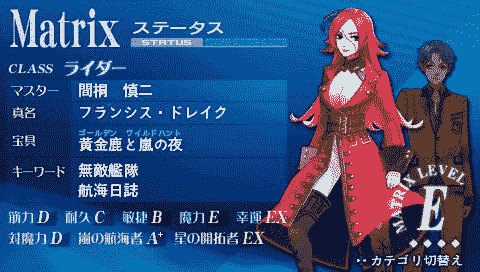
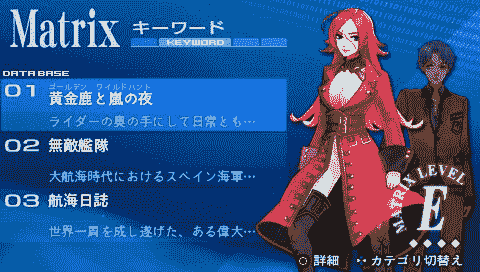
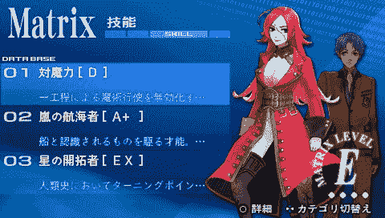
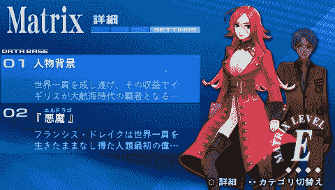

# 【叫辛亥战争是不是太坑爹了】FATE EXTRA

作者：wobuzhidao

TID：10342

<title>1</title> <link href="../Styles/Style.css" type="text/css" rel="stylesheet">

# 1

咳咳，写这个同人有很多原因，不过主要有两个。
其一是本人带领的某只COSPLAY团队闯进本地区CHINAJOY的决赛了，所以比较兴奋。
其二是兴奋之余，团里的各种妹纸“团长”“团长”喊得咱很荡漾，也间接导致我突然对这部作品又重新燃起了爱。

以上
关键字
1，坑大，不过尚浅，误入者尚可爬出
2，剧情量80%，因为才开坑所以GTS情节较少
3，有分支，有DE
4，少年，不来考据吗？

老规矩 发文之前

一楼祭但大

[ *本帖最後由 wobuzhidao 於 2011-6-13 21:38 編輯* ]<title>2</title> <link href="../Styles/Style.css" type="text/css" rel="stylesheet">

# 2

公元2003年代。
社會被網絡徹底覆蓋。由稱作西歐财阀的巨大財閥管理和經營，人類的一切活動和記錄都是他們監視的對象。

“現有的程度以上的技術發展已經不需要了。人類已經得到了樂園。” 西歐財閥通過徹底的資源管理將技術革新封印。人類的技術在2000年代進入了停滯狀態。 正在此時，太陽系最早的物體在月球表面被發現。最先被觀測到的是，只有5厘米大小的立方體。之後得知的是，包圍著那小小的立方體的，遠遠超過人類智慧的未知建築物。 ——Mooncell·Automaton 那是有量子計算機這個魔術性的概念實現的，神的自動記錄裝置。 監視並無一遺漏地記錄地球，並將記錄保存的靈子頭腦，這個在網絡極度發達的世界中，能夠給掌握萬事萬物的結構體，在支配著世界的西歐財閥眼裏，是個絕對不能錯過的存在。

在這個不用說兵器開發連宇宙開發都被凍結的星球上，大部分的指導者只是凝視著虛無的天空，惶恐著。 但是他們卻不知道，Mooncell是靈魂的修道場。它是自古以來招致了許多的魔術師到來的熾天之牢。 月之眼，神的自動記錄，異文名的遺產人工物。 其名為Mooncell·Automaton，但是魔術師們則這樣稱呼它：能夠實現所有人類願望的的，萬能的記錄裝置 能夠解開這個世界的全部真相的最後的奇跡——七天的聖杯………… 第一周，第一日，剩餘人數128人 叮——咚——叮——咚—— 下課鈴一響，我的受信機便開始震動起來。
我掏出受信機，上面顯示著：請到二年級公告欄處查看對戰者姓名。

每個參加這次聖杯戰爭的魔術師都有我這樣一臺受信機，接受來自Mooncell的指示。 所有的魔術師都必須在這次聖杯戰爭的舞臺——月想之海 中戰鬥，而我現在所處的地方，就是魔術師們聚集的月海學院。

在我走到走廊的時候，遠遠就看到了站在走廊上的那名藍發男生，似乎是聽到了我的腳步聲，他轉過頭來看著我。 ！——居然是他。
“喲，沒想到你這麼不走運，一回戰就碰上我的啊，我的朋友。”他還是那副不可一世的神態。
“……啊，沒錯，沒想到這麼快就成敵人了啊。”
“哈，說什麼呢，就算要兵戎相見，我們還是朋友啦，再說，像你這樣的菜鳥如果以別人為對手，恐怕還沒上戰場就被做掉了吧，我的話就不一樣了，只要你說一聲，我高抬貴手也是沒問題的哦。”他這人就是一得意起來話就沒完。
“嘛……這是這個世界的規則，就算要兵戎相見也是沒辦法是的事情吧，我也有我要做的事情，可不能在這裏讓步呢。”
“哈哈，還真想你，那麼七天後決戰上見咯，嘛……雖然你這種菜鳥是贏不了我的啦。”說完他就轉身離開了，嘛……隨他去吧。

唰—— 一個紅色的身影閃現在我身旁。
金色的頭發，瑰麗的面容，火紅的衣裙。
她是我的SERVANT，SABER的SERVANT，在我接受聖杯戰爭資格測試的緊要關頭，回應我的召喚，救了我的性命，現在我們因為同樣的目標站在了一起。
雖然看上去只是個少女，但是卻可以輕松地揮舞她手中那把暗紅的巨劍，實力絕對是SERVANT中數一數二的，只是性格可能有點問題……
“啊——！真是超級不爽啊，奏者你認識的朋友都是這種人麼！”SABER一出現就剁著腳叫嚷著。“朕可是萬中無一的領袖，朕的奏者當然也是優秀的人，那家夥居然這麼說朕的奏者，朕一定會讓他後悔的！”

“嘛……這些都無關緊要了，總之作為戰前的准備，收集情報是必須的，話說你有什麼建議麼SABER。”我岔開話題。 “啊……麻煩的事情別問我咯，不過基本上來講要在這所學院裏好好逛逛吧~”SABER說道。
“嘛……也是，到處走走說不定能有什麼發現……”
“那你加油咯，奏者，朕負責在一旁默默地注視著你。”說完唰的一聲，SABER消失了。

唉，前途多難，還是趕快行動吧，我也離開了原地。 在公告欄上，用馬克筆寫著：
決鬥者： 天河風樹 VS 間桐慎二
……

在校舍的樓頂，我看到了她。 一襲紅衣，一頭亮麗的黑發迎著夕陽和晚風飛舞。
啊……對了，她就是傳說中的“樓頂上的公主”——遠阪凜吧。
“嗯？”貌似是注意到了我，遠阪轉身朝我的地方走過來。
轉眼間，兩個人的激勵靠近了。
雖然穿著高跟鞋，但是她的個頭比我還要矮一些，不過這個高度對於她的身材來說確實最完美不過，晚風把頭發間的香氣吹到我臉上。
喂……怎麼說，這距離也太近了吧，至少對男女之間太近了，我都能感覺到她的呼吸了！
咦？臉上還有柔軟的觸感，啊啊！小姑娘你也太大膽了，面對陌生人就上來捏人家的臉麼！
然而我此刻只覺得腦子像是燒開了鍋爐一樣，思維有點短路了。

“嗯~觸感很真實麼，還會臉紅，這裏的NPC都有這麼豐富的感情啊，看來量子計算機的能力真不是蓋的~”摸完了我她還當著我的面發表了這樣的感想。 “那……那個，我也是魔術來著……”雖然我聲音很小，但是我內心卻在呐喊：我長得就那麼路人嗎！

靜默 一秒鐘
兩秒鐘……

“誒誒誒誒誒~~~~~！！！”樓頂上回響著遠阪凜的慘叫…… ……
……

“這麼說你也是個魔術師咯，真是的，居然穿著跟學生一樣的制服，你存心讓我難堪啊！” “呃……可是我就是個學生啊，雖然對自己成為魔術師也很沒心理准備啊……”
“唉……一看你就是個菜鳥吧，居然隨便跟別人說自己是個魔術師，要是碰上什麼窮凶極惡的家夥，你就不會像現在這樣好好地站在這裏了。”
“是是，我是菜鳥，給你添麻煩了真對不起，我這就走……”
“慢著！”我正要脫身突然又被叫住了“你害我丟這麼大的人不會以為可以就這麼算了吧。”
“呃……那你還要怎麼樣，我可是個菜鳥哦，幫不上你的忙的。”
“嘛~ 我也不是什麼不講道理的人，反正你暫時還不會成為我的對手，不如跟我合作好了。”
“合作？那個……一般來說不是找比較強的人合作比較有勝算麼。”
“這你就不懂了，像我這樣的魔術師都能把你當NPC，也就是說你有不被人注意到的素質，這樣的人收集情報不是最合適的嗎？”遠阪凜微笑著解釋道……稍微有點傷自尊啊。
“啊……不要在意，我不是說你路人相，其實你還是比較……有點帥的，啊不對我在胡說什麼，總之要不要考慮跟我合作。”誒？變成陳述句的語氣了。

“為什麼我非要跟你合作啊……” “嘛……也不是說讓你無條件幫我咯，作為回報，也會教你相應的知識讓你脫離菜鳥的圈子，怎麼樣，對你來說絕對劃算的買賣。”
“嘛……也對，那我就考慮考慮好了……”
“嘛，我就給你時間讓你考慮考慮，別讓淑女等太久哦~”你最多就是個披著淑女外殼的……那啥……

唉……被糾纏了好久呐……總之，合作這件事情，也問問SABER的意見好了。 “SABER~”我呼喚道。
唰——
一直隱藏在我身邊的SERVANT瞬間閃現出身形。
“可以哦，合作的話。朕完全沒有意見。”
“啊咧~你倒是比我還果斷……”
“嗯哼~那當然，果斷是領袖必要的素質，優柔寡斷怎麼能成大事，再說那小姑娘，朕也很中意呐~”喂SABER你節操掉了麼。
嘛，現在看來跟遠阪凜合作確實比較靠譜。

滴滴滴—— 受信機突然響了。
我將其掏出查看，發現有一條新信息：

到弓道場門口來 ——間桐慎二

…… “也就是，你要我跟你合作？怎麼，我們不是對手麼，怎麼會想到跟我合作呢。”我謹慎地盯著慎二的眼鏡，雖然跟他做了多年的朋友，但他的為人我還是拿不准。

“哈，你居然這樣問我，像我這樣的人物動找你合作你居然就這種態度麼，我說你也稍微看清楚狀況啊，你也該知道現在就跟我為敵是毫無勝算的吧……”這時，從慎二的背後閃現出一位個頭高挑，身材火爆的女性，她有一頭精幹的粉色頭發，穿著和頭發一樣的革質軍裝， 如果不是因為臉上那道長長的傷疤，她的美貌還要增值好幾倍，但即使如此，她站在那裏也散發出擋不住的魅力與威嚴。

“怎麼樣，看到我的SERVANT，感受到壓力的吧，該明白選擇跟我合作才是明智之舉吧。”慎二得意地靠著他的SERVANT說道。 唰—— 紅色的SERVANT閃現在我身邊。
“奏者喲，要說的話，我可不願意跟這種人合作，不過最終決定權在你……”SABER充滿敵意地盯著對方。

怎麼辦，遠阪凜和慎二同時向我伸手，我該選擇哪邊……（能讓我先存個檔麼？） 1-接受慎二的提議……（跳至3L）

2-接受凜的提議……（跳至4L）

[ *本帖最後由 wobuzhidao 於 2011-6-12 05:35 編輯* ]<title>3</title> <link href="../Styles/Style.css" type="text/css" rel="stylesheet">

# 3

畢竟是好幾年的朋友了，雖然他的人品值得考慮，不過應該比素不相識的遠阪同學要可靠一些吧……
“好吧，我接受你的提議，不過你得告訴我你的計劃。”
“哈，這才是明智之舉，現在我們找個地方詳細地講述下我的計劃。”慎二看到我答應下來，變得更得意了。

…… “哇~好厲害，奏者現在的樣子好可愛！”紅色的SABER把眼睛瞪得大大的，端詳著我，我看她眼睛都塊放出光來了。
周圍的一切都變得十分巨大，其原因是我的身體被縮小到了原來的百分之一。

“哈，怎麼樣，見識我的厲害了吧，要知道我們所有人都是以數據的形式存在於這個世界中的，雖然它也有它的防禦機制，但是對於我這種高端的黑客來說，根本就是千瘡百孔，像這樣修改一下你的外形特征簡直是易如反掌。” “話說，雖然這種大小不容易被發現，但就這麼去調查情報也是很危險的啊。” “哈？難道你還不知道，在非戰鬥區域，魔術師根本不會受到實質性的傷害麼，只要你不進到那個月想海中，就根本不會有生命危險，我這麼說你明白嗎。”慎二不耐煩地說道，看來我對於這個聖杯戰爭還真是有很多地方不明白。

“話說，有這麼方便的能力，你為什麼不自己去？”我再次發出疑問。 “笨蛋，本大爺的才能當然要用在更合適的地方，如果我也親臨前線，誰給你做後援啊！”
“啊……我明白了，那麼就開始行動吧……。”

接下來，就是在校園中調查了，我這種大小的身體果然不容易引人注目。 不過變小了之後行動反而不方便啊……至少我連校舍的臺階都爬不上去啊，這可傷腦筋了啊……

要是一直這麼看著樓梯可是什麼事情都做不了的…… “咚——咚——咚——”突然從地面傳來有節律的震動，我不禁回頭張望。
啊，是一名栗色頭發的女生朝這邊走了過來，她穿著二年級的女生制服，面無表情，看樣子是個NPC。
只見她走到鞋櫃前，規矩地將校鞋脫下，整齊地擺進鞋櫃，然後繼續朝臺階的方向走了過來。
震動繼續傳來，只是感覺變得軟綿綿的。

突然閃過一個念頭…… 嘛，就搭一下便車好了。我站在女生的必經之路上等她過來，看樣子她並沒有注意到我，那麼久在她經過我的一瞬間，爬到她的腳上，然後一口氣到二樓去吧。
……
咚——咚——
震動離我越來越近，話說這身高的差距產生的壓迫感還真是強烈，我的脊椎不停地告訴我遠離震源，但是大腦告訴我，不能錯過這個好機會。
只要抓住機會爬到她的腳背上就行了，不是什麼難事，計算無誤，時機無誤……我不停地告訴自己。
人算不如天算……
在女生靠近我的過程中，我突然看到了不得了的東西——那是，位於女生短短的裙角下的，一抹黑色的布料。

嗚啊——那不是禁忌的景象麼，原來變小了還有這種福利……噗哇！ 因為看到巨大女生的內褲，而完全忘記了幾秒鐘之前自己完美的計劃，結果在發愣中，視野突然變暗了。

時間仿佛停止了似的……劇痛在全身流竄。 我記得，在這之前，巨大的黑色物體向我壓了過來，再仔細回想一下的話，壓過來的巨大物體，應該就是那個巨大女生的右腳……
穿著黑色長筒棉襪的右腳……

也就是說她一腳踩在我身上了。 腦子飛快的運轉著……
第一，關於在非戰鬥區不會受到傷害，慎二似乎沒有騙我，不然這一腳絕對會把我像蟲子一樣踩得四分五裂。
第二，雖然不會受到傷害，但還是非常疼……關於這個回去之後我一定要把慎二這個家夥揍一頓……
第三，等這只腳再抬起來的時候，該女生的左腳已經在前面的地方了，也就是說我沒有機會實施剛才的計劃了，除非等下一個女生，啥？你說為什麼是女生？難道要我搭男生的便車麼，呃……想想都惡心……

總而言之，現在是必須當機立斷的時候，我一咬牙，用雙手死死地抓住了壓在我身上的棉襪。 思考停止的時候，時間仿佛又開始流動了，壓著我的巨大腳掌抬了起來，將我從無盡的壓力中解放，然後我被提到了空中，又重重地落下去……

噗哇哈——！這次的沖擊比第一次還要重……但是我不能松手，現在松手的話，就會被留在臺階上，那將是個進退兩難的境地…… 接下來的幾十秒，對我來說就像幾個世紀一樣難熬，有誰能理解被人踩在腳下，卻又迫於形勢不能離開的苦衷啊！還不如還我一個血肉之軀讓我撲哧一下被踩死一了百了啊！

終於到了二樓了，我就像那個從馬拉松跑到雅典的傳訊者一樣，在到達勝利的彼岸後脫力地松開了雙手。 咚——咚——咚—— 女生的腳步聲離我遠去，就像為慶祝我勝利擂響的戰鼓一樣……
話說她居然都沒有發現有一個生命掛在她腳底下，她到底有多遲鈍啊，我還指望她發現我然後帶我上來……算了，不能這麼指望一個NPC……

哈……我使勁吸了口氣，剛才那個女生腳上的味道還殘留在我周圍…… 哇，心跳加快了，女孩子的味道對男生來說就是興奮劑啊，不管哪的味道都一樣……

因為沒有實質性的受傷，所以疼痛也消失了，總之……不能繼續躺在這裏了，很可能被路過的人踩到。 我站起身來，四下打量，話說，剛才那個女生進到那邊的教室裏去了吧，誒？我記得那邊的教室應該是無人使用才對。
過去看看好了。

對那個女生來說不過是左拐幾步的路程，我卻走了好幾分鐘。累死了……好不容易走到了那間教室的門前，從門板下面的縫隙爬了進去。 “啊咧？我明明看見她進到這裏來的……”教室裏空無一人。 這是怎麼回事，我掏出手機打給慎二，把這件事情告訴他。
“啊……你真是笨得可以，那間教室是魔術師自己房間啊，那扇門會識別魔術師的身份然後把進門的魔術師傳送到他們自己的房間去，NPC根本進不了那扇門。”慎二不耐煩地解釋道。
“也就是說那個女生真的是魔法師啊……”
“啊，沒錯，不過你想進到人家的地盤去，還得等我幫你破解她的個人信息。”
“原來如此……”
“總之你繼續努力吧，風樹，我等你的調查有新的進展哦。”說完慎二就掛了電話。

這家夥還真是悠閑，不過他還真是知道不少東西。 啊咧？總感覺房間的色調變紅了。
……
啥時候，桌椅被堆到牆角去了，還在上面鋪上了好大一塊紅色絨布，弄成了一個王座的形狀，雖然東西很簡單但看上去相當氣派。
“恩哼，果然要這樣看上去才稍微順眼一點，那種單調的教室怎麼可能作為我跟MASTER的房間啊。”
SABER……你的才能能在更有用的地方展現出來就好了……
搞完裝修的SABER心滿意足地坐在來她的“王座”上，那氣勢還真像個國王……可能說是皇帝也不過分，搞不好她以前就是幹這行的，要不怎麼總說“朕”啊“朕”的……
而且，現在SABER和我體型差距有一百倍啊……她雖然是個女生卻用男人的姿勢坐在那裏，更那啥的是，她的戰裙也是男式，也就是說正面是敞開的……總之就是那裏都被看光了的意思……

“恩？奏者喲，你怎麼了，感覺到你的魔力有波動呐，難道是看到朕威武的樣子而感到激動了？” 嘛，是很激動，不過是從別的意義上講，總之不要在意細節……
“既然奏者這麼欣賞朕的儀容，就請盡情地將其印在腦海裏吧，正好朕也累了，在此稍作歇息好了。”
過了一會兒，SABER居然坐著睡著了，看她的睡相還真是毫無防範啊……而且口中還念念有詞，那是在唱歌呢還是在講夢話呢？
總之經過剛才那事，我也累得夠嗆，稍微休息下吧，話說總不能這樣躺地板上吧，SABER坐的地方有紅色的絨布垂到了地上，應該可以用來當當墊子。

……這是怎麼回事，走得離SABER越近，心跳就越快，從下方仰望她的睡臉，不禁心潮澎湃，那張精美如雕塑的面龐上仿佛同時閃耀著日月的光輝，白金色的發絲從側臉垂下，配上她鮮紅的服飾，宛如盛開在驕陽下的一朵玫瑰。 結果真如SABER所說，我看著她這樣的面容入了迷，想要走得更近，卻注意到那雙落在地板上的金色戰靴，和懸在地面上的半透明的襯裙，卻隱隱有種拒人千裏之外的感覺，這大概是她的那份傲慢吧，說起來，對於她的事情，我還一點都不了解呢……不，可能我連我自己的事情都不是很了解，這樣的我，怎麼有資格去靠近她……

……結果等到SABER醒來，都已經天黑了，這個時候校園裏早就沒人了啊，再到處亂晃也是徒勞，不過受信機上卻顯示：月想海的第一層已經開放。 到了晚上，魔術師們就會紛紛進入月想海，尋找通往下一層的鑰匙，只有找到了鑰匙的人才有資格參加決鬥。 因為晚上校園中沒有NPC，所以也可以讓SABER自由行動了，因為是自己的SERVANT所以搭便車也是名正言順，SABER衣服上帶著流蘇的肩章正好成了我的座位。 就這樣，我們進入了月想海。
電梯的入口只是校舍一個普通的安全出口，但是從另一邊出來，風景卻完全不同。
之所以叫月想海，就是因為它看上去就是一片海洋，其中搖曳著斑斕的光芒，各種各樣的魚類在水中穿梭。不過我們魔術師則只能在Mooncell限定的區域活動，這些區域是由不知道為何種物質構成的透明的迷宮，就像在水族館裏一樣，雖然看上去給人一種很不踏實的感覺，不過貌似從來沒出過問題。

然後，在迷宮的一處路口，我看到了慎二，和他一起的，當然是他的SERVANT。 “喲，還真是辛苦你了，風樹，這麼晚了還出來收集資料。”
“嘛，既然是在合作中，多幹點事情不是顯得比較有誠意麼。”
“哈哈，那是，我們可是朋友一場啊，說起來一直讓你做收集情報這種差事也太虧待你了啊。”
“哪裏哪裏，你也告訴不少有用的信息了，而且我沒打算只收集情報啊，”
“哦？那就是說你也打算戰鬥咯？有趣有趣，不如讓我看看你的SERVANT的實力吧……”
“哈……你真會開玩笑……”

呯——當—— 金石轟鳴之後，我發現SABER的劍橫在了我的前方，一股沖擊波帶著熱浪從我兩邊劃過，在慎二的身後，那個粉色頭發的SERVANT右手舉著一只火銃對准了我，火銃的槍口還冒著煙，如果不是SABER反應快，那一槍必定會直接命中我的身體。

——只要你不進到那個月想海中，就根本不會有生命危險，我這麼說你明白嗎—— 腦中回響起慎二說過的話……身體居然因為恐懼而在一瞬間麻痹了。
“……喂……你這家夥，來真的麼……”我顫抖著說……
“哈哈，抱歉我只是想試試你SERVANT的實力罷了，不過……接下來可沒這麼輕松了！”慎二的語氣突然轉變，隨之而來的是從那個SERVANT身上散發出來的驚人的殺氣。

“危險！”SABER的左手伸過來將我握在掌心，同時右手揮劍擋下一發子彈。 當——
然而與此同時，慎二的SERVANT卻從原先站的地方消失了。
“噗哈——”發出慘叫的是SABER，似乎是從背後受到了巨力的沖擊，SABER整個人帶著我朝一邊飛了出去，重重地撞在牆壁上，然後滑落到地面，SABER仍用左手將我護在胸前，然而一滴溫熱的液體落在我的身上，把我的視野染紅了……
“SABER！你不要緊吧……”
“咳咳——”SABER沒有回答我，而是死死地盯著慎二的SERVANT，對方已經再次對我們舉起了火銃……
“慎二……這到底是為什麼……”我恨恨地問道……
“哈哈，你問我為什麼，那麼我最後告訴你一個知識，在聖杯戰爭裏，弱肉強食是絕對的法則，你要怪就怪你自己太弱了吧，哈哈哈哈~”
我看到慎二的SERVANT手指扣扳機的動作了。

哐—— 突然，一道紅色的電子牆橫在了我們和對方二人之間，慎二的SERVANT扣動了扳機，子彈卻完全沒能穿過牆壁。
“切……又是Mooncell的保護機制，這次算你命大，下次可沒這麼便宜了。我們走……RIDER。”慎二和粉色的SERVANT轉身消失在月想海的深處。
RIDER的SERVANT……麼，慎二這麼報出SERVANT的職介，看來是完全沒把我們當做威脅，不過現在當務之急是逃離月想海。
“SABER，還能動麼！”
“唔……勉強……”
“抱歉，我當初如果聽了你的勸告的話……”我滿心愧疚地道著歉。
“不用多說了……奏者，誰都會有因為一時得意而失足的時候……”很意外的，SABER並沒有責怪我，看她的眼神，反而更多地流露出悔恨。
那絕對不是因為剛才的事情，一定……SABER她一定有著不為人知的過去……

回去的路上，我們誰都沒有再說一句話，SABER只是將我牢牢地攥在手心裏，雖然我被壓得幾乎喘不過氣來，但是並沒有一點掙紮的念頭。 直到走出了月想海，SABER終於撐不住，回歸到靈體狀態。 我一個人走在寬闊而黑暗的校舍走廊上。
“還不能就此結束，或許明天，去找遠阪凜幫忙……”我這樣盤算著。
咚——咚——
似曾相識的震動聲從身後傳來，我轉過身，看清了出現在我身後的巨大身影——是白天帶我上樓的那個女生，在她的身後，貌似還有另外一個人。
等另一個人完全走到和女生並排的位置，我才發現，另外一人，其實是一位穿著和式祭祀服的少女……更奇特的是，這位少女頭上生著一堆毛茸茸的耳朵，背後貌似還搖著一條蓬松的大尾巴，怎麼看都是一只狐狸啊……
“啊咧，原來是你。”那個栗色頭發的女生說話了。“下午我還在想那股魔力是誰，如果是這種體型的話，也難怪我當時沒有發現呢。”
狐狸少女聽到女生的話，也蹲下來，撲扇著大眼睛盯著我看。
貌似陷入了某種不妙的境地了，這兩位看上去也是一對MASTER和SERVANT，從立場上來說的話……
是敵人
在我做出判斷的同時我下意識向後邁了一步，然而同時感到衣服的後領被提起來了。
狐狸少女用一根手指的指甲將我輕輕挑了起來。
“CASTER，對於你來說這可是不錯的獵物哦，魔術師雖然體型變小了可是魔力的量是不變的哦，這簡直就是掉在路邊的魔力源呢。”
“哦哦~ 那還真是走運呢，那麼MASTER，就把這個作為探索完月想海的補充好了。”狐狸少女一邊贊同著栗色頭發女生的話，一邊若無其事地將我丟進她的口中。

“啊啊啊啊啊啊~~~”身體在自由落體中墜入了一條柔軟的隧道，那是狐狸少女的喉嚨，然後毫不留情地，將我咽了下去。 有生以來第一次體驗到落入別人食道的感覺，向上……看不到光明，向下……是無盡的絕望。
沒過多久，我掉進一個柔軟的空間，大概是那位狐狸少女的胃袋吧，四周彌漫著點心和綠茶的味道……說起來英靈並不是像人類那樣消化食物，而是直接從食物中抽取魔力……所以這裏並沒有多麼恐怖的事情發生。
然而沒有恐怖的事發生，不代表我所處的境地不絕望，魔力正飛快地從我身上流走，也完全感覺不到和SABER的聯系。
很快，我躺在那些食物的殘渣中沒有力氣再動彈了，狐狸少女的胃壁緩緩蠕動著。
如果說消化對於食物來說是一種極刑……那麼這種吸取魔力的方式就是一種安樂死吧。

……又過了不知道多久，周圍的食物已經完全消失了……我卻還留在空蕩蕩的胃袋內，此刻，我的魔力早已被吸收殆盡，生命力正代替魔力從身體中流出…… 最後，那一刻終於到來了……我的外形開始崩壞，從腿部開始，變成一塊塊虛無的碎片，然後消失在周圍…… 在這個時候，我隱約記得，我死過一回，但是這次的死，卻不如那次的痛苦，這次的死，只是我靈魂的數據被Mooncell剔除的結果，所以，我大概也會回到之前死後的狀態吧……
總之，這裏的事情，都跟我沒關系了……

DEAD END1 藤村大河：哦哈~ 這裏是老虎道場，本人是藤村大河，不是老虎哦~ 伊利亞  ：哦哦哦~這裏是在本篇中沒有出場的弟子一號~
藤村大河：這麼早就透露自己不會出場大丈夫噶？
伊利亞  ：嗯……可以的話我倒是希望追加我的劇情，不過要看作者怎麼想了……
藤村大河：嘛……好好表現的話說不定就可以在本篇出場了，那麼接下來進入正題~
伊利亞  ：喲西~老虎道場第一期正式開始~
藤村大河：我們的男主還真是不走運啊，在月想海裏SERVANT被打傷，出來又碰到新的敵人，連對手是誰都沒弄明白就回老家結婚了呐~
伊利亞  ：說到底，怎麼能挑選會襲擊隊友的人做同伴咧。
藤村大河：完全正確，所以通過言行辨別一個人的品行也是非常重要的哦~
伊利亞  ：就好像通過名字就可以判斷師匠是老虎~
藤村大河：嗷~不要叫我老虎！那麼各位，回到之前的地方，慎重的做好選擇吧~

[ *本帖最後由 wobuzhidao 於 2011-6-12 13:06 編輯* ]<title>4</title> <link href="../Styles/Style.css" type="text/css" rel="stylesheet">

# 4

雖然和慎二做了幾年的朋友，不過他的品行還是有待考量，而且也要考慮SABER的感受，再說，本來是決鬥對手的人要來合作，怎麼看夜不合適啊。

“那個……慎二，很感謝你向我伸出援手，不過我有我自己的想法，所以你的提議我拒絕。” “哈，你還是老樣子，一點都不識時務，也罷，作為朋友我對你也算仁至義盡了，以後被我打得屁滾尿流可不要求饒哦”慎二似乎也不是很意外的樣子，看來他也早就料到這一步了。
“既然這樣，我就告辭了。”
“不送~”

…… 因為暫時不是敵對立場，所以和遠阪凜的合作也沒有什麼太大問題，我要做的事情就是盡可能地在校園裏兜圈子，然後把看到的事情都告訴遠阪凜，她會從其中整理出有用的情報。

這個時候校園裏沒什麼人啊，大部分學生都在食堂吧……那就去食堂看看好了…… 食堂的位置在校舍的地下一層，所以我要做的事情就是下樓。
就在這時候，站在三樓到二樓樓梯上的我，看到了一個栗色頭發的女生，正走向二樓的一間教室。

這個時間不去吃飯嗎？而且那邊的教室貌似空閑狀態來著。 那個女生，雖然看上去學校裏普通的NPC一樣，但是總感覺有什麼地方很熟悉……
總之跟過去看看，說不定能有所發現。

躡手躡腳地走到二樓，偷偷地看著那個女生走進了那間教室。 等她進去之後關上了教室的門，我才走到門前，打算偷偷觀察裏面的狀況。
話說這是尾行啊，是犯罪啊！

教室的門沒有鎖，我打開一條門縫偷偷觀察裏面的狀況。 咦？教室裏面並沒有人，為了確認我推門進去，但是在裏面並沒有發現剛才的女生。
真是奇怪了，難道這個教室有什麼機關不成。

我把這個事情告訴了遠阪凜，得到的回應卻讓我很意外。 “你啊……真是什麼都不了解啊，那間教室是Mooncell分配給每個魔術師的據點，只要走過那扇門，就是屬於你自己的平行空間了，一般來說，沒有得到主人的允許，其他的MASTER和SERVANT是無法進入這個空間的。”
“哦……也就是說這是屬於我跟SABER的地盤咯。”
“嘛……可以這麼理解，不過這樣一來也可以確定那個女生也是魔法師了。你可以試試再從她身上獲得些情報。”
“了解。”
……
啊咧，什麼時候，教室裏擺放整齊的桌子都被堆到窗戶之間了，而且還在上面鋪上了好大一塊紅布。
“既然已經是朕的領土了，就不能顯得那麼寒酸，恩恩。這樣看上去舒服多了。”
SABER在那中間翹著二郎腿坐了下來，和背後紅色的背景組成一幅氣派華麗的畫面，一幅君臨天下的樣子……恩，如果能添置點家具就更完美了，不對現在不是考慮這個問題的時候。
我推門出去，SABER還在自己的王座上自我陶醉中，嘛……讓她休息一下好了，反正在校園裏也不是必須攜帶SERVANT。
結果剛出門，我赫然發現剛才我尾行的那個女生就站在我面前。從她面無表情的臉上完全看不出她在想什麼。
“貌似你剛才找我有事？”女生先開口了。
“呃……那個，也沒有什麼特別的事情……只是……”我一時不知道如何回答，總不能說我是來收集你的情報的吧……
“嘛……你沒事找我，不過我有事找你哦~”女生露出一抹難以解讀的微笑。“跟我進來吧。”說完她居然主動牽住我的手，在我反應過來之前，她把我拉進了教室。
雖然是經過同一扇門，不過這裏面卻和我剛才進去的那個教室完全不一樣，教室裏的桌子被拼在一起，上面還擺放了和式的屏風，就像是傳統的和局一樣，給人一種寧靜的感覺。
在那些桌子上，坐著一名少女，少女穿著和式的祭祀服。粉紅色的頭發中伸出兩只狐狸耳朵——這是犯規啊！
“哦呀MASTER，有客人來了喵，咱去倒茶。”狐狸耳朵的少女起身去給我們沏茶，同時露出了屁股後面毛茸茸的狐狸尾巴——好可愛。
晃啊~晃啊~ 狐狸少女沏茶的時候，她的大尾巴一直在搖來搖去，似乎心情很好的樣子——那條尾巴，真想抓一下試試。
“咳……咳……”栗色頭發的女生，也就是狐狸少女的MASTER用咳嗽聲把我的注意力強行拉回來。
“啊……啊，請講。”意識到自己的失態，我連忙坐正，擺出一副很嚴肅的姿態。
“我想有些東西你會很感興趣。”女生把一個信封放到面前。
打開信封，裏面居然是慎二的SERVANT的資料，非常詳細，從背景到能力一應俱全，這種程度的資料可是決鬥時制勝的要素，知道對方SERVANT的底細，也就等於能夠更容易地預測對手的行動，從而采取合理的方法反制。
“你……是怎麼搞到這個的……”
“嘛……這個要問他了……”說完，女生的手上多了一樣東西……不，與其說是東西，不如說，是個小小的人……而且那個人，怎麼看都像是間桐慎二，慎二的手被反綁著，嘴巴被堵著，一點反抗的餘力都沒有。
“這是怎麼回事？”
“嘛，通過修改自己的體型數據來達到偵查的目的，本來這個方法挺不錯，不過他的運氣不好，我的SERVANT是CASTER，這整個房間都有預警結界，就算是一只蚊子飛進來也會被察覺到。”
“這家夥不知道何時附在了我的腳上，就這麼被我帶了回來，然後在進屋的一瞬間就被我的SERVANT發現了。以他的體型，根本就無法反抗我們，所以就落到了這個下場咯。”
“當然，這些資料也都是通過拷問他得到的，雖然校園中無法對魔術師造成實質性的傷害，不過還是會受到皮肉之苦的。”說著女生講縮小的慎二在我面前晃了晃，慎二眼中滿是驚恐，我似乎還隱約在他身上聞到了女生的腳汗味……

“那個，你是想把這些情報交給我麼，不過我可沒有與之相當的東西用來交換啊……” “嘛……這些材料當然是給你的，不過我也不是什麼濫好人，你只要答應我一件事情就行了。”女生說道。
“一件事？是什麼呢？”
“現在還不能告訴你，等時機到了之後我會告訴你的，放心，不會太為難你的。”
“呃……那就好……順便請問一下，可以把慎二放了麼，我和他之間應該是公平決鬥，這次我得到了他的資料，也要給他時間去收集資料吧……”
“嘛……隨你，反正他對我也沒有用了，我的SERVANT連他的魔力都抽幹了呢。”
……
“那麼，我就此告辭了。”
“恩，不送。”
“誒誒誒？客人要走了？咱剛把茶沏好的說~”狐狸尾巴的少女端著茶盤過來了。
“嘛，多謝款待~”我抓起茶杯一飲而盡。
……

“喂~你在的吧，慎二的SERVANT~”弓道場裏四下無人，不過她應該在這裏。 唰——
隨著我的呼喚，穿著革質軍裝的大姐頭閃現出來。
“呐……把慎二帶回去吧……”我將縮小版的慎二遞給她。
“呀咧呀咧，我早就勸過他，這麼去收集情報太欠考慮了，這下倒好，連我的情報都出賣給你了呐，攤上這樣的MASTER還真是頭疼呢。”慎二的SEVANT苦笑道。
“吵死了，你怎麼能這麼說你的MASTER。”慎二不滿地回嘴。
“所以我說MASTER，你好歹有了這次教訓要好好反省一下啊。”說著，慎二被她的SERVANT抓住，插在自己的乳溝中。
“嗚啊，好難受，透不過氣了，RIDER！”慎二的SERVANT胸部真是大呢……
“嘛，雖然這次自己的資料都泄露了，不過你可別高興得太早，小子。”無視了自己MASTER的叫喊，RIDER正色說道，“情報什麼的不過是輔助，SERVANT的強弱才是最根本的決勝要素。”雖然居於不利條件，但是RIDER的意氣絲毫沒有減少，看來會是強大的敵人啊……
“多謝提醒，那麼我們決鬥場上見吧。”
……
嘛，今天的調查就到這裏好了，收獲算是不小吧……
回到那間只屬於我跟SABER的教室後，SABER已經在她的位置上打起盹來，我也在SABER身邊坐下來稍微休息一下。
回想一下今天遇到的事，先是被神秘的女生請去喝茶，然後看到了慘兮兮的慎二，話說我還真好奇慎二到底被怎麼對待了呐，畢竟對方是兩個女孩子，其中一個還長著超~可愛的耳朵跟尾巴……不過在那種體型差距的前提下被拷問一定也很難吃得消吧，別說最後魔力還被抽幹了，簡直像快破抹布一樣被丟回去了……這麼形容自己的朋友或許不太好吧，不過也是他自作自受呢……
“嗯哼……嗯……”耳邊傳來細小的聲音，轉頭一看，呈現在我面前的是SABER皎潔的面龐。
在說夢話麼，這家夥，聽起來貌似還有旋律跟節奏，在夢裏唱歌麼……
啊，不妙了，一旦注視著SABER的臉，視線便無法移開了，月光一樣的皮膚，太陽般耀眼的臉頰，微卷的而細長的睫毛，加上臉邊垂下的白金色的發絲，她簡直就是人間最完美的藝術品……不，這只是對於她的容貌而言，事實上，我還絲毫沒有觸及到她的靈魂，她的內心在想些什麼，也是完全不知道，想到這裏，我不禁有些沮喪。
“嗯……啊咧……奏者喲，你怎麼……咳咳！MASTER你怎麼趁著人家休息的時間盯著人家的臉看，這是很失禮的！”清醒了的SABER迅速紅著臉跟我保持了距離，不過她貌似很慌亂的樣子，以至於對我的稱呼都變了。

“啊……嘛……只是看著你睡著了，突然很好奇你生前的事情來著……說起來……關於你的事情我還是一點都不知道呢……”我解釋道。 “我的事情……奏者啊……你要相信餘，有些事情到了時機，餘自然會告訴你的，話說回來奏者你也沒有告訴我你的事情呢。”
“這個……”我一時語塞，“不……也不是我故意瞞著你……只是，來到這裏之前的事情，我一點都想不起來呢……”
“啊……抱歉，奏者，朕沒想到這種可能性……”SABER有點後悔地道歉。
“嘛……也不是什麼大不了的事情，比起這些過去的事情，還是先把迫在眉睫的事情處理好吧，接下來就是我們的並肩作戰了哦，一起加油吧~”我給了SABER一個真誠微笑，向他伸出了右手。
“嘛……幹嘛用這麼別扭的說法……不過我相信我不會選錯MASTER的。”剛才還有點扭捏的SABER突然換上了爽朗的笑臉，將右手回握過來。
在弄清各種各樣想要知道的事情之前，這份互相信任的心情不能改變，這麼約定吧——

幾天後的決鬥，RIDER果然是強勁的敵人，即使在我們情報占優的條件下，還是陷入了苦戰，如果不是已經調查清楚她的底細，SABER根本無法躲開她的寶具。 那是，有著黃金鹿與暴風夜(Golden Wild Hunt) 之名的寶具。
漫天的炮火從無數的艦船中傾瀉而出，那是曾經稱霸北海的無敵艦隊的再現，如果不是事先做好准備，恐怕我們早就被炮火吞噬了吧。

不過在RIDER寶具的洗禮之後，她的戰意反而有所下降，最後SABER險險地取勝了。 “嘛……你也算是實力強勁的對手呢，仔細收集情報然後小心應戰這種事不符合我的風格，能和你一戰也算是個不錯的經曆……”在消失之前，粉色的RIDER這樣說道，雖然慎二還在不停地抱怨。
“朕也很欣賞你，希望有一天能再跟你見面呢……”

至此，一回戰結束。 碰到的第一個敵人就如此難以應付了，不曉得今後會怎樣呢。

MATRIX GET
<ignore_js_op></ignore_js_op> **1.jpg** *(52.27 KB, 下載次數: 0)*

[下載附件](forum.php?mod=attachment&aid=MjQ4MDF8NTQxY2U1ZTF8MTYwMDg5MTYwM3wxODIzMHwxMDM0Mg%3D%3D&nothumb=yes)

2011-6-12 05:34 上傳

<ignore_js_op></ignore_js_op> **2.jpg** *(48.55 KB, 下載次數: 0)*

[下載附件](forum.php?mod=attachment&aid=MjQ4MDJ8ZjQzY2Y5OWJ8MTYwMDg5MTYwM3wxODIzMHwxMDM0Mg%3D%3D&nothumb=yes)

2011-6-12 05:34 上傳

<ignore_js_op></ignore_js_op> **3.jpg** *(49.01 KB, 下載次數: 0)*

[下載附件](forum.php?mod=attachment&aid=MjQ4MDN8NTFlNDdiNWN8MTYwMDg5MTYwM3wxODIzMHwxMDM0Mg%3D%3D&nothumb=yes)

2011-6-12 05:34 上傳

<ignore_js_op></ignore_js_op> **4.jpg** *(47.65 KB, 下載次數: 0)*

[下載附件](forum.php?mod=attachment&aid=MjQ4MDR8MTAyNGNkOWV8MTYwMDg5MTYwM3wxODIzMHwxMDM0Mg%3D%3D&nothumb=yes)

2011-6-12 05:34 上傳 <title>5</title> <link href="../Styles/Style.css" type="text/css" rel="stylesheet">

# 5

> 原帖由 *Yagami_ray* 於 2011-6-12 05:49 發表 
> 
> 莫非无知君参加的是有sos团参加的第六次圣杯战争。

啊拉 倒不是第六次圣杯战争 若果是那个的话我会标明是二次同人的

一楼的梗只是因为实在找不到合适的配色了（拖

再考据一下吧 骚年<title>6</title> <link href="../Styles/Style.css" type="text/css" rel="stylesheet">

# 6

> 原帖由 *lxt123456* 於 2011-6-12 11:14 發表 
> 依然是巨型女兵器，一看到战争标题的就知道了，以上非排斥，请勿吐槽。7" />

……乃大约一点文章都没看 都不知道 辛亥战争 在二次元特指啥么2333<title>7</title> <link href="../Styles/Style.css" type="text/css" rel="stylesheet">

# 7

> 原帖由 *rce* 於 2011-6-12 13:01 發表 
> 个人觉得……EXTRA还是不如正统来的好啊……

嘛~ 也看个人爱好，主要是正作好久没出新玩意了- - 在ZERO TV化之前也有不少人寂寞难耐跳这个坑的
PS：其实初代的红SABER跟千和的狐狸萌度爆表~<title>8</title> <link href="../Styles/Style.css" type="text/css" rel="stylesheet">

# 8

> 原帖由 *Shirou* 於 2011-6-13 21:30 發表 
> FATE浮出水面都要顶起……漫画看不到小说也好啊！

哇-

土狼都出现了！<title>9</title> <link href="../Styles/Style.css" type="text/css" rel="stylesheet">

# 9

> 原帖由 *18X* 於 2011-6-16 12:09 發表 
> 哥一直認為caster的話還是配上類似宗一郎這樣的體術帝才是王道啊！
> 
> …………
> 已經完結了？

哪敢完结……这才第一战 这个坑全填完估计至少有五万字吧2333