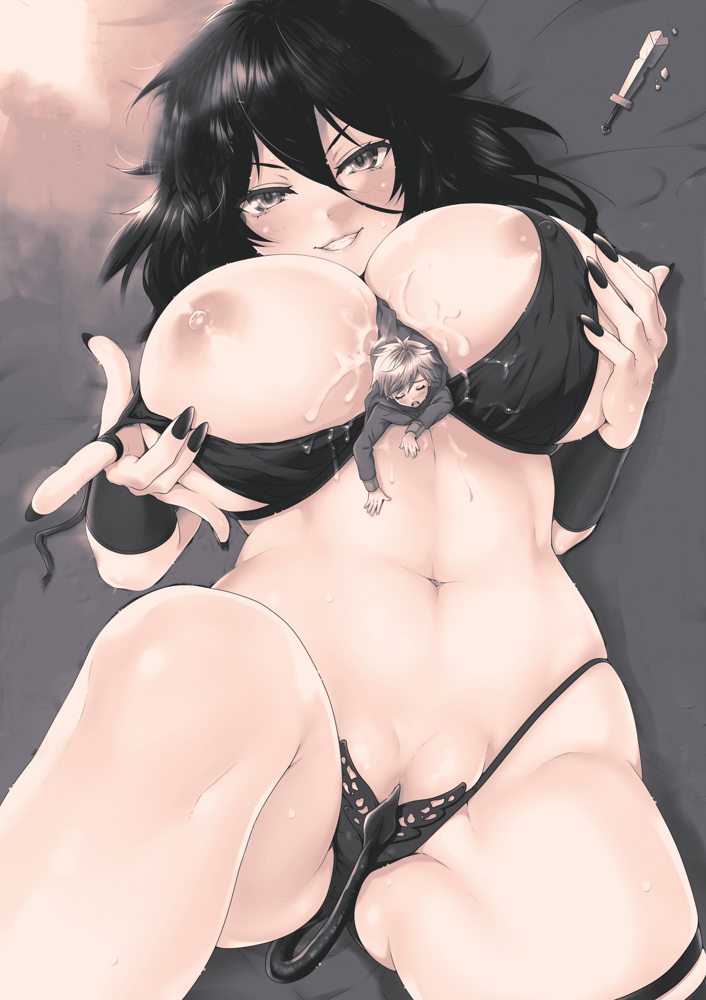

# 【小说】《猎欲帝国》，文游整合修正版。

作者：J_恋舞

TID：21585

<title>1</title> <link href="../Styles/Style.css" type="text/css" rel="stylesheet">

# 1

话说，懒，乃人之本性。
鄙人也是，懒到家了，从来没有回帖的习惯，导致一年买漫画勋章花了12000积分，结果直接啥都看不成了。
看来不能不行动了，所以，来发个文混点积分吧。。。

说是文，其实不是我自己写的，其实是一个类似于演绎的文字游戏，嘛，大体框架和故事背景结构还是我构思的，然后由大家带入自己的角色。

因为是GTS题材的，文中会出现少许的福利内容，但是也不太多，因为文里的成年人太少了。。。

下面是整理之后的文游，GTS部分还没出现，就先骗一波积分，会更新的。。。

帝国北部的一个看起开有些荒瑟的城镇上，一栋冒险者协会的大门正敞开着，而“勋”一个人,正在协会酒吧的吧台边静静坐者，孤独的等待着，等待第一个找上门来的人。

一整天不知不觉就过去了，傍晚时分，勋貌似终于觉察到的什么，他抬起头，饮尽杯中最后的酒。“是不是有人要来了呢？”

此时，名为“修”的浪客，来到了这人迹罕至的小镇。
“咦？这里居然有个冒险者协会，有点意思呢，进去看看吧……”

见到有人走进来，勋定睛望去，顿时脸上露出了微笑：“啊哈老伙计，没想到会是你！”勋看到了自己的老熟人，眼神中闪过一丝惊喜，“阿舞，柳儿，凯琳，看看谁来了！”

随着勋话音落下，一阵黑白交替的光芒闪过，接着，两个身材高挑的御姐美女出现在了他的左右，她们其中一人身着纯黑色的性感服饰，另一人相反，一身纯白色，却也十分诱惑，只听其中那身着黑衣的美人眼中含笑望向来者道：“啊哟，咻～大人呀，好久不见了～”，而身着白衣的却一脸冷酷的看向一边，对来者视而不见。

“噫，没想到能在这么偏僻的地方遇到你啊，糟老头子勋。阿舞，柳儿，好久不见，对了，凯琳呢？”修一边打着招呼，一边找了个位置坐了下来。

“等等我啊，真是的……咦？修大人来了？”此时，又是一阵红色光芒闪过，又一个与前两个气质都不同的红衣美女出现在了勋的身后，如果说黑衣美女是妖媚，白衣美女是孤傲，那么这个红衣美女就应该用热情活泼来形容。

“唉，阿舞对你还是那么冷淡，连招呼都不打一声。”勋无奈，苦笑着叹口气，问酒保又要了两杯帝国特产的“风暴烈饮”，其中一杯递给来者，这个被他身后的柳儿称为“咻～大人”的家伙，“你来这里做什么，怎么不见你家小Saber出来打个招呼？”

“我能干什么，像以往一样四处流浪咯，毕竟我本闲云野鹤，在社里根本待不下去，怎么？这冒险者协会是你搞得？”修接过酒杯，轻嘬了一口，没理会勋对Saber的调侃，随口问道。

“你咋知道？嘛，其实也不算全是我的，我只是其中的投资者之一……”勋轻抿了一口手中的风暴烈饮，“诶等等，我好像感觉到了什么……”勋突然警觉起来，而他背后的被他分别称作“阿舞”和“柳儿”的两个美女也各自眯起漂亮的眸子，留心着周围的动静，而那个最后出现的红衣美女“凯琳”，已经抬步朝门口走了过去。

“今天的风儿好喧嚣啊……这风儿似有略略欲泣……”

听到这自顾自的说话声，勋和修不禁好奇的看向门口，好像，又来了一个奇怪的家伙。

“呼，这个腰上挂着酱油瓶的家伙是谁？”勋长舒一口气，看着这个一脸呆萌的家伙，放松了警惕，看来，是虚惊一场。

“啊，是冒险者协会诶……会有悬赏之类的吗？已经两天没吃饭了啊……”来人年龄看起来不大，一身随意的装束，不算多名贵，但却很整洁，而且腰间还别着一把武士刀，看上去比修更像是个浪客。只是他腰另一侧居然挂着一个玻璃瓶子，如果是酒，还能让人理解，但是瓶子上却写着大大的“酱油”两个字，让他瞬间变成了一个搞笑的存在，不过此时，这个家伙的脸上看起来无精打采，好像真的饿得没力气了一样。

“来来来，这位小兄弟，看你饿得不轻啊，不过这里临时也没什么吃的，这样吧，酒保，来杯麦香啤酒。”勋看到那个那个呆萌家伙走起来步履蹒跚摇摇欲坠的样子，突然心生同情。

“嘿嘿嘿多谢这位小哥呀～咕嘟咕嘟…”酱油小伙毫不客气的接过啤酒，毫无警觉心的就喝了起来，一口气喝完整整一杯，然后打了个嗝，放下酒杯，“嗝呃…能不能…再来两个燕麦面包？”

“……这个真没有。”勋一脸黑线，头一次见这样不把自己当外人的家伙，本来想说的话也堵在嘴里说不出来了，顿时有点尴尬，不过一个新想法突然冒了出来，“不然这样，你跟我来，我带你去一个地方，有吃有喝有美女～”

听到这里，酱油小伙瞬间收回了脸上的轻佻：“如果是以女色为目的要带小弟去做些不合法的勾当的话，容在下拒绝。”

“哎哟，这小子挺有志气，姐姐喜欢～”本来站在勋一边的柳儿打趣道。

“不不，你想多了，本来看你单刀在身，气质不凡，想必实力不俗，我们那正好还缺人，本来想拉你入伙，如此看来……”勋有点小失望，“既然如此，相见是缘，酒保，再来一杯麦香啤酒，让这位小兄弟再充充饥，然后自己去继续谋生吧。”

“不用了，在下这次前来，其实是为了一件事……”酱油小伙说道。

“何事，请讲。”勋也收起他调侃的表情，开始一脸一本正经。

“首先容我自我介绍一下，在下名为阿姆斯特朗……”酱油小伙刚说到这，本来正在慢慢独饮的修却一脸惊奇的看过来。

“阿姆斯特朗？是那个阿姆斯特朗？那个拥有『回旋加速喷气式阿姆斯壮炮』的阿姆斯特朗？炮呢？”修怀疑的看着眼前的这个酱油小伙，用不敢相信的口气询问到。

“没错是我，不过阿姆斯壮炮这种重要的东西，当然要好好藏着了。”酱油小伙若有所指的摸了摸腰间的酱油瓶，得意地回答，一脸“你既然知道了我的身份那我也没必要隐藏下去的”表情。

“嘿，居然还是个小有名气的家伙啊？”勋也提起了兴趣，“柳儿，给他点颜色瞧瞧，试试他的实力，喏，这枚复活羽给你，由你来决定它的用处，不过记得，别太过火了……”勋从斗篷里摸索出一枚蓝色的精致羽毛交到身边的黑衣美女手上，然后用怜悯的眼神看了看那个自称阿姆斯特朗的呆萌家伙，起身拍拍他的肩膀，“小兄弟，好好配合这位姐姐，不然，我可救不了你……”说完，朝着白衣美女一招手，跟着红衣美女的缓步走出了冒险者协会的门口。

“啊～小家伙～你也听到了，勋大人刚才的意思是说，从现在开始，你是姐姐的了～嗯哼❤～”见到勋离开，黑衣美女柳儿的表情开始变得春光焕发，妩媚动人，手里把玩着那根蓝色羽毛，穿着高跟夹脚凉拖的玉足迈着性感的猫步朝这个挂着酱油瓶的呆萌家伙慢慢走来。

见状，阿姆斯特朗不禁苦笑几声，“呀咧呀咧，在下不过就是来打个酱油嘛……”虽然嘴上说得轻松，但手却已经放在了腰间的刀柄上，刀身散发出的黑气让所有在场的人眉头一皱----那是被诅咒的不详之气。

名为柳儿的黑衣美女那怜悯爱惜的眼神瞬间转变为了严肃，而跟在勋身后的白衣美女也是让魔力开始在体内涌动。紧张感迅速充斥在场所有人的身体，大家终于意识到，眼前的这个男人很强！

截然不同的气场，勋感受到了这不寻常的气息，着实吃了一惊，他止步回头看向了阿姆斯特朗。“还真是个不得了的家伙啊……”

此时，阿姆斯特朗缓缓地吐了一口浊气：“若问何谓浪客心，朝日盛开野樱是。既然阁下是这个意思的话，在下将会奉陪到底。”

“哟呵？乳臭未乾的小鬼，居然敢对勋大人挑衅……那就让姐姐好好疼爱疼爱你～”柳儿说着，身上的黑色光芒大作。

“算了，回来吧柳儿，你在这变身会把房子拆了的。”勋叫住了柳儿，并向阿姆斯特朗扔了一张名片。“小兄弟，如果你不介意的话，就来这里找我吧。我，很中意你。”

“勋，你这个人还是老样子，畏手畏脚的，还是让我来吧，Saber，你去试试他。”修还是在怀疑这个家伙的来历，就算他刚才散发出了很强的气势，不过到现在也没觉察出他的魔力等级，兴许，只是装腔作势而已。

修话音刚落，只见地上金色的法阵乍现，一位金发碧眼，英姿飒爽的女骑士应声而出，说道：“遵命，Master。”说罢，提剑向阿姆斯特朗走去。

“哎呀哈，为什么你们都想打在下呢……”阿姆斯特朗苦笑。

“因为你完全无视了免费给了你两杯麦香啤酒的勋大人伸出的橄榄枝，而且……姐姐觉得你很可爱～❤❤”柳儿坐到吧台上，朝着阿姆斯特朗抛了个媚眼，准备看戏。

此时Saber已经走到阿布斯特朗面前，剑指他的脚尖，面无表情的说到：“阿尔托利雅·亚瑟·潘德拉贡，赌上骑士的荣耀，向你挑战，拔剑吧，阿姆斯特朗。”

“嘿嘿，等会儿，在下可是已经两天没吃东西，如果你要挑战这样的在下，何来骑士的荣誉？”没想到刚才还气势汹汹的阿姆斯特朗，面对Saber的挑战，一下子蔫了。

“……好，我让你吃饱了再来，这协会隔壁就有个小饭馆，我们去那。”修这次看来真的是杠上了，非要确认这个酱油小子到底是不是那个传说中的阿姆斯特朗。

“啊，太棒了！那在下要两个夹了肉片的全麦面包，一只撒了盐的烤羊腿，蜂蜜腌苹果和一份清酒，感激不尽！”这还没动身，酱油小子的戏已经点完了，让修不禁也是一头黑线。

于是，勋召了灵舞和凯琳回去，只留柳儿一人跟着自己，然后随手点上了一只烟，跟在修、Saber还有那个阿姆斯特朗后面，走出冒险者协会，准备一起去那个小饭馆，一会好欣赏这场战斗。

小饭馆里，饿了两天的阿姆斯特朗一边大嚼大咽的吃着，一边瞅着坐在一边喝着茶等候的修以及站在他身后的Saber，心中想道：吃饱喝足赶紧跑路吧，在下可不怎么想和亚瑟王打架呀。

十五分钟后。

“怎么样，吃饱了吧，那我们开始吧。”修起身付钱，然后走出饭馆，对还在那磨磨唧唧的阿姆斯特朗说到。

“等等，在……在下要去个厕所！”阿姆斯特朗终于也走出来，看到已经摆好架势的Saber，又继续拖延时间道。

“不要再逃避了，像个男人一样战斗吧，阿姆斯特朗！”修不耐烦的说，试图激怒他。

“但是，在下实在没有和你们战斗的理由。”阿姆斯特朗继续逃避。

“理由么，因为你说是阿姆斯特朗，传闻都说你很强，而我又生性好战，所以你是躲不掉的，来吧！”修继续挑衅到。

“既然如此……”阿姆斯特朗摆出了居合术的架势，“那就只能通过决斗来让阁下闭嘴了吧……”说罢，他腰间的武士刀微微出鞘，刀光犹如雪夜的寒风一般刺骨。“作为一名堂堂正正的浪士，在下就实话告诉阁下吧。在下先天天赋不足，无法修炼魔力，但却因为一次偶然的机会习得了‘物理全反击’，阁下的所有物理攻击在下都能反弹，还请阁下小心应战。”

“哦，物理反弹？还从没遇见过这么有意思的对手呢 ，我的Caliburn已经抑制不住兴奋了。看剑吧，阿姆斯特朗。”Saber脸上头一次露出笑容，举剑而起，亮起金色的魔法光泽，朝阿姆斯特朗冲去。

<title>2</title> <link href="../Styles/Style.css" type="text/css" rel="stylesheet">

# 2

“喝啊！”
“哼！”
“呼啊~！”
伴随着Saber和阿姆斯特朗的喊声的，是一阵“呯呯嗙嗙、噌噌唰唰”兵器相互碰撞交错的声音……
……
……
“擦，听说最近这附近有JX社的成员出没，我现在要是不小心暴露了身份的话会死掉吧？唉？冒险者协会？团长知道不会打我吧？算了先进去看看再说。”此时，一名身穿斗篷，背背双刃的人出现在了冒険者协会门口，自顾自的嘀咕着，突然，他停下了脚步朝修他们这边看过来，想必是也发现了他们的战斗，“唉哟，一个貌似浪客，另一个看起来应该是JX社的，这是要决斗么？”

勋是最后一个走出饭馆的，对这场决斗也是拭目以待，却发现迎面又来这么一个奇怪的家伙，紧张兮兮的好像生怕别人要偷袭他一样，于是招呼道：“喂～那边那位，是来冒険者协会找任务做的么？”

“啊，这为仁兄，想必你是JX幻想社的吧？”双刃斗篷男看到跟在勋身后的柳儿，心里了然，于是打着招呼，心里却想：又一个JX社的，那边的那个在战斗的魔力等级至少已经是适元级别了，可面前这个，我居然完全感受不到，这个家伙的魔力等级到底有多高啊？要是被卷进去了可不妙。

“嗯不错，你是？”勋见来者一眼就认出自己的身份，也不再回避，心想，谁叫自己让柳儿跟着呢，但是能一眼就认出柳儿是巨女守护者，这家伙来历也不简单啊。

“在下……”

“哈哈哈，最近真是太有趣了，这里刚来个自称是阿姆斯特朗的家伙，现在又来了个馅饼团的，看来最近是不会寂寞了，啊，光是想想就让我热血沸腾啊，抑制不住了。”因为在战斗的是Saber，修完全闲了下来，回头一眼看到了双刃斗篷男和勋在说话，大笑着走过来。

殊不知，听到这话，正在与阿姆斯特朗交战的Saber脚下一顿，险些露出破绽，而跟在勋身后柳儿的脸色也是瞬间一沉，不过马上就戏谑的调侃道：“诶？馅饼团的？哪里哪里？我怎么不知道？”

“这位兄台，在下名曰龙耀，不是无名之辈，还有…呼～～在下并非…那个什么馅…馅饼团的人，你认错了
！”这个自称龙耀的家伙，长长舒了一口气，明显是在克制自己什么，黑着脸回答了修的话。

“哦？我真认错了吗？不过…”修再次上下打量了他一番，狂傲的说到，“龙耀么？哈，如果实力不强的话，我可是记不住的啊。”

“啊，又迷路了，从魔能协会一直迷到这里，我也是醉了……哎，前面有打斗声诶，过去看看……”此时，一个外表看起来只有十四、五岁的小正太来到了冒险者协会附近，一边喃喃自语，一边循着打斗声走来。

就在此时，那边的决斗也已经进入了白热化阶段，只听见Saber大喊一声：“阿姆斯特朗，既然你的特性是‘物理全反击’，那就接我最强的一招吧，Excailbur!”，说罢，她手里的剑发出耀眼的金光，眼看是要开大招的节奏。

“Saber，够了，可以了，回来吧。”修见状，立刻制止了Saber的举动，同时他也收起了脸上的狂傲，缓步走到了阿姆斯特朗面前，一脸郑重的说到，“你好，阿姆斯特朗，重新介绍一下，我是修，JX幻想社副社长，以后，请多指教。”

“可恶，竟然敢无视我！”龙耀此时额上青筋暴露，一只手扯着自己的斗篷，看起来想要扯下来大干一场的样子，但却又像忍在犹豫忍耐着什么，只见他恨恨的一甩手，掉头走向了冒险者公会，同时嘴里啐到，“那边那个叫修的，你等着，迟早我会让你记住我的！”

“是嘛，那来啊，我们可以较量一下嘛，正巧刚刚Saber没打尽兴呢。”修又恢复了狂傲不羁的表情，完全不在乎龙耀的反应，自顾自的也走向冒险者协会，而Saber也收起了长剑，恭敬的跟在他的身后。

“哈，结束了？怎么样，阿姆斯特朗，感觉如何？”勋走到阿姆斯特朗身边，拍拍他的肩膀问道。

“嗯，实力很强，虽然说近战能力不及在下，不过也是因为在下占了‘物理全反击’的优势，不过最后那招什么lbur…估计很可怕，还好…呼～～”阿姆斯特朗也是松了口气，“不过刚才，他说他是……JX幻想社副社长？难道说，那个叫Saber的女骑士，她其实可以……？”

“嗯，那是当然啰，不过不知道你这‘物理全反击’能不能反得了比你大出几十倍的敌人呢？哈哈哈哈……”勋说完，大笑着回头往冒険者协会走去，只留下听完一身冷汗的阿姆斯特朗，只见他摸着腰间的酱油瓶想了些什么，然后平静了一下心情，跟着大家也回到了冒険者协会。

此时，那个迷路的正太，走到了阿姆斯特朗和Saber刚刚战斗的地方，感受到了残余在此的一股强大的能量还在向外释放，心想：我擦，刚刚的战斗是要多么激烈啊，不过已经结束了吗？这里刚刚到底发生了啥？哎哟，是一个冒険者协会耶！里面会有什么呢？好奇好奇好奇……

“咳咳咳，大家，各位各位，注意了，勋有件好消息要告诉各位。”回到了冒险者协会，勋清了清嗓子，无视正在僵持对视的那两个家伙（修和龙耀）。

“有什么话，打完再说，是吧，龙耀？”修翘着嘴角挑衅到。

“……”龙耀黑着脸，没说话，心想，若是只有你自己在这里，我一定把你和你那个什么Saber剁了喂鱼！

“哈？既然你无心应战，那我们的交手就留到下次吧，回去吧，Saber。”修见龙耀不理他，顿觉无趣，于是吩咐到，女骑士Saber听命，对他点了点头，在一阵金色光华中消失在魔法阵里。

“什么什么，什么好消息？”走到门口的正太耳朵挺灵，于是好奇地赶紧跑了进来。

“首先，欢迎大家来到『杰特斯』冒険者协会，在下是本协会的创建人之一，你们可以叫我，勋。”勋继续无视修，首先做了个自我介绍。

“嗯，但是是什么好消息呢？”正太跑到他面前，好奇的问到。

“就在昨晚，我发现了一个适合修炼的秘境，具体位置呢，暂不公布，不过今天午后，我将会带领在座的各位，去里面一探究竟，然后能从里面活着顺利出来的人，将破例成为咱们的第一批的『协会见证者』，并且魔力等级应该会得到不少提升吧，啊，这位小朋……小伙子，你是？”勋话说完，转向来人，见是一个稚嫩陌生的面孔，于是亲切的问到。

“哦，我叫劫，我在附近迷路了……听到打斗声才跑过来想看看发生了什么。”说着，他悄悄的将领口向上拉了拉，隐藏起了左侧锁骨上了一枚纹身标记（魔能象征），同时心想：暂时还不知道这些人的真实实力，还是先不暴露身份为好，再说了，魔能公会中对发生私斗的事都不负责，所以……就先依着他们办吧。

“哦，劫，名字不错，那既然来了，就在这里休息一下吧，我们午后准备去来一场冒险，可否有兴趣啊？”勋掏出他的烟，本来习惯性的想递给劫一支，可是想了想，觉得他可能连成年也许都没有，又笑了笑叼进自己嘴里。

“当然有兴趣了，正好能增加一下自己的阅历呢！”劫笑道，同时心想，这次冒险，一方面可以增强自己的阅历，又还可以探清楚他们的实力，简直一举两得，嘿嘿嘿……

“在下想知道，这次冒险会有赏金吗？”一直在一旁沉默不语的阿姆斯特朗突然开口问道。

“给你免费旅游加经验，你还要钱，噫～”劫看了看一幅穷酸相的阿姆斯特朗地说到，特别是他腰上的酱油瓶子，让他一脸鄙夷。

“嘿嘿，在下毕竟是一介浪客，没钱会很难办的啊～而且勋先生也说了，有可能会死，所以要求点钱也并不过分呀～”阿姆斯特朗也不在乎劫的眼神，嘿嘿笑着回答。

“赏金嘛是没有的，毕竟不是别人发布的任务，不过，如果在秘境里寻到什么宝物的话，带出来也许能卖点儿钱呢，到时候，大家平分好了。”勋吐了口烟圈，回答了阿姆斯特朗的疑问。

“原来如此，那请务必算上在下！”阿姆斯特朗眼神一亮。

“好，那就这样，我先去个洗手间，然后准备一下秘境所需要的物品补给，各位也请自便。”勋说罢起身，朝着WC走去。<title>3</title> <link href="../Styles/Style.css" type="text/css" rel="stylesheet">

# 3

> [ls19930624 發表於 2016-8-16 19:39](https://giantessnight.com/gnforum2012/forum.php?mod=redirect&goto=findpost&pid=304274&ptid=21585)
> 殉亟！猜猜我是谁～～～居然这里也有

难不成？你就是故事里的某个人？
<title>4</title> <link href="../Styles/Style.css" type="text/css" rel="stylesheet">

# 4

从MM35里发现的，自己稍微改了改，柳儿大概的样子 <ignore_js_op>

**40_3s9.jpg** *(2.06 MB, 下載次數: 0)*

[下載附件](forum.php?mod=attachment&aid=NjMwOTZ8N2E1NzBmODR8MTYwMDg4MzU1NHwxODIzMHwyMTU4NQ%3D%3D&nothumb=yes)

2016-8-18 16:46 上傳

<title>5</title> <link href="../Styles/Style.css" type="text/css" rel="stylesheet">

# 5

“好，那我去个洗手间，然后准备一下秘境所需要的物品补给，各位也请自便，我们一小时后动身。”勋起身，朝着WC走去。

一小时后……

“啊咧，人呢，我不过就去了个厕所而已嘛。”勋回到冒险者协会的大厅里，发现大家伙都不知道去哪里了，于是无奈的摇摇头，在酒吧吧台边坐下来，点上一支烟叹息道，“唉，这群家伙，本来还以为请他们下馆子搓一顿然后再去打秘境的……”

“哈，回来啦回来啦，我们去下馆子了，看你不在所以没叫你，嗝～”这时候劫走进门口，一边剔着牙一边打着饱嗝说到。

“我擦，下馆子居然不叫我，可以可以，哼哼哼哼……”勋一脸不怀好意的阴险笑着，打量着这个自称劫的 一脸小萌新的小朋友，“不知道柳儿喜不喜欢正太呢？嘿嘿嘿……”

“呃……”劫看着勋一脸不怀好意的笑容，心里有点慌，连忙转移话题“哎对了勋，跟你说个事儿，我在来这里的路上捡到了个东西，你看看。”说着，他拿出了一个红色的心型水晶。

“哼，这次先饶了你小子，拿来，我看看……”勋收起心思，突然一本正经的接过水晶，瞅了半天，不解道，“这嘛玩意？”

而就在此时，一名不知何处而来的神秘的男子也走向了冒険者协会（以下为此男子内心独白）。

【我是一个隐藏在黑暗中的自由杀手，收人钱财，替人办事，然而这次的任务似乎是要刺杀这个帝国的皇帝……这有些棘手啊……我决定先去碰碰运气，看看有没有消息都比较灵通的家伙，我需要利用我的幻术来打听到一些消息……啊，一家冒险者协会！嗯，运气还不错……听说这种地方都有些很麻烦的家伙，不过他们不知道我的身份，先尽量避免与他们接触吧……】

于是，神秘男子走进冒険者协会，和正在拿着水晶端详的勋打了个对脸。

“哟，这还没出发，又有一个找上门来的，看来咱们这冒险者协会已经名声在外了呀。”勋看向这个和自己年龄差距不大的神秘男子，只觉得他被一股冰冷的煞气所包围着，于是尝试着打招呼，“嗨这位哥们儿，到这里来所为何事？接任务还是打听情报？”

神秘男子打量了一下勋，（继续内心独白）。

【糟糕，身上的煞气太重了吗……看来需要收敛一下了，而且面前这个男人来头不小……麻烦的家伙，虽然不清楚他的实力，不过看来还是不要轻易招惹为好。】

于是，神秘男子面带微笑的回到：“你…你好，我是帝国的崇拜者，想来打听一下最近有什么皇帝殿下出席的活动吗？我刚刚修炼归来，很想再…目睹一下，皇帝殿下的英容。”【嗯，面带微笑……一定要微笑，煞气要收住，收住……】

“哦？帝国崇拜者？呵呵这可新鲜，就这帝国，有啥好崇拜的？不过恰好明天好像是有什么大型皇室成员阅兵游行活动，你要是喜欢，到时候你可以去看看，对了哥们儿，见过这个吗？”勋说罢，把那个奇怪的红色水晶递到这个神秘人面前。

【好消息！阅兵游行最方便制造混乱……很好！】
“哦，阅兵吗？谢谢了。”
【唉？这个石头，似乎蕴含着一种魔法祝福？不明白，我只精通幻术魔法，别魔法的果然还是一窍不通，不过，我能感受到这里面的魔力。】
“这石头有种特殊的魔力储存在其中，似乎是可以对携带者施与某种魔法祝福，具体的我也不是太懂。那么，谢谢你的消息，我就先告辞了。”
【刺杀这个倒霉的皇帝才是重点！不过，需要多注意一下这个人。】
“呃…还有件事我忘记了，你叫什么名字？”
【这么突然的询问名字，会不会有些奇怪？不管了！】

“奇怪，面前这个自称帝国崇拜者的神秘男子，为什么散发着一股杀气？算了，不想了，可能是错觉吧。”劫此时注意到了这个男子，细微的魔能天分让他也察觉出了这个神秘人身上的危险气息，他装作若无其事，伸手取过水晶，“不知道就算啦，还我～”。

【原来石头是这个人的……他刚才在看我？算了……没关系，我执行任务会用幻术遮蔽自己的样貌，无所谓了。混个眼熟以后好打听消息，顺便也多注意一下他吧！】

“在下见过这种石头，”这时候，阿姆斯特朗不知从哪冒了出来，接茬到，“当年在下在与一伙山贼战斗时，偶然见过类似的石头，也就是在这之后，在下突然习得了‘物理全反击’的真谛……”说到这里，他突然想起了什么似的，调头急冲冲地走出了冒险者协会。

【唉？怎么有个人突然跑走了？算了，和我无关。】神秘男子想到。

“哦，我是勋，请多指教。”勋觉得这个人问话的方式很是突兀，不过也没有什么，于是微笑着回答到。

“勋吗，我记住了。我叫洛，以后多多关照。”然后掉头离开。【好了，我要去准备一下接下来的重头戏了！】

“阿勒？发生什么了？”这时，又一个看起来一脸懵逼的少年出现在冒险者协会。“讷，我是幻，请问这里是哪里，你们是谁？”

“我擦，今天这是怎么了，这么热闹……”勋也是一脸疑惑的看着这个少年，心想，这家伙从哪来的，没看见走门啊？“你说你是谁？换？哪个换？”

“嗯，幻想的幻。”幻回答。

“好吧，幻，那你来干什么？”勋记叙问。

“哦，没事，你们继续，我就是随便看看。”幻回答，心想，我才不会告诉你我在练习传送魔法呢……

“哎，幻！你怎……”这时劫也看到了幻，突然一脸惊讶。

“嘘……”那个自称幻的少年也是一眼认出了劫，连忙悄悄用手指竖在嘴上碰了一下做了噤声的动作，同时用他们组织内部特有的“心语”对他说到，“你怎么也在这？快装作不认识我，否则咱俩的身份都会暴露！”

“呃，我是迷路路到这儿的……”劫装作若无其事的回头看向别处，同时在心里继续对幻弱弱的说到。

“哼哼，我就知道，你个路痴，一辈子也改不了。”幻在心里回到，同时他从自己的小背包里掏出一本书，没有理其他人奇怪的眼神，走到吧台拍出了几个硬币，点了一杯牛奶，若无其事的开始看起书来。

“随便看看？好吧……”勋有些无奈的看着这个换，心想，怎么最近的孩子一个一个都这么脱线。

“OK了，那大家准备好了吗！带上足够的药品和复活羽，我们要去时空兽秘境了！！要去的人报个到。”勋一挥手，说到。

“来了来了，早就带好了！”劫看看手里的水晶，心想，嗯，把它也带上吧，希望能带来好运。

“嗨嗨～有什么好玩的事情吗，让我也参与一下喽～”一旁一直装作默不作声看书喝牛奶的幻终于找到了插嘴的时机，突然站了起来，兴奋的说到。

“一会这个人要带我们去秘境了，你来不？”劫也很配合的装作不认识幻，询问道。

“当然要去，这么好玩的事情怎么能少了我？”幻兴奋的回答。

此时，自称洛的男子刚刚走到门口。
【时空兽秘境？！我听说过那里，里面似乎有把很强的匕首，同时也异常凶险。距离阅兵游行还有一段时间，先去碰碰运气也无妨，顺便多调查一下这些人的实力。】
“勋，我想加入你们。不过，如果在秘境里遇到一把能切割灵魂的匕首，请把它让给我，其他的东西除了钱以外我一概不要。当然，钱你们多拿，我只在乎那把匕首。”

“钱？你想多了，这秘境是我们自发前去的，没有雇主，更别提钱了，至于你说的那个匕首，到时候要是真的找到了，我们也要视情况而定。”勋突然觉得，这个自称洛的男子有些荒唐，还不知道那匕首有没有，长啥样，不过就凭你这句“能切割灵魂”，为啥就白白给了你？

“哦好吧……”【妈蛋，说漏嘴了，看来只能靠自己去抢了！】听完勋的话，洛有些失望的回答到，“……那，尽早动身吧！”【我还从没和一大帮人行动过呢……诶？刚才我怎么没有注意到这个人？他一直都在角落里观察我们吗？大意了……】（说的是幻，因为他在往外走的时候幻才出现的，他却以为是幻一直在这里他没注意到。）

“好久没这么兴奋过了，这一定会是一场有趣的行程！”幻合上书，装进背包里，一口把牛奶给喝完，背起背包，走到了诸位身边。

“走吧，向秘境前进～”劫也是一脸兴奋。

“好吧，那……劫、洛，还有幻，准备好了吗，走你～”勋叼上一根香烟点燃，微笑着宣布道。

ps洛的自述太多了，搞得我没法继续用“他想”来叙述，索性直接用第一人称【内心独白】好了……</ignore_js_op>