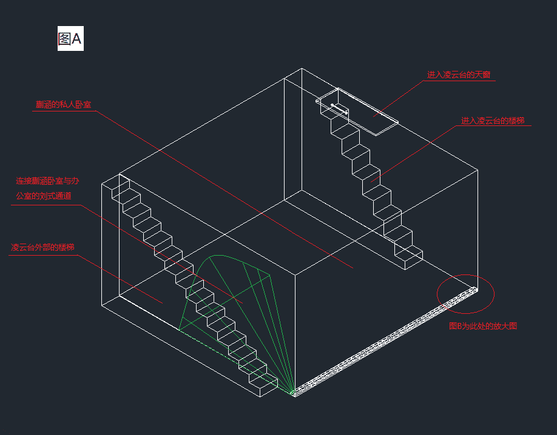
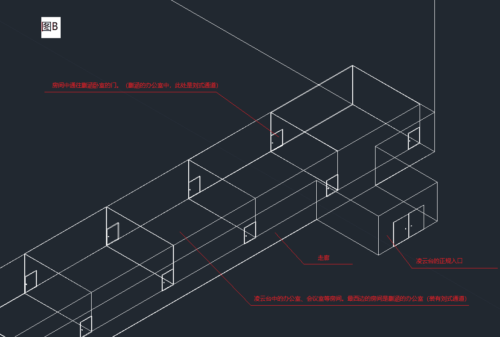
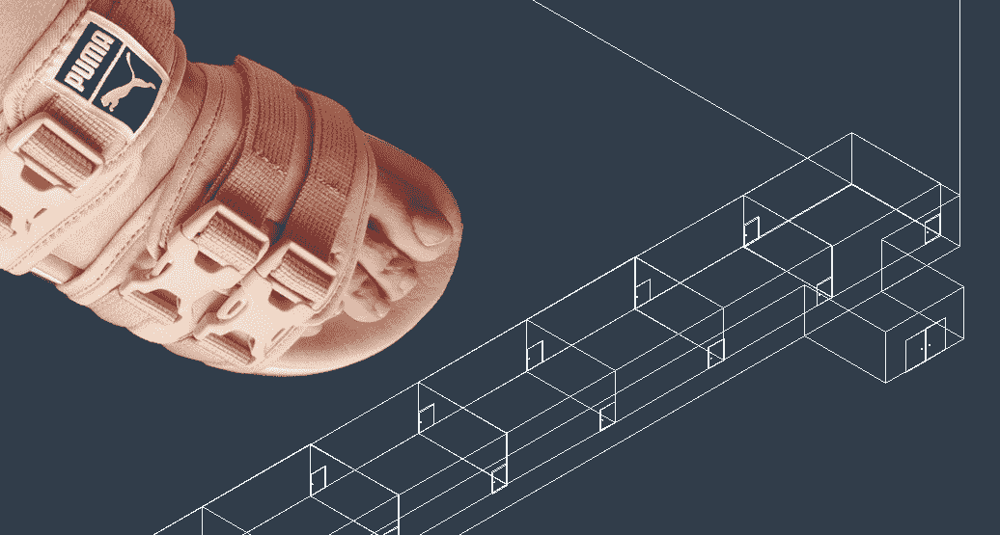

# 【挑战杯】国立英大学生会 已更新二十五章 任性女神

作者：桐桐的脚趾环

TID：26373

<title>1</title> <link href="../Styles/Style.css" type="text/css" rel="stylesheet">

# 1

*本帖最後由 桐桐的脚趾环 於 2019-6-7 22:03 編輯*

**不建议跳章节阅读，不建议阅读文章前先查看图片内容****完整阅读体验请点击上方  只看该作者****      如果有特别特别想跳章节阅读的同学，其实也不是不行！没耐心从头开始阅读的话，可以先阅读序章和77楼的sp章节了解基本设定，然后直接跳到237楼开始阅读第二部分内容，并体验最新章节！已在237楼汇总基本人物情况(含生僻字注音)！若对第二部分感兴趣再回来补第一部分内容也不迟！****当然，只想爽一下的同学可以直接跳过前十章，（前面相对福利没后面多，不过也基本保证每章都会有）然后随便抽一章体验即可（建议顺便瞧一眼237楼的人物汇总，半分钟就能看完）。然后有兴趣再完整阅读也不迟！完整阅读也方便****挑选出最喜欢的章节，然后存起来后实用起来对不对。****      当然，最好还是****不要跳章节阅读啦。**更新一下目录（深坑警告）~第零章 序章  ------------------- 1楼第一章 初窥英大 --------------  2楼第二章 蒯涵芬芳（上） ------ 13楼第三章 蒯涵芬芳（下） ------ 28楼第四章 宿舍琐事 -------------- 32楼第五章 深入鞋尖-------------- 41楼第六章 初识蒯涵-------------- 43楼第七章 咖啡醇香-------------- 46楼第八章 新的挑战-------------- 54楼
第九章 保卫甜蜜-------------- 65楼第十章 虎口脱险-------------- 74楼SP    凌云台结构-------------- 77楼第十一章 学生会长（上） --- 84楼第十二章 学生会长（下） --- 90楼第十三章 初出茅庐----------- 98楼第十四章 闺蜜情深----------- 102楼第十五章 扑朔迷离----------- 113楼第十六章 急转直下（上）-- 131楼第十七章 急转直下（下）-- 138楼第十八章 沧海桑田----------- 152楼第十九章 准备行动----------- 157楼第二十章 千诗奇遇----------- 168楼第二十一章 希望曙光-------- 186楼第二十二章 风波终结-------- 202楼第二十三章 新生入学-------- 237楼第二十四章 学姐风范-------- 243楼第二十五章 任性女神-------- 249楼0  序章20xx年，顶尖科学家刘某发明了一种可以将物体放大或缩小的通道，名为刘式通道，通道的长度大约3米。这种通道一端为大口，一端为小口。大口为半径为3米的半圆形，车与人均可进入。而刘式通道的小口为半径仅有3厘米的半圆形，人或物从大口进入，在通道中会暴露于特殊的放射之中，当从小口离开时，所有经过通道的人或物体均会缩小100倍。当然，反之若从小口进入从大口离开，则会放大100倍。当然，如果在通道中突然扭转方向，例如从大口进入却没走完通道，转头又从大口离开，那么等于无事发生。虽然刘式通道已被研发出来，但是目前国家对这种设备进行严格管控，一般人恐怕暂时无法接触到。       英培大学（简称英大），是一所以培养全国最顶尖精英人才为目的的大学，全国各地的各个名校的知名教授汇集于此，以便对最顶尖的人才进行更专业化的教学。英大在去年年底完全竣工，并将在今年首次招生，作为第一届学生累计招生7000人。英大对外的宣传力度十分之大，各种噱头非同小可。因此，虽然英大是新建成的学校，但是众多百年老校和它一比的话，也会显得黯然失色。加上国家的大力支持，英大更是套上了一层国家庇护光环，像是给报考这里的学生都吃了一颗定心丸。但是据说因为校内涉及大量机密，学校具体的位置从未向无关人员透露，校内的设施更是无人见过。学校采用统一缩小100倍的方式进行运转，目的是以学生会的方式靠学生自主治理为主，培养学生们的管理能力与自制能力；同时也方便校方纵观大局，进行以辅助为主的帮助管理；另外还能保证严格控制出入学校的人员，从而保证了学生的安全。另外，由于学校云集全国众多核心研究人员与精英，涉及到的机密也相对不少，所以在毕业前，没有特殊批准的情况下，禁止外出。“啊~睡前泡脚还是舒服呢！这下漫长的假期可算结束了，一会再看看行李箱，确认下东西带齐了没有吧。”坐在床前的甄叶桐看着自己泡脚盆中那双39码的脚道，“话说你可别再长了，要不然该买不到好看的鞋了啊。”甄叶桐是一名以十分优异的成绩考入英大的第一届学生中的一员，她从中学开始一直是班上最优异的学生，所以自然依旧对自己未来的大学生活充满自信。为了明天能穿好看的凉鞋去学校给大家一个好印象，今天她还特意修建了趾甲，并反复用手指搓洗着脚趾的缝隙。“听说英大还有刘式通道，会把大家都变小，不知道什么样子呢。”甄叶桐一边小声嘀咕着，一边开始想象自己的泡脚盆就是英大的操场，而自己却未被缩小的样子。她用迷人的双脚在泡脚盆里做着各种动作，想象着变小的人和自己互动的样子，幻想着全世界的精英人才聚集在自己脚边，用祈求的态度与自己商议着各种事情。甄叶桐越想心跳约快，不知不觉下面甚至有些微微湿润。“啊~我在想什么呢，要变小我也要一起变小嘛，不要胡思乱想嘛！”于是她又渐渐恢复平静，重新开始搓洗着自己的双脚。几分钟后，她满意的看看双脚，然后徐徐抬起双腿，刚要将脚插入可爱的卡通拖鞋中，无意间看到床边的体重秤，又不自觉将双脚放到地上，赤着脚走到秤上面去。站稳后，读数显示了出来，甄叶桐的脸微微一红“emm，1米71，64kg。一个假期我还是毫无进步呢。”虽说对于正值青春的甄叶桐来说，这个体重确实略高于身边的其他女生，但是实际上这个数值十分适合骨架较大的她，搭上她长度及肘的长发，给人的感觉反倒是圆润、饱满、大气。之后甄叶桐走下了秤，赤着足走回拖鞋边，穿好鞋倒掉泡脚水，回到屋里继续确认上学用的东西都带齐了没有，并思考明天穿什么衣服、配哪双凉鞋。
精彩的学园故事，即将拉开序幕<title>2</title> <link href="../Styles/Style.css" type="text/css" rel="stylesheet">

# 2

*本帖最後由 桐桐的脚趾环 於 2019-2-6 17:49 編輯*

第一章  初窥英大就这样，英大开学的日子到了。
      早上甄叶桐起了一个大早，因为录取通知书内附了入学时的注意手册，其中用醒目的大字标着，开学当天请于早上九点到达市内的1001广场、1003广场、1008广场等几个指定地点中的任意一个，然后学校会有人统一带领新生进入校园。甄叶桐洗漱、吃早饭完毕后，穿好衣服，将脚放伸入一双粉色凉鞋中，反复看着自己得不得体，然后满意的拉着自己的行李箱，背着包出门了。
      1008广场离甄叶桐家是最近的，大概步行20分钟就到了。甄叶桐拉着行李箱到达的时候，看了眼手机，发现刚八点半，不过也好，第一天到的早总比迟到要好。不过四周张望了一下，却并没有发现英大迎接新生的人，不过还好能看到几个拉着行李箱的人，估计也是到早的新生吧，看来不是自己走错了。“等半个小时也好，再好好调整下心态”甄叶桐想到。
      这时，一辆车停到甄叶桐不远处，从车里下来一个妹子，随后妹子从后备箱中拉出一个银色的大行李箱，妹子看起来也就一米六出头，费劲的拽着大行李箱向广场走来。甄叶桐饶有兴趣的看着妹子拉行李箱的样子，妹子也正向甄叶桐的方向走了过来。走得近些了，甄叶桐发现这个妹子穿着一身雪白连衣短裙，皮肤也比自己白不少。脚下赤裸着的嫩白玉足踩着一双黑色露趾低跟凉鞋，可爱的脚趾上涂着亮蓝色的趾甲油，配上过肩的长发，小巧的五官，可以说整个人娇柔清纯但不乏气质。
      “嗨同学，那个，你也是英大新生吗？”不知不觉妹子已经走近甄叶桐，并向甄叶桐搭起了话。也许确实是一些女生在陌生环境独自待着实在缺乏安全感，于是会想先认识个伴，大概会感到自在不少。
      “恩，对对。”由于搭话确实有些突然，甄叶桐一时还没想好说什么。
      “太好了，我也是。你看到接待我们的人了吗？我是不是来晚了？”
      “不晚不晚，接待的人大概还没来呢，现在刚八点四十五，等一会大概就回来了吧。”
      “那太好了！”那个妹子长出一口气，擦了擦额头，仿佛将行李箱拉过来将她累坏了一样。“我叫千诗，家就住这附近，同学你叫什么，听说话也是本地人吧？”
       “我叫甄叶桐，看来我们住的不远呢。诶对，204街新开了个甜点自助，你去过吗？”不知不觉甄叶桐已与千诗聊了起来，两人也互相很聊得来，恍惚间十五分钟已悄然过去，九点到了。
       这时，很多辆黑色的轿车从从拐角处拐了过来，进入众人眼帘，停到了广场边。从第一辆轿车内下来一个穿着黑丝，脚踩露趾高跟凉鞋的女性，看起来大概30岁左右，走到广场中央，环顾了一下四周，随即高喊“英大新生集合！”随即又高喊了三四遍，确保让更多的人都能听见。待广场上英大的新生们慢慢集中到了她的身边后，她拿起一个名单，开始进行签到。大约过了半个小时，确认了周围确实都是收到过录取通知书的新生后“同学们，接下来咱们就要去学校了，看到我身后那些黑色的车了吧，你们自行结合两个人上一辆车，车上的司机师傅会带你们进入学校。”
      不用想，甄叶桐自然是和千诗坐一辆车，她们也除了互相认识以外也不认识其他的人，所以自然有说有笑上走到一辆车前。
      “请打开包以及行李箱，对违禁物品进行检查。”司机走到甄叶桐身旁，鞠了个躬，说道。
      “违禁物品？我可没带什么违禁物品，这么不信任我们吗？”甄叶桐自然有些不高兴，千诗也认为私人物品被别人检查不太好。
      “这可不好说。不好意思，不查的话不能前往学校。”
      甄叶桐四周望了望，发现附近准备上其他车的同学也被进行了搜查，虽然不高兴，但没有办法，还是老老实实打开了包。
      “不好意思，这个是违禁品呢。”司机拿起甄叶桐的笔记本电脑，“另外，手机也属于违禁品。到学校后，学校会给你们发放统一的手机和电脑，功能也十分齐全，也是作为你们身份的象征。所以这些你们不必带了，如果身上还有也请提前交给我，我一会会进行搜身。”
      “太过分了吧，简直不讲道理！”千诗听说搜身，瞬间更加不情愿了。
       “没办法，规定不是我订的。请配合工作，不要为难我，谢谢。”
      确实是，规定不是他订的，和他多说也无益，于是两人还是老老实实交出了手机和电脑，并接受了检查。
      “好的，请上车吧。”司机帮甄叶桐和千诗将行李放入后备箱中，然后两人上了车。上车后，两人发现，这车也不是一般的车。车的前后座是完全隔开的，玻璃也看不到外面，所以相当于处在了一个完全隔绝外界的空间中，不过好在车内的座椅还算舒服。
      “怎么感觉上了贼船了呢。。。”甄叶桐说道。千诗也无奈的摊了摊手。几分钟，甄叶桐感觉车开始行进了，一路走走停停，由于没有手机也看不到时间，所以自然也不知道过了多久。在紧张的心情作用下，两人在路上都没怎么说话，不久后，由于枯坐着确实有些无趣，千诗竟然在车内睡着了。坐在车内睡着的话，脑袋都会不自觉的向侧歪，在一个转弯处，千诗的脑袋终于落到了甄叶桐的肩膀上，随即千诗不自觉的伸出双手，抱住了甄叶桐的胳膊，虽然是无意识动作，但是却让睡梦中的千诗有了安全感。在车上一直保持一个姿势坐着时间一长确实有些累，还好车上空间不算小，甄叶桐不禁脱去了凉鞋，轻轻将双腿弯曲着放到了座椅上，双脚在座椅上轻踩着车门，小心翼翼仍怕由于自己的动作弄醒了千诗。她在车门上勾了勾脚趾，用脚心在车门上来回蹭着，不禁想到了昨天晚上自己幻想中的场景，渐渐心跳又开始加快了。不过甄叶桐转头想起了还挂在自己身上的千诗，不禁急忙停止了幻想，轻轻摸了摸千诗的侧脸，然后自己也开始闭眼养神。
      不知过了多久，车在一个地方似乎是将火熄灭了。然后司机将车门打开，说“同学，咱们到了。”
      甄叶桐点了点头，示意明白了，然后将腿放了下来，穿好凉鞋随即拍了拍千诗“千诗，醒醒，咱们到了。”
      千诗缓缓睁开双眼，发现自己整个人都倚在甄叶桐的身上，急忙松开甄叶桐，小脸一红，“啊啊，到了啊，不好意思我昨晚因为想到明天开学所以有些兴奋睡不着，刚刚就睡着了，我。。”
      “没事没事，谁叫千诗很可爱呢。”说完千诗更是脸红了，说了声“讨厌！”然后走下了车，甄叶桐也随千诗走下了车。
      “嗯，看来大家都到了呢，那咱们开始吧。”一个似乎熟悉的声音从东北方向传了过来，甄叶桐向声音来源的方向望去，刚转过头，瞬间瞳孔放大，整个人愣在了原地。<title>3</title> <link href="../Styles/Style.css" type="text/css" rel="stylesheet">

# 3

*本帖最後由 桐桐的脚趾环 於 2019-6-6 20:22 編輯*

不想看文章以外内容的同学，请点击 只看该作者 ，获得更佳食用体验~后面的章节会比前面几章篇幅更长，不同同学阅读方式肯定也不同。一楼已为不同目的的同学做了不同的推荐，不过还是更加建议按照顺序进行完整体验。<title>4</title> <link href="../Styles/Style.css" type="text/css" rel="stylesheet">

# 4

*本帖最後由 桐桐的脚趾环 於 2019-6-6 20:23 編輯*

设定或许存在少许bug。。不是很严重的bug就请不要太在意蛤希望大家积极回帖收藏点赞
<title>5</title> <link href="../Styles/Style.css" type="text/css" rel="stylesheet">

# 5

> [大朱投 發表於 2019-2-3 19:03](https://giantessnight.com/gnforum2012/forum.php?mod=redirect&goto=findpost&pid=396147&ptid=26373)
> 话说是不是可以无限缩小啊，这样的话giga指日可待

是的呢，不但以相同顺序反复走通道可以，并且随着故事发展学校内可能会有新的科技突破哦，别忘了是精英大学不过短期内没有，因为近两章存货都存好了，不想改了
<title>6</title> <link href="../Styles/Style.css" type="text/css" rel="stylesheet">

# 6

*本帖最後由 桐桐的脚趾环 於 2019-6-5 14:00 編輯*

> [幸存者 發表於 2019-2-3 20:40](https://giantessnight.com/gnforum2012/forum.php?mod=redirect&goto=findpost&pid=396153&ptid=26373)
> 感觉设定很有意思，但希望不是残酷系的，因为那样明显会引起强烈的社会反弹 ...

请放心食用 请期待今天凌晨的更新
<title>7</title> <link href="../Styles/Style.css" type="text/css" rel="stylesheet">

# 7

*本帖最後由 桐桐的脚趾环 於 2019-2-12 00:11 編輯*

第二章  蒯涵芬芳（上）
声音的主人不是别人，正是刚刚在1008广场上那个从黑色轿车上下来的穿着黑丝的女人。不过此刻，她站在一个300m高，长宽各500m的方形高台上，而此刻她的身高也与高台十分相应，算上高跟鞋她大约有175m。 “怎么回事？”“她什么情况？怎么这么高”“我们被缩小了？”“笨蛋你看周围的楼，不是我们缩小了是她变大了！”“可是那个高台是怎么回事？有必要建这么高？”“你看西北方向，还有一个一样的高台诶！”“这两个高台简直和周围的建筑格格不入！”“woc这得耗费多少人力物力”......不出意外，新生们在震惊中议论纷纷，绝大多数人都懵逼了。 “咳咳，安静一下！”和之前在广场上不同，这次这个女人只以正常的音量说话，加上自己站的位置高，所以所有人都听得清清楚楚。 “可能之前有同学已经见过我了，现在我正式做一下自我介绍。我姓蒯，叫蒯涵，是你们的总指导员，以后我会与你们一起朝夕处于学校中，如有任何问题随时可以问我。”停顿了一下，蒯涵接着说道，“现在我在此正式恭喜各位，考入英培大学，成为英培的一员。想必来的时候你们的手机和电脑已被没收了，现在将由你们的指导员们为你们颁发英大的独有手机和电脑，这也是作为英大学生的象征，请务必妥善保管。并且在这手机中你可以查看英大学生手册以及相关生活以及学习方面的说明。之后我会给你们简单说一下学校的具体情况。” 说完，蒯涵点了一下头，然后从甄叶桐旁边的楼里走出了一些推着手推车的人，他们手推车里装满了相同的手机和电脑，新生们排队，进行按序领取。 “领到后马上注册你们的个人信息，注册后它就永远属于你了”蒯涵站半天，似乎有些站累了，随即脱掉了高跟鞋，穿着黑丝盘腿坐在了高台上，“另外，这个设备可以上网，只能上英大的内网。不过虽说是内网，咱们英大的数据库还是十分齐全的。也就是说，除了不能与外界联系外，它和一般的手机没有太大的区别。当然从其他意义上来讲，它可比一般的手机高贵得多，这是你们身份的象征哦。” 甄叶桐点开手机，随即果然出现了身份注册的页面，并且需要人脸，瞳孔，指纹三重识别。“不愧英大，果然厉害，和一般学校区别就是大。”甄叶桐不禁感叹。 蒯涵静静坐着看着新生们顺利进行一步步操作，心中不禁感觉有些好笑，心想“俯视大家的感觉还真不错呢，说话也不用使劲喊了，大家的一举一动也都能看得到，真是太棒了。”由于学校内气温确实不算低，蒯涵穿着丝袜的脚感觉有些闷热了，脚心和脚趾处都开始出汗。正好她现在盘腿坐于台上，手轻松可以够到脚底，不禁用手拽了拽脚底的丝袜，也算趁机让脚得到一些放松。随即蒯涵几乎无意识的将手放到鼻前闻了闻，微微皱了一下眉。马上她意识到了自己的动作似乎有些不雅，好在新生们几乎注意力都在手机上，没有过多注意蒯涵的小动作。 几分钟后，蒯涵清了清嗓子“大家弄的差不多了吧，接下来我来进行一个简短的说明。”一边说一边扭动了几下丝袜中的脚趾，看来蒯涵被捂在丝袜中的脚确实不是很舒服了，“学校目前占地面积大约仅60m×60m的方形区域。你们看四周，不难发现学校并不是露天的了吧。对，不仅不是露天的，而且是几乎完全封闭的。整个学校处于一个仅比学校面积大一圈，高约6m的银色方形建筑中。这个方形建筑叫英银方，是以特殊材料制成，整个学校的温度以及气候，包括早晚的亮度，均是可以通过控制室进行控制的。不过大家不要担心，目前的天亮天黑是与外界吻合的，所有各位不需要担心时差问题。英银方仅有一个门，当然这个门也不是一般的门，而是装有刘式通道的门，也就是说，若想进入学校，则只能先缩小100倍才能进入。所以，你们在车内时，已经穿过刘式通道了。现在你们已经缩小100倍，进入了缩小100倍的校园了。” 蒯涵似乎说了不少话，喉咙有些干，在这里停顿了一下，咽了一口口水。她盘腿似乎也有些坐累了，先改为伸直了腿，将脚掌朝向了新生。随即想到自己长期穿高跟鞋的脚掌貌似磨的不是很光润了，并且自己脚底和脚趾的无意识的小动作也会被新生们一览无余，虽然自己看来可能是不起眼的小动作，新生看来也许就是像猛犸巨兽伸展全身一样的惊天般的动作。想到这里，蒯涵心跳开始有些略微加速，被黑丝袜包裹的脚趾缝间也渐渐分泌出了更多汗水，使蒯涵感到脚底不舒适感又稍稍加重了。于是她又一次无意识的想用手摸一下脚底，拽拽丝袜，不过这次她刚刚碰到自己的前脚掌，马上意识了过来自己动作不是很雅观，毕竟还是应该给新生留下好印象才好。于是她急忙改为拍了拍脚底，假装在为脚底拍落粘在上面的尘土。之后蒯涵尽量优雅的将腿伸了回去，改为抱膝坐在高台之上。 “想必你们会感到奇怪，为什么我就能在校园内保持原有大小吧。这个暂时先作为我的秘密，不能告诉你们~”
此时新生们包括甄叶桐和千诗都已经听的震惊呆了，加上蒯涵的巨大的身躯每一个动作都震撼着他们的内心，全场全程鸦雀无声，没人提问，也没人议论。 “恩，大家那没明白可以随时提问哈，你们的手机内都默认有我的英信好友，英信是和你们外面用的微信类似的软件，相信你们马上就会知道怎么用。所以虽然我现在对你们来说处于巨大的状态，但是如果英信给我发消息的话，我还是能看得到哈。所以随时可以用英信给我发消息进行提问，我和你们年龄没差多少，所以大家把我当做朋友就好哈，不用拘谨。” 甄叶桐低头看了一眼自己的手机，果然内置英信，并且由于自己已注册学校的信息了，手机已默认为自己建立了英信账号，默认账号昵称就是自己真名。甄叶桐一向不喜欢用真实姓名当做昵称，或许感觉有种隐私被人看到的不自在吧，所以立即将昵称改为“桐叶”，然后看好友列表里，果然已经有一位好友了，叫昵称叫“涵儿”。甄叶桐看到后一阵无语，看来这位总指导员内心还真年轻呢。
此时千诗也已改好昵称“果然和微信几乎一样呢，加好友也可以扫码添加，你扫我还是我扫你？”显然千诗因为得到新的社交工具感到兴奋，想得到玩具的孩子一样，急不可耐的要甄叶桐好友。 “我扫你我扫你，来。” “桐叶，哈哈哈哈，你昵称也太贴近名字了吧！” “诗意难寻，你这昵称怕是想笑死我哈哈哈哈。仿佛就是在说千诗你很难被男生追求，可能找不到男朋友的哦！” “呸，不许咒我！” 渐渐新生们都开始互加好友，蒯涵也明白大家的心情，也正好活跃了一下气氛，所以先将说明停了下来。而在蒯涵的脚下，脚趾缝中的汗水似乎没有消散，甚至使蒯涵感到不止是丝袜中有些闷，甚至脚趾间也产生了一丝丝瘙痒感。这些蒯涵暂时都能忍住，但是问题是，脚趾间与脚心积累的汗水不消散，又随着一分一秒时间过去，她躲在丝袜内的芳足或许会产生一些味道。另外蒯涵抱膝坐了这么久也开始有些坐不住了，于是伸了个懒腰，然后站了起来。站起后活动了一下双腿，同时也是顺便让长时间紧贴地面的脚底透透气。随着轻轻甩了几下腿，蒯涵感到脚底一阵凉爽，不禁又伸了一个懒腰，并无意间随着懒腰发出了一声娇吟。 蒯涵或许渐渐有些习惯了自己相对学校而言巨大的身躯，反而神情稍微放轻松了些。她走到了高台边缘，蹲下自己的巨大身躯，然后将屁股放在了高台的边缘上，将双腿从高台边缘垂下，坐在了高台的边缘。坐下后，蒯涵尝试前后左右摇荡了几下双腿，又用黑丝中的几个灵巧的脚趾互相搓了搓，似乎得到了不少的放松。虽然不知道有没有用，但还是习惯性的将自己内裤前的短裙向下拉了拉，以防走光。但蒯涵没想到的是，自己短裙内的纯白色内裤虽然隔着黑丝，却依旧被很多人看到了，新生们很多正值青春的男生裤子也不知不觉支起了小帐篷，甚至有些人已经开始在心中幻想着那隐藏在巨大白色内裤中的蒯涵的巨大私密器官的样子了。更有甚者进一步想到渺小的自己如何透过蒯涵那纯白色的内裤，不惜奉献出自己的生命来将自己的一切奉献给蒯涵的巨大且湿润的洞穴了。同时，蒯涵无意间的举动导致露出的纯白内裤，很多女生也无意间看到了，女生们虽然感到羞耻，但不知为何还是多少有些心跳加速，也许是想到自己隐藏在裙下内裤中的私人洞穴，魅力与蒯涵相比孰能更胜一筹吧。 与此同时，由于蒯涵脚底终于不再紧贴地面，再加上她晃荡了几下双腿，丝足的味道以渐渐飘到了新生那里。不过好在蒯涵及时停止了之前脚掌紧贴地面的坐姿，再加上距离新生们还算有些距离，所以新生们闻到的并不是什么刺鼻的味道，反而是一种描述不出的蒯涵丝足独有的淡淡的丝足味，让人闻到便会感到舒适自在。或许很多穿过几次丝袜女生对这种味道并不感到奇怪，但男生则多数是心跳再次加速，有的甚至已开始迷醉这种丝足味道了，不禁心中更希望蒯涵再多讲一些内容，从而可以再多沉浸在蒯涵的丝足味道中一会。

<title>8</title> <link href="../Styles/Style.css" type="text/css" rel="stylesheet">

# 8

> [assassindark 發表於 2019-2-4 00:02](https://giantessnight.com/gnforum2012/forum.php?mod=redirect&goto=findpost&pid=396174&ptid=26373)
> 有參考幾年前的老作≪通天塔≫?

听名字貌似很久以前是看过。。不过记性不好，完全没印象了
<title>9</title> <link href="../Styles/Style.css" type="text/css" rel="stylesheet">

# 9

> [夏游云 發表於 2019-2-4 00:17](https://giantessnight.com/gnforum2012/forum.php?mod=redirect&goto=findpost&pid=396177&ptid=26373)
> 这个同道是参考的哆啦A梦吧

对！zsbdzsbdzsbdzsbdzsbdzsbd
<title>10</title> <link href="../Styles/Style.css" type="text/css" rel="stylesheet">

# 10

*本帖最後由 桐桐的脚趾环 於 2019-2-12 00:12 編輯*

第三章  蒯涵芬芳（下）
“咳咳，今天最后两点要和大家说，说完大家就可以回去了。大家先安静一下，听我说哦。”蒯涵继续开始了自己的讲解，也将很多人的胡思乱想渐渐拉回到了现实之中。 “第一点是学校内有两个地方你们一般是禁止靠近的。一个是我现在屁股下面坐着的这个高台，它叫凌云台，位于学校的最东北角。看似是高台，其实也是建筑，我的办公室就位于凌云台内。禁止靠近的原因一个是为了保护你们的安全着想，也是因为它内部有一些机密，因此你们不要多问，问了我也不会回答你们哈。所以如果你们没有权限试图接近的话，会有警卫将你们拦下，或许还要有处分哦。另一个地方就是你们现在向西北方向看，可以看到学校的西北角有一个与凌云台一样的高台，那个叫筑峰台，同样也是禁止无关人员靠近的哦，原因也与凌云台差不多，我就不再多说了。” “第二点就是学生会的选举。你们大概都知道的吧，英大的管理方式与一般学校区别较大，其中一个很大的区别是，英大的学生会几乎管理学校内所有事物，从而不单设其他机构。因此学生会的权利之大与存在的重要性想必你们也都知道。所以学生会的选举必须慎之再慎。经之前学校讨论决定，今年学生会一共招30人，其中1个学生会长，是在进行学生会工作的同时监管全体学生会的职位，所以更是重中之重。2个副会长，负责辅佐及监督会长，拥有权利仅在会长之下。剩下的是27名干部，负责进行学生会的日常工作，尽心尽力为学生服务。所以学生会的招新必须慎重筛选各位精英中的精英。由于你们是第一批进入学校的新生，所以第一届学生会的选举由我来主持。接下来，我宣布一下竞选说明。”       “首先，我会从接下来三天内选出30人为学生会成员，之后我会再从30人里面挑选出1个会长与2个副会长。所以，筛选的第一个环节为：鞋内打卡！规则很简单，从明天开始连续三天，我每天下午两点都会以巨大身躯穿着不露趾的高跟鞋来到英大第二运动场，之后我会脱掉两只脚上的鞋子，将两只高跟鞋全部立在运动场之上，在其中一只鞋里的鞋尖处，也就是我走路时大脚趾在鞋中顶着的位置会有一个打卡机，无论采用什么方法，每天前十个打卡的人会获得英大首届学生会的名额。等三天之后，学生会30人均已选好，我会再对选取会长与副会长相关事宜另行通知，还望大家积极参与，不为自己的大学生活留下遗憾哦。” 说完后，蒯涵感觉自己的脚已不再仅仅有迷人的丝足味，还伴随了一丝丝的酸味。蒯涵意识到，若自己再不快些结束，恐怕这个味道就会渐渐被新生们闻到了。但是实际上，台下的一部分新生来说，巨大的蒯涵散发出的芳足气息早已是闻到了。不过还好幽香的丝足味道还是能盖住一些真正的芳足气息的，所以虽然有少数新生微微皱了皱眉，不过还算是可以接受的那种味道。另外还一部分新生却完全沉醉于蒯涵的丝足味掺杂稍许玉足散发出的独特脚酸味的混合气息之中，心中已完全臣服于蒯涵的芳足气息之中了，只恨不能坐在蒯涵脚下的黑丝中的略微潮湿的脚趾缝隙之间，一边享受臣服于蒯涵的滋味，一边听着蒯涵的讲话。 “就是这样，有问题可以现场提问。”蒯涵收回双腿，手一撑重新站回了台上，假装漫不经心的走回自己刚才脱掉的高跟鞋旁边，重新穿上了高跟鞋，想用高跟鞋来阻止部分黑丝内芳足的味道流出。果然，由于穿上了高跟鞋，虽然是露趾的，但是脚底却完完全全的落在鞋面上，将酸味多数都埋在了脚底。蒯涵满意的走了两步，发出 噔噔噔 的声音。马上蒯涵由意识到自己犯了一个错误，自己高跟鞋走路发出 噔噔噔 的声音，虽然自己看来十分正常不算什么，但是对于“小”同学们来说，就是另一种感觉了。 甄叶桐看到蒯涵站了起来，明白蒯涵的讲话差不多该结束了，但确实没想到蒯涵还有为了阻止自己芳足微酸的气息传播的目的。看到蒯涵穿上了高跟鞋，不由又低头看了看自己的脚，说实话，甄叶桐19年来还从没穿过高跟鞋呢。看到漂亮的蒯涵穿着气质的黑丝，又踏起了高跟鞋，不禁有些羡慕，下面在粉色凉鞋中赤裸的双脚不自觉的也跟着抬了抬脚跟。确实是，很少有女生能抵挡得住充满气质的高跟鞋的诱惑。不过，甄叶桐却从未曾想到过，蒯涵心中种种为自己玉足产生的气味而出现的苦恼。 随后，甄叶桐看见蒯涵抬起了穿着高跟鞋的腿，在台上跨出了对蒯涵来说的一小步。“噔”！鞋跟与地面接触的声音强行阻断了甄叶桐的思路，巨大的声音在这个密闭的空间中似乎还有些回响，所有人都惊在原地，此时没有人说一句话，并且一些正在准备给蒯涵发英信提问的同学，也都停下了手中编辑了一半的消息，将目光集中在了蒯涵身上。随即又是一连串的“噔噔噔”，全场再次鸦雀无声，仅存在蒯涵的鞋跟与地面碰撞产生的声音，加上蒯涵丝足的芳香依旧在空气中弥漫着，洗涤着每个人的灵魂。因此在新生们看来，蒯涵似乎在炫耀自己巨大体型带来的力量，似乎在等待着众人臣服于她。所以实际上大家都被蒯涵的力量吓住了，就算有问题想问她，也不敢问，似乎畏惧着蒯涵的力量，生怕若是斗胆提问却问的不好，会不会成为蒯涵脚下的冤魂，会不会成为第一个用生命臣服于蒯涵之人。 当然蒯涵从来都不是这么打算的，毕竟她可是全国最顶尖学校英大的总指导员，她本是打算和大家将关系处好的，从没打算过用巨大的身躯恐吓大家，更没打算过让众人臣服于自己的黑丝玉足之下这种事。但是她等待着新生们的提问，不经意间穿着性感气质的露趾高跟凉鞋在台上来回走了几步之时，本身长相就比较强势的蒯涵，借助巨大的身躯，完全将自己的女王之气散播到了整个校园，散播到了每个新生的内心之中。 随即，蒯涵马上发现了新生们的气氛似乎有些不对，瞬间的反思使她明白了问题的源泉。看来新生们还是被自己巨大的气场所镇住了，蒯涵心中感觉十分愧疚，但同时又觉得有些好笑。果然巨大的自己的一举一动对新生们都是影响力十足的，看来是我又疏忽了，蒯涵想到。 “咳咳，大家都不好意思问啊，不用这么拘谨的~大家把我当做朋友就好哦~”蒯涵只好想办法化解尴尬，“那既然这样大家也累了，今天就先到这里吧。你们各自的宿舍以及学校中的一些事宜在你们手机中的学生手册中都可以查到，有问题给我发英信也ok哦~好的，大家回去休息吧！记得我之前说的两点哦，强调一下。第一，一般情况下不要接近凌云台和筑峰台；第二，学生会选举希望大家积极参加哦~拜拜！” 说完，蒯涵刻意压轻步伐，尽量避免高跟鞋发出的声音，在凌云台上向东北方向走去。凌云台对现在的蒯涵来说只是个5m长，5m宽，3m高的讲话台而已，所以轻轻跨几步，便走到了凌云台的最东北角，然后在大家的目光之中，弯下身来，伸出手似乎是打开了一个位于凌云台顶部的天窗一样的窗口，然后一步一步走进了那个天窗，看起来像是天窗里装有楼梯通往凌云台之内一样，蒯涵的身影随着一步一步的“下楼”，渐渐进入了凌云台之中。最后听到清脆的“哒”的声音，应该是蒯涵走进凌云台后，又随手将天窗关上的声音。但这一切都是新生们根据蒯涵动作进行的猜测，由于凌云台在众人眼中是个300m高的高台，尤其是蒯涵消失在凌云台的东北角，所以众人的目光根本捕捉不到在凌云台顶部的地面上蒯涵到底做了什么。 “woc原来那凌云台从上面就能进去！”“她是顺着楼梯下去的，怎么会有那么大的楼梯？”“难道是专门为她设计的？难怪不让我们接近！”“你们没发现凌云台的侧面也有一个巨大的楼梯吗？“废话，你见过不能走下来的主席台吗？”“我没见过能走进去的主席台。。。”“一二三...十五，侧面的楼梯一共有十五阶！每阶大概20米高！老天！”“重点不应该是为什么西北角还有一个与凌云台完全对称的筑峰台吗。。。” 不出蒯涵所料，蒯涵的身影刚刚消失，新生们便炸开了锅。不过就算再讨论也是猜测，谁也拿不出什么证据。甄叶桐掺和了几句，然后就感觉没什么意思了，便打开了手机，看看自己的宿舍在什么地方。 “唔。。4号楼，807，学生还带导航的啊，不错好评。” “桐桐你也四号楼807！？”千诗将头探了过来。 “怎么，难不成还能咱俩在一个宿舍？等等，你刚刚叫我什么。。。” “桐桐啊，叫桐桐多可爱呀！以后我就这么叫了！不过真巧啊，竟然咱俩被分到了同一个宿舍，这就是缘分吧！” 确实是太巧了，一共7000名新生一起分宿舍，所有宿舍都是四人一间，几乎舍友中有认识的人的几率十分渺茫，但甄叶桐和千诗却如同奇迹般的分到了一起，不得不感叹缘分这种东西有时候确实挺神奇的。

<title>11</title> <link href="../Styles/Style.css" type="text/css" rel="stylesheet">

# 11

> [床上小旋风 發表於 2019-2-4 18:52](https://giantessnight.com/gnforum2012/forum.php?mod=redirect&goto=findpost&pid=396234&ptid=26373)
> 话说学生会会长是不是就是可以跟指导员一样了呀

应该会出现比较特殊的情况，请期待后续剧情哦
<title>12</title> <link href="../Styles/Style.css" type="text/css" rel="stylesheet">

# 12

*本帖最後由 桐桐的脚趾环 於 2019-2-6 13:03 編輯*

第四章  宿舍琐事跟随着导航，甄叶桐和千诗都拉着自己的行李箱走进了自己的宿舍楼，虽然刚刚发生的一切都太过让人震惊了，但是英大的宿舍还是与别的学校没太大区别。坐上电梯，两人走到了自己宿舍门前，刷了一下手机作为验证，宿舍门便打开了。“另外两个人还没到啊，会遇到什么样子的舍友呢。”“当然是我这种世界好舍友喽！”千诗打趣道。屋内的设施全是新的，毕竟她们是第一届英大学生，要还用二手的宿舍设备就太不像话了。在甄叶桐和千诗打开行李箱，整理东西的时候，两个女生且说且笑的走进了宿舍中。其中略高的那个女生身高比甄叶桐略微高一些，棕黄色的头发扎着马尾辫，匀称的身材穿着粉色的运动背心，下身穿着黑色的三分裤，脚下穿着白色棉袜加黑色运动鞋，一看就是那种很善于运动的妹子。而矮一些的妹子身穿白色带有蓝色花纹的连衣裙，白净的皮肤与她过肩的波浪卷发十分搭配，裙下干净细腻的双脚穿着一双黑色的夹脚凉鞋，给人感觉是一个文雅娴静的姑娘。经过相互的自我介绍后得知，高一些的姑娘叫左昕，是一个喜欢跑步和踢足球的妹子，果然是运动细胞发达；矮一些的妹子叫丁苋，喜欢一个人的时候读各种散文，也是一个充满好奇心的妹子。所以，左昕和丁苋自然就是甄叶桐和千诗的舍友了。四个人整个下午都是在收拾房间与闲聊中度过，很快便打成了一片。原来，左昕和丁苋互相认识的时间比甄叶桐与千诗更早，两人高中开始就是在同一所高中的同一间宿舍，没想到到了大学竟还是分到了一个宿舍，又一次不禁让甄叶桐感叹缘分这种东西，有时候实在太神奇了。到晚上吃饭时，四人并未一起去吃饭。毕竟对于女生来说，就算关系再好，四个人在一起行动或许永远没有和自己的闺蜜两个人一起行动来得自在。所以自然是左昕和丁苋两人先去吃饭了，随后甄叶桐和千诗两人才结伴来到离宿舍最近的食堂，吃了晚饭。学校第一周没有课，这周也是留下来让学生们自行选课的，从第二周开始按自己选的课表进行上课。英大的宿舍是每人一套上床下桌，甄叶桐的床位和千诗在宿舍的左手边，左昕的床位和丁苋在宿舍的右手边，所以一般就会出现床位临近的两个人是头对头睡还是脚对脚睡。晚上吃完饭回来，千诗先去洗漱了，说是要洗漱后躺到床上就不下来了。而甄叶桐则直接躺到了床上休息，毕竟下午收拾房间搞得甄叶桐有些累了，想休息一会再去洗澡，于是在床上一边翻阅学生手册一边思考着白天蒯涵说的事。“诶，桐桐，你怎么把脚朝着我这边呀，我们不应该头挨着头睡吗？”千诗洗漱回来后也爬到床上，发现甄叶桐将脚朝着自己床的方向。“脚对脚吧还是，我睡觉呼吸声音有些重，怕吵到你哈。”“啊~不要嘛，我自己会害怕的。”千诗以前从未住过集体宿舍，在家里也一直是和妈妈一起睡，所以晚上睡觉自然有些害怕。“那你头对着我的脚吧。”甄叶桐未经思考的脱口而出，随即马上意识到自己的说话似乎不是很体面，毕竟和千诗才刚认识一天。“诶~这样吗，那好吧，总比自己不敢睡觉强。”出乎意料，千诗竟然答应了。甄叶桐忽然想起自己还并没有洗漱，更没有洗脚，所以自己的脚是不是可能会有些味道了。但此时千诗已经将枕头放到了甄叶桐脚前，并躺了下来。被千诗闻到自己脚的味道，虽然受罪的不是自己，但多少还是会有些害羞的。于是甄叶桐急忙将脚往回收了收，由改为曲着腿躺在床上。“桐桐，不用。”突然千诗的声音从自己脚下传了过来，“就一点味道，不算重，我还是闻着比较舒坦。这样我就能随时确认桐桐在我身边，就不用害怕周围没有人了。”原来自己的心思千诗已经全部看透了，并表示不嫌弃自己。甄叶桐更是脸红了，不过还是将腿伸展开，毕竟这样躺着更加舒服。不久后，左昕和丁苋也回来了。“诶~你俩怎么头对脚睡呀？”“因为桐桐睡觉呼吸声音有些大，我又不想自己眼前没有人自己睡嘛。”千诗连忙解释道。“那我们也这样吧，省的她俩人不自在啦！”“那我头可不对着你的脚哦~”左昕率先抢话。“好好好，知道啦！我对着你脚睡还不成嘛~让着你哦~”于是丁苋也选择对着左昕的脚睡。两人也是选择先躺床上休息会，然后再洗澡睡觉。左昕直接脱了鞋，穿着棉袜躺倒床上。“诶原来怎么没发现，左昕你脚好臭诶~”“天气热嘛，你穿运动鞋你也一样！”“那你穿什么运动鞋，穿凉鞋多好！”“我乐意~”两个人关系果然不错呢，虽然互相笑骂打趣着，但丁苋却依旧不嫌弃的躺在了左昕的脚上的棉袜前。丁苋微微抬头，看到左昕的棉袜已被左昕穿湿了，并且五个脚趾的位置与脚跟处也已是黑色。棉袜上混杂着左昕的汗臭味和脚酸味，还有棉袜与运动鞋本身的味道一齐随着热浪向丁苋脸上扑了过去。“唔。。我还是先去洗澡吧”左昕躺下后自己都能闻到自己浓烈的棉袜脚味，多少还是有些心疼丁苋的，于是又跳下床去，去洗澡了。随后，甄叶桐和丁苋也去洗澡了。晚上，关上灯，四个人躺在床上，四个人开启了夜聊模式。“你们还记得白天蒯涵说的学生会选举的事吗？”“当然记得，竟然说什么区她的鞋里打卡，这种事怎么可能去做嘛。”“emm。。我还是想试试”甄叶桐率先表示想参加选举。“既然桐桐要去，那我也去试试！”千诗也表明了态度。“可是，不说到蒯涵鞋里这件事是否体面，就算真的要去，要怎么进去呀！”“从鞋前面的鞋尖上去然后跳进去？”“跳进去。。有点高吧。。。”“带个登山那种勾爪绳索呢？”“那从鞋跟底下直接将勾爪抛上去，顺着绳子爬进去也可以吧。”......经过一晚上的讨论，四个人也渐渐困了，最后得出的结果则是四个人都都愿意参加选举，明天由左昕和丁苋先去试试水，甄叶桐和千诗后天再去。互相说了晚安之后，宿舍便没人继续说话了。甄叶桐依旧不是很睡得着，脑子里全是攀爬蒯涵高跟鞋的画面。不经意间一伸腿，感觉自己脚底好像踩到什么东西，好奇的脚趾动了动，才突然想起来自己和千诗是头对脚睡的，所以自己大概是踩到千诗的脸了。虽说已洗过澡，但是经过夜聊，再加上宿舍内温度也不低，甄叶桐的脚趾之间又出现了新的汗水。所以甄叶桐刚刚无意的举动，显然不仅仅让千诗又闻到了自己的脚味，还将一些脚掌下的汗水蹭到了千诗的脸上。糟了，如果千诗还醒着，会被千诗讨厌的吧。甄叶桐决定，慢慢将脚撤回来，希望如果千诗已入睡，千万别将她吵醒。但是甄叶桐刚微微挪动一下脚，千诗竟然伸出双手，将甄叶桐的脚抓住，似乎在示意不要伸回去。甄叶桐先是被千诗的举动吓了一跳，但似乎明白了，千诗应该还是害怕自己睡觉，希望能有人陪自己睡觉而已。于是甄叶桐整个人向下挪了一点，将双脚放到了千诗的枕头上，脚心对着千诗的脸，以此示意千诗自己随时都在，不用害怕。千诗随即抱住了甄叶桐的双脚，将甄叶桐的脚掌贴在了自己的脸颊上，呼吸着甄叶桐淡淡的脚汗味。虽然自己的脸已经贴上了甄叶桐的双脚，但味道依旧算不上刺鼻，反倒这种淡淡的气味让千诗心中充满了安全感，算是内心得到了安慰，终于敢入睡了。而甄叶桐将双脚贴在千诗的脸上后，不自觉的用脚心抚摸千诗的脸颊，当她敏感的脚掌划过千诗精巧的五官时，如同感觉一股电流从脚底直贯穿全身。她用脚心细细的感受着千诗呼吸所带来的气流，并用灵活的脚趾肚轻轻地来回触碰着千诗的双唇。渐渐，千诗呼吸的气流告诉甄叶桐，千诗已经进入梦乡了。甄叶桐自己也不知道为什么，轻轻将自己的大脚趾伸入了千诗热乎乎的小嘴中，触到了千诗柔软的舌头，随即感受到千诗本能般的用牙轻轻嗑着自己的大脚趾。此前，千诗还从来没有和别人接吻过，也更没有男朋友，而谁想到，千诗的初吻就这样，在深夜里悄悄地被甄叶桐的大脚趾给夺走了。若以后有人与千诗成为情侣，然后得知千诗的初吻是甄叶桐的大脚趾的话，不知道心中会是什么感受。甄叶桐能清晰的感受到自己趾间的新鲜汗水与千诗口中的唾液混合，并流入千诗的喉中。这让甄叶桐更是心跳加速，再加上想起自己的脚趾此刻正在和千诗进行深度接吻，心中更是有些莫名兴奋，丝毫不想停下，并轻轻用脚趾挑逗着千诗的舌头，感受着千诗口中种种无意识动作。啊~别人在自己脚下是这种感觉啊~白天蒯涵在台上，看着丝足下渺小的我们，也会是类似的感觉吗？我也会有一天能向蒯涵一样，以巨大的身躯看着胯下渺小的众人吗？想着想着，甄叶桐发现自己的内裤已经不知何时被小穴中分泌的液体弄湿了一小块，内裤中的不舒适感将甄叶桐拉回到了现实之中。恩？我胡思乱想些什么呢！通通不算，通通不算！然后甄叶桐为了不弄醒千诗，轻轻地将脚趾从千诗的嘴中抽了出来，感觉脚趾上还沾着一些千诗的唾液，随即扭动一下脚腕，灵活的脚趾往千诗枕头上一抹，将脚趾上的唾液蹭到了千诗的枕头上。然后又将脚轻轻贴回了千诗的脸上，拽了拽潮湿的内裤，也渐渐进入了梦乡。希望大家积极回帖收藏点赞呀~
<title>13</title> <link href="../Styles/Style.css" type="text/css" rel="stylesheet">

# 13

> [竹刀 發表於 2019-2-5 00:45](https://giantessnight.com/gnforum2012/forum.php?mod=redirect&goto=findpost&pid=396259&ptid=26373)
> 细节处理也已到位剧情展开和节奏把握稍微即使再快那么一丢丢也不会让人觉得仓促~ ...

你的心意传达到了！我尽量哈
<title>14</title> <link href="../Styles/Style.css" type="text/css" rel="stylesheet">

# 14

*本帖最後由 桐桐的脚趾环 於 2019-2-12 00:13 編輯*

第五章  深入鞋尖      第二天早上，甄叶桐第一个醒了过来，怕自己的脚掌贴着千诗的脸被丁苋和左昕看到，说自己欺负千诗。于是她用脚底又抚摸了一遍千诗的脸颊，然后才依依不舍的伸了回来。轻声爬下床，换了一条内裤，然后开始了新的一天。恍惚间上午就过去了，虽然说好左昕和丁苋今天先试水，但甄叶桐和千诗反正待着也是待着，就也准备去第二操场，也正好学习一下经验。中午依旧是左昕和丁苋和甄叶桐打好招呼，然后两个人先去吃饭了。“我们也走吧！我们吃完就不回来了，直接去操场等着吧。”几分钟后甄叶桐也感觉有点饿了，于是对千诗说道。“好，走。”两人穿好衣服和鞋，然后千诗便用力搂住了甄叶桐的胳膊，似乎恨不得整个人都能缠在甄叶桐的胳膊上。“诶，千诗，轻点，抱得太紧了。”甄叶桐也算是默许了千诗的举动，毕竟千诗确实是很害怕独立的那种妹子，所以好不容易和千诗混熟，让千诗依赖一下也好。“哈哈，走！”千诗稍微松了一下劲，然后两人便也去吃饭了。学校对于学生们来说，的确是非常大的，甄叶桐和千诗虽然十二点就去吃饭了，但大约下午一点半左右，两人才溜达到英大第二运动场。不过目前运动场上人已经是不算少了，大概都是来观摩或是参加学生会选举的。时间快到了，差几分钟就到两点了，忽然运动场中一个人率先喊道：“来了来了！”随即大家都向学校的东北方向望去，果然蒯涵从凌云台之中走了出来，到了凌云台顶上。她依旧穿着黑色丝袜，不过脚下的鞋却换成了一双不露趾的黑色厚底高跟鞋。蒯涵出来后站在凌云台之上，向第二运动场方向望去，“大家还是挺积极的呢，不错。”随后向第二运动场露出一个迷人的微笑，然后便踩着高跟鞋从凌云台上一步一步走了下来。这次一个是因为大家事先心理都有准备，也因为蒯涵刻意落脚比较轻，所以这次大家没有被蒯涵高跟鞋落地的声音所吓倒。学校中主要的道路都非常宽，对于一般学生来说，多数都有150m宽，看来就是为了给体型有差异的人准备的。蒯涵迈步向第二运动场走了过来，每一步都仔细确认过脚下是否有学生，几步之间已从很多学生头上迈过，不过这次蒯涵裙下已穿了黑色打底裤，看来蒯涵确实记住了上次的失误。不用二十步，蒯涵就走到了第二运动场，新生们也纷纷离开运动场中央，为蒯涵留出了一些空间落脚。此时，蒯涵脚下的第二运动场，再次弥漫了大家熟悉的蒯涵的丝足味道，不过由于距离近了，所以就算蒯涵穿着不露趾的高跟鞋，比起昨天味道还是更加浓郁了。“规则昨天我已经说过了，就不再重复了哈~所以，现在就开始吧！”说完，蒯涵弯下腰脱下了双脚上的高跟鞋，将它们立在了运动场的中央，然后向后退了一步，盘腿坐在了地上。但是，在蒯涵脱下鞋后，空气中的味道瞬间变化了。丝足的丝袜味道很快就被丝袜中的脚丫所散发的脚丫味盖住了多半，变成了以蒯涵脚的酸味与丝袜味的混合味道。与昨天不同，昨天蒯涵坐在台上，所以脚离新生们还有一段距离。而今天新生就完完全全站在蒯涵的脚下，而丝袜的味道，也被脚的酸味击败了。“为了选出有能力却又能吃苦的同学担任学生会的工作，所以我将选举稍微加大了一些难度~”蒯涵整理了一下头发，看着自己的黑丝玉足说，“我昨天回去后，到现在为止，都没有脱掉我脚上的丝袜。所以当然也没办法洗脚，虽然我换了高跟鞋，不过这双高跟鞋也是我常穿的一双，并且我脚上的丝足也从今天早上开始就被放进了鞋里，穿了也有半天了。所以鞋中的气味或许不太好。所以挑战可不仅仅是想办法爬到我的鞋里打卡，承受我鞋中的气味也是选举学生会的一部分挑战哦~”显然，经过昨天与大家的接触，蒯涵已渐渐熟悉了自己巨大的身躯，各方面举止也都从容了许多，也越来越会利用自己身体的巨大了。“当然为了公平起见，越往后参与选举的同学学到的经验自然也就越多，所以我在这三天之中，都不会脱下丝袜，所以鞋内的味道会一天比一天大，所以还请想参与的同学尽早参与哈~”说完，蒯涵便饶有兴趣的看着大家，略微点了点头，示意已经可以开始了。“三天不换袜子不洗脚？服了这人。。”“这在外面都闻得到酸臭，鞋内得什么滋味啊。。”“这刚第一天，第三天怕是有能力打卡的也打不了了吧”“我还是不参加了，看看热闹得了。”蒯涵的话立刻引起了运动场上同学们的纷纷议论，并也劝退了一部分内心不是很坚强或还在犹豫不决的同学。此时，左昕和丁苋离蒯涵的黑丝玉足的足底大约只有对她们来说的八九米，蒯涵黑丝中的脚趾的每一个小动作，二人都能看的清清楚楚，并且左昕还发现，今天蒯涵脚底还是出汗了，脚趾下的丝袜，已经是湿润的了。蒯涵脚上的气息甚至黑丝中散发出的热气流已完全占据了两人身边的空气。不过好在两人并没有打算放弃，一个是怕回去被甄叶桐和千诗笑话， 另外也省的两人吃完饭专门去买了登山专用的勾爪绳索白买。此时蒯涵也低头看见了脚前的左昕和丁苋，正好与左昕四目相对。蒯涵歪头对左昕笑了笑，并勾了勾她们面前的脚趾，似乎在说，犹豫什么，再不参加的话就要被别人领先了哦。作为擅长运动的妹子，左昕自然不甘落后，不过她们的第一项难题就已摆在她们眼前，那就是到底打卡机在蒯涵的哪只鞋子里。“唔。。。毫无提示，也就是说，左脚的鞋和右脚的鞋都有可能，所以只能靠运气了吗。”左昕虽然擅长运动，就算进入鞋中的速度再快，若是猜错了打卡机在哪只鞋中，也只是徒劳一场，而十个人肯定早已在另一只鞋中完成打卡。“丁苋，你猜在哪只鞋里？”“啊，让我来猜吗？那么，若是我的话，大概第一次会放到右脚的鞋中吧。”果然丁苋也只能凭感觉猜测了。“好，那么我们就去爬右脚的鞋吧！”于是二人跑到蒯涵右脚的鞋下，掏出登山的勾爪绳索，想办法进入鞋中。虽说蒯涵的厚底高跟鞋是不露趾的那种，但蒯涵也并没有过分难为大家，因为今天蒯涵穿的是一双露脚背的厚底高跟鞋，所以从鞋子的前端或前侧方爬上去是最容易进入的方式，而不用从鞋子后部，攀爬完整的鞋跟加脚脖子的全部高度。此时两只鞋上已纷纷有带头者开始了攀爬，随即左昕也已加入到了攀爬者的行列中。左昕在攀爬高跟鞋的时候发现，虽然现在已是整个人贴着蒯涵的鞋了，但蒯涵的味道却还没有刚刚在蒯涵脚边时浓郁，从而也获得了不少自信，利用自己优异的运动细胞，一边攀爬还一边不忘随时帮丁苋一把，以随时保证丁苋不落后。就这样，在二人的拼搏下，终于进入了蒯涵的鞋内，虽然有几个人还是赶在了他俩之前，不过数量远远不足十人。“恩，已有一个人打卡成功了呢！大家加油哦~”蒯涵看着自己的手机传来的信息，得知已有人完成了打卡。蒯涵的话像是给还在高跟鞋里外拼搏的学生们打了激素一般，每天只有十个名额，若落后了，相当于之前的努力就白费了，所以大家更是为自己加了把劲，也捏了把汗。鞋内的气味果然不一样，虽然已经散去了一部分，但蒯涵的丝袜味与脚臭味，混杂着浓烈的鞋内的皮革味，却依旧在鞋内的空气中徘徊。对于刚刚从蒯涵的丝足前跑过来的左昕来说，感觉这种味道有些熟悉，但又有些陌生。“看！打卡机，我们没有猜错~”眼尖的丁苋一下就看到了位于鞋尖处的打卡机，内心的激动不禁涌了出来。左昕自然也是十分激动，赶忙与丁苋一起向鞋尖方向跑去。打卡机位于鞋尖处的最下端，但蒯涵的高跟鞋越往鞋尖处走，高度自然也就越低，大概两人离打卡机还有两米左右的时候，鞋内高度已与左昕身高一样高，所以站着已经是无法前进了。“最前面的这个高度感觉就算蹲着也过不去啊，改为匍匐前进吧！我先去打卡，等我打完卡让开，你再爬进去打卡。”显然高度的限制拦不住左昕的热情，丁苋点了点头“好，你先来。”说完左昕便趴了下来。目前左昕趴的地方正是蒯涵穿着鞋是时候脚趾踩着的地方，当左昕将整个身体贴在鞋上的时候，脸离鞋面仅有几厘米的高度，甚至似乎随时有贴上去的可能。蒯涵足底留下巨大的酸臭味时时刻刻侵略者左昕的呼吸系统，这已不再是左昕熟悉的蒯涵的丝足味，而是纯纯正正的来自蒯涵一夜未洗的脚底气息，不但刺鼻，甚至有些刺眼。左昕却盯住打卡机，忍着升起来的一股的反胃感，依旧向前爬去。终于，左昕握着手机，伸出手将手机贴到了打卡机上。“哔，刷卡成功！”左昕虽然想长舒一口气，但怕自己吐出来，还是忍住了，然后她退回刚刚趴下的地方，重新站了起来。之后丁苋如法炮制，也学着左昕的样子完成了打卡。不过丁苋的承受能力显然比左昕要差一些，在匍匐前进的过程中短短的一段距离却试图停下好几次，好在有之前左昕做榜样，加上左昕在背后的不断的鼓励，最终丁苋也成功完成了打卡。在丁苋之后又陆陆续续到达了几位同学，也分别完成了打卡。“恩，够十人啦！大家辛苦啦！”蒯涵的声音突然响起，宣布今日人数已达到上限了。“可恶啊，就差一点！”“要不是进错鞋我早就到了！”“这种选举是不是对女生不太公平啊！”“xxx好可惜啊。。”“蒯涵还是那么迷人嘛”......嘈杂的声音再次响起，无论参加选举的人还是旁观的人，几乎都加入到了激烈的议论之中。“咳咳！大家安静一下！”蒯涵依旧是盘腿坐着，伸出手，将高跟鞋内的人与高跟鞋外攀爬到一半的人全部放在自己的手心中，然后统一放到了自己的黑丝玉足前，让众人回到了运动场上。随后蒯涵原地站了起来，以身高的绝对压制俯视着自己脚边的学生们。随后扭动了几下脚趾，享受着运动场上的草地隔着黑丝摩擦着自己脚底的感觉。“今天大家参与十分积极呢！表现很不错呢~所以今天的选举进行的十分顺利，获取学生会名额的同学不要着急，在30人全部选举完成后我会给出进一步的安排。另外确实是我的失误，没提前注意到这种竞选的确是男生优势大于女生。所以从明天开始，从选取前十名打卡的同学，改为选取前五名打卡的男生和前五名打卡的女生，保证性别差异方面的公正，希望大家相互转告哦。对了，我可能会将打卡机改放入另一只鞋中，所以明天请大家重新判断进入哪只鞋哦。希望大家依旧充满热情，明天继续参加学生会的选举哦~”蒯涵轻描淡写的一番话，竟直接从某些程度上修改了竞选的规则，不禁让运动场上的学生们轻声咂舌。但毕竟选举就是蒯涵一人举办的，所以也只能听从蒯涵的安排。说完，蒯涵将双脚伸进高跟鞋中，一步便迈出了第二运动场，然后依旧在大家的视线中，消失在了凌云台之中。随后运动场中又引起了一片热议，甄叶桐和千诗找到了左昕和丁苋，于是走过去与她们汇合。“厉害啊你俩，竟然都成功了！”“多亏了左昕呢~我几乎就是一条抱左昕大腿的咸鱼~”“诶呀丁苋你也不错嘛~，还是做得到的嘛~”四个人有说有笑，一边祝贺着二人成功取得学生会的名额，一边溜达着返回了宿舍中。

追加设定！①学校内有专门的货币，叫做英大点。每个人的英大点都存在自己的英大手机中，英大点与rmb的价值几乎相等，如一瓶饮料大约3英大点。新生入学后，学校给每个人发放了10000英大点，之后英大点需要学生们靠自己去挣取。每个月月初学校会给所有人发放英大点，获取的数目与每个人的学习情况与各方面的表现相关。学生之间英大点可以通过英大账号直接进行转账，但每一笔交易都需要扣除3%的手续费。②学校内有设施齐全，甚至商场、电影院都有，与外界几乎没有差别，但是是用英大点进行消费。
希望大家积极回帖收藏点赞呀~
<title>15</title> <link href="../Styles/Style.css" type="text/css" rel="stylesheet">

# 15

*本帖最後由 桐桐的脚趾环 於 2019-2-12 00:13 編輯*

第六章  巧识蒯涵
傍晚，依旧是左昕和丁苋两人率先去吃晚饭了，甄叶桐和千诗在宿舍中玩着手机。甄叶桐经过下午看丁苋左昕等人参加的竞选，开始有些陷入苦恼。毕竟自己和千诗都没有左昕那样擅长运动，就算有能力进入蒯涵的高跟鞋中，也不一定进入的是正确的鞋中，更无法保证抢在自己前面的同学不足十人。的肚子也有些饿了，对千诗说：“咱俩也去吃饭吧！我有点饿了。” “诶~我今天有点累了，不想动了。你去吃吧，我晚上不吃了，正好当减肥了。” “诶，要我自己去吃饭了吗？” “加油，桐桐！”千诗为了表明自己的决心，脱掉了鞋，爬到了床上。甄叶桐只好穿好凉鞋，自己去食堂吃饭了。 英大目前有7个食堂，分别叫英一食堂至英七食堂。里甄叶桐宿舍最近的是英二食堂，甄叶桐目前只在这里吃过饭。今天千诗不在，于是甄叶桐打算换一个食堂去试试口味，也好回来和千诗炫耀自己去过别的食堂吃饭了。 甄叶桐打算去英四食堂，这个食堂也不算远，并且从手机上看似乎这个食堂受到学生们的好评最多。甄叶桐往英四食堂走的时候，在一个路口处，忽然看到来来往往去吃饭的学生中，似乎有一个熟悉的身影，大概是刚从食堂买完饭，拎着饭盒在马路对面朝着与自己相反的方向走过：一个戴着卡通图案口罩的女人，身上穿休闲短袖，下身穿着短裙，短裙下则是黑丝袜配高跟鞋。虽说感觉有些莫名的熟悉，但甄叶桐一时想不起来是谁。 甄叶桐一边继续向食堂走，一边努力回响着自己认识的人中，最像是哪个人。突然，甄叶桐愣在了原地，脑子里似乎闪电划过一般。因为她灵光一闪般，回想起了刚刚路过的那个女人脚下的高跟鞋，似乎正是下午蒯涵在第二运动场上穿的那双。“巧合？学校里遇到和蒯涵穿同款高跟鞋的人也不算奇怪吧。。。”虽然这么想着，但甄叶桐还是忍不住回头去寻找刚刚那个身影，虽然已渐渐远去，但在人群中还能若隐若现的识别出来。 “就算是巧合，也再去看看吧！”为了证实自己的猜想，加上好奇心的驱使之下，甄叶桐立即转身，快步向那个女人走了过去。甄叶桐很快便追上了那个女人，走到她的侧面，试图与她搭话。 “Hello！那个。。我们以前见过吗？”甄叶桐由于满脑子都是各种疑问与猜想，所以显然还没准备好台词，就向那个人搭了话。 “噗嗤”被甄叶桐突然搭话，那个戴口罩的女人先是一愣，然后没忍住笑了出来。“前边不远处有个咖啡厅，咖啡厅里有包间，我们去那里聊吧~” 甄叶桐见此，心中感觉这个人十有八九就是蒯涵了，心中不禁莫名激动，立即点头答应。于是由此人带着甄叶桐，走了没多远便来到了一个名叫“匆匆时光”的咖啡厅。甄叶桐点了一杯拿铁咖啡，戴口罩的女人要了一杯美式，随后二人便自行端着咖啡，走入了一个包间之中。两人面对面隔桌而坐，将手中的咖啡放到了桌子上。 “你说你我似乎以前见过，那么我问你，我是谁呢？” “如果我没猜错的话，你就是总指导员蒯涵，蒯老师吧！”甄叶桐立即激动的说出了自己的猜测。 “恩，猜的没错，我就是蒯涵~”说完，蒯涵摘下了口罩，露出了那张甄叶桐熟悉的脸，虽然之前在校园内见过蒯涵出现过两次，但都由于巨大的体型使甄叶桐都只能仰视，所以难以看清正脸。上次平视蒯涵的时候是入校之前在1008广场上见到的。虽然与上次平视蒯涵只隔了一天，但不知为何甄叶桐依旧是感觉像是见到多年未见的老友那般激动。此时甄叶桐心中有了许多疑问，但由于激动所以思绪全乱了，有点不知该说些什么了。 “不用对我那么拘谨，我年龄没比你们大多少，或许不少将来给你们上课的教授之前还教过我呢~所以直接叫我名字或者学姐就好。”蒯涵看出甄叶桐有些激动的不知说什么，于是率先张口，缓和了一下气氛。 “哦，好！那个，学姐，你。。。你是能在学校里放大或缩小自己吗？”       “噗嗤~”甄叶桐的话又让蒯涵忍不住笑了出来，“不做自我介绍就向我问不该问的东西了，学妹你真是心急呢。你知道我是蒯涵，我可还不知道你叫什么呢。” “对对，不好意思，我叫甄叶桐，是英大的一年级新生。” “恩，不过你刚刚问的问题我暂时没办法回答你。若真想知道，去争取加入学生会吧！当你成为了学生会会长，或让未来的学生会会长亲口告诉你答案，你的疑惑自然就解开了。” “那么你为什么让学生们在你的高跟鞋中打卡，这种诡异的方式作为学生会的选举办法呢？明明可以用更加常规一点的方式进行选举的吧？”甄叶桐见最核心的问题蒯涵不为自己解释，于是换了个问题。 “恩，这个问题我一会再回答你吧。”蒯涵喝了一口咖啡，美式咖啡独特的苦中有些酸的味道，不禁让蒯涵皱了皱眉，“我还没吃饭呢，刚刚食堂买的饭都快凉了，先填饱肚子吧。”于是蒯涵将自己的饭盒放到桌子上，打开饭盒，一素一荤加二两米饭展现在了甄叶桐的面前。 “恩？你也没吃饭呢吧，不嫌弃的话，我们一起吃吧~” “不不不，我不饿，谢谢学姐~”但是此时，甄叶桐的肚子却发出了“咕噜噜”的声音。 “还说不饿，一起吃吧，我自己吃也不自在。”蒯涵于是将饭盒放到两人中间，然后夹起菜自己先吃了一口，随即又给甄叶桐夹了一口，伸入甄叶桐的口中。起初甄叶桐试图拒绝，但蒯涵却依旧夹着饭菜往自己的嘴里伸，于是还是让蒯涵将食物放到了自己的舌头上，然后吃了下去。接下来蒯涵便每自己吃一口，就喂甄叶桐一口。短短的几分钟之内，两人边吃饭边闲聊，在蒯涵的引领下两人聊的尽是些有趣的话题，已有些像两个好姐妹坐在一起闲聊的样子了，饭菜也在不知不觉间被两人吃光了。 “刚刚你不是问我，为什么要让大家在我鞋内打卡吗？我现在告诉你原因。”说完，蒯涵脱下高跟鞋，然后竟突然跪趴在了桌子底下。蒯涵的举动吓了甄叶桐一跳，刚要往后撤撤，却被蒯涵制止了。此时甄叶桐脚下依旧是赤脚穿着那双粉色的凉鞋，由于今天一天四处走动，贴近的话多少会闻到一些脚的味道。 此时蒯涵在桌子之下，脸距离甄叶桐的脚大约只有十几厘米之远，甄叶桐心中十分确信，自己脚的味道已被蒯涵闻到了，不禁双颊有些发红。蒯涵抬起头，仰视着甄叶桐，张嘴说道：“来，用心细细的感受这种别人在自己脚下，随时可以低头俯视别人的感觉。这是作为指导员，对学生进行指导的一个环节。” 说罢，蒯涵用嘴，脱去了甄叶桐双脚上的凉鞋，然后将头低下，将脑门放在地上，十分像古时候众人跪拜皇上的姿势，然后用双手将甄叶桐的双脚放到了自己的头顶上。虽然甄叶桐此刻是坐着的，屁股下的椅子承受了微胖的她多数的重量，但脚底下蒯涵的头还是多少要承受一些她的体重的。此刻甄叶桐心跳开始剧烈加速，看着自己脚下的指导员蒯涵，内心却不知为何有种莫名的兴奋，不过依旧时刻提醒着自己，这是指导员对自己指导的过程，所以是正常的工作学习，不要瞎想。 甄叶桐稍微动了动脚趾，脚下的蒯涵立刻开始畏惧的颤抖，似乎蒯涵是想告诉自己，此刻脚下的她十分惧怕着自己，不过大概是为了顺利指导自己而装出来的吧。不过甄叶桐内心中还是产生了一种莫名的满足感与快感，然后用脚趾勾起了蒯涵的头，让她抬头仰视着自己。蒯涵似乎是得到了抬头的许可，充满敬畏却又似乎有些感激地抬起了头，仰视着甄叶桐。四目相对，蒯涵畏惧的表情似乎在告诉甄叶桐，继续感受。 随后甄叶桐将脚掌放到了蒯涵的脸上，并扭动着脚趾来抚摸蒯涵的脸颊。甄叶桐的内裤中有一小片已经被甄叶桐的小穴染湿了，潮湿的气息似乎被跪在自己裙下的蒯涵嗅到了，蒯涵用双手轻轻拨开了甄叶桐的双脚，将它们平平稳稳的又放回鞋中，然后竟将脸深入了甄叶桐的裙子之下，直接贴到了甄叶桐湿润的内裤上，用自己的鼻子，隔着内裤摩擦着甄叶桐的小穴。很快蒯涵熟练地隔着内裤感受到了甄叶桐阴蒂的位置，然后又用鼻子，隔着内裤轻轻按揉了几下甄叶桐的阴蒂，随后将头从甄叶桐的裙下伸了回来，然后又坐回了自己的椅子上，却并没有穿上高跟鞋，轻轻说了句：“指导结束~” “啊，原来是这样~原来俯视身下的别人是这种感觉啊~曾经我一直在学姐的脚下，不知道头顶上学姐的感受。如今学姐为了让我明白这种奇妙的感受，亲自屈身于我的脚下，原来将别人支配在自己身下的感觉，是这样愉悦啊！”甄叶桐对着蒯涵，如同恍然大悟一般，说出了来自内心的感慨。

希望大家积极回帖收藏点赞呀~

<title>16</title> <link href="../Styles/Style.css" type="text/css" rel="stylesheet">

# 16

*本帖最後由 桐桐的脚趾环 於 2019-2-6 14:19 編輯*

> [xxx99 發表於 2019-2-6 13:40](https://giantessnight.com/gnforum2012/forum.php?mod=redirect&goto=findpost&pid=396392&ptid=26373)
> 對待主角太好了好偏心啊
> 還是因為有主角光環呢？
> 還是說為了找接班人呢？ ...

大概是主角光环吧~不过不正是因为一个接一个的机遇，才能从人群中诞生出一个与众不同的主角嘛另外，感谢这位同学浏览新章节并及时回复哦~

<title>17</title> <link href="../Styles/Style.css" type="text/css" rel="stylesheet">

# 17

*本帖最後由 桐桐的脚趾环 於 2019-2-12 00:13 編輯*

第七章  咖啡醇香      “恩，差不多就是这样，所以为什么让你们进我鞋中打卡，你也差不多明白了吧。”原来，蒯涵就是在借助选举学生会的机会，想看自己身下的同学们在自己高跟鞋中拼搏与挣扎的样子。不过事实上确实如她所说，以此可以选拔出新生中更有能力与毅力的同学作为第一届学生会的成员，而蒯涵自己则只是一个乐在其中的组织者而已。所以从职责的角度上来讲，蒯涵非但没有失职，甚至从日常的工作中找到了属于自己的乐趣。“不过，学姐将这些都告诉我真的好吗？并且选举也刚进行了一天，接下来还有两天的选举并未进行呢。”“恩，没关系的！我正想寻找可以互相交流的朋友呢，作为总指导员，同学们在我面前都太过于拘谨啦~反倒很让人不自在。借此机会，和你谈谈天，正好可以排解我心中的不自在呢。不过，你可别告诉别人哦~要大家都知道了，我这个总指导员也怕是做不下去啦。”“啊，明白啦！学姐只是在工作的同时寻找工作中的乐趣吧，学姐真是一个擅长享受生活的人呢，认识学姐真是我的荣幸！多谢学姐的教导~”“话说，你想不想竞选学生会呀？”“当然想！不过今天的竞选我只在旁边旁观，并未参与进去。今天我有两个舍友都打卡成功了呢，我也不能落下！明天就去你的鞋里打卡！”“嘿嘿，不错，是个有追求的学妹~我看好你哦！”蒯涵笑嘻嘻地端起还剩半杯的咖啡，用嘴唇抿了一下，然后看着杯中的咖啡说道，“话说，桐桐你喜欢喝美式咖啡吗？”“恩？我没喝过美式，拿铁都是很少喝，毕竟咖啡厅里的咖啡都不太便宜呢。”因为蒯涵突然调转了话题，甄叶桐稍微楞了一下。“那我给你尝尝这种咖啡吧。”蒯涵依旧看着杯中的咖啡，轻轻地说，“来，趴到桌子下面。”“恩？”“我说，你趴到桌子下面去。”蒯涵依旧看着杯中的咖啡，重复道。甄叶桐虽然不解，但是毕竟蒯涵是总指导员，应该不会做对自己不利的事，于是还是跪了下来，然后整个人趴跪在了桌子下蒯涵的丝足前。蒯涵端起手中的咖啡杯，往自己的嘴里灌了一大口，却没有咽下去。让咖啡在自己嘴里转过两圈之后，低下了头，用脚勾起甄叶桐的下巴，将甄叶桐的头抬了起来。再一次四目相对，随即蒯涵弯下腰，将自己的嘴贴在了甄叶桐的嘴上，用自己的双唇撬开了甄叶桐的双唇，然后一点一点地，将自己嘴里的咖啡吐入了甄叶桐的嘴里。甄叶桐明白，这也是蒯涵对自己的指导工作之一，于是也乖乖的接受了蒯涵的安排，将灌入自己口中的混着蒯涵口水的咖啡一小口一小口地咽了下去。咖啡的味道很苦，苦中夹杂着咖啡的酸味，甄叶桐本能般的有些不能接受，喝下去的咖啡甚至有一些向上涌的趋势。不过蒯涵口中自带的芳香，给予着甄叶桐将咖啡喝下去的勇气，并且甄叶桐也明白，若自己喝不下去吐回蒯涵嘴里，也是十分不礼貌的行为。终于，蒯涵口中含着的一大口咖啡，已全部吐入甄叶桐的嘴中，并被甄叶桐分为一小口一小口，流入了深喉之中。然后蒯涵抬起了头，看着跪在地上紧锁眉头的甄叶桐，微笑着说：“美式这种东西，初次尝试的人都曾想拒绝。但不知为何，喝过之后再去回味它的时候，回味起的却是咖啡的醇香。而下次再去咖啡厅点单的时候，明明点之前自己已经告诉过自己，我想喝的是那种甜甜的饮品，而说出口的一瞬间，却不知为何还是变成了，‘请给我来一杯美式！’”蒯涵顿了顿，将自己的高跟鞋放到了甄叶桐面前，说：“很多事情也是这样，明明一开始是拒绝的，但似乎就是会有一种魔力一般，体验过一次之后，下次又不自觉的想去品味第二次，第三次，第N次。从另一个角度来讲，起初自己难以接受的事物，在努力尝试着去接受之后，也是能慢慢去接受的的吧。就像你尝试咽下去的第一口美式咖啡那样，虽然那只是一小口，但接下来还是一口一口将所有的咖啡咽下去了。区区一杯美式咖啡，却从患上瘾和接受两个层面讲述了生活与工作，真是神奇的饮品呢。”蒯涵自顾自地说完，突然使劲用丝足踩住甄叶桐的头，用脚将她的脸扣在了自己的高跟鞋上，让甄叶桐的鼻子在自己的高跟鞋内品味着自己鞋内的气息。“你可要好好品味这个味道。虽然明天竞选时，我对你们来说将不会再是这种身高，我鞋内的味道对你们来说，也不仅仅是你今天趴在鞋上闻到的这种程度。但是你今天的努力，却一定会使你明天在竞选的时候比别人更加自如，更加有把握。这次我给你开小灶，算是对你能在人群中认出我，并陪我在这里舒心地聊天的奖励吧。”蒯涵看着脚下的甄叶桐，拿起杯子，将剩下的一点咖啡全部喝了下去。甄叶桐此时在蒯涵脚下认真的呼吸着蒯涵鞋内的的气息。鞋中的脚丫的酸臭、丝袜的丝香与皮革的味道充分混合，独特的气息起初使甄叶桐感到异常的不适，不过一想起明天自己还要进入这鞋中进行打卡，所以她努力的克服着自己对这种味道的排斥感。渐渐，甄叶桐在蒯涵脚下，从一开始的紧锁眉头轻轻呼吸，变为了全身放松下来并进行着大口呼吸，确保蒯涵脚下的气味完全吸入自己的肺中，贯穿于全身。甄叶桐发现，原本排斥蒯涵脚下味道的自己，渐渐不再排斥，反而身体已基本接受了这种气味。随着整个人放松下来，甄叶桐无意间向前一瞥，看到了蒯涵鞋中的打卡机。虽然打卡机对于甄叶桐来说非常渺小，不过它的屏幕始终是亮着的，所以脸被按在鞋上的甄叶桐放松下来之后，并不难发现它。显然，这也在蒯涵的安排之中，看着甄叶桐表情的变化，蒯涵明白了甄叶桐已经知道了明天的打卡机会出现在哪只鞋中，会心一笑，又用穿着丝袜的脚掌抚摸了几下甄叶桐的脑袋，随即将脚从甄叶桐的头顶移开，轻轻踢了一下甄叶桐的额头，示意甄叶桐闻差不多就行了。“嘻嘻，好啦好啦，起来吧！”蒯涵对脚下的甄叶桐笑着说道。于是甄叶桐坐回了自己的椅子上，蒯涵也穿上了自己的高跟鞋。“今天真是太谢谢学姐了！学姐不但解答了我的一些问题，还对明天的选举给与我这么大的帮助，我真是不知怎么回报学姐啦。”“诶呀没事没事！作为指导员单独指导指导学生也是工作之中的嘛~祝你明天加油哦！我先撤了，明天下午第二运动场见！”说完蒯涵站起身来，向外走去。“嗯嗯，学姐明天见！”蒯涵走后，甄叶桐独自留在包间中，想再回味一下刚刚与蒯涵直接的时光。“emm。。美式真是神奇的饮品呢~”甄叶桐试着模仿刚刚蒯涵的话。“哈哈哈，真是的，没想到学姐真是一个大好人呢！不过没想到，学姐真是个会在工作中寻找愉悦感的人，大概这样才能更加爱岗敬业吧。”随后，甄叶桐又不禁想到蒯涵在操场上俯视着自己等人的样子，不自觉地从桌子上随手拿了一条搭配咖啡的糖，咬开包装，将糖粒全部撒到了自己脚前的地面上。然后甄叶桐脱去右脚的凉鞋，将五个可爱的脚趾放到了糖粒之上，然后五个趾头相互摩擦着，将一部分糖粒沾到了自己的趾缝之间，细细感觉着糖粒在自己脚趾间滚动，粘在自己的脚上，并部分融入自己指缝间的汗水之中。“渺小的存在果然只能选择臣服并吸附于庞大之物，并别无选择地被名正言顺地玩弄。。。吗？蒯涵学姐也有一天会使我们臣服于她的庞大之下吗？要我也能向蒯涵学姐一样，可以将庞大的身躯展现在众人之前，该多好啊。”此时此刻，甄叶桐已完全消化了蒯涵今天给自己上的课，并对此有了自己进一步且更加独特的理解。突然，包间的门被打开了，一下将沉醉于玩弄脚下糖粒的甄叶桐唤回了现实之中，匆忙将脚伸入鞋中。“谁！？”甄叶桐慌张地转过头，若被别人发现自己独自在咖啡厅的包间里用脚搓着地上的糖粒，大概不是会被当做疯子就是会被当做傻子看待吧。然而打开门的却是蒯涵。“学姐？”“桐桐你还没走啊，我口罩落这了，幸好发现的早加上晚上视线不好，没被别人看见，不然怕又少不了一顿追问了。”“学姐不是昨天还在凌云台上说过，欢迎大家问问题吗？”“当然是客套话啦！”蒯涵戴上口罩，转头看到了甄叶桐鞋前的糖粒，“诶？桐桐你在做什么？”“我。。。刚刚咖啡有点苦，我想抿点糖，不小心弄地上了。。。”甄叶桐马上找了个理由，准备糊弄过去，也不知道蒯涵会不会相信。“当心点啦！咖啡厅打扫的人也不容易~”蒯涵似乎察觉到了什么，但并没有说出来，“走，咱俩一起撤吧，我车就在附近，我先送你回宿舍！”于是甄叶桐也没再跟蒯涵客气，坐着蒯涵的车回到了宿舍。然后蒯涵也开着车，消失在了夜色之中。回到宿舍，千诗问甄叶桐怎么这么晚才回来，甄叶桐随便找了个理由糊弄过去了，没有告诉任何人自己今天遇到了蒯涵，更没人知道蒯涵今天和甄叶桐在“匆匆时光”咖啡厅中做了什么。本章与上一章属于过渡章节，gts内容较少见谅
希望大家积极回帖收藏点赞呀~
<title>18</title> <link href="../Styles/Style.css" type="text/css" rel="stylesheet">

# 18

> [摸鱼摸鱼 發表於 2019-2-6 21:25](https://giantessnight.com/gnforum2012/forum.php?mod=redirect&goto=findpost&pid=396424&ptid=26373)
> 看着这篇文章就想起了三年还是四年之前的希望杯。。那是我刚刚开始看GN杯赛文的时候 那时候有两篇神作。。 ...

感谢提出观点并给予期望~lz会继续加油写的
<title>19</title> <link href="../Styles/Style.css" type="text/css" rel="stylesheet">

# 19

> [有机体 發表於 2019-2-6 21:42](https://giantessnight.com/gnforum2012/forum.php?mod=redirect&goto=findpost&pid=396427&ptid=26373)
> 今晚还有更新嘛，感觉坑深的可趴

今晚没有了~但是不出意外的话明天傍晚应该会有一章。坑挖的确实略深。。。不知道有生之年能不能给完美填上<title>20</title> <link href="../Styles/Style.css" type="text/css" rel="stylesheet">

# 20

*本帖最後由 桐桐的脚趾环 於 2019-2-9 00:36 編輯*

为了内容清晰简洁，所以所有用英信（类似微信的软件）发的消息，都会用【】括起来。举例说明：甄叶桐给千诗发了一条英信消息，该条消息的内容为：【傻瓜！】
第八章  新的挑战当天晚上，甄叶桐洗漱后爬到了床上，此时已是晚上十点半，宿舍中其他人都已经躺在床上玩手机了。“诶，桐桐你没洗脚吧！好过分~”甄叶桐躺下后，千诗闻到了头顶上传来一股酸臭的味道，不过由于甄叶桐并没有伸直腿，所以脚掌离千诗的脸还距离着大约30厘米，所以还好味道不算很重。“千诗，你明天是也要参加学生会选举，是吧？”“对啊，不是我们说好的嘛~诶你别扯开话题啊！你出去逛荡一天了都，睡觉前洗洗脚嘛！”“我不！”“可是。。。”千诗刚想说，可是晚上睡觉的时候自己还要抱着甄叶桐的脚睡呢，但突然意识到左昕和丁苋也在，没好意思直接说出来。于是千诗犹豫了一下，改为：“可是桐桐的脚好臭啊~”甄叶桐听后脸有些发红，不过还是强硬的说道：“忍着！”其实甄叶桐何尝不想洗脚，被舍友闻到自己一天没洗的脚多少也会感到害羞。不过想到明天千诗也要参加学生会的选举，也提前让她接受呼吸脚的味道对千诗也有好处。虽然自己白天穿着凉鞋的脚和蒯涵的黑丝高跟味道中的味道确实存在不小的差异，不过聊胜于无嘛，都是脚散发出来的，所以自己故意不洗脚，就是为了让千诗接受脚上的酸臭味，从而明天选举时表现更加自如。突然甄叶桐收到了千诗给自己发的英信，内容是【可是我晚上关灯后还想抱着桐桐的双脚睡觉呢！不然自己会害怕啦！】。      甄叶桐伸了伸腿，用脚拍了一下千诗的头顶，随后英信中回复【你喜欢喝美式咖啡吗？】 【诶桐桐又打算扯开话题了！】 【总之没洗也不影响你抱着吧！话说你不会迷恋上我的脚了吧？】 【啊呸！桐桐好过分啊啊啊~】一边和千诗聊着英信，甄叶桐一边有意无意地问着左昕今天进入蒯涵高跟鞋有没有什么技巧之类的话。左昕讲起来十分带劲，但是所有的一切都是基于她优秀的运动细胞之上，甄叶桐知道左昕的经验，对自己而言没几句是有用的。不久后，十一点宿舍自动熄灯了，然后四人也渐渐不再说话，准备进入梦乡。甄叶桐依旧自然而然的向下挪了挪身子，将未洗的双脚贴在了千诗的脸上，心中一遍遍告诉自己，这都是为千诗好。忽然，甄叶桐手机屏幕亮了，又收到了千诗的英信【诶，桐桐你脚上有什么东西？】 【脚汗？】 【不是不是，我仔细看看】说完，千诗将手机屏幕对着甄叶桐的脚底，仔细的看着，然后似乎从上面捏了些什么下来，先是闻了闻，放到了舌头上。【是糖诶，桐桐脚上为什么会有糖？】看到千诗的消息后，甄叶桐突然想起来，自己在匆匆时光咖啡厅中，用脚玩弄一粒粒冰糖粉的事情，不禁有些害羞，用脚使劲蹬了千诗的脸一下，给千诗发英信说【怕你嫌我脚咸，给你加点糖！】开玩笑般想糊弄过去。可甄叶桐没想到，忽然自己脚下传来了一股湿润的感觉，千诗竟然伸出舌头，舔了一下自己沾着糖粒的脚。随后，一下，一下，又一下，自己酸臭的脚竟然因为粘着糖，被千诗不停地舔了起来。随后甄叶桐收到千诗的消息【今天我来帮桐桐洗脚哦~】甄叶桐此刻有些愣住了，不知是千诗理解错了自己的意思，还是千诗被粘在自己脚上糖粒的甘甜所吸引，还是其他的一些原因。不过不论如何，这样更加有利于明天千诗参加竞选嘛，甄叶桐这样想到。不过更主要的是，自己脚底与趾缝间传来的一阵一阵湿润的感觉，这种痒痒的感觉不仅侵占者甄叶桐的脚底，更是侵占者甄叶桐的心，仿佛就像此刻千诗舔的也不仅仅是自己的脚底，还舔着自己的心。这种感觉让甄叶桐十分愉悦，不禁又想起了傍晚时蒯涵在自己脚下的情景。甄叶桐完全不想让这种感觉停下来，甚至希望自己能一直沉浸在这种奇怪的愉悦之中。不过这一天当中确实发生了不少事，甄叶桐感到有些累了，便产生了困意。于是她趁着脚底下的千诗还在服侍着自己，不知不觉地就这样在愉悦之中入睡了。几分钟后，千诗感觉也舔的差不多了，口中的味蕾不断地被糖的甘甜和甄叶桐脚上的酸咸冲击着。然后千诗双手抱住甄叶桐的双脚，将脚心贴在了自己的脸上。甄叶桐脚上原本浓烈的味道，已被千诗舔为只剩淡淡的酸臭，还夹杂着一些自己口水的味道。但千诗并不嫌弃自己的口水，更不嫌弃甄叶桐的双脚，依旧以昨天入睡的姿势，呼吸着那熟悉的足底味道，脸上竟露出些许幸福的表情，然后进入了梦乡。第二天下午，甄叶桐和千诗来到了第二运动场参加学生会的选举。由于经过了提前的“磨炼”与观摩学习，再加上蒯涵将选举规则改为了每天五男五女，结果可想而知，二人果然在人群之中脱颖而出，都成功获得了学生会的名额。自此，807宿舍中的四位同学全部取得了学生会的名额，不禁令人感叹果然是人以群分、近朱者赤啊。回到宿舍，甄叶桐立刻激动地给蒯涵发英信：【多谢学姐昨天给予的帮助与指导！今天果然在学姐的鞋中自在了不少，完全没有被学姐鞋中的气味所影响到~】不久，便受到了蒯涵的回复：【恭喜你啊桐桐！有空再一起喝咖啡~不过，你刚刚似乎在说我的脚很臭？（生气）】【哈哈没有没有！学姐的脚才不臭呢！估计不少人都巴不得天天闻学姐的丝足呢~】【真会说话，原谅你了！】随后甄叶桐又和蒯涵瞎聊了各种话题，然后才依依不舍地结束了聊天。之后第三天的选举甄叶桐也只是看了个热闹，最终蒯涵也顺利地将最后十个人选了出来。全部的三十人已全部选举了出来，所以接下来应该是选出会长与副会长的时候了。当晚，甄叶桐等人刚吃完饭回到宿舍，没过多会四人便全部被蒯涵拉进了一个英信群，群名叫‘英大首届学生会’，群中算上蒯涵一共有31人，看来成功通过选举的同学已全部被蒯涵拉进了群。随后蒯涵在群内发了第一条消息，内容是【恭喜各位成为了英大首届学生会的一员！蒯涵在此希望大家将来互帮互助，团结一致，联手创造英大辉煌的未来！不过目前，学生会还不能正式开始运转，因为还没有会长和副会长，暂时的学生会是个不完整的学生会。所以接下来我们要开始从诸位中，选取三位同学，担当学生会会长与副会长的重任。请希望参成为会长或副会长的同学，依旧于明天下午两点到第二运动场汇合，具体内容明天到运动场上我再告诉大家。】“诶，明天就要进行会长的选举了吗！你们都参加竞选吗？”甄叶桐看完蒯涵发的消息，说道。“当然要参加吧！都已经努力加入学生会了，若直接放弃会长的选举，岂不是太可惜了！”左昕回答。“对呀，当然要参加！”丁苋和千诗也附和着。果然，大家都不愿意放弃这个机会，反正竞选失败也没什么损失，所以当然要拼一把。“那好，明天我们一起去吧，看看蒯涵还有什么花招。”第二天下午，甄叶桐等人来到了第二运动场。果不其然，几乎所有人已成功进入学生会的同学全部来到了这里，没人想放弃这个机会。两点马上就到了，巨大的蒯涵果然准时从凌云台中走了出来，依旧是脚穿黑丝丝袜，脚上穿的鞋换回了初次见面时穿的露趾高跟鞋。与之前不同的是，这次蒯涵嘴唇上涂着艳红色的口红，手里还拎着一包水果糖，嘴里似乎还含着一块，难道蒯涵今天要请大家吃糖吗？大家看到蒯涵脚下的露趾高跟鞋，仿佛看到了救星一样，不禁都松了口气。看来这次起码是不用再拼死拼活地向蒯涵的高跟鞋里钻了，应该不会再向上次一样受罪了吧。“嘻嘻，看来大家都到了~”蒯涵几步走到第二运动场中，俯视着脚下的同学们，“大家还是一如既往地积极嘛，为大家疯狂打call哦。”“接下来我进行一个简短的说明，大家请认真听。英大学生会的会长与副会长都是拥有很高的权利与责任的职位，所以必须精挑细选，才能从各位之中挑出有能力、有觉悟、心理素质优异的同学来担此重任。”蒯涵从水果糖的包装中取出了一块水果糖，展示给同学们看，这是一种球形水果糖，似乎有很多种口味。对蒯涵来说糖的直径大约为0.5厘米，而在蒯涵身下的同学们眼中，它却成为了直径半米的巨型水果糖。然后蒯涵蹲了下去，朝同学们张开嘴，似乎是让同学们往自己嘴里看。甄叶桐抬起头，闻到了蒯涵嘴里飘过来的水果糖香甜的气息。蒯涵接着说道：“这种迷你款水果糖味道很不错哦，我在出来之前刚刚往嘴里放了一块，不过短短一分多钟就已经完全被我含没了。所以说这种糖若直接放到嘴里，很快就会消失掉。同学们接下来要做的事，是要在保护水果糖的同时，作答一套试题~”蒯涵的话让所有人都有一些摸不到头脑，完全没明白蒯涵想要做什么。蒯涵看到大家困惑的样子，才笑了笑接着说道：“嘻嘻~是这样。一会我往群里发一个名单，按名单的顺序大家一个一个参加竞选。我有一套可以测出大家是否适合当选会长的试题，参加竞选的同学需要完成试题，然后得分前三的同学即担任会长与副会长。不过，答题时间要靠自己争取。我会给参选的同学发一块水果糖，然后这位同学需要抱着水果糖走到我的嘴里，在进入我口中的瞬间即答题开始。你要想办法用身体保护这块糖不被我的口水溶解，并完成试题的作答，而糖完全溶解的时间就是你的答题时间。当糖完全消失在我的嘴里的时候，我会将你吐出来，答题终止。不过各位放心，试题方面主要都是凭各位第一反应进行作答就好，不用反复三思~所以不用太担心哈。”然后蒯涵往‘英大首届学生会’的群中发了一个名单与一个链接，接着说：“名单是按各位名字首字母顺序排列的，请各位看好自己的序号，提前做好准备。那个链接是答题的链接，点进去后系统的后台由我的手机操纵。所以说答题是用手机答题，各位一会答题时请一定握紧手机，糖没抱住不要紧，手机若掉了恐怕就需要再去花钱补办了。另外，若有同学在糖融化前就完成作答或在我口中感到难忍的不适感，请直接点击‘提交试卷’就行，我看到后会提前将你和糖一起吐出来的。就是这样，大家听明白了没有~”这下同学们算是听明白了，原来蒯涵是让自己一个一个抱着糖，进入她的口中做试卷。虽然这种竞选方式诡异，但的确能选出临危不乱，能守护水果糖的同时从容做题的同学。并且最后的得分看的是试题答得如何，果然是一个考察综合实力的选举，不得不令人佩服蒯涵的策划能力。甄叶桐打开了名单发现自己排在倒数第二个，而最后一个是左昕。“好的，那么既然各位没问题，我们就开始吧！”已更新试卷的内容。试题的内容是什么并不太影响各位同学正常食用文章，所以各位就当看个乐就好~蒯涵一共为同学们准备了十道选择题，在座的同学们可以先试着做一下。不过主要的难点，还是如何在蒯涵的嘴里短时间内完成作答，这就怕在座的各位同学是体验不到了。以下是试卷内容（**直接跳过也不影响阅读体验**）：P.s.   试卷（请在蒯涵嘴里作答）请在水果糖完全消失之前，认真完成以下题目。每道题的四个选项之中，均有一个最佳选项、两个次级选项和一个最劣选项。若所选答案为最佳选项，得两分；若所选答案为次级选项，得一分；若所选项为最劣选项，得负一分。若时间结束后有未答完的题，则未答完的题均记负一分。试卷满分为20分，最终总分允许出现负数。.①以下咖啡中，你认为哪种最容易让人上瘾（）A.拿铁咖啡  B.卡布奇诺咖啡  C.摩卡咖啡  D.美式咖啡.②女生的脚上，以下哪个部位最为敏感（）A.临近大脚趾的脚趾缝  B.临近小脚趾的脚趾缝  C.脚心  D.小脚趾底下.③若你获得了较大的权利，之后在工作中你会（）A.全身心地投入到工作之中，全心全意为大家着想B.努力完成工作之内的事情，但要留出空闲时间给自己放松C.好好工作的同时，想办法在工作中找到乐趣，将工作融于生活D.以自己为中心，利用权利将利益最大化.④假如你是个人气很旺、人人皆知的名人，某日穿着露趾凉鞋出现在众人眼前时，忽然感觉脚趾缝中有蚂蚁，你会（）A.扭动脚趾，想办法装做无事发生一样，让它在你的趾缝中被碾死B.弯下腰，在众人面前从脚趾缝中取出它，并将它放到地上C.先不管它，就让它在自己脚下爬，等到没人注意的地方再将它取出D.让自己的助手在众人面前弯下腰，帮自己取出趾缝间的蚂蚁.⑤你最反感以下哪类人（）A.聪明却自私  B.漂亮却无知  C.正义却无趣  D.慷慨却固执.⑥你有一个直径两厘米的冰淇淋球，你会选择（）A.一口放进嘴里，然后慢慢感受它在嘴里融化B.一下一下去舔，将其慢慢舔没C.一小口一小口去咬，然后将其嚼碎D.不喜欢吃冰淇淋，不吃.⑦请阅读以下字符串‘X89IA5YIDA34OT65IQI54N32GX86UA65N4Z3EA’，其中字母的数量比数字多（）个A.1    B.2    C.3    D.4.⑧请凭感觉从以下选项中选出一项（）A. 棉袜  B.内裤  C.水果糖  D.睡衣.⑨刘式通道的诞生，给社会带来便利的同时，或许也给社会带来了巨大的风险。你如何看待这项发明（）A.社会动乱的导火索，几乎百害无一利利害B.仅仅改变了部分人类的生活方式，但对社会无本质影响C.引领人们走向新的时代，感谢这项发明的诞生D.利害各半，难以评定.⑩蒯涵今天中午吃的是什么（）A.牛肉面  B.炸鸡汉堡  C.蔬菜沙拉  D.酱油炒饭.希望大家积极回帖收藏点赞呀~
<title>21</title> <link href="../Styles/Style.css" type="text/css" rel="stylesheet">

# 21

*本帖最後由 桐桐的脚趾环 於 2019-6-16 23:36 編輯*

第九章  保卫甜蜜      随着蒯涵宣布开始，学生会会长的选举便正式开始了。“那么谁是第一位同学，举一下手。”随后，从人群之中出现了一个光头，举起手来“是我。”蒯涵拿出了一块水果糖，放到了这位同学的怀中，“抱好哦！对了，进我嘴里之前请将鞋脱掉，我可不想因为竞选吃坏了肚子~试题都很简单，凭你的第一感觉去选就好了。那么准备好了吗？”“ok！”这位同学神情依旧淡定，简短的回答丝毫不拖泥带水，心理素质看起来还是不错的。“很好~”然后蒯涵趴跪在了运动场上，将头低了下去，下嘴唇触到了地面，然后从鲜红的唇中吐出了一条水亮亮的舌头，伸到了光头同学面前。然后用眼神示意，让那位同学自己走上去。那位同学读懂了蒯涵的眼神，然后看了看眼前时不时蠕动一下的红色巨龙，便脱掉鞋，抱着糖走了上去。随后蒯涵将舌头伸了回去，闭上了嘴，点了一下手机上的开始答题，这位同学的竞选便已经开始了。然后蒯涵直起了上身，依旧跪坐在原地，闭上了双眼，似乎在仔细品尝口中的水果糖与抱着水果糖的同学。随着蒯涵闭上嘴，光头同学便消失在了大家的视线之中，由于蒯涵全程都没有将嘴张开，所以谁也不知道那位同学在蒯涵的嘴里经历了什么，只能看到蒯涵的嘴一直在不停地动着，应该是在想办法努力将光头怀中的水果糖溶解进自己的口水之中。过了大约两分钟，蒯涵缓缓睁开了双眼，张开了嘴并伸出额舌头，将舌头放到了自己的手心上。众人看到，蒯涵的舌头上只剩一个握着手机、浑身湿漉漉的光头了，原先怀中的水果糖已经不见了。然后蒯涵摁下“结束答题”，那个光头手机中的答题页面马上消失了，而他的成绩也已被系统传到了蒯涵的手机之中。蒯涵将光秃吐在手心上，然后放到脚边，说：“作为第一个同学，能完成这个程度已经算不错了。你在一边休息吧，等所有人都结束测试后，我会公布结果。”将光头放下后，蒯涵看到他被自己的口水弄的浑身湿漉漉的，似乎也有一点不好意思，若干了之后去身都是自己口水的味道，搞得同学们也不是很得体。于是跪坐着的蒯涵回头脱下自己两只脚上的高跟鞋，放到了旁边。然后蒯涵由跪坐变为了鸭子坐，两脚的脚心朝向侧上方，放到了自己身体的斜后面。然后向那个秃头伸出手，说：“不好意思同学，忘了让你们带换洗的衣服了，弄的满身都是我的口水。我帮你擦干净好啦。”说罢，蒯涵轻轻捏起秃头同学，转过头去，将他整个人放到了自己穿着黑丝的右脚脚心上。与之前一样，蒯涵脚底的丝足味飘进了每个人的身体之中，而正处于蒯涵脚心处的秃头同学还能闻到一些淡淡的酸臭味。不过这次味道比之前要淡多了，看来蒯涵出来前应该特意洗过脚，换过丝袜了。蒯涵开始将秃头在自己脚底的丝袜上蹭来蹭去，将他身上的口水，多数都用自己的丝袜吸收去了。大概只用了十秒左右，蒯涵将秃头放回了自己的脚边，笑着说：“好啦！咱们开始下一位吧。”接下来的同学也都和这个秃头一样，先抱着水果糖进入蒯涵的口中世界，在蒯涵的口中世界中保卫着水果糖并进行答题，然后被吐出来回到蒯涵手上。再在蒯涵的黑丝脚底将自己去过蒯涵口中世界的证据完全抹除，最后坐到一边看着后面同学的测试，千诗和丁苋亦是如此。虽然甄叶桐在蒯涵身下一次又一次看着同学们参加测试，但由于测试过程中蒯涵始终是闭着嘴的，所以完全看不到其他同学在蒯涵的口中是如何做的，所以就算测试的顺序比较靠后，依旧是占不到什么便宜，无法从前面同学身上学到任何技巧。在甄叶桐之前，在蒯涵的口中持续时间最长的同学大约持续了五分钟才被蒯涵吐出来，而最短的差不多九十秒就被吐出来了。五分钟才出来的同学出来后似乎自信满满，而九十秒出来的同学就只挠头傻笑，看起来应该是完全没答完，不禁让人感叹保卫糖果过程中技巧性的重要。接下来终于轮到甄叶桐了，蒯涵特意为甄叶桐挑选了一个草莓味的水果糖，交到了甄叶桐的怀中。“准备好了吗？”“OK！”依旧干脆利落，甄叶桐发现干脆利落的回答也许会让自己更加有自信，或许这样一会能发挥的更好。“好！”蒯涵低下头，依旧将下唇放到运动场的地面上，然后张开嘴吐出舌头，迎接甄叶桐和草莓味水果糖一起进入自己的口中世界。甄叶桐见蒯涵的舌头落在了自己面前，舌尖离自己也就不到一米的距离。虽然还没进入蒯涵的入口中世界，但已完全能感觉到一股味道奇异的热浪，向自己扑面而来。然后微微抬了一下头，看到了上方蒯涵的眼睛正在望着舌尖前的自己，四目相对，蒯涵给了甄叶桐一个肯定的眼神，大概是在为甄叶桐加油。然后甄叶桐脱下凉鞋，赤着脚走到了蒯涵的舌尖之上。敏感的脚底与柔软湿润的舌头相接处，脚下的舒适感传递到了甄叶桐全身，内心隐隐有些兴奋，不知道蒯涵是佛在细细品味舌头上双脚的滋味。甄叶桐能从脚下的舌头上闻到各种口味水果糖的味道，那是甄叶桐手中那颗草莓味水果糖的前辈们，留下的唯一痕迹。蒯涵见甄叶桐已经走上来了，便缓缓收回了承载着甄叶桐和水果糖的舌头，然后直起了上身。此时在蒯涵的口中世界之中，甄叶桐用双臂和左手抱着水果糖，右手用手腕扶着怀中的糖，手中拿着手机，准备开始答题。刚刚进入口中世界的甄叶桐，发现漆黑的世界中除了手机屏幕散发的微弱光线外什么都看不清，于是打开了手机的手电筒功能，用手机后面的灯来判断自己的处境。打开手电筒功能后，甄叶桐看清了这个世界的全貌。脚下的红毯是蒯涵的舌头，而四周的红色肉墙则是口腔的四壁，两排亮白的牙齿似乎在嘲笑甄叶桐的渺小与无能，时刻给着这个世界的入侵者巨大的压迫感。不过甄叶桐顾不上这些，急忙趁蒯涵还没行动，打开试题链接开始读题。这时，蒯涵的行动也开始了。甄叶桐感到脚下的红毯突然猛烈的动了起来，似乎是想将自己掀翻。于是甄叶桐更加用力的抱住了糖果，用半个身子贴在了糖果上，一个是为了保证水果糖不会离开自己，另一个是这样可以减少蒯涵的口水与糖的接触，用自己的身躯抵挡住了蒯涵口水对糖的侵袭。渐渐，蒯涵舌头的动作越来越猛烈，甄叶桐只好用整个身体贴着糖，只留出右手去答题。甄叶桐整个人抱着糖随着蒯涵的舌头在蒯涵的嘴里翻滚着，不过就算是这样，由于对甄叶桐来说整个世界都充满了蒯涵的口水，所以怀中的糖还是一直被侵蚀着，以肉眼可见的速度在一圈一圈地变小。不过甄叶桐发现，蒯涵出的试题还是比较照顾自己的，有接近一半的题对自己来说无疑都是送分的，所以虽然身处于蒯涵的口中世界，但心中却依旧还有着几分自信，并暗暗感谢蒯涵对自己的照顾。此时蒯涵也深深地享受着口中甄叶桐与草莓糖的味道。虽然之前已经有二十多个同学已经在自己嘴里走过一遍了，但当甄叶桐走入自己嘴里时，心中的感受却与之前是不一样的。大概是因为余下的人蒯涵并不认得，将陌生人放入自己嘴里，虽然依旧可以言正名顺地用舌头玩弄，但似乎还是差了点什么。但是甄叶桐是不一样的。甄叶桐与自己一起在咖啡厅中喝过咖啡，聊过天，吃过饭，甚至还互相在脚下仰视过对方。而如今却又一次以庞大的身躯出现在她的面前，还将她放入自己的口中玩弄着。蒯涵一边用舌头来回拨动着甄叶桐，一边想象着甄叶桐是如何在自己的口中世界中，拼命地保护着那个在的口水的攻击下不堪一击的水果糖，还要分散出精力完成自己出给她们的题。曾经很聊得来的好姐妹，如今却要在自己的口中，在一个完全由自己掌控的红色世界之中，一边祈求着口水慢一些溶解怀中的糖，一边想办法应付舌头的搅动，这种奇妙的感觉，真是太让人愉悦了！想着想着，蒯涵整个人都沉醉进了这种犯罪般的愉悦之中，竟一不留神将口中的甄叶桐和她怀中已消失多半的水果糖一起咽进了肚子之中。“糟糕！”蒯涵马上因自己犯错误了而清醒了过来，不过为时已晚，已感觉到了甄叶桐落入了自己的胃中。当然，在旁边的所有同学们，都清楚地看见了蒯涵喉咙中有一个凸起，由上自下滑了下去。那一定就是甄叶桐从蒯涵的口中世界，更深一步的进入到了蒯涵体内的世界去了。“啊！吃人啦！”  “桐桐！桐桐被吃了！”  “这是真的吗！太危险了！”  “还好我命大，平安无事。”......蒯涵听到了自己身下众人叫喊的声音与争论的声音，不过此时她已完全懵了，从来没遇到过这种情况的蒯涵一时完全不知道应该怎么做了。截止至第九章，庆祝文章主体内容三万字达成！希望大家积极回帖收藏点赞呀~

<title>22</title> <link href="../Styles/Style.css" type="text/css" rel="stylesheet">

# 22

*本帖最後由 桐桐的脚趾环 於 2019-2-11 15:52 編輯*

第十章  虎口脱险      甄叶桐正在抱着已消失多半的水果糖，在蒯涵口中世界中进行着答题，忽然感觉到一股强大的力量，伴随着大量的口水向自己涌了过来。一瞬间甄叶桐完全没反应来，依旧用力抱紧怀中的糖，并紧紧握着手中的手机。而甄叶桐没想到的是，这股力量竟将自己带入了口腔的另一个出口。然后自己在一个长长的同道中落了下去，最终自己竟进入了蒯涵的体内世界。此刻甄叶桐能清晰地听到蒯涵的心跳声，一下一下强而有力咚咚咚的声音，似乎是在嘲笑着自己的渺小与无力。甄叶桐由于依旧开着手机的手电筒功能，所以可以清晰地看到，四周到自己腰高度的水位中，掺杂着很多段破碎且正等待着被蒯涵消化面条。而自己此刻也与这些面条的处境一样，是一种等待着被蒯涵消化掉的食物吗？我今天就要被蒯涵消化掉，成为蒯涵身体上的一部分了吗？不知道我的遗体明天还能否从这些其他食物的残骸之中被区分出来。不过这些天学姐确实待我不薄，学姐其实是一个好人，以后我就要加入学姐的身体，时刻陪伴学姐生活、办公，或许也是一个不错的归宿吧。甄叶桐不知为何，产生了这些奇怪的想法，也许是因为自己对于蒯涵来说太渺小了吧。也许正是这样，‘渺小的存在果然只能选择臣服并吸附于庞大之物，并别无选择地被名正言顺地玩弄。。。吗？’这是自己在咖啡厅获得的感悟，看来如今要用自己的身体，来对这个感悟进行验证了啊。“桐桐，别放弃！能出来的！”忽然，头顶之上传来了左昕的声音。虽然不知道到底是怎么回事，不过这确实给了甄叶桐活下去的想法。“马上蒯涵就会把你吐出去的！交给我们吧！”左昕的声音又一次从头顶响起，甄叶桐更加坚定了信心，一定能出去的。想到这，甄叶桐忽然想起自己的试题还没有答完，于是也不管那么多了，自己继续答题，剩下的交给左昕她们了。回到几十秒前，蒯涵将甄叶桐不小心咽下去，整个人愣在了原地，身下的同学们也多数都进入了混乱。但是随即，左昕想到了救甄叶桐的办法，率先抬头，大声向蒯涵喊道：“快催吐！将桐桐吐出来！快！”千诗听到后，明白了左昕的用意，于是跟着左昕抬起头，朝蒯涵喊道：“对！催吐！”然后混乱的同学们也意识到，催吐或许可以救甄叶桐一命，随即都改为喊“催吐！催吐！”愣住的蒯涵听到了同学们一致的主意，大脑也迅速恢复了运转。对呀，虽然不小心吞下去了，但是还可以吐出来的。于是蒯涵伸出一只手指放入自己的嘴里，四处按了几下，虽然有些恶心，但却并没有强烈的呕吐感。“诶呀！我帮你！”此刻蒯涵身下的左昕看不下去了，大声向蒯涵喊道。蒯涵确实从来没尝试过催吐，所以自己找不太到那种感觉。虽然让别人帮自己催吐挺难为情的，不过救人要紧，想到甄叶桐此刻还在自己的体内，蒯涵马上低下头，说：“好！”于是蒯涵又一次将下唇贴到了地面上，依旧以与刚才接纳同学们答题的样子吐出了舌头，讲舌头放到地上。然后左昕带着丁苋和千诗以及几个不认识的同学冲进了蒯涵的口中。这次蒯涵老实多了，将舌头伸回去后，便一动不动，就等待着同学们帮自己救出体内的甄叶桐了。左昕让丁苋帮忙用手机打着光，走到了蒯涵的舌根处，看着眼前下方的无底深渊，想到甄叶桐此刻就无助地在里面困着，于是使劲向深渊中喊道：“桐桐，别放弃！能出来的！”似乎感觉还不够，于是又补充了一句：“马上蒯涵就会把你吐出去的！交给我们吧！”“等我喊三二一，咱们一起按压蒯涵的舌根！明白了吗？”“ok！”于是伴随着左昕的倒数，在蒯涵嘴中的人一起都用力去刺激她的舌根与咽部。“呕。。”巨大的声音在左昕等人周围响了起来，虽然几个人齐心协力引起了蒯涵的恶心，但并没有直接吐出来。“看来一次不够，咱们继续！”随着众人一次一次的按压，突然随着更加强烈的“呕”的一声，一股掺杂着碎面条的液体流，从左昕脚下的深渊中涌了出来。左昕等人完全来不及躲避，直接与蒯涵的呕吐物一起，被冲出了蒯涵的嘴里。还好蒯涵此刻将嘴离得地面很近，众人离开蒯涵的红唇后，掉在了运动场的草地之上，所以除了摔得有点疼之外，并无大碍。紧随着左昕等人被冲了出来，甄叶桐也被蒯涵从胃里吐了出来，回到了地面上。吐出甄叶桐后，蒯涵又剧烈的咳嗽了几下，又吐出了一些碎面条与胃中各种液体的混合物，然后擦了擦嘴，才恢复了过来。虽然蒯涵刚在众人面前呕吐完，看起来有些不堪，不过从她口中随着呕吐物一起出来的同学们，似乎更加不堪。这些同学们都浑身沾满了蒯涵胃中的气味，浑身上下全都湿了，可以说是彻彻底底地遭受了蒯涵呕吐的洗礼。“学姐，我试卷完成了！话说我还以为要和你永远合为一体了呢。”甄叶桐从蒯涵体内出来后，第一句话就是向蒯涵汇报自己的答题情况。刚刚犯了错误的蒯涵一时不知说什么好，楞了一下道：“好，出来了就好！实在不好意思，不过学姐怎么可能害你嘛~。”蒯涵虽然给运动场上增添了自己胃中的气息，不过似乎很快就恢复了原先的体面，“我还想着怎么给你重新测试呢，你倒厉害，这种情况下也能做的完试题。”“嘿嘿~毕竟我相信学姐，相信同学们。不过这些呕吐物怎么办呀？我们也还都浑身湿湿的呢。”“后面只有一位同学没参加测试了吧，咱们先用几分钟将会长竞选进行结束，然后再考虑这些吧。毕竟对于整个学校来说，选举会长更加重要。”蒯涵想了想，决定继续竞选。左昕也点头同意这个决定，因为所有人都迫不及待的想知道竞选的结果，并且提出催吐蒯涵的也是自己，所以继续选举确实是情理之中的方案。其实，左昕还占了一个大便宜，那就是她一会要面临的试题中，最后一道题的答案相当于蒯涵已经送给了自己。蒯涵示意大家往旁边稍微挪一挪，先暂时离那些呕吐物远一些，省的对竞选产生影响。然后依旧以之前相同的方式，让左昕抱着糖走入了自己的口中。但是与之前不同，这次蒯涵的口中已不再是自带的芳香与糖果的甘甜，取而代之的是浓烈的呕吐气息。不过左昕现在也浑身都是这种味道，所以也并不是很在乎了。蒯涵由于之前的失误，这次嘴里不敢做太大的动作了。一个是为了避免之前的事情再次发生，另外也因为左昕刚刚帮自己吐了出来才让自己没酿成大错，所以想稍微让着一点左昕。因此本身运动就是长项的左昕，加上蒯涵有意减轻嘴中的动作，所以在蒯涵的口中世界之中更是如鱼得水，竟使水果糖接近六分钟才被蒯涵的口水溶解掉。感觉糖已经消失的蒯涵，将左昕吐回了手上，本来似乎还想着与之前一样在自己脚底帮她擦干口水，但似乎有点嫌弃左昕身上带着的自己的呕吐味道，于是直接将她放回了地上。“就是这样，竞选结束了。大家的成绩也已由系统全部发给我了，接下来，我将宣布前三名的成绩，其中得分最高者获得英大首届学生会会长的职位，其余两位将获得副会长的职位。请念到成绩的同学来到我的手上，做个简短的介绍，好提前让大家认识一下。”蒯涵刻意卖了个关子，然后站了起来，为了将宣布结果搞得正式一些，重新穿上了脚边的高跟鞋。“第三名，左昕！得分，13分！”左昕听到后，高兴地跳了起来，然后跑到了蒯涵向自己伸出的右手上。蒯涵站起身，示意手上的左昕向下面的同学们说点什么。左昕想都没想，高声说：“大家好，我是左昕！爱好是跑步和踢足球，不要认为我是女生就不会踢球哦，下次踢球时请叫上我！”简单粗暴的一段介绍，完全没提到学生会的事情。下面的丁苋听了后不禁无奈的笑了一下，左昕这种活泼好动的妹子，大概性格就是如此吧。“第二名，弓韵！得分，15分！”只见一个妹子从人群中走了出来。这个妹子身高和千诗差不多，乌黑的头发竖直向下垂着刚好及肩，留有一个长度在眉毛之上的薄薄的头帘，五官的精巧度也完全不亚于千诗。妹子身上穿着一条黑色的露肩连衣裙，脚下踩着一双黑色的人字拖，因此黑丝的搭配衬显出了妹子皮肤的白皙。蒯涵伸出右手放在妹子的身前，然后妹子回头给了同学们一个迷人的微笑，便稳重地走到了蒯涵的手心上，站在了左昕的身边。“大家好！我是弓韵，和大家一样也是大一新生。此次能当选副会长我感到十分荣幸，所以今后我一定会努力工作，不负众望！我希望能迅速与大家搞好关系，共同努力打造全世界一流的学生会。”说完，弓韵鞠了个躬，示意自己发言结束了。“第一名，甄叶桐！得分，19分！”“这是什么人，怎么这么厉害？！”   “这就是刚刚被蒯涵吞下去那个呀！” “难道因为被吞下去所以有更长时间答题？”  “得了吧，给你再长时间你也不一定得这么高分。”......又是一片议论纷纷。不过第一名和第三名竟差了6分，这个结果确实是在意料之外，但又是属于情理之中。甄叶桐自己也有些为自己的得分感到吃惊，不过对于甄叶桐来说，卷子上有将近一半的题其实都是蒯涵为自己出的送分题，虽然别人看不出来，但是自己心中还是有些数的。不过转念想到自己整张卷子也仅仅扣了一分，因此自己担任学生会会长的实力，是无需质疑的了。于是甄叶桐充满自信，走到了蒯涵的手心上，站在了左昕和弓韵的中间。“大家好，我是甄叶桐！刚刚出了点小意外，不过好在并没有影响到我的正常发挥，再次感谢各位同学们的帮助与支持！相信大家也都看到了，19分的高分见证了我有能力担当会长的重任。希望大家今后也保持团结一心，互帮互助，在工作上不马虎。我作为会长会以身作则，请大家相信我的能力并时刻监督我，我将带领大家为英大创造美好的未来！”“好啦！从现在开始，我手上这三位就是学生会的会长与副会长啦。接下来我要带中间的这位会长，也就是甄叶桐同学去办理一些相关手续，并向她说明一些事项，其他的事就等回头甄叶桐同学再和你们说吧~”说完，蒯涵将左昕和弓韵放回了脚边，又补充了一句：“对了，由于现在我要带甄叶桐同学去办理手续了，同时也会帮你们办理进入学生会的手续。所以实在不好意思，刚刚我吐在地上的残渣，请各位帮忙收拾一下吧！辛苦了，爱你们哦~”于是，蒯涵就将甄叶桐攥在手中，向凌云台的方向走去了。身后留下余下的29名同学，目瞪口呆地看着蒯涵就这样离开了。同学们接下来怕是要收拾这些蒯涵从胃里吐出来的残渣，一直到天黑为止了。已更新凌云台的内部结构，方便阅读下一章时更加清晰。希望大家积极回帖收藏点赞呀~
<title>23</title> <link href="../Styles/Style.css" type="text/css" rel="stylesheet">

# 23

*本帖最後由 桐桐的脚趾环 於 2019-6-16 23:41 編輯*

筑峰台的结构与凌云台完全相同，暂时先用三张简略的图片（可以说非常骨感了）说明凌云台的内部结构，不做其余文字说明。部分说明会掺杂在下一章内容之中。画的十分简略，希望能看懂
<ignore_js_op>

**微信截图_20190209162906.png** *(43.5 KB, 下載次數: 5)*

[下載附件](forum.php?mod=attachment&aid=NzY0Mzl8YzQzMmZkZmJ8MTYwMDg4MTI1MXwxODIzMHwyNjM3Mw%3D%3D&nothumb=yes)

凌云台结构图

2019-2-9 23:45 上傳

图A 凌云台简略结构图

<ignore_js_op>

**微信截图_20190209165436.png** *(40.53 KB, 下載次數: 3)*

[下載附件](forum.php?mod=attachment&aid=NzY0NDB8NmMxYThlNzR8MTYwMDg4MTI1MXwxODIzMHwyNjM3Mw%3D%3D&nothumb=yes)

局部放大图

2019-2-9 23:45 上傳

图B 图A圆圈部分局部放大图

<ignore_js_op>

**微信图片_20190209234439.jpg** *(406.79 KB, 下載次數: 2)*

[下載附件](forum.php?mod=attachment&aid=NzY0NDF8MzBkOTI0OWJ8MTYwMDg4MTI1MXwxODIzMHwyNjM3Mw%3D%3D&nothumb=yes)

图B位置对比图

2019-2-9 23:46 上傳

略微夸张的对比图，脚就当做是未缩小时的甄叶桐的大脚吧

图片未经许可禁止转载.
希望大家积极回帖收藏点赞呀~

<title>24</title> <link href="../Styles/Style.css" type="text/css" rel="stylesheet">

# 24

*本帖最後由 桐桐的脚趾环 於 2019-2-12 19:56 編輯*

第十一章  学生会长（上）      在蒯涵手中的甄叶桐，随着蒯涵一起走上了凌云台外部的楼梯，来到了凌云台的顶上。甄叶桐还是第一次从这么高的地方俯视校园，这里可以直接看到英大的每一个角落。“从这个角度俯视英大，感觉如何？”蒯涵低头，问手中的甄叶桐。“怎么说呢，十分壮观，但又十分渺小。英大最果然是一流的大学，校内分布井然有序，建筑也都十分有型。但是站在这里，看着校内来来往往的人群，最高的建筑也没有你脚下的凌云台高，更何况我还站在你的手上，感觉到一切又是那么渺小、脆弱。”“恩，的确如此，我们进来吧。”蒯涵攥着甄叶桐，继续向凌云台上的东北角走去。几步走到近前，甄叶桐发现蒯涵的脚边果然有一个天窗可以打开。蒯涵伸手将天窗打开，出现了一条大约八九阶、与凌云台等高的楼梯，可以进入到凌云台的内部。这个楼梯对甄叶桐来说也是巨大的，所以自然对蒯涵来说就是一条普普通通的楼梯，正好可以一步下一个台阶。蒯涵攥着甄叶桐顺着楼梯走了下去，整个人都进来之后，便回头将天窗重新关上了，然后走到楼梯底部，随手打开了灯。映入甄叶桐眼帘的，竟是一个巨大的卧室，卧室中床、书桌、衣柜等应有尽有，还挂着蒯涵的照片，看来这里应该就是蒯涵自己的卧室了。而卧室中有一个刘式通道，刘式通道的大口就处于卧室之中，而小口连着卧室的一个角落。“这。。。这是学姐的卧室吗？”“是的呢，虽然我也有自己的宿舍，不过这里比宿舍舒服多了。”蒯涵看着甄叶桐震惊的样子，不禁“噗嗤”一声笑了出来，道“我带你看一下凌云台的结构，你就差不多明白了。”说完蒯涵依旧攥着甄叶桐，走进了卧室中的刘式通道，从小口出来后，是一间办公室。“这是我的办公室，是平时办公的地方，一般的学生是来不了这里的。另外说一下，现在算上你入学时的那次，你一共被刘式通道缩小两次了，所以又被缩小了一百倍，也就是说你一共缩小一万倍了。不过不要担心，一会我会带你再从小口走回去的。”这间办公除了刘式通道以外，还有一个门正对着刘式通道，蒯涵带着甄叶桐打开了那个门，从办公室走了出去。“这里是走廊，这里一共有五十间房间，这些房间都是一般的指导员以及一些其他的校内人员的办公室。我的办公室是150号房间，与其他房间的差别就在装有刘式通道。我带你看看101至149号房间的样子。”蒯涵带着甄叶桐打开了隔壁149房间的门，房间内的大小与蒯涵的办公室一样，不过放着一个长桌，应该是一个会议室。会议室内除了蒯涵她们进来的门以外，依旧是还有一个门与这个门对着，不过那应该只是一扇普通的门，而不是刘式通道。蒯涵走到会议室中另一个门前，这个门是刷手机进入的，应该是需要身份认证才能打开。蒯涵刷了一下自己的手机，然后打开了门。进入门后，映入甄叶桐视线中的依旧是那个蒯涵的卧室，不过这次这个卧室对蒯涵来说，也是一个巨大的卧室了。两人左手边就是一个巨大的刘式通道，就是蒯涵带着甄叶桐进入的那个。右手边又是一连串的门，应该是其余房间通向蒯涵卧室的门，不过看来只有从蒯涵的办公室进入卧室，才能以正常的大小使用这个卧室吧。此刻两人眼前有一双可爱的棉拖鞋，应该是蒯涵平时在卧室中穿的。不过这次这双拖鞋对蒯涵自己来说，若走入拖鞋中，那每一只拖鞋的内部都可以当做一个鞋内卧室了。而此刻蒯涵手中的甄叶桐眼中，这双拖鞋的大小完全可以说是高楼大厦一般了。就连拖鞋的鞋底都有五六十米之高，而拖鞋的长度有两三公里之长，从拖鞋后面向前看去，根本看不清拖鞋的前端。“这下你应该明白凌云台内部的构造了吧，它不仅仅是一个高台，也可以说是一个大楼，不过楼中绝大多数的空间都被我的卧室占了而已。”“真是太神奇了，不过凌云台除了顶上那个口之外，还有别的口可以进出吗？”“当然有，不然学校内普遍体型的人还怎么进的来。我从上面出入的那个是一个天窗，凌云台的正门在这里。”随后蒯涵攥着甄叶桐回到了走廊之中，走到了走廊另一端的尽头，在101房间斜对面，就是凌云台的正门了。从正门走出凌云台，外面是甄叶桐熟悉的学校，而背后则是甄叶桐眼中近乎高的没边的凌云台。“没想到之前同学们议论纷纷的凌云台内部，几乎绝大多数空间都是你的卧室啊。”甄叶桐看完凌云台的全部构造后，不禁有感而发。“对呀，就是这样~不过很快你也会拥有一个这样的卧室了。”“恩？”“你看西北方向的筑峰台，那个其实就是给学生会准备的办公用的建筑。其内部的构造几乎与凌云台完全一样，里面也有一个这样的卧室，那个卧室就是为学生会长准备的。而如今你成为了学生会长，所以筑峰台内部的卧室自然就是你的了。楼中的五十间办公室，装有刘式通道的150号房间自然就是你的办公室了，而其余的房间，你来为其他同学安排吧。另外，是否将刘式通道与卧室的事告诉其他同学也是你的自由，没有获取权限的话，房间中通往卧室的门其他同学是打不开的，所以就算在楼内办公，也不一定完全知道楼中的结构。”蒯涵手中的甄叶桐若有所思的点了点头：“好，明白啦！”“那我们回去，我给你们注册一下学生会信息吧。”于是蒯涵攥着甄叶桐，通过刘式通道回到了自己的卧室之中。蒯涵让甄叶桐脱掉鞋，然后将她放到了自己的床上，自己也脱掉高跟鞋放在了地上，然后将巨大的屁股放到了甄叶桐旁边，坐在了她身旁。蒯涵坐下的瞬间，柔软的床垫瞬间以蒯涵的屁股为中心，形成了一个凹陷，甄叶桐立即失去了重心，靠在了蒯涵的臀部上。蒯涵看到后微微一笑，将甄叶桐放到了枕头上，这样比较稳当。然后自己开始脱下丝袜，将丝袜扔到床上并赤着脚站在床上。然后当着甄叶桐的面，将短袖和短裙也脱了下来，露出了白嫩的肌肤。似乎这样还不是十分舒服，于是蒯涵又解下了胸罩，放在了丝袜旁边，露出了迷人的双峰，整个人身上除了还穿着内裤，完全赤裸着站在了甄叶桐的头顶上。甄叶桐看到后有些害羞，侧过了头。细微的动作却被蒯涵捕捉到了，蒯涵用大脚趾轻轻踢了一下甄叶桐，道：“都是女生，害羞什么~宿舍楼中浴室里洗澡不也互相看到裸体嘛。我是要换睡衣而已，毕竟在卧室里还是穿着睡衣更舒服，你想什么呢。”蒯涵在黑丝中闷了一天的脚散发出让甄叶桐不是很自在的味道，不过蒯涵脚下的味道甄叶桐早已熟悉过了，用力推了两下蒯涵的脚趾：“好啦好啦！那你快换呀。”蒯涵微微一笑，从走下了床，将脚插入棉拖鞋中，赤着身体走到了衣柜前，从里面掏出一件长度到大腿中部的薄薄的睡衣，直接套在了身上，睡衣内的双峰似乎还若隐若现，留给人无限的遐想。“恩，舒服多了！开始帮你们录信息吧。”“诶这种事不应该在办公室里完成的吗？”“卧室里舒服嘛~再说本身就只隔了一道墙而已嘛。”蒯涵的回答让甄叶桐无语了，看来卧室挨着办公室就是方便啊。“对了，为什么每个房间都装有通往你卧室的门？就算是为了变小后能来回穿梭，除了刘式通道以外再装一个门不就够了吗？”“当然是为了大家有事找我的话，若和我说好就可以直接进来了呀！不然还要去我的办公室，150房间和101房间隔了将近500米呢~这样打开门几步就可以见到我了嘛。”“你果然是经常在卧室办公。。。”“嘿嘿被你发现了~”然后蒯涵拿着笔记本电脑，盘腿坐在了床上，将电脑放在了自己的腿上。“虽然说学生会长与指导员的权利差不多，还要互相监督。不过暂时你的信息还没录入系统呢，所以暂时还不是学生会长哦。并且今天你是以朋友身份来到我的卧室的哦~所以嘿嘿，这些天穿高跟鞋走路脚有些疼，你帮我按按脚吧~”“你可真是我的好学姐！”甄叶桐虽然嘴上不服，不过这些天蒯涵确实给与了自己不少的帮助，没有蒯涵的帮助或许自己还当不上如今的会长呢。所以甄叶桐还是心甘情愿地走到了蒯涵的脚边，一下一下用力按着蒯涵的脚。蒯涵趾缝间与脚底的酸臭味道弥漫在甄叶桐的四周，脚下的纹路也一道一道清晰可见。甄叶桐还是第一次这么近地看到蒯涵脚底的纹路，井然有序的走向时而汇集时而发散，加上蒯涵脚底细腻的皮肤，真可谓是巧夺天工的艺术佳品。“诶？没想到你这么听话啊。”蒯涵似乎有点没想到甄叶桐真的听自己的帮自己按起了脚。“毕竟竞选学生会的时候学姐给了我不少帮助嘛，其实我一直很感谢学姐的。帮学姐按按脚而已，应该的！”蒯涵巨大的脚掌在甄叶桐面前如同参天巨兽一般屹立着，甄叶桐一下一下地按压只能用蚍蜉撼树来形容，也不知道蒯涵会是什么感觉，大概仅仅是一些瘙痒的感觉而已吧。“挺会说话嘛~好学妹。”“嘿嘿，不过还是头一次见到学姐裸足呢，之前都是黑丝。今天闻着学姐裸足的味道不太习惯诶。”“出门我还是穿黑丝好看一些吧？毕竟同学们那么小，我腿和上脚上有不好看的地方，岂不是大家都看的一清二楚了。”“学姐怎么都好看！”“这话我爱听~”蒯涵感到自己的脚被甄叶桐按摩的有些痒，不自觉的动了一下脚趾。而此刻甄叶桐正在处于蒯涵脚趾与脚掌的连接处，一下被突然动起来的脚趾拍了个正着，摔倒在了蒯涵的脚趾边。但是蒯涵完全没有注意到，仍然在看着电脑为学生会录入信息。好在是摔倒在床上，甄叶桐站起身除了有点疼并无大碍，不过看来自己还是得多加小心，渺小的自己随时可能被蒯涵的无意识动作伤到。“拥有巨大的身躯还是好啊，连脚趾的无意识动作都会对别人造成巨大的影响，我今后也会有这种力量吗？我也能有机会让渺小的别人帮我按脚吗？他们在我脚下也会如此的无力吧。”甄叶桐不禁这样想了起来，不知不觉停下了手中的动作。“诶，桐桐，你怎么不按摩了？”蒯涵虽然手中也没有停，但感觉到脚下微弱的触感消失了，便知道甄叶桐停下来了。“啊！”蒯涵的话让甄叶桐停止了想象，“接着来接着来！话说学姐大概还要多久啊，我都有点饿了。”“恩别急嘛，大概还需要十几分钟吧。毕竟这是我最后一次当你的上司了，以后你是学生会长就和我这个总指导员权利差不多了，让你最后服务服务我就别嫌累嘛。不过我屋里倒有一些饼干和牛奶，饿了吃这个吧。”说完蒯涵小心翼翼地站了起来，走到了床下。虽然蒯涵已经注意自己的脚站起来的时候不碰到甄叶桐了，不过还是让甄叶桐失去了重心，差点又摔倒了床上。

希望大家积极回帖收藏点赞呀~
<title>25</title> <link href="../Styles/Style.css" type="text/css" rel="stylesheet">

# 25

*本帖最後由 桐桐的脚趾环 於 2019-2-12 00:11 編輯*

第十二章  学生会长（下）      蒯涵从抽屉中掏出了一盒巧克力夹心饼干，一小盒牛奶，拿着它们又回到了床上。“吃这个吧，就当吃完饭了~上次和你一起吃饭实在咖啡厅，就一份饭实在没有吃好呢。这次桐桐比较小，一盒饼干应该就够了吧。”于是蒯涵打开了饼干的包装，拿出了一块饼干。“诶，果然对桐桐来说太大了吗。桐桐你还是来我嘴里吃吧~”说完蒯涵将饼干放到了自己嘴里，嚼了几下，将饼干嚼成了细渣与口水的混合。然后捏起甄叶桐，放在了自己的嘴里。甄叶桐又一次回到了蒯涵的口中世界，所谓一回生二回熟，经过之前的事情这次已完全没有心理障碍了，就算被蒯涵吞下去都能出来，还怕什么进入嘴里。不过这次与上次不同的是，蒯涵嘴中的舌头几乎一动不动，似乎就是一条专门为甄叶桐准备的地毯。蒯涵舌头上充满饼干的残渣与口水的混合物，蒯涵让自己吃的就是这些东西吗。不过甄叶桐随即一想，这些东西自己要不吃，不也就被蒯涵吃掉了吗，所以不但能吃，还是非常美味的东西才对呀，自己此刻只是在蒯涵嘴里抢着蒯涵的食物而已嘛。更何况，早在匆匆时光咖啡厅，自己就喝过混合着蒯涵口水的咖啡了，现在吃混合蒯涵口水的饼干，似乎也不算什么吧。想到这，甄叶桐也释然了，便坐在了蒯涵的舌头上慢慢地吃着被蒯涵咀嚼过的饼干。过了几分钟，蒯涵感觉嘴里的残渣被甄叶桐吃得差不多了，便张开嘴将甄叶桐吐到了手心上。“饼干的味道如何？”“甜美可口！并且混合学姐的口水，所以一点不觉得干。”“嘿嘿，我自己也要吃了。”说完蒯涵将甄叶桐放回了脚边，自己一边吃着饼干一边继续录入资料。甄叶桐则很自觉地继续为蒯涵按摩着脚底，毕竟蒯涵之前给予自己那么大的帮助，尽自己所能回报蒯涵也是应该的。“牛奶我就自己喝了啊！”“你喝吧你喝吧。。我免了。”甄叶桐怕自己要喝的话不知蒯涵还要玩出什么新花样了，还是老实点为好。甄叶桐继续在蒯涵的脚边为她的脚按摩，蒯涵在上面一边吃着饼干一边喝着牛奶。甄叶桐不知不觉中似乎感觉自己有些沉浸在了这个状态之中，不过似乎又有些奇怪，总感觉差了些什么。这种奇怪的感觉是什么呢？是自己喜欢这种依靠在巨大的蒯涵身边的感觉？还是蒯涵的言行在无形之中将自己驯服了？似乎都不是。突然，像是一道光从甄叶桐脑海中闪过，甄叶桐明白这种奇怪的感觉究竟是什么了。自己并不是沉醉于给巨大的蒯涵按摩脚，更不是喜欢吃蒯涵嚼过的食物。让自己沉醉的是，脑海中想象出的以蒯涵的视角看待这一切的场景啊。也就是说，此刻在蒯涵的脚下为她按摩的自己，虽然似乎感到了些许的愉悦，不过这愉悦并不来源于自己的渺小，而是来源于把自己想象成了巨大的蒯涵，而自己的脚下正在有别人，为自己按摩脚底的感觉啊！渐渐，甄叶桐再次沉浸在了自己的世界之中，想到了之后自己也会拥有一间巨大的卧室，自己在学校之中也可以是像蒯涵一样巨大的存在，自己也可以像蒯涵一样，在工作中寻找乐趣使自己愉悦。不知不觉中，十几分钟的时间已悄然过去了。“搞定啦！今天的工作结束！”蒯涵伸了个懒腰，得意的说，“今天也不再为难你了，你可以回去啦。筑峰台的权限也全都帮你开通好了，你一会就可以去筑峰台看看了。现在学生会完全由你来管理，我不会再插手了。并且有了你们学生会，我的工作量量小了很多，几乎什么事情都找学生会解决就好了。”“多谢学姐~”蒯涵站了起来，将甄叶桐放到手心中，带着他走到了卧室中通往149房间的门前。“你从这出去吧，我就不送你了。有问题随时问我哦。”“ok，学姐拜拜！”说完，甄叶桐便离开了蒯涵的卧室，然后走出了凌云台。“接下来先去筑峰台看看吧。”甄叶桐这样想到，“不过从这里走到筑峰台要走好几公里诶，早知道让蒯涵把自己送过去，或者干脆从凌云台变大后在走过去就好了。”不过甄叶桐不想再打扰蒯涵休息了，于是自己一边熟悉着学校内的环境，一边向筑峰台溜达去了。大约不到两个小时，甄叶桐终于到了筑峰台，并迫不及待的从正门走了进去。此时筑峰台之内除了自己一个人都没有，毕竟这是为学生会准备的建筑。筑峰台内部的结构果然和凌云台一模一样，连房间号都一样。甄叶桐来到了150号房间，里面有一个刘式通道的小口，然后走了进去，出来后是一个与蒯涵的卧室差不多的卧室，看来这就是属于自己的房间了。甄叶桐在卧室内四周转了转，满意的点了点头，然后伸展开身体躺在了卧室中的床上。柔软的床垫比宿舍中的板床舒服得多，躺在这里似乎能消除一天的疲倦。甄叶桐闭上双眼，开始思考如何为学生会安排。“要不要把卧室的事情告诉学生会其他人呢？其他的那四十多个房间如何安排呢？”想了许久，甄叶桐已有了自己的答案。看了眼表，时间也不早了，今天回宿舍休息吧，从明天开始正式运行学生会！于是甄叶桐往学生会的群中发了英信，【大家好，我是你们的会长甄叶桐。今天学生会的各方面准备工作已经就绪，从明天开始咱们就正式运行起来。明天下午两点，请各位于筑峰台的149房间进行集合，开展英大首届学生会的首次例会，将说明许多重要事项，请各位务必准时抵达。】然后甄叶桐努力克制住了想就这样直接从卧室的顶部走出去，看看渺小的学校的冲动，老老实实的从正门走了出去，溜达回了宿舍。卧室虽然舒服，筑峰台内也有洗漱设备，但是还是缺少一些生活物品，所以暂时先不在这里住了，明天早点来布置布置卧室吧。回到宿舍已经大概晚上九点多了，其他舍友早已回到宿舍中了。“桐桐！蒯涵今天带你做啥去了？凌云台内部到底啥样？”“对呀桐桐，为啥蒯涵能变那么大呀？”“明天例会有啥内容呀？提前透露透露呗，好歹我也是副会长呢。”甄叶桐刚进门，舍友们的各种疑问便扑面而来。“嘿嘿，这些明天例会上我都会说到，今天保持神秘哦。”甄叶桐故意卖了个关子，没有直接回答她们的问题。不过想到自己的舍友们竟然都加入了学生会，不禁为自己的这个宿舍感到自豪。“桐桐好坏啊~对我们还保持神秘。”千诗嘟着嘴，抱怨着甄叶桐。“诶呀明天自然就知道了嘛，今天不告诉你们，省的剩下人觉得不公平。话说你们觉得那个弓韵是什么人？今天得分也够高的呢！”甄叶桐将话题引入了别的地方，随后宿舍中便开始聊着各种各样的内容，渐渐到了熄灯的时间。互相说了晚安后，大家不再说话了，甄叶桐依旧将脚放到千诗的脸上，让它陪伴千诗进入梦乡。而自己，却还在思考着学生会的相关事情，想起自己已经有权利随时以巨大的身体出现在学校中，心中有些激动地睡不太着。第二天早上，由于还没进入教学周，所以宿舍中女生们起的都比较晚。而甄叶桐早上八点半起床的时候，众人都还没有睡醒。依旧轻轻用脚抚摸了几下千诗的脸，然后便下了床。洗漱后将睡衣、拖鞋、毛巾等物品装入了行李箱之中，然后拉着行李箱走向了筑峰台。用了一上午得时间甄叶桐布置好了自己的卧室，然后换上睡衣，躺在床上等着下午即将开始的例会。下午学生会众人纷纷来到了筑峰台之中，两点整的时候，甄叶桐从卧室中走进了刘式通道，将自己变为和众人一样大的大小后，走进了149房间，也就是会议室之中。此刻其余的29人都已到齐，看来大家都挺重视学生会工作的，甄叶桐满意的点了点头，然后坐在了长桌的最前端的位置，自己两边坐着的分别是左昕和弓韵二人。 甄叶桐先简短的让大家都做了一下自我介绍，然后便直奔主题：“我知道大家的许多疑惑，我现在将为大家做一个简单的说明。大家先随我来。”甄叶桐走到了会议室中通往自己卧室的门前，刷了一下手机通过了验证，然后打开了门，让其他人走了进去。甄叶桐自己并没有进去，她独自来到了自己的办公室，从刘式通道中进入了卧室。在众人一脸懵逼的时候，巨大的甄叶桐出现在了同学们的眼前。甄叶桐走到了同学们的跟前，将巨大的穿着拖鞋裸足放到了众人面前，甄叶桐十分确信自己脚与拖鞋混合的味道同学们都能闻得到，不禁感到有些愉悦，这就是巨大身体带来的正当优势啊。“就是这样，这是会长专属的卧室，而旁边的刘式通道则直接连接我的办公室。今天的例会就在这里召开。”随后甄叶桐俯视着脚下的同学们，简单将筑峰台内的结构一一为众人讲解。然后甄叶桐坐到了床上，示意大家也走过来，然后将拖鞋扔到两边，让赤裸的双足在同学们的头顶来回晃动。“接下来我说明一下咱们的安排。学生会最基本的工作内容你们可以直接从手机中的学生手册中查到，我就不多说了，我将说一些手册中没有的安排。首先，定期举办学校中的活动是必须的。暂时我决定每隔一个月左右就要举办一个活动，具体内容还没定下来，谁有好的点子就随时告诉我，ok的话就会提前来进行各方面的策划。”“第二，就是咱们要定期开展例会，大概就是汇报一下一周的工作或者分配一下新的任务，这个具体时间看具体需要而定吧。第三点，就是学生会每天要对学校进行整体的把握工作，也就是说学校内有任何的状况或者是有什么缺陷，学生会要第一时间发现并想办法解决。所以每天咱们要在学校中进行早中晚三次巡视，并且是变大之后在学校中巡视。这个工作由于需要变大，所以暂时只由我和两位副会长来进行，这样比较保险。”说完甄叶桐将自己的双脚放在同学们的两边，赤着脚踩在了卧室中的木地板上。“最后就是各位的办公室问题。这个楼中有充足的办公室，各位可以自行安排，无论一个人一间办公室或者是两个人一间都可以。好了，还有什么问题吗？没有的话大家都去自己的办公室，熟悉一下工作环境吧。”说完，众人都回了刚刚的会议室，去分配办公室了。而千诗却没有动，依旧留在了甄叶桐的脚边。“桐桐，桐桐！”千诗抬头使劲叫着甄叶桐。“恩？千诗啊，你咋没去找办公室呀？”甄叶桐发现了脚边的千诗没有回去，蹲了下来，低头问着千诗。“桐桐有了自己的卧室，会不会以后很少回宿舍睡觉了呀？”“恩？”甄叶桐起初的确是这么打算的，不过突然想到千诗作为自己的好朋友又十分怕身旁没人，晚上不回去千诗会害怕的吧，“千诗你打算怎么办？”甄叶桐反过来问千诗。“我不知道，但是桐桐你也知道，宿舍中我和左昕和丁苋还不太熟呢，没有桐桐我不想在宿舍睡觉嘛。”千诗用撒娇的语气抬头向甄叶桐说道。“那这样吧，我在这里睡的时候千诗你也就谁在我旁边吧。不过这个床躺不下咱们两个人，你得就以这样的大小和我睡在一起了哦。对了，千诗你也直接和我用一个办公室好了，不过没有我的允许你不许使用刘式通道啊！”“好哒！会长大人果然最好了~”千诗见桐桐答应了，心情大好，立刻答应道。因此千诗也不用再去分配办公室了，150房间成为了两人共用的办公室。随后甄叶桐又将弓韵和左昕叫了过来，为她两人和千诗开通了进入自己办公室的权限，方便两位副会长每天变大完成在学校中巡视工作。“咱们巡视的工作明天正式开始，请两位重视工作，一定要以身作则，不要滥用学生会的功能啊。具体安排是左昕上午巡视，我下午巡视，弓韵你晚上巡视。我已经帮你们开过权限了，所以到巡视时间你们直接从我办公室的刘式通道进来就好了，没我允许不要在我卧室久留，直接从筑峰台顶部出去进入学校就好了。”虽然左昕平时是自己的舍友，不过在学生会中与弓韵一样，只是自己的下级，所以不能区别对待。所以甄叶桐依旧将巨大的脚放到二人面前，以此向二人展示着学生会的威严。然后用脚趾指着左昕和弓韵，严肃地俯视着脚下的二人再次问道：“明白了没有，工作中万万不能有私心。”“明白了！”二人齐声答道。（一天两更的主要原因还是剧情有点拖，不好意思慢慢发了。。。）希望大家积极回帖收藏点赞呀~
<title>26</title> <link href="../Styles/Style.css" type="text/css" rel="stylesheet">

# 26

*本帖最後由 桐桐的脚趾环 於 2019-2-12 23:55 編輯*

第十三章  初出茅庐      全部安排妥当之后，甄叶桐带着千诗躺在了卧室中的床上，将千诗放在了自己的枕边，自己则面朝着千诗躺了下来。千诗也感到了柔软的床垫舒适，自然而然地也躺了下来。“千诗既然愿意时刻都在我身边，以后就当我的秘书好了。”甄叶桐对着千诗说道。甄叶桐张嘴说话时口中的气息完全覆盖了千诗的全身，一股热流使千诗感到舒适，幸福地感受着身边甄叶桐的气息。“好呀好呀！虽然没当上副会长，不过当学生会长的秘书也不错嘛。主要是能时刻有桐桐陪伴在我身边，桐桐说什么我都愿意。”“等下我们去吃饭，吃完饭咱俩回宿舍，你也带上一些生活用品，今天晚上咱们就住在筑峰台吧。不过晚上你睡在我枕边的话，我睡觉呼吸声音有些大，怕你睡不着啊。”“我还睡在你脚下就好~这张床显然比你身高要长，只要我躺在你脚以下的位置就不会被你误伤到。”甄叶桐认为千诗说的有道理，便欣然同意了。两个人又在床上躺着聊了一会天，然后便去食堂吃饭了。晚上，千诗将带来的生活物品放在了办公室之中，然后换好睡衣与拖鞋，从会议室中进入到了甄叶桐的卧室里。此刻甄叶桐已经在卧室中等待千诗，千诗打开门便看到了甄叶桐巨大的裸足，然后甄叶桐蹲了下来，托起千诗两人一起来到了床上。千诗在甄叶桐的枕边一边感受着甄叶桐呼吸的气流，一边与甄叶桐聊着天。不久，两人都困了，于是甄叶桐将千诗放在了自己脚下，伸了伸腿保证自己踢不到千诗，然后便关上了灯准备入睡了。但是没过多久，甄叶桐感觉有东西贴在了自己的脚底下，用另外一只脚的脚趾摸了摸，明白了是千诗。“千诗，离我脚远一些吧，我怕我夜里无意识的动作对你造成你危险。”但是千诗没有动，反而用全身蹭了几下甄叶桐的脚底。然后甄叶桐便收到了千诗给自己发的英信【我果然还是喜欢贴在桐桐身上的感觉，我相信桐桐不会伤害我的。】甄叶桐无奈的笑了笑，轻轻用另一只脚的脚趾抚摸着靠在自己脚底的千诗。千诗如此信任自己，自己又怎么能伤害她呢。甄叶桐感受着自己脚底下无比信任自己的好闺蜜，轻轻说道：“放心吧，我哪舍得伤害我可爱的小千诗。”随后，两人便不再说话了。千诗嗅着甄叶桐淡淡的脚底味道，渐渐进入了梦乡。甄叶桐连脚趾都不再动了，生怕打扰千诗休息，然后便就这样一动不动地也睡着了。第二天早起，依旧是没有课的一天。千诗率先醒了过来，发现自己依旧是靠在甄叶桐的脚底，而甄叶桐的姿势一宿都没有改变过，看来自己信任自己的好闺蜜果然没有错，于是她再次幸福地用身体蹭着甄叶桐的脚底，似乎永远不想离开甄叶桐身边一步了。过了一会，甄叶桐的闹铃响了，甄叶桐也醒了过来。因为今天开始学生会要日常巡视学校了，所以甄叶桐要醒的稍微早一些了。大概九点左右，左昕从刘式通道中进了甄叶桐的卧室，此时甄叶桐和千诗已经起床洗漱完毕了。“你俩昨天晚上就住在这了？”左昕看到了坐在床上小小的千诗，明知故问地问着。“你猜~”甄叶桐笑着说，“快去巡视校园吧。”左昕便不再多问，顺着楼梯走到了筑峰台顶上，然后便走入校园中去巡视了，而甄叶桐又躺回了床上并将千诗放到枕边，毕竟左昕是自己的舍友，多少还是比较信任她的。过了十分钟，左昕就回到了甄叶桐的卧室里。对床上的甄叶桐和千诗说：“感觉没啥异常的，桐桐咱们到底要巡视个啥？”“那也要保持巡视，其实最主要的是，时刻警示学校中的人咱们学生会的存在。这样便不会有人做出败坏学校氛围的事，就算有看到后立即制止就好了。”“明白啦！那我就先回去了，下午会长你亲自去巡视吧。”说完左昕走入了刘式通道，变小后到自己办公室待着去了。“看来左昕对这种工作没什么热情呢，除了跑步和踢球真不知道她还喜欢什么。”左昕走后，千诗对甄叶桐说道。“是呀，好不容易有机会可以在学校中变大她竟然这么夸就回来了。不过这样也好，省的她有工作之外不该有的想法。”到了下午，甄叶桐和千诗吃完饭回到了卧室之中，甄叶桐问千诗要不要也变大，这样在卧室里舒服一些，但是被千诗拒绝了，理由是喜欢依赖着巨大的桐桐的感觉。差不多到甄叶桐巡视校园的时间了。“千诗你要不要和我一起去？我可以把你攥在手里。”“我就不去了，桐桐你快去快回啊。”甄叶桐点了点头，换上了短袖和短裙，穿好凉鞋走出了卧室，来到了筑峰台的顶部。这是甄叶桐第一次以庞大的身躯出现在校园之中，站在筑峰台上俯视着校园中来来往往的人群与排列有序的建筑，内心十分激动。甄叶桐顺着筑峰台外部的楼梯走到了校园之中，想着要好好工作的同时也要好好感受巨大身躯俯视一切的愉悦。“果然，俯视一切的感觉果然令人愉悦。明明不久前还和我一样高的同学们，现在却大小和自己脚下的蝼蚁差不多，明明之前还需要我费力去爬的楼，现在却也只到我大腿跟的高度。”甄叶桐这样想着，不禁心跳越来越快。甄叶桐故意挑选人多的地方走，学校中的道路都很宽，所以就算人多也留的出自己落脚的地方。甄叶桐发现自己跨过的人群都会抬头往上看，突然想起来自己裙子下面没有穿安全裤，所以白色的内裤在众人面前一览无余。起初有些害羞，不过她马上又安慰自己，心想“蒯涵的内裤不也被大家看到过嘛，再说安全裤不过是内裤外再套一层内裤而已，少一层又不会被看到私处，所以没什么。”于是也渐渐释怀了。甄叶桐不知不觉走到了学校中的湖边，从湖面上看到自己的倒影，不禁脱下了凉鞋，赤脚站在湖边的草坪上，用脚趾点了一下水面，水面上一圈圈的涟漪传到了湖的对岸。“嘿！桐桐~”从脚下传来了一个熟悉等声音在叫自己，甄叶桐低下头一看，原来是蒯涵。“学姐，你怎么也跟这呢？”甄叶桐又调皮地用脚趾点了一下水，然后将脚放在蒯涵的头顶，让水从自己脚趾上落到了蒯涵的身边。“我也不能天天坐办公室里吧，没事就出来溜达溜达嘛。”蒯涵走到了旁边的长椅旁，然后坐在了上面仰视着甄叶桐。甄叶桐在蒯涵旁边盘腿坐了下来，故意将脚掌放到了她的旁边，似乎只要勾勾脚趾就能碰到蒯涵。这样坐下来甄叶桐自己都能闻到自己趾缝间淡淡的酸臭，所以蒯涵身边的空气更是充满了甄叶桐脚下的微妙气息。“学生会的工作安排怎么样了？”蒯涵有意无意地和甄叶桐聊起了工作。“安排妥当了！学姐放心吧。不过我之前从没想过这么快就能俯视学姐了，上次这么看学姐还是在咖啡厅中，果然这么看学姐可爱多了。”“喜欢这样吗？以后你可以随时都俯视学校中的任何人了哦。”蒯涵可以清晰地看见甄叶桐的脚趾缝间分泌出了一些新鲜的汗水，毕竟学校中温度比较高，甄叶桐也是身材微胖且饱满的那种女孩，所以很容易出汗。“有一种一切尽在我掌握之中的感觉，包括学姐你，一举一动都在我的俯视之下。简直太喜欢了！”“喜欢就好！你脚都出汗了呢，这样穿凉鞋会有些滑的。”说完蒯涵站起身来，试图用手和胳膊去擦掉甄叶桐前脚掌与趾缝间的汗水。由于甄叶桐盘腿坐在蒯涵的身边，所以两脚是侧着立在地上的，蒯涵的大小只能够到的小脚趾和小脚趾旁边的那个脚趾，再往上的三个脚趾再怎么伸手也够不到了。其实甄叶桐本身就想让蒯涵闻到自己脚的味道，但她没想到蒯涵竟就这么从容地接受了。“噗嗤~”看着蒯涵在自己脚下笨拙的动作不禁逗乐了甄叶桐，不过学姐心是真的细，连这些都帮自己考虑到了，甚至用身体去帮自己擦脚汗，这样的好学姐上哪找去。“那就有劳学姐啦！”甄叶桐笑着将脚其余的脚趾也放在了蒯涵的面前，等蒯涵都擦过一遍后又将她放入了自己的脚趾缝之间。“学姐你一会上哪去，我送你过去吧~”甄叶桐用脚趾摩擦了几下蒯涵的身体，“这下脚不滑了，哪都能去了，嘻嘻。”“你可真坏桐桐，这下我衣服上怕是都是你脚的味道了，这衣服还是刚洗的呢，这下回去又得重新洗了。”蒯涵在甄叶桐的趾缝间开玩笑地笑骂道，“那你送我到图书馆吧，离吃饭还有段时间，我去图书馆坐坐好了。”“好嘞！”甄叶桐伸手将凉鞋拿回了自己身边，直接坐着将凉鞋穿在了脚上，并且蒯涵也还在自己的趾缝中。“学姐抓好了，咱们要出发啦~”“桐桐你真行，我当时都没和你这么玩过吧。。”蒯涵明白了甄叶桐要用脚趾夹着自己送自己到图书馆，无奈地笑着拍打了一下甄叶桐的大脚趾。“嘿嘿，似乎力度正好，这样既不会夹疼学姐也不会将学姐掉出去。学姐你也扒着点两边的脚趾，省的不小心掉出去哦。”蒯涵的拍打对甄叶桐来说只有一丁点轻微的感觉，又用大脚趾搓了搓趾缝间的蒯涵，确认掉不出去，然后站起身向图书馆走去了。没走多少步，甄叶桐便带着蒯涵来到了图书馆，不过这段路要是蒯涵以这种身高去走的话，大概要走一个多小时吧。蒯涵自己从甄叶桐的鞋上走了下去。“好啦，我要进去了，拜拜桐桐~”“恩学姐再见！”说完，甄叶桐转身离去了。但是蒯涵却迟迟没有走进图书馆，她站在路边，一直注视着巨大的甄叶桐离开。随后趁没人注意，蒯涵又闭上双眼，用力呼吸了一下自己身上残存的甄叶桐趾缝间的味道，果然是回味无穷，不禁让蒯涵有些陶醉。紧接着她又闻闻自己衣服左边，再闻闻衣服右边，甚至蹲下闻起了自己的裙子，似乎不想浪费掉自己身上每一分毫的甄叶桐的味道。突然有人从蒯涵的面前经过，蒯涵才不情愿地让鼻子离开自己的衣服。“看来果然选择她没错。。。吗？”蒯涵小声自言自语道，随后便重振精神，走进了图书馆。
希望大家积极回帖收藏点赞呀~
<title>27</title> <link href="../Styles/Style.css" type="text/css" rel="stylesheet">

# 27

*本帖最後由 桐桐的脚趾环 於 2019-2-13 00:03 編輯*

第十四章  闺蜜情深      甄叶桐离开蒯涵后又来到了自己之前的宿舍楼前，蹲下身子并弯下腰，目光才能投入到自己的宿舍之中，眼睛完全笼罩住了自己宿舍里的窗户。在宿舍中玩着手机的丁苋想不注意到窗外的甄叶桐都难，于是丁苋走到窗边，对着甄叶桐巨大的眼睛打了个招呼。甄叶桐笨拙地将脸往后挪了挪，然后给了宿舍中的丁苋一个微笑，然后才站了起来，并意识到自己已经这样在学校中待的时间不短了，千诗恐怕都在卧室中等自己好久了。于是她恋恋不舍地走回了筑峰台，回到了卧室之中。果然，床上的小千诗看到甄叶桐回来了，马上站了起来，开始责怪甄叶桐：“桐桐你怎么这么久才回来啊，上午左昕十几分钟就回来了，你这一去就快俩小时了，我要生桐桐的气了！”“诶呀千诗，我错了还不成嘛，别生气呀！”甄叶桐看到千诗假装生气的样子，急忙走到近前去，脱掉凉鞋也坐到了床上，并用大脚趾抚摸着千诗的头顶，“快摸摸我们小千诗的头，下次一定早些回来，好不好呀？”“这还差不多。”千诗被甄叶桐的脚趾摸头，似乎又变回了乖巧的样子，用脸蹭了蹭甄叶桐巨大的脚趾，然后用力搂着甄叶桐的大脚趾，不停地向甄叶桐撒着娇。两人在卧室中且说且笑，不久便到了吃饭的时间，甄叶桐走入刘式通道变小了自己，千诗则从会议室的门走了出去，然后搂着甄叶桐的胳膊，两人一起去食堂吃饭了。饭后两人决定在学校中溜达溜达，顺便瞧瞧晚上弓韵的巡视情况。天将将黑的时候，弓韵果然从筑峰台上走了出来，依旧穿着黑色露肩连衣裙，脚下赤脚穿着一双黑色的小皮鞋，走入了校园之中。弓韵一边慢步在校园中走着，一边仔细观察着每一个角落。她巨大的身躯穿着一身黑配上干净的皮肤，在学校中十分吸引人的眼球，并时刻不忘脸上挂着迷人的微笑。弓韵从甄叶桐和千诗头顶上跨过时，完全没注意到这两人是千诗和甄叶桐，甄叶桐也完全没有闻到弓韵脚下的味道，甚至还能嗅到弓韵身上淡淡的幽香，看来弓韵应该是洗过澡才出门的。“弓韵工作也很认真呢，这下不用担心了。”千诗对甄叶桐说。“是啊，是个细心地妹子，难怪能当上副会长。”甄叶桐点了点头，“不过不知道这是不是她的本性，毕竟我们对她还不怎么了解呢。”“恩，起码目前看上去是个不错的妹子。我们直接让弓韵带我们回筑峰台去吧，不然又要走好远。”“刚吃完饭多溜达溜达有什么不好？我们溜达回去！”甄叶桐听千诗提起送回去，不禁想起了自己下午是怎么送蒯涵的，立刻拒绝了千诗的提议。晚上回到筑峰台，甄叶桐和千诗两人一大一小躺在床上，经过在学校中长时间的溜达后完全不想动弹了。“千诗，我今天不想洗澡了，你要不要洗澡呀？”“诶，桐桐不洗澡吗，明明出了汗的呀？”“没关系，洗洗脚和屁股就好了~”“可是我想洗的呀~这样吧，桐桐你去接盆热水去，我就跟盆里洗吧。我才不自己去洗澡呢。”“可是我就带了一个洗脚盆过来诶。”“没关系，桐桐你接一盆水洗脚，我就在你的脚上洗澡就好了。”千诗坚定地说道，“我可是完全不会嫌弃桐桐的哦。”甄叶桐见千诗都这么说了，于是拿起盆，先去接了一盆热水，然后端到了卧室中。然后甄叶桐坐到了床上，将洗脚盆放在自己脚下，脱下拖鞋，将走了一天有些酸疼的脚放到了热水之中。“啊~好舒服呀！”甄叶桐不禁感叹道，“不过千诗你真的要在我洗脚盆中洗澡吗，那都是我的洗脚水诶。”“没关系哦，我来顺便帮桐桐洗洗脚，桐桐一直以来对我这么好，我帮桐桐洗洗脚也没什么吧。”千诗站在床上，开始脱衣服，然后赤身裸体地走到了甄叶桐身边，“把我放你脚背上吧，我也洗洗澡。”甄叶桐听后点了点头，然后将千诗放在了自己的脚背上。甄叶桐的脚背对千诗来说是洗脚盆中的一个小岛，盆中的水面比千诗的身高还要高出不少，所以甄叶桐也不敢乱动，怕千诗从自己脚上掉下去。千诗慢慢向前走着，走到了甄叶桐的大脚趾的指甲盖上，此处水面已经盖过了千诗的腰，便感到有些向上浮的感觉。千诗就决定在这里洗澡了，她缓缓蹲下身体，使全身只有头处于水面之上，然后用手轻轻洗着身体上的每一寸肌肤。全身泡在热水中似乎使千诗感到十分舒服，有种泡温泉的感觉，并且还是和桐桐一起私汤裸泡，不禁使千诗感到心神都很轻松愉悦。大约泡了两分钟，千诗怕过一会水不热了，便开始准备为甄叶桐洗脚。千诗走回脚背上，然后将身体完全直接趴在了甄叶桐的脚背上，然后一点一点向脚尖处挪动自己的身体。毕竟自己的手太小了，用手为桐桐洗脚不知要多久，不如直接用全身来为桐桐清洗。千诗用自己的身体将甄叶桐的脚背洗好后，便让甄叶桐把另一只脚的脚趾放到自己脚下的这只脚的脚背上，然后千诗准备开始为甄叶桐清洗脚趾和脚趾缝。千诗先是走回刚刚自己清洗身体的地方，再次将自己的身体泡在水中，然后又走回了脚背上，准备用湿润的身体清洗甄叶桐的脚趾。甄叶桐另一只脚的五个巨大且圆润的脚趾现在就处在千诗的面前，虽然已经在水中泡过了，但依旧有许多污垢还粘在甄叶桐的趾缝间与脚趾上，并且它们散发出独特的酸臭气息，似乎在嘲笑千诗的渺小与无力。不过千诗是不会嫌弃甄叶桐的，她直接走进了面前的脚趾缝之中，用自己湿润的身体，开始蹭着甄叶桐的脚趾缝，将她趾缝中的污垢全部蹭在了自己的肌肤之上。然后她又耐心的一点一点用手去挖着甄叶桐大脚趾上指甲中少许的污垢，将甄叶桐自己都看不太清的脚指甲中细微的污垢都掏了出来。千诗在甄叶桐的趾缝间用身体摩擦的时候，甄叶桐当然感到脚趾缝中很痒，不过心中一直想着：“忍住，要是这时候脚趾动了的话，可能会夹疼千诗，怎么能就这样弄疼我的小千诗呢。”所以她一直忍住了趾缝间的瘙痒，默默地注视着在自己脚上辛苦工作着的小千诗。洗完大脚趾之后，千诗回到起初浸泡自己身体的地方，用水将自己身上的污垢洗了下去，接着又返回去开始为甄叶桐清洗着大脚趾以外的脚趾。虽然其他脚趾比大脚趾小不少，洗起来要容易一些，但是其余的趾缝也没有大脚趾与二脚趾间的趾缝宽敞了。千诗需要用些力气掰开两个脚趾，自己才能挤进甄叶桐的趾缝之间。虽然两边的脚趾夹得千诗有点疼了，不过千诗转念想到这是自己在帮桐桐洗脚，不该有怨言，并且桐桐紧凑的脚趾使趾缝显得有些小也不能怪桐桐。于是她依旧是走入了甄叶桐的每一个脚趾缝，并均用整个身体去为甄叶桐清洗清洗着每个脚趾与趾缝中的污垢，并认真抠出甄叶桐每个脚指甲中的些许污垢。五个脚趾全部清洗完毕后，千诗又来到了另一只脚的脚背上，如法炮制，依次洗了脚背与之前那只脚的五个脚趾。最后盆中的水都已经不热了，千诗走到甄叶桐的大脚趾上，这脚趾大概比千诗的脸还要干净。千诗清去自己身上的一身污垢，抬头对甄叶桐笑了笑：“怎样，洗的还到位吗？”“这是我的脚最干净的一次了，你帮我把平时看都看不见的污垢都为我扣去了，还能怎么不到位呢。现在我的双脚绝对是我身上最干净的地方了！真辛苦小千诗了。要不我再接一盆水，你好好洗个澡吧，我看你都没怎么为自己洗好，光顾着我了。”甄叶桐一边说一边将脚趾放在千诗的面前，千诗便顺势用全身抱住了甄叶桐的大脚趾，不停地将脸在甄叶桐的脚趾上蹭着，内心不断涌现出满足的感觉。“桐桐不还要洗屁股呢吗？我帮桐桐一起洗了吧，然后我再好好洗个澡好了。”千诗一脸满足地说道，似乎为甄叶桐洗脚的过程中体验到了幸福的滋味。“诶，屁股自己洗就好了嘛，千诗为我洗脚已经很累了，休息一下吧。”“不嘛！我就要帮桐桐洗屁股~”千诗用撒娇的语气说道。“好好好，给你洗，给你洗！”甄叶桐无奈的笑着说，“千诗不嫌弃的话我倒是无所谓。”“嘿嘿~我怎么可能嫌弃桐桐嘛。你再去接一盆水，接到正好到我腰的水位就好了。”千诗指挥道。于是甄叶桐将千诗从洗脚盆中拿了出来，放在了床上，自己去倒洗脚水，然后又接了一盆不到一厘米高的热水，回到了卧室中。甄叶桐脱掉了内裤，看着千诗问道：“你打算怎么帮我洗呢？”“桐桐你蹲在盆的上面就好了，我先洗你的肛门附近，然后再帮你清洗阴部，你把我放到盆里吧。”于是甄叶桐按照千诗的指挥，将千诗放到了地上的盆中。千诗进入盆中后，盆中的水位几乎没有上涨，毕竟千诗比起洗脚盆还是太渺小了。盆中的水位正好到千诗的腰部，看来甄叶桐对千诗身高与水位的把握都十分到位。“我蹲上去了哦，需要调整高低就告诉我。”于是甄叶桐将两脚放在了盆的两侧，屁股对着盆中的千诗蹲了下去。甄叶桐巨大其丰满的屁股完全遮盖住了千诗的头顶，直径近一米的巨大屁眼出现在了千诗的正上方。“桐桐，再低一点，我够不太到！”千诗朝甄叶桐喊道。甄叶桐听到后将两脚又向两侧挪了挪，臀部中巨大的屁眼几乎贴在了千诗的头顶。虽然甄叶桐的屁眼没有张开，不过她上厕所时屁股上没擦干净的残渣，与肠道里面食物腐朽的气味却已经弥漫在了千诗的四周，千诗闻到后不禁皱了皱眉。虽然屁眼虽然是很脏的部位，但是这也是桐桐身体的一部分，所以千诗想到这里便完全不会感到嫌弃了。千诗用手沾了沾身边的水，然后轻轻地抚摸了一下头顶上巨大的屁眼。突然，千诗头顶上巨大的屁眼进行了一次收缩，甄叶桐从小到大屁眼还是第一次被别人摸到，柔软的嫩肉十分敏感，所以千诗的触摸使甄叶桐完全无法控制地将屁眼收缩了一下。甄叶桐马上撅起屁股低下头，希望没对自己胯下的千诗造成什么危害，“千诗，你没事吧！”显然，巨大的屁眼的每一次收缩都可能是对千诗造成危险的，所以甄叶桐自然十分担心自己胯下的情况。“没事没事，我知道你肯定痒痒，桐桐你克制一下，不然不太好洗诶。不过桐桐你可千万别放屁啊，不然我今天恐怕命要交在这了。”千诗抬头，仰视着占据了自己全部天空的甄叶桐笑着说道。“好好好，知道啦！你放心。”说完甄叶桐恢复了刚刚的姿势，千诗便继续一遍一遍地用手搓洗着头顶上直径接近一米的肛门和它的四周。不知洗了多少遍，千诗终于感到四周的气味比一开始淡了许多，于是满意的点了点头，用力拍了一下头顶上的屁眼，朝甄叶桐说道：“肛门附近洗好啦！”“洗的干净吗？干净你就舔一下~”甄叶桐看了眼胯下的小千诗，不禁又想再逗一逗她，于是和千诗开起了玩笑。可是话刚说完，甄叶桐便感觉到一个柔软潮湿的东西从自己肛门上划过。“你。。。你真的舔了？”甄叶桐瞬间感到脸上有些火辣辣的感觉，虽然小千诗愿意帮自己洗屁股洗脚，但是千诗可是自己的好闺蜜，让她舔自己的屁眼，自己做的实在有些太过分了吧。“嘿嘿，你猜！”千诗故作神秘地说，“好啦好啦，接下来你坐在盆里吧，我帮你洗阴部。”说完千诗往前走了几步，离开了甄叶桐的胯下，为盆中留出了甄叶桐足以将屁股坐进去的空间。甄叶桐将两腿放在盆前，屁股往后挪了挪，将自己胯下的原始森林正对着千诗的脸，缓缓地坐进了盆中。甄叶桐的屁股进入水中后，水面上涨了一大截，瞬间到了千诗脖子附近的高度，并且随着甄叶桐巨大屁股坐进来，水面便出现了不少的波澜，不平稳的水面使不少水直接灌进了千诗的鼻子和口中，这可是甄叶桐刚洗洗屁股用过的水，所以自然混杂着稍许原先肛门附近的残渣。不知是因为被水呛到了，还是因为有这些残渣进入了口中，千诗开始咳嗽不停。甄叶桐看到千诗似乎喝进了自己洗屁股的水，马上从盆中站了起来，盆中的水位又恢复到了千诗腰的位置。由于猛地站起来，自己胯下还在不停地向下滴着水，千诗仿佛进入到了水帘洞一般，饱受着甄叶桐胯下滴水的洗礼。“诶呀我怎么没想到，我一坐进来水面会涨高，这样不就难为千诗了吗！”甄叶桐一边责怪着自己一边赶快用手把千诗从盆中拿了出来，“千诗你没事吧，都怪我没考虑周全，害你受苦了。下体还是我自己来洗吧，毕竟用巨大的下体对着千诗我还是觉得不太好。”“没事，咳咳，没事的。是我要求为桐桐清洗下体的，不怪桐桐，咳咳。”千诗在甄叶桐手中依旧咳嗽着，看来确实是被灌了不少水，“不过还好没洗，我也刚考虑到用洗完屁股的水洗阴部，可能不太卫生，对桐桐身体不好，咳咳咳咳。”听千诗说完，甄叶桐内心不禁一阵感动，千诗明明刚刚还全身赤裸着泡在自己洗屁股的水中，甚至不少洗屁股水灌进了她的身体，但竟仍然考虑的这样是否对自己下体健康。真不愧是自己的好闺蜜，以后绝不再让千诗受到一丁点伤害了！甄叶桐暗暗发誓。截止至第十四章，恭喜 国立英大学生会 5万字达成！接下来楼主就要变为随缘缓更模式了，不过 缓更 不等于 不更，楼主会继续努力填坑的。所以还是请同学们放心食用，请继续保持关注！希望大家积极回帖收藏点赞呀~
<title>28</title> <link href="../Styles/Style.css" type="text/css" rel="stylesheet">

# 28

> [xxx99 發表於 2019-2-13 20:06](https://giantessnight.com/gnforum2012/forum.php?mod=redirect&goto=findpost&pid=397217&ptid=26373)
> 她竟然这么夸就回来了
> 
> 十三章錯字

微胖还好的啦~171，64kg序章提过数据，看起来很饱满大气多好呀
<title>29</title> <link href="../Styles/Style.css" type="text/css" rel="stylesheet">

# 29

*本帖最後由 桐桐的脚趾环 於 2019-2-19 13:38 編輯*

第十五章 扑朔迷离      英大正式的教学周开始了，同学们也都纷纷进入了紧张的学习气氛，而英大的学生会依旧在正常运转着。学生会各方面的工作渐渐步入正轨，先前说的每日三次巡查校园也依旧到位，为此甄叶桐、左昕、弓韵三人的选课都避开了各自的巡查时间。随着一日一日的过去，学校内的同学们也适应了甄叶桐等人每日以巨大的身躯在校园中徘徊，加上蒯涵也偶尔变大后出现在校园中，所以大家已对巨人从自己头顶上跨过这种事也见怪不怪了。   就这样一个月过去了，学校中的一切似乎都平稳下来了。   “桐桐，你听说昨天晚上的那个传闻了吗？”千诗躺在甄叶桐的枕边，两人一大一小躺在筑峰台内甄叶桐卧室中的床上。   “哦？你说具体哪条？”甄叶桐忍不住欺负欺负枕边的小千诗，朝她吹了口气，将千诗头发吹得有些乱了。   “就是昨天晚上学校里有一个人失踪了那个呀。明明在学校里，竟然突然就消失了。”千诗整理了一下头发，完全没有责怪甄叶桐的意思。   “大概是恶作剧吧，一般学生可是禁止外出的，怎么可能在学校里失踪嘛。”   “可是据说这个同学不但晚上没有回宿舍，第二天上课也没去诶。并且他舍友问了很多人，都说一整天没见到这个同学了。”   “大概是传闻传的有些夸张了吧。怎么可能有人在咱们学生会眼皮底下凭空失踪呢。明天就该出来了，你瞧着吧。”   “嘿嘿，不过话说桐桐你明天早上还有课吧，早点睡吧。”   “嗯，明天上午也得让左昕多巡视一会，省的再有什么奇怪的传闻出现。”说完，甄叶桐将千诗放到了自己的脚下，千诗依旧靠着甄叶桐的脚掌，然后又用英信随便聊了几句，两人便相继进入了梦乡。   但是第二天晚上，学校中又出现了新的传闻，似乎是又有学生在学校中凭空失踪了，不过甄叶桐依旧不是很相信。   然而紧接着几天，每天都有新的同学失踪，学校中也开始流传着各种各样的流言，甄叶桐也渐渐意识到了问题的严重性，所以马上召开了学生会的紧急会议。   “咳咳，人都到齐了吧。”甄叶桐刚刚洗完澡，赤着脚穿着睡衣坐在卧室中的床上，看着脚边的学生会成员们，默默数了数人数，确认所有人都到了，“大家都听到最近的流言了吧，学校中竟然凭空有七八个学生陆续失踪。不论是有人造谣还是真有诡异事件，我作为学生会长决不能让这种事发生在校园中。”   “是呀，不论真假，现在学校中各种流言都散布开了，也不利于学校的稳定发展呀。”作为副会长的弓韵抬头说道，“并且学生会目前是每天巡查三次，就是为了保持学校的稳定发展，怎么能容得这种怪事出现。”   甄叶桐点了点头，用脚趾摸了摸弓韵的头以示弓韵说得对，道：“是呀，不过暂时我们还是没什么应对办法。目前还是需要我和两位副会长加大力度巡查，不论有人造谣，还是真有这等怪事，都要将其调查清楚。各位也是，若发现什么线索请立即通知我，一定要尽快解决这个事件。就是这样，散会吧！”   大家陆陆续续地离开后，千诗留了下来。开学一个多月以来，千诗已经习惯了自己比甄叶桐小一百倍的大小，就算甄叶桐要变回普通同学的大小，千诗也会和甄叶桐一起缩小，依旧以甄叶桐百分之一的大小依赖在甄叶桐的身边。而学校中的其他同学见到甄叶桐带着小千诗一起出现也不再感到奇怪了，甚至不少人都羡慕千诗可以时时刻刻依赖在甄叶桐的身边。   “桐桐，用不用和蒯涵说一下这个情况？”   “先不和她说吧。不过蒯涵应该也早就听说各种流言了，我估计她暂时也没什么好办法。还是咱们先再认真巡查，找到什么线索再和她说吧。”   “嗯，也对。话说一会我帮桐桐清理一下耳朵和鼻孔吧，这种细节部位就全交给我就成了！”   “嗯，距离上次清理已经隔了五六天了吧，多亏小千诗帮我打理细节呢，这样巡查的时候就又能以完美的状态出现在大家面前了。”说完甄叶桐侧着身躺了下来，将千诗放在了自己脸前，然后尽量放轻呼吸，尽量减轻自己的鼻息对千诗的影响。   千诗走到甄叶桐的鼻孔前，一阵风从两个深不可测的洞穴中涌了出来，随后又一股吸力将千诗周边的空气缓缓吸入洞穴之中。不过还好甄叶桐已经有意减轻了鼻息，所以鼻孔中往复的风对千诗的影响也近乎只是微风拂面的程度而已。   千诗在甄叶桐的鼻孔外向里仔细看着，寻找着目标，然后趴下身子，将前半个身子钻入甄叶桐的鼻孔中，伸手去够甄叶桐鼻孔里的污垢。一些粘在鼻孔壁上的污垢以及很多比较细微的污垢甄叶桐自己很难弄掉，不过对于小千诗来说却不成问题，可以将甄叶桐的鼻孔内打理的和外面一样干净。   正在千诗上半身全部处于甄叶桐的鼻孔中时，忽然一阵强风伴随着大量液体从洞穴中扑面而来，虽然没把千诗从鼻孔中吹出去，但是随着强风出来的粘稠的液体却沾满了千诗的小脸和全身。“啊，没事吧千诗！”甄叶桐并没有直接把千诗从鼻孔中拉出来，这种时候还是等千诗自己爬出来比较好。不过甄叶桐也确实不是故意的，因为千诗弄的自己鼻孔里痒痒的，所以没忍住加强了一下鼻息，没想到鼻息带出了鼻涕弄了千诗一身。   千诗慢慢从鼻孔中爬了出来，却完全没有嫌弃甄叶桐的意思，道：“桐桐真不小心啊，这下又不好清理了呢。”然后两人有说有笑，继续在欢乐中完成了今天的清理工作。   第二天下午，甄叶桐完成巡视之后便将小千诗放到包里，然后带着千诗一起去上课了。正好左昕和丁苋也都上这个课，所以甄叶桐和两人约好下课之后一起去吃饭。上课期间甄叶桐也完全没什么心思去听课，脑海中依旧思考着同学失踪的事情，顺便时不时挑逗一下小千诗，不知不觉两节课便过去了。   下课后已是吃饭的时间，甄叶桐带着小千诗，和左昕丁苋往附近的食堂走去了。甄叶桐还没走到食堂，便看到变大的弓韵从筑峰台中走了出来，弓韵依旧是一身黑色长裙，脚下踩着黑色的小皮鞋。   “弓韵似乎出来的比以往早呢。”甄叶桐满意地看着远方的弓韵，“昨天刚说加大力度巡查，今天弓韵果然就提前出来了，果然是个细心的妹子。左昕你多学学人家弓韵，看看人家多认真。”   “诶~桐桐你会长的架子摆起来了呢。”左昕不满地吐槽道，“话说你和千诗好像好久都没回宿舍住过了吧，有了筑峰台的卧室舍不得回来了？不能喜新厌旧呀。”左昕反倒玩笑般地责怪起了甄叶桐。   “也是哦。”甄叶桐看了看坐在自己包里的小千诗，“那今晚我俩就回宿舍住一晚吧，看看你和丁苋想我不想我。”   “当然想啦哈哈，怎么能不想会长大人呢？”于是四个人有说有笑的走进食堂，买了饭后坐到一桌，甄叶桐把千诗放到了桌子上，和自己吃一份饭。   “我要桐桐用嘴喂我！千诗提出了意见。”   “诶，大家都看着呢，不好吧。。。”甄叶桐无奈地说道。   “我不管嘛。”千诗开始和甄叶桐撒娇。甄叶桐没办法，将几粒米和一点菜放到嘴里，简单嚼了几下然后伸出舌头，将放着嚼碎的食物的舌头放到千诗的面前，千诗才津津有味地直接用嘴吃着甄叶桐舌头上的食物。   “你俩能不能。。。别这样。好歹咱们还坐一桌呢。”丁苋有点看不下去了。   “没办法，食物对我来说都太大嘛，需要桐桐帮我加工。”千诗反驳道。   “那我也来帮你加工吧！”左昕也学着甄叶桐的样子将食物嚼碎，伸出舌头放到小千诗的身旁。   “不用麻烦左昕啦，我只想让桐桐帮我。”千诗用脸蹭了一下甄叶桐的舌头，并推开了左昕的舌头。   “信不信我吃了你！”左昕张开还残留着食物残渣的嘴，在千诗旁边来回舔着嘴唇，想吓唬吓唬千诗。   “哼，有桐桐在我不怕！”小千诗倔强的样子，逗得其余三人开怀大笑。   晚饭在聊天中用了很久才吃完，当四人走出食堂时，天色已微微暗了一些了，而弓韵依旧在学校中四处巡查着。   “也不知道弓韵吃完饭了没有，工作也太敬业了吧！”左昕感叹道。   “不知道什么时候你也能这么敬业。”甄叶桐道。   “好好好，知道啦！你也别忘了今晚回宿舍和我们一起住哦。”   “对了，我宿舍的不少生活用品被我带到筑峰台去了。我得再去买些新的放宿舍，反正买了以后也能再用。”甄叶桐突然想起自己宿舍连拖鞋都没有了，说道，“我自己去超市买吧，我的包左昕你帮我先带回宿舍好吧，省的我一会我买完东西还要拿着包从超市回去。”   “诶，那我呢？”坐在包里的千诗问道。   “你也先跟左昕回去吧，我买完东西就回宿舍。”   “好吧，那你快些哦。”千诗答应了甄叶桐的建议。于是甄叶桐将包和千诗全部交给了左昕，自己仅带了手机，往超市的方向走去了。   超市离甄叶桐的位置大约有一公里远的样子，所以着急也没用，甄叶桐一边刷着手机一边朝超市走着。由于天色有些暗了，加上甄叶桐走的是学校中很多人不知道的小路，所以路上除了甄叶桐一个人都没有。不过由于是学校中，并且弓韵还在学校里巡查着，所以甄叶桐并不害怕。   “弓韵到底要这样溜达到几点呀，不知道她这样能不能找到些同学失踪的线索。”甄叶桐一边想着，一边看着巨大的弓韵。   突然，弓韵也转过了头，和甄叶桐四目相对了，然后开始朝着甄叶桐的方向走了过来。甄叶桐看弓韵走了过来，心想：“弓韵看到我了吧，正好让她送我到超市好了。”   于是甄叶桐便等着弓韵走近，然后准备和她打招呼再麻烦她送自己一程。穿着黑色小皮鞋的脚一步一步离甄叶桐越来越近，不过弓韵走过来的时候，除了第一眼外和甄叶桐四目相对以外，就没有再低头看甄叶桐。大约弓韵的脚离甄叶桐还有100米的时候，甄叶桐看弓韵依旧没有低头的意思，便想向她招手，并抬头喊道：“嗨！弓韵！”   不过弓韵依旧没有低头的意思，仍然和平常一样，环顾着校园的其他地方并向甄叶桐的方向走着，却唯独不低头看。   甄叶桐抬头看着弓韵，正想用英信联系她，没想到弓韵的一只脚直接跨过了自己的头顶，而另一只脚却没再迈出下一步。此刻甄叶桐的头顶就是弓韵的胯下，弓韵的浅蓝色内裤和黑色长裙的裙底完全遮盖住了甄叶桐的全部天空。   紧接着突然一只脚从黑色皮鞋中伸了出来，有力的大脚趾瞬间踢在了甄叶桐身上，将甄叶桐踢倒在地，手上的手机也飞了出去。然后灵活的脚趾精准地紧紧抓住了甄叶桐，并迅速又收回了鞋中，整个过程大约只用了几秒。   甄叶桐感觉自己整个身体被弓韵的脚趾完全控制在了小皮鞋中，眼前一片黑暗什么都看不清，并且身上的巨大脚趾紧紧压着自己，四周狭小的空间中充满了弓韵脚下潮湿且酸臭的味道，使甄叶桐呼吸都有些困难了。希望大家积极回帖收藏点赞呀~
<title>30</title> <link href="../Styles/Style.css" type="text/css" rel="stylesheet">

# 30

*本帖最後由 桐桐的脚趾环 於 2019-2-26 16:01 編輯*

第十六章  急转直下（上）      “可恶！弓韵要做什么！”甄叶桐一边用力挣扎着，一边喊道。但是甄叶桐身上的压着自己的脚趾不但没有放松，反倒压得更紧了，并紧紧贴在了甄叶桐的脸上，使甄叶桐不得不尝到了弓韵脚趾的咸味。然后甄叶桐感觉弓韵走了起来，一下一下的上升下落，使处于潮湿狭小酸臭的环境中甄叶桐感到十分头晕，并且脚落地时脚趾给予甄叶桐的压力更要大于之前。这样的痛苦大约持续了一分钟左右，甄叶桐感到弓韵终于停了下来，然后头顶上的脚也离开了自己，从鞋中伸了出去。但是甄叶桐已被折磨地躺在原地，浑身酸痛，头脑也不是很清醒了。然后甄叶桐看到一只手伸进了鞋里，自己被捏了出去，发现此处是自己筑峰台里的卧室，而捏着自己的人正式弓韵。“弓韵。。你。。咳咳，你干什么！”甄叶桐全身浸透了弓韵的脚汗，整个人十分狼狈地瘫在弓韵的手上。“会长大人，猜猜我要干什么呢？”弓韵反倒一副轻松的样子反问道。“是不是，之前同学的失踪也是你搞的鬼？”甄叶桐怒视着弓韵。“会长您觉得呢？不过现在有一件更重要的事需要会长做一下呢。”说完弓韵将甄叶桐放到了卧室中的床上，然后弓韵自己也脱掉鞋，坐到床上，“这就是之前你的床啊，果然比宿舍舒服多了！会长还真会享受呀。”然后弓韵将双脚放在了甄叶桐的两边，将双脚的脚心对着甄叶桐，渐渐靠近两个脚心，直到只留下甄叶桐一个身位的距离。“如何呀，在我脚下的滋味？”“呸！你怎么不去死！”甄叶桐用力锤了一下弓韵的脚心，不过也只是蚍蜉撼树，不自量力而已。“哈哈哈，你弄得我脚心有点痒，会长不要调皮了。接下来我们先办正事，你失踪了千诗她们该多担心啊，你说是不是。不过不用担心，我帮你安排好了，我编辑了一条消息，一会我发给你，你再发给学生会的所有其他人。喏，这是你的手机，别想搞小动作，明白吧！”弓韵从自己的手指指甲缝里抠出了一个小东西扔给甄叶桐，“你这手机太小了，我都没地方搁，也就卡在指甲缝里还合适些。”甄叶桐拿过手机，刚要打开，弓韵再次提醒道：“我可盯着你呢，会长大人。你若有什么小动作，我可不能保证你会不会今晚直接消失在我的脚下呢。”“你要我给他们发什么消息？”甄叶桐拿着手机，却不敢向别人求救，毕竟弓韵既然敢违反校规让同学失踪，那她想必也真的敢将自己捏碎吧。身边的两个脚心在小皮鞋中捂了一天，散发出潮湿且酸臭的气味，似乎时刻在警告着甄叶桐处境十分的危险。“别急，嗯我看看，找到了！”说完弓韵便给甄叶桐发了一条消息，“将它发给学生会的所有人。”甄叶桐低头看手机，果然收到了一条弓韵发给自己的消息，内容是【接到紧急通知，由于学校中近期出现的学生失踪事件，所以我要去学校外寻找相关部门反映情况并获取专业人员调查此事件。所以近期要离开学校一段时间。学校外不能使用英大的手机，所以有事请留言。另外在我不在的期间，每日的巡视工作完全交给弓韵副会长一人进行，以此保证不出现任何差错。最后，暂时由弓韵副会长接手我的全部工作，希望大家多多配合。】“你这是想让我名正言顺地失踪？”甄叶桐手开始有些颤抖，瞪大眼睛抬头看着弓韵。“多余的话你先不要问，你就先照我说的办，不然我脚下一使劲，会发生什么呢？”弓韵一边说一边用脚心慢慢蹭着甄叶桐的身体。甄叶桐没办法，只好照着弓韵的要求给学生会的所有人发了弓韵编辑的消息。“好！做的不错嘛，不过你还得取消掉除我以外所有人使用刘氏通道的权限，以后这间卧室就先归我保管吧。”“弓韵你到底想做什么？你想当会长的话我可以让给你，但你不要在学校中胡作非为！”听到弓韵要独揽一切权利，甄叶桐愈发愤怒了。“诶呀，会长大人生气了呢。”弓韵一边笑着说，一边脚下又用了些力，将甄叶桐紧紧夹在两脚中间，使甄叶桐被两侧的肉墙压得有些喘不过气，“我还是建议你先按照我说的做完，然后再说别的吧。”说完弓韵又用脚心用力碾了几下甄叶桐，然后才放松下来，使甄叶桐跪在地上，大口喘着气。然后弓韵用脚趾捅了捅甄叶桐，示意快照自己说的去办。甄叶桐没办法，只好用手机取消了弓韵以外所有人使用筑峰台刘氏通道的权限。“嗯，会长也很乖的嘛。现在你不需要使用手机了哦。”说完，弓韵的大脚趾用力踢在了甄叶桐的胳膊上，将甄叶桐的手机踢了出去，然后直接一脚踩在甄叶桐的手机上，并碾了几下，抬起脚后原本的手机早已面目全非，只剩下一些混合的金属薄片了。然后弓韵站了起来，脱掉了长裙，露出了白皙的肌肤，随后又脱去了内衣和内裤，完全赤裸着粘在了甄叶桐的面前。“啊~还是不穿衣服舒服。赤裸着待在卧室中柔软的床上真是一种享受。会长大人你也脱掉吧，独乐乐不如众乐乐。”弓韵站在床上，低头俯视着胯下被自己踢倒得甄叶桐。“诶？会长大人怎么不动呢，是不是不愿意呀？”说完弓韵用右脚的大脚趾和二脚趾放在甄叶桐两侧，“不听话的会长怎么还趴在那里，是不是想舔我的脚趾缝呀？”处于趾缝间的甄叶桐依旧趴在原地不动，依旧不甘心，明明不久之前还是自己处于高高在上地位的，明明昨天自己还用脚趾抚摸过弓韵的头的，而为什么今天，一下全都变了呢？为什么今天，自己就要在弓韵的胯下受各种威胁呢？凭什么！凭什么仅仅一天的时间，我的学生会就完完全全变成了弓韵得了！凭什么这回我倒成了蚍蜉，弓韵却成了树！我明明之前也是经过蒯涵的一个个挑战才成为学生会长的，而如今我却彻底沦落为弓韵脚下的虫子了吗？她竟然用脚羞辱我还不够，还要脱光衣服，明明平时看起来是个不错的妹子，结果竟是这般不耻！突然，眼前的脚动了起来，趾缝的肉壁反复且有力地蹭着甄叶桐的脸。弓韵趾缝间的气味十分浓郁，就算甄叶桐刚刚一直处于弓韵的脚下，这次依旧是熏得甄叶桐有些反胃。甄叶桐何时受过这般羞辱，就算当初帮蒯涵捏脚也仅仅是以朋友的名义而已，而如今却被赤身裸体的弓韵当做虫子一般对待，甄叶桐不禁有些不再坚强了，不知是被弓韵趾缝间的味道熏得还是怎么，感到鼻子有些发酸，眼眶也稍微有些湿润了。“我再说最后一遍，脱掉衣服！”弓韵的声音也开始严厉起来。甄叶桐的眼泪终于落了下来，往日的学生会长，今日却栽在了弓韵的手中。此刻恨弓韵已不再有用，不如恨自己，恨自己没有建立一个滴水不漏的学生会制度，恨自己没有早看清弓韵的本性。不过为时已晚，甄叶桐终于扶着身边的肉壁，缓缓站了起来，然后就在弓韵的脚趾缝中，脱去了自己的全部衣物。“这才对嘛，早点听话何至于此呢？你说是不是。”弓韵轻蔑地对胯下的甄叶桐说道，“平时每次开会，你总是以这种身高俯视我们。这种感觉很爽吗？哈哈果然很爽啊！尤其是现在我胯下的，正是平时俯视我们的会长大人，这种感觉真是让人如痴如醉啊！不过我总觉得，这还不是最爽的，会长你说说看吧，比起这样俯视着别人，更爽的是什么！”甄叶桐站在原地不说话，因为她知道此刻自己说不说都没有用，结果还是得依着弓韵的意愿。
希望大家积极回帖收藏点赞呀~

<title>31</title> <link href="../Styles/Style.css" type="text/css" rel="stylesheet">

# 31

*本帖最後由 桐桐的脚趾环 於 2019-2-26 16:04 編輯*

第十七章  急转直下（下）      “嘻嘻，作为女性，当然是两腿间的圣地得到满足才是最爽的。”弓韵一边说一边慢慢蹲了下来，将巨大湿润且毛茸茸的下体放在了甄叶桐的头顶，“你作为学生会会长，我认为有权利去朝拜我的圣地了。今天你得此殊荣，一定要充满敬畏之心地臣服于我的圣地之下。好了，跪下！向我的圣穴磕头。”甄叶桐别无他法，按照弓韵的要求跪倒在了弓韵的圣穴之下，并开始不停地向它磕起了头。“不错不错，继续！一边磕一边向我的圣穴喊万岁。学生会长臣服于我的下体了哈哈，岂不就相当于整个学生会臣服于我的下体了吗？甚至可以说整个学校都成为了我下体的奴才，不错不错。”弓韵说道，下面的圣穴更加湿润了，甚至已有少量粘稠的液体顺着弓韵的阴部流了下去，滑到了后面的圣菊之上，然后随着圣菊的伸张摇摇欲坠。“万岁，万岁。。”甄叶桐一边向着头顶上潮湿的圣穴磕着头，一边高呼万岁起来。前些日子还无限风光的自己，想不到如今也要在别的女人的胯下，对着湿腥的生殖器不停磕头朝拜。想到这甄叶桐再次留下了不甘的泪水。突然一滴从弓韵圣穴中分泌出的爱液滴了下来，正好落在了甄叶桐的身上，粘稠的液体将赤裸的甄叶桐打湿了多半，脸上身上全被者滴小小的爱液征服了。“哦？你看圣穴回报你的诚心诚意了！好好品味圣穴对你的赏赐吧。”说完弓韵坐了下来，直接将巨大的圣穴摆在了甄叶桐的身前，甄叶桐身边的空气瞬间被咸湿闷热的圣穴气息占领了。巨大的圣穴似乎在用独特的气息展示着自己的强大，并宣布着甄叶桐正式成为它的小奴才。“取悦它！圣穴渴望你的进一步表现。”弓韵一只手在自己的乳头上画着圈，另一只手来回拨弄着自己的阴蒂，下面巨大的圣穴已向甄叶桐打开了大门，只等甄叶桐自己走进去为它带来进一步的愉悦。甄叶桐只想快些让这一切结束，也别无他法了。于是爬了下来，将头先伸进了潮湿的圣穴中。还好圣穴对于甄叶桐来说还算宽敞，不过里面的咸湿的空气使甄叶桐有些头晕。紧接着甄叶桐整个人都爬了进去，然后在里面翻滚着自己的身体，用自己的赤身裸体来直接取悦吞没自己的圣穴肉壁。圣穴在弓韵的上下按揉和甄叶桐的努力翻滚下，分泌出了越来越多的爱液，并流过甄叶桐的身体后被圣穴排在弓韵的体外。“哦操，嗯啊，可以，嗯嗯嗯啊，啊呐，啊圣穴，圣穴对你比较满意，不愧，不愧会长，我的圣地，嗯，拜托会长啊啊。”弓韵按揉的频率也逐渐加快起来，下体流出的爱液已弄湿了下面的床单。然后弓韵向后挪了挪屁股直接坐在了甄叶桐的枕头上，并将两腿伸直，“果然，果然还是这样更舒服呢嗯，想着我的爱液浸湿会长大人曾经躺的枕头，真是令人兴奋。呐，甄叶桐啊，想不想看看你的枕头被我的圣穴加工的样子哈哈哈。”甄叶桐四周感觉越来越闷热，并且弓韵身体颤动的也越来越明显起来，弓韵爱液也不知不觉流入了自己的五官中。但是没有办法，依旧是只能快些结束这一切，才能离开从弓韵的生殖器中出去。甄叶桐在圣穴中完全没有了时间的概念，不知过了几分钟还是十几分钟亦或是几十分钟，随着圣穴中的一股强流，自己终于于粘稠的爱液一起流出了弓韵的圣穴，弓韵巨大的身体也停止了颤抖。甄叶桐躺在大片的爱液上，大口喘着外面的空气，还是第一次感觉到原来筑峰台内的空气使如此新鲜美好。而头顶上的弓韵也在大口喘着气，道：“你得到圣穴的洗礼了，不愧是会长，做的比其他同学就是好。顺带一提，每个被我带回来的同学，都已经经历过我的圣穴的洗礼了，不过他们做的都不够好，已经被我打入冷宫了。好了，接下来你要去我为你准备的地方了。不过你也累了吧，我们先休息会吧。”说完弓韵半躺在床上，用脚轻轻踩在了甄叶桐的身上，休息的同时用脚抑制住甄叶桐的行动。几分钟后，弓韵走到了床下，看着还躺在爱液中的甄叶桐不禁又愉悦了起来：“会长的样子可真狼狈呢，不过是被圣穴洗礼了一遍而已，哈哈哈。接下来你要去的地方对于现在的你来说有点小呢，所以你还得再缩小一百倍哦。”弓韵捏起甄叶桐，攥着甄叶桐走进了刘氏通道，来到了甄叶桐的办公室中，然后顺着走廊来到了弓韵自己的办公室。打开门后，甄叶桐看到弓韵的办公室中有一个透明的箱子，而箱子中有七八个被缩小的人，这些正是之前失踪的同学。而甄叶桐此刻正是与这些同学大小比例相同。“你也要把我关到这里吗？”甄叶桐冷冰冰地问道。“那怎么可能，你是会长大人，怎么能和这些愚民放到一起呢？”弓韵走到桌子边，从抽屉里掏出了一个漂亮的脚戒指，上面还有一个直径约两毫米的小宝石。“看到这个脚趾环了吗？它可是我特意为你打造的，上面那个小宝石内部其实是空心的，并且小宝石上面有一个只能从它的外部打开的门，那里才是你要待得地方。不过你现在的大小依旧进不去呢，所以我现在要带你从我的办公室直接进入卧室，然后你原地等我，我带上脚趾环后从刘氏通道过去找你，这样你就是我的万分之一了哈哈哈。你就居住在我的脚趾上吧，我每天会给你吃的东西的，你就像我养在脚趾上的虫子一样在里面待着吧！”说完，弓韵打开了通往卧室的门，待着甄叶桐走了进去，把甄叶桐放到地上道：“你可别搞小动作，原地等我，否则会怎样你知道的吧。”弓韵拿着脚趾环，走了回去，很快便又从刘氏通道中走了出来，走回了刚刚放甄叶桐的位置，把脚趾环放到地上。“会长啊，你在哪呢，我有点看不清了，你自己走进戒指上的小宝石里吧。你一走起来我应该就能知道地上哪个小黑点是你了哈哈哈。”甄叶桐处于一个比自己大万倍的卧室中，完全不敢乱动，怕万一弓韵没注意将自己踩死都没人知道。然后咚咚咚的脚步声从远处传来，从弓韵变大后走进卧室到遮住甄叶桐的半片天空仅用了三四步。然后巨大的声音从空中响起，随后一个带着直径二十米的宝石的脚戒指“咚”的一下落在了自己的面前。甄叶桐若不老老实实走入戒指的话，以这种大小既无法打开门回到刚刚的办公室中，又根本走不到刘氏通道，结果就只有死路一条。所以她老老实实地向着脚戒指走了过去。“哦？我似乎看到你了，那个移动的黑点就是你吧。”弓韵伸出手指，指着地上的一个小黑点。巨大的手指出现在甄叶桐的头顶，甄叶桐也无法确定弓韵指的到底是不是自己，因为此刻弓韵的手指太过巨大了，所以巨大的指尖到底指的是哪根本无法识别。并且甄叶桐没有手机，也没办法回复弓韵，只能依旧朝着戒指走过去。走了许久，甄叶桐终于走到脚戒指前，发现宝石上果然有一个门，看来弓韵对此次计划提前准备确实充分啊。甄叶桐打开门，走了进去。“哦哦，我看到你了。”原来宝石中还有一个摄像头，而弓韵可以通过手机随时看到戒指中的情况，“你把宝石上的门关上吧，需要的时候我会让人帮你开门的，至于我恐怕很难亲自为你开门了哈哈哈。”甄叶桐无奈地关上了宝石的门。宝石中不但有摄像头，还四处铺满了柔软的红毯子，看来弓韵为了避免走路时伤到戒指中的人，确实下了一番功夫。然后弓韵将装着甄叶桐的脚戒指戴在了左脚的二脚趾上，扭动了几下脚趾，又走了几步，满意地点了点头：“既漂亮又保险，真是辛苦会长大人了。我会好好在脚趾上饲养你的哈哈哈。”然后弓韵穿好衣服，看了看被自己爱液打湿的床单，轻蔑地笑了笑。穿上鞋走入了刘氏通道，离开筑峰台后朝宿舍的方向溜达而去了。其实十六 十七本来是一起的，因为有点长就拆开了。。所以这次更新比较快。下次更新不出意外得下周了，希望大家保持关注哦希望大家积极回帖收藏点赞呀~
<title>32</title> <link href="../Styles/Style.css" type="text/css" rel="stylesheet">

# 32

*本帖最後由 桐桐的脚趾环 於 2019-3-6 18:59 編輯*

第十八章 沧海桑田      甄叶桐离开后，左昕和丁苋带着千诗回到了宿舍中，换了睡衣然后一边玩手机一边闲聊着。“话说丁苋，你入学以后就在没见到过你男朋友了吧。你俩一直见不到，准备是要怎么办呢？”左昕问道。“什么！？丁苋有男朋友的吗？”千诗震惊道，“也就是丁苋是咱们宿舍唯一一个不是单身的妹子？”“对呀，丁苋男朋友和我跟丁苋是一个高中的，不过比我俩小一年级。真是老牛吃嫩草哦。”左昕不禁吐槽。丁苋将千诗放到脸前，嘴几乎贴在了千诗身上，坚定地说：“啊呸！我和刑常是真爱。刑常说了，他也一定要考上英大，然后来找我的！”“啊知道啦知道啦，丁苋你小点声，这样我听起来声音超大的啦。”突然，三人的手机同时出现了新消息提示，是甄叶桐给她们发的消息。【接到紧急通知，由于学校中近期出现的学生失踪事件，所以我要去学校外寻找相关部门反映情况并获取专业人员调查此事件。所以近期要离开学校一段时间。学校外不能使用英大的手机，所以有事请留言。另外在我不在的期间，每日的巡视工作完全交给弓韵副会长一人进行，以此保证不出现任何差错。最后，暂时由弓韵副会长接手我的全部工作，希望大家多多配合。】但是三人完全不知道此刻甄叶桐正在弓韵的胯下受着种种折磨。“桐桐突然离开了？”丁苋看到后有些诧异，将千诗放回到左昕的桌子上。“大概意思就是这些天学生会暂时由弓韵掌管了呗。”千诗摊了摊手，“不过怎么这么突然呀？”“明天早上不用早起巡视了诶！可以睡到中午啦~”左昕有些开心地道。“呸，就知道睡懒觉。”“每天都巡视太无聊了嘛，还不如睡懒觉。话说丁苋你上午没课的时候不也经常睡到中午。”“胡说八道！”左昕和丁苋很快便将注意力转移到了别的话题上，不过千诗依旧有些疑惑。毕竟甄叶桐明明说是要去超市的，却突然改去校外了，并且没说一句通知以外的话，怎么看都有些奇怪。“要不然我们问问弓韵吧，看看她知不知道一些细节？”千诗抬头问左昕。“千诗太多虑了吧！再说咱们一个宿舍的都不知道具体情况，她弓韵知道什么，无非是当初竞选会长的时候弓韵比咱们高几分，所以才让她暂时代理一下的吧。我看问也白问。”丁苋探过头说道。“是呀。弓韵也确实是个挺认真的妹子，桐桐不在的时候让她先掌管一下也挺好的。我作为另外一个副会长也没有意见~”左昕将椅子往后撤了撤了，习惯性的将穿着棉袜的脚放到了桌子上，而此刻千诗也在左昕桌子上。左昕穿了一天运动鞋，脚上的棉袜依旧很潮湿，白色的袜子底下脚趾与脚掌的黑色汗印千诗看的一清二楚，潮湿的脚汗气息充满了千诗身边的空气，甚至千诗能感觉到身边的空气温度都一下上升了一些。“左昕你这个习惯很不雅诶！并且你都回宿舍了怎么还不脱掉袜子。”千诗忍不住吐槽。“嗯？穿着袜子舒服呀。并且这个姿势很舒服的，迅速消除疲劳哦。”左昕看到千诗可爱的样子，又忍不住欺负小千诗一下，故意用穿着棉袜的脚蹭了一下脚边小千诗的脸。千诗被左昕潮湿的脚蹭了一下后，感觉全身都充满了左昕的脚汗味，“左昕你给我洗衣服！”“好好好，一会跟我的袜子一起洗好吧~”“啊呸！”宿舍中的三个女生继续互相笑骂起来，且说且笑到了睡觉的时间。由于甄叶桐不在，所以千诗只好睡在丁苋的枕边，而头顶上正是左昕的大脚，不过还睡前好左昕已经洗过脚了。正准备睡觉，左昕突然收到了弓韵发来的英信【左昕，明天上午来一下筑峰台，我帮你重新分配一下副会长的任务。】左昕用脚轻轻蹬了一下丁苋的头，道：“弓韵叫我明天过去呢，要安排一下任务。明天还是得早起诶。”“那你行动轻点，别吵醒我俩哈~”“就我需要早起，不公平！”“谁叫你是副会长呢？”第二天早上，左昕起床时吵醒了千诗，但丁苋依旧睡得很香。左昕发现千诗醒了，将脸靠近千诗，然后轻声地说：“一会丁苋醒了帮我告诉她，我中午要没回来的话，就不用等我一起去吃饭了。我尽快哈。”千诗点了点头，然后左昕收拾好便离开宿舍了。不久后，丁苋也起床了。中午左昕果然没有回来，丁苋便带着千诗去吃午饭了。下午上完课，丁苋带着千诗回到宿舍，可是左昕还是没有回来。丁苋脱了鞋，带着千诗躺到床上：“左昕怎么搞的，这么久还不回来，发消息也不回。”“该不会也和那些同学一样，被卷入失踪事件了？”“呸，不要咒左昕！或许是桐桐不在，学生会的事太多了处理麻烦吧。好想左昕快些回来啊。”丁苋躺在床上，一只手随意地刷着手机，另一只手却不知不觉伸入自己的内裤中。“丁苋你手干什么呢？”千诗发现了丁苋的小动作。“嗯？啊，太久没和刑常做了嘛，平时想做的话，都是让左昕用手或者嘴帮我解决的。今天左昕又不在，啊好想做。”由于此刻的千诗很小，并且又是要伴随自己数年的舍友，所以丁苋也没什么可藏着掖着的了，干脆将想法说了出来，然后脸也有些发红，内裤中的手却没有伸出来。千诗从没想过，丁苋看起来文文静静的一个妹子，欲望竟这么强烈。原来她高中就已经和男朋友做过啊，丁苋真是大胆。想着想着，千诗脸上也有些红了。“千诗你不知道的吧，就是那种下面被男朋友的鸡巴充满的感觉，真的是太舒服了。”丁苋一边说着一边用一只手在内裤中抚摸着自己的下体，感觉身上的温度越来越高，嘴中吐出的哈气也笼罩住了枕边的小千诗，“学会享受自己的身体是享受生活的重要一部分，是的吧千诗。”丁苋的腿开始来回蹬了起来，脚趾不自觉地抓着床单，脸上的温度越来越高，呼吸的声音也重了起来。“小千诗啊，请你帮我一下好不好，我好想有个人和我一起做啊。”丁苋将嘴贴到千诗身上，一个字一个字地说道，然后甚至伸出舌头，用湿润的舌尖轻轻点了一下嘴前的千诗。千诗看到丁苋此时的状态，有些无奈，但因为丁苋是自己舍友不会害自己的，并且丁苋似乎被欲望占据了头脑，此刻还是顺着她一些为好。回答道：“好吧，我来帮你解决。” 然后千诗脱去身上的衣服，踮起脚尖，轻轻吻了丁苋的下嘴唇一下。千诗一下完全激发了丁苋的欲望，丁苋直接张开嘴，用嘴罩住了枕边的千诗，然后用舌头在千诗的身上游走着。千诗也用身体拥抱并蹭着丁苋的舌尖，时不时伸出自己的小舌头，舔着身边丁苋的巨大舌头。不一会千诗的身体就已经完全被丁苋的口水弄湿了，而丁苋的内裤也有些湿润的迹象了。然后丁苋将嘴从千诗身上离开，抓起湿润的千诗便伸入自己的内裤之中。丁苋将千诗放在了自己的原始森林中，丁苋胯下浓密的阴毛蹭着千诗赤裸的身体，使千诗感到痒痒的。随后丁苋将手从内裤中伸了出来，伸入睡衣中，用手指在自己的双峰之上来回搓揉着，让酥麻的感觉占据自己的身体，将下面的生殖器的按摩交给了内裤中的小千诗。丁苋将手离开内裤后，千诗感到丁苋的内裤有点紧，便趴了下来，整个人便趴在了丁苋的阴毛丛之中。虽然浓密的阴毛遮挡住了千诗的视线，但大体方向千诗还是知道的，于是千诗便在内裤中匍匐前进，一点一点向丁苋阴毛下的小穴爬去。千诗在阴毛中的每个动作都被丁苋灵敏的下体感知的到，虽然看不到，但丁苋脑海中已经充满了别的女性在自己的生殖器附近爬动的场景，不禁更加面红耳赤。明明都是女性，明明散发着相同的荷尔蒙，但小千诗却要在自己的下体附近取悦自己的生殖器，这种感觉是刑常或者左昕从未给与过的。曾经不论是别人舌头还是鸡巴挑弄自己的下体，主动权都在别人手中。而这次，小千诗在自己的内裤中，无论是用爱液吞没她还是用阴毛细细感受她，都是凭借自己的意愿了。这种占有的感觉，这种用下体品味别人的感觉，实在是太舒服了。很快千诗便达到了丁苋潮湿的小穴，并完全没有嫌弃丁苋下体那股女性的味道，直接将身体钻了进去。“啊~”再次感受到了下体被填充的感觉，丁苋不禁轻轻发出了愉悦的声音，“动起来，千诗，快动起来！”丁苋手上动作的频率越来越高，并忍不住将一只手再次伸到内裤中，来回拨弄着微微膨胀的阴蒂。小穴中的千诗听到了丁苋的请求，并感觉到了四周的肉壁溢出的爱液逐渐变多，整个洞穴也随即开始颤抖起来。千诗用身体和来回蹭着肉壁，尽由丁苋的爱液将自己身体包裹，不停分泌的爱液使千诗更加滑润，挑逗肉壁也方便了很多。丁苋身体抖动越来越强烈，双腿也用力蹭着床单，肉穴下的菊花也不停开闭交错，整个人都处于十分兴奋之中。“小千诗啊，我下面，是什么味道的啊，是大海的味道吗？你动作再猛烈一些嘛~啊，小千诗明明比刑常的大鸡巴小那么多，舒适感竟然完全不差。不愧是千诗，身高还没男人的鸡巴宽度长，按摩倒是，有一套啊。你能不能来一个，跟鸡巴一样，吐出点东西来啊，啊？哈哈哈。是不是，也没少伺候过甄叶桐啊哈哈，要租出去做阳具，肯定受大家欢迎啊啊啊。”即将抵达高潮的丁苋说话已经完全不受大脑控制了，竟不知不觉开始羞辱着自己阴道中努力帮自己按摩的舍友。不过还好肉穴中的千诗能理解这只是丁苋说的傻话，所以依旧在丁苋爱液的海洋中，用身体取悦着四周疯狂颤抖的肉壁。“哦哦哦，来啦，哈啊，哦啊啊啊。”终于，丁苋抵达了高潮，大量爱液从小穴中流了出去，千诗却依旧留在了阴道里。丁苋早有准备，爱液虽然打湿了内裤，但床单几乎免于一劫，除了丁点的湿润外，没受到什么影响。
<title>33</title> <link href="../Styles/Style.css" type="text/css" rel="stylesheet">

# 33

*本帖最後由 桐桐的脚趾环 於 2019-3-8 02:47 編輯*

第十九章  准备行动      “咚咚咚”突然敲门的声音响了起来。“左昕回来了？”丁苋刚刚高潮过去，瘫在床上，穿着被自己弄湿的内裤，完全不想动弹。躺在床上没底气地向门外问道：“左昕？”“左什么昕！宿舍查卫生。”门外宿管阿姨的声音响了起来。“糟了。”丁苋小声嘀咕，“千诗你先好好在我下面待着啊，等阿姨走了再说。”然后丁苋迅速下床，在内裤外随便套了一个裙子，便去打开了门。“还凑合，就是桌子有点乱，再收拾收拾！”宿管阿姨只从外面往里瞧了瞧，然后就走去下一间宿舍查卫生了。丁苋关上门，长出一口气，“吓我一跳。”然后脱去裙子，又躺回床上。“千诗你再在我下面待一会吧，我还想再享受一会小穴里装着你的感觉嘛。”说完，丁苋闭上了眼，然后竟不知不觉睡着了。第二天早上，睡在丁苋下面的小千诗率先醒了过来。其实千诗在丁苋舒适的阴道中本不应该先于丁苋醒过来的，但是却因为熟睡中的丁苋无意识地放了一个响屁，将千诗惊醒了。虽然千诗所在的位置离肠道隔了一层肉壁，但在丁苋的屁从可爱的屁眼中冲击而出的瞬间，千诗依旧感到如同有震雷在自己附近直劈大地一般，整个空间都伴随着剧烈的颤抖，且回响着震耳的屁声，直接将熟睡中千诗震醒了过来。千诗惊醒后先是吓了一跳，不自觉地被突然出现的巨响与颤动吓得缩成一团，随后才意识到自己还处于丁苋的阴道中，而刚刚只不过是丁苋睡梦中放了一个屁而已。千诗不禁为巨大的反差笑了笑，瞧丁苋一个无意识的屁把自己吓的，何况自己还被柔软的阴道保护着呢，大概这就是屁都不如的意思吧。。。不过看来此时丁苋还没有睡醒，于是便又微微闭上了眼睛，静静等待着巨大肉穴的主人从睡梦中醒来。没过多久，丁苋睁开双眼，醒了过来。刚睡醒的丁苋从床边摸过手机，随便玩了玩手机，然后才渐渐恢复到了清醒的状态，准备起身。丁苋刚挪动了一下双腿，突然感觉自己下面不太对劲，这才突然想起小千诗还在自己的小穴中，急忙将她取了出来，并不停地为自己昨晚的冲动行为向千诗道歉。实际上千诗昨晚也干脆直接睡在了丁苋的小穴中，虽然很热，又充满丁苋爱液的味道，但是四周柔软湿润的肉壁依旧算是个舒适的环境，睡起觉来也还算不错。千诗看到今天丁苋又变回了那个漂亮温顺的妹子，表示理解丁苋昨晚的状态，毕竟人人都有性需求嘛，昨晚自己也答应帮丁苋解决需求了，于是便不再追究了。然后丁苋接了盆温水，仔细清洗了下体并换了新内裤，又直接用清洗下体的水帮千诗洗了个澡，不过千诗都已经进入过丁苋的小穴中了，所以也不再嫌弃丁苋用过的水了，于是两人都恢复了饱满的精神。“嘻嘻，小千诗你既然在我的下面睡过觉了，连我的生殖器都进过了，那么你就成我的人了吧~” 丁苋调皮地赤着脚蹲在椅子上，并将千诗放在自己脚背上。由于刚刚顺便洗了脚，所以水嫩白净的玉足没有一点异味，一边玩弄着自己的头发一边和脚背上的千诗开起了玩笑。丁苋的脚比甄叶桐小不少，大约是三七码的样子。皮肤也比甄叶桐更加细腻，脚背上隐约露出青筋，自上而下排列错落有序。脚面向脚尖的坡度像山峦一般峭拔绮丽，脚趾修长且细腻，趾头个个圆润，趾甲更是晶莹剔透，片片如同温玉一般。脚底则留有适当空虚，月牙状的脚弓凹凸有致，具有弹性与轻盈兼具的倾城美感。脚跟也是圆润饱满，因此踩在椅子上依旧充满稳定踏实的安全感。站在丁苋脚背上向前望去，将丁苋的玉足多半览于视线之中，可以说天下再美之景也不过如此了。第一次近距离地观察丁苋的脚，不禁让千诗感叹，如此白美无暇的玉足真是让人羡慕，就连同是女性的自己也不禁有些被丁苋的玉足所吸引住了。“胡说八道！”千诗小脸微红，“还不是丁苋你，昨晚克制不住了，还害得我不小心喝到了你下面产生的迷之液体。”“诶呀？我可没让你去喝呀。。。”丁苋没想到千诗还喝了自己的爱液，脸也有些红了起来，“不过之前让左昕帮我口的时候，她肯定也喝过啦~喝完也没有异样，所以放心，是安全饮品！这下就差桐桐没喝过了，改天也给她尝尝吧。”“呸！再说你抖动那么强烈，又流出那么多，想不喝到都难呀。”“那么等我男朋友刑常也入学后，我俩亲热的时候带你一个如何？现场比比小千诗和刑常的肉柱谁更厉害吧！嘻嘻，想想就刺激~”丁苋又陷入了无限的遐想之中。“免了免了，我不要。。。我可知道男人的肉柱立起来的话，肯定比我现在整个人都要大好多好多倍的呢，我可不跟这玩意比。再说男人的肉柱本身就是为了服务女性下面而诞生的，做起来肯定比我厉害呀，我哪比得过它呀，更何况我本身也是女孩子呢。。。”千诗说着说着，脸却越来越红，“呸，我说什么乱七八糟的呢。快说正事吧，左昕有消息了吗？”“对呀，左昕怎么还不回来？一点消息都没有，发消息也不回复我。”丁苋听到千诗重新提起了左昕的事，也将话题放回了正轨。“既然左昕不回复，我觉得我们问一下弓韵吧。”千诗在丁苋的脚背上坐了下来，伸出手抚摸着自己身旁白净的脚背上微显的青筋。“好，我这就问一下。”然后丁苋给弓韵发了消息，询问左昕的情况，很快便收到了弓韵的回复【左昕吗？她昨天根本没有过来呀。我等了她许久她都没来，发消息给她她也不回复我。】“左昕根本没到筑峰台？”丁苋疑惑地低头看着脚背上的小千诗。“我觉得此事有蹊跷。一切都太巧了，桐桐和左昕的消失都和弓韵有关系。并且现在再回想的话，明明左昕也是副会长，还是桐桐的舍友，桐桐没理由将一切权利交给弓韵。”“我觉得也是。我觉得很有可能弓韵背叛了学生会，然后做出了这一切。要不要我们马上和蒯涵说一下目前的情况？”“可是我们也没有证据呀。并且我们也从没正经和蒯涵打过交道，不知道她会不会帮助我们。我们最好先拿到证据，然后再联系蒯涵，这样她才能无理由地帮助我们。”“那么证据怎么拿到呀？弓韵一定准备充足的很，凭咱俩很难揭开事件的真相吧。”“我觉得或许还有机会。虽然弓韵应该已经禁止我们使用刘氏通道了，但是我现在还是处于缩小的状态呀。所以虽然她会有防备，但如果是我，或许能趁她不备，在她眼皮底下得到什么线索。我觉得就算是她也很难时刻防备一个缩小的人。”千诗斩钉截铁地说道。“好，有道理，我也尽力协助你。可是这样千诗你会不会也遇到危险呀？”丁苋依旧不是很放心，看着脚背上脆弱的小千诗，心中的保护欲便升了起来。“我们只能如履薄冰去试试。如果弓韵是清白的，我们也不会遇到任何危险，而如果她真的是一切的始作俑者，我一定会找到真相，然后将她绳之以法！”丁苋一边用另一只脚圆润的脚趾头轻轻玩弄着脚背上的小千诗，一边思考着，说：“嗯。不过目前的情况看来，我们应该是很难从凌云台内入手了。那么只有在弓韵晚上回宿舍后，希望能在她的宿舍中找些线索了。这样吧千诗，晚上我想办法把你送入弓韵的宿舍，你千万别被她发现，看看能不能在宿舍中发现一些有用的东西。”“好，也只能这样了。我尽量找到更多的线索，用手机拍下来，然后传给蒯涵，交给她来处理。”于是，两人又经过一番商议，然后为了不露出马脚，便如同往日一般度过了白天。傍晚时丁苋便紧张地在宿舍的窗户前守着，等待着弓韵回宿舍。千诗更是内心十分紧张，却站在丁苋的脚前，一遍又一遍地帮丁苋擦去脚趾缝中由于紧张而分泌出的些许汗液。虽然丁苋的玉足白嫩精细、倾国倾城，但趾缝间产生汗液，保持一段时间的潮湿后仍然会有略微味道。与一般的异味不同，这是丁苋玉足才会有的独特气息，虽然名义上是脚丫些许的酸臭，但嗅到心中实则是玉足的芳香，能使闻到的人心旷神怡，忘记烦恼。可以说喝过世上再好的美酒、吸过再强的毒品，都不如缩小后在丁苋的脚趾缝间享受一下午要来的悠然自在。千诗也渐渐沉醉于丁苋脚下的味道之中，不知不觉间忘记了紧张与忧虑的心情，一边享受着丁苋的玉足，一边为丁苋擦去紧张而产生的脚汗。“来了来了，可算回来了。”丁苋突然打破了安静的气氛，对脚下的千诗说。大约晚上八点左右，弓韵终于回来了。 丁苋捧起小千诗，坐回了椅子上，说：“过半小时我们就行动吧。按照计划，你进我的棉拖鞋里，我脚伸进去后用大脚趾和二脚趾夹住你，然后到弓韵宿舍找到合适的机会就放你出来。然后接下来就看你的了。我在的话弓韵不可能露出半点线索，所以放下你我就回来，没错吧？”“对。一定要趁弓韵不注意把我放在不容易被发现的地方，不然我要是被发现了就全完了。”“好，你先适应适应我棉拖鞋里的环境吧，免得一会掉链子。”说完，丁苋用脚拉出了桌子底下的棉拖鞋，然后便将小千诗放了进去。丁苋的棉拖鞋中四处沉积着丁苋玉足的味道，若是可以住在这里面，想必比住在世界各处都要令人舒爽，天天沐浴在这样的空气中必定能够长命百岁。要能在这棉拖中盖楼，不知要卖到多少钱一平，应该会比世界上最贵的房价还要高出不少，并且一定能够吸引世界各处的富人云集于此吧。不过此时此刻的千诗无暇享受丁苋棉拖鞋的美妙了。即将进入弓韵宿舍的她内心中不断地进行着对弓韵的种种猜想，考虑着面对弓韵不同的行动自己应采取什么样的措施。“差不多我们出发吧。”丁苋对鞋内的千诗说道。然后丁苋便小心翼翼地将脚伸入了拖鞋中。棉拖鞋内的千诗看到丁苋巨大的裸足缓缓地向自己靠近着，似乎在十分小心地寻找着自己。当丁苋的大脚趾触碰到千诗时，细腻的脚趾瞬间将信号传达到了丁苋的大脑，随即丁苋的脚便停止了移动，努力使大脚趾与二脚趾间的缝隙张大些。千诗见此，明白了丁苋怕伤着自己，所以千诗虽然不知道丁苋能不能感觉到，却依旧轻轻吻了一下丁苋的大脚趾前端，然后便自己向丁苋的大脚趾与二脚趾的缝隙中走了进去。丁苋感觉到了千诗进入了自己的脚趾缝，然后动了动轻轻夹着千诗的脚趾，确认能夹得住又不至于弄疼千诗，然后满意地点了点头，便就这样向弓韵的宿舍走去了。希望大家积极回帖收藏点赞呀~
<title>34</title> <link href="../Styles/Style.css" type="text/css" rel="stylesheet">

# 34

*本帖最後由 桐桐的脚趾环 於 2019-3-13 18:18 編輯*

第二十章  千诗奇遇      丁苋带着趾缝中的千诗，走出了宿舍，丁苋的宿舍离弓韵的不远，只隔了一层。因为怕弄疼千诗，丁苋走的每一步都很小心，细细地用细嫩的脚趾感受着千诗每时每刻的状态。趾缝间的千诗也确实没感觉到被脚趾夹疼，但夹得也不松，正好保持在不会脱落的程度。千诗暗暗称赞丁苋灵活的脚趾的力道控制得得当，嗅着迷人的玉足味道，在丁苋拖鞋中享受着这最后的舒适美好的时光。不到一分钟，丁苋便到了弓韵的宿舍前，稍微夹了夹趾缝间的千诗，深吸一口气，然后伸手敲门。“咚咚咚”。“谁呀？”弓韵的声音从屋里传了出来。“我，丁苋。”“哦，丁苋啊。”宿舍门被打开，穿着睡衣睡裙，脚下踩着黑色人字拖的弓韵出现在了丁苋面前，嫩白的脚趾上，带有红色小宝石的戒指让弓韵整体的气质更加出众，“咋啦，有啥事呀？”似乎有几分警惕，不过整体依旧十分得体，看上去完全就是一个一般的女学生。“嗨，也没啥事。”丁苋也尽量展现自然的样子，“聊聊学生会的事。你舍友都不在吗？不在我就进去了啊。”“谁知道她们上哪去了。”弓韵坐回了自己的椅子上，给丁苋让出了路。丁苋走进宿舍后，四处张望，说：“你们宿舍布置不错呀，评选卫生宿舍肯定有你们。”此时丁苋内心却十分紧张，试图一边和弓韵聊天一边在宿舍中发现蛛丝马迹。“舍友都爱干净嘛。话说聊学生会的啥事呀？”由于宿舍中只有弓韵和丁苋，丁苋便坐在了一个弓韵的舍友的椅子上，比起站着，坐下来稍微缓解一些紧张的感觉。由于紧张棉拖鞋中的玉足依旧分泌出了不少的脚汗，趾缝间的千诗感觉四周的温度与湿度越来越高，丁苋足下的味道在半封闭的棉拖鞋中也随之加重。要换成一般人，脚下的鞋内现在可能已是湿热的地狱了，不过丁苋不太一样。丁苋的玉足散发出的味道在拖鞋内加重后，虽然鞋内环境同样湿热，但是丁苋独特的玉足散发出新鲜的酸臭味，混合着拖鞋内沉积已久的味道，却更加令千诗不知不觉间沉醉其中。“嗯，学生会。关于甄叶桐会长突然离开学校，找人调查失踪案件这事，会长走之前还和你说什么了吗？明明左昕也是副会长，为什么突然就直接都托付给你了？”丁苋知道在宿舍中弓韵无法对自己造成什么威胁，所以开门见山问了起来。“也没和我说什么呀。可能会长觉得我做事比较细心，所以托付给我的吧。”“那为什么之前你叫左昕去筑峰台找你去，然后她走后就不见了呢？你找她原本有什么事？”“我就是想分给她一些学生会的任务呀，这些天我有些忙不过来了才叫她的。不过我都没见到她，不见了什么的我就更不知道了。”“是这样吗，那学生失踪事件有什么进展了？”丁苋嘴上接着问着弓韵，心想：“果然问也白问，接下来还是得交给小千诗了。”于是丁苋四处看，想办法把千诗藏进弓韵的宿舍中。不过弓韵也一直看着丁苋，所以丁苋可以将千诗放的地方十分有限。此刻在丁苋面前的桌子底下，摆着一双露趾的黑色鱼嘴靴子，虽然将千诗放在靴子中有些对不起千诗，不过现在是非常时期，也只能如此了吧。“依旧没有进展啊。”“诶，会长？”丁苋突然指着门外，一脸惊讶地喊道。弓韵也突然瞪大双眼，转头向门外看去。趁这时，丁苋立刻将拖鞋中夹着千诗的脚从拖鞋中抽出来，将夹着千诗脚趾伸进靴子的鞋口中，大脚趾和二脚趾微微一松，将千诗扔到了桌子下的靴子中，然后顺势将腿向上抬，将腿翘了起来。丁苋的一系列过程行云流水一般，在弓韵回过头来的时候，只看到丁苋将棉拖鞋留在地上，赤脚翘起了腿的样子。“我说，哪有会长？”弓韵由于被吓了一跳，似乎生气，“你是不是想甄叶桐想疯了？”“啊！不好意思，刚刚过去一个人，我可能看错了，嘿嘿。”目的达成，丁苋急忙向弓韵道歉。“下回看清楚说话啊！”“嗯嗯，知道啦。”然后丁苋又心不在焉地和弓韵聊了几句乱七八糟的琐事，最后穿好拖鞋，站起身说：“该回去洗澡了，我先回去了哦。”然后和弓韵说了再见然后便起身离开了弓韵的宿舍。另一方面，千诗被丁苋扔进了地上的黑色露趾的鱼嘴靴子中。“啊！”由于时间紧急，丁苋没控制太好高度，虽然鞋面比较软但是千诗掉进去后依旧摔得浑身发疼。靴子内的空气充满浓烈的皮革味混杂着脚丫的酸臭味，应该是被连续穿过很久没刷过了。“咳咳。。”靴子内混合的气味使千诗咳嗽了几声。虽然不知道靴子的主人是谁，但是主人的脚给它留下的深厚的气息，似乎在时刻警告着它必须尽心尽力伺候主人的脚吧。而千诗现在就处在在这样的露趾靴子之中，昏暗的环境和混合的的气味，不禁让千诗想到，万一突然靴子的主人将主宰靴子的脚丫伸进来的话，那自己岂不是也和靴子一起永远地臣服于女主人的脚下了？若真是这样，希望脚的主人是个好看的妹子吧，也好不负自己和靴子就这样臣服于她的脚下。“诶，你是叫千诗吧？”突然一个女性的声音传了过来，吓了千诗一跳。抬头一看，竟然是一个和自己一样大小的女生，而这个女生竟然赤身裸体，没穿一件衣服。千诗万万没想到的是，这只靴子里竟然还有一个人，而且是在自己进来前就已经在靴子里面的，并且赤身裸体出现在了自己面前。“啊？对，你是。。。你怎么也。。”千诗有些懵，一时间思路全乱了。“先看完外面情况吧，快来，这边。”说完那个女生拉起千诗，来到鞋尖处，趴了下来。鞋尖处是靴子主人脚趾所踩的地方，所以自然味道更加浓郁，千诗又趴在了这里，脸几乎贴在了鞋面上，靴子主人的脚趾留下的气味，更是一遍一遍冲刷着千诗的头脑。那个女生看千诗紧皱眉头，说：“先忍一下吧，只有在这里才能看到外面的情况。”由于靴子是露趾的鱼嘴设计，所以那个女生和千诗趴在鞋尖处，可以看到外面的情况，不过视野很低，只能看到丁苋的脚在不远处摆来摆去和坐在桌前的弓韵。两人听完了丁苋和弓韵的全部聊天，然后看到眼前丁苋的脚终于再次伸进拖鞋里，站起身离开弓韵的宿舍。弓韵似乎也没有洗澡，在丁苋离开后，拿上了洗澡要带的东西，也离开宿舍去浴室洗澡去了。“弓韵去洗澡了啊，看来能提前跟你聊聊了。”那个女生拉着千诗回到了靴子的中间。“你是谁？你怎么认识我？为什么你会在这靴子里呀？”经过这几分钟在靴子里的活动，千诗渐渐接受了靴子里的环境，起码这里的环境比趴在鞋尖要好得多。千诗这才仔细看到这个女生的样子：棕黄的头发，精致的五官，黄白的皮肤，若好好收拾打理，肯定是个挺好看的标准的亚洲妹子。此刻赤身裸体的她，外表看上去似乎有一丝狼狈，但却依旧不乏神色和气质。“我叫崔梦梨，是弓韵的舍友。至于你嘛，学生会千诗，会长的小秘书，学校里恐怕没几个人不认识吧。”那个女生整理一下头发，向千诗介绍自己，“你先说一下，你为什么会出现在这里吧。”千诗期初有些防备，不过又打量了一番崔梦梨，怎么看也不像是自己的敌人，于是便松了口气，说：“哎，是我主动来打探情报的。”然后千诗又简要地摘了些要点，向崔梦梨说明了自己怎么让丁苋带着自己来，然后又怎么进入了这只靴子里。“其实，我就是靴子的主人。唉，我的脚很臭吧？真是丢脸呀。”崔梦梨无奈地自嘲般苦笑了几下，然后接着说，“弓韵想办法利用筑峰台，把宿舍里除了她的三个人都变小了。话说我们还应该是最早被弓韵变小带回来的人呢。她让我们叫她主人，然后一到晚上就会让我们去服侍她，取悦她，满足她的扭曲的心理。虽然不知道白天她在筑峰台里做什么，但是估计也都是做些差不多的事情吧。对了，甄叶桐现在比我们还小一百倍，现在就处在弓韵脚趾上那个戒指上的宝石里呢，弓韵将甄叶桐戴在脚趾上，完全将会长当做她脚趾上的陪衬品了。”“你们没有试图反抗的吗？”千诗听到真相后，虽然早有料到，不过依旧十分愤怒，不知道目前为止弓韵已经对左昕和甄叶桐做过什么过分的事情了。“怎么反抗？所有人被缩小后，手机都直接被弓韵踩碎了，无法联络到外界，也没办法逃跑，除了听她的还能怎样？”两手放到头后，找了个舒适的姿势躺了下来，看起来靴子内的气味完全没有对崔梦梨造成影响。不过不久之前还被自己双脚主宰的靴子，如今却成为了自己的栖息之地，崔梦梨想到这，不禁又苦笑起来，“这靴子确实是不错的靴子，算是我最合脚的鞋了。鞋面对脚掌很友好，踩着它走路十分轻便。哎，没想到如今我做为它的主人，放进它的却不再是我的双脚，而是我自己了。本该服侍我双脚的靴子，却成了我要住的房子。我这样，还配做它的主人吗？恐怕是再也没资格了吧。”又用力吸了一口自己靴子的味道，果然是被自己双脚主宰过的味道，崔梦梨百味交杂地闭上了双眼。“我带了手机，我可以联系蒯涵，让她来制裁弓韵。”千诗挨着崔梦梨坐了下来，掏出手机。“没有用的，这间宿舍是信号屏蔽的。弓韵早就以防万一，在宿舍中装了信号屏蔽仪。现在在屋里手机接收不到信号的。”崔梦梨无奈的摇了摇头，“现在你逃跑都困难了。”千诗一看手机，果然，信号已经被屏蔽了，现在不但联系不到蒯涵，就连想让丁苋接她回去怕都是做不到了。“咔”开门的声音，看样子是弓韵洗澡回来了。“弓韵回来了，她可能要叫我了，你等我回来。”弓韵关好门，将裹在身上的浴巾直接扔到了椅子上，然后果然踩着拖鞋赤裸着身体来到了崔梦梨和千诗所在的靴子前。“啪啪啪”弓韵踩着拖鞋走路发出一阵响声，声音一声比一声大，传到千诗的耳朵中。千诗感到有些害怕，不自觉地跪在地上抱住崔梦梨的胳膊，“过来了过来了，她要叫你出去吗？”虽然知道弓韵的目标不是自己，但弓韵还是紧张地问崔梦梨。“没事的，只是叫我，弓韵应该不知道你在这里。”崔梦梨摸了摸千诗的头，然后站了起来。弓韵走到了靴子前面，将一只穿着人字拖的脚放在靴子的鞋尖前。“梦梨啊，出来吧。”“我先走了，你在这等我。等我回来接着和你聊。”然后崔梦梨从靴子的露趾的鞋间处走了出去，迎接她的正是弓韵的脚趾缝。崔梦梨走到鞋间处，自觉地跪了下来，朝着弓韵的脚趾磕了个头，然后保持跪着的姿势，脑门贴在鞋面上，高喊：“主人。”“嗯嗯，梦梨起来吧。”弓韵满意地点了点头。“多谢主人。”崔梦梨这才小心翼翼地站了起来，然后走进弓韵大脚趾和二脚趾的脚趾缝中，包住了弓韵脚上的人字拖卡在脚趾缝中的那根橡胶绳，这样弓韵走起路来能让崔梦梨依旧保持平稳。弓韵刚洗过澡，白嫩的双脚水灵灵的没有一丝异味，虽然弓韵已经奴役了很多学生，但对待舍友显然比其他人要好得多。然后弓韵又分别从另外两个舍友的鞋中取出了她们，坐回了椅子上。弓韵将崔梦梨放到桌子上，而将另外两个女生放到了两只脚前，一边一个。“梦梨你喂我吃零食吧，你俩帮我修修脚趾甲。”说完，弓韵拿出一包干脆面，用手将干脆面碾成碎末，放到桌子上的崔梦梨身旁，“这样对梦梨你来说大小差不多了吧。我明天要穿凉鞋变大后在学校溜达，你们修脚也认真点哈，最近总穿小皮鞋了，我可不想被同学们认为我脚不好看才不敢露出来的。明天我要让学校里的男生都看着我的双脚流口水，嘻嘻。”弓韵的双脚虽然没有丁苋的好看，不过依旧可以算是极品玉足了，尤其刚刚洗完，更是可爱迷人。“多谢主人。”崔梦梨又跪了下来。“嗯，开始行动吧。”说完，弓韵打开电脑，看起了视频。在脚下，早为两个女生准备好了适合她们大小的工具，女生们用工具精心细细磨着弓韵的每一个脚趾趾甲。弓韵水润的双脚本身就已算非常好看了，所以脚下的女生工作量也不是很大，只需要将脚趾甲修剪的更加圆润就好了。弓韵虽然在奴役的其他同学面前肆意妄为，不过面对舍友还没忘掉舍友情，可以算给足了崔梦梨等人面子。弓韵一边看着视频，时不时向崔梦梨伸出水亮的舌头，崔梦梨便抱起干脆面的碎渣，放到弓韵的舌头上喂给她吃。虽然自己吃起来会方便的多，但弓韵依旧十分享受渺小的崔梦梨一点一点将食物放在自己舌头上的过程，尤其是将舌头放到崔梦梨面前，用舌头和崔梦梨比较着大小，时不时舔一下裸着身体的崔梦梨，品尝着她的滋味。再加上看着脚下还有舍友为自己修剪着脚趾甲，调皮地用水润的脚趾或脚心挑弄着脚下的舍友，用柔软的舌头和轻微的鼻息玩弄着眼前的崔梦梨，满足感与愉悦感充斥着弓韵的全身。弓韵下体有些湿润了，不过弓韵没有将舍友们用来自慰。虽然曾经用巨大的圣穴在他们面前炫耀过，用阴毛挑逗过她们，也让她们跪在圣穴前磕过头，但始终没有做出更进一步的举动。因此崔梦梨等人虽然也总被弓韵戏弄，不过内心却不知不觉中，渐渐感激着弓韵，感激她对她们还留有一些情面，甚至偶尔会产生做弓韵的舍友真幸福的感觉。此刻靴子内的千诗已用手机录下了这一切。虽然无法联网，无法发给别人，不过千诗还是趴在鞋尖，全场看着弓韵的一举一动。终于，弓韵有些困了，于是便给舍友们吃了些东西，然后将她们送回了各自的鞋子中。“你看到了吧，就是这样，每天我们都做着类似的事情。”崔梦梨回到靴子中，走到千诗面前。“真的就没有任何机会反抗了吗？”千诗明知故问地问道。“我刚刚想了想，千诗你有手机，所以你要在弓韵发现之前，离开这个房间就是胜利了。不过弓韵平时出入宿舍都很谨慎，所以怕是很难。”“有机会总比没机会要好得多！”千诗听到还有希望，又坚定起来。“唉，其实在入学之前，我就认识弓韵的。如今被弓韵变小带回来之后，我也反思了很久，弓韵内心的性格变成这样，和我的过去有很大关系。我也打内心感觉，很对不起弓韵，所以现在我也正想用这个机会，好好服侍弓韵，大概可以弥补我以前犯下的错误吧。”“啊？！”千诗又一次被震惊住了，没想到眼前的崔梦梨，还有进一步的故事可讲。希望大家积极回帖收藏点赞呀~
<title>35</title> <link href="../Styles/Style.css" type="text/css" rel="stylesheet">

# 35

*本帖最後由 桐桐的脚趾环 於 2019-3-19 17:07 編輯*

第二十一章  希望曙光      “究竟是怎么回事？关于弓韵你还知道些什么？”毕竟越了解弓韵，千诗解救大家的成功率便越高，并且将崔梦梨的话与自己宿舍的情况结合来看，不禁让千诗开始怀疑，这所学校的宿舍安排真的是随机安排的，还是有人在背后精心操作。“诶，现在想想都是不光彩的事，不说也罢。”崔梦梨苦笑道。千诗见崔梦梨不说，也不再追问过去的事，毕竟解决眼前的情况才是最关键的。“我已经用手机拍下了弓韵和你们的情况，接下来要考虑如何获得手机的信号了。”“嗯，对。不过你要想趁弓韵走出宿舍的时候趁机溜出去，恐怕是不行的，这样肯定会被她注意到。”崔梦梨也帮千诗思考了起来，“不过宿舍的阳台也有信号，只是阳台的门一般都是关着的，对你来说想去阳台也很困难吧。”“弓韵一般什么时候去阳台？”“似乎只有晾衣服和换鞋的时候会去阳台吧。不过她也会随手关门的，应该也很难有机可乘。”“换鞋？换什么鞋？”弓韵似乎有了想法。“嗯？就是上体育课呀，她选的是网球课，所以必须要穿运动鞋。弓韵一般从来不穿运动鞋，只有上体育课才穿，所以运动鞋放在阳台。”“我要有机会趁她下课回来，在宿舍中脱掉运动鞋换其他鞋的时候，进入她的运动鞋中，是不是就可以和运动鞋一起被放到阳台了？”“道理上是的。不过运动鞋的鞋口对你来说那么高，你怎么进去？”崔梦梨稍加思考，“对了！弓韵只有穿运动鞋才会穿袜子，她换鞋的时候会把袜子扔到地上，然后换好裙子和鞋才会将袜子塞进运动鞋里，一起放回阳台。她一周只穿这么一次袜子，所以不会马上洗，一般会穿两三周才洗一次。你趁她换裙子和鞋的时候，跑进她脱下的袜子里，就有机会一起离开宿舍了。”“那么她什么时候上体育课？”千诗迫切地问道。“周四，也就是后天。并且上周她已经洗过袜子了，所以这周一定会直接把脱下的袜子塞进鞋里！”“太好了！真是天助我也。”千诗脸上终于露出了笑容，“一定得把握住这次机会！告诉我这么重要的消息，真是太谢谢你啦！”然后两人又商量了一会，便在崔梦梨的靴子中，闻着崔梦梨残留的足臭，躺在鞋中进入睡梦。第二天也是如此，千诗拍下了更多的证据，只等着离开弓韵的宿舍。周四早上，弓韵第一节课就是网球课。弓韵收拾好换好鞋后，便离开了宿舍去上课了。“我一会到她桌子下面躲好，然后她回来换鞋的时候我溜进她脱下的袜子里。”千诗重复着自己的计划，似乎还在思考有没有漏洞。“就是弓韵打完网球后脱下的袜子可能会很臭啊，尤其是我们现在这种大小，弓韵脚臭味会比平时闻到的恐怖的多吧。千诗你能承受这种味道吗？”崔梦梨突然考虑到了这个问题，马上提了出来。“无论如何也要承受住！这可是唯一的机会了。”千诗十分坚定。然后千诗和崔梦梨告别后，便离开了崔梦梨的靴子，往弓韵桌子下面走去。闻了两天崔梦梨脚下残留的味道后，千诗瞬间感觉宿舍中空气好清新，千诗赶紧用力呼吸了几下，因为不久之后自己要面临的环境可比崔梦梨的靴子里要恐怖的多。千诗来到了弓韵的桌子下，弓韵的桌子下码放着一双棉拖鞋，一双人字拖和一双露趾凉鞋。看样子躲进弓韵的棉拖鞋里应该是最不容易被发现的了吧，于是千诗便走了进去。弓韵棉拖鞋里味道很淡，大概因为很少穿的缘故。本该伺候弓韵脚底的毛茸茸的鞋面十分柔软，让千诗无论坐在里面还是趴在里面都十分舒服，给了千诗一个很好的环境来等待弓韵的归来。门被打开，下了课后一身汗的弓韵回到了宿舍。“累死了，不过今天打得好嗨啊。”像一个普通的女生一样，回到了宿舍坐在椅子上休息。然后弓韵脱掉了脚上的运动鞋和袜子，将已经被脚汗浸湿的袜子扔到了桌子下，顺势将赤脚踩进人字拖中。弓韵脚的酸臭味道在桌子下的空气中弥漫开来，躲在棉拖中的千诗，也躲不过弓韵脚下的浓郁的酸臭味，感觉整个人体内都充斥着弓韵的脚味。棉拖中的千诗由于视野限制，只能看到弓韵的湿漉漉的赤足，可爱的脚趾在人字拖中反复搓动，让趾缝间的味道完全占据了桌下的整个世界，向桌下的一切物品宣告着主人的归来。巨大的脚趾的每一个动作，都像是在警告脚边一切渺小的生物，不服从主人的意志就只有死路一条，而这些动作却都只来源于脚趾主人的微弱意识而已。在弓韵巨大的脚前，呼吸着它们散发出的味道，不禁让千诗不知不觉内心中产生一种，想臣服于眼前拥有巨大力量的弓韵的感觉，甚至双膝也开始有些打软，似乎随时有可能跪服在弓韵的双脚之下，趾缝之间。“得快些行动了。”千诗甩掉不该有想法，因为不知道弓韵这样坐在椅子上休息多久，所以要快些克服弓韵的脚臭味，行动起来。千诗看准弓韵刚刚脱下的湿漉漉的棉袜，袜子口离自己所在的棉拖鞋对千诗来说大约只有十米左右，并且看样子此刻弓韵正在椅子上玩手机，所以正是行动的好时机。于是千诗离开棉拖鞋，向袜子跑去。大概只用了几秒的时间，千诗就到了弓韵的袜子前，然后直接钻了进去。棉袜中的世界本是属于弓韵双脚所主宰的世界，弓韵双脚残留的温度，潮湿的棉袜壁与浑浊的空气，充斥着弓韵双脚主宰过的证据。而千诗作为这个棉袜世界的闯入者，在弓韵双脚所营造出的潮湿温暖的环境中，呼吸着令人窒息的脚汗味，浑身也通过湿漉漉的棉袜沾满了弓韵的脚汗，感到头晕目眩，彻底沦为了弓韵棉袜中的虫子般的存在。不过这样还不行，因为要避免弓韵拿起袜子的时候掉出去，就要进入到袜子的最里面，也就是不久前弓韵脚趾所在的地方。虽然柔软潮湿的袜子软绵绵地躺在地上，但是袜子中的千诗却顶不住头顶袜子的质量，所以要趴下来，寻找空隙的地方向袜尖的方向前行。脚趾是脚上出汗最多的地方，所以袜尖也自然是味道最浓郁，空气最潮湿的地方。千诗在闷热的袜子内强忍着弓韵的脚臭味对大脑的冲击，虽然头晕目眩但依旧砥砺前进着。千诗身上的衣服全被弓韵的脚汗浸湿了，穿着很不舒服，于是千诗干脆脱掉了全身的衣服，手里却紧握着装着弓韵罪证的手机，用赤裸的身体蹭着湿热的棉袜向前爬行。棉袜的表面蹭的千诗身体有些疼，不过千诗已经不在乎这些了，湿热的环境对千诗头脑的冲击让千诗忘记了身体上的疼痛，心中只想着只要克服了这次磨难，桐桐便会为我数倍奉还回去。终于千诗抵达了弓韵棉袜的袜尖处。不过上面的弓韵还在坐在椅子上玩着手机，所以千诗还要等待，等待着棉袜的主人的下一步行动。千诗身下的棉袜被弓韵的五个脚趾留下了五个黑色的汗印，平时看上去白色棉袜上留下整齐可爱的黑色小脚印，在此刻千诗的面前却成为了对千诗内心的打击，似乎在嘲笑着千诗的渺小与自不量力，明明还没有主人的脚趾大，却也敢擅闯主人的棉袜之中，同时像是在炫耀着主人的强大。恶劣的环境不断摧残着千诗的意识，渐渐千诗潜意识中也开始管弓韵叫起了主人，大概这就是渺小的存在天生对巨大力量产生的畏惧吧。千诗幻想着，若是某一瞬间弓韵将汗津津的玉足伸进棉袜中，将自己踩在脚底，那样自己就也不用再努力了啊。只需要用赤裸的身体取悦主人的脚趾，或者干脆成为主人的私人物品甚至主人身体的一部分，主人快乐我便会快乐，主人的意识就是我的一切，那样该多好啊！世界原来也本是这样子啊，幸福的定义是什么呢？换个角度看来，将主人视为自己的一切，是否自己会更加幸福呢？过了一会弓韵似乎休息够了，从椅子上站了起来，将棉袜塞进了运动鞋里，提起运动鞋将脸凑近闻了闻，然后便向阳台走去。棉袜中的千诗感觉忽然整个世界被棉袜的主人拿了起来，突然的动荡使千诗头脑恢复了过来。“什么乱七八糟的啊！就算要主人，我的主人也得是桐桐啊，才不是弓韵呢！”千诗再次打起了精神，不过恶劣的环境仍然使千诗感觉头晕目眩，还好神志及时恢复了过来，不然恐怕险些真的要永远成为弓韵的脚下奴了。棉袜被塞进运动鞋后，千诗周围的空气更加恶臭了，并且微弱的亮光也消失了，闷热湿臭的运动鞋中，千诗紧攥着手机，并牢牢地抓着身下的袜子，等着弓韵走入阳台。弓韵打开了阳台的门，提着鞋走进了阳台，然后将运动鞋放在了鞋架上，便走回了屋里，随手关上了门。紧攥手机的千诗终于看到了手机有了信号，激动地感觉有些想哭。刚等弓韵将鞋放稳，千诗便立刻打开了英信，将这两天得到的所有证据全部发给了蒯涵，并和蒯涵说了弓韵作为副会长，却做出的这些背叛学生会的事情，希望蒯涵马上控制弓韵的行动，并救出被弓韵缩小的同学们。完成了自己的任务，长时间高度紧张的千诗终于可以放松下来了。然后还没等蒯涵回复，便将手机扔到了一边，依旧赤裸着身体趴在弓韵潮湿的袜子中，放松地闭上了双眼，小嘴微张，麻木地呼吸着弓韵的脚臭，将自己的全部身心随意地交给了弓韵湿臭的鞋袜。无论如何都好，反正再过不久，一切都将结束了吧。
希望大家积极回帖收藏点赞呀~

<title>36</title> <link href="../Styles/Style.css" type="text/css" rel="stylesheet">

# 36

*本帖最後由 桐桐的脚趾环 於 2019-4-3 01:03 編輯*

第二十二章  风波终结      “千诗，千诗！”甄叶桐的声音在千诗的耳边响起。千诗睁开眼，发现自己在筑峰台中的卧室里了，而自己正躺在甄叶桐的手心中，而丁苋和左昕也坐在甄叶桐的手心上关切地看着自己。甄叶桐和蒯涵两人面对面，盘腿坐在床上。“桐桐？诶，我成功了吗？”千诗抬头看着大家，问道。“嗯，多亏了千诗，我收到你的消息后，马上变大并抓住了弓韵，然后控制住了弓韵。”蒯涵将脸凑近说道，“所有被弓韵缩小的同学也都已经被我们恢复原样了。”“那真是太好了。”千诗躺在甄叶桐的手心中，露出了甜蜜的笑容。“看来不熟悉的人还是不可靠啊。”甄叶桐抚摸着千诗说，“弓韵这回真是闹得够大的了，副会长肯定不能再让她当了。将这个位置让丁苋来当吧。这次拯救大家的行动丁苋也功不可没啊。学姐你看成不？”蒯涵笑了笑，道：“当然成了。一切都桐桐做决定就好。”“哈哈，丁苋你和左昕一样是副会长了哦。”甄叶桐对手心中的丁苋说道。“好事呀！”左昕拍了一下丁苋道，“以后我带你！”“呸，谁用你带！”丁苋笑着拍开左昕，两人在甄叶桐的手心中笑闹起来。“这下会长和副会长都被咱们包了，嘻嘻。”看着手心中的舍友们嬉笑着，甄叶桐忽然感到幸福感涌上心头，经历这次磨炼，甄叶桐发现日常的生活原来也是如此幸福。几人又瞎聊了一会，甄叶桐坐到床边，道：“你们仨先回去吧。有些事情我还得和学姐处理一下，我晚上回宿舍住，咱们晚上继续聊哈。”于是甄叶桐赤着脚走下了床，带着手中的三人走到通往会议室的门前，蹲下身将三人放在脚前。“那我们先回去了，拜~”于是三人离开了巨大的卧室，向宿舍走去。“这下该处理一下弓韵了。学姐你觉得弓韵要怎么处理？”甄叶桐送走三人后，一边说着一边转过身准备坐回床上。甄叶桐刚转过身，却发现蒯涵也走下了床，然后踩着黑丝一步一步走到了自己的身前。蒯涵来到甄叶桐的面前后，突然跪了下来，额头在甄叶桐的脚前紧贴地面。“诶？学姐？！”甄叶桐被蒯涵突然的举动吓了一跳。“主人！”蒯涵将脸向前伸了伸，然后深深地吻了一下甄叶桐的大脚趾。“学姐？你在做什么呀！”“我一直处于总指导员的位置，在同学面前的印象都是巨大的黑丝女前辈。不过这样我内心的压力真的好大好大。我好想找一位主人，好想像一只小猫一样依偎在主人的脚边，呼吸着主人脚淡淡的气味，时不时撒娇一样舔一下主人的肌肤。”蒯涵说着，伸出舌头舔了一下甄叶桐的脚趾缝，然后接着道：“桐桐你正是一位有能力的女孩，我觉得完全值得我依靠，值得让我跪下称呼主人。所以桐桐你愿意收下我吗？”甄叶桐被蒯涵的话震惊住了，用脚掌摸着蒯涵的脸，心中回味着蒯涵的话，不知不觉中愉悦感涌上心头。说实话，这感觉真的是太美妙了，学校的总指导员竟然说要当自己的附属品黏在自己脚边？那整座学校还有什么不能臣服在自己脚边的呢？虽然名义上是学生会长，但实际上自己现在完全可以算是这座学校中的女王了啊。不，是女神！如果我愿意，我可以随时以巨大的身躯，俯视着学校中我安排好的一切。就算再优秀的人才，不也一样得在学校中活动在我的脚边，听从我的安排，这就是女神专属的权利啊！不过女神是慈悲的，所以更要守护好这个校园，更要使英大更加出众，要作一位被同学们永久称颂的女神！控制好心中的情绪，甄叶桐低头对脚前的蒯涵说：“好，那我就当你的主人！”“太好了！谢谢主人！”蒯涵连忙用力磕了几个头，然后伸手抱住甄叶桐的脚脖子，将脸贴在甄叶桐的脚背上，细细感受着主人的体温。“那学姐，以后你的工作会不会受影响呀？”“不会不会，桐桐是我的主人这件事不让任何人知道就好了。平时该工作工作，该怎样还怎样。不过主人您要对我工作还是生活有任何指点，我随时都听主人的！没人的时候，我就可以像小宠物一样依附在主人的脚边，您看如何？”“好，这样最好。”甄叶桐点了点头，“那你也去走一下刘氏通道吧，缩小后才有小宠物该有的样子嘛。”“好！”于是蒯涵站起身，直接走进了刘氏通道，而高跟鞋依旧留在了甄叶桐的床边。很快蒯涵便从会议室的门走回了甄叶桐的房间，蒯涵打开门发现甄叶桐的大脚正在门前迎接自己。于是蒯涵很自觉地走进甄叶桐的脚趾缝中，伸开双臂抱着甄叶桐的脚趾，呼吸着主人趾缝间的气味，用全身感受主人的体温，感受着主人宽厚温暖的脚丫给予自己的爱。甄叶桐看着趾缝间的蒯涵依偎在自己的脚趾上，感受着巨大的力量也不禁兴奋起来，下体渐渐湿润起来。“主人，我们该处理弓韵了。”蒯涵抬头对甄叶桐说道。“对对，你突然来这么一出我差点把她忘了。”甄叶桐用脚趾夹住蒯涵，然后就这么带着蒯涵走到床边，然后坐在床沿上从趾缝中取出蒯涵，将蒯涵放在了自己屁股旁边，让她可以靠在自己身上。“出来吧，弓韵。”甄叶桐说着，踢翻了脚边的蒯涵的高跟鞋，然后从高跟鞋的鞋口中爬出了一个身影，正是弓韵。弓韵从高跟鞋中爬出来后，刚想抬头向上看，却直接被甄叶桐的大脚踩在了脚掌下。弓韵也不反抗，或许是因为害怕，趴在甄叶桐的脚掌下身体有些颤抖。“我们又回来了啊弓韵。”甄叶桐对脚下的弓韵说道，“不久前我们也是这里，不过那时我是被变大后的你抓过来的，你在我的卧室里羞辱我。如今我们倒反过来了啊，你为什么不好好珍惜副会长的位置，非要做这种蠢事呢？”甄叶桐也感觉到了脚下弓韵身体有些颤抖，挪开了脚掌，给她说话的机会。“我不想当做渺小的存在，我也想像会长那样拥有巨大的权利，拥有巨大的力量！但是会长你是怎么使用这样的力量的？你只知道公事公办，完全没有好好享受它！这是何等浪费啊，我想替你保管这样的权利，你不会品味力量的美好，那就由我来替你品味！但你们呢？你们坏我的好事！你们就老老实实居住在我的脚下有什么不好，什么都不用考虑，只需听我的安排就好。这才是这所学校刘氏通道正确的使用方法，这才是新技术带来的革新！你们就像死板的木头一样，被旧时代束缚一生！你们这是暴殄天物，你们这是对刘氏通道的侮辱！”弓韵抬起头，越说越有底气，最后近乎是嘶吼了起来。突然，弓韵被甄叶桐捏了起来，放到了床上。甄叶桐脱下裤子，连内裤也脱了下来，露出了巨大的下体。“你要做什么？”弓韵抬头看着甄叶桐的举动，看着她竟然将自己湿润的下体展示了出来，不知所措地愣在原地。而旁边的蒯涵虽然也有些惊讶，不过依旧默不作声地坐在一边看着。甄叶桐在弓韵的头顶慢慢蹲了下来。弓韵看着头顶甄叶桐的下体离自己越来越近，并渐渐闻到了它散发出的独特的气味。最后巨大的肉缝几乎就在自己的头顶，像是一个巨龙的洞穴，并向自己吐露着味道浓郁的湿气，似乎是在对弱者展示着它强大的力量。弓韵不禁有些害怕，向后退了几步，抬头看去，正看到舔着嘴唇的甄叶桐也正看着自己。然后甄叶桐坐了下来，指着自己的肉缝，对弓韵说道：“进去！小东西。”一瞬间，弓韵似乎明白了什么。原来甄叶桐并不是不会享用刘氏通道，而是为了学校中的同学们，一直在压抑着自己的情绪，不让自己的欲望爆发而已。反观自己，自己倒成了自私的小人，因一己私欲让多少同学受苦，是多么错误啊！会长果然太伟大了，克制自己这么久，精心照料校园，甄叶桐简直就是校园中女神般的存在啊！弓韵这下想通了，对甄叶桐心服口服了。于是她面对眼前巨大的女神，不禁低下了头，跪着一点一点地向女神下体的龙穴中爬去。看着自己下体前的弓韵顺从的样子，甄叶桐心中更是满足，下体更是湿润。弓韵爬到了甄叶桐的下体前，用双手轻轻扒开女神的龙穴，湿润的气息从里面扑面而来，紧接着湿润的龙穴似乎也感到了弓韵的触碰，轻轻颤抖了一下，少许的爱液从里流到了弓韵的身体上。弓韵也用身体接受着女神的圣液，感受着女神给与自己的洗礼，温暖的圣液从自己的头上流到了脚下，内心也仿佛被女神同化着，恨不得成为女神身体的一部分，不禁伸出舌头，用舌尖点了一下女神湿润的圣穴。女神的味道似乎瞬间在弓韵的身体中绽开，感受着能够宽恕世间一切的女神对做出愚蠢举动的自己进行着最纯正的洗礼，弓韵不知不觉中留下了感动的泪水。不过很快泪水与女神的圣液混在了一起，少量的泪水被圣液吞没，就像水滴滴入大海一般，而自己反抗女神的举动不也一样，像是渺小的水滴却像和大海比拟一般，实在愚蠢。然后弓韵将头伸进了甄叶桐的龙穴中，并一点一点将身体也钻入其中。事到如今还能得到女神下体的洗礼，甚至还被女神允许进入圣地，弓韵心中越来越虔诚，将甄叶桐的下体当做了朝拜的圣地。甄叶桐注视着下面的弓韵，用身体细细感受着她给自己带来的快感。在弓韵多半个身体钻进自己下体的时候，甄叶桐似乎觉得差不多了，再进行下去可能就有点过了，于是用手指捏住了弓韵，然后将她从自己下体中捏了出来，然后重新放回床上。抑制住自己多余的情绪，然后从床边抽了几张纸擦了擦自己的下体，又穿上了内裤和裤子。甄叶桐趴在了床上，将脸放在弓韵身前，用商量的语气说道：“接下来你想怎么办？你说你这次闹得这么大，该怎么处置你。”甄叶桐的嘴离弓韵靠的很近，口中温暖的湿气弥漫在弓韵的四周。弓韵看到女神巨大的脸离自己这么近，受宠若惊一般，急忙跪了下来，道：“就让我一直比一般的同学小一百倍在校园中生活，直到毕业，可以吗。”甄叶桐想了想，道：“可以是可以，也算合理，不过你这么小怎么生活呢？很容易不小心就被谁给踩死了吧。这种事可不能在学校里发生。”“可不可以把我交给我的舍友，崔梦梨。”“她会确保你的安全吗？”“我不确定，不过你可以问问她。”“好吧，那就试试吧。”甄叶桐走下床，向蒯涵伸出手，“学姐你先回去吧，我要带弓韵去宿舍楼了。”蒯涵乖巧地走到了甄叶桐的手上，然后甄叶桐带着蒯涵走到会议室门前，“你变大后穿好鞋，从上面走吧。反正你变大后出现大家看到更习以为常吧。”于是甄叶桐将蒯涵放到脚前，蒯涵吻了一下甄叶桐的脚趾，然后走出卧室，通过刘氏通道变大走了回来，穿好床前的高跟鞋离开了筑峰台。蒯涵走后，甄叶桐换好衣服，带着弓韵走进刘氏通道，回到了宿舍楼，直奔弓韵的宿舍走去。“崔梦梨在吗？”甄叶桐一边敲门一边问道。“来啦！”开门的正是披着头发穿着粉色睡衣，赤脚踩着人字拖的崔梦梨，看起来似乎刚变回正常大小不久，正在享受宿舍生活。“会长啊，有啥事啊？”甄叶桐走进宿舍，关好门，对崔梦梨张开手掌，弓韵出现在了崔梦梨的视野里。“她自己对自己订下的惩罚是这种大小持续到毕业，不过需要你的帮助。你觉得可以吗？”崔梦梨看到甄叶桐手中的弓韵先是一惊，然后伸出手接过弓韵。弓韵来到崔梦梨的手中后，反常地用身体蹭着崔梦梨的手心，脸上露出幸福的表情，嘴中还叫着：“崔姐，我回来了，崔姐......”崔梦梨也用手指抚摸着弓韵的脸颊，“哎，绕了一圈结果又变回来了啊。命运弄人啊！弓韵啊，还是像过去那样吗？”弓韵微微点了点头，然后只见崔梦梨轻轻撩开内裤的一个角，然后将弓韵放了进去，随后穿好内裤，从外面完全看不出来里面有人的样子。“这是怎么回事？弓韵在里面。。。”甄叶桐好奇地问着崔梦梨，不过话没说完就被崔梦梨一根手指放到了自己的嘴唇上，打断了继续问问题。“会长想知道的话，要不要也变小进来看看呀？”崔梦梨打趣一般地反问道。甄叶桐想了想，道：“算了，反正都结束了，你们觉得可以就好啦。”说完便转身离去，向自己的宿舍走去了。

      恭喜弓韵篇到此结束！撒花！
<title>37</title> <link href="../Styles/Style.css" type="text/css" rel="stylesheet">

# 37

> [xxx99 發表於 2019-4-3 01:00](https://giantessnight.com/gnforum2012/forum.php?mod=redirect&goto=findpost&pid=401727&ptid=26373)
> 我也想想会长那样拥有巨大的权利
> 
> 打錯

错字以修正!设定是刘式通道不止在学校中有，在社会中某些大企业或者有权势的人也或也会许拥有。因此入学前弓韵和崔梦梨有一些交集(和刘式通道有关)，崔梦梨做过对弓韵不友好的事，弓韵甚至被崔梦梨当成过小奴隶或小玩具。而入学后两人却成了舍友。也因此崔梦梨在之前被弓韵缩小后，觉得过去自己的行为很对不起弓韵，想试图补偿弓韵。不过现在弓韵被抓住并被缩小，两人立场再次不对等，弓韵被缩小后若想继续生活，自然习惯性想到回到崔梦梨身边(毕竟曾经也变小在崔梦梨身边生活过），崔梦梨也答应了，于是两人的关系回到了最初入学前的状态(大概这次崔梦梨会对弓韵更好一些)。

以上内容故事中没讲清楚，本来校外(过去）的事情想留到番外写，不过看来反倒造成了阅读的障碍，这里补充一下哈

<title>38</title> <link href="../Styles/Style.css" type="text/css" rel="stylesheet">

# 38

*本帖最後由 桐桐的脚趾环 於 2019-6-6 20:38 編輯*

国立英大学生会第二部分内容从二十三章正式开始！直接体验最新章节的话，看完序章之后直接从这里开始看也不会影响很大，可以有兴趣或哪里有疑惑的话，再去补前面的第一部分内容！简单总结一下目前人物情况：1甄叶桐  女  英大学生会长，永远的女主角，看几章就会懂2千诗    女  甄叶桐的好闺蜜，很喜欢和甄叶桐待在一起3左昕    女  甄叶桐的舍友，学生会副会长，擅长运动4丁苋(xian)    女  甄叶桐的舍友，学生会副会长，和左昕关系很好5蒯(kuai)涵    女  英大总指导员，很欣赏甄叶桐变大后霸气的感觉6弓韵    女  前学生会副会长，已离职7崔梦梨  女  弓韵的舍友，戏不多8刑常    男  新角色9杜筱方  男  新角色第二十三章  新生入学
弓韵事件过去后，学校内恢复到了原有的样子，唯一的差别就是之前每天晚上由弓韵完成的巡查现在变为丁苋来进行了。于是就这样，第一学年在不知不觉中飞快地过去了，大家已完全适应了英大的环境，甄叶桐等人也对学生会的管理工作越来越熟练。在漫长的假期过后，英大终于迎来了第二个学年。 与上一年一样，依旧由蒯涵带领车队去将新生迎入校园，因此蒯涵早早化好了装，便坐上车离开了英大。不过不同的是，今年校内已有了各方面已娴熟的学生会，所以今年在新生进入学校后的迎接工作，便完全交给学生会来做了。 筑峰台内，甄叶桐的房间中，甄叶桐、左昕和丁苋三人都已经变大并坐在甄叶桐的床上，准备一会出去接待新生。为了显得正式些，三人全部身穿黑色西装，脚下则穿着黑色尖头高跟鞋。而千诗正坐在甄叶桐的大腿上，四人且说且笑的缓解着紧张的心情。 “话说我还是觉得穿高跟鞋不舒服，真是折磨自己啊。”常年穿运动鞋的左昕抱怨道。三人中其实就丁苋穿高跟鞋比较熟练，而甄叶桐和左昕两人几乎从来没穿过高跟鞋。 “这身衣服和鞋可都是蒯涵为我们挑选送给咱们的呢，她觉得迎接新生穿非常合适呢。所以怎么也得穿一次吧，要不然多不给她面子。”丁苋边说边用脚趾挑着鞋尖，一边前后晃动着自己脚下的新鞋一边欣赏着它们，“不过我觉得还挺好看的，你俩也要多适应适应高跟鞋呀，这可比你那破运动鞋有魅力多了。” “一会我去给你们录像，回头你们也能看看自己面对新生们的样子。”小千诗坐在甄叶桐的大腿上笑嘻嘻地说。 “嗯，对。麻烦千诗了~”甄叶桐笑道，“咱们的主要任务就是，一定要让新生们感受到英大的魅力，起码不让他们对报考后悔。另外也展示一下咱们学生会的权威吧，好吸引更多优秀的人进入学生会。” “嗯，时间差不多了。”甄叶桐看了下时间，然后将大腿上的千诗放到地上，然后穿好高跟鞋，说：“千诗你去准备录像吧，然后咱们也差不多准备上去了。” 几人点点头，甄叶桐将千诗放到通往了会议室的门前，千诗便离开了房间准备去录像了。然后甄叶桐等三人便从楼梯离开房间走到了筑峰台之上。 甄叶桐走到了筑峰台上的边缘处，脱下了高跟鞋放到一旁，屁股坐在了筑峰台的边缘上，双腿垂下来，来回晃动来降低压力并等待着新生的到来。左昕和丁苋便一左一右站在甄叶桐的两侧。“桐桐好狡猾，明明刚穿出来就解放双脚了~”左昕抱怨道，“明明我也穿不惯的说。” “那你忍一下吧嘿嘿，谁让我是会长呢，就是可以任性。”甄叶桐打趣道。“诶我看到千诗了，选了个不错的位置嘛。”于是甄叶桐向千诗招了招手，千诗也摆了摆手作为回应，于是便准备录像了。 “来了来了，新生来了，快准备好。”丁苋突然压低声音和二人说道。果然，一辆辆黑色的车驶入了校园，不过三人看来，远处载着新生的车和玩具车没什么两样，好几辆车加起来都没自己脚下的高跟鞋大，不禁觉得有些好笑。这次蒯涵让车直接开到了筑峰台前，很快所有车便都已经开到了筑峰台下，随着蒯涵向各个司机发了信号后，新生们便陆续从车上走了下来。 新生们走下车，四处张望，四周的空地还算大，巨大的建筑，也就是筑峰台很快吸引了所有人的眼球。新生们随即便都感觉到了空气中似乎有一点淡淡的脚丫味道，虽然不是很臭，但是确实能识别出应该是某个女生可爱的脚丫产生出的独特且迷人的味道。 寻着这味道，众人抬头向上一看，原来是一双巨大的赤足就在自己的头顶上方。这双赤足脚底的纹路在新生们眼中格外清晰美丽，两只巨大的脚丫前都有着五个饱满可爱的脚趾，并活泼地相互搓动着，可以看出脚丫的主人应该是饶有兴趣地在这里等候着众人的到来。很多人虽然都听说过刘式通道，但是见到真正的巨人却也是第一次，仿佛满脸写满了震惊。巨大的脚丫在众人的头顶晃来晃去，遮挡住了许多人头顶的半片天空。这双宽厚的双脚仿佛代表着绝对的力量，新生们都发现自己还没有上面的那双巨大脚丫上的一个脚趾大，那么这双脚丫的主人会有多么巨大，实在让人不敢想象。望着头顶的巨大脚底，让人忍不住选择虔诚地仰视与感叹。感叹拥有如此庞大的身躯，想必是圣洁的女神降世，并允许脚下众生去虔诚地赞叹女神伟大的身躯与美丽的双脚了吧。若是这双巨大的脚丫落下来的话，或许自己就可以用身体触摸到女神的脚底了吧，虽然要用身体承受女神的重量，不过能用全身去近距离接触女神巨大的脚底，此生也算值得了啊。而这双脚的主人也只是高高地坐在上面，轻轻摇晃着双脚，微笑地俯视着脚下渺小的众生对自己不停地赞叹而已，她不经意间轻描淡写般的举动，却已将无数新生的种种心念，牢牢控制在了自己的双足之下。 然后只见巨大的脚丫的主人将双腿往两旁张开了一些，稍稍低下些头，一个带着微笑的青春女生的面颊，便从双脚之间出现在了人们的视线中。然后这个坐着的女孩两边也各站着一个穿着西装，脚穿黑色尖头高跟鞋的女孩，也都低下了头，俯视着台下众人的一举一动。 “Hi，大家好，我是学生会的主席，甄叶桐。初次见面，请多指教~我左边这位是学生会的副会长，左昕。右边这位是另一位副会长，丁苋。”甄叶桐一边调皮地摇晃着双脚，一边用轻快的话语开始了对新生的迎接。然后左昕和丁苋分别做了简短的自我介绍，并说了几句表示庆祝大家进入英大的话。 “相信大家的主要疑惑还是，为什么我们这么大。简单的说嘛，就是方便学生会的管理工作吧，主要目的还是确保大家的英大生活的质量。不过我们不会一直保持这种大小的哈，所以希望能和大家成为朋友，大家有什么疑问也随时可以来找我。”甄叶桐一边说着一边双脚互相搓动着，眼睛却在人群中寻找着蒯涵和千诗。然后甄叶桐调皮地用右脚的大脚趾指向了人群中的蒯涵，笑嘻嘻地说：“嗯，这位就是我们的总辅导员蒯涵，接下来由她为大家介绍一下英大的基本情况吧~大家热烈欢迎！”突然被台上的甄叶桐用脚趾指出来吓了蒯涵一跳，随即一脸无奈地仰着头，隔着高举地赤足，对着坐在台上的甄叶桐笑骂道：“桐桐啊桐桐，咱可不是这么说的，不是说好由你们来介绍的吗？” “嘻嘻，学姐更擅长这个嘛，能者多劳，能者多劳~”说罢，甄叶桐收回双腿，站起身将双脚伸入高跟鞋中，然后顺着台旁的楼梯走了下去，来到众人的眼前。然后甄叶桐右脚伸出了高跟鞋，向前一伸腿，将大脚趾和二脚趾放到了蒯涵头顶。此刻很多新生头上的光线全部被甄叶桐巨大的身躯遮挡住了，因为甄叶桐穿的是西装，所以也不存在裙下春色之类的东西，使胯下的无数新生们纵使抬头仰望也不会感到十分不适。黑色的裤子藏住了里面的白色内裤，同时也藏住了同学们位于女生胯下的羞辱感。 甄叶桐脚丫的味道在蒯涵和蒯涵四周的新生中传播开来。虽然依然不是很臭，但是独特的少女脚的味道却比刚才浓郁地多。因为大小原因，原本很小的味道，众人闻到后也会数倍放大。因此甄叶桐脚边的同学们闻到的甄叶桐脚丫味道，大概和将鼻子放到早上刚睡醒觉的少女的大脚趾与二脚趾间的趾缝中呼吸的感觉差不多。 “学姐，上来吧，我带你去台上给大家讲~”甄叶桐勾了勾脚趾，蒯涵无奈地笑道：“你可真行，就这么把任务推给我了。”说完便伸出双臂，顺手帮甄叶桐取出了粘在趾缝中的黑色线球，然后熟练地抱住了甄叶桐的二脚趾。甄叶桐微微一笑，脚趾一勾，用自己的脚趾牢牢地将蒯涵抓在了脚下，然后收回了腿，轻轻地将抓着蒯涵的脚伸进高跟鞋中。 高跟鞋中正好有一些空隙能装下蒯涵，甄叶桐走路也用另一只腿多使些力，保证蒯涵不会被自己压疼。然后甄叶桐就这样便用高跟鞋带着蒯涵走回了筑峰台上，重新脱下高跟鞋，坐到左昕和丁苋中间，在筑峰台边缘处垂下双腿，一双大脚再次出现在了众人的头顶。然后甄叶桐将蒯涵放到了自己的两条大腿的大腿根中间，且紧贴着自己的胯前，说道：“学姐，开始吧~” 蒯涵发现虽然自己身后隔着裤子就是甄叶桐的私密部位，对于甄叶桐来说渺小的蒯涵完全可以感到身边的温度有些略微高于其他地方。但是这个有些令她感到羞耻的地方确实是个和台下交流的好地方，并且身边两条甄叶桐的大腿也给了蒯涵很强的安全感，虽然筑峰台很高但在甄叶桐的呵护使她完全没有因此而感到紧张。 随后蒯涵开始给新生们讲学校的基本情况，并分发了基础设备。甄叶桐发现蒯涵给新生们讲的和她入学时讲的几乎完全一样，看着自己胯前的学姐，虽然或许在新生们看来仍旧十分帅气，不过在自己眼中，当年霸气地站在凌云台上俯视自己的蒯涵，现在却靠在自己胯下，与小宠物一样在自己的大腿根间向台下认真地讲解。想到这，甄叶桐又看了看自己脚下的新生们，不禁暗中感叹学弟学妹门真是渺小啊，却又感到自己有些兴奋，大概就是为别人的渺小而兴奋吧。 蒯涵的讲解已接近尾声，她能明显感觉到自己周围的空气湿度与温度都比最开始又要高一些了，显然西装的裤子加上里面白色的内裤，也都挡不住甄叶桐愉悦感带来的潮湿信号。她自然明白甄叶桐的心理，为了小小地报复一下甄叶桐，于是一边讲着话，一边偷偷地用后背蹭了两下身后甄叶桐的裤裆，而裤裆的后面自然就是甄叶桐湿润的小穴了。胯下传来的愉悦感马上传导到了甄叶桐的浑身，甄叶桐表情微微一变，但又马上控制住了，尽量保持自己状态正常，毕竟自己还要面对全校新生呢，可不能有半点失态。蒯涵蹭了两下后便不再触碰甄叶桐，随即甄叶桐的这种愉悦的感觉也消失了，然后甄叶桐本能地想继续这种感觉时，却也不再有了。 甄叶桐低头狠狠地瞪了蒯涵一眼，蒯涵却装作没看见，继续着自己的讲解。“就是这样，大家有问题也可以来问我。”终于，蒯涵的讲解结束了。 “好的，那么我和蒯涵学姐就先回去了~左昕和丁苋会留下继续为大家指点一下其他注意事项，并说明一下学生会接下来的一些安排。”说完，甄叶桐便攥起蒯涵，收回双腿并穿上高跟鞋，随着高跟鞋噔噔蹬蹬的声音，甄叶桐便攥着蒯涵，走入了筑峰台中。
新的故事要开始了~不过依旧随缘更新，忘了具体人物关系的话可以快速浏览一下之前的几章回忆下哈

<title>39</title> <link href="../Styles/Style.css" type="text/css" rel="stylesheet">

# 39

*本帖最後由 桐桐的脚趾环 於 2019-6-6 00:44 編輯*

第二十四章  学姐风范      甄叶桐带着蒯涵走后，留下丁苋和左昕在筑峰台上，而台下近两千位新生都依旧在原地傻傻地站着。不过对于新生们来说，头顶上巨大的赤足消失了后，似乎全场所有人的压力都小了许多，也逐渐出现了纷纷的议论声。“咳咳，大家不要紧张哈~桐桐虽然刚刚看起来有点任性，不过平时都是个很可爱的女生哦，以后慢慢大家就会知道啦。”丁苋率先开了口，“站这么高的地方大家这样看着我们是不是很累啊，反正桐桐她们也走了，咱俩先从筑峰台上下去吧。”“嗯，对，下去和大家说话也方便些。”左昕点了点头，于是两人也都走下了筑峰台，来到了新生们跟前。“真的穿不惯高跟鞋这东西，反正最主要的迎接仪式也结束了，我脱掉了啊。”左昕一边说着一边把两只大脚从高跟鞋中伸了出来，直接赤着脚踩在了地上。然后巨大的脚趾相互搓了搓，在地面上蹭了两下湿湿的脚底，又抬起脚用脚趾挠了挠小腿。显然左昕从高跟鞋中解放双脚后，感到惬意了许多。由于离新生们距离很近，并且左昕的双脚也已在封闭的高跟鞋中捂了许久，所以虽然左昕自己闻不到，但是距离左昕近的新生们都已经闻到了比刚刚甄叶桐浓重不少的酸臭的脚汗味。左昕的大脚虽然没有甄叶桐的好看，但是更加巨大而厚实的赤足稳稳当当地近距离踩在众人的眼前，也如同一位巨大而威严的女神一般，微笑地看着脚下的众生如何仰视自己雄伟身姿，让新生们内心产生十分敬畏的感觉。看着眼前左昕庞大而有些潮湿的双脚，嗅着它们产生的奇妙的味道，左昕就连脚趾的每一个无意识的小动作，都能掀起许多新同学们内心中一片波澜。“诶？左昕你注意点形象呀，好歹你也是副会长呢，离人家新同学这么近，就这样直接脱掉鞋不太好吧。人家新同学都还没你一个脚趾头大呢，你这样人家瞧着你心理不得别扭？咱们还有事要跟他们讲呢。”“没事！不影响咱们讲话，都穿了这么久高跟鞋了我站都快站不住了，我也没办法呀。再说以后咱们也总要以这个体型出现，先让我可爱的脚趾们也见见学弟学妹们嘛，也提前给学弟学妹们适应适应这种身高差~”“真拿你没办法。”丁苋无奈地笑了笑，“好，我想想还需要强调些什么吧。”丁苋一边思考着，一边在人群中寻找着。丁苋在考入英大前，有一个男朋友叫刑常，两个人的感情非常好，不过刑常比丁苋小一届。两人之前已说好要一起考入英大，如今丁苋已升到了二年级，因此按时间算如果刑常也考进了，应该就在面前的这些新生之中。左昕当然不知道丁苋在打什么算盘，见丁苋思考着，便接着丁苋的话说道：“首先就是学生会的招新的事情。目前学生会算上会长和副会长已有30个人了，今年决定招新20人，目前计划是想加入学生会的同学请在两周后的周一下午一点，来到现在这个地方，进行学生会的招新选拔。这两周时间里，大家有兴趣的话可以多了解了解咱们英大学生会，想加入的话，就请到时候准时到达。”在左昕讲话的期间，丁苋在人群中，发现了刑常，果然刑常也考入了英大，没让自己失望。两人目光相对，不过丁苋考虑到场合和自己的身份，只是朝刑常悄悄吐了吐舌头，刑常也朝巨大的丁苋轻轻招了招手，看样子也十分激动。接着，左昕和丁苋又说了几点其他的注意事项，然后便让大家自由行动了。“今天咱俩就保持这样的体型吧，这样可以方便些指点新生们。”丁苋转头对左昕说。左昕点了点头，然后等待着新生们散去。在人群散去的差不多时，一个男生走到了丁苋的高跟鞋前，正是刑常。丁苋随即蹲了下来，说道：“可以呀你，果然遵守了我们的约定。”“诶？你俩...认识？”左昕有点搞不清状况。“对啊，我和你说过吧，我有个男朋友叫刑常，就是他呀。”“哦哦，挺帅的嘛。你好啊，小刑常。”左昕低下头，朝着脚边的刑常翘了翘大脚趾，打了个招呼。“学姐你好！左昕学姐竟然在大家面前直接脱掉了鞋，真是随性啊，不怕大家闻到什么不该闻到的味道吗？”刑常一边打着招呼一边打趣地说。“桐桐也没一直穿着高跟鞋嘛，你们怎么不去说她！”左昕抬起脚，轻轻地将带有脚汗的潮湿的脚掌压在了刑常的头顶，想假装威胁一下他。结果脚底传来一阵瘙痒感，不禁又收回了脚丫。“胆子还挺大，都被我踩在脚丫子底下了还敢挠我痒痒。”左昕笑骂道。“不许欺负刑常！”丁苋看不下去了，使劲拍打了左昕的脚面一下。然后丁苋将脸凑到左昕的脚趾前，用力嗅了嗅。“果然好臭诶，左昕你一定没给新生留下好印象。”丁苋帮刑常报复道。左昕马上趁丁苋还没起身，用脚趾夹住了丁苋的鼻子，顺势将脚心放到了丁苋嘴上“让你说我，让你说我！活该！”不过左昕和丁苋再怎么玩闹也只是玩闹，姐妹间的关系仍然十分牢固。丁苋甩开左昕的大脚，笑骂着：“啊啊啊，等我晚上收拾你！”然后将手放到刑常跟前，示意他上来。刑常马上走了上去，丁苋带着刑常站起了身。“嘿嘿，想我不？没想到我都成为学生会副会长了吧~”丁苋向手心中的刑常炫耀道。“当然想你啦，做梦都想呢！”刑常回应道。然后丁苋将手放到了嘴前，朱唇微张，刑常马上明白了，走到了丁苋的唇前，将脸贴到了丁苋的嘴唇上，并不停地亲吻着她。丁苋感到嘴唇上刑常的温度，心情更加激动，毕竟自己日思夜想的情人，终于来到了自己的面前，不禁唇间不断地吐着热气。湿热的气息不断地从丁苋微张的朱唇间吐出，一遍又一遍冲刷着唇前的刑常。湿热的气息带着丁苋嘴中甚至胃中的味道，刑常也十分享受这种感觉，内心巴不得被许久不见的爱人口中的气息吞没，甚至巴不得进入到自己爱人的体内，时刻享受着自己爱人的味道，并与她永不分散，这种感觉是多么甜蜜呀。接着丁苋缓缓吐出自己可爱地舌头，巨大的舌头从双唇间慢慢地向刑常逼近，最后贴到了刑常的身上，然后轻轻上下蠕动着，细细品味着自己恋人的味道。刑常也将脸幸福地靠在了丁苋巨大的舌头上，用身体不断蹭着，似乎想将自己的思念，全部告诉丁苋，让她能细细品味到自己对她深深的恋情的滋味。随后刑常也伸出了自己的舌头，用自己的舌头与身前丁苋的巨大的舌头相互摩擦着，也细细品味着丁苋的味道。丁苋仿佛觉得还不太够，于是轻轻将双唇张大，并更加向前靠近，渐渐将手心上的刑常包围在了自己的双唇之中，用自己的嘴包住了自己手掌上的一小部分，并开始全方位地舔着刑常的全身。刑常感到更加的湿热，不过自己爱人的味道也更加浓郁了，自己仿佛处在了一个只有自己和丁苋的二人世界之中，不过自己还是那个自己，而丁苋，就是自己身边的整个红色的世界。这种感觉更是让刑常感到内心甜蜜，用身体尽力回应着丁苋的巨大的舌头，让丁苋的舌头对自己进行全方位地洗礼，让自己的身上充满更加浓郁的恋人的气息。爱与被爱，浓烈的感情在二人的心中交缠着，二人分别扮演着红色潮湿且充满爱意的世界与世界中仅有的小人先生两个不同的角色。这样短暂的二人世界，确实浪漫的让人陶醉。“那个...我是不是有点多余了...”尴尬的左昕在旁边看着这一幕，忍不住吐槽。左昕的话将二人拉回了现实中，丁苋马上意识到此刻自己的身份与体型，急忙将嘴从刑常身上挪开。手心中已经被自己的口舌弄湿了一大片，而湿润部位的中心，站着浑身已经被自己口水弄得浑身彻底湿透的刑常。刑常身体充满着丁苋的口水味道，不过他也不反感，依旧享受着自己身边时刻充斥的丁苋留下的味道。“咳咳！”丁苋脸微微有点红，“我们去帮助新生们吧！很多人应该还是非常蒙圈呢。”丁苋急忙移开话题。然后将手中的刑常放回了地上，“你也先去找找宿舍吧，回头没事了晚上我找你吃饭去。诶对，让左昕带你回去吧！”说完转头给了左昕一个眼神，“都怪刑常，让我都失态了！左昕你好好治治他~”然后便自己站起身先离开了。作为好闺蜜一下就明白了丁苋的意思，一个是让自己和刑常也认识认识，另外也让自己帮她微微惩罚一下刑常，毕竟如果女孩子犯了错误，那么背锅的一定是她的男朋友。“嘿嘿，落到我手里了吧！”左昕笑着对刑常说，然后从旁边拿起一只自己刚刚脱下的高跟鞋，“进来吧~是我帮你还是你自己进去？”刑常无奈地笑了笑：“您帮我吧，劳烦您举手之劳。”于是左昕捏起刑常，放进高跟鞋中的鞋尖处，然后拿起高跟鞋站起了身，自己将脑袋靠近高跟鞋，看了看里面的刑常，却也闻到了鞋里扑面而来的自己的脚汗的酸臭味。“怎样，闻够你女朋友了，这回学姐我也来给你闻闻~学姐脚下的味道好闻不？”左昕的脚比甄叶桐还要大，大约在三十九号半左右，所以高跟鞋内的空间非常大。高跟鞋里面还依旧残留着左昕的脚汗，所以刑常感觉自己脚下到处都湿湿的，左昕脚下残留的浓郁的脚臭味充斥着整个空间。“左昕学姐你就饶了我吧，我服您了好不好~回头我请您吃饭好不好！”刑常一脸无奈，不过却也没什么办法。“哼哼，是丁苋让我治治你的，还想贿赂我，罪加一等！”说完左昕将高跟鞋放到地上，将巨大的脚丫慢慢伸了进去。刑常感到左昕脚丫的味道越来越浓郁，且巨大的脚丫阻止了空气与外界流通，并不断向自己逼近。直到左昕的大脚趾顶住了鞋内的刑常，左昕才停止继续向前伸，并用巨大的脚趾不断上下挑弄着脚趾前无助的刑常。刑常知道这是学姐在故意拿自己开玩笑，也只得让左昕的脚趾在自己身上不断来回蹭着，不过左昕也只是轻轻地蹭着鞋中的刑常，因此并没有让刑常感到疼痛。用脚趾挑弄了几下之后，左昕也觉得差不多了，伸出了脚丫，拿起高跟鞋，对里面的刑常说：“好啦，学姐我送你回去啦！你宿舍在哪里，别看你走的比别人晚，学姐保证你比别人先到宿舍！”于是刑常告诉了左昕自己宿舍是几号楼，左昕便拿着装着刑常的高跟鞋，直接光着脚向刑常的宿舍走去了，并且没跨几步就到达了。此时果然其他新生还在路上一步一步向宿舍地走着，并向刑常投来羡慕的目光，左昕终于给新生们展现了什么叫学姐的关怀。丁苋也在远处看着左昕的一举一动。左昕将刑常放到宿舍楼前，然后转头看向丁苋，忍不住“噗嗤”一声笑了出来。丁苋也忍不住笑了出来，然后给左昕举了举大拇指，似乎在说：干得漂亮！
同学们  更新啦更新啦！(小声bb)
希望大家积极收藏回复点赞!
<title>40</title> <link href="../Styles/Style.css" type="text/css" rel="stylesheet">

# 40

*本帖最後由 桐桐的脚趾环 於 2019-6-8 03:54 編輯*

第二十五章  任性女神      蒯涵的讲话结束后，甄叶桐攥着蒯涵回到了筑峰台中自己的卧室。刚进入卧室，甄叶桐便甩掉了脚上的高跟鞋并脱掉了裤子和衣服，全身只剩下内衣和一条白色的内裤，一屁股坐在床上。很明显甄叶桐下体已经湿润了，内裤对应的位置也已经被浸湿了一小块。      “小学弟学妹们好可爱啊，学姐你小小的身体也好可爱呀！好想让可爱的学姐进入我的身体里啊！”房间里只有甄叶桐和蒯涵两人，蒯涵也已经瞒着所有人当了甄叶桐的私人小宠物很久了，因此甄叶桐便说话也不再有什么忌惮。甄叶桐的呼吸频率明显比正常情况快了不少，还没等蒯涵说话，甄叶桐便立即一手拉开内裤，一手将手中的蒯涵扔了进去，并看着蒯涵在自己的内裤中，被自己湿润的下体和内裤将衣服浸湿的样子，“学姐你不是喜欢我庞大的身体吗？那就进来吧！我允许你进入我了，快进入我的身体之中吧，来尽情感受我的巨大吧！”“等下主人，咳咳，等，等一下！”蒯涵在甄叶桐突然出现的一系列鲁莽的动作下，不小心让甄叶桐下体分泌的液体进入了口中，一时说不出话。“哦？在进入我之前还有朝拜的话要说吗？还是说你更希望从后面那里进入主人我的身体呢？小东西。”被蒯涵叫了一声主人，甄叶桐内心欲望更是高涨，“进入我身体后你也应该算是我身体的一部分了吧，能够短暂成为我身体的一部分，你应该感到十分荣幸！当然你要是觉得自己不配加入我的话，我也不介意你从后面进到我里面来，以我的屎的身份成为我的一部分，何时从我屁眼中被我拉到哪里，完全由我为你做主！跪拜我巨大的屁眼吧，恳求它为你张开吧。这才是主人对附属品应有的支配权哈哈！”离蒯涵不远处，甄叶桐巨大的屁眼随着甄叶桐说话也稍微张开了一点，并向蒯涵接近了几分，看来是在欢迎着蒯涵的进入。巨大的屁眼虽然张开不是很大，但是里面肠道中恶臭的味道却飘了出来。这是被甄叶桐吃掉的东西彻彻底底臣服于甄叶桐所产生的味道，不论在进入甄叶桐身体之前是何种东西，是什么味道，就算是位神仙，进入甄叶桐的身体后，最后也得是将自己最有用的一部分献给这位女神大人，而其余的不需要的部分则以这种形式，刻印上永远无法挣脱的被征服的气味，等待着从巨大的屁眼中被拉出，被甄叶桐的身体无情地抛弃。不过，这些食物也是幸运的，因为它们可以真正地将自己的精华转化为女神身体的一部分，不知有多少人也渴望着自己的身体被女神庞大圣洁的身躯所转化啊，却得不到半点的机会。不说是否女神因自己变得更加活泼美丽，起码在某种意义上自己也变为了女神，虽然只是女神的一小部分中的一小部分，但哪怕自己只加入女神身体的时间很短暂，也比自己庸庸碌碌度过一生要强得多吧。面对眼前巨大的屁眼，蒯涵急忙在甄叶桐的内裤中跪了下来，仰头对高高俯视着自己的甄叶桐说：“主人啊！新生那边。。还需要我们呢啊！”作为总指导员，蒯涵在甄叶桐内裤中也没忘记自己的工作。“交给丁苋和左昕处理就行！”简短的回答更加证明了甄叶桐迫切地希望释放欲望。突然，卧室连接会议室的门打开了，千诗回来了。“诶？千诗，回来的正好！”甄叶桐直接把蒯涵留在了内裤里，使她贴在自己的下体上。然后从床上跳了下来，大步走到了千诗面前，两只大脚一左一右放到千诗两侧，使千诗处于自己的胯下。千诗刚进门还没搞清状况，身边两只熟悉的大脚在自己身旁，散发着女王的味道，似乎有着可以将一切践踏与脚底的力量。头顶正上方，白色的内裤已湿了一大块，不断释放着强烈的荷尔蒙气息。“桐桐？我录了像，要不要。。。来瞧瞧？”有点尴尬的场面千诗不知应该说点啥。“录的巨大的我吗？不知道刚刚新同学们在我的巨大的脚丫子底下有没有敬畏我呀哈哈？真想看看小东西们抬头仰视我的脚底样子啊。不过的小小的千诗也好可爱~录像一会我们再瞧，现在你得先帮蒯涵学姐一把，有些工作需要你们合作完成。”“学姐在哪里呀？”千诗已经猜出了大概其，不过仍旧明知故问道。“当然是在本女神最神圣的地方了哈哈。”甄叶桐直接坐在了地上，下体隔着湿润的内裤贴在了千诗身上，一股浓烈的爱液味道，直向渺小的千诗扑去。隔着白色的内裤，千诗看到了里面蒯涵蜷缩着的身体，正紧贴在甄叶桐的小穴上，似乎已经被爱液彻底浸湿了。“学姐一个人太小了，快感还不够，千诗你去舔舔我下面的小豆豆吧~千诗不是也非常喜欢我巨大的身体吗？来取悦我吧，让我好好感受感受你们的渺小哈哈哈。作为你们的女神，允许你们朝拜我的圣地，快心怀感激地感受女神的强大，然后和我一同享受我的身体吧！”说完，甄叶桐便伸出大手，去抓自己大腿根中间的千诗，想把她扔进内裤里。千诗感到有些生气了，明明自己刚刚录像回来，甄叶桐没夸自己也就算了，竟然用这样的方式迎接我回来，太过分了！就算在新生们面前当巨大无上的女神，也不应该在闺蜜面前当吧。“放开我，我自己走进去，我还有腿呢。”千诗大声对甄叶桐说道。“嗯？那好吧。”充满欲望的甄叶桐也没注意千诗的情绪，于是就直接躺在了地上，然后将千诗放在了自己肚脐下面，用手为千诗拉开内裤，等待千诗自己进去。千诗感觉自己脚下的大地正在快速地不停起伏着，显然甄叶桐的心跳比以往快许多。当眼前巨大的内裤被甄叶桐拉开一个缝隙，浓郁的腥咸潮湿的气息从里面向千诗扑出。千诗做了个深呼吸，然后便大步向内裤中走去。穿过浓郁的阴毛区域，见到了比自己脑袋还大的藏在肉褶中的小豆豆。“臭桐桐，就这么对我，打死你！”千诗便开始用甄叶桐的小豆豆出气，一拳打在了上面。随之甄叶桐巨大的身体开始轻轻抖动了起来。然后千诗便不停地开始对甄叶桐的小豆豆拳打脚踢，借此出出气。甄叶桐感到下体异样的爽快感接连不断地涌来，身体抖动也越发明显。“千诗真厉害，嗯啊~学姐也加油呀！”说着，伸出大手，隔着内裤拨动着里面的蒯涵的身体，使蒯涵一点一点向自己的小穴中深入着。内裤中的蒯涵也那甄叶桐没什么办法了，既然这样了不如先让甄叶桐舒服了再说吧。于是蒯涵也开始尽力配合着甄叶桐，随着巨大肉壁不断地颤抖，蒯涵在甄叶桐的下体中奋力翻滚着，给着甄叶桐巨大的身体强烈的刺激。甄叶桐随着不停地快感不停扭动着身体，由于有内裤在，因此千诗和蒯涵都不存在从身体上掉下去的风险。最后甄叶桐直接趴在了地上，摘掉内衣，伴随着身体的抖动，用巨大的双峰在地面上来回蹭着，心中幻想着巨大的自己是如何在新生面前如同女神般高高在上的，幻想着让无数渺小的同学们跪拜自己的脚丫子，而自己坐在高高的筑峰台上，轻蔑地俯视着脚下的一切。想到这，甄叶桐更是忍不住用手帮着下面的蒯涵加快了运动的频率。最后，甄叶桐终于到达了高潮，随之便感到自己全身已经精疲力尽了，便站起身，回到了床上，将千诗和蒯涵从内裤中拿出来放在了自己身边，然后脱下被自己打湿的内裤，用比较干燥的部分擦了擦自己的下体，然后便扔到了蒯涵和千诗身边，让她俩也擦擦身体，便裸着身体轻轻合上了双眼，想要休息一会了。大约不到一小时，甄叶桐似乎休息差不多了，回想起刚刚的事，感觉确实自己有些冲动，对不起千诗和蒯涵了。甄叶桐稍稍低头一看，看来千诗和蒯涵两人也累了，千诗靠在了自己的肚子上，感受着自己身体的起伏，并合着双眼休息着。而蒯涵则直接躺在了自己的内裤上的一个干燥的地方，感受着自己巨大的身体在内裤上残留的气息，静静地休息着。看来两人虽然被自己做了过分的事，但是也没有因为这个而记恨，反倒结束后仍然用小小的身体依赖并陪伴在自己的身边。像是一股暖流流进了甄叶桐的心中，有些感动。怕打扰二人的休息，甄叶桐也只是低着头静静地看着她们，身体丝毫没有动弹。过了一会，千诗睁开了双眼，发现甄叶桐正在微笑着瞧着自己，马上装出一副生气的样子，使劲敲打了一下身后甄叶桐的肚子，“桐桐你太过分啦！明明我。。。”还没说完，甄叶桐的大手伸了过来，将自己捏了起来，然后被送到巨大的唇前，带着湿热气息的双唇轻轻合上，然后吻了自己一下。“嘛，我就知道小千诗肯定会原谅我的啊哈哈。”甄叶桐说完，又伸出舌头，轻轻用舌尖舔了一下千诗。“噗嗤”千诗忍不住笑了出来，“瞧你刚刚那样子，万一让别人看见可怎么办，学生会形象都让你毁没了。”“所以只给可爱的小千诗看呀~”“桐桐，我可也看见了哈。”蒯涵也睁开了眼，然后走到了甄叶桐巨大的面颊前。“学姐看到又怎样呀，还不是直接睡在了我的内裤里~喜欢的话不洗了你直接拿走怎么样？”甄叶桐打趣道。“呸，我才不要呢！”蒯涵也忍不住笑了出来。“咱们先洗洗澡，然后看看千诗录的像吧，然后看看新生们主要的问题有些啥，尽量给与帮助吧。”甄叶桐穿好衣服，走下床，将二人送到了连通会议室的门前，然后自己走进了刘式通道，变成了与二人一样的大小，三人便一起去筑峰台内的浴室洗澡去了。另一方面，左昕和丁苋在校园里保持着巨大的体型做着帮新生指路或者帮助新生运送生活用品之类的事情。到了傍晚，多数同学都准备的差不多了，于是丁苋要去找刑常了，左昕便打了声招呼，先回去了。丁苋走到了刑常的宿舍楼前，“嗯我看看，应该是这间吧。”仔细看了看身前的宿舍楼，自己穿上高跟鞋后楼也就到自己膝盖的高度，不禁微微一笑。然后轻轻抬腿，用鞋尖敲了敲刑常宿舍宿舍楼的窗户。随即，刑常从窗户探出了脑袋。“收拾好了没，咱俩溜达溜达吃饭去吧。”丁苋蹲下身子，低头看着宿舍中小小的刑常。“好啦好啦，等我下去。”“哪那么麻烦，来。”说着，丁苋将一只手放到了窗户前，示意刑常跳上去。刑常便直接从窗户跳了出去，来到了丁苋的手上。然后丁苋站了起来，从这个角度，差不多可以带刑常看到整个校园的样子。“哇，原来你视角这么好的。”刑常不禁感叹道。“那可不，所以不要趁我不注意干坏事，我都能看见嘿嘿。你看，这几个是学校的食堂，一会我们去哪个？”丁苋帮刑常指出了学校中的食堂，然后两人一边聊着一边走到了湖边。湖边人比较少，所以丁苋坐在了湖边的草地上，脱掉了高跟鞋，感觉轻松许多。然后将刑常放到了自己身边，道：“之前我们一起这样惬意地在一起已经是什么时候了？”“一年多之前吧，真是想死你了媳妇。”“嘿嘿，现在我可当上副会长了，厉害吧，快夸我~”说着，丁苋伸出粉嫩的脚，用湿润的脚趾轻轻蹭着刑常的脸，将一些脚趾上的脚汗蹭到了刑常的脸上。在高跟鞋中捂了一天，丁苋的脚丫独特的迷人的味道占据了刑常身边的空气弥漫着，那双无瑕的双脚仍然是那么美丽，变大后魅力也随之加大，更是让人着迷。“诶媳妇别往我身上蹭啊，跟鞋里捂一天了，到处都是你的臭脚丫子味。”“别跟我来这套啊，我知道你喜欢我的脚，别人想享受我都还不给呢。怎么，不爱闻我收回来了啊。”丁苋小声对刑常说道，然后并假装要穿上高跟鞋的样子。“别别别，嘿嘿，还是媳妇懂我。快伸过来，我再玩会。一年多没闻见，想死我了，现在媳妇你一根脚趾头都比我人大了，我更得好好享受啦。”“切，还是要的嘛，你到底喜欢我的脚还是喜欢我的人嘛。你注意点啊，别玩得太过分，到时候别人看见说我欺负你，那我真是冤死了。”丁苋又将脚伸给了刑常，“你先凑合凑合，回头找没人的地方再好好玩吧。没见到你这期间，你没去闻别的女人的脚丫子去吧？”“嘿嘿，那我哪敢！再说谁的脚也不如我媳妇的玉足有魅力！我发誓，我要闻了别人的脚，我现在就被媳妇你用脚趾头碾死在这里！”刑常说着，将头伸进了丁苋的脚趾缝里，深深呼吸里面迷人的味道。“嘿嘿，这还差不多，好好闻吧，让我脚丫子的味道好好刻在你身体里。” 刑常闻完一个，换一个，每个脚趾缝他都要细细品味，然后将粘在里面的脏东西帮丁苋取出来，最后抱住丁苋的脚趾头，爱不释手地趴在了上面。丁苋也很享受刑常在自己脚下，对自己的脚丫又亲又吻的感觉，巨大的身体仿佛能完完全全控制住自己脚底下的爱人，并用脚趾牢牢地抓住了属于自己的男人的心。她时不时溺爱般地微笑着用脚趾蹭几下趾缝中的刑常。“媳妇啊，学校里有酒店吗？开个房咱俩好好玩个够吧。”“哼哼，小坏蛋，不过这个确实没有，等下次我给提提建议建一个吧，大学生总会有各种各样的需要嘛。成啦成啦，该吃饭去了。”说着，丁苋挑了挑脚趾，将上面的刑常拨了下去，然后用巨大的前脚掌轻轻抚摸着刑常的头顶，“你先往食堂走着吧，我去筑峰台变回来，然后去找你。现在我这么大把整个食堂都吃了可能都不够。”丁苋说着，感觉脚下有些痒，抬起脚发现原来是刑常对着自己的脚底舔了几下。丁苋不禁脸稍稍一红，轻轻用脚尖踢了刑常一下，然后站起身穿上鞋，于是两人就在这里分开了。希望大家积极收藏回复点赞~随缘更新，请不要着急哦</ignore_js_op></ignore_js_op></ignore_js_op>