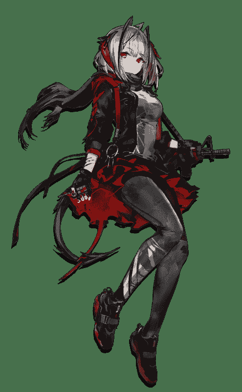
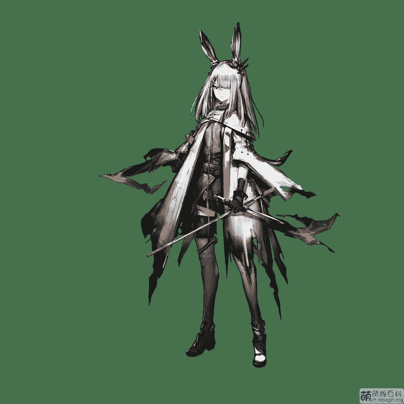
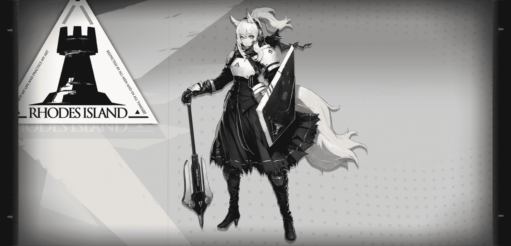
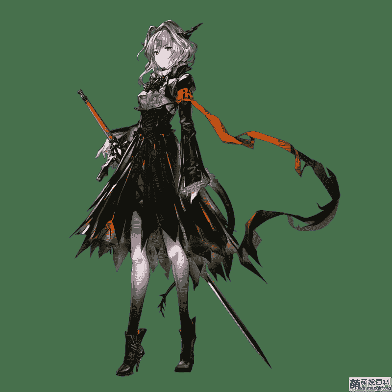

# 【残忍系】明日方舟 chapter5 暗黑时代（下）7.12更新

作者：见崎鸣

TID：26924

<title>1</title> <link href="../Styles/Style.css" type="text/css" rel="stylesheet">

# 1

*本帖最後由 见崎鸣 於 2020-7-12 05:27 編輯*

补充一个鸣群的群号～大家喜欢可以来哦～1090360702

明日方舟 chapter0

四周陷入混沌，空间仿佛在交叠。

【手，好沉重，根本抬不起来……而且好冷……我是谁？我在哪儿？……】
身陷囹圄，我就像失去了自我一般，全身上下无法动弹。心电图机的滴滴声环绕在我的耳边，这种聒噪的声音另我有些烦躁，还有些紧张。

哦，是你。

距离我们上一次见面，已经过去了很久。

这段时间里……你一直徘徊在悬崖的边缘。

——好了，别在这里逗留太久。

你可能已经忘记了你的身份，但你还记得那个名字，这就够了。

毕竟，你不是我的客人，也不应该出现在这里。

她需要你。

12月23日，你可能记不得这一天对你来说，究竟意味着什么。

这会让你陷入十分危险的处境。

……

不。

你必须想起来。

这个声音，在向我诉说，我看到了画面，那是一位少女的背影……我记得……不，我什么都想不起来，我只是隐隐感觉自己睡了很久，具体有多久就连我自己都想不起来，时间久到我都忘记了外面的世界是什么样。

“……知觉……开始循环……阻升主……停跳液注入完成……”

“……体温过低……海克塞米松20cc，静推。”

“止血钳！”

“……状态正常……开始切除……注意室颤……”

“抱歉……又让你受苦了。”模糊的声音说着。

“博……”女孩若有若无的低语若即若离。

【啊，好像有人在我耳边说话……】

我的眼皮跳了跳，试图睁开眼睛，但是挣扎了一会儿之后我还是失败了。

“博……醒醒……士……”还是她的声音，温柔却带着一丝悲伤，还有焦急。比起之前，现在声音似乎要清晰很多。

身体逐渐温暖起来，我的指尖轻微的动了动，试着夺回自己身体的控制权。

“博士！”少女的声音变得无比的清晰。

“呃……”我终于睁开眼睛，我好不容易才适应了许久没有见过的光线。

“太好了！博士，你终于醒了！”我的视线逐渐清晰，少女的容貌映入眼帘。

那是一位相当可爱的女孩，她穿着宽松的不合身外套，娇嫩的脸颊上流下焦虑的汗水，湛蓝的眼眸中充满关切，头上长着两只竖起的耳朵。要说最与众不同的，就是我现在居然坐在她手心里这件事了，我甚至可以感觉到她掌心的温度。

“你……”我脑袋里的眩晕感还没过去。

见我悠悠转醒，少女终于露出笑容：“我还以为你醒不过来了呢……博士……”

强烈的疲劳感席卷我的身体，我再次闭上眼睛。

“医生，博士她还好吗？”我能听见少女在与人对话，“刚才，刚才博士……明明已经醒过来了。但是到现在，博士都没清醒……怎么办……”

“阿米娅！别那么着急，稍微冷静点！”另一个女孩的声音响起，她的年龄似乎与少女相仿。

“啊……抱、抱歉……”名为阿米娅的女孩子有些紧张的说。

“一遇到和博士相关的事情，你就变得慌慌张张的。”另一个女孩说着，“只不过，阿米娅，如果博士还是……你该怎么办？”

稍微沉默了一会儿，阿米娅说到：“——我做好心理准备了。就像我们之前说的那样做。”

“——我知道了。就按你说的做。”

“那就……拜托你了。”阿米娅说，“那博士……”

女孩安慰着：“放心吧阿米娅，博士的状况已经稳定了。我再检查一次好了，包在我身上。”

“那就……拜托你了！”阿米娅再次说道。

我能感觉到自己的身体正在被女孩检测着，她说：“嗯，呼吸比较微弱，血压正常。应该不要紧的。”

我终于回过神来，缓缓坐起来。

“——！”阿米娅猛地转向我。

“……”女孩也看过来，她的身高与阿米娅差不多，“你醒了？阿米娅，成功了，博士清醒了！”

“博士……？”阿米娅低声念叨着，“太好了，太好了……博士……”

我的双臂用力支撑自己的躯干，光是这个简单的动作我就喘息不止。

“啊，小心！你现在还不能……”医生样子的女孩用手指扶住我，“先别动，你的身体还没有完全适应。”

“博士……？”名为阿米娅的少女小心的捧着我。

我有些不自信的问道：“你们……是谁？”

我承认，少女的容貌的确似曾相识，但是我却根本想不起来她是谁，我现在唯一知道的恐怕也只有我的名字而已——这都是刚才好不容易才想起来的。

“啊——博士——我……”少女先是不知所措，继而情绪低落下来，她认真的回答我，“我叫阿米娅。我们是来救你的。”

“……我是……？”我指指自己，首先我需要弄明白我自己的定位才可以。

“你……”阿米娅脸上的失落愈发明显，“你和我们一样，也是【罗德岛】组织的一员……是我的同伴。”

“——Dr.见崎鸣，你是我，最重要的同伴”阿米娅郑重其事的补充到，“博士……不记得了吗？”

似乎还是不愿意相信我失忆的事实，阿米娅像是个执拗的孩子，努力想让我记起我的过去。但是很遗憾，我可能会让她失望了……

“是吗……初次见面，阿米娅。”

“难道说，Dr.见崎鸣也不记得我了……”阿米娅终于认识到我真的是想不起来了，她不甘心的摇摇头，“就算是这样……我也不会放弃的。我们为了找到你，已经付出了很多很多……至少，对我来说，博士始终是我最重要的人。无论发生什么事，这一点是不会改变的。”

说到这里，阿米娅的声音有点哽咽，她稍微抬起头，用力眨眼睛不让眼泪掉下来：“所以，请你……请你多给我一点时间。哪怕只是一小段时间……”

她是个相当坚强又成熟的少女呢……我无话可说，我回忆不起自己是什么人，与她发生过什么，有着怎么样的羁绊，我只能保持沉默。

“博士真的……失忆了吗？”医生模样的女孩问。

“没关系，如果，这样能给博士一点空间的话……”阿米娅说，似乎是想回避这个话题。

简单的自我介绍后，我得知少女叫阿米娅，她自称是名为“罗德岛”的组织的领袖。不过看上去她也就十几岁的样子，无论是神色还是声音都无比稚嫩，如果不是她身边那些家伙都听从她的指挥，我还不敢相信呢。

“这里到底是……”我自言自语着，本能的环顾四周。

此时此刻，我们聚集着一个类似工厂厂房的大房子里面，周围摆放着一些仪器，一眼就能看出这里是一个临时指挥室。以阿米娅现在的身高，她只能半跪下才能不让自己的头顶破屋顶，两只兔子耳朵也被天花板挤压的耷拉下来。阿米娅的身高是普通人的十倍左右，大概有16米左右，不过据说这是因为她发动她体内的“源石”的作用，平时的阿米娅依旧是普通人的大小。

阿米娅将我轻放在地面上：“博士，你感觉自己身体怎么样？”

我试着站起来，虽然腿脚有些疲软，但是至少没有丧失行动能力。我穿着一件宽大的外套，脸上戴着面具，阿米娅告诉我，这件衣服里面是维生系统，可以暂时弥补我的身体缺陷。

这时，房屋外突然一阵轰鸣，建筑物也随之颤抖起来。

是地震？不对……绝对不是地震，是炮弹，我这么想着。

“诶？发生了什——”阿米娅疑惑不解。

然后，一位全副武装的男性从指挥室外跑进来，迅速关上了大门：“阿米娅，有情况！有人闯进了设施！”

透过厂房的玻璃，我们能看到两个身披白色制式风衣，脸上戴着面具的人，一看就不像是什么好家伙，他们手中握着撬棍之类的近战装备，显然是来探路的排头兵。

“他们的打扮……不是乌萨斯的士兵！”男性压低了声音。

“大家注意，找到掩体，保护好博士！”阿米娅沉着的指挥着，“这打扮难道是……整合运动？怎么会……近卫人员……做好战斗准备！”

整合运动……又是一个不熟悉的词汇，我弯下腰，躲在了阿米娅的靴子后面。

“明白！”零零散散几个人回答道，这里的人本来就不多，要是敌人一拥而上那就危险了。

男性也离开大门跑到我们这边来：“可恶，这些家伙是冲着博士来的吗！”

阿米娅轻轻摇头“不……博士的存在不会有别人知道才对。凯尔希医生的远程通讯呢？”

“不知道为什么，设备停止工作了！”

“……有什么切断了我们之间的通讯。”阿米娅说，“乌萨斯政府发现了我们的行踪吗？”

“现在应该怎么办？”男性问到，看样子他不过是个新兵蛋子啊。

阿米娅有些无奈：“原本负责这次行动的凯尔希医生，现在没办法参与指挥……”

“……”阿米娅看向她靴子后面的我，眼神坚定起来，“Dr.见崎鸣。——我希望，由博士来指挥。”

旁边的医疗干员说着：“这……会不会太冒险了，博士才刚刚……”

“……我想……试一试。”阿米娅与我对视，如果不是我的脸隐藏在面具下面，我真想错开目光，“虽然失去了记忆，但博士确实曾与我们……一同战斗过。”

我的脑海中突然闪过一个片段，虽然看不清脸，而且明显比现在的阿米娅瘦小很多，但是我能确定她就是阿米娅。

【谢谢你教会了我这么多……】她这么对我说。

“我们一起经历了许多许多……”阿米娅继续说道，“我知道的……博士你能为我们带来胜利。”

【你能为我们带来胜利】

我的头脑有些胀痛，片段与现实交叠起来，我仿佛抓住了什么，却又什么都没有抓住。

“……我明白这样突然请求你很失礼，”阿米娅的语气中充满歉意，其次还隐藏着一丝期待，“但是，但是……拜托了，请你助我们一臂之力。我也会辅助你的！”

我不假思索的点点头，对我来说，我感觉是失去记忆的我更对不起阿米娅才对，想必她和我之间一定是有着很深的感情吧。

“我们只能反击了，不是么？”不知道为什么，我觉得自己顿时热血起来。

阿米娅欣慰的笑了，然后大概是想到现在的处境她又严肃起来：“嗯……我也不想把博士你卷入这些纷争。但现在的我们，非常需要Dr.见崎鸣的智慧。希望博士能在战斗中，把过去的感觉找回来。”

果然还是希望我恢复记忆呀……我暗自下定决心，哪怕是为了眼前的少女，我也要想起来我的过去。为了她，我要解决现在面临的危险。

“——也许连你自己可能还不太相信……”阿米娅温柔的说，“但是我相信你。”

我的心里感受到一丝暖流，我紧紧按住自己的胸口不让自己心率过快。

“……我相信你……一定可以的。”

“请指挥……罗德岛！”

大家好～这里是潜水很久的鸣～新作明日方舟的序章，为诸位献上～【其他的坑也在填了】
<ignore_js_op>

**d9ea69cac2ec621bfc2023c87499d9f1251ccc25.jpg** *(399.31 KB, 下載次數: 0)*

[下載附件](forum.php?mod=attachment&aid=Nzg2NzZ8MjMyOGNjZWR8MTYwMDg2OTgxMnwxODIzMHwyNjkyNA%3D%3D&nothumb=yes)

2019-5-31 23:49 上傳

<title>2</title> <link href="../Styles/Style.css" type="text/css" rel="stylesheet">

# 2

*本帖最後由 见崎鸣 於 2020-6-9 05:34 編輯*

明日方舟 Chapter1 整合运动

指挥室四面都是厚重的混凝土墙，狭窄的窗口最多只能通过幼稚园的小孩子，装备齐全的整合运动只可能从正门进来。这是一个易守难攻的房间，这也正是为什么阿米娅会选择这里作为临时指挥部。不过，一旦惊动了大批的敌人，这里也会变成我们的活棺材。

“那么……怎么处理这两个整合运动的先锋就是问题了……”我暗自思索。

留给我的时间不多，他们很快就会到我们这里勘察，如果不能迅速解决问题，麻烦可就大了。在爆炸中，我们的电源似乎也被切断了。

铁质的大门并不算特别大，切断了电源的指挥室伸手不见五指，只能透过满布灰尘的肮脏窗户透过一丝丝的光线。真可惜，如果不是太黑的缘故，我抬起头就能看见她的裙底呀。躲在阿米娅脚后方的我隐隐闻到了一丝气味，气味的来源是阿米娅穿着板鞋的双脚——一股淡淡的体香，以及几乎掩盖住体香的足臭味。美少女的足味呀……也是，这里毕竟是战场嘛……

“呼……”我忍不住多呼吸了几口，“嗯，这股味道我倒是不讨厌呢。”

“博士？”阿米娅显然没有听清楚我的嘀咕。

她这一叫喊，我立刻就想到了好办法，我伸手戳戳阿米娅的脚踝：“阿米娅，我想到办法了！”

……

“刚才的动静就是从这里面传来的。”戴着白色面具的整合运动成员说道。

另一个家伙点点头，握紧手中的撬棍：“看样子周围没办法进去，我们就从正门进去好了。”

厂房的入口分为两个部分，的一部分是全封闭的狭长走廊，第二部分就是罗德岛指挥室的所在。整合运动在外围寻找突破口失败之后决定强行从正门进去。

“我们的人就在附近，遇到危险马上呼救，他们会听到的。”领头的人说着，推开了走廊大门。

两个人蹑手蹑脚，一步一步的往里面蹭，生怕惊动了潜在的敌人。

“是不是太安静了一点？”走在后面的整合运动成员有些心虚。

“嘘！小声点，如果发现敌人的老窝我们就立大功了，说不准我们还能混个干部呢，”带头的整合运动压低了声音说，“小心，马上准备进去了！”

二人屏住呼吸，缓缓打开了通向厂房内部的大门。推开门后，他们并没有看到想象中的敌军指挥部，映入眼帘的只有一片漆黑。

“什么都看不见……”带头的整合运动成员用指节敲敲自己的面具。

“话说你有没有闻到什么味道？”另一个人则是抽抽鼻子。

大门里若有若无的热气裹挟着浓浓的臭味扑面而来，这股气味直接钻进整合运动的鼻腔，侵入脑髓，灌满他们的肺部。这种臭味并不是像腐臭那样恶心的臭味，反而他们还觉得这股味道闻起来很舒心，但是他们也说不出来这到底是什么气味。虽然很想打开手电看看，不过为了避免打草惊蛇，二人决定摸黑前进。

带头的整合运动咽下一口唾沫，拍拍同伴的肩膀：“走，我们进去看看。”

“好、好的！”

二人谨慎的慢步走入幽暗的房间，虽然那股气味让他们略微有点在意，不过整合运动干部交给他们的任务就是探路，所以作为组织最底层的人他们只能选择服从。

“唔！？”带头的人感觉自己的脸撞在了什么东西上面，不硬也不软，好像还有点弹性，“这是什么……？”

“怎么回事？”另一个人走到他的身边。

带头的整合运动用力推了推面前的障碍物：“有堵墙一样的东西挡住了路，你快来帮我一起推开！”

正当二人试图合力推开“墙壁”的时候，他们却感觉自己脚下的地面剧烈摇晃起来，顺带还产生了失重感。状况太过突然，地面瞬间倾斜，他们还来不及反应过来就跌倒了，带头的整合运动成员还摔掉了自己脸上的面具。

“怎、怎么回事？”，四周的摇晃缓和了一点，带头的整合运动成员刚想站起来，却发现自己的头居然顶到了“天花板”，而且脱掉面具之后，环绕在自己身边的臭味简直可以用惊世骇俗来形容，“见鬼了……这是什么地方！？”

这个狭小空间里面充斥着热乎乎的臭气，隐隐还有一丝幽香，整合运动成员贴在“地面”的脸上有湿滑的触感，从他的身后似乎有微弱的光亮从圆形入口处照射进来。

另一个人的声音从入口下方传过来：“我也不知道……等等！好像有什么东西压下来了！”

带头的家伙想要一探究竟，于是打开了手电筒。

“抓住他们了，博士，我现在就穿上鞋子！”从二人所在的空间外传来了一位少女的声音。

“！！！”

这个狭小的空间不是其他什么，正是阿米娅的鞋子里面；而通过入口压下来的巨物，就是阿米娅被黑色丝袜包裹的脚丫了；所谓的一系列震动，不过是阿米娅简简单单的拿起鞋子准备穿上而已。

听到阿米娅了声音，了解到接下来会发生的事后二人惊慌失措，以至于都忘了通知还在外面待机的队友。位于鞋跟处的整合运动成员伸手扒拉住鞋子的边沿，试图在阿米娅的脚穿进来之前爬出去，带头的整合运动成员无路可退，他蜷缩在阿米娅的鞋尖，手电筒落在鞋垫上照亮了整个空间，他惊恐的注视着那只俏皮的足尖伸进了鞋内。

“真是的，乖乖进去吧，我也不想动粗呢。”阿米娅怎么会给整合运动逃走的机会呢？她绷直足尖用力一伸就让半只脚掌都塞了进去，试图逃跑的可怜虫松开了鞋边，以一个跪姿被阿米娅的后半脚掌踩住了。

自己的腰被重物压住，整合运动成员想要惨叫却因为呼吸困难无法出声。

“嗯……有点挤脚……”阿米娅根本没有注意到小人被自己以一个什么样的姿势被踩住，她感觉自己的脚在穿进鞋子的过程中受到了阻碍，还以为是小人在推搡自己，于是她伸出纤手用指尖勾住脚后跟，足跟狠狠踩进去。

“咔嚓咔嚓！”人体骨骼碎裂的脆响无比清晰的在阿米娅脚底响起，整合运动成员的身体被巨大的丝足强行对折，内脏和血液哗啦啦的顺着被折断的空腔向外流淌，浸湿了阿米娅的丝袜和鞋垫。一连串的骨裂声后，阿米娅的足跟与鞋底严丝合缝的贴合在一起，整合运动成员被她踩的扁扁的，变成了杀害自己的凶手的鞋垫的一部分。

阿米娅也意识到有个小家伙命丧黄泉了，她不好意思的吐吐舌头，脚趾微微翘起，让剩下的人滑落到自己的脚心部位，然后大脚趾利落的摁住他的脑袋。

阿米娅低声威胁着：“不要叫，不然我踩扁你的脑袋。”

说着，阿米娅的脚趾对下面的小脑袋稍稍用力，虽然阿米娅的脚趾软绵绵的，但是对于此刻只有阿米娅十分之一高的整合运动成员来说可就不是那回事儿了，他顿时感觉脑袋像是被钢板压住一般，几乎就要裂开了，他发疯似的扭动身子，咬紧牙关不让自己叫出声。

“这就对了，”阿米娅满意的松开足趾，给他一个喘息的机会，“博士，可以了。”

我的计谋相当顺利，利用阿米娅脱下的鞋子堵住大门，借助昏暗的空间诱骗这两个整合运动钻进鞋子里面，再让阿米娅穿上鞋子，他们就只能任人宰割了。

“那么我们长话短说，”我走到阿米娅踩住整合运动的那只脚边蹲下，“想活命就把你们的人数配置还有人员分布告诉我。”

其实我并不想做出这种恶人行为的，不过现在关系到这间房子里所有人的生死，我也就不择手段了。

整合运动成员明显被之前同伴的死吓破胆了，他亲眼看见同伴被少女的巨足无情踩碎，身体折叠的脆响现在都在他脑袋里回荡，他可不想被阿米娅踩死，于是立刻就招供了：“我、我说！我们一共有两支小队24个人！除去我们两个还剩下22个！分别在左右两边驻扎，左边是我们的驻地只有10个人！求求你不要杀我，我不想死！”

已经问得自己需要的情报，我朝阿米娅点点头，示意解决他。我不能冒险将他从阿米娅鞋子里取出来，这可能会害我们一众人丧命，既然阿米娅信任我将罗德岛的指挥权交给了我，那么我就应该为这些人的生命负责。

阿米娅点点头，虽然有些于心不忍，她还是以大局为重。

“等等！不是说好会放过我吗？！”一听外面没有了动静，整合运动成员感觉大事不妙，他发疯似的用手推按鞋子侧面，我甚至能看到阿米娅鞋子被他撑起一部分，他的手印相当清晰。被困在阿米娅脚底的他早已是无力回天，无论他是否交代情报，我和阿米娅都没有打算让他活着离开。

阿米娅狠下心，她调整好玉足的位置，大脚趾猛地摁下去，伴随着沉闷的“噗嗤”声，阿米娅的足趾漂亮的碾碎了可悲头颅，踩烂的大脑黏在阿米娅的脚趾上，整合运动的成员一命呜呼。血液从小人失去脑袋的脖颈喷洒出来，不要钱似的渲染着阿米娅的脚底

“感觉……鞋子里面被塞满了……脚趾缝里面都是……”阿米娅不适应的踏住地面旋转脚踝，将鞋子里面的小人踩扁平一点，“不踩扁的话会很硌脚。”

整合运动的躯体完全被踩成了垫子，现在他们将为新的主人——阿米娅的脚服务了。契合阿米娅修长脚型的制服皮鞋新增了填充物显得鼓鼓囊囊的，任谁也猜不到在少女的鞋子里面居然装了两具尸体吧，虽然这两具尸体肯定已经看不出来还是人形就是了。

确认了情报，解决了敌人，接下来要做的自然就是突围了。

“Dr.见崎鸣的指挥确实和阿米娅说的一样，让人放心。”

阿米娅像是在炫耀似的，得意的笑了笑：“是吧，轻轻松松吧？博士曾经经历的，可不只是这种程度的战斗。”

“看样子根本不需要我们出手了啊。”有些严肃的女性的声音在大门口出现。

敌人？！我不由得紧张起来。

“杜、杜宾教官！”男性干员认出了来人，看样子是自己人。

那是一位一眼就能看出是“教官”的严肃女性，漂亮的黑色的头发上长着犬耳，眼神透露出坚毅。她身着一身黑色的制服，高腰装下露出了她的好身材，一看就是经常锻炼的人

“杜宾！你来了！”阿米娅也欣喜的打了个招呼。

名为杜宾的女性点点头：“情况紧急。我的小组也遭到了攻击，敌人同样是整合运动。所以我才立刻赶过来跟你们汇合。”

“整合运动为什么会攻击我们……？”阿米娅问。

“一个感染者权益组织……本来我觉得他们只是有点盲目激进——”杜宾顿了顿，接着说，“——现在居然开始使用暴力，还是在乌萨斯的城市？真是自寻死路。接下来，这里只会变得更加混乱。阿米娅，我们必须立刻撤离切尔诺伯格。”

阿米娅表示同意：“好的。我们已经成功救出博士，之后按照计划撤退就可以了。”

听到“博士”两个字，杜宾继而看向我这里：“——这位就是Dr.见崎鸣？”

“是、是的。”阿米娅说。

杜宾认真的说道：“Dr.见崎鸣，你可能不认识我，但你认识阿米娅，为了你的个人安全着想——”

“不不……”阿米娅有点不好意思的打断杜宾，“唔，杜宾，博士目前状态并不是很好。简单的说，博士……他失忆了。”

说到这里，阿米娅惋惜的叹了口气，不用猜也知道她还是很在意我的记忆问题。

“失忆？”杜宾微微一愣，“……这怎么办？你还准备将指挥权交给这个……”

阿米娅再次打断杜宾，不过这次她的语气很是坚定：“博士依然有能力指挥小队。至少，在刚才的战斗中，我已经确认了。”

“我还是不能怎么简单就相信一个陌生人。”杜宾摇摇头，然后说到，“但我相信你，阿米娅。”

“……我知道了。”阿米娅点头。

杜宾走到我面前：“Dr.见崎鸣，我是行动组E1组长，杜宾。我们将把你从这座乌萨斯城市——切尔诺伯格，掩护到罗德岛。”

紧接着，杜宾取出一块平板：“身处切尔诺伯格城的核心废弃设施现在的我们理应向西撤退。”

阿米娅补充道：“但……和凯尔希医生通讯中断时，我和杜宾教官都需要先领着各自的小组，去西边的集结地汇合然后确认撤出信号。按照计划，原本是这样的……”

“如果能这么顺利就好了。”杜宾看着阿米娅的鞋子，整合运动的血水已经从阿米娅运动鞋的边缘渗出来了一点点，“今天是我们从石馆救走你的最后机会，Dr.见崎鸣。只是……我总有种不祥的预感。”

“阿、阿米娅！”医疗干员凑到阿米娅身边，“是……是来自罗德岛的对话请求！”

“通讯接上了吗！难道说，是凯尔希医……”

“很抱歉，并不是。”通讯器的声音打断了阿米娅。

“PRTS……？”阿米娅问道。

“应急神经连接请求被意外触发了。”PRTS说着，“罗德岛号方面也受到干扰，只有神经连接可以勉强进行。无法用电波联系到尚未回到罗德岛的凯尔希。已经确认过阿米娅您的安全，那么我的任务就已经完成了。”

“这东西……现在真的是时候吗？”杜宾似乎有些无语。

“不需要使用您的神经连接操作罗德岛的话，我将在稍后断开连接。如果打扰到您的派对，万分抱歉。”

“不不！别挂断……我需要你帮个忙。”阿米娅连忙阻止，然后俯身对着杜宾说，“杜宾，博士需要这些帮助。”

杜宾表示同意：“了解了，抓紧时间。”

阿米娅略带歉意的向我解释着：“博士，PRTS也是我们的……同伴，它会指导你的下一步动作。虽然时间很紧张，但现在，我要为你重新连接至罗德岛的后勤系统。这样在我们作战的时候，你也能利用它为我们取得优势。可能会很难习惯，和说话不太一样，但只要好好使用，就一定能使整个救援作战更加顺利，所以请你……相信我吧。按你想要的那样，按你熟悉的那样……”

她似乎又回想起了过去，随后才说：“PRTS……开始吧。”

不过经过她的解释我也明白了，这个所谓的PRTS也就是类似战斗辅助AI的东西吧。

“需要确认管理员身份，请选择识别方式。”

“啊，博士……请你说句话。”阿米娅示意杜宾把平板递到我的手上。

鬼使神差的，我没有说话，而是用手指触摸在屏幕上。

“虽然不知道为什么你不说话，反而触碰了一下屏幕中央——”

“——不过我已经找到了相匹配的指纹。身份确认，权限水平：8。”

PRTS说道：“——欢迎回家，Dr.见崎鸣。”

To be continue

从这里开始，明日方舟的故事就正式开始了，关于世界观的普及以及不同干员的巨大化原理将会在chapter2介绍。感谢大家对鸣文的支持，鸣会努力把明日方舟写成即使不了解游戏世界观也能愉快看下去的文，以上～欢迎加入FGN－鸣之足下，群聊号码：1090360702

下方附上阿米娅～
<ignore_js_op>

**Screenshot_20190603-083017.jpg** *(702.42 KB, 下載次數: 1)*

[下載附件](forum.php?mod=attachment&aid=Nzg2OTF8ODRjODU4ZTZ8MTYwMDg2OTgxMnwxODIzMHwyNjkyNA%3D%3D&nothumb=yes)

2019-6-3 12:58 上傳

<title>3</title> <link href="../Styles/Style.css" type="text/css" rel="stylesheet">

# 3

> [shendanxiaogui 發表於 2019-6-1 03:28](https://giantessnight.com/gnforum2012/forum.php?mod=redirect&goto=findpost&pid=406435&ptid=26924)
> 发动矿石病还行，好歹说是源石技艺啊，不然没矿石病的企鹅物流怎么巨大化( ...

这个在chapter2会介绍的啦～～
<title>4</title> <link href="../Styles/Style.css" type="text/css" rel="stylesheet">

# 4

> [archer 發表於 2019-6-1 03:46](https://giantessnight.com/gnforum2012/forum.php?mod=redirect&goto=findpost&pid=406436&ptid=26924)
> 哎呀 这是趁着活动来一波的感觉啊~~   刚抽到了小火龙正好打鲍勃~~ 鲍勃你在做什么 ...

其实是准备很久了呢，三测开始就想写，但是一直咕咕咕2333
<title>5</title> <link href="../Styles/Style.css" type="text/css" rel="stylesheet">

# 5

> [MiaoKong 發表於 2019-6-3 08:23](https://giantessnight.com/gnforum2012/forum.php?mod=redirect&goto=findpost&pid=406607&ptid=26924)
> 支持支持，期待后续～

谢谢支持啦～chapter1已更新～
<title>6</title> <link href="../Styles/Style.css" type="text/css" rel="stylesheet">

# 6

> [噤声独裁者 發表於 2019-6-3 18:01](https://giantessnight.com/gnforum2012/forum.php?mod=redirect&goto=findpost&pid=406635&ptid=26924)
> 但是从这种描述来看，阿米驴的身高绝不止10倍吧......鞋子能轻松装下两个人至少得二三十倍才行..... ...

其实并不是很轻松，两个人在里面很挤，阿米娅之后走路的时候都会把里面的残骸从鞋子开口挤出来
<title>7</title> <link href="../Styles/Style.css" type="text/css" rel="stylesheet">

# 7

> [天衣无缝 發表於 2019-6-8 06:56](https://giantessnight.com/gnforum2012/forum.php?mod=redirect&goto=findpost&pid=406985&ptid=26924)
> 阿米娅看大图会发现她穿的其实是制服鞋，或者说是类似制服鞋一样的小皮鞋，她这身去掉外套就是学生制服了 ...

鸣去修改一下，主要是也没看出来是什么鞋子
<title>8</title> <link href="../Styles/Style.css" type="text/css" rel="stylesheet">

# 8

*本帖最後由 见崎鸣 於 2020-6-9 05:35 編輯*

明日方舟chapter2 袜中世界
（经过长时间的咕咕咕，新的番茄酱文上线啦~欢迎大家观看明日方舟chapter2，喜欢的朋友可以加入群聊FGN-鸣之足下，群号：1090360702）

在乌萨斯帝国城市切尔诺伯格某处有些昏暗的房间內，少女摇晃着双腿静静的坐在床沿，裸露的双腿肤如凝脂，仿佛指尖轻轻一触就会玷污那份美好。可惜的是拥有这样一双绝美玉腿的女孩，却偏偏是站在罗德岛对立面“整合运动”的干部。

“啊，什么时候才该我出场呢～？”少女有些无聊的伸了一个懒腰。

“队长，东西帮您送到了。”轻轻扣响大门后，一位戴着整合运动制式面具的整合运动士兵走了进来，然后恭敬的把一个大箱子推到少女的脚下。

少女坏笑着挥了挥手，那位整合运动士兵就小心离开了。

“呵呵～正好我闲着无聊嘛，在接到新任务前就让我好好用你们消遣一下吧～”少女的指尖戳了戳自己的脸颊，她美丽的脸上绽开了一个嗜血的笑容，妖艳而危险。

少女的代号是“W”，虽然还是年纪轻轻但是她已经是颇有名气的雇佣兵了，也正因为她有着这样特殊的才能才会被整合运动招揽，并且成为其中相当有地位的干部。W的名气不仅仅是因为她残酷的作风或者让人胆寒的手段，其中还有很大一部分原因是她的种族——“萨卡兹”，这是被泰拉大陆的人们称为“魔族”的种族。相传，“萨卡兹”这个种族的由来是源于旧人类在塞壬统治下爆发了一场名为“圣杯战争”的仪式，这场仪式在最后的失败产生了“萨卡兹”这个泰拉大陆的异端，萨卡兹是被诅咒的种族。

即使在阴暗的房间里面，W那头漂亮的银白秀发也格外的显眼，她那双如猫般的闪耀红瞳也在黑暗中闪着淡淡光芒。

“虽然有些不舍，不过，鸫，暂时我们要先道别了哦～”W的脚温柔的踩在那大“箱子”上，与其说那是箱子，不如说更像是一口棺材。

对于W裸足的踩踏，箱子里没有任何的回应，W无言的穿上运动鞋，因为最近都在战斗的缘故，鞋子里外已经变得很脏了，不过身为雇佣兵W对这种情况已经习以为常了。她没有留恋的推开门走出房间，然后轻轻的将门关上。

“你们，把我要的人带过来后都离开。”W对路上来往的整合运动成员说。

说完，W的身躯在街道上就变得高大起来，她很快就成长到了15米左右。在泰拉大陆，拥有源石技艺的女性可以掌握巨大化的能力，而类似W这样患上矿石病的人则可以随意巨大化，无需依赖源石技艺。虽然矿石病是致死率百分之百的绝症，但是直接巨大化的能力确实也为W他们提供了便利。

W现在所在的这片区域隶属乌萨斯帝国，不过附近区域的实际掌控权已经流落到整合运动手上了，现在这里是整合运动的根据地。

“呼～真讨厌呀，好久都没有换衣服了，真是的…”W似是抱怨的说着，提起了自己的连体胶衣，这是她个人最喜欢的一套衣服，经过源石技艺改造后可以适应W巨大化后的体型。除此之外，W的身体很爱出汗，气味对于一位雇佣兵来说是一大威胁，所以用胶衣可以完美的封住。最近的几个星期W都在四处奔波，别说是换衣服了，就连洗澡的次数都不多，闷热的胶衣里面不知道已经积蓄了多少W的味道。

“尤其是～我的这里…”W坏坏的笑着晃了晃自己的足，她的脚趾间都因为湿热的汗水变得粘粘的，“呼，一会儿就要把她们穿进去了呢～”

W悠哉悠哉的坐在身边矮小的仓库顶上，现在的她身高足足有15米，面前的仓库高度对正常人来说也就是普通椅子的高度吧。

大概等了有几分钟，几个整合运动的重装成员就押解着几个年幼的小女孩走了过来。这些女孩子年龄都在12岁左右，她们虽然衣着华丽此刻却显得有些怠倦。这些女孩而都是乌萨斯帝国军官的孩子，整合运动通过绑架这些孩子起到威慑乌萨斯政府的目的，正是因为手中有这些女孩作为人质，整合运动才能不费一枪一弹渗透进切尔诺伯格。

“队长，人带来了。”领头的人说。

“你们继续去忙吧，这里有我一个人就够了。”W挥挥手，打发自己的手下离开。

几个女孩慌张的四下张望，因为恐惧她们相互抱在一起，直到见到那几个整合运动的彪形大汉远去她们才稍微放松一些。而她们面前的W虽然也是整合运动的成员，而且高度比她们高了十倍以上，不过她漂亮的脸和与女孩们相仿的年纪让她们放下了不少戒心。

其中一个女孩鼓起勇气站起来，朝W的方向颤巍巍的走了两步：“大姐姐…你是…？”

“我呀？当然是这群家伙的BOSS啦～”W轻松的笑了笑，伸出自己的左脚靠近了那个女孩子。

W巨大的裸足压迫性的接近前方的女孩，指甲盖上鲜红的指甲油反着光芒，热乎乎的玉足裹挟着无与伦比的汗臭，白皙的足底上满满的都是黑色的汗渍，W的脚还没伸到女孩的面前她的胃里就开始隐隐作呕。刺鼻的味道熏的女孩头晕目眩，但是看到W那张绝美的脸她却又觉得这种味道难以置信的上瘾。

W眉毛轻挑，说到：“抱歉哦～姐姐很久没有洗脚了呢，因为真的很忙哦。”

虽然W这么说着，但是她的语气并没有一丝歉意，反而充满了戏谑。W撑开自己修长的足趾，露出玉趾间漂亮的趾缝，然后轻轻夹住了女孩的脖子。

“姐姐…？”女孩有些不理解W的举动，不过她也没敢动，此刻面前这位巨大的少女只需要稍稍用力，自己就会死在她的玉趾之下。

“我脚上的味道，怎么样呢？”W媚笑着，像是古灵精怪的小恶魔。

女孩也不敢得罪W，只能点点头：“嗯…很喜欢…姐姐脚上的味道…”

不过，她也没有完全说谎，随着自己开始习惯这股味道，W的脚似乎真的变得愈发高贵起来了。一想到自己正在闻着这位绝美少女的足臭，她就抑制不住自己心里兴奋的冲动。

“呵呵～是真的吗～？”W循循善诱的问着女孩，一点点化解她的心理防线，“那么既然这么喜欢姐姐的脚，是不是应该表现出一点诚意？姐姐可是奖励你闻我脚趾缝里面最浓郁的味道哦～像只小狗似的贪婪的闻了这么久哦！”

女孩的面颊上泛起一丝淡粉色，乌萨斯一族特有的熊耳朵不安分的抖动着。她像是下定决心了一样，深深的把自己的脸埋进W的趾缝之间，一边沉浸在她高贵的足臭中，一边伸出湿漉漉的舌头舔在了W光滑的皮肤上。

“呼～”明白面前的女孩已经屈服于自己，W的脚趾也不由自主的加大了力度，玉趾如同钳子一般死死夹住了女孩的脖颈，虽然不至于夹断，但是让女孩的呼吸变得更加困难了。

女孩仔细的为W清理着玉足上的污垢，她的舌头灵活的在W趾缝中的软肉上游走，不停的发出“呲溜呲溜”这样有些色情的声响，她将W脚上湿咸的汗水和已经凝成块状的脚垢统统吞咽进腹中，然后露出满足的表情。味蕾被W的脚汗侵蚀几乎都快尝不出味道了，女孩自己的大脑里面仿佛都已经充斥着少女的足息了。这个时候，女孩才明白，短短的几分钟自己就已经被W洗脑了，而且是被她用一只脚，彻彻底底的洗脑了。

“没有姐姐的足味…我活不下去…”女孩几乎要哭出来了，她卖力的亲吻W足趾内壁。

就连W自己也不知道为什么，闻到自己玉足味道的人就再也没有抵抗力，他们如同上瘾一样的沉迷在自己的脚下，直到死去，除了……

“不，”W摇摇头，强迫自己不去回想那个人的脸，她看着女孩痴迷的脸说，“既然这样的话，那就永远的来服侍我的足底好不好呀？”

女孩重重的点头，一脸期待的看着面前的W。

W微笑着、从容不迫的夹起女孩轻飘飘的身体，同时腿部优雅的一屈就把玉足伸到了连体胶衣的入口处。为女孩展示完漆黑的胶衣内部后，一点点的，W开始穿进去。连体胶衣的下半部分，姑且与胶袜是没有差别的，那里就是女孩以及W玉足的目的地。

“这是…”女孩突然有些不知所措。

W坏坏的笑着，红色的猫瞳中是对待猎物的玩味：“不是说没有我的脚就活不下去嘛～那我就满足你呀，让你一辈子都和我的脚在一起呀～”

“姐姐！等等，我不想死！”女孩终于意识到了，W聪一开始就是想诱导她说出那样的话，尽管她是真心喜欢上了W的玉足，可是她并不想因此失去生命。

可是，她又能做什么呢，无论如何反抗，W那被汗水濡湿的足趾都像是死神的锁链掐住了她的咽喉，她只好一点点的被那位嗜血的少女送入她胶袜的最深处。

“噗哈！”W松开足趾，任凭女孩滑落到袜底，令人惊讶的是，胶袜的底部居然已经积累了一汪小小的“泉水”，女孩脸部着地的同时她嘴巴里面喝进去了一大口水，湿咸的还略微带有一丝甘甜的味道瞬间充满了她的口腔，“这是都是…姐姐脚上的汗…？”

“啊啦，抱歉抱歉～”W可爱的吐吐舌头，“因为我很爱出汗嘛，这个月的【精华】都储存在袜子里面了呢～不过既然是你的话应该最喜欢了吧～”

对女孩来说，其实并不好受，刚开始她还因为自己能随时呼吸到W的味道而欣喜，但是她很快身体就本能的产生了不适。比起之前在外面的时候，现在胶袜里面的气味不知道浓厚了多少倍，空间内的空气都变得粘稠起来。阴暗狭窄的袜内充斥着W的足臭，这根本不是生命可以存在的地方，呼吸了太多足味的女孩感觉自己开始头晕起来。

几乎完全被足味占据的混浊空气强行灌入女孩的呼吸系统，每一次的喘息她都感觉自己的肺部和呼吸道传来灼烧一般的痛感，她声音沙哑的冲着W叫喊：“姐姐，我好难受呀…”

此刻的W，虽然还是笑着，却没有了笑意：“既然觉得难受，姐姐就来帮你吧。”

这些乌萨斯官员的孩子，已经害死了不知道多少得了矿石病的人，她们凭借着家中的权势肆意虐待矿石病患者。乌萨斯政府对此视而不见，现在，是W让她们偿还的时候了。

W那只白皙的玉足就那样缓缓踩了进去，脚掌很快就碰到了跪坐在袜底的女孩，巨大的足轻轻一推就把女孩推倒了。W伸出纤手拉扯住袜子，脚掌准确无误的压住了女孩的身体，温暖的脚底瞬间就被积累的汗水包裹了。

“姐…姐…？”迎接女孩的自然不会是W的救赎，而是她无情压下的浑圆趾肚。

以女孩现在的体积，W的脚趾覆盖住她的整张脸已经绰绰有余了，稍稍校准位置，W的大脚趾摁住了女孩的脸，然后一下子将她踩进了汗水中。

“咕噜噜…！”女孩没想到，自己人生中的第一次溺水，居然会是在一位少女的袜子里面。

“啊啦？你们看看，你们的同伴现在就在我的脚底下享受呢～大家有没有羡慕呢？”W双臂撑住仓库，漂亮的脸上因为兴奋渗出了几滴香汗，顺带着黏住了几丝银白发。紧接着，W得意的抬起自己的左脚，将袜底展示给还蜷缩在一起的其他女孩们。

被渲染上黑白色调的胶袜完美的展示出了W修长匀称的玉腿，还有她完美到不能更完美的脚型，顽皮的脚掌时不时惬意的弯曲一下，显得她的玉足更具诱惑力。唯一的违和部分就是在原本应该平整的足底会突兀的冒出一个还在扭动的人形痕迹了，这自然就是已经屈服在W脚下的可怜女孩了。而其他那些从未经历过危险，从小锦衣玉食的贵族姑娘，哪里能想到面前这个比她们只大了一点的雇佣兵少女，竟然能想出如此色气又残酷的杀人方式。

她们的反应也在W意料之中，比起这些，她更想玩弄自己足底这个卑微的生命。

“呼…呼…”时不时的，W会仁慈的抬起玉趾给女孩一个呼吸的机会，然后不等她多吸一口气就又踩了下去。本来袜内的足臭就已经致命，再加上甘甜汗水带来的窒息，女孩不要命似的扭动起来想要反抗W。

W愉悦的咬着自己的食指指甲，左脚踩在地上轻轻的碾着夹层间的女孩，就像是踩着一根按摩棒，迫使女孩用自己的血肉之躯为自己贡献着舒适：“嗯～就是这样～继续动吧～不然的话姐姐真的就踩死你了哟！～”

女孩也相当配合的在W足底进行着无力的挣扎，W软绵绵的足底踩的她的骨骼嘎吱嘎吱的响，女孩也发出了痛苦的呻吟。W时不时的会发出银铃般的娇笑声，她恰到好处的让女孩不被自己踩碎身体，并且刺激她以最大的力度在自己脚下按摩，同时还用她的足趾“抚摸”女孩的脸对她进行安抚。

“呼…啊…”胶袜内的空气随着W玉足的停歇也愈发的沉闷起来，闷热的足味取缔了最后的空气，一半身体浸泡在W的脚汗中似乎让自己体内的水分都被置换出来了，女孩轻微的抽搐着，她知道自己的时间已经不多了。

“嘻嘻～怎么样，我的袜子里还是很舒服吧～”W能感觉到，脚下的女孩挣扎已经开始减弱了。

W说的没错，她的袜内温暖舒适如同天堂，而且这只温柔的玉足竟然让她有种回到母亲襁褓中的感觉。在W喜悦的笑声中，女孩也欣然接受了自己将要死在她足下的结局，W好闻的足味完全侵蚀了她的大脑，袜子内部可供呼吸的空气越来越少，在窒息和臭味的双重刺激下女孩竟然高潮了，迷迷糊糊之中她疯狂的亲吻着即将夺走自己性命的女神的脚趾。

“呲溜～呲溜～”女孩已经有些冰凉的舌头舔舐着W热乎乎的趾肚，将上面咸津津的脚汗饮入腹中，甘甜的汗水促使她榨取着自己最后的生命力服侍面前的脚丫。W脚趾上细腻的软肉相当敏感，女孩每舔一下，她的玉趾都会可爱的抽动一下，同时W本人也会惬意的轻哼。

渐渐的，女孩的意识开始模糊，她回想起了自己对感染者的歧视和暴行。恍惚之中她看见自己与W的脚融为了一体，而W则是满意的微笑着，女孩也安心的闭上了眼睛：“啊…这样子的话，我也算是赎罪了吧，姐姐…会原谅我的吧…？”

W面前的女孩们惊恐的发现，原本还在胶袜底部凸起奋力反抗的同伴，已经不再动弹。

察觉到脚下已经没有了动静，W也侧过脚面，伸出手指戳了戳女孩，才发现后者已经死去了：“啊啦，被我的脚活生生熏死了么～还真是可爱呢。”

这位乌萨斯官员的女儿，被W的玉足的气味彻彻底底的杀死了。

“不过，还不够呢～”欲求不满的W舔了舔自己淡粉色的嘴唇，她狡黠的目光也不由自主的转移到了另外的几位少女身上，“刚才你们的朋友让我的脚很舒服呢，不过我还有点不满足哦，所以希望大家也可以一起来帮助我呢。”

说着，她还俏皮的向她们展示袜底勾勒出足部曲线还有死去同伴的凸起。

“……”W妩媚又残酷的动作让女孩们心惊肉跳的同时又对她足内的世界充满了好奇，到底是怎么样的一个人才能在做出如此残忍行为的同时让人心甘情愿的为她去死呢？

见女孩们一言不发，W也不生气，她将还未穿上袜子的右脚搁在女孩们的面前，五根足趾时而弯曲时而闭合：“怎么样？我的脚好看吗？喜欢的话现在就可以死在下面呢。”

虽说W的语气就没打算让女孩们活命，不过女孩们却意外的觉得有些安心，仿佛死在W的脚下已经变得神圣起来，可是与此同时她们的求生欲又令她们不安。

“那么，就让我来为大家做出选择吧～”W俯下身子，五根玉柱般的巨大手指伸向女孩们，将她们一个接一个的抓起，然后任凭她们落入自己右脚的袜子内部。

W虽然已经巨大化，不过随着女孩们不断坠入袜中，数个女孩加在一起的体积依然让袜子提起来有些沉甸甸的，尤其是足底的部分已经被她们撑得鼓鼓囊囊。女孩们跌落在积累了一层汗水的袜底，身体相互堆叠，光滑的胶袜内部完全没有着力点。别说是逃跑，就连挪动一下四肢都极为困难。

“大家都已经进来了呢，那我就穿上袜子了～”W愉快的哼唱着不知名的曲子，然后优雅的绷直足尖，雪白的玉腿将玉足迫不及待的送入了昏暗的袜内。伴随着W玉足的进入，胶袜内彻底没有了光亮。

“啊，大家踩起来都软绵绵的呢。”W的玉足轻轻落在女孩们身上，践踏着那些贵族少女们娇嫩的身躯，“赶快动起来吧，来按摩我的足底～”

其实不用W开口，女孩们就已经在动了，哪怕W的动作已经很轻微了，但是身高足足有15米的W对小人们来说质量也是很大的，她即使只是把脚轻压在人身上，女孩们就已经觉得呼吸困难了。尤其是对于最下层的女孩，她们不仅要承受W玉足的重量，还要承受压住自己的同伴的体重，而且W积累在胶袜内的汗水更是让她们时不时就会溺水。

“呼，痒痒的…”W的脚碾踩着女孩们，迫使她们更加卖力的推搡自己的足底，让人屈服在自己玉足下的满足感和支配感让W倍感舒适，她的脸也因为小人们的躁动再次潮红起来。

“W，你在吗？”这时，稍微有些冷漠的女声从W身后传来，打断了正在愉悦中的W，“快到行动时间了，你怎么还在玩。”

“正是因为要行动了才会玩呢，”W诡异的笑了笑，“很准时嘛，弑君者。”

冷漠的女孩戴着口罩，身上穿着休闲装，兜帽的帽沿下露出她橙红色的刘海。她叫“弑君者”，与W一样，弑君者也是整合运动的干部，此刻她正站在W的身后双手插兜观看她玩弄小人的模样，对她来说能看到这样的W还是挺新奇的。

“真亏你会想到这样的玩法。”看着W脚掌下被撑得胀鼓鼓的胶袜，弑君者若有所思。

“你自己不也一样？”W对弑君者笑着说，然后晃了晃自己的脚丫，“抱歉啦，大家，时间紧迫我就不能慢慢配大家玩了哦，现在我要穿上鞋子带你们去见父母了呢～”

虽然是见你们的尸体，W在心里补充了一句。

“你的鞋子，”弑君者提起W的黑色运动鞋放到她的脚下。

“今天你以外的很体贴呢。”W坏笑着，用左脚搭在弑君者的肩上。

弑君者无奈的叹了口气，不过也不在意对方把脚放在自己脸旁：“因为看到了有趣的东西…你快穿上吧，不然迟到了会被BOSS责怪的。”

W嗯了一声，然后开始穿鞋。

“啊啦，好挤。”一开始W就遇到了麻烦，女孩加起来的体积已经比自己的脚更大了，这让W很难穿进鞋子里面，“看样子我得粗暴一点了呢～”

说着，W站起来，开始用自己全身的力气穿进鞋子里面。先前温暖柔软的脚掌此刻却成为了W最强大的武器，她脚下女孩们的身体很快就因为自己的发力而开始崩溃。

“啊啊啊啊啊啊啊啊啊啊啊啊！！…”凄惨的尖叫声和哀嚎从W的袜中传出。

听到哀嚎的W反而更加兴奋了，她粗暴的开始让自己的足尖钻进狭窄的鞋口。最先遭殃的当然是位于她足尖的小人了，W精致的足趾开始用力的一瞬间就碾碎了她的脊柱，紧接着W开始通过摩擦的办法一点点使自己的脚尖向前抵去，这个过程中恐怖的摩擦力就像是粉碎机一样将位于足尖的女孩一点点卷入足底碾碎。W的足尖缓慢的前进着，踩碎少女的骨骼，将她的内脏从小腹开始缓缓的向前挤压，大口鲜血和被W玉足踩扁的脏器从她口中喷出。最后，她仅剩下的三分之一个身体卡在了W的两根玉趾间的缝隙中苟延残喘。

“哎呀，脚趾里面好像有东西。”W当然知道自己做了什么，不过她还是挑逗着足下的小家伙们，她轻咬住下嘴唇，闭上眼眸，脚趾夹紧。

“唔唔…不要…”女孩无力的哼哼之后，的脑袋在短暂的抵抗之后被W的玉趾“噗嗤”一声夹碎，温软的脑浆粘附在了W的趾壁上。

脚趾夹碎小人脑袋的快感更加刺激着W，她狂笑起来，抬起了自己半穿进鞋子的脚，随后猛地跺向地面。突如其来的失重感让女孩们很快意识到了W的目的，可惜一切都是徒劳的，她们只能在惊恐中接受W玉足的馈赠。

“咔嚓！咔嚓！”虽然看不到袜子里面的样子，可是仅仅听着这些清脆的骨骼爆裂声就已经能想象出W脚底的惨状，就连蹲在一边的弑君者都有些心悸。

W跺在地上的瞬间就踩爆了两个女孩的身体，碎肉和皮肤在胶袜狭小的空间内飞溅，很快就与原本就积累在W胶袜里的汗液混合。加在中间的小人因为同伴尸体和W柔软足底的缓冲没有瞬间死去，但是很快她们就会迎来W后续的折磨。

W的脚每践踏一次地面，还未死去的女孩就会尖叫一声，才跺了四五脚，W就感觉袜子里面已经充满了粘稠的液体，大部分的女孩都没有撑过她这几脚，化作她脚下的冤魂。虽然还偶尔能听见有女孩的求饶声，不过W依旧持续踏着地面，一开始清晰可闻的骨骼碎裂渐渐的变成了践踏史莱姆一般的“叽咕叽咕”的声音。W脚底的那些女孩尸体被她一点点的踩扁，挤烂，使自己的脚能够顺利穿进鞋子。十几脚之后，原本鼓鼓囊囊的胶袜已经被W压缩平整，她们尽数死在了W足下，成为了滋润她脚丫的烂泥。

“呼，总算穿进去了，”W的脸上渗出香汗，不过她也不在意，刚才的残忍践踏让她心情舒畅，“只不过还有些挤脚呢，脚掌下面也有一些骨头没有踩碎。”

“那就踩碎它们吧。”弑君者说。

W扶住弑君者的肩膀，微微踮起足尖，“咯嚓咯嚓”的仔细的研磨着还未完全被自己踩碎的骨头，不仅如此，她还用自己的脚趾扭动着混合那些原本还是女孩的黏糊糊肉酱。滑溜溜还带着女孩们身体余温的肉泥紧紧的吸住W的脚掌，谁能想到这位美丽少女的足下竟然踩着数位少女的尸体——如果还能称得上是尸体的话。

“脚趾被肉泥包裹的感觉很舒服呢，谢谢大家啦～到死都在满足我呢～”W顽皮的对自己脚下的肉泥道谢，然后将它们踩实，“呵呵，不知道把这些东西倒在她们父母面前的时候，那些人会露出怎么样的表情呢，想想就觉得太有趣了～”

“你还真是恶趣味。”弑君者摇摇头，“我们走吧。

“嗯，””W用足尖点点地面，确认穿好后和弑君者一起并肩离开，临走之前她不由得回望了一下放置着冰棺的仓库，“再见…”

【期待我们的再次相遇，鸫…】

to be continue

<ignore_js_op>

**明日方舟：W.png** *(239.27 KB, 下載次數: 2)*

[下載附件](forum.php?mod=attachment&aid=ODAyNzl8NTQwY2JhZGJ8MTYwMDg2OTgxMnwxODIzMHwyNjkyNA%3D%3D&nothumb=yes)

2019-11-15 20:29 上傳

附上本章女主角，也是明日方舟文整合运动线的女主角W~

<title>9</title> <link href="../Styles/Style.css" type="text/css" rel="stylesheet">

# 9

> [Klaus.V 發表於 2019-11-16 12:56](https://giantessnight.com/gnforum2012/forum.php?mod=redirect&goto=findpost&pid=418907&ptid=26924)
> 终于等到了明日方舟这篇啊，w姐姐是真的瑟，配图用该加上海边那张，那就更社保了。
> 感觉文的有些部分稍微有 ...

嗯，因为中间间隔太久很多剧情都记不得了，所以才出现了一些bug，不过刚才鸣已经修正了
<title>10</title> <link href="../Styles/Style.css" type="text/css" rel="stylesheet">

# 10

*本帖最後由 见崎鸣 於 2020-6-9 05:35 編輯*

虽然鸣咕咕咕了很久，但是，霜星篇终于到来了～希望大家也能喜欢上这位可爱的白兔子哦！同时，大力求回复啦！～喜欢鸣文的朋友欢迎加入企鹅群FGN—鸣之足下：1090360702～（PS：下一次更新就是FGN啦！）

明日方舟chapter3 凛冬将至

“大姐头，其他的干部都开始行动了，我们也该进入位置了。”一位整合运动的战士急匆匆的跑了过来。与其他整合运动成员不同的是，他的身上穿着厚厚的冬衣。

“嗯，我知道了，行动。”站在队伍最前端的美丽女性轻声说到，“雪怪，开始狩猎。”

位于切尔诺伯格地区的乌萨斯军队终于开始集结对抗整合运动的突袭，然而这些平时看起来强悍的乌萨斯士兵到了现在这个时候却犹如一团散沙，不仅挡不住整合运动，就连乌萨斯平民撤离的秩序他们也都无法控制。

“长官，你确定我们现在就走吗？还有平民没有完成撤离。”看上去有点胆小的女性副官唯唯诺诺的站在自己的指挥官身边。

“没关系，就让他们拖延一下整合运动吧，我们的命才是最重要的。”带路的乌萨斯女官看上去不怎么像个军人，反而像街头混混。

在这样的对话中，这支乌萨斯的大部队果断抛弃了市民，准备逃离切城。在这些助纣为虐，欺软怕恶的乌萨斯士兵看来，人命也只是他们眼中可以无视的数字。很快，这些人就来到了切城边缘的贫民区。这些贫民区没有切尔诺伯格城区中的那些高楼大厦，有的只有低矮的、看上去随时会坍塌的临时房屋，以及连载具几乎都不能通行的羊肠小道。

士兵们抛弃了载具，穿梭在狭窄的道路中，完全没有规划好的小路最多也只能容得下五六人并排行走。在这样恶劣的环境中，他们的行军速度无序且缓慢。

然后，他们被拦住了去路。

拦住他们去路的，是一位年轻的女性，她不仅表情淡漠就连她身边的空气也如同进入严冬般寒冷，在她的右臂上佩戴着整合运动的袖章。

“果然，你们选择了这里呢。”那位女性——霜星，淡淡的说到。

纯白的服饰搭配橙色的点缀，一头犹如冰雪般美丽的银白长发，以及她头顶竖着的卡斯特一族特有的兔耳，乌萨斯军队已经认出了这位女性，整合运动的干部、雪怪的首领，霜星，被乌萨斯政府标记的危险人物。霜星银色的双眸中对这些不速之客看不出一点惊讶，她早已在巨大化这里等待自己的猎物，接近18米巨大身躯压迫力十足。霜星的白色的过膝靴向前踏出一步，在她鞋底接触到的地面上结出了一层冰霜，地面也随之皲裂。

“别慌张！攻击！”军官虽然底气十足的喊着，可是她早已拉着自己的副官开始一点点的向队伍最后撤退。

前排的人员混在一起，一些先锋主动冲了上去，还有一些射手、术士对着霜星越发接近他们的白靴拼命发射弩箭和火球。可惜，那些看上去威力挺大的远程武器还没接近霜星，就被她身边环绕着的与暴风雪类似的护盾尽数挡下，靠近霜星的先锋们也被狂风掀翻。

“怎么了？这就不行了？连我的靴子都碰不到。”霜星无奈的摇摇头，似乎有点失望，“现在的乌萨斯军人已经这么弱了？”

那些吃瘪的乌萨斯士兵想要反驳，却找不到能争辩的语句。

“那么，接下来换我吧。”霜星说。

霜星自顾自的在原地开始脱下自己的白色长靴，周身环绕的暴风雪让她可以完全无视乌萨斯军队的进攻，位于漩涡中心的她犹如冰雪之神，支配着领域内的一切。

“为、为什么我们的攻击没有效果啊！！”溃军之中已经有人产生了动摇。

“我们是不可能打过她的！”术士一边放出火球一边想要后退。

女性军官见势不妙，连忙呼吁自己的手下顶住：“你们谁要是敢退，我就杀了他！就算现在跑了，你们觉得我们可以跑出多远？！还不快滚回去顶住？！”

刚刚萌生退意的乌萨斯士兵们在这样的胁迫下，不由得再一次面对那位根本不可能战胜的女性，而此刻的霜星已经完完全全褪下了她脚上的靴子，修长的双腿散发着致命的美丽，霜星冰冷的脚掌踏在地上，原本范围狭小的霜冻似乎因为她的直接接触沿着道路迅速延伸。

“不退缩么，呼，”霜星像是自嘲似的笑笑，“也是呢，也在意料之中。”

从地面凸起的冰霜将踩在地面上的乌萨斯士兵们的肢体冻结，令他们动弹不得。很快，整条街道上上千人的乌萨斯军队大部分都被拔地而起的冰锥束缚住了，仅剩的几个人被冻住也只是时间问题，可以说他们现在就是任由霜星摆布。

“那就让你们被我，踩死吧。”在众人惊恐的目光中，霜星说到。

霜星抬起一只脚，足背上凝结的点点冰霜抖落下来，在她玉足前方几米处就是之前冲上前来试图砍到她靴子的乌萨斯先锋们，如此狭小的空间，霜星几乎一只脚就能堵满整条甬道：“抱歉，因为没有其他落脚的地方了，所以…”

“她…她该不会？！”先锋们急忙要起身，可是他们的肢体都被坚固的冰块牢牢困住，除了看到霜星那只巨大的、被黑色丝袜包裹的袜底一点点压下来之外，他们什么都做不到。

霜星的脚毫不怜悯的碾压上去，她知道这些乌萨斯人有着多么丑陋的内心，尤其是他们对感染者的残酷无情始终让霜星难以释怀。柔软足底的严寒深入骨髓，霜星的脚刚刚踏住无助的数人后，他们就感觉到霜星极低的体温仿佛能冻结他们的内脏，痛苦使他们在霜星足底扭动。霜星没有一下子踩死他们，这实在是太便宜他们了，她想要让他们好好感受自己的力量，一点点的用自己的双脚剥夺这些虫渣生存的权利。

“好冷！好疼！”从她的脚下传来人们的嘶吼。

“看来还不够用力啊…”霜星身子微微前倾，让他们承受更多自己的体重。

霜星一个轻微的动作就让脚下的小人们疯狂起来，陡增的压迫力挤压出他们肺泡中的空气，鼓起的胸腔瞬间干瘪下去，而当他们大口呼吸的时候，寒气就携带着霜星好闻的足香冻伤他们的呼吸道。犹如一群蠕虫在自己足底挣扎，霜星也感受着这种特殊的“按摩”待遇，她想让自己有些疲惫的玉足得到缓解——用这些乌萨斯人的生命。

“喘…喘不过气…”霜星的脚不断剥夺着小人们呼吸的权利，他们从来没有想过自己有一天会被女孩子的一只脚玩弄到这种程度。

霜星的脚掌几乎已经要贴到地面了，小人们的身体多多少少都产生了一些形变，霜星足底那堪比液压机的压迫力让他们的身体逐渐接近饼状，骨骼间“嘎吱嘎吱”的摩擦声仿佛年久失修的木制楼阁般随时会迎来终结。有一只手想要从霜星的丝足下伸出，霜星宽容的给予了他挣扎的权利，微微张开脚趾，那只已经青筋暴起的手胡乱挥舞着。

还没有被霜星踩到的人看到这副场面无一不觉得胆战心惊，看着那只手的手指痛苦的弯曲着，听着足底之下同伴沉闷的惨叫，乌萨斯军队的人们彻底崩溃了。

“奇妙的感觉。”霜星微微笑了笑。

长期被霜星冰冷的玉足踩着，如同源源不断的液氮倾泻在身上，彻骨的寒气在人们体内肆虐着，他们的四肢已经被霜星的脚底冻结起来了，表面的皮肤和肌肉也开始结冰，只有血管中依旧在流动的血液让他们还苟延残喘着。

“求求你…求求你…”人们打着哆嗦，微弱卑贱的在霜星脚下求饶，他们的牙床在严寒中不断打着架，稍不注意就会咬断自己的舌头。

“事到如今，你们认为我还会放过你们么。”霜星平静的为他们宣告终结。

霜星的身体优雅的前倾，让自己袜足的重量尽可能均匀的分摊在每个人身上，在她的足下，众生平等。身子被冻僵的乌萨斯先锋们，踩上去的脚感与踩到冰块没有区别，稍微硌脚的坚硬人体让霜星柔软且敏感的足底倍感舒适，再加上那些可怜虫依旧若有若无的挣扎着，更是让她有点沉溺其中。霜星并不残忍，只是这个世界没有给她温柔的机会。

“咯嚓咯嚓…”小人们被冻结的肢体在霜星巨足的碾压下缓慢破裂，并且崩出细细的冰渣。

“我，我的身体！”有人哀嚎着，眼睁睁的看着自己的身体在霜星足下碎开。

霜星缓慢的踩上去，她想要逐渐感受脚底下人体破裂的过程，那些脆弱的冰质躯干的强度在她的玉足下不值一提，她每一次用力都会让那些破烂不堪的人体绽放出更大的裂痕。四肢断裂，脊柱骨折，头骨形变，脚掌下是人们各种各样的惨状，肢体被踩碎后，还温热的血液如同喷泉一般从裂缝飞溅而出，它们被霜星的袜子吸收，然后再慢慢结冰。

“真神奇呢，”霜星喃喃自语，“居然能感觉到你们血液的温度。”

她想要更多，矿石病夺走了霜星感受温度的能力，然而这些卑贱小人的鲜血却让她体会到了久违的温暖。霜星开始毫无顾虑的施加自己的体重，她只想让脚下的小人们快点碎开，好让更多的血液滋润自己的玉足。对霜星来说是美好的事物，却是对乌萨斯先锋们的最大恶毒，他们每个人都已经濒死，但是严寒却刺激他们的意识比以往更加清晰。从头到尾感受自己被巨大的女孩踩碎，这实在是太恐怖了。

“救…”最后的呼喊也被袜足踩断，霜星的足底与地面几乎已经没有阻隔，暂时还幸存的人们趴在地上，还能从隐隐约约的缝隙中看见霜星袜底还在继续变形的同伴。

长达数分钟的施压，霜星终于感觉到自己踩到了地面，她的脚下已经没有一具完整的尸体了，他们统统成为一地的冰渣，仿佛水晶球破碎般的消逝。

“嗯，都踩扁了。”霜星抬起脚，欣赏自己的杰作，地上都是被她踩烂的红色碎块，早已认不出这些东西曾经是活着的生物，一些细小的血肉结晶从霜星袜子的纤维上剥落，随风飘荡着，就像是下着红色的雪一般。

霜星有些不满足的扭了扭脚趾，对脚底那些冰渣轻声说道：“谢谢你们。”

随后，她的目光看向了道路上密密麻麻的乌萨斯军队，她期待的视线让人们头皮发麻。是的，虽然踩死了这几个人，但是还剩下百倍体验的机会，剩下的乌萨斯人还能让她舒服很久。可是，让霜星想不到的是，另一种情绪也开始在脚下虫渣的心中酝酿起来。

“我想…死在她脚下。”那是对霜星的崇拜，对她的绝美容颜，还有她绝对力量的崇拜！

“唉，真拿你们没办法呢，”霜星发出一声轻哼，然后迈出了自己的第二步，“一路走下去，应该会很舒服吧，希望你们也能觉得高兴就好了。”

冰冷但是并不残忍的面容，满是鲜血结晶但是可爱的袜足，仰望着霜星的微笑，人们似乎也没有那么害怕了。似乎，就这样被这个温柔的卡斯特女孩踩死，也是不错的选择。对于这辈子为虎作伥，帮乌萨斯帝国做了不少肮脏勾当的他们来说，死在霜星足下未尝不是一种救赎。不如说霜星肯弄脏自己的玉足，踩死这些卑劣的家伙，已经太仁慈了。

“嗯～”如法炮制的，霜星又踩在了第二批小人身上，只不过，这一次她迈出的是另一只脚。

霜星那有着完美曲线的足底上，现在覆盖了一层浅薄的冰霜，仿佛在她优美的黑丝脚掌下镶嵌了一颗颗晶莹剔透的璀璨钻石。在被她践踏的同时，受害者们开始激烈的回馈霜星玉足的馈赠，他们变得狂热起来，舔舐霜星的袜底，吮吸那些凝集起来的漂亮小冰粒。一开始对于霜星的恐惧早已是荡然无存，取而代之的是他们对自己被踩死同伴的嫉妒，他们争先恐后的都想第一时间死在霜星温柔的践踏中。

“咔嚓，咔嚓…”霜星旋转自己的脚踝，让足部充分挤压那些小人的身体，脚掌仔细的对那些还活着的人们进行残酷的研磨工作。很快就如同她预料之中的，随着自己玉足玩味般的搓捻，听到了悦耳的人体碎裂声。霜星翘起自己的脚趾，弯下腰欣赏自己的杰作，位于她玉趾之下的人早就碎成了一地冰渣，鲜红的肉块如同被剥开的石榴果肉，冰晶散落一地。

哀嚎再次减弱，霜星的脚下已经没有了生机。

“呵呵，意外的很带感呢。”霜星感受着脚底血肉的温度逐渐逝去，她继续迈步走向前方。

随着霜星的沿路走动，狭窄的通道似乎变成了通往三途河的桥梁，每一块被霜星踩碎的人体仿佛都是黑色焦土上绽放的彼岸花。这里犹如…不，就是一个屠宰场，霜星毫无顾虑的踩过脚下扭动的人体，榨取他们的体液，将他们微不足道的灵魂用自己无与伦比的袜足挤出支离破碎的躯壳。在她的身后尽是人体构成的冰渣，她仔细踩过去的同时还会谨慎的前后踮踮脚，确保每个人都完全被玉足粉碎。

“大家，全都粘在我的脚上了呢。”霜星的兔耳微微抖了抖，这是她喜悦的表现，此刻在她步伐已经变得沉重了，完全被血液浸湿的袜子凝结起来，坚硬而硌脚，穿起来已经很不舒服了。不过成效也是相当明显，整条道路上除了霜星本人，也就只剩下这只散兵游勇的指挥官还有她的女副官了。

“现在，只剩下你们了。”霜星低下头，对面前的两个人说到。

“我…我不想死…”副官紧紧抓着自己指挥官的手臂，痛哭流涕。

那位指挥官现在也是脸色苍白，面无人色，就在刚才她才见识到面前这位比自己看起来还要小的女性将自己上千部下全部踩死。

“稍微，能力有点发动过头了呢。”霜星自言自语的摇摇头，围绕在她身边的暴风雪瞬间消散，而她的身体也因为解除法术而逐渐缩小，直到恢复到普通人的大小。

霜星的源石技艺相当强大，可惜对身体的伤害也过于巨大，所以她不能长时间的维持自己巨大化的体型。况且，面对面前仅剩的二人，还浪费自己的体力巨大化，也太不合算了。

“嗯，给你们一个选择吧，”霜星一边说着，一边将纤细的玉手伸到自己的大腿根，挽起袜子的边缘。她开始一点点的脱下自己的长筒袜，露出自己比皎洁月光还要白皙的腿部肌肤，“你们，可以选择试试看让我踩在你们身上。如果你们能撑过两分钟，我就放过你们。”

黑色丝袜逐渐褪到最下端，双星用手轻轻一提就把袜子脱下来，充满诱惑的裸足终于展现在最后的幸存者的面前。白嫩的裸足还隐约被淡淡寒气环绕，细长的漂亮脚趾微微蜷曲几下，稍微有些色气的抖落之前踩死小人而粘在足底的鲜红冰沫。

指挥官和她的副官不争气的吞咽了一口唾沫，眼前的这双脚过于美丽了，再配合霜星本人冷淡的表情，那种极致的完美令她们自惭形秽。

“真漂亮…”副官的眼睛再也挪不开了，她直勾勾的盯着霜星裸露的玉足，“我…我接受。”

如果能被这样的一双裸足踩死的话，死而无憾。

“我也…接受…”女性指挥官唯唯诺诺的说到，她的眉毛不自信的扭在一起。

霜星微微一笑，点了点头，她向前走了一小步：“那你们先躺在地上吧。先说好了，我可不会放水的，就和对你们的同伴一样，我会尽可能不让你们活下来的。”

霜星不知道，自己的每一句言语都在刺激面前的家伙更加想要死在自己足下，甚至在自己的部下们一个个痛苦呻吟着死在霜星足下时，她们几乎发情了。犹如身染斯德哥尔摩一般，她们早已决心为面前的女孩奉献出自己的生命。

“那么，我要踩上来了。”霜星淡淡说着，她先抬起一只脚踩住女副官的面颊。

此刻的霜星并没有发动源石技艺，虽然足底依旧冰凉却不至于将人活活冻死，她轻轻踩在副官的脸中央，后者的鼻子被霜星压在曲线优美的足弓之下，每一次呼吸都能闻到她脚底淡淡的血腥味以及少女裸足的芳香。霜星的脚趾就踩在她眼睛旁边，细嫩的脚趾缝微颤着，看起来相当诱惑，副官恨不得能把自己的舌头塞进去，请求霜星夹烂它。

“扶住我的脚。”霜星用脚趾戳了戳女副官的鼻梁，示意副官帮她稳住身子。

女副官轻轻“嗯”了一声，她听话的伸出双手握住霜星的脚踝，随后霜星便抬起另一只脚踏在了平行躺在地上的指挥官侧脸上。现在，仅剩的两个人都被霜星压在了足底。

“唔？！”与想象中不同，霜星看上去苗条的身材实则重量惊人，在霜星完全把体重施加到她们身上的那一瞬间，她们的脑袋仿佛被液压机挤压着一般，头痛欲裂。

二人本能的扭动起来，握紧霜星脚踝的力度也大大增加，她们的身体想要挪开霜星踏住自己脑袋的玉足，可是她们惊讶的发现自己居然无法让霜星挪动哪怕一丝一毫。脑袋被碾踩带来的剧痛令二人急促的喘着气，她们没想到霜星仅仅是站在她们脑袋上就足以让自己可以听到颅骨被挤压发出“吱嘎吱嘎”的恐怖声响，双腿也因为剧痛而四处蹬动。

霜星见到二人的这种反应也是露出满意的笑容：“忘了告诉你们，我的矿石病已经很严重，身体里面积累了大量的源石结晶，所以我的身体要比看上去重了好几倍。要是我踩在你们同一个人的脑袋上，大概你们就直接死了吧。”

二人在惊讶之余，第一次开始同情起这位患上矿石病的卡斯特女孩，不过这也就持续了一瞬间而已，因为接踵而来的疼痛就让她们瞬间把这个念头抛在脑后。

“嗯，你们的脑袋，好像已经开始变形了。”霜星认真的说着，她完全遵守了承诺，尽自己的可能去压死脚下的二人，“还有一分四十五秒，加油在我脚下活下去吧。”

被踩住侧脸的女性指挥官似乎更加痛苦，相比正面来说，相对脆弱得顶骨和蝶骨被霜星玉足覆盖的她，脑袋几乎是以肉眼可见的速度开始变形。

“霜、霜星小姐…要…要把我脑袋踩烂了…啊啊啊啊啊…”乌萨斯指挥官的眼白充满了血丝，她的头骨两侧出现了因为骨头形变而扩散的波纹。

“嗯，看样子的确快踩碎了。”霜星回答着她，如同自己踩着的只是一只虫子。

“咯啦咯啦”的骨头粉碎声在死寂的街道上异常清晰，霜星的脚掌在指挥官的头上赫然留下了一个足底形状的小坑，女性指挥官的眼睛此刻已经完全变成了吓人的红色，从她的两只鼻孔里面流出了黑色的瘀血。人体就在霜星足底痉挛着，那种猎物临死前的挣扎也让霜星感觉到兴奋，她让自己的身体愈发放松，方便自己可以更好的踩死脚下的人儿。

一分钟左右，女副官的鼻子发出一声脆响，鼻梁骨在霜星的脚掌心儿折断了。然而比起自己的指挥官，她的情况可以说是小巫见大巫。此刻那位可怜指挥官的头已经快被踩成饼状了，她的两只眼睛都因为霜星的恐怖体重被挤出了眼眶，在脑袋里面早已让霜星压成浆糊的粉白色脑浆正从空洞的眼眶还有鼻孔里面流出。

“霜…大人…脚…喜欢…想…死…”濒死的指挥官低声的说着断断续续的话，她几乎只是吊着最后一口气了。霜星只需要再用一点力量，就能彻底踏扁她的头颅。

“只是踩着你们就变成这样了，我还没有用力呢，”霜星将手指伸到嘴巴，轻轻咬住，“说想死在我脚下什么的，我还有点开心呢…”

终于，在接近两分钟的时候，伴随着“咔嚓”以及“噗嗤”两声，那位可悲的乌萨斯指挥官的脑袋彻底在玉足下爆开，霜星的脚干脆的踩进了她温热的脑子里面，五根修长的玉趾惬意的插进了白色布丁般的柔软大脑。至于那位指挥官，已经看不出霜星脚掌下踏着的一堆烂肉和碎骨头曾经是她的脑袋了，只能从两颗眼球还能勉强从这坨东西上找到一点它曾经是人头的证据。只可惜，就这点证据也很快被霜星用足跟给压成了扁扁的平面。

“唔～”一时间霜星竟然舒服的呻吟了一下，这也让她觉得有些不好意思。

两分钟已经过去，霜星也把自己的另一只脚从副官头上取下来。这个过程稍微有点麻烦，因为她的玉足已经完全镶嵌进了副官的头部，犹如穿上了一只畸形的鞋子。女副官的其中一只眼睛也被踩突了出来，在霜星的脚趾缝里无助的转动着。

“恭喜你，你得救了，两分钟到了。”霜星从女副官脸上抽出自己的脚，发出来几声有点恶心的“咕吱”声，几块被踩烂的皮肤粘贴在霜星白皙的脚底板上。

女副官颤抖着摇摇头，她的嘴巴已经被霜星踩碎了，没有办法说话，她只能用这种方法祈求霜星不要挪开那只让自己面目全非的脚。

霜星的脚底就这样悬在女副官头顶，后者的眼睛可以清晰看见自己残留在霜星脚掌下面的皮肤，还有染红她玉趾的血液。

“你们的下一支队伍就在附近，你应该可以撑到医疗人员到来的。”霜星表示自己无意夺走她的性命，“还是说…？你真的是想被我踩死？”

听到霜星的后半句话，女副官急忙点头，从她的眼角流出了鲜红的眼泪。

霜星闭上眼睛，稍微考虑的一下，似是无奈的又缓缓把自己的脚重新塞进了女副官脸上被自己踩出的凹陷中：“真拿你没办法…嗯，那我就踩死你吧…”

“嗯嗯…”从女副官的喉咙中发出这样的声音。

“被你这样看着我有点不习惯…”霜星挠挠自己的脸颊，有些不好意思的用脚趾夹住女副官突出的眼球，“抱歉，最后让你再看看我的脚趾缝好了…”

说完，霜星就并拢玉趾，让那颗脆弱的眼球在自己趾间爆浆。

“呼…”女副官也满足的呼出一口气。

“你喜欢就好了，”霜星露出一个甜美的微笑，她平时很少能有这样的表情，“那么，晚安。”

霜星将另一只脚抬起，倾注自己的全部体重到脚下女孩子的头部上，她握住自己脚踝的力度大到惊人，想必这就是人死前的爆发力吧。可惜，面对霜星裸足摧枯拉朽的力量，这点挣扎也只是螳臂当车。下一秒，霜星就踩碎了女孩的脑壳。

她的前脚掌完全塞入了女孩干瘪的头部，犹如自己用脚强奸了她的大脑一般。

“只有这种时候，才能感觉到温度呢，”霜星蹲下身子，“谢谢你，那我，也回馈你一点温度吧。”

“正好，这里也找不到合适的厕所了。”环顾自己周边的满地狼藉，霜星缓缓脱下了自己的亵裤，对准了女孩脑袋中央被自己玉趾踩出的大洞。

想必，如果女副官还活着的话，或许会相当激动吧。

“那么…呼…”霜星的嘴角勾起一丝好看的弧度。

这个游戏，还在继续。

to be continue

补充人物图，整合运动“霜星”
<ignore_js_op>

**800px-Char_1505_frstar_1.png** *(285.11 KB, 下載次數: 0)*

[下載附件](forum.php?mod=attachment&aid=ODEzOTR8NjhkZTVlOWN8MTYwMDg2OTgxMnwxODIzMHwyNjkyNA%3D%3D&nothumb=yes)

2020-2-16 10:42 上傳

<title>11</title> <link href="../Styles/Style.css" type="text/css" rel="stylesheet">

# 11

*本帖最後由 见崎鸣 於 2020-6-10 08:16 編輯*

明日方舟更新啦！！这章或许福利不是很多，但是有着对后续极为重要的铺垫，也是从这一章开始，故事发展已经完全脱离了明日方舟游戏的剧情。那么，依然是求回复～以及发布群号～1090360702……另外，神寂杯的比赛也到了决赛，如果大家喜欢鸣的文章，欢迎能为鸣投出宝贵的一票！感谢～

明日方舟chapter4 暗黑时代（上）

“等、先等一下！我、我跑不动了…”叫住身边的阿米娅，我气喘吁吁的说。

现在我正跟随着名为阿米娅的少女，还有她身边那些隶属于某个叫“罗德岛”的制药公司的干员。有一说一，我对她们还并没有完全信任，在我的常识里面没有哪个制药公司会跑到战场上来的。但是目前我别无选择，比起了解那群戴面具的，最好我还是跟随她们。现在这座名为切尔诺伯格的城市已经变成了炼狱，军警、市民还有整合运动，错综复杂的混战在一起。

“杜宾！先等等，博士的体力已经透支了！”阿米娅贴心的搀扶住我。

老实说，现在我不仅是什么都想不起来，而且最重要的是我的身体机能似乎也没有完全恢复，一直处于很虚弱的状态，这种高强度的撤离对我来说是一种折磨。在撤退的路上，我们陆陆续续的和其他小队汇合到了一起，安全有了基本保障。

“阿米娅，没有时间了，距离接应的时间已经不多了，”杜宾在最前面侦查着地形与状况，“前面似乎就有一队整合运动的人，现在没有退路了。”

阿米娅和我也看了过去，敌方的领袖是个穿着帽衫，戴着口罩的橙红发色女孩，此刻她正被几个整合运动的面具人围起来保护在中央观战。

“已经快没有时间了，博士，”这时，阿米娅转向了我，“你觉得我们应该怎么办？”

我回头看了看身后那些已经有些疲惫的罗德岛干员，再看看前面黑压压一片的整合运动，询问到：“现在已经没有时间绕过去了吧？”

“没有了，博士，”此刻说话的，是一位有着耀眼的淡金色头发、携带重型防具的美丽女性，她神情坚毅，一看就知道是一位经验丰富的战士，“现在根本不可能绕开。”

“临光说得对，等我们绕过去的话，这座城市可能已经被整合运动完全掌握了。到了那个时候，即使是凯尔希医生在我们也难以撤离了。”阿米娅补充到。

我点了点头，指向那位被保护起来的整合运动干部：“那么，我们就对她下手吧。”

说到底，整合运动虽然人多，但是她们的战斗方式毫无章法，与普通暴民没有什么区别，只不过多了一点危险的装备。罗德岛这边虽然人数上是劣势，但是都是经验丰富的干员，无论是阿米娅还是临光都是可以独当一面的干员，只要我们强行突破，一定能直接生擒对方的的指挥官，那么我们就有了与整合运动周旋的余地。

“阿米娅，还有我们的远程干员，拜托你们清理掉那家伙身边的护卫，与此同时杜宾教官，希望你能带着我方的先锋干员在人群中制造混乱，分散整合运动的注意力。”我很快就进入了状态，得心应手的指挥起来，“千万记住，尽可能瞬间消灭所有护卫，减少后续行动的风险。最后，就要拜托临光小姐去抓住她了。”

阿米娅同意了我的策略，临光也欣赏的看着我，似乎对我的表现很满意。

“那么，就拜托诸位了。”我说。

杜宾率领的先锋干员很快就引起了整合运动的混乱，那些毫无战斗经验的暴徒们甚至背对着我们了，这可是大好机会。弩箭和法术瞬间从我们躲藏的掩体后面发射出去，那位橙发女孩身边的护卫一一倒下。同时，我身边的临光也发动了源石技艺，她的身姿迅速变大十倍冲出了掩体，面对巨大的临光，整合运动瞬间举足无错，她们狼狈的躲闪着临光的践踏。

临光的速度很快，当那位整合运动的干部回过神来的时候，库兰塔的女骑士已经冲到她面前了。临光穿着黑色丝袜的脚即将踩下去，她的浅橙色眼眸中有着太阳一般的威严。临光那只巨大的脚长度完全超过了整合运动干部的身高，她本能的向后倒下，抬起手臂挡在自己面前，祈祷自己不要被踩死。

临光并没有直接踩死她，而是放慢速度把脚轻轻踩在她身上确保她活着，也是为了能避免自己不注意一下子踩死她临光才脱掉了脚上穿着的过膝长靴。

“你们的长官已经被我控制住了，你们全部后退。”临光冷冷的环视脚下的小人们一圈。

此刻，临光的脚边一个背上插着弩箭的整合运动护卫艰难的起身，想必是刚才命中她的弩箭没有直接致命。整合运动先锋准备用她手中的长刀去攻击临光的脚，我刚要提醒临光，不过临光已经更先一步发觉了，她一只脚小心的踩着橙发女孩，另一只脚悠然抬起，足跟抬高，肉感十足的前脚掌对准了下面颤巍巍的女子。

“等、等一下…我！我投…！啊啊…！”意识到大事不妙的整合运动先锋刚想投降，可是还没等她来得及开口，临光的脚已经先一步踩了下去。

临光温暖的前脚掌落在了女性的身上，将她的整个上半身埋入了柔软的脚掌下，在临光踮起的脚窝下方可以看到她的双腿正紧张的胡乱踢动。临光那汗水几乎达到饱和的丝袜里渗出了浓度可怕的酸甜汗味，混合着长靴里残留的皮革气息，令她脚下的女性处在紧张和兴奋交织的感情中。不过临光可不打算给她这么多时间感受自己的脚，她立刻就开始用脚掌挤压女性脆弱不堪的头部，打算将它踩烂。对临光来说踩碎脚下小人的脑袋太简单了，她甚至不需要太多力气就能感觉到那颗圆润的头部在自己的足下逐渐形变。

女性的胸口慌张的起伏着，大脑带来的重压令她无法思考，双手双腿没有规律的四下挥舞，位于临光另一只脚下的橙发女孩可以清晰的听见女性的肋骨被临光踩折的咔嚓声。可怜的整合运动先锋什么都做不到，她只能听着自己的颅骨在临光的脚下一点点崩溃，那咕吱咕吱的声响代表着头顶金发的死神正在夺取自己的生命。

临光感觉自己的脚掌已经湿润了，除了剧烈运动带来的汗水，还有更加炙热的液体喷洒在她的丝袜上，毫无疑问这是小人的鲜血。临光优美的脚趾紧紧抓着地面，以便于更加彻底的挤碎脚下小人的肉体，一开始脚下产生坚硬触感的球体已经变成了黏糊糊的硌脚碎片。

“呼…看样子彻底踩碎了。”临光回头看了看足弓下的女性身体——她埋入临光脚掌下的扁平上身不断溢出鲜红的液体，下半身则是做着最后的条件反射。临光的前脚掌冷酷的拧动着旋转了几下，挤压着女性那半个不成人形的躯壳，在一阵刺耳骇人的“咯嚓咯嚓”后，整合运动先锋的身体彻底不动了，临光这才放下自己的脚后跟碾碎了她的另外半身。

包括橙发女孩在内的所有人都感觉到内心一阵恶寒。

“你叫什么名字？”临光询问着另一只脚下见证了部下凄惨结局的女孩，“如果你不想变成这样，就让你的人全部后腿，我就会放过你。”

“弑君者…”橙发女孩咬牙说到，“你们，听她的，都后退！”

整合运动的成员面面相觑，最终听从了弑君者的话，为我们让开了一条道路。

“阿米娅，带着博士先走。”临光死死踩住弑君者，不给她反抗的机会。

阿米娅也发动了源石技艺，她走在队伍的最前面为我们开出一条道路，路上的整合运动成员分别让出位置。我暗自松了口气，按照这个速度，我们很快就能顺利离开。

“抓住她。”就在我们即将离开时，一道冷漠的声音突兀的在我们身后发出，没有人察觉到她谁什么时候出现的，只是当我们发现她的时候，她就已经站在那里了。

与临光与阿米娅相同，那位女性也巨大化了，银色的头发随着微风吹拂轻轻摆动着。一袭黑衣，右边腰间别着一把长度几乎与常人身高近似的细剑，她左臂上橙色的整合运动袖章犹如一面挥舞的旗帜。她精致的面容正对着我，冷漠的视线穿过人群锁定在我的身上，一股寒意从我的脚尖一直抵达脑髓，我的直觉告诉我，那个是超出了我们理解范畴的强大敌人。我几乎是一瞬间就下定了决心——必须逃走，和她交战一定会死！

“离开…我们，现在必须离开！”我攥着拳头，每一个毛孔里都感觉到寒风倒灌。

“没想到居然真的遇到她了…”阿米娅显得也很不安，“整合运动的领袖…塔露拉…”

那位叫塔露拉的女性就一动不动的站在那里，对着我们一行人抬起了手：“整合运动的战士们，证明你勇气们的时候到了，抓住她们，这是我们必须迈出的重要一步。”

塔露拉的话莫名的有煽动性，之前还因为畏惧阿米娅和临光的整合运动立刻就重摆架势，将那份恐惧抛在了脑后，重新开始组织进攻。最为显眼的临光和阿米娅成了她们攻击的首要目标，上百名整合运动成员从四面八方向我们突进。

“不要恋战，我们离撤离点已经不远了，强行突破吧！”我当机立断的说到，开始奔跑。

“好的！博士！”阿米娅向我点点头，她一脚踩在前方人群最密集的位置，好几个整合运动消失在阿米娅脚底，腥红的血花瞬间在她足下绽开，发出了恶心的人体被巨足踩碎的噗叽声。

与此同时临光也放弃了控制弑君者跑来守护我们队伍的最后方：“杜宾，拜托你带着博士先走，我和阿米娅拖住她们！”

“不，临光，你也去保护博士，只有你的盾才能守护住她们。”阿米娅坚定的摇摇头，一边用脚磨碎刚刚被她踩住的人，“相信我，我一个人就可以。”

临光复杂的看了阿米娅一眼和她交换了位置：“不要勉强自己，阿米娅。”

阿米娅侧过脸点了点头，有一瞬间我似乎看见她的眼睛里出现了诡异的菱形图案。

临光接替了阿米娅的为我们开路，阿米娅说得对，整合运动的术士和射手根本对她造不撑像样的伤害，那些法术和弩箭刚刚接近临光就被弹开，一点伤害都没有造成。整合运动看似汹涌的人潮就更不值一提了，试图围攻临光的小人全被她那双袜足踩死，临光无情的践踏着那群不知死活的整合运动，很快就在她的脚边堆砌成好几堆肉块构建的小坡。空气中的血腥味令人作呕，临光的脚在抬起时都因为吸收的血液达到饱和开始滴在地上，她的每一步都回踩在黏糊糊的烂肉地面上，一平方米的地面上可能叠了好几具被她踩扁的整合运动尸体。

另一边的阿米娅也以完全不输给临光的速度收割脚下的生命，虽然她的脸上露出了不忍心的愧疚，可是她知道再这么下去我们谁都逃不掉，只能不断踩死这些前赴后继的人。

看着自己的部下不断死在两人的脚下，塔露拉也没有动容，不过她开始向我们慢慢走过来了。

“罗德岛么…？”塔露拉淡淡的说，“虽然你们号称是制药公司，可是战斗力却比很多正规的军事组织都要强大呢…那就让我来看看你们的极限好了。”

“休想靠近博士！”阿米娅抬起右手，手指间缠绕着红黑色的能量线，从她的掌心中发射出黑色的法术直接射向逐渐靠近的塔露拉。

“哼。”塔露拉轻哼一声，她上前一步，短靴踏在地上，在她的面前瞬间出现一道无形的屏障将阿米娅的法术攻击全数防御住，“只有这点能耐吗？我还是高估你们了。”

“这是…热气？！”阿米娅有些吃惊，对方构造的高温气墙干脆利落的挡住了她的认真一击。

我头顶的临光也有点惊讶：“这家伙，塔露拉，简直就是一个行走的天灾啊。”

从塔露拉那里释放的热量我在这里都能感觉到，可见她的源石技艺已经达到了非人类的地步了，就连她那双黑色的短靴都因为极端高温出现了融化的趋势。

“真没办法…”塔露拉低头看了一眼自己的脚，有些无奈的踢掉了脚上的短靴。

纤细的脚踝，匀称的小腿，还有那从大腿根部一路往下从乳白渐变到黑色的丝袜，即使不看也知道塔露拉的脚会是相当迷人的。事实上也是如此，纵使她是敌人，在她那双肥瘦适度,美妙天成的玉足展现在我面前时，我还是忍不住吞咽了一口唾沫。如果她没有用那种看着猎物的眼神看着我们，我或许会请求塔露拉让我亲吻她的足背吧。

“那么，罗德岛的领袖，现在到我出手了。”塔露拉说，足尖轻盈的点地，不紧不慢的走向奋战中阿米娅。

塔露拉不仅没有把我们放在眼里，对自己的部下也是一样，一些只顾着奔向阿米娅的整合运动成员居然直接就被塔露拉本人踩死了。她完全没有在意自己的脚下会踩着谁，她的眼中只有与她对峙的阿米娅，从塔露拉的足下不断传出属于自己人的哀嚎，就连我们这些对手都不禁觉得有点可怜。

“领、领袖？！等一下！您踩到我们自己人了！”一位整合运动的小队长看到塔露拉径直走过她领导的小队，造成了人员伤亡，连忙跑到塔露拉前面提醒。

“嗯？”塔露拉低下头看了看挡在自己行进路线前的女性，“所以？”

“额？！”那位小队长一时不知道应该如何回答，只是不安的跺了跺脚。

“是她们挡在了我前面，不是吗？”塔露拉这样说着，纤足悄然抬起，漂亮的脚底悬挂在了那位小队长头顶，她甚至可以看到粘在塔露拉袜足下的同伴碎肉，“你也一样。”

塔露拉的表情相当认真，小队长这才意识到不妙，她急忙想要爬起来躲避塔露拉的玉足，然而反而因为慌乱摔倒在地上。然而塔露拉可不会顾及这么多，当小队长撑起身子回过头的时候，她尊敬的领袖的那只巨大玉足已经缓缓踏下。

“啊啊啊啊啊啊啊啊啊啊！！”即将迎来死亡的小队长发出尖锐刺耳的尖叫声。

塔露拉的袜尖精准的踩上了她的脊背，脚尖只是轻轻一碾就让小队长的脊柱折断了，从她的口中喷出粘稠的血浆。那位女性已经感觉不到自己的下半身了，她的双手伸向前方用力扣着地面想要拖拽自己的身躯向前移动，可是很快灼热的柔软触感就抵在了自己的后脑勺上，高温下散发出的浓烈汗臭味还有人类鲜血的气味环绕着她，那是塔露拉的脚趾。塔露拉的玉趾压住了下方女性的头部，小队长的手指因为剧痛拼命的抓握，指甲被剥离了指尖，脑袋上是塔露拉玉趾不断的压迫，她感觉自己的双眼似乎都被领袖挤出了眼眶，视野里是充血导致的红，而这一切对塔露拉来说只是理所当然的事情。

“咔嚓！”女性听见了自己脑袋被踩碎的脆响，视线永远黑暗下去，塔露拉的足趾终于接触到了冰冷的地面。待塔露拉从她身上走过以后，她的身体已经粘连在地上犹如一片薄薄的蝉翼。

“你…就连自己人也不放过吗？！”阿米娅的眼中满是愠怒。

塔露拉摇摇头，继续向前走着：“阻挡在整合运动脚步前的一切都是敌人，没有谁可以是例外。而我，就是整合运动。”

“你这样的人才不会是拯救感染者的人！”阿米娅说着，掌心再次发射出法术。

这次塔露拉甚至没有跺踩地面，双方的实力差距大到她只是稍微侧首便躲过了阿米娅的法术：“你已经输了，罗德岛的领导人。”

阿米娅这才发现，不知不觉间塔露拉已经走到了她面前。

“还没察觉到吗？你还真是迟钝呢。”塔露拉一只手扶住剑柄，站在少女的面前不动了。

“欸…？”阿米娅先是带着疑惑的神情看着塔露拉，然后痛苦的捂住了自己的肚子，不知何时在阿米娅细嫩的肚皮上出现了可怕的异物，“你…？什么时候？！”

“是呀，什么时候呢？”塔露拉反问着，她的右脚此刻深深地踩进了阿米娅的肚子里，她的整只脚都强行伸入了少女的娇躯，巨大的伤口一直容纳到塔露拉纤细的脚踝。

“阿米娅？！”杜宾马上就想前去解救她。

我连忙拦下杜宾，重新开始部署：“不要冲动，现在去了就是送死！现在，我们按照原计划撤离，临光，拜托你帮我们争取一点时间。”

所幸，围攻我们的整合运动基本上都被临光踩成了肉泥，其余漏网之鱼也一一被我们的射手和术士射杀。多亏这个相对安全的环境，我的大脑飞速的运转着，希望可以找到拯救阿米娅的方法。直接面对塔露拉我们没有胜算，就算不死在塔露拉手上我们也会被整合运动的人潮淹没。所以，要让阿米娅脱离困境，那就…只能从阿米娅自己身上寻找办法…

“阿米娅…你的源石技艺，是什么呢？”我盯着少女的背影，闭上了眼睛。

“唔…唔…！”阿米娅握住塔露拉的小腿想要将它拔出，然而塔露拉的脚就像是嵌入她的体内似的没有一点松动。小腹中，塔露拉的脚徐徐搅动着，那只被黑丝包裹的足正一点点的玩弄阿米娅的内脏，她践踏着自己足尖可以碰到的一切脏器，然后用足趾把它们变成肉酱。疼痛感和异物带来的反胃令阿米娅的双腿再无法支撑自己，她脱力跪倒在塔露拉面前。

借着这个机会，塔露拉向前走了一步把阿米娅死死踩住，玉足“咕吱”一声滑入了更深处：“这就不行了？”

泪水从阿米娅的眼角流出，她死死咬住下嘴唇不让自己叫喊出来，作为一个只有14岁的孩子，承受这样的折磨已经让她到了极限：“我、我才不要输给你这样的人…！”

“有骨气的人我倒是并不讨厌。”塔露拉像是赞许似的说，她的左足从地上抬起，将重量全部施加在踩入阿米娅体内的右脚上，鲜血和被塔露拉踩破的内脏碎片从阿米娅的伤口边缘溢出，打湿了阿米娅的白色衬衣，光洁的小腹简直惨不忍睹。两位巨大的女孩就以这样残忍的方式身处战场的中央，所有人都停下来等待最后的结局。

“阿米娅！”我撕扯着嗓子叫喊着少女的名字，让我的声带都火辣辣的疼。

恍惚之间，我和阿米娅就像是出现了一条光带将我们联系在了一起，我的大脑在这一瞬间出现了宕机，无数的情绪从四面八方被强行塞进我的大脑超出了我的神经负荷，我的身子也因此晃悠悠的，鼻腔里一呛就涌出鼻血。我捂住鼻子，单膝跪地撑住身体。

“博…士…”阿米娅双眼中的黑色菱形愈发清晰，在场所有人的脑袋里都回荡着刺耳的高频耳鸣，阿米娅艰难的握紧塔露拉的脚踝，后者的眼中第一次流露出惊讶。

“博士，您做了什么？！”杜宾和临光都看着我。

以阿米娅为圆心，黑色的冲击波震飞了所有的整合运动，塔露拉也是一个趔趄不得不从阿米娅体内拔出了脚，显然她也因为被突如其来灌入的情绪影响捂住了额头。

说实话我完全不知道现状，但是我知道现在就是千载难逢的机会，我胡乱的抹去脸上的血渍对临光说到：“临光！就是现在，把阿米娅带回来！”

临光点点头快速冲了出去，似乎是因为我们这里距离阿米娅较远受到的冲击波并不强烈，临光赶在塔露拉回过神之前举起盾牌挡住了，然后将阿米娅保护在了自己的臂弯下，塔露拉再一跺脚的时候盾牌抵挡住了高温热浪。在完成这一连续动作之后，临光的身边绽放出了耀眼的光芒，此刻的她比太阳还要耀眼，我大概也理解她为什么被称作耀骑士了。

等到临光抱着阿米娅跑回来的时候，感觉到安心的我也失去了意识。

……

【你还很虚弱，鸫，这次使用能力的副作用会持续很久，下次别在让我担心了…虽然这么说了，不过下次你也不会听我劝告的吧】

【嗯…你不需要知道我是谁，在合适的时候你会想起来的】

……

“唔…我这是…在哪儿？”我睁开眼睛，发现窗外的天色已经接近黄昏了，后脑勺觉得相当舒服，我回忆着之前的事情，想起来自己被罗德岛救出，遇到了整合运动，还有我叫【见崎鸣】。

“博士，你醒了？”临光的声音从我头顶传来，我这才意识到我头下枕着的是她柔软的膝枕。

“天灾到来时，整个切尔诺伯格的模块四处逃散，现在我们就在其中一片废墟里面，”临光低下头微笑对我说，一边用她的抚摸我的头，“别担心，博士。我们已经远离了主城区，躲开了塔露拉和她的整合运动大部队，这里很安全，只是偶尔会出现几个整合运动的巡逻人员。”

我点点头，倚靠在临光的大腿上让我安心了不少：“接应的人呢…？还有阿米娅怎么样了？”

“接应的队伍因为天灾延迟了，我们一会儿会去新的撤离点，”临光对我说，“阿米娅没事，她的伤口已经开始愈合了，真是奇迹……”

我侧过脸，看到了躺在我隔壁担架上的阿米娅，她正沉沉的睡着，医疗干员围在她身边为她输液。阿米娅除了脸色有点苍白其他看起来都很好，她肚子上被塔露拉踩出的伤口也已经愈合了，只是衣服上干涸的大片血迹还是让人觉得触目惊心。

“博士，你看起来还是很疲惫呢，再稍微休息一下吧。”临光说，“今天真是辛苦了。”

“嗯…”我的双眼也觉得疲惫不堪，眼皮反复的睁开，最后又合上了。

【好好休息，小鸟游同学…不，鸫】有个声音说。

“如果我是见崎鸣，那…鸫是谁？”不等我思考这个问题，就又失去了意识。

to be continue

补充人物图，临光&塔露拉
<ignore_js_op>

**Screenshot_20200606_180322_com.hypergryph.arknights.bilibili.jpg** *(634.81 KB, 下載次數: 0)*

[下載附件](forum.php?mod=attachment&aid=ODMzMzh8YjdmODEzMGR8MTYwMDg2OTgzM3wxODIzMHwyNjkyNA%3D%3D&nothumb=yes)

2020-6-9 05:24 上傳

<ignore_js_op>

**800px-Ak_char_011_talula_1.png** *(359.38 KB, 下載次數: 0)*

[下載附件](forum.php?mod=attachment&aid=ODMzMzl8MTg0MWIzYTF8MTYwMDg2OTgzM3wxODIzMHwyNjkyNA%3D%3D&nothumb=yes)

2020-6-9 05:25 上傳

<title>12</title> <link href="../Styles/Style.css" type="text/css" rel="stylesheet">

# 12

嘿嘿嘿，让大家久等啦～明日方舟更新啦，自然也是番茄酱满满哦。然后依然是欢迎加群～1090360702～
另外就是，请大家看完文章真的要回复一下，有回复鸣才有动力更新呢！

明日方舟chapter5 暗黑时代（下）

简单的修整后，我们这支老弱残兵勉强恢复到了可以行动的状态，重伤的阿米娅尚且不提，杜宾在之前的战斗中也受伤了，目前保留了一定战斗力的人只有临光了。根据罗德岛本部的指示，接下来我们要进行一场转移，与前来接应我们的后续队伍汇合，最终离开切尔诺伯格。

“博士，拜托你照顾阿米娅了。”临光对我说完，她就走到了队伍最前面。

“临光小姐真可靠呀…”阿米娅被我轻轻搀扶着，她恢复的速度比我想象中快太多了，明明之前不久才被塔露拉踩穿了肚子，“现在的我…还做不到，保护大家什么的……”

看着她情绪低落的样子，我也试着安慰到：“我相信你可以的，阿米娅，总有一天。”

“嗯…谢谢你，博士。”阿米娅将脑袋贴在我的胸口上，“博士的身体，很温暖呢。”

我揉了揉她的脑袋，然后扶住她跟在了临光身后。情况对我们很不利，整合运动与天灾的双重肆虐导致整个切尔诺伯格都陷入混乱，我们所在的这片区块也基本上都变成了废墟，时不时还能看到戴着面具的整合运动暴徒焚烧建筑、追杀逃难的乌萨斯居民。

我看着四周的残垣断壁，觉得胸口有点发闷，到底是什么样的仇恨才能让整座城市都被战火点燃，我向身边的阿米娅提出了我的疑问：“所以，这场战争到底是怎么开始的？”

阿米娅的目光有点复杂：“唔…博士不在的这段时间里发生了很多事情。首先就是普通人与感染者之间的矛盾愈演愈烈，感染者在这片大陆上遭到的不公平待遇也越来越严重，于是一些打着为感染者自由而战的人们在塔露拉的带领下走到了一起——他们就是整合运动。”

我点了点头，到这里为止我还是能听懂的。矿石病，是一种没有救治方法、传染性极强的由原石引起的疾病，感染上矿石病的人在体内以及体表会出现原石结晶，一旦感染上矿石病，那么等于已经被宣判了死刑。更可怕的是，整个泰拉大陆都极度依赖原石，以原石为原材料的工具还有源石技艺……等等，都已经成为了泰拉人的一部分。也就是说，一方面人们无法避免使用原石，另一方面原石又会带来矿石病，而这个世界畸形的发展也成了如今乌萨斯冲突的根本原因。

“在我们找到博士之前，塔露拉就已经壮大了整合运动，”阿米娅继续说，“哪怕是罗德岛这样的感染者救助组织也不被她们重视，她们已经变成了纯粹的暴徒。”

“我们就没有办法对抗她？”我又想起了塔露拉那夸张的战斗力，我知道她甚至都没有出力，她要是想留下我们真的太容易了，只是不知道为什么她手下留情了。

阿米娅摇摇头：“罗德岛只是一个制药公司，我们的干员虽然优秀但是不足以抗衡整合运动。”

“大家安静，前面好像有人。”临光压低声音做出让我们躲藏起来的手势，她自己夜蹲下身子倚靠在一处只剩下半截的围墙后面，“好像是整合运动的人…还有一个干部。”

我就躲在临光身边，从前方不远处传来了一个女孩子说话的声音，我悄悄从掩体后探出半个脑袋见到了巨大化的她：“银色短发，红瞳，头上有角，是萨卡兹吧？资料上说好像叫…W……”

W……我在心里一遍遍默念她的名字，我虽然失忆了，可是我对这个名字似乎还有点映像。

对面人数众多，还有一位干部，我们不敢轻举妄动，只能蛰伏起来观察。W没有穿鞋子，她坐在一栋低矮民房上面，晃悠着纤细的双腿，在她的阴影下面是好几位衣着昂贵服饰的乌萨斯女性，应该是本地的贵妇人吧。不知道是不是我的错觉，在W穿着胶袜的其中一只脚下，似乎有点鼓鼓囊囊的。

“所以～你们还是没有改变想法吗～？”W托住下巴，坏笑着俯视那些畏畏缩缩的乌萨斯女性，“话说你们还真是简单呐，都到了这种时候居然都不肯告诉我启动切城密钥的位置～”

看起来像是几位贵族头领的女性对W的话嗤之以鼻：“我劝你和你的手下尽快远离切尔诺伯格，并且归还我们的孩子！否则，等到乌萨斯帝国的正规军到来，你们就等着去死吧！”

“噗哈哈哈～这就是乌萨斯贵族的骄傲嘛，你们还真是自信呢。抱歉抱歉，哈哈哈，我已经很久没有听到这么有趣的笑话啦，实在是忍不住呢～”W笑得前仰后合，她都不知道这些人是哪里来的自信觉得自己还有胜算，或许她们压根都不知道在整合运动占领切城之前，驻扎在周边的乌萨斯正规军就已经成建制覆灭了。

“要笑，你也只有现在可以笑了，”贵妇人依旧是趾高气昂，“到时候别跪在我脚下求我饶了你！”

“嘛，说不定哦？”W的笑容更灿烂了，“放过你们当然是不可能啦，我们也不可能放弃好不容易打下来的切尔诺伯格哟～不过嘛，你倒是猜对了一件事……”

W意味深长的竖起食指，贵妇人也搞不清楚这位看起来有点神经质的女孩在想什么。

“猜、猜对了什么…？”另一位乌萨斯贵族女性战战兢兢的询问到。

“啊啦～当然是我打算把你们的孩子还给你们哟？”W故作温柔的微笑了一下，她惬意且不着痕迹的让自己那只鼓鼓囊囊的袜足轻轻点在地上，旋转着挤压了几下，可是似乎没有人听到袜子里传出了轻微的、挤压烂泥般的搅拌声。

“你、你是说真的…？！”刚才还镇定的贵妇人此刻脸上也露出了一丝欢愉。

W站了起来，双手叉腰似乎不太高兴：“喂喂，这就是你的不对哦？我是佣兵，最讲诚信了哦，我说要把孩子还给你们，那就肯定会还的——只不过不一定是你们喜欢的形式。”

W的后半句压低了声音，让那几位乌萨斯贵妇人都没听清楚，不过她们现在在意的也只是自己女儿的安全，所以也顾不得那么多了：“那、那请你把她们还给我们吧！”

“嗯，当然了，我这就把孩子还给你们～呼呼～”说着，伫立在母亲们面前的W就将手伸到自己的短裙下面，开始从自己性感的臀部后面脱下胶袜，“看仔细一点哦，她们马上就要出来了呢。说起来，你们的女儿用起来真的很舒服欸～我还挺舍不得的～”

“用起来…？”带头的贵妇人没有听明白W的话，也不知道她为什么突然开始脱袜子。

W没有回答，只是狡黠的眨了眨眼，随着紧贴肌肤的胶袜缓缓褪下，W湿漉漉的大腿也裸露在了空气中，大腿上覆盖的晶莹汗液在夕阳下泛着漂亮的光。几位贵妇人都看傻了眼，在远方观看的我也不由得吞咽下一口唾液，她那双白嫩的大腿实在是太迷人了。紧接着，W的膝盖、小腿都暴露出来，伴随着的还有积蓄在密封胶袜内的大量热气。一直把胶袜拉扯到脚踝的位置，W才停了下来。

“嗯，差不多了呢，希望你们可以辨认出哪个是自己的女儿吧～”W那只袜子中似乎装着东西的脚轻轻一提，她被鲜血与脚垢的混合物渲染成暗红色的玉足悬在半空，在W光洁的脚底上星星点点分布着一些细小的碎片，浓烈的血腥味和汗臭味杂糅在一起，令人作呕。

“唔唔…！这是些什么东西啊？！”下面的女人们用力捂住口鼻不让自己吐出来，面前那位残酷女孩的足上满满的都是血肉。

“啊嘞？连自己的女儿都认不出来，她们会很伤心哦？”W的两只脚都踩在了地面上，她提起袜子，从里面倒出来一些不可名状的、粘稠的深红色浆糊，如同被人工捣碎的饺子馅，只不过里面还掺杂着一些破碎的白色骨片和其他一些布料饰品什么的。女孩们从W袜中“咕噜咕噜”的缓缓流出，在路面上积累起一个有半人高的小堆，“抱歉啦，今天我的运动量比较大嘛，被我这样子踩了一整天，她们好像都混在一起了。不过即使是变成这样，她们也确实是你们的女儿呢。说起来我脚底还粘了一些，真没办法，你们可以自己来取，哈哈哈～”

W这么一说，那几位自视甚高的乌萨斯妇人都瞪大了眼睛。难以置信，她在说些什么？它们是她们的女儿？被那位美丽的萨卡兹女性踏在脚下一天的肉糊糊是她们的女儿？那些现在瘫软在W脚边的、散发着恶臭的红色烂泥是她们可爱的女儿？！W的目光透露着笃定，她甚至特意将自己巨大的脚伸到母亲们的头顶，任由脚底粘连的女孩们的碎肉落下去。

“你说…这是我们的女儿…？”那位带头的贵妇人双腿一软就瘫坐在地上，她双目无神，嘴皮微微颤抖着，“你…你把我的女儿杀掉了…？”

“我也不想啦，但是你们完全不告诉我们密钥在哪儿，我们也不可能带着战俘到处战斗吧？所以我也只好委屈自己动手了。”W耸耸肩，反而有点责怪脚底失魂落魄的女人，“有什么好难受的呢？这不是平时你们最喜欢对普通人做的事情嘛，践踏他们的生命，只不过我的方式更加物理一点就是了～我可是好心把她们一直保护在我脚底下呢，你知道她们有多挤脚嘛～作为交换，我用她们让自己的脚舒服一点也没问题吧！～”

W的每一句话都为那些乌萨斯贵妇人心里增加新的伤痕，一向都是她们这样的人上人才能视其他人的生命为草芥。然而突然有一天自己女儿却成为了另一位女孩脚下的烂泥，那个魔族还得意的炫耀她如何玩弄女儿的尸体。最可气的是，她们甚至没办法反驳她，因为她们自己曾经做过更过分的事情。唯一让这些母亲有点慰藉的就是，那个魔族女人足够漂亮，她的脚也足够迷人，不至于让被她踩死这件事变得太过丢人现眼。丢了魂儿般的女人们艰难的走向W玉足边上的那团血肉，她们想找到一点属于自己女儿的部分。

W大大咧咧的坐在地上，饶有兴致的看着那些乌萨斯女人在自己践踏了一天的血泥中翻找，W再清楚不过，她们什么都找不到的，在这一天里她的脚趾无时无刻都在袜子里悄悄研磨那些女孩子，她把她们的一切都粉碎了：“哈哈哈，大家加油吧～”

不过也不是绝对的，偶尔找到的残破发卡，或者是半截完整的下巴骨头，亦或是一颗纽扣，都能让这些濒临崩溃的女人欣喜若狂。精神错乱的她们甚至跪下来感谢W的仁慈，感谢她那只致命的脚还为她们留下了女孩们可以辨认的部分。失去女儿的同时，她们也失去的理智，她们拥抱着那团散发着脚臭和血腥味的“女儿们”，诉说自己对于W的感激之情。

“谢谢您，真的谢谢您，这是我女儿的项链…太好了……”带头的乌萨斯贵妇人眼睛里已经没有了高光，她只是将那血淋淋的项链捂在胸口，“您太温柔了，萨卡兹的小姐，谢谢您保护了我的女儿，她在您的脚底没有调皮吧？希望没有带给您麻烦……”

那个女人已经疯了，W倒是也不嫌弃，反而嬉笑着主动回应她：“是有点不听话呢，她们一直在我脚下乱动，弄得我脚掌痒痒的，所以我就一点点把她们踩烂了～也方便保护她们嘛～别只在那里找嘛，来看看我的脚？说不准在我脚趾缝里还能找到什么，哈哈哈哈…”

“太过分了…”阿米娅悄悄握紧拳头，“虽然我知道，乌萨斯贵族一直也这样残暴，但是……”

“但是如果她们一开始就是善良的，也不会被这样报复了吧。”我接着阿米娅的话说，“至少，她们不做什么坏事，那个叫W的女孩子也不会虐杀她们。”

阿米娅点了点头，她的拳头又松开了，她只是轻轻叹了口气，不再去看。

“的确是这样的，单纯的因果循环罢了。”临光说到。

一部分女人真的就听了W的话，仔细在她的玉足上找寻自己孩子曾经存在过的证据，而那位造成了一切的萨卡兹女孩只是嬉笑着调侃她们的狼狈。不过，她虽然笑着，可是我在她的眼睛里却没有看到笑意，这样的她让我倍感亲切：“W…W…，我是不是认识你…？”

“啊，我差不多也有点玩腻了，就不陪着你们闹了。”W说着，一双玉足从外向内合并让这些乌萨斯贵族被聚集到脚中央，“喂，看你们这么可怜，我就让你们和女儿团聚好了。”

这句话似乎唤醒了一部分人的意识：“不、不要！我才不要变成这样！！”

失去女儿固然悲伤，可是在自己的生命受到威胁的时候，这些乌萨斯女人的自私本质又暴露出来，她们扭打在一起只为争夺从W脚下逃跑的权利。W只觉得好笑，刚刚这些还鬼哭狼嚎的人，又变回了之前的模样，明明她们只要依次逃跑完全来得及让所有人都从W慢吞吞合拢的脚下挪开，然而她们却选择了最糟糕的选项——斗争。

“你们完全没有吸取教训呢，和那些女孩一样。”W看起来稍微有点疲惫，她的双脚很轻松的就把那几个目前和女孩们的肉堆都夹在了双脚中间，“原本想放你们一马算了，既然不知悔改，果然还是踩死比较好吧～”

“不要！我不想死！”女人们声嘶力竭的吼叫起来，她们挣扎的力气达到几乎要突破W双足的钳制，然而也仅此而已了。

“嘿咻～你们想都别想～”W的双脚稍稍用力挤压，在她双足间的女人们就感觉到前所未有的压力。这是体型带来的绝对差距，哪怕她的脚掌是那样柔软，对女人们来说也是致命的。

W的脚很湿，经过了一整天的高强度作战，再加上被完全闷在不透气的胶袜内，她的双脚都散发着浓烈的汗水臭气，只是吸入一口那种味道就让人永生难忘，女人们纷纷痛苦的咳嗽起来，她们的眼角都被W的足臭熏出了眼泪。然而W本人可不会在意她们的感受，她只会想让自己更加享受乐趣，自己脚下的她们什么都不是。

“我的脚很臭吧？”W嘲讽着两脚间无能为力的几个人，“给我好好的闻吧，呵呵，这可是你们这辈子能闻到的最后的气味了，感谢我还能让你们呼吸到我的气味吧！”

“你不能杀我们！你这是在和整个乌萨斯敌对！”其中一个人鼓起勇气对W叫喊。

W只是轻描淡写的说道：“嗯～我当然知道啊。再说了，在整合运动占领乌萨斯城市开始，我们就已经和整个乌萨斯敌对了，也不差你们这几个家伙吧。”

说完，W的玉足又合紧了几分，那团小女孩堆成的肉泥被她“噗叽”一下踩扁了，那些贵妇人的身体也在她的足底被挤压变形，从她们脆弱的胸腔里可以听到明显的肋骨骨折声。尤其是身处W前脚掌间隙中的贵妇人代表，她的胸腔整个都在W两边脚掌压迫中凹陷下去，吃痛的身体无力的趴在萨卡兹女性的脚掌软肉上。她的眼睛里噙着泪水，牙齿紧咬不让自己叫出来，断裂肋骨插进她的器官让她止不住的吐血，更糟糕的是W温暖的脚上那恐怖的气味加剧了她的呼吸速度，每吸入一口气她都会打颤。

“你、你这样做会遭报应的！”女人一边哭一边气愤的捶打W的脚面，除了宣泄她心中的不满自然是起不到作用，她甚至还可悲的发现随着自己血液的流失，她那逐渐变冷的身体变得更加依赖W脚底的温度，“为什么…明明你杀了我的女儿，把她踩成那个样子，现在就连我也要死在你脚下了…我还偏偏要倚靠你的脚才能感觉到温暖啊……”

W明显感觉到，那个女人紧紧贴在了自己足底细嫩的肌肤上，瞧见她不甘心的样子W也觉得有点好笑：“报应？或许吧，只不过现在你们肯定是要死在我脚下就是了。你现在抱着我的脚摇尾乞怜的样子倒是很可爱啊，哈哈哈，只能靠我的脚才能取暖什么的也太有趣了～”

贵妇人又吐出一口血，她的脸色已经有点发青，死亡的气息在她的身体内蔓延。她已经说不出话来了，她的胸部几乎都让W碾平了，整个肺部只能隐约呼吸到一丝充满W脚臭的空气。她难受极了，那个有种绝美面容的萨卡兹女人，那个酿成自己全家惨剧的魔族女人，即使是自己要死了她也是在玩味的逗弄自己，真是屈辱。她又看向了那团容纳了自己女儿在里面的肉泥，再过一会儿她也要变成那个样子了。

“咔嚓咔嚓…”绝美的双足又相互贴近了一分，女人已经呼吸不到哪怕是一丝空气了，甚至她肺部面前贮存的一点空气还被W挤了出来。她想要用牙齿去咬W的脚，至少要让那个狂妄的魔族感觉到自己最后的反抗。可是真到她试着去咬的时候，不堪重负的身体却只能从口腔里吐出舌头罢了，而她那有气无力上下闭合着去撕咬光洁脚底的牙齿，更是连W的汗毛都没有咬到。到头来，她象征性的反抗看起来更像是用自己的双唇“亲吻”仇敌的足掌，那吐出嘴唇外的舌头更是让她看起来如同饥渴的婴儿在吮吸W的脚汗。

“喂喂，你是在舔我的脚吗？哈哈哈哈…”W笑得肚子都开始疼了，“既然这么喜欢我的脚，我这就弄死你们啦～”

可悲的贵妇人也意识到了自己的行为不过是徒增笑料，不过在她看到W的笑容的时候居然觉得自己还是有点用处的。虽然自己过去的所作所为都只是让人痛苦让人哭泣，可是现在自己居然让一个女孩子笑逐颜开，她也干脆继续扮演丑角，用舌头将W脚上的污垢和汗液全部卷入口中吞咽下去。

“说实话，她的脚汗…很好喝啊……”人生的最后一刻，她居然是喝着仇人玉足上的汗水。

下一秒，足底巨大的压合力便摧毁了她的思维，在她胸部以下的整个身体都在W的光脚下解离，她的同伴们也都发出了凄厉的嚎叫。并非只是单纯的碾压，W还在前后搓动脚掌，如同搓橡皮泥似的折磨她们的躯体。这个过程是漫长的，女人们眼睁睁看着自己的身躯在W那双性感的脚下逐渐被揉成麻花状，骨骼逐渐粉碎，鲜血从她们身上的每一处伤口里迸发。在接连不断的“噗呲噗呲”声中，W的双足也变得鲜艳起来。

“你们的身体保养的很不错呢，搓起来软软的～”W微笑着，自己脚上残忍的动作不亚于用坦克履带活生生从一个人身上碾过去。

脆弱的人体怎么可能经受住这样的这么折磨？几个来回下来她的脚底板间就没有活人了，大部分人甚至都没留下完整的躯体，只是像面筋似的躺在W鲜红的足底上。她没有停下，继续滑动双脚搓碎那些女人。W这是在兑现承诺，让她们母女“团聚”——以肉泥的形式。

“呕……”这样血肉模糊的场景，就连W身边的部下都忍不住呕吐。

“咕叽咕叽……”这是足下烂泥蠕动的声音。W微笑着，她双足间的女人们此刻已经全都让她那双巨足磨成了糊状，她的脚底快速的摩擦，将她们搓成一个大肉丸子。十根修长灵活的玉趾时不时会试着为她们塑形，雪白的脚趾肚温柔的在丸子上按压着，直到这几对母女的尸体变成了一个完美的球形。这个大丸子足足有一人高，只是W那双玉足的造物。

“看吧，我说话算数。”W对这堆肉球说着，迈着轻盈的步子踩进了一边的喷泉中清洗双脚，“说起来，罗德岛的各位，你们偷看我的脚看得很开心吧～？”

“什么？！”临光稍微有点惊讶，她没想到原来我们早就被发现了。

W本人依旧是那副玩世不恭的模样，喷泉里已经让她染红了，那双赤足又恢复了以往的纯净，美到窒息。只不过她那些部下可不那么淡定，一个个剑拔弩张警戒着周围。

“嘛，既然我没有一开始就拆穿你们，至少我们还有周旋的余地对不对？”W朝着我们躲藏的地方咧嘴一笑，露出洁白整齐的牙齿，“这样吧～？我是佣兵，让我们做个交易。我知道【那个人】现在就在你们那儿，让我和她单独聊聊，我就让你们全身而退，怎么样～？”

“博士！不能去。”阿米娅拉住我的手臂，摇摇头。

我摸摸她的脑袋试着安抚她：“阿米娅，抱歉，我必须去见她。她们人太多了，现在我们都是负担，单凭临光我们根本逃不出去。这是我们唯一的机会了，相信我……”

“可是！”阿米娅也不知道应该怎么劝阻我，她也知道现实就是如此，只是不愿意自己在意的人得而复失。

“我认为她不会撒谎，她没这个必要。”我说。

临光和阿米娅交换目光，默契的点点头：“嗯…但是博士，一定要小心啊！”

我深呼吸一口，走出掩体去面对巨大的W。

“没有我的命令，谁都不许擅自攻击，”W一边向部下下达命令，一边解除了自己的巨大化，朝着我款款走来，“我要和这个家伙单独聊聊～”

……

“呵呵，没想到你真的毫无防备的来见我了？我还以为你至少要藏着点武器。”W笑着与我对视，她坐在一间废弃卧室的床榻上，而我则跪在她的面前。

“我也不知道为什么，”我摇摇头，感觉自己的大脑一阵胀痛，“虽然我们是敌对关系，但是我觉得我认识你，而且我很信任你。在我见到你的一瞬间，我就有这种感觉……”

不知道是不是我的错觉，那个残忍的女孩似乎脸红了：“是、是嘛，对敌人说这么露骨的话，你这个人还真是……算了，这也是你的魅力吧，鸫。”

“鸫…？”我听到了这个让我一直纠结的名字，于是连忙询问她，“鸫这个名字，到底是怎么回事，我不是叫见崎鸣吗…？为什么，为什么总是有一个声音在叫我鸫？”

“你果然失忆了啊…”W难得看上去有点失落，她一改先前虐杀乌萨斯贵族时残忍干部的形象，露出了极为少女的一面，“Dr.见崎鸣么…这个名字我以后再给你解释，现在你只需要记住你真正的名字是鸫——小鸟游鸫，是我最重要的爱…朋友。”

说到后面，W好像呛到了似的，有一个小小的停顿。

“谢谢你告诉我这些。”得知自己的真名，我也安心了很多。

“你不害怕我吗？或者说讨厌我，刚才你也看到了我是怎么杀人的了吧？”W晃了晃自己的裸足，谁能想到不久之前她刚刚用这双玉足进行了一场屠杀呢？

“不，说实话我不讨厌，反而很喜欢吧。”我无奈的笑了笑，“大概我本来也不是什么好人吧。”

我说的是实话，甚至我不可救药的迷上了W虐杀时的身姿。

“嗯…”W安心似的点点头，“太好了，你还是那个我熟悉的鸫…接下来，我会对你做一些事情。放心，不会害你的，也不会伤害罗德岛那些人，你可以好好休息一下……”

……

“唔？！”当我睡醒的时候，太阳基本上已经落山了，此时此刻W已经不在我的身边了，我正躺在罗德岛接应小队的病床上接受临时检查，四周一片安静。

“博士？你醒了？”阿米娅正握着我的手，关切的看着我，“实在是太好了。”

“现在情况怎么样了？”我最关心的就是现在大家的处境，我猛地坐起身子却牵动了疲惫的身躯，我的身体各处都传来疲劳的酸痛。

阿米娅连忙让我躺下：“博士，你现在还很虚弱，不能乱动哦。别担心，我们已经安全了，周围已经没有整合运动了…情况稍微有点复杂，这个之后我再慢慢讲给你听吧。现在我们和罗德岛的接应小队汇合了，给博士做完临时检查我们就会撤离。嗯～别动，你这个坏人。”

阿米娅的最后一句话不是对我说的，而是低头看着她的胯下。我顺着阿米娅的视线看过去，发现在她穿着短裙的臀部正坐在一个整合运动的女孩脸上，这个女孩年龄好像与阿米娅相仿，阿米娅的一只手扶住凳子防止屁股下的女孩乱动。女孩露出了一双惊恐的眼睛，她的额头涨红到有些发紫，青筋突突直跳，她的口鼻似乎都让阿米娅覆盖住了。

见我有点困惑，阿米娅便解释到：“不要在意这个啦，博士。刚刚我们抓到一个哨兵，为了避免她去通风报信，我们也只能这么做了，整合运动的大部队现在离我们很近了。”

“呜呜呜！！”女孩痛苦的哽咽着，她流出眼泪的双眼乞求着阿米娅。

“抱歉哦…至少可以让你死在我温暖的屁股下面吧……”阿米娅略带歉意的看着臀下的同龄人，她不打算冒着风险放过她。阿米娅松开握住我的手，轻轻抚摸女孩的脸，女孩的鼻子陷入了阿米娅饱满的私处，嘴巴也被她丰满的屁股压的严严实实。她没有办法呼吸，她唯一能做的只有在阿米娅的体香包裹中死去。

“她挣扎的，很用力，也很痛苦呢……”阿米娅有点心疼，她并不想这么残酷，可是她必须把大家的性命放在首要位置，“对不起，不过请被我坐死吧……”

女孩的胸部剧烈的上下起伏着，从她的喉咙里发出了窒息的“咕咕”声，她的身躯因为供氧不足而抽搐起来，两只手紧紧弯曲成爪状。阿米娅稳稳的坐在她脸上，令她不可能有任何生还的机会。阿米娅足足坐了三分钟，女孩翻起了白眼，脸上已经没有了血色，先前还不断尝试呼吸的胸部也没有了波动。

伴随着女孩最后一声呜咽，她被阿米娅坐死了。

“晚安……”阿米娅伸手轻轻为女孩合上眼睛，然后放下了掀起来的裙子，“作为补偿，我会在抵达罗德岛本舰之前一直坐着你的……”

罗德岛的运输机也终于离开了切尔诺伯格，在升空的最后一瞬间透过机舱窗户，我似乎看见了站在房顶上的W。

to be continue</ignore_js_op></ignore_js_op></ignore_js_op></ignore_js_op></ignore_js_op></ignore_js_op>