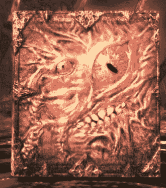

# 【殘酷血腥】惡魔藝術(已更新第四章，求評論）

作者：麻婆豆腐

TID：24783

<title>1</title> <link href="../Styles/Style.css" type="text/css" rel="stylesheet">

# 1

*本帖最後由 麻婆豆腐 於 2018-4-3 23:41 編輯*

新手寫文，文筆較爛，有不足之處希望大家能在評論之處，每條建議都是我前進的動力。23楼-第二章 劇情展開無福利更新人設在一樓最底下35樓-第三章 包含無意識虐殺，殘酷45樓-第四章 劇情發展本文出現人物世界觀設定皆為虛構，如有雷同，純屬巧合（有不合理的地方自行補正啦~）本文大量包含鞋內襪子CRUSH重度獵奇描寫，請接受不能者盡快撤離麼麼噠(～￣▽￣)～以下正文
——————————————————————————————

序言星期日——中島誠  我的名字是中島誠，是一名普通的男子高中生，今天上完學後也和往常一樣躺在沙發上看電視。 “老哥，吃飯啦。” 說話的聲音是我的妹妹，中島奈奈，容姿端麗，學習優秀，和我就讀於同一個學校，在學校的初中部上課，在學校內可謂是女神般的存在，然而她是我的親妹妹，不是義妹設定真是太浪費了，期待著和動畫中一樣的情節是在現實中不存在的。

  “等下，看完這則新聞馬上就來。”我不耐煩的回復道

  “X市近期出現大量人口失蹤，據目擊者稱失蹤人口都是在夜晚回家路上突然消失...”

  “又在播報這種新聞麼，這是這週第幾起了，X市也真是危險呢，等這個學期結束一定要跟妹妹好好商量一下搬個家好了。”父母都在國外工作，每月都有定期寄來我和妹妹的生活費，數量還算夠用，如果搬家的話也就是吃幾天廉價便當的事，用這些代價確保自身和妹妹的安全是非常合理的交易。

  “老哥還沒好麼，飯都要涼了哦~再不吃我就一個人解決掉了，今天的晚餐可是有老哥你最愛吃的日式咖喱哦！”  “可惡！老妹你要是敢對我的咖喱出手就跟你沒完啊啊啊啊！”立即關上電視機，加入了餐桌的戰場。  吃過晚飯過後幾個小時便上了床，因為明天也要上學就強迫自己早早入睡Zzzzzz...  睡眠中  唔...怎麼回事，身體好重，感覺有什麼重物在壓著自己，我應該是在做夢才對...  迷茫中聽到奇怪的人聲，是女性嗎？處於重壓且意識不清狀態下的我無法做出判斷  （痛苦的呼喊聲）  這真是做夢嗎，為什麼這個壓力傳來的痛感如此真實...  額啊啊——————！！（更加痛苦的呼喊聲）  越來越重了，這樣下去會死掉嗎。。。如果這是夢境的話，拜託誰來救救我，讓我脫離這個噩夢吧！！！  第二天，星期一   “老哥，起床啦！”沉浸於噩夢中的我被妹妹的呼喊聲驚醒，如果沒有妹妹，也許自己會死在夢中，這個夢的真實程度令我不禁懷疑。  不過再怎麼真實，夢終究是夢，日子還是得照樣過。  今天又是令人厭惡上學日，與奈奈的好成績不同，我這樣成績墊底的學渣最不想見到的地方就是學校了，而且最近不是有很危險的失蹤案件吧，學校居然也不讓我們放假，居然還因為鄰近期中考試讓我們留下學習到傍晚！真是太可惡了，真希望學校可以立刻原地爆炸啊。（那一點都不現實！）  雖然是這麼想的但還是得乖乖穿上制服去上學。  由於擔心奈奈跟我這樣不學無術的學渣在一起有損形象，所以上學路上一直我都是跟奈奈分開走的，學校也不知道我們兩個是兄妹關係，雖然奈奈一直堅稱自己不介意這種事情，但是作為一名哥哥果然還是希望妹妹能夠過好自己的校園生活，我與奈奈的兄妹關係被知曉一定會影響妹妹的人際交往吧。  到了班級，坐到了自己的座位，視窗倒數第二位元。（班級的窗口在右邊）  “聽說了嗎，誠”發話的是我在班級的好友兼死黨山口仁也，因為他也是學習廢人所以我們很合得來。  “聽說什麼，你知道我一向都是死人不管的。”  “就是這幾天我們學校有人失蹤的傳聞啊，再怎麼充耳不聞也沒像你這樣吧，據說鬧到都快有員警要來學校了。”  我想到了電視上播到的失蹤新聞，不過不可能這麼湊巧發生在我身邊，應該只是藉著這幾天的新聞想辦法罷課的吧，真是個天才呢，要不是家裡還有個老妹要自己看護著我也好想玩一出失蹤罷課好好玩幾天。  我跟仁也聊了一會，馬上我們的班主任便進來了，班主任一名嚴厲的中年人，戴著黑框眼鏡。“安靜一下，這週結束的時候我們年級要進行一次突擊成績測驗，測試不合格的傢夥將受到嚴厲的懲罰，為了不讓你們被懲罰，今天晚上會留你們複習到晚一點，做好心理準備吧。”  黃昏，放學時間  經過班主任以及各個任課老師一天的嚴厲關愛，我感到渾身發軟，不過這一切都已經過去了，放學的時間到了，堅持就是勝利，整理好書包就準備回家，走在回家路上，這個時間初中部的奈奈應該早就到家了吧，一路上有朋友陪伴的應該用不著擔心。  不過以防萬一，還是打個電話問一下好了，畢竟這一帶最近不是很太平。手剛摸到褲子口袋，遭了！手機好像忘在學校裡了，現在趕回去應該還來得及。  趕回學校時天色快暗了，手機確實落在了教室抽屜內，抄起手機準備立刻趕回家。  忽然想起失蹤案件都是在晚上發生的啊，不過現在這個時間應該還不至於，而且自己應該不會運氣這麼好剛好碰上吧。。。  走在回家的路上，天色已經暗了下來，周圍的行人也漸漸變少了。  “離家裡還有段路呢，聽點音樂好了”打開手機自帶的音樂播放機，插上兩隻耳朵，隔絕周圍的一切。  ......  奇怪，行人呢？  兩隻耳朵都插著耳機確實對周圍的感知力變弱了，但是不至於連周圍的人都察覺不到了，這個時間點，應該還是有行人才對的，為什麼一個人都不見了，感覺到氣氛不對的我漸漸出了點冷汗。  應該是因為最近不太平的原因吧，所以大家都趕緊跑回家了，心裡這麼安慰自己，我也準備用迅速跑回家。  為什麼...腿動不了了  “***又發現一隻落單的呢，加上這只的數量應該比上次好用了呢******~*****”**是一個好聽的女孩子聲音，聽聲音應該年齡比我小一些，大概是初中的女生吧？為什麼她會在這裡，我變成這樣是因為她的原因嗎，我拼了命的想轉過頭觀察她（它？）的外貌  “***唔，希望大哥哥不要掙扎呢，保持放鬆的狀態對你我都有好處喲***(¬､¬)***。***”  開什麼玩笑，讓人放棄什麼的，我的妹妹還在等著我回家呢，我怎麼可以讓她傷心啊啊啊啊啊咧，頭好沉，要昏過...第一章節-逆向運轉？？？  漸漸恢復了知覺，比起眼睛睜開所看見的黑暗，無法言喻惡臭更快傳達到我的感知系統，混合著皮革、酸味以及血腥味？，睜開眼睛一片黑暗，只有前方的洞口處傳來光線，腳下踩著的是軟軟的，墊子？我無法第一時間通過現有的資訊判斷自己處在哪裡。  “喂，少年，醒了嗎！” 還有人也在這裡嗎？  雖然周圍黑糊糊，但是透過僅有的光線照射模模糊糊的形體還是勉強能認出來，似乎這裡除了我還有很多人也困在這裡了，隨著大家的醒來，周圍響起了稀稀落落的交流聲。“你知道這是哪裡麼？” 我第一時間的提問，雖然不明白這裡是哪裡，這裡的氣味也告訴我這裡不是什麼好地方，必須尋找方法離開這裡，可是這個圓圓洞口非常高，要怎麼爬出去。“我也不知道這裡是哪裡，總之先探索看看吧，該死的，這裡的味道真是難聞，再待久一點可不保證會不會昏死過去！”  這時候我想起了自己持有的智慧手機似乎是有目前很多手機沒配備的強照明功能來著，為了弄清目前的情況，我不顧電量損耗趕緊打開手電筒照向黑暗的最深處。  眼前照亮的景象讓我無比懊悔自己的舉動。  我想我應該發現了血腥味的來源，黑暗最深處的景象如同地獄十八層的浮世繪，不，恐怕只在那之上，各種扁平內臟四肢散落在最內部，眼珠，大腦隨處可見，骨頭聳立在表皮的血肉上，脊椎和血肉似乎被什麼力量分離擠碎開來，對於解剖學的人來說這裡一定是研究聖地，屍體下埋藏的是五個血紅色的圓形印記。  再怎麼愚笨也應該明白了，這裡應該是某個人的臭鞋墊上，那個光洞應該就是鞋口了，該死的，這都是些什麼狗屁事，現實怎麼可能發生這種不合常理的事情，也許這是昨天夢的延續，我只是處在更深層的夢境罷了，雖然知道無濟於事，但我還是盡力腦補讓自己不至於崩潰。“這是什麼啊，嗚啊啊啊，救命啊，嘔嗚嗚嗚嗚” 在氣味和眼前景象的影響下已經有承受能力較差的人開始崩潰，嘔吐，甚至有些人直接暈死過去。  我能理解他們的感受，看到眼前的景象，如果我是他們一定也會採取同樣的動作，可是我在這裡倒下就見不到我的妹妹了，這是絕對不被容許的事情。“***啊啊，太好了，大家似乎都醒過來了呢，讓人家來看看大家的狀態都怎麼樣了******~***”  感受到傾斜的力量，比電車急停的力量要強上好幾倍，加上周圍沒有可以攙扶的把手，身體向鞋口翻滾過去。  從鞋口看到的是一名银发可愛少女的臉龐，年紀應該跟我妹妹差不了多少，都是在上初中的年齡吧，她應該就是導致現在情況的元兇。“***啊！怎麼回事，我的鞋子裡居然有昏死的小蟲，這豈不是在說人家的足臭很嚴重麼，明明上次用掉的幾隻都活蹦亂跳的呢，一定是你們太沒用了，哼******╭******(******╯******^******╰******)******╮******！***”“***作為懲罰，人家決定今天就用你們來當人家的鞋墊咯，這雙鞋子穿舊了有點磨腳呢，上學的時候你們當我的真皮鞋墊好了，這次的數量應該比上次舒服多了******~***”“***不過在人家的小腳進來之前先給你們看點好東西哦，好好感恩代謝吧，這是只給你們特別服務哦嘿嘿******(*^******▽******^*)***”  特別服務什麼的，聽著就知道不是什麼好東西。現在得想辦法逃出這裡才是，沒有繩子，直接爬？這似乎不可能實現。“***唔，大家看這裡噢***”  少女提起了一隻黑色的東西，似乎是一個學生皮鞋，然後從裡面抽出了什麼東西，是鞋墊？“***蹡蹡，是人家穿過的鞋墊哦，不過不僅僅是鞋墊這麼容易哦，這是昨天裝著小蟲的鞋子呢，接下來大家也會變成這只鞋墊上的樣子哦，提前告訴大家最後的結局人家是不是很仁慈呢******（******//******▽******//******）***”  少女將鞋墊對準鞋口好讓位於鞋跟處的小人們看清楚鞋墊上的狀況，光是從遠遠的就能感受到絕望的氣息從鞋墊上散發出來，無數的殘肢斷臂，內臟混雜在其中，鞋墊上血跡已經乾涸，應該是被少女不斷的走路踩踏給壓榨至極，就連死掉的屍體也不放過，存在的價值只為了為少女的足部做緩衝墊，無法在這只鞋墊上找到哪怕一具能看出來人形的血肉印記，這一切都是這只少女小巧的足製造出來的慘像，令人感到絕望，扭了扭自己的上臂肉，已經明白了殘酷的現狀確實是現實。“***啊，對了，兩隻鞋墊都忘記弄乾淨了就急著把你們丟進去了，先得想辦法弄乾淨呢。***”  少女拿出一杆長柄刷，試圖刷去鞋墊上殘留的血肉，少女確實刷的很努力，但總是會有頑固的臟器粘在鞋墊上，像是生根發芽一樣，不知道少女踩著這些活人走了多久造成這樣的狀況。“***啊，真煩人，不弄了，反正這雙鞋子也很舊了，過幾天學校就會發新的鞋襪了呢，今天用完就扔掉好了。***”  少女將沒有穿著襪子的赤足伸向鞋口，雖然微微散發酸味，但不得不承認，確實是一隻非常完美的腳，五根圓潤飽滿的腳指頭，腳掌白嫩光滑，似乎跟自家妹妹有得一拼。“***雖然大家都只是剛認識，但是接下來大家都會變成熟人哦，通過人家的小腳咕嚕咕嚕的那樣纏繞在一起哦******~***”  少女的赤足伸到一半停了下來，難道她是善意大發準備放過我們了嗎？！“***唔，雖然知道大家很想被人家的赤足踩死啦，但是果然還是太髒了，不行呢，嘿嘿，對不起哦，就穿上昨天穿過的黑色棉襪吧。***”  少女伸手向旁邊抓去，拿出了一隻黑色的及膝棉襪，慢慢的套在了腳上。“***趁著還有機會大家可以好好觀賞初中女生穿襪子的情景哦******~******因為可能是大家最後一次看見了呢，想要******XX******的大哥哥也允許哦，因為這雙鞋子已經廢棄決定了呢***”  不一會少女穿好了黑色棉襪，踩向了鞋口，漸漸被黑暗籠罩，我找不到逃出鞋子的辦法，萬事休矣。  不！我在這裡結束的話就見不到奈奈了！在還有一口氣的情況下我必須尋找生還的方法。  不一會整只鞋子被黑暗籠罩，照著手機的光亮能夠看到一只有著五隻可愛腳趾的黑色棉襪腳腳趾在扭動著向前，就像一隻史前巨獸，要碾平路上一切的障礙。  腳尖劃過鞋跟，噗嗤，有些昏過去的倒楣傢夥再也不能醒來了，他們的屍體被棉襪腳趾扯成一條線，一路向著四周噴灑血跡，大家拼了命的向腳尖的位置跑，危險直感讓我明白那裡才是最危險的地方，唯一的生存方法只有他的腳心，所以我迅速向著鞋內側面的腳心跑去。  到達位置後立即頭朝內趴下，小腳趾不斷的扭動著從我身上擠過，我想起了那晚的夢境，現在已經變為了現實，我祈禱從我的頭上輕輕劃過，而不是像壓路機一樣碾過來。  幸運女神似乎像在我微笑，我當小腳趾經過時我僅僅是被壓折了一條腿，這已經是用盡了所有運氣的結果了吧。  不一會黑襪腳便伸到了腳尖的位置，前方傳來的慘叫聲令我不禁捂住耳朵，身上壓著的是腳心令自己不至於馬上變成肉餅，手機照亮了襪底依稀能夠看到上一次受害者殘留的血跡，自己也會變成襪子上的一灘血跡麼...間幕-暗流湧動星期一，放學後——中島奈奈
  “今天也辛苦了呢，奈奈！”
  “並不麻煩哦，能為班級的大家幫上忙我也很開心呢。”
  “今天也是自己一個人回家麼，不跟我們一起麼？”  “恩，不用了，我要先回去準備晚飯了，不然老哥回來一定又會抱怨了吧。”  “奈奈喲，一直聽你說有個哥哥也一直見不到他呢，什麼時候介紹給我們看看，奈奈的哥哥也一定是個學習優秀長相也非常帥氣的男孩子吧！”  “老哥他。。。抱歉！我得先走了。”  “啊！回家路上走快點哦，奈奈，最近這一帶很不安全呢，雖然說失蹤的都是男性，但可保不准兇手突然換口味了呢。”  “好的，謝啦~”  中島奈奈走在回家的路上，想到失蹤案件的事不禁皺起了眉頭。  “唔。。。老哥今天似乎要很晚再回來呢。。。”  “嘛，雖然老哥的智商堪憂，但不過我的笨蛋老哥還不至於在半路上鬧失蹤吧！”  “總之先回家準備晚飯吧~”  中島奈奈快速到家後開始準備晚飯。  “呼，做好了。”  中島奈奈點了點頭，不僅僅是在學習方面，自己的料理手段她也很有自信，今天老哥回來後吃到她做的菜一定又會誇獎她吧，想到這裏，奈奈不禁高興了起來。  “雖然今天說是要晚點回家，但老哥這個點應該已經放學了，難道被老師留校了嗎。。。”  “總之有點擔心呢，趁著天色還沒徹底暗下來，先去學校看看吧。”  中島奈奈穿上外套，穿好了學生鞋準備去學校找一下中島誠。  “天色已經快暗下來了呢。。。有點擔心最近的失蹤案件，必須得趕緊讓老哥回家才行。”   擔心老哥的中島奈奈不禁加快了腳步。  “***啊，終於找到了，是奈奈醬麼~?***”中島奈奈聽到了有女孩子在叫她，聲音如風鈴般甜美，讓人印象深刻。  中島奈奈轉過頭，是一個銀色頭髮的美麗女孩子，中島奈奈從來沒有見過這麼可愛的女孩子，仿佛是從畫裏走出來一樣的少女，她穿著學生校服和黑色皮鞋，年齡和她差不多大小，那麼應該是在讀初中的年紀吧。  附近的學校只有這一所，這個年齡的話，奈奈覺得自己應該在初中部見過她，奇怪的是，奈奈對這個可愛的女孩子毫無映像，人際交往圈廣泛的奈奈，初中部的百分之99的學生她都應該有映像才對。  “那個。。。是你叫我麼，雖然很想和你聊天但我現在沒有這樣的餘裕了呢，我得趕緊找到我老哥才行。”  雖然也對這個女孩子很好奇，但奈奈現在最心急的事情還是找到自己的哥哥中島誠。  “對了，最近這一帶很不安全，天色馬上就要暗下來了，如果沒有什麼要緊事的話，希望你也可以儘快回家呢。”雖然很擔心自己的老哥，但中島奈奈仍然不忘記提醒別人。  “***奈奈醬還是跟以前一樣溫柔呢。***”  銀髮的少女似乎沒有放走奈奈的打算。  “***奈奈醬不記得我了嗎？***”銀髮少女更一步的接近了奈奈，用一只手抓住了中島奈奈的手臂。  中島奈奈想要掙脫，但是突然手臂傳來一股自己無法抵禦的大力。  中島奈奈的嘴唇貼到了柔軟的東西，帶著蜜桃的香氣，令人忍不住想要嘗到更多。  中島奈奈被這名銀髮少女吻了，這是中島奈奈的初吻。“唔。。。嗚。。。你在幹什麼？！快放開我！我要去找我老哥！” 中島奈奈激烈的反抗。  這次銀髮少女鬆開了她的手臂，中島奈奈也沒有時間來多跟這名少女糾纏，天色馬上就要暗下來了，如果再不能找到老哥的話，她和自己的老哥可能都會有危險。  中岛奈奈离开后，银发少女在原地驻留了一会。  “***奈奈醬還有個*****哥哥*****麼。。。居然連我都不知道，真是令人意外呢，虽然明天的数量已经够了，但等下还是處理掉好了。***”   噗嗤，噗嗤，噗。啪嘰啪嘰，噗。   銀髮少女腳下發出的奇怪的聲音。  “***呼呼，昨天的都已經變的黏糊糊了,谢谢大家这么努力的让我双脚变的舒服哦，作为奖励还请大家好好享受我脚底的按摩呐~***”  “***那么，接下来就去找奈奈酱的*****哥哥*吧。***”  “***这一次******妨礙我和奈奈酱的傢伙都不能放過哦。***”銀髮少女哼著歌，一步一跳的走在街道上，腳下似乎是鞋墊的東西不斷傳出奇怪的聲音，但又有誰能夠發現呢...

<title>2</title> <link href="../Styles/Style.css" type="text/css" rel="stylesheet">

# 2

 <ignore_js_op>[1.jpg](forum.php?mod=attachment&aid=NzE2NzV8MWZjYWJkYmF8MTYwMDg4MzU5MnwxODIzMHwyNDc4Mw%3D%3D&nothumb=yes) *(244.85 KB, 下載次數: 1)*

[下載附件](forum.php?mod=attachment&aid=NzE2NzV8MWZjYWJkYmF8MTYwMDg4MzU5MnwxODIzMHwyNDc4Mw%3D%3D&nothumb=yes)

2018-4-1 20:18 上傳  

安达利尔

</ignore_js_op>  <ignore_js_op>[2.jpg](forum.php?mod=attachment&aid=NzE2NzZ8NTliZTNjZDJ8MTYwMDg4MzU5MnwxODIzMHwyNDc4Mw%3D%3D&nothumb=yes) *(230.25 KB, 下載次數: 0)*

[下載附件](forum.php?mod=attachment&aid=NzE2NzZ8NTliZTNjZDJ8MTYwMDg4MzU5MnwxODIzMHwyNDc4Mw%3D%3D&nothumb=yes)

2018-4-1 20:25 上傳  

中岛奈奈

</ignore_js_op> <title>3</title> <link href="../Styles/Style.css" type="text/css" rel="stylesheet">

# 3

更新了，有没有大佬支持下<title>4</title> <link href="../Styles/Style.css" type="text/css" rel="stylesheet">

# 4

*本帖最後由 1220523513 於 2018-4-1 20:39 編輯*

更新一章展开世界观的无福利章节，方便写更多种类的福利，一直都很想写这种中二剧情的我终于可以随意发挥了哈哈哈哈
以下正文
——————————————————————————
第二章節-行死走肉？？？——中島誠  ...能感覺到渾身被壓碎時的痛楚，自己很努力的試著存活了，但那只是延後了死亡的時間罷了，從一開始就不存在任何逃生的手段。  據說人死後的10分鐘內大腦還能思考，那麼我現在完整的部分應該只剩下大腦了吧。  “放心，你離死還早呢，人類噠。”  不男不女的聲音從不知道何處傳來，似乎曾經在夢中聽見過這樣的聲音。  開始出現幻聽了嗎，那麼離大腦停止活動的時間剩餘應該不多了呢...最後要是能再見到奈奈一面就好了。  “再躺在那裏裝死就真的讓你死了，臭小子，你惹我生氣了噠。” 區區一個幻覺還敢裝大牌。  一瞬間確實有想站起來揍這傢伙一頓的想法，但不說自己已經沒有拳頭揍人，已經是死人的我再發火也沒什麼意思。  “喲呵，還真不起來了，看我幫你一把，走你噠！”  我感到一陣強烈的颶風向我襲來，力量大到足以將我甩到天上。  為什麼我還能感受到風？不過，至少現在我正飛在天上這件事是確鑿無疑的。  “我X你大爺的，快放我下來！！！” 睜開雙眼，不知道是否該慶倖自己還活著。  過了一會我摔倒地上，屁股被狠狠的摔開了花，奇怪的是疼痛感並沒有我想像中這麼強烈。  周圍的環境不堪入目，肉眼能見到的只有血色牆壁，並且牆壁上還有不知名的物體在蠕動，但經歷過之前經歷的我表示毫無壓力，甚至想上前弄清楚那是個啥。  “喂，你是想無視我嗎？要不再給你來一次上天體驗噠？”    不男不女的聲音在威脅我，它確實有這個能力。  我不情願的將頭轉向發聲處，那是在天花板的位置。  雖然已經做好心理準備看到各種獵奇的物體或者生物，但令我出乎意料的是對我說話的只是一本外形奇特的書而已。  似乎是用人皮包裹的書皮，書的封面似乎還有在活動的幾只眼睛，比起書，還是用有著書外形的怪物來稱呼它更合適嗎？  “啊？臭小子，你看著我的那是什麼眼神噠。”  書本發出了不滿的聲音。  “要知道我可是救了你的小命，不對我跪下感恩道謝就算了，還敢用這種奇怪的眼神盯著我。”  “抱歉，最近這一段時間經歷的事情讓我感到現實世界離我越來越遠，只有有點累了罷了。”  “看在你道歉這麼誠懇的態度下我就原諒你了，那麼先好好記下你救命恩人的名字吧，我的名字叫做利布洛姆，是一本偉大的魔法書噠。”  “我能夠醒來並且救下你的原因應該跟你的死亡喚醒了我有關吧，似乎我從很早以前就寄存在你的大腦中了，在我寄宿在你腦中的時候能保持正常人的思維，你小子也是挺有能耐的噠。”  聽完解釋的我一頭霧水，不過現在不論發生什麼我都懶得弄明白原因了，不過至少有一點我明白了，這幾年學習成績這麼差一定是它害的。  “那麼，現在能讓我回到現實世界麼，我得去找我妹妹了，還有那個變態殺人魔，你也可以想辦法用魔法解決掉她麼。”  “這也是我要說的問題，殺掉你的傢伙並不是人類噠。”  “不是人類，那是什麼鬼玩意？你有辦法解決麼。”  “是惡魔噠！通過感知你記憶她應該不屬於常規的惡魔，具體是哪一種我暫時無法判斷，但一定是超上位惡魔噠，我確實有辦法解決她，但現在喪失力量的我恐怕在她面前堅持一秒都做不到噠！”  “總之先把我送出去吧，離那個變態殺人狂越遠越好，然後我得去找我妹妹了。”  “送你出去是沒問題，但是你得答應跟我做個交易噠。”  “說吧，只要不是太麻煩的事情。”  “幫我封印逃出來的惡魔，讓我恢復力量，到那時候你想讓我做什麼都行噠！殺掉看不起欺負你的人，殺人越貨搶劫統統可以噠！”  “你不是說在她面前一秒都堅持不到麼？還想讓我幫你對付那個變態殺人魔，這不等於讓我再去死一次麼，我可不幹。”  “失去力量確實是事實，但我可沒讓你對付她啊，這個城市除了她之外還有很多很多惡魔噠，你們最近是不是失蹤了很多人口噠？”  “沒錯。”  “那塊區域的數量已經多到連城市的監管者都壓制不了的程度呢，你看都鬧上電視了噠。”  “雖然早就覺得不對勁了，原來我一直都和妹妹住在這麼危險的地方...”  “那麼先從尋找等級較低的惡魔開始找起吧，你是否同意這筆美好的交易噠！”  雖然從各種地方透露出可疑的氣息，但目前除了和這本自稱魔導書交易外沒有任何多餘的選項了。  “好，我同意，那現在可以讓我去找我妹妹了嗎？”  “啊...很抱歉呢，你目前最好單獨行動，你的妹妹似乎被那頭麻煩的怪物盯上了，跟你妹妹在一起的話會很容易被她發現的。”  “奈奈已經跟那個殺人魔接觸過了？！她現在有危險嗎？！”  “至少我無法從那只怪物身上感受到惡意，你的妹妹應該暫時是安全的，放心吧，只要持續的消滅惡魔，從它們身上剝離力量，總有一天你能夠對抗她噠。”  打怪升級什麼的，聽起來總像是老式RPG的老套劇情呢...“啊對了，最後還有一件重要的事情要告訴你。”  能聽出來利布洛姆語氣中的嚴肅，這次它連句尾的語癖都沒加上。  “你的肉體已經被壓爛到慘不忍睹的樣子了，理論上來說應該是無法復活才對，你現在的肉體只是利用時間的魔力勉強拼湊起來的罷了，說到底我魔力的損耗也和你有關，你要好好負起責任。”  “也就是說，你每次的復活都會加重缺口，到最後的話，***沒法復活也說不定***。”  只要能夠再次見到妹妹的話...  “***行死走肉也無所謂***”<title>5</title> <link href="../Styles/Style.css" type="text/css" rel="stylesheet">

# 5

 <ignore_js_op>[3.jpg](forum.php?mod=attachment&aid=NzE2Nzh8YjllYTQ2NWN8MTYwMDg4MzU5MnwxODIzMHwyNDc4Mw%3D%3D&nothumb=yes) *(138.19 KB, 下載次數: 0)*

[下載附件](forum.php?mod=attachment&aid=NzE2Nzh8YjllYTQ2NWN8MTYwMDg4MzU5MnwxODIzMHwyNDc4Mw%3D%3D&nothumb=yes)

2018-4-1 20:39 上傳  

利布洛姆

</ignore_js_op> <title>6</title> <link href="../Styles/Style.css" type="text/css" rel="stylesheet">

# 6

> 333ww 發表於 2018-3-31 22:56
> 很好看呐大佬，什么时候再更新

两天一更，如果我不摸鱼的话。。。<title>7</title> <link href="../Styles/Style.css" type="text/css" rel="stylesheet">

# 7

> zwq8764706 發表於 2018-3-31 23:39
> 啊，这居然是反抗的啊

放心吧，只是无用的挣扎罢了，世界观设定展开仅仅是中二爆发罢了<title>8</title> <link href="../Styles/Style.css" type="text/css" rel="stylesheet">

# 8

> zwq8764706 發表於 2018-3-31 23:39
> 啊，这居然是反抗的啊

就像战锤鼠疫2那样，毁灭无法阻止，能做的只有苟延残喘<title>9</title> <link href="../Styles/Style.css" type="text/css" rel="stylesheet">

# 9

更新插图了，有人来顶一波么OwO<title>10</title> <link href="../Styles/Style.css" type="text/css" rel="stylesheet">

# 10

*本帖最後由 1220523513 於 2018-4-2 14:29 編輯*

其實本來的3,4章節已經碼好存稿了，然而人一到半夜就會興奮，睡不著覺瞎JB碼了一段，雖然說能用魔法這種玄幻的東西掩蓋設定上的BUG，但是還是有太多奇怪的地方，大家將就看吧。。。為了閱讀過程中不出現太多bug還是稍微說一下設定吧，說話過程中有紫色的文字是代表包含了魔力的意思，這樣應該會清楚一點。。。本章包含某種意義上的無意識虐殺（其實是我自己半夜想擼才寫的）
————————————————————————第三章節-奈奈的休假日星期六，中島誠失蹤的第五天-中島奈奈  中島奈奈的哥哥不見了，就跟新聞中說的那樣失蹤了。  開始的兩天無法接受的奈奈連著哭了好幾天，直到最後麻木了，漸漸開始適應起失去哥中島誠的生活。  今天是星期六，上完學的中島奈奈正的一個人坐在家中的沙發上看電視，電視中重複播報著中島誠的失蹤新聞的回放錄影。  “老哥...”  【叮咚】門鈴響了  中島家的門鈴被人按響了，奈奈並沒有告訴任何人自己家的住址，也沒有外賣和快遞，那麼只有一種可能了。  “是老哥嗎?!我馬上就來開門!”
  就像是黑暗中出現的光明，中島奈奈飛快的前往門口並且打開了門。  然而令中島奈奈失望了，站在門前的是上一次見面的那名銀髮少女，奪走了她初吻的那個傢伙。  “***又見面了呢，奈奈醬~***”  “唔，你是上次的!你是怎麼發現我的家的。”  “***~(>_<)~，不要生氣呢，奈奈醬，人家只是今天剛好路過看到你一臉不高興，想來找你玩呢。***”  “並沒有生氣啦，不過我應該不認識你吧，為什麼要對我這麼友善呢?”  “***因為...因為人家從看到奈奈醬的第一眼起，就愛上奈奈醬了呀!***” 何如此大膽的告白令中島奈奈感到一陣頭暈目眩。  中島奈奈知道面前這位是百合，因為她的哥哥經常從秋葉原帶回來許多純愛百合作，並且總是拉著她一起玩。  “哈哈...真是突然呢，明明我連你的名字還不知道呢，至少先從朋友做起的話應該沒問題，可以先告訴我你的名字嗎?”  “***是奈奈醬的話可以喔，人家的名字是安達利爾喔~***”  果然是外國人呢，說的這麼一口流利的日語真是了不起，中島奈奈想道  “***那麼奈奈醬，要來人家的家裏玩麼，心情會變好也說不定喔~***”  “***雖然很感謝你的好意啦，但是最近我的哥哥才失蹤呢，暫時沒有心情做這種事情，抱歉喔...***”  “***你哥哥的事情我感到很抱歉喔，但是奈奈醬，稍微來我家裏玩一會也沒有關係的吧。***”  “啊...啊!是呢，稍微玩一會的，應該沒問題的吧，大概?”  中島奈奈其一開始並不想跟著安達利爾走的，但是中途突然改變了心意。  中島奈奈將家門鎖好，轉身跟著安達利爾走。  似乎走過了一段不算長的路?  “***一二一二，奈奈醬跟著我從這裏轉彎喔~***”  中島奈奈跟著安達利爾走過了拐角，一座巨大的宅邸映入了眼簾。  奇怪，附近有這麼大這麼豪華的房子麼。  “***到了喔，奈奈醬，這是我的家哦，來來，快點進來，裏面有很多好玩的哦~***”  中島奈奈跟著安達利爾走進了屋子，進到屋內後中島奈奈脫掉了穿著學生皮鞋的腳，露出了一雙可愛的腳，外面套著一雙白色棉襪，因為皮鞋不透氣以及剛剛走過一些路的原因，足部有些微微的散發氣味。  ”對不起，打擾了。”奈奈進門後禮貌的問候。  “***不用客氣哦，奈奈醬，家裏只有我一個人，父母都因為忙著工作去了要到深夜才能回來休息一會呢。***”  “這種高壓強度的勞動壓榨...怪不得安達利爾家的房子這麼大呢。”
  “***還有，奈奈醬，因為最近幾天剛搬來這裏家裏的拖鞋還暫時沒有呢~不過不用擔心哦，好玩的東西我可是隨時帶在身邊的呐!***”  “沒有問題的喲，我光著腳進來就行。”  “**~(>_<)~，明明是人家邀請奈奈醬來家裏玩的，卻連臨時準備一雙拖鞋都忘記了什麼的...**”  “真的沒事啦，比起這個，我更想知道好玩的在哪呢!”  拋棄平時的裝出來成熟，中島奈奈這時候想徹底的當一回小孩子好好玩玩，以消減一些哥哥失蹤所帶給她的傷感。  “***來來，奈奈醬，這裏走哦~***”  兩人可愛的小腳在地板上留下淺淺的小腳印。  安達利爾拉開房門，映入眼簾的是空曠的房間，地板上畫著一個像是黑白相交的靶子，房內有一個像是把東西裝的慢慢的箱子。  “那個箱子裏面的就是玩具麼。” 中島奈奈很好奇。  “***沒錯哦奈奈醬，等下就要用箱子裏的【玩具】來做遊戲哦。***”  安達利爾從箱子中抓出一個軟軟的小形人形布偶玩具，用一只手就可以抓住身體的部分，頭部露在手掌的外面。  “***奈奈醬這是遊戲的【******道具******】哦，這個玩具的名字叫飛飛熊，只要身體部分被壓爛的話頭部就會飛出去哦。***”  “***奈奈醬先來試試看吧，用前腳掌踩住身體，然後讓玩具熊的腦袋飛出去，離靶心越近得分越高哦。***”  “為什麼要用腳...”  “***用手的太容易控制方向和力度，那樣遊戲就沒意思了啦。***”  到處都是奇怪可疑的設定，但是今天決定好好放縱一把的中島奈奈腦子中想到的只有hellshake矢野!（hellshake，hellshake，hellshake!）  用手接過安達利爾手中的人形玩具熊，傳來了像是掙扎一樣的手感，中島奈奈並沒有在意這些小問題。（hellshake，hellshake，hellshake~）  用穿著白色棉襪的前腳掌踩住了玩具熊的身體，開始慢慢用力，能夠感受到越發的掙扎，這一定是錯覺吧，中島奈奈並沒有在意這些小問題，壓著的雙腳更加用力了。（hellshake，hellshake，hellshake）  噗嗤，劈，啪啪啪，連珠炮般的聲音響起，似乎是有什麼物質被壓榨到極點後發出的聲音。  一時間沒有注意，中島奈奈的雙腳將整只玩具熊都壓爛了，分開的雙腳連著不少白色的棉花，還有點黏糊糊的感覺。  “嗚...是不是我沒有玩遊戲的天賦呢，明明都很努力了還變成這樣，還有為什麼感覺這個玩具熊踩爛的感覺有點黏糊糊的...”  “***一定是奈奈醬的錯覺啦，看我演示一遍哦，要像這樣。***”  黑色棉襪的雙腳仿照奈奈之前的動作重複了一遍，不過這一次只壓爛了身體，頭部噗的一聲飛了出去，飛行的途中灑了一地的彩虹色汁液一般的東西，頭部落在了離靶心只有一個白圈的位置。  “好...好厲害，而且剛剛頭飛出去時候的彩虹真漂亮啊...這種類型的玩具一定很貴吧。”  “奈奈醬也多試幾次的話一定可以成功哦~”  之後中島奈奈連續消耗了好幾只玩具才能夠練到只踩爛身體讓頭顱飛出去。  “***噢噢，好好的辦到了呢，奈奈醬，那麼我們來比賽吧，看誰投擲的飛飛熊的頭部更接近靶心哦~***”  “來吧，雖然安達利爾也很厲害，但是現在掌握技巧的我可不一定會輸給你哦~”  就這樣連續使用掉了幾十只人形熊後，兩人躺在地上對視了一眼，開心的笑了起來，地板上的靶子上豎立著幾十只玩具熊的頭部。  “***怎麼樣，奈奈醬，很好玩吧!***”  “嗯，比我想像中有意思多了呢，只不過腳掌都變得黏黏的，這種玩具到底是什麼材質做的呀。”  “***不知道呢，應該是挺高級的材料之類吧~對了，那些腦袋踩爛之後還會繼續噴灑彩色顏料哦，要不要用剩下的那些完整小熊和場上的腦袋做一副漂亮的彩色繪圖出來。***”  “好啊，我想畫一朵彩色的小花呢。”
  又是幾十只完整的人形小熊被放在地上，四周還有散落的玩具熊腦袋。  因為遊戲而微微出汗的腳趾調皮的扭動，不時有彩色汁液從上面滴落。  對於地面上的玩具來說，這一定是場災難，不斷的被可愛的小腳踩爛，屍體被可愛的棉襪腳帶著在地面上像是畫畫一般的滑動，一路上殘留下不少彩虹色的汁液。  不一會用幾十只完整小熊人形以及小熊腦袋被兩名初中年紀的女生用雙腳製成了一朵可愛的彩繪花朵。  “***真漂亮呢，奈奈醬，這都是你和我的努力結出的愛情之花哦~***”  “唔...說好的先從朋友做起呢。”  “***好吧，奈奈醬，下次我會注意的，今天玩的很累了吧，等下我送你回去好了!***”  “嗯...再晚的話天色就要暗下來了呢，在那之前回家的話應該沒問題。”  “***奈奈醬其實今天留下來過夜也可以哦*❤*~***”  “不用啦...要是老哥突然回來的話，得有個人留下來給他做飯才行呢..”  “***又是那個傢伙麼，明明都已經...***”  “嗯?怎麼了嗎?”  “***不，什麼都沒有哦，奈奈醬，在走之前我先幫你把腳底弄乾淨吧。***”  “對耶，之前都沒好好注意，這個遊戲玩完之後這雙襪子似乎也廢了呢，早知道應該先脫掉襪子的，啊啊啊，都怪我有點上頭了呢!” 中島奈奈有點生氣，她還是挺喜歡自己穿的這雙襪子的。  “***沒關係的，像這樣一下的話，喲咻，好了，已經變乾淨了哦*^o^****”  “好方便的功能道具，這是怎麼做到的呀。”  “***因為一直會把襪子弄髒呢，所以這種道具家裏準備了很多哦!”***  “嗯嗯，這樣的我就先走了呢，多虧了你心情變好了不少，謝謝啦，安達利爾，之後可以一直來玩麼?”  “***只要奈奈醬想的話一直住下去都沒關係哦，所以來玩的話隨時都歡迎。***”  “那我先走了哦，拜拜~”  送走了中島奈奈，安達利爾合上了宅邸的大門。  “***明明已經徹底清理掉了才對，為什麼還會留有對他的記憶，中島誠嗎...”***  暗示，幻象的厄咒被同時解除  推開了之前遊戲的房門，裏面的彩繪花露出了了它應有的姿態。  原本作為彩色顏料的液體變得鮮紅起來，白色棉花填充物其實是內臟，這朵被可愛少女雙腳製作的並不是什麼希望之花，而是填滿人類受害者內臟與腦漿的絕望之花。
<title>11</title> <link href="../Styles/Style.css" type="text/css" rel="stylesheet">

# 11

> cs小谢 發表於 2018-4-2 14:05
> 咋1楼写第三章，看到写着第四章

可能半夜打文章的时候手抖，我改一下<title>12</title> <link href="../Styles/Style.css" type="text/css" rel="stylesheet">

# 12

> cs小谢 發表於 2018-4-2 14:05
> 咋1楼写第三章，看到写着第四章

半夜的时候的脑子里都是hellshake矢野!<title>13</title> <link href="../Styles/Style.css" type="text/css" rel="stylesheet">

# 13

*本帖最後由 麻婆豆腐 於 2018-4-3 21:02 編輯*

劇情發展章節————————————————————————————————————第四章節-不可食用星期日，第一只惡魔：畢舍遮——中島誠  “嘔————！” 就像大多數電影和小說寫的那樣，傳送的過程沒有我想像中的那樣輕鬆愉快。  “哈哈哈，人類被第一次傳送的反應真是令人百看不膩噠！” 我被一本書嘲諷了  “你要是再嘲嘔——笑我就嘔————不幫你了！”  “我只是讓你放輕鬆而已，人類別生氣噠哈哈哈哈哈”  止住了嘔吐的感覺，自己身上沒有紙巾，附近都是民宅也沒有看到便利店，所以只好用手擦了，總比留在身上要好的多...
  說起來，這附近似乎離仁也的家挺近的呢，自己好像來過幾次  “那麼，現在該做什麼？”  “果然還是先讓你試著封印一只惡魔吧，我在這附近發現了輕微的惡魔反應呢，這個等級的你應該沒問題噠！”  “噢噢！是要使用炫酷魔法來一場緊張刺激的戰鬥麼？！”  我知道，熱血漫畫一般都是這麼發展的，果然我是天選之人啊！  “先不說我失去幾乎全部魔力這件事，你確定直接使用魔法麼，雖然內在是惡魔不錯，但是肉體還是人類的哦，只是心靈被惡魔的精髓控制了噠。”  “噢...好吧，虧我還白期待一場，那麼，我該怎麼做？”  “找到惡魔後進入它的氣場內！雖然現在的話會被惡魔的力量壓制，但是這個等級的惡魔只要給我足夠的時間就能反制了噠！”  “進入氣場內？你的意思是我會像上次那樣一瞬間失去身體的控制權並且變小麼？”  “沒錯噠！”  “那樣和送死有什麼區別，我並沒有什麼可以閃避的超能力哦。”  “沒錯，去送死噠！只要你的身體還在領域內，就算是尸體我也依然可以解析惡魔的氣場，只要在事後將你復活就可以了，就是這麼輕鬆簡單的活噠！”  “我有別的選擇麼？！” 上一次死亡時的疼痛還記憶猶新，被壓縮機般的力量碾壓的同時還要忍受惡臭的氣味，就算不被踩成肉餅，恐怕被氣味悶死也只是時間問題，不如說被一瞬間踩死算是一種幸福的死法。  “拒絕的話再死我就不復活你了噠！”  是呢，如果沒有利布洛姆魔力維持的話，我的肉體應該會瞬間崩潰，感受痛楚也是生活的一部分呢，只有硬著頭皮幹下去了！  “好...算你狠！告訴我位置，利布洛姆！”  “我給你指路噠！”行動分割線——————————————————————  不得不說，利布洛姆的自動導航能力確實是非常優秀的，我跟著它的引導很快的找到了惡魔的所在位置。  “在這條小巷裏麼。”  “從裏面傳來惡臭的魔力氣息啊，我靈敏的魔導鼻已經嗅到了，是畢舍遮噠！”  “你是狗麼！再說書哪來的鼻子啊！”  “在意細節的都是屑噠！”  利布洛姆似乎是為了放鬆我的心情。  接受了它的好意，我將頭轉向小巷，是幹正事的時候了。  從小巷中傳來不詳的感覺令我豎起了雞皮疙瘩，即使利布洛姆不說也知道裏面存在什麼危險的生物。  握緊拳頭，心中想到自己的妹妹，必須趕在那只大惡魔對她下手之前獲得足以對抗它的力量。  走到小巷拐角處，聽到什麼聲音。***咯吱咯吱がりがり***  悄悄將頭探出靠著的牆的邊緣，看見的並不是什麼獵奇怪物，而是一只幼女，黑色的短髮，紮了兩個短短的馬尾，似乎嘴裏在嚼著什麼。  小，小學生？！惡魔都是這麼可愛的外表麼...  “即使是最低等的惡魔，其擁有的能力也足以輕鬆毀滅一座城鎮，凡世的人類靈魂對它們來說可是滿漢全席，許多魑魅魍魎都覬覦著這頓大餐，但是它們的本體無法直接進入凡世，偶爾有些運氣好的惡魔能夠讓自己的意志腐化人類的少女，借用她們的身體來收割人類的靈魂，但是最近出現的數量已經超乎尋常了噠...” 似乎是察覺到了我的驚訝，利布洛姆解釋道  “還有，你不快點追上去的話，等惡魔進食完後逃跑可是很難再次找到它了噠。”  說的也是呢，只有封印惡魔才能變強，只有變強才能打倒那只強大的惡魔，才能...救出妹妹！  “誠，是你麼？！”  從我背後傳來聲音，有點熟悉  ！！！是仁也的聲音！  “糟了啊，小鬼，這個腦殘人類的大聲呼喊引起了惡魔的注意噠~”  那只不知道在吃什麼的幼女，將頭轉向了這邊，這只幼女嘴邊的血跡提醒了我她在吃的一定不是什麼好東西。  “***耗~悪，還——沒此飽，想吃更—多肉肉~***” 幼女口齒不清的發聲了  “***尼萌——看起來好好吃~***”  轉頭看向一臉懵逼的仁也，啊，麻煩了呢...間幕-朋友星期日，中島誠失蹤的第五天-山口仁也  誠這傢伙，已經失蹤了好幾天了呢，最近的事情令仁也感到越來越不妙。  過了好幾天也沒有發現失蹤的誠的資訊，仁也十分懷疑是不是警局在放長假。  仁也從一開始就很擔心自己的朋友，但是學校讓大家不要輕舉妄動，他決定今天一定要去尋找誠，首先問問班上的同學好了。  “噢噢，這不是仁也麼，有什麼事要找我麼。”  “小林同學，你最近有看見誠麼？”  “誠？是誰來著，我們班級有這個人麼？”  “這種時候就別開玩笑了吧！我們的同學啊，中島誠！”  “就算你突然對著我發火可是我也沒辦法咧，因為我真的不知道啊，大概是跟別班的人搞錯麼？”  看起來不像是在開玩笑呢，這傢伙，小林這人雖然性格不咋地，但是想必不會拿同學失蹤開玩笑的吧。  從前幾天開始就不對勁了，從一開始的消息傳出到現在，大家似乎根本沒有討論關於失蹤者的事情，仁也也忍著閉口不談，不行，自己必須做點什麼，仁也想著。  沒有請假，直接沖出了校門口，門衛也攔不住他，學校什麼的見鬼去吧！  “誠————！”  仁也大聲的呼喊。  “可惡...就要這樣放棄了嗎。”  已經黃昏了，仁也知道天黑的危險性，決定先暫且趕回家，明天再做打算。  今天回家的路感覺比平時長了不少，也許是仁也太累了。  經過了一處小巷，突然從裏面傳來了熟悉的氣息。  仁也沒有多加思考直接沖了進去。  “誠，是你麼？！”
<title>14</title> <link href="../Styles/Style.css" type="text/css" rel="stylesheet">

# 14

换个高大上的标题观看人数会不会多一点呢