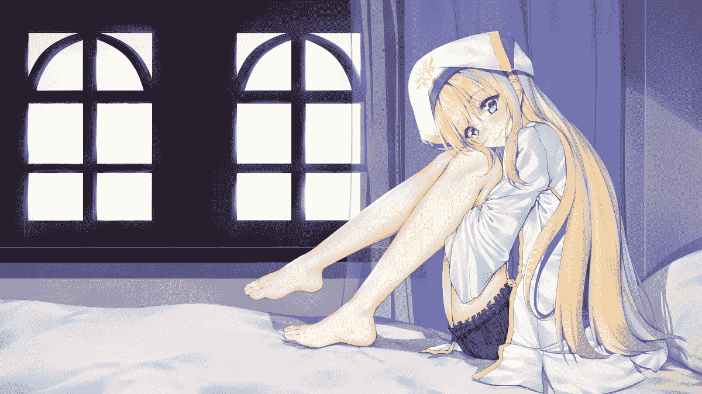

# 【短篇】哥布林殺手的報恩 (足控向、動漫改編)

作者：單身的貓

TID：29355

<title>1</title> <link href="../Styles/Style.css" type="text/css" rel="stylesheet">

# 1

*本帖最後由 單身的貓 於 2020-8-27 01:30 編輯*

這篇靈感來自**"哥布林殺手"**，時間軸大概是電影版**"GOBLIN'S CROWN"**的結尾，並後續二創如果沒看過的人可以去看看這部，先看電影版也不會跟不上，真心推薦(如果尺度你們可以接受的話..嘿嘿
________
**情節大綱:**
有個身穿盔甲的冒險者名叫**哥布林殺手**，顧名思義，等級為銀級的他只接受討伐哥布林的委託，後來在某座哥布林洞窟裡撞見**女神官(**女主角)和被哥布林殺害的夥伴，並成功解救了她，於是**女神官**決定跟隨**哥布林殺手**，並展開一系列的哥布林討伐活動
________
哥布林殺手與女神官(pixiv id:71091423)

女神官(pixiv id:71383065)

<title>2</title> <link href="../Styles/Style.css" type="text/css" rel="stylesheet">

# 2

 <ignore_js_op>[71091423_p0_master1200.jpg](forum.php?mod=attachment&aid=ODQ4Mjh8YzUyNzRjOWZ8MTYwMDg3MzY3OHwxODIzMHwyOTM1NQ%3D%3D&nothumb=yes) *(360.57 KB, 下載次數: 0)*

[下載附件](forum.php?mod=attachment&aid=ODQ4Mjh8YzUyNzRjOWZ8MTYwMDg3MzY3OHwxODIzMHwyOTM1NQ%3D%3D&nothumb=yes)

2020-8-26 21:01 上傳  

哥布林殺手與女神官

</ignore_js_op>  <ignore_js_op>[71383065_p0_master1200.jpg](forum.php?mod=attachment&aid=ODQ4MzB8YjA0YTc3NzJ8MTYwMDg3MzY3OHwxODIzMHwyOTM1NQ%3D%3D&nothumb=yes) *(598.26 KB, 下載次數: 0)*

[下載附件](forum.php?mod=attachment&aid=ODQ4MzB8YjA0YTc3NzJ8MTYwMDg3MzY3OHwxODIzMHwyOTM1NQ%3D%3D&nothumb=yes)

2020-8-27 01:27 上傳  

香

</ignore_js_op> <title>3</title> <link href="../Styles/Style.css" type="text/css" rel="stylesheet">

# 3

*本帖最後由 單身的貓 於 2020-8-28 14:56 編輯*

所有冒險者正在公會裡舉杯慶祝新的一年的到來，能夠平安的活著也真是不容易啊，唯獨哥布林殺手坐在山崖邊，眺望整個山林，查看有沒有哥布林作祟，只有小小的營火陪他度過這個寒冷的雪夜

"哥布林殺手先生~"

同個隊伍裡的女神官也跑來陪伴獨自駐守的哥布林殺手，雖然她金髮碧眼，臉蛋像是涉世未深的洋娃娃，但是她也是跟著哥布林殺手好幾回冒險的黑曜級冒險者

"我帶了些慰勞品"

"是嗎"

"你也真是的，為甚麼不跟著大家一起呢?"

說完，女神官把帶來的食物放在火堆上烹煮

"對了，我忘記說了"

"怎麼了嗎?"

"今年也請多多指教"

"這個...送妳"

語氣一如往常的平淡，猜不透頭盔裡的他此刻的心情是甚麼

哥布林殺手從身後拿出了一雙長靴，是一雙外表是青綠色的皮革靴，雖然沒有多餘的裝飾點綴，但足足表現了哥布林殺手簡單直白的特色

"謝謝哥布林殺手先生"

女神官眼睛一亮，大雪裡的雙頰格外通紅，感覺不太好意思接受別人的禮物，再加上送禮人平常不是會做出這種浪漫事情的人，使她感到驚訝

"好特別的一雙靴子，是從哪裡來的啊?"

"我請魔女訂製的，然後...."

...
...
...

"喔?稀客呀，找我有甚麼事?"

細微的燭光照明著公會的角落，平常值班的掌櫃小姐也通通回去了，原本早上鬧哄哄的景象形成強烈對比

哥布林殺手把手上的袋子甩在魔女面前，袋裡像是有隻活物，不停掙扎扭動，直到麻繩些微鬆開

"請幫我訂作一雙長靴"

魔女看到裡頭的東西不禁感到疑惑，這是她遇過最奇怪的委託

"明明有更好的材料，為甚麼...."

"嘛，算了，但成品應該不會非常好看喔~"

...
...
...

哥布林殺手把靴子的來由一五一十的告訴女神官，女神官的心情一百八十度翻轉，驚嚇的跌坐在一旁的雪地上，刺激到腰部被哥布林劃傷的傷口，隱隱的刺痛著

"不行不行!!我不能...."

女神官強烈反對，她沒辦法做出這種事，但是這是哥布林殺手先生的好意，就這樣拒絕他也不太好

"已經處裡過了，放心吧"

哥布林殺手的語氣仍然一樣，也預料到女神官會有這種反應

"可是....痛"

刺痛感像是在催促她，女神官緩緩的伸出一隻手，把靴子放在腳邊，但還是沒辦法跨過心理的坎，甚至有靴子仍然在微微顫動的錯覺

看著自己也有些舊的白靴已經陪伴她一段時間，表面都遍布冒險的痕跡，是時候也該換一雙新的

"我知道了"

女神官鼓起勇氣，脫下腳上的靴子，一隻潔白的玉足完全與雪花融為一體，腳趾被靴子保護得相當好，沒有任何一點曬痕，不像是與哥布林殺手四處討伐哥布林的模樣，被靴子悶了一整天的玉足所產生的汗珠也像是水晶球一樣，隨著營火的升溫而滾落

雖然知道整雙長靴是由哥布林的皮毛製成，但是兩人都沒料到魔女在靴子裡偷偷藏了她的惡趣味，裡頭鞋墊是由哥布林的整張臉製作而成，嘴巴已經完全封死，鼻子成為對外良好的通氣孔，眼睛被魔法制約，被強硬的睜開雙眼，只能用充血的眼睛代替痛苦的求救，所以嚴格來說，這雙靴子還是兩個活生生的生命體

"開始囉!"

女神官小心翼翼的把腳伸進靴筒，吞噬靴裡唯一的光源，裏頭的哥布林用力睜大充滿恐懼的雙眼，眼角不停地泛淚，但始終無法改變接下來的命運

整隻玉足沿著靴面滑落至靴底，停滯在鞋墊的正上方，調整好位置後，接著緩緩踩下去，哥布林的眼睛正好被腳掌溫柔的覆蓋著，鼻子不由自主的把腳底濕氣和汗味吸進，並排出至靴外，其中一邊的臉頰處特別保留，支撐著女神官完美的足弓，而腳趾輕輕的放在哥布林的額上，目前一切看似和諧

"嗯姆...."

對女神官來講，這一定是個特別的觸感，腳掌處的腳墊有點凸出，足弓還有感受到微弱的涼氣，還挺舒服的，五趾緊縮，卻感覺到腳下的彈性，整體的體驗是還不錯的

"還可以接受嗎?"

"感覺不錯!!"

"是這樣嗎"

接著女神官也把另一隻長靴穿上，閉上雙眼，放鬆的適應新靴子，享受著足弓處的氣流，腳掌稍微用力，似乎特別滿意正下方的突起物，幫著自己的腳掌按摩，但腳下的兩隻哥布林可不是那麼好受，但還可以勉強撐住

新年的第一道曙光緩緩升起，照耀著大地，眼前的營火也幾乎燒完了，樹上的融雪紛紛滴落到兩人的頭上，提醒他們該是迎接新任務了

"我們回去吧~哥布林殺手先生"

"嗯"

女神官拍拍衣袍上的積雪，準備動身前往公會，但靴裡的哥布林不知道，迎接牠們的是痛苦的無限噩夢

"雖然你們應該已經失去生命了，但我還是為你們祈禱吧"

女神官對著下面的哥布林說道

"慈悲為懷的地神母啊，請您賜的哥布林祝福，牠們已成為我的靴子贖罪，願來世不再做一隻哥布林"

"走吧!"

女神官踏出的第一步，不是像上次輕輕踩一樣，這次的疼痛程度對哥布林是遠遠超過，雖然較為嬌小的她體重不會非常重，但是僅僅靠兩張臉就要支撐所有的重量，光是面積大小就已幾乎不及女神官的腳底板了

腳掌下的眼球被踩出眼淚，再加上不斷的摩擦，擠出的眼淚經由魔女當初的調整，變成可以保養女神官的腳底護膚品，而女神官能回饋給哥布林的只有更多的腳汗、氣味和少許的腳垢

一路下來，女神官對哥布林殺手分享一起冒險的回憶，雖然哥布林殺手沒有做甚麼回應，但女神官還是很喜歡這種時刻，反觀腳下的哥布林們正痛苦地承受著壓力，並且用自己被踩出的眼淚滋潤著女神官的玉足

"呼~ 終於到了"

"我去看有沒有關於哥布林的委託"

"唉..每次滿腦子都是哥布林"

...
...
...
...
...

"又成功討伐一座哥布林洞窟了"

"我們去休息吧"

"也是"

經過一整天的冒險，女神官在旅館房間裡擦拭著自己的法杖，視線不自覺地移到床邊的青綠色長靴，似乎習慣了它的存在，也漸漸不把它的原料放在心上

"(真的是多虧了哥布林殺手先生給了我這雙長靴，讓我的腳輕鬆許多，而且也沒什麼異味，這應該是我的錯覺吧~)"

"(是時候也要好好保養這雙靴子了，不能辜負哥布林殺手先生啊)"

..

"(噁...鞋墊都印有我發黑的腳印啦...時間過了那麼久嗎?得趕緊清理乾淨才行，之後還得踩著它冒險呢)"

女神官手上的鞋墊已經看不出那原本是臉的模樣，幾乎都被她的玉足磨平，只剩幾處皺褶殘留，哥布林眼睛也幾乎被磨損殆盡，取而代之的是完整黑色的腳型印記和清晰的五趾，所以女神官到最後仍然沒發現腳下的哥布林已經被她踩了好幾個季節

<title>4</title> <link href="../Styles/Style.css" type="text/css" rel="stylesheet">

# 4

*本帖最後由 單身的貓 於 2020-8-27 01:00 編輯*

> (别）看我的 發表於 2020-8-27 00:24
> 我是很欣慰有人二次創作哥殺啦（個人心目中在輕小説排行第二）
> 文筆感覺也有模仿到原著
> 可是感覺不太對味兒 ...

我也是很喜歡這部作品
後續喔…可能沒有吧
我這篇主要想朝這變物方向  gts的話...可能只有兩方身體狀態的大小有一點關係吧
覺得單純縮小哥布林可能會造成其他角色性格走歪，如果縮小哥布林殺手也是一樣，感覺他的性格不適合，除非走溫柔風
<title>5</title> <link href="../Styles/Style.css" type="text/css" rel="stylesheet">

# 5

> 蔡民15 發表於 2020-8-27 05:47
> 寫的真棒，我希望魔女能用魔法把哥布林縮小，然後用於調教。 樓主加油

謝謝 但是應該不會有後續了吧