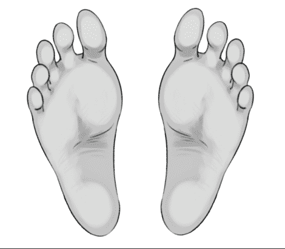

# 【短篇】終日遊戲機 (足控向)

作者：單身的貓

TID：28002

<title>1</title> <link href="../Styles/Style.css" type="text/css" rel="stylesheet">

# 1

*本帖最後由 單身的貓 於 2020-2-19 15:34 編輯*

(原名:Wee Fit)
 明明家財萬貫，為甚麼我得跟死老百姓在同一所學校，可惡的老頭子說甚麼要磨練我，適應一般人的生活，但是跟著這些窮酸鬼可以學到多少東西....

(開門)
"庶民們早啊!!!哎呀!!你們的早餐還是一樣窮酸阿"

班上的同學沒有一個理我，繼續自顧自的吃著自己的乞丐餐，還一臉很開心的樣子，我已經跟老頭子說很多遍，就是不把我送去貴族高中
小岩並不知道，他已經在班上積了許多怨恨值，沒有朋友的他認為都是同學們刻意排擠他、孤立他，所以一切他都沒有錯，並總是一副高高在上，因此人際關係不好不是一天造成的
"那些可惡的死平民，體育課還故意戲弄我，害我弄了一身爛泥!"
我生氣的碎念著，回家的路上不停跺著腳，平常都是管家開車接送，但是今天他們卻有事外出，所以必須靠自己走回家，今天真的是雖衰事連連
"今天沒人在家嗎..."

豪宅裡空蕩蕩的，管家們也意外地外出，屋裡只剩我一人，坪數那麼大的房子只有一個人顯得格外寂寞，走到客廳，客廳的桌上放了一份包裹，沒有留名，也沒表示來自哪裡，只有貼了一張郵票
"(難道是老頭子終於買給我了??!!)"

我興奮地拆開包裹，但又馬上轉而失望，眼前看到的是一台遊戲機，款式算是前幾年出的，包裝上的名稱甚至讓我懷疑老頭子是不是買到山寨貨，遊戲機本體是長方體平面板，表面中間有條縫隙，把面板分成兩塊區域，兩塊區域上各有一個微微的長方形凹槽，應該是雙腳踏上面操控的

"這甚麼......"wee fit"??聽都沒聽過!!!我已經說我要sweech，老頭子怎麼都講不聽.."

"今天怎麼那麼不順啊!!!"

看著那山寨品我愈想愈氣，我把遊戲機兩手抓起，用力的摔落至地上，金屬零件的碰撞聲非常明顯，遊戲機的邊角也出現了明顯的裂痕，前一秒還是新的遊戲機經過強烈碰撞變得傷痕累累，之後我就不再理會那台破遊戲機了，繼續躺在沙發上，看著電視節目

..
..
..

現在的我非常無聊，電視播的老套節目我也通通看膩了，大螢幕前面只有我一個人，看得很沒勁兒，後來，我又瞄到地上的遊戲機，心不甘情不願地把它開啟，連接到電視上，對於他的介面內容不抱任何期待。我站在遊戲機上，一開始先是設定，還有身體年齡和平衡感的測驗，完成後才是真正的遊戲選單，畫面上有許多小遊戲，於是隨便選了一個想打發時間

"選這個吧....瑜珈應該可以放鬆心情"

但是在遊戲開始前，畫面不斷跳針卡頓，接著畫面消失，黑黑的一片在我眼前，我站在機器上，滿腔怒火握緊雙拳，猛力的往遊戲機上踐踏、跳壓，白天在學校和今天的所有的不滿全部都出氣在這台破機器上，遊戲機也殘破不堪，更加明顯的裂痕、凹下去的面板說明了這台機器已經完全損壞

(叩!!)

裏頭的零件噴飛出來，小岩在破壞遊戲機途中不小心踩到小螺絲，重重的摔了一跤，頭部硬生生地撞擊地面，倒在大廳的地板昏迷不醒....

..
..
..
..
..

"(啊...好痛...我睡著了嗎??)"

我緩緩地張開沉重的眼皮，視野感覺非常模糊，現在還是非常暈眩，等到狀況較正常後，我居然動不了，頭也不能轉動，甚至感覺不到脖子的存在，軀幹和四肢也是，只能乾乾的盯著天花板

"(誰可以救我?........我的聲音怎麼變得那麼奇怪??!!)"

我感受不到我的聲帶在震動，正確來說是整個聲帶都頻空消失，而我講話的聲音來源竟然是從我的頭頂發出去，充滿電子的語調使我困惑

"你終於醒啦"

一名少女突然出現在小岩眼前，低頭看著他，異於常人的銀白色皮膚，身上穿著"wee fit"字樣的藍色運動背心和運黑色運動褲，雖然說身體嬌小，但是她暴露的小蠻腰非常完美，胸部看得出已經在微微的發育，帶點幼齒的臉蛋，綁著亮麗的黑髮馬尾顯得朝氣蓬勃，看起來比小岩小兩、三歲，可是顏值遠遠比他們班大部分的女生可愛許多

"等等...你是誰?!"

"幾小時前我是個遊戲機，不知道甚麼原因，我像是活過來似的，被賦予這個身體，我可以開始到處活動，跟真的人..."

"快點扶我起來，我的身體動不了" 我不等少女說完話，就立刻插嘴

少女的表情忽然帶點輕蔑地說道

"認清楚你的身分!!你現在是個遊戲機!!!在我還是遊戲機時，你是怎麼虐待我的，所以現在換我虐待你!!!讓你嘗嘗遭受踐踏的滋味!!!"

只見少女緩慢的抬起她銀白色的小腿，原本看不到的右腳也跟著懸置於小岩的正上方，銀白的包裝下，腳掌所透出的紅暈更加溫和，沒有承受體重壓力的足弓已經是接近純白，只帶有一點點銀灰色成分

"你說什#$$#@%...."

少女的腳尖朝下，以子彈般的速度不偏不倚踏在我的右眼上，我的臉也連帶遭受波及，從未感受過的劇痛瞬間湧出，我這時才意識到，我的身體只剩一張臉，而我的臉就是遊戲機的操控面板，就是現在少女踩的地方

左腳也依序踩下來，再一次承受恐怖的速度壓力，整張臉被少女輕易的踩在雙腳下，疼痛感還沒完全消去，大腦的迴路像是被打開，開始做出某種運算，來歷不明的數據慢慢出現在我的腦海

"(計算中...)"

"我沒有打算要計算這些數據.....我的腦袋怎麼@!#@^#"

我的思緒像是被搶走一樣，話語權也被控制，說出了違背心中的內容

"嘿嘿~看來你的腦袋漸漸被 "侵蝕" 了" 少女一臉得意地看著底下的我

"甚麼意思@#$%#@" 我的腦袋主導權又再次被奪走...

"(155cm，45.1kg，BMI:標準)"

"看來我也不會太重嘛~"

看到電視螢幕中的數據，少女滿意的點點頭，對她的身材相當滿意，而我的存在對她來說已經變成一個真正的遊戲機了，完全不會顧慮我的感受

我愈來愈沒辦法控制我的腦袋，它像是被植入某種晶片，強制執行某些指令和存入來自少女的資料，思考模式也會隨之改變

"(重心計算中...)"

..

"(幾乎在正中間了!!!離左右均等只差一點點!! 左:48.6% 右:51.4%)"

根據少女站立的細節，我可以計算出她的左右重心有細微的不同，可能連本人都沒有察覺到，這種只有我能達成的任務讓我莫名的成就感

"你好像愈來愈習慣你現在的模樣了，搞不好你天生很適合勝任這個"被我踩在腳下"工作!!"

"胡...胡說!!!"

雖然很不想承認，但她說的話也不能全盤否定

"不願意承認是吧，不過接下來就是重頭戲了，也是我最~~~期待的部分，你要努力撐住喔!!"

聽著少女的語氣，我有種不好的預感

"我看看......嗯....選這個組合好了~"

(按)

..
..
..
"(遊戲1:慢跑，請在時間內盡你所能的慢跑吧)"

"好的!!!"

遊戲一開始，少女快速的在我臉上原地踱步，雙手配合雙腳頻率的擺動，眼中只有少女的腳尖起起落落，不停的加重眼睛的負荷，平常不起眼的小動作足以讓我的雙眼受盡折磨

不知過了多久，少女終於停下腳邊的工作，但是雙腳依然踩著我的眼睛，所以只能聽見她微微的喘氣聲，從她的雙腳可以得知，她的皮膚開始散發熱氣，流了不少汗，我的臉濕濕黏黏的，加上少女踩著我的壓力，幾乎把所有腳汗鎖在腳底，所以附著在臉上的腳汗沒辦法蒸發，現在只能繼續忍受如此不舒服的感覺，因為我無力抵抗...
"(評價: S，總共跑了268m，消耗126cal，非常了不起!!!)"
"呼~沒想到玩遊戲可以讓我滿頭大汗"
少女移開一隻腳，想看看遊戲機的模樣
重見光明時感到相當刺眼，少女滴下的汗水滲入我的眼睛上，刺痛感使我無法完全睜開，但是隱約可以看到少女正低頭看著我
"啊!!不小心在你的臉上留下了我的腳印，你應該不會介意吧?"
"妳這個...."

可想而知，我的臉上有個熱氣構成的足印，想必一定非常清晰
"哼?怎麼了?"
少女露出匪夷所思的笑容，感覺透露出"如果你敢招惹我就試試看"的意思，膽怯的我不敢再表示甚麼...
"沒..沒事.."
"沒事就好~"
以前總是傲氣凌人，不把別人放在眼裡，現在的我淪為只配少女踩在腳下的物品、仰她鼻息，任意讓她玩弄，我漸漸體會到遭羞辱的感覺，非常後悔我過去對待的人事物
"既然沒有怨言，那我就開始下一個遊戲囉~"
"(遊戲2:韻律踏板，請跟著音樂拍子和指示踩在遊戲面板上)"
(♪~♪~♪~)

音樂響起，少女隨著節奏踩在我的臉上，再依照指示移開她的腳，有一瞬間可以看到她全神貫注的神情，但不一會兒又陷入黑暗，反反覆覆的這類的動作，每一次都踩得很扎實，拍點接近完美，拿到高分不會是不可能的事情
我的精神快要被少女消耗殆盡，對一切逐漸麻痺，反倒少女看起來沒有一絲的疲勞，我是不是準備要倒在她的腳下，繼續任她踩踏，永遠只能活在她腳下的黑暗
"(評價 : S，總計672點，消耗107cal，近乎完美!!!)"
"簡單!!!下面的還好嗎?"

"嗚...."

我沒什麼力氣回答少女，她的雙腳依然踩著我的臉，已經稍微習慣這種感覺，不太渴求喘息的片刻...

"很好!你已經有遊戲機該有的樣子了"
少女的注意力重新放在遊戲上，高興的接續下一個遊戲

"(遊戲3:平衡滑雪，用最快的時間通過終點並避開障礙物)"

這個遊戲相對溫和，不像前兩個過於激烈，感覺到少女的重心放低，踩得更緊實，腳趾也是變得更緊繃，幾乎是整個腳掌貼在我的臉上，只有足弓的位置是中空的，雖然沒有前兩個遊戲激烈，但是重心放低使腳部的骨骼感更明顯，後腳跟壓下來的壓力不會比較舒服，並且附加刺痛感，有時重心移向腳尖，有時移到腳跟，整張臉的所有地方都有被上面兩隻腳施壓幾遍，就像真正的滑雪板
"啊!!!"
少女沒調整好姿勢，遊戲中不小心撞到障礙物，倉促的在我臉上重重的踏了一腳，維持平衡，痛得我叫不成聲，因為我已經全身無力，遊戲中也不能發出聲音

"(評價: A，花費時間1分38秒，最新紀錄!!!)"
"今天也玩得好滿足，流了好多汗"
"(請問要儲存今天的遊玩紀錄嗎??)"

"好啊"
這次換成眼睛被操控，上下左右來回轉動，視覺上只有少女腳底的漆黑，卻有個畫面慢慢的在我腦裡生成
"(掃描過程中請不要隨意移動雙腳)"

"(掃描中...)"

少女的腳掌完整的呈現在我的腦中，並連接到電視上，她的腳非常完美，小小的像是藝術家精雕細琢的工藝品，小巧的腳趾沒有任何的瑕疵，勻稱的前掌也是十分柔軟，使我感覺到少女的溫暖，足弓的弧度和整個腳掌成黃金比例，腳跟底部光滑潔白，沒有一點死皮或厚繭，這是我第一次完整的欣賞少女的玉足，想不到她的小腳原來那麼美麗，我已經深入的無法自拔，思緒一混亂，彷彿我的人格在她的玉足前過於醜陋，根本配不上，如果時時刻刻能被這雙玉足踩在底下豈不是最大的幸福這
少女的腳形深深的烙印在我的腦中，作為遊戲中的紀錄，只要她下次再踩上來，就可以更新她的分數了
"我的腳底好好看啊!!下面的，你說是不是啊~"
少女看到畫面中的腳掌，不禁讚嘆了幾聲

"很..很漂亮...可..可以繼續踩著我嗎?"

我不好意思的說著，深怕少女會為此不高興

"喔??看起來你的意識已經徹底的改變，果然還是需要我好好矯正一番，但是我有點累了，改天再玩吧"

心中有點不捨，像是失去依靠一樣

"(掃描完成!!請為這隻帳號取名)"
"取名啊...取做"主人"好了!!!因為現在這個遊戲機的主人是我嘛~，前一位擁有者正被我踩著，所以我已經變成他的主人了~"

"再見，期待您下次的遊玩"

這次不是系統強制更改我的發言，而是我發自內心說出的話
我的臉上某一處被開啟，類似鼻子的功能把主人腳掌上所有的塵屑和汗垢吸入透徹，儘管是運動過後，但過程中我有聞到主人腳底的芳香，清潔完畢就默默的把自己的清理器關閉
少女開心的舒展筋骨，離開了小岩的臉上，按下遙控器，把小岩關機，從此，兩人的身分互換，小岩繼續當作少女腳下的遊戲機，少女則是取代小岩的生活，同學們像是被串寫記憶一樣，不再記得當初那個討厭的富二代，小岩的爸爸也認為自己只有少女一個女兒，所以世界上再也沒有"小岩"這個人了.

<title>2</title> <link href="../Styles/Style.css" type="text/css" rel="stylesheet">

# 2

 <ignore_js_op>[rrrsaf2.png](forum.php?mod=attachment&aid=ODEyODd8NDEyNDEzZDR8MTYwMDg4MDIzMXwxODIzMHwyODAwMg%3D%3D&nothumb=yes) *(96.11 KB, 下載次數: 1)*

[下載附件](forum.php?mod=attachment&aid=ODEyODd8NDEyNDEzZDR8MTYwMDg4MDIzMXwxODIzMHwyODAwMg%3D%3D&nothumb=yes)

2020-2-9 00:46 上傳  

</ignore_js_op> <title>3</title> <link href="../Styles/Style.css" type="text/css" rel="stylesheet">

# 3

(過了幾天)

"今天放學要不要來我家啊??順便讓你們玩我最近得到的遊戲機，還可以瘦身喔!!"

"好啊!!聽說你家很大，早已想去你家拜訪了!!"

經過幾天，少女已經交到朋友，和班上的同學們打成一片了，每個人都很喜歡她，少女也很滿意現在的日子

一群正值青春年華的女高中生們進入少女的豪宅，每一位都嘖嘖稱奇，對眼前的景象非常驚訝

到了客廳，少女先是按下遙控器打開遊戲機，巨大的電視螢幕馬上切換到遊戲畫面

"下面的，我今天帶了幾位客人喔~"

"..."

"啊咧??前幾天明明還會自己講一些斷斷續續的句子，看來已經沒有自我意識，變成一個"正常"的遊戲機了，反正遊戲機也不用說多餘的話，繼續玩我們的好了"

"妳在跟誰講話啊??"
 "沒事沒事，腳踩上去，我們開始遊戲吧!"<title>4</title> <link href="../Styles/Style.css" type="text/css" rel="stylesheet">

# 4

這次的文章不斷遇到瓶頸，寫得超久，希望大家會喜歡，也歡迎發表一些看法喔

圖片參考:[https://www.pixiv.net/artworks/64071819](https://www.pixiv.net/artworks/64071819)<title>5</title> <link href="../Styles/Style.css" type="text/css" rel="stylesheet">

# 5

> alchemistwh 發表於 2020-2-9 02:37
> 变物文章看了很多，变成游戏机的还是第一次见到，楼主好有创意。

感謝支持，其實我之前也有寫過關於遊戲機的文章，精靈的支配第三章<title>6</title> <link href="../Styles/Style.css" type="text/css" rel="stylesheet">

# 6

> a959897 發表於 2020-2-9 02:54
> 很像精靈那篇的遊戲機呢
> 不過那篇是跳舞機這邊好像是固定的踏板，我想像成體重機...
> 回歸正題

史萊姆是哪一篇啊？
男主確實軟得有點快（汗，畢竟他本來就不強，只是個有錢人家的小孩嘛<title>7</title> <link href="../Styles/Style.css" type="text/css" rel="stylesheet">

# 7

> [六神一 發表於 2020-2-11 04:23](https://giantessnight.com/gnforum2012/forum.php?mod=redirect&goto=findpost&pid=425667&ptid=28002)
> 你好，这应该是我第一次回复你。个人本身对变物不是特别有感，但还是被您的作品吸引了。但这次的女孩子太凭 ...

她和男主的身分互換後才出現的，精靈那一篇還要再構想一下，但還是謝謝支持
<title>8</title> <link href="../Styles/Style.css" type="text/css" rel="stylesheet">

# 8

> [琉璃 發表於 2020-2-11 08:54](https://giantessnight.com/gnforum2012/forum.php?mod=redirect&goto=findpost&pid=425673&ptid=28002)
> 咕噜，果然还是希望 男主能有意识哇。这样可以被原本看不起的人都玩一遍呢 ...

是指最後還保持著意識嗎?感覺後面的點子還不錯