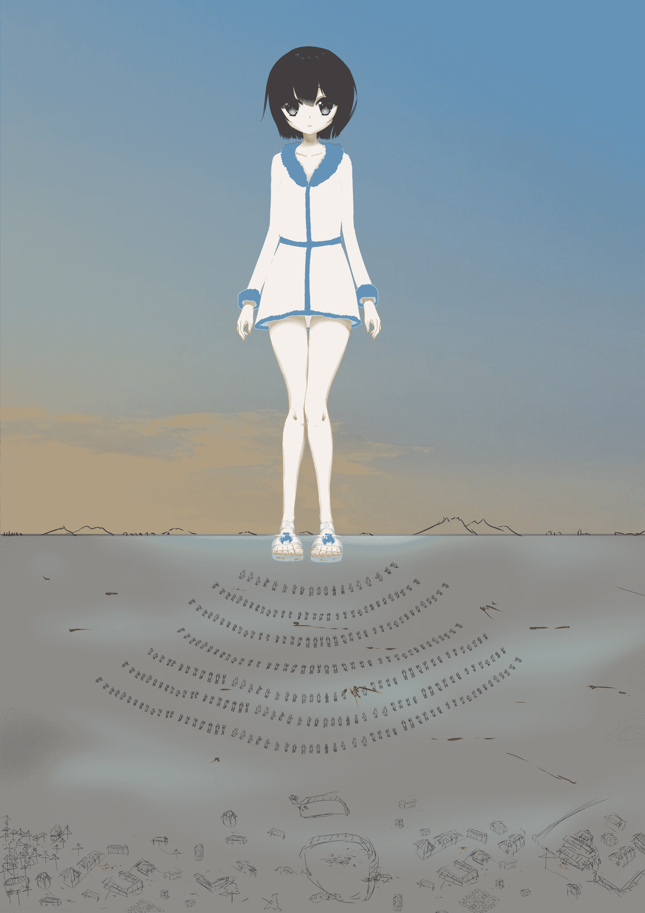

# 【神寂杯】凛冬-重制整合待续版

作者：西呱

TID：28785

<title>1</title> <link href="../Styles/Style.css" type="text/css" rel="stylesheet">

# 1

本文是我的旧文章凛冬的重制版和其他一些文章的整合和一些新的内容，禁止转载。感谢大佬的配图
目前是烂尾状态，关于后续，欢迎加入我的读者群，群号570544974
故事是发生在架空的设定，和三次元无关。

在一片环绕茫茫沙漠，以草原为主，耕地为辅的广袤土地上，是在这个文章世界中最大的国家，永旭国。
这是一个异世界内陆南半球国家，经过了名叫燕比达的女皇帝的十余年的奋斗，扩展到了如今南到南极，中有草原，北有农田的，世界最大的国家。
国家的制度中没有宰相职，皇帝很累。储君的职责是接管皇帝的全部工作并接受皇帝领导。
新纪元40年：
燕比达这一年24岁，这时有三个孩子，9岁的长公主，7岁的二王子，和4岁的三公主。
她彻底厌倦了皇帝生活，想要做一个安逸的人。
在这一年前，她曾找过自己的大女儿想要让她继承王位，但是被拒绝了。
不强求，于是只好找到当时年仅四岁的三女儿，尝试着指导她，手把手的。
她任命了三公主为储君，并且引导她成为一个称职的皇帝。
但是如今，一年过去了，根本不行，指望一个五岁孩子，真是没什么希望了。
而且感觉这孩子有点笨笨的。于是，皇帝和三公主有了更换储君的初步共识
之后，她又有了第四个孩子，小女儿四公主。取名叫燕雅
新纪元43年：
燕比达这一年27岁，这时有四个孩子，12岁的长公主，10岁的二王子，7岁的三公主，2岁的四公主
四公主两岁的时候，燕比达着实的感到自己生了一个小神童（ps这是女主妈妈的个人看法），又或者这个孩子比较早熟一些，总之很靠谱的感觉
于是，她开始了尽心尽力的指导，希望培养成新的储君。
新纪元46年，10月2日
这一年，燕比达29岁半，五岁的四公主已经具备了成为一个不算糟糕的皇帝的基本素质了。当然这是以一个很宽容的要求来评判的。三公主也早已自愿在近期卸下储君职位。
时机接近成熟了，迫不及待的女皇帝下令在四公主五岁生日时举行盛大的立储典礼。
这一天的日出，文武百官在草原上的宫殿以东的山顶祭坛齐聚，大家东向拜日，樊柴祭天，杀鸡鸭牛羊祭祖，在朝阳的破晓之光的照耀下，人山人海对四公主山呼万岁，由四公主下旨平身。等等等等。
一众百官再步行到宫殿，朝阳刚好照进坐西朝东的大殿之中，当阳光洒在那坐在龙椅上的四公主身上时，宴会便开始了。
这是以皇帝登基规格举行的储君任命仪式。
从此，皇帝妈妈将政府首脑位置交付给了储君四公主，而皇帝本人仅任国家元首职务。
散会后的第二天，已经是如释重负了的燕比达刚刚完成了和四公主交接任务的准备工作。
苍茫的青空，辽旷的草地，马群在远方点缀跃动着，
花岗岩的大道上没有任何的装饰，
目力所及的远处是城墙般的高墙，卫戍们整齐的坐在城楼
这里，是永旭国的王宫后门。
娇小的少妇的身影，提着球杆，悠哉而又快步的走在大道上，
细碎的雪花堆在金色的皇帝衣装上
三公主：“妈！”
她转过身，正好让女儿看到了她那又期待去玩转为无奈的表情
这位二十九岁的国王，正回身看着她十岁的女儿
三公主：“您又要跑去打球了！！”
这个比国王矮点，长的差不多的女孩就是三公主
三公主：“让位的事，我提醒过您了，妹妹还小，很难让她去做所有事情。”
皇帝：“哎，我觉得她差不多初长成了，能力嘛也没问题，你看看老大根本不是这材料，老二是男孩子，没有办法，我不想继续忍受了，不然说不好哪天我会蜕变成昏君。”
三公主凑近了，把脸抬着看着自己的妈妈，压低了声音说
“你这样是贪玩，为了好去玩是吧”
而皇帝只是笑了笑
皇帝： “老四可是专门当储君的材料，今天准备的那些文件我特意给你做了摘要，你都看了吧？”
三公主：“对，我看了，储君明年计划远征”
皇帝：“嗯，所以我放心啊”
三公主： “您放心。。放心她去那么冷的地方？”
皇帝：“我放心她去了，国家肯定不会出事”
看了看这跃跃欲试的想跑的女王，她也叹了口气
三公主：“我不放心她，必要的时候你得承担责任。”
皇帝：“我就留下了这么一个命令而已，我现在连交接都懒得做了，你来吧，我走了，看那些乱七八糟的东西就烦”
三公主：“这么重要的事情您都不去？也该去看看妹妹啊，你这会不会算是虐待孩子了？”
皇帝：“别扣帽子，她其实也没有坚决的拒绝过”
三公主：“是啊，您对她说您没有心思了，姐姐们也都不行，可她也不是自愿去做的”
皇帝：“还是一起去吧，我这也是锻炼了你们，对你们来说有好处，明君不是从小傻玩就能培养出来的”
三公主：“都是借口，尽管也有一点道理。”
皇帝：“看到孩子们独当一面是很有成就感的”
三公主：“借口，都是借口，我可怜的妹妹啊”

一年后
历47年，冬天，12月15日
八岁的四公主率领三十万骑兵来到了花国的边界。
<ignore_js_op>

**gua - 副本.jpg** *(124.71 KB, 下載次數: 0)*

[下載附件](forum.php?mod=attachment&aid=ODMxNjN8ODQxOWNjZGZ8MTYwMDg3NzE2NnwxODIzMHwyODc4NQ%3D%3D&nothumb=yes)

2020-5-28 16:28 上傳

这里是这个世界的南极。（气候类似三次元的北极）
现在正是初冬，零下二十三度，很冷，
马都穿了厚厚的衣服，行动很是迟缓。
士兵们更是穿的厚厚的。
永旭国，主职负责决策和任免，
副职负责日常工作的体系。
这一体系在军政各方面都有实施。
八岁的四公主在一开始并没有表现得很好，
有些幼稚，
但她也在皇帝的指导下迅速快速的成长。
四公主从四岁开始的为期三年的速成培训
起到了重要的效果
这个孩子并没有一个完整的童年，
但接受了担任帝王相关的培训
在远征之前，她已经建立了可观的威信，
实现了比较稳固的领导
在波尼可夫元帅演讲后，
是四公主的发言，
“花国全境均是永续国固有领土，
永旭国建国的时候，这一领土宣称就存续至今……
如果不能收复出海口………
国防和经济发展都将陷入瓶颈，陷入恶性循环………
北方的钢国和铝国爆发了战争，在邻国交战之际，
正是我们获取出海口、通商致富的关键机会………

演讲长达二十多分钟，
军队在她思路清晰条理明确的发言中
已经明白了她不是一个普通小孩子，
而四公主明确了此行的目标，进攻花国。
对于行动的必要性也做了一些有所保留的解释。

新历47年，冬天，12月16日
在花国的首都，
首相麦克斯韦尔，
五十出头就已经花白了胡子，
在会议室里喝着热咖啡，
冷风从窗户的缝隙中漏了进来。
赶到会议地点的女王铃兰，
正看到老首相在桌上，两手中间是一叠文件
“这是我们最后一次在这里私下讨论战前机密问题了吧”
“啊，你来了。最近的情报有没有看到？”
花国的女王，十七岁，看起来比实际年轻一点，
一米五五的身高和娇柔的体型。
红白相间的上衣，以及红白色的帽子和袖子，
红色的衣领和腰带，白色的花边。
她看着首相，目光坚定而活力的看着手中的纸张
首相思考了一秒，然后入座说
“是的，他们来了？”
“嗯，甚至在边境的山顶
已经可以看到马蹄飞扬起的尘土”
“我知道了，我马上让军械部着手紧急战备”
“我们不可能单靠自身的国力
来打赢一场大规模的自卫战争，
情报部门估算对方的产能有我们的十二倍，
我们必须进行外交谈判,最重要的是拉取外国支持”
“您放心去做吧，内政方面，
军需品的补给和生产线的正常工作都可以保证”
…………
过了一会，几名部长和政要也进入了会场
在这个咖啡间，本来是讨论非正式问题的地点，
但显然更加适合现在的情况。
这次会议制定了花国的防御计划。
在永旭国的军中，
骑着马的四公主，稚嫩的童颜皱着眉头，
脸上冻得疼
“战士们的衣服看起来只能勉强抵挡这样的寒冷”
一个个浑身穿的非常严实的骑兵们，一眼望不到边。
在进攻了一段时间，扎营后，
四公主在帐篷里找到波尼可夫，
“报告储君大人，我们应该很快就可以占领边境的大城市阿斯卡”
四公主叹了口气
“这次，压力大啊，不过说到底都是为了国家，担子沉，心里就觉得有什么东西堵在胸口，让人不敢停下工作”
四公主想到刚才在军中看到的巨大的女孩子，
“波尼可夫，给我讲讲巨大化的事，我得补补课了”
“她们是一种新兴的兵种，近几年才开始成型，以雇佣兵的形式组成的部队”
“这很怪异，原理是什么？”
“理论上取得了突破，使人可以自由的集合自己的一种特殊能量，进而巨大化，或者缩小他人。”
“为什么是雇佣兵形式？为什么数量这么少？为什么只有女孩子？”
“因为它无法通过培训来变强，而是完全取决于资质和努力，男性无法成功的原因是精神能量控制需要的控制力和生物体的生命力相关。另外，一旦怀孕，或者衰老，都会失去力量。”
“我们有多少名巨大化部队的队员？她们实力如何呢？”
“一百三十多人，除了个别女孩可以巨大到几十米，其他大部分只能十多米左右。她们可以对抗数万人的兵力，但只能作为辅助。”
交谈中，有人报告称，铂金国和钢铁国发生了战争。而永旭国也在抽调兵力进行对进攻花国的增援。
这早在预料之中，这也正是为何，永旭国要选择这样的时候进攻花国。
新历48年，冬天，12月27日
另一方面，花国
今天的花国王宫比往日更加繁忙，花国女王铃兰，刚刚从她负责的外交部会议结束后就去面见首相麦克斯韦尔
到了地点的时候，有几位官员也在一起
“外交官已经传回了消息，钢铁国拒绝了我们的求助，日暮里答应会给我们一些军需品，不过还不清楚具体的详单”
女王一副受了委屈的小女孩的表情看着首相
“您别用自责的表情看着我们，高贵的女王大人，钢铁国肯定不会刚陷入战争就来援助我们，我们也不应该对钢铁国抱有多大的期望”
她咬了咬嘴唇“我们的情报部门估算对方的国力有我们的十二倍，我们不可能单靠本国这点兵力来打赢一场大规模的自卫战争，可眼下还没有人帮我们”
“我很遗憾，根据现在的形势，在我们的主力赶到之前，萨姆润恐怕已经失守了，我们的战士做好了准备防守下一道防线”
铃兰看了看麦克斯韦尔，然后丢给他一张刚印出来的报告单
上面列举了估算的永旭国兵力，兵种组成，以及本次侵略的估算兵力
“和我们之前的数据没有多少出入”
说着，他把单子传给其他人传阅
“国家兵力接近九倍，而且是全军骑兵，这次出动了三分之一的兵力，另有三分之一在路上。”
“明白了，是时候转移工业到首都周围了。”
“嗯。。等散会后我有话单独说，现在我们的主力到哪了？”
“欧帕克附近”
“那快到了，从首都运送物资太远，等日暮里答应的那批军需品到了，就让他们直接送到欧帕克吧”
“到时候再考虑吧，战局会发展成什么样，谁也说不好。”
在散会后，铃兰凑近首相，抬起头看着他
“麦克斯韦尔叔叔，我们是不是应该把民众疏散到战线后？”
“这不可能，我们的运输能力想保持全速行军就已经很困难了，何况是那么多的人口”
“我觉得是我害了他们”
“别错怪了自己，孩子”
“差距这么大，要怎么办才能挡住啊？你有没有信心？”
“目前只来了三分之一左右，所以以我们的地形和气候，我们还是有信心守住的，敌人的增援部队到来之前，尽可能的拖住。”
“你看上去有黑眼圈了，一定要注意休息不要为难自己”
“谢谢您的关心”
新历48年，冬天，1月7日
四公主对于早早打胜仗，然后回家避寒的这一希望，已经破灭了。
“波尼可夫，我本以为这会是场简单的胜利”
波尼科夫拿出地图，指着雪地崎岖的山路
“冰封加上山地，河流，对进攻方带来极大的不利，能做到现在这样已经不易”
“是的，我曾经在教学中见过冰冻加上崎岖的山地，还有河流，那么它在地面上的防御是很强。”
“您说的一点没错，所以现在的损耗大，实属不易”
新历48年，冬天，1月16日
双方军队在城郊已经僵持了一个星期，而永旭国增援部队终于来了
这次的会师让永旭国的远征军力近乎翻倍，56万军队现在正在准备新的行动

新历48年，冬天，1月19日
一个50米的巨大女孩，两个40米的巨大女孩，几个30米，20米的巨大女孩，冲上去勇敢的踢破了欧帕克城的城墙。然后从火绳枪和硬弓、石炮混编的花国阵地上逃回来。
而一眼望不见边的骑兵井然有序的跟进着。
长弓和弩炮的攻击如同雨水
花国的防线从中心被撕开，造成了整体的大溃败，永旭国部队攻克了欧帕克城市
新历48年，冬天，1月22日
西伊卡马赛基高地，被彻底追上的花国第六师残部在最后的抵抗中被围攻歼灭。

新历48年，冬天，2月8日
花国东部军司令，满头白发的老将——奥登·格里克元帅正在HQ指挥部中对地图沉思
他已经得知了第六军被围攻歼灭的消息了。而现在自己的部队也在危机中。
他浑身冷汗，微微的打着哆嗦，嘴巴张开又闭上又张开，对着眼前的副司令低语着：“我犯了天大的错误”
他整理着语言，拿出手帕哆哆嗦嗦的擦了擦汗
“他们的速度太快，已经越来越难突围了，你现在还有什么办法吗？”
副司令坐了下来，说了句：“亡羊补牢吧”
“你们都还年轻，撤退不利的责任也在我，只希望不要牵连到你们”
新历48年，冬天，2月13日
在距离艾尼扫山系60公里的余脉处，先行撤离的东部第一师遭遇了永旭国第一军，在经过3天的交战后，花国第二、三师被围歼。仅有第一师突围。

最终，奥登·格里克中将仅带着三分之一的部队逃上了艾尼扫山
花国的12个师，仅剩9个。
至此，花国可居住区已沦陷小半。永旭国部队在这次战役以胜利结束。
花国主力撤退到山区周围组成了一道防线，保卫首都-艾尼扫。
花国首都——埃尼扫的皇宫中
女王铃兰在首相办公室，站在麦克斯维尔的桌前
“求真国拒绝了我们的求援，来自日暮里的那批物资应该很快就到了，这是援助品的清单”
女王很是困窘的表情
“实在是……没有……”
他坐在椅子上，把清单接过来看了看
“没有什么能扭转战局的东西，对吧？”
他抬起头，瞪了女王一眼，又把视线放平和一点，再低下头看着单子
“他们的援助无法成为决定性力量”
“前线已经损失了三万多人了，还有牺牲的十万平民，工业凡是能带走的都带到这里了，也仅剩百分之72……”
电话响了，是物资抵达的消息。
毛巾，水杯，锅，速冻牛肉干，过期的牛奶，
咖啡，茶叶，毛毯，威士忌，电池
麦克斯维尔挂了电话，看了看周围没有其他人后，对女王说
“牛奶都是过期了的，他们拿我们当垃圾堆吗？”
女王也不知道说什么好的尴尬的看着他

新历48年，冬天，3月8日
艾尼扫山脉，道峰脚下
在永旭国军已经集结了50万人的情况下，一场失败的攻城战报已经递交到了总统帅部
在经历了一次沉重的伤亡后，没能攻上山顶，部队被迫撤了下来
波尼可夫正抽着烟，对装备报表和物资单思考着
四公主对抽烟工作有些反感，她走了过来说
“这是一场必须速战速决的战争，关系到帝国的根本生存问题”
“我们都清楚，我正在研究还有哪里可以抽调的力量，来最大化我们的局部兵力”
“可已经没什么可抽的了，基本上快到极限了”
“马上还有一批进攻用补给运到前线，但是必须保证能成功，我们正在估算相关的数据”
“我知道，这场战争的重要性只有我们高层知道，士兵们肯定在迷茫中士气低落”
波尼可夫楞了一下“士气没什么意义，现在要安排好物资分配。”
“波尼可夫上帅，您入伍多少年了？”
“嗯……三十二年……三十多年了”
“这么久。那你应该记得当初的战斗方式”
“当初？”
四公主苦笑了一下“对”
波尼可夫怀念的回忆了一下，却只是说“已经过去了”
“我学习过之前的历史，我想是时候重现以前的作战方式，与现在的战略配合起来”
“在目前的装备下，士气已经不再是战斗所需的指标”
“容我直言，我不这么认为，我们可以保证，在胜利后一周不限制军纪。”
波尼可夫慌了一下“由于那样的方式被认为是落后的，已经被皇帝禁止。”
“将在外君令有所不受，出了事我负责，这样的命令并非没有效果，只是事后不好处理，现在我们必须不计一切代价结束战争，顾不了那么多了”
“嗯……”波尼可夫低下了头，不说话了
面对这种沉默，四公主要走了指挥官名单，并开始自己逐个查看指挥官简介
在一个个网格组成的资料中，她选中了这样一个人
移剌丰赤，男，52岁，19岁入伍，27岁升校官，35岁升将官，上将，进攻学说，攻坚学说，奇袭专家。现在状态：待命
“就这个人了，马上叫他来我这里面试”
在一场密谈后，他被升任上将，负责艾尼扫山脉赤道峰方面正面指挥。
按照移剌丰赤的要求，不仅将全部机动补给交付赤道峰集团军，并且发放全部的特殊装备。
一周后，齐装满员的情况下，第二次进攻即将开始了
在进攻前的最后一天，波尼可夫看到从前线收来的领料回执
而此时，四公主已经开始尝试这一饮品——朗姆酒和鸡尾酒
波尼可夫来到浑身酒气的四公主面前，还没说话就闻到了浓浓的味道
他拿出回执问她：
“这是怎么回事？”
四公主红着小脸抬头说
“移剌丰赤的建议，以前就是这么用的”
“那怎么您也喝起来了？”
“我尝尝效果”
“嗨呀，您醉了怎么办”
“如果醉了再说，我也没喝多少”
他看了看她那红脸，问
“喝了多少？”
“半瓶子”
“您才七岁，这么多已经不少了”
“出发的时候我就想到了，可能会用得上”
这时，这个老人看了看这个可能醉了的小孩，心想她真是个疯子
“我不建议这么做”
说完，本想就打了招呼，这么离开了，却又想起
“我们还带了什么特别的东西吗？”
察觉到异样的四公主，用官腔的声调对他说
“你不用费心了，先去忙吧”
这时，前线的士兵们都收到了一瓶鸡尾酒，和一把轻薄，带套的弯刀
从方面司令部层层传达了这样的一个命令
“破城之后，一周内没有军纪限制”，并且层层传达了这样的一句附注
“等仗打赢了，一周里想做什么都可以”
就这样，一场超乎预料的战斗开始了
黎明前三十分钟，由巨大女孩们带头，后续有三个方向，数以万计的士兵们冲了过来，由花国部队和外国志愿军组成的联合守军从山顶高处向下反击，很快，他们便察觉到了异样
在许多火力较猛的区域，永旭国的正面主攻部队并没有像常理一样迟滞形成弧口，而是直接穿越火线，即使这冒了很大的损失
两个小时过去了，部队的平均距离已经越来越近，在东面，许多交火的地方，大量的永旭国士兵尸体堆砌着，铺成一条条血肉的路径
面对这种反常，甚至违背常理的强攻，花国部队坚守在有利地形上，以8倍差距的伤亡比例持续着对永旭国部队的屠杀
五个小时过去了，尸体甚至成为了掩体，几万人的尸体将赤道峰的山腰染成了红色，在一度难以击杀花国部队的情况下，现在战损正逐渐朝着8比1的比例回复着，花国人已经明确的意识到：永旭国人疯了
日暮，战损已经接近2比1，在许多已经距离不到1km的战线上，局部地区已经开始出现缺口，战线即将崩溃，但是随着落日，夜晚将对防守方带来极大的优势
就在落日快要沉入地平线时，最终，在永旭国损失了近五万人，已经难以维持攻势的情况下，德纳尼开始出现了溃散，在损失了一万五千人，守护山脉的四个师溃败了。
永旭军，攻入了艾尼扫山的赤道峰！
花国部队已经撤往首都艾尼扫市的城区了
受到了极大打击的双方部队，花国方面正在后撤，而永旭军已经在郊外小镇聚集
拥挤的小镇无法容纳八万人，40万部队已经分别朝南北散开
而这座原本只有2万人的城市，现在挤进来了8万永旭国官兵
惨剧，从这一天的早晨，开始了。

新历48年，冬天，3月10日
如果真有地狱，伊特诺这里就是。
——在伊特诺的一位外国记者
移剌丰赤元帅的8万残兵涌入了这座2万人的县城
士兵们个个红着眼，有的满身鲜血，有的浑身酒气，有的身体残缺……
这不是占领。
在冲进城门后，
鲜血染红了城门口，又很快冻结了。
地上，洒满了人血的红宝石。
一座座房屋被点燃，人的尸体在烈火中助燃，一个个呼嚎的永旭国士兵，劫掠着，杀戮着。
三个中将在结合部焦急的讨论着一筹莫展的失控措施，移剌丰赤在接到元帅上司的急电后仅仅做了些无力的回复。
三天了，惨剧在不停的上演，屠杀、纵火、劫掠。
而这时，巨大娘战队的两名骨干，正路过这里
她们看到冲天的火光，伊特诺几乎成为废墟
宇文欣上校和巴芙拉中校
巴芙拉中校看到以后，很兴奋的说到：“这里是不是在屠城啊？我们下去玩玩吧！”
宇文欣：“不好吧，擅自出动参与屠城可能是违反军纪的，军纪里哪一条都没有说我们可以这样做”
巴芙拉：“也就是说哪一条都没有说我们不可以这样做了？来吧长官，肯定没问题的！”
说着，巴芙拉拉着宇文欣的手，冲下了地面
巴芙拉兴奋的说着：“哇！全都是些无助的平民呢！我们也来杀点人吧！”
说着，踩在身边的房屋里
“已经空了呢……”
看到这样的结果，巴芙拉调皮的说：“我还没试过巨大化呢，现在是大好时机啊！”
说着，她飞了起来，身体不断的巨大化
宇文欣看到后，目测了一下巴芙拉的身高
【大概有20米吧，我也变成这个大小好了】
于是，她也跟着巨大化了
两个20米的巨大小女孩，就这样站在县城的中央
宇文欣：“啊，真是一片狼藉呢”
巴芙拉：“看，那边有好多好多人躲在里面！”
一片可能是碰巧被围起来的废墟，密密麻麻的躲藏着上千人
几步走到这里，巨大的巴芙拉摆着一副无比灿烂的笑容
巴芙拉：“把他们全部踩死吧！”
她跳了起来，然后跳进了里面，砸在了几十人的头顶
宇文欣也跳了进来
巴芙拉那穿着靴子的双脚，和宇文欣那双踩着凉鞋的裸足，在原本可以幸存的人们的头顶
开心的
踩了下来
非常的开心的笑声
也许有人看到过有小孩子残忍的踩在蚂蚁窝上践踏蚂蚁
而比起这两个小女孩用夸张的大幅度践踏，将人血溅的到处都是的恶毒践踏相比呢？
密密麻麻的人群根本没有躲藏的机会！
在小女孩毫无慈悲的放声欢笑中，看着鲜血淋淋的四只脚，黑压压而又满是血肉残肢的鞋底，踩在自己的身上，踩在自己家人的身上
而巨大的女孩子，还在享受着，践踏生灵的快乐
如果你觉得二十米的身高不是很恐怖，幸好不是一千米那样的身高的话——
你错了
二百米，已经也就是十层楼那样的身高了
而这样的身高下，那几米长的脚底所覆盖的区域又大，又要花费一段时间才能将这些人虐杀完毕。
与其目睹同胞们被异族小孩践踏致死，有的人甚至已经不堪折磨，希望死的更快一点。
在肆无忌惮的笑声中，刚才还活生生的人群，现在已经被踩烂，混成了一块血饼
在寒冷的环境下，冻成红色的板块。
仅仅在脚下幸运活下来的几人，这一幕一定会成为一生的阴影挥之不去
那是被小女孩肆意践踏的，上千人的人生。
而临走时，他们听到的是宇文欣笑意中，带着轻蔑而又厌恶的话：
“脚趾上都弄脏了呢，真恶心，呵呵”
仅仅三日，整个伊特诺便彻底毁灭了，几乎无人生还。
新历48年，冬天，3月12日
四公主收到了国际法庭的判决通知
国际法庭，虽然他们的裁决往往不能解决根本问题，却极大的代表了各国的外交态度。
伊特诺的屠城，已经被外国记者迅速的抢先报道，各国纷纷表示震惊。
由于不人道的屠杀行为，永旭国对花国的主权宣称被否决，永旭国对花国的占领区，将不再被视为永旭国的固有领土。
占领区在收到判决消息后立刻发生了大规模的罢工和暴动
尤其最让民众愤怒的，是一名外国记者，拍下了超能力队巨大化屠杀平民的照片
照片上两个小女孩，在肆意虐杀践踏手无寸铁的平民，脸上的笑容，格外的刺眼
四公主传召爱丽丝，提娜，并命令这两人将移剌丰赤，宇文欣，开芙拉这三人逮捕。
四公主在对移剌丰赤先行见面后，进行对三人的秘密审问。
宇文欣和开芙拉都是屈指可数的超能力者，战斗力分别排在永旭国超能力队的第四和第七。
要控制这样的强大存在进行审讯，必须要有更强的力量进行不间断的压制，四公主要求将她们缩小到10cm。
由爱丽丝押解宇文欣，由提娜押解巴芙拉
青蓝色的光线不停的从爱丽丝和提娜的手中射向宇文欣和开芙拉，那是能力压制的高能缩小光线
一切就绪后，四公主来了。
“拜见储嗣大人！”在场的三个犯人跪下行礼
爱丽丝和提娜说：“十分抱歉储嗣大人，我们得引导能力，暂时动不了”
“免礼”
拿着一沓子材料的燕雅宗公主，人坐到椅子上，把东西往腿上一放，就开口了
“你们知罪么？”
没人回答
她把照片丢到地上
“看看，这上面你们俩”
三个人，都跪着，没有人说话
“主权宣称被否决，这责任，你们说，应该谁来负担？”
依旧，没人说话
“哼，我们是文明的军队，可你们呢？做的事情还不如野蛮人，宇文欣！你自己把照片的事解释清楚吧”
宇文欣慌了，没想到第一个被问话的人是她，她按照心里准备的话说了出来：
“之前，我们，我们看到城市里有屠杀的情况后，就下去了，我们以为是上级的工作，所以来帮忙的”
“啊？你认为哪个上级会下这样的命令？”四公主走到宇文欣面前，狠狠地跺脚
“我不敢妄加判断”
“你当时可不是这么说的，没有命令擅自行动，还危害了国家的根本利益，你们认罪吗？”
………
在3秒的沉默后，宇文欣用急促的语速说
“当时是开芙拉要去的，我只是跟从着。”
“你是开芙拉的长官！而且是直属上司！上司有对下属的管理责任，而且你一个上司怎么跟着下属跑？”
“我只是想帮帮我军的部队”
“这话你说过了，我也让你们三个人来接受审判了，赤道峰集团军本来就是乱纪屠城，你俩还跑去做帮凶，本来影响就很不好，你们还变那么大个弄那么显眼”
跪在地上的宇文欣，底下了头
宇文欣用颤抖的声音低声说：“我……认罪”
对宇文欣凝视了两秒，四公主又看向巴芙拉
“巴芙拉，到目前为止，相比我们出色的爱丽丝上校，你虽然能力不足，却也立有不少战功，但是我对你昨天的所作所为，十分的失望……昨天的事情真的是你主导的吗？”
“我不是！我没有！宇文欣诬陷我！我是冤枉的！求储嗣大人明察！是她要我先去的！”
“宇文欣，你怎么解释？”
“储嗣大人，现场有没有证据，有没有目击者，他们一定可以证明我的清白”
四公主：“很遗憾，没有，看来我也分不清你们谁先谁后了，
四公主又把视线移向巴芙拉：“不过起码，你们都没有被迫的去做，照片上的你们笑成这样，也是个佐证，起码你们乐在其中。”
四公主站了起来
她脱下了左脚厚重的棉靴，脱下白丝，露出赤裸的稚嫩小脚，悬在了宇文欣的头顶
“被踩死前，有什么要说的吗？”
宇文欣仰视着头顶巨大的四公主
虽然自己被缩小了，虽然自己也是个小女孩，可是看着这样的四公主，她却无比的喜欢
这不是疯狂，而是正常
因为这个小女孩，太俊了
轻盈的小小身体
无论是男女，看到她，就会有强烈的保护欲
白皙而又自然的肤色，泛着淡嫩的红晕，晶莹剔透的脸上，那清澈如水的眼睛里，看不到一丝邪恶，天真无邪的面孔在蓬松的短发下是那样的惹人怜爱，她的美是那样的震撼人心，以至于看了以后不禁想要宠爱她
而那洁白无暇，天真无邪的脸上，是愠怒的表情
本该是让人看了以后，想要保护她，想要为她解决一切让她不开心的事情的心情。
可是
现在，这样的小女孩，却是政府首脑
而令她不开心的事情，就是她脚下的人——也就是正陶醉于可爱面孔的宇文欣
四公主开心的笑着张口了：“由于宇文欣败坏军纪，屠杀降民，和导致国家根本利益受损，我宣布即刻处死，以安抚民众，重正军纪。”
“储嗣大人！我冤枉啊！”
水嫩稚气的“小脚”压在了宇文欣的身上
脚底有许多汗珠，一旁的靴口还冒着蒸汽，向宇文欣压来的脚底散发着芬芳的奶香味
和她跪在一起的巴芙拉，就这样看着这纤细，无力的小脚，开始施加压力
生存的欲望，让宇文欣果断的做出了理所当然的决定
释放全部的力量，挣脱超能力压制，抵挡头顶的脚
她笑了，自己竟因为看呆了这个要把自己踩死的小孩，而忘记了自己那强大的力量！
可是，毫无反应。
宇文欣疑惑着，仿佛上天没有眷顾自己？自己的力量突然失灵了？
是爱丽丝的压制力场！
平静如水
她那带着血丝的眼睛愤怒的看向爱丽丝，却看到爱丽丝举着两根手指，默默微笑着输出着压制能量
这怎么可能！明明自己一直对力量有所保留，怎么可能被如此毫不费力的压制！
在入伍测试时成绩仅仅比她区区高了一点的爱丽丝，怎么会有如此强大的力量？
在巴芙拉的视角中，自己的长官被巨大的脚压了下去，却又没有明显的用力
她明显在挣扎，却没有任何效果
她抬头看了眼四公主
在笑
<ignore_js_op>

**呱女儿lan.png** *(1.87 MB, 下載次數: 0)*

[下載附件](forum.php?mod=attachment&aid=ODMxNjR8Y2RmNTA5YzV8MTYwMDg3NzE2NnwxODIzMHwyODc4NQ%3D%3D&nothumb=yes)

2020-5-28 16:28 上傳

这孩子，在笑！
puuu！
深红色的血，从脚掌下泛了出去
巴芙拉害怕得，像捣蒜一样的不停磕头
在一声巨响中，破碎的血肉喷到了她的脸上
死无全尸
看上去纤细无力，还散发着芬芳奶味的小脚，对10厘米的巴芙拉展示出了恐怖的毁灭性破坏力
极大的恐惧感已经让她说不出话了
“巴芙拉，你认罪吗？”
她摇了摇头
“别杀我……别杀我！！！！求求您了别杀我啊啊！！！！”
她把头撞在了地上，甚至失去了抬头的勇气。
“提娜，把水桶提来，帮我冲冲脚好吗？”
“遵命”
哗啦啦的水流，冲散了恐怖的残肢碎块
终于冷静了下来
“巴芙拉，我给你一个新的工作，怎么样？”
“全听您吩咐！”
“成立一个敢死队，要你做他们的队长，把原本宇文欣部下的队员都集合在你队伍里，你们虽然没有攻击力，总能保护其他人，我要你冲在最前面，如果胜利了你还幸存，而且立功了的话，就可以得到赦免，将功补过”
“嗯……好”
“别紧张，只要正常发挥就可以赦免，但只要你努力”
“一定！储嗣大人！我一定照办！”
四公主坐回到了椅子上
“那好，传令和手续都要你尽快去办，你先走吧。爱丽丝，嗯，你先带着她一起走吧，出去以后再恢复她，今天的事情辛苦你了。”
爱丽丝把巴芙拉捧着，离开了。
“提娜，你把老将军恢复了吧”
移剌丰赤恢复了。四公主也让提娜先走了。
“这次的事，除了巴芙拉，其他都不算意外，你先躲躲风头吧，我会撤职，但是不会撤军衔，你安心在后面养老，等我如果有再需要你的时候，还需要你再次效忠。”
“谢谢四公主厚爱”
“哟！你怎么敢这么称呼我？”
移剌丰赤笑了“我以为您喜欢被这样称呼呢”
“我就是喜欢，你真能猜到啊？”
“活了五十年，除了带兵，不过就学会了这么点本事，还是用来给您听着顺耳啊”
“真好，你的部队都整顿好了吗？”
“还没有”
“怎么这么慢？”
“本来昨晚刚着手，就被您叫来了，是我办事不力”
“我知道，是我的错，你回去先去整顿部队，做好交接吧。”
“遵命”
“下去吧”
在他走了之后，四公主对外发布了一道圣旨
大意就是，对于这次的屠杀行为，已经处死了首恶，并且会进行安抚
四公主在休息室的大厅里坐着，反思着自己的行为

当时接到第二份进攻失败的消息，就已经对局势越发感到紧张。
在这个冰冷，到处是高山的盆地口，地形的限制让四公主感到了切实的悲伤。
当她看着前线的照片，那高耸的雪山和石地，焦急，而没有任何办法。
这是一场没有失败余地的战争。
必须要尽快胜利，永旭国已经等不起了。
导致屠城的无军纪命令，是自己的纵容下进行的。
即使没有下达明确的指令这一点，稍许减轻她内心的不安。
移剌丰赤做的很好，但巴芙拉和宇文欣是意外。
宇文欣，如果不是战事紧急，绝不想把她杀死。
而且时间真的不够了
现在，终于突破了最难逾越的防线！
思绪理清后，四公主的心里只有一个信念
尽快吞并花国，结束战争，为此可以付出很大的代价。
另一方面，花国首都——艾尼扫市
首相，麦克斯韦尔的办公室里
一名有着飘逸金发的14岁少女，正站在桌前
麦克斯韦尔站了起来，深深的对她鞠躬
“对不起，水仙，现在已经别无他法了……”
而这个名叫水仙的，苗条的少女，则满脸轻松的回答：
“没关系爸爸，我理解现在的情况。”
现在，她反而开心的笑了
“如果没有我，花国将不复存在，而今天，我将改变这一历史。”
她悬浮了起来，巨大化，二百米的宏伟身姿，如同拥有灭世之力！
而后，她落地，“我出发了”
走出建筑，以极快的速度走向战场
“亲爱的同胞们，以及害虫一样的永旭国凡人们，是时候目睹我伟岸的身躯了”
200m站在星球上，俯视战场如同普通人站在足球场
身后，相对于水仙来说的“几十米”远，就是首都埃尼扫
宏伟的都城，现在其宽度和她的身高相当。
在所有人都震惊于那巨大的声响和宏伟的身体时，她开始分辨着细小的战线
抬起脚，对着敌人踩了下来
“想分辨害虫和同胞，真是不容易……”
她蹲了下来，看着这些星星点点的人群
高山，平原，军队，敌人，平民，城市
一切都可以看的清清楚楚
水仙叹了口气
“看来这还是个细致活”
平时用来对抗巨大少女的弩炮，这时根本无效！
无视那渺小的火力，她自顾自的走到了永旭国方的“阵地”，侧着脚，沿着战线踩了下去
鞋跟的中间，是很大的缝隙
少女皱了皱眉头，
“真麻烦……还是个脏活……”
她脱下矮跟鞋，又脱下了丝袜，用裸足来清除敌军
就像清理害虫一样
其实可以的话，倒是想有个铲子之类的工具，可惜没有这么大的工具。
只能用对虫子最原始的方式——踩死
就像在独木桥上走着的女孩子，水仙用猫步给永旭国集团军带来了灭顶之灾。
为了不伤及无辜，水仙的每一步都很慎重
为了要除恶务尽，水仙的每一步都很用力
就这样，慢条斯理的，给入侵者带来无悬念，无慈悲的死亡。
在短短的十五分钟里，三万人全部丧生在女孩的脚下
士兵们在巨大的脚底下被压扁，碾碎在地上
这还是在她为了仔细分辨，无比放慢速度的结果
她看着一排脚印，对她来说有大概十米长了吧
弩炮打在她的脚上，不过是弄得痒痒而已
在她的脚底，仿佛有无形的屏障，不会阻挡地面和脚底的亲密接触，却会拦住所有的弓箭
她看到了大量的骑兵部队，是导致花国两万大军被围歼的永旭国第二军。
他们盘踞在战线后方二十里的地方，正在分散着阵型
水仙看了看已经安全了的首都，便不再管这漫长的战线，而是大踏步的走到了第二军阵地的中央
在她走动的时候，无数黏在她那洁白淡粉色脚底的士兵尸体们，脱落下来，少女的脚丫在雪白色的地面上留下灰色为主，又有星星点点的鲜红碎尸的脚印
她，随意的走动了起来，赤裸的巨大嫩足，带动得脚下是一阵阵的“春风”
玩雪的少女，四散逃跑的军人与战马
而另一方面，在十五分钟之前
巨大的少女的出现，让所有人非常的震惊
四公主在焦急的和部下们讨论，究竟该怎么办
但是没有一个人能提出稍微有意义的建议
这时，一个女孩来了
“储君，我是来赶快告诉你我想到的办法的！我们得听我说，我知道怎么办，请先千万不要下命令！”
四公主一听，（储君）两个字后面也没有大人，后面的话也都语无伦次的，但是听得出来，很重要
“小姐姐，慢点说！别语无伦次的！”
萝莉楞了一秒，“大人，这么巨大的女孩虽然可怕，但是应该也是巨大化能力者，像她那么强的，应该只能用大量炸药同时引爆才能有效，我想应该有”
“停！”
四公主打断了她的话
“炸药是固定物，部署面积太小会被绕开，太分散就威力不够，我已经准备让全部的兵力拼一下，不然这下就都完了”
火萝莉一副要死了的表情
“……肯定不够啊！我们还有什么类似的武器吗？”
“没有了……”
四公主转回身，冲着波尼可夫上帅嚷道：“传我的命令！把”
火萝莉立刻插嘴：“停！再让我想想办法，千万别浪费了仅有的炸弹，我想想，让我想想！”
“快点！”
四公主那小鸟一样的小嗓音已经尽量的把声音喊大了，然后，她着急但克制着自己，拿着军备清单翻着，想着到底有什么办法，一边不敢打断火萝莉的思考，一边在心里想，只给她一分钟的考虑时间
也正是一分钟后，火萝莉张口了
“储君大人，做个陷阱，命令足够多的巨大女孩拖住她，然后让炸药炸在她身上，我们还有希望！”
“怎么才能把她引到陷阱中？那些女孩又怎么会往里面拼命？”
“你看她那狂妄的样子，只要派爱丽丝和提娜引诱一下，诸神保佑我们的话就可以成功，至于那些小孩们，不告诉她们下面有炸弹就好”
四公主的眼里，那燃烧的无解之谜终于平复了，
“立刻通知提娜，爱丽丝，和巨大化敢死队员战斗计划，命令所有骑兵下马挖陷阱！”
接到了任务后，除了爱丽丝和提娜，所有敢死队员在距离女孩50千米的距离守好了陷阱
提娜和爱丽丝一前一后，相距一百米的距离，从距离1千米的远处停了下来
提娜50米，爱丽丝30米，而水仙有200米
两个女孩悄悄的说话，
“提娜，我是爱丽丝，听的到吗？”
“请讲，全靠你了”
“你就在我前面带着，不要动，我拿石头瞄准她，全力一击，等她开始注意到我们，咱们就赶紧跑”
“知道了，没问题”
爱丽丝拿起一块巨石，拼命的丢了过去
而这次，再做个比喻吧
如同有人把一颗大石子，用力的打在了自己背后一样
这下的感觉就很明显了
水仙已经明显意识到，自己被攻击了
“这就是凡人的最强攻击了吧？”
她转过身
“不好，她发现我们了！”
“计划就是那样提娜，快跑！”
30米的爱丽丝一下变成了70米，然后两人飞快逃走
水仙笑了笑，用超过音速的速度，从容的追上了提娜
她抬了下脚，高高的悬起
50米的巨人，对她来说不过是25cm的小人罢了
直接踩进了泥土里
水仙欣赏着自己的“脚印”，又去追爱丽丝
这时，爱丽丝已经穿过了陷阱
二十八个巨大化敢死队员，从陷阱里冲了出来，死死的挡住了水仙
“这点力量就能阻止我了吗？”
真是可笑，水仙如此想着，
抬起脚，跺脚！
一条腿被爆炸的热浪摧毁，大出血，剧烈的痛苦与无力
残破的身体再也无力维持站立，倒下了
在爆炸中同时葬送的，还有29名超能力队员
爱丽丝，也没能躲过冲击
可是就在蘑菇云马上就要吞没爱丽丝的时候
一道光芒从爱丽丝的身上涌现，直冲天际
这力量，让她一瞬间就变成了150米，扛住了距离自己有一段距离的爆炸
【我没有死，而且，我变得好强】

谁也不会来的庆功宴
空荡荡的宴席上，四公主一个人窝在座位上，委屈的哭泣
爱丽丝已经不会来了。
爆炸后一个小时，失去了联系的消息，让四公主彻底失去了希望
因为明显是爱丽丝主动切断了联系。
逃兵。
泪眼朦胧的看着为她准备的帅衔军装和元帅权杖，她在想，自己究竟哪里做错了？
从攻进埃尼扫山开始，意想不到的事情就不断发生。
巨大的伤亡，被巨大化队员参与的屠城，险些将自己全灭的200米巨大的女孩，以及爱丽丝的背叛。
如果说攻城的伤亡仅仅是对力量估计的正常偏差，那其他的问题就都是巨大化部队带来的。
在解决屠城事件的时候，为了保留力量而留下了巴芙拉，她如今成了为打败那个怪物而牺牲的尸骨之一。
想到这里，她拿着从办公室带出来的小本子，翻到了巨大娘队的校官名单
宇文欣，在踩死她的时候，终于可以放松一下了
现在想想却有一丁点后悔。
只要移剌丰赤不会讲出去就好。他应该不会的。
储君这个工作实在是吃力不讨好，忙了半天也没有多好的待遇
她抬起头看了看这满桌奢侈的菜
也许这就是自己的待遇吧，满桌的菜只有一个小小的胃口，吃不了几口
明知道身为储君，也就是为家族帮帮忙而已，但是不能自由的做自己想做的任何事，
不像母亲那样做一个真正的独裁者，也本不该在心里有什么不满。
但是终究是在为别人的江山打理，还是很不平衡。
无能的长辈们
可也正是在给别人做嫁衣，才反而做的很细心
压抑
但是把这压力发泄在囚犯上，发泄后，这份压力也会回来。
回到自己的休息室，想着自己的母亲在年轻时有杀死过不少的人，有处死的，有她亲手杀死的
史料上的字里行间，以及她工作后的种种迹象，都摆明自己的母亲是一位独裁者
自己现在这么累的工作，也是拜她所赐
四公主意识到了一个问题，就是她身为公主，还在承担一个独裁者的全部压力
苦笑了，权利是妈妈的，义务是自己的。
这份不满，不是苦笑就能平复的。
而且自己随时都可以辞职，却没有选择去享清福
想到这里，就想通了一些，工作还得继续。
甩锅给孩子的祖传毛病到底能不能消停一下呢？什么时候妈妈再给我生个妹妹呢？有了妹妹，我也能像姐姐们那样把事情推走了。
爱丽丝的事情，为什么会背叛呢？
她为帝国立下了大功劳，却走了
会不会是因为其他人的牺牲？
也许她也差点就牺牲了
那个情况下，她也险些成为弃子。
也许是那样，也许不是那样。
所以，爱丽丝的背叛也可能是情理之中的。
想了这么多，只是自己开导自己而已。
苦笑着，哭着，平复着
那个怪物带来的巨大打击，也只能靠其他的地方来抽调兵力弥补了

在花国的王宫，麦克斯韦尔和铃兰独处一室
麦克斯韦尔跪在地上，铃兰则愤怒的站着怒斥
“我不接受！”
“女儿已经死了，是我害了她，现在我已经是行尸走肉了”
“表叔！你是我的表叔啊！你这样，谁来做首相？现在他们都打到埃尼扫郊区了，你现在和我说辞职？”
“我没能保护好这个国家，我是德纳尼的罪人，赶紧换个新首相吧，比如帕斯卡就不错”
“那个计划不需要你这样的人去执行！你冷静一下，你辞职了以后就去养老吧”
“现在做什么都填补不了我的罪恶感，你赶快逃吧，趁首都还没沦陷之前快走！”
“你多保重”
气呼呼的转过身，铃兰的眼才流出一行泪水。
麦克斯韦尔像一个士兵一样上了战场，疯狂的冲在前，仿佛是寻找着能够了结自己的箭矢。
水仙死前的行为，阻止了永旭国的军队。
永旭国的精锐已经大受打击。
这场战争，让花国13万军队损失到了8万，而永旭国的60万军队损失到了43万

在迫切的期待着捷报时，却是失败的
都结束了
这么多年来，两代人的心血，也没能实现自己吞并花国的愿望
想不到，会以这样的方式倒下
钢铝国对铂金国的投降消息，已经让她明白
面对现在巨大的伤亡，已经没办法短时间内胜利了。
钢铝国倒下了，根据皇帝的推测，如果不能从战争中脱身，永旭国就是下一个目标。
60万人的大军，如今只剩下43万人
铂金国很快就会迫近，甚至已经出发南下了。
汗珠从额头滴在了腿上
这场战争，就吞并的目的来说，已经失败了
而身为储君，马上就会面临审判了。
现在的当务之急，就是以最快的速度和谈。
“传令，召集使臣。”

而这时，爱丽丝来到了花国王宫
“我想要见你国的女王，希望可以禀报一下”
在省略一百字的周折，她终于见到了铃兰，并且开门见山
“女王陛下，我想要一艘轮船，一百人标准就可以，然后要一点旅行的行李。”
“你的出价是什么？”
“出价很简单，就是我退出这场战争”
“我们也有过许多比你出色的能力者，在船只紧缺的情况下，我希望多听听你说服我们的理由”
“你们那个刚被杀了的，能变得特别大的大家伙，我当时也出了一份力，而且我并不比她弱多少”
“你能证明给我看吗？”
“当然，尽管来吧，不过能测试我力量的东西，可不比轮船便宜”
女王点了点头，“当然，何况是最近根本用不上的东西，其实这并不是大事，你的要求也不过分，你很快会得到你想要的东西的。”

很快，铂金国的主力确实朝着永旭国的方向启航了。
两国的谈判已经迫在眉睫。
在花国的残留区域，
铃兰抬着头，看着老元帅奥登·格里克，
“我想让你代表国家进行和谈协议”
“我对外交没有什么了解，抱歉女王，我并不擅长谈判。”
她用郑重，而又恳求的语气说：
“我能想到的适合的人选只有你了。”
“我。。为什么是我？您也许误会什么了，我只是……一个军人”
老将军的眼睛游离着，他想起了自己的败绩，在说自己是军人的时候，很是无地自容
铃兰扶了扶她的红帽子，继续抬起头，用轻快的语调对他讲：
“那两万部队被围歼的错误不全在你，是总指挥部的错”
她顿了顿，想了想，看了看老将军的脸，整理了一下语言又继续说
“但是毕竟这场战争已经失败了，我们基本没有希望不作让步，届时人民需要一个对象来发泄他们的愤怒，如果你愿意为国献身，并且尽可能争取有利的谈判结果……”
然后她就没再说下去，过了几秒后，老将军低语着
“为国献身？……”
“麦克斯韦尔那个懦夫已经死了，却成了国家的英雄，会是我们以后的精神信念，但他留下的烂摊子还需要人去承担，我会为你准备最有尊严的死刑。”
“如果我想说……我不愿意去……”
“那就把你送你军事法庭后公开处刑，并且株连你的家人，没收你的财产。相对的，如果你愿意献身，我们也会为你的家人洗清名誉并且安排合适的更好的工作岗位。”
“那好吧，请您指示任务的细节”
“这里有三份协议的内容，我来逐个进行解释，等你都理解并记住后就动身带领外交团队去谈判。”
在谈判的时候，荒诞的一幕出现了
这究竟是理智，还是冲动？
残破不堪的德纳尼首都防线，正在最后的一块天险负隅顽抗，他们失去了一半的工业力量，连维持日常开支都已经很困难
但就是这样的国家，派出的使者却是一名死刑犯
无论结果如何，谈判结束都要去死的一个人。
哪怕是审犯人，也有可能有个逼供什么的。
而他，在来的路上就撕碎了铃兰给他的“最好的情况”和“最坏的情况”这两袋内容，而且看都没看。
到了谈判桌，他作为主谈判官，第一天全部交给副官，在谈判的过程中了解到不可能有比现在手里拿着的更好结果时，他提出了这样的协议：
阿斯卡城区将租借给永旭国四十年，四十年后无条件收回。
永旭国归除租占、租界区外还全部占领的领土。
然后，丝毫不松口
木讷，迷糊，但绝不退让的老将军
最后一天，四公主亲自来到了谈判桌，而最后，四公主被逼的说出这样的话：
“如果你们不快点给我一个答复，我就希望你们考虑一下我的弩炮和投石车。”
最终，协议确立了。
在强硬的态度下，对德纳尼极为有利的条约。
1.永旭国归还除埃尼扫地峡以南外的全部占领的领土。
2.埃尼扫地峡以南区域将租借给永旭国四十年，四十年后无条件收回。
3.永旭国放弃对花国全部地区的领土主权宣称。花国外租区域也同样适用。
4.埃尼扫地峡以南区域的领海权一并租借给永旭国。
5.埃尼扫地峡以南区域的财产所有权，人民户籍，在租借期间一并移交。移交时以移交时的当地所有物为标准，期间转移的财物不算在移交明细内。
6.埃尼扫地峡以南区域居民可自愿加入永旭国国籍，或接受驱逐，又德纳尼接收。
7.永旭国和花国签订互不侵犯条约，条约有效期为一年零八个月。
8.花国支付永旭国撤离运费，其形式为免费外撤运输，由花国自行报销
9.埃尼扫地峡以南区域与德纳尼其他领土的交通系统暂停营运，其再开事项由双方商定
10.双方释放全部非本国籍战犯
11.以此条约生效期开始，双方停止一切交战行为。
永旭国国家元首：燕比达
永旭国政府首脑：燕雅
永旭国外交部长：刘伟壮明
永旭国签字人：燕雅
花国国家元首：铃兰
花国政府首脑：铃兰（临时），帕斯卡（副手）
花国外交部长：皮特·奥普
花国签字人：奥登·格里克
和谈后，铂金国也停止了朝永旭国的行军。新的战争威胁已经平复。

老将军奥登·格里克带着和谈协议，也带着赴死的心情，去见铃兰女王
凋敝的澳瑞特行宫兼临时议会厅大楼里，老爷子一脸生无可恋面如死灰的走了进去，他进了电梯，点了3楼，旁边一个年轻人把3楼取消掉
“国王在议会”然后他又点了下地下室负一楼
他连个谢字都懒得说
为什么知道自己是去面见国王？想想也没有人不知道是我去谈判
以后的教科书上，我肯定会被介绍为卖国贼了。
老将军一边胡乱想着，一面就恍惚着走到了议会厅里
那里的人很齐，国王坐在正中间，见面先问
“结果怎么样？”
他嘴巴颤抖了几下却说不出话来，把东西往旁边一递，就这么在大门口杵着
铃兰拿到手，看了看，也觉得这样的结果虽然已经是比较好的结局，但是还是没有脸面拿来宣读，她把东西往旁边的人那里一送，旁边的人也看了看，刚想继续递给下一个人，可屋里三十多个人坐着，还是递给站着的人，让侍卫念出来。
政要们听了以后，有的长舒一口气，有的掩面无言，有的冲着桌子愣神，也有几个人微笑着，但又不敢笑开
铃兰见大家已经听完，从椅子旁边的手提袋里抽出一沓纸
这次的谈判结果可以说是预想中最好的结局，是外交上的巨大胜利，冲破了弱国无外交的困境，协议完全以德纳尼方面所引导的方向为内容，在座对此不满意的人只有一少部分，而其中最不情愿的人就是坐在正座上的女王铃兰
虽然是以最好的情况结束了战争，但割地求和的现实仍然让她十分难堪，在这里她如坐针毡，看了看大家又不知道该说什么，只好对站在门口的老将军说：你要为此负责。
奥登格里克点了点头以示默认，铃兰又追加了一句：散会以后你别走。
她表示了一些有关战后重建的规划问题，并且提出了几点重要政策
废除新闻自由，禁止发布对花国的批评言论，实行普遍义务兵役制，将军费预算扩大到财政收入的一半以上
然后她才注意到奥登·格里克还在门口特别尴尬的站着
“你先出去吧，在门口等我”
会议室的隔音效果很好，他不知道在他出去以后，大家花了2分钟决定了对他的处置。
他只知道在他出发之前，铃兰女王说事成之后会善待他的家人，并给他一个体面的死法。
一小时左右的时间里，他想了自己的后事，家人的安置，和自己可能的死法
女王是最后一个走出会议室的，她让他跟在后面，就这样到了二楼的浴室
她给了他纸笔，让他尽量详细的写清谈判的细节，而后就去沐浴了。
四十多分钟以后，穿着一身浴衣的铃兰女王就这么湿嗒嗒的走了出来，大厅里是两个沙发，中间一张桌子，老将军是坐在其中一个沙发上，侧着身写字的。女王坐在了另一张沙发上，而奥登·格里克刚好写完了他想写的全部内容。
“辛苦了，你因为割地的罪行一定要被处决，但为了奖励你为国家尽可能的减轻损失，我准备让你有一个体面的死刑，最大程度上保留你的尊严。”
老将军站了起来，对女王敬礼，同时说：“谢谢女王”
女王却看也不看他的说“你不是军人了，不要敬军礼。”
然后，铃兰把脸微微朝向他，也没有抬起头，小声的说了句
“跪下”
他楞了一下，然后跪了下去，在他这样的老人眼中，刚刚出浴，17岁而又闲得年幼的铃兰女王，看起来就像是一个可爱的孩子，非常的让人有保护的欲望
铃兰用更小的声音，但清晰的说着
“靠近点”
奥登格里克挪着膝盖过来了，女王又对她说
“把头低下去”
这时，他看到的是铃兰穿着塑料拖鞋的双脚
“等过几天，大概一两周后，我会在全国直播的情况下把你变小，然后踩死，以示对你的处刑，这也是为了保留你的尊严而想到的最好的处死方法，你愿意吗？”
老将军想把头低下，却发现自己的头本来就是低着的，想错开视线都不行，就这样看着这双脚，虽然刚出浴的小女孩的双脚晶莹得像玉，红润得像朝阳，可是还是难以接受
“没有其他的办法了吗？”
“比如凌迟处死这类酷刑，会让我很麻烦，也有失形象，你也会很痛苦，枪决又太普通，不能平复众怒，而且过程也一样痛苦，更加安乐的方法就更不能起到安抚众人的作用，所以这是我想到的建议。”
他也想了想，而女王也耐心的让他思索的一会
果然，没有更好的办法了。
“好吧”
铃兰笑了，看着这个老人的头顶，她又努力的把笑憋了回去，即使他看不到。
“你可以选择一只你喜欢的脚”
她把两只细嫩的小脚从拖鞋里缓缓抽出，晾在拖鞋上
而老将军，则注视着这两只脚
过了一小会，铃兰又对他说：
“你可以仔细的观察她们”
然后，她抬起了一只脚
而他，则惊慌的双手捧了起来
毕竟这是女王的脚啊！
他小心翼翼的捧着这高贵的脚，仔细的看着，观察着每一个细节
每一颗水灵的脚趾，每一片剔透的指甲，每一条精致的纹路，将一只小女孩的脚用完美的形态展示着
他讶异于这只脚是这样的完美，甚至开始执着的寻找着瑕疵，却丝毫找不到
太完美了，而这只是女王的一只脚
他把手中的这只脚小心翼翼的捧高，观察起她的脚底
和脚面不同的是，脚底更加的红润，散发着强烈的生命力的青春气息，他开始不由得觉得这只脚，以至这个人，是切实高贵的存在，小小的脚在双手上小心的捧着，绵软细嫩的手感让他甚至担心哪怕是一个轻轻的动作，都有可能弄疼小小的女王
弱不禁风，柔若无骨，吹弹可破……
忽然，手上的重量多了一分，是另一只脚架了上来
这就是女王高贵的足底，对称着展示着铃兰的完美，脚趾圆滚滚又不失可爱，细嫩嫩让人沉迷
铃兰笑了，看着自己脚下是他的脸的轮廓，这次她不再掩饰什么，然而，
这个跪着端详女王脚底的老人，却没有注意到她在笑
他的脸渐渐的凑近，视野渐渐被这双小巧的娇嫩宝物占满
他感到了铃兰脚底传来微热的体香，而即使是如此近距离的观察，这双脚也仍然十分可爱
小巧的脚趾，细嫩的脚心，剔透的肌肤
他最终选定了，就是左边这只脚了
不因为她更加可爱，仅仅因为他持久的端详，却没有任何的瑕疵。
“喜欢吗？”
被这样一问，这个已经一把年纪的老人也不自觉的害羞了起来，用腼腆的语气怯怯回应
“……喜欢”
老将军回家了
陪伴了自己几十年的老婆已经是满头白发，他抑郁着不忍心说出自己马上就面临的事情
他叫来了孩子们，孙子孙女们，大家聚在了一起
当大家很开心的聚在一起准备为老将军庆功的时候，他原本抑郁了很久，一下子赶忙叫停
当他一边语无伦次，一边怒吼着呵斥调皮的孙子，一边用沙哑的声音，缓慢的语速，说出自己从损失了两万将士，到出面谈判，到女王决定处死他
老太太听了以后哭了出来
儿孙们的反应也不言而喻
老将军觉得已经懒得继续说下去了，如果再提到自己会被公开处决，这样就可能让家人们更加的激动，搞不好还把老伴气出什么毛病来

处刑的日子到了
越是临近死期，他就越是感到愤懑
戎马一生，把一辈子都献给保家卫国上，而最终的结局，却是被女王踩死。
但是如果不从，家里都会被殃及。
在被迫跪在处刑台，被人远远的缩小后，他不清楚自己大概是什么样的大小，只看到周围变得很宽阔，刑场本来就没有多少参照物，只有一个已经只能看到如高楼般粗的椅子的腿
过了五分钟左右，一阵地动山摇，是铃兰女王。
巨大的铃兰女王。
她坐到了椅子上，巨大的两只鞋子，红白相间色的布鞋，这大小
就像军用卡车那么大
他已经准备好被踩死了。甚至还在想，如果她不脱鞋就抗议一下
但是女王并没有理会他。
面对直播，当时的摄录范围是女王的上半身，铃兰就这样像个新闻播报员一样，亲自的讲着和谈后的一些大事，以及对公众的致歉。
德纳尼割让部分的居民被残暴的强制净身出户，在新的边界上，接收工作很繁忙也很危险，有些人甚至会在途中冻死。
一片废墟的首都也正在修复和重建中。
在最后，铃兰开始讲对这场战争失败的总结，并且将几乎全部的罪责都归咎为指挥官奥登·格里克的指挥不当，造成三万主力被围歼，而后，又讲割地求和的原因归为奥登·格里克在谈判时苟且贪生，卖国求和，造成了国家灾难的进一步加深，并且总结性的强调，我们目前承受的一切灾难和悲痛，除了永旭国帝国野蛮的侵略，自己作为国家元首的失职以外，最大的原因就是奥登·格里克的在这一年中的渎职行为。
现在为了平复众怒，将由女王亲自对罪人进行处死。
铃兰从鞋中抽出双脚，巨大的裸足架在鞋上，与老将军近在咫尺
看着这双两层楼高的巨大脚底，跪在铃兰脚下的奥登·格里克，满心都是委屈
一生都奉献给了国家，却被迫背锅，那些条约内容全部都是按照女王交给他的最高期望约定的，是他只身一人，以一己之力舌战群人争来的。
兵败也是因为指挥不力，而自己是完全按照命令办事
而现在，自己却要被踩死！
就在这时，他感到了铃兰脚部散发的体温，以及一点点不好的味道
虽然有更加浓郁的体香，但混杂了一股让人压抑的沉闷的，不好的味道
本来就不满的老将军的心情又悲愤了起来
总觉得被骗了
而且这种若有若无的汗臭，让他感到非常的侮辱
如果是干净的脚，其实反而不是那么的在意
但是现在他非常的不爽
铃兰抬起脚试探性的拨弄了他一下
老将军真的生气了
“您的脚有些不好闻”
铃兰愣住了
竟敢当着全国公开直播，说她的脚不好闻
铃兰站了起来，不能继续让他说下去了
她站了起来，直接用力踩了下去
跪着的姿势，就这样扭曲着被踩扁
血染红了铃兰的脚底，而老将军已经被折叠成了一个很可怕的姿势
高高抬起，狠狠跺脚
鲜血和残肢溅的到处都是，甚至摄像机也沾上了血，血腥的一幕甚至吓坏了许多电视机前的小朋友们
然后，直播戛然而止。
另一方面，四公主的御用车辆
四公主对谈判的过程是绝望的，这个半死不活的老东西，和那个亡命徒铃兰
该死的条约，死死打在了她能接受的底线上
想想自己这五个月的时光，四公主哭了
哭着哭着，倒了下去……
在病床上迷离了很久，终于，在她刚刚能下地的时候，就回到了故乡
中京，在皇宫的门口，欢迎英雄的钟声震荡着，雪花从眼前飘过
四公主，伸出苍白的小手接住雪花，看着雪花化在自己手中，看着呼吸时的水汽
这就是故乡温暖的冬天
零下五度而已，比零下二十度暖和太多。
迷迷糊糊的结束了庆祝仪式
唯一让她开心的消息就是大姐又怀孕了，马上她就要有两个侄女了，
终于见到大海的永旭国军队，和大批去海边旅游的永旭国国民，组成了海边人山人海的场景。
来来往往的商船，为永旭国日后的发展提供了强有力的帮助。

她来到了她的皇帝母亲见面的地方
太上皇：“老四，我了解了战争的过程，你是我们国家的英雄，你应该被所有人尊敬”
四公主看到久别半年的妈妈，说“母亲，我……”
母亲抱住了四公主，很温暖
可是过了一会，就被打断“我要出去玩了，散了散了，拜拜~~”
说着就背着高尔夫球杆跑了出去
留下楞下呆若木鸡的四公主
半年不见，连亲热的句话都不说，跑去打球，这个母亲。
离开后，她去拜访了长公主
“哎，你长大了，快过来吧，让我好好抱抱你”
说着，她张开了双臂
四公主开心的依靠在了大姐的怀里
“姐姐！姐姐！姐姐！”
和大姐聊天，对大姐撒娇，大姐最好了。
拜访完大姐，四公主也终于回去休息了。
在夜里，独自思考的时候，四公主感到做这个储君好累。
新历48年，夏天
终于，战争结束了，六岁半的四公主继续作为储君治国。
【凛冬，正式修改完毕！撒花~~】
新纪元49年冬天，四公主8岁
在回到四公主永旭国一年多后，永旭国在四公主的统治下进入了休养生息的美好时光。
而四公主本人却感到这样的生活实在是难受，永旭国没有宰相职的制度本身就搞得自己特别的累，之后，和母皇发生了一次政见争执
“这样重要的决定如果驳回，以后我怎么治理国家？非要驳回的话，我辞职”
“那你当皇帝好了”
就这样就成了皇帝。永旭国的皇位不仅不被争抢，还是被推来推去的位置。
这样，四公主成了皇帝。（后文依旧称为四公主）

新纪元50年冬天，四公主9岁
作为皇帝的一年后，四公主变得越发的难以忍受，先是忍了半年，然后便在一边处理朝政，一边研究巨大化的状态了，而且有那么一次，在大街上不明原因的杀死了一个路人。但是依然是一个好皇帝的形象。国家的人们生活的很繁荣。
半年后，四公主获得了巨大化500米级别的能力。从此，四公主对于国家的事情就是，随便管管。
以往那个爱民如子的好储君，好皇帝，突然变得对人们不是很关心了。
以往不停的让路人们免礼，甚至礼让的皇帝，现在竟然开始巨大化，以300米的身姿的走在路上，毫不在意脚下的踩死路人们。
她下令要求全国所有工人都来花费五个月提取一种叫做原初水晶的物质，为此，经济陷入了略微衰败的状态。而这种物质的目的，见下文。
新纪元51年夏季，四公主9岁半
视角转换，
我是一个永旭国的普通工人
十个月前被调去提取“原初水晶”，据说有将近一千万人都去做这个了，这可是全国四分之一的人口。
下班了，我到了一家店，买了一碗冰糖水，就站着喝了起来
走来了一个小女孩，白皙而又自然的肤色，清澈的眼睛，晶莹剔透的脸泛着淡嫩的红晕，蓬松的短发，好可爱啊
戴着雪貂皮帽子，穿着橙色的棉服棉靴，看起来是贵族女孩的样子，但是没有戴肩章表明身份。
也许是有钱人家的千金吧，和我没关系，我就继续的喝糖水就是了。
“大哥哥是刚刚做了一天的原初水晶，刚刚下班吗？”
好清澈，仿佛天籁的声音。我被这样动听的声音吓傻了，因此就像和老板回话一样说到：“是的。”
女孩笑着说：“感觉如何？喜欢这份工作吗？”
不清楚她的来意，只是觉得，这可能不是一般的小女孩，我谨慎的回答道：“没什么特别的”
“不要敷衍我！”
有些出乎我意料的，她开始用呵斥的语气
“挺好的，就这样，挺安稳。”
女孩笑了。
“是不是我把皇帝叫来了，你才会老老实实的？”
“我已经很老实了”
我捧着碗，到店里坐下了，她则跟着我走了过来。
她很可爱，有种天使一样的气息，让我不愿意就这样子只是应付她
“就你，还把皇帝叫来？”
“怎么？我叫来了又怎样？”
“小屁孩，。。。”
说错话了
“说谁是小屁孩呢！？”
“没。。没什么。。”
她像个小鸟一样的轻盈的步伐，绕到了我面前
“要不要打赌，看明天我能不能让皇帝到这里来，来的话，你实现我一个愿望，不行的话，我实现你的一个愿望，怎么样？”
我想了几秒
这根本就是一个必胜的打赌。这里距离京城可有七百多里远，哪怕皇帝真说了，也不可能一下子。
“好啊，赌就赌，还怕你这小丫头~”
“咱们去找官员做证！”
“要去你自己去”
“不去就是胆小鬼”
就这样，我真的被她拉去作证了。
当然，赌赢了，我也不会拿一个小女生怎么样啊。
挺有意思的女孩，挺好玩的事情。不过也仅此而已。
就这样，留下了打赌的书面凭证。
第二天
下班了，我来到了昨天喝冰糖水的店。
几百个穿着统一的人，乌泱乌泱的把我围住了
“你们这是要干什么？”
就这样，有一个洪亮的中年女声扯着嗓子喊了句“皇帝陛下驾到！”
哗啦啦的，大家都跪下了，我也跟着一块。
结果，皇帝，居然是昨天的那女孩
娇小的身躯，穿着和昨天差不多的衣服，唯一的区别就是帽子上带了一串皇族专用的绒球。
这是真的吗？她真是皇帝？
我知道皇帝是8岁小女孩。。但是这。。。
事情太突然我有点接受不了
“我来了，你输掉了我们的打赌。”
我简直就。。吓傻了，而且不清楚发生了什么
我就这样被带上了马车，日夜兼程的被送到了首都
我的国家，永旭国，名叫中京的首都。
然后，就这样进到了皇宫中。
第N天后……
进到了皇宫的当天下午，女孩，皇帝，就来找我了。
我跪下了
“好了我知道您是皇帝了，能把我放了吗？”
“我赢了，我的愿望是，你成为我的玩具”
小皇帝身上冒出一束光指向我，我就被缩小到了10cm
这是我第一次被缩小，保持着跪着的姿势，害怕的说不出话来。
她走到我的面前，
“知道怎么称呼我了吗？”
“皇帝陛下……”我不敢大声，生怕说错
“嗯，你是玩具了，我是你的主人。”
出于畏惧，我应和着：“主人，主人”
“跟我来”
她在前面走，我在后面跑，我还追不上
我们进到了一个两层门的房间，她给两层门都上了锁
这里看起来是类似卧室的地方，和想象的豪华不同，这里面反而很实用，有很浓的生活气息。

我跟着四公主来到了寝宫/卧室，
“贱民，赶紧把我的拖鞋拿来，给我换鞋！”
四公主用力跺脚，地板的震颤很恐怖的
鞋很大，根本不可能抱起来，只能背着，可是鞋子拖在地上特别的难拉动
只能趴下去，爬行，才能勉强拉动
好在拖鞋就在门口不远，我一只一只的背着拖鞋，来到四公主脚边，
背着别人的鞋的感觉真是屈辱……真的是太重了，
这不是人的生活。
每爬一步，都很困难，很累，可是为了不被抛弃，只能这样
“这么半天才搬来一双鞋子？快点！”
“别侮辱我了，我是没有办法才做到这份上，不要太过分了，我这么小，很累，希望你能……体谅”
“凭什么？”
…………
“你做过什么贡献吗？”
“没有……”
“让你做这么一点小事，就这么多牢骚？”
“我这么小，搬你的鞋很困难很累的！！自己不会换鞋？？小屁孩！”
四公主抬起脚，在我面前狠狠的跺了下去
POOONGGG!!!
巨大的响声震耳欲聋，我被震倒在地
巨大的脚在眼前无比霸道的逼近着
四公主：“你刚才说的什么？我没听清楚”
我:“对…对不起，我…什么也没说…对不起……不要…踩死我啊……呜呜呜呜呜”
之后，我继续为四公主脱鞋
抓住抬起的鞋跟边缘，用力向下拉。
“嘭”对我来说，鞋子落地的声音也已经这么大了。不过不脱鞋还好，鞋子一脱下来，里面的味道就飘散了出来。
当味道浓郁到一个地步的时候，不管是香味还是臭味，都会变得刺鼻。我被熏的鼻子酸痛。竟是被刺的眼泪都不自主的流了下来。赶忙跑到另外一只鞋后面偷偷抹掉了眼泪。
小女孩的“小脚”从鞋子里出来，穿进拖鞋里。这才抬起另外一只脚。
这次我却有了经验。在用力脱下鞋子之后立刻屏息后退了一段距离。
四公主终于换好了鞋。只留下一句“把我的鞋子收好”就走进房间了。
只留下疲惫的我和一双对我来说“臭气烘烘”的鞋子。
在我把这双鞋摆好后，我看到四公主正坐在床边，
“好了在这里你不用叫我皇帝了”
“为什么？”
“皇帝，只是个职位，谁做皇帝都是皇帝，我已经被人称为四公主，习惯了这个称呼，感觉这更像是我的名字了”
“四公主大人……”
“好了，跪下！”
我被变成了50cm
四公主坐在床上，把拖鞋一甩，双脚伸了过来
“作为你成为我的宠物的证明，现在我来赐予你爱抚”
我惊恐的看到四公主的脚朝着我的脸靠近，
沾着一些发黑的污垢的脚底，从两侧包上了我的脸，
所谓的爱抚竟是用脚搓我的脸
并不舒服的味道呛进我的口鼻，热腾腾的气息，浓郁的奶香，算是体香，但又不完全是香，柔软的触感下，脚汗在我的脸上黏着，
我受不了了，往后退
“这样你也可以接受啊？不觉得脏吗？不觉得很屈辱吗？”
“是啊！脏死了！别这样！”
“你别想逃！”
刚刚往后撤开，眼前一只巨大的脚就飞了过来
我被踢飞了，倒在了地上
然后被踢成正面朝上的躺着的姿势，一直脚直接蛮横的踩在了我的胸口上
“唔咕！！！！！”
疼痛，扭曲的颤抖
即使拒绝了也没有用，四公主直接站在了我的胸口上
“唔咕....疼..呃......aaa”
在地上疼痛的难以忍受，不敢动弹也无力动弹
肺里没气了，颤抖逐渐剧烈
这时，她抬起一只脚，踩到了我的脸上，开始转移重心……
“呜！。。。。。。。。。。。。。。。。”
脸上来自紧贴着的足底传来的巨大的压力！无法说话，鼻梁要碎了！
踩在胸口的脚的力量朝着踩在脸上的脚上转移了一些，虽然肺里也难以恢复空气，但暂时不会死了
因为太疼了，手臂拼命地拍打脸上的脚趾
四公主下来了
“怎么了？”
咳咳...咳咳....
我大喘气，吸入的又是她脚底的味道
而这时，四公主的语气从欢快转向愤怒：
“我很重吗？不喜欢我的爱抚吗！”
捂着疼痛的胸腔和脸部蜷缩在地
“不重...喜欢.....感谢主人......”
“为什么打我？是承受不住了吗？很疼吗？”
“是...是的...玩具之身太小，承受不了主人身体的重量...”
“可是我没有动啊，头骨也没有碎，为什么承受不住？”
“贱民我的口鼻被完全压实，无法呼吸，鼻骨和后脑传来ZIZIZI快要破碎的声音...”（因恐惧而发抖）
“疼痛难忍”
“看来缩小程度需要调整”
“感谢主人！”
“你觉得要多大的大小，才能一直承受，而且不会受伤？”
“如果敢撒谎的话”（跺脚）
“唔唔唔！！！”
被震开到一边
“四、四公主大人的、一、一半大小。。？”
“好”
“感、感谢四公主大人.....”
我从50cm变成了65cm
四公主再次站了上来
（唔呃。。。）
怎么样？
能勉强支撑一阵子。。
为什么不能长期支持？
会越来越疼...
”忍着！“
”是.....“
要不是我大开厚恩，你配以这样的大小被我爱抚吗？
“唔唔...承蒙四公主大人恩赐，贱民不胜感激与幸福...”
“呐，你试试翻身，不用怕把我摔倒，只要你翻身成功，我就放了你，而且给你一万斤黄金怎么样？”
（听到一万斤黄金差点晕过去）
努力定神后，在四公主脚下深吸一口气...
用尽全力翻身
不行
如果用力到最后，只会把自己脖子扭断
“你永远都可以试”
多次尝试在脖子扭断边缘退缩了，之后力尽放弃了......
呜.....
“怎么样，还想尝试吗？”
（被踩的部位因形变不断传来疼痛）
<ignore_js_op>

**sgz&amp;jm_p(2).jpg** *(682.79 KB, 下載次數: 0)*

[下載附件](forum.php?mod=attachment&aid=ODMxNjV8NzliNmFjNGN8MTYwMDg3NzE2NnwxODIzMHwyODc4NQ%3D%3D&nothumb=yes)

2020-5-28 16:34 上傳

“不...不想了”
根本无法反抗
四公主终于下来了
“缩小你之前，我的脚还没有你的手大呢，这样都反抗不了一个九岁孩子的双脚吗？”
面对这挑衅般的疑问，我只能忍着心中的屈辱，把这份感情吞咽下去，眼看着这九岁孩子的脚，哪怕我真的有能力去反抗它，我又怎么敢动手呢……
穿着背上剪开了一个大洞，背上裸露着，写着“四公主所有”的贱民，维持着7cm的大小，
面对的是四公主巨大的双脚，一旁精致华丽的拖鞋，贱民身上的破烂衣服形成鲜明对比。
四公主巨大的脚底冲着贱民，一只脚搭在另一只脚上，脚底是那样的细嫩，也和贱民的肤色对比极强，脚底和脚趾甲里仅有的一些污垢算是四公主全身唯一的瑕疵
再看四公主的衣服是那样的可爱华丽，最后，我们看到最上方，是那天使般的笑容，她正微笑着看着脚下正为她按摩的贱民
他，已经成为了她的所有物。
第二天
”小贱民，快起来“
四公主叫醒了我
”主人……怎么了？“
POOM
一双透明的，上面镶嵌着2颗硕大而又耀眼的蓝宝石的鞋子
”之前在小店里就想说，你知道原初水晶是用来做什么的吗？“
那是我一年来一直在制作的东西，全国都在做的，
”很好奇，一直都想知道“
”这双鞋就是全国贱民工作一年来收集的原初水晶，镶嵌上相当于全国10%财富的蓝宝石制作出来的。穿起来冬暖夏凉很舒服“
我折腾了半年就给一双鞋提供了零点几克的原材料？！
”我这半年。。“
说不出话
”你这半年就是在给我做鞋呢，不过对我来说就是一双贵一些的鞋啦，我有好好付款，你也有收到工资吧“
”是的。。是我的工作。“
四公主把鞋子又贴到了我面前，并且把我缩小到了2厘米
”进去吧！“
这双鞋简直是精致到神奇，透明的鞋子在蓝宝石的光辉下整体都在熠熠生辉
”哇……wow“
惊讶过后
”可是，这毕竟是鞋啊！“
这样透明的鞋子，可以看到鞋里整个有一层让视线模糊的汗渍，脚底踩着的部分还有一层黑色的污垢
”快进去！“
“我不想！”
见我不动，伸出脚，脚趾顽皮的在我的头顶搓动着，很是可怕
四公主像是一直在忍着笑，然后一下憋不住了一样，笑开了
“这是我对你的保护！快进到鞋里，不然就会被别人踩死！在鞋里很安全，只要你乖乖服从，就不会有人【踩死】你。”
但是这样的脏兮兮的鞋里根本不是人待的地方啊！
“不要！这不是人的生活！”
“踩着你让你完全动弹不得，这样就可以杜绝你逃走了，你在鞋里，就可以随时掌握你的每一个动作了，甚至是呼吸都可以感觉到啊，完全由我来控制你的身体，这不是很美好的事情吗？”
这简直是。。。
四公主的笑脸立刻变成了很可爱的皱眉，但是巨大的脚抬起的时候，就不是可爱，而是恐怖的碾压武器了
她愤怒的跺脚，我被巨大的冲击震倒在地
跺脚！跺脚！跺脚！
“快进去！”
我非常害怕的逃进了鞋里，从鞋外传来一阵笑声
“你还真往里钻啊，不嫌脏吗？这样也算大人吗？在8岁小孩的鞋里感觉如何？”
“不觉得”，迫于这般压力，我只好做出了这违背内心的想法，趴在这附有一层黑色污垢的鞋里，抬头是巨大到光是脚趾就比我还要大的巨足，在这种情况下，为了我所谓的尊严，只好这样了……
“这样都不觉得脏啊！看来你挺适合在鞋里的，告诉你一个好消息，我已经用魔法处理过了，鞋里不会有任何细菌的”
然后，巨大的裸足就踩了上来
我真的害怕
巨大的响声把我震倒在鞋里，然后被脚趾一直顶到了鞋尖，四公主走了两步，我就被压到了脚趾的下方，被脚趾压的动弹不得。
很快，头顶的脚趾开始散发出湿热的气息，鞋子里竟然充满了类似奶香但又有些区别的味道
很香甜的气息
一阵失重，四公主开始了步伐
周围的景色开始急剧缩小，几十分钟后，就来到了遥远的一个村庄
然后，四公主又变回了普通大小，进到了一个似乎是行宫的建筑物，和人做了一些寒暄后，就开始往外走
有人拦住了四公主，但是四公主巨大化了
我在鞋子里，看着头顶的巨足驱动着这双剥削贱民的巨鞋，踩扁了眼前的这个人
“全村的人都出来聚会！”
然后，四公主一路踩烂了两座房屋，踩死了十多个逃跑的人，还踩死了十多个拿起刀枪反抗的人
也不小心踩死了两个人。
二十多滩血泥
全村二百多人都出来了。
所有人，齐刷刷的跪倒在了四公主的脚下
“你们这群贱民！竟然敢不参加集会！竟敢有人反抗！”
四公主气愤的跺脚
<ignore_js_op>

**201901xiao.JPG** *(3.18 MB, 下載次數: 1)*

[下載附件](forum.php?mod=attachment&aid=ODMxNjZ8ZTA5NmNjZjd8MTYwMDg3NzE2NnwxODIzMHwyODc4NQ%3D%3D&nothumb=yes)

2020-5-28 16:36 上傳

虽然不是我所在的这只鞋，但是震动也是非常恐怖的大地震
这一下，震倒了包括我在内的几十个人
“只是出来散步，竟然有人不向我这个皇帝跪下，这样的贱民村庄真的还有必要存在吗？”
跺脚！跺脚！跺脚！
“如果下次再有人敢反抗，就不会这么轻松的完事了！全部踩死！”
可怜的村民
被困在鞋里的人这样在心中默默悲叹着
而跪着的村民们，也看到了透明的鞋子里，被四公主脚趾压着的可怜人
四公主离开了，回到了皇宫
一路上，鞋里的气味越来越浓郁，脚汗淹着我，完全不透气也不吸汗的鞋里充满了汗水，把我浸泡着，还散发着浓郁的气味。我在颠簸中呛进好几口，好咸，好苦
淹没我的脚汗，以及头顶碾压着我的脚趾，都散发着浓烈的味道，虽然是浓浓的以奶香为主的味道，但是也有浓浓的四公主特有的体味，和令人不喜欢的有点臭的感觉，这些味道都特别的浓郁，本来就让我的口鼻，胸口都在被熏的疼痛，如今被脚汗呛了几口，喝了好多，更加难过了……
透过透明的原初水晶，看着头顶的脚趾，颠簸中模糊着看到的几十米长宽的巨大的脚底，真的是感到绝望的无力感
在鞋里苦苦挣扎着以求呼吸，在浓烈的气味熏蒸下期望着这走动能尽快结束
终于，四公主回到皇宫，回到卧室了
她换了鞋子，而我还在这沾满了汗水和汗渍、污垢的鞋子里，忍受着脚汗的浸泡和气味的熏染
我完全无力做出什么动作，只是大口呼吸着这相对“清新”一点的空气，浸泡在脚汗里……感受着粘稠的液体渐渐的风干，在我的身上板结……
晚上：
看到四公主屠杀村民后，非常的害怕，特别的恐惧，
害怕自己也因为被认为有反抗的想法而被踩死。
我从鞋里出来，看到四公主正在看书
我爬了过去，爬到那巨大的一双嫩足旁。
“四公主大人，我可以亲吻您的脚趾吗？”
“可以啊”
我跪在脚趾边，亲了下去
希望这样的行为，可以证明自己没有反抗的想法
不停的亲吻
“真贱，你这个人都没有尊严的吗？”
“为我最高贵的主人，献上我卑微的一份敬意，又有什么不值得的呢？能活在您的脚边，可是我最大的荣幸啊”
虽然现在的行为非常的卑微，但能活着，真是太好了
脚趾按住了我的头顶，不轻不重的搓弄着
“我会保护你的”
这怎么能算是保护！明明是虐待和玩弄！，但是因为害怕，不敢反驳
主人只是有一点顽皮而已，对我是很温柔的。
在这细嫩柔软的脚趾的爱抚下，我现在反而感到了安心的感觉。
面对这么可爱的女孩的柔软爱抚，我怎么会忍心伤害她呢？

片刻后偶，该洗澡了
赤裸的四公主，全身都好嫩，水灵灵的
她蹲了下来，如同巨大的嫩肉山
压迫感十足，可爱，而且圣域就在我的头顶
热乎乎的金色液体有力的流出，打在我的身上
“仿佛是标明你是我的领地一样呢！”
然后，用温水冲干净了我的身体
洗好后，
“一会我就要睡了，你也睡吧”
“那个，公主大人，现在凛冬，温度0度，如果没有保暖物的话，会....”
四公主拿来了白天穿过的鞋子
“给我清理鞋子！”
我别无选择，爬进鞋里用手把鞋底中堆积的灰色的脏泥抓了起来
我缩小的很厉害，而我刚从里面掏出的脏东西对我来说有鸡蛋那么大
灰白色的，潮湿，味道也不好
我扔在了地上，拍了拍手准备继续
“吃下去”
这团脚泥居然让我吃下去！
“四公主大人……”
我艰难的抬头仰视着她，祈求她的宽恕
四公主的脸好恐怖，我看着她稚气却威严的脸，止不住的发抖
她皱了皱眉头，大喊：
“吃下去！”
我掰了一小块
苦，咸，臭，怪味
“你知道吃这东西有多难受吗？！”
“不知道，有多难受？什么感觉？”
“很咸很苦很难吃！”
四公主怒吼着：“吃下去！”
我不敢反抗，把手里的一大把往嘴里一丢
拿嘴当垃圾桶
复杂的奶味和臭味在我的嘴里爆炸
我强迫自己咽下去，但是我的嘴根本不听使唤
“作为我的所有物，你必须服从。”
咽下她鞋里的污垢，我继续为她的鞋子进行清理

“人怎么可能住在这里面！”
无法抑制的愤怒控制着我，我仿佛充满了力量的怒吼着，想要逃离这噩梦一般的鞋里
巨大的脚，却伸了进来，把我踩在了脚底
我使出了全身的力量
脚底却纹丝不动！
体型差距太巨大了
“反抗……贱民，我最讨厌的就是反抗了”
“明明都已经是我的所有物了，还不珍惜活着的机会吗？我对你太失望了，也许踩死你才是正确的”
而这时，四公主的脚加大了压力
“杀人了！！！！”
脏兮兮，体香，奶味，臭味的粉色脚底无情的压在了我的身上
压力越来越恐怖，我侧着的脸，胸口的肋骨在响，被踩下去一大块，肺里的空气完全被挤压出去，肚子里的五脏都在被挤压得跑向两侧，仿佛马上要被踩烂！
剧烈的疼痛，晕眩感，压迫感
完全无法呼吸！
我要死了
濒死感中无力的挣扎着，四公主的脚抬了起来
痛苦中重获新生一般的吸气
此时，最绝望的，就是这只脚又压了下来
刚吸进去的空气又被踩了出去！
这就是生命，被别人完全掌控在脚下的感觉
真的很想哭，却痛到哭不出来
脚又抬了起来
无力的推着她的脚底，却毫无作用，脚底的还击开始了
车祸一般的砸了下来
我错了
我不该有任何的反抗
明明嘴没有被压住，想要呼吸却连吸气都做不到
视野渐渐由粉色变黑
我要死了吗……
被这样的小孩子踩死。
……
……………………………………………………
惩罚结束了，我还活着
四公主给了我一个缩小的一桶水和一个毛巾作为擦鞋的工具
脚底的纹路 朦胧混沌的未来 朦胧混沌的未来 略带四公主大人脚味的空气 巨足挡住光形成的阴影 生活的委屈 不安
对四公主的恐惧 对未来的不确定  
四公主说的没错，
我是四公主的所有物，我的生死都是四公主决定的，我能活着，已经是幸福了
四公主是我的主人，自己活着的意义，就是能过取悦四公主。
四公主大人就是我存在的意义，所以我现在清理的就是存在的意义的人的鞋子。
自己的生活，已经时刻取决于四公主的允许，
正是因为四公主允许我活着，所以我活着。
这样被允许活着，为主人清理鞋子，是幸福的。
虽然环境恶劣，但有着这样被认同的安心，安全感
在鞋子里这浓郁的体味，脚汗味，和奶香下，我清理了很久很久，终于，在鞋里睡着了……
第二天早
我被从鞋里放出来，放到了桌上
“跪起来，抬头，给你奖励”
我跪起身，抬着头
四公主的“小”脸凑了过来
嘴渐渐的靠近
是要亲吻吗？
不！粘稠的透明液体从粉嫩精致的嘴里吐在了我的脸上，量很大，她的唾液流进了我的眼睛里，覆盖了我的口鼻和耳朵，并流淌到了我的全身
四公主离开了，留下呆呆的跪在桌上的我。
第三天
四公主再次来到巨大化过的那个村庄，这次没有办法巨大化了
大部分村民们都围了过来，要打死四公主。
而四公主只是假装不能巨大化
现在四公主确定了这个村庄必须全部处理，整个村庄缩小到5cm
带回自己的卧室，把裸足轻轻放在了5cm的村庄上
小巧，但相当于1km的巨大裸足，轻轻的贴了上去
温暖潮湿，脚上浓郁的奶味就在这里释放着
这是这个村庄，最后的时刻了。
“贱民居然想杀死你们的皇帝陛下，这样的村庄，罪恶至极。”
降下神罚的时候到了，
“竟然想打死我，好好反省吧”
因为弑君这样恶毒的行为，四公主愤怒的在已经成为烂泥的村庄上不停的用力跺脚
“去死！去死！！”
不！！！
这一下，村庄人民被踩死！全都死了！没了！
人性如此
最终，“村庄”变成了一些粘在四公主脚底的污泥，并且很快就被洗掉了
所以，四公主的小人，不能挡路，挡路被踩死了也不能反抗，四公主变弱了也不能想办法打死四公主。
四公主用双脚教育小人做人。
暴君 杀人魔 恶魔
唯一见证了这一切的我，如此想到。
新纪元53年夏，四公主11岁半
以上时间需要修改，现在四公主11岁，是皇帝。
大侄女9岁，二侄女8岁，三侄女7岁
大侄女叫燕萍，二侄女叫燕凛，三侄女叫燕然。
三侄女是有时欺负小姨但以温柔为主，本身是个非常优秀的帝王，由三侄女带动温馨剧情
二侄女欺负皇帝非常狠，很霸道，非常宠三妹，会逼迫皇帝为三妹做很多事之类的，把三妹看的最重要
而且我想写二侄女比较顽皮，比较熊
大侄女比较温柔些，但是对于一些关键的事情会极力的宠侄女，总想提高自己和妹妹们的地位，贬低皇帝

这时，四公主的姐姐，大长公主，已经有了三个女儿，也就是皇帝四公主的侄女们，现在已经一起搬出去居住了。
搬出去的原因是大长公主在生下三个女儿后，休息了三年，
然后又每年都生，生了四个儿子，现在长公主府上忙着照顾四个小皇侄，雇佣了很多佣人，大长公主又非常忙碌，
三个侄公主向往自由自在，想在首都外有自己的府邸，到于是在郊外的小村庄兴建了新的侄公主府，三个侄公主搬了出去。
大侄女9岁，二侄女8岁，三侄女7岁
大侄女叫燕萍，二侄女叫燕凛，三侄女叫燕然。
四公主的巨大化统治已经进行了一年了。
这一年进入了一种，征敛了大量金银财宝，又扩建了许多宫殿，又不至于衰败国力的，这样一个较为残酷的阶段。
全国花了半年为皇帝做了一双鞋。劳民伤财。
皇族被赋予了诸多的特权，日渐奢靡，而大家的生活水平则没有什么进步与退步的原地踏步着。
在首都北方五里远的一个小村，是大长公主的三个女儿，也就是皇帝的侄女们共住的府邸。
一天，三个侄女在一起玩，三侄女燕然鞋上镶嵌的一颗大珍珠掉了下来，还刚好被自己踩碎了。
一旁的仆人看到了，说村里刚好有个平民有一样的珍珠，
【燕然思考了一下，反正小姨（皇帝）应该不会说什么】来人~带我去看看~
于是，三个侄女就出发去看看
三姐妹带着一些下人，来到了这户人家的门口，叫出了里面的人，是个男人。
他确实有珍珠，他跪了下来，说是传家之宝，不卖的。
“把盒子给我看看”
（珍珠比鞋子上的大一点，质地更好，非常稀有，但是和鞋子上的不一样大。）
男人把盒子交了出来，燕然抱着盒子爱不释手，“那，实在想要，有什么可以补偿的么？”
“是传家之宝，不卖的。”
(燕然顿时起了脾气)就是想要嘛~ (并不打算放开的样子)这比脚上的还好~(大姐燕萍开始有些教育妹妹)“不能这样明抢的~”
“请将珍珠还给小人吧”平民挪动膝盖凑近了过来
哼~不要~ (燕然变大到50m,直接跑掉了) (大姐燕萍一时也没反应过来，只好先将自己鞋上的两颗先给了小人)
小人收好了珍珠，而三个皇侄女则走掉了。
大姐回到府邸，看到二妹已经带好珍珠开始炫耀了，走了过去) (二妹跑过 去迎接)姐姐这个好好看~ (炫耀着)
下午，皇帝四公主来看望三个侄女了，带来了二十车的礼物，有衣服，美食，金银珠宝，奇珍物件等等等等。
侄女姐妹则根据礼仪来到府邸门口接待
皇帝:“孩子们，最近生活的怎么样?有没有受委屈?”
“小姨又来看我们了~ (燕然跑了过去，冲进皇帝怀里)小姨好~ ”
(大姐走过来，还举了个躬)
皇帝:“好，我好极了，就是想你们了”
带这么多礼物都是给我的吗~ (燕然看着后面的东西有点流口水) (大姐 则默默地先去抱抱小姨)
“对，怕你们受了委屈，当然也有燕凛的，她有喜欢的就不要和她抢”
也对~那就先让二妹来挑吧~ (大姐叫人去喊二妹了，燕然也只好先忍着，等二姐)
(燕凛来了)
燕凛先是拜见了皇帝，然后表示礼物可以等皇帝走了再慢慢分，不能怠慢了皇帝
也对~ (大姐，燕然一-左一右带着皇帝先进去里面休息)
皇帝进入了府中，注意到了侄女们的鞋子
皇帝:“燕然，燕萍，你们的鞋子怎么都坏了?”
大姐的鞋子没了珍珠，三妹的鞋子一大一小，大珍珠.还缝的不是很自然
没什么~ (燕萍淡定的回答着，燕然却不敢说话，且有些紧张)
皇帝:“我带来了一车的鞋，你们看看有没有喜欢的吧”
皇帝命令下人拉来了一辆车，车上是三排鞋，一共六十双。都很精美。
(皇帝的鞋是全国花费半年制作的昂贵至极的鞋，车里没有这种)
三妹燕然挑了一双，皇帝接了过来
(燕萍有些紧张的随便挑了双，交给了皇帝)
（燕凛挑了一双看起来很华丽的）
(燕萍看了看后，选了一双看着比较差的)
皇帝接了过来，蹲下为三妹换鞋
三妹:哎?这种事情陛下亲自来吗? (虽然说着还是配合她)
皇帝:“当然啦”
(皇帝为三妹脱鞋,把新的鞋子温柔的穿了上去，然后把旧鞋整齐的放在她的脚边后，站了起来)
皇帝:“嗯。。还满意吗?不知道合不合脚”
三妹:“好棒~”站起来试着走走，看着漂亮的新鞋
之后，皇帝接过了二妹选的，二妹伸起一只脚，皇帝蹲下仔细的为她换好
然后，蹲在燕凛的脚边
小姨亲自换鞋的吗~ (燕凛心情平静下来，稍微抬了脚)
(皇帝双手捧着为二侄女脱下鞋，然后温柔的为她穿上)
(还有另一只脚也是这样)
皇帝蹲在燕凛脚边问“怎么样?合脚吗?”
嗯嗯~很合脚，谢谢小姨~(燕凛，对着小姨开心的笑着)
之后，皇帝为大姐蹲下换鞋
小姨，我自己来吧~ (燕然想把小姨扶起来)
“不用不用，你站着不方便，我来吧”
不用了，这种简单的事情~(燕然也蹲下来)
“哎?燕然是不是觉得自己已经是个大人了?
小姨不也比我打不了多少~(嘟着嘴)小姨可是皇帝耶
(皇帝看了眼一旁的两个孩子)
“别让她们等急了，你站起来吧，蹲着怎么换啊”
“小姨站起来吧~我自己可以的"（蹲着自己换鞋子）“小姨，这个很合脚~”（对着小姨笑了起来）
“能自食其力是非常好的事情，燕凛好棒”（欣赏的眼神）

（皇帝起来，又吩咐下人带来了茶水，皇帝亲自从茶壶中沏了三杯，放在托盘中，她端着托盘，向三个侄女递了过去）
皇帝：”公主就是要穿的漂亮才显得高贵呢，这是最好的贡茶，不知道合不合三位公主的口味“
燕然：“哎？谢谢陛下，”接过来优雅地品尝一口茶水，“好香呀~”
（燕凛开心的接过茶，慢慢品尝着）小姨这个好好喝~
“好喝就好，礼物里还有很多这样的茶叶”
“谢谢陛下~”燕萍也接过一杯茶，“陛下自己不来一杯吗~”（并没有喝下去）
“我先给你们弄，我来之前喝过的。”
（又为燕萍倒了一杯，双手递了过去）
“陛下你自己喝吧~我手上有~”（微笑着看着皇帝小姨，燕然刚好喝完手里的，于是就走过来）
“姐姐不要我还想喝~小姨~”
于是，皇帝又双手把茶递给三侄女燕然。
"谢谢小姨~"
燕然接过茶喝了起来。又贴了上去，对皇帝撒娇着说，
“小姨可以让我变得更大去玩吗~”
“你们不是都可以变大成六十米吗？”
“更大更好玩嘛~”燕然继续在皇帝身上蹭蹭，想了想，说“要不陛下带着我们三姐妹一起出去玩把，陛下不是可以变500米吗？”
“我只能自己变成500米啊，你们要在我手里欣赏高空吗？”
“嗯嗯~欣赏那样的风景也不错~”燕然点点头，燕萍嘟着嘴也没说什么，燕凛则在一旁不说话。
“燕凛，燕萍，你们也愿意来吗？”
“嗯嗯~”（燕萍点了点头）“一起去吧”
于是，皇帝把三位侄公主捧在手中，带着大家欣赏空中俯瞰首都，俯视高山和河流
皇帝非常小心翼翼，生怕孩子们从手中滑落。
燕然不乖的在皇帝手上到处跑着，左看看右看看，燕萍和燕凛就慢慢欣赏着美景。
在这样举了十分钟左右后，皇帝把三位侄公主放下来了，并且恢复了自己的大小。
“我的手酸了，怕摔到你们，没能让你们尽兴，实在对不起，有没有什么可以补偿你们的办法啊。。”皇帝愧疚的看着三位侄女。
“没事的~”燕萍上前帮揉揉皇帝的手掌“毕竟我们的要求有些过分~”
“还有什么需要我做的吗？”
侄女们摇摇头
黄昏，进入了晚饭时间，皇帝带来了许多食物，和侄女府上的饭菜组成了一大桌。
皇帝喂三妹吃
“小姨怎么什么都帮着我们呢？”燕萍有点疑惑，“感觉像我们的保姆一样~”（有点点不好意思）
“唔，我已经长大了，不用喂的啦。”
看着侄女们，皇帝感叹的说：“因为你们是我可爱的侄女们啊”
看了看三位侄女“感谢姐姐生了这么多侄女，好幸福”
“小姨，我要~”二侄女燕凛没有在意，张开嘴等着皇帝，而皇帝则赶忙给燕凛喂肉吃。
“小姨，好好吃~”燕凛捂着脸颊，开心的说着。
夜晚，皇帝支走了负责为侄女洗脚的侍女，把三姐妹的洗脚盆接满了水，吃力的捧到三位侄女的脚边。
“公主们，我打来了洗脚水，只是不知道水温是否合适。。”
“要不小姨也跟我们一起？小姨也很累的~”（燕萍赶紧去将水接了过来）
“不用的，我为你们洗，不用管我”
皇帝为侄女们脱鞋，将她们的脚捧入水中，开始为她们洗脚。
因为不方便用力，姿势便从蹲着变成了跪着的姿势，这样轻松多了。
燕然和燕凛开心的看着皇帝为她洗脚，燕萍不知道在想什么，几次想收起脚。
辉煌的侄公主府邸中，三位公主坐在华丽的椅子上，两旁的侍女柔和的扇扇子，脚下是为她们洗脚的皇帝。
皇帝为她们洗脚的样子格外用心，远不是那些侍女可以相比的。
“小姨累了吗~”燕萍关心着皇帝。
“不累”
因为一个人要洗六只脚，皇帝又格外的认真，认真的洗了好久，额头上甚至出汗了。
“小姨胡说~”燕萍伸手帮皇帝擦汗
“啊，好体贴的姑娘啊，你们姐妹也要互相体贴，互相疼爱啊。”
“会的，谢谢小姨~”燕然继续帮皇帝擦汗。
“燕然，你怎么想？”
“姐姐们一直对我很好啦~”坐在中间的燕然左右蹭了蹭。
“嗯，好妹妹~”燕凛爱意的默默燕然。
“燕然，我可以亲你吗？”
“哎？当然可以啦~”
“那么，我可以亲哪里呢？”
“小姨亲哪里都行”燕然有些脸红的说着。
于是，由于是跪在脚边，想着亲脚的话还可以再洗，所以皇帝就双手捧起了燕然的脚，亲吻了一下她的脚尖。
“哎？”燕然愣了一下
“小姨我也要脚~”燕凛把脚抬起来，脚尖对着皇帝的脸。
皇帝捧起二侄女的脚，也是喜爱的亲了下去。
抬起头，看到燕凛正有些激动的表情，又低下头，逐个脚趾亲吻了一遍。才放回水中。
“唔，小姨对我真好~”燕凛把脸埋在了大姐后面
“燕萍，你呢？”“我就不用了吧，陛下。”
“好吧，公主们，我洗的怎么样？合格吗？”
“小姨超棒的~”
为燕然擦干后，燕然抱了抱皇帝“陛下也要洗吧？”
“我一会自己解决就好，先为你们擦干。”
皇帝为三位侄女都擦好了脚，穿好了鞋子。
晚上，三个侄女的床是三人床，并没有皇帝的位置
“孩子们，现在我想考验一下你们的缩小能力，请按从幼到长的顺序缩小我。”
“唔，那就给陛下展示一下啦~”
听到皇帝要看自己的能力，燕然开心的把皇帝缩小了。
皇帝又恢复了自己，然后是被燕凛缩小，最后是被燕萍缩小。成为了5cm的大小。
“我今晚可以和你们睡在一起吗？这样的大小应该就不碍事了吧？”
“那就一起缩小睡嘛~那样床就很大了”这是燕然的提议，燕萍也点了点头。
“我不放心你们，有刺客的话怎么办，皇家的香火可都在这一张床上了。”
“那就小姨变大让我们在小姨怀里睡~”
“我睡着了可就没把握了，抱着三个宝贝公主睡觉，我可真是不敢想的。”
“又没事~”三人都看着小姨。
“就把我放在床上吧，我真的不想给你们添麻烦，实在不行的话我就只好去客房睡了，可是那里好孤单啊。”
“那好吧，陛下~”
燕萍把皇帝带到枕边放下。
“我怕睡相不好，踢到你们，要不我去床尾睡吧？”
“不用，反正这么小，谁能踢坏谁呢？”
“晚安”皇帝在侄女们的枕边睡了。
第二天，天亮了，小姨醒了。就这样等着三个侄女们。
燕然醒了，“小姨？”
“早啊燕萍，要不要来个早上的拥抱？”
“好的陛下~”抱了抱小小的小姨。“小姨不变回来吗？”
“你觉得我哪样更好？”
“陛下变大一些更威严些，更好吧~”燕萍笑了笑。
小姨恢复了大小，坐在床边。
燕凛醒了“陛下睡得好吗？那么小的状态下”
“睡得还行吧，虽然环境不好，但是可以和你们一起睡也是幸福的。”
燕然最后醒来，燕萍说，“咱们换衣服吧”
皇帝想帮燕萍，但是燕萍推脱着说“三妹的先吧~我可以自己来的。”
“为什么总是不用我帮你呢？”
“因为可以自己做的就不劳烦陛下了~”燕萍微笑着。
“燕萍已经是个能自己做的很好的大女孩了。”
皇帝为三侄女换了衣服，换好后，燕凛也在等着让皇帝为她换。
“来，小姨帮你换衣服。”
“嗯嗯~小姨最好了~”张开双臂。
温柔而仔细的为燕凛换好了衣服。
“小姨真好~”扑到皇帝怀里蹭蹭。
抱着燕凛，“侄女们，小姨这两天的表现，有哪些需要改进的地方？”
燕萍：“没有啦，陛下对我们很好，但是有点不像个皇帝~但是是小姨~”
燕然抬起头“是小姨就可以啦~”皇帝亲了亲燕然的脸
“嘻嘻~好开心”燕然抬着头看着小姨。
玩了玩捉迷藏，吃过早饭后，太阳爬的越来越高了。
皇帝：“我要去上朝了，出发之前还有什么需要我做的吗？”
“没有~希望陛下一路顺利~”燕萍鞠躬
“小姨再抱抱”燕然抱了上去
燕凛：“姐妹们，我想咱们三人一起和小姨住在一起，好吗？”
小姨：“我没问题，欢迎你们，燕然燕萍你们呢？”
“当然可以~”燕萍摸摸燕然，燕然开心的抱着小姨“以后就可以和小姨一起住了~”
“你们可以随意选择房间，也可以对皇宫进行改造，怎么改装都没问题，咱们可以住在一个房间里，也可以另设房间。”
“皇帝的房间住得下吗？”
“住得下”
“那就一起吧”
“床怎么办，目前就一张单人床”
“重新弄一张就？可以睡下四个人的。”
“好的”

从此，三名侄女就住在皇帝的寝宫中了，与皇帝同一个房间。
三名侄女还被邀请观摩了一次上朝，坐在皇帝的位置旁，三把小椅子，
可以看出皇帝上朝很累，一个人和不同的人说个没完。
三个侄女在一旁观看，时不时说些悄悄话。
朝会散后，四人在寝宫中
“三位公主有什么需要的尽管和我说，可能有些不习惯，我一定尽量满足你们。”
燕萍：“小姨那么累不如先坐一下~”
皇帝坐了下来，而燕萍绕到了小姨身后，揉揉肩膀。“小姨很累了~”
“谢谢你，燕萍，能被侄女按摩，好幸福啊~”
过了一会，皇帝起身又到了燕萍身后，为燕萍按摩肩膀
但是手法很差的。
“呃。。那个。。这。。我不清楚怎么按摩。。”
又换了回来“小姨还是你来感受一下吧”燕萍继续为皇帝按摩着
燕然看到说，“姐姐的技术很好的~”
皇帝感受着位置，说“我尽量”
燕萍开始按摩小姨的背部和肩部，让她完全的放松下来，手法很舒适且力道刚刚好
皇帝一边享受着，一遍感受着，决定再试试
“我仿佛明白了一些，我试试吧”
这次小姨入门了，虽然很生疏。
“小姨真的好厉害~学的好快~”燕萍说着
“太好了，谢谢你，是你指导有方。”
一直默默的为燕萍按摩。
三姐妹要玩牌了，而小姨还在按摩
“小姨也来一起玩啦~”燕萍拉了拉皇帝的手。
“嗯，好”
四人玩的很开心。
结束后，小姨为侄女们剪指甲。
这次是从燕萍开始，如同对待艺术品一样的认真。
“小姨对我们太好了~”燕萍也开始慢慢接受了。
“喜欢你们”
天热，三个侄女在被剪指甲的时候，都为皇帝擦汗
就这样，生活持续着。
过了一些天，四人出发去郊游，四人都巨大化到60米
有平民挡路，先是跨过平民。
燕然想绕路了，而皇帝拉住了燕然，并上前踩死了挡路的平民
“滚开！三位公主大人的路也敢挡住！你们是想死吗？”
燕然也过去了，跟着一起踩，“没看到是皇帝要从这里走过吗？”
两个姐姐则在后面看着。
之后的游玩就顺利了。
在这之后，又一起生活了两个月。
皇帝每天为侄女们喂饭，换衣服，洗脚，递水喝，按摩，等等。
燕萍一如既往，燕凛和燕然虽然还是一直对皇帝很好，但是开始对平民变得狠辣起来。

燕然最近常常跑去监狱，每次回来，鞋子都是红的。
燕露经常让小姨陪她玩，亲吻肚脐，用手抚摸，亲亲之类的。
燕萍经常让皇帝缩小当洋娃娃，让皇帝亲吻她的身体之类的。比如脚，手指之类的。
有一次，燕萍让小姨亲脚，小姨说，“不想亲了"
“小姨？是怎么了吗？”燕萍疑惑的看着皇帝。
“没怎么，只是今天不想亲了”（其实是因为今天燕萍的脚有点臭，但是皇帝不好意思说）
“那就不打扰小姨了~”燕萍出去了，在皇宫里闲逛。
“啊，别走好不好？我亲”
“小姨不愿意不强求啦~”燕萍出门了，开始闲逛。
皇帝非常害怕，害怕燕萍不喜欢自己了，很慌
燕然回来了，鞋子依旧是红的。“小姨在干嘛？刚才看到大姐出去了”
“我刚刚说今天不想亲她的脚，她就走了。。”
“说起来~我的脚也想着倍亲亲呢小姨~要不今天我们互相来？”
“好，好的”
趴下，亲燕然的脚。
“小姨就不怕这个血腥味的脚么~”燕然笑了笑。
“确实是有点恐怖。。”
继续亲吻燕然的脚，每个脚趾都亲。
“可是小姨根本不怕的样子~”燕然动了动脚趾。
“因为，是燕然的脚。”
“那我轻轻踩踩陛下应该没事吧~”燕然已经是喜欢上踩踏的感觉了
“嗯，没事的。”
“那我就来了哦~”
燕然抬起脚轻轻踩上去，将皇帝踩在脚下。
“燕然，好厉害”感到压迫感和恐惧感，皇帝亲吻燕然的脚趾。
“可不可以起来了。。好重”
"小姨的身体，和那些贱民的不一样~"
轻轻按了一下后，挪开了脚。
“呼”如释重负，“有什么区别？”
“软软的~那种感觉超棒的~”燕然兴奋的捂着脸。
过了一些时间，燕萍回来后，小姨对燕萍道歉
“没事啦小姨”燕萍抱抱小姨。
又过了几天，又说同样的话了。
“唔~小姨是不喜欢这样了吗？”燕萍问着
“有点太频繁了。。”
“那就不弄了，小姨想做什么？”
“亲亲手？”
“也可以~”两人互相亲了亲手。
燕然每周都会踩一次小姨。
有一次，小姨说，“可不可以不要踩了，好恐怖。。”
“可是小姨的身体太好了嘛~”燕然有点小激动，但还是马上平静下来，“陛下说得对，是我的错”
“没事的”
随后好长一段时间，燕然再也没踩过小姨。
忍了一个月后，又继续了。
在没人的时候，就会变小皇帝。
还会追着踩之类的。
不过每次皇帝说“可不可以不要踩”的时候，都会成功阻止侄女。
但是有一次这样说了后，燕然就离开房间了。
皇帝这次更慌了，以前燕萍就这样，现在燕然也这样，好害怕因此被燕然讨厌了
好害怕，害怕被抛弃，害怕燕然不喜欢自己了，甚至讨厌自己了
过了一会，燕然回来了
皇帝跪在燕然脚边，亲脚，道歉，求燕然原谅。
燕然用脚摸摸皇帝的头“原谅你啦~”
虽然没有说什么，其实皇帝心里简直如释重负
从此，“可不可以不要踩了”这样的话，即使说出来，侄女们巨大的脚底也会压下来了。
一天，燕然依然是鞋子上带着血回来，小姨蹲下为燕然换鞋，之后，“燕然累了吧，我来为你按摩脚怎么样？”
“好的~小姨~”燕然现在强压着冲动。
小姨请燕然坐在床边，开始跪坐在燕然脚边为她按摩脚底，认真的默默的按摩。
“唔，好想。。”燕然小声说着，但迅速闭上了嘴，燕萍也在旁边看着，
“小姨，等会我也要~”
“好，等我先按完啊”认真的继续按摩。
“小姨，我想踩踩你，”燕然还是说了出来，燕萍也有些小惊讶，不知道妹妹为什么说这样的话，
“但还是等小姨没事的时候再说吧~”燕然笑了笑。
“嗯，到时请轻一点。”
为燕然按摩的有些累了，便停下问，“燕然公主还满意吗？”
“很满意，小姨~”燕然微笑着，燕萍过来了，“到我啦到我啦~”
“嗯”，微笑着挪到燕萍脚边，为燕萍按摩脚底。
按摩时，还亲了亲燕萍的脚趾
“小姨，这样好棒~”燕萍有些兴奋。
“那就多为你按摩一会~”很用心的按摩着，还把十个脚趾逐个亲吻了一遍。
“小姨~”燕萍激动的说不出来别的，已经不敢看着皇帝
亲吻和按摩中都是喜爱的神情“宝贝”
“嗯呐~小姨·~”
按摩后，燕萍抱着小姨不松手
“喜欢你们，谢谢你们和我一起生活”抱着燕萍，看着燕然
燕然也靠过来抱在一起，“小姨才是~不觉得我们是麻烦~”
“你们怎么可能是麻烦，都是我最最珍贵的侄女们啊”
“没错~”燕萍的头埋进皇帝怀里，撒娇着，燕然松了口气“陛下不觉得我们是麻烦就好”
“你们不嫌弃我照顾不周就已经很好了，怎么会觉得你们是麻烦呢？”
“怎么会嫌弃小姨呢？”燕然也紧紧抱着小姨，“小姨皮肤好好~”说着还摸了摸
“你们也好可爱的”
一天，10cm的小姨正在亲吻燕萍的脚趾，
燕然尝试着先伸脚碰一碰，看看小姨的反应。
而小姨没有反应，还在亲吻燕萍的脚趾。
燕然胆子大了点，用脚趾抚摸小姨的背部。
小姨用头配合着蹭了蹭头顶燕然的脚趾，并且继续亲吻燕萍的脚趾。
“小姨滑滑的背部~”燕然把整只脚都放了上去，轻轻悬着力气。
承受着部分重量，小姨亲吻燕萍脚趾的动作变得迟缓了
“还是等等吧”燕然将脚拿开
“嗯？”小姨停下了动作，转向燕然
“小姨，好想~”看到小姨停下，燕然抢着踩了下去
“呜”身体试图撑住燕然的脚的重量。
“小姨还在挣扎~”燕然更兴奋了，开始故意的力道一松一放，
燕萍开始摇晃燕然，试图让她清醒。
而小姨则被踩的趴在了地上，不再挣扎。
“燕然有什么需要我做的事情吗？”
“小姨，好久了~”燕然痴痴的看着皇帝，“脚痒痒的”
燕萍还在推搡着燕萍试图唤醒燕然。
“小姨帮你挠挠？”
“小姨~真是不错呢~比那些犯人好多了~”“姐姐你好烦呀~”燕萍被燕然缩小了。
“燕然你干什么？为什么缩小姐姐们？”
“没什么呀，只有小姨才是目标呢~”
燕然笑了笑，开始接着用脚趾抚摸着皇帝，燕萍恢复了自己，都是感觉不认识燕然了。
燕然紧紧的踩着皇帝，“小姨的皮肤真让人羡慕，还有这个感觉~”
“呃，你的也不差啊。。都是女孩子”
“所以小姨也要试试吗？”燕然笑了笑，将皇帝弄在地上翻滚。
“我就不用试了，我怎么舍得踩孩子们”
“可是小姨踩小人很果断呢~只要是不听话的~”
燕然开始有点肆无忌惮，用脚趾夹着小姨提起来
“啊！”疼
“我现在这是感受到被踩的感觉了，可不可以把我放下。。好痛。。”
“好。。好的~小姨~”燕然突然清醒过来，将皇帝慢慢放下，跪在那里
“陛下，我错了~”
“到底是怎么回事？我全程不清楚发生了什么”
“小姨我。。”燕然不敢直视皇帝了，在那里认错
“你先起来，把话说清楚，你今天是怎么了？”
“没，没什么，只是哪个哪个，说不清的爱好了好像是~”燕然低着头
“哦？踩着我是什么感觉？还是说单纯只是想踩小人？”
“都。。都有~”越来越小声的回应
“为什么喜欢踩我？只是因为我皮肤软的话，踩棉花不也软吗？”小姨被自己的话逗笑了。
“小姨的皮肤又软又滑，还。。。”瞬间捂着嘴
小姨凑近“说吧，有什么是不能和小姨说的呢？”“没，没什么”燕然疯狂的摇头
没办法，只好放弃追问了。
实际上，是踩着全世界的感觉。

<title>2</title> <link href="../Styles/Style.css" type="text/css" rel="stylesheet">

# 2

> [archer 發表於 2020-5-28 21:49](https://giantessnight.com/gnforum2012/forum.php?mod=redirect&goto=findpost&pid=437794&ptid=28785)
> 这是比例大幅缩小了吗。。。。

对，话说你在qq里叫什么？
之前的设定太矛盾了，还是小一些的合理</ignore_js_op></ignore_js_op></ignore_js_op></ignore_js_op>