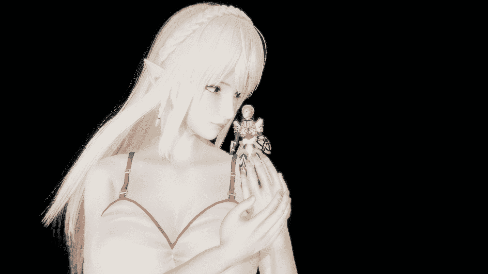

# 【神寂杯】（种田QAU）王子复仇记 7／27 五十二章 完结撒花！

作者：qishiweibutong

TID：28780

<title>1</title> <link href="../Styles/Style.css" type="text/css" rel="stylesheet">

# 1

*本帖最後由 qishiweibutong 於 2020-8-6 23:50 編輯*

第一章

 “我的孩子，不要悲伤，到那北方的森林去吧，去寻找巨大精灵的帮助，开垦森林，我们的王国才能真正的繁荣兴盛。”
“不，父王，我不管什么繁荣新盛。我只要能为您复仇！！！”
“傻孩子，不要被仇恨蒙蔽了双眼，要学会忍耐，要学会寻求帮助。 去寻求巨大精灵的帮助吧，这样王国才能兴盛，人类才能长存！”
“父亲，父亲……” 罗伊从床上惊醒，这已经是他第四次做噩梦了，自从王都失守，国王被刺杀。他就没睡好过，成王败寇，身为王子，流落边境，邻国的大军吞掉了王国的大片土地，只剩这一个尚未开垦的北方小镇。   北方的森林，巨大的精灵，这些意象自从他来到这就没停过，莫非这里真的有巨大的精灵，那为什么生活在这里的人没说过呢？罗伊不去想这些，他决定直接森林中去一探究竟。
  王国北方的森林和其他地区的森林不一样，这里的树木出奇的高，树皮又坚韧非常难以砍掉，树干里面又富含水分烧又烧不动，这使得刀耕火种在这里完全行不通，耕地缺少，柴火缺少，人类艰难的在这里求着生存。
  马蹄踩在森林地面上滋滋作响，森林中的鸟儿也在歌唱，清晨的阳光透过树叶照在大地之上，罗伊沉浸其中，带上的六人也倍感惬意和放松，早晨来森林里面散步是最好不过了。罗伊一时间忘记了来森林的主要目的，是寻找巨大的精灵。“可是真的有吗？”他这样想着，“还是欣赏一下美景吧。”他看见了一朵白花，罗伊顿生伤感，因为父亲的花园里面总是种满了白色的花，父亲经常告诉他这是他母亲最喜欢的花，说着还会摘一朵戴在他的头上。他下马蹲下准备去摘下这朵花，可是他的身体感受到了明显的不对劲，这地面怎么在震动？旁边的马匹也发出了紧张的嘶叫。是地震吗？这震动越来越强，丝毫没有减弱的意思。罗伊把耳朵贴在地上，想明白震动的来源。是来追杀我的叛军吗？这怎么听也只有一个东西。是巨大的也野兽吗？这里有七个人只有五个带了武器。不知道，打不打得过？
  突然周围的鸟儿被惊动得四散而飞，这一定是危险的信号，罗伊赶忙望向声音传出的方向，他看见的东西改变了他一生的命运，也改变了人类的命运。
  那是多么美丽的精灵啊，金色的头发垂于肩头，一对尖而长的耳朵从头发中伸出，白皙的皮肤，在阳光下显得尤为可爱，胸部丰满又不失美感，身材纤细又感觉不失力量，下半身用树叶也遮挡不住那完美的曲线。简直是从童话书中走出来的。
  可是她却没有童话书中，描写的那么娇小。视野放宽，周围参天的树木和她比起来也不是那么高了，一些低矮的灌木甚至都没有她的脚掌大。
  “巨大的精灵，巨大的精灵。”罗伊喃喃的念叨着，不顾随从的阻拦，径直朝着那个精灵走去，走得越近便越觉得这巨大的精灵高不可攀，仰视得越费劲。从树冠落下的阳光更显得这个精灵的神圣，晃得罗伊睁不开眼，罗伊干脆不仰着头了，直接扑通一下跪下了，向巨大的精灵述说着他的遭遇，祈求着帮助。而这个精灵只是依靠着树干静静地倾听着罗伊的诉说，罗伊地诉说越发的起劲，也越发的悲伤，身边的随从无不为之动容，巨大的精灵也流露出同情，这是那么的美丽动人。身边的随从也加入了王子的队伍，纷纷跪倒在地，哭诉着自己的痛苦和悲伤。这时巨大的精灵仿佛感同身受眼角也翻出点点泪花，想要安慰这些人类的她，俯下身子，用着和人类身高一样宽的臂膀，给了他们一个“大大的拥抱”！
  被如此巨大的生物抱着，被抱着的人类没有一点点恐惧和惊慌，反而是感到了安全和舒心。罗伊甚至觉得回到了母亲的怀抱。他听见了她的心跳，她也听见了他的心跳。
  在早晨的森林里，一个巨大的精灵和七个人类相拥在一起。
  等众人回过神来，太阳将近落山，精灵还是伫立在那里，罗伊仰望着那个精灵，轻轻地说“再见，明天见。”于是转身离去。
  “再见，明天见。”婉转动人的声音从身后传来。罗伊猛地一回头，只留下摇曳的树枝和微微腾空的落叶。
  明天真的会再见面吗？罗伊这样想着，加快了回城的步伐。
  回到营地之后还是罗伊立即给随从们下达了封口令，随从们表示自己绝对会守口如瓶。罗伊放心地点了点头。
  那天晚上罗伊仿佛见到了自己的母亲，在梦里，母亲英姿飒爽，身上的铠甲熠熠生辉，手中的长矛寒光闪闪，转眼间又是她身着常服怀里抱着一个婴儿，脸上的母性光辉展露无遗。又是一个转眼，母亲又身披铠甲奋勇杀敌，身后火光冲天。可是父王说母亲是因为难产去世的。这些又是怎么回事。罗伊只在画像上看见过母亲，画像上的她说不上什么特别。王都陷落时走得太匆忙什么都没带上，现在那些东西也许都烧成灰了。
  罗伊觉得这其中肯定有什么事瞒着他，但是父亲也没了，母亲也没了，从何调查起呢？
  第二章
  清晨的阳光唤醒了疲惫的王子，他匆忙的叫齐了昨天的六人，让他们带上一车的食物准备去昨天去的地点。侍卫长贾德首先表示异议，表示这一车的食物实在是太多，现在小镇里存粮不多。王子说：“昨天你们都体会到了，这巨大的精灵是非常友好的，但是我们还没有完全取得她的信任，我们要这样才能取得信任，这样才能获得帮助，才能完成预言，才能报仇。”贾德解释道：“王子殿下，我们当然会执行您的命令，只是这里的百姓看见您把很多食物运到森林里面去了，会不满的，怎么说也要加块布盖着吧。”王子点头同意，催促随从们赶快准备。可真是一大车吃的啊，这可以够几户人家吃三天了，贾德这么想着，叹了口气，只得将马车赶得快一点，赶快出城，免得城里的居民瞧见了。他知道，这区区一块破布怎么盖得住，人家闻也闻得出来。
  在路上，老好人多恩悄悄地问贾德，为什么还是叫罗伊王子殿下，这上一个国王不都没了吗，他又是独子，他不就是国王了吗？应该叫国王陛下了。贾德叹了一口气，“这不也是那个可恶的哈里森害的，他杀了咱们的王后和国王，又抢占了我们的土地，王子殿下表示不收复失地绝不加冕，坚持让我们称呼为是王子殿下。”又是一口长叹，“他还没准备好成为一位国王，至少像现在没有。”
  她会来吗？罗伊想着，不一会马车就来到了昨天会面的地方，这里的土壤明显下沉，还有一些浅浅的但是很巨大的脚印，就是这里没错了。罗伊蹲下来看看这脚印，他迈了一大步，才勉强赶上。“先都吃饭吧！”罗伊对着侍从们说道。拉格·芬利麻溜地掀开布匹，马车里满是面包，还有两头烤鹿，一些烤兔子，好多苹果，拉格倒是不客气，直接撕了一只兔腿送到嘴里，王子还提醒大家，多多吃肉，说不定这森林里的精灵不吃肉。众人只当这是来森林野餐了，有的人还拿出了珍藏在贴身兜里的胡椒，还有的拿出了牛奶。正当大家其乐融融享受美食的时候，地面又开始震动了，还是那熟悉的感觉，罗伊首先放下了面包，望向震动传来的地方。
  单调绿色的画卷突然出现了一抹金色，金色之上还有与之相称的粉色小船，这粉色的小船顺着金色的河流又来到了地上，白色的大船逆流而上，并没有和粉色相遇，低头看看粉色竟然在地上，白色的平原透出了红色，金色的河流延伸到地面，白色的大船托起粉色的小船，航向红色的平原。巨大的精灵又嗅了嗅，这粉色花朵仿佛它本来就在地上似的。  嗅着嗅着她就发现到了不远处的马车，眼睛直勾勾地看着，但又有些迟疑，没有直视，把视线撇开了。这些“小”动作自然都被罗伊看在眼里。空气突然很安静，气氛变得有些尴尬，只有拉格在不合时宜地大嚼特嚼。罗伊率先打破了沉默，“哦巨大的精灵，我们给您带来了食物，食…物…”罗伊边说还边指还边做把东西送到嘴巴里的动作。动作缓慢而且滑稽，周围的侍从都忍俊不禁，但是都没敢笑出来。罗伊还在重复这个动作，巨大的精灵也学着这个发音，“撕…木…”“不，食……物。”“食……物。”“对对对，食物。”罗伊又做了一遍吧东西送到嘴里的动作。精灵也是似懂非懂，罗伊主动的拿起车上的食物，送到嘴里。有主动的将马车往精灵那里推了推，继续示意她去吃食物，罗伊递给她一个面包，精灵小心地伸手过去接，放眼望去这个手，很有美感。而罗伊看见的是一个和他差不多大的手，朝他过来。虽然他极力克制自己，但还是冷汗直冒。那块面包还是很大的，一个人可能还吃不下，但放在那只手上还是显得十分渺小。  巨大的精灵将这块小面包送到嘴边，仰头吃下。罗伊说非常欣喜，精灵仿佛来了食欲，又拎起来一头烤鹿，罗伊又重复了一句食物，精灵仰头直接吞下，在场的人都惊呆了，这可真是吃东西不吐骨头，接下来又是一头。虽然两头烤鹿已经没啦，其他的又被众人吃了许多，这马车还是显得很满的，只见精灵单手一抓，马车连车带马的就轻易的拿起来了，里面的东西都倒入了嘴里。精灵脸上露出了满足的感觉，发出了一声听不懂的语言。再看看底下众人，一脸茫然，这精灵吃完了之后，向着罗伊点了点头，像是要表达谢意，接着起身，又说着食物，食物，朝着森林深处走去，那修长的腿，不一会就没消失在人类的视线中了。留下七个人呆呆地站在原地，拉格终于咽下去了嘴里嚼了无数遍的东西，又恢复了诡异的沉默。“王子殿下，你不是说这精灵不爱吃肉的吗？”还没吃上肉的齐勒问。“我哪知道啊？”事情超出了年轻王子的想象，他的回答带着失落和懊恼。精灵好像听不懂人类的语言，这可怎么办？梦里的预言刚刚有点眉目，又落空了，父亲啊，我该怎么办？这不懂咱们的语言，是怎么说，“再见，明天见的呢？”那么昨天我说的事情她一句没听懂？那么她为什么要给我一个拥抱，走一步算一步，只要教会她人类的语言就好了。
就在罗伊坐在地上想着下一步该干什么的时候，熟悉的震动又回来了，这时的精灵手中抱着几个橘子还有蘑菇样子的东西，抱着东西小心翼翼的走路的样子，像极了一个可爱的女孩。只不过尺寸大多了。相对应的手中的橘子可是真的巨大，就一个橘子和这里最胖的约翰一样大了。蘑菇也不慌多让，马车上装两个估计够呛。精灵指了指这些东西说：“食物。”
罗伊被惊呆了，愣了许久才从牙缝中挤出谢谢两个字，众人面对这一人高的橘子，茫然无措，巨大的精灵似乎看出了他们的难处，伸手刨开了橘子的皮。巨大的橙子露出了晶莹的果肉，并散发出芬芳的香气。侍从拔出佩剑，分割着橙黄的果肉。入口之后，汁水满溢，身为王子的罗伊也没吃过这么好吃的水果，这就是梦境预言中说的，巨大精灵的帮助吗？爱了爱了。看来这个精灵非常聪明，教会她人类的语言应该不是什么难事。
享用了香甜的水果之后，罗伊对着巨大的精灵，行了一个大礼，然后用夸张的动作指了指自己，说：“我”，又指了指那个巨大的精灵说：“你”。旁边的侍从在一旁吃着水果，看着王子的小孩子语文课。“感觉像是和小孩子讲话一样。”侍从在一旁打趣。罗伊全然不管，这些旁人的眼光如何，继续上课。罗伊说一句，那精灵跟一句，眼神中满是对求知的渴望。
大概过了两个小时，罗伊的嗓子已经支撑不住了，声音沙哑的他去一旁休息了，他命令侍从替他顶上，侍从们站在一起都向后退一步，表示为难。只有侍卫长贾德，向前一步，并且对着其他人嘲讽道：“怎么？都怂了，都没跟女的说过话啊？”，其他人不敢接话。经过众人轮番上阵之后。这位巨大的精灵果然聪明异常，除了一些概念不懂之外，她一个下午就能掌握一个七七八八，真的不愧是聪明的精灵。  是时候和这个精灵好好聊一聊了！

<title>2</title> <link href="../Styles/Style.css" type="text/css" rel="stylesheet">

# 2

*本帖最後由 qishiweibutong 於 2020-6-5 23:33 編輯*

第三章
    “您好！巨大的精灵，您……您有名字吗？能告诉我们吗？”罗伊首先开口发问。
    “名字，就是别人怎么叫我的是吗？我的名字是安德里娅。”婉转的声音传遍了整个森林。
      “安德里娅是吗？真是个美丽的名字。”

“太阳要没了，您们不会害怕，然后看不见东西吗？”

“不会，我们会生火，把火生起来，就看得见了。”
  “火？”安德里娅露出了疑惑的表情。罗伊直接叫人升起了篝火，并往其中添加了一大把干柴。虽然太阳还没有落山，但是巨树林当中还是昏暗了许多，篝火的点燃让这里重新明亮起来。“哇，太阳。”安德里娅惊奇的大叫，声音显然让在场的人类感到不适，不由自主地捂住了耳朵。“这就叫，‘火。’”“罗伊自豪的解释着，这是非常好的东西。它可以让你温暖，也可以这样。”说着罗伊就从火堆中拿了一个火把出来，拿在手上。“你把太阳，啊不，火拿在手上了。”说着安德里娅就伸手去摸，却被火焰烫了一下赶紧把手缩回去，不由得发出了一声尖叫，这显然给周围众人的耳朵带来了二次伤害，罗伊依然在那里淡定的解说：”这就是火，如果您离得稍远一些就会感到温暖。
  “火还可以用来烹饪食物。”罗伊说着用剑削下来一大块蘑菇串起来放在火堆上去烤，不一会蘑菇的香气就会发出来飘到了安德里娅的鼻子里，她大吸一口她从未闻到过的气味，“这叫香味”在递过去烤蘑菇的同时罗伊还不忘上课。安德里娅接过小小的烤蘑菇放到嘴里，她觉得这是她过的最好吃的食物，看见坐在篝火旁边的侍从们正将食物穿了串来烤，安德里娅有样学样，从身旁的树上掰下来一只“小树枝”，串起了蘑菇，放在了篝火上，巨大树枝串着巨大的蘑菇伸过来，坐在篝火旁边的人都分分避让。蘑菇烤好了，安德里娅放入口中大口咀嚼，虽然很烫，但安德里娅还是觉得美味无比，脸上洋溢的表情让罗伊看着都为之开心，可是不一会脸上的表情就准换成哭丧。
  罗伊忙问：“安德里娅您怎么了？”“我的家人都还没吃过这么好吃的东西呢？她们还吃不上东西呢。”“那么您为什么不和她们在一起呢？”，“因为在一起更吃不上东西，这里的森林只有很少的东西，如果不是遇上你们，我今天可能还是吃不饱。“你们这么小肯定能吃的很饱吧！””“罗伊一听，心里咯噔了一下，想到了今天早上贾德对他所说的话，虽然他贵为王子，他的命令别人都会执行，但是自王都陷落来到这个偏远之地以来，他也没干什么正事，这里的人民还在温饱之上挣扎，看来生活在这里的人们都不太容易。
  他尴尬的笑道，“当然当然，我们知道如何耕种，知道如何养殖动物，然后就能让很多很多人吃饱了。”安德里娅露出了羡慕的神情。“我和家人们每天光是要活着就拼尽全力了。食物越来越少，森林已经养不活我们了。”“那你们为什么不离开森林呢？”罗伊反问。
“离开，离开森铃我们就更没吃的了。”罗伊说：“你看我们不活的好好的。我们不靠森林就能养活很多很多的人。我们甚至可以让天天你吃饱，我们还可以让你的家人们天天吃饱.。我们有谷仓，里面的食物堆起来比你还高，只要我们肯去耕耘，就一定能让你们天天吃饱。”这一番慷慨激扬的演说，让一旁的侍从连连鼓掌。

“真的吗？你们怎么做到的？

”来吧！跟我来，到人类居住的地方去，你会明白的。我们一起把这片森林，变成农田。让你们都吃得饱饱的。”罗伊浑身散发出自信。

安德里娅看着这个自信的人类，心中的疑惑突然被打消了，也自信地说：“好的，我听你的，我要让族人们都吃饱。”

说罢，安德里娅打了个哈欠，罗伊也跟着打了一个哈欠，身边的侍从也跟着接连打起了哈欠。太阳早已落山，月亮高悬。

“你也是要睡觉的吗？”罗伊笑着说。那么你是在哪里睡觉的呢？安德里娅麻利地爬上大树，为自己打造了一个舒适的窝。罗伊也叫侍从们就地睡觉，今天野外扎营，罗伊则睡在马车上。侍卫们不敢怠慢，轮流值班看守。就这么度过了平安一夜。但是他们都不知道的是，人类和精灵共同的命运就此交织，从此密不可分！从早期文明的摇篮到浩瀚星宇！

<title>3</title> <link href="../Styles/Style.css" type="text/css" rel="stylesheet">

# 3

*本帖最後由 qishiweibutong 於 2020-6-5 23:39 編輯*

第四章
  早晨的杜丹镇是宁静的，人们从家中走出来，开始了一天的劳作生活，镇子在渐渐地苏醒，每个人心情都还不错，但只有总务长巴罗夫忧心忡忡，望着通往森林的道路，王子已经一个晚上没回来了，虽然带了侍卫和随从出去，但是谁能保证万一呢？自己作为逃出来的托孤大臣，怎么对得起逝去的国王和王后，一想到这里他也是忧心忡忡，王子就没有关心过正事。        
  还有这小镇仅有的一点土地，最近的粮食都是靠原来的国民走私来的，那个哈里森狡猾的很，打下王国的大片土地就收手了，把我们赶到这个穷苦之地，就是想饿死我们。这个小镇原先就是勉强苟活，接纳来自王都来的人之后，粮食更不够吃了。开垦荒地需要大量的人口和时间，要是动用原来整个王国的力量也许还做得到，就算勒紧裤腰带，开垦荒地，我们守得住吗？他一发兵这不就都没了。不开垦荒地会饿死，开垦还可以缓一缓。唉，两难啊！
  巴罗夫在叹气之后还是命令手下继续征召壮士们去砍伐巨木，开垦荒地。不得不做啊，巴罗夫继续叹气。上天为什么要让我们的王国遭受如此之苦，就在这么想着的时候，罗伊出现在地平线上，巴罗夫远远地瞧见了，心想王子殿下终于回来了，哎呀这马车怎么空啦，他们七个人吃了不少啊，经跟着他们的是一个很高的人型生物，那是什么！是传说中的巨人吗？这地方都是些什么破事啊。它该不会把王子给挟持了吧，这放到镇子上也是个祸害啊，巴罗夫赶紧叫上仅剩的一点士兵快去救驾。巴罗夫这边火急火燎，两伙人就在小镇外边相遇了。
靠近之后，巴罗夫惊讶地发现那个“巨人”还是一个女的，耳朵是尖尖的，长的还很有几分姿色，上身还没穿衣服，下身用树叶裹着。立刻命令士兵把那个“女巨人”围住了，安德里娅还是很淡定的，因为罗伊说过这些闪亮的铁片叫“剑”。
  “王子殿下我们来救您了！这个邪恶的巨人是不是劫持了你，跟你说了以后出去别出去太远，多带点人！”罗伊对巴罗夫的训诫表示亲切，但还是表示他反应过度了，表示这个巨人是友好的，命令其他士兵收起武器，罗伊还说自己教会了这个巨大的精灵说话，她没有恶意，只是想来见识一下我们是怎么让食物长在地上的。必要的时候她还可以帮忙。她这么高大肯定肯定能帮忙做很多事的。罗伊还提到了，自己受父亲托梦说要去寻找巨大精灵的帮助，这就是帮助啊。
  身边的侍从纷纷表示王子说的是真的，巴罗夫这才安下心来。这预言是真的吗，真的有巨大的精灵来帮助我们了！要是放在以前巴罗夫绝对不相信那个狗屁国师说的话，但是到这里他也不得不信了，他临死前说的竟然是真的，王国复兴有望了！想到这里他感激涕零。再看看这巨大的精灵，也没有之那么邪恶了，说到这里巴罗夫觉得有必要道歉，仰头说：“噢，巨大的精灵，很抱歉这么对您，我祈求您的原谅，该怎么称呼您呢？”“噢，您好我叫安德里娅。那些都没事的。我就想知道你们是怎么让地里长出食物的。”巴罗夫表示没问题，带他们去镇子旁边的田地，这时突然他突然叫停队伍，对安德里娅说：“安德里娅小姐，您能不能将您的胸部遮挡一下，这样让您去镇子上是在有伤风化。”安德里娅虽然很不解，但还是照做了，辛亏当初罗伊他们带的布匹足够大，不然还真包不下安德里娅那巨大的胸围。
  “这样可以吗？”安德里娅在简单的遮挡了一下重要部位之后，向巴罗夫问道。虽然遮住了重要部位，但是好像更色了，这一帮男人都有点把持不住，士兵当中还有一个流出了鼻血，巴罗夫连连说够了，快去农田吧。

一路上罗伊和巴罗夫忙着向安德里娅解释人类的种种事物，比如房子，比如牛，比如桥。终于来到了田地，安德里娅的出现已经让这里的农夫们感到恐慌了，巴罗夫赶忙跑过去安抚他们，这时的农民还在吃早餐，还没有正式投身在阡陌之中，大部分农夫远远地看着那个巨大精灵，只有少部分胆子大的敢来靠近安德里娅。

这里的田地还有很多块地方没有没有收割，风吹过金色的麦浪，在安德里娅的心中掀起阵阵波澜。罗伊解说到，“这就是食物，这叫小麦，当然不能直接食用，要做成面包才行。”安德里娅抢答说，要烹饪才能吃对吧！”安德里娅很是惊喜，罗伊滔滔不绝地给安德里娅说了一大堆小麦能做成的美食，直到一阵巨大的咕噜声打断了对话。

<title>4</title> <link href="../Styles/Style.css" type="text/css" rel="stylesheet">

# 4

*本帖最後由 qishiweibutong 於 2020-6-5 23:53 編輯*

第五章
  众人都把视线转到了声音的来源，安德里娅那两个又尖又长的耳朵都红了，恨不得找个地方躲起来，可是她对于这个地方来说太大了，这里根本藏不住她，她站在那里不知如何是好。“正好正好，农夫们正在吃早餐，安德里娅您也来吃东西吧，吃完了才有力气干活，咱们虽然也挺艰难，但是养你一个应该是没问题的，来人给安德里娅小姐上面包。”罗伊率先打破沉默，下人自然不敢怠慢。巴罗夫亲自请缨监督，生怕这个巨大的精灵一次把谷仓给吃空了。侍从们拿来了面包，差不多有半张桌子那么大的面包，在安德里娅手里还是显得不够看，安德里娅边说着谢谢，边吃着食物。拿的速度赶不上吃的速度，来拿面包的人越来越多，巴罗夫的心里也越发没底，罗伊又发话了，只吃面包怎么行，还要来点牛奶，于是人们都慌张地去搬牛奶，又沉又重的牛奶桶，安德里娅轻轻一捻就拿起来了。终于，安德里娅说出了那个词，“够了，我饱了！”

巴罗夫和侍从悬着的心放了下来，看着还有点存货的粮仓，巴罗夫长舒一口气，看来那个巨大的精灵不是个无底洞，稍微统计一下，她只吃掉了大概八十个人份的食物，还好还好。
  该干正事了，罗伊直接向农夫发问，安德里娅能怎么帮忙，农夫头子伊思发话了:”王子殿下，现在正是种植下一季作物的时候，上一季的作物还在田里面呢，这又要收又要种的，人手紧缺的很，要不让这个女巨人都帮忙试试？”安德里娅直接说好啊，可是要怎么收割呢？这镰刀对她来说太小了，怎么办呢？一个巨人拿着小镰刀，在田里面一茬一茬的割麦子，想想也知道，这既滑稽又没效率，正当伊思要说要不算了的时候。安德里娅直接上手了，只见她弯着腰，伸出手一抓，直接将这些麦子连根拔起，左右手互用，连脚没怎么动就收完了整个麦田，安德里娅还贴心的将麦子收集在一起，堆在众人面前。众人表示非常吃惊，一方面震惊与安德里娅的效率，这可是这些农夫几天的工作量啊，有一方面震惊于安德里娅的聪慧，真是前所未有的收割方式，她是怎么想出来的？看来这个安德里娅并不像，传说故事里的那些“巨人”那么笨笨的。安德里娅稍微伸展了一下自己的身体问道，“这些要怎么变成面包呢？”“请带着这些跟我们来吧。安德里娅小姐”
  到了风车磨坊这里，平时高大威猛的风车，在安德里娅的衬托下，也显得气势不足，似乎都转的慢了些。好奇的她想知道麦子是怎么变成面粉的，却看不见里面的情况，还是让磨坊主把天窗打开，才让她一窥内部构造。罗伊也来到了风车的顶部，站在这里，罗伊第一次近距离的观看安德里娅的脸庞，他不免有些吃惊，又有些心动。安德里娅闭着一只眼向下看着风车里面的构造但还是看不见，罗伊直接向安德里娅解释风车是怎么将麦子磨成面粉的。而安德里娅连连点头，她学以致用，直接动手加快了风车的旋转，她抓住风车的叶片用力旋转，磨盘也赚得飞快，把磨盘前边的马匹也被推着一起飞快的转起来，让磨坊主连连叫停。安德里娅立马停下了手，磨坊主告诉她其实转太快也不好，面粉就是要慢慢的磨出来，磨坊主给了众人一大袋面粉，让安德里娅快点远离自己的磨坊。
  伊思看见安德里娅的这些所作所为，心中很是欢喜，便要直接说：“做面包的事待会再说，安德里娅小姐，请再去农田里面吧，收割完了就该犁地，准备播种了。我相信安德里娅小姐一定会帮我们很大的忙的。”于是安德里娅又来到了需要犁地的农田这里，伊思向她说明了为什么要犁地之后，直接请出了他们这里最大最重的犁，往常这里的个犁只有最强壮的牛才能勉强拉动。不出所料重犁被安德里娅轻松地拖来拖去，伊思在一旁指挥着安德里娅，他还需要小跑一下才能跟得上犁耙的速度，他指挥着安德里娅快一点，慢一点，犁得深一点，安德里娅都一一照做。伊思感叹这个比牛听话多了，在一旁看着的罗伊对他把安德里娅和牛并列的想法表示了不满，踹了伊思一下，伊思也深知自己说错话了，闭嘴没继续说了。伊思让安德里娅扩大了犁地的范围，耕地面积瞬间扩大一倍，巴罗夫在心中连连叫好。
  在播种的方面，安德里娅实在是帮不上什么忙，接下来就交给农夫们去播种了。安德里娅站在自己的杰作旁边，一遍擦着汗，一边说着：“你们人类真是聪明，想让食物长在哪里就长在哪里。”伊思笑了：“虽然是这样，但是还要浇水，施肥，除草，除虫。天天辛苦的工作你还觉得我们聪明吗？”“当然聪明了，你们这样获得了面包啊，不想我们在森林里面，走好远走好久才有一点点吃的，好一点的地方还会被其他部族的莉特抢占，这总是有吃的，多好啊。”

罗伊听着感触良多立即接话道，“其实人类也一样，其他的人类抢占了我们大片大片的土地，我只剩这里了，不过总有一天我会全部夺回来！”

<title>5</title> <link href="../Styles/Style.css" type="text/css" rel="stylesheet">

# 5

谢谢诸位的抬举，我不胜荣幸，我会努力更新的，也会在这里解答各位的问题，欢迎提问，欢迎讨论剧情。<title>6</title> <link href="../Styles/Style.css" type="text/css" rel="stylesheet">

# 6

*本帖最後由 qishiweibutong 於 2020-6-8 19:37 編輯*

第六章

该去看看面包怎么去做了，众人走到了镇子里面，安德里娅巨大的身躯，出现在了小镇的广场上，但是又看见王子殿下还有总管巴罗夫和这个巨人在一起，一时间不知是该惊慌还是不惊慌，呆在原地。“杜丹城的居民不要惊慌，这是预言中来帮助我们的巨大精灵。不要慌乱，请继续手头的事。”巴罗夫对着全程居民喊着安心的通知，“请面包房的杜克速速前来，殿下召见，速速前来，殿下召见。” 杜克一听喊到了自己的名字，立马放下了手中的活，来到了罗伊这里，毫不意外的他发现了这个巨大的精灵，他小声嘀咕了一句，“该不会是要我给她做面包吧？”“杜克先生，您说对了，这是来帮助我们的巨大精灵，她想了解一下面包是怎么从面粉做成的，能否劳烦您在广场上做一次面包呢？这是刚刚从磨坊里面拿的新鲜面粉。”说着，安德里娅就将那一大袋面粉交给了他，壮硕的面包店老板，差点没摔倒，他看向朝他微笑的安德里娅尴尬的微笑示意，心里有点不是滋味。他吩咐伙计将家伙什，拿到外面来，揉面，和面，发面，广场上聚集起来了许多人，杜克知道，大家不是来看他的，继续向安德里娅演示着做面包的技巧，安德里娅眼中满是认真，杜克心里想着，“这么说像是要她来做面包一样，要是她来做就好了，这样我就可以把那些好吃懒做还扛不动几袋面粉的小王八蛋给赶出去了。”围观的众人越来许多，终于来到了烤面包这一步，围观的群众越来越多了，面包的香气飘满了整个广场，看着面包从小面团变成大面团，再变成香喷喷的烤面包。安德里娅觉得人类真是聪明啊。这时罗伊示意她继续吃面包，她正想将烤盘端到嘴边，就看见底下的民众大眼瞪小眼地看着她，不，是看着她手中的面包。这些眼神她也也见过，和族人们一样的眼神，吃不饱的眼神。她直接将烤盘放下，“给大家吃吧！”安德里娅一语，显然这是大家没想到的，民众开始欢呼着，罗伊虽然惊讶但是非常理解，帮忙分派面包。大家手中都拿到了面包，脸上露出了难得喜悦的表情。果然人类和莉特是一样的啊，安德里娅这样想着。民众开始靠近并感谢给他们带来食物的安德里娅，安德里娅感觉十分奇妙，还有些胆子大的小孩，直接爬上了安德里娅的脚来玩，搞得她痒痒的，当然这样的熊孩子很快被家长领回去了。人们幸福的享用面包，安德里娅也是开心，这种开心还带着些许的成就感，这种开心她很久都没享受过了，至少在被赶出核心猎场之后就没有过了。
  正当在大家享用面包的时候，传来了大声呼救。“着火了着火了”，众人立即看向声音传来的方向。着火的房子是个三层小楼，三楼里面还有孩子，估计是谁家大人出来出来看热闹忘了看住火苗，先不管是怎么回事，快救火吧！众人纷纷奔向这里的最近的水源，广场中央的水井，可是这一桶桶的水怎么够啊，正当大家不知怎么办的时候，安德里娅直接冲向了河边，沾湿了头发，还用手捧了一堆水，就奔向火场，虽然水不停地从手中漏出来，但是仍然有很多，加上头发上的水，火势很快小了下来，再一个来回，加上附近众人的努力，这里的火势很快就彻底熄灭了。但是楼梯已经被烧毁了，孩子仍在哭喊，没法下来，大火烧过的建筑岌岌可危，得赶快把孩子救下来才行，可是现在哪里有那么长的梯子啊。要什么梯子，只见安德里娅直接伸出手，“快上来吧！”孩子享受着罗伊都没有享受的待遇，坐在安德里娅大而温暖的手中，缓缓地来到了坚实的地面上。随着孩子跑着投入母亲的怀抱，众人爆发出一阵欢呼。 为安德里娅欢呼三声。

  安德里娅！安德里娅！安德里娅！

<title>7</title> <link href="../Styles/Style.css" type="text/css" rel="stylesheet">

# 7

*本帖最後由 qishiweibutong 於 2020-6-18 15:30 編輯*

第七章
  大火扑灭了，罗伊看着刚刚的大英雄，心中兴奋异常，他只跟安德里娅说过，水能灭火。安德里娅就知道怎么去快点灭火。聪明，善良，能干。这简直就是完美的恋人。刚刚安德里娅跑动的身姿，撩拨着罗伊的心弦，她已经在他的心中扎下了根。
  “人类就像小动物住在这样的大树里面，住在自己的大树里面啊，这样就不会被雨淋着了，人类可真聪明啊。而且火还有这样危险的时候啊！
  ”是啊，火焰的力量很强大，可以让食物变得更好吃，也可以将这样的‘大树’变成废墟。只有掌握好的力量才能给人们带来幸福，不受控制的力量只会给人带来灾祸”罗伊继续说着。
  “这个就叫做房子，人类晚上睡觉的地方，这是个木头做的会着火而且不漂亮，还有石头做的非常漂亮。这里的不算什么我原来的地方，那才叫好，你住进去都不是问题。”“真的吗？人类还真是厉害。”

  虽然火被扑灭了，但是整个建筑岌岌可危，还不如拆掉重建，巴罗夫向罗伊汇报着灾后受损评估。罗伊直接说：“拆了重建。让安德里娅也帮帮忙，她一定也能帮上很大的忙的吧！”镇子上的工匠都紧急出动，七嘴八舌地讨论着怎么拆掉这栋大建筑，他们的方案各种各样，可是谁也不能服谁。他们吵得热火朝天都无视了，在一旁巨大的安德里娅。安德里娅乖巧的站在那里，就算是这栋大房子只到她的腰间。她耐心的等待工匠的最终结果，也在进一步学习着人类的语言。罗伊反复提醒那里的工匠们注意一下安德里娅的表现机会，让她也帮帮忙。工匠们终于意识到了了安德里娅巨大的身躯和建筑物之间的对比，他们最终做出了一个大胆的决定，让她直接拆掉这栋楼。工匠们绝不插手。
  于是安德里娅也加入了这个讨论，讨论怎么更好地拆掉这栋楼，经过激烈的讨论之后，最终安德里娅说出并执行了那个最终方案。
  她让众人离得远一点，只见她直接高高地抬起右腿，脚后跟轻易地超过了房子的高度，“嘿呀！”脚后跟随即落下，房子也应声倒地，没有碎片飞出，地上也没有特别的震动。整套过程干净利落，动作丝毫不必专业的卫兵差啊。众人望着安德里娅惊讶的说不出话来，罗伊像是解锁了什么新东西一样，更加的兴奋了。拆完东西后的安德里娅有恢复了乖巧的样子，工匠们一时间忘了该干什么，愣了许久才开始清理这些残骸，安德里娅也加入了进来，再工匠的指挥下，很快就挑出了还能用的，和不能用的。卸货，搭脚手架，原本要大费周章的事情在安德里娅的加入后变得如此简单，一下子就搭起了一个框架。剩下的工作本来也想让安德里娅完成的，但是学徒们坚持不用安德里娅帮忙了，这让安德里娅非常不解。王子和巴罗夫也来帮忙打圆场，带着安德里娅离开了。

  “殿下，臣觉得安德里娅小姐会在开垦树林方面会帮上很大的忙的，但是在此之前她需要一件趁手的工具。”
  “我也觉得可行，我们直接去铁匠铺吧。”
  看见王子来了，铁匠铺老板西斯早早地迎了出来，询问要打点什么东西是铠甲还是佩剑。
罗伊显然对他的服务态度很是满意，说：“我要一把斧头。”老板满口答应，这是罗伊有缓缓的指向身后的安德里娅，“给她的！”铁匠铺老板脱口而出一声“啊？”

<title>8</title> <link href="../Styles/Style.css" type="text/css" rel="stylesheet">

# 8

*本帖最後由 qishiweibutong 於 2020-6-18 15:41 編輯*

第八章
  “这个恐怕不行，要是给她打造一把斧子，这个斧子会非常的大，需要非常多的生铁，我们的生铁数量非常不够。恕我不能从命。”
  西斯冷静地解释着原因。“这个好办，也就是也就是说你有了足够的生铁之后就会帮我们打造了。准备好模具吧，我会直接将矿石送到这里来的。”
王子直接让西斯安心，又转向安德里娅“走吧安德里娅，去矿山吧，不过在此之前先吃午饭吧！”他邀请安德里娅和他在一起共进午餐。

   罗伊特意选择在院子里面吃饭，还在院子里面摆了一个最大的桌子，本来还是很大的院子，在安德里娅的来到之后显得十分狭小。特意用来遮阳的树木，完全不及她的大腿高，反倒是安德里娅给这棵树遮阳。正午的阳光照在安德里娅的身子上面，让她热汗淋漓，罗伊不太敢直视她，扭过头去催促下人上菜。饭菜摆满了桌子，这可比早餐丰盛多了，有烧鹅，烤鱼，还有很多的燕麦粥，香气不断地冲入安德里娅的鼻子，安德里娅不断地把那些送入嘴中，旁边的侍女轮番不断的上菜。安德里娅看着侍女出了神，放下了手中的食物，罗伊自然看出了安德里娅的不寻常举动，也猜到了心思，直接叫住了侍女，给安德里娅上起了人类知识课。一个上午以来安德里娅早就有很多的问题，面对安德里娅地连环问答，罗伊也不怯弱一一给出解答。罗伊很享受给人解答疑惑的乐趣，安德里娅也很享受这样求知的乐趣。
   休憩片刻之后，罗伊备上快马拉着马车，带上安德里娅，直接奔向了矿山，这是巍峨的安托山山脚下，有着一片露天铁矿，这算是被哈里森赶到这篇弹丸之地之后，所发现的一点点小安慰吧。不过由于劳动力的匮乏，还有对外保密以免遭到更大程度的入侵的原因，这里的矿山还没有被开发，只有一个老头来看守这里。罗伊指挥着安德里娅，搜集矿石搬到马车上，罗伊还不忘让安德里娅带一块在手上，准备回城。
   走在路上安德里娅问收集这种石头有什么意义。罗伊像是预料到什么似的，停下了马，对着一棵树，向安德里娅演示，期初他什么都不拿，面对一棵树他无可奈何，但是他拿出了事先准备好的斧子，朝着树木砍去，虽然王子不曾干过粗活，但是还是有几分力气的，不出一会大树就被砍到了，罗伊自豪的将斧子举过头顶，阳光的照射让斧头的金属部分，熠熠生辉，上面倒映着是同样闪亮的安德里娅的眼神。罗伊这次什么也没说，擦了把汗直接上马了。这次没有语言的一课给了安德里娅很大的震撼，小小的人类竟然能使那么大的树木倒下，人类真是太厉害了，也许能他们能让族人们活下去。

   望着安德里娅多次表露的羡慕神情，罗伊把胸挺得更高了，等下还有更惊喜的呢，他这样想着。说着就来到了铁匠铺，铁匠铺的西斯老板看着这一马车加手上的矿石，小声骂道：“今天，有得活干了！”
  他召集学徒，收集矿石，拉起风箱。开始了冶炼，安德里娅的目不转睛地看着学徒们，把矿石变成铁水，铁水变成铁锭，又把铁锭变成铁水，再将铁水放入了模具里面。刺啦，最终，在水汽之中，一块巨大的斧头成型了，西斯和学徒开始了最辛苦的开刃工程，最终，带着一块巨大的原木，一把斧子终于做好了，此时已经夕阳西下了。“拿着吧，安德里娅，这是属于你的，有了它，森林里的树就都不是问题了。”安德里娅也像罗伊那样拿起斧子，面对曾经养育过她和族人的森林，自豪地举在头顶。

<title>9</title> <link href="../Styles/Style.css" type="text/css" rel="stylesheet">

# 9

*本帖最後由 qishiweibutong 於 2020-7-18 10:40 編輯*

第九章
  夕阳西下，杜丹镇迎来了最有生活气息的时候，各家各户都点起了灯火，开始准备晚饭，今天大家都像度过节日的时候，来到了大街上，拿着自家匀出来的移动端食物去感谢安德里娅，罗伊也是高兴的很，他不会错过这难得与民同乐的机会的。人们争相感谢安德里娅今天上午的善良行为，围着她跳起了欢快的舞蹈，这是这个小镇的习俗，在接纳了新来的居民之后，他们会围着新来的人跳起舞蹈以示友好。罗伊看着民众自发的行为，很是开心，因为这表明小镇的居民已经接纳了安德里娅为小镇的一员。安德里娅虽然不太懂这些的舞蹈的意义，但还是从民众脸上洋溢的笑容感受到了善意。民众们载歌载舞，虽然这里没有吟游诗人的青睐，但是这里的民众一样能通过他们的方式抒发情感。整个小镇充满了欢快的气氛，兴致上来了，安德里娅也一展歌喉，虽然她只会一首母亲教给她的歌，但是她还是放声唱了出来，
*    “树叶已经低垂，睡吧我的宝贝。
     风儿也陪你睡，睡吧我的宝贝。
     妈妈在你周围，睡吧我的宝贝。”*
  婉转空灵的声音，从人们头顶传来，正在宴会的人们，渐渐地停了，大家都欣赏着这美妙的音乐，即使最精美的乐器让最出色的宫廷乐师来演奏也不能相提并论。虽然安德里娅用的不是人类的语言，但是民众们依然停下了狂欢的舞步，静心地欣赏着来自森林的音乐。歌词很短很快就唱完了，唱完了之后，广场上许久仍然是一片安宁。不知是谁先回过神来，开始鼓掌，随即就是山呼海啸的掌声，接着更加欢快地跳起舞来，安德莉亚从未见过有这么多的人给她鼓掌，看来人类和莉特在表达情感上是相通的。
  宴会怎么能少了酒呢，罗伊下令打开窖藏，虽然杜丹处在温饱的边缘，没有多少的粮食来酿酒，但多少还是有一点储备的。金色的麦酒从巨大的木桶中流出来，助长了宴会的气氛  。
  “喝点吧，安德里娅”罗伊指着刚从地窖上搬上来的大木桶。
  “这是什么？”
  “这叫酒，我们会把吃不完的食物和水一起放在木桶里，这样就会有好喝的酒了。”
  “真的好喝吗？”安德里娅轻松地拿起一整桶酒，吨吨吨一饮而尽。罗伊没有，也阻止不了，安德里娅的行为。
  “这什么啊，一点也不好喝。”安德里娅面色红晕的说道。不知是她喝太多，还是太上头了，原本白皙的脸变成了红彤彤的，在火把的照映下，挂在高高的天空，看样子可以和明月一比光辉，尖尖的耳朵也变成了深红色的尖尖耳朵。
  “安德里娅你没事吧！”
  “没什么就是有点晕。”安德里娅侧身，靠在旁边的一栋建筑物上面，建筑发出痛苦的呻吟，幸好这建筑物够坚挺。
  “看那，是圆的月亮啊。”安德里娅指着天上的月亮，有点口齿不清的说道。
  “是啊，很好看的”罗伊看着这微醺的安德里娅，有点好笑，又都点担心，不能让她喝多了，谁知道会发生什么，这有点可怕，叫随从赶紧撤了安德里娅手边的酒桶。
  “这你看得见什么啊，我挡着你了，来上这来，看的清楚！”边说，安德里娅直接抓起来罗伊，放在肩头上。年轻的王子还没搞清楚发生了什么，就和这个女巨人肩并肩了。果然如她所说，在肩头的视角真的很好，向上看是月明星稀，向下看是万家灯火，真美啊！罗伊不自觉地和安德里娅的头靠在了一起，感受着安德莉亚的温度。一轮明月之下，不过一个莉特和一个人类依偎在一起。
  “嘿，罗伊，你有妈妈吗？”，罗伊听着愣了一下，不过还没等罗伊回答，安德里娅继续自顾自地说了起来，“我的妈妈，死了，就在这样的一个夜晚，有着圆圆月亮的一晚，她死了，然后我的部族就被驱逐出了核心猎场，过上了吃不饱东西的生活。我的族人们，她们都指望着我们呢。我以为就这样我的部族完了，直到遇见了你们人类，你们真聪明，从地上变出吃的，建造比你们大的多的东西，还有好多，好多……“安德莉亚和罗伊说起自己的遭遇，还有莉特社会的种种。
  真是经历相似，罗伊这么想着，他又讲起了自己的遭遇，“我失去了父母，失去了王国的大片土地，我也曾以为我完了，直到我遇见了你。”  他转向安德莉亚对着她的耳朵大声说道，“来吧安德里娅，让我们一起建立一个能让你们莉特，还有人类都能过上吃上好东西，睡在好屋子，天天想这样开心，幸福地生活在一起的王国吧！”罗伊望向安德里娅激动地伸出了手。“好的！一定！”安德里娅用小指头回应着罗伊。罗伊好不容易用自己的手抱住安德莉亚的小指头，激动地畅想着未来。
不过他们不知道的是，身后正有一双眼睛看着他们。
<ignore_js_op>

**AI_2020-07-17-22-08-58-885.png** *(1.16 MB, 下載次數: 0)*

[下載附件](forum.php?mod=attachment&aid=ODM5NzF8YjFiMjBmNDR8MTYwMDg3NTE1NXwxODIzMHwyODc4MA%3D%3D&nothumb=yes)

安德里娅和罗伊

2020-7-18 10:36 上傳

作者@nhbnfn ，非常感谢。

<title>10</title> <link href="../Styles/Style.css" type="text/css" rel="stylesheet">

# 10

*本帖最後由 qishiweibutong 於 2020-6-18 16:15 編輯*

第十章
  终于又来到了巨树林，罗伊还找了当地著名的樵夫，来教安德里娅怎么砍树。安德里娅拿着适合她的斧子，高大的树木也显得矮小了许多。在老樵夫的指导下，安德里娅双手握柄，使劲一砍，斧头在树上做下了一个触目惊心的痕迹。“咔嚓”，锋利的斧头再次砍下去，这次声音又大又响亮，把树上的鸟都惊动了，咔嚓声不觉于耳，树木内部的木头终于露了出来，不消一会，原本高大坚挺的树变得摇摇欲坠。“树倒了”安德里娅学着老樵夫教她的语句和指导往大树的树干上狠狠的踹了一脚。咔嚓刺啦，巨大的树木应声倒地，让大地为之一震，各种鸟儿四散飞走，罗伊还得小心地勒住马儿，他望着这巨大的树墩，看的出奇，这都可以住上一户人家了。这里是莉特和人类携手战胜自然的第一步，马上这里将会种上种子，结出金黄的麦子。
  “安德里娅！”一个陌生的女声传来。在场的所有人都愣住了，看向声音的源头。
  “终于找到你了，你没事吧?”只见另一个巨大的精灵从密林中跑出来，引起的震动，还是那么的熟悉。
  “我没事，杰西卡。”说着，安德里娅就紧紧的给了杰西卡一个拥抱。显然安德里娅比另一个精灵高半个头，但是在下面的人类看来，这点差别不大。
  “你已经有一天没回来了，我们很担心，于是我就顺着你走的方向来找你了，刚走到这里来的时候，就听见了树倒下来的声音，我就过来了，没想到真的是你啊！太好了，跟我回去吧！你饿着了吗？”说着杰西卡就拉着安德里娅往林子里面走，虽然罗伊听不懂她们在说些什么，但从神情来判断另一个应该是很关心安德里娅的。
  “不，等等，杰西卡，我离开森林的这一天，看到了很多很多的东西，我觉得我找到了能养活族人们的办法了。”安德里娅指向了身后的人类们。
  “哦，但是他们那么小怎么够吃啊？难道有很多很多个？”
  “嗯？等等，你怎么想着要吃它们呢？”，安德里娅吃惊地看着杰西卡继续说道，“他们非常地聪明。他们能让地上都长出吃的，还能把大树弄倒，还有很多很神奇的东西。你看这个就是！”安德里娅递给了杰西卡手里的斧子。
  “这个能吃吗?我有点饿了！”
  “吃吃吃，你就知道吃。这个不能吃。”安德里娅这里敲了杰西卡脑门一下。
  “那这个能干嘛呀？”
  “这个呀，这个能让你弄倒大树，就像这样。神奇吧！”
  安德里娅转头向罗伊介绍杰西卡。“她是我的族人，名字叫杰西卡，很听我的话的，是个活泼的小姑娘，但总是满脑子想着吃的。”介绍的时候杰西卡还活泼地动来动去。
  罗伊打量着这个新的莉特，比安德里娅略矮，头发是一样的金色，不过是短发看起来很精神，面容神采奕奕，如果换做人类看面容还是一个青春期的小女孩，只是胸部没有安德里娅那么伟岸，当然也没有包上树叶。这些都是次要的，罗伊关心的是安德里娅有多少的族人能带来杜丹镇，有了族人，就不愁没有劳动力。罗伊问着安德里娅她有多少族人，她回答，不算杰西卡，还有十个。还有十个，也就是八百个人的口粮，不知道粮仓还能撑几天，只能让她们继续去森林里面采集食物了，还有往河流里面打鱼了，应该能缓缓，得想办法弄点食物来才行。还有金属。
  “传我的命令，第一让巴罗夫统计一下粮仓里面，有多少吃的，顺便再告诉他还会有十一个想安德里娅的巨人过来，让他安排一下工作。第二，告诉铁匠铺的西斯，让他准备好天天炼铁以及收一个巨大精灵学徒的心理准备。”罗伊向随从传着口令。盘算着杜丹城的建设计划。“洗干净脖子等着吧！哈里森！”
<title>11</title> <link href="../Styles/Style.css" type="text/css" rel="stylesheet">

# 11

> [长马斯恩2333 發表於 2020-6-6 19:55](https://giantessnight.com/gnforum2012/forum.php?mod=redirect&goto=findpost&pid=438675&ptid=28780)
> 那么牛奶要如何解决呢

面包会有的，牛奶也会有的，奶酪也会有的，请期待一下吧。
<title>12</title> <link href="../Styles/Style.css" type="text/css" rel="stylesheet">

# 12

> [孙PC 發表於 2020-6-7 13:35](https://giantessnight.com/gnforum2012/forum.php?mod=redirect&goto=findpost&pid=438715&ptid=28780)
> 想看吃人。。。。。。。。。。

会有的，会有的，马上就有了。
<title>13</title> <link href="../Styles/Style.css" type="text/css" rel="stylesheet">

# 13

*本帖最後由 qishiweibutong 於 2020-6-18 16:24 編輯*

第十一章
  格罗特国的寝宫内，灯火通明。身着睡衣的哈里森，坐在办公桌前面，看着下人刚刚送来的情报。快速扫过一遍之后，冷汗直冒，难道这个国师说的都是真的？不，不可能。这一个巨大的精灵能挡得住我的大军吗？问题不大，问题不大，哈里森不停地在心中安慰自己。看来这个罗伊还是过得挺滋润的啊。天天有心情去森林里面野餐，还拐了一个巨人回来。看来还是对粮食管的太松了。传我的命令，“加紧对边境的粮食征收，全部统一交给军队来管理，每个人都不准私藏一粒粮食！”要不是破这个地方山峦环绕，易守难攻，我的骑兵队早就冲下来了，粮食要得掌握在自己的手里才安全，有时候不用军队把敌人打败，为什么还要出兵呢？等都没东西吃了，我倒要看看那个巨人会不会把你给吃了。等着吧，罗伊！
正当哈里森准备继续上床睡觉的时候，来取命令文书的仆从，顺手把灯吹灭了，哈里森勃然大怒，直接踹飞了这个倒霉的仆从，侍从跪在地上不敢说话，生怕吵醒了大床上的王后以及公主王子们。“给我抽他五十下鞭子！”门外的卫兵，赶紧进来点上灯，把这个仆从拖走。哈里森重新点燃了灯火，回到了床上，戴好眼罩，准备睡觉。
   皇宫内的大管家跑来看望挨了鞭子的仆从，小仆从正在伤口上擦着药。“你是新来的吧！那可能你还不知道，咱们的国王陛下，睡觉时不关灯的。”“为什么啊？”管家俯身对这个仆从耳语道：“咱们刚到这的时候，咱们的国王抓住了这里以前的国师，叫他预测自己和他这一家人的命运，然后得出了这样的预言：“你们生命的最后一刻将漆黑一片，暗淡无光！和最爱的人相距咫尺，却不能相碰！然后国师就自杀了。这个国师说的很多话都应验了，于是咱们的国王每天都不关灯然后一大家子的睡在一起。”新来的仆从点了点头。
“那为什么没有人提前告诉我这事情？”
“这可能是有人要存心害你了。”
“那么会是谁呢？”

  回到杜丹镇，巨树林旁，罗伊和巴罗夫看着这站着的十二个巨大的精灵，啧啧称奇，她们是那么的美丽，身材又是是那么的匀称。而这十二个都有各自特点。让人一看就停不下来。
  个个都是年轻貌美，衣不蔽体的精灵，让上了年纪的巴罗夫都感觉自己有点把持不住，不过他随即回过神来，向王子说明了现在的情况，这既是机遇，也是危机，这每一个精灵的加入都会给小镇带来巨大的劳动力优势，开垦的面积可以大大地提高，但是粮食种在地里不会立马长出来，算上这每个精灵吃八十个人的食物，粮食就只够吃一个半月了，我们最起码要撑到下一季麦子收割，这最起码要三个月。
  只有一个半月吗，这个期限死死的压在罗伊身上，他感觉让安德里娅踩在他身上都没有那么重，当他走进了安德莉亚之后看了看那个她巨大的脚又打消了那个念头。
  要是没有食物的来源，这一个半月之后可就是饥荒了，虽然他贵为王子不曾受过饥馑之苦，但还是对饥荒有所耳闻，人饿急了都们会吃人，他望着这十二个巨大的精灵，不敢想不敢想。安德里娅向巴罗夫一一介绍了这剩下的十一位精灵，巴罗夫在纸上记下她们的名字，由于她们不会人类的语言，安德里娅主动充当了翻译，她还会表示这里会尽快教会她们人类的语言，全面学习人类，并且充分相信人类会带领她们走出饥饿的阴影。安德里娅给了巴罗夫一个充分信任的微笑，这么多年的官场经验，表情管理他一直很行的，巴罗夫也给了安德里娅一个充分信任的微笑。

  事不宜迟赶快开工，先去挖矿吧，制作工具要大量的金属，回去还得准备衣服，这样子怎么进镇子上。谁先学会语言，谁就先安排工作。
在安德里娅的带队下，十二个精灵浩浩荡荡地向矿场出发了，在地面上的罗伊望着这十二个巨大精灵的步伐，地动山摇，浩浩荡荡，势不可挡。他想着，要是有这样一个军队该多好啊。那么格洛特国岂不是天下无敌了！
<title>14</title> <link href="../Styles/Style.css" type="text/css" rel="stylesheet">

# 14

> [长马斯恩2333 發表於 2020-6-8 08:29](https://giantessnight.com/gnforum2012/forum.php?mod=redirect&goto=findpost&pid=438767&ptid=28780)
> 牛奶还是没有还饿了一集

感谢您一直以来的关注，那么今天更新的就会解答您的疑惑。欢迎多多提问。也能给我的帖子涨一点热度。
<title>15</title> <link href="../Styles/Style.css" type="text/css" rel="stylesheet">

# 15

*本帖最後由 qishiweibutong 於 2020-6-19 11:50 編輯*

第十二章
  巴罗夫，手里拿着名单，看着一个莉特，心情说不出的好，今天又有一位莉特可以参与到小镇的生产生活建设当中了。这里的每一位莉特按照学会人类语言的顺序，将依次在一个方面帮助人类以填补小镇劳动力的空缺，并且快速融入社会。在此之前她们将在树林生活，由安德里娅，罗伊王子还有自己教授语言，然后砍伐树林，开垦农田。并且每天有专人送来食物，虽然都是面包，但是她们依然吃得很香，但愿不要很快吃腻了。这些精灵语言学习的速度超乎巴罗夫想象，几乎每天都有一个莉特学会语言。这让他非常惊喜，之前他以为安德里娅只是一个个例，现在看来都是如此，他不禁感叹，妙啊妙啊，与此同时准备的衣服也没到，只能叫她们用树叶裹一下了。

  今天的是第四个，这位的名字叫凯蒂，巴罗夫上下打量着这位莉特，标准的金发，还有尖耳朵，可这位的胸部是在是太雄伟了，让巴罗夫没法移开眼睛，她的胸部好像是这十二个当中最大的了，这可比两头牛还大了，这简直是两座小山。这让那些老光棍看见了，估计要出大乱子。说到牛，正好让她去挤牛奶的地方吧，那里都是些女人，应该不会出什么岔子，也可以帮上很大的忙。
   巴罗夫咽了咽口水说道：“凯蒂小姐，请跟我来吧！”
  走在路上，巴罗夫差点被她踩住，这雄伟的胸部，让他差点忘了，这些都是十几米高的巨人，不仅胸很大，脚也很大。他整理了心情，拍了拍衣服上的尘土，不想在农场女工面前展露过多的窘态。到了农场这里，老远就能知道到了，牛和各种牲畜的粪便的味道传得很远。凯蒂也露出了不悦的表情。
“凯蒂小姐请忍耐，我给你介绍一下，这里就是我们饲养牲畜的地方，这里能产出牛奶，还有吃的肉。”
“这个我知道安德里娅给我说过。我之前在森林里面就喜欢给小动物吃的，可是它们都吃完就跑了，你们人类真聪明知道把动物圈起来。”巴罗夫客套了几句，便把她交给了这里管事的苏珊大妈。

  苏珊一见到这凯蒂，就管凯蒂叫小姑娘，也不管在体型和年龄上是不是比她小，大妈很热心的给她介绍，各种各样的动物，以及每天要做的工作。首先的就是给牛挤奶，小镇里的粮食本来就少，牛也没几头，要不是集中养起来，怕不是一头也养不活。凯蒂见着这里的女工把母牛赶出来挤奶，看见白色的牛奶出来，凯蒂的乳头也痒痒的，涨涨的。凯蒂心想，怎么偏偏这个时候。
这时有一头牛非常的倔强，就是不肯从窝出来，这搞得苏珊大妈有点难堪，“它叫老顽固，它能挤很多的牛奶，但有时它就是不肯出来，我们也没什么办法。”大妈用着尴尬的语气解释道。
  “我来就是来帮忙的。”只见凯蒂把老顽固拎了起来，给它来了一次空中之旅，放到了挤奶工的身边，又按住惊慌失措的它，用巨大的手指按摩它的背，这才让它安定下来，白花花的牛奶挤到了桶子里。这搞得苏珊大妈乐开了花，“哎呀小姑娘！你太聪明了。”挤完奶之后就要打扫畜舍了，这里满是牲畜的排泄物，味道很冲。凯蒂问为什么要把这些收集起来，大妈说这个这个是让小麦长的更好用的，它们是小麦的食物，然后小麦就会长得更高更壮。凯蒂拿着这里最大的铲子铲着牲畜的粪便，不一会就装满了几桶，下一步就是把这些交给田里的男人们然后拿来干草，来喂牲畜们吃饭，然后挑水喂牲畜喝水。粪便桶，干草堆，大水桶。虽然这里的女人有几分力气，但这些还是太重了。凯蒂来了就好多了，一次性轻松搞定。送粪便桶的期间，凯蒂还遇见了先她一步出去在农田里干活的爱丽丝，她们笑着说了几句便继续到了自己的工作当中去了。

  巨大的干草堆，凯蒂一次性能拿三四个，凯蒂把干草随便揪下来一坨就正好还是牛儿一天的吃食。凯蒂看着这些吃着草料的动物，想起来之前在森林里面的场景，她感叹道现在的生活好多了。
  活很快就干完了，巴罗夫说过，要是活干完了要去森林那里帮忙砍树，晚上再到这里睡觉。
  牛棚是这里是最高最大的建筑，刚好可以让凯蒂睡在里面。牛棚里面，苏珊和农场女工为凯蒂垫上了厚厚的干草，她在这里甜甜地睡了，睡前她还对老顽固悄悄地说“老顽固今天早上对不起啦，以后请多多指教了。”晚上，凯蒂胸部涨涨的感觉减弱了，因此她睡了一个最好的觉，但是她不知道的是奇妙的事情悄然发生。

<title>16</title> <link href="../Styles/Style.css" type="text/css" rel="stylesheet">

# 16

*本帖最後由 qishiweibutong 於 2020-6-18 16:45 編輯*

第十三章
  “啊”清晨被苏珊大妈的尖叫声打破了，打开牛棚大门的她，望着眼前的景象惊呆了，凯蒂身上的树叶全没了，只留下两座小山峰，地上都是留下的是乳白的液体，这里的牛儿全部四散躺在凯蒂身上，显然这里的牛晚上不是很安分啊。苏珊大妈的尖叫，惊醒了凯蒂，凯蒂这才发现自己的身上躺着好几头牛，大妈让她把这些调皮的小家伙弄好。又叫人把这里的白色液体弄干净。开始了日常的挤奶工作。
  “苏珊大妈，巴罗夫说过了到了城里胸部就该用东西遮着了，这树叶全让这里的牛儿吃了，这可怎么办啊？”凯蒂望着自己一个晚上就回归自然状态下的胸部说到，“没事的小姑娘，不用管那个死板保守的老头子巴罗夫，我们这里都是女的怕什么？”
  正在这里挤奶的女工也发出了一声尖叫，今天的牛奶产量完全不正常，比以往的多了两倍。这里的女工天天挤奶，牛有多少产量她们再熟悉不过了，今天突然暴涨，这是为什么呢？
  此时的凯蒂胸部涨涨的感觉又出来了，她实在没忍住，用手扒弄了一下，乳汁直接从“火山口”喷涌而出，浇了苏珊大妈一身。“苏珊大妈对不起！”凯蒂立马道歉。意外的苏珊大妈没有生气，砸吧了一下嘴，尝了尝到嘴里的味道，“原来之前地上的是你的奶水啊，小姑娘你这样怎么行呢，你一定很不舒服吧，别担心凯蒂，挤出来，都挤出来就好了，这里牛一天不挤也会不舒服的，更何况是人。你放心我们老有经验了。”凯蒂还在一个劲的道歉，大妈继续安慰道没事的。旁边的牛儿都聚集起来享用着大餐。苏珊大妈看到这一幕，继续打趣：“你看看牛也很喜欢，没事的。”说完苏珊想到了什么，这产量暴增的背后是不是因为这个。

   苏珊一面安慰凯蒂，一面让人拿来大牛奶桶，又看了看，昨天乖乖待在圈子里面的牛，果然，这里的牛还是正常产量，结论很明显了，是凯蒂的乳汁让这里的牛奶产量直接乘了三。苏珊让凯蒂把自己的奶水挤到大牛奶桶里面。凯蒂的乳头都快赶上瓶口了，一个巨人，端着重重的牛奶桶，往里面挤自己的奶水，想想都滑稽，可是事实就是这样的。
  挤完了之后凯蒂的确感到舒服多了，她向大妈解释道，她们莉特大概每隔一段时间就会这样产生奶水，会持续三到七天，通常是让别的莉特帮忙吸掉的，昨天晚上她没有和姐妹们睡在一起，就成了这样。“哦，小姑娘原来你没怀孕啊，那更好了。记着啊，以后再有奶水，可不能让你的姐妹们喝了，要了来这里挤出来，也记得告诉你的姐妹们这件事啊。”苏珊大妈超大声地说，随即发出了爽朗的笑容。望着这么多的牛奶，她开心地宣布今天要做奶酪，这么多奶可不能浪费了。苏珊大妈特意找来了大锅大勺，她手把手地教这凯蒂怎么做奶酪，凯蒂的乳汁和牛奶一起混在大锅里煮热，奶香四溢。然后加入一点点醋，分离出凝乳，留下的奶清也不能浪费了，那是牲畜的食物，然后将凝乳水分挤干，凯蒂的力气把握的很好，水哗哗的流出来，也没有让奶块碎掉。最后撒上盐巴，将奶酪放入地窖，静静地等待发酵。让时间来完成这最后一步。
  当然，在干完活的最后，还有最新鲜温暖的牛奶，在牛棚里，凯蒂和农场女工们围坐在一起，一起享用牛奶。牛奶在每个人的上嘴唇上留下了白色的印记，大家都开心的笑了，欢快的声音从牧场传出。凯蒂笑得最开心，因为这是她第一次喝牛奶，她深深地记住了这个味道。她了解到，人类吃面包的时候是配牛奶的，但是因为牛太少了，牛奶也太少了，牛奶根本不够分，别说莉特了，有些人类还喝不上呢。她暗自发誓一定要让姐妹们以后吃面包的时候也能大口大口地喝上牛奶。她看向这里的牛群，那么请牛儿们多多指教了。
<title>17</title> <link href="../Styles/Style.css" type="text/css" rel="stylesheet">

# 17

*本帖最後由 qishiweibutong 於 2020-6-19 11:51 編輯*

第十四章
  露比是最后一个掌握人类语言的莉特，她感觉已经很用力的学了，其他姐妹们三四天就学会了的东西，她花了七天，虽然姐妹们没有说她什么，那些小小的人类也没有说她什么，还每天给她送吃的，但是她暗自憋着一股气，想要干出一番事业。之前在森林里面也是在十一个姐妹们的关心照顾下长大的，食物经常找不到，但是她们依然愿意分给自己食物。自己却不能为她们做点什么，因为自己实在是太弱了在森铃里面排不上什么用场，这让她又感动又愧疚。现如今和人类在一起，在人类的帮助下姐妹们都充分发挥了自己的本领。姐妹们也一如既往的照顾她，考虑到她要和去矿场协助工作，布里吉塔给她送来了适合她的工具，伊莉雅给她送来了合适的衣服，杰西卡给她送来了合适的鞋子，其他姐妹没什么可以帮忙的也托杰西卡送来了祝福和鼓励，这让她又感动又愧疚，暗自发誓一定要让自己有用起来。
  她被巴罗夫安排在矿场，这里的露天的铁矿在姐妹们的帮助下已经被采空了，只留下碎石头，但哪怕是石头也有开采的意义，小镇需要石头修筑防线。尽管露比是十二个人当中最矮最弱小的，但即使这样也是巨人，是人类没法比的。她非常卖力的挖着石头，旁边的工友则在一旁非常不负责任地摸鱼并翘首欣赏着这片荒芜之地中的绝世美景——露比。既为了节省布料和皮革也是莉特们的特别要求，莉特们的衣服都是露背式的，裙子也是尽可能的短，鞋子也是凉鞋。经过布料的点缀，反倒比之前的自然状态更加诱人，亚麻的衣服更显得皮肤的白皙，紧身的束胸更显得乳房之挺拔，短短的裙子更显得臀部之翘曲，合适的凉鞋更显得脚趾的诱人。比不穿还要吸引男人们的眼球。
  每一次露比弯腰砸石头都会带来不小的震动，勉强裹住的胸也会跟着一起摇摇晃晃，乳头在薄薄的一层衣服下若隐若现，还不如用这些看着。当她蹲下来捡石头的时候，面对她前方的工友就能看见饱满的小穴娇艳待放，面对她后方的工友，就能看见被臀部摧残的裙子。时不时用手撩动的头发，也撩动着下面人的心弦。露比甩下来的汗珠，把这些偷懒的工友们，淋了一个透湿，也让他们清醒了一点，傲人的胸部依然夹碎一辆马车，娇艳欲滴的小穴可以把他们整个吞进去，就算是整体看起来细细的小腿，这里在场的任何一个人都不能合抱，而且她一下子干的活他们怕不是一辈子都干不完。
  就在这里工人终于开始干一点活的时候这里，他们却听见了一阵危险的声音，是地面裂开的痕迹，就在他们准备告诉露比的时候，裂缝迅速扩大，脆弱的岩层支撑不住露比巨大的重量发生了塌陷，露比整个人都掉了进去。这一切发生地那么的突然，那么大的莉特说没就没了，在场的众人都愣住了，过了一会才想起来要去救露比，众人围在新出现的大坑下面，希望露比没事。幸好，这个大坑还没有到深不见底的地步，露比从地下河中站起来，揉了揉屁股，还好摔在了河里，汹涌的河水差点把她的裙子冲走。她起身环顾四周，身边都是石柱，其实这里下面是用石柱支撑的空旷洞穴，自己就是从那里掉下来的。现在问题来了怎么把露比从坑中救出来，这里的人手明显不够啊。“露比小姐，您没事吧，我们马上去叫人来救您出来。”露比一听立马回绝了“不用找我的姐妹们，我自己能上来！”倔强又洪亮的声音在坑中回荡。她先把镐头扔出了洞口，引出了巨大的震动，甩干净了手上的水，紧接着是一个完美的起跳，一下抱住了坚实的石柱快速向上爬了一段，又从这个石柱一下跳到另一个石柱，就像在森林之中一样，最后高高一跃，以完美而轻盈的落地，跳出了坑外，虽然身躯巨大但动作丝毫不笨重。下面的人类无一不被这动作所折服。
  工人们升起了火堆，让露比一起来弄干已经湿透的裙子，露比一脸自责“我给大家添麻烦了，让你们担心了，耽误了你们采石头的时间。”众人也被搞得十分自责，因为他们根本就是在偷懒，其实什么也没干，只能尴尬地客套地安慰她。火烧的很旺，水汽从小裙子的上方飘出，白色的颗粒在亚麻色的布料上析出。在下面的工人很明显地发现了这些颗粒，伸手去尝，果不其然是盐。
  看着坑下面汹涌流淌的地下河，众人欢呼雀跃起来，他们纷纷来到露比的身边表达感谢，这让坐在一旁的露比十分茫然。工友们让露比尝尝裙子上析出的白色结晶，露比知道，这是盐，是咸的东西，这个东西加在食物里面会让食物变得更好吃。在森林中莉特会在决斗前吃上这些来让自己的力气变大，当初就是因为安德里娅没吃上咸的东西，才在和达莉丝的决斗中输掉，从而被赶出核心猎场，从此族人们过上了饿肚子的生活。现在，有了这个，还有人类，我们族人就不会再输了，我们失去的要全部夺回来。<title>18</title> <link href="../Styles/Style.css" type="text/css" rel="stylesheet">

# 18

> [长马斯恩2333 發表於 2020-6-10 20:03](https://giantessnight.com/gnforum2012/forum.php?mod=redirect&goto=findpost&pid=438957&ptid=28780)
> 咸盐可还行T﹏T所以幸运的话，还能挖出汽水吗

我本来是想写直接发现金矿的，后来觉得太扯了就改成这个了。感谢关注，请期待之后的剧情。
<title>19</title> <link href="../Styles/Style.css" type="text/css" rel="stylesheet">

# 19

*本帖最後由 qishiweibutong 於 2020-6-19 12:03 編輯*

  自从有了精灵的帮助之后，杜丹镇里最近好消息不断，巴罗夫的眉头舒展很开了。田也多了，房子也多了，还发现了盐水河，光复之后，财政可就不愁了。他被自己的想法给逗笑了，之前一个星期他还是觉得已经绝望了，能多活一天是一天吧，现在就变成了可以想到光复之后的事情了，巴罗夫看着窗外等待巨大的温蒂，觉得此事已经很有可能了。他看着温蒂心情有些复杂，因为温蒂实在是长得太像他的女儿了，除了那双尖耳朵，以至于他好几次都叫她女儿，巴罗夫还特意叫人将她的发型梳成双马尾和女儿一模一样。他看向失落的王都方向，他的妻女都还在那里，不知道她们过得好不好。巴罗夫收好心情，继续批改文件。
  以前自己批公文的时候，自己的女儿也喜欢在身边看着，在这里的温蒂也是喜欢这样，她静静地跪坐在市政厅外面，看着巴罗夫批改公文，虽然她已经赶得上一个市政厅的大小了。市政厅外来往的镇民那么多，她还是眼睛也不瞟一下。静静地看着巴罗夫，照理说被这么大的一个巨人盯着看是一件很令人发毛的事情，但是巴罗夫却没有这种感觉，反倒觉得非常的温馨。

  终于改完了公文，在室内坐了这么久，巴罗夫想出去走走，虽然好消息不断，但是食物短缺的重担依然压在他们身上，哈里森像是知道这里缺粮食似的，真是怕什么来什么，口子把控的越来越严了。
  他带着温蒂来到了小镇东边的山崖，看看能不能开发一条新的道路，来弄粮食，小镇刚刚发现盐矿，应该能换来不少粮食。这里同样是美妙的风景，温蒂好奇地走在这个对她来说很小的森林之中，这里的树真的能称作树吗？都没有自己高。巴罗夫让她走在前面，自己则骑马跟在后面，温蒂的大脚为直接将很多低矮的灌木直接踩平，为他开辟出一条全新的道路。巴罗夫看着这些脸上露出了难以察觉的微笑。

  终于来到了悬崖，和温蒂相比这悬崖也显得没那么高了，温蒂带着巴罗夫和盐袋来到了悬崖下面，在观察好周围之后，巴罗夫就把事先准备好的信鸽放飞了出去。他让温蒂把盐袋留下来，然后去在山崖上面等着，没有他的命令，不要下来。
  等啊等啊，等了好久还不见人来，这让巴罗夫有点疑惑，老朋友是不是出了什么事情，但是看见熟悉的面孔赶着满载各式食物的马车过来之后，心中的疑虑打消了。老友见面格外轻松，但是这身边的侍卫有点陌生啊。“啊，老朋友，这次真的是太感谢你了，我也没有亏待你，看一大袋的精盐！”巴罗夫向着他的老朋友商人库勒介绍着他带来的货物，库勒也是介绍着自己带来的货物，从小麦到磨好的面粉，再到各式腌肉，满满三大车呢。库勒刚说完。两者都发出了一阵尬笑，然后巴罗夫就发现老朋友在疯狂对着自己眨眼睛。敏锐的巴罗夫立刻发现了事情的不妙，还感受到了一股杀气，从驾车的马夫，到搬东西的伙计。
  库勒一直用劲地拍巴罗夫的肩膀说：“我的老伙计，你是怎么把这么一大袋的盐搬过来，有怎样把这里的食物弄走呢？”
“我自有办法，你不必担心我！你的家人最近怎么样了？我记得你的老婆生了一个女儿取名叫温蒂，是吧？”巴罗夫将温蒂这个两个字特别大声。
“啊…啊，对对，就叫温蒂。”库勒尴尬的应答着，巴罗夫同时也紧紧地抓住了库勒的衣服，因为紧张，都抓出皱折了。这里气氛紧张到了极点，直到马车上的货物卸货完毕，露出了寒光闪闪的武器，之前还在勤劳卸货的伙计纷纷拿起武器，凶神恶煞地看着他们俩，从马车中走出一个看样子是领头的军官，他大声说道：
“巴罗夫·瓦伦，库勒·欧文！你们两个因为资助伪王罗伊·彼得斯，以及违反圣明的哈里森陛下刚刚发布的法令，被捕了，不要反抗，乖乖回去受审！只要你都招了，我相信仁慈的哈里森陛下会”留你们一命的！”
“呸，巴尼你个狗东西，好的不学，学这些，第一个投降的就是你！忘恩负义的王八蛋。”
“哎呀呀，老师你这么气急败坏啊！这些话从你的嘴里说出来有辱斯文啊。我还以为你说‘’温蒂‘’有什么援军出现呢？你老了啊。给我拿下！”
“真的吗？”巴罗夫冷笑道，
**“温蒂！下来！”**巴罗夫大声一吼，对着库勒就是用力一拉，紧紧地贴在悬崖之上。

<title>20</title> <link href="../Styles/Style.css" type="text/css" rel="stylesheet">

# 20

第十六章
早就不耐烦的温蒂直接从悬崖上跳下来，底下的士兵躲闪不及，直接被压成了肉饼，鲜血四溅。下落造成的巨大的冲击波，直接掀翻了附近其余的士兵，拉着货物的马也受了惊吓，拉着马车就在树林之中乱窜，刚刚有幸没有被温蒂踩死的士兵却没能躲过马车。温蒂周围的士兵挣扎着想要爬起来，她却没给他们这个机会，直接用脚踢飞了他们，和树差不多粗壮的腿，和牛差不多大小的脚，以极快的速度向倒在地上的士兵飞来，被踢飞的士兵直接飞得比温蒂还高，之后又重重地摔在地上。远处爬起来的士兵们看清了这些，想一起为战友报仇，等他们冲到了温蒂的脚边就不敢向前了，这凉鞋底部沾满了战友的血迹还有内脏，简直就是地狱一般的景象，士兵手中的武器颤抖着，这些短剑长矛在和这巨大的脚比起来根本就不够看，温蒂自然不会给他们这样一个机会，抬起脚挨个地碾碎了他们，干净利落，速度之快以至于王都里最厉害的刽子手也比不上，地面上的每一个震动都表示这里一个生命的逝去。咚！咚！咚！咚！
  胆小的巴尼早就躲在一边，浑身冒汗地看着这一切，这个温蒂也太像老师的女儿了吧！虽然巴尼极力克制自己不把自己的老婆和这个巨大的杀人怪物联系起来，可这一切都灌到了他的脑子里，他找了一匹马赶紧开溜。
  温蒂清理完这些士兵，转头就对巴罗夫细声细气地说。
“巴罗夫大人，刚刚真的是太危险了，以后还是让我跟着您吧！”
“没事的温蒂，我自有分寸，此地不可就留，一会援军来了，你一个人招架不住的，拿着一些食物和盐袋带我们回去吧！回去之前擦一擦血吧。
”“是，大人。”
  因为温蒂要腾出双手攀登悬崖，而她的衣服又没有口袋，他们两个老男人就来到这最美的风景线当中。刚刚还一股杀气的巨人现在却把他放在乳沟里，这让库勒一时间有点难以接受，生怕夹死了他，巴罗夫则叫他安心。这个悬崖对温蒂来说不算很高，三两下就爬上去了。
  库勒刚刚站稳就又向巴罗夫抛出一个重大消息，
“你们那里有内鬼！”
“什么，有内鬼，我的老朋友你不是在开玩笑吧？”
“不然你以为，为什么这次交易会暴露。说来惭愧，这内鬼就是我推荐给你的秘书希尔，他是哈里森的内鬼，从一开始就是！”
  这个消息对于巴罗夫来说真的是太过重磅以至于都气的站不稳了，那怪哈里森当初打王都是时候那么的顺利，这也就是说他间接的害死了国王和王后，还差点害的整个王国覆灭。
“他从一开始就是哈里森安插的间谍，他先假意接近我，赢得我的信任，然后又让我推荐给你，然后就一直潜伏在你的身边，直到今天。”
“那么得要赶快抓住他！以免他图谋不轨。不骑马了，温蒂！快带我们回镇上。”
“好的，大人！”
两个人又回到了乳沟之中，在快速跑动地同时，也把手放在胸口，以免他们被风吹着了，看着这温柔的举动，巴罗夫更感觉温蒂是自己的贴心小棉袄了。
不一会就赶回了小镇，巴罗夫觉得不能打草惊蛇，要是希尔服毒自杀就亏大了，他让温蒂继续到市政厅窗外等着，等待信号。如果他想跑就直接抓住他，一定要活捉，困住他的手脚，不能让他服毒！
巴罗夫回到了办公室，整理了衣裳和表情，叫来了希尔。他和希尔聊东聊西，聊着聊着就来到了窗前。
“看，希尔，你觉得这些精灵可靠吗？”巴罗夫指着窗外的温蒂。
“大人您什么意思，属下不明白。”他跟着看向了温蒂，这个巨大的精灵除了砍树就一直在巴罗夫身边，在市政厅旁边坐着。
“没什么就是先跟你说说，她刚刚救了我的命的故事！我刚从东边回来，那里我见到了我的老朋友，库勒，想必你也认识吧！”
“是的，大人。就是他将我推荐给您的。”希尔发现，窗外的温蒂也在看他，他感觉背后一阵发凉。
“我从他那里搞到了珍贵的食物，但结果是个骗局，伙计都是哈里森的士兵伪装的，我差点就回不来了，多亏了她。”希尔开始觉得事情不妙了。
巴罗夫向希尔讲着温蒂刚刚的所作所为，温蒂也像一个小女孩受到父亲的夸奖一样露出了微笑，希尔听着这所作所为，然后看着这微笑觉得十分的可怕！
“然后库勒告诉我说，这里有内鬼！你觉得内鬼是谁呢？”
希尔十分的害怕，准备掏出随身携带的毒药瓶服毒自尽，说时迟那时快，正当他伸进衣服里时，温蒂直接伸手打破窗户抓住了他，温蒂的巨手将希尔整个人包住，他动弹不得，自然也没法服药了。
“ 说！你都知道些什么！”
<title>21</title> <link href="../Styles/Style.css" type="text/css" rel="stylesheet">

# 21

> [leonx7 發表於 2020-6-12 18:09](https://giantessnight.com/gnforum2012/forum.php?mod=redirect&goto=findpost&pid=439114&ptid=28780)
> 楼主更新速度真快，都已经到了第16章了，顶一下。

谢谢您的关注，我会努力更新的。
<title>22</title> <link href="../Styles/Style.css" type="text/css" rel="stylesheet">

# 22

> [打工是不可能的 發表於 2020-6-12 20:04](https://giantessnight.com/gnforum2012/forum.php?mod=redirect&goto=findpost&pid=439129&ptid=28780)
> 有些好奇会不会有排泄

等剧情到了就会有了，不过估计就估计大结局了，但是我估计不是很会描写那些，敬请谅解，感谢您的关注。
<title>23</title> <link href="../Styles/Style.css" type="text/css" rel="stylesheet">

# 23

第十七章
巴罗夫顺着温蒂的手臂来到了外面，对着因为响声而来的围观群众说：
“这里没你们什么事，只是温蒂帮我捉老鼠罢了！”
说完温蒂就把手中的希尔藏得更紧了，还用手把他的嘴捂住不让他发出一点声音。
“走温蒂，到一个清净的地方去”巴罗夫走到了她的耳边小声的对温蒂说。
  于是温蒂就带着她们去往了巨树林，这里是姐妹们工作的地方，也是罗伊所在的位置。温蒂的手的力度把握的很好，即不让他发出声音，也不至于让他无法呼吸，希尔在黑暗中不知道他接下来的命运是什么。
  来到了巨树林，这里的树木已经被砍得差不多了，已经开垦出大片的农田，旁边的是堆放在一起的巨大原木。巴罗夫示意温蒂将他放下让他去找王子殿下。没想到不用放下，王子殿下也在安德里娅的肩头，安德里娅直接朝着温蒂走了过来，两位人类就在两个巨人的肩头，会面了，聊起了军机大事。巴罗夫愤慨地说着他的遭遇和发现间谍的愤怒，说他可能就是使得王都陷落的凶手，询问罗伊应该如何处置这个间谍。
  罗伊强忍着想要处死这个间谍于后快的愤怒，冷静地想到了一则妙计。“他肯定不会轻易开口，处死他就对我们来说太亏了，我们要让他为我们所用，给哈里森来一记狠的。”
  巴罗夫敬赞这罗伊的隐忍和成熟，他深感欣慰，不亏是国王的血脉。“那么要如何做呢？”
“就让精灵来帮我们完成这件事吧！安德里娅，把杰西卡叫过来吧。来人把他身上的东西都搜出来，再给他一匹快马，千万不能让他把自己弄死了！”
  希尔疑惑而又恐惧地看着，满脸微笑向他走来的罗伊，这微笑里面是那么的自信，然而安德里娅和温蒂投下来的阴影却让他不寒而立，虽然已经见到她们那么久了，虽然她们也没有伤人，但是希尔每次走在街上，去巴罗夫的办公室交文件的时候，看见那些和房子差不多大的精灵他还是觉得害怕无比，每次他传递玩情报时，他总会在心中问自己，为什么要和这样的怪物作敌人，为什么。可能内行李他还是不觉得哈里森的大军挡不住这样的巨人吧！
“我们不打算弄死你，你呢，骑着这匹快马，先往镇子上跑，数十下我们再追，你跑到镇子上就算你跑掉了。我以罗伊·彼得斯的名义起誓，要是我们追不上你，我们就放了你，如果你没跑掉，你就乖乖招了吧。加油，我看好你！”罗伊给了他一个意味深长的眼神，其中满是自信。
希尔活动了自身的筋骨，刚刚还是有点心有余悸，但是他还是对自己的马术很有自信的，他望着终点线，也没觉得很远，策马扬鞭，这马儿就在他的胯下飞奔而出。
十
九
八，看来他是玩真的。
七
六
五，已经越来越近了呢！镇子的市政厅已经看得很清楚了
四
三
二，啊，市场的叫卖声已经听得很清楚了！
一，不要回头。傻逼罗伊，我先溜了。
杰西卡！上！除了叫卖声又听见了震动，那是不同寻常的震动，步伐特别急促，不要回头直接冲出去。出了震动还听见了不同寻常的急促呼吸声，这声音的频率听起来和希尔的心跳一样急促。不要管，反正快到终点了！
突然，震动没有了，随之而来的是一阵阴影将他围住，希尔感觉他的心跳都停了，之间一个短发的女巨人，来了一个后空翻，巨大的手直接向他伸过来。完了，全他妈完了！
杰西卡在空中直接将希尔从马上抓住，然后以一个完美的落地来到了终点线之前。希尔有被握在了莉特的大手里，又被带回了罗伊这里。
“杰西卡，干得不错，今天晚上给你加餐！”
“太棒了，谢谢你，我是说罗伊殿下。”这短发女巨人激动地拍着（小）大手。
“怎么样兄弟，招不招？”
“不，我不会说的。
“还想玩，我们奉陪， 我再给你一个机会如何。你来和她掰掰力气，你用全身和她的小指头来比一比力气如何。”
“好啊我奉陪。”希尔又对自己的力气有了点自信，想到赢下一个小指头还是可以的，他匆匆地就上了树墩，和他对垒的是苔丝，这个莉特他不常见到，在市政厅工作的希尔也不知道她是干嘛的，金色的大波浪发型吸引这他的视线。
“来吧，小伙子。”
这声音怎么豪气，跟着伐木工人似的，他还好像知道这个莉特是干什么的了。希尔伸展好自己的肌肉，准备开始和苔丝的小指头比力气，果不其然，希尔用尽全身的力气也不能搬动她的小指头。
“就这样了吗？真是无聊。连这些伐木工人都比不上。”苔丝打了一个哈欠，随便一动小指头就把希尔撂倒了，被按在地上动弹不得。
“还说不说，这样吧，再给你最后一次机会，五秒内你能不能说出一个让这些莉特或者说巨大精灵们倒下的东西。”
“啊，这。”
“五四三二一”
希尔的脑子一片空白，根本不知道是什么能让这些强壮巨大的精灵倒下。
“答案是瞌睡，她们也需要睡觉的啊。”在一旁的苔丝直接装作睡觉倒在了地上，像是在嘲讽着他的愚蠢。
“不，我不会说的。我绝对不会说的。”
“混账！给你机会你不中用啊！安德里娅！把他吃了吧。”
最后一句话显得意外的平静，希尔被安德里娅夹起来。
“你开口吗，你不开口，我开口了”安德里娅戏谑的问着被拎起来的希尔。
“不，我不会的。”
“那就对不起了。”啊的一声安德里娅张开了嘴巴，巨大而丰满的红色嘴唇，巨大而洁白的牙齿，每一个都可以碾碎他的头盖骨，深不见底的喉咙，巨大而跳动的舌头，他正在慢慢接近这一切。我为什么要去与她们为敌。温暖的湿气浸润了他的身体，他感到一阵暖意，越来越近了呢。
“我说，我说，我是哈里森派来的间谍，我什么都说。”
听到这些，安德里娅马上把他从嘴里拿出来。
“哦，是吗？你终于肯说了！”罗伊露出了看穿一切的表情。
<title>24</title> <link href="../Styles/Style.css" type="text/css" rel="stylesheet">

# 24

第十八章
“我是哈里森的间谍，我从最开始就是，王都失陷那天的情报时我放出去的，所以他们知道布防图，所以才能那么快的打进来。”
“很好，不错这些我都知道了。还有呢？”
“我还把小镇得到精灵帮助，粮食紧张的事情全透露出去了，所以哈里森才会特别提防粮食走私。”
“还有呢？”罗伊给了希尔一个眼神。
“我已经全都说了！”
“看来你还是不太聪明啊，不能留了，安德里娅！”
安德里娅的大手又一次的覆盖住了他，希尔跪在地上赶忙说：“我愿效忠于您，罗伊·彼得斯殿下，我知道我以前对您做过不敬之事，但是我现在愿意效忠于您！，我的生命属于您！属于格罗特王国”希尔边说边磕头。
“很好，算你有点识相，你打算怎么效忠我啊。”
“我我我！”希尔一时有点语塞。
“你可以帮我传递假情报，来对哈里森干一发狠的。”罗伊补充到了他没说玩的语句，“你以后还是去市政厅上班，由温蒂和巴罗夫监督你，胆敢背叛我的话，就不是被精灵吃掉这么简单了！”罗伊做了一个握紧拳头的手势。
“是是是”希尔不停地磕头。在吐露玩了自己的身份之后，他躺在地上，望着高大的安德里娅温蒂等莉特，从来没有感觉这样的安定，原来胆颤心惊的他，感觉自己再也不会晚上做梦梦到自己被她们玩弄杀害了。
……
“就按这个计划行事吧，杰西卡交给你了。记住不可久留，让人看见了就马上回来。”
“没问题，交给我吧！”巴罗夫和罗伊在新修的市政厅阳台旁边，和众莉特们商量着军机要务，上次温蒂为了抓希尔把这个办公室窗户打烂了，但是德拉和众工匠很快地把这里修好了，用的就是那些巨树的木头，漂亮实用。还让人类和莉特更加方便地交谈了，德拉甚至还个温蒂配了一个书桌，是时候教温蒂写字了，她居然是第一个会写字的莉特，和那些工匠混在一起学的真快啊。不能让咱家温蒂落后了！要是小镇有造纸工匠就好了，这样就可以让温蒂来帮忙分担一下市政厅的任务了。
根据希尔的情报，和杜丹镇接壤的小镇就有很多工匠，其中就有造纸工匠，不过因为哈里森的法令，粮食全在军队手里，平民基本上没什么吃的，他们都逃荒去了远离边境的地方，这里没什么人了。但愿还有工匠吧。
希尔的假情报已经送出去了，就看哈里森的反应了。这是夺回国土的第一步。
鱼饵已经放出去了，就看鱼儿上不上钩了。
……
晚上的圆桌会议上，城堡灯火通明，哈里森看着手里的情报出奇，上面写着的让他不寒而栗，上面说罗伊已经派遣精灵部队从悬崖处绕开守军，进入国土内。哈里森撵着胡子，这里的人都没见过所为的巨大的精灵，人对未知的事物总是害怕的。
“听说一个叫巴尼的见过精灵还活着回来了。”
“是的，陛下。”
“传他进来”

“你就是那个巴尼，你见过那个所谓的精灵。来给我们说说。”
“回陛下，那个精灵太太太可怕了，她她她咚咚咚几脚脚来了，人就就就都都没了。”
“好好说话，结巴了！”哈里森怒吼道
“是是，但她实在是太可怕了，比树还高，腿比树还粗，脚比牛还大，杀起人来毫不眨眼，我的兄弟们都成肉酱了。啊啊啊啊。”巴尼还哭了起来。
“下去下去，滚滚滚！”哈里森指挥着卫兵把他拖出去，这时又来了一个传令的，报告距离边境100公里远的地方发现巨大的精灵，有好几起报告，已经派兵去追踪了，陛下等待您的进一步指示。
“您一定调遣大军除之后快啊”巴尼的结巴突然好了，顺利的说出了一个长句子。
“啊，跑这么快。这罗伊玩这么大的吗？”根据刚刚的描述那么厉害的精灵还有11个，这次派出了三个。三个能搞出什么大乱子，这要是让她们进了城就太可怕了。从这里派兵已经来不及了，那群边境的饭桶，真不给我省心。
“传我的命令，让那群边境部队拿出一半的兵去捉那三个精灵一定不能让她们进城。”
……
杜丹镇的边境这里，罗伊他们在焦急地等待这边境守军的动向。
“报告殿下，我看见他们列队行军走了。”
**鱼上钩了！**
<title>25</title> <link href="../Styles/Style.css" type="text/css" rel="stylesheet">

# 25

第十九章
  漆黑的夜，今天该杜伟尔所在的小队值夜班，刚刚接到命令，军营里面的一半的人手都被调走捉所谓巨大的精灵去了，偌大的军营里面空荡荡的。这里不仅仅是一座军营还是一座要塞，提防着罗伊从山谷那边出来。可怜的杜伟尔是被哈里森的军队打到他们村里时，从村里抓的壮丁。跟着打过不少的战役，最后来到这里守卫所谓的边疆。
  “这和当初说的不一样啊，俺啥时候才能回家啊。”杜伟尔小声嘟囔着，他跟着打过的战役，不少都战况惨烈，包括最惨烈的王都之战，但是他都奇迹般的活了下来，照理说他应该算功勋卓越早早晋升才对，很遗憾，没有。他仍然是个最低级的列兵，干着最苦最累的活，比如守夜。但是杜伟尔对此表示无所谓，满脑子想的都是什么时候能回家，回家和他的妻子团聚，不过他对这里的伙食供应十分满意，至少他每天都能吃饱。
  晚上巡逻时最折磨人也最无聊的事情，晚上没什么事情发生，但是今天杜伟尔总有不祥的感觉，他看着要塞外的地方心中发毛。
  已经半夜了，该换班了。忽然爆发冲天的战吼，把士兵们的瞌睡都吓醒了。军营里的士兵慌张万分，看见好多个手持巨大武器的巨人朝他们冲过来，杜伟尔的也跟随命令，慌忙地拿起武器对准她们。
  “她们可真高啊！”杜伟尔发出了这样的感叹，却发现这里巨人根本不理会他们，直接从他们的头顶上面跨了过去。
“她们要干什么？”“不用管，列队，准备迎敌！”指挥官骑着快马拿着令旗赶来，指挥着这里的士兵。杜伟尔和士兵们迅速拍好已经训练了无数回的阵型。正当他们要来的时候，眼尖的杜伟尔发现一个双马尾巨人正看着他们，杜伟尔脊背发凉。正当他们要拍好阵型时，那个女巨人突然高高跃起。朝着指挥官跳了过去。
  “她怎么跳这么高的？”“快跑啊，傻逼。”
要不是指挥官及时地勒住了马，他不敢想象，后果如何。但是那个女巨人没有给他那么多的反应时间，紧接着就是一个飞踢，他躲闪不及，连人带马被踢飞了出去，地上的泥土都被铲起来很大一块。他的尸首重重地摔在镇子上地屋顶上，鲜血染红了房顶。
失去了指挥官的士兵们并没有立刻群龙无首，强大的纪律和害怕的心理让他们更加团聚在一起，但是他们也不敢轻举妄动。
“她们又要干什么？”“快靠拢，你个傻逼！”
  杜伟尔看见越来越多的巨人从他们的头顶跨过去，但还是没有理会他们，只见她们稍微用力一举整个瞭望塔就被搬走了，她们来回好几次，整个军营就被搬空了。就只剩士兵们围在一起。
“ 妈的，咱们成乌龟了。”
  越来越多的巨人围拢在一起，晚上火把闪烁的光亮让她们的面部显得尤为可怕，明明她们几下就可以把这些士兵全部踩扁，但是她们没有这样做。难道？
“妈的，她们想吃了我们！”“为什么？”“老子刚刚看见她们舔舌头了。”“听我说兄弟们，跟他们拼了也许还有一线生机，要是投降了谁知道这些怪物会把我们怎么样，是被吃掉还是，变成她们的玩具？”刚刚一只骂着杜伟尔傻逼的士兵站起来大喊！
“上啊，兄弟们！”不少人响应了那位的号召，“为了斯雷恩！”他们勇武地冲出去，可是迎接他们的是巨人的大脚，以及朝他们射来的弓箭。   
杜伟尔没有冲出去，和其他剩下的人一样瘫在原地。
  杜伟尔，满脑子只想回家，对面要他放下武器，他就放下武器，要他怎样就怎样。这些巨人也没有把他们吃掉啊。
“我知道你们当中有很多是我以前的子民，是受哈里森胁迫才来这里的，你们现在自由了。但是我们粮食实在紧张。快快回去吧。”
  俘虏们穿过空荡荡的的小镇，来到了东边这里。在这里杜伟尔看见了很多熟悉的东西，要塞的瞭望塔，要塞的大门，要塞的墙壁。原来她们把东西搬到了这里啊。这些巨人力气可真大。说着他们就被请出了要塞的大门。走出要塞之后，杜伟尔回头看了看朝他关上的大门，想着终于可以回家和妻子团聚了，他高兴地欢呼了起来。其他的士兵在捡回一条命的同时，又对自己的未来更加迷茫了。

<title>26</title> <link href="../Styles/Style.css" type="text/css" rel="stylesheet">

# 26

第二十章
在送走俘虏之后，接下来就是清点战利品的时候了。杰西卡以迅雷不及掩耳之势冲向了军营的谷仓，因为惯性太大，她勉强在谷仓门口停下来，脚轻轻一碰谷仓的大门就垮掉了，这让跟着赶来的安德里娅给了她一个白眼。虽然要塞里面的谷仓大门很大，但是仍然不能让巨大的莉特钻进去。杰西卡焦急地在外面等着进去的人类清点着战利品。进到谷仓里面的罗伊和巴罗夫感叹这里的堆成山的粮食。真是民脂民膏啊，从麦子到磨好的面粉，再到很多的腊肉，熏肉。甚至还有一大袋的香料。可以想象的他们从周围的居民收了多少的东西，难怪这里的居民纷纷逃难。
“安德里娅，你和杰西卡还有士兵们在这里清点食物，温蒂跟我走看看镇上还有多少人。”
罗伊脸上满是欢喜地对安德里娅说，“看好了，别让杰西卡偷吃了，温蒂，把血擦一下跟我们去镇上！”“是，王子殿下。”
  这个小镇是巴隆镇，无论从建立时间还是发展水平应该比杜丹镇要好才对。镇上的屋子比杜丹镇的要多要高，已经证明了这一点，但是一点烟火气都没有，这让晚上的小镇变得更加渗人，温蒂举着巨大的火把，驱散了大片的黑暗，但是依然驱散不这里阴森的感觉。王子和巴罗夫一间一间的敲着门，问有人吗？连续搞了好几间，都没有人回应，巴罗夫觉得这样敲下去没有结果。
  温蒂表示也想帮忙，她甚至想掀开房顶去看看里面有没有人。巴罗夫回绝了她，因为这样太可怕了，这里的人们没有见过莉特只会更加的恐惧。还是就站在广场中央吧，举着火把喊吧！“有人吗？我们是罗伊·彼得斯陛下的人，请不要害怕我们不会伤害你们的。”
  动人的女声传遍了整个小镇，在建筑中回荡，但是小镇里还是没有回应。
“等着吧，说不定人家住的比较远呢。”
温蒂一遍又一遍地广播着这些话，说了很多次还是没有回应之后，温蒂也累了，干脆坐到地上休息。王子也不客气，直接靠在了温蒂的脚边，巴罗夫只是端端的坐着。
“巴罗夫，你觉得这次的行动怎么样？出谋划策了这么久，辛苦了啊。”罗伊率先打破了沉默。
“回殿下，这次的行动我们都出了很多的力，从您到下级的士兵，还有莉特们，她们真的很聪明，尤其是德拉的她已经学会们的文字了，这次的要塞搬家计划就是她想出来的。
“哦，是吗，那么德拉真的很聪明啊。”
“当然还有温蒂也帮了我们很大的忙。”说到这里巴罗夫一脸慈爱的看着温蒂。
“你说我们这会回能拿到多少粮食，这谷仓很大很多啊。”
“当然越多越好了，而且这里的田地很明显没有人打理有一段时间了，需要尽快的补上，应该还能收获一季粮食。”
“那是当然，另外我希望这里能多种一点蔬菜，没有蔬菜可太要命了。另外我们应该先清点有多少粮食，然后再来这里看看，最后再来决定俘虏去留的，我有点后悔把那些俘虏放走了！那些人留着多去矿山里挖点石头都好啊。”
“殿下安心，这样也没什么坏处，他们走之后会将您的仁慈传遍四方的，这样对我们之后收复失地也有好处。把他们留下来能干什么呢？他们还比不上一个莉特干的活多呢，要我说我倒是希望这里能有一些工匠，什么工匠都行，最好是造纸工匠。这样我们市政厅就能更高效率的运转了。”
“但愿这个镇子还有啊。”
“我……会……造……纸！”
突然从传出的低沉声音，把这里的两个人和温蒂都吓了一跳，温蒂小小的动作，也让地上震动连连。温蒂把火把靠近声音的来源，罗伊和巴罗夫才看清这是个什么，原来是个人，不过形容枯槁，很瘦很瘦了，难怪声音有气无力。
“有……吃……的……吗？”
“有有有，温蒂快把他带到谷仓那里去。”
温蒂小心地单手捧起了已经瘦得没人样的人，温蒂捧起他是时候，感觉他浑身是冰凉的。看着这个人这样让她想起了被饿死的族人们。一行人很快到了谷仓这里，罗伊赶快叫人搞了一点吃的。那人见着吃的猛地吃起来，旁边的人劝他吃慢一点。过了许久他才缓过神来，还没等罗伊开口问他叫什么，他又踉踉跄跄地往小镇方向跑去。
“你要干什么？”
“我要去找母亲，她也三天没吃东西了！”但是没跑几步就倒在了地上，巴罗夫赶快去扶他起来。
“你母亲在哪？你指路我带你去。”
“她在就在那里。”一行人又带着食物来到了那个男人的房子这里，这哪叫什么房子啊，感觉温蒂吹一口气这房子就飞了，她甚至可已透过房顶看见那个男人的母亲。
那人非常孝敬地喂给母亲食物，才从屋子里出来，和人搭话。
  “谢谢你巨大的小姐，谢谢您王子殿下给我们食物吃，我无以为报，刚刚冒昧地听见你们在找造纸工匠，我叫乔治我会造纸。”
  巴罗夫露出了惊喜的眼神，真就是心想事成啊。
第二十一章
  太阳升了起来，照在了巴勒镇空旷的地面上。罗伊他们才正式开始接管这这个小镇，经过经过乔治诉说他们才了解到先前的守卫军做过些什么无耻行径。因为哈里森的命令，任何人不能私藏粮食，甚至连种子都不允许，所以尽管粮食丰收了，这里的民众还是没能吃饱饭，而且这里的土地也搁置了。所以居民纷纷逃里边境，这里渐渐地就成了现在的样子，可以想象附近的镇子里有多少饥民乞丐。
哈里森果然罪大恶极，罗伊这么想着。白天的首要事情是加紧防御工事，昨天晚上只是匆忙的修建，要是哈里森是个回马枪就不妙了，他指挥着莉特们堆好巨石滚木，要是哈里森敢派兵冲过来，就让他好看。
  虽然巴隆镇里面农田广阔，但是在众莉特的帮助下，完全不是问题，布里吉塔打造了巨型的犁耙，其他的人负责去拉着跑就行了，只要一个上午，这里的农田全部翻整完毕。中午时分，大家躲在阴暗处休息，但是这里没有比莉特们还高的东西了，她们勉强躲在比她们大不了多少的小镇建筑的阴影里，挥汗如雨。罗伊和巴罗夫看着十分心疼，劳动了一个上午还没有一个阴地方休憩，还没有多少怨言。给莉特们搭建的建筑物马上要解决了。让她们天天去巨树上睡觉也不是个事啊。
  福无双至，祸不单行。从天上飞来很多个大火球，直接砸向小镇的建筑上，建筑霎时间燃起熊熊大火，没有打中的也在地上留下了一道痕迹。把小镇里面的莉特吓得不轻。
糟糕是“火流星”，该死的！哈里森把那个带过来了。王都大战的时候罗伊就见识过这个东西的威力。
“快，去要塞那里。准备战斗！”罗伊大喊着。
等众人飞奔过去，就见着又一发火流星砸到了新修好的要塞前面。要塞前成了一片火海，连莉特也不敢跨过。可恶啊这下完全没办法了。
“怎么办王子殿下。”“罗伊怎么办？”那东西的射程太远了，迟早会把这个城墙砸穿的。愤怒的德拉拿起石头超外面丢过去，但是也就是弓箭的射程而已。人家早早的就在外面。
**第三波火流星又呼啸着袭来。**，这回还是飞到了小镇当中，整个小镇化为一片火海！
  罗伊开始吼起来了“快！温蒂，把昨天晚上的那个乔治和他母亲救出来，然后，房子就不用管了，烧就烧吧，反正里头没人。”
  “杰西卡！快！把希尔给我带来！”
“是！王子殿下。”
  罗伊登上了要塞的瞭望塔，看着远处的火流星，却什么也做不了，他之前也是这样在城堡上方，看着这个东西把城市化作一片火海，却什么也做不了。现在，这些火流星也不是很远，但罗伊就是够不到，这让他感觉自己无力又绝望，无论是让莉特还是让人类士兵去冲锋都无疑是送死！现在赶制投石机也来不及了。怎么办怎么办怎么办？
“殿下，希尔到了。”杰西卡直接把希尔送到了罗伊所在的高台上。
罗伊一见到希尔就揪住了他的衣领，“你他妈给我想想办法啊，你以前不是他们的人吗？”
  “王子殿下，我只是知道有这东西，他有什么弱点我根本不知道啊！”
  “废物，妈的废物！”罗伊蹲了下来，强迫自己冷静下来，可是一闭眼就又想到了王都失陷的那个夜晚，久久不能平静，还说自己能收复失地呢！这点东西都对付不了？罗伊甚至失望地大叫了起来。众人看着十分心疼。
可是他们现在才反应过来第四波火流星过来了。径直地朝着罗伊飞过来！众莉特都下意识地闪躲，眼看来不及了，安德里娅直接扑向了整个瞭望塔，想用把罗伊救下来。。
  “罗伊小心！”
瞭望塔支离破碎。第四波火球落到了要塞里。安德里娅蜷缩在地上。用身体去护着她在手心里的东西。
  “你没事吧！罗伊。”
  “我没事，我没事，我太废物了我太废物了！”在安德里娅掌心的罗伊大声哭了出来，就像第一次遇见安德里娅的那样。
  “你没事就好！”安德里娅也是像第一次给了他一个大大地拥抱，给他安慰。
罗伊感觉他整个人都要到安德里娅啊乳沟里面去了。等等，乳沟？
  “安德里娅，你的衣服。”安德里娅的束胸被擦身而过的火流星烧断了，得亏刚刚干农活把头发绑在了一起，不然后果不堪设想。巨大的胸部袒露无疑，把罗伊埋在里面。而罗伊转身看见了掉在地上的布条。
**我有办法了！我有办法了！**
<title>27</title> <link href="../Styles/Style.css" type="text/css" rel="stylesheet">

# 27

*本帖最後由 qishiweibutong 於 2020-6-18 21:35 編輯*

第二十二章
巴隆城外的火流星旁边，哈里森最信任的将军——艾普。继续指挥着士兵准备下一次的火流星。
“蠢货，打了那么多发，还是打不中城墙。”艾普骑着大马朝着他身边的下级军官吼着，“野蛮人就是野蛮人，还不如带我们斯雷恩的军队来。”
他身边的下级军官只能赔笑，心里在就骂了无数遍了，他叫威廉，原来是格罗特王国的将领，哈里森的军队打过来的时候他不想做过多的抵抗而是直接投降了，也混到了一官半职。你现在叫他们去攻打原先的王子，还是有点下不去手的。
“不是说有什么以一当百的巨人吗？哪去了，怕不是又躲回森林里去了吧。野蛮人加野蛮人，双倍的野蛮人。在我们文明的武器这里还不是毫无还手之力。”艾普在那里继续的嘲讽。威廉也只能继续赔笑，“是是是，我们斯雷恩的军队太厉害了。我的军队，不行！加了您的领导，行！”
艾普没有听出威廉的阴阳怪气，还以为他在夸自己，继续哈哈大笑。
“你们这里虽然人野蛮了一点，不过风景还不错！等这场仗打完了，我要带上我的妻子来这里欣赏这里的风景。”
“那么到时候属下一定来当地陪。”
正在说着的时候，从天空飞来许多的巨大石块，呼啸而来，砸在地上落下了许多大坑，艾普的马也因此受惊，他慌乱地勒住战马，看向要塞那里。他表示怀疑，那里的野蛮人根本造不出那样射程的投石机，他看向那里的要塞，只见那些女巨人们坦胸露乳地站在要塞的外边，手中拿着巨大的布条，包住石头甩起来，丢出去。远远地看过去像是顽皮的小孩子用布条和石头打鸟。但是放大到莉特身上，她们俨然是一群人肉投石机。晃动的胸部和布条吸引着艾普的视线。
“野蛮，太野蛮了，呸，下流下贱。”艾普直接大声骂了出来，“快点给我打，继续打。”
但是随即暴雨般地巨石又飞了过来。这次直接砸碎了好几台火流星。
“哎呀，将军，怎么办？”
“不用管，继续用火流星打！”艾普大吼着发出命令，他实在是不能忍受，他居然会被这样一群不穿衣服的女巨人打败。
巨石和火流星同时发射，在天空中交汇，不过莉特们灵巧的闪开了，在闪开的同时还不忘把石头丢出去。艾普这边就没那么好运了，现在只剩两台火流星了。
“将军，现在怎么办？”威廉焦急地问道。
“带上你的军队给我上，给我冲！”艾普气急败坏地说着。
“是的将军。将军小心！！！”正当威廉准备召集士兵的时候，三个巨石朝着艾普飞过来，艾普躲闪不及，连人带马，直接把艾普砸成了肉酱。
巨石还在不断地飞来，威廉也不想和巨人们硬碰硬，下达了撤退的命令。
“快撤！快撤！”
……
  “看见了吗？情况怎么样？”安德里娅托举着罗伊，踮起脚尖，问着他战况怎么样。
“他们撤啦，我们赢了赢了”罗伊高兴地在安德里娅的手掌上跳了起来，一下脚滑，摔倒了安德里娅的胸前，还好他及时的抓住了安德里娅的乳头，安德里娅也及时地反应过来，伸开了大手，把罗伊紧紧地按在了胸前。
“我不会再让你惊吓了”安德里娅小声地说道。
“欧耶，我们赢了赢了！”罗伊喜悦的声音从胸前传来。
“快温蒂，还有莉特们把那两台火流星搬进来！快。”还比较清醒的巴罗夫赶快这回这剩下的莉特，“还有，把衣服穿上。”
这次直接出去八个莉特，她们一个人抬一个角，十分轻松地地抬回了巴隆镇。
“这人类可真厉害，他们借助这个，能把大火球丢这么远。”露比边抬边说到。
“可不是嘛，这些人类还有很多值得学习的地方，巴罗夫大人给我说了，都城里面还有好多的工匠学者，都会很多新奇玩意，也懂得很多知识，就是这些知识才让人类能活得这么好。”一向文静的温蒂也发话了。
“你们还想回森林里面去吗？”艾丽丝打趣地说道。
“不想了，我要留在这里，和人类在一起，我觉得人类聪明又可爱，还有牧场里面的动物们，我天天照顾还来不及呢！这不比凶巴巴的还会跟我们抢吃的，那些达莉丝的莉特好多了。”凯蒂直截了当地说了。
其他的姐妹纷纷应和，看来已经完全地适应了人类生活呢。
搬到了要塞里面，罗伊看着看着哈里森的武器火流星，虽然他很想仔细观察一番，和它身边高大的莉特们，他知道更应该关注她们。下午的阳光还是很热烈。莉特身上白皙的皮肤身上有着晶莹的汗珠。
“你们辛苦了。我一定要好好的感谢你们！”
<title>28</title> <link href="../Styles/Style.css" type="text/css" rel="stylesheet">

# 28

*本帖最後由 qishiweibutong 於 2020-6-18 21:38 編輯*

第二十三章
  傍晚的巴隆镇格外的热闹，广场的中央架起了一口大锅，这口大锅是布里吉塔专门打造的。今天是厨师莎拉的第一次亮相，之前从杜克那里学习了手艺之后，杜丹镇的面包大都是由她来做了，她让大多数人都吃上了可口的面包，也让莉特们吃上了适合她们体型的面包。在学会了做面包之后她仍然不满足，她已经对人类的让食物变得更好吃的方法着了迷。疯狂地学习。今天由罗伊请出了他的私人厨师——戴维和莎拉合作做一顿超级大餐，来犒劳众将士和莉特们。
  刚刚占领的谷仓满满当当，绝对够他们撑到下一季的食物收获，王子下令今天岔开肚皮吃，大家都很高兴尤其是杰西卡开心坏了。莉特们也从巨树林中采摘她们常吃的食物。堆在巴隆镇广场的中央，有巨大的蘑菇，巨大的橙子，还有巨大的叫不上什么名字的东西，看样子是一种白白的水果，精灵管它们叫米柿。她们说其实还有很多的水果但是都在巨树林的深处了她们采摘不到。但是这些就够很多人吃了，加上凯蒂从牧场那里带过来刚刚做好的奶酪。从谷仓里面找到的腌肉，菲比从河流里面捕捉到的大鱼，即使是从莉特的角度看来说也非常的大了。食材非常的丰盛。
  接下来就看戴维和莎拉的，戴维带着厨师的高帽，站在莎拉的肩头，指挥着她处理这各种食材，莎拉拿着巨大的菜刀，手起刀落一点也不笨拙，丝毫不像个初学者。
  戴维为了能让莉特们也吃的好一点，也因器材所限，他今天的宴会设计了三道菜肴，奶油蘑菇浓汤，煎鱼配巨大的酸橘子，还有米柿肉丸。
新鲜的巨型蘑菇配上奶酪煮成浓稠的汤汁，奶酪的浓香和蘑菇的清香组合成美妙的乐章，小馋鬼杰西卡心急地想伸手偷吃，却被浓汤烫到了，大家哈哈大笑，安德莉亚赶忙去安慰这样一个冒失的小女孩，用舌头舔舐这杰西卡被烫到的地方。自从被躺了一次之后她也学乖了，乖乖的等着吃的弄好。
超大块的黄油在锅中化开，料理好的鱼滋滋作响，焦香四溢。
  虽然失去了水分的腌肉不能做成肉丸，但是有巨大的水分充足的米柿，作为衬底，将肉包裹在一起，米柿果肉和腌肉裹在一起，搓成球状，下锅煮熟。
大家席地而坐，莉特们拿着用巨木做成的木碗和盘子，和人类士兵们一起享受着美食，
望着这些人已经莉特快乐的笑容，罗伊发誓要守护这些笑容。望着杰西卡滑稽的吃相，她直接把浓汤用手抓着吃，放到嘴里面吮吸，罗伊也笑了，是时候教给她们用刀叉还有勺子吃饭了。
    安德莉亚又把罗伊放在了肩头，他也很自觉的和安德莉亚的脑袋靠在了一起，安德莉亚也很享受一起看着大家的笑容。
  “罗伊你知道吗，这个米柿吃起来非常的没味道，平常大家都不是很爱吃，但是又不得不吃。经过这么一弄，变得很好吃了。真的太棒了”
  但是罗伊并没有回答，而是看向了安德莉亚的后背，上面有着很明显的被火流星擦到的痕迹，罗伊还是很感谢今天中午安德莉亚救了他一命，而且还在他情绪崩溃的时候安慰他。
  安德莉亚也发现了罗伊的小举动。
  “没事的罗伊，这个真的没事的，我那时只是想保护你。”
  “我也想保护你！真的！“我想保护你不受风吹雨打，我想保护你不受烈日暴晒，我想让你不再受饥馑之苦，我想让你和我们一样获得好好的活着，每天打扮得漂漂亮亮的，吃的好好的，还能和我一起欣赏美景，倾听美妙的音乐。还有人世间的美好等着你我一起去探寻。”
  罗伊在安德莉亚的耳旁诉说这些，安德莉亚听着有些入神，她从出生起，每天就只是为了寻找食物而活，从来没有考虑过每天还能怎么样。
  “安德莉亚，我还有一个礼物要送给你。”说着罗伊就叫上了一队士兵抬出了头饰，这个是请杜丹镇里面最好的裁缝们，连续几天赶制的。是一个白色的花朵样式的头饰，就像她第二此见到罗伊时戴的那样，安德莉亚惊喜的看着这个礼物。
  “请允许我来把它为您戴上，安德莉亚小姐。”罗伊非常绅士地说道。
  当然这个东西还是安德莉亚举着的，罗伊只是象征性的举着。
  “这样就有一朵永不凋谢的白花盛开在金色的平原上了。安德莉亚小姐。”他把发饰给安德莉亚别好
  “谢谢你，罗伊。”
  下面的士兵纷纷起哄，吻她！吻她！吻她！巴罗夫瞪了众士兵一眼，罗伊怎么会干出这种事情。
  众望之下，罗伊真的朝着安德莉亚的脸颊吻了一下。
  安德莉亚愣了一下，随后直接抓起罗伊，用巨大的红唇去招待他。巨大的嘴唇完全地包住了罗伊的脑袋，紧接着就是带着超多口水的舌头，疯狂的舔舐，罗伊也不含糊，伸出自己小小的舌头和安德莉亚的贴在一起。安德莉亚敏感地察觉到了小小的舌头，吻得更深，舔得也更加热烈了，发出了愉悦的声音，巨大的舌头像是要将罗伊整个生吞下去一样。
  人类表达爱意的方式居然和莉特一样，安德莉亚给了罗伊一个大大的深深的吻。当她想要更深一步的时候她好像注意到了周围人类眼神的不对劲，又慌张的把凌乱的罗伊送回了肩头，若无其事的端起了碗。大家也心照不宣。继续欣赏美食。
  罗伊这下觉得给莉特们的住房不能再拖了！现在立刻马上动工！
<title>29</title> <link href="../Styles/Style.css" type="text/css" rel="stylesheet">

# 29

> [长马斯恩2333 發表於 2020-6-19 17:15](https://giantessnight.com/gnforum2012/forum.php?mod=redirect&goto=findpost&pid=439771&ptid=28780)
> Mark标记一下，看作者写这么辛苦，周末码个长评吧

谢谢您的持续关注。十分感谢！
<title>30</title> <link href="../Styles/Style.css" type="text/css" rel="stylesheet">

# 30

> [长马斯恩2333 發表於 2020-6-21 11:45](https://giantessnight.com/gnforum2012/forum.php?mod=redirect&goto=findpost&pid=439958&ptid=28780)
> 作为GN论坛最近难得的一篇非爽文撸文，还能有如此快速的更新频率与篇幅，实属不易
> 看过纯福利文后，再回归 ...

  首先非常感谢您的持续关注，也非常感谢您提出的宝贵意见。
本人就是纪元系列，文明系列等经营类游戏的死忠。所以就想把两份快乐结合在一起。经营类游戏加上巨大娘，双份的快乐！
关于最重点的12个精灵的人物形象（或者说人设）不鲜明，成长不明显，实在是我的锅，我在之后的写作会注意的。为了整体剧情节奏的发展，大概在第十二章左右，我并没有一下子把12个精灵的人设全部抛出来，给交代清楚，我想着是把本文完结之后加入dlc，把每一位巨大的精灵小姐姐的故事和人设补齐，并且为同一世界观下的后续文章做铺垫。
  我会努力让十二个精灵个性鲜明起来，毕竟是好的人设是小说的最大的吸引点我还是知道的。我会努力的。如果有必要，我会把前边的章节重写一下。关于人设还有一个误区就是不能把小姐姐们写成工具人，这样可以说是暴殄天物了，我一定不会的！
还是很感谢有人能指出我的不足。十分感谢。
  毕竟这篇文章不是纯粹的爽文，撸文，口味太淡了。我还担心没有人看。这篇长评我更有信心和压力了。
请相信我，我一定会写完的。

<title>31</title> <link href="../Styles/Style.css" type="text/css" rel="stylesheet">

# 31

第二十四章
  昨晚的宴会大家都玩的很尽兴，在罗伊的强烈要求下，巴隆镇重建计划动工了，这个重建并不是原地重建，罗伊计划将这里改造为，给莉特们的居住区。
  这可得好好感谢哈里森了，他帮忙赶人，帮忙拆除，当足了大坏人。这一整个镇子的废墟在莉特们帮助下，不算什么。
  罗伊对着，已经完全和杜丹镇小镇工匠群体融为一体的德拉提着要求。巨大的德拉身上挂满了工匠，左肩上的是小镇的木匠，右臂上的是小镇的石匠，腰带处是众学徒，胸前还有一个人，那是杜丹的建筑设计师工匠柯林斯。是德拉主动要求把他们带在身边的，而他们的位置也显然经过了考究，据说都是德拉弄得，即能让她的行动最自由又可以尽可能多的带上人。
在罗伊旁边的巴罗夫也不客气地插了一个嘴，他表示想多搞一个市政厅，杜丹镇的市政厅太旧太破了。
让罗伊和巴罗夫没想到的是他们居然立即拿出了设计图纸，里面是给莉特的房屋和新的市政厅。
“王子殿下，就等您这一句话了！”他们异口同声的说道，“一来这里我们就开始规划了，早就规划好了！”
罗伊大喜“太好了，就完全交给你们了！”
“巴罗夫大人您要的市政厅我马上就可以搭好！”德拉又转头对巴罗夫说，“温蒂和我们姐妹们说了，您一直想要一个可以和她一起写字的地方。材料我都准备好了，马上就能盖好。”
此话一出，巴罗夫和罗伊来了兴致，想看看她是怎么瞬间变出一个市政厅来的。
只见德拉缓缓的蹲下，她把她身上的乘客们都放在地上，她又从背上的背篓中取出了数个木板，还有木头“小棍”。这背篓真大，倒扣下来，说是居民楼都行。说是小棍，那只是和德拉比起来，其实那些是要很多名壮汉一起抬才抬得动的巨大原木，她一只手就能拿好几根，又见到她拿出了巨大的木槌，把这些“小棍”敲入土地里，这样地基就瞬间打好了，巴罗夫和罗伊都瞪大了眼睛。只见德拉用着她的大手，拿起巨大的建材，就像小孩子堆积木一样，可是给人的感觉却不像小孩子一样随意，处处展露着工匠的严谨。从摆放的位置，再到结合处的牢固程度，她拿着合适她的工具，严谨地组合着建材。巴罗夫笑着对罗伊说：“看来她和工匠们在一起学到了不少东西啊。”
瞬间一个框架就搭好了，又趁着还没封顶，往里面放好了早已做好了的椅子桌子，这是一楼接待处，紧接着是二楼的文件室，三楼的办公室。办公室之外还可以通向一块巨大的平台，他知道这是给温蒂准备的书桌。德拉为了证明这个建筑的稳定性，她把整个身体的重量都压在这个书桌之上，整栋建筑纹丝不动，也没有很可怕的声响，倒是她巨大的胸在坚挺的木板之上有诸多变形，不知道在下面看着的男人们是否会像市政厅一样坚挺。
德拉还得意叫来了温蒂，让她坐下来试一试这个书桌，高度正好。德拉脸上露出了自信的微笑，骄傲地看着自己的作品。
温蒂还露出了羞愧的神情，她刻意地避开了巴罗夫的视线说道，“我……我还不会写字呢。”说完就还在偷偷瞄着巴罗夫，看他反应如何。当然这点“小动作”都被大伙看在眼里，“没事，我会教你的，温蒂。”巴罗夫笑着回答，声音中满是慈爱。
“来温蒂，和我一起跳几下。”德拉突然拉着温蒂的手说，说着她们两个就一起调了起来，两个巨人同时在这里蹦蹦跳跳，这让下面的人都有些站不稳了。
“够了！够了！德拉，我们都知道这个建筑和稳固了！别跳了！别跳了！”巴罗夫蹲在地上大声说道。
“那么，王子殿下，还有巴罗夫大人，那我们就先去忙了！”
“去吧，德拉小姐！”
“那么窗户和内饰什么的就拜托你们了，柯林斯。”
“交给我们吧，德拉”
“姐妹们，都过来！”
……
巴隆镇的建设如火如荼，因为这是给莉特们的房屋，当罗伊向镇民们说要给莉特们盖房子的时候，大家都特别的积极，因为莉特实在帮助他们太多了，他们也是知道莉特们和他们一样，只不过吃的多了点，体格大了点，杜丹镇的男女老少都出动了，他们都贡献了自己的一点力量，哪怕只是搬一块小石头，尤其是苏珊大妈尤为积极，她说早该这样了，整天让凯蒂睡在牛棚里面，太委屈她了。
整个施工现场在德拉的带领下有条不紊，在杜丹镇和巴隆镇的道路上络绎不绝。莉特和人类走来走去搬运材料，但是大家都很默契的配合在一起，人类自觉地不出现在莉特的行进路线，莉特也不会去挤占人类的道路。
看着建筑一点点成型，罗伊不知为何眼中充满了热泪。
<title>32</title> <link href="../Styles/Style.css" type="text/css" rel="stylesheet">

# 32

第二十五章
“废物！都是废物！”哈里森在办公室里面大发雷霆，气的狠狠地踢了跪在他面前的威廉狠狠的一脚，但是他却没注意，一下子踢在了铁板上，但是疼也只能忍着他看见威廉已经憋不住笑了。这非常能形容这次作战的感觉，自己连续打了两次败仗，却什么都不能做，而敌人已经笑开了花。民心不稳，把自己亲军拿出去，无异于是自杀。火流星也都没了，叫工匠制作需要很多的时间。自己最信任的将军也没了，这让他非常的痛心，这下面跪着的又靠不住。怎么我身边的都是废物，还好自己的间谍希尔还在那里，不枉我煞费苦心的培养。看来还不能小瞧了这些山野村夫，还有野蛮的巨人。
“给艾普将军举行国葬，让希尔继续潜伏，好好调查那些巨人们有什么弱点。再派些“老鼠”去罗伊那里，搞点破坏，不能让他过上安稳日子！”
哈里森决定暂且按兵不动，最重要的是安抚民心，不能出去打仗后院起火，虽然他很想让罗伊立马人头落地，但还是只能让他再蹦跶一会了。哈里森看见了还跪在地上的威廉，“来人给我把他的盔甲扒了，侍卫队的人一人给我狠狠的踢一脚！”
“陛下，我没笑，我刚刚真的没笑，陛下……”
……
  巴隆镇上，全部居民都聚集在这里的广场上，围在这栋为莉特们修建的楼面前，经过三天的努力，这个给莉特们住的房子，从墙体，再到里面的家具，再到厨房，都是大家一点一点出力修起来的。
  大家聚集在门口前面搞着剪彩仪式，虽然莉特们并不理解这一行为，但是巴罗夫还是坚持要做，并告诉她们这是要学的人类知识，她们才乖乖地站在外面没有吵着要进去。巴罗夫拿着剪刀站在门前，虽然那一小段绳子在给莉特大小的门前面完全不够看。
  巴罗夫照例在剪彩前发表了又臭又长的演说，把大家的兴致都快磨没了，最后他终于说到了那句话“有请罗伊·彼得斯殿来剪彩！”
  咔嚓一声终于剪断了那一根细绳，欢迎这大家来参观给莉特们的房屋，首先是莉特们进去看看，然后再让民众们去参观，群众们一进来就感觉来到了传说中的巨人国。该房屋由杜丹镇众工匠和德拉一起设计，里面采光良好，空间一点不让人感觉逼仄，为了支撑重量，里面有四根大石柱做支撑，为了节省空间，里面摆了六张高低床。床上铺满了稻草，还有用来盖的小毯子。当中还有充足的活动空间。
  虽然早早的看了设计图纸，但是看到实物罗伊还是惊叹不已。这建筑里面凝结着杜丹镇工匠们智慧的结晶，而其中据说德拉想出了很多好主意。
  正当罗伊想要感谢德拉的时候，她主动找到了罗伊。今天她身上没有挂着那些工匠啊。
“罗伊殿下，我想问一下您，我们搬回来的火流星……”德拉很扭捏地从嘴巴里挤出这些话。
“请继续说，没事的德拉小姐。”罗伊有点惊讶她为什么会问关于那个东西的话题。
“我想问一下为什么，人类为什么会创造出这种东西？我也问过柯林斯他们，但是他们解答不出来，所以我就想来问一问您。”
“是这样的，德拉。人类创造出了很多东西，漂亮的房子，长满食物的农田。但是这些会遭来别人的抢夺，如果我们不去创造这些东西的话，那些美好的东西就会被抢走。就会有很多人因此流离失所，忍饥挨饿。所以我们必须研究这些东西，才能让更多的人去研究其他更美好的东西。能创造东西不算厉害，能守护住自己的东西才厉害！”
  罗伊仰着头看着站在那里的德拉，也不知她听懂了没有。
德拉还是很扭捏的说
“罗伊殿下，我…我能…去那叫什么，研究一下那个火流星吗？”
“可以，请随便吧。”
“太好了，谢谢您”
当德拉到了存放火流星的地方，她一屁股就坐了下来，也不在意弄脏了裙子没有。马上上手开始研究起来，眼神和刚刚扭捏的她完全不一样，完全像是变了一个人。只见她端起其中一个，一个眨眼就把它拆成了零件。罗伊惊叹她惊人的破坏力。
“你可一定要弄懂这东西怎么做啊！德拉！德拉！”
可是德拉还是沉浸其中无法自拔，嘴里还呢喃着为什么呢，为什么呢。罗伊见状也没有过多言语边不再打扰。
“简直和柯林斯一模一样啊！”
<title>33</title> <link href="../Styles/Style.css" type="text/css" rel="stylesheet">

# 33

第二十六章
  晚上罗伊一个人举着火把，来到了给莉特们的房子面前。里面传来了此起彼伏的轻微呼吸声。不知道安德里娅睡得如何？罗伊站在门口这样想着。
他想着直接推开门进去看看。但是当他走到了门口时，望着那扇给莉特准备的门，又看了看自己的小胳膊，他打消了这个愚蠢的想法。应该让柯林斯他们搞一个给人类准备的门。罗伊这样想着，正准备回头的时候，门突然开了。
开门时产生的强大风压，差点吹灭了他手中的火把，也让他有点没站稳。罗伊手中的火把让他成了夜晚的街道上最亮的仔。安德里娅显然也看见了罗伊。
这搞得罗伊有点尴尬，他甚至都没有组成一个完整的句子。
“安德里娅，我我，现在，是……”
“别说了，我知道。”安德里娅轻声说道，生怕吵醒了里面的姐妹们。
说着，安德里娅熟练的抓起罗伊，又用手夹起小小的火把，向罗伊展示了房子里面的情形。“你看，她们都睡得很香。”借着微弱的火光，罗伊勉强看见了这里的每一位莉特，小毯子也不能掩盖凯蒂高耸的山峰，这睡觉大大咧咧的是苔丝，这个菲比和露比怎么抱在一起了，最重点的是，她们全都把她们完美的胴体展露在外面。这不冷吗？罗伊这样想着。
安德里娅轻手轻脚地把门关上，又走了有点远才对手中的罗伊说起话来。
“嘻嘻，怎么了，王子殿下，睡不着吗？”
“没有，我只是很好奇你们睡得好不好。”
“我们睡得可好了。”
“那你怎么也不睡觉啊？”
“我要是睡着了，你进的来吗？”安德里娅给了罗伊一个微笑。
“我会有办法进来的。”
“不开玩笑了，我只是今天守夜的。我是她们的族长，我理应保护她们。我不想她们收到伤害。”
“看样子你的姐妹们很信任你啊。但是你们可以说是森林中最大的动物了，没什么东西能给你造成伤害了，为什么要安排人守夜呢？”
“的确，在被赶出猎场之前是这样的，但是从此之后，就不太平了。”
“上回你还没讲，就睡着了，和我再讲讲你在森林里面的事情吧。”
“我上次睡着了吗？我还以为你听懂了。那么我再讲一次吧。”
……
巨森林深处，生活着美丽的莉特们，她们都身材高大，有着一头金发，长长的耳朵，白皙的皮肤。她们无忧无虑的生活着。她们美丽又强壮。已经发展出了自己的语言，演化出了自己的部落。
安德里娅安宁地从中母亲怀中醒来，母亲也用溺爱的眼神看着她。
“小懒虫，你起晚了。”
“没事的母亲，反正总会有吃的。”
安德里娅看着这些排队来送食物和领取食物的莉特们，自觉地从母亲的怀里走开了。
母亲又恢复了平时的威严，胸前的红宝石项链，熠熠生辉，彰显着她作为族长的威严，开始了今天的食物分配。
“苔丝，你怎么又和人打架了。”族长大人，开始管教这自己的族人。
“是她们先侮辱您的，说您快死了。”
“行了，你就不能学学温蒂，她就不会想着去和人打架。这是你的还有她的，别再和达莉丝她们打架了。”
“嘁，她还想着怎么去报复达莉丝她们呢。”
“你说什么？”
“没什么。谢谢族长！我会带给带给温蒂的”
“杰西卡，把这些带给安德里娅，她还饿着呢，你可别偷吃啊！这个给你”
“好的谢谢族长。”
“爱丽丝，这些是给你的，你是咱们一族的骄傲啊。”
“没什么，族长这是我该做的。”
“菲比，露比，还有凯蒂都过来。这些是你们的”
“你们两个小家伙，别再跑太远了，凯蒂，把她们看好，别再把这些吃的给小动物们吃了。”
“好的，谢谢族长。”
“布里吉塔别和安娜粘在一起了，过来拿吃的了。”
她们没和族长说谢谢，而是直接拿走了食物，又继续在一起腻歪着。
“族长，族长我美吗？”
“你很美，我的小伊利斯，拿去吧。”
“谢谢族长。”
“莎拉，知道你为什么最后一个吗？”
“我知道，族长，无论怎么样我还是把那些吃了啊。”
“行了，今天有你最爱的吃的红果。别再给伊利斯吃那些东西了”
“好的，谢谢族长。”

……
“等等，安娜是谁？好像没听你们说过。”罗伊的突然发话，打断了安德里娅的故事。
“安娜是布里吉塔最爱的恋人。她们天天腻歪在一起”
“哦，那她怎么没有和你们一起来小镇呢？”刚刚把话说完的罗伊，就意识到了不对。
“继续说吧，安德里娅”
<title>34</title> <link href="../Styles/Style.css" type="text/css" rel="stylesheet">

# 34

这么多天没更新，实在是抱歉，忙着考试去了，不过不用担心，我回来了，我一定会写完的！<title>35</title> <link href="../Styles/Style.css" type="text/css" rel="stylesheet">

# 35

第二十七章
“安德里娅，快……快点回去。族长大人她……她不行了。”杰西卡喘着粗气说着这些话。
“什么。”安德里娅放下了手中的果子，朝着聚居地的方向飞奔。
皎洁的月光照着安德里娅的脸，她的脚步是那么的坚定，没有什么东西可以阻挡，低矮的灌木被她连根踹飞，树木的枝杈被她直接撞断，至于小动物更不敢在她的路线上阻挡，她只为快一点回到母亲身边。
“母亲！母亲！”安德里娅挤开围着的人群，跪在了母亲身边，母亲的肌肤已经没有了光泽，取而代之的是许多的皱纹，头发也失去闪亮的金色，变成了恐怖的白色，坚挺的耳朵也塌软下来，她艰难的抬起手，放在安德里娅的脸上，浑身就只有胸前的红宝石项链还带有一点生气。
“安德里娅，是你么？”族长艰难的挤出几句话。
“是的，母亲，母亲您怎么这样了？”
“没事的，孩子，这是自然规律。不要伤心，这个族群，就交给你来保护了，来，这个给你。”族长虚弱得甚至都不能取下项链，只能指一下，示意安德里娅把它带上。
安德里娅艰难地取下项链，捧在手心。
“保护好！”说完了这最后三个字，族长闭上了眼睛，嘴里再也没有一丝气息。
“母亲，母亲！”明月透过树干的缝隙，撒在安德里娅和她的母亲的身上，为悲伤的气氛有增添了一丝悲凉。恍惚间，安德里娅看着母亲的灵魂顺着月光穿过密布的树冠飞到了天上，安德里娅伸手想抓，却什么也没有抓到。“保护好你的族人们！”安德里娅仿佛又听见了母亲的声音，她还在呼唤着母亲，但是回应她的只有安静的森林。她趴在母亲的遗体上，放声大哭，一些族人也忍不住一起大哭起来，苔丝先前还在苦苦支撑不让眼泪流下来，终于还是绷不住了。
“终于死了！哈哈哈哈！”森林另一端传来一个不和谐的声音，“凭什么你们就可以占这么好的地方，而我的族人却没什么食物吃！”森林的另一端出现了许多拿着木棒的莉特，人数比安德里娅这边更多。
“达莉丝，嘴巴干净点！”苔丝朝着那个领头的大吼着。
“达莉丝，你想要干什么！”安德里娅擦干了眼泪，对着步步紧逼的达莉丝以及她的族人说着话。
“我想要这个和这个。”她一把夺过了安德里娅手上的红宝石，又顺带着把她母亲的遗体从木桩上踹了下来，巨大的身躯落在地上，引起的震动可不小。
“你这个混蛋！”安德里娅眼睛变成了和红宝石一样的红色，她号召这族人一拥而上，想给她教训。
两个部族的莉特混战一团，但是明显拿着木棒人数众多而且带着嫉妒心理的达莉丝族更占优势。
“安娜！不！”森林里面又传来凄惨的哭声，不过这次是布里吉塔在大声嚎哭，安娜原本可爱的脸上布满了血迹，鲜血从脑袋上不停地流下来，布里吉塔绝望的抱着她，失声痛哭。
被打得鼻青脸肿的，按在地上起不来的安德里娅，看着无力的看着又一个族人的生命在她眼前逝去。达莉丝还在安德里娅面前把那个红宝石项链，吊在她的眼前。
“凭什么你母亲拿得，我就拿不得，你们占得这么好地方，我们就占不得！
“这个就只是一个教训，快滚吧！这里属于我们一族了！以后再敢来你们都是这个下场”达莉丝指着安娜，拿着红宝石项链，对着安德里娅她们一族大声宣示着自己的权威。
……
“然后她们就把我们越赶越远，食物也越来越少，我们每天都要担心这她们一族来继给我们找麻烦，有时候她们晚上会直接将我们辛苦找到的一点点食物偷走，还要担心她们在做出什么出格的事情，所以我们轮流守夜。再后来就遇见了你们”安德里娅继续说着。
“你的经历和我好像，安德里娅。关于布里吉塔，那怪她那么沉默寡言”
“是啊，她在学人类语言的时候，是她说过最多话的时候了。”安德里娅回答道，“我曾一度认为我们一族完了，直到遇见了你”
“我也是，我也认为我完了知道遇见了你。”罗伊用着最温柔的语气说着这话。
“是啊，我要保护的人又多了很多啊！”安德里娅说道。
罗伊听了安德里娅的这番话突然觉得很安心，紧接着又问道，“那么也就是说，森林深处里面还有很多莉特了！”
“是的！”
**听到安德里娅的回答，罗伊立马兴奋的眼睛放光！**
<title>36</title> <link href="../Styles/Style.css" type="text/css" rel="stylesheet">

# 36

第二十八章
“那么有什么多少个莉特呢？”
“大概有十个部族吧，每一个都像我们这样有十几个，就是达莉丝的多一些，有二十几个。”
“那么怎么样让她们都顶你的话呢？”
“什么？我没听懂？”安德里娅大大的脸上是大大的疑惑。
“我是说怎么让其他族的族人们为你所用而且不会违抗你说的话。”
“哦，罗伊，你到底想要干什么？”
“安德里娅你没发现吗？这些莉特们都是宝藏，有了她们我就可以收复失地，我就有了世界上最强大的军队，有了她们，我们就能建立一个让所有莉特和人类幸福地生活在一起的国度了！”罗伊更加兴奋的说道，声音在宁静的夜里面响得出奇。
立马安德里娅的小指头就堵住了他的嘴。“罗伊，你小点声！”
“对不起安德里娅，我太兴奋了。我来给你解释一下我的计划。你不是说你们莉特都会无条件的听从族长的命令吗？”
“对啊。”
“那么就让你都姐妹们来做其他的族的族长，你来做她们的族长！”
安德里娅沉默了。这样显然超出了她的想法，不过这显然让她的更钦佩起人类的想法，族长的族长，听起来很有趣！
“安德里娅，那么我们先从达莉丝她们开始吧！谁来做她们的族长呢？”
“苔丝！绝对是苔丝！”
“怎么做才能成为她们的族长呢？”
“别的部族我不清楚，但是要成为达莉丝她们一族的族长。就只有一件事就是打赢她们每一个人。我觉得没有比苔丝更好的选择了。我觉得她打赢很多莉特都没有问题，就是这个达莉丝有点不放心，能当上这样一个组群族长的，在打架这一方面就肯定有什么过人之处。”
“没关系，我说过，我会尽全力帮助你们的！是时候让她去军营里面看一看了！”
“罗伊，谢谢你都好意，但是你们这么小，还是别帮了，万一，而且她们的对决什么都不会带，什么人都不许帮忙。”
“你误会了，我会要让苔丝去军营里面学点东西，包括怎么更好的打架。”
“那么，罗伊这些莉特吃的怎么办？当上了族长可得考虑到族人的食物分配啊，据我所知咱们的食物不多啊。她们也是食物不够才来抢占我们的地方的。”
“啊，这。”这一盆凉水浇在罗伊头上，让他从明天就可以把王都收复，向哈里斯复仇的美梦中拽了回来。
“没关系，我们先回去睡觉吧。明天我们再找苔丝。”
“需要我送你回去吗？”安德里娅温柔地对罗伊说。
“算了我自己走吧！”
“没关系的。”安德里娅，迈开了步子，巨大的她走在小镇之间的道路上，坐在安德里娅肩头的罗伊，享受着迎面拂来的风，也享受着这美丽的夜景。
罗伊看着安德里娅在小镇的建筑中间穿梭，祈祷着不要有小孩子突然醒来看向窗外，到了自己的宅邸，安德里娅直接蹲了下来，越过围墙，把手放在了院子里面，罗伊从肩头顺着她纤长的手臂，光滑的肌肤滑了下来，来到了坚实的地面上。
“明天见！”
“明天见！”
晚上，罗伊趴在床上，感觉这柔软安定床也没有，安德里娅的肩头舒服。在床上他还在构思着明天的事情，没想出个所以然来，他就进入了梦乡。
第二天早上我，他匆忙地往嘴里塞了一点食物之后，就去找莉特她们了。
等他到了巴隆镇，他老远就看见莉特们在巴隆镇上伸着懒腰了。
“嘿，莉特们！你们睡得还好吗？”罗伊直截了当地问她们。
那些莉特们纷纷把罗伊围住，虽然都知道她们没有恶意，被这样一群巨人围住，还是让他打了几下寒颤。“罗伊殿下，早安。回殿下，我们昨晚都睡得很好，感谢您！如果您要找安德里娅的话，因为她昨天守夜，所以她现在还在睡觉呢！”出来答话的是温蒂，这一番话敬语措辞都十分得当，还有相应的礼仪动作，更有这些揣测圣意的内容，不愧是和巴罗夫天天呆在一起的莉特，看来她们昨天确实睡得很好，不知道昨晚他和安德里娅聊得那么久。
“让安德里娅多睡会吧，我今天是来找苔丝的，你们吃了早饭之后就去忙吧，苔丝你去随我去军营里面。”
军营不是很远，在占领巴隆镇之后就搬到了，新的前线那里，这里还有前些日子火流星留下的痕迹。这里的士兵们在出着早操，口号震天响。苔丝还没有正式见过人类的士兵，他们的训练，她看着出奇。
“知道，我为什么找你来吗？”罗伊用着莉特的语言和一种奇怪的语气说着。
这一下也让苔丝有些恍惚，这语气怎么和之前的族长那么相似，一般都是她闯了祸，族长要教训她之前才这样说的。她条件反射地跪了下来，巨大的重量落在地上，咚得一声巨响，还用手护着耳朵，把脸侧向一边，活脱地像一个犯了错害怕被惩罚的小女孩。和之前的神态简直判若两人。
一个莉特向着一个小她十倍的人类下跪，这画面太美。看来安德里娅说的没错，果然有用。
“你怎么知道这个。”这让苔丝悻悻地问道。
“这当然是安德里娅告诉我的。当然她也告诉了我，你们经历的一切，她都和我说了，我很抱歉勾起了你不好的回忆。说正事，我和安德里娅决定了，就由你来做族长，达莉丝她们一族的族长！”
<title>37</title> <link href="../Styles/Style.css" type="text/css" rel="stylesheet">

# 37

第二十九章
“什么，你居然叫我去做她们的族长，你知道她们做了些什么吗？”苔丝的音调都提高了很多，差点就吼了出来。
望着很生气的苔丝，罗伊心跳都满了半拍，他还是第一次见到如此生气的莉特。虽然她是跪坐着的，但罗伊还是怕她下一秒会把自己拍扁。
“冷静，冷静！苔丝，你成为她们的族长并不意味着，你就脱离了你的姐妹们，安德里娅还是你的族长，你还可以和她们生活在一起。这也是我带你来这里的原因。”罗伊指着正在操练的士兵们继续说，“你知道为什么那些人类都听我的吗？”
“因为你是他们的王子？”苔丝不耐烦的回答道。
“不，其实是因为他们都听我的。”
“为什么呢？”
“他们是军队，是整个人类族群中最能打的，如果有国民不听话，他们就会帮我们去惩罚那些不听话的人。不过更重要的是他们有铁一样的纪律，他们以服从命令为天职。”罗伊解释道，“我们人类会进行很残酷的战争，战场上死伤无数，而他们即使面对同伴的死亡，也会坚决的执行命令！我来演示给你看。”
罗伊让苔丝站起来，并且叫停了一个正在操练的小队，接着就下达了一个奇怪的指令，“一小队，听令，全体去轻吻苔丝小姐的脚背，直到我说停为止，执行命令！”
小队的士兵们和苔丝都惊讶的看着罗伊，罗伊还是伴着个脸中气十足的说，“执行命令！”
这次士兵们没有迟疑，去亲吻这苔丝巨大的脚背，这左边几个，右边也几个，还有的士兵直接趴在了脚上面，众士兵虽然不情愿，但还是在忠实地执行命令，罗伊一只在观察这苔丝的表情，发现很微妙。“停！”
士兵们的动作随声即停，他们又立马在罗伊面前列队站好。
“哇哦。”苔丝不禁发出了感叹。
“怎么样，苔丝。如果你想让你都姐妹都成为族长，让安德里娅成为全部莉特的族长，那么你把达莉丝的族人训练成这样就是第一步！”
苔丝连声叫好，罗伊发现她的眼睛从蓝色变成了一点绿色。
“是时候征召新兵了，接下来的时间你就看着他们训练，学一下我们是怎么训练士兵的，还有格斗技巧。”
“什么叫格斗技巧？”
“就是能让你更好的打架的技术，这会帮助你成为更好的争夺达莉丝她们一族的族长!”
“太好了！”苔丝兴奋地跳了起来，罗伊发现她的眼睛变成了黄金一般的颜色。
当然苔丝跳起来的震动震倒了在她脚下的士兵，罗伊的坐骑也吓得够呛，他好不容易才控制住。苔丝意识到了自己的行为，赶紧冷静下来，向众人道歉，这是罗伊观察到她的眼睛又变成了平常的蓝色。苔丝也看见刚刚被她震到的士兵又列队站好，等待着下一步命令，她从来都没见过那样的眼神！
“来人，把你们的格斗教练叫过来！”
等格斗教练来了罗伊爆发出了疑问，“怎么是你，你是怎么是格斗教练啊。”
“殿下您有所不知，这个贾德队长，他是全王都酒吧格斗大赛的冠军，这个是巴罗夫大人安排的。”
“你们两个都不像是会去酒吧里斗殴的人啊！你有这本事我怎么不知道啊？”
贾德干咳了两声，转移话题开始说道，“开始训练吧，王子殿下，您是要我教这位苔丝小姐格斗技巧吧！”
“是的，是的！”苔丝兴奋的点头回答。
“那么就由我来演示一下吧！”贾德随便让一个士兵出列来给他当沙包，他瞬间就放到了对方，这让苔丝更加的想学了。
罗伊也没继续追问，叫来了军营的主管吩咐好一切便去找安德里娅了。
“很少看见苔丝她这样兴奋了，你真的很有一套呢！”
“安德里娅你怎么在这？你为什么不在休息一会呢。”罗伊惊喜的问道。
“没事的，罗伊，那么今天要做些什么呢？王子殿下。”
“来吧！”
<title>38</title> <link href="../Styles/Style.css" type="text/css" rel="stylesheet">

# 38

第三十章
巴罗夫坐在全新的办公室里面，望着窗外的莉特小屋，脑中的想法像揉面一样翻来覆去。
现在是农闲时间，大家都没什么事情做，尤其是莉特们，罗伊殿下要自己给莉特们找点事情做，但是不要往矿山上面打主意了。他说天天让她们去挖石头搞得像犯人一样。巴罗夫又望向了天窗旁边和姐妹们嬉笑打闹的温蒂，他想，是啊！他才不会让自己的宝贝女儿和她的好姐妹一起天天去辛苦地挖石头呢！哎呀，怎么回事？巴罗夫扇了自己一巴掌，让自己清醒过来。也许是因为王都陷落导致自己太过担忧和想念自己的家人，机缘巧合之下，他真的把温蒂当成了自己的女儿，巴罗夫也对和她在一起的好姐妹产生了特殊的情感。  如果有一天真的能光复王都，不知道阿比盖尔和薇玛见到了温蒂会是怎么样的一个反应，不知道她们现在情况如何。要是有个书信该多好啊。
“大人，大人，巴罗夫大人！”
希尔的汇报把巴罗夫从思绪中拉了回来。
“这是今天要传递出去的假情报，请您过目！”
巴罗夫迅速调整好姿态，看过希尔递上来的小布条，迅速浏览无误了，点头说是。望着眼前的希尔他突然发问。
“希尔，你能传递出去情报，有没有什么办法能打探王都里面的事情呢？”
  “回大人，是可以的。”
“你怎么不早说！”
“大人，您没问啊。”
“有什么办法，仔细的说一下。”
“这就需要您的老朋友帮忙了，他可是米隆商行的大老板，商人有很多传递情报的机会，对于王都这么繁华的地方，他肯定会有情报来源的。”
“好的，你先下去吧！”
可是该让这些莉特们干什么的问题也没有解决，他有低头看了看自己的文件，想到了前些天救下来的造纸工匠，纸还是很稀缺的东西，去做一个工匠，这样又不是很辛苦，也可以小镇上自己拿来用。
就这么决定了，巴罗夫叫来了在外面的和姐妹们嬉闹的温蒂，温蒂也马上停了下来，乖巧的坐在市政厅的旁边，等待着巴罗夫的命令。
“温蒂，我问你一下，前些天我叫你去转移的那个造纸工匠，现在在哪里？”
“回大人，他现在在小镇的边缘。”
“带我去吧。还有，你其实可以不用叫我大人的。”
“那我该怎么称呼您呢？”
“叫我父……算了，还是叫我巴罗夫大人吧！快走吧”巴罗夫心慌意乱，疯狂的扇自己的巴掌想让自己清醒一点，疯狂提醒自己这个身高十几米的莉特不是自己的女儿。
“好的大人。”
巴罗夫在官场这么多年，表情管理一直很到位，他只是和妻子女儿在一起的时候才会这样，表露自己的全部心声。坐在温蒂的肩头上，迎面吹来的风还是让他自己清醒了一点。
没几步温蒂就停了下来，把巴罗夫放到了一个十分好的两层小房子前面，看样子是刚修的。和之前的家徒四壁屋顶破洞的房子完全不一样。巴罗夫对此表示怀疑。
“放心，巴罗夫大人，乔治先生和他的母亲就在里面。这是我求了德拉姐姐给他和母亲盖的新房子。”
“那他原来的房子呢？”
“被我弄塌了。”温蒂乖乖认错声音越来越小。
“人都没伤着吧？”巴罗夫也对不了温蒂发脾气，心也跟着提到了嗓子眼！这人和老母亲该不会出什么事吧。
“回大人，没有。”
“那就好，那就好。”
还没等巴罗夫动手敲门，乔治就满脸笑容地迎了出来。
“巴罗夫大人，早就知道你们来了，进来坐坐吧！”
巴罗夫走进了小屋，希尔给他早早的给他端来了一杯水。巴罗夫一只手端着这个杯子，也出了神，或许，还可以？
“巴罗夫大人莅临寒舍让我蓬荜生辉啊，能被您心心念念小人我终身难忘啊。”
“哎呀你那个旧房子……”巴罗夫刚想问温蒂是怎么弄塌的。
“没事的，不打紧，不打紧。那天我知道你们在打仗忙得很，我就把老妈背出去了，没想到您还派了一个巨人小姐来找我，把我那个感动的啊，她还帮忙拆了我的危房，还说肯定会给我一个更好的，然后还把我和老妈送到了很远的地方，下午又来了一个巨人小姐,拿着木板，刷刷刷的房子就盖好了!。巴罗夫大人您要我做什么我都愿意！”
巴罗夫被他这连珠炮的回答挤得说不出话来，许久才挤出几个字
“那造纸……”
“哎呀，大人您早说啊，我随便来。能给我安排一些工匠吗？”
“是她们……”
“哦，是要教会只写巨人小姐们造纸吗？没问题交给我吧！”
巴罗夫带着复杂的心情走出了乔治家的门，这下莉特们可不会无聊了！
<title>39</title> <link href="../Styles/Style.css" type="text/css" rel="stylesheet">

# 39

第三十一章
巴罗夫本来还想指挥一下的，但是自己根本不懂怎么造纸，他还是站在了一边，在市政厅旁边，望着莉特们忙碌起来的背影，他还是感觉很欣慰的。没想到乔治真的和那些莉特很合得来，而莉特当中也有和他的口才相匹敌的菲比，为什么平时没听见她说这么多的话？还是自己对出了安德里娅和温蒂之外的莉特了解的不够啊。
这下应该不是犯人待遇了吧，她们吃着水果，唱着歌，站着就把纸给造好了，这多棒啊。
巴罗夫观察着新来的造纸工坊，莉特之间分工默契得很，乔治也是很厉害，这里好像用不上他了，该去找老朋友聊一聊了。库勒直接找了上来。
“哎呀我的老朋友，我还以为你把我给忘了啊。”
“最近怎么样，住的和吃的还好吗。”
“还行吧，这里的旅店都是新的，睡得很舒服。”
“我就不多客套了，我听希尔说，你在王都有一个情报网是吗？你能帮我们打探到王都那边的消息吗？”
“希尔那家伙，就是些和我们很熟的小市民罢了，犯不上巴罗夫大人那样的操心。”
“米隆商行传到现在第几代了？”
“从我爷爷那里算是第三代了，你知道的啊。”
“商行被内鬼举报了，现在在哈里森手里，你就一点都不担心？”
“我们是不会把鸡蛋放在同一个篮子里面的。”
“所以王都的陷落你们也出了一份力喽？”
“老朋友，你这话什么意思？”
“没什么意思，咱们去坐着聊吧！”
巴罗夫转而叫来了刚刚歇下来的温蒂，叫她帮忙把自己和库勒直接从天窗送进办公室里面，刚刚帮忙完毕的温蒂直接有点粗暴地直接用大手抓起两位男士，放在了办公室里面，然后立马就靠在书桌上休息了，看来刚刚在火炉旁帮忙把她热坏了，温蒂甚至想把衣服脱了，但是她想起了一旁的巴罗夫平时的谆谆教导，并没有做出这般举动，而是在在一旁喘着粗气。
在办公室里面的二人又开始了谈话。
“刚刚外面人多，现在可以说一些秘密的。放心吧我的老朋友我不会亏待你的”
“啊，这，你就这么信任，这些巨人？”库勒故意压低了自己的声音，指了指窗外的温蒂。
空气突然安静了，只有温蒂的喘气声。
“她们纯洁得就像她们正在造的纸一样。”巴罗夫同时也拿出了一张白纸。
“但是在这些纸上面，写下些什么就不知道了”巴罗夫在纸上面写下了自己的名字。
“开个价吧，老朋友。希望你能把鸡蛋放在正确的篮子里面。”这时候温蒂有翻了一个身，把整栋建筑弄得嘎吱作响，只能对着里面的人赔笑。她换了一个更舒服的坐姿，但是呼吸还是有一点急促。
“在森林深处，还有好多这样的巨人，她们都处于饥饿的边缘，罗伊彼得斯殿下，慈悲为怀，莉特们讲述之后，他立志要让她们脱离苦海。届时我大格罗特王国就会有一只威武之师，收复王都犹如探囊取物，任何胆敢阻挡的人也是以卵击石。”温蒂的呼吸一直吹在库勒的背上，让他感觉不自在。
“开个价钱吧，老朋友！我说了不会亏待你的”
“我可以掌握王都的情报，只要你给的够多，什么情报都可以弄来，老朋友，你就不想知道嫂子和你女儿的近况吗？还有你不想知道今天晚上会发生些什么吗？”
“你快说啊！”
“你快给啊！”
“我现在又变不出金币来！”
“不是有盐吗？”
“你要我给。”
“不，我的老朋友，我要盐的销售权！”
“你还真的会开价，可以，等收复全国我们让你米隆商行卖一年的盐。够了吧！”
“成交！我的老朋友！口说无凭，你写下来！”
“我知道了。”
“你就不想给你都女儿老婆写一写信，送信的大概今晚就到，过了今晚就没时间了。”
“你保证能送到？”巴罗夫把写好的契约递给他。
“我保证能送到！”库勒满意地把契约收入囊中，“先和你说一说今晚的事情，今晚，有三个人来烧你们的粮仓！其中一个就是我们的人，把他放回去就可以送信了。”
“非常可靠吗？”
“非常可靠，我们商人都讲究信誉！”
“快来说说阿比盖尔和薇玛怎么样了！”
“我的老朋友，有两个消息，一个好消息，一个坏消息，你先听哪一个？”
“好消息吧。”
“她们现在很好，还住在你的宅邸，每天生活的非常安全，还有卫兵保护。”
“哇哦，那坏消息呢?”
“你的坏学生巴尼娶了阿比盖尔！”
**“狗东西！！！！！！！！”**
巴罗夫的怒吼把温蒂下了一大跳，声音甚至传到了森林和山谷之中，在不断的回荡。
这搞得库勒很尴尬，不知道该向温蒂怎么解释。
<title>40</title> <link href="../Styles/Style.css" type="text/css" rel="stylesheet">

# 40

第三十二章
晚上，在向罗伊汇报完今晚有可能来的袭击之后，罗伊表示根本不需要打草惊蛇，在这里加重防守，三个小毛贼而已，让莉特来救够了，她们本来就会安排守夜。
今天是杰西卡守夜，一听要守卫粮仓，她二话不说就跨过巴罗夫向谷仓跑过去。带起的强风，让巴罗夫都有一些站不稳。
黑夜漫长，只有零散的几个卫兵，他自己和杰西卡而已。巴罗夫觉得对其他的莉特了解还是太少了，想就此了解一下，又不知如何开口。憋了半天他终于说出一句话。
“你好杰西卡小姐。”
“哦，巴罗夫大人你好啊，有什么事吗？”
“没什么，我就是想多了解一下你们莉特。”
“您都想知道些什么啊？您可以去问问温蒂啊。”
“我，我就只是天天和温蒂待在一起，对你们其他几个了解太少了，和我说说你的姐妹们吧，还有你们为什么会来到这里，为什么你们学咱们的语言会那么快，你们怎么繁衍后代啊？你们有其他的男的莉特吗？你们有国王或者女王吗？”
这一连串的提问显然 搞得杰西卡有点晕。
“巴罗夫大人，您慢慢来，我就知道我的姐妹们。和你说说我的姐妹们吧！”
杰西卡绘声绘色的讲述了她的姐妹们的特点，苔丝爱打架，布里吉塔不爱说话，爱丽丝和植物很合得来，总能找到最多的食物，而凯蒂和小动物很合的来，她总喜欢照顾它们。而菲比总喜欢和露比去探索未知事物，而她们总能找到些很好吃的食物，然而菲比一个人去的时候就找不着，不知道为什么。而德拉总喜欢问为什么。温蒂总是很文静，但是苔丝很怕她。伊莉雅很爱美，她也总喜欢变着花样地给打扮自己和姐妹们，而莎拉总喜欢在有限的食物中把它们混在一起，想把他们变得好吃，但是通常做出来的都很难吃。
“那你呢杰西卡小姐。”巴罗夫问道。
“我吗？我觉得我就是爱吃东西吧！”杰西卡微笑地介绍着自己。
而巴罗夫如实地在纸上记录下每一个莉特的特点，并在杰西卡这里写下了，爱吃东西一项。
正当巴罗夫还想接着问的时候，杰西卡突然变了脸色，神情变得严肃起来。
“嘘！别出声。有人来了。”和谷仓一样高的杰西卡直接站立了起来，她长而尖的耳朵，动了两下，她尽量压低声音说道：“有三个人类，都举着火把！在那里!”然而巴罗夫顺着她指过去的方向去看，却什么也看不见，只是一片漆黑。看来罗伊说的没错，的确只需要一位莉特就够了。巴罗夫在嘱咐杰西卡要抓活的，之后便让她把自己放在谷仓屋顶，开始欣赏一出好戏。和谷仓一样高大的杰西卡也开始俯下身子，踮起脚尖，想要隐藏自己的身型，虽然这里并没有什么能遮挡她的东西。踮起脚尖行走的杰西卡并没有失去灵活的速度，她在悄悄地地靠近那边的树林，迂回地前进，像一只大猫，在等待着给无知地老鼠发出最致命的一击。
……
“老大，他们换班了！”
“现在把火把熄了，准备动手！”
“诶老大，刚刚站在谷仓旁边的大娘们呢？她不见了，哎呦喂，她和真大嘿！比他妈谷仓还高嘿！”
“老二，你能不能闭嘴啊，赶快放火，搞完交差，那么大个女的我能看不见吗？不是还有老三呢，盯着人就行。”
“老大，你有没有觉得有点太安静了。”
“别他妈废话了，快倒油，有我们看着呢。”
“诶，老大，老三呢？”
“老三，老三不就在那呢？”
“哎哟我操，老三呢？”
“先别管了老三了，等去会合地点找他，老二！打火石呢？”
“哎呦今天晚上风怎么回事，怎么一阵一阵的。”
三人组的老大蹲在角落里，想遮着风打着火星。
“哎呦我去终于打着了！”
随着火光的闪亮，两个人也看见了杰西卡的大脸出现在他们面前，金色的头发，金色的眼睛，以及呼出妖风阵阵的嘴巴！
杰西卡整个身子趴在这里，想猫咪伸懒腰一样，而在她面前的就是两只“小老鼠”。
“怎么，人类的感官都这么弱的吗？我都在这里这么久了才发现我！”杰西卡对两个毛贼说道。又用力一吹，把火苗吹灭了。
“哎呀怪物！”两个人同时爆发出这样的声音。平时在王都小巷子里面凶神恶煞的老鼠，在一个莉特面前吓得腿直哆嗦。老大掏出匕首在面前乱晃，慌乱中他在杰西卡的鼻尖划出了一点点伤痕，他看见了一点点鲜红的液体，立刻，杰西卡的眼睛也变得鲜红起来。她直接一把抓住老大，站在一旁的老二现在终于感官发达了一点，他听见了咔哒咔哒的声音。他撒丫子就跑，一路跑还一路漏油，慌不择路间他居然直接跑进了谷仓。
被握在杰西卡压制这自己的怒火，没有要他性命，而是转头去寻找下了一个猎物，逃跑的痕迹明显，她顺着就来到了谷仓面前，只听见里面大快朵颐的声音，很显然老二没有要做饿死鬼的意思，他疯狂地往嘴里面塞着腌肉，也不管它们咸的发慌，杰西卡打开大门的时候，老二又见到了这个带着红色眼睛的女巨人，伸出她的大手将他包围，抓出谷仓，他感觉自己肚子这里的力气越来越大，把他束缚得越来越紧，像是要他把刚吃的都吐出来一样。”
他的身体随着杰西卡的手上上下下，终于在广场当中停了下来。
<title>41</title> <link href="../Styles/Style.css" type="text/css" rel="stylesheet">

# 41

第三十三章
广场当中灯火通明，三个人身边围满了士兵，老二和老大发现老三早就被绑在哪里了。
“巴罗夫大人，按照您的命令都给你抓来了！”
“干的不错，杰西卡！来人给这两个绑上。”巴罗夫欣喜的回答，“说，是谁派你们来的！”
“我…我…我们是不会说的！”
“死鸭子还嘴硬是吧！那么要继续麻烦你了杰西卡。”
“我说，我说，是哈里森陛下派我们来的！”
“嗯？”
“哦哦哦，是哈里森，哈里森那个狗东西叫，叫我们来的。
“为什么要来这里？来干什么？”
“来，来烧粮食，他说不能让罗伊，过得太舒服。”
“嗯？”
“罗伊殿下，罗伊殿下，你问什么我们都说，都说，只要大人您行行好，不要把我们交给那个怪物！”
杰西卡狠狠地跺了一下脚，来表达了一下她的不满，这三个人的屁股都因此飞起来了一厘米。巴罗夫没有理会而是继续问问题。
“最后一个问题，谁答对了就放谁走？”
“您快说，快说。”
“老母猪生了几头小崽子？”
“三头”
“几只公的，几只母的？”
“两只公的一只母的！”
“啥，啥，啥？老三，你可别乱说啊，珍惜一下命啊！”
“给他松绑！”
“杰西卡，你们在森林里面的时候是怎么对待偷食物的莉特的？”
“我们啊，我们会给她两脚！让她知道厉害！”
“这两个就交给你了！杰西卡，记住一定不能让他们活下来！。”
“好的，巴罗夫大人！”杰西卡兴奋的说道。
巴罗夫带人转头就走，丝毫没有理会那两个人的哀嚎和痛骂。
偌大的广场上只剩一个莉特和被绑好的两个暴徒。杰西卡看着这两个人想着，怎么样能更好的处置他们。突然间老二挣脱绳子跑开了，他是用油滑开了绳子，杰西卡赶快用手抓上去，可是他滑滑溜溜的，杰西卡怎么也抓不住，还在手上留了一大堆油，暴徒老二，机智地把油满全身，全然不顾会不会脚底打滑，朝着树林狂奔。
杰西卡下意识地想甩掉手上的油，闻着油的香味，勾起了杰西卡的食欲，正在狂奔的老二感觉脊背发凉，他回头发现这个女巨人的眼睛又变了颜色，是金色的，她的眼神也跟着变了，这种感觉是看到食物的眼神。他发现这个巨人只是跨了几步脚，就快赶上他了，他加快了脚步，奋勇向前，脚底打滑，摔在了地上。
他回头就发现，一个血盆大口向他袭来，紧接着就是，被巨大的温暖的舌头缠住不能动弹，他极力地想逃出这温暖而潮湿的洞穴，却发现自己什么也抓不住，在口水和油的润滑下，止不住的往下掉，直到掉入胃袋当中。
“咕咚，嗯真香啊！嘻嘻！”杰西卡忍不住发出感慨。她又指着肚子说，“那些腌肉，都是我的，我的！”
被困在地上的暴徒老大，眼睁睁地看着自己的兄弟被巨大的购物吞入腹中，陷入了无尽的绝望，转眼间，一只巨大的脚就出现在自己的上空，她还注意脱了鞋子，虽然夜晚看的不是很清楚，但接着依稀的月光他也能分辨出这双脚是是那么的完美娇嫩，像极了她前些天在王都抢来的女人的脚。他突然大笑起来说道：“值了！值了！”他好像还听见了老二的声音，“老二我来找你了”不过两下还没说完，就被杰西卡的大脚瞬间跺下来。咚咚两下，第一下他脑袋挨着了屁股，第二下就不知道什么是脑袋什么是屁股了。
在处刑完毕之后杰西卡还注意给自己的脚底洗了澡，然后就去找巴罗夫了。
在市政厅门口，他看见巴罗夫交给了老三一个圆筒状的东西，那个人便匆匆离开了。“巴罗夫大人你给他的是什么啊。”
“是，信。”
“信，信是个什么东西啊？”
“信就是写满了文字的纸，上面写着你想说的话，那边的人收到了我写的信，就能知道我的感受。”
“哇哦，就像我以前经常和姐妹们传话一样，每次她们听到了都会很开心。”
“对就像这样，你们马上就要学人类的文字了。还有那两个人处理的怎么样了？”
“他们都被我处理掉了。”
“干得漂亮！去谷仓里拿一串腌肉吃吧！”
“谢谢巴罗夫大人，不过我现在不想吃。”
“哦，是吗，明天再拿也是一样的，这是你应得的。不过只能拿一串啊。早点休息吧”
“好的，巴罗夫大人，您也早点休息！。”
巴罗夫又在杰西卡那一栏添了一项，感官发达，身行矫捷，是宫廷侍卫的好苗子。
<title>42</title> <link href="../Styles/Style.css" type="text/css" rel="stylesheet">

# 42

第三十四章
亲爱的阿比盖尔
   见字如面，你和母亲过得还好吗，那个可恶的巴尼没有对你怎么样吧？如果有我发誓会宰了他！
  爸爸我现在还活着，活得很好，每天有吃有喝的，还是和以前一样，爸爸总是在书桌前工作。我会注意身体的。你们绝对想不到，我在杜丹镇见到了什么。是精灵，巨大的精灵，蓝色的眼睛，尖尖的耳朵，就和传说中的一模一样。她们可真高，比谷仓还高，力大无穷，能轻易拿起很重的东西。她们也很聪明，跟着我和罗伊殿下学习语言，两三天就学会了。你猜怎么着，这些巨人之中有一个和你，我亲爱的女儿简直一模一样。在叫她学语言的时候，这让我想起了你在学说话的时候的样子，是那么纯洁善良美好。
我每天都无时无刻地不在想念你和玛莎。马上，马上我们就可以团聚了，罗伊殿下的大军将势不可挡，我相信在冬天的时候我们一家人就可以在在火炉旁团聚了。
                                                                                                                                                                           爱你们的 巴罗夫
   起初别人把信送过来的时候，阿比盖尔还吓了一跳，送信的人神神秘秘的，说是巴罗夫的信，阿比盖尔看到读到这封信的时候简直不敢相信自己的眼睛，但是这熟悉的语气，熟悉的字迹，是自己的父亲无误了，她和母亲一起哭成了泪人，父亲仍然活着。她拉住送信人的手，询问到如何才能给父亲回信，那人回答只要去城里的米隆商行，说一句我家的老母猪生了三只猪仔就可以了。可恶的巴尼净会挑一些不对的时间回家，阿比盖尔赶紧擦干眼泪，把信藏好，面对窗外，她还是不想看见巴尼的臭脸。
“哎呦喂，我的老丈母娘您怎么哭了？”巴尼那独有的声音还是往阿比盖尔的耳朵里面灌。
“是那个仆人惹您生气了，该打该打！”这是巴尼唯一作威作福的时候。
“哎呀我的小宝贝，我想死你了！”问不出结果的巴尼又直接转向了这个屋子里他唯一看中的东西。
啪！
一记响亮的耳光甩在巴尼脸上，在他的肥脸上留下了深红的手指印！
“我母亲不开心了！你为什么不问清楚原因！”阿比盖尔生气地甩过脸来。
巴尼有些发愣，阿比盖尔生气的样子，让他想起了一些不好的事情。
“快说啊！为什么不问？”阿比盖尔往地板下了跺了跺脚，不小心踩烂了在地上的红色浆果，咚咚两声地上及多了一滩红色的液体，飞出的汁水溅到巴尼的脸上。终于暴动的思绪按压不住奔涌而出。他回忆起了那天他在树林里的遭遇，他立马地跪在了地上，双手抱头，浑身发抖！
“不不不不不要要，杀我我我”他悄悄地抬头望向阿比盖尔，窗户外的太阳闪的他睁不开眼，他觉得阿比盖尔高不可攀，生气的样子和那个冷血无情，瞬间取人性命的巨人别无二致。
“我叫你看我了吗？跪好！”阿比盖尔冷冷地说道！
“是…是……是！”
看来父亲和他说的是对的，的确有一个和我长得很像的巨人。
得把他调教好了，这个王八蛋！我也要为父亲分忧！阿比盖尔这样的想着。

……
王宫内，哈里森拿着情报：“粮仓放火成功，虽然被巨人们发现，杀害其中两人，但火势迅速扩大，虽然巨人们极力救火，但是粮食依然损失大半！”这是近些日子唯一的能让他的嘴角稍微上扬那么一丢丢的消息了！这样的时候，他的压力一点也不小，各地的平叛刚刚平息，自己国内的反对派又来了，说自己迁都忘了本！临近秋天，马上要秋收了，这可是农民们的头等大事，这个时候格罗特的那些下贱的农夫不会在忙着造反了，这可是打败罗伊的绝好机会。等把罗伊消灭了，再来对付你们。
“来人！传我的命令，重赏那个去放火的老鼠！让伍德将军加紧龙骑兵的训练，准备作战！”
<title>43</title> <link href="../Styles/Style.css" type="text/css" rel="stylesheet">

# 43

> [815218473 發表於 2020-7-7 22:53](https://giantessnight.com/gnforum2012/forum.php?mod=redirect&goto=findpost&pid=441251&ptid=28780)
> 头一次看到更新这么稳定的作者，不过虽然是原创但却是翻译腔感觉有点奇怪，文里也有种戏剧/童话故事的感觉 ...

感谢您的关注，这个翻译腔是故意的，我只是想玩玩梗，但是好像玩的不好，有人提出意见我立马就改。非常感谢您的建设性意见，我会努力更新的。<title>44</title> <link href="../Styles/Style.css" type="text/css" rel="stylesheet">

# 44

第三十五章
“来，伊莉雅陪我练练手！”苔丝对着路过的伊莉雅说道。
“什么，我，我不要，会把衣服弄脏的。”伊莉雅表现出很不情愿的样子。
“平常看见你和露比玩的时候，没有嫌弃衣服脏了，快来，就一下。”
“哦，那好吧，你轻点啊。”
“没事的，我心里有数。”
伊莉雅极不情愿地走向苔丝。
“她们在说什么？”坐在安德里娅肩头的罗伊问。
“是苔丝叫伊莉雅给她练练手，看来她迫不及待地想要在姐妹们身上试一试了。”安德里娅在给罗伊充当着翻译。
咚的一声巨响。伊莉雅不敌苔丝，被摔倒在地上，这看得罗伊心头一颤，那可真疼。
“看来你的军队把她训练的不错啊？”
“还不够，还不够啊，还要训练，这看起来一点没有士兵的样子，士兵做不好，怎么做将军？”
伊莉雅灰头土脸地从地上爬起来，拍了拍身上的灰尘，又对着苔丝做了一下鬼脸，气嘟嘟地转身。
伊莉雅转身看见安德里娅的时候，就马上一路小跑过来撒娇。安德里娅也用宽广的胸襟去迎接她，给了伊莉雅一个大大的拥抱。坐在肩头的罗伊也看见了许多别样的风景，从地面上看过去高大的莉特，换个角度看也有许多的不同，这个伊莉雅给他个感觉就是一个刚刚收了欺负，然后又在姐姐这里撒娇的小女孩。伊莉雅其实刚刚到安德里娅的胸部这里，可是站在脚底看过去还是那么地高不可攀。
“好了，没事的，伊莉雅，不疼了，不疼了。”安德里娅抱着伊莉雅，又轻轻地拍着伊莉雅的背
“苔丝比你高那么多，这看起来一点也不公平啊，起码也要找一个和她差不多高陪她练手啊。”
“对，罗伊殿下说的对，这一点也不公平，安德里娅姐姐，帮我教训她快点，一大早就把人摔在地上，哼，以后不帮她做衣服了。”伊莉雅又抬头看向安德里娅肩膀上的罗伊问，“对了，罗伊殿下，我们什么时候去王都，那些镇民们都说，那里有很多很好看的衣服，我问巴罗夫大人他也是这么说的，我问他什么时候能去，他说问你。所以什么时候能去啊？”
这还是罗伊第一次俯视一个莉特，他略带尴尬的回答说，“我们什么时候能回王都，得看苔丝了。”
伊莉雅气嘟嘟地走开了，去忙她的了，她在小镇的裁缝行业帮忙，现在还是忙的很，据安德里娅说在森林里的时候她就是帮她们做衣服的，能光复王都看到漂亮衣服，估计她也会很高兴吧。
刚刚还在因为摔赢了伊莉雅而高兴的苔丝，看到走过来的安德里娅的时候，从刚刚的散漫状态，站的直直的，当然仍然和那些训练有素的士兵还有点距离。
“看来你学得还是很到位的嘛，苔丝！”罗伊欣慰地说。
“那是当然！”
“是时候让你和贾德学一下怎么训练士兵了。”
“好的王子殿下！还有安德里娅族长”
“还有啊，苔丝，以后你要找人练手去找找爱丽丝啊，布里吉塔她们，别欺负这些比你矮的姐妹们！”安德里娅拿出了族长的威严来教导苔丝。
……
第二天早上，杜丹镇的广场中心，立起了一个很的大牌子，上面贴着同样巨大的白纸，用褐色墨水写着漂亮的文字。虽然，杜丹镇的居民大多数都看不懂上面写的是什么，但是仍然感受的到美感。在牌子旁边的是站着的温蒂，和温蒂相比那个牌子简直微不足道。大家围得水泄不通，聚集在温蒂脚下的人群更突显温蒂的巨大。
巴罗夫很高兴，在教会了温蒂写字之后这么快就能派上用场。虽然在这样的一个偏远农村小镇没有多大用处，除了那群工匠，镇子里识字的一只手都数得过来。但是温蒂的到来就轻松很多了，也用不着自己和市政厅的人员一遍又一遍的念给他们听，温蒂念一遍顶他们念十遍。
“没事的温蒂，就照着念就行了。”
“好的，巴罗夫大人。”温蒂清了清嗓子，开始宣布事情。
“格罗特王国，杜丹镇的居民们，兹王国新军现招收二十名适龄男子，待遇从优，晋升快速，名额有限，报完即止，有意向者，于巴隆镇军营处咨询。”虽然温蒂没有用多大声音，说话，但是她的声音还是清晰地传递到在场的每一个人的耳中。

“哥哥，你有没有兴趣，在这里种地太没前途了！这地都被那些巨人弄完了，咱们得有点事做啊！等他们拿回王都那么我们不就有了战功，就不用在这天天种地也有饭吃了。”
“省点心吧弟弟，要去你就去，我就不去了，我还想或者给爸爸妈妈送终呢，家里还有弟弟妹妹们呢。”
“你拦不住我的，我起码也是给家里省口吃饭的嘴啊。”
在温蒂宣布之后，像这样的对话在不在少数。
来报名的人在军营面前大排长龙，这样让罗伊吃了一惊，原来还有这么多人愿意前来参军，在严格的筛选过后留下了二十个精壮小伙，常年干农活，让他们的臂膀增添了几分力量。让人一看就值得信赖。罗伊望着他们健硕的身体想着他们应该够苔丝折腾了。
军营的大门突然关上了，这些新兵还不知道他们即将面对的是什么。
<title>45</title> <link href="../Styles/Style.css" type="text/css" rel="stylesheet">

# 45

第三十六章
“这就是新来的吗？”一个高大的身影站在这些新兵蛋子的面前，虽然他们当中已经远远地见过莉特了，但是如此近距离的观察，还是第一次，不免有些发怵。
“你们好，我叫苔丝，你们王子说了，以后我就是你们的长官了，你们都要服从我的命令，我将会严格训练你们。”苔丝说完就狠狠地跺了一下脚。
（“做的不错，苔丝，要给他们一个下马威，建立你的威信！”）躲在苔丝头发里面的贾德在一边观察这外面的同时，一边给苔丝建议。
（“接下来让他们排好阵型，站着不许动。”）
“你们站得很稳嘛。排好阵型，5人一排。快点”说着苔丝又一次的跺脚。
脚下的人类们，慌忙地按照苔丝的指令去做，跌跌撞撞才勉强排好阵型，一排之间高低不齐，而且歪七扭八的。
“怎么是这个样子？”苔丝不经意地嘟囔了一句，她觉得这些人和她这几天看到的完全不是一个东西。
（“没事的苔丝，新兵都是这样。”）
“都别动，让我来！”苔丝有点情绪地说道，随即她就蹲了下来，直接用手抓起了那些新兵，像排列玩具一样，把他们按照高低，以次排好。
“看着舒服多了，接下来到中午之前都不许动。”
苔丝立马站开，原先站在苔丝阴影之下的他们，瞬间受到了来自太阳的关爱。
“从现在开始，没有我的命令，你们都不许动，到中午之前，你们要是没有一个人动，午餐，就有牛奶、水果和肉干。要是有一个人动一下就少一个。”苔丝一字一句地重复着贾德的话。
“现在开始！”
“为什么要这样做呢？就这样傻站着，有什么用吗？”苔丝压低了声音歪着脑袋去问贾德。
（“你这些天也看见过战场的残酷，单独的一个人放在战场上就是活靶子，只有组成阵型才能致胜，他们现在这样还不够，现在是第一步，无论要面对什么也不能逃跑。”）
“原来是这样。”
（“我看见，第四排第三个动了，你现在就直接说出来，他们所有人午饭肉干没了，然后不要说出来到底谁动了，惩罚整个第四排的人，下手轻点”）
苔丝用着冷冷的声音，宣布他们午饭肉干没了，然后又说第四排的人出来受惩罚，第四排的士兵瞬间心凉到极点。
“全部趴下，给双手撑地，身体挺成一条直线，用手把自己撑起来，像这样来十下！”苔丝向他们发出命令。
（你看，那里有个呆瓜，不愿意趴下的，你一定要教会他们马上服从命令！）
“嗯”
苔丝立马将动用小指，把那个人的后背轻轻的拍了一下，那个人立马摔了一个狗啃泥。
“都趴下来了吧，给我做。剩下的人给我好好看着。”
不亏是常年干农活的小伙子，这点力气还是有的，十下很快就做完了。他们刚刚想站起身来，却又被苔丝的指头扇到在了地上，这次指头没有回到那个巨大的女人身边，反而是重重地压在了他们身上，和指头的主人相比这些是纤纤玉指，但是压在他们身上就如同一座大山，更可怕的是着一座大山还在不断的变重。
“我叫你们起来了吗？继续趴着再做十个！”
为了更好的按着这五个人，苔丝也跟着趴了下来，头发披在了地上，巨大的胸部在剩下的十五个人那里展露无疑，而且丝毫没有要遮挡的意思，柔顺的头发伸着重力飘在胸前，身上特殊的清香飘到这些人的鼻腔，这些小伙子的裤子都不由自主的动了，幸好苔丝和贾德没有注意到，不然有他们罪受了。
苔丝努力轻轻地压着那些人的后背，感受着五个指头传来的不同力道。恩，中指这里感觉力气最大，大拇指这里的这个不行啊，刚刚没有负重还看不出来，现在还要多练啊。那乌龟人好不容易做完了十个，苔丝才缓缓地把手指拿开。
“好了，回去继续站着吧！都不许动。”
经过这么一般教训，其他的人都绷紧了肌肉，不敢动弹。烈日无情的灼烧在他们身上，汗珠从他们的身上渗出，但是他们任然不敢动。直到军队里敲响了开饭的铃声。
（“可以吃饭了，记得提醒他们吃饭的时候也要讲规矩，你去把他们吃的拿过来吧！”）
“现在可以做到餐桌前了，要等我的命令才可以吃！”
餐桌？那里有餐桌？正当下面的人在活动身体的时候，苔丝，拿起两个大餐桌和几条长条凳就放在了在他们面前，又随手拿起，装满食物的马车放在他们面前，食物的香气让他们很不得马上把面包抓起来塞进嘴里，但是看见苔丝的眼神，马上打消了这个念头。现在开始吃饭。苔丝命令一出，他们才敢动弹。
（苔丝，你是不是要去莉特小屋吃东西啊？）
“是啊，莎拉做了好吃的，姐妹们都等着呢，你也要去吗？”
（当然不是，你来吧刚刚他们做的那个动作也做一下，我想看看你能做几个，顺便放我下来。）
“哦原来是这样，我觉得应该很轻松能做30多个，不知道他们为什么还要喘气。”
贾德都没忍住笑，虽然她们是巨人，力气远超人类，但是这俯卧撑可是撑起自己的重量。相较她们的身体一看，这些莉特的胳膊其实都细细的，怎么可能一下子三十多个。
苔丝熟练的趴下了，恰到好处的胸部自然地垂下，差一点就和大地母亲亲密接触了。贾德侧眼不忍直视，这身材真的棒。
“那么我开始了！你来帮我数数吧。”
贾德点了点头，随着苔丝的胳膊快速的上下，周围的砂石都被带动的飞起来了。贾德不停的数着，嘴巴也越张越大。更厉害的是，苔丝居然有空腾出一只手去撩她的头发。如她所说她真的一口气做了三十四个。
这太超出了贾德的认知，她做的也挺标椎的啊。是不是胸太大了帮她缓冲了一下。贾德这么安慰自己，再找个平胸的莉特来看看？
“苔丝，你在趴着干嘛啊？”
“哦是你啊露比，我在做俯卧撑，贾德说这能让你力气变大！”
“哇哦，真的吗？我要试试！”
露比也加入了俯卧撑的队伍。这下她做的更快了，一口气来了五十下，这下可没有什么作弊了，贾德的嘴更合不上了。
“哎呀露比你很强啊，比我多啊。”
“哇哦，是真的吗？”
“贾德先生快点教我更多能让我力气变大的动作。贾德先生，贾德先生！”
“哦，哦哦。露比小姐很简单的，你只要用一只手做这个俯卧撑就行了。”
露比按照贾德的要求做了单手俯卧撑。
“九，十。”露比应声倒地，巨大的身躯把贾德都吓得一震，“贾德先生我不行了，我是不是很弱啊，要做多少个啊？”
“啊，啊哦，你很强啊，多做，多做力气就能变大，知道吗。我先去吃饭了。”
“贾德先生我送你吧。”
“不，不用了，我自己来吧，你们快去吃饭吧。苔丝，我们下午见啊。”
“下午见”
……
“队长这是怎么了？饭也不吃。”
“我也不知道啊，他就在那里练俯卧撑，大伙叫他停他也不停，他这是受什么刺激了。”
“不知道啊。”
“那怎么办啊。”
“没事的等他累的没力气不就行了。”
“哎呀我擦，队长，队长你怎么了。”
“废话那么多干嘛！快点扶他去休息，再喂他点吃东西啊。”
……
“对不起啊苔丝小姐，贾德队长他出了一点事，现在躺在床上休息，这些新兵的训练就交给我们了。”
“他没事吧？”
“没事的，就是饿着了加累着了，休息一下就好了。话不多说我们快点开始吧！”
“立正，今天要学阵型……”
<title>46</title> <link href="../Styles/Style.css" type="text/css" rel="stylesheet">

# 46

第三十七章
“立正！”
“报告，罗伊殿下。”
“唉，你别报告我，报告给她。”
“报告，安德里娅族长，士兵们已经准备接受检阅。”
“罗伊，我该怎么说来着。“安德里娅清了清嗓子学者罗伊教给她的语气说道，”开始吧！”果真有几分女王风范，威严自从其出。
罗伊看着这些训练有成的士兵，心中不免把他们替换成了同样训练有序的高大的莉特。一想着她们能出现在战场上，这将会给敌人带来多少威压，雷霆万钧，势不可挡，不仅收复王都不是问题，王国的疆域还可以大幅度的扩展。罗伊激动不已，但是他还得压制住这样的情感，面无表情的把这个小小的阅兵仪式流程走完。
“哇哦，罗伊，这就是你说的国王的工作吗？感觉好累的样子啊。”流程走完之后安德里娅立马就问罗伊。
“没错，亲爱的安德里娅，你马上就会成为女王，等你统治的人数一多久会这样。马上你就会成为所有莉特的女王。到时候肯定会有鲜花蜜露，也会有艰难险阻，我都会一直陪伴在你身边的。”
虽然安德里娅脸上没有表示什么，但是坐在她肩头的罗伊还是能感受到她身体里的细微变化。
随着秋天的到来，是时候去组建一个莉特军队了，也就是说罗伊要向森林深处进发了。
莉特小屋内，所有的莉特围坐在一起，安德里娅和温蒂肩上还坐着罗伊和巴罗夫，不大的桌子，严肃的气氛赶得上紧张的宫廷会议了。罗伊清了清嗓子，顺势从安德里娅的肩头滑到桌子上，大声而自信地仰着头向大他十倍的莉特阐述着自己的计划，小屋内十分的安静，只有作为书记员的温蒂在桌上静静的记录着。他看着这些能占据了整个天空的莉特的脸祈求着回答，平常很喧闹的莉特们都沉默了下来。罗伊心里瞬间没有底了，不知道是不是这个计划是否对她们来说太过激烈，他渴望着一个回答。
还是安德里娅最先回应罗伊：
“姐妹们或者是族人们，请相信罗伊的计划，因为这个计划我也参与了，我信任罗伊，我信任他的决定。姐妹们，是我第一个接触的人类，而我第一个接触到的就是罗伊，他们信任我们，教我们开垦田地，饲养牲畜，编制衣服。作为回报，我们也应该信任他们。他们能以这么小的身躯，在这样一个残酷是世界里活下来，而且还活很好，他们肯定头脑聪明，而又坚忍不拔。在这些和人类生活的日子中，你们难道不感到快乐吗？这是不是自从我们被达莉丝赶出和核心猎场之后最快乐的一段时光了，食物充足，还不用担惊受怕。人类还有很多的美好事物在等着我们去探寻，而罗伊的计划就是我们美好未来的基础。
而且那里是我们的家园，我们要把他们从达莉丝的和她们的族人手中夺回来，我们还要让她们为我们所用，世世代代洗刷她们曾经对我们以及其他莉特们所犯下的罪孽。她们的蛮力为我们所用之后，我们也要去接纳其他的莉特部族，让她们在我们的引领下和我们一起享受和人类的美好，用双手创造一个无论人类还是莉特都能美好生活的王国。”
“夺回我们的家园！”露比第一个大声喊了出来，甚至都站在了桌子上。其他的莉特纷纷应和。罗伊回头望着安德里娅，眼中泛起热泪，一片嘈杂声中，安德里娅还是听见了罗伊说出的谢谢。
“同意的举个手吧！”
其他的莉特纷纷举手，看着布里吉塔也缓缓地举起了手，安德里娅不免长舒了一口气。
“好的，既然大家都同意的话，我们就开始聊着计划细节，鉴于马上要秋收了，而且哈里森很有可能有大动作所以小镇里必须要有足够的人手来防御这里捍卫你们自己的成果。所以我们只能带一位莉特一起去，那么谁愿意和我们一起来。”罗伊特意朝着布里吉塔说的话。
布里吉塔马上把她的铁匠锤摔在桌子上，轰隆一声响，吸引了所有人的目光，然后骄傲地举起了自己的手。安德里娅看着她坚毅的眼神，点头应允。
“还有我还有我。”杰西卡踮起来举着手，但是安德里娅轻轻地安下了她躁动的小手。”我知道你很想去，但是你的是咱们之中跑的最快的，万一这里发生危险，你可以最快的来通知我们知道吗，亲爱的，乖啊。留在这里吧。会有很多好吃的哦。”
“那好吧！安德里娅。你要早点回啊。”
“其他的莉特就不用跟着一起了。就我们三个吧！”
安德里娅如此发话其他莉特自然没有话说。
“那么，后方就交给你了巴罗夫。”罗伊自信的说。
“事不宜迟赶快出发吧，还是有点一点长的路的。”苔丝催促道。
“等一下！”布里吉塔少有的发言，又吸引了众人的目光。
“铠甲。”之间她起身就开始脱衣服，则让罗伊和巴罗夫尴尬的赶快地遮住眼睛，但是罗伊还是想好奇她所说的铠甲究竟长怎么样，所以他还是露出指缝来看看。
布里吉塔很快就换好了装束，温蒂很快就提醒巴罗夫可以把手拿开了，这个根本不能算得上一件铠甲，材料所限，打造出的部分只能遮住重点部位，但是非常契合布里吉塔的身体，相信她一定下了很多功夫。即使如此，布里吉塔还是显得英姿飒爽。
“走吧！”
<title>47</title> <link href="../Styles/Style.css" type="text/css" rel="stylesheet">

# 47

第三十八章
“且慢，你们还是拿着斧子吧！以防万一。”巴罗夫叫住了她们。
“也对”苔丝顺手接住温蒂丢过来的斧头，就跟宫廷杂耍团一样，她眼疾手快，一把接住了，虽然巴罗夫看着这些高难度动作，不敢正眼相看，生怕心脏受不住，只是说道“快走吧！”
见着温蒂给了东西，其他的莉特可坐不住了，纷纷起身准备递给她们三人东西。
罗伊见状看快提醒安德里娅关门快走，“快走啊，安德里娅，不然就走不掉了。”安德里娅见状也快点拉着苔丝和布里吉塔走出门外，“谢谢姐妹们的好意，不过我们真的得走了。我会很快回来的。”
刚刚出门的她们就快速切换到了跑步模式。剩下的莉特聚集在门外，看着她们三人远去的背影。
“她们什么时候回来啊？”
“很快的，很快的，很快就会回来的，希望不会有事。好了，大家该干嘛干嘛去吧！”
跑步的颠簸，让罗伊骑在肩头不在安全，安德里娅系紧了束带，把罗伊放在了两胸之间，巧合的是罗伊正好进驻在里面，既不会太紧让他呼吸困难，也不会太松让他顺着缝隙滑落下去。
“坐稳了吗？”安德里娅关心的问道。
“可以，很稳当。”
“那么我要加速了！”
罗伊只看见周围的光景从一闪而过的小镇，变成了延绵不断的绿色，树木也越来越高，树叶遮天蔽日，罗伊绝没有想过会以这样的一个方式来探险巨树林，除了安德里娅的体香之外，也有扑面而来的清香，更有五颜六色的果子，那些都是符合莉特的大小，罗伊盘算着要是把这些种成果园，那该有多好。罗伊数着他没见过的新奇植物，伴随着安德里娅温暖的体温，一个两个三个……渐渐地进入了梦乡。
突然罗伊感觉自己飞了起来，不过这可不是在做梦，他低头向下看，这不是安德里娅温暖巨大的胸脯，而是坚实的地面，而且越来越近越来越近，突然间，周围都暗淡了下来，坠落也停止了，他的脚踩上了坚实的地面，不过这个地面是肉色的。等罗伊回过神来，他已近在安德里娅的肩头上了。
罗伊只看见好几个莉特站在那里，还有的渐渐地围了上来，她们其中大都恶狠狠的想盯着这里，手里还拿着家伙，眼神非常具有攻击性，其中有很多都注意到了他的存在，这让罗伊倒吸一口凉气。在其他莉特的衬托下为首的那个显得格外高大。这就是达莉丝吗?罗伊仔细观看这她的外貌，同款的尖耳朵，不过似乎比安德里娅她们要短一点，同款的金色头发，独一无二的大波浪发型，显得更为出众，身上穿的和安德里娅之前的一样。脖子上的红宝石项链显得格外显眼，彰显着她的族长身份，乖乖那颗红宝石可真是大啊，罗伊眯着眼睛看了一下，这个差不多有他整个人那么大了，这个红宝石还只是原石，没有经过雕琢，如果能请工匠来雕琢一下肯定会更绚烂夺目。这里可真是巨人国啊，巨大的宝石，巨大的树，巨大的水果，不知道还会有巨大的什么？
为首的那个说话了，虽然罗伊完全听不懂她在说什么，但是凭借她的神态和语气，肯定语气不好，她说着说着居然笑了，跟着的就是其他的莉特也笑着来，罗伊汗看见布里吉塔想拿着锤子冲上去，被苔丝拉住了。这显然不是善意的玩笑，罗伊看着安德里娅发慌，很担心会出现什么差错。只见她嘴角微微上扬，淡定的回应。罗伊看见达莉丝的眼睛变成了红色，她拿起了棍棒直接向安德里娅冲过来，安德里娅很贴心的用手护住了罗伊，而她只是说了一个一个词，达莉丝马上停了下来。紧接着就是听着周围的莉特不断地重复那个词。
“西科拉尔，西克拉尔，西克拉尔！”
达莉丝放下了武器，撕掉了身上为数不多的树叶，将她的肉体完全暴露出来，大喊西科拉尔，安德里娅这么做了，脱光衣服。安德里娅又说了几句。罗伊心中充满了疑惑，他刚刚一只没有开口问问题，他飞快的问西克拉尔是什么？不是说好了，让苔丝上场的吗？
“苔丝会和你说的，请相信我！”安德里娅将衣服包裹着罗伊一起交给了苔丝，高昂着头，大踏步地向着达莉丝走去了，这些女巨人们在属于她们的森林中，爆发出剧烈的欢呼，留下一个渺小的什么都不懂的人类躺在巨大的内衣中，一脸茫然。
<title>48</title> <link href="../Styles/Style.css" type="text/css" rel="stylesheet">

# 48

第三十九章
“快啊，苔丝，快说啊，发生了什么，什么是西科拉尔啊。为什么安德里娅上去了”罗伊焦急的问道。
“西卡拉尔仪式就是成为达莉丝一族的族长挑战仪式，不带任何东西，不穿任何衣服，只凭双手，谁能把对方的脸按在地上，谁就是胜者，胜者就是族长，输家要臣服胜者的族长地位。”
“不是说好了让你来的吗？”
“我待会就要上场的，布里吉塔也会上场。”
“怎么，你们都和达莉丝去比吗？”
“不是，刚刚安德里娅说服达莉丝让我们比三场。胜者多的赢。”
“这个故事好像在哪里听过？”
远处的西科拉尔仪式在那里如火如荼的展开着，旁人一喊开始，达莉丝就扇了安德里娅重重地一个耳光，啪一声巨响。安德里娅不甘示弱，也回敬了一个耳光，这一下把达莉丝打得有点懵。这一下搞得罗伊也有点懵？紧接着她们就开始互相抓对方的头发。双方都发出了痛苦的声音，突然双方都抓住了对方的胳膊，还是高大一些的安德里娅瞬间把达莉丝往地上压制，达莉丝始终不让自己的脸贴到地上，达莉丝趁机朝着安德里娅的眼睛吐了口水，借机把安德里娅压在身下，想把她的脸往地上按，达莉丝也狠狠的揪了达莉丝本来就不大的乳房一下，达莉丝的惨叫回荡在整个树林当中，两个女巨人就这样扭打在一起，一会安德里娅在上面，一会达莉丝在上面。罗伊在一旁看的既好笑又揪心。达莉丝是这样一族的族长，剩下的成员肯定也是一路货色。
“你们之前也是这样过来的吗？”罗伊带着复杂的心情问道。
“是的，不过我们不向达莉丝这么阴险狡猾。”
好吧，教莉特们礼仪任重道远。罗伊在心中默默记下了这一点。
那边还是战况激烈，一不留神，安德里娅的脸就被按在了地上，染上了一抹泥色。这边达莉丝的族群瞬间爆发出一阵欢呼。
  “安德里娅，还不快点对你的新族长放尊敬点！”达莉丝嘲笑道，但是显然她也耗尽了体力，不能上场了。此时安德里娅起身把脸上的泥土擦掉，脸上露出了一丝不愿察觉的微笑，“还没完呢，达莉丝！”达莉丝不屑的回应道，“你是马上就是我的，你肩膀上的那个小东西也是将会是我的。说完达莉丝就指着罗伊看了看，罗伊不免浑身不自在。而安德里娅很快大步向他走来，苔丝也脱光了身体，准备上场了。
  “安德里娅，你没事吧！”在这样的环境中罗伊感觉什么也没有能帮上安德里娅的地方，这是他唯一能做的事。
  “我没事。”
  “很抱歉我坚持要来，没有能帮上忙的地方！”
“没有的事，这个新计划就是你帮我想出来的。”
“新计划？对啊怎么不按原有的计划让苔丝上呢？”
“没事的，就是突然想到的。”
“还记得你给我讲的那个故事吗，就是大臣和国王赛马的故事。”
“哦！是那个啊，我只讲过一次，你居然记得，你真是太聪明了。所以达莉丝就是那个国王上等马，而我们的上等才刚刚上场。” 罗伊高兴的说道 “所以你才刚刚惹怒达莉丝，让她和你对决。你真的是太聪明了安德里娅！”
“没有，聪明的是你们人类，是想出这个故事的人。”安德里娅露出了止不住的喜悦微笑，“这下我们赢定了！”
苔丝的战斗摧枯拉朽，她一下子就撂倒了达莉丝的副手，还把她的脚踩在别人的脸上，比赛瞬间结束。
“我觉得让苔丝一个人去打达莉丝也能打得过啊？你为什么还要还要上呢，亲爱的。”再为苔丝欢呼的同时，罗伊也向安德里娅问道。
“因为我不想让她也和我一样受罪，达莉丝想要打败我，然后控制我整个部族。如果是苔丝直接上的话，加上以前苔丝总是找她们打架，达莉丝说不定会下手更重。现在她健健康康地这样不是挺好的吗？”安德里娅微笑的回答，“我终究是她的族长，要保护族人，我会拼尽全力！”
“算我一个，我也会尽全力保护她们的！”
“那么我们加油吧！”
现在改布里吉塔上场了，本来布里吉塔就是十二个人当中最高大的，现在和达莉丝的族人一比更是鹤立鸡群，简直是巨人中的巨人，这场比赛的结果已经很明显了。布里吉塔对面的根本推不动布里吉塔半步，来到小镇之后的铁匠生活更是让她的力气更上一层楼，她轻易地就将对手按到在地，对面完全的就被按在了身下不能动弹。
“安德里娅，我问一句，那个安娜和布里吉塔比谁更高啊？”
“哦，安娜啊，她们一样高。”
“可惜了！”
随着布里吉塔的起身，比赛结束，达莉丝的族人都议论纷纷，只有达莉丝一个人阴沉着脸，此时安德里娅高调的站起来宣布结果。
“西科拉尔仪式胜负已分！我们赢了！”
“你算计我，安德里娅，你算计我！”此时她的好像在使眼色，说时迟那时快，从安德里娅的背后突然窜出一个拿着硕大木棒的莉特后面突然窜出，要对安德里娅图谋不轨，布里吉塔拿着铁锤就往那个莉特砸去，木棒应声而断，布里吉塔猛烈的向着偷袭者的脑袋砸过去，那个莉特瞬间脑袋出血。
“快停下！”罗伊大喊道。
此时安德里娅的大手指堵住了他的嘴，“嘘，这个就是杀死安娜的凶手！让她去吧。”
布里吉塔仍然没有停手，罗伊也在一旁冷冷的看着，两者都是花容月貌的美女容颜，和此情此景形成了鲜明的反差。
在远处的达莉丝见偷袭不成，还损失了一个族人，愤怒的已经冲昏了她的头脑，她拿出她的武器，一个镶满了锋利石块的大棒，大叫着“族人们，跟我上！”此时的苔丝早已拿着斧头冲向了达莉丝，，达莉丝下意识地拿起木棒防守，两者的武器相撞，木棒被劈得粉碎，锋利的斧头，劈碎了木棒，劈入了达莉丝的脸，在她的脸上留下了一道深深的血印，一时间达莉丝疼的尖叫起来，苔丝没有继续吧斧头劈下去，而是把达莉丝轻松的放到，把她那满是血的脸，踩在地上，然后想围观的其余莉特大声喊道，“现在谁才是族长！”
<title>49</title> <link href="../Styles/Style.css" type="text/css" rel="stylesheet">

# 49

第四十章
“你们是想和这个败类一起天天偷袭别人，还是想和我一起正大光明的赢得荣耀？”苔丝指着达莉丝振臂高呼。
周围的莉特都有点动摇了
“你骗人，外面的树木都没有我们高，结的果子又酸又小，能吃饱吗？达莉丝还在挣扎。
苔丝没有理会她继续说道，
“成为我的族人吧，把你们的力气用在对部族有用的地方，你们是想留在森林里面，一辈子天天吃不饱，窝在这里和自己的族人抢那么一点吃的。还是想光明的站在太阳底下，每天吃饱。”
“达莉丝你滚吧，滚得越远越好，你看看还有没有部族来接纳你。”苔丝一把夺走了达莉丝的红宝石项链。
苔丝和那些原来的莉特们说：“我给你们最后一次机会，是跟着她走还是我，跟着她走的我不拦着，跟着我走得，我会让你们成为真正的战士。”
只有两个莉特愿意跟着达莉丝，这让达莉丝非常懊恼，带着这两个莉特气冲冲地灰溜溜的跑了，而剩下的莉特都对苔丝表示了臣服。罗伊提议苔丝让她们单膝跪下，表示敬意，顺便清点人数。
苔丝的命令一经发出，齐刷刷地二十个莉特就跪在地上，这让罗伊想起了他以前跟着父亲检阅部队的时候，这些女巨人都跪在罗伊的面前让他的心中滋生了别样的情感，虽然他知道这些女巨人未必会听他的话。
在这些莉特向她们新的族长宣示效忠之后，罗伊马上让苔丝进行计划的第二阶段，让她和布里吉塔一起向安德里娅效忠，表示安德里娅是她们这是族长的族长，并且让她们完全跪下，仰视安德里娅，他也提醒安德里娅摆出严肃的表情，戴好本来就属于她的红宝石项链。
“你们现在也是我的族人了，但是这并不代表你们世世代代的曾经对我们一族犯下的罪孽可以被饶恕，你们应该为了世世代代洗刷你们的罪孽，而服从你们的族长，你们的族长的姐妹们也是你们应得饶恕和服从的对象。”安德里娅淡定而又不失威严的念完商量好的说辞。
“好了安德里娅，应该可以了。”罗伊说道。
“起来吧。剩下的就交给你了，苔丝。”
“先都走出森林外面吧。”
边走苔丝边和她们讲述人类的存在，讲述人类是如何用自己的小小的身躯在这个困难的世界求生存的，让地上长满食物，砍到比他们大好几倍的树木，编织好看的衣服。说着苔丝还把罗伊举得高高的。“看，这就是人类！”，突然间罗伊的视线就被好几张巨大的女性面庞占据了，原本还站得直直的他，瞬间瘫软了下去，她们瞪大眼睛好奇的看着自己，说着他听不懂的话语，这情景好像噩梦一样，让他感觉极不舒服，仿佛下一步她们其中一个就会把他当做零食一样吞下去。其中甚至有人伸出手指头去摸一摸他，当然被安德里娅打了一下手。还是安德里娅把他从这样一个噩梦的环境中给捞了出来，把他放到了熟悉的肩膀上，罗伊不由自主的报紧了安德里娅的耳朵，还是这里好。
也得让她们学习语言，了解人类的知识，了解人类的一切，而且要严加管束。她们要成为王国坚实的士兵。
随着森林越走越远，周围地环境终于有着熟悉的样子了，罗伊看向把世界染上金色的夕阳已经是黄昏时分了吗？他不禁问道。大老远的就看见杰西卡蹦蹦跳跳的跑过来。“安德里娅你回来了！”杰西卡就直接往安德里娅的怀里冲，强大的冲击力让安德里娅都有些没有站稳，更别谈罗伊了，还好杰西卡眼疾手快，把罗伊稳稳地托住了，虽然被巨大的美少女捧在手心是很美好的一件事情，但是眼下罗伊还是想让双脚站在坚实的大地上。
“安德里娅，族长的项链你拿回来了。”
“是啊，快去告诉姐妹们我们成功回来的的好消息吧！”
“杰西卡，你也不看看我和布里吉塔，就只记得安德里娅，你一点也不关心其他姐妹们。”苔丝有点小小的嫉妒的说道，“也不看看谁现在也是族长了！”
“我怎么会忘了你们呢？”杰西卡也冲上去给了苔丝和布里吉塔一个大大的拥抱，杰西卡想把她们都抱在一起，不知是两个莉特太宽还是，她的手不够长，总之没能如愿，布里吉塔充满爱意的摸着杰西卡的脑袋。
“好了好了，快去吧姐妹们都叫来吧！让他们来看看我的族人。或者说我们大家的新族人。”
“别忘了叫上巴罗夫！”罗伊补充道。
“知道了。”杰西卡马上就跑的没影了。
“安德里娅，你准备好成为女王了吗？”罗伊大声问道。
“我想我准备好了！”安德里娅望着眼前的莉特和夕阳下的小镇坚定说。
<title>50</title> <link href="../Styles/Style.css" type="text/css" rel="stylesheet">

# 50

> [nhbnfn 發表於 2020-7-16 15:34](https://giantessnight.com/gnforum2012/forum.php?mod=redirect&goto=findpost&pid=441926&ptid=28780)
> 人物特点鲜明，很明显就记住了精灵和人类的特征，我敢说这是唯一一篇看了这么久久还没弄混人物姓名的文。其 ...

  真的非常感谢您的夸奖和支持，不胜荣幸。我之前还在担心人物太多大家记不住，但是我知道在人物描写方面还有待加强，一共十二个巨大娘（甚至是她们的后代）的性格我都设计好了，为了不打断文章节奏以及不让读者一下子记住太多名字，有些只是露了个脸，我只能等主线剧情完结之后写成DLC慢慢补充了。希望我把所有的角色都登场之后，也能让您说出不会弄混名字的话。
  而且我中间这么多为了行文逻辑顺畅，基本没什么福利的剧情，也能让您觉得有趣。真的非常感谢您的支持。
  我会努力更新的，主线剧情马上就会推进，福利也会越来越多。
  最后也希望大家多来吐槽啊。
<title>51</title> <link href="../Styles/Style.css" type="text/css" rel="stylesheet">

# 51

> [nhbnfn 發表於 2020-7-17 00:40](https://giantessnight.com/gnforum2012/forum.php?mod=redirect&goto=findpost&pid=441977&ptid=28780)
> 楼主辛苦了 希望楼主加油 说实话看着这文我都有想配图的冲动了 可是冷静下来想想 我除了有些精灵妹子和王 ...

如果能配图就真的太棒了，感激不尽。
您可以试一试，比如这个场景，圆月高悬，王子坐在精灵妹子的肩上，两人头互相歪着，一起用手指着夜空，畅想未来。
我就随口一说，如果能做出来真的感激不尽，我的梦想就实现了。
<title>52</title> <link href="../Styles/Style.css" type="text/css" rel="stylesheet">

# 52

第四十一章
杜丹镇的居民都接收到了一个盛大的邀请，来加入安德里娅女王的加冕仪式，他们都挤在外围的小镇上面，几个月前，这里还是一片密林，如今已经开垦出一望无际的农田，成熟的麦子，在晚风的吹拂下阵阵飘荡。杜丹镇的居民显然已经习惯了巨大莉特的存在，这次又有很多只穿树叶的莉特，显然没有引起像对方那样的好奇。刚刚加入的莉特显然还是对那些小小的挤成一团而且还越来越多的人类非常感兴趣，有还几个都要悄悄地跑过去，蹲下来想要仔细观察，都被苔丝一一嗬止“我叫你们动了吗？以后有你们看的。”还有的不停劝阻仍然有偷偷要去看的，也要被苔丝发现，狠狠地踹了一脚。这下全老实了。
“看来达莉丝也没少打她们。”苔丝叹气道，“族长也不是那么好当的啊。”
“安德里娅到底好了没有，都快天黑了。”苔丝有些不耐烦的问道。“还有其他的姐妹们呢，怎么就只你们几个了？”
“快好了，快好了，有我们陪你，你慌什么呢？”爱丽丝向她搭话，“伊莉雅和杰西卡去帮安德里娅换衣服了，温蒂去陪着巴罗夫在准备仪式，莎拉在准备吃的，菲比和露比去维持那里人类的秩序了。布里吉塔在河边洗澡。就剩我们几个陪你了。”
“我们的苔丝也当上族长了，如果老族长还在的话她一定会很高兴的吧。”凯蒂说道，说完她才意识到不对，立马捂住了嘴。
“瞎说什么呢。”爱丽丝立马打圆场，“虽然老族长的死跟她们没关系，但是她们打死安娜的事情，还有赶出我们家园的事情，一定要报仇。”特意把声音压得很低。
“安娜的仇，布里吉塔已经报了，那个打死安娜的莉特已经被她打死了。”苔丝的语气冷冷的。
“那达莉丝呢？”
“她想偷袭安德里娅被我一斧子劈过去，然后灰头土脸地跑了。”
“你为什么不弄死她啊。”爱丽丝略带气愤地说道。
“罗伊殿下说了，重点是后面的这群莉特，能让她们归顺就够了。再说了她那个样子，也没有莉特会接受她了。”
“那这些新来的呢，她们看样子很不听话啊。”凯蒂问道，“这怎么帮我们做事啊。”
“没事，你放心，我会好好让她们听话的！”苔丝在说这句话的时候特意切换成了人类的语言，还兴奋的搓起了双手。
“我觉得就让她们去挖石头砍木头就挺好，让她们帮我干活，还是算了吧。一群只知道打打杀杀的东西。”德拉加入了谈话。“我在想我们什么时候才能去王都啊。”
“等会，德拉，我觉得你在针对我。”“她们现在可是我下属的族人了。而且你为什么对王都感兴趣了？”
“我可没在针对你，我们还是好姐妹啊。”德拉赶紧辩解，“就是柯林斯天天和我说王都里面有漂亮的建筑，还有知道很多事情的大学者，我有好多想问的。”
“这就对了，我们找这些莉特的原因，就是能让罗伊殿下，还有我们进入王都，他说了，我们要有能力保卫我们所创造的一切美好事物。现在王都被敌人占领了，我们也要有能力把他夺回来。而她们就是来干这个的。”
德拉沉默了许久，欲言又止，旁观的爱丽丝和凯蒂都乐开了花，这次是苔丝和德拉斗嘴第一次胜利，她的头仰得更高了。
“你们别笑了，别笑了，其他的姐妹们都来了，安德里娅也来了！”德拉迫切的想转移话题。
不远处，安德里娅从密林中走出，看得出来伊莉雅是竭尽毕生所学，把安德里娅装扮的那叫一个漂亮。安德里娅身上穿的衣服是伊莉雅的和小镇的女工们连夜缝制的，上面仍然有好看的花纹。尽管小镇已经献出了全部的棉花，为数不多的棉花织出来的布还是不能覆盖正面，为此伊莉雅不得不去巨树林里面寻找材料，才勉强覆盖住。安德里娅的发型是完全按照罗伊母亲的发型编制。这么重要的时刻罗伊可没有坐在安德里娅的肩头，而是站在脚底欣赏她的美，裙摆罕见的长过了膝盖。安德里娅按照着巴罗夫的指令走到了指定的位置。位于小镇人群警戒线之前的一点点位置。这里既没有太过接近民众，又给予了足够的压迫感。小镇居民只能在警戒线之外仰望安德里娅。
“大家请安静，仪式就要开始了。”温蒂清脆的声音传来，但是嘈杂声依旧止不住，温蒂有说了一遍，仍然有点嘈杂，人群之中还有零星一点声音，温蒂不动声色的走到声音的来源，虽然她离警戒线还有点距离，但是她高大的体型还是挡住了本来就不多的光线，投下了大片的阴影，然后盯着不看场合，还在发出嘈杂的声音的人，冷冷地一个字一个字地说道；“我说了，请安静！”还带着要把那个人揪出来的动作，此时再不懂气氛的人都知道要闭上嘴巴了，这下彻底安静了，仪式得以进行。
巴罗夫开始吟诵起来每位国王加冕时都需要朗诵的赐福之词。吟诵进入尾声，从小镇那端的士兵们则簇拥着，给安德里娅准备的巨大王冠走了过来，尺寸是杰西卡趁着晚上睡觉偷偷量的，王冠呈半圆形，带有明显的皇家尖刺，全部是由生铁打造，主体部分布里吉塔几下就敲好了，上边的花纹则是由铁匠们完成。王冠由好几个士兵合力抬着，夕阳洒在上面，看起来仍然如黄金般尊贵闪耀。士兵们走到了指定位置，由温蒂单膝跪下双手从士兵们的手中接过王冠，士兵们如释重负。温蒂转身而安德里娅微微俯下身子，完成加冕。带上王冠的安德里娅的气场足以压倒在场的所有人。
“向洛特国的正统女王——安德里娅跪拜！”随着巴罗夫的命令，在场所有的居民都纷纷跪下，而安德里娅的姐妹们则单膝跪地，新来的则被要求双膝跪地。
“安德里娅陛下万岁。”巴罗夫起了个头。安德里娅心情激动地站在向光处接受者万民朝拜。瞳孔的颜色和夕阳一样，不知道是夕阳染成的金色，还是自己变成的金色，这就是成为女王的感觉吗？
<title>53</title> <link href="../Styles/Style.css" type="text/css" rel="stylesheet">

# 53

第四十二章
“都有吃的，不许抢！”苔丝一边大声喝止，她手下的莉特，不要哄抢食物，在确定她们每个人都有食物吃了，安定下来了之后，终于能抽出身来去和姐妹们一起坐下来吃饭了。
加冕仪式之后姐妹们都围在安德里娅是身边，询问着森林里面的事情。
“今天都多亏了苔丝呢，她可厉害了。”
苔丝突然被夸，突然有点不好意思，姐妹们的话题都转到她的身上。她有点慌张地讲述这森林里面发生的事情，讲述怎么当上新族长的。
“你们以后都要叫她苔丝将军了。”罗伊突然出现在桌子上，把正在聚精会神听苔丝讲述的其他莉特吓了一跳。
“呀，罗伊殿下，你是怎么上来的。”菲比一脸惊讶。
“肯定是安德里娅带我上来的，我又不会飞。”
“将军是什么意思啊？”
“将军就是能指挥很多士兵打仗的人。一个王国里面要有很多士兵，士兵听将军的话，将军听女王的话。这样的国家才能安定。”罗伊分别指了指苔丝和安德里娅。“其他人才能安心的种田，养牛，捕鱼，做好吃的，做好看的衣服，搭好看的建筑，然后探寻这个世界。”罗伊说的时候分别看向了对应的莉特们。
“显然这些外面的还不叫士兵。是吗？”温蒂带着她特有的冷冷的语气说。
“对，她们还有待训练。我相信苔丝可以把她们可以成为我们最强力的剑，和最厚实的盾。是吧。”
“对对对”苔丝嘴里都塞满了食物。
“大家早些休息吧，明天早上开始大家就会很忙了。我们要准备去卡加城了。”
“卡加城，那是哪？”露比发出了疑问。
“哦卡加城啊，我听柯林斯说过，那里有很高的城墙，很多的房子，还有拿石头做的房子。”德拉说道。
“我也听过，听说那里有很多漂亮的衣服。”伊莉雅补充道。
“早点休息吧，温蒂会告诉你们明天该干什么的。”罗伊让安德里娅赶紧把他从桌子上弄下去。
现在是温蒂被围在当中了。

与此同时在王都的皇城内
“尊敬的国王陛下，您怎么能让您高贵的士兵们一起去，和那些粗野的农夫们一起去干农活呢？”马拉尼将军略带不满地说着。
“你是在质疑我们英明的国王陛下的命令吗？”还没等哈里森开口，站在他身旁的大儿子詹姆斯发话了，“请执行你的命令。如果有不懂你尽可以问我，我来帮你解答。”
“请王子殿下不吝赐教”
“首先，马上秋收了，要赶快把食物收在仓里，然后有士兵帮忙干活，早一天收完麦子，这样就能早一天在敌人在秋收的时候一举歼灭，把你派到卡加城里去，就是想让你赶快这样去解决国王陛下的心腹大患罗伊啊。第二这样更能牢牢的把食物掌握在自己手里，第三就是可以更和谐的处理和当地居民的关系。将军你懂了吗？”詹姆斯略带玩味的说最后一句话。
“属下明白，先行告退。”
等詹姆斯走了之后，“父亲，我说的对吗？”
“好孩子，不错。”
“您早些休息吧。”
“没有，我要等希尔的情报，不然我睡不着。”
“早点休息吧，母亲和弟弟妹妹应该等急了。”
下人很快送来了情报，在迅速扫了一眼之后，哈里森忍不住地大笑，“这么着急来送死。”希尔真的是太有用了，等了这么久终于等到那些巨人们的弱点了。
这一晚大家都睡得很香，罗伊睡得很香，因为他马上要拿下卡加城，然后就可以直逼王都了，他非常有自信，哈里森也睡得很香，因为他知道那些巨人们的弱点了，他非常有自信。巴罗夫也睡得很香因为他让希尔忽悠了哈里森，那个弱点是假的，而且他也不知道莉特部队的事情，哈里森一定会上当，他非常有自信。
第二天一早，大家都投入了忙碌的事情当中，部队都在训练，粮食在收割，秘密武器也都在准备，是时候来比划比划了。

<title>54</title> <link href="../Styles/Style.css" type="text/css" rel="stylesheet">

# 54

第四十三章
“立正。安德里娅陛下，军队已经准备完毕，是否开始检阅。”
“可以开始。”
经过一些日子的训练，这些莉特士兵初有成效。罗伊就开始要搞阅兵式了，拉上了安德里娅的姐妹们，还有巴罗夫，巴罗夫坐温蒂在肩膀上，感到一丝无奈，这是他们彼得斯家的老传统了，喜欢搞阅兵式，巴罗夫实在想不到这个20人的小队是怎么要搞阅兵式的。
“开始行动。”苔丝下达了命令。
一时间这些莉特们全部都行动了起来，动作整齐划一，虽然只是一起走个路，巴罗夫仍然能感受到震撼，得亏他坐在温蒂的肩膀上，站在下面观看的话，肯定是雷霆万钧之势，难以想象在战场上遇见她们的样子。虽然身上没有任何铠甲，拿着的也是大木棒，她们之间透露出的气质也折服了在场的其他莉特，和原先在达莉丝手下的时候完全不同。
“多莉！出列，开始准备联合攻势”
“是”
只见她拿出了一个大盾牌，单膝跪地，把盾牌拿得稳稳地，然后就是20个全副武装人类士兵，顺着爬到了盾牌的后面，她随即拿起盾牌，然后带着盾牌冲锋了一段距离。一个眨眼冲到了军营的围栏的前面，盾牌后的士兵顺势占领了高台。这让巴罗夫眼前一亮。不禁感叹秒啊，秒啊。她们还能带着军队快速移动，只要两个莉特就可以把这里去全部军队带上快速移动，这对缺少马匹的罗伊将是绝佳的帮助。巴罗夫看着那个能装着很多士兵的盾牌有点出神
“多莉，归队。开始翻越行动。”
“是”这次20个莉特一起喊了，声音响彻云霄。紧接着她们就开始行动了，翻阅着一座高墙。这时突然罗伊凑了过来，解释这她们的训练。“这些个墙的高度正好就是卡加城的高度。”
她们轻易而流畅地翻过来翻过去，罗伊流畅的乐开了花。
“巴罗夫你那边的工作做得怎么样了？”
“回殿下，流言已经托商行的人散播出去了，还有这是卡加城防的情报图。”
“非常好，不能再等了，要赶快拿下。”

清晨，卡加城的城墙上，新来的士兵来替换的掉前一天晚上的士兵。站在城墙上的风景还是很不错的，能望见一望无际的麦田。麦田的景色实在是不耐看，站岗的任务还是太无聊，士兵们都很快聊起天来。
“你说这叫个什么事儿，老子来当兵就是不想再干农活的，昨天收了一天的麦子，腰都酸了。”
“无所谓，服从命令罢了，而且这里的人好像不太欢迎我们。”
“你才发现吗？他们敢说些什么吗，老子要他们好看。喂，你听说了吗？昨天我去酒吧里和喝酒就听见了，那个王子还没死呢，然后驯养了一堆巨人。它们长的比房子还高，能拿起巨大的石块，能丢的老远老远了，把咱们的一个将军给砸死了，脸是青色的，还有獠牙，，已经把杜丹镇给吃完了，正往咱们这来呢。”
“这么严重的吗？我们怎么听见的版本和你的不一样呢，据说她们都是美丽的少女，金色的头发，尖尖的耳朵。对人很好。”
“毛，她们肯定是长着獠牙的大怪物。”
“毛，她们肯定是美少女。”
“赌不赌”
“好”
“输了给对面5个银币”
“就这么说定了。”
“你们俩在这里叽叽咕咕干什么呢？”
“啊，队长您来了。”
“把这个拿好，不许吃啊，戴在脖子上或者拿手里都可以，遇到巨人就到她嘴里去，它就没辙了。”
“是，队长，我问一下那些巨人长啥样呢。”
“你问我我问谁啊。不许吃了”
队长走后两人又开始聊天。
“你怎么就吃起来了，不是说不让吃吗？”
“这橘子很新鲜啊。不吃浪费了。吃一个没事的。”
“万一巨人打过来了怎么办？”
“它们难道现在就来了，新鲜的橘子我吃，烂橘子它们吃。”
“等等，你看那是什么？”
地平线上出现了一群高大的树木，而且离他们越来越近，不出几秒城墙上的士兵，就可以清晰的发现，这是人型的生物，而且就算眼神再不好的人也能分辨出，这是巨大的美少女，飘逸的长发，在快速奔跑的时候，看起来如同天上的流星拖着好看的尾巴，这些显然是冲着城墙来的。
“看吧，看吧是美少女吧，5个银币拿来！”
“我擦，你有没有脑子啊，命都不要了，快喊人啊。”
莉特分为三组，先前的一组已经冲到了城墙面前，护城河根本没用，一步就跨了过来，高大的城墙刚刚直到莉特的胸部。巨大的手已经扒在了城墙上，一个翻身就跃了过去，在城墙上的士兵还没来得急看见脸，就看见了绝美的臀部，然后就只剩背影。
“完了，她们朝着军械库去了。”
“谁来拦住她们。”
“妈的，谁拦得住啊。”
“正面，正面又来了。啊啊啊啊。”
第二波来到城墙前面的莉特士兵，则给了哈里森的士兵好好看见巨人到底长什么样的机会，虽然他们手持长矛，但在和自己身体差不多厚的手指面前，完全不够看，巨人们轻轻一拿，他们就统统被缴了械。而弓箭更是不够看，那么近的距离只是略微插到了她们的皮肤里，流出了一点点血，说实在话蚊子都比这个吸得多，然而这样还是激怒了女巨人，弓箭手们被拍成了肉酱。
“不要慌，拿起你们手中的橘子，丢过去”队长还在淡定地指挥。
士兵们疯狂地拿起橘子往莉特的血盆大口里丢过去，然而莉特张开嘴就接，洁白的牙齿，这样些还真的不够塞牙缝的。莉特士兵们感觉就是嘴里多了一点甜甜的东西。
“还有吗？”巨人开口把他们吓到了。
“为什么没有用，为什么没有用？”士兵们跪着绝望的大喊。然后就被莉特的大棒扫到城墙脚下。
在城内的士兵纷纷涌向军械库，等到了军械库才发现，女巨人比他们先到一步。巨大的屁股直接坐扁了存放武器的房屋，武器架也被她们踩在脚下，幸存的武器存在她们的大手上就细的跟个针似的。一大队的士兵，手无寸铁。莉特巨大的体型让他们望而却步，脚下的士兵聚集在一起感觉就像待宰的羔羊。
“赶快抱头蹲好。拿着这个把自己的双手捆住”这时哈里森的士兵们才发现占领军械库的巨人们的身上都有一个人类，他们说完就从巨人的头上拽了一根头发下来丢在了地上。众士兵看着这样的头发落地，迟迟没有动静，因为这太羞辱人了。“不然的话”巨人抬起了一只脚，脚的阴影覆盖了他们，在威胁下他们乖乖照做了。
不一会，城墙上拿着武器的士兵被消灭殆尽，吊桥也被放下，罗伊罕见的骑着马匹走在了大路上，身后还跟着他最忠诚的卫队，还有安德里娅的莉特们。
“卡加城的居民们，你们的王子回来了！”
<title>55</title> <link href="../Styles/Style.css" type="text/css" rel="stylesheet">

# 55

第四十四章
卡加城的居民们夹道欢迎着，归来的王子，鲜花和掌声，不绝于耳，队伍前面就是困成一串的俘虏部队，最最显眼的就是后面跟着的巨大的莉特了。卡加城是除了王都最繁华的城市，因为这里发达的纺织业，每年出产的精美衣服能让格罗斯国从邻国那里赚到不少钱。建筑也比杜丹镇的高上不少，即使是下城区也有三层楼，刚好到莉特们的胸部这里，罗伊和巴罗夫已经能想象得到这里的有多少的平民用那种色眯眯的眼神了看着她们。
他驱赶着投降的士兵快点穿过城镇，让他们快点滚蛋，也让莉特们早点解脱。在还没有出现什么大的事端之前早点结束。有些莉特很会打发时间，和建筑上的人类交谈起来，而德拉就更兴奋了，她直接和建筑交流起来，这里满是她没见过的建筑，只可惜柯林斯没有带在身边，不然就可以好好地学习一下了。
“终于完了，他们怎么可以走这么慢，我的脚都快酸了。”伊莉雅把手扶在城墙上揉了揉脚
“好了，辛苦大家了，大家自由活动吧，中午之前我们就在这里集合，我和这里的居民说了你们都是我们的贵宾，不用管，你们尽管提要求。”罗伊转向旁边的士兵，“把你们这里管事的叫来。让我们尊敬的贵宾参观一下！我也跟着参观一下。”
“好耶！”刚刚还在抱怨脚酸的伊莉雅高兴得跳了起来，把随行的人类士兵，震得不轻。
“我们就先不去了，这里不像杜丹镇，还是很挤的。”凯蒂和爱丽丝一起说道。
“也对，就这样吧，分一半吧。”罗伊摸摸下巴，“名额有限，想去的举手！”
“我我我”伊莉雅，菲比，露比还有德拉，举起了手。
“那你呢安德里娅？”罗伊仰头问道。
“我跟着你呀。”安德里娅充满爱意的回答。
“老规矩？”
“老规矩。”说完安德里娅就把罗伊从马上轻松地拿起，放在了肩头。
“那么就麻烦你们等着了。”
“没事的”
“出发！”欢声笑语间，一个浩浩荡荡的旅游团出发了。在罗伊他们走之后，凯蒂和爱丽丝背靠城墙坐了下来，一起聊起了天。
“总算是清净了。”凯蒂把脖子放在了城墙上端，找了一个最舒服的姿势，彻底的放松了下来，从远处看，高大的城墙成了女巨人的椅背，凯蒂的头发顺着飘落下来，给土灰的城墙，增添了一抹金色。布里吉塔也顺势走到后面，给凯蒂按摩起来。
凯蒂发出了舒服的娇喘，“布里吉塔你最好了。不知道我在杜丹镇的那些小动物还好吗？”
“这有什么值得担心的。”凯蒂也靠了过来，指着城外成熟的麦田。“这些才值得担心好不好，这些麦子能坐多少面包啊，没有这些你都那些动物们都吃什么。”
“噗哧”凯蒂突然笑了，她望着蓝蓝的天空“不久之前我们还在担心我们吃什么，现在我们居然完全没考虑这件事了，开始担心小动物有没有什么吃的了。”
“是啊，这谁想的到呢？”
“苔丝都成了一个族长了，有好多的莉特听她的话。”
“嗯对，苔丝呢？”
“她去带着她的部下，去从巴隆镇搬来准备打下王都的东西了，殿下说，要马上直接拿下王都。他说王都比这里更大，更漂亮，有更多好玩的东西，我们没见过的，还有他也没见过的。”
“哇哦，太快了，太快了，像是被催着跑一样。”
“殿下说了，打下王都赶跑哈里森就可以，收付整个王国，收付了整个王国，就可以去森林里面找更多的莉特，让姐妹们都当上族长，话说你当上族长有一堆听你话的莉特，你想干嘛呢？”凯蒂突然起身，转向爱丽丝，轻轻地捏住了她的下巴，把脸凑了过去。
这一举动搞得爱丽丝有点脸红，“我我，我想找一大块地，把它们都种上麦子，还有记得森林里面那些好吃的果子，我想种出一大片。”
凯蒂突然亲了一下爱丽丝，轻声嘟囔了一句，“我还有机会。”然后也说出了她的计划，“我想，养一大堆小动物，我那个谷仓我要让德拉修的大大的，这样我每次进出就不用在地上爬了，然后……”
“然后呢？”
“然后我想和你在一起。”
爱丽丝脸更红了，虽然之前在森林的时候，凯蒂就有过向她表达的意象，可惜那时候大家过的都很掺，她还是食物的主要采集者，所以没太在意，莉特之间互相之间表达爱意很正常，只不过她还是很惊讶凯蒂会在这个时候说。
凯蒂羞涩的说：“还有其他的姐妹在旁边呢。”
“其他姐妹们怎么了，她们很同意的。”
“你说是不是，布里吉塔。”凯蒂把爱丽丝压在身下，抬头问和她们零距离的布里吉塔。凯蒂又发现她说错话做错事了，意外的是布里吉塔没有生气，满脸微笑，她开口说话了，“你们这样很好，祝你们幸福。”
“看吧，布里吉塔都说话了，她很同意的。”
“还有莎拉。”
“别害羞了，爱丽丝我同意”在一旁的莎拉也满脸笑容。
“还有温蒂和巴罗夫大人看着呢。”
“他们早都走了。”
“那那，好吧。”爱丽丝勾着凯蒂的脖子，亲了上去。
“哎呀，你们过来点，这个城墙要垮了”
距离东城门比较近的居民们可很有眼福了。
<title>56</title> <link href="../Styles/Style.css" type="text/css" rel="stylesheet">

# 56

> [nhbnfn 發表於 2020-7-23 23:26](https://giantessnight.com/gnforum2012/forum.php?mod=redirect&goto=findpost&pid=442640&ptid=28780)
> 又更新啦 前来支持!好期待后面罗伊率领她们夺回王位

谢谢支持，马上迎来一波腹泻式更新。<title>57</title> <link href="../Styles/Style.css" type="text/css" rel="stylesheet">

# 57

第四十五章
花开两朵，各表一只，在送走旅游团之后，巴罗夫在就带着温蒂“偷偷地”进入了，小镇的市场，他的目的只有一个，就是快点找到这里的米隆商行的分店，老朋友已经在哪里等他了，说是有好东西给他看。
分店的位置并不难找，花几个铜板，问问当地人就成，巴罗夫感叹好久都没有用钱了，掏出沉甸甸的钱袋，熟悉的感觉涌了上来，自从来了杜丹镇就没怎么用过钱了。分店的位置坐落在这个城市里最大的集市旁边，能看到集市的全貌。这座分店是座高楼，都快和温蒂一样高了，装修极为豪华。在集市这里鹤立鸡群。巴罗夫见着了老朋友库勒的热情招待。而温蒂则像往常一样，静静地站在建筑的外面，然而这次她悄悄地踮起了脚尖，像是要超过旁边的建筑一样。温蒂注视着这集市的盛况，无数个买卖发生在这里，人们一手交钱一手交货，硬币虽小，但还是被温蒂看在眼里。
“来吧，老朋友，我们上楼去聊。”
“你这里怎么修的比王都那个还豪华啊？”巴罗夫还注意到老朋友换了一身更华丽的衣裳。
“不要太在意这些细节，咱们这主要是给商人朋友住的，不修漂亮点，人家会来吗？”
“你怎么来的比我还快。”
“这就是这个的关系了”库勒说着就比划了两下钱的标志。
“行吧，你这么慌张的叫我来，又是怎么了？”
“真是家风优良啊，令媛，很是厉害啊，威压四方啊。”
“当然当然，毕竟她有那么高。”巴罗夫下意识地开始客套。
“嗯？我又不是没见过令媛，她才到我肩膀这里啊？”库勒有点疑惑。
巴罗夫也意识到了自己已经彻底地把外面那个跟这栋建筑物一样高大的女性人型生物，当成了自己的女儿了，他狠狠地掐了自己的大腿一下，继续假笑想把刚刚的事情圆回来。
“我是指她的能力高。她到底干了啥啊？”
“哦对对对，不多说了，看这封信吧。”
巴罗夫感觉有点释然，可算是圆回来了。又有一点想打人的冲动，你早吧这信交给我不就行了，搞得神神秘秘的。他熟练地拆开信封，信封里面的内容属实劲爆，让他不由得瞪大的眼睛。
“这真的是阿比代尔一个人干的？”
“是的。”
“你看吧，这里还有一张纸，上面的内容更厉害。”
“我操。”有教养的巴罗夫都不禁发出了这样的声音。
“她人没事吧？没有缺胳膊少腿吧？她还有贞操对吧？”
“没有，没有，有。你怎么关心这个啊？”
“我我我，我先走了。这一定得快点告诉殿下。”
“快走吧。”
温蒂发现巴罗夫手舞足蹈地出现在自己的脚下，滑稽可笑，不禁笑了出来，在接他到肩膀上时，巴罗夫给了温蒂一个大大的吻，温蒂的脸瞬间红了，要知道在莉特的文化中亲吻可是很亲密的两个莉特之间才能做的事情。
“巴罗夫大人，您这是干什么？”
“哦，我没干什么，我想夸夸你，你干的不错。”
“我做了什么？”
“没什么我们快去找陛下吧！”巴罗夫又意识到自己把阿比代尔和温蒂搞混了，赶快转移话题。
“巴罗夫大人，我有一个问题。”温蒂边走边问，还不忘注意自己的脚下。
“什么问题，问吧？”巴罗夫又露出了慈父一般的笑容。
“在这里这些人，我看见他们在交换东西，然后都拿出了一些圆圆的亮晶晶的东西。”
“哦，那叫钱。”
“钱。”
“这个概念很复杂，一时半会说不清楚，不过估计你以后的工作每天都会和这个东西打交道了。”
“哦。”

罗伊的观光团并不难找，兜兜转转又到了东门这里。看着这里已经跨了一段的城墙和水渍未干的地面，不难推测这里发生了什么。只有杰西卡在那里痴痴的笑。
“罗伊殿下，好事大好事。”远远地巴罗夫就喊了起来。
当他把信封交给罗伊的时候，罗伊也不禁说了一句我操。
“莉特们，都去小屋里面坐着吧，明天我们就带你们去王都里面玩。”
莉特小屋里面的桌子，这样的大家都好好地坐在椅子上，注视着桌子中央的罗伊和巴罗夫，知道罗伊拿出了，**格罗斯王国反抗军联名信和王都城防布置图。** <title>58</title> <link href="../Styles/Style.css" type="text/css" rel="stylesheet">

# 58

第四十六章
罗伊向莉特们讲述这两份东西的重要意义，哈里森吞掉了王国大片的土地，他引以为傲的骑兵队，把王国原来的部队打得七零八落，而且他们的军队接管土地之后无恶不作，搞得民怨冲天，现在原来的士兵联合了起来，他们一样渴望复仇。
还有这个城防布置图，这就要感谢我们的巴罗夫的女儿了，她把巴尼调教得服服帖帖，然后让他就乖乖地记下了王都的布防图。当年就是有内奸出卖，才会使王都很快的陷落。现在是时候以其人之道还治其人之身了。
罗伊让莎拉扣了三个大碗来代表卡加城，王都，还有反抗军所在的伊格达。又让她们拿了一袋盐，作为敌军防线，画在桌面上。经过激烈的讨论和推演，罗伊在桌子上跑来跑去累的腰酸背痛，但是他还是很兴奋。因为每一个莉特都想做点什么，提出了自己的意见，尤其是安德里娅，举手投足之间已经很有女王风范了。虽然最后他的嗓子已经哑得讲不出话来，他只能让安德里娅来宣布最后的命令，毕竟她才是莉特们的女王。他充满着信任看着安德里娅。
安德里娅用双手撑着桌子站起身来，一项一项地宣布最终讨论结果。
“杰西卡，你负责去我们这里和王国反抗军之间的联络。”
“交给我吧！”
“记得带上几个人类士兵，免得你不认识路”
“爱丽丝，凯蒂，你们负责我们后方的安全，还有我们吃的安全。”
“是，族长，我是说陛下。”
“苔丝，布里吉塔还有我自己，将会拿着盾牌顶在最前面。配合苔丝的士兵直接拿下城墙。”
“是的，安德里娅陛下。”布里吉塔也点了点头。
“剩下的都和德拉一起，组装和操纵投石器，从远处打击我们的敌人。”
“是。”
  虽然他很想反驳让安德里娅亲临战场的行为，但是安德里娅也发现了他的心思，她轻轻地用手指堵住了他的嘴，让罗伊没有插嘴的余地。
面对这样的大手，罗伊也深感无力，时候他努力强调，一定要给安德里娅一个最大的盾。
整个小镇都进入了备战状态，罗伊也下令备好了几天的干粮，他也没把握能不能一天拿下王都。忙碌的起来的莉特，在小镇当中走来走去，为了不踩着同样忙碌的人类，她们都把步子迈得很大，有条不紊地完成着任务，还有苔丝训练的士兵引起地面震动连连，罗伊看着这些充满了决心。决战的日子越来越近了。
……
决战前夜，王都王宫内仍然在举行着宴会，这是哈里森搬到这里第一次举行宴会。没曾想他刚发出去请柬，就收到卡加城丢了的消息。本来就是邀请这些自己原来国家的那些不听话的贵族，来给自己涨涨面子，结果就出了这种岔子，还好那些人不知道这件事。
哈里森还在心中暗暗记恨罗伊，明天老子就把你和那些只穿树叶的大怪物给扬了。
但是宴会之上，还是强颜欢笑。
“这西部蛮子修的宫殿办起宴会来还是气派。”一位贵族说道。
“是啊，可是蛮子终究是蛮子，修这么好看，还不是白送给我。”哈里森举着酒杯哈哈大笑。
宾客也跟着哈哈大笑，但是一个女人的尖叫就打破了这个本来就不怎么欢乐的气氛。那是哈里森的王后——玛德琳。
“混账东西！”玛德琳一个耳光就扇到她旁边的仆人身上，这位粗心的仆人在上菜的时候把葡萄酒弄撒了，弄脏了玛德琳的礼服。而且玛德琳很讨厌自己是衣服是湿的，所以她只要一有点汗就命令下人换衣服，现在这种情况可想而知她有多厌烦。
哈里森正愁一肚子火没出使呢，他直接大声喊来卫兵按住那个仆人扒光上衣。在一众贵族的眼中，亲自拿鞭子抽那个仆人，边抽还边骂，没用的蛮子，连个倒酒都不会。旁边的贵族也看的津津有味，毕竟这些蛮族不算人，能个他们带来乐趣。
打得那叫一个皮开肉绽，惨叫连连，那人惨叫越很他越兴奋抽得也越带劲。正在兴头之上，卫兵要上前禀报。
“最好是很重要的事，要不然我连你一起打。”
在给随从给他耳语了一下之后，他立即去往了办公室，留下了一个后备被打得血肉模糊的仆人，还有一众嘲笑哈里森的贵族。紧接着他们就听见了，哈里森能响彻整个城堡的谩骂。以及桌上的东西被丢在地上的声音。
“快点叫欧文将军把我的骑兵准备好，把马拉尼将军从地牢里面请出来。还有王都的防御，给我今天晚上都别睡了，准备好。
还在下面的贵族当然不知道事情的严重性，哈里森当然也不会告诉他们，自己安插的间谍被罗伊策反，罗伊还给自己写了一封嘲讽意味很重的信，告诉他，自己明天早上就会来攻打王都，他一定守不住。尤其是这最后一句话更是让哈里森在愤怒之余多了一份恐惧。
“您一定不要把那个占星师说的话，太当回事。——格罗斯的正统国王罗伊·彼得斯”
“父亲，您怎么了？您没事吧?”詹姆斯在外边敲门问。
哈里森直接开门抱住了自己的儿子。“你的大军没有人类可以阻挡，你将和你最爱的人一起死去，你生命的最后一刻将暗淡无光。和最爱的人相聚咫尺却远在天涯。你的你最爱的人的棺桲将温暖而潮湿。”
“父亲您又在念叨那个无聊的预言了吗？没事的无论怎么回事我都会在您身边。如果那些巨人打过来了我也会站在城墙头，保护您。那些床弩无坚不摧，即使是巨人也会被射穿的。”
“答应我，我们一家人，一定要在一起。”这时的哈里森已经没有了刚刚的凶残，只剩了恐惧。
“好的，父亲。”
<title>59</title> <link href="../Styles/Style.css" type="text/css" rel="stylesheet">

# 59

第四十七章
黎明已经破晓，战斗已经打响，哈里森这里有着1000名重装骑士，还有这些骑士的侍从，这些是他横行格罗斯王国的资本，还有架设在城墙上的十几门床弩，无数的弓箭手，理应来说是铜墙铁壁，固若金汤才对。可是看见这些的东西，哈里森心里还是没有底，站在城墙上已经能看见那些巨人的身体了，战场上出现女人本来就是不正常的事情，有女人的那一方要么是被屠杀的对象，要么就是势不可挡，更何况这些还是巨人。
和哈里森相反欧文将军十分的自信，他手下的重装骑兵已经冲垮了无数严密的防线，手中的长枪能把许多士兵串成烤串。巨人也好，一样不是他们的对手。
“国王陛下怎么还不下命令啊？”欧文将军对着侍从说道。
“将军还没有，请等一下吧。”
“嘁，胆小鬼。”
在经过漫长的等待之后，雾散云开，太阳照射在战场上，大家都能清晰地看见，巨人士兵出现在地平线之上。
“将军，命令来了！让您赶快出击。”
“告诉哈里森陛下，长枪会挑翻那些巨人的膝盖，让她们跪地求饶的。”欧文将军冷笑了一声，下达了全军出击的命令。
全副武装的骑兵，用鞋子上的马刺狠狠地刺着战马的肚子，疼痛不已的战马只能快速的向前奔跑。一声令下，骑士大军排好阵型浩浩荡荡地从山坡上向下冲过来，势不可挡。
苔丝也发现了这些向她们冲过来的骑兵，也下达了冲锋的命令。清脆的女声响彻云霄。
一时间两只队伍在平原之上相遇，战斗一触即发。
哈里森这边的龙骑兵，在接近之后，才发现了这个体型上的差距是无法弥补的，3米长的木质长枪根本够不着莉特们的膝盖，只能冲上莉特们的脚踝，往常全副武装全速冲锋的他们仅仅依靠惯性就能把敌方士兵撞飞，但是这里他们才像是被撞飞的。更要命的是，这些巨人只需要轻轻地抬起一只脚，骑在上面的骑手就撞到了沙包一样大的脚趾，从马上摔落下来，被巨大的脚狠狠地踩住，铠甲在巨大的重量面前根本没有防护作用，直接就化成了血和铁的混合物，撞到另一只脚的骑士更没有好到那里去，长枪的确是刺进去了莉特的皮肤，但是刺进去的不深，反倒是长枪成了碎片，他们掏出马刀照着巨人的脚砍去，拼尽全力只能划开几道小口子，砍到骨头的刀刃都卷了，手腕被震得又酸又麻。他们只不过比那些旁边的兄弟再莉特的脚下多活了几秒钟而已。
后排的骑兵见到如此惨状纷纷勒住战马，掉头而跑，此时什么荣耀和军令都放一边，逃命要紧。可是笨重的战马怎么能跑的过轻盈灵活的莉特士兵呢？苔丝见状立即下令，包围了他们，20是个莉特士兵追上了逃跑的骑兵，围成了一个大圈，不想让他们其中任何一个逃跑，圈内是不断上上下下的大脚，还有飞舞的巨大木棒，把围在里面的骑士还有战马捣成了肉泥，一时间马的叫声，人的惨叫声，不绝于耳。血腥味飘荡在战场的上空。而莉特们围成一圈又说有笑，像是乡间一起踩葡萄的少女，只是这个葡萄有那么一点点硬罢了。

没有一会她们的脚就再也没有动了，看来就已经没有活路了，欧文将军愤慨不已，她们是一群怎样的怪物。
“我最亲爱的士兵们都被这些怪物踩成了肉酱，我还有什么理由苟活于世！”悲愤交加的他策马扬鞭举着长剑向莉特士兵们冲过去，越来越重的血腥气味还有死亡的恐惧让他忍不住吐了出来，战马也停止不前。
“看这里还有一个！”赶来的安德里娅发现了正在狂吐不止的欧文，抬起脚，落下去终结了他可悲的生命。
  躲在树林里面准备绕后伏击的斯坦将军也看见了这里地狱一般的景象，他彻底的被吓到了，正在犹豫不觉的时候，他看见那个带着王冠的巨人找这里看了一眼，
。“撤退，伙计们！”
  “什么，将军？您就不怕当违抗军令被处决吗？”
“那时候哈里森还在吗？你看看这些女巨人，库位诺，亡了，亡了啊。”
“那么，将军我们现在怎么办？”
“安静，别出声，等她们走了我们准备跑路。”
“往哪跑啊？将军。”
“走一步看一步了。”

“安德里娅，你真的不用来的。这里交给我就够了。还有你布里吉塔你也是，都回去吧。”苔丝自信满满地拍着胸脯。
“不行，首先，我是你的族长，你得听我的，你有保护她们的责任，我也有保护你的责任。”安德里娅坚定的说。
“再说了，那天晚上就决定好了。姐妹们都看着，你得服从命令。”安德里娅亮出了她的红宝石项链，“我不会让你受一点伤的！”
苔丝知道自己拗不过安德里娅只得同意，“你放心，那些人类没什么好怕的。快走吧，其他的姐妹们开始了，咱们可不能落后。”
说罢，她们向王都的城墙冲过去。
<title>60</title> <link href="../Styles/Style.css" type="text/css" rel="stylesheet">

# 60

第四十八章
安德里娅的作战自然少不了罗伊，他让士兵快点跟上，他也不想让安德里娅受一点伤。
城墙上的守军老远就看见安德里娅领头的士兵，她们大踏步的走来，一进入床弩的射程范围，粗大的弩箭就射了过来，安德里娅和布里吉塔举着大盾在前面抵抗，区区几个弩箭扎在木盾上，显得格外渺小，这怕不是还比不上温蒂写字用的笔。
床弩发射需要很多的时间装填，这里的空档足够苔丝她们冲到城墙跟前了，站在城头的詹姆斯十分惊恐的下达命令，快放箭，快放箭！长弓劲弩悉数激发，雨点般的箭矢打在冲锋的莉特身上也没有阻挡她们的脚步，甚至都刺不穿她们的皮肤。
苔丝躲开了安德里娅的盾，冲锋在前，因为那天晚上罗伊说过，这是唯一值得注意的东西，也是唯一有可能伤害到莉特的东西。现在他们还在重新装填，是时候突击了。
安德里娅想去用盾牌挡住苔丝，可是她跑得实在是太快了。一个眨眼就冲到了护城河边缘，在哪里苔丝看见了一台还没有发射的床弩，它的箭头寒光闪闪，苔丝的心跳都慢了半拍。
“放！”随着詹姆斯的大吼，机关被放开，弩箭朝着苔丝飞去。
“苔~丝~”安德里娅拼命想冲过去护住苔丝，可是还是晚了一步，她亲眼看见弩箭深深地扎入了苔丝的左眼，苔丝痛苦地大叫，城墙上的士兵欢呼。
“吃我一箭，巨大的怪物。”
安德里娅和布里吉塔立马围拢把苔丝护住生怕她在受到什么别的伤害，身后的士兵见到将军如此纷纷停下了脚步。只见苔丝硬生生地把弩箭拔了出来，带着眼珠一并拔出。
**“母亲精血，怎能抛弃！”**苔丝直接咬断箭矢连眼珠一起吃掉，城墙上的人类士兵无不错愕，放下了手中的弓箭。只有詹姆斯意识到了事情的不妙，早早地下了城墙，骑上快马奔向王宫。
“小小人类，竟敢伤我，等死吧！”苔丝随即把箭矢一丢，仅剩的一只眼睛充满了血色，推开安德里娅冲锋在前。直接跳上了城墙。
“姐妹们，跟我冲！”
她的士兵们见到将军没事，也纷纷跳上城墙。
安德里娅非常愧疚，没能把苔丝保护好，她把怒火倾泻在了那些士兵上，她也丢弃了沉重的盾牌，向城内冲去。
而那些士兵看见二十多个红着眼睛愤怒的巨人向他们冲过来，纷纷丢盔弃甲四散而逃，然而他们都逃不过暴怒的安德里娅，她一拳锤向聚集在一起的人类士兵，直接锤成肉饼，城墙上还对了几道裂缝。又举起那些要十几个人才搬的动的床弩，砸向四散而逃的士兵，被她用手抓到的就会直接捏死，在脚边的就直接踩死。她杀掉了她看见的所有人类。
所谓固若金汤的防御一触即溃，慌不择路的士兵跑进了居民区躲进了建筑里，愤怒的安德里娅直接冲过去，撞碎了整个建筑，她刚想踩向从里面逃出来的那些人类，被布里吉塔从身后抱住，“布里吉塔你放开我！”
肩膀上又有了熟悉的感觉，耳边又响起了那个熟悉的声音。
“住手，安德里娅，他们是我的子民，也是你的，你要保护他们。”安德里娅的呼吸逐渐平稳，眼睛也慢慢的恢复成了蓝色。
“真是感谢你了，布里吉塔。”罗伊转身向布里吉塔致谢，如果没有她，他真不知道怎么拦住愤怒的安德里娅。“苔丝，已经没事了，快点去王宫，王宫里应该有医生来给她弄一下。”
“那其他姐妹们呢？”
“她们都没事，在后方弄投石机。好好的，随着反抗军也从另一个门那里打进来了。”
“都是我的错，是我没有把苔丝保护好，是我让她受伤了。”
“你不用太自责，这一切都是狡猾的哈里森犯下的罪恶，让我们来完成这最后一步吧。”
就在此时王宫和王宫附近的街道开始燃起熊熊大火。组成了一道火墙。挡住了罗伊的去路。
看到这熊熊大火，又看到这些流离失所的民众。
罗伊有回想起那天王都陷落的晚上
“哈里森这个狗杂种！”他破口大骂，不过这一次他没有再颤抖地说不出话，反而冷静的下达命令。
“布里吉塔快带着那些苔丝的士兵去救火，然后安德里娅还有苔丝，找条路跟我去王宫。
“哈里森，我一定要让你血债血偿。”
<title>61</title> <link href="../Styles/Style.css" type="text/css" rel="stylesheet">

# 61

> [nhbnfn 發表於 2020-7-25 22:58](https://giantessnight.com/gnforum2012/forum.php?mod=redirect&goto=findpost&pid=442815&ptid=28780)
> 还有那个哈里森一直叨叨的预言 我感觉有点像莎士比亚的《麦克白》里面的，不知道楼主有没有阅读过 ...

首先感谢您一直以来的关注。
我读过《麦克白》，我的文章当然不敢和莎翁相提并论。预言和梦境是悠久的故事传统，在各类文学作品中屡见不鲜。而作品里面出现的预言一般都会实现。
作为作者的我在一开始就把人物命运用预言交代出来，而不形成剧透，然后要对预言形成两套解读，一套是作品中人物的解读，一套是最终的命运，是文章写作中间，最难也最有趣的部分。
那么作为核心读者的你，能猜出来哈里森最后的命运是什么吗？好像已经很明显了。
<title>62</title> <link href="../Styles/Style.css" type="text/css" rel="stylesheet">

# 62

第四十九章
早些时候王宫里。
哈里森的办公室内挤满了来汇报的卫兵和将军，他皱着眉头听着各种不利的汇报，这里的一位全身黑色铠甲的将军凯特，指着地图对着哈里森说，在王都的西面是罗伊的女巨人大军，她们拿着大棒和盾牌，在南面是是格罗斯各地的反抗军，这里也有很多女巨人帮忙，虽然她们没有来直接参战，但是她们操纵投石机械，帮忙后勤补给。
“现在战况如何了？”
“报~~”又一个传令兵挤到了本来就不宽敞的办公室，“报告陛下，欧文将军和他的骑兵在西门那里全军覆没。”
消息一出整个办公室全部哗然，嘈杂的环境使得哈里森更为火大，但是他勉强压制住了心中的愤怒，“还可以接受，我还在城外的密林出还给斯坦将军安排了一帮士兵，如果他们发动进攻，一切都会好起来的。”
听到这话，矗立在桌子一侧的那个将军瞪大了眼睛，他不安的抬起自己的手臂，去拨弄自己的头发，实际上不仅仅是这里每一个传令兵，此时都怀着莫大的愧疚和不安。
尽管被厚重的黑色铠甲所遮掩，但周围人都感觉的出来凯特的脸上一定都是汗。
“我的陛下……”
“斯坦将军他……”
“斯坦将军因为没有足够的兵力，没有发动进攻。”
听到这消息后哈里森默默地咬紧了嘴唇，她一句话都没说，双手也并未握紧成拳头；但是他的肩膀微微的起伏着，眉头时皱时松。
片刻之后他的左手慢慢地伸向头顶，那只剧烈颤抖着的手，画了不少功夫才将王冠去下，放在桌上。
哈里森的眼睛无神，他迷茫地盯着地图，嘴里故作平静地说道：“凯特将军，卡莱尔将军，还有马拉尼将军留下，其他人出去。”
所有人都头也不回的向门口走去，离开了哈里森的办公室。在最后一个人走出去之后，门吱呀地一下关上了，在们关上的一瞬间，他们都感受到了哈里森的愤怒。
“这他妈是抗命！进攻那些巨型婊子的后方是老子亲自下的死命令。哈里森站起来怒吼”你们这帮饭桶怎么一个个地都在无视着我的命令。”
而在门外面，哈里森的怒吼也传了出来，哈里森的王后玛德琳和女儿也在人群之中，玛德琳忍不住哭了起来，因为她知道在愤怒之下隐藏着他内心的恐慌。
“事情怎么会到这一步呢？”哈里森走出几步，指着那些三位将军痛批，“多亏了你们这些欺上瞒下的饭桶，你们都是蠢货饭桶。”
哈里森拿出每天交给他的情报，念了出来，“这是什么狗屁玩意。”
他拿起两个羽毛笔朝着地图上一摔“气死偶列”哈里森已经气的话都说不稳了。
“我一个人就征服了整个格罗斯国！我要统治这里或者看着他化为一篇焦土！给我都烧了然后撤退咱们回库位诺！”
“凯特你留下，你要完成你的夙愿，王宫内那些巨人进不来，找机会看看能不能把罗伊干掉。”
愤怒已经耗尽，哈里森慢慢的坐了下来，他颤抖着拿起杯子喝了一口水，恐惧渐渐爬上了他的脊背。
“詹姆斯呢？詹姆斯我的孩子呢？”哈里森问道，“要走我们全家一起走。”
“父亲我在，我在这里”刚刚死里逃生的詹姆斯也带来了一个重磅消息，西门失守了，愤怒的女巨人正在朝这里杀过来。赶快逃命吧。
此消息一出王宫内乱成一团，所有人都慌乱的逃命。
“快放火，只有防火才能拦住那些怪物的脚步。”哈里森很快的下达了这道命令。
<title>63</title> <link href="../Styles/Style.css" type="text/css" rel="stylesheet">

# 63

第五十章
在南门另一群莉特早安德里娅她们一步带着反抗军打进了城内，他迫不及待地想要和妻子女儿团聚，叫上温蒂直奔上城区而去，温蒂的大长腿在王都的巷子内穿梭，两个金色的马尾拖在脑后，流畅而优雅，巴罗夫指挥着温蒂左拐右转。快到了，快到了，在拐一个弯就到了。

巴罗夫在王都内的住所并不是非常的大，在一片富人区的宅子里面，显得鸡立鹤群，倡导节俭的他虽然贵为格罗斯国的财政大臣，过得生活是相对十分简朴的。
房子内传来了女人的大叫的声音，在虽然隔着个房门，但是站着的温蒂一样听得很清楚。
房子内，阿比代尔拿着小刀，护着母亲，指着肥胖的巴尼，还有随行的士兵。
“我是不会走的。”阿比黛尔声嘶力竭的说道。
“再不走，就走不了，整个王都都要被烧的。马车已经备好了”
“就算是这样，我也要等我的父亲回来。”
“那么就对不住了。把夫人带上马车。”
随行的几名士兵把阿比代尔还有玛莎，两个个弱女子轻松缴械制服，准备带上马车。
突然间房顶被直接掀开，阳光直直地照射进来，在天空中露出了和阿比代尔一样的脸，伴随着一声大喝“给我放下。”一只温润如玉又巨大的手把巴罗夫放道房之中。
房间内的士兵，无一不呆住了，捆着阿比代尔的士兵，看看天空，又看看身边的弱女子，一时间不知道虚幻和现实。
最先有所反应的就是巴尼了，这种压迫感，面容，这尖耳朵，实在是太熟悉了，他有忍不住地跪倒在地上。见到士兵任然没有放手，温蒂则直接弹指伺候，一个弹指就把阿比代尔左手边的士兵弹在墙上起不来，剩下的士兵才意识过来，乖乖的把手放开，不敢再靠近阿比代尔半步。
  见到父亲，阿比代尔直接哭了出来，玛莎，巴罗夫，阿比代尔三个人紧紧相拥。虽然不过几个月但是给人感觉的时间超过一万年。温蒂见到此情此景，心生感触，鼻头一酸，眼泪从眼角出现，这种感觉十分奇妙，她从来没有感受过，但是却如此真实，还在小镇的时候，巴罗夫总是给她念叨，他在王都的女儿如何如何，说到动情之处，这个年迈的父亲眼角也会泛起泪光，不过巴罗夫从来都只会偷偷把它擦干，不在温蒂面前表露出来。巴罗夫总是不让她做一些重活，虽然那些事对她来说就是小事一桩，姐妹们都在为小镇做出贡献，就她没有，这让她感觉有些被失落。还有很多时候，巴罗夫总会下意识地伸出手臂，挡在自己的身前，即使巴罗夫坐在她的肩膀上也是如此，小小的手臂就这么一横，挡她的脸颊上，虽然巴罗夫的身型和她来说简直不值一提，就算有十个他也未必能拉动温蒂半分，可是温蒂还是自觉的后退。为此她十分不解，还偷偷问过罗伊，这是怎么回事。
“可能这就是家庭之间的爱吧，就像你的母亲总会保护你，你也会保护你的母亲一样，你们都希望对方好。”
  回过神来，看见那些还在拿着长矛指着巴罗夫一家的士兵，心中顿生怒意，她的眼睛变成了红色，士兵们拿着长矛的手都在颤抖，他们畏缩在墙角组成一道围墙，把巴尼保护在一起。温蒂没有和长矛硬碰硬，从侧面用手一挥，长矛悉数掉落在地上，那些士兵都因害怕坐在地上聚成一团，她顺势就把那些士兵全部一把抓，朝外面狠狠地一扔，只留下巴尼继续在墙角瑟瑟发抖。
  看着这坨在墙角蹲着的肥肉，巴罗夫一家都没有好脸色，阿比戴尔还往他身上踹了一脚、
“父亲，既然您已经来到了这里，那么证明王子殿下也成功来了，那么他也没有利用价值了，除掉吧，我看着恶心。”
巴罗夫惊讶于许久未见的女儿变得如此成熟，也能从她的眼神之中看出这些日子所遭受的苦难，转头看向温蒂。“动手吧，温蒂，我再也不想看见他。”
“是，巴罗夫大人。”
“老师，饶命啊。老师。”
“我没你这个学生。”巴罗夫对巴尼的求饶充耳不闻，带着家人背过身去，不想让这个渣滓再出现在自己的脑海里。
温蒂随手就抓住了巴尼的腿，立即就把他放到了嘴巴跟前，两眼一闭，合上了嘴，随即咽下，不想让他在口腔内多做停留。随着他臃肿的身躯在喉咙之间滑过，让胃袋瞬间充实了好多，温蒂满意地舒了一口气。看来她今天午餐可以不用吃了。
“巴罗夫大人，已经结束了”
巴罗夫带着家人转过身来，同样也长舒了一口气，阿比达尔终于也能好好的看一下温蒂了，她仰着头，看着温蒂，温蒂也低头注视着她，这眼睛这鼻子，这双马尾，甚至是胸部发育的大小都一模一样，简直就是缩小的自己，她们都情不自禁地伸出了手指，缓缓地碰在了一起。眼神交流间就知道她们会成为密不可分的一体。温蒂把阿比代尔捧在手心，缓缓地放到了自己的面前，阿比代尔也张开双臂去拥抱这个大大的自己。
不过温馨的时刻总是短暂的，天边又飞来许多火球，直接砸碎了她们附近的许多房子，还在地面上留下了火焰的痕迹。
温蒂立马抓起巴罗夫夫妇，把她们也带上肩膀，起身要走。
“糟糕，是火流星，忘了告诉你们了，哈里森准备把整个王都烧了，然后从东门逃跑。”阿比代尔惊呼。
“可恶，不能让他给跑了。”
“放我们下来，你现在全力去追也许还追的上。”阿比代尔抓着温蒂的耳朵想让她停下来。
“那怎么行。”
一边是家人的安全，一边是复仇的机会。火势越来越大，要没时间了。
正当巴罗夫不决的时候，熟悉的声音传来。
“终于找到你了，温蒂。”德拉带着菲比和露比找了过来。
“姐妹们！”温蒂高兴的大叫。
“没时间解释了，露比跟我走。”说着就把阿比代尔和她的母亲，交给了德拉，拉着露比就朝东门跑去。
“不是说好了去王宫集合的吗？”
“这里不安全，我们去王宫再解释吧！”手中的阿比代尔实在是把德拉吓了一跳，是温蒂变小了吗？但是此地实在是不宜久留。还是去王宫和安德里娅她们会和吧。

王宫虽然高大宽敞可是，门实在是没能容纳她们通过。
“在外边好好等我，都没事了，我要找到哈里森完成我的复仇。”罗伊充满爱意地对安德里娅说，“然后我就带你好好参观王宫。”
“一定要小心啊。”
“没事的！”罗伊带队冲进了王宫的朝堂之中。
<title>64</title> <link href="../Styles/Style.css" type="text/css" rel="stylesheet">

# 64

第五十一章
“哈哈哈哈，罗伊·彼得斯你终于来了。”王宫的朝堂里，空空荡荡，只在王座上有一个全身黑色铁甲的武士，手持巨剑，歪坐在上面。
“快说，哈里森在哪？”罗伊对着那个坐在王座之上的人。
“哈里森在哪，不如我们先来聊会天吧，就那这个王宫来说，我可比你熟悉多了，那可是比我的家还熟悉。”那个武士从王座上下来缓缓朝罗伊走来。
“你在说些什么？”
那人没有理会罗伊继续自顾自的说“你的母亲也算是武艺高强，但是被你这个脱油瓶给拖累了。”身边的三两个卫兵直接拔剑冲了上去。
“我的母亲？我的母亲武艺高强那又如何？难产而死，世道无常。”
“哈哈哈哈，难产而死，你们这里真会编故事啊。”卫兵的刀剑甚至都没能碰到黑色武士的铠甲，就被他一个人放倒。
“编故事？”这下全部卫兵卫兵冲上去，想要放到这个高大的武士。
“对啊，我来告诉你吧，臭小子！生了你之后，你出生后不久我就来找你妈了，她的长枪明显刺歪了，被我踩住了。然后我就一剑捅到了她的肚子里。”高大的武士一边以一敌多，一边还可以和罗伊聊天。
“什~什么？”罗伊难以置信，身体开始颤抖。
“可惜那次没有找到你爹，把我那个气的啊，就总感觉自己心里缺了什么的，然后就被你爹打回去了，不过等了二十年，哈里森陛下，还是让我完成了这个心愿。”铁甲武士一使劲，把剩下的卫兵全部放到。
“也就是说你……”罗伊感觉心脏有点支撑不住，他艰难地用手指着那个铁甲男人，眼前的视线越来越模糊。
“对，我杀了你妈，杀了你爸，还拿他们的骨灰拌在面包里吃了，然后剩下的就扬在这里了。哈哈哈，”那个铁甲男人离罗伊越来越近，罗伊想要拿出自己的佩剑，但是没有力气，巨大的愤怒和伤痛，侵蚀了他的身心，他浑身颤抖地跪在地上，他想要大声呼救，却发不出任何声音，只能看着那个高大的铁甲武士离他越来越近，武士举起了巨剑。
“看样子没人能帮你了呢！现在，让你和你父母团聚去吧！”
罗伊无奈地闭上了眼睛，看着巨剑离自己越来越近。
“给我离他远一点！”一声清脆的女声传来。
铠甲武士发现声音是从外面传来的，朝堂顶部的窗户，突然没有透过光线。
刹那间，朝堂的高墙被直接撞开，墙上出现了一个超级大的洞，阳光突然暴增，掀起的尘土慌得他睁不开眼，等到他睁开眼睛，一个巨大的脚直接压在了他的身上，脚上没有任何臭味，香味也谈不上，反倒是有他很熟悉的血腥味，在脚趾的缝隙间，他看见了这个脚主人的容貌。是一个美丽的女性，金发碧眼，这样的女性他见得多了，也杀得多了，但是这个巨人的眉宇之间，怎么这么像他多年之前在这里杀的王后。“管你是不是那个丑娘们转世，老子都给你杀了。”铁甲武士的话语从头盔中断断续续地传来，可见他已经喘不上来气了。他想举起巨剑向这只脚砍去，但是完全使不上劲，大理石地板上留下清脆的金属撞击声。
铁甲武士倾尽全部力气想要用手把这只巨脚，从自己的身上拿开，但是却不能抬起这个脚掌半分。万里挑一能拿起钢铁巨剑的武士，却连莉特的脚掌都抬不起来。武艺高强却对对手完全奈何不了。随着重量的增加，铁甲已经被压变形了，这副陪伴了他一生，刀剑不入的铠甲现在成了他的棺材。
“时代变了！”躺在地上的罗伊看见那个熟悉的大脚，安心地闭上了眼睛。
“罗伊！”安德里娅大喊着，她的眼睛又变成了可怕的红色。
铁甲武士身上的重量压得更多了，他感觉这巨人随时都可以要他的命，但是就是不给一个痛快。
“臭……娘……们，咳咳咳，给……给个痛快！”
安德里娅开始吧全身的重量慢慢地压在脚掌上，铠甲随之变形，武士感觉自己的肋骨一根根地断了，安德里娅感觉把脚压下去变容易了，便抬起了后脚跟，把重量全部压在前脚掌上，肉酱和血液从铠甲的四肢处流出，整个胸甲成了一个铁片。
安德里娅眼中的红色消退了，她立马来到罗伊身边，轻轻地捧起他，把他带到室外，大声呼唤着罗伊的名字，闻讯赶来的姐妹们，也为了过来，脸上露出了悲伤的神色，安德里娅的眼泪不争气的留了出来，大颗泪珠滴在罗伊的脸上，罗伊地大大地吐了一口气。
“没事的安德里娅，我只是累了。”
“你没事就好。”激动的安德里娅甚至都破音了，她把罗伊贴在自己的脸上，感受着他身体的温度，他的心跳，罗伊伸出小手为安德里娅拭去泪水。
“谢谢你，又救了我一命！”
高兴的情绪又重新回到了这里。
“安德里娅我累了，我不能亲自去把哈里森杀了，但是我相信，你可以为我复仇。”罗伊轻轻地说。
“我会让他从这个世界上消失的。”安德里娅擦干净眼泪，那个坚强勇敢的莉特又回来了，“他现在哪里？”
“他往东门去了，这里就交给我们了”德拉立马回答，“温蒂和露比先去那里了。”
“苔丝，杰西卡，伊莉雅和我走！其他人留下照顾好罗伊。”
“是的，族长。”
安德里娅一行人排成一列，向着东门狂奔，周围的街道火光冲天，但是这丝毫没有阻挡她的脚步，伊莉雅勉强跟上前面莉特的步伐，但她也不敢停下半步。
<title>65</title> <link href="../Styles/Style.css" type="text/css" rel="stylesheet">

# 65

第五十二章
“快快快，快上马车。”
“可是父亲，没有什么好可是的了。逃命要紧。”
“是的，父亲”
“快赶车，车夫。快赶车”
“是的，陛下。”
“只要我们在一起就会没事的，预言说了，会没事的，会没事的”
哈里森一家四口挤在一个狭小的马车内，他把头探出窗外，回头看着逐渐远离的王宫，和逐渐化为火海的王都，他心中的石头缓缓地落地了，一时半会还没看见那些可怕的巨人，希望他在王宫内留的惊喜能给他拖延很多的时间吧，最好他能把罗伊给剁了。
在冲过王都东门之后，没有走几步马车就突然停了下来，他心中的石头又飞上了高空。
“怎么回事怎么停了？”
“你们是谁，大胆刁民，把手拿开！”随即他的嘴里就被塞上了布条，四肢被狠狠地捆住
他被捆得很结实，昔日高高在上的王，如今不得不低头下跪，他的视线里只有四根巨大而洁白的柱子，即使是王国里的大理石柱也没有这个完美，很明显这就是巨人的腿，他努力抬头想向上看一看巨人的脸，但是绳子捆得太紧了，实在抬不起头，他勉强看见莉特身上穿的也不是树叶，两只手放的也非常有教养，头发也十分的柔顺，脚上还有凉鞋。很明显这不是想象中的茹毛饮血，没有教养的怪物。只听见清脆的女性声音从上面传来，很明显这是巨人说话了
“哈里森· 艾迪，你因为犯我洛特国的与其坚定的盟友格罗斯国的疆界，还烧杀抢掠，四处搜刮粮食，致使饿殍遍野，生灵涂炭。现在，我代表我洛特国女王，判处你和你的家人‘死刑’，将会由我们洛特国的正统女王亲自执行。”
周围一片欢呼叫好，但是这个巨人女王什么时候来呢，虽然哈里森身经百战，但是这个女巨人的语气还是让人不寒而栗，至此她就再也没说过什么话，周围又回到了死一般的寂静，他们一家就这么跪着，不知过了多久，地上传来连番的震动，而且越来越强，他的心也随之震颤。
“陛下，已经等候您多时了，这就是哈里森和他的一家。”
“是吗？辛苦你了温蒂还有露比，把周围清理开，不要让任何人靠近。”
“是，陛下。”
哈里森知道他大限已至了。
你的大军没有人类可以阻挡。
你将和你最爱的人一起死去。
你生命的最后一刻将暗淡无光，
和最爱的人相距咫尺却远在天涯。       
你的你最爱的人的棺桲将温暖而潮湿
哈里森的脑中突然闪过了他的预言。他忍不住的大叫。
“不，不会的，占星师说过了的，我生命的最后一刻将暗淡无光，现在天这么亮，我不会死在这，我不会死在这里的！，哈里森颤抖地大喊道。望着这里一双双巨大的脚，他心里也没有底。
“哦，是吗？”安德里娅挑逗地提起被五花大绑的哈里森，对他说到，“我们可不信什么占星师。”，安德里娅呼出的气体，搞得他睁不开眼，不能直视她。说完，安德里娅又把哈里森拿在手上把玩，搞得哈里森天旋地转。玩完了就把哈里斯放在了自己的脚下，自己的影子完全的覆盖了哈里森，她用指甲掐断了捆哈里森的绳索。“那么现在天还亮不亮？我看你能不能沐浴光辉？”逃生的本能使得他想要逃离安德里娅的脚，长时间的束缚让他的手脚有一点变形，跑步的动作连滚带爬，滑稽的很，安德里娅往地上跺了两脚，哈里森就摔了个狗啃泥，这让在场的莉特们笑出了声，而他的家人们都看着痛苦万分，但是口中塞满了布条不能发出声音。哈里森还是朝有亮光的地方跑过去。安德里娅转身拎起来了同样五花大绑的玛德琳。“还跑呢，老婆都不要了？”这一句吓得哈里森停了一下，但他还没有回头，她又拿起他的大儿子，递给了苔丝，“温蒂说，就是这个人说要搞得床弩，让你失去一个眼睛的。”苔丝没有多说什么，直接将将大儿子抛向了空中，用嘴接住，想吃下酒菜一样，把大儿子整个吞入腹中。在场的其他人类都露出了极端痛苦的表情。
        安德里娅将玛德琳口中的布条给扯出来迎来的就是撕心裂肺的喊叫，“快跑，哈里，快跑，不要管我，跑回我们的国家，然后找齐大军杀了这群巨大的婊子！”，玛德琳大声吼出的声音在安德里娅耳朵旁炸开，让她不由得把她离自己的耳朵远一点，“你小点声，我耳朵都被你吵坏了”，安德里娅轻轻地弹了一下她手上的俘虏，玛德琳立马痛苦地只能发出呜咽声。听见玛德琳的声音从上空传来，他终于停下了脚步，回头看见了玛德琳正被安德里娅拎在上空。但是他还是继续向前跑。“哟，这么爱命，那么你老婆就归我了！我可不客气了。”安德里娅张开了嘴巴，洁白而巨大的牙齿，怪物一样的舌头，深不见底的喉咙，呼出的热气浸满了玛德琳全身，但她还是浑身发凉，安德里娅慢慢的将马德里放入嘴中，随着越来越近，玛德琳的挣扎也越来越大，虽然双脚被捆住了，但她还是踢了安德里娅的牙齿一下，安德里娅的舌头轻易地缠住了了玛德琳的身体，玛德琳衣服的身上沾满了安德里娅的口水，她是最讨厌衣服上沾水的，直到最后一刻，她还在不停地咒骂，全部身子进到嘴巴里面之后，安德里娅立即合上了嘴。咕嘟！玛德琳滑过长长的食道，到了温暖而潮湿的胃袋中。此时的哈里森，正瘫坐在温暖的阳光下，看着这一幕发生。安德里娅随便走两步，哈里森就又被笼罩在阴影下，死亡的阴影。安德里娅拿起哈里森，把他贴在自己的肚子上，哈里森如同一个玩偶，任意地摆布。肚子另一边，传来的是玛德琳，他的挚爱，的私心裂肺的喊叫。近在咫尺，却远在天涯！
安德里娅首先将玛德琳口中的布条给扯出来迎来的就是撕心裂肺的喊叫，“快跑，哈里，快跑，不要管我，跑回我们的国家，然后找齐大军杀了这群巨大的婊子！”，玛德琳大声吼出的声音在安德里娅耳朵旁炸开，让她不由得把她离自己的耳朵远一点，“你小点声，我耳朵都被你吵坏了”，安德里娅轻轻地弹了一下她手上的俘虏，玛德琳立马痛苦地只能发出呜咽声。听见玛德琳的声音从上空传来，他终于停下了脚步，回头看见了玛德琳正被安德里娅拎在上空。但是他还是继续向前跑。“哟，这么爱命，那么你老婆就归我了！我可不客气了。”安德里娅张开了嘴巴，洁白而巨大的牙齿，怪物一样的舌头，深不见底的喉咙，呼出的热气浸满了玛德琳全身，但她还是浑身发凉，安德里娅慢慢的将马德里放入嘴中，随着越来越近，玛德琳的挣扎也越来越大，虽然双脚被捆住了，但她还是踢了安德里娅的牙齿一下，安德里娅的舌头轻易地缠住了了玛德琳的身体，玛德琳衣服的身上沾满了安德里娅的口水，她是最讨厌衣服上沾水的，直到最后一刻，她还在不停地咒骂，全部身子进到嘴巴里面之后，安德里娅立即合上了嘴。咕嘟！玛德琳滑过长长的食道，到了温暖而潮湿的胃袋中。此时的哈里森，正瘫坐在温暖的阳光下，看着这一幕发生。安德里娅随便走两步，哈里森就又被笼罩在阴影下，死亡的阴影之下。安德里娅拿起哈里森，把他贴在自己的肚子上，哈里森如同一个玩偶，任意地摆布。肚子另一边，传来的是玛德琳，他的挚爱，私心裂肺的喊叫。近在咫尺，却远在天涯！安德莉亚轻轻地捏着哈里森的脑袋，让他欣赏完最后的处刑。
        “现在到你了，伊莉雅。”“早该到我了。”伊莉雅早就被哈里森女儿的衣服吸引了，她高兴地把绳子解开，曾经美丽高贵的公主在莉特的手中就像一个精致的洋娃娃一样，伊莉雅又把她轻轻的，放在地上。轻轻地说：“把衣服脱下来吧，这么漂亮我可不想弄坏。”哈里森的女儿扭捏地不愿在死前失去尊严，可是伊莉雅只看见了她身上的衣服，“你自己不脱我就来帮你脱了。”她想用手小心翼翼的脱下来，如果哈里森的女儿没有乱动倒也罢了，但是她仍然不想让自己在死前最后一刻赤身裸体，拼命的想要护住自己的三点，扰动中衣服撕裂了，望着衣服被撕裂，生气的伊莉雅把她重重地丢在地上，又把她仅有的一点衣服扒光了，看着姣好的身材在她面前瑟瑟发抖，伊莉雅的眼睛变成了金色，她的眼睛就只有在两种情况的时候变成金色，一种是在她觉得自己漂亮的时候，而另一种就是当她能玩弄他人的时候，还在森林的时候，姐妹们之间互相翻云覆雨，小小的伊莉雅能把精力最好的苔丝玩弄得连连求饶。这也是为什么安德里娅带她来的原因，连比她大的莉特都受不了她的玩弄，比她小那么多的人类，又能撑多久呢？
伊莉雅把曾经的公主捧在手心，伸出了又红又大的舌头，哈里森女儿细小的手臂挡不住这样充满力量的触手怪物，只能任由怪物玩弄这自己的敏感部位，晶莹的的口水，覆盖了全身，她整个人被捧在手心，伊莉雅的舌头有力而富有侵略性。随后伊莉雅也满面潮红，随后她开始玩弄公主小小的乳房，在大大的嘴巴面前根本不够看，伊莉雅用劲一吸她就只剩小腿在外面了，然而她的小腿又被伊莉雅的大手捏住，把整个身子拽出来，反复了很多次，速度也是越来越快，最后突然停下，看着自己手中的玩具，正当伊莉雅正要思考下一步怎么玩弄她的时候，在一旁不耐烦的杰西卡直接把她手中的人类塞进了嘴里，口水的润滑让她直接吞了下去。“你干嘛杰西卡！“”你这么久我都等急了！”伊莉雅的眼睛中的金色消退了，但是有何杰西卡超了起来
哈里森按着自己最爱的人一个接一个地在自己的眼前消失，还遭此侮辱，现在只求快点一死。
“好了好了，别吵了，来，杰西卡，这个给你。”
        哈里森就这么轻易地从一个莉特到另一个莉特的手中！随着杰西卡渐渐闭上嘴巴，光明从他的眼前消失。温暖而潮湿。哦，占星师的话原来这个意思。“你们搞快点啦，要去准备庆功宴了！”从上空传来声音。咕咚，咕咚，咕咚。”咕咕咚咚，不可一世的哈里森躺在胃袋底部，眼前只有一片黑暗，任由涌上来的胃酸把他淹没。

罗伊坐在王宫的窗户上，静静地看着王都成为一片废墟，心中五味杂陈，眼前一片凋敝之中突然出现了一抹金色，那抹金色是多么的美好，点亮了罗伊的眼睛，就像在树林里第一次见到的那抹金色那样。
“安德里娅，一切都结束了吗？”
**“罗伊，一切都结束了。”
“不！这是新的开始！”**
<title>66</title> <link href="../Styles/Style.css" type="text/css" rel="stylesheet">

# 66

主要剧情已经完结，我休息一阵，马上还有dlc。来补充剧情和人设。
鄙人水平和文笔有限，这个文章还是欠打磨。没呢吧我脑中的画卷很好的展现出来。
本文虽然完结了，但是这个世界观下的故事还没有完结，我会继续的。大家可以帮我这个世界观取一个简单而响亮的名字。
无论大家看的开心还是不开心，留下你们的评论吧。
你们的支持就是我最大的鼓励。
欢迎批评，我会改正的。<title>67</title> <link href="../Styles/Style.css" type="text/css" rel="stylesheet">

# 67

> [nhbnfn 發表於 2020-7-27 16:49](https://giantessnight.com/gnforum2012/forum.php?mod=redirect&goto=findpost&pid=442976&ptid=28780)
> 终于完结了，发表一下观点吧。通读全篇，我没有弄混一个人。看着这些人名我心中都有印象。文章本身非常出色 ...

续篇会有的，番外也会有的。你可以和我讨论并完善一下世界观。
<title>68</title> <link href="../Styles/Style.css" type="text/css" rel="stylesheet">

# 68

> [打工是不可能的 發表於 2020-7-29 15:15](https://giantessnight.com/gnforum2012/forum.php?mod=redirect&goto=findpost&pid=443154&ptid=28780)
> 我还以为会有排泄，不过加排泄可能的确不太好写吧。

等耐心等待番外，我说到做到，不过就看能不能合您的口味了。
<title>69</title> <link href="../Styles/Style.css" type="text/css" rel="stylesheet">

# 69

> [super_panda 發表於 2020-7-30 13:24](https://giantessnight.com/gnforum2012/forum.php?mod=redirect&goto=findpost&pid=443220&ptid=28780)
> 完结撒花，这是我看过非常好的对男主温柔的女巨人文，希望以后可以写出更好的文 ...

非常感谢您的关注，虽然这故事完结了，但是这个世界观下面的故事还有好多，敬请期待。</ignore_js_op>