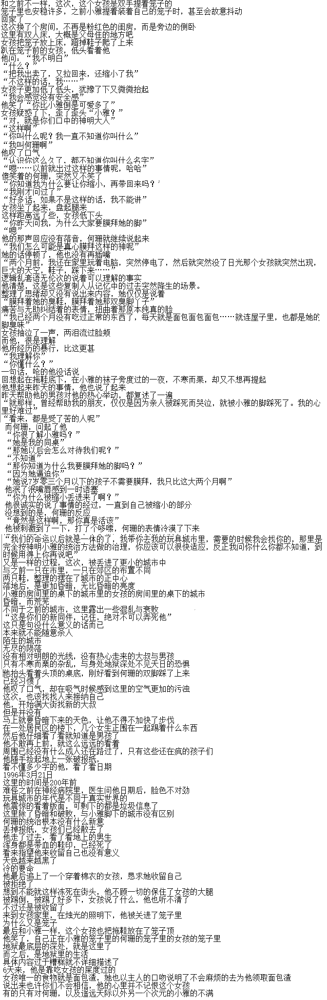

# 【终于完结了！】我的同桌竟然是这样！20180115

作者：西呱

TID：22302

<title>1</title> <link href="../Styles/Style.css" type="text/css" rel="stylesheet">

# 1

*本帖最後由 冰西瓜 於 2018-1-15 02:06 編輯*

大家好，我已经好久没有写出好的文章来了，为了稍微的试着再写，我就作了这篇渣作
长期以来不更新，好多文章坑掉，无数灵感在脑内浮现，无数自以为精彩的剧情在思想中构建过。
但是，我根本写不出来了。渐渐写不出文章，渐渐挤不出字来了。
因此硬着头皮写了这点开头，虽然已经很努力，但是我认为这篇文章如果不能成为一个新的开始，就会成为我最垃圾的退圈作了。挤了2小时就写了这么一丁点，也算是一点辛劳了，容许在下不才，如此烂作，容许在下发布在这样神圣的地方。感谢大家。至于之前的坑，虽然还会努力去填，但是也要提前说声对不起了。【手动鞠躬】
详情见群457681764

以下是正文：
他，男生，小学1年级。
在这个略显破旧，而又亲切普通的小学课堂教室中，他正在和同桌笑嘻嘻的嬉闹
同桌是个很可爱的女孩子，但是与其他茁壮的女孩子不同，她和同龄人比起来小小的，一米二的身高让她总是被她那一米三的男同桌欺负
她很嫩的皮肤与圆润的小脸在年幼的男同桌眼中仅仅只是看起来很顺眼的感觉而已。
相比之下更加让他感到无奈的是她的行为
因为无论是老师还是家长，都再三的教导他要让着女生
他已经很大程度上让着自己的同桌了
同桌在桌子上划了一道线，不许他“越界”
如果越界的话，就打脸3下
而这道线的左面有三分之二的地方，右面只有三分之一
中午会有食堂的汤，他用塑料碗多装一点，放在桌子下，却被女孩当着面，一边天真无邪的笑着，一边用穿着小红鞋的小脚轻轻踢翻
就这样，笑着躲闪着她的打脸，苦着脸无奈的拖地，然后在课间再玩玩她的头发，这就是他每天的日常。
他与这个名叫小雅的女孩子，原本就是这样的日常的。

（下接4楼）
<title>2</title> <link href="../Styles/Style.css" type="text/css" rel="stylesheet">

# 2

同样是普通的一天，就在刚刚上完体育课的那节课上，小雅的脚总是感觉不对劲，因为里面有一块小石子卡在了里面
而他，则刚好注意到了小雅的不对劲
本来只是普通的一点事情，只是看到了同桌的脚在乱动
小雅本想尽量让石子找个可以凑合的地方呆一会，可是没有用
她不得不皱了皱眉头的把鞋子轻轻的脱了下来
然而原本心里已经害羞了的小雅，还是被突然开口的他吓了一跳
他惊讶的看到那短小的小儿童鞋里，伸出的是一只本来穿着白袜，但是脚底已经彻底黑色了的袜子底部
这真的是让他很惊讶，而且他不加思考的说着
“哇，你脚好脏哦”
而且更另气氛雪上加霜的，是之后他闻到的隐隐约约的臭气后说的
“真臭”
不管旁边烦人透顶的男生，小雅强忍着愤怒，强忍着不懂气氛的他继续的东拉西扯，下课就拉着他的手跑进了办公室
在把他驱逐出办公室，害羞而且愤怒的把事情的原委说清，再然后老师让她在外面等候，把他叫进去了。
而在一整节课没有上课，在办公室外等了一个小时的她，终于看到了办公室的大门打开了
接过装有缩小后的同桌的笼子后，办公室的大门也关上了。
低头看了看笼子里的他，小雅对着他做了个发自内心的笑容
而在他的眼里，是遮蔽了日光，恐怖的坏笑。
（待续）<title>3</title> <link href="../Styles/Style.css" type="text/css" rel="stylesheet">

# 3

> [yuxiaoqiu 發表於 2016-12-17 02:04](https://giantessnight.com/gnforum2012/forum.php?mod=redirect&goto=findpost&pid=317475&ptid=22302)
> 真短呢,真短,真短,啧啧期待更多

追加了15分钟的内容，这次进入打字机模式，极限降低质量，极限提高产量。（但是还是写的好慢）<title>4</title> <link href="../Styles/Style.css" type="text/css" rel="stylesheet">

# 4

> [奥莱好 發表於 2016-12-17 13:15](https://giantessnight.com/gnforum2012/forum.php?mod=redirect&goto=findpost&pid=317510&ptid=22302)
> 专职出产短文的西瓜君竟然写出了平时两倍的量！！！

说的好，我欣赏你，来我的群互相伤害吧，457681764<title>5</title> <link href="../Styles/Style.css" type="text/css" rel="stylesheet">

# 5

> [zlm18800000 發表於 2016-12-17 20:21](https://giantessnight.com/gnforum2012/forum.php?mod=redirect&goto=findpost&pid=317542&ptid=22302)
> 在把他驱逐出办公室，害羞而且愤怒的把事情的原委说清，再然后老师让她在外面等候，把他叫进去了。
> 而在 ...

你不是重口控的话就可惜了
不过福利当然会有，这是福利文
而且因为是拙劣的福利文，不会去把剧情写的过于合理，缩小的原因还请脑补
<title>6</title> <link href="../Styles/Style.css" type="text/css" rel="stylesheet">

# 6

*本帖最後由 冰西瓜 於 2016-12-20 01:49 編輯*

一开始的时候，笼子里的他是很慌张的，出于恐惧，一直不敢说话
就这样一直直到放学，2个人都没有任何的互动
笼子被放在桌下的边上，一直被忽视着
放学了，他被带回了小雅的家里
他的笼子被放在了床边
就这样看着小雅写作业，玩电脑
沉默开始从他的主动畏惧和退缩，到了可怕的尴尬
巨人一样的小雅，就这样无视着他的存在，肚子开始饿了，平时看起来小巧可爱，人畜无害的小雅，现在却连找她要口吃的的勇气都无法鼓起
一直看着小雅，小雅却从没有看过他一眼。
他喊了一声，却没有任何回应
他喊了好几下，大吼着小雅的名字
“烦死了！”
POOOONG！
小雅走了过来，用穿着拖鞋的脚踢了一下笼子
笼子里天翻地覆的巨响着，晃动着
这就是小雅这个小女生的力量
仅仅是轻轻踢一下而已
强忍着饿的挨了2小时，他终于忍不住的喊着我好饿啊我好饿啊
小雅这时坐到了床边，两条腿搭在铁笼两边，低下头来
“饿了吧？”
“嗯嗯！”
“你想吃东西，就要先接受审判”
审判是什么？他犹豫了一下，为了吃饭，他同意了
小雅把穿着棉袜的两只脚从拖鞋里抽出，踏在笼子的上方
在他的视野里，巨大的双脚填满了他的视野，目力所及的后方是小雅双脚的脚趾，而前方则面对着她巨大的两处脚后跟，以及完全看不出幼儿的巨大的成双黑色脚底之间小雅沉默的脸。
那洁净无暇的稚嫩脸孔，和这双脚满是污垢的发黑底呈现出极为鲜明的对比
巨大的棉袜下层层的细线，都被染黑，偶有发黑的棉球球粘在上面
同时，浓烈到恐怖的脚味冲进他的鼻子，使他的鼻子一阵痛苦，张开嘴的他又感到这味道刺激着他的嘴，从他的口中吸进的气体刺激着胸口，胸中像是感冒时得了气管炎一般的阵痛着
他咳嗽着，气味着实过于不好闻，他低下头想让这气味减轻一些
突然的呵斥声：“抬起头来！”
他被突然的声音吓得一哆嗦，如同校园广播一样的巨大声响
小雅脱下了一只袜子，塞进了笼子里，掉在他的左边，然后是又一只。
两旁的焖湿气息一下子被填充到极致，他感到胸口如同炸开一般的剧烈疼痛着，带着体温的臭袜子仿佛散发着热浪，一下下吹在他的身上。
而当他抬头的时候，他愣住了
这就是七岁女生的脚吗？
完美的曲线，晶莹到极致，每一颗脚趾，每一道纹路，都淋漓尽致的把女生可爱的一面展现到完美，而巨大的身形，又在可人中透露着不可抗拒的威严
“跪下！”
扑通
他的双腿应声倒地，几乎要摔倒下去
而当他抬起头来时，却看到巨大的脚趾搓动了几下
从他的视角，可以看到几片碎屑，落了下来
其中一块发黑的死皮，刚好掉在了他的脸上
如同拳头大的碎死皮就这样在他的脸上，可是害怕的瑟瑟发抖的他，甚至没有拿下的勇气
“往哪看呢？”
又一下哆嗦，好在东西从脸上滑下去了
他看着头顶的小雅的脸，这洁净无瑕的小嫩脸，
现在却好恐怖
“你总是和我抢地方，是吧？”
“不敢……”
DOOOOOOOOOOOOOOOoooooooooooon
脚底猛的砸了一下笼子，天塌地陷一样的震荡了一下，又被巨脚稳住了冲击
“老实交待！”
“抢了”
“你还敢玩我的辫子吗？”
“再也不敢了……”
“你说什么？我听不清！”
DOOOOOOOOOOOOOOOOOOOOGGGGGGGGG！
PPPOOOOOOOOOOOONNNNNNGHGGGGGGGGGG！
脚在笼子上跺脚了两下，吓得他倒了，又赶快爬起来
“我再也不敢了！”
他身处在两只臭袜子中间，头顶是女生巨大的脚，被巨大的女孩子呵斥着
他哭了
呜呜哇哇的哭声只延续了15秒，就被头顶的呵斥打断
“你也配哭吗？”
然后是每个字都咬准音节的声音
“再哭，就，踩，死，你”
强忍着哭声的他，委屈的看着小雅
“欺负女生的垃圾，就算踩死也没有关系，你不是说我的脚臭吗？”
小雅打开了顶盖，把这双小脚伸了进来
他低下头，却感到头顶的巨大压力把他压倒，他紧贴在笼子的底面上，身处在脚下狭小的空间里
身旁是女生的臭袜子，头顶是随时会把自己踩死的女生的臭脚，从跪着被踩成趴着，又被巨大的光脚压在底下
“就这样把你踩死，你也没有怨言吧？”
“啊啊啊！！！求求您不要啊！”
“那你服了吗？”
“服了！！”
脚，终于抽走了
顾不上周边的气味，胸口爆炸一样的痛楚，也不得不大喘气的喘息着
笼子顶部被盖上，脚重新踏了上来
“我宣判，你欺负女生，判处无期徒刑，缓期执行，你接受吗？”
他，含着哭腔说着：“我接受”
“你今晚先在笼子里待一天，明天我会把你放到缓期的世界的，希望你在那里能悔改，过几个月我会看看你的表现，明白了吗？”
“缓期的世界？”
“不用明白了，听见了就可以了”
小雅去洗了洗，然后把鞋子脱在了笼子顶部，然后关了大灯，打开了床头的小灯，睡了过去
漫漫长夜，在小雅温馨的在被窝中安眠时，
夜里2点，在装有2只脏黑的臭袜子，顶着一双小女孩拖鞋的笼子里
他，蜷缩在铁笼的角落，默默的哭泣着，看着头顶巨大的鞋底，思考着自己绝望的人生<title>7</title> <link href="../Styles/Style.css" type="text/css" rel="stylesheet">

# 7

> [qq1353856991 發表於 2016-12-19 22:31](https://giantessnight.com/gnforum2012/forum.php?mod=redirect&goto=findpost&pid=317694&ptid=22302)
> 突然就这么重大的更新和展开，算是正式回归呱的风格了

感谢您的回复，之后的第三节更新会是新的文风，我迫不及待的展示自己了<title>8</title> <link href="../Styles/Style.css" type="text/css" rel="stylesheet">

# 8

> [painkiller 發表於 2016-12-20 01:29](https://giantessnight.com/gnforum2012/forum.php?mod=redirect&goto=findpost&pid=317705&ptid=22302)
> 辛苦楼主了，觉得写得还可以，不过更喜欢丝袜，相对于棉袜

7岁小孩穿丝袜？那是什么样的<title>9</title> <link href="../Styles/Style.css" type="text/css" rel="stylesheet">

# 9

> [ZERO001 發表於 2016-12-19 23:43](https://giantessnight.com/gnforum2012/forum.php?mod=redirect&goto=findpost&pid=317700&ptid=22302)
> 错别字x1   -1分
> 西瓜错字受~

非常感谢，bug已经更正<title>10</title> <link href="../Styles/Style.css" type="text/css" rel="stylesheet">

# 10

> [aszccdd 發表於 2016-12-20 02:08](https://giantessnight.com/gnforum2012/forum.php?mod=redirect&goto=findpost&pid=317712&ptid=22302)
> I do can`t believe a 7-year-old girl can easily talk about the life imprisonment and suspe ...

以女孩的视角，这只是一场游戏，过家家
The girl's perspective, it is a game.
<title>11</title> <link href="../Styles/Style.css" type="text/css" rel="stylesheet">

# 11

从噩梦中，一阵天塌地陷的巨响，惊醒。
头顶传来巨大的声响，是小雅穿上了拖鞋
这个周末，小雅把他的笼子提到了客厅，放在地上
“你到了那边后，要好好的忏悔，我要是还能想起你，就把你拿出来看看你改过自新的样子”
“你说的是哪里？”
“我买的复制人城市啊，里面的人都是完全和真人一模一样的，身体，记忆，城市里的每一个细节”
“为什么我从来没有听说过这种东西？”
“笨蛋，那是女生玩具店才有的东西啊”
她拿出宠物用缩小器，把他缩小到了0.2毫米，然后用一张纸片放在他旁边
“上来，我带你去那里”
他跑上了小纸片，小雅带着他走到了自己的桌前，小雅蹲下后，他看到了
桌下的城市
长宽半米的笼子，10厘米高的笼身，城市中一座座高楼，一棵棵树，都无比的真实
让人甚至怀疑，这真的是人造的复制品吗？
小雅打开了顶盖，把手伸向城市的地面
而最令他感到震惊的，是城市的两旁，分别放着他昨天嘲笑过的鞋子
下降的速度非常快，只有不到3秒的时间，一晃而过的看到鞋口灰黑的色调，和鞋里漆黑看不清的深处
降落了。
连同纸片就这样放在城市中，小雅的手抽了回去
他仰望着褐色的天空，那是小雅的桌底。
他看着笼盖被盖上，交错的铁丝网就这样覆盖在头顶如同500米的上空
“人类们注意了，这是你们的新成员哦，不过他好像精神有些问题”
说完，小雅就起身了
他低头看着眼前的光景，真实的柏油路，细嫩的绿草，远方走来的行人，矗立的建筑，都无比真实，除了异样的天空，仿佛会让人忘记自己已经缩小的事实
只有远方的那只红色童鞋，让他感到无比的恐惧，空气中也飘荡着与之前的脏袜子同样的污浊气息
这，就是他昨天见到的，穿在女生脚上的小红鞋
一个和他年龄相仿的男孩走了过来，【他】观察着这个男孩，而他则主动搭讪了
“你就是新来的人吗？”
“对”
“你是从哪里来的？”
“我被缩小了，然后就被丢进来了”
“缩小？你曾经也是神吗？”
“神？”
“真是个神经病呢，哈哈”
“那个。。我是新来的，能不能帮我介绍一下这里？”
“自从2个月以前，我们的城市就被转移到了这里，神明会在南郊放置水和食物”
“谢谢”
又有一个二十多岁的大叔，走了过来
“孩子，你家在哪里啊？”
“我家在JA20161221”
大叔想了想，为难的说
“那是哪里？”
“我不知道怎么回去，我被缩小了”
一旁的男孩接话道
“刚才他也这么说，估计脑子有毛病”
大叔看了看男孩，“你是谁？”
“我路过，去买碎布片的”
“哦，我在散步，自从没有了电，我已经失去了兴趣，每天都在晨游，孩子你如果有需要了解这里的事就跟我来，也算有个伴”
他没有说话，诧异于这些人和常人无异，小男孩却开口了“我也来”
就这样，他被夹在中间，在路边走着
“谢谢你们”
“不用客气，你有什么不懂的吗？看你到处看来看去”
他指向远处巨大的小红鞋
“那个是”
[啪]
大叔突然打掉了他的手
“不要对神明无礼！”
突然间，两个人都对那鞋的方向跪了下去
“傻子，快跪下啊”
慌慌张张的，他跪下了
“那是神明的圣鞋神山，昨晚刚刚置换而来的”
表情复杂至极的大叔，和忧郁的男孩，跪在地上看着小雅的鞋子
男孩像是想起了什么可怕的事情，看了看四周，然后对他说
“幸好巡检员没有路过这里，不然你就死定了”
他很是惊讶，也感到了阵阵寒意
这个城市的人，都如此的崇拜小雅吗？
三人起身，继续走着
“城市中一共有两座圣山，一座在市中心偏东，一座在西北郊”
城市只有3里路的直径，他们很快就走到了西北郊的圣山周围
距离还有500米远的位置，他远远看到了有几百人正在鞋边跪拜
“那里就是大家膜拜圣山的地点了”
警觉的大叔看到了身穿蓝衣的巡查员，他咽了咽口水说
“我们也去参拜吧”
纸片围成的简陋围圈外，是拿着账本的女巡查员
大叔报上了自己的名字，
[大叔]
巡查员翻到了他的名字，看了看他的样子，然后在上面用铅笔轻轻画了个圈
然后是男孩
再然后，巡查员问
“你名字呢？”
“我是今天刚来到城市的，我叫【他】”
“有意思，帐本里没有你名字，进去吧”
大叔在一旁提醒了一下
“记住，每周五或周六必须参拜一次”
“是每次圣山来的时候参拜！！”
这声娇喝让他哆嗦了一下
3人不做声，默默就走了进场
越是靠近鞋子，越是浓烈的小女孩脚臭味
几百人拿着进门时候领来的稿子，在红色童鞋的旁边每读一句，磕头一次
昨天还在嘲笑小雅的脚臭，今天就在和大家膜拜小雅的这只臭鞋
他的心里很复杂
一句句像是赞美神一样的话，赞美着一只恶心的臭鞋
鞋上的污垢，和鞋里飘出来的阵阵味道，让他反胃
可是他忍着不敢说
膜拜结束了，3人走了出来
突然，一阵来自天空的巨响
一双巨大的脚，踩在了头顶的丝网上
而周围的所有人，都齐刷刷的跪了下来
当他看着周围人群对小雅脚底目不转睛的坚毅眼神时，他终于意识到
“我的同桌，竟然是神”<title>12</title> <link href="../Styles/Style.css" type="text/css" rel="stylesheet">

# 12

> [罗耶罗 發表於 2016-12-21 12:39](https://giantessnight.com/gnforum2012/forum.php?mod=redirect&goto=findpost&pid=317803&ptid=22302)
> 帮顶，呱，你还是想些写长篇了，可是总有种跑偏的感觉。。。。

谢谢，求解释是哪些地方跑偏，跑偏的原因是什么<title>13</title> <link href="../Styles/Style.css" type="text/css" rel="stylesheet">

# 13

> [thanksdd 發表於 2016-12-21 22:07](https://giantessnight.com/gnforum2012/forum.php?mod=redirect&goto=findpost&pid=317833&ptid=22302)
> 残忍臭脚萝莉虐待控竟然向micro放置寄生的方向转变了(ಡωಡ) 。
> 还有就是为何城市不在鞋里 ...

还请期待下文，我已经变化了文风<title>14</title> <link href="../Styles/Style.css" type="text/css" rel="stylesheet">

# 14

> [nimcho001122 發表於 2016-12-21 22:24](https://giantessnight.com/gnforum2012/forum.php?mod=redirect&goto=findpost&pid=317834&ptid=22302)
> 瓜瓜写文超正的說快點写多點

可以，我会最近就更新的，下一节写了一半了<title>15</title> <link href="../Styles/Style.css" type="text/css" rel="stylesheet">

# 15

> [aszccdd 發表於 2016-12-22 13:46](https://giantessnight.com/gnforum2012/forum.php?mod=redirect&goto=findpost&pid=317882&ptid=22302)
> Awesome(๑>؂

thx，Which country do you come from ？<title>16</title> <link href="../Styles/Style.css" type="text/css" rel="stylesheet">

# 16

> [zhouq98 發表於 2016-12-23 19:08](https://giantessnight.com/gnforum2012/forum.php?mod=redirect&goto=findpost&pid=317971&ptid=22302)
> 有点可怕的萝莉……居然脚臭……这个设定有点可怕……不是我认识的萝莉2333 ...

对于这个问题，你是不是闻过啊<title>17</title> <link href="../Styles/Style.css" type="text/css" rel="stylesheet">

# 17

> [zhouq98 發表於 2016-12-24 10:36](https://giantessnight.com/gnforum2012/forum.php?mod=redirect&goto=findpost&pid=318024&ptid=22302)
> 闻过妹妹的算不算（滑稽）

算的啊，你说说你的经历吧<title>18</title> <link href="../Styles/Style.css" type="text/css" rel="stylesheet">

# 18

周围无数的人都在仰视着头顶的这双脚
昨天晚上踩在他的头顶的这双脚
他看着周围的人，没有一个人在看别处。
他看了看旁边的大叔，大叔的眼睛颤了一下，然后小声但急促用力的说
“别到处乱看，千万别不看她的脚”
如此的严重警告，他感到好奇和害怕的抬着头，看着这双脚
就是这双脚，昨天差点踩死他
这双脚现在搁在笼子顶上，上面的小雅并没有往下看，人们也看不到小雅的脸，但是没有一个人把视线移动
慢慢，他感到很无聊
脖子也开始不舒服了，总是仰视着小雅的脚底
唯一不无聊的，就是这两只脚，有时会乱动一下，有时会叠在一起
小雅的一双脚，踩在几万人的头顶
而所有的人，都跪在地上，仰视着她的脚底
偶尔有路过的蓝衣小姐姐，她们骑着自行车路过
他怀疑就是这些人负责监督着所有人仰视小雅的脚底
显然，他猜对了。
头顶的脚突然抖动起来，脚后跟在笼子顶上DONG.DONG.DONG的不停敲打
过了几分钟，又换了个姿势
他想着小雅的脚，小雅的袜子，和膜拜着小雅的鞋的众人
他不明白
远方传来模糊的声音
【小雅，吃饭了啊】
可能是小雅的家人？小雅的脚从笼子上下来走掉了
所有的人都如释重负的叹气
傍晚，他们3人来到了一片树林边，那里有一排座位，3个人挤在2人座位上坐了下来
“我不明白”他开口继续问：“这里以前发生了什么？为什么大家要跪拜小雅的鞋子？为什么小雅来了以后大家都要看她的脚底？”
大叔低着头“你小心点，这附近没有别人，也要注意，那是神，不要叫她小雅”
“你看到那只红色的鞋了吗？”
男孩面朝着城市中的红色童鞋，斑驳的污迹，略有破口的鞋神，微微褪色的血红，在城市幽蓝色的傍晚中格外的令人恐惧
“两个月前的一天，我和我妈妈正在超市买东西。”
他低下头，想了想，又看了看那只鞋
“突然，超市里一片漆黑，人们都在往外跑，神明就突然出现在天空”
男孩的声音越来越低沉
“然后，神明就把穿着鞋子的脚伸到了我们的头顶，妈妈护着我的头，我就什么都看不见了”
大叔突然说了句“哎呀，2个月没有烟抽了，好难受”
但是没有转移话题
男孩继续说着
“当时突然，地面就剧烈的震了一下，我抬起头，看到神明的一只脚，踩在了城市中，然后就把脚抽了出来，留下了鞋子”
“我们当时很担心，因为那个方向……”男孩开始抽泣了
“我的家，就在那只鞋的下面压着……”
“爷爷……爸爸……奶奶……哇啊......”
泣不成声的男孩，已经无法再说下去了
他问，“这就是那只鞋吗？”
大叔接话说：“大概是每周五的晚上，神会把旧的鞋子拿走，新的鞋子换进来，每次新的鞋子降临时，所有人都必须在24小时内参拜圣鞋”
“为什么我们上午要去西北郊的圣鞋那里参拜呢？”
“当时男孩拉住了我，恐怕那底下有他死去的家人吧”
男孩抬起了带着两行泪迹脸，悲痛的看着眼前小雅的鞋
“圣山下，压着的是几千人的尸骨，里面也包括我的家人……现在只有我剩下我妈妈了”
大叔站了起来，对他们说“走吧，天快要黑了”
在3人的身后，突然传出女声
“你哪也不用去了”
3人一惊，从树丛中钻出来的是一个看起来十三岁左右的女孩，她穿着蓝色的衣服，手拿缩小枪
女孩看着男孩，男孩拔腿就跑，女孩用缩小枪对他开了一枪
男孩缩小了，女孩快步走上去，像提兔子一样把他提了起来
“真是感人的故事呢，明天就让你和家人团聚，哈哈”
大叔低下头默不作声，而他则只是看着女孩，2人目光交汇了
“你就是今天新来的疯子吧？劝你不要惹麻烦，否则就和他一样了”
说着，她抖了抖手里攥着的男孩的双臂，男孩惨叫着，在空中无助的蹬腿
女孩把男孩丢进了自行车的车筐，骑车走掉了
气氛很凝重，凝重得超越了夜色
“快点和我回家吧，我可以收留你，如果不快点的话，天完全黑了我们就找不到回家的路了”
“真是谢谢你”
刚要出发的2人，又被走过来的另一个女孩拦下了
这个女孩穿着一身不知是哪个学校的校服，短袖加短裙的样子很是可爱
她看起来大概7，8岁，个头和他差不多高
“刚才远远的就看到蓝衣姐姐跳出来，我刚走过来想看热闹就结束了，刚才发生了什么？”
大叔用委婉的口气巧妙的描述了一下事情的经过，而女孩听完则向一旁的他走了过去
他很害怕，他微微的颤抖着，女孩停下脚步，还有2米多的距离下平视着他，笑嘻嘻的眼神很是兴奋
然后女孩继续前进了几步，在快要贴上的时候，他又往后退了半步
“这么怕我啊？”
“没，没有”
女孩指了指他，对大叔说
“你要收留这个男生？”
“嗯”
“滚吧，不用你操心了”
“天快黑了……”
女孩微微低下头，看着大叔面前的地面，轻声的说着
“我让你滚”
大叔真的走掉了
“昨天伟大的神明大人说了呢，任何男性都不能欺负女孩子，嘻嘻，看他们一个个害怕的样子”
女孩又凑近了一步小声的问
“该不会和你有什么关系吧？”
女孩的直觉意外的准确，而他难得的聪明了一次
“不知道”
然后女孩说
“这里的夜晚可是很凉的哦，不想冻死的话，就乖乖的做个跟屁虫”
然后女孩就转身开始走了，他则在后面跟着
<title>19</title> <link href="../Styles/Style.css" type="text/css" rel="stylesheet">

# 19

*本帖最後由 冰西瓜 於 2016-12-29 01:51 編輯*

他开始畏惧女生了
从畏惧小雅，到畏惧女生
这个女生活泼的在前面跑跳着，和刚才面对大叔时判若两人
但是他仍然清楚，这只是人的另一面而已
黄昏没有夕阳，只有无尽的黑暗
他抬起头，看着头顶木质的纹理，这座城市的一切光源都来自小雅卧室的室内光线反射
因此非常的昏暗
他脑中突然浮现了一个词，不见天日
差点跟丢了女孩
上了楼
4楼的女孩家里，是彻底的黑暗
他习惯性的开灯，然而根本没有亮
“没用的”
女孩放下背包，走到了自己的卧室（闺房）
已经漆黑一片了
看着漆黑的房子，隐约看到的卧室门，
“你是从哪来的啊？”
他走到了卧室，
如果是以前，他会毫不犹豫的坐到女孩的床上
现在他害怕的站着，看着模糊的人影，害怕
“说了也没用吧”
“你快说”
“我原本是神的同桌”
“得了吧，说人话”
“我饿了”
“你等着，不要动，我去拿吃的”
黑乎乎的人影回来了，塞到手里的是面包
女孩的小手好暖~~
“谢谢你收留我”
“说的我有点不好意思了呢……”
他默不作声，女生小声说
“你可以睡在地上吗？”
“哦，想想也是没办法的事呢”
“嗯，理解就好，你真的是第一天来这个城市吗？”
“是啊，到底发生过什么？”
“2个月之前，神明降临了，从那以后，这里就一直在她的桌下了”
“没有电……那水呢？”
“别想了，只能去挑水，神会把水放在郊区的”
“真是辛苦”
“呵，呵”女孩冷笑了几声
“之前，大家都在跪着注视着神的脚，是为什么”
“因为我们都崇拜神呀”
“为什么”
“哪有那么多为什么？”
“对不起……”
黑乎乎的一片，他们的对话也不好继续下去了
女孩也躺下了，他也在地上躺了
“你不用写作业什么的吗？”
“连个蜡烛都没有，怎么写”
“真幸福”
“哎”
女生叹了口气，不理男生了
男生很累，终于睡了安稳觉
第二天，
早晨，突然头顶巨响
女孩弹起来的一样的起床，然后对着还在迷茫的男生踢了一脚
“快下楼啊！”
2人飞奔下楼，然后直接跪倒在地
他，抬头看到了小雅
巨大的双脚，霸道的占据着天空，蛮横的脸上是玩味的笑容
而所有人都跪在地上，望着头顶
“今天是星期日，是处刑的日子呢！”
小雅兴奋开心的拿过一个玻璃片
“这些就是反抗我的人吗？已经只有这么点了呢，你们也开始学乖了是不是？”
突然所有人齐呼
“是”
吓得他张了张嘴，又没说什么
一个玻璃片上大概跪着四十多个人，多数是男性，多数是年轻人，还有些是孩子
小雅拿来一根针，用针尖对着边上的一个人问旁边的蓝衣女孩
“这个人犯了什么罪？”
跪在一旁的蓝衣女孩回答说“他没有在您降临时行注目礼”
小雅指了指另一个人
“他断了一条腿，无法对您下跪”
小雅一个个指着，一个个被描述着
“他辱骂您”
“她踢您的圣山”
“他没有参加参拜”
“他躲到了树林里，然后就什么都不做了”
然后当小雅的针尖指向昨天被抓去的男孩时
“他对圣山的降临有所不满”
小雅笑嘻嘻的一个个指着，然后用针扎穿了几个人的胸口，甚至是头
小雅笑了，笑得很纯真
许多人坚持不住，开始大哭
而有些人还在因为不明的原因强行忍住
而他则猜到了——哭声太大的人会被针头扎死
血腥的画面呈现在玻璃片上，而这一切的缔造者小雅，则天真无邪的笑着
剩下的三十几个人还在跪着
小雅站了起来，然后推了推转椅，双脚搭在笼子边上
“那么，现在是正式处刑的时间了！”
“好好看着罪人的死，记住这就是反抗的后果~！哈哈”
本想拉高声调的小雅，又噗的一下笑了出来
这可是杀人的现场啊
他，看到了
昨天帮助他，在树林边痛哭的男孩，就跪在玻璃片上的人群中
而小雅粉红色的脚底，已经压了上来
细嫩的脚趾头带着血气的红晕，稚嫩的皮肤边缘甚至微微透明
前脚掌，就这样压了上去
东倒西歪的人们，许多碎裂成了红色
爆炸的身体被小雅的脚底碾成了肉泥
他，眼角流过了泪水。
小雅拿出一块面包，撕下一块，用面包擦了擦脚底，然后放在了城市的角落里
然后又撕了几块，放在那里
然后她拿出了城市边的水碗，走掉，倒掉了里面的水，然后换上了新的白开水
城市另一边的垃圾也被她清走了，她在那里垫上了一张新的白纸
最后，她坐回椅子上，踩了上来
巨大的双脚，霸道的占据着天空
刚才的行动，让跪在地上的他心里有些异样的感谢感，不是正常的感激，而是带着明显的怪异
心情复杂
看着这双脚，他感到了寒冷的残忍
一缕阳光，恰恰在这个时候，射进了小雅的房间中
而这一缕阳光，也照在了小雅的脚上
而他，刚好跪在小雅脚底的阴影中
眼前一百多米，就是久违的阳光
这双脚，时而叠在一起，时而抖动着腿，踩得笼子当当响
沉浸在失去朋友的悲痛中，他脸上的泪还没有风干
头顶是小雅电脑中传来的动画声
可能是里面的情节，让小雅阵阵的笑着
可是看着眼前践踏生灵的脚底，他耳中听到的这笑声，却是无比刺耳
无比刺耳，刺耳到不想听下去
漫长的周末下午是无尽的折磨
无数人就这样被迫跪在她的脚下，仰视着她漠视苍生的脚底
四个小时过去了，终于，解脱了
他和收养了他的女孩一起去了城角，在那里，同伴的尸体在面包中扭曲着
他分不清哪些是昨天帮助自己的男孩的残肢
只看到半张死不瞑目的脸，和另外半张被踩的血肉模糊的脸拼接在一起
他丝毫不感到恶心
反而，是无尽的悲痛
为什么热心帮助自己的人，却是这样的下场
天黑之前，他们回到了女孩家里
再也无法抑制的他，愤怒的问着
“为什么！为什么你们都这样的膜拜着她！她踩死了那么多无辜的人！”
“没有办法啊，他们违抗了神，所以才被处死了”
“我和她同桌的时候，我以为她只是一个天真可爱的小女生”
女生没有说话
“把大家当成玩具，随意的践踏，这就是你们口中的神？”
他转过身，看着女孩
“告诉我，你真的发自真心的膜拜她？膜拜这样的神？即使她把我们都踩死？都踩死！”
他坐到了女孩的床上，哭了起来
女孩没有说话，默默的走了出去，留下他一人在房间里
过了五分钟
突然有人撞门，女孩跑去开门了
两个大汉，一个蓝衣女孩，进了屋里
“我们是警察，你刚才说有精神病人在你家里闹事？”
“对，就是他，昨天新来的男孩，被我收留了，可是他疯疯癫癫的很吓人”
男子和木头人一样的说“放心吧，交给我们了”
房间里的他，反而很平静
反而在想着，这样的话，可能是警察日常说的，才说的这么机械，没有情感
他走了，走之前，他对女孩说了声
“谢谢你收留我”
女孩咬了咬嘴唇，他被拉扯的回了头，再也看不到女孩的表情了
警车，居然是三轮车
大晚上在白色路线上骑着三轮车，他这还被当成苦力了
被指到了医院的神经科，他就被几个医生接管了
“病人情绪稳定，你们可以走了”
几个警察连个话都不回，头也不回就走了
三个医生，一个是化着浓妆的三十多岁妇女，一个是二十多岁的壮汉，一个是四十多岁的大妈
他被安排在了一个椅子上坐着，3个穿着白大褂的“医生”坐在三个对面的桌椅上，中间三十多岁的妇女开口了
“现在是什么日期？”
他回答
“新历47年”
妇女看了看壮汉，壮汉又问
“你的年龄是？”
“7岁”
壮汉看了看大妈，大妈问
“胃是干什么的？”
“储存食物，保留用以初级消化”
“不知道胃是干什么的”
妇女又问
“你来自哪个国家？”
“爱瑟瑞玛”
“家庭住址”
“爱瑟瑞玛可尤恩星，香榭区达尔市，花园街留区13号楼301”
“来这里之前你在干什么？”
“我是你们的神的同桌，原本是的，现在，和你们一样了”
“这人是有病吧。”妇女看了看壮汉
“我看没救了，处理了吧该下班了”
壮汉对他说
“你和我来一下，配合的话你会去适合你的地方”
一间暗室，他被要求在椅子上坐好
“自己绑好安全带”
“我拒绝”
壮汉自己走了过去，绑住了他
然后他拿起了桌子上的缩小枪
他被缩小了
这是又一次
而且是被复制人缩小
被装进笼子里，等了5分钟就被物流员送走了
颠簸中，他来到了一个粉色色调的地方
许多女孩的玩具
啊啊我知道了
他这么想着
传说中的，女生玩具店
他似乎就是有这个预感，这里他也不慌，等到了天亮，第一个客人，果然是她
那个收留了她的女孩
“这个小人多少钱啊？”
“免费”
“那我要了”
“不买点别的什么吗？”
“不用”
女孩对他笑了笑，这笑容，很是，说不清。<title>20</title> <link href="../Styles/Style.css" type="text/css" rel="stylesheet">

# 20

<ignore_js_op>

**1.png** *(135.53 KB, 下載次數: 56)*

[下載附件](forum.php?mod=attachment&aid=NjY0ODh8YzE4NDI3OTd8MTYwMDg4NTkzMnwxODIzMHwyMjMwMg%3D%3D&nothumb=yes)

2017-1-19 14:02 上傳

这次的更新是图片形式！因为我放寒假回老家忘记带文章了，用的聊天记录的截图
然后我在家里写了点后续，也P进了图里，并且在下面做了反白，请无视反白的文字

他抬头看着头顶的桌底，刚好看到何珊的双脚踩了上来
已经习惯了
他叹了口气，却在吸气时候感到这里的空气更加的污浊
这次，也该找找人来接纳自己
他，开始满大街找新的大叔
但是并没有
马上就要昏暗下来的天色，让他不得不加快了步伐
在一处居民区的楼下，几个女生正围在一起踢着什么东西
然后他仔细看了看就知道是男孩了
他不敢再上前，就这么远远的看着
周围已经没有什么成人还在路过了，只有这些还在疯的孩子们
他随手捡起地上一张破报纸，
看不懂多少字的他，看了看日期
1996年3月21日
这里的时间是200年前
难怪之前在神经病院里，医生问他日期后，脸色不对劲
玩具城市的年代是不同于真实世界的
他震惊的看着版面，可剩下的都是垃圾信息了
这里除了昏暗和破败，与小雅脚下的城市没有区别
何珊的统治根本没有什么新意
丢掉报纸，女孩们已经散去了
他走了过去，看了看地上的男生
浑身都是带血的鞋印，已经死了
看来指望他来收留自己也没有意义
天色越来越黑了
冷的要命
他最后追上了一个穿着棉衣的女孩，恳求她收留自己
被拒绝了
想到不能就这样冻死在街头，他不顾一切的保住了女孩的大腿
被踢倒，被踢了好多下，女孩说了什么，他也听不清了
不过还是被收留了
来到女孩家里，在烛光的照明下，他被关进了笼子里
为什么又是笼子
最后和小雅一样，这个女孩也把拖鞋放在了笼子顶
他笑了，自己正在小雅的笼子里的何珊的笼子里的女孩的笼子里
地狱最底层的深处，就是这里了
而之后，是地狱里的生活
具体内容过于糟糕就不详细描述了
6天来，他是靠吃女孩的屎度过的
女孩唯一的食物就是面包渣，她也以主人的口吻说明了不会麻烦的去为他领取面包渣
说出来也许你们不会相信，他的心里并不记恨这个女孩
有的只有对何珊，以及遥远天际以外另一个次元的小雅的不满

<title>21</title> <link href="../Styles/Style.css" type="text/css" rel="stylesheet">

# 21

他抬头看着头顶的桌底，刚好看到何珊的双脚踩了上来
已经习惯了
他叹了口气，却在吸气时候感到这里的空气更加的污浊
这次，也该找找人来接纳自己
他，开始满大街找新的，类似之前帮助他的大叔那样的人
但是并没有
马上就要昏暗下来的天色，让他不得不加快了步伐
在一处居民区的楼下，几个女生正围在一起踢着什么东西
然后他仔细看了看就知道是男孩了
他不敢再上前，就这么远远的看着
周围已经没有什么成人还在路过了，只有这些还在疯的孩子们
他随手捡起地上一张破报纸，
看不懂多少字的他，看了看日期
1996年3月21日
这里的时间是200年前
难怪之前在神经病院里，医生问他日期后，脸色不对劲
玩具城市的年代是不同于真实世界的
他震惊的看着版面，可剩下的都是垃圾信息了
这里除了昏暗和破败，与小雅脚下的城市没有区别
何珊的统治根本没有什么新意
丢掉报纸，女孩们已经散去了
他走了过去，看了看地上的男生
浑身都是带血的鞋印，已经死了
看来指望他来收留自己也没有意义
天色越来越黑了
冷的要命
他最后追上了一个穿着棉衣的女孩，恳求她收留自己
被拒绝了
想到不能就这样冻死在街头，他不顾一切的抱住了女孩的大腿
被踢倒，被踢了好多下，女孩说了什么，他也听不清了
不过还是被收留了
来到女孩家里，在烛光的照明下，他被关进了笼子里
为什么又是笼子
最后和小雅一样，这个女孩也把拖鞋放在了笼子顶
他反而笑了，自己正在小雅的笼子里的何珊的笼子里的女孩的笼子里
地狱最底层的深处，就是这里了
而之后，是地狱里的生活
具体内容过于糟糕就不详细描述了
6天来，他是靠吃女孩的屎度过的
女孩唯一的食物就是面包渣，她也以主人的口吻说明了不会麻烦的去为他领取面包渣
说出来也许你们不会相信，他的心里并不记恨这个女孩
有的只有对何珊，以及遥远天际以外另一个次元的小雅的不满

又2天后，距离他被第二次缩小时间已经过了8天
在笼子里的他，听到了何珊的召唤
他心里也明白，何珊会来找他的
在肆意摧残他8天后，“收留”他的女孩哆哆嗦嗦的把他交了出去
而何珊根本没有管这些事情，急忙的把他拿出来恢复了大小
恢复了的他，问何珊有什么事
何珊看着他轻声说，你去窗户那看看外面
被关了8天的他站了起来，活动了下僵硬的身体，然后对着窗户那边走去
何珊对他大声喊了句：快点
什么事情急成这样？
走到窗边的他彻底惊呆了
除了楼下的早点铺还完好，眼前的一切已经看不出原本的样子
眼前的地面陷了下去，一眼望去看不到任何建筑物
完全平了
这里曾经是最繁华的市区，他记得，以前面前的是一样的小区楼房，旁边是一家饭店，再旁边有一座大楼，大楼的底下有超市底商，街宽楼白……
原本是大楼的地方，现在只比其他地方略微高一点
满眼望去都覆盖了一层黑色的泥状物
一棵棵扁平的，边缘发黄的，整体被糊了一层黑色糊状物的，可以勉强看出是树的东西，扁平的混乱的贴在地上，扭曲的排成两排，以这个线索勉强可以认出，这是以前眼前的街道
在有些黑色的糊状物中间，夹杂着一些条状物
乌黑泥泞的粘液，在有些地方反射着亮晶晶的光
他已经不想再看下去，却无法移开自己的视线
黑色的烂泥中，一个球状物带着几个孔洞
这原本是一个活人的头
那些条状物，就是一具具死尸，仔细看还能分辨出残破的衣服
还有些更长的，巨大的线状物分不清是什么
无论是多高大的建筑物，都不知为何被熨平，糊上一层黑色的烂泥
视野比以往要宽阔不少，可以看到非常远，差不多500米开外的地方，还有建筑物在林立着
他沉默，仔细的看着这一切，在这片废墟中寻找着
他看到了一个黑影在地上蠕动，他揉了揉眼睛，定睛寻找着
那是一个在地上爬行的人
为了观察周围的情况，他打开了窗户，一阵气浪冲了进来，他立刻闭上了嘴和眼睛
何珊赶快冲上去关上了窗户，
他再睁开眼时，何珊正皱褶眉头抿着嘴看着他
屋里的味道已经很恐怖了
浓烈的脚味熏得双眼发麻
“你开窗户干什么！？”愤怒的何珊对他大吼着，而他看了看她，又把视线移开，对着墙壁问
“天啊！这里到底发生了什么？”
“一星期前，眼前的一大片地方都被神挖走了，直到今天上午，突然一阵地震，我就到了窗边”
上午的何珊，与全体居民都听到了小雅的宣言，而何删家里的位置，刚好完美目击了当时的情况
当时是星期六，本该是新的脏鞋子，也就是居民们必须膜拜的“圣山”换进城市的时候
小雅从鞋里抽出了原本的市中心，放回了已经空了一周的市中心区域，虽然对小雅来说只是略微有一点味道不好，却对近距离的城市居民们来说是浓烈的恶臭
就在这样的刺激下，跪在大街上的全体民众，仰视着小雅的脸，看着她关上笼顶，并把双脚踏了上来
小雅居高临下的俯视着他们，一脸天真无邪的对他们说：
“我把你们的市中心放进你们膜拜的圣山里改造了一周呢”
然后小雅抿了抿嘴，又绷着笑一般都说着
“我让你们的城市更加繁荣了，你们喜不喜欢啊”
当下面传来齐声的“喜欢”时，声音显得嘈杂和渺小
“嗯，声音变得好小，没关系，我以后每周都会协助建设你们的城市，让你们的城市越来越繁荣！”
说完，小雅又拿来了一双洗好的帆布鞋
她打开了笼顶，拿出美工刀继续切割着城市
“我已经决定了，你们的城市全部都要做我的鞋垫”
小雅一边切，一边笑嘻嘻的看着大家
美工刀把街道和市区切割开，除了上次以外最繁华的部分被切成了鞋垫的形状

（此处删去70字）
比对着鞋垫的大小，她继续切割着另外的一片城区
“可是还是不怎么样嘛，连我的一次性鞋垫都做不好，你们的城市真是……，hhh”
“为了让你们更加繁荣，我就这样继续勉强用你们好啦！我宣布，从现在开始，你们整座城市都要作为我的一次性鞋垫！凡是没有接受改造的地区的人禁止进入被改造过的地区！”
新的“鞋垫”做好了
“在我让你们的家更加'繁荣'之前，你们再想办法让城市更加吸汗一点吧，要努力的做个合格的鞋垫，哈哈”
在把新的“鞋垫”放进鞋中时，小雅迫不及待的把两只粉色的小脚丫伸进了鞋里，然后小脚一抬，拉好了鞋口，调皮的跺了跺脚
小雅调皮的笑了，笑的很可爱
而可爱的她的脚下，消亡的是无数的人命<title>22</title> <link href="../Styles/Style.css" type="text/css" rel="stylesheet">

# 22

> [549766457 發表於 2017-1-19 14:35](https://giantessnight.com/gnforum2012/forum.php?mod=redirect&goto=findpost&pid=320732&ptid=22302)
> 所以接下来会无限缩小了？文章大爱！期待！！

接下来不会缩小了，剧情接近结尾了
<title>23</title> <link href="../Styles/Style.css" type="text/css" rel="stylesheet">

# 23

> [281314672 發表於 2017-12-23 17:58](https://giantessnight.com/gnforum2012/forum.php?mod=redirect&goto=findpost&pid=352742&ptid=22302)
> 那么今年内会完结吗

今年内不会完结，目前这篇文既不打算更新也不打算弃坑
<title>24</title> <link href="../Styles/Style.css" type="text/css" rel="stylesheet">

# 24

对他来说，这是一个混乱的下午
也许是和莫名浓烈的，小女孩的脚臭味呼应着
乱七八糟的人群让他甚至搞不清大家在干什么，什么反应都有，有的人在咒骂着，有的人疯了似的乱动，有的人呆若木鸡的呆着发愣，有的人在大家，甚至有的人笑嘻嘻的拐着走，跑到了他的眼前，打了他一拳，然后大笑几声，又沉默了，默默的走开
他连还手的心情都没有了，疯了，这群人都疯了
也许是和小雅相处的比较久，也许是经历了一些事习惯了，也许是他也疯了……
他愣着，看着大家的疯狂举动
就这样，在外面逛了好久好久，他才想起了，何珊
他跑到了何珊家里，赶快找她，向她说明情况
何珊很惊慌，听到了这样的消息后，她拉住了他的手
“走，我们到街上去！”
女孩子拉着男孩子的手，快步一跳一跳的下了楼。

街上，
许多人拿着枪，还有的人在分发着武器
“我们已经活不下去了！”
“她要踩死我们所有人！她要折磨死我们所有人！我们和她拼了！”
而当小雅遮天蔽日的细嫩双脚踩上人群的头顶时，迎来的是枪声的齐射
巨大的脚一下弹了起来，然后是小雅愤怒的，巨大而占据天空的，小孩子的脸
她不可置信的看着小人们手上的枪
“你们竟敢反抗神！？准备接受天罚吧！”
小雅把城市举了起来
搬到了一个没有窗户，只有一盏灯的房间
关了灯和门
城市里自带的脚味混进了一股淡淡的厕所的气味
这里是小雅的卫生间。
骚动的人群无意义的乱动着
过了两个小时，没有任何事情发生，漆黑的一片，慌张的私语
突然，灯亮了
而他和何珊在楼下，却看到了
笑嘻嘻的小雅
“我这么细心的照顾你们，给你们准备食物和水，帮你们建设城市，你们却忘恩负义，还敢反抗神明，现在”
说着悲伤的话，小雅脸上却没有丝毫的愤怒或悲伤，却透露着兴奋
“是天罚的时间！”
小雅脱下了短裤，而此时城市里的人，虽然有的还在抵抗，更多的却是乱跑，还有的人跪下了，无意义的祈祷着
原本“保护”着他们的笼子顶部已经被掀开，巨大的臀部黑压压的悬在城市的上空。
肛门微微抽动着
头顶传来女孩子入厕时的闷吟，临时组织起来的“军队”在四散逃跑
不到几秒，天罚就降临了
浓烈的粪臭，散发出的冲击波，对人们来说就和电影里的核弹一样快
真的很像核弹毁灭城市一样的场景，只不过蘑菇云换成了巨大的臀部排出大量的粪便
棕色的粪便，对人们来说是屎构成的山脉，压在头顶和远方
距离比较远的人在朝着容器的边缘逃跑，
而何珊和他，虽然没有被大便淹没，但离得很近
拼命狂奔的他们两人，在粪臭的气浪袭来时，双双熏得晕倒了
意识就这样模糊了
人掉进粪坑就会死，这个道理大家都明白吗？即使是小孩子的粪便，对于小人来说，这样的粪便山也是如同粪坑的环境。
现在昏迷了的两人，在不断的吸入毒气。
他们听不到头顶的小雅对全体小人的话：
“好好反省吧”
然后她擦了屁股，把城市盒子拿了起来，端到了阳台外，关了窗户
烈日与微风吹散了污浊，他们醒来了
逃难。
人们纷纷朝着边缘逃走，但是高墙有几白米根本不可能逾越
仅仅是求生的本能罢了。
因为背后，就是小女孩的粪便之山。
过了两小时，何珊和他终于逃到了边缘地带，而窗户也打开了
小雅把城市放进了屋里
“真恶心……”
“那个……我的同桌还活着吗？”
小雅拿出了两张纸片，其中一张放进了城市的角落里。
“愿意服从的人，上到这张纸上”
然后把另一张放在另一角
“同桌，你如果还活着就到这张纸上”
很快，人们就分开了
大部分人去了第一张纸上，少部分人去了第二张纸上
他也去了第二张纸上
小雅端起了第二张纸，恢复了他的大小
（他在恢复的时候，挤死了周围的几千小人）
看到他还活着，小雅笑了
“你还真能活啊，其实留下的人也就那么五分之一了吧”
被恢复到20厘米的他，盘着腿坐在地上，说“何止”
“你这城市里还有女孩和你玩着一样的把戏，和俄罗斯套娃一样”
小雅一脸黑人问号一样的表情：“嗯？”
“我还被他丢进去了，真可笑，然后进去了以后又继续缩小，再缩小……”
“是谁把你再缩小的？”
“她叫何珊，应该在另一张纸上。”
小雅把何珊叫了出来，专门把何珊放大到了10厘米
10厘米是玩具的放大极限了，而且是降低密度式的放大，不会放大她的体重
何珊和一个充气气球一样的飘着
“你也这么玩了？”
何珊跪着回话说：“是的，主人”
“也许我们可以交流交流经验”
然后，小雅又对他说：“反省的怎么样啊？”
他的反应是这样的：
“呸，你应该被碎尸万段，你不得好死，你去死吧，我操你姥姥的，你应该比他们受到更严重的虐待！你应该比他们所有人的痛苦再翻倍十倍的惩罚！你会被报应的！狗娘养的！”
小雅气的直发抖……
没想到一个缩小人敢这样对她说话，小雅拿出事先准备好的0.3厘米大的，铁质小昆虫球，然后把他缩小放进了里面
小雅本来还想看看他的态度，如果已经服服帖帖了就把他恢复，放回学校随意使唤
而现在，愤怒的小雅拿着小铁丝球，对他怒吼道：“你就永远在我的鞋里反省吧！”
说完就把他丢进了鞋里。
怒气没消的小雅，又跑到了笼子边，气愤的说：“你们敢反抗我是吧？我让你们知道反抗我的下场！”
她找来了一卷透明胶带，把笼子密不透风的缠了起来
“既然分不出是哪些人在反抗我，那你们就都去死吧！永远死在我的粑粑里！”
在确定已经封严实了以后，小雅狠狠的踢翻了城市
边踢边喊：“你们都是我的奴隶！我让你们做什么你们就必须做什么！反抗我的人都得死！”
四方的玩具城市，被愤怒的小雅不断的踢翻
里面的那坨大便，也和城市充分的搅拌在了一起
整座城市，无一幸存，所有人都死了，并且都黏合在小雅的大便里
全毁了。

后
然后，
之后，
在这之后，
小雅累了，把这个看了就各种方面都觉得恶心的城市，顺着窗户扔了出去。
她看到了地上跪着的何珊。
“小丫头，他们为什么敢这么做？”
何珊的脑子急速的运转着，拼命的思考自己对待玩具城市的样子，想着现在自己身为小人，主人可能的想法，然后她果断的回答：
“可能是他们不理解您的温柔和高贵。”
何珊的额头，始终贴着地面，不敢抬起。
“是时候买一个新的玩具城市了。何珊，到时候你来帮我参谋参谋。”
“遵命。”
“我要所有活着的人，只对我一个神明绝对服从”
“我将全力为您服务。”
城市的末日，已经结束。
从这一天开始，小雅那曾经的同桌，也被永远丢弃在了鞋里。
在这个小女孩的鞋里，在别人湿臭的脚下，永远不得翻身。<title>25</title> <link href="../Styles/Style.css" type="text/css" rel="stylesheet">

# 25

> [bibiwo 發表於 2016-12-17 02:15](https://giantessnight.com/gnforum2012/forum.php?mod=redirect&goto=findpost&pid=317477&ptid=22302)
> 期待期待大神的文章！

目前文章已经完结了，欢迎来评论
<title>26</title> <link href="../Styles/Style.css" type="text/css" rel="stylesheet">

# 26

> [紫色欧石楠 發表於 2016-12-17 03:02](https://giantessnight.com/gnforum2012/forum.php?mod=redirect&goto=findpost&pid=317483&ptid=22302)
> 这是赶上直播了？先去金井村当战斗贼了。

非常感谢您的支持，目前文章已经完结了，欢迎来评论
<title>27</title> <link href="../Styles/Style.css" type="text/css" rel="stylesheet">

# 27

> [神之咲夜 發表於 2016-12-17 10:05](https://giantessnight.com/gnforum2012/forum.php?mod=redirect&goto=findpost&pid=317492&ptid=22302)
> 还真的好短还会更新吗

现在完结了，总的来说已经不短了，欢迎来看后续
<title>28</title> <link href="../Styles/Style.css" type="text/css" rel="stylesheet">

# 28

> [lvjiaxin 發表於 2018-1-15 23:23](https://giantessnight.com/gnforum2012/forum.php?mod=redirect&goto=findpost&pid=355472&ptid=22302)
> 男主这反省看得我一脸懵逼

男主正是这样的一个人，这也是这个角色长期压抑的一种释放
<title>29</title> <link href="../Styles/Style.css" type="text/css" rel="stylesheet">

# 29

> [luzhefan 發表於 2018-1-16 00:07](https://giantessnight.com/gnforum2012/forum.php?mod=redirect&goto=findpost&pid=355480&ptid=22302)
> 最后结尾有点没看懂。。

我会尽力改善自己的文笔的，感谢阅读
<title>30</title> <link href="../Styles/Style.css" type="text/css" rel="stylesheet">

# 30

> [神之咲夜 發表於 2018-1-15 23:51](https://giantessnight.com/gnforum2012/forum.php?mod=redirect&goto=findpost&pid=355475&ptid=22302)
> 隔了一年终于更新了

一年了，这也是终于完结了，这篇文章幸好没有坑掉
<title>31</title> <link href="../Styles/Style.css" type="text/css" rel="stylesheet">

# 31

> [lin449242756 發表於 2016-12-17 20:35](https://giantessnight.com/gnforum2012/forum.php?mod=redirect&goto=findpost&pid=317543&ptid=22302)
> 不管怎么说也是新文
> 先支持下

一年了，新文也变成完结的文了，欢迎读者回归！
<title>32</title> <link href="../Styles/Style.css" type="text/css" rel="stylesheet">

# 32

> [wdl1233 發表於 2016-12-18 22:55](https://giantessnight.com/gnforum2012/forum.php?mod=redirect&goto=findpost&pid=317631&ptid=22302)
> 楼主求更文，看起来还不错，支持一个

我已经全都更新完毕了，欢迎来看
<title>33</title> <link href="../Styles/Style.css" type="text/css" rel="stylesheet">

# 33

> [qq1261029704 發表於 2016-12-18 23:56](https://giantessnight.com/gnforum2012/forum.php?mod=redirect&goto=findpost&pid=317642&ptid=22302)
> 西瓜大大的新文，期待后续

与其说大大不如说渣渣，现在完结了，非常欢迎来看
<title>34</title> <link href="../Styles/Style.css" type="text/css" rel="stylesheet">

# 34

> [444666444666 發表於 2016-12-19 00:17](https://giantessnight.com/gnforum2012/forum.php?mod=redirect&goto=findpost&pid=317648&ptid=22302)
> 大神为什么要退坑啊......

你想看的是哪一篇呢？想要的人多的话可以补，不过有的实在是写不下去了
<title>35</title> <link href="../Styles/Style.css" type="text/css" rel="stylesheet">

# 35

> [zhanjianshijie 發表於 2016-12-22 20:36](https://giantessnight.com/gnforum2012/forum.php?mod=redirect&goto=findpost&pid=317915&ptid=22302)
> 有点短啊  看得不尽兴  希望还能有更多好的文 加油

感谢你的长期支持，现在文章终于在大家的支持下完结了
<title>36</title> <link href="../Styles/Style.css" type="text/css" rel="stylesheet">

# 36

> [ctcctct 發表於 2016-12-24 23:25](https://giantessnight.com/gnforum2012/forum.php?mod=redirect&goto=findpost&pid=318130&ptid=22302)
> 可啪的loli期待下文。。

当萝莉有了强大的力量，可以主宰人的生死时……
<title>37</title> <link href="../Styles/Style.css" type="text/css" rel="stylesheet">

# 37

> [lyh971722424 發表於 2018-1-16 01:52](https://giantessnight.com/gnforum2012/forum.php?mod=redirect&goto=findpost&pid=355505&ptid=22302)
> 先感谢呱的更新，然后不得不感叹呱的口味越来越重了(눈_눈)，最后我想说一句：粑粑呱 ...

小雅这样的主人，怎么可能容忍小人的反抗其实小雅之所以用这么恶心的方式来对待小人们，就是因为小人的反抗，导致了小雅最极端的报复她只想让小人服从，而且会越发高压的逼迫小人，来以此实现自己的绝对控制感</ignore_js_op>