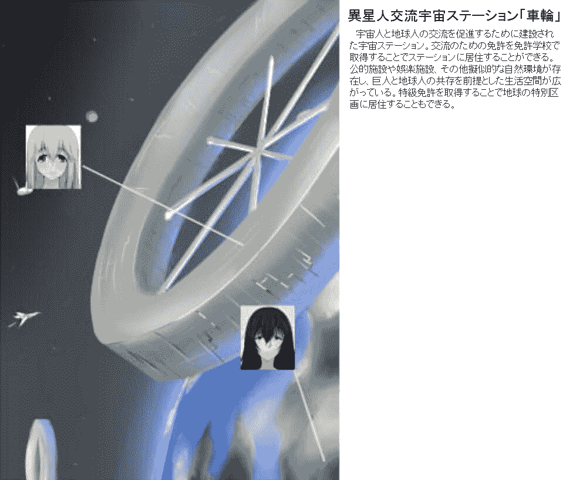
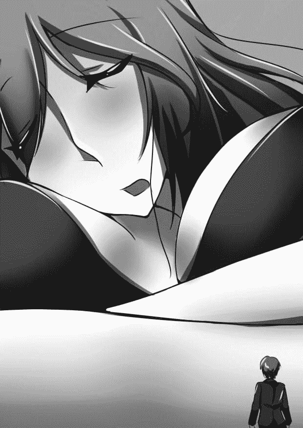

# 【翻譯】小説家さんと編集君　いつかの出来事

作者：8611071528

TID：27161

<title>1</title> <link href="../Styles/Style.css" type="text/css" rel="stylesheet">

# 1

故事前設定
<ignore_js_op>

**l_lG_3.jpg** *(110.35 KB, 下載次數: 0)*

[下載附件](forum.php?mod=attachment&aid=NzkyMjh8NTdhNTVhYmV8MTYwMDg4MjQ5NnwxODIzMHwyNzE2MQ%3D%3D&nothumb=yes)

2019-7-27 23:10 上傳

外星人交流空間站“車輪”

為了促進外星人和地球人的交流而建設的宇宙空間站。在執照學校取得為了交流的執照後，可以居住在車站內。公共設施、娛樂設施以及其他類似的自然環境設施，以巨人和地球人的共存為前提的生活空間正在擴張著。通過取得特級許可證，可以居住在地球上的特別區域。

**小説家さんと編集君　いつかの出来事**作者：メジロ
文章來源：[https://www.pixiv.net/novel/show.php?id=6120901](https://www.pixiv.net/novel/show.php?id=6120901)<ignore_js_op>

**挿絵　小説家さんと編集君　いつかの出来事.jpg** *(52.09 KB, 下載次數: 0)*

[下載附件](forum.php?mod=attachment&aid=NzkyMjl8ZmEwYjBjZTV8MTYwMDg4MjQ5NnwxODIzMHwyNzE2MQ%3D%3D&nothumb=yes)

2019-7-27 23:20 上傳

※「恩！哈、嗯！！」在黑暗的室內，巨大的嬌喘聲響起。如字面上的意思一個巨大的嬌喘聲，人類製造微小的東西，會因其共振而遭到破壞吧。在一間比平常大100倍的房間裡，一個身高100倍大的黑髮女人，摩擦著自己的私秘處。「啊！」那美麗的長發，配合著她的動作，宛如生物般在她的周圍不停地飛舞。情緒高漲，眼看就要達到最高潮了。「編輯君...嗯。」一邊喊著他可愛的名字一邊磨擦股間。於是情緒更高漲了。「嗯...馬上。」多一點、再多一點，這時門口的鈴聲響起。可能是編輯君。 做私密事情的時間似乎比我想像中的還要長。「啊！」依依不捨的按壓後，立即整理儀容。「請進...」一邊調整呼吸，一邊對對講機講話。我跪坐在小人用的大門前，等待著編輯君。小門嘎嘎作響。從那裡編輯君露出臉來。「打擾了。」「......是的。」迎接編輯君後，我坐在炬燵前面的墊子上。這裡就是平時座的位置。編輯君開著車從玄關開到炬燵來。我可以攜帶他，但自從第一次來的時候，這已經成為一種習慣。編輯君總是從我身後經過，到達炬燵的桌腳邊，搭乘桌腳的內部電梯到桌面上。 他搖搖晃晃地在桌上面對著我。編輯君的身姿很可愛，不知不覺，一直注視著。編輯君是比我小百分之一尺寸的小人。是1.7米的小人。不過，住在他們居住的地球上的我才是巨人吧，不過，如果一切都是按照我的尺寸建造的這個房間的話，感覺思想有點麻木。幾年前，作為小說家，被允許在地球上定居下來，留在這裡。與地球上的小人生活在一起，獲得各種執照和資格，生活致今是不容易的。即使這麼辛苦，我之所以來地球，是因為這顆星球的文化。這個星球的文化，特別是故事，在沒有娛樂的我的星球上，是非常有魅力的。必要的知識，在出生前被灌入了，而決定我們生活方式的人沒有這種文化。而且，因其小而容易受到迫害的地球人，他們以其多種多樣的文化為武器，與其他星球進行交流著。根據每個星球的協定，這種文化被公認為地球的專屬，不可以把它帶出地球。小時候被帶到地球上的我，在那裡知道了小說的事情。一眼就被吸引了。居然有這樣的故事。竟然可以創作這樣的故事，我完全被小說迷住了。在那之後，我決定定居在地球上讀小說，寫故事，讓人們看。「老師，今天能寫完稿子嗎？」突然望向編輯君，不知什麼時候，編輯君坐在桌上，開始工作和我搭話了。「啊！是」一下子就結巴了。「那麼，你今天想寫下一個故事嗎？」「是」編輯君迅速地完成工作。帥氣的。我也得努力才行。回過神來，我把注意力集中在稿子上。※

一大早就做完了必須儘快完成的工作，鬆了一口氣。我們公司鼓勵與新人作家在一起工作。從日常業務到與負責作家的業務，負責作家的一切事情。幸好我的老師是個好人，每天都能快樂地工作。倒不如說是迄今為止最快樂的……。稍微鬆了一口氣，把臉轉向老師的工作室。看比自己大100倍的炬燵桌面，這比學生時代的運動場還寬廣。從老師的角度來看，自己的工作場所也只有放在炬燵上的紙巾盒那麼大。作為老師寫小說素材的備忘錄，如果從我的視角看，也難以辨認。而作為炬燵的主人，坐在炬燵旁的老師比炬燵還要大得多。從自己所在的位置只能看到上半身。即使把頭過度伸長，也看不到老師的頭頂。看著絞盡腦汁到極限，年輕表情的老師，可愛地歪了歪頭。從這裡能看見咖啡杯。今天好像沒有裝咖啡，是一個空杯子。我離開座位，從自己用的工作台下來到桌面上，朝著放咖啡豆的地方走去。老師的桌子上有一個更高的箱子，我在那裡工作，熱水瓶，咖啡粉，還有工作空間。如果是100倍尺寸的巨人的桌子的話，比差勁的操場還要寬廣。稍微小跑著，走到咖啡粉的瓶子處，準備上樓梯，用巨大的勺子舀起咖啡粉，放進杯子裡。咖啡的香味四處飄散。好香啊。這次，要爬上熱水瓶外的梯子，按下比自己大的按鈕，把熱水倒下去。瀑布般的開水從杯子裡流下來。熱騰騰的開水直接擊中咖啡粉，立刻混合在一起，上面含有咖啡的香味，把我包圍起來。是個非常難得的時刻。補充完量後，從按鈕上放下手來。剩下的就把這個推到老師那裡。但是，這是最困難的。雖說已經習慣了，但這是最辛苦的部分，一般人是不可能推得動有一棟房子以上大小、容量的物質。但是，為了讓地球人也能使用這個杯子，有進行了減少摩擦的加工處理。但是，沒有訓練的人是不能推這個杯子的。我把肩膀推到杯子旁，用力推。「呼」一旦用力，杯子開始慢慢移動.。感覺到了視線，抬頭一看，她正看著我。「老師，是咖啡。」「謝謝」和往常一樣，老師小心地接過杯子.。這個回答很可愛。我抬頭看著當場喝咖啡的她。小心地喝咖啡的臉很可愛。但是，視線馬上向下移動的話，也可以說是像兇險的坦克，胸部散發強烈的存在感。這是一個巨大的南半球。一直盯著看也很失禮，所以馬上把臉轉向別處。沒有暴露吧。我重新振作起來，又開始小跑著回到自己的工作台。編輯君像往常一樣給我倒了咖啡。雖然是速溶咖啡，但是這個咖啡，是宇宙中最好喝的。就這樣，為了我努力著的他很可愛，我總是在清晨喝著咖啡。但我知道，編輯君在看我喝一口的同時也注視著我的胸部臉很燙。我注意到的事，他沒有發現我已經注意到了。一想到一不小心指出來，就會傷害到他，就害怕得不敢說出來。被看也沒關係。又不是被看會少塊肉……而且，也不是很討厭。說起慾望，我想讓你多看看，我寧願讓你進來 ……。不是，如果因指出而傷害了編輯君，一想到關係的變化就感覺到害怕。我為我的想法感到羞愧。一邊祈禱著發紅的臉不要暴露，一邊喝著咖啡。「太好喝了」通過小跑返回工作台的編輯君轉向這邊。「那真是太好了」他笑著對我說。光是這點，心裡就覺得暖和起來了。編輯君為我泡的咖啡真的很好喝。宇宙最好吃的。
為了使熬夜疲憊的身體休息，我趴在了桌子上。從那之後不久，原稿就完成了。之後在編輯君的核對下，修改錯別字就完成了。我決定在下次的題材出來之前稍微睡一會。故事情節是迷你的街道，對編輯君來說使用與真貨同樣的尺寸的街進行。我一邊期待著那個，一邊睡著了。老師睡了三個小時，稿子的檢查也結束了，剩下的就讓老師修改一下修改的地方。這個工作一個鐘頭就能完成。先把老師叫醒吧。我下了工作台，走到了老師的面前。趴在桌子上，枕著胳膊，舒舒服服地睡著。好可愛。還是那麼巨大。豐滿光潤的嘴唇，大到只要老師把頭朝上，我的身體可以輕微地騎上去。連睫毛都跟我一樣長。我被那壯觀的景色迷惑著，用手機上的照相功能拍下了那張睡臉。閃光燈亮著老師的臉.。一瞬間，我想糟了。「嗯」地把臉趴在胳膊上，好像還沒有起床的跡象。不管怎樣，今天還有工作要做，所以想著一定要叫醒老師，所以更接近老師了。漸漸地就看不到老師的全貌。即使是與自己完全不同的生物，我本能地呼喊可愛的老師。從身體的深處能理解巨大的存在。為了叫醒老師，要靠近使聲音更加大聲一點。就侵入她因趴下，她的側奶、雙臂和地面所形成的洞穴裡，直接到達她的臉下。「呼……啊！」仔細想想，不，即使不考慮，展現在眼前的是老師的胸膛。那個有100倍大小的胸膛，就算是正常的人體尺寸，也能稱之為規格外的胸膛。無法抑制情緒，讓情緒平靜下來，我深呼吸後，我轉過頭來，伸出手臂，向老師呼喚。「老師，醒來！」但是，沒有反應。巨大的眼皮緊緊地閉著。要再給以刺激，就只有那裡了。
我坐在那裡猶豫了一下。這是沒辦法的事。但是，如果做了那麼失禮的事，會被討厭的吧……。從昨天開始老師好像很忙，還想再讓她休息一下，但是今天是截止日期，再拖延下去可不好……。為自己找了許多藉口，接近她的胸膛。「對不起」向老師道了個歉，便助跑，在撞擊老師的胸前時。在這一瞬間，老師眼睛張開了。她睜開眼睛，抬起身體。一瞬間，那巨大的胸膛向遙遠的上空挺起。失去了發洩力量的地方，以及由於超質量的高速上升而產生的風壓，我多餘的力量，就這樣撲向桌面。「沒事吧？」擔心我的老師窺視著我的臉，朝著我的方向看。「沒事。沒事。啊哈哈」雖然有些遺憾，但我還是提醒自己站起來掃去塵埃，報告了原稿的核對結束了的事。
看到編輯君誇張的跌倒，我後悔了。其實在編輯君拍照片的時候我就注意到了。到底拍了什麼樣的照片呢，看著編輯君有著我的照片，我也很開心。正想著差不多該起床的時候，編輯君突然從我胳膊底下走了進來，我就不睜開眼睛，假睡著。最重要的是，我很高興他在我的空間裡，所以想多品嚐一下這段時間。編輯君觸摸了我的手臂，呼喚了我。小手輕輕地按著我的手臂，感覺很可愛。我以為他會再這多呆一會，但我發現他已經停止按手臂了，感覺他在看著我的胸膛。雖然臉上火辣辣的很難為情，但同時也希望看他的慾望，就這樣什麼也沒做。
之後，編輯君開始一鼓作氣地跑起來，好像下定決心似的，然後，編輯君就一口氣跑了過來。在那一刻，他想做什麼？但是，那確實是，雖然很高興，但是，好羞恥.。一瞬間種種思想盤旋在腦海中，但他的跑步卻停不下來。不行！屈服於羞恥心的我這樣想，就起了身來。這樣一來，編輯君便會滑入了桌面。有沒有受傷？憂心忡忡地問一問。看樣子不要緊。我還覺得很害羞。不過，肯定總有一天.。我下定決心，重新轉向了編輯。</ignore_js_op></ignore_js_op>