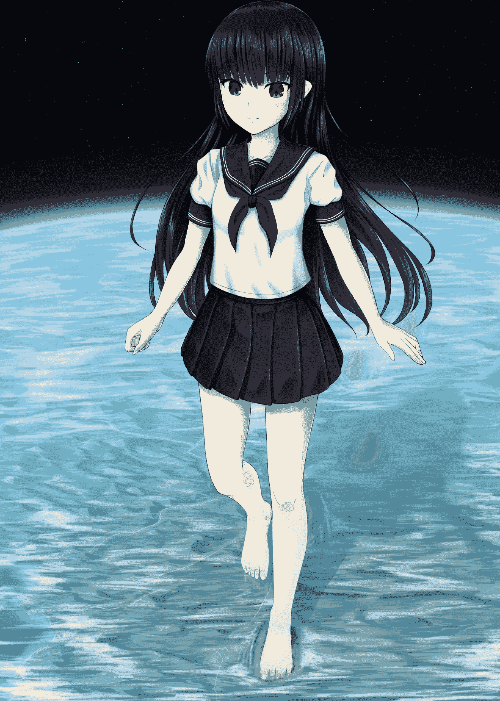

# 【翻译】【ICECAT】女神是女高中生

作者：TANGLUNG

TID：26097

<title>1</title> <link href="../Styles/Style.css" type="text/css" rel="stylesheet">

# 1

*本帖最後由 TANGLUNG 於 2018-11-22 16:23 編輯*

想必大家应该都多多少少有听过icecat这位大佬的作品吧……他的小说本的质量一直都不错，而且插图也画得很棒……然而却一直没人翻译他的作品，而我自己的日语水平又非常之烂，于是我便突发奇想找了网上的人工翻译服务来翻译试试，因为我也是第一次尝试这种服务所以不知道质量怎么样，就挑了一篇篇幅较短的文章先试试水，结果发现质量意外的还可以……希望大家也能喜欢（这次翻译的文章来自他的小说合集《JKデカ》）<title>2</title> <link href="../Styles/Style.css" type="text/css" rel="stylesheet">

# 2

*本帖最後由 TANGLUNG 於 2018-11-22 16:20 編輯*

女神高中生作：猫ちぐら绘：rakia
  大家好，我是紫苑，本是一名普通的女高中生，就读于一所普通的学校。本应如此的，但其实我是一位女神哦。说起来，我也是最近才发现的。  女神高中生。听起来似乎有些奇怪吧。若是拥有女神的力量，一切都能随心所欲的话，也就没必要去学校了，但我十分享受女高中生的生活，因此，目前还没有休学的打算。  最初发现自己拥有此种力量的时候，本想尝试一举征服世界，对某超大国的总统颐指气使一番，或是被世人敬仰，又或是随心所欲地挥霍游玩，可是，以我的性格，实在不适合做“统治者”，也就立马放弃了，回到了自己原有的世界。我似乎还是更适合高中生活。因为对我来说，与朋友们闲聊更加有趣。  话虽如此，但若是拥有这种“随心所欲”的能力，却不去使用的话，未免白白浪费。所以，我最近在用它创造“异世界”：刀剑与魔法的幻想世界，或是科学文明高度发达的超未来世界，等等。在我创造的世界中，没有家人和朋友，我可以为所欲为，因此在那里我无需有任何顾虑。  今天也在回学校的途中顺路去了异世界。  这次的异世界与我们所居世界的文明等级大致相同。街道两旁，现代式建筑鳞次栉比，汽车与电车如游鱼一般穿梭其间，人人手持类似于智能手机的物品四处奔走着。  比起制造拙劣的近未来世界，这种文明等级与我们所处的世界更加相似，更有玩乐价值。  在众多玩乐之道中，最简单、最有趣的便是破坏街道了。我的手腕虽纤细，但却能将邮轮、甚至行星也轻而易地托起，高层大厦也能被我一举击倒。最近，我只需轻轻一跺脚便能将地面击裂，还能将建筑推入裂开的地缝之中。我还会用魔法令街道燃起熊熊火焰，令一切岛屿都冻结，用指尖放射光束将大陆毁灭，等等……种种的破坏手段中，如今我最喜欢的便是“变大”了。不单是建筑，整条街道都可一览无余。  之前，在常去的商场中看到陈列的街道模型，我想，若是能以这种比例走在真正的街道上，会很有趣吧。答案确实如此。身材娇小的我，却能轻松地俯视成排高楼大厦，这实属乐事。只需信步而行，便能不费吹灰之力地将建筑、街道踏碎，这确实令我心情大好。而且，拥有巨大的身躯才更像女神，不是吗？显而易见，你们人类是多么渺小的存在。  所以，现在的我变大了一万倍，两脚稍微张开，便能将城市尽收于腿底。这区区弹丸之地上的杂乱、密集的建筑对我来说只有数毫米之高，人类则更是微乎其微，即使女神的视力与感知力很强，也几乎难用肉眼观测到只有逗点般大的人类。  我也曾尝试着观察街道，那里的人们一见到我便都瞠目结舌，惊愕地大叫起来。  头顶突然出现如此巨大的女孩，无论是谁都惊慌失措吧。似乎也有人以为自己看到了幻觉，或是梦境，毕竟眼前这幅光景实在是荒诞不经。为了将这些人带回“现实”，我用指尖将正要从我腹部飞过的客机碾碎，把残骸洒向了街道上，虽做法有些粗鲁，造成了“些许”破坏，但总算让人类们明白眼前发生的是现实了。  感受到了城镇中人们深深的恐惧与绝望，我内心不由得窃喜。对了，你们求神保佑也无济于事的。因为我就是女神嘛。  顺便一提，我是穿着水手服来到这个世界的，短裙下虽然毫无遮挡，内裤也被下方城市中的人们一览无余，但面对水蚤大小的人类，我丝毫不用感到羞耻。人类似乎也一样。  当然，无礼地窥视女神内裤的人是一定要受到惩罚的。那么，该怎么惩罚才好呢？  大致一看，这座城市里大约居住了五十万人。那么，一分钟后究竟还能有多少人幸存呢，让我来做个游戏看看吧。  “你们好，渺小的人类。我是女神，紫苑。虽说有些唐突，和我做一个游戏吧？现在开始我会踩烂这座城市，请大家在一分钟内努力逃走，我会为平安逃走的人实现任意一个愿望作为褒奖……好了，别发呆了，开始逃跑吧。不快点的话也会被踩烂哦。像这样……”  面对突如其来的灾难，人类们有些迷茫不知所措，但当我用穿着平底靴的脚踩向市区时，多半人都开始落荒而逃了，比起褒奖，大家似乎更想得救，“四处逃窜”大概就是指眼前这般景象吧。  但是，人类的动作实在是太慢了。即使我先让出了十秒时间，他们最多也只跑出了一百米——对我来说只有一厘米那么长。如此算来，就算我让出十分钟时间，也只需一步便能追上了。  面对如此迟钝的人类，我的心中无丝毫怜悯，于是将脚踩了下去。    首先，第一脚踏向了郊外。这轻轻一脚，五千住宅与两万性命便毁于一旦。抬起脚一看，鞋底上丝毫看不出曾有居民与住宅的迹象，只有刻在鞋底的花纹清晰可见。“只是落脚而已唉。如此便荡然无余了，人类可真是可悲的生物啊。”面对一直孱弱无能的人类，我不由得笑了出来。确实，被比自己大一万倍的女孩踩踏过，哪会有性命还能存活呢？紧接着，我又迈出了第二步、第三步，顷刻间便到了市中心，下一步本想一举毁坏高层楼群，可转念一想，要是慢慢落下脚，被足影笼罩的人定会更加深感恐惧、拼命奔逃吧？我愈发地尽兴了。“哈，拼命逃跑的样子，可真是可爱啊”人类们面对一个女孩的踩踏，却无能无力。多么矮小，多么无能啊。越是如此，我越是想要折磨人类了。不过，这场游戏也是时候该结束了。我用鞋底轻轻触碰，一百五十米高的超高层大厦便轰然倒塌了。为了享受楼群在鞋底“爆裂”的感觉，我飞速地踩着、踏着。最后，各式的低层建筑、数千台汽车、未来得及逃离的十万余人也都被我一足踏平了。喧嚣的地面刹时间恢复了平静，我心中也顿时畅快了许多。我拖着双脚，继续摧毁剩余的建筑，将支离破碎的建筑残骸、化为血肉的人类躯骸再一次碾平，将市中心摧毁得一干二净。随后，我在这片破败不堪的废墟上跳跃着，上千、甚至更多建筑都随着这震感崩塌了。约三十万的幸存者被卷入这场灾难之中，幸存者数量再一次锐减了。即便如此，当余下时间还有二十秒时，还有数千人尚在存活。他们有人驾车逃向田园、有人藏匿于地下、有人奔走于瓦砾之间。十秒后，城中幸存的人类也全军覆没了。当然，城市与生命存在过的痕迹是无法抹去的，我的脚印，也就像这座城市的破坏与划痕一般。“哈，这回又是我赢了。”仅不到一分钟时间，五十万鲜活的生命便全军覆没，多么弱小、多么可悲的人类啊。面对如此孱弱的人类，我感到了些许的厌倦。于是，我便离开了这座城市，继续寻找接下来的“玩伴“。我来到了邻市，第一步便踏入了市中心，正想摧毁眼前的街道时，有一辆特快电车行驶而来。从前进方向来看，这辆车似乎是从我方才摧毁的街道中逃离的。但既然被我发现，他们便气运已尽了。“我现在来追你们哦。不快点逃的话，可是要被碾碎的。”  随后我便绰有余裕地、开始追捕起这辆电车。电车时速至多三万米，而我平常走路的时速则有四十万米，于是我配合电车的行进速度，放缓了步伐，每分钟只迈出一步。  如此一来，无需特意移动，从我当前所处的位置便能“追上”这辆电车。  乘客们从电车内看到山一般的庞然大物一边不断地将铁轨、周围的住宅区、田地毁坏，一边向电车逼近，都感到毛骨悚然。  人们感到“死亡”从身后逼近，空前绝后的死亡盛宴即将上演。我本不想急于追赶，可电车的速度还是太慢了，只不过行驶出了数千米远，说着，我的鞋尖便已碰触到了电车的尾部。“哎呀，已经追上了？真是慢得可怜。让我来帮帮你们吧，哈哈。”虽说直接把电车毁掉也是个不错的选择，可我还是决定再让他们再“加把劲儿”，脚尖发力，猛地将电车踢了出去。电车如同被大风吹起一般，向前飞去，想必此时的时速可达三百万米，远远超过最高速了吧。车身也无法承受这种强度，在半空中变得支离破碎。随后，电车残骸撒向两旁的中型都市，我又用脚尖将这些残骸一一碾平了。我每迈出一步，都有无数小巧的村庄、街道被踏平。前行数步之后，我在一座海拔两千米的高山的另一侧，发现了一座大都市。两千米，也只不过到我小腿的中部，将此山一步跨过后，便正好踏在了这座大都市的郊区处。我双脚微张，两手叉起腰，俯视着城中的一切，像是要征服这座城市一般。我时常对着城镇，或是军队摆出这个姿势，很是钟爱。人类的渺小，与我庞大的身躯相比，似乎一切都无能为力，每当如此，我都暗自欣喜。看向下方的城市，有数千栋住宅与公寓林立其中，我悠然地坐了下去。我双手环膝，将一只腿舒展，伸向了城市的一端，随之将另一只腿也伸了出去。好像整个人嵌入这座城市一般，席地久坐。虽谈不上整座城市，但城市的主要区域几乎都被我夹在了两腿之间。似乎城中正有军队整装待命，随之，我的身体四周“彭、彭”地擦出火花，作为女神，一切兵器的攻击对我都毫无作用。更何况，变大了一万倍后，连爆炸对我来说都过于微小，几乎感觉不到。即便如此，军队依然未停止攻击。  “嗯？你们是想和女神作对吗？只会徒劳无功的。”  虽说是我先对人类出手的，不过，他们竟想攻击这个世界的创造者，简直太自不量力了。其实，对我来说，看到人类做出此等无谓的反抗更是一件趣事。将他们拼死守护的城市、国家、世界彻底击溃，使其体无完肤，这才是破坏的乐趣所在。“差不多该停手了吧？你们的攻击对女神完全行不通的哦。那么，现在该轮到我了。愚蠢之极的人类们，竟敢忤逆女神，你们的报应即将来临了。”“沐浴”了雷雨般密集的射击后，人类终于意识到了他们的攻击是多么的无力，于是我开始了反击。我首先将近处的数十辆战车队伍用食指碾碎，随即把周围的数十栋建筑连根拔起，将指尖如碎屑般的残骸吹散在空中。此时，胸边有一支约十架战斗机的编队，于是我将其一同撰碎于手中，又对眼前的四架战斗机轻轻一吹，它们便支离瓦解，如同木屑一般在空中炸开了。数列战车与装甲车队伍从都市后方缓缓行来，我用手指沿着道路一弹，几百辆战车瞬间“绽开”，道路两旁鳞次栉比的建筑也化为了粉末。或许是因为我体积过大，人类感受不到距离感，又或他们已经自暴自弃了，士兵们还持着玩具般的手枪作拼死抵抗，可随即便被我用手掌击碎、用指尖碾碎了，军队已如同一盘散沙，幸存者们也都似乎丧失了斗志，开始向后方退却。虽伸出手便能轻易到达军队处，但将其一一解决又稍显麻烦，于是决定将所有街道一同毁灭。
  “那么，现在起我要用双腿挟碎这座城市，要逃跑的话趁现在逃哦。”说着，我将敞开的两腿迅速合上，城中的人类看到肤色的“墙壁”，如同移动的山脉一般从左右不断逼近，地面发出隆隆巨响。长达七、八千米，横跨城市两端，城中的住宅区、成排的大厦、网状的道路皆被摧毁，建筑、车辆、人影等一切都荡然无存。简直如同超大型水压机一样。但并非是什么“压水机”，而是女高中生柔软的腿部哦。被区区的“腿”击毁了城市与家园，这些人类该是何种心情呢？不过，他们也没时间考虑这些了。脚下约有四千残军尚在反抗，但只不过在瞬间也被击败了。铁路条条断裂，无法通行，十节长的电车也成为了“牺牲品”，不到一秒，整辆电车便从头至尾地压扁，冰消瓦解了。  再次舒展双腿，上百家商店林列的商业街也在一瞬间被压垮。商业街的竞争对手——附近的一家大型购物商场前的数百台汽车与上千人也被一同压于腿下。毋庸置疑，这些只是大破坏的一部分罢了。城中各处一片狼藉，不断上演着同样的惨剧，数十万建筑与上百万人的性命，在区区十秒间便消失殆尽了。  市中心的高层建筑群也与低层的杂居楼一般无二，用腿轻碰，便同尘埃一般土崩瓦解了。我聚拢两腿，伫立在城市正中心的、三百米高的巨塔也被压得粉碎。  最后，我用双腿相互摩擦，将聚集在城市中瓦砾与残骸一一磨碎，如此一来，几乎整座城市都被夷为了平地，片瓦无存。“哈哈，这座城市变得干净漂亮多了。”我仅仅是合十双腿，便造成了这幅惨状。被毁之处呈扇状，十分荒凉，但我觉得这座城市似乎比方才更加广阔了，不由得心生雀跃。接着，我将短裙与双腿上的瓦砾一一抖落，缓缓起身。随后前往尚未遭受破坏的郊区，打算将其一同踏平，并寻找一些新的“乐趣”。目光顺着近处海岸望去，有一片机场映入眼前。此时，跑道中似乎有一架客机正要起飞。真是的，事到如今了，你们觉得自己还能跑得掉吗？“想要从女神手中溜走是不可能的，难道你们不知道吗？”我一边笑着，一边无情地说到。五千米的距离对我来说也只是一步之遥。客机越升越高，而我脚底落下，又把它压回了跑道上。我顺势又将机体踩得粉碎，飞机上的乘客与机体残骸也随之化为乌有了。在机场停着的八架飞机与指挥塔也被我一步踏平。飞机挂钩、油箱、以至停车场，在被踩踏过后全都不复存在了。我随即踏入了邻接机场的港口区，将大型的仓库群一脚踏平，把集装箱也全部踢飞，大量的集装箱都散落在了数万米外的街道上。我用脚尖轻轻一按，岸边停靠着的货船也沉入了海底。停泊在港口外的大型邮轮被我纷纷踩碎，最后，就连港口也难逃一劫，港湾设施与船舶全部沉入海底，无一幸存。偌大的港口只留下了区区几只鞋印，形成一个个小“海湾”。那么，接下来我该做什么呢？我可以将眼下的小岛全部捣毁，或是前往对岸继续扩大“破坏面积”，二者似乎都很有趣。想着想着，我偶然间望向大海，发现海边约有二十支舰队，似乎还有航空母舰。刚刚的几架战斗机说不定也飞去那边了。  不管怎样，既然被我发现了，就让它们来陪我“玩玩”吧。  虽说我变大了一万倍，可踏进海中，还是被海水淹过了小腿。为了不被海水浸湿，我只好先将鞋子脱下来。  于是，我将平底靴脱下，放在了机场的废墟上。随后将高筒袜也褪去，放到尚且安好的住宅区处，赤着足慢慢地走进了海里。  越向对岸前进，海水就越深，但也只是没过了我的小腿。两千米水深对我而言也只不过如同一个浅滩。我用双腿不断将海水“拨开”，向舰队逐渐靠近，此时，人类再次发动了攻击。难道他们不懂得恐惧吗？人类似乎还是没有吸取教训，明知差距悬殊，还硬是要飞蛾扑火。这次，我要把这整个世界都当作“瑕疵品”处理掉。  “竟然还敢忤逆女神，人类真是无药可救。没办法，我只好毁灭这个世界了，事到如今，就算你们哭着求饶也没用了。”  其实，因为这是我创造的世界，早晚都要毁掉的。  我指向人类，为他们“宣判”了死刑。又或许是因为绝望，舰队的攻击愈发强烈了，但我毫不在意，先将离我最近的一艘驱逐舰用指尖碾碎，随后把它团成一团，做成了一个铁球砸向一旁，海面上激起水柱，两艘驱逐舰随之被一同击沉了。  接着，我用食指将巡洋舰的舰桥与炮塔逐一击毁，又将舰体首位分离，撕成两段。从正前方行驶而来的驱逐舰也被我捏得粉碎。海面已浮满了残船与铁屑。  “啊——”，我将嘴大张，抓起舰队中央的航母扔进了口中，吞了下去。三百二十米长的航空母舰竟被一个女孩一口吞下，不知人类对此作何感想。虽说吞入铁块似乎对肠胃有害，不过对女神来说是毫无影响的。人类、城市、甚至行星，只要我想，便能瞬间消化任何东西，  现在我想要慢慢地消化他们，一边享受五千乘员的悲呼与尖叫，一边将“清理”余下的战舰。我踩向正要逃离的驱逐舰，又抓起未来得及逃离的战舰，放入了胸间，我用双手揉着胸，如此一来，战舰也被夹成碎片了。最后，我划动双腿，在海面形成了一个巨大的漩涡。海上漂浮的残骸，幸存的成员，以及残存的战舰都被卷入漩涡之中。顷刻间，舰队已荡然无存。  “这就是人类忤逆女神的下场。”  我叉着腰，俯视着漩涡。当然，无论是战舰还是幸存者，都早已不复存在了。  在海中又前行了一会，对岸的一座巨大都市映入眼帘。二、三百米高的摩天大楼繁华林立，数十万栋大厦与公寓层层建起，无数的楼盘排列其间。人口则更达千万，若是将城市边缘的居民也算入的话，人口约有一千三百万。这是一座这个世界屈指可数的巨大都市。就连一万倍大的我想要将其全部毁坏，也要下一番功夫。当然，我也可以使用魔法，或者是在城市中跳跃，前者尚可，后者可不是我的风格。  既然如此，那我便另辟蹊径，选择其它的好办法吧。  “欸——真是座豪华的城市啊。郊外也想象中的更加辽阔，即使是我，想把它全部毁灭也有些麻烦……你以为我会这么说吗？女神的力量可不止如此，请好好地睁大双眼，因为接下来才是真正的地狱。”  那便是——再次变大。我再次变大了十倍，也就是正常人的十万倍巨大。为了使人类更加恐惧，我没有瞬间变大，而是选择了慢慢地变大。看到此景，都市里的人们都惊恐万分，脸上浮现出绝望的表情，四处奔走逃窜，此番景象着实令我感到愉快。  我的脚也随之变大，上一刻还站着海中，而此时脚已经到了对岸。沿岸的工业区与港湾设施都被海水吞没了。大至邮轮，小到浮艇，数百只船舶片刻间被我的脚趾推翻，还有一些船舶在被推到岸边时压碎了。  不止如此，离海岸数千米远的办公区、建于丘陵地带的高级住宅区、郊外的住宅区也都难逃一劫，数万栋高楼与尚未逃离的数十万性命均被碾碎，如今的我，单是一只脚便有两万多米长了。  可即便我变大了十万倍后，这座大都市似乎依然大我许多倍，我停下了脚步。  “嗯——这座城市比我想象中的大很多。人类能建出如此辽阔的城市，真是了不起。不过，和女神相比你们还差得远呢。”  虽说只需几步便能踏毁整座都市，但我有些恼火，所以决心要将这座城市摧毁的体无完肤，让人类知道他们与我的力量是何等的悬殊。  再次变大十倍——我已有一百倍巨大了。现在你们人类感觉如何？  我的双脚已大到穿过了郊外，毁掉了数十座都市，头部也穿过了大气层。
  不过，这对于作为女神的我来说，这没有任何影响。  如今我身高一百五十多万米，几乎可以睡在日本列岛旁了。片刻之间，方才的大都市已几乎与我的拇指同等大小了。  “哈哈，快看呐。就算是所谓的大都市，在女神面前，用脚趾也能将其轻易碾碎。”  说着，我将两脚收紧，市中心的摩天大楼与高层建筑随即被毁于一旦。随后，我用脚趾摩擦地面，将整座城市“焚巢捣穴”，市内、郊区皆无一幸免。  如今，我已拥有前所未有的破坏力与歼灭力。轻而易举地便能摧毁数百万建筑与上千万性命，一想到此，我的内心不由得欢呼雀跃。  大都市虽已摧毁，但足边还有许多数十万、数百万人口的城市。此等大小的城市实在不值得去践踏，但一想到可以一次屠杀数百万人，我的心中又有些欢喜了。  “愚蠢的人类，我要让你们看看忤逆女神的下场。”  数百万人口的城市、与其毗邻的30多座中小城市、上百座村庄皆被我碾碎，合计约有五百万人。接着我又踏出了一步，这次约碾碎了四百万人。我用足尖划裂地面、割断山脉，所到之处皆是一片狼藉。  只需用食指轻轻一弹，无论是大厦还是整座城市便都不复存在，无数的建筑残骸如同微尘一般，粘附在我的指尖上，轻轻一吹，便又荡然无存了。  我猛地将近处的岛抓在手中，这座约两百万人口的岛屿被我握得粉碎。我又用手掌拍向一座约有五十万人口的岛，遭受一击后，小岛低于了海平面，大量海水从四面八方涌入。  尝试过各种各样的破坏方法后，我已经懒于去一一思考了，接下来，我便要把世界全部毁灭。我一面哼着歌，一面踩踏着大陆，每踏出一步，便有成百上千万的人失去性命。如今，我一脚便能消灭一个小国，十步便能摧毁一个大国的多半疆土，随之令其毁灭在喷发的熔浆里。上千米高的山脉在我面前也显得微乎其微，我曾试过山脉上行走，可谁知那山脉竟下陷了十倍之深，不知去向了。  仅需数分钟，我便能绕这颗直径一千万米的行星行走一周，多行走了几周后，星球上原有的六十亿人口就仅剩下数亿人了。大地已支离破碎，所到之处岩浆喷发，海水也逐渐干涸。
只需放任不管，这颗星球上的人类已离灭亡不远了。  ……既然毁灭即是你们的命运，我便大发慈悲，为你们带来些乐趣吧。  “那么，一切要结束了哦。”  说罢，我飞向了宇宙，瞬间变大了一亿倍。方才的那颗行星，如今对我来说也只同手球一般大。  我将那颗行星温柔地抱了过来，先是感受着岩浆的温度。随后“砰”地将其抱紧，慢慢地蹂躏、抓扭，最后将它在胸前一举击得粉碎。  “这次也总算是毁掉了。不过，反抗我可是不行的哦。下次就让我创造一个更加‘顺从’的世界吧。”  不过，那种世界应该十分无趣，我片刻就会想将其毁掉吧。  想着想着，我回到了原来的世界，将另一个世界的事完全抛掷脑后了。  突然，我意识到自己还赤着双脚，于是急忙变出了一双平底靴和一双高筒袜。
（终）<ignore_js_op></ignore_js_op> **Document_page_001.jpg** *(347.95 KB, 下載次數: 12)*

[下載附件](forum.php?mod=attachment&aid=NzU1NDN8OGY5NzZhMjd8MTYwMDg4NDU5NHwxODIzMHwyNjA5Nw%3D%3D&nothumb=yes)

2018-11-22 16:18 上傳

<ignore_js_op></ignore_js_op> **Document_page_008.jpg** *(363.89 KB, 下載次數: 15)*

[下載附件](forum.php?mod=attachment&aid=NzU1NDR8ZGU2ZWFlYzJ8MTYwMDg4NDU5NHwxODIzMHwyNjA5Nw%3D%3D&nothumb=yes)

2018-11-22 16:18 上傳

<ignore_js_op></ignore_js_op> **Document_page_012.jpg** *(408.4 KB, 下載次數: 12)*

[下載附件](forum.php?mod=attachment&aid=NzU1NDV8NTlkZjVkMGV8MTYwMDg4NDU5NHwxODIzMHwyNjA5Nw%3D%3D&nothumb=yes)

2018-11-22 16:18 上傳 
<title>3</title> <link href="../Styles/Style.css" type="text/css" rel="stylesheet">

# 3

> [abcwt112 發表於 2018-11-22 20:44](https://giantessnight.com/gnforum2012/forum.php?mod=redirect&goto=findpost&pid=391207&ptid=26097)
> 挺棒的...我也想问问人工翻译什么价位

按字数算的……大概是每100字13块钱这样
<title>4</title> <link href="../Styles/Style.css" type="text/css" rel="stylesheet">

# 4

> [Chtholly 發表於 2018-11-22 18:48](https://giantessnight.com/gnforum2012/forum.php?mod=redirect&goto=findpost&pid=391198&ptid=26097)
> 感谢楼主的付出！感谢楼主的无私分享！我！天命！上班！！

没啥，毕竟小圈子嘛，总免不了要用爱发电一下的
<title>5</title> <link href="../Styles/Style.css" type="text/css" rel="stylesheet">

# 5

*本帖最後由 TANGLUNG 於 2018-11-23 02:28 編輯*

> [月月月月食 發表於 2018-11-23 00:00](https://giantessnight.com/gnforum2012/forum.php?mod=redirect&goto=findpost&pid=391220&ptid=26097)
> 脑补翻译人员是个小姐姐的场景。。

想想还挺刺激的对吧，这文又是第一人称（手动滑稽）
<title>6</title> <link href="../Styles/Style.css" type="text/css" rel="stylesheet">

# 6

> [平板姬的欧派 發表於 2018-11-23 00:51](https://giantessnight.com/gnforum2012/forum.php?mod=redirect&goto=findpost&pid=391225&ptid=26097)
> 人工翻译不就把自己的gts爱好给暴露了吗，楼主勇士啊

有什么关系，我们互相又不认识而且以后也不会有交流了（手动滑稽）