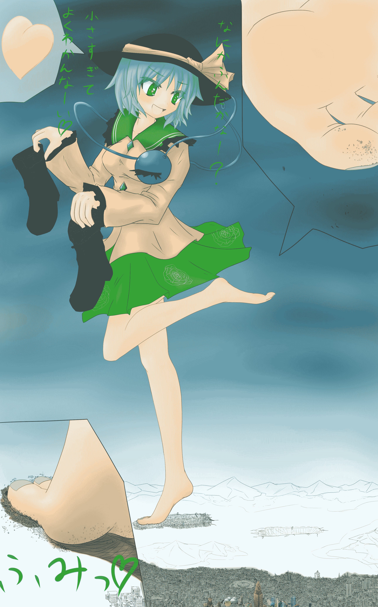
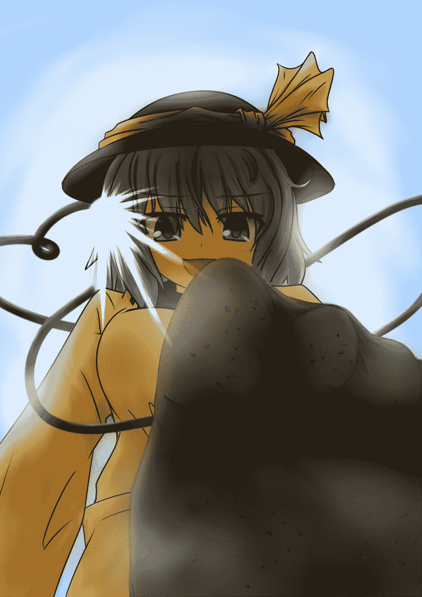
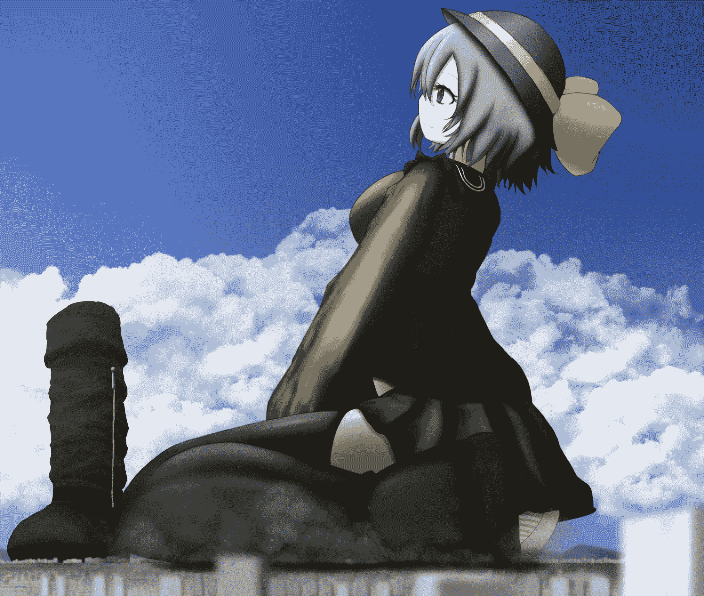
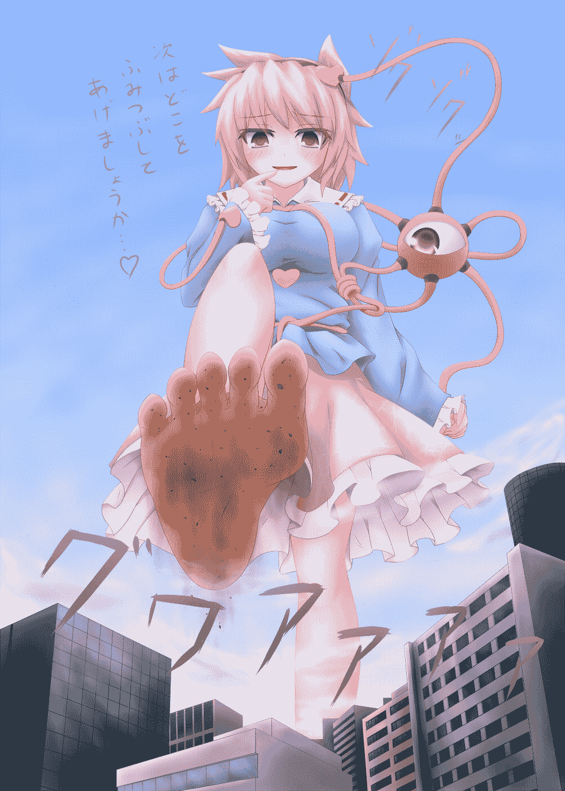
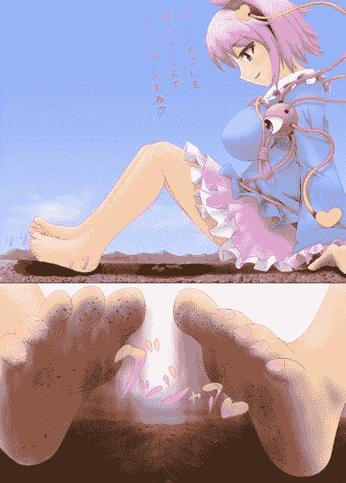
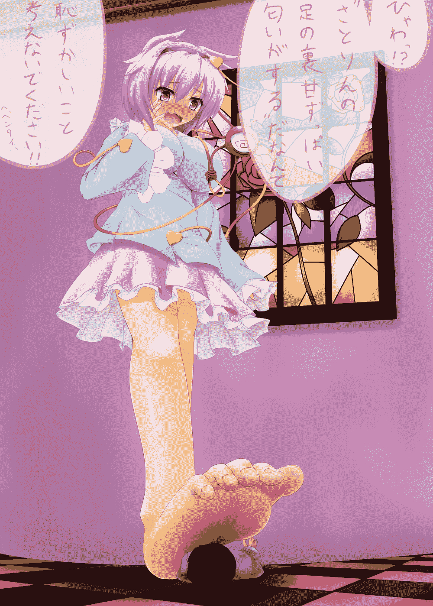
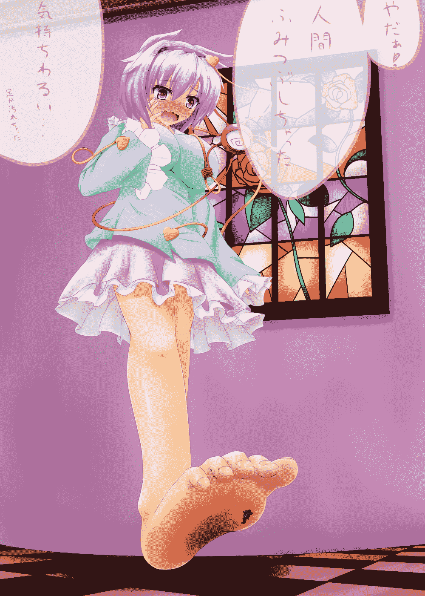
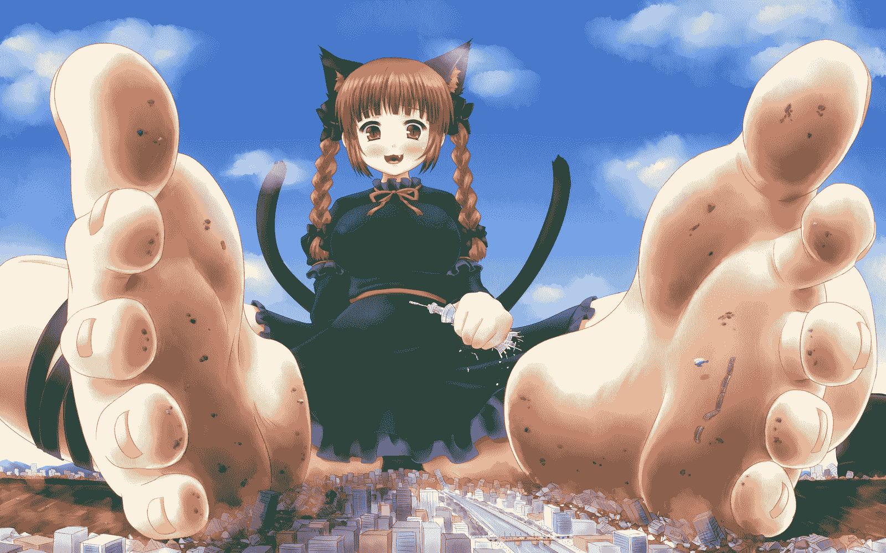

# 【翻译】レヴァリエ(revarie)的Touhou系列文（6-9更新一篇）

作者：cxcwl163

TID：16968

<title>1</title> <link href="../Styles/Style.css" type="text/css" rel="stylesheet">

# 1

*本帖最後由 cxcwl163 於 2014-6-9 12:48 編輯*

新人报道（？），确实是从注册后一直潜到了现在的新人……最近总算才开始自学得进日语了，于是就暗挫挫地搓了这三枚翻译……

原作者是GS上的レヴァリエ (revarie)様，详细地址请戳[这里](http://gs-uploader.jpn.org/upld-index.php?uname=revarie)。**并没有通知并取得原作者的许可**，因为既不好意思又不懂适当的敬语，所以本来就只是一个自撸用的东西嗯……直到这几天看到Dante大说的这一片是灰色地带（何），才下定决心全发上来了，但还是如果给原作者带来了任何的困扰……请爆破掉不必在意。有几句限于水平翻不出来我保留了原句。还自作主张地配了几幅Dautsen様的图（不全都是，中间有一幅实在是查不出绘师），Dautsen様现在的P站点是[这里](http://www.pixiv.net/member.php?id=4024086)，不知道发生过什么事改了ID又清了以前发的图，所以同样如果图这边有引起什么困扰的话，爆破掉没关系。

————————

6-9：更新一篇，索性都加入到这边来开成一个翻译楼吧，按照原作者发布的时间顺序来排，不知道能不能有补齐的一天呢

【火焰猫燐巨大化进入现代、其一】（[15L](http://giantessnight.com/gnforum2012/forum.php?mod=redirect&goto=findpost&ptid=16968&pid=224195)）

【觉与恋巨大化进入现代】（镇楼）

【爱上恋】（[2L](http://giantessnight.com/gnforum2012/forum.php?mod=redirect&goto=findpost&ptid=16968&pid=223641)）

【某个少女的独白】（[3L](http://giantessnight.com/gnforum2012/forum.php?mod=redirect&goto=findpost&ptid=16968&pid=223642)）

以下正文

————————

【觉与恋巨大化进入现代】

    地底。仿佛为了盖住旧地狱而建的造物，那就是地灵殿的最深处了。从彩色玻璃照入的光正剪裁下一位少女的身姿。她姓古明地，名觉。短短被扎起来的淡紫色头发。穿着淡蓝色的罩衫，这在外面世界的人类眼中说不定会觉得是幼儿园的制服。宽大的袖口、同时还饰有花边，然而这有些异常的是，结合发型啊容貌啊等等，她看上去比起实际的年龄其实是颇为幼小。可是，这副表情……暗暗含着忧郁的瞳，紧紧合在一处的红色双唇。在那之中蕴藏着是与令人觉得年幼的她这一身打扮不相称的黑暗。

    在她胸前的是，由许多根导管联接着的第三只眼。这个是，意味着她是被称作为“觉”一族的妖怪，觉的本质。那只眼是能看透人心的不祥之眼。对被读心的人来说是如此，对本人更是如此。

    “唉……该怎么办啊。”

    能读人心的少女，这时叹了口气。是因为一个人，唯有“她”她的能力是全然行不通的一位少女的缘故。

    “和那个孩子一起去外面的世界什么的……没问题吧？就当是先预习预习好了……”

    那个孩子。换言之也就是她的妹妹。

    觉这一种族是，因为那种能力被无论是人类还是妖怪所厌恶的。因为无论谁内心深处都会有不想被人踏足入的领域。可是她们，觉这一族却持有的是再不情愿也能将那全部看透之眼。结果是必然地从她们的周围人也好妖怪也好都一个个远去，在注意到的时候已经在地底是孤零零的了。普通人类的话也许说着‘啊，被讨厌了吗……’就算过去了，但对她们却没有这么容易。像‘要是没有就好了’、像‘去死’、像‘再也不要从那间屋里出来’……至今为止见到的都是这种饱含恶意的话语。那种痛苦没有见识过的人是不会明白的、是根本就想象不了的吧。

    对这样的痛苦无法再忍受下去了，是她的妹妹古明地恋。为了不用再忍受看到的这些残酷她选择了自己闭上了第三只眼。从此变得不接受他人的心，也就是说只活在自己的世界里。因此那代价就是再也无法敞开自己的心扉。

    结果，是姐姐的觉还持着那能力，却也不能读到封闭起来的她的心了。

    “怎么了？姐姐。”

    背后突然响起来招呼声，吓得觉一缩肩膀。

    “什……恋！什么时候就在这里了？”

    “一～直都在的呀？”
    恋。这个少女与姐姐是正相反的。那副表情时常是浮现着柔和的微笑，那双瞳中连一片忧郁的影都看不到。如是心中即使有忧虑也绝不会放它流露出去。身穿的服装与姐姐觉的样式相同，不过却反转了色调，是土黄色与茶绿色的。头发的颜色也，是妹妹的这边与姐姐的不一样，像是翡翠一般的色彩。

    作为觉的正反面少女，恋对她这都可以说是过激的反应歪了歪脑袋。

    “那孩子是～谁啊？什么是‘该怎么办’呀～？”

    “什……什么事也没有。恋是准备好了吗？”

    觉为了隐藏起自己的焦虑，将话题转移了。‘谁啊’，不会是别人那只能是恋你啊。觉这么想着。还是被听到了吗？那样的话恋就知道了……尽管考虑得再多，最终也还是看不透恋的内心。

    是啊，看不透什么的也没什么可怕的。一旦知道对方是讨厌着自己这件事，自然就会拉开来距离。然而，对封闭了自己的恋其本心究竟是如何，觉无时不都在思考着。时常寻问着那答案……不，还是放弃吧。

    “嗯～也对呢。我什么时候都OK的哟，间隙妖怪小姐。”

    恋以右脚为轴轻轻一个向右转，向着乍一看什么也没有的空间微微一笑。

     “诶？恋……？那里有谁吗？”

    觉对这状况还不是很明白，刚开口向恋问道。这时，在恋的眼前，空间突然就裂开了。

    “……就当没看见不好吗，真没办法。”

    从那裂开的狭隙中，露出来白色的两只手，然后随着空间嗡一声地展开那双手的主人也出现了。‘哎唷哎唷’，同时是一种与这看起来的年龄并不相称的声音出来了。

    “嗯～总觉得这里是有什么的气息哦～”

    恋嘿嘿地笑着抓住了那只手，然后向着这边牵引过来。手的主人是，每回都熟知的八云紫。今天是穿着绯想天式样的中华风洋装。

    “紫……紫小姐！？什么时候就在那里……”

    觉又吓了一跳，更缩紧了肩膀。自地灵殿异变以来，住在地底的她虽然对地上来的突然出现的妖怪已经不稀奇了……但这还是太神出鬼没了。

    “刚刚才哟。”

    “刚才是吧……”

    真的是这样吗。想要读取那想法，觉将意识集中到了第三只眼上。

    “没用哟，你的能力是读不到我的心的。”

    紫是读到了这样的觉内心的想法吗，她噗嗤一声笑着这么回答道。读不到的觉半吃惊，又半料到如果是这个妖怪的话，于是就以这种微妙的表情凝视着紫。

    “那，做好觉悟了吗？”

    “啊？觉悟……”

    对于紫的话语，觉一口气全咽下去了。是这样，很快要就两个人一起去外面的世界了……不对不对，其实大体只是变成两个人在一处的状态吧。那种觉悟……

    “没错，被很多很多的人仰看见内裤的觉悟！！”

    “那样！？”

    觉不禁沉思下去。紫对觉这发自内心深处的、这种紧张感是知道的。因此能少少地缓解也好就做出了一番滑稽的样子。不过紫并没打算让她看到自己的这些念头。

    “能有那样的觉悟就没问题了。请将他们悉数全踩死吧。”

    如此解答道，紫还微微点了点头。能读人心的妖怪，反而不懂如何去推测人心吧，紫这么想着。不过啊，自己并没有必要去管这些闲事吧……她倒应该不是有恶意的。因此紫决定对此不再过问下去了。

    “那，就拜托你了呢。会照下很多很多不错的照片的哟。”

    她笑着说道。

▽

    春天。一并胜放的粉红色行道樱花树。在那从远处看像是云彩一般的花下，有着几位少女。是八云紫率领的，来自幻想乡的少女们。

    “各位贵安。”

    在公园的一角处，行道樱花树丛的正中间铺设好席子来赏花。如今已经是四月的中旬，樱花也开始一点点散落，呈现出一幅花吹雪的图景。

    “好好。觉得怎么样？冬眠。”

    噗～边痛饮着酒蓝发的少女边戳着紫。她的名字是、比那名居天子。看上去是个可爱的大小姐，实际却是个出人意料的野姑娘。在有着人类所不能相提并论的顽强体格天人之中还未曾有过敌手。

    “嗯～还有些没睡够啊——”

    紫这么答道，打了一个大大的哈欠。就像不会是一直睡到了现在吧，这样的一个特大的哈欠。

    “还……从将近10月起不是已经睡了快半年吗？”

    银发的女仆——十六夜咲夜，一根根地扳着手指头来数着这月数。7个月。半年以上都睡着过去了呀这个妖怪。

    “如果能这样睡下去就好了……”

    小声嘟哝着的是河城荷取。

    “说什么呢？”

    被紫锐利地瞪了一眼，她呜吱着退缩了。她每次在紫的这种游戏中都总会要倒点大霉，如此想的话也就不是不能理解她的这话了。

    “……嘛，好吧。看在宴会的份上就饶了你。毕竟今天是要赏一件比樱花还远更绮丽有趣的东西呢。”

    隆隆的风声吹过，将地面上散着的樱花吹起卷入漩涡。

    “没错，今天我们不是来看樱花的。”

    风很快从强风变为了暴风，将适才还开着的樱花从枝上纷纷扯下来。不知道发生了何事而慌慌张张地、按着赏花用的席子人们抬头向天空仰望，随之映入他们眼中的是，撕裂天空降下来的巨大之足。

    “是来看巨大女的呀！”

▽

    轰轰轰轰轰！大地响动、沙尘卷起、这最初的一步被踏下来了。一步，说是这样但由于是两人各一步，因此踏出来的足数其实是两只吧。——嗡、同间隙的展开是两名少女从中显现出了身姿。
    “好厉～害！小小的箱子满是并排在这里呢！”

    先跳出来到这个世界的是妹妹那边的恋。那碧玉的瞳闪闪发光着，穿着黑色袜子的脚就高高举起来并踏下去了。轰轰轰轰轰轰！无论声音还是晃动都难以分辨了的巨大爆响。在那只脚的“落弹点”里有的建筑都被毫不留情地踩碎，一瞬间就到处喷着烟同地面化为了一体。并且那落弹点还成了爆炸的中心地，冲击波就向着四周传播开去。被狠狠踩下的土地还因此错位而生出了地裂，贪婪地将那些逃窜的人们吞入再合上。

    “呐，姐姐。现在这下有多少人就死掉了呀？”

    恋笑眯眯地说道，回头看向她那后出来的姐姐。

    “是啊……真是死的惨啊。有1000人以上吧，并且现在就在你的脚底下受苦的人还有很多很多。”

    轰轰轰。姐姐也同样迈了一步过来，与恋并排站着。

    “欸～即使我仅仅是走出去一步，在我的脚底下就会变得那么不得了啊。”

    磨吱磨吱。活动着穿有袜子的大脚趾，她然后对着那些受重伤动不了的人用这碾实了下去。

    “是……是吧……”

    咿呀啊啊啊啊！好痛苦、要碎了、救救我……这些形形色色的发自内心的叫喊，开始通过觉的那第三只眼流入她的脑中。本来对他人是漠不关心的觉，至此也对这种种的呼号声有些在意了。

    “那，然后就姐姐啊。跟我一起做那～样的和这～样的事、好吗？”

    轰。恋踩碎着脚底下的建筑向觉凑近。都到了鼻头碰鼻尖的地步了。

    “啊、不……这个……那个呀，还没有心理准备……吧？突然就这么说，喂、不是说不好。”

    然而觉跟渐渐地后退了、有些闹脾气了的恋，这之间的距离总算是拉开了。果然，一只有两个人就会变成这样吗？即使事先并没有什么顾虑，一到这关头就依旧还是……

    “啊，是这样吗？那倒也是呢，嗯。那我就去那边玩踩扁小人们的游戏了，在这期间继续准备吧～”

    令人意外的是，恋很简单地就离开了。那到底是在打算着什么呢。在震响大地、卷起砂烟步去的妹妹背后，她无论怎么凝视也无法如愿读得到那心。

▽
<ignore_js_op>

**koishi_komeiji.jpg** *(802.86 KB, 下載次數: 4)*

[下載附件](forum.php?mod=attachment&aid=NDMzMzl8NzExMWUwNWF8MTYwMDg4Njc2MXwxODIzMHwxNjk2OA%3D%3D&nothumb=yes)

2014-5-31 16:35 上傳

【                            ——“踩到什么了吗～？太小了根本注意不～到❤” 】

    在恋面朝向前方的城市现在已经是一片大混乱。是因为一直到刚才还应该在远处的巨大的少女，突然就向着这边来了啊。从远处看见的时候要是就感觉到非常巨大了，随着接近结果那身形还一直在变得更加地庞大。比抬起头来看脖子都要疼了，即使这样都远还要巨大。在少女和城市之间还有着几座稍高的小山丘，而少女就站在那些小山丘的对面。但就算是在这对面也没关系，穿着过膝长袜的膝盖，一直到那附近都能够看见。她每迈出一步大地就猛烈地摇动着响起悲鸣，到这山的跟前可见的她的全身像更巨大到、只能看到小腿肚子的附近了。

    然后终于，下一步就要抵达这个城市了。有着七十多米高的山丘，被她一点儿也不费劲地踩没了。不消说原本山丘所在的地方，如今只变成陷下去一个恋的脚掌的形状了。

    “大家们好啊～！我的名字是恋，从现在起你们的城市就变成是我恋恋的玩具～了！”

    咣咣咣咣咣！轰轰轰轰轰！恋大步地分开脚，叉着腰向底下的街道俯视着。被道路围着的数区划广大的空间，一转眼间就尽收在她的裙伞底下了。扑哧扑哧，恋细细玩味着浮现出微笑。一想到这会儿在脚底下，小小的人们正慌里慌张地四处逃就觉得有趣得不得了。

    实际上，在恋的脚底下这却是一幅凄惨地狱的景象。人们在争相推挤着，跑来跑去地想从那巨大的脚底下逃走，连车子撞开人这争先恐后的丑态都显现出来。即使是那前路有少女正站着，若是为了自己的得救人都毫不犹豫地踩足了油门。但是为什么呢，少女她一动也不动的。

    咣锵——！震耳欲聋的事故声。一点刹车的声音都没有，这也就是说是抱着杀意去的。

    “喂喂，无论怎么说这未免太狠了吗？”

    但是，那个少女连达到最高速的汽车都一只脚就能够拦下来。车子因为动量难以抑止而凄惨地挤扁，着起火来。

    “像用汽车去撞女孩子这样的事、呐。”

    是天人比那名居天子——啪啪——正拍着手仰望向天空。不，该说是仰望着恋才正确吗？在足与足之间、就是说这里也是在裙伞下了。如果寻向那双带来了恐怖的破坏的脚话，被黑色丝袜包裹出的是匀美的小腿。然后是因为与这黑色成对比而更为耀眼夺目的白色大腿。在那之上支撑的是，将天空都遮蔽殆尽了的条纹内裤。描绘出她美丽丰满的屁股，连私处的形状也清楚可见。

    “尽管找地方逃跑好了哟？如果逃得了的话。不过这整座城市我都已经收下了呢。”

    恋边做出这样的宣言，边抬起了左脚。仅仅是这样，从街道的四处就都升起了惨叫声，这数千人的悲鸣声，连在上空1.4公里的一带恋的耳中都传得到。

<ignore_js_op>

**koishi(little different).jpg** *(186.1 KB, 下載次數: 1)*

[下載附件](forum.php?mod=attachment&aid=NDMzNDB8ZTE5ZDViODF8MTYwMDg4Njc2MXwxODIzMHwxNjk2OA%3D%3D&nothumb=yes)

2014-5-31 16:35 上傳

    “啊哈哈，不用那么害怕也可以的哟。只是袜子被弄脏了，怪不舒服的想要脱掉而已哟～”

    恋笑眯眯地用手指勾住了这带有饰边的丝袜，然后那又白又光滑的腿就全露出来了。

    可是如果仔细想一下的话，总之已经抬起来了的脚，不可能不降下在什么地方吧。恋应该是不会老实地把脚放回到刚才的那个位置的。毋宁说她是有意要脱下袜子的，那样的话在她的正下方……在裙伞底下就是最危险的了。

    恋将那脱完了的袜子随便揉成团，轻轻地丢了出去。就像平常做的那样。然而，以人类看来的话这可是比建筑物还要大的一块布团正以可怕的速度飞过来。感觉就像是陨石一样。在落弹点的中心伴随着爆压产生了这冲击波，将周围有的家家的屋顶、墙壁，都粗暴地掀拔起来吹飞掉。

    “噗、啊哈哈哈哈！什么呀！我只是脱个袜子呀！？真有～趣！”

    轰隆！无意识地，她光脚踩在了街道上。在那底下有包括比那名居天子在内的大量的小人正看着。刚才还被恋的腿和内裤遮蔽殆尽的天空，如今被只是一片肉色给覆盖了。理应集合了坚固的现代建筑的精粹的大楼和高级公寓等，当碰上那只脚的瞬间就爆发出浓烟崩塌了，只在那里哗啦哗啦地下起了瓦砾的豪雨。

    “咿呀！怪痒痒的！”

    恋吃惊于是暂且抬回了脚。留在那的是，刚被破坏到一半自己的脚的形状的街道。达到高高向着天空延伸般程度的建筑物，都早早地就迎来了它们的毁灭。

    “呼～就那么点点小，可是我怎么会感觉到什么呢。”

    轰！大脚再次降下回那里，感受着那些残存的低层住宅的触感。这回确实地全部都踩碎了，再抬起来右脚这边也脱掉了袜子。光是单脚就这样地畅快，那要是两只脚加起来会到什么程度呢？从现在起每一步都去享受那美妙的感觉吧，这么想着恋心情就高涨起来，呼吸也变得有一点点剧烈。

    嗖……在立体的地图上，右脚移动到决定好的下一步上去。

    “嘿！”

    轰轰轰轰轰轰轰！砂尘、都扬起到了她膝盖的附近高，然后在那儿总算放晴的时候，就出现了一座以她的脚掌为中心的环形山。

    “噢噢噢噢噢！感觉真不错！”

    这回是左脚。用稍微不一样的方法……从脚后跟开始，慢慢地碾下去。

    “踩啊……脚掌这么这么敏感啊，那个孩子。”

    从地面上仰望着她的脚底，天子自言自语道。将天空全遮住了的这双脚，逐渐交替着角度逼近过来。那动作本身是缓慢地，但以那种巨大的程度，因此破坏的前线就还是以骇人的速度向这边直逼过来。那些楼被她脚直接碰到的部分，无不弹飞着被毁坏掉，在那一秒后都深深地埋进了土地里。

    这时，刚贴上在脚趾跟前的地面恋的脚就不动了。那里说不定因此就有得救而正抚着胸的人吧。

    “呵呵……想得救？想得救吗？该～怎么办呢～？就帮帮你吧～”

    轻轻地动着大脚趾恋显得是在犹豫的样子。但在那正下方天子知道，恋是完全没抱有那样的想法的。

    “骗你的啦。”

    轰！将残余的部分一气全压进地里，然后是放开了脚跟好把力全加到脚尖上去。

    “那么辛苦地、一直到最后还抱着希望死去吗～抱歉了，让你有了这一线希望呢。”

    细心地，用脚趾头咕哩咕哩地蹂躏着那片地方，恋天真无邪地笑了。如实按照无意识欲望行动的她既非常地开朗，又特别地残酷。

    “恋……可怕的孩子。”

    从她的脚印里某处爬出来的天子，看着正大闹着破坏城市的恋的背影自言自语道。

    很快恋就变得想从不光是脚掌，而是从裙子里露出的腿全部都能够感受到那种感觉了。可是，只有脚掌底是这样地觉得美妙。要更加地愉悦。这样想的话，那已经没什么好犹豫的了。如实听从无意识的吩咐，她弯下了膝盖。然后。

    “这～样！”

    没有了双腿的支撑，她屁股开始了自由的下落。风压掀起了她的裙子，100%棉的条纹内裤包裹出形状良好的屁股遮住了天空。变大，还在变大。视界全部都被绿和白的线条给覆盖了。

    轰轰轰轰轰轰！引起剧烈的地晃，她以这外收着双腿女子的坐姿坐了。雪白雪白的腿，将房屋、街道都全部推平了横亘着。

    “哈……好棒……”

    是因为双腿吸收了冲击吗，出乎意料在屁股的周围目前还没有出现被害。不，也许是故意这样做的。恋正用屁股享受着这房屋顶像针一扎一扎样的触感。是到现在为止从没有过的触感。是什么呢，如要比喻的话。恋一边扭动着屁股将这些低层住宅嗞哩嗞哩地磨碎，一边思考着。

<ignore_js_op>

**KOISHII.jpg** *(1.18 MB, 下載次數: 1)*

[下載附件](forum.php?mod=attachment&aid=NDMzNDF8ZGM4YWQyOGZ8MTYwMDg4Njc2MXwxODIzMHwxNjk2OA%3D%3D&nothumb=yes)

2014-5-31 16:37 上傳

    “就像是坐在方糖上一样的感觉吧～”

    呵呵、她嬉笑着享受这痒痒的触感。噗叽噗叽，嗞哩嗞哩。这像山一样的屁股，前前后后着将房屋住宅全部都卷了进去，激扬起来砂尘。

    “嗯……总觉得有些色色的……已经开始了呀——”

    哈啊、哈啊。从口中呼出的淡淡的吐息像白云似飘着。因为兴奋，身体正发热着吧，她的脸颊就像是苹果似的潮红起来。

    然后她把放在身后的手往前移，徐徐地以这向前屈的姿势倒下。仅仅少许浮起来的腰部，在那里一直还没有遭到破坏。

    “哎呀哎呀，虽说是白天还真暗呢……”

    比那名居天子，现在在恋的裙底下。不，应该说是天子在的这整片地方都成了恋的裙底下吗？少女穿着的巨大幕帘，将这整片区划全都蒙上了。在视界的两侧是，即使是在暗中仍浮现出白色的她的巨大的大腿。而从正面能捕捉到的是，恋的内裤。

    在这一段短暂的时间里，不知道该如何是好，或者只是装样子的，总之内裤在街道的正上空停住了。可是，又或许是下定决心了，或仅仅率直听从无意识的欲望，很快那个就慢慢地又降下来了。轻轻地，可是却有着压倒性的重量，她的私处就向住宅街、向那些屋顶压了下去。嘠叽嘠叽，咣叽咣叽……黑暗中，只有楼房的毁灭声在大腿间反响。

    “嗯……果然……感觉很棒哟……”

    咕嘶呀。恋已经感觉到用自己的股间把这些小小的房屋给全碾碎了。这种触感，由此而来的快乐使得她全身如有一道电击驱过般震颤起来。这种从未体验过的愉悦，使得恋不由住抱起了胸膛。

    要是动起来的话……会更有一种什么样的感觉？期待地鼓起了胸膛，恋将腰往前移动。一点一点地，同时品味着那些楼房被不断地碾碎的触感。

    这时在恋的裙子中，已经是一片惨烈透顶的模样。以她来看是慢慢的动作吧，说到大小那可是人类的1000倍大。因此速度也是1000倍。就像是超巨大的推土机一样，将房屋卷入、分解、化作为一股瓦砾的波浪。并且是伴随着令人站都站不住程度的大地震。嘛，就是这么一回事。毕竟是像有座山就推过来了一样啊。

    很快那一堵内裤的墙就推进到了天子的眼前。可是，刚好到还没有把天子卷入的跟前就停下了。仿佛这里就是该折返的地点一样。

    “哎呀，这样从封闭的空间抬头看就更大了哇……”

    天子抬头看着她的内裤。可是，从这个距离。就算脖子抬到都疼了也无法看见全体。这时，是她的股间这次后退回去了。余留下瓦砾的小山，而将地表面激烈地挖去了。天子对这座山的另一面产生了兴趣，于是一跃而上到了这足足有十几米高的瓦砾山顶。从这里俯视下去，是一面的荒野，突然被挖空出来满是比这天更黑的暗的深坑。因为昏暗看的不是很清楚，但可以肯定那里有的是好几处，曾经名为人类的斑渍在粘着的吧。被抛弃在那儿你保证会认为这里是地狱或者世界的末日。然后更可怕的是，导致这一切的元凶她丝毫没觉得自己在裙子里就创造了这个世界的地狱。只是，为了追求快乐将自己的私处往地面上蹭了蹭，只是这样而已。

    “……这样暗的地方我不怎么喜欢呢。”

    天子因为那地面上巨大的裂隙一度打了个寒战，随后就转身在这裙伞罩出的空间中飞翔起来。穿过这裙子的深渊的黑色花边，迎着飞出见到外面的光线她眯起了眼。转白了的视界一旦习惯了这光，就映入了有一位在地平线处一动也不动地矗立着的少女。

▽

    “可是准备啊……”

    这个时候，觉却在建筑群前由始至终地一个人站着。

    “啊啦，觉小姐。都到了这样的地方来还迷惑着吗？”

    有个这样向觉打招呼道的声音。不，以她的这巨大要听出话音是不可能的。大概是读心到的……不，就是读心到的吧。

    “是啊，也许是这样吧。”

    觉边寻找着这声音的主人边回答道。

    “现在是问你在迷惑着什么？”

    视线一巡视，就见那个思念的主人在这建筑群当中最高的那座顶上。

    “我啊，没有爱那个孩子的什么权利。”

    虽说是最高，但那也没有到觉的膝盖高。得蹲下，并眯着眼这样才勉强看清楚了对方的实体。是红魔馆的女仆长，十六夜咲夜。对于被读心一点也不害怕，确实是可以这么说。据说她是持有能停止时间的能力。不会是在这边不知道的情况下停止出了思考的时间吧？那也许就是她能够回答得这么快的原因。

    “为什么会这么想？那个孩子是想得到爱的吧，一定。”

    “心都读不了就别说这种随便的话。”

    “真的你不是也知道的吗？恋小姐的心情。”

    “就算是那样，对我来说喜欢恋这件事……也是不被允许的。”

    “为什么……请告诉我那理由。”

    咣嘶！！觉冲着咲夜站在的建筑周围一把就抓了过去并狠狠地使上劲。

    “……很好，那我就告诉你。”

    嘎啦嘎啦嘎啦……在觉的手心里，是这高楼细碎了向着地面降落堆积起来。

    “那个孩子之所以将内心封闭了起来，是因为被你们这些人类和妖怪非常地嫌恶的缘故。这你知道吧？”

    “是，知道的。”

    “我的话对这还好。觉这种族就是由‘被读出内心好可怕’这恐怖而生的存在。从一开始就是肯定会被厌恶着叱喝的存在。所以不管从他人处听见想的是什么，那种事怎么样都好。但是那个孩子却不一样。那个孩子的心灵是，只是不得不背负觉的宿命的再普通不过了的一个女孩子。”

    轰隆！是被紧握住，半毁的高楼。跟着这拳头狠狠地砸在了地面上。

    “想和大家普通地交谈，普通地游戏，普通地相爱。理所当然的，却因为是觉这一族而绝不被允许的想法，她只是坚持抱有着。

    当然恋不管去哪里也没有得到过爱，只有的是继续被讨厌。即便如此她也还是想要被爱，想要被接纳。无论多少次被嫌恶、被挫败、都会再一次地站起来并走出家去。‘就是今天该去交朋友了’这么说着。

    那么辛苦地，像这样的恋却一天比一天变得满是伤痕，唉。

    每一次回到家里来，都是增添了新的伤口后回来的。身体是，心也是。

    可是我却什么都没有做。至少在那个时候是，想着什么也做不了。就在一天天坏下去的妹妹眼前，什么也……没有做。

    然后某个日子，恋就跟平常的一样离开了家……完全也一样受着无情的伤回来了。从人们那边看来无论是赶走几次又会回来的她应该很麻烦吧。

    但我，还从未见到过她是这一副模样。所以对她，说了这样的话。

    ‘所以请听我说，这样的事情已经足够了。我不愿看到你再受到比这还要过的伤。所以请听我说……和我一样，接受这觉的宿命吧’这样。

    恋她默默点着头，然后回自己的房间里去了。”

    觉说到这闭上了口。只紧紧还握着高楼的拳头震颤着。在那里头高楼已经化为了铁屑，想再回到原来的形状已经是不可能的了。

    “那个晚上。她弄坏了自己的眼睛。”

    吧嗒、吧嗒。从她的眼里泪水滴落下来，将在那底下楼房的一角崩开并吹飞掉。咲夜她并没有回答。

    “从那以后是，她从此就带着那曾经渴望的笑容度过了每一天。无论是怎样的悲伤、怎样的痛苦，都封闭起内心来决不让它们流露出去。在旁人看起来也许是非常地开朗，但在那笑容的假面下隐藏着的是比我这种都更还要深的伤痛。

    没错，那个时候的我……如果试着抱住她说‘还有我是爱着你的’的话……那个孩子就不会封闭起内心了吧。可是那个时候的我却不为恋着想，只是在考虑着自己的事情吧。没有想去理解她的内心。

    而且还注意到了，那个孩子开始变得不再是那个孩子了。

    表面上，还是会偎依到我的身边来。但在笑容的封印下那个孩子的心却是，现在也一定还怨恨着我吧。对就算是寻求过帮助了，也没有将手伸出来的自己的姐姐。

    你明白了吧，咲夜小姐。我是不被允许爱她的理由。在最应该去爱的时候却没有做到啊。”

    “什么……”

    一直到刚刚为止还沉默着的咲夜的心中，这时打破寂静做出了发言。

    “不要说任性的话啊啊啊啊啊啊啊啊！！”

    但插进咲夜这话的是从哪儿传来的声音。没错，并不是心声，而是通过声音直传进了她的耳中。

    然后，在比那声音稍迟的一瞬。从城市街的一角处，一道通红的光束就放出来了。将拦路的建筑物一气全部贯穿，一直线地向着觉所在的方向延伸去。

    “诶！？诶诶诶诶！？”

    这完全出乎意料之外，觉在发觉到的时候就已经中弹了。光线直击在她的额头上，造成强烈的与用中指弹别人额头玩一样的威力。倒不如说是她将这有着能一连击穿数栋建筑都不衰减的威力的光束，用额头直接下来却只有这么点点疼的程度吧。

    “天……天子小姐！！”

    咲夜回头看去，在那里的果然是天人小姐。正抬起头仰望着，怒视着觉。

    “你、你是……？”

    觉眯起眼看向这光束的发源地。小小的一个点，只一瞬迟对好了焦距，就看清了在那里的是一个少女。

    “我是天人比那名居天子。没错，这就是从天人大人来的忠告！

    你其实现在也不想去理解她的内心！而是轻易片面地就断定那一定是这样吧！恋她所盼望的是就那样的事情？别开玩笑了！”

    “天子小姐！说太过了！”

    咲夜想让天子平静下来，但即便如此她也没有停嘴。

    “你只是在自我感觉良好罢了！！坚持着些漂亮的道理罢了！！只是给自己套上了锁，然后就当是背负起罪过了！！如果是真的想对她做出补偿的话！！漂亮的道理也好原则也好就全部都舍弃掉！就算浑身是泥也好，不要再找借口了！！把你对她的爱告诉她！！而恋对你又是怎么想的，到那之后再做决定吧！！”

    呼哈、呼哈。用着粗暴的言语，大声地。虽然在骂她但放出来的都是忠告，难道还传不到觉的心里去吗？天子边气喘吁吁着，边用这严厉的表情继续瞪着觉。

   “…………”

    觉在这短暂的一段时间里，只是茫然维持着同一个姿势。被这过分又唐突的破天荒说教，不觉中竟收回了眼泪只零落下来这最后一滴。

    “呵呵……呵呵呵。真是粗暴得过分的忠告呢。结果啊真是，忘得全一干二净了。我尽只读对方的想法，却变得再也不去想对方是什么心情了呢。或许，我的这只眼其实什么也看不见啊。”

    扑哧扑哧。觉肩膀微微地颤抖着。然后。

    “呵……啊哈哈、啊哈哈哈哈！什么啊，真是笨蛋一样啊，我。到现在一个人还能够做些什么，真正地……谢谢，你驱走了我心上的阴霾。”

    轰，轰。她站了起来，然后注视向在远处的妹妹的背影。

    “明白就好了哟。顺便说一下恋她好像已经是很活动开了的样子了哟？”

    天子微微一笑。

    “是呀……怎么就自己一个人在这里怠慢起来了呢。”

    看着在大气层中朦朦胧胧的恋的身姿，觉哎呀哎呀地摇起了头。

▽

    “那，我也稍为开始热热身吧？”

    觉高高地举起了她的脚，然后笼罩在那些三十多米高的密集建筑群上。

    “是逃得晚了？还是已经吓坏了？还是故意留下来了？幸好现在在这条街上，还能感觉到有很多很多的人呢。”

    轰！用脚尖灵巧地只踩塌这些建筑。确实感觉得到，连这踩碎的是多少层楼的触感。原来如此，总觉得是明白了那孩子为什么会如此地入迷。

    不，仅仅是心情舒畅还不对。这是一个被厌恶者觉，在有了压倒性的力量后向人们复仇的绝好的机会。对一边生出了自己，又一边厌恶封印起来的人类们。

    “呵呵……你们因为恐惧而封印起来的妖怪，现在却带着完全是别的恐怖回来了哟。”

    白色袜子包着的脚活动着，咕哩咕哩地在蹂躏着楼房的残骸。

    “啊，不行。这样就彻底把袜子弄脏了。”

    觉突然意识到这，于是脱下了袜子，然后吧嗒吧嗒地把这污垢抖落掉。不消说她认为的污垢却是那些曾经是人类、或者巨大的瓦砾残骸之类的东西。在两只全脱掉了后，觉撑开这袜子口就往那些楼房上套去。然而，高楼却比预想中的还要小，小到一整片数栋就被这口给全吞了下去，并且高度也不够那袜子都贴到了地上。

    “啊啦，还想着用来代替做架子的……真滑稽呢，整个儿都被套进在袜子里了。”

    扑哧扑哧。不用说她是明白的。这样，才能够更好地报复那些长年持续虐待着自己的人类们。没错，恋之所以会变成那个样子，追究其根源的话就全部都是这群家伙们的错。

    “连袜子都套不好的的话这样就没意思了吧。”

    为了不折断建筑，她轻轻拿起将袜子整齐地折叠好，然后收进裙子上的口袋里。

    “那个，想说有没有什么地方。因为右脚稍微有些累了……哪怕是有个放脚的台子这样的地方歇歇也好啊？”

    嗖。是觉那细白的、光滑的小脚被举到了建筑群顶上。娇嫩的脚趾，微弯的脚背，可爱的脚踝。阳光反射在这雪一样白的——光是看到这景象就会煽动起来，对这只脚的主人是个什么样的美人的想象。这样的一只脚，就清爽地正抵在楼房的顶上。

    开始，楼房仿佛还承受得住这。但是，当然不可能一点事也没有的。庞大的能量使建筑的框架歪曲变形，窗户从上层开始破碎弹出。简直就像是玻璃的瀑布。因为这从此就要崩塌消逝的建筑物们最后的赌上性命的演出，觉不由得屏住了呼吸。凡是做好了死的觉悟，人也好无机物也好，就同样地美丽。

    “呵呵……看到了如此绮丽的景象，我要称赞这种好客心。只不过我还没把脚全部的重量都放上去呀。”
    觉这样说着，就任由这只脚的重量全部都落在了楼房上。当然了，要支撑住这只比楼房都远还要巨大的脚是根本不可能的，于是楼房就像被地面吸进去一样倒塌了。最后，只残留下甜甜圈状的烟，楼房在觉那雪白的脚底下消失了。

    “啊啦，不觉得有点失礼吗？对一个女孩子来说，这就像是在说人很重哟？”

<ignore_js_op>

**ダウツェン（japanese side）.jpeg** *(1.06 MB, 下載次數: 0)*

[下載附件](forum.php?mod=attachment&aid=NDMzNDJ8ZGU5ZDYyMTJ8MTYwMDg4Njc2MXwxODIzMHwxNjk2OA%3D%3D&nothumb=yes)

2014-5-31 16:37 上傳

【                                        ——“接下来该踏平哪里好呢……❤” 】

    用蔑视的目光，觉俯视着这些从地面生长出来的建筑群。尽管如此，她嘴角微妙地在上扬着。这么做一点儿也不有趣。

    “真的是一点意思也没有呢。如此愚钝……有惩罚的必要呢。”

    觉慢慢地往地面上坐了。不消说大量密集的建筑就被压扁了，现在的她连超过100米高的摩天楼在眼中都什么也不是。

<ignore_js_op>

**Dautsen(color).jpg** *(28.77 KB, 下載次數: 0)*

[下載附件](forum.php?mod=attachment&aid=NDMzNDN8YWZjYWUzZGZ8MTYwMDg4Njc2MXwxODIzMHwxNjk2OA%3D%3D&nothumb=yes)

2014-5-31 16:38 上傳

【                                ——“连一个女子都比不过，多么的可鄙啊❤” 】

    将双手撑在身后，她伸出脚去灵巧地夹住一栋大楼。

    “怎么样？屈辱吧……被女孩子的双脚这样夹住哟？”

    吱呀吱呀……嘎吱嘎吱。无论她有着多么细腻的感觉，要完全地制御脚掌的力量还是很难的，于是这栋楼就快要迎来它所能够承受的极限了。

    “结果呢，又弱小又愚钝、失礼的你们就以这种相称的下场去死吧。”

    咕隆隆隆……在觉的双足之间，大楼就像字面意思一样什么都不剩地被碾碎了，化成粉末往地表面降洒下去。

    “哎呀哎呀……比刚才还更累了。这些都全部是因为你们的缘故啊。”

    嘶咣咣咣咣！连踢倒楼房都已经厌倦了，觉将这两只脚伸直了丢出去。

    “我已经厌倦了。太弱小了一点都不有趣。”

    “那样的话，这回来和我玩玩吧……好吗？”

▽

    向着招呼声回过头去——轰、轰。沉重、但步着是快乐的足音走来的是她的妹妹。古明地恋。

    “恋、恋……！”

    畏缩的觉，莞尔呵呵一笑的恋。方才还攻攻模式全开的觉，一变就切换成了受受模式。

    “一点儿意思也没有，什么动静都没有吗？呐，姐姐啊。”

    在觉犹豫的这段时间里，恋跨过建筑群跪了下来。换言之是坐着姐姐的两条腿的样子。

    “那个……恋……我……这个……对不起……”

    觉实在是，没法直视着恋的眼睛，从而把视线岔开去了。果然，一到这关头就什么都传达不了也明白不了。

    “……已经够了。”

    恋双手搭上了姐姐的肩膀，然后慢慢地推倒下去。在她的脸上，没有了笑容。

    “好不容易，我的心情……我的痛苦能够明白了吧。”

    无法得到爱恋的痛苦。从亲姐姐那里也。

    “好难受……但是，即使这样也只能笑着。为了哪天能够得到那份爱恋。”

    觉张开口，可是却发不出声来。怎么办，连这也办不到吗？

    “可是，如果姐姐就爱我的话。就再也不需要像这种笑容的假面了。”

    “……对不起、对不起！”

    出来的是，唯有谢罪的话语。果然，还是无法释怀吗。在心底的什么地方。

    “所以啊，已经够了。我现在想听到的，不是这种话……”

    “……嗯，我知道……！”

    心砰砰地跳着。一直以来，都这么近了却说不出来的话。

    “恋……恋恋。那个……我、我、我……”

    要是恋也读得到自己的心就好了。脸发昏地通红着，眼泪也含着，尽管如此觉还是为能勉强挤出声来而拼命地挣扎着。

    “我……爱……你……”

    用这有气无力的、嘶哑的声音。但也已确实地传达到了。

    “很好很好。姐姐。”

    恋就这样上身前倾着，压倒在了姐姐的身上。一时间天、地也震撼。

    “我也、最喜～欢姐姐了！！”

    说完，先是自己的嘴唇与姐姐的嘴唇重合上。再是不管惊慌睁开眼的觉，手向着裙底下就直伸进去，竟然将姐姐的内裤给扯了下来。而这只是在一瞬间。宛若电光石火。

    “等等！？恋！这这……手太快了吧？”

    “不好吗！既然彼此都喜欢着对方！而且喂，我要教给姐姐这些建筑还有的意外的使用方法！”

    说时迟那时快，恋摸索到一栋大小正合手的高楼，然后就拔起用这往觉的私处摩擦上去。

    “咿！？”

    咿噫！觉被这感觉给震到了。

    “哦～没想到姐姐是这么的敏感啊～光是稍微碰一碰就这样了，那不知插进去的话会变成什么样子呢？”

    咕噗……咕噗噗……这竟然是100米多的一栋巨大的高楼，在撑开觉下面的口并深入了进去。

    “不要……疼啊……稍微、再慢一点……！”

    觉想去抓恋的手，如果一旦得手就能够把这给弄出来了，但是看透了这样的姐姐心思恋只把大楼更快一步地往里插。

    “咿呀！？”

    咿噫！仿佛全身有一道电流驱过这使得觉快乐地跳起了手，随后就无力地低垂下去压垮掉了那些生长在地面的低层建筑。

    “放心吧，痛什么的只是一开始哟……”

    贴着姐姐的脸颊，在耳边甜甜地低语道。这温暖的吐息、可爱的声音，让觉不由得软绵绵瘫软下去了。

    咕嘟嘟……这回是要将几乎全深入进觉的高楼拔出来。窗玻璃几乎全碎了，不会是因为觉紧夹住的缘故吧，支撑外壁的钢筋也到处被剥离出来压扁了。

    再说，这栋高楼。实际上里面还留有很多数量的人类。因为恋和觉的这一场乱来而发生了停电，电梯自然是停住了。地上30层。只有用楼梯才能够从这里逃出去真的是相当地困难。

    然后在那里的是，每次每回都担当了不幸角色的妖怪，河城荷取也混在这里头。

    “咿咿咿咿！！重力的法则都错乱了！！”

    在高楼的侧面中，荷取勉强是抓住了这楼梯的扶手。条件已经糟糕透了，而且再加上这还正一出一进的事。激烈的左右摇晃就向着她袭去。

    “咿啊啊啊啊啊！”

    同样是紧抓着扶手，却经不住这摇晃一位女职员被甩落下去了。大楼已经没有了窗户。因此掉出去的话那里就是觉的膣壁。并且，还以可怕的相对速度正移动着。荷取不由得瞑上了眼睛。当再一次睁开眼的时候，那个女职员就已经不见了。恐怕是在大楼与膣壁之間……

    “可恶！绝不输给你啊啊啊！”

    荷取想方设法沿着这扶手往上爬，然后总算察觉了。

    “啊，我不是能飞的吗？”

    说着，她驱使着妖力飞舞在空中。但是，问题并没有那么地简单。当恋只是将手握着的这大楼往外拔，荷取她就被钉在了天花板上。就这样一连撞破了数层才停下来。于是乎这回是恋在将大楼往里插了，荷取又接连撞穿了数层地板才停下来。

    “这样子的话……就向这地板一边突破一边逃出……喝！！”

    瞄准这余震的瞬间来撞开地板的话，应该就迟早能够从这里脱离出去吧。没错，而且只要是不着急这一座大楼其实也没那么长。不过可以肯定的是随着觉到达了高潮就会被膣给挤溃了。

    “这样！嘿——！！”

    计划非常顺利。在数击之间，就已经争取到了相当长的距离。在大楼往复的期间里，觉的喘息声传进了膣壁，还稍微能含糊不清地被听到。那个声音，尽管非常地小，可我现在就在发出这个声音的主人的膣里面啊……这么想着的荷取总觉得是被什么不可思议的感觉给俘获了。但是啊，现在不是该被这种感觉给困住的时候。这样会被觉的膣给困住的。

    “噢啦啦啦啦啦啦啦啦！”

    使出全力的一击叩穿这地板，然后终于视界开阔了起来。

    “好耶耶耶！出来了啊！怎、啊啦？”

    这里不知道为什么，跟在大楼里是一样地昏暗。而且还湿漉漉的，那种特有的气味也……‘不会吧’这么想着，她打起河童制的携带探照灯向周围照去。

    “怎、这是在膣里！为什么啊啊啊啊啊！”

    那答案其实很简单。只是恋她，是从下方开始将大楼插进去的。可是，荷取她仅仅想到的是这一定是从上插进去的，于是打破地板就能够出去，产生了这样的错觉而已。

    “畜生啊啊啊！被骗了啊啊啊！”

    但是，为时已晚了。从尿道里，洪流已经开始涌过来了。

    “啊、完蛋了。”

    荷取她抱着半死的心被这浊流给吞进去了。

    “啊……啊啊啊啊啊、不行、不行啊啊啊啊啊啊！”

    为了不洩出来，觉拼命地在忍耐着。但是，决堤是不可能回避的了。为了不漏出来而用力收紧起膣，其结果就是在膣里的大楼被吱呀地挤溃，然后被这种说不出道不明的触感给惊吓到的她放掉了力气。嘘、嘘！挟着瓦砾的潮水，就这样滴湿在了恋的裙子上。

    “呵呵……觉得怎么样？姐姐。”

    哈啊、哈啊。觉只喘着气不回答。

    “结果，还在被种种事情所束缚着啊。”

    恋怜爱地抚摸着这样的觉的脸颊，然后在亲吻过那儿之后吃吃地笑了。不再是做出来的，轻浮的笑容了，而是发自内心的笑颜。

▽

    “辛苦了。”

    在被刚毁了一半的城市街中。虽然事情是已经解决了，但是还火辣辣地烧着的觉紫对她迎接道。

    “……嗯。”

    觉无论是不是因为羞耻，现在都没法直视正前方的大家们。如果是平时的话，对他人不管会想什么都无所谓的……

    看到这样的觉，恋和天子互对起来目光扑哧扑哧地笑了。

    ——对我来说，那个孩子是……そしてあの人たちはもう、どうでもいい人じゃなくなっちゃったんだな。觉这么想着。

    “那，我们回去吧恋！”

    嗡——同时握起了恋的手，她面朝向紫打开的回程用的间隙头也不回地走去。

    “恋，觉！”

    对着那样的她们的背影，天子喊道。

    “我对你们，是不会讨厌的哟。”

    恋回过来半个身子，然后微微地一笑。在离去之际，向着天子挥着手，她消失了在了这间隙中。

    “啊啦啊啦，不是很会照顾人的吗？长女大人。”

    紫看到这样的天子也默默地笑了。

    “讨、讨厌！只是有点想要你这个间隙以外的朋友罢了！”

    “那、也就是说，我还不是你的朋友的意思吗？”

    到咲夜开始开天子的玩笑了。

    “啊……够烦的了！对，回去了！到此为止了！”

    天子通红着脸撅起来嘴，然后也消失在了间隙之中。

    “啊、请等一下天子小姐～！喂，我呢？我呢？”

    咲夜追着那也进了间隙。余留下来的是连说话的力气都用尽了的荷取。然后还有紫。

▽

    “……辛苦了。”

    紫向身旁稍稍伸了个懒腰的荷取搭话。但是她并不回答。

    “我可并没有，讨厌你的意思哦。”

    “那为什么每回派给我的都是这么倒霉的事？”

    “是因为爱哟。”

    “才不是爱什么的吧！”

    在一个人类也没有了的街上，只剩荷取的尖叫声正回响着。

<title>2</title> <link href="../Styles/Style.css" type="text/css" rel="stylesheet">

# 2

*本帖最後由 cxcwl163 於 2014-6-9 12:33 編輯*

【爱上恋（こいしにこいして）】

▽

    事情的起因多少是因为有些心血来潮。试试看给那个孩子一座城市吧。就这样。

    “紫小姐，这个是什么啊？”

    眨着翡翠色的眼睛，这个孩子她正歪着头。头发在短发与能一直垂到肩膀上之间，是淡绿色的。无论何时都喜欢戴着的、扎着缎带的帽子。是前些天进入过现代的少女，古明地恋。

    “是外面世界的街道哟。”

    对不可思议地贴近看手掌上的街道的恋，告诉她这原本的事实。虽然以那个孩子想听的当然并不是这种事情。

    “不，不是那样的。我明白的呀，这种程度的事情。”

    对于想要的答案却故意不回应的紫，恋鼓起了她的小脸。

    “只是心血来潮而已哟。”

    确实是如此。不过，她不会相信的吧。这会儿正皱着眉，怀疑地直盯着紫。可是没用。因为她已经将那能读心的第三只眼给闭上了。

    “这个街道是真的？”

    为了弄个明白她改换了问话的方式。

    “大致上是。是修正历史时出来的平行世界的街道。破坏掉的话，它自己就会消失被统合到原来的时间轴上去。这街道在这个时刻既存在，又在这个时刻不存在。”

    平时总是紫她自己暗地里进行的处理，这一回却想试试看将这交给任由恋去做。是这样的一件心血来潮的事。

    “唔……好难懂……”

    “活在这个街道里的人们既存在又不存在，既是生又是死。”

    “更不明白了。”

    “对你来说这样子的解释就很好了。なかったことになるのはあっちと変わらない。違うのはその後街は元の世界に統合されて完全に消滅するってことだけかしらね」

    地底，存在于旧地狱街道的终点旧地狱的入口，地灵殿。与这个名字却不相符的、是洋风情调的宅邸里的一个房间。在已有些历史了的橡木桌子上，是被从模仿蔷薇花彩色玻璃中的光照着而染上了红黄等色的小小的街道。而将这街道中心、高层建筑等反射后映出来的一面祖母绿的镜子是，正窥视着这些的巨大的少女的眼睛。

    已经是不存在的了吗……恋目不转睛地看着桌子上的街道沉思着。

    “唔……大～家～你们好，我的名字是恋。”

    尽管对应该怎么做还不明白，姑且先自我介绍吧。对于单纯地破坏掉来讲这街道实在是太贵重了。如果在从紫那里刚得到的时候，在那个时候就全踩碎了的话，也就不会像现在这样子困惑了吧。但是，总觉得那么做太浪费了，想着要用来干一些更不好的事情还是拿了回来。结果，就一直为了那用途跟用法而苦恼到了现在。

    街道是被缩小到了3000分之1的大小。在紫给的、水晶的托盘（像杯子一样垫在下面）之上，并排着有很多曾经应该是100米以上吧的楼房。话虽如此，现在都这么小了一定是感觉不出来的吧。既然如此，集中起来会有多少栋呢……结果这样的念头在一转眼间就已经消失了。

    “嗯～3000分之1大是这个样子的呀……”

    虽然是对1000分之1程度的没多犹豫着就使用了。恋‘嘭～’地鼓起了小脸。那个间隙妖怪，现在对于究竟该怎么办而苦恼的我，肯定是在从不知道哪里看着并以此为乐，她这么想着。

    “首先，也就是说大家从今天起就都是我的玩具了。”

    咣！在街道的上空，一只有着比任何高楼都远要粗长的巨大五指的手出现了。那只手要是就这样降下来的话，盘子上的街道应该很简单就会被碾碎吧。当然，街道就跟被桶了的蜂窝一样大乱起来。

    “啊哈哈，不用那么害怕也可以的哟？因为不是会弄坏自己的玩具那样的笨蛋嘛……我。”

    那只手到街道的上方忽然停住了。然后，加速造成的重力将这街道里住着的3000分之1大的小人们全部都压住了。如果从这里中心的建筑观景台上来看的话，应该就会理解到底发生了什么吧。恋那巨大的手，并没有直接接触到街道。不过，如果向地平线望去的话，见到那肉色的五根延伸的柱子应该就明白了吧。那是她的手指啊。是恋把盛着街道的水晶盘子从上方张大手抓住了。这街道这么小，而恋又这么大，从地面到手掌间还容纳下了有很长的一段距离。因为和那超过了四千米的身长相对，光是手指的长度就已经凌驾在200米之上了。现在她是用两手就能将这街道整个儿全包住的这种程度的巨人啊。

    加速，减速，上升，降下。是恋正在小心地搬运着街道，但街道里的人们要想不被这来自不可能的方向的重力给甩飞，就得竭尽全力紧紧抱住点什么。

    “哎唷哎唷。”

    恋一把街道搬到床上，就躺了下来。受到她重量的影响柔软的床垫陷了下去，于是在盘子上的街道也就倾斜了。勉强因为某种物质的力是粘住了，盘子保持着装着街道这样开始一点点滑出。而造成这倾斜的元凶，自然就是恋那砰一声被撞上去的大腿内侧。

    “啊！”

    不会已经坏了吧？恋慌张张地坐起来，并撩起了她的裙子。不过，被缩小的街道比想的还要结实。这是理所当然的。又小又是钢筋水泥建的，而物体的强度是与大小比例正相反的。恋于是放心地抚了下胸，然后把街道给拿了起来。

    “呼～太好了太好了，实在是没注意呢。至少比制成这台座的水晶，肯定是要更脆弱的嘛～”

    恋就这样仰着躺下去了，并用手将街道安放在自己的左胸上。小小的鼓起的胸部，微微地陷下去就容纳了这整座街道。

    咚咚。咚咚。是心脏在鼓动着。自立着街道的水晶岩盘下，仿佛是从大地的深处传来的震动。低沉轰鸣的这心音，既有力，又温和。是在人类的无意识深处，任谁的记忆里都深深刻着的这反复原始的鼓动，使得一片混乱的街道渐渐地平静了下来。

    “你们都已经是我的东西了。那也就是说，我就有尽全力来保护你们的责任。”

    缓慢地呼吸着，又温柔地嘟哝着。恋这清澈悦耳的声音、这温柔无比的话语，现在在街道里的每一个人都侧耳倾听着。

    “所以不要讨厌我……不要从我身边逃走……”

    微微含着忧愁的低语。是被厌恶这种事，比谁都害怕着的恋的心情，恳切尽体现在这一言中。此外，被在外面的世界不管是谁都会讨厌跟不理睬。但是，今天在这里的小人们，从今往后就因此与恋是有了关联吧。

    “和我、一起玩吧。”

    长时间以来被人们所厌恶的妖怪少女，真的是非常地容易感到寂寞。小人们尽管不知道她有那样的背景，也已经都理解到了，自己是哪里都逃不了了。

    街道再次被施加了强大的重力。周围的景象正在以骇人的速度移动，直到在街道的两侧降下了肉色的峡谷。

    “欸……我的腿，很漂亮很漂亮是吧？”

    这横亘的是她的大腿，比披着白雪的山脉都更高耸美丽，比白瓷制的陶器都更纤细光滑。在从彩色玻璃照入的仅仅的光亮中，就仿佛是将别处来的光捕捉住又放出来一样。

    “从现在起大家，可以请陪我玩一个稍稍不好的游戏……好吗？”

    恋的那、巨大到能将整座街道都一把握碎的程度的、但是又娇嫩得可爱的手，轻轻地、就抚摸着到了她柔软大腿内侧的内裤上去。

    “放心吧，我用不着直接碰你们的呀。”

   中指顺着从内裤上浮现出的纹路滑去，她陶醉般半眯着眼嘟哝道。捻着这棉布绿白内裤，她慢慢地用力往下拽。膝盖立起来的话能超过一公里那么高，人们还担心会撞到街道的内裤，这时已经沿着两大腿的轨道从街道的上空远远地经过去了。轰隆，轰隆。随着沉重的声音响起床也在晃动，是她将两条腿从中都抽出来了。

    “哈……哈……我、已经开始兴奋起来了……”

    她手指滑动着。看来，用这也是能很好地直接获得快感呢。重要的是，还可以使许许多多的小人们也陪着自己这不好的游戏了。在自己的‘那里’前孤零零地就放着小小的街道，那么那么小的人们有那么那么多，方法只要是抬起头看着自己的‘那里’就对了。又尽管相信着恋的话，但到底还是不知道什么时候就会被碾碎，他们其实都害怕得正发抖。她不由得想象起那样的景象。

    咕嘟。‘那里’的入口张开了，然后她将自己的手指就放了进去。可是正要放进去两根的时候，因为再那么做的话下面的街道可就危险了，所以她只有忍耐住了自己的中指。而光是这个举动，从城市中就升起了一片清晰的惨叫声。

   “扑哧扑哧……怎么会，没事的啦。真可爱呢。既然那么害怕的话，稍微就有点想欺负了哟——”

    停下要插入‘那里’的中指改为悬到了街道的上空，看起来就仿佛是犹豫着到底该碾碎哪里的样子。小人们开始四处逃窜。尽管是亲眼确认不了那个身姿但就是不由得想这么做。

   “开玩笑啦。因为我是不会有意想弄死你们的啦。”

    虽这么说，只是已经死了的，那就算是你们自己的责任了。恋尽管知道会沾上那种液体，这回还是将手指更加深入进去开始了自慰。

   “嗯……再多、靠过来一点……”

    嗡。街道滑到私处前的极限，当真的要撞到的时候就停在了那跟前。从远处看就很巨大的恋的小穴在近了的时候变得更加巨大，大到都能够将这街道中最高的建筑竖着就吞进去的程度。而在这座纵着展现的大峡谷上，雪白的手指正插入着自慰发出震天的猥亵声音。要是那手指万一真碰到了街道，为此几座建筑无疑是就要倒塌的吧。

   “嗯、嗯啊……那个！要是不想被淹死的话……嗯，就逃到建筑物里去吧！”

    咕啾，啾噗。从恋的私处已经开始有液体溢出来了。以恋看来这根本不是她在意的量，可是对街道里的小人们来说却是非常巨大的。从街道的一端开始，徐徐地向中央流去。当然，被不完整切下的这街道任排水系统什么的都没有效，人们就都被这浊流追得逃到了建筑物的二层以上。

   “呀……手指、停不下来哟……”

    若是这样下去的话，在‘那里’前面的街道会变成什么样子呢？飞溅出来的爱液再继续流下去会破坏掉什么吗？虽然是因为这才兴奋了起来，可是被这样子用掉就算完了的他们还真是可怜。不过，就算是用理性去思考也控制不住。是无意识、正追求于此吧。

   “嗯、嗯嗯～！来了、要来了——！”

    非常地、想要尿尿的感觉。即使勉强能忍下来那感觉，可是还插在‘那里’中胡闹的手指却不停下来。要不行了，有那样的直感恋便用空着的左手捡起先前脱掉的内裤，然后慌慌张张地就按在了股间。

    哗……微温的体液开始渗入进这被揉成团的内裤。街道没问题吧？从还一抽一搐着放任这流出的股间把内裤拿开，她贴近去看街道。还好，像是没有接触到的样子。可是一仔细看在林立的高楼间街道已全都是河川的样子了。即使街道是倾斜了，由于表面张力的作用这还是没有要流走的迹象。原来如此，进入的时候是因为毛细管现象啊……总之就是说因为被吸上去了，只有等到它们自己干了。毕竟那是无数的比毛发都还要细小的街道啊。

　  “呃……对不起，因为在地底没有太阳所以稍微要花点时间也说不定……嘛，总而言之，今后请多关照。”

▽

    「すぐに壊してしまうかと思ったけれど……そうでもなかったみたいね」

    その様子をスキマから覗いていた紫。スキマを閉じて振り返れば、そこは居間。自分の家に居ながらにして覗き見が出来る超便利能力のおかげだ。

    「替え玉あるってしっかり伝えました？」

    ちゃぶ台の上にいくつも広がる街。紫の式神、八雲藍がその内の一つに胸を乗っけて何気なく磨り潰しつつ訊ねる。

    「あ～、忘れたかも。けど、あの子にはあれ一つが丁度いいんじゃないかしらね」

    紫はちゃぶ台の上の街達を見据えてくすりと笑った。いや、こいしの意外な一面が見れた。ただ壊すだけの対象として街を与えるよりも、その者の宝物になるような形で与える方が面白いのかもしれない。

　  そう言えば、幽々子に渡したら、箱庭みたいにして観賞用になったっけ。本当に、使い方は人次第。

    「どうしようかしらね、残りのこれ」

    「私たちで全部使っちゃえばいいんじゃないですか？」

    方胸で都市一つを丸ごと壊滅させた藍が顔を上げて、ねだる様に紫に言う。

    「それでもいいけど、う～ん」

    紫は藍の提案を即座には受け入れなかった。何を考えているのやら、はたまた何も考えて居ないのやら。式神の藍にですら、その胸中を察することはままならなかった。

<title>3</title> <link href="../Styles/Style.css" type="text/css" rel="stylesheet">

# 3

*本帖最後由 cxcwl163 於 2014-6-9 12:33 編輯*

【某个少女的独白（ある少女の独白）】

▽

    啊啦，你来了呢。欢迎来到古明地觉的房间。在这样的时间里，有什么事情吗？
　  ――。
    啊啊，不用客气。是你的话随时都欢迎哟？
    害怕被讨厌什么的，才没有呢。真的，我一直都很好的……另外，这不是在逞强。和你在一起的话，会很安心呢。只是这样而已。
    我是会读人心的妖怪。已经习惯被讨厌这样的事情了。你要是也、也讨厌我的话，就径直回去吧也好……
    绝对没有这样的事，在替我这样着想着吗。但是……如果，那我说了哦？
    我，对你心中的秘密，如果全部都知道的话呢？
  　――。
    比如说什么样的、即使是被听到了也……那个、比如说……你的性癖，如果我知道的话呢？
    那样的话，你对我就……
  　――。
    ……诶？
  　怎么了，你不是无论什么时候都在读我的心吗？
  　我确实是读了心的。
　  是、是真的知道了。全部都知道了，因此像这样的事很难说得出来。虽然是习惯了被讨厌，但是只有被你讨厌这件事会受不了。所以就……这样。
    对不起、对不起……真的是全部都知道了。你，喜欢巨大的女子对吧？喜欢像山一样大的，仿佛直入云间的女子对吧？并且，对于像这样大的女子，想被温柔地欺负。
  　――。
　  ……并没有在把你当成笨蛋！我承认了好吧，是这样的……是想着为了让你能够接纳我，那我也得尽可能地去接纳你。
    没错，知道这些就是更早之前的事情了。因为那时候你变得经常来这里。有几次还在我的脚下，幻想着看见了外面世界的城市街道啊。
  　――。
　  所以啊，我没有把你当成笨蛋！不如说是我……那个……变成你所期盼的人了。令你有了好感的。
  　――。
  　……想要我说吗？
    这样啊，想要变大。
    想要变大成你所期盼的、像山一样巨大的女子。只要是为了你的话，就算是变成怪兽什么的也没所谓。
    所以啊请你，不要讨厌我……
  　――。
    ……呃？从一开始，这样的事情就算不说也行？
    ……你意外地是个坏心眼的人呢。
    那么，今天那是来做什么的呢？
  　――。
    这样，我从八云小姐那里借来了万宝槌。即便如此还想我变大吗？
    不，反过来。是你要变小。怎么样，行吗？你不是喜欢女子踩碎房屋像这样的事情吗？
  　――。
    虽说是这样，但我讨厌暴露在众目睽睽之下。
    那么就，过来吧。给我变小吧。
    先是一回。呵呵，一回就缩得这么小了呢。请看，你的头，现在才到我的腰这里哟？这样的话就，想拥抱也只能把手搭在我大腿这里吧。不过嘛，你所希望的巨大女子才不是这种程度，我也知道的。那么。
    这样就缩小到一公尺左右了吧？我的膝盖，都到了你的头顶上哟。真是可爱。就像是宠物猫一样。来我的脚，就算抱紧一下也可以的哟？
    怎么样？我的脚又细又娇嫩吧？可是你却已经缩小到了甚至连这都抱紧不住的程度。开始兴奋了些吗？
    诶～那，变得更加更加地小吧。应该再有一回就差不多了吧？
    呵呵呵，只属于我的一寸法师出来了呢。那么我就是只属于你的公主。你的身长现在仅仅是一寸。用外面世界的话来说，也就是三厘米多吧？然后从你看来，我就是比任何城堡都还要大的巨人。
    怎么样？我的脚，比房屋还要更～巨大了吧？不要拖鞋了，好～好地让你看看。袜子也，不要了吧。因为你想要被光脚踩住对吧？而我也想要，能更加近地感受着你……脱了哟。
    等等，不可以这样目不转睛地看着……这、你现在就这么点大，看得见内裤有什么的！被这样子盯着看会很难为情的！
  　接下来，该怎么办才好呢？该踩住你好吗？
　  ――。
    想要被骂，吗？你啊，未免温顺到有点古怪了吧。
    没什么，这样说的话倒还有些可爱呢。
    ……变态。
    啊，现在你开心了。不会是喜欢被女子鄙视吧？变态先生。
    不生气吗？被本来是比自己还要矮小的女子这样俯视着，还说了这样的话。
    对自己的无力难道不生气吗？
  　――。
    这样啊。根本没有欺负的价值呢。明明稍微抵抗下会更有意思的。
    只能爬着在脚底下的可怜的弱者，被我的力量毫不讲理地、单方面地蹂躏。很美妙吧？
    喂，请看着我的脚。这样举起到你的头顶上的话，你就算拼命地跑也逃不出这只脚不是吗。
    然后我放下脚了？慢慢地、不会踩坏你的……而是要让你切身明白。
    怎么样，我的力量。多么巨大、沉重、强大啊。
    呵呵呵，真可怜啊。你现在、可是在一个女孩子的脚底下啊。
  　――。
    因为是一直到刚才还穿着拖鞋的缘故所以有些出汗？也许是这样吧。可那么臭不会很难受吗？
  　――。
    等……好闻的味道、不许这么想！真不害臊……这是因为啊，女孩子可是会很仔细地洗脚的啊。不能让这里这么简单就生臭的。

<ignore_js_op>

**Dautsen（satori）.jpg** *(1.08 MB, 下載次數: 1)*

[下載附件](forum.php?mod=attachment&aid=NDMzNDR8ZGIyMGU2N2N8MTYwMDg4Njc2MXwxODIzMHwxNjk2OA%3D%3D&nothumb=yes)

2014-5-31 17:25 上傳

【              ——“咿呀！？‘小觉的脚掌有股又酸又甜的味道’，请不要想这么羞耻的事情！！……变、变态。”】　　啊啦啊啦，湿气高到已经喘不过气了吗。是啊，那很难受吧。不过放心吧，不会让你死的。就算是我如果失去了你，那么也就会又回到一个人去了。
    所以尽管安心地被踩着就好了。
    ——。
    这样，相信我了吗。
    那么就、好心试着再轻点儿踩你吧。弯起来大脚趾……试着这样来摁住你。
    因为肺中的空气都出来了，所以出不了声是吧？不过没问题的哟，我可以读你心的。真要是那么痛苦的话，那我就立即放开你。
    很好哟，真是可爱。在我的脚底下小小的你挣扎着、胡闹着……拼命地想挠我痒痒，我很开心哟？
    啊啦啊啦，一放开你就慌张张地呼吸那可是会被汗蒸气给呛着的。慢点、镇静地来。
    怎么？已经吃不消了？那么就这样结束了？
　  ――。
    怎么会……即使被做了那样的事情，还有些开心？
　  ――。
    诶！？那个，停下啊，那样的事情。和你的话是很开心啦，可是……利用这种状况来求爱，真是太狡猾了。
    啊，有了有了。不如张开来脚趾，好把你整个儿夹进去怎么样？给你一点适当的惩罚。
    就夹一夹你好了。夹在这大脚趾、和二脚趾之间吧。
　  怎么样？这样的话无论是轻是重都能像想的一样去使劲。喂，我要用力了哟？
    虽然很辛苦，却不知怎地特别地愉悦是吧。虽然连呼吸都呼吸不了，但仅仅是身体全部都被我的脚趾给包起来，就觉得很幸福对吧。
　  ――。
    不可以这么的低声下气。虽然你确实是个无可救药了的变态，但是包括了那的全部我还是喜欢你。
    不过，这样子其实也并不坏。一直到今天我都是被你紧紧拥抱着的一方，现在也该我这样来拥抱住你的全部了。只不过，用的仅仅是脚趾而已。
　  ――。
    是是，我明白了。各尽本分就对了吧？嗯，那继续吧。
　  ……扑哧。真可爱。在我的脚趾头里挣扎着的样子。
    怎么样？被夹在女孩子的脚趾头里？我只要有这个意思就能将你轻易地碾碎。另一方面你也从这脚趾头里甚至都溜不出来。而我还什么力都没使上呢。
    明白吗？你的生杀予夺一切尽掌握在我的手中。就是这个字面意思。
    所以我的命令是、绝对的。假使违逆的话……就会这样。
    呵呵呵，很不错的表情哟。总觉得特别能刺激嗜虐心呢。呐，让我再多看看这样的表情吧？
　  ――。
    哈哈哈哈哈、很不错哟、真是不错。让我兴奋到都快打颤了。我的脚趾，尽管只是‘吧’、‘嗒’这么几下。在这里头、在这时候，你就正徘徊在生与死之间。真是太有趣了。
    很难受吗？想我停下吗？哎呀哎呀，这可是你先说的想要这样吧。
    可是这样的只算是才刚刚开始而已哟？本来啊，还想给你比这远更激烈的。
    想把我的这爱刻在你身上。
    对只属于我的你。刻上你这一生都不会忘记的精神创伤。
　  ――。
    开玩笑的啦。
    刚才、当真了对吧？
　  ――。
    到哪儿为止是演技从哪儿开始是认真的吗？这个就任由你想象了呢。
    女人这种生物啊，是会为喜欢的男人不管什么样都去做的。而我作为会读心的妖怪，那更是如此。想多少能接近点你心目中最理想的女性也好吧。为了得到你的爱。
    如果是你所希望的话，就算是怪兽我也会做的。不是已经说过了吗？改变了我的是，你啊。
    所以，请看。这正是你所希望的。
　  ――。
    诶？等等、这是……！！
    唔……这有点不好办吧。因为我啊，对自己的身材没有什么自信……
    想被这样的、好不到哪里去的胸部埋住什么的……越想越是个奇特的人啊，你。
　  ――。
    这回有一点是真心话。不过嘛，我不会不做的。如果从衣服上可以的话，就让你摸摸吧。来，乘到我的手上来。没错，就这样紧紧地抱住我的手指。
    手指，收起来了哟？慢慢地，到手掌这边来吧？
    呵呵呵，从身长仅仅是一寸的你看来，我的手肯定有四畳间那么大对吧。怎么了？就算想在这上面打滚也可以的哟。
    真的是，好可爱呢。
    ……啾。
    因为是等身大的话还害羞会办不到、现在。但是，嘴唇它却是不是有些很硬来？一个全身的大Kiss呢。
    对不起，有没有被吓一跳？‘是要被吃掉了吗’有没有这么想？我多少也是个妖怪呢。
  　――。
    如果是你的话被吃掉也不错，吗？我也喜欢把人类吃掉这样子的哟。
    嗯，啾。
    但是呢，不行。你是极其少数能理解我的一人。如果失去了你的话，我，就更不知道会变成什么样子了。
    不管怎样我是都不会对你出手的。并且，无论付出是怎样的牺牲也要守护你。
    所以，请听我说。不要从我身边逃走。不要离开我。不要嫌弃我！
    哪里也不要去！永远只对我……！！
　  ――。
    ……谢谢。对不起我有些失态了。
　  ――。
    诶？好难受？
    啊！对不起！是我、无意中太激动了……！对你的胸……那个、抱太紧了？不会吧、是压太用力了……没事吧？没有骨折什么的吧？
   ——    难受可是很幸福……？真的没有事吗？
    啊，喂！不要紧紧地抓住这里啊……！
    不是说讨厌，可是这……让人很难为情啊！
    即便不这样子打心底渴求着，我也已经是只属于你的人了。我哪里都不会去的。来，放开手吧。
    没错，真是个好孩子。
    这回再～把你放进来一点吧。
    呐。怎么样？
  　――。
    能使你满足就比什么都强哟。使你觉得温暖、使你觉得柔软、使你觉得心情愉快。
    我的心跳也，能令你满意吧。能被埋在这样大的一座胸山里，究竟会是一种什么样的感觉呢？对我来说这真是难以想象的……
    ――。
    啊啦？已经睡着了，是吗？
    可以啊？请在我的胸口上好好休息吧。会一直这样抱紧住你的。不会有一点儿寒冷，会让你觉得暖和和地哟。
  　――。
    是是，晚安。

    啊啦啊啦，真的是相当地疲倦不是吗。在一转眼间就进到了梦里去。
    ……真的，令我很安心呢。可我毕竟是会读心的，是被厌恶者的妖怪啊。
    什么时候你也会的，对我讨厌起来吧……肯定会有任谁也不想被触碰到的内心的黑暗吧。
    ……不，先别再这么想了。我决定要去相信你。
　  而且现在，你也决定要在我的身边好好去把握住这一份幸福对吧。
　  至少我是……最喜欢你了。
 【下转BAD END（？）】 <ignore_js_op></ignore_js_op> **Dautsen（satori BADEND）.jpg** *(1.04 MB, 下載次數: 0)*

[下載附件](forum.php?mod=attachment&aid=NDMzNDV8NGQ0NzBiZjZ8MTYwMDg4Njc2MXwxODIzMHwxNjk2OA%3D%3D&nothumb=yes)

2014-5-31 17:25 上傳 【              ——“不！我踩死了一个人类！真是糟糕……我的脚被弄脏了。”】終り。
<title>4</title> <link href="../Styles/Style.css" type="text/css" rel="stylesheet">

# 4

> [shendanxiaogui 發表於 2014-5-31 18:11](https://giantessnight.com/gnforum2012/forum.php?mod=redirect&goto=findpost&pid=223643&ptid=16968)
> (´・ω・｀)翻译前多看看论坛啊...第三篇重了...
> [http://giantessnight.com/gnforum](http://giantessnight.com/gnforum) ... iewthread&tid=14 ...

哎实在是没有关注到，原来有过就可以省下这一篇的功夫了OTL
2L最后的一大段日文没翻第一是理解不了，试着翻出来后跟前面的讲过的剧情有矛盾，也不知道是翻错了还是以那位的性格不实话实说就太正常了，所以拖着拖着就没动了；第二那段话好像是还要往后引出另外的角色的文的，目前还没计划翻那么多，于是索性断在这里了……等以后再一篇篇地补完吧……（不至于爆破的话

<title>5</title> <link href="../Styles/Style.css" type="text/css" rel="stylesheet">

# 5

*本帖最後由 cxcwl163 於 2014-6-9 12:50 編輯*

6-9更新一篇，属于原作者比较早发表的，接下来会按着其二、其三的顺序先做完这位人物的，所以结尾的预告文不好意思了请无视吧OTL
配图的话既然在收过的图里有能符合的，还是舍不得不粘上……先说这一次的绘师是“蒼凪さん”，强烈想用的原因是那Size实在太合适了！所以就又一次地把别人的图塞进别人的文里去了……

那么以下是正文

————————

【火焰猫燐巨大化进入现代、其一】

    “喵～！”

    地灵殿。在幻想乡的最底下，作为旧地狱的盖子却意外地是间洋风的建筑。占据在彩色玻璃染出的光与影中，微亮的走廊下有一只猫经过。

    “喵？”

    猫在回到主人房间的途中，注意到了不可思议的事情停下了脚步。仰望见的空间，依旧是从玻璃中映出的彩色的黄昏。

    “喵……”

    猫在走廊铺着的地毯上麻利地挠了挠爪，然后迅速地一转身折返。这只猫的，多了一根的尾巴在黑暗中轻轻地摇着。时而窗户里投入的光，将染上了过度鲜艳色彩的几何模样投射在猫的身上。

    “请等一下。”

    猫竖起了耳朵，然后小小地摇着尾巴作为对这个声音的回答。从刚才的，猫感觉到有些不谐的地方传来。

    “今天找你有些事情，所以就下到地狱来了。首先请变成说话方便的姿态吧。”

    猫把握不住对方的意图，对于该怎么做就维持这背对着的样子思考着。在意识的深处里仍继续盯着这昏暗走廊的最尽头。

    “逃跑也没用的。假装不知道也没有用。我可是知道你是谁的。并且，我也没有想要加害你的意思。不如说……是要让你做一件快乐的事情。”

    猫一转回过头来了。在回过头来的猫的视界里，映着一位少女。金发的、高挑的少女。手掌中托着从窗户照进来的光亮，就像是在观察这模样似地正玩弄着。

    “……好啦，请快点变化吧。不这样的话大姐姐可要抱住好好地疼爱你了哦！”

    “对不起，这可不行。”

    哄地一声，猫的周围缠绕起了浓烟，然后在浓烟消散的时候是一位少女站在那儿。

    “为什么讨厌这呢。”

    “不，因为我既是猫也不是猫。”

    红色的头发被编为三股、扎成了双马尾的少女说道。从头发间探出的是覆着有光泽的黑毛的耳朵，微微地还在动着。人类的耳朵在她身上看起来也有，然而到底哪一边才是假的这很难说。

    染成绿色的她的衣服，也许是种迷你裙版的旗袍吧。从那伸出来的雪白纤长的可怜小脚，在微亮的走廊下映着光立着，与一片黑影的上半身形成鲜明的对比。

    “野兽也一旦成为妖怪就会忘记自己的身份。然后就回不去是兽了。是这个意思吧？”

    金发的少女在用那纤白的手指切割着空间。于是乎，在那里猫的少女方才感到的不谐感就产生了，并且很快那不谐感就裂开出一道可以窥见亚空间的口子了。

    “也没想回去什么的。我是得到了人的知性的妖兽啊。所以请不要把我当成兽来看待，只是这么一说。”

    对这些话，金发的少女并不回答，然后轻轻笑起来了。

    “那，到这边来吧。跨越了兽与人的境界的妖怪哟。再跨过一道境界，直面沉睡在自己身中的魔性吧。”

    金发的少女柔和地说道。然而猫的少女，无论如何也不想再这样被苛责下去了。站在彩色玻璃光下的少女。对那隐藏入影中的表情已无法再窥视见了。

    “并没有苛责你的意思。只是我想见识见识一下。”

    少女就像是读到了猫的想法。向着顿缩起肩膀的猫的少女她踏出了一步，然后那身姿就在模仿着彩色玻璃的幻灯中浮起来了。

    “这是怎么了？”

    红、黄色。绚彩的少女向着猫的少女伸出了手。

    “啊……”

    猫的少女，在无意识中握住了那只手。然后她明白了。那个少女所持有的力量的强大。

    然后为自己没有违抗那强大的力量而感到安心。

    “那，到快乐的快乐的游戏的时间了。别掩饰自己了，尽情地演出吧。”

    在耳边甜美地、温柔地低语着的少女。猫的少女她点了点头。然后踏入了。向着境界。

    在幻彩的光之中，一位少女的身影消失了。然后另一位少女的身姿也消失了。

    “你回来啦紫，我们都StandbyOK了哟。意外地有些迟呢。”

    在外面的世界。迎上紫的是有着蓝发红眼的少女。比那名居天子。

    “不，到目前为止用掉的只是要装饰好一场魅力的开幕的时间。”

    “阿燐是那样的角色吗？有着比幽幽子这位还要沉重的设定ze？”

    魔理沙向紫发问道。

    “没，只是有些沉浸在地灵殿的气氛中了。那里不是什么容易轻松开着玩笑的地方吧？该、怎么说呢，空气都很严肃的啊。”

    “那个多半是觉的趣味daze……不能否定daze。”

    在魔理沙说着这些的同时，地面开始摇晃了起来。是那个猫的少女、火焰猫燐在这个世界踏出来了她那一步。

    “那么各就各位。”

    紫一声令下，这些拿着摄像机的不怕死的拍摄者们就蹬着地飞出去了。天子是因为闲的、魔理沙是为了换些魔法道具、然后荷取是为了PS3、个个都是被雇过来的。

    “这里是……地上吧。”

    阿燐首先对自己站在的这片空间冷静地进行考察。天高辉耀的太阳、和在地底的仿造品不一样，比什么都还要湛蓝广阔的天空、到目前为止都应该是正解吧，阿燐这么想着。

    “然后……那个是山。从山里流出来的是河。嗯，到目前为止还不赖吧。”

    被森林所覆盖的山、溪流。俯瞰见的大自然像是细腻的布景。

    “那么，飘在我的腰周围的这些就是云了。果然，我是个天才呢！”

    阿燐于是歪着脑袋，姑且往背后的山上坐下去了。

    “为什么云会在我的腰附近飘着呢。云这种东西不是，大约从空中500米才开始有的吗？”

    唔～她嘀咕着沉思着。然后她意识到了。自己正坐着的东西的正体。

    “那，这也是山……等、山？”

    然后也注意到了，从脚下传过来的悲鸣是，人的声音。对变成这相同大小的人类来说应该是无论如何也听不到的吧，可是以猫的敏感的听觉就连这方向、接着到最详细的位置都能够正确地查明。

    “这……怎么会、这不是我的错吧！”

    那声音是在，对着阿燐大骂、谴责、哀叹她的无理。

    “不要……我、只是被带到这里来的啊、什么也不知道！”

    可是这声音没有要停下来的样子。对突然出现造成的大灾难感到恐惧，然后就开始诅咒。

    “啊啊……对不起、对不起……”

    阿燐她拼命地在道着歉。这种时候根本动都不能动，唯有深深地把头低下去。然而，当然对无论失去的是家人还是朋友、还是亲戚的人，对于他们的愤怒能不能平息是不可能知道的。即使燐再怎么流着眼泪道歉，那也得不到原谅吧。

    但是这很不妙啊。因为她有的是人的心，所以无论如何都会平等地来接触，这么想着的人们的自大态度就使得她变了。

    “呵呵……哈哈哈、已经好了吧！是这样的啊，不可能简单被原谅的吧！！那样的话就把遗族都杀了、连孤儿也不剩、朋友也好亲人也好全员都杀光……给我变成丑陋的尸体吧！！”

    是无理的恼羞成怒，也是理所当然的反应。阿燐就还是一副快要哭出来的样子，却脱下靴子并丢掉站了起来。

    “在我的脚下被踩至什么都不剩吧！！”

    轰轰轰轰！她那巨大的脚往住宅街踩下去了。这十足的冲击将周围的地面都掀起来了，然后好像一点儿也不费劲地就将破碎的家家全踩进了地底。在自己的脚下有踩破了许多的建筑的感觉，接着就是从听觉得到了确认。一口气踩死了这么多蠕动的气息，于是冲自己来的骂声啊奚落声就变成了悲鸣。

    “啊咧……这是怎么了。总觉得很舒服……”

    阿燐她没想到，这里面竟然有一种快感。自暴自弃地、明明是抱着这样的心去做的。

    再一步，踩出来看看。于是就又，有许多许多的生灵发出着悲鸣声消失了。这种弱小，挠得她心直痒痒的。

    “啊哈，是那么说的但我除了活动活动就什么也没有做吧。瞧，我只是在走路对吧？”

    轰、轰！大地在阿燐每踏出一步就摇晃着，被踩到的房屋就什么也不会剩下，她的脚掀起的空气在这后头还引起了龙卷，给大地挠下伤痕。

    “只是在走路，呐。确实是这样没错。”

    对于这光景正好在拍着她的脚底，天子自言自语道。

    “哎呀，真受不了呀……这回虽然装备了使风压无效……顺带着还有抗震动的装备。可我这自豪的飒飒长发却……”

    她于是躲在电线杆的影子里，好等这风压先经过去。她蓝色的长发被暴风玩弄着，房子的屋顶、折断的树木、然后是人类都在这空中正飞舞着。

    “好……哎！”

    风停下来了，天子就向着前方……先是注意到电线杆已经向着自己这边歪倒过来了。周围的建筑不是全毁就是半毁，再也没有比这更可怕的光景了。好不容易想到的靠电线杆来避过这风，结果却成了反过来支撑着电线杆的样子。并且——

    “不好、近了！！”

    将电线杆用绯想之剑一切两半，然后在那里的是巨大的大脚趾头。巨大到了惊人，尽管有一半以上都还在地里埋着，但从这并排着的指和爪的影子里就还是能看出来这是她的大脚趾。

    “风压无效装置SUGEEEE！话说回来真这么近了！本来能成为非常好的照片的……嘛算了，下一步还有机会！”

    天子说道蹬向地面，从正在逃窜着的人们头顶上飞了过去。她这秒速、实际上能有50米。也就是时速180公里。然而将这样的她轻松赶上并且超过，阿燐的脚已经向这下一步踏下去了。

    “唔啊啊啊、要赶上啊！”

    天子好歹对着这追了上去，将大脚被踏下的这一瞬间拍摄成功了。如果是ＮＨ●的话，对于将这一瞬间给捕捉下来的贵重的影像一定会想看的，可以这么说吧。

    这是由境界商业与河童自豪的Super-Slow-Camera所拍下来的影像。

    先是，落入了这宽最大到70米长到240米，住宅街被影子全覆盖了。这是，巨大化了1000倍的少女的一只脚所造成的影子。虽然是在白天，但遮住了太阳光这一带却被傍晚的黑暗给包围了。

    接着在地面上出现了变化。请注意看这些房屋的屋顶。受到少女的脚压榨的空气影响，有一部分已经开始凹了下去。在小巷里逃窜的人们也、承受不了这风压都、趴在地上没办法动得了身子。这可是将屋顶都能压塌下去的风，不管是面积多么小的人类也无论如何都站不起来的。

    然后，少女的脚终于重重落在了已经被风压得变形了的住宅上。请看，房屋的墙壁通过被这样压着，就会变形成圆的样子，应该能够理解吧？然后……终于经受不住变形的住宅崩开着毁灭了。铺满在少女的脚底面积里家家一起全爆裂开来的这样子，还能怎么形容，只象征着她是持有着这绝对的力量的。

    最后是，匍匐在地上的不好运的人类们，在地面与少女的脚掌之间被碾碎了。这一边也，跟房屋同样变得承受不了压力爆裂开来，然后就化为了平面。

    这些用超慢速播放出来的，是发生在只不过数秒内的事情。对成了1000倍的巨人的她来说，这光是一步还没过去吧。

    以上，倘若用Ｎ●Ｋ的科学节目风来讲解就像这样。而那些是真实地，就在天子她的眼前发生的。

    “啊～阿弥陀佛。不过燐酱是听不见的吧，他们的悲鸣声。不，正是听到才踩下去的吗？真是比我还要残酷的一面呢。”

    天子看着这一番景象就近在眼前，如此嘀咕道。

    “然后是这边，魔理沙daze。我现在，也注意到大概是怎么回事了daze。阿燐这家伙，正在画着圆走路daze……”

    在魔理沙正俯视着的大地上，她走过的脚印就印得特别地显眼。在脚印的周围还分出有好几道地裂，将这些脚印连在了一起。从上空2000米俯视看到的模样，那应该是对普通的人类来说不可能越过的地裂吧。

    “阿燐是……在划定生与死的境界吗？不，似乎不是这样ze……”

    知道那答案的、火焰猫燐，并不是这样打算的。只是，以她的优秀的听觉，对于人类正往哪个方向有多少在逃跑这些全都能把握到罢了。狩猎小动物、猫的能力，那就是：探知猎物的气息，等待并且埋伏，然后是当时机来临能亲自行动将之逼入绝境的敏锐嗅觉与听觉。

    “呵呵……你们的性命已经是在我的掌上了。再怎么逃也没有用的。”

    推进着脚步，同时还有为了远离自己而正在逃跑的人类们的气息。是被踩死的人类的数倍以上。在她的行进方向上逃也是毫无意义的，他们应该都能明白到这的吧。于是在燐的左右就粗略地分成了这两拨争先恐后地逃去的样子。

    轰！这一脚，与阿燐她最初印下的脚印连起来了。一个圆被完成了。这样的一个圆，有着巨大如阿燐都可以在里面躺下来好几个的广度。是半径3公里的巨大的一个圆。如果画的是人体炼成阵的话相当量的贤者之石就……那是别的故事了。总之是她的脚印、和由此引发出来的地裂，只是这样对于人类来说就成了令人绝望的深沟。

    “呵呵……那么就第二轮了。看呐看呐，不逃跑的话就要被踩死了哟？啊，难道还剩下来有，想要被像我这样的女孩子给踩死的人吗？”

    她那绮丽的大脚，沿着在第一轮印下来的脚印的紧内侧，开始了更为连绵的践踏。令人焦躁的迟缓，但人们确实地在向着圆的内侧逃跑。不消说在圆的直径上人们都想着要往外逃，然而在那里的是令人绝望的悬崖峭壁。再想逃也只好先停在那里了，然后就对踏破着街道逼来的少女害怕到没有办法只好又逃回了圆里去。

    “没错，然后就在你们到处逃窜的时间里……岛变得越来越小了。”

    双耳正上下拍动着，阿燐她愉快地这么说道。在内心中的嗜虐性情，要比对手站在更优势的地位来支配的欲望使得她仰起了头。将人们集中在中心一处，对着多到数千人也一脚全踩下去。只是想象着那瞬间，心就扑通扑通起来了。

    “将他者淘汰掉，然后使自己的种族成为最上。为此即使将自己以外的生物全都毁灭掉也没关系的就是人类。并非如此的那就是动物。有意地要带来破坏的她现在，以本性既是人类的就也是妖怪的。呵呵……果然那个孩子还脱不了只是个妖兽。”

    从远处的山顶上，在眺望着这一切的紫自言自语道。

    “很好。很好哟……让我看到更多你这嗜虐的一面吧！”

    “诶诶！人类……都涌到一起来了啊！”

    正从这圆的外侧在拍摄着这场景的荷取慌张张地往空中飞了起来。无论怎么说，她为了不对拍摄对象造成影响是透明化了的，要是被这种状态下的人群给轧过去装备就危险了。

     “大家都拼死一样地……可是多半在这边的人就已经得救了吧。”

    荷取于是突然明白了。这里是在圆的外面。也就是说就算是自己这回也不会再遭到什么倒霉事了吧，没错。

    这么想可不行。Flag就竖起来了。

    “啊，对了。说过了要全都杀掉的。连一个遗族也不剩这样可不行。”

    阿燐她打了一个响指，然后在这里的他们的视界中，就一直连到天空也全都染成了血红色。在一瞬间，一切全被这真红给侵蚀了，然后在这光总算收敛下来的时候，人们才开始对发生了什么能理解了。是圆的外侧被灼热的爆炎给烧光了。山地在一瞬间就露出了赤黑色的土，房屋也好人也好，都化成了灰烬。爆风，撩起了有着可怕质量的阿燐的裙子，露出了她那晃眼的大腿和黑色的内裤。

    “对于烧掉尸体我可是很擅长的哟。烧活着的人类也一样。”

    阿燐笑嘻嘻地说道。理应是可爱的少女的笑颜。但在做过了那样的事情后对于这鸿沟任谁都只会感到战栗。

    “啊呀呀呀呀呀呀呀！！水！水啊啊啊！”

    荷取从那之中好不容易才活了下来。真不愧是妖怪，也真不愧是水生的。效果似乎还差了这么一点点。然而再怎么挣扎在这种状况下也是不会有水的，在地面上滚了大约3个来回才总算灭掉这火了。

    “已经……够了——”

    荷取话说到一半，就倒下在了烧焦的地面上，然后惊觉到这身体的高热她又一次地飞上了天。

    “为什么每回我都会摊上这种事——！？”

    “阿燐这家伙……像那个抖S觉一样果然也是个抖S吗？”

    尽管是被那爆风给吹到了，设法又恢复过来的魔理沙从正上方大致俯视着这一切。圆比刚才已经有一大部分都变得更小了。恐怕，是到了该第四轮的程度吧。虽然是还没到只要阿燐她倒下来就能够全部压碎的大小。

    “这么说的话，是按照那家伙的符卡变成这个样子的吧～什么来着、是恨霊『Spleen Eater』吧。那个弹幕也是在圆中被穷追不舍的吧……不过那边普通地就能够逃出来。不明白这原作Neta的人就请去买我的书，Grimoire of Marisa吧ze。”

    魔理沙想起来了那个弹幕。在自身的周围米粒弹以圆形被配置……然后圆就逐渐缩小。如果没有在限定的时间里逃出去的话……就会因中心引发的大爆炸而被弹，这样。到Normal难度都是这样的。Luna的话，就得来上一连这好几回。”

    “总之，这条街道的结局是，轰～地要被弹了吧。事到如今已经无需言了。”

    一步一步地，从一端开始，阿燐她踏毁着街道过来了。看起来柔软的雪白的脚掌、足趾，将房屋成片成片地轻易踩碎，然后往地下深处就压缩着埋了起来。就算是有着五层楼高的高级公寓，也用不着全抬起脚来，光是普通地走路就噗叽一下地被踩碎了。

    “扑哧扑哧……真脆弱呢。不过感觉挺不错的哟。谢谢，为了好让我踩碎特意这么这么多的小箱子都并排在一起。”

    越来越往内，阿燐她绕完一个圆圈的时间就变得越短。以这半径的3.14倍比例的速度。

    “啊啊，差不多这张符卡还有一圈就结束了daze……”

    终于，人们被集中在了只要阿燐她坐下刚好就能够收在这屁股底下的那么大的空间里。这个数量其实有1万人。该怎么办呢，阿燐她认真地想着。就这个样子坐下去用屁股碾碎也挺不错的，用胸部来压碎也挺不错的。不过，最能挠痒痒着乐的果然还是只有用脚。那样的话，就还得更压缩起来一点吧。阿燐这么想着，然后叉着腰跨立在了这残存的空间上。

    “大家们的运气就到这里为止了。现在的你们只要我坐下就会全员都变成肉末。怎么样？很可怕吧？但是放心吧。这底裤是不会被你们的血给弄脏了的。作为替代，我会用光脚为你们认真地送葬的。”

    这么说着，她为了夹住这个圆的中心伸长着双腿坐下了。因此残存的空间就在阿燐的、可爱又巨大的大腿之间被夹起来了。

    “那，在此之前。大家们不能再更集中一点吗？还能，到屋顶什么的地方上去也完全是行得通的吧？”

    真不愧是阿燐。一边性格是人类的，想法却是猫的。

    “不这么做的话就……瞧，从两边墙壁就逼过来了哟～！”

<ignore_js_op>

**gigaorinrin.png** *(1.73 MB, 下載次數: 0)*

[下載附件](forum.php?mod=attachment&aid=NDM1MTh8ZmRhOWMyNWJ8MTYwMDg4Njc2MXwxODIzMHwxNjk2OA%3D%3D&nothumb=yes)

2014-6-9 12:45 上傳

    阿燐她浮现出笑容，然后将大腿嗡地往内侧移动了。一点点，只要再想动这么一点点的话，天子的摄相机就能将这一堵肉色的墙壁在碾碎着许许多多的房屋给确实地捕捉下来了。她现在是在，高度20米的空中飞行着。但即使是这样仍，被阿燐的肉壁高耸着给遮住了视界。

    一点点地、缓慢地。然而确实地阿燐的大腿在从两边逼近过来了。嘎吱嘎吱、叽咕叽咕地将这底下的建筑物全部都铺过碾碎。即使来到了集建着10层高住宅楼的一片区域，也根本没有一点衰减将这些咣咣地收割倒变貌成一片碎屑。

    “已经不行了……就要完蛋了！”

    像这样的叫声从这里和那里都传来了，可小人们还是在只顾着一个劲地逃。是1秒也好都想活得更长一点，还是仅仅害怕着死亡呢这真分不出来。

    “噗嗤。”

    听到这样的哀叹阿燐她笑了。如此弱小的、矮小的存在。就是这样的东西在支配着外面的世界怎么也无法相信。

    “那么，已经差不多好了吧？”

    狭窄的三角形的空间，恰好是能被阿燐踩住的那么大。在这里面，就有上一万人正拥挤着在一起。

    “看，女孩子的大光脚哟～”

    阿燐她站了起来，然后将右脚笼罩在街道的上空。

    “怎么样？漂亮吧，我的脚。被这样漂亮的女孩子的、漂亮的脚给踩死掉，应该会很满足吧。呵呵，那么就再见了。”

    阿燐她缓慢地，仿佛敲诈一样地将这只脚往地面上贴去。悲鸣，怒号，恳求。这不论是哪一个，都不可能停止下她的行动来，毋宁说还使得她更兴奋了。

    “啊，对了。我解开头发的样子，得让你们看看。是对一直逃到了最后各位们的奖励哟。”

    暂时挪开了脚，她取下来扎着头发的缎带开始将这三束解开。深红色的头发随着高空吹过的风飒飒舞着，然后全解开了。

    这确实是，以她对这些坚持逃跑到最后的人来表示敬意的方式。

    “怎么样？平时虽然一直是双马尾的样子，这样子也非常非常可爱不是吗？”

    然后再一次地，把脚抬到来街道的上空。这一回是当真的了。

    “一直到最后还很努力对吧。但是呢，命运是不会改变的。人类的死亡率是100%呀。只有什么时候总该会死是不会错的。那样的话至少……被巨大的女子踩踏无痛苦地逝去，这不是很好吗？”

    然后一点点地近来了。少女的脚的味道，将整个街道都全笼罩了。

    “那么就，真的再见啦！”

    轰轰！天子也和这周围的人们一样，在少女的脚底下消失了。

    “啊啊，好不容易从声音以外就明白了呢。”

    阿燐她感觉到了这脚底下的许许多多的柔软的东西。跟街道不一样，还是温暖的东西。这些在觉得刚碰到了的一瞬间就爆裂着开碎了。她为了能更享受这触感，活动着右脚。很快这噼啪噼啪地被挤碎的触感就变成了黏稠稠的质感。这是……应该是他们流出来的血吧。

    大脚再更深地、更深地往地面里陷下去。压缩着已踩碎了的人们，用这足能够将他们变成石灰岩的模样的压力。

    “呵呵……我，这一下踩死了多少人呢，真的。”

    已经没有能回答的人了。正如宣言的那样全死了。谁也不会再觉得悲伤了，谁也不会再觉得痛苦了。

    “能数得出来吗……不行了吧。”

    阿燐轻轻地抬起了脚。付在脚掌上的混着血的泥就吧嗒吧嗒地零落了下来。她试着把脸贴近去看，这里完全什么都没有了，已经变成了一片新地。一片她的脚模子样的新地。

    “什么！那样的事情我……”

    在傍晚时的荒野。不，是阿燐的脚印里。恢复到了原来的大小阿燐听到了紫的话，一半是不愿意的表情，而另一半却是安心的样子。

    “没错。不过见到了你的本性这很有趣啊。带有意图的破坏，你的心性归根结底是人类的。自己也应该很清楚了吧？这比家猫可是要更贤明得多呢。”

    紫用扇子遮住嘴笑了。

    “……唔。”

    不过阿燐她始终还是有些内疚，含糊其辞。

    “好啦，这样就够了。并非妖兽，而是就成为了人妖。即使作为野兽存在的方式已经忘了，还有一个不一样的世界会接纳你的吧。”

    紫对于这样的阿燐，正梳拢着她散开来的长发。

    “是……吧。人类在妖怪化的时候就是这种心情吗。并不是不乐意，只是总觉得以前的自己像是死了一样……”

    阿燐用忧郁的眼神注视回紫。

    “燐酱。你到底是谁就只有你是你自己吧。即使你的心性早已经不是野兽了，那也是因为你是现在的你而变了的。所以没问题的。”

    天子温和地说道。

    “……谢谢。也对呢，我就是我。紫和天子，你们都让我明白到了很重要的事情呀！”

    阿燐她是在逞强吗，向着天子尽情地扑了上去。对于这样的她，完全是无关自己的意志就成为了天人的少女在用她的手温柔地抚摸着。

    “那，回去了ze！回幻想乡！”

    魔理沙把满身疮痍地站立着的荷取硬是拉上了扫帚，然后送进了间隙。

    “是啊，回去吧。后面的事情就交给你了，紫。”

    天子，领着阿燐也进了间隙。然后就余下了紫一人在这边。

    “下一回……啊啦，还是守屋组啊。最近才来到幻想乡的分外地有人气……慢着这才不是嫉妒什么的呢。嗯。那个人的神德，不让我见识见识吗？”

終り。</ignore_js_op></ignore_js_op></ignore_js_op></ignore_js_op></ignore_js_op></ignore_js_op></ignore_js_op>