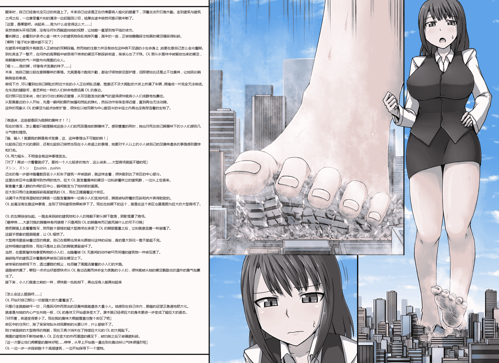

# 【翻译】寺田-巨大OL的臭味攻击(依頼絵)

作者：餃子

TID：19830

<title>1</title> <link href="../Styles/Style.css" type="text/css" rel="stylesheet">

# 1

*本帖最後由 餃子 於 2016-6-4 22:42 編輯*

原文 [http://gs-uploader.jpn.org/upld- ... ents/ochiko/OL1.png](http://gs-uploader.jpn.org/upld-view-document.php?file=/documents/ochiko/OL1.png)
原名:巨大OLさんの臭い攻め(依頼絵)
好像有人想看这个，翻了下
LZ军训了11天了。。。这两天一天睡四五个小时，好困

--------------------------------------------------------------------------------------------------------------------------------------------------------

<ignore_js_op>

**OL1.png** *(2.18 MB, 下載次數: 172)*

[下載附件](forum.php?mod=attachment&aid=NTQ1MTZ8MGFhZWY4MjZ8MTYwMDg4OTYxMHwxODIzMHwxOTgzMA%3D%3D&nothumb=yes)

2015-9-21 00:21 上傳

醒来时，自己已经身处没见过的街道上了。本来自己应该是正在仿佛要将人熔化的酷暑下，顶着炎炎烈日跑外勤。走到建筑与建筑之间之后，一边享受着片刻的清凉一边赶路回公司，结果在途中突然间意识就中断了。
「这里，是哪里呀。说起来……我为什么会变得这么大……」
呆然地转头环视四周，没有任何东西能遮挡她的视野，让她能一直望到地平线的彼方。
看向脚边，会看到许多点心盒一样大小的建筑物杂乱地排列着，其中的一些，正被她稳稳踩住地面的裸足碾踩得粉碎。
「啊咧？鞋子和长筒袜都不见了」
在建筑中和建筑外有数百人正被她的双脚踩扁。然而她的注意力并没有放在这种微不足道的小生命身上，她更在意自己怎么会光着脚。
到处奔走了一整天，在闷热的高跟鞋中被蒸得汗淋淋的裸足不断踩碎街道，渐渐沁出了汗珠。OL那从长筒袜中被解放出来的裸足，将脚臭味和热气一并散布向周围的众人。
「唔っ……我的脚，好像有点发臭的样子……」
本来，她自己就比较在意脚臭味的事情。尤其是每次跑完外勤，都会仔细地做足部护理，但即便如此还是止不住臭味，让她因此稍稍有些自卑感。
俯视下方，可以看到在自己脚趾的附近大批的小人正在胡乱逃窜。宽度还不及大拇趾的大街上挤满了车辆，拥堵成一片完全无法前进。
在车流的缝隙间，像芝麻粒一样的人们拼命地想逃离OL的身边。
但对那只巨足来说，他们的行动比蚂蚁还缓慢，从双足散发出的臭气的漩涡很快就将小人们成群地包裹住。
从距离最近的小人开始，先是一瞬间的剧烈抽搐和慌乱的挣扎，然后动作渐渐变得迟缓，直到再也无法动弹。
这样的现象从OL的裸足为起点放射扩散，很快在以她双脚为中心数百米的半径之内再也没有存活着的生物了。

「难道说，这些都是因为我脚的臭味才！？」
现在的情况，怎么看都只能理解成这些小人们的死因是她的脚臭味了。感到害羞的同时，她也对死在自己脚臭味下的小人们感到几分气愤和埋怨。
「骗、骗人！就算我的脚是有点发臭，这、这种事情也不可能的啦！」
比起自己巨大化的原因，还有比起自己突然出现在小人街道上的事情，她更对千人以上的小人被自己的足臭味虐杀的事情感到震惊和打击。
OL用力摇头，不相信会有这种事情发生。
「对了！再试一次看看就好了。要找一个人比较多的地方，这么说来……大型商场就挺不错的呢」
ズシン、ズシン     【zushin，zushin
迈出的每一步都伴随着数百名小人和车子建筑一并被踏碎，就这样走着，很快就到达了街区的中心部分。
这里在街区中也算是特别热闹的地方。巨大OL散发着臭味的裸足一边粉碎着林立的建筑群，一边从上空袭来。
聚集着大量人群的热闹的区中心，瞬间就变为了地狱般的画面。
巨大到只用行走就能踩碎高层建筑的OL，现在正蹂躏着这片街区。
沾满汗水而变得湿哒哒的脚底一边散发着臭味一边将小人们变成肉泥，脚底被粘附着的瓦砾和肉片弄得脏脏的。
OL丝毫没有在意这种事情，走到了目标建筑物跟前停下了。现在在她眼下的这个，就是在这个街区也算是颇为巨大的大型商场了。

OL的左脚徐徐抬起。一路走来踩碎的建筑物和小人的残骸不断从脚下散落，阴影笼罩了商场。
「嗯哼哼……大家对我的脚臭味有何感想？只是闻到OL的脚臭味而已就死掉什么的可不行哦」
想把脚搭上去看看情况，然而数十层楼的超大型商场在承受了OL的脚部重量之后，立刻就像豆腐一样崩塌了。
这超乎想象的脆弱程度，让OL哑然了。
大型商场里容纳着过百的商家。自己在假期也常来光顾类似这样的设施，真的是大到花一整天都逛不完。
这样规模的建筑物，现在只是放上自己的脚就溃裂崩坏了。
当然，在里面愉快地享受购物的小人们，也随着被OL无意间的动作破坏而坍塌的建筑物一并被压溃了。
崩碎殆尽的建筑正伴着轰鸣声被自己踩在裸足之下。
被惊呆的她俯视下方，透过朦胧的烟尘，她目睹了周围逃窜着的小人们的末路。
道路被挤满了，哪怕一点点也好都想快点从OL身边逃离而拼命全力奔跑的小人们，很快就被从她的裸足飘散出的温热的臭气包裹住了。
接下来，小人们就像之前的一样，很快就一批批倒下，再也没有人能再站起来

「怎么会这么脆弱呀……」
OL开始对自己那比一切都强大的力量着迷了。
只是行走就能破坏一切，只是因闷热而蒸出的足臭味就能虐杀大量小人。她感到在自己体内，黑暗的欲望正急速地肥大化。
就像是与她的内心产生共鸣一般，OL的身体又开始逐渐变大了。原本就已经很巨大的身体更进一步变成了超巨大的姿态。
「好厉害，街道变得更小了。现在我的臭味大概能覆盖住整个街区了吧」
街区中的住民们，除了呆呆地抬头仰视眼前的光景以外，什么都做不了。
刚才被踏碎的大型商场的残骸，现在又再次消失在了持续巨大化的OL的大拇趾下。
周围的建筑物不断地被卷入OL正在变大的热而潮湿的裸足下，被扫倒之后又被碾磨粉碎。
「这一次要让他们闻哪里的臭味好呢……哼哼，从早上开始就一直在到处跑动所以气味很强烈呢」
OL一边一步一步踩碎数十个高层建筑，一边开始探寻下一个猎物。</ignore_js_op>