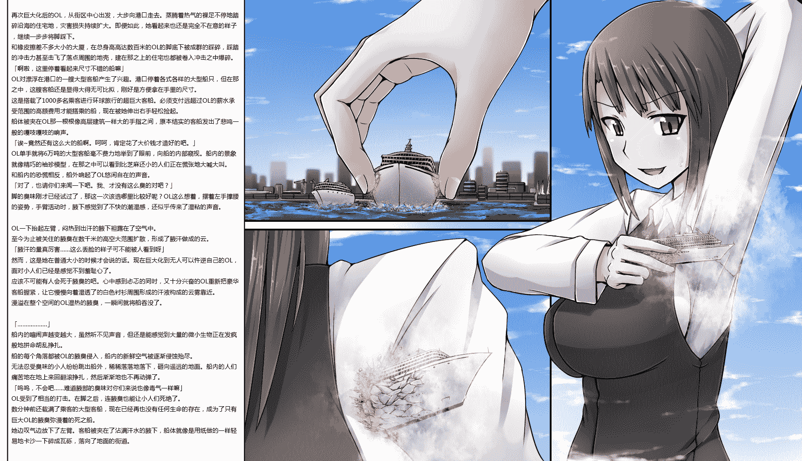

# 【翻译】寺田-巨大OL的臭味攻击2(依頼絵)

作者：餃子

TID：19859

<title>1</title> <link href="../Styles/Style.css" type="text/css" rel="stylesheet">

# 1

*本帖最後由 餃子 於 2016-6-4 22:43 編輯*

原文 [http://gs-uploader.jpn.org/upld- ... ents/ochiko/OL2.png](http://gs-uploader.jpn.org/upld-view-document.php?file=/documents/ochiko/OL2.png)
原名 巨大OLさんの臭い攻め2(依頼絵)

<ignore_js_op>

**OL2.png** *(1.25 MB, 下載次數: 77)*

[下載附件](forum.php?mod=attachment&aid=NTQ1OTZ8NjJlNWY3OWJ8MTYwMDg4OTU4OHwxODIzMHwxOTg1OQ%3D%3D&nothumb=yes)

2015-9-27 00:39 上傳

再次巨大化后的OL，从街区中心出发，大步向港口走去。蒸腾着热气的裸足不停地踏碎沿海的住宅地，灾害损失持续扩大。即便如此，她看起来也还是完全不在意的样子，继续一步步将脚踩下。
和橡皮擦差不多大小的大厦，在总身高高达数百米的OL的脚底下被成群的踩碎，踩踏的冲击力甚至击飞了落点周围的地壳，建在那之上的住宅也都被卷入冲击之中爆碎。
「啊啦，这里停着看起来尺寸不错的船嘛」
OL对漂浮在港口的一艘大型客船产生了兴趣。港口停着各式各样的大型船只，但在那之中，这艘客船还是显得大得无可比拟，刚好是方便拿在手里的尺寸。
这是搭载了1000多名乘客进行环球旅行的超巨大客船。必须支付远超过OL的薪水承受范围的高额费用才能搭乘的船，现在被她伸出右手轻松捡起。
船体被夹在OL那一根根像高层建筑一样大的手指之间，原本结实的客船发出了悲鸣一般的嘎吱嘎吱的响声。
「诶~竟然还有这么大的船啊。呵呵，肯定花了大价钱才造好的吧。」
OL单手就将6万吨的大型客船毫不费力地举到了眼前，向船的内部窥视。船内的景象就像精巧的袖珍模型，在那之中可以看到比芝麻还小的人们正在慌张地大喊大叫。
和船内的恐慌相反，船外响起了OL悠闲自在的声音。
「对了，也请你们来闻一下吧。我、才没有这么臭的对吧？」
脚的臭味刚才已经试过了，那这一次该选哪里比较好呢？OL这么想着，摆着左手撑腰的姿势，手臂活动时，腋下感觉到了不快的潮湿感，还似乎传来了湿粘的声音。

OL一下抬起左臂，闷热到出汗的腋下袒露在了空气中。
至今为止被关住的腋臭在数千米的高空大范围扩散，形成了腋汗做成的云。
「腋汗的量真厉害……这么丢脸的样子可不能被人看到呀」
然而，这是她在普通大小的时候才会说的话。现在巨大化到无人可以忤逆自己的OL，面对小人们已经是感觉不到羞耻心了。
应该不可能有人会死于腋臭的吧。心中感到忐忑的同时，又十分兴奋的OL重新把豪华客船握紧，让它慢慢向着湿透了的白色衬衫周围形成的汗液构成的云雾靠近。
漫溢在整个空间的OL湿热的腋臭，一瞬间就将船吞没了。

「………………」
船内的喧闹声越变越大，虽然听不见声音，但还是能感觉到大量的微小生物正在发疯般地拼命胡乱挣扎。
船的每个角落都被OL的腋臭侵入，船内的新鲜空气被逐渐侵蚀殆尽。
无法忍受臭味的小人纷纷跳出船外，稀稀落落地落下，砸向遥远的地面。船内的人们痛苦地在地上来回翻滚挣扎，然后渐渐地也不再动弹了。
「呜呜，不会吧……难道腋部的臭味对你们来说也像毒气一样嘛」
OL受到了相当的打击。在脚之后，连腋臭也能让小人们死绝了。
数分钟前还载满了乘客的大型客船，现在已经再也没有任何生命的存在，成为了只有巨大OL的腋臭弥漫着的死之船。
她边叹气边放下了左臂。客船被夹在了沾满汗水的腋下，船体就像是用纸做的一样轻易地卡沙一下碎成瓦砾，落向了地面的街道。</ignore_js_op>