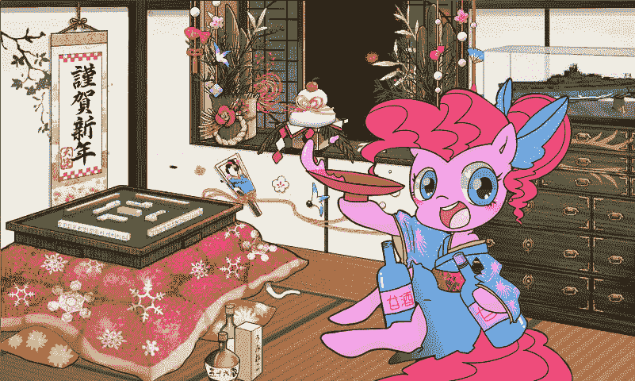

# 【艦娘同人】一寸提督物语（仮）

作者：wobuzhidao

TID：16003

<title>1</title> <link href="../Styles/Style.css" type="text/css" rel="stylesheet">

# 1

*本文章最後由 wobuzhidao 於 2014-1-15 06:39 編輯*

大家好，又是我，我又来了~
这次给大家带来了舰娘的同人文，个人写同人的经验还是很少，不过鉴于自己在玩而且十分有爱，所以这个题材其实也是蓄谋已久，首次给大家放上的是介绍篇，福利什么的直接描写客观来讲还是比较少，有玩过舰娘的比较好脑补，没玩过的也请尽情脑补，
人设的话，不太清楚的可以参考，就不在这里介绍了。[http://wikiwiki.jp/kancolle/?%B4%CF%CC%BC%A5%AB%A1%BC%A5%C9%B0%EC%CD%F72](http://wikiwiki.jp/kancolle/?%B4%CF%CC%BC%A5%AB%A1%BC%A5%C9%B0%EC%CD%F72)

今天是15号，选这个时间发文呢，目的就是，**\祝浮云生日快乐/**
然后提前给大家拜个年，午年行大运，神驹保平安（题外话：马年便是Pony年，也是楼主本命年，各种意味。
<ignore_js_op>

**pony.jpg** *(377.31 KB, 下載次數: 0)*

[下載附件](forum.php?mod=attachment&aid=Mzk0MDR8OWQzNmMxMmR8MTYwMDg4OTQ5NXwxODIzMHwxNjAwMw%3D%3D&nothumb=yes)

2014-1-15 06:33 上傳

接下来放文，以后或许会更新日常篇，或许……
另外前三位猜到我本命舰娘的小伙伴会获得我个人赞助奖励点
当然发文之前还是要
Danke Dante

<title>2</title> <link href="../Styles/Style.css" type="text/css" rel="stylesheet">

# 2

*本文章最後由 wobuzhidao 於 2014-1-15 06:39 編輯*

從前有一位提督，他轄下的港口十分破敗，甚至一艘可以出海的船都沒有，但是他不甘心就此碌碌無為，於是他帶上倉庫裡所有的資材放在四個包裹中上路了。
他走著走著，在路上遇到了一位藍色頭髮的少女。
“我是曉哦，要把我當做獨當一面的女士來看待哦。”
提督沉思了片刻，遞給少女一些包裹：“既然你能獨當一面，就幫我拿著這些鋁土礦吧，我一個人拿這麼多東西還是有些吃力的。”
於是兩個人繼續上路了，走著走著，路邊出現了一位白髮的少女。
“我是響，人們常叫我不死鳥，Здравствуйте”
提督見這位少女神情淡然，不卑不亢，覺得她必然有兩把刷子，於是便將裝著鋼材的包裹交給她，白髮的少女果然輕鬆地背上了包裹。
於是三人繼續趕路，突然，從路邊的灌木中跳出了兩位褐色頭髮的少女。
“我是雷喲，不是打雷，不要念錯，各種地方還請多關照。”
“我是電，總之……請多關照。”
提督看了看這兩位少女，將手邊剩下的一包燃料和一包彈藥分別交給了他們。
最後，一行人來到了海邊，在海的對面就是棲息著鬼的海島。
“有沒有這麼厲害啊，鬼什麼的真的存在嗎。”提督自言自語道。
“有的哦，而且據說她們擄掠來往的船隊，在島上積累著數不盡的財寶。”
“就算這樣，一艘船都沒有的我，也沒法到那邊去啊。”
“不用擔心，你給了我們這麼多資材，現在到了我們報答你的時候了”四位少女一起說道。
我沒有要給你們啊，只是讓你們拿著……當然提督沒有把這句話說出來。
只見四位少女相繼跳入海中，隨著一道光芒閃過，她們的身形急劇變大，身上出現了魚雷和艦炮一樣的武裝。
“我們是艦娘，既是少女也是艦艇的存在，今天你就是我們的提督了。”
提督仰視著面前這四位少女，這可不得了，每個少女都有113.23米高，還配備了三座12.7cm連裝炮和三具九三式三聯裝魚雷發射管。
“連兩座12.7毫米的高射炮都在，還原度真高啊。”提督不禁讚歎道。
        於是，提督選擇了他們當中看上去不太擅長戰鬥的電作為旗艦，一人四船駛向海的那邊。
        海島上的鬼，叫做南方棲戰鬼，是大戰艦級的深海棲艦，同時還有著數量龐大的手下，提督知道就算憑藉自己的四位艦娘也是無法與她正面抗衡的，於是他們在白天小心的避開鬼的耳目，在夜晚偷偷地靠近了鬼所在的地方，一旦接近之後，四位艦娘便發揮出她們靈活的優勢，將南方棲戰鬼打的包頭蹲防，不斷求饒。
        “只要你不再搶劫來往的船隊，我們還是可以做朋友的。”提督對鬼說道。
        “我發誓再也不敢了，這些是我搜刮來的資材，我把它們全部交出來。”
        最後，提督帶著他的艦娘和成堆的資材回到了他的海港，並用這些資材將他的港口修繕一新，擁有廣闊的空間和良好的設施，艦娘們在他的港口可以不用變回人類的大小而自由地活動，於是越來越多的艦娘彙聚到這位提督的身邊。
        因為只有艦娘百分之一的身高，這位被艦娘愛戴著的提督，被他的部下們親切地成為“一寸提督”。

當然，以上這個可疑的故事顯然不是重點，但是以此為發展，我們發現了這位一寸提督的手記，經過整理後，這份資料以他的視角為線索，逐漸為我們還原出這個世界的原貌。

其一
雖然距離那次驚險的戰鬥已經過去很久了，來到我身邊的艦娘也有很多，她們或許已經不再能適應兇險的大規模海戰，但是她們陪同我度過的最初的歲月是無法替代的。
曉，是她們中的第一人，雖然總是說著自己已經是大人了，但是究竟成長了沒有還是不得而知（各種方面），每次摸她的頭，都會不滿地抱怨，不過對這一點，捉弄她已經成為習慣了，偶爾乘坐她出海一次，都會呆在她頭頂盡情地摸她的頭。
“沒辦法啊，你如果有愛宕那樣的胸襟，我倒是可以換個地方坐啊。”
“唔嘰——！”

響，初次見面的時候，就因為她的一頭白髮而印象深刻，平時沉默寡言，只有提到她“不死鳥”的稱號時，才會罕見地露出得意的表情，本人好像去某個北方的國家留過學，不時會來幾句帥氣的話，但是我聽不懂，看來外語這方面也不能大意啊。
對於她我也是格外地在意，平常沉默的她，不像她的姐妹們那樣整天嘻嘻哈哈，總覺得她的雙眼裡看到了我們看不到的東西，她是在安靜地等著什麼的到來嗎？
懷著諸多的疑問，我對響進行了各種各樣的觀察（筆者：憲兵，就是這個人！）除了跟其他人交談的時候，她總是像在思考，吃飯的時候是這樣，洗澡（入渠）的時候也是這樣。跟她搭話的話，總會一本正經地回答，“司令官，請下作戰命令吧。”不過有一次我向她表達了“你光著腳穿著襯衫睡衣的樣子很可愛”的看法的時候，她扭過頭，壓低了帽檐，想必是害羞啦。
有一次，我看到她獨自一人坐在海邊，在冷冽的海風中望著大洋深處，我便朝她走去。察覺了我的靠近，她伸出她被海風凍得通紅的小手讓我乘上，然後將我護在她的胸口。
“司令官，我們作為兵器，如果一直戰鬥下去的話，會變成怎樣，如果不戰鬥的話，會變成怎樣？”她那樣問道。
“……雖然我很想回答你，但是答案恐怕要依賴於我究竟有多少能力啊，老實說我自己也不清楚，但是有你們陪在我身邊就會感到安心，這樣的你們對於我來說，恐怕不是兵器那麼簡單的存在，或許，叫做家人更合適吧。”
“……這樣啊，Спасибо，司令官。”
不過在這之後她還是一如既往的冷冰冰的感覺，對於響的生態也還需要進一步的研究（筆者：憲兵，憲兵怎麼還沒來！）

雷，四人當中最活躍的活躍分子，雖然是在艦娘中只是個小學生級別的驅逐艦，但是平時跑來跑去真的有點轟隆隆打雷的氣派，多少次和她說不要再走廊裡奔跑也不會聽——外加她的性格不是很謹慎，我被她踩中過許多次了（筆者：1680噸的踩踏，提督的身體強度究竟是什麼級別的）。雖然每次被踩到都痛得要死，不過老實說那種被少女穿著襪子的軟綿綿的腳死死地壓在地上的感覺，還有那個充滿青春氣息的味道，還是不錯的。
有一次她們姐妹四人捉迷藏，輪到雷扮鬼的時候，我悄悄地跑到她前進的路線上，因為蒙著眼睛看不見，她理所當然一腳踩在了我身上，本以為她會嚇一跳，不過沒想到她只是遲疑了片刻，便像什麼都不知道一樣走向了別處，為了確認是不是她沒注意到，我又故意走上去被踩了好幾次（筆者：這個提督沒救了），得到的結果是一樣的。
莫非這丫頭是故意的。帶著這樣的疑問，我趁她睡覺時，鑽進了她的襪子埋伏起來，雖然我對於她來說只是一節手指大小的存在，但是這樣的東西出現在襪子當中不可能察覺不到吧，結果是，我被她穿在襪子裡帶來帶去整整一天，提督的制服泡夠了她的腳汗，有好幾天都不好意思穿出去……最後，關於這件事我們誰都沒有互相提起。
雖然看上去是個很不穩重的傢伙，實際可不好說呢。

最後是電，相比于她的姐姐，她實在是過於文靜和弱氣了，雖然常常表示自己認真起來是很厲害的但是實在是沒有說服力，因為看上去就不太擅長戰鬥所以一般我選她作為旗艦進行指揮工作，實際上她好像也因此松了口氣的樣子。
意外地會照顧人，其實雖說是四號艦，實際年紀只比雷小一點，所以也許比那位“獨當一面的女士”要可靠？
意外的擅長照顧人，經常主動變成人形大小來打理我的飲食起居，雖說是幼女身材但是膝枕確實一級棒，不過有一次，她為我做膝枕時，我突然被驚醒了，原來是過於疲憊的電在我睡著後自己也睡著了，雖然在她醒來之前我一直都被壓在她身下，但是我還是覺得果然不應該讓她這麼小年紀就這麼辛苦來著，以後就再也沒讓她為我做過膝枕，取而代之的是她那雙一百倍比例的長襪，不但柔軟，還帶著她身體的溫度和氣味，在入睡之前由她脫下來交給我，不管是用來鋪還是用來蓋，亦或是鑽進裡面，都是相當贊的（筆者：……）

其二
不知從何時起，我察覺到了，身為提督，在這個世界中受到了神秘修正力量的保護，比如不管多麼危險的情況下能存活下來，不管多麼嚴重的打擊也無法讓我受到重傷，甚至為了達成這一點，無論乘坐的艦娘被擊破到何種程度，也能順利地開回母港。
知曉了這一點的我覺得應該好好地加以利用。
俺：“山城桑，這次出擊就拜託你做我的旗艦了。”
山城：“誒？誒？！我嗎，但是，像我這樣不幸的……”
俺：“嘛，不要在意那些沒有根據的事情，你只要做好你自己的本分就行了。”

總之後來戰鬥開始了。
山城：“咿呀，艦橋（頭上）起火了，提督，請趕快轉移到安全的地方。”
於是，我從山城胸口的位置，躲進了那一直以來都覺得很神秘的巫女服中。
山城：“裡面可能有些狹窄，提督請將就一下……”
咕，還真的是十分的擁擠的甲（胸）板（部），不過這是早期的設計缺陷也沒辦法呐。
不過這個情況也沒持續多久，因為甲板馬上就被炮火命中了。
山城：“嗚哇啊——上衣都破破爛爛了，甲板也不安全了，提督，請轉移到別的地方。”
唔，距離最近的地方就是稍微下面一點的裙子中了。
果然動（內）力（褲）室（裡）的空間也相當的有限，而且由於設計問題，這裡的通風與散熱系統都不是很完善，狹窄的空間充斥著濕熱的水汽，當然還帶著山城她身上的味道。
這裡不得不提及這一型（扶桑級）戰艦設計上的缺陷，因為是缺乏經驗的早期設計，所以缺陷的部位很多，除了上面提到的，還有整個艦體的裝甲過於薄弱（筆者：容易破衣的意味），主炮齊射時，炮口爆風會導致整個艦艇受到震波的影響，所以每次開炮的時候，她們的身體都會劇烈地顫抖，或許她們自己能夠習慣，不過對於乘坐在船上的我來說卻是很不得了的動靜。
啊，果然和我預感的一樣，就連我待的動力室也馬上被炮火命中了。
山城：“好痛！動力室受到炮擊，開始漏水，還好鍋爐沒有受損，提督請去別的地方躲避一下。”
可是現在全身都破破爛爛的山城號還有什麼地方可以躲藏呢，下面那兩隻足袋一樣的地方可以讓我躲一下吧。
山城：“誒，怎麼可以讓提督到那種地方去……”
俺：“這種時候就不要在乎那麼多了，如果我有什麼閃失的話山城也很難保全的哦。”
於是山城十分難為情的把我丟進了她的足袋（筆者：為什麼比起之前鑽進內褲反而這裡比較難為情？理解不能。）
果然山城的足就和想像中一樣細膩光潔，足袋裡的地方也絕對說不上寬敞，倒不如說只是勉強能塞下我，長時間踩在海面上，足袋已經完全被海水打濕，無法蒸發的腳汗也是在這裡留下了濃郁的味道。山城開過幾次炮之後，我便由於巨大的震動被抖落到她的腳底，這回可是三萬六千噸的山城將她一半的體重壓在我身上，但是似乎由於我落在她足弓的位置，身體陷入了她柔軟的腳掌中，並沒有受到什麼實質的傷害……
就這樣最後我們兩位狼狽地回到了母港。
山城：“果然……我還是相當的不幸，提督，真的對不起。”
俺：“嗯，不要在意，不是你的錯，是我太無謀了才對。”
雖然客觀上來講的扶桑姐妹的確是相當的不幸，不過對於乘坐她們出海的提督來說，或許是另外一種意義。

其三
艦娘當中有那麼一群特殊的孩子，雖然個頭都很小但是總是被委以重任，執行各種兇險的任務，儘管如此她們還是很活潑，即使不用出擊的時候，也喜歡在水裡泡著。
她們就是各種各樣的潛艇，在母港的艦娘用浴池，修理渠，或者是游泳池——各種能夠泡水的地方，總是能看見她們的身影。
游泳池是最受潛水艦娘們歡迎的地方，作為提督，也必須經常去看望下這些孩子氣的艦娘，不然她們可是會覺得寂寞的。
今天正好沒什麼事務，估計著集體去遠征的潛水艇們快要回來了，我打算提早去泳池等她們。
雖說是艦娘專用的泳池，但是也有我專用的更衣室，泳裝不是普通的泳裝而是潛水服，和一百米到三百米不等的艦娘們嬉水，潛水服才是理想的選擇。
換好衣服後，我便跳進浴室出口的消毒池中。
雖然對於艦娘們來說不過是幾步見方的小水池，對我來說倒大得像真正的泳池一樣，淡藍色的水足足有二十米深，卻清澈見底，池底散落著一層細沙，這些都是隨著那些馬虎的艦娘帶進來的，不能讓它們進到泳池裡去。

叮叮叮——
港口傳來的鈴聲告訴我遠征的潛水艇們回來了，在輪到她們進行補給（吃飯）之前，她們會來泳池待機。很快，浴室便傳來了嘩嘩的水聲，常年穿著泳裝進行潛水的她們，自然是不用換衣服就可以進入泳池的。
“19（iku），要去（一庫）啦！”最先經過消毒池的是潛艇中有著伊-19號，緊跟著iku，其他的潛水艦娘們也陸續經過了消毒池，對她們來說只是輕快的步伐，卻在消毒池中不斷掀起驚濤駭浪，我在翻滾的浪潮中好不容易抓到了一隻比我還要粗大腳趾，鑽進了腳趾縫，這才被帶出了消毒池。
嘛，這也是必經之路嘛。
潛伏在她們身邊也是一種樂趣，畢竟被發現的話就會被拖下水去進行各種刺激的水上運動了，在被發現之前好好用仰視的視角去欣賞她們的泳裝身姿也是一種享受。
潛艇中，每位艦娘的特點都十分的鮮明。
Yimuya（伊-168）是最早來到我麾下的潛艇，梳著單馬尾的她有著鄰家女孩的氣質，事實上也確實在最初替我完成了不少事務，臀部十分美型而且富有彈性（筆者：……）偶爾被她坐在身上或者被放進緊繃的泳褲中，被她的臀部夾在中間，都是美妙的精力。
Goya（伊58），天真爛漫的小女生，對於我指定給她的泳裝十分的在意，平常總是誇耀那件學校泳裝的性能，泳裝破損了的話就會大受打擊，稍微放置一會兒就會一副寂寞的樣子上來撒嬌……對於這麼可愛的孩子果然還是好好關愛著吧。
Hachi（伊-8）有著德國血統的潛水艦娘，帶著幾本可以變出魚雷的書，一副神秘的樣子，最大的特點是即使是潛水也不會脫掉她白色過膝襪，我曾經見過她在休息室裡坐在壁爐前烘烤著她浸水的襪子（穿在腳上）房間裡都彌漫著她腳上的氣味，這讓我很好奇那雙襪子裡面究竟有什麼神奇的東西，Hachi好像不是很樂意我鑽進她的襪子裡，不過從外面摸或者蹭或者由她來踩我都沒有問題。
Shioyi（伊-401），是潛艇中年紀最小的，但是卻有著最高的身高，122米的身高在潛艇中也是獨樹一幟，小麥色的皮膚看上去十分的活力四射，實際上運動能力也是十分的強，自稱能夠在一次潛航中環游地球一周。
說到最高的潛水艦娘Shioyi就不得不提到最小的三式潛航Maruyu，身高只有41.41米的她只比Shioyi的膝蓋高一點點，因此在潛水艦娘們聚在一起時相當沒有存在感，當然，把她放在大和號這樣的超大型戰列艦旁邊就更是有趣，因為她的身高只比大和的腳踝高一點，就像人偶一樣。（筆者：最袖珍的潛艇“甲標的”似乎並沒有作為艦娘在這個世界登場，而是作為艦娘們的裝備，如果只有23.9米高的甲標的站在263米高的大和旁邊會是什麼感覺呢？）
最後要特別提到被稱為移動十八禁的Iku（伊19），編號是Iku（19），口頭禪是Iku（“去了”）幼女般可愛的面容以及與年齡不相符合的豐滿身材，說話的聲音磁性十足，卻基本都是些葷段子，渾身散發著讓人充滿色色的念頭的電波。平常喜歡趁著四下無人的時候對我動手動腳，說是要給我揉肩膀但是卻把我攥在手裡來回地套弄，拿著我的身體去摩擦她身體的各個角落，比如腋下，胸部，小腹，股間這些意味深長的地方，當然因為她本身魅力十足，所以這樣的行為總是能得到我的原諒，不過乘坐她出海又是另一番不容易的事情。
Iku是我的第二艘潛艇，在那之前我一直乘坐Yimuya（168）執行潛渡任務，潛艇不像別的水面艦艇，可以讓我呆在艦橋上，要到達Yimuya的艦長室，就必須讓她把我整個丸吞下去，經過狹長柔軟的“食道”，進入到她胃部，那裡架設的光學儀器和電子設備可以讓我看到她所看到的，聽到她所聽到的。作戰結束後，再經由腸道到達直腸從肛門處離艦，雖然方式聽上去有些難以接受不過其實作為提督的專用通道，清潔程度還是相當高的，所以我很快就習慣了。
但是第一次乘坐Iku出海的時候，她跟我說她的構造和Yimuya是不同的，進入艦長室的入口在身體下面，兩腿之間的地方，我當時居然就信了，雖然很難為情但是為了執行任務還是鑽進了Iku分開的兩瓣肉唇間那個剛好能將我吞下的小洞，裡面又濕又滑，氣味是讓人目眩的松香味，經過 緩慢的滑動，當我到達最深處時，才發現裡面根本不是什麼艦長室，只是一個裝滿了鹹濕粘液的肉壺，發覺上當的我想要出去卻是做不到，畢竟這是被關在了一個百米多高的艦娘的體內，我渾身的力氣恐怕也抵不過她的下體的一塊平滑肌，她就這麼帶著我出航了，我無法得知外面的情況，只有在附近的動力室不斷發出嗡嗡的噪音，帶著劇烈的震動，讓我所在的這個肉壺不停地震顫著，就像在這肉壁的後面有一顆跳蛋似的……
最後，當Iku返航之後，我滿身汁水地被放出她的身體，被捉弄了的我毫不留情地批評了她，表示這種事情以後只允許在港內做（筆者：這真的是在批評嗎！），即使如此，要從Iku的口腔進入艦長室也免不了要被她的舌頭玩弄一番，總之她一定是潛水艦娘中最不讓人省心的傢伙。</ignore_js_op>