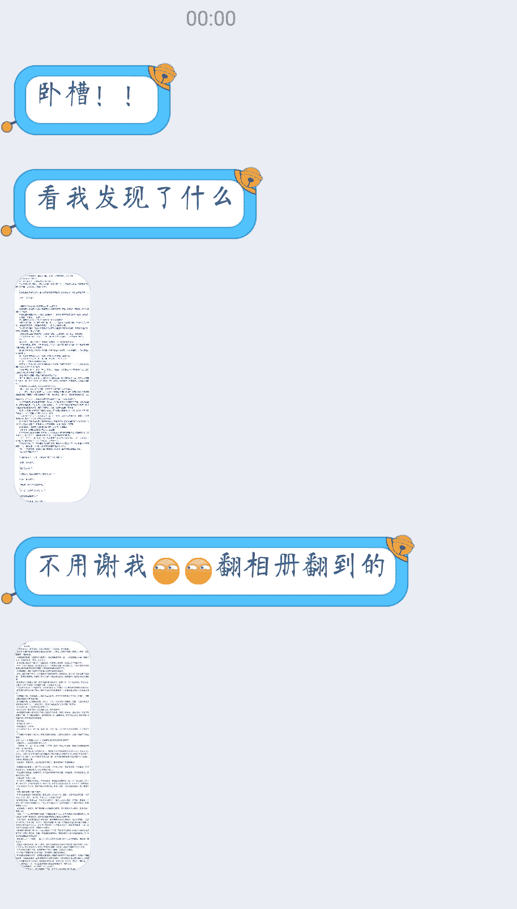

# 七年前写的文

作者：择一鞋终老

TID：28136

<title>1</title> <link href="../Styles/Style.css" type="text/css" rel="stylesheet">

# 1

*本帖最後由 择一鞋终老 於 2020-2-24 17:01 編輯*

七年前我写的文，后来删光了，现在一大佬找到了他以前留下来的截图，水平可能有点幼稚，有兴趣的就凑合看吧 <ignore_js_op>

**Screenshot_2020-02-24-16-37-35-10~01.png** *(255.23 KB, 下載次數: 0)*

[下載附件](forum.php?mod=attachment&aid=ODE1ODZ8MzI5YzQ0Y2J8MTYwMDg4MDA0MHwxODIzMHwyODEzNg%3D%3D&nothumb=yes)

2020-2-24 16:39 上傳

我把第一篇用QQ识别弄成文字版整理了一下（识别不了长图只能拆成一段一段的还要改错别字排版累死了，第二篇更长，不打算弄文字版了，直接传图吧……试了一下传不上去……那这篇就不传了……当是历史的尘埃吧… <ignore_js_op>

**Screenshot_2020-02-24-16-32-03-81~01.png** *(68.99 KB, 下載次數: 0)*

[下載附件](forum.php?mod=attachment&aid=ODE1ODV8YTZjNTg0ZDl8MTYwMDg4MDA0MHwxODIzMHwyODEzNg%3D%3D&nothumb=yes)

2020-2-24 16:34 上傳

…）

第一篇故事：

      ——那站在女神脚趾上俯视人间的王者啊！你虽然尊高，依旧渺小。

      对于未知的事物，人们总是当它们不存在。

      唯有灾难降临到头顶时，人们才会畏惧，就像一窝住在小女孩脚边的蚂蚁，危难近在咫尺却浑然不知，因为他们比咫尺还要渺小。
      在我们所在的宇宙之外，还有无数各式各样的世界，而在某个我们不知道的世界中....

      序章  暗黑神主

      “您所乘坐的AH370次航班...…阿……嚏”

      貌美的空姐还没来得及用她那富有磁性的嗓音说完这句话，就感到一阵恶寒，终于忍不住打了个喷嚏。

      乘客们没有哄堂大笑,因为他们也都感到了一种很不对劲的感觉，紧张?压抑?都不是。那感觉，就像.....世界末日。

      若说用世界末日形容一种感觉那会是一种怎样的感觉?

      “受到不明气流干扰，受到不明气流干扰，”人工智能在飞快地呼叫着，但变故来得太突然，谁都来不及反应，就算来得及反应，也没有办法改变结果。

      飞机竟然在倒退!倒退的速度已经超过了飞机正常向前行驶的极速，气流是如此之强烈，那产生它的东西一定更为恐怖。

      驾驶员只看见窗外的视野被一片黑影所占据，上下左右，目所能及，皆是黑暗。那个物体距离飞机不知有几千万里，却已经产生如此飓风，已经大得如此可怕。

      “轰~”

      毫无意外，力量对比比蚊子撞地球还夸张时，一切都是没有悬念的。

      几乎是一瞬间，机翼、机尾四分五裂，巨大的火球把零件雨四散喷出，而这一场面在黑色背景下却显得那样静默，静得让人心里发寒。
      爆炸自然无法阻止黑色物体的前进，尽管它只是一根睫毛，一位妖丽而让人心生寒意的女子的睫毛。

      她一身黑衣如黑洞般黯然无光，露出的双臂与面颊却比画中之人还要白艳。
      那名黑衣女子如久睡方醒，睁开眼，眨了两下，仰望天空。
      “人类，已经繁衍到这种程度了吗?”

      坠落的飞机小到不能使她的眼球有一丝感觉，但她还是看见了，飞机内部的复杂结构让她有点惊异于人类的智力。
      她去过无数个世界，原始、异人、魔法.....什么的，这是她头一次见到科技社会，或许也是因为她从来没有低下头来看一下。

      但旋即她对人类的印象就由感兴趣变成了厌恶。
      发梢间，指纹间，脸上身上，到处都是人类的城市，她是如此巨大以至于很少有人能乘航天器从她的一根头发上飞到另一根的发梢。哪怕是睫毛尖端的平面，也都建设了极多的人类国家。

      到处都是人类与建筑，就跟满身全是灰一-样。

      “阿嚏！”她也打了个喷嚏，感觉自己就像是裹在灰堆里似的。
      这一下产生了更加强烈的飓风，人类的千米高建筑还没来的及倒塌，就被那接近光速的风撕扯成沙粒。如果时间可以定格在某个瞬间，就能看到一些千米大厦的基部还在原位,而顶部却已经在千里之外，人们来没来得及露出惊恐的表情，下一刻就消失了。

      她揉了揉鼻子，而在她鼻子表面上居住的人类只能看到一片阴影压了下来，大地剧烈震动，山河尽碎，却无法知道发生了什么事，因为她实在是太大了，几万年来人们都不知道自己世世代代所生活在的大陆竟然只是一位女子的体表，而他们就像寄生虫一样活着。

      她伸了个懒腰,手臂的影子覆盖了在真正地面上的人类世界,人们望着天空惊慌失措，不明白为什么太阳忽然不见了，这个世界的这个地方是没有日食的。

      在人们惊恐的注视下，黑暗退去了，这一暗一明间，人类如同经历生死，就像天上有个伟大的存在考虑了一下要不要毁灭这个世界。

      而产生阴影的她根本就没把地上的人类们当回事，真是可笑，明明她依旧抬手就能毁灭他们，他们却当成危机过去了一样地庆祝，先前的阴影，没看见就当作不存在。

      她缓缓坐起，于是整个大陆都开始震颤，短短几秒，大陆便完成了数亿亿年都无法达成的地壳巨变，无数生灵在地震和海啸中殒命。

      与此同时，有更多超越法则的存在正在苏醒。
      如果视角缩放到亿亿倍的层级，可以看出，大陆上所有山峰和裂谷的高度与她相比都可以忽略不计，而在她身边，零零散散地分布着一些有她脚趾大的物体。

      那是108位白衣女子，毫无疑问，除了神没有什么可以达到这样的身高，108 位女神排着玄奥的阵法，就这样枯坐了不知几世几劫，直到这一天的到来。

      有无数个世界，但并不是每个世界都有神的，哪怕是一些高级世界，神的数量也一般不超过十个，可以看出，很多其他世界的女神都离开了自己的驻地，一同镇守在这个地方。

      “唔”，同样是苏醒，黑衣女子醒得很惬意，而她们一醒来却要面临生死考验。

      “姐，她真的醒了吗?”一位十几岁模样的女神问道。
      ……
      “是啊，这一天还是来了。”
      ……
      “小姨，我们能挡住她吗？”
      ……
      “必输无疑。但还是要打，这便是使命，是我们等在这里的意义。”
      ……
      “这一次，又不知要死多少人。”
      ……
      “别的世界会胜利吗?”
      ……
      “没有人能打败她，神也不行。”
      ……
      “身为女神，受到整个世界无数生灵用生命、尊严的供养，那么自然有责任让这个世界不被毁灭。”
      ……
      “姐妹们，时间不多了，开始吧。”
      ……
      “也罢，活了无数年，我还没有尝过死亡的滋味呢。”
      ……
      黑衣女子看到那些不及她指甲大的小小女神们飞起来在她四周散乱地分布着，各色的神力与法则在天空交汇，却依旧毫不在意。

      神威大显。足以将一个普通世界毁灭十几次的力量轰在她身上，却只像是照了层浅色的彩光，甚至连那件黑衣，都没有破损。

      当然那些生活在她身上的人类们就不可能存活了。

      她慢慢看过这些女神的脸,发现竟然至少有三十六人比她漂亮些，于是有些不悦，那么，让她们死吧。

      她的食指缓缓伸直，诸神只感到一股沛然莫御的力量禁锢了时间与空间，而自己就像溺水的小虫，拼命的努力却掀不起一丝涟漪。

      “嘭~嘭嘭~嘭嘭嘭~”

      当神遇上了超越神的存在时，结局毫无悬念，一团团血雾在空中炸开，没有一位幸存者。
      没有人会记得她们为保护其他世界所做的一切。
      没有人会记得她们曾经存在过。
      神的性命从没有这么低贱过。
      像108朵凋谢的花。
      而对黑衣女子来说，也就算是捏死了只臭虫，根本不值一提。
      她化成一阵黑风，飞向天际。
      所有世界都将迎来一场浩劫。

      第一章  少女之间的“小”矛盾

      十六年前，另一个世界"神之世界"里的女神们因为某种未知的原因以普通地球人的身份进入地球，并安静地生活了十六年，现在她们又不知为何地返回了“神之世界”，难道是因为暗主的复苏?谁都知道，暗黑神主一旦降临， 无论哪个世界都难以幸免，像地球所在的这种没有女神的宇宙更是岌岌可危。
      神之世界，炎神界。
      蓝色的发卡，乌黑的长发，一位十六七岁的女孩走在“寸草不生“的荒原小路上，离她不足一米的地方有块平矮的大石。
（2020吐槽：为什么是十六七岁？因为七年前我也就十六七岁嘛）
      她缓缓踱着步子，在思考着什么。
      很多地方的平民百姓甚至都不知道发生了什么就丢掉了性命,或者很震惊地发现地动山摇，地面下沉不知有多深，直至看不见。

      用三寸金莲形容她那小脚都不为过，而现在，她的一步却是千亿人的天。
      在某些遥远的地方，普通人只知道是地震，而高层次的大修行者却紧张地注视着这个画面，比方说那块“石头"上，有能力极强的人能够看到千万里之外的景象，以他们所在的高度，只能望见她的小腿，微微抬起、轻轻放下、地动山摇、微微抬起、轻轻放下、再次地动山摇。
      “轰轰，轰。”或许她注意不到自己的脚步声，而这声音对于四周的人类来说无异于催命曲。有人心里稍安，像她这么懒散地散步，应该不会到“石头”上来吧？
      可灾难还是发生了。
      天空，可以是蓝色的，也可以是黑色的。
      贡里希卡高原的天空从没有这么黑过。
      贡里希卡高原上人口超过千万的大国就不知道有多少，它的面积大小就更难说，据说它东边是坡度超过60°的大陡崖，西边是高耸入云的卡格尔山脉，高原上所有居民都可以望得见那座山脉，但就算西行数万里，也很难到达山脚下，这么远的距离还望起来那么高，看来真是高不见顶了。

      而在十几秒前,高原诸国上的至强者就提前知道了这片区域将要面临的命运——在东边踱步那位女子，她....
      地震终于停止了，天也黑了，无数人向天空仰望着，却没有人飞上去一探究竟，因为那是无人能临及的高度。

      天上那位伟大的存在根本不会在意高原上的这些微小生命们，对她来说，什么所谓的高原巨山，只是不足膝高的凸起石面罢了，就算加上那座高不可攀的山脉，也只是刚刚过膝而已，这种石头一般是可以迈过的，不过——也可以坐下歇歇，等个人。

      于是她很自然而然地坐了下来，天自然而然地黑了。

      只一坐，便可遮天蔽日。
      从高原被巨大的影子遮蔽到她坐下来，只是很短的时间，而在这样的大小差距面前,没有什么奇迹发生。
      是日，贡里希卡高原地陷万米，留下了一个“浅浅”的坑，就像是一位旅行少女，在路旁的荒石上坐下，在她看来，根本没留下任何痕迹吧？而被压碎的山河与沾在其上的小小人类就更不值得一提了。
      这片高原上甚至有着不少天合境的绝世高手，他们还没来得及飞走，就被撞了下来,压在地上，震荡的气流形成飓风，对少女而言只是坐下的速度，对人类而言却是毁天灭地的冲击。

      在高原的边远地带，幸存的人们——或许可以欣赏一下那雪白的大腿?
      普通人的视力自然没有那么好，就算有那样的视力也没有人在大灾面前还有心思干这事吧，再玲珑可爱的少女，再美妙诱人的身姿，巨大到如此程度，只会让人或震撼或崇拜，自卑于自身的渺小吧。

      而有一个人不同，这是一个衣衫褴褛的中年人，他做在竹椅上，意淫着她身上的曲线，有时流露出猥琐却不失风度的表情。

      向东望去，她双腿放直，搭在地面上，脚跟压出了更深的巨坑。

      时间一分一秒地过去，女子要等的人终于到了——另一位和她一样高的女子。

      她站起来，拍了拍尘土，迎向走来的那位女子，数不清的巨石瓦砾从她裤子掉落，那些幸存者们再次哀嚎遍野。

      无数堪比须弥山的“沙子”轰然砸下，更可怕的是站起身卷起的飓风，本就寥寥无几的幸存者们被气流拽上天去，不知落向何处。
      仅仅是少女的一坐一起，便是人间巨变，而这些都不值得她看上一眼。

      二女站着聊天，她们相距只有一步之遥，而就在这四只鞋子之间，又有无数国度、无数生灵，如果他们能知道发生了什么，必将感受到自己的渺小。（2020年添加：世间怎么会有如此伟大的存在，若是能在她们的鞋上建立国度，这个国度也会比地上的国度高贵无数倍吧，渺小面对真正的伟大时，只有臣服，根本不会想着什么征服，人类终其一生，也难以跨越她们一根鞋带的距离）

      哪怕是她们的影子，都能给千亿人送去黑夜。

      中年男子没有觉得自己渺小，他抬头看着“极远处”那俩女子，发现新来的那位与前面那位相比另有风味后，又转移了目光，开始意淫另一目标。
      那女子的手指缠绕着发梢头，盯着她的眼睛，用低沉的嗓音说:“若琳姐，暗主要驾临了。”

      若琳的目光有些怅然，“暗主？她那样的人物和我们能有什么关系？就像这地上的生命一样，有些事不能改变，只能接受。"说着，她的脚尖在地上缓缓滑动，几万公里内的一切加尽为瓦灰。.
      很多女孩在聊天时总有些小动作，比方说双脚在地上蹭来蹭去，各种废墟加泥土堆成了一条几万公里高的山脉，以排山倒海之势席卷更多完整的人类文明，很多人只看到西天一黑就一命呜呼了，而这条地面不曾有的宏伟的山脉就在女孩的两脚间滚来滚去,和杂着人、石土、.....而在巨大女生看来这只是随脚带起的一小堆土灰。

      “暗主生，天地灭。这个预言快要应证了，谁都不想归于寂灭，诸神不可能臣服，必然反抗，但你也知道，女神再强大，在暗主面前也是蝼蚁。”

      若琳的脸上也露出一丝隐忧，“我确实不想死，才成为神使不到三万年，却又要在她们的战争中像炮灰一样死去。萱媛，这又有什么办法呢?”

      萱媛蹲下来，看着一块完整的地面，看着那里的小山村、小河、庄稼，一根手指笼罩了那里，那里的人们立即陷入黑暗，他们惊恐地望着天空，却因为天太高而不知发生了什么。她说:“人类可从不为自己的命运担心。”

      “那是因为他们寿命太短，世界太大，被踩到的地方终是少数，有些地方就算要遭受灾难，也是数万年后了。”
      萱媛嫩葱般的手指落下，几万里外的人们都能听到巨大的咔嚓声、轰隆声，这是地表塌陷地形改变的巨响，随后一切都静下来了。

      “我们无处可躲，那种规模的战斗可以直接把这个世界毁了，但我们可以投靠暗主啊，虽然我们微不足道，但在她发现这个世界之前为她提供坐标，应该能祈求一条生路吧?”

      若琳的眼睛一亮，道:“难道你有办法沟通别的世界?”
      女神的能力之一就是穿梭世界，神使虽然带了个“神”字,但和女神相比，完全只是人类，简直是云泥之别。而穿梭到另一个世界, 前提是必须“知道"那个世界，这个“知道"不是听说，是一种女神才能获得的感悟，而若琳这样的神使早已被绑定在炎之女神的世界了，完全没有离开这个世界去勾结暗黑神主的可能。
      萱媛微微一笑: “我有一个办法送你出去，但你想好了吗，开弓没有回头箭了。”
      “好，开始吧。”若琳缓缓说。她也下定决心，与其等暗主的到来然后毁灭，不如先试试运气。

      “哈哈，哈哈哈!”萱媛忽然大笑。
      若琳一愣，“你...…”
      “若琳姐啊，你上当了!”
      此时，地面再次开始震动，升起来几座“高山”，若是真正的山几万米就算高的了，但那种山没有她的头发粗，而这些“高山”足足比她高了一倍！不！还在增长！

      这是五根手指，渐渐升起又露出手的形状，而原来平整的地表均匀地变成了这只手的表面，也就是说，大地变成了一只手，把若琳握在其中！就像是她们之前只是站在一块铺在手上的布一样。

      五根由陆地变成的手指开始合拢，把若琳紧紧握住。
      若琳知道是谁来了，却没露出一丝悔意，她半个身子被握住，美丽的衣襟凌乱不堪。

      在这片陆地发生变故之时，远处旁观的那个男人的摇了摇头，身体虚幻起来，像是地球的一种投影技术产生的幻象,巨石乱木无视他的身体穿过,他虚幻得似乎快要不存在于这个世界了，但却依旧存在。
      “若琳。"控制那只由大陆组成的手的人终于走了过来，她的每一步都如同踩在泥上，大地直接就塌陷了，而之前若琳先洋的脚印和这巨大的脚印相比，就像老鼠与大象，哪怕是之前巨大到让人类感到绝望的若琳，也还没有她的鞋底高。
      无边无际的威压传递开，感受到她的到来，方圆亿万里内的人类都开始跪拜，如果张俊在这里，会发现炎神界的规矩还是三十年后前的老样子三十年，女神出行，天下跪拜。
      (注:三十年与正传时间不一致，是因为炎神界与地球的世界流速与轴向不一样。)

      她是炎之女神姚雪。

      姚雪看着脚边的若琳，冷冷道:“没想到你也会背叛。”语气中的冷漠，让人很难相信两人之前会有多么好的关系。
      若琳笑笑，“每个人都有求生的权利，你能让我成为神使，自然可以踩死我，但不代表我不会为活下去而努力。如果萱媛没说错，暗主要降临的话，为了活下去，恐怕让你去杀谁你都愿意吧?”（2020添加：姚雪居然对自己起疑心，还让萱媛来钓鱼执法意冷心灰的她，不再像以往那样卑躬屈膝，反而更硬气了。）

      姚雪没有说话，高高在上的女神也终有要为生存而考虑的一天， 但就这么让人挖苦着她也很不爽。
      她的鞋尖顶住了若琳的脸，虽然没有故意用力，但在这般大小差距下，粗糙的鞋尖底部直接把她漂亮的的脸蛋蹭破半边，若琳强忍着没流下眼泪，依旧倔强而平静地看着高高在上的她。
      “我不杀你，从今以后，你我恩仇两清。”
      若琳没有听懂这句话的意思，是她赐予了她力量，一切都是她给底，何来两清？

      姚雪剥夺了她全部的力量，她开始缩小，变成了位普通的人类女子，昏死在某个不知名的小山村里，而那个小山村已经因为巨震变得残破不堪。
      “走吧。“姚雪对坐在她另一只脚面上的萱媛说。

      “您对背叛可从未这么宽容。”

      姚雪也不解释，露出一丝意味难明的微笑，与萱媛消失在原地。
      这片大陆上留下了一座高入云天的“五指山”，据说是女神的五根手指所化。

      确认女神离开后，中年男子的身体缓缓变得真实，他动了动喉结，吐出了一大口血。
      作为诸神世界最牛逼的通缉犯，被追杀十余年仍存于世，此人就是一个传奇，但他就算不死也活不了多久了，他缓缓坐了下来，看着远方说道:“既然一切皆已注定，再做些什么又有什么用呢?”
      他摇摇头，面向东方骂道:“张俊！老子都快死了，你小子却真tmd逍遥!”

      张俊不知道有人在喊他名字，此时他还在地球上，正为与澳洲某大公司签约的合同而高兴不已，浑然不知自己将会陷入一场怎样的危机。

      第二章 命运的交点

      “用四个字来形容女神的力量，那就是——随心所欲。”
      在某个山里的小村中，梳着浪式金发的女教师在给孩子们讲学。

      “不同的是，人类的随心所欲只是想干什么就干什么，而女神的随心所欲却是她想要这个世界怎样，这个世界就会变成什么样，无论是物质、法则还是时空。一动念便能将一座大山变成她发间的一粒灰尘，一动念便能让日月易位，山河崩裂。”

      不知怎么，今天她讲的内容有些偏离课本，炎神界所有神学课本基本都是一个意思：女神至上，人类只应该跪拜而不应该有额外的想法。可仍然有不少孩子听懂了这句话，并露出羡慕的神情。

      女教师所做完全是离经叛道，在这里对于女神只应敬畏与服从，而不是羡慕。若琳踉踉跄跄地提着一桶水从门口经过，忽然停下来，若有所思。

      “可是，神为什么是神呢?她和我们一样一个脑袋两条胳膊。"女教师抬起头来，望着天上被云遮住一半的太阳，金色的阳光拨开她的金发，露出一紫色的三角印记，和她那紫色的瞳一样妖异。“为什么呢?为什么我们天生就是被奴役的存在？为什么我们无论做什么都摆脱不了命运的摆布?”

      命运是什么?说白了人的命运一直在受神的摆布，这句话正好戳到若琳的痛处，多少年来，她表面上看起来威风，可实际上姚雪眼都不用眨一下就能把她打落凡尘。

      “丑八怪!走开!“有小孩子们捡起石子掷向她，其实若琳的脸没坏之前，在人间绝对是绝世佳人中的绝世佳人，她以前可是一神之下万人之上的神使，何曾受过这样的委屈。若琳咬着牙，提着水桶，摇摇晃晃地离开了。

      自从她被村子里的人救醒，就被安顿在东头的一间破草屋里，村里人可以给她提供伙食，但她必须得干活。以前的她，掀翻一个板块如同揭开一张纸，但现在没有了神力，她的肉身力量还不及一个十岁的小姑娘，可想村里人给她安排得那些农活对她来说有多繁重。

      不仅如此，这里的小孩子也多欺负她，没有人知道这位半张脸美得惊心动魄半张脸狰狞得惊心动魄的女子曾经高高在上过，曾经可以动动脚趾就毁灭他们万里疆土，千万人，亿万人化为脚下的土灰。

      可一切辉煌都已过去，她现在就是在凡人中也是那种底层的角色。

      “若琳姐姐”，若说村里还有人对她亲热，那就只有小女孩冉冉了，她欢快地跑到坐在柴堆上休息的若琳身边，说:“村长爷爷说最近山贼很凶，要大家找个地方躲一躲, 你也去吗?

      若琳摸着冉冉的后脑，一时语塞，她竟不知道“山贼”是一种什么东西，她三万年前的记忆都快忘光了，而做神使的日子更是不会接触到这些东西，也想不到凡人中还有这么复杂的分类。
      有马蹄声传来。
      “嘶~御-”
      一个额上爬着刀疤的男人跳下马来，手里提着明晃晃的大刀，喝到:“村里的人都听着!我们衫山寨来收税了!每个人都要交50个铜币，要不就放火烧村了!”.

      (吐槽:山贼咋都这形象)

      若琳虽然不懂是什么情况但直觉告诉她这伙人不是什么好人，边拉着冉冉就要跑。
      “唉？别走啊！”刀疤男子一把拉过若琳，另一只手托着她的下巴，把柔嫩白顺的脸拨拨到没受伤的这一边，“这丫头长得不错吗?啊哈哈哈!”

      “你——"若琳虽没经历过这场面，不过看他那猥琐的淫笑就知道多半没安好心，她用力挣脱，却怎能扳得过魁梧的山贼?撕拉一声衣服裂了一个大口子。
      若琳脑中忽然一团糨糊，不要啊不要啊，他只是多么的渺小的一个人类啊，今生今世她都不曾想过有一天她会被一个她以前可以随手捏死的卑微的人类欺凌。人类本来就很卑微，更何况是这种极普通的狗腿子式的角色。
      “放开姐姐!”冉冉跑了过来，却被刀疤一脚踹开，他说，“急什么，一会儿才到你。”冉冉撞到一块石头上，晕了过去。

      “啊——”若琳愤怒地喊着，她几乎从没有发怒过，不过估计在这一刻，她想杀光天下所有男人。

      这就是报应吗？在从前她若动怒，则天地色变人间颤抖，而现在她只能和无数被她随意踩死的人类一样，愤怒却无能为力。
      若琳的眼中泛起了水雾：姚雪你为何不直接杀死我得了，为什么要让我承受这么多痛苦，承受痛苦也就罢了，还要连累冉冉这样无辜的女孩啊!
      刀疤的淫笑越来越厉害，若琳渐渐失去了抵抗的意识。
      像这种时候往往会有男主角之类的人物出现的,但他在路上多喝了碗酒，所以来晚了些。
      “哎~"有人轻叹。
      这是一种别样的出场方式，一般来说吟诗颂歌出场的是深藏不露的书生，咆哮着杀过去是所向披靡的勇者，大喝“住手”的是地球小说里的大侠。中年男子只是轻叹一声，似乎发生的一切与他无关，似冷漠，似淡然，一叹叹尽人间故事，叹破万载沉浮。
      中年男子靠着树，并没有向这边望。
      刀疤看见他，惊恐得像是见到了死神一样，松开手，慌张地逃跑了。

      一叹而知威，此人至少也是天合境，修行者在人类中本来就不多，一来就“路过”这样一个高手，自然有些蹊跷。

      一场悲剧悄无声息地化解了，像是什么也没发生。可是....

      “冉冉！你醒醒啊！ "若琳没有向那个男人道谢，也不顾其它，先抱起冉冉使劲呼唤着。“是我害了你啊....呜呜~”若琳抽噎着，眼泪打湿了衣襟。“呜呜~”
      “如果死亡能让你觉悟……”男子张口说道。

      “你救救她啊!我知道你能救她的!我求求你救救她啊...若琳跪在中年男子面前，哭坦地、列市

      她几乎从来没有这样求过谁，更何况是位人类男子，她眼中充满了希翼，让人不忍拒绝。
      “抱歉，我....不能。”

      男人望着村子另一头，那边有惨叫声、怒骂声、痛哭声……

      “如果死亡能让你觉悟……”

      “你到底要叫我觉悟什么啊?我觉悟了觉悟了，求求你救救她吧。
      中年男子面色一暗，似乎他也没有能力起死回生，“人命不分贵贱，其实.....也曾经有无数个冉冉这样的孩子死在你脚下。”

      若琳刹那间明白了原来这位神秘男子知道自己是谁，而且多半是冲自己而来。便说:“可我已经只是个凡人了，如果你痛恨我以前的做为，我可以以死谢罪!”说着，吃力地抬起刀疤丢在地上的刀。

      贪生怕死的你为了生存可以出卖自己的主人，而悲伤的你却愿意为了救人而放弃自己的生命，他这般感慨道：“我如果因为巨者踩死了人类就愤怒，那我早就可以气死了。我说的是实话，我救不了她，这点请你节哀，我只是来保护你的。”
      “为什么保护我? "若琳无力地松开手，刀掉在地上。
      “我会帮助每一个我欣赏过的女孩。”男人深沉地说道，又瞄了一眼她的大腿，似乎想起了那天自己在她腿边的情形。
      “我不信。”

      若琳自然不信，且不说这男子是什么人，知道得那么多，光是因这么个滑稽的理由不远千万里去找一个人就值得怀疑了。
      “我确实是这样的人。如果你不信......那还有一个吧，有位女神要杀你，可她想做什么我都会破坏的。

      若琳收起了眼泪，满脸鄙夷地看着他，神要做什么事，人类根本无力插手，你当你是谁呀，装得那么高大上，连人都复活不了，还吹噓在阻止女神?
      “小雪在这里，那位女神不敢直接进来，但她派进来的杂鱼只好由我解决了。”

      很嚣张的男人啊，若琳心中想道，在这个世界直呼女神的姓名是个忌讳，他竟管女神叫小雪，似乎在他眼中姚雪只是个孩子；另外，要杀她那个女神派出的人必定不会是山贼，多半是一帮亚神，这男子竞管她们叫杂鱼....若琳心中有些动摇，没准他真的有什么通天的本领呢?
      “我还是想不明白我为什么会被一位女神惦记上了。”
      “其实你的身世另有来头，不过这个不提也罢。”男人淡淡说道，“如果你愿与我同行，我可以教你如何提升力量，能不能回到亚神很难说，但至少能让你不被欺负。”

      男人似乎想起了什么，于是数百米外的刀疤倒了下来。“这种人，连我都看不惯了。”

      若琳坐了下来，茫然地望着天空，并不言语。
      “当然，你要不同意我就走了，谁也很难保证会不会有下一次击杀计划。"老大坐在她身旁，像是很熟的朋友。
      “告诉我你的名字。”

      “我叫老大。”
      若琳一愣。
      “我姓老，名大，你像我以前兄弟那样叫我大哥就可以了。”
      若琳已经搞不明白他这是自恋还是什么了,一个让人无语的名字自然会衍生出令人无语的称呼。
      “大……哥……，”我愿意跟你走!”若琳一咬牙,说道。她是永远不可能满足于一直在山里当凡人的。

      “好!”老大赞许地看着她，说道:“那么，首先你要明悟本心。”
      “看到那座山了吗”老大指着远方那座看不到顶峰的巨山。
      那座山是一段时间前天地巨震后产生的，这里的人类用尽一生都走不到山脚下，而那么远都能看不到顶，可见其高。也就是因为它的存在，这里的白天骤减了一半。

      “这儿的人都管它叫五指山，那是因为他们没见到那座真的五指山。它只不过是你以前路过时掀起的一块小沙粒罢了，塞到你的指甲里都不会咯的那种。”说着，老大拿出来一个T型的物体，开始刮胡子，那东西似乎还挺快。

      若琳真真震撼无语，深深感受到了大小的差距，对力量的欲望又蓬勃而出。这里应该离那里很远吧？如果有一张世界地图可以观摩，那应该是个超大的脚印，旁边是几个小沙粒，沙粒旁边有诸多还没到它万分之一的山，山里面有这个村子。

      而那个脚印，正如他所说，是她留下的，而不是萱媛的，当时踏出脚印的她，只需要肉眼不可见地稍稍一偏，这里便早已毁灭。

<title>2</title> <link href="../Styles/Style.css" type="text/css" rel="stylesheet">

# 2

> [archer 發表於 2020-2-24 20:39](https://giantessnight.com/gnforum2012/forum.php?mod=redirect&goto=findpost&pid=427786&ptid=28136)
> 这么爽的文  继续写下去吧 这世界观看的很激动啊

有些抱歉，很可能是不会续写的一方面是因为鄙人在时间上实在不方便，所以过了这么多年也没写什么作品。
另一方面是时间过得太久了，当年的故事线也忘了，就算续上也不是原本的意思了。
还有一方面是我以前在贴吧写这些故事时是成套写的，挖了好多坑，就算把一个故事写完了，它也不算完整，如果都写出来，工作量有点让人绝望。

本来这个故事早已在世界上消失，成为了历史的尘埃，谁知多年过去我一朋友他又把他保存的截图找了出来，于是我便整理一下，主要就是让大伙看个乐呵，聊胜于无吧</ignore_js_op></ignore_js_op>