# 凛冬—第11节：山破【12月28日更新】【第一章完结】【中篇】

作者：西呱

TID：21145

 

# 1

*本帖最後由 冰西瓜 於 2018-1-3 00:37 編輯*

阅读之前的必须：本文设定很多，很复杂，很多地方需要特殊说明，而且这个说明还会不断添加，必然会有各种质疑的声音，这些都会带来这一说明段落的增加

故事是发生在架空的设定，外星的星系文明。时间是现在的二百多年后，且人类科技树不同于三次元，而是星区各地不同，平均来讲只有二十世纪水平

科技水平设定为艰难的维持着核脉冲飞船的生产能力，并经常因为各种原因倒退，科技是呈现波浪式发展，不要幻想这是个高科技科幻小说。

小说的背景和我的处女作绿色黎明相同，而且凡是开头写了新历或公元的都是这一背景的文。星区图和星球地图会不断更新。

黑洞力场是一个无法稳定维持星球存在，又可以使路过飞船节约燃料的区域。

第一节还没有出现GTS，但这确实是GTS文

文风特殊，不喜勿入

<ignore_js_op>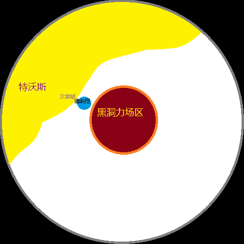

**星图1.png** *(10.48 KB, 下載次數: 0)*

[下載附件](forum.php?mod=attachment&aid=NjE1MzZ8NDNlNzI5YTh8MTYwMDg4NzA3NHwxODIzMHwyMTE0NQ%3D%3D&nothumb=yes)

2016-5-28 23:54 上傳

以下是正文

新历46年，8月27日，特沃斯首都——维奥科森10月26日

苍茫的青空，辽旷的草地，马群在远方点缀跃动着，花岗岩的大道上没有任何的装饰，目力所及的远处是城墙般的高墙，卫戍们整齐的坐在城楼，看不清他们在做什么。

这里，是特沃斯帝国的王宫后门。

特沃斯帝国，一个以六十余颗可居住星球组成的，星区星球最多的国家，这里是他们的首都

娇小的金衣少女的身影，提着高尔夫球杆，悠哉而又快步的走在大道上，细碎的雪花堆在金色的国王衣装上

“母亲大人！”

她转过身，正好让女儿看到了她那又期待去玩转为无奈的表情

这位二十八岁的国王，正回身看着她十二岁的女儿

“您又要跑去打高尔夫了！！”

这个比国王矮点，长的差不多的女孩就是三公主

不过很快就不是了

“让位的事您再等等好吗？我才十二岁啊，实在不行的话哪怕明年成人礼再说也行啊。。”

“哎，我觉得你差不多长够个了，能力嘛也没问题，你看看老大根本不是这材料，老二是智障，老四虽然很能干可她才五岁”

“不是传给谁，是不想这么早”

“这个是不可能的”

她笑了笑，对女儿举起了球杆筒子

“我生你们就是为了早日当太上皇啊”

三公主凑近了，把脸抬着看着自己的妈妈，压低了声音说

“当了太上皇好去玩是吧”

而国王只是笑了笑

“我还没生孩子呢，这皇上我干了太子谁当啊？”

“当然是老四，这可是专门当临时太子的材料，你孩子差不多了就把太子位子调调，国王那些文件我特意给你做了摘要，你都看了吧？”

“对，我看了，太子明年计划远征”

“嗯，所以我放心啊”

“您放心。。放心她去那么冷的地方？”

“我放心她去了，国家肯定不会出事”

看了看这跃跃欲试的想跑的女王，她也叹了口气

“哎，成吧，这几天就没看您来过，打个卡上个朝就跑了，这国家都快成我一个人包办的了，累死了”

“通知老四了吗？”

“还没啊，太突然了”

“你管吧，我走了”

留下碎了一地的三公主，女王继续去打球了

次日，特沃斯开国国王宣布退位，由储君三公主燕彻雪即位，国家继承制度在新公主或王子诞生前暂时实行姐终妹及制度，新的储君——四公主燕雅宗于当日就职。

一年后

新历47年，9月13日，德纳尼3月18日

舰队在次莱啵轻而易举的获得了胜利，进行了长达四个月的休整。

四公主带领更多的部队来到了次莱啵，开始朝着德纳尼的方向进发

德纳尼的首相麦克斯韦尔，五十出头就已经花白了胡子，在机舱里喝着热咖啡

冷

冬天零下六十度的寒冷气温下，机舱里零度的温度已经不易

因为已经超速飞行了，冷风从机舱的缝隙中漏了进来。

这是一颗以靠近黑洞力场而获得良好的商贸环境的星球，引力抛物线的协助下可以使这颗星球极为丰富的稀有金属得以轻松的大为畅销

因此，从艰难的生存环境下开发的矿井开始，到现在夜空中耀眼的城市辉光闪耀着的繁荣，它的发展并没有被恶劣的气候所阻挡。

赶到会议地点的老首相，正看到女王在桌上，两手中间是一叠文件

“这是我们最后一次在这里私下约会了吧”

“啊，你来了。最近的情报有没有看到？”

德纳尼的女王，十七岁，看起来比实际年轻一点，一米五五的身高和娇柔的体型。

红白相间的上衣，以及红白色的帽子和袖子，红色的衣领和腰带，白色的花边。她看着首相，目光坚定而活力的看着手中的纸张

首相思考了一秒，然后入座说

“是的，他们来了？”

“嗯，他们的航线很笔直没有错的可能了”

“我懂了，军械部会在我的要求下着手紧急战备”

“我们还需要进行谈判和战争动员，最重要的是拉取外国的支持”

“您放心去做吧，内政交给我，我会保证军需品的补给和生产线的顺利”

“舰队怎么办？你有什么建议吗？”

“拉上去肯定全军覆没，但可以拖一段时间”

“没太大的必要，保存实力吧”

谈话间，几名部长和要人也进入了会场

在这个咖啡间，本来是讨论非正式问题的地点，但显然更加适合现在的情况。

战斗计划已经被制定完毕，唯独一人反对

航空部长反对，因为把本土置于不顾的让舰队躲在北极，是很令他无法接受的事情

很快，他的意见得到了赞同，并且制定了代号为迟滞计划的方案

一切都已经商谈敲定的时候，

只是有一个问题，在座没有任何一个人心中有答案

作者的话：我在三个回复里看到有人把2个国王搞混了，特沃斯的国王是13岁，德纳尼的国王是17岁。这是两个角色

 

# 2

*本帖最後由 冰西瓜 於 2016-5-29 17:29 編輯*

> [黑鸦 發表於 2016-5-29 16:34](https://giantessnight.com/gnforum2012/forum.php?mod=redirect&goto=findpost&pid=294916&ptid=21145)

> 这已经不是文风的事了  如果你改变一年一岁的设定好歹说一下吧，   姑且认为一年12个月 我是猜的  一年长了 ...

会慢慢补充的。

首先，新历46年，8月27日，特沃斯首都——维奥科森10月26日

拿这个时间举例子，新历46年，8月27日是星区时间，维奥科森10月26日是星球时间。

星区时间是地球年制度，以12个月为一年，30或28或31天为一个月

星球时间是按照具体星球的公转与自转周期划分，月份数量，每月的天的数量，每天的小时数量都不一样，但每小时是60分钟这一点是一样的。

因此请注意标准时间和星球时间的意义

老四的年幼问题会在后文逐渐渗透设定，出征的时候是6岁。现在觉得小是很正常的，我想我对此的剧情设定应该在第一章就插入，但现在只能决定放在第二章

第二章更新之前我会把第一章需要补充的基础设定内容填充在一楼

最后说，你们3个人集体把2个国王弄混是怎么回事？我看了，我真的没写错啊。。

 

# 3

> [yuxiaoqiu 發表於 2016-5-29 01:36](https://giantessnight.com/gnforum2012/forum.php?mod=redirect&goto=findpost&pid=294863&ptid=21145)

> 我说 三公主12一年后17 ？四公主才6岁 带兵出征？？ excuseme？

鱼小球，怎么连你也把2个国王搞混了？我吓得赶紧看了眼自己的文，明明没有写错啊。

特沃斯女王是13岁，德纳尼女王是17岁

既然你们都看乱了，我去在那里标注一下好了。。

 

# 4

> [woshishen 發表於 2016-5-30 16:54](https://giantessnight.com/gnforum2012/forum.php?mod=redirect&goto=findpost&pid=294972&ptid=21145)

> 文风特殊吗？我倒是觉得看着挺舒服的。

> （命运的红线算是彻底坑了吗...） ...

我的许多坑都是有生之年。。脑洞比产能大的后果就是这样 

# 5

*本帖最後由 冰西瓜 於 2016-6-15 01:26 編輯*

<ignore_js_op>

**235448yrjy3qurpq3oiuij.png** *(20.61 KB, 下載次數: 0)*

[下載附件](forum.php?mod=attachment&aid=NjE3NjZ8MDMwMzRhY2N8MTYwMDg4NzA3NHwxODIzMHwyMTE0NQ%3D%3D&nothumb=yes)

2016-6-15 01:06 上傳

<ignore_js_op>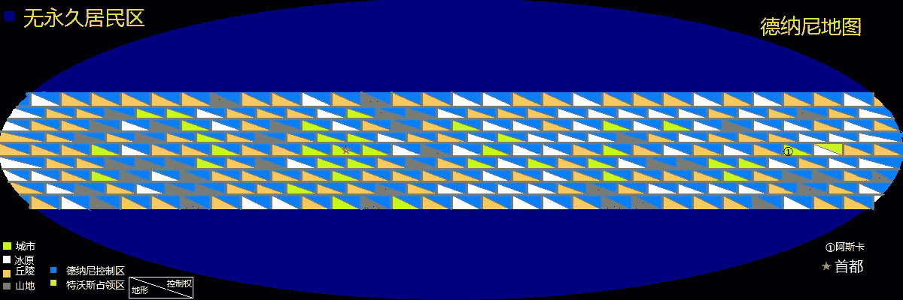

**ditu - 副本 - 副本 - 副本2.jpg** *(165.9 KB, 下載次數: 0)*

[下載附件](forum.php?mod=attachment&aid=NjE3NzF8ZmIzMDY5ZTR8MTYwMDg4NzA3NHwxODIzMHwyMTE0NQ%3D%3D&nothumb=yes)

2016-6-15 01:26 上傳

第二节 战争

四公主燕雅宗，年仅六岁

这次战前大会，是上帅波尼可夫先做战前的最后演讲的。上帅是星区中普遍采用的军衔，改元帅为少帅，以三三制基础上设中帅和上帅

四大上帅由皇储直属

在全体远征军高级将领大会上，老上帅结束了演讲后，她走上了讲台，在搭建好的高台上，稚嫩的声音宣讲了这次远征的重要性

燕雅宗是在五岁就职的，开国女王在近年来越发不愿大量工作，因此长期实行培养皇储为她包办大量工作的制度，

在先帝的在位期间，自上而下形成了主职负责决策和任免，副职负责日常工作的体系。这一体系在军政各方面都有实施。

她在让位之后，这一制度导致了国家的实际管理人从三公主转移到了四公主手中。

五岁的孩子在一开始并没有表现得很好，外表和内心相符的幼稚体现得很快，但她也在新任皇帝的指导下迅速体现了快速的成长。

四公主从三岁开始的为期两年的速成培训起到了重要的效果

这个孩子并没有一个完整的童年，但拥有刻意催化的早熟

在远征之前，她已经建立了可观的威信，实现了基本上的领导

演讲长达三十多分钟，军队在她思路清晰条理明确的发言中已经动摇了对她年幼的不信任，而四公主明确了此行的第一目标，吞并德纳尼。

护航舰队在前方发现了德纳尼军舰，并开始了三个小时的激战

在少许损失下，敌人消退在了黑暗的宇宙中

这并没有出乎任何人的意料，波尼可夫和燕雅宗就这样在登陆前的讨论中赶走了敌军的舰队

但3小时后，他们又出现了

战斗持续了2小时，德纳尼的舰队遭到重创

1小时候，又遭到了一次阻击

在比预计迟到6小时的情况下，庞大的舰队已经停在了德纳尼的轨道上空

德纳尼舰队已经不见了踪影，星体大陆的细节已经暴露在了视野中

有些遥远而显得小的恒星散发着白色的光芒，宇宙各地的战士们各有所思，而四公主则在指挥所研究登陆点

波尼可夫所提议，四公主批准的登陆计划在四小时后实行，

在校准登陆位置的同时，五艘运输舰分别在太空的五个位置对德纳尼的城市投放了七百多枚核弹。

少数关键城市上空的核弹被拦截，其他的则造成了红蓝各异的闪光

五分之一的城市被夷为平地，七分之一人口在四小时内丧命

德纳尼的人口是三千万多一些，这下第一位数变成二了

相对的，特沃斯远征军也耗尽了带来的全部核弹储备

在兵力最薄弱的，与首都相隔半个星球的偏远城市，以两万人的伤亡作为代价，他们终于登上了这颗星球

一百六十万大军，开始从运输舰中挤牙膏

从船舱出口旁的窗户探出头的燕雅宗，稚嫩的童颜皱着眉头，她叹了口气，水分却马上变成了冰粉，脸上刺痛得疼，她很快就把头缩了回来

她强忍着冷，但止不住了哆嗦了几下

她原以为家乡零下二十度的冬天就已经很冷了，原来那根本不叫冷。

“幸好战士们的衣服看起来勉强可以抵挡”

一个个浑身穿的非常严实的士兵们冲出运输机，包裹着的头部看不到底下的光头

特沃斯帝国是以光头作为男性通用发型的，只是一般带着帽子遮盖住而已

四公主找到波尼可夫，说了下她见到的情景后，又问

“这颗星球这么冷，为什么还有这么多人在这里定居？”

“啊，王储大人您好，这颗星球是以矿业为经济收入的主要来源，特别是稀有金属的产量极高，在旧历时代就已经吸引了大量的采矿工业投资，至今……”

燕雅宗打断了他的话，并且上前一步

“我知道，我是想问，他们怎么生活的？这么冷的天气，我担心士兵们的安全”

“嗯……实际上，我们了解的也不是很多，这里的气候是目前人类所能接受的最冷的气候，平均零下六十度，最低零下八十多度，我们仅仅知道他们是靠城市之间彼此连接的供暖系统生活的，也就是说，虽然可以外出，但大部分时间他们都在相互连接的室内和地下系统进行交通和生活，具体情况可以去看资料库，您的秘书应该已经整理好了”

“哦对，我怎么忘了这是他的责任，还真是辛苦你了解了”

“哪敢，这也是我必须做的，说到安全，由于德纳尼是无核国家，我们的导弹防御系统实际上在一个比较低的水平也可以组织扩散兵力，应该很快就可以占领阿斯卡”

“嗯，最好不会突然飞过来核弹什么的，不然出去的人都死。。不安全了”

“放心吧，他们的主力还来不及赶到，我们可以很快分散兵力”

“走，去看地图”

屏幕上显示的地图，四公主指了指着陆点，又从两个方向指了指德纳尼的首都

“从这边，往西打，光看地图是没问题的，其他因素呢？”

“四公主您想的很周到，可惜我们对他们的部署并没有详细的了解”

“这样啊，告诉奈尔达哥少帅，把第一装甲集团军在西侧驻守，不要妄动，等待主力整军”

“知道了”

“我要说的暂时就这么多”四公主转身对丫鬟说

“我要个凳子，一杯奶茶”

四公主燕雅宗看着地图，没有理会旁边站着的上帅，过了一分钟多一些

“啊，不好意思，赐座！”

老上帅坐下后，四公主又抬头看着他

“你怎么不去忙你的工作，战略部署都分配完了吗？”

“做过了，现在应该算是研究的时间了，您在这里忙，我怎么敢歇着”

四公主叹了口气

“这次，太上皇的压力大啊，不过说到底都是为了国家，担子沉，心里就觉得有什么东西堵在胸口，让人不敢停下工作，您年纪大了，倒是不该累着自己”

“求四公主恕罪，卑职不敢耽误军情，虽然年老力衰，但在职退休之前我自当竭尽全力，绝不耽误指挥”

四公主不再看着老者，继续看着地图说

“是啊，老人家的经验和能力不再弥补其身体的衰老时，就该退休享受晚年了，打起精神，我们还有一场艰苦的战斗在等着”

上帅坐了坐，就离去了

四公主要来了件军装，然而不是不够防寒，就是太大号，没有一件能让她去视察军队，最后她要来了辆坦克

裹上一层层的被子，强拉着秘书和他抓到的一个正在悠闲喝茶的中帅塞进了坦克，坦克冲出了运输舰，朝着最近的军营开去了

 

# 6

*本帖最後由 冰西瓜 於 2016-6-27 00:16 編輯*

“四公主大人，您这金枝玉叶在坦克里伤了可不好啊！”

“我伤了总比战士们伤了好”

在最近的一处军营，四公主向战士们挥动着娇小的双臂，她向官兵们传达着这样的信息——我们生死与共，亲征的四公主与你们同在

回来的路上，四公主从观察口看到天上飞过四个人，其中两个人拉着一个，飞的不高。四公主钻出车，拿扩音器喊着

“上面的四个人，快下来！”

她们看到穿着金闪闪长袍的小女孩就意识到是四公主，于是降落了

下来一看，原来是法师队，其中一个人受了伤，被另外两个人搀扶着

四公主把白大衣再重新穿好，畏缩的站在这四个人面前

“你们怎么了？要去干什么？”

站在最边上的女孩向前了一步回答

“我们刚才在执行巡逻任务，遭到敌方法师攻击了，她们数量众多，我们的小队寡不敌众，正要回去汇报”

四公主指了左边的一个女孩

“哦，你，还有你，先回去汇报吧”

留下的另外两人抱在一起

“到底怎么回事？”四公主走进了，看了看女孩的伤势

“我们侦察的时候，我突然被一个巨大的光球击中，我们发现对面有好几十个人，我胳膊被打中了，然后我们就赶紧往回跑”

“你们谁是队长？”

“刚才走了的人里有一个就是”

“她们战力如何？”

“不知道，她们只是有人打了我一发，我们逃跑的时候没有被追”

四公主叹了口气，回头看了看身后的将领

“这么个小星球，怎么会有这么强的法师队”

“这里靠近法师技术的发源地，包括德纳尼在内的周边星球都有比较发达的法师队”

“这可不是好事”

她对另一个法师吩咐带伤兵去治疗，然后就返程了

“波尼可夫，给我讲讲法师队的事，我得补补课了”

“法师队，呃，是一种新兴的兵种，其理论在新历元年左右才开始萌芽，近十几年才开始成型，以雇佣兵的形式组成的特种机动部队”

“这很怪异，原理是什么？”

“心理学，医学，生物学在理论上取得了突破，使人可以自由的集合自己的能量，甚至通过意识控制快速的生成和输出能量，进而实现可以军用的能力，同样的，这也可以用于民用。”

“为什么是雇佣兵形式？为什么数量这么少？为什么只有女孩子？”

“因为它无法通过培训来变强，而是完全取决于资质和努力，而且虽然包括我国在内的各国一直在研究让男性获取这一能力，但一直难以成功，最多是有个别人保持在勉强100牛顿的水平，最近的研究结果表明，男性无法成功的原因是精神能量控制需要的控制力和生物体的生命力相关，有关男性研究也就停滞了。法师队的正式名称本该叫精神能量控制部队，但很快被通俗的【法师】这一名称取代”

“我路上看到了法师队的伤兵，发生了什么？”

“大量地方的法师部队飞了过来，击伤了我们的小队，然后就逃掉了，虽然他们兵力相对优势，但并没有战意”

“单纯的侦察吗？”

“我想是的……”

几小时后

她走了，打卡挂休了

回去的路上被拦下了

“储嗣大人，国际上发生了重要通知，这是简报标题，女王希望您马上和她联系”

【伊内姆瑞格，对埃纳尔夫、奈提尔布宣战。】

“知道了”

四公主自己觉得并不意外，因此并没有加快脚步

回到休息室，她打开了稀有、昂贵的量子通讯器，屏幕对面的女王已经等待多时

“皇姐，好久不见，我已经看过通知了”

“所以你该快点了，时间很紧迫，调防正在进行中，如果需要增援的话就通知我。”

“我们之前就怀疑的事情现在成真了呢。”

“做好准备就是了。姐姐~，为什么这次我不能兼职，而是太上皇非要让我放下朝政呢？”

“我不知道，我必须替你照顾好国家，虽然现在已经非常忙了，但太上皇不同意副官临时辅助帝王掌管国事”

“辛苦了，想想就觉得会非常累”

“你也许不知道，在你出生之前，我们的母亲就曾长年如此，我们应该以她为榜样。”

“哎，生在帝王家，有时也有苦说不出啊……”

四公主把那身和皇袍差不多的皇储服丢在床上，只留着短裤和衬衫就坐在了床边

今天新到任的，被缩小的秘书走到床边

这里的秘书指的是文员职位，职责是速记、记录日程、会议、整理和运输细杂信息，是在今天新到任的

燕雅宗看了看脚边的他，就说

“你能不能别在地上走来走去，我怕踩到你”

<ignore_js_op>

**登陆ijpg.jpg** *(57.35 KB, 下載次數: 0)*

[下載附件](forum.php?mod=attachment&aid=NjE5NTB8OWJlNTcwNTZ8MTYwMDg4NzA3NHwxODIzMHwyMTE0NQ%3D%3D&nothumb=yes)

2016-6-27 00:13 上傳

<ignore_js_op>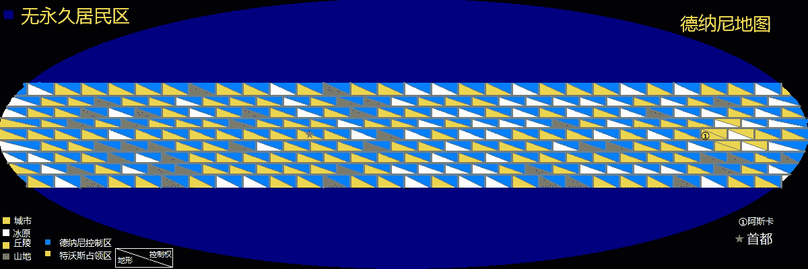

**3登陆jpg.jpg** *(165.85 KB, 下載次數: 0)*

[下載附件](forum.php?mod=attachment&aid=NjE5NTF8YzA2ZWI1Njh8MTYwMDg4NzA3NHwxODIzMHwyMTE0NQ%3D%3D&nothumb=yes)

2016-6-27 00:13 上傳

 

# 7

“踩死的话，补充一下就好了，要多少有多少”

本来已经要躺下的四公主朝着天花板瞪了一下，立刻坐了起来

她看到眼前的男子正跪在地上，用职业性的扑克脸看着自己

“你不在乎自己的生命么”

“在乎，但我觉得这和您的便利相比不值一提”

“你可以搭点梯子，走到桌子上之类高些的地方，那样更安全”

“居高临下向四公主对话是亵渎的，如果不是为了工作便利，我甚至不敢将头高过您的脚趾”

四公主脸红了

“储嗣大人，您可以随时对我下令，所有非急用的信息都由我整理备份和汇报，我还负责您在非工作时的基础传令工作……”

“停！”四公主叫住他以后顿了顿，大声说

“不要在我的休息室里叫我储嗣大人！叫我四公主就好了，反正三姐早晚有小孩，我只是临时顶替一下”

经过两秒钟的沉默，他抬头微笑着说

“知道了，四公主大人。”

“还有，我忙了一天了，有什么工作就快说吧，如果不急就明天早上再和我讲，免得我睡一觉又全忘了”

“除了今天的战场状况，其他的消息以德纳尼星的信息为主，包括天文情况和地质情况，地质方面又比如星球的大气成分，地质成分，地形地貌，经济体系，人文地理等多方面内容，我已经将封包做了归类，并对非机密文件提前阅读完毕。它们都堆在墙角”

“堆在墙角？真是碍眼，等忙完我要去里间休息，你先把这星球的大气成分说一下吧，今天的呼吸总觉得怪怪的”

“德纳尼星是以61%的氮气，31%的氧气，4%二氧化碳，2%氖气，2%其他气体组成的”

“所以我总觉得喘气怪怪的？”

“一般的行星都被人工调节为氮氧四比一左右的比例，而这里的人为了适应低温气候，采用了特殊的比例，不仅会有醉氧和呼吸不稳，而且会对二氧化碳的含量不适应，不过四公主大人您不必担心，二氧化碳和氧气的同时增高对身体的伤害小于单项增高”

“我听不太懂，是不是类似于拮抗呢？”

“抱歉，我实际上不是很懂化学，只是记住了而已”

四公主沉默了，她想着秘书的话，【和您的便利相比不值一提】【不敢将头高过您的脚趾】

脚边的秘书有些害怕的说“对不起”

“怎么了？”

“也许我没能提起您的兴趣”

“我只是在发呆而已，今天真的很累了”

“今天累了，我先回去休息了”

另一方面，德纳尼

今天的德纳尼王宫比往日更加繁忙，德纳尼女王铃兰，刚刚从她负责的外交部会议结束后就去面见首相麦克斯韦尔

到了地点的时候，有几位要员也在一起

“外交官已经传回了消息，伊内姆瑞格拒绝了我们的求助，奈提尔布答应会给我们一些军需品，不过还不清楚具体的详单”

女王一副受了委屈的小女孩的表情看着首相

“您别用自责的表情看着我们，高贵的女王大人，伊内姆瑞格肯定不会刚开战就去援助我们，我们也不应该对奈提尔布抱有多大的期望”

她咬了咬嘴唇“我们的情报部门估算对方的国力有我们的十五倍，我们不可能单靠本国这点兵力来打赢一场大规模的自卫战争，可眼下还没有人愿意帮我们”

“我很遗憾，根据现在的形势，在我们的主力赶到之前，萨姆润恐怕已经失守了，我们的战士做好了以一敌十的准备并且有着充分的信心和技术，虽然不能确保胜利，但起码可以尽可能的拖延时间”

铃兰看了看麦克斯韦尔，然后丢给他一张刚印出来的报告单

上面列举了估算的特沃斯兵力，兵种组成，以及本次侵略的估算兵力

“和我们之前的数据没有多少出入”

说着，他把单子传给其他人传阅

“国家兵力超过十倍，而且中度机械化的军力，注意”

“明白了，是时候转移工业到首都周围了。”

“嗯。。等散会后我有话单独说，现在我们的主力到哪了？”

“欧帕克附近”

“那快到了，从首都运送物资太远，等奈提尔布答应的那批军需品到了，就让他们直接送到欧帕克吧”

“到时候再考虑吧，战局会发展成什么样，谁也说不好。”

在旁边做笔记的军械部长，把写好的“送到欧帕克”又划掉了

首相很少否定女王的建议

在打发走其他人后，铃兰凑近首相，抬起头看着他

“麦克斯叔叔，我们是不是应该把民众扯到战线后？”

“这不可能，我们的运输能力想保持全速行军就已经很困难了，何况是那么多的人口”

“特沃斯的核弹已经害死了几百万的人，我觉得是我害了他们”

“别错怪了自己，孩子，他们带来的核弹应该只有这么多，不会再有核弹攻击了”

“十多倍的兵力到底要怎么办才能挡住啊？你觉得他们来了多少人？”

“六分之一左右，所以以我们星球的气候，我们还是有信心守住的”

“你看上去有黑眼圈了，一定要注意休息不要为难自己”

“谢谢您的关心”

停靠在地的指挥舰，四公主寝室

睡饱了的燕雅宗，蹲在房间的角落里一张张的翻着消息

“奴才有罪！甘愿受罚！”

聚精会神的时候突然被吓到了，站起来往右看着跪在地上的小人

“你吓死我啊？惹了什么祸了？怕成这样？”

“没有准备好……椅子，奴才没想到您这么早就起来翻阅了”

“嗯，是该惩罚一下”

秘书抬起头，看着巨大如同十层高楼的四公主咚咚咚的踩着震撼地板的步伐朝自己走来，然后他微微低下头，看到一双巨大但稚气的脚

四公主把脚从拖鞋中伸出，然后在秘书的头顶压了下来

稚气，现在等同于死亡的气息

当脚趾压在自己的头顶，并且渐渐加大压力的时候

因为年幼无知而造成的下脚过重而死，是他最担心的死法

在还没有太痛苦的时候，他就已经决定喊疼了

他喊着“好痛，好痛”

四公主终于收回了脚

“你这么小，让我怎么惩罚你？碰一碰就死了，去变回正常大小，然后过来受罚”

“奴才不敢，变大以后和您独处会使您不安全”

“那算了，反正不是什么大事，下次别拿鸡毛蒜皮来吓唬我，自己记住别忘了就是了”

“遵命”

“现在部队打到哪了？”

“刚到萨姆润城区，我这里的消息不是最新的，您可以去找指挥官咨询最新的情况”

<ignore_js_op>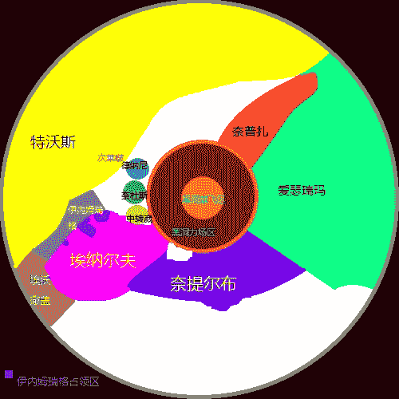

**235448yrjy3qurpq3oiuij.jpg** *(57.59 KB, 下載次數: 0)*

[下載附件](forum.php?mod=attachment&aid=NjIyNTF8ZjdjMGY0MDd8MTYwMDg4NzA3NHwxODIzMHwyMTE0NQ%3D%3D&nothumb=yes)

2016-7-14 11:39 上傳

<ignore_js_op>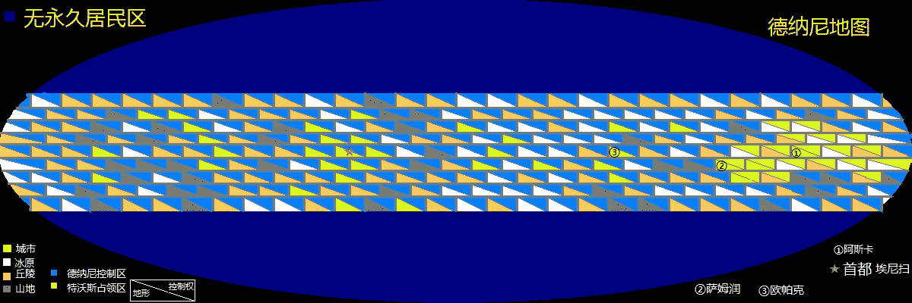

**3登陆.jpg** *(170.42 KB, 下載次數: 0)*

[下載附件](forum.php?mod=attachment&aid=NjIyNTJ8YmU2NjBiY2R8MTYwMDg4NzA3NHwxODIzMHwyMTE0NQ%3D%3D&nothumb=yes)

2016-7-14 11:47 上傳

 

# 8

*本帖最後由 冰西瓜 於 2016-7-18 13:06 編輯*

赶到总指挥部的四公主，先问了现在部队的进展

“地图上看，一切还顺利”四公主看了看波尼可夫，又问

“部队的损耗如何？”

“比想象的大，戍守在附近的敌军集结在了萨姆润城区，我们刚到这里就与敌人展开了巷战，他们的数量超出了我们的预期”

“看起来我们很有可能低估了他们的实力……”四公主转了90°，用手拖住下巴

“来的时候也被阻挡了太久，我很怀疑。。”

波尼可夫打开了星图，指着边境“增守次莱啵的增援部队已经在路上了，现在的推进仍然以每天100公里以上的速度进行着”

四公主点了点头，回到德纳尼地图，她点了点萨姆润

“你看，这里是一片密集的城区，我们如果可以在敌军主力赶来之前占领这里，就可以更好的休整和补给，也为后续的推进降低很大的难度，如果需要额外补给支持的话也可以批准，不过这会削弱我们之后运输的援兵数量，同时占用很多的国家资源。”

“根据目前的形式，我认为还不至于到这个程度，如果不是从着陆点到城区的长途跋涉，这点兵力根本不会是我们特沃斯正规军的对手”

“要知道，如果我们要到德纳尼的首都——埃尼扫，距离着陆点有两万公里远，现在我们已经推进了三千里，用了正好一个月”

“你不是说每天100公里吗？三千里三个月，他们都没有休整怎么可能攻克得了萨姆润？”

“100公里是平均数值，机械化部队比这要快一些，他们曾经在城外休整了几天。”

“步兵部队呢？”

“我很抱歉储嗣大人，我们的步兵行军缓慢，一直在脱节，”

四公主看了看地图

“你应该说的详细些”

“详细的报告在这里”他指了指旁边的另一张桌子

“好吧，你打算怎么指挥？”

“我已经下达了命令，占领城区以后进行休整，准备下一次进攻”

“地方的情况如何？”

“法师队做了侦察，他们的第一批主力距离我们已经只有两千公里了”

“我是不是该去视察一下法师队的状况？”

“那些佣兵不值得信任，您如果想去的话需要警卫军的陪同”

“我的天啊……”

冰天雪地的旷野，在一个机械化团的周围，火萝莉上校正在用她的能力煮鸡蛋

火萝莉的名字没人知道，她拒绝透露名字，然后被人称为火萝莉

她穿着一身凉快的背心短裤和红凉鞋，定向的朝旁边的同伴输出着热量，

旁边的爱丽丝上校则在蹭暖和，她们正在等去侦察了的宇文欣上校

结果上校还没等来，等来了提娜少将

法师队的最高指挥官，唯一的法师将军

她穿着一副将军服，本来挺正常的一副女将军形象，刚刚脱离稚气的十五六岁的脸也勉强撑起来样子，

【噗哈哈哈哈】

火萝莉笑的连火苗都乱窜了

“我们一共就一百多个人哎，你穿这么正经反而好滑稽啊哈哈”

“笑什么？我好歹也是你们的长官”

“好好，长官，火萝莉说的对啊，你手底下就一百来号人，你摆什么架子？”

“火妹妹，你煮的鹌鹑给我来几个”

火萝莉丢给他两个，旁边有一个连的士兵也走了过来，想要蛋吃，顺便蹭蹭暖和

“喂！不要打架！鸡蛋不够吃的”

提娜：“下次还是煮鹌鹑蛋好了”

“太小了”

“主要是为了暖和，对不对啊帅哥们？”

“对！！”

在路过的连长维持住秩序后，他们在火萝莉的火光下围好唱歌

三个少女和一百多人的舞会持续到了傍晚

“天黑了，希卡利呢？叫她过来点灯！”

“她在东线呢”

“我们不是在等宇文欣吗？她怎么还没回来？”

“再等等吧，应该快到了，说好的天黑之前回来的”

谈话时，西边的夕阳边就有了小小人影飞来

“你怎么这么晚才回来啊？”

“我飞到了埃尼扫，又从那里飞了回来”

“看到什么了？”

“到处都在搬东西，而且有好几十万的人正开向这里，他们全军机械化，我没有看到一个步兵师！”

提娜走上前说

“那就对了，他们已经实现了全军机械化，他们的主力还要多久到这里？”

“明天早晨”

“很好，你和我去找军长，连长你留一个排做哨兵，爱丽丝你最好也和我一起去报告”

“知道了”

连长目送着三个女生飞走，消失在了夜空中

萨姆润东城区，刚刚修整完毕，而且没有参与攻城作战的第一轻装甲集团军，已经接到了入城命令

“出发！以70千米的时速入城”

这群装载着致命的钨钢弹，娇小但迅猛致命的钢铁猛兽，以漫天的扬沙向城区狂奔

7.5cm粗，三米长的炮管在迷你的车身上看不出有多么强大的火力，但车内装载的钨钢弹却是昂贵的珍品，特沃斯的骄傲，最强的高机动部队，正在以最强状态等待着敌人自寻死路

将路上其他的装甲师超过，月色下的第一轻装甲集团军迅速的开进了

 

# 9

第二天的早晨，前来试探性攻击的部队被打回山上，刚刚赶来还来不及休整的德纳尼机械化军被第一轻装甲集团军缓慢但稳步地向后推，其他各机械化集团军也从丘陵地区向前推进

在四公主所在的指挥部中

“怎么回事？为什么只有一半的人到位就开始了攻击？”

“您先不要慌”波尼可夫解释着

“虽然我们的步兵部队脱节了，但是敌人长途跋涉也没有来得及休息，我们的先头部队已经齐装满员，正是趁乱进军的好机会”

“我把这群步兵带来不是让他们跑步的，真希望他们能发挥点作用”

“我想会的，但不会是现在”

四公主叹了口气“就当他们在锻炼身体吧，也顺便镇压一下游击队”

“对了，游击队现在就已经有很多了，但许多当地的警察不愿意配合我们的治理，有些城镇正濒临起义”

“是吗？我上次说把那些掠夺平民的士兵变小送给女孩当玩具的事情怎么样了？”

“已经落实了，附近的游击队数量比预期好一点，但其他地区还是无济于事”

“我都忘记去视察那个小女孩了，现在好忙的，什么都来不及做”

“虽然做了许多新的规定，但士兵们和当地人的文化冲突太严重了”

“我是没办法了”

4小时后

第一轻装甲集团军长奈尔达哥发来电报

“激战四小时，已经击溃敌军，正在向山地腹地推进，部队减员2%，四公主大人万岁，特沃斯帝国万岁”

“波尼可夫，我本以为这会是场简单的胜利”

波尼科夫拿出一些照片，是雪地崎岖的山路

“冰封加上山地，对进攻方带来极大的不利，能做到现在这样已经不易”

“是的，不过幸好这颗星球几乎没有河流，我曾经在模拟教学中见过冬季绕过平原上的河流来进攻的案例，设想一下，如果冰冻加上崎岖的山地，还有河流，那么它在地面上的防御就是无敌的。”

“您说的一点没错，所以现在的损耗虽大，但也实属不易”

“损失了百分之二啊，打仗就是在打钱啊，波尼可夫，你来回应吧”

【请尽力加快速度，保持与友邻部队在丘陵地图的攻势同步，但在遇到主力时不要勉强，等待空军侦察的完成】

四公主很疑惑

“为什么你对第一装甲师的推进速度如此悲观？他们都是我们的精英队伍”

“山地作战很难快速推进”

“那为什么不用机械化部队打主攻呢？”

“我们的轻坦克有良好的山地作战能力，可以应对最困难的山区，但即使这样也不能和良好地形的推进速度相比”

“我们应该信任奈尔达哥少帅”

两小时后

波尼可夫收到新的报告，“空军已经侦察到一个机械化集团军”

“很好，我们应该摸索着推测他们的状态，给前线部队更多的自由，发送电报，让第一轻装甲集团军确定敌人休整状态不良的情况下进攻”

而他们收到的回复则是

“保证完成任务”

半个月后

看着已经被第一轻装甲集团军占领了的第一座高山的山顶，四公主开心得跳了起来

其他的部队也紧跟在后的推进着

可是波尼可夫却很紧张

“接下来才是真正考验我们军力的时候，撤退的敌军已经在撤退中得到了休整，而我们的补给线已经长期接不上部队了，有些师的建制甚至开始残缺，四公主大人，您应该来看一看”

“这片山区，有一个刚刚撤到山上的一个机械化集团军，对面是我们的阵地，附近荒凉崎岖，既没有铁路也没有城镇，是完全的荒地，他们必须休整才能准备好下一次战役”

“我们损耗远远大于敌人，战损比例是三比一，现在的战况是我们在付出很大的牺牲来前进着，我们损失了四万多名战士来把他们推到西方的低地，这意味着在第一次正面大战前，我们已经占据了高地。敌人的数量比我们的预期要多，所以我们要在增援部队赶来前保持攻势，就必须先抢住这里的山脉。”

距离步兵部队赶上队伍还要几天，而正面开始进入停滞的攻势让特沃斯军在山地上进入休整，

又过了一个月

波尼可夫：“自从步兵军团跟上队伍，我们的推进又得以开始了，但酷寒下的战斗让我们推进的速度非常慢，距离我们的增援部队的到来还要一个月，可敌军的援军已经快要凑齐了，现在推进正越发艰难”

四公主：“我需要完整的报告，简单说说各集团军的状况吧”

波尼可夫：“恐怕不容易，各部分散成一条V字型的战线，十个步兵集团军都没有得到完全的补充，它们目前的状态最差，装甲师和机械化师们的状态一般但损耗更大，现在所有的主力状态都不好，因此整体上正在一点点蚕食式进攻，您可以在控制台查看具体到每个师的状况”

四公主听了后想了想，凑近了点对波尼可夫轻声说

“如果我们的攻势停下来了，就意味着我们从一开始就没有带来足够的兵力，而且会使整个战争计划全部被打乱。”

“我会尽量的”

“援军到了后我们就能确保推进了，在这之前该加把劲”

“我不建议过分的前冲，那样那会使我们的部队和援军脱节，我会尽量安排得兼顾，但仍需要您的建议”

“好吧就这样，我累了，先回去休息了。”

在特沃斯某星球的草原

太上皇燕比达，正和她的男人在一处高地俯瞰广阔的草原。

燕比达只有这一个男伴侣。所有的孩子们都是他们的后代。

她在高地上背对着他。

“老四最近的状况，比较严峻。”

“我是不是应该去看望她一下？”

燕比达转过身，面对着她的男人

“不准去，因为我需要你陪我。”

“我根本不觉得我们应该让那么小的孩子去那么冷的地方去做那么危险的事情”

“自从我放弃了我的权力，我就意识到自己的决定是正确的，我已经不再适合去做皇帝，我不再有以往的干劲了，所以我才生了老四”

“自己做不下去了，就生孩子让孩子背锅，你不觉得这样不好吗？”

“比做个昏君强，这也是没有办法的事”

“我们年纪轻轻就在外面养老，这样很对不起孩子们，起码等她回来，我们该去看看她。”

“行，一年多没见过老四了，怕再见了认不出了”

“有你这么当妈的人么？”

“没事有老大老三她们呢，没关系~”

太上皇原地转圈起来，为她生了能干的孩子而高兴

而亲王则叹了口气“你呀，没救了”

<ignore_js_op>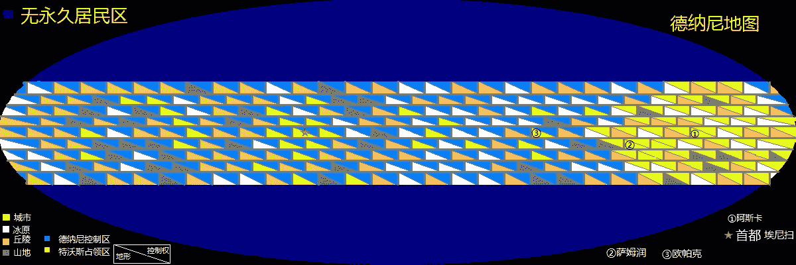

**6风雪前行jpg.jpg** *(170.67 KB, 下載次數: 0)*

[下載附件](forum.php?mod=attachment&aid=NjI3OTB8MTE5YzYxM2V8MTYwMDg4NzA3NHwxODIzMHwyMTE0NQ%3D%3D&nothumb=yes)

2016-8-9 22:50 上傳

 

# 10

> [shendanxiaogui 發表於 2016-8-14 19:00](https://giantessnight.com/gnforum2012/forum.php?mod=redirect&goto=findpost&pid=303978&ptid=21145)

> 5天前更新的...居然没人回复？

> 不能忍(╬▼皿▼）论坛没有一个军宅么！

> 话说这个地图做的有点粗糙啊...这种 ...

这是一篇带有剧情的GTS文，构思已经两年，但从一开始就确定很多章节不会有GTS成分，这既是回复少的合理解释，也是让我觉得能发布在GN就已经很知足的理由。

我昨天晚上想到了，我这做的并不是个地图，而是棋盘，而且我画的时候也是由棋盘启发的，现在看来，棋盘是下棋用的，并不适合作文章的配图

至于军宅，我想还是希望读者以剧情为主，对军事理论和机械工程问题不要认真，这只是魔法世界XD。ps.魔法宅请反过来看233

虽然计划的篇幅也不是非常非常长，但写到现在还是在铺垫，可以说铺垫差不多刚刚结束，我坚持写下去的动力就是让自己脑内反复两年的故事得以记述，无论它最后被写成什么样子。

 

# 11

一个月后

特沃斯军队在城郊已经僵持了一个星期，而增援部队终于来了

这次的会师让特沃斯的远征军力近乎翻倍，500万军队现在正在准备新的行动

欢呼中，巴芙拉中校收到了圣旨，要她去四公主的行宫赴宴

爱丽丝上校则收到一份被要求立刻打开的邀请函，同样的，希望她去四公主行宫赴宴

就在巴芙拉赶到，叩见储嗣四公主后十五分钟，爱丽丝也到了

这是因为圣旨要求的时间比邀请函早十分钟。

而刚要跪下的爱丽丝就已经被四公主喊了平身，

四公主走上前去，拉起爱丽丝的手说，不必多礼了，我们赶快开始吧

四公主和爱丽丝差不多高，而且年纪也差不多，巴芙拉则有些害怕的稍微走在她们后面

丰盛的宴会上，刚出生的小牛里脊，鹌鹑蛋清熬制的鸭肉粥，鲜美飘香的牛肉面，牛肉干炒面，还有马血，马肉夹饼，羊奶，手扒羊肉，奶茶，大块烤牛排，还有一些甜点，牛肉炒甜椒之类的肉菜

“抱歉我忘了准备素食，不过你们应该没有不吃肉的人吧？”

“承蒙储嗣大人恩泽，都非常的引人垂涎！”

“附议！而且香极了！”

“你们是客，先吃吧。”

两个女孩面面相觑的看了看，豁出去的先动了嘴，而四公主，只是笑笑，也开始了大快朵颐。

吃饱喝足后，爱丽丝这才问道

“储嗣大人请我们来，有什么吩咐吗？”

四公主笑了笑，抬了下手，一个侍女走上前递了张纸。

四公主摊开地图，用手画了条线，又在一座城市画了个圈。

“这里是我们的战线，我们面前的正中，有一片城市带，就如同你们所见的苦战，使我不得不设法降低伤亡，你们都知道我们的战损比吧？”

爱丽丝回答说，“我那里大概十比一”

“损耗太大了，即使我们将会师后的主力全部集结好，也势必在这片区域付出很大的代价，尤其是位于城市带中心的欧帕克，处在最碍事的正中间”

她看了看巴芙拉，又看着爱丽丝说

“我想，请你们帮个忙。”

爱丽丝咽了口口水，紧张而不做声，四公主在心里理了理语序，平缓的说着

“带来的核弹几乎打光了，就算用核弹也会伤及自己人，我也没有带战略轰炸机过来，我知道你们的能力在法师队中拥有最大的火力，我希望你们能补上战略轰炸的空缺，在交战前让欧帕克市的基础设施陷入瘫痪，我唯一担心的是，你们能做到吗？”

两个女生互相看了看，又是一阵沉默

先开口的是爱丽丝

“好吧，但是我需要保护，释放过程中我是几乎没有任何防御的，而且在事后，我需要三天的休息来恢复能量，而且做不到把城市夷为平地的程度，只能尽量攻击交通设施”

“可以，巴芙拉，你呢？”

“对不起，我真的无能为力”

她并不是说谎，而是这真的超出了她的能力范围，她无法想象单凭一己之力如何夷平一座城市

“没关系，我要你在行动中配合提娜和小火，支援爱丽丝的行动。我们把时间定在总攻前一天的早晨怎么样？”

“夜里更适合隐蔽，而且对我的行动不会有影响，电弧会照亮整座城市，而他们却看不到夜空中的我们”

“太棒了，那就前夜出击，天亮总攻。”

“储嗣大人，事后可以给双份工钱吗？”

“不可以！如果非要涨钱的话可以给20%，但那样的话将不会表彰你，你自己选吧”

“我还是要表彰吧”

四公主笑了笑，“那就好。这里有本战略轰炸的目标集合，你回去好好看看”

两天后，奈尔达哥少帅和奥登格里克少帅面见了四公主，提出了对总攻的确认和相关建议。

十二天后，

夜晚，日出前五小时，欧帕克东郊，上空4千米

爱丽丝，提娜，火萝莉，巴芙拉。四位法师队干部正在俯视着欧帕克市区

爱丽丝及腰的金色长发在高空的狂风中飘扬飞舞，而其他的三人已经准备好为她做掩护

“可以了吗？爱丽丝？”

幸而这颗星球有一颗比月亮稍大的卫星，因此月光下的城市仍清晰可见

“再最后看看这座城市吧，今晚会有无数灯火永远的熄灭。”

三位少女在爱丽丝前方进入战备，提娜的青色光芒，火萝莉的绿色光芒，巴芙拉的黄色光芒，在夜色中略显眼，而爱丽丝则发出了耀眼的蓝光

这是能力在运作前所产生的光芒，在没有日光的情况下格外显眼

她周身被蓝色的光芒包裹，又开始散发出接近白色的电火花

她举起一只手，而这座城市的灾难，开始了。

巨大的电弧从天而降，像闪电般一眨眼的速度，一座厂房被击中，天花板掉下砸在了机床上

三秒后，又一发闪电砸在了旁边的十字路口，在路上砸出一道裂痕

这星球气温太低，没有海洋，根本不下雨，因此这城市没有避雷针

在这个无云的夜晚，轰鸣的雷击以每2秒一次的速度不停砸向建筑物和路口要道

高楼被炸倒，砸在街道上，桥梁被炸塌，落在下层的公路上

更多的建筑物在雷击中起火，人们纷纷跑到街上避难

两个小时的肆虐后，在德纳尼的战斗机部队赶来时，欧帕克已经火光一片，提娜，火萝莉，巴芙拉三人将近一百架架战机拦在空中，她们躲闪着弹幕，但绝不让任何战机靠近爱丽丝

而落雷还在持续着，欧帕克的发电厂化作火场，加油站的火焰和被引爆的弹药库随风传递着烈火，轰鸣的雷击让一座座建筑纷纷倒塌

人为的天灾还在继续，而三个魔法般的精灵般的女生，在战机的弹幕中躲避和攻击着，在一个个火球电光与冲击波下接连有战机坠毁，即使少女偶有中弹，也不会穿透他们的能量盾，更不会放过他们接近爱丽丝

欧帕克城正在烈焰中焚烧。

四十分钟后，有更多的战斗机加入了战斗，数量达到了三百多架

更加密集的弹幕下，躲避变得更加困难，缇娜对爱丽丝喊道，“我们快顶不住了，先撤吧”

但在爱丽丝看来，任务还远没有结束

“再等一会，再坚持一下”

指尖电弧，灼烧着一切看上去是建筑物的目标，在目里所及的城区，无论是能被雷击打穿的，还是过于坚固而无法伤害到的，她都在尽力地尝试着

而人群乱作一片，有数万人在恐惧中逃到街上，却有不少人因此在雷击中身亡

更多的，在房间里瑟瑟发抖

战机坠落在市区，爆炸的油箱点燃了大楼，在夜风中为火灾助力

在空中，爱丽丝也可以隐约听到人们的呼嚎

那是吼叫，哭泣，悲鸣，和咒骂混成的低语。

三十分钟后，

随着越来越多的机炮打在三个女孩身上

火萝莉吼着——“爱丽丝，我们真顶不住了啊”

但爱丽丝并没有回应

轰鸣的闪电还在对市中心仅存的几座大楼轰炸着，而此时的三个女孩已经边打边撤留出了个口子，四架一组的战机共有十六架冲到了爱丽丝身边

一发加农炮弹正中爱丽丝，她迟疑了两秒，随着烟雾从身边散去，她对她的同伴们说

“行了行了，撤撤撤”

她打了个响指，十六架战机在空中瞬间炸碎

她们很快甩开了身后的机群，朝总部方向飞去了

一夜之间，欧帕克城遭到四千余次定向雷击，近十分之一城区被夷为平地，两万余人死亡，占市区人口百分之六，其中有一万余人死于车祸和火灾。另有两万人受伤。两千余座建筑付之一炬，三分之一的商业区被摧毁，工业停产。

距离日出还有最后一小时，而欧帕克的城区交通，现在正处于混乱的瘫痪中。

<ignore_js_op>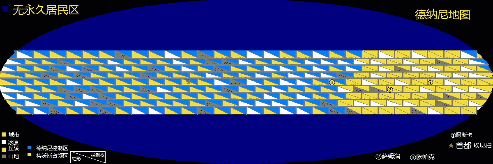

**7闪电风暴.jpg** *(171.18 KB, 下載次數: 0)*

[下載附件](forum.php?mod=attachment&aid=NjMxMTF8MDMzYzVkMjR8MTYwMDg4NzA4NXwxODIzMHwyMTE0NQ%3D%3D&nothumb=yes)

2016-8-18 21:14 上傳

 

# 12

*本帖最後由 冰西瓜 於 2016-9-19 23:53 編輯*

在空中飞行的缇娜凑近爱丽丝“爱丽丝，你居然藏私货”

“我快累死了，这点力气只够飞回去了”

“是不是你再用点力气，就能把这颗星球炸碎呢？”

爱丽丝笑了笑，“快别开玩笑了，赶紧回去吧”

“那你还飞这么快？都把她俩甩后面了”

“呃。。没注意。。”

爱丽丝转身看着后面2个小黑点，而缇娜也悬停面对着爱丽丝继续说着

“我现在特别的好奇自己被你劈一下会不会直接烧成灰”

“不会，别闹了，【长官】”

四人结伴，回到了总部

“爱丽丝上校，储嗣大人有口谕，如果还有精力就来坐一坐，如果太累也不用勉强自己”

爱丽丝停下想了想，说

“我太累了”

另一方面，德纳尼日出之前一小时的欧帕克，混乱的街道，骚乱的人群，堵塞的交通，在遍地死尸的城区外，守军们正在守望，因为敌军轰鸣的引擎已经在夜空中响彻了

东方的地平线已经开始泛白，在碧蓝色的夜空中超越月光，哨兵已经在望远镜中看到了敌人

是步兵

戍守欧帕克的是第5装甲军，和第16军，第17军，第18军组成的第六机械化集团军

绵延不绝的步兵矩阵形成了无边的攻势，每一个哨兵心里都不清楚他们面对的是多少敌人

特沃斯第五步兵集团军群司令，刘尼龙少帅，正在山脚下的指挥所里对地图沉思

“三个方向都出发了吗？”

“已经确认了，少帅”

他走出帐篷，望着远方黎明的曙光“终于等到这天了，我们打到了这穷乡僻壤就一直在行军，现在很快，我们的任务就要完成了”

“我不是很明白，长官，您的意思是？”

“我是说，等打完了，我们又得行军了！”

参谋苦笑了，而刘尼龙，也只是斜眼瞅了瞅他，继续看着地图

“十倍的兵力，三个集团军群，三个方向围攻，即使是这样，也不能打破他们的防线吗？”

“如果两旁的友邻部队也像您这样勤勉，我想是有机会的”

“别阿谀奉承的时候贬低我的兄弟，他们要是废物，也当不上少帅，只是我不明白，为什么自己是这样的辛苦，才能对抗如此渺小的国家，冷的道理我当然懂，可他们不懂吗？”

这话刚好被回来的副官听见

“一方水土一方人，你也甭着急了”

随着日出，太阳刚刚露出一角，信号弹和枪声就命令步兵们开始攻城了

欧帕克没有城墙，从郊区稀疏的平房开始，过于集中的兵力就开始遭到炮火的轰击

德纳尼的地势太狭窄，整体分布在狭长的赤道上，过于集中的攻城战，使得即使乱炸一炮，都可能炸到敌人

早晨的阳光照在人海中，一望无际的百万大军跨过友军的尸体，然后跨过夜晚的死尸，再跨过敌人的尸体，从城外打进了城区

刚刚从整夜的轰炸中得不到休息的德纳尼守军，在来不及指挥的情况下被迫收缩兵力，从环形防御阵型转而推平，但是恶劣的冻土让每步前进都无比缓慢，一路上的尸体几乎都是特沃斯人留下的

掷弹筒和迫击炮将许多战车的掩体炸毁，他们不得不向中心城区的方向撤退，装甲车在废墟中发挥不出全部的作用，本来就堵死了的主干道现在又雪上加霜

一个营长在楼里亲眼看着警卫队的营炮打在人群中，即使有人被炸飞，也根本没有人动摇的继续缓缓前行着

“该死的，这群特沃斯的。。东西。。真的是人？”

警卫中弹身亡，身边的两人扛上炮就往外走，一切都乱了套，他带着身边几个人，随着到处都在边打边撤的部队向后撤

他看到带队的旅长正在打电话，他走上前去

“干嘛？”

他摇了摇头，等旅长打完电话，他才开始说

“旅长，这群外星人，怎么个个像僵尸一样，怎么打都停不下来”

“对，我也发现了，现在到处都是敌人，你带你的部队向雪飘楼集结，那里有火炮阵地可以掩护我们”

“传我命令，各团营向山灯街撤退”

这只是一股小部队发生的事情。

中午，嚼着牛肉干和干炒面的特沃斯人，不知疲倦的对守军进行着炮战，在宽阔的公路上，排成阵型的守军对冒出头的特沃斯步兵不停的击杀着，可仍有从倒塌的房屋中无孔不入的钻出包抄的人

但还好借助建筑物的掩护，暂时拖住了攻势

用捡来的家具和石块，临时搭起来的战壕，厚重的衣服下近乎凝固的弹药声此起彼伏，在用人命为代价缓慢推进的同时，炮火优势的特沃斯军也开始用炸倒建筑物带来的混乱协助攻城

夜色将至，一个昼夜不曾合眼的守军，仍旧在兴奋的支撑着

看不清敌人的特沃斯军，开始将迫击炮对准高楼，当第一座大厦的倒塌压死了几百名敌军时，他们意识到这是个很有用的夜袭方法

人数绝对劣势的德纳尼守军，根本无力阻止

夜晚对瞄准带来极大的困难，但饿了一天的守军只有一半得到了补给。

城区的道路许多都堵死了，光是撤退就要绕路，运输车更是进不来，出不去

欧帕克的商务街在整夜的炮击中被夷为平地了。

第二天早晨，没有任何区别的攻势已经让他们距离市中心只剩最后8公里了

边打边跑的德纳尼第六集团军正在拼死抵抗，即使他们拥有以一敌十的战绩和战损，但更加严重的疲惫和物资匮乏导致的损耗已经把他们逼进了商务街的大门口

最终，日落之时，已经两天两夜没有合眼的德纳尼第六机械化集团军失守了东城区最后的居民楼，撤进了商务中心曾经繁华的地带

 

# 13

两天前的雷击，加上之前的炮击，30层以上的建筑无一幸存，碎石和冰屑混在一起，原本最密集的建筑区已经成为迷宫，和东城区相对完好的景象形成鲜明的不平衡，德纳尼部队仅仅支持了3个小时就被迫在西部重新集结，而此时的城外，1100公里的省界线上，另有数以百万的部队正整装待命

73个机械化师正为装甲车预热，而第一、第二装甲集团军在远方的平原清理着寥寥的雪花

才刚打退近十倍的敌人，精疲力尽的德纳尼人在炮火中已经听到了混杂的引擎轰鸣声响彻东方的天空了

就在特沃斯的3个集团军群停止攻势后的1个小时，近2000架战斗机和轰炸机的混合部队突然划过天空，刺耳的引擎声和令人耳聋的轰炸开始了。

面对迅速崩溃的战线和守城无望的绝境，如果再不走，恐怕部队就要被打散了。

第六机械化集团军的上将下达了撤退命令。

在被先头部队重创后的德纳尼第六机械化集团军，面对特沃斯军真正的主力时仅仅坚持了4个小时就不得不溃逃出城了

没有什么过多的过程，仅仅是进城，进而冲垮而已

欧帕克失守了。

对特沃斯高层来说，目前是可以接受的状况。

燕雅宗正因为战役的节奏而加班许久，在她收拾好东西刚要回去休息的时候，一份新闻让她惊讶得叫来了波尼可夫

“你看，这是伊内姆瑞格现在的战线，已经完全占领了第三颗星球了”

“储嗣大人，我不能不说他们的速度真是不可思议得快”

“你有没有想过为什么我们身为最大的国家，却在这颗星球陷得这么深？”

“他们有许多方面都比我们先进，这是之前始料未及的”

“对，几十年的封锁却是这样的结果，这是我对以往外交政策的不满之处”

“目前的速度已经是我们尽了最大努力的结果，单就一个指挥官来说，我已经尽力了，但我身为特沃斯的国民仍愿意为国家做任何事”

“这听起来也许是空话，但我感谢你的忠诚，请依然按照最快的进攻计划进行”

下班了，四公主摘下厚重的棉帽，让自己的短发透透气

“和您在一起的时候，基本没有小孩子的感觉”

举起茶杯的老波尼可夫换了一副气质，用略有长辈口吻说着

“我有个孙侄女，比您大两岁，和她在一起的时候，就觉得她很天真”

“我倒是觉得我才是更需要磨练的人，而且请注意一下身份，不要拿你的孙子辈和我相比”

“求储嗣大人恕罪”

“记着就行了”满脸难受的四公主欲言又止的摇了摇头，走掉了。

她又回过头来，想说些什么，可是波尼可夫已经背对着她走起来了

德纳尼的首都——埃尼扫的皇宫中，首相麦克斯韦尔正在和将领的讨论中听到一片慌乱

欧帕克位于赤道城市带的中部，一旦被冲破，防线就会被撕开一个缺口

而现在，奈尔达哥少帅正和赶到的第二装甲集团军指挥官结束了短暂的会面，狂奔的轻型坦克以60km的速度飞快的穿过了欧帕克

这时的德纳尼首相即使已经猜到了将要可能发生什么，也许也已经来不及决策了

嘈杂的室内听到的是错乱的只言片语

“欧帕克地区的敌军数量远超平均值”

“他们的命令是尽力坚守欧帕克”

“……”

“他们必须守住伊卡马赛基高地，以让增援部队赶去汇合”

麦克斯韦尔不再倾听，默默的走了出去。

第二天，

欧帕克北部的山地，以及欧帕克南部的奴斯奈奥市也遭到了攻击

刚刚动身准备前去支援的十几个师，也在猛攻中被迫后撤

增援行动被迫中止了。

一星期后

德纳尼的防线从中心被撕开，造成了整体的大溃败，特沃斯部队在步兵兵团的辅助和空军优势的掩护下攻克了整条欧帕克城市带

德纳尼地广人稀，城市以外的地区交通相对闭塞，刚刚逃到伊卡马赛基高地的德纳尼第六机械化集团军和第5装甲军就遭到了特沃斯第一、第二装甲集团军的追击。

伊卡马赛基高地是毗邻欧帕克的一片丘陵，是西部平原的唯一屏障，而一路溃败撤来的德纳尼军仅仅得到了一星期的补给，战斗力没有得到良好的恢复

凌晨4点被追上，坚持了9小时后溃败

虽然是1比2的兵力对比，但得不到足够时间恢复的德纳尼部队又一次失去了阵地

10天后，西伊卡马赛基高地，被彻底追上的德纳尼第六机械化集团军残部在最后的抵抗中牺牲了上将集团军长，随即被围攻歼灭。

一天，四公主来到了战舰实验室，找到了他带来的年轻的博士，37岁的米嗪博士

带他来并不因为他最博学，而是因为他年轻而有创造力和应变力，

其实还有个原因就是他实际上不是最优秀的，因此带到战场也不会担心出意外

四公主很忙，见面先说了她来的目的，以至于对话变成了这样

“叩见储嗣大人”

“伊内姆瑞格只用半年多就占领了四颗星球了，而我们连半个都没有，你觉得差距在哪里？”

“我觉得……我觉得是武器差距太大”

“先起来，然后详细说”

米嗪晃晃悠悠起来了，想了想说

“许多武器都是我们没有见过的，而且也无法分清其原理”

燕雅宗走得更靠前，两人只有20厘米远了

“你都知道什么？有没有整理出来的资料什么的？”

米嗪害怕得往后要退一下，又猛得停住，这个博士并不擅长社交，尤其是对储嗣这样可怕的人。

他哆哆嗦嗦的拿来一叠纸，被四公主拿过来，又因为重，被丢给旁边的侍卫

“我有这么吓人吗？”

“我只是紧张”

“回答我的问题”

米嗪甚至紧张的忘了四公主问了他什么，又继续想了想说

“我不是很懂军事，不过他们是同时进攻的，所以进攻3个星球和1个是基本一样的速度，因为在武器上接近凌驾状态，而我现在连他们使用的装甲材料和武器原理都不清楚”

“你该练练怎么和我说话，下次不要慌的语无伦次，而且我是人不是鬼，你怕什么”

说着轻轻踢了他一下，以示她不是幽灵，然后她为自己的搞笑行为笑了笑

“加紧研究吧，希望你们尽快提升军备的质量”

回去的四公主心里想着：

[我真是累坏了，刚才我为什么要踢他，真是失态]

然后继续思考着军备的问题并回去了。

<ignore_js_op>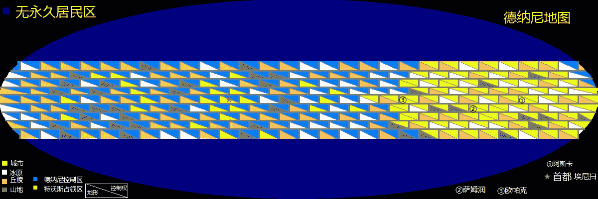

**9闪电战.jpg** *(184.39 KB, 下載次數: 0)*

[下載附件](forum.php?mod=attachment&aid=NjY2MDd8MDBhN2ExNGN8MTYwMDg4NzA4NXwxODIzMHwyMTE0NQ%3D%3D&nothumb=yes)

2017-1-28 03:58 上傳

 

# 14

*本帖最後由 冰西瓜 於 2017-11-10 01:31 編輯*

12天后

德纳尼南部集团军群司令，满头白发的老将——奥登·格里克元帅正在HQ指挥部中对地图沉思

他浑身冷汗，微微的打着哆嗦，嘴巴张开又闭上又张开，对着眼前的参谋长低语着：“我犯了天大的错误”

他整理着语言，拿出手帕哆哆嗦嗦的擦了擦汗

“他们的速度太快，已经越来越难突围了，你现在还有什么办法吗？”

“长官，现在还不是自责的时候，快点想办法突围吧”

参谋长双手捧着桌上的咖啡，头发上的冰碴子掉进了杯子里，他顾不得脏，拿起喝了一口，又一饮而尽，看着空杯子

“我是问你有什么办法！”

“部队正在全速撤退，首相和总指挥部正在抽调援军，我们已经尽力了”

“你想上军事法庭，还是想让我一枪毙了你？想办法突围是你的工作你快点想办法……”

“你才是长官，是你先抱怨的”

“友邻部队全被冲散了，除了空军，谁也来不了了，制空权又不在我们这里”

两人沉默了许久，气氛从紧张变成尴尬，又变成寂静

副司令这时冲进来了，看了看房间里的几个人，大喊着

“我已经下令指挥部西移400里，有什么需要整理的请赶快带走，我们……暂时回不来了”

元帅没有搭话，却说“我们当初还鄙视那些撤退的人，现在我们却在突围”

副司令坐了下来，说了句：“亡羊补牢吧”

“你们都还年轻，撤退不利的责任也在我，只希望不要牵连到你们”

17个小时后

在距离艾尼扫山系600公里的余脉处，先行撤离的南方第一集团军早于了特沃斯第一装甲集团军，在经过3个小时的交战后，德纳尼法师队赶到了战场，取得了少许防御优势后，第一装甲集团军暂时停止了攻击

德纳尼法师队队长，普拉斯玛，13岁的少女，与奥登·格里克元帅见面了，在几句寒暄后，队长又带队分散，准备坚守长达几十公里的阵地了

二十多人的小队每2公里安插一个人，使得防御很稀疏

三天后，特沃斯两个机械化军和两个装甲军赶到，提娜带领的精英小队也已经飞来。而以步兵为主的德纳尼南方集团军群还没有来得及疏散

开战的第一个钟头，特沃斯法师队在空军的掩护下，以截击机进攻阵型对悬空的德纳尼法师队进行了冲击，双方的空军和法师队展开了制空权争夺战，而特沃斯战机数量呈绝对优势，很快德纳尼空军被击溃撤走，法师队还在坚持，但是在缺乏空军掩护的情况下，很快也被击退

值得一提的是德纳尼损失了法师40名队员，而特沃斯法师队派来的是只有7人的精英小队，却被普拉斯玛的冲击波击中，在一团烈火中坠落了下去

这个被击中丧命的少校由提娜抚上瞑目，而地面部队也已经突破了防线，一片战火中的指挥部被警卫旅强行拖走，溃败到了西方的山脚

第二天早晨6点，德纳尼部队试图解围，但是仅2小时就意识到兵力的巨大差距而停止

被围困的20万部队中的一名上将在被围歼之前向首都发送了这样的一则消息：我部自知突围无望，愿率部殉国，现已主动冲击敌军阵地，为友邻部队撤退争取时间。

南方第二、三集团军联合指挥部绝笔。

在山脚，最后的主力军正抓紧最后的时间上山，其中一个营因为氢化碳不足而掉队

追兵的最先头是76机械化师

在一个被遗弃的山村里，营指挥所的营长决定部署阵地进行防御，作为最后的抗击。

其中的2连在山丘口被侦察兵发现，但是2连没有发现侦察兵，他们在向村口撤退

侦察兵在村口又一次发现了2连，他认为这是2支不同的部队

师长在接到报告后认为这是一个建制残破的团级部队，派人用扩音机喊话：

你团兵力不够一半，连我们一分钟都不能阻止，投降不杀。

营长听到以后倒是笑了，对旁边的副官说：

临死了，敌人还给咱们升官了，呵呵

在交火后，半圆形防御阵型的该营成功阻止了敌军10分钟的进攻，4辆坦克出现在阵地上时，营里刚好有一辆自行反坦克炮，全体车组用生命与一辆敌车同归于尽。

营长下令前方2连后撤，在高地上与敌军进行了第二轮交火

7分钟后，全部撤至指挥部周围，营长将遗书和日记托付给厨师让他赶快逃走。

在一个土丘的食堂楼，他们又阻止了敌军14分钟的进攻

在抵抗的第31分钟，少校被榴弹击中身亡

剩余的210人被俘投降。

这半小时的阻击，为大部队的撤离做出了微小的贡献。

最终，奥登·格里克元帅仅带着三分之一的部队逃上了艾尼扫山

至此，德纳尼可居住区大半都已沦陷。主力撤退到山区周围组成了一道防线，特沃斯部队在这次战役以胜利结束。

德纳尼首都——埃尼扫的皇宫中

女王铃兰在首相办公室，站在麦克斯维尔的桌前

“埃纳尔夫拒绝了我们的请求，而来自奈提尔布共和国的那批物资应该很快就到了，这是援助品的清单”

女王很是困窘的表情

“实在是……没有……”

他坐在椅子上，把清单接过来看了看

“没有什么有用的东西，对吧？”

他抬起头，瞪了女王一眼，又把视线放平和一点，再低下头看着单子

“指望他们，从一开始就没多大意义”

“前线已经损失了三十万多人了，还有牺牲的六百万平民，其中有二百七十万工人，领土还剩不足一半，工业凡是能带走的都带到这里了，也仅剩百分之79……”

电话响了，是物资抵达的消息。

毛巾，水杯，锅，速冻牛肉干，过期的牛奶，

咖啡，茶叶，毛毯，威士忌，电池

麦克斯维尔挂了电话，看了看周围没有其他人后，对女王说

“牛奶都是过期了的，他们拿我们当垃圾堆吗？”

女王也不知道说什么好的尴尬的看着他

“我求求你了，我们还有没有别的办法争取到援助？还有没有国家愿意帮助我们？奈度斯星有问到了吗？”

“还没有”

话还没有完，就被打断

“为什么？我说过无数次前线已经非常紧急了”

“他们没有回复，我决定亲自去一趟”

他抬起头张开嘴停了停说：

“你可是国家元首，现在已经没有安全的路可以去了”

“现在国家需要的不是元首，而是其他国家的支援”

他无奈的同意了

夜里，一艘小型迷彩飞船在夜色中逃逸了出去

十天后，在奈度斯星

铃兰女王的外交团队得到了接待，但是在会议上，大臣们却大多反对出兵干涉

可是战局，已经不容再等下去了

“休会的时候我可以和贵国的国王私谈一下吗，两人独处的”

奈度斯星国王龙血，是一位22岁的年轻男子

在悬挂着开国国王——雪百合先生的挂像的里间里，娇小的铃兰站在高大的龙血面前

“哥哥，快救救我”

龙血把视线偏过去

“不要这么称呼我，我不是你哥哥，我只是你堂哥而已”

铃兰上前一步，两人距离非常近

“我们都是白百合的后代，你忘了小时候我们一起生活，一起玩，一起哭，一起吃饭，一起旅行……你都忘了吗？”

“国家的利益是决定我行为的唯一标准，你不要再说了”

铃兰，不轻不重的用膝盖顶了一下他的腿

龙血往后退了半步

“现在清醒点了吗？如果你见死不救，这就是我们最后一次见面了”

龙血泯了泯嘴唇，还是不说话

“唇亡齿寒，你们想做一下个吗？”

“不管你说什么，都不可能出兵参战的，但是我尽力为你争取支援”

“我们是兄弟国家，你愿意支援多少？”

“我只能尽最大努力为你争取，你在下场会议也要保持谦逊的态度，不要这样的咄咄逼人的求救”

“我只是觉得这个堂哥一开始看起来有点见死不救，而且我当然分得清场合，我也早已经不是孩子了”

“叔叔的去世太突然了，等这一切结束，我会再去祭拜他的”

“很好，谢谢你。”

就这样，在放弃争取援军的情况下，奈度斯决定了合理的支援方式

十七万志愿者和足够维持三个月的补给，在十天后抵达德纳尼

<ignore_js_op>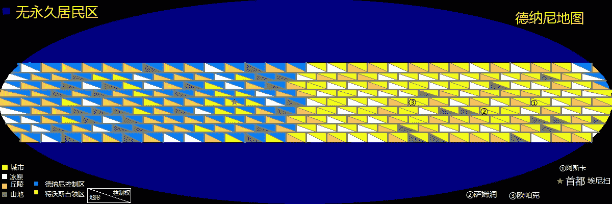

**10兵临_看图王.jpg** *(311.33 KB, 下載次數: 0)*

[下載附件](forum.php?mod=attachment&aid=NjkzOTB8MWQ4NmQyZjF8MTYwMDg4NzA4NXwxODIzMHwyMTE0NQ%3D%3D&nothumb=yes)

2017-9-3 01:02 上傳

<ignore_js_op>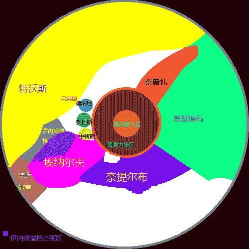

**10兵临星图.png** *(23.39 KB, 下載次數: 0)*

[下載附件](forum.php?mod=attachment&aid=NjkzOTF8MzgwYTEzNTB8MTYwMDg4NzA4NXwxODIzMHwyMTE0NQ%3D%3D&nothumb=yes)

2017-9-3 01:06 上傳

 

# 15

另外，我再说一句，经过了足足十节的铺垫，下一节终于开始要有精彩的内容了，包括一系列GTS内容，福利，以及相对精彩的剧情，所以敬请期待 

# 16

一个月后

艾尼扫山脉，赤道峰脚下

在特沃斯军已经集结了270万人的情况下，一场失败的攻城战报已经递交到了总统帅部

在经历了一次沉重的伤亡后，没能攻上山顶，部队被迫撤了下来

波尼可夫正抽着烟，对装备报表和物资单思考着

四公主对抽烟工作有些反感，她走了过来说

“这是一场必须速战速决的战争，关系到帝国的根本生存问题”

“我们都清楚，我正在研究还有哪里可以抽调的力量，来最大化我们的局部兵力”

“可已经没什么可抽的了，基本上快到极限了”

“马上还有一批进攻用补给运到前线，但是必须保证能成功，我们正在估算相关的数据”

“我知道，这场战争的重要性只有我们高层知道，士兵们肯定在迷茫中士气低落”

波尼可夫楞了一下“这没什么意义”

“波尼可夫上帅，您入伍多少年了？”

“嗯……三十二年……三十多年了”

“这么久！那你应该记得当初的战斗方式”

“当初，在草原上？”

四公主苦笑了一下“对”

波尼可夫怀念的回忆了一下，却只是说“已经过去了”

“我学习过之前的历史，我想是时候重现以前的作战方式，与现在的战略装备配合起来”

“在目前的装备下，士气已经不再是战斗所需的指标”

“容我直言，我不这么认为”

波尼可夫慌了一下“这是太上皇禁止的事情啊”

“将在外军令有所不受，出了事我负责，现在我们必须不计一切代价结束战争”

“嗯……”波尼可夫地下了头，不说话了

面对这种沉默，四公主要走了指挥官名单，并开始自己逐个查看指挥官简介

在一个个网格组成的资料中，她选中了这样一个人

移剌丰赤，男，52岁，19岁入伍，27岁升校官，35岁升将官，上将，进攻学说，攻坚学说，奇袭专家。现在状态：待命

“就这个人了，马上叫他来我这里面试”

在一场密谈后，他被升任元帅，负责艾尼扫山脉赤道峰方面正面指挥。

按照移剌丰赤的要求，不仅将全部机动补给交付赤道峰集团军，并且发放全部的特殊装备。

一周后，齐装满员的情况下，第二次进攻即将开始了

在进攻前的最后一天，波尼可夫看到从前线收来的领料回执

而此时，四公主已经开始尝试这一饮品——朗姆酒和伏特加配的鸡尾酒

波尼可夫来到浑身酒气的四公主面前，还没说话就闻到了浓浓的味道

他拿出回执问她：

“这是怎么回事？”

四公主红着小脸抬头说

“移剌丰赤的建议，以前就是这么用的”

“那怎么您也喝起来了？”

“我尝尝效果”

“嗨呀，您醉了怎么办”

“如果醉了再说，我也没喝多少”

他看了看她那红脸，问

“喝了多少？”

“半瓶子”

“您才七岁，这么多已经不少了”

“先不提那个，我在想要不要给士兵发一些兴奋剂”

“我连我们带了这么多伏特加都不知道，船里还有兴奋剂？”

“出发的时候我就想到了，可能会用得上”

这时，这个老人看了看这个可能醉了的小孩，心想她真是个疯子

“我不建议这么做”

说完，本想就打了招呼，这么离开了，却又想起

“我们还带了什么特别的东西吗？”

察觉到异样的四公主，用官腔的声调对他说

“你不用费心了，先去忙吧”

这时，前线的士兵们都收到了一瓶鸡尾酒，和一把轻薄，带套的弯刀

从方面司令部层层传达了这样的一个命令

“破城之后，两天内没有军纪限制”，并且层层传达了这样的一句附注

“等仗打赢了，两天里想做什么都可以”

就这样，一场超乎预料的战斗开始了

黎明前三十分钟，由装甲部队带头，后续有三个方向，数以百万的士兵们冲了过来，由德纳尼机械化部队和外国志愿军组成的联合守军从山顶高处向下反击，很快，他们便察觉到了异样

在许多火力较猛的区域，特沃斯的正面主攻部队并没有像常理一样迟滞形成弧口，而是直接穿越火线，即使这冒了很大的损失

两个小时过去了，部队的平均距离已经跌破了10km，在东面，许多交火的地方，大量的特沃斯士兵尸体堆砌着，铺成一条条血肉的路径

面对这种反常，甚至违背常理的强攻，德纳尼部队坚守在有利地形上，以20倍差距的伤亡比例持续着对特沃斯部队的屠杀

五个小时过去了，尸体甚至成为了掩体，几十万人的尸体将赤道峰的山腰染成了红色，在一度难以击杀德纳尼部队的情况下，现在战损正逐渐朝着20比1的比例回复着，德纳尼人已经明确的意识到：特沃斯人疯了

日暮，战损已经接近10比1，在许多已经距离不到1km的战线上，局部地区已经开始出现缺口，战线即将崩溃，但是随着落日，夜晚将对防守方带来极大的优势

日落后20分钟，由轰炸机投放的照明弹开始在战区闪亮，装甲部队，甚至是已经不能移动的坦克，也在点亮车灯照亮战场

有几十个法师队的队员，在空中点亮能量灯

甚至是补给车，也抬着探照灯开上了前线

几乎是人工白昼一般，将光照维持在了黄昏级别

落日后四小时，最终，在特沃斯损失了近一百万人，已经难以维持攻势的情况下，德纳尼开始出现了溃散，在损失了五万人，两个师溃败后撤的情况下，守军的17个师同步发生了溃退

特沃斯军，攻入了艾尼扫山的赤道峰！

赤道峰的背面，是一座叫伊特诺的无险小镇，天亮时，德纳尼部队已经撤往首都艾尼扫市的城区了

受到了极大打击的双方部队，德纳尼方面正在后撤，而特沃斯军已经在小镇里聚集

拥挤的小镇无法容纳一百八十万人，两翼120万部队已经分别朝南北散开

而这座原本只有20万人的城市，现在挤进来了60万特沃斯官兵

惨剧，从这一天的早晨，开始了。

<ignore_js_op>

**235448yrjy3qurpq3oiuij.jpg** *(57.35 KB, 下載次數: 0)*

[下載附件](forum.php?mod=attachment&aid=NzAxMTJ8YmJmNDM3NjJ8MTYwMDg4NzA4NXwxODIzMHwyMTE0NQ%3D%3D&nothumb=yes)

2017-12-28 00:45 上傳

<ignore_js_op>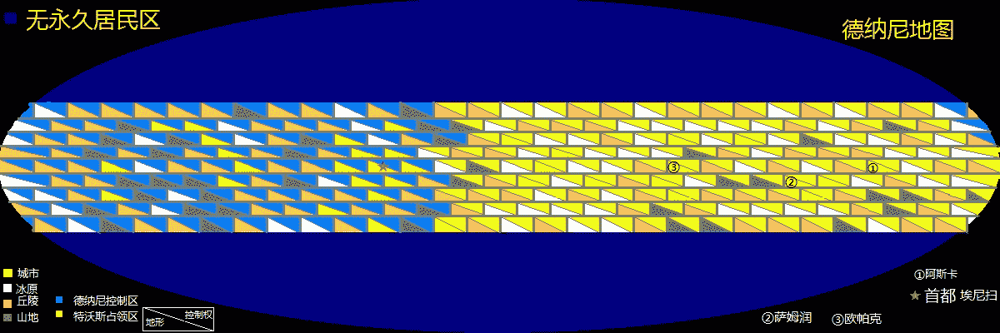

**11山破.jpg** *(172.65 KB, 下載次數: 0)*

[下載附件](forum.php?mod=attachment&aid=NzAxMTF8YzU0MDMxODN8MTYwMDg4NzA4NXwxODIzMHwyMTE0NQ%3D%3D&nothumb=yes)

2017-12-28 00:44 上傳

 

# 17

根据我对自己文章剧情大纲的研究，前十一节和后十多节必须分开，理由如下：

第一，风格会差许多，前十一节实际上是铺垫，开头，但占了两万四千字，预计与后面的正文字数相当

第二，第二章开始以福利为主，所以我也希望新开一贴来获取读者注意

第一节的GTS含量如果是3%，那么第二节应该是就50%

所以，我决定第一章结束，请大家关注凛冬第二章，福利多多

对于前十一节有兴趣的读者可以去第一章的贴内阅读，第二章的内容将会在第二章更新 

# 18

后十节已经写好了四节存稿了，分别是第12，13，19，20节，我再修修就可以发12了</ignore_js_op></ignore_js_op></ignore_js_op></ignore_js_op></ignore_js_op></ignore_js_op></ignore_js_op></ignore_js_op></ignore_js_op></ignore_js_op></ignore_js_op></ignore_js_op></ignore_js_op></ignore_js_op>