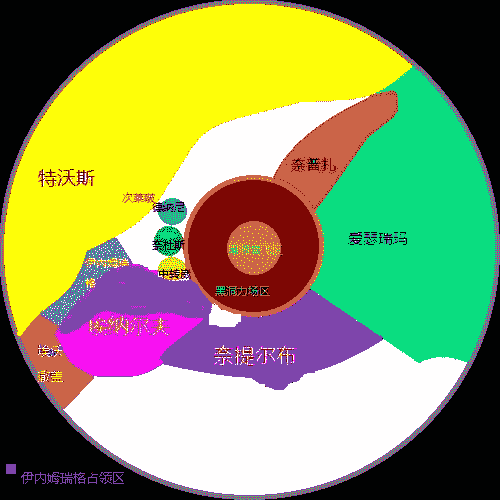
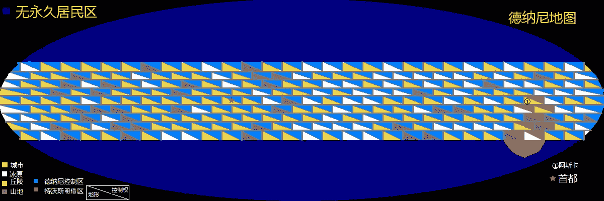

# 凛冬第二章——万字更新结局！

作者：西呱

TID：24245

 

# 1

*本帖最後由 冰西瓜 於 2018-2-4 02:44 編輯*

根据我对自己文章剧情大纲的研究，前十一节和后十多节必须分开，理由如下：

第一，风格会差许多，前十一节实际上是铺垫，开头，但占了两万四千字，预计与后面的正文字数相当

第二，第二章开始以福利为主，所以我也希望新开一贴来获取读者注意

第一节的GTS含量如果是3%，那么第二节应该是就50%

所以，我决定第一章结束，请大家关注凛冬第二章，福利多多

欢迎加入我的萝莉控GTS群，群号457681764

还有个读者小群，群号570544974

只看福利的人只看下面福利，喜欢剧情的人可以去第一章的帖子回顾剧情

另外附上四公主的角色设定图，感谢land大佬作画

<ignore_js_op>

**gz - 副本 (2).jpg** *(121.05 KB, 下載次數: 0)*

[下載附件](forum.php?mod=attachment&aid=NzAyMjR8NjcxZDUzNzV8MTYwMDg4NjM0OHwxODIzMHwyNDI0NQ%3D%3D&nothumb=yes)

2018-1-6 01:14 上傳

正文：

如果真有地狱，伊特诺这里就是。

——在伊特诺的一位外国记者

移剌丰赤元帅的60万残兵涌入了这座20万人的县城

士兵们个个红着眼，有的满身鲜血，有的浑身酒气，有的身体残缺……

这不是占领。

在冲进城门后，他们拿着砍刀，见人就杀。

男人，女人，老人，孩子。

鲜血染红了城门口，又很快冻结了。

地上，洒满了人血的红宝石。

有几个人对那些杀死女人的打了几巴掌

女人们，幸免于难的开始

是生不如死的开始。

一座座房屋被点燃，人的尸体在烈火中助燃，一个个呼嚎的特沃斯士兵，劫掠着居民的财物，强奸着妇女甚至儿童。士兵的数量比妇女多十倍，可怜的妇女们甚至被奸淫致死……

三个上将在结合部焦急的讨论着一筹莫展的失控措施，移剌丰赤在接到中帅上司的急电后回复让他们去问上帅，上帅又仅仅做了些无力的回复。

三天了，惨剧在不停的上演，屠杀、奸淫、纵火、抢劫。

而这时，超能力战队的两名骨干，正路过这里

她们看到冲天的火光，伊特诺几乎成为废墟

宇文欣上校和巴芙拉中校

巴芙拉中校看到以后，很兴奋的说到：“这里是不是在屠城啊？我们下去玩玩吧！”

宇文欣：“不好吧，擅自出动参与屠城可能是违反军纪的，军纪里哪一条都没有说我们可以这样做”

巴芙拉：“也就是说哪一条都没有说我们不可以这样做了？来吧长官，肯定没问题的！”

说着，巴芙拉拉着宇文欣的手，冲下了地面

巴芙拉兴奋的说着：“哇！全都是些无助的平民呢！我们也来杀点人吧！”

说着，一道电球炸在身边的房屋里

“已经空了呢……”

看到这样的结果，巴芙拉调皮的说：“我还没试过巨大化呢，现在是大好时机啊！”

说着，她飞了起来，身体不断的巨大化

宇文欣看到后，目测了一下巴芙拉的身高

【大概有二百米吧，我也变成这个大小好了】

于是，她也跟着巨大化了

两个二百米的巨大小女孩，就这样站在县城的中央

宇文欣：“啊，真是一片狼藉呢”

巴芙拉：“看，那边有好多好多人躲在里面！”

一片可能是碰巧被围起来的废墟，密密麻麻的躲藏着上万人

几步走到这里，巨大的巴芙拉摆着一副无比灿烂的笑容

巴芙拉：“把他们全部踩死吧！”

她跳了起来，然后跳进了里面，砸在了上百人的头顶

宇文欣也跳了进来

巴芙拉那穿着靴子的双脚，和宇文欣那双踩着凉鞋的裸足，在原本可以幸存的人们的头顶

开心的

踩了下来

非常的开心的笑声

也许有人看到过有小孩子残忍的踩在蚂蚁窝上践踏蚂蚁

而比起这两个小女孩用夸张的大幅度践踏，将人血溅的到处都是的恶毒践踏相比呢？

密密麻麻的人群根本没有躲藏的机会！

在小女孩毫无慈悲的放声欢笑中，看着鲜血淋淋的四只脚，黑压压而又满是血肉残肢的鞋底，踩在自己的身上，踩在自己家人的身上

而巨大的女孩子，还在享受着，践踏生灵的快乐

如果你觉得二百米的身高不是很恐怖，幸好不是一千米那样的身高的话——

你错了

二百米，已经也就是一百层楼那样的身高了

而这样的身高下，那几十米的脚底所覆盖的区域又大，又要花费一段时间才能将这些人虐杀完毕。

与其目睹同胞们被异族小孩践踏致死，有的人甚至已经不堪折磨，希望死的更快一点。

在肆无忌惮的笑声中，刚才还活生生的人群，现在已经被踩烂，混成了一块血饼

在寒冷的环境下，冻成红色的板块。

仅仅在脚下幸运活下来的几十人，这一幕一定会成为一生的阴影挥之不去

那是被小女孩肆意践踏的，上万人的人生。

而临要飞走时，他们听到的是宇文欣笑意中，带着轻蔑而又厌恶的话：

“脚趾上都弄脏了呢，真恶心，呵呵”

仅仅三日，整个伊特诺便彻底毁灭了，几乎无人生还。

第二天

四公主收到了星际国际法庭的判决通知

星际国际法庭，虽然他们的裁决往往不能解决根本问题，却极大的代表了各国的外交态度。

伊特诺的屠城，已经被外国记者迅速的抢先报道，各国纷纷表示震惊。

由于不人道的屠杀行为，特沃斯对德那尼的主权宣称被否决，特沃斯对德那尼的占领区，将不再被视为特沃斯的固有领土。

占领区在收到判决消息后立刻发生了大规模的罢工和暴动

尤其最让民众愤怒的，是一名外国记者，拍下了超能力队巨大化屠杀平民的照片

照片上两个小女孩，在肆意虐杀践踏手无寸铁的平民，脸上的笑容，格外的刺眼

四公主传召爱丽丝，提娜，并命令这两人将移剌丰赤，宇文欣，开芙拉这三人逮捕。

四公主在对移剌丰赤先行见面后，进行对三人的秘密审问。

宇文欣和开芙拉都是屈指可数的超能力者，战斗力分别排在特沃斯超能力队的第四和第五。

要控制这样的强大存在进行审讯，必须要有更强的力量进行不间断的压制，四公主要求将她们缩小到10cm。

由爱丽丝押解宇文欣，由提娜押解巴芙拉

青蓝色的光线不停的从爱丽丝和提娜的手中射向宇文欣和开芙拉，那是能力压制的高能缩小光线

一切就绪后，四公主来了。

“拜见储嗣大人！”在场的三个犯人跪下行礼

爱丽丝和提娜说：“十分抱歉储嗣大人，我们得引导能力，暂时动不了”

“免礼”

拿着一沓子材料的燕雅宗公主，人坐到椅子上，把东西往腿上一放，就开口了

“你们知罪么？”

没人回答

她把照片丢到地上

“看看，这上面你们俩”

三个人，都跪着，没有人说话

“主权宣称被否决，这责任，你们说，应该谁来负担？”

依旧，没人说话

“哼，我们是文明的军队，可你们呢？做的事情还不如野蛮人，宇文欣！你自己把照片的事解释清楚吧”

宇文欣慌了，没想到第一个被问话的人是她，她按照心里准备的话说了出来：

“之前，我们，我们看到城市里有屠杀的情况后，就下去了，我们以为是上级的工作，所以来帮忙的”

“啊？你认为哪个上级会下这样的命令？我吗？还是上帅？中帅？还是你的军长？”

“我不敢妄加判断”

“你当时可不是这么说的，没有命令擅自行动，还危害了国家的根本利益，你们认罪吗？”

………

在3秒的沉默后，宇文欣用急促的语速说

“当时是开芙拉要去的，我只是跟从着。”

“你是开芙拉的长官！而且是直属上司！上司有对下属的管理责任，而且你一个上司怎么跟着下属跑？”

“我只是想帮帮我军的部队”

“这话你说过了，我也让你们三个人来接受审判了，赤道峰集团军本来就是乱纪屠城，你俩还跑去做帮凶，本来影响就很不好，你们还变那么大个弄那么显眼”

跪在地上的宇文欣，底下了头

宇文欣用颤抖的声音低声说：“我……认罪”

“还有，你之前身为骨干，几乎没有战绩是怎么回事？前线如此吃紧，你莫非在玩忽职守？”

宇文欣一下就把头抬了起来，甚至喊道：“我的能力主要是风系能力，这种极寒环境下很难派上用场啊！”

对宇文欣凝视了两秒，四公主又看向巴芙拉

“巴芙拉，到目前为止，相比我们出色的爱丽丝上校，你虽然能力不足，却也立有不少战功，但是我对你昨天的所作所为，十分的失望……昨天的事情真的是你主导的吗？”

“我不是！我没有！宇文欣诬陷我！我是冤枉的！求储嗣大人明察！是她要我先去的！”

“宇文欣，你怎么解释？”

“储嗣大人，现场有没有证据，有没有目击者，他们一定可以证明我的清白”

四公主：“很遗憾，没有，看来我也分不清你们谁先谁后了，

四公主又把视线移向巴芙拉：“不过起码，你们都没有被迫的去做，照片上的你们笑成这样，也是个佐证，起码你们乐在其中。”

四公主站了起来

她脱下了左脚厚重的棉靴，脱下白丝，露出赤裸的稚嫩小脚，悬在了宇文欣的头顶

“被踩死前，有什么要说的吗？”

宇文欣仰视着头顶巨大的四公主

虽然自己被缩小了，虽然自己也是个小女孩，可是看着这样的四公主，她却无比的喜欢

这不是疯狂，而是正常

因为这个小女孩，太俊了

轻盈的小小身体

无论是男女，看到她，就会有强烈的保护欲

白皙而又自然的肤色，泛着淡嫩的红晕，晶莹剔透的脸上，那清澈如水的眼睛里，看不到一丝邪恶，天真无邪的面孔在蓬松的短发下是那样的惹人怜爱，她的美是那样的震撼人心，以至于看了以后不禁想要宠爱她

而那洁白无暇，天真无邪的脸上，是愠怒的表情

本该是让人看了以后，想要保护她，想要为她解决一切让她不开心的事情的心情。

可是

现在，这样的小女孩，却是政府首脑

而令她不开心的事情，就是她脚下的人——也就是正陶醉于可爱面孔的宇文欣

四公主张口了：“由于宇文欣败坏军纪，屠杀降民，和导致国家根本利益受损，我宣布即刻处死，以安抚民众，重正军纪。”

“储嗣大人！我冤枉啊！”

水嫩稚气的“小脚”压在了宇文欣的身上

脚底有许多汗珠，一旁的靴口还冒着蒸汽，向宇文欣压来的脚底散发着芬芳的奶香味

和她跪在一起的巴芙拉，就这样看着这纤细，无力的小脚，开始施加压力

生存的欲望，让宇文欣果断的做出了理所当然的决定

释放全部的力量，挣脱超能力压制，抵挡头顶的脚

她笑了，自己竟因为看呆了这个要把自己踩死的小孩，而忘记了自己那强大的力量！

可是，毫无反应。

宇文欣疑惑着，仿佛上天没有眷顾自己？自己的力量突然失灵了？

是爱丽丝的压制力场！

平静如水

她那带着血丝的眼睛愤怒的看向爱丽丝，却看到爱丽丝举着两根手指，默默微笑着输出着压制能量

这怎么可能！明明自己一直对力量有所保留，怎么可能被如此毫不费力的压制！

在入伍测试时成绩仅仅比她区区高了一点的爱丽丝，怎么会有如此强大的力量？

明明是可以毁灭上万军队的自己，却被那么柔弱的脚踩得痛不欲生。

而且她还感到，这只脚的主人，在故意的慢慢用力，享受着把她踩死的乐趣？

对宇文欣来说，这双脚太柔弱了，哪怕是踩在一个普通人的身上，那轻盈的身体也不会造成伤害无力的小脚，踩碎自己的肋骨！

脚趾头把鼻梁压碎，把脸压平

而施虐的四公主，仿佛在享受

带着浓郁的脚汗味的纤细的脚，毁掉宇文欣的脸

到了这个地步，四公主把脚抬了起来，然后冲着她笑了笑。

这时她满脸是血，肋骨都碎了，奄奄一息的看着头顶的小女孩

脚底下的血，是自己的血吗……

可是四公主却在调皮的笑着

宇文欣想到，难道她想要放过我？

这时，依旧是那顽皮的脸，这个孩子又一次对她举起了脚。

脚底并非无情，而是带着要把她玩死的热情，压向已经无力挣扎的自己。

自己还没有活够！就这样死在比自己小三岁的女孩脚底下

而宇文欣最后看到的，是四公主眼中仿佛是小孩子玩垃圾一样的表情。

我本是一个忠诚的战士……

punnnnn

宇文欣，已经在燕雅宗的脚下被踩碎了。

在巴芙拉的视角中，自己的长官被巨大的脚压了下去，却又没有明显的用力

她明显在挣扎，却没有任何效果

她抬头看了眼四公主

在笑

这孩子，在笑！

puuu！

深红色的血，从脚掌下泛了出去

巴芙拉害怕得，像捣蒜一样的不停磕头

在一声巨响中，破碎的血肉喷到了她的脸上

死无全尸

看上去纤细无力，还散发着芬芳奶味的小脚，对10厘米的巴芙拉展示出了恐怖的毁灭性破坏力

极大的恐惧感已经让她说不出话了

“巴芙拉，你认罪吗？”

她摇了摇头

“别杀我……别杀我！！！！求求您了别杀我啊啊！！！！”

她把头撞在了地上，甚至失去了抬头的勇气。

“提娜，把水桶提来，帮我冲冲脚好吗？”

“遵命”

哗啦啦的水流，冲散了恐怖的残肢碎块

终于冷静了下来

“巴芙拉，我给你一个新的工作，怎么样？”

“全听您吩咐！”

“成立一个敢死队，要你做他们的队长，把所有风系的队员都集合在你队伍里，你们虽然没有攻击力，总能保护其他人，我要你冲在最前面，如果胜利了你还幸存，而且立功了的话，就可以得到赦免，将功补过”

“嗯……好”

“别紧张，只要正常发挥就可以赦免，但只要你努力”

“一定！储嗣大人！我一定照办！”

四公主坐回到了椅子上

“那好，传令和手续都要你尽快去办，你先走吧。爱丽丝，嗯，你先带着她一起走吧，出去以后再恢复她，今天的事情辛苦你了。”

爱丽丝把巴芙拉捧着，离开了。

“提娜，你把老将军恢复了吧”

移剌丰赤恢复了。四公主也让提娜先走了。

“这次的事，除了巴芙拉，其他都不算意外，你先躲躲风头吧，我会撤职，但是不会撤军衔，你安心在后面养老，等我如果有再需要你的时候，还需要你再次效忠。”

“谢谢公主厚爱”

“哟！你怎么敢这么称呼我？”

移剌丰赤笑了“我以为您喜欢被这样称呼呢”

“我就是喜欢，你真能猜到啊？”

“活了五十年，除了带兵，不过就学会了这么点本事，还是用来给您听着顺耳啊”

“真好，你的部队都整顿好了吗？”

“还没有”

“怎么这么慢？”

“本来昨晚刚着手，就被您叫来了，是我办事不力”

“我知道，是我的错，你回去先去整顿部队，做好交接吧。”

“遵命”

“下去吧”

 

# 2

> [不诉离殇 發表於 2018-1-6 01:23](https://giantessnight.com/gnforum2012/forum.php?mod=redirect&goto=findpost&pid=354157&ptid=24245)

> 前排点赞。。。要勤奋啊西瓜(●—●)

非常感谢你的长期支持！

 

# 3

> 南三无老铁 發表於 2018-1-6 13:33

> 冰西瓜的文，不得不赞了...加油努力吧！西瓜大佬！

谢谢支持，如果能加群就更好了 

# 4

> 年轻即装逼 發表於 2018-1-7 00:35

> 恩，萝莉控GTS群，发现了同好了。加群看看哈先

谢谢你的支持，欢迎多冒泡 

# 5

> [MattHC 發表於 2018-1-6 16:45](https://giantessnight.com/gnforum2012/forum.php?mod=redirect&goto=findpost&pid=354224&ptid=24245)

> dalao的文很吼哇，资瓷一下

非常的感谢，敬请期待后续

 

# 6

> [awds713 發表於 2018-1-7 09:08](https://giantessnight.com/gnforum2012/forum.php?mod=redirect&goto=findpost&pid=354310&ptid=24245)

> 大佬的文，前排顶一下

拙作而已不敢自称大佬，谢谢支持！

 

# 7

> [lyh971722424 發表於 2018-1-16 02:26](https://giantessnight.com/gnforum2012/forum.php?mod=redirect&goto=findpost&pid=355508&ptid=24245)

> 巨佬太多   这篇文跟呱的主要风格不一样，不失为一个新的尝试，在此回复鼓励西瓜巨佬，希望呱不要弃 ...

这个文是有剧情的文，类似艺人面罩那种纯福利文章也会有的，敬请期待

 

# 8

> [scale君 發表於 2018-1-18 13:06](https://giantessnight.com/gnforum2012/forum.php?mod=redirect&goto=findpost&pid=355820&ptid=24245)

> 催更警告.jpg    我考完试也要更新了

谢谢，我用蓝字补充了一点内容，来补充角色的心理描写

 

# 9

*本帖最後由 冰西瓜 於 2018-1-22 03:09 編輯*

在他走了之后，四公主对外发布了一道圣旨

大意就是，对于这次的屠杀行为，已经处死了首恶，并且会进行安抚

四公主在休息室的大厅里坐着，反思着自己的行为

当接到第二份进攻失败的消息，就已经对局势越发感到紧张。

在这个冰冷，到处是高山的盆地口，地形的限制让四公主感到了切实的悲伤。

当她看着前线的照片，那高耸的雪山和石地，焦急，而没有任何办法。

这是一场没有失败余地的战争。

必须要尽快胜利，特沃斯已经等不起了。

导致屠城的不封刀命令，是自己的暗示下进行的。

即使没有下达明确的指令这一点，稍许减轻她内心的不安。

移剌丰赤做的很好，但巴芙拉和宇文欣是意外。

宇文欣，如果不是战事紧急，绝不想把她杀死。

而且时间真的不够了

现在，终于突破了最难逾越的防线！

思绪理清后，四公主的心里只有一个信念

尽快吞并德纳尼，结束战争，为此可以付出很大的代价。

另一方面，德纳尼首都——艾尼扫市

首相，麦克斯韦尔的办公室里

一名有着飘逸金发的14岁少女，正站在桌前

麦克斯韦尔站了起来，深深的对她鞠躬

“对不起水仙，现在已经别无他法了……”

而这个名叫水仙的，苗条的少女，则满脸轻松的回答：

“没关系爸爸，我理解现在的情况。”

现在，她反而开心的笑了

“如果没有我，德纳尼将不复存在，而今天，我将改变这一历史。”

她悬浮了起来，五十多个耀眼的光球环绕在她淡蓝色的防护罩上

办公室里刮起了狂风

而后，她落地，“我出发了”

走出建筑，以几十倍音速的速度，几乎瞬间飞上三千米的高空

“亲爱的同胞们，以及害虫一样的特沃斯凡人们，是时候目睹我伟岸的身躯了”

她极速的膨胀着自己的身体，转瞬之间，已经达到了300千米

300km站在星球上，俯视战场如同普通人站在篮球场

身后，相对于水仙来说的“十几米”远，就是首都埃尼扫

宏伟的都城，现在其宽度和她的身高相当。

在所有人都震惊于那巨大的声响和宏伟的身体时，她开始分辨着细小的战线

抬起手，对面前的特沃斯军队释放了一个对她来说乒乓球大小，而实际上有三千米大的火球

三千米内，赤道峰集团军中两万人的战线上成了一片火海

“想分辨害虫和同胞，真是不容易……”

她蹲了下来，看着这些星星点点的人群

高山，平原，军队，敌人，平民，城市

一切都可以看的清清楚楚

水仙叹了口气

“看来这还是个细致活”

无视那渺小的火力，她自顾自的走到了特沃斯方的“阵地”，侧着脚，沿着战线踩了下去

鞋跟的中间，是很大的缝隙

少女皱了皱眉头，

“真麻烦……还是个脏活……”

她脱下矮跟鞋，又脱下了丝袜，用裸足来清除敌军

就像清理害虫一样

其实可以的话，倒是想有个铲子之类的工具，可惜没有这么大的工具。

只能用对虫子最原始的方式——踩死

就像在独木桥上走着的女孩子，水仙用猫步给赤道峰集团军带来了灭顶之灾。

为了不伤及无辜，水仙的每一步都很慎重

为了要除恶务尽，水仙的每一步都很用力

就这样，慢条斯理的，给入侵者带来无悬念，无慈悲的死亡。

在短短的十五分钟里，17万人全部丧生在女孩的脚下

士兵们在巨大的脚底下被压扁，碾碎在地上

这还是在她为了仔细分辨，无比放慢速度的结果

她看着一排脚印，对她来说有大概十米长了吧

炮弹打在她的脚上，不过是泛起阵阵蓝光而已

在她的脚底，仿佛有无形的屏障，不会阻挡地面和脚底的亲密接触，却会拦住所有的枪弹

她看到了大量的坦克部队，是导致德纳尼二十万大军被围歼的特沃斯第一装甲集团军。

他们盘踞在战线后方二百里的地方，正在分散着阵型

水仙看了看已经安全了的首都，便不再管这漫长的战线，而是大踏步的走到了第一装甲集团军阵地的中央

在她走动的时候，无数黏在她那洁白淡粉色脚底的士兵尸体们，脱落下来，少女的脚丫在雪白色的地面上留下灰色为主，又有星星点点的鲜红碎尸的脚印

她，随意的走动了起来，赤裸的巨大嫩足，带动得脚下是一阵阵的“春风”

玩雪的少女，四散逃跑的军人与战车

而另一方面，在十五分钟之前

巨大的少女的出现，让所有人非常的震惊

四公主在焦急的和部下们讨论，究竟该怎么办

但是没有一个人能提出稍微有意义的建议

这时，火萝莉来了

“储嗣，我是来赶快告诉你我想到的办法的！我们得听我说，我知道怎么办，请先千万不要下命令！”

四公主一听，（储嗣）两个字后面也没有大人，后面的话也都语无伦次的，但是听得出来，很重要

“火姐姐，慢点说！别语无伦次的！”

火萝莉楞了一秒，“大人，这么巨大的女孩虽然可怕，但是应该也是超能力者，像她那么强的，应该只能用上百颗核弹同时引爆才能有效，我想应该有”

“停！”

四公主打断了她的话

“核弹就剩五颗了！带来的都在来的时候就都打光了！”

火萝莉一副要死了的表情

“五颗……肯定不够啊！我们还有什么类似的武器吗？”

“没有了……”

四公主转回身，冲着波尼可夫上帅嚷道：“传我的命令！把”

火萝莉立刻插嘴：“停！再让我想想办法，千万别浪费了仅有的核弹，我想想，让我想想！”

“快点！”

四公主那小鸟一样的小嗓音已经尽量的把声音喊大了，然后，她着急但克制着自己，拿着军备清单翻着，想着到底有什么办法，一边不敢打断火萝莉的思考，一边在心里想，只给她一分钟的考虑时间

也正是一分钟后，火萝莉张口了

“储嗣大人，让所有的电系能力者张开一张足够强的电网，只要能让那个大妖怪感电，然后在一分钟之内同时将五颗核弹炸在她身上，我们还有希望！”

“怎么可能让她怪怪的去触电？”

“你看她那狂妄的样子，只要派爱丽丝和提娜引诱一下，诸神保佑我们的话就可以成功”

四公主的眼里，那燃烧的无解之谜终于平复了，

“立刻通知所有超能力队员通知战斗计划，轨道核弹系统同步校准！”

接到了任务后，除了爱丽丝，所有电系队员在距离女孩500千米的距离打开了一张巨大的电网

提娜和爱丽丝一前一后，相距50千米的距离，从距离250千米的远处停了下来

两个女孩悬浮在空中，靠对讲机进行对话

“提娜，我是爱丽丝，听的到吗？”

“请讲，全靠你了”

“你就在我前面飘着，不要动，我瞄准她，全力一击，等她开始注意到我们，咱们就赶紧跑”

“知道了，没问题”

爱丽丝将电力汇聚在指尖，发出耀眼的光芒，巨大的电弧穿过空中，打在了水仙的肩上。

可是，毫无作用

甚至让人想起，冬天脱毛衣起的静电一样，毫无威力……

这可是她全部的力量啊

“爱丽丝，怎么办，她连反应都没有，根本没有注意到我们”

“让我再换一种方法”

爱丽丝汇聚了一股极大的力量，浓厚的电力在她的手中发出猛烈的强光，以至于太阳都显得不起眼，

她把力量集中到了极限，足球大小的球状闪电以音速飞了出去

闪电在水仙的背后爆炸了

而这次，再做个比喻吧

如同有人把装满水的气球，用力的打在了自己背后一样

这下的感觉就很明显了

水仙已经明显意识到，自己被攻击了

“这就是凡人的最强攻击了吧？”

她收起了巨大化，变回了正常的大小，悬浮在空中

“不好，她发现我们了！”

“计划就是那样提娜，快跑！”

两人飞快的飞走了，提娜以三倍音速的速度逃走，而爱丽丝则有八倍音速

水仙笑了笑，用五十倍音速的速度，从容的追上了提娜

她抬了下手，一道激光从手上发出

半空中的提娜，在爆炸中瞬间汽化……

水仙欣赏着自己的“焰火”，又去追爱丽丝

这时，爱丽丝已经穿过了电网

二十八个电系能力者组成的电网，在这时点亮，耀眼的电火花在空中响起

这点力量就能阻止我了吗？

水仙如此想着，淡定的从电网穿了过去

防护罩上除了沾上一些电流，毫发无损

突然，她回头，看到了对地核弹从天而降

举起手想要抵挡，却看到防护罩上的电流还没有消退

一颗核弹炸在了自己的身边

水仙惊慌的全力抵抗这热量，不自然的电能却和核弹的冲击一起反应

很快，第二，第三，第四，第五颗，在短短十五秒里连续爆炸

在第五发核弹到来时，水仙终于不支，没能顶住

她坠落了。

冲击波冲破了防御

一条腿被冲进来的热浪摧毁，大出血，剧烈的痛苦与无力

坠落，从70千米的高空，摔在了地上

残破的身体再也无力维持飘浮，摔死在了地上。

在核弹的爆炸中同时葬送的，还有第一装甲集团军，29名超能力队员

爱丽丝，也没能躲过冲击

可是就在蘑菇云马上就要吞没爱丽丝的时候

一道光芒从爱丽丝的身上涌现，直冲天际

防护罩成为了淡蓝色，一颗与水仙护罩上类似的光球也出现在了上面

离爆炸中心有一些距离的爱丽丝，抗了下来

这力量，是如此强大

【我没有死，而且，我变得好强】

 

# 10

谁也不会来的庆功宴

空荡荡的宴席上，四公主一个人窝在座位上，委屈的哭泣

爱丽丝已经不会来了。

核爆后一个小时，通讯器失去了联系的消息，让四公主彻底失去了希望

因为明显是爱丽丝主动切断了联系。

逃兵。

泪眼朦胧的看着为她准备的帅衔军装和元帅权杖，她在想，自己究竟哪里做错了？

从攻进埃尼扫山开始，意想不到的事情就不断发生。

巨大的伤亡，被超能力队员参与的屠城，险些将自己全灭的300千米巨大的女孩，以及爱丽丝的背叛。

如果说攻城的伤亡仅仅是对力量估计的正常偏差，那其他的问题就都是超能力部队带来的。

在解决屠城事件的时候，为了保留力量而留下了巴芙拉，她如今成了为打败那个怪物而牺牲的尸骨之一。

想到这里，她拿着从办公室带出来的小本子，翻到了超能力队的校官名单

宇文欣，在踩死她的时候，终于可以放松一下了

现在想想却有一丁点后悔。

只要移剌丰赤不会讲出去就好。他应该不会的。

临时储君这个工作实在是吃力不讨好，忙了半天也没有多好的待遇

她抬起头看了看这满桌奢侈的菜

也许这就是自己的待遇吧，满桌的菜只有一个小小的胃口，吃不了几口

明知道身为临时储嗣，也就是为家族帮帮忙而已，但是不能自由的做自己想做的任何事，不像母亲和姐姐那样做一个真正的独裁者，也本不该在心里有什么不满。

但是终究是在为别人的江山打理，还是很不平衡。

无能的长辈们

可也正是在给别人做嫁衣，才反而做的很细心

压抑

但是把这压力发泄在囚犯上，发泄后，这份压力也会回来。

回到自己的休息室，想着自己的母亲在年轻时有杀死过不少的人，有处死的，有她亲手杀死的

史料上的字里行间，以及她工作后的种种迹象，都摆明自己的母亲是一位独裁者

自己现在这么累的工作，也是拜她所赐

四公主意识到了一个问题，就是她身为公主，还在承担一个独裁者的全部压力

笑了，权利是姐姐和妈妈的，义务是自己的。

这份不满，不是苦笑就能平复的。

而且自己随时都可以辞职，却没有选择去享清福

想到这里，就想通了一些，工作还得继续。

甩锅给孩子的祖传毛病到底能不能消停一下呢？什么时候三姐生个女儿就好了。

爱丽丝的事情，为什么会背叛呢？

她为帝国立下了大功劳，却走了

会不会是因为其他人的牺牲？

也许她也差点就牺牲了

那个情况下，她也险些成为弃子。

也许是那样，也许不是那样。

所以，爱丽丝的背叛也可能是情理之中的。

想了这么多，只是自己开导自己而已。

苦笑着，哭着，平复着

那个怪物带来的巨大打击，也只能靠其他的地方来抽调兵力弥补了

在德纳尼的王宫，麦克斯韦尔和铃兰独处一室

麦克斯韦尔跪在地上，铃兰则愤怒的站着怒斥

“我不接受！”

“女儿已经死了，是我害了她，现在我已经是行尸走肉了”

“表叔！你是我的表叔啊！你这样，谁来做首相？现在他们都打到埃尼扫郊区了，你现在和我说辞职？”

“我没能保护好这个国家，我是德纳尼的罪人，赶紧换个新首相吧，比如帕斯卡就不错”

“那个计划不需要你这样的人去执行！你冷静一下，你辞职了以后就去养老吧”

“就让我做最后一点有用的事情吧，我不想我的一生只有污点，我不想余生都活在自责之中。”

“还记得宣誓典礼做的事情吗？离职也要再做一次”

德纳尼的首相就职时候要亲吻国王的手背，而如果是女王的场合则亲脚背。

麦克斯维尔毫不犹豫，跪下来轻轻亲了一下就起来了。

“你真……不要脸”

“现在做什么都填补不了我的罪恶感，你赶快逃吧，趁首都还没沦陷之前快走！”

“你多保重”

气呼呼的转过身，铃兰的眼才流出一行泪水。

 

# 11

> [archer 發表於 2018-2-3 22:31](https://giantessnight.com/gnforum2012/forum.php?mod=redirect&goto=findpost&pid=358174&ptid=24245)

> 可以的话 希望故事和福利都能有呢~   不如说 更得好短~~

> 就算一个章节只有故事没有福利也希望能多更一些啊 ...

谢谢你的建议，因为我提前写好了后面的许多内容，所以这篇文章的写作也接近尾声了，确实我这次更新的数量太少了，后面我会尽可能紧凑的

 

# 12

> [不诉离殇 發表於 2018-2-4 01:36](https://giantessnight.com/gnforum2012/forum.php?mod=redirect&goto=findpost&pid=358205&ptid=24245)

> 看完了，鸣酱前来顶一个

谢谢，现在我有七千字的存稿，而且眼看就要写完了，搞个万字更新的话就可以把这篇写了三年的文章结束了。

 

# 13

水仙的死并没能阻止特沃斯的军队。

一个月后，他们终于攻入了首都

铃兰女王已经撤离了，同行的还有其他的重要部门

但是这次，已经没办法转移工厂了

德纳尼所剩的地区已经没有办法容纳转移的工厂了

在首都被攻克后，王宫区出现了一批特殊的守军

他们没有撤退，他们是一个规模较大的敢死队

为了对抗临时组建的民兵，特沃斯对埃尼扫投放了毒气弹

但同样受灾的还有无数的平民，他们缺乏防护，尸横遍野

在中心城区和王宫区复杂的地区，七千人的敢死队和十五万民兵，以生命为代价让这里多延续了三天

而当首相麦克斯维尔看到空中连廊在眼前倒塌，他拿出了早就准备好的雪茄

几个特沃斯士兵踢开了大门，两个营长和一个金发女孩政委走了进来

一个营长问，“他就是麦克斯韦尔吗？”

另一个说“大概吧”

麦克斯韦尔默默的看着他们，默不作声的微笑

“这就是德纳尼的首相？带回去我们就算是大功一件啊”

“这场仗打赢了，咱们也能回家了”

麦克斯维尔笑了笑

“家？看看这一片废墟，你们的行为最终带来这个世界的末日，在你们最后看着这星球熄灭的文明灯光时，同样的命运也会降临在你们身上，不要忘记我说的话”

金发政委：“把这个人带走。”

看来，随便说几句话也不能再多拖延时间了

他看了看这世界上最后的美好，捏紧了手上的雪茄

子弹从烟嘴射向了他的胸口

而当他心脏停止时，地下室的引爆器启动了。

那是实验后留下的一颗超级氢弹

伴随着这个生养德纳尼人民的城市，为了国家的延续，为了自由，为了女王，他与这座城市将为他们的正义而殉葬。

交替掩护，提前撤离，民兵和敢死队为大部队的撤退争取的生命的时间。

蓝色的蘑菇云腾空而起，冲击波摧毁了巨大的城市，直径四十公里范围内的市区被夷为平地。

而德纳尼的目标也成功了

特沃斯军负责攻城的二十万机械化部队和十七万步兵，以及尚有一半力量，正准备穿越城区的第一装甲集团军，近五十万部队毁于这次爆炸

被波及的还有三万德纳尼军和三十万名平民

埃尼扫城区本有六百万人口，留下的一百万人中有大半死于炮火和毒气

这是一场悲惨的战争

虽然首都被毁，但特沃斯的精锐已经大受打击。

在四公主的行宫中，能量的冲击甚至让星球另一端的她感到了震动

在迫切的期待着捷报时，晴空霹雳

都结束了

这么多年来，两代人的心血，也没能实现夙愿

想不到，会以这样的方式倒下

埃纳尔夫共和国对伊内姆帝国的投降消息，已经让她明白

面对现在巨大的伤亡，已经没办法短时间内胜利了。

埃纳尔夫倒下了，根据太上皇的推测，如果不能从战争中脱身，特沃斯就是下一个目标。

五百万人的大军，如今只剩下三百万人

伊内姆帝国很快就会迫近，甚至已经启航了。

汗珠从额头滴在了腿上

这场战争，已经失败了

而身为临时储嗣，马上就会面临审判了。

现在的当务之急，就是以最快的速度和谈。

“传我的命令，调四百颗核弹，以最快的速度过来”

<ignore_js_op>

**12结局.jpg** *(172.95 KB, 下載次數: 0)*

[下載附件](forum.php?mod=attachment&aid=NzA2Njh8OGFjNjk0ZDF8MTYwMDg4NjM1MHwxODIzMHwyNDI0NQ%3D%3D&nothumb=yes)

2018-2-4 02:45 上傳

而这时，爱丽丝来到了新的德纳尼临时市政厅

“我想要见你国的女王，希望可以禀报一下”

在省略一百字的周折，她终于见到了铃兰，并且开门见山

“女王陛下，我想要一艘宇航船，双人标准就可以，然后要一点旅行的行李。”

“你的出价是什么？”

“出价很简单，就是我退出这场战争”

“我们也有过许多比你出色的能力者，在飞船紧缺的情况下，我希望多听听你说服我们的理由”

“你们那个刚被杀了的，能变得特别大的大家伙，我当时也出了一份力，而且我并不比她弱多少”

“你能证明给我看吗？”

“当然，尽管来吧，不过能测试我力量的东西，可不比宇宙船便宜”

女王点了点头，“当然，何况是最近根本用不上的东西，其实这并不是大事，你的要求也不过分，你很快会得到你想要的东西的。”

很快，伊内姆帝国的主力确实朝着德纳尼星的方向启航了。

两国的谈判已经迫在眉睫。

在德纳尼的残留区域，

铃兰抬着头，看着老元帅奥登·格里克，

“我想让你代表国家进行和谈协议”

“我对外交没有什么了解，抱歉女王，我并不擅长谈判。”

她用郑重，而又恳求的语气说：

“我能想到的适合的人选只有你了。”

“我。。为什么是我？您也许误会什么了，我只是……一个军人”

老将军的眼睛游离着，他想起了自己的败绩，在说自己是军人的时候，很是无地自容

铃兰扶了扶她的红帽子，继续抬起头，用轻快的语调对他讲：

“那二十万被围歼的错误不全在你，是总指挥部的错”

她顿了顿，想了想，看了看老将军的脸，整理了一下语言又继续说

“但是毕竟这场战争已经失败了，我们基本没有希望不作让步，届时人民需要一个对象来发泄他们的愤怒，如果你愿意为国献身，并且尽可能争取有利的谈判结果……”

然后她就没再说下去，过了几秒后，老将军低语着

“为国献身？……”

“麦克斯韦尔那个懦夫已经死了，却成了国家的英雄，会是我们以后的精神信念，但他留下的烂摊子还需要人去承担，我会为你准备最有尊严的死刑。”

“如果我想说……我不愿意去……”

“那就把你送你军事法庭后公开处刑，并且株连你的家人，没收你的财产。相对的，如果你愿意献身，我们也会为你的家人洗清名誉并且安排合适的更好的工作岗位。”

“那好吧，请您指示任务的细节”

“这里有三份协议的内容，我来逐个进行解释，等你都理解并记住后就动身带领外交团队去谈判。”

在谈判的时候，荒诞的一幕出现了

这究竟是理智，还是冲动？

残破不堪的德纳尼，正在最后的一块天险负隅顽抗，他们失去了五分之四的工业力量，连维持日常开支都入不敷出，而且已经太多的面积去抵抗轨道核轰炸了。

但就是这样的国家，派出的使者却是一名死刑犯

无论结果如何，谈判结束都要去死的一个人。

哪怕是审犯人，也有可能有个逼供什么的。

而他，在来的路上就撕碎了铃兰给他的“最好的情况”和“最坏的情况”这两袋内容，而且看都没看。

到了谈判桌，他作为主谈判官，第一天全部交给副官，在谈判的过程中了解到不可能有比现在手里拿着的更好结果时，他提出了这样的协议：

阿斯卡城区将租借给特沃斯帝国四十年，四十年后无条件收回。

特沃斯归除租占、租界区外还全部占领的领土。

然后，丝毫不松口

木讷，迷糊，但绝不退让的老将军

最后一天，四公主亲自来到了谈判桌，而最后，四公主被逼的说出这样的话：

“如果你们不快点给我一个答复，我就希望你们考虑一下我新带来的四百发核弹头。”

最终，协议确立了。

在强硬的态度下，对德纳尼极为有利的条约。

1.特沃斯归还除租占、租界区，阿斯卡城区及城区以南，回归线投影为焦点的椭圆区域外的全部占领的领土。

2.阿斯卡城区及城区以南，回归线投影为焦点的椭圆区域将租借给特沃斯帝国四十年，四十年后无条件收回。

3.特沃斯放弃对德纳尼全部地区的领土主权宣称。德纳尼外租区域也同样适用。

4.阿斯卡城区及城区以南，回归线投影为焦点的椭圆区域上空领空的使用权一并租借给特沃斯。

5.阿斯卡城区及城区以南，回归线投影为焦点的椭圆区域的矿物开采权，财产所有权，在租借期间一并移交。移交时以移交时的当地所有物为标准，期间转移的财物不算在移交明细内。

6.阿斯卡城区及城区以南，回归线投影为焦点的椭圆区域居民可自愿加入特沃斯国籍，或接受驱逐，又德纳尼接收。

7.特沃斯与德纳尼签订互不侵犯条约，条约有效期为500个地球日。

8.德纳尼对特沃斯支付撤离运费，其形式为免费外撤运输，由德纳尼部队自行报销

9.阿斯卡城区及城区以南，回归线投影为焦点的椭圆区域与德纳尼其他领土的交通系统暂停营运，其再开

事项由双方商定

10.双方释放全部非本国籍战犯

特沃斯国家元首：燕若雪

特沃斯政府首脑：燕雅宗

特沃斯外交部长：刘伟壮明

特沃斯签字人：燕雅宗

德纳尼国家元首：铃兰

德纳尼政府首脑：铃兰

德纳尼外交部长：皮特·奥普

德纳尼签字人：奥登·格里克

和谈后，伊内姆帝国也停止了对德纳尼的行军。新的战争威胁已经平复。

<ignore_js_op>

**结局.jpg** *(57.29 KB, 下載次數: 0)*

[下載附件](forum.php?mod=attachment&aid=NzA2Njd8YmIzYjE1YTN8MTYwMDg4NjM1MHwxODIzMHwyNDI0NQ%3D%3D&nothumb=yes)

2018-2-4 02:44 上傳

<ignore_js_op>

**割让.jpg** *(166.92 KB, 下載次數: 0)*

[下載附件](forum.php?mod=attachment&aid=NzA2NjZ8MjRmNGZiNDZ8MTYwMDg4NjM1MHwxODIzMHwyNDI0NQ%3D%3D&nothumb=yes)

2018-2-4 02:44 上傳

老将军奥登·格里克带着和谈协议，也带着赴死的心情，去见铃兰女王

凋敝的澳瑞特行宫兼临时议会厅大楼里，老爷子一脸生无可恋面如死灰的走了进去，他进了电梯，点了3楼，旁边一个年轻人把3楼取消掉

“国王在议会”然后他又点了下地下室负一楼

他连个谢字都懒得说

为什么知道自己是去面见国王？想想也没有人不知道是我去谈判

以后的教科书上，我肯定会被介绍为卖国贼了。

老将军一边胡乱想着，一面就恍惚着走到了议会厅里

那里的人很齐，国王坐在正中间，见面先问

“结果怎么样？”

他嘴巴颤抖了几下却说不出话来，把东西往旁边一递，就这么在大门口杵着

铃兰拿到手，看了看，也觉得这样的结果虽然已经是比较好的结局，但是还是没有脸面拿来宣读，她把东西往旁边的人那里一送，旁边的人也看了看，刚想继续递给下一个人，可屋里三十多个人坐着，还是递给站着的人，让侍卫念出来。

政要们听了以后，有的长舒一口气，有的掩面无言，有的冲着桌子愣神，也有几个人微笑着，但又不敢笑开

铃兰见大家已经听完，从椅子旁边的手提袋里抽出一沓纸

这次的谈判结果可以说是预想中最好的结局，是外交上的巨大胜利，冲破了弱国无外交的困境，协议完全以德纳尼方面所引导的方向为内容，在座对此不满意的人只有一少部分，而其中最不情愿的人就是坐在正座上的女王铃兰

虽然是以最好的情况结束了战争，但割地求和的现实仍然让她十分难堪，在这里她如坐针毡，看了看大家又不知道该说什么，只好对站在门口的老将军说：你要为此负责。

奥登格里克点了点头以示默认，铃兰又追加了一句：散会以后你别走。

她表示了一些有关战后重建的规划问题，并且提出了几点重要政策

废除新闻自由，禁止发布对伊内姆瑞格的批评言论，实行普遍义务兵役制，将军费预算扩大到财政收入的四分之三以上

然后她才注意到奥登·格里克还在门口特别尴尬的站着

“你先出去吧，在门口等我”

会议室的隔音效果很好，他不知道在他出去以后，大家花了2分钟决定了对他的处置。

他只知道在他出发之前，铃兰女王说事成之后会善待他的家人，并给他一个体面的死法。

一小时左右的时间里，他想了自己的后事，家人的安置，和自己可能的死法

女王是最后一个走出会议室的，她让他跟在后面，就这样到了二楼的浴室

她给了他纸笔，让他尽量详细的写清谈判的细节，而后就去沐浴了。

四十多分钟以后，穿着一身浴衣的铃兰女王就这么湿嗒嗒的走了出来，大厅里是两个沙发，中间一张桌子，老将军是坐在其中一个沙发上，侧着身写字的。女王坐在了另一张沙发上，而奥登·格里克刚好写完了他想写的全部内容。

“辛苦了，你因为割地的罪行一定要被处决，但为了奖励你为国家尽可能的减轻损失，我准备让你有一个体面的死刑，最大程度上保留你的尊严。”

老将军站了起来，对女王敬礼，同时说：“谢谢女王”

女王却看也不看他的说“你不是军人了，不要敬军礼。”

然后，铃兰把脸微微朝向他，也没有抬起头，小声的说了句

“跪下”

他楞了一下，然后跪了下去，在他这样的老人眼中，刚刚出浴，17岁而又闲得年幼的铃兰女王，看起来就像是一个可爱的小孩子，非常的让人有保护的欲望

铃兰用更小的声音，但清晰的说着

“靠近点”

奥登格里克挪着膝盖过来了，女王又对她说

“把头低下去”

这时，他看到的是铃兰穿着塑料拖鞋的双脚

“等过几天，大概一两周后，我会在全国直播的情况下把你变小，然后踩死，以示对你的处刑，这也是为了保留你的尊严而想到的最好的处死方法，你愿意吗？”

老将军想把头低下，却发现自己的头本来就是低着的，想错开视线都不行，就这样看着这双脚，虽然刚出浴的小女孩的双脚晶莹得像玉，红润得像朝阳，可是还是难以接受

“没有其他的办法了吗？”

“比如凌迟处死这类酷刑，会让我很麻烦，也有失形象，你也会很痛苦，枪决又太普通，不能平复众怒，而且过程也一样痛苦，更加安乐的方法就更不能起到安抚众人的作用，所以这是我想到的建议。”

他也想了想，而女王也耐心的让他思索的一会

果然，没有更好的办法了。

“好吧”

铃兰笑了，看着这个老人的头顶，她又努力的把笑憋了回去，即使他看不到。

“你可以选择一只你喜欢的脚”

她把两只细嫩的小脚从拖鞋里缓缓抽出，晾在拖鞋上

而老将军，则注视着这两只脚

过了一小会，铃兰又对他说：

“你可以仔细的观察她们”

然后，她抬起了一只脚

而他，则惊慌的双手捧了起来

毕竟这是女王的脚啊！

他小心翼翼的捧着这高贵的脚，仔细的看着，观察着每一个细节

每一颗水灵的脚趾，每一片剔透的指甲，每一条精致的纹路，将一只小女孩的脚用完美的形态展示着

他讶异于这只脚是这样的完美，甚至开始执着的寻找着瑕疵，却丝毫找不到

太完美了，而这只是女王的一只脚

他把手中的这只脚小心翼翼的捧高，观察起她的脚底

和脚面不同的是，脚底更加的红润，散发着强烈的生命力的青春气息，他开始不由得觉得这只脚，以至这个人，是切实高贵的存在，小小的脚在双手上小心的捧着，绵软细嫩的手感让他甚至担心哪怕是一个轻轻的动作，都有可能弄疼小小的女王

弱不禁风，柔若无骨，吹弹可破……

忽然，手上的重量多了一分，是另一只脚架了上来

这就是女王高贵的足底，对称着展示着铃兰的完美，脚趾圆滚滚又不失可爱，细嫩嫩让人沉迷

铃兰笑了，看着自己脚下是他的脸的轮廓，这次她不再掩饰什么，然而，

这个跪着端详女王脚底的老人，却没有注意到她在笑

他的脸渐渐的凑近，视野渐渐被这双小巧的娇嫩宝物占满

他感到了铃兰脚底传来微热的体香，而即使是如此近距离的观察，这双脚也仍然十分可爱

小巧的脚趾，细嫩的脚心，剔透的肌肤

他最终选定了，就是左边这只脚了

不因为她更加可爱，仅仅因为他持久的端详，却没有任何的瑕疵。

“喜欢吗？”

被这样一问，这个已经一把年纪的老人也不自觉的害羞了起来，用腼腆的语气怯怯回应

“……喜欢”

老将军回家了

陪伴了自己几十年的老婆已经是满头白发，他抑郁着不忍心说出自己马上就面临的事情

他叫来了孩子们，孙子孙女们，大家聚在了一起

当大家很开心的聚在一起准备为老将军庆功的时候，他原本抑郁了很久，一下子赶忙叫停

当他一边语无伦次，一边怒吼着呵斥调皮的孙子，一边用沙哑的声音，缓慢的语速，说出自己从损失了二十万将士，到出面谈判，到女王决定处死他

老太太听了以后哭了出来

儿孙们的反应也不言而喻

老将军觉得已经懒得继续说下去了，如果再提到自己会被公开处决，这样就可能让家人们更加的激动，搞不好还把老伴气出什么毛病来

处刑的日子到了

越是临近死期，他就越是感到愤懑

戎马一生，把一辈子都献给保家卫国上，而最终的结局，却是被女王踩死。

但是如果不从，家里都会被殃及。

在被迫跪在处刑台，被人远远的缩小后，他不清楚自己大概是什么样的大小，只看到周围变得很宽阔，刑场本来就没有多少参照物，只有一个已经只能看到如高楼般粗的椅子的腿

过了五分钟左右，一阵地动山摇，是铃兰女王。

巨大的铃兰女王。

她坐到了椅子上，巨大的两只鞋子，红白相间色的布鞋，这大小

就像军用卡车那么大

他已经准备好被踩死了。甚至还在想，如果她不脱鞋就抗议一下

但是女王并没有理会他。

面对直播，当时的摄录范围是女王的上半身，铃兰就这样像个新闻播报员一样，亲自的讲着和谈后的一些大事，以及对公众的致歉。

德纳尼割让部分的居民被残暴的强制净身出户，在新的边界上，接收工作很繁忙也很危险，有些人甚至会在途中冻死。

一片废墟的首都也正在修复和重建中。

在最后，铃兰开始讲对这场战争失败的总结，并且将几乎全部的罪责都归咎为指挥官奥登·格里克的指挥不当，造成二十万主力被围歼，而后，又讲割地求和的原因归为奥登·格里克在谈判时苟且贪生，卖国求和，造成了国家灾难的进一步加深，并且总结性的强调，我们目前承受的一切灾难和悲痛，除了特沃斯帝国野蛮的侵略，自己作为国家元首的失职，最大的原因就是奥登·格里克的在这一年中的所作所为。

现在为了平复众怒，将由女王亲自对罪人进行处死。

铃兰从鞋中抽出双脚，巨大的裸足架在鞋上，与老将军近在咫尺

看着这双两层楼高的巨大脚底，跪在铃兰脚下的奥登·格里克，满心都是委屈

一生都奉献给了国家，却被迫背锅，那些条约内容全部都是按照女王交给他的最高期望约定的，是他只身一人，以一己之力舌战群人争来的。

兵败也是因为指挥不力，而自己是完全按照命令办事

而现在，自己却要被踩死！

就在这时，他感到了铃兰脚部散发的体温，以及一点点不好的味道

虽然有更加浓郁的体香，但混杂了一股让人压抑的沉闷的，不好的味道

本来就不满的老将军的心情又悲愤了起来

总觉得被骗了

而且这种若有若无的汗臭，让他感到非常的侮辱

如果是干净的脚，其实反而不是那么的在意

但是现在他非常的不爽

铃兰抬起脚试探性的拨弄了他一下

老将军真的生气了

“您的脚有些不好闻”

铃兰愣住了

竟敢当着全国公开直播，说她的脚不好闻

铃兰站了起来，不能继续让他说下去了

她站了起来，直接用力踩了下去

跪着的姿势，就这样扭曲着被踩扁

血染红了铃兰的脚底，而老将军已经被折叠成了一个很可怕的姿势

高高抬起，狠狠跺脚

鲜血和残肢溅的到处都是，甚至摄像机也沾上了血，血腥的一幕甚至吓坏了许多电视机前的小朋友们

然后，直播戛然而止。

另一方面，四公主的飞船上

四公主对谈判的过程是绝望的，这个半死不活的老东西，和那个亡命徒铃兰

该死的条约，死死打在了她能接受的底线上

想想自己这一年的时光，四公主哭了

哭着哭着，倒了下去……

在病床上迷离了很久，终于，在她刚刚能下地的时候，就回到了故乡

中京星，在皇宫的门口，欢迎英雄的钟声震荡着，雪花从眼前飘过

四公主，伸出苍白的小手接住雪花，看着雪花化在自己手中，看着呼吸时的水汽

这就是故乡温暖的冬天

零下十五度而已，比零下六十度暖和太多。

迷迷糊糊的结束了庆祝仪式

唯一让她开心的消息就是三姐有了女儿，自己也有了五妹，可惜两个女婴都没见到

她来到了她的皇帝三姐约会的地方

果然，三姐十分的不满，在不停的责备中，说到

“我现在已经在考虑要让这俩新生儿也在两岁开始接受帝王培训了”

“好啊！”四公主立刻回答

女皇被气的要炸了：“你这么想退休的话你现在就退也可以！”

“现在谁还能惩罚你？就该有个人踩在你脸上，让你知道那些被你的部下踩死的人，还有被你带去战场却牺牲了的二百多万人的痛苦，可是没有人，这个国家你最大，你犯了错你只能自己反省，没有任何人能约束你，没有人能教训你，所以你自己好好反省吧！”

这时，门开了

除了太上皇，不可能有别人

“别那么鲁莽的判断事情，老三”

女皇表情很惊吓，又很慌

太上皇：“老四，我调查过战争的过程了，你是我们国家的英雄，你应该被所有人尊敬，失职的人是女皇，对战争只了解了损失和结果，没有体谅你的困难。”

四公主看到久别一年的妈妈，说“母亲，我……”

可是很快被打断“我要出去玩了，你们也别聊了，老三你把情况了解清楚再说，散了散了，拜拜~~”

说着就背着高尔夫球杆跑了出去

留下楞下呆若木鸡的四公主

一年不见，连亲热的句话都不说，跑去打球，这就是母亲。

离开后，她去拜访了长公主

一看，二哥也在

四公主发泄一样的骑着二哥，“驾驾驾！快跑！”

夹了夹肚子，然后二哥发出了惨叫

母亲说过，二哥是唯一可以随便欺负的人

玩了一会，累了，长公主让二哥先退下

长公主与四公主独处了

“哎，你长大了，二哥也禁不住你玩了。快过来吧，让我好好抱抱你”

说着，她张开了双臂

四公主开心的依靠在了大姐的怀里

和大姐聊天，对大姐撒娇，大姐最好了。

拜访完所有兄弟姐妹，四公主也终于回去休息了。

在夜里，独自思考的时候，四公主心里明白了一个事情。

这个临时储嗣的位置，早晚是要辞掉的。

【凛冬，正式完结！撒花~~】

 

# 14

> [archer 發表於 2018-2-4 10:22](https://giantessnight.com/gnforum2012/forum.php?mod=redirect&goto=findpost&pid=358224&ptid=24245)

> 所以这么大的世界观完结了吗！！！

> 结果完结了四公主都没变大   爱丽丝那个是打算写外传吗  还是 ...

是的完结了。如果写外传的话好多内容又能用上了，如果真写外传的话也是个福利文，而不是这种诡异的文风了，谢谢你一路看过来！

 

# 15

> [不诉离殇 發表於 2018-2-4 02:56](https://giantessnight.com/gnforum2012/forum.php?mod=redirect&goto=findpost&pid=358208&ptid=24245)

> 感觉有点虎头蛇尾啊，明明还有那么多可以开发的地方。。。

其实从一开始就是这么个想法，三年了，终于写完了，三年写了四万五千字，等于每天一百多字吧，龟速啊

 

# 16

> [sky 發表於 2018-2-4 11:23](https://giantessnight.com/gnforum2012/forum.php?mod=redirect&goto=findpost&pid=358231&ptid=24245)

> 有一种脱了裤子准备开始的时候突然短片的无奈感。。

> 

> 这，，，这结局了？黑人问号。jpg ...

看来这么说的人不少，我倒是写了好多年了。。。。能不能讲讲哪里虎头蛇尾吗？</ignore_js_op></ignore_js_op></ignore_js_op></ignore_js_op>