# 原帖已删，停更！脑残翻译Universe Sandbox 宇宙沙盒第...

作者：六六

TID：15273

 

# 1

*本帖最後由 六六 於 2017-3-12 14:44 編輯*

*本文章最後由 六六 於 2013-12-13 10:38 編輯

之前发错位置了麻烦管理员把分享区的同名文章删除，撸主表示就在这里更了 原来翻译文章可以在原创区发啊擦汗

至于题目 哎自己谷歌一下英文名就明白了 人气很旺的15000人看过此英文贴

先吐槽下，本人的英语水平基本小学。但是辛苦的看完后觉得爽啊，所以脑子一热就来翻译了，很多地方没看懂或是没办法翻译的说还请原谅。那啥这篇文章女主一开始是70英里后来就后来就无法想象（算是剧透），有几个章节很无聊的耐心看吧以后，当然至于我的更新进度我想我逮着时间就翻译下但是要翻译完一整章节还是很有难度的。

先来个前言吧（最短的一个章节）这个就不收费了。第一章只是个介绍精彩前夕往往是很平淡的还有里面真的有很多东西很难翻译即使看懂了也不知道怎么写成中文o(╯□╰)o

该网址是[http://giantesscity.com/forum/viewtopic.php?f=12&t=95025](http://giantesscity.com/forum/viewtopic.php?f=12&t=95025)

**前言

Skyler是住在印第安纳波利斯（印第安纳州首府），是一个富有家庭中的唯一的女儿，现在是19岁，身高5’9（175.3），她有一头的金色长发，有着微白的皮肤和诱人的银色眼睛。

她的父母在城外郊区有一件小屋，她有寄回可以去几次，夏天的时候在她父母的允许下可以用几天和她的朋友。那间小屋很宽大，**他们很宽容，并且总能得知他们女儿的每一个奇怪想法。（感谢[magiclogy](http://giantessnight.com/gnforum2012/home.php?mod=space&uid=6750)） **像往常的夏天一样，Skyler叫她的好朋友到她的小屋去住一个礼拜。她们喜欢在一起，所以她们经常享受着欢快的时光。

Sallie身高5’8（172 ps跟撸主一样），她有着黄褐色的皮肤，她有着微卷的像煤炭一样黑的头发，细小的眼睛和美丽的微笑。

Blanca和Candela是一对姐妹，她们有着同样的西班牙语家庭的姓氏。双双都是5’7（170），她们有她们国家的微小的遗传特征。深色皮皮肤（肯定是墨西哥或南美洲），棕色头发。敏锐的眼睛，较厚的（丰满的）嘴唇。她们有着异国风情的美丽。

在交谈时她们有点害羞，但是互相信任的话就可以成为最好的朋友，像她们的父母和情侣一样都得到了她们的信任。在幽默的环境下她们总是很耐心的听着你说的一切。

几年前他们四个在学校见面后就成了关系紧密的朋友，他们的忧虑总会是互相问对方意见（啥意思）。***  

# 2

*本文章最後由 六六 於 2013-9-18 08:14 編輯*

**第一章：流星雨

那是一个很热的七月天，女生们在那个房子里已经住了好些天了，这些天简直让人疯狂，好几天的party喝了不少的酒。即使是晚上，她们和她们的男朋友们开车去市中心寻找更多的party还有多见识几个新朋友。他们当天晚上提早回去了（瞎翻译的原句：the girls had gone the night before one of them），很累了。她们到家的时候已经是早上7点了，然后倒床而睡

那件小屋有两成楼，四个卧室，两个洗手间，一个休息室，一个客厅，一个厨房，一个餐具室，一个地下室一个二楼的阳台，，一个门廊，一个巨大的水池花园和一个能容得下几辆车的车库（好有钱啊）。

下午3点Skyler最早起来，穿上hello kitty睡衣、一条粉红色裤子和一件短袖，所有的花纹都是小白猫娃娃和小爱心的。她的脚下穿着粉红色的袜子（忽略某些杂项）。Skyler的房间在楼上。她做床上，把脚放地上放松下，她一脸睡眼惺忪的样子，打了个大大的瞌睡，把手伸得直直的。她去了趟洗手间小便然后洗个澡，每层房间都有厕所。洗漱完后，她走到通向楼下厨房的走廊（原话死b长）。时间到了，她该去准备午餐了。当她起床后尤其是放了很长时间的假后，她的食欲一般都不打，是吗？（以为反话就是胃口加大）。

她打开了冰箱，用她所能找到的东西做了个素菜三明治还找了杯可乐。他坐在厨房的桌上慢慢地吃着她的午餐。她依然睡眼惺忪的样子，她的眼皮几乎贴在一起了。当她吃完，她洗干净了盘子后就去了客厅，躺下看电视了。她找了个能够让她看几个小时的节目。

她看了电视几分钟，Candela起床了，因为电话铃响了。她的连紧贴着枕头，手伸向床头柜抓起了电话。那是她认识了几个月的男朋友Carl。他在镇上的咖啡厅预定了下午6点的座位，Candela同意了他的约会请求。她说了声再见然后给了个大声的吻外加个微笑（表示没人看得见那微笑）。

Candela还穿着昨晚的衣服，所以她脱了衣服放到衣柜里，穿上了外出的服装，她穿了白色的衬衫和一个紫色的运动衫（？），蓝色的牛仔裤和一个运动鞋。当她穿好了衣服就去厕所小便，Candela 的卧室在楼下，所以她听到了电视的声音，她想那是他们其中的一个人已经起床了。 她去客厅看到了Skyler躺在沙发的一侧，她们互相打了声招呼。Candela坐在一张沙发旁的扶手椅上（英文是in刚好相反）和Skyler聊了下前夜party和她将要去约会的事。指针指向了5点，Candela出门到车库里上了她的车开箱印第安纳波斯。

Blanca和Sallie 几分钟后也起床了，Sallie穿着和Skyler一样的睡衣裤，唯一不同的是Sallie赤着脚，逮着白色的束发带和穿着红色的平底凉鞋（赤脚是说没穿袜子）。她和Skyler一样睡在楼上。Blanca 穿着黑色的上衣和黑色的借来的棉睡裤，他穿着白色的趾尖和后跟是黄色的袜子。

她们到了厨房后给自己做了晚饭一万的脆玉米面，她们到Skyler哪里去，她做开一点腾出位置给她们。

Blanca 想起了有些事情似乎在那晚上发生了，而且他们说了关于几天的事。那天晚上将有流星雨（老套路但是给人希望接近话题了），那些个流星群，像她们住在郊区的，他们可以到花园里拿出望远镜观察流行。她们聊了下那年是流行最多而且可见最多的一年，而且她们现在就在最佳的观赏位置。**女孩们很喜欢太空的话题，尤其是Blanca。（感谢**[magiclogy](http://giantessnight.com/gnforum2012/home.php?mod=space&uid=6750)**头像举着牌子的那位） **看那些流星使她着迷。晚上10点会下雨，而且她们已经计划好了一切。Blanca手机打给了她的姐姐Candel提醒她晚上10点前到家。

白天时光过得很快， 九点半的时候Candela回来了，所有人都到了花园，在草地上放下了折叠桌，椅子围着桌子放了一圈（浪漫啊再来个凉爽威风拂过发间）摆好了晚餐，几个披萨。她们很期望流星雨的那一刻的到来。

他们吃完了晚餐并且舒服地躺在椅子上不久后，她们开始看到了流星进入了大气层，它们在着陆并且粉碎前都很小但很亮。有一个值得注意的东西，没几秒钟，就有一个耀眼的管线飞快的划过天空。女孩子们边说边打开了望远镜，去观察她们能见得到的划过大气层的流星。

改在毛毯里面的女孩子们享受着着美丽的大自然奇观，她们没有意识到再过一会儿有大事情要发生。**

话说今天就到这吧 明天我要是可以的话翻译两个章节 话说16号是墨西哥独立日耶！（本人在洛杉矶）

 

# 3

那个什么赶虾（感谢）各位支持啦 那篇文章我才刚发现的因为很少去city那边 一看到作者喜欢那个70英里女巨人的另一篇文章 而且模仿写了这篇 我也是激动不已 看到后面哎呀高潮迭起啊 当然我这个英语水平大家凑合着吧 其实我发现那作者经常把她打成他 你说中文打拼音的错了情有可原英文居然能达成his 搞得我从新再看一次看是不是漏了那个男主角 ╮(╯▽╰)╭ 其实我还预计要翻译另一篇的也是70mile但是是俩女的 但是我这小体格儿就凑合着吧 

# 4

话说我在打第一章的时候居然死机了好险发完了才死 这机子╮(╯▽╰)╭ 

# 5

刚说完就有出现个his 话说那位会说英文吗 还是习惯乱说了= = 

# 6

<ignore_js_op>[QQ截图20130916214826.jpg](forum.php?mod=attachment&aid=MzY3NzN8NWZhMTMxNTl8MTYwMDg4OTM1NXwxODIzMHwxNTI3Mw%3D%3D&nothumb=yes) *(3.54 KB, 下載次數: 3)*

[下載附件](forum.php?mod=attachment&aid=MzY3NzN8NWZhMTMxNTl8MTYwMDg4OTM1NXwxODIzMHwxNTI3Mw%3D%3D&nothumb=yes)

2013-9-17 12:49 上傳  

</ignore_js_op>  

# 7

> magiclogy 發表於 2013-9-17 23:50 

> 毕竟作者都说了自己是西班牙人，翻译成英文甚至得用谷歌翻译，各种错误在所难免。

> 

> They were very lenient ...

我说呢 肯定是墨西哥人啦哈哈 洛杉矶这边一大堆啊

 

# 8

**第二章大事件**

**        Sallie拿出几箱啤酒活跃下气氛，Skyler看着望远镜，每个人都欢快地无目地笑着，有时坚持看着流星有时在朋友前跳舞，她们躺着喝了无数瓶啤酒。当Skyler转动了望远镜的时候，她看到了奇怪的东西，但是她没在意，她当时醉了而且根本没发现那个很远的东西，它朝她们飞来。她把望远镜转到别的方向去了。**

**        夜晚还在继续凌晨2点30分的时候，女孩子们还在喝酒，当然她们已经彻底醉倒了。她们有一个ipod连接到音响放音乐放最大声的，即使是百米远也能听到（墨西哥人很喜欢哟但是你要是不喜欢吵闹的话那简直就是噩梦当然四个女孩儿不全是墨西哥人），但是她们在郊区没人被她们吵到。**

**        女孩子们去跳舞找乐子了，把流星雨丢在脑后。酒精的劲头很重，在酒精的浸泡中她们的智力跟婴儿一样（说白了就是傻×lol）。**

**        其中一颗流星接触大气层，那颗流星跟其他的不一样，它比其他的要大很多，而且是流星雨中最原始的最古老的，那是颗从遥远外太空飞来的陨石，有着人类没见过（或无法想象）的金属和物质（ adquiring materials and properties that a human never could imagine注意下properties是物质的意思还是特性），这些都混合在一起，难以想象，奇怪物质被离奇的束在上面（formed a substance even more bizarre无力吐槽）。那是一个粉末状的材料，附着在表面上，那材料包含着很多罕见的让人惊奇的特性。**

**        那颗陨石极快地掉进大气层，很快地被分裂了，即使这样比起别的流星它的体积还是很大的（原句太长意思有点模糊大概是这个意思）。**

**        女孩儿们听到了一声巨大的爆炸声，她们甚至没有发现那陨石真好“着陆”在她们的花园里，地板震动了一会儿。**

**        女孩儿们还是醉呼呼的，她们讲了个笑话，走进了那颗陨石，然后发现它很特别，陨石的颜色是亮金色的而且闪闪发光。即使知道那很危险Blanca还是走得更近（原话错了写成更远很可能是相对于女孩儿们她最远），伸出手指触碰了陨石，那东西太热了。闪光附着在她的（原话又是his）手指上。她把手伸到连上当做化妆品一样在脸上涂抹着。她看着她的朋友们哈哈大笑起来，她坚决的认为其他几个也该试试。所以，Sallie，Skyler和Candela也把手指（复数）放在陨石上然后也涂在连上。几秒后她们看向Blanca，他俩你上的金色光消失了。它滴到底上了吗？突然Blanca闭上眼睛站直身体。她的朋友们摇晃着她，但是她变僵硬了。**

**        然后，Sallie，Skyler和最后的Candela也像她一样变僵硬了。她们都会睡过去了，无意识地，但是仍然站着。**

话说撸主翻译这篇那可是忍了很久啊，虽然没有高潮内容 但老子硬了很久了啊 因为接下来的内容肯定要碉堡啊，对了先给充气娃娃打气~！（玩笑的啦）

 

# 9

> changshazxk 發表於 2013-9-18 01:06 

> 没嘞？？

慢慢翻译的啦 我在美国啦时间比你们那里慢8小时但是已经相当于1天了下午才有空星期二时间多一点（不解释）周末反而少（玩游戏ing）

 

# 10

> magiclogy 發表於 2013-9-17 23:50 

> 毕竟作者都说了自己是西班牙人，翻译成英文甚至得用谷歌翻译，各种错误在所难免。

> 

> They were very lenient ...

话说我也是谷歌一点一点啃啊

对了你的翻译我采纳了

 

# 11

*本文章最後由 六六 於 2013-9-18 10:50 編輯*

文中灰色区域为城市线条为道路格子的话是那些路是成正方形交叉分割每块区域，美国城市都是这样 不信你可以看他们的地图省区地图就能看到许多四四方方的州。里面的寸尺都是英寸英尺只有英里我会写英里（方便打字）

**第三章 迷路了？**

**        Blanca终于恢复了知觉，她看了下周围，她已经不在那个房子的花园了，也看不见城市胖的树林。她看不到显眼的东西，最先吸引到她的是她的朋友们，紧接着她们也恢复了知觉。全部都在观察周围，停下来的时候就跟Blanca一样，不知道自己在哪。**

**        “我们在哪？”Skyler疑惑地问。**

**        “我什么也不知道，看起来我们在一个空旷区域的中心，或者别的什么”Candela回答道。**

**        “地面看起来像湿软的海边的沙子，柔软度足以陷住我的较低。”Sallie指着说，在一个看起来像海沙的区域里她穿着她的平底拖鞋，拼凑着许多绿色的小方块，留下了许多平底鞋的脚印，脚印把地面变成了深棕色。**

**        “我们必须寻找帮助”Candela**

**        “在那之前我们必须先观察下这是什么地方，那灰色的东西看起来很奇怪”Blanca说道，用她的脚指着一块比她的脚更大的灰色区域。“那好像是地面被火烧过一样，就像是灰白色的”指着道。**

**        Candela蹲在灰色区域钱，然后好奇地用她的食指触碰了下，那灰色看起来减淡（less gray）了。那块区域的中央几乎完全是白的，颜色越远越消退，和绿色的草混合着。当指头接触地面时，她感觉到像是抚摸一块细小的水晶。当她收回手指时，她看到了像印上去一样在棕色的区域上留下了个几毫米的深的洞。Candela更注意哪些灰色的地方，小心地看着。。。她看到了像她指甲一样厚（后半句形容线条为宽）的灰色线条，那里有很多灰格子，在那些格子里有很多线条，线条般长的或圆形的形状，混杂着小草。她想：那可能是外围突起的蚁窝的外门但那是我第一次见到，那时蚂蚁是不会在外围突起部分弄个外门的。（本句外门是outdoor谷歌翻译为户外 表示无法翻译蚂蚁外围蚁窝上建造了个户外？）**

**        她打算多注意灰色地方的中央。她把膝盖放在中心旁边，用手支撑处她的身体，收的位置更靠前，当然也还在灰色区域上。她蹲下来了，膝盖下降手伸向前面的地面支撑她的体重和平衡，所以她的脸刚好在中心上方。**

**        “我马上要观察这个。。。”Candela告诉她的伙伴们。**

**        “好的，那看起来像是什么伤到（毁灭）这个地面的东西，我们最好毁掉它”Sallie建议到。**

**        在那巨大的灰色区域周围，有着更多的灰色区域（扩大了应该是），更小的（不能理解）。Sallie轻轻地举起右脚，悬在这区域上方几寸处。那区域比Sallie的脚大差不多一半。她放下了她的脚，然后完全的踩平了那区域，只留下了她的脚印。**

**        Skyler和Blanca跟着Sallie做了同样的事，当Alice（暗指巨大化后的她们）正在了解这些都是什么的时候，她们开始毁掉这些灰色区域。更重要的是，Candela发现了社么。**

**        她把注意力集中在灰色区域的中间。绿色区域几乎消失了。她看到一根较粗的不规则的线穿越那个灰色区域，把它分成两块，那根线有四分之一寸那么宽。一个东西吸引了她的注意力，她看到很多方形的水晶，这是她从来没见过的。最后在观察了很久后。这些小水晶的其中一个吸引了她的注意力，她终于发现了他正蹲在什么地方。那是一个椭圆的水晶，那是她用来区分绿色方块的坐落于中间中央的。。。难道那是。。。？对，我猜对了。（原话it all fit）**

**        “快停止摧毁它！”Candela惊呼，露出了绝对惊讶的表情。**

**        那些小水晶，四分之一寸长，是卢卡斯石油体育场，那是Indianapolis Colts队打内赛的地方，一个可容纳70，000粉丝的地方，然而Candela能够仅用指头就能粉碎掉它（and to which Candela could reduce to dust with any of her fingertips.）**

撸主表示亢奋了

Ps：卢卡斯石油体育场是长这样的 <ignore_js_op>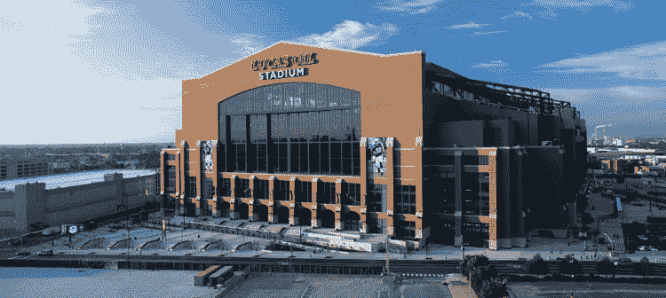

**lucas_oil_2.jpg** *(67.98 KB, 下載次數: 0)*

[下載附件](forum.php?mod=attachment&aid=MzY3OTh8NDY4YTBlYjV8MTYwMDg4OTM1NXwxODIzMHwxNTI3Mw%3D%3D&nothumb=yes)

123

2013-9-18 10:49 上傳

 

# 12

> skly23 發表於 2013-9-18 09:52 

> 好文 期待下一章的翻译

再给我十几分钟

 

# 13

*本文章最後由 六六 於 2013-9-18 12:34 編輯*

友情提示：脆玉米片是美国人的一种食物配牛奶喝的 <ignore_js_op>

**Cornflakes_with_milk_pouring_in.jpg** *(243.31 KB, 下載次數: 0)*

[下載附件](forum.php?mod=attachment&aid=MzY4MDB8NzczMjI1ZjZ8MTYwMDg4OTM1OHwxODIzMHwxNTI3Mw%3D%3D&nothumb=yes)

2013-9-18 10:50 上傳

大多数时候它的名字叫谷物 所以长年以来着好吃的东西一直困扰着我该叫他什么

文中并没有说Blanca和Candela哪个是姐姐哪个是妹妹所以 多半翻译为姐妹 我担心一会儿姐姐一会儿妹妹你们搞混淆了（连自己都会搞混 我这个智力也就这样凑合着用了）

第四章：印第安纳州的 D-Day（诺曼底登陆）（人类视角）

那天的黎明跟平常一样。但是所有人都不知道屠杀即将开始。

**第四章：印第安纳州的 D-Day（诺曼底登陆）（人类视角）**

**        Carl，Candela的男友，住在市中心公寓的他，在早上11点起床，吃了早饭大爱电视。他看到的东西让他脑子一片空白。所有的节目所有外国的节目报道了同一则新闻，Carl看的是CNN（美国有线电视新闻网），新闻主持人一脸的严肃。**

**        “就在早上，她们不科学（没理由的）出现了，她们但是战争的，但是幸运的她们睡着了（站着睡），几秒钟后我们的记者就会提供一些物理知识。（ this that in a few seconds our reporters are going to offer break all the laws of physics）。仅仅是站着她们脚下已经摧毁了几个镇子数以千计的人。”-Carl觉得那就是个大玩笑，但是他耐心的等待着照片，“那些就在其中的人，在天亮前还没有看到此新闻的人，四个女青年已经出现在印第安纳州附近郊区，每个人都70英里高，她们看上去是活着的，然和还在昏睡中。现在，我们提供给你们最新的来自印第安纳波利斯的照片。“新闻播报员继续报道。这简直就是玩笑。**

**        她们就在那。照相机一直在拍她们，她们是无可厚非的存在，从相机视角，她们非同一般的大（原文翻译为不正常的巨大），即使在50英里以外拍摄的，但只是几步远而已对她们来说。飞机上的相机只能拍到她们中的三个人的脚而已，因为其他部位已经超出范围。她们当中的一个人的脚引起了他的注意，那看起来像是那天她女朋友Candela穿的牛仔裤。飞机上的相机开始向上看，看到了第一个巨大女孩的肚子和胸脯。被他认为穿得像他女朋友的女生穿着同样的运动衫。当画面出现女巨人的练的时候，Carl喷出了嘴里的脆玉米片（惊讶）。她是Candela！旁边的是她的姐妹Blanca，她的朋友Sallie，最后的，那个在镜头外面的第四个女生是Skyler。**

**        他简直无法相信！**

**        Carl立马站了起来停止了他在做的事（吃饭），穿衣跑下楼到街上去。那里到处是人，那些人都是离开家出来亲眼见证那些庞大无比出现在电视里的女生的，她们是真的，通过印第安纳波利斯市中心高楼大厦的缺口，他们仍然可以看到。**

**        他找到了个好地方，安静的站了一会儿。他的举动吸引了更多的人去观看这“大自然”的奇观。（本人不同意是大自然）**

**        几分钟过去了，直到最后，其中一个睁开了眼睛，然后，其他的女生也是。她们看起来对周围很好奇而且很疑惑。直到最后，她们开口向对方交谈，说话声在几十英里以外都能听到，在印第安纳波利斯城中心的人们可以非常清晰的听到她们说了什么，就像一架飞机从他们头顶飞过，只不过这声音是他们说的话。**

**        显然地她们认为她们迷路了，不知道她们在哪她们开始探索周围地区。其中一个朝印第安纳波利斯走来，人们陷入恐惧中，甚至其他几个巨大女生的眼睛也开始看向这个城市。这就像世界末日一样叫上穿着白黄色的趾尖和一些“小”爱心图片袜子的女生们站在城市的一边几秒钟。（这句话死逼长）超过一百五十万居民被遮住了，脚的影子就已经遮住了整个城市所有的人都在恐惧中逃难，一只脚从那里抬起指向他们。**

**        对于这个城市，女孩儿们管它叫“灰色区域”。每个看着那些女孩儿的人们都觉得他们就像微生物一样。**

**        Carl是他们当中极少数的在Blanca的脚看起来朝自己踏过来时仍然保持冷静的人（原句不长但是翻译…）。并且从而保持着，他开始发抖，眩晕的看着他的女友和她的朋友，无法移动他的哪怕一块肌肉（吓震住了）。当Blanca天河脚使城市变暗的时候他快吓尿了。他发现他的公鸡（鸡巴）顶推着他的裤子，看着拥有惊人力量的巨大女生，看着那些注意粉碎整座大山和城市的胸脯（本人无所谓大小）…所有的一切让他无比的惊讶，很显然不只是他，许多人也被那学女生展示那些山一般的大（可能是胸脯）的上半身和其拥有的力量所震撼着，那些可与珠穆朗玛峰相提并论的山。**

**        过了一会儿Blanca回到她脚的位置（哪里？是指另一只脚跟上了吗），Candela也移动了，当她们移动着几乎一步就能毁灭世界的步子时给人印象极其深刻，更多的人感到更加的恐惧跟多的人逃得更急。在移动中东面镇子的人们携带者尽可能多的行李跑进他们的车子里以最快的速度离开。他们开向那些女孩不会涉足的地方。Candela在东印第安纳波利斯蹲下，只是在城外，她的脚，已经占据了35平方英里，她毁掉了几个小村子，在哪广阔的被挤压的废墟里混杂了许多房子的木料，车子的金属，人们的血肉，没有人能够抵抗他们即使是一点点都没办法抵抗，在Candela的运动鞋下降接触地面时，所有的东西都被粉末化了（不仅仅是粉碎啊），脚下留下来的巨大弹坑，超过1千尺深。**

**        事实是他蹲下来了，她靠得更近给人的压迫感巨大无比，她的脸离地面已经不再是70英里了，她更靠近地面了，她的目光飞快的扫过整个城市，巨大的眼睛好像要掉出来砸中可怜的印第安纳波利斯的局面一样，所有人绝望了，这个城市比起那四个女孩微乎其微。在所有人都无法预测的情况下，Candela的手指伸向印第安纳波利斯附近的诺布尔斯维尔市，超过1千人立马看到了这个超过3英里长1英里后的手指的指尖以人类无法想象的数度下降，Candela其实并没有要很快的把手指伸下去（暗指这速度对她来说很慢），相反她很慢的在感受着“灰色区域”的触感。所有的人看着他们的生命转瞬即逝，被遗留在地底下的遇难者的遗体已经无法辨别出来，数量庞大的血肉被挤压在很薄的地层。**

**        留下了个300尺深的远洞。Candela看着她的指尖，她什么都看不清只看到了些尘土，但事实上，指尖上满是碎片，变成锯末的树木变成了尘土，血肉也是。现在，所有人都在惊叫着寻求帮助希望有人能够阻止她，都在尝试着竟可能的远离城市。只有少数无畏的人们还在看着女孩们接下来要做什么。尤其是Carl（这小子赚大了混蛋），他的几滴眼泪下来了，由于兴奋，看他的女友只用一个手指在没有意识到的情况下粉碎了整个临近地区。指尖接触地面传来的巨响就像巨能炸弹爆炸（复数）一样，就好像在印第安纳州中心地带传出来一样，在本州西部边界的里士满都能听见，东边的边界上的特雷霍特也是。**

**        但是那还没完，Candela盯着她手上的尘土，人们站了几秒钟看着那巨大的连，一个巨大而美丽的连（原文没看懂大概这个意思），人们必须承认那些脸部细节和肤色的搭配是非常完美的。但是平静的时光并不长远，几秒钟后，巨大的女青年往后退了一点（终于可以松口气了？），把她的腿放下一半，当时北部临近地区的城市就在她脚下，现在诺布尔斯维尔市和周围的一些地区和70,000人在她脚下消失了。**

**        然后她在城市的南部放下了她的手，将临近的穆尔斯维尔绍斯波特和格林伍德整个儿的毁灭了。毫不知情的情况下杀掉了115，000人。她的脸降到了印第安纳波利斯市中心上空6英里处，即使对印第安纳波利斯居民的居民来说如此高的距离对她而言却已经非常近了。**

**        Carl向上看，他的所在地上空出现了她的女友的渺无边际的沾着（stiking）几栋摩天大厦的脸蛋，那些高楼比米粒的大小还小。他无法相信就这样巨大的女生就是那天坐在他面前跟她喝咖啡的女生。**

**        Carl试了几个无效的方法让Candela看到他，向上猛跳，挥着手，尽最大努力大声高喊。他激动得忽略了他相对她来说就如同微生物般细小。**

**        城市外郊区的可怜的人们，听着其中一个女生说她们必须毁灭这些灰色区域，因为他们很可能对地球而言是有害的（我晕好险她们还不知道谁才是有害的），那些最靠近女生的安德森的小镇的居民，想着几秒钟后会发生什么。那女生在城市上空抬起了她的脚，一只两倍于安德森的巨脚，突然降落所有周围的街道空地变暗了，所以紧接着，全部被挤压成废墟，在那之后只剩下一个巨大而深的弹坑。居住在印第安纳波利斯西部的安德森的75，000 人， was not the slightest trace. （无法理解）**

**        其他剩下的两个女生，Skyler和Blanca，也照着她做的做了制造了可怕的屠杀，Sallie也加入其中，毁掉了几个村庄和小镇。只留下了巨大的深坑。毁掉了一切。谢天谢地，在十个小镇变成灰烬280,000多居民死掉后，Candela惊叫了起来然后组织了她们，那声惊叫震隆了真个城市，几个最近的没被毁的小镇也是。**

**        在20分钟内，印第安纳州承受了有史以来最大的灾难，也许是整个美国。碾平了好几个村庄，毁掉了部分印第安纳波利斯区域，一个总数最少50万人死亡（不止吧）。历史上最黑暗的一天，但是这一天只是个开始。**

刚才回复一个楼上的十几分钟结果翻译了我半小时啊，我已经尽量避免错别字了可惜万恶的打字软件和我的急性子哎各位见谅吧。今天就这样了我去lol打人机了白白( ^_^ )/~~

 

# 14

*本文章最後由 六六 於 2013-9-18 23:17 編輯*

括号是撸主的吐槽提示猜想什么的只是骚扰作用，那啥翻译绕口的话就凑合着吧，原文很啰嗦的而且有很多...thant...  ...which...的句式，有时which that同时出现这已经够折腾人的了末尾居然还附加了时间地点或者谁的什么什么整句话的信息量很大然而本人尽量每个逗号句号都对原文高度看齐。所以绕口死了 还有你去看那些老的配音电影也会绕口，比如亲爱的爱丽丝原文则是dear alice两个词而已（ 当然情况好多了毕竟是专业的）。

对了Blanca有两次好像被写成Alice撸主都翻译成blanca或者是女孩子们，这也许是原文的错误或比喻但对撸主来说造成不小的困扰索性对文章无影响，毕竟高潮阶段没有出现Alice了 

# 15

其实在女孩子们弯身观察地面的时候原作者忘记写一个很有感觉的剧情她们的头发接触地面洗发水和香水的味道传遍整座城市，当然还有体香。（自己yy下吧）

待会儿文中出现的pa系统是

**PA是public address的简写**简单的说就是在一定的场合内作为电子系统信号扩大的一组设备。通常大型演唱会的现场调音师所操控的设备可以算是一组PA，室外运动会时的几个[喇叭](http://baike.baidu.com/view/36246.htm)，MIC也可以算是PA。（来自百度）

**第五章：没人可以阻挡的了她们**

**        Candela看着地面。有多少人在她们不知情的情况下被碾碎？**

**        她从地上抬起了她的手臂，她的脚承受了更多的重量，她看着她的手，可以看到她手心的碎石，但是就像灰尘般斑斑点点。她看向她的手在印第安纳波利斯留下的印子。还有她的脚，脚下的城市有65平方英里已经被压碎了，留下了分不清是什么的东西。**

**        “发生了什么Candela？”Skyler问道，她缩回了正悬在一个灰色区域上空差点就踩下去的脚。**

**        Candela站起来，轻轻地把脚放在人少的地方。**

**        “用你们的眼睛仔细看，但是不要伤到灰色区域...爱丽丝（难道又是暗指Candela？）说道,从上往下看，崇尚的眼光从70英里上空望去，就在现在，对她而言，这个小小的印第安纳波利斯的小镇。**

**        Candela的内心开始寻找原因，难道是在做梦吗？**

**        她的朋友接近了灰色区域，占据了城市的四个角。Candela在北部，Sallie在东部，Blanca在南部还有Skyler在西部。小心的，就像Candela说的那样，不要把脚放在灰色区域内。**

**        那区域太小了，举个例子，要是Skyler伸长她的手，他就能碰到Sallie的肩膀，她们太靠近对方了但是每个人都站在城市的边角。**

**        “我正在看这些灰块儿，那看起来像是在蚕食着地面...”Skyler说道。**

**        “蹲下，然后靠近点再看看那些块儿，但是千万别弄坏它，你会感到很惊讶的要是你发现了它是什么”Candela说道。**

**        Skyler蹲下来，把所有的重量压在趾尖（蹲下然后往前靠应该是），她的脸已经距离地面25英里。她聚精会神的看着那块灰色区域，她开始看到了很奇怪的东西，那些非常细的穿越灰色地带的线条形成了完美的方块，大自然无法创造出来的，肯定是人造的。而且继续看的话，当她的眼睛适应（聚焦到适合距离）了，她找到了在那些方格子里的不规则的更细小的线条。看起来想小虫子一样。**

**        “那是...什么？我应该再靠近些”Skyler跟自己说道，换了个姿势。她靠在她的脚上（费解），她弯下腰然后她的脸就可以更高近地面，她的脚不小心地压碎了几个灰块儿。**

**        “Skyler！”当Candela发现后惊叫道。**

**        “对不起，那些难道是一些什么细小的我没注意到的东西吗...”Skyler抱歉的回答道。**

**        Sallie和Blanca模仿着Skyler，摆出了同样的姿势，但仍然不可避免的毁掉了几个灰色区块。**

**        “在小心点！当你们知道那是什么的时候，你们会后悔你们所打碎掉的一切！”Candela说道。其他的女孩们用疑惑又惊讶的眼神看向她。**

**        Skyler看到了细小的水流闯过灰色区域，灰色的线条从一边到另一边地穿过那条水流。**

**        那是桥吗？她自己感到非常惊愕。她终于看到了写可以分辨出来的东西了，几乎到了郊区，有些什么东西看起来很奇怪，有些线条是纯白的有些事平行的有些事垂直交叉的，就位于绿色地带中，比起大区块大，跟她的食指一样长。她心中闪过一个念头那就是飞机场，但是她拒绝接受这个事实因为一架飞机的体型没这么大，那她看到的是什么，就像Candela看到区域中央一样。Skyler看到的是体育中心，渺小的卢卡斯石油体育场。**

**        “印第安纳波利斯！”Skyler尖叫道。她用双手捂住了脸，她无法相信她看到的东西。**

**        Blanca和Sallie被此吓得露出了惊讶的表情，瞪大眼睛看向Skyler，然后看向灰色区域...然后用不同与之前的态度看向它，是的，那就是印第安纳波利斯。**

**        “现在你们总算知道了，我们现在可以做个估计我们在不知情的情况下杀了多少人，我会说1百万”Candela估计到。**

**        她们完全被惊住了，看着印第安纳波利斯。**

**        “那肯定是该死的陨石，那灰色（应该是骂那道金色闪光）的闪光进入了我们的身体...我想肯定是那道闪光搞的鬼...”Sallie说道。**

**        “我想我们没有反悔的机会了，我们会以着这样下去直到永远...”Blanca说道，她仍然看着印第安纳波利斯的市中心。**

**        “无论如何，人类是不会原谅我们的假如我们变回去的话，我们可以想象到一大群愤怒的人们，就是因为杀害了他们的朋友和毁掉了无数的家庭。虽然我们是无意识地，我们仍然制造了一场屠杀，美国历史上最大的，比美国独立战争的死亡人数都要高（她应该说内战因为内战死人最多）。”Skyler说道。**

**        “是啊，要是我们回到原来的大小，我们会被整死的...但是现在，我会找个方法跟他们交流一下."Candela说道，并且瞥了一眼印第安纳波利斯。**

**        “你要怎样跟他们联系，他们对我们来说太小了？”Blanca指着说。**

**        “嗯mm，只有一个方法就是用pa系统，最好的扩音场所就是体育场”Candela说道，转身向着印第安纳波利斯的人群。“我要你们在体育场用pa系统跟我们联系，”这Candela的语气也许是需求，也许是命令。**

**        Blanca的头发是拉直的，所以当她蹲下时特别小心，她的脸下降到快接触地面了，并没有危及到她身下的生命。**

**        她等了几分钟，一群人在体育场的草地上聚集起来。Blanca看到米黄色的斑点出现在广场，那儿有1一千人的人群。Blanca把耳朵伸到最近，看能不能听到什么东西。是的人们的确有在用pa系统尝试着跟她说话，但是Blanca没有听到哪怕一个字。我们必须想一下她的耳朵超过2.5英里长，对于体育场来说这简直太悬殊了。**

**        但是她想到了新的办法。Blanca跟印第安纳波利斯的人们说道。**

**        “PA系统对我们的耳朵来说声音太小了，但是我们现在可以试一个除了声音以外的方法，用标志吧。我和我的朋友可以看到很细小的东西哪怕是一个人，因为现在我们的眼力已经可以看到极其细小的东西，但是我想我们仍只能看到人数众多的人群，我的想法是很多的人想一些字然后配合排成一个个的字母。这将需要上万人来进行，也许会是数十万，但那是唯一的方法。”Blanca说道。她的距离刚好所有的小镇的人都能听见，但同时的，没有震聋她的听众。她的声音太强大了连pa系统都比不过。**

**        “但是你们需要一些巨大的没有大楼的场所然后我就可以听见了，所以你们可以到这儿来。”Blanca指向一个开阔的巨大的有着100万平米的地区，就在机场跑道旁“当你们已经准备好足够的数量的人的时候我们就看得到了，到时候你们组成一个字，然后我们就能看到了我的意思是我们就可以跟你们联系了。”Blanca说完了。**

**        她们一直等到数千人集中到Blanca指定的位置。她们都一直没有动，但是她们当中的每个人都认为在不久后就可以去看看这个世界惊奇的远景了。**

**        Skyler，是最接近那个地点的，把目光集中在那片空地，小小的点开始出现，已经有几千人了。越来越多的点填了进去。知道他们开始看见了组合出来的字。那几乎是感觉不到的，但是依然能看得到，那些店拍成了三个字母，几秒钟后，Skyler看出来了，那些字和她的手指一样粗，那是yes。**

**        “yes！"Skyler惊叫道。**

**        其他的女孩子们，没有移动半步地靠了过去，虽然很困难但是她们看见了那是yes，虽然很小但是他们成功了，数千人数万人的合作和和指引下组成的，他们终于可以跟数万倍大于自己的女孩子们交流了。**

**        Skyler一直看着那些点。他们看起来像是在移动，几分钟后，他们组成了新的文字，但是比之前更小，Skyler必须靠近些才能辨别出这些字**

**        “地...震...，他们这样说道”Skyler念出来。**

**        “对啊，她们很害怕哪怕是轻微的脚步，都能引发一场大地震，那很明显我们没有注意到这些，但是他们承受了巨大的痛苦，确实的我们的脚印下有很多人间接地被杀，房子被地震震塌，而这些地震，我认为那已经是有史以来最强烈的一次...我们很抱歉，我们什么都做不了，”Candela说道。**

**        Sallie，盘腿而坐，她发现了什么。她看着她的脚好一会儿，她在想这些小小的闪光是什么，小到差点看不见，它们太小了这些小光点挤在一起才有她的手指印这么小。小得可笑。Sallie从不同角度看着她的脚闪光出现了又消失了。**

**        “那是什么？”她说道，注意着她的脚。**

**        其他的女孩子们看向Sallie看着的方向，她们只看到她注意着自己的脚，她们连闪光都没看见。**

**        Sallie她没怎么看清楚，但是她很快地猜出来了，她受到了公鸡，也许是坦克的炮弹，或者其他的东西，战斗机的火箭弹。**

**        “我想...他们在攻击我。”Sallie说道。**

**        “什么？”所有的女孩子异口同声地问道。**

**        “是啊，我看到很多细小的点一闪而过，在我的脚的不同的部位，我确信到处都是爆炸...火箭弹的爆炸”Sallie说道。**

**        “女孩子们，快看...”Skyler 打断了她的话。**

**        她们停止了观察那些小东西和正在“受战火煎熬”的Sallie，更仔细的看向那些字。数万人平凑成的字。**

**        “凶手~！”**

**        “他们攻击并且羞辱我们，给我们扣上了莫须有的罪名...他们为什么那么卑鄙？”Sallie说道，没有意识到她还在被所有武器轰炸。**

**        “要记住我们看起来是他们最大的威胁。我们已经杀了一百万的无故人。我觉得他们有权利包围他们自己。”Blanca说道。**

**        “但是没必要用这种方式来反抗。难道我们就这样抱着肩膀被他们打吗？那不可能。”（好戏上演~！）**

**        “come on Sallie，假如你甚至都没觉得他们在打你，那他们就相当于对我们什么都做不了。就让他们这样吧，他们太害怕了而且不知道他们该做什么。”Skyler说道。**

**        “好吧，我支持Sallie，要给那些人上一堂课告诉他们我们不是随便就能被鄙视的，见识下我们巨大的力量吧（对于原句略有改动要不然太啰嗦）。我们不想伤害他们，但是我们也不希望他们尝试着对我们这么做。这太无礼了。”Candela说道，用她的食指指向Sallie被轰炸的脚。**

**        Skyler看了一会儿，那些在空旷区的人们飞快的撤离了，那些店和字消失了。**

**        “嘿！你们在干什么！你们这些人快回去啊！”Skyler喊道。**

**        没有人回应她，他们一会儿就消失了，她看不见那些人跑哪儿去了，很简单的因为他们太小了。**

**        Sallie发现她脚上的白光越闪越大，毫无疑问她仍然感受不到爆炸。她估计之前的火箭是飞机发射的，这回是轰炸机投的。**

**        “As thou shalt not lack（理解不能），你们会后悔的”Sallie对那些她们感觉不到的敌人说道。**

**        尽管她那无法想象的巨大声音冲过，那些士兵似乎没听见般，继续进行着他们的进攻，一秒钟都没有停过。但是Sallie仍然没有感觉到任何的爆炸。**

**        “你们这些可怜的小东西，你们将接受一个教训”Sallie说道。**

**        她的朋友们并没有阻止她，事实上，那拥有无上力量的感觉使她们堕落，就像极高的至高无上的感觉。她们原先是放弃使用能毁灭人类的力量的，但是她们看起来即将展示出那无上的力量。**

**        Sallie举起了她的右手。用力的，撰紧拳头砸向印第安纳波利斯。**

这一章死逼长啊 以后都那么长啊看来星期二翻译不出两章节了以后要多多包涵啊 幸亏这一片已经完结而且只有27章节（太少了啦人家要看更多啦虽然码字很辛苦T_T）

 

# 16

刚刚按照前辈们和美国人更文的规矩吧日期放上去 我这边是按美国的时间所以比你们那里晚一天不要喷撸主连日历都不会看啊 虽然经常看错日历钟表的说（秘密泄露了~） 

# 17

差点忘了来几张比例图 <ignore_js_op>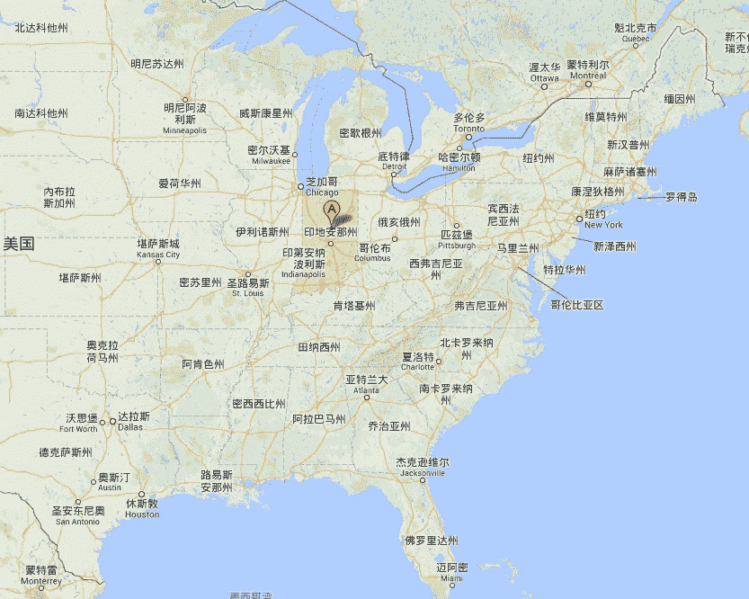

**1.jpg** *(157.3 KB, 下載次數: 0)*

[下載附件](forum.php?mod=attachment&aid=MzY4MzF8NDgwZmRiOGJ8MTYwMDg4OTM1OHwxODIzMHwxNTI3Mw%3D%3D&nothumb=yes)

2013-9-19 11:27 上傳

<ignore_js_op>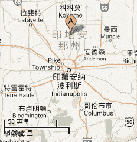

**2.jpg** *(25.24 KB, 下載次數: 0)*

[下載附件](forum.php?mod=attachment&aid=MzY4MzJ8ZmE0ZGJmMTF8MTYwMDg4OTM1OHwxODIzMHwxNTI3Mw%3D%3D&nothumb=yes)

2013-9-19 11:27 上傳

<ignore_js_op>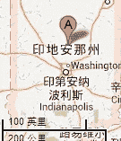

**3.jpg** *(11.57 KB, 下載次數: 0)*

[下載附件](forum.php?mod=attachment&aid=MzY4MzN8NTkzMmE5NTB8MTYwMDg4OTM1OHwxODIzMHwxNTI3Mw%3D%3D&nothumb=yes)

2013-9-19 11:27 上傳

印第安纳波利斯的地图标尺是50英里和一百英里长想象一下她们躺着的高度

 

# 18

*本文章最後由 六六 於 2013-9-19 13:19 編輯*

> CEW 發表於 2013-9-19 11:38 

> 原子彈的傷害範圍 大概是275平方英哩

> 核彈的威力是原子彈的3846倍(也就是約略4000倍)範圍傷害大概可以滅了 ...

应该问作者 我只是翻译的（悄悄回避） 四个70英里的足够玩儿一个州了但是能不能挡住核弹 那个得问作者= = 说不定作者会百度一下哈哈 

# 19

> CEW 發表於 2013-9-19 11:38 

> 原子彈的傷害範圍 大概是275平方英哩

> 核彈的威力是原子彈的3846倍(也就是約略4000倍)範圍傷害大概可以滅了 ...

我看了下后续章节 有用核弹 但是攻击范围半径2英里左右

 

# 20

> archer 發表於 2013-9-19 13:26 

> 记得原文中她们能力和神一样哎.....核弹没有用吧

的确 到后期粉碎星球那个爽啊  哎哟又剧透了 不管看过没有都不要剧透 我会按照原文的顺序哪怕是照片来发的

ps再剧透一个 一共有5个大妹子

 

# 21

> coverle 發表於 2013-9-19 21:33 

> 終於要進入 YY 劇情了嗎? 讓我想起那篇 70 英里高的詹妮

原作者就是仿照那篇文章的 也是我喜欢这篇的原因 他也是粉丝之一 ps下詹妮那篇她是怎样变成女巨人的就是蓝光那一段我屎终看不懂，我这点英语水平再加上可怜的理解能力也只能放弃去看别人的翻译（感谢并膜拜那位大神）

 

# 22

差点翻不出来

**第六章：全歼**

**        当Candela察觉到现在的情况时，所有的印第安纳波利斯和附近的居民完全的放心了（relieved还是绝望了），女孩子们发觉到她们身前的那简直就是奇迹，再被没有察觉到任何东西的时候就被毁灭了（指城市吧before of being shatter without having consciousness of what was doing.）。**

**        她们的力量制造了无数脚印，她们造成了地震，人类从未见过的巨大的强震。这些地震吧印第安纳波利斯的房子震塌了甚至波及了周围30英里的城市和小镇。这些震动迫使每个还呆在家里的人跑到街上，因为他们太害怕被房子压死。**

**        Carl还在印第安纳波利斯的市中心，看向那些巨大无比的少女们。当他的女友说道（之前的话），她们当中的金头发的那个，把脚放在人口较多的区域，在毁掉那里之前，谢天谢地，Skyler脚下的数万人（原文很乱 tens of thousands of people were under Skyler's foot had not yet arrived the hour.）**

**        然后她们移动了大地再次震动。她们包围了城市，乃些尝试逃跑的人停了下来，他们认为无论往哪儿逃都是不重要的了，他们绝对无法在这么短的时间内跑出去到达安全的地方，除非她们当中的一个离开了。**

**        靠近城市，每个人占据了城市的一角，女巨人膝盖以上部位几乎看不到。她们站起来了身子直冲云霄，她们的头肯定已经到达没有氧气的地方，连重力都没有的情况下空气都无法到达那里。人们很惊奇“为什么”她们可以打破物理理论。她们有在呼吸吗？在不同的高度的部位身体重量和密度都是一样的吗（或者在重力下她们还有密度和质量吗），像天上的物质，陨石卫星或是像月亮一样？（原作者啥意思啊到底）**

**        没人能给出答案。**

**        金色女孩蹲下来看了下城市，人们已经麻木了，他们不知道该做什么，城市聚集了很多人，代理者，看着这大自然创造的奇迹。**

**        看了一会儿后，她感觉到了Candela是真实的（谁跟谁？很可能是感受到了Candela的强大）。当她做完了之后，其他的女孩子们也照着做了。所有的女孩子都知道他们拥有和巨大的身材和无限制的力量。**

**        女孩子们聊了下陨石的事，那很有可能是照成这样的原因，同时她们讨论了下是否该变回原来的样子，人们将不不会原谅她们的。也是，她们是对的，要是人们有这个机会，当局会宣布她们死罪是历史以来最严重的反人类罪（会被和谐吧）。但是Carl并不这样，她是Candela~，他的女朋友，他知道她和她的朋友永远都不会做那样的事，她们之所以这样做了是因为她们不知道发生了什么。对女孩子们最有利的无疑是保持现在的体型。**

**        然后就是她们给人们指定了地点。她们想要和人类取得联系，要人们到体育场用pa系统跟她们对话。**

**        然后，人们觉得有些被迫的以最快速度跑到体育场去，Carl到他的车库里开了车，假如他够快的话，他可以避免堵车，同样的他可以到达体育场附近。**

**        真不可思议，数万人尽全力跑到了体育场，遵从巨大女孩的话。**

**        Carl几分钟后也到达了，那里挤满了人，人群里不断地推挤碰撞，他走到草地向上看到了Blanca一小部分的脸，她巨大得太可怕了。他无法想象他看到了什么，眼前的这些是绝对不可能发生的。**

**        然后，他们打开了pa，用最大的声音，试着吸引她的注意力，“你有在听吗？”“哈喽？”声音很大每个人都认为她会听得见，但是事实是不一样的，一个2.5英里的大耳朵是无法听到的。**

**        Blanca回到原先的姿势，她什么都没听见。真的有可能有能力跟巨大女子们沟通吗？**

**        人们呆立在体育场中，对女孩子们普遍的感觉是仇恨、惊讶、绝望参半。她们杀掉了很多人却无法改变任何事（指挽回）。但是人们服从了女孩子的要求，在命令中没有人抱怨和反抗她们的力量。**

**        Blanca又说话了，这一次，她找到了一个人类能做得到的方法，她想要人们排成字母串联成能让她数公里大得眼睛看得到的字。**

**        她指着印第安纳波利斯的一个机场，人们动员起来开始出发。Carl花了些时间才到那里，采纳之前他发现要出去很困难。然后他很可能会遇上堵车（少女们快踩下去吧）。从来没有因一个女生的一个字的要求而在这么短的时间内动员那么多人。**

**        这一次Carl找不到他的女友和她的朋友。他在中心地带附近停了车，看到了无数的不可想象的开往机场的车。他坐在车顶上，明显的看到了他女朋友的方向。他可以看得出从任何地方都能看到她，即使是距离城市数百英里以外。她的女朋友已经被数百万活着的人看到了，也许是世界各地数以亿计的电视前的人都看到了。**

**        从他这个方向到机场，数万人开始到达那里，集合在开阔地。**

**        在这些正在发生时，他看到中央地带，许多军队和坦克开始集结，满是士兵的卡车几部车。他们想要进攻他的女朋友和她的朋友吗？**

**        Carl看出来要发生什么了，他拉过一个全副武装的士兵（面对她们四个还不露果体呢）。**

**        “你们要做什么？”他问道**

**        “我们接到命令要对女巨人发起攻击。”士兵指向Sallie的方向。“我们会尝试毁掉她们的，她们对人类来说是个威胁，所以，军方会用尽一切去打赢这场仗（好样儿的看得出是我一手培养的），我建议你赶快离开这个城市。一会儿我们就会接收使用大威力武器的命令。”他对Carl说道。**

**        “你们疯了吗！她们只是小女生而已！你们在范大错误！”**

**        Carl大喊道，他揪起士兵的衣领。**

**        他给了Carl一拳打翻在地。士兵用枪指着他。**

**        “我建议你滚然后离开这个城市。”说道，然后移开了他的枪。**

**        他一动不动，站起来走过数量越来越多的士兵和机械（战车什么的）。**

**        另一边，女孩子们还在试图跟人类们联系，她们的办法没有失败。他不知道居民排成什么字，但是女孩子们看出来了，可以从城市的任何角度听到他们说。“地震”**

**        现在她看到了很多喷气式战机（英文就四个字母jets）划过天空，他们是军队下属的战斗机轰炸机不久后就开始了公鸡。几分钟后，战斗机朝Sallie的脚射了火箭弹，**

**        接下来发生的事情很可惜。她想没事儿人一样，所有的杀伤性武器都丢到她脚上，她甚至都没有察觉到。**

**        几分钟后，一颗火箭弹射到Sallie的脚上什么事也没发生，爆炸的火焰甚至都没有熏黑她的皮肤，对于人类，Sallie的睡衣巨厚无比。对于她脚上的皮肤，爆炸没有产生任何影响。当火球消失了，那看起来什么都没发生一样。**

**        在她没有发现的时候，Sallie最终看了下她的脚，真的，很巧合，（这句话顺序颠倒虽然合乎英语语法但是不带这么玩的）。即使是集中注意力去观察发生了什么，她最终还是发现了，她告诉了她的朋友，交谈后她看到了是美军在袭击她。而且飞机坦克大炮都加入了精工，在最大射程内所有的武器都设想了Miriam（哪儿来的名字是Sallie吧）。**

**        Skyler说，现在人们排出了新的字“凶手”。**

**        他们振作了起来（吓得直起身来），好像他们想要避免那些至高无上的少女，他们正在努力尝试，希望能够成功的回避她们，and that demonstrated their true power of destruction（理解不能）...现在他们什么也做不了了。**

**        超大声的扩音器警报响彻整个城市，将近一小时后，一颗核能炸弹，其中一颗威力相当强大的丢到了她们她们其中一人身上。在那之后，人们惊慌逃窜，已经不在乎那学女孩子切断了镇上的道路，人们必须离开这里。然后这个世界被激怒了。**

**        Carl快速的回到他的车里。大踩油门狂奔地逃离这个城市。剩下的时间不多了在所有的东西都被丢到空中之前。**

**        对Sallie的进攻还在进行，那些威力和女孩子们没法比，那对她们来说太无力了，明显的，拥有巨大的能量使她们堕落，她们会在接下来的几秒钟后爆发然后很享受的杀死更多的人，就在那人类中间面对这样的命运。对于袭击她们的人类女孩子同意了要折磨他们。“不得不说，你们会后悔的”Sallie说道。要是军方停止了进攻也许我们还有机会避免一场屠杀，但结果是不，无用的进攻仍在继续，看起来士兵们浪费了数百万美元在他们完全做不到的是轻松。**

**        Carl从车里看了出去，看到了Sallie是怎样回击军方的，举起了她的手臂，撰紧拳头用力砸在了印第安纳波利斯的南部。**

**        没有人有有足够的时间反应，只是1秒多的时间哪只手臂穿过了即使公里，拳头击中了地面。**

**        那是毁灭性的。重击产生的巨大能量打破了地球纪录。（从地球出现以来都没有过的巨大）**

**        Sallie手下的地区，完全地被挤压了，她的拳头数百米数百米地沉进地面，留下个巨大的弹坑。什么都没有留下，留下来的也都看不出是什么了。当她的拳头接触地面，激起了巨大的冲击波，直接毁掉了9英里内的所有东西。深度扩大到1英里深，坑外凸起部分甚至把市中心（拳头在南部）街道摩天大厦抬到了650尺的高处。**

**        砖头和木头砌成的房子全部被毁，在承受了难以想象的打击后只留下了碎石残垣断壁，树木被连根拔起，有的被整个弹飞出去，垃圾飞满整座城市大多数的房子都有几层楼倒塌了，它们无法承受来自巨大冲击波的压力。当它冲向市中心，已经有数量众多的房子被推到了，那些被冲击波倒塌的场景真是让人印象深刻，制造了巨大的响声。车子被巨浪挤压揉成废铁废除老远重重砸在地上，其他的被撕成碎片扔到空中。坦克也是无法抵抗，像车子一样。**

**        然后呢，没有遮挡的街上的人们冲击波过来的时候只是简单地撕碎了而已。其他的幸运的，射飞出去过了段时间才素爱死。正在进攻Miriam（原作者啊无力吐槽）的飞行员，失去了控制，有的直接爆了，大量的泥土从撞击地喷飞出去，有几块土地像公寓一样大。**

**        没几个人能够存活。**

**        在他们之中，Carl的车变成了废墟，废除了几尺远，翻转了几次，Carl的手臂脚和头都受伤了，但是奇迹般的她的伤都很轻微，尤其是他的右腿都没事。**

**        他勉强的从车里出来，缓慢的趴着。**

**        当他看到废墟的时候，城市只是在一秒钟后就完全变样了，到处都是碎石碎片，只有几个建筑还依然如故。几乎所有人都死光了。**

**        他从来没见过这么强大的力量，那些女孩子们是无法伤害的，而且还有这无法想象的力量。**

**        她看到了轰炸机从她们头顶飞过，看起来像是轰炸机，直飞像Sallie，核弹被丢下去了。那足够毁掉她吗？要是失败了那些女孩子会被激怒的。**

**        Carl可以想象到他的结局，核弹会毁掉一切。。。或者说不会？他认为核弹会有超过Sallie拳头的力量，但是他错了。。。**

**        炸弹落在了Sallie脚上，一个巨大的火球扫遍了她的睡裤。刺眼的光使得数英里外的人们遮住了他们的眼睛。不久后泛起了巨浪膨胀开来，形成了一个6英里的蘑菇云（迷你核弹相对于楼上的数据）。**

**        他找到街边的一个房子，在被攻击Sallie的冲击波连根拔起之前。他发现了半废地下室，同样的也能让他在爆炸中幸存。**

**        他尽快的赶过去，一会儿后爆炸产生的冲击波到达了，Carl跳进了几米深的地下室，巨浪飞过，但是差点把他卷走，地下室的一堵墙被强力的粉碎了。她摔倒了，但是幸存了，但是伤势严重了些，多谢了那道墙他费力的爬了起来。但是仍受到了二度的烧伤，他感觉要死了，看向原子弹的爆炸方向（想起了使命召唤4的画面）。**

**        他无法相信他看到了什么，核弹的蘑菇云非常巨大，超过四英里的直径，足够了，Carl想到，至少可以伤到那些女孩子哪怕是一点点但是他看到Sallie仍然坐在他面前，体型远超蘑菇云。Sallie相当吃惊的看着蘑菇云在她脚上扩大。对他来说，那太小了。**

**        Sallie站了起来，晃动了整个大地。现在是的，很明确对她来说核弹的蘑菇云太可笑了。Miriam的脚甚至比蘑菇云大，大出几英里。**

**        他们在说着什么，但是他无法明白。他的耳朵，聋了，他听不到任何东西。他在生死之间挣扎，在印第安纳波利斯街上游荡。**

要顶啊 要支持啊

T_T 

# 23

*本文章最後由 六六 於 2013-9-21 09:00 編輯*

有一个坏消息也是好消息：原作者说要从写这部小说也就是说我的翻译很可能又要从新不过我可以再来一次反正闲着也是闲着这么好的文章，好消息是他说他的故事还没完呢~！

所以近期停更吧等消息他还没说啥时候从写啥时候搞定~ <ignore_js_op>

**QQ截图20130920175534.jpg** *(87.91 KB, 下載次數: 1)*

[下載附件](forum.php?mod=attachment&aid=MzY4NTN8YTNjNmU3ZGR8MTYwMDg4OTM2NXwxODIzMHwxNTI3Mw%3D%3D&nothumb=yes)

2013-9-21 08:59 上傳

从下往上读 

# 24

既然还要的话那就接着翻吧 重新码字（其实还真有点懒了那么长简直无法直视） 

# 25

<ignore_js_op>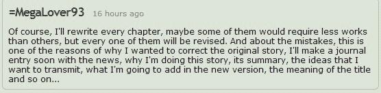

**QQ截图20130921112157.jpg** *(35.86 KB, 下載次數: 0)*

[下載附件](forum.php?mod=attachment&aid=MzY4ODV8ZjJiMWQxNjZ8MTYwMDg4OTM2NXwxODIzMHwxNTI3Mw%3D%3D&nothumb=yes)

2013-9-22 04:51 上傳

到时候他会把大部分的内容每一章都做修改不过有人要求的话那我先翻一下第七第八好了比较短还好，今晚上希望能翻译第九 楼上的说质量差的确 翻到后面烦得要死啊太长了而且也是因为多的缘故原文有很多麻烦的东西还有些小错误啥的，╮(╯▽╰)╭功底不够深啊那26个字母白背了

 

# 26

**第七章：重点开始

Sallie感觉到了拳头下沉的快感，看到了巨大的冲击波扩散到大半个城市，她看到了巨风吹起了对她来说不到一寸的粉尘。

她不是很清楚，她的那拳事实上已经大量的锐减了当地人口，800,00人因此消失了。

对她的进攻结束了，她杀掉了几乎所有的想要攻击她的人。

“你们看到了吗？看到了我们的力量了吗？我们能做任何我们想做的事，没人可以阻挡聊我们。”Sallie对她的朋友们说道。

“我从来都不会想到这些...但是我们的确拥有能让我们为所欲为的力量...去杀死所有我想萨斯的人，当我想要去的时候...这些力量可以控制数百万人...我太喜欢了我想我实在是当我想要的时候。”Skyler惊讶而又吞吐的说道。

Blanca和Candela点头表示同意，最后，她们被力量彻底腐化了，这力量即将给人类带来巨大灾难。

当炸弹炸到Sallie的脚的时候。她感到脚碰到了很热的东西，看了过去看到了一个火球，直径小于两寸。那已经很大了，几英里长。但是她，只是觉得很暖。最威力的武器，只能让他感到温暖而已。

她看着那火球露出极其惊讶的表情，嘴巴张的很大，只是在蘑菇云出现后，从她的脚上升起至几英里的空中...但是甚至都没有她的脚大...

“你觉得怎么样？”Blanca问道。

“酷毙了，我没感到任何的疼痛，但是我觉得很暖，很舒服的那种。无法相信，核弹给我带来的感觉一点都不坏反而很好...”Sallie说道。

“但那并不代表会减轻我们的愤怒，我现在宣布我不会再为脚下的东西在意那么多了，所以准备好吧小东西们。”Candela站起来说道。

Sallie站了起来，平稳的把脚对着蘑菇云踩下去，但是在抬起来的时候已经消失了。

“这就是你们能做的能力吗？准备好了，轮到我们动手了。”Sallie说道。

Blanca和Skyler也站了起来。

“Sallie，等下，这里没什么是可以做了。”Candela说道。

不是时候的，Candela把她的运动衫脱掉了丢到身后，踢走了她的鞋子脱掉了袜子，把袜子丢在鞋子里。然后她打开了牛仔裤的拉链也脱掉了，她现在只穿了内衣裤。

“你在干什么Candela？”Blanca问道。

“我觉得更舒服了， 我无所谓数百万小虫子看着我，他们能对我做什么？”Blanca笑了声说。

“如果你觉得这样很好的话那我们就无所谓了，我们感觉已经很好了。”Blanca

“嘿女孩子们，我想出去走走看看这个世界，我们不可能老是呆在这里的对吧？”Skyler建议到。

“好的，我们分头走吧，我跟Candela我们向东你们向西如何？”Blanca说道。** 

 

# 27

**第八章：加州靡情（Californication翻译仿自同名电影）**

**        Skyler和Sallie往西走去，她们打算找到加州海岸。每一步都伴随着强大气流并且留下一个巨大的脚印，造成一股粉尘幸存的烟云冲击波。她们享受着脚下被消灭的人类的快感，每一步都杀了万余人，毁掉了一大块地。花了她们20分钟知道Sallie停了下来。**

**        “看啊。”Skyler看着地表说道。**

**        地面拱起的部分，有些部分高于Skyler的脚趾。**

**        “是一个山脉...”Sallie自言自语到。**

**        “这些是落基山脉，意思就是我们在半分钟内走了900英里...”Skyler说道。**

**        “这世界变得太小了，我们可以在几分钟内走到世界另一边。”Sallie说道。**

**        “你感觉到了吗我们变成了什么？我们已经是这个宇宙中最大拥有最大力量的人！我们是真正的女神，我们可以决定所有周围东西的命运！”Skyler非常兴奋地说道。**

**        “作为一个新的女神，我宣布将不允许这个世界上任何东西高于我们脚趾头的高度！如果被我们发现了，会马上被我们按到地底下去。先让这个山脉做个示范！”Sallie向所有人宣布道，同时抬起她的脚然后踩向落基山脉。将近两公里搞得山，被往下挤压到数百米深。**

**        女孩子们开始毁灭这些山，每一脚都改变了数平方英里的地貌。**

**        在开心的玩了几分钟后，在卡罗拉多州把8700平方公里的地貌压沉到了水平面一下，同时，粉碎了卡罗拉多州十分之一的地区。**

**        玩完后，她们继续走着，几秒后他们看到了大海，几秒后，她们距离海边只有几寸远，眺望着宽阔的大海。**

**        “我想应该12点了，是个很好的晒太阳的时光，你怎么认为的呢，Skyler？”Sallie问道。**

**        我将脱光上衣晒太阳，你呢？Skyler问道。**

**        “我也是，让我们给西海岸的人们展示下我们的身材吧。”Sallie说道。**

**        两个女孩子脱光了她们的衣服。只留下了裤子。她们把衣服堆在落基山脉上。衣服很重，那些山又被压沉了几百尺。**

**        Skyler，当她脱掉她的衣服，发现了在她旁边的一块区域，一个城市，看起来很大。那应该是三藩市（旧金山），根据其周围的风景可以判断。是的，她看到了金门大桥，样子非常想，但是对她而言只有几寸长。**

**        他弯下腰，靠近那座桥，用食指和大拇指，轻轻地抓住了那座桥的地基。一秒钟都没到，金门大桥从地基下被撕裂了，裂成好几块，但是仍勉强保持其外观。Skyler看得更近，她可以想象到人群和汽车从上面掉下去。**

**        “Sallie，猜猜看我手上的是什么。”告诉她的巨人朋友道。**

**        Sallie正在找可以好好晒太阳的地方，看向了她，看到了她手指间卡着一个渺小的红线。Skyler把它放到Sallie的手上，打开把桥放在她的手掌心里。**

**        “金门大桥...我想这就意味着那属于洛杉矶的一部分，虽然是三藩市的标志，但是也属于洛杉矶...”（“The Golden Gate ... I think which would be the opinion of the inhabitants of Los Angeles if this bridge, a symbol of San Francisco, became part of their city ...”两地差很远好不好实在翻译不出来）”Sallie告诉她的朋友。**

**        “你在想什么？”Skyler费解道。**

**        “看这个...”Sallie说道。**

**        她用食指和大拇指夹住大桥然后把它丢到她旁边的灰色区域，洛杉矶（前段话好像明白了）撞到地面上。女孩子们可以看到那条红线碎成几段，也看到了接触处是怎么扩散出一个小沙尘形成的云，那甚至有一英寸高。**

**        “他们会很高兴能够偷走邻居三藩市的东西的。”Sallie小道。**

**        能拆缁门躺回了地面，她们的身体死死地压着地面，有些地方，像是乳|房穿过了地面到达地幔（地层分为地壳、上地幔、地幔地核外核、最后是地核内核），可以看到地球里的熔岩和岩浆。**

**        “Sallie，你有防晒霜吗？”Skyler玩笑道。**

**        两个都哈哈大笑。**

**        “那没关系的对我来说，我敢肯定我们的巨大身体能够阻挡一切。”Sallie说道。**

**        两个都脸朝下，手折起来乡镇头一样点在下方，头朝大海。场面极其壮观。**

**        Sallie闭上了眼睛放松，同时，Skyler去玩水。她把右手中指深入海中，很凉快啊。离开海面后深度足有12英里但是仅仅只到了Skyler半个手指这么高（表示原文数据错误）。**

**        她想即使是最深的海，马里亚纳海沟，也许知道了她的脚跟，所以她可以轻松地从美国穿过大西洋到达亚洲，只需要把睡裤往上提一点就可以避免被弄湿。**

**        她用手指画圈圈，她看着自己制造的巨大海浪，从她的指尖散开，冲出了很远，她甚至可以看到海浪摧毁了岸边，那是个巨大的海啸。**

**        她漫慢悠悠的玩着手指，当海浪冲击着加州海岸的时候，她微笑地享受着玩弄控制着大自然的力量，**

**        Sallie感到非常的束缚，然后深深的入睡了，Skyler也是。**

 

# 28

至今也看了不少虽然不够10篇美国人的 但我觉得他们老是反复的提醒你女主的升高体重 还有不断地用不同的字眼来表示无比巨大 powerful strength 看得直叫人硬邦邦

咱们中国的也可以这样搞，别人的写的都很多咱们的写的都很短 可能是语言特性吧 中文多半都是各种省略翻译英文的东西与其说是翻译不如说是解释，翻译起来很辛苦文章也很短。这是本人又一次发现了中英文的不同点 二者不是同一种语种 晚上再接着搞第九章

以后等原作者修改完了我再考虑再翻译一次 累死我的了谁叫我那么喜欢~！ 

# 29

> budebuai 發表於 2013-9-22 12:13 

> 作者要重新写，而大家已经迫不及待地要看楼主的翻译，这是一个矛盾。

> 可是这样行不行，楼主可以直接翻译一 ...

好想法大是不知道原作者计划多久才能搞好 要是马上较短时间内就可以修正完毕  那就按你说的 但要是是旷日持久那我还是慢慢折腾吧

 

# 30

对不起拖延了很久 接下来第九章

**第九章：现在毁灭世界了**

**        印第安纳波利斯的幸存者们可以感谢上帝了，终于，那四个巨大的天使分开并且离开了这个城市，大地面目全非，只有非常少数的人毫发无伤的离开了印第安纳波利斯，那地方已经被核辐射等等搞得一塌糊涂，留在那简直就是等死。**

**        Candela留下的衣服，还在印第安纳州，大到甚至碰到了芝加哥，那地方已经被全毁了，数万人丧生。人们觉得那就是世界末日，那对与她们来说只是个时间的问题，然而他们什么都做不了。**

**        当女孩子们开始行动了，脚步引发的地震传遍全美，她们的移动速度快到无法想象。**

**        美国中部州的可怜的人们，看到了巨大的Skyler和Sallie正在接近，随着每一步的移动大地被震得像果冻一样。几秒后，在不给人们任何反应的机会情况下，数十万人看到了城市被影子遮盖，所有的一切已经被巨脚粉碎。**

**        留下的脚印就像是数百年的伤疤一样，把大地降低了一个高度。**

**        人们被吓坏了，更糟的是当她们开始踩踏落基山脉的时候，这些山就像是纸一样。从来都没有任何力量能够达到这么大。没有任何的科技可以摧毁大山就像纸一样。落基山脉已经被踩到低于水平面，生活在未来的人们要是还居住在此的话他们将无法相信那几个女孩子留下来的巨坑原来是一片山脉。**

**        当她们宣布世界上没有任何东西可以高于她们的脚趾的是偶，更多的人群开始逃跑，但即使这样他们所在的地方仍然是非常危险的。**

**        西海岸的居民惊讶的看着那些被他们称呼为“怪物”的女生以无法想象的速度接近。她们几步就跨过了落基山脉，就这么一会儿，她们已经出现在他们之上了。她们站在洛杉矶和三藩市指尖。她们正在洗日光浴，她们脱掉了衣服，把衣服对在山上，将他们活生生的粉碎掉了。**

**        当Skyler脱衣服的时候盯着她们的城市，三藩市的人们只能祈祷了，她接下来会做什么？**

**        在金门大桥的人们没有预料到，满桥的车子，拥挤的，人们正在尝试着逃离他们的城市因为小女孩即将攻击他们。**

**        几秒钟后山一般大的巨指伸到桥的两侧，进门大枪被卡在巨指之间夹起数十英里高，那些在桥墩爆裂时幸存下来的人，在此刻全掉路大海。**

**        幸好，看起来她的注意力好像从这个城市移开了，然后她们把玩着进门大枪，加一会儿后，Sallie拿过了大桥，把它丢到她的左侧，扔向了洛杉矶。（撸主现在居住地）**

**        从非常远的距离，人们看着那个大桥，直勾勾的往下掉，命中圣莫妮卡，人们开始逃离，从从必死无疑的命运下逃离。**

**        那座桥毁掉了数十栋建筑数千人丧生，制造了巨大的骚动，超越了世贸中心的那次灾难，那就是地狱，半个圣莫妮卡已被毁掉，更糟糕的是，海啸从破海岸直插城市，洪水从掉了几条街。他们无法阻止这几个女孩子，她们的力气超越了大自然的力量。**

**        美国海军正等着命令的时候，轮到他们动手了，舰队开向海岸，他们认为他们有能力打击这些怪兽。但是要等到他们放松睡着后，那些细小的东西对这些巨兽来说微乎其微。**

**        最后女孩子们入睡了，是时候上了，舰队开动了，巡洋舰、驱逐舰、核潜艇、还有航...美军历史上最大的军事动员。数万海豹突击队乘船突击，虽然没人认为他们能做些什么，他们都是被命令的，然后他们会尽全力进攻她们。**

**        在此时，美国和加拿大大陆上已经准备好发射核弹，双方同时发射，所有的核弹头都丢了过去将产生人类文明能产生的最大的伤害，可悲的是所有的核弹都没有第一颗丢过去的威力大.**

**        虽然她们已经睡着了，海豹部队在她们面前还是被震撼了。**

**        Sallie和Skyler舒服的躺着，仍然比所有的东西都更高。地球上能比得上她们的最大的东西也只有周围的山了（躺着的时候），小山丘就像米粒一样。**

**        军舰的导弹发射器开火了，射中了Sallie和Skyler的手臂，她们仍然完好的睡着。**

**        但是攻击仍没停止，对Sallie和Skyler继续地做着微弱的进攻，她们完全没感觉到。从航母飞过来的战机，加入了战斗。都得到了无用的结果，火箭弹炸弹什么伤害都没造成，她们还是深深地在微弱的阳光下睡着，仍然被军队打击着。**

**        在不间断地攻击了20分钟后，飞机从Sallie和Skyler那儿撤退回航母了。核弹飞了过来，来自加拿大和美国大多数的核弹数百发数百发的。**

**        如果这些进攻没有作用，那就没什么是有用的了。那一刻来了，始终如一，那两个巨大女孩的身体，在火箭弹的轰击造成的火球下，当中最大的数百英尺的直径，女孩子的背后脚和手臂都充满了火球，一会儿后就升起了小雨一英里高的蘑菇云，西海岸所有的居民都被火球亮瞎了，但是仍可以勉强看到蘑菇云上升到空中。**

**        比起她们都太微小了。**

**        烟尘笼罩了她们的身体，她们已经到了浅睡眠阶段了。人类历史上最大的进攻都没能把浅睡中的Skyler和Sallie弄醒。她们仍然在阳光下睡着，核弹的火球把他们的皮肤熏黄了点而已。**

**        海豹队，他们无法置信的看着女孩子么被强大火力攻击的，冲击波冲向大地和海面晃动着他们的登陆舰。她们被彻底吓坏了，核弹对他们的敌人来说已经没用了，却好像什么都没事一样。**

**        虽然他们的命令是进攻但是核弹已经够了，她们开始撤了。他们不想出她们醒来时现在这两个女生周围。**

**        但是在他们逃出之前，他们看到Sallie已经睁开了眼睛，她伸了个懒腰。**

 

# 31

要顶啊要支持啊 好少人回复啊 下午再搞一章吧 

# 32

前景提要Estepona 位于西班牙南部

<ignore_js_op>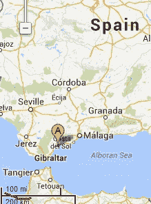

**1.jpg** *(27.01 KB, 下載次數: 0)*

[下載附件](forum.php?mod=attachment&aid=MzY5MjV8NzRiOTViMDN8MTYwMDg4OTM2OXwxODIzMHwxNTI3Mw%3D%3D&nothumb=yes)

2013-9-23 10:33 上傳

<ignore_js_op>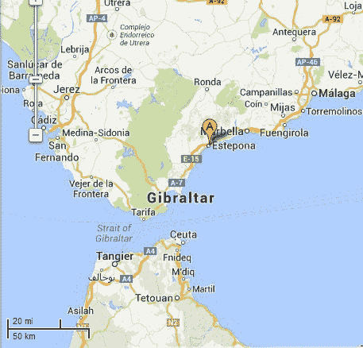

**2.jpg** *(56.98 KB, 下載次數: 0)*

[下載附件](forum.php?mod=attachment&aid=MzY5MjZ8M2NhZmNmYzd8MTYwMDg4OTM2OXwxODIzMHwxNTI3Mw%3D%3D&nothumb=yes)

2013-9-23 10:33 上傳

<ignore_js_op>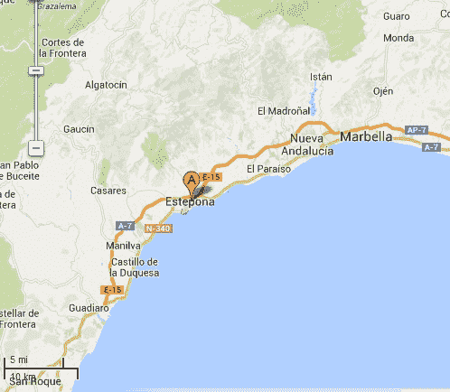

**3.jpg** *(46.04 KB, 下載次數: 0)*

[下載附件](forum.php?mod=attachment&aid=MzY5Mjd8MzA4MDY3ZWV8MTYwMDg4OTM2OXwxODIzMHwxNTI3Mw%3D%3D&nothumb=yes)

2013-9-23 10:33 上傳

<ignore_js_op>

**4.jpg** *(16.11 KB, 下載次數: 0)*

[下載附件](forum.php?mod=attachment&aid=MzY5Mjh8YTJiYjE1YWR8MTYwMDg4OTM2OXwxODIzMHwxNTI3Mw%3D%3D&nothumb=yes)

2013-9-23 10:33 上傳

该章节施工中

 

# 33

> love_gts 發表於 2013-9-23 10:27 

> 顺着楼主的指引去GC上看了整篇原文~~

> 果然是神作啊 lz翻译的也很棒~

用我这500字作文的能力来看简直是惊为天人

 

# 34

<ignore_js_op>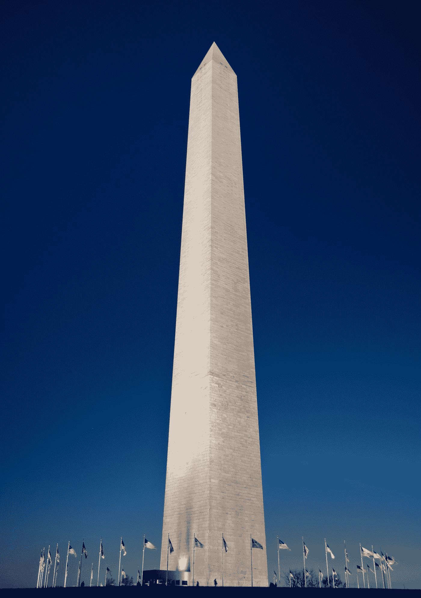

**Washington_Monument_Dusk_Jan_2006.jpg** *(945.04 KB, 下載次數: 0)*

[下載附件](forum.php?mod=attachment&aid=MzY5MzN8NmE5NmQzMDJ8MTYwMDg4OTM2OXwxODIzMHwxNTI3Mw%3D%3D&nothumb=yes)

2013-9-24 06:58 上傳

华盛顿纪念塔

<ignore_js_op>

**807_160321_1.jpg** *(184.3 KB, 下載次數: 0)*

[下載附件](forum.php?mod=attachment&aid=MzY5MzR8OWZlZmQyYWN8MTYwMDg4OTM2OXwxODIzMHwxNTI3Mw%3D%3D&nothumb=yes)

2013-9-24 06:58 上傳

帝国大厦（冷知识：上世纪大萧条时期很多富贵人从这里往下跳）

<ignore_js_op>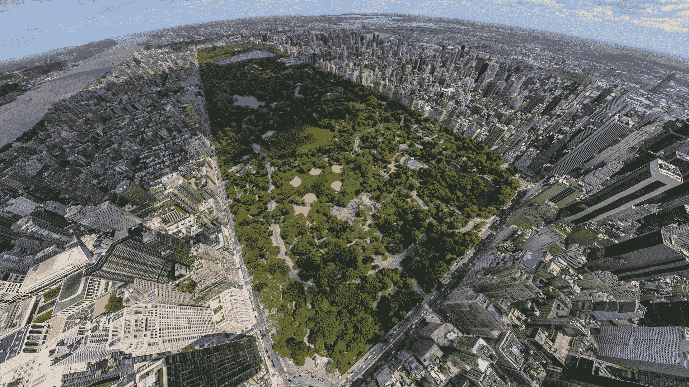

**Central-Park-from-above.jpeg** *(2.25 MB, 下載次數: 0)*

[下載附件](forum.php?mod=attachment&aid=MzY5MzV8MTNkOGJiYTN8MTYwMDg4OTM2OXwxODIzMHwxNTI3Mw%3D%3D&nothumb=yes)

2013-9-24 06:59 上傳

中央公园（这个视角我喜欢）

**第十章：到东海岸游玩**

**        与此同时，两姐妹朝东去了，她们的目标是回她们出生的地方，艾斯塔波（Estepona 西班牙），去探望她们的家人，但是在穿过海洋之前她们不故意地走过了纽约和华盛顿DC。她们都很喜欢这些城市。**

**        她们从来没想过十秒钟就能从印第安纳波利斯走到东海岸，后面留下的，是混乱和废墟。到达东部的宾尼法尼亚州前在Blanca漂亮的袜子下将近一百万人丧生。Candela差不多也是这样，不同的是你能在死前感到她湿润的皮肤。**

**        仅仅10秒九州了900公里。**

**        Blanca看着地表，她到达了华盛顿，而Candela到达了纽约，Blanca可以看到会死额的区块，她想象到那就是美国的首都，但是即使这样，她还是想确认下。她接近了那座城市，把脚放在城市两侧，很小心的尽量不伤到城区。**

**        她缓慢的跪下去把脸贴近地表。**

**        “真好玩啊，我不知道我正在哪座城市上头，哈哈”Blanca自言道。**

**        那看起来像是华盛顿。在城市中央，她看到了很长的比她的手指还粗的人行道，她看起来好像在照白宫，几乎感觉不到的，这些渺小的受限制的东西面前。她认为白宫里的人仍然没有撤退，因为只是一分钟前她还在印第安纳波利斯，而他们没有想到就在这短短的时间内宇宙中最强大最巨大的生物就出现在白宫面前。**

**        “渺小的人类，我在这里宣布，我的姐妹，和我的两个朋友，如女神一般统治着世界，所以，我们将接管所有的国家。现在白宫已经没用了...”Blanca说道。**

**        用她的右手小拇指就把白宫和周围地区粉碎掉。完全展现了地球上最新统治者的力量。**

**        她很失望，她很想享受一下首都，但是那对于她的叫来说太容易毁掉了。她连城市的场景都很难看清，她试图看清华盛顿纪念碑，她知道那就在白宫附近，在走廊中间，但是事实上她没看到，也许她是从天上垂直的往下看的缘故，所以她歪过头看了下，在距离堆满几英寸的地方。是的，她看到了，像白宫一样，在拿下小的走道中间显得十分的渺小。**

**        在她开始看得时候，人类开始反攻发射了很多火箭弹，打中了她但是都被她忽略掉了。**

**        她想出了个好主意。**

**        “从现在开始，这个首都将被磨灭掉，将由Estepona来担任这世界的首都，我们将不会伤害任何人，最少不会伤害太多。所以世界上最安全的地方就是Estepona。”Blanca宣布道“就用这个城市来证明一下吧”她说完了。**

**        她又站起来了，把脚高高抬起平行于地面，然后用力的踩向华盛顿。当另一只脚也踩了过来后，她看到了她的杰作。她的脚印占据了华盛顿大都市的大部分地区，以那脚印为中心，延伸出了数英里的大裂缝但是她只觉得那只是细小的皱纹。就那么1秒的时间内她把华盛顿100%的人口都抹杀掉了。**

**        “就让这个城市做个几年吧！”Blanca大喊道。说完后，她走向她的姐妹Candela。**

**        在她造访华盛顿的时候，Candela走到了纽约。从这个新的视角，她大致地只能看到灰色的区块，一眼望去看不到建筑，连帝国大厦都没有，没有什么能够超过她半个脚趾的高度。**

**        从纽约顶部看去，他能看到曼哈顿小岛的中央公园，但是只有她半根手指长。所以在那附近应该就是帝国大厦了。她很希望能够拿到它，但是那太困难了，对于她手指的结构即使是最轻微的触碰也能把那栋楼折叠成碎片。她必须从地底下连带着地基挖过去，她把手指放到地上然后从地底下移动大楼。她必须要对这个渺小的大楼小心，那太难了。**

**        她跪坐在地上，把西部城区毁得面目全非，她已经不在在乎这些小生命了，即使小心她那体型也在所难免。她看着曼哈顿其他的大楼是如何被她粉碎的。她必须更小心，每移动帝国大厦一步都要万分小心。**

**        她评估了下，这是纽约最大的建筑但是比他最小的手指还小。**

**        非常优雅的她的食指和大拇指在地面上展开压碎了走位的街道和高楼大厦，深入泥土，开始聚合，然后她“轻轻”地把大厦拿起来。非常小心地，她把像米粒般细小的帝国大厦泰勒起来。她把它上升到空中，防止它掉下去，保持着大楼的站立姿势，只要有点失误那大楼就会掉到地上，这个城市的标志性建筑会从此消失。**

**        她把它放在她眼前，尽可能的接近它，几十英里高空中。里面的人们会因缺氧而死去。**

**        用另一只手的食指和大拇指，放置于大楼另一侧，同样的，非常小心地控制着她的力量，因为她要是一不小心即使是最轻微的力量也能粉碎掉建筑周围的街道。**

**        她慢慢地开心地笑了起来，那建筑太漂亮了。她觉得保存并拥有它。她把它放到裤子的口袋里，但是那外来的力量毁掉大楼了吗，还没有，建筑被卡主而且稳定在她的口袋里。**

**        现在她想看更多的东西，自由女很像。那东西在曼哈顿周围。她应该可以找到，走位有三个小道。实在太小了，最大的也只有两倍于她的指尖，最小的只有半个。**

**        她想起来了最小的小岛上才有女神像。**

**        她看不见，但是她知道就在那，但是太小了她很勉强地辨别出它。她很失望，因为她看不到那一刻了（原文没写）。她想要惩罚这些愚蠢的弱小的人类。**

**        “ho！我找不到自由女神像。你们擅作主张的拆掉了吗？所以我要是看不到的话，也将看不到你们了！”说着，Candela用右手食指压在小岛上，然后小岛沉默于水中，永远的沉默在海底永远。**

**        下沉时的巨浪，直冲城市，猛烈地冲击着海岸，不仅如此海水灌入纽约数千英尺。**

**        她很惊讶为什么在变成如此巨大之前。她已经很喜欢这种高高在上藐视灭杀这些细菌（相较原文有所改动）。她感到很担忧，人类文明将彻底消失，那这样她就没有乐子可以找了。**

**        在此时Blanca出现在她身后。她们必须穿越打样到达Estepona，现在已经是她们微小的家乡了。**

**        “我们会回来的，纽约，我还没玩够！”Candela对城市说了声再见。**

**        踏入海水之前，Blanca脱掉了袜子塞进了她的口袋里。**

 

# 35

**第十一章：美国最悲剧的一天**

**        全世界的人们已经只到了本文的主角，他们开始谈论世界末日是什么样的了。**

**        城里人都开始远离城市逃离到乡下，因为他们坚信农村会更安全，但事实是在任何地方人们都饱受正在毁灭美国的巨大少女的力量。**

**        他们没办法逃离她们，Candela的脚把她们经过的地方都粉碎得一干二净，脚下没有幸存者。脚下的遇难者的数量以十万为单位。直到她们到达了西海岸。华盛顿的居民惊慌地跑到街上，因为在他们之上，是Blanca，小镇上一边一只脚。人们甚至无法看到超过她臀部的位置。她的脚跟处已经达到了云层（有点假但是原文就这样写的）。**

**        建筑都在Blanca和Candela造成的地震中倒塌人们都不得不逃到街上，只有总统才有机会以最快的速度离开，他已经离开了白宫。他们打算借用空军一号飞往芝加哥，在那里重新建都，建立个临时政府。美国政府史上第一次进入第一战备。**

**        剩下的人只能呆在原地看着，希望Blanca能够可怜可怜他们，尽量减少对他们的伤害。她快速的跪坐下来，又一次的震动了大地，造成大量的房子倒塌，还有很多人丧生。她宣布了一个新的地球的首都，那就是Estepona。她保证将不会伤到任何在新首都居住的人，但是华盛顿已经不再是任何首都了，当她说完白宫已经无用了之后，她仅用一根小拇指就把它粉碎了。她站了起来。华盛顿的人们遭到了更大的恐惧，然后Blanca抬起了她的右脚，大腿平行与地面时，她的巨脚距离地面十几公里。人们最没用的和无脑的办法就是躺下和躲到车里，或是房子里又或者废墟下。**

**        巨脚飞快的下落了。一秒钟内，下降了十几英里，大地几乎被分割，六百英里外都能听到比核弹还大的轰鸣声，巨脚命中城市。惨胜了人类历史上最强的地震，大概有11.3里克特地震级【能传到百慕大的孟菲斯岛】，巨大的力量从Blanca脚下的足印传出，地面龟裂出巨大的裂痕，几百米粗一英里深，快速的扩散出去，同时制造了一个巨大的冲击波，把12英里内的东西粉碎得一干二净，巨浪把车冲击成粉末，把遇难者击碎成分子快，就像从地面上消失一样。就这样她消灭掉了1000万人。**

**        奥巴马（- -）同学没能从巨浪中逃脱，巨浪甚至打到了空军一号，剩下的只有粉末和灰烬。**

**        完事之后，Blanca转过身到她姐妹那里去。**

**        在另一边，纽约的人民，比起首都的居民他们遭遇的灾难要少，虽然当Candela到达纽约郊外时已经杀了很多人和摧毁了不少的建筑，那些都是无法承受大地带来的地震的。Candela跪坐下来，在纽约西部碾压着脚下的一切，人们看到了一个巨大的肉墙从数十公里上空以无法想象的速度下降。他们都在她巨脚的重压下丧生，所有的东西都粉碎了。Candela公里长的巨脚同时也粉碎了无数的高楼大厦和建筑。**

**        她当时在找帝国大厦，附近的人们飞快的疯狂的四处逃散，制造了一次巨大的人浪，当两根巨大的手指从天而降插进帝国大厦两侧的地底下时没人能够逃脱，将周围的大厦和街道都摧毁了，巨指在曼哈顿制造了强力的冲击波冲出数英里。其他的人们看着巨指开始向上，巨指夹着巨大的一块土地连带着帝国大厦缓缓升起，在巨指面前帝国大厦看起来极其易碎地被以数英里的速度抬升。Candela已经很小心了，里面还有人呢~！有许多人想在里面避难，愚蠢的认为它能承受着巨大的地震，但是未必能承受得住数英里长的巨指。**

**        当Candela把房子抬升至数十公里高空时里面的人都死了，缺氧的同时气压过低。**

**        很可笑的是，她把帝国大厦放到了裤子的口袋里。**

**        然后她看向了城市的另一个特殊的地方，好像在曼哈顿附近的小岛上找些什么。自由女神像岛上的人们看出了她想干嘛，他们立马反应过来，跑向港口寻找船只，但是他们发现，Candela已经看过来了。他们不知道她会干什么。有的已经跳到水里游向城市，那简直是在自杀。**

**        Candela说话了，说道要是看不到女神像，没人将可以在看到它。岛上的每个人看到了一个巨指直飞向他们，将整个岛屿遮住，撞击地面后将其挤压到地底下。大地并没有顶住压力，小岛被粉碎了，被挤压到海床地下。没有幸存者，女神像已经粉碎得无法辨别出来了。造成的巨浪冲向纽约，人们开始从海边逃离，几分钟后，巨浪摧毁了海港和城市。**

**        被淹死的，拖拽后撞击致死的，被粉碎的比比皆是。**

**        Blanca出现在Candela身后，那是她们该离开的时候了。离开前，Candela说她还没有玩完，以后还会再回来的，人们沉默了一下，但是几秒钟后当女孩子们走远了所有的人都欢呼了起来，就像打赢了一场仗一样地欢呼。**

 

# 36

*本文章最後由 六六 於 2013-10-9 07:38 編輯*

金黄色部分为无聊内容 真的看了回软下去的

ronald reagan号航母

<ignore_js_op>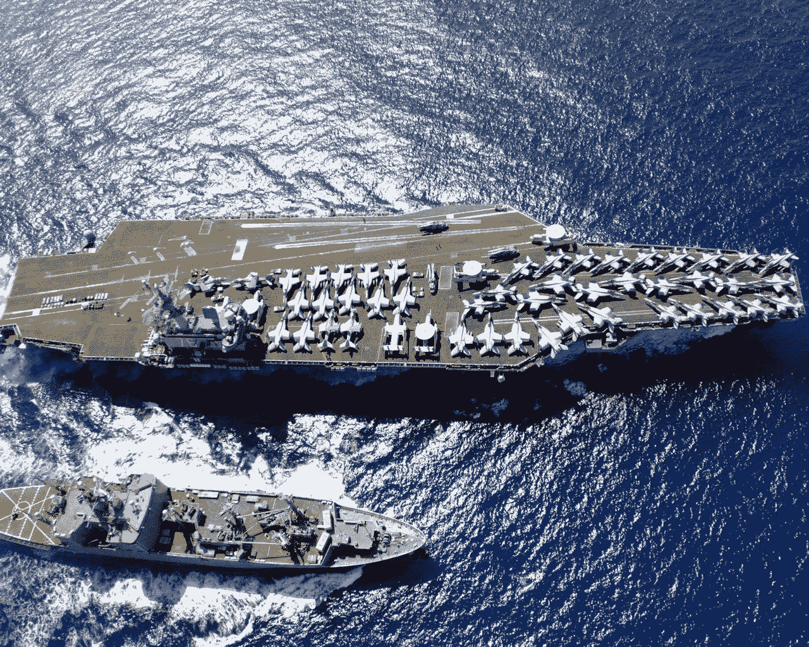

**cvn-76-uss-ronald-reagan-2.jpg** *(392.87 KB, 下載次數: 0)*

[下載附件](forum.php?mod=attachment&aid=MzcwMTJ8YWYyNTY0M2N8MTYwMDg4OTM2OXwxODIzMHwxNTI3Mw%3D%3D&nothumb=yes)

2013-10-5 11:15 上傳

**第十二章：隐藏的特性（Substance's Potential）**

**        加州海岸的Sallie从小睡中醒来，打了个哈哈用手指擦着眼睛。她直望着大海，当她看过去时，他觉得有些什么东西很不适应，她用力地看着，无法相信，什么她变小了？不可能，她显然还是那么巨大。但是...在她眼前，是大海，她们还在海岸（拥有了超神的眼力所以看得太清楚），看到了大大小小的军舰，可能数百，不对是数千。她能看到了所有的细节...船的夹板，看到了...人类！是的！她能看到他们了，她能看到他们的身体，面孔，她能看到所有的一切，但是如此细小的他们她是怎么看得到的呢？**

**        她吃惊地张着嘴。用她的手拍了拍正在睡觉的Skyler。她也醒了问了下发生了什么。Sallie仍保持着惊讶的表情看着她们眼前巨大的舰队，Skyler看了过去。同样的她也能看到，Sallie不是唯一一个能看到甲板上的渺小人类的。**

**        她们看到了每个人畏惧的表情，他们正看着她们慢慢醒过来直到现在。女孩子们看着他们。连一块肌肉都没有出力，人类已经紧张了起来，甲板上发生了叛乱，上军官们正视图稳住局势，但是海豹队想要逃跑。他们开始互相攻击了。低级士兵看来将多的统治权。她们看了后笑了。“Skyler，我想可能是那个陨石，它一直在过去的时间里给我们力量，而且我非常享受，我觉得这不会是最后一次得到能量了可能会有更多。”Sallie说道。**

**        “我和你想的一样。此外，这些力量的出现能让我们玩得更开心。现在我们可以看到细小的东西了，我们可以看到可怜的人类了。”Skyler说道。**

**        一些士兵开始注意到女孩子们的对话，在那一刻，他们疑惑地看着眼前的巨大的佳丽。**

**        “Sallie，看，这船真大！”Skyler说道，指着一大片船中间，“看起来像是航母，比别的船大出两倍多。那是Ronald Reagan号，我看到它的名字了。那是最大的船，像是一个漂浮着的机场...但是其大小甚至没有我们指尖的一半大...哈哈。”把手指伸向航母上空。**

**        她能看到Ronald Reagan号上海豹队士兵惊恐的脸，巨大的手指悬在他们上空，一切都变暗了，他们很害怕那手指会在任何时候压下去。**

**        “我太喜欢看着你们惊恐的样子了小家伙们。”Sallie笑着说。**

**        她看到了他们开始反击了，战舰上的枪炮，火箭射向她的手指和手。**

**        “嘿Sallie，我们为什么不穿过太平洋去一趟亚洲呢？”Skyler问道。**

**        “我同意，我们要去看看整个世界！”Sallie说道。**

**        两个都站起来穿上衣服Skyler把袜子放在裤子的口袋里，把裤底往上卷了下怕怕弄湿了。她是第一个把脚放到太平洋里，刚好才在舰队上。她很享受的看着他们死掉，淹死在水里，享受地看着巨大的巨剑在Skyler脚的压力下下沉，在水底被挤爆。数百艘船下沉，数万人死。**

**        Sallie跟着她，她们走到海里。在海岸上，大陆平台（continental platform）小的可怜，其宽度很勉强的只到了她们的半个脚趾。随着进入大海越来越深，水已经没过了她们的脚趾。**

**        最终，所有的女孩子们都离开了美洲大陆，美国政府做了个统计，他一天，2011年七月22日，是有史以来最惨的一天，大约2千5百万人死亡，许多土地被核武器污染或被女孩子们的脚印覆盖，所有的伤害将要花好些年次啊能回复。该国的经济崩溃了，而且依据多米诺骨牌效应，造成了新的经济危机。**

**        被彻底毁灭的城市印第安纳波利斯，华盛顿dc，担负，堪萨斯市，代顿，哥伦布。**

**        部分会掉的：纽约，巴尔的摩，费城，拉斯维加斯，和落砂机。**

**        较小损失的：三藩市。**

**        再芝加哥，新总统展开了个视频会议，总统请求所有的国家加入战斗。只有加拿大同意了，因为他们已经动手了，但是其他的拒绝出兵。他们说像女孩子们开炮无疑是向她们开战，然后就是被她们的力量折磨，他们坚定的认为美国之所以被毁成这样是因为在没有跟她们好好沟通的前提下直接进攻她们。**

**        其他的国家则是把钱花在加固建筑和在数英里地底下改底下住所，那样会花很多钱，而且几个月内是不可能完成的。但是在议会上让人意想不到的是中国和俄罗斯向美国宣战了。他们说他们等着这一刻等了很久了，而现在是绝佳的机会。没有任何国家阻止他们，所以美国将独自对抗中俄。**

 

# 37

> dickninjadick 發表於 2013-10-6 00:12 

> 闲着没事还是选中了金字看了下，这剧情还要涉及到国家斗争吗。。。。那几个人破坏起来效率那么高，虽说团结 ...

后面剧情是她们并没有干涉这俩国家的进攻而是开始了宇宙之旅 又一个高潮已经接近

 

# 38

> shendanxiaogui 發表於 2013-10-5 15:49 

> 中国又被黑了(´;ω;`)现在中国和俄国关系也不算友好啊。。。

> 话说UP你一个国庆居然才翻译一段Σヽ(ﾟД ﾟ ...

本想多翻译几章的说 我这边的时间都是零零碎碎的 又要和基友玩lol没办法凑合着吧- -

 

# 39

> sdoqueen 發表於 2013-10-7 12:33 

> 怎么看不到第十二章。。。

这几天玩疯了 抱歉啊 第十二章还差几段现在手机上明天吧

 

# 40

终于翻译完了第十三章我去啊 搞了一个礼拜啊 拖拖拉拉到现在本来昨天就能“上市”的...

对了先前的标题没错是第十二章 但是更新的文章写作了- -

下面是地图 有几个地方懒得放了太琐碎了

<ignore_js_op>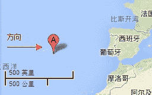

**1.jpg** *(10.06 KB, 下載次數: 0)*

[下載附件](forum.php?mod=attachment&aid=MzcwNjl8YWMwNDQwNDl8MTYwMDg4OTM2OXwxODIzMHwxNTI3Mw%3D%3D&nothumb=yes)

2013-10-10 10:14 上傳

<ignore_js_op>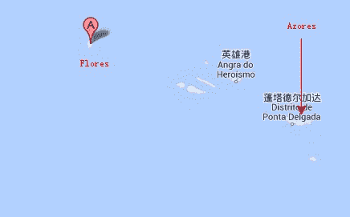

**2.jpg** *(9.21 KB, 下載次數: 0)*

[下載附件](forum.php?mod=attachment&aid=MzcwNzB8NDc1NDRjZGF8MTYwMDg4OTM2OXwxODIzMHwxNTI3Mw%3D%3D&nothumb=yes)

2013-10-10 10:14 上傳

<ignore_js_op>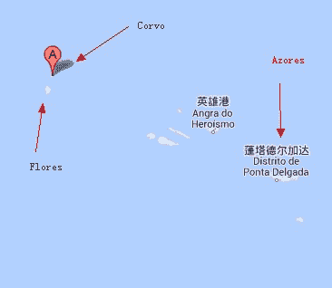

**3.jpg** *(10.45 KB, 下載次數: 0)*

[下載附件](forum.php?mod=attachment&aid=MzcwNzF8NTNkMDk1YjN8MTYwMDg4OTM2OXwxODIzMHwxNTI3Mw%3D%3D&nothumb=yes)

2013-10-10 10:14 上傳

<ignore_js_op>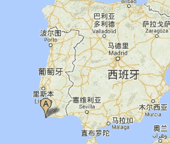

**Cape St. Vincent 1.jpg** *(25.11 KB, 下載次數: 0)*

[下載附件](forum.php?mod=attachment&aid=MzcwNzN8NzZhM2JiNzJ8MTYwMDg4OTM2OXwxODIzMHwxNTI3Mw%3D%3D&nothumb=yes)

2013-10-10 10:14 上傳

Cape st. Vincent <ignore_js_op>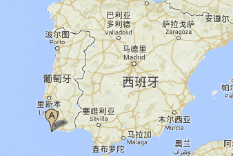

**Cape St. Vincent1.jpg** *(28.31 KB, 下載次數: 0)*

[下載附件](forum.php?mod=attachment&aid=MzcwNzR8ODAwN2QxMGV8MTYwMDg4OTM2OXwxODIzMHwxNTI3Mw%3D%3D&nothumb=yes)

2013-10-10 10:14 上傳

Cape st. Vincent <ignore_js_op>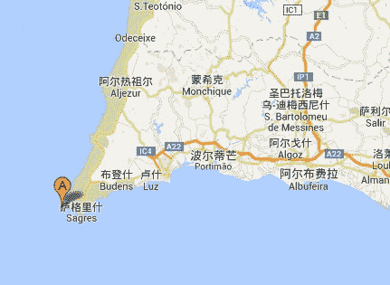

**Cape St. Vincent2.jpg** *(34.47 KB, 下載次數: 0)*

[下載附件](forum.php?mod=attachment&aid=MzcwNzV8ZjdhOGQ5YjJ8MTYwMDg4OTM2OXwxODIzMHwxNTI3Mw%3D%3D&nothumb=yes)

2013-10-10 10:14 上傳

Cape st. Vincent行走路线 <ignore_js_op>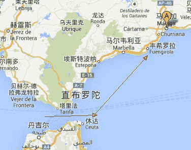

**4.jpg** *(37.78 KB, 下載次數: 0)*

[下載附件](forum.php?mod=attachment&aid=MzcwNzJ8MTEyNDUwYmF8MTYwMDg4OTM2OXwxODIzMHwxNTI3Mw%3D%3D&nothumb=yes)

2013-10-10 10:14 上傳

这都是按照原文的顺序放的

**第十三章：穿过水坑**

**        Blanca和Candela很喜欢在海水中漫步，水深不及脚踝，那真是奇妙的感觉。在大西洋上漫步差不多一分钟后。Blanca停了下来。**

**        “等一下，我想试试别的东西。”Blanca说道，Candela在旁边看着。**

**        Blanca读了下去，用两只手把水碗上来，巨量的海水被Blanca的手碗着，她把手聚到眼前，一直看着她的手。**

**        “哈哈，跟我想的一样。”她说道。**

**        Blanca放开了手，但是海水瞬间被气化成一朵朵小云。**

**        “贼这样的高空水会被提升到1000度（哈~！？），我只是想证明一下。”Blanca笑道。**

**        “但是假如是1000度的话，我们早就烧焦了...”Candela说道。**

**        “不完全是。随着我们体型的而变大，数万倍大于从前的大小，我们的皮肤更厚了，能保持我们体内的温度，从外面保护我们。即使是数千度，高于0度还是低于0度，我们都不会察觉到的，那会变成正常温度的，因为我们对温度的抵抗力太强了，所以，Sallie没有发现被炸弹轰炸了，当他们丢核弹的时候她只觉得很温热而已。数千度的核弹只是一整热风。”Blanca说道。**

**        “还有些问题...这个高度的我们，没有氧气。我们怎么活到现在的？”Candela惊讶道。**

**        “那是更复杂的问题，现在我还没有明确的科学理论能够解释...哦呜...”Blanca把食指放到鼻孔下。**

**        “真奇怪，我们不用呼吸也能生存。”Blanca说道。**

**        “不可置信。这是为什么我们没死...也许...也许我们的身体根本不需要养分，也不需要去维持活着，超过12小时我们什么都没吃也没喝，我一点也不饿也不渴。”Candela说道。**

**        “对，不仅不需要养分，我们的身体甚至不用输送它们和空气...”Blanca说着伸手摸了摸自己的左胸。“或者我们的心跳还在。”她说道。**

**        Candela摸了下自己的左胸。没有心跳，一点心跳的迹象也没有。“我认为我们仍然还要探索很多关于我们身体的东西。**

**        她们朝着欧洲的方向走了几秒钟，她们离开后看到了第一个岛屿。**

**        “快看，这肯定是Azores，欧洲西面非常远的小岛。”Candela说道。**

**        她们走近Azores群岛中最远的两个小岛。**

**        “这是Flores。”她指着和她脚差不多大的小岛说道。“而这个小的应该是Corvo。”指向另一个只有Flore三分之二的小岛。**

**        “你怎么知道的？”Blanca问道。**

**        “我喜欢看地图。”Candela微笑着回答。**

**        “哈喽！”Blanca对着两个小岛挥手。**

**        “他们没有攻击我们，所以我们不能有意的去破坏他们，你觉得公平吗？”Candela说道。**

**        “当然！我们将尊重那些尊重我们的国家！”Blanca对着小岛嘻笑道。**

**        “如果有任何国家攻击我们，我们将向他们宣战，然后我们就可以好好收拾他们。美国已经看到了他们的末日了。”Candela说道，同时也是跟那几个小岛说的。**

**        跟世界上其他的人们一样，Azores的人们，已经察觉到了巨大的女孩们，但是在人类的大小来看这些巨大的身躯实在很惊讶。从以前英里外人们就一直看着她们靠近，宏伟的站在地平线上，她们走的每一步，都以人类难以超越的速度逼近岛屿，他们相信她们将像对待美国人那样对待他们，那将是一场灾难。当Candela和Blanca看向岛屿的时候人们开始尖叫四处逃散，当她们极具破坏性的逼近时人们收到的惊吓更大。在相当的距离内，少女的脚可以轻易地占据整个岛屿的。它们看起来像是巨大的流星，或无限扩大的肉墙，从地上看去人们难以看到这条腿的最顶端，同样的在地球上你很难找到能与之相比的生物。**

**        非常艰难的他们看到了Blanca的笑容，因为她弯下腰了所以人们能看得见，她相人们打了个招呼并且向他们挥手。她们没有弄死他们的打算。谢天谢地。**

**        Blanca和Candela对Azores说了声再见，她们一人一边地从岛屿两侧穿过两只巨大的手在空中拂过。她们据需朝着Estepona走去。**

**        朝着这个方向，他们能够看到Madeiras和Canaries（Azores以东的群岛），在她们看到（欧洲）半岛之前。她们在葡萄牙海岸登陆。那真是美丽地景象，她们能够看到整个欧洲半岛（西班牙葡萄牙那一块），当然整个半岛也能看到他们。**

**        但是她们没有停下来的意思..一会儿后继续走着，她们无意中制造了巨大的海浪清扫和摧毁了海岸上的一切。有些小岛，她们没有发现的就已经遭殃了，人群还没有准备好避难，大量的人群被冲走，不管是周围小岛上的还是半岛上的还是大西洋上的都被冲走了。**

**        Candela察觉到了，看着海水冲向海岸，对于她那就是极小的浪花，但是对于可怜的葡萄牙人和西班牙人那就不一样了。**

**        “我们已经在不知不觉中杀了很多人了。看那些我们造成的海浪。海岸已经被洪水冲刷了。我们每走一步就意味着数千人丧生，也许更多。”Candela悲哀的说道。**

**        “假如有任何不需要接触地面的方法，比如说我们能够飞或者漂浮，这就不会发生了。”Blanca说道。**

**        她们两个都很小型的迈着步子，至少，浪潮已经小了很多了。她们轻轻地在水中放下她们的脚，但是不可避免的，少女脚下巨量的水被激起。**

**        Blanca看到了在她脚边半岛的一个点。**

**        “这就是Cape St. Vincent,欧洲最南部（原文错误写成北），我打赌为了看我们而到达那里的人们已经被海浪冲走了。”Blanca说道。**

**        的确得，当Candela和Blanca离开美国开始回家乡的饿时候，很多人到Cape St. Vincent这很好的观察点去观看这两个女巨人的到来，那些人们想要亲眼目睹这些巨大的少女，因为他们无法想象如此巨大的女人。浪潮冲击了海角的悬崖，上面的人们尽量的把持住不被震倒或冲下去。**

**        “好吧我们绕道吧，走在海上避灾陆地上造成的破坏要少。Estepona是海边城市所以沃恩要非常小心地走好每一步，我们必须走得慢些ok？”Blanca跟她的姐妹Candela说道。**

**        Candela点了点头。女孩子们开始缓慢的走，她们尽量用最轻的步伐将脚迈入水中，这样就可以减小浪潮，但是对人类而言还是很大。**

**        几秒后她们穿过了Strait of Gibraltar（西班牙南部和北部之间的海峡），站在Mediterranean 海上，之后到达Malaga海岸**

**        她们没有预料到的是。沿着Malaga海有数十个小村子，她们可以仅用指尖就能摧毁它们。**

**        “Estepona在哪？我们居然认不出我们的镇子。”Candela说道。**

**        “你说得对...”Candela开口道，朝西班牙南部海岸走去。“所有的人听着，马上标出哪个村镇才是Estepona，或者我们会生气的。”Candela跟半岛上所有的人说道。**

**        西班牙人不知道该怎么高数Blanca和CandelaEstepona在哪，他们害怕会有更糟糕的事情要是不能解决的话。西班牙政府想出了个办法。他们在Estepona周围点起了被控制住的大火。这些烟会吸引她们的目光，然后她们就能找到了。南西班牙的居民看到了震惊的景象，他们看到了海水的高度仅仅没过了这对姐妹的脚趾，她们可以只迈出一小步就能从欧洲走到非洲。陷入绝望的人群观察着天空，只看到了姐妹俩的膝盖，因为剩下的身体几乎到了外太空了。**

**        “我觉得我看到了什么...”Blanca说道。她弯下腰。**

**        在Malaga海边的镇子中，比她们的指尖还要细小的就是Estepona，她们看到了细小的烟雾。她们知道那是什么了。**

**        她微微一笑，竖起了大拇指告诉人们干得好。**

**        “好的！我喜欢那样，你们必须服从女神给你们的所有的命令，必须随时使他们满意。为了报答你们我绝对给你们一个吻。”接下来，Blanca嘟起嘴考勤地表，缓慢的下降着。惊恐的人们在为自己祈祷，Blanca的脸的影子遮住了整个Malaga省。有些惊恐过度的人无意识地到处乱跑。但是接下来Blanca并没有继续她的吻。她保持着悬在空中的姿势，移动也没动。在Blanca的比例下只有几英尺高，在人类的比例下是数十英里。在这么惊人的距离之外，这两片嘴唇巨大得不可思议，人们无法相信眼前的景象，仿佛这是从天堂掉下来的一样并且可以仅用一个优雅的吻就能将一切夷为平地。**

**        但是Blanca收回了她的吻站了起来。**

**        “哈哈！开个玩笑而已！我简直无法相信你们将会有什么样的表情，哈？”Blanca玩笑道。**

**        一个字都没说（非常突然地），Candela蹲了下去，用她的右手食指插进Estepona北部。然后绕着它画了个圈写写画画了什么，留下了个2500英尺宽数百英尺深的峡谷，摧毁，屠杀，和弄碎她手指经过的一切。几秒后她她站起来了。她看向Blanca。**

**        “你做了什么？我们说过将不会伤害他们！”Blanca说道。**

**        “我做的事是很明智的，加入我们想在任何时候知道这个世界的首都在哪。我以后就不用再费力的去寻找你也不用再问我就能找到它。而且，我尽量减少制造伤害，我画过的地方基本上都是山区。”Candela解释道。**

**        Blanca看了下她画画写写得分地方。“Estepona_>”（啥？），事实上，是很明智的假如她们想要轻松找到她们出生的地方的话。**

**        “好吧...我想i是对的，我想我们很难认出它没有你写的东西的话。现在我们做什么呢？”Blanca问道。**

**        “我想我有了个好主意了.."Candela灵机一动**

 

# 41

先说明缩小的黄色字体为尴尬且敏感内容 不大适合本文特色 但是原文就是这么写的若想读的话也可以 为了不打扰不想读那段内容的看客本人还是把它隐藏了下

可以感觉到更高的高潮已经来临（翻译了快一个小时我硬了快一个小时额啊~！）

话说有翻译错的还请指教 本人马上改 基本上每段话都是按照原文排的 所以对着数就能找到相应的原文段落 话说跳票那么久不好意思- - 看情况明天再秒更一期吧

**第十四章：一个“太平洋”冒险**

**        现在她们已经有了特殊能力了，就是能看到细小的人类，Sallie和Skyler已经开始和小东西们玩闹了。她们学到了更多的如何做一个女神经验。**

**        在离开美洲大陆不久后，也就是在太平洋上40-45秒，她们看到了第一个小岛。一个很显眼的小岛...**

**        Skyler用手轻拍Sallie的肚子，然后指向那个小岛，**

**        “你知道这些小岛的，对吧？”她问了下Sallie。**

**        “那肯定的~！那就是夏威夷岛啊！为什么我们不停下来一会儿去看看他们的海滩呢？”Sallie咯咯笑地说道。**

**        “你知道怎么跳草裙舞吗？”Skyler问道。**

**        “差不多吧。我们要展示下如何在夏威夷跳草裙舞吗？”Sallie问道。**

**        “let's go！”Skyler回道。**

**        Sallie和Skyler能用她们的肉眼清晰的看到夏威夷的人群，明确的她们知道他们的存在，但是在之前她们没法用肉眼看到，然而现在让她们感到狂喜的是，拥有着过分巨大身体的Sallie和Skyler，她们能够用肉眼看到他们了。在数百英里开外，这两个升高顶到天际的女孩子，就这么轻松地站在太平洋上，这海水只不过几英里深，每个人都惊讶好奇地走出房门。大多数在街道上的人已经北京呆了，只是呆呆的看着。有的惊叫着，请求军方做些什么可以办得到他们的或者是阻止她们，但是他们知道这很没用。所有美军军方的努力都成了泡影，一部分已经在几秒内被消灭了。他们只能看着这两个女生接下来会干什么。**

**        Sallie和Skyler开始挑起草裙舞，摇摆着她们的臀部，从一边摇到另一边，有节奏的舞动着她们的手臂。她们跳得不错。百万人都能看得到这最大的草裙舞者，他们甚至看不到她们的眼睛。他们被她们的性感的动作腹部和臀部吸引着，像山谷一样巨大。。过了几分钟。**

**        “这样很没劲啊没有音乐的话。”Skyler说道。**

**        “想找点乐子吗？”Sallie问道。**

**        “当然！但是你想从哪弄来音乐呢？”Skyler问道。**

**        “不...我们该停下了，如果你不想无聊的跳着没有音乐的舞，we'll have fun in the best shape（没看懂）.我们将会运用我们新的能力。”Sallie说道。**

**        “你想到了什么？”Skyler问道。**

**        “我们为什么不和人类玩玩？我在想，举个例子，去看看他们会怎么反应当我们做些什么的时候...从折腾他们当中找点乐趣。让我们把衣服脱了如果我们要坐在或躺在海洋上的话它们会被弄湿的。我们把它们留在岛上。”Sallie指着夏威夷最大的几个岛说道。“那看起来只有少数人住在那里。”Sallie接着道。**

**        “看起来很好玩，是的。现在我们有了新的能力，我们必须用用它！”Skyler说道。**

**        双双都脱掉了衣服，赤果着，她们把衣服堆在Mauna Loa volcano（冒纳罗亚火山），那里不是人群聚集地。**

**        “好的小东西们，准备好接下来的游戏！”Sallie对着其他的岛屿说道。**

**        女孩子们慢慢地移动着，仍然激起了涛涛巨浪朝岛屿方向猛扑过去。**

**        Skyler在瓦胡岛前躺下，那是夏威夷的主岛。那里有这些岛屿中最大的城市，火奴鲁鲁。Sallie在她旁边躺下，脸对着考艾岛，离瓦胡岛有100公里远。**

**        Skyler 看到了一些个小岛上的村庄被淹了。她有点失望，因为这些本来可以好好玩玩的镇子都已经消失了。她看向凯卢阿岛，一个她面前的海边小镇，拥有着35000居民。漫进小镇的水很多地方都已经超过3米高了。很多人爬到自家房顶上，房子下半部分已经被冲烂了，她看到了他们正惶恐的看着她。这是她变成这么大以来第一次看到无辜者的表情。她感到有点同情了，他们没有任何办法反抗她，只能恐惧的等待死亡的降临。她就在5分钟前粉碎了许多人的生命。数万个。然后，Skyler感觉到去折腾他们是一个很大的错误。她很搞笑看到很多人在那个情境下。她的眼睛充满了泪水。（难道我有翻译错了还是说她为之前感到后悔了...）**

**        她轻敲Sallie的肩膀。她看着Skyler眼角的泪水。**

**        “我不能伤害他们。我们不能在这么做了。”Skyler说道。**

**        “你在说什么？”Sallie说道。**

**        “也许，这些给予我们的能够看到人类的能力，是为了让我们意识到...我们给他们带来的痛苦。我们以前也是人类。把你放到人类的立场换位思考下。我不再干这种事了。而且，要是能够的话，我愿与帮他们。”Skyler说道。**

**        “Skyler，我们是女神啊，我们想做什么做什么，作为神要在这些细小的东西面前展示自己的权威。他们攻击了我们，然后我们回报以愤怒。”Sallie**

**        “请不要再叫他们微生物了（之前的翻译不一样），他们是人，他们是生命，他们有感觉。我们不能以这种方式轻视这些。我觉得他们的苦头已经受够了。我们已经杀掉了数千万人，就只是因为他们的自卫反击。那些事很正常，我们对他们来说是个威胁，我能理解即使他们使用核武器。然而，他们没能伤害到我们哪怕是一点点。你不觉得已经太多了吗？看看他们，我不会再这样下去了。”Skyler说道。**

**        Sallie直直的看向她身前的小岛。她看到了许多镇子。大多数已经被冲了。在凯卢阿的同一个地。她看到了可怜的人们，他们失去了一切，很多人甚至失去性命。Sallie也感到了悲哀。**

**        “你是对的，我想那个新的能力是让我们睁开我们的双眼。但我们必须像一个超能力者一样。不管怎样，甚至是善良的女神对吗？我觉得我们给人类的教训已经够了他们将永远记住这个。我希望不会重演了。”Sallie说道。**

**        Skyler带着悲伤往回看向瓦胡岛。**

**        “我很抱歉我们所做的一切，我们将试着不再发生。我们最近可能的去帮助那些受苦的人...对！我想想看我能做什么。”Skyler说道。**

**        她压低身子嘴唇轻碰海水，就在小道歉，然后小喝了一口，不那么用力的，因为不只是海水进入了她的嘴，那些房子和人也一起。几秒钟后，洪水消失了，但是碎片，车，树木等等..都进入了她的嘴里，hold着它们。淘到屋顶的人们，看着难以置信的大量的涌进来的海水被狂吸了回去进入了Skyler的嘴里，没爬上屋顶的人们被无情的吸入了她的嘴。关于这个Skyler不是没有想到，有数百人不知不觉的被吸入了她的嘴里。Skyler吸满了水站了起来，对着外太空喷出所有的东西。水消失成了气体，在进入大气层的时候，碎片也掉进了大海（可能原文有错）。**

**        “我只能帮你们做到这些了。我真的能感受到之前发生的事。但我不希望你们再回来攻击我们，我们在最开始并没有攻击意图，我们现在也是。”Skyler说道，Sallie也照着做。**

**        “出发吧，我觉得想试着做些人类办不到的事，因为在人类居住地700英里内做的话会照成一场大屠杀。”Sallie说道。**

**        “你现在先做什么？”Skyler问道。**

**        “当我们到了我就会告诉你的。”Sallie回答道。**

**        她们拿起了衣服开始穿回去。**

**        Sallie开始向西北部走去，Skyler跟在后面。几秒后她们到达了广阔的太平洋中央，800英里以内什么都没有。**

**        “好的，我想了解下如果我们可以游太空的话。”Sallie说道。**

**        “哈！？”Skyler糊涂了。**

**        “如果我们能够跳得够高就可以完全的离开大气层，我们会飘在外调控的。然后我们就可以来去自如，像我们这样不需要依靠任何东西来维持生命。唯一让我感到担忧的是我们的速度是不是够快。太空非常巨大，即使是对我们而言，假如我们只是去月亮，我们也要足够快的速度，要不然那会浪费很多时间。”Sallie说道。**

**        Skyler在旁边等着看Sallie能证明什么。**

**        Sallie准备好了要跳，但是在那之前她被Skyler阻止了。**

**        “等下！快看那边！”Skyler说道。**

**        数百英里以北，她看到了巨大的舰队在向东行驶，看起来是在向US进发。女孩子们试着看出是哪国的船。**

**        他们是俄国和中国，那是个联合舰队。他们的目标很容易就能猜出来...他们要进攻US.**

**        “他们想在我们留下一片废墟后趁机进攻，然后向世界展示他们是新世界的领导者。”Skyler说。**

**        “我们不会让他们得逞的。在这里等下。”Sallie。**

**        Sallie朝他们走了几步，站得非常靠近。双手叉腰，盯着这些正在承受她照成的大浪的小船。**

**        “嘿！你们要是继续的话是很不利的，我们会对你们做同样发生在US的事。”Sallie对着她身前的舰队说道。**

**        舰队缓缓停下。人们吓傻了，不知道该干什么，很害怕的，同时也都很兴奋地看到他们眼前巨大的身影（不能理解）。**

**        Sallie咳嗽了几下，垫脚尖的蹲下弯下身子（身子靠前的蹲下去的那种），尽最大可能靠近这些舰队。**

**        “我告诉过你们离开这。”Sallie命令道，然后因为感到这些舰队的弱小而微笑道，她可以闭着眼睛用手脚摧毁掉这个联合舰队，然而他们甚至不知道自己死了还是稀巴烂了。**

**        接下来她看到了他们的反应，舰队开始往回开了。他们太害怕了，如果不服从世界级的Sallie的话。**

**        她站起来往回走。**

**        “我们应该在走远点要不然会影响到他们的假如你要继续的话。”Skyler建议到。**

**        她们俩像西南走了几秒钟，确保离那舰队有足够的距离。**

**        Sallie准备好了跳跃，深吸一口气，弯曲她那长无边际的脚然后跳起。但是她又落回了地球。造成了真正意义上的12级死亡地震。1800英里开外都能感觉的到。可以从夏威夷岛到西班牙的小岛两个3600英里距离都能感受得到。**

**        巨大的影响累在海底作用开来制造了一个很深的峡谷然后形成了巨大无比的火山，在收到地底下演讲的喷涌而出时底下的水也往外喷流。同时也造成了巨大的数英里高的还小，从太平洋中心向四周扩山，完全的淹没了太平洋内较靠近的岛屿，瞬间让它们消失了，但是幸运的是，女孩子们已经成功的将上海减到最低，当海啸到达人群聚集地的时候已经“仅仅”剩下数百英尺高。**

**        “我觉得我应该再努力一些，这一次我会搞定的，再让我试试。”Sallie在Skyler能做任何事前说道。**

**        她把最大注意力集中起来数秒钟，眼睛闭上，所有的一切都很安静，她的目标是在太空翱翔，她能成功的，只需要去相信它然后去实践。没什么是不可能的对于一个像她那样的女神来说。**

**        Sallie跳到了真空的外太空了。**

 

# 42

最后一段有点麻烦就不翻了原作者也是匆匆写完 哟啊是可以的话我明天16章~！ 不出意料之外的话高潮在16 17章左右出现

**第十五章：小沙哈拉**

**        “嗯，我觉得我们似乎该做些什么提醒一下Estepona是新世界的首都对吧？”Candela说道。**

**        “对啊，但是不管怎样，e can not check if they are fulfilling, as it is impossible to see what they do. If it is already difficult to see the whole town ... after we'll think of something.”Blanca说道（这句没看懂）。**

**        “让我们休息下吧，我知道有个很好的地方可以很安静的离这儿不远。”Candela说道。**

**        Blanca微笑着，用她的大拇指指着她背后的某处。几百英里远（对她们来说几米远）。那是世界上最大的沙漠，实际上是有人居住的，是个很好的休息的地方。同样的，在那里可以做一些不至于危害数百万人生命的事。对女孩子们来说撒哈拉的大小只不过一个花园一般。那是个为她们准备好的好地方。**

**        Candela回了个微笑，她猜到了她姐姐的想法。**

**        两个都开始朝沙漠走去。从西班牙海边开始走了几步就到了摩洛哥的中部，她们试着走到了有人居住的地方，还不止这些，数十万人就这样丧生了。只是几秒钟而已，她们到达了撒哈拉中部。沙子至少超过了50度但是一点都没有影响到她们，事实上，炎热只到达了她们脚趾出。**

**        她们所在的地方可以看到整个沙漠和大部分的非洲，但是弯曲的地平线挡住了她们。**

**        通过那个高度去看整个走位环境的变化是很有趣的。女孩子们用脚去揉搓了下沙子。数百万吨沙子被翻腾来翻腾去，沙漠里的沙丘被女孩子们的小脚丫的压力挤出了无数裂缝。她们抖了下脚，沙子立马全部滑落下去。不像海边的沙子需要更大力气才能甩开。不像沙漠的沙子那样马上就可以从皮肤上掉落，巨大重量的沙堆形成了沙城暴。**

**        两个都躺在沙漠上，然后开始玩沙子。她们拿了一堆沙子然后放开让沙子落下，Candela对着她姐妹吹了手中的沙堆，Blanca把手中的沙子丢回去，两个开始嬉打起来。互相打着并且挠对方痒痒。一段时间后，她们停了下来，只留下了两人躺在沙漠上，沙漠看起来向战场一样，在她们玩耍过后。**

**        Blanca想出了个主意。她开始用大量的沙堆堆积起来，做出了一个不朽的山。很快的，世界最高处已经不是东边的珠穆朗玛峰了，这座新的山几乎有两倍于原来老高峰的高度，它的高度接近12英里，她给这个高山起了个名字，沙堆，然后不久后顶部出现了白雪，她给这个顶尖起名Kilimanjaro。**

**        她看向Candela然后展示了她的杰作，但是她闭着眼睛躺在一边，试着小睡一会儿，所以她把她搁在一边了。Blanca也躺了下来，但在睡前她回想了之前发生的一切，她可能是宇宙中最强大的存在。未来会怎样呢？**

 

# 43

**第十六章：遨游太空**

**Sallie睁开了眼睛。她成功了吗？当睁开眼睛时，她无法相信眼前的一切，她站在太空中间，在虚无中漂浮着。回眼向地球望去她能看到Skyler，她离地面有700英里远。**

**在那个位置她的视角很棒。她能看到大半个地球，就像宇航员在太空基地一样，只是这个星球对她来说太小了。**

**Sallie想尝试些新东西。在太空声音是无法传播的，但是她非常坚定没有什么能够阻挡得了70英里高的女孩发出的声音。Sallie向Skyler喊道，又一次的她打破了物理定律，她的声音以更快的速度传到地球，数亿记人类听到了她的声音，震聋了他们的耳朵长达数分钟。Skyler也听到了。**

**“Skyler你得过来看看，那太棒了！”她喊道。**

**Skyler向上看了几秒钟，她能看到她就在黑暗的太空中，在看到这之后，她觉得没有什么是不可能的，至少对她们而言。然后她闭上了眼睛，深深的集中了注意力，弯曲她的脚然后用尽全力跳，像Sallie那样。当她睁开眼后，她看到了身旁的她，在几百英里外，她们俩都站在太空中。**

**“我从来都没想过会有这种事。”Skyler感叹道。**

**“我不知道为什么，但是那是事实，而且我们应该好好玩玩。”Sallie说道。**

**“我有种感觉就是我们还有更多关于自身身体的东西需要去发现。”Skyler自言自语道。**

**Sallie环视了一下宇宙星星，星球，陨石，银河系，星云...她的视力能看到的所有东西仿佛只有几英尺那么远，即使是数亿光年外的东西。她们能够看到的区域覆盖大范围的宇宙。所有的一切都太震撼了，宇宙不只是黑暗和冰冷，相反充满了色彩和美丽的事物。**

**“太美了...但是我得弄清楚怎么遨游太空，肯定有什么办法能够比光速更快的移动方式，因为以别的方式的话我们可能哪儿都到不了”Sallie说道，幻想着宇宙是个无限大的池子，他们可以“游”或者蛙泳之类的遨游太空...但是那实在是太慢了。**

**“我不清楚我们还会什么能力...”Skyler疑惑的说。**

**“让我想想...”Sallie用食指点着下巴诺有所思的说。**

**“飞！！ 我想飞跃整个操蛋的宇宙！非常快的那种可以在几秒内从头飞到尾！我是女神，没什么能够阻挡我！我要变得比光速还快1亿倍。”Sallie努力的用尽所有的意念和力气在大脑中挤压着那个想法，飞...但怎么飞...?**

**突然间，Sallie消失了。Skyler不知道发生了什么，环视周围但是没看到她。她有点疑惑，只是在一眨眼间Sallie就消失在她的视野当中。**

**“Sallie，你在哪！别闹了！发生了什么！？”Skyler绝望的大叫到**

**她又环视了周围一次，Sallie想再飞到月亮上像第一次那样，也许她必须先看着那个方向。然后答案出来了。**

**在月亮的后面她看到了一只手伸出来，上下摆动，Sallie正在向她打招呼，她躲在月亮后面...距离Skyler240000英里远。她成功了！**

**“你是怎么做到的！？”Skyler自问道。**

**Sallie又消失了。**

**“别再玩了混蛋！你在哪？”Skyler又一次找不到Sallie了，很难跟踪她的行踪，她消失的时候几乎是一瞬间就没了连踪迹都没有。**

**“在你后面！”她听到Sallie在她背后说道。**

**Skyler回头看。但是没人。她在跟她玩闹。**

**“哈~”那声音再次从她背后传出。**

**她还是没发现她。**

**“别耍我了，Sallie告诉我你怎么做到的。”Skyler不耐烦的说道。**

**Sallie的突然出现，下了Sallie一大跳“别生气！开玩笑啦...”Sallie不好意思道。**

**“我原谅你了...如果你告诉我的话”Skyler要求到。**

**“好的。黑客帝国你看过吧？”Sallie问道。**

**“不喜欢所以没看过”Skyler回答道。**

**“ok...好吧，*@……*@%*……￥（解释那个电影岔题了）”Sallie解释道。**

**“说重点。”Skyler插嘴道。**

**“OK...最后，一个人类的反抗组织黑客了那个系统，而且可以自由的进入虚拟世界，在虚拟世界里他们可以做现实世界里不可能的东西。主角和那个领导者一起接受训练，大战那些会武打的敌人。他打不到他，所以那个领导者就说：别只是想你会，要知道你可以的。（Don't think you can, know you can.名言吗不大会翻译）”Sallie说道**

**Skyler正试着瞬间移动的时候，Sallie抓住她的手。**

**“一起飞吧，到月亮上去，然后走走。”Sallie说道。**

**手抓在一起，两个都消失了，只是一次呼吸的时间她们已经出现在月亮上了（省略一大段话太长了我靠看不懂啊）。月亮的地表很有趣，表面的岩石像软的粘土，紧贴着他们的巨脚留下来的足印。Skyler抬起她的脚看了下留下了什么。一个巨大的坑。**

**“这个脚印会成为我们的象征的，数百年后，每一次他们来了后，都会想起我们，Sallie，要是你想象一下的话，但是我们正在创造历史，我们会永远记住的，不管怎样我们已经创造了，即使‘很小’。他们的眼睛正盯着我们呢。”Skyler惊叹道。**

**“我们找好，那个第一个在太空中留下的脚印吧？你知道的我们可视范围很宽广的。”Sallie跟Skyler说道。**

**她们开始仔细观察地表，小心的走着，留下更多的巨大足印。就像巨大的伤疤一样。**

**Sallie，最先看到一个迷你美国国旗，用一根棍子插着，没有风一样的挂在那里。在那周围十几个小脚印。**

**“Skyler快看，这是史诗级的（epic）！”Sallie说道，用一根手指指着。**

**Skyler很快的看过去，走到Sallie旁边。她们看着那个神话般的地方。盘腿坐了下来。**

**“要是我有相机的话...这可不是每天都能看到的！”Skyler。**

**“是啊不是每一天都能看到像你我一样巨大的...”Sallie说道，吐槽。**

**“Sallie快来！享受下这个美好的时候！你也能找到乐子...”Skyler说道。**

**她们安静的看着那个小旗子。知道Skyler抬眼，她发现Sallie用yd的笑眼盯着她。**

**“你为什么看着...”Skyler说道。**

**“嘘。”Sallie，靠向Skyler，漫不经心的把美国国旗和小脚印碾平。她把食指尖放在Skyler的唇上。她没有平复嘴上淫欲的笑容。Skyler向后撤了下。**

**Sallie柔软的抱着她。用她的手慢慢的脱掉她的衣服。不一会儿Sallie的脸距离Skyler只有1英寸，看进她的眼睛里。**

**“但是你。。。”Skyler还没说完。**

**Sallie的唇紧紧贴着她。她激烈的亲吻着她，同时脱掉她的衣物。**

**Skyler被吻蒙了，但没有什么不满意的，事实上，她很享受。她们在月亮上，在广阔的地球和不满星星的天空下，场面很浪漫而且性感。她们继续轻柔的亲吻着，互相轻抚对方巨大的身体，同时慢慢的脱掉衣服。**

**Sallie平日里经常被Skyler吸引着，反过来也一样吸引着她，但是那通常只是个秘密，因为她们觉得很羞耻。那是很奇怪的爱好，那是她们从来都想做但是从来都不敢做的事。现在她们是高大的女神，而且没人能够阻止她们，没必要去躲躲藏藏了。**

**她们持续了很长时间，在月亮表面揉搓着，按抚对方，轻拍对方的乳房，热情的用舌头亲吻着。那是独一无二的而且也是难以忘记的。也不在乎地球上百万通过望远镜看着她们的地球人。女神们深情的回望了地球好一会儿，她们看见了许多人极其吃惊的看着天空。**

**最终，Sallie和Skyler玩完了躺着脸朝上，手握着手。她们满足地喘着气。她们从来没有过如此快乐的时光。**

**“嘿Skyler，你觉得我们就这样下去如何，赤果着？我觉得更舒服和只有了哈哈。”Sallie问道。**

**“当然，我也这么想的...但是带上你的束发带，我觉得你这样更性感。”Skyler微笑着回答。**

**“到太阳去，我想暖暖，在那里我们能够享受到真正的性感。”Sallie。**

**“靠近太阳不会很危险吗？”Skyler问道。**

**“我要你把危险两个字从你的字典里撤掉，我们是女神，知道吗？我们想做什么就做什么。”Sallie说服到。**

**“好的，不管你想要什么宝贝，我们走吧！”Skyler鼓励道。**

**她们消失在月亮表面，留下了不少无法分辨是原来就有的还是新的巨大的坑。**

**在一眨眼后，她们之前出现了一望无际的黄色星星（应该是红的吗太阳）。即使是70英里的身高，这太阳也是过分巨大的。而且太阳有数千度高温。**

**Sallie聚精会神的看着太阳，他脑海里已经有了主意。**

**“我想碰一下太阳”她说道。**

**“你疯啦？不要再说些没闹的话。”Skyler说道。**

**Sallie听完了她的话，开始飞了起来，然后朝巨大的火球飘去,假如是她认定的事是没法阻止的。**

**太阳表面的爆炸范围有数十到数百英里的范围，比女孩子们打多了。如果Sallie再靠近一点的话，她就会被吞没。然而她一点都不在乎...**

**SallieSallie原先距离太远只有少于100英里，每靠近一点，她就看到更多的这个星球的令人印象深刻的东西，她的注意力被完全吸引主了，以至于没有发现一个发生在她面前的巨大的爆炸。几秒后Sallie被太阳的火焰彻底淹没了。**

**“Sallie！”Skyler恐惧的尖叫道。但是没人回答。**

**她看不到在火焰里发生了什么，她非常的担心将会发生什么。**

**在那一刻，让人印象深刻的事情法身了，许多太阳表面的爆炸展露出来，巨大的而且被磁力吸引般朝Sallie爆炸，她在更多的太阳的火焰里包裹着。当时发生了什么？她正在吸引着那些爆炸...**

**Skyler不知道发生了什么，她只能站在那敢看，祈祷着她的朋友能够安然无恙。**

**在她朋友Sallie的那个位置发生了一次更巨大的爆炸光芒四射。那亮瞎了她几秒钟。当她回复视觉的时候，包裹着Sallie天河火焰消失了。她在发光，她的身体发出了耀眼的光芒，但是非常的安静。。。**

**然后，Sallie开始变大，是的，Skyler能看得到确确实实的她的身体开始向所有方向膨胀，她变得越来越大。Skyler张着嘴看着她。**

**几秒钟后，光芒逐渐的消失了。Sallie从为睡眠中醒了过来，她看向她的手，手臂，脚...她的整个身体，她站在那几秒钟直到她转身看向Skyler。Sallie微笑着。**

**Sallie飘向Skyler，能看得到她的身体越来越近，**

**她长大了很多，甚至比原来要大很多。Skyler向上看试着看到她朋友的脸。在她旁边像个洋娃娃一样。Sallie有原先大小4那么大。**

**“你看起来真可爱。”Sallie温柔的说蹲下来靠的更近地看着她。**

**她伸出巨大的手臂和手，轻抓Skyler的腰。她轻易地把她抬升到她的眼睛直线的位置。Skyler什么也做不了，她动弹不得，休克地看着她。（抽凉气惊讶的看着）**

**没有任何征兆的。她们回到了月亮。Sallie蹲下来把Skyler放到地上。她在她面前躺下。太棒了，Skyler只是面前的高于Sallie当Sallie躺下后。Sallie欢快的看着她上下摇摆着她的腿。**

**“然后呢...？”Sallie说道。**

**Skyler回复了过来，但仍然惊讶地盯着她的脸说道：**

**“你太让人吃惊了...”Skyler不知道该说什么。**

**Sallie哈哈大笑。**

**“你不想问我有多高吗？”Sallie问道。**

**“你知道吗，真的吗？”Skyler问道。**

**“我知道所有的事 嘻嘻。”Sallie咯咯笑道。**

**“当时发生了什么？”Skyler问道。**

**“我不只是增加了我的体型到280英里。我同时的也成倍增加了我的能力。我比以前更强大，更无人可挡，我是全能的存在。一个真正的女神。”Sallie说道。**

**“但是...”Skyler。**

**“现在那不重要了，我们找点乐子吧。。。”Sallie说道，看起来她似乎知道Skyler要说什么。**

**Sallie确实是无人可挡的，真正知道所有的一切，时空物质神力。她绝对的知道每样事物的一切，甚至知道多元宇宙的每一个角落，当然也知道她自己有哪些能力。**

抱歉各位看官，是个3个月我们又亲切的见面了呵呵（回避）</ignore_js_op></ignore_js_op></ignore_js_op></ignore_js_op></ignore_js_op></ignore_js_op></ignore_js_op></ignore_js_op></ignore_js_op></ignore_js_op></ignore_js_op></ignore_js_op></ignore_js_op></ignore_js_op></ignore_js_op></ignore_js_op></ignore_js_op></ignore_js_op></ignore_js_op></ignore_js_op></ignore_js_op></ignore_js_op>