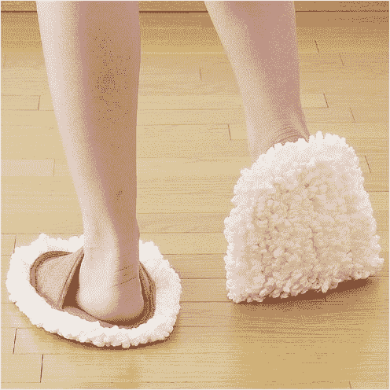
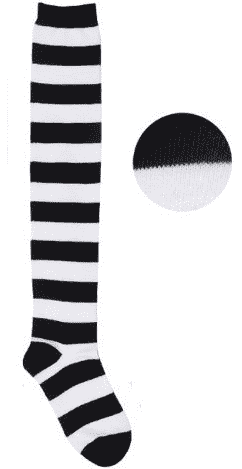
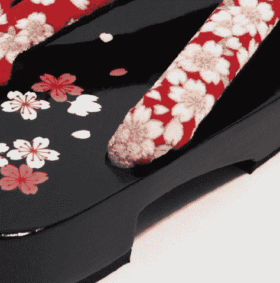
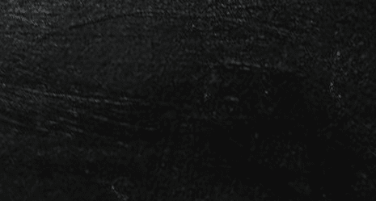
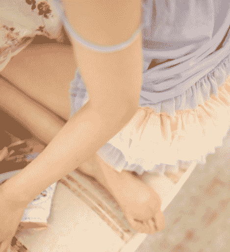

# 反科学软件（以足为主 已完结

作者：上官凡搏

TID：13459

 

# 1

*本文章最後由 上官凡搏 於 2012-11-2 01:01 編輯*

**更新时间：已完结 暂时停止连载 （实在是累了** 长篇真折磨人

正在连载中

1楼简介 2楼正文

新人，巨大中途坑掉可能，与其说是GTS，不如说是有点邪恶的轻小说，一直不知道这种题材应该发布在哪，然后被我发现了这里，实际本人对GTS有什么东西还不是太了解，总之把自己变小和女孩子发生一些幻想行为就是GTS吧，总之写文前参考了好多前辈的文章。

文章是即兴的，所以未免有剧本BUG或者文本错误，如果有这类问题能改则改不能则请谅解

适合年龄16+，不会有H内容，最多有点邪恶，不过邪恶度应该和日本的一些深夜正常向动画差不多的水平

当然最后声明本故事纯属虚构，虽然使用了真实的地名但是也均属虚构

简介

反科学软件，作者 上官凡搏

一个平凡的不能再平凡的18岁少年王伟，拥有不幸的人生，某天他看见了一个非常可爱的女孩但是却不敢跟她交流，只是想着自己可以变成她的衣服，不，穿着的袜子就好，悄悄的看着她就心满意足了。结果经过某个事件后获得了一个反科学的软件，结果使用之后，愿望真的实现了，但是这是一个反不科学的事情。

人物介绍

王伟

年龄：18岁

1994年6月18日出生，双子座，出生在安徽芜湖

他拥有普通的不能再普通的名字，而且他是个身高172，体重70公斤的胖子，是个学习不好、生活自理差、玩游戏也不中用的废物，为了让自己改变环境所以大学报考了上海应用技术学院的计算机系，离开了自己的家乡芜湖。

林梦茹

年龄：17

1995年3月3日出生，双鱼座，家住上海浦东新区，是一个在上海出生上海长大的女孩，家里非常有钱，身高165体重48KG，长相可爱，喜欢打扮，不过经常爱发火，也很任性，因为性格实在太差所以与同学之间的关系处理得非常糟糕，一直比较孤独。

林毅杰

年龄：18

1994年7月8日出生，巨蟹座，家住上海闸北区，是上海应用技术学院英语系学生，是个戴眼镜的温柔型男生，跟刘佳美的关系看起来不一般，估计是朋友之上情侣之下的关系。

刘佳美

年龄：18

1994年12月20日出生，射手座，出生于大连的北方人，看起来非常矮小，性格外向，但是经常说一些让别人无法理解的语言，和林毅杰的关系看起来不一般

妙子

年龄：看起来像20岁

刘佳美通过网络认识的女孩，非常喜欢动漫，日语也说的非常好，不过好像就只会那几句简单的用语，看起来很温柔的女孩，因为是通过网络认识的，所以连她的真名和学校信息都不知道

架空设定

MOM

全名Master of Modem 中文名为《现世之主》，一款由王道游戏自主研发的多人线上对战网游，借鉴于早期的5V5对战类网游而制作的3D动作对战游戏，其素质颠覆了以往国产网游的传统，并在全球大获成功。

王道网络

一个新兴成立的游戏公司，因为公司创始人是个游戏爱好者，非常希望国产游戏能够走向世界，所以创办了公司并通过努力开发出MOM实现了愿望。

手机软件NTS

号称来自未来的软件，只有非常不幸的人才可以使用，使用后会出现反自然科学的事情，完全无法知道软件是使用了什么原理。

 

# 2

*本文章最後由 上官凡搏 於 2012-10-14 02:46 編輯*

第一章      偶然的相遇

白色略带黄的地砖，下层是书桌上层是白色钢架床的双层桌整整齐齐的贴在了房间的墙边，几双黑白各异的球鞋平铺在地板上，有的鞋子里还塞着看起来很脏的袜子。这样的场所，只可能是一个地方，学生寝室。几个室友正在用笔记本电脑玩着最近非常流行的对战网游MOM。

MOM全名为Master of Modem，中文名叫《现世之主》，是一款由最近才成立的新公司王道游戏自主研发的多人3D对战动作网游，游戏的玩法是玩家分成2个阵营，在游戏中的任意角色，然后在游戏世界中进行快速的打怪升级、与对立阵营对战，最后破坏对方基地获得胜利的网游，说来玩法有点类似于几年前某个游戏平台上流行的对战游戏，这款游戏和之前游戏的区别在于它是完全3D的，而且在操作方式上将动作、第一人称射击、交通工具驾驶等结合在一起，游戏拥有非常多的战斗场景，而且场景中充满了随机变化要素，外加游戏拥有非常符合东方风格的审美观并且使用了新的自主研发引擎架构，使得战斗画面非常震撼，逼真的动作和临场感比以前的游戏要强烈。当初这款游戏根本没有被广大玩家注意，甚至被称“国产游戏都是山寨货”来对待，结果没想到这款游戏完全超乎了玩家的期待，瞬间成为一匹黑马，并且在公测3个月后就成为国内游戏人气排行榜的第一，游戏还进军韩国、日本、欧美市场，而且都非常的受欢迎，以至于让玩家大呼“王道游戏是中国游戏界的希望”，听说研发者是一个游戏爱好者，因为想让国产游戏走向世界所以努力创业创办了新游戏公司并创造了这款MOM。

这款游戏非常考验玩家的技术和团队配合能力，但是队友的失败却经常会惹得团队内产生愤怒。

「你怎么又被狙击手打到了，每次团战的时候都因为你最先死然后我们就团灭了！」「我，我不是故意的」「你给我打好一点，不然我不想跟你一起玩了」

这里是上海应用技术学院的一个学生寝室，几个计算机系的大学生正沉迷着一款最近非常流行的对战网游MOM。

「我擦，跟你玩有意思吗，今天输了几次了自己说说，一下午就没赢过一次，每次都是团战一开始你就第一个死，你这技术玩个毛线，凡哥我们别跟王伟一起玩了，这种渣技术玩什么对战游戏」

王伟被室友排斥，然后一个人加入了游戏的匹配模式，所谓匹配模式就是查找服务器上面实力差不多的玩家并组队进行对战游戏的模式。

这次开出的随机地图是冰山谷，王伟选择的角色是闪烁之刃，这是一个忍者一样的角色，擅长的是速度击破，但是此地图最大的难度是方向的控制，因为冰面上非常容易滑倒，而且场景中的陷阱非常的多。

「哎…」「哎…」「无语啊…」「呃..」

游戏开始以后，王伟就一直发出这样的声音，因为他根本控制不好角色的方向，加上闪烁之刃的移动速度特别快，所以屏幕中一直显示出「闪烁之刃威武王 自灭」的提示，其中威武王是王伟游戏中的昵称，MOM这款游戏选择的角色只有称号，选择后的角色会以称号外加名字的形式显示在游戏中。

「闪烁你**敢不死？」「**」「你去人机模式练习下吧」王伟被不认识的陌生人用文字形式所骂，其中**符号是因为玩家使用了不雅词汇被系统屏蔽的字符，而MOM的人机模式指的是和电脑对战的练习模式。

「等我们投降吧，我们组遇到了个213」自己的队友使用全频道模式发了这个信息，这个全频道的意思是无论队友还是敌方阵营都可以看见的对话，在MOM中20分钟后可允许玩家投降。「我也觉得你们那边那个太213了」对方阵营的玩家开始聊了起来「是啊，这种垃圾还玩什么对战游戏啊」「回去玩俄罗斯方块吧，哦不，说不定那个都玩不了」「说不定他是个瞎子吧，瞎子能玩成这样也不错了」「哈哈哈，**去吃**吧」

王伟被虚拟玩家不断的用文字辱骂着，因为之前才受到室友的屈辱，此时正想自己去玩争一口气，结果又被陌生人如此欺辱，王伟实在受不了，两眼泛着泪水的跑出了寝室。

「诶？他怎么了」「受刺激了吧」

王伟离开寝室的时候听到了室友这样的对话，但是王伟此时非常愤怒并伤心，所以沉痛的跑出了寝室大楼没有理会任何事情。

这所学校位于奉贤区，是个比较偏僻的地区，虽然学校附近有个海湾旅游开发区可以去玩玩，但是要用走路过去的话还是有很长一段距离，所以王伟决定就在学院的大门广场附近散散心吧。这所学院的大门内有一个巨大的圆形广场，虽然看起来很大但是并不怎么华丽，而且现在是上课的时期，所以没有多少人从这里经过，要说王伟为何在上课的时间在寝室玩游戏，那是因为这个时间他们没有安排课程。王伟想着自己的失败，想着自己一直以来都这么失败，首先自己是个只有172的身高而且体重还70公斤的胖子，然后自小学习成绩就不好，经常被老师请家长到学校接受批评，甚至在芜湖读中学的时候因经常和同学吵架又得罪了无数同学，以至于高中毕业的时候有同学准备在毕业典礼后把王伟拖去揍一顿，虽然这事情有同班的女生得知后悄悄告诉他并叫他逃走才得以躲过。王伟已经不想再呆在芜湖，他觉得自己的人生非常的失败，他想去一个新的环境，所以当时他鼓起勇气跟父母说，他要离开自己的家，虽然父母不太放心，因为王伟的自理能力也非常的糟糕，但是在王伟的再三请求下获得了批准，最终填报了上海的大学，然后离开芜湖来到了中国的经济文化中心城市，上海。但是来到这里依然不顺利，记得来到上海的第一天，王伟不知道怎么从上海火车站走出，又因为没有见过地铁，所以到了地铁站也不知道怎么操作还出了许多洋相，想去询问服务员又说着满嘴芜湖方言口音的普通话，甚至问别人卫生间的时候说出了「茅斯在哪里」这样的词语，使得别人不得不对他递上白眼的对待。在学校里，军训的时候是全班第一个倒下的，因为经常倒下所以只有让他停止军训，不仅学习不好，连游戏也玩不好，王伟不知道自己到底还有什么用。上天真的太不公平了，王伟想着，觉得自己像个悲剧小说中的主人公，自己应该遇见一些不平凡的事，遇到一个美少女，最后和一个美少女恋爱并幸福美满的生活。但是现实是残酷的，他没有主角光环，他并不是主角，他也非常明白这一点，因为一个主角不可能拥有王伟这种俗气到不能再俗气的名字，所以一个人站在广场上，慢慢的眼睛湿润了，流下了无奈的眼泪。「喂」王伟听见一个女孩子的声音在叫他，于是他便抬头看了看这是一个披着黑色长发，留着刘海的女孩，长着可爱的脸蛋，穿着白色的可爱褶裙装，下身穿着黑色褶皱短裙，还穿着一双过膝长袜，脚下踩着一双白色的帆布鞋。「啊..」王伟被这个可爱女孩吓住了，一下吓得说不出话来，这么可爱的女孩怎么可能跟我说话，王伟瞬间感觉自己的嘴巴就像不能说话一样，不过居然在这种地方遇到了这样的女孩难道说我真的有主角的潜质？「哎，我说啊，虽然不认识你，本来高兴的来学校上学结果一进大门就看到一个大男人在哭，我真受不了」「我……我」王伟看见这个女孩说不出话来「有什么话你快说啊，你话都不说我怎么知道你想干什么」王伟紧张得一时说不出话来，就呆呆的看着这个女孩「哎，我说你一个大男人在学校广场莫名其妙的哭不觉得坍台吗，别告诉别人看见过我真的恶心死了，见到你真老倒霉了。」

说完后女孩扬长而去，王伟看着这美丽的女孩离自己越来越远，感到无比的悲伤。果然自己并不是一个主角啊，要是自己拥有主角的潜质，这时候应该和女孩相遇并发展关系才对啊。王伟感觉自己被这个女孩吸引了，看着她远去的背影，王伟在脑中想着真想自己变成她的衣服，不、变成她的袜子变成鞋子都好，像我这种废材，能够变成她的袜子被她穿上每天看着她就满足了。

但是这肯定是不现实的事情，王伟抹去了不实际的妄想，但是他并不想接受自己这样的命运。

既然来到了一个新环境不应该用新的姿态来做自己吗，我应该立即追上去和刚才那个女孩对话才对吧。

「但是我做不到，我这样的人怎么可能和这么漂亮的女生对话」

王伟自言自语并放弃了刚才的想法，但是他突然感觉到，至少自己应该想别人展示下他的才能，让别人对他刮目相待，就算是作弊也可以。

于是他便想回寝室找找MOM是否有外挂，他想靠外挂这种作弊工具取得胜利并向寝室的室友证明自己的才能。

寝室中，几位同学仍然在欢快的玩着MOM，根本没有理会王伟的归来，王伟一回来就看着电脑屏幕中MOM对战失败的标志，然后他想到之前连游戏都忘记关闭就冲出寝室了。

王伟悄悄的开始搜索MOM外挂，虽然搜索出了许多MOM外挂的信息，但是没有一条是真实的，找了很久王伟在一个论坛中找到了所谓的绝对是真正的MOM外挂的帖子，然后他高兴的下载下来那个MOM外挂的.rar的文件，解压后生成外挂.exe文件和一些dll文件，王伟兴奋的打开它，果然这是真的外挂。外挂的说明上描述，打开外挂后再进行登陆，对战开始后F2是HP不减模式，F3是金钱增加到999999的模式，F4是技能全满级的模式，另外作者说避免外挂被官方封锁所以希望能够悄悄使用不要进行传播。王伟感觉自己真的找到了好东西，所以没有经过思索便立即打开外挂进入了游戏，进入对战后兴奋的开启了F2模式，结果…………还是死了，根本就没有进入无敌状态。应该是操作不正确吧，因为这个怎么看都是真的外挂才对，自己应该没有上当受骗，绝对是自己的操作失误了，所以王伟准备等20分钟后退出游戏重新开启外挂进行尝试，因为MOM拥有中途退出游戏会被封号的设置，而且重新进入游戏后仍然会继续进行当前的对战，所以王伟不敢中途退出，而且因为之前在中途离开游戏长时间未操作，此时王伟的状态已经是警告状态了，意思是如果再这样就会被封号处理，虽然这个账号至今没有赢过一场，但是这100多场的失败记录也是自己的心血。

20分钟后，王伟关闭了游戏，重新开启了一次外挂，再登陆的时候发现提示「您的密码不正确请重新输入」

自己的号被盗了，这个外挂实际真的是一个木马程序，王伟突然就明白了真相，自己被骗了，虽然是一场都没有胜利的账号，但是也是自己的心血啊，就这样容易的被别人盗走了，想到这里王伟在电脑前又哭了出来，他可是在一天之内哭了2次了。

此时王伟的电脑上弹出了一个窗口，上面写着文字

「别哭啊，少年」「你是谁？」因为这个窗口的下方还有一个发送消息的对话框，所以王伟就从这里发送了消息过去「我是入侵你电脑的人啊，通过电脑上的摄像头发现你居然哭了」王伟使用的是笔记本电脑，电脑前方的摄像头被对方强制的打开了。「本来我在想有个傻瓜居然上当用了那个假外挂，把你的号密码修改后一直登陆不上提示正在游戏中，所以我就打开摄像头看看你现在是什么状况」「结果却看见了你这样的惨状…………」这个盗号的黑客还真是个善良的人。「而且我刚才登陆了你的账号，胜利0局，失败158局，胜率0%，我实在是看不下去了」王伟一直看着屏幕上的对话，一句话也没有回复。王伟感到自己太悲惨，太失败，有一种想从楼上跳下去的冲动，但是他并没有这样做，他只是又再回复框上输入了文字「为什么。。。。。为什么。。。。我。。。。。那么。。。失败。。。。这是为什么。。。。。。。。」王伟一边不断的敲打。。。。。。一边打着文字「我。。。。。真的。。。。。。真的。。。。不想再活在这个。。。。世界。。。。了。。。。」「成绩。。。。。差。。。。。。长相。。。。也不好看。。。。。。。。见到女孩。。。。。也不敢。。。说话。。」「我。。。是。。。。。。废物。。。。。。」

「等等，你冷静下来，说不定你正是可以启动那个软件的人选」王伟被黑客传输过来一个文件，上面写着NTS.APK，而且自己根本没有同意和拒绝的权限，就被强制的传送到了桌面上。「这个听说是未来的软件，可以帮助不幸的人实现梦想改变自己的人生，但是只有非常不幸的人才可以使用它，所以像我这样幸运的人一直无法使用，我觉得也许你很合适所以装在你的手机上试试吧，虽然我不知道是否可以使用」王伟看着屏幕，没有进行任何回复，也没有做出把软件安装在手机上的准备。「咳咳…我知道你在想什么，你是觉得我又发送了手机木马软件吧，准备再盗取你的手机资料吧，你相信我吗，这个真的不是木马，我可不想整你这么可怜的家伙啊」「好吧，为了证明我的清白，我亲自运行木马反安装程序吧，同时，你的账号密码被我改成了XXYYZZ123，你去试试吧」说完后对话窗消失了，但是那个手机软件还是留在了桌面上，王伟试了下黑客给的密码，果然可以进入游戏，那么也就是说他真的没有想在继续盗取我的信息了还是觉得我这个号根本不值得他盗取？

虽然王伟想立即重新安装一次系统，但是他想到了之前的电脑就是因为想尝试装系统结果由于怎么也启动不出系统画面最终只有把电脑带到维修店去修理，装个系统还给了50元钱。实际王伟明白他不会重装。

总之自己就是这么倒霉，如果这个程式真的是病毒，那大不了就算自己更倒霉一点吧，因为王伟抱有一丝期待，所以还是把那程式安装在手机上了。

当王伟启动程序的时候，自己的视野突然黑暗了下来，这不是手机屏幕黑暗，而是自己的视野突然黑暗了下来。

现在只看见屏幕中显示了一排文字「资格检测中…..」「检测通过…..」「请问你的愿望是什么，我可以告诉你实现的方法」王伟觉得自己是在做梦吧，这个已经属于超自然的东西了，这可是真实的世界不可能遇见这样的事情，这肯定是恶作剧。

但是突如其来的黑暗又让王伟觉得这不是恶作剧，总之不管如何，他还是想试一试。

「我今天在校门口看见了一个女孩，她非常可爱，我想变成她的衣服，不、她穿的袜子就好，这样我就可以永远的看着她了」

王伟并没有说出这句话，他只是在心中想像了一下，结果自己的想法就以文字的形式显示在了空中

「不，我…想变强我想变得更强」王伟说出了这句话，但是这段话并没有以文字形式写在眼前，眼前只是在刚才那句话的下面印上了一句新的文字

「好的，我可以帮你实现一部分愿望，但是要彻底实现愿望还需要你自己的努力，加油吧」

……………..一阵白色的光芒

我看见了一片白色偏黄的地砖，然后眼前一只巨大的白色帆布鞋，这只鞋子至少有几层楼那么高，然后鞋口处伸出了一只黑色的袜子。

这怎么看都像是我变小了，然后现在正在今天早上看见的女孩脚边，王伟感觉自己的世界完全不科学化了，这就像幻想中的世界一样，但是这种感觉又无比的真实。

这时眼前这只白色的帆布鞋后跟突然提了起来，然后王伟听见了一个巨大的声音从天空传来。

「恶心的男人，你来了？」这个可爱的女孩一来就对变小的自己说了这样的话

「虽然我实在无法接受你，但是都变成这么小了，我勉强接受吧」「因为之前我的眼前不可思议的黑暗了，然后我看到一段文字告诉我你的眼前即将出现一个很小的人，请实现他的愿望否则你将受到惩罚之类的文字」「所以，你的愿望是什么」

王伟看着这巨大的女生，但是仍然不敢说话「快说啊，你连自己的愿望都不敢说你叫我怎么为你实现，至少你要说出来啊」

王伟依然紧张的不敢说话，不仅是这个女孩太巨大的原因，还有一个原因是她太可爱了，王伟看着可爱的女孩就不敢说话

「你再不说我可不帮你实现了，我去接受惩罚好了」

「我…………我…………我想变成你穿着的袜子」

「什么，声音太小根本听不见啊」

「我…………我…………我想变成你现在穿着的袜子」王伟大吼了出来，幸好此时的寝室没有任何同学在，实际也就是因为最初就没有其他的人，所以这个女孩才会一开始就对王伟说这样的话。「然后，我只要默默的当你的袜子，每天被你穿上让我悄悄的看着你就满足了」

「哦，居然有这样愿望，我是觉得幸运呢还是悲伤呢」

「总之，让我实现吧，我好不容易努力的说出来了，虽然现在的情况让我也觉得很奇怪，不过我觉得不管怎样让我实现愿望吧」

王伟第一次这么大胆的和女生讲话，这也是王伟的一个突破，果然只有在明确只要自己说出来愿望就可以实现的前提下，王伟愿意这样突破自己。

「那我就帮你实现吧，变成袜子当然是不可能的，不过你这么小，我可以把你塞进我的袜子里」

王伟听到这句话不知为何有点兴奋，接下来自己就被这个女孩抓住塞进了左腿的过膝袜里，袜子的弹性非常大，王伟在里面根本无法动弹，王伟就这样贴在女孩的大腿上，被袜子压得紧紧的。

「你呢，只是我袜子的一部分而已，总之不可以抬头看上面，而且你现在根本动不了吧，而且你是我袜子的一部分所以对于我来说你是不存在的，做好心理准备吧」

王伟被压在里面连话也说不出来，然后…………

袜子的主人换了个姿势，用右腿敲起了二郎腿，而王伟便被压在了女孩的右腿下面，感觉就快要窒息了，不过此时他只是这个女孩的袜子而已。

第一章结束未完待续………………

不定期更新不定期坑  另外说说文章的灵感来自于经常在弹幕网动漫时有人所发出的 我是地板 我是袜子 我是枕头 这样的文字而产生..

 

# 3

> shendanxiaogui 發表於 2012-10-14 11:17 

> 从塌台这个词，我认为楼主是南方人。

> 。。。。

> 好吧，文章挺不错，至少条理很清楚。 ...

我是南方人，不过实际上是了解到上海的朋友很喜欢说这样的词，而这里给女主的设定她是个上海本地人（剧透了）所以会说一些这样的词汇。

实际上我并不是芜湖人我也不了解上海，很多东西都是查资料YY出来的。

看了许多前辈的GTS文章都很H的感觉，发现自己写的完全不属于GTS的样子，因为各位前辈写到的剧本很多都是play方面的而我完全是写到的是感情的发展与性格的变化，GTS方面只是一个为校园剧本而发展的创意而已。

已经发现有许多不通顺的语句还有一些错别字，这个待我整个剧本写完以后再修改吧，前提是我不会坑的话。

虽然文章是即兴的，不过整体架构早就想好了，当然平时我只是轻小说看得很多，写还是第一次。

 

# 4

**第二章 美好的心灵** 「今天继续吃山芋好了」「学校食堂的东西永远都那么难吃」「有吃的已经不错了还管那么多干嘛，要是妈妈知道的话肯定会说你们多幸福啊，还可以挑食，我们那个年代根本就没有东西吃更别说挑食了之类的话吧」这里是上海应用技术学院奉贤校区的学生食堂，距离学生寝室没有多远的距离，是一个综合性的学生食堂，因为现在正是放学的时候，所以同学们全部聚集在了这里。在这个食堂里，有个非常可爱的女孩，她穿着白色的可爱褶裙装，下身穿着黑色褶皱短裙外加一双过膝长袜，这种万人迷的人物，会有许多女生和男生愿意和她接触，甚至有无数男生会追求她，这是理所当然的。但是这白色餐桌上，女孩孤独的坐在那里，一个人吃着晚餐，这本应是不可能发生的事情，但是这却是真实。不知为何，从今天下午到现在，女孩除了和他以外，完全没有和任何一个人再对话过，这是王伟从下午到现在所看到的一切。要说为何王伟可以看见，那是因为，王伟已经被这个女孩当做袜子的一部分了，人生这么多年，第一次体验到被变小的感觉，透过半透明的袜子，他发现世界是无比的巨大，根本无法移动的自己被穿着袜子的女孩带着走动，这是一个很受折磨的事情，他想叫她放自己出来，他觉得好难受，觉得自己的身体发麻，觉得自己快全身瘫痪了，但是他永远不会叫出来。「像我这样废的人，能在这里就已经比全世界的人都幸福了，让我好好的做她的袜子吧」王伟如此想到，虽然以前是个遇到点挫折就会放弃的人，但是王伟认为现在已经和以前不一样了。吃完晚餐的女孩端着托盘走到食堂的餐物回收处，将餐盘放到那里，离开了食堂。「我这件衣服还不错吧，昨天网上买的」「多少钱啊？」「35」「这挺好啊，完全不像35的衣服，质量那么好」「所以我才说不错吧」这里是女生寝室，有几个女生正在谈话，而王伟所属的那个女孩，只是坐在一个地方一动不动。王伟突然有一种感觉，感觉这个女孩和自己很相似，他能够感觉到这个女孩的人际关系非常不好，因为她显得很孤独，虽然接触她才3个小时不到，但是他能够清晰的感觉到她与自己的相似之处。「你走哪去？」「打水不可以吗」王伟所属的女孩，终于在傍晚的时候开口说了第一句话，她让人感觉很冷艳很高贵，但是王伟总觉得，她其实很孤独，他认为自己非常了解她。女孩把王伟带出了寝室，走在了无人的校园道路上，暗淡的灯光照耀着地面，显得格外的阴暗，女孩的脚步声听得格外清晰。王伟虽然一直不敢和女孩对话，尤其是非常可爱的女孩，但是此时王伟真的想跟她说，多和同学交流下吧，感觉你好孤独。但是他仍然一句话也没有说，因为他不敢，比起女孩来说，他是个更胆小的人，不，是一个变成女孩的东西就可以非常满足的物体而已。随着女孩回到了寝室，她的室友主动向她搭话了。「我说，建议你换个寝室吧」「为什么我要换，我有招你们吗」「我们三个都受不了你，你知道吗，本来想忍的，感觉实在受不了了」「受不了你们可以滚蛋，别跟我说三说四的」女孩在愤怒，也许只有王伟才能清楚的感受到，女孩的腿在发抖，虽然不知道以前发生了什么，总之女孩和别人争吵的事实被刚了解她3小时不到的王伟发现了。「你觉得你是上海人就很高傲吗，你觉得你家里有钱就很自豪吗」「你们这些乡下人能懂我吗，我一直不想跟你们交流，什么衣服35元的也要晒一晒，好意思吗」「你才乡下人，别地域歧视好吗」「哦？谁先说别人是上海人的？」争吵还在继续，王伟真的很想说点什么，但是他是个胆小的废材，比起这个女孩来说，自己更连这个女孩都不如，因为王伟总是在吵架开始前自己先逃走，而根本不敢和别人争吵。「侬帮无%特！！！侬%西%好伐，册%！！」一阵加速度传到王伟的身体，女孩的左腿快速的往前伸出，随着女孩跑动了起来，王伟感觉自己快撞上墙了一样，只听哐嘡一声，女孩用右脚狠狠的踢了下楼梯的栏杆。刚才女孩好像说出了上海方言吧，王伟感觉到，因为刚才女孩说了一句他听不太懂的话就冲了出去，也就意味着女孩已经非常愤怒了，她失去理智了，因为自己作为芜湖人，也会在冲动的时候说出自己的家乡话。一阵安静传来，女孩好像恢复了理智，安静的站在那里，王伟真的很想说出几句安慰的话，但是又不敢说，自己夹杂在想说与不敢说的矛盾中。真的好想安慰下这个女孩，王伟想自己不仅仅是作为她袜子的一部分吧，自己应该是有生命的人，不过今天的事情让他懂得了，原来世界上不仅仅只有自己那么悲惨，眼前这个可爱的女孩也拥有和自己差不多的命运。「我…………我说…………」开口的是王伟，他以几大的勇气终于吐出了几个字，然后他以更大的勇气说出了一句话「你在我心目中应该是最棒的女生，长得又漂亮，穿得也好看，应该是人缘非常好，受无数男生憧憬的女生，而不是现在这样的」王伟鼓起勇气说完这句话后，继续脸红的不敢再说什么，他知道现在自己只是女孩的袜子而已。女孩坐在了地上，大腿随着身体往上倾斜，而王伟的身体随着女孩腿部往上的倾斜倒立了过来。「好……好难受，大脑充血了……」「你是我的袜子，怎么能说话呢，所以现在就是惩罚的时间」「快……快站起来啊，脑子要充血了」王伟根本无法移动自己的身体，就任凭女孩玩弄着自己「所以呢，做我的袜子舒服吗」女孩说出这样的话「一点也不舒服，但是我能这样每天看着你就已经非常幸福了」「那为什么不跟我成为朋友呢」「我，像我这么废的人，有资格和你成为朋友吗，能以这样的形式和你在一起，我已经觉得是奢侈了」「怎么说呢，起初我觉得你很恶心，但是我发现你格外的温柔」「恩？」「我想，没有谁可以老老实实的被别人放进自己的袜子里还老老实实的呆着吧，早就忍不住叫出来了才是正常的，但是你无论被我压在右腿下面，还是被我拖着跑出去，你都忍受了下来……」「因为做你的袜子已经是奢侈了，是我这生遇见的最幸福的事了，这么多年来第一次有女生愿意和我说话，而且还是你这样可爱的女生，所以一切难受都是幸福，所以只要我永远这样做你的袜子就够了」女孩站了起来，王伟的身体终于恢复了之前的状态，因为脑袋充血所以头晕晕的「我也不是完美的人啊，而且我也不觉得我可爱呢，而且我和周围同学相处不好的情况也已经被你发现了」女孩说了很多很多，王伟现在晕乎乎的，根本没有完全听清楚女孩在说什么「所以，现在给你2个选择，你是想做我的袜子永远默默的看着我，还是想与我成为朋友每天和我一起说话呢」王伟想成为她袜子的原因，是因为认为自己根本没有资格和她说话，但是如果是这样的选择，当然是……「我想和你成为朋友，但是我可以吗」「可以哦，只要你愿意就可以，不过加油吧」女孩停顿了下，又继续以很冷漠的语言说「你安慰人的方式实在太糟糕了，反过来我还开始安慰起你来了，所以之前我说过的话你当我没说过好了，谁想和你这样废的人成为朋友啊」「不过……」……………………………一阵触电感传来，王伟一下就像醒来了一样，手里拿着手机，看着屏幕中的软件，NTS记事本，这是什么东西，王伟想到。刚才自己确实发生了不可思议的事情，之前所发生的事情在自己的脑海里记得清清楚楚。王伟关闭了软件，看了看时间，发现还在那天的下午，而且时间根本没有变动。电脑屏幕上留着NTS的软件，寝室的室友正在玩着MOM，之前到底发生了什么事情。王伟感觉自己就像做了个梦一样，但是又如此的清晰，是跟做梦完全不同的感受。「走吧，马上公共英语课了，这个教授很严格的每次都要花20分钟点名所有人都要点」王伟随着室友一起走出了寝室，然后前往教学楼。公共英语课是在一个大的教室上的，而且还会夹杂进英语系的学生一起进行，也就是说一共有几百名学生会一起上课，而且老师居然还要每个人都不放过的点名，所以实在无法想象这个老师的思想。进入教室后，王伟一行人随便找了个后排的座位坐下，现在他的左边是寝室室友张波，右边是一个不认识的男生，应该是英语系的吧。就在这时，王伟看见了一个女生走进了教室，白色褶裙，过膝长袜，白色帆布鞋，这熟悉的装扮，这不是现在自己最熟悉的那个女生吗，说可以和自己成为朋友的女孩。王伟激动了从座位上挪了出去，很大胆的对那个女孩打招呼。「你..你好啊！」王伟还是第一次这么大胆的和女孩打招呼「啊，你不是之前那个，算了这里人这么多我不好意思说你的行为了」王伟也有点脸红，因为自己被变小在她的袜子里呆了几个小时，虽然不知道发生了什么事情时间又回到了我变小之前。「说来我还忘记告诉你了，我叫王伟，你呢」「我说啊」女孩用冷漠的表情说「我就在校门口见过你一面，你到底是谁啊，而且我为什么要告诉你我的名字」王伟感到很奇怪，又问「不记得之前的事情了？」「之前？我不就在校门口见过你吗，真是奇怪的人呢」冷漠的女孩直接无视了王伟，向离王伟很远的座位走去。王伟回到了自己的座位，之前是在做梦，还是不小心自己触电了发生了幻觉呢。王伟打算继续打开那个NTS的软件，结果看到的还是NTS记事本，他不知道那个黑客到底发给了他什么东西，但是他决定不删除它，因为……他发现了，自己因为出现了一些幻觉，所以比以前变得更大胆了，也许这真的是这款软件的功劳，总之他感觉自己已经和以前不一样了，不再是那个不敢跟女生说话的废材了。但是他依然是废材，因为旁边的同学一直在讨论MOM，顺带讨论着王伟的技术到底有多么的糟糕。就这样，等到了公共英语课，果然这个教授点名一个都不会放过。「林梦茹」「到！」王伟最熟悉的女孩起身做了回答，她的名字，感觉多么的不平凡。也许，自己的人生，也会从认识她开始，变得不平凡吧。未完待续……………… 

# 5

**第三章 新的朋友**无聊的英语课，都要睡着的王伟正坐在教室里，他一边想象之前发生的事情是做梦还是真实的，一边想着林梦茹这个可爱的女孩。「要是之前在林梦茹袜子里的时候，我从她袜子里钻出来顺着她的腿往上爬，就可以进入她的，说不定会忍不住……」哎呀，王伟赶忙收回自己的邪恶妄想，脸变得通红。「顺着林梦茹的袜子往下爬可以经过小腿然后进入到鞋子里，抱着她的脚也不错啊，说不定也会忍不住……」哎呀，王伟赶忙收回自己的奇怪妄想，他已经完全成为邪恶变态了，再想的话说不定会在课堂上做出单身男生经常会悄悄躲进厕所里做的事情。王伟一直克制住自己的情绪，别瞎想啊，就算之前自己也是根本动不了的，怎么可能去做那些事情，总觉得自己正在朝变态的道路前进，这样会被林梦茹讨厌的。之前的事情只是一个梦吧，王伟为了分散下思维，直接将目光扫描在了旁边的陌生男生上，因为他拿着一台掌上游戏机，虽然王伟不知道是什么但是他知道这是一台游戏机。男生正在玩一个游戏，游戏是2D的，而且还是很早以前的游戏机上看到的那种横板游戏，就是角色发射子弹和跳跃躲避障碍的那种传统游戏。为了分散自己的思维，王伟将视线一直停留在旁边陌生男生的游戏上，说来这个男生眉清目秀，戴个眼镜，也属于长得很帅的类型，不过自己肯定不会对男人感兴趣的，所以他只是注视着游戏而已。看了几分钟后，发现这个男生玩游戏的技术也并不是很好，因为他一直在通一个关卡然后不断的死掉。后来，男生发现了看他玩游戏的王伟，呵呵的笑了一下。「你能玩过关吗？帮我过下？」男生主动对王伟发起了对话「我也过不到啊，我玩游戏一直都很烂的」王伟不好意思的说「啊，感觉你说话的口音好奇怪」「因为我是芜湖人嘛我普通话说的不太好」像这样说王伟说话口音很奇怪已经不是第一次发生的事情了「没关系来试试吧」说完这个男生就把游戏机递给了王伟这是一款难度非常大的横板游戏，玩家操纵小猫一样形象的角色往前走，场景中会出现很多敌人，有的敌人发射子弹攻击你，有的则跳来跳去的攻击玩家，像王伟这种玩MOM只会从开始死到最后的玩家来说，这种游戏的难度比MOM更大。所以，王伟操纵的角色还没有走几步就被敌人打死了。「哈哈，我玩游戏就这么糟糕啊」王伟不好意思的挠了下脑袋，不过他感觉自己跟以前还真有些变化了，要是以前玩游戏一开始就死肯定会觉得自己会一副没脸见人的样子。「你比我还玩的好呢，第一次玩居然走了这么远，但是我第一次玩这个5步都走不到」旁边的男生这样对王伟说。「嘛，你就不用安慰我了，我知道的我玩游戏就是这么烂」王伟有点略带悲观的说出这样的话，自己很清楚的，这个男生只是想安慰自己而已。「真的，这个一开始跳出来的敌人，我至少死了几十次才终于过去了，你居然能一开始就过去，非常了不起啊」这么久以来，王伟自认为非常糟糕的游戏技术居然还会得到别人的表扬，真是感到意外。就在这时，有一个女孩的声音插入了进来「哟，还找到基友一起玩了？」「哟哟哟，没准儿你还是个搞基的料哦」这个声音不管怎么听起来都觉得像个东北口音，就像每年春节的晚会上听到的那些东北小品的口音。「说来，基友是什么？」不解的王伟第一反应是看着旁边的男生「哟，好深情的眼神，结子，你遇到好基友了哟」这到底是在说什么，王伟完全感觉自己跟那个女孩是不同世界的，说起来这个女孩看起来挺娇小的，要说可爱的话跟林梦茹差远了，穿着也只是一件普通的T恤。「快看你基友，看着我干嘛」可惜，她来自外太空的吧，王伟觉得自己完全无法理解她在说什么。然后就在课堂上和旁边的男生交流了一会，发现自己明白了好多就像异世界一样的情报，什么是日本的动漫，日本的游戏，什么叫萌，什么叫萝莉，然后说这个女生只是略带腐属性。王伟听完后，根本就没有理解旁边这个男生在说什么，只是明白了一点，他叫林毅杰，旁边的女生叫刘佳美，他是上海人，旁边的女生是大连人，他们都是英语系的同班同学，不过在王伟的心目中，东北人应该都是高大的，但是这个刘佳美却那么较小。王伟还发现，他虽然每天都有玩游戏，但是一直以来也就是玩一些国产网游，直到今天他才知道原来世界上还有一批喜欢日本动漫和游戏的人，不过他依然不太明白，日本游戏和他玩的那些网游有什么区别。后来他还在想，难道自己跟姓林的人有缘分吗，之前认识的女孩姓林，这个男生也姓林，想着想着王伟在课堂上睡着了。「走咯，下课了要一起吃饭吗」王伟被林毅杰叫了起来。「恩，一起吃饭吧，刘佳美一起吗」王伟说出了这个的对话「不要叫我的真名，叫我美喵就可以了」刘佳美这样告诉王伟「美喵..这名字好奇怪」「还有哦，叫我结子就行了」林毅杰这样告诉王伟然后，王伟和这2个外星来的生物一起去了学生食堂，说来王伟还是这么久以来第一次跟同学一起这样高兴的到食堂吃饭，因为以前跟室友一起来的时候，都是一直被他们嘲讽自己玩MOM到底有多糟糕。走进食堂后，王伟一行人来到了套餐领取的地方，在学生食堂就餐前，每个学生都会办理一张卡，然后在这里进行刷卡消费，现在在食堂里王伟同他们一起思考今天晚上应该吃什么。「今天继续吃烧山芋好了」美喵这样说到。「学校食堂的东西永远都那么难吃」结子这样对美喵说。「有吃的已经不错了还管那么多干嘛，要是妈妈知道的话肯定会说你们多幸福啊，还可以挑食，我们那个年代根本就没有东西吃更别说挑食了之类的话吧」而王伟突然觉得这段对话异常的熟悉，好像在什么地方听见过，王伟突然想起来，这个是在之前那个不知道是否是梦境的变小的自己在林梦茹袜子里时听到的对话，那也就是说……王伟转头向旁边看了看，他发现了林梦茹，她正端着餐盘正走向餐具回收处，那就意味着……缩小后的王伟自己现在正在林梦茹的袜子里吗？但是又觉得有点不对劲，因为在他的记忆里，林梦茹没有去上英语课，也没有和教室里的自己对话，而是一直到晚上之前都没有和别人说过一句话。「快来吃饭啊，你在想什么呢」那个美喵的女孩子用手在王伟的眼睛前面晃动了几下，让王伟回过了神在他们一起吃饭时，王伟一直在想，今天到底发生了什么事情，自己被变小的感觉是很真实的，到底是怎么一回事呢？王伟打算暂时不管这个事情，后来回到寝室后，王伟继续研究了下这个叫NTS的手机软件，它仅仅是一个记事本而已，打开它也根本不会发生什么反自然的事情。总之，明天试试问问林梦茹晚上是否有发生过什么事情？总觉得胆小的自己依然没有勇气去问这么可爱的女孩。……………………………………..日子一天天的过去，王伟认识了2个新朋友，但是自从那次之后，他都没有再和那个叫林梦茹的女孩有过交集，也不知道她是否发生过与自己类似的经历，但是王伟总感觉自己好像被陷入了什么谜团之中，却无法寻找到出口。接下来到了一个周末，王伟被林毅杰通知说当天有一场动漫展会，叫他一起去参加，所以王伟便早早的起床，打算坐车到市区，因为学校距离上海市区非常远，所以他起来的非常早。未完待续…………

-------------------------------------------

PS：我根本没有去过上海我也不是芜湖人这里的所有内容都是网上找资料参考写出来的，所以如有雷同纯属巧合

下一章将继续增加一女角色   女主将暂时打酱油一下 剧情铺垫嘛

 

# 6

今天暂不更休息下 

# 7

本周继续铺垫篇，大概离真正的展开还有段距离吧，希望自己别坑了就好

----------------------------------------------------------------------------------

**第四章 新的圈子**「喂，现在才几点..」「为什么这么早就要去啊」「哦，我马上过来」………………一阵急促的敲门声随之而来，随之王伟被寝室的室友给叫了起来。「搞什么嘛，趁周末睡下懒觉这么早就开始吵」随着室友不愉快的声音，王伟起来打开了寝室的房门，见到的正是最近才认识的新朋友林毅杰…………「哎，等了你半小时都没有见你来，我还以为你出什么事情了」「对..对不起，我不小心又睡着了」林毅杰是一个很温和的少年，就算是遇到了这种事情他也不会发脾气。最近一段时间，王伟一直和林毅杰一起努力破关游戏，而正是因为如此所以两个人的关系越来越好，对于王伟来说，也是这么久以来在学校认识的第一个不会嘲讽他的朋友。现在是星期日的6点30分，实际上他们是预计早上6点就出发的，正好搭乘第一班公交车前往市区，但是因为王伟又睡了一回笼觉的原因，所以他们比预计时间晚了半小时。「你呀你呀你，我的本子啊…说不定就被抢光了….救命啊…我的尚大人」「不好意思啊，不小心就睡过了」被刘佳美怪罪的王伟感到自己很不好意思，因为毕竟因为自己的原因迟到了半小时，但是他完全不明白她到底说的本子之类的东西是什么。他们今天出行的目的是为了参加一个动漫展，实际最近王伟也在林毅杰的引导下稍微的看了一些动画，但是他的感觉是，完全不知道里面的人在说什么，他不知道是否是自己与社会接触太少还是他们太奇怪，总之他发现他们的语言有很多内容自己都没办法理解。从学校到他们要去的展馆需要乘坐公交车，再换乘公交车，再换地铁，再换地铁才可以到达，路途是非常的遥远。「我们是要去哪啊」不知道目的地的王伟这样好奇的问了下他们。「当然是去魔都啊」旁边的刘佳美理所当然的回答。「魔都…」王伟心中想到了装扮成魔法都市一样的场景，原来漫展是在这样的地方举行。王伟抱着一丝期待的上了公交车，朝着向往的目标而前进。过了1小时左右，他们终于来到了地铁站，虽然坐公交车对于王伟来说很习惯，但是地铁这个东西，王伟记得自己第一天来到上海的时候，是在地铁工作人员的帮助下好不容易乘坐上了地铁，自此之后，就一直呆在学校，再也没有乘坐过地铁了。而今天前来发现遇到了一个很大的问题，那就是他实际不知道地铁应该怎么乘坐，他感觉自己肯定会在两位同学面前出洋相吧，而且自己也不好意思告诉别人连地铁都不会乘坐。「说来，我去买点饮料吧，一会过去买喝的就太麻烦了，王伟你去买下地铁票吧，到1号线的XX站」本来就不打算告诉别人自己不会乘坐地铁的事实，结果没想到还遇到了这样的一出，王伟感觉束手无策。王伟和刘佳美站在地铁自动售票机旁，此时王伟正准备进行买票，但是记得自己上次买票是在工作人员的帮助下购买的吧，而这次需要自己购买，他已经感觉这是自己无法达成的事情。「刘佳美，其实..我..其实我不会买地铁票呢」王伟最后脸红着吐出了这样一句话。此时不知刘佳美是什么反应，总之王伟已经做好了被嘲讽的准备。「哎，你啊，这样怎么能生存下来啊，看着吧，屏幕这里是选择线路，是1号线的站吧，首先点击1号线，然后…………」王伟很仔细的看着刘佳美的操作，毕竟自己是计算机系的学生，对于他来说实际操作是再简单不过了，只是根本没有人教过他使用方法而已，而这次他清楚的记了下来。「还有啊，你叫我美喵就好了嘛，不用叫那么全的名字」王伟平时跟他们聊天都很少叫名字，而每次叫名字的时候都会叫出全名，但是他们却觉得这样反而显得很见外。后来跟林毅杰会合后，他们便去乘坐地铁了，因为路途遥远，直达地铁并没有办法前往，所以他们需要通过乘坐5号线再换1号线的方式前往目的地，不过王伟当时又出了个洋相，那就是大家准备上5号线地铁的时候大叫上错了。来到上海市区，王伟最大的感受是这里有很多人说上海方言，这是个他根本就不怎么听得懂的语言，他感觉自己所在的这个国家好神奇，居然离自己家还不是很远的地方，就说着和自己家乡完全不同的话。「我们现在离魔都还有多远啊」王伟开口问到「咦？这里就是魔都啊」「不是说漫展在魔都吗，这里还没有到吧」通过交流，他们才明白王伟是把魔都的意思搞错了，他不知道魔都是对上海这个城市的称呼，通过交流，他还了解了帝都、妖都等城市，他到今天才知道，原来这些城市还有这样那样的别名。王伟感觉到自己好像与这个时代严重脱离了，他感觉自己不能再出这么多洋相，否则他必将被别人排挤。「说来，今天我们要见个人，我从网络上认识的coser」刘佳美对大家这样说到王伟虽然大概明白coser就是cosplay的人，但是他也不好再去确认，只是呆呆的听着，而林毅杰倒是开口了。「是你上次说的那个妹子？」「对！超萌的妹子呢，我看过她照片了！」王伟感觉完全无法插入他们的对话，所以就这样呆呆的听着，他越来越觉得自己会和才认识不久的朋友生疏，因为他感觉自己实在和他们差得太远。他们终于来到了展馆，而此时时间已经到了10:30，现在展馆外仍然排着很长的队伍，不过除了刘佳美外，王伟和林毅杰都很镇定，因为刘佳美一直叫着快进去啊不然本子卖光了，虽然王伟还是没有理解她说的本子到底是什么东西。因为他们之前通过网上订票，所以他们只是跟着队伍一路前行，没有多久就进入了展馆。现在的王伟只有一种感觉，那就是这里的人都奇装异服，其中有许多穿着像女仆一样的装扮，还有各种头发颜色各异的人，有绿色、黄色、粉红，还有许多打扮得看起来像非主流一样的人在展馆中，当然，王伟还好知道他们就是coser。此时，兴致勃勃的刘佳美留下一句「我去买本子去了，你们自己玩」就离开了他们，扔下了林毅杰和王伟两人「刘..美喵走哪去了呢」王伟差点叫出全名，不过想起之前刘佳美说的话，然后改口叫到了昵称。「她去买她想要的东西了」「你不去买吗」「其实，我现在也不怎么懂动漫呢，我只是在美喵的带领下才进入这个圈子的」林毅杰笑着回答。「恩？虽..虽然我觉得可能不太好.说来你是怎么认识她的..不好回答就算了吧」「我啊，因为和她都是英语系的，一个班的，有一天上课后，她坐在了我的旁边，就发现和她有很多话题，然后啊…」林毅杰稍微停顿了一会，然后以一种异样的表情说到「因为你是我的好朋友嘛，所以我只是告诉你，要保密好吗」「当..当然」王伟这时也不得不这样回答，他觉得自己明白林毅杰想说什么「渐渐的，我发现我对她有好感，不知道是不是喜欢的感觉，总之想和她接触，然后渐渐的我就开始了解动画了，感觉这样就更容易与她接触吧」「跟你说过的话真的要保密哦」林毅杰再三叮嘱了王伟，王伟想到为朋友保密肯定是理所当然的。接着他们无所事事的逛了下整个展馆，他们发现里面有许多展台，都卖着风格各异的动漫角色封面的书籍、画册等，还看见有许多cosplay与拍照的人。尤其是一些长相很不错的女孩们，都可以赢得大量的人围观与拍照。只可惜今天有2个到场的来宾，他们只是为了陪一个女孩而来，现在女孩将他们抛弃，使得他们开始四处晃荡。眼见都要到中午时间了，刘佳美也终于在此时归来，不过她在回来的第一时间就指着王伟抱怨了起来「本子卖光了，全怪你睡过了！」「真的..对不起以..以后..再也不会了」「哎..算了，反正也不是什么非常想要的东西，不过我找到了之前说的那个coser了，跟我来吧」我们来到了一个叫做摄影区的空地上，这一片区域是专门对coser拍照的区域，而我们要找的人也就在这个地方。我们走到了有一大群人拍照的地方，而我们见的人也就在那里，那是一个大约身高160的女孩，看起来还算比较矮小，她戴着绿色假发，穿着白色连衣裙，光着脚丫的女孩，王伟当时一下就看了出神，这真是太美的女孩了，他好像突然就明白了萌妹子是什么意思。女孩不断的做出各种各种的造型，随着围观的人也逐渐增多，周围的人拿着摄像机、单反相机、卡片相机、手机围观着她，这真是一人之下万人之上的感觉。「这..人气也太高了」王伟感叹到。「是啊，我们就看着吧」三人都这样感叹到。大约等了30分钟，女孩换了一身白色的日本学生装出现在我们眼前，这是一种最标准的水手服装束，就连半膝的袜子、还有黑色的皮鞋也完完全全的还原了，之前的假发也被摘了下来，换上的是真发吧，这是长到可以披肩的黑发，但是就算这样也被大家围观了好几次，最终我们不得不转换场地到展馆外进行会面。「はじめまして，妙子です」与我们的见面她居然说了日语，不过妙子2个字是用中文读出来的「啊，你好，我是美喵」「我是结子」「我叫王伟，你好」「呀…你怎么能直接说出那边世界的名字」刘佳美突然叫了出来「啊？？啊？？」王伟非常不解的看着他们「在这里暴露出真实名字，我就可以把你的名字和死亡原因写到某个笔记本上哦，然后就会实现的」这个叫妙子的女孩用毫无感情似的声音对王伟说了一句这样的话，不过适应能力很快的王伟已经明白了他们只是动漫看多了，喜欢在脑子里幻想一些现实里没有的东西而已。「总之，王伟你也应该有个这边的名字吧」刘佳美这样说到，然后又补充了下「你应该叫什么呢，Zero？不行完全不像，Zaku？我觉得不应该给你起这种名字吧」「总之真实的名字已经被我知道了，所以现在再怎么起名字也没有用了，我们还是先去吃饭吧」一路上这两个女孩就一直在讨论应该给王伟起个什么名字，说来这个第一次见面的女孩，她实际应该是格外的开朗的，不过她总是刻意的压低自己的声线，使得听起来就像没感情一样，而且比刘佳美还更喜欢说出一些超出王伟和林毅杰理解范围的话，这个女孩虽然看起来很可爱很乖巧很柔弱，但却有一种会平淡的说出我要杀了你哦再真的把你杀掉的感觉，不过能跟这样美丽的女孩认识，已经无比的幸运了，王伟这样想到。然后他们去了一家X当劳汉堡店，毕竟只是几个学生而已，一般的汉堡套餐也就消费25元左右吧，不过这对于几个学生来说也是奢侈了。「说来你是哪个学校的」刘佳美问起了这个才认识的女孩「复旦」「哇，这么好的学校，你是上海人吗？」「北京人」妙子只是超简单的回答着刘佳美的提问「哦，听你说话口音不太像啊，北京人说话不是你这感觉」「因为爸爸和妈妈不是北京人，他们移民过去的」「那父母是哪的呢」「我说吧」林毅杰突然插话了「感觉美喵就像个查户口的一样」「说来也是，就跟居委会的大妈一样的感觉呢，美喵应该就是未来的居委会大妈呢」妙子带着微笑说出了这样的话。「喂，你才大妈呢！」刘佳美极力反抗着。「大妈，要不要我的身份证做人口调查登记啊」妙子以十分低沉冷静的声音对刘佳美说着这些话，实际上总觉得她是故意装出这样声音来的。「够了够了」刘佳美被逼的无话可说了。现在是他们坐在一张四人桌上的形式，刘佳美和妙子坐在一起，王伟和林毅杰坐在一起，两个女孩一直在聊着各种各样的动漫话题，而王伟和林毅杰只能保持沉默，因为他们完全不觉得自己可以插言。王伟一直悄悄的观察着这个叫妙子的女孩，他知道这个应该是她的网名吧，根据刘佳美他们的网名，他想妙子的真名应该也是秒字结尾的才对，因为他发现喜欢动漫的人好像都喜欢用真名的一部分来做网名，至少自己身边的两个同学就是这样。这个女孩要说可爱程度是绝对不输于林梦茹的，不过她和林梦茹的打扮完全不一样，对妙子的印象是更可爱的类型，对林梦茹的感觉是更成熟一点，不过她们的年龄看起来倒还是差不多。后来，他们有回到了漫展参加下午的展出，王伟和林毅杰也趁着动漫迷聚集在一起的日子学习了很多动漫相关的知识，还了解了许多这方面的文化，因为接触的知识太多了，所以勉强算掌握一些吧，王伟感觉这些动漫迷就像是另一个世界的人类，他们的世界与自己完全不一样。而妙子因为有现场的live演出所以回到展馆后便离开了他们，直到下午live开始后才看到她的影子，某场舞蹈表演中，妙子和另一个不认识的女孩表演了一场二人萌舞，这场表演也使得现场达到了非常高的热度。「她跳舞也好厉害啊」刘佳美这样说到「她经常在自己的博客里发自己画的画，她还会弹钢琴而且还是10级呢，她还经常发布自己的cos照片，而且今天才知道她会跳舞，总觉得她是个完美无缺的女孩」刘佳美发出一阵感叹，一直都很开朗的她突然变得有点沉默。「不过就这样才好嘛，我就希望能拥有这么完美的人做朋友呢」刘佳美突然转变到高兴的表情这样说到。不过这样的言语却让王伟感到一阵不安，因为他感觉自己和妙子是两个极端，而他就是一点用处都没有的典型代表。随着夕阳西下，也就到了王伟一行人回学校的时候了，而且回学校的那条路公交车收车时间会早很多，因为毕竟那是在郊区，回去之前他们跟妙子交换了微博然后才互相分别。在车上，王伟一直一言不发，因为他感觉这一天以来给大家带来了不少麻烦，比如不知道怎么购买地铁票，不知道魔都是什么意思等等，他觉得很对不起他们，所以他有一种想表达自己歉意的冲动。「对不起」「啊？」两人问到「因为自己太不中用了，给.给你们添了许多麻烦，…所以抱歉了」「哦？」刘佳美发出这样的疑问，现在的氛围变得很奇怪「我们是朋友嘛，朋友不就是要互相关心吗」林毅杰这样说到「但是我跟你们添加了很多麻烦」「这样啊」刘佳美突然以很开朗的样子插言到「实际上啊我们这样做只是为了增加你对我们的好感点数而已，你知道吗，每次让你帮我做事都会消耗1点好感点数哦，所以我现在只是在存好感点数而已，总有一天我会取来用的，你就做好心理准备吧」「虽然不太理解，但是..感觉你应该不讨厌我吧」「哈哈，你在说什么呢，讨厌你的话我今天积累了那么多的好感点数就白费了，我可不要往存钱后就会立即破产的银行里存钱呢，所以呢，你就不要再考虑谁会讨厌你的问题了！」之后王伟也没有再说什么，他感到自己这么多年来还是第一次遇见不会讨厌他的朋友，他感到非常高兴，因为自己终于拥有了真正的朋友，就这样他们高兴的回到了学校。王伟回到了寝室，第一件事是收听了妙子的微博，妙子的粉丝非常多，已经超过了2万人，而且还是经过认证的知名coser，原来妙子拥有这么高的人气，这不禁让王伟感叹。微博上有许多妙子的照片，妙子真的是一个非常可爱的女孩，王伟看着她的照片想到要是这样的女孩是自己的女朋友就好了，但是这毕竟是不现实的事情啊。**第五章 相逢**不知从什么时候开始，王伟有了一个新的习惯，那就是定期看微博。以前只知道玩游戏的他，现在玩MOM的时间越来越少，而把每天的很多时间放在了看微博上。要说是为什么，还是因为他认识了那个叫妙子的女孩，虽然自己是通过刘佳美认识妙子的，而且和她也不是很熟悉，她以秋山妙子的名字作为自己的昵称，而她也很勤快的时不时就会发布一些话题，当然王伟最关心的是妙子的照片，因为偶尔妙子会发布一些自己的cos照在微博上，而且还会吸引大量的粉丝转发。记得有天，妙子发了段在自己房间里跳舞的视频，因为平时一直看的是照片，那天看到动态视频后王伟兴奋不已，把那个视频重复播放了许多次，王伟已经习惯性的关注着妙子每天的动态，比如几点在干什么之类的，妙子很喜欢把自己的状态发布到微博，王伟感觉自己真想了解她的一切，甚至有时寝室的室友都会说，你最近到底怎么了。可惜的是，自从那次漫展交流之后，王伟就再也没有见到过妙子了，而且他还没有妙子的各种联系方式，比如手机或者IM软件等，王伟也不好意思向自己的好友刘佳美询问，因为他总觉得会被别人认为自己是喜欢对方了。不管怎么说，王伟认识了林毅杰后也发现了自己的性格发生了巨大的变化，以前永远不敢主动接近别人的他，现在也会去主动的找自己的朋友。「这周我们一起去苏州吧，因为我班上一个同学想出去旅游，我就打算陪她去了」在学校食堂中的刘佳美正和自己的两位男性朋友聊天周末去旅游的话题。「不过，为何别人旅游你要陪着去呢」林毅杰发出了这样的疑问「恩，那天她跟我说到这个事情，而且她的朋友挺少的所以我就好心陪她了」「然后你就顺带把我们一起也拉着去了」「反正周末在学校也没玩的当然不如出去旅游下」「你打算叫谁去啊，我怎么都不知道这个事情」「林梦茹啊」………………这个名字对于王伟来说特别的熟悉，他突然想起很久之前自己变小的那个事情，当时自己就像发生了幻觉一样，他还想去问问林梦茹是不是真的有这样的事情发生过，可惜后来一直都没有找到她，记得曾经记忆中的林梦茹说让自己成为她的朋友吧，但现实里并没有发生过这样的事情，所以应该是自己幻觉了。他又想起记得有变小后的他听见了一段食堂里的对话，那段对话正是刘佳美和林毅杰的，这又是怎么一回事，因为很久都没有再发生变小的事情，所以王伟将它一直抛在脑后让，直到现在他才再次回想起来。「王伟，你在想什么呢？」刘佳美用手在王伟眼前晃了晃，终于把正在发呆的王伟给拉了回来。「啊…啊…我听你们说着说着不知道怎么..啊..」王伟一边笑着一边紧张的回答着。后来回到寝室后王伟继续思考着林梦茹和自己被变小的事情，不过总觉得一切都很像在做梦一样，想着想着王伟就睡着了。「喂，王伟，起来了，今天去苏州，你不会打完电话又睡了吧」这次打电话来的是刘佳美，因为上次王伟发生过睡回笼觉的事情，所以这次刘佳美特别打电话给王伟同时还刻意的提醒他。「同样的事情怎么可能发生两次啊」王伟笑着对刘佳美说。王伟总算没有再次迟到，他准时在学校里跟刘佳美、林毅杰还有他一直一来想见到的女孩林梦茹相会。「你！不是以前记得在校门口遇见过的那个奇怪的人吗」林梦茹惊讶的看着王伟「嘿，嘿嘿」王伟不知为何只好笑一笑了，记得之前还想问许多问题现在就全部被抛到了九霄云外。从上海到苏州很方便，只用乘坐动车就可以了，不过因为他们的学校在郊区，所以他们还得乘车从郊区到火车站。毕竟王伟的记忆力还是很好的，自从上次出行过一次以后，王伟就非常熟悉地铁的使用方式了，而火车票也是买过的，所以王伟这次很主动的帮助大家购买火车票。现在，他们已经在动车上，车票对应的座位分配的非常不好，王伟和刘佳美坐在一起，林毅杰和林梦茹坐在一起，中间隔着一条通道。「来，美喵，我和你换下吧」林毅杰见到这样的状况便主动找刘佳美换座位「你还算挺懂事嘛，嘿」毕竟女生还是要和女生坐在一起话题才可正常的展开，现在王伟坐在走到左边靠里的座位，林毅杰坐在王伟的左边，过道右边是林梦茹和刘佳美。「佳美，苏州有什么玩的什么吃的你都查过了吧」林梦茹这样问着她旁边的刘佳美。而王伟一直看着林梦茹，不知为何他总觉得对林梦茹有一些幻想中的回忆。刘佳美是一个随时都喜欢穿着T恤的女孩，性格也很开朗，不过刘佳美并不是一个很可爱的女孩，在王伟的看法中就是长相还能看的女孩吧。而林梦茹就不一样了，今天她还是穿着那件白色的连衣裙，穿着白色的帆布鞋，不过和之前见到不同的是，这次她穿的是牛仔裤，而不是黑色的过膝袜子。「嘿，王伟怎么一句话都不说」刘佳美突然打断了王伟的思考。「哦哦..」王伟突然回过神来，然后他补充到「这么早起来好困想休息下」「说来也是，今天你没有迟到真辛苦你了，睡一睡吧，一会到了我们叫你」王伟继续想着林梦茹的一些事情，不过想着想着王伟真的睡着了。「到了，快起来了」王伟感觉自己真起不来了，不过动车已经到站了，所以还是强制让自己起来。「那么我们去哪」「首先去苏州园林吧，苏州的园林是一大特色，如果要就近的话我们就去拙政园」刘佳美和林毅杰在商量去哪的事情，当然刘佳美把网上搜索苏州特色的任务交给了林毅杰，所以今天的导游就是林毅杰了四人高兴的往目的地走去，林梦茹是个不怎么喜欢说话的女孩，王伟也是个不怎么喜欢说话的人，所以王伟一直感觉自己和林梦茹真的有许多相似之处，除了身材和长相，也可以说完全相反吧。又是走路又是坐车，大约20多分钟他们终于到了拙政园，也就是苏州比较著名的园林景区，说来这里有荷花、亭子，古色古香韵味十足，林梦茹拿出了自己带着的卡片相机，一路拍摄美丽的荷塘，而剩下的3个人就像在打酱油一样的无所事事。「你找的什么地方啊完全和我们的次元都不同啊」刘佳美小声的嘟囔着「网上说的来苏州必须游玩的地方就有说这里啊」「我反正随便玩玩就好了」四个人中，只有林梦茹真的在享受之中，她一路上一直走走拍拍，其他人便像护卫一样的陪伴着她，说来美景美人，王伟觉得这种意境实在是很好，林梦茹就像可以与美景完美结合一样，而其他的三个人却…………「你们都不拍照吗」林梦茹拍了很久照片后终于说出了这样的提问「嘛..实际我们是来打酱油的」刘佳美以比较轻松的方式就说出了这样的话，我和林毅杰就笑声附和着。「那还真难为你们了，挺不好意思的」「没没，我们也是来看风景的，只是不喜欢拍照而已」不知刘佳美是否感觉非常无聊，总之王伟是感觉无聊透顶了。走了一上午了，大约11点多的时候，大家决定去一个公园石凳处休息。见到累的气喘吁吁的林毅杰和刘佳美，王伟倒显得比较淡定，虽然他比较胖，不过他的体力倒还挺好的，相比其他2人，他算挺能走了。此时林梦茹将两只脚从鞋子里脱出来，将脚放在自己坐着的石凳上，当然鞋子里的脚有穿着一双白色的而且上面带有一些彩色圆点的棉袜，因为石凳面积很小，所以只有脚跟落在石凳上，而脚尖却完全浮在空中。「走那么久脚都要热死了，凉凉脚好了」林梦茹自言自语的说着「哎呀好臭好臭，臭死了」刘佳美突然就像提出巨大抗议一样的叫着。「谁脚臭了，你又没闻过」林梦茹以与往常不同的态度开玩笑一般的回应着刘佳美「熏死了，这么远都闻到了」「你就瞎说吧」实际王伟坐在林梦茹的右边，刘佳美坐在她的左边，而王伟在这么近的距离都没有闻到一点气味，只是刘佳美在开玩笑而已。林梦茹速摆动着石凳上的双脚，就像在快速散热一般，大家则在一旁开着玩笑，而王伟倒一直没有怎么说话。「王伟你又发什么呆呢」刘佳美将发呆的王伟叫了回来，接着他们又在园林里走了走，最后离开了园林。中午他们一行到了苏州的步行街观前街，白色的地砖和古韵的石柱显得这条街古色又现代，没见过世面的王伟感到赞叹不已。「哇，这就是步行街啊，好美丽的一条街，苏州真是太美了」「相比上海的南京路步行街啊，这条街就差远了」林梦茹就像打击一般的回应了王伟「真的？那我有机会一定要去上海的南京路看一看」几人在观前街走动了许久，将整个街道都看完一遍以后，就决定去吃午饭了，根据林毅杰的推荐，观前街上有一家苏州特色菜餐厅，于是他们就去了那个地方。这是一个氛围上就感觉很古色古香的店，店里充满了各种木柱，餐厅里的桌子等都是木质的，因为店里的人挺多，所以他们就找了个吧台一样的位置并排坐了下来。「来一个松鼠桂鱼、然后清炒虾仁、再来个响油鳝糊…………」林毅杰看起来非常专业的点着各种苏州特色美食，王伟感到他懂的东西可真多啊。「哇，原来结子你这么了解苏州菜」刘佳美称赞着林毅杰，王伟也在想，要是自己来到这样的店，肯定都不知道点什么吃。「其实嘛，昨天找资料背了一晚上，哈哈哈」林毅杰笑着坦白了真实的情况。「完全让我失望了」刘佳美只有叹气的看着他菜上的很快，不一会大家就开始高兴的吃饭了，王伟感觉松鼠桂鱼做的都完全不像鱼了，菜的味道都有点甜，这也是王伟和刘佳美不太习惯的口味。午餐一共吃了500多块，林毅杰犯了一个巨大的错误，他点餐的时候只看了菜品没有看价钱，这哪是几个学生支付得起的账，结果林梦茹说你们3个每个人给50吧，剩下的我给，大家很不好意思的让林梦茹给了整个餐一大半的费用。吃完午饭后，根据林毅杰的推荐，大家准备去下一个园林，听说苏州的特色就是园林，所以来苏州就是要走遍各个园林。「又是各种亭子的地方啊」刘佳美有点受不了，所以发出了这样的感叹「我们还是不去园林了吧，我们去玩点其他的吧」林梦茹也说出了这样的话因为没有实现考虑过去哪玩，最终他们也只能在街上东看看西看看了，终于他们找到了一家KTV，因为林梦茹说想去唱歌所以大家就进去了，在包房里林毅杰和林梦茹一直在尽展歌喉，而其他的2个人则一边吃东西一边看着他们唱歌，没有想到的是林梦茹唱歌非常好听，林毅杰也不差。但是他们犯了个很大的失误，他们在苏州吃了晚饭，然后乘坐动车回了上海，此时他们发现了一个问题，回学校的班车早已收车了，也就意味着今天晚上他们将没地方可住，还好此时林梦茹解决了这个问题。「你们来我家住吧」林毅杰说「我可以回自己家住」「这样吧，我和林梦茹一起住，你和王伟去你家住吧，男生女生分开住比较方便」「不过我家不太方便陌生人去啊」林毅杰给出的回答让刘佳美有点不满「为什么，王伟不是同学吗，怎么是陌生人」「家里一直说不准带同学到家里去」「你家人还真内啥」刘佳美有点无语的说着这句话。「那说来林梦茹你家允许外人去吗」刘佳美继续问到「我家啊，应该没人吧，我先打个电话给妈妈确定下好了」说着林梦茹掏出了手机，拨打起了电话，而其他3人就默默等待着她的结果。「喂，无%为%%伐%……%无帮%%%再会」接着说着上海话的林梦茹挂断了与自己母亲的通话。「这…………」王伟和刘佳美异口同声的说出了这样的感叹「这……说的是啥啊…………」「就是说你们不在吧，同学回不到学校我带同学一起来我家住」林毅杰这样解释到「什么，你居然能听懂」两人惊异的看着林毅杰「当然，无斯上海柠」林毅杰说出了一句他们大概能听懂100%内容的上海方言，说来他们也终于觉得林毅杰果然是个上海人。临走前林梦茹突然态度发生了很奇怪的转变，她很认真的说到：「今天，谢谢你们了，今天和你们在一起玩我真的感到很高兴，我从来没有这么高兴过」「哪有啊，这种死亡FLAG一样的话语到底怎么了」刘佳美这样回答着大家也就相互笑了笑，王伟倒却能够感到林梦茹的感受，毕竟自己曾经也是孤独的一个人，后来终于遇到了朋友，然后感觉自己也不再想曾经那么自卑了。接着林毅杰约定明天不用集合直接回学校就可以了，然后便分别了，剩下的3人便坐地铁到了浦东新区的某个地方，林梦茹的家就在那个地方。「说来住你家方便吗」「我家挺大的，住7、8个人都没问题」「你到底出生在多土豪的家庭啊」过了大约1小时左右，他们终于到了林梦茹家所在的小区，这个小区是需要刷卡才可进的电梯公寓，虽然已经傍晚，进入后他们便发现小区内还有游泳池，而且绿化非常丰富，整个社区装扮的高贵而典雅，这完全就是非常有钱的人才能住得起的地方。他们进入了所在楼盘的电梯，进入后发现楼层按钮只有3、6、9、12、15…全部以3层为一个阶段，而林梦茹按了9楼。「发现这里怎么楼层全是3层递加上去的啊，我要去8楼怎么办」「哦，这个是别墅式公寓」「那是什么」「就是一家有3层楼啊，就像别墅一样」「我突然发现一件事，林梦茹是个大土豪！」「哪有哪有啊」对话的当然是刘佳美和林梦茹，王伟只是在一旁默不作声。到了9楼后，王伟发现这个楼层和自己之前所住的电梯公寓完全不一样，现在的电梯公寓一般内部都比较黑，而这个公寓却是过道一侧完全落地玻璃的透光设计，林梦茹说这个透光式设计的，因为每家门口都有个小花园，所以需要光照才有花园的感觉嘛。说来，这个电梯公寓的确每家每户都有私人的小花园，待他们走到楼层中间左右的地方，林梦茹打开了自己家私家花园的栅栏门，带王伟和刘佳美一起走了进去。进屋后林梦茹让他们换了室内的鞋子，然后找来了拖鞋给他们穿，然后他们将自己的鞋子放在了林梦茹家的门口。「来，带你们看看我家吧」林梦茹的家里除了他们外一个人也没有，所以他们就很方便的一层层的看着这土豪般的房屋了，1层有客厅、餐厅还有厨房，厨房旁边有个吧台、前方为一个落地窗，旁边是厕所，卫生间的前方是卧室。2层有一个卧室和一个书房，当然也有一个卫生间3层有一个卧室还有一间小过道，而外面是一个花园一样的空间，不过这里并没有露天，只是通过落地窗可以透过明亮的光芒，他们透过落地窗观望着上海的夜景，显得格外美丽，不过上海的房屋楼层非常高，所以可见度并不是很远，毕竟他们所在的地方只是11楼。接着他们来到3层的卧室，这里是一个空间很大的榻榻米卧室，至少比1楼那个大得多，卧室没有像1楼那样的床，林梦茹说这就是她的房间，接下来她们便在林梦茹的卧室里玩起了卡牌游戏。王伟和刘佳美坐在林梦茹的房间，而林梦茹则趴在了房间里，不断的翘起自己的双脚晃来晃去有时还互相碰撞，他们一直开心的玩着卡牌，当然输的一方一直是王伟，王伟果然是个玩游戏永远不如别人的家伙。夜深了，大家也就准备睡觉了，林梦茹和刘佳美住在3层，他们打算一起睡，而2层是林梦茹父母的房间，所以1楼的卧室就是留给王伟的，这个房间林梦茹说一直都是作为客房使用的。夜间王伟想着林梦茹和妙子这两个女孩都很可爱，自己很明显的想对她们再进行深入的了解，也希望和她们的关系更好，林梦茹是个不玩游戏的女孩，但是性格和自己很像，总觉得可以更合得来，不管怎么说好像比起妙子来自己更加关注林梦茹。王伟逐渐的感觉自己已经不再是那个游戏玩不好、也不敢说话的自己了，他现在已经有了许多朋友，他的人生已经发生了巨大的转变。

未完待续………………

接下来将讲述5人一起游玩的故事.....

 

# 8

虽然写的不太好 不过我会坚持把这个故事写完的

-------------------------------------------------------

**第六章 不可预见的未来**「喂，美喵吗，今天又怎么了，哦对了，想起了，我马上起来」王伟认识了一群太喜欢旅游的人，实际上最近一段时间他都会在周末和朋友到处去玩，而时间一久也感觉有点厌倦了，因为一直重复着这样的活动未免会感觉很无聊。虽然不太想去，但是又觉得不去不太好，所以最终还是同意了。要说今天的活动，那就是跟朋友出去2日游，去的地方是青岛，之前虽然每周都在出游，而每次都是出去一天，唯一的一次在林梦茹家居住也是因为那天回来太晚，实在找不到住处，所以才在林梦茹家居住。而这次居然一出就是两天，而且还是离上海非常非常远的地方，所以未免感觉有点担心，不过出去呼吸下新鲜的空气也好，当然让王伟这次最有兴趣去的原因是因为这次除了刘佳美和林毅杰以外，林梦茹和妙子也会一起去，这还是第一次进行五人出行，而且去青岛自然会去的地方就是海滩，虽然现在已经不是夏天，不过天气依然还算比较炎热，所以也是去海滩的好机会。王伟带着一点邪念，想到自己的视觉已经可以获得足够的满足感…………几人相聚以后，又坐上了熟悉的火车，虽然是高铁，但是感觉和动车的区别不大，大家还是坐在同一排座位上，这辆车的结构是2人，中间一条过道，另一边3人的结构，座位的安排方式当然是王伟和林毅杰坐在2人的座位，3个女生坐在那边的座位。王伟坐在过道的左边，看着右边的三个女生，刘佳美依然穿着短袖的T恤，一条牛仔裤，一双运动鞋，林梦茹穿着华丽的白色礼服，一条热裤，穿着高跟鞋，而最里面的妙子穿着黑色的日系衣服，短裙，过膝袜，皮鞋，说来当前属于初秋的天气，而且今天的温度也有20多度，王伟想到妙子这样穿不热吗。三个女生相比来说，王伟更喜欢的是林梦茹那种类型的女孩，要说为什么自己不太清楚，只知道自己对林梦茹很有好感，但是又不敢对她表达自己的想法。坐了6个多小时的车，终于到达了目的地青岛，不过也许是因为劳累的原因，今天的大家并没有那么兴奋，跟以前的出行完全不同，曾经出行可以换来开心，而这次的长途出行只会换来劳累。「直接去海水浴场吧，我就是想来游泳的」刘佳美依然带着兴致带头带领大家，但是大家看起来却无精打采的，就按王伟的想法来看，他觉得真的没有意思了，每次都是这样出来玩，起初觉得自己认识了一批新朋友，感觉很快乐，但是时间久了以后，觉得朋友也就如此而已。「少年，为何你那么沉默呢」一个女孩子这样问到了王伟，能这样对王伟说话的当然只有妙子这个女孩，她不知道为什么总喜欢以看起来很冷漠的态度与别人交流。「我只是很累而已嘛」「看起来不像是很累而已哦，而像是感到很无聊，要我陪你玩玩吗」妙子好像看透了王伟的想法一样，不过王伟还是不承认想法的回答了一句。「不要！」「有女孩子陪你玩都不要纳，看来你注定撸一辈子了呢」妙子的交流依然让人不知如何回答，王伟也不想回答便继续随着朋友们一起前往目的地。…………………….这里是第一海水浴场，听说是来青岛必须得去的地方，阳光、海滩、大海与一望无际的视野，不过王伟最感兴趣的果然还是女孩子们。穿好泳装的几个人都来到了沙滩上，此时刘佳美和妙子正在愉快的戏水，林梦茹则在一旁休息，林毅杰和自己一样也在一旁休息。「感觉天气并不是很炎热，所以都不想下水了呢」林毅杰说，实际上今天的确不是个非常炎热的天气，毕竟现在也算是海水浴场开放的最后几天了，因为天气不再炎热所以这里的人也不是非常多。王伟不去游泳的原因是因为自己不会游，而林梦茹也是换好衣服后就在沙滩椅上休息了起来。「你们快来啊，怎么换好衣服都在那坐着呢」刘佳美大声的呼喊着在一旁休息的几个人刘佳美，虽然平时穿得挺普通，但是穿上泳装的她，看起来至少也有C，总之特别的丰满，一直觉得很普通的她实际上是个挺丰满的女生，而旁边的妙子相对就比较可怜了，也许只有A吧，妙子身高看起就比较矮，也许160还是有的，虽然不够丰满，但是身材特别好，尤其是有一双好腿，而旁边休息的林梦茹，虽然没有刘佳美丰满，但是也比妙子丰满的多，身材虽然没有妙子好，但是也比刘佳美好得多。果然在王伟的心目中，林梦茹这种平均发展的女生才是最完美的女生。「诶…普通人类王伟你在想什么呢，在比较我们几个女孩子哪个更好看吗」不知什么时候妙子突然出现在了王伟面前，一边用手在王伟眼前晃动一边用冷漠的声线对他说着。「啊啊啊..没…」王伟紧张的否认，而现在一个穿着泳装几乎光着身子的女孩就这样近距离的站在王伟面前，还做出对他来说非常诱惑的姿势，让王伟不由得产生了生理反应。「你知道吗，男孩子身体的某个部位是不会说谎的，自己说在想什么邪恶的事情了」王伟一阵脸红的逃走了…………….这一天依然是只有两个女孩在嬉戏，她们一会从沙滩跑过去，一会从沙滩跑回来，王伟只是呆呆的看着沙滩，原本平整的沙滩被踩出了各种各样的脚印，随着她们的嬉戏，充满脚印的沙滩又会叠上一层新的脚印。实际上习惯了女孩子以后也就是这样的而已，不知道为什么，曾经的自己渴望获得朋友，而真正有了朋友以后，又渴望自己能够度过一个没人打扰的周末。想象自己曾经没有朋友的时候，周末都可以一睡到中午，而现在拥有了朋友后，每周周末都会一大早就被朋友叫起出去玩。晚上因为刘佳美想吃烧烤，妙子想吃青岛特色料理意见不合而争吵了起来。「来海滩就要吃烧烤嘛」刘佳美说「但是我想吃青岛的特色料理呢」妙子以冷漠的声线说「烧烤也是特色料理嘛，而且我还第一次来海滩呢」「但是我可不是第一次来海滩哦，我都看得很烦了只是为了想陪你而已」「我又不要你陪，我问你来你不来就算了啊」刘佳美突然听到妙子说因为想陪她才来青岛她感到有点生气「哎，原本打算去上海的金沙，结果美喵说上海的海被污染的差不多了，想来青岛嘛，来都来了就好好的玩嘛，既来之则安之」林毅杰突然插进了话「我本来就不想来呢，甚至当初叫见面都不是很想见呢」妙子这样补充说明了下「哎，别这样嘛，这样好了，我们分组吧，愿意吃烧烤的在这里吃，愿意去吃青岛特色料理的自己找地方」林毅杰觉得事情陷入了僵局，所以想就此转移话题「实际我想回家了，我都不想出去玩了」妙子用不耐烦的语气说出了这句话，而且因为真的愤怒了，所以感觉发音都有点不太标准，和之前的冷漠态度完全不一样，显而易见她一直以来都是装出的那种冷漠态度，此时才显示出了真正的意图。「其实我也不想出来玩，只是说不来会得罪人所以就出来了」林梦茹也说出了差不多的话毕竟活动的组织人是刘佳美，所以她显得尤其的不开心。王伟一直不想表达自己的意思，但是看到大家都说出了自己的想法后，也说出了自己的想法。「实际今天早上我都不想出来了，还是因为非要叫我出来，我才出来的」大家都陷入了僵局中，实际上，王伟更加明白，大家出来玩完全是为了刘佳美而出的，既然都知道了真正的原因，所以他们觉得没有必要再继续玩下去了。最后除了妙子外，其他人一起购买了夜间的机票回到了上海浦东机场，而妙子说她想自己冷静下，所以就留在了青岛。因为浦东机场离学校不是很远，所以他们找了个车就在当晚回到了学校。然后，接下来的几天，王伟都没有和他们再有接触，就连上英语课的时候也没有和林毅杰坐在一起，而且他发现，林毅杰和刘佳美也没有坐在一起。王伟觉得，最适合他的，也许并不是有一群朋友可以一起玩，而是一个人孤独的在寝室里玩MOM。……………………..从认识他们到今天只是过了短短的3周，王伟很快的就从一个有几个朋友的人变成了最初的只会在寝室里玩游戏的一事无成少年，不过他倒觉得这样的生活才是最适合他的。「耶，最近王伟怎么了，每天都在寝室玩MOM，失恋了？」「我都没有恋爱怎么可能失恋啊」「不是恋爱吗，经常有女生给你打电话」王伟不想再去关心自己曾经的朋友怎样，毕竟大家彼此之间根本就不了解。王伟继续刷新着MOM失败的记录，不过他觉得这让他很满足，果然玩游戏才是最适合自己的。王伟还是想和林梦茹接触下，但是又觉得大家产生了矛盾，所以不敢和林梦茹接触，而且也没有机会和林梦茹接触，毕竟王伟已经从胆小的不敢与人交流的自己变成了另外的人了。王伟有天还是忍不住看了看微博，当然是看妙子的微博，但是发现却几天没有更新了，不知道发生了什么事情，总之微博已经几天没有更新了。又过了几天，黄金周到来，王伟也打算回家一次了，毕竟是自己第一次离开家乡，出来一个多月还是很想念自己的老家。说来这么久以来的生活一直丰富多彩，不过到此，自己的精彩生活就该结束了吧。正篇剧终**第七章         愿望**这里是芜湖，赶着节假日乘客会达到顶峰的火车，王伟回到了自己的家。用家乡方言简单的跟家里问好后，便准备去睡觉了，连行李都懒得收拾，毕竟因为现在已经很晚了。王伟想着果然还是家乡话亲切啊，听了太久上海话的王伟，第一次觉得家乡的亲切，果然还是家里的芜湖话听着舒服。忘记学校里的一切吧，回到家里好好的休息今天，就这样，王伟进入了梦乡………………不过此时王伟突然感觉自己眼前出现了一排文字。「当你处于绝望之时，我又来实现你的愿望了」这种熟悉的感觉，王伟发现自己很久没有再见到的情景又再一次的重现，这就是当时那个NTS软件的能力吧，它是反科学的存在。现在有什么愿望呢，王伟想着，但是他却不愿意想自己的愿望，因为他觉得自己的愿望是遥不可及的。「我想见林梦茹」一排文字出现在了王伟的眼前，这不是王伟所想的，而是自己浮现在空中的。接下来一阵白光传来，王伟知道自己又要变小了。………………安静的房间只有一个人，那就是林梦茹，而王伟此时看见的是一只巨大的腿，变小的自己居然还在林梦茹的袜子里，这是一只白色的棉袜，而且是短袜吧，王伟明显的感觉到自己贴在林梦茹的脚裸上方，被棉袜压得紧紧的。林梦茹将腿换了个姿势，王伟被放在了小腿的下方，随着林梦茹开始快速的扭动载着自己的那只腿。一阵不适应的震动传遍王伟全身，王伟大叫着，终于被林梦茹听见了。「你怎么又在我的腿上了呢，而且我今天还穿的是短袜」「因为……」王伟虽然看不见林梦茹，但是却听见了林梦茹的声音「因为我想见你」「但是我不想见你啊，快走，快离开我的腿」林梦茹大力的蹬着自己的腿，王伟顿时就头昏眼花了。「停下来，快停，我根本没办法自己出来啊，快被弄死了」王伟大叫着。随之林梦茹脱下了袜子，王伟随着松动的袜子离开了林梦茹的腿。接着又是一阵触电感传来…………此时的王伟看见了一个巨大的没有开启的显示器，他转过身来，看到了一个巨大的女孩，这个女孩是刘佳美。「这里怎么有个虫子」突然王伟听见了一个声音传来，这正是刘佳美的声音，接着一只手快速的从空中落了下来，重重的拍在了桌子上，一阵震动传到了王伟的脚下，就像刚才远处有一颗刚爆炸的子弹一样，还好王伟及时躲避，否则肯定被砸成肉酱了。「救命啊，我是王伟啊」王伟以很小的身体大呼着，希望刘佳美能够明白当前的状况。「啊，这是王伟？怎么变得这么小了」「总之我也不知道突然发生了什么事情，我就变成这么小了，而且之前我应该见的是林梦茹，突然就变到这里来了」「虽然不太明白」刘佳美这样说了一句「不过变小的王伟应该很好玩？」「恩。。应该怎么玩你呢？？」「现在不是怎么玩的时候啊」就在这时候电话响了起来，刘佳美接起了电话「不是说不要再打电话给我了吗」「我为什么要原谅你」「好了就这样吧，再见」虽然不知道发生了什么事情，但王伟能明白刚才刘佳美心情很不好的接了个电话。「刚才的电话，是结子打的」「那为什么你态度那么差」「因为我讨厌他」王伟想起了之前林毅杰说喜欢刘佳美的话，然后想到现在刘佳美是这样的状态，所以王伟很想将林毅杰对她的感情告诉她。不过让刘佳美和王伟一直都忽略的事情是，这里是女生寝室。突然有几个女生从外面进来了，而此时王伟感到自己被一只手抓了起来，自己的身体快速的移动到了一个地方，最后…………自己被刘佳美放进了衣服里，而此时王伟所处的位置是…………王伟不敢想象，因为他觉得再这样想下去自己要幸福的死掉了。刘佳美什么话也没有说就带着衣服里的王伟出了寝室。「因为你这么小，根本就看不见我的全部嘛，所以我一点也不觉得自己被偷窥了」刘佳美对王伟这样说到，而王伟不知道现在自己处于什么地方。不过王伟想告诉刘佳美林毅杰的感情。「美喵，我想告诉你一个秘密，原本是说叫我不要告诉你的，林毅杰说过他喜欢你，他因为喜欢你才去玩游戏才去了解动漫」一阵沉默后，刘佳美终于开口说到：「其实我都知道的」然后又是一阵沉默「林毅杰他啊，」刘佳美还是第一次用他的真实名字叫他「他一直很努力呢，想和我和好，不断给我打电话，不断的证明自己，只是我还不知道怎么面对他而已，毕竟自己也伤害了他嘛。」「但是你越不知道怎么面对就越会让他伤心的」王伟一直不擅长言语，不过这次他居然还这样去开导着自己的朋友，还希望他们能够重归于好。「虽然我也明白」刘佳美又沉默了一会「其实我应该会明白吧」王伟不知道这句话是什么意思，他只是觉得自己也很想和林梦茹和好，应该说他希望能够让他们大家再像以前一样的在一起，看起来很温和的林毅杰，以及非常开朗的刘佳美，朋友很少但人很好的林梦茹，看起来很冷漠的妙子，这些朋友在他的记忆中非常深刻，他仍然想再次和他们在一起。果然玩MOM已经不能再满足自己了，王伟也打算亲自去改变与朋友的关系，就像林毅杰努力的想和刘佳美恢复关系一样。又是一阵白色的光芒………………周围一片漆黑，王伟好像已经回到自己床上了吧，毕竟他感觉到自己的愿望实现了。但是他闻到一阵气味，又像是汗液的味道，又有一阵柠檬香。此时只见一只巨大的穿着黑色袜子的脚离他越来越远，自己的头顶也出现一片光明，王伟明白自己仍然还是处于变小的状态，而且这次还是在别人的鞋子里，黑色的袜子，王伟第一时间想到了妙子，根据之前的转移情况来看，这次应该是在妙子的鞋子里，不过说来妙子的脚不仅没有像自己一样的臭味，反而反而还有一阵柠檬香。「taImaraiyo」「rorukuyore」「hasiserigarumusurihayo」王伟听见了一个女孩声与一个男性中年的对话声，这个女孩的声音他完全没有听见过，这并不是妙子的声音，这个男人的声音他也没有听过，而且他们说的话又像日语又和动画里面听见的完全不一样，王伟一点也不明白他们在说什么，而他们却一直说着这样的对话。王伟发现自己好像在一个陌生外国女孩的鞋子里，这可怎么办，就算自己想呼喊别人也不知道自己在说什么吧，而且如果被对方发现了也许对方会把自己当成是虫子，而且这次绝对不会再像见到刘佳美的时候一样可以对她进行解释。为什么自己会到这个女孩的鞋子里呢，王伟很明白自己绝对不认识外国人啊，王伟一直听着他们的对话，虽然听不懂，但是他可以明确的是这绝对不是上海话，这是类似于日语的语言，这绝对是一门外语，因为自己一点也听不懂。自己来到这里的时候，这个陌生的外国女孩刚好脱下自己的鞋子，那不是意味着第二天这个女孩又会穿上这双鞋子吗？那在鞋子里的王伟很可能被女孩一脚踩死，如果让女孩发现自己的又没办法和她进行交流，因为有语言障碍，说不定就被当虫子拍死了，到底该怎么办？王伟处于纠结之中。未完待续。

------------------------------------------------------------

接下来故事到了高潮部分了  为了满足位的喜好已经把本区大多数文章都用过的桥段给加上了 另外赠送一 恋足+伪GTS 特别篇

**特别篇 5.5 与林梦茹在一起**说明：特别篇是不作为正篇剧本的，内容方面是为了更多的满足大家的喜好而设计的番外篇。王伟想着今天去苏州游玩的回忆。在动车上王伟一直看着林梦茹产生着一些幻想，不过可能是因为自己拥有曾经被变小被她塞进袜子里的经历，所以王伟一直觉得林梦茹对他来说很有感觉，他在动车上就一直幻想着如果自己这时候在林梦茹的腿上那是什么感觉。从王伟方向来看第一眼可以看见的是林梦茹的右腿，林梦茹此时腿往下倾斜着，王伟心想着如果这时在她的腿上自己应该是什么感受。后来王伟以很困为由，然后躺在座椅上闭上了眼睛，实际他的眼睛是半睁状态的，他悄悄的用视野的边缘看着过道另一旁的林梦茹，此时她的右腿以二郎腿的形式压在了左腿上，右腿的脚还上下的抖动，王伟突然想起自己在林梦茹左腿上的经过，想着自己就是被这样压在下面的经历。后来他们到了拙政园，林梦茹在某个石凳上脱掉了自己的鞋子，而王伟却被林梦茹穿着棉袜的脚吸引住了，林梦茹穿着一双白色的棉袜，棉袜的上面带一些彩色的圆点，林梦茹一直上下的晃动着自己的双脚，王伟就在幻想，要是自己能再次变小，他一定要钻进林梦茹的帆布鞋里，等待那只穿着棉袜的脚伸进去。当林梦茹穿鞋的时候，王伟有一种说不出的激动，就像自己真的在鞋子里一样。在他们吃午餐的时候，王伟则一边吃饭一边悄悄的看着旁边林梦茹的脚，她的双脚一会盘在一起，一会分开，一会脚尖惦着抖动，一会双脚往前伸直抖动，总之林梦茹坐着的时候非常喜欢抖动双脚，王伟发现自己非常喜欢观察林梦茹的脚，之前还只是喜欢观察她的腿，现在已经发展到观察她的脚了。到晚上他们一行人来到了林梦茹家时，王伟最关注的就是林梦茹脱下的穿了一天的帆布鞋，还有穿在脚上的棉袜，然后将袜子塞进了帆布鞋里，自己换上了一双拖鞋，王伟有一种想闻林梦茹穿过袜子的冲动，当然他也注意了下刘佳美，他穿着黄色偏粉红的低跟鞋，从鞋里伸出的脚上居然没穿袜子。晚上王伟同林梦茹和刘佳美一起玩卡牌游戏时，趴着的林梦茹将脚无意识的往上翘了起来，林梦茹没有穿袜子的脚看起来非常的干净，而且脚瘦瘦的，看起来非常美型，王伟一边心不在焉的玩着卡牌一边偷偷看着林梦茹动来动去的脚，两只脚一会升起来，一会落下去，时不时两只脚不断的互相碰撞，一会又单脚撑在空中上下抖动，王伟看着那倒立的脚底，坚定的想自己如果真的可以变小他一定要到林梦茹的脚上去，就因为太在意林梦茹的脚，所以王伟玩卡牌游戏一直在输。而此时，王伟一边闭着眼，一边想着今天所看见的林梦茹，他更多的是想象着林梦茹的脚，从林梦茹脱掉鞋子后自己就开始注意她的脚了吧，穿着白色袜子的林梦茹脚不断的抖动、吃饭时脚不断的抖动、在林梦茹房间玩卡牌时她的脚敲起来又落下去又翘起来又不断抖动的情形，深深的映入了王伟的脑海中。她把鞋子和袜子都放在门口了吧，而这里是1楼，那意味着自己可以悄悄的闻林梦茹穿过的袜子。王伟产生了邪念，悄悄的走向林梦茹穿过一天的白色帆布鞋，拿出一只袜子放在鼻子前闻了闻，几乎没有什么气味，但是有一点橡胶的味道，王伟决定把袜子贴在鼻子上闻，一股浓烈的帆布鞋橡胶气味结合一点香味又想臭味的结合气味被吸入了王伟的鼻子里，不知为何王伟觉得这味道很舒服。然后他抱着帆布鞋闻了闻里面，并没有什么味道，然后他又闻了下另外的一只袜子。好浓烈的气味，王伟想着，他现在在一个漆黑的地方，他不知道自己在哪里，他感觉旁边有个很温暖的物体，而且就像是棉质的东西一样，这个物体散发着浓烈的气味，一股橡胶结合一点香味又结合一点臭味的特殊气味。他找了很久找出了一个电筒，打点亮以后，看见一只比自己身体大无数倍的脚正在自己的面前，这只叫穿着白色的棉袜，而自己站在一只穿着棉袜的巨大脚趾前面，这只脚趾比他的身体还大，他正站在白色橡胶地面上，他清楚的明白，自己被变小了，而且现在在一只鞋子里，通过这脚发出的气味和鞋子的颜色就可以知道，他正在林梦茹的鞋子里，林梦茹的脚穿上了袜子并伸进了鞋子里，而自己就在里面。王伟抱着林梦茹的脚趾，想钻进脚趾下面去，接着他终于钻了进去，然后越往里走，感觉气味越浓烈，王伟居然实现了自己的变小的愿望，果然变小这个是真实存在的，他要好好享受林梦茹鞋子里的生活。突然一阵惊醒，王伟闻着林梦茹的一只袜子不知不觉的睡着了，刚才自己到底发生了什么事情，是真的变小了还是自己做的梦。王伟不知道发生了什么，只觉得自己好像非常的满足，他突然对林梦茹的脚没有再有什么幻想，只是安静的上床睡觉，王伟已经变成了一个十足的足控，他只爱着林梦茹的脚，不过这个秘密除了他自己谁也不知道。未完待续………………

 

# 9

今天来看了下 文章不太受欢迎人气低了点 所以下次更新应该会将文章结束吧  最后一部分我打算用很有代入感的方式来描写这个外国人与男主的互动，主要是脚方面的，不过能不能写好不清楚。基本的流程和结局都想好了，因为是长篇所以未来应该有第二季，不过每周定时连载好累我打算休息一段时间再连载，这次结局关于反科学软件道底是怎么回事会进行铺垫，但不会完全说明。实际文章刚开始是即兴的后来我倒开始思考起来了，第一季很遗憾我第一次写文，文笔不好，角色的性格特点这里还不是特别突出。最后未来如果有番外篇将收费，就当作ova 一样吧。 

# 10

草草的把文章结束了，确实写得不好所以不打算再拖了今天将文章提前发布

----------------------------------------

**第八章 熟悉与陌生**「adoyomika…….」「yosudamiseyo……..」虽然是听不懂的语言，但是王伟也想大概听懂一些发音，但是王伟发现自己连发音都听不完全，因为他们说话的语速太快了。眼看着自己居然在一只鞋子里，这可是一双皮鞋啊，王伟感觉现在自己只有几厘米的大小，要想爬出皮鞋那是肯定不可能的。到底是什么原因让自己进入到一个陌生女孩的皮鞋里呢，王伟回忆了一下，记得之前正在和刘佳美搭话，不知为什么突然就一片白光，然后就到了一双鞋子里了，而且还是一个外国人的鞋子里。王伟正担心的想着要是明天这个外国女孩又穿上这个鞋子应该怎么办呢，王伟想象着明天那只刚脱出鞋子的黑袜脚再次伸进来的时候，王伟有一点害怕，因为那样一点也不会感到幸福，自己只会被那只脚踩成肉酱。在这样的时刻王伟当然明白自己的处境，虽然说鞋子的主人是个和自己完全无法沟通的外国人，但是他如果为了生存，也不得不求救，一种生存的欲望激励着他，因为如果呆在这只鞋子里什么也不做，迎来的只会是被踩，如果呼救，那么还有一定几率获得生存，所以他不再担心有可能被别人当成虫子的可能，因为他现在已经做好了反正都是死掉，在死之前也要努力的求生一次这样的打算。「救命啊」「SOS…..」王伟大叫了几声完全没有得到别人的响应，而此时他听见屋子里正有人在说话，但是不知为何没人响应，也许是因为自己的声音太小，别人根本听不见的原因，所以才会这样吧。王伟试着想从鞋子里爬出来，但是他仰望了下上空，自己距离鞋口至少有10米左右的高度，而且鞋子里面根本没有可以抓爬的东西，就算是有，自己大概也不能爬出去，毕竟自己的体能非常的糟糕。也许这就是自己的结局吧，说不定明天被踩后就回到原来的世界了，记得之前有一次缩小状态下遇见林梦茹的经历就是自己就像做了个梦一样。接着，周围安静了，王伟仍然在一双鞋子里，他看了看鞋子前端充满一片漆黑，然后又望了望鞋口的上空，那里充满着光明，他很想从这只鞋子里出去，但是他却无能为力。此时，王伟听见了一阵就像踩着地面行走的声音，声音距他越来越近了，王伟感到自己的希望到来了，于是他有大声的求救，终于这次被人听见了。「这熟悉的带着口音的普通话，让我想起了王伟」一个很标准的普通话从女孩的口中传出，这普通话充满了活力。「啊！你是谁」王伟一阵感动同时又在想这个女孩肯定是妙子，虽然她现在的语气和之前完全不一样，但是这应该是妙子。「你在哪里啊，我没有看见你呢」「我在鞋子里」王伟看见自己鞋口的上方很远很远的地方，出现了一个女孩的头，这个面貌果然是妙子，现在的妙子看起来就像一座大山的远景一样的遥远，不过她的面容王伟看的很清晰。一个留着黑长直头发，脸蛋非常可爱的巨大女孩浮现在了王伟的远方，虽然很巨大但是依然很可爱，妙子和林梦茹是不一样感觉的美。「我看见你了，虽然有点不可思议但是对于接触过各种二次元的我来说，要接受这样的情况太容易了」女孩稍微沉默了一会然后浮出笑容对王伟说到「让我重新自我介绍吧，我叫松井加奈，今年22岁，欢迎来到我在日本的家，请多多指教」王伟一阵惊呆，首先惊呆的是这个女孩22岁，真名叫加奈，妙子是网名，比自己的年龄还要大，王伟一直以为她比自己的年龄还小得多，然后惊呆的是，这女孩是日本人，她说着比自己还要标准的中文。此时妙子说话的语气已经不再像曾经的她了，没有一点无感情的感觉，完全就是一个活泼女孩的形象。「虽然你这样的状态我不方便告诉爸爸家里来客人了，不过都来到我家了，当然就是客人了，所以您是要在我鞋子里还是要到我卧室里呢」妙子用非常热情的语气但是却显得非常不好接受，而且她的这个问题答案也只有一个吧。「当然是到卧室，应该是客房吧」「不是客房是我的房间哦，你这么小，我跟家里说有客人家里当然不会相信，而且我家很小没有客房这样的地方，而且也正因为你这么小所以在我房间我才不会觉得害羞」「啊…………我」虽然妙子说她不会害羞，但是王伟却觉得非常不好意思「所以只有2个选择，1在我鞋子里而且说不定明早就忘记你穿上鞋子就出门了，2我的房间，没有其他选择了，而且只给你1分钟选择时间不然我默认你选1了」「这个不用选吧，该选择什么很明显了」王伟这样说着「这样吗，那我走了」「等等，我要去你的房间」就这样王伟被迫选择了进入妙子的房间里。「那我要怎样才可以到你的房间里呢」「当然是走进去咯」「哦，走啊那我走吧，先把我从鞋子里放出来吧」装着王伟的鞋子突然立了起来，10多米高的鞋口变成了10多米长的道路王伟顺着路走了出去，然后开始继续往前走，就这样又走了3分钟「你这要走到我的房间需要多久呢」妙子用厌烦的语气发话了，明明之前还温柔的说王伟是客人，结果还没有几分钟就开始不耐烦了起来，而且王伟还是第一次感觉到原来这个女孩也会不耐烦的。「我也不知道啊」王伟说「你抓着我的拖鞋吧，我带你走，你这样的速度到我房间估计都明年了」王伟看到了旁边有一只巨大的粉红拖鞋，而妙子正穿着这鞋子，这双鞋子周围有着很长的洁白的毛边，另外一说就是妙子的脚现在比王伟的身体要大无数倍，王伟只能看见拖鞋的一个角，这只拖鞋对于王伟来说就像一个巨大的移动要塞。「这拖鞋的造型好奇怪」王伟对着巨大的拖鞋说着「这叫拖布拖鞋，日本很流行的，就是在房间里穿着走就可以把地擦干净的拖鞋，不过家里的地面本来就很干净了」图解：因为很多人没有见过这种室内拖鞋所以给图片

<ignore_js_op>

**Unnamed.jpg** *(52.37 KB, 下載次數: 0)*

[下載附件](forum.php?mod=attachment&aid=MzE1MTd8MjhjYWQ5ODN8MTYwMDg4MTY1MnwxODIzMHwxMzQ1OQ%3D%3D&nothumb=yes)

2012-11-2 00:48 上傳

「哦，那我上来了」王伟向白色的毛茸茸的拖鞋走去，上去之前王伟确认了一下，这是妙子右脚穿着的鞋子，这个鞋子的边非常容易抓，所以王伟很顺利的爬上了拖鞋，接下来王伟准备爬到妙子的拖鞋里，因为这样会更有安全感吧。 「好了！就在这吧」妙子阻止了王伟的继续爬动，让他停留在了那里 「难道你还想碰我的脚吗，我一直都最讨厌别人碰我的脚，整个身体碰到我的脚那更无法接受」 「明白了」王伟只是这样的回答，原本他还不觉得，听妙子这样一说后他突然觉得妙子的脚有一种高贵的感觉，反而让他想碰到妙子的脚，他觉得如果自己能够接触到妙子的脚就是无比的荣幸。 「抓好了，我准备走了」说完妙子的右脚就抬了起来。 这一下王伟的身体随着拖鞋被甩了起来，最可怕的是脚在走路的时候并不像车辆那些一样是往前平移的，而是会往脚的前方倾斜。 「啊，这在怎么啊，怎么斜过来了，好快」王伟闭着眼睛大叫着，紧接着他感觉到倾斜的鞋子又回到了初始的状态，这样他才松了一口气。 「真拿你没办法，你在我鞋子上我根本就没办法走着回房间」妙子叹了一口气「抓紧吧，我平稳的走进房间试试」 接下来妙子以很慢的步伐走动，而且移动右脚的时候就像脚受伤了一样，保持脚的平衡一点也没有弯曲自己的脚，慢慢的带着王伟进入了她的私人房间。  终于妙子的脚停了下来，虽然是平稳的在移动，但是也让王伟感到非常的紧张「我来说说现在的情况吧」妙子的脚停止了移动，她现在好像是坐在了自己的床上，在王伟的印象中日本人应该是睡榻榻米的，不过现在他的确看到了距离自己不远的床脚。 「这里是日本的福冈，在家里的我和家人说博多方言，在外面我们说共通语也就是你们最熟悉的东京日语」「至少我在福冈没有遇到一个人懂中文，意思就是现在能够与你交流的人只有我，明白这样的状况吧」 「恩」王伟点了点头 「而且你又这么小，现在可以说整个世界上知道你存在的人就只有我一个了」 「是的」王伟有点害怕的回答着 「那么接下来你该怎么办呢，我不可能把这么小的你丢到外边去吧，但是我也不可能就这样永远把你丢在我家里吧，你有什么办法恢复原来的大小吗，虽然你没有日本的签证，但是恢复原本的大小我就可以送你去警局并解释原因让他们带你回中国吧」妙子说着说着就问起了王伟有没有恢复原本大小的方法。 在王伟的记忆中的确有一次变小的经历，而且他也明白自己的变小是通过NTS软件的作用，他更明白当自己恢复原来的大小后变小之后发生的事情就像做梦一样，他更清楚的是变小做梦的事情就像是发生过的，他现在还记得自己在食堂里亲自听见了变小后的自己听到的话。 那当时在林梦茹的袜子里是怎样恢复原状的呢，王伟想了很久，突然想起了自己变小前是在一个漆黑的空间里的，那时还显示了一段文字，那文字是………… 你的愿望是什么之类的，王伟突然想起愿望，当时的愿望是变成林梦茹的袜子，这次是愿望是记得见到林梦茹，达成愿望后自己就回到原来的世界了，但是现在自己却在妙子的拖鞋上啊，而且这里是日本根本不可能见到林梦茹。 然后王伟又想起之前见到林梦茹和刘佳美的事情，自己是在见到他们之后才来到这里的，但是之后是怎么回事王伟就不太明白了。 王伟就像求助一样将自己变小的经历告诉了妙子…… 「这样啊，那说不定你的愿望转变了，你想想你现在的愿望吧，也许实现后就可以回去了」 「现在的愿望啊」王伟开始想了起来，王伟一边想一边看着自己不远的拖鞋里，妙子巨大的脚正穿在那里面，自从妙子说不能接受自己和她的脚接触后就多么希望能够和她的脚接触，觉得这是一个无比的荣耀。突然他知道了他现在的愿望。 「虽然不知道这个愿望实现后会怎样，不过我倒有一个真的想实现的愿望，并不是为了实现后我可以回去，而是现在的我想实现的」王伟说了一句好长好长的话然后做了个综合性的总结。 「我想和你的脚永远在一起」</ignore_js_op>  

# 11

**第⑨章 不祥的预感**「我想和你的脚永远在一起」王伟说出了他目前最大的心愿，他觉得这个愿望比之前作为林梦茹的袜子还更想要。

「我说过吧，我最讨厌别人碰我的脚，难道你还想用你肮脏的身体碰我的脚，无法接受，完全无法接受」

「我会努力的，我说过的话是绝对不会反悔的」王伟只是这样回答

「好吧，我败给你了」妙子叹了叹气「但是我没有说我就接受你了哦，真要我接受你我也要做很久的心理准备才可以呢，毕竟要我的脚和整个男性的身体在一起，这实在是」

突然房间传来了洞洞的敲门声，然后一个男性说了一句自己一点也听不懂的日语就离开了。

「我爸爸叫我去洗澡了，去洗澡之前我打算把你放到一个地方」

王伟被妙子巨大的左手手指抓了起来，这手指比自己的身体还要大几倍，王伟很怕妙子不小心就把自己捏死了，但是妙子的手指只是一松，自己就掉了下去。

「啊…」王伟感到一阵失重感，就像自己不小心从楼上摔下去的感觉一样，自己马上就摔死了吧。

只是一瞬间，自己就进入了一只袜子里，惊魂未定的王伟第一时间就碰了下这只袜子，棉质的黑色长袜，很厚的感觉，不过他发现远处好像又是一片白色。

「你自己说的想和我的脚永远在一起哦，永远这个词」「啊，你要干什么」王伟突然紧张的问了起来，难道马上妙子会将她那完全不愿意让别人碰的脚伸进来吗。「我不干什么啊，只是要和我的脚在一起的话首先得适应袜子吧，我的脚可几乎每天都穿在袜子里呢，所以先适应我脚喜好的袜子吧」「我不喜欢穿丝袜，因为街上穿黑丝的太多了，我喜欢和别人不一样，如果你喜欢黑丝的话那你就找错人了」妙子这样说着「我喜欢穿长袜，但是是各种棉袜，薄的厚的都是棉袜，另外因为日本教育的原因所以我经常穿皮鞋，我也挺喜欢穿帆布鞋运动鞋之类的，比如你现在呆着的这双袜子我就打算和板鞋搭配着穿的，到冬天的话我喜欢穿靴子，我几乎穿平跟鞋高跟的当然也有哦，不过穿的比较少但是也会有穿的」

「另外，你现在所呆的袜子是黑白条纹袜哦，这是我最喜欢的一种袜子」

王伟想象了一下黑白条纹的袜子，总觉得这种袜子穿在女孩的脚上会很可爱，尤其是妙子这样的就像动漫里一样的女孩。

图解：棉质的黑白条纹袜

<ignore_js_op>

**Unnamed.jpg** *(15.15 KB, 下載次數: 0)*

[下載附件](forum.php?mod=attachment&aid=MzE1MTh8ODJhMzk2ZWN8MTYwMDg4MTY1OHwxODIzMHwxMzQ1OQ%3D%3D&nothumb=yes)

2012-11-2 00:49 上傳

「恩，刚才我把我脚的喜好全部都告诉你了，不管你喜欢与不喜欢都没办法了呢，要和我的脚在一起你必须接受我所有的袜子所有的鞋子以及我脚做出的每一个动作，连脚发出的味道都要接受，不过我给你一个机会，现在你可以反悔哦，你要反悔吗」 「当然不要反悔，虽然看我很弱，也没有多少朋友，也不受欢迎，和受欢迎的妙子比差的太远了，但是我说过的话如果都还收回去的话，那我就不是男人了！」王伟态度非常坚定的说出了这样的话 「好有志气啊的男孩子，不过我觉得你没办法接受的吧，毕竟你说的是永远和我的脚在一起，永远啊，意思就是无论我洗澡还是我睡觉或者我跑步游泳滑雪甚至踢球你都要跟我的脚在一起，我才不信你会愿意为我付出这么多，说出你这样话的男人都是撸了就满足的生物，而且我的缺点也是很多的，只是你现在还不了解而已，到时候你肯定会接受不了的」 「我……」王伟还想再次说明自己的决心 「不用说了，我去洗澡了，一会妈妈还要去洗澡呢，你呢随时可以反悔我也不逼你，毕竟要一个人为别人这样付出自己我觉得也不可能」 「不过呢，我有点小小的感动呢虽然我知道是虚假的，mo zu ka …」妙子的声音一边远离王伟一边从中文转换成了日语。 不过自己真的能做到吗，王伟也开始怀疑起了自己，他觉得自己真的只是一时头脑发热才说出了那样的话，总觉得现在都有点后悔的感觉了，特别是刚才被妙子扔进她袜子里的那一刻，而且还告诉王伟她不喜欢穿黑丝，王伟可是非常喜欢黑丝啊。 这只黑白条纹的长袜里面非常柔软，而且袜子也不是新的，是明显洗过的袜子，袜子上还残留着柠檬香味，就和今天在妙子鞋子里留下的味道一样，棉袜和丝袜不同的是丝袜是透明的棉袜不是，所以王伟什么也看不见，只看见一片黑色挡住了自己的视线。 王伟翻了翻想找到自己的手机，他还是第一次在变小的形态想着找自己的手机，而且果然还找到了，手机也和他一起缩小了，此时他打算打开NTS软件，说不定还会发生什么奇怪的事情，结果他发现软件根本就找不到，这非常的奇怪。接着他打算打电话，结果发现手机的网络在日本根本没法使用，虽然手机的电量是100%，但是却是一个废品，不仅不能打电话甚至连网络都无法连接。 王伟感觉一丝疲倦然后就睡在了妙子的袜子里，闻着袜子的香味进入了梦乡。 …………….. 「快起来了，我要穿袜子了」王伟被妙子给叫醒了「我又没有说过我就接受你了，所以给我出来吧，想想如果把你丢袜子里就穿上袜子，那真的完全无法接受，想着肮脏的你和我的脚一起进鞋子里」 「可以啊」王伟这样回答 「完全不可以！不要以为昨天我说有点感动你就可以得寸进尺了，我昨天只是脑子发热才说出来的，而且吧昨天在我拖鞋上我的脚往前还没有迈出一步你都受不了，怎么可能让你和我脚在一起」  最终王伟还是被妙子从她准备穿的袜子里给弄了出来，王伟总觉得昨天晚上的妙子比现在温柔许多，现在感觉她是一种非常不耐烦的态度。接着妙子把他丢进了昨天脱下的皮鞋里。 「和我脚永远在一起还有个条件，那就是和我脚一样完全接受我的选择，因为我的脚就是这样完全服从于我的，你要让我的脚接受你那你就要和我的脚一样完全接受我的选择。」 「你可以不听我的话，你要干什么都是你的自由，但是你要接受我的选择，比如我不想要你在我的袜子里你就要出来，如果不接受我的选择，就算你不反悔，我也可以不要你了，知道了吗」 王伟有一点后悔的感觉，他觉得这个女孩居然还要自己完全服从于她，以后她肯定会变得寸进尺的，而且还会给自己提许多过分的要求。 王伟被关在没有热度的皮鞋里，皮鞋里的气味经过一夜也散发的差不多了，接着妙子和家人打招呼后就离开了自己的家，王伟就独自被关在了妙子的皮鞋里，现在这个世界谁也不知道他的存在了。</ignore_js_op>  

# 12

**第十章 开始前夕**「我回来了，今天你还好吗，这…………」刚回家的妙子脱掉了自己穿着的板鞋，望向装在自己皮鞋里的王伟，不过有个事情让她惊呆了。「因为没有事情做嘛，所以……」王伟笑着看着远方的妙子，对于他来说妙子是一个巨大的巨人。要说这一天王伟做了什么，那就是王伟将妙子鞋子前端粘着的积尘全部清理了一次，然后他把这些积尘全部堆积在了皮鞋的鞋口，对于这么小的王伟来说，这是个多么不容易的事情。「你在干什么啊，我有叫你帮我清理鞋子吗」妙子看到这样的情形不仅没有变得很高兴，反而是一脸不高兴的样子，这让王伟感到有一点失落。「因为实在太无聊了这一天我什么都没法做，手机没有信号根本不能上网也没有游戏玩，我枯燥的要死啊」王伟说着就像要哭出来一样，妙子对于他来说就是现在世界上唯一的人一样，被冷落了一天的王伟看到妙子回家后可以说是激动不已。「哦，这样啊，真的抱歉了，我没有考虑你的感受就把你丢这了，不过也没有其他的办法吧」「也是啊，没有其他的办法」「这样就完了？你就不会说点什么吗，作为男孩子你要学会主动啊，你果然一点也不了解女孩子在想什么」「那……让我和你脚在一起？可以吗？你不是不同意」王伟说着有点担心收到拒绝的答案，所以又补充了一句「没关系，不行就算了」「我还没有回答你呢，你怎么知道我就是否定的答案呢」妙子还是一脸不高兴的样子「我只教你一次哦，想要我怎样就说出来，要自信的说出来，不要抱着一种我会否认的感觉，懂了吗，再不懂的话我就把你丢皮鞋里不管了」王伟沉默了一会，他鼓足了勇气，然后大胆的对这个巨大的女孩子说到「从现在开始就让我和你的脚在一起吧」王伟想着自己不敢对她说什么还不是因为之前自己想留在妙子的袜子里结果被强拖出来的情况，如果不是因为今天早上发生的那个事情自己肯定也不会这么胆小吧。「我不是说过我讨厌别人碰我的脚吗，你怎么还在说」妙子又是一股不耐烦的态度，然后她清了清嗓子说「真拿你没办法，看你这样也怪可怜的，所以从现在开始你24小时都一直和我在一起吧我走哪都把你带着，当然我只会把你放在我的鞋子下面」鞋子下面，王伟觉得这样也已经很满足了。黑色的棉质材质的袜子被好好的挂在衣架上，而王伟又被放进了袜子底部，这只袜子已经不再像昨天那样充满着柠檬香味，而是混杂着柠檬香和汗液还有橡胶等混杂起来的味道，这就是和妙子脚在一起踩了一天的袜子，脱下来后的袜子就会留下这样的气味，当然虽然很多味道混杂在一起，但是袜子仍然还是残留着很浓烈的柠檬香，妙子的脚并不是那种会散发浓烈气味的脚。而妙子此时正在房间里练舞，她说准备今年东京秋叶原动漫展的时候去现场表演这个舞蹈。「那么我要洗澡去了，你自己要求和我在一起的吧，所以来我拖鞋上吧」接着王伟就来到了妙子巨大的右脚拖鞋上，这只拖鞋还是和自己第一次见到的一样，王伟就在拖鞋边上的绒毛处呆着，接着妙子开始移动她的脚。这次妙子完全没有像之前一样怕王伟受不了不敢弯曲自己的脚，而是和平时走路一样，载着王伟的那只拖鞋突然就往前面倾斜了起来。「好可怕，快停啊！」「你不是要和我的脚在一起吗，要在一起当然就要接受我这样的走动，接受不了就放弃吧」说完妙子将脚继续前倾，王伟抓住这拖鞋毛茸茸的边缘随着拖鞋升高，然后再随着拖鞋落在地上，然后再随着拖鞋升高，再落下来。王伟不断的大叫，不过妙子根本就没有去管鞋子上的王伟，只顾着不断的往前走，王伟虽然死死的抓住拖鞋的绒毛，但是总觉得自己在拖鞋下落的时候就像被甩飞了一样。终于拖鞋停止了运动。「很难受吗，不过慢慢就习惯了吧，就像日本人习惯地震一样，你在我的鞋子上慢慢的就会习惯我脚的走动了，那么我去洗澡了，就把你留在拖鞋里吧」王伟终于松了口气，之前自己一直闭着眼睛牢牢的抓住绒毛，现在感觉体力已经用尽所以什么都没有说。「不过，你给我老实的呆在那个地方，不准进入我的拖鞋里知道了吗」「知道了」大约过了半小时，之前从拖鞋里退出的脚又回到了拖鞋，然后继续载着王伟回到房间，王伟真的很听妙子的话，没有在妙子不在期间私自跑进她的拖鞋里。王伟觉得就这样抓着妙子的拖鞋自己绝对会体力不支最终被甩飞的，所以他想告诉妙子这个情况，但是告诉之前他又忧郁了很久，一个是担心自己被妙子骂，一个是担心妙子生气，然后又在想妙子告诉过他要主动跟她说。「妙子，我觉得我不能在你的鞋子上这样抓着你的鞋子啊，很费体力我觉得总有天我会体力不支的」王伟一边说一边想，妙子不会告诉他体力不支就别和她的脚在一起吧「哦，还有这样的情况，我还没有考虑到呢，我给你想想办法吧」王伟就像被装入了一个棉质的睡袋里一样，这个睡袋是妙子为他特制的，毕竟妙子还是个手巧的女孩所以制作这个对于她来说不算难，接着睡袋被牢牢的粘在了钢琴烤漆色的木屐下面图解：女性用木屐

<ignore_js_op>

**Unnamed.jpg** *(47.39 KB, 下載次數: 0)*

[下載附件](forum.php?mod=attachment&aid=MzE1MTl8NzM3MzdmMWN8MTYwMDg4MTY1OHwxODIzMHwxMzQ1OQ%3D%3D&nothumb=yes)

2012-11-2 00:51 上傳

妙子将他按照鞋子正方向粘贴在木屐下面的缝隙中，而在王伟眼里这缝隙是巨大的，就像一个桥洞一样，王伟感觉到两边透进了光芒，但是木屐下面却是很黑暗的，而且按照王伟目前的视线，只能看见鞋子前方的横梁，而且也就是高不见底的黑色纹路。 图解：王伟的视野

<ignore_js_op>

**Unnamed.jpg** *(18.44 KB, 下載次數: 0)*

[下載附件](forum.php?mod=attachment&aid=MzE1MjB8MmRhYmYxMDJ8MTYwMDg4MTY1OHwxODIzMHwxMzQ1OQ%3D%3D&nothumb=yes)

2012-11-2 00:52 上傳

「明天我要和家人一起去神社，在日本去神社是需要穿传统服装的，所以今晚你就乖乖呆在下面吧，明天我穿上这木屐就可以直接带你走了」妙子对王伟这样说到。 ………………. 王伟睡的特别踏实，妙子给他做的睡袋就像一个被子一样，让他觉得特别的温暖，而自己现在却在妙子的木屐下面，他感觉自己即将跟妙子在一起生活了。</ignore_js_op>  

# 13

**第十一章 妙子的生活方式**王伟很久没有这么舒服的睡过觉了，虽然自己现在变得非常小，不过就算这样他也有自己的目标，那就是和妙子的脚在一起。王伟梦见自己在妙子的脚上睡觉，十分温暖幸福。忽然他听见一个声音，就像是一只脚塔在天花板上一样，然后自己的身体突然前倾往下转动，然后再转回来，紧接着一个重重的落地声想起，王伟感觉自己也被一阵巨大的震动。啪！！！「哎呀！」不知发生什么的王伟大叫一声的从梦中惊醒，此时他才反应过来自己正在妙子的木屐下面。「哦对了，你的手机有WIFI吧，我把我的手机开了wifi模式，你的手机虽然没有信号但是应该可以使用wifi吧，如果不好玩的话你还可以上网」王伟掏出手机查看了下，居然电量还是100%，他之前一直担心自己的手机会没电，结果电量居然是满的。「那么我和家人去神社了，我走起路来你肯定会很难受吧，但是我今天是和家人一起去所以我就不管你了哦，如果觉得受不了可以不去，你要去吗」「我要，我可说过要和你的脚在一起的，把我丢在家里会很无聊，不如和你一起去」王伟以毅然坚定的态度说出了这样的话。「哎，真拿你没办法呢，我开了G聊，你手机也有那个吧，如果受不了就赶快给我发信息，我建议你先随便写几个字留着，如果受不了就直接点击发送」王伟按照妙子的吩咐做了。接着妙子的脚带着鞋子和下面的王伟一起走动了起来，王伟在鞋下面感觉自己的身体一直在上下滚动一样的旋转，头几乎快90度接近地面的时候又会上升，上升到45度的时候又会落下，而且每一次这木屐都是毫不留情的和地面发生巨大的碰撞，就像把东西摔下去的感觉一样，而王伟感觉每一次木屐与地面碰撞，自己都像快要被摔死一样的难受，但是他一直想着要忍耐，妙子的脚都可以接受自己也可以接受。妙子一直循环着走动的动作没有停止过，而且在大街上不断的和自己的家人说着日语，王伟一点也不明白妙子在说什么，现在的他只希望自己别这样死在王伟的鞋子下面了。虽然地面不算太脏，但是泥土依然不断的侵袭着王伟的脸，他感觉自己已经非常肮脏了吧。很久之后妙子开始上阶梯，不断的上升让王伟感到无比的难受，但是他依然忍住了。再后来，不知道发生了什么事，王伟的头随着鞋子一起倒了过来很久都没有再翻回来，王伟感觉自己就快要脑充血了，这次的感觉比曾经在林梦茹腿上的感觉更强烈，王伟很想给妙子发信息，但是他忍住了。「今天我许了个愿哦」妙子用中文告诉了王伟「许的是什么愿呢」王伟接着这样问了她「不告诉你，马上准备和家人回家了，你还得继续被我折磨哦，你居然没有给我发信息坚持下来了啊，说不定我还真会同意你和我的脚在一起呢」「其实我也想给你发了，只是想不知道你在敢什么，发了不好吧」「之前我说的当没有说过好了，准备回家了」王伟继续忍耐着，在妙子的木屐下同妙子一起回家，总觉得感觉好受了那么点，这是为了和妙子在一起必须的付出吧。「妙子，我发现在你鞋子下面今天你脚倒过来的时候我的身体也会倒过来，那时候我都感觉快脑充血了」「那时候我应该在许愿吧」妙子充满活力的回答了王伟「还有就是在你鞋子下面不知道吃了多少灰尘」「……哦，还有这种情况？你怎么不早说呢」妙子又是一种不高兴的语气「这样好了，明天你就到我鞋子里面吧，这样就不用吃灰尘了」「明天我去找工作，毕竟我都毕业了嘛，本来打算在中国工作的，因为一点原因所以我觉得还是要回日本才行」妙子进行了补充说明…………………………..王伟在一只高跟鞋里，他完全不清楚自己在妙子的左脚鞋子里还是右脚的鞋子王伟只知道这是一只黑色的高跟鞋，是配合制服一起穿着的，而今天妙子说过她要找工作。在鞋子里相对在鞋子外面虽然不会吃到灰尘，但是却伸手不见五指，妙子的脚早已伸入鞋子中并带着他不断的往前走，已经习惯了在木屐下的他感觉今天会更加的好受，因为此时自己在妙子鞋尖的一个缝隙中，而且可以随意移动自己的身体，他相对于鞋子来说横着躺在了里面，这样就算妙子的脚倒过来自己也不会被倒着了。王伟隐隐约约感觉看见了一只穿着黑色袜子的脚趾在不断的扭动，但是又觉得完全看不清楚。

但是他觉得前方的袜子已经被脚撑出了大大的孔，而且一阵气味不断的从孔里发出。 妙子说着日语好像是在面试，王伟只知道妙子停止了运动，而且听见脚好像紧紧的抓着鞋子一样的声音，好像妙子很紧张的样子，同时前方的脚趾不断的散发出柠檬香和汗液混合的奇怪气味，总之还算是香味吧，不觉得难闻反而觉得闻着还挺舒服。后来王伟又随着妙子不断的走动，鞋子里非常闷热和潮湿，王伟感觉身体前方的袜子不断的排出带臭味的气体，臭味已经掩盖了柠檬的清香，王伟仍然忍受着这样的味道，他不想给妙子添麻烦，他觉得平时就算在妙子的袜子里也没有闻到过这样的味道。「今天的面试估计失败了呢，我表现的很不好」随着黑色的袜子离王伟越来越远，鞋子终于投进了阳光，但是今天妙子的鞋子呈现出的完全是臭烘烘的气味。 「啊，今天的袜子怎么那么臭」妙子大叫了起来「果然是鞋子的问题吧」「王伟对不起，让你在这么臭的环境里呆了一天，平时我的脚不会这样的，这鞋子是父亲买给我面试穿的，质量不太好不透气所以…………」妙子说着有点不好意思「没关系啊，这就是妙子的脚嘛，不管你的脚臭还是怎样我都要和你的脚在一起啊，毕竟今天我和你的脚一直在一起嘛，而且我还深刻的体会了袜子变臭的过程，那是从香味慢慢的散发出气味越积越多最终……」「别说了」妙子只是这样说了一句「这让人多尴尬啊，以后我再也不要穿质量不好的鞋子了」 …………………………….. 又是新的一天，王伟今天进入了一只白色中筒的帆布鞋里，妙子说今天要和日本的朋友出去玩，已经很久没有见面了，所以穿着一身休闲装。

王伟还是老实的呆在鞋子的前端，随着一只穿着白色棉袜的脚伸了进来，伸进来的瞬间，王伟辨认了下，这只是左脚，接着妙子的左脚遮住了光线，王伟的世界变得漆黑，白色棉袜散发出柠檬味的清香，让王伟感觉十分舒服。 接下来又是不断的走动过程，王伟已经彻底习惯了这样的动作，他觉得果然就跟妙子说的一样，适应了就会习惯。 王伟不知道妙子到底走向何方，他虽然有感到脚并不是一直笔直的在往前走，但是他仍然无法感觉出妙子的运动方向。 接着他听见妙子使用很标准的日语和自己的朋友们聊天，好像都是女孩子，但是王伟完全不知道她们在说什么。 「今天打算和我的姐妹们疯玩一天，所以脚会运动的剧烈一些哦」王伟只是看到了一段文字，这是妙子通过wifi传输的聊天信息「没问题啊，我只要和你的脚在一起就可以了，你的脚怎么对待我都没问题」慢慢的王伟也只会这样回答了，当然这是他发自真心的，他觉得自己居然这么快就可以和妙子的脚在一起他感觉无比的幸福，他现在已经很满足了。 妙子的脚的确做了许多快速的运动，王伟感觉妙子的脚一会跳起来一会跑动，他还是第一次觉得妙子的机动性很强，脚可以运动到很快的速度。 妙子今天穿的帆布鞋非常的透气，他完全可以感觉到热空气随着鞋子散发了出去，而外面的空气也可以流动进来，不过就算是这样鞋子里的柠檬香也变成了柠檬和帆布鞋的香蕉味混合起来的奇怪气味，不过还算可以接受的味道，能每天闻到妙子袜子散发的味道已经非常幸福了。 「我现在在游乐场，可能有些活动会让你受不了，接下来我准备去玩过山车没问题吗」「没问题啊，你玩吧」 王伟第一次感受到妙子的鞋子会彻底倒过来的情形，因为自己是被卡在鞋尖的缝隙里的，所以他才没有在鞋子里滚来滚去。 一阵过山车下来后王伟彻底头晕了。 「接下来准备玩脚踏车，有问题吗，脚会动的很快」「你要玩高兴哦，我没问题的」 王伟在妙子的鞋子里就像在坐高速电梯一样的上下滚动，最可怕的是电梯是垂直上升的，但妙子的鞋子是滚动着上升的，王伟感受着上下左右的共同侵袭。 妙子玩的很开心，因为做了许多剧烈运动所以她的脚好像出了很多汗，王伟感觉鞋子里的气味越来越奇怪了，不过还是没有之前皮鞋里的气味奇怪，毕竟这是透气的鞋子。 「我要玩跳舞机，这个有问题吗」「嘛，真的没问题，你玩吧」 王伟觉得妙子的脚就像爆发了一样快速的踩着地面，每一次踩下去王伟都会感觉一阵碰撞感，而现在的妙子脚碰撞地面的力量特别大，每一次撞下去都感觉自己好像被击晕了一样，他听见鞋子外面播放着萌声电波曲，妙子就根据这个曲子的节奏不断的乱踩着地面。 「王伟，王伟」「啊终于醒来了」 王伟睁开了眼睛，此时他在一个巨大的布上，他往远处看了看看见了非常巨大的少女妙子，她眼睛里泛着泪珠一样的看着自己，不过王伟不知道发生了什么，他看了看手机。 「接下来准备去摩天轮了，这个没问题吧」「快回我啊，没有收到吗」「看到了吗」王伟看了看手机，手机上有3条新消息，全部是妙子发来的，他突然想起自己在妙子玩跳舞机的时候被震晕了。 「你玩跳舞机的时候我被震晕了，每一次踩在地上的时候我都感觉就像摔在了地上一样」「啊，还有这样的情况吗，真的对不起，这么久以来你真的就这样呆在我的鞋子里，我好感动，谢谢你能陪我」 「恩？」这到底是怎么了，王伟觉得妙子的态度和以前大不一样。 「实际我在中国一直被别人讨厌，说我是小日本，我一直被排挤」「所以我再也不敢告诉别人我是日本人，我尽量以中国人的方式与你们接触」「但是我却一直想告诉你们我不是中国人又不敢，我怕你们会排挤我」 「你其实应该当初就告诉我们啊，我们肯定不会排挤你的，而且能认识一个国际友人这是多么荣幸的事情」「真的是这样吗」妙子半信半疑的问着「当然是真的」「你啊，好吧」妙子停顿了下「从现在开始我就允许你和我的脚在一起吧」「我不是一直和你的脚在一起吗」「没有哦」**最终章 和脚在一起**「和脚在一起的意思是，你直接属于我的脚哦」妙子微笑着对王伟这样说着属于她的脚，这到底是什么意思呢。 上面贴着温暖的皮肤，下面柔软的海绵覆盖着自己的身体，从现在开始王伟将完全属于这个女孩的脚。 王伟贴在了妙子左脚脚弓的外侧，从此他真正的和妙子的脚在一起了。图解：当时的情景模拟图

<ignore_js_op>

**Unnamed.jpg** *(32.85 KB, 下載次數: 0)*

[下載附件](forum.php?mod=attachment&aid=MzE1MjF8Y2JiMTg1ZTV8MTYwMDg4MTY1OHwxODIzMHwxMzQ1OQ%3D%3D&nothumb=yes)

2012-11-2 00:54 上傳

那么接下来和我一起去洗澡吧。 王伟第一次在妙子的脚上和她一起走动，脚弓就像木屐的鞋底一样是凹进去的，给了王伟很大的空间，而且脚弓还会变形缓冲与地面的撞击力，王伟感觉贴在脚上比贴在鞋子里舒服太多了。 一阵阵水从王伟的身体流过，妙子将自己以及脚上的王伟清洗的干干净净，王伟也是很久没有清洁过身体了。「在这里，洗澡的方式是先淋浴再盆浴哦，所以接下来准备去盆浴了」「不过脚泡在水里你会被淹死吧，所以我会尽量将脚挪出水面的」 王伟随着妙子一起进入了浴盆中，王伟被一次次潜入水里又一次次的拖出来，毕竟在水里自己是不能呼吸的，妙子还算很为他着想，不过相对的左脚一直没有泡水。 「不过这样的话你的左脚以后再也没法泡水了吧，你不是说你的脚想怎样就怎样吗」王伟说到「没办法嘛，此时如果脚想泡水就泡的话，你就被淹死在里面了对吧，所以还是会有些例外吧」王伟觉得妙子为了他以后都不能好好的泡脚了，他感到很悲哀。「你觉得我不能泡左脚你很难受吗，你想想你自己也为我付出了那么多吧，所以我也应该为你付出一点才对吧」 后来王伟随着妙子一起回到了她的房间，王伟第一次和妙子的脚一起进入她的拖鞋里，以前都只能在拖鞋边沿看着她的脚，而现在的自己却和脚一起伸进了拖鞋里。 「我的脚一直放着不动好难受，但是我觉得我脚动来动去你会很难受」「没关系啊，其实我希望，我希望我在你的脚上体验你脚最平常的行为，你不用刻意为我做这么多嘛，这样反而觉得不爽了」「但是那样你会很难受吧」「但是不那样你也会很难受吧，我想和你最真实的脚在一起，而不是刻意为了我而准备的脚，我觉得我会喜欢真实的你」 王伟说着突然脸红了，他从来不觉得自己会说出这种话来，这完全就像是在跟妙子告白吧，不知不觉嘴特别笨的自己不知为什么学会说话了。 「这是你自己说的哦，你现在反悔也没用了」妙子突然恢复了活力「从现在开始我的脚想怎样就怎样了，其实这么久以来我压制我的脚很久了，我早就想自由运动自己的双脚了」 妙子说完后，突然就将平放的脚升了起来，以脚尖顶着地面，脚跟悬在空中的姿势坐在椅子上，时不时脚还会来回晃动，虽然这样让王伟是觉得比较难受但是他却觉得很幸福，他想要的就是最真实的妙子。 「今天晚上就在我的脚上和我一起睡觉吧」 温暖的床上，妙子兴奋的蹬着被子，每一次蹬腿王伟都像被踹了一样的难受，但是王伟闭着眼睛享受着，等待着妙子脚的平静，他觉得自己能被贴在妙子的脚上感受她踹脚的动作，是非常不易的事情。 平静的妙子将右脚和左脚贴在了一起，而自己此时正被两只脚夹在中间，随着两只脚互相的摩擦让王伟觉得非常的幸福，自己已经完全被妙子的脚包容在其中，他觉得自己遇到了这生最幸福的事。 只可惜妙子睡着后脚就不断的蹬被子，虽然天气已经不再炎热，可以说已经变得比较寒冷了，但是妙子依然睡着后会蹬被子，导致王伟一晚上都没有睡好。 ……………….「我居然是这样的睡姿，昨晚你肯定没有睡好吧」「是啊，一晚上没有睡着」「真是辛苦你了，以后我睡觉你还是别在我的脚上了吧」「不行，我要永远跟你的脚在一起，这是我自己说的」「哎，真拿你没办法，这可是你自找的」 「我决定了，我打算回中国找工作，不过之前我打算去东京参加动漫展这是之前我说过的」「恩为什么呢，不在日本找了吗」「至于为什么，这是秘密，总之我准备乘JR去东京了，穿袜子了哦，不管你了」「哦对了，今天打算把你贴在我的右脚上，因为我有两只脚嘛，如果一直呆在左脚上右脚会吃醋的」「什么，还有这样的事情」 于是王伟被换到了妙子的右脚上，随着右脚套上了一只黑色的长棉袜，由于脚的作用，棉袜被撑出了许多小孔，王伟感觉这袜子是非常透气的，而且透过一帧柠檬香。 「其实我一直想问个问题，为什么你的袜子都带柠檬香味呢」时隔这么久，王伟终于问出了这个一直没有问的问题「噗，这个还需要问吗，我家的洗衣液就是柠檬香型啊，我很喜欢这个味道」「我也很喜欢」 这个柠檬香味原来是洗衣液的味道，不过这已经被王伟认定为妙子的气味了 「还有个问题，为什么你不喜欢穿丝袜呢」「因为日本更流行棉质的长袜」 「那么我穿鞋子了，白色运动鞋哦」白鞋配黑袜，这到底是怎样的装扮。 王伟还是第一次和脚一起进入鞋子，以前都是在鞋子里等着脚进来，也是第一次在袜子里，以前都是在鞋子里。 经过一系列走动妙子将脚平静了下来，她应该已经踏上去往东京的列车了，日本的应该叫做新干线吧。 记得以前在鞋子里的时候，王伟感觉一股气味不断的从袜子的小孔中散发出去，而此时自己居然就在袜子小孔里的脚上，他感觉自己好像已经踏入了气味源头中，不过他感觉和自己想的并不一样，他感觉到空气不断的从袜子的小孔外流进来，流入的空气都带有一阵汗液的气味，而鞋子也不断的在散发出鞋里的热气，总的来说在脚上也不会感觉有奇怪的味道，反而觉得比鞋子里的味道还要弱一点的感觉。 这一天就坐了几个小时的车，然后找到了个旅店一天就这样结束了，因为王伟在妙子脚上睡不好觉的原因，所以最终还是决定睡觉之后就从妙子的脚上下来吧。 「今天我要COSPLAY，所以要穿靴子」「没关系啊」「但是靴子还是很透气的，毕竟我的靴子都是质量挺好的靴子」 今天王伟和妙子的脚一起进入了她的靴子里，这是一只黑色磨砂的高跟皮靴，进入的时候王伟感觉靴子特别特别的深，总觉得靴子里肯定没有氧气，自己会被闷死在里面。顺带一说，今天王伟又进入了妙子的左脚，妙子说要让自己在她两只脚下呆的时间一样。高跟的靴子里，妙子的脚对于王伟的感觉是往下倾斜的，毕竟是高跟靴子，而且这靴子的跟很高的样子，当然妙子今天仍然穿着昨天穿过的袜子，毕竟天气不再炎热，妙子的习惯是一双袜子可以穿2,3天。 总之王伟和妙子一起走动了很久，他听见有人不断用日语在说话，但是他却完全不明白他们在说什么。 「马上我准备跳舞了哦，你要忍住，这舞节奏很快，你看我练习过吧」 王伟的确看妙子练习过，不过他当时却完全没有记得妙子的舞蹈是怎样的。 王伟听见一段节奏很快的日式动漫音乐响起，紧接着妙子的脚就拖着王伟左右运动了起来，再接着感觉自己的身体随着脚在舞台上旋转，再接着有段节奏妙子的脚不断的抖动自己的脚，王伟感觉好像是在故意模拟鬼畜视频里的那种抽动动作。 即使是和妙子的脚在一起，王伟也被妙子搞的头晕眼花了，靴子的透气性的确没有运动鞋那些好，王伟感觉里面非常热，而且从袜子孔中透过一股浓烈的皮革气味和柠檬香混合在一起，但是相比最初那不透气皮鞋里的味道可还是要好很多的。 「今天被我玩了一天舒服吗」「我觉得这样挺好啊，能和最真实的妙子在一起好幸福」「真的吗，告诉你个好消息，今天我问了下朋友才知道有个东西叫VPN用它就可以连接到中国的微博了」 因为妙子到了日本后不能通过网络直接进入微博，所以这么久以来都没有发微博了，这也是王伟之前发现妙子没有更新微博的原因。 「是你自己说的要看真实的我哦」「是啊，怎么了」「那今晚你完蛋了」 妙子脱下了自己穿过一天带着气味的长袜，又将王伟换到了自己的右脚上。 「我打算录一段舞蹈发到微博上」「哦，没问题，我还很期待呢」「你自己说的哦，那我得好好录制」  王伟感受着妙子舞蹈的每一个动作，妙子此时根本就没有录制，她在练习，练习每一个动作，每一个动作妙子都要重复做几次甚至十多次才可以熟悉，王伟几乎都可以记住妙子脚做出的步伐了。 「今天看来不行啊，跳不好明天继续练」「啊，明天还要？」「当然，你以为我跳舞都是一次就跳好的吗，都是长时间练出来的，经历过无数次的失败最终才可以练出来」 原来跳舞是个这么不容易的事情。 从东京回家后，妙子乘机到了中国，不过这次她没有去上海，而是到了北京，妙子找工作的这段时间，王伟每天随着妙子的脚一起东跑西跑，不过他都完全习惯了，妙子每天走路跑步等等行为他都完全习惯了。 当然，妙子在找工作期间连续的练习自己准备跳的舞蹈，王伟完全感受到了妙子左脚和右脚的舞步，终于有一天妙子觉得已经不错了，然后那天晚上她穿上了干净的黑色长袜，在房间里将这段舞录制了下来并发布到微博上，王伟觉得他能够这样体会到妙子的努力还是很幸福的。 妙子毕竟是个女孩子，有时候会到生理期，这段时间王伟都一直陪着她，和她聊天，说她喜欢听的话，王伟觉得不知不觉间自己真的喜欢上了这个女孩了感觉自己已经离不开她了。 「告诉你个好消息我面试通过了哦」「哦，终于找到工作了，做什么啊」「工作是游戏公司的前台MM哦」「果然还是因为你的相貌好所以才被选上的吧」说着这话的时候王伟感觉到特别幸福，因为自己就在这可爱女孩的脚上啊「公司叫王道网络」「这名字…………这不是MOM的开发商吗」王伟说起来很兴奋 接着，妙子就开始工作了，王伟仍然在她的脚下和她一起工作，在公司里妙子都穿高跟鞋或者靴子，每天时不时走来走去，时不时又坐在电脑前上网，到中国后妙子工作的时候每天就用IM软件和王伟聊天，王伟感觉她的脚已经可以非常自然的对待自己了，她上班的时候脚时不时就会抖动一会。 有时候妙子也会心情不好，甚至发怒的狂踢自己的脚，这些王伟都承受了下来，遇到这种情况王伟都安慰她，鼓励她，只要妙子高兴就是他的幸福。 妙子也是个好女孩，她知道王伟为她付出了很多，甚至将自己的全部都奉献给她了，所以她也一直很珍惜王伟。 直到有一天，王伟觉得自己已经非常的喜欢妙子了，所以他决定就以这样的形式向她告白「妙子，虽然不知道说什么，但是我觉得和你在一起我感觉我很幸福，我不想离开你了，所以我喜欢你，可以接受我吗」「哎？虽然你是个比较胖的男孩，不过嘛你比别人更温柔就是了，你比别人更懂的付出，但是你这么小啊，我等着你恢复原来形态的那一天哦」 王伟却不希望那一天到来，因为他知道那一天到来后一切将会像梦一样没发生过。 逐渐的，冬天来了，天气越来越冷，妙子也很久没有穿长袜了，随之而来的是很厚的棉袜，今天她穿着雪地靴。 随着日本的新年即将到来，妙子在这样的时节赶回了日本，当然王伟也和她在一起，虽然日本充满了日语，但是王伟觉得只要有妙子在就没问题了 「天气越来越冷了啊」妙子对脚上的王伟这样说着「是啊，还是炎热的夏天好啊」「如果明年夏天你还在我的脚上，我决定穿凉鞋、我决定和你一起去游泳、还有很多很多事情要做」「那时候我应该还在的，放心吧」「那今天我去滑雪哦，应该很好玩吧」 王伟还是第一次感到妙子的脚如此高速的前行，滑雪的妙子好像非常的快乐，王伟也感觉很幸福。 后来，妙子跪坐在榻榻米上和家人共享宴席，此时妙子的脚掌就像地面一样的承托着王伟，这还是这么久以来王伟第一次感觉到脚如地面一样的舒适是怎样的感觉。 宴席后，王伟随着苗子的脚伸入了木屐里，记得最初的时候，自己只是在这只木屐下面的空隙里，而现在自己却在穿着木屐的脚上。 随着妙子的走动木屐一会脱离她的脚一会与她的脚合在一起，然后妙子准备进入温泉洗浴。 「认识你真是太幸运了」妙子对王伟说「是啊，我也觉得」「但是一切就要结束了」「怎么了？」「我要泡温泉了，和家人一起泡，家人说必须要泡所以我只有把你踩在水里了，就要永别了啊」「怎么会有这样的事情，不过就算是这样也无所谓了啊，我能够在你的脚上被淹死也是非常幸福的」「真的吗？」「真的」「逗你玩呢，这种情况就算是家里非要叫我泡温泉我也会极力的反对嘛，不过你果然是真的愿意为我付出呢，我觉得你和我的脚在一起的愿望已经达成了」「恩，我也觉得吧，而且我还觉得和你脚在一起的这几个月我改变了许多，以前我是个胆小不会说话的男孩，现在已经变成另外一个人了」「说来我也觉得呢，那么既然你的梦想已经达成了，你应该可以变回原来的样子了吧」 「恩，不会我有点舍不得」「为什么，难道想永远和我的脚在一起」「我不是就这样说的吗」「那这样吧，我现在有一个愿望」妙子说「我想永远和你在一起，不是缩小后的你，为了我的愿望你愿意为我而努力吗」「当然愿意，只是我从现在的状态变回去后也许就像是做了个梦一样，什么都不记得了，而且你应该会根本没有这段记忆吧」「没关系，就算我没有这段记忆，我也会再次喜欢上你的」妙子第一次对王伟说出了喜欢这个词。「我想为你做我的拿手美食，我想让你和我一起生活，你能实现我的愿望吗」「当然可以」 「那么最后和我一起去泡泡温泉吧」 温暖的泉水拥抱着王伟的身体，王伟好像此时已经和妙子的脚化为一体，他已经不再是贴在妙子脚上的王伟了，他就是妙子的脚，这是王伟最幸福的时刻。 ………………..

-------------------------------------------------

文章到此完结，留下了一大堆坑就完结了，如果有机会也许会有第二季吧，不过为了填这个坑我累了，深刻的感受到写文章真累实在是不想写了</ignore_js_op>  

# 14

后记

我是文章的作者上官，感谢你能够将文章看到最后，这是我第一次写文，也是心血来潮才写文，文章从头到尾一共使用5万文字左右。

最初想以日常的故事结合少量的GTS来进行描写，打算描写男主角是如何从懦弱的少年变强的，实际却发现日常的故事实在不受欢迎，但是日常就是那样吧。

为了增加文章人气所以我在论坛参考了众多前辈的文章，发现主要题材都是大同小异，我发现我找到了GTS爱好者们共同爱好的东西，以此我也学习了知识得到了发挥。

最终受到了一些文章的影响，所以后面以妙子线进行单独的描写，也许内容很俗套，但是大概这就是大家最喜欢的东西吧，我看了一些被放进鞋子里和被踩的文章，我觉得还是稍微缺少了点真实感，所以将内容加以改革，比如王伟是从妙子的鞋下通过好感度的提高才慢慢和她的脚在一起，还有从无法适应脚走路所带来的动力到完全适应一切运动这样类似升级的方式来描写互动。

不过写到最后我返回来想，反科学软件这个设定很好的解释了为什么人缩小后可以不吃饭可以不排泄，甚至缩小后细胞到什么地方去了之类的等等不科学的问题，因为这个设定很像在幻想世界里，不需要做更多的科学解释。

不过很遗憾，因为实在是累了，所以留下了许多坑，如果我以后还有心情，我将为文章写第二季，如果我还想写文的话。

最后感谢大家可以读完这篇搓作</ignore_js_op>