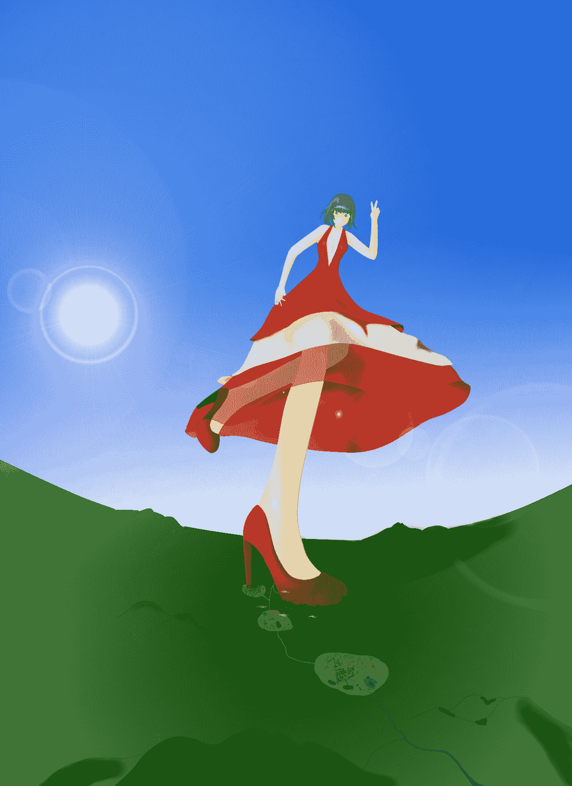

# 处女短文giga类，自涂渣渣配图

作者：这茶，是苦的

TID：14175

 

# 1

<ignore_js_op>

**Trample.jpg** *(613.04 KB, 下載次數: 5)*

[下載附件](forum.php?mod=attachment&aid=MzM1Njl8NTg1MGIwOGJ8MTYwMDg5MTA0NXwxODIzMHwxNDE3NQ%3D%3D&nothumb=yes)

2013-3-31 21:29 上傳

（图片比例有点问题，山脉太过高大了，不过懒得改了，就这样吧。至于少女的容貌什么的，诸位自行脑补去吧，手残不会画美女。）

仿佛从生宣上渐染开来的水墨晕迹，晴朗的天空中，蓦地浮现出几分不寻常的阴霾。

可对于世代生活在这全世界最伟大的钢铁丛林中的所谓人类来说，抬头这种费力却不能取得利益的废柴动作，当然被他们英明的脑袋排挤在行程计划之外。因此，在阴霾出现几乎一个小时后，城中的社会精英们才从电视上的插播新闻得知，他们的头顶上不知何时竟出来了如此奇怪的东西。

于是他们才走出房屋，费力地高昂着头，对这份阴霾议论纷纷。而绝大多数的人在看了一眼阴霾后，又立马回到了工作中。

经济利益，岂能不放在首位？

然而，这座城市的正上方，这座云集全世界顶尖智慧的城市的正上方，于下一刻——

在最擅飞行的鸟类都难以企及的高空中，轰鸣着裂开了一道巨大的缝隙，裂缝中充斥着最纯粹的黑暗，与蔚蓝的天空形成了刺眼的对比。

那是苍穹的狞笑，嘴角满怀着黑森森的未知。

而紧随其后的，一根拥有红水晶质地的超级巨柱从裂缝中探了出来，并缓缓地朝着地面落下，或者说是压顶而来更准确。

人类开始恐慌。

起初那根红色巨柱还远在天边，凭借人类那落后的立体视力根本无法分辨它的真实大小，不过可以确定的是，巨柱在十秒钟内，已经在人类的视野中嘲笑般地放大了上百倍。

原本跟太阳一般直径的巨柱，此刻已然变得遮天蔽日，并且仍旧以令人发疯的速度高速放大。

而随着巨柱的落下，巨柱上更多的部分随之从裂缝中探出，于是人们看到了巨柱顶部连接着一处更加宽广的平台，而平台的另一段向下扭转出优雅的弧度，使平台低端与巨柱低端相平。

假如你有足够的想象力与勇气，那你就会比任何人都更早发现，那其实是一只鞋子。

一只格外巨大的，红水晶高跟鞋。

就在地面上的人类明白了头顶的神秘巨物为何存在时，所有人都发出了最凄惨的哀鸣。

鞋子的主人似乎听到了来自脚下的声音，于是那只鞋子调皮地翘了翘鞋尖，然后更加快速地向着地面踏去。

片刻，整只鞋子都伸出了裂缝，而鞋子的上端，只可能属于妙龄少女的纤细脚踝从裂缝中显露了出来，如牛奶般白皙细腻的皮肤吹弹可破。

不过，少女脚下的人们可没时间去欣赏少女的纤纤玉足。

那只水晶鞋很快便将天空完全遮蔽，黑暗接管万物。

处在水晶鞋下的人们极目四望，只绝望地发现，这只美丽优雅的鞋子，其大小甚至无法用肉眼估算。所以人们只能惨叫，徒劳地释放那无边的恐惧。

起初，城市人的视野被整个鞋底冲溢，而后，随着红水晶高跟鞋的进一步踏落，鞋子的前掌部分随少女的迈脚动作而离开了城市上空，不过紧随而来接管城市上空的，是鞋子的鞋跟部位。

鞋跟，仅仅是少女纤足下的一只鞋跟底部，便将泰半城市笼罩于下。

逃跑？怎能逃掉？！！天空完全被鞋跟所霸占，你又能逃到哪里呢？

于是，那只水晶鞋平伸着踏在了大陆上，清脆的踏地声将脚下小人们那最后的呐喊淹没。

那只鞋子内的脚趾向下用力，将地面踩出了数千米深的巨坑，在确认了踩实地面后，那只水晶鞋才停止了亵渎脚下尸体的动作。

只有呆在足够远地方的人们才能知道，即使绝对海拔达三千米的山峰，也只能仰望着少女脚下鞋底的厚度无力地叹息。

而就在那只红色高跟鞋轻松地踏在大地上后，裂缝骤然扩大，一位长发少女从裂缝中秀出了俏丽的身姿。

那是一抹鲜艳到灼眼的血红色！

一袭红到摄人心魄的丝绸长裙一层层挟裹住傲人的胴体，装饰着华贵又不显庸俗的蕾丝花边的裙摆将膝盖堪堪遮住，而少女黑发上佩戴的水晶发饰，将少女的俊俏收拢升华。

不过，那身衣裳还不能与少女的容貌相媲美。

未铺粉饰的嘴角一扬，自惭形秽的百花才敢盛开；璀璨如群星的眼眸一扫，便让这茫茫尘世暗了八分！

这不是人间能够承载的容颜，天使也无法与之比肩。

尤其是这份倾城月容，被放大了千万倍之时。

一千七百公里，这是少女的准确身高。而仅仅少女脚下的那只水晶鞋子，鞋跟便有六十千米之高。

她是能够踏碎大陆板块的究极死亡来客。

“大家好啊，本小姐很高兴能来到地球同你们玩耍呢☆”一身血红的少女弯下膝盖，用手将裙摆提起铺在了方圆数百公里的地面上，尔后跪坐下来，“相信同我一样，你们也会牢牢记住这一天吧！”

血红的少女伸出纤细的食指，动作舒缓地伸向地面上一块灰黑色的斑迹——那是一座拥有百万人口的城市。

“那么首先，握个手吧。”

少女把右手手心贴在了地面上，拥有肥沃土壤的草原被瞬间按压成土黄色的泥巴团，然后少女将食指高高翘起，移动到了那个灰黑色斑迹的上方。

“呜啦啦……看来你们是没法跟本小姐握手了呢……你们真得好小好小，让人家忍不住欺负你们呢！”

少女将俏脸伏下，用右眼仔细观察起指尖下的微型城市。可惜城市真得太过迷你，任少女使劲观察，都只能勉强看见城市中最巨大的那几座建筑，至于更加细小的人类，对于少女来说就如同细菌一般，根本看不真切。

不过对于城市中的人类来说，情况就完全相反了。所有人都被头顶那巨大到笼罩天空的眼睛所震慑，而少女的每一次寻常的眨眼，都会带起强劲的狂风，肆虐整座城市！

体型的差距太过悬殊了！

“啦啦啦，既然你们人类无法跟本小姐握手，那就让你们所居住的城市来代劳吧～”

少女微笑着，将一直高悬着的右手食指向下放去。

那是人类不曾经历过的毁灭之势！

指尖未到，劲风先袭！超过十二级风力的大风将城市内一切脆弱的花草吹散，也让上万正在街道上仰视少女的人被吹飞上天。

“嘻嘻，吓坏了吧？我估计会有好多好多人吓得尿了裤子呢☆”少女将手指停住，左右摇了摇，“我其实是和平的访客，当然不会伤害你们的啦——”

城市中的人都松了一口气：说不定这少女真的只是来地球玩一玩呢，我们不会有事的。

“——骗你们的啦，哈！”没等城市中的人们反应过来，少女就将手指快速地按压在了城市上，然后调皮地左右揉搓了几下。

“哈，有趣，人类真好骗呢！本小姐刚刚一脚踩碎好几个城市，怎么可能会是和平的访客呐。”

少女将沾满不知名碎屑的食指放在嘴边，用舌头舔了舔：“死亡的味道，本小姐喜欢极了☆”

------------

没什么思路了，所以文章就这么结束了吧。另文章的语序有点问题，同样懒得改了。</ignore_js_op>