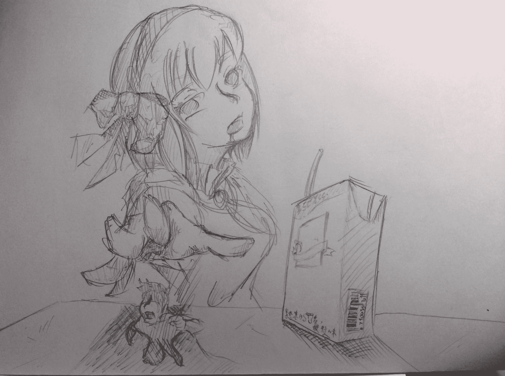
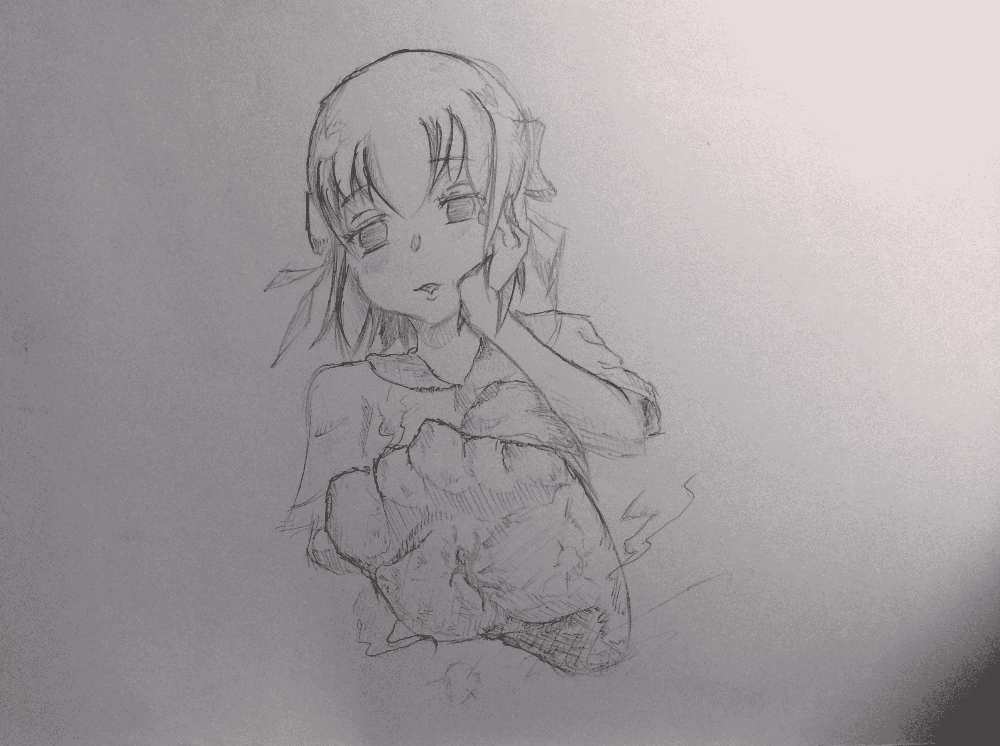

# 夏日歡樂小短篇

作者：199584323

TID：19297

 

# 1

*本帖最後由 199584323 於 2016-10-2 22:12 編輯*

我想找地方逃跑,但是我無處可逃.

我一直把身體貼在鋁箔包上,躲藏在巨大的陰影下.

每當向轉角處窺伺,渾身的汗毛都會倒豎起來,心臟噗通噗通地狂跳著.

佈滿血絲的眼球不斷掃動,一遍又一遍,一遍又一遍,一遍又一遍地不停

搜尋著;明知道接下來會發生什麼,但我卻什麼都做不了,只能呆立在原處.

再現實化之前,惡夢將會持續下去;那生生的劇痛,根本不會停下來.

陰影消失,後背緊貼的觸感轉為騰空----我頭也不回地拔腿狂奔.

來了!她來了!

不顧內臟翻騰的感覺,強忍胃酸上湧的不適,拚命驅動著雙腳.

然而,清晰巨大的五指陰影無聲地追上我,將我籠罩;上氣不接下氣的腦袋裡

一片空白.

<ignore_js_op>

**image.jpg** *(1.04 MB, 下載次數: 0)*

[下載附件](forum.php?mod=attachment&aid=NTI3NzF8ZGMwZDk5ZGN8MTYwMDg4OTYzOXwxODIzMHwxOTI5Nw%3D%3D&nothumb=yes)

2015-6-27 21:21 上傳

要被吃掉了、要被吃掉了、要被吃掉了、要被吃掉了、要被吃掉了、要被吃掉了、要被吃掉了。

要被吃掉了、要被吃掉了、要被吃掉了、要被吃掉了、要被吃掉了、要被吃掉了、要被吃掉了。

然後，被吃掉了。

"不要啊啊啊啊!!!"

窗外的蟬兒就像要把空氣攪混一般,抖動著翅膀。那猶如榨乾生命一般的叫聲,簡直煩死了。充滿濕氣的空氣很沉,像泥土一樣保有著熱量。

這才發現,身上的衣服濕透了,喉嚨如火燒般乾渴,呼吸彷彿剛跑完百米那樣急促。

----我被埋在令人不快的盛夏底層,重複做著那個漫長的夢。

夏日的太陽放射毒辣的光輝。七月尚未開始,氣溫便持續上升。

據說,今年的夏天也會很熱。

"噹.噹.噹.噹..."

象徵班會開始的鈴聲響徹早晨的校園。雖說是早晨,空氣中的熱量卻愈演愈烈,讓人倍感煩躁。好在空調已經打開,逐漸降溫的室內,當下的季節正在遠去。

"呼..."

我吐了一口氣,回憶起昨晚那重複過無數次的夢,那個被少女活生生吃掉的夢。內心浮現異樣和恐懼,因為那鐵鏽的氣味與被痛楚侵蝕的感覺實在過於真實。

"咚.咚.咚"

木製的講台傳來熟悉的腳步聲,年屆半百的導師將手放上講桌。我急忙將飄遠的思緒拉回。

無論如何,夢終究是夢,不會成為現實----我在內心如此告訴自己。

"在班會開始前有件事情要告訴大家:班上來了一個轉學生。那個...可以進來了"

在導師招呼下,鋁製的門把旋轉著,隨後,班上的男生們開始騷動。

----嶄新的水手服輕盈地擺動;柔順的秀髮繫著緞帶。舉手投足間無不散發媚惑的氣質,與夢境中少女一模一樣的臉蛋正對著大家微笑。

"我叫佐久夜,請多多指教"

她在黑板上寫下名字。

背脊冒出汗水,冷靜,這種時侯一定要冷靜!

吸.吸.呼~...吸.吸.呼~...強行運轉起陷入混亂的腦袋。

環顧周圍,很幸運地,我附近坐無虛席,完全沒有空位。因此,美少女轉學生坐到自己旁邊這種展開絕不會發生在我身上。只要座位相隔遙遠,就能輕鬆地保持距離,實施不對話.不接觸.不交流之三不策略。

"嗯,陸仁賈(坐我旁邊的人),你最近上課時常分心,我要順便調整你的座位,佐久夜同學,妳坐他的位子可以嗎?"

--咦咦?

白皙的雙足正朝這裡邁開步伐。

--怎麼辦?該怎麼做?

飄逸的裙襬掠過兩側桌椅。

--想啊!快想啊!

美麗的不祥倩影不斷逼近。

--我做得到!我做得到!

洗髮水的香氣飄進鼻腔。

--對了!這種時侯應該舉手大聲說"老師!我看不清楚黑板!可以換到前面的座位嗎?",然而...

"新同學有什麼問題可以向周圍請教,例如坐在旁邊的楠渚僥同學,麻煩你了"

"是"

萬事休矣,一聽見自己的名字便反射性的回應了。同時,四周的嫉妒指數也上升了五格。

就這樣,一連串的離奇事件揭開序幕----我以為是這樣。

"早安,小渚"

"早"

星期五的早晨,剛進教室的佐久夜面帶笑容向我打招呼。

出乎意料地,她是位活潑外向的好女孩。在佐久夜轉到班上的幾週裡,我經歷了戀愛喜劇般的校園生活。也不曾再做那充滿鐵鏽味與劇痛的夢魘。

開著空調的教室裡,佐久夜坐在我的隔壁,她把手中的書扣在桌面上。繪本般色彩繽紛的<<愛麗絲追逐仙境>>被擺在鉛筆盒旁。

她慵懶地看著我,稍稍偏過頭。

"怎麼了嗎?"

"都幾歲了還在看故事書?"

我開玩笑地說道。

"要你管~人家就是喜歡純情的戀愛喜劇嘛~"

她和往常一樣可愛地鼓起臉來回應我,看著眼前迷人的五官,讓我不禁嘲笑起先前在夜裡顫抖不已的自己。

我嘴上自然而然地浮現笑容,轉了轉肩膀,瞥見窗外全是灰色的雲朵,仰望毫無色彩的天空,強烈的睡意頓時蓋過意識。

"早安~小渚,怎麼一大早就在睡覺?"

"唔咦?...哈~早...."

星期五的早晨,剛進教室的佐久夜面帶笑容向我打招呼。

出乎意料地,她是位活潑外向的好女孩。在佐久夜轉到班上的幾週裡,我經歷了戀愛喜劇般的校園生活。也不曾再做那充滿鐵鏽味與劇痛的夢魘。

開著空調的教室裡,佐久夜坐在我的隔壁,她從包包裡拿出早餐,內容物不明的塑膠袋被擺在了鋁箔包旁。

她慵懶地看著我,稍稍偏過頭。

"怎麼了嗎?"

"吃這麼多小心變胖喔~"

我開玩笑地說道。

"要你管!人家就是喜歡活生生的肉嘛~"

她和往常一樣可愛地鼓起臉來回應我,看著眼前迷人的五官,讓我不禁嘲笑起先前在夜裡顫抖不已的自己。

我嘴上自然而然地浮現笑容,轉了轉肩膀,瞥見她腳下灰撲撲的室內鞋,俯視佈滿汗漬的鞋底,強烈的倦怠感頓時蓋過意識。

"早安~小渚...小渚?快起來啦~"

"唔..咦?..早..."

星期五的早晨,剛進教室的佐久夜面帶笑容向我打招呼。

出乎意料地,她是位活潑外向的好女孩。在佐久夜轉到班上的幾週裡,我經歷了戀愛喜劇般的校園生活。也不曾再做那充滿鐵鏽味與劇痛的夢魘。

開著空調的教室裡,佐久夜坐在我的隔壁,她從紙袋裡拿出早餐,津津有味地咀嚼著,鼓動的臉頰裡傳來濕潤的壓碎聲。

她慵懶地看著我,稍稍偏過頭。

"怎麼了嗎?"

"總覺得..妳好像長高了?"

我上下掃視地說道。

"我看你是睡迷糊了吧~"

她和往常一樣面帶笑容回應我,看著眼前迷人的五官,讓我不禁嘲笑起先前在夜裡顫抖不已的自己。

我嘴上自然而然地浮現笑容,轉了轉肩膀,這時佐久夜恰好毫無遮掩地打起呵欠,凝視暗紅色深處若隱若現的咽喉,意識忽然中斷。

"早安~小渚~太陽曬屁股囉~"

"嗚..咦?...早...哇啊!"

星期五的早晨,睡迷糊的我一不小心失去平衡,從椅子上摔了下來。

奇怪?伸出的手臂怎麼抓不到桌椅?

"咚"

臉撞上了佐久夜穿著室內鞋的腳被。

勾到我身體的佐久夜頓時重心不穩...

"啪"

她手上的袋子摔到地板,半開的拉鍊裡掉出半截姆指與附著黏膜的眼珠。

"咦?"

伸手拉了拉掛在拉鍊口上沾滿血與脂肪的肉塊,一張被黏住的學生證彈了出來。顫抖的雙手捧起課本般大的學生證,即使照片被乳白的腦漿弄髒,斑斑的血污裡隱約可辨認出楠渚僥三個字。

楠渚僥...我輕聲念出這個名字,好熟悉的感覺..到底是誰呢?

"痛痛痛...小渚真是的?"

甜美的抱怨聲自身後響起。

小...渚?!

想起什麼似的,背上彷彿電流竄過一般冒出冷汗。

"那個...佐久夜..同學?"

"什麼事?"

她歪著頭,臉上依舊掛著甜美的笑容。

"班上其他人呢?"

只剩我們倆得空蕩教室哩,渾身的汗毛倒豎起來,心臟噗通噗通地狂跳著。

"一如往常地上著課喔~"

她用和往常一樣可愛的表情來回答我,看著眼前龐大的倩影,先前夢中那生生的劇痛纏上全身。

我眼中自然而然地浮現血絲,轉了轉肩膀,瞥見自她嘴角流出的濃稠液體,劇烈的疼痛瞬間中斷意識。

"早安~小渚~"

星期五的早晨,開著空調的教室哩,濕熱的柔軟觸感壓在身上,濃郁的汗臭飄進鼻中----面帶笑容的佐久夜正將我踩進室內鞋裡。

"救...救命!這裡到底是哪裡?"

我歇斯底里地大吼著,螂臂擋車一般的伸出雙手,抵抗不斷壓下的棉襪。

"呵呵~你覺得,身心都被吞噬殆盡後,會到哪裡去?"

像是忽然想到了好點子,佐久夜脫下長襪,將我自室內鞋中捏起;捏住我的白皙手指如夾娃娃機一般移動到散發淡淡熱氣的襪子開口。

"打從我們第一次見面起,你就未曾從夢中醒來喲~"

陶醉的聲音甜膩地輕聲訴說,俯視我了雙眸流露出嗜虐的光彩。

"我只是找出深深沉睡而毫無防備的你的身體,再一口一口地...."

聽不清她最後說了什麼,陰暗與失重感將我吞沒至最底處,隨後,扭動的濕潤腳趾一面散發氤氳的熱氣與惡臭,一面向我逼近。

"夏天真是熱呀,你說對吧?小渚~"

腳掌與身體的汗水不停滑落,全身像剛從海中爬上岸般濕透。

可怕的悶熱包裹全身,黏土般的腳臭與壓力覆蓋皮膚;肺臟與胃中充斥的汗氣和污垢彷彿要讓身體開始腐敗。

"...為.....什....麼......"

勉強擠出的聲音虛弱不已,窒息般的陰暗壓力迫使我劇烈喘息,吸入更多蒸騰的腳氣,吞下更多發臭的汙垢。

"當然是..因.為.愛~"

輕柔的回答中,蘊含不容拒絕的冷酷。

"時間差不多了呢~一起去上體育課吧~小渚~"

然後,再從星期五的美好早晨重新開始。

----炎炎夏日,我被埋在令人窒息的血肉底層,重複做著那個漫長的夢。

<ignore_js_op>

**image.jpg** *(1021.17 KB, 下載次數: 3)*

[下載附件](forum.php?mod=attachment&aid=NTI3ODl8ODZjZDhlZDF8MTYwMDg4OTYzOXwxODIzMHwxOTI5Nw%3D%3D&nothumb=yes)

2015-6-28 09:24 上傳

謝謝觀賞~

還有,祝你今晚有個好夢~

 

# 2

> [that123 發表於 2015-7-15 02:46](https://giantessnight.com/gnforum2012/forum.php?mod=redirect&goto=findpost&pid=261772&ptid=19297)

> 看到第二次出現星期五就想到是夢了

> 中間可是略獵奇...

> 有點嚇倒

嗯...我也有考慮到有些人獵奇抗性比較低，所以有寫的委婉些。這麼快就猜到是夢...好厲害...

至於最後嘛.....看到您回復的，我反而比較有感覺....是為什麼呢...=3=</ignore_js_op></ignore_js_op>