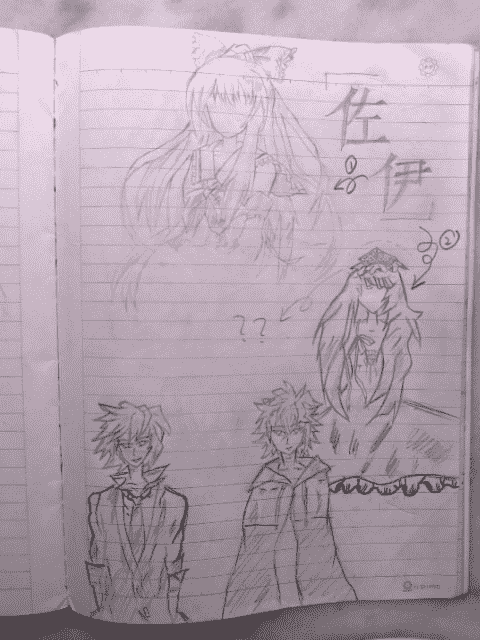

# 夙愿么？

作者：0128

TID：10148

 

# 1

PS:上周因同學要光臨寒舍,固瘋狂地收拾房間,閒暇之餘,發現筆記本一,閱之……

竟然——竟然是小學時手寫的GTS小說（GTS的爱好幼稚园时代就已养成……）,记得那時為了躲避他人的視線,就把它藏在這個~陰暗潮濕~的角落,看著那被遺失的回憶,又聯想到自己來論壇也近一周年了,於是乎。溫習故事情節後，隨即改進一下後立馬打字於網上,但由於時間關係,個人因素,學業過重,視力下降……只能一點一點地發。

並且,因為自己的文筆甚爛,以至於到了【不堪入目】、【慘不忍睹】程度,附代鄙人小學到現在也不會寫【任何Sex 或者 暴力】（那還是GTS麼……）內容,所以準備以胡編亂造的劇情和無理頭的對話塘塞………

還有,這些隻言片語也自己著文章【自、娛、自、樂】罷了,話說在下真的很沉浸於寫文章的快樂中呢~真的希望自己能有足夠的毅力將它完成,另外GTS的內容自己也真的不知道怎麼寫（還是GTS愛好者麼——是的，真的是的，只是不會表達，縱然每次語文的作文都會被扣7、8分的。）大家也不必放在心上（能不放在心上麼？）。

题目什么的也是最大难题，至今未想好。标题的选项都不知道选哪一个好的说……

我也不想当“一日作者”，但是，这篇文章以后的连载，可能推到【暑假】解决……

至於如果放在這裏（自己也在想，放在哪里好？）的確不餒,版主【刪去】它去也無妨,免得礙眼~。

然後就是情節，如果大家覺得與XXXX的文章有雷同之處,那只是【巧、合】而己,【小學】時代寫這小說時可是純潔得像朵小白花(這有關系麼?)

最後,在繁重的課業之餘,作了兩張人物設定稿,到時候拿了相機照了再傳上來。

再來陰魂不散一句——

各位大人一定【高抬貴手】,預計此文GTS的內容不會太多,前面主要介紹人物與世界觀什麼的——全廢話。

但是——但是,後面我可能也會Try my best地去嘗試著寫一寫的~

上文了,一點一點的,一小段一小段的發了———一我果然廢話很多……

终于把妈妈的手机拿过来了呢~赶快拍下什么的发上来……

这几幅画的绘制级别早已缩水（很久没有提笔画了），但幸而还有一点以前的积淀。（回想在初一的时候，有一段时间手绘DANTE大人的DGU人物设定，天天晚上一张8开素描纸的量不是盖的。那至于为什么没有发上来呢，是因为“DGU人物传不得，K大绘制在上头”，人，固有自知之明……）

好了，在英文笔记本后用下课时间勾画了了——质量不敢保证。

并且，自己为什么不找现成的动漫设定上传呢？其实害怕版权……所以自己照着岛国的某某绘师的作品偷偷画的……

佐伊(ZOE)的设定有箭头指示，有两位。至于下面一位为什么有一个皇冠？？其实，那个是以前自己为 娜塔莎。波尔维克大公爵的设定呀（对不起DANTE大人）！！！但是，却，无论如何也画不出当年的神韵了……

左下方草草画者为 哈恩(HAL)   右下方草草画者为 朗曼(LONGMAN)

[ *本帖最後由 0128 於 2011-5-15 11:06 編輯* ] 

# 2

<ignore_js_op>[照片0187.jpg](forum.php?mod=attachment&aid=MjQ1NTR8YTk1YThiMGZ8MTYwMDg4MjcyMHwxODIzMHwxMDE0OA%3D%3D&nothumb=yes) *(84.13 KB, 下載次數: 2)*

[下載附件](forum.php?mod=attachment&aid=MjQ1NTR8YTk1YThiMGZ8MTYwMDg4MjcyMHwxODIzMHwxMDE0OA%3D%3D&nothumb=yes)

2011-5-15 11:06 上傳  

</ignore_js_op>  

# 3

宇宙是那樣的廣袤無垠,量子力學的不確定性與费恩曼历史求和在我們世界外的空間中,分裂出了一個又一個的平行宇宙,每個宇宙都對應到一種可能的未來，時間不在是線狀，而是像快速分枝的大叔，在那多如繁星的異世界裏,人存原理也隨著衍發出各種神奇的生命……詠歎一句：平行的世界呵,什麼都會發生……

位於臂旋銀河的南部邊陲，這是另一個水球.

朗曼是一名國中生,出身於東大陸中部地區的他,自幼就不甘於庸碌的生活。兩年前,他以優異的成績考入這所縣裏最好的中學,開始了他的新生活。

這一天,看上去如同朗曼生命中的千千萬萬個日子一樣普通。萬裏碧空下一個少年,騎著單車在與陡坡對抗著,朝陽的光輝從坡頂泄下,灑在朗曼身上,朗曼昂著頭,迎著朝陽,腳使勁一蹬,向前騎去。一股暖意湧上心頭，[今天也要好好幹喲!加油吧!少年…]朗曼在心中喃喃自語。

泊完車後,[早安!郎曼!]走在臺階上的朗曼聽見這清脆悅耳的聲音,下意識地回過頭去.

[你也早呀,佐伊!]朗曼應到,隨即轉過頭去,只是餘光瞥見了什麼東西。隨後瞳孔逐漸縮小地望著碧空。

[你在看什麼呢?看到心儀的少女了嗎?]佐伊打趣地問道。

[不……不是的…只是…今天的朝陽好美…那個，你先走吧…]朗曼腼腆了，

[是這樣嗎，注意時間噢!腹黑狂~!]

[才不是呢!]說著,朗曼的臉上泛起紅暈。

[奇怪,天都大亮了,為什麼天上的那顆星還這麼亮呢?那奇異的長條星形狀的…]透著樹葉望天的朗曼呆住了……

[嘿,別發呆,朗曼,快點呐,要遲到了]說著約帕猛冷不防地拍了一下朗曼的肩膀，朗曼身子一震，[喲，別嚇人好不好——約帕,哎呀~時間也不早了,快走吧!]

[老師好!]例行的礼节后是一节课程的开始。

上課時,朗曼總是那麼專心致志,但是,也會常常假裝撓撓頭，或者往窗外看看什麼的，实际却是借機瞄瞄佐伊。

沒錯,佐伊是那麼的清秀可人,高挑的身段,靈秀的臉旁…對於朗曼而言,這就是他心中的天使,上天的尤物。

然而,朗曼在她面前是絲毫不會表露的,甚至還有些許冷漠,而她自然也渾然不知,至於什麼"腹黑狂"什麼的,也只是同學間的戲言罷了。其實,朗曼本人對自己的樣貌,也還是很有信心的，並且，朗曼也很有自製力，學習是最重要的，少女什麼的，觀之而悅己就行了，再說，朗曼真正喜歡的類型，也並非如此。

~叮叮叮叮叮叮…~[放學了——]國中生本不應該這樣欣喜若狂地大喊大叫的,可眼前正是長達一個月的假期耶,興奮一下也不為過吧?

假期是來自於一個上古的“物種大逃亡”的故事,是大家童年時的睡前十分钟必讲的故事。

據說在7300年前,一場打著因為太空垃圾處理問題晃子的宇宙侵略戰爭在另一個分裂的宇宙由猶滴赫族與彼博族之間展開。然而毫無懸念的是,在過於強大的猶滴赫族無視因為雙方都是智慧生命的和平共處協定後,彼博族被打得落花流水，無一絲一毫的還手之力。

弱者,總是會受到真神的蔽護的。

在敵人的高能粒子炮的狂轟濫炸下,彼博族唯一佔有的最大行星本身的品質時空曲率加上在其強烈的能量引起時空扭曲的共同作用下。

奇異點出現了!成功地与另一个世界对接了！彼博族的星被“吸”到另一個宇宙去了!彼博族得救了!這個日子,就是物種大逃亡日……

由於是不同的宇宙,自然也有著不同的物理法則,而彼博族要做的,就是重新開始,創建一個新的文明!

轉眼間滄海桑田、世易時移,7300年過去了,彼博族的人民也用自己勤勞的雙手重塑了曾經的輝煌。

誰也不曾想過,在衣食無憂的現在,異空間的大門又一次打開,沉溺於幸福生活中的人兒，卻一無所知,空間的那一邊,是敵是友呢?

[約帕,你的假期怎麼過呢?]

[朗曼,你可不知道我萬惡的父母給我抱了多少補習班呢?為什麼會這樣,老天,毀了這些天殺的補習班吧!]

[呵呵,你的願望很可能實現噢,你看，只要猶滴……唔…]

[你瘋了嗎,在這裏說這種話,你知道後果的]

[當然,我不是個傻瓜耶,你看看天空…]

[什什…什麼也沒看見呀?朗曼,玩笑開到這了吧]

[啊?你沒看見天上的十字星!]

[沒有啊~你高興過頭了嗎?來,我摸摸額頭,看發燒沒有?]

【哈勃，你看看天上有什麼奇特的東西沒有】，

朗曼又叫住了正从身边走过的哈勃問道。

【真遺憾，什麼也沒有的呀~】

[怎麼可能?我很正經地在談這件事的說,唉,佐伊,你看見天上的南十字星狀的東西了嗎?]，說著又叫住了旁邊與另一位女生交談中的佐伊，佐伊扭過頭,清澈的眼眸就像碧空一般,邊看邊說[沒~有~耶~我的幻想症同學!]

[哦？——艾~既然都這樣了,就當我看走眼了吧!]朗曼罷出一副無奈的樣子,快步地離去了，

【唉，朗曼你慢一點，走這麼急幹什麼~】。朗曼徑直地走著，也不顧同學的召喚，可心底卻在盤算著,[定要把它給弄清楚不可!]

在朗曼回家的路上,氣餒的他也無心像從前那樣關注人行道上的漂亮少女。埋頭騎車的他也沒注意前方的紅綠燈和人行道,直到一阵刺耳的刹车——[喂!你騎車小心一點啥!]行人用青春期特有的嗓音咆孝哮道——朗曼撞著人了！

[真倒楣]朗曼心裏暗罵一句,然後抬頭看著他撞到的少年,正準備說對不起——[嗨!哈恩,好久不見,剛剛,真是對不起了~]，說著送上一抹微笑。

[啊哈——朗曼！咋倆誰跟誰呀~~對了朗曼,你今天怎厶看上去這麼消沉呀~出了什麼事嗎?]

[這——說來話長…嗯~到我家去如何?]

[好呀!走吧,打起精神來,你可是一個熱血少年呢。]

哈恩與朗曼是從小到大的同學與摯友,他們有著共同的愛好與幻想,分享著彼此的秘密。然而,世事難料,小學畢業後哈恩去了大城市,而朗曼卻留在了這裏,可縱然相隔百里,但他們間的資訊往來卻相當頻繁,關係的親密可能更勝於前。放假了,自然哈恩也回來了,這兩位發小的再聚首,會引發出怎樣的精彩呢?

哈恩騎著朗曼的山地車,不斷地尋問著這段時間朗曼身邊的事,而朗曼則低著頭,雙手插進褲兜,低聲回應著朋友的問題。夕陽下,從背影望去,那被殘陽映得緋紅的朋友，說是手足相依的好兄弟也不為過,只是,今天,哥哥心情不大好了拉。

[到家了!爸,媽,回來了!]說罷把書包隨手一扔。

[伯父伯母好~今天打擾了!]

[喲,今天哈恩也來了,朗曼,你看看人家哈恩多有禮貌,不像你對你父母一凶二惡的…]

[伯母,您不必再說朗曼了,他今天心晴不太好…我是來幫助他的…]

[好吧,不說了,你們忙自己的去吧一]

[謝謝伯母——]

關上門後 哈恩很隨興地一跳，然後坐在朗曼的桌子上，等待著躺在塌塌米上的朗曼發言 空氣仿佛被凝結了,一時間雅雀無聲…

[哈恩,你覺得這幾天天空有什麼變化嗎?]朗曼故意把聲音壓得很低沉。

[什麼變化也沒有呀……等等…難道說…]說畢,朗曼從床上躍起,用期待的目光注視著哈恩。

[直接了當地說…]說著哈恩用手指指著天空,背對著窗臺的他看也不看地就指准了詭異的十寧星之方向。

[沒錯,果然他也看見了的——]朗曼這樣心朝澎湃地激動地想著著,眼淚都快要流出來了。

[你是說那朵白雲像只狗麼?真的很好看的說…]說著哈恩一陣壞笑,而朗曼卻一點也不為之所動,他知道的————說著哈恩臉一板,一本正經地說[那顆星,你也看到了嗎?這就是你的心結對吧~給你身邊的人說,他們都當你是瘋子,連警局的人也沒看見…]朗曼依然很堅定地看著哈恩,因為他知道,對方還有話要說。

[連天文站也沒有觀測到耶——真是奇了怪了,朗曼,你覺得呢?相信你也有自己的見解吧~]說著也向朗曼投去了與前者相同的目光。

[我覺得]朗曼一下子接過話柄,鄭重地說[那顆星,從來都沒有見過,官方也沒有任何回應,如此突兀地出現,大夥竟然都沒看見!這讓我感到不安,或許,那跟本就不是什麼十字星,而是…]，

[而是一艘猶滴赫族的戰艦在那裏伺伏著偵察,無可能的,我的朋友,無論是猶滴赫族的作風,還是他們為什麼要讓我們這等少年看見,以他們的實力,直接滅了我族,也是易如反掌之事,為了我們星球豐富的能源,他們是什麼都做得出來的…]

[唔——你怎麼知道我是這樣想的?]

[好朋友的心電感應喲~]

[好肉麻^那你的高見呢?]

[我也不知道……]氣氛再度沉寂下去。

聽見好友將自己的念頭矢口否認後,朗曼不由得有些沮喪。

[把你的天文望遠鏡拿來用用就真相大白了!]

[對呵,我怎的忘了這茬]朗曼拍了一下自己的腦子。說著小心翼翼地搬出了天文望遠鏡,鏡桶正對十字星,隨著調焦螺旋的[哢哢]音,十字星的輪廓漸次明晰!

[是一團光圈耶~這感覺,像個甜甜圈似的~不過,真的好耀眼^]

[嗯，它在hdf_130星系方向,現在告訴觀測站的人,要他們測算一下那裏的輻射線與引力場什麼的,快~]

[好的~]

…………

…………

[什麼,你說有人打電話問過了,並且那裏一切正常?]

[千真萬確,電話還是一個女生打的一]

說罷,朗曼即時會話軟體的提示音響起,打開一看:

[朗曼君,明天不知道您有空沒有呢?出來玩一下吧~8:00校大門見]最後還有一個俏皮的自定義表晴。

[奇怪,真是太陽打南邊出來了,她怎麼會來約我?]一旁的哈恩則是默默地讀著,看到朗曼的表情與態度,不禁暴發到[好小子,這就是你常提及的那位漂亮女孩吧,還說什麼沒感覺無興趣,噍噍,人家都主動約上你了,不去的話情何一堪,話說我也想去看看那女孩喲,朗曼喜歡的類型——嘿嘿~]哈恩說得眉飛色舞。

[哪有,我哪有,如果你想去,自己去好了————不過，算了,機會千載難逢,不去也對不起人家^][變得可真快呢!時侯不早了,我先走一步,明早在你學校大門見一][伯母再見]——[哈恩不多玩一會,這麼怎著走,記著回到家後打電話~慢走——]

這時,只留朗曼一人在屋裏,他想著想著,努力地想把這些零散的線索連成一線，但卻弄得自己越發地疲倦,不知不覺地就睡著了…

【滴滴………】鬧鐘總是那麼令人討厭把人们从美梦中拽出,可今天,假期的第一天,朗曼卻起得格外的早,洗涮得格外乾淨,穿戴得格外整潔————畢竟——是去赴女孩子會嘛。

朗曼急切地走著，在遠處，就已經發現佐伊那靚麗的身影——

今日的佐伊也分外養眼:迷你裙下修長的雙腿是那樣地迷人,水手服的短袖再加上那齊腰的柔順長髮與百看不厭的臉蛋。美哉!朗曼在遠處看著、想著什麼“可遠觀而不可褻玩焉”之類的文言。

突然,朗曼發覺事情不對勁,一位中年男子從她身邊走過,而身高卻只及她的纤细腰部,而那男子卻淡定地走過,完全無視了那個亢儷女孩的存在!

[什麼情況,怎——怎麼會這樣?]朗曼驚愕地取下眼鏡,柔了柔眼晴,慌慌张张再次即帶上,

[怎麼會?]朗曼的下顎都快脫臼了。

啪,哈恩輕輕地拍了一下朗曼的背,只見朗曼轉過身去,雙手緊握哈恩的雙肩,拼命地搖啊搖,而哈恩卻是一臉寫不盡的茫然。

[看見那邊那個女孩子了嗎?那就是佐伊！]朗曼幾乎抓狂。只見哈恩偏過頭看去——[啊！我的個去,tell me why?what is that， is that  girl，she is raelly so tall !?]哈恩語無輪次了。

[yes,i think she become a mini一mini gts!]朗曼同樣用著那異國他鄉的語言表述他激動的說不盡的心情。

[now,let us go and have a talk with her~——!]

他倆從小的夙願,現在,正一點一點地變成現實…

一步一步向前,看著眼前的少女身影越來越膨脹,壓抑的感覺不請自來。

[早安~朗曼君,這位是…]佐伊的眼神卻高高在上地望著遠方,一幅完全沒有將眼前的二人放在眼裏的感覺。

[是我的朋友,青梅竹馬的好友，叫哈恩。]朗曼仰頭看去,只是,走進之後，那極端高挑的身影卻虛如飄渺,像投影出來的3D影像似的,剛剛那種有血有肉的實體感全無,相反的,在朗曼的正前方,一位正常大小的佐伊正婷立於眼前,而這位佐伊,則在那高大的投影下是那樣的有存在感。

[這…究竟是怎麼回事?]哈恩把客套話拋在腦後，開門見山地問了出來,被完全混淆的他一會向天上看,一會兒端祥眼前,頭就像個機器,一上一下做著程式運動。

[佐伊,你這是?演的哪一出呀?]朗曼正準備向前一步,站近一點給佐伊說清楚…

[噢!]剛向前一步,朗曼好似撞著什麼東西,軟軟的,還有那布料的觸感，雖然加速度有點大,但卻一點也不痛。

哈恩則是一震震悚，在一旁差點沒被石化掉:朗曼剛才碰上的,不是什麼其他東西,而是投影版佐伊的大腿與小腹————原來那才是實體!

[哎呀,對不起呐~剛才想其他事情去了一朗曼,你沒事吧?那邊那位朋友,你也不必那麼驚訝。這兒說話不太方便,去公園吧~]佐伊注意到了，羞愧地用銀鈴般的聲音說著，可那聲音他倆耳朵裏縈繞,彼此對視了一眼後,就不由分說地跟了上去。

三人一起走到长椅子前，坐在噴泉旁的長椅上,旁边是一块绿茵茵的草地，巨大的佐伊就坐在朗曼身旁,佐伊大腿與朗曼手肘的一瞬間無意的肌膚接觸,引起朗曼面紅耳赤的同時,還伴隨著一種觸電體驗。

[其實,能見得到我那個軀體的,到目前為止,除了自已外，也只有你們兩個人喲~]實體的佐伊看著變幻無常的噴泉說道。

[那麼,佐——佐伊同學,你是從什麼時候變成這樣的呢?]哈恩的視線在高大的佐伊身上遊走著。

[昨天朗曼看到的都不是的,到家後換衣服時就發現了——衣服都嚇得從手中滑落了呢！]佐伊用手比劃著。

[然後,你就想到朗曼說的什麼十字星,就想著約他出來弄個究竟~]今天哈恩變得格外的思維敏捷與建談,但視線依然不離佐伊。

[佐伊,你昨天不是說你沒看到嗎?]朗曼臉上寫出了一種被愚弄後的慍色,反光的眼鏡下的一雙眼睛斜視著她。

[這也不能怪我呀,你說叫人抬頭看,人家就能夠一眼精確地鎖定目標嗎,再說找到後,正準備找你——你又走得那麼急。]佐伊撒嬌道。

朗曼的心裏防線被嬌滴滴的聲音給摧垮了,臉色驟變。

[而現在,你就能夠確定只有看得見十字星的人,才能看見巨大化的你,反之,看不見者,則見到的是平常的佐伊。]朗曼概括性地說道。

[而給天文站打電話的,也是你羅!][好小子~這回哈恩的腦子怎麼轉得這麼快,想在漂亮女生面前出風頭,呵!]哈曼這般想到,又向遠處的樹林望去,頓時感到自己倒像成了一個只有10W的電燈泡。

[哇,你怎麼知道的?]面對哈恩話語,佐伊變得很激動。於是哈恩把自己和朗曼事從頭到尾地告訴了她,而她也認真地聽著,雙腳併攏,手扒在上面,頭歪著,萌萌地用澄澈的眼眸看著哈恩,而朗曼,則被無視得一乾二淨…………

對話因為佐伊父母的一個電話而結束,但整整持續了一個小時,而朗曼、哈恩、佐伊都得到了各自想要的答案。

佐伊走了,哈恩和朗曼卻還在長椅上坐著,共同目送著佐伊的留去:那輕盈的步伐,迎風飄動的長髮,飄飄然的迷你裙罷,如北國雪原般、象牙般、玉石般的雙腿,搭配著優雅的手部擺動,還有那極端高挑的身材……這一切,都讓長椅上的兩人魂牽夢繞,心曠神怡,再過一會,恐怕哈恩的涎水都會流出來吧?

作為GTS的愛好者來說,那夢寐都未必能求到的東西,竟然就這樣活生生地站在眼前,還會主動與自己交淡,還是如此美麗,還會是自已的同學…

[嘿,我說朗曼,今天出來後，你與佐伊交談怎麼有些拘束?]佐伊消失在他倆視線外後,哈恩問道。

[是你自己太開放與主動了吧,是我同學還是你同學~害我在一邊吹東北風~]朗曼這樣想著,但卻說[突然看到她變成那樣,心裏太過動了吧,畢竟,也沒什麼心裏準備,幸福來得太突然往往叫人不知所措…]然後用手挽住哈恩的肩膀,[今天幹得不錯噢,小子,還是~泡妞王子~技高一籌呢~這麼泰然]

一翻調侃後,眼前的噴泉也忽然平靜了，隨著噴泉水由於萬有引力下落的淅淅嘩嘩之音。哈恩用手拄著臉[這個事態可是越來越嚴峻了呢,搞不好會影出什麼驚天內幕,我們可能都會名垂千古,被寫入歷史呢~]哈恩神秘地說道。而朗曼卻雙手合十，放在雙膝上沉默了一陣，

[這僅僅是一個開端,不管是佐伊、十字星,還是我們,一切都是變數，不知到今後有什麼難題會蹦出來。至於寫入歷史,就別妄想了,只怕,那時連記錄歷史的人也不復存在——]朗曼說罷,【當你碰上岔路時，就走下去吧，何況，還有美女相伴了】哈恩還是那麼樂觀……只見面前的噴泉一沖而起,煞有其勢。

[唔,別那麼悲觀嘛~]。

[是侵略嗎?]朗曼自言自語。

[我看不像]哈恩再次變臉般、奇跡般地切換了人格,那正經的模樣叫人看了都可怕。

[此話怎講]對話再次成為默契式的問答。

[如果是侵略的話,他們何嘗不强行切入我們的網路發表宣言,耀武揚威,卻是在一旁等待,看兩個少年與一位突變美少女的偶像劇。]

[哈恩,電影看多了吧,真正的他們可能根本不會像電影中那樣俗套地思考。]

[好吧,起碼,我可以確信,那不是猶滴赫族,深諳我族的他們是不需要做這些無用功的…]

[但願不要是邪惡而又長樣可怖的外星人~]朗曼叹了一口气说

[很有可能噢—]哈恩用張牙舞爪的動做加上猙獰的表情模擬著虛構中的醜陋外星人。

[就近找個網咖上網看一看~]朗曼提出。

[就算是學分都是A的優秀少年也要進網咖喲~]他的口气带着一点讥讽味道。

[事不宜遲,我只想著快一點知道真象而己,僅·此·而·己——]他赶紧消除他的疑惑

[好的,尊命~就近應該是半獸人網咖吧~]

[你——你怎麼這麼清楚^]朗曼歪著頭質疑道。

[小學時代積累的結果~]

[我怎麼會不知道你還有這種黑歷史的存在~]

[往事不堪回首,忘掉它吧~]

語畢,二人徑直前往半獸人網咖。

[我們先上那個GTS討論組,不知道你關注沒有,為什麼只有我倆看見巨大的佐伊,可能是有連系的。]

[別賣關子,直接上正題]哈恩有些迫不及待。

[可能和我們GTS的特殊癖好有關,難道不是嗎?]

[那就看看討論組上的反映羅！]

[嗒嗒……嗒…]這是敲擊鍵盤的聲音。

[果然——]哈恩和朗曼都發出了驚呼~引得眾人把目光紛紛朝他們投去。

[發生這種事的，並不只有我們]。朗曼立馬收斂，再也沒有過分將情感形於色。

只見同好們紛紛把自己所見的GTS拍下,然後傳到網上,卻——卻跟本看不出來一丁點GTS的影子,人也依舊是那個人，看來照相機的技術也無法捕捉到她們的存在。

[看來,我們也並不孤獨呢!]在看關於天空中的十字星的討論時,哈恩又發出了這樣的感慨。

[啊~矛盾越來越多,麻煩的氣球越吹越大了拉，傷腦筋呢——……]朗曼一股腦地吐槽。

[氣球爆了會更有趣喲,朗曼——現在再在這裏繼續上那種成人討論組,可是會被網管給驅逐的,別忘了你是學生呢~]

[糟糕~走——哈恩,快走,別再在這裏丟人現眼了]說著朗曼一支手拽著哈恩,一支手掩著臉,狼狽地溜了出去。

[喂——喂——,剛剛,別那麼猥縮好不好~]

[回頭見哈恩,我閃人了，今天就當什麼也沒發生好了,你可千萬別說出去。]

[當然,回家後記著在網路上找我……唉……別走那麼急]

朗曼早己面紅耳赤地跑出好遠…

[被熟人知道了,我的臉往哪兒擱呀,哈恩那傢伙，明明一早就可以制止我的。]

[朗~曼~]朗曼對這個音色與頻率是最敏感的,正所謂聞其聲而知其人。

[喲——佐伊,你不是家裏有急事嗎?怎麼在這裏]

[沒什麼了,芝麻大點事,只是父母要去南大陸工作,考查什麼的—好一段時間都不回來了,說什麼你也這麼大了,該獨立了…自己一個人在家好好呆著,趁著假期認真學習…就是這一套,煩死了……]朗曼又驚又喜地打量著佐伊,不厭其煩地聆聽著她夜鶯似的抱怨,好奇地看著她的一顰一笑,她的嘴邊、她的迷人的明亮眼睛裏,以及她那可愛的年輕全身有那麼一抹親切的、永遠愉快的微笑,像一塊永磁體,把朗曼的心給吸得穩穩的。此時朗曼好想沖上去緊緊抱住佐伊,然後輕輕拂弄她前額的秀發…雖然,朗曼只能夠摟住她的格致短裙下玉琢樣無瑕的長腿……

[果然,你有那樣的趣味呢…~]這般恩索的佐伊臉上綻開了笑容。

[下午,到我家去如何?]佐伊莞爾一笑,把臉轉了過去,目光凝視著遠處草地的邊緣。

而朗曼,則把周圍一切的嘈雜聲都忘得一乾二淨,傻傻地杵在原地。

[你別誤會人家的意思,……事情還沒有到那一步…]她趕緊消除他的胡思亂想。

[這太美妙了~]朗曼玩味著先前的語言,卻故作平靜地聳聳肩,說[那就恭敬不如從命了—]

在人心情舒暢的時候,時間也會相對地加速流動,當被告之佐伊的住址時,朗曼便將它用烙鐵,深深地印在了腦海中。

穿行於鮮花與藤蔓交織的希臘式露天長廊,享受著從參差披拂的草木間投下的陽光的愜意,踏著腳下迷離的光斑…

佐伊著一身素裝站在長廊的盡頭,竟又變回了原來的大小!

朗曼加快了腳步,而佐伊也向朗曼伸出了手,以不可思議的速度握住了朗曼的手,感覺—那如牛奶滋潤過的光滑修長的手指是那麼冰冷——

挾手一路小跑來到佐伊家門,卻發現門是虛掩著的。隨著朗曼的一踏入,頓時,刹那,傾刻間失去重力,懸浮於空,而周圍卻是如科幻電影裏蠕蟲洞內的扭曲藍色,各種日用品也無一例外的在朗曼身邊遊著泳,飄來飄去,其中一個水果盤還砸著了朗曼的頭…

[好難…受呀,這種感覺好似自己要被分解於千億個原子似的,頭部的氣壓也急聚地變化著,好想吐…肚子裏也像個氣球,時而瀕臨氣鼓氣漲的暴炸,時而像被抽水的魚幹,前胸都快貼著後背了…好想…死掉…算…了…]

朗曼暈過去了…

[啊~啊~好亮]刺眼的光堪比手術臺上的聚光燈,把朗曼從昏迷中喚醒…[這裏,是哪里?]朗曼立刻翻過身來,背對那白色煞眼之光,爬在地上。

[這地的紋路,好熟悉,像木頭什麼的]背著光,琢磨這陸地的朗曼自言自語。

突然,什麼東西輕輕地碰了他一下，儘管只有一瞬間，朗曼像觸電似地繃直了腰板,還沒來得及想，而後一大塊陰影籠罩了朗曼,帶著濕潤的吐息的氣體席捲而來。

朗曼頓時不寒而慄,發著抖地倦曲成一團，把頭深深地埋在大腿裏。

這,可由不得他。

朗曼左手邊又出現了一個肉色的物體,朝著朗曼快速地做著直線運動,然後"砰"—朗曼被那柔柔的巨物撞了個四腳朝天。

佐伊!佐伊動人的臉旁在朗曼黑框眼鏡下深褐色的瞳孔中膨脹著,膨脹著。直到——朗曼成為他身旁15cm刻度尺的三十分之一大小…

完全處於被動的朗曼提著膽戰戰兢兢地環顧四周,晃然大悟——自己，正在佐伊的書桌上,而佐伊,則就在眼前!!!

當某些幻想成為現實之時,葉公好龍之感也並非空穴來風…

没有任何的语言交流,朗曼如同案板上的肉,任佐伊宰割。

[跑…]求生的本能驱使着朗曼。

气氛——原本以为的欢快气氛早己荡然无存,取而代之的却是佐伊虎视眈眈的眼神,犹如一只饥渴的困兽,看着眼前可口的佳肴。朗曼不敢与那如同桌子般大小的眼珠相对视,仿佛一旦对接上,自己立马就会暴卒而亡。

正当朗曼迈出脚开始跑之时——

[脚…好…沉,身体…好…阻力好大]朗曼竭尽全力,却也只跑了两三步就不行了,那种感觉,如同全身浸在水中,然后在水的巨大阻力下做动作一样——朗曼绝望了。

[铛—铛—铛…]震耳欲聋的声音在朗曼的脑中激荡。

[什么东西],发着此等的轰鸣,从远方望去,只见一面深绿色的高墙翻着面地向朗曼碾压而来。

[人生,就这样落幕了,死在巨大少女的手下,也满足了么…我还有伟大的抱负额…]生命的走马灯一盏又一盏地在脑海里划过。

禁锢得了身体,可禁锢不了脑子呀,这是魔法么?

那东西,在距离朗曼10cm的地方就停下了—[好…险…]险字还未出口,朗曼的另一面响起同样的声音。

[究竟,想把我怎样?]现在,朗曼的四面八方都响起了巨大的轰鸣声,好似有千军万马在向朗曼一人发起总攻势。

[咦?怎么忽然都停止了?]四周的壁们都被按下了暂停键,而朗曼,则被死死地囚在了这几堵高他一头的高墙之内。

其实,那只是佐伊用六角形绘图铅笔把朗曼围起来罢了。

[為了防止我逃跑嗎,這也太誇張了吧?畢竟我又不是蟲子有翅膀可以飛走…]朗曼想了一會兒,頓生豁達之意,

[反正,在GTS手下,生命也就不是自已能控制的了,害怕又有什麼用呢?虧自己以前還覽過那麼多小說與圖片呢,現在竟會懼到這般田地,更何況,還面對自己漂亮的同學…真沒用~]

朗曼就這樣從容地躺了下去,欣賞著佐伊。

佐伊的頭佔據了朗曼的全部視野,平日的櫻桃小嘴此時竟有輛小汽車大小,高挺的鼻樑像私人小飛機光滑的機頭,而佐伊只是生理性地稍微低一下頭,一種天塌的恐怖也朗曼心頭生成。

佐伊,也拿上了在一旁靜候多時的中性筆…

和朗曼頭一樣大的中性筆尖像一個鑽頭,對準了朗曼。

那黑色的鋼銖像滴著石油的鑽探,平穩地、平穩地,降臨在了朗曼的臉上…

[我還不想破像呐~]說著正著手起身,那黑色的滾珠就與臉貼上了…

[好…黏…]以前從未認識到墨水竟然這麼粘人,網球般的鋼珠像冰冷的舌頭一樣,把朗曼的全身——佐伊早就用筆頭撩破了朗曼的全部衣杉,一一舔嗜,那一陣陣肉麻的感覺讓朗曼的皮膚起了一次又一次的雞皮疙瘩。

[成績好的女生,控筆能力都那麼好麼?]

第一遍塗在朗曼身上的,很快就幹掉了,原先的朗曼像剛做了黑泥Spa,轉眼間皮膚就幹得像個煤碳工人[皮膚…像要炸裂,這還是…墨水麼?]

剛才還那麼爽幹來著。

佐伊放下了手中的筆,又從哪里變戲法似地掏出支紅色原珠筆。

原珠筆的墨水是那般的黏稠,剛從朗曼肚子上劃過,準備提筆,只見那筆的末端還連著一條線——紅墨之線,線的那一端正連著朗曼被畫得鮮紅鮮紅的肚皮,細小的朗曼感到一種拉扯感,自己為傲的腹肌就快要被硬生生地撕走,腹部溢出的血液和原本的紅墨水混為一潭,然後變得更加深沉的血色吧?

可是,悲劇並沒有立馬降臨來朗曼頭上,只是,我們的女主人仿佛不滿意今次的手繪作品,把"小嘴巴"嘟得高高的。

[我的末日…到了…]

朗曼看著佐伊右手中的巨大修正液,這樣想[不好的作品…就要抹去…重來麼?]

在朗曼的正上方,佐伊用力捏著修正液,換是在現實生活中,卡車可能都會被捏成廢鐵一堆吧?

[噗~…]在巨大的壓力下,修正液衝破了凝結在瓶口的殘存物,在空中炸開了,那彌漫著化學製劑刺鼻味的乳白色液體,濺了朗曼一身,神經末稍也忠實地向大腦傳去了皮膚的灼熱感。

這,僅僅是一個開端。

更多的液體在瓶口的細嘴上集結著,時間一到,便[啪…]地重重地打在朗曼身上,把他包裹起來。

[眼裏、鼻子裏、嘴巴裏…全部都是麼~]朗曼此時像大號果凍中的果脯,置身於其中,永遠無法自撥……

[意識,逐漸淡化了呢~]無法呼吸的朗曼在其中飄浮著,回到了娘胎裏的時代…

越來越難搦動身體,周圍的液體越來越硬…最後,朗曼雙手抱膝,被結晶在那裏,成為一塊乳白色的琥珀。

佐伊不動聲色地看著朗曼的掙扎,直到凝聚,便像對待玩膩了的玩具似的,抄起直尺,對桌上的修正液平行地一翹,然後拿過垃圾桶,直接用直尺給拂了進去。

而那塊朗曼,也在與堅硬的鐵皮垃極簍的碰擊裏,粉—身—碎—骨……

[啊…喝…啊…喝…]朗曼竇地從鋪上翹起,大口大口地喘着粗气，汗水早已浸湿衣衫，随手捋去額頭上豆大的汗珠…

[惡…夢…?太過了…吧,這…麼真切…]

朗曼回憶著那歷歷在目的惡夢,好久好久,也無法釋懷,只是額頭上的汗珠,越來越多。

[深呼吸…冷靜…那只是個夢…只是個夢而己…]僅管做著心理暗示,但心臟卻還是[撲通— 撲通—]跳個不停。

[糟了!!時間,可惡,都20點了,本來下午還要去佐伊那裏的!]

[啊—佐伊，不——…媽~怎麼下午睡死了都不叫我…媽…爸—]

[媽—爸…]這次傳來的只有空寂的回身。

[什麼—!!?]朗曼一個理魚打挺,翻身躍起,沖出房門。

[這…這…開玩笑的吧…]朗曼的眼皮與嘴唇同時抽動著。

[不………!！？]

[ *本帖最後由 0128 於 2011-5-27 19:47 編輯* ] 

# 4

作者，最高兴的是，就是看到评论！真的是喜出望外、欣喜若狂呢！

其实自己早已做好了被删除的准备……

回复一下killer9999大人的话。

真的很抱歉，在下的肤浅之见让您阅读不悦。在此说明一些：

1.HDF是距离地球100亿光年的一个星系，在此真的是拿专家的话口糊……

2.多世界来自“多世诠释”（MWI.many worlds interpretation) 多宇宙（或者称为多世界、平行宇宙）理论，来自于休•埃弗莱特(Hugh Everett III）对量子力学的解释。这也是在下没有进行深刻理解后引用的……

3.在此再向薛定谔的波动方程和海森堡的不确定性原理道歉……

4.繁体字——是因为这是DANTE大人的GIANTESS NIGHT论坛第一顺序用语的缘故…… 

# 5

突然发现，大家讨论的话题，渐行渐远地远离了我的初衷

由GTS到了物理什么的。

其实自己终于找到了没有漏洞的 费恩曼历史求和

就此终结关于物理的……