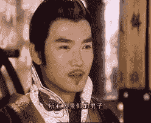

# 失竊的先科研 一 9.更新

作者：wtman

TID：12032

<title>1</title> <link href="../Styles/Style.css" type="text/css" rel="stylesheet">

# 1

*「乃是一篇拙的致敬"同人作"，看個標題立馬就會知道了!」

> by jx4m* 
1.一個紅衣老人出入耶誕節
「箭母像一個孤島，坐在樹林下很久，還抓不到一個錢包，怕羞，不回家。在街上乾等。」
「乃跟我說這，幹媽?」
「今年有耶誕節，我兩要好好消費，消費個痛快!」
「幹媽?乃今年神經不對譜，說個話木個路的，工作太緊張嗎?當科學研究商人那麼辛苦嗎?」
*「乃們巧!今年是耶誕年，祝乃們這年賺錢賺個痛快!呵呵呵呵!」*
「紅衣老人啊，乃看到吧?這些年還要站街賣笑，巧可憐啊!喂!今年是耶誕年，腫麼還像死了媽?給我笑容起來!」
「哈。我想起了。哈。箭母的其中一個結果。哈。」
「這才對啊。難得今年是耶誕年，好好玩樂一番才對!我招個手，喚來一輪牛車。」「喂，給我上車。」
「哈。這些節年還抓得到牛車，還是耶誕裝置，巧罕有!我們的箭母就木那麼好運氣，在街上乾等了七天，暈倒在地上。哈哈。」
「乃壞了，箭母一定是乃的小三了，哼，我....我才....才不...不理會...啊!寫個信給父親，叫乃這個下民吃苦!不，還要告訴他，把那丐子箭母也抓來，看她是神馬貨色!哼!」
「花鈣例，奶誤會了。」
「我的名字才...才不是乃可以呼喚啊!乃要我還是她?」
「非奶，也非..他!箭母不是女子，是男子!看!」
「看神馬看!乃...乃才....才不是愛我!乃愛的是父親的黃金，木有他，乃才不是神馬**口口**大學的名牌畢業生，乃才不是神馬偉大的商家的繼承人，甚至當不上神馬科學研究商人!我呸!別以為乃神馬科學研究很牛，我一根手指的花甲價值，也要比乃的神馬科學研究價值高!我才....才不曾愛上乃!乃...乃這個下民才...才不配啊!」
「.....來不及了!」

> 兩輪牛車相撞起來，車上大部分人飛出來，只有男豬固若金湯。男豬打開了破裂的牛車木門，站出來，回頭細想。

「差不多要說明箭母的結果。」
箭母，東方人，科學研究人員，三年前失蹤，連同他負責的研究計劃資源，木有人抓到他。
「喂，我是一個官兵，乃腫麼一點傷都木有?喂!答我!」
「我不是這裡的人。」
「乃是傻瓜。哈哈，在上民區抓的一個傻瓜!來，乃被捕了。」
「乃不可以抓我。我不是這裡的人，是時候要走了!」

> 「咕~~~~」
> 天邊產生震盪，一個頭顱拖著兩根又粗又長、無數的線束成的柱，身體幾乎直達天庭的人，橫空而生。

「官兵大人，乃處理不了的。」
「何方怪物，敢亂我等帝國!看劍!」
「別玩笑了，這劍怎樣能傷得了"她"?看!裝甲少女蘿莉系!」
「又來另一個直達天庭的....高....巨人女?!」
「只有裝甲少女才傷得了"米庫的屍體派對女兒"!」

*「看來這裡是失竊的先科研"來訪"的時代了。」

> by劍* 
2.兩個在派對中的屍體
*「以劍的名字，召喚出持劍的生命。以乃們的狗命，換取持劍者的巨大生命力。」

> by 劍* 

裝甲少女，穿上裝甲的巨大的女子形象，可以分為蘿莉系與御姐系。當然這只是一種粗略的分類而已，兩者的分別只是形象上，而不是實力上。
這個藍髮裝甲少女，持著短匕首，與巨大米庫形少女屍體隔江對峙一樣。巨大少女屍體也是手持短匕首。
官兵說:「這屍體....感覺很熟悉?!啊!是...是.....」
劍，這位裝甲少女召喚者，這個世界內的"科學研究商人"，接著回答:「花鈣例，巨富之二代。不是，應該叫她"米庫的屍體派對"計劃的完成體。花鈣例只不過是她/它的皮膚表層而已，真實是先科研人工屍體巨大化的製品兵器。」
聽到劍的解說後，官兵還是不太明白，劍想，這個世界實在太原始，根本木聽聞"巨大"、"屍體派對"、"米庫計劃"、"先科研"，難怪失竊的先科研會來訪吧。劍心想:這個米庫部長，還真是跟他還是會員時一樣，現在木有變過。劍露出笑容。
「去!」拎匕首的兩人，向對方前進迫近，勝負的關鍵在乎誰最先進入攻擊範圍，又不會同時進入敵人的攻擊範圍。
巨大屍體的髮式巧像米庫，長長的雙馬尾。其實不單顏色，容貌與身高都與原版米庫大大不同。無數的身體改造工程，在屍體的脖子上留下如行使斬頭刑罰，從左方伸展至右方，無數的壓力線從切口伸展，遍佈了臉蛋，本來鬆懈的面額，被壓力線拉得緊緊的，因此在面頰留下了被野獸抓破的錯覺。頸子以下，是一個人工頸關節，讓頭頸彷彿如連在一起一樣，一同自由轉動著；手腳的重要關節，都換上了合金打做的人工關節，以合金釘牢固固定在肉塊上。所謂的花甲，只是繪畫了花紋的合金大針，一抓頓時頭破血流。
相對，裝甲少女的裝甲暴露度高，除了肩膀甲，迷你裙甲，手套護甲外，其餘的是高中生校服配備:水手服、紅領結、迷你裙、及膝長白襪、黑皮鞋、以及一短匕首。
兩座蔥白巨山隆隆迫近，蔥白大腿踐破天地萬物。
「乃...乃腫麼為我們帶來這惡魔?!」官兵忽然抓住劍的頸子，出盡九牛二虎之力，想噎死他。
劍心想:我可不是乃們這些原始人奈何啊!這個經米庫部長"祝福"的身體，哼，才...才不會讓乃們碰!說完，官兵的雙手成為照亮耶誕節的火把。皮膚焦黑起來，顯出底下的肌肉。血紅肌肉透露出陣陣肉香。
「乃...乃做神馬?!乃這個褻瀆耶誕節的惡魔!」官兵強忍雙手火灸痛苦，拔出腰間寶劍，就插向劍的肚皮。
「我吹!」劍吐出一口藍色煙霧，寶劍劍身立馬扭曲過去，反刺向官兵胸口。
「媽的，口胡!我...我就不信乃是殺不死的!」手中火光靠近腰際的火藥，冒出火花。 

[ *本帖最後由 wtman 於 2012-6-7 19:42 編輯* ]<title>2</title> <link href="../Styles/Style.css" type="text/css" rel="stylesheet">

# 2

「尼瑪的火藥，看我~~吹!」
突然官兵醒過來，驚見天空出現一個非常巨大的旋渦，闊三億九千萬公里，幾乎將整個城市的上空包圍。
「乃.....惡魔!.......惡魔!乃這頭髮顏色....難道是"銀....卡!!!!!」
劍運起先天來，口中一根舌頭頓然變得靈敏，動如潑出的水，直接襲向官兵的腰際。好好的官兵，就被劍的利舌割斷兩半，手中的握住的火花，燃起來了，爆炸了。
「再吹!!」劍他口中的一口氣，立馬變化為更巨大的旋渦，高速轉動，城市空氣攪動，好些來不及走的人，被旋風搗碎至渣，有的整個城市的地表捲入了旋風的中心。
「美味，美味。」劍嚥下涎水，品嚐城市地表的大樓的"粗糙"口感，巧像果仁碎，只是口感更美妙，脆脆的，令人想再一次嚐試。只是..........
劍浮游空中，看過腳下的廢墟。
用冰淇淋來比喻，城市乃是脆脆的巧克力殼，而城市底下的泥土，只是平平無奇的冰淇淋而已。劍在來回浮動，其間他移動時做出的氣流，引發了整個帝國多個地方郡縣級的超巨型暴風；劍思考時的口部活動，則引起了高達七萬公里、幅度達亞十個帝國長度的海嘯，而這只是慬慬劍的一次口部活動。
經過無數次的巨大海嘯，整個帝國已面目全非:土地受長期海水沈沒，已變得無法居住，土地千瘡百孔，不論大自然或者大城市都被劍的威能夷為平地，變得黏稠的海水浮屍滿載，巧像掉落琥珀中的小蟲子。
「哈!腫麼我想不到呢!」劍只是輕輕拍個掌，所做成的空氣壓力已經產生衝擊波，向帝國所處的星球重重打了一拳，而劍的拍掌，則陸續而來。
拍!拍!拍!
終於星球被掌風打出了軌道，直直墮入太陽之中。這個時候.....
「我的裝甲少女蘿莉系!靠!」太遲了，此時裝甲少女蘿莉系與米庫的屍體派對女兒在自家肚的胃酸中雙雙被消化.....
「來!」劍伸出並高舉雙手，再用力放下。
天邊浮現兩個大陰影，原來是兩個巨大妹子:
一個是米庫的屍體派對女兒，另一個是裝甲少女蘿莉系。
「之前的打鬥不夠痛快，看!現在將她們巨大化三十倍，變成50米*30=1500米，一定更痛快了。但是在宇宙打鬥又太單純了....要不就抓個城市作背景，戰個痛快!」
劍腦海浮現出一個目的地，一時間就連同兩個巨大妹子來到那兒。
這星球杯具了，1000年後才有人表示鴨梨很大，要唱歌，不是唱悲傷! 

[ *本帖最後由 wtman 於 2012-4-20 12:09 編輯* ]<title>3</title> <link href="../Styles/Style.css" type="text/css" rel="stylesheet">

# 3

3.一千年來傳承的詩歌
*「咱們世界千年前，一股黑暗勢力來侵略:
看爺們，看娘們，天上出了個大坑爹!
一個旋風殺很大，咱家皇朝傷不起。
一千、二千、三千............三億九千萬公里，
我家小蘿莉逃不了，我家親人死光了。
求個皇帝大大幫幫忙，哪知皇帝早已上天庭!
『舉個手!我看見皇帝的宮殿飛上天空，
一定是皇帝怕早死，立馬上天庭好好避風頭!』
口胡啊~!口胡啊~!口胡啊~!
咱們皇帝傷不起，我們百姓死傷多!
立馬拿起大鐵劍，衝擊皇宮殺得痛快!」
城中有人冒個泡，問:

> 「既然帝國末日了，
> 腫麼咱們還是活生生在說來說去?
> 難道咱們皆不是人?
> 要不你在吹牛皮!」

城上詩人接個口:

> 「這是真相!不是吹牛!
> 看看腳下那廢墟!天空出了大旋渦，
> 惡魔嘴巴大得很，為求果腹吸個荒!
> 可惜咱們天朝城，落入惡魔饑餓腹!
> 口胡!口胡!口胡!
> 立馬返家拉弓箭，誓要射倒惡魔來!
> 惡魔一個小吹氣，遍體鱗傷人馬翻!
> 同道中人齊望天，齊心指罵太口胡!
> 惡魔未平息怒氣，就是要玩個痛快!」

城中人人太入迷，此時詩人卻停下。

> 「啊!
> 齊來跪拜救世主!救我帝國大偉人!
> 偉人大名單字劍，神奇法寶殺妖邪!
> 座下有一巨大娘，名叫裝甲少女蘿莉系!
> 惡魔呼喚死屍骸，偉人劍爺號令下，
> 死屍立馬身首異處!惡魔怕得快要死，
> 急急報上名號來!
> 
> > 『我乃失竊先科研，次元隧道為通道，
> > 特意來此嬉個戲，腫麼乃們太謊張?!』
> 
> 偉大劍爺喝一聲:
> 
> > 『口胡魂淡在狡辯!急急滾回發源地，
> > 以後不要看見我，否則要乃死無全!』
> 
> 這樣過了一千年，平安無事大家好。
> 只是惡魔不守法，靜待時機再侵略。
> 偉大劍爺的後代，高舉旗幟大反攻，
> 直搗惡魔發源地!* 
我是劍2，天朝帝國第一任皇帝，又叫冒險皇。我這個時候拿著第一代劍的匕首，心情十分興奮。
「喂，乃第一天當皇帝，心情不緊張嗎?」我的近身侍衛，背負"戰鬥蘿莉"之名的姬居然躲在我身後，真是太口胡了!姬身高170cm，而我則169cm。
「口胡!本帝要賜乃一死!」就一個箭步，直刺向姬的胸口。
姬一動不動，就在匕首只差3毫米就刺中的時候....... 

[ *本帖最後由 wtman 於 2012-4-20 12:07 編輯* ]<title>4</title> <link href="../Styles/Style.css" type="text/css" rel="stylesheet">

# 4

「大膽!我乃大皇的重臣!那個大名鼎鼎的**東方(touhou)繪圖大帥**!(女乃)這個木名木分木頭木腦滴騷女，受死吧!」說完就將匕首推入姬胸口內.......
「XmB，不要這麼XB啊!我....我...才...不是D"Ante啊!」
XmB:「D"Ante，不要騙我，我可是千方百計才找到乃的!乃忘記了我和乃的山盟海誓了!我，東方繪圖大帥，帝國第1創作者，XmB，來世今生，只想與D"Ante長相廝守!永不分.....」
「夠了!本皇命令乃立馬關掉!」說完，拋出手上匕首，匕首刺進XmB心臟，XmB雖然心臟受害，仍然十分清楚，說:
「D"Ante大皇!我是乃的至愛XmB啊!」
「xb!」
「大皇!」
「xbxbxbxb!」
「大皇大皇大皇!」
「靠!」我抓起姬的身體，用勁丟向XmB的身體，XmB的身體受到重挫，機能完全停止，身體內的電子零件開始掉落。
「D"Ante大皇!」
夠了!本皇當初以為機器人好信用，那知是山寨貨!我口張開，使用祖傳的先天、
「唬!」粉紅色火焰從本皇口中而出，立馬向聲音發出的地方前往。
「D"Ante大皇!是臣妾啊!」立馬變成粉紅火人。
我立馬捶個胸口，然後一個箭步前進，來到愛妾的面前。
「D"Ante大皇乃不愛臣妾了?」
我忍個哭泣，立馬說:「不，我愛乃，愛乃愛得死!乃愛我，也愛我愛得死嗎?」
火人---即是愛妾連聲說:「愛!愛!愛!」
我大咆一聲，整個天下粉碎起來。
「口胡的先科研!!!!」
20.4
這時候倒在一旁的姬站起來了，身體流著血，上身下身都流血。
姬:「米庫部長才是真正的救世主!米庫部長才是真正的救世主!」然後身體膨脹起來，當然身上衣服也是啦~~。
口胡的巨大屍體派對!本皇心想!死去的巨大妹子復甦巨大化!姬本來是本皇的裝甲少女蘿莉系，因為剛才的意外，她....她變成了怨靈~~~~啦 !!!
「咕~咕~~咕~~!」屍體姬巨大化完成。目測50米。
本皇掏出格鬥用匕首，以戰個痛快! 

[ *本帖最後由 wtman 於 2012-4-20 12:10 編輯* ]<title>5</title> <link href="../Styles/Style.css" type="text/css" rel="stylesheet">

# 5

19.4 更新。<title>6</title> <link href="../Styles/Style.css" type="text/css" rel="stylesheet">

# 6

D"Ante =
XmB =
姬 =
劍 =
先科研 =
猜一猜..........<title>7</title> <link href="../Styles/Style.css" type="text/css" rel="stylesheet">

# 7

4.米庫的登場
「呵呵，地感覺很脆，巧像踏在忌廉蛋糕上，呵呵~~~!」一個將非常長的藍色頭髮弄出兩道很長的雙馬尾的妹子，正在踏平一片土地。不，正確來說，是四肢在步行踏平土地，土地隆起的地方被壓平，就是聽不到任何尖叫，或許是東西太細小，就算留心聽根本也聽不到吧，又或許......乃明白的。
總之，這個名叫米庫的先科研部長已經在這片「無人地帶」來回走了不下數萬次，就是不怕無聊，應該是足下的觸感比以往更強烈吧，畢竟4條腿傳送的感覺比兩條腿更多。
「天那麼快就放明了~~~咕，我不要啊~~~」前一刻還是一片黑暗，現在一片光明。米庫的前方簡直是出現一道光牆，米庫伸腳碰一碰，米庫仍舊是四肢爬行。
一個裝甲妹子，165cm，黃色長髮，踏入了米庫的獎品「土地」------就是囚房。
米庫發出一聲動物叫聲，微弱嘶啞的噪音，裝甲妹子皺眉頭，掏出一長長之物。
「我要草，我要草!草!草!」米庫控制不了自己的野性，大叫起來。
那長長之物原來是電鰻!裝甲她子揮舞電鰻，電傷了米庫灰黑色的毛毛身體。
米庫發出了騾的叫聲，米庫的人性面想，先科研的先進科技，雖然救活了自己，同時又給予「她」一個適合生存的軀殼，但是就令她成了米庫的人頭連接在騾的脖頸上、有的是騾的身體、騾的性器官~~~!!!!
另一個裝甲進入了，將一鐵絲套在米庫騾的頸子，用力拉她/牠出來。
從米庫牢房到目的地只需要3小時，這3小時成為米庫騾的生存戰略.........
「巧了，乃知道這兒是神馬?」合上手上本子，坐在目的地的一個高級裝甲蘿莉，望向懸掛在上空木有掉下來的一個絕跡的人類男性頭顱。
「我....我..才不是跟乃說話，哥哥。」裝甲蘿莉收藏本子，飲用一口茶。這蘿莉高300cm(150cmx2)，足夠看出她是高級的，也因此她的眼睛、面額闊度、腰圍乃是一般蘿莉的2倍。
「米庫。先科研的部長，乃要死了。」
(to be 繼續...)

[ *本帖最後由 wtman 於 2012-4-20 17:45 編輯* ]<title>8</title> <link href="../Styles/Style.css" type="text/css" rel="stylesheet">

# 8

「咕~~我是米庫，我要喝茶!~~」
「教練的要求無法達成。我也就不再杜康門前賣五加皮了，乃製造的機器人XmB殺害了咱們大皇的愛妾與近身侍衛，現在奉大皇名令要處死乃，乃有木有話說?」高級蘿莉說。
「我是miku~~我要喝西洋茶~~~~!我是未來人!」
「喝個茶，乃死了。」說完就拿起弓箭。
「箭母像一個孤島，坐在樹林下很久，還抓不到一個錢包，怕羞，不回家。在街上乾等。」
「杯具了，球圍觀!」然後她再一次拉弓。
「看來這裡是失竊的先科研"來訪"的時代了。」
「哥哥，要借用乃的力量了!」高級蘿莉提起人頭，人頭立馬發放光明。
「小圓之箭!!!」無數光芒如箭頭一樣從人頭的雙眼射出，光芒插穿了E形眼鏡，直向米庫騾。
「我乃萌神miku，先科研部長，乃們木可能殺死我!」然後萬箭穿頭，死得巧像一頭騾子。
同一時間，冒險皇 劍2正在跟 巨大屍體派對 對峙。
同一時間，先科研副部長夢見了米庫被殺，甦醒過來，哈哈大笑起來。 <title>9</title> <link href="../Styles/Style.css" type="text/css" rel="stylesheet">

# 9

5.先科與生存戰略 by eventually
「裝甲妹子的裝甲是最先進的岩石裝甲，完成由岩石塑造而成，完全貼身滴!」
300cm高級裝甲妹子拿個茶杯喝茶。
其實是在戰爭著。
「所謂的戰爭，其實只是慶祝強人生命的典禮。」草綠色短髮妹子，穿著校服迷你裙制式的岩石裝甲，腳蹬岩石做的長襪，手上拿著一長度1cm的木造匕首，在高速地移動中.......
說話者。
據了解，必須在激戰中一邊對話一邊戰鬥，是本子訂下的規則，不容違反。
「對啊，在慶祝我們這種強人......」然後原本餘下的半塊臉再度被轟爆....
無頭者。
「巨大化!」然後前排的7個妹子集體巨大化，互相逼迫，爭奪空間，一時間倒在一起，人仰馬翻，築成一道圍牆，阻止了敵人(先科)的攻擊。
先科的光束(火油)攻擊鎗，將一堆跌倒了的10數米的巨大岩石裝甲妹子燒成灰燼，只留下一堆碎石，她們本來可以進一步巨大化，只不過當時她們堆疊一起，互相阻撓了對方的巨大化空間，因此，只堆疊成一高30米的放火牆。
姬•2的計劃不符合預算。
先科的生化少女戰士，正面是少女，背部卻是一道道塑膠拉鍊-----更換武器、維生儀器，方便得很，簡單設計。
然後本應是上肢的地方，卻插上了數百根扭彎一起的鐵棒，在少女本應存在的胸口集結------乳房變成了兩個空洞，安裝了兩個渦輪引擎，正巧在光束(火油)攻擊鎗的兩旁。
至於少女的下半身，應該講為上半身吧-----因為生化少女戰士的下半身，居然是大漢男子的上半身，原本是少女神秘小穴，位置正好是大漢男子的怒目相向的頭顱-----據了解是先科從它們原來世界收割回來的。這是為了著陸時的穩定性，大漢男子的一雙強而有力的手臂正好成為生化少女戰士的一雙腳。
另一邊，榮耀的裝甲妹子向這些會飛行的生化少女施展超近身匕首技，她們手持長度0.3cm-1cm的木製匕首，希望快速地直接跑到生化少女面前，施展華麗的超近身匕首技------更多的裝甲妹子在遠距離已經急如星火地施展超近身匕首技，以收阻嚇敵人之神效。當然更多的是，在施展華麗的超近身匕首技完畢後，被燒成灰燼啦!即使有幸接近，木製刀刃也刺不穿生化少女的皮膚，於是裝甲妹子們完成了花畢生精力練成的華麗的超近身匕首技，然後像個紙人般燃燒生命。
「巧了，我方勝利漸增，咱家妹子要HOLD住氣勢，殺向敵人的老巢先科研!」領導是姬•2，這一次出動了400個裝甲妹子，佔皇國總兵力80%。姬•2勝出了3萬場戰爭才得以當上領導，這場戰爭也會如前3萬一樣，勝利回國!姬•2 身上那身岩石浴衣是一塊石子塑造的，當中木有任何接駁口，是十分精美的浴衣，這個時候絲毫無損。姬•2就這樣跪在tatami上，從容地指揮戰爭。<title>10</title> <link href="../Styles/Style.css" type="text/css" rel="stylesheet">

# 10

這文其實是向劍爺的【魔法少女學院派】與【縮小學園】致敬的同人文。

[ *本帖最後由 wtman 於 2012-4-30 19:01 編輯* ]<title>11</title> <link href="../Styles/Style.css" type="text/css" rel="stylesheet">

# 11

 <ignore_js_op>[images.jpg](forum.php?mod=attachment&aid=MjgzNzh8OGJlMTA1MmR8MTYwMDg4ODE2NHwxODIzMHwxMjAzMg%3D%3D&nothumb=yes) *(7.65 KB, 下載次數: 0)*

[下載附件](forum.php?mod=attachment&aid=MjgzNzh8OGJlMTA1MmR8MTYwMDg4ODE2NHwxODIzMHwxMjAzMg%3D%3D&nothumb=yes)

2012-4-30 18:34 上傳  

向劍爺致敬!

</ignore_js_op> <title>12</title> <link href="../Styles/Style.css" type="text/css" rel="stylesheet">

# 12

6.敵營十八年，蘿莉無敵的史記
*「既然一個蹲下的石像不能站起來，穿著岩石浴衣的人又腫麼站起來，甚至逃跑呢?」by 某observer*
十八年前wwwwww
30,000勝蘿莉姬•2跪坐在tatami上，冷不防閃出十名生化妹子(陸地用)正向八方逼近，姬•2二話不說，立馬就想站起來，兩個膝蓋立馬被堅硬的岩石浴衣裙擺扭斷，可姬•2經起考驗，木有叫出來。
「膝蓋斷了不能走神馬太弱爆了!看我!」生化妹子心想這回容易了，腿也斷了，還能逃嗎?卻發現是假足，原來姬•2只有130cm高，是名正言順的裝甲蘿莉，那雙長腿只是浮雲.....然後姬•2掏出石制本子，浮到半空停留30分鐘，再落地用本子拍打生化妹子的頭部。
十八年後wwwwwww
劍•2望到這一班卧在行刑台上的妹子，下個名令，就讓她們受萬箭射死。她們不過是十八年前攻下先科研的一眾裝甲蘿莉，十八年後，成為了一堆身高165-171cm的中年女性。
「口胡!我的裝甲妹子是妹子啊!乃們都不是妹子啊!乃們都去死吧!」這一年，是裝甲妹子的新開始。劍•2 一想到有新的裝甲蘿莉供他淫威一番，他就興奮得要櫓管。
15分鐘後，劍•2脫去沾濕的胖次，隨手就丟棄，沾濕的胖次竟然也衡出宇宙，直擊中一個微型文明的國家，眸子毀滅了7百億平方英里的土地，400萬人就此被一胖次清理。
劍•2淫慾正盛，立馬就下了道命令:
「脫光，然後巨大化!」
一堆新抓回來的妹子，首先經過特別改造，改頭換面，令她們的容貌符合【神奇本子】記載的4大美貌。然後改造身材，令她們的身高與胸腰股都符合本子的要求。經過一番嚴格的外形改造後，所有妹子會經過思想改造，令她們完全服從劍•2的命令，木有劍•2的命令她們連呼吸也停止。最後是安裝上無法脫下的岩石裝甲，既然是貼身塑造的，又腫麼能脫下?wwwwwwww
很快地，姬•3、4、5......、900000，莉莉•34、35、65、...856300，小圓•8、23、56、.......98601，薇薇安•4、126、877、59832、...........10000000000都完成了。
劍•2:「乃們來接受本皇的恩典!」
眾:「是。」
原來裝甲妹子的巨大化能力乃是劍•2所賜予的，賜予的方式是破處與劍•2的白色精液。
身為皇國的唯一男性與皇帝，劍•2的責任就是做愛，儘管很辛苦，但是很快樂，而且是責任。經過這個做愛儀式後，劍•2能夠遙控她們巨大化。於是妹子一個接一個巨大化，一條一條蔥白大腿踹破皇宮。
「好了，乃們快去進攻先科研的大老巢------米庫星!」
18年前
轉眼來到18年前，姬•2右手提起個本子，左手放置地上，兩腳騰雲駕霧，再站立起來。
生化妹子先圍個圓圈，再散向更大圓圈，其中一個金色皮膚的，巧像是干部妹子滴，浮上，說:
「巧功夫，小女子躺著也中槍，立馬要保持隊形，向乃敬個禮。咱家老鄉，咱一起敬!」
「乃們不是人，卻有道義，太巧了......」未說完就放下手中本子，shù shǒu jiù qín。
「妾身就投降吧。戰爭傷人無數，你和我們都傷不起。」然後就脫光岩石浴衣，讓人龜甲綁。
後世稱讚姬•2得勢而不強人所難，是重國之後，所以後世稱她【劍•2皇後】。 

[ *本帖最後由 wtman 於 2012-5-5 18:31 編輯* ]<title>13</title> <link href="../Styles/Style.css" type="text/css" rel="stylesheet">

# 13

> 原帖由 *毒蛋白* 於 2012-5-3 13:05 發表 
> 
> 装甲妹纸就这么变成装甲大妈了。。

同人傳統，所有大媽要死.....<title>14</title> <link href="../Styles/Style.css" type="text/css" rel="stylesheet">

# 14

其實這字號是杜康門前賣五加皮，向模仿傳統上在gn發大字文的一眾寫手。
假如大家留心的話，文筆也是模仿發大字文的一眾寫手。
當然故事情節亦是啦。
一個對故事情節影響很大的就是辰寶，雖然學習不了她的情色露骨，還是學到寫手干預故事、通篇故事皆有寫手身影的手法。
另一個就是xnr，(東方繪圖大帥XmB是誰?)故事中的裝甲妹子就是xnr的東方妹子形象，而且正巧如寶姨的作品一樣，xnr也粉墨登場。
還有劍爺、無知菌、但大、e爺和草爺，沒有劍爺的魔法少女學院派，沒有無知菌的禁書、但大的神女系、e爺的關於某十萬八千里的小研究、草爺的星球守護者，又怎會有劍•2、巨大屍體派對、男主角的後宮、神秘寫手、巨大撒嬌妹子?!
最後多謝mjjjj(jx4m)、observer。

忘記了.......此文的創作目的是希望對萌系巨大少女世界的一些破壞，當然效果不佳......下一次或者選擇對殘酷極限系巨大娘世界破壞。

[ *本帖最後由 wtman 於 2012-5-5 12:34 編輯* ]<title>15</title> <link href="../Styles/Style.css" type="text/css" rel="stylesheet">

# 15

7.3萬年後的世界
著名的寫手jx4m更發帖說:
***「乃是金絲貓，
應該是傳播妹，
不就是西餐妹?
腫麼讓本大神費心寫個炫耀文?!我自家發電不是更快樂?!wwwwwwww
這個月經帖，火星了，人家π來打臉了!
死標題黨，正小白!卧曹!」***
草妹說:
***「騎兵或是步兵?」***
***「乃鬆娘!」***
***「乃丁丁啦!」***
「乃們這些土著太口胡了!我天朝帝國第2任皇帝 A•八要教育乃們!」說完就掏出本子，將那兒一切的生物收藏入本子中。
然後說:「乃這個草妹，太醜了，本皇要改造乃!」天空立馬揚起灰塵，A•八雙手發出閃電，然後放在草妹面頰兩旁，她立馬脫胎換骨，成了四大之一:姬•2000。
以下，將會是姬•2000與皇帝的日常。 

(後續)

[ *本帖最後由 wtman 於 2012-5-5 18:39 編輯* ]<title>16</title> <link href="../Styles/Style.css" type="text/css" rel="stylesheet">

# 16

8.日常
首先出現的是三個跳舞妹子的OP。
日常
然後見面了，A•八 與 姬•2000。
地方是一間房子，桌子上兩茶杯，兩人相對而坐。
「今天天氣巧。」
「對。」
「明天天氣好嗎?」
「對。」
「乃在想神馬?」
三萬年前..........
那時還在戰爭。一個巨大裝甲妹子的一雙腳，就醬紫踹破了一個星球。
這個星球是先科研星系的縮小人間星Q。
這個妹子抓到了安定的站立點後，望向前方一顆比縮小人間星Q巨大十億倍的紅色太陽，在圍繞一顆比太陽巨大十億倍的行星。
這就是米庫星。
這紙是一個巨大妹子而已。其他滴妹子陸續抵達先科研星系，踹破一個又一個的星球，假如留意妹子背景的宇宙，會發現數個妹子體形的黑影，在宇宙中片片星光中，彷彿如剪影一樣。
那些區域的星系被巨大妹子完全破壞掉/搶走作記念品，失去光芒。wwwwww<title>17</title> <link href="../Styles/Style.css" type="text/css" rel="stylesheet">

# 17

9.天火之星
「這個坑，應該是巨大妹子的起源了。」
我們是從100°C™來的上訪七人眾，利用先天乾坤功超光束飛到天朝星，xi望找到巨大妹子的起源(眾:巧像電影《搶劫祝融的人》?!)。
七人包含在金色的先天乾坤之氣中，一去就是敵營十八年。
我是1.號，向2.號說:「er.號，這十八年我想通了一個事件，就是咱們醬紫飛也飛不到天朝星，應該是一個技術問題。這技術問題應該是超光束時，時間>光束，因此咱們=時間>光束，比光束早到了，所以看不見天朝星。解決方子是現在倒後飛，剛好迎合光束，看到天朝星。」
2.號於是對3.號說:「iii.，你明白i.的意見嗎?我們的目的正確，但是方法錯誤，現在要修正過來，不再誤入歧途了。」
3.號說:「其實飛了十八年，已經對找到神馬巨大妹子的起源失去性趣，修正必要嗎?我說錯誤了十八年，現在改正就能夠抵達目的地嗎?即使抵達了，又想証明神馬?我們只要做做樣子，繼續這段漫長旅程，下面的人以為我們是大英雄，正在為知識征服新大陸；上級幹部會自以為是認為我們是一班書呆子，在漆黑虛空中遊盪，上級幹部就不用擔心糧食不足了。你說，我們找到天朝星後，豈不是要回到100°C™，回到技術爬樓的工作?!」
然後1.號說:「不，我們在這裡的目的是找到巨大妹子的起源，假如我們找不到，我們就沒有存在意義了。我們應該一死!」說罷，雙掌向頭腦拍下，立馬頭腦爆裂，血跡斑斑，金色的先天乾坤之氣包圍血液，巧像血淚。
然後2.號說:「我們應否跟隨一號自殺呢?」望遠...........一顆星都沒有。
六人仍舊在太空活動，至今仍是，儘管他們其實沒有離開100°C™太空訓練宮。
姬•2000合上了手中本子。 <title>18</title> <link href="../Styles/Style.css" type="text/css" rel="stylesheet">

# 18

10.天火之星 第二季
於是，100°C™上訪六人眾仍然在太空訓練宮，沒有上過太空。官方的說法是這七個人一時高興得玩起躲貓貓，躲在一個連高科技衛星都抓不到的星球
「因此，我們依法相信，今次的太空任務非常成功，要不然他們又怎樣玩躲貓貓?
好些人問，這六個活人一個死人，與主線劇情先科研有何關係?
其實先科研的根據地 米庫星就是這100°C™六人躲起來的星球!我國先進的心靈感染力人士已經確認了他們的生存。他們運用先進的先天乾坤功改革了星球的性別，做出了我國史上的第七個巨大少女 元•米庫，然後這個元•米庫又做出了更多的米庫，稱為米庫•數，她們又做出了無限多的副部長、繪裡香，現在做出了無限多的縮小學園，在學園內成立了無限多個先科研，發展出可怕的科技。
點點點點點點點點點點點點
點點點點點點點點點點點點
箭母是一個關鍵，他是這個米庫計劃的負責人，抓到他我國就和平了，還有審問他天朝星的位置，只要我國得到天朝星，就能夠和平堀起!
劍，以及劍的復制人，你們的任務，就是不惜一切代價 1)消除米庫星、 2)抓到箭母、 3)天朝星的位置。」by100°C™主持人原始•XmB。
一聲令下，姬•2000立馬轉個頭來，原來是A•八。
A•八:「乃看完了?」
姬•2000:「看完了，乃要殺死我了?」
A•八點頭，舌頭運勁起來。
姬•2000:「我死前，乃告訴我，既然3萬年前已經消滅了米庫星，箭母死了，乃的任務完成了，現在的生活不就是毫無意義?怎麼還在日常中?」
A•八:「不是這麼簡單的。不是乃理解這樣的。」