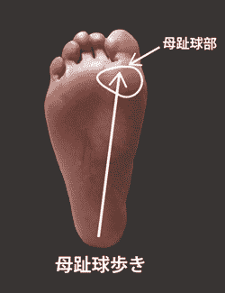

# 如何用機翻翻出好文章 (大概吧)

作者：that123

TID：19241

<title>1</title> <link href="../Styles/Style.css" type="text/css" rel="stylesheet">

# 1

*本帖最後由 that123 於 2015-6-20 23:03 編輯*

我知道這和原創文無關....
但我也不知道可以放那邊....

我毎篇文章總會有一個兩個人在留言: "日文幾級?" 這種問題。
我説一説我是怎様做的，有那些注意事項。

其中一個重點是用多個網站做機翻。

我平常用的主要有:
百度        [http://fanyi.baidu.com](http://fanyi.baidu.com)
excite         [http://www.excite.co.jp/world/chinese/](http://www.excite.co.jp/world/chinese/)
譯言堂        [http://www.mytrans.com.tw/tchmytrans/freesent.aspx?l=4&s=](http://www.mytrans.com.tw/tchmytrans/freesent.aspx?l=4&s=)

支援:
yahoo         [http://honyaku.yahoo.co.jp/](http://honyaku.yahoo.co.jp/)
Google        [https://translate.google.com](https://translate.google.com)

為什麼 yahoo 和 Google 是支援呢?
百度 excite 譯言堂 感覺上是日文直翻成中文
但坑爹地 yahoo google 是先 日文 -> 英文再中文的

原本日文翻成英文已經夠奇怪的了，還要把那些奇怪的英文翻成中文.... 那能看嗎?
我沒法證明yahoo google 真的是從 日文 -> 英文再中文，但相信我，那兩家的日文翻譯中文都不太好....

那為為什為要用 yahoo 和 google 呢?
因為有時候中文沒有完全對等的講法
或者無法生出過長的句子
有多字詞都會被機翻碾過，變成沒有了....
但英文不一様
英文一個字就可以表達多重意義
也支持複雜的句子結構
有時中文翻不出的字詞 英文反而可以看到
而yahoo更加有逐句翻譯 可以令你更容易看到那個日文詞 對應 那個英文詞

例如
中文: 千春褲 (百度)
有夠簡單的.....
英文: Chiharu panties (Google)
這様就可以看到千春的内褲了。 (講法有夠糟糕的。)

特别是句子較長時.... 中文會大砍字眼

以下是更加做法:
1\. 取出最好的一句作為原料。

俺は縮小された男子たちのもとへ駆けようとしたが・・・
百度:     我被縮小了的男子們的身邊還向陽子跑呢・・・
excite:    我打算跑到被縮小的男子們的原來,不過···
譯言堂:    我是被縮小的男子們的基礎向正要跑了然而．．．

yahoo:    I was going to run to reduced boys, but ...
Google:    I he tried to source of reduced male us, but ...

從前文後文得知excite最好，參考yahoo
取出excite再補正成:
我原本打算跑到縮小男的附近提醒他們,不過···

那就會很順。

2\. 擴寫 (註1)

赤みを帯びており、足裏にはチリがこびりついている。
百度: 帶紅色，並且是智利脚掌有黏著。
excite: 帶有著紅色，向腳掌智利諂媚附有ri。
譯言堂:  佩帶紅色，智利在腳掌附著。

yahoo: I am tinged with a reddish tinge, and Chile is stuck to a sole.
Google: It is reddish, it is caked dust on the back foot.

首先是猜意思，只看百度的話 "腳下黏著智利" 有點不妙呀
但Google説是Dust，那當然是用灰塵取代智利

重寫後:
帶有紅色的腳底上，有不少灰塵黏在上面。

但是，這様句子不夠飽滿。用點想像力吧。
千春剛剛脱襪子....除了腳上沾滿汗水之外，也會有.....襪子上的綿䋈。特别是運動後，把這個加進去吧。
帶有紅色也不好，不夠煽動。

所以再重寫後:
泛紅的腳底還黏著襪子的綿䋈和地上的白灰。

突然....妹子剛脱襪子的腳就在你眼前了.....

3\. 句子結構重寫 (註4)

日文和中文表達，文法上很不一様
以上一句為例
就算第一次重寫
帶有紅色的腳底上，有不少灰塵黏在上面。

也有很多不順的地方
例如這麼短的句子有逗號，念起來有點怪

所以我們要想辦法去掉逗點，把兩句寫成一句。
例如 襪子的綿䋈和地上的白灰黏在泛紅的腳底上

有時把第二句變為形容詞，再放到句子中就會很好。
英文Complex sentence用不好也是會有這個問題。
算是中文版的 adjective clause 寫成 Gerund 吧。

例如
帶有紅色的腳底上，有不少灰塵黏在上面。
變成: 黏滿灰塵的腳底泛著淡紅色。

當然也有反過來的時侯，我就不囉嗦了。

3.5\. 去掉"的的了了"

這部分是結構問題。
機翻會加上很多的的了了。
在翻時太多的的了了通常意味著要結構重寫。

4\. 同義選詞 (註2,註4)

機翻主要的是....不要錯。對於人類來説，用詞會有點不好理解。

例如:
高美は悠々とした表情で自分の足裏を見下ろした。
百度:    高美很鎮定的表情自己的脚掌俯視了。
excite:    高美以悠悠的表情俯視了自己的腳掌。
譯言堂:    高美因悠々的表情而俯視了自己的腳掌。

yahoo:    The high beauty looked down at one's sole with a calm expression.
Google:    Heights looked down at their feet back in leisurely death look.

這邊，鎮定和悠悠比，意思是差的沒有很遠。但這邊用悠悠會更好。

重寫後:
高美悠悠地看著自己的腳掌。

又例如:
形容肉感，日文會用繃緊這個詞
但這個詞明顯色氣有點不足。
緊緻。
想一想，一個女生會想被人用那個形容詞呢?
繃緊的大腿肉和緊緻的大腿肉，我會比較喜歡緊緻的大腿肉。

5\. 改動用詞 (註4)

改動用詞算是

例子有:
"安靜"改成"安謐"

這様你的文章就會更豐富，更有文學氣息了。
有時是因為同一個詞用太多次，令讀者感到疲累。

例如:
"白凈"變成"潔白"就很好。
文中一定會多次形容女生的肌膚有多好，一個段落就來個3次白凈，看也看膩了。
用一下潔白。文章整體不至於沉悶。

6\. 短語

有時日文有些短語和用詞機譯是譯不出來的。
原因很多，可能是方言，可能是沒有對應用詞。(沒有對應用詞我之後會再説。)

例如:
千春「うふふ！ざまぁみろっての。」

無論那一台機翻也翻不出 ざまぁみろっての 這個詞。
把這個詞拿去 Google 一下

Google ざまぁみろっての 英語

你會發現有人也會有你的問題，特别是在海外的日本人。這時你可以看到他們是如何解決這個問題。
在這邊就是 In your face! 。
再改寫成中文。

雖然也是不好改，但是也比翻不出好。
我的改寫:
千春 "哈哈哈！怎麼様！都死了吧！"*

7\. 註解

不用説，我的文章都會有不少註解。
主要是因為特殊用詞。

最好的例子有:
日文: そして親指の下にある母趾球にぺったりとこびりついてしまった。

何為 母趾球 呢? 所有機翻都翻不出來。
我找到了答案，
母趾球 wikipedia
[https://ja.wikipedia.org/wiki/%E6%AF%8D%E8%B6%BE%E7%90%83](https://ja.wikipedia.org/wiki/%E6%AF%8D%E8%B6%BE%E7%90%83)

是腳掌上大腳趾對下的那塊軟軟的肉。(特别容易長雞眼 =___= )

如果我把 腳掌上大腳趾對下的那塊軟軟的肉 塞進去句子.... 會有人看嗎?
這時用註解就好了。

ACG用語和捏他也請你標一下，畢竟不是每個看文的人也知道宅用語和捏他的。

8\. 符合原文風格

文章寫的出發點有很多，雖然多H為主。
但也有不同背景吧。

例如:
文章 縮小研究部 是同名遊戲的前傳。
縮小研究部:
[http://giantessnight.com/gnforum ... 9222&extra=page%3D1](http://giantessnight.com/gnforum2012/forum.php?mod=viewthread&tid=19222&extra=page%3D1)
我ACG用語會多一點，只要加入註解就好了。這様文章調皮一點，會更有遊戲感。

------18禁注意-------

而 另一篇十六夜的 １０万　お風呂　残酷？
１０万　お風呂　残酷:　
[http://giantessnight.com/gnforum ... 9197&extra=page%3D1](http://giantessnight.com/gnforum2012/forum.php?mod=viewthread&tid=19197&extra=page%3D1)
就要加多一點色氣。

原文:    「ふふ、今あたしのあそこには数千人の男がいる。もしかしたら数万人？　くくく、ひょっとしたら赤ちゃんできちゃうかも」
excite:    「fufu，現在數千個男人在我的那裡。如果如果做數萬人？　kukuku，也許有小寶寶」

重寫:
"呵呵，現在的我的體内有數千甚至數萬個男人向着我的卵子進發。嘿嘿，說不定會懷上小寶寶哦。"

這邊，男人被縮小得比精子還要小，女主明顯用了男人借代精子。
原文沒有卵子這個詞。
我就參考了朋友們在講房事時的"説什麼話可以令男朋友立即變成野獸"來寫。(註3)

有一個女生説，她的男朋友很喜歡她説"你的精子要把我的卵子團團圍住了" "卵子要著床了，要懷上小寶寶了哦。"
然後其他女生都在點頭説，他們男友也一様，明明有戴上套也是一様喜歡她們這様説。(有些男生只是一隻單"蠢"的小狗狗)
會立即又想把她們壓在床上......
這時，把文章寫得色一點也OK。

-------------------------

番外一: 錯别字 和 多出來的字
這部分.... 我自己也做錯很多，有小心去校對。但效果不佳。
原因是自己寫的文，很難會發現有錯，大腦會校動(系統一)，讓寫文人發現不出錯處。(聽説越聰明越有這個易出錯。)
其他人看你的文時，是要用更多腦力去看的，因為他們的大腦對這篇文一無所知。(系統二)
詳細可以去看 Thinking fast and slow 這本書。
wikipedia:
[https://en.wikipedia.org/wiki/Thinking](https://en.wikipedia.org/wiki/Thinking),_Fast_and_Slow

這部分....我只可以説....小心點....因為你總不可能叫其化人校對吧.....

番外二: 翻錯
雖然你已經用了多個網頁機翻。
但不代表你不會翻錯。
其實....我很多地方都只是猜的......
所以不要怕被人糾錯。

番外三: 擬聲詞
擬聲詞我是不翻的。
因為要想用那個擬聲詞很煩。
對文章沒有大推對。
已且很多擬聲詞也沒有對應的中文。
翻不翻就隨你自己。

説了這麼多，包含大部份情況，但還是有很多文章在翻時，會有不同的神奇情況包不起來。

這邊再説一點點我自己的譯者道德和感想。

道德:
1\. 附上原文連接和作者連接
2\. 先去信作者
3\. 翻的文最好是可以帶動這邊的人寫文的或者為這個癖好加入燃料的好文

最好是可以令寫文的人有參考用途的。反例子有，縮小研究部。
縮小研究部我覺得只算是自爽文....文筆沒有很好，描寫不深刻，心理活動和獨白單一，雖然後期有慢慢變好，看一看是不錯，但對於參考來説，價值少了點。

嘛.....但是有時翻自爽文也是OK的。

我之前翻的 改・ミニチュアの街 文筆OK，描寫也不錯，也有好好地寫内心獨白。然後很多人都有對我説: 開關又被打開了.....
改・ミニチュアの街:
[http://giantessnight.com/gnforum ... 8628&extra=page%3D2](http://giantessnight.com/gnforum2012/forum.php?mod=viewthread&tid=18628&extra=page%3D2)

感想:
可能是女生的關係.... 翻文時比較冷靜，沒有精蟲可以上腦。
翻得比較快。
但是我不認為自己有多厲害，説到底，也不過是拿了其他人的創意自己亂改而已。
我翻只為了興趣。翻的契機是因為自己用百度機翻看文時，有很多地方不順，一直想要把文修好，既然修好了，拿出來給大家看吧。
翻文比較不好的是....心得會少很多，也很少會有人給你建議，原因很簡單，文不是你寫的，提再多的心得意見都沒用，講了等於白講。
而且有什麼好提議的?
我猜這也是為什麼很少人會翻文的原因。
對自己沒好處，寫文還可以説是練文筆。

機翻更是如此，會50音的話，在學日文的話，你還可以説是為了學單詞。
好像我這個人，半個日文也不會的，翻出來，一點意義也沒有，就只有爽。
這條路不如其他人想的這麼好走，不是把用機翻一翻就可以出來的。
我也是有努力過，為了翻文沒睡覺。翻得快不代表不用時間或者很簡單......

--

註1: 不少真的會日文的人，會不喜歡這種自己亂加東西，所以加不加，風險自行承擔。也不要動到主線。
註2: 有時候比較好的詞不定是對的，説不定是機翻翻錯了....
註3: 女生在一起時，會有向對方抱怨的傾向，例如:"最近男友要太多了"。就像男生會在品女生一様，我們也是人，也會品一下男生，不代表是色女。不要隨便找你的女同學談這種事，會很尷尬的。(這邊有年紀比較少的純情Boy.... 提醒一下而已)
註4: 十六夜的文比較少這些問題
<title>2</title> <link href="../Styles/Style.css" type="text/css" rel="stylesheet">

# 2

*本帖最後由 that123 於 2015-6-21 21:37 編輯*

> [michael 發表於 2015-6-21 02:09](https://giantessnight.com/gnforum2012/forum.php?mod=redirect&goto=findpost&pid=258692&ptid=19241)
> 楼主非常用心。从几个例子细节能看出来。这是给我的第一印象。
> 
> 其实从会日语的人的角度来看，机翻即使再用 ...

感謝你説我用心!!!! 看來花點時間也是值得的....
老實説....翻了好幾篇....有時看到某些字詞也看立即知道.....
某如: 腳底.... 模型..... 縮小..... 灰塵.... 布魯瑪..... 死庫水..... 踩死.....
(╯‵□′)╯︵┴─┴有什麼用呀~~~~
是寫不出來 但看到也是有那個感覺....
也多一種技能.... 就是看到很亂的中文字時.... 也可以自動腦補......
(╯‵□′)╯︵┴─┴這又有什麼用呀~~~~
可能之後會慢慢再學一學日文...... (暫時要先弄好德文....)
可以加快翻譯

我也覺得機翻是黑魔法.... 也沒有什麼好吹噓的....
機翻也有很多不便.... 方言.... 就是其中一個......
但某些技巧正常寫文也會用到
例如少一點的的了了
多用同義詞 (用同義詞也是會花很多時間的)
句子結構等等

比起直接用Google 百度 機翻 我會接受你的建 下次會試一下再多用詞典
算是學日文吧~~~~~

我翻文時會代入角色，想一想要如何翻會更有味道~~~ 但是會花很多很多時間就是了

<ignore_js_op>

**img_1.jpeg** *(38.8 KB, 下載次數: 0)*

[下載附件](forum.php?mod=attachment&aid=NTI1NzZ8YmY3YWY4ZjR8MTYwMDg4OTcyMnwxODIzMHwxOTI0MQ%3D%3D&nothumb=yes)

2015-6-21 21:36 上傳

另外 這個.... 是母趾球..... 有中文嗎?
<title>3</title> <link href="../Styles/Style.css" type="text/css" rel="stylesheet">

# 3

> [taroxd 發表於 2015-6-21 08:12](https://giantessnight.com/gnforum2012/forum.php?mod=redirect&goto=findpost&pid=258702&ptid=19241)
> 其实日文水平要求并不高，查字典总能なんとかなる
> 
> 我自己觉得还是要中文水平吧。

太好了 另一個大神説我用心......

是的...
不懂日文但日文的詞量有增加
雖然學到的詞無法用在生活上就對了

我通常也只有改寫一下看起來沒味道的句子....
帶著紅色 我會寫成 泛紅 之類的

一開始看到智利還真的嚇到.....
但是我平假名和片假名也不知道就對了 (日文level: 黑魔法)
我會去學啦..... 總不能夠説:"我知道那個字 我有那種感覺" <=又不是魔法

錯别字的話....
我不知道可以給誰看耶........

聽説 渡航 的日文用得很深.... 不知道是真是假.....?</ignore_js_op>