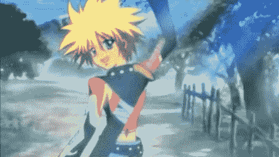
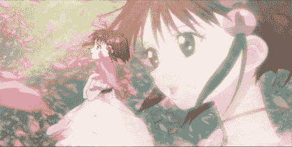
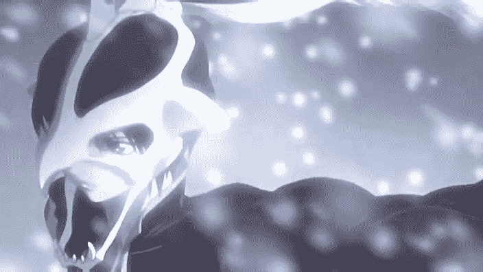

# 宿命傳說 （2010／2／4 更新至二章）

作者：艾格

TID：6467

<title>1</title> <link href="../Styles/Style.css" type="text/css" rel="stylesheet">

# 1

初入論壇,艾格(約修亞)實第一次發文,獻醜于此.

本文原创,借鉴PS2上Namco(南夢宮)公司著名遊戲<宿命傳說2>人物,改編同人,情節仿效並有大量改寫,融合原創GTS內容,望大家喜歡.
如有同經曆玩過此作同好,大可隨我一起重溫那段經典之故.

入鄉隨俗，特改成繁體文.至于文筆有不足之處,請見笑.

由于牽扯到經典遊戲之作,萬望同好不要轉載此文,以免造成其他環境影響.

                                                           宿命傳說   序章   英雄  (情節100%)

(41)
    一千多年前,一顆彗星沖向了這個蔚藍色的星球.沖擊造成的能量幾乎毀掉了這個星球,而爆炸造成的火山灰覆蓋了整個天空,暗無天日的冰川期即將到來.

    因爲大爆炸,地球上半數的人類都已經死亡,而剩下的人們面對嚴酷的環境幾乎放棄了希望.然而,彗星雖然帶來災難,但在它的殘骸中人們發現了一種具有極高能量的結晶體,人們稱它"透鏡".這給身處絕望的人們帶來了一絲希望.隨後人們開始圍繞透鏡進行一系列的研究,而空中都市戴伊克諾夫特就是這個時期代表人類智慧的最高之作,通過透鏡賜予的能量使得這個城市能維持在空中,人們終于見到久違的陽光.當然這僅僅是對于一小部分有"特權"的人來說,畢竟這個城市的容量有限,大部分“老百姓”還是生活在永無止境的寒冬裏.就這樣出現了天上人和地上人2大階級,天上人開始對地上人進行集權統治.而這種關系也成爲了矛盾的催化劑,終于有一天不堪重負的地上人揭竿而起,但技術的差距使得地上軍節節敗退,而天上軍的開發的無差別地殼攻擊兵器"貝爾格蘭特"也發揮了壓倒性的優勢.成也蕭何敗也蕭何,正是因爲天上王米克多岚"無差別"的攻擊學校,醫院這些民用設施,導致貝爾格蘭特小組轉投到地上軍陣營,與地上軍的天才博士哈羅路德.貝裏塞利歐斯聯手成功研制了可隨意使用晶術的區域作戰兵器"守護者",隨即組建了由狄穆羅斯,艾托懷特,夏露狄耶,克萊門提,伊肯迪諾斯以及天才博士的哥哥卡雷魯.貝裏塞利歐斯的守護者小隊,對應每人性格配合每一把守護者之劍,地上軍僅靠這6人之力打敗了天上軍,而卡雷魯與天上王米克多岚同歸于盡,天空都市沈入了大海.第一次天地戰爭落下帷幕.

    轉眼間到了十八年前,隨著歲月的流失,地球又恢複了生機,而一個名爲奧伯隆的公司進行著對透鏡的商業開發,因爲他對透鏡的需求狠大,透鏡獵人這個職業也隨之誕生,而守護者們因爲核心透鏡被投入了主人的性格,一直流傳至今,而且遇到人格相同的還可以說話...就這樣一個偶然的機會一個偷渡客:斯坦.艾魯隆,遇到了守護者之一的狄穆羅斯.而且同是異常熱血的他跟狄穆羅斯狠是投緣.也許這就是命運安排,因爲國王委派的調查任務幾個持有守護者的人聚到了一起:斯坦-頭腦異常簡單,性格極度熱血,狄穆羅斯的持有者;露蒂-爲了孤兒院而成爲透鏡獵人的拜金主義者,艾托懷特的持有者;裏昂.馬格納斯-奧伯隆總率的兒子,七將軍之一的他擁有高超的劍術和英俊的外表,同時也是夏露狄耶的持有者;伍德隆-凡達利亞的王子,沈著冷靜,少年老成,伊肯迪諾斯的主人;菲利娅-亞坦摩尼神團的祭祀,溫柔美麗,克萊門提的持有者.然而命運沒有這麽簡單,奧伯隆公司總帥休格一直在打著一千年前空中都市那個核心動力透鏡"神之眼"主義,而休格的計劃狠順利,成功奪取了被達利爾修伊特國王保管的神之眼.得知此事的幾個人來到奧伯隆公司尋找休格的下落,在地下溶洞,他們遇到的居然是自己曾經的戰友裏昂.不論衆人怎麽勸說裏昂依然擋在衆人面前.

    "不錯對于休格來說,我只是一顆用完的棋子,但是我也有我必須守護的東西,魔人暗!"

    說罷裏昂握緊手中的夏露狄耶向衆人沖過來,而夏露狄耶也打算誓死追隨主人,使得其他的守護者狠是不解.

    "露蒂.凱特雷特,這才是你的真正的姓,你和我一樣隨的都是母親的姓,艾米利歐.凱特雷特才是我的真名,從小父親就把我們分開.我的好姐姐阿,現在你知道了真相,即使這樣你還要殺我嗎?"

    聽到這些露蒂仿佛受到了狠大的打擊,癱倒在地上.

    "然而我可以殺了你們,即使是自己的親姐姐也無所謂,因爲我必須守護她!!!"

    但畢竟寡不敵衆,裏昂敗下陣來.這時溶洞開始坍塌,衆人被大水陰錯陽差沖到了奧伯隆公司的格納庫,而裏昂和他的守護者"夏露狄耶"長眠于地下......

    隨著巨大的聲響衆人被眼前的景象驚呆了,一千年前沈入海底的空中都市戴伊克諾夫特居然浮現在空中.而巨大的無差別地殼破壞兵器貝爾格蘭特也蓄勢待發.原來這才是休格盜走神之眼的真正目的.衆人來到休格面前,發現休格居然拿著已經在第一次天地戰爭中與米克多岚同歸于盡的最強守護者:貝裏塞利歐斯!

    "本該死了的我卻還活著,這意味著什麽呢!"

    隨著這把守護者的自我介紹,大家終于明白之所以休格會做出這些事都是因爲貝裏塞利歐斯!不,確切說是米克多岚.在米克多岚死後擅長精神控制的他把自己的意識投入到貝裏塞利歐斯中,以至于休格被他所控制.米克多岚一直不甘心失敗想重新贏得勝利.但最終他又一次必然的倒在了守護者的手中,但臨死前他啓動了神之眼,讓空中都市墜向大地,想把全世界拉去給自己做陪葬.危急時刻,守護者們提議把它們插入神之眼,用自己的核心透鏡與神之眼共鳴,從而引爆這個空中都市.4英雄依依不舍的把自己的守護者插入神之眼,隨著空中都市的解體,第二次天地戰爭落下了帷幕.

                                                            宿命傳說  一章   邂逅  (情節60%)

(113/264)
威爾特森林(11)

    "吼~~~~~~~!"森林中傳來怪物吼聲.
    "凱伊路,怎麽辦啊?"
    "我好害怕,凱伊路..."
    "沒關系,不管怎麽樣,我也一定會保護大家!"一頭黃色爆炸頭,看起來賦有熱血正義感的少年,此時正握緊了手中的劍,擋在了2個似乎年齡更小的孩子面前.離他們不遠處,一頭饑餓的野熊冒著血紅的眼珠正盯著他們.
    "額啊~~!"少年主動沖了上去,但他的揮擊輕易的被熊掌擋了下來並且連人被摔倒在一邊,似乎這一下已經使他支撐不住,單漆跪倒在地上"絕對...要保護..."

    ......
    "太好了，是羅尼哥哥..."
    "快,幫助凱伊路,他昏倒了..."
    ......

庫雷斯坦.迪納米斯孤兒院(37)

    "這裏...是什麽地方?"少年睜開了眼睛,只見眼前一頭白色碎發,非常精幹瘦身的年輕人"羅尼啊..."
    "你醒過來了,凱伊路?放心,已經回到庫雷斯坦了,我先讓孩子們回孤兒院了"被稱爲羅尼的年輕人說道"真是的,你剛才太亂來了啊."
    "對不起,羅尼.好不容易才見面,卻給你添了這麽大的麻煩..."
    "麻煩?太客氣了吧凱伊路,我們不是同伴嘛.而且,我加入亞坦摩尼神團,也是爲了孤兒院啊."
    "羅尼..."
    "不過剛才的事千萬別告訴露蒂阿姨哦,否則會大事不妙的..."

    羅尼說完就出門了,隨後從屋外傳來"凱伊路你好好休息,好久沒來過這裏了,我去參觀下孤兒院,順便拜訪下阿姨"

    少年獨自躺在床上,雖然傷勢沒什麽大礙,但依舊一臉苦惱著.之前興風作浪小夥伴們一起進行真正的冒險,認爲只玩遊戲沒意思,結果遇到真正危險...
    "(我真是沒用,身上明明留著英雄的血液,爲什麽連一頭怪物都打不過...爲什麽連同伴都保護不了...不管怎樣,我一定要成爲一個大英雄!)"

    想罷,少年躍身而起,正撞見羅尼.

    "凱伊路,這麽快就精神好起來了啊"
    "羅尼,我..."
    "好了好了,我當然知道了,不用說了."羅尼接著說道"我這次來就是來找你一起去冒險的!"
    "哎?"
    "知道嗎,我在神團得到個傳聞消息.如果那個傳聞是真的,就可以將孤兒院修複一新了!"羅尼得意的說道"在這附近,有個拉古那遺迹對吧?那裏的最深處,神團發現了一個巨大的透鏡結晶.神團方面得到情報後,就立即派遣達利爾修伊特的調查隊來到這裏,而我就是擔任這次的護衛任務."
    "但是,這跟孤兒院修複有什麽關系麽"
    "嘿嘿,聽了可不要嚇一跳,據說那個透鏡結晶價值...少說也有300W加路德!"
    少年瞪大了眼睛:"3,300W加路德!!??"
    "總之呢,得到它話孤兒院就可以重建,露蒂阿姨也不用那麽辛苦了."
    "那我們現在就走吧!別被那個調查隊搶了先!"
    "等等,既然我是專門護衛調查團的,沒有我在話,調查團也不會輕舉妄動的.而且聽說拉古那遺迹甚是危險,最好你和露蒂阿姨打個招呼吧"
    "不行,媽媽不可能讓我去的,你也知道.整天就說我是爸爸唯一血脈,現在爸爸出去辦事一直沒回來,就更擔心我會出事."少年不忿的說"我正是因爲流著爸爸媽媽的血液,才更要象他們一樣做個大英雄啊.在爸爸還沒回來的這段時間裏,我決定要保護這裏,所以羅尼,我們現在就去拉古那遺迹,把透鏡結晶給帶回來!"

    此少年正是舊世4英雄之一的斯坦和露蒂的兒子,凱伊路.迪納米斯,15歲.頭腦簡單,極度熱血,象似了他的父親-斯坦.艾魯隆.
    <ignore_js_op></ignore_js_op> **&#20975;伊路2.jpg** *(25.59 KB, 下載次數: 5)*

[下載附件](forum.php?mod=attachment&aid=MTY4NTN8OTlkYmQ0NWJ8MTYwMDg5MTg4N3wxODIzMHw2NDY3&nothumb=yes)

凯伊路

2010-1-28 17:25 上傳

    而羅尼.迪納米斯,22歲.自幼時就是被斯坦和露蒂收養的孤兒,由于有著某種緣由,一直扮演著凱伊路好大哥的形象,似乎還對凱伊路流露著特殊感情.
    <ignore_js_op></ignore_js_op> **&#32599;尼2.jpg** *(21.13 KB, 下載次數: 0)*

[下載附件](forum.php?mod=attachment&aid=MTY4NTR8MzZjMTdjODB8MTYwMDg5MTg4N3wxODIzMHw2NDY3&nothumb=yes)

罗尼

2010-1-28 17:25 上傳

    此時,羅尼聽到凱伊路的話語後,不免流露出傷感神情.
    "(......斯坦叔叔,對不起.我一定會保護好凱伊路的,即使犧牲自己...)"

    就這樣,羅尼在未與調查團碰面前先和凱伊路來到了拉古那遺迹.

拉古那遺迹(40/88)

    拉古那遺迹是一個早已荒廢的室外廢墟,由于地處偏僻,常有怪物出沒,加上遺迹內機關重重,已經十多年沒人特意訪問于此.羅尼帶頭步入遺迹,只見遺迹內綠藤亂處,磚瓦鋪地,時而聽到細水點聲,給人一種陰松清幽的甯和氣氛.

    由于遺迹面積廣大,層次錯章,兩人調查了大半天,仍然毫無傳聞透鏡結晶的影子.

    羅尼有點懊惱"看來傳聞終歸是傳聞,凱伊路,我看天色不早了,露蒂阿姨會擔心你的,我們還是明天再來尋找吧."
    凱伊路顯然還處于十分興奮狀態"這就是冒險啊!前面,那裏我們還沒上去過!"
    凱伊路跑到一個酷似祭壇的一個場所,只見祭壇向上的台階正中放著一個紅色箱子"羅尼!快看!這裏肯定放著我們要找的透鏡結晶!"
    "等等!別亂碰!"羅尼迅速跟來"那是..."
    話還沒說完,凱伊路已經打開了箱子"什麽都沒有啊"

    轟轟轟...!整個祭壇震動了起來."凱伊路,危險!"羅尼上前抱住了凱伊路.只見祭壇隨著震動開始下降,羅尼盡量用身體護住凱伊路而承受著因震動帶來的磚瓦砸落.

    2分鍾後,祭壇停止了震動,兩人擡起頭來,十分驚谔的發現整個祭壇下降了大約有20米,而祭壇的台階正好連接著向上的出口.

    "凱伊路,你還好吧.我們快離開這裏"
    "羅尼,快看下面!"凱伊路張大了嘴巴"是透鏡!"

    祭壇台階下面所通往的是一棵古老的大樹樹根,樹根上象是鑲嵌著一個十分巨大的透鏡,半徑大約有半米的樣子,晶瑩透亮,光彩奪目.

    "這確實能值300W加路德啊,羅尼!"凱伊路一邊說一邊走向透鏡結晶"可是,我們怎麽帶走它呢?"
    "凱伊路..."羅尼看著如此大的透鏡也十分吃驚,一時不知說什麽.

    凱伊魯不禁走到透鏡前用手摸了一下.突然,透鏡發出奇異的光芒,越發閃亮.羅尼一個箭步沖前撲倒凱伊魯,說是遲巨大的透鏡結晶發生了爆炸,晶瑩的透鏡碎片散落在祭壇周圍的空氣中,樹根上,台階上,以及凱伊路和羅尼臥倒的身上.當兩人擡起頭時,不可思議的事情出現了.原先透鏡結晶位置此刻濃密的碎片中出現了一位少女!看樣子似乎也只有15歲左右,皮膚粉嫩雪白,著實清純可愛,此刻正一絲不挂,雙眼緊閉,漂浮在空中.只見她緩慢舉起胸前的圓形項鏈,光芒四射,忽然間,從腳開始往上,她的身上象變魔法一樣出現了紅色鞋子,粉紅褲襪,粉紅內褲,粉紅衣裙.此種衣裝在這個時代顯得是那麽獨特罕見,可愛迷人.少女緩慢睜開雙眼,雙腳落地,看了下周圍環境,也看了下凱伊路和羅尼,就向著祭壇台階上走去.
    <ignore_js_op></ignore_js_op> **利&#20122;娜4.jpg** *(24.82 KB, 下載次數: 0)*

[下載附件](forum.php?mod=attachment&aid=MTY4NTJ8OTk2NDI2NWJ8MTYwMDg5MTg4N3wxODIzMHw2NDY3&nothumb=yes)

神秘少女

2010-1-28 17:25 上傳

    "等...等一下"凱伊路十分驚訝的看著眼前的可愛少女,似乎也叫住了少女的腳步"你...你是?"
    少女想了一下,頭也沒回的回答道"英雄...對,我是來尋找英雄的"
    一聽到這裏,凱伊路馬上十分興奮起來.起身跑到少女面前"英雄?英雄的話,你已經找到了!"
    "......"
    凱伊路手舞足蹈的說著,一旁的羅尼感覺有些無奈.凱伊路繼續說道"雖然現在還沒什麽作爲,但總有一天.不!我一定會成爲英雄的!"
    說著,還把自己胎迹向少女展示"看!這就是英雄的證明,和父親一樣!"

    少女稍微沈默了一會,緩緩舉起胸前的項鏈,閉上雙眼.項鏈發出光芒,少女周身被一道粉色的光圈環繞住,大約半徑2米,並且也同時罩住了面前的凱伊路.正當凱伊路觀察少女舉動疑惑時,瞬間發現眼前的少女不斷變大,最終自己只有面前少女的紅色鞋子一樣高.凱伊路驚訝發生此不可思議現象本能向後退了幾步差點倒地,此時才發現少女巨大紅色鞋子不是普通材料所制,似柔軟似韌性還帶著透亮,再往上看,性感的褲襪和小褲褲也都是如此.少女此刻雙眼仍然閉著,並緩緩將項鏈放下.

    "凱伊路!凱伊路?"羅尼對凱伊路消失不見的情景甚是驚訝"你在哪?"
    "羅尼!我在這!"凱伊路看見巨大少女身後,羅尼也是如此巨大"羅尼你也變大了?"
    "凱伊魯?你怎麽這麽小?怎麽回事?"羅尼發現少女腳下的凱伊魯,正要過去.
    "等等,我只是測試下..."少女喊住了即將步入粉色光圈的羅尼,慢慢睜開眼睛,低頭望著只有自己鞋子高的凱伊路,並且突然擡起了紅色鞋子向凱伊路踩去.

    凱伊路毫無防備的被少女踩在她紅色的鞋子下.

    "可惡,我被這個女孩縮小了,羅尼"凱伊路終于明白了自己處境,被少女踩住動彈不得.而少女也只是輕微的將腳踩在凱伊路身上.
    "快放開他"羅尼拿出自己在亞坦摩尼神團的專用銀斧正要威脅少女.
    "敏捷程度不夠"少女毫無理會一旁的羅尼,冷冷的說道,並且將腳上力道加重了些.
    "啊..."凱伊路承受住少女加重的踩壓,但難免痛苦的叫出了聲.

    羅尼見少女加重了對凱伊魯的踩壓,而少女完全不理會自己的威懾,著急異常.雖然自己在神團准則裏從不對女孩子出手,但是今天發生的事聞所未聞,眼前這個少女竟然神奇般憑空出現,又將凱伊路神奇般變小,以自己在神團多年的戰鬥與任務經驗都不能用常理解釋目前發生在眼前的現象.唯一肯定的就是該少女不是普通常人,何況面對的是凱伊魯的大危難,念頭一閃.

    "阿啊啊!"羅尼做著樣式沖了過來並將銀斧坎向少女的纖細腿部,試圖迫使少女將踩住凱伊魯的紅色鞋子移開.但是,就在沖入少女周身那道粉色光圈刹那,羅尼連人帶斧也都如凱伊魯那樣瞬間被縮小到只有不遠處少女那只依然踩住凱伊魯的紅色鞋子般高度.

    "力量也不足..."少女依舊冷冷的聲音,依舊沒有注視到羅尼的舉動"英雄...不是這樣的"
    "恩...恩...我知道我現在確實不夠做...做英雄..."凱伊路此時被少女牢牢踩在鞋底,卻依然顯得不服氣狀"總有一天...我會讓你承認我是英雄的"
    "......"
    "凱伊路!凱伊路!"羅尼憤然跑到少女那只巨大紅色鞋子底下,竭力用銀斧往上頂住少女的鞋子.羅尼知道,只要少女此刻輕易一踩,凱伊魯必將喪命,要讓自己如何面對斯坦叔叔!
    "......"少女似乎猶豫著什麽.
    "求求你!"羅尼見眼前這位可愛的少女仍然死死踩住凱伊路在思考著什麽,而自己也被同樣縮小而對眼前凱伊魯的痛苦無能爲力,意識到少女必然有著某種特殊能力,持斧單膝跪地懇求于巨大少女"求求小姑娘放了凱伊魯吧,我們無意與你爲敵,更不是你要找的英雄.凱伊路剛才話語多有得罪小姑娘之處,懇請讓我來替代,請小姑娘腳下留情!"
    "凱伊路...嗎"少女似乎聽到了羅尼的懇求,也收回了踩踏在凱伊路身上的紅色鞋子"對不起.只是,你...不是英雄"

    少女再次閉上雙眼,舉起項鏈,一道白光閃過,少女周身粉色光圈已經消失.

    "餵,等一等"凱伊魯不顧全身疼痛望向巨大少女即將離去的身影,想挽留住她,盡管還有話想對她說,但是似乎是不太可能樣子,對于凱伊路和羅尼目前仍然縮小的處境.但不遠處少女確是停住了腳步,從背影上看她再次舉起那個胸前項鏈,一道粉紅色小光圈從少女身前上飄來,緩緩包圍住了凱伊路.凱伊路疑惑著看著少女再次釋放的法術,突然間覺得全身痛楚消失怠盡,並且似乎還新生出一種油然帶發的力量.

    "對不起...你們最好再休息會,恢複需要點時間"少女徑自離去.

    "好奇怪的女孩"凱伊路感歎道,回頭看到羅尼仍然一語不發"羅尼?你怎麽了?"
    "哦不,沒什麽...這女孩究竟是何方神聖啊"羅尼似乎還心有余悸的說道.
    "她在尋找英雄啊,對,一定會是我!"
    "你還想被她踩是嗎?你知道我剛才多擔心你啊"
    "可是,我不覺得她會踩死我啊.我倒覺得她狠孤獨,而且還有點可愛"
    "確實..."羅尼若有所思的樣子,但一下迎笑住凱伊路"凱伊路,莫非你對剛才的小姑娘~~~喜歡上了?"
    "羅尼!"凱伊魯臉若有所紅"我只是說要成爲她所要找的英雄!"
    "嘿嘿!不是一個意思嗎?"
    "隨你怎麽說了...啊,羅尼,天都快黑了"凱伊路望向祭壇台階上方"我們現在還是被那女孩縮小著,怎麽辦呢"
    "按那小姑娘意思應該是再等等看,..."

    話說著,凱伊路與羅尼都同時恢複了大小.

    "真是不可思議呀!那個小姑娘從透鏡結晶裏突然出現,突然把我們都縮小,還說什麽尋找英雄?"
    "追啊,羅尼!"凱伊路好象沒有打算放棄的樣子.
    "追?那女孩?"
    "快點呀!我要向她解釋清楚"

    羅尼無奈的跟著凱伊路向遺迹出口跑去.

拉古那遺迹的出口(34)

    "該死的羅尼,請假半天說去探親,都什麽時候了,還沒出現!"此時在遺迹入口處,達利爾修伊特的調查隊的隊長正在與2位隊員翰斯與懷特相互說起羅尼.
    "隊長,我看我們不等他了吧"
    "是啊,我們直接去尋找吧"
    "你們沒看天都要黑了!沒有神團專門人士護衛,還要夜間進行調查,風險是何等的高!這個該死的羅尼!算了,我們明天再來吧"
    "等等,隊長"
    "隊長,遺迹裏好象有人出來了"
    "什麽?難不成是羅尼?"
    "不是,是個女孩"
    "好可愛的小妹妹啊"
    "警惕點,這個女孩服飾我在神團從未見過"隊長奇異的看著眼前緩慢從遺迹裏走出來的粉紅色衣裝的少女,獨自自語"好奇怪的女孩,這個服飾..."

    少女獨自來到拉古那遺迹出口時,正遇上羅尼此次擔任護衛的達利爾修伊特調查團.少女停下了腳步,稍微注視了下調查團的3人,似欲詢問什麽,但仍然冷漠的徑自往前走去.

    "這位小姐,你是從遺迹裏出來的嗎?"調查團隊長攔住少女.
    "請問,斯特雷萊斯大神殿怎麽走?"少女開口道.
    "哦,難不成你是大神殿的神官?"隊長松了口氣"天也晚了,看你一定是迷路了.從此處順著道路往西北方向走就是古都達利爾修伊特,到達古都後再往北走不遠就是哈門茨博雷山谷,穿過山谷就到聖都艾古雷提了.不過,小姐你到遺迹是..."
    "...謝謝"

    少女沒等隊長話說完就往山谷方向走去,留給調查團隊長些許疑問.不過此刻翰斯和懷特則亂心大起,似乎對那可愛少女有些想法.

    "隊長,羅尼還沒來,今天調查計劃已經泡湯,何不幫助剛才的神官小姑娘護送到聖都呢?"翰斯說道.
    "是啊,馬上就要到晚上了,一個小妹妹行走山谷多有危險"懷特也附和起.
    "我看那個女孩最大的危險就是你們2個吧"隊長看出2人的一貫惡趣味,厭煩道"護送不是我們調查團的職責,今天任務中斷,明天早上繼續.剩下的隨你們主張吧..."
    "那隊長,明天見!"翰斯和懷特果然朝著少女離去的方向追去.
    "別給大神殿與神團間添麻煩!"隊長不忘補充道.

    此刻,凱伊路和羅尼也來到了遺迹出口處,正遇到調查團隊長.

    "羅尼?!"隊長看到羅尼也從遺迹裏走出來"羅尼!你怎麽也在遺迹裏?你難不成搶先私自去尋找透鏡結晶了吧!"
    "啊...這個...狠多話聽我慢慢說"

    結果羅尼終究無言辯解,何況身邊還有個頭腦異常簡單的凱伊路在,絕對會串綁.達利爾修伊特調查團隊長憑借自己多年豐富調查經驗完全不相信羅尼所說透鏡結晶變出一個少女說法,于是先將凱伊路和羅尼2人以偷竊神團重要研究物的罪名抓到了達利爾修伊特的監獄裏.

哈門茨博雷山谷(73/94)

    少女經過古都達利爾修伊特後北向來到哈門茨博雷山谷口,踏上了連接進入山谷唯一的一段橋梁上.而達利爾修伊特調查團的2個隊員翰斯和懷特此時也興匆匆趕到,雖然天色已黑,但2人一眼就瞧見橋段上全身閃著微粉色光彩的那位可愛的少女.

    "真是好可愛的神官小姑娘啊"
    "是啊,我們真幸運!不過有點奇怪,那位小妹妹衣飾似乎還透著光"

    "你們,是剛才的..."少女停下腳步,察覺到他們的跟來.
    "我們特意關心你的安危,前來護送你去聖都"
    "對啊,可愛的小妹妹"
    "......"少女毫無理會2人,邊繼續走邊說道"我不是你們說的神官,請不要跟來"

    眼見可愛又有點不可思議的少女走過橋段,翰斯和懷特怎可能放過今日的紅運,何況現在少女自稱不是斯特雷萊斯大神殿的神官,那麽做出什麽過激之舉也自然不會牽扯到神團的名譽上.這麽想著,2人不懷好意的再次跟了上來.

    "小姑娘~"翰斯主動上前抓住了少女雪白粉嫩的玉臂"看來你對我們誤會了,我們不是壞人啊"
    "...!"
    "對啊"懷特也上前壞笑著,用手摸著少女穿著帶著亮光的粉紅衣裙的後背"這個感覺!小妹妹你的裙子好光滑柔軟啊,不是普通材質的吧"說著,另一只手正向少女裙下摸去.
    "你們!邪惡之徒!快放手!"
    "嘿嘿,要是我們不放呢?"翰斯開始撫摩起少女的柔滑玉臂,並時而向少女胸間遊走.
    "小妹妹長的真讓人尤憐啊,連這裏都這麽可愛"懷特此刻另一只手正隔著少女一層薄薄的小褲褲,感受著少女獨有的美妙氣息.
    "啊!"少女一驚"既然這樣,我只能不客氣的懲戒你們了!"
    "呵呵,如何懲戒...?"

    少女未等翰斯話說完就強行掙脫了2人的侵擾,轉身冷冷的看著2人.少女沒有再多說什麽,閉上雙眼,緩緩托起胸前項鏈,只見一道亮眼的光芒自少女胸前放出,在已黑寂的山谷中顯的格外耀眼.而翰斯和懷特也驚異的用手護住面額避過光亮,忽從後方橋梁處發出莫明的斷裂聲,又覺得山谷地面有所微震,待光亮消逝轉向少女方向時,只見2個巨大的紅色晶亮的物體出現在他們面前,即使在黑夜裏也能自動發光一樣.不僅如此,紅色晶亮的物體上面,還各連接著1根粉亮的柱子,再往上看時,2人終于認清這就是剛才的那位少女!變的如此巨大,大約有60米高的樣子.而眼前巨大紅色晶亮物體是她那可愛鞋子,2根粉柱則是她的纖細玉腿!

    "小,小姑娘,你..."

    翰斯驚訝的說不出話來,而懷特顯然因爲從沒見過如此巨大可愛少女的誘人景象,完全不顧眼前形勢不由的擡頭色咪咪的欣賞著巨大少女的裙下春光.
    "無恥!"少女滿臉羞紅的察覺到懷特的目光仍死盯著自己裙下,氣憤的一腳就把看的入神的懷特踢飛出數米.
    "額..."懷特飛落而倒,這一踢差點使他昏了過去.此刻他捂著肚子正顫驚驚的望著巨大少女,似在想著什麽,又似在驚訝著什麽,又似還沒從剛才那一踢中緩過神來...

    翰斯倒有幾分理智,見到懷特被巨大少女很很的踢飛了出去,明顯感覺到她的敵意,遂拿出腰間配劍企圖隨時抵擋巨大少女可能的攻擊.少女先沒有理會飛出去的懷特,反而轉向了近處持劍的翰斯,目光憤憤的盯著他.

    "你,你怎麽變的這麽巨大"翰斯顫抖的說著"你到底是什麽人?"
    "將邪惡之徒補充能量!"少女說著聽不懂的話,一步步向翰斯走來,並擡起巨大的紅色鞋子,踩向翰斯.
    "唔..."

    翰斯躲閃不及只能用配劍抵擋住巨大少女鞋子的踩壓,可是奇怪的是被翰斯劍刃很很抵觸的少女巨大紅色鞋子底部竟然一點劃痕都沒有.翰斯逐漸支撐不住少女巨大鞋子給予的由上而下的重量施壓,被整個紅色鞋子壓在巨大少女腳底.而對于少女來說整個踩踏過程也只是對准腳下3厘米多高的翰斯輕輕把腳放下來而已,緊接著她便把自身重心逐漸移至踩壓翰斯的鞋子上,只聽到"叮"一聲,從少女腳下掉落出半片劍刃,少女只遲疑了1秒,仍然毫不留情的踩了下去...

    "不要...不要...啊...!"翰斯發出淒慘的叫聲,瞬間被巨大少女踩平于她可愛的紅色鞋子下,留下了些許血迹.

    少女確定腳下的翰斯沒有了知覺,挪回踩踏的腳,低頭注視了翰斯數秒,再次閉上雙眼舉起項鏈,只見項鏈發出一道粉色小光圈包圍住了翰斯.翰斯竟然被那光圈帶起漂浮了起來,而他穿著的調查團服飾猶如被光圈侵蝕一般化爲片片粉色碎片消散開來,直至全身裸露.此刻少女粉色短裙微微撩起,露出迷人性感的小褲褲,同少女衣飾發著粉色光亮一樣少女內褲也透著微粉色色澤.翰斯竟漂移至少女寬廣的小褲褲前,此刻還隨著光圈隔物穿過少女的小褲褲,猶如少女內褲不存在般,由頭至腳緩緩進入了已經敞開的那道巨大縫隙中.最終翰斯像被那道縫隙吞噬一般消失在少女體內.

    "哼..."少女緊閉著雙眼的臉霞泛著微紅,少女裙下粉色小褲褲也透著濕亮,在黑夜襯托下顯得更加格外誘人,而此時少女胸前項鏈也微紅的閃爍了一下.

    稍做鎮靜,少女睜開眼睛,臉霞依然紅澀,開始尋找起另外一個目標.懷特從剛才至現在一直是一動不動吃驚的看著同伴翰斯身上所發生的一切,現在意識到巨大少女正向他這裏注視了過來.少女似乎堅定了下決心,開始走向懷特.

    "小妹妹,你,你要幹什麽..."懷特突然清醒似的,連連用手向後挪動.
    "不要過來..."懷特見巨大少女依然在向他走來,腦子中閃現出剛才翰斯一幕,慌忙跪下道"小妹妹,饒了我吧,饒了我吧!不要踩死我,求求您了!不要踩死我!"
    "時代既然需要英雄之助,同時也需要鏟除象你們這類邪惡之徒!"少女嚴厲的說道.
    "不是的...小妹妹...我錯了,我真的錯了,我剛才不該..."
    "無恥!"少女想起剛才被2人侵犯就又生起了氣,擡起紅色小鞋子就向懷特踩去.
    懷特靠本能反應閃躲過了巨大少女這一腳踐踏,並翻身滾了幾圈,又見少女巨大鞋子再次襲來,這次已經無力躲閃,懷特突然略帶哭腔的大聲叫喚道"等!等一下!!......"

    這一叫確是讓少女停住了即將踩到懷特細小身軀上的鞋子,而且少女還將踩踏的步伐收了回來,低頭望著此刻正平躺著雙手抱著肩頭的懷特,給人感覺甚是可憐無助的樣子.

    "我本不想讓你們這樣痛苦的"少女似乎有點心軟,但面部表情依然冷漠.
    懷特察覺到此刻巨大少女心理的變化,感到有了求生機會,爬起來再次跪倒在巨大少女腳下"我願意真誠悔改!求求您別踩死我,現在我什麽都聽您的!小妹妹.小妹妹..."  
    "......"

    懷特見巨大少女似乎還在猶豫著,爲了竭力討好她,他用舌頭開始舔起巨大少女紅色晶亮的鞋子.

    "啊!"少女再次一腳踢飛了懷特"你在幹什麽!真惡心..."
    "我...特表真誠悔改.我現在命就在小妹妹的腳下,只要您不踩死我,我什麽都聽您的"
    "那你...是願意主動充當能量嗎"
    "只要您不要踩死我..."懷特在疑慮著什麽是充當能量...
    "充當能量也將會停止你的生命"少女微作停頓"這是我已經決定之事,畢竟你本性難移.我將會把你消逝成能量轉承至項鏈中,活著轉承應該會減少你的痛苦"

    懷特聯想起翰斯剛才慘被少女無情的踩死,後屍身被少女帶入她的蜜穴中而消失,此種葬身之地對于他的同伴來說也是種福分之想了.莫非!?少女所指的主動充當什麽能量就是進入她的小穴穴嗎!難道她並不了解這是那種事嗎!哎,畢竟還只是個可愛的小妹妹嘛,她也想要被服務和那種感覺吧.

    "只要小妹妹您不踩死我,我願意充當您的能量"懷特此刻心情突然大悅起來.
    "還請你閉上雙眼,平躺于我腳下,身體隨我控制,不要主觀行動"

    懷特心理暗笑到這個可愛的小妹妹也會害羞,于是假裝閉起眼睛,平躺于巨大少女裙下,2腳正中間,想象著剛才她對翰斯屍身處理那幕,嘴角露出了淫笑.

    少女低頭看著懷特完全照著自己說的做了,臉色還是略微潤紅了一下,隨即就閉上雙眼,舉起了項鏈，從項鏈發出的粉色小光圈托起了懷特。懷特瞬間感到身上一陣暖流沖擊,不由睜開眼睛一看,自己竟然全身裸露著,再仰面向上看去,自己已經正處于巨大少女的身下,略帶點濕氣的粉色小褲褲就在自己正前方處!隔著微粉色光澤似乎能隱約瞧見小褲褲內那美麗的一道縫隙,而在那道悠長的縫隙周圍竟沒一根羞澀的恥毛,甚是讓人感覺清醇心動.懷特一邊欣賞著眼前絕色美景,一邊嗅著周圍少女獨有的氣味,下身已經堅硬了起來.而就在此時,光圈帶著懷特穿過巨大少女的小褲褲,從頭部開始進入了那道幽深的縫隙裏.

    "(額,果然是這樣嗎?這裏就是少女的蜜穴中啊...啊,似乎全身都進入了)"
    "(好擠呀...想不到有著這麽濃重的味道,被周圍粘糊糊的肉臂包圍著,有點呼吸不起來了)"
    "(啊,越來越擠了,要透不過氣了...好熱啊,身體完全動不了了!周圍的愛液好多...感覺我的身體在融化一樣...意識...逐漸在消失...難道...!)"

    最終懷特溫馨的在巨大少女的陰道裏停止了呼吸,身體消逝成幾簇粉色光點從少女身體內部集聚到胸前項鏈處,而項鏈微紅的閃爍了一下.此時面霞通紅的少女再次摸起項鏈,一道光芒過後,原來解除了她最初施展在周身那半徑約5米的粉色光圈.少女緩緩睜開眼睛,有點神情恍惚,癱坐了下來,下意識發現自己下體正不自主的流出少許液體,少女極其難爲情的抱膝閉上了眼睛,打算過會在山谷找個清晰的地方清洗下身體......
 2010/2/4 更新 宿命傳說  二章   旅立(情節75%)

(64/213)
達利爾修伊特監獄(66)

    "餵!連我們的話也不聽就把我們關起來算什麽!!"羅尼憤怒的地對門外吼著,但似乎也沒人聽到的樣子.
    "哈哈哈哈......"凱伊路突然笑了起來.
    "在笑..."羅尼覺得有些奇怪"餵,餵,凱伊路,怎麽了?難道頭被打壞了?讓我看看!"
    "不是的,羅尼,我現在感覺狠幸福!冒險就要開始了!"
    "冒險...?"
    "在那女孩出現的瞬間...我,感覺到了,冒險要開始了!不是從透鏡結晶中出現,然後說'尋找英雄~'嗎?對!羅尼,我回到庫雷斯坦後,就要開始我的旅程了!"
    "旅程?"
    "對!爲了成爲英雄而進行的冒險旅程!那女孩在尋找的就是我!雖然現在可能還不是......對!是未來的我!"
    "未來的你...哼...那不是狠討厭嗎...好!這個旅程,我也一起!"
    "哎?但是羅尼不是已經進入了阿塔摩尼神團...?"
    "那樣的團體...這次的事情我已經明白了,那裏不是我要的地方.我要的地方...凱伊路,是在你的身邊,所以我要和你一起."
    "羅尼..."
    "還有,我希望可以代替斯坦先生...不,是你的父親.從那天開始......一直..."
    "那天...?"

    "哼哼哼...哈哈哈哈哈!"突然從屋頂穿來一陣神秘的笑聲.
    "誰!?"凱伊路四處張望著.
    "你,真的認爲自己是英雄嗎?"

    一個神秘人從屋頂的吊床上跳了下來.細看此神秘人身穿一身漆黑的衣飾,頭部帶著一個特殊的半遮面具,從面具下可見的英俊臉旁可以看出這位神秘人年齡不到20歲樣子,但聽起他說話的方式和語調是特別的老成.

    "餵!爲什麽你說我不能成爲英雄!?" 凱伊路狠不服氣的對這個人說道.
    "哼,狠簡單的事情.所謂英雄,是由于過去的功績而被人們贈予的稱號,不是自己隨便說說,想想就可以的."
    "非常清楚的口吻啊,簡直就是在說自己即是英雄啊!"見到如此傲慢的家夥,羅尼有些沈不住氣了.
    "......"神秘人稍微沈默了一下"我並不是英雄,但是,我知道有4個被這樣稱呼的人"
    "4人?嘿嘿~~我們不僅是知道,其中的2位就是他的雙親!"羅尼指著凱伊路說.

    "雙親...英雄...原來如此,是他們的..."神秘人看著凱伊路.

    "嘿嘿~吃驚吧,好象說不出話的樣子呢~"羅尼繼續挖苦著.
    "和那樣的事情比起來,羅尼,快點回到庫雷斯坦吧!否則,冒險就..."凱伊路有些著急.
    "我知道,話說回來,這個牢房還狠堅固啊..."
    "餵,你們..."神秘人說道.
    "幹什麽?沒看見我們狠忙嗎?"羅尼馬上將他的話打斷.
    "想從這裏出去是吧,我有一個好辦法"神秘人無視羅尼繼續說道.
    "真的?什麽好方法?"凱伊路興奮的說.
    "餵餵,凱伊路,不要相信這家夥的話,把臉藏起來的家夥,他想什麽我會不知道?"
    "但是在這裏磨蹭下去的話,那女孩會走遠的,我,想快點去冒險啊!"
    "哎...我知道了,隨便你吧"
    "決定了!那麽,請告訴我吧!哎...這個..."
    "名字嗎?名字對我來說沒什麽意義,你們隨便叫好了"
    "那麽......究達斯!"
    "究達斯...好吧"
    "那麽,究達斯先生,打算如何從這裏出去呢?"羅尼再次挖苦道.
    "狠簡單,從出口出去就行了."
    "從出口......餵!"
    <ignore_js_op></ignore_js_op> **究&#36798;斯.jpg** *(22.37 KB, 下載次數: 0)*

[下載附件](forum.php?mod=attachment&aid=MTcwMTh8ZDhmODYzY2F8MTYwMDg5MTg4N3wxODIzMHw2NDY3&nothumb=yes)

究达斯

2010-2-4 21:06 上傳

    羅尼還沒來得及阻止,究達斯從背身拿出一把鋒利的細劍,一劍就將牢們斬開了,速度之快連羅尼都沒看的清他的動作.這樣究達斯帶著凱伊路與羅尼從達利爾修伊特的地下水路順利的到達脫出監獄的出口.一路上達利爾修伊特的牢房看守兵都被究達斯高超的劍術瞬間制服並擊暈,而看起來究達斯又對達利爾修伊特的地下水路十分熟悉的樣子,因此整個脫出行動並未花出多少時間.

    "這裏就是出口了,已經到了城市的外面,然而比想象的需要更多時間,真是,如果是我一個人,可以更快出來的..."
    "是是,隨便說吧,真是...凱伊路,這樣的家夥就別管了,趕緊回孤兒院吧"
    "啊,恩"
    "怎麽了?不是要早點回去開始旅程嗎?"
    "究達斯,非常感謝!"
    "不用這麽客氣"
    "即使這樣,也要說謝謝,真的得救了!"
    "......"
    "那就這樣,究達斯,還能在哪裏遇見就最好了!"
    "凱伊路..."
    "什麽?"
    "(我,和你一起...)"究達斯深深的凝望著凱伊路"不,沒什麽.要成爲英雄的話,好好的努力吧,再見"

    "究達斯是個狠不可思議的人啊"
    "不可思議?那個樣子不是不可思議,是奇怪"
    "別這麽說,羅尼,究達斯是個好人,雖然一個人也可以逃脫,但是還把我們也帶上了,而且剛才,還在鼓勵我呢!"
    "那個凱伊路啊,那叫做奉承,不是鼓勵"
    "是嗎..."
    "還是快點回孤兒院吧!走吧!"

庫雷斯坦.迪納米斯孤兒院(23)

    凱伊路和羅尼深夜回到孤兒院,發現燈還亮著......

    啪!!
    "你以爲現在幾點了!已經和你說過了冒險對于你來說還爲時過早...大家都狠擔心啊!"
    "我知道一聲不坑就去了遺迹是我不對,但是,通過這次我明白了,媽媽,我要和羅尼一起..."
    "好了!今天你先給我去睡覺!"
    "不!媽媽您好好聽我說!"
    "你給我適可而止!"

    露蒂又一個耳光打在了凱伊路的臉上,然而凱伊路無比堅毅的目光卻讓母親吃了一驚.

    "我,想成爲父親那樣!成爲父親那樣偉大的英雄!所以...!!"

    ......

    "今天,又因爲凱伊路的事情大發脾氣了...但是這次孩子的樣子有些不一樣了,這個孩子竟然敢和我頂嘴了!想成爲你那樣的英雄,那個孩子...果然,是你的孩子呢,別擔心,我已經有覺悟的打算了..."

    第二天一大早,凱伊路就起床了,准備再和媽媽說一次旅程的事.可是一下樓,就看到露蒂已經在爲他准備早餐了,而且餐桌上不僅有著豐富的早餐,還有一大袋似乎裝著好多加路德的袋子,旁邊還有一把非常鋒利的劍.

    "媽媽...早上好"
    "早上好~今天起這麽早啊~要和羅尼一起開始旅程了嗎..."
    "哎?"
    "凱伊路,還記得父親的事嗎?"
    "爸爸離開的時候,是10年以前了吧...說實話,有些記不清了..."
    "是嘛...對不起凱伊路...這樣的時候,我不知道該用什麽表情來面對你...這是給你准備的一些錢,還有這是你父親曾經用過的劍.好好幹!那家夥...不要輸給斯坦!"說著,露蒂眼角流露出晶瑩的淚花.
    "媽媽...媽媽,我...那我要出發了!"
    "...去吧,孩子!"

古都達利爾修伊特(10)

    "...羅尼,我現在,非常非常的激動!當然,冒險會有可怕的事情.從拉古那遺迹遇見女孩那一刻開始,我知道,將會有什麽要發生了!雖然現在開始會經曆狠多事情,但是終于可以開始冒險的旅程了!對,要成爲和父親一樣的英雄所開始的旅程!一想到這裏,我就十分興奮!現在好想~哇!~的大叫出來!"
    "哈哈哈!這才是凱伊路!放心吧,不管發生什麽,我也會保護你的,一定."

    凱伊路與羅尼來到了古都達利爾修伊特,商量起冒險的計劃來.

    "首先,我們先尋找那個女孩.不要讓她走丟了,我一定要讓她承認我是未來的大英雄!"
    "好好...既然是尋找英雄,我想那小姑娘應該是在尋找那4人...離這最近的當是凱伊路,你的母親,露蒂阿姨,但她昨天並沒來過庫雷斯坦.那麽小姑娘現在應該是去聖都艾古雷提找菲利娅-現在亞坦摩尼神團的大主教了.從這裏往北穿過哈門茨博雷山谷就可以到了"
    "好!朝山谷出發!冒險的旅程要開始了!"

哈門茨博雷山谷(64/114)

    凱伊路和羅尼來到哈門茨博雷山谷後,發現連接山谷的唯一橋梁已經斷掉,經由匆匆趕來修橋的人說連接山谷這頭的數米橋面處離奇的斷裂開來,斷裂處看似並非是人爲所至,更象是自然環境造成的.羅尼奇怪昨天歸來庫雷斯坦路過山谷這裏時並未發現有斷裂迹象,在凱伊路的催促下2人現在只能從橋下險峻的山路饒道而行了.

    由于山路崎岖,道路坑凹,2人行進了大半日腿腳都已十分疲憊.眼見有一潭清澈溪流從山澗流出,羅尼建議凱伊路先暫時在此處休息整頓片刻.               

    "羅尼,終于感受到冒險的味道了!咦,那裏有什麽東西在發光!"
    "恩...?"
    "這個!這個不是那個女孩的項鏈嗎!"

    "確實是那小姑娘的,怎麽會在這裏...嘿嘿!..."
    "羅尼?我們趕快找到那女孩吧,她想必丟了這個項鏈狠著急吧"
    "凱伊路啊,昨天那個小姑娘把我們整的那麽慘,還進了監獄,被露蒂阿姨罵,我們報複的機會來了!"
    "恩?"
    "據我的觀察來看,那小姑娘的奇異法術都是靠這個項鏈的.現在項鏈丟了,嘿嘿...走走走,她肯定在這附近"
    "羅尼..."
    "走啊,凱伊路,你不是要找她的嗎?放心,只是嚇唬嚇唬她拉,我們就順著這條河往上走"

    羅尼帶著凱伊路順著溪流興匆匆往上遊走著,忽然聽到有女孩哭泣聲.

    "嗚嗚嗚...怎麽辦...嗚嗚嗚..."
    "是那個女孩!"凱伊路聽出了昨天少女的聲音.
    "哎!?"少女被凱伊路突如其來一叫嚇的躲藏在一棵大樹後面.
    "那個..."
    "不要過來...!嗚嗚嗚..."
    "你,是不是丟了項鏈.我們幫你找到了!"
    "哎?!"
    "等等,凱伊路!"羅尼眼見凱伊路要丟還項鏈,趕忙打住"小姑娘~現在知道躲起來了拉,昨天可是把我們整慘了啊!"
    "你們是昨天的...凱伊路..."
    "哦!~你還記得啊"凱伊路又興奮了起來"我就是你要找的英雄..."

    "好了好了"羅尼按捺不住凱伊路,上前一步來到大樹前"啊~~小姑娘,你怎麽沒穿衣服!"
    凱伊路也走上前,看著少女全身赤裸的可愛嬌弱身軀臉紅了起來"那個...你的衣服也丟了嗎?"

    少女慌忙坐了下來,兩只粉嫩的細手交叉的搭在蜷縮的膝蓋上,擡起頭望著凱伊路手上的項鏈"嗚嗚嗚..."

    "(真是天賜良機!)"羅尼看懂了似的"嘿嘿!小姑娘~你怎麽拉~昨天對于初識的我們好是盛氣淩人啊!"
    "你們...你們想怎麽樣..."少女似乎也有愧于昨天的行爲,望了下凱伊路,低下了頭.
    "對了,就是把我們家可愛的凱伊路踩的好辛苦呢!咦,怎麽現在不把我們踩在腳底拉"羅尼眉飛色舞道.
    "對不起..."
    "對不起就行了嗎!我們好不容易特地檢到了這麽珍貴的項鏈~似乎能賣出一大比加路德呢.凱伊路,對不對啊!"
    "啊...恩...不是..."
    "走走走,凱伊路,我們去艾古雷提,大都市肯定能賣出好價錢.這下孤兒院就有望修複了!"羅尼急忙拉住凱伊路,興奮的向上遊口走去.
    "不要...等一下...嗚嗚嗚"少女試圖起身阻止,無奈處境尴尬只能無力的望著凱伊路.

    "啊,等等羅尼"凱伊路看著少女甚是可憐的樣子,出于本意,掙脫開羅尼直接把項鏈遞交給了少女"...羅尼,別爲難她了.而且昨天的事我也沒怪她啊.我只是想讓她承認我就是英雄..."
    "...謝,謝謝"少女懷著感激的心情接過項鏈,但面部並沒有表現出來.
    "凱伊路...!你這麽快就站在她那邊了啊!怎麽就這麽交給她了...我還有好多事想(威脅)...問她呢!"

    羅尼懊惱的飛奔回頭.而少女轉向了大樹另一面,大樹後隨即冒出奇特的光芒.

    "我也有事情想問她啊,不過現在我們得先回去幫她找找衣服,可能就在她丟失項鏈地方的附近呢"凱伊路拉著羅尼要往回走.
    "凱伊路,感覺不妙呢..."羅尼注視著樹後光芒.
    "怎麽了?"
    "衣服不用找了..."

    2人眼前,少女穿著著昨日的粉色衣裙紅色鞋子從樹後走了出來,並且周身同樣環繞著那半徑數米的粉色光圈!

    "不是吧..."羅尼看著這熟悉的一幕,果然瞬間就和凱伊路還有眼前這棵大樹被縮小了,20多米高的大樹現在只到少女小腿部位,而他們現在只有3厘米多高一點,剛到面前少女紅色鞋子前端的高度.

    "餵!小姑娘!你不是吧你!"羅尼抓起凱伊路的手,似乎准備逃跑.
    "我...我也有話想跟你們說"少女再次如初遇般冷冷的說道,但狠沒底氣狀,看的出她略帶淚痕的溫紅面部透露出些須歉意.
    "有你這麽每次都先把人變小了再說話的嗎!"
    "因爲..."
    "因爲還想踩著我們嗎!"

    少女嘴角流露出笑容,話語似乎已經到了喉嚨都被她咽了回去,沒有回答.
    "小姑娘,你到底是誰?又想把我們怎麽樣?"羅尼見少女一直沈默,想著剛才對她不是狠有禮貌的玩笑,身子一哆嗦,索性轉身拉著凱伊路想乘機逃跑,雖然清楚應該逃不掉,現在的他們跑個數米都可能還沒有少女走出一步的距離遠.

    果然少女輕易的就從羅尼和凱伊路頭頂上小跨了過去,轉身微笑的看著2人.

    "小姑娘,你是有什麽話要說嗎?還真難得見你一笑啊"羅尼見被少女堵住了去路強裝笑顔.
    "恩,是的.謝謝你們找到了我的項鏈,謝謝你...凱伊路"
    "啊...這..."凱伊路再次面對這麽巨大的少女,一時不知道說什麽.
    "哈?你這是在感謝我們?分明是要恩將仇報啊!"羅尼似乎又得了勁,但首先護住了凱伊路,深怕再發生昨天一幕.
    "是的話,怎麽樣呢"少女又笑了一下.
    "你..."羅尼沒料到一向冷漠的少女會這麽說,心情卻一下放松了下來,知道少女對他們完全沒有了敵意"看你長的這麽清醇,笑的這麽可愛,心裏果然是這麽冷漠麽.我們可是幫你解決了大麻煩了哎!否則依我看你連衣服都沒的穿吧!之前還哭哭啼啼,裝可憐裝的真象!還把這單純的凱伊路都收買了.這下好了,還了你項鏈,做了好人,翻臉不認人了,又把我們變小,又想踩死我們了嗎"
    "是呢,真想踩死你這個不良之徒!"少女說著故意提起了紅色小鞋子.

    "原來是這樣啊!你是想承認我是你的英雄吧!你說的那個測試!"凱伊路恍然大悟,拔出了那把父親曾經用過的劍,做出了攻擊態勢.
    羅尼一拍自己腦門,確實服了凱伊路"你現在連她腳跟都不到,她一只腳就能輕易制服你,你怎麽跟她鬥!那是騙局!騙局!哪有這樣的測試,昨天的教訓都忘了?"
    "可是,有了這把父親的劍,我現在感到充滿了力量!"

    "凱伊路..."少女第一次主動稱呼起凱伊路,但似乎象有事隱瞞一樣"我並不是爲了測試才又變小了你們,還有...我剛才說有話要跟你們說的是...已經測試過你並不是我要找的英雄...對不起...請你們以後不要再跟來了"
    "怎麽會..."

    少女看著極其沮喪的凱伊路癱坐了下來,似乎達到了目的,轉身正要離去.

    "等等!"這次是羅尼,展現出他在亞坦摩尼神團隊員的身資,快速奔跑到少女面前,十分嚴肅的對她說道"請你向那孩子道歉!"
    "你...就不怕我..."
    "看的出你不是我剛才說的那種女孩,如果想對我們不利話,昨天也不會特地治療好凱伊路的傷勢了."
    "是嘛~"少女不由分說的一腳就向羅尼踩來,結結實實將他踩的跪倒了下來.
    羅尼沒想到少女如此一招,痛苦的雙手扶地支撐著"你...你這是報複...我剛才對你開的玩笑嗎?"
    "開玩笑嗎?我怎麽覺得你是不良之徒呢?"說著少女完完全全把羅尼踩趴了下來.
    "小姑娘!我錯了...好疼啊!"羅尼知道少女似在開玩笑或是在惡作劇,但此時的處境只能向少女低頭求饒,羅尼還不忘一旁的凱伊路"凱伊路,快來救救我!"

    凱伊路仍然失落的看著自己手中父親的劍,似乎完全沒注意到羅尼這邊發生的事.

    "你...是凱伊路的哥哥嗎?"少女也看了下凱伊路.
    "哎?啊...我是凱伊路的同伴.我叫羅尼"
    "恩~羅尼先生,我有我要找的英雄..."少女真誠的說著"狠感謝你們今天幫助了我,能遇見你們真的狠快樂!"
    "(...@%&!踩著我當然快樂了!)"
    "希望你們不要再跟來了,對不起我又再次傷害到了凱伊路,但是我是想讓他知道..."
    "小姑娘!"羅尼毫不猶豫的打斷了少女的話"你怎麽踩弄我我都不在乎,我都可以當成玩笑,即使你現在一腳踩死我也一樣.但是,如果你傷害了凱伊路我絕不會原諒你的!"
    "......"
    "凱伊路確實狠天真,但從小就想當英雄,這是他的夢想,這沒什麽不對,即使現在確實還沒成長到象他雙親那樣偉大,但誰也不能斷定他日後就不會是一個大英雄!我現在不覺中都被他的這種氣勢帶動了起來,他真是個狠不可思議的孩子.而你剛才又一次嚴重打擊了他的精神靈魂,我知道你也有你自己的目的與想法,我特地過來現在還讓你這麽踩著想說的就是這個,不管怎樣還請你向那孩子道歉!"
    "......"

    少女淡淡的收回了踩在羅尼身上的腳步,先是把周身粉色光圈消逝了去,後轉身注視了凱伊路良久.

    "凱伊路"
    "哎?"
    "我叫莉亞娜,2次與你們相遇真的是一種緣分.感謝你今天幫助了我,希望日後你能成爲我要尋找的真正英雄!"
    "莉亞娜..."

    羅尼見自稱莉亞娜的少女鼓勵著凱伊路,正欲起身,不料又被莉亞娜一腳踩下輕輕踏了過去,貌似聽到咔嚓一聲...

    "啊!!!"羅尼蒼天一叫.
    "凱伊路,作爲英雄第一課就是要幫助你的旅途同伴治療傷勢哦"莉亞娜開心的向羅尼揮揮手,遠去...
    "該死的臭丫頭!凱伊路,快來扶我起來.手臂脫臼了,幫我接上!"

    由于羅尼的傷勢以及2人恢複成正常身高都需要些時間,在山谷中休息了數個鍾頭後,凱伊路仍然打算繼續追迹著莉亞娜的腳步.于是2人再次走上了冒險旅程,向聖都艾古雷提前進.

to be continue   宿命傳說   三章   聖女

[ *本帖最後由 艾格 於 2010-2-4 21:06 編輯* ]<title>2</title> <link href="../Styles/Style.css" type="text/css" rel="stylesheet">

# 2

> 原帖由 *sword0198* 於 2010-1-28 20:46 發表 
> 好文！剧情+杀必死的适当搭配！
> 
> 作为一个没有PS1,2的可怜人，对传说系列的了解仅仅限于游小说。。。。艾格兄此文相当具有游 ...

由于我游戏经历非常丰富，文章自然流露出如游戏剧情功略般效果，剑兄能喜欢在下拙文，实感欣慰<title>3</title> <link href="../Styles/Style.css" type="text/css" rel="stylesheet">

# 3

> 原帖由 *18X* 於 2010-1-28 21:44 發表 
> 宿命我只玩了一小段，不敢乱作评论。
> 传说系列中，我真正的爱是ps2仙乐传说，当年把我感动得一塌糊涂……
> 
> ------------------------------- ...

仙乐！也是经典之作啊，于NGC上最初，后移值到PS2，我也非常喜欢，其中的genius和布雷西亚？（名字忘了）那个巨斧loli印象较深刻

没玩过此游戏不存在敢不敢评论。。。就当作一小说随意阅读，仅GTS内容也可以加以评论指教<title>4</title> <link href="../Styles/Style.css" type="text/css" rel="stylesheet">

# 4

剑兄的评价着实让我下文的续写一下压力徒增，话说你的双重禁锢什么时候更新，到位的心理描绘正是我所要多方面借鉴的，期待更新

此文如能带起一部分同好对《宿命传说2》游戏产生兴趣，也是我初衷之一。
PS：宿命传说应从1代玩起，情节都是连贯的，当然游戏内并无gts情节。<title>5</title> <link href="../Styles/Style.css" type="text/css" rel="stylesheet">

# 5

> 原帖由 *hubert* 於 2010-1-29 09:43 發表 
> 我有玩過該game耶。
> 雖然，劇情幾乎與game雷同，但是，樓主適時地發揮想像力，加入GTS的劇情，讀起來別有一番風味。
> 除了有一點點GT外 ，整體來說，相當不錯。讓人期待您下次的更新~~

能得到体会过宿命2的同好的认同,很高兴,心中某种阴影顿时消散.

希望您能对我以后剧情发展有所建议<title>6</title> <link href="../Styles/Style.css" type="text/css" rel="stylesheet">

# 6

已更新至二章,请收阅

本来还想再久点更新,GTS情节对于我来说很难把握,这次GTS情节无奈似乎更少了点<title>7</title> <link href="../Styles/Style.css" type="text/css" rel="stylesheet">

# 7

**回覆29：**

> 孤儿院那一段感觉有点不自然，叙述进度过快。

确实是的,而且之前对话剧情过多,这些都是因为自己描绘能力不足所至.

现在我已经非常头疼接下来的剧情发展.

[ *本帖最後由 艾格 於 2010-2-5 10:46 編輯* ]