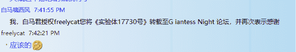

# 實驗體17730號[growth／Micro to Mega／Vore／Crush／etc]

作者：Prophet

TID：27203

 

# 1

> 題首：

> 

> > 最近有幸得到貼吧大神：白馬嘯西風的授權，

> 

> > 幫助他把他的作品《實驗體17730號》轉至論壇與各位分享。

> 

> 從這篇文章開始，我僅要求自己，并倡議所有轉帖的文章，請務必獲得原作者的授權。

<ignore_js_op>

**授权.png** *(34.71 KB, 下載次數: 0)*

[下載附件](forum.php?mod=attachment&aid=NzkyOTF8MGRhZmI5ZjV8MTYwMDg4MjM4N3wxODIzMHwyNzIwMw%3D%3D&nothumb=yes)

2019-8-5 22:07 上傳

本文主要屬性為Growth，白馬自認為前面并沒有進入狀態，後面有改善。請各位自行評價。

PS：如果看過貼吧的原版的會發現，我發佈的版本為校對后的版本，主要為修改針對貼吧的屏蔽字符和部分格式問題。

好了，廢話完畢，請各位看官慢慢欣賞

 

# 2

第一章 實驗體17730號誕生公元3100年，人工合成智慧生命體計劃啟動，這是人類第一次，也是唯一一次嘗試人工合成智慧生命體。計劃開始後第五年，實驗體17730號被合成了……一天早上7:24，實驗員211號像往常一樣檢查實驗體，結果在第17730號實驗體面前，他停住了腳步，因為他通過屏幕看到了一個疑似智慧生命體的存在。實驗員211號仔細觀察了一下，他發現了一隻只有100μm的類人生物。“這是……什麼……成功了？”實驗員211號調大圖像，發現ta確實是一個智慧生命體，大小約100μm，赤身裸體的，從性器官上可以判斷為雌性，好像……還在吃著什麼東西。實驗員211號繼續放大，發現她（就這麼決定了qwq）正在吃一個約3μm大的細菌。實驗員211號驚喜的叫喊起來:“成功了！成功了！！”管理者07號走過來不解的看了實驗員211號一眼，問道:“怎麼了？”實驗員211號指了指屏幕，“您看！我們成功了！”管理者07號看了一眼屏幕，屏幕上的實驗體17730號依舊在吃細菌，只不過二人都沒有註意到，實驗體17730號已經有126μm大了……管理者07號非常高興，立刻向上級報告。不一會兒，上級發來回复，但是令二人驚訝的是，上級的回復是“摧毀這個實驗體，她的形態有辱人類尊嚴。”二人對視了一會兒，實驗員211號先開口道:“不就是狐狸耳朵嗎……至於嗎……我不同意！”管理者07號搖搖頭，“不行，應該聽從上級指令！” 酒逢知己千杯少，話不投機半句多。因此二人很快便吵了起來。最後實驗員211號一拳打在管理者07號臉上，咆哮道:“我辭職！再見！！！” 實驗員211號扭頭就走，手裡拿著一個密封的培養皿……

第二章 觀察與記錄剛走出實驗室，實驗員211號便後悔了，因為這樣做不僅會使他丟掉工作，還有可能被通緝，在這個時代，法律極其嚴酷，對於有罪者最輕的處罰是槍斃……最重的處罰……被送進時空域…… 實驗員211號思考良久，最後還是選擇回到家……與其說是家，倒不如說是一個鐵箱子。實驗員211號脫下白大褂，將培養皿放在顯微鏡下觀察起來。這時實驗員211號才發現有不對的地方，實驗體17730號的大小增加了三倍多，細菌也少了不少。“嘖嘖嘖，” 實驗員211號饒有興趣的觀察著， “有趣。”此時實驗體17730號正好抓住了一個不知哪來的一個微型藻類，開始大口吃起來。實驗體17730號徒手撕開細胞壁，吮吸著細胞質，不時的還用手掏出來一些細胞器，丟進嘴裡吃掉……不多時，整個細胞只剩下了一個空殼，一個細胞壁的空殼。實驗體17730號貌似並不打算扔掉它，並且開始撕著吃起來。實驗員211號看呆了，他開始有些擔心人類。但是這個想法很快就被打消了，“呵……人類……毀滅吧……哈哈哈……這個世界就該被毀滅！什麼法律，什麼時空域，什麼《人類神聖法則》，什麼《資源集中法則》，都去見鬼吧！！！”（未來是一個極度壓抑的環境，權利高度集中，環境極端惡劣，思想極其統一，沒有自由，只有極端的政治……）實驗員211號狂笑著，把一滴矽藻培養液滴了進去，“快吃吧！快吃吧！哈哈哈！”（在這樣壓抑的環境下，瘋掉的人真的不在少數……）實驗體17730號面對著突然出現的許許多多的食物，做出了一個正常生物應有的表現——吃掉它們。“吃！吃！吃！” 實驗員211號狂笑著，“變大啊！再大些！”一分鐘……兩分鐘……三分鐘……五分鐘…… 終於，實驗體17730號終於可以用肉眼看到了——雖然只有1mm大，但是……這只是一個加速的開始……

 

# 3

第三章 「思想」“唔……好像……嘖……”實驗員211號仔細觀察著實驗體17730號，“我該咋辦呢……”實驗體17730號迷茫的看著周圍的一切，因為她終於進化出了思想，沒錯，她終於成為了智慧生命體。「這裡……是哪……我是誰……」實驗體17730號迷茫的環顧四周「我……啊……迷茫……我該干什麼……吃？……對……吃。」實驗體17730號環顧四周並沒有發現什麼吃的，便呆滯的停止了動作。實驗員211號稍加思索，剪下來一點頭髮扔了進去，繼續觀察起來。實驗體17730號見到了食物，立刻撲上去吃。可是出乎她意料的是——上面有一隻蟎蟲！「好……好可怕……這是什麼……」實驗體17730號驚恐的坐了下來，「這……不是食物吧……」“殺了它！吃了它！！啊啊啊！！！”實驗員211號的情緒又不穩定了起來。「我該怎麼辦……」實驗體17730號不斷後退，然而下一秒，蟎蟲看見她了，「救命啊……」蟎蟲跳向了實驗體17730號，一副餓虎撲食的樣子，「救命……我該怎麼辦……不……不如自救……對……」實驗體17730號晃晃悠悠的站了起來，一拳打在了僅有0.3mm大的蟎蟲身上，蟎蟲被打翻在地，實驗體17730號馬上沖過去極力克制住內心的恐懼狠狠地補了幾腳。「好像……很爽……」實驗體17730號的表情有些微妙，「好像……死了呢……不如吃了吧……」（作者提示:性格“暴虐”開始形成）實驗體17730號一腳踩碎了蟎蟲的頭，開始吃起來。實驗體17730號將蟎蟲的腿一條條撕下來吃掉，「啊……快樂……爽……」實驗體17730號一邊吃一邊想，「吃……吃……吃……」（作者提示:性格“施虐”開始形成）「吃……吃……吃……」不多時，蟎蟲便被吃掉了，流下了一地血液，「我……餓……」實驗體17730號繼續尋找著食物。“唔……有點可怕……我是不是……不……不會的……”實驗員211號猶豫著，“不管了，再餵點食物吧。”實驗員211號仔細翻找起抽屜來，試圖尋找著什麼。與此同時，實驗體17730號已經吃掉了所有的頭髮，達到了5mm大。「我還要……吃……吃……」“嘖……扔哪去了？”實驗員211號撓撓頭，回到了桌旁，“等等，5mm！這麼快！漂亮！！！”實驗體17730號抬起頭，看見了實驗員17730號，「這是誰……好大……不過看起來……很好吃……我要快點長大……吃……吃了他……」然而實驗員211號並沒有想到，他最終會淪為實驗體17730號的食物……第四章 記錄實驗體17730號在確定目標之後馬上行動起來，她的目標是「吃掉……吃掉……好吃的……」與此同時，實驗員211號也開始了對實驗體17730號的觀察與記錄:（事件:實驗體17730號以極快的速度吃掉了所準備的食物結論:可能形成“貪婪”性格實際:形成性格“吃貨”事件:實驗體17730號踩碎了餅乾，眼睛發光結論:可能形成“踩踏”的愛好實際:結論正確事件:對於新衣服表現出了極大的興趣結論:可能會形成“好奇”的性格實際:結論正確）（未收錄性格:對於吃人有極大的興趣）（讓我們來跳過一段時間吧，就跳到實驗體17730號身高達到170cm的時候吧……）“你好……”實驗員211號伸出手來試圖進行交流，“我是實驗員211號。”「你個食物……在幹嘛……」實驗體17730號上下打量著實驗員211號，「讓我吃了……你……不對……」實驗員211號這時才明白: 實驗體17730號不會說話。然而對此實驗員211號也對此無能為力，科技還沒有發達到此種程度。但是他稍加思索，給實驗體17730號了一個量子存儲器，然而出乎意料的是，她居然直接吃掉了量子存儲器……實驗員211號的心彷彿在滴血，因為這個真的很貴……「不好吃……不過……感覺有點奇妙……」實驗體17730號想著，“你……你好……”實驗體17730號發出了幾個殘缺的音節。剛才還一臉鬱悶的實驗員211號一下子振奮了起來，至少……錢沒有白花……“好……你好……太好了……”實驗員211號激動到語無倫次。“我……我叫……叫……白橙……請……請多……多……關照。”實驗體17730號（白橙）發出的音節也漸漸清晰漸漸長了起來。“你……你……你想吃什麼……我給你……”此時實驗員211號已經高興的哭了。“吃……吃東西……吃好多好多東西……”白橙終於說出了一句完整的話。“好……好……我給你……”實驗員211號擦了把眼淚，馬上去找吃的。殊不知，他的人生即將迎來終結……

 

# 4

**第五章 “你看起來很好吃。”**

實驗員211號將一大堆食物擺在桌子上，白橙看了看桌子上的食物，又看了看實驗員211號，說:“謝謝，我開動啦！”

實驗員211號的情緒又開始變得不穩定起來，一臉亢奮的說:“吃！吃啊！！快吃啊！！！”

白橙可不管這些，因為她的眼中只有食物……和實驗員211號。

“咚”的一聲，實驗員211號利用機器人將食物放在地上，“這些……全給你！”

從一口一個葡萄，到一口一個西瓜再到一口一大塊肉；從183cm到578cm再到1203cm。

實驗員211號看著面前巨大的白橙，興奮的說:“太棒了！我們一起……毀滅世界吧！”

白橙並沒有搭理他，而是自顧自的吃掉了倆椅子，又吃掉了之前面前的桌子，但最後白橙的回答出乎實驗員211號的意料，“毀滅世界我會幹的……而你……哼……”

“啊？”實驗員211號有點懵。

白橙賣萌似的抖了抖她的狐狸耳朵，笑瞇瞇的說:“你看起來很好吃，讓我嚐嚐唄。”

實驗員211號驚恐的癱倒在地上，喃喃自語道:“不……不要……”

從他的眼神中，白橙看出了絕望，失落，悲傷，還有……很多很多……隨後實驗員211號便抱頭痛哭起來，也許是在為自己的行為懺悔，也許是仍有不舍……

然而白橙可不管這麼多，直接一口吞進去了實驗員211號的半個身子，流下兩條腿在白橙的嘴唇外掙扎。

白橙用她那巨大而潮濕的舌頭包裹住了實驗員211號，一下又一下的舔舐著他，彷彿在品嚐著“人類”的味道似的。然而僅僅一分鐘，實驗員211號就因為缺氧而窒息了。也許是因為沒有嘗出來味道，白橙使勁抿了幾下，結果不小心囫圇吞掉了。

“誒誒……我還沒嘗出來‘人類’的味道呢……”白橙有點沮喪，但是她馬上決定——出去捕食人類……

“就從……你……開始吧！”白橙看了看窗外的快遞員說。

**第六章 一個錯誤**門外的快遞員抱怨著工作的辛苦，全然沒有意識到死亡的來臨。

“砰！”的一聲，路旁的房子突然破開一個口子，一隻玉手從缺口處伸出來，將快遞員捉了進去。

“唔？！”快遞員被攥在手心裡，馬上昏厥了過去。

快遞員從昏迷中醒來，“這是……哪？”

“喵嗚！”白橙那巨大的身軀突然撲了過來，擺出一副“惡龍咆哮”的樣子。

“實……實驗體17730號！”快遞員死死的盯著白橙，不由自主的向門口挪，“救……救命……”

白橙輕輕的夾起快遞員，用指甲輕輕劃著快遞員的脖頸，“還想跑呢……不如……”，“咔嚓”一聲，快遞員的小腿被齊齊咬斷。

快遞員愣住了——看著白橙的品嚐的表情。 “啊……疼……啊…………” 快遞員不住地呻吟起來，但是他知道他該干什麼——報警。

白橙品味著，並沒有註意到快遞員在幹什麼。

快遞員掙扎著，從白橙的手裡掉了出來，一點一點的蠕動著……

白橙意猶未盡的睜開眼，準備將快遞員吃掉。但是她愣住了，在看到那兩條扭曲的血跡時。 “這是……… ‘憐憫’……嗎？”

然而“憐憫”稍縱即逝，白橙一口吞掉了快遞員。 （“終究……還只是一個人造生命體呢……”）

白橙扭過身子，找尋著可以吃的東西——冰箱，電視，箱子……一切比她小的東西，白橙通通不留。

“唔……好像……有點難動啊……”白橙扭動著身子，艱難的尋找著食物。

“砰……boom……嘩啦嘩啦……”房子被炸開，碎片四濺。白橙站起來，舒展了一下自己足有40m的巨大的身軀。

房子外的警察與路人驚懼的看著白橙，四散而逃。 “食物……好多食物！” 白橙兩眼放光，“哦……不能浪費啊……”白橙撿起地上的房屋碎片吃起來。

60m……這是白橙的身高……也許……實驗體17730號這個錯誤有點嚴重……

“食物！”白橙興奮的叫喊著，沖向了人群……

 

# 5

第七章 人類與白橙的第一次戰鬥

在閱讀本章之前，您需要記住以下三件事情:

1.“隨著時代的發展，國家與聯盟將成為一個整體，個體將融入群體，藝術也將消失。” 現如今，所有國家已經融成了多個聯合體，這也就導致了地球軍隊身體素質差，裝備落後。

2.但是與地球不同的是，火星殖民地仍有較強的戰力（瘋狂暗示）

3.本次戰鬥與其說是戰鬥，不如說是白橙的個人表演秀。

那麼，正文開始。

白橙剛追了兩三步便摔倒在地，她爬起來，看到了一塊不知為何翹起的路面——絆倒她的東西。白橙看看逃命的人群，有看看路面，“這個……好像也能吃……”於是白橙揭起一大塊路面（路面所使用的材料具有一定的韌性），大口吃起來。

那些逃命的人仍然在驚慌失措的逃跑著，但是有幾個人出於恐懼回頭瞄了一眼，但是他們不得不面對一個恐怖的事實——白橙正在以肉眼可見的速度變大！而路面也是消失的那麼快……如果不是白橙正在衝著與人群相反的方向吃，不然他們早就已經化為白橙的一部分了。

正當眾人手足無措之時，一個渾厚的聲音穩住了局面。 “請大家不要害怕！保持冷靜！” 眾人定睛望去，此人正是156號區域的司令員，“我們將消滅實驗體17730號！還大家以一個安定的環境！請大家相信我們！”

“太好了！得救了！”人群中爆發出一陣歡呼，但是有人卻並不開心，反而蹙眉道:“武器裝備……人員素質……嘖……”

“進攻！——實驗體17730號！”這只軍隊在司令員的指揮下有條不紊的前進著！向著巨大的白橙前進著！他們的攻擊如同狂風暴雨一般傾瀉在白橙身上！然而這並沒有什麼用……

白橙回過頭來，注意到了這只軍隊，“點心！小點心！我要吃！”白橙興奮的起身，把路面一扔，阻斷了逃跑路線。

“PRPR”兩聲過後，軍隊與逃亡的人群都不見了，盡化為烏有，化為白橙的一部分，“點心的量好少啊……”白橙意猶未盡的舔舔嘴唇，“不過是真的好吃。”說完，又回去啃路面去了……

至少……白橙還沒有註意到她已經可以吃掉一部分建築物了……要不然……

第八章 玩心大起（重製版）

白橙站起身來，卻不小心碰倒了路邊的樓房，樓房也是很脆弱的倒塌，發出無力的“轟隆”聲。白橙皺皺眉，尋聲看到一些倒塌的碎片，“誒……這個……是我幹的嗎？”白橙放輕手腳走過去，卻還是踩碎了一些樓房。

白橙十分抱歉的看著廢墟，輕聲道:“對不起啊，我不是故意的……”

白橙漸漸起了玩心，她突然有了一個大膽的想法:她要玩弄這些樓房。

白橙輕輕的拔起一座樓，放在手心仔細的觀察著（此時體型比例為1000m:100m），裡面的小人仍然驚魂未定，不由自主的聚到一起。

白橙把樓房拿到眼前仔細看了看，裡面的小人也在看著她，眼神裡寫滿了驚恐。 “那……那是什麼啊……” “我害怕……” “不怕……” 之類的話漂泊在千米高空之中，轉瞬即飄散在空氣中……

白橙輕輕的把樓放在手心，用另一隻手略顯隨意的按住樓的上半截，裡面的小人不知道白橙要幹什麼，死死的盯著天空中的巨指。

“轟”，很輕的一聲下去，樓房從中間瞬間碎成三段，中間的一段化為粉末，兩頭則自由落體，摔碎在地上，混雜著屍體……

白橙攤開手，發現自己手心中央有一個小黑點，不假思索的，白橙碾碎了它。然而，這是一個倖存者，一個渾身是血的倖存者，正當他以為絕處逢生時，死亡瞬間吞噬了他。

白橙抬抬腳，很輕鬆的踩碎了一座樓，白橙感受到了一種極其強烈的快感，因此她決定要踩城市。 （黑化警告）

白橙看了看自己的腳，又看了看城市規模，她決定要繼續變大，直到十萬米。白橙重新坐了下來，十幾座樓在她的臀下灰飛煙滅，“不行……這種感覺…………太美妙了！”白橙雙手一攬，十幾座樓被攔腰折斷，白橙把樓攬在懷裡，將幾座樓放進乳溝，又輕輕的揉起胸來，十幾座樓被一點點的夾碎，白橙的臉上也泛起了迷之潮紅，“不行……太爽了……等等……不能忘了正事啊。”白橙站起身來，拍拍身上的樓房碎片，又重新坐下來。

“那是……地標誒！”白橙瞥見了不遠處（對於白橙來說）的某近500m的地標建築，“這個能讓我變大不少呢！”

白橙站起身走過去，還不忘沿途踩碎樓房。

白橙低下頭去看地標，地標的高度差不到到了白橙的大腿根處，裡面的小人可以看見白橙的胖次——白色的胖次。

白橙蹲了下來，將地標從底部用力掰斷，又脫下鞋來，將一雙絲足踩在地標上。地標承受不住巨大的壓力，很脆弱的斷裂了。白橙又多補了幾腳，地標直接碎成了十幾段。然而還沒完，白橙脫下自己的白絲，將地標段全部扔了進去，又將白絲穿回去，在城市中踩來踩去。地標很快灰飛煙滅，而樓房也被摧毀大半，“呀！光顧著玩了！忘了吃東西了！”白橙拔起幾座樓房，扔到嘴裡吃起來。隨著樓房一座座被吃掉，白橙也在變大。在吃了幾十座樓之後，白橙的身高達到了兩萬米。此時白橙的腿已經比珠峰高了約兩千米了，但由於距離過遠，白橙並不知道這件事，要不然，青藏高原將會被吃掉……後果則不堪設想。

白橙輕點絲足，9.0級的地震將這座城市夷為平地，白橙也不嫌髒，趴到地上舔起來。 “呼嚕呼嚕” 的舔舐聲掩蓋住了樓房被摧毀的 “轟隆” 聲，更蓋滅了人類的希望。原本人類以為還有的一搏，但是現在……沒有人能夠阻止白橙了，只能盡力逃命。徒勞，都是徒勞！白橙輕輕舔舐一下便足以將近千米的土地夷平！而人類呢？在這個時間內以最快的速度也不過400m！

很快……白橙的身高還是達到了十四萬米……沒有什麼可以阻擋她了……

白橙站起身來看了看自己的身高，“唔……差不多夠了呢！”，接著便把自己那二十多千米長的巨足懸在一座方圓十多千米的城市上空，在小人們看到了巨大的陰影后，所有人都停止了逃命……等待著死神的降臨……

白橙把腳踩下，激起了一陣極其強大的風，狂風自上而下刮來，小人們紛紛被捲到半空中，諸如路燈桿這樣的東西也被連根拔起。不等它們落回地上，白橙的巨足便踩了下來……在幾秒鐘之內，數十萬人死亡，樓房摧毀度99.98％，直接經濟損失約為40億元。然而這只是一座不起眼的方圓十多千米的小城市……

“真好玩！”白橙的臉上洋溢著笑容，“我還要玩！不過…………這些小房子踩起來不夠過癮呢……”

白橙稍加思索便把她的目標直接定到了太平洋上的“人類紀念碑”上。

“嘻嘻，小蟲子們，準備好了嗎？”白橙笑嘻嘻的看著腳底下的廢墟，“準備好丟掉你們的尊嚴了嗎？嘻嘻。”

白橙大踏步的向太平洋走去，還不忘順便踩碎幾十座城市……

（人類紀念碑: 人類於公元3000年建造的巨型建築，目的是為了慶祝新千年的到來和紀念人類文明史。整體材料為金剛石，長寬高為5000m×5000m×10000m，總重約8.75e14噸，歷時47年打造。矗立在太平洋中的一片平原中，突出海平面約4000m。）

 

# 6

第九章 人類紀念碑的毀滅

白橙來到了大陸的邊界，把腳輕輕探入海水，又收回腳，坐到城市上。

城市中的小人們本以為逃過一劫，然而……“是禍躲不過”，白橙的臀部壓到了城市上——六百多平方千米的城市被壓平，七十多萬人死亡，經濟損失超過四千億（貨幣不值錢啦……）！

這算的了什麼？全球一年創造幾千億億財富，通貨膨脹嚴重……四千億，稀鬆平常。

白橙把腿放到陸地上，八萬多米長的腿很輕鬆的將一個不算大的省從地圖上抹去。

“唔…………好像有好多好多的蟲子被碾死了……”白橙抬起腿來，看著那一個巨坑輕聲道。她又把腿很快，向兩邊掃去，還不忘轉一圈。這三百萬平方千米上的人類全部……全部被碾碎，血肉混雜在廢墟中，使得其看起來微微泛紅。

白橙趴了下去，伸出她那巨大的舌頭輕輕舔舐起城市來。也許在白橙看來這是輕輕的舔舐，但是對於小人們呢？

差不多是這樣的——一面頂天立地的肉紅色巨牆突然出現，並且以極快的速度移動，碾碎沿途的樓房，並將其吞沒。一切都是那麼快，沒有任何反應時間，全部……消失了。白橙輕輕的舔舐著陸地，幾千平方千米的城市很快消失。

時間不算很長，白橙長到了二十萬米。

白橙看了看陸地，稍加思索，便把手放回地面，用力一鏟，一片一百多平方千米的樓房被剷起，順帶著幾百米厚的岩石，全部被白橙鏟起。

白橙把城市放在手心觀賞著，把玩著。然而對於小人們來說可不是件好事，因為他們隨時都有可能被碾碎或者被吃掉。很快，城市開始出現騷動，有的人開始絕望的哭喊，因為恐懼……碾碎了他們的心。

白橙也不願聽到這些雜音，便把手一合，將城市壓碎在手心。 “脆弱不堪……甚至都不能使我稍感愉悅……” 白橙搖搖頭。

白橙又重新趴了回去，兩隻手放在相聚很遠的地方，僅僅是稍加用力的挖了一下，近700平方千米的土地被削起。

也許是玩膩了，白橙開始大口的吃起來。每一口，都會有近千人殞命於白橙的口中。然而這算的了什麼?全世界一共一百多億人，這幾百萬人不過是很小很小的一部分罷了。

白橙繼續吃著，體積也在不斷變大，二十萬米……三十萬米……五十萬米……一百萬米……一百二十萬米……白橙僅僅變大了一百萬米，歐洲，就已經毀滅了。

“下一個……人類紀念碑吧。”白橙還是想起了人類紀念碑。

白橙離開被踏平的歐洲，踩著亞洲便到了太平洋邊上，至於沿途踩碎的城市？白橙不關心，因為對於她來說，腳下的石子是不值得去關心的；人類也不關心，因為它們根本就無能為力。

在白橙眼中，人類紀念碑是一個小小的方塊，一個1cm見方的方糖。 “啊嗚” 一口，人類紀念碑就被吃掉了，沒有什麼過多的動作，僅此而已。人類幾十年的努力，伴隨著榮耀與 “人類永存” 的象徵在此刻灰飛煙滅。

“不怎麼好吃……”白橙還不忘評論一下，“不如那些城市好吃…………還有……地球……好吃嗎？”

第十章 新方式get√

白橙起身俯瞰遠處的美洲，心中有了一個想法——她要把美洲踏平。

白橙幾步便走到了美洲聯盟的舊金山的海邊，然而在白橙踩掉這座城市之前，她的腳激起的海嘯早已摧毀了這座城市。

“呀嘞呀嘞，少了一點食物……”白橙略有遺憾的搖搖頭。

白橙蹲了下來，把手指按在科迪勒拉山系的北美的一部分上，“pia”的一聲，很輕，山脈便被按斷了一段，“唔……好脆啊。”白橙抿嘴笑道。

白橙突然笑起來，因為她發現自己變大了！沒錯，通過破壞，她現在也能變大了。 “終於可以不用吃那些難吃的岩石和土了！” 白橙笑的是那麼開心，那麼幸福。然而人類可不這麼認為……

白橙一面笑著，一麵攤開手輾過去。科迪勒拉山系、中部平原、大平原、阿巴拉契亞山脈……全部，全部被碾碎。

“感覺真好……”白橙抿嘴笑著，她變大了近40萬米，“我看看……我現在有1400km高呢，嘻嘻。”

如法炮製，白橙就這樣毀掉了整個北美。身高也達到了2000km（二百萬米）。

“還有……還有南美！”白橙興奮的跑過去，一屁股坐在巴拿馬運河上，然後又隨意的舒展開身軀，將腿壓在南美洲上，白橙那性感的白絲悄然落下，壓碎了一大片國家。壓碎的國家使白橙繼續變大，整整600km，一瞬間，白橙就變大了600km！失控的連鎖反應發生了，白橙繼續變大，腳跟因體型的變大輾過了南美的剩餘部分，懸在德雷克海峽上空。

“嘛……才3000km……我還要……”白橙一臉意猶未盡，白橙往前挪動身子，把腳踏在南極洲上，冰涼的感覺刺激到了白橙，使得她有點不爽，“哼！還要我去吃……”

白橙趴下了，也不管自己是否用腳踩過，直接下口吃南極洲。

白橙的舌尖輕觸南極半島，南極半島的冰層迅速融化，被白橙喝掉。就連5140米的文森山也被白橙的舌尖推倒，碾碎，吸入口中。至於整個南極冰蓋，白橙吃起來卻十分慢，因為它太涼了，也沒什麼滋味。

“難吃……”白橙抱怨道，然而她整整變大了1000km，“不過涼絲絲的，吃起來也一般吧……”

“嘛…………再吃一個非洲……”白橙丟下南極那正在被海水淹沒的大陸架，徑直向非洲走去。

白橙從4000km的高度俯瞰下去，非洲好像很大，然而白橙卻可以一腳踩滅一個國家！白橙用一種輕蔑的眼神皺眉看著腳下的一個國家，乾脆利落的踩平了這個國家。同時，白橙開始變大，變大到4100km，而且變大的玉足也隨之輾平了一大片土地。

4300km，4700km，5000km，5600km，6400km，7000km……沒錯，非洲那廣闊的土地讓白橙變大了整整3000km！白橙那7000km的身高已經超過了地球半徑，達到了近兩倍的月球直徑！

“唔……我好高啊。”白橙抿嘴笑起來，狐狸耳朵也在不住地抖動著，“下一個……就是月球！”

 

# 7

第十一章 人類的覆滅和月球的毀滅

白橙舔了舔嘴唇，確定先放慢一下節奏，她決定要將人類全部處理掉。 “那麼……細菌們，你們想怎麼死呢？” 白橙輕聲笑道，語氣很溫和，然而殘餘的人類卻是不寒而栗。

白橙“心懷善意”的等待了幾分鐘，笑瞇瞇的看著亞洲，“你們決定了嗎？”回應白橙的只有死一樣的沉默，不是因為別的，只是因為白橙太大了。

“嘛……你們人類不是有這麼一句話嗎？'大像是不會在乎腳下的螞蟻被踩死的'，更何況……你們連細菌都算不上呢！”然後白橙就抬腳踩平了沙特和周圍的國家。

“想當初我只有細菌那麼大的時候，你們看我……就像我現在看你們這樣吧。”白橙把腳向上移動，在推向後蘇聯烏拉爾山的時候順帶著夷平了伊朗，阿富汗等國家。

白橙還想說些什麼，但張了張嘴並沒有說出什麼來。只是加快了腳上的動作，在十秒鐘內推平了後蘇聯的西伯利亞地區和遠東地區。

“現在……還有你，”白橙指了指種花家，“就你，我的出生地……”種花家的人民已經做好了覺悟，像往常一樣重複著日復一日的生活中，“我會讓你們活的久一點的。”白橙抿嘴輕笑道，“就比如，用我的手指將你們輕輕碾碎喲。”

白橙蹲下來，伸出一根手指，摁向哈薩克斯坦僅存的東部城市，向右一抹，種花家的土地就被抹平了一半。

“脆弱不堪！”白橙向下抹去，種花家最富饒的地區也從地球上抹去。

“哎呀……只有這一點了呢……”白橙略帶惋惜的看向離腳不遠的青藏高原，“玩的有點快了……不過……”白橙稍作停頓，起身抬腳抹平了青藏高原和周圍的小國家。

“那麼……再見啦，人類！”這是地球上的人類聽到的最後一句話，因為下一秒，大洋洲就被白橙跳過去踩平了。

白橙看著已經被夷平的地球，她決定紀念一下。她稍作思索，蹲下來用手在非洲上寫上了中文“白”字，在亞歐大陸上寫下了“橙”和“作”二字。

白橙站起來，看著大大的“白橙作”三字，心裡非常的愉悅。

然後白橙舒展了一下身軀，立刻向著下一個目標進發——月球。

三十八萬公里的路程對於白橙那12000km的身高來說並不算什麼，因為這只需要一個輕輕的跳躍，就可以擺脫地球引力（本文幾乎不考慮引力），飛向那直徑只有三千多km的月球。

白橙看著月球，輕笑道（白橙發出的電磁波轉化為我們能夠聽到的聲波）:“月球比我想像的要大呢。讓我先來嚐嚐味道如何。”

白橙伸出舌頭了輕輕舔舐了一口月球表面，然而馬上收回了舌頭，一臉不悅，“真難吃！像麵粉一樣！毀了算了！”

白橙伸出雙手按在月球表面輕輕摩挲起來，“手感……不怎麼好呢。”然而事實上，環形山正一座座被白橙推倒，成為白橙身高的一部分。

不多時，月球表面變得十分光滑，環形山和隕石坑都消失了，只不過……月球小了一圈。

白橙出於好奇 ，直接將手指插入月球的地殼，雙手用力一掰，月球便被拆成了一大一小兩個半球。

白橙攔住比較大的半球，抓住比較小的半球，仔細研究起構造來。

“切……沒意思……”白橙雙手握著比較小的半球，突然用力，半球瞬間崩壞成好多塊，自由的飄散著，“沒用的東西就該消失！”

很長時間的“轟隆轟隆”聲過後，較小的半球被白橙徹底碾碎，成為白橙身高的一部分。

“還有你……”白橙抓住另一塊月球，幾下便將其弄碎，碾碎……

“我現在有多高了呢？”白橙看著自己的身體，自言自語道，“大概……20000km了吧……”

白橙的估算是沒錯的，她已經20000km了，地球……只有她的一半了……

“不管了，下一個目標——地球！”

第十二章 弱小和無知不是生存的障礙

白橙飄回地球旁邊，此時此刻，地球已經沒有了人類，生物也已近乎全部消失。 “沒有生物能夠見證我這一偉大的傑作呢……” 白橙搖了搖頭，決定盡可能快的摧毀地球。

白橙看了看和自己腿差不多高的地球，覺得自己還是不夠大，不注意很快摧毀地球，然而別的星球又太遠了，白橙只能分塊摧毀地球。

白橙把手指摁向地球，但是在這一過程中她感受到了一股輕微的阻力，白橙猶豫了一下 突然想起了大氣層的存在。

白橙略加思索，趴到近地面的地方大口吸起氣來。大氣層以極快的速度變薄，氣壓飛速下降。

“呼……我吸完了。”白橙咂咂嘴，“味道還不錯。”白橙也注意到了，她變大了，500km厚的大氣層為她提供了2000km的身高。那麼……地球會是多少呢？

白橙看了看非洲大陸，直接把手插入好望角以南的海域，單手握住南非，一用力，非洲大陸被拆下來近一半。

“嘻嘻，真是脆弱呢。”白橙調笑道，“輕輕一摁……”白橙把板塊放在手心，兩隻手一合，板塊就在白橙的手中消失了，沒有一點殘留的痕跡。

火星

與此同時，火星殖民地上的人類正在緊鑼密鼓的準備作戰。即使是月球的毀滅也沒有嚇怕他們，因為他們的科技水平極高，毀滅月球也完全不在話下。

經過緊張的作戰會議之後，他們決定派出十億艘太空戰艦去消滅白橙。這十億艘戰艦有三億艘來自火星殖民地，六億艘來自木星和土星的衛星殖民地，一億艘來自天王星和海王星的衛星殖民地。這十億艘戰艦排成1000×1000×1000的立體方陣浩浩蕩蕩的向著白橙進發。

然而此時白橙已經拆掉了五個大洲，殘存的只有亞歐大陸了。白橙呢？已經大了不止一圈了，連地球都變得更小了，大概，只有白橙的四分之一大了。

白橙舒展了一下身子，瞥見了浩浩蕩蕩的向著她進發的艦隊。

整個艦隊長寬高約2000km，然而呢？整個立方體差不多只有白橙的二十分之一大。在白橙的眼中，這不過是一個還不如手大的小方塊。

人類艦隊開始散開擺出戰鬥陣型。白橙也不想多事，揮手……僅僅是揮了下手，艦隊就折損了一半多的戰艦。

人類震驚了，震驚於白橙的實力。那麼，震驚之後就是絕望。

人類已經絕望，因為十億艘戰艦是人類全部艦隊的80％！只是一揮手，一半多的戰艦就沒了。自然而然的，有相當一部分指揮員已經放棄了。

再一揮手，白橙將剩下的戰艦全部摧毀。殘餘的戰艦呢？據統計只有二十七艘僥倖逃脫。

白橙瞥了一眼艦隊的殘骸區域，繼續處理起地球來。畢竟白橙的實力是完全無視這些灰塵的。

 

# 8

第十一章 人類的覆滅和月球的毀滅

白橙舔了舔嘴唇，確定先放慢一下節奏，她決定要將人類全部處理掉。 “那麼……細菌們，你們想怎麼死呢？” 白橙輕聲笑道，語氣很溫和，然而殘餘的人類卻是不寒而栗。

白橙“心懷善意”的等待了幾分鐘，笑瞇瞇的看著亞洲，“你們決定了嗎？”回應白橙的只有死一樣的沉默，不是因為別的，只是因為白橙太大了。

“嘛……你們人類不是有這麼一句話嗎？'大像是不會在乎腳下的螞蟻被踩死的'，更何況……你們連細菌都算不上呢！”然後白橙就抬腳踩平了沙特和周圍的國家。

“想當初我只有細菌那麼大的時候，你們看我……就像我現在看你們這樣吧。”白橙把腳向上移動，在推向後蘇聯烏拉爾山的時候順帶著夷平了伊朗，阿富汗等國家。

白橙還想說些什麼，但張了張嘴並沒有說出什麼來。只是加快了腳上的動作，在十秒鐘內推平了後蘇聯的西伯利亞地區和遠東地區。

“現在……還有你，”白橙指了指種花家，“就你，我的出生地……”種花家的人民已經做好了覺悟，像往常一樣重複著日復一日的生活中，“我會讓你們活的久一點的。”白橙抿嘴輕笑道，“就比如，用我的手指將你們輕輕碾碎喲。”

白橙蹲下來，伸出一根手指，摁向哈薩克斯坦僅存的東部城市，向右一抹，種花家的土地就被抹平了一半。

“脆弱不堪！”白橙向下抹去，種花家最富饒的地區也從地球上抹去。

“哎呀……只有這一點了呢……”白橙略帶惋惜的看向離腳不遠的青藏高原，“玩的有點快了……不過……”白橙稍作停頓，起身抬腳抹平了青藏高原和周圍的小國家。

“那麼……再見啦，人類！”這是地球上的人類聽到的最後一句話，因為下一秒，大洋洲就被白橙跳過去踩平了。

白橙看著已經被夷平的地球，她決定紀念一下。她稍作思索，蹲下來用手在非洲上寫上了中文“白”字，在亞歐大陸上寫下了“橙”和“作”二字。

白橙站起來，看著大大的“白橙作”三字，心裡非常的愉悅。

然後白橙舒展了一下身軀，立刻向著下一個目標進發——月球。

三十八萬公里的路程對於白橙那12000km的身高來說並不算什麼，因為這只需要一個輕輕的跳躍，就可以擺脫地球引力（本文幾乎不考慮引力），飛向那直徑只有三千多km的月球。

白橙看著月球，輕笑道（白橙發出的電磁波轉化為我們能夠聽到的聲波）:“月球比我想像的要大呢。讓我先來嚐嚐味道如何。”

白橙伸出舌頭了輕輕舔舐了一口月球表面，然而馬上收回了舌頭，一臉不悅，“真難吃！像麵粉一樣！毀了算了！”

白橙伸出雙手按在月球表面輕輕摩挲起來，“手感……不怎麼好呢。”然而事實上，環形山正一座座被白橙推倒，成為白橙身高的一部分。

不多時，月球表面變得十分光滑，環形山和隕石坑都消失了，只不過……月球小了一圈。

白橙出於好奇 ，直接將手指插入月球的地殼，雙手用力一掰，月球便被拆成了一大一小兩個半球。

白橙攔住比較大的半球，抓住比較小的半球，仔細研究起構造來。

“切……沒意思……”白橙雙手握著比較小的半球，突然用力，半球瞬間崩壞成好多塊，自由的飄散著，“沒用的東西就該消失！”

很長時間的“轟隆轟隆”聲過後，較小的半球被白橙徹底碾碎，成為白橙身高的一部分。

“還有你……”白橙抓住另一塊月球，幾下便將其弄碎，碾碎……

“我現在有多高了呢？”白橙看著自己的身體，自言自語道，“大概……20000km了吧……”

白橙的估算是沒錯的，她已經20000km了，地球……只有她的一半了……

“不管了，下一個目標——地球！”

第十二章 弱小和無知不是生存的障礙

白橙飄回地球旁邊，此時此刻，地球已經沒有了人類，生物也已近乎全部消失。 “沒有生物能夠見證我這一偉大的傑作呢……” 白橙搖了搖頭，決定盡可能快的摧毀地球。

白橙看了看和自己腿差不多高的地球，覺得自己還是不夠大，不注意很快摧毀地球，然而別的星球又太遠了，白橙只能分塊摧毀地球。

白橙把手指摁向地球，但是在這一過程中她感受到了一股輕微的阻力，白橙猶豫了一下 突然想起了大氣層的存在。

白橙略加思索，趴到近地面的地方大口吸起氣來。大氣層以極快的速度變薄，氣壓飛速下降。

“呼……我吸完了。”白橙咂咂嘴，“味道還不錯。”白橙也注意到了，她變大了，500km厚的大氣層為她提供了2000km的身高。那麼……地球會是多少呢？

白橙看了看非洲大陸，直接把手插入好望角以南的海域，單手握住南非，一用力，非洲大陸被拆下來近一半。

“嘻嘻，真是脆弱呢。”白橙調笑道，“輕輕一摁……”白橙把板塊放在手心，兩隻手一合，板塊就在白橙的手中消失了，沒有一點殘留的痕跡。

火星

與此同時，火星殖民地上的人類正在緊鑼密鼓的準備作戰。即使是月球的毀滅也沒有嚇怕他們，因為他們的科技水平極高，毀滅月球也完全不在話下。

經過緊張的作戰會議之後，他們決定派出十億艘太空戰艦去消滅白橙。這十億艘戰艦有三億艘來自火星殖民地，六億艘來自木星和土星的衛星殖民地，一億艘來自天王星和海王星的衛星殖民地。這十億艘戰艦排成1000×1000×1000的立體方陣浩浩蕩蕩的向著白橙進發。

然而此時白橙已經拆掉了五個大洲，殘存的只有亞歐大陸了。白橙呢？已經大了不止一圈了，連地球都變得更小了，大概，只有白橙的四分之一大了。

白橙舒展了一下身子，瞥見了浩浩蕩蕩的向著她進發的艦隊。

整個艦隊長寬高約2000km，然而呢？整個立方體差不多只有白橙的二十分之一大。在白橙的眼中，這不過是一個還不如手大的小方塊。

人類艦隊開始散開擺出戰鬥陣型。白橙也不想多事，揮手……僅僅是揮了下手，艦隊就折損了一半多的戰艦。

人類震驚了，震驚於白橙的實力。那麼，震驚之後就是絕望。

人類已經絕望，因為十億艘戰艦是人類全部艦隊的80％！只是一揮手，一半多的戰艦就沒了。自然而然的，有相當一部分指揮員已經放棄了。

再一揮手，白橙將剩下的戰艦全部摧毀。殘餘的戰艦呢？據統計只有二十七艘僥倖逃脫。

白橙瞥了一眼艦隊的殘骸區域，繼續處理起地球來。畢竟白橙的實力是完全無視這些灰塵的。

 

# 9

第十三章 殘餘的火星

人類陷入了歇斯底里的絕望！所有人都陷入了一種癲狂的狀態。他們什麼也做不到，自以為是的出擊卻被當做灰塵處理掉，在如此之大的差距下，文明的消失只是一個時間問題。

白橙攔住地球，迫使其自轉停下來。白橙動了動攥起來的拳頭。一拳下去，地球被白橙從太平洋中部到地心到大西洋東部打出了一個洞，一個直徑四千多千米的洞。

“呼……我的力量還真是強大。”白橙蔑視的看著火星，“看見了嗎？灰塵們？這就是神的力量！”

現在的白橙對於人類來說確實是神。自然，有神就會有宗教；有了宗教就有了信徒。

於是殘存的人類自然就產生了一個信奉白橙的宗教。它的成員數目以鍊式反應的速度爆炸增加，一小時，就在艦隊覆滅後的一小時內，信徒的數目從兩萬餘人上升到了七十四億人。

人類在面對強大的力量時總會產生一種渺小感，一種恐懼感，進而變成仰慕，最終發展成宗教。這個以白橙為神的宗教就是這麼形成的。

在開了一個洞之後，白橙又一次變大。這也使得地球愈發小，手撕起來更加容易。白橙拉住巨洞的邊，“轟隆隆隆隆隆隆”的巨響過後，地球被撕成了兩半。白橙抓住其中一塊，輕輕咬了一口，“好吃，真好吃。”

信徒一臉崇敬的看著白橙，心中的想法只有對白橙的敬仰。

半個小時後，白橙吃掉了兩塊地球。 “地球味道不錯，就是有點燙嘴。” 白橙咂咂嘴，回味著地球的味道。 “下面……就是火星啦！” 白橙開心的笑了起來，“估計味道也很好呢！”

白橙扭頭看向火星，微笑著飄過去。

“我們的女神要降臨了！”狂熱的瘋子信徒病態的跪地高呼，“女神！我們的女神！”

然而白橙是聽不見灰塵們的聲音的，出於禮貌，白橙還是像徵性的和灰塵們打了個招呼，“灰塵們好。”白橙笑了起來。

“女神！女神！女神！”狂熱的信徒們集體高呼，“女神降臨！”

白橙最終還是降臨了——白橙雙手輕輕按住火星，咬了一口，“啊啊——好吃！真好吃！”白橙高興的像個十二萬千米的孩子。

殘餘的火星部分露出含有矽、鋁、鎂的矽酸鹽殼，主要成分是塑型矽酸鹽的幔和硫化鐵核，看起來很美，很脆弱。

“這麼好吃的東西要留一塊下次吃！”白橙思考了一下，“那麼……再見啦，灰塵們！”

白橙向著相反的方向飄去，準備去吃金星和水星。

第十四章 類地行星——消失

白橙剛飄出去不遠，停下來回到了殘存的火星面前。白橙微微一笑，兩口吃掉了火星。 “作為神……是沒有必要去答應灰塵什麼的……” 白橙的眼中除了對人類的蔑視就是自我封神的唯我獨尊之感。

“編號為167809的文明消失，是否處理殘餘？”十光年外的飛船上，兩個類人生物正在交談，一個說，“167809號文明還真是厲害……這麼多宇宙年過去了……能造出來這種東西的還是第一個……”

另一個點了點頭，“去吧，摧毀她吧。”

前者找出來質量點，漫不經心的丟向了太陽。

“等等，為什麼不用奇點炸彈？”後者奇怪的問道，“你還想留著這個禍害嗎？”

前者笑了笑，“你去申請一下？”

後者陷入了沉默，他(她？它？)並沒有說話，只是做了個手勢——你繼續。

白橙十分悠閒的飄著，向著金星的方向飄著。不多時，白橙看到了金星。 “嘻嘻……食物？玩具？這我要好好想想。”

白橙繞著 金星轉了兩圈，她決定把金星當做玩具玩一會。

白橙抓住金星，巨大的手在金星的表面留下了一個巨大的手印，如果未來還有文明，那麼它們也定能看到，也會對此感到奇怪吧。可惜的是，金星……將很快終結於白橙之手。 “無聊啊……” 白橙嘟起嘴來， “要是地球還在的化就可以讓它們對撞了……那樣一定很壯美吧……”

白橙心裡這樣想著，愈發不開心。一用力，整個金星被捏爆了！

四散的碎片飄向各處，“很唯美，不是嗎？”白橙輕聲道，“正在毀滅的……才是最美的……”

白橙飄開一段距離，靜靜的欣賞著金星碎片的爆炸四散，“多麼唯美……”白橙笑了，笑的那麼開心，彷彿一切的一切都與她無關，彷彿她只是一個路人。

金星的碎片最後還是停下了分散，成為一堆巨型太空垃圾。不過這些東西也不會影響到文明探測了。文明都沒了，有再多的太空垃圾又如何呢？

“下一個……就是水星了啊……”白橙仔細看了看，她用了很長時間才找到水星，因為水星實在是太小太小了。

“這夠我一口吞嗎？”白橙的語氣中稍帶些不滿，“不開心……”白橙雖然嘴上這麼說，但身體還是很誠實的一口把吃進嘴裡。

水星在白橙的嘴中一下子就被咬成兩塊，白橙微笑著咀嚼了起來，不禁讓人聯想到地球上的吃糖的少女。然而現在，糖成了水星，少女變成了十七萬千米的白橙。雖然關係沒變，但是物品變了。真的讓人有點不寒而栗。白橙的實力……幾乎無人可擋。

“水星的味道……有點甜……就是量比較少……”白橙還不忘發表一下感言。

白橙思考了一下，逆著太陽光飄向了木星，“木星……不知道好吃嗎？”

 

# 10

第十五章 太陽也終將毀滅

就在白橙向著木星飄的過程中，她經過了一片霧霾嚴重的地方。

“真是討厭……”白橙厭惡的看著霧霾，“好煩啊……還處理不掉！”

白橙不知道的是，霧霾就是小行星，許多小行星撞在白橙身上，成為了白橙身高的一部分，所以看起來白橙是在一點點變大的。

“啊啊啊！煩死了！”白橙生氣的揮手打散霧霾，然而效果不大。

殊不知，小行星帶中唯一的矮行星穀神星就在白橙不經意之間打碎了。

“唔…………那是……什麼？”白橙無意中註意到了一個超速飛行的東西，“好快啊。”

沒錯，那就是正在以超過光速行進的質量點。

白橙停下來瞇起眼睛盯著看質量點，好奇的看著它的飛行方向，“它要飛向太陽嗎？”

白橙舔了舔嘴唇，饒有興趣的看著質量點飛行，霧霾顆粒沿著原來的軌道運行，結果幾乎全部撞碎在白橙身上，化為白橙身高的一部分。

“唔……真的是飛向太陽呢！”白橙舔進嘴裡一些霧霾顆粒，然而她並未註意到她已經有二十四萬千米高了。

質量點一頭撞向了太陽，速度瞬間極速下降，巨大的動能轉換成了巨大的質量，瞬間爆破了太陽。

白橙一臉震驚的看著被爆破的太陽，她獲得了一種新的情感——恐懼。

“好……好可怕啊……”白橙呆滯的看著被爆破的太陽殘骸，“怎麼辦……我有些……害怕？”

出於自我保護的本能，白橙抱住腿蜷縮起來，把頭埋進兩腿中間，閉上了眼睛。

就在這一段時間中，灶神星、婚神星和智神星三顆最大的小行星先後撞碎在白橙身上。

十光年之外

“目標已消失。”其中一個類人生物向另一個類人生物報導說，“167809號文明能量來源已被摧毀。”

後者皺了皺眉，“那個怪獸呢？”

前者稍微猶豫了一下，殘存的憐憫迫使他(她？它？)撒了謊，“一塊被處理掉了。”

後者看出了些許端倪，但是他(她？它？)只是笑了笑，走開了，順便問了一句，“對了，戰況如何？”

太陽的殘骸彌散開來，化成了一片霧茫茫的美景。白橙終於抬起頭來，靜靜的觀賞著，就像種花家的人在春節時看放鞭炮放煙花一樣，雖然無聲，但是很美。

小行星繼續沿著軌道漂浮，一個接一個的撞碎在白橙身上。

“等等……我好像變大了？”白橙這才反應過來，“唔……是霧霾的作用吧……不管了，變大總是值得高興的。”

白橙起身離開小行星帶，向著木星飛去。

第十六章 木星核的花

白橙最終還是靠近了木星，此時木星的直徑大約是白橙的兩倍。

79顆衛星環繞著木星做無止休的公轉運動，然而白橙的到來將終結這一切。

在路上，白橙輕易地摧毀了木星環和在其中做公轉運動的木衛十六和木衛十七。

至於剩下的衛星也先後被撞掉，不復存在。

“吶吶……木星也沒有想像中的那麼大啊……”白橙用略帶嘲弄的眼神看著木星。

兩倍多的身高……木星直徑的兩倍多，這是白橙在小行星帶裡所獲得的身高。這是數万顆小行星成為白橙身高一部分的恐怖的後果！

“我覺得……我可以調戲一下呢……”白橙笑嘻嘻的看著木星，“那麼……就從這個開始吧。”

白橙把手指按向了木星的大紅斑，直徑一萬多千米的大紅斑看起來只有白橙的手指那麼細。

白橙輕輕攪動大紅斑，整個木星的天氣系統因為受到了巨大的擾動而完全被破壞掉了！大紅斑因木星天氣系統被破壞而開始消散，紅褐色的大紅斑在一小時內消散殆盡。

“這就是你們人類……你們灰塵曾經可望不可即的東西……”白橙收回手來，“現在，沒了。人類真是弱小呢。”

白橙大手一揮，木星的大氣層瞬間被捲挾走相當厚的一層。

“盤它！”白橙突然想到了一個極為古老的梗，輕輕笑了一下，雙手以一種奇怪的動作盤起木星來。

木星大氣層被一點點的盤掉，露出了正在消失的液氫外核和金屬氫內核。

“唔……”白橙歪了歪頭，冒出了一個奇怪的想法——她要把這個盤出一朵花的形狀，“盤個什麼花呢……”白橙稍加思索。

白橙的手靈活的盤起來，速度快到令人無法相信她那巨大的身軀可以完成如此精妙的動作。

“盤好了……只不過……消散的有些快呢……”白橙欣賞著她剛盤出來的花朵——曼珠沙華。一朵纖細而精巧的象徵著死亡的絕美的花。由於是用木星核做的，這朵花也在消散。

就像人類一樣，不也是很快就消散了嗎？

待到曼珠沙華完全消散之後，白橙踏上了旅程——吞噬土星的旅程。

 

# 11

第十七章 太陽系已如風中殘燭

摧毀土星的過程是極為方便的，白橙用她那接近土星直徑三倍的巨大的身軀一撞，土星直接被撕扯開，破碎，消散於冷寂的虛無中。至於天王星和海王星，它們還不如白橙的jio大，因此天王星和海王星就被白橙用jio夾碎了。

“都處理完了呢……”白橙嘆了口氣，“沒有玩具了。”“噗”的一下，冥王星撞碎在白橙身上。白橙卻並沒有註意到。

“現在麼……只能去處理太陽了……”白橙扭頭看向太陽殘骸，太陽的殘骸已經擴散成了一片大約五千萬千米的霧了，在白橙離開的這段時間裡，太陽的殘骸擴大了不少。

“柯伊伯帶……等會兒吧……”白橙眺望了一下遠處的柯伊伯帶說。

在經歷了漫長的路程後，白橙終於進入了太陽殘骸之中。這裡，是距原來太陽五千萬千米的地方，在這裡，白橙開始迅速變大。

白橙貪婪的吞食著一切，五千萬千米厚的氣體被白橙一點點的吞食殆盡。

一年後，白橙終於吞食掉了所有的氣體，整個太陽的殘骸都被白橙給吞噬了。

七千萬千米的身高，白橙的身高可以說是恐怖了，畢竟，她可是已經比一些恆星都要大了。

“呵……不夠！都不能滿足本女神的胃口！就該消失！”白橙的話語中帶著無盡的輕蔑，因為她已經自我封神了。

“嗯？你是個什麼東西？還自我封神了？”宇宙之外，一位女神手中拿著所有宇宙，而一百個宇宙在她的手心是顯得那麼的微不足道。 “真小小，嘖嘖嘖……可笑，我才是真正的神！而你，就是灰塵！！！”

白橙輕蔑的掃視了一圈，最後把目標鎖定在了柯伊伯帶上，“消失吧！”

白橙以非常快的速度飄向柯伊伯帶，沿途是一片虛無。

“怎麼這麼空……”白橙來到了柯伊伯帶的位置，滿收眼底的，盡是荒涼。然而這只是因為白橙太大了，數十萬顆百公里級的小行星分散開能有多大呢？

白橙最終還是在無意中摧毀了一切，摧毀了柯伊伯帶的所有小行星。

八千四百萬千米，這是白橙摧毀太陽系的成果。然而，這只是摧毀整個宇宙整個過程中微不足道的一步。

第十八章 很快就要結束了吧……

十年，十年的旅程，白橙已經在宇宙中飄了十年。這十年，白橙像一個幽靈一樣，飄蕩在宇宙的無窮的空間中。

有時，她還能吞掉幾個流浪的行星，吃掉幾個恆星，摧毀幾個恆星系。

“這樣算來……我已經飄了十年了啊……”白橙百無聊賴的任自己肆意飄蕩，“真是無聊啊……”白橙伸出手，掰著算起來。 “十年……我吃了132顆恆星，687顆行星，幾十億顆小行星……現在……我已經兩光年大了啊……”

“我現在……飄到了哪裡啊……”白橙突然感到有些迷茫，“好煩……”

白橙伸出手試圖抓住什麼，也許是在尋找曾經的快樂吧。

“當時我還很小的時候，是那麼嚮往著變大……可是現在，我足夠大了……可是……”白橙有些哽咽了，“我好孤獨啊……真的……真的好像遇見一個同道中人……好想重新成長……”

“但是……但是我做不到啊……”白橙抬起手來，將指尖上的一顆恆星碾碎，“沒有什麼東西可以供我品嚐和摧毀了……”

“十年……我變了好多啊……”白橙嘆了口氣，“至少……吃掉宇宙的夢想還在……”

“哦……對了……”白橙突然想起來了些什麼，“如果我能吞噬掉幾個黑洞，那我應該是可以瞬間‘巨大化’的吧……”

“哈哈……唉……”白橙輕聲笑了笑，“就我這體型，還叫‘巨大化’……罷了……也找不到什麼好名字……”

時間長河在沖刷掉一些東西的同時，也會沖蝕出一些新的東西。

在白橙身上，時間沖刷掉的是她的部分理性和自我膨脹的意識；沖蝕出的，是更多的感性，一些感情和更為巨大的身軀。

六百年以後，白橙終於見到了一個黑洞，這個黑洞就是天鵝座X—1。或者說，她見到的是天鵝座X—1的吸積盤，在白橙看來，這是一個非常非常小，非常非常暗弱的光點。但是白橙的直覺和知識告訴她，這就是天鵝座X—1。

白橙謙恭的俯下身子，一口將天鵝座X—1吞掉。於是，白橙獲得了引力，獲得了足以吸引恆星系的超強引力，但出乎意料的是，她並沒有坍縮成為一個奇點。

自此之後，白橙的變大速度飛躍式的迅速增長，每時每刻，都有恆星被白橙吸引，被摧毀在白橙那光滑的少女肌膚上。

“越來越無聊了……”白橙的眼睛失去了亮閃閃的精神氣，死氣沉沉的。 “只希望……快點結束這一切吧……唉……”

 

# 12

第十九章 結束了？

白橙從睡夢中醒來，一晃，又是很長一段時間。

白橙揉了揉惺忪的睡眼，打量著周圍的宇宙空間，繁星閃耀著，似乎有些黯淡。

白橙稍微離開了一點，這才明白，這是銀河系，白橙現在的身高是30萬光年，是銀河系的直徑的三倍。

白橙粗略的算了一下時間，“大概……真的有幾百年了吧。”白橙輕輕的笑起來，笑容中帶著些許無奈和淒涼。

一千多年的時間是可以改變幾乎一切的，白橙在這一千多年的旅程中被抹平了很多，從性格到理念。

曾經的白橙，沒有感情，只會吞噬與殺戮，以毀滅宇宙為最終目標，只有鮮血才能帶來快感。

一千多年，白橙已經改變了，多愁善感，不再想去殺戮，只想得到快樂，恨不得讓時間重啟。

白橙把手攤開，伸過去扯下銀河系的一部分恆星，看著它們消失在自己的皮膚上。這樣的動作重複了不知道多少遍，最終，整個銀河系只剩下了一個中心黑洞。在百萬光年大的白橙面前，中心黑洞顯得是弱小可憐又無助。 “與我……同化吧……” 白橙抬起了手，碾碎了中心黑洞，又把殘骸吃掉，獲得了更為強大的引力。

而現在的白橙，已經可以吸引部分矮星係了。

“最終……我還是沒能控制住自己的慾望啊……”白橙的語氣十分淒涼，“但是……這無可挽回啊……”

在未來的時間裡，白橙能做的，只有點碎一個又一個星系，吞噬一切……還有……估算自己的身高……

“387萬光年……466萬光年……682萬光年……940萬光年……”最終在這樣無聊的狀態下，白橙又一次陷入了沉睡。

在她醒來之後……她將會驚奇的發現一切都變了……相信我……沒錯的……一切……都將改變……

第二十章 終焉

白橙睜開了雙眼。

“好黑啊……這裡是哪？地獄嗎？”白橙伸出手來，試圖抓住些什麼，“不應該啊……我……到底在哪？”

白橙冷靜了一下，清醒了過來，“我……現在還在宇宙中……嗯……沒錯。”

白橙抓了抓，那黑色的空間的質感如同黑色的天鵝絨布，質感是柔軟而光滑的。

“哦……等等……我在揉搓什麼？”白橙一驚，鬆開了手，“我在揉搓的……是宇宙的邊界嗎？！”

白橙的手微微顫抖著，眼眶裡有什麼東西在一直打轉。

“我……我……把一切都…………都毀滅……了嗎……”白橙的聲音裡帶著一些低沉的壓抑，“是我的錯……我就不該出現……”

“生與死，輪迴不止。”白橙的耳邊傳來一個女聲，“萬物皆有終，不過是早晚而已。此事，與你無關。”

白橙的淚眼已經婆娑，白橙顧不得擦拭，帶著哭腔問到:“你是誰……”

“我……即是真神，存在於宇宙之外，萬事萬物皆由我來掌控。”

白橙抽泣了兩下，問道:“那……那我……那我該怎麼辦啊？” 說罷，又開始掉起淚來。

“將你周圍的一切都破壞掉……”神的話很輕描淡寫，就像微風掠過湖面，無事發生。

“我……我拒絕…………”白橙想要大聲的哭出來，“我毀滅了一切……我對不起一切啊……我……我…………”白橙已經哽咽了。

“嘖……讓你幹啥你就乾啥！愧疚有用嗎？啊？！”神的語氣有點不滿了。

“好……好吧……”白橙稍微平復了一下，將手重新伸向了邊界，又是那種天鵝絨的感覺。白橙用力一扯，時間本體和空間結構開始斷裂，彌散，最終消失於虛無之中。

“出來吧。”

“嗯。這裡……居然是白色的……”

“回頭，看著我，還有她。”

“…………你好……我叫白橙…………”

“我叫凌葉。”

“初次見面，還請多多關照。”

“嗯嗯……多多關照。”

（沉默）

“我們……來交換一下彼此的故事吧……”

“好啊……我的故事……就要從……很久很久以前說起了啊……”</ignore_js_op>