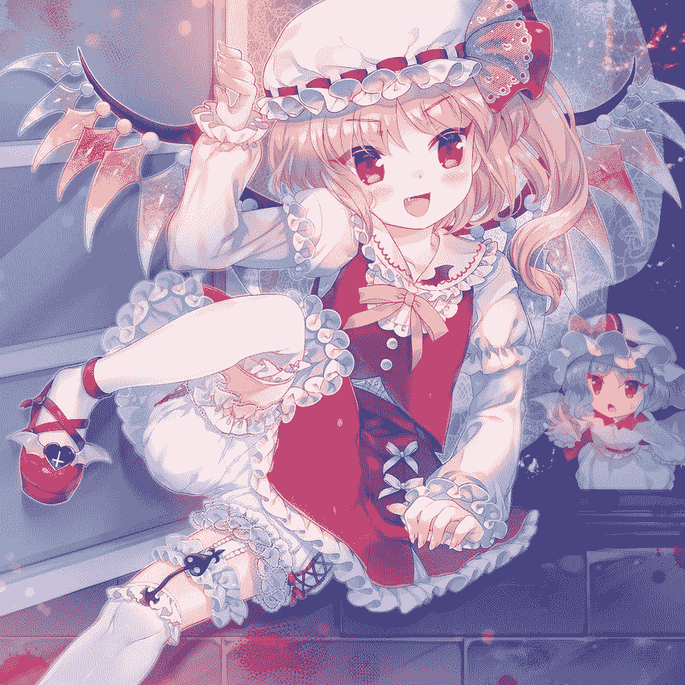

# 幻想乡和平的一天

作者：为爱泪

TID：26333

 

# 1

*本帖最後由 为爱泪 於 2019-1-24 02:32 編輯*

<ignore_js_op>

**__flandre_scarlet_and_remilia_scarlet_touhou_drawn_by_amo__sample-81a5b55c0d34d3.jpg** *(212.19 KB, 下載次數: 0)*

[下載附件](forum.php?mod=attachment&aid=NzYyODV8MWE1MmYwM2R8MTYwMDg4NDM0MXwxODIzMHwyNjMzMw%3D%3D&nothumb=yes)

2019-1-24 01:02 上傳

danbooru id=3274241放上主角芙兰朵露的图片，右边是文中作用和背景板无异的蕾米莉亚。（冈格尼尔警告.jpg）“姐姐大人是笨蛋！！！”   有着新鲜滚烫的血液般色泽的灵力弹幕伴随少女娇喊几乎擦着蕾米莉亚的脸颊划了过去，撞在红魔馆寝室的墙壁上。   充满着混沌与破坏力量的弹幕爆炸在同样鲜红的墙上没有留下一丝痕迹，反倒产生的爆风将始作俑者冲了个趔趄。   蕾米莉亚的洋服被吹的哗哗作响，即使是被打中能轰飞整个脑袋的能量擦肩而过，她脸上的表情也从始至终没有一丝的变化。“我说了不行就是不行！”“可是我明明看见昨天晚上姐姐和口关夜都做了那样的事!”“这是大人的权利…”   蕾米用不容置疑的眼神盯着芙兰。“你还小，只有495岁，等你长大了自然就…”   噗的一下，芙兰的粉拳径直砸进蕾米精致的脸庞。原本无比威严的场面瞬间被反转，连站在旁边完美潇洒的女仆长都默默的别过头去，将蕾米打翻在地后芙兰就冲出去了门外。“混蛋小鬼！给我回来！！！”   当然回应蕾米的只有蹬蹬蹬远去的脚步声。“大小姐…只不过是一个布丁而已…再做一个也没什么的…”“可恶！我就是平时惯着她才会这样的！”   从地上爬起来的蕾米揉了揉被打歪的鼻子，鼓起脸颊迈着六亲不认的步子走了出去。“今天没有我的允许，芙兰就不要想进红魔馆一步！”   望着大小姐远去的背影，女仆长也只能暗自叹气。与此同时，从外面传来门番的声音。“二小姐怎么了？现在还是白天您要去…啊，跑掉了！”‘果然美铃这种时候也派不上什么用场啊。’   银辉色的点点灵力从刚才被弹幕直击的墙上剥离下来，飞回到女仆长身上。等最后一点灵力离去后，几乎整面墙壁都随着轰鸣化为碾粉。“咦咦咦—又发生什么事情了。”   寝室变得通透，连美铃没用的叫声也变更大声了。‘至少，修理红魔馆的费用就从美铃的工资里扣吧。’   潮湿与黑暗的魔法森林今天也迎来了一位可爱的少女访客。虽然一时冲动跑了出来，但是被阳光驱赶不得不钻进有着百年历史的茂盛森林里，芙兰正撒气似地一边重重踏着脚步一边走在人迹罕至的林道上。每走一步，周围的树林都会因为局部地震而微微颤抖，阳光虽然时不时的透过摆动的树叶洒在芙兰身上，但是短短的一缕“净化”在如此的“恶意”面前似乎起不到任何作用。周围潜伏的妖怪们虽然被惊动，但是也都只是躲在暗处敢怒而不敢言，毕竟谁也不想像古老林道上被落叶与泥土覆盖的枯枝一样被芙兰的深红色圆头皮鞋踩成碎渣。‘话说好像魔理沙住在附近来着。’   不知道怎么的，芙兰想起了以前红雾异变时候，被退治的姐姐“哐当”地推开地下室大门的时候，虽然身上和以往打架完一样的狼狈，但是脸上去挂着自己以前从未见过的表情，被称作“温柔的微笑”的表情。不对！现在才不是想那家伙的时候！赌气的芙兰强行让思绪从蕾米身上离开，随后便想到了她。即使扑到怀里撒娇也会被温柔的摸头，就算任性的要求弹幕游戏也会一口答应，憧憬着魔理沙而脚步变得轻快起来的芙兰完全没有在意自己身边传出若有若无如同镜子破碎的声音。当回过神时，自己身边俨然是另外一幅光景。————————————————————————————————————————————————   脑子里被“嗡嗡”的轰鸣占据，艰难的整理起混乱的思绪。隐约回忆起自己此前只是一如既往的走在大街上，异变就这么发生了。先是身后传来震耳欲聋的爆炸声，等回过头时，有什么东西冲着自己飞过来，紧接着眼帘就陷入了一片漆黑。   随着如同火车汽笛的尖啸声划过，首先恢复的听觉就被灌入疯狂与绝望的讯息，火焰燃烧的声音，女人尖叫的声音，汽车紧急刹车产生的刺耳的摩擦声一瞬间涌入进来，配合一片模糊的视界勾出了一幅地狱般的景致。面颊传来阵阵刺痛，鼻腔流出的液体渗入口中扩散开一片铁锈的味道。身边传来哒哒哒急促的脚步声，本能的想要伸出手去求助但是却完全感觉不到自己四肢的存在。阵风刮过脸庞，脚步声在身后远去，自己还是没能得到一丝帮助。   无助的将头转向另一边时，看到了身边躺着另一个与自己相仿的物体，只不过这个倒霉的家伙胸膛上插着半截曾经是栏杆之类的东西，原本就是黑色的衣服被汩汩涌出的液体染成更加深邃的颜色。张大了嘴巴想要尖叫但是喉咙却好像被八尺大汉紧扼住了发不出一丝声音，紧接着胃部传出剧烈的痉挛但是还没等有东西反上来，自己的衣领好像被人揪住，浑身一紧被甩向了空中。如同被丢进搅拌机里的翻滚在身体“砰”地撞到了什么东西后停止了，再次恢复视野时，自己已经处于几十米高空的自由落体中。在强风中勉强睁开眼睛所看到的是被纯白色面料勾出可爱曲线的小腿以及深红色的哥特式萝莉皮鞋。残破的思绪里最后思考的是。“果然，我是在做梦吗？”   只是可爱的女孩子在惬意的散步而已，但是对于五百分之一的小人们来说却是任何天灾都无法比拟的灾难。平日壮阔林立的楼群甚至没有一栋能触及少女的脚踝，轻轻的抬起脚，就能遮盖住整个街区的天空，单是嵌在鞋底的残骸掉落下来形成的石雨就将街道上的小人们砸的头破血流，然而缩在楼房里的人也很快就被胶质鞋底平等的碾碎，和曾经保护着他们的高楼一起混合在有着近百米长的巨大脚印中。   即使没有被直接踩中，周围也会被踩踏产生的气浪和冲击摧毁殆尽。小人们即使在瓦砾与震动的浪潮中幸存下来，也会被少女重新抬起脚掌时吹起的气流卷入数十米高空中，继而摔碎在钢筋水泥的废墟上。只有少数人们能够幸运的掉在女孩子柔软的脚背上，被丝袜与柔软肌肤的缓冲救下一命，接着从鞋缝滑入充满了少女特殊香味的地方，被夹在鞋垫与潮湿的袜子之间。当然好运也只能帮他们活到女孩踏出第二步之前。   身后依然还是参天的大树与潮湿的空气，但是眼前怎么看都是一望无垠的平原，明明被阳光洒在身上却一点也不会产生厌恶与恐惧感，虽然身处在如此的异常之中，但是没来由的愉快心情加上能够这样轻松愉快走在宽阔原野上对于芙兰来说是可遇不可求的机会，自然也就忽视了这些无关紧要的东西。简单迈出几步后，鞋子里似乎进了不少沙子带来不适感，芙兰干脆踢掉鞋子，用脚掌直接踩在地面上。   收割了上万人性命的刑具像炮弹般飞出去砸入几千米外的住宅区，底下人们甚至还没有反应过来发生了什么就被砸成肉泥，在压毁了一个街区后借着惯性和推起的废墟瓦砾组成的浪潮继续吞噬了四，五个街区后才满意的停了下来。然而造成这一切灾难的缘由只是女孩子踢掉了自己的鞋子而已。   代替鞋底执行死刑的是被白色的丝袜所包裹的脚掌，略微有些潮湿的足底微微透出里面的粉肉色肌肤。女孩子犹如神造有着完美曲线的脚掌即使无比柔软又富有弹性，也能轻易推倒和碾碎小人们赖以生存的家园。被当做庇护所的高楼仅仅让下压的纯白足底稍稍内陷，就整栋崩塌连同藏在里面的小人被压缩在柔软紧致的肌肉下面，被直接踩中位于脚跟或者脚掌的大多数小人被带着少女体温的丝袜轻轻抚摸后变成鲜红的美丽血花点缀在雪白的及膝长袜上，然而相比其他人他们已经无比幸运了。处于脚心和脚趾下方的小人不会被瞬间压碎，活生生埋入温暖的肉墙之内，就算想要张大嘴巴汲取仅存的空气也会立马被软肉塞住，在笼罩着少女特有的足香下窒息而死，他们临死前痛苦疯狂的挣扎甚至无法透过带有少女香汗的纤维传达到脚底。   一开始穿着鞋没有什么感觉，但是脱掉鞋子后踩在地面上有种麻麻痒痒好像走在石子路上的感觉穿过袜子传来，这种感觉配合着莫名的优越感让芙兰有些上瘾，在用脚底轻轻的摩擦着地面来寻求更多刺激同时也将注意力转向地面上。   被专家与工程师精心设计打造的大厦经历了一阵又一阵晃动与沙砾风暴侵袭后依然耸立，最新式的结构与坚固墙体吸引来不少小人避难，大家衷心希望这智慧与血汗的结晶能够庇护自己。但是当他们被少女注意到时，后悔已经来不及了。双足就像神罚的铁锤一样轮流砸下，在下方无论是楼房还是汽车还是人类都被踩成薄片黏在脚底，步步逼近的沉重足音对藏身的小人们来说就像临近的丧钟鸣响。人们终于醒悟过来想要逃出这里，但是少女单单行走产生的震动就让大家寸步难行，数公里的距离短短几秒就消失在少女脚下。   周围的低层建筑大多已经因为地震变为废墟，大厦优异的抗震结构让它虽然已经摇摇欲坠但却还能勉强屹立，当然也只仅此而已。少女用脚跟将周围废墟当支点一边碾碎里面寥寥的幸存者一边抬起前脚掌，整座大厦瞬间被阴影覆盖，内部爆出的集体尖叫声音被少女缓慢伸过来的脚趾轻易盖住。张开的拇指与食指轻易将大厦上半部分夹住，楼体在丝袜组成的幕墙勒着发出“吱吖”刺耳的声音但还奇迹般地勉强保持着形状，脚趾稍稍用力就将大厦拦腰折断，依然滞留在上半部的小人成为少女脚趾的囚犯被带到百米高空之上。正巧处于断层下的人们被颠覆常识的景象所震撼，脑子被恐惧和迷茫所占据连逃跑都忘记了。随后足指毫无预兆的缩紧，从高空依稀传出的哭喊声随着足指开始搓动被另一种刺耳又心惊胆颤的搅拌音代替，指缝中不断落下小块废墟和肉块，不时还有混合着不明杂质的液体洒在下方的小人身上，不知过了多久，当足指重新松开，一团早已分辨不出原状的物体掉下来摔散在地面上。   断层上小人们拼命扬起脖子才能看见千米之上有着天使面孔的女孩子脸上洋溢着满足的微笑，随后他们头顶被粘满泥土废铁和人类尸体早已染得看不清原本白色丝袜的脚掌占据。沉重的声响从少女光滑柔软的足底传出，小人耗费数十年完成的心血在分秒间变为碾粉，仅是因为少女想要打发时间这一简单的念头。   从脚底传上来的酥痒感觉走遍全身十分舒服，但是用来按摩的小石子马上就会被破坏掉。虽然芙兰想要试着去控制自己的力道但无一例外都失败了，就在芙兰渐渐开始烦躁时突然感到有细微的火花在小腿上爆开，芙兰仔细环顾四周费了不少劲才发现是远处一群小盒子在朝自己发射着稀疏微弱的弹幕。“呐~你们要和芙兰玩弹幕游戏吗？”   当然芙兰是得不到任何回应的，弹幕击中的部位没有一丝痛感，甚至连袜子的面料都无法击穿，让人怀疑这些弹幕被发射出来的意义，不过她可不会这样放过玩耍的机会。“那么要上了哦…”   纤细的身躯微弓起来，左脚猛的踏入地面，吸血鬼恐怖的怪力爆发出来将周围一千米内全部物体粉碎，同时伴随震天轰鸣将少女的身体如同迅雷般射出，数公里的距离毫秒间被化为虚无，芙兰顺势踢出的右腿就像死神镰刀一样收割掉路径上一切存在，躲在楼房里的小人连发生了什么事都没反应过来就被踢碎在空中，画出优美弧线的白丝足最终精准停留在小小敌人的头顶狠狠踩了下去，脚下的敌人无法做出任何抵抗全数溃死，少数没有直接踩中但也被近乎有着十米振幅的大地震甩向高空再摔落下来，一动不动的趴在地面上。对于这些和虫蚁没什么两样的存在芙兰选择了最原始直接的方式降下审判。但是芙兰并没有满足于此，碾动脚底揉碎掉寥寥的幸存者后芙兰以右脚为支点向后轻跳起来，超高浓度的灵力聚集在事先准备好的右手。   魔剑[莱瓦汀]   高声宣言出符卡名，随着灵力暴涨，泛着鲜红光芒的火焰大剑出现在芙兰手中，迎势挥动的大剑横扫过去，天空被刺眼的血色光芒侵染，数千平米的城市被魔焰吞噬化为漆黑焦土，紧接而至的满天弹幕进行了地毯式轰炸，将场面塑成一幅地狱般的景致。“……啊，袜子脏了！”   能够陪自己玩耍的对手消失掉了，刚才被调动起来的兴致一下子被浇灭。重归无聊的芙兰无意间瞥见自己的脚底，铺满了不知道是泥土还是什么的东西，几乎已经看不见下层的白色纤维。芙兰将灵力聚集在脚上，人类尸体和土块水泥混合在一起在不断碾压下早已成为一体的板结物被慢慢剥离下来，很快包裹着雪白丝袜有着绝美线条的柔软双足又变回了开始的干净模样，只是和一开始不同，丝袜下面透出的粉色肌肤更加鲜艳了一些，足底被渗出的汗渍染出更深色的痕迹。“这样就不会弄脏了吧…”‘说起来…’   精心编织完美贴合着足部曲线的优质面料保护着芙兰稚嫩的双脚，从小到大每每衣装稍有破损或不合身蕾米都会费重金帮芙兰量身定制最优异的衣服。‘可恶啊…明明是这种时候为什么还要想起那家伙的好。’   被纠结情绪扰乱加上赌气的想法，芙兰索性直接坐在地上，笔直伸展出去双腿哗啦哗啦滑动着。少女圆润的屁股压碎了下方的小人们，纯白的内裤上被血肉画出鲜红的花朵，然而美丽的花朵大多都是转瞬即逝，被灵力吞噬的一丝不剩。   少女双腿组成的巨墙像白色的海啸前进吞没着城市，无数街区被卷入下面，伴随少女划水一样的动作反复碾压着，处于双腿最中间区域幸存着的人们被不断轰鸣着接近却又点到为止远离开来的双腿折磨的几近崩溃，被双腿推出的瓦砾土山挡住他们的视线看不到外面的样子，但是每次双腿逼近时他们都仿佛能预见自己被压扁埋入泥土下面。好在他们并没有被恐惧和绝望折磨太长时间，下个瞬间小人们头顶的天空被白色大腿毫无预兆的挤碎，双腿重新分开后，整片区域都变为了整齐的棕色平原。   芙兰放松下来呈大字状躺在地面上，突然有熙熙攘攘的声音传进耳朵里。感兴趣的芙兰侧过身去发现之前用来按摩的小石子中似乎还有空间，里面有着小小的虫子。   整个楼层被暗红的光芒涂染，窗外骤然出现有新血般鲜艳颜色的眼珠，标志着恶魔身份的细长瞳孔活泼的四处巡视着。超越常识的景象冲击下，被恐惧击垮的人们呆坐在地上，虽然满是逃跑的念头但身体却使不出一丝力气。随着眼眸微眯起来，整栋楼体开始剧烈的摇晃，小人们头顶响起了越来越近的破碎崩塌声，连反应的余地都没有他们就被突破天花板出现的粉肉色巨指碾成肉泥。   果然很脆弱呐。看着被自己的手指轻松压毁的建筑，芙兰想着。有部分小人从刚刚被粉碎的大楼中跑出来，虽然芙兰想要把他们拿起来好好观察下，但是无一例外等捉住这些小东西再拿起来后只剩下一小片红色的东西黏在手指上。失败数次后芙兰重新把目光移回了那些还算坚固的小小楼房上，虽然稍加使力就会崩碎殆尽，但是想要完整拿起还是轻松不少的。   从天而降的两根粗壮但却光滑柔软的手指夹住躲满小人的房屋，咔啪一声轻松的将整座房屋拔起，瞬间带上数十米的空中，惊恐的人们被困在里面，就算想要逃出去，从这样高度掉落下去也毫无疑问会摔的粉碎。最终房屋停在了少女的手心上，里面的人们慌乱恐惧又不知所措，不知道自己接下来会受到怎样的待遇，不过很快充满稚气的可爱声音传了进来。“那个，大家都出来好吗……不然会被捏碎的哦。”   就算是沁人心脾的可爱娇音也不可能消除如此巨大的力量差距带来的隔阂与恐惧，小人们面面相觑谁也不敢轻举妄动，比起出去直面那能够随意降下审判的存在，大家似乎更想缩在长久岁月以来都保护着自己的家里。   不过天平很快就被拨动，整栋楼房发出几近崩溃的悲鸣，缩在里面的人们瞬间经历了如同天地覆翻日月颠倒的摇动。等整个世界重归平静后，还能够行动的人争相拥挤着冲出来把门口堵的水泄不通，不幸摔断了手脚或者被倒下的书架压住无法动弹的人伸出手想要获得一份帮助然而许久也无法搭住任何东西。等到人出来的差不多了，楼房咔嚓一声被捏碎，在少女柔软的食指和拇指之间被反复蹂躏碾成细粉。恐怖的粉碎声刺入耳朵，聚集在手心上的小人们无不暗自庆幸自己做出了正确的选择。如果他们知道自己马上就要迎来的结局的话，大概宁可逃出手掌摔死也不会在这透着粉白色光滑的平原上望着有天使般面孔的女孩心存侥幸，认为这个可爱的女孩内心也同外表一样温柔吧。   虽然非常小但果然是货真价实的人类啊，芙兰想着，就算已经聚集在自己手心了但还是要仔仔细细的观察才能看清他们的样子。不过既然是人类那就没关系了，想着什么事情的芙兰重复之前的动作不断收集小人到手上，因为有着先例后面还算顺利，小人们都乖乖的走出来，不一会手上就站满了。   盛满小人的手掌缓缓上升停在少女脸颊面前，少女呼出的香甜气息吹拂过小人们的身心，甚至有部分小人因为同伴增加产生的安全感而完全放下戒心，投身于这充满女性香气的氛围。“那么，我开动了。”   雷鸣般的巨响灌入小人的耳朵，他们还没来得及捂住耳朵脚下的大地就变为了峭壁，在光滑的肌肤上小人们抓不住任何东西只能和同伴一起掉落滚入下方早已张开等候的暗红魔窟。粉嫩的舌头在光线照射下闪着晶莹的反光，困住上面的小人拼了命想要向着光源逃去但是在潮湿粘稠并且不断蠕动的舌头上他们连站立都十分困难，只能无助的趴在上面时刻小心着不会滑入后方的肉色深渊。等到最后一丝光明消失在朱唇之间，口中数百个小人如同被丢进搅拌机里，在一片潮湿漆黑的空间之中被巨大柔软但能轻易碾碎他们身体的怪物玩弄。少女露出了吃甜点时幸福的微笑，但口中则充满了人类的哀嚎和哭喊。不断有人在上颚和牙齿处被活活挤碎，最终他们的尸体和勉强活着的小人一起包裹着唾液被怪物推入名为食道的洞穴。   虽然很美味但是量实在是不能让芙兰满足，而且似乎失去了小人们的信任，无论芙兰怎么威逼利诱也再没人乖乖从捉起的房子里走出来，毕竟比起被活吞进肚子里消化殆尽的结局，捏死和摔死反而干脆一点。‘那就没办法了。’   芙兰直接将整栋躲满小人的房子丢进嘴里，对待房子也不用像之前那么温柔，浑厚有力的舌头轻松将房屋在上颚揉碎，鲜血从瓦砾之间渗出刺激着味蕾，但是也仅此而已了。水泥和钢筋的味道并不好，“呸”的一声，芙兰吐出了嘴里的东西，混着口水已经完全看不出原型的块状物砸进街区里，在附近的人们被淡红色唾液黏住动弹不得。   最终芙兰只能将目标放在还游离在街道上的人们，虽然他们都拼命想要逃离自己，但是只要一步就能跨过他们舍命奔跑了几分钟的距离，想追上他们并不是难事，如何将他们完整的带到手上才是目前芙兰面临的最大问题。   他死死的拉住那只手，明明和平时一样那只手紧紧的拽着自己，但此时他完全感受不到平日里传递过来的那份温暖。尖细的女声刺入他的耳朵，也刺进他的心脏，他面前是碾碎了上万人却连一丝痕迹都不曾留下的白色巨墙，也是巨大少女被丝袜覆盖的可爱足尖。   但是他心中没有一丝恐惧，他眼里只盯着那张因为疼痛已经扭曲到看不见原本样子的脸庞，他一次又一次的用力，但是只有更凄凌的喊声和不争气的鞋底与柏油路摩擦传出的沙沙声回应他。他心怀着希望，憧憬着曾经许下的未来，再一次向手脚中注入力量，因为如果不这么想的话，他就什么都剩不下来了。   巨墙好似被他一次次的努力拉动了一般逼近过来，原本凄凌的叫喊瞬间尖细了几倍，到最后只剩下刺耳。他呆呆的看着那张扭曲的不成人形的脸慢慢埋入巨墙下面，留给他的只有喷溅一身的滚烫鲜血，依然死死握住的一只纤细臂膀和五道刻入皮肉的血痕。   无力、绝望，迷茫和愤怒在他胸中积蓄，他还没来得及怒吼着发泄这些情绪，就被左右两股无法抵御的力量夹住带入空中。他感到自己似乎五脏六腑都挤在一起，浑身上下的骨头都被粉碎，高度急剧变化产生的缺氧让他眼前一片漆黑脑子里响起嗡嗡的轰鸣，但是他还活着，他没有就这么死去然后蓦得从床上惊坐起来发觉只是一场噩梦，压力撤去渐渐恢复的视线里还在渗出血滴的嫩红胳膊跟隐隐作痛的血痕无情的击碎了他最后的希望。   猛然失去力量的双腿跪在透着粉色的大地上，内脏翻涌而出的恶心感让他干呕几声，胃部早在之前与自己擦身而过的路人被碎石砸烂半个脑袋时就什么都不剩了，抬起头印入眼帘的明明是比念想中的那张脸可爱数倍的容颜，但是他的眼中看到的只有狰狞的恶鬼。‘口关夜平时也都做着这么辛苦的事情吗…？’   已经花了不少时间，手中还是只有寥寥数几的小人，更多都在手指间变成了碎末，为了想要吃甜点这个目标而努力的芙兰似乎感觉已经付出的有点过多了，原来做甜点是这么麻烦的事情吗？芙兰感到有些后悔，自己明明提了再要一个布丁这种任性麻烦的要求，却还冲动的想要把亲姐姐轰成渣。‘不对，不对！芙兰只是想和姐姐有平等的待遇，芙兰没有错！’   这么想着，芙兰将走神的思绪拉了回来，这时她发现手心的小人们变的有些奇怪，除了刚刚好不容易捉到的一个人，其他人都缩在一起，完全没有上一次那种放松的氛围。芙兰用手指轻轻将他们拨开，挑起其中一个靠近自己。“那个…你们怎么了吗？”   试着进行了一些沟通然而回应芙兰的只有手指上女性无休无止的尖叫，渐渐的烦躁的情绪在芙兰心中升起随后噗叽一下捏死了那个女性，就在芙兰甩掉手指上的残渣时，另外一边传来的怒吼吓了她一跳，原本蹲着的身子因为重心后仰变成了坐姿，处于身后的小人就这么不明不白的被柔软的屁股压扁，白皙的双腿顺势伸出，双足像压路机一样将前方的一切物体卷入碾碎在白色丝袜上。  手掌上那个单独的小人突然大放厥词，不断从口中蹦出污言秽语，明明只是自己手心里如同蚊虫一般能够轻易碾死的存在，但此时他的气势却完全压倒了芙兰，。对方的声音虽然微弱，但却一字一句都能清晰的传入芙兰的耳朵，在辱骂下，芙兰的脚趾不安的扭动着，将附近的人们裹进充满少女足香的趾缝中再活活被潮湿的丝袜绞死。另一只空出来支撑着地面的手掌也不自觉的攥紧，连带着将整片街区剥离捏碎。   “怪物”的字眼飘入芙兰耳中挑起芙兰的回忆，蓦然芙兰好像回到了曾经的那个木头架子搭起来的高台，燃烧的血红天空，焦油的刺鼻气味，刺眼的金属十字和环绕在身边如浪潮一般的喊声。对了，是姐姐。芙兰想起是蕾米亲手将她从那无尽的痛苦中解救出来，虽然自己不知道该怎么办，但如果是蕾米一定能够帮助这个可怜的小人，芙兰这么坚信着。她轻轻握住手掌，喊声消失在了手心里，找到之前脱下的鞋子，随意的将里面的杂物倒出后套在脚上，向着自己来时的方向飞奔出去。芙兰并没有注意到自己跑入森林不久在身后悄然闭合的隙间。——————————————————————————————   红魔馆的大厅里，门番正和充满威严的馆主争吵着什么。   蕾米莉亚露出一脸不屑的表情，红美铃则怒气冲冲的走向大门，然而下一秒她就被冲进来的芙兰式火箭头槌直接命中脆弱的小腹倒在一旁。“…你还知道回来吗？”   对于芙兰的突然出现蕾米并没有表现出太多感情，“所以终于要来向姐姐认错了？”“姐姐大人你一定要帮帮他……咦？奇怪。”   芙兰似乎完全无视了蕾米的话语径直跑到蕾米面前伸出小巧的手掌，白皙干净的手心上没有一丝灰尘。   完全出乎意料的发展弄的蕾米一脸懵逼，她想要张口说些什么但却被芙兰一把搂住脖子。“姐姐大人你过去看就知道了！”   这么说着，芙兰架着蕾米又重新跑了出去，大厅里只留下捂着肚子的美铃微弱的声音。“…二小姐您……等等我啊…”“啊嗯？怎么回事啊…”   芙兰眼前矗立着魔理沙的小屋，魔理沙似乎不在家的样子，门窗紧闭。明明自己已经将整条小径跑遍了却还是没能找到那片奇怪的平原。一路拖过来的蕾米在身后剧烈的咳嗽着，她差点被芙兰搂的窒息过去。“玩够了吗？”   不知道什么时候出现的女仆长撑开洋伞为姐妹两人挡住夕阳临近下昏暗的金色阳光。“我要回去了。”   见芙兰没有反应，蕾米转身走去，女仆长看了芙兰一眼也匆匆跟上蕾米的脚步。“但是……”“再不回去的话就没有晚饭了哦。”“啊…不行…”   芙兰听闻也急忙跟了过去，临走前也不忘回身看一眼记忆中的方向，眼中只有被夕阳染上金黄颜色的屋子慢慢被密林掩盖。   晚餐过后，在馆里散步的芙兰偶然路过餐厅，看见桌子上赫然摆着一盒布丁，上面有着“蕾米”字样的纸条。歹心作祟的芙兰本着反正那家伙已经多吃一个了，这个由我吃掉也没什么不好的理由，用不到两分钟的时间迅速解决掉了布丁，当然芙兰并没有发现餐厅门外用温柔目光偷偷瞧着里面的蕾米。   红魔馆又回到了平和的日子里。附一   他从来不信神也不信佛，但此时他却感到自己犹如有着幸运女神的眷顾。平凡宁静的生活被扯碎，赖以生存的家园被摧毁，身边的同伴仅是一瞬间就成为黏在巨大少女鞋底下的烂泥，自己却奇迹般的掉进鞋里，在靠近脚心处的袜子和鞋垫之间苟活。   他用牙齿和指甲死命抠住丝质的面料，旁边一个和他一同掉进来但没有那么敏捷的人被少女的步幅甩到前脚掌下后，他就再也没听见过那绝望的呐喊了。女孩子足底最柔软的部分有规律的按压着他的全身，让他有种在做奢侈的全身按摩的感觉。他以为在自己力尽脱手之前要一直这么下去的时候，忽然狂风呼啸着灌入耳朵，用全身力气咬住的袜子被无法理解的怪力拽出，眼睛里终于看到了一直以来压迫着自己现在则渐渐远去的纯白无瑕的丝足。   也许幸运女神还没走远，在飞出的哥特皮鞋中四处翻滚碰撞直到落地，有着精致绵软的鞋垫缓冲他除了轻微脑震荡以外身上神奇的找不出任何明显外伤。但是正巧立起的鞋子成为他新的囚笼，四周有着近十层楼高的鞋壁将他囚禁在单独的世界里。空气中弥漫着女孩子脚上的特殊汗香，进行了几次不切实际的尝试后他不得不放弃逃出去的念头，龟缩在鞋尖的部位，以望在巨大的白色脚掌重新伸进来时能够获得更安全的空间。鞋尖的气味更加浓郁，微酸的味道冲击着他的鼻腔和大脑，鞋垫上隐约还能看见五个稍微凹陷的深色趾印，任何一个都能轻松包围住他的整个身体。走过来的路上他看见小片红色的痕迹，大概是之前那个倒霉家伙留下来的，自己迟早也会变成那个样子吗？被这些恐惧的想法侵袭着，他蹲缩在鞋子最深处，把脸埋入双腿之间，被周围的汗香熏出谁也无法看见的泪水。   不知道过了多久，先是发生越来越大的地震，随后整个世界被顺时针翻转了近乎一百八十度，他在最后一刻抓住鞋带上的织线才没有落得被从百米高空甩出的下场。用尽全身力气的他躺在重归平静的大地上，绝望的看着鞋口天空被淡粉色的幕墙占据。   万幸的是少女的前脚掌踏在离他头顶不到两米的地方，随后向前滑去，他的身体重新被柔软的脚心压住，虽然痛苦但还不至于丧命。略微有些潮湿的丝袜快速擦过他全身，脸颊被涂上一层散发异香的液体，他效仿之前用手抠住袜子，用牙咬住袜子，酸涩的味道渐渐在他口中扩散开。也许坚持到巨大的少女下一次脱掉鞋子时自己能够得救，这是幸运女神一路帮助着他，给他的最后启示。   咔啪一声，折断的手指甲渗出鲜血传来刺痛，完全无法与之前相提并论的惯性将他拉入下方，看来幸运女神也只能帮他到此为止了。   可能是鞋子没有倒干净，奔跑着的芙兰感觉脚跟处依然有杂物垫着，但现在急忙回家也顾不得那么多，用力踩踩大概就习惯了吧。</ignore_js_op>  

# 2

首先！！！“口关夜”是因为文章用的字体里没有“咲”这个字，绝对不是因为我不认识！！！

其次，啊，嗯，时隔一年我又开了个新坑......当然不填老坑是有一定不可抗力因素的，简单说就是因为固态意外爆炸导致原本写好的文章全部报废，再想重新开始写的时候却怎么也找不到当初的那种感觉了，加上看到论坛里自己的文章已经沉了干脆一了百了当个咸鱼晒死在沙滩上。

但是前几天（一个月前）突然看到我的老坑居然有新回复，而且字字斟酌句句勤恳，霎时感动的我垂死病中惊坐起带着一腔热血坐到电脑前，结果目光呆滞脑袋空空干坐了三个小时还是半个字都打不出来。

这种状态持续了近一个星期后，我终于放弃了续写老坑的想法，但是就这么完事的话又感觉对不起回复的读者，于是就换个思路开了这么个新坑。

虽然也有想着把这篇文章更到东方的那个文贴里当个填坑，但最后还是选择单独开个新贴，主要是觉得老文中那个冗杂又没什么实际意义的主线剧情太过多余，把每个故事拆分成自由的短篇反而更加自由。

如果觉得这篇文章有些过快的节奏感到不适或者描写单一重复过多等其他什么缺点欢迎提出，我会尽力在下一篇文章中改正这些缺点。

最后，感谢阅读。ps：我并没有说老坑就这么弃掉哦。

 

# 3

> [葬儀社 發表於 2019-1-26 13:12](https://giantessnight.com/gnforum2012/forum.php?mod=redirect&goto=findpost&pid=395448&ptid=26333)

> 雖然角色(蘿莉).屬性(殘酷.吞食)都沒打到我的點.但難得有東方同人文.多少來捧場一下好了(感覺這回覆量不太 ...

有大佬给出这么长的回复真的很高兴，写这篇文章时原本打算福利和剧情穿插着写，但是后来感觉本来就没多少篇幅再这么一搞会有种莫名其妙搞不清重点的感觉，所以就中间的剧情能删就删，删不掉的一笔带过把重心放到福利上了，虽然我自己脑子里有很清楚的剧情走向所以读着感觉没什么问题但是换人来读就是完全不同的体验，确实是我没考虑到的问题。说实话大佬总结的剧情流程比我写的要清晰的多，所以再次感谢大佬。