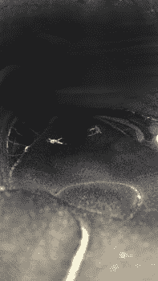
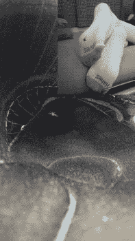

# 幻梦空间【1.29晚更】

作者：佛挡杀佛

TID：22524

 

# 1

*本帖最後由 佛挡杀佛 於 2017-1-30 11:01 編輯*

今天是xxxx年大年初一，大家都在沉浸在新年的喜悦中的时候，我还坐在电脑前面忙碌，突然电脑弹出了个窗口

“是否想让多年的愿望成真”【是/否】（主神空间什么鬼啊(╯‵□′)╯︵┻━┻）

我想了想，然后想起来刚好家里没人，失踪会应该没事（这里以为是哪个弄的恶作剧）

然后我点了是，瞬间电脑发出一团白光，我也失去了意识，再次醒来周围的一切已经有了变化。巨大的椅子，地板上的灰尘都变的可以看清，周围的空间弥漫着一股味道。

【是否进行第一次任务，经过五次任务的可以获得一次万能许愿的机会，不接受则触发副任务在此空间生存一个月】（这不是强迫嘛xxxxx）

“这，这不是主神空间的手段吗。按照道理应该有接引人的啊。。。而且第一次任务应该不会多难才是。。”

“嗨嗨，新人好，我是指导精灵，技能兑换和装备兑换都能找我，不理解的地方也能问我”真是说曹操曹操就到，我抬头望去声音来源，只见一个清新脱俗的小萝莉飞在我面前，玲珑的鼻子，双眼的赤红色仿佛一团火焰，实乃人间绝色也

那么多余的话就不说了= =

【选择开启任务】

 

# 2

第一任务

过关条件：生存下去

时间：未知

坐标传送开始

在选择接受任务以后我就收到了这个消息，然后眼前的景色发生了转变，眼前一片黑暗，只有微弱的光能让我看清俩个人在那，眼前的空间湿气极大，并且味道有点不好闻，我看了这形状就知道处于什么地方了——一个鞋里面，我想那俩个应该是这次任务的队友了

“新来的，做好准备吧，这次任务难度还蛮简单的，只要活下去就行了，我叫简，这个是汉姆。这次任务地点这么小我们互帮互助能通过” 

# 3

<ignore_js_op>[场景一.jpg](forum.php?mod=attachment&aid=NjY2MzN8NGVmODQ4OTF8MTYwMDg4ODE4MXwxODIzMHwyMjUyNA%3D%3D&nothumb=yes) *(21.36 KB, 下載次數: 25)*

[下載附件](forum.php?mod=attachment&aid=NjY2MzN8NGVmODQ4OTF8MTYwMDg4ODE4MXwxODIzMHwyMjUyNA%3D%3D&nothumb=yes)

2017-1-29 08:37 上傳  

</ignore_js_op>  

# 4

> [cnmlgb 發表於 2017-1-29 20:58](https://giantessnight.com/gnforum2012/forum.php?mod=redirect&goto=findpost&pid=321874&ptid=22524)

> .......剧情是不是略少好尴尬

剧情还没开始2333等我晚上

 

# 5

boom,boom

外面传来震动和巨大的声音，我们三个人都一惊，随后就看到天色暗了下来，光线越来越少，进来只脚，我想应该开始任务了，经过一段时间，我们的地方越来越小，最后三个人都死死的贴在了面前这“墙”上

“卧槽这居然是刚好的，我们三个在这就是多占地方”因为是春天，鞋里有点暖，随后，开始走动了，感觉整个世界都在晃动，一上一下的，渐渐的tom和jen的位置就离我好远，已经联系不到了，而我，只能死死的抓住面前这“墙”以保自己不会掉下去，因为，在这地方一掉下去就是死。

而过了会，面前肉墙开始出汗，我的手也开始打滑。“坚持不住了吗？感觉要死了呢”脑海里不断闪过以前和家人，朋友的一些事“也许，这就是走马灯吧”随后眼前开始模糊，鞋里的闷热让我失去了意识，再次醒来已经回到了最初的地方【第一任务，通关】（也太随意了吧喂） 

# 6

<ignore_js_op>[任务一结尾.jpg](forum.php?mod=attachment&aid=NjY2NDd8NTRiNTgzYTl8MTYwMDg4ODE4MXwxODIzMHwyMjUyNA%3D%3D&nothumb=yes) *(27.3 KB, 下載次數: 19)*

[下載附件](forum.php?mod=attachment&aid=NjY2NDd8NTRiNTgzYTl8MTYwMDg4ODE4MXwxODIzMHwyMjUyNA%3D%3D&nothumb=yes)

2017-1-29 23:15 上傳  

</ignore_js_op>  

# 7

> [Nobody 發表於 2017-1-30 01:00](https://giantessnight.com/gnforum2012/forum.php?mod=redirect&goto=findpost&pid=321908&ptid=22524)

> 嗯，和1厘米小人之前寫1~9季的差好遠，不論是內容展現方式或是題材上

我是萌新啊喂。。正常都不想写文的，只有这几天家里没人才

 

# 8

> [1厘米小人 發表於 2017-1-30 10:25](https://giantessnight.com/gnforum2012/forum.php?mod=redirect&goto=findpost&pid=321932&ptid=22524)

> 本来今天上来打算更来着的。。。。。

十一x等你那个等了俩年了还没更。。。

 

# 9

> [1厘米小人 發表於 2017-1-30 10:30](https://giantessnight.com/gnforum2012/forum.php?mod=redirect&goto=findpost&pid=321934&ptid=22524)

> 我这种文就是什么时候更都行的那种，因为每一章都是一个单独的迷你故事。。。。。你非要抢我的饭碗 ...

坐等x好久没看到你发文了

 

# 10

> [王老吉 發表於 2017-2-7 01:10](https://giantessnight.com/gnforum2012/forum.php?mod=redirect&goto=findpost&pid=322769&ptid=22524)

> 有图好评   太随意差评

当初第一帖不想随意然后被小鬼给断了。【流水账是啥意思。。。】