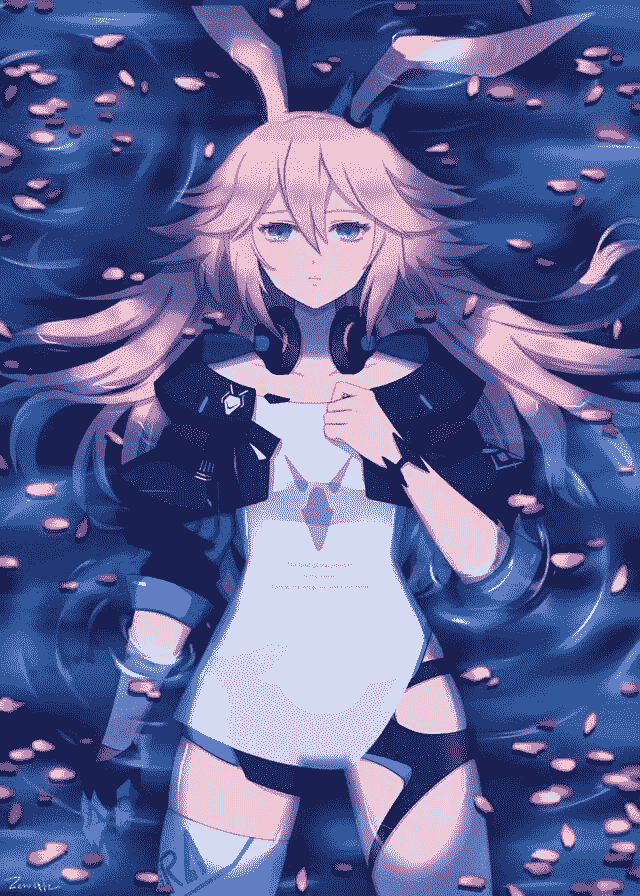
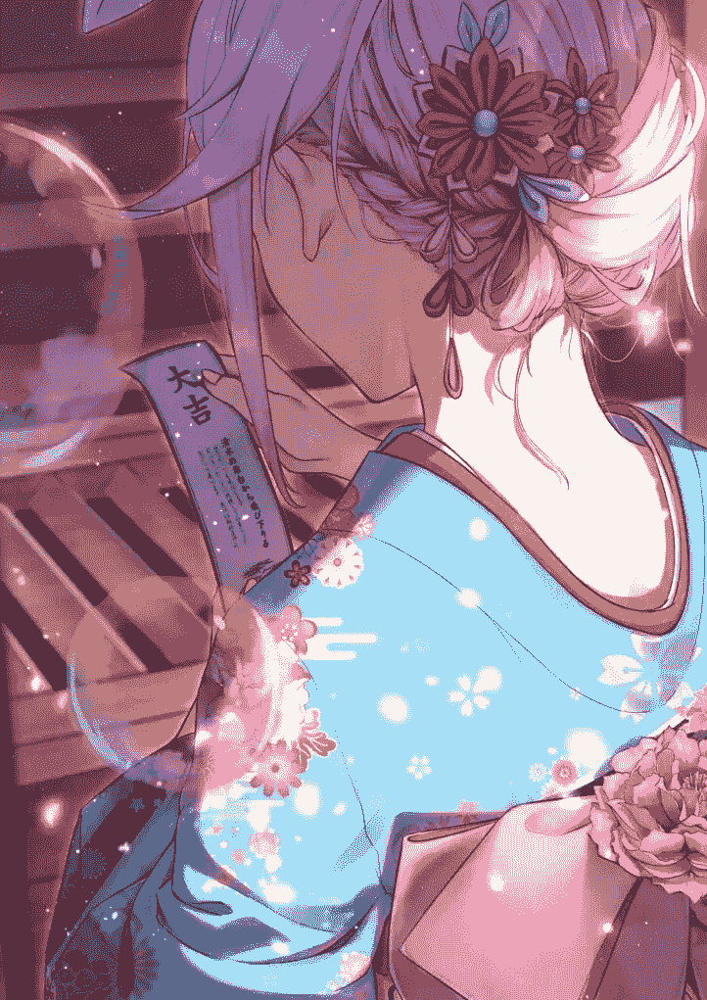

# 愿星辰祝福你啊，我的旅人（崩坏三同人

作者：腾龙八号

TID：26246

 

# 1

*本帖最後由 腾龙八号 於 2019-1-7 09:25 編輯*

嘤嘤嘤，积分不够了，写个文来骗骗积分，文体有点偏向散文，希望大家多多支持，谢谢                                                                 第二章更新于9l 

# 2

<ignore_js_op>[02caa84276a67dc908ce040daea02f2761fe5c71_raw.jpg](forum.php?mod=attachment&aid=NzYwNjF8OWI2MTMzYjN8MTYwMDg4MTQ1M3wxODIzMHwyNjI0Ng%3D%3D&nothumb=yes) *(280.86 KB, 下載次數: )*

[下載附件](forum.php?mod=attachment&aid=NzYwNjF8OWI2MTMzYjN8MTYwMDg4MTQ1M3wxODIzMHwyNjI0Ng%3D%3D&nothumb=yes)

2019-1-5 23:11 上傳  

</ignore_js_op> <ignore_js_op>[E514F2EAABD42475976E7708BC4A2345.jpg](forum.php?mod=attachment&aid=NzYwNjJ8N2Q3N2Y1NDN8MTYwMDg4MTQ1M3wxODIzMHwyNjI0Ng%3D%3D&nothumb=yes) *(483.84 KB, 下載次數: 3)*

[下載附件](forum.php?mod=attachment&aid=NzYwNjJ8N2Q3N2Y1NDN8MTYwMDg4MTQ1M3wxODIzMHwyNjI0Ng%3D%3D&nothumb=yes)

2019-1-6 00:10 上傳  

</ignore_js_op>  

# 3

第一章

——我本可以忍受黑暗，如果我不曾见过太阳

滴。。。。。。

滴。。。。。。

滴。。。。。。

心电图平稳的跳着。

我再一次合上了眼睛，瞬间，意识便深深的坠落下去，无底的深渊将一切的黑暗都容纳在内，慢慢的两者混为一体，成为了混沌的深灰，怪异的扭曲让一切都显得不真实，然而耳边呼啸的风声却又狰狞的彰显着自己的存在，顶部遥不可及的地方有像星星一般的光亮着，明明是代表着希望的光明，在无边的黑暗里，希望比黑暗更令人不安，而我只能向下坠去。求生的本能驱使我抓住什么，即使在无数次尝试之后，这种烙刻在灵魂深处的恐惧感依旧无法消除，耳边的风呼呼的刮着，却听不见丝毫来自底部的回音。

在几次扑空之后，仅有的意识将所有的感觉都开始钝化。然而手心忽然传来的温度把我的神智拉回，虽然依旧处于混沌的灰色之中，但是能够肯定那些温暖的手指温暖着我的手心，我像是抓住了救命稻草一般，死死得抓住了这只手，尽管依旧在向下坠去，手心里的脉搏声却给了我一种安心感。

直到，我梦见了那片田野。

金黄的麦田伴随着风晃动着，田边的小溪旁倒映着白云的影子，有时被压低的麦秆遮住，便和麦浪一起流动起来。

而我，躺在麦田边仅有的苹果树下，望着尚属刺眼的光晕将整个田地染上色彩，也看见稻草人的草帽被风吹起，然后飘向河里顺流而下。像是演奏起悠扬的曼舞曲般，头顶的树叶轻摇慢晃起来。

顺着草帽飞走的方向，依稀看见远处的女孩连衣裙被风吹动，裙褶如波浪般散开，白色的蕾丝帽下，是充满了阳光气息的樱色长发。突然风将帽子吹起，少女向帽子吹起的方向跑去，散开的长发就像流动的阳光。

“樱。”我刚想喊出口，突然，风改变了方向，帽子向苹果树飞来，我忘记了风吹绿叶的沙沙声，也忘记了催人入眠的树影斑斓，伸手想要去接住那片飘来的云朵。 

# 4

嘤嘤嘤，为什么新发的帖子没有出现在论坛新帖里鸭，哭唧唧 

# 5

> [青松城 發表於 2019-1-6 00:47](https://giantessnight.com/gnforum2012/forum.php?mod=redirect&goto=findpost&pid=393645&ptid=26246)

> 实用文的话，你爽我爽大家爽。不过散文开头实在难以理解啊(・▽・〃)

其实不是实用文啦（躺

 

# 6

> [archer 發表於 2019-1-6 00:33](https://giantessnight.com/gnforum2012/forum.php?mod=redirect&goto=findpost&pid=393643&ptid=26246)

> 想要来一波积分的话  写实用文绝对快

但是总觉得实用文emmmmm，大家都在写，要像真正吸引眼前很难

 

# 7

第二章

——醒来，发现自己不知为何在哭，经常做过的梦，却总是想不起来。

迎面，是那片不知梦到多少遍的景色，神社前樱花开了，开出了一片粉红，将本来棕色的树枝染得姹紫嫣红，突然出现的花儿就像幻觉一样，远远得看见那片花林被风吹动，像是笑了起来，高兴到微微抖动。

到那时神社前的注连绳一定会轻轻摇晃着，然后将门前的风铃摇晃，悠扬的铃声传开，而我站在那里静待日出时的第一缕霞光。

站在山野之上，我能远远得看见一团火焰在攒动，沸腾在的神社前的草地上，那么热烈，那么火红，就好像仿佛在和初升的朝阳呼应一般。

再仔细一看，略长的兔耳因为风压而与长发揉在了一起，鲜亮的发色饱满了阳光的色彩，就这样，八重樱迎风奔跑着，只留下草地被压倒而发出棉软的声响，看着她坚定而轻快的步伐，真是个充满活力的清晨。

然后我微笑着躺在了神社前的那片空地，任由青草的气息灌满我的鼻子，有时甚至会被浓郁的气息呛到，任由青草吻着我的额头，看着那片白云以肉眼可见的速度离开天空，然后看着太阳一次又一次的从云间探出头来，我喜欢这样的感觉，突然，八重樱就出现在了我的面前，遮住了我的部分天空。

“快起来了，躺太久会着凉的。”八重樱轻轻的叹了口气。

“你看，那片云朵好像你。”我假装没有听见八重樱的催促，反而转过头去看着看着另一方的天空。

“你啊，看什么都像我，要是再感冒我可不管你了。”轻轻揉了揉太阳穴，八重樱依旧盯着我，而我能感觉到淡蓝色眼眸投来的视线，落在地上的樱色长发像是抚摸一般掠过我的脖子，而气氛多多少少有些尴尬。

我没有继续躺下去，担心八重樱会生气，倒不是说她生气有多可怕，只是，心理的这种亏欠感让我觉得很不舒服。

在坐起来的某一瞬间，我和她的目光交错，为什么，明明是白天，她的眼中却有着深邃的星光呢。

我摇了摇头，或许是自己过于疲惫了吧，然而怪异的感觉却并没有停止，明明在伸手可及的地方就能碰到的她的脸颊，却仿佛错觉一般由于靠近慢慢遮住了我全部的那片天空，而我再次与她对视，蓝色宝石的繁星里也倒影着我的影子。

我伸出手，轻轻的抚摸着八重樱毫无血色的脸颊，冰凉的温度将本来柔软的皮肤冻的有些僵硬，就像那一季早已枯萎的樱花渗入水里。

或许是刚跑完步的原因，本就不高的温度再被汗水带走，原本苍白的色彩因为再次降温而变成了淡淡的红色，汗水顺着脸颊滑落滴在了我的脸上，而我，不知为何的感觉有些悲伤，放下了原本伸出的手。

现在的状态，更像是八重樱将我推倒，遮蔽了蓝色的天空，取而代之我两对视着的略显尴尬的目光，或许只是八重樱单方面盯着我，我似乎没有勇气去看她，只好微微的错过目光。

“起来吧”没有坚持多久，八重樱站了起来，蹲下身，将手伸到了我的面前，现在八重樱的身高似乎是我的三倍，而现在，我更像是她照顾的小孩子一样。似乎是潜意识里对大人畏惧的感觉，我乖乖的伸出了手来，手与手接触的一瞬间，与之前脸颊的冰冷触感完全相反的，像是春天第一缕暖流冲开冰河一般，温暖的手将我的手轻轻捏住，柔嫩的皮肤因为掌纹的缘故略显粗糙，但是仍旧不能掩盖这份安心的温度。

坐直起来的八重樱，理了理身上稍微散乱的巫女服，为我挡住了尚显微凉的风，然后站起身来，向我伸出了手。

我没有接过她伸出的手，自己扑腾着爬了起来，跟在八重樱身后，似乎是在照顾我的速度，在每迈出一步之后，都要稍稍的停留一下，不过即使是这样，我都得小跑才能跟上。 

# 8

在进入到神社之后，八重樱开始点起被炉里的篝火，然后把我像布娃娃似的抱起，也像是抱起布娃娃似的摸起我的头，本来是件羞耻的事，但是似乎是害怕我感冒，感受的温暖的感觉在头上运动，然后一次又一次头发被慢慢冲开的感觉，给了我一种莫名的安心感，然后，或许就会这样睡着吧。背后沉稳的心跳依旧照常的跳动着，真是的，被当成小孩了啊。     虽然如此，不过这感觉似乎单方面的被八重樱照顾啊，也没什么好抱怨的吧。     那就，姑且目前先这样吧。     静听着神社中的火坑悦动的火焰，我渐渐的眯起了眼，感受着远处好奇的探进屋内的冷风，与背后柔软的小腹，沉稳的心跳与柴火爆裂的噼啪声混在了一起，八重樱的手离开了我的头顶，紧接着，是一阵书页的翻动声，轻摇慢晃之间，感受着时间从身边溜走。     “你在身边，真好。”明明是心里想着的事情，却不知为何流露到了嘴边，而书页停止的翻动，仍旧只留下火焰爆裂的声音。     “睡不着吗？”并没有理会我说的话，本来羞涩的心情却因为奇妙的回答而平静了下来。     “不知道为什么，做了一个失去你的梦。”我低头反复翻转着自己的手，以确认自己是否还醒着，即使这样，依旧传来的陌生感使我在自己脸上啪的一声，吃痛之后反而能够带给自己一种安心的感觉。    “疼痛才能证明自己是活着的吗。”半陈述半疑问的语气使我自己都搞不清我到底在等待着八重樱的回答，还是在对自己说话。     “只是幸福让人觉得虚幻罢了。”八重樱没有看我，翻书的手却停了下来，将对我而言略大的书放在了我的腿上，然后双手伸向了篝火。     “温暖和伤痛，哪个才是火焰呢？”八重樱呼出的蒸汽变成了白烟。     “温暖吧。”我不是很确定，但是我知道有八重樱问题的答案，一定不会悲伤。     “猜对了一半，温暖和伤痛都是火焰，就像欢喜和悲伤都是相遇。”     “那朝阳是你，雾月是你。”听见这句话的八重樱似乎愣住了。伸到半空的手停在了那里。常年冰封的脸上却露出了春的消息。     然后，仅有两人的房间又归于宁静。溅起的火花噼啪的响着，一次又一次照亮了八重樱手中的书页，而书却没有再响过。     睡着了吗，我小心翼翼的抬头望去，却发现两手托腮的八重樱静静地望着我，书早已合上，我们目光相逢的一瞬间，八重樱悄悄错开了眼神，脸颊却像梨花一样，在冬夜里悄然绽开。     如果时间早些的话，我会不会爱上你呢。     火焰渐渐的由一团变成一簇，我从她的腿上跳下，将木材丢了进去。潮湿的材料慢慢升起了烟。接下来，便是一串连续的爆裂声。周围的声音越发的显出了我们的沉默与不安。     “雪。”八重樱嘟囔着。      冬天的精灵带来了白色的大地，而八重樱不知何时，站在了屋外，被积压的雪覆盖着，变得圆滚滚的大了一圈。     是错觉吗，我呆呆得望着窗外，却不见了八重樱。只有略微昏暗的光线将白色的细砂照得金黄。     “咿呀”，地板发出清响，八重樱不知何时出现在了我的背后，轻轻拍了拍我的肩，我回过头，却被蹲下的八重樱吻住了额头，松软的触感以及微薄的凉意将我的睡意赶走。我想要回吻她的脸颊，却被她故意的错开了，然后略过她的长发一个踉跄撞到了她的肩膀上。     本应显得娇小的肩膀却因为体型的原因劳劳实实的把我接住了，然后她轻轻将我抱住，并没有用力，仅仅是搭在上面而已。     “再多依靠一下。。。。。。”话还没有说完，八重樱的身影却突然消失了。