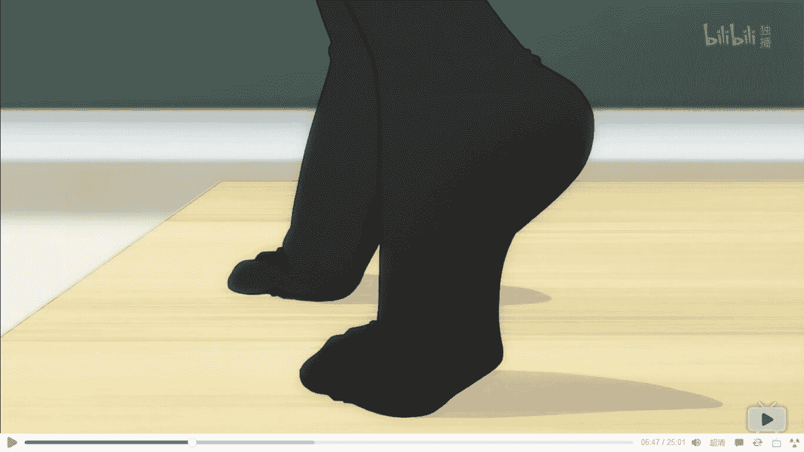

# 新手，剧情向，慢热【魂体双分的暗影】

作者：ls19930624

TID：20994

<title>1</title> <link href="../Styles/Style.css" type="text/css" rel="stylesheet">

# 1

恩...这是我把自己写的文章修改后在这里发出来试试，总体上gts的内容穿插在剧情里不算很多，非重口。如果觉得不好看的话请提出宝贵意见。

 （一）于毁灭前的唤醒
H国利刃山前沿研究所，16年前
“啊李所长，李夫人，来的正好，我们有东西给你看。小芷！带着小克老样子去花园！”
一个穿着研究服的女子在与一个老者以及一对年轻夫妇打过招呼后，将年轻夫妇牵着的小男孩带了出去。
“这个断层期的文明物品经过我们的努力已经接近破解，所长你也是付出了不少努力的啊！在你回来之前，我们已经弄清楚了它的大部分用法，今天就是开始试验用途的时候了，还请所长夫妇多多指点....”老者涌现出抑制不住的兴奋，转身就向实验室内走去。
面目俊朗年轻男子却显得很冷静：“恩，我们开始吧。”转身面向了年轻女人双眼发射出温柔的光芒：“你就别进来了，小芷不一定能在接下来的情况中保护好小克，你先去暗中盯着小克吧，我这边如果真的搞不定的话...会给你信号的。”
“恩”。女人虽说答应了，但是微微含泪的双目和攥得紧紧的拳头却暴露了她的担心。
李所长的身影渐行渐远……“傻女人呐，这该是我…最后一次骗你了呢。”
实验室里
“分析进程已完成...校对基准信号偏差＜0.01%......星体轨道即将达到标准，倒计时30秒....29.....”
除了一脸凝重的李所长，其它人都按捺不住脸上的喜悦。
那位老者笑道：“成功了以后，不仅能弄清楚断层文明消逝的秘密，说不准能获取断层文明重要的科技资料，我们那么辛劳了那么多年，不图名利，不就是对知识的渴望在驱使着我们前进呢，是吧？”
李所长默默走到人群后方，从口袋里取出一个锋利的刀片，将研究服的袖子割下，只见他的一双手臂上刻满了玄奥的纹路，令人眼花缭乱。“拜托了，神灵大人啊，拜托了，彧灵，拜托了，小克，我......不会失败！”喃喃说完，走进了出口附近的另一个门中...身影闪过，门口只留下了断掉的衣袖与一点鲜红的血液......
李所长来到了秘密的地下室……
“倒数4....3...2....1....0....”
倒数结束了，然而正当众研究员准备庆祝并查看成果时，最为可怕的事情发生了。
“哼~~”

那可能只是某位少女的娇柔的一次轻哼，如果真的是那样就好了.....
仅仅只是这一个音节，却仿佛席卷了整个星球，几乎瞬间摧垮了所有星球上的心灵，只有少数人才能幸免于难，幸存下来的人也并不好受，他们之中大多在这个娇哼所附带的难以述说的威压下瑟瑟发抖。被摧毁心灵的生命眼神空洞而恍惚，连思想都做不到。更别说抵抗了。
花园中。
“彧灵姐...咳...这就是...那位大人吗...我好怕...好累...”。年轻女人，也就是小克的母亲彧灵，双眼闪烁着璀璨的紫色光芒，额头上显现出类似李所长手臂上的纹路，看样子那一声对她的影响不大。
“小芷，撑住啊...不会有事的，我们，大家，世界都不会有事的，你要相信旸！是他的话，绝对能办得到！”彧灵怀抱着幼年的小克，对着小芷不断地鼓励与对话以保持她的清醒。细细看来，小芷略显无神的双眼里也流转着较弱的紫色光芒，却好像要随时消失一样。
就在这时，异变再次发生....
蓝天消失了，云彩消失了，太阳消失了，黑夜消失了，月亮消失了，星星消失了。整个世界的幸存者们所看到的天上的一切都变成了散发着无穷压迫气息的....皮肤？

那是一只不管从什么情况下来看都很完美的手，在这个手掌中的，无疑是一个脆弱的星球。这个美丽的手，只需轻轻一握，这个行星便会从宇宙中除名。化为无可识别的宇宙尘埃。
那个手掌的主人是什么样子没有人能看到。因为那个手掌就是突兀地从宇宙中伸出来的。不过可以肯定的是，那个哼的一声也肯定是她发出的，而且，她以前也在这个星球上存在过吧...。
星球上的幸存者们已经失去了互相联络的的方法，只有少数人，在做着最后的努力。
印加国，一位气息已绝的老僧周身发出炫目的光芒，双眼仍然坚定地注视着前方。
霓虹国，一位少年和一位少女身穿奇异服饰，各执一块玉佩与铃铛，两人皆是脸色苍白相互扶持着。
联合王国，数位主教手持十字架，与一位领头之人单膝在圣像前虔诚祈祷。
大洋中的一个小岛，数十位状若疯癫的各国人，围绕着一个黑色的水晶球念念有词。
利刃山前沿科技所地下室，李所长正强撑着不让自己倒下：“再多撑一会......唔，有点冷了啊...真该多穿一点来的.....。”流出的血液填满了手臂上以及地面上的图案，闪烁着紫色光芒......
“差不多了呢......神啊，我这一生很少失败过...所以说，请别让我在这件事上...失败啊...”李所长的双眼的紫光渐渐黯淡下去.....但瞬间，一团黑色的火焰在他的眼中燃烧。“切...身子已经动不了了吗......虽说不想就此倒下，但是这一回，可恶的命运和“伪神”啊，是本大爷赢了呢....”。
李所长倒下了，眼中火焰触碰到图案的边缘，瞬间点燃了血液，黑色烈火在只有他知道的地下室房间里熊熊燃烧……
彧灵怀中的小克突然哭了起来，他的左眼迸发出了蓝紫交汇的光芒，直冲天际。
“啊！”伴随着一声惊慌的尖叫，天空迅速被纯黑色所填满，本应是恐惧的黑色这时却让人觉得十分......温柔和可靠。
“结束了...吗，旸，你做到了啊...”彧灵眼中紫光散去，小心翼翼地安置好小克后，颓然地在花园里倒了下来。
小克哭声渐止，那个曾发出蓝紫光芒的眼睛渐渐变成了纯黑色.......
-------------------------以下为非播出内容-------------------
【啊啦，我都看到了，你做了些什么】我看着眼前的被黑暗所包裹的行星以及那只被黑暗困住所动弹不得的手。
【哪只手叫我起来的.......哪只手留下来吧】空间的裂缝关闭了，伴随着又一声痛呼，被截断的一只手化为了无名的粉尘散落在蓝色行星周围。。
【虽然过于追求知识只能带来毁灭，但....我的‘生命’...是他们赋予的呢......】
【接下来...该如何呢...看来，只能用这只‘手’修复这个脆弱的小行星了呢。】 
<title>2</title> <link href="../Styles/Style.css" type="text/css" rel="stylesheet">

# 2

> [das 發表於 2016-4-27 20:15](https://giantessnight.com/gnforum2012/forum.php?mod=redirect&goto=findpost&pid=291883&ptid=20994)
> lz天生的写手啊，刚进gn一言不发，一贴不回，先写原创文，真是灵感君啊

额。。，你是在说我应该先多看看再来发文章吗？
<title>3</title> <link href="../Styles/Style.css" type="text/css" rel="stylesheet">

# 3

> [hunj 發表於 2016-4-27 20:40](https://giantessnight.com/gnforum2012/forum.php?mod=redirect&goto=findpost&pid=291887&ptid=20994)
> 看起来好屌的样子……好深奥…

有什么建议可以说给我听吗？还是说这里不允许这样的文风？
<title>4</title> <link href="../Styles/Style.css" type="text/css" rel="stylesheet">

# 4

> [thanksdd 發表於 2016-4-28 00:46](https://giantessnight.com/gnforum2012/forum.php?mod=redirect&goto=findpost&pid=291919&ptid=20994)
> 背景设定感觉好复杂，有点没看懂，再通俗一点，或者直接写个设定

你们都喜欢快节奏的文章吗？那看样子我得再多想想了，突然发文是我鲁莽了
<title>5</title> <link href="../Styles/Style.css" type="text/css" rel="stylesheet">

# 5

> [shendanxiaogui 發表於 2016-4-28 01:21](https://giantessnight.com/gnforum2012/forum.php?mod=redirect&goto=findpost&pid=291923&ptid=20994)
> →_→我觉得只是大部分人单纯快餐吃多了享受不了而已。毕竟gts圈子小，每个月发文的也就10来篇，而且练手 ...

版主大大好，谢谢您的支持，如您不嫌弃的话，可以在写作手法与内容上向你继续讨教吗？方便请留下qq这样的联系方式，我将不胜荣幸
<title>6</title> <link href="../Styles/Style.css" type="text/css" rel="stylesheet">

# 6

（二）        梦境

我不知道我是谁，是怎么诞生的。只知道诞生前的我，处于如同死亡一般的沉寂之中，连存在的意义都没有。当我拥有了意识之后，我就处在这广阔的空间之中。
很孤单呢，我曾经试过和那些亮闪闪的小点说话，可是还没有等我开口，仅仅只是注视，那些小点就急速地冲进了我的身体里。
暖暖的，很舒服。就像走失的小孩子找到了妈妈，双方应该都很开心吧？
事实是这样的感觉仅是一瞬之间，我眼前又是一片黑暗。
也许……睡一觉就好了？睡醒了，就有伙伴了吧？
再次醒来的时候，我眼前多出了很多新东西，很多漂浮着的圆形球体，颜色各异，远方，一个大型的火球状球体发出光和热。
这温暖……就是那时的小光点吗？我尝试着去触摸那个“火球”…一只笼罩着黑暗的手出现了。
诶？这是……手吗？原来我也有手的啊，可是…还是太模糊了…黑乎乎的……
很多圆形小球体碰在了我伸出的手臂上，有的被弹走了，有的直接粉碎了，如果我不是注意力在手臂上的话，根本不会察觉到吧。
咿？那几个球体似乎有些…不一样？
好像是…和我一样，活着的？他们在对我说话？
于是，我第一次接触了所谓的“情感”。
我小心翼翼地收回了手臂，注视着这几颗球状物，想听到他们说什么。
恐惧，绝望，膜拜，麻木，愤怒，还有些微弱的不能理解的情感。
是在，讨厌我吗？为何，我会被你们讨厌呢？
不能理解，我完全无法理解。
既然如此，就再睡一次吧…在这个温暖的火球旁边再睡一觉…..睡一觉就不会被你们讨厌了吧？
可惜晚了，那几颗活着的球体已经向我冲来，消失在了我的视线前……
这感觉…好满足，还想再来一遍啊…是“食物”吗？可这些球体…是和我一样活着的啊…我吃掉了它们？是啊，它们在讨厌我呢，吃掉…也没关系吧？
既然都在讨厌我，那么我下次就把讨厌我的都吃掉，留下喜欢我的不就行了吗...呜...好困....
我沉沉睡去……
-------------------------------------------------------------------------------------------------
“啊！”小克从梦中醒来，惊疑不定地看向了漆黑一片的夜空。
<title>7</title> <link href="../Styles/Style.css" type="text/css" rel="stylesheet">

# 7

（3）旅行者的视线
“早安，妈妈…”小克摩挲着胸前的水晶挂坠，其中散发出的奇异光芒投映在某个中世纪一般旅馆中简陋的墙壁上，一个美丽的女子的脸庞显现出来，她温柔地笑着，就像时隔很久看到了自己的孩子一般，满满的都是母爱的光辉。
“虽然对我来说…只是第四天，但是孩子…每天早上你联系我啊，你的变化都好大呢……妈妈我啊，有点担心呢…会不会明天，就认不出来你了？”
“怎么会…我永远都是您的孩子，所谓的变化…肯定都是您的错觉啦…”小克也露出了灿烂的笑容，“那么，今天你的孩子也很有精神呢，一日三餐都是按时吃的哦，我一定会尽早回来的，明天您也一定能看到我哦！”
美丽女人的笑脸渐渐淡化，而小克脸上的笑容也渐渐变成了苦涩。
“我确实变化很大……因为每次再见到妈妈您，都是用死亡换来的呢…”
原本只是一个平凡的高中生的小克，他的生活在高三那年的生日发生了翻天覆地的变化。
他接触到了自己的父亲留下的遗物，并且得知了一个令他难以接受的事实。
他从2岁以来来，只是活在人为设置的另一个世界里，而自己原本所处的世界，却不知去向。
“你想要…改变这种生活吗？你…满足于现状吗？你的内心就真的没有缺失的东西吗？”
父亲的声音早已在记忆里模糊，却丝毫不影响小克认出自己的父亲。那一刹，小克清楚地感到了所谓的“缺失”。
自己活着的世界是虚假的，朋友也是虚假的，这都勉强可以接受…可是…脑海里有个朦胧的身影却一直挥之不去。那是谁？总感觉那是自己的一部分，却又不属于自己，明明似乎是伸手可触的距离，却又远在天边…看到这个身影，就迸发出了强烈的追寻的想法，接近，完成祂的梦想…哪怕奉献一切都在所不惜…
“父亲，我的母亲…也是…虚假的吗？”“不，只有你的母亲，是无比真实的。”
“我想要改变这一切，父亲…我要改变这样的生活。不仅仅是为了我自己…”
366天，四次死亡，换来了仅仅只是4次重生和4次与母亲的对话。而且，死亡并不算代价……
小克失去了分辨善恶的能力，甚至自己情感都被削弱了不少。
“按原定的计划，行动吧…下一个调查目标，别察觉到啊……”小克的目光投向了乌云翻滚的天空。
同一时间，在一片荒凉的戈壁之上，一位倚靠在一座小土堆上的绝美少女缓缓睁开了漆黑如墨的眼睛。
“又出现了呢，从另一个地方传来的视线……”空灵的声音在旷野上回荡，“可是呢，我出不去啊，你的视线，也仅仅只能供我计时了呢…就叫‘一视’好了~”
墨瞳缓缓合拢，黑色雾气渐渐覆盖了整个少女和广阔的戈壁旷野…
<title>8</title> <link href="../Styles/Style.css" type="text/css" rel="stylesheet">

# 8

> [summer 發表於 2016-5-28 23:50](https://giantessnight.com/gnforum2012/forum.php?mod=redirect&goto=findpost&pid=294852&ptid=20994)
> 呢没看明白怎么回事就没了。。？

这个我得慢慢写，急不来。。。一急就烂了，，，
<title>9</title> <link href="../Styles/Style.css" type="text/css" rel="stylesheet">

# 9

> [秋兴八首 發表於 2016-5-30 01:52](https://giantessnight.com/gnforum2012/forum.php?mod=redirect&goto=findpost&pid=294950&ptid=20994)
> 支持楼主，写得真好。另外说一下，这样的写法很多人是无法直接理解的，他们需要起因经过结果，很无聊不是 ...

这算是我在贴吧里写的文的后续吧。。。前面的情节也不是所有人都能接受的。。。所以有点匆忙地结尾了
<title>10</title> <link href="../Styles/Style.css" type="text/css" rel="stylesheet">

# 10

（三）鲜血公主岚娜
“咚…咚…”远处大地传来了规律的震动，仿佛是…在散步的人的鞋子踏在地面时所发出的声音。这个城镇的居民并不知道将要发生什么，这里之前甚至有据可查的地震都几乎没有。所以这里的民众仅仅只是快速回到了自己的房子里。只有少数有见识的人和高位者知道接下来会发生什么事，迅速地离开了城镇。
小克虽然也知道将要发生什么，但是他并没有急着离开。
“近了…近了…”小克的右眼渐渐出现了红色的光晕，随着震动越发剧烈，红色光晕也渐渐明亮。
“呀咧呀咧，没想到还是个老熟人，这下都不必跑路了…”小克勉强挤出了一个笑容，“啧啧……感情淡薄真不是一件好事，明明应该是喜悦的笑容却做得像苦笑一样……”
地面的震动停了下来，就在毫不知情的城镇居民松了一口气的时候，悦耳而俏皮的少女声音在城镇上空响起：
“天呐，这里的领主难道一点消息都没有得知吗？明明妾身已经和那个古板的铁疙瘩打过招呼了，居然过了这么久都没几个人撤出来？”
那是一位贵族模样的少女，一身纯黑的束腰长裙和精致的小皮靴与寻常贵族并无二致。然而全身略显苍白的肤色，那张开嘴时显露出的獠牙以及猩红的眼眸都提示了她并非普通人类。
更何况…她仅仅是脚踝部位就和城镇的城墙平齐了。这个小城镇虽说比不上大城市，但是好歹城墙也至少有10米左右的高度…这个城镇在她的面前也不过是个客厅大小……
“……糟糕了…妾身被那个铁疙瘩摆了一道…就这样回去不就表示妾身示弱了吗…可是这里面这么多…要是全部踩死的话…就等于妾身宣战了啊，好焦虑好焦虑……”少女焦急的神色溢于言表。
“大半年不见了你还是这么傻得可爱啊……”小克来到了卫兵早已逃光的城墙上，抱着胸口仰视着少女的猩红双眸，还面无表情地调侃着，“下次记得穿短一点的裙子，没有福利咱很难有什么干劲的。”
“欸….欸？！…欸！！”少女看见城墙上突然出现的小克，脸上的表情由疑惑，到难以置信，再到狂喜。她尽量缓慢地蹲了下来，以免风压将城墙上脆弱的小人吹下去。
“你不是已经…”“嘘”小克对其做了个噤声的手势，指了指自己的右眼，此时小克的右眼已经完全从蓝色替代成了和少女一样的猩红色。
少女点点头，却直接用两根玉指轻轻将小克捏起，放在了她银白色头发披散的肩膀上。
（岚娜，呃…我知道你有很多想问的，不过看起来现在更需要帮助的是你呀…）小克在心里想道。
岚娜如同外观所见，是一位吸血鬼，然而在这个世界里，每一个种族，职业，宗教都只会出现一个如此巨大体型的女性，那是在“赐予仪式”里集合了全族或是宗教代表力量和意志的体现。也正因为如此，这个世界的相对和平也在这个仪式出现之后维持了将近1000年的时间，原因么…请参照地球上的核武器…
然而和核武器不同的是，这些女性可都是有着自己的意志和思想的，尽管在大的方面会以自己种族和宗教的利益为主，但是鉴于巨大的力量，有时候说不定会因为自己的某些恶趣味和欲望，做出让人很头疼的事情出来，甚至酿成惨剧，最终各种族达成了协定，女孩们集合了各自的力量开辟出了一个新的空间，并在里面一起生活。当然，那基本仅限于还无法控制自己的力量的新生巨大少女，那个空间也几乎变成了一个学校一样的地方。随着女孩们对自己的力量的逐渐掌握，她们还是回到了原本的世界，像一个凡人一样生活。
小克第一次来到这个世界的时候，是在血族的古堡苏醒的，一个活人突然出现在血族的要地，自然会被当成是敌人的间谍。但是小克并没有被发现，因为他的能力很特别。
“共鸣”：将另外的非蓝色眼瞳的持有者能力和特质复制一部分。当时岚娜才刚刚从那个特殊空间里归来，溢出的力量波动被小克共鸣，导致了小克也拥有了血族的身躯。只不过…
让小克没想到的是，还没等到他摸清楚情况，他就被岚娜在毫不知情的情况下踩死了…
再一次见到岚娜那是第二次死亡之后的事情了……。
开启共鸣之后，小克实际上便等同于岚娜的“眷属”可以在距离允许范围内和她进行心灵交流。有些事情还是不用说的比较保险……
倚靠在岚娜雪白的玉颈边，小克呼吸了一口饱含着发香和体香的空气…然而本该血脉贲张的他却仅仅只是心跳加快了一些，脸上多了一些红色而已。
（你和瓦尔基里闹别扭了？）瓦尔基里是大陆上战士们的共同信仰…集合了战士们的心愿而生的女武神。
【也…也不算闹别扭…就是打了个赌而已…】
（我猜猜…肯定是赌你能在多长时间内让城镇消失？）
【我以为她肯定会提前叫居民先走的嘛…】
（傻萌傻萌的你呐…你觉得这座城镇只属于瓦尔基里？这里有很多战士是不错，但是还有着教廷的分会，况且，这里的居民都是人类呐，摆明了瓦尔基里联合了教廷的那位还有阿赖耶一起要坑你一把啊…）
【妾身…妾身当时也没想那么多….那你说…妾身该怎么办嘛！】
（咱就这么和你说了吧，这一次瓦尔基里也没想坑死你，你就算全毁了这个城镇，撑死了也顶多受到秩序侧的一些处罚而已，而且无论是混乱侧还是中立侧都无话可说……）小克摊开了手掌，（而且瓦尔基里给你的时间很长吧…因为她根本无所谓能不能打赢这个赌，损失也是三方共受，最后你选择不毁，那你血族之神丢了面子，如果你选择毁了，那你就要受到惩罚，血族少说也得受到牵连吧，全族还都丢了个大面子。至于战争嘛…这样的人数估计还不足以引发战争…你就放心喽）
【那…就这么认输了？妾身……会在瓦尔基里面前抬不起头的呐…你一定有办法的对不对？】岚娜撅起了精致的小嘴，急的眼眶都红了。
（真是服了…你们这些‘神’啊，好多都是爱面子…就和心性未成熟的小孩一样…话又说回来了，我帮你，你有什么好处给我呢~）
【你…你！妾身我还没有找你算账呢，你居然还和妾身谈起条件了？】
（啊啊啊!别捏了！！我服，我服还不成么！）小克的身体被突然袭击的巨大玉指捏得嘎吱作响，若不是拥有了血族的部分体质，还有缺失了部分痛觉，就不会还能保持着心灵交流而是直接喊出来了吧。
（嘶…真是拿你没辙……其实也很简单啊…毁掉一个城镇，尤其是像这样还拥有着城墙和城主府的城镇，真的要全部“毁掉”吗？）
【欸？你是说…】
(当然是只要毁掉所谓城镇的象征，让它不能再作为一个城镇而存在咯，城墙，城主府，以及城镇规模都是你要想办法破坏的目标啊，看来这大半年……你唯一没变的就是智商了呢……啊！叫你别捏了啊！真当我不疼啊！)
【哼，谁叫你一见面就毫无顾忌的黑妾身！妾身怎么说也算是神了啊!】
“不过……还是…谢谢你，能再见到你真是…太好了…”
缓缓站起身，银发的血族公主轻轻地给了小克一个巨大的“吻”。随即向着眼前那玩具般的渺小城墙.抬起了精巧可爱的皮靴……
<title>11</title> <link href="../Styles/Style.css" type="text/css" rel="stylesheet">

# 11

<ignore_js_op>

**QQ图片20160604091309.jpg** *(55.09 KB, 下載次數: 0)*

[下載附件](forum.php?mod=attachment&aid=NjE2Mjd8YzFmYTBlOWZ8MTYwMDg4ODk5NnwxODIzMHwyMDk5NA%3D%3D&nothumb=yes)

2016-6-4 10:48 上傳

福利<title>12</title> <link href="../Styles/Style.css" type="text/css" rel="stylesheet">

# 12

> [顺丰快递 發表於 2016-6-4 12:17](https://giantessnight.com/gnforum2012/forum.php?mod=redirect&goto=findpost&pid=295365&ptid=20994)
> 敲碗敲碗〜〜〜〜
> 那个视频

就把这当一个图吧。。。
<title>13</title> <link href="../Styles/Style.css" type="text/css" rel="stylesheet">

# 13

四、        前事
就如同在沙滩上踏平沙子做的城堡一样，甚至还没能在精致的靴底下坚持哪怕一秒钟，那些普通人尚且需要费一番功夫才能登上的城墙就在巨大的压力之下坍塌，瞬间化作了连断壁残垣都称不上的废墟。
然而岚娜除了尽量放轻脚步，以免飞溅的石块击中不远处的民房和店铺，注意力都未曾放在脚下过。
说的也是，有谁会在房间里踱步思索的时候注意力盯着地面？
“唔……我还以为你要吃了我呢…”小克摸着自己湿漉漉的头有点无奈地抱怨道，少女的嘴唇都能让十几个自己并排躺在上面了，而那个吻，也只不过是在唇上轻轻点一下而已。
“怎么可能会吃掉你……”说话间，整个城墙已经被踏成了地面上一道淡淡的痕迹。
“啊，这样就可以了吧。”慢慢地蹲了下来，伸出两根葱白的玉指，岚娜轻轻地将城主府从城市里连根拔起。毫无疑问，这建筑物接下来的命运……
雪白的手掌渐渐攥紧，城主府就像写错的稿纸一般，被握成了一团带着些许颜色的小碎块。
“那就快点回去吧，我估摸着那几位现在正郁闷着，要是……一会瓦尔基里来找你麻烦，你就直接把我扔出来……”
“你疯了？！虽然妾身不知道你是怎么活下来的，但……那时瓦尔基里确实刺穿了你的心脏吧？”
“嘶…声音小点…耳膜都要碎掉了。”确实，小克在瓦尔基里剑下死过一次……
-----------------------------------------------------------------------------------
作为一个战士，挑战战士存在本身便是一种愚蠢的行为。
尽管小克自己的身体素质和共鸣的能力让他自从第一次见到瓦尔基里，便在凡人中难遇敌手，但是相比于瓦尔基里，就像水滴和大海的区别……
尽管瓦尔基里并不喜欢以强大的力量本身面对凡人，然而即便是以凡人的身高，她的战斗技巧也远非凡人可以比拟。只有在竞技，比赛中最终留到最后的战士才有资格挑战她。虽然会被杀死，但是获得认可的战士将会被带入圣殿成为守卫，这种至高荣耀还是驱使着战士们明知死亡，也要使出浑身解数来获得女武神的赞许。
凭借着共鸣得来的部分能力，小克成功地站在了瓦尔基里的面前……
<title>14</title> <link href="../Styles/Style.css" type="text/css" rel="stylesheet">

# 14

> [xnr 發表於 2016-6-15 20:51](https://giantessnight.com/gnforum2012/forum.php?mod=redirect&goto=findpost&pid=296503&ptid=20994)
> 一开始以为是科幻，后来发现是魔幻，一开始以为是GIGA，后来发现是mega....

实际上算是我在贴吧里写的文章的后面部分，你当然也可以当做新的来看，，，毕竟前面的故事比较烂尾</ignore_js_op>