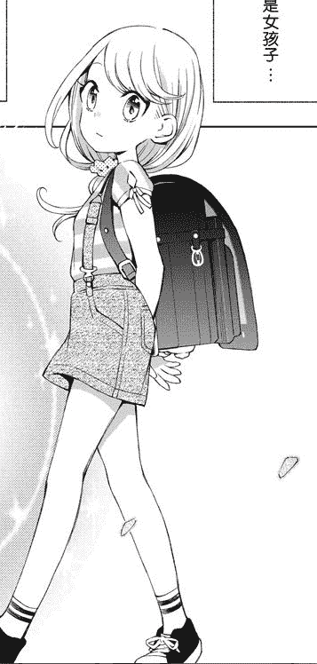
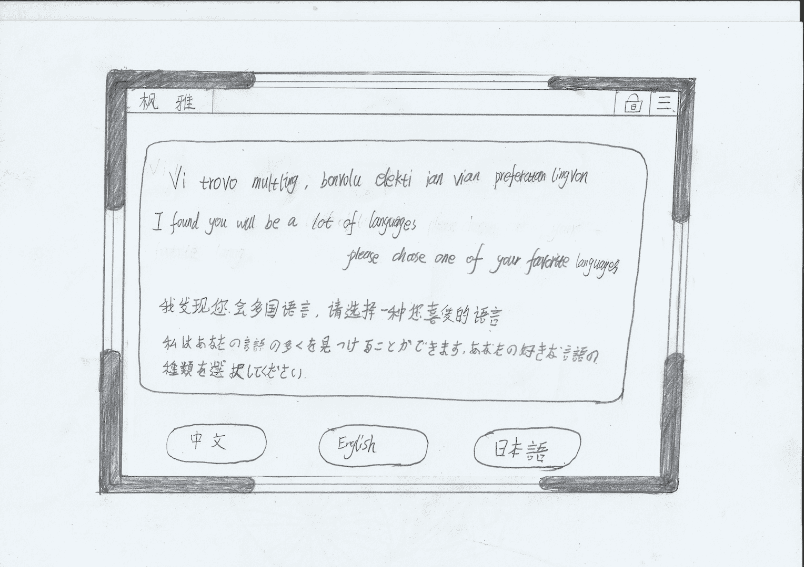
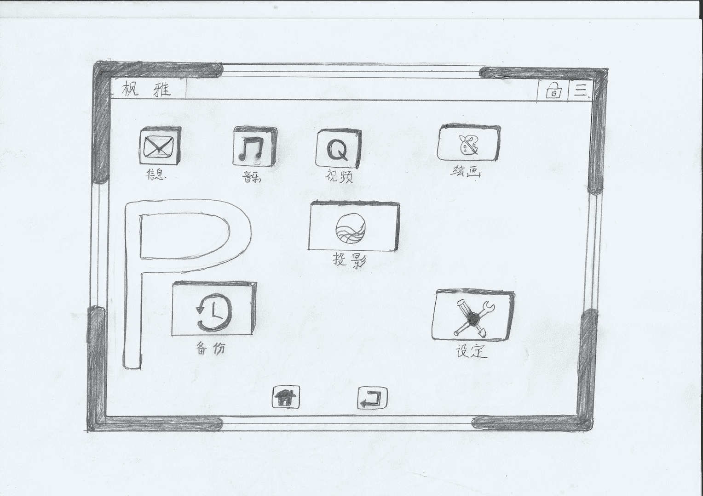

# 时雨的体验实验【第一章完结，尽情期待第二章吾名是水夏..

作者：琉璃

TID：22330

 

# 1

*本帖最後由 yuxiaoqiu 於 2017-1-1 02:38 編輯*

序章---小雅的欢迎会“久等了!抱歉来迟了。“远处优哉游哉的飘来一位可爱的客人。“啊呀呀，不用着急啦……“听起来软绵绵的话语，也不知是否能飘到女孩的耳朵里。“似乎也没着急的样子啦!果然这种场合吸引不了小孩子呢”漂亮的和服少女，沿着嘴笑着。“心里肯定急得不得了吧。时雨不是最清楚么。”呼哇呼哇的软妹子。摆着长长的袖子说到。“唔，真的很抱歉，为了我，等那么久，真的很抱歉。”客人急急忙忙的飘到园庭岸上。急匆匆快步走了过来。“明明就能跑过来呀。”说话的也是一个金发的女孩子，矮矮的女孩子似乎比来的客人还年幼。没错来的显然是位小学生，背着红红的双肩包格外显眼，蓝白相间的条型T恤和小小的背带裙。运动范十足。把白色的运动袜包裹着的红色运动鞋也说明着这一点。“不能那么失礼的说，实在抱歉，因为睡迷糊了。”叫小雅的女孩子连连鞠躬道歉。“明明瞬移来就可以啦。”时雨淡淡的微笑。摆了摆粉色的和服袖子。身后的两位女仆毕恭毕敬的走到客人面前“不不不，那样太失礼了。出席茶会还是要走来比较好”小雅连连摆手。然后脱下了肩上的双肩包，交给了一旁的女仆。快步走到自己的位置。见女仆拉开了椅子。踱步跳了上去。说是跳，也不是不妥。茶会的椅子是以时雨的身材准备的。小雅仅仅115cm的个子。坐在椅子上，双脚的够不到地面上的地毯的。不过显然，时雨对此早有安排。唤女仆从一旁拿来小小的搁脚用的小凳子，“雅大人。”女仆走到小雅面前，虔诚的跪了下去，将小小的凳子摆好。然后往后移了半步，等待小雅的指示。“嗯……”小雅也是第一次遇到这种情况。不过当她低头看向小凳子时，还是不禁一惊。“那个，真的不需要脱掉鞋子么？”小雅惊讶的看向时雨“随意啦，雅炭。”金发的爱丽丝笑着摆了摆脚丫。“不过时雨大人确实是珍爱雅炭呢。”小雅那么拘谨倒也不是不理解，因为她脚下小小凳子虽说是和椅子一样是看似名贵的木头制作的，但是和椅子不同的是，这个欧式的小凳子竟然四周以铂金做作为纹理。顺着木质纹路，镶嵌于内。构成一幅完美的图案。不仅如此，在小凳子的正面，一块小小的铂金铭牌，上面用金丝纹路刻画着，枫雅，是自己的名字，而小雅要踩的位置更是不得了，正中间一块硕大的蓝水晶中，依稀可以看到一颗耀眼的蓝色恒星在中间闪烁。而似乎因为小雅来自太阳系。水晶的外围8个不同颜色的水晶，紫色，红色，白色，金色，绿色，黑色，粉色，茶色统统依照星球的大小，相应排列着，旋转着。，在黑色的纹理上格外耀眼，而两旁，不知有什么东西覆盖着。但是如同星空一样闪烁着光芒。隐隐的仔细看，似乎能看到在这层东西下，一层层的金丝如同织布一样的覆盖在下面。“似乎要踩在这里”小雅心里暗想“嗯，那失礼了。”小雅摆正的双脚。而女仆则是不知为何，辅助着小雅的腿，缓缓地踩在那层显然要踩着的地方。“好软。好温软”小雅吃了一惊。“这个凳子好软呢。而且是暖暖的呢”出乎小雅的意料。即便是隔着自己的鞋子。软软的触觉也反馈到了小雅的脚上。而去不知道是不是水晶中的恒星缘故。整个凳子的表面，暖洋洋的。“当然软啦，雅炭”爱丽丝摆了摆手指“那可是时雨大人特意给你编织的呢。是那银河丝做的哟。”“银河丝？是什么动物……银河!是那个银河么？”小雅喃喃自语了一会，惊讶的抬起了脚。慌忙望脚下看去，那两团银河丝编织的覆盖物已经轻微的刻印下了小雅的脚印。“那个，那个难不成，我踩死了好多星球”“当然咯那可是，恢复不了了哟!”爱丽丝噗噗噗的笑着，“这个很贵重的哟。”“啊呜呜呜呜！非常抱歉非常抱歉!”小雅猛的站了起来，连忙鞠躬道歉。“噗哈哈哈!”爱丽丝笑着“爱丽丝!别吓她!”时雨正色的叮嘱道“是!”爱丽丝连忙也摆正了样子。一旁的穿着类似睡衣的妹子更是缓缓地站起来，跑到小雅的面前摸了摸小雅的脑袋“不用担心，这就是为你做的东西啊。”“为我做的？”“时雨大人啊!听说你在城堡里坐着会习惯踩着东西，所以就和我们商量做了这个东西呢。”“那也不用那么珍贵的东西啊。”“反正也是什么珍贵的东西，而且你踩的星系基本上都是时间线收束前的。没什么关系。”“时间？收束？”“这么说你也不理解，就是马上要消失的东西啦。”“马上要消失的啊!”小雅叹了口气，暗自想“也就是没有小人生存的星系了呢”“不是哟，里面小人星球还是特别多的，倒不如说基本上都是哟，时雨刻意为你挑的哟!”软绵绵的女孩子笑着看着小雅“读？？读心？”“不仅是眠眠大人哟，爱丽丝我也做得到哟!”“你们俩在心神传递什么呢？小雅也不用拘谨，毕竟你也算是我生出来的生命，你喜欢什么我还是知道的。”“时雨大人真是太惯着小雅了。”“时雨可是一眼相中了小雅哟”“姆！眠眠！爱丽丝!”“诶诶诶诶诶!”更让小雅吃惊的。在这次宴会上，似乎每个人都会读心，并且进行心灵交流似的。

<ignore_js_op>

**屏幕快照 2016-12-24 下午11.58.27.png** *(216.76 KB, 下載次數: 0)*

[下載附件](forum.php?mod=attachment&aid=NjYwNTZ8ZjAwMjQ3YmF8MTYwMDg4ODI1MHwxODIzMHwyMjMzMA%3D%3D&nothumb=yes)

2016-12-24 23:59 上傳

小雅的印象图 （出自柚子森桑，很有爱的百合漫画）</ignore_js_op>  

# 2

*本帖最後由 yuxiaoqiu 於 2016-12-31 23:59 編輯*

第一章：真假世界

{PS:[]表示心里话，“”表示说出来的话。{}表示谜之声}

“抱歉抱歉!”时雨待小雅平复好心情后，缓缓的轻启朱唇。“既然能来的人都来了。那么茶会就开始了。”

“嗯“经时雨这么一说。小雅不禁严肃了起来

[这是时雨主持的茶会，绝对不能失礼，不然就完蛋了。]小雅暗自想到。

小雅如此谨慎也不是不理解，毕竟在做的三位人物各个是顶级的人物，小雅的对面坐的的穿着和服的时雨，全名为枫·时雨。看似是个15，6的少女，但其实却是世界的化身。又可以说是，一切的母亲大人。正是这个人接纳了自己，没有让自己被名叫白樱的神明杀死。不仅如此，还把自己的姓名赐予了自己。要知道在上古神明里，姓氏是极其重要，几乎能凌驾于血缘之上的东西。

而自己的右边，坐着的一位看似年幼的少女。但是据说已经有24岁了。因为某次意外才导致现在的情况。很多人更喜欢叫她眠眠铃。但也有暗地说她还有一个形态的样子。软绵绵的她，看起来十分的柔弱，却是控制的一切梦境的神明大人。又可以称为是梦中的时雨。一切会入眠的生命都会在入眠后灵魂进入她管理的世界。在睡梦中的生死都有她掌控着。

左边的女孩子，年纪更小，只不过比小雅小1岁的的样子，但是并不是说年轻，据说她是时雨的第一个孩子。也是创世的巫女大人。相应的生命理论基础都是她一手建造起来的。而自己作为人类。也理所当然的是她理论的产物。就是这样掌握着自然之理的女孩子。却称自己为姐姐。若不是来到莉莉丝城堡被莉莉丝严格的训练的一番。恐怕现在的小雅早已害怕的晕厥过去。又哪敢和这三位女孩子坐在一起喝茶呢。

“内，雅？”

“诶？”在小雅想入非非的时候，时雨的呼唤让她回过神来，不过似乎有人替她回答了。

“额，抱歉，是妹妹的那个。“

“诶？“小雅吃惊的往向一旁的爱丽丝

“啊，爱丽丝原名是，爱丽丝雅哟。“爱丽丝笑着说，”不过小雅来的话，我就不能自称小雅了呢。“

“对不起……”小雅低下了头。

“不用道歉啦。在一起的时候还是叫我爱丽丝就好啦。时雨大人。”

“嗯。只是习惯了，或许叫小雅为雅炭不错的样子”

“嗯！嗯！这个爱丽丝很喜欢哟！”

“啊呜……”小雅的脑袋上冒出了白色的热气。

“好啦，好啦，别逗小雅了。时雨，你要把这个要给小雅看不是么？”眠眠笑着，从虚空中拿出一个类似平板的东西

“好吧，不过小雅害羞的样子真可爱呢。”时雨托着腮。笑眯眯的看着小雅。

“平板？”

“嗯，复制平板哟。这可是好东西呢”爱丽丝笑着把眠眠手上的东西推给小雅。

“诶都……这样开机。”

----------

potenco Sistemoj

sistemo preparado

kompleta sistemo

Inicialización estas kompleta

Sensilo noventrepreno estas kompletigita

Identigi uzantojn .....

Registriĝi personoj Feng Ya

sistemo privilegioj malfermita

uzanto Rajtoj  ekstrema

administrada aŭtoritato Kopio funkcio modulo

fikso lingvo

Vi trovos multlingvan, bonvolu elekti ian vian preferatan lingvon

I found you will be a lot of languages, please choose one of your favorite language

我发现你会很多语言，请选着一种您喜爱的语言。私はあなたの言語の多くを見つけることができます、あなたの好きな言語の種類を選択してください。

汉语 English 日本语

<ignore_js_op>

**扫描 7的副本.jpeg** *(385.43 KB, 下載次數: 0)*

[下載附件](forum.php?mod=attachment&aid=NjYwNzR8ZmQyMWFkNDN8MTYwMDg4ODI1MHwxODIzMHwyMjMzMA%3D%3D&nothumb=yes)

2016-12-26 02:05 上傳

---------------

“上面那些是什么？也不像英语。“在一串不知名的文字后。小雅才发现系统提示让她选择喜欢的语言。连忙点下了汉语的选项。

“你的世界的世界语哟。“爱丽丝笑着说道。

“世界语？？”

“对，跟地球上的人类交流的时候学会的。”时雨也附和道。

“诶，不过，从我出生后，人们都是以汉语为主的呀。不过时雨去过人类发源地啊。“

“嗯，去过呀，啊对了，小雅来自那个时间点呢。”

“嗯？时间点？”

“嗯～没什么。没什么，地球是个好地方啊。记得我去的时候，相关人员就是用世界语跟我对话的，原来现在人不用了么。”

“地球上什么样还真不知道呢。”小雅低着头。看着启动成功的平板上面显示着几个图标，分别是 邮件，音乐，视频，绘画，映射和设定。

<ignore_js_op>

**扫描 7.jpeg** *(217.49 KB, 下載次數: 0)*

[下載附件](forum.php?mod=attachment&aid=NjYwNzN8NmMwOWM1ZTR8MTYwMDg4ODI1MHwxODIzMHwyMjMzMA%3D%3D&nothumb=yes)

2016-12-26 02:04 上傳

“映射？”其他的都很好理解。小雅唯独对映射有点不太清楚。

“觉得好奇么？点开看看”眠眠笑着盯着小雅。“嗯！好的。”小雅乖乖的听从眠眠的话语。点开了映射的按钮“啊～”惊讶声不禁发了出来。在小雅眼前的。是一个小小的选择界面，但是这显然不是小雅惊讶的理由，小雅死死地盯着可选着的第一个。在那里，显示着赫然是自己的脚下，那个小小的足下世界，再看了看显示的标题，不仅有是一愣，那里赫然写着【世界树世界（星系）】使用中。“再点开看看。”爱丽丝笑着提醒道。“哦~”遵循着爱丽丝指导的小雅，点开了世界树世界。 不同之前在之前在平板操作，在点开星系的一瞬间。在小雅面前，浮现出两片星系。一双巨大的运动鞋赫然夹杂在之间。小雅自然认得这双红色运动鞋。这是自己为了参加这次茶会专门挑选的鞋子。小雅轻轻的摇了摇脚丫。画面上的巨鞋也随即摇晃起来。以迅猛的形势把边上几个小小的星球撞碎。小雅似乎有点不知所措。“这样，小雅！“对于不知所措的小雅，爱丽丝无奈地晃了晃脑袋。倚着椅子靠近小雅后。抓起小雅的手指。往屏幕上往右一滑。星系列表整个显示在小雅面前。几千个星系名称密集的排列着。右侧似乎还有离小雅鞋子的距离。“点击哪个就能详细看哪个咯“眠眠笑着打趣。”快看看有什么感兴趣的。““嗯！小雅压抑着自己内心的兴奋。快速的滑动列表。这个……“突然间发现几个红色的名称，而且在距离一栏赫然显示着-13光年。“负的，不会是……“这几分钟，小雅已经不知道吃惊了多少次。这个宝贵的平板带给她太多的惊喜了。“嗯，你自己亲自看看比较好呢“眠眠抿着嘴笑着。“欸修！“听从眠眠的话。小雅微微的立起了身子。微小的动作使得星系更加贴近数值也从-13涨到了-15。点击后的视角从星系赫然转移到小雅的鞋子上。微微靠近，再靠近，最后透过了小雅的鞋子。果然和小雅所料，视线转移到了小雅的鞋内。星系离脚并不是太近。似乎更贴尽与小雅的鞋子。而详细的介绍更是将其暴露无遗。这个星系名为纺锤星系，其内部有几十亿的人类生存，似乎出于封建中期的样子。经再放大其中有一个类似地球的星球。不过这些都不是重要的事情。重要的是这颗星球的介绍。因为赫然写着，高温，鞋内世界，人类削减数目40亿/90亿。现状稳定。距离鞋外15光年，距离脚旁45光年空气含量30% 脚部散发气体含量69%,其余气体1%人类适应性成长：良好，稳定。“嗯？“小雅歪了歪头。害羞的不知所措“还可以接着放大嘛。“爱丽丝帮着接着放大。出现了星球内部国家的详细介绍。似乎最大的国家叫做爱兰银卡。大约有20亿人口。当朝者似乎是一个年幼柔弱的5岁女孩。似乎天气的缘故有点生病。下面的平板似乎也写出了国家的信息爱兰银卡，面积150000km2，当地特产之类的。嘛这些都不是小雅所在意的。小雅真正在意的是一些小小的事情。比如说这个国家的国王被身边的太监所杀害。似乎是在小雅把鞋子放进来前的事情。之后空气大变。空气中弥漫脚丫的气味。世界为之大乱。很多人类被如然而来的白雾和汗臭味熏死，死伤无数。即便几周后习惯了白雾和气味的人类，也担心为此染上的疾病，闭门不出。不仅如此巨大的长圆形陨石从天空砸落下来（其实是小雅的脚垢）在本来就着火的形势更加火上浇油。似乎就在这个时候。年幼的女王挺身而出。强忍着气味祭拜了神明。并且亲身走到郊外呼吸气体。事实上小雅的脚味其实已经在变成神明后变得并不是很大了。但是无奈小人们太过于小了。这一丝丝的脚汗味，在他们看来就犹如变成死亡白雾一般而小人们的世界并不乐观。白雾依旧存在。年幼的女王毕竟年幼受不了如此的气味。日渐消瘦。而看到了时机的太监蛊惑下臣，说是年幼的女王为了夺权杀父。导致的神明大怒。并把试图在朝上处决皇位上的女王。小雅正在看的就是这么一场自己引发的闹剧。</ignore_js_op>  

# 3

> [天龙 發表於 2016-12-26 12:19](https://giantessnight.com/gnforum2012/forum.php?mod=redirect&goto=findpost&pid=318300&ptid=22330)

> 确实是比较乱，理清下更好点

是对话顺序还是排版什么的 哪方面乱呢</ignore_js_op>