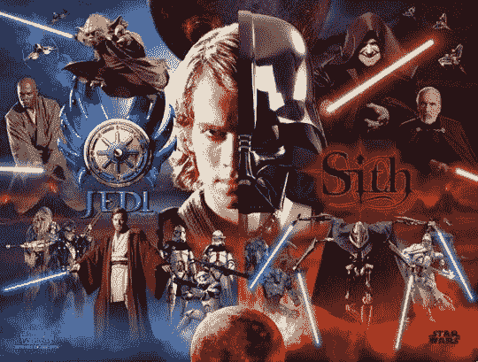

# 星球大战第二部，7月9日更新

作者：liujiwei0128

TID：15307

<title>1</title> <link href="../Styles/Style.css" type="text/css" rel="stylesheet">

# 1

*本帖最後由 liujiwei0128 於 2016-7-9 21:30 編輯*

**注：抱歉AFK这么久，不过我一定会继续坚持写下去的。****最近花了两个月的时间，把以前写的第一部大改特改改了一遍，去掉不需要存在的情节，也添加了一些情节。至于第二部，因为有很多非GTS桥段，所以直接全部推倒重写了。希望大家继续支持！！！**附录重要设定，宇宙原力和黑暗原力：原力：宇宙的一切，大到恒星和星系层面的运动，小到原子和分子层面相互作用，都是由一种最原始的能量在驱动进行的，我们叫它宇宙原力，简称原力。原力的能量是无穷无尽的，每一个人都能通过研习和修行参透原力的奥秘，从而获得驾驭原力的能（为了区分于黑暗原力，文中的原力特指光明原力）。
原力作用在男性和女性身上的效果是不同的，女性掌控原力之后，她们能操控周围的能量和物质融入自身从而自由改变自己或其他人的体型。而男性，则可以通过原力获得更大的力量、更快的速度、更高的强度和更灵敏的感知能力。某些熟练使用原力的人甚至可以在打斗中预知对手下一步的行动。
以人们操纵原力的能力为指标，可以把程度分为一到十共十个等级。每上升一个等级所拥有的力量都会远远大于上一等级。对于女性来说，每上升一个等级,体型就可以比上一个等级呈指数倍地更加巨大。黑暗原力：自宇宙诞生之日起，世间万物就都被赋予了两面性，就像一个硬币，总有正面和反面，一方以另一方的存在为前提，如光与暗，快与慢，大与小等等。宇宙原力也不例外，它也有其黑暗的一面，即黑暗原力。黑暗原力十分强大，它能够让研习者在短时间内提升巨大的力量，并让他们获得一些黑暗原力所特有的对元素的操控能力。光明原力是友好、博爱、积极等正面性质的体现；而黑暗原力则代表恐惧、愤怒、憎恨、邪恶、消极等负面性质，黑暗原力往往比光明原力更具有攻击性和侵略性，如果没有特别的天赋和自制力，普通的研习者通常会在黑暗原力的影响下堕落乃至丧失心智，这就是修行黑暗原力的风险。

<title>2</title> <link href="../Styles/Style.css" type="text/css" rel="stylesheet">

# 2

 <ignore_js_op>[1.jpg](forum.php?mod=attachment&aid=NDEwNjR8NjZjZDIzOWR8MTYwMDg4ODUxMHwxODIzMHwxNTMwNw%3D%3D&nothumb=yes) *(57.4 KB, 下載次數: 4)*

[下載附件](forum.php?mod=attachment&aid=NDEwNjR8NjZjZDIzOWR8MTYwMDg4ODUxMHwxODIzMHwxNTMwNw%3D%3D&nothumb=yes)

2014-2-16 14:34 上傳  

</ignore_js_op> <title>3</title> <link href="../Styles/Style.css" type="text/css" rel="stylesheet">

# 3

> Pikachu 發表於 2013-9-21 12:06 
> 很好。
> 继空间里放出的那篇长文之后，总算于论坛出没了吗。
> 为文字的背景颜色这一点很不错。

原来你也知道我空间中那文啊！谢谢一直这么关注我，以前第一次来这个论坛，不会发所以发在空间里了。前段时间因为大四毕业忙于工作，所以现在一有空就来更了。谢谢支持
<title>4</title> <link href="../Styles/Style.css" type="text/css" rel="stylesheet">

# 4

> SIDAIMU 發表於 2013-9-21 13:32 
> 还有吗好爽的感觉呢

这是中秋节三天写的存货，剩下的要边写边更。
<title>5</title> <link href="../Styles/Style.css" type="text/css" rel="stylesheet">

# 5

我是新手，请问一下，如果要更新的话是发在回复里面还是直接编辑原文呢？<title>6</title> <link href="../Styles/Style.css" type="text/css" rel="stylesheet">

# 6

> Jonas 發表於 2013-9-21 13:57 
> 建議直接用回復的比較好,然後標題要改一下看更在幾樓
> 不然就是不改標題做個連結也可以
> 話說會有女巨人跟小 ...

当然会有，后面会写到的。
<title>7</title> <link href="../Styles/Style.css" type="text/css" rel="stylesheet">

# 7

> youlovesogood 發表於 2013-9-21 14:03 
> 能更加細緻描寫一下巨人與小人的身體接觸會更好

当然会有的，后面会写到。如果你喜欢我的文笔的话，可以去我的空间看看我写的另一篇文，全是巨人和小人的互动，不过还没公开发表。
<title>8</title> <link href="../Styles/Style.css" type="text/css" rel="stylesheet">

# 8

> Ezio 發表於 2013-9-21 14:08 
> 哇哦~gtss过来得神文，是作者本人还是转载啊？

本人哦，史蒂芬·罗杰斯。多谢支持。
<title>9</title> <link href="../Styles/Style.css" type="text/css" rel="stylesheet">

# 9

> hebaodan512 發表於 2013-9-21 18:33 
> 对了 lz那个GTSS吧里也是你发的吗

是的，你也有看吗，谢谢支持啊
<title>10</title> <link href="../Styles/Style.css" type="text/css" rel="stylesheet">

# 10

> Dante 發表於 2013-9-22 00:43 
> .
> 還挺酷的…很抱歉我的感想居然這麼短，但這是我真心的感想。

本文的剧情和星球大战毫无联系的，看的时候就别把它当成星球大战就行。谢谢支持！
<title>11</title> <link href="../Styles/Style.css" type="text/css" rel="stylesheet">

# 11

> Pikachu 發表於 2013-9-22 07:38 
> 友情提示：
> 1.若要更新在原先楼层，最好划定一个分割界限，并编辑标题，标明更新时间。
> 2.在本论坛发表文章 ...

谢谢提醒，我会照着改的。请继续支持！
<title>12</title> <link href="../Styles/Style.css" type="text/css" rel="stylesheet">

# 12

*本帖最後由 liujiwei0128 於 2016-6-4 22:00 編輯*

星球大战:魅影危机引子——银河系现状：银河系边缘星球霍斯的某个荒原上，数以万计的赤膊奴隶正使出浑身解数搬运着身后一架架巨型投石车，这些战争机器被从帝国军事基地纷纷送往战争前线，帮助帝国军抵抗叛军的进攻。投石车为了发挥最大的威力个个都高达百米，重数千吨，每架投石车的前进都需配备数万奴隶同时使力才能拉动。荒原上除了奴隶和投石车外还依稀可以看到身形巨大的督工，与清一色的男性奴隶呈鲜明对比的是，督工是清一色的女性，她们的体型有大有小，虽说某些小督工的身高足有奴隶百倍大小，却还不及那些大督工的脚踝般高。对于督工而言，奴隶们都是如灰尘般微不足道的存在，她们走路时完全不会在意脚下的蝼蚁，每跨越一步都会留下一个如天坑般巨大的脚印。相应的，奴隶们如果不能小心地避开督工的踩踏，那么就会沦为和督工脚下的灰尘一样的命运，成为脚底上一个微不足道的红点。毫无征兆地，大地突然开始剧烈震动起来，天空瞬时乌云密布，变得伸手不见五指，东西南北任何一个方向都见不到一丝光亮。但其实若是仔细朝天一看，就能发现头顶上的根本不是天空，而是一个缓缓下落的黑色物体，它是如此巨大以至于被人们误认成了天空。见到这份景象，无论是奴隶还是督工都开始恐慌起来，纷纷不顾一切四下逃命。黑色物体的降落速度越来越快，荒原上的人惊恐万分，脚步声、哀嚎声和尖叫声混杂在一起，刚刚还尽然有序的队伍霎时间乱成了一锅粥。可惜的是，就算每个人都发疯似地逃命，相比起这个下坠的物体他们还是太渺小了，如果不能及时逃出被黑暗笼罩的这片区域，所有人都将无疑被压成肉饼。黑色物体终于重重地落在了地面上，引发了一阵巨大无比的冲击波，方圆十公里内的树木被连根拔起，被坠落时形成的龙卷风吹上天际。一分钟前还在托运投石车的数百万奴隶和几百个督工还来不及咽下最后一口气就灰飞烟灭，在巨大的重压之下和地面上的泥土混在一起，就好像从没来到过这个世界上一样。如果你以为这是陨石撞击星球的场面，那你就大错特错了。在这个星球上，能造成这样情况的，绝不是什么天灾或地震，而是帝国军在这个星球的总督：达斯·歌莉娅。刚才无比巨大黑色物体，仅仅是歌莉娅穿着黑丝的脚底板，而长达十公里的脚掌，哪怕是对于在她脚下丧命的巨大督工来说也是过分夸张了，除了坐以待毙或是徒劳地大声呼喊以祈求总督能听见自己的求救，她们什么都做不了。歌莉娅继续行走着，就算是星球上最高的山峰也只能在她脚下夷为平地，在她眼中，脚下这些低贱的生命，就算是自己的手下，对她来说也毫无意义，她甚至可能根本没有注意到他们，仅仅是饭后漫无目的地散步，就导致了数以百万人的死亡。那些她留下的巨大脚印里，大地崩裂，岩浆喷涌而出，哪怕是飞鸟走兽也毫无存活的机会，凡人的血与肉和泥土混在一起，被岩浆冲刷着，慢慢冷却而成为石头的一部分，近距离看宛如人间地狱一般，然而这一切在歌莉娅的眼中就犹如每分每秒都会发生一样不值一提。
这里只是银河系极其偏僻的一角，但是其他地方的情况并不会比这里好到哪儿去，帝国军和叛军的战争已经进入白热化，战火的触角蔓延到了星系的每一个角落。一、绝地现身“准备好接受你的第一次任务了吗，阿纳金？”欧比旺·肯诺比坐在跃迁飞船的驾驶座上对着身旁的徒弟阿纳金说道。“你绝对猜不到我有多期待，师父。”阿纳金·天行者留着一头闪耀的金发，鼻梁高挺棱角分明的他从外表上看绝对是万千女性最痴迷的那一款，然而这位年轻的天行者似乎对凡尘间的莺莺燕燕灯红酒绿并无挂念，似乎只有跟着身为绝地大师的师父一起四处冒险才是他生活中唯一的慰藉，“让我们一起把帝国杂种赶回老家吧，师父！”“你得明白，我们可不是去度假的。虽说霍斯的帝国军驻守力量不多，但是对于你这样的新手来说，也是足够危险了。”“我说，师父，什么时候你才能对我放心啊，跟在您身边学习了这么久，我确信我不会让您失望的。”阿纳金边说着边打开了飞船的开关，“量子引擎读数正常，引力波探测器连接正常，导航已启动，达成起飞条件。目标方位：半人马座阿尔法星云，距离：45光年，准备光速跃迁。”“其实说实在的，你是我见过的最有天分的人，但也正是你的这点让我最为担心。你得明白，后天的努力远比先天的特质更为重要，什么时候你改掉了你这个贪玩的性格，那么你离成为一个优秀的绝地武士也就不远了。”“是，是，老生常谈了，我从来都不敢违背您的话的，师父。”“那么我来考考你的功课做的怎么样了，知道我们这次要去对付的是谁吗，阿纳金？”“达斯·歌莉娅，帝国军驻守霍斯的爪牙，原力等级只有区区5级。放心吧，师父，像这种小喽啰对于我们来说不值一提，您都都不用出手，放着让我来对付就好了。”“轻敌永远都是你最大的缺点，我的徒弟。绝地议会给我们的任务是去和那颗星球的反抗军部队汇合，并让他们接受一定的原力训练，再合力剿灭霍斯的帝国军势力，而不是让你去单挑她们的总督。霍斯的地理位置对于帝国君主夺取银河系东区的战略计划十分重要，东部帝国军区很有可能会派遣军队前来支援，时间对于我们来说太仓促了，绝对不能出乱……”欧比旺说的话，阿纳金其实一句也听不进去，因为他太想证明自己了。绝地议会答应阿纳金，这次任务一旦成功就会确立他绝地武士的身份。成为一名绝地武士了是阿纳金从小以来的梦想。在当前的银河系格局中，帝国君主达斯·希迪丝创立的西斯武士对帝国军享有绝对领导权。相应的，绝地武士在反抗军中同样拥有非常崇高的地位和荣耀，没有绝地武士的支援和指导，很难想象一群由没有特殊能力的普通人组成的反抗势力能够打败如同怪物般强大的西斯武士，赢得整个战争的胜利。二、战前预热霍斯的战争条件非常艰苦，虽说这颗星球战略位置尤为重要，但由于其地理位置偏远，且其必经之路上布满星际尘埃云（容易造成飞船事故），使得战争双方都很难派遣增援部队，在这样科技高度发达的时代，帝国军的战争机器中甚至还包含了自制的老式的投石车。当欧比旺和阿纳金找到反抗军的临时基地时，他们被眼前的景象惊呆了：巨大的战争平原上布满了帝国巨型女战士的脚印，其中一些小脚印的长度就已经达到了上百米，而大脚印的长度更达到了上千米。反抗军的临时基地就建立在这些坑坑洼洼的脚印之上。欧比旺刚停稳飞船就急忙往营地赶去，那里的现状更是惨不忍睹，伤员的哀嚎声充斥着整片区域，每个人看上去都是灰头土脸，面露沮丧和绝望之意。“我们到这儿来就是送死的，实力相差太悬殊了，我们根本打不赢她们。”一个一瘸一拐的伤员从欧比旺身边经过，喃喃自语道。“谢天谢地，您终于到了。欧比旺·肯诺比先生，您再晚到一步我们可能就坚持不下去了。”一个身穿上校军服的棕发男子从司令部大营的方向朝欧比旺走来，”我是莎拉·简将军的副官史迪威上校。”“你好，上校，”欧比旺握住了史迪威的手，“告诉我，简在哪里？”“她在司令部等着您呢，我这就带您去见她。现在的战况真是不容乐观，不过我相信您的到来将会改变这一格局。”“现在你们有多少人？”“不到50万，其中有将近三分之二的伤兵。”阿纳金随着欧比旺进入了将军大营，映入眼帘的是一个相貌绝美的金发女子，她和其他士兵一样蓬头垢面，但是这仍然无法遮掩其撒发出的与众不同的美丽气质。”谢天谢地！欧比旺，你终于来了！旅途怎么样？”“寒暄和客套就留在以后再说吧，简，现在时间紧急，今晚让你们的士兵在空地上集合，我们得马上进入正题。”“史迪威，你听到了吗，马上让所有人到大营前的空地集合，无论轻伤重伤都得来，一个都不能缺席！”“遵命，将军！”几小时后，50万反抗大军集结完毕，此时已经是霍斯的傍晚，深红色的天空映照在满是断壁残垣的星球表面上，反衬出了十分浓重的死亡气息。欧比旺站在临时搭建的主席台上，面对着台下50万的士兵发表着他的动员演讲，简面色凝重地站在其身后，可以看得出她还特地为这次的出席精心准备了一番：她洗过了澡，还画了淡妆，虽然还是穿着军装，但原先那个蓬头垢面的形象已经淡然无存，取而代之的是一个优雅、知性，还带着几分韵味的成熟女性，此时的她真正凸显出了自身无比优越的外貌条件，绝美的脸庞和曼妙的身材让人很难会把她和她所穿的这身衣服联系起来。事实上当初之所以会有这么多人报名争抢着加入简的队伍也完全是因为简的个人魅力所致。“今天下午，我偶然感受到了你们军中所弥漫的绝望气息。”欧比旺拿着扩声器朝着底下的人大喊，“我想，你们中的一些人对自己的敌人是谁、你们所奋斗的崇高的目标是什么以及为什么要为这个目标而战等等这些问题一无所知。现在我就把那这场战争的前因后果再跟你们明确一下！“我们的银河系曾经是一个美丽富饶的联邦共和国，无论你来自什么星球，贫穷还是富裕，在民主的共和国议会里总会有一个声音代表着你说话。然而达斯·希迪丝，这个有着可怕野心的女人，控制了原本用以维护星系和平的共和国军队，逼死了议长，胁迫所有参议员服从她的统治。她一手组建了她的银河帝国，让银河系的每一个角落都屈服在她的邪恶暴政之下。“然而更加荒谬的是，这个女人在掌权后，仅仅出于其自身对男性的仇视和憎恶，竟然下令剥夺了所有男性的公民身份，让他们世代为奴，沦为女性的手中的玩物。男性不得反抗女性，而女性不得与男性通婚，这不仅仅是对正义和公理的无情践踏，更是对宇宙自然法则的公然违背！”欧比旺高亢和富有决心的演讲非常具有煽动力，台下不时有士兵激动地应和着他。“但是在这里，你们必须明确一点，并非所有的女人都是你们的敌人，一些同样追求正义和平等的女性也加入到了反抗军的队伍中来，比如你们的将军：简，我们将会并肩作战。反抗军所要推翻的，仅仅是达斯·希迪丝的爪牙和她所创造的这一切黑暗的制度。将来的世界，必然是男女平等的世界，人人都可以勇敢地追求美好的事物，民主、平等、自由和博爱！”“民主！平等！自由！博爱！”演讲进行到这里，士兵们再也按耐不住内心的情感，他们高举手臂，群起激昂地喊着口号，从他们的眼中，欧比旺可以看到重新燃起的斗志。“现在想必你们已经知道，我们所为之奋斗的一切有多么高尚。不过光有激情和决心是远远不够的，你们已经见识过自己的敌人有多么强大，在她们面前，我们是如此渺小。那么你们一定会问，我们该如何跟这些如同怪物般的敌人战斗呢。“首先，我必须引申出一个概念。宇宙的一切，大到恒星和星系层面的运动，小到原子和分子层面相互作用，都是由一种最原始的能量在驱动进行的，我们叫它宇宙原力，简称原力。原力的能量是无穷无尽的，每一个人都能通过研习和修行参透原力的奥秘，从而获得驾驭原力的能力。“原力作用在男人和女人身上的效果是不同的，女性掌控原力之后，她们能操控周围的能量和物质融入自身从而自由改变自己或其他人的体型。你们所见到的体型巨大的敌人就是用原力加强过的女兵。而男性，则可以通过原力获得更大的力量、更快的速度、更高的强度和更灵敏的感知能力。“以人们操纵原力的能力为指标，可以把程度分为一到十共十个等级。每上升一个等级所拥有的力量都会远远大于上一等级。对于女性来说，每上升一个等级,体型就可以比上一个等级呈指数倍地更加巨大。其实，你们所见到的敌人，哪怕是上百米上千米高的女士兵，也只是2-3级的喽啰而已，就算是身高十几公里的星球总督达斯·歌莉娅，也只是5级的原力操控者。不要惧怕她们的体型，就等级上来说，各位完全也能变得和你们的敌人一样强大。“在接下来的时间里，我会对你们进行原力的速成训练，争取在最短时间里让你们能够熟练运用原力进行战斗，大大提升你们的战斗力。虽然相比起我们的敌人可能还是不够强大，但是通过我们的人数优势，我照样有信心帮助你们取得胜利！至于歌莉娅，将会由我和我的徒弟：阿纳金亲自对付。”经过欧比旺一番引人入胜的演讲之后，反抗军内士气高涨，慷慨激昂，大家都为欧比旺带来的新希望振奋不已，军中原本弥漫着的消极情绪烟消云散，所有人都迫不及待地想和帝国军决一死战。三、大决战霍斯是颗及其荒凉的星球，星球表面大多数地域都是环形山和峡谷。简所率领的反抗军和歌莉娅率领的帝国军即将在星球上最大的峡谷——奥特兰克峡谷展开最后的会战，这场战斗将直接决定霍斯战役的胜负，也将影响到今后战争的双方在银河系东部的战略格局。随着简一声令下，50万反抗军如同脱缰野马一般呐喊着冲向了敌人阵中。帝国军毫不示弱，发动了第一轮攻势，数千个身高上百米的女兵咆哮着想要给面前这些不自量力的蝼蚁一点颜色瞧瞧，同时巨大的帝国投石车也开始朝战场投掷巨大的石块，石块的大小对于帝国女兵来说几乎没有威慑力，但是对于反抗军来说却是十分致命的存在。拥有人数优势的反抗军迅速包围了这数千名女武神，枪炮犹如雨点般从四面八方打在巨人身上，但是对她们如此巨大的体型而言也仅仅是停留在有点痒的程度罢了。女巨人似乎有点被激怒了，她们疯狂地踩踏着周围地面上的人群，每踩一次，那数十米长的脚底几部不费吹灰之力就能让数十人丧命足下，其产生的冲击波还会使方圆十几米内的人眩晕。反抗军似乎被这样的力量惊呆了，一时间不知所措乱作一团，只能被动地躲避着女武神的攻击。欧比旺正在与最强大的几个女士兵战斗着，原力增强了他的各方面体能，让他在战斗中显得游刃有余。他沉稳地躲避着女武神的攻击，只需轻轻一跃便可跳跃到敌人脖子的高度，光剑一挥就割开了敌人的喉咙。“不要自乱阵脚，时刻铭记要运用原力！原力！”欧比旺看着身边的战友一个个倒下，心急如焚，显然军队在平时训练时的表现可要比现在好得多。不过他的战斗似乎是启发了不少反抗军的部队，他们渐入佳境，轻松地避开女武神的践踏和攻击，还能抓住敌人的破绽从脚底或胸口给予其致命一击，原本无比强大的女武神逐渐败下阵来。就在反抗军以为胜局已定的时候，帝国军展开了第二轮攻势，几百个身高上千米乃至上万米的女兵以势不可挡的气势冲入了战场，她们故意重重地踩踏地面，引发了不小的地震，整个战场不管是反抗军还是体型稍小点的帝国军都被这冲击波干扰，无法专心战斗。“是时候亮出我们的王牌了。”已经了解到了战场全局的简放下了手中的望远镜，朝身后的史迪威上校说道，“派她们出来吧。”上校一声令下，他身后那一百多个少女二话不说就开始变大，直至有上千米高才停下。原来，这些少女都是欧比旺在这一个星期里从军中挑选出来的女兵，作为重点训练对象，这些体型与女武神相当的女兵都已经达到了2-3级的原力操控程度，足够和敌人展开正面战斗。有了歼灭者的协助，反抗军士气大振。战斗进行了十来个小时，从全景来看，诺大的平原的上，几十万反抗军就像蚂蚁大军一般黑压压地盖满了战场的每个缝隙，而战场的主角则是比“蚂蚁”大上千百万倍的女武神和巨大少女，反抗军中的每一个士兵都必须十分小心，战场上到处弥漫着女巨人们踩踏所激起的尘土，可见度很差，要是稍微有所疏忽，就算不被敌人踩死也会被自己人踩死。巨大少女们怀着崇高的荣誉感和必死的决心战斗着，个个视死如归，打起来勇猛无比，招招致命。虽然体型大小双方近似，但是帝国女兵显然是被歼灭者的气势所震慑，边打边撤退，处于明显劣势，到最后竟完全陷入反抗军的包围圈之中，从目前的战况上来看，反抗军要取得胜利仅仅是时间问题。“够了！你们这些没用的蠢货，看来该我亲自出马了！”从天际突然传来一阵震耳欲聋的吼叫声，刹那间，天色开始转变，电闪雷鸣，数个高耸入云的龙卷风从战场各个方向席卷而来。“不好，情况不妙，所有人都撤退，快！快！快！”欧比旺已经察觉到了什么，急忙放下了手头的战斗警告大家。“所有部队听令，朝着高原的方向，全体撤退！全体撤退！不要恋战，全体撤退！”随着简的一声令下，反抗军的巨大少女们都蹲下了身子，把手掌放在了地上，让尽可能多的反抗军走到自己的手心中去，实在装不下手心的就倒在嘴里含在口中，带着这些小不点一起朝着指定的方向暂时撤退。至于帝国军方面也是乱作一团，大大小小的女士兵都四散逃命，有些还在跟在反抗军的后面跑，根本不管是敌是友。不到一会儿，刚才还充满着厮杀声和喊打声的征战峡谷上顿时没了人的踪影，只剩下战争双方残留下来数以万计的尸体。熟悉的场景再次发生了，白昼瞬间变成了黑夜，数公里内都见不到一丝光亮，天空正朝着地面缓缓降落，给人一种足以窒息的压迫感。当然，那其实并不是天空，而是某种柔软的黑色物体，它是如此巨大以至于遮住了数公里内的天空，而且其下落速度正变得越来越快，战争的双方都知道那正是达斯·歌莉娅的黑丝巨足。“去吧，去阻止她！”欧比旺对着身后的徒弟大喊，“考验你这些年来修行成果的时候到了，阿纳金，不到必要的时候我不会出手帮你，剩下的一切就全靠你自己了，别让我失望。”“哈哈，别担心，师父。”阿纳金露出大男孩般的笑容，“我曾几何时让你失望过。”此时的阿纳金心中激动不已，他不知已经为了这大显身手的一刻等了多久，面对眼前这一只遮天巨足，他毫无惧色，缓缓地蹲下身体用力一跳朝着巨足的脚心处飞去。随着他和脚心的距离越来越近，他的双手最终触碰到到了巨足的底部。从他的角度来看，这足底从东到西从南到北都望不到边，似乎是比地面上的整个奥特兰克峡谷还要大。阿纳金静静闭上了双眼，专心致志地积蓄力量，原力在他体内流动、碰撞，最终喷涌而出，向这巨足施以巨大的反作用力。渐渐地，巨足的下落速度有所减缓，到其真正接触地面时速度竟陡降为零，除了激起的漫天尘埃，竟然没有一个人在这一脚下丧命。“我的上帝，阿纳金竟然硬生生地徒手接住了歌莉娅这毁灭性的一脚！这是什么样的力量啊！”简忍不住称赞道，反抗军中随之爆发出一阵阵欢呼之声，连欧比旺看到阿纳金如此的表现后也不禁满意地点了点头。“你是什么东西，竟敢挡下我的攻击!”?歌莉娅愤怒的声音从大气层的高处传来，巨足再次抬起，准备新一轮的进攻。“该死的蝼蚁，可别小瞧了我！”歌莉娅把脚抬到了高到不能再高的高度，然后将全身的体重压倒了这只脚上，使出浑身的力气把脚往地面踩去。这一次攻击非同小可，它所蕴含着的力量绝不是刚才那一脚所能比拟的，毫不夸张地说，一旦这一脚要是踩到地上，足够产生彗星撞击地面般巨大的破坏力。“别开玩笑了，低阶菜鸟。”阿纳金见到歌莉娅这愚蠢的攻击手段竟微微一笑，丝毫没有把她放在眼里的意思，“我可是即将成为绝地武士的六级原力操控者啊！”像上次一样，阿纳金用力一跃朝着头顶的脚心飞去，在飞行过程中，他继续积蓄着原力，并把所有力量都集中在了手部，准备给歌莉娅以最后一击。“尝尝我的拳头吧，怪物！”阿纳金怒吼着，在离脚心还有好几公里远的时候打出了惊天动地的一拳，拳力中所蕴含的能量以弧形可见光的形状向前方延伸出去，直接打穿了歌莉娅厚达好几公里的脚底板，留下了一个相同口径的大洞！“啊！啊！你这蝼蚁，究竟干了些什么！”歌莉娅痛苦地哀嚎着，右脚被打穿的她失去了平衡，身高100公里体重15万亿吨的身躯重重地摔倒在地上，其摔倒所引发的冲击波直接使50公里内的液态水瞬间汽化，大范围内的地面崩裂，岩浆如脱缰野马喷涌而出，这种程度压力甚至直接动摇了整个星球板块运动的根基，触发了全球性的超级大地震，各地的火山接连喷发，大量的火山灰涌入大气，遮挡了阳光，这个星球将在几年内进入核冬天般的气候，而引发如此巨大破坏力的歌莉娅仅仅是一个摔倒而已。四、内阁初现“该死的蝼蚁，还没完呢！”歌莉娅受伤的脚血流不止，如此巨大的脚流出的血液也是惊人的，已经形成一个不小的湖泊。她挣扎着坐起身体，试图重新站起来，但现在就算这么一个小小的动作对于受到重伤的她来说也是极为艰难的。平日里没有人见过歌莉娅的全貌，因为她是如此巨大以至于身体的上半身隐没在云端，地面上的人充其量只能看到她的膝盖而已，人们都说他是个青面獠牙其丑无比的妖怪。但此时的她因伤瘫坐在地上，身体的全貌也得以让人一窥究竟。让人没有想到的是，歌莉娅也是一个非常美丽的女子，她的长发披肩，身材婀娜多姿，头戴黑色兜帽，身穿开襟的黑色长袍，露出了里面的黑色胸罩和蕾丝内裤，她的手上戴着长黑手套，整只脚则包裹在黑色连裤袜里，隐约可以透过丝袜看见十跟错落有致的脚趾，显得十分性感（西斯武士的标准打扮），如果不是因为是敌人的话，相信也足以迷倒反抗军的万千铁骨。“我很敬佩你的坚强，但是其实你我都心知肚明，你并不是我的对手。”“我要是败给你，就算不被你杀死，西斯大帝也不会轻易饶了我，趁着还有点力气，我要和你决一死战！”在歌莉娅的眼中，被如此渺小宛如尘埃般的人打倒是莫大的耻辱，她站起身，准备重整旗鼓，继续战斗。但此时天空中却降下一艘小型飞船，缓缓地落在峡谷的正中央。“不好，那是来自帝国首都的飞船！一定是帝国军的增援到了。”欧比旺不由得开始紧张起来，示意阿纳金要小心。“没事的，师父，只是这么小的一艘飞船，能有多少增援啊。”“人数不是最可怕的，阿纳金。我能够从这飞船的内部感受到散发出来的强大原力。来支援的人一定不简单。”飞船的舱门打开，里面走出一个常人体型大小的女子，黑色兜帽、黑色长袍、黑色手套、黑色内衣、黑色丝袜和黑色高跟鞋，也是标准的西斯武士打扮，整体看来竟然比歌莉娅还要美上几分。“摩尔，你来干什么。”歌莉娅吃了一惊，对着这个女子说，“快滚吧，我马上就要赢得这场战斗了。”“注意你说话的语气，失败者。师父知道你的能力有限，特地派我来协助你，你要对我表现出应有的尊重！”“是达斯·摩尔！这下糟了！”欧比旺握紧了手中的光剑，显得有些紧张，“没想到希迪丝对霍斯这么重视，竟派了她过来。”“达斯·摩尔又是谁？”“西斯大帝为了更好地实施统治，组建了她的五人内阁，内阁成员清一色由她的五个直隶徒弟担当，身为希迪丝的徒弟，她们是除了希迪丝本人以外最强大的五个西斯武士，达斯·摩尔就是五人内阁的成员之一，其力量远远不是其他低阶的西斯武士所能够比拟的。”“有趣！原来是达斯·希迪丝的徒弟。那么就让我来和她会会吧，师父。”“退下，阿纳金，你肯定不是她的对手。她可是8级原力操控者，足足比歌莉娅厉害千倍。看样子估计连我也不一定会是她的对手。”“谁说需要你的协助了，你这自作主张的东西！”歌莉娅有些愤怒，一只遮天蔽日的巨手朝达斯·摩尔抓来，“我还没输呢！”“真是愚昧。”摩尔闭上了双眼，缓缓拔出腰间的光剑，轻轻一跃就跳到了歌莉娅的手背上，将光剑刺了下去，那原本只有一米多长的光剑一瞬间竟伸长了千万倍，直接刺穿了歌莉娅的整只手掌。“不！”歌莉娅再次感受到了被刺穿的痛苦，喷涌着鲜血的巨手朝地面重重落下，引发的地震直接撕裂了峡谷，将山脉都劈成了两半。“以后不要再有这么不经思考的举动，否则我发誓会杀了你。”摩尔轻蔑地对歌莉娅说，又将头偏向欧比旺师徒。“唔，绝地武士，看来只要消灭你们两个，其他人就好对付了。”“怎么，你又要巨大化来踩扁我们了吗？”“不，啊哈哈！”摩尔听到巨大化这个词竟笑出声来，“踩小人仅仅是像歌莉娅这样的垃圾才会使用的战斗方式，我们高阶西斯武士向来不屑于此。相比而言，我们更追求战斗的快感。”“这样看来我得认认真真战斗一次了，”欧比旺慢慢地和摩尔兜着圈子，深知对方实力的他不敢轻举妄动，反倒是摩尔更沉不住气，伦起光剑就朝欧比旺头上砍去，“接招吧，绝地渣滓！”欧比旺挥剑随手一挡，顺势让剑朝着摩尔下身砍来，摩尔轻轻一跃，躲开了攻击，落在了欧比旺的身后，朝着他的背刺去。欧比旺甚至都没转过头去就轻松躲开，马上朝着摩尔的腰际砍去，摩尔故意躺倒，躲开攻击，又迅速接下了欧比旺一剑。在工业科技高度发达的银河帝国，两人就这样以中世纪的战斗方式，你来我往大战了不下上千回合，摩尔的灵活和速度占了上风，但欧比旺老道的战斗经验更胜一筹，摩尔竟渐渐败下阵来。“够了！我已经失去耐心了！”达斯·摩尔咆哮着，眼看自己剑术不及欧比旺，她决定亮出自己的王牌，“这场毫无意义的战斗马上就要结束了，老东西，是时候让你见识见识黑暗原力的强大力量了！”摩尔高举双手，口中念念有词，仿佛在进行着什么召唤仪式，天空逐渐被乌云笼罩，在乌云的中心，一个巨大无比的漩涡正在迅速形成，一道巨大闪电划过天际从漩涡中喷射出来击中了地面上达斯·摩尔。“是的！是的！我能感觉到，黑暗原力的强大力量！哈哈哈！”摩尔疯狂地大笑着，一只手轻轻地朝欧比旺一晃，一簇闪电就从她的手中涌现而出，正面击中了欧比旺的胸口，后者被弹射了十几米远，痛苦地扭曲着，手中的光剑掉落一旁。摩尔走上前去，一只手紧紧掐住了欧比旺的脖子将他举起：“向我求饶吧，老东西，也许我能让你死得痛快点。”“我绝对不会向任何邪恶势力低头，就算杀了我，你和你的主子也免不了失败的命运。”“是吗，我可不这么想呢，如果你有生之年能够见识到黑暗原力的力量的话，也许就会改变你的想法了。可惜我不会给你那样的机会了，哈哈哈！”达斯·摩尔将欧比旺扔在地上，准备给予其最后一击，她的双手举起光剑，朝着欧比旺的胸口狠狠刺去。“啊！”就在这千钧一发之际，随着一声嘶力竭的尖叫，摩尔的光剑掉落在地，随之掉落的还有她的双手，“小鬼头！你都干了些什么！”“阿纳金！”欧比旺长长地呼了一口气，对着身边的徒弟说，“做得好，我的徒弟，你救了我的命！”原来阿纳金趁着摩尔没注意到自己的时候捡起了师父掉落一旁的光剑，在摩尔的剑刺入师父胸口的前那一刹砍断了敌人的双手。欧比旺捡起了摩尔的剑，师徒俩一同将武器对准了敌人。“投降吧，摩尔，没有双手的你不可能打败我们。”“别高兴得太早，老东西，我还有备用方案呢。”摩尔强忍着剧痛，故作镇定地对眼前的绝地武士说，“师父让我必要的时候……宁可毁掉这颗星球也不能让它落入反抗军手中。”“什么意思？难道说？”欧比旺看着摩尔邪恶的微笑，瞬间明白了过来，“该死的，难道你想毁了这里？阿纳金，马上去通知反抗军，让所有人准备飞船马上撤离！快！”“来不及了，你们每一个人都要死在这里。自从你们决定对抗希迪丝大人的那一刻起，你们的命运就早已注定了。”摩尔飞向空中，身体开始急剧膨胀，身为8级的西斯武士，摩尔不费吹灰之力就轻易地变大到17万公里的身高，这个体型甚至已经超过了整颗星球的大小。地面上的人已经看不到摩尔了，身形巨大的她漂浮在外太空中，整个星球的阳光都被她挡住。霍斯在她面前就犹如一个皮球般任人宰割。此刻，她夸张的身躯已经形成了万有引力效应，巨大的潮汐力引发了星球上有史以来最大的海啸，高达好几公里的巨浪朝陆地冲来，淹没了沿途所经过的一切。星球的根基已经动摇，数不清的超级地震在全球方位内发生，地面上到处都是延绵数百公里的深渊和裂缝，有些深及地核的裂缝甚至让来自地心的超高温演讲喷涌到了地面，使原有的地貌面目全非。西斯武士的力量实在太强大了，摩尔甚至什么都不用做，只要再过一段时间，万有引力效应就会让霍斯碎裂成无数碎块，彻底从这个宇宙中消失。但是她并不满足于让星球自身自灭，为了加快毁灭的进程，她伸出了长1.7万公里宽0.7万公里的巨脚，朝着星球踩去……从地面上看来，这幅景象又是十分熟悉：天空中渐渐浮现出无比巨大的黑色物体，摩尔的黑丝脚底如同歌莉娅的脚底一样朝地面压来，不同的是，这次的脚底要比歌莉娅的脚底大上千倍。“阿纳金，你快去协助反抗军的撤退，我留在这儿看看能不能撑得住。”“师父，没用的，跟我们一起走吧，你也看到她的能力了，我们根本无法与她对抗。你这样做无非就是白白送死。”“我和她的等级接近，相信能够接住她的这次攻击，就算今天可能会死在这里，只要能够拯救这么多反抗军的生命，也算死得其所。”欧比旺朝着阿纳金露出慈父般的笑容，摸了摸他的头说，“至于你，阿纳金，你不能死在这里，你一定会成为一名出色的绝地武士，你还有更伟大的使命等待完成。”“不，我不走，师父，这么多年来，我一直将你视作我的亲生父亲。我们两个都不会死的，就算死也不能死在她手里。”阿纳金抱住了这个一直以来他视作父亲的男人，拍了拍他的背说，“我们两个师徒合力，一定能够阻止她。”“我很高兴你能这么说，阿纳金，一直以来我也将你视作我的孩子。不过正因为如此，我更不能眼睁睁看着你在这里送死。”“相信我，师父，我有个主意。”阿纳金露出了他那标志性的大男孩微笑，看上去似乎一副胸有成竹的样子。他对着远处已经躺倒在地上的歌莉娅大喊：“那个女巨人，叫什么来着，歌莉娅是吧，你愿意一直躺在那里被这个女西斯的臭脚踩死还是愿意帮助我们打败她然后逃出这里？”“我看到摩尔那婊子不爽已经很久了，既然她想破罐子破摔，那么也休怪我无情了。”歌莉娅忍着手上和脚上的剧痛站了起来，恢复了正常大小，一瘸一拐地走向阿纳金说，“来吧，你需要我做什么？”“等等，算上我们！”几个时辰前前还为西斯卖命的几百个巨大的女武神看着自己的总督倒戈，也纷纷表明立场希望能够出一份力，否则她们都将随着这个破灭的星球一同灭亡。“欧比旺！阿纳金！等等！”从峡谷的另一侧突然传来一阵呼喊声，“你们这两个不讲义气的东西，就这样打算撇下我们吗？”简带着身后数百个歼灭者和几十万反抗者大军正朝欧比旺的方向赶来。“你们在干什么！快走，简，你们不可能是她的对手！”欧比旺大喊着回应道，“剩下的交给我们应付就好了，如果不能保护你们离开，那我们的战斗还有什么意义？”“如果你觉得，反抗军都是一群会扔下伙伴顾自逃跑的家伙的话，那么这样的军队怎么可能会打败装备精良又训练有素的帝国军呢？共同进退，同生共死，这就是我们奋战至今的原则，你们独来独往的绝地武士是不会懂得这点的。”黑色巨足越来越靠近地面，峡谷表面的岩石在其引力的作用下慢慢地脱落，朝着巨足缓缓地飞去，天空中到处都漂浮大大小小的岩石块，这是一幅比地狱还要惨烈的情形。很多反抗军一生中曾在飞船上见过很多次两颗星体相撞的场面，但这还是他们第一次身处其中。“大家不要被表象所吓倒，听我号令。现在，集中注意力，感受到原力在你们体内涌动的感觉了吗？”“是的，就是这样，就是现在，跳！”随着欧比旺一声令下，反抗军、女武神、歌莉娅和欧比旺师徒加起来数十万人一齐起跳，化作一道道原力之光朝巨足飞去。几十万道光芒飞快地朝足底接近，渐渐融为一体，形成一道无比明亮的原力屏障。在巨足踩到屏障的一瞬间，竟直接被巨大的反作用力反弹了回去，引发了一道足以毁天灭地的冲击波。在抵挡了摩尔的一击后，原力屏障又重新恢复为一个个人形，落回了地面。刚才的那一下，看似是成功了阻止了一次攻击，但代价也是巨大的。十几万反抗军直接因为不堪重负被直接震死，剩下的十几万人和女武神也收到了不同程度的伤势。阿纳金捂着胸口半跪着朝欧比旺走来，口中竟吐出一口鲜血，往日表现出的傲气已经荡然无存。“师父，她实在太强大了，我们所有人加起来也不是她的对手，如果她要是再来一次攻击，恐怕我们就抵挡不住了！”“所有的人都撤退！”欧比旺对着身旁仅剩的十几万伤兵说道，“这次说什么也不能再硬抗了！“该死的虫子，竟然能挡下我的全力一击，看来的确是我小看了你们。”太空中摔了一个踉跄的摩尔说道，“不过，我倒要看看你们能撑几次！我要把这个星球撵得连灰都不剩！”摩尔调整了一下状态，准备发动新一轮的攻击。五、胜利的代价“摩尔，摩尔，你听到了吗，我的徒弟。”就在摩尔准备一举摧毁这个星球的时候，太空中突然出现了一个堪比恒星般大小的三维镜像，它是如此巨大以至于有行星般大小的达斯·摩尔在它面前也如同尘埃。“师父？”摩尔见到镜像后立刻虔诚地下跪，“是的，我在听，有何吩咐？”“你那里发生的一切我都看到了，相比起那个贫瘠的星球，我对一个名叫阿纳金的年轻人更感兴趣。”“需要我抓他回来吗？”“不，终有一天我会亲自去找他的。”镜像的脸上露出了一丝诡异的微笑，“现在，你做得足够多了，中止任务，回到我的身边吧。”“是，师父。”十几万公里高的摩尔重新回到正常的大小，乘坐着飞行器离开了，在她的身后，霍斯地表已经被毁得满目疮痍，滚烫的岩浆充斥着大陆的表面，需要几年的时间才能重新冷却成岩石，漫山遍野的洪水所经之处面目全非，黑色的烟尘飘满了整片天空，遮挡了阳光，让星球永远陷入了黑夜。反抗军最终赢了霍斯的控制权，但是这颗如地狱般昏天暗地的星球已经不适合久留了。“这场战打得太不容易了。”简舒了一口气，轻轻地搂住了欧比旺的腰，这个时候对于她来说，最需要的莫过于一个可以依靠的肩膀，“但不管怎么说，至少我们胜利了。”欧比旺和简之间一直以来存在着似有若无的暖昧关系，不过战争年代，他们都非常自觉地把这份情感强压在心底。“是啊，为了打败几千帝国军，我们损失了几十万的弟兄，如果你管这叫胜利的话。”欧比旺把手搭在简的肩上，无奈的叹了口气,“告诉我，简，我是不是一个非常糟糕的绝地武士？”“为什么你会这么想，欧比旺？你永远都是我见过的最出色的的男人，对于这点我始终没有怀疑过。”“可是，星球终究还是被毁了，我没有完成议会派给我的任务，而这一切都仅仅是因为我还不够强大。”“亲爱的，你最大的缺点就是喜欢把所有的过错都怪罪在自己的头上。”简亲了一下欧比旺的额头，安慰他说，“好了，不说这些了，我们去飞船那里和部队汇合吧。”简和欧比旺到达的时候，史迪威和其他反抗军已经在那里等待许久了。虽然打了场胜仗，但从军中却丝毫感受不到一点庆祝的氛围，每个人脸上都写满了疲惫，将士们埋藏多年的思乡之情这时开始浮现出来，大家现在唯一想做的事情就是回到家乡和家人团聚。史迪威见到简的到来便走上前去向其汇报工作：“将军，经过我的清点，这次战役我们一共俘虏了将近500名的西斯女兵，还生擒了一名西斯总督，这在我们之前所有的战役中都是没有过的。”“史迪威，我只想知道我们损失了多少人？”“超过35万，将军。剩下的人也多数身负重伤。我很抱歉……将军。”“将遗体都抬到飞船上运回他们家乡去吧。我会向司令部申请追加他们的烈士身份，这是我们唯一能够做的了。”“既然如此，我想我和阿纳金也该回去复命了。”欧比旺说，“简，我们就此别过吧。”“今日一别，我们又不知道何时会再相见了。”简强忍住在眼眶里打转的泪水，作为反抗军的统领，哪怕身为女性，职责也不允许她在众多将士面前失态，“希望我们下次见面时，这该死的战争已经结束了。”“但愿如此。”欧比旺目视远方，奥特兰克上方如死灰般寂静的天空被地上流淌着的岩浆照亮，似乎整颗星球都在为今天发生的悲剧哀叹。六、黑暗原力银河系英仙座旋臂，绝地跃迁飞船，驾驶舱内“阿纳金，通过你在这次任务中的表现，我决定让你通过考核，待我向绝地长老汇报过任务后，经他们投票表决，你就有机会成为一名真正的绝地武士了！”“真的吗，谢谢师父！”阿纳金高兴得跳了起来，搂住了欧比旺的脖子，“我就知道我不会让您失望！”“不过有些话我得说在前头，阿纳金，一旦你成为一名绝地武士，今后遇见的敌人将更加强大。你必须要加倍努力地修行，否则就根本不是像达斯·摩尔那样的人的对手。”“说起达斯·摩尔，我倒是有个问题想问您：她曾经提起过什么黑暗原力。黑暗原力是什么，为什么之前我从来没听你说过？”“我本来是不想告诉你，但是你既然发问了，我就不再瞒你了。”听到阿纳金的发问，欧比旺原本轻松的神态一下变得严肃起来，“你要知道，自宇宙诞生之日起，世间万物就都被赋予了两面性，就像一个硬币，总有正面和反面，一方以另一方的存在为前提，如光明与黑暗、秩序与混沌等等。原力也不例外，它也有其黑暗的一面。“黑暗原力十分强大，它能够让研习者在短时间内提升巨大的力量，并让他们获得一些黑暗原力所特有的能力。早期的绝地武士也有一部分研习黑暗原力，但是人们渐渐地发现黑暗原力会腐蚀他们的思想，使其变得邪恶、堕落，丧失心智甚至面目全非。从那以后绝地长老们就下令全面禁止绝地武士对黑暗原力的研习，并烧毁了相关的书籍，违令者将会受到议会的审判并被放逐出银河系。”“但是谁都没想到长老议会中出现了一个叛徒：达斯·暗影行者，他偷偷收藏了许多黑暗原力的资料，并带它们到一个秘密的地方开始了黑暗原力的修行，从那以后他也被称为第一代西斯武士。不幸的是，后来他精神失常，虽然人们得以发现了他的秘密，但却始终找不到那些被隐藏的资料。”“让我猜猜，”阿纳金抢过了欧比旺的话，“达斯·希迪丝找到了那些资料并且复兴了西斯武士，对不对？”“没错，但和暗影行者不同的是，希迪丝是一个很有天赋并且意志力很强的女人，她在学习了黑暗原力之后不仅没有发疯，还将自己的原力等级提高到了9级，这在银河系的历史上是绝无仅有的。要知道，就算是目前最强大的绝地武士尤达大师也仅仅达到了8级水平而已。”“真是太可怕了，那么达到10级了以后会怎么样？”“10级原力也被称为至尊原力，是原力修行的最高境界，据说一旦达到了那样的等级，达斯·希迪丝的力量就将不受到任何限制，她可以将自己的身体无限制变大，甚至还可以获得永生。换句话说就是她将成为神一样的存在，整个银河系乃至整个宇宙也不可能有任何人能阻止她。她的残暴统治将会无数代地延续下去，银河系将会被黑暗永远笼罩！”<title>13</title> <link href="../Styles/Style.css" type="text/css" rel="stylesheet">

# 13

> 暗影使者 發表於 2013-9-30 16:23 
> 话说，快十一了。
> 
> 所以，求福利，求福利啊求福利···

十一我一定会疯狂更新！注重数量，更注重质量。
<title>14</title> <link href="../Styles/Style.css" type="text/css" rel="stylesheet">

# 14

> luoluo 發表於 2013-9-30 21:46 
> 来这里顶你了

小六？
<title>15</title> <link href="../Styles/Style.css" type="text/css" rel="stylesheet">

# 15

*本帖最後由 liujiwei0128 於 2016-6-4 22:02 編輯*

七、女帝的阴谋帝国首都洛桑，风暴之城，达斯·希迪丝寝宫银河帝国的首都位于银河系中央区域的一个恒星系之上。恒星名叫Canis Majoris，它是人类目前已知的最大星体，一颗特超巨星，直径足足是太阳的2000多倍，帝国的首都就建立在CanisMajoris的最大行星洛桑之上。虽说是行星，但是洛桑的直径也足足有太阳的200多倍，如此巨大的行星作为帝国的首都可谓实至名归。洛桑是女性的天堂，男性的地狱。这颗星球上随处可见身高上万米的女巨人，像歌莉娅那样的低阶西斯武士，虽然能够在一颗偏远的星球上成为总督，但是在洛桑，却连把守皇宫大门的资格都没有。男性在洛桑的地位则与尘埃无异，女巨人在无意识游走于城市中时，每一步都有可能踩死数千男人，如此行为造成的后果就是男性存在的数量越来越少，最后甚至成为稀缺资源。为了解决这一难题，希迪丝的科学家们开展了骇人听闻的克隆人计划：巨大的克隆人工厂内，每天都有上百亿的男人被生产出来，被运送到洛桑各地的奴隶市场供女性进行买卖。洛基平原是洛桑最大的平原，平原的中心地带矗立着整个星球乃至整个银河系最高大的建筑：达斯·希迪丝的寝宫，其宏伟程度已经远非语言能够形容，据说一个普通人如果要绕着整座建筑物走一圈需要花费一百年的时间。银河系的统治者西斯君主就居住其中，她喜欢在家里保持1万米的大小，如此一来就既能够保持舒服的体型，又不至于会让房子显得太挤。希迪丝此时正坐在大殿的宝座之上，进行着她每周必备的足浴。说是足浴，其实就是将无数的男性奴隶倒入超级巨大的容器之中，形成一个“人海”。然后她将自己黑丝足伸入容器之中，让“人海”没过她的脚踝。一部分奴隶在希迪丝的巨足伸入容器的一瞬间就被压成了肉泥，但剩下没死的会为了活命不断地蠕动想要逃出容器之外，因此希迪丝的脚就会在这样海量奴隶的摩擦和蠕动中得到按摩。她对这样的娱乐活动情有独钟，每隔一星期就要享受一次，而她每一次获得这样的舒适感都要以牺牲数千万克隆奴隶为代价。“师父，我回来了。”达斯·摩尔跪在西斯女帝的面前，亲吻着她的黑丝玉足。常规体型大小的摩尔在1万米高的希迪丝面前就如同细菌般渺小，但后者被加强的感官却能清楚地看到如此微小的事物。“啊，我的徒儿，你终于回来了。”“师父，原本我可以一举歼灭欧比旺和那些叛军的，但是关于那个阿纳金……请恕我冒昧地问一句，他究竟有什么方面让师父这么感兴趣。”“这么说的意思是在怪罪师父让你半途而废吗？”希迪丝说着用她手指捻起了摩尔将她放在了自己大陆般宽阔的手心。“徒儿怎么敢，只是出于好奇问了一句。”“我最近一直在琢磨一个记载在黑暗原力秘籍里的预言，里面隐藏着关于如何达到至尊原力的关键。不知为何，我隐约觉得，那个名叫阿纳金的年轻人就和这个预言有关。你虽然没有消灭那些叛军，但也算成功毁掉了那颗星球，鉴于你出色的表现，师父可要好好疼爱你一下。”希迪丝慢慢抬起了装有摩尔的那只手，用摩天大楼般宽广的嘴唇亲吻了达斯·摩尔，并将她倒入了自己的口中吞了下去，她满意地摸了摸肚子说，“就奖励你在师父的肚子里待一个星期，好好感受我腹中的温暖吧。”希迪丝一直以来都善于笼络人心，在她的脑中，早就构想出了一个拉拢阿纳金的庞大计划。八、加入绝地巴利特星，绝地圣殿，绝地议事厅宏伟的绝地圣殿内，九个绝地长老正坐在议事厅内就阿纳金加入绝地武士一事展开了听证会，欧比旺则在台下做任务简报。9名长老中有3位女性，与其他六名长老不同的是，她们保持着百米高的体型，分别坐在议事厅的三个方位，给这原本宏大的建筑更增添了一分庄严。“以上就是我的任务简报，各位长老需要知道的是，阿纳金在这次任务中救过我的命，如果不是他，我可能已经死在达斯·摩尔的剑下。我愿意担保他加入绝地武士。请各位长老认真考虑。”随后九名长老之间展开了激烈的讨论，身为议会二把手的温杜大师和他的支持者强烈反对阿纳金加入绝地武士，因为他太年轻太冲动，也容易受到权利美色的蛊惑，同时做事意气用事不经大脑，不符合一个绝地武士所应具备的品格，欧比旺据理力争，说服了平时和他关系不错的三个女武士，而议会最年长的长老，也是最强的绝地武士——尤达则静静地看着眼前所发生的一切，一言不发。讨论进行了两个小时，终于到了议会最终投票的时刻。温杜大师和他的支持者清一色投了反对票，而三位女武士：莎克·提、艾迪·加利亚和雅德尔，以及欧比旺的师父：魁刚·金投给了阿纳金支持票。投票结果进行到了4比4，目前唯一一个保留态度的人是尤达大师，他的一票将直接决定阿纳金的去留。众人屏息等待尤达大师的结果，只见大师敲了一下拐杖站了起来，嘴里慢慢的吐出几个字：“我赞成阿纳金·天行者加入绝地武士。”“太好了！师父！”阿纳金一跃而起仰天长啸，眼中流出幸福的泪水，“我终于成为一名绝地武士了！”“我知道你能行的，我的徒弟，好好干。我以你为傲。”四名阿纳金的支持者露出了欣慰的笑容，温杜大师则拍案而起，愤愤不平地离开了议事厅。“阿纳金·天行者，”尤达大师慢慢地朝阿纳金走来，“鉴于你在霍斯的出色表现，我决定代表绝地议会，授予你绝地武士的身份。”“多谢大师！”阿纳金半跪在尤达前面，接受他的册封。“现在，把你的手放在《绝地宣言》上，”尤达从腰间拿出一本厚重的书，托举在阿纳金面前，“跟着我宣誓：我愿意成为一名绝地武士，从事绝地武士的使命，接受绝地议会的领导，为全宇宙的正义和公理而战……”册封仪式结束后，尤达朝着阿纳金摆摆手，示意他跟着自己。他们到了绝地议事厅后面的房间，那里是绝地武士的武器库，一排排的玻璃柜里赫然放着的就是阿纳金梦寐以求的光剑。“挑一把吧，阿纳金，我看得出来你期待已久了。”“真是太酷了！”阿纳金看着眼前这眼花缭乱的一排排光剑兴奋不已。“从某种程度上来说，挑选武器是一种双向选择的过程。”尤达说道，“根据我这么多年的战斗经验来看，武器本身也可以说是有灵魂的，你挑选逞心如意的武器，而武器也会选择自己的主人。绝地武士只有选择到真正适合自身的武器，才能发挥最大的威力。阿纳金，用心感受你周围的一切，追随你内心的感觉，武器自然会召唤你的。”“我知道了！”他跑到其中一排的柜台前面，拿出了一把剑柄，轻轻抚摸了一遍，接着打开了开关，绿色的激光立即从剑柄中射出，发出了光剑所特有的嗡嗡声，“就是它了，好家伙，从今天起，你就是我的专属武器了！”他高兴地对着武器大喊，就像个孩子一样。“另外我还需要提醒你的是，武器再怎么重要也终究只是工具而已，真正重要的永远是你自己。”年长的尤达大师又一次展现了他的睿智，“绝地武士的成长可以分为三个阶段，第一阶段是手中有剑，心中无剑，这是像你这样的新手普遍存在的现象；第二阶段是手中无剑，心中却有剑，很多高阶绝地武士已经达到了这种境界，就算没有光剑的帮助，他们也能够运用精神力量赢得战斗;第三部分是手中无剑，心中亦无剑，这样的绝地武士深知，武力永远不是解决问题的最好办法，避免战斗才是最好的战斗。不幸的是，达到这个阶段的人太少了。”阿纳金根本听不进尤达讲解的大道理，此时的他还沉浸在拿到武器后的兴奋感中，顾自把玩着手中的武器，好像在跟一个看不见的敌人战斗。尤达看到阿纳金的这幅模样，摇了摇头，拄着拐杖离开了武器库。九、预言“欧比旺，我得和你谈谈这个孩子。到我的房间来吧。”尤达大师回到了绝地议事厅，看到欧比旺还待在那里，便朝他招了招手这么对他说。尤达的住所十分简陋，一眼望去除了一张破旧的床之外就是一张脏兮兮的办公桌，很难想象尤达——这个宇宙中最有威望的人之一竟然住在这种地方。“欧比旺，恐怕我刚刚做了一个我这一生中最错误的决定。关于那个孩子，阿纳金……”“我不明白您的意思，大师，您是怀疑他的能力不够吗？”“不。不是能力够不够的问题。你还记不记得，《绝地宣言》里曾经有一个预言，提到说黑暗原力的力量将会在这个时代前所未有地增长，而在此期间，宇宙间将会将诞生下一人，让原力的光明和黑暗两面恢复平衡，从而结束绝地和西斯之间长达千年的战争。”“难道，您的意思是，阿纳金就是预言中被选中的那个人？”欧比旺露出了不可思议的表情问道，“您确定吗？这么说来，只有他才能够阻止希迪丝？”“我有很大的把握，阿纳金的确就是预言中所提到的那个人，但是他的未来却让我堪忧。”“我完全不明白您的意思，大师。”“从我第一眼看到他的时候，我就从他的眼神中读出了他的命运：一片浓密的黑暗，无边无际，望不到尽头。”尤达叹了一口气。“这不可能！”欧比旺激动地站了起来，“大师，我知道他是一个桀骜不驯、做事冲动的孩子，但他绝对不是一个内心有着黑暗本质的人！我是看着他长大的，我可以以我的人格担保！”尤达苦笑着摇了摇头，没有说话，他看了看窗外的天空，陷入了沉思，留下了一旁不知所措的欧比旺。十、奥德兰艳遇奥德兰星，锦绣谷，集市在全银河系都陷入帝国邪恶统治的情况下，奥德兰星球是一个意外。这里是个山清水秀四季如春的地方，就连残暴的帝国君主也被其美丽的景色所倾倒。帝国政府为了不让这里的风土人情被战火所波及，撤走了所有的帝国驻军，宣布奥德兰为非战区，还给了当地人特殊的豁免权，允许他们只要每年按时向帝国政府进贡就可以保留自己的政府和法律。所以这样的地方，就算是战争期间，每年也有数不清的人从全星系各处慕名而来，为的仅仅是亲眼目睹一下这乱世中的最后一处人间天堂。开明的政治和庞大的人流量使得奥德兰成为了全银河系的小商品交易中心，在这里的集市上，你能看到来自银河系各个星球的特色产品，其种类之多品种之全用琳琅满目、眼花缭乱来形容一点也不为过。刚成为绝地武士不久的阿纳金在执行了一次长老会下达的任务后就忙里偷闲来到奥德兰，准备给自己放一次假。他漫无目的地游走在集市的街头，看着周围人来人往的人群，许久没有见到这么轻松的景象的他不免地心旷神怡起来。他走到一个摊头前，看到一个精妙绝伦的装饰物，不由地非常喜欢，便伸手去取。但另一只白皙光洁的手却突然抓住了他的手腕。手的主人是一个美丽绝人的女子，身穿一袭白袍，仪态万千，婀娜多姿，用沉鱼落雁, 闭月羞花来比喻也丝毫不为过。“喂，这件东西是我先看到的。”“哦，对不起，小姐，既然如此，你就拿走吧。”阿纳金不想惹事，放下了饰物就转身离去，但却被女子再一次叫住。“喂，你是绝地武士？”“是啊，你怎么知道？”“下次如果你想隐藏自己的身份，最好把腰上的光剑藏藏好。”阿纳金下意识地把剑往身后挪了挪，“谢谢你的提醒，不过如果你没有什么事的话，我就先走了。”“诶，等等啊！既然你是绝地武士，能不能帮我一个忙？”女子将脑袋凑到阿纳金的耳边轻轻的对他说，“我被后面两个人跟踪了，你能不能帮我甩掉他们，我会好好奖赏你的。”“对不起小姐，我还有别的事，如果你想开玩笑的话就找错人了。”“哼，我以为你们绝地武士都是助人为乐的大英雄呢，没想到连这么一个小小的忙都不帮啊。”女子这么说竟触及到了阿纳金的软处，他忍不住走到女子面前问道：“哪两个？”“穿黑色迷彩服，手上拿着激光枪的那两个大个子。”女子对于阿纳金的态度转变也不惊讶，微微一笑回答道。话刚说完，阿纳金二话不说扛起女子就飞快跑走，身后的那两个军人看情况不妙急忙呼叫请求支援，追了上来。但是那两个普通人的速度哪里比得上身体经过原力加强的阿纳金，仅仅转过了两个弯他便轻而易举了甩掉了跟踪者，大气也不喘一口。他放下了女子，也不等她道谢就管自己走开了。“喂！”女子对着阿纳金的背影大喊，“我还不知道你叫什么名字呢？”“阿纳金，阿纳金·天行者。”“那么……阿纳金，为了感谢你帮了我一个大忙，我能否邀请你共进晚餐？”十一、情窦初开锦绣谷，奥德兰，玫瑰之刺酒馆“老板，再来一杯！”阿纳金将手中的一大杯啤酒一饮而尽，将酒杯重重地敲在吧台上，“好久没有喝过这么冰爽的啤酒了，真过瘾！我觉得自己能喝掉一整桶！”“这位先生，一看您就知道是个识货的人。这些都是正宗德意志啤酒，全部来自慕尼黑！这样的好东西现在只有奥德兰才有得卖啦！”酒馆老板热情地招呼着阿纳金，说着又端来了满满一大壶冰镇啤酒。“谢谢你请我喝酒，小姐。我还没有请教您的芳名呢。”“我叫帕德梅·艾米达拉，你就叫我帕德梅吧，阿纳金，呵呵。”“那么，帕德梅，现在谈谈你吧。为什么那些穿军装的要跟踪你呢？”“那些都是我父王的手下，是他派来保护我的。”阿纳金听到这里显然吃了一惊，“父王？你称自己的父亲为‘父王’？这么说，我现在正有幸和奥德兰星球的公主共进晚餐？”“哦，得了吧，我一点儿也不喜欢当什么公主。”帕德梅摆了摆手说道，她的语气中显露出一股厌恶之情，“身为一个公主，我的身边每分每秒总有人跟着，你都不知道那有多让人不舒服。如果我有的选择的话，我宁愿成为一个普通人，就像你一样，自由自在，不受约束。”帕德梅的话不由地让阿纳金回想起自己的童年。和娇生惯养的帕德梅天差地别的是，阿纳金的童年充满了苦难，他的父母在他8岁的时候就死了，欧比旺收养了他，从此以后他就跟着欧比旺四处漂泊四海为家。欧比旺给了他父亲般的感觉，但是那种感觉跟帕德梅享受到的无微不至的父爱是不同的，他很小的时候就必须学会保护自己，这也为他日后成为一名优秀的绝地武士奠定了基础。想到这里，阿纳金沉默不语。“怎么了，阿纳金？是不是我说错什么了……”“不，不，怎么会呢，我是说，那样的生活确挺不好受的对吗，哈哈！”阿纳金爽朗地大笑起来，竟搂住了公主的肩膀，惹得后者一阵脸红，“不说那些不开心的事啦。来！一起喝酒！”阿纳金在帕德梅面前早已将自己绝地武士的使命抛诸九霄云外去了，而后者在这个绝地武士面前也丝毫没有一点公主架子，平日里宫廷生活教给她的各种礼节也忘得一干二净，两人就这么一边喝酒一边旁若无人地大声聊天，无话不谈。时间过得飞快，不一会儿功夫竟已经到了午夜。这时，酒馆外传来了一阵阵的烟花燃放的声音。“啊！我差点忘了，今天是奥德兰一年一度的烟花节，我今天特地跑出来就是为了这个！”帕德梅拉起阿纳金的手就往外面走，“来，我的勇士，你一定得来看看。”奥德兰的大气层很稀薄，地面上的人可以直接透过天空看到宇宙的景象，巨大的卫星散发着的银白光芒照亮了整片大地。五颜六色的烟花就在这样的背景下绽放着，引得地面上来自世界各地数以万计的观赏者接连叫好。烟花节是奥德兰非常古老的传统，之所在这样科技高度发达的时代里还保持着这样的做法，是因为当地人相信烟花能够给人们的内心带来平静和安详，在这样的战争时刻，这点显得尤为重要。阿纳金轻触帕德梅的头发，二人深情地对视着，在天空绚丽的烟花背景之下，他们热烈地亲吻在一起。在奥德兰流传着一句古老的谚语：你之所以喜欢看烟花是因为你喜欢陪你看烟花的人。一个勇敢的绝地武士，一个美丽的王国公主，看似永远不会发生关系的两人就这么如同奇迹般地碰面，又如同奇迹般地互相来电，正如此刻在观看烟花的其他千千万万的情侣一样。谁知道呢，也许奥德兰就是一个创造奇迹的地方。十二、帕德梅的秘密奥德兰，皇宫，帕德梅寝宫“谢谢你，阿纳金，今晚我过的很开心。不过一想到明天，我又得继续做回那个呆板端庄的公主殿下，我真希望时间能够就此停滞。”帕德梅躺在床上对着身边坐在床头的阿纳金说道。“从小到大要是说我学到了什么的话，那就是，永远不要去担心明天会怎么样。帕德梅，我8岁之前连一顿饱饭都吃不到，但是看看我现在，成了一名光荣的绝地武士。未来总是充满希望的，最重要的是把握现在。”“谢谢你，阿纳金，你说的很对，我不该这么消极的。”“那么既然你已经想开了，如此良辰美景，我们什么都不做岂不是太过可惜。”阿纳金坏笑着，朝着公主的脸直亲过去，却被后者迅速用食指挡住了嘴。“别这么快，亲爱的，长夜漫漫，我们有的是时间。暂且先让我告诉你一个秘密。”帕德梅朝着阿纳金炸了眨眼眼，故作神秘地说，“我知道你们绝地武士运用宇宙原力作为战斗资源，其实，我也是个资深的原力研习者。”阿纳金露出不可思议的表情，但随后又变成了兴奋：“这样一来我们就有更多共同点了。我能问问是谁教你的吗？”“我父亲的贴身守卫暗刃大师是一名十分优秀的绝地武士，我从小就受到他的教诲，你可别小看了我哦。”“你的确让我很惊讶，帕德梅，如果你愿意的话，我以后可以常来你这儿，我们可以一起探寻原力的奥秘，兴许我还能推荐你加入绝地武士呢。”“切，你们绝地武士又迂腐又古板，我才不想加入你们。”“哦，是吗？那么我看上去像个迂腐又古板的人吗？”阿纳金开玩笑地说，将身体压在了帕德梅之上和她亲热起来，引得帕德梅一声娇吟。突然间阿纳金发现周围的物体呈几何倍数迅速扩大，而刚刚还矮于自己几公分的帕德梅现在俨然如同楼房一般高不可及。“我的天哪，是你把我变小了吗，帕德梅，你想干什么？”还不如帕德梅脚踝般高的阿纳金担心地问道。“没什么，就是想好好地疼爱你啊。”帕德梅用手指将阿纳金提起，放在了自己宽阔的手掌上亲吻了一下，“放心吧，我会好好待你的。”说罢她直接将阿纳金甩在了床上，自己则站起身来走到阿纳金的正上方开始宽衣解带。此时的帕德梅对于阿纳金来说足有10层楼房般高，他被夹在帕德梅的双足之间，动弹不得，抬头望去一片美景尽收眼底。“喜欢吗？”帕德梅随手扔掉了脱下来的连衣裙和胸罩，对着胯下如同毛绒玩具般的阿纳金说，后者激动地点了点头，紧紧地抱住身旁高耸入云的美腿，仿佛在感谢女神的赏赐。“别急，我知道你在想什么。不过先让我好好蹂躏蹂躏你再说。”帕德梅抬起了腿，用足尖蹭去了阿纳金的衣服，赤身裸体的他幸福地躺着享受这一刻，底下那根棍子早就不争气地挺立了起来，“哈哈，死鬼，没想到你硬得这么快，大大超出了我的预期呢。”帕德梅轻轻地用白丝袜脚抚摸着阿纳金的下体，引得后者不时地忘情嚎叫，她似乎没有停止玩弄的意思，直到一股白色粘稠状的液体从那里喷涌而出。“讨厌，雪白的丝袜被你弄脏了呢，罚你把它清理干净！”帕德梅用脚压了压阿纳金的头，他便开始伸出舌头舔起帕德梅的脚底来。“好痒！轻点儿！”“真香啊，亲爱的！”阿纳金将巨足舔了个遍，忍不住称赞道，“你说到底是因为我的液香呢，还是你的脚香呢？”“你想得美，当然是我的脚香啦。”看到小小的阿纳金这么惹人爱，帕德梅不由自主地加大的蹂躏的力度。阿纳金被巨足弄得翻来覆去，心满意足地体会着足底的温暖，但是时间一久他就变得晕乎乎的，便赶忙叫停：“亲爱的，我受不了了，咱们换种玩法吧。”“好啊，刚才一直都是你在爽，现在该换我了吧。”帕德梅捡起了浑身被摩擦得通红的阿纳金，忍不住亲了一下，“看在你刚才表现不错，接下来，本公主就赏赐给你一份贵重的礼物吧。”说着帕德梅脱下了内裤，随手扔开，接着平躺了下来，把阿纳金整个人都塞入自己下体那个紧密闭合的香穴之中，只把他的头留在外面，还没等阿纳金调整好姿势，她又把他拔了出来，就这么连续一进一出地享受着刺激下体带来的快感。筋疲力尽之后，她又将阿纳金缩小了十几倍，将他放在自己下体的穴口对他说：“亲爱的，我将自己最宝贵的礼物放在你面前了，能不能取走就看你自己的本事了哦。”“既然是公主的命令，小人必定不负重托！”阿纳金附和着帕德梅，迫不及待就钻入了香穴之中，引得公主一声娇吟。原力赋予了阿纳金特殊的感官，所以他能够在黑暗中看清东西，他轻松地走在帕德梅的“隧道”中，每走一步就会带给帕德梅极大的快感。汪洋般的玉液朝阿纳金袭来，其散发出的类似于玫瑰的香味令阿纳金陶醉不已。他在这个隧道里忘情地打着滚，他的舌头轻轻舔食者洞壁上分泌的汁液，弄得帕德梅直痒痒。“诶？这是什么？看上去好薄！”阿纳金走到一堵粉红色的墙壁前面，忍不住好奇就用手轻轻戳了一下。“好痛！”脸色泛红的帕德梅不禁叫了出来，“死鬼，你在干什么啊！再把你缩小点，看你怎么胡闹！”已经无比渺小的阿纳金再次被缩小到了0.1毫米左右，此时帕德梅的阴道对可怜的他来说简直就像天空一般宽广，他一个踉跄不小心摔倒了褶皱之中，玉液犹如汪洋一般将他淹没，黏住了他的全身，让他透不过起来。“救命啊，亲爱的，我再也不敢了，我再变小下去就要死在这里啦。”“你身为绝地武士，本领不是大得很吗，怎么会被一个小小的洞穴困住。”帕德梅没好气地说，“算了算了，本来还想让你在里面过夜的，现在我改变主意了，抓着我的手出来吧。”帕德梅将食指伸入了下体，摸索着感受到了阿纳金的位置。阿纳金不敢违抗，只得依依不舍地抱住了犹如摩天大楼般宽大的手指，被帕德梅拖了出来。帕德梅看着黏在自己指尖上这不足灰尘大小的小黑点轻轻蠕动着，不禁大笑起来：“哈哈，平时这么风光的阿纳金·天行者，现在竟如此渺小，害得我都差点看不见你了。看你这么惹人爱，人家真的好想一口把你吞下去呢。”说着，她吸允了一下食指，将阿纳金含在了口中。帕德梅的舌头故意剧烈蠕动，汪洋般的唾液一下子就淹没了阿纳金，把他折磨得够呛，他见帕德梅丝毫没有把自己变大的意思，就开始拼命地挣扎起来。“可恶，就算把你变得这么小了，含在嘴里还是有感到轻微的异物感呢，看来我的皮肤还真是娇嫩啊。算了，为了舒服点就委屈你一下吧。”帕德梅说着用舌尖将阿纳金挑起，拌着口水吞了下去，满意地拍了拍肚子。“太小了，都差点感受不到你了呢，不管了，今晚就安心地呆在里面吧，明天再放你出来。好好感受我的温暖吧，亲爱的。”午夜……帕德梅在感觉到腹中的阿纳金已经熟睡之后，悄悄地穿上了衣服朝皇宫外面走去。她此行的目的地便是奥德兰最奇妙的地方：晶歌森林。晶歌森林树木的树叶中含有吸收光源的物质，一到了晚上整片森林就会发出淡紫色的光芒，从天空上看去就如同来到了童话仙境一般。而在那里，一个熟悉的黑影早已在等着帕德梅到来。“让您久等了，师父。”这位奥兰德的公主见到这个身影后竟放下了平日里高贵的身躯单膝跪下，亲吻她的脚趾。“事情进行的怎么样了，我的徒儿？”“正如师父您所料，一切进行的非常顺利。”“嗯，既然如此，往后的事情就简单多了，接下来你只需要跟他进一步增进关系，让他死心塌地爱上你就可以了。”“师父放心吧，从来没有男人能够逃得过我的手掌心。”帕德梅的嘴角微微上扬，显露出不屑一顾的样子，跟刚才在皇宫里时完全判若两人。“你的能力，我从来没有怀疑过，帕德梅。所以我才把这么重要的任务指派给你，等到我的计划完成之后，我会好好奖励你的。此外，今晚我来到这里的事，绝对不能有第三个人知道！”这个黑影说完便朝着远处的飞船走去，留下帕德梅朝着黑影离去的方向长跪不起。银白的月光照在黑影的身上，兜帽下的脸在光芒下若影若现，而那张美貌和气质丝毫不亚于奥兰德公主的脸赫然就是当今帝国元首：达斯·希迪丝。十三、另一个阴谋时间：三个月后方位：风暴之城，帝国首都洛桑，希迪丝寝宫“师父，您找我何事？”达斯·安达利尔正在接受希迪丝的召见，半跪在西斯君主面前。“安达利尔，这次召见，我有个非常重要的任务需要派给你。据我在巴利特星的线人提供的线索，绝地武士近期将会组织一次对死星的进攻。”“那么师父是希望我带人去阻止他们吗？”“也不能完全说是。我一直有一个计划，这次绝地武士贸然进攻我的地盘，对我来说是次绝佳机会。”希迪丝庞大的身躯站了起来，来回踱步，似乎内心兴奋不已，“我需要你带一个人一同前往那里，帕德梅·艾米达拉，那个奥德兰星的公主。”“就是前不久才被师父招揽进来的新人？他有什么资格……”安达利尔一副不屑的表情，但话还没说完就被希迪丝打断。“一切都在我的计划之中。为了拉拢阿纳金，我已经做了不少前期工作，而现在已经到了实施这个计划的关键时期。”希迪丝脸上露出了诡异的微笑，“你知道我不喜欢被人追根问底，所以这件事的前因后果你不必知道太多。你只需要确保要让‘帕德梅很不凑巧地被绝地武士杀死’就可以了。”“明白了，师父，我一定完成任务……”十四、死星之役死星，银河系猎户座旋臂死星是一颗纯人工制造的机械星球，用于关押帝国最重要的犯人，其中包括很多高阶绝地武士和高层反抗军军官。它的存在彰显了帝国无以伦比的军事科技，星球的表面上布满了防守武器，任何试图强行进入死星的行为都是愚蠢之极。此外，死星最令反抗军感到威慑的地方在于它的质子撞击炮，其令人生畏的威力哪怕毁灭一个恒星也不在话下。为了解救出关押在死星的众多犯人，绝地议会组建了一支小型的突击队来完成这项无比危险任务。突击队的成员都是最为优秀的绝地武士，其中有3位绝地长老，温杜大师、莎克·提和艾迪·加利亚，此外还有其他十几位7阶的绝地武士。由于不可能强行突围死星，所以这次任务被定性为一次偷袭行动。这三个月来，阿纳金一直都非常努力地进行修行，短短时间内就达到了7级的水平，鉴于对他的认可，绝地议会也允许阿纳金参与到这次偷袭行动中来。阿纳金这三个月里，除了执行绝地议会派给他的任务之外，还经常忙里偷闲，偷跑去奥德兰和帕德梅约会。其实原本他只是把帕德梅当成一夜情的关系，可没想到反而因为帕德梅的主动使得两个人的接触越来越频繁，而且帕德梅显然有办法让阿纳金被她迷得神魂颠倒，他们在一起的时间仿佛无论多久都是不够的。阿纳金对帕德梅的感情越来越深，终于有一天，他对帕德梅说出了埋藏在他心底许久的那三个字，而对方在听到后竟高兴得跳了起来，搂住阿纳金的肩膀报以同样的回答。阿纳金高兴得像个孩子，但同时他的内心也有着深深的忧虑，没错，他和帕德梅之间注定是没有未来的，奥兰德的国王不可能允许自己的女儿嫁给一个塔图因来的穷小子，而自己身为绝地武士，谈恋爱这样的行为是被明令禁止的，若是他和帕德梅的关系被绝地议会发现，恐怕阿纳金的武士身份就会被立即解除。曾经的阳光少年，也因这件事的困扰，眉宇间多了一丝阴霾。人造的死星的表面没有大气层，星球大大小小的建筑全部建立在无比巨大的防护罩中。要想从外部打破防护罩是不可能的，唯一破坏它的方法就是进入罩子内部的能源控制室将开关关闭，如此一来罩子消失，等候在太空外的反抗军母舰就能从太空打破死星的防御系统，发射足够摧毁星球的等离子炮。一艘小型的绝地飞船趁着夜色偷偷降落在死星的表面，从飞船的内部走出几十个身穿棕色袍子的绝地武士，以温杜大师为首，一行人浩浩荡荡地朝防护罩的入口走去。在轻松暗杀掉门口两个5级的西斯门卫之后，他们来到了防护罩的内部。“准备进入战斗状态！”随着温度大师的一声令下，十几个绝地武士纷纷举起了别在腰上的光剑往能源控制室进发。他们来到罩子内部以后才注意到，死星是按照女巨人的标准建造的，星球表面的建筑物也是十分巨大，设置如此宏大的监狱有部分原因也是为了防止犯人的越狱，延伸至天际的高墙对于多数没有巨大化能力的犯人来说是不可逾越的高度，彻底打消了他们逃跑的念头。温杜大师一行一路上几乎没遇到什么抵抗就来到了中央控制室的门前，一切都进行得很顺利，但正是因为这样反而有点显得不对劲。要知道平日里，死星的守卫一向十分森严，到了今天却尽剩下些虾兵蟹将。突然间，温杜大师身旁的地面变得一片黑暗，其他绝地武士也注意到了这点，朝头顶看去，却发现一只巨大的白色丝足正朝他们踩来。那足底实在是太大了，粗略一看也有两公里长，想要第一时间躲开几乎是来不及了。“大家不要慌，一起用力顶住！”“轰！”一声巨响之下，巨足踩在了地上，直接将地面震碎，再看巨足底下，除了几个被震趴下的之外，倒也没有人受伤，他们的双手直接顶住了脚底，竟合力接下了这次攻击。巨足的主人摇了摇脚，加大了力度，想要活活碾死脚下的小人。正说着，从天际的某处又伸来了一只和白丝足同样大小的黑丝足，踩在了原先的白丝足上，不一会的时间又伸来了一只灰色丝足和一只肉色丝足，先后压在上面，四只脚一起用力想要一举踩死底下这些不自量力的蝼蚁。这下地面上的十几个绝地武士真的有些撑不住了，不少人不堪重负被直接踩死，包括阿纳金在内的一些人被压得陷进了坚实的地面里，受了重伤，剩下的只有极少人和三个绝地长老还在艰难地坚持着。“我说姐姐，这群蝼蚁倒真是挺难对付，就算我们四人合力也踩不死他们。”“既然如此，就和他们一对一战斗吧。”灰色丝足渐渐减缓了力度，将脚抬起压在了旁边的地面上，随后肉色丝足黑色丝足和白色丝足也渐渐抬起，移到了另一个位置，四只丝足所踩的地方正好形成了一个包围圈，将绝地武士困在了里面，四根美腿犹如四根参天大柱，给其中的受困之人一种强烈的窒息之感。“糟了，是达斯·影歌、达斯·安达利尔和达斯·魅魔，五人内阁中的三个都到场了，这下可不好办了。”一向沉着冷静的温杜大师看到如此强大的敌人站在自己面前也不由得开始紧张起来。“哈哈，蠢货，你们真的以为师父她没有预料到你们今天的偷袭吗？其实我们早就收到了情报，一直躲在后面等你们自投罗网呢。”“不，这不可能！”刚刚被踩得陷在地里的阿纳金此刻痛苦地站起身来，吐出了一口鲜血，他看着眼前这个身穿白色丝袜的女西斯不由得全身颤抖，难以置信地瞪大了眼睛，“这不可能！我一定是在做梦，为什么！为什么你会和她们混在一起，帕德梅！”“帕德梅？你是说那个奥德兰星球的公主？原来她也是西斯。”一旁的温杜大师听到了阿纳金的话不禁发问道。“啊，阿纳金，好久不见了！还想我吗？”帕德梅蹲了下来，用摩天大楼般粗的手指摸了摸阿纳金的头，“我不知道你今天竟然也在这里啊，真是好巧呢，省的我又要去满世界找你了。”“阿纳金，怎么回事，你认识她？”温杜大师注意到了阿纳金注视帕德梅的眼神，成熟老成的他顿时就明白了一大半，他当初反对阿纳金加入绝地武士就是怕阿纳金容易被美色诱惑，被人利用，而今天所看到的一切正好印证了他的猜想，“阿纳金，我不管你之前和这个帕德梅有什么关系，总之今天，她就是我们的敌人！”“啰里啰唆的老东西，看我怎么消灭你们。”穿黑丝的达斯·安达利尔大手一挥，随后就从中央控制室的门里走出了一百多个人类大小的西斯武士，将这些绝地武士尽数包围。“在场有三个绝地议会的长老，而我们三个也是内阁的成员，既然都是老朋友了，我看不如这样吧，三对三。魅魔，你去对付莎克·提，影歌，你对付艾迪·加利亚，温杜就交给我亲自对付。”身为内阁中最年长也是最强大的达斯·安达利尔在这个时候开始发号施令起来，“至于我们的帕德梅妹妹吗，就对付她的那个阿纳金喽，呵呵。剩下的小喽啰，让我们的手下应付就足够了。”“可恶，不要小瞧我们绝地武士的厉害！”身为女武士的莎克和艾迪见此情况，说罢就开始变大，一直到了和四个敌人相同等级的大小，“既然你们喜欢以这种方式战斗，那么我们就奉陪到底。”“这下战斗开始变得有趣起来了呢！”达斯魅魔看到眼前的巨大敌人也不禁开始兴奋起来，“好久没有尝试过这种巨人级别的战斗了。好吧，我今天就不用光剑，和你们好好玩玩！”话刚说完，魅魔毫无预兆地先发制人，扑到了莎克的身上，将她按倒在地，身体一用力就骑在了后者的身上，顺势扒光了她的衣服。莎克巨大的胴体此刻暴露在所有人的面前，从远处看来，她拥有魔鬼般的身材，毫无疑问是个美人胚子，但是地面上的绝地武士却无法欣赏这样的美景，因为他们相比之下实在太小了，根本看不到这一切的全貌，魅魔的肉色丝巨足此刻正好踩在他们正上方，高起的足弓部分正好给他们提供了一个类似避难所般的空间，没有让他们就这么被踩死。魅魔将其中一只黑丝脚强行插入了莎克的嘴里，强迫敌人吸允她的巨足。莎克处于十分被动的地位，虽然两人体型相当，但是经过黑暗原力加强过的影歌拥有的力气要比莎克想象的强大得多，她根本没有任何反抗的余地，只能痛苦地扭曲着身体默默地忍受着这一切，无数的建筑物和牢房在她漫无目的的挣扎中倒塌。“可恶！该死的西斯！”艾迪见到自己的战友这么被折磨，怒不可遏，想冲上前去拉开魅魔，却被影歌拦下。“你的敌人是我喔，不要东张西望。” 影歌竟然瞬间移动到艾迪身后，放倒了她的身体，用一只腿夹住了她的脖子，撕碎了她的衣服，另一只脚轻轻地抚摸艾迪的下体，用一种妩媚的声音说道，“看她们玩这么高兴，我们也不能闲着啊。”“其实，我们是不想杀你的，因为你也是女人，拥有高贵身份的你，却要对男人这种低等生物低声下气。” 魅魔对着胯下已经精疲力竭的莎克安慰道，“这就是我们追随西斯大帝的目的，我们狠狠地教训那些曾经伤害过我们的男人，让他们为曾经的愚蠢行为感到后悔。”魅魔温柔地舔舐着莎克的下体，引得后者情不自禁地呻吟起来，汪洋般的玉液随之而出，流在地上形成了如同湖泊般的水塘。魅魔见莎克高潮已到便随手抓起自己脚下的几个毫无防备的绝地武士将她们扔到了莎克的香穴之中。“来吧，好妹妹，不要再被烦人的陈规旧律所约束，尽情地享受用下体夹碎男人的快感吧！”魅魔疯狂地大笑起来，用手堵住了香穴的出口，彻底困住了里面的这些绝地武士。莎克的香穴有节奏地一舒一张，肉壁缓缓地朝里面的小人靠紧过来。其实这些强大的绝地武士本来完全可以轻易地打破肉壁出逃，但是由于毕竟是在自己战友的体内，所以他们并不敢轻举妄动，本着绝不伤害自己人原则和大无畏的牺牲精神，他们只能眼睁睁地等待着自己被坚实的肉壁活活夹死。“啊，好舒服！”就算是夹死如此微小的生物，莎克的下体也是有快感的，此时的她在荷尔蒙的作用下早已丧失了正常的意识，变成了一头只剩下欲望的野兽，魅魔唤醒了她体内的魔性，让她在成为绝地武士这多年中所压抑的性欲一次性都爆发出来。“魅魔还真有一套，这么快就俘获了敌人的心智。”看到莎克已经完全沦为魅魔的玩物，影歌不由得着急起来，“我可不能全被她抢了功劳。”说完，她加快了用丝袜抚摸艾迪下体的速度，引得后者嗷嗷直叫。看到艾迪的脸上泛起红晕，影歌便直接趴在了她的身体之上，将敌人的上半身用舌头舔了个遍，她还轻轻地拨弄着艾迪的乳房，引得一泉甘甜的奶水从她的乳口喷涌而出，溅满了她的全身。“你们在干什么！”在一旁和安达利尔战斗的温杜大师看到两个绝地女长老在西斯面前如此狼狈不堪竟勃然大怒，不顾眼前的敌人就往莎克的方向跑去。轰！一只参天巨足重重地跺在温杜的面前，巨大的震感甚至直接让温度大师摔了个踉跄，他抬头望去，发现自己正身处这只黑丝巨足的主人——安达利尔的胯下，所巨大的威慑感直接让温杜大师打了个冷颤。“老东西，看来你是不想活了！在所有跟我战斗的人中，你是唯一一个胆敢无视我去救同伴的蠢货。”安达利尔盘腿坐下，将温杜围在大腿之间，“你会为你的轻蔑付出代价！跪地求饶吧，否则我就决定要赐予你最耻辱的死法。”本身已经无比巨大的安达利尔又开始变大，直至连影歌和魅魔都只有她的小脚趾般大小的时候才停止，不计其数的死星建筑被碾压在她的大腿之下，里面关押着的犯人还没来得及明白发生了什么事就一命呜呼了。她遮天蔽日的手掌用力朝着温杜抓去，想给面前这个不知天高地厚的小人一点颜色瞧瞧。“可恶，这简直大得有些夸张了吧！”在安达利尔面前比细菌还要渺小的绝地武士们已经害怕到无以复加了，他们根本毫无斗志，只想赶紧离开这个如同地狱般的地方，西斯武士们则是越战越勇，打得敌人落花流水，死的死，逃的逃，一片尸横遍野的景象。“别小瞧了绝地武士，安达利尔！”温杜看到比自己体型足足大了一百万倍的巨手并不着急闪避，而是迎难而上，用力起跳朝着其飞去，在越来越靠近的同时他也在不断地积蓄着力量，将所有原力集中于手部，一拳朝巨掌打去。这种级别的打击非同小可，双方都拥有高阶原力等级，两者相撞的同时，无比巨大的冲击波朝着四面八方急速爆发开来，连影歌和魅魔这种程度大小的人也差点被震波吹翻，战场的上方，一朵直径达数百公里的蘑菇云正在冉冉升起，激起的尘埃直接飘到了顶空，将整个死星笼罩在烟雾之中，再看地面，冲击波已经影响到了死星的根基，在地表产生了一条有半颗星球般长度足够撕裂整颗死星的裂缝。“绝地武士们，任务暂停！任务暂停，全体撤退！”温杜大师事到如今终于知道自己带来的一伙人绝非西斯的对手，带着残存下来的绝地武士往飞船的方向撤退。“阿纳金，别走，留下来陪着我！”从刚才起就没有参战一直和阿纳金对视的帕德梅看到自己的爱人要走，慌忙将自己的体型恢复到了正常大小，从背后抱住了阿纳金深情地对他说。“帕德梅，你要知道，能和你幸福地生活一直以来都是支撑我反抗西斯大军的精神支柱，但是我真的万万没有想到，原来你一直以来就是我所在对抗着的人之一。为什么，帕德梅！为什么，为什么你要加入西斯武士！你一直以来都在利用我对不对！”阿纳金转过身子，搂住了帕德梅的肩膀，“看着我的眼睛，告诉我这一切都是为什么！”“不，我发誓，阿纳金，我对你的感情绝无半点虚假成分。我曾经对你说过，我不喜欢绝地武士那教条式的规章制度，这也许就是为什么我们之间注定存在分歧。”她将脸埋在了阿纳金的胸脯，用一种半带啜泣的声音说道，“我爱你，阿纳金，我爱你胜过爱我自己的生命！”“既然如此，为什么要加入西斯，不喜欢条条框框地被约束，这就是你的理由吗？”“阿纳金！你还在干什么？见鬼，你真的和这个西斯有什么关系对吗！”温杜大师看到阿纳金竟然和帕德梅搂在一起，感到十分愤怒，他高举光剑，气势汹汹地朝帕德梅冲来，二话不说就朝她砍去。帕德梅看上去显然没有任何应战准备，她拔出腰间的光剑想要招架，但剑却被温杜一脚踢飞，使得她只能拼命地后退，被动地躲避着攻击，温杜的战斗经验毫无疑问更胜一筹，不一会他就将帕德梅逼到了墙角，将光剑对准了敌人的喉咙。“看来你是刚来不久，火候欠佳啊，小婊子！”温杜得意地讽刺敌人，掐住了帕德梅的脖子，将她拖到了阿纳金的面前，扔在了地上，“阿纳金！我给你一次机会，我要你亲手杀了这个婊子，那么刚才你跟她的事我就可以当做没看到。否则，要是我告诉了尤达大师，你知道会有什么后果。”“不，大师，她必须接受议会的审判，滥用私刑不是绝地武士的作为。”“我可以很明确地告诉你，绝地议会对西斯武士绝对不会有半点仁慈，就算她接受审判，结果也必然是死刑，与其如此，不如你现在给她一个痛快的解脱。阿纳金，我再最后给你一次机会，杀了她，否则要是被尤达长老知道你和西斯之间有儿女私情，不仅会解除你武士的身份，甚至还有可能把你放逐出银河系。”“不，我还是不能这么做……长老，我们带她回去吧，我一定会看紧她，不会让她逃跑的。”“你心里还是放不下，对吗？看来这个婊子太危险了，既然你不肯动手，那么就让我亲自来吧！”“啊！”帕德梅发出一声惨叫，一口鲜血喷涌而出。温杜的光剑刺入了帕德梅的胸膛，剑身发出的高温瞬间烧焦了她的内脏，她痛苦地扭曲着，但几乎只是一眨眼的功夫，她便停止了挣扎，只剩下一动不动的躯体躺在冰冷的地面上。“不！你都做了什么！”阿纳金看到眼前一幕，内心完全失去了控制，他以快得让人难以应对的速度拔出了光剑，砍断了温杜的两只手臂。“啊！我的手臂！啊！”温杜的两个伤口喷射出了大量的鲜血，疼得他连连在地上打滚，他的脸色由红变紫，又变成苍白，“你这叛徒！阿纳金！我诅咒你！你会遭到天谴的……”轰！一座从上下左右都望不着边际黑色大山从天而降，重重地把温杜压成了肉酱，在整颗星球都能感受到的震动下，彻底结束了他这辉煌而又短暂的一生，对，这座大到难以想象、连影歌和魅魔都能压扁的黑色大山就是安达利尔的黑丝巨足，此时拥有星球等级大小体型的她，双眼正在九霄云外看着地面上的一切，如果她愿意，她那足以覆盖整个星球平原的巨足只要一个动作就能让那些逃跑的绝地武士彻底消失在她的践踏之下。但是温杜这个人显然更能引起她的兴趣，面对丧失双臂痛苦挣扎的温杜，她是绝对不会放过这个杀死他的千载难逢的好机会的。“我都做了些什么！天呐……”阿纳金双腿一软，瘫坐在地上,显得惊慌失措，“对不起，大师……对不起，我不是故意的，我不是故意的，我不是故意的，请你原谅我……”“阿纳金，我亲爱的……”帕德梅用身体仅存的最后一丝力气呼唤着自己的爱人。“我在这儿，帕德梅！”阿纳金连滚带爬地来到帕德梅面前，亲吻了一下爱人的额头。“对不起，阿纳金……”“不，别说了，我不想听。不管你是不是西斯，不管你是不是在骗我，帕德梅，我都会一直爱你，哪怕你一直以来都在利用我也没关系，我就是这样的傻蛋。为了我们的将来，你一定要活下来！”帕德梅的嘴角露出了一丝微笑：“没用的……阿纳金……我……不可能撑过来……能够在临死前听到你的一番告白，我也无憾了……”“不！你不会死的！我带你去找我的师傅，看在我的情面上，欧比旺他一定会想办法救你的，撑住，帕德梅，求你了！”阿纳金已经难以压抑内心的情感，开始掩面痛哭起来。“阿纳金！连同我的那一份，好好活去下去！”帕德梅咽下了最后一口气，双手无力地垂下来，停止了呼吸。她那洁白的脸颊就算是死后也仍然保留着圣洁的美丽，就仿佛从来没有离开一样。“帕德梅！帕德梅！不！”阿纳金抱着怀中的爱人仰天长啸，似乎整个死星都回荡着他那悲壮的呼喊声，如同英雄末路般的诗歌一样，深入人心，荡气回肠。安达利尔见到这样的情景，恢复了正常大小，下令停止了追击，带着影歌魅魔和其他西斯武士离开了。幸存下来的绝地武士也没有心思去理会阿纳金，纷纷逃命般回到了绝地飞船，一秒钟也不敢耽搁就离开了。诺大的平原上，除了各种如同陨石坑般大小的脚印和遍地的尸体外，就只剩下了亲眼看着爱人死在自己怀中的阿纳金，如此渺小，如此孤独，如此沉寂……与此同时，死星的中央控制室中。安达利尔、影歌和魅魔围坐在死星中央控制室的椭圆形会议桌前，与她们坐在一起的还有五人内阁的最后一个议员，也是希迪丝的副官：达斯·真希。真希来自地球的日本，在五人内阁中，真希无论是才智还是相貌都是其他四个人无可匹敌的，正因如此她年纪轻轻就成为了帝国君主的左右手。椭圆形会议桌中央的投影仪上正映射着一个全息3D的影像，影像中的人影身着黑色长袍，靠在一张华丽的座椅之上正聚精会神地听着来自死星的报告。“师父，如您所愿，这次行动进行得非常顺利，阿纳金亲眼看到绝地武士杀死了自己的爱人，我们已经成功在他心中种下了仇恨的种子，到时候师父就可以进行下一步的计划了。不过唯一遗憾的是，那个名叫帕德梅的新人死得倒是挺惨的。”“你们做的非常好，果然没有让我失望。至于帕德梅，能够在我的计划中发挥这么重大的作用也算她的荣幸，不枉费我平时这么对她。所幸她的资历尚浅，找人接替她的位置并不是一件难事。真希，你把帕德梅的尸体带回来给我，我会在首都为她安排国葬……”<title>16</title> <link href="../Styles/Style.css" type="text/css" rel="stylesheet">

# 16

*本帖最後由 liujiwei0128 於 2016-6-4 22:03 編輯*

十五、天行者的堕落塔图因，洪荒平原，贫民窟距离死星的偷袭行动已经过去了一个星期，在这一个星期里，阿纳金一直处于精神恍惚的状态，他疯狂地思念着自己的爱人，就好像她一直在自己身边守护着一样，也是在这一个星期内，阿纳金因为杀害温杜大师从而由一个前途光明的绝地武士成为了被整个银河系的反抗军通缉的重犯，无数的赏金猎人都想拿他的项上人头去换取一笔数目丰厚的赏金。阿纳金回到了自己的家乡——塔图因，他希望能够在这片土地上寻找自己已经淡忘已久的童年记忆，来逼迫自己尽量不去想帕德梅的一切。塔图因是个及其偏远的星球，整个星球就相当于一个贫民窟，帝国军和反抗军都不想染指这颗资源匮乏穷山恶水的星球，因此这里也没有人会认识阿纳金。阿纳金坐在一幢破旧的茅草房前的石阶上，满脸胡渣，披头散发，眼圈通红，与一个星期前的他判若两人。他的手上握着一只装着半瓶酒的酒瓶，就这么顾自借酒消愁着，直到一个身影在其面前出现。他定神一看，眼前的这个人身穿黑色长袍和文胸，头戴黑色兜帽，下身是黑色丝袜和高跟鞋，全身散发着一种超凡脱俗但又与众不同的气质。阿纳金不由得开始警觉起来，慌忙站起身，掏出了腰间的光剑直指来者的喉咙。“你！你！你！”阿纳金的声音由于激动提高了声调，他全身的每一个细胞都在颤抖，“你为什么会在这里，达……斯……希……迪……丝……！”阿纳金的嘴唇用力地挤出了最后几个字，不知是出于恐惧还是仇恨。“看看你，我们的大英雄，阿纳金·天行者。究竟是什么让你变成了这副模样。”“就是你！你这杀死帕德梅的凶手！啊，上天对我真是不薄，今天让我见到你就是给了我一个手刃仇人的机会啊，哈哈！”阿纳金似笑非笑地说。“杀了我，然后呢？帕德梅会回来吗？”“不许你提她的名字，你这婊子，要不是你引诱她堕落，她怎么会被温杜杀死！”“阿纳金，你看上不去不像一个头脑简单的人，可为什么在这点上你却看不明白呢。帕德梅是自愿加入我的组织，我一点儿也没有诱惑她。相反，你应该把你的矛头对准那些在你眼前将她杀死的绝地武士，他们训练你，利用你，但却杀死你的爱人，事后又抛弃你，世界上还有什么组织比他们更无情无义吗？”“别再花言巧语了，婊子，你魅惑不了我。今天就是你的末日，还有什么临终遗言吗？”“如果我说我能够挽救帕德梅的性命呢？”“你说什么？你再说一遍！”“我可以让你的爱人起死回生，阿纳金。黑暗原力的力量可以做到这一点。而且，以前曾经有人成功过，那个人就是第一代西斯武士：达斯·暗影行者。”希迪丝看到阿纳金已经放松了警惕，便继续说道，“相信欧比旺一定跟你讲过暗影行者的事情，但你们只知道他偷偷研习黑暗原力，却不明白他为什么这么做。因为他也和你一样，想要拯救自己的爱人！在他发现黑暗原力拥有复活死者的能力之后，他就选择了一条注定孤独的道路，为了拯救自己心爱的女人，他选择与全世界为敌，这跟你如出一辙，阿纳金。”“那么你凭什么认为，我会为了帕德梅而舍弃我的信仰，转而与你同流合污？”“因为这是你的命运！你，阿纳金·天行者，就是达斯·暗影行者的后代！你们一族注定会为了心爱的女人而与整个世界为敌！”阿纳金手中的剑掉落在地，听到希迪丝的一番描述后，他震惊了，这对于他来说无异于将他出生至今二十几年所建立的世界观全部摧毁。“我是西斯武士的后代……这……这不可能！我不相信！为什么……为什么！你一定是在骗我，不会的，不应该是这样子的！”“欺骗你对我来说没有任何好处，你觉得我对你说这一切仅仅是为了消磨时间吗？说实话，以我的能力，要想杀你，你早就不可能站在这里跟我说话了，我只是同情你的遭遇，决定把事情的真相告诉你，仅此而已，阿纳金。暗影行者在变疯之前曾经有一个孩子，这个孩子后来被一个好心人所收养，为了从世界上剔除“暗影行者”这个充满罪恶的姓氏，这个人将那个孩子改名为“天行者”，从此暗影行者的后代在世上一直以天行者的名号存在着，就这样过了许多代，如今，你便是世上唯一一个暗影行者的后代了。”“现在，是时候让你做出自己的选择了，阿纳金，要么成为我的徒弟，跟着我研习黑暗原力，拯救你的爱人，或者就像现在这样如同丧家犬一般在银河系苟延残喘，在孤独和唾弃中死去。”“好了，别再说了，我听你的……”阿纳金瘫坐在地上，面无表情，他已经无法再接受更大的打击了，只想快点从这个噩梦中解脱出来，“只要你能帮我拯救帕德梅的生命，我愿意服从您的指引。没有了她我也不能独活。”“要拯救帕德梅的生命只有达到10级原力水平才能做到，长久以来只有达斯·暗影行者一个人达到了这一境界，但是我相信，有了你的协助，我们一定能尽快够洞悉这其中的奥妙。”阿纳金半跪在地上，朝希迪丝低下了头，“我发誓将效忠于……您的教诲。”他这么说道。“非常好！”希迪丝妩媚地笑着，摸了摸阿纳金的脸颊，亲吻了一下他的额头，“平身吧，我的徒弟。”“你全身所散发的原力非常强大，阿纳金，你有如此优秀的天分，再加上黑暗原力的推动，相信你一定为成为一个无比强大的西斯武士！从今天起，原来的阿纳金·天行者已经不复存在，我会赐予你一个西斯武士的名字，你将成为……达斯……维德！”“谢谢您，我的……师父。”十六、见面礼帝国首都洛桑，风暴之城，达斯·希迪丝寝宫“来吧，我亲爱的维德，来见见你的姐妹们吧，虽然我确信你们之前已经打过照面了。”希迪丝带着达斯·维德来到了她寝宫中的一个巨大的休闲室，整个房间都铺上了毛绒的地毯，包括维德和希迪丝在内的所有人都要脱鞋进入，光脚踩在高级毛绒毯上的感觉让维德觉得不是一般的好。此时在维德的眼前赫然是五人内阁里的所有成员，她们5人都保持着10公里高的体型，全身除了文胸、内裤和丝袜外没有穿着任何衣服，围坐在一起谈天说地。“相信我也不用多加介绍了，维德，穿着黑色丝袜的是安达利尔，白色丝袜的是影歌，黑色棉袜的是魅魔，白色棉袜的是真希，还有和你不打不相识的——摩尔。从今天起你们就都是为我效命的人了，要好好相处。”5个人朝着维德挥手打着招呼，似乎之前的种种恩怨在维德加入西斯阵营后就随之烟消云散了。同时维德身旁的希迪丝不知道什么时候已经将自己变大到和其他5人相同等级的大小，她轻轻地蹲了下来，将身下只有蚂蚁大小的维德正对在自己的胯下。正说着，五人中年纪最小的真希不知道什么时候已经钻到希迪丝的脚边，爬到维德的跟前，浑身上下打量着他，这个看上去最活泼好动如同天使般的小姑娘用她长达好几百米的食指轻轻抚摸着维德的脸颊，并发出咯咯的笑声。“哎呀，你钻到我胯下来干什么啊，真希？”“师父，这还是我第一次这么近距离看男人呢。你看看他，这么小，这么可爱，就好像我吹口气就能让他消失一样，真是让人忍不住有种保护欲呢！”“你可别小看他，这个小家伙力量强大着呢，现在快去先把他带给其他姐妹们认识一下吧。”“恩！好的！”真希将厚达一百多米的手掌平铺在地上，示意维德爬上来，然后如获至宝一样带着维德又回到了原先5人所在的房间中央的位置，盘腿坐下，把维德放在了自己的足尖上。可怜的维德还没有站稳，却发现自己的身体再一次被变小了，现在的他对于普通人类的来说也只有1毫米大小，更不用说对于这些身高10公里的女巨人了。真希被纯白色棉袜包裹着的足尖对于维德来说也是大陆般的存在，他朝上望去，发现五双如同月亮般巨大的眼睛正齐刷刷地盯着自己。“天呐，实在是太可爱了！我上次见到他怎么就没注意到呢。”安达利尔这么说着，为了更靠近维德的位置，她便坐着挪了挪，把黑丝双足伸到了真希的怀里，惹得后者情不自禁地捧住了她的双足，亲吻了一下她的脚底。“安达利尔，你靠得这么近，弄得我们都看不到了。”影歌和魅魔抱怨安达利尔遮住了自己的视线，于是她们两人便顺势一用力骑在了安达利尔和真希的脖子上。骑在真希脖子上的魅魔将双脚自然地垂在真希的身前，巨大的黑色棉袜脚底正好悬浮在真希足尖的上空。“行了，我说，”此刻的希迪丝已经恢复她在家里最喜欢保持的体型大小，达到了10万米也就是100公里的高度，就算是已经无比巨大的其他5人也是不及她的脚踝般高，“快把他恢复正常体型吧，到时候把他弄得太小找不到了就不好了。”真希把维德恢复到正常大小后就放在了地毯上，站了起来蹭到身旁希迪丝的脚背上去了，这是她平时最喜欢的行为——她可以趴在师父身体的任何一处体表上，好好感受着师父带给自己的温暖。“看看，维德，这就是我的徒弟们，私底下我们也以姐妹相称。托黑暗原力的福，让我们几个人的外表永远停留在了二十岁刚出头时那样的花样美貌。“还有一点我得告诉你，黑暗原力能够提升研习者对元素的操控能力，所以一个人如果研习黑暗原力到达了一定阶段，就可以获得一种特殊技能。比如影歌的能力是瞬间移动和隐形，魅魔的能力是魅惑人心，安达利尔的能力是操纵火焰，摩尔则是闪电，而我的能力是……易容术。熟练掌握自己的特殊技能是西斯武士战斗的必要条件之一，而我的易容术对我的夺权有着更为重要的意义。我曾经化身成各种参议员的模样，在银河系共和国的议会里挑拨离间，最后导致整个议会分崩离析。这就是为什么我颠覆旧共和国的计划会进行得这么顺利。”“听您这么一说，我已经迫不及待想要洞悉黑暗原力的奥秘了。”“不必着急，黑暗原力的修炼同样需要持之以恒的耐心和决心，而不是靠一股子冲劲。这些事就放到明天再说，今天你就跟我的好姐妹们好好相处吧。”“啊，我受不了！维德这个小不点儿连说话也这么可爱！”真希突然毫无预兆地尖叫起来，“现在我真想扑上去把他一口吃掉！师父，今晚把维德单独赏给我好不好？我会好好对待他的，把他打扮得跟我的洋娃娃一样漂亮！”维德吓了一跳，眼前这个名叫真希的少女对自己表现出的热情不仅没有拉近与他的距离，反而有点让维德无法接受，还竟然说要把自己打扮成洋娃娃这种话，简直不可想象。他用求助的眼神看向希迪丝，而后者竟然捂着嘴笑了出来，无奈地耸了耸肩，显然是默许了真希的请求。“为了你的安全着想，快跑吧，维德，不然我们这位小妹妹就真的会好好‘照顾’你了！”安达利尔开玩笑说，其他几个人也用看热闹般的态度看着这一幕，而真希兴奋地从希迪丝的脚背上爬了下来，调皮地朝着维德步步逼近。“你逃不掉的，小可爱。我的能力可是非常特殊的，从来没人能够在我眼前溜走。不过话说回来，其实要抓住你这么一个灵活的小不点儿还是有点困难的，毕竟连我手指的指纹都要比你宽呢，呵呵。”维德看到真希公里级别的脚底已经慢慢挪到自己的头顶上朝自己践踏过来，他迅速地躲开这次攻击，逃离到了脚底重压的范围之外，但是随之而来的震荡波还是差点让他站不住脚。维德意识到要硬跑肯定是不行了，毕竟就算他跑得再远，也比不上这个巨人几步的距离，最好的办法就是找个地方躲起来，但是整个房间大部分面积都比较空旷，要躲到哪里才比较好呢。他突然注意到房间的大门边放了好几双巨大无比的鞋靴，一定是房间里其他的人脱在那里的，而鞋子无疑是绝佳的隐蔽场所。他没有丝毫犹豫，二话不说就朝门边的位置跑去。维德拼命地跑着，沿途他忍不住回头一看，却发现真希的双手在挥舞着什么，她的身体竟然悬浮在半空中！“哈哈，小可爱，我说过你逃不掉的。告诉你，我的能力是念力，能够隔空移动物体，同时也可以控制自身悬浮在空中，无论你跑多远我都能马上移动到你身边。”维德隐约感觉到上方的光线的变化，他抬头一看，真希的白袜脚底又一次悬在他的身体上空，用力朝他踩踏下来。轰！大地都在真希的这一脚下颤抖，但是维德又一次艰难地躲开了，冲击波激起的巨大风暴将维德卷到了半空中，正好把他顺势抛到了门边的雪地靴内。冤家路窄，维德落入的刚好是真希的雪地靴，足足高达2公里，对于普通人来说简直是高耸入云。靴子里面满满地覆盖着白色绒毛，每一根都有十几来米长，活像是一片茂密的森林，人在里面简直是寸步难行。“诶，我们的维德勋爵哪去了，刚刚差点就抓到他了，怎么一会儿工夫就不见了。”真希故意假装找不到维德，但其实这一切早就被悬浮在半空的她一清二楚地看在眼里，她将身体移动到自己的雪地靴上方，朝其他四人眨了眨眼，她们立刻就明白了真希的小把戏，“姐姐们，光待在屋里太无聊了，我去外面逛逛。穿鞋，走咯！”此刻，被关在靴子里的维德只觉得天上一暗，抬头便看到一只穿着白袜遮天蔽日的巨足朝鞋口伸进来。他慌忙反应过来，却发现要逃出鞋子已经不可能了，于是就往反方向的鞋头飞奔而去，但是一切都太迟了，巨足以超越他的速度朝鞋里伸进来，一下子就把他压在脚趾缝之下。真希的脚散发着浓重的酸臭味，再加上鞋里密集的绒毛和湿热的空气，几乎让维德难以呼吸，所幸的是鞋底十分柔软，至少不至于被白袜足活活压死。他艰难地向前爬行着，也不知过了多久才终于爬出了真希的脚趾缝，来到了鞋头的位置，在鞋子边缘和巨足间形成的狭小缝隙里有了一个落脚之处。原力让维德能够在黑暗中看清东西，此时映入他眼帘的是真希如同山脉般巍峨的足尖，她的五颗脚趾微微地蠕动着，似乎是想要借此摸索维德的位置。突然间，维德脚下的“大地”开始倾斜，毫无防备的他一不留神就掉入了足底和鞋底形成的深达一公里的缝隙之中，等到“大地”再次恢复平衡的时候他又回到了鞋底中部的位置，被紧紧地压在真希的足弓之下。“哈哈，维德，我告诉过你，想逃跑是不可能的哦，你看我只是微微抬了一下脚就把你折磨得这么惨。”“行了，行了，我认输，我承认自己还没有强大到足够和您对抗呢，您就放过我吧，真希姐姐。”维德趴在在真希的脚底下说道，他的头已经被白色棉袜紧紧地压在绒毛鞋底上，动弹不得，只得跪地求饶。“好了，真希，你就别折磨他了，别到时候让这个可爱的小家伙心里产生什么阴影。”一阵窃笑声从鞋子外面传来，想也知道一定是安达利尔几个人又在看他的笑话。十七、真希的恐怖“希迪丝大人，属下有事求见！”西斯君主的寝宫门外突然想起一阵急促的敲门声。“进来吧，什么事。”门打开了，进来的是一个西斯党卫军女军官，她半跪在西斯巨大的躯体面前，神态显得十分着急：“各位大人，洛基平原南部城市纽伦堡有男性奴隶叛变，叛军已经占领了整个城市，他们威胁说一定要和您进行谈判，否则就杀光城里所有的女人。”“我当是什么事情，你连这样的小事情也要通报我吗，你知道该怎么处理的。”“是的，通常情况下，我们对待叛军的处理方式都是屠杀殆尽、不留活口，但是纽伦堡城内并没有我军驻守，尽是些没有反抗能力的普通少女，一旦我们城外军队开始进攻，这些无辜的少女将无一幸免。”“越是这样的情况，我们越不能妥协，让他们明白帝国的权威是不容挑战的。杀光他们，杀一儆百。”希迪丝冷冷地吐出了这几个字，纽伦堡所有人——无论是叛军还是无辜的女性公民——也因为她的这一句话而难逃一死，“真希，我要你亲自去执行我的命令，同时也把维德勋爵带上，让他也见识见识背叛我们的人会有什么下场。”“遵命，师父。”真希听到师父这么说，前一秒钟还看似天真活泼的表情霎时开始严肃起来，她脱下了鞋，从里面放出了小到连肉眼都难以辨认的维德，“我们走吧。”真希拿起门边的一件白色连衣裙穿上，然后捋了捋头发，又将两只棉袜脚套进了靴子，原本已经有10公里高的她又再次变大，直到和希迪丝同样高度才停下，她把维德拿在手里，后者在她手掌中就如同细菌般渺小，估计对他来说，真希的一条指纹就如同马路一样宽广。帝国首都洛桑，洛基平原，纽伦堡城“大哥，都过去这么久了，为什么帝国还没有派人来和我们谈判，她们就不怕我们杀人质吗？”“其实对这次计划，我自己也没有多大信心，要知道希迪丝那个女人是什么事情都做得出来的，我纯粹是拿命做一次赌博罢了。”纽伦堡反抗军的首领坐在郊外一所破旧的木屋旁边，看似平静的他其实内心早已紧张不堪，他成立的反抗军，作为一支成立不久、纪律松散的组织，其战斗力根本无法和绝地武士统领的正规反抗军相比，如果遇到强大的西斯武士是根本无法与之作战的，所以他只能趁着城内守军外出巡逻之际趁乱占领了城市，寄希望于以城中所有女性的性命为筹码，来和希迪丝这样的魔鬼做一笔交易。噔！噔！噔！随着首领身边桌上的茶杯开始轻微地震动，他开始察觉到事情有些不对劲。震感不断地增强，没过一会整张桌子就因为强烈的震动被掀翻在地。“不好！是大地震！大家快分散开来，往平地的方向跑！”但是一切似乎都太迟了，首领身后的破房子整个抖动起来，塌下来砸伤了不少他的部下，原本坚硬的大地也因震动出现了无数大裂缝，延绵数公里长的裂缝就好似一张大嘴吞噬了沿路的一切设施，城中黑烟滚滚、死伤无数。“首领，快看！那是什么东西！我的天呐!”突然间，城里的人注意到，在城市的东西两个方向出现了两根乳白色的参天大柱，那柱子高耸入云，其上半部分被云遮住根本无法一窥究竟，而其下半部分却套在一个棕色的筒状物体里，看上去就好像一个人的…一双脚？没错，那巨大得能够突破天际的两根擎天柱其实就是真希的双腿，纽伦堡此时正好位于她香胯的正下方，只有她脚底大小的城市对于她而言是如此渺小以至于她差点都没有注意到，而刚刚引发全城浩劫的大地震仅仅是她走路时引发的轻微震动而已，巨人的恐怖之处就在于此，她甚至什么都没做，光靠着走路的震动就消灭了城市二分之一的人口。“原来是这么一个渺小的城市，真是没见过什么世面，难怪有胆挑战西斯的权威。好累啊，让我先坐坐。”真希伸了个懒腰，四下张望了一下，一座高达几万米的山脉映入眼帘，“恩，这个高度拿来当凳子正好呢”。她朝着山脉，一屁股就坐了下去，而那山上的一些原住民和花鸟走兽根本还没来得及反应过来就被这望不到边际的臀部活活压死混进了地面里，沦为山中泥土的一部分。真希脱掉了鞋子，翘起了二郎腿，悬空的那只白袜脚正好悬浮在整座城市的正上方，令底下方圆十公里的范围陷入了一片黑暗。“哎，真是一群可怜的生物。”真希看着脚底下这些小到看不见的人叹了口气，“明明如此弱小，为什么要反抗西斯大帝呢，安安心心做奴隶好了，虽然没有自由，但也比死了好。”真希微微晃了晃巨大的脚丫，就算是如此微小的动作所形成的风，给城市带来的影响也是巨大的，有些市中心建筑物因此被连根拔起，混着被吹上天的人群和车辆重重地坠落在远方的郊区。她继续用巨大的脚尖挑唆着城里的一切，用大脚趾在城市里画圈，每次足部的一起一落都会伴随着城里数万人生命的消亡，她似乎非常乐衷于此，竟因为这“杀人游戏”而玩的不亦乐乎。维德看着这一切，忍不住将头偏向一边,闭上了眼睛。对他而言，虽然是投靠了西斯名下，但是那仅仅为了研习黑暗原力拯救帕德梅，至于西斯武士这种令人发指的折磨手法，他觉得实在是惨无人道。他现在终于明白，真希这个小女孩纵然拥有天真无邪的外表，却有着一颗恶魔般的内心，杀起人来一点也不比她那几个姐姐含糊。希迪丝到底是有什么样的本事才能把一个不谙世事的小女孩培养成一个这样冷血的杀人机器呢。维德不禁害怕起来，会不会自己在希迪丝的手下待久了以后也会变成第二个真希呢，他不敢再往下想了。“够了，真希，不要再折磨他们了，我们速战速决吧，等久了师父会不高兴的。”维德就算贵为帝国勋爵，但是他所能帮助的也只不过是请求真希给城里的人一个速死而已。“这样啊，我才刚刚想出了好几种折磨他们的方法呢，不过你说的也对，师父会等急的。就让他们痛快的去死吧！”轰！随着一声巨响，真希用她那比城市还要巨大的脚底践踏在这片土地上，纽伦堡这个城市在如同彗星撞地球般巨大的冲击下不复存在，如同从来没有存在过这个世界上一样。没有活物能在真希这脚下幸存，脆弱的生命就算没有被巨足直接踩死也会被随之而来无比巨大的冲击波震碎，就算维德这样的7级西斯武士也不一定能挺得过来，更不用说这些只有微生物大小的蝼蚁们了。真希缓缓地抬起了脚，激起的烟尘足有几十公里高，城市和周边的村庄被笼罩在烟尘之下，只能隐约窥见其中的景象。一个方圆十几公里的巨坑里充斥着一片火海，活脱脱是一片人间炼狱的镜像，爆炸声和余震此起彼伏，岩浆从深达地心的裂缝中扩散出来，贪婪地吞噬着城市里的残羹废墟和人类的尸体，如果说这样的景象才是地狱的话，那么《圣经》里记载的地狱相比起来反而算是天堂了。十八、西斯之心银河系中心区域，西斯之心达斯·维德加入西斯武士一星期后。“师父，这片星区好像挺荒凉的啊，您为什么要把我送到这种地方教我研习黑暗原力呢？”维德乘坐着希迪丝的私人飞船，对着师父说道。“我们要去的星球叫做西斯之心，那里隐藏着黑暗原力的所有秘密，对你的修行有极大的帮助。帝国从来不对外宣称那个地方的存在，一直以来只对内部人员公开。由于西斯之心是暗影行者的埋骨之地，所以一直以来它都被认为是西斯武士的圣地，被用来训练极富天赋的西斯学徒。”
    呲！随着一声清脆的声响，飞船的舱门打开了。维德原本以为西斯之心的表面又会是一片荒凉毫无生机的景象，跟死星差不多，但是此时呈现在他眼前的却是另一番景象：山清水秀，风景如画，偶尔一阵海风吹过，沁人心脾。这里有阳光，有风，有海，有浪有沙滩，有热带植物，完全是一副度假胜地的景象。“恭迎两位大人，属下在此恭候多时了。”维德只觉得地上一暗，慌忙转过头，却看到一个长相绝美身形巨大的女子半跪在自己身前，身穿白色连帽长袍和乳白色连裤丝袜，被白袜包裹的巨脚就这么光着踩在沙滩上，隐约可以看到五根让人垂涎欲滴的玉趾，仅最小的一根就有自己身体般大小。
    “哈，白幽灵（白幽灵原名为达斯·白灵，由于她作为希迪丝的刺客来无影去无踪，从未有人见过她的真实长相，故害怕她的人都称她为白幽灵）你来啦。维德，来给你介绍一下，她是白幽灵，是党卫军的二号人物，仅次于达斯·摩尔，也是我最为信任的人之一，西斯之心的总督。”
    “属下见过维德大人。”
    “白幽灵，我让你今天好好安排人手伺候维德勋爵，你有没有照做？”
    “属下早已安排妥当，派风儿和云儿好生照顾维德大人的起居饮食，请放心。”白幽灵正说着，从她身后不知什么时候晃出另外两个人身形和相貌都与她自己极为相似的美貌女子，半跪在维德的面前，和白幽灵不同的是这两个女子都身着黑色连帽长袍和黑色连裤丝袜，看样子就是白幽灵口中的风儿和云儿。“啊，做得很好，飞船飞了这么久，大家都累了，现在让她们两个带维德去好好休息，你我两人去视察视察学徒营地……”西斯之心上的白天比地球上要短得多，不一会就迎来了夜晚，血红色的月亮占据了大半个天空，静谧的光芒给大地洒下了一层愈加神秘的面纱，万籁俱寂，只有风和海浪不知疲惫地翻滚着，给这沉静的夜色带来一丝生气。白幽灵漫步在沙滩之上，海风不时地吹乱她的头发，同时也忙着抚平着她留在沙地上的脚印——光脚踩在海滩上的感觉，白幽灵怎么也不会腻，特别是她现在保持着10公里体型的情况下。“白灵，是你吗？”空旷的四周突然间不知从哪里传来一阵空灵的说话声。“是我，希迪丝大人，您放心吧，风儿和云儿把维德勋爵‘伺候’得很好，天知道他到底有多久没有享受过男欢女爱了，我简直无法想象这些天他是怎么度过的。”“哎，我之所以交代你们这么做其实也只算是对他的一点点补偿，毕竟是我欺骗他在先，一手导演了他的叛变，把他弄成现在这副样子。人都是有欲望的，我让风儿云儿去发泄他的欲望，为得也是能够分散他对旧爱的注意力，让他尽早进入修炼的状态。”“属下虽然不知道希迪丝大人曾经对维德勋爵做过什么，但是依旧能够感到这一切的出发点并不像您说的那么简单。”“哦？什么意思？”“您喜欢维德大人，对不对？”“真是有趣，你是凭什么得出这样的结论？”“哈哈，大人您也许能够隐瞒得了全世界，但唯独骗不了你自己。我从小在岚影氏族跟着师父学艺，最擅长的并不是剑术，而是洞悉人心。一个人内心深处对另一个人的感觉就算隐藏得再深也依旧能通过眼神表露出来，今天白天的时候我就从您看他的眼神中读到了。”“哈哈哈哈！”爽朗的笑声从远方传来，随即整片大地便开始地动山摇，“白灵啊，白灵，你不愧是我的首席刺客，竟然能从眼神读懂他人的内心！我果然没有看错你。”白幽灵身后的几座大山竟不知为何开始移位，强烈的震感从四面八方传来。一段时间过后，尘埃落定，待空气中因地震引起的灰尘重新消散落回地面后，白幽灵终于得以看清远方天空的那一抹巨大无比的身影。原来希迪丝不知什么时候已经变成了她自己最喜欢的10万米体型，躺在地面上静静地凝视星空。刚才白幽灵身后的几座山脉只是她的几根手指，而巨大的地震也只不过是原本躺着的她站起来时所引发的震动而已。希迪丝将还不及自己手掌大小的白幽灵托起，放在手心上：“白，这件事只有我们两个人知道，哪怕是维德也不能告诉他，好吗？”“属下怎敢，请大人放心吧。”“真是的，总是属下长属下短，我一直以来都是把你当成妹妹看待的，你又不是不知道。明天，维德的修行就要正式开始了，到时候可有你好忙的，快快去歇息吧，可别没了精神，呵呵。”“既然如此，属下……不，妹妹就告退了。”只听得咻的一声，希迪丝手中的白幽灵就消失的无影无踪。十九、欧比旺的选择巴利特星，绝地圣殿，绝地议事厅绝地议事厅内，尤达长老满目忧愁地坐在座位上，抽着烟斗，目视远方，似乎是心事重重。死星一役，绝地武士损失惨重，议会二把手温杜大师被杀害，而两名女长老莎克和艾迪虽然在敌人的魅惑下幸存下来，但由于表现差强人意，已经被解除绝地武士的一切职务。更要命的是年轻但却潜力无限的叛变武士阿纳金加入西斯成为帝国勋爵的消息不胫而走，这让原本就处于优势地位的西斯武士气焰更加嚣张，而本身就士气低落的反抗军则是雪上加霜。“阿纳金不管怎么说都是我的徒弟，是我一手栽培了他，把他带进绝地武士，他叛变之事，我毫无疑问是该负全责的。”欧比旺坐在尤达面前的凳子上，失去了心爱的徒弟，他所有的憔悴和失望都写在了脸上。“你不必太过自责，欧比旺，天行者的命运早就在他出生之时就已经注定，与你无关。当我那天注视着他的双眼之时，我就知道这一切无法避免。”“可是，阿纳金那孩子，我是看着他从小长大的啊，我无论如何也不会相信他竟会走到今天这样的地步。大师，他内心深处必定还有一丝善性存在。我听说过他和那个叫做帕德梅的女人的事，心爱之人的死的确给他带来了太大的打击，其实他的内心并不邪恶，仅仅是被仇恨蒙蔽了双眼而已。”“没有用的，欧比旺。这一切都只是希迪丝的阴谋，我早已觉察到了这点，但却无力阻止。帕德梅，温杜，阿纳金甚至是你我二人，都只是她手中的棋子，任凭她怎么摆布，我们都无法改变既定的结果，这就是她的真正高明之处。”尤达摇了摇头，叹了口气，“这个女人太可怕了，不是仅仅靠你我就能打败的。”“但我们总得做些什么！我不能眼睁睁地看着阿纳金一步步走向灭亡，作为他的师父和监护者，我一定要把他带回绝地圣殿，接受议会的审判。就算我只身潜入敌后，我也一定要找到他！”“如果你执意前去的话，不妨带上我们！”绝地议事厅的门口传来一阵清脆的女声。“什么人，竟敢擅闯绝地圣殿！”“让他们进来吧。”尤达摆了摆了手，示意门卫放行。“简！你怎么来了！”欧比旺看见自己的老朋友，激动地说不出话来，但是随即他的目光又被吸引到简背后的那个人影身上，“你，达斯·歌莉娅？为什么你会在这儿？”“哈哈，不必惊慌，歌莉娅她已经投靠反抗军，现在是我们的人啦。”“欧比旺·肯诺比，好久不见。”歌莉娅看着欧比旺尴尬地笑了笑，随即又马上把目光从他身上移开，似乎觉得不好意思正视他的面孔，“我们也算不打不相识了，以后还请多多关照。”“关于你的脚伤，当初我和阿纳金对你出手太重了，我很抱歉。”欧比旺看着歌莉娅那只被绷带包扎的脚，回想起他们两人第一次见面时的场景，也觉得有些不好意思。“您快别这么说。如果不是你和阿纳金的话，我可能至今还在为希迪丝那个魔头卖命呢，你们算是一语惊醒梦中人吧，呵呵。”今天的歌莉娅开始留起了长发，身穿军官制服，微微地化了点淡妆，抹了口红，活像一朵超凡脱俗的出水芙蓉。要是在此之前，欧比旺是绝对不会相信达斯·歌莉娅——这个原本杀人不眨眼的恶魔，思想会在短时间内完成如此巨大的转变，还将矛头对准了自己曾经的主子。简这个人，不知道给歌莉娅灌了什么迷魂汤药，竟然把她管得这么服服帖帖的。“关于阿纳金的事情，我们都听说了，我知道那孩子心地不坏，一定是被希迪丝那魔头蛊惑才导致叛变。”简接过了歌莉娅的话茬，用手拍了拍欧比旺宽厚的肩膀，“放心吧，我们一定会跟你一起去把阿纳金带回来的。”“这绝对不可以。阿纳金现在一定和希迪丝在一起，她们身边必定会有重重重兵把守。此番前去定是极度危险，凶多吉少，我怎么能允许让你们来跟我一起冒这个险呢。”“欧比旺，您不必担心我们。对抗西斯原本就是我们反抗军的使命，况且你是我的朋友，这次无论于公于私，我们都必须与您同去。“我知道你一直以来都是把阿纳金当成亲生儿子看待的，这次他的离去对你的打击一定不小。我们只想让你知道，你不必独自承担这一切，至少还有我们。”简深情地看着欧比旺，用手轻抚他的脸颊，她和欧比旺之间一直存在没有捅破的暖昧关系。这个时候，简只想好好地亲吻跟前的这个男人，告诉他她愿意为他付出一切，但是鉴于尤达大师在场，她还是需要忌讳几分。“二位的心意，我感激不尽，只希望这次能够活着回来再来报答各位。”“真是的，老是说什么报答不报答，不是说了吗，对抗西斯本来就是我们反抗军的分内之事，你再这么说下去就真的太见外了。”“可是我们如何才能知道阿纳金的具体位置呢，银河系这么大，要找他可不是一件容易的事。”歌莉娅问道。“我们有可靠密报称，阿纳金被希迪丝带去了一个名叫西斯之心的星球，这颗星球一直是西斯武士的绝密地点，在银河地图中并没有被标注出来，只知道一个大概的星区。我们可以先到达那片星图附近，再通过引力波探测仪探知这颗星球具体的位置。”“如此甚好，那么事不宜迟，我们尽快出发吧……”二十、粉墨登场西斯之心，暗影之城，新兵训练营维德坐在休息室的大床上，双手枕着头，一脸茫然地看着休息室的窗外发呆。这已经是他来到西斯之心的第三个星期了，虽然他一直非常努力地研习着黑暗原力，但一直却是事倍功半，不仅实力没有得到多大提升，原来从绝地武士那里学来的战斗技巧也都有些生疏了。照这样下去，也不知道能够猴年马月才能练成黑暗原力的第十级去拯救自己的爱人。希迪丝自从上次莅临至今也有一个月没来过这颗星球了，她作为帝国元首，忙得抽不开身是很正常的事情，不过没有她的帮助，维德的修行真可谓是寸步难行。“讨厌，又要下雨了，这鬼天气。”窗外原本明亮的地面不知什么时候已经变得昏昏暗暗，看来一场大雨是不可避免的了，这让维德原本就忧虑的心情变得更加焦躁。“希迪丝大人驾到！”随着门外一声响彻天际的呼喊，维德激动地从床上跳起来，希迪丝终于再次大驾光临，他终于能够再次见到师父了，久别重逢的心情使他暂时忘掉了烦恼，慌忙穿上了鞋子朝屋外走去。打开门，映入维德眼帘的是一个天空上方遮天蔽日的白色巨大物体，根据其形状和微微蠕动的特征来看，应该是一个人的一只脚。他突然明白，原来刚才地面变暗并非是即将下雨，只是因为这只脚遮住了一大片区域的阳光而已。巨足既没有上升也没有下降的意思，就这么悬浮在天空之上，离地大概1000多公里的样子，从东南西三个方向都看不到边际，阳光仅能从足底的北边微微透点进来，使得地面不至于太昏暗。虽然仅从脚底无法判断巨足的主人是谁，但是依靠其特性来看，能够做到让身体悬浮的，十有八九就是真希了。真希一般很少单独出现，通常会和希迪丝同时露面，所以真希的出现就意味着希迪丝会在其后降临。足底的北边突然发出一些震动，一个身形同样巨大的人在巨足小趾头的位置出现，慢慢地站了起来，随即便马上爬下巨足，轻轻降落在了地上，虽然看上去她还不及巨足的小趾头高，但是对于地面上的这些西斯新兵来说已经是巨大得超出了她们的理解能力了。降临在地上的女人，身穿白袍和白色丝袜，其浩瀚的身躯已经完全就是一副无比壮丽的景象，两根乳白色的两根通天柱下，那被白色丝袜包裹着的巨足踩踏在下方两座原本巍峨的山脉之上，将它们夷为平地。西斯新兵训练营虽不及帝国首都风暴之城的规模，但也算是西斯之心上比较大的一座城市，足足有30多平方公里的面积。但即便是这样，那相距城市不到100公里的白丝脚，透过丝袜依稀看到里面并列排开的五只足趾，仅仅只是其中最小的趾头，便已经足以覆盖整座城市的范围，从陷进地面进几公里的可怕深度来看，这个仅有其上方巨足小趾头大小的女人所拥有的身高体重，也早已是违背了常理的所在，如果不是通过特殊的能力，估计以其耸立在大地上近1200公里的身高的大小，在降临地面时所造成的冲击力就足以毁灭整个训练场所。“希迪丝大人驾到，尔等新兵还不速速跪下迎接。”白袍女人的声音从远方的天际传来，仅仅是轻轻地斥责了一句，便震慑得那些西斯新兵慌忙跪下，连头都不敢抬起来，甚至有人被吓得尿了裤子。从声音上判断，维德可以认定那白袍女人便是白幽灵。可是真希和白幽灵今天以这样的方式出场，这着实出乎维德的意料之外。他不禁疑惑，希迪丝葫芦里究竟是卖的是什么药。真希的白丝巨足稍微往南方挪了挪，露出了北边的一抹天空。但即使是真希如此微不足道的动作，也形成了好几股强大的龙卷风，它们肆无忌惮地肆虐大地，数不清的树木被连根拔起，不少训练营的旧房子也被冲击得倒塌在地，砸死砸伤了不少新兵。可是真正让新兵恐惧的场景现在才刚刚开始，北方的远处，地平线的尽头，一面黑色巨墙缓缓地从宇宙中落下，仅仅靠肉眼粗略估算一下可以估算出这面墙与西斯训练营的距离少说也有数万公里远，但就算是从如此遥远的距离来看，黑墙也是看不到边际的，从左延伸至无限远，从右延伸至无限远，其上端隐没在云朵里，根本无法探究它的来源。黑墙继续缓缓地下落，其下方原有的巨大湖泊早已被墙体降落时和大气摩擦所产生的热量蒸发殆尽，消失得无影无踪，只留下一个深坑，而其旁边原本的几座被新兵称为星球上最难以攀登的高山，此时和黑墙比起来竟是如此微不足道，仿佛更像几块一吹就散架的尘土。黑墙最终还是触碰到了地面，虽然是如此缓慢的速度，却也瞬间激起了高达几千公里的尘埃，尘埃以每秒几十公里的速度扩散开来，一下子就吞没了周边的几个草原和山脉，即使速度逐渐减缓，却也丝毫没有要停止下来的意思。由于光速比声速快，所以在西斯新兵们亲眼目睹了刚才这一幕的恐怖景象之后的十几分钟后，她们才听到一阵震耳欲聋的大地撕裂声，活像是从地狱深处传来，直摄人的内心。不少新兵由于耳朵内的鼓膜受不了这种程度的刺激而爆炸，永久丧失了听力，而更多人则是脑部直接受伤，七窍流血，捂住耳朵疯狂地尖叫着。能够得以幸存下来的西斯新兵还不足以到幸灾乐祸的地步，因为接下来她们马上要应对的是最为恐怖的冲击波。天上开始降下火雨，漫无目的地砸在大地的每个角落，而那冲击波混着黑色的烟尘，更是正面袭击了西斯新兵训练营。所有人——不管是教官还是学生，在触碰在冲击波的那一刻起，全身的衣服在一瞬间就被撕成碎片。很多人的身体被狂风吹到了空中，等到其尸体再次回到地面的时候大概已经是在几千公里开外了。维德身边的好几个年轻士兵，由于接受不冲击所产生的共振，五脏六腑惧裂，最后全身爆炸而死。而有些人则是因为身体关节承受不住这种程度的冲击从而产生断裂，导致四肢或者头部直接和躯干分家，使得地面到处充斥着残手残脚和无头躯干。当然，不仅仅是这些人类，训练营内的设施和建筑也不能幸免于难，就算是由钢筋混凝土制成，这些房子看起来也是毫无抵挡之力的，不计其数的高楼和平房都如同纸做的一般纷纷倒塌。好不容易幸存下来的西斯新兵还没来得及产生庆幸的念头就被这些坠落的巨石和钢筋压死，一命呜呼。这场持续了似乎一个世纪的灾难终于有了点要停止的意思，风暴渐渐平息，火雨慢慢减少，太阳也再次照耀大地。人们终于胆敢从所躲藏的废墟中走出来，一眼看去，满目疮痍，地上散落着密密麻麻的尸体和断肢，原本气氛十分欢乐和谐的新兵训练营犹如人间地狱般被阴影笼罩。新兵们纷纷往黑墙的方向看去，注视着那超乎常人理解的存在，吓得浑身哆嗦。因为归根究底，刚才那如同噩梦的场景完全只是由于那黑墙轻轻降落地面所造成的，有谁能够担保它不会再次做出什么更大的动作从而彻底毁灭整片大地呢。然而新兵们所不知道的是，那带给她们噩梦体验的黑墙只不过是希迪丝被黑丝包裹着的最小的一根脚趾罢了，而她的眼睛此刻正在一百万公里外的宇宙中注视着自己脚下所发生的微不足道的一切。“看样子我的确是变得有些太大了呢，原本只是想来个粉墨登场，没想到一时没控制好脚速，让你们受苦了。”“是希迪丝大人的声音！”幸存的西斯武士们听到这从宇宙中传来的声音，再蠢的人也能明白，原来远方这延伸天际的巨墙也只不过是希迪丝大人黑丝脚微不足道的一部分而已，想到这里，她们便意识到自己的卑微，纷纷趴在地上朝着那墙不断跪拜，在她们看来，虽然刚才那一幕还让她们记忆犹新，但是最后却能够活下来还有机会亲眼目睹到西斯君主的神威和真容，这不得不说是一种上天的恩赐。“也罢，来都来了，我也只好下去看看我那个傻徒弟，顺便也视察视察你们新兵的训练情况。”希迪丝说着便缩小了自己的体型到500米的高度，朝着训练营走去，“真希，白，你们也缩小点吧，过来陪我看看维德最近怎么样了。”看到帝国平日里三位高高在上的女神委屈得缩小到如此渺小的体型朝着自己的方向走来，这些新兵自然激动地无以言表，她们沿着女神们所走的道路一字排开，跪倒在她们跟前，只要能微微抬头窥视一下女神的真容就瞬间觉得无比满足，有些胆大的新兵甚至迎上前去，在女神们每一次步子落下的短短时间里轻吻或舔舐其高贵的巨足，感觉无比荣耀，当然有一些动作慢的或来不及躲开的就会因此丧生在女神的巨足之下，成为其脚底上一个微不足道的红点——毕竟踩死一只如同蚂蚁般渺小的小人，女神是根本感觉不到的。“哎呀，弄得我好痒，烦死了。”真希看着自己脚边这些小蚂蚁，不耐烦地嘟哝了一句，“谁允许你们亲吻我的脚了！”她气得跺了跺脚，谁知脚边的那十几个新兵就被这样微小动作直接震开了十几米远，有些还能爬起来吐血，有些则是被砸在地上一动不动，看样子是死了。“啊，维德，我的好徒弟！”希迪丝看到了自己脚边还不及脚趾高度的维德便蹲了下来，将他握在手上，放在嘴边亲了一下，“这么久没见，想我了吗？”“是啊，这么久没见，你一出现就杀害了营地将近三分之二的人，你就是这么对待你的学徒的吗？”维德坐在希迪丝的手心上，显得一脸不悦，“你看看，她们那样崇拜你，你对得起她们吗！”“我这不是一不小心落脚的速度太快了嘛，这有什么好生气的？而且，西斯武士可不接受弱者，刚才我这么一个落脚的动作其实也是对她们的一个测试，能够在那样的冲击下存活下的人才有资格继续成为一名西斯武士。”“可是…”“好了，别被这些小事弄得不开心。告诉你一个好消息，我决定这次来了以后就在这里待上一段时间，帝国的事务我已经交给安达利尔打理，我留在这里专心陪你研习黑暗原力！”“真的吗，真是太好了！我正愁不知道该如何入手呢，有了您的帮助，想必就不成问题了！”“不过还有个坏消息，我们进屋再说。”希迪丝使了使眼色，示意真希和白幽灵把守好大门，接着就和维德走进了一个为巨人级别体型设计的教官休息室中。“听我说，维德，你现在很危险。”希迪丝将手中的维德放在房间中央的桌子上，对他说，“你的老友欧比旺，他现在正在来杀你的路上。”“你说什么！这怎么可能！”“我在绝地武士内部安插了眼线，这个消息非常可靠。他扬言要为绝地武士清理门户，你现在一定要格外小心。我现在派真希和白幽灵贴身来保护你，如果碰到了欧比旺，尽量避免单独和他们战斗，一定要找我们几个来帮忙。当然如果不幸被他们发现了，不要犹豫，也不要试图跟他们啰嗦，马上先发制人干掉他们，听明白了吗！”希迪丝的每一句话都讲得非常严肃认真，不禁让维德听得神经紧绷，他几乎就要相信曾经朝夕相处视为父亲的欧比旺真的要来刺杀自己。当然，希迪丝在讲这些话的时候避重就轻了一部分。因为她十分害怕自己的阴谋会因此败露，更害怕失去维德，所以撒了个小慌。她派来真希和白幽灵，表面上是保护维德，暗地里却是监视他，一旦遇到意外状况就可以快刀斩乱麻，继续将一无所知的维德牢牢地控制在自己的手掌心。“虽然难以相信，但是我还是会留意的，谢谢您，师父。”维德将目光偏向一旁，陷入了深思。<title>17</title> <link href="../Styles/Style.css" type="text/css" rel="stylesheet">

# 17

*本帖最後由 liujiwei0128 於 2016-6-4 22:14 編輯*

二十一、岚影氏族地球，西藏，岚影村白雪皑皑的世界之脊喜马拉雅山上，尤达大师和绝地议会最后一个女长老雅德尔艰难地穿行在深达膝盖的积雪中，在穿过一座高耸入云的雪山山顶之后，他们此行的目的地终于映入眼帘：那是一处雪山深处的村子，建立在山脉的栈道之上，给人一种摇摇欲坠的感觉，如果不是长久居住在这里的人，恐怕很难相信在这样的恶劣的生活条件之下竟然还会有个部族存在。“啊，终于要到了，你看，前面山腰上的村子，那里就是我们要找的地方。”“要我觉得，大师你坚持徒步行走完全就是多此一举。你为何不让我变大把你带过来呢，这样的话也许只需要十几步的距离就能达到了，不用弄得如此辛苦。”“盲眼先知不会接见不虔诚的来客，雅德尔，你说的那种做法就好像让孙悟空背着唐僧直接翻筋斗去西天取经一样，对佛门来说完全是一种亵渎，先知恐怕连门都不会让我们进去。”“什么盲眼先知，派头倒是挺大，他真的这么神能够预知未来？我反正是不相信。”“哈哈，相不相信，你见了他就知道了。”又一次经过了考验意志力的徒步跋涉后，尤达和雅德尔终于来到了村子正中心的一座破寺庙跟前，寺庙建得及其朴素，跟周围的居民房没什么两样，如果不是路人好心指点，尤达根本不会知道这里便是德高望重的盲眼先知修行之地。咚咚咚，在一阵敲门之后，出来迎门的是一个小和尚。“小师傅，您好，弟子绝地武士尤达，想要求见盲眼大师，劳烦您前去通报一声。”“哦，你就是尤达大师啊，师父他早就知道你要来，特地吩咐我在此迎候。他就在庙中的大堂打坐，你们直接进屋找他便是。”“那就多谢小师傅了。”尤达朝小和尚鞠了一躬转身对雅德尔笑道，“你看，他就是这么神，早就预知到我们要来。”“哼，雕虫小技，何足挂齿。”尤达推开庙堂的门，房屋中间有一个石头雕成的莲花台座，而台座的正中央坐着一个大约七老八十的和尚，身披袈裟背对着他们，口中念念有词。“弟子绝地武士尤达，今日冒昧前来拜访，还望盲眼大师恕罪。”那老和尚见有人来了，也不转身，只是慢慢停止了诵经，平静地说道：“尔等也不必多说，老衲眼睛虽瞎，但心却不瞎。你们此行的目的老衲已经知道了，你的朋友深陷危险之中，你不想眼睁睁地看着他羊入虎口，便来找我寻求帮手。”“大师果然料事如神，还请应允弟子的请求，待一切尘埃落定之时，弟子必定登门道谢。”“我岚影忍者氏族自创立之初，从来都是与世隔绝，不问世事，几千年来一直如此，所以和外族一直都是相安无事。老衲今天若是帮了你，那就是违背组训，恐会牵连族人。”先知顿了顿，但语气中也并无完全拒绝之意，他缓缓爬下了莲花座，转身面对着尤达继续说道，“不过话又说回来，西斯暴政，生灵涂炭，白幽灵助纣为虐，滥杀无辜。白幽灵她毕竟是我兰影氏族的叛变忍者，这样一来，我族对银河系现状也负有不可推卸的责任。也罢，既然如此，老衲就派白幽灵的同门师妹黑面前去协助与你，共同对抗西斯女帝。”“如此甚好，弟子多谢大师帮忙！”轰隆！轰隆！轰隆！一阵毫无征兆的强烈震感从寺庙外部传来，尤达和雅德尔不禁警觉起来。“哈哈，尔等不必惊慌，想必是黑面回来了，你们随老衲前去看看吧。”先知领着尤达一行人来到寺庙的阳台上，通过肉眼隐约可以看到远方雪山的后方一个无比庞大的身影正朝着村子的方向行进过来，而刚才那剧烈的地震恐怕就是其行走时脚掌接触地面所产生的震动。待那身影渐渐接近后，尤达才终于看清它的真面目：那是一个身形庞大但身材却无比完美的女子，身穿黑色紧身衣和紧身裤，套着一双长筒高跟黑靴，跟她比起来，即使是巍峨的雪山也仅仅是到了鞋跟的高度而已，而其头部上方已经隐没在云朵上方，看不清究竟。“这恐怕就是大师您口中所说的黑面了，没想到忍者一族如今也能将身形变得如此宏大，莫非也是习得了原力？”尤达问道。“哈哈。”先知一边撸着胡须一边说道，“外界的人说我们守旧迂腐，不肯接受新兴科技，一直保持着古时的生活方式，其实他们不知，我们也是与时俱进的。如今我们已经将你们所说的原力与自己创立的忍道完美地结合在一起，二者相辅相成，一旦掌握其中奥妙，修行就能事半功倍。白幽灵和黑面是我们中最出色的两个忍者，如今白幽灵误入邪道，全世界唯一能对抗她的就只有黑面了。”黑面看到先知携众人等待，也不出声，似乎是会意地点了点头，便缩小了身形进到阳台上来。这时候尤达才看到，原来黑面的脸真的跟传言中的一样戴着一副足够遮住整张面孔的黑色面具，只露出了一双美丽到足够勾人心魂的眼睛在外面。“黑面听令！如今世道混乱，恶人当道，而你的师姐白幽灵却助纣为虐，滥杀无辜，这无疑有悖于我们的组训。我现在命你协助绝地武士，合力对抗西斯女帝，并把你那叛变的师姐带回岚影氏族！我知道你等待这个机会等了很久，今天我就如你所愿，准你下山。你此番前去必定危险重重，需加倍小心。”黑面听到师父的一番旨意，依旧是一言不发，只是跪在师父面前，磕了几个响头表示领命……“黑面这丫头，我是看着她长大的，从小就不谙世事，对人性的黑暗面一无所知。尤达，我将她托付给你，你要代我照顾好她。”“放心吧，大师，弟子必定不负所托，哪怕搭上自己的性命，也要确保她的安全！”一小时后，离去的路上……“尤达大师，我们千里迢迢到这里来，最后那盲眼却只派了一个人协助我们，这不是太敷衍我们了吗？”“你可千万不要小瞧了黑面。”尤达停了下来，双眼仰望着天空，语重心长地对雅德尔说，“欧比旺口口声声说要去带回阿纳金，可是他不知道，现在阿纳金已经贵为帝国勋爵，希迪丝一定会派刺客团的白幽灵来做他的贴身保镖。你别看那白幽灵，虽然原力等级不如我，但是借助忍道的力量和高超的剑术，恐怕连我也不是她的对手，整个银河系能够与之对抗的就只有她的师妹黑面了。我现在唯一希望的就是能够在欧比旺一行人找到阿纳金之前遇见他们，否则他们必定凶多吉少。”“可是黑面这女孩子，跟了我们一路却一句话也不说，该不会是个哑巴吧？”“你来听我讲个故事吧。十年前，盲眼大师的师兄，也就是当时的寺庙住持刚大师偶然在寺庙的门口发现一个大约6岁的外族女孩，蓬头垢面，无家可归，刚大师心生怜悯，便收养了她，教她识字，传她忍道，那女孩也表现出惊人的天赋，没用多久的时间就超越了大部分的同门师兄妹。这一切被大师的另一个弟子看在眼里，她认为大师不该对一个外族女孩如此悉心照顾，便心生嫉妒，竟然趁其不备而血刃恩师。出于害怕，她叛逃了村子，下落不明。而那外族女孩悲痛欲绝，从此便带上黑色面具，发誓如果不能帮助恩师报仇雪恨就永世禁言。”“你的意思是，那个弟子就是白幽灵，而那外族女孩……就是她？”雅德尔指了指身旁的黑面，后者那仅仅露出的眼睛里却闪现出一阵悲怆。“好了，别再多问了，”尤达看了看停在山脚下的飞船，继续说道，“我们必须立刻启程，时间对于我们来说已经所剩无几。”二十二、大战前夕一个月后，方位：西斯之心，暗影之城暗影之城是西斯之心上最大的城市，也是银河系内少有的几个规模能够和首都洛桑相比的城市。自从帝国实行严格的体型管制（新法律规定，除了七级以上的西斯武士之外，其他人在生活区一律只能保持正常体型大小，以防止建筑设施被有意或无意破坏）之后，城市里已经不像以前一样能随时看到女巨人宏伟的身躯了，可是这个时候暗影之城里却是一副与众不同的景象：一个身穿警察制服和黑色袜子的庞大身影，正保持的3公里高的体型，漫无目的地穿行在城市的大街小巷之中，肆意地破坏着挡在面前的一切高楼和房屋。她每走一步都会在身后留下一个接近400米长的脚印，其中混杂着人们残破的肢体和楼房的废墟，只要是心智正常的人看到这一幕都会不忍直视，但那女警却继续顾自地散漫走着，似乎一点也不为所动，恐怕是因为其庞大的身躯根本就没有注意到脚下这微不足道的情形吧。“好累啊，巡逻还真是无聊，真想休息一下呢。”女警伸了一个懒腰，便找了一个地方抱膝坐下，仅仅是因为这样的一个动作就让周围方圆一公里内的建筑全部倒塌。“现在的平民，建造的房子还真是不牢固呢，”少女说着用黑丝包裹的脚趾拨了拨面前的一幢足有100多层的写字楼，大厦随之断成两截，里面正在辛勤工作着的一万多人无一幸免，甚至还没明白过来怎么回事就被活活压死了，“看看看看，我根本只是用脚碰了碰，这房子就倒了，现在的建筑商，真不知道她们的建造许可证是怎么办下来的。为了住户的安全，我改天一定要向希迪丝大人好好反映一下这个问题。”少女自言自语地嘟哝着，似乎一点儿也没有意识到她本人如此庞大的体型才是真正威胁平民安全的首要问题。“百合子，你看看你，又在偷懒了。”就在女警沉浸在破坏城市的乐趣中时，她的身后传来了一个声音。“希…希迪丝大人…”名叫百合子女警转过了头，却发现自己的背后站着一个熟悉的身影，但是那身影却是如此巨大以至于足有3公里的自己也不过刚好够到她的脚踝高而已。“真是的，就一会儿没看着你，你就这么不自觉。”希迪丝微微动了动脚将女警踢翻在地，轻轻地踩在了她的身上对她说，“不是说了吗，最近一段时间是非常时期，维德勋爵正处于极大的危险之中，警察部队一定要加强巡逻才是，你身为帝国的公安部长就应该以身作则啊。”“大人，我都好几天没睡过一个好觉了，好不容易才想好好休息一下呢。”百合子一脸不悦地嘟哝着，极力想从希迪丝的脚下挣脱出来，“再说了，希迪丝大人您老是每时每刻都把维德挂在嘴边，我听得耳朵都起茧了，您该不会是喜欢上她了吧。”“你在说什么啊！”希迪丝拼命将头撇开以掩饰脸上泛起的一阵红晕，她将足足长达4公里的脚从百合子的身上移开，挪到了市中心的一处中央公园之上，不幸在公园散步的几千人还没反应过来就瞬间成了她的脚下亡魂，“维德…他毕竟是我的徒弟…徒弟的安危我怎么能弃之不顾呢…”“师父！师父！我做到了！我做到了！”不知道从哪里突然传来一阵轻微的叫喊声。“希迪丝大人，你听！好像有什么声音从你腹中传出来。”百合子说罢便爬上希迪丝的身体，将头贴向希迪丝的肚子仔细聆听。“你在胡说什么啊！我肚子里怎么可能会有什么东西。”“师父，让我出来，你一定得看看！”又是一阵微弱的呼喊声。“你还想骗我啊，大人，明明真的就有人在你肚子里，我听得很清楚…”百合子摸着下巴做思考状，突然似乎明白了什么，“你该不会把维德关在你的那个‘地方’吧？”“什么“那个”地方啊！我真不明白你在说什么！”“哼，真是睁眼说瞎话，看来果真是被我说中了。大人您果然是对维德比较偏爱呢。”“真是胡说八道，百合子，看来我真得好好惩罚你一下了呢。”“惩罚我？没问题！不过大人您敢不敢跟我打个赌？”“真不知道你这小鬼搞什么名堂，你想要打什么赌？”“您让我亲自进入您的‘那里’看看，如果维德不在里面，那我甘愿受罚，但是如果真被我猜中的话，哼哼…”百合子的嘴角露出了一阵狡诈的微笑。“好！看就看，反正你也不是第一次进入我‘那里’了，多让你看几次又何妨。”希迪丝原本并不想接受这个赌注，但是一旦拒绝的话这不就是在向百合子表明自己一直在撒谎吗，为了让百合子彻底死心，希迪丝不得不硬着头皮答应了她。她把自己的身体再一次变大直至连百合子也不及自己（yin）核大小时才停下，脱掉了外衣和内裤，以鸭子坐的姿势坐在地上，将腹部附近的百合子取下来放在自己的香穴附近。此时的希迪丝已经庞大到难以想象，足足300公里高的体型仅仅是脚长就有40多公里，如此宏伟的体型就算什么都不用做也足够令任何人畏惧，不计其数的人在她的重压下丧生，就算城市中最高的楼房跟她比也如同身体上长的一根细毛一样微不足道，事实上以其身体足足陷进地面好几公里的深度来看，只要她稍稍挪动一下身子，大半个暗影之城都会受到灾难性的连带影响。“这样真的没问题吗？”百合子脸红地说，“整个城市的人现在都对你的胴体一览无余呢。”“无所谓，呵呵。”希迪丝看似有些陶醉其中，“他们只是一群连蝼蚁都称不上的细菌罢了，谁会在意被细菌看到自己的裸体呢。”她现在最关心的显然不是这个问题，而是在想该如何让自己子宫里的维德不被百合子发现。之前，在偶然的一次性挑逗过程中，希迪丝曾经把维德关在自己的子宫里，但是让后者感到十分意外的是，希迪丝的子宫充斥着黑暗原力的能量精华，对于他修炼黑暗原力有着十分神奇的功效。从此以后他便痴迷于在师父的子宫中进行没日没夜的修行，以宫壁分泌的汁液为食，累了就直接躺在柔软的地面休息，经常一待就是好几天，短短的一段时间里，原力水平就得到了飞速的提升。“啊！轻点…”随着百合子脱光了衣服迫不及待钻入自己的香穴之后，希迪丝忍不住发出了一声娇吟，“没想到如此小的体型还是能带来这种程度的刺激呢！啊…啊…啊…轻点儿！轻点儿！我快受不了啦…”她的肉壁有节奏地连续收缩和扩张，不一会儿就达到了高潮，汪洋般的玉液从里面涌现出来，把百合子折磨得够呛。足足15公里长但却狭窄无比的阴道着实让百合子举步维艰，所幸的是她最终还是通过了考验，来到了一个及其宽敞的地方，那里自然便是希迪丝的子宫了。“啊，维德！你果然在这儿，看来我没猜错。”百合子几乎没有花多少力气就找到了自己脚边如同细菌般大小的维德，她轻轻地趴了下来，黑丝足朝天翘立，托起下巴好奇地打量着眼前的小人，“果然是很帅呢，难怪希迪丝大人她会被你迷得神魂颠倒。”“你在胡说些什么！什么叫做被我迷得神魂颠倒！我待在师父肚子里是为了修行，倒是你…你为什么会在这儿！”百合子似乎对维德话语视若无睹，她左右摇晃着两只黑丝巨足，继续一动不动地盯着维德：“哦？是吗，我还是第一次听说有人会在这种地方修行的，既然如此，那么你有取得什么成果了吗？”“没错，现在我已经达到了黑暗原力的入门级别，初步掌握了它赋予我的特殊能力，刚才我让师父放我出去目的就是为了让她见识一下我的成果。”“噗嗤！”百合子一时没忍住竟笑出声来，“入门级别？那可真是要‘恭喜’你啊，那么你的特殊技能又是什么？”“我拥有掌控黑暗的力量！”“哦？是吗？那我可真要好好见识见识了…阿纳金…”维德还没说完，黑暗的角落里却突然出现了另一个男性的声音。“是谁？快出来！”百合子慌忙爬起，不由得警觉起来。“呵呵，我还在想你到底会什么时候来呢，没想到会在这个地方遇见你。”维德的嘴角露出了一阵难以察觉的微笑，在他的跟前，黑暗中逐渐浮现出一张苍老但不失英俊的面孔，对于维德来说既熟悉又陌生，既无比亲切又十分遥远，“好久不见了，欧比旺…”他从嘴边艰难地挤出了最后几个字，似乎对来者充满了极其复杂的感情。“天呐，你是什么时候进来的！不行，我得马上去向希迪丝大人汇报！”百合子一脸惊恐地看着欧比旺，连滚带爬地跑出了希迪丝的（yin）道。“阿纳金·天行者…或者，我该叫你达斯·维德？你为什么要背弃自己的信仰？”欧比旺摘下了兜帽，他的声音因为极度的激动而微微颤抖，但饱经风霜的脸上却依然保持着平静。“你走吧，我并不想和你战斗。”维德的眼圈微微泛红，似乎在强忍着内心的伤痛，为了不让欧比旺看倒，他急忙转过身背对着欧比旺说道，“这一切跟你没有任何关系。趁着我改变主意之前快跑，别逼我杀了你。”“杀我了？哈哈！跟着这个女魔头学了几天本领就连我这个师父都不放在眼里了吗？”“你什么都不知道，老家伙！”维德的语气突然激动起来，“温杜…他杀死了帕德梅！而我……我就在那儿……眼睁睁地看着，什么都做不了！信仰？呵呵……我连我自己最爱的女人都保护不了，还谈什么信仰……你这个守旧迂腐的老家伙是不会明白的！”“我明白你内心苦闷，阿纳金，但你不必独自承担这一切，跟我回绝地圣殿，让尤达大师帮助你吧，我们还能像以前一样……”“尤达，温杜，还有你，你们都一样，口口声声高喊着正义，却连保护爱人的勇气都没有！”维德打断了欧比旺的话，双眼通红，充满着怒意，“不要再做劝我这种无谓的事了,你我都知道，我已经不可能再回头了…”“看来，你的脾气还是和以前一样倔强，”欧比旺拔出了腰间的光剑指向维德，“不过这一次，我不会再纵容你了。”<title>18</title> <link href="../Styles/Style.css" type="text/css" rel="stylesheet">

# 18

*本帖最後由 liujiwei0128 於 2016-7-9 21:13 編輯*

此楼恳请版主删除，谢谢！<title>19</title> <link href="../Styles/Style.css" type="text/css" rel="stylesheet">

# 19

> shendanxiaogui 發表於 2014-1-8 19:34 
> (´・ω・｀)你终于搬过来了。。。
> 其实有人看啦。。。但是论坛对长篇文大多情况下不太友好。。。
> luoluo ...

其实就是因为前两次更新一直没人看所以后来就懒得从gtss那里搬过来了。不过今天想想半途而废对不起大家，所以还是继续更新下去。
<title>20</title> <link href="../Styles/Style.css" type="text/css" rel="stylesheet">

# 20

> hongliang46 發表於 2014-1-9 02:43 
> 嗯，文章写得是挺好的，可能也是因为内容有gt的存在吧，让部分同好不适应，不过这些回复什么的不需要去在意 ...

那个是剧情发展需要不得不写的，不过大家何必在意这个呢，全文都是以gts为主，gt只出现了一个场景，不要因为这一点点影响整体的阅读啊。
<title>21</title> <link href="../Styles/Style.css" type="text/css" rel="stylesheet">

# 21

*本帖最後由 liujiwei0128 於 2016-6-4 22:25 編輯*

二十三、开战时刻“希迪丝大人，不好啦！”百合子气喘吁吁地爬出希迪丝的香穴，还没有站稳就急忙对跟前这幅庞大无比的身躯说，“有个绝地武士，他…他在…你的子宫里…”“还有个在你身后呢。”百合子的身后突然传来一阵声音。她猛地转过身，看到一个体型跟自己一样巨大的女子，体态多姿长相绝美“歌莉娅？你不是因为太弱被开除出西斯武士了吗？今天还来干什么？”百合子对着眼前女子发问道。“百合子，我不得不说见到你们这些老熟人我竟然还挺兴奋的，不过显然你现在还没搞清楚现在的形式呢。”歌莉娅以令人快得难以看清的速度拔出腰间的光剑朝着百合子砍去，却被后者轻而易举地躲过，“你们开除我是对的，今天我和欧比旺前来就是为了结束这一切……”“你们来的还挺快的，不过你觉得光凭你们两个就能打败我是不是太小瞧我了点？”希迪丝似乎对眼前的一切早有准备，她慢慢站了起来，把自己震撼无比的庞大身躯一览无余地展现给世人，数以万计的建筑物在她的微小动作下倒塌，方圆几十公里的人的生命就像细菌一样在她的脚底下彻底抹去，以她整个上半身都被隐没在云端的场景看来，就算是常人看来已经是巨人的歌莉娅和百合子，跟她相比却还不及最小脚趾的一半高。“真希，白，我们有客人来人，好好接待接待她们吧。”希迪丝说着从自己的乳口中挤出两个灰尘般大小的黑点，对着它轻轻一吹。那灰尘一落到地上就逐渐变大，显现出两个人形，足足有希迪丝脚踝般高，一个是真希，一个便是白幽灵。“哼哼，真是不自量力的家伙。”白幽灵对着脚旁还没有自己膝盖一半高的歌莉娅轻蔑地说道，“我不管你以前是谁，总之胆敢反抗希迪丝大人的人，下场都是一样的。”她两只手臂轻轻一晃，熟练地拔出了绑在背上的两把白色的忍者短刀。歌莉娅有些害怕了，她事先并没有考虑到今天白幽灵和真希都会在场，虽然她的确是在绝地武士的帮助下加强了修行，比原先当总督的时候要强大得多，但是跟白幽灵这样等级的敌人相比注定是心有余而力不足。“果然还是尤达大师说得对呢，我们就这么贸然前来的确是太莽撞了，看来今天恐怕是凶多吉少了。”歌莉娅嘟哝着，眼神中比原先少了一丝坚毅和自信，却仍旧摆出战斗的架势，“不过能为欧比旺多争取一点时间也是好的。”“不自量力的家伙，别妄想拖延时间，下一秒就让你见阎王！”轰隆！随着一声响彻天际的巨响，白幽灵的刀以比闪电更快的速度朝着歌莉娅砍了过去。咣当！一阵金属摩擦的声音。“我死了吗？这是在天堂？”歌莉娅慢慢睁开眼，回想刚才那瞬间的一切还不禁有些后怕，她看到一把黑色的忍者长刀横跨在自己身体跟前，看样子正是这把黑刀先一步挡住了白幽灵的白刀使其攻击偏离了方向（以白幽灵的攻击速度，歌莉娅不太可能能接住那一击），从白刀砍到地面造成好几十公里的巨大裂缝看来，若是被砍中则必死无疑。“你是谁？为什么救我？”歌莉娅茫然地看着突然出现的黑刀的主人，有种死里逃生的感觉：这个和白幽灵体型相同的人浑身包裹在黑色紧身衣和黑色连裤袜里，完美到足够让人喷血的身材轮廓展露无疑，令人奇怪的是她带着一个黑色面具，虽然有一双美得摄人心魂的眼睛露在外面，却让人忍不住对面具下的这张脸浮想联翩。“她叫黑面，是白幽灵的同门师妹。”一个声音幽幽地从歌莉娅脚底边传来。“尤达大师！您怎么来了？”“不放心你们，所以来看看。现在看来果然来对了。”尤达并没有过多理会歌莉娅，而是径直朝顶天立地的希迪斯走去，“白幽灵就交给黑面来处理吧，你尽量牵制住百合子。我现在要去找希迪丝那个魔头算总账了。”“师妹？你怎么会在这儿？”白幽灵的脸上露出惊讶的表情，随后似乎像想通了一样恢复了平静，“我明白了，盲眼那老家伙派你来的对吗？看来氏族现在已经站在绝地武士那一边了呢。“不过也好，原本以为这样双方战力悬殊的战斗会十分无趣，既然你来了，我也忍不住要兴奋起来了！”白幽灵收刀入鞘，从口中放出两个蚂蚁般大小的人，那小人一落地就开始变大，定神一看才发现是达斯·风和达斯·云。“风儿，云儿，杀掉你们面前那个带面具的人！”“是！”随着白幽灵一声令下，风和云以势不可挡的气势朝着黑面冲去，可是还没等她们拔出刀，奇怪的事就发生了。“啊！”风云二人痛苦地叫唤了一声，眼睛睁得老大，脸部则痛苦地扭曲在一起，在她们的颈部渐渐地浮现出一圈整齐的红色切口，鲜红的血液不断地从那里流出，几秒钟后，两个人头颅就像皮球一样从空荡荡的脖子上滑落，而巨大的身躯因为失去了头部的控制，齐刷刷地笔直向前倒下，引发了一场不小的地震。再看黑面，依旧是目光坚毅神态自若地站着，保持着刚才的姿势，似乎一直没有动过。“哼哼，不错啊，师妹，速度已经快到肉眼看不见的程度了，盲眼老头把你训练得不错，可惜跟我比还是差点……”白幽灵的身体突然消失，原先站着的地方只留下两个巨大的足印，她的声音就像幽灵一样在四周回荡， 一个巨大的白色身影突然在黑面身后出现，挥刀直指她的脖子,“听说你发誓在帮刚大师报仇雪恨之前永远禁言，既然如此，你就这样在沉默中死去吧，哈哈！”（与此同时，真希和雅德尔）“喂，真的没问题吗？你那个姓白的朋友看起来是遇到对手了，你不去帮帮她？”跟随尤达一同来到西斯之心的雅德尔对着面前身体悬浮在半空的巨大真希说到。“你现在更应该担心你自己的安全吧。不过你的运气也算差的，竟然分到我这个对手。”真希慢慢蹲下身体，用巨大的手掌抚摸着脚边如蚂蚁般大小的雅德尔，目光中充满着爱意，“你说是吗，姐姐？”“呵呵，你还认我这个姐姐啊？当年你不听我的劝阻，执意执意要加入西斯的时候，你心里还有我这个姐姐吗？”“哼，明明只比我早出生了几分钟而已，却总是自以为是，处处管着我，我最讨厌的就是你这一点！”真希用手撵起雅德尔，把她举到自己的眼前，怒目而视，她的嘴角因为激动而微微抽搐，“其实我加入西斯就是为了证明我比你强！看看我，年纪轻轻就成为希迪丝大人的副官，而你，却什么也不是！”“那个魔头是在利用你，你还不明白吗！跟我走吧，真希，回到姐姐身边来，我们还能像从前一样……”“姐姐你明明什么也不知道！”两行热泪从真希的眼角缓缓流出，在姐姐的面前，她就像个孩子一样无法控制自己的情绪，“从小，母亲就总在我面前夸你，让我以你为榜样，可是我无论我付出多少努力，她总是视若无睹！”“所以你就因为这样而杀了母亲？”“我本来还想杀了你……但是我更想超越你……虽然母亲已经看不到了，但是我还是想向她证明，我比你更优秀！”“真希，我不知道你已经在错误的道路上走了这么远。”“你走吧，姐姐。我现在还不想杀你，趁我改主意前快走！”“不，我不会走的，这件事也该有个了断了。今天我一定要带你走！”“你根本不知道我现在有着多么强大的力量，姐姐。”真希的目光开始透露出一股杀气，“我真的能够轻而易举地杀死你。”“好妹妹，你不是想要超越我吗，现在是时候证明你够不够这个资格了。”雅德尔跳出了真希的掌心，变大到和妹妹相同的大小，举起光剑对向了她。“既然你求死心切，那就来吧……”真希做出了战斗姿势。（同一时间，尤达和希迪丝）“呵呵，尤达老师，没想到连您都亲自出马了，为了一个阿纳金，值得吗？”“我想我们之间可以免掉客套这一环节吧，希迪丝，你我都知道阿纳金那孩子的作用。”在一片废墟中，尤达拄着拐杖缓缓地朝着希迪丝大得超乎想象的躯体走去，他的目光深邃而平静，仿佛是做好了放手一搏的准备，“当年我收养你的时候，你还是个咿呀学语小女孩，老是骑在我的肩膀上缠着我要我给你买玩具，想不到二十年过去了，当年那个天真无邪的小女孩……却成了银河系最大的祸害。”“说我是祸害吗，尤达老师，这都要拜你所赐，我的本领可都是您手把手教我的呢……”“但我却没有教你如何去做人，”尤达打断了希迪丝的话，像是自言自语地继续说到，“这十几年来我一直活在深深的自责当中，如果不是我的话，银河系也不会因为你落到如今的下场。所以我今天可是下了极大的觉悟才来的，希迪丝，解铃还须系铃人，要么今天我杀死你，要么被你杀死。”“在我看来也是有两种结果，要么我杀死你，要么你被我杀死，虽然这其实只是一种结局，呵呵。”希迪丝冷笑道，“那么该怎么杀死你呢？尤达老师，现在的你可只是相当于我脚边的一只细菌呢，差点都要看不见了。不如就把你当成细菌一样踩死吧。”一只遮天蔽日的黑丝足底朝尤达压来……二十四、维德和欧比旺间的对战“你确定你要与我为敌吗，欧比旺，现在的我可是强大得超过你的想象。”维德面对着曾经的师父也拔剑相向，黑暗原力在维德的身后快速凝聚，使其显得越发不可战胜，“相比而言，你自以为是的力量简直脆弱得可怜，我可以不废吹灰之力就能打败你。”“黑暗原力在逐渐侵蚀你的思想，阿纳金，过度迷信黑暗能量只会让你寸步难行！”欧比旺一边说着一边用剑朝维德腹部刺入，被后者轻易躲开，“战斗比的从来都不是原力的强弱，而是经验和技巧。”维德反手从欧比旺头上砍去，欧比旺并不躲闪，用剑招架住，下身微微顺势一踢，踢中敌人腹部。维德有些重心不稳，颤颤巍巍地向后退去，欧比旺却轻轻一跳到他背后的位置，抓住他的身体，将光剑架在他的喉咙。“阿纳金，过分迷信力量使你不再像从前那么灵活了，不要再做无谓的抗争。”“哈哈哈哈……”维德突然放声大笑起来，“你以为这就是我全部的能耐吗？我连百分之一的力量都没有使出来呢，老头。”维德索性扔掉了光剑，抓住了欧比旺握剑的手，敏捷的一个转身就脱离了当前的困境。“你知道宇宙中最强大也是最恐怖的力量是什么吗？让我来告诉你吧，欧比旺，是黑洞！“我掌握了黑洞的力量！不管是一个多么微小的物质，只要我让它的体积压缩到无限小就能形成一个引力奇点。”维德对欧比旺步步紧逼过去，“没错，比剑术比战斗，我的确不是你的对手，但是我已经不需要那种低级的力量了。这里是我的主场，你不可能赢我！”维德将右手对准欧比旺的身体，希迪丝子宫内的黑暗精华不约而同地朝维德的手心聚集过来，形成一个手掌大小的黑色漩涡，从中明显可以感受到一股难以想象的巨大能量。“喜欢我给你准备的礼物吗？欧比旺。黑洞中的时间流逝速度为零，你会在里面一直待到世界末日。不过在那之前，你的身体早就已经被灾难般的引力撕扯成为原子级别了。”黑洞的吸力越来越大，欧比旺手中的剑以螺旋型的轨迹被无情地吸了进去，恐怕几秒钟后他本人也在劫难逃。“果然还是没有这么顺利吗，看来当初的确应该听尤达的话呢。”一向无所畏惧的欧比旺此时竟也流露出一股失望之情，“我不怕死，阿纳金，我怕的是你不能及时回头。不要一错再错下去。”“这些话你留着去另一个世界慢慢说吧。再见了，老家伙。”“啊！”巨大的子宫腔内回荡着一声痛苦的尖叫。“维德，你在干什么！我的身体里面……好像被一股巨大的力量撕扯……好痛……”一阵从头顶传来的回声回荡在希迪丝的子宫腔内。“是师父的声音？这是怎么回事？”维德突然乱了阵脚。“看起来你那所谓的‘师父’也在因你的黑洞而遭受痛苦，过不了多久，她的肚子也会跟我一样被吸进你的黑洞里。”巨大的子宫腔突然剧烈晃动起来，粉红色的地面几乎是以九十度的直角倾斜了下去，看起来是因为子宫的主人弯下了身体，而维德和欧比旺则同时因为脚下一空而掉进了深不见底的深渊之中……嘭的一声响，二人同时摔到了希迪丝的子宫壁上，索性地面很软，并没有对他们造成多大伤害。但是欧比旺却抓住了这千载难逢的好机会，拿起了维德掉落在地上的光剑，对着他就是一砍，活生生将他的右手手臂整只斩下。“结束了，阿纳金，没有了手臂，你无法再施展黑洞的力量。你已经输了。”维德的双眼布满血丝，剧痛使他的身体扭曲在一起，呻吟着在地上打着滚，所幸光剑的高温灼烧了他的伤口，他暂时不会因为失血过多而死。“我恨你！”维德冲着欧比旺一遍又一遍地嚎叫着，“我恨你！我恨你！”“我一直把你当成我自己的孩子，阿纳金！你是被预言选中的人，你最终将推翻西斯，而不是加入他们！”欧比旺腑下身子扛起维德，朝着子宫的入口慢慢地走去，“现在跟我回绝地圣殿去吧……”二十五、白幽灵和黑面的战斗如果用“微观”来形容维德和欧比旺的战斗的话，那么黑面和白幽灵的战斗完全可以用“宏观”这个词来形容了。已经被毁得面目全非的大城市上，两个身高三万米的忍者巨人正在用速度快得无法用肉眼察觉的肉搏大战了几百回合，仅从地面上留存的巨型脚印和深不见底的刀痕就足以看出战斗的激烈程度。“怎么了师妹？仅仅这种程度就已经精疲力竭了吗？”白幽灵对着面前半弯着腰大口喘着粗气的黑面讥讽到，“小时候每次剑术对决你都不是我的对手，看来今天也是一样呢。”白幽灵说完便轻轻跃起，两手分别握着两把刀从上而下朝着黑面砍去，黑面并不躲闪，双手举刀用力一挥，随即挡住了这一攻击，但两股能量所产生的碰撞却引起了一阵巨大的冲击波，以球形向周围的区域扩展开来，使得十公里内的建筑物瞬间烧成灰烬。“你还不明白吗，师妹，你是不可能战胜我的。你看看你，到现在还在用着刚大师当年送给你的破刀，而我这两把刀是融合了帝国最先进的纳米技术锻造而成，残忍嗜血，无坚不摧。无论是剑术还是武器你都比不上我，真不知道刚大师当年为什么这么偏爱你！”“师姐，你知道剑道的最高境界是什么吗？”白幽灵一脸愕然。“我不会是听错了吧，师妹，你竟然开口说话了？！”“你知道剑道的最高境界是什么吗！”黑面再一次问道。“那种无聊的东西我怎么会知道，我也不想知道。”“既然如此，你今天的失败也在所难免了。”“哈哈哈，你在说什么啊，师妹，现在处于弱势的人应该是你吧，竟然还说要打败我这种话！”白幽灵不禁放声大笑起来。“剑道的最高境界就是双手握剑，这也是刚大师当年没有教你的东西。”“双手握剑？”“没错，你知不知道双手握剑比单手用剑更能使出强大的力量？”“废话，这种东西是个人就知道，刚大师教你的该不会就是这种愚蠢的知识吧？”“这十年来我一直坚持只使用单刀并不是毫无缘由的，像你这样双持两把剑的人是不可能会明白双手握剑的力量的，今天我用剑道的最高境界来打败你也算是对恩师的祭奠吧。”黑面慢慢地闭上了双眼，双手握住了剑柄，一股无形的能量在她四周聚集，刹那间狂风大作，地动山摇，刚刚还晴空万里的天空逐渐被乌云笼罩，“剑道之九十九，黑之月！”随着黑面大剑一辉，一阵黑色的剑波从她的剑刃末端喷涌而出，以无可阻挡的气势朝白幽灵袭击而去……100万公里外，西斯之心的一颗如同月球大小的卫星被西斯之心地面上射出的一阵黑色剑波齐刷刷地切成了两半。“剑道的最高境界……黑之月……师妹，我果然太小看你了……”白幽灵跪在地上捂着胸口，吐出一口鲜血，她的身上多了一条从左肩延伸到右腹的伤口，几秒钟前她曾想用双刀来招架黑面的剑道，但此时那两把刀正静静地躺在地上，被誉为纳米科技坚不可摧的刀身全都断成了两截，“我明白了师妹，你刚才之所以开口说话就是因为自信能将我打败，从而为刚大师报仇雪恨吗？”“你的失败是必然的，师姐。”黑面面对手无寸铁的白幽灵并没有痛下杀手，而是走上前去将她扶起，“岚影一族锻造的刀剑永远不会断裂，你正是因为背弃了自己的信仰，宁愿相信帝国华而不实的高科技也不使用本族的刀剑来战斗，这才使得你无法招架我刚才的那一击。”“那你还在等什么，杀了我啊，师妹，这不是你一直所期望的吗！”“不，我要带你回去见盲眼大师，你的命运将会由他决定。”<title>22</title> <link href="../Styles/Style.css" type="text/css" rel="stylesheet">

# 22

> shendanxiaogui 發表於 2014-1-12 15:22 
> (´・ω・｀)这个。。。我只能说论坛里长期的文一般都没什么人留下评论的。。。
> 廖雪松那边差不多也是这样 ...

还是要谢谢你支持。另外廖雪松是谁？
<title>23</title> <link href="../Styles/Style.css" type="text/css" rel="stylesheet">

# 23

> 叛徒 發表於 2014-1-13 22:20 
> giga大爱，作者产能很强啊！
> 
> 原本看到标题的时候我还在想，这年头给自己带这么高帽子的一般都是【消音】， ...

听了大神级的建议豁然开朗，以前一直没有注意语句通顺这方面的问题，看来因此口不少分啊。总之多谢提醒，等这个周末我会把以前写的重新整合完善一下的，请继续支持！
<title>24</title> <link href="../Styles/Style.css" type="text/css" rel="stylesheet">

# 24

*本帖最後由 liujiwei0128 於 2016-6-4 22:27 編輯*

二十六、真希和雅德尔的对战如果一定要用“人小鬼大”来形容一个人的话，那么这个词非真希莫属了，这个外表天真无邪的女孩其实有着和其年龄完全不相称的强大力量，作为一个8级黑暗原力操控者，她所拥有的特殊能力——念力，能够让她在不接触敌人的前提下重创对方。“痛苦……”真希面无表情地对着雅德尔喊了一句。“啊！”雅德尔突然毫无征兆地尖叫起来，“啊！真希，你干了什么！啊……我全身的骨头……啊！好像都要断了……啊！！！”“呵呵，现在你知道我的能力是什么了吧，”真希冷笑道，“我的原力能够在身体周围产生一个特殊的电磁力场，不借用任何介质就能影响周围物体的活动。哼，这意味着我甚至不用碰到你就能扭断你的骨头！”“快住手啊，真希……我是你姐姐啊！你真的想杀了我吗？……”雅德尔终于经受不住真希的折磨，倒在了地上，一步步朝着真希爬去。“呵呵，正是因为你是我的姐姐，所以我才保留了一点实力，否则要是我再加大一点力度，你早就小命不保了。”“放过我吧，真希，我不想死啊……”“没想到姐姐你原来也是个怕死的人呢，这样吧，你帮我舔脚，我就放过你，怎么样？”“好……”雅德尔艰难地爬到真希的面前，双手捧起了她的白袜脚，嘴边突然露出一丝意味深长的微笑，她突然猛地用力拉扯妹妹的脚，后者因此重心不稳，重重地摔倒在地上，引发的巨大地震使得城市从此多了一个如同陨石般大小的天坑。雅德尔抓住了这来之不易的机会，拔出了光剑指向了真希的喉咙。“结束了，妹妹。跟我回去吧。”“这怎么可能，你在我的念力重压之下竟然还有力气反抗？”“呵呵，我的好妹妹，你真的以为我在决定与你对抗之前会一点准备也不做吗？其实我早就知道你的能力，并且想出了应对措施。”雅德尔说着从颈部的后面取出了一片指甲大小的芯片，“这是反抗军作战实验室给我的，说是可以在一定范围内屏蔽电磁效应，原本被设计出来是为了应对帝国电磁炮，没想到今天拿来对付你也挺有用的。”“哼哼，哈哈，原来姐姐刚才假装向我求饶其实只是在演戏吗？”真希再次冷笑起来，“原来就算是姐姐这么亲近的人也是不值得相信呢。不过如果你以为我的能力仅限于如此的话，那你就大错特错了！”雅德尔下意识地往后一退，但是已经太迟了。“超能波震爆！” 随着真希口中悠悠地吐出这几个字，一股强大到常人根本难以想象的力量从她的体内爆发出来，刹那间，一个以她的身体为球心，亮度几乎达到了太阳等级的光球瞬间扩散开来。光球越变越大，以势不可挡之势吞噬着城市的一切，待到其最终尘埃落定之时，半径一百公里内的圆形区域已经被夷为平地，不，用夷为平地这个词也不足以形容城市的惨烈之状，火热的岩浆从地底涌出，火雨一刻不停地从天空纷纷落下，黑色的烟尘笼罩着整片大地，废墟之内，再无活物，就算是地狱恐怕也有魔鬼肆虐，而这片城市甚至比地狱更加死寂。再看雅德尔，她已经被能量波震到了一百公里外的某处，无力地躺在地上，奄奄一息，浑身上下流着血，口中喃喃地呼唤着妹妹的名字。真希一步步走向雅德尔，将白袜脚踩在了姐姐的胸部，弯下腰，用一种高高在上的轻蔑语气说道，“刚才那一下叫做超能波震爆，是我运用浑身所有的黑暗原力制造出的一场电磁爆炸，就你身上的那张小小的芯片，恐怕根本无法抵挡它的威力吧？”雅德尔吐出一口鲜血，嘴巴像鱼一样一张一合，似乎在努力地说着什么。“真希……我……我要告诉你一个秘密……关于母亲……”“死到临头还有这么多话，我到要看看你究竟还有什么要说的。”“母亲，她……一直以来都很爱你……和你想象的不一样……她……她一直以你为傲……”“你撒谎，母亲她从来没有认可过我！”“不……恰恰相反，母亲她……几乎每天都会在我面前夸奖你……她说……你是上天赐予她最好的礼物……所以给你取名叫真希……意为珍惜……”雅德尔停顿了一下，再次吐出一口鲜血。“呵呵，你以为这个时候编个小谎就能让我饶了你了吗，姐姐？你觉得我会相信你吗？”“真希！”雅德尔突然握住了真希的手，“我……知道自己……活不了了，所以……我才决定告诉你真相……你知道……为什么你的能力会是控制电磁波吗？”真希沉默不语。雅德尔继续说到：“其实……人类的灵魂是真实存在的……虽然看不见……摸不着，但是会以电磁波的方式存在着……”“母亲……她其实早就知道你内心的不满……也知道你迟早会对她痛下杀手，可是……你是她最疼爱的真希啊！她甚至不忍心去阻止你……而是选择了一种更加母性的做法：自愿被你杀死……然后以灵魂的形式，或者说电磁波的形式守护在你身边……她觉得这样就可以保护你一生一世……所以，一直以来，你随心所欲控制的念力……其实就是母亲的灵魂！你还不明白吗！”真希听到雅德尔的一番话，脑袋一片空白，瘫坐在地上，无声的泪水从她面无表情的脸上滑落，像是遭到了前所未有的打击。“为什么！为什么现在才告诉我！”真希再也压抑不住内心的伤感，扑倒在姐姐的身体之上，像个孩子一样忍不住嚎啕大哭起来。“傻妹妹……现在告诉你……也不晚啊……”雅德尔虚弱地伸出血淋淋的手，抚摸着真希洁白光滑的脸庞，她并没有表现出一丝将死之人的惧意，反而洋溢着一种幸福的解脱感，“姐姐死后……也许灵魂也能像妈妈她一样守护在真希你的周围……这样一来，我们三个人就能永远在一起了呢……”“对不起，姐姐，对不起，对不起！呜呜呜……你不要死，都是我的错，我杀了母亲，也杀了你，我不得好死……呜呜呜……姐姐你不要死啊！”“傻妹妹，哭什么啊……姐姐只是以另一种形态存在于这个世界上罢了……如果姐姐的死能够让你醒悟……那也算值得了……答应我……以后不要再用妈妈的灵魂去伤害别人了……好吗？”“好！好！呜呜呜……我答应你，你不要死……姐姐，我答应你，呜呜呜……你不要死啊！”“这样就好……这样就好……”雅德尔的声音越来越小，越来越小，她同时也感觉自己的眼皮越来越重，越来越重，“好累啊……是时候好好休息一下了……”她慢慢地闭上了双眼，嘴角始终洋溢着幸福的微笑……“姐姐！！！”一阵痛苦的哀嚎声响彻天际……
二十七、尤达和希迪丝的战斗尤达面对希迪丝遮天蔽日的巨足，面无惧色，只是身体轻轻一跃便跳到了她的脚背上，躲开了如此大范围的攻击。他沿着希迪丝的体表朝着她的头部飞快地跑去，几乎仅仅是一眨眼的功夫就到了她的脚踝位置。“还记得我当初告诫过你的吗，希迪丝？体型越大，相对应的灵敏度和感知度就越小，就凭你这样的战斗方式是无法伤我分毫的。”“尤达老师，你的身手还是一如既往的敏捷啊。”“我知道你的能力是易容术，奈何你的能力用来对付我真是毫无用处。”尤达继续在希迪丝的小腿上飞速奔跑着，不一会儿就来到了膝盖处。“哈哈，尤达老师，你看到的只是表象而已，却不知道我为什么能够做到如此。”一只足足长达10公里的惨白巨手就这么突然从希迪丝的膝盖处出现，几乎是同一时间，她的大腿处又出现了两只和上述同样巨大的巨手，三只巨手同时抓向相比之下还不及灰尘大小的尤达，后者看上去猝不及防，慌忙躲避，但仅仅是躲开两只巨手后，却被第三只巨手撰在手心。“我的能力其实是通过黑暗原力改变自身的细胞分布序列，借以重组面容、改变身体形态甚至实现流体化。”希迪丝大腿上抓住尤达的那只手缓缓地流向她的胸部，尤达根本不能移动分毫，就像一个法庭上的犯人，只能静静地等待希迪丝的审判，“我从前从来没有展现过我的真实实力，目的就是为了瞒过你这只老狐狸，让你产生错误的判断。”“你的确下了一盘很大的棋，不愧是我教出来的徒弟……”“那么，尤达老师，再见了。”“啊！”希迪丝突然毫无征兆地跪倒在地上，双手紧紧按着腹部，像是遭到了极大的打击，抓住尤达的那只巨手也随之松开，尤达顺势用力一跳，进入了希迪丝的口中。“维德，你在干什么！我的身体里里面……好像被一股巨大的力量撕扯……好痛（上文中提到过，是因为维德制造的黑洞扭曲了希迪丝子宫腔内的空间所致）……”“我已经知道你的弱点了，希迪丝，既然在你的体外我奈何不了你，那么我就要进入你的体内打败你！”“果然是尤达老师，这么快就分析出我的弱点了吗，不过就算如此，想打败我也没这么容易！”希迪丝口腔中的海量玉液瞬间淹没了尤达，如同大陆般宽广的舌头不停地剧烈蠕动着，把里面的空间搅得天翻地覆，尤达必须不停地在黑暗的环境下依靠感知力躲避着巨舌攻击，同时也得无时无刻保持身体的平衡度不至于被巨舌运动产生的冲击波撞到高不可攀的牙齿壁上。“够了，我可没时间再跟你继续玩下去了！”尤达看着准备开展新一轮攻势的巨大舌头，用力一跳越过了它，转而顺势吸附在悬挂着的粉色小舌头上，他注视着眼底下深不见底的深渊，无所畏惧，再次往下一跳，进入了希迪丝的食道之中。长达30公里的食道仅仅是靠自由落体下坠也足足花了5分钟才让尤达到达希迪丝的胃袋的位置。此时展现在他面前的是一个巨大到足够让小型飞船自由航行的胃腔空间，淡黄色的酸液从胃壁中分泌出来，坠入胃腔下层的酸海之中，不言而喻，别说是人，就算是一艘飞船，若是坠落在这酸海之中也必然尸骨无存。尤达稳稳地降落在胃壁的一处褶皱之中，随后说道：“希迪丝，你当年就是因为过分迷信黑暗原力的力量所以才走上邪道。现在让我来告诉你，其实光明原力和黑暗原力有着完全相同的巨大潜力。”尤达的手上突然浮现出一片让人感觉十分温暖的黄色光芒，那光芒越变越大，从褶皱中扩散而出，直到最后覆盖了整个胃腔，剧烈的光芒灼烧着希迪丝的整个胃壁，甚至连下层的胃酸海洋都开始沸腾起来。“啊……我的胃，好难受……你做了什么，尤达老头？快停下啊！疼死我了！”希迪丝痛苦地呻吟着。“我可以感知到在你的体内除了我，还有欧比旺和阿纳金。你若是放他们出来，那我也不再为难你了。”“好，好，我让他们出来……你快停止吧……真快疼死我了……”痛得在地上翻滚的希迪丝只得暂时妥协，原本计划在欧比旺经过自己阴道时把他夹死的她只能眼睁睁地看着欧比旺大摇大摆地走出自己的身体。尤达在感知到欧比旺二人离开了希迪丝的穴口后便跳离了原先所在的褶皱，顺着如同通天管般的食道一步步向上爬去。希迪丝平时从不吃刺激性的食物，她的全身皮肤包括食道黏膜在内都被保养得异常水嫩，似乎都能挤出水来，如此光滑有弹性的食道换做是常人根本无从爬起，就连尤达这样的人也是举步维艰。“好了，希迪丝，现在张开嘴，我要出来了，别耍什么花招。”“放心吧，我的牙齿缝对你来说也有马路这么宽广，就算我想趁机咬死你也做不到。”尤达从希迪丝的口中跳出，远远地看到欧比旺扛着阿纳金走在一片残羹废墟之中，便前去与他们会合。
二十八、阿纳金之死“尤达大师！”欧比旺看到尤达后显得兴奋而又惊讶，看到周围战场的断壁残垣他的心里顿时明白了七八分，如果不是尤达携帮手前来增援，自己不一定能撑到这么久。“还说呢，欧比旺，要不是我们及时赶到，你和歌莉娅怕是不能活着离开这颗星球了。”“那我们现在怎么办，就这么光明正大地离开？”“想得挺美，我只是答应尤达老头让你们从我的体内离开，但没有答应就这么放过你们。现在你们已经成功地惹怒了我，维德他是我的，放下他，然后马上滚，这样我可以大发慈悲地再放过你们一次！”“要是我们说不呢？”欧比旺坚定不移地注视着远方希迪丝的脸庞，没有任何妥协之意。“呵呵呵呵……哈哈哈哈。”希迪丝突然大笑起来，她的体态突然发生了奇妙的变化，仿佛全身的每一个细胞都在剧烈重组着。“这就是所谓的流体化吗？”看着眼前渐渐变得液态透明的希迪丝，尤达喃喃自语道。“那么你们都将死无葬身之地，欧比旺！”说完，希迪丝巨大的液态身体就像高耸入云的海啸一样扑向脚旁微不足道的两个人。这一攻击看似平常，但其实如果配合巨大的身体就是足够毁灭一颗行星的招数，“这还是我第一次用这招，不是很熟练，不过对付你们两个足够了。”轰！就在这千钧一发之际，一阵巨大的爆炸声震得战斗双方都步伐不稳，一枚小型的质子撞击炮随即击中了希迪丝的身体，化解了她的攻击，她的身体就像流水一样泼向地面，淹没了整个城市。“可恶，是谁胆敢从背后攻击我！”她咆哮着，妄图重整身躯，但一个接着一个的大规模杀伤性武器像弹珠一样接连打在她身上，她被打得完全维持不住身体的形态。“太好了，是反抗军星际舰队，看来是简的增援到了，我们有救了，尤达大师！”“哈哈，难怪刚才一直没看到简，没想到你一早就让她做好撤退准备了，看来我来得有点多余啊，欧比旺。”“大师说笑了，如果不是你及时出现，我们怎么可能拖住希迪丝这么久。”“既然如此，我们就赶快撤退吧……”“不，我不会走的……我的修行还没有完成……绝对不能半途而废……”从刚才起就一直昏迷的阿纳金渐渐地恢复了意识，在欧比旺的肩上挣扎起来。轰！又是一声炮响，所不同的是这次的爆炸并不是发生在希迪丝的身上，而是在欧比旺的周围。“咳咳……”枪炮无眼，如此远距离的射击，炮弹误伤自己人也在所难免，被爆炸炸飞了十几米的的欧比旺艰难地站起身来，背部已经留下了大面积的烧伤，所幸的是除此之外他并无大碍。他扶起身边同样被爆炸重创的尤达，四处寻找自己徒弟的下落，然后在一片瓦砾之中，他看到了他，他的徒弟阿纳金，奄奄一息地躺倒在一片血泊之中，他的上半身和下半身……断成两截。“不！阿纳金！”欧比旺看着眼前的一幕，泪水竟然夺眶而出，他发疯似的想跑上前去，却被尤达一把拉住。“他……已经没救了……”尤达重重地叹了口气，拉着欧比旺朝星际舰队降落的方向走去，“没有时间了，我们还是先走吧。”“是我害了他，要不是我执意要带他走……”欧比旺几乎是带着哭腔说道。“你没有任何错，这件事一开始就谁都没有错。他自己的选择的道路，也应该承担选择的代价。黑面和歌莉娅都已经上船了，我们也快走吧……”<title>25</title> <link href="../Styles/Style.css" type="text/css" rel="stylesheet">

# 25

> karlchen0920 發表於 2014-1-16 06:56 
> 　某Ｋ的胡言亂語評論：
> 
> 　　老實說之前沒看此文的原因，一半在標題，一半在開頭。

本以为GN上已经不会有人来看我的文了，没想到中午偶然间上了一下， 竟然发现K哥竟然果真来看我的文了，而且一如既往留下了你大神级的评论。在此首先要感激不尽，你的评论我几乎是怀着发现宝藏一样的心情屏住呼吸一口气读完的，对我来说用五体投地、茅塞顿开这样的词语来形容读后感也丝毫不过分，可以说一针见血地指出了很多连我自己都没有注意到的不足。

其实作为本文的作者，帕德梅和阿纳金缺少富有感情的互动这点很早以前就开始一直让我头疼了，而读者肯定也奇怪什么帕德梅这种根本没有几次出场的人物竟然能让阿纳金迷得神魂颠倒。

其实这是有原因的，因为作者我虽然一手创作了这篇文章（相当于文章中的上帝，在文章开头的阶段可以随意设定宇宙定律，比如原力可以让人变大等），但是随着文章的深入，后期描写场景的时候会越来越受到自己所创立的设定的制约，比如只有达到10级原力后才能无线变大体型的这种设定，如果我把明明只有9级原力等级的希迪丝写成了有银河系这么大，那么读者肯定会赏我一巴掌。

所以基于自身对超巨大 gts的热爱，我迫切地希望一个10级原力的希迪丝出现，为了达到这一目的，我有意无意地加快了本文的进程（就好像看电影时快进），所以帕德梅作为阿纳金堕落的诱因，还没出面几次就被我无情地写死了。然后接下来为了让希迪丝进一步达到至尊原力，我还要把维德写死（阿弥陀佛，严重剧透了，也是因为这该死的设定），这样的写法无疑就会造成本文情节上的大量缺失，这就是大神你指出的本文最主要的问题的原因。所以不少读者会问，为什么帕德梅之和阿纳金明明就一面之缘就爱得这么深，或者为什么希迪丝会莫名其妙爱上维德等等，写到这里，作者十分必要对各位看官道歉，对于情节上的缺失，日后我会以外传之类的方式弥补回去。

然后对你的其他问题，在此给出一个解决方案：

问题一：无关人物太多；解决方案：其实我对增加文章的人物一向是非常谨慎的，很少增加一些无谓的龙套角色，而一开始弄出五人议会什么的的确是因为出于剧情发展需要不得不如此。但是后文中我为了让剧情更加“好莱坞式”，又塑造了黑面、白幽灵等等人物，其实现在想想这两个人物的确没什么出场必要。但是既然人物已经出场，就不能莫名其妙又把她们写死，这是对读者的不尊重，也是对笔下人物的不尊重，所以关于白幽灵、黑面和真希等人该如何处置，作者在这里还是希望请教一下你的意见。至于以后文中的人物，作者将会严格把关，把握分寸。

问题二：关于主线人物的分量问题。解决方案：1、欧比旺的戏份将不会减少，下文中需要他的地方还需很多。2、将西迪厄丝升格为女主角（其实她一直都是啦...）3、至于阿纳金，作者原本构思他的成长之路是：从正义无邪的阳光男孩到心狠手辣的黑暗伯爵，前半部份有欧比旺的衬托的确达到了目的，后半部分西迪厄丝将作为陪伴他的女主角来凸显其从正义到黑暗的转变过程。

问题三：情节断层。解决方案：原因我已经在上面说过，其实是因为作者出于个人爱好急需一个至尊原力的希迪丝出现，所以才导致文章像电影快进一样情节缺失。对于这个问题的解决方法，由于文章已经成型，所以其实只能依靠写外传之类的方法来办了。

不知道K神对于作者这样的方案是否满意，总之经过你的提点我已经对文章大致框架的问题有了个总的认识，如果时间足够我希望能将文章从头到尾大刀阔斧地改一遍。

最后再次感谢大神对我文章的指点，如果大家都能像你这样给出高水平、建设性的意见，那么我写作的动力就可能会像达到10级原力的希迪丝一样越变越大了。

<title>26</title> <link href="../Styles/Style.css" type="text/css" rel="stylesheet">

# 26

*本帖最後由 liujiwei0128 於 2016-6-4 22:30 編輯*

二十九、至尊原力“维德！不！”仿佛心有灵犀一般，希迪丝几乎是在一瞬间感应到了维德的处境，一股莫名的力量突然充满了她的全身，让她从星际舰队的火力围困中挣脱了出来恢复了常态，她将体型缩小到了正常大小，慌忙跑到了维德身边将他紧拥入怀。谁也不会想到，平日里不可一世冷酷无情的西斯君主竟会在此刻为了一个男人痛哭流涕。临死之际，一阵被尘封已久的前世记忆涌上了维德的心头。“师父……不要哭了……”维德用着全身最后一点力气对希迪丝说，“我知道了……达到至尊原力的方法……”“别说了，维德，别说了，我不想知道……我只想你别就这么离开我……”希迪丝几乎已经泣不成声。“呵呵，哈哈，原来如此……”维德仿佛没有听到希迪丝的话，竟如同回光返照般精神起来，继续管自己说着，“师父……就在刚才，在我频死之际……我的前世记忆突然明朗起来……我发现了一个达斯·暗影行者的秘密！”“你说什么？你的前世？你是说，你是达斯·暗影行者的转世！”“是的，师父，你一直以为暗影行者是为了救心爱之人才会研习黑暗原力……但其实事实并非如此……他正是亲手杀死了自己最爱之人所以才能习得至尊原力……后来他之所以精神失常也是因为无法接受这个残酷的事实……”“难道说！你的意思是？”“没错！要达到黑暗原力的至尊等级，唯一途径就是……亲手杀死自己最爱之人！”“这……这不可能……”“你爱我吗？师父？”“你说什么？”“事到如今，我也没有什么好隐瞒了，师父。也许……我一开始接近您的确是为了研习黑暗原力拯救帕德梅，但是后来我渐渐发现我越来越偏离了自己的初衷。我一直在说服我自己，我爱的是帕德梅，但是……”维德咳出一口血，继续说道，“但是，人是欺骗不了自己的，到最后，我才发现我真正想做的事情，就是跟您在一起……”“别说了，维德，别说了！我一定会救你的，我……”“我想借此机会做一个尝试，师父……我的躯体已经残缺不全……就算能活下来也只是苟延残喘，您一定要借此机会杀死我……如果您能因此达到至尊原力，那么说明我也是您最心爱的人（因为上文说过要达到黑暗原力的至尊等级，唯一途径就是亲手杀死自己最爱之人），能够被自己所爱之人爱着，我也死而无憾了……然后您要完成我最初的夙愿：复活帕德梅，让她重回人世；如果您不能因此达到至尊原力（那就说明希迪丝不爱维德），那也没关系，这一切都是轮回，我逃不掉的……一千年前，我的前世为了实现自己的野心杀死了自己最心爱的女人，如今我能被我最心爱的女人杀死，也算是我替我的前世赎罪了。维德不知道从哪里掏出一把匕首，将刀握在希迪丝的一只手里，然后抓住她拿刀的手朝着自己的心脏位置用力一拨，那把刀就笔直地插入了维德的心脏，喷涌而出的献血溅满了完全没有及时反应过来的希迪丝的全身，留下后者的脸庞目瞪口呆地看着眼前发生的一切。“维德！！！”“答应我，一定要救帕德梅……我对不起她……”维德用尽全身的力气挤出了这最后一句话。“不！！！”希迪丝放声大叫，一阵强大得前所未有的的力量从她的体内迸发而出，她缓缓地站起身，全身竟然被一股黑色的光芒笼罩着，她的双眼变成了红色，头发变成了火焰，就像来自地狱的使者。“是的，是的！我能够感受到黑暗原力赐于我的强大力量！”她大喊一声，身体变成了一道闪电，以超越光的速度朝宇宙中飞奔而去，肆意地变大扩展着自己的身体。三十、创世者神殿也不知道过了多久，原本看似空空如也的宇宙中多了一个无比庞大的身影，她便是达斯·希迪丝，现在的她已经达到了至尊原力等级，可以无限制扩大自己的体型。她是如此巨大以至于就算是一万个银河系一字并列排开也不及她的一条掌纹般粗，而她似乎也并不满足于这样的大小，还在继续以无法计算的速度飞速变大着。“这就是至尊原力的力量吗，果然强大得非同凡响，我感觉自己现在甚至连一千亿分之一的力量都还没使出来呢。”希迪丝漫步在忙忙的宇宙之中，每走一步仿佛都陪伴着全宇宙级别的震动，仅仅是她说一句话的功夫，就有数千个相互距离极远的星系因为她说话时喉咙发出的震动所产生的强力冲击波而被毁灭成了宇宙尘埃。“我一定会救你的，维德，不会让你等太久。”她顾自说着话，完全不知道到成千上万的星球文明将会在她每一个毫无意识的微小动作下一个接着一个地消失，“黑暗，望不到边际的黑暗，如此浓密粘稠、好像触手可及的黑暗，这就是宇宙的全部吗？维德，如果没有你，我就算如此强大又能怎么样呢，还不是要在这空无一物的宇宙孤独地等待一辈子。”希迪丝继续一边继续变大一边在茫茫宇宙散步，直到她发现了远方太空的一处异样。那是一个异常明亮的光圈，在空无一物的黑暗虚空中显得尤为突兀。希迪丝走上前去，这才意识到自己和它相比竟然如此渺小，令人惊奇的是，无论希迪丝再怎么继续无限制地变大自己的身体，光圈都是从左到右从上到下望不着边际，似乎也是在以同等速率变大着，就好像造物主创造全宇宙时所用的照明灯。“原来宏观宇宙也并不空旷，这根柱子一定是通向什么地方，我得去瞧瞧。”巨大的好奇心趋势着希迪丝顺着光芒中心的圆环继续前进，也不知道过了多久她终于来到了一个看似是尽头的位置，一个比柱子的直径还要巨大的黑洞笼罩在她的前方，在此之前她从来没有想象到这样的景象。“这里就是宇宙的尽头的吗？这个黑洞就是通往宇宙外界的通道？”希迪丝就像着了魔一样，也不管会产生什么后果，竟然不顾一切地朝前走去，穿过了那黑洞。取而代之的是一个无比其妙的球形空间——一个明明没有任何肉眼可见的光源却有着纯粹诞生在虚空背景下的光芒的地方，不符合任何一条已知的科学定律，如同是先前那个以黑暗为背景的丑恶宇宙的反面。“外来者！”“是谁在说话！”希迪丝不由得警觉起来，在这样的环境下听到人类的语言，让她感到既亲切又恐惧，对方会是谁呢，另一个至尊原力的达成者吗？“外来者，请确认你的身份。”和刚才一样的毫无感情的声音再度响起，却和这里的光芒一样来自四面八方，无法辨别方位。“我是银河帝国的元首希迪丝，我追寻着一簇光芒来到这里。你是谁？这里究竟是什么地方！”“吾既存在，但非存在，吾是一切，但非一切。”“什么！你在开什么玩笑？我简直一个字都听不懂。别再故弄玄虚了，我猜你一定是另一个比我早一点达成至尊原力的人对不对？”“愚昧至极。若提及吾身份，尔等凡人曾用多个方式称呼过。吾即是宇宙的造物主，也就是神。”如果换个环境的话，有这么个称呼自己是宇宙创世神的人，一定会被众人耻笑为痴颠，但希迪丝是个聪明人，在这样的情况之下有个自称为神的存在，虽然会颠覆她自小以来对世界的认知，但结合周围的现象来看，似乎对方也不像是痴人说梦。“那么，姑且相信你是神的话，能告诉这里究竟是什么地方吗，为什么我会到这里来吗？”“这个问题汝非已经知道答案了吗，汝于虚空中凝视吾眼寻觅而来。而这里便是造物主神殿，神之寝宫。”“什么，你的意思是刚刚那大得夸张的光圈只是你的一只眼睛吗？”此时的希迪丝经过无休止的变大之后，体型已经超出了常人难理解的范围，但就算如此还不及神的一只眼睛这么大，这令她恐慌得无以复加，但长期以来充当领袖的她练就了一个无论在什么情况下都要镇定自如的本领。“更确切的来说，是吾眼在尔等三维低等世界的投影。有时候在两个位面交汇的地方，出现这样的情况也在所难免。”“如果光眼睛就这么巨大的话，你的本体到底是怎么样的？你究竟在哪儿？能现身跟我说话吗？”“如汝需要，吾将身体投影到三维世界去便可。”希迪丝面前空旷的空间突然扭曲起来，一个从上往下从左往右都望不到边的巨大得简直无法用语言形容的黑色影子降临于此，一个赤身裸体长相绝美的女神从黑影中走出，浑身散发的耀眼光芒让哪怕是全宇宙最亮的恒星也黯然失色，而她仅仅是脚掌上最为细小的一条纹路也足够容纳不知道多少个数量级的希迪丝的身体大小。“不就是体型大吗，我也可以的。”初来乍到的希迪丝此刻根本不知道自己正在与谁相对抗，竟然也想变大身体和神抗衡，可出乎意料的是无论她把自己的身体变大了多少倍，神和她之间的比例总是保持不变，似乎神也在和希迪丝以同种程度变大着，就和希迪丝刚遇见光圈时的情况一模一样。“神之体型不是尔等凡人能够超越的，如同一个原子，无论怎么变大，始终无法和星系相比一样。汝还是不要白费力气了。”“好了，我知道了，女神，请允许我这样卑微的生物能够得到亲吻您脚底这样无上的荣耀。”“亲吧。”一向在银河系被人服侍惯了的希迪丝完全明白了，眼前的这个人，不，是神，根本不是自己能够对抗的存在，仅仅是神轻轻说话时所发出的强大气场就足够强烈地震慑她的心灵，她甚至都不敢直起腰来，只得匍匐在神巨大得超乎想象的脚趾缝一根微小的掌纹里，舔舐着神光滑无瑕的玉肤。三十一、希迪丝的选择“高贵的神，我还有一个不情之请。”希迪丝一边亲吻神的足底，一边以恳求的语气对她说。“说吧。”“作为一个伟大的造物主，您一定知道身为低等生物的我该如何复活一个人？”“你要复活谁？”“达斯·维德。”“唔，达斯·维德，嗯？造物数据库中没有这个字段。”“那就试试阿纳金·天行者。”“阿纳金天行者，生命状态：死亡。最近更新日期：一宇宙单位时间。”“是的，我的神，就是这个人。”“理论上，复活这类低等生物是件很容易的事情，只需要把阿纳金天行者字段的生命状态属性修改为存活即可。不过……”“不过什么？！”“从宏观景象看来，宇宙是平衡的，有生命诞生，就有生命消亡。若吾擅自更改阿纳金天行者的生命属性，宇宙的生命系统就会失去平衡，而这么一个小小的错误就将因为生命的轮回属性导致呈指数规律地放大，最终给宇宙带来毁灭性的灾难。”“那么就没有其他办法了吗？”“也并非毫无办法，只不过有个条件……相信汝亦知，黑暗原力的至尊境界需要靠杀死最亲近的人来达成契机，而至尊原力的获得者之所以能够获得永生就是因为剥夺了被杀死者轮回的权利——一方的生命状态永远保持存活，另一方相应地永远保持死亡，再无转世机会，这样宇宙的生命平衡才能不会打破。如果要让死亡的一方重回人世，相应地，永生的一方也需要放弃自己永生的权利来保证宇宙平衡。”“这么说来，如果要拯救维德，就必须献出我的永生为代价，是吗？”希迪丝毕竟是个聪明人，一下子就明白了神的意思，“我愿意！”“同种形态的两个低等生物竟然会做出两种不同的选择，真是有趣！太有趣了！”“我的神，您是什么意思？”“几千年前，有个和你一样达成至尊原力的低等生物也来找过我，同样希望吾帮助他复活一个人。吾亦同样给了他一个选择，但他的回答是：不愿意。”“一定是达斯·暗影行者！”“我发现了一个巧合，”神继续说道，“你所说的达斯·暗影行者和阿纳金·天行者，在数据库中，他们二人的字段编码是一样的。”“这不奇怪，因为据维德所说他是暗影行者的转世。”“那么，凡人，吾还发现了一件更加巧合的事情。达斯·暗影行者的配偶，阿克苏娜，还有你，达斯·希迪丝，你们两个的字段编码也是完全相同！”“阿克苏娜！她是达斯·暗影行者最爱的女人，但暗影行者也正是通过杀死阿克苏娜才获得了至尊原力的力量！”“不错，数据库上是这么记载的。”“这么说，我是阿克苏娜的转世，而维德正是暗影行者的转世？！这是命运给我们开的玩笑吗？”“凡人，这里有一段数据库中的记录的影像，相信这样就可以解答汝心中的疑问。”
（影像，1000年前，巴利特星，绝地圣殿）“阿克苏娜，议会已经给我下了最后通牒，要求我马上停止黑暗原力的修行，我们的时间已经不多了。”年轻的暗影行者身处绝地圣殿的地下室里，来回踱着步，显得十分焦急，令人惊奇的是他那张英俊帅气的脸庞竟然和1000年后的维德长得一模一样，“如果在今天，我不能达成黑暗原力的最高等级的话，我们两人永生的梦想就永远都无法实现了！”“没关系，我的爱人，不管能不能永生，只要我们两人一辈子能够在一起不就好了吗？”“可是，我明明已经这么接近了，现在就放弃未免太可惜了。”“可是有什么办法呢？你研习黑暗原力又不是一天两天了，始终无法参透它的奥秘，短短一天的时间怎么能让你……”“不，我知道方法！其实我一早就知道方法了，但是一直没有找到合适的机会告诉你。”暗影行者突然激动起来，他的双手抓住了阿克苏娜的肩膀，眼睛直勾勾地盯着阿克苏娜绝美的脸庞，显得有些狰狞，“只不过这个方法需要有些牺牲。亲手杀死自己最心爱之人，这就是达成至尊原力的唯一途径，阿克苏娜，一直以来你都是我最心爱的女……”“骗子！”阿克苏娜从暗影行者的双臂中挣扎出来，狠狠地赏了对方一个耳光，“你想要杀死我，然后一个人长生不老吗？为什么你会有这种荒谬邪恶的想法！黑暗原力让你变了很多，原来的你不是这样的！”“相信我，阿克苏娜！至尊原力拥有能让死者复活的能力，一旦我练成了一定第一时间就去复活你，到时候我们两人就能永远在一起了！”“现在，我越来越不相信这种不可靠的黑暗力量了，我想我们两个彼此都需要时间冷静一下……”“没有时间了，议会那群迂腐呆板的老头根本不会给我这么多的时间，他们只是见不得我比他们强罢了，他们根本不知道黑暗原力拥有何种程度的伟大力量！我必须就在今晚就成功，否则就永远没有机会了。原谅我，阿克苏娜！”说完他便紧紧抓住阿克苏娜，将她推到在地上，随手拿出了藏在身后的匕首。“放开我，你这疯子！”阿克苏娜绝望地挣扎着，但她的力气根本无法和眼前这个身形高大的男人相比。“对不起，对不起！原谅我，阿克苏娜。”暗影行者捂住了她的嘴巴，一个劲地道歉着，然后将锋利的刀尖准确地刺入了她的心脏。“唔！”鲜红的血液从她的胸膛四下飞溅而出，染红了暗影行者身体的每个角落。“我诅咒你！诅咒你们所有男人！”阿克苏娜用尽全身力气说出了这几个字，她的意识越来越薄弱，身体扭动的幅度越来越小，最后终于停止了呼吸（这样就可以解释为什么身为阿克苏娜转世的希迪丝会这么莫名地憎恨世间所有的男人了）。（镜头回到现在，宇宙尽头，创世者圣殿）“不！别再继续放下去了，我的神，我实在不忍心再看下去了。”神关闭了投影画面，深深呼了一口气：“这个达斯·暗影行者后来的确找过吾，要求吾复活阿克苏娜。后面的事汝就知道了，他一听要用永生作为代价后就决定放弃了拯救爱人的机会。”“别再说了，我的神，请求您让我好好冷静一下。”“汝的确需要冷静一下。汝所希望复活的对象达斯·维德，他的前世曾这么对汝，为了一己之利竟不惜牺牲汝的生命。那么汝确定在1000年后的今天，为了这么一个伤害过汝的人，值得放弃汝永生的机会去拯救他吗？”“我的神，您能告诉我暗影行者最后是怎么死的吗？”“经数据库记载，暗影行者最后因为沉浸在杀害爱人的痛楚之中而精神失常，因为忍受不了永无止境的孤独和寂寞从而自我了断了。”“这真是莫大的讽刺，一个一辈子追求永生的人最后竟然自我了断而死。我现在明白了，一个人今生遭受的果，就是他前世种下的因。1000年前，我为了成就他而死，而今天他却为了成就我而死，这样一来也算是两清了。我们之间注定是要相依相伴，无论是前世还是今生，除了维德，我根本不可能再爱上其他任何男人，与其寂寞孤独地永生下去，不如平平稳稳相伴一生。”“那么你的选择是？”“我决定了，我愿意献出我的永生，请求女神您复活我的爱人。”“哼哼哼哼……哈哈哈哈，有趣，真是太有趣了！一个凡人竟然会为了另一个凡人放弃自己的永生，这简直是超越宇宙常理的存在。以前吾一直认为身为三维宇宙的低等生物，人类的所有行为都是公式化的产物，没想到今天竟然产生了一个这么令吾吃惊的结果。”“我的神，恕我直言，这都是一种叫做爱的东西在起作用。”“好好，改天我一定要好好研究研究人类这个叫做爱的属性。”神就好像发现一片新大陆一样兴奋起来，“好了，吾已经成功修改了汝和达斯·维德的生命属性，回去见汝的爱人去吧。”“谢谢您，我的神，感谢您所为我做的一切！在我离开之前请允许我这样卑微的奴仆再次亲吻您的脚趾。”“亲吧。”希迪丝如饥似渴地扑向神的脚趾缝，但就算是指尖到脚趾缝这样一段微小到可以忽略不计的距离也足足花了她一个小时才到达。趾缝处的皮肤纹路变得更加宽广，仅仅是一条最小纹路对于如此庞大的希迪丝来说也如同海洋般深邃，平日里不可一世的她现在就像是一个乖巧的小女孩一样贪婪地吸吮和亲吻着神趾缝处的玉肤。“小东西就算这么小还是弄得我挺舒服的，不过现在时间也过了很久了，你该回自己来的地方去了。”神的话语虽然没有一丝命令的成分，但对于凡人来说听起来同样是神圣不可违抗的，这就是所谓的神威。
三十二、西斯新时代银河系中心，西斯之心，暗影之城“维德，醒醒！醒醒！”维德睁开了朦胧的双眼，映入眼帘的是希迪丝布满泪水的脸庞：“我这是在哪儿？天堂还是地狱？”“不不，你并没有死，我救活了了你，维德，你没有死！”“我的头好痛！好像做了一个很长很长的梦……我的躯体，还是这么残缺不全，但我却没有死，这是为什么？”“这说来话长，以后再跟你慢慢解释，你现在只需要知道，我救了你，已经没有人能够阻止你我在一起了。安达利尔已经带着洛桑最优秀的纳米医生在来救治你的途中，过不了多久你就能拥有一副全新的躯体。”“那么帕德梅？”“抱歉，在你和帕德梅之间，我还是选择了复活你。”“不，不必道歉，我欠帕德梅的债不应该由你来偿还。能再次见到你，真好，真怀疑这一切就是在做梦……”“这不是梦，不信你看……”希迪丝将香唇靠近维德，在一片废墟的暗影之城，他们就这样热吻在一起，哪怕连死亡都无法将他们分开。帝国首都洛桑，风暴之城，帝国中央医院“新躯体还习惯吗？”希迪丝站在帝国中央医院的病房内，对着躺在病床上的维德说。“事实上出乎意料地习惯，特别是纳米四肢，就好像它们原本就是我身体的一部分。”维德动了动双手双脚，试图从床上爬下来，“可是这呼吸辅助器却让我很不喜欢，就好像无时无刻戴着一顶防毒面具。”“这也是没有办法的事，那场爆炸让你的呼吸道受损，一旦摘下面具你就会呼吸困难，甚至窒息而死。”“带着呼吸器和你上床肯定非常不方便。”“你这个小淫虫，脑子里尽是想着那些东西。不过在那之前，还有件事需要办。”“说吧，师父。”“我思前想后，发现你我的未来还存在这一个非常不稳定的因素。”“难道您是说……”“没错……绝地武士。绝地武士一天不除，帝国的统治就一天不安宁，现在是时候铲除这颗毒瘤了。维德，现在我就分配你的第一个任务，我要你率领党卫军的精英部队前去绝地圣殿，让他们措手不及，不留活口！”“维德必定不负师父所托。”“等你回来之后，我自会给你奖励，你这小淫虫梦寐以求的奖励……”希迪丝搭着韦德的肩膀，妩媚地对他笑着……
三十三、白幽灵的觉悟地球，西藏，岚影村和黑面战斗失败后的白幽灵被押回了自己的家乡，被迫跪在岚影寺的大堂之内，接受盲眼先知和其众多弟子的审问。“如果希迪丝真的已经达成了至尊原力，那么整个银河系都危在旦夕了。白幽灵，你必须得告诉我们希迪丝的下一步计划，否则只有死路一条！”白幽灵仍旧沉默不语，她轻蔑地看了盲眼一眼，一脸不屑一顾的表情。盲眼见此情况，来到了墙角的位置，拿起了一把黑色的忍者刀走到白幽灵的面前：“你还记得这把刀吗，由刚大师亲手赠予给你，当年就是用这把刀血刃了自己的恩师，如果你再继续执迷不悟，那么我今天也同样要用这把刀送你上西天！”“如果当一个人身处于极大的仇恨之中时，他反而会被仇恨麻痹，从而感觉不到它的存在，就像鱼儿不知道自己其实是生活在水中一样。盲眼老头，你根本不知道这十年来我的生活过得是怎么样的。你和黑面一直深信我就是杀害刚大师的凶手，但其实根本是有人栽赃陷害！算了，在你这瞎子面前，我又何须过多解释。”“大师死的时候，你的刀就插在他的背上，而且当时有一个弟子亲眼看到你从大师的房间跑出来，你还要狡辩吗！”“这把刀上的确沾上了大师他的鲜血，但是……那却并不是我的刀！”白幽灵趁着众人毫无防备，敏捷地一个跟斗翻到盲眼的面前，抢夺过了这把黑刀，又一个华丽的转身双手挥刀朝着站在自己身后的黑面砍去。但黑面也不是吃素的，面对来势汹汹的刀光，她并不躲避，也是及其迅速地拔出了自己的黑刀，用力向着白幽灵的刀挥去。咣当！随着一声清脆的金属声响，白幽灵的刀断成了两截，掉在了地上。“盲眼老头，你不是说岚影一族的刀剑从来不会断裂吗，那么为什么这把被你称为杀死刚大师的凶器的刀会如此不堪一击？”“……”“这把刀根本就是从外界带进来的，只不过是为了陷害我故意把样子锻造得和我的刀一模一样，这样的一点小把戏就把你们所有人都骗了？”“这……”“我常常一遍又一遍地扪心自问，究竟是谁会这么恨我，以至于要毁掉我原来的生活。”“这么说来，是我们错怪你了，白幽灵。但是幕后黑手究竟是谁，到底是谁才能从陷害你这件事里获得最大的利益？难道是黑面？不，如果是她，她今天就不会把你带到这儿来。这样一来就剩下一种可能……”“你是说西斯武士？”“不错，她们故意营造出一个陷害你的假象，然后在你逃离村子无家可归的时候又张开臂膀对你示好，供你吃穿，这样一来你必会对她们死心塌地。”“那么究竟是谁杀死了刚大师呢？”“那个杀死大师的人一定狡猾无比，心狠手辣，擅长挑拨离间。”“你是说，达斯·希迪丝？”“没错！如果是她出马的话，完全就可以靠易容术伪装成你的样子接近刚大师，趁其不备将其杀害，这样就可以解释后来为什么会有人看到你从刚大师的房间跑出来了。”“这么说，这么多年来我一直在认贼作父！”“过去的账我们就让它一笔勾销。白幽灵，从今天起你我将共同对抗西斯，为了告慰刚大师的在天之灵，同样也为了全银河系的和平和自由而战……“

三十四、绝地之殇
巴利特星，绝地圣殿，广场
    反抗军司令部不久之前就希迪丝达成至尊原力一事召开了一次特别军事会议，商讨在如此劣势的情况下该如何应对帝国军的威胁，而尤达和欧比旺则作为绝地武士的代表出席了这次会议。“奇怪，今天的圣殿广场怎么一个人也没有？”刚刚开会回来的欧比旺在长途跋涉之后本想回房好好休息一下，但出乎他意料的是，以往人山人海的圣殿广场今天竟是如此死气沉沉。“不好，你看！”欧比旺顺着尤达手所指的方向一看，只见那圣殿大门前雄伟的台阶上密密麻麻地散落着上百具尸体。“这是怎么回事！”欧比旺一个箭步冲上前去，发现台阶几乎被献血染成了红色，从那些堆积如山的尸体中他认出了一个个熟悉的面孔，几乎清一色都是曾经的绝地战友，“哈米尔！海因里希！岛田！为什么，都是我们的人……”“看，是薇薇·王，她好像还活着！”尤达看到台前的柱子边上有个身穿红袍的女武士，双手捂着胸口，似乎还有微弱的呼吸，“欧比旺，你快过来！”“是达斯·维德……”薇薇·王躺在欧比旺的臂膀上虚弱地说。“维德？他不是死了吗？我亲眼看到他被炸成两段的。”“不，他没死……他带着党卫军的人……趁着尤达大师不在……”“薇薇，别说话了，小心伤口裂开，我这就帮你包扎。”“欧比旺！” 美嘉满是鲜血的双手紧紧抓住欧比旺的肩膀，“一定要帮我们报仇！”她用尽全身最后的力气挤出了这最后一句话，然后便缓缓地闭上了双眼……“阿纳金！该死的！一定是帝国的纳米技术把他救活的，我上次真应该直接砍了他的头！”欧比旺气得双眼通红，几乎把嘴唇咬出血来，“我这就去找他报仇！”“别冲动，欧比旺，你忘记了你上次冲动所造成的后果吗！”尤达这么一说完全是说到欧比旺心坎里去了，毕竟如果上次不是因为他一意孤行要找回阿纳金，雅德尔也不会被真希杀死，暗影之城的无数人民也不会在女巨人大战中被像虫子一样踩死。“那您说该怎么办？”“这事必须从长计议。”尤达饱经风霜的脸上充满了愁容，其内心早已因为这场浩劫而悲痛不已，但身为领袖的他依旧还是保持着一分沉着冷静，“我不知道还有没有其他人幸存下来，欧比旺，但很有可能你我就是这世上仅存的最后两个绝地武士了。”

三十五、卢克和莱娅九个月后，洛桑，风暴之城，帝国中央医院“啊！！！啊！！！”宏伟的帝国中央医院里，一阵阵凄厉的叫喊声不绝于耳，回荡在一间专为帝国权贵阶级服务的病房里，而病床上躺着的这个女人正在遭受着其一生中最痛苦的时刻。“已经看到头了，我的陛下，再用点力！”满头大汗的医生丝毫不敢懈怠，因为哪怕是出了一点点微小的差错他们都可能为此付出致命的代价，因为这个女人就是银河帝国的皇帝，达斯·希迪丝，平日里强大得甚至只要愿意就能轻易用手指碾碎银河系的她，在分娩时也只能像全天下所有母亲一样无助地祈祷生产顺利，而达斯·维德这个即将成为父亲的人却只能焦急而又耐心地等候在病房之外，直到一阵清脆的婴儿啼哭声将所有人的注意力吸引了过来。
“陛下，恭喜您，恭喜您！是双胞胎！一男一女！”接产的医生终于顺利从希迪丝的腹中接下了这两个新生命，松了一口气，这对于他来说，不仅意味着又成功完成了一宗手术，更意味着他顺利地保住了自己的脑袋——万一希迪丝在分娩时出什么意外，他作为主刀医生当然也难保小命。“看看，真是两个可爱的小家伙，就和他们妈妈一样。”维德不知道什么时候已经跑进来，从医生手中接过婴儿，虽然隔着呼吸器看不到他的表情，但显然可以从声音中听出出他的激动，“亲爱的，你准备叫他们什么名字？”“就按你说的，叫做卢克和莱娅吧……”希迪丝虚弱地回答，她的脸色因失血过多而略显苍白。“医生，把卢克和莱娅送到温室去吧，我得在这里先好好陪陪我的妻子。”“是，维德大人。”两个穿白丝的护士奉命从维德手中接过孩子，转身便离开病房。
从病房到温室需要经过一条长长的走廊，护士们有说有笑地走着，似乎没有意识到即将到来的危险。一个穿棕色袍子的黑影突然闪到护士的面前，用枯瘦的手在她们面前一挥，用如同催眠般的话语对着护士说了一句：“把孩子给我。”整个过程没有什么非自然的桥段，但是那两个护士却像着了魔一样将孩子拱手让出，似乎她们此行的目的就是要把孩子交给他一样（看过原著的知道这是绝地武士的特殊能力，能够影响普通人的心智）。黑影抱起了孩子，并没有作过多停留，周围嘈杂的忙碌声掩盖了孩子的哭声，他几乎就这么大摇大摆地走出了医院。洛桑的上空，巨大无比的太阳正火热地照着大地，那张棕色袍子下面的脸也得以让人们一窥究竟：灰白的头发，浓密的胡须，深邃的眼眶和饱经风霜的面庞，赫然是在世上隐居已久的绝地武士欧比旺·肯诺比！

三十六、新希望巴利特星，绝地圣殿，密室“是他！是他！”尤达看着欧比旺怀中抱着的两个婴儿，许久以来满目愁容的他竟也露出了难得一见的微笑，“太好了，银河系有救了！”“你是指什么，大师？”尤达并没有直接回答欧比旺，而是继续问道：“这两个小家伙叫什么名字？”“卢克和莱娅，阿纳金取的名字，我亲耳听到的。”“还记得我曾经提过的那个预言（详见第九章，是指当黑暗原力的力量过于强大时，宇宙间将会降生一人，让原力的光明和黑暗两面恢复平衡，从而结束绝地和西斯之间长达千年的战争）吗？”"当然记得。"“我曾以为阿纳金才是被预言选中的人，现在看来是我错了。”“难道说，您是指？”“没错，预言中提到的人并不是阿纳金，而是他的儿子！卢克，就是他！”“您确定吗！”“我从来没有像现在这样确定过！“太好了！不过这两个孩子的安全问题是现在的首要事物，希迪丝肯定在全银河系发疯似得找这两个孩子，我们必须把她们安全地藏在一个西斯找不到的地方。”“他们必须被分开抚养，这样一旦其中一人被抓走，另外一人还能幸免于难。”“我跟奥兰德的国王（帕德梅的父亲）倒是有些交情，他痛失爱女尚且不久，一直想要再抚养一个女儿，而且毕竟他的女儿和阿纳金曾经有过一段感情，我想国王他应该不会拒绝接受莱娅的。”“那么，卢克该怎么办？”“唔……”欧比旺陷入了沉思。“不如送他去塔图因（这颗星球因为过度贫穷，帝国和反抗军双方都很少染指）吧，那里是阿纳金的故乡，艰苦的环境也有利于卢克的成长。”“那好吧，我在塔图因正好有个莫逆之交，他和妻子因为生理问题一直无法生育，一直想要个孩子，对于卢克而言是再适合不过了。”会谈结束后，欧比旺乘坐飞船分别将两个孩子送往了各自的归属地，在拥有2000多亿颗恒星闪耀的银河系里，两颗光芒足以带给全人类希望的新星正在冉冉升起。<title>27</title> <link href="../Styles/Style.css" type="text/css" rel="stylesheet">

# 27

*本帖最後由 liujiwei0128 於 2016-7-9 21:17 編輯*

星球大战第一部全文完。<title>28</title> <link href="../Styles/Style.css" type="text/css" rel="stylesheet">

# 28

> 叛徒 發表於 2014-1-27 22:47 
> 作为读者，我很喜欢真希哦！而且就以前的文章来看，对真希的描写在四人中也是最多的，个人感觉甚至能够与 ...

其实我个人在文中最喜欢的角色也是真希呢，因为她是以我的一个台日混血的女性朋友为原型创造的，在第二部中将会有更加多彩的戏份，请继续支持，谢谢！
<title>29</title> <link href="../Styles/Style.css" type="text/css" rel="stylesheet">

# 29

> karlchen0920 發表於 2014-1-27 23:28 
> 某K健忘症的毛病又犯了，这几天更新打斗的情节里除了几个主角其他名字没一个有印象的…
> 
> 而且说实话我真的 ...

这个决定我也是听了你的建议才会做出的，毕竟反派这边人物太多了，五人内阁再加上白幽灵和百合子，正派人物都不够用了。而且如果再继续增加正派人物的话读者估计就会真的觉得记不住人了，所以才会想干脆就让两个我最喜欢的反派人物洗白，既不用增加人物，也可以保持正邪平衡，只能适当牺牲一下残忍系的情节了。
<title>30</title> <link href="../Styles/Style.css" type="text/css" rel="stylesheet">

# 30

> alsten 發表於 2014-1-27 23:44 
> 加油，不过本人还是不太喜欢在文中加入太多那种。。类型的东西

你是指情感表现太多还是科学用语太多？
<title>31</title> <link href="../Styles/Style.css" type="text/css" rel="stylesheet">

# 31

*本帖最後由 liujiwei0128 於 2016-7-9 21:17 編輯*

此楼恳请版主删除，谢谢！<title>32</title> <link href="../Styles/Style.css" type="text/css" rel="stylesheet">

# 32

此外将会马上退出星球大战第二部：绝地的反击，请各位到时关注一下，谢谢。<title>33</title> <link href="../Styles/Style.css" type="text/css" rel="stylesheet">

# 33

> [karlchen0920 發表於 2014-1-16 06:56](https://giantessnight.com/gnforum2012/forum.php?mod=redirect&goto=findpost&pid=213174&ptid=15307)
> 本文章最後由 karlchen0920 於 2014-1-16 07:30 編輯
> 
> 　某Ｋ的胡言亂語評論：

K神，第一步全部更新好了，你能抽空给我整篇再给个评价吗，这样我好吸取意见然后创作第二部，感激不尽！
<title>34</title> <link href="../Styles/Style.css" type="text/css" rel="stylesheet">

# 34

> [liu0haha123 發表於 2014-2-6 19:29](https://giantessnight.com/gnforum2012/forum.php?mod=redirect&goto=findpost&pid=215160&ptid=15307)
> 完结 楼主辛苦了

可惜真是没什么人看啊。。。
<title>35</title> <link href="../Styles/Style.css" type="text/css" rel="stylesheet">

# 35

现在回过头来才知道原来但大一直以来都有在支持我的文章，顿时突然觉得很荣幸了，不过但大每次给的大多都是评分，所以不知道该怎么回复。再次要对但大，K哥等等一直以来支持我的文道一声：谢谢！<title>36</title> <link href="../Styles/Style.css" type="text/css" rel="stylesheet">

# 36

*本帖最後由 liujiwei0128 於 2016-6-4 22:33 編輯*

此楼请版主删除，谢谢<title>37</title> <link href="../Styles/Style.css" type="text/css" rel="stylesheet">

# 37

> [Dante 發表於 2014-2-9 00:44](https://giantessnight.com/gnforum2012/forum.php?mod=redirect&goto=findpost&pid=215467&ptid=15307)
> .
> 昨天收到了作者的QQ好友邀請，非常高興能有機會與優秀的作者對談。

今天上GN，看到但大给我如此高的评价，不禁激动万分！可能一开始也的确因为这个标题损失了好一部分读者，因为读者一看到这个标题就容易把此文和星球大战联系起来（虽然说90%的剧情都是原创的）。本来已经几乎要放弃了在GN上继续发文的念头，不过看到但大你这么说顿时动力又渐渐足了起来，谢谢但大的支持！第二部尽量不会让大家失望！
<title>38</title> <link href="../Styles/Style.css" type="text/css" rel="stylesheet">

# 38

*本帖最後由 liujiwei0128 於 2016-6-4 22:33 編輯*

此楼请版主删除，谢谢<title>39</title> <link href="../Styles/Style.css" type="text/css" rel="stylesheet">

# 39

*本帖最後由 liujiwei0128 於 2016-7-9 21:19 編輯*

此楼恳请版主删除，谢谢！<title>40</title> <link href="../Styles/Style.css" type="text/css" rel="stylesheet">

# 40

> [chr410445175 發表於 2014-2-17 02:00](https://giantessnight.com/gnforum2012/forum.php?mod=redirect&goto=findpost&pid=216255&ptid=15307)
> 别到时候出现了不伦之恋（^_^），禁忌之恋这些的狗血玩意，不过确实满期待后面的故事
> ...

现在看到支持我的人都感动得要命，谢谢
另外关于兄妹恋这种事我的确是没想过，不过真由美和卢克不算亲兄妹哦（我只能剧透这么多了）
<title>41</title> <link href="../Styles/Style.css" type="text/css" rel="stylesheet">

# 41

> [顺丰快递 發表於 2014-2-19 09:45](https://giantessnight.com/gnforum2012/forum.php?mod=redirect&goto=findpost&pid=216408&ptid=15307)
> 楼主会写第三部吗？

暂时没这个打算呢，第二部原本就是作为终结篇来写的。而且看样子论坛里对这种题材也不是很感兴趣，大概是更喜欢生活性质的类型吧。
<title>42</title> <link href="../Styles/Style.css" type="text/css" rel="stylesheet">

# 42

> [叛徒 發表於 2014-2-22 12:02](https://giantessnight.com/gnforum2012/forum.php?mod=redirect&goto=findpost&pid=216615&ptid=15307)
> 感兴趣的人前来报到！！

谢谢！现在看到支持我的人都感动得要死
<title>43</title> <link href="../Styles/Style.css" type="text/css" rel="stylesheet">

# 43

*本帖最後由 liujiwei0128 於 2016-6-4 22:35 編輯*

此楼请版主删除，谢谢<title>44</title> <link href="../Styles/Style.css" type="text/css" rel="stylesheet">

# 44

*本帖最後由 liujiwei0128 於 2016-6-4 22:35 編輯*

此楼请版主删除，谢谢<title>45</title> <link href="../Styles/Style.css" type="text/css" rel="stylesheet">

# 45

*本帖最後由 liujiwei0128 於 2016-6-4 22:36 編輯*

此楼请版主删除，谢谢<title>46</title> <link href="../Styles/Style.css" type="text/css" rel="stylesheet">

# 46

*本帖最後由 liujiwei0128 於 2016-6-4 22:36 編輯*

此楼请版主删除，谢谢<title>47</title> <link href="../Styles/Style.css" type="text/css" rel="stylesheet">

# 47

> [叛徒 發表於 2014-7-25 13:02](https://giantessnight.com/gnforum2012/forum.php?mod=redirect&goto=findpost&pid=229049&ptid=15307)
> 赶上更新了呢\^O^/为作者复活撒花～感觉找财团这个剧情让文章变得更现实了点，不过我倒有个疑问，希迪丝强 ...

谢首先谢支持！然后解答疑问，战争并不是用来杀死希迪丝的，莱娅在文中曾经说过，卢克的责任是学习原力，然后负责打败达斯维德等BOSS级人物，然后莱娅作为卢克的妹妹，她的责任在于协助哥哥推翻西斯政权的统治，具体来说就是她带领一群反抗军剿灭剩下的小喽啰就是了当然为了让文章好看起见，我还设置了五人议会什么的，所以卢克当然也不会孤身作战了。
至于第一部最后那些BUG级的创世神在第二部中会有很神秘的戏份，暂时保密哦。
<title>48</title> <link href="../Styles/Style.css" type="text/css" rel="stylesheet">

# 48

> [wuliaojianke 發表於 2014-3-1 13:48](https://giantessnight.com/gnforum2012/forum.php?mod=redirect&goto=findpost&pid=217172&ptid=15307)
> 没有看到GTS吐火的镜头丫～～～

吐火这种技能只有安达利尔才有哦，不过安达利尔在第二部中会有很神秘的身份，届时一定会出现喷火镜头的。
<title>49</title> <link href="../Styles/Style.css" type="text/css" rel="stylesheet">

# 49

> [xiangsuoxiao 發表於 2014-3-22 23:36](https://giantessnight.com/gnforum2012/forum.php?mod=redirect&goto=findpost&pid=218677&ptid=15307)
> 多加些无意识可以不  我比较喜欢呢。。。。  跟原作品一比也略有大家风范呢  而且拍电影也能拍下来的说  就 ...

其实我也考虑到这点了，所以第二部中除了几个特定场景外，女巨人相对会保持一个袖珍体型
<title>50</title> <link href="../Styles/Style.css" type="text/css" rel="stylesheet">

# 50

谢谢断更这么久后还一直以来的支持。笔者一直有在贴吧更新，只是忘了传到这里来，那今天就继续传吧。<title>51</title> <link href="../Styles/Style.css" type="text/css" rel="stylesheet">

# 51

*本帖最後由 liujiwei0128 於 2016-7-9 21:34 編輯*

此楼请版主删除，谢谢<title>52</title> <link href="../Styles/Style.css" type="text/css" rel="stylesheet">

# 52

*本帖最後由 liujiwei0128 於 2016-7-9 21:33 編輯*

此楼请版主删除，谢谢<title>53</title> <link href="../Styles/Style.css" type="text/css" rel="stylesheet">

# 53

星球大战第二部：绝地的反击

一、        十八年后
银河系猎户座旋臂，塔图因，塔里木大沙漠
“卢克，慢点走！等等我，我都快追不上你了！”一望无际的塔图因沙漠里，一个身高100米的巨大少女气喘吁吁地佝偻着腰追逐着眼前不远处的一个少年，令人费解的是，虽说她轻轻跨一步就几乎相当于有几十倍的少年身高，但对于少年的奔跑速度却还是望尘莫及。
“说了我们得快点儿，否则被她们发现我们逃出来可就惨了！”
“话虽如此，但我都变得这么大了还是追不上你，未免也太不可思议了吧。”少女在沙漠烈日的照耀下终于体力不支摔倒在地上。
“你可真没用啊，希芙！亏你老爸还是一代绝地大师呢，怎么生了你这么一个病怏怏的女儿。”卢克看着趴在地上的巨大身影抱怨道，“平时白灵和黑面阿姨处处盯着我们，这个不许那个不让的，好不容易才离开她的视线，结果被你扫了兴。”
“哼，她们要管教的是你，又不是我，谁叫你这么调皮，老是惹事情。”叫做希芙的少女显得有些生气，趁着卢克毫无防备趁机伸出巨手将他抓在手心，瞪着他说，“另外我看你是皮痒了吧，竟然敢说我没用！”
“放开我，每次都仗着比我高‘那么一点点’就欺负我，算什么本事啊！”卢克虽然被希芙撰在手心动弹不得，但嘴巴却不见得软下来，“切，她们都一样偏心，对你宠爱万分，对我却总是严加管束，生怕我惹出什么麻烦。”
“你今年已经十八岁了，卢克，不是小孩子了，还说这么幼稚的话。老爸他说过，你可是银河系未来的救世主，”
“简直是胡说八道，拯救银河系什么的一听就很麻烦，我可没兴趣参与。我只想给我的父母报仇！”卢克对于希芙的话嗤之以鼻，无谓的耸了耸肩，“不过话说回来，现在天色也不早了，要不你就早点回去吧。听说黄昏的时候，沙漠里会有巨型沙虫出现，对于你来说太危险了。”
“让我先走？那你呢，你难道不害怕吗？”
“不然你以为我趁这个时候跑出来干什么？跟着尤达大师修行也有两个多月了，我想检测一下我的修行结果，如果能靠自己打败一只沙虫的话不就是对我的实力最好的证明吗？”
“不见棺材不落泪！”希芙咒骂了一句，说话间，脚下的地面却开始莫名地震动起来。一望无际的沙漠远方，一座无比庞大的沙丘如同有生命一般像蛇一样飞速蜿蜒移动过来，同时伴随而来的还有如同雷鸣般震耳欲聋的隆隆声，如果不是身临其境，正常人很难体会到现场这种无比震撼之感。
“糟了，说什么来什么，是沙虫！希芙，你快跑！我来帮你引开注意力！”卢克也不知哪里来的力气，一跃而起从希芙的手中挣脱开来，朝着沙丘移动的方向飞奔而去，“嘿，臭虫子，我在这儿呢！”他大喊着挥舞着双手，希望引来沙虫的注意，虽然那渺小的身躯相对而言是如此微不足道，但他却出乎意料地成功达到了目的。
咝！伴随着更加的雷鸣声，沙虫终于从地下垂直钻出，激起了漫天的尘埃朝卢克袭来。探出头的沙虫终于让人得以看清它的真面目，仅仅钻出地面的部分就有一公里的身长，而其藏在地底下的部分更是巨大得无法估计，它那直径足足好几百米的血盆大口，别说是卢克，就算一幢摩天大楼也能一口吞下。
“卢克，小心！”希芙呼唤着卢克的名字，被比自己小一百倍的他远远地落在后面。在她看来，卢克的做法几乎和送死没什么区别。
卢克回头冲着希芙自信地一笑，竖起了大拇指，一脸无所畏惧的样子。他放低了重心，在沙虫撞向自己的前一刻钟用力一跳躲开了它的攻击范围。轰！沙虫扑了个空钻入了地下，巨大的身躯引发的震动甚至波及到了几公里的区域之外，所激起的沙尘漫天飞扬，隔了不少时间才消散下来。
“嘿，臭虫子，你就这么点能耐吗，连希芙的速度都比你快，哈哈！”卢克继续吸引着沙虫的注意力帮助希芙争取逃跑的时间，可是这一次他没有得逞。咝！沙虫再一次垂直钻出地面，相比起在它眼里和沙子差不多大小的卢克，它似乎对希芙这个体型庞大又看起来可口的食物更加感兴趣，这次它直接略过了卢克，快速朝真由美袭去。
卢克显然没有猜测到沙虫竟然还有这样的智商，他被吓得有些措手不及，徒劳地朝着希芙的方向望去，一切都太迟了，沙虫的速度比他预想的要快，这畜生再一次张开了血盆大口，面前这个瑟瑟发抖的小女孩即将成为可口的点心。
“希芙！”就在这千钧一发之际，一股莫名的力量竟然从卢克的体内爆发而出，一阵强烈的冲击波以他的身体为圆心向四面八方扩散出去，在方圆十公里内的沙漠形成了一个天坑，直接引发了一场沙尘暴，待硝烟散去再看那沙虫，已经被冲击波重伤，足足长达数公里的雄伟身躯竟被全部硬生生撞出了地表，躺在地上一动不动，看上去似乎是死了。
“希芙，你怎么样了？”卢克急忙上前问道。
“我没事，谢谢你。不过刚才那是？”
“哦，其实我也不知道那是什么能力，我所在乎的人遇到危险时就会有这样的能量爆发出来。我记得小时候也有一次这样的情况，不过这一次的威力比小时候那次大得多。”
“你所在乎的人……”希芙听到这话竟然脸红了起来，气氛开始变得有些微妙。
“别说这个了，希芙，说起来我不该把你也卷到危险里来，我们还是先回去吧。不然待会儿遇到沙虫之母我可没有能力保护你。”卢克说着，拉着变小后的希芙的手，直往离开的方向而去。
“沙虫之母是什么？”
“就是分裂出所有小沙虫的一只巨大的母虫，巨大无比，据说一旦出现就会电闪雷鸣，日月失色，一口可吞天地。”
“别说了，我们快走吧。吓得我直哆嗦……”
正说着，远方的天气逐渐变得有些异样，原本晴朗的天空霎时变得昏天暗地，一片望不到边际的乌云正席卷而来，地底的沙漠生物都冒出头来四散逃命，轰隆隆的地震震感也愈发强烈，原本平静的沙漠转眼间犹如人间炼狱般凄惨。
就在这恍如世界末日般的场景下，沙虫之母横空出世，从地底探出头来，其浩瀚的身躯跟山脉相比也是有过之而无不及，这虫子似乎发现了自己孩子的尸体，准备将全部的怒火都发泄到面前这两个杀死自己孩子的人类身上。
“不是吧，怕什么来什么……”
“卢克，快用刚才那招！”希芙喊道。
“没用的，目前我还不能随心所欲地控制我的力量，一般只有在所乎的人遇到迫在眉睫的危险时我才能使用出来！”
“那现在怎么办？”
“跑咯！”
沙虫之母已经摆好了攻击形态，它抬起了头，对准了像细菌一样渺小的卢克姐弟，只需要一秒钟的功夫，它就能将他们连同其周围方圆十公里内的区域一口吞入腹中。
轰！伴随着激起的漫天沙尘，沙虫之母撞在了地上，不同的是，此刻它的身体之上插着一根巨大的黑色圆柱。
那是一只高跟鞋。
就在刚才的一刻，一只巨大得望不到顶端的白色高跟鞋从天而降，圆柱形的鞋跟不偏不差地直直插在了沙虫之母的身上，将它近百公里长的身体从沙子里尽数拖了出来，而就算是沙虫之母这对于普通人来说已经庞大得难以想象的身躯，跟那高跟鞋比起来也只不过是刚好比那鞋跟长了一点点罢了。
“好恶心的虫子，把我的鞋底都弄脏了。”仿佛是从天空的尽头的高度，传来了一阵悠扬的女性之声。
“是白灵阿姨！”卢克和希芙异口同声地喊道。
“说过多少次了，不要叫阿姨，叫姐姐！”一只遮天蔽日的白丝足从高跟鞋中脱了出来，故意朝卢克所在的方位旁边重重踩了下去，激起的沙尘足足飘到几十公里高的位置，要不是有漫山遍野的沙子做缓冲，恐怕她这么一个小小的动作所引起的地震能够达到撕裂星球的程度了。
“你们这两个小鬼，竟然又趁我不注意跑出来，要不是我及时发现，你们恐怕早就被刚才那条虫子当了点心了！”
“对不起，白灵阿姨，不……白灵姐姐，我们再也不敢了！”
“哼，上次你们也是这么说，你觉得我这次还会相信你们吗？看来不把你们关在我肚子里三个月你们是不会反省的！”巨足的主人又缓缓将脚穿回了鞋子，缩小身体到仅仅1千米的身高后，她原本被云朵遮住的足部上方才得以让人一探究竟。
这个女人身着开襟无袖白袍，辫子扎成了马尾状，雪白的皮肤，曼妙的身材和绝美冷峻的脸庞不禁让人产生一种神圣不可侵犯的女神气质，而她身后背着的两把短刀更是可以把所有妄图不自量力追求她的男人吓退到千里之外，这熟悉的长相和装扮赫然竟是已经从世上消失了十八年之久的忍者刺客：白幽灵！更令人惊奇的是，就算是经过了这么多年时光的洗礼，她的全身上下竟没有一处被刻上了岁月的印记，无论是脸庞还是身材都和十八年前一模一样，反而多了一丝成熟女性妩媚和娇贵的气质！
卢克和希芙被白幽灵的“丝足重踩”吓得差点跪在地上，一个劲地低头道歉祈求原谅。虽说白幽灵从来没有真的把他们关在肚子里过，但想想也知道那感觉跟关在牢里一样可不是闹着玩的。
“卢克，你要知道你可是银河系未来的希望，我受尤达大师所托来保护你，要是你……”
“要是我出了什么闪失你怎么跟大师交代是吧？我知道啦，你就原谅我嘛，白灵姐姐！”卢克使出了他的“杀手锏”，他爬上白幽灵的脚背，趴在上面，用脸摩擦着她光滑的丝足，然后伸出舌头去舔，那麻麻的酥润感总是每次都让白幽灵爽到窒息。
“好了好了，原谅你了。”这招果然奏效，白幽灵原本阴沉沉的表情不出意料地舒展开来，“不过死罪可免，活罪难逃，一点点惩罚还是必要的。”
白幽灵突然把脚稍稍翘了起来，微微地脱出了鞋子，和蚂蚁一般大的卢克便因为重力关系顺着脚背滑落进了鞋子，一直到了鞋尖的位置。随后那只巨大的丝足重新又套了进来，把卢克逼到了一个几乎只够站立的角落里，那如同楼房般高耸的巨大脚趾好像随时都会碾压下来一样，把卢克震慑得透不过气来。
“另外忘了跟你说了，卢克。在塔图因，水是稀缺资源，我已经两天没洗脚了，可能会有些小味道哦。”白幽灵故意剧烈蠕动脚趾，想让卢克长点教训，虽然她嘴上这么说，但其实她的脚不仅没有一丝酸臭味，甚至还散发着幽幽的体香，卢克不仅没有因此受到折磨，反而还用力嗅着这平时享受不到的气味，一脸陶醉的样子。
“白灵姐姐，刚刚你不在，我都看到啦，”希芙对着白幽灵说道，“卢克他真的好厉害，几公里大的沙虫，他不费吹灰之力就打败了。”
“你以为我没看到吗，小家伙。”白幽灵用手轻轻捏起希芙，把她提到了眼前，“你们所有的一举一动都逃不过我的眼睛，其实我变大了以后都在天上看到了，只是故意不出手，看看卢克到底有多少能耐，哈哈。看来尤达果然没有看错这小家伙，短短三个月时间就能把原力掌握到这样的水平。”
“白灵姐姐，你好坏啊！刚才我还真的以为自己将要命丧于此了呢。”希芙见白幽灵这么说，故意生气地撅起了嘴，“那我们现在怎么呢？”
“怎么办！每次都趁我不注意乱跑，当然是抓你们回去见尤达大师了！”白幽灵说着将希芙放在了自己的肩膀上，一行人朝着夕阳的余晖走去……
也许你看到这里会觉得莫名其妙，希芙是谁，卢克为什么会这么厉害，而他和白幽灵和尤达又是什么关系？如果你有耐心继续听我讲下去的话，那么这一切还得从三个月前说起。

二、        家破人亡
三个月前，银河系猎户座旋臂，塔图因，
“臭小鬼，偷东西偷到老子头上来了，看我不打死你！你给我站住！”热闹的塔图因集市上，一个年轻的十八岁少年拼命地跑着，后头追着一个中年男子，不用想也能猜到这情形是少年偷了男子的钱袋，只是那少年似乎有用不完的力气，竟然越跑越快，中年男子眼看着自己追不上，只得气喘吁吁地停下来，咒骂了一句，“妈的，下次再让老子看见你就打断你的腿！”
偷人钱财的少年看着这一幕，得意洋洋地朝着男子竖起了中指，接着就往家的方向走去。这少年是这一带的孩子王，有着自己的帮派，在塔图因倒是小有名气。他的手下大都是十一二岁的儿童，主要活动就是偷窃富人然后把得来的钱分给穷人，不过平时大多都是小打小闹，所以并没有引起帝国军警的注意。少年名叫卢克·天行者，不错，他就是不可一世的帝国勋爵达斯·维德和帝国元首希迪丝的亲生儿子，他的养父母欧文和贝露为了隐瞒他的身世，特地将他的姓氏隐了去，只称呼他为卢克。卢克的养父母都是老实巴交的农民，他们有自己的农场，在这科技高度发达的时代，没有人能够靠着经营农场发大财，一家人的生活并不宽裕。卢克虽然没有接受过良好的高等教育，但这十八年也算成长得健康顺利，没有被西斯武士发现踪迹。
然而纸终究是包不住火的，就在这一个再也平凡不过的下午，卢克回家的时候觉察到了一丝异样。要在平时，卢克的农场总会炊烟袅袅地迎接他的归来，家里的牛总会哞哞地叫着，还有他的宠物小狗丁丁，总会在很远的地方朝他奔来扑到他怀里舔着他的脸颊，可是今天……一切都显得太安静了，
“爸妈？你们在吗？”卢克不由得警觉起来，他小心翼翼地推开了门，映入他眼帘的景象也许将让他一辈子都难以忘记，只见他的宠物狗被吊死在了天花板上，而他父母欧文和贝露的尸体正静静地倒在血泊里，背上分别被开了两个大口子，已然没有任何生还的迹象……
“这……这……”卢克震惊地说不出话来，他跪在父母的尸体面前痛哭不止，却没发现危险朝他一步步逼近。
“卢克·天行者，可真让我一顿好找啊。”一把枪不知不觉间顶在了卢克的后脑壳上,“如果把你带回去交给希迪丝大人，一定会得到难以想象的奖励。”
卢克攥紧了拳头，双眼布满了血丝，内心的怒火在熊熊燃烧，缓缓地回过头，他看到拿着枪顶着他的头的这个人竟然是塔图因的西斯总督佐德将军，他的身后跟着几十名帝国军警，个个严正以待，全副武装，卢克不明白自己的家人究竟犯了什么事才导致这些人这么大动干戈。
“为什么要杀他们，我们跟你无怨无仇……”
“这些就留着让希迪丝大人跟你解释吧。我并不想伤害你，小鬼，摆在你面前的有两个选择，要么乖乖地跟我们走，要么打昏你，再跟我们走。”
“哦？是吗，在我看来似乎还有第三个选择……”一阵不知从哪里传来的幽幽话语声从四周响起。
“是谁！谁在那儿！”佐德将军听到这声音竟害怕起来，他命令手下四处搜寻这声音的来源，一副如临大敌的样子，“要是你们在附近见到什么人，不用警告，直接就地处决！”
“不用劳烦大驾，我在这儿。”一个带着白色面具身穿白色忍者服的女性身影出现在卢克家门口，几乎是一瞬间，所有军警不约而同地朝着这个身影齐刷刷地开枪，但是白影的速度更是快得惊人，她一边挥着双刀抵挡着子弹，一边用卢克从来没见过的招式和军警战斗，不到一分钟的时间，几十个军警竟然全部被击倒在地，再看那佐德将军，见情况对自己不利，竟丢下手中的枪跪下投降，直对着白影哭喊求饶。
“姑奶奶饶命啊，别杀我，您要什么我都给您！”
“好啊，”那白影说道，“我可以饶了你，不过不知道他肯不肯……”说着，便示意佐德看看自己的身后。
只见卢克早已拿起了佐德丢在地上的枪，对准了后者的脑袋。砰！！！

三、本·肯诺比
“卢克！卢克！醒醒！醒醒！”朦胧中，卢克听到有人叫自己的名字，他努力地睁开眼，花了好一会儿才看清眼前的景象。
那是一个用任何语言都无法形容其美丽的女子，深蓝色的眼睛仿佛就像深空中闪耀的恒星，脸蛋滑嫩得几乎能挤出水来，性感的嘴唇有种让人忍不住亲吻一口的欲望，特别是那满头纯正的金发，似乎是能够发出让每一个身处绝望的人予以希望的神圣之光。
“你是谁？我这是在这哪儿？”
“我叫希芙，额，好吧，我听白灵姐姐说，你先前在杀了佐德总督后因为受不了过度的刺激就昏倒了，所以她就带你到这儿来了……我听说过你家里发生的变故了，我很抱歉。”
“谢谢，看上去你似乎认识我，不过我们之前见过面吗？”卢克觉得很疑惑，为什么这个素未谋面的女子会坐在床头悼念自己的双亲。
“我的确是第一次见你，不过我的父亲认识你。我知道你对这一切有着巨大的疑问，不过我的父亲会一一解答你的。”
“你父亲是谁？”
“本·肯诺比。”
“没听说过。”
“那你听说过欧比旺·肯诺比吗？”女孩的身后突然传出一个浑厚的男声，一个浓眉大胡头发灰白看上去五十有几的人幽幽地从门后走了出来，“啊，对了，忘了自我介绍，我就是希芙的父亲，本·肯诺比。”
“欧比旺·肯诺比！我当然听说过他！他是银河系的英雄，人人的口中都在传颂着他的英雄事迹！他简直是个神话，人们说他来无影去无踪，无所畏惧，神通广大，独闯西斯司令部，打败过达斯·维德！天呐，关于他的事我能说上一整天，不过……”
“不过什么？”本问道。
“我听说他后来在绝地圣殿的战役中和所有绝地武士一起英勇牺牲了……啊，本·肯诺比，你和他姓氏一样，你是他的哥哥或者弟弟，对不对？”
“哈哈，你的反应挺快，不过你不知道其实欧比旺那时候并不在绝地圣殿，他并没有死，而是从此隐居，改名换姓，化名为本·肯诺比。”
“这么说，你就是欧比旺？！”卢克的眼中突然闪现出一道光芒。
“呵呵，好久没人叫过那个名字了，我的确是欧比旺，不过我不像你说的那么来无影去无踪上天入地神通广大，现在的我就是一个糟老头子罢了，哈哈。”
“真没想到我竟然能亲眼见到您，只是……”卢克像是突然意识到了什么慌忙翻身坐起，“刚刚您的女儿告诉我您能解答我的疑问，那么请告诉我佐德为什么要杀害我的父母。”
“佐德并非这件事的幕后黑手，真正想要杀你父母的人是当今的帝国勋爵达斯·维德，不过如果你想要替你的父母报仇的话，我劝你还是放弃这个念头吧，毕竟你就算找到维德也什么都做不了，这个世界上根本没有人是他的对手。”欧比旺说道。
“达斯·维德！为什么是他！我明明跟他无怨无仇……”卢克仿佛全身遭到了电击一样瘫坐在床上，眼神里满满的绝望，“那么，那时候救了我的那个白衣女忍者又是谁？”
“她叫白幽灵，是当今世界最优秀的忍者刺客之一。那时候，我们收到情报，得知达斯·维德探听到了你的行踪，所以特地派了白幽灵去保护你，很抱歉，我们去晚了一步。”
“本，你不是曾经打败过达斯·维德吗？为什么你不去杀了他呢，整个银河系都会感谢你的。”
“那是十几年前的事了，孩子，维德现在不知道又强大了多少倍，而我早就没有当年那样的身手了。"欧比旺叹了口气继续说，"不过比起这个你更需要知道的是另一件事，卢克。”
“什么事？”
“你已经十八岁了，是时候知道一些秘密了……你现在的父母，欧文和贝露，你并非是他们的亲生儿子。”
“你说什么？！”
“你的亲生父亲名叫阿纳金·天行者，曾经是一个非常优秀也非常有天赋的绝地武士，他甚至被绝地议会认为是唯一一个能够推翻西斯邪恶统治的人选……直到达斯·维德亲手杀死了他（欧比旺这里撒了个小谎）。”
“又是达斯·维德！"卢克几乎是咬牙切齿地说出了这个名字。
“正所谓斩草要除根，现在他要来找你了。其实贝露和欧文并不是达斯·维德的目标，你才是！”
“那我该怎么办，本？”
“你已经成年了，是时候承担起自己的责任了，加入绝地武士，跟我学习原力的力量，这样不仅可以保护你自己也能和我们一起为了银河系的自由与和平而战。”
“绝地武士……”卢克喃喃地说道，他从小就梦想成为一名光荣的绝地武士，只是没想到这一切来的这么快，真有点像在做梦。
“那么，我的亲生母亲是谁？”
“帕德梅·艾米达拉，奥德兰王国曾经的公主。而奥德兰现在的公主莱娅·艾米达拉就是你的亲生妹妹！”
“我还有个妹妹！”卢克震惊了，这一系列的事情几乎让他的脑子转不过弯来：就在他觉得万念俱灰的时候，才发现自己的亲生父母另有其人，而他竟然在世界上还有一个仅存的亲人。
“我愿意加入绝地武士，我要为我的父母还有养父母报仇！还有，我要去找我的妹妹，我一定要保护好她，不能让她遭受跟我们父母一样的命运。”卢克想着以前的种种，冷不丁地冒出了这一句。
“复仇绝对不能作为学习原力的初衷，卢克。不过现在非常时期也管不了这么多了。”欧比旺用手搭住了卢克的肩膀，语重心长地说，“当初，尤达大师告诉我你将会是银河系的希望的时候我其实是将信将疑的，因为我生怕你会走我一个老友（指阿纳金）的老路，不过现在看到你眼神中的坚定，我开始渐渐地相信了。虽然我知道这会带给你很大压力，不过我还是要说，年轻人，银河系的未来就指望你了！”