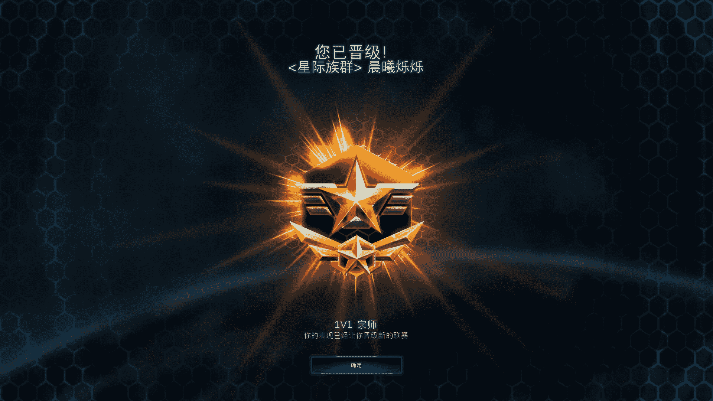

# 星际族群番外《世界舰与人性实验》（硬科幻）

作者：Dawnrise

TID：25525

<title>1</title> <link href="../Styles/Style.css" type="text/css" rel="stylesheet">

# 1

*本帖最後由 Dawnrise 於 2018-7-23 20:29 編輯*

一．起航
    NE20S号世界舰的试航圆满成功，现在它停泊在克哈IV号行星的高空轨道，交付给银河星域政府使用。这艘世界舰在履行功能的同时还肩负着一项使命，一项社会学实验。该实验由银河星域政府主持并提供资金，专业分析指出它会带来巨大的收益。
    早在20世纪就有人提出可以将人的体积缩小来减少个体对于社会资源的消耗，这一看法无论在当时还是在现在都是无比荒谬的，而区别是现在有了成熟的技术，同时它的收益被计算出来，这说服了政府官僚和投资者，使得这项实验得以进行。

    虽然根据物质守恒定律，缩小是不切实际的。但现代纳米技术可以制作出小体积的仿生人体，并把人的意识放在服务器上运行来解决脑容量缩小带来的问题。实验团队在宇宙各地挑选了200万名志愿者，将其中的男性的意识投射到身高约为1cm的仿生人体上。同时将原有的身体回收生物质，并给出了远高于生物质价值的补偿，这是为了避免志愿者中途退出实验。而女性未作出任何改变。为了确保实验效果，NE20S号有着强大的算力，从而避免出现社会资源不足的情况。

    该实验并未向公众宣传，但得到了多方面的支持。作为联邦海军对该实验的支持者，周洛正待在NE20S号附近的一艘航母上，他手里拿着一个仿生人体，细看之下与他本人一模一样，这是实验团队提供的纪念品。为了避免干扰，世界舰将向深空航行，海军将派出一支舰队护航，避免世界舰受到陨石或海盗的伤害。

    世界舰交接完毕之后，它打开了港口，引导搭载着居民的摆渡飞船停靠。这艘全长超过一百千米的世界舰无法与星港对接，只能依靠摆渡飞船运送人员与物资。巨大体积带来的优势是，它是完全自持的，可以永远航行。摆渡飞船在停靠之后，世界舰关闭了港口，开始充入空气，当气压与气体成分符合维生标准后，乘客被允许下船。世界舰外围的圆柱体是居住区，通过匀速旋转制造人工重力。人工的投影制造出天空与昼夜节律，让居住区看起来像生态行星的表面。除了城市，它还有人造的森林、山脉甚至海洋等多种类似地球的生态系统。

    女性居民和她们的行李被运送到了她们在上船之前就买好的房子，她们在上船前也填好了志愿表，来获得船上的工作与社会地位。男性居民则被统一送往生化舱室，他们的身体将被回收，而意识会被投射到与他们本身外观一致的仿生人体中。这些男性同样得到了工作和社会地位，科学家认为在机器人代劳大多数肢体行动的情况下，体型大小是无关紧要的。这一理论在小规模的实验中得到了证实，但这是第一次大规模真实条件下的测试。

    一切检查完毕后，NE20S号启动了引擎与护盾，朝恒星系外围航行，它将在几个月的低速常规航行后抵达克哈星系外围的星门，并向深空跳跃。

    周洛看着雷达上的NE20S在缓慢的加速，尽管在离开星系之前它并不需要护航，但周洛对于这艘世界舰还是有着极高的权限，他知道自己能做什么，又不能做什么。这是相当大的权力寻租空间，他和其他参与者一样，已经想好了怎么变现。

<title>2</title> <link href="../Styles/Style.css" type="text/css" rel="stylesheet">

# 2

*本帖最後由 Dawnrise 於 2018-7-23 20:31 編輯*

二．修脚师
    王德发是一名传统手艺修脚师，这个职业很古老，在几千年前的地球上就流行过，起初它是专门为贵族服务的，后来也为平民服务。虽然现代人娇生惯养已经几乎不会得足部疾病，但它仍然是传统洗浴中心的一个项目。在消费主义的洗脑下，很多人宁可花大价钱找人给自己服务，哪怕机器人的手艺比任何人都强。
    王德发在无聊玩个人终端的时候收到了一条推送信息，他抱着玩玩看的心态填完了调查问卷，然后被通知自己成功办理了移民手续。惊讶的他仔细查看了NE20S的情况，发现上面只有200万居民，这样会找他修脚的人将寥寥无几，作为传统服务业的工作人员，他的收入将受到很大的影响。

    当王德发上船之后，他才发现形势比他预期的要严重很多。他和一群男人被一起送到了生化舱，这时他才知道自己将要被“缩小”。在失去意识之前，他最后的问题是“200万1cm的人需要这么大的世界舰吗？”

    再次恢复意识时，王德发发觉自己的身体出现了一些变化，他觉得自己不像在空气中，而像是在某种稀薄的液体里，举手投足间都能感受到阻力。他睁开眼睛，看到远处的东西有些发圆，非常奇怪。站起来思考了一会，他想起来自己现在只有1cm高，重量比羽毛还轻。不过这么小的眼睛是怎么看清东西的，他没有想清楚。通过对周围事物的观察和思考，他知道自己当前应该处在洗浴中心，不过这里有很多巨大无比的设施，他一时半会没有想明白这些设施是用来做什么的，会是某种实验吗？

    洗浴中心的门打开了，一个女人走了进来，她环顾四周没有人，径直坐到床上用个人终端呼唤技师。王德发惊愕的看着门被打开，一个建筑物般庞大的女人飞快的走了进来，走路带动的气流扑面而来。在他整理思路的时候个人终端提示有人呼唤技师，他看了一圈确定没有其他人也没有可用的机器人之后，用拳头锤了一下胸口，下决心响应了呼唤。

    越往脚边走，王德发心里就越紧张，他感觉到令人窒息的压迫感，再想到以后的工作内容，不禁更加绝望。女人已经脱下了鞋，他在上百米外就能闻到浓郁的酸臭味。他以前也见过这种情况，来自地球的细菌和人类一起进入了太空，在辐射下产生了突变，其中一种是极大的提高分解效率减少热量损失，不过对于人类来说产物的气味十分难以忍受。在正常体型下就已经令人流泪的气味，在现在这种体型差下更加难以忍受。

    王德发看女人一动不动，也许已经沉浸在了虚拟现实中。这是个好事，如果她的脚在不停运动，恐怕就没有半点修脚的可能了。走近之后王德发见到了一套全新的修脚工具，和他之前用过的完全不同。在这种体型下，他能清晰的看到女人脚上的汗水和污垢，袜子被扔在一边，他看了一眼就把视角转了回来。女人踩在一片筛网上面，这给了王德发工作的机会，不然他是无论如何也没法把这么巨大的脚掌抬起来的。他走到脚趾前，高度的差距让他没法够到脚趾甲，他拿着铲子，伸出手摸了一下脚趾的皮肤，很温热，纹路很粗。于是他用手抠住纹路，轻轻用力就把自己拉了上去，看来体重轻还是有好处的，他这样想。当他爬上去的时候，眼前的景象让他差点吐出来。脚趾盖下面填满了黑色的污垢，散发出有若实质的恶臭气味，这对于他的呼吸系统而言是摧残和折磨，他担心自己会不会因此而昏迷。

    小心翼翼的把铲子伸进污垢里挖下一块，松软的污垢很听话的下来了，然后铲子旁边喷出了一股黄色的温水，喷了王德发一身。恐怖的味道随之而来，王德发再也无法忍受，昏了过去。

    不知过了多久，王德发在电流的刺激下清醒了过来，当他确定自己醒了的时候，身边的电极缩回了地板下面。他感觉身上有很多硬块，低头一看竟然全是黑色的污垢，已经干涸成块。他把这些污垢块从身上取下时感觉到了撕扯的疼痛，站起身来抬头一看，脚趾甲里面的污垢已经干净了，而自己身边有一大堆污垢，还在散发着热气，下面还有一摊黄水。王德发在吐完之后用个人终端查看监控录像，在他昏迷之后地面上升起了机械臂，把他的身体往脚趾甲下面塞然后来回摆动，把污垢全部清理了出来，然后把自己扔到一边，电击唤醒。

    王德发气得破口大骂，机械臂听懂了他说的话，抓住他抽了两个耳光之后把他塞进了脚趾缝间大块的脚垢里，还贴心的用脚垢把他盖了起来。在王德发挣扎出来之前地面上伸出了更多的机械臂，不断的按摩着女人的脚趾，王德发只感觉身边的肉壁挤压过来，把污垢在他身上压实，渗透出来的污水从口鼻中灌进去，他连惨叫的机会都没有。

    不知道被脚趾蹂躏了多久，王德发觉得自己这辈子也许就这么长。面前的污垢被除掉了，他清晰的看到自己被固定在脚趾缝间的污垢深处，视野里能看到的只有巨大的脚趾头。机械臂给他投影出一句话：“这是对你使用违规语言的惩罚，但在NE20S，作为补偿，你获得了1.024银河信用币。”看着这句话，心中五味杂陈的王德发流下了泪水。

<title>3</title> <link href="../Styles/Style.css" type="text/css" rel="stylesheet">

# 3

*本帖最後由 Dawnrise 於 2018-7-23 20:32 編輯*

三．权限    克哈星系，太空。
    NE20S号已经达到逃逸速度，正在离开克哈星系，现在从舷窗向外看去，克哈IV行星已经成为了一个不起眼的白色亮点，在漆黑的宇宙背景中显得无比渺小。在NE20S号太阳能发电阵列最远端的70公里外，阿斯加德号母舰正保持着与它一致的速度航行。对于人类联邦来说，任何一艘世界舰都是极为重要的，它们是人类向深空殖民扩张的载体，也是延续人类文明的火种与希望。由于进入太空时代以来人类的繁殖几乎全部由机器代劳，因此NE20S号并未搭乘足够的人口。当实验进行到合适的阶段，银河星域政府将下令NE20S号繁殖新的人类，或引进新的移民来让它热闹起来。
    阿斯加德号舰桥。周洛享用完他的下午茶后，缓慢的从私人空间走向控制中心。作为母舰，阿斯加德号上有很多与作战无关的装饰品，它们中有一部分是船员的收藏，也有一部分是设计师的作品。一些船员认为部分装饰品出自星灵科技，但没有任何一个高级军官公开承认过这一点，阿斯加德号仍然保留了大量的走廊与快速通道，而没有全部使用先进而昂贵的传送设备。当周洛终于走进控制中心时，他发觉李莹正待在本来属于他的位置，而星图的全息投影正显示着NE20S号上的监控视角。在李莹察觉到周洛的接近并关闭掉监控之前，周洛已经看清了它，是一双脚，以及一些细小的机械臂。
    周洛一步步走进李莹，而后者则神态自若的查看着星图，NE20S号的遥感观测一切正常，引擎和护盾输出功率稳定。走到李莹身边时，周洛问道：“你在看什么呢？”
    李莹把NE20S号的太空监视视角放大，一颗直径约0.003mm的微粒在它护盾旁边约4公里的距离飞过，并受到护盾上电磁场的牵引，在划过一条弧线之后击中了护盾，没有留下一点痕迹。李莹说道：“这颗陨石撞击了NE20S号的F区甲板，不过没有造成任何损害。”
    联邦海军上将周洛回复道：“哪怕它的质量和速度都放大100倍，都不会对NE20S的护盾造成亿分之一的影响。而且在内行星系，每秒都会有至少一万个这样的微粒撞击在NE20S号这样大的航天器上。你想说明存在一种概率，让这样小的微粒在某种合适的角度撞击NE20S号，会引发蝴蝶效应伤害到这艘世界舰吗？”
    见李莹没有做出像样的回应，周洛打开了之前的监控视角。看起来像是一个人被掩埋在脚指缝间的脚垢里苦苦挣扎，而机械臂投影出来的一句话，则构成了最有力的证据，说明了李莹之前做过什么。见状，周洛问道：“在你眼里，这些人是联邦公民，还是你可以随意摆弄的玩具？在对你的行为进行教育之前，我更想知道，你是怎么得到我的控制权限的，协议里可没有写明你——我的少校，有对这艘船的超越公民的控制权限。”
    李莹低下了头，她紧紧的握着手，像一个不甘心认错的孩子。在沉默了一会之后又抬起头睁大眼睛看着周洛，眼泪从眼眶中流出，又瞬间被她战甲的加热功能蒸发，没有影响到脸上的妆容。周洛朝李莹伸出手，眼神则指向她紧握着的手。李莹犹豫了一会，终于把手中的东西放在了周洛的手心里，是周洛的仿生人。
    周洛对李莹露出了笑容，说：“少校，由于你的诚实，你的禁闭由7天缩短至2个小时。希望在你下次滥用别人的权限之前，想清楚什么事可以开玩笑，什么事不可以。”
    特别部队的少校李莹听完之后闷哼一声，飞快的跑了出去，一路跑进自己的私人空间，把门锁了起来。这时周洛才把注意力放在手中的仿生人上，它甚至完美的复刻了周洛的指纹和虹膜，这时密匙的组成部分之一，看来李莹已经知道了周洛的其它代码。周洛心说倘若议会的人在对待人类全体的权益上能有李莹在耍小聪明方面一半的心思，现在联邦的社会也不会是这样的状态。
    想到这里，周洛在个人终端上接通了NE20S号的舰桥：“我有一个问题，仿生人体的结构强度是怎样的，是否一些对于人类而言正常的条件，对于它们是致命的？”
    在得到了否定的答复后，周洛拿着仿生人，脑海中浮现出一个有趣的计划。
<title>4</title> <link href="../Styles/Style.css" type="text/css" rel="stylesheet">

# 4

*本帖最後由 Dawnrise 於 2018-7-23 20:34 編輯*

四．间谍（上）    一枚白金片，浑圆若天成，阳刻银河联邦图案，反转落定，金属光泽间闪烁着星舰的代号。掷白金的是一名下士，穿着休闲长袖长腿，顶着边角破烂的草帽，衣着虽然凋敝，气色却是十足的中正，端坐在被人造光源晒得温暖的白金片上，打量着前面赌钱的几个闲汉。头顶一棵古树生得正茂，白花点点，细密如繁星。
    那赌钱的几个闲汉，有一人唤作汤姆，已是连输4铺，面色青紫。转头见下士正气定神闲的坐着，不禁喊道：“先生，这铂片有什么好玩的，还不如借给小老儿我回本。”
    下士身子未动，仅是动嘴说道：“光天化日朗朗乾坤，年轻人有手有脚不去做工，何苦把这一身力气丢在赌博上，白白误了钱？”
    汤姆站起身来说：“这不在网上看到消息，缩小了可以拿钱上船，我一为躲债二为钱，何故不来。倒是你，一个穿战甲拿枪的人，怎么也沦落至此？”
    下士这才有点动作，仰着头说：“说来也巧，我上这船也是为了拿钱。你可知当红的明星泰拉，也在这船上。她在家里喜欢裸奔，这点在情报上写得清清楚楚，社交网络上可是连个毛都没有。我若是拿到了全息影像，你道一道它是多少钱。”
    汤姆反问道：“你倘若真有情报，何不亲自去录制，把这些和我们说有什么用？”
    下士站起身来，从白金片上面走下来，把帽子摘下来持在手中，朗声道：“问得好。我首先是一个联邦陆战队员，其次才是一个公民。这种活，还是让有条件的人去做，来得稳妥。”
    汤姆反应了一下问：“你的条件是什么？”
    下士笑道：“我正喜欢足下这样的爽快人。我需要两个人，到泰拉的住处去拍摄她裸奔的全息影像，得到的镜头越多，上家给的钱就越多。”
    汤姆左右一看，和他赌钱的闲汉也凑了过来，齐齐的盯着下士，汤姆问道：“你要知道，这种违法的行为一旦被警察抓到，可是得不偿失的。”
    下士回答：“我需要的人也不多，两个足矣。至于价格，事成后自然会谈妥，不会少于30个信用币。”
    汤姆和几人讨论了一会，又和下士说：“这私闯民宅，要是被警察抓住还好。在这艘世界舰上的法律可明确写着，房屋主人有权射杀非法侵入的陌生人。我觉得为了虚无缥缈的承诺，付出自己的性命可是得不偿失的。”
    下士重新把帽子戴上，拿出个人终端，向汤姆转账了8信用币，说：“我给你1分钟时间，再想出一个拒绝我的理由来。”
    汤姆咽了一口口水，犹豫了一下之后下定决心说：“杰瑞，跟着我干一票大的。”
    谈妥了具体的事宜之后汤姆和杰瑞出发准备，看着他们走远之后下士向阿斯加德号的加密频道发出了一条通讯，周洛受到通讯后向NE20S号发射了隐形的探测器。没有他的授权，克哈星系的电子战机是不会扫描NE20S号的。他不需要两个蹩脚的摄影师，他需要的是两个没有看过剧本也没有过任何演出经验的演员。
    周洛深知人与人间的不平等会产生矛盾，这艘名字便充满了不详意味的NE20S号，将在多方有意的操纵下，把人性展现得淋漓尽致，远方的看客们，正饥渴的等待着新鲜出炉的人血馒头。纳税人们也许永远也不会想明白，这艘价值连城的世界舰，究竟航向哪里，宇宙中第二黑的东西是黑洞，而最黑的东西，正存在于人类联邦的每个角落里。
    泰拉只是一个不入流的，在网络上几乎没有什么存在感的演员，不过她恰好选择登上这艘飞船，对于她来说，这也许是个好的选择，也许是个灾难般的选择。在她仍然懵懂着等待着经纪人的安排时，更加黑暗的鹰犬早已出笼，准备撕咬她的肉体，吸干她的鲜血。或者用文明一点的话来说，消费她的人设与流量。
    汤姆和杰瑞准备好了全息摄像机，他们除了在远处用望远镜观察清楚了泰拉的行动并制定了一套偷拍的计划，还讨论清楚了如何分赃，怎么挥霍这比并不算多但满足他们心里预期的钱。潜入巨人的领地，刺探情报，再全身而退。这将是骑士般的英雄史诗<title>5</title> <link href="../Styles/Style.css" type="text/css" rel="stylesheet">

# 5

*本帖最後由 Dawnrise 於 2018-7-23 20:40 編輯*

五.间谍（中）    “那个该死的下士说他摆平了这一片的机器警察，但我在警察局的哥们说这艘世界舰上根本就没有几个机器人警察，而且还都集中在舰桥那边。”泰拉家的草坪上，汤姆这样对杰瑞说。杰瑞点着头答应着，他之前就奇怪为什么这艘世界舰上看不到机器人警察在街上巡逻，或者像其它机器人一样为人类服务。当缩小之后他才意识到自己有多么离不开机器人，只是从一间房子走到另一间房子，就让他倍感疲惫。这滞黏的空气阻力和圆润的远景让他四肢乏力头晕目眩。
    汤姆在草丛间不受阻碍的穿过去，这些草只是全息投影而已，这里并没有草坪，只是一片平地。世界舰上的水从来都不是免费的，而养护一片草坪需要大量的金钱和时间，显然泰拉并没有这样的资本。接近房子时，汤姆用全息摄像机扫描了这个房子，还是没有发现安保设备的存在，甚至连一个摄像头都没有。于是他对杰瑞说道：“这里没有警察，也没有摄像头。要是没被缩小，我们直接进去偷走值钱的东西，再把它们出手，可比这样来得钱多。”
    杰瑞做出一个夸张的擦汗姿势，白了他一眼说：“联邦政府就会浪费纳税人的钱，在行星系内还要安排一支舰队跟着这艘船。我敢跟你打赌，你要是敢偷东西，3秒之内你就会被空降过来的陆战队员按在地上，然后你会在监狱里蹲上一段时间，被那帮终身监禁的家伙操烂屁眼。”
    汤姆猛地停下，身体向后仰，又突然向前一耸，转身送给了杰瑞两个中指：“你真是疯了，这艘船上的公路连个测速器都没有，那几艘战舰？可别放屁了，他们也许正在度假，让船在宇宙里瞎漂。你还不明白吗，联邦是故意不管这艘船上的犯罪行为的，这艘船的法律上写满了可以合法的杀死别人的情况，要是我的前女友在这里，她肯定会在半个小时内找到杀了我的方法的。”
    杰瑞把全息摄像机抓在手里说：“你别他妈放没味的屁了，我们赶紧进去，把这个骚婊子在家裸奔抠逼的视频都拍下来，发给那个王八蛋下士，拿钱，别的什么都不要多想。你自己为什么上船心里没点逼数吗。还你的前女友，就算是条狗，都他妈想咬死你。”
    泰拉在沙发上坐着，旁边是被摔得报废了的扫地机器人。昨晚导演找上她，在她的胸上乱跑了很久，她认为自己和导演达成了交易，但导演否认了这一点。一点好处都没有得到的她已经是出离的愤怒了，而今天早上扫地机器人却叫醒了她，在起床的盛怒之下，机器人在保修期内提前报废了。
    二人潜入了泰拉的房子，汤姆走到桌子下面安置好了全息摄像机，杰瑞则走到地板中间安放。他们二人能清楚的看见泰拉坐在沙发上用个人终端在社交网络上发出消息，脸色看起来不算好。突然，泰拉站了起来，在屋子里到处踱步。汤姆见杰瑞没有一点躲到安全地方的想法，还在原地摆弄摄像机，不禁破口大骂。而杰瑞仿佛没听到一样，把摄像头抬高，对准在他身边走过的泰拉。
    汤姆气得直甩手，几次想跑出去把杰瑞拉回来但又半路放弃，他担心自己被泰拉踩到。来回走了几次之后他直接坐了下来，心说出去了被踩一脚肯定不能算工伤，杰瑞要是被踩到了，他怎么样也得掏医药费，很有可能这次不仅不赚钱还要赔钱。内心挣扎了一会之后看泰拉在绕着杰瑞满地走，留下了一堆满是脚汗的脚印。气味渐渐的飘了过来，汤姆忍不住干呕了起来。他以前闻到过类似的味道，是在偷渡的货仓里，气压不够，氧气浓度也不足，唯有那些衣衫不整之人的体味令他印象深刻。现在他闻到的味道更胜当时，他敢肯定杰瑞那里的气味更加浓郁。
    正当汤姆幸灾乐祸的时候，泰拉的脚尖踩在了杰瑞所在的位置，随后她站住不动了，在原地搓捻着脚趾。<title>6</title> <link href="../Styles/Style.css" type="text/css" rel="stylesheet">

# 6

*本帖最後由 Dawnrise 於 2018-7-23 20:41 編輯*

六.间谍    汤姆听到了一种令他齿寒的声音，他可以完全肯定的说这是肉体被碾碎的声音，他以前在全自动屠宰场里听到过。那里的机器把肉体碾碎做成肉酱，加工后灌装。现在这个声音再一次出现了，而且还伴随着凄厉的惨叫声，他已经想象到杰瑞遭遇到了什么。在最初的恐惧之后，汤姆开始变得愤怒，杰瑞完全是在浪费他的钱，他开始后悔没有提前给杰瑞买好意外伤害险。
    泰拉在踩碾了杰瑞一会之后走开了，汤姆确信她没有发现杰瑞的存在，这只是一种无意识的行为。汤姆看到之前杰瑞待过的地方只有一团模糊的红色，这不是个好消息。汤姆在心里祈祷，这些血是泰拉的，杰瑞至少用刀和她的脚趾进行过一番搏斗，也许他虽然没有胜利，但也只是软组织挫伤，休息几天就好了。当泰拉坐在沙发上拿出个人终端继续和别人通话时，汤姆才敢走出来，他要去看看杰瑞到底怎么样了，也许还要揍他一顿。他希望全息摄像机没有出问题，也许在那个角度可以拍到足够高清的影片。
    汤姆绕过了地上巨大的脚印，它们给地面铺上了一层恶心污浊的液体，在渐渐蒸发的过程中释放出生化武器般的臭气。当汤姆找不到路不得不穿过脚印的时候，他甚至看到地上有一些和他指甲差不多大的盐粒，那是脚汗蒸发后留下的。还没蒸发完全的脚汗粘住了他的脚，让他不得不用更大的力气才能前进。在这种程度的恶臭中，他感到头晕目眩，肺部似乎出现了一种撕裂般的力量，喉咙里仿佛有一块点燃了的炭。
    终于，在最后的脚印里，汤姆找到了杰瑞，或者说他的一部分。泰拉在这里站立的时间格外的长，也留下了格外多的汗。这些脚汗仿佛是一个极浅的湖泊，汤姆以前听说过古代人把海水引入浅坑里蒸干晒盐，他不敢再多想一分，以免以后自己再也不能吃盐。在一片不规则的血泊中，他看到了杰瑞挣扎过的痕迹，不过这里没有留下任何的碎片，由血泊在脚印中的位置来判断，杰瑞现在肯定还在泰拉的脚趾缝里，生死未卜。
    正当汤姆准备离开这里来呼吸新鲜空气的时候，他发现了一个极为严峻的问题。为了观察清楚血泊的情况，他在同一个位置站了太久的时间，这把他的鞋黏在了脚汗里。用力拔了几下之后，汤姆又多了一件后悔的事，他不应该图便宜买这样的连体衣的，他应该买传统的衣服，鞋和裤子彼此独立的那种。为了逃离这里，他拉开了连体衣的拉锁，把衣服整个脱下来，然后一丝不挂的走了出去。脚汗给了他冰凉的触感，现在他内心的愤怒正在消退，恐惧重新占据了主导。
    还没有走出几步，汤姆发现地面又开始了震动，他僵硬的转过身，泰拉正像一台巨大的工程机甲一样向他走来，而且低着头，显然是发现了他。直到汤姆再一次想起来逃跑，他才发现一个比脚臭味更令人窒息的事实，他的脚再一次被黏住了。现在他要么等这些脚汗完全干掉，要么切掉自己的脚，否则不可能再移动半步。汤姆的大脑中一片空白。
    泰拉在用个人终端的同时看了一眼客厅的地板，那里有3个颜色不同的小点。她在购物网站上下单了一台新的扫地机器人之后走了过去，打算清理掉那三个小点。走近了之后她发现一个小点是血红色的，她回忆自己的经期，还有半个月，不应该会把血弄在地板上。随后，她发现有一个小点在运动，这艘世界舰上不可能有虫子或其它小动物的存在。为了看清楚，泰拉趴了下去，这回她清晰的看到，那个会动的小点，是个赤身裸体的男人。
    现在泰拉才想起来，这艘船上的男人都被缩小了。一想到有男人闯进自己家，还看到了自己的裸体，泰拉便打算报警。不过这个念头只是一闪而过，在余怒的支配下，她有了一个同时违反法律和道德的想法，她要绕过法律，从个人恩怨的角度来让这个男人付出代价。
    汤姆看到泰拉趴了下来，便如筛糠般颤抖，口中念叨着耶稣、亚历山大、朱元璋、释迦摩尼、华盛顿、蒙斯克等人的名字，在体型的压制下，他甚至忘记了该怎么说话。泰拉巨大的手指占据了汤姆的视线，随即是不可抗拒的力量，把他按在了地上，他的腿被扭了一圈，剧痛让他忍不住大叫了起来。
    泰拉把这个站在原地不动的小人按倒在地，看起来他被自己的脚汗黏住了。泰拉知道自己有出汗多的毛病，现在看到小人在自己的脚汗里挣扎，优越感让她的心情好了起来。于是她问道：“你是谁，你在我家里干什么？”
    被黏在脚汗里动弹不得的汤姆反而冷静了下来，这也许是腿部疼痛导致肾上腺素激增的后果。听到泰拉问话之后，他大喊道：“我叫汤姆，是银河星域公民，我和杰瑞在试飞纸飞机的时候被空调送风吹到了你的家里，请你送我们出去，谢谢？”
    泰拉问道：“汤姆和杰瑞？你们真会起名。那么，杰瑞在哪里？”
    汤姆没想好怎么措辞，下意识的说：“他被夹在你的脚趾缝里。”
    泰拉把脚抬起来，向后伸手摸自己的脚趾，还真在脚趾缝里摸到了一个小东西，她把那个小东西拿到自己面前一看，吓了一跳。是一个浑身是血的男人，身体扭曲到了不正常的角度，用手抓着自己的腿，不断的惨叫着。
    汤姆见到杰瑞的惨相，赶快说道：“是你把他踩成这样的，快叫移动医疗站。”
    泰拉一想到移动医疗站就想到自己要付钱，一想到要付钱就想起导演昨天没给她钱或别的什么可以变现的东西，刚消下去的怒火又一次升了起来。她把杰瑞扔到一边，从脚印里把汤姆捏了起来，对着他说：“想讹我，我知道有个地方最适合你这种混蛋待了，大屁眼子。”（Asshole双关语）
    泰拉从地上跪起来，把自己的屁股撅得很高，然后捏住汤姆的上半身，把他放进自己的臀沟里，摸索了一阵之后找到了屁眼的位置，然后把汤姆的下半身塞了进去。汤姆在半个身子被泰拉的肛门吞掉之后非常恐惧，抓住了泰拉的肛毛拼命想把自己拉出去，但肛门的力量巨大无比，他觉得自己的腰要被拉断了，也只出去了一点点。肛毛上残留的粪渍让他的手不断的打滑，被摩擦得火辣辣的疼。
    泰拉感觉到汤姆的挣扎，这让她感到十分瘙痒。她对汤姆说：“你应该到里面去，不然我可控制不住自己的屁眼。”汤姆在泰拉的肛门里不断的求饶，这灼热而恶臭的气味钻进了他的鼻子里并留下了一层恐怖的粘液，他渐渐没了力气，再也抓不住肛毛，哪怕自己几乎要从泰拉的肛门里逃出来了。
    感觉挣扎渐渐弱了下去，泰拉感觉屁眼上传来的爽快感弱了很多。她伸出手，用手指把汤姆推进了自己的屁眼里，在屁眼上粪渍的润滑下，她不费吹灰之力就把这个小东西完全塞进了自己的屁眼里。然后她拿手用力的捏着自己的屁股，然后顺势坐了下去。她心里想象着自己把导演塞进了屁眼里，不禁心情十分舒畅。她对着地上挣扎嚎叫着的杰瑞说：“你可以走了，小东西。”
    汤姆来到了一个可怕的地方，空气厚重而黏稠，滚烫的臭气几乎要炸掉他的肺，每次呼吸都伴随着剧烈的疼痛。他想逃出泰拉的屁股，但一片漆黑中他找不到方向，周围到处都是肉壁和黏糊的物质，而且在不停的运动，把那些东西涂满了他的全身。汤姆胡乱选择了一个方向开始爬行，在直肠的蠕动之下，他不知道自己前进的方向。他现在心里只剩下一个念头，活着从这里逃出去。
    第二天，泰拉从床上起来，屁眼里有一个小人令她连睡觉都是无比的安稳。她起身背对着镜子拉开屁股，深色的肛门紧闭着，没有一点小人跑出来的痕迹。她走到客厅，杰瑞还在地上，看起来挣扎着爬行了一段距离，留下了一条凝固的血迹。泰拉弯下腰捡起杰瑞，看样子想治好这个小人需要更多的医药费。权衡快感和花钱之后，泰拉把杰瑞拿到了自己的身后，然后把他塞进了自己的屁股里面。
    感觉到屁眼传来的瘙痒感之后，泰拉用力收缩着自己的屁股，她能感觉到自己的屁眼里有一个卑微的存在，在她的挤压下用尽全力挣扎着活下去。她还知道自己的直肠里有另一个小东西在苟且偷生。泰拉知道，只吃营养液不吃标准食品的话并不会产生多少粪便，现在她脑海中产生了一个更加大胆和疯狂的想法。<title>7</title> <link href="../Styles/Style.css" type="text/css" rel="stylesheet">

# 7

我觉得星际2本身的对战没有太大的意思，我更喜欢它的剧情和世界观设定<title>8</title> <link href="../Styles/Style.css" type="text/css" rel="stylesheet">

# 8

 <ignore_js_op>[宗师.jpg](forum.php?mod=attachment&aid=NzMzMDV8MDYyOWY1OGF8MTYwMDg4MTgzOHwxODIzMHwyNTUyNQ%3D%3D&nothumb=yes) *(107.4 KB, 下載次數: 0)*

[下載附件](forum.php?mod=attachment&aid=NzMzMDV8MDYyOWY1OGF8MTYwMDg4MTgzOHwxODIzMHwyNTUyNQ%3D%3D&nothumb=yes)

2018-7-17 12:02 上傳  

</ignore_js_op> <title>9</title> <link href="../Styles/Style.css" type="text/css" rel="stylesheet">

# 9

*本帖最後由 Dawnrise 於 2018-7-23 21:02 編輯*

七.法律    NE20S号在稳定的航行中，一些小型飞船停泊在它的港口中，传输完货物或人员之后便离开了。NE20S号并非封闭的世界舰，愿意加入的男人可以购买仿生的身体，并出售掉自己原有的身体，如果不愿意放弃自己的身体，也可以支付一笔费用来冰冻保存。
    阿斯加德号舰桥的门被开启了，杨博跑了进来。周洛正饶有兴致的通过阿斯加德号的主动雷达扫描来观看NE20S号上所有东西的实时直播。虽然表面上星图在显示着NE20S号的运行状态，但周洛的视线根本就没放在那个全舰桥的人都可以看到的星图上，事实上如果没有报警，根本不会有人去看那些没用的参数。直到杨博打断了周洛观看的直播，他才看了一眼星图，没有任何异常。
    杨博把信息用个人终端上传到了阿斯加德号的计算机上，星图的投影内容切换到了一份报告上。“首长，NE20S号上的治安力量过于薄弱，它的犯罪率已经超过了坦桑尼斯行星的一亿倍。”
    周洛从椅子上站起来，现在有正义感又单纯，同时不愚蠢还甘心当兵的人不好找了，所以在天际星域内战爆发后周洛就把他挖了过来，担任自己的僚机。“坦桑尼斯的犯罪率低是因为它有‘穹顶’护盾，你想推别人一把或者张嘴骂一句都会被制止。而且，在坦桑尼斯当公民的条件你也不是不知道，NE20S号可是没有门槛的，哪怕正在被拘留也能用这个方法光明正大的走出去。”
    杨博没有听明白周洛所言背后的话，反问道：“作为联邦海军，保护公民的权利不被侵犯是我们义不容辞的责任，我们不能在70公里外眼睁睁的看着那些违反犯罪行为的发生，我们必须做点什么。”
    联邦海军上将周洛走到星图前面，调出了控制台，问道：“那你想怎么办呢，派军队去逮捕那些罪犯吗？”
    杨博说道：“我们可以直接套用克哈IV的法律而不是给它单独立法，增派警力并用阿斯加德号的主动雷达配合来杜绝犯罪。”
    周洛让自己的表情变得像是在微笑，转头说：“从猴子到人，你见过哪个军队有立法权了。至于增派警力，那些人的工资要用你的津贴来开吗？你要是想当蝙蝠侠，我可以给你这个权限。”
    杨博想了一会之后便离开了舰桥，周洛这才慢慢阅读起他的报告来。这些犯罪行为的出现，实际上是有利于研究的，或者说它的出现正是周洛所愿意看到的。不过他发现这些犯罪行为里竟然包含异性间的卖淫，这些人是怎么克服物理上的生殖隔离的，好奇心让周洛仔细看完了这份报告，然后他接通了杨博的通讯：“命令。你立即接入NE20S_P20号警用机器人，尽快解决S2号跨区域流窜卖淫案。”
    杨博在激动之后坚定的回复道：“是，首长，保证完成任务。”<title>10</title> <link href="../Styles/Style.css" type="text/css" rel="stylesheet">

# 10

*本帖最後由 Dawnrise 於 2018-7-23 21:34 編輯*

八.卖淫    作为一艘常规布局的世界舰，NE20S号有102km长，而自重达到了10^16吨，内部有超过10^14立方米的宜居空间。它绝大多数的宜居空间分布在圆柱体的舰体上，它以恒定的速度旋转来让宜居空间内产生恰到好处的人工重力，而且成本低廉。而这个圆柱由大量刚性的悬臂连接到中央舰体上，一整套磁力悬浮引擎保持它不会与中心部分接触而发生冷焊现象，也赋予它旋转的动力。太空中旋转的物体在速度不变的前提下不会做工，而真空的阻力微乎其微，离其它天体越远密度越是低。这套磁力悬浮引擎的能量来源是冲量引擎在推动NE20S号加速前进时产生的废热，同时用一套蓄电池阵列来储存它们。出于稳定性的考量，引擎的核心部分由一个铜合金制作的法拉第笼来屏蔽宇宙射线，同时亦有一万升纯水的检测设备来检验宇宙背景辐射的变化来实时调整屏蔽电流的强度。除此之外，还有一套冗余的备份系统，即使磁力悬浮引擎由于不可抗力停机了，备份系统也能坚持到它完成抢修的一刻。
    引擎部分由常规亚光速引擎和跃迁引擎两部分组成。常规亚光速引擎采用传统的工质推进技术，反应堆中氢氦同位素发生聚变反应，生成更重的元素时释放大量的热能，这些高温的等离子体从船尾射出，通过反冲原理使NE20S号获得动力。由于其等离子射流的温度极高，冲量引擎可以让NE20S号持续加速直到接近光速。而跃迁引擎则使用物质-反物质反应堆供能以得到足够诱发跳跃的功率，这套反应堆使用冲量引擎废热所驱动的温差发电机进行充能，将从星际空间中收集的氢离子和负电子制备成反物质。除此之外，舰体外围还有表面积巨大的代达罗斯发生器用于收集宇宙中游离的物质，同时利用恒星风的射流与光压使NE20S号获得动能来改变速度，另一方面利用光电效应进行发电。在离恒星较近时，太阳能可以解决NE20S号能源的问题，而较远时则更加依赖冲量引擎产生的热量以及自身消耗电能后产生的废热所驱动的温差发电机。不过NE20S号属于开放系统，与外界交换能量与物质。根据热力学第二定律，NE20S号需要不断从外界输入能量并排放熵才能稳定运行，在温差发电机的作用下，这套人造生命系统有着极高的效率。
    NE20S号的宜居空间内有分布式的空调系统来检测局部的温度并改变它，同时让空气得以循环。空调系统亦会将二氧化碳和水还原为氧气和甲烷，这是维持一个以消费者为主的生态系统所必须的人造干预。照明系统按照标准时间来调控昼夜节律，尽管现代人已经不再依赖于原始的生物钟。农业系统用甲烷、氨、水、磷化氢、金属硫化物等化合物制造符合联邦食品要求的标准食物，这些液态的食物可以为人提供能量，并只产生极为少量的排遗物。因为人口较少，而男性的体型亦极为微小，大多数的生产线并没有开启。只要有源源不断的能量输入，这些食物就永远不会停止供应。
    人员在宜居空间内行动所依赖的是轨道运输，同时得益于封闭的人造空间，单人磁力飞行装置的使用成本并不高，它解决了最后一公里的问题。轨道运输的车辆采用高效率的磁悬浮技术，在加速阶段消耗电能来获得动能，而减速阶段则回收动能，这种高效的轨道运输装置并不会产生过多的废热，因此成本低廉。在真空的轨道里，磁悬浮车辆可以以极高的速度运行而不受空气阻力的干扰，惯性阻尼器的使用则让它加速和减速过程的时间被极大的缩短了。
    现在闪迪正坐在一辆低速运行的磁悬浮车辆里，她把目的地设置成了一个死锁，这样在她决定停下之前车辆将永远在轨道里飞行。她正在思考一个问题，在执法力量差的地方违反道德会有什么样的后果。自从人造人技术成熟之后，人类传统的家庭观念彻底瓦解，女性的权利得到了彻底的解放。现在每个人都会在出生的时候留下个人的基因信息，而当政府通过人口数量的政策之后，繁殖中心就会开始快速的培育出新的人类，提供基因的人可以选择是否对其提供帮助，不过这个政策至今仍存在争议。在这种情况下，联邦的大多数星域认为性交是一种不道德的行为，而艾奎斯陲亚星区里它甚至是违法行为。一些怀念传统的人仍然会选择用怀孕的方法来生育，通过人工技术，它可以绕过性交这一下流的步骤来完成受精过程。但自然孕育存在风险而且成本极大，是一种被人权组织提倡废除的行为。但联邦没有任何一个地方禁止怀孕，歧视怀孕者的行为则是违法的。
    闪迪清楚的知道，性交行为并非一定要有第一性征的参与。人类是一种会因为性交行为而促使激素分泌的生物，这些激素会给人带来愉悦感。不过它比起虚拟现实或药物刺激而言，显得过分的薄弱了。因此色情交易这一存在过上千年的古老行业在太空时代被科技的进步消灭了。但在NE20S号上，闪迪接到了一些男人的邀请，那些男人要求裸体进入闪迪的阴道内，同时向闪迪支付不记名的非信用币。直觉告诉她，这是色情交易，直白的说，她在卖淫。在确定法律里没有禁止这种擦边球式的性行为后，闪迪毫不犹豫的选择了赚这笔轻松愉快的钱。这是好事，她心里这样想。<title>11</title> <link href="../Styles/Style.css" type="text/css" rel="stylesheet">

# 11

你们想看到接下来出现什么样的剧情，在这样铺垫的基础上<title>12</title> <link href="../Styles/Style.css" type="text/css" rel="stylesheet">

# 12

以后有人看再写吧，也许没有再写的机会了<title>13</title> <link href="../Styles/Style.css" type="text/css" rel="stylesheet">

# 13

> [CEW 發表於 2018-10-30 13:49](https://giantessnight.com/gnforum2012/forum.php?mod=redirect&goto=findpost&pid=390342&ptid=25525)
> 周洛到底是為了什麼目的要參加這個實驗?這兩百萬的試驗者感覺沒有目地的進去受難

埋了很多伏笔留着挖，只是现在缺乏写的动力