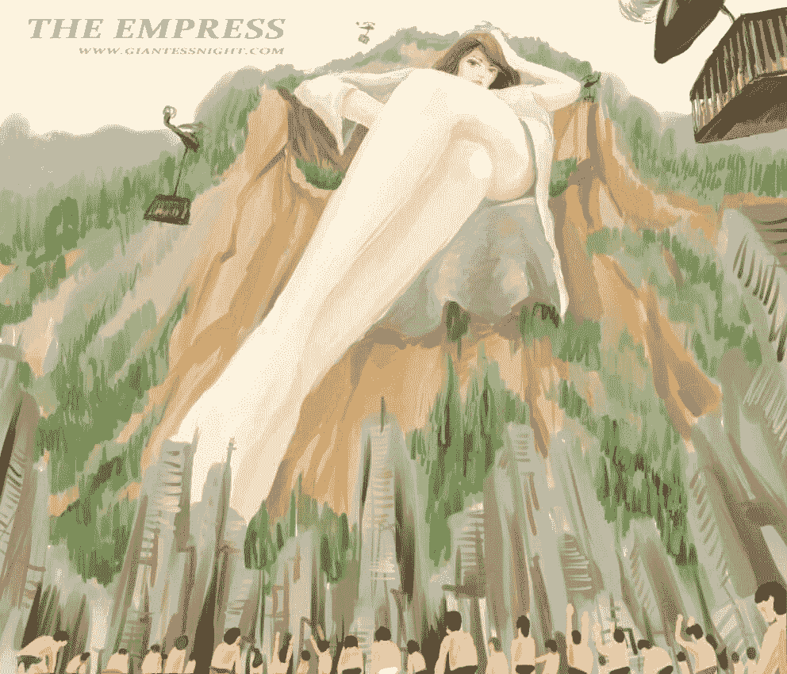

# 更新〈我的成长日志〉-第二十二章-窃神者

作者：hongliang46

TID：18103

 

# 1

*本帖最後由 hongliang46 於 2016-7-24 20:17 編輯*

第二十二章——消失的女神（婧女皇的统治）   婧皇元历7年美丽的碧蓝星球，如画般的壮丽山河在辽阔的大陆上延绵不绝，那黑夜中犹如繁星般的无数都市，更是让将那勃勃生机闪耀地无比动人。 这是一个全新的世界，也是一个女生足下的世界。        “吾等代表世界虫民，在此圣足之下，向伟大女皇陛下致以崇高的敬畏之情，愿陛下万福，恩泽亿万虫民。”位于大陆中央的巨型广场之上，数千名来自世界各国的领导人正紧紧的排列在一起，双膝跪地，脑袋死死的贴着地面，每逢周一，这样的场景便成为整个星球上所有通讯媒体上出现的唯一画面，同时也是唯一一个收视率达到百分之九十的节目。  不为别的，仅仅只是因为那七年前全球范围内突然宣布出现的女皇，也就是画面中那将230米长的巨足悬挂在众多领导人头顶的妖艳女生。充满着媚惑般脸庞，令人血脉喷张性感的身躯，就这么在全方位拍摄的镜头前，懒散的半躺在一个被削成睡椅形状的石山上，将那穿着丝袍，高度达1700米的巨大身躯，大方的的展现在全世界的观众面前。                        “嗯，很无聊啊，每周都这样，就不能有点新意吗？”        丝毫没有任何礼仪上的回应，漫不经心回答完的女皇，在向一旁稍微示意了一下之后，画面中那些穿着近卫队服饰的军人，很快便将放置在女皇右手旁的铁盒打开，将关押在里边的上百的清秀帅气男生统统赶出，那出现在特写镜头中的一张张惊骇面孔，很好的将观众们内心深处的恐惧再次点燃。     

这位受到万众膜拜的星球女皇，显然并不是一位仁慈的统治者。随着军人们手中皮鞭的挥舞，渺小到犹如蝼蚁般的男生们，犹如古代的奴隶一般被抽打驱赶着，而在他们的正前方，那涂着紫色甲油的五只青葱玉指，正有节奏的击打着，其引起的可怕震动，让不少男生们不由自主的颤抖起来。“说吧，今天有什么需要想本皇禀报的。”向足下跪候的领导人们做出了第一个指示，随手用指尖挑起几个小男生的女皇，红唇微启，将指尖上尖叫的小黑点轻轻放入口中。                     而这一幕，也让观看在电视机前的父母们，纷纷把受到惊下的孩子们搂入怀中。   “托女皇恩泽，各方都繁华依旧，虫民们都在歌颂您的恩威。”作为在各国政治界摸打滚爬了数十年的总统们，自然知道此时应该说的话语。         “嗯，四年了，已经平静了这么久呢…”“啊，女皇陛下，您、您的意思是？”“啰嗦！”“砰！”                              没有给广场上这些各国总统们任何反应的机会，伴随着一声不耐烦的话语，从天而降的巨足，便轻易取代了这些小人儿的位置。

从山躺椅上站起身来的巨大女皇，再伸了伸慵懒的四肢后，转身朝背后走去，在她的面前，一片位于赤道的大陆半岛，便是其长居的女皇宫殿。而处于其中的一亿名人类，也以各种形式存在于此，为巨大的星球女皇，提供着人类应尽的义务。        ‘就算是“她”，也没有享受过这些呢，呵呵。’        在一个铺满绿色植被的小山上坐下，将脚伸入下方小城中央的巨大女皇，怡然自得的心想着，而足下，这座专门在此设立的小城，正迎来两个月最忙碌的时刻。      作为一个过道上休息的地方，这里的数万名居民，并不足以引起女皇的注意，为此，该地的居民也经常获得其他城市的羡慕，但这也并不意味着这座小城是可以轻松生活的地方，此时踏入城市中央的巨足，便是这块半岛上所有人类生存最好的写照。

如同卑微的蝼蚁，服侍于尊贵女皇足下。一千平方米的平台上下，数万名小黑点正紧张的忙碌着，在他们面前，那代表着至高地位的千人趾环正在轻轻点动的巨趾上展现着人类可悲的地位，这些从世界各地优选来的少女们，成为了女皇与人类交流过程中最好的催化控制剂，还有什么比被当成趾环一般被戴在足趾上舔舐更能刺激普通人类的心灵呢。                              “真是没用，一点感觉都没有。”         这是一句令所有拼命服侍的人类都感到绝望的语句，在这颗女皇统治的星球上，任何生物的命运，早已在七年前就已经改变，那高高翘起的脚拇趾，便是最好的解释。                                人类，只不过是一群为了统治者而存在的低等生物罢了。

这是一栋被诅咒的建筑，曾经世界的中心，偌大的女神宫此时已失去了往日的风采，破败不堪的围墙外，一座巨型的隔离罩将其包围地严严实实，而唯一的监视者，便是经过女皇精心挑选的心腹艾莉，这名曾因为国家被毁灭的小总统，自然会成为了尽职尽责的最佳人选。

“啊…………”在打了一个长长的哈欠后，从座位上起身艾莉，在随手抓起了放在一旁桌上的袋子后，推开了房门。

“真搞不懂女皇为什么一定要监控这个地方，主设备都拆除了，其他的东西也都排查过了，就算回来，也没什么用途啊…”漫步在空旷的走道上，逐渐习惯了此地生活的艾莉，除了每个周末需要汇报一次监控情况外，更多时间也就是再这略显冷清的宫殿内散步兼巡视。

“大人您可不能这么想，毕竟这可是女皇陛下每周都会亲自审核的重要地点，陛下把您放在这里，恰恰说明您就是最得陛下信任的人选呀！”

飞行在艾莉周围的，是一群只有十厘米大小的小侍从们，在看到自己的主人发出这段有些落寞的话语后，连忙积极的献媚道。

“大人，虽然看上去您是屈尊在这，但这里毕竟也是之前那女魔所住的地方呀，您看您现在负责的区域，人口数量依旧不断的增长，享受到得可比那些部长使臣要好多了。”

“是呀是呀。大人您现在所拥有的，可是有整整20亿多人口呢，可比女皇陛下还多呢。”

小小的侍女们争先恐后的献宠到，在她们的心中，这新上任的管理者，和那传说中的魔女并没有任何区别，在这和外界依旧保持着隔断的世界里，七年的时间，足以让处于最底层被加速了时间后度过了七百年的饲养场，变成了人口极度密集和繁华的巨型城市。而作为人口增长过快的代价，这巨大的城市所需要的运作，便是…

“呼…好了，今天的恩赐就算完成了。”

长舒了一口气后，从恩赐位上起身的艾莉，并没有表现出哪怕一丝羞涩，经过了四年周而复始的使用，24岁的她已经没有了当年那面对弱小生命的稚嫩，回想起刚来此地时那在饲养场外尽职尽责投放饲养食物的模样，艾莉不由得自嘲的笑了一声。

‘果然，自己也变成了现在的这般模样呢，是他们太弱小，还是自己实在太强大呢，这应该就是女皇所说的巨大等级差距下形成的心理暗示吧。’

体型只有0.001毫米，如同微生物一般生活在饲养场的人们，对于外界的一切都无从知晓，除了在那保存在博物馆中仅有的纸张里，记录着四百年前的一些残片记录外，这被艾莉重新处理过的饲养场，早已成为了一个彻头彻尾的宗教世界，而他们所崇拜的，自然是那十年才得一见的巨型涩庭。

不论统治者是否更替，那掌握着绝对权利的一位，在人们的心中，依旧是那不可武逆的存在，哪怕她仅仅只是一个女皇足下的管理者

“呼……终于走了，快，都搬到对面去！”

细小的呼喊声，随着走道上震撼的步伐远去后，在墙角边一个不起眼的破洞里响起，在确认了巨大管理者离去后，犹如一列蚂蚁般的黑色小点，很快便从洞口中钻了出来，这些从远处往去几乎肉眼难以察觉的活动体，在凑近观察后便能惊讶的发现，这是一队只有不到一毫米大小人类组成的运输小队，通过借助改造的清理工具，这些小小的运输者，正将一些收集而来的食物残渣运送到通道的另一头，而这整个过程，都是借助着熄灯后的黑暗，无声无息的进行着。

而在旅程另一头等待他们的，则是那依靠在洞口旁，体型消瘦成树，曾经带领着部分工具性人类逃脱搜捕的韩清水，通过在做总管时悄悄留下的系统漏洞，使其成为了第一个得知外部发生巨变的小人，在成功的将自己所在部门的同伴救出后，接下来由接替者婧部长发起的搜捕工作，让绝大多数处于饲养场外的微型日常用品们遭到了惨绝人寰的屠杀，大约近一千多万的生命，在短短三天时间内被新任女皇所消耗殆尽，那位于大堂上，被称为死亡献地的神座上，此时依旧残留着一片干涩的水印，而那水印中密密麻麻的红点，更是记录当时那令人发指的一幕。

“这次的食物应该足够顶一个月了，希望能把那仪器修好…”

指挥人们将食物储藏进仓库的韩清水，自顾自言的说着，在他后方，那赫然伫立在秘密基地中的，便是那消失在人们视线中，仅存的第一代初始缩放器。

“迄今为止，修复工作进展一切顺利，却不知殿下现在身处何方。”

身后传来的女性声音，让注视着远方的男子将目光不由得转向后方，礼节性的点头回应到。

“云神女对殿下的关切之情，真是令尔等叹服，如果没有您的帮助，真不知该如何是好。”

“客气什么，还得感谢你给了我这罪人一个机会，经历了那么多岁月，也认识到了自己的过错，如果不是你，我和这些圣物池的小家伙，早就成为别人座下的细菌了。”

经历底层饲养场加速，以及被劲敌丢入圣物池磨练后，犹如一块开琢的璞玉，在时光的细细打磨下，越发显得成熟的神女小云，于冥冥中悟出一条规律，让着看似布满荆棘的道路上，从此把握住了运转的钥匙。

“相比起殿下对外震慑性统治，对内隐秘性的生活，那妖女从始至今的生活在外界之中，并且长期踩压弱小的人类，这样做只会触碰到人类恐惧的底线，清水，你要知道，圈养的绵羊，看到自己同伴的死亡也是会咬人的。”

“您分析的没错，这段时间通过加密操作，卫星传回来的图片显示不少反抗势力都在积蓄力量，只是畏惧那叛徒窃取的女神源力，一直不能造成实质性威胁。”

“女神源力…这东西真的是能窃取的吗？唔…也不能妄下结论啊…”

将目光投向远方的神女，再一次陷入沉思之中，而那高耸在避难所中央的缩放仪器上，五个代表着神迹的指纹，则成为了此刻幸存下来的人们唯一希望。

C国，某滨海小镇

这是位于C国南部一座偏僻的小镇，5000余名世代在此居住的渔民，成为了这占地4800亩，拥有2公里海岸线土地的主人。整整几个世纪以来，这些靠捕鱼为生的勤劳人民，都在此享受着来自大海的恩泽。在这里，人们可以离开荒芜的大地，奔向湛蓝的大海，柔软的沙滩上，海浪轻轻的拍打着……

这美妙的一切，却在四年前，变成了一抹消失在过去里的记忆。

“是不是想被拿来喂鱼呀，运个鞋子过来都这么慢。”

小镇上空响起的，是一段带着轻蔑语气的女性声音，与之相伴的，还有那一阵阵重物拍击地面的沉重声响。本该清晨忙碌的渔船码头竟空无一人，而那五千多名勤劳的居民们，此刻正聚集在小镇南部的广场上，挥汗如雨的工作着。

因为两年前的一个命令，让这些人类的命运发生了彻底的变化。

《嘉奖令》

职位：五级鞋具保养组长   

编号：10751232

赐名：茹儿

嘉奖全文：虫奴10751232号，于女皇历2年5月17日13点14分，在进行一级管理部长鞋具保养过程中，因领导小组成员（共计100名）在清理完所属分配高跟鞋后，遇到耗品部门未能及时补充增香菌的情况下，果断请求护卫军团将组员驱入鞋中并喷入香精，此处置方式极其有效，避免部长阁下在使用中出现任何不适，特此获得如下嘉奖：

1.晋升三级御用鞋具清洁组长，负责女皇陛下库存鞋具清理。

2.获得身高（150M）

3.获得私有领地（坐标XXX）

4.拥有自由交易虫民权利

5.拥有处置领地事务权利

特赐   

内务议会

代表着绝对权利的诏文，在两年前同样的地点上，由护卫军士长大声宣读完毕，而与之相对的，聚集在台下广场中的人们，却犹如受惊的动物般相互依靠着，这些一大早就被军用车载广播从睡梦中惊醒的小镇居民，在第一次面对这些全副武装、只存在于电视广播中的内务军团时，甚至连一丝的异议都没有发出，安守本分的天性，让他们如同被驱赶的羊群一般，顺从的聚集至了那平时聚办小镇宴会的广场，而在那里，等待着他们的，则是那不断传言到的事实。

从人类变成私人物品

“晚了五秒钟，那么按规律，选出五只虫子吧。”

一边将脚伸入鞋子，一边像是自言自语说着的女生，此刻正坐在架设在礼堂顶端的巨型沙发上，而在她精巧的高跟鞋旁，五千名小小的居民们此时正颤抖的跪伏在广场之上，整个广场上，只剩下女生脚丫穿入鞋内过程中发出的‘咯吱、咯吱’摩擦声。

“怎么了？都不愿意动么？人家可是定有规矩的，作为物品的你们都应该遵守，不是么？”在穿上了其中一只鞋子后，上下翘起扭动了几下的女生，满意的将脚重新放了下来，而仅仅只是这样的举动，便已让广场上的‘物品’们发出了几声细小的尖叫，但很快就被身边的同伴所捂住了嘴巴。

“呵呵，真是一群不听话的小家伙，既然都不出来，那我就得翻倍挑了，今天这双鞋子可是花了人家半个月收入才从工厂特意定制的呢，各位还是很幸运的。”

伴随着女生脸上调皮笑容的，是广场上人们悲泣的乞求声，经历了两年物品般生活，这些可怜的善良居民，早已丧失了人类的本性，面对有着150米身高优势的领主，他们所能做得，仅仅只是跪伏、乞求、顺从的做好每一件持有者下达的命令，为的就是换取那仅存的一丝怜悯，让自己和家人，能在这被高墙彻底封闭的土地中继续卑微的生存下去。

不幸的是，即便人们做到如此地步，但在年轻貌美的领主眼里，这一切不过都是弱小者应有的姿态罢了，对于这位18岁起就已经在内务部摸爬滚打的小女生来说，权利是其一生追求目标，残酷的竞争早已麻醉了原本温柔的内心，在成功晋级三级管理后，进入到核心管理机构外围的小姑娘，更是清楚的见识到了那被当做消耗品大量使用的弱小者，看着那些每次清理完毕后，被关在增香球内运送而来的人类，内心的欲望就会随之提升，仰望着高达五百米的短靴，以及被送至靴口处缓缓降下的小球里面那些惊恐万状的神情，其渴望权利的内心不断被敲打，幻想着那从未见过的巨足穿入其中的姿态，那隐藏在内心深处的恐惧与卑微，又会随之让其感到一阵寒意，对于一个不到22岁的小姑娘来说，如此高压的环境所积累压力，自然而然的，就会释放到自己小小私人物品上。

“一、二、三……七、八、九、十，嗯哼哼，就你们了。”

看着手中十个不断发抖人类，女生不由得轻笑出声来。

“领主大人，领主大人，那是我唯一的儿子，求求您放了他吧。”

“妹妹，妹妹！”

未被选中的家庭如释重负，而被选中的家庭亲属们，则陷入了无比的绝望之中，可对于逆来顺受的他们来说，出了哭喊乞求，根本不能做出一丝有用的举动。而这样的结局往往只会是…

“好啦，好啦，哭什么叫什么，人家又不是要把他们踩碎，只是拿来做下鞋子的装饰么，要知道这可是在宫内很流行的，嘻嘻。”

开始动手DIY的年轻领主，此时就如同一个满足了自身爱美喜好的小姑娘一般开心，只不过，这样的爱好，并不是其足下虫民所能承受的，因为那些所谓的装饰，此刻正被其握在手中。

“你们看，这不是挺好看么，哎哎，不要乱动哦，这样只会越来越紧哦。”

被挂扣固定在鞋口处的八名居民，此时就如同装饰链般垂挂着，而最为强壮的两名男生，则被双手捆绑着的吊在鞋跟后，那在空中飘动的无助模样，让其父母早已哭晕在地上。

“嗯，果然很漂亮哦，谢谢各位小虫子了呢，呐，作为奖励，人家的早餐就奖励给你们吧，虽然是吃剩的，呵呵呵……”毫无诚意的语气，将蛋糕丢入人群之中的领主，姿态就如喂食一群蚂蚁般，轻蔑的笑容伴随着不幸家庭的乞求声，让整个广场弥漫着沉重的压抑感，而最让人们觉得可悲的是，明明知道自己在对方心目中已经和蚂蚁没什么区别，却在封闭的环境内毫无办法，失去了大海，及周边土地的他们，不得不寄望眼前这种被放置在广场中央，和投食并没什么区别的羞辱性食物。

而这，也正是年轻领主在四年内所积累的经验中，轻车熟路的一个罢了。

“嗯，这就对了嘛，这可是‘特意’留给你们的呢，可别辜负了人家的一片好心哦。”女生戏虐般娇笑着，随之故意将鞋尖碰上了地上的蛋糕，“哎呀，不小心碰到了你们的食物了，来，来你们几个，人家鞋尖那里还有，别浪费了。”

在鞋跟支撑下向上翘起的黑色高跟，鞋尖处粘黏着大约两平方米的白色奶油，因处于附近而接到命令的两个小家庭，此刻正被恐惧所笼罩着，面对眼前这明显属于戏弄性质的餐后小游戏，任何可能出现的不幸，都是他们无法承受的。

天知道在这巨大领主脚下会发生什么，更何况还要主动钻进去。

“领、领主大人，能、能不能只有我俩进去？孩子们还小，怕服侍不了您。”

恨不得将头贴入地里的两个家庭长辈，极其低微的小心请求道。

“嗯…”

“谢、谢谢大人，谢谢大人！”

响起的通讯信息，让嬉笑中的女生将注意力从地面转到了屏幕之上，随意的应付了一下之后，脚下那些卑微的玩具很快便成为了意识里可有可无的物品，

“是、是，小茹明白，请您放心，一定会严密监控。祝总团长大人身体安康。”

将通讯设备关闭的领主， 如释重负地呼了一口气，要知道刚刚出现在屏幕里的，可是女皇的四大心腹之一，御卫军团领头的大姐大，这可是要比内务府军队高出不止几倍的大人物，作为一个不见经传的小人物，小茹就差没立刻跪伏外地接受命令了。

而相比领主的紧张，几位正在清理的小虫子可就没有那么好受了，因为专注于回话而丝毫没有在意脚下卑微的一切的茹组长，在服侍的过程中就将翘起的高跟鞋放回了地面，导致两个家庭的四位父母被压在了鞋底之下，其中一名钻入鞋底比较深的父亲在瞬间便被踩成了肉末，而剩下的一男两女，四肢也收到了不同程度的伤害，痛苦的挣扎在微微翘起的鞋尖处。

“唔…怎么会选这么偏僻的地方，不过既然需要总团长一个个亲自传达的消息。想必应该不会有错，说真的，也还真想亲眼看看那传说中的女皇死敌。”

沉思中的女生往往都是很专一的，小茹自然也是其中，可沉思所表现出来的另一方面，便是自然的下意识动作。

“啊！！”

“谁来帮帮我们，把她们拖出来…”

哭喊声开始在巨鞋边尖叫着响起，下意识点动的巨足，将更大的压力一阵一阵的快速传达给鞋尖处的三个悲惨的玩具，原本挣扎的动作变成了极为痛苦的全身扭动，因为上下点动而在伤口处造成的阶段性喷涌，让这三位父母陷入到了昏迷和惊醒的反复折磨之中。

凄厉的惨叫声不断的刺进周围的人群内心之中，直到……

“噗嗤！”

“嗯？哎呀！忘记还有三只虫子了…一会你们清理下吧，主人要出去工作了，你们在家得乖乖的啊。”

从座位上急急忙忙站起身的领主，略显毛糙的姿态也印证了其不到22岁的年纪，在低头发现那早已被自己折磨得支离破碎的玩具尸体后，也仅仅只是露出了略显不满的神情，在厌恶地将脚下的尸体通过房檐蹭掉之后，随机拧起了放置一旁房顶的公务包包，伴随着巨足的迈出，小小的饰品们随即猛烈的摇摆起来，狠狠地撞击在鞋面之上，而留在身后的，则是那一群失去父母后，依旧在人群散去后，空旷广场上痛哭的小男生，小女生

生们。

残酷竞争已然扩散至了全世界

婧部长图： <ignore_js_op>

**QQ图片20141115152141.jpg** *(127.75 KB, 下載次數: 13)*

[下載附件](forum.php?mod=attachment&aid=NDg1MTl8MGJlOTc3ZDh8MTYwMDg3NTg3MXwxODIzMHwxODEwMw%3D%3D&nothumb=yes)

2014-11-15 15:28 上傳</ignore_js_op>  

# 2

> [caoshuhao123456 發表於 2014-11-15 15:49](https://giantessnight.com/gnforum2012/forum.php?mod=redirect&goto=findpost&pid=238754&ptid=18103)

> 这次更新好像不符合以前一贯的风格啊？

准备有结局了o ````````````

 

# 3

> [xxx99 發表於 2014-11-15 19:33](https://giantessnight.com/gnforum2012/forum.php?mod=redirect&goto=findpost&pid=238776&ptid=18103)

> 看來篇幅有所減少啊

> 相當於過去的七分之一

> 準備一點一更新？

不想以前了， 现在很忙

 

# 4

开始慢慢更新了，时间不是很充裕 

# 5

更新了………哦……… 

# 6

下个月再出 第23章········