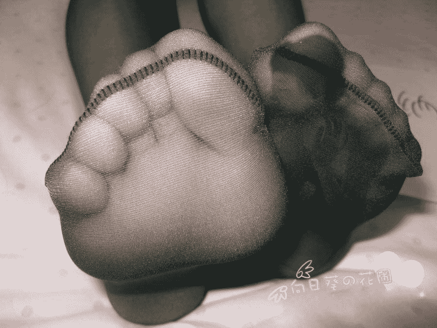
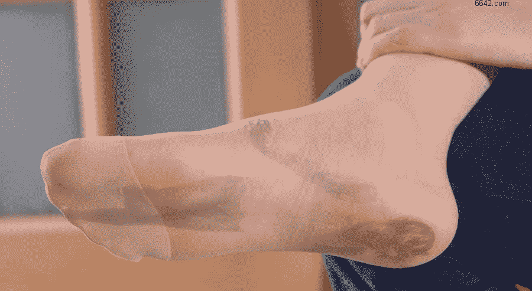
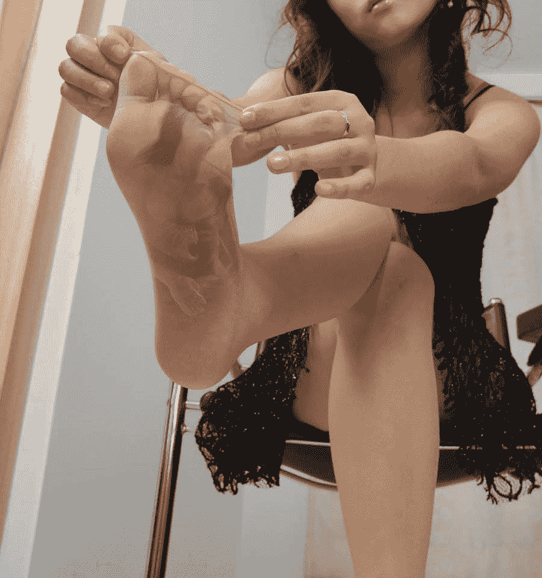
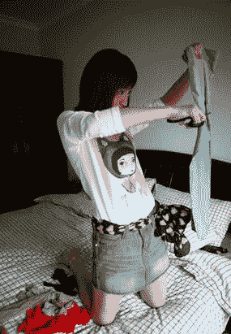
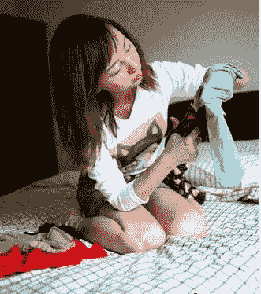
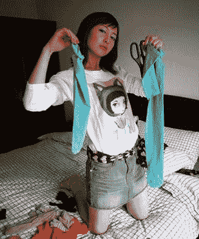

# 杨倩（复仇篇，完结）

作者：smsunhuawei

TID：14573

 

# 1

*本帖最後由 smsunhuawei 於 2015-7-24 04:17 編輯*

复仇完结了，结果还是良心发现把她完结了，最后更新的那七章，可能就最后四个稍微有意思些，我看我自己写的总是感觉墨迹，但有人想看就来吧，谢谢各位支持！

 

# 2

*本文章最後由 smsunhuawei 於 2013-6-17 17:19 編輯*

（一、成长篇链接：[http://giantessnight.com/gnforum2012/forum.php?mod=viewthread&tid=14264&page=1&extra=#pid187095](http://giantessnight.com/gnforum2012/forum.php?mod=viewthread&tid=14264&page=1&extra=#pid187095)

（二、魔化篇链接：[http://giantessnight.com/gnforum2012/forum.php?mod=viewthread&tid=14265&extra](http://giantessnight.com/gnforum2012/forum.php?mod=viewthread&tid=14265&extra)= 

（三、复仇篇） **四十七、打不开的死结**“唉……”    小隋辨望了眼圆洞洞的鞋口长叹了一声，无奈地瞥了瞥嘴，看来，他心中也在犯难，难道真要在这鞋里待上三天么？当年前辈被那双嫩脚折磨的惨状他可是历历在目，再晚一会儿被发现可能都要丢了命，自己如今……    正当隋辨慨叹自己命运多舛的时候，开门声响起，同时，蔺雪肆无忌惮的笑声也从鞋洞传了进来，隋辨可怜巴巴的眨了眨眼睛，“丫的……我说你当时为啥不逃跑呢，感情你丫根本就顾着琢磨人生了，鄙视你！”对天竖了个中指，之后连滚带爬的往鞋尖位置跑去。鞋垫上覆了一层细小的绒毛，在长时间的踩踏之下，一个脚型的痕迹格外明显，在脚趾窝的位置更是有一丛绒毛高过四周，显然，这鞋子里顶数那里最安全了。    隋辨拼了命的往鞋尖跑，这被压的扁平的鞋垫对他来说就像一个偌大的广场，一旦蔺雪伸脚进来，自己避无可避，铁定被踩成个渣渣，外面稍有什么风吹草动都会惊得隋辨一身冷汗。    终于，借着微光已经能看到前面不远处的一丛“茁壮”绒毛，可就在这时，鞋子却突然被蔺雪提了起来，隋辨只觉得晃晃悠悠地随着鞋子向旁边一倾，骨碌碌地跌倒在鞋垫上，隋辨赶忙伸手抓住鞋垫上倒伏的绒毛，算是勉强稳住了身子。晃动并没有持续太久，但之后的平静却让隋辨更加心焦，连忙爬起，起身的一瞬，身后的光线便被一只附着黑色羊绒袜的圆润脚掌死死遮住了……    情急之下，隋辨只得向后边一蹿，看来去脚趾窝那里已经来不及了，留在脚心下面或许还有希望。隋辨在空中张牙舞爪的时候依稀看到了一只巨大的黑色脚趾头向自己压过来，而在他下落的过程中，那脚趾头却是蹭着自己的头发继续向里面送去，当他整个人拍在鞋垫上的时候，那只脚也是全部挤进了鞋里，鞋子顿了顿，脚也随之向前蹭了两下，自己现在能堪堪处在了脚心之下，算是万幸了。    虽然脚心下面的绒毛也是平坦的一片，但并不像脚掌和脚跟处那般密实，可见其着力并不太死，隋辨现在也只是被紧紧压在下面起不了身，至于被压扁，还不用太担心，忍忍也能挺过去。    蔺雪穿好了鞋，在地上轻跺了两下，让脚在鞋里落实，之后笑盈盈地挽着早已等在门口的杨倩出了屋子，二人还像往常那样你一言我一语的搭着话，却丝毫没有察觉到蔺雪脚下的异样。杨倩脚趾环中的隋辨也是没有想到，一个和自己长的一模一样的小子，正在蔺雪脚丫下面大口喘着气，丫的还满脸享受，要是他知道的话免不了一根中指送上。    “唔，还好这鞋子里没什么怪味，嗯，嗯，还有点化妆品的淡淡香味呢，只是空气太稀薄了……”隋辨被压在蔺雪脚下抽了抽鼻子，胡思乱想着。    临近期末，课程表上的课程早被划去了七七八八，仅剩的几门专业课可能再过几周也就结了，就像今天的这节课，无非是划一划考试范围，半节课就搞定，老师跟同学闲聊了一会，时间倒也过得飞快，转眼下课铃响起，和老师说句再见，却颇有些再也不见的意味。    隋辨四周渐渐泛起潮热，空气也不再是最开始的馨香，蔺雪脚下的汗汽终于将鞋内闷的犹如蒸笼一般，最可悲的是里面的空气已经被脚汗附上了一层鲜明的浑浊味道。蔺雪也会不时的扭动一下脚，大发慈悲的放进去一点新鲜空气，但还没等被隋辨吸入，倒是先被蔺雪的脚汗集体临幸了一遍，这潮热又浑闷的气体最后才被隋辨大口地吸进。每一次吸入，都会带来一阵舒畅，渐渐的，他竟然对这味道格外期待起来，那味道就好像给宠物喂食前的铃铛，铃铛一响，宠物就开始感恩戴德的摇晃尾巴，隋辨当然比宠物要强上一些，最起码他还能开口说句谢谢什么的。    下课的铃声也传进了隋辨耳中，这救命的铃声让隋辨着实感动了一番，下课，说明蔺雪要走动了，就意味着将会有更多空气会涌进鞋里，即便还是会携带着浓重的脚汗味，却也令隋辨颇感欣慰。    感觉到头上的嫩脚向下压了一下，之后开始走走停停，隋辨则攥紧了绒毛，免得被脚掌揉搓着到处乱滚，蔺雪的脚掌每一次踏在地上，隋辨都会被压得闷哼一声，失重感与超重感交替呈现，隋辨却也只能闭着眼睛忍受着蔺雪带给自己的一切。    没过多久，鞋内的温度降了些许，空气也清爽了不少，鞋底传来细细的踏雪声，在隋辨听来却是异常清晰。过了好半天，蔺雪才停下脚步，究竟到了哪里，隋辨根本也没必要知道，就让他安安静静的喘口气吧……    整整一天，蔺雪都穿着这双短靴，似乎也没怎么回宿舍老实待会儿，这走走那逛逛，不知道究竟忙些个啥，鞋里跟她一块逛的隋辨可被虐的不轻，筋疲力竭，饥肠辘辘，还要时刻打起十二分的精神注意着蔺雪的动静，一天下来早就动弹不得。晚上蔺雪脱下鞋，放到一旁，隋辨竟然也只是抬头看了眼，身体根本不听使唤，别说爬出鞋口了，就算翻个身都有些力不从心。    “唉……还剩两天了，好歹算是有个盼头……”隋辨瘫软在鞋垫上喃喃自语着……    两日之后。    杨倩推门进屋，看见蔺雪正翻箱倒柜在那折腾，“呦，干嘛呀这是？不过啦？这就想离婚分财产？”杨倩笑着问道。    “什么啊，我存资料的u盘忘放哪儿了。”说完，扭头看着杨倩，“美人～离婚你就别想了，来，先给朕笑一个。”    “挺重要的哈？”杨倩则是阴测测的看着蔺雪，意味深长的问了一句。    “找了好久的，你说呢？”    “既然这样，我倒是可以帮你……不过得先让姐乐呵乐呵。”杨倩手指轻托起蔺雪的下巴，邪邪地说道。    “对啊！怎么把你忘了，那个，要不……朕给你笑一个？”    “恩，态度还不错，笑就免了，给姐搬把椅子过来，一边侯着吧。”蔺雪乐颠颠扯了把椅子过来。杨倩坐定，缓缓展开洞悉，意识瞬间笼罩了整个屋子，屋内事无巨细，都被杨倩探查的一清二楚。    “咦？”片刻后，杨倩略一惊讶，扭头看向蔺雪的脚上。    “鞋里？不可能啦……”    “不是，雪姐，你鞋里有个人，快脱下来！”杨倩连忙解释道。    “人？不会吧？”看着杨倩认真的模样，蔺雪也不由一惊，伸手去解鞋带，“小倩，你是不是把谁变小了塞进来的啊，跟你说，这可不好玩，要出人命的。”    “哎呀，我都好久没用过能力了，里边的……好像是隋辨。”    说话间，蔺雪已经将鞋拿到手中，里面却看不太清楚，手伸进鞋中，将鞋垫抽了出来，一看，果然，一个蚂蚁般的小人被压的陷进鞋垫里，一动不动的嵌在上面。    蔺雪张大了嘴巴，目光缓缓移向杨倩，杨倩也是紧锁眉头，她能确定，这小人正是隋辨，可为什么会跑到蔺雪鞋里，而且平时隋辨住在脚趾环中，比现在要小很多，肉眼根本不可能看到，他又是什么时候变化到这么大的？    杨倩将隋辨从鞋垫里弄出来，将其变回正常大小，又运用能力恢复着他的身体机能，同时，分神探查向自己的脚趾环中，“咝～”杨倩不由倒吸了一口气，隋辨好端端的还在里面，这……这是什么情况……    杨倩连忙将鞋袜脱掉，唤出了趾环中的隋辨，看着不明情况的隋辨，杨倩却也不知道从何说起了，只是伸手指了指昏迷的那位。    隋辨疑惑地看过去，之后的表情跟刚才的二人如出一辙。“隋辨”现在还在昏迷中，看来一切原委都要等他醒来才能说得清了。    没过多久，“隋辨”悠悠转醒，“呃……总算是出来了，咳……咳……”，一口老血呛出，粘在了嘴角上。    “雪姐，拿条毛巾来，隋辨，去倒杯水。”见“隋辨”醒了，杨倩赶紧上前扶着他慢慢坐起来。    “妈……妈妈，能不能先给我弄点吃的，我……我要一食堂的肉夹馍，不加葱花，来十份，咳……”    杨倩真不知道好气还是好笑，转过身说道：“雪姐，得麻烦你一趟了。”    “啊，没事没事。”蔺雪说完便搓着手走了出去，对于隋辨，她还是充满了歉意，毕竟是被自己踩成这个样子的。    “你……”杨倩张了张嘴，却不知道该从何问起。    “我是两年之后的隋辨，到这来……一是完成命里的一个死结，更重要的是要请您出手，拯救末世！”隋辨缓缓说道。    “拯救末世？既然你是那个时代过来的，那个时代应该也有我们五个，你们都做不到，我们去了又能有什么作用？”杨倩先是一阵惊讶，接着又疑惑道。    “当然有用，因为那段时间线内的物质法则被人篡改，世界上的人类都在一夜间不同程度的缩小了，就算是我们，也都无法逃脱，而且这缩小根本没有规则可言，如果真要找一个规则，就是没变小的只有少数女孩子。不巧的是妈妈、筱筱都没在其中，只有墨晗凭着特殊的体质躲过一劫。而且，而且我们的能力都变得十分微弱，妈妈您的能力根本就完全消失了，我也是被另一个自己告知了一个能力恢复的时间节点，才逃脱那段时间线，来到这里的……”    隋辨一口气说了好多，听得杨倩却是晕头转向，理解了好一会才明白，“那我们去了不是同样会被缩小？”    “妈妈，这您不用担心，我们五个当初也是被另一个隋辨忽悠去了，那个时间线内的规则并不会影响的你们，因为你们根本不属于那个世界！”    看着杨倩掰着手指头在那琢磨着，隋辨只得看向站在一旁的自己，“隋辨，我知道你听得懂，我也知道你想要问什么，没错，你在不久的将来将会开启穿越时间的能力，至于具体契机我却不能告诉你，我对你这时间线的影响不能再扩大了，蝴蝶效应你应该会明白。    而且你想的也没错，当你这条时间线行进到一个特定的时间节点也要重复我这三天的行为，不是要，而是必须这样做，现在这段时间已经形成了一个死结，一旦打破，所有时间线将会变得混乱不堪，扭曲成一团，那时可就真的是末世了，所以无论如何，你到时候都要赶回来。嘿嘿，至于你想的我为什么不逃出蔺雪的鞋，到时候你就知道了……好了，告诉你那个时间节点，2015年4月13日15时48分32秒，来重复前辈的路吧，看好你呦……咳咳……”    隋辨心中所想都被床上那位一一道出，就像自己在解答着自己的疑惑，自己还真没什么好问的了。这时，门吱呀一声被打开，蔺雪气喘吁吁地拎着满满一袋肉加馍走进来，另一只手还拎着一些其他的东西，床上那位看到满袋子好吃的东西两眼瞬间闪起饿狼般的精光，什么前辈啊，什么救世啊，感觉统统离他好远好远……    “哈哈，雪姐，爱死你了，不过话说你用什么牌子的护脚霜，挺香的，妈妈你也跟雪姐多学学，要为常住居民某某福利么，你说是不是，小老弟……”整个肉加馍也没能堵上他的嘴。    三人顿时满头黑线洒下，杨倩转头看向站在一旁的隋辨“隋辨啊……这就是你的本来面目么？我终于认识你了……”    吃饱喝足，两手搓了搓，“恩，时间差不多了，对了，返回去的时间节点就在杯子摔碎后的五秒钟里。”话音刚落，只听隔壁传来一声清脆的破碎声，“呵呵，来了，咱们一会儿见。”说完微闭双眼，蓝光蹿动，整个人都融进了蓝光中，最后蓝光旋聚成一点，凭空消失掉了。三个人愣愣的看着隋辨消失的位置，这就……走了？    “还没问我答不答应呢？”杨倩想着。    “隋辨还有个哥哥？”蔺雪想着。    “丫的我什么时候能这么牛X啊！”隋辨想着。         ……………………………割·未来……………………………    隋辨噗通一声落到地上。    “这就回来了？还不到一秒钟啊？”杨倩看到隋辨刚消失就又出现了，不由开口问道。     隋辨站起身揉了揉屁股，刚要开口说话，只觉得一个巨大的阴影将几人笼罩在内。    “唔，来的还真快。”隋辨兴冲冲的抬头望向上空，挥了挥手，这巨人般的美少女不是杨倩还会是谁。    杨倩看向脚下的众人也是嘴角含笑，最后目光锁定在隋辨身上，“小隋辨，准备好了么？”    “恩？准备什么？”隋辨疑惑道。    “准备……被我踩啊……”杨倩坏笑着看向隋辨。    “别别，我那也是……”话没说完便被杨倩踩在脚下，抬起脚来，隋辨已经像颗石子一样咯在鞋底上，杨倩又在地上泄愤的跺了几脚。隋辨最后被死死卡在了里面，看的下面几个小人冷汗直冒。    “让你不提醒我们，害我们吃了多少苦头，先在鞋底待两天吧！”巨大的杨倩开口对隋辨说道，之后又蹲下身子俯视着坐在地上的自己，嗯，稳重了不少，倒是更耐看了…… 

# 3

*本文章最後由 smsunhuawei 於 2013-6-22 13:28 編輯*

写这个的时候有点困了，不知道是不是能入大家法眼 **四十八、故人**    杨倩收拾着隋辨风卷残云后的一片狼藉，脑中却还在梳理着头绪，最后她明白了，隋辨这就是赤裸裸的空手套白狼啊，来了就求着自己去救他们，也不告诉自己怎么才能过去，最起码隋辨的能力问题怎么解决啊，难道跟云墨晗一样？在自己体内走一遭？    想到这杨倩立马摇了摇头，恨死那个隋辨了。    “笃笃笃……”门外传来敲门声。    “进来吧，没锁”杨倩开口应了一句。    门缓缓打开，一只艳红色高跟鞋却是先踏了进来，接着便是紧裹着小腿的黑色丝袜。看到这，杨倩心下不由嘀咕着“这个……她不冷么？”    再接着，一个熟悉的身影扭动着腰肢走了进来，一身齐至大腿根的包臀连衣裙也是扎眼的红色……    “杨倩，好久不见呢！”一个娇滴滴的声音传来。    此时杨倩脸上写满了震惊，眼前出现的人，根本……根本就不应该出现在这，揉了揉眼睛再度确认，“杨……杨柳？”杨倩大感不妙。    可精神力堪堪散出，她却只觉得周身一阵轻颤，一股强大的吸力便从杨柳纤细的鞋跟上传来，杨倩想要抓住床铺的栏杆撑一下，可她发现，自己的手掌竟然穿过了铁质栏杆，丝毫没有受到阻碍，而在她被吸进鞋跟的过程中，却还看到隋辨、筱筱、仇火三人也同时出现在身侧，而不到片刻，四人便齐齐跌落到一个四壁透明的房间内。透过暗红色的墙壁，杨倩明白了，自己这是被吸进了杨柳鞋跟里面，外面的一切都变的硕大无比，抬头望上去，一张巨大的鞋底正遮在头顶上，黑沉沉的仿佛要压下来一样。    “呵呵，杨倩，你看看那是什么？”杨柳娇笑了两声，手扶着墙壁，抬起了右脚，将鞋跟指向前方。杨倩不由望了过去，这一望却是让她更为骇然，前方地上正躺着一个和自己一模一样的女孩，不对，那就是自己！    啪嗒一声，杨柳放下脚，“看到了么？那就是你的肉身，不过没想到你身上还藏着三个人，应该就是什么筱筱、隋辨的吧，呵呵，既然是你的朋友，我当然也要好好款待了，不过还是要先从你开始。”说完，只见隋辨、筱筱、仇火的三具尸首纷纷飘出，虽然杨柳看不见，但因为这双鞋的力量，也能感觉得到，片刻之后，杨柳左脚下的鞋跟里蓦地多出三具尸体，在吸进去的瞬间，竟然变的和右脚鞋跟内的几人相同大小。    “哈哈，当年被你缩小的仇我可是要加倍讨回来喽！”    杨柳漫步上前，伸出右脚踏在杨倩脸上，鞋跟正搭在杨倩额头上轻轻划动，“这里就是你使用能力的地方吧，你说……我要是在这里踩个窟窿，会怎么样呢？嗯？”杨柳恶狠狠的说道。    话音刚落，杨柳便逐渐加大了脚下的力度，杨倩额头上已经隐隐渗出血色，而此时，鞋跟中的杨倩魂魄却是毫无办法，只能眼睁睁的看着这鞋跟在自己额头上越钻越深，另外三人则不断拍打着鞋跟壁，但也只是徒劳。    “怎么样？在我鞋跟里看的还算清楚吧，呵呵呵，现在就让你看看这里面究竟是什么样的。”说着，杨柳缓缓抬起右脚，鞋跟正对着杨茜的眉心，狠狠跺了下去……    杨倩绝望的闭上了双眼，由于失重，在下落的鞋跟中，几人被撞到了鞋跟的上壁，接着鞋跟猛地一顿，却又如同高空坠落一般被拍在鞋跟底……但是，在整个过程中都没有听到骨碎的声音，这一脚倒像是踏在了地上。    杨柳此时正吃惊的望着下方诡异的一幕，她这一脚的确踩了个空，脚下的杨倩在鞋跟落下的瞬间竟然化成一片白芒，这是她怎么也没有想到的。    “杨倩的肉身我先代为保管……你也不用猖狂……待我找到制服你的方法……自会前来取你性命……”空中悠悠传来云墨晗的声音，在小小的宿舍内却显得极为空灵。    杨倩听到云墨晗的声音，不由得长长出了口气，心内也算明白了一些，看来云墨晗的体质就是无魂无物，杨柳根本奈何不了她，而云墨晗可能也在试图净化掉杨柳心中的恶面，结果也并未成功，自己灵魂脱离肉体，那肉体便无生气，倒是正符合云墨晗的能力。“呼~真是好险……”杨倩不由庆幸道。    “哼……大言不惭，你对我似乎也无能为力，咱们谁先收了谁还不一定呢！你别忘了，杨倩的魂魄可还在我这，只要我动动想法，她马上就会灰飞烟灭，那个破烂尸体你想要的话就送给你了。”杨柳对着空中的一个光团淡淡说道。    光团在空中转了两转，也没再说什么，只是一晃，便透过窗子飞了出去。杨柳轻轻抬起脚掌，鞋跟支在地上，悠悠说道“没想到你还有这么个朋友，竟然能逃出我的控制，还真是个大麻烦。”    杨柳此行的目的可不止是杨倩，还有那个让自己受尽折磨的蔺雪，转过身随便扯了吧椅子坐下，右腿搭在左腿上，歪着头欣赏着随右脚晃来晃去的杨倩几人，十分惬意的等在宿舍中。    天已经渐渐黑了下来，杨柳等的都快睡着了，左手支着脑袋，无聊翻看着杨倩的电脑。    “你是谁？为什么动女神大人的东西？”静静的宿舍中突然响起一个女孩的声音，杨柳吓了一跳，转过头看去，还是个清冷的美女。    “女神？你是说杨倩？”    “当然，虽然女神大人已经不做女神了，但女神大人一直都是我的女神，倒是你，怎么随便动女神大人的东西。”    “哼，原来也是杨倩的狗，你的女神大人在这里，你要不要也进来陪陪她啊？”杨柳朝着云墨晗抬起腿，晃了晃鞋跟。    云墨晗拧着眉头看过去，的确见到里面有四个淡淡的人影，其中一个正是杨倩。杨倩现在也紧张的望着外面，云墨晗的变数太大，见到比自己更强的人出现，这云墨晗没准就临阵倒戈了。    “你……你怎么可以把女神大人关进鞋跟里面，快放出来，不然女神大人发火你就死定了。”    “哦？呵呵，你是在逗我么？她都被我关进鞋跟了，就说明她没我厉害啊，我还怕她什么？”    “你……你真比女神大人还厉害？”真是怕什么来什么，云墨晗这语气明显就带着点跳槽的意味。    “哼，我厉不厉害你试试不就知道了……”说着，杨柳便缓缓催动脚下的高跟鞋，想要将云墨晗的灵魂抽出来……可是，可是这丫头丝毫没反应。    “不用试不用试，女神大人都被你关起来了，你肯定比她厉害，以后你就是我的女神大人了！”这……这丫头脑袋秀逗了？变得也太快了，刚刚还一口一个女神大人，这就把人家炒了？不对，刚刚自己试图抽出她的灵魂，可就跟白天的时候一样，怎么一下子蹦出这么多不受自己控制的人？还是说，根本就是同一个人，不然自己千辛万苦得到的阴阳鼎也太垃圾了，满地的克星。    “哼……这么快就摸回来啦！少在那装蒜，你不就是想救杨倩么，以为摸到我身边就行了？我这就把他们一个一个全都化掉，看你还有什么办法！”杨柳开口试探道。    “化了吧，化了吧，女神大人，您要嫌累的话墨晗给您揉揉脚。”    “你……那我问你，我为什么控制不了你？”杨柳听到这话更为无语，看样子她还真不怕，索性问出了心中的疑惑。    “嘻嘻，您不都控制了么，您是女神大人，墨晗什么都听您的！”    “哎呦……我是问我为什么控制不了，为什么不能控制你的肉体和灵魂！！！”杨柳快被气疯了。    “哦哦，因为墨晗没那些东西。”    “没有？”    “对啊，墨晗正常应该是这样的。”说着，便化做如墨的一团。    奶奶的，总算明白了，敢情应该是白天那位的亲戚。    就在这时，门外响起了开门声，杨柳轻笑了一下，待到蔺雪进到屋内，便开口娇声道“你可真让我好等啊，蔺雪！”    蔺雪抬头看过去，心中也是惊诧万分，面前的杨柳明明已经被自己弄死了，怎么，怎么还活着？下意识转身想逃出宿舍，可刚刚拉开门，却突然感觉一股力量将自己向后扯，在杨柳看来，蔺雪则是分出两个，分别被吸入两只鞋跟内。    抬脚在地上顿了顿，算是跟蔺雪打了声招呼，随后扭头看向恢复的云墨晗，“你跟我来，有些事要问你！”    “是，女神大人！”杨柳走在前面，云墨晗乖巧的紧随其后。二人来到楼下，上了一辆暗红色跑车，很快，跑车驶离了校园。    在市中心偏北的一处别墅区内，有一幢并不算大的两层小别墅，平时在树木掩映下显得格外幽静，这便是前几天杨柳找到的新家。    要说起这房子的主人，原本是一家三口，男主人是一位体面的商人，女主人则是位全职太太，家里还有一个五岁左右的小男孩，日子本该过得挺舒心，可这一切却都被一个女孩打破了。    那天，男主人潘龙回到家，像往常一样先洗了个澡，妻子琳娜带着儿子去了姥姥家，明天才能回来，他在家里也乐得清静。正当他打开电视，想找点什么节目消遣一下的时候，忽然传来一阵敲门声。    潘龙感到奇怪，这么晚了一般不会有人过来，不过也起身去开了门。    一位二十左右岁的高挑少女斜倚在门口，见门被打开，那少女便笑着开口道“能请我进去坐坐么？”    潘龙皱了皱眉，“你是谁？我不认识你吧？”对于这种女人他甚至有些厌恶。    “嘻嘻，这房子不错，我挺喜欢，你可以选择搬走，或者留下。”小女边探头打量着屋内，边开口说道。    “我说你这人有病吧，你说喜欢我就要搬走？”这女孩的话让潘龙感到莫名其妙，说完便要关门。可就在这时，他却突然感到一股不可思议的吸力自女孩脚下涌出，拉扯着自己不断向其脚下靠近，而最后，他竟然被生生吸进了鞋跟里。    “是你自己要留下的。”女孩撇了撇嘴，轻声说道，随后走进屋里，左右打量着，“嗯，还真不错，小是小了点，不过我一个人住刚刚好。”    女孩走到沙发位置，一屁股坐下，腿搭到茶几上，将脚上的高跟鞋蹬下去。然后伸手取过高跟鞋送到自己眼前，“我呢，喜欢把我用的东西都附上灵魂，看你诚心要留下，我就把你附在我的袜子上怎么样？每天都会被我踩在脚下，而且有感觉的哦！今后你就是我的袜子了，高兴吧？”女孩娇声说道。    看着鞋跟里面的男人满脸惊恐，女孩却更加兴奋起来，“要不，附在我的内内上也行呢，味道要比鞋里好的多哦……马桶什么的我就更喜欢了，不过不能用你家的脏马桶，要用你身体改造后的马桶才行，嘻嘻，你的用处好多哦，是不是很有成就感啊？”    女孩笑呵呵的对着鞋跟里面的男人说着，肚子里却咕噜噜响了几声，“唔，肚子在叫了，好可惜，你不能做我的马桶了，因为一会你的身体会被我消化掉，然后再被我排进马桶，也算是对你的补偿吧。”    说完，女孩拿起另外一只高跟，里面躺着的男人身体却是慢慢化成细细的粉末，最后慢慢渗了出来，变得有一根手指那么大。    “你要不要附在身体上一起被我吃掉啊？”小人在鞋跟中连忙摇头，“那好吧，随你。”    女孩提着小男人的脚送到嘴中，“唔，你刚刚洗过澡啊，香喷喷的。”女孩嘴里含着小人，却仍不住的开口称赞着。    鞋跟中的男人看着女孩把自己的身体送进嘴里不由一阵绝望，身体都没了，自己再也回不去了……    女孩嘴角轻轻嚼动，小人很快便被嚼的粉碎，咕噜一声咽进肚内，再看向鞋跟中的小人，出声安慰道“放心吧，你现在可以在任何东西上复活的，嘻嘻，不过应该都是我用得上的东西，现在呢，你都没身体了，就安心来做我的袜子吧。”    说着，女孩将小人的灵魂抽出鞋跟，按进了脚上的丝袜里面，突然间的介入，让小人的感触瞬间覆盖在整个袜子上面，好像自己的脸正在脚掌的位置，而原先手脚的感觉却再也没有了，自己的下身就是一个套在腿上的圆筒，耳鼻眼口的功能还存在，但根本找不到具体位置，最重要的是身体一动不能动，只是感觉到女孩在扭动脚踝，自己便跟着扭动，如果女孩将自己脱下扔在一旁，那自己就只是一堆有感觉的物品罢了。    “你现在就是我的一只丝袜了，要好好体会做袜子的感觉，很难得的机会哦。”    脚搭在茶几上看了一会电视，没什么好节目，女孩便起身上了楼，将脚下的丝袜脱下随便甩在一旁，钻进软被中美美的睡了过去。    第二天日上三竿，女孩才悠悠转醒，拾起地上的丝袜，“咦？是哪只来着？”他竟忘了哪个才是被附了灵魂的，“哎呀，随便吧，还不是都被穿在脚上。”女孩没纠结太多，随便将脚套了进去，下了楼准备先弄些吃的。    当她弄好了几样简单的小菜时，门口传来门锁扭动的声音，她却只是扫了一眼，便又自顾自的吃起来。    进来的琳娜并没注意到餐厅中的女孩，但当她看到倒在茶几上的两只高跟鞋时脸色却变得煞白，浑身也不住的颤抖。    “姐姐，你就是我丝袜的老婆吧！”一个娇滴滴的声音响起。    琳娜猛一回头，“你就是那个骚货？还敢在我家吃饭，你真拿我当死人啊？”    “呵呵，不要冤枉我啊，我可没打算跟你抢老公，因为……你们两个都只是我的丝袜！”    话音一落，琳娜和小男孩便缩进了茶几的鞋跟中，女孩安安静静的吃完饭，又倒了杯水，来到茶几前坐下。“呼，另一只丝袜有着落了。”说着，又重复起了昨天的动作。另一只丝袜也变成了活生生的“丝袜”。    现在她的两只脚上都踏着一支有感觉的丝袜，而这两只丝袜原先竟还是一对夫妻，她心里倒是很满意自己的杰作，“做袜子还能做一对，你们说我是多照顾你们啊。你们这小娃娃该怎么处理呢？”女孩端详着鞋跟里的小男孩，“唉，不想了，索性就做我的小内内吧，一家子都在我下半身，也算是大团圆。”    解开连衣裙，露出一条紧裹着私处的黑色蕾丝内裤，然后伸手在鞋跟处向外一扯，便拽出一条人影，“小弟弟，在姐姐这，你可比你爸爸妈妈地位还高呢，要好好护住姐姐的下面哦，姐姐高兴的话喂你好东西吃，嘻嘻。”说完便捏着人影按在了内裤上。    这一家子算是搬完了家，不过，是变成女孩的私人用品住在了女孩身上，无时无刻不感受着女孩的体温和体味。 

# 4

*本文章最後由 smsunhuawei 於 2013-6-26 17:09 編輯*

**四十九、有仇的报仇，没仇的，你也别闲着** 友情提示：前一千字情节及铺垫，后三千三百字，去掉一小段隋辨插科打诨，内容比较嗨，反正我嗨了，不知道你怎么看

对了，有一捏鞭尸的赶脚，注意一下     杨柳载着云墨晗返回住所，在路上也将杨倩的事情了解了七七八八。    “哼……还女神呢，不过是我拿来发泄取乐的小东西而已！”听完云墨晗的叙述，杨柳不屑地随口说道，“对了，你认识一个能化成光的小丫头么？说起来，跟你那乱七八糟的能力有些类似呢。”杨柳接着又问道。    “墨晗就可以啊，只是……”    “吱～”一阵刺耳的刹车声。    “女……女神大人！您怎么了？”    此时的杨柳却在飞速思考着，心想，这就对了，怪不得声音听着都那么熟悉，这个云墨晗必定就是白天那丫头，只是出于什么原因记不得白天的事情，呵呵，没想到误打误撞的又到了自己身边，哼，既然如此，倒是省了我不少力气。    “没什么，想起件高兴事儿。”杨柳幽幽看了一眼云墨晗，随即发动车子，手下却更加利落。一切都在自己股掌之间，她眼前仿佛看见了杨倩和蔺雪不断向自己求饶的场面……    回到住所，杨柳随手将钥匙扔在茶几上，翘腿坐上沙发，“跪那去，我有话问你。”她指了指自己面前。    云墨晗也没多问，笑嘻嘻跪了下去。    “你的能力是什么？”    “自己变成光和影子，把物体变成光和影子，还有就是控制人的善恶，只是……变成光的时候总会失去意识，所以墨晗很讨厌变成光。”云墨晗老老实实回答道。    “那你害怕什么？”    “蟑螂、蛇、毛毛虫……没了！”云墨晗想了半天，说出了这几样。    “呵，也对，我这么问吧，怎么才能把你囚禁起来，想跑也跑不掉那种。”云氏思维她算是领教过了，只能直白的问出来。    “把墨晗关在不透明的，又有生命的东西里，墨晗就跑不掉了。不过那种东西根本不存在，就算关在肚子里，一旦有缝隙，墨晗都能逃出来。”    “就这么简单的？”    “不简单呢，您想，谁没有个吃喝拉撒啊……”她还在纠结着被关进肚子里的事情。    对于云墨晗的话杨柳却不以为意，如果自己没猜错，这小丫头的能力和光线的强弱有直接关系，外界光线越强，她越倾向于光属性，外界光线越弱，她则偏于暗属性，暗属性时无法承受光能力的施展，以致短时间内会变成另外一个人，想必，光属性时也会有类似的问题。如果自己这大胆的猜测属实的话，哼哼，云墨晗还不被自己玩死！    想到这些，杨柳悠悠笑道，“那你现在是听我的话喽？我现在就命令你，自己钻进我这鞋跟里面！”说话间，杨柳向后靠向沙发，缓缓抬起左脚，脚尖挑着高跟鞋，在云墨晗眼前轻轻晃动着。云墨晗微微点了点头，慢慢化成漆黑的一团，转眼间便穿过透明的鞋跟，钻了进去。    “听着，我要把你改造一下，别反抗。”说着，只见鞋跟中淡淡泛起点点尘埃，浮在云墨晗体表，并逐渐压实在云墨晗的皮肤上，最后，尘光隐退，化成一张透明的薄膜将云墨晗整个裹在了里面。    “好了，改造完成，出来吧，记住，这薄膜是我赐给你的，不许离身。”杨柳见薄膜已经形成，便对云墨晗说道。    “是，女神大人。”云墨晗仍然是以跪姿凝成了人形。    “那接下来就是游戏时间了，我看看先玩哪一个呢？，唔，就由你开始吧！”杨柳妖媚地眨了眨眼睛，盯着蔺雪娇声说道，看着蔺雪惊恐的样子，她却更是开心的不得了。    “风水轮流转，当初玩弄我的时候有没有想过今天啊，小～贱～人～”虽然杨柳嘴角一直挂着笑，但在蔺雪看来，却是让自己不寒而栗。    将蔺雪的灵魂扯出鞋跟，攥着送到自己面前，脚下的两只高跟已经被她甩在一旁，一双紧裹着黑丝的芊芊玉足随意搭着茶几，左右摇晃。蔺雪望着那双紧盯着自己的眼睛，竟然不敢直视过去，杨柳看到这一幕，不由咯咯一笑，伸出另一只手，捏在蔺雪的小脑袋上。     “看过来么……你害怕我啊，害怕就求我啊！虽然……你求我我也不会理你，哈哈哈……哼！看着我的眼睛，说你自己是贱人，说你只配给我做玩具、做袜子，说！”    “……啊！我说，我说……我，我是贱人，我只配……啊……只配给杨柳做玩具……求求你……轻一点……”    “接着说！”杨柳恶狠狠的说道。    “我只配……只配给杨柳做玩具……做……做袜子……啊…………”    杨柳听着蔺雪贬低自己的言语不禁大笑起来，手上又加大了力道，蔺雪纤柔的身体完全挤进了杨柳压紧的掌纹之中，源自灵魂深处的痛苦真的比死还要可怕。    过了半晌，蔺雪感觉手掌慢慢松开些，而自己的身体在杨柳手中已经完全变了形，这手掌就像个模子，把上面精细的纹路完完全全烙刻在自己身体上。    “当初你都怎么弄我来着？踩我啊，那我接下来就告诉告诉你什么才叫做踩吧！”说着，杨柳探过身子，将蔺雪递向自己的嫩脚，微微抬起大脚趾，把蔺雪的头放在了脚趾肚的正下方。蔺雪仰面朝上，圆润的脚趾头遮在自己头顶，而杨柳精致的面孔正歪在一旁，笑看着自己。    “来喽……嘻嘻，别闭眼么，……嗯，这次真的来喽……”    杨柳的大脚趾一次次弯向下方，又一次次抬起来，就这样不断刺激着蔺雪的神经，最后，这大脚趾终于是踏实了。杨柳踮着脚尖在地上狠狠碾动着，而手中攥着的半截身子也被她向上一扯，抻出老远。    此时蔺雪的脑袋被大脚趾碾的扁平，左右旋转中她的俏脸已不复存在，取而代之的是揉成一团的狰狞模样。杨柳正在兴头，根本无意停下这一切，手指捏着蔺雪的双脚，脚趾踏着蔺雪的脑袋，嘴角挂着森森冷笑，慢慢地，又抬起另一只脚来。    伸手将蔺雪两腿分开，露出了蔺雪下身娇嫩嫩的部位，杨柳则将脚趾搭到上面，轻轻揉动。    “送了贞操就以为有资本啦，嗯？那把她给了我的脚，你岂不是要跟我的脚过一辈子？哼！我现在就用脚玩玩你！”杨柳娇哼了一声，左脚向前一蹬，脚尖便闯进了蔺雪的玉门，还能看到蔺雪的颀长身子微微扭动，似是要将杨柳的嫩脚赶出身体一般。    “呦呦呦，还在反抗啊，嗯？还反抗？”杨柳边说着，边来回搓动着蔺雪头上的脚趾头，蔺雪只觉得自己的脑袋在杨柳脚下不断翻卷，压平，再翻卷，再压平，最后终于是受不了这折磨，一动不动的接受了这一切。    “哼，这才乖么！老老实实让我的脚伸进去，你还能好受些。”    脚掌再一次向前进送，当全部伸进去时，蔺雪细长的小腹已经被撑起一个脚型，透明的肤脂下面还能看见杨柳的脚趾头在上下翘动，搅得附近身体泛起了丝丝涟漪。    实际上，这种侵犯并没有多少意义，灵魂本就是一团灵质，没有什么大穴小穴的，但精神上的欺辱却已经让蔺雪感到绝望。自己竟然被人踩着脑袋玩着下面，还反抗不得，杨柳玩的不只是自己的灵魂，更是把自己的尊严踩在了脚下。    “丫头，把那只鞋拿来，压在她胸上。”杨柳向云墨晗吩咐道。    云墨晗乖巧的端过高跟鞋，放了上去。    “再把她脑袋拿出来，把脖子塞在我的脚趾缝里。”杨柳抬脚放出了蔺雪的脑袋，左脚也抽出来，搭到茶几上。    云墨晗拿起地上已经成了模糊一团的脑袋——如果还能称为脑袋的话——扯向杨柳的丝袜脚。    “女神大人，隔着丝袜呢，怎么塞进去啊？”云墨晗疑惑道。    “塞就是了，我会让她穿过去。”    “哦。”云墨晗将蔺雪的脖子塞进了微微张开的脚趾中间，两个脚趾随后一夹，蔺雪的脑袋便被紧紧卡在了脚趾缝处。    “呦，脸都没啦，好丑哦！”杨柳奚落道，“嘻嘻，那我帮你藏起来吧，免得别人见了笑话你。”说着，又将嫩脚放到了蔺雪的玉穴位置，慢慢插向里面。    “呵呵，自己的洞洞里面怎么样啊？很难看是不是？那你就别出来了，住在里面就能天天看到了。”杨柳夹着蔺雪的脑袋，在其体内晃来晃去，最后脚趾一松，抽了出来，蔺雪的脑袋则被她留在了里面。    蔺雪尝试着把头抽出来，可不论自己怎么用力都无济于事，这脑袋就像和自己的下体融在了一起，屈辱的姿势真让她备受煎熬。    杨柳左手拎着蔺雪的脚，伸脚将鞋子拨到一旁，失去鞋子的压力，蔺雪被拉长的身体慢慢恢了原状，而这种令人难堪的动作却还是原样。    杨柳掂了两下手中的蔺雪，开口笑道“你现在就是我这玉脚的女人了，你这个烂货，呦……还挺守妇道么，知道在我不玩你的时候拿自己脑袋塞上啊，哈哈哈……不错不错……”    蔺雪现在只能透过自己浑浊的身体望着外面，隐约听得见杨柳银铃般的笑声，她知道，自己完了，就算是死，恐怕都逃脱不出杨柳的魔掌，况且，自己现在已经死了。    “唔，下面来玩哪一个呢？”将蔺雪随手扔在地上，杨柳兴奋地自言自语道，接着又问向云墨晗“丫头，他们几个里，谁不用呼吸？”    “杨倩不用，隋辨应该也不用……”    “隋辨……那个小孩？他什么能力？”    “延缓衰老、加速死亡、不死。”    “嘻嘻，那就他吧！”    说着，杨柳取过地上装着几人尸体的高跟鞋，将蔺雪的身体取了出来，恢复到正常大小。然后，开口对着旁边环状的蔺雪说道，“当初还想在你头上撒尿呢，可惜被杨倩搅合了，今天倒是可以补上，不过么，可不是简简单单撒在你头上……”说到这，杨柳轻笑了两声，蹲下身子抚摸着蔺雪脸颊。“……而是要撒进你嘴里，你在一边仔细看清楚了，说不定哪天我一高兴，把这身体还给你，你可要记得，这可是做过我夜壶的身体呢，哈哈哈……”    说着，杨柳已经站起身，退去了衣服，只剩下一条黑色蕾丝内裤护在身上，上身竟然是光溜溜的两只玉团。    杨柳手扶在胯间，轻轻扭动腰肢，走到蔺雪身体上方，然后，慢慢蹲下身子，玉户正对着蔺雪张开的樱唇。而杨柳的眼神却一直停留在蔺雪的灵魂上，嘴角含笑，眯起双眼，竟还隔空轻吻了一下。    “哗……”水柱落得很准，只有一些迸溅出的玉珠淋到蔺雪脸上，其他的都顺着喉咙流进体内。持续了能有半分多钟，这清澈的声音才渐渐消失，杨柳站起身，看到蔺雪嘴中的琥珀已经全部渗进去了，又转头看向云墨晗，“看来，我的不够多呢，你要不要也来点？”    “好啊好啊，女神大人，墨晗都没想到这么玩呢！”说着云墨晗也凑了过来，跨在蔺雪头顶，将裙子褪下，端端正正蹲了下去。    “哗……”又是一阵清脆的落玉声，但很快便消失了，“唉，早知道就不将那些垃圾散掉了……”她倒是没太尽兴。    “嗯，也差不多了，你再多来一会恐怕都要漫出来了。”看着已经漫过舌根的淡黄色液体，杨柳开心的说道。    “下面就是隋辨了……”杨柳扭着身子拾起高跟，抽出了隋辨的灵魂，隋辨胡乱拍打着攥着自己的玉手，却根本毫无作用。杨柳又将隋辨的身体取了出来，将两个半成品在手掌中揉捏到一块儿，自己竟然被复原了，这倒弄得他一愣。    隋辨很快明白了状况，自己回到身体，能力恢复，还不趁着机会干了丫的，马上提起精神，罩向杨柳，“老吧，老吧，嘿嘿，对不住了，二货……”    “呵呵，你嘀咕什么呢？感谢我么？不用谢不用谢，杨茜的朋友就是我的玩具，都是我应该做的。”杨柳看着隋辨的样子，不觉有些好笑，他在做什么杨柳当然知道，只是她更知道自己的身体根本不会老，所以才坦然的将隋辨恢复。    “丫的你怎么还这么年轻！”隋辨睁开眼睛时已经被杨柳攥着拿到蔺雪身体上方，这厮竟然丝毫未见衰老，让隋辨怎么也想不通。    “嘻嘻，我可不想变成老太婆，所以锻造这个身体的时候用了点小手段。”说完蹲下身子，“你不是也不死么，那正好了，这个正合适你。”    说着，将隋辨悬在蔺雪嘴中温泉的正上方，手一松，扔了进去。沉入水底的隋辨张牙舞爪的向上扑腾，刚一露出头来，蔺雪嘴吧却已经被杨柳托着下巴合拢了。    杨柳将蔺雪的身体收回到鞋跟中，将孔洞全部堵死，又将她体内的尿液溢满所有空隙，隋辨则完完全全泡在了二人体液之中，按她说来，她的生命是无尽的，那自己同样绵长的生命岂不是要一直在这里度过了……    “嘻嘻，这就是你朋友在我手中的下场，他们俩也会经历，不用太心急呦，倒是你，杨倩，我一定会用最好的玩法作践你，甚至是，让你忘了你曾经还是个人，哈哈哈……” 

# 5

**五十、筱筱，仇火** 

大概包括变物（不知道算不算变物）、排泄，结尾有将杨倩变成丝袜的内容，女神无敌的人就不要看结尾了

链接：[http://www.giantessnight.com/gnforum2012/forum.php?mod=viewthread&tid=14624&page=1&extra=#pid192173](http://www.giantessnight.com/gnforum2012/forum.php?mod=viewthread&tid=14624&page=1&extra=#pid192173) 

# 6

> caoshuhao123456 發表於 2013-6-26 18:56 

> 以后应该会变成女神无敌吧

复仇篇之后，女神要超牛叉了，敬请期待吧

 

# 7

**五十一、迷路的游魂**    四小时前，海城A大，女生宿舍。    “奇怪了……这几天的游魂怎么这么多？他们都没去投胎么？”    秦雅静双臂搭着窗沿，凝视着楼下飘来荡去的游魂，眼中尽是担忧。    记得上一次发生这种情况还是在今年夏天，是因为杨倩导致的，可如今的杨倩已经彻底改变了，这游魂的数量怎么会不减反增呢？秦雅静心里清楚，游魂在世上最多能存活九天，如果不在九天之内赶去投胎，就会消散掉，这是她从小到大总结出的规律，如今楼下的那几位，明显已经是最后一天了，身子变得暗淡无光，好像马上就会消失一样，究竟发生了什么事？    秦雅静长叹一声，伸手关好窗子，返身回屋，面对这种劫数，她根本无能为力。但她在宿舍中坐了一会，心里却总是惴惴不安，无奈之下，只得起身穿好衣服，打算到楼下找个游魂问问清楚。    秦雅静来到楼下，正看见一个三十岁上下的女子坐在花坛旁伤神，“你怎么还不去投胎？身子都快消失了……”雅静走过去，坐到女子身边，开口问道，而眼睛却看向一旁，仿佛在自言自语。    “你能看到我？”女子略显惊讶。    “能啊，看样子，你已经去世八天了，就算七天回魂，你现在也应该已经完成，怎么还在这儿？”    “我也不知道该去哪，现在才知道什么叫人死如灯灭，以前听的什么投胎，根本就不存在……”女子幽幽说着。    “我以前见到的可不是这样，死后前七天他们会重复生前所到过的地方，第八天就都在赶往阴间途中了，据他们讲，会有东西指出方向，按着方向走准没错！”    “呵，我何尝不是按着指引走的，可指引的方向就是在这附近，你看，这城市哪里像投胎的地方。”女子有些无奈的说道。    “可是再这么等下去，明天一过你就……”秦雅静有点不忍心说出“魂飞魄散”四个字。    沉默片刻，她仿佛下了很大决心，又开口说道：“我倒是有个办法能让你接着活下去……只是……”    女子扭头看向秦雅静，眼中略带些许期冀，“什么办法？”    “我在小的时候曾经帮过一个小男孩，那时也是为了替他保存住灵魂，帮他附在了袜子上，可是，那只袜子不小心被我刮破，小男孩的灵魂直接消失了……我的意思是我可以帮你附在什么东西上，只是那东西不能损坏，不然灵魂也会一同消失，不知道你敢不敢……”    “唉，现在哪能管那么多呢，妹妹你帮帮我，就算真的消失了姐姐也不怪你！”女子听到还能让她的灵魂继续存活下去，高兴的不得了，一扫眉头的阴郁，拉着秦雅静的手连忙说道。    秦雅静看着女子眼中闪动的幽光，也定了定神，“好吧，你想附在什么上？”    “哪都行，我现在就把灵魂交给你了，你看哪儿方便就附在哪儿吧。”    “我的手链比较安全，不然，就把你附在这个上面吧。”秦雅静想了想说道。    “行！”女子丝毫没有犹豫。    “可能过程会有点痛苦，忍着点。”说着，雅静抬手抚上了女子额头，向下压去，女子在雅静手掌的压力下竟然迅速缩小，强烈的刺痛传遍身体。    最终，秦雅静拾起女子的灵魂，伸出左腕，按了上去，在触到手链的一瞬，女子便隐入一颗剔透的珠子上，雅静晃了晃手链，收进袖口，也不知道她会在手链中住多久，如果这个对于灵魂的指引一直偏差下去，女子可能要一直住在这珠子中了。    秦雅静起身准备回去，帮助这个灵魂只是她一时心软，她可不认为自己能把所有灵魂都保存住，可就在她抬起头的时候，却是吓了一跳。自己的四周竟然拥拥挤挤的围了上百个灵魂，形形色色的人都有，有的已经黯淡的直接透出后方的事物，眼看着是要消散了。    秦雅静愣愣的站在那，不知道如何是好，忽然，这一大圈灵魂却猛然间哭天喊地起来，一个个跪倒在地，朝自己拜了又拜，恨不得把头都插进地底下了。    “快起来，你们快起来，是不是让我帮你们保存灵魂？好好好，我答应，哎呀，别哭了，你说你一个大老爷们，怎么还哭哭啼啼的……”    教育了半天，这帮灵魂算是安静了下来，围坐了一大圈，似乎还在不断壮大。    “我的妈呀，我得忙到什么时候啊，再说我也没那么多东西给你们附啊……阴界你个不要脸的，还要我帮你们擦屁股……”看着这一圈眼泪汪汪的灵魂，秦雅静心里抱怨着。    “咱们先讲好，我帮你们也行，不过附的东西不能超过膝盖以上，不然我心里别扭，而且我不会因为鞋袜有了生命就影响正常使用，那么多人我可照顾不过来……”    “神仙，你能帮我们就好，怎么对我们我们都会感激你的……”灵魂们乱哄哄的应道。    “那好，你先来……看哪呢，你胳膊都没了还不抓紧？过来！”    伸手揪过战战兢兢跑过来的灵魂，在手中揉成一团，塞进了鞋里。没多久，雅静的鞋子、袜子、鞋垫、鞋带，就连趾甲油上都塞满了。    怎么办怎么办？这还一大群蹲那等着呢，“走，跟我回宿舍，老娘今天豁出去了！”    回到宿舍，灵魂几乎排满了整层楼，她翻出了自己所有的袜子摊在地上，“你过来……你……下一个……”自己的袜子都被装满了，又翻出别人的袜子来装，灵魂们则是排着队，乖乖等着被秦雅静塞进袜子中……    “呦，你这干嘛呀，玩恋足啊！”刚回宿舍的娜娜吓了一跳，看着屋里拿着自己袜子翻来翻去的雅静，开口道。    “嘿，你回来的正好，你这鞋还真漂亮，啧啧。”手在空中一抓，拍了一下……“这只也不错！”啪！又拍了一下。“我看看你的袜子……”说着就翻起了娜娜的裤脚……    娜娜被她拍的一愣一愣的，手护在胸前，就像个呆呆的小绵羊。    等着秦雅静站起身，娜娜刚要开口问点什么，这大姐竟然没理自己，把乱糟糟的袜子捧起来，塞在自己手里，径直出了宿舍，只听见隔壁宿舍的门被打开，然后就是“哎呦，你这鞋真漂亮……”    娜娜愣愣的站在原地，半天没反应过来，雅静这是怎么了？受刺激了？随后，歪着脑袋回到自己桌前，坐到椅子上，只是她不知道，她这一屁股却是正坐在了椅子的脸上。    她们几个的椅子，也都被秦雅静随手附了个灵魂，她屁股下这位，刚好正在望天，忽然见到一个圆滚滚的翘臀移到自己头顶，吓了一跳，但那屁股并没有停顿，敦敦实实坐了下去。他活着时都没尝过被人坐在脸上的滋味，没想到人都死了，还要把自己的脸送到女孩屁股下面给人家坐着，唉……    娜娜此时的大部分重量都落在了椅子上，她倒是感觉很放松、很舒服，而下面活生生的椅子却是已经被压得透不过气，脸已经被压得陷进去一层，印出个浑圆的臀印，而且还有淡淡的女孩下体味道慢慢透出，被自己吸进，在布面上附了一层。    娜娜又向里移了移翘臀，双脚抽出鞋子，撑在椅子边缘，这个动作她做起来倒是丝毫不费力，娇小的身子蜷在椅子中，双手环抱住膝盖，乐津津地等着电影开场……    不知道过了多久，椅子已经慢慢习惯了娜娜臀部带来的压力，努力撑起自己的脸，做着每一个椅子都该做的事情，娜娜下面的味道他也能接受了，竟然还有心情注意着电影情节……    “噗~”好景不长，随着娜娜咯咯的笑声，端坐的翘臀微微抬起，一缕绵长的声音传出来，接着一股浓郁的浊气便从臀缝中涌出，萦绕在周围。椅面下原本是一层薄薄的海绵，现在却成了储存这气体的好地方，附着其上的灵魂嗅了嗅这味道，不禁有些作呕，看起来，还真挺新鲜的。    雅静忙完回到宿舍，见到娜娜正蜷坐在椅子上看电影，不由伸了伸小舌头，整个人都缩进去了，下面的椅子也真够辛苦的，然后回到自己桌前，想了想，也是略带歉意的坐到椅子上……    “怎么样？被压的痛不痛？”雅静小声问道。    “不痛不痛，您别那么客气，能给我找个安身的地方我就心满意足了，千万不要在意我，您随意就好。”下面的椅子也是开口说道，虽然只有雅静听得到。    雅静听到这话，稍微安心了些，随即脱掉脚上的短靴，脚趾头撑着潮乎乎的袜子扭了扭，心里想着：“捂了那么久，里面味道肯定不太好，一会还是把你洗洗就好了。”    伸手将袜子脱下，光脚踩进拖鞋，细嫩的肌肤还能感受到其中灵魂的挣扎，有些不忍，可自己的每双鞋里都附了灵魂，穿哪只都是一样，索性不再去理会脚下的生命，端起盆子去了水房。    娜娜椅子上还留有淡淡气味，当然，除了这把椅子和她脚下的袜子，没人知道她刚刚在屋里的小动作。电影结束，伸脚勾过桌子下面的拖鞋，脚跟正压在其中灵魂的小弟弟上，取过一卷手纸，便急匆匆奔向卫生间，刚刚她可是忍了好久的……    雅静刚到水房不久，只见娜娜跑进卫生间，接着，传出了听着都很过瘾的声音。雅静却是摇头笑了笑，娜娜要是知道有两个小生命被她踏在脚下陪着自己上厕所，会是个什么反应？    现在整层楼的女孩子基本都有一套附着灵魂的鞋袜，可以说每一双脚都是用生命在呵护，而这些生命却还在感激着将自己踩在脚下的女孩，只不过，不要将自己过早穿坏便是。 

# 8

*本文章最後由 smsunhuawei 於 2013-6-29 01:55 編輯*

**五十二、再遇雅静**    第二天一大早，杨柳慵懒的爬下床，揉着惺忪的睡眼下了楼，弯腰拾起地上的高跟，她想看看云墨晗还在不在，是不是和自己预想的一样。    果然，只见云墨晗气喘吁吁的躺在鞋跟里，显然已经折腾的筋疲力尽了，她要的就是这个效果。    “嘻嘻，小东西，睡得还舒服么？我给你特制的衣服还合身吧！”见到云墨晗还在，杨柳突然来了精神，开口问道。    “你……我身上的到底是什么？”云墨晗盯着外面杨柳巨大的俏脸，出声问道。    “没什么，一面单向镜子而已，贴皮肤的，多合身啊，虽然看起来是透明的，可是一旦光线反差过大，就会在强光一面形成镜子，所以说，你一旦想变成光逃跑，就会被镜子反射回去，是逃不掉的，而且呢，你也不要想着变出什么利器割破它，被我高跟练成的物体，只有我的高跟才能炼化，哦对了，昨晚还不小心漏进去个灵魂，它现在也是有生命了，看来，你只能老老实实做我的小奴隶呢，哈哈哈……”杨柳颇为耐心地跟云墨晗解释着，之后还不忘取笑一番。    云墨晗没想到自己真栽到了杨柳手里，可昨天自己是怎么把这衣服穿上的却是一点都记不得。    “我呢，并不想为难你，只要你把杨倩的身体乖乖送到我脚下，我就放了你，否则，也只能先拿你玩玩了。”    “哼……”云墨晗却不再搭话，闭起眼睛，靠着鞋跟壁坐下。    “不识抬举！”杨柳娇喝了一声，随即手在鞋跟上一抹，云墨晗便被杨柳抓在手里，然后胳膊一甩，狠狠摔在地上。    云墨晗刚要翻身爬起来，就看见头顶一只巨大的黑丝脚掌悬空晃动着，脚趾和脚跟位置被撑得异常纤薄，而自己现在的大小，还没有杨柳的一根小拇趾大。云墨晗从来没经历过这种情况，即便被杨倩关在体内，也是体会不到杨柳此时带来的压迫感。    “你知道我脚上的丝袜是谁么？告诉你哦，她可是杨倩呢。”说着，杨柳扭了扭脚趾，仿佛就要将脚尖的丝袜撑开一样，“你说，你要保护的人都快被我穿破、穿死在脚上了，你还坚持个什么劲儿呀！现在，你就是白送给我我都不要了，除非你跪在地上求着我，我还可以考虑考虑，嘻嘻……”    说完，这只黑丝脚掌并没有给下边的云墨晗开口的机会，狠狠压了下去，云墨晗瞬间被踩得扁平，身体倒是化成光点躲过碾压，可还是被困在这个人型薄膜中，随着脚掌的碾动而四处流窜，虽然没有身体上的疼痛，但带给云墨晗的却是说不出的屈辱，这是她最受不了的。    蹍了一会，杨柳抬起脚，等着慢慢恢复成人形的云墨晗将薄膜撑起，却又是一脚重重踏出，脚趾头正压在云墨晗的脑袋上，这次的视觉冲击更为强烈，云墨晗没想到另一脚来的这么快，刚好在自己成型的瞬间送到面前，眼看着这一脚将自己的脑袋踩得粉碎，变成点点光斑，她却是毫无招架之力。    “恢复啊，你不是会恢复成人型么？怎么，这就躲起来啦？你就甘心在我脚下做只萤火虫？唉……这才对么，看着我的脚趾头，嘿！嘻嘻，可惜又变成萤火虫了……看来你还真喜欢做小虫子呢！”    调戏了一会，杨柳伸手扇了扇汗津津的额头，转身坐到了一旁的人形马桶上，筱筱可是一夜都没有合眼，眼睛已经干涩的快要裂开了，见到杨柳扭着屁股坐上来，赶忙伸出舌头蹭向杨柳胯间，轻轻摩挲着分开嫩肉，惹得杨柳娇笑连连。    “呵呵……这么乖啊，主人这就赏给你，接好了……嗯，自己敷在眼睛上吧……”    完事之后，杨柳转过身，将装着杨倩的丝袜脚蹬在马桶沿上，“看见了么？啧啧啧，这就是你女儿，抹的多开心呢，应该挺疼的吧，你看她还使劲往上蹭，也不知道我排出来的东西有什么好的，忍着疼也不愿意浪费，唉……”    说完，杨柳抿着嘴将手抚向丝袜，向上一点点抻平，然后把脚收了下来，拾起一旁的蕾丝内裤，套在胯间。之后，又收拾打扮一番，将云墨晗夹进趾缝，一同穿到了鞋里。    刚一出门，杨柳就发现了在附近游荡的游魂，有些厌恶的嘀咕道“这帮孤魂野鬼真讨厌，到哪都能跟来，哼，既然来了，就都做我的脚垢吧！”    说着，抬手将周围的四百多只游魂直接附在了两只脚的污垢之上，自从想到将倩变成袜子，她就没怎么洗过脚，缝隙间的泥垢就算再多附个百八十只也不成问题。    车子缓缓启动，出了小区便驶向城市南端的A大。没过多久，杨柳脚下开始渗出细汗，脚尖位置的丝袜上更是被洇湿了一块。杨柳微微扭动下脚趾头，将黏在趾肚上的丝袜稍稍撑开，而这一个微小的动作，却将趾缝间一块块被脚汗泡软的污泥蹭碎了不少，上百个活着的脚泥也因此失去了生命，当然，杨柳并不会在意脚下泥垢的死活。    此时，处在趾缝深处的泥垢们却是庆幸的很，虽然已经被脚汗打湿了全身，随着脚趾的扭动被揉来揉去，但却还能保住一条命，只要还能苟活在杨柳趾缝里，也就心满意足了。    学校距离杨柳的住所并不远，很快，一辆红色跑车驶进校园，吸引了众多目光，车子在教学楼前停稳，一位一身艳红的娇艳少女跨步走出，只是在这冬天稍显单薄。    杨柳漫无目的的在校园中逛着，一路上倒是有几个人认出了她，她却根本没在意，只是心里想着怎么处置杨倩。该把杨倩放在哪儿呢？不要弄丢了才行，自己还没玩够呢……想到这，杨柳脑中浮现出一位绝佳人选。    “笃……笃……笃……”一串高跟敲击地面的声音从女生宿舍五楼传来，正是在秦雅静宿舍门口停下，“咚咚咚”敲门声响起。    “进……”    秦雅静正在屋里做着期末复习，听到敲门声，微微抬头看过去。门被打开，进来的却是自己的老熟人，只是对这老熟人的印象不太好。    “呦，这不是杨柳么，失踪了好一阵子，怎么想起回来了？”虽然她对杨柳没什么好印象，也还是打了声招呼。    “想你们了呗，来看看，施琳琳呢？去哪啦？”见正主没在屋，杨柳笑着问道。    二人聊了几句，秦雅静便又开始低头看书，杨柳的眼睛则开始不安分起来，四处扫了一圈，最后，落到了施琳琳桌子下面的一双肉色短丝袜上，袜子被翻卷过来，胡乱丢在地上，袜底印着脏兮兮的泥污和淡淡汗渍，还有几根暗黄色的线头弯曲着挂在上面。    其实杨柳之所以来找施琳琳，就是因为她知道施琳琳平时不修边幅，虽然人长得挺漂亮，但平时的打扮却是大大咧咧，就拿这廉价的短丝袜来说，别人是不大穿，她则是穿上不换，几天下来都是同一双丝袜，也算懒到家了。而且这个宿舍还都是自己过去的同学，来着也方便，省了诸多麻烦。    杨柳抽出脚，搭着腿，将脚底朝向地上的丝袜，轻轻晃动，并控制着杨倩看过去，仿佛是在告诉她，“看到没？那就是你的新身体，挺满意的吧！”    杨倩盯着下面那双肉色短袜，心中却隐隐作呕，离近着看，那袜子一丝一缕都看得清楚，附在上边被穿在鞋中，真不知道是什么滋味，再看这汗渍……杨倩不敢再接着往下想了，她企图闭上眼睛，可根本也不受控制，还是直直地看过去。而且她还感觉到，自己的身子竟然一点点滑了出来，离下面的东西却是越来越近。    终于，杨倩的感官完全脱离了杨柳脚掌，在落到下方丝袜的一瞬便渗了进去。地上有些凉凉的，身体上还带着浓郁的酸臭味，自己的脑袋正作为袜尖被卷在袜子里面，看不太清楚外面的事物，而自己的嗅觉竟然被始终开启着，无论自己怎么屏住呼吸，都是能闻到那股恶心味道。    “雅静，我还有事，就先走了。”打了声招呼，杨柳便转身走出宿舍，心中却很期待着下次再来，她是真想看看杨倩作为一只廉价肉色短袜被肆意蹂躏后的惨状。    “雅静？莫非是最初救过我的雅静？”杨倩听到杨柳出了屋子，心下却是猛然想起了什么，但随即，又是一阵失落，“唉……看来这次雅静也救不了我了。”    没多久，传来一阵开门声，还有几个女孩子说话的声音，“呜呜呜~好冷啊，看来不穿袜子出去还真是受不了，小风冷嗖嗖往鞋里钻……”一个女孩子说道。    随着话音一落，一个穿着深蓝色牛仔裤、栗色雪地靴的女孩在桌前坐下，杨倩透着褶皱的肉色看过去，依稀辨别出女孩子好像是在脱鞋，然后，一只手朝自己伸过来，手指顺着袜口伸进，将揉成一团的自己舒展开，但却是里外颠倒，此时，她才算看清楚那双盯着自己的大眼睛。    这个女孩叫施琳琳，就是雅静那个有点微胖的室友，当然，胖不胖还是相对来说，谁让另外三人的身材都那么好呢，跟人家比，不被完爆才怪。    从杨倩的角度看过去，女孩穿了件及腰的天蓝色外套，鼻梁上架着副亮黑色的大框眼镜，头发齐肩，显得俏丽清爽。此时女孩又将袜子弄了弄，把本该正对着脚趾头的杨茜面部翻进袜筒中，脚支在椅子边缘，挺着脚丫向里面伸去。杨倩头所在的位置因为长时间被脚汗浸泡，干涸之后显得污迹斑斑，而脚趾和脚掌衔接处因为分属两快，细缝中更是积存了不少黑色泥污，感觉就像粘在嘴角一样，可自己根被没办法将其擦拭掉。    温热的脚丫慢慢滑入，因为在外面放了一会，味道没那么浓郁，但杨倩心里清楚，一旦被穿进鞋中，味道肯定会瞬间涌出，然后，随着脚汗的蒸腾，被自己的身体完全吸收进去……    施琳琳脚趾已经伸进了袜尖，正踩在杨茜脸上，随后蜷起脚趾头，将脚塞进鞋里，鞋中仍然是湿乎乎的，因为刚刚没穿袜子，散出的脚汗充斥在鞋内，随着脚掌的深入，翻滚起来，这些施琳琳是感觉不到的，但却能被杨倩清晰觉察出来，因为身体在外面放了太久，比较干燥，一进到鞋里，四周的湿汽便迅速被身体吸收，不一会，便和鞋内的湿度持平。    杨倩一想到自己竟然会用身体，去稀释别人鞋里的脚汗，心中勉强维持的尊严几近崩碎，算了，既然都变成人家的袜子了，吸吸脚汗也是分内之事，或许以后我就只能作为袜子活着了，就安心……做好袜子吧……    说起来，雅静的运气真不赖，昨天她在保存灵魂的时候，施琳琳刚好不在宿舍，她那时穿在脚上的鞋袜也都没有灵魂附上，如果杨柳今天发现了还有人能将灵魂附在物体上，估计这事儿就复杂了，按着杨柳的手段，雅静的日子必定也不会好过。 

# 9

*本文章最後由 smsunhuawei 於 2013-6-29 12:43 編輯*

**五十三、聚会（女神沦落，不喜勿看）**    “雅静，我出去一趟，学校有事给我打电话，拜拜！”施琳琳穿好鞋，正了正衣服，跟秦雅静交代了一声便转身跑了出去。    施琳琳是跟高中几个要好的姐妹约好了的，虽然大家不在同一学校，但方便的话也会偶尔小聚一下，这次轮到了施琳琳做东，她可不想怠慢了那帮俏冤家。    算上施琳琳刚好五个人，齐齐聚到了顺京食府的一个包间内，那几个小丫头也都不是省油的灯，个个都长得俏丽标致，凑在一块，煞是一道风景，让传菜的小伙子都险些撞在了门上。    几个人嬉笑着倒是挺开心，可却苦了施琳琳脚丫下的杨倩，被捂在一双雪地靴中那么久，整个脚底都快被脚汗浸透了，袜中的污泥更是早被脚汗融化，黏糊糊地贴在袜底，而上方的脚掌还不断扭来扭去，好像她的主人也并不舒服，想要将脚下的泥污蹍到一旁。    一边和姐妹说着话，施琳琳一边在鞋中蹭着脚，感觉到质量本就一般的丝袜在脚下滑来滑去，心里不由暗骂了一句“这便宜货真不听话，还黏糊糊的，回去就把你扔了！”    其实现在杨倩被施琳琳来回蹍着更是委屈，还不是她积攒了太多污渍在上面，作为一个袜子能有多大作用啊，到头来还发泄在自己头上……    “哎呀，我受不了了，我要脱鞋了！”借着酒劲，施琳琳竟然喊出了这么一句。    “大姐……你不是来真的吧，你那汗脚……”    “……这么着吧，琳琳，咱们玩诚实勇敢，你要是能赢五次，咱就让你脱，行不行？”一旁的玲子提议道。    “你说的，到时候可不许跑！”施琳琳略带挑衅的回了一句。    “服务员，拿副牌来！老规矩，只玩勇敢。”玲子补充了一句。    不一会，牌准备好，几人摸了上去。    第一轮，几人将牌亮开，玲子输，琳琳赢。    “看吧，自作孽，不能脱鞋是吧？那亲爱的玲子，就委屈你帮我往鞋里吹吹气吧，让我的脚凉快凉快，时间么，就到下一轮结束，嘻嘻。”    “我以为多大事儿呢……”说着，玲子钻到桌子底下，用手将琳琳的鞋扒开一条缝，撅着嘴，沿着脚踝呼呼吹向里面，杨倩感觉到一股凉丝丝的风吹在自己下半身，却被施琳琳的脚跟挡在外面，根本送不进来，她多希望施琳琳能抬一抬脚后跟，哪怕放进来一丝也好啊……    鞋子里面依然是潮湿闷热，脚汗已经在施琳琳脚上附了一层，虽然杨倩的身子都被汗水浸满了，但还是被那双脚一遍遍涂在自己身上，仿佛自己就是为此而生的。慢慢的，杨倩终于感觉到施琳琳的脚跟微微抬起，一阵凉风顺着脚底送进来，里面的浑浊空气则被吹出去不少，好舒服的感觉，谢谢琳琳，杨倩心里想着。    “琳琳，你几天没洗脚了，这味儿……”桌子下传来玲子的声音。    “呵呵，不是给你留的么，来吧，抽牌。”说着，施琳琳将洗乱的牌递到玲子面前。    第二轮刚过，玲子大口喘着气爬了起来，苦笑着摇了摇头“你惨了，琳琳，你真的惨了，看我怎么收拾你……再来！”    第三轮，又是琳琳赢，她的运气还真不是吹出来的，输家则是对面的李璐。    “你么……刚刚说我是汗脚吧……把自己袜子脱下来，边闻着边说，你最喜欢汗脚了，要笑着说，嗯，就这样，开始吧。”琳琳说道。    李璐朝着琳琳狠狠咬了咬牙，然后极不情愿的脱了鞋，又将袜子扒下来，是一双颇为干净的白色棉袜，然后撅着嘴送到鼻子前，鼻子微微抽动一下，开口小声说道“我最喜欢汗脚了。”    “不行不行，都没有笑啊，要很开心那种，发自内心的啊。”    “嗯……好香啊~我最喜欢汗脚了~这样总行了吧~”    “还算合格，下次继续努力，嘻嘻。”施琳琳笑着放过了李璐。    终于，在第九轮的时候，施琳琳赢到第五次，“看哦，是我赢了，今天算你们倒霉，我施琳琳要放脚出来喽！”    说着伸手把鞋脱下来，扔到一旁，两只脚搭在空出的椅子上，玲子见状，赶紧捂起鼻子挤向了另一边。    袜子已经基本湿透了，原本的肉色被脚汗浸的仿佛透明一般，一颗颗圆滚滚的脚趾头悉数透出，被丝袜紧紧贴在上面，汗津津地来回扭动着。脚掌下的污渍已经在袜底摊开，但还能看出清晰的轮廓，脚趾肚、脚掌和脚后跟尤为明显，脏兮兮的衬托出里面最不安分的几个部位。    很快，随着脚趾的扭动，一股热吞吞的气味在空气中弥散开来，其中还夹带着脚底的微微酸臭，几个人都不禁捏着鼻子向后撤，离的越远越好，就连施琳琳自己都有些闻不下去了，但是，她还是很享受脚丫下的微凉，不住地晃动着。    要说现在最开心的，那就要数杨倩了，主人将自己放出来，即便很快再送回鞋中，她也甘心。    是的，她现在承认了施琳琳这个主人，源头正是她被无限放大着的自卑，自己现在只是超市中那种最廉价的丝袜，被主人弄到这么脏的情况下，却还能继续被主人穿在脚上，心中便由此萌生出不可遏制的归属感来。    她心中真的很庆幸，主人并没有因为自己的失职，而一气之下将自己扔掉，这就是主人对自己最大的恩惠。看来自己真应该好好努力，好好保护主人的脚，谢谢主人的仁慈，谢谢主人的恩赐，谢谢主人带给自己的一切……    想到这，杨倩将自己的身子紧紧贴向施琳琳的脚面，卖力的吸收着脚上的汗水和泥污，汗水透过自己身体析出，而泥污则被自己留在了身体里，她只是不断告诉自己，要多替主人分担些脚上的杂质，多分担些……即便所做的努力在主人眼中根本微不足道，甚至都不会被主人所知晓，她也不会有丝毫抱怨，她会用自己的生命呵护主人的玉足，即使，是将生命送向尽头。    施琳琳似乎也感觉到脚上的丝袜紧了紧，而且自己的脚汗更快的渗了出来，在大量脚汗蒸发下，这只嫩脚感觉更为凉爽，特别舒服，而另一只脚就没有这种感觉，奇怪……    但随后她又想起件更重要的事“玲子……我记得最后一个输的是你吧，过来，给我揉揉脚，揉到我舒服为止……    “啊？不要吧，我认输还不行么，你这也……也太……”玲子手正捏着鼻子，吐字有些含糊。    “那我下次输了也可以耍赖喽？”    “我……我豁出去了，下次别让我逮到，不让你吃自己袜子，我都不姓玲，不对，我都不姓房！”    说着，玲子撅嘴凑了过来，伸手捏向施琳琳的脚，施琳琳却是往后一缩，努努嘴，“放腿上，这样我不舒服……”    “你……”气归气，玲子还是坐下去，把施琳琳双脚搭在自己腿上，一点点揉捏起来，酸臭的源头就在自己身下，玲子的脑袋都送出去老远，尽量回避着。施琳琳却是笑呵呵的轻轻扭着脚趾，显得很是嚣张。    脚底下湿湿的脚汗蹭在玲子手上，让她感觉很恶心，可她不知道，所有渗出来的脚汗都是被杨倩身子滤出来的，杨倩都不嫌脏臭，她这才哪到哪啊！    施琳琳眯着眼睛在那享受着，心里却在想“这只袜子真不错，已经被我穿了有三天了吧，透气性还这么好，拼了命的帮我排汗，看来学校超市里也能淘到些好东西。”    “舒服了么，大姐！”玲子扯着脖子喊道。    “嗯，差不多了，还玩么？”施琳琳还是满脸享受的表情。    “玩，怎么不玩，来！”    又一轮开始，好运没再眷顾施琳琳，这次，她真的落在了玲子手中。    “哼……哼……哼……琳琳，终于落我手里了，刚才说的，吃自己袜子吧，再加一条，含着袜子唱……X~X~X~，呵呵”    “切，都是自己的东西，有什么……”施琳琳不屑的白了她一眼，但当看向自己袜子的时候，这个女孩终于感觉到了压力，看上去脏兮兮的，而且摸上去还有些泛着潮湿，这，这怎么往嘴里放啊……    无奈，慢慢将丝袜一点点脱下，拎在手中，看着晃来晃去的袜子上附着的脏污，却是真难入口，闻着都受不了，更别说含着了。    施琳琳看了半天，咽了口唾沫，最后终于团成一团，闭着眼睛塞进嘴中，然后开口唱起了变了音的XXX。    杨倩看到主人捏着自己盯了半天，心里却是害怕起来，她不怕自己被主人嚼碎，反而是怕自己的身子弄脏了主人的嘴，自己如此卑贱的身体，怎么能跑进主人嘴里呢！她大声喊着，让主人别再玩了，可身体只是微微晃动一下，主人似乎根本都没察觉到。看着主人嗓子微微蠕动一下，杨倩知道，自己就要成为玷污主人的罪人了，用这个廉价的身体……    主人的嘴慢慢在自己眼前放大，最后将自己全部塞了进去，自己的身体在主人嘴中感觉很暖和，很柔软，不像鞋中硬邦邦的感觉。舌下分泌的唾液随着嘴部动作慢慢揉进自己身体，将自己体内的污垢冲刷出来，一遍又一遍……主人嘴中的唾液越积越多，“主人，快吐出去，别咽下！”杨倩大声喊着，但主人根本听不到，唾液已经流到了舌根，顺着肉壁滑了下去，“主人，对不起……”    还好，主人也嫌袜子脏，不会太使劲含着自己，不然嘴里的压力一定会将自己体内更多的污秽挤出来，我应该感谢主人对我的嫌弃！主人，您唱完了么？让小倩回到您的脚上，回到您的鞋中吧，虽然这里更舒服，但您的鞋里才是小倩应该待的地方，主人……    杨倩在施琳琳嘴中苦苦哀求，可过了好久才被吐到地上，而施琳琳则光脚支在椅子上，朝一旁干呕了半天，回过头看着地上丑陋的短丝袜，心中更是厌恶起来，    “算了，不玩了，太狠了你，我服了，真服了！”说着，施琳琳光着脚伸进了鞋里，并没有将袜子穿上的意思，这可吓坏了杨倩。    主人……您……您不要我了么？把小倩洗洗干净还能穿啊，小倩会好好做您袜子的……是啊……小倩现在这么湿，穿着一定不舒服，放在哪儿都会让主人讨厌，可是主人……小倩想回到您鞋里……    “这袜子不要了？”李璐问道。    “你要啊？给你了，便宜货，学校超市十块钱三双。呸……呸……”施琳琳还在咂着嘴中的异味，向外吐着唾沫。    “也是……都这样了，还不如不穿呢……”    几个女孩老早就已经恶心的吃不下饭了，叫来服务员买单，收拾收拾东西，撤出饭店，奔向了下一处目标，地上的短袜则被施琳琳踢到墙角，不再理会。    就这么被扔了？可自己还活着，原来自己的生命在主人眼中真的一文不值，是可以随意扔掉的，只是主人光脚回去的话，会不会脚下发涩不舒服呢？会不会被冷风吹进去让脚发凉呢？会不会…… 

# 10

*本文章最後由 smsunhuawei 於 2013-7-5 03:07 編輯*

前几天没灵感，写了几段都否了，然后又去外地参加了个婚礼，耽误了时间，今天才回来，写了两个，大家看个热闹吧，太长时间不更我都不好意思了，五十四没什么，就是杨倩被找回来了，五十五个人感觉福利要多不少，不知道是不是大家的福利呢，话说福利是啥个意思啊，是不是我理解邪恶了，总觉得好像是说十八禁的意思，唉，管他呢（抽根，睡觉）

**五十四、……**        几个女孩的鞋子一一从杨倩面前掠过，偶尔还会有谁不小心踩到自己身上，留下形状各异的细碎鞋印，随着脚步声渐远，杨倩的世界终于清净下来，没了施琳琳欢快的笑声，心里还真是空落落的，来人收拾桌子了，自己会被扔掉了吧？        唔？怎么没收拾完就有人坐进来了？她在做什么？怎么只是做做动作？哦……原来也是一只灵魂……灵魂？那会不会发现自己？        “喂！姐姐……你能听到我说话么？不要走！喂……”杨倩朝着刚要转身的少女灵魂喊道。那个灵魂楞了一下，转过身，寻找着声音的源头，最后，目光落在了脏兮兮的污色短袜上。        “你是活的？原来袜子也有生命啊，生前我还真不知道……不过你身上好脏啊……”少女好奇的蹲下身子，幽幽说着。        “我是被主人扔掉了，你能不能帮帮我，回到主人身边？”杨倩见少女真的发现了自己，连忙说道。        “唉……不行啊，我还要赶着回魂，然后投胎去呢……而且，我根本也抓不住你啊，你看……”女子将手指滑过袜尖，略带着歉意。        “那……那你如果能见到一个叫施琳琳的女孩……替我说一声，希望还能做她的袜子……拜托了！”杨倩虽然有些失望，仍是开口说着。        “看来，你的主人对你很好啊，虽然不知道会不会遇见，不过会帮你说的，只是她不会听见。”        “没关系……谢谢……”        “那我走了，小袜子。”说完，女孩飘然离去。        转身出了饭店，女孩来到马路中央，静静等在那里，不一会，只见一辆私家车迎面驶来，她却毫不避让，那车子仿佛也没看见她，急速驶过。女孩被撞出去老远，跌落到地上，没多久，女孩子慢慢爬了起来，摇摇晃晃地望向天空，自言自语着：“最后一幕也完成了，该上路了……”        在她完成这一切之后，她头顶的天空隐隐浮起淡青色光晕，“恩？这里就是阴界的入口……”女孩稍显吃惊，四下看了一眼，随即，朝着一处格外浓郁的方向出发了。        过了许久。        “怎么还是找不到。”望着已经覆盖在自己头顶的一大片青色，她却是怎么都没找到阴界入口，问了几个游魂，也是和她一样。        漫无目的的四处游荡，最后，找进了一所学校，她发现，这学校的一栋宿舍楼前聚集了不少灵魂，莫非那里就是了？        上前打听了一下，原来，这宿舍楼里住着一个女生，能帮助这些迷路的游魂附在物体上，延续生命，女孩心头一喜，既然如此，先在这里安顿下来也好，免得过了明天，搞得自己魂飞魄散。        正当这些游魂相互议论的时候，一个俏丽的女孩从楼里走了出来，看到门口聚集了几十个游魂，无奈地叹了口气，接着说道：“你们都进来吧。”        秦雅静现在头都大了，也不知道哪个女孩的袜子把自己的事情传了出去，总是会有游魂找上门来，整整一天她都没得清闲，不帮吧，于心不安，帮吧，自己也有自己的生活，今后不能总是折腾这些个事儿。        “今天我帮你们，你们也要帮帮我啊，出去千万别把我的事往外传了，我是真受不了……”在上楼途中，秦雅静跟身后的一票小跟班诉着苦，那个女孩也跟在大部队后面听着秦雅静在那絮叨。        很快来到五楼，雅静又开始在各个宿舍间闲逛，见到有晾着得袜子，便赶紧抽空往里面塞，剩下最后四五个灵魂的时候，却再也找不到多余的了，没辙，带着几个灵魂回到宿舍，想着找些方便的地方把这几个灵魂也处理掉。        正当雅静拿起最后一个女孩，准备塞进自己笔中的时候，门被推开，施琳琳回来了。只见她一屁股坐到椅子上，蹬掉脚上的鞋子，伴随着一股味道，把仅剩一只的短袜也扯了下来。        “施~琳~琳！赶快把你那脚洗洗去，我在这都能闻到了……快去！”雅静放下笔，捏着鼻子喊道。        “哎呀，好雅静，让我先歇歇吧，唉唉，别扔，我去……”看着雅静抽出屁股下面的椅垫，施琳琳连忙摆手，端起盆子赶紧逃开。        “雅静！等一等……”小灵魂听到雅静嘴里喊得名字，忽然想起了答应过那只袜子的事，赶忙叫停。        “怎么？”雅静看向女孩的灵魂，不由问了一声。        “我今天遇见你那个室友的袜子了，被她扔在了饭店里，那只袜子拜托我一件事儿，就是对她的主人施琳琳说一句，希望还能做她的袜子，没想到施琳琳就是你的室友，你能不能让我……”        秦雅静一阵错愕，没想到这些灵魂还真把自己当成别人的袜子了，心下不由暗叹了一声，也有些怜悯起那只可怜的袜子，想了想说道：        “我看不用了，既然她有心继续给琳琳做袜子，你就带着我把她找回来吧，毕竟也是一条生命……”        女孩带着秦雅静来到顺京食府，已经过了大半天，应该是当成垃圾被扔掉了，雅静问了饭店的垃圾都扔在哪，直接找了过去。        “琳琳的袜子！施琳琳的袜子！你在么？”        看着楼后的一个大垃圾箱，秦雅静也没什么好办法，只能开口朝里面喊着。不一会，听到垃圾堆中传出了一个哆哆嗦嗦的女孩声音。        “我……我在……”        雅静寻着声音翻开了几个垃圾袋，底下正压着一个勉强能辨认出来的肉色短袜，还附着汤汁和几根菜叶，袜子的表面已经结了一层冰晶。        雅静伸出左手的手链，在袜子上轻轻蹭了一下，之后又把手链缩进袖口，用自己的身体暖着。看来，这灵魂在袜子中被冻得不轻，过了好久还是哆哆嗦嗦的。        回到宿舍，雅静将手链放在桌子上，见里面的灵魂舒缓过来，轻声说道：“没想到，你做袜子还这么忠心……”        “你是……雅静？！”杨倩看了一眼上方的女孩，略带惊讶的说道。        “是啊，看到你那么诚心做琳琳的袜子，我都有些被感动了，这才把你救回来。你今后做我的袜子吧，好不好？我的那些袜子天天只知道抱怨，我看书都没心情了……”雅静笑着问道。        “看来你还真是我的福星，大一时救过我，如今又救了我，至于做你的袜子……我看还是算了。”杨倩的声音有些虚弱。        “大一？”雅静显然没太明白。        “是啊，那时候……”杨倩将往事细细讲述了一遍，雅静恍然，这个灵魂，竟然就是杨倩！而且自己无意中还救了她两次！      “哈！原来你就是杨倩？我还以为是哪个被我随手附上的灵魂呢！哼，看来真是天理昭彰，报应不爽，不过你怎么沦落到这个地步了？还被人附在了那么一个破袜子上？”雅静冷笑着问道，眼中满是不屑，这反应却是大出杨倩意料，杨倩原本自认为雅静能帮自己恢复，没想到，却是自作多情了。        “是杨柳……杨柳做的，看来果真是报应，我过去做了那么多错事，杨柳就是被我害死的……”        “杨柳？杨柳是死后复生的？”秦雅静大惊，重生的事可不是儿戏，杨柳究竟是怎么做到的？        “恩，她把我附在主人袜子上，就是想折磨我，明天可能还会来将我取走。”        “哼哼，还主人主人的，你就那么喜欢做琳琳的袜子？杨倩我发现你还真够作践自己的，那么臭的脚你都愿意伺候！”秦雅静想到杨倩过去的种种恶行，再看到如今的模样，心中却越发厌恶起来。        “看得出……你挺讨厌我的，不过我还是要提醒你一句，杨柳不是什么好人，她知道你帮了我，一定会想办法对付你，还有，她那双高跟鞋特别厉害，你千万要小心。”        “呵，一只袜子还替我着急了，虽然你现在已经改了，但我还是看你不顺眼，放心吧，你们两个有什么恩怨我不参合，如果她来了，就跟她说那袜子被琳琳扔掉了，她根本不会想到你就在我这！”雅静将手链捻在手中，冷漠的说道。        就在秦雅静话音刚落，施琳琳“噔噔噔”跑了进来，一甩手，几双新买的短丝袜被扔在桌子上，都是同一款式。        “你还想做琳琳的袜子是么？”秦雅静眼睛一转，将杨倩送到嘴边小声问了一句。        “当然不想了！”杨倩现在已经冷静下来，虽然对施琳琳还是有些特别的感觉，却仍是坚定的说道。曾经的那些想法，是因为在她最卑贱的时候，还能被施琳琳收留，所以对施琳琳念念不忘，现在情况大不一样，自己已经不再是肮脏的袜子，总不会上赶着往人家脚底下送吧。        “哦？那就是想做我的袜子喽？琳琳啊，你买那么多袜子……给我一双呗？”秦雅静没理杨倩的反对，直接向施琳琳要了一双过来。        “杨倩，还是这种便宜货更适合你，把你附在我自己的袜子上……感觉都是对我袜子的……侮～辱～”秦雅静虽然声音压得很低，但还是字字落入杨倩耳中，杨倩脑袋嗡的一声，仿佛又回到了施琳琳脚底的感觉，难道我只配活在这种袜子中……竟然，竟然都不配做雅静穿过的棉袜……杨倩原本慢慢建立起来的自尊，瞬间便被雅静呼出的香甜气息吹散了。        秦雅静捏着丝袜的一端，轻轻撩过手链，把杨倩吸入里面，然后弯下身子，将脚上干净的棉袜脱下。虽然她本性并不歹毒，但当年闹得天翻地覆的女魔头莫名落到自己手上，还真想好好教训一番。        一只完美的莹润玉足撑在椅子上，而杨倩则被拎到了这脚的下方，杨倩的目光刚好掠过趾尖，落在一张精致的脸上……俏脸如水般毫无波澜，哪怕是预想之中的耻笑都没有，有的只是始终如一的恬淡，仿佛这一切都是顺理成章的事，和穿其他袜子并没什么不同。        缓缓将脚尖伸进袜中，杨倩的身体随着脚掌的进入慢慢被撑起，然后贴着水嫩的肌肤滑向后跟，雅静稍稍抬了下脚，两只手指扯着丝袜边缘拉向脚踝，之后手指一松，袜桩便熨帖地绷在了脚腕上。整个过程十分自然，而杨倩感到的，则是雅静对自己从容的支配。        “从今往后，你的声音将被我封闭，我没兴趣知道你的任何感觉，做好你该做的就行了。”秦雅静淡淡说道，语气中尽是做为主人才有的威严与高傲。雅静将脚收回鞋里，就像什么都没发生一样不再去管了。        过了一会，见丝袜中的杨倩一直安安静静的，秦雅静心里很高兴，过去自己动动脚趾头，下面都哼哼呀呀的乱叫，自己都有些过意不去了，现在倒是不错，杨倩就像个普普通通的袜子，没有一丁点抱怨，而对于杨倩的强迫禁声，自己也不会内疚，简直就是天生做袜子的材料。        不久天渐渐黑了下来，雅静起身准备续一杯热水，一旁正在上网的施琳琳忽然开口问了一句：“明天周末了吧？”        “恩，怎么了？”雅静端着杯子走到饮水机旁。        “还不是我姐么，周日要结婚了，说让我去做伴娘，你说哪有亲妹妹做伴娘的……”        “那有什么，规矩还不都是人定的，其实在结婚的时候，能有个知冷知热的妹妹陪着，你姐姐心里也能安稳些，婚宴打算在哪办啊？”雅静双手捧着杯子，轻抿了一口说道。        “图兰……你说我还去么？”        “噗……那么远？坐车要十多个钟头呢！不过让我说的话，再远你都得去，就算没伴娘这事，那也是你姐结婚啊。”        “关键是明天就早上七点有趟车，我六点半就要到车站呢……”施琳琳向后靠了靠，仰头看着雅静，有些不情愿的说着。        “乖，为了你姐，拼了！”雅静伸出热乎乎的手指在施琳琳脸蛋上轻捏了一下。当晚，施琳琳破天荒的细致收拾了一番，今天刚换的袜子也被她洗了洗搭在阳台，之后便早早睡觉去了。        早晨闹钟一响，施琳琳就像个大大的肉虫在床上来回滚动，挣扎了半天才恢复成人型，赶紧到水房抹了把脸，又到阳台取下还有些微微泛潮的丝袜，套在脚上，准备妥当之后，急匆匆跑了出去。        杨倩还在睡梦中，迷迷糊糊地感到有人抓着自己扯下衣架，身子都被衣架划的生疼，当她迷迷糊糊睁开眼睛的时候，自己已经紧紧裹在一只脚掌上了。脚掌伸入鞋中，一股久违的味道随之浸入身体，细嗅之下，杨倩却是对这味道再熟悉不过了。        “琳琳？”杨倩讶然。 

# 11

*本文章最後由 smsunhuawei 於 2013-7-5 10:44 編輯*

**五十五、婚礼**        施琳琳赶到火车站，售票口只是稀稀落落地排着几个人，没多久，一张去往图兰的车票便攥在手里，还有半个小时发车，施琳琳买了些打发时间的零食，侯在大厅中。        这一路上，杨倩渐渐回想起来，雅静洗好了自己之后，好像正搭在了琳琳丝袜的旁边，应该是早上被施琳琳错穿了出来。没想到啊，自己转了一大圈，还是做回了施琳琳的丝袜，明明是被施琳琳像垃圾一样扔掉了，可自己就像注定了要归她所有，无论被琳琳如何抛弃，还是会乖乖回到她脚下……        是啊，想想自己的过去，如果自己不惹杨柳，就不会被抽出灵魂；如果自己不让那个灵魂传话，就不会被雅静救走；如果自己没杀死那么多人，雅静也不会……原来，自己从一开始，就已经注定了成为施琳琳袜子的命运，自己所做过的一切，只是在为这个新身份做着准备……        自己成魔，杀了那么多人，毁了那么多城市，犯下的滔天罪孽，竟然只是变成主人袜子一个步骤！世人的惨死也只是为我换来一个做主人袜子的机会！杨倩突然感觉自己好陌生，仿佛自己人生的轨迹都是被主人双脚勾勒出来的，自己究竟还是杨倩么？        回想着自己的一生、自己的能力、自己的所作所为，杨倩脑中彻底混乱了，自己现在算什么？杨柳不会知道自己还活着，雅静会以为自己还在那只丝袜中，自己现在……根本就是彻头彻尾，普通的不能再普通的袜子了，根本不会有人知道自己的存在！        杨倩眼中的自己逐渐模糊，飘远，她对自己再也没有了清晰的定位，究竟是命运在捉弄自己，还是自甘一步步堕入深渊，她已经分不清楚了，只是鞋子中潮闷的气味让她越发熟悉，这种感觉就像回到了生命之初，一切因果，一切尘缘，都与她再无瓜葛，虚无缥缈的过往只是如今的残念，唯有面前的桎梏，才能让她感到片刻真实……        趾尖轻扯，杨倩的身子微微扭曲，随着脚趾的落下，又恢复了原状。        这丝袜只晾了一个晚上，还有些潮乎乎的呢，施琳琳心里想着，似是有些不太舒服。        杨倩已经被施琳琳的脚掌暖了半天，湿气渐渐挥散在鞋子里。丝袜本身倒是干爽了不少，只是淡淡的湿气润进了鞋垫内部，每当施琳琳脚掌踏实，便又会被挤压出来，还携带出鞋垫里积存已久的酸臭味儿，鞋内的气体也因此变得更加浑浊。        不久，施琳琳随着人群检票上车，列车车厢内倒是极为暖和，施琳琳将外套脱下平放在腿上，可是脚下捂得闷热，却没办法凉快凉快，让她有点小郁闷。        列车一路北上，驶过了整个白天，在将近晚上九点钟才缓缓停靠在图兰站，图兰比之海城，温度可不是下降了一点半点，风也更为凛冽，这气候让施琳琳有些不太适应，无奈，揪紧了衣领，跺了跺脚，之后也随着人群向外面挤去。        “琳琳！这呢！”施琳琳刚刚出了站口，就听到老姐的声音，望过去，一位靓丽的长发美女正朝着自己挥手。        “姐，这儿也太冷了！”施琳琳小跑过去，撅着嘴抱怨道。        “就知道你要喊冷，外套都给你带来了，坐了那么久车，累了吧，回去之后……”施琳琳边随着施丽娜走向停车场，边将外套裹在身上，二人渐行渐远，交谈声也渐渐吹散在了冷风中。        车子停在一家酒店楼下，娘家人看来都是被安排住在了这，条件还算不错。        “琳琳，一会儿洗完澡就睡觉吧，明天要早起，你这个大懒猫可不能赖在被窝里，小心让别人看见你光屁股。”施丽娜打开了房门，笑着对施琳琳说到。        这个房间是新娘子和伴娘的临时寝宫，接新娘子的房间在对面，已经布置妥当，被当作禁地供了起来。        施琳琳深知任务的艰巨，明天姐姐从起床化妆，到婚礼礼成，自己都是要不离左右的，所以在舒舒服服洗完澡之后，换上了姐姐准备的睡衣，一头扎进了被子里，赤条条的小脚丫伸到了被子外面乱蹬着，显然是舒服极了，心想，唔~自己香嫩嫩的小脚可算是得了解放，不知道明天会不会给伴娘准备双舒服点的鞋子，自己的鞋子穿久了，总是有种脚下透不过气的感觉。        “姐，你看我辛辛苦苦跑来给你做伴娘，有没有什么特殊照顾啊，漂亮衣服漂亮鞋子之类的？”施琳琳侧过身，问向施丽娜。        “早就准备好了，姐姐还能把你忘了？就是怕你这小丫头，到时候把我的风光都抢走了。”        “不会的不会的，我哪能跟姐姐比呀，嘻嘻，我睡了，不然明天真要起不来了。”说完，正过了身子，合上眼睛想象着明天自己会是个什么样子，会不会真漂亮到把姐姐也比下去了，光是想着，嘴角都止不住弯成了月牙儿。        第二天，刚过五点，施琳琳还是在姐姐的百般摧残之下爬了起来，闭着眼睛套上了衣服裤子，然后随着姐姐来到对面房间化妆打扮，到了六点半左右，才算忙活完。        施琳琳的伴娘礼服已经穿戴整齐，冷眼一看，仿佛换了个人一样，齐肩短卷发甜美清新，一身及至脚踝的淡紫色长裙格外雅致，特别那脚上的一双白色高跟鞋煞是夺眼，或者说，是裙摆下若隐若现的脚背在勾人才对，在镜子前转了一圈，施琳琳都不知道怎么臭美才好。        新娘子的装束可就没那么简单了，从其复杂的程度就看得出，这才是今天的主角，闲来无事的施琳琳在姐姐身后羡慕的留着口水，跟这镜子里的美人一比，自己瞬间暗淡了下来。        “妈，你看姐姐真漂亮，我怎么没长这么漂亮呢？你可真偏心……”施琳琳挽起进屋视察的母亲，小声嘀咕着。        “都漂亮！都漂亮！”施妈妈也是笑得合不拢嘴，只是可劲夸着自己的两个女儿。        又过了半个小时，施丽娜这儿才算告一段落，但在走了几圈之后，施丽娜却是微微皱起了眉头，“那天试的时候没发现啊，这鞋底咯的脚疼。”        听到姐姐嘀咕着，施琳琳忙上前搀着姐姐坐下，“那怎么办啊？能坚持的了么？”       “不动倒是没事，不过婚礼上要站半天，还要敬酒之类的……”施丽娜感到今天这双脚可是要受罪了。        施琳琳想了一会，忽然开口道：“姐，你看用我的袜子给你垫着，能不能好点？”施琳琳指着塞在自己鞋筒中的肉色丝袜问向姐姐。反正自己脚上已经穿了长丝袜，那个短丝袜倒是闲在那里，而且不会太厚，还比较柔软，给姐姐垫在脚底下最合适不过了。        “嗯，这倒是个办法，琳琳，你帮我垫进去试试，就前脚掌那儿。”施丽娜也是觉得可行。        杨倩一早就被施琳琳塞进了鞋窝，正好是大头朝下，脑袋已经触到鞋垫的脚跟位置，但外面的忙碌声音她也能听得清楚。她刚被脱下来的时候就看到了床上放着的长丝袜，自己在长丝袜面前，感觉就像一个丑陋的村姑仰望着天上的仙女，现在仙女正被主人穿在脚上，而自己，则被主人塞在了鞋里。她真怕主人嫌自己难看，从此再也不穿自己了，只有偶尔听到主人的莺声燕语时，才会带给她稍许安慰。        施琳琳的声音一字不落的被杨倩听在耳中，自己就要被主人送给别人垫脚了……        对于主人的决定，她没有任何抱怨，反倒是高兴的很，原来自己对主人还是有些用处的，最起码还可以帮主人的姐姐舒缓脚下的不舒服，即便，会被另一只丝袜肆意践踏！        杨倩感觉主人将自己从鞋窝里取了出来，然后展平、折叠，最后被叠成只有四分之一大小，自己的面部刚好露在一侧，正对着主人的小脸蛋，主人现在的神情好认真，好专注……主人终于能仔细看我一眼了！此时杨倩竟然产生一阵莫名的感动，心里也被这种情愫装得满满的。        主人您放心！小倩一定会保护好主人姐姐的脚！即使自己被鞋底磨得抽丝，也不会让主人姐姐的脚受到一丁点伤害……杨倩盯着施琳琳的眼睛，许下了可能会让她送命的誓言，她现在真是太激动了。        施琳琳可并没因为杨倩的献身有丝毫感觉，只是将地上的高跟鞋端在手中，然后把杨倩一点儿一点儿塞进了鞋子里，感觉理顺平整之后，便为姐姐穿在脚上。        “现在看看吧，不行的话也没辙了。”施琳琳起身，示意姐姐走几步试试。        杨倩可不想让主人失望，拼命鼓胀起身子，尽量去吸收鞋底凸起带来的摩擦，只是这细微的变化并没让施丽娜有任何察觉，反而是将全身的重量都压在了杨倩身上，在沉重的负担下，杨倩忍着下方的刺痛，承着脚掌的蹍压，随着脚掌主人一步一顿的试探，发出了一声声恸天彻地的凄惨叫声，只是这声音在雅静的封禁下，任谁都是无法听到和体会的。        “嗯，还真感觉不到磨脚了，挺舒服的，琳琳，姐姐记你一大功！”施丽娜看起来很高兴，琳琳也是笑着站在一旁。        “快快快，接亲的人马上到了，琳琳你在这把好门，千万别轻易放人进来，那个，几个小姑娘都进来……”七大姑八大姨开始张罗开了，这活可是她们最喜欢干的。        当然，几个小姑娘，连施琳琳也满算在内，都没经受住新郎官的糖衣炮弹，各种红彤彤的红包一到手，就坦然地把自己老姐给卖了！        之后就是各种习俗过场，什么换踩堂鞋啊，吃面条啊之类之类的，折腾了好一会儿，新郎官才顺利将新娘子抱上车，三十几辆婚车煞是威风的驶离了酒店。        整个过程，就连之后的进新房，杨倩都没受多少苦，新娘子根本没怎么走路，但杨倩心里清楚，一旦到了婚宴现场，在新娘子最最幸福的时候，也就到自己最最痛苦的时候。        到了吉时，施丽娜挽着父亲缓缓走过花门，步上行礼台，悠扬的婚礼进行曲中逐渐靠近的一对新人惹的不少人落了泪。施丽娜每一步迈出，都是那样幸福和甜蜜，换来的却是她脚下杨倩一声声凄苦的惨叫，丽娜步子并不快，但每一下都踏得很实，压在杨倩身上就像永远不会再抬起来一样，无限延长着她身下的痛苦。她如果有眼泪的话，怕是现场的眼泪加在一起，也不及丽娜一步带来的多。        鞋底的凸起，已经慢慢陷进了杨倩身体里，上方的丝袜脚却仍是毫无怜悯的压在杨倩身上，钻心的疼痛渐渐腐蚀着杨倩的神经，她现在好想回到自己的身体，即使让她将自己的身体变成丝袜，永远垫在丽娜脚下她也愿意，最起码，不会感到疼，但现在都只是奢望，她除了忍受，还是忍受。        这种幸福甜蜜而又生不如死的十几步，让杨倩仿佛走过了十几个世纪，她渴望丽娜抬起脚的一瞬，但幸福总是很快消失，之后又是漫长的痛苦，而到了最后，丽娜站定在礼台中央，和新郎子手牵着手时，才是杨倩真正痛不欲生的开始。        丽娜这只脚定定的站在那，没有再给杨倩任何缓和的机会，她不会再抬起脚了！而婚礼司仪的声声祝福却仿佛成了送给杨倩的挽歌，施丽娜在幸福的微笑，杨倩在施丽娜鞋里发了疯一样的哀号，头上被丽娜穿着的仙女真幸福，有自己在这承受刺痛，她光鲜的外表没有受到丝毫破坏。        渐渐的，杨倩的声音嘶哑了，也没有力气哭了，只是偶尔随着施丽娜脚下的蹍动，让她冷不防的痛叫出一声，只是出于本能罢了。        仪式完毕，杨倩还在抽噎不止，新娘子抬脚向前迈出一步，杨倩身下的尖端猛地在身体内搅动了一下，“啊！……”一声惨叫，接着又是踏下……惨叫连连……        施丽娜随着新郎官挨着桌的敬酒，杨倩仿佛又有了喊叫的力气，宾客的声声祝福让丽娜感动的要哭，而身下的阵阵刺痛早已让杨倩泣不成声了。“……主人……琳琳主人……你什么时候……才能救我出去啊……”施琳琳是杨倩唯一的精神寄托，可施琳琳哪里会理会姐姐脚垫儿的痛苦！        整整一个上午，杨倩替施丽娜承担了脚下所有的痛苦，用她卑微的灵魂，完成了施琳琳交给她的任务。施丽娜没有因为脚下的不适让这场圆满的婚礼蒙上遗憾，而她几乎都忘记了，自己鞋子里还有一只小袜子在替自己卖着命，对于杨倩的遭遇，她跟本不会报以歉意或者谢意，一只袜子而已，让主人舒服就是她存在的意义，这都是她应该做的，不是么？ 

# 12

> Mannheim 發表於 2013-7-5 20:24 

> 终于更新了,再不更新都要催更了.

我了个去，我才发现，大大的回复都是给我的，感动ing……

 

# 13

*本文章最後由 smsunhuawei 於 2013-7-21 03:36 編輯*

**五十六、琳琳失踪**    趁着新人敬酒的空挡，施琳琳赶紧找了个不显眼的地方坐下，准备祭一祭自己的五脏庙，忙前跑后折腾了半天，肚子早就咕咕叫了，她也顾不得围坐宾客的诧异目光，吃货本性暴露的那叫一个干脆。    在她风卷残云之际，宾客们却是三三两两离开宴会厅，大家都不是奔着吃来的，当然也不会恋战，施琳琳没空儿搭理其他人，她只是想着，这丸子还真不听话，需要好好调教一番。    “施琳琳，看来你还真没变呢……吃相还这么难看！”当施琳琳感觉肉丸子在嘴里被调教的差不多，正要咽下时，身后传来了一个娇滴滴的声音，听着有些耳熟，不由回头看过去。    “杨柳？……都多长时间没见到你了，你怎么跑这儿来了？是我姐夫的亲戚？”施琳琳咕噜一声咽下嘴中被嚼碎的丸子，惊讶的对来人说道。    “不是啊，我昨天去你们宿舍，雅静说你来图兰了，我刚好有事也要过来，就顺便看看你呗，前天就去找过你，你也不在，看来是真不欢迎我啊……”    杨柳笑眯眯地说着，就像……就像是一只狐狸！这种妖异的感觉让施琳琳浑身不自在。    “哦……呵呵，欢迎，怎么会不欢迎呢，坐啊……对了，这么长时间你都跑哪去了？”    之后二人开始闲聊起来，杨柳昨天还真是去了学校，想把杨倩取走，但没想到又扑了个空。雅静则是事先将琳琳为数不多的袜子都装在个塑料袋里，放在了挺显眼的地方，她就是想让杨柳亲眼看着，里面并没有杨倩，当杨柳问起了施琳琳在哪，她也只是说去图兰参加姐姐的婚礼，多余的话一句都没说，雅静觉得，扔袜子这事儿还是由施琳琳自己说出来更容易让杨柳相信。    杨柳盯着施琳琳的一堆脏袜子，却是有些无奈，她不想轻易就把杨倩玩死，太便宜她了，好多手段都没用呢，所以，刚进屋还没来得及坐下，就又转身出了宿舍，订了最近飞往图兰的航班，希望能赶在杨倩出事前把她弄回来，“该死的杨倩，成了袜子还要折腾我，你可别那么早死了，就算是死，也得是我亲手把你撕开才行……”杨柳上了飞机，嘴中还在碎碎念着。    “琳琳，你今天没穿自己的袜子么？”杨柳瞄了眼施琳琳脚上，随意的问了一句。    “我自己的？哦，在我姐鞋里垫着呢，再说我的袜子也不好看，这场合可不能穿出来。”施琳琳并不知道其中的诸多问题，只是随口答道。    “哦……原来在你姐脚底下呐，也不错啊，袜子都做不成，改作鞋垫了，哈哈，有意思……”杨柳看了眼已经敬到最后几桌的施丽娜，仿佛自言自语般说道，语气中还满是轻蔑。    “也对啊，那天我也看见你那双袜子了，就在地上扔着，都脏死了，可真上不了这种场面！”杨柳转过头，跟施琳琳又多说了一句，杨倩有了着落，好像比预想的还更加低贱，的确是她最希望看到的。    “啊？你说那双啊！那双袜子早被我扔了。”    “什么？那这双……”杨柳猛的一惊，心想坏了，这八成又是一只空壳！    “这双是我新买的啊！”施琳琳说完，簌簌的喝了两口汤，也没注意到杨柳复杂的眼神，她如果见了，怕是真要吓个半死。    “施琳琳……你真不该把那双袜子扔了！”施琳琳正伸手去拿一旁的纸巾，忽然听到杨柳的声音瞬间变得异常阴冷，让人有些不寒而栗，而她刚欲回头，却发现身子猛的矮了下去，接着，便凭空钻进了杨柳的高跟之中。    这一切只是发生在瞬间，竟然没一个人注意到，施琳琳跌坐在鞋跟里，茫然看着四周，还没等弄明白，就觉得被一只巨手扯出了这个不大的空间，等到稳定下来，却正看到杨柳瞪圆了杏眼，拧着眉头，逼视着自己，自己，竟然是被杨柳紧紧攥在了手中……    “杨……杨柳……你要干嘛？！快放了我……”    “施琳琳，你把我最喜欢的玩具扔掉了，难道我不应该稍稍惩罚你一下？”说着，杨柳手上又加了些力气。    “我……你说我的袜子？我还有挺多，都给你了！你要的话我都给你！我以后也不扔了，你喜欢的话我都留给你还不行么！”    “谁稀罕你的臭袜子！你知道你扔的那只袜子里有谁么？我告诉你，杨倩就在里面，你竟然把她给我扔了？你知道我多想亲手杀了她？哼！我费尽周折活过来，就是想看着她被我活活玩死，你倒是扔的痛快，好，我现在就把你变成你姐的袜子，我要让你慢慢被你姐穿旧，被你姐冷落，最后，被你姐活活穿死在脚底下！然后把你也像垃圾一样扔掉！”    说着，杨柳又伸手在另一只高跟上一抹，施琳琳的身体就像一根小脚趾一样躺在了杨柳手心里，“看见了么？这就是你的身体！”说完，抬手扔进了嘴里，咯吱咯吱嚼了起来，还没等嚼碎，就囫囵咽了下去。    “你的身子已经被我吃了，你现在再也没有身体了，想恢复？哼哼，死了这条心吧！”杨柳恶狠狠地发泄着心中的怨念，同时，漫步走向施丽娜，隔着能有两步左右，指尖轻轻一弹，已经在手中被揉成球状的施琳琳便掠向施丽娜的丝袜，转瞬间，消失在了一层光滑的肉色上面。    “你是施琳琳的姐姐？”    “嗯，你是？”施丽娜回头看见一个陌生的女孩朝自己走来，微笑着问道。    “施琳琳让我跟你说一声，你穿这双丝袜特别好看，希望能一直穿着，应该算是施琳琳最后的心愿，我的话传到了，再见！”杨柳说完，也没等施丽娜开口，转身便走，只留给了身后几人一袭红艳艳的背影，和几句让人摸不着头脑的话？    已经完全融进丝袜的施琳琳听着杨柳的话，就仿佛兜头一盆冷水浇在头上，直接凉到了底，这根本就是要把自己往绝路上赶啊！姐姐一旦知道自己失踪，那自己可能真要天天被姐姐踩在脚底下了，遗愿什么的，姐姐当然会帮自己实现，可姐姐，你的妹妹现在已经变成你的丝袜，难道真要让你妹妹变成祭奠自己的道具么？    “姐姐，我是琳琳，啊！……姐姐，别踩我……”走投无路的施琳琳只好大声喊叫着，妄图能引起姐姐的注意，可这声音并不是正常人能听见的。    还在鞋里压着的杨倩已经被折磨的快散架了，频繁的刺痛现在只能带给她微微的低喘，根本没力气再折腾了，恍惚中好像听到了主人的声音，就在自己头顶。    “琳琳主人？主人也被附在了丝袜上？是杨柳？还是雅静？哼……呃……”又一步迈出，打断了杨倩的思绪，接着不间断的走动，杨倩又开始了一段生不如死的旅程。    杨倩发出的任何声音都被封禁在了丝袜内部，根本传不出去，即便施琳琳就压在自己上方，可也并不知道自己的存在，看着主人孤苦无助的样子，杨倩真感觉比自己受苦还心疼，她真想安慰一下主人，可自己根本做不到，主人，坚持住，她只能在心下默默为施琳琳鼓着劲。    “姐姐……我是琳琳啊……姐姐你轻点……”施琳琳还在呜呜哭诉着，她怎么也没想到，刚刚还有漂亮衣服穿，有好东西吃，怎么一转眼就变成这样了，杨柳究竟是什么人？还说自己的袜子里面装着杨倩，那个曾经将世界玩弄于股掌间的女神怎么会跑到自己袜子里了，自己是得罪谁了，这些神级的人物跟自己没有交集啊，莫名其妙就变成姐姐的丝袜了，身体也没了，只能等着被姐姐穿烂吧……    杨倩与施琳琳在施丽娜脚下各自怀着心事，却又都无处诉苦，杨倩感觉施琳琳渐渐安静下来，看来是接受了这个事实，想想还真是有些苦涩，自己的主人，现如今竟然也成了别人的丝袜，真够讽刺的，自己真是卑微到极致了，对着别人的丝袜大喊主人，杨倩不由自嘲的苦笑了两声。    宴席已经渐渐空了下来，算是结束了，施丽娜却发现好半天都没见到妹妹，这丫头跑哪去了？酒店里里外外找了一圈，都不见人影，这一刻，她不禁想起了那个红衣女孩临走时候的话，“最后的心愿……最后的……”她咂摸着这句话，越来越觉得不太对劲，赶紧把这事跟大家说了一下，原本婚礼顺顺利利，大家都挺高兴，可听到施丽娜的话，所有人的心都凉了半截，有的出去四下寻找，有的打电话询问，琳琳父母则是直接报了警，婚礼结束，现场却更为混乱了。    施琳琳失踪，再没有人去纠结接下来的结婚流程，所有人都跟着警察做了笔录，警方稍作调查，果真在酒店的监控录像中见到了施丽娜口中的红衣女子，但是除了身上的红色风衣能辨别出颜色外，面部却是模糊的一团，根本无法做为线索使用，唯一的线索也被斩断，失踪事件眼看着陷入了僵局。    “宋队，你来看看这个……”警队小刘伏手在刑警队大队长宋子豪（龙套）耳边轻声说了一句，由于这件事不是普通的失踪案件，已经由刑警队介入调查。    宋子豪正在四下搜寻着疑点，看小刘紧张兮兮的样子，知道应该是发现什么重要线索了，也急忙随着小刘来到监控录像旁，画面已经被放大了，停在左下角的位置，放大的画面虽然不是很清晰，但物体轮廓还是分辨的出来，刚刚的红衣女子正坐在画框的边缘，手中正托着一个物体送进嘴里。    “宋队，你看她吃的东西……像不像人……”小刘犹豫一下，还是问了出来。    宋子豪也是觉得这轮廓极像一个穿着淡紫色长裙的女孩，忙翻出笔录，正是写着“施琳琳，女，20岁，黑色齐肩短发，穿一件淡紫色长裙，为伴娘礼服……”    “咝……杨倩！莫非，她是杨倩？”宋子豪皱着眉，脑中浮现出一个人来。    杨倩已经沉寂了许久，也向全世界宣布，不会再做出格的事情，做为国家机器，自然不想再触怒这尊神，虽然曾经也有个别秘密组织想要对付杨倩，但都是有去无回的下场，渐渐的，没有人再去触这霉头。可现在这情况，除了杨倩有能力做到，宋子豪再也想不出第二个人了。    回到警局，宋子豪和局长就这起失踪案件分析了半天，最终决定，不论这个女孩是不是杨倩，这个事儿也不是他们能处理的，恐怕已经达到某些特殊部门介入的条件，不久，施琳琳失踪案便做为特殊事件，层层上报给了军属异能组织的利刃部门——异案组。    施丽娜回到家，换了一身轻便的衣服，坐在落地窗前的地板上，失神地望着外面，没想到自己结了个婚，竟然把妹妹都搞丢了，那个女孩究竟是谁？跟琳琳又是什么关系？她一定知道琳琳的下落，可人海茫茫，上哪去找她啊？虽然自己把那女孩的样貌跟警察都描述了，但并未抱有太大希望，手指拂过仍然穿在脚上的丝袜，施丽娜神色黯然的念叨着：“如果真是你最后的愿望，姐姐一定会帮你完成……”    杨倩还平铺在白色高跟鞋的鞋底，被施丽娜收到了鞋盒子里，好像已经被忘记了，这双高跟鞋看起来并不太适合平时穿，收起来也是必然。鞋盒子里一片漆黑，即使早已习惯鞋内黑暗的杨倩也不免有些不适，不过好在不用承受踩踏的煎熬，也不知道自己的舒服日子还能有多久。    异案组，一个颇为沉稳干练的女孩正在对今天收到的加密信函进行细致的分级，对于她在案件等级的判断分析上，领导很赏识，加之她身份有些特殊，所以，她拥有阅读所有加密文件的权限。今天的来件不是很多，她也都一一细致看了一下，其中一个所涉及的内容却让她微微蹙起了眉头。    “杨倩？哼，肯定又是杨柳干的！看来，有必要去亲自见一见那个秦雅静了！”    女孩转身出了屋子，走向长廊的尽头，尽头是一个密闭的房间，房间中央摆放着一个寒气逼人的冰冷棺椁，棺椁里面，正躺着一位仪容清秀的女子，女孩隔着玻璃窗望向里面，像是叙旧般的开口说道“小倩，希望这次去找秦雅静能有所收获，你要坚持住，我一定会把你从杨柳手中救出来！” 

# 14

*本文章最後由 smsunhuawei 於 2013-7-21 03:44 編輯*

**五十七、寻找杨倩**

秦雅静打了几遍施琳琳的电话，都是关机，明天体育课要有一次达标考试，再不回来，恐怕要栽在这并不起眼儿的科目上了。

放下电话，秦雅静又像往常一样，把自认为是杨倩的袜子穿在脚上，套了件衣服，准备去上最后一节中外美术史，刚拿好了书准备出门，门口却传来了轻轻的敲门声。

秦雅静直接走过去开了门，只见一个陌生的女孩站在门外，相貌上看和自己年龄相仿，但眼神中却是透着说不出的迫人气质。

“秦雅静，我有些事要跟你聊聊，有时间么？”来人没有拐弯抹角，直接道出了来意。

“我们认识？我一会还有课，恐怕是没时间！”秦雅静警惕地说道，这女孩看起来没什么恶意，但是，坏人也不会把这两个字写在脸上，这么贸然的找上自己，就怕是跟杨柳有什么关系，但究竟怎么回事还真是不好忖度，总之最好划清界限，想到这些，雅静也没顾什么脸面问题，直接一口回绝了。

“你知道施琳琳为什么还没回来么？”女孩却是不动声色，淡淡问了一句。

“嗯？……”秦雅静不由一愣，倒是有些好奇起来。这女孩究竟什么目的，怎么扯到了施琳琳身上？

“就在昨天中午，施琳琳被杨柳害死了！”女孩盯着秦雅静，给出了答案，字字掷地有声，只把秦雅静惊得张大了嘴巴，半天没说出话来。

“你是说……杨柳……杀了琳琳？她……她为什么……”秦雅静露出了难得一见惊恐模样，望着已经走进屋子的女孩，吃吃问道。

女孩拉了把椅子坐下，慢慢道出了事情的原由“我也想知道她为什么……所以，才来找你，也不跟你卖什么关子，我是杨倩过去的室友——任慧，但我现在效力于解决诸如杨柳这类事件的组织，我来这的另一个目的，正是为了杨倩。其实对于杨柳，我们早就知道了，估计她的事儿你也清楚，只是根据现有的情报来看，我们没有什么方法能对付她，所以一直没有采取行动，而现在唯一能抗衡杨柳的力量，可能就只有杨倩才行。

在我们监控之下，发现杨柳这几天来过你们宿舍两次，都是你自己在这，而且，与她面对面沟通的人里面，你是唯一还活着的，所以，我们也就对你进行了些调查。我们发现，你从小似乎就异于常人，能看见我们看不见的东西，通过几天的观察，发现你最近的行为有些反常，但你过去跟杨柳并不交好，所以，我觉得你并不是杨柳的同伙。可是，前天你跟她见面之后，她就匆匆赶到图兰，之后的一天，就将施琳琳害死，准确的说，施琳琳是被杨柳缩小后吃掉了……我只是想知道，关于杨柳，你都知道些什么，你们两个又说了什么，我想，你也不会看着你的室友就这么不明不白死了吧……”

秦雅静手捂着嘴，愣愣的听完任慧的讲述，身子都止不住的轻颤了一下，缩小、吃掉……这些事恐怕只有杨倩才干的出来，难道，杨柳要成为第二个杨倩了？秦雅静原本以为杨倩死了之后才被杨柳抓住了灵魂，没想到，杨柳却是也有变化人体大小的手段，而且死后还要承受被其操控灵魂的命运。

“我知道杨柳前几天把杨倩的灵魂带来，偷偷附在了施琳琳袜子上，我是后来才发现的，之后……我又把杨倩附在了自己的袜子上，但我绝对没有杀掉她的意思……只是想教训她一下。杨倩……杨倩你说话啊……”

这番话下来，轮到任慧开始惊讶了，前一阵子云墨晗将杨倩尸体送到自己面前让自己保管时，就提到过杨柳能将肉体和灵魂分离这档子事，她都是将信将疑，但也尽量说服自己去相信，可现在，又冒出灵魂附在物体上的说法，这虚无缥缈的死后世界，还真是复杂。

“你是说灵魂能被附在物体上？你这袜子就是杨倩？”任慧看着秦雅静脱掉鞋，扒下了袜子，对着袜子喊着杨倩的名字，有些无法接受，不过更多的还是庆幸。没想到，只是想来找找线索，竟然误打误撞地逮个正着。

任慧紧张地看着雅静翻来覆去的在袜子上找着什么，最后却是低头不语，“怎么了？杨倩怎么说？”任慧焦急的问道。

“破了……袜子被刮破了……”

“破了？那换个东西给她附上不就行了？”

“袜子破了，里面附着的灵魂也会消失掉，就像人的生命会随着伤口而流逝，可人的伤口会愈合，物体的却不行，我也不知道什么时候刮破的，杨倩的灵魂……已经全部消失了……”秦雅静语气中满是懊悔。

“什么？！”没想到，费劲周折，竟然还是一场空……任慧也呆坐在椅子上，半天说不出话来。

过了半晌，任慧尽量寻找着其他可能性，她可不想杨倩就这么做为袜子死了“你确定是这只袜子么？会不会是另一只脚的？会不会是其他同样的袜子？”

“就是右脚这只，总被我穿着，你看大脚趾这儿都撑薄了，不会有错！而且我就这一双短丝袜，还是跟琳琳要的，除了琳琳，我这没有同样的了。”一向冷静的雅静，如今竟然泪眼汪汪。

“那你会不会跟施琳琳穿错了？”任慧莫名想到了这一点，但也只是抱着一丝希望。

“穿错了？”秦雅静慢慢回想起了施琳琳走那天，自己从衣架上取下袜子的时候，好像真有一种哪里不对的感觉，“对了！好像是被琳琳穿错了，我当时还想着是谁把我袜子挪位置了，一定是一定是，我说那天怎么总感觉怪怪的！哎呀！那天杨柳问我琳琳的事，我当时以为琳琳穿的是空袜子，就把杨柳支到了图兰，我如果不那么说……琳琳可能也不会死了……”

“那个……你也不要自责了，这事不能怪你，杨柳现在根本无所顾忌，就算她不找过去，恐怕施琳琳也早晚也会落在她手上。”任慧简单安慰了一句，心里却是长舒了一口气，接下来，去趟图兰，看能不能找到杨倩吧。

当天，秦雅静便随着任慧去了图兰，在当地警方协助下很快找到了施丽娜的住所，咚咚咚敲开门，一位跟施琳琳颇有几分神似的女孩，带着些许憔悴，裹着一条毛毯，站在门内。

“你好，您是施琳琳的姐姐吧？”秦雅静先开口问道。

“你们是……”

“我是琳琳的同学，这位是……”

“我是警局的调查员，还有些关于施琳琳的情况需要确认一下，麻烦你了。”

“进来吧。”施丽娜转身回屋，也算是将这二人请了进来，她现在根本没什么心情招呼两个人，自顾自的窝进了沙发里。

“我们……”

“琳琳？！”任慧刚刚开口要问，结果一旁的秦雅静忽然惊叫了一声，整个人腾地一下站了起来，“琳琳……你在哪？”话音刚落，秦雅静的目光缓缓移到了施丽娜的腿上，另外两人也是随着看了过去，但施丽娜的修长美腿除了被丝袜修饰的更为秀美之外，却并没什么异样，倒是秦雅静一口一个琳琳叫着，让二人颇感诧异。

“丽娜姐，我跟你说个事儿，你别害怕。”秦雅静咽了口唾沫，接着又说道，“其实琳琳没死，我是说她灵魂没死，你这丝袜就是琳琳……”

“什么？哈，你们俩到底是干什么的？捉弄人有意思么？滚，都滚！”一听秦雅静这话，施丽娜顿时就火了，这不诚心侮辱人来了么，挥手就要将二人赶走。

“丽娜姐，我没骗你，琳琳……啊，琳琳说你过去养了只叫乐乐的金鱼，呃……被她喂得撑死了，你以前在法国带回来的香水……什么？琳琳你真够狠的，她说被她浇花了，还有……哦，你原先屁股上有颗痣，去年她帮你打掉了……琳琳，你还会这个？天呐，她说她趁你睡觉的时候，拿剪刀剪掉了，害得你一星期没下来床，琳琳……别说了……我屁股疼……”

“施丽娜，你冷静一下，雅静她有跟灵魂沟通的能力，她肯定是发现了施琳琳才这样说的，你难道想让琳琳给你做一辈子丝袜？”任慧语气有些强硬，却很见效果，只见施丽娜又慢慢窝了回去，目光缓缓移向腿上紧绷的丝袜，对于这两个人的话，她无法理解，可秦雅静所说的一切，倒是分毫不差，又让她不得不去相信。

“丽娜姐，要不然……你先把丝袜脱下来吧，她好像挺疼的……”秦雅静见施丽娜平静下来，小声说道。

“肯定是那个红衣服女孩干的……我才明白，她为什么跟我说那些话……我们琳琳怎么惹到你了！至于往死路上逼么……”施丽娜呜呜哭着，伸手轻轻将丝袜脱下来，捧在了手里。

“对不起，刚才是我不对，我求求你，把琳琳恢复成原样吧？”施丽娜泪眼婆娑的恳求着。

“这……我只能把灵魂附在物体上，但要恢复原来的样子，我不行啊……”

“那附在其他人身上也不行么？比如我！你把她附在我身上吧？求求你了！”

“丽娜姐，人跟物体可不一样，人有七窍，就像七把锁，外来的灵魂根本融不进去……”秦雅静无奈的做着解释。

“那……那琳琳岂不是一直要做个死物活着了？”说着，施丽娜又开始簌簌哭了起来。

“施丽娜，我们现在也正在追查这件事，我相信一旦搞清楚其中的原理，琳琳说不定还有救，倒是现在我有些事情要问下琳琳，不知道可不可以？”

“你问吧。”施丽娜知道，自己刚才太冒失了，现在想起来都有些惭愧，语气也自然柔和了下来。

“琳琳，你的丝袜都放在哪了？还能记得么？”

“你们怎么都在找我的丝袜，我包里还有两双，就是这几双破丝袜把我害得这么惨，你们都拿去吧。”雅静把琳琳的话转达给了任慧二人。

施丽娜放下手中的丝袜，起身回了卧室，从卧室走出来时，手上已经拎了一个暗青色女士背包。手还在里面翻腾着，走到二人面前，掏出了里面的两双短丝袜，已经皱巴巴的揉成一团。见到真如雅静所说的一样，施丽娜对这面前的两个女孩算是彻底信服了。

雅静赶紧接过丝袜，逐一感觉着里面的生命迹象，可过了半天，她却皱着眉看向任慧，无奈的摇了摇头。

任慧长叹了口气，看来。杨倩八成又被杨柳捉回去了，这一通算是白忙，“丽娜，如果哪天我能找到救你妹妹的方法，一定会回来帮你，唉……你还能找到妹妹，我那个妹妹可能真的回不来了。雅静，我送你回去吧，之后就要开始寻找对付杨柳的方法了。”

“刚才琳琳说让我今天陪陪她，你先回去吧，我在这跟琳琳说说话。”雅静拿起沙发上的丝袜，轻轻摩挲着。

听着秦雅静如此说着，任慧也只好随了她的意，“那好，以后如果有什么问题，打这个电话能找到我，我就先走了，丽娜你也放宽心，一定会有解决办法的。”任慧递给雅静一张卡片，便起身往外面走去，看这背影，怎么也找不到先前的锐气了。

施丽娜也不知道该说什么好，只是咬着嘴唇，目送着任慧走出门去。

由于雅静的关系，三个人聊了整整一下午，直到丽娜老公回来才告一段落，吃过晚饭，雅静洗了把脸，回到卧室休息去了。整个下午都没得清闲，脑袋涨闷的厉害，懒懒地趴在床上，伸手扯掉脚上的丝袜，随手扔在了一旁。

丽娜来到更衣间，将琳琳放进一个盒子里，搁置在鞋柜顶上，好好保护了起来，而旁边放着的，就是装着白色高跟鞋的盒子，她忽然想起了琳琳曾经用她的丝袜给自己垫脚，不由得一阵伤神，那袜子也脏了吧，拿出来洗洗吧，丽娜想着……

第二天，雅静早早醒了过来，可是翻来翻去怎么也找不见另一只袜子，不管了，方便一下先。雅静坐在马桶上正爽快呢，一抬眼，却看到一只肉色短丝袜正搭在对面的晾衣架上，这不就是自己那只么？嘿，这什么情况，莫非，自己的袜子被丽娜老公拿去做道具了？然后没控制住？再然后给我洗干净了消灭证据？那你也两只都洗了啊，还留一只，这是要给我暗示么？咦~想想都好恶心。雅静赶紧咧着嘴摇着头将丝袜扯下来攥在手里，处理干净之后马上又钻回了卧室。

一想到丽娜老公拿着自己丝袜龌龊的画面，雅静就浑身一阵恶寒，不行，不能再呆下去了，保不齐自己的小裤裤都要遭他毒手了，琳琳也安顿好了，闪人！

早饭也没吃，给丽娜留了张字条，返程回了学校，原来丽娜老公还好这口……在火车上她也没忍住，胡思乱想着，莫须有的变态色魔大帽子，就这样端端正正扣在了施丽娜老公的脑袋上。

 

# 15

*本文章最後由 smsunhuawei 於 2013-7-21 03:48 編輯*

**五十八、饰品**    回到宿舍时已经将近晚上十点，娜娜还是蜷缩在椅子里，配合着某档综艺节目咯咯傻笑，肖蕊则是安安静静缝制着什么，细细一看，是一件旧窗帘改成的落地长裙，雅静忽然想起来，再过几天就是学校组织的环保时装大赛，肖蕊这个公认的才女一定是代表艺术学院参加了比赛，看了一会，雅静实在是提不起兴趣，打了个哈欠，便上床休息了。该来的总会来，杨柳的力量显然不是自己这小人物能抗衡的，她倒是很有自知之明的不再深究这些事，兵来将挡，水来土掩，自己还真操不起这心。    翌日，雅静醒来的时候，另两个人都已经不在宿舍了，面对着空空的屋子，即使平时喜爱清净的她，也不免感到些落寞。“唉，还是去画室待会好了。”雅静自言自语着。    拾起昨天被自己随手扔在地上的短丝袜，翻看了两眼，最后有些厌恶地扔进纸篓，还是干净舒适的棉袜最讨她喜欢。雅静拿了几本书便出了门，那双丝袜她以后都不会再用到，扔了也不会觉得可惜。    此时的杨倩已经没有了任何奢望，就连知道自己被雅静救了回来，她的情绪也没有丝毫起伏，她清楚，雅静不给自己解禁就发现不了自己，而她没发现自己当然也不会帮自己解禁，相悖的两件事盘结在一起，已经解不开了。    杨倩静静躺在雅静桌下的纸篓中，四下看着，要说起来，这个纸篓自己还挺熟呢，大一的时候，自己就在这里面找过东西吃，当时也有一只棉袜被扔在这个纸篓里，哎呀～想想当时自己看到那只棉袜时，差点都恶心的要吐了，还真是有趣，一想到这些，杨倩噗嗤一声乐了出来。不过现在自己顶替了棉袜的位置，不知道什么时候会被扔掉呢？    雅静走了没多久，宿舍门吱呀一声被推开。杨倩虽然看不到外面，但从脚步声还是依稀辨别出来，是肖蕊回来了。    肖蕊虽然长相不及秦雅静，但也算是温婉可人，把一句“水做的骨肉”诠释到了极点。肖蕊将手中的纸袋立在柜子旁边，之后开始在抽屉里翻找着什么，不一会，一把红柄，约有一掌长的剪刀出现在肖蕊手中，之后又找出了针线和一些其他工具，都放在了一旁。    好像是准备齐全了，肖蕊坐上椅子，将纸袋里的东西哗啦啦倒在地上，有几卷细铁丝，还有一些丝袜，有的已经很旧了，有的却还十分完好，杨倩注意着外面的动静，却也没明白她究竟在干嘛。    肖蕊取过一截铁丝，用手掌量了一下长度，然后拿过桌子上备好的钳子，找好位置，嘎嘣一声剪成了两截，拾起掉在地上稍短的一截铁丝，慢慢弯成了一个不太规则的环形，放在了桌子上。    这个工作她做了足足半个多钟头，已经弯出了大大小小二十多个铁环，看着差不多够了，肖蕊又拾起一只黑色的丝袜，拿着剪刀伸进袜口，这剪刀也够锋利，随着肖蕊右手的递进，袜子很轻易的便被裁到了脚尖位置，整个丝袜齐刷刷平铺开来，就像一屡黑色的纱幕，从肖蕊手中直垂到地面。    杨倩已经呆住了，因为在肖蕊裁剪丝袜的时候，她分明听到了几声痛苦的叫声传来，而且随着这一声惊叫，更为嘈杂的哭喊声响彻整个宿舍，虽然隔着有些远，但声音慢慢变大，最后听起来十分清晰。    随着肖蕊将剪刀搭在袜口，黑丝袜的叫声显得更为惊恐，剪刀滑到了中间位置时，那悲惨的声音还没有停下来，肖蕊一剪到底，袜子摊开了，里面的声音这才渐渐微弱，渐渐的，一点动静都没有了……活生生被裁开了，不疼才怪，而且还是眼睁睁看着这个柔弱的少女，拿着剪刀把自己身体直接剖开，恐怕早已经让他精神崩溃了吧。    杨倩倒是不知道外面发生了什么，她不明白，究竟承受了多大痛苦才能换来如此惨烈的呼号声。即便杨倩如今已经不再妄想着能被恢复，但听到如此凄惨的叫声也是一阵心悸。    肖蕊拿着被自己裁开的丝袜，压在一个圆环上比对了一下，然后又用剪刀随着圆环的轮廓剪下了一小块，穿好了针线，细致的缝合。很快，肖蕊拿起被黑丝袜蒙了一层的圆环左右看了一眼，对这效果还挺满意，抬手放在一旁，又继续从丝袜上剪下了另外一块。    最终，整条丝袜都被肖蕊剪得七零八落，凌乱的堆在地上，这个曾经还让人苟活着的黑丝袜，就这样在肖蕊手中变成了一堆细碎的垃圾。见黑丝袜上能用的地方都已经被耗尽了，肖蕊抬起屁股，走到雅静桌前，将桌下的纸篓抽了出来，然后捡起地上的一堆碎丝袜，扔了进去。    “咦？这是雅静的吧？扔掉怪可惜的，看看能不能用上。”肖蕊无意中扫到了被雅静扔在纸篓中的杨倩，拎出来抖了抖，看着还蛮不错，随手扔在那堆旧丝袜上，接着，又开始了新一轮的裁剪，杨倩终于是亲眼见到了这收割生命的全过程。    只见她柔嫩嫩的俏指将剪刀轻合，一个生命就这样消失在了肖蕊手中，听声音，这一次的应该是一位小姑娘。原本，因为自己能附在粉色的丝袜上，小女孩高兴了好多天，可如今这身体，竟然变成了囚禁着自己的牢笼，让自己不得脱身，而且正是因为颜色漂亮，被肖蕊一眼就看中了，略过了身旁的其他家伙，直接将自己拎了起来。看着上方巨大柔美的小脸蛋，小女孩心中只剩下了绝望，眼睁睁看着剪刀从自己下身慢慢滑向头部，痛感传遍了全身，女孩的灵魂都随着不住的颤抖，她感觉到自己的生命正一点点从开口处缓缓流逝，头也渐渐晕眩起来，当恍惚看着剪刀抵住自己下巴的时候，小女孩的意识彻底消失了……    “这双粉色的看起来真不错，先做一个试试……”说着，肖蕊将粉色丝袜也比对着裁成了几个小块，分别缝在了几个圆环上面，然后拿着几个圆环层层错落地合成了一朵花的形状，杨倩现在才明白，肖蕊这是在用丝袜做花瓣啊，嗯嗯，还挺漂亮，真是心灵手巧。    杨倩身旁嘈杂惊恐的抱怨声丝毫没有影响到她对肖蕊的钦慕，如果说刚开始的时候，杨倩心中还尚存一丝不忍，现在的她，眼神中却只剩下了戏谑与玩味，心中的世界俨然已经被彻底颠覆了。瞧着其他袜子哭天抢地的样子，杨倩却是有些不屑，“我们做袜子的，就是要为主人奉献全部，主人可怜我们，让我们做袜子，那我们就老老实实做好袜子；主人不喜欢我们了，要拿我们做原材料，我们也应该心怀感激的双手呈上才行，像你们这样，真丢脸，哼！”杨倩心里冷哼了一声。    此时的肖蕊已经用一根铁丝弯成个花托，将几片粉红色花瓣固定在上面，迎着阳光看过去，倾透着粉红色光晕，配合着丝袜朦胧诱惑的质感，如梦似幻。    肖蕊自己也欣赏了好一会，大为满意，将粉色丝袜玫瑰轻轻放在一旁，接着，又开始物色起了下一只。这次，她看上了一双蓝色的，稍许冷艳，算得上别具韵味，就他了！    蓝丝袜看着肖蕊巨大的手指伸到自己跟前，巨指轻轻一夹，自己便离开了地面，垂在了肖蕊手掌正下方。随着一双玉手的运动，蓝色丝袜只是轻轻摆动了两下，随后，便毫无抵抗之力的等着肖蕊的裁剪，这种任人宰割的无力感，却是其他丝袜如何也体会不到的。    很快，一黑一篮两朵花丝袜玫瑰也被放在桌上，弯好的铁环只剩下两只，可以先休息一下了，肖蕊美滋滋的伸了个懒腰，自言自语着，“真挺漂亮的，如果把这些花饰绣在比赛作品上，这一届的冠军肯定又是我们系的，小丝袜们，如果真能拿到第一名，你们可都立了大功呢！”    肖蕊将三朵丝袜花摆放好，又将剩下的丝袜一股脑塞进了纸袋，起身出了宿舍，“没想到，三朵花就耗去了我一上午的时间，不过想想出来的效果，值了，下午再多做几个，到时候，我的丝袜玫瑰一定会惊艳全场……”肖蕊脑中还在思忖着自己的杰作，如果那些生命还活着的话，是不是也会为肖蕊感到高兴呢？    吃过午饭，肖蕊又急匆匆回了宿舍，铺开摊子，开始在丝袜中挑选着适合的颜色，如水般澄澈的眼眸仿佛是在说：“卑微的生命，献出你们的身体和灵魂吧！让你们的身体为我所用，成为我的饰品；让你们的灵魂为我升华，化为我的一瞬笑靥……”    第四朵、第五朵……第十一朵……熟练之下的肖蕊，一连做成了七朵大小不一的花饰，其中最大的那朵，竟然还是用了三双白色丝袜才做成，消耗了整整六个生命。硕大的花朵如同女王一样高傲冷艳，但被肖蕊捧在手中的一瞬，却又如同臣子一般谦伏内敛，仿佛她还认得肖蕊，认得那个柔柔弱弱，水样的女孩。    肖蕊满意的将花王摆在桌子上，伸手又翻起了剩下的一小半丝袜，剩下的基本都是肉色的，长短都有。其实肉色丝袜是让肖蕊最头疼的，因为颜色太过普通，想做出惊艳的效果很不容易，作为丝袜可能会很诱人，但要制成花饰，那就是土黄色的一坨，根本不存在任何美感，这也是将肉色丝袜留在最后的原因。    翻来翻去，肖蕊终于想到个点子，最起码，这些丝袜应该都能派上用场。她发现，虽然这些丝袜都是肉色的，但却又不太一样，比如说那个长的，略微纤薄，另一个呢？则是有些冰丝的感觉，还有这个厚的，都透不过光了吧，那个短的，颜色似乎更暗一些。把这些丝袜，各取一部分，做出来的花一定更有层次感。    想到这，肖蕊也忍不住拍手叫绝，笑眯眯地拾起一只丝袜，熟练的从袜口裁至袜尖，之后平铺在地上，抬手又取了下一个。    在裁完第三个时，肖蕊才撘眼看了杨倩一眼，显然，因为杨倩质地太差，肖蕊似乎并没有裁剪她的打算。    裁好的丝袜被肖蕊排成一排，只剩下三双短的，“就剩三双了，也都剪开吧……”肖蕊虽然并不打算使用这三双次品，可还是觉得有些浪费，随手将杨倩拿了起来。    杨倩看着肖蕊握着剪刀，慢慢地，滑进自己身体，冷冰冰的刀锋触及身体的一瞬，杨倩浑身一颤，自己的生命终于要消失在肖蕊手中了，她也不知道是兴奋还是恐惧。杨倩紧盯着头顶肖蕊的眼睛，那眼神中根本没有了先前的热情，就像她手中的剪刀一样冰冷，好像自己只是被肖蕊稍带着剪开而已，等自己死了之后，更不会成为肖蕊手中的艺术品吧。    “咔哒！”    正当肖蕊手下准备用力的时候，门锁被扭开，肖蕊手下一顿，抬眼看过去，是雅静捧着几本书回来了。肖蕊笑呵呵的放下杨倩和剪刀，开口说道“雅静，你回来的正好，来看看我做的花，怎么样？嗯？”    “呦，都是你自己做的啊？真漂亮！这是用……丝袜做的？！”雅静将书放在自己桌上，返身来到肖蕊身侧，看着桌子上摆满了各式各样的手工花饰，也是略带惊讶地夸赞道，但就在她注意到了地上的一大片肉色丝袜的时候，却是大惊失色，她仿佛已经看到了数十个生命，被肖蕊裁剪开的画面。拿起了一朵花，手指划过丝质花瓣，雅静紧皱着眉，缓缓问了一句“这么多丝袜……你都从哪儿弄的啊？”    “管别人要的呗，整个五楼都被我跑遍了，弄来一大袋子呢……”肖蕊看到雅静惊讶的样子，颇有些得意地答道。    “哦……这么多哈……呃，这三双怎么没剪呢？”雅静嘴上说着，手却已经捡起了几只完好的短丝袜攥在手里，细细体会着其中的生命迹象，但是，她发现只有两个里面还附着灵魂，没等肖蕊开口，雅静又急忙说道：“你看你都做差不多了，这两只给我呗？我椅子总是响，用这个垫上估计能好点……”    “这两只啊，我原本也没打算用，就是放哪做个替补，你要用就拿去吧。”两只次品而已，肖蕊根本没放在心上。    雅静攥着两只肉色短袜，赶紧返身坐下，小声问道：“喂，你们两个没事吧。”    “没……没事……谢谢……”一只袜子里传出微弱的声音，另一个却仍然悄无声息，雅静马上又向里面试探了一下，没错啊，的确有个灵魂在里面，难道是刚刚被吓坏了？要不然，就是被自己无意间封禁了？雅静试着对袜子解开封禁，没多久，真就听见里面传出声音来，“雅静主人！雅静主人您终于让我说话了，这几天就我自己跟自己聊天，都闷死了！”    雅静满头黑线，雅静主人？还没哪个袜子这么叫过自己呢，这袜子有点贱贱的啊，“唉，还什么主人呢，那么多人都死在袜子里了，只救出你们两个……”    “袜子么，就是给主人们用的，怎么用当然都是主人说了算，这都是袜子的命，雅静主人您就别责怪自己了！”杨倩听出雅静有些自责的语气，开口安慰道。    “你还真把自己当袜子啦！将来有机会还是要投胎的，你可是个人啊！”这么甘愿做袜子的人她还真没见过，不由斥责了一句。    “我才不要做什么人呢，做主人的袜子才更有意义，而且，主人每次抬脚，都是我最幸福的时候，每天可以幸福个几百上千遍，比做人可开心多了！雅静主人，可不可以让我做您的袜子啊，求求您了，雅静主人！”    雅静无奈苦笑了一声，“如果你真想做我的袜子也可以，反正你现在无处可去，不过将来阴界恢复了，你一定要去投胎，不然，我就把你收起来，再也不穿你了，记住了么？”雅静笑着吓唬起了这只可爱的袜子，也是怕她真失去了原有的人性。    “啊？不可以一直做您的袜子么？……求求你了雅静主人，小倩只想做您的袜子，不想投胎……”    “你疯了吧！为了给我做袜子都不投胎了？……等等，你叫什么？”秦雅静忽然意识到，这只袜子声音好熟悉，而且自称小倩，她心里猛地一顿，忽然问了一句。    “我是杨倩啊，雅静主人，您忘了么？哦，小倩现在就是一只袜子，主人当然认不出来了。”杨倩这才明白，变成袜子之后，她的形象已经被塑成了袜子的形状，哪还能被认出来啊。    “杨倩！你真是杨倩？我还以为你死了！哈哈，你命还真大……”秦雅静惊讶地说道。    “雅静……你跟谁说话呢？都嘀咕半天了，你可别吓唬我！”肖蕊的声音传来，显然是被秦雅静的自说自话给吓到了。    “啊……是话剧台词，我出去一会，那个，你这些丝袜够了吧，要是再用的话叫上我，我帮你多弄些，一定叫我！”说完，雅静急急忙忙跑出了宿舍，掏出手机，翻出了任慧留下的号码，真没想到，杨倩竟然还活着…… 

# 16

*本文章最後由 smsunhuawei 於 2013-7-21 03:57 編輯*

**五十九、重生路之阴鼎**    对于杨柳的重生，活人，永远都不会了解，因为投胎之后，他们已经忘了那个地方。    自从杨柳被蔺雪玩死，她的灵魂便片刻不停的在世间游荡，因为她是以小人的身子死掉的，灵魂也只有一厘米左右，拼了命的追溯生前的一切，却还是险些消失在这世上，其中的苦楚，只有她自己清楚。    终于赶在身体消失之前钻进了阴界入口，杨柳手扶酥胸，还是有些后怕，来的路上，她见到好多跟自己差不多大的灵魂因为赶不及，直接消失掉了，估计也都是被杨倩缩小之后弄死的，自己能活着踏进来，也真够幸运。    杨柳环顾了一下四周，发现自己身后是一面荡着彩色涟漪的圆形波面，自己就是从这里面穿过来的，而这种形似水银的波面在这个大厅中还有八个，应该是链接世界各地不同的阴界入口，波面上的缤纷流光映的整个大厅明暗交错，仿佛置身在斑驳的海底世界。    此时大厅中已经挤满了新到的灵魂，几个穿着黑色长袍、手执节杖的鬼官正在疏导着混乱的场面，七八支长队已经延伸进一个漆黑的巨大洞口，里面什么样也看不清楚，好像根本就没有尽头。    杨柳一厘米的身高并没有引来别人的注意，倒是一个一头金发的女鬼官一眼发现了她，熟络的捏起杨柳，携到一旁，放在一个四四方方的槐木盒子中，“以你的大小跟着排队怕是要被别人踩扁了，先跟他们在这等着吧，稍后我会将你们一同呈给冥王，别急小东西。”    女官说完，用手指轻轻点了一下杨柳的小脑袋，接着又转身去忙了，杨柳本以为阴界的工作人员都应该是青面獠牙，凶相毕露的，没想到还有这么漂亮的女鬼官，而且温柔的很，起先忐忑的心情也一扫而空。她转身看向身后，却是被吓了一跳，只见盒子里面坐着、躺着、趴着，凌乱的聚集了上千个灵魂，大大小小的铺满了整个盒子，可能是按性别区分的，她面前竟然没有一个男性灵魂。    她摸索着来到盒子边缘，背靠着槐木壁坐了下去，身旁还有一个只有自己小腿高的小姑娘愣愣看着她。    “你……也是被杨倩害死的？”过了半天，杨柳跟旁边的小个子问了一句。    “嗯，我是被杨倩吃掉的，和我一起被吃的还有三十多人，不过……都没见到，估计是来不了了……你呢？”小个子反问向杨柳。    “我也算是被她害死的，可恶的杨倩，如果不是她，我也不用变成现在这个样子。”    二人谈话间，又有一个小个子被放了进来，接着，便感觉到金发女官端起槐木盒子，晃晃悠悠的开始走动。杨柳众人在盒子里被晃得乱作一团，过了好久才停下来。一路上，杨柳都在揣测着阴界的阎王是个什么样的人，会不会是个暴脾气的大胡子？传说中都是这个形象，唉，不管他什么样，总之不要为难自己就行。    “参见冥王大人，这是新到的三千个被缩小的灵魂，比前几天出现的更为频繁，那个杨倩现在果真是毫不收敛，冥王大人，再这么下去，我们阴界怕是要负荷不起了，是不是该想个办法？”女官恭恭敬敬的开口说道。    “人间的事自有其定数，我们只是维持轮回，做好份内的事吧。”袅袅的女声从殿上传来，杨柳一愣，这个所谓的冥王竟然是个女的！听起来年龄不大，不过这种怪物的年龄想必也不会与音容想符，估计，几千岁都有可能。    “是，大人，不过，这些灵魂该怎么办？现在就送去投胎？”    “她们的戾气都不弱，还是先放在慰灵阁消去怨念吧。”    “大人您有所不知，慰灵阁现在已经被占满了，恐怕腾不出地方来。”    “这样……那先送去炙灵阁，受地火炙烤可能不太好受，但多少也能驱除些戾气，你去吧。”    “是！”女官俯首行礼，捧着盒子退出大殿，这炙灵阁她想想都有些惧怕，那本是为了惩戒穷凶极恶的灵魂所开设的地方，如今却是不得已，成了这帮小东西的落脚之地，还真是衰到了家。    女官慢慢靠近了炙灵阁，杨柳却发现，周围的灵魂随着女官的走动，开始痛苦呻吟起来，嘴里不住叫喊着，手上也开始撕扯着身上的衣服，像是被热的不行，而女官手中的槐木盒子也开始颤抖起来，显然这女官也是受不住这灼热的炙烤，但自己怎么没什么感觉？    咣当一声，木盒子被女官扔在地上，转身便离开了这刑罚之地，只留下一干呼号的灵魂在这承受着煎熬。    杨柳虽然不明白自己为何没受影响，不过倒是免得遭罪，心下窃喜，如今也没人看管着自己，何不就此逃出盒子？看了一下数丈高的木质墙壁，杨柳打定了注意。从这逃出去，免得轮回之后忘了杨倩的大仇，而且，自己似乎跟其他灵魂不太一样，偷偷活在这阴界，说不定还能混出个什么名堂，到时候再找杨倩算账，也算是一个天大的机会。    杨柳伸手拽过一个灵魂，拖到墙脚，接着又拽了另一个，摞在上面，嘴里还嘟囔着“瞧你要死不活的，还不如给我做个垫脚石呢，等我逃出去，你也算是功德一件，哈哈，被我踩出来的功德，呼，累死我了。”    “不行了，拽不动了，你，自己爬上去，去不去！想让我现在就踩死你么，还没我腿长呢，你最好学乖点，那个要死的，你也跟上，都给我往上爬，堆成一堆，快点……”到了最后，杨柳根本也没了力气，索性逼迫着其他灵魂自己往上爬，灵魂们本就被这灼热的气浪折磨的不轻，更经不起杨柳的踢打，只能慢吞吞地往人堆上爬，然后，再撑起另一个灵魂，压在自己身上。没多久，一个个灵魂叠摞成了台阶，直接通到盒子边沿，杨柳蹬着下方的一众灵魂，向上面爬去。    站在顶端，杨柳手扶着边沿，望向外面，这是一个幽暗的洞穴，但是龟裂的地表却是被灼烧的通红，一道道深深的沟壑纵横交错，里面还时不时喷溅出赤红色的火舌，狰狞舔砥着地面。    “唔，该怎么下去啊？好高啊！”杨柳眼睛一转，扯过脚下的一个灵魂，推了下去，噗通，接着传来凄厉的惨叫声，杨柳又扯了几个过来，一个个推下，看着下面已经铺了厚厚的一层，杨柳起身跨过木壁，将下面的一层灵魂当成了肉垫子，身子一跃，也跳了下去。    “嘻嘻，你们好好在这享受吧，我就先走了！”杨柳拍了拍身上的灰尘，便头也不回的离开了。    说来也怪，虽然这地上看起来已经被炙烤的通红，但自己却丝毫不觉得热，轻巧的越过一道道深不见底的沟壑，杨柳却越发欣喜起来，但就在她自以为成功逃脱的时候，一条火舌忽然从深沟中蹿出，正燎在她腾空的身上，身子在空中一滞，随后便栽了下去，顺着沟壁滚落进地缝之中。    跌滚了好久，杨柳才噗通一声落实，费力地抬起头来，看到的却是另一番景象，在她面前的，赫然是一个赤红色的熔岩洞穴，身前不远处，一潭翻滚的岩浆鼓动着气泡，崩裂开的浆液滴在地上，嗤嗤的冒着白烟，到了这儿，她才微微感到有些燥热。    这是哪？阴界下面还有这么个地方？“咕噜噜~咕噜噜~”正当杨柳茫然的时候，面前的岩浆池中蓦地翻腾出一个人影，却是一个赤身裸体的少女，舞动的秀发上还滴滴答答滚落下如水般的岩浆，少女轻盈的飘至杨柳面前，笑呵呵的开口道“真没想到，还有灵魂能来到这里，你不怕热么？”    “好像……没那么热吧……”杨柳后退了几步，盯着面前缓缓靠近的巨大少女，有些心悸地开口说道。    “到我手上来。”少女摊开右手，笑着说道。    杨柳见状犹豫了一下，却还是缓步走了上去，一丝冰凉凉的感觉从脚下传来，仿佛自己正站在一块千年寒冰之上，跟这灼热的环境形成了鲜明的对比。    “嗯，我说呢，你这魂质充斥着阳气，不然早就被蒸化了，嘻嘻，好久没人到这儿来了，你可是稀客呢，要陪我好好玩玩。”女孩笑眯眯的对杨柳说道，俨然一副涉世未深的小姑娘模样。    “玩？跟你一样在岩浆池子里游泳？呵……我可不行，还有，你是谁呀？”杨柳站在女孩手中，发现她对自己并无恶意。    “我啊，别人都叫我阴鼎，可是我不喜欢，所以我给自己取了名字，叫小茵，你叫什么啊？小不点？”    小茵扑闪着大眼睛，好奇的盯着杨柳。    小不点？竟然叫我小不点，虽然听着没错，但这三个字就像触动了杨柳的逆鳞，顿时让她有些恼火“我叫祖奶奶！”    “祖奶奶……有意思，还有人叫这个名字，看来我真在这里待太久了，都不知道外面的世界这么有趣。”对于杨柳的话，小茵却信以为真了。    “呃……你到底在这住多久了？”杨柳看着呆萌萌的小茵，愣了半天，这小丫头来头应该不小，不过看样子，啥都不懂啊，对人也没什么戒备，杨柳撇了撇嘴，随口问了一句。    “唔~多久了？我也记不得了，反正是在人类出现之前吧！”    “你……就没打算出去看看？”杨柳也不打算知道她的年龄了，总之就是个老妖怪。    “外面太冷了，会跟我的身体相互排斥，呆久了我受不了，只有在这岩浆中才能缓解一下。”    “哦，那你也真够可怜的，外面那么好玩的世界你都见不到。不过话说回来，你为什么叫阴鼎啊？好像很厉害的样子。”杨柳眼睛一转，试探着问道。   “我当然厉害了，世界上所有的灵魂都是由我衍生出来的，你也是呢，嘻嘻，我可是世界上所有灵魂的祖宗呢！”说道此处，小茵颇有些得意。    我去，这还真是个远古大神，如果能让她帮个小忙，自己岂不就土鸡变凤凰了。    “好厉害！不过……我还是不太相信，你要是能把我变成正常大小，我就信你。”    “这还不简单？”说着，小茵将杨柳放在地上，只是瞬间，杨柳还没明白怎么回事，就已经恢复了原状，比面前光溜溜的小茵还要高上半个头。    杨柳没想到这小丫头这么好说话，要是能让她一直听自己的话就好了……    “对了，你在这住了那么久一定无聊死了，想玩什么，我陪着你！”杨柳拉起小茵的手，笑着说道，现在好好套套近乎，到时候这孩子一高兴，没准还能给自己些好处，杨柳心中如此琢磨着。    小茵的小手被杨柳攥在手中，却是呆呆的愣了好半天，过了半晌才缓缓开口道，“我想去看看外面的世界……”    杨柳一愣，“你不是说走不开么？怎么……”    “原先是这样，但现在有你，小茵就不怕了，刚刚碰到你的手，虽然远不及这池子中的岩浆，却也能勉强平衡我的阴气，所以，我想请你帮个忙，带小茵出去玩玩。”    嗯？反了吧？是自己要求着她才对啊，怎么反倒求起了自己？也好也好，主导权交到了自己手里，看看能不能套出些什么好处。    “呃，倒是可以，不过，我还要去投胎呢，怎么带着你啊！”杨柳看起来有些为难。    “是啊，投胎了我就找不到你了，可不投胎的话，你在外面也只有九天的寿命……诶？对了，我有个办法，与我一同出现的还有一个阳鼎，他能锻造人的躯体，我看可以找他帮你塑个身体，我就私下将你附在上面，这样不就相当于投胎了么？”    这样也行？！那我岂不是能复活了？哈哈，连老天都帮我，杨柳虽然心里激动的很，但嘴上还是犹豫着说道：“这个，不太好吧，那个阳鼎什么的，他会答应么？这可是要打乱秩序的啊！”    “放心吧，我自有办法对付他，他应该还住在最冷的地方，嘻嘻，我们这就去找他！”说着，小茵伸手就要拉着杨柳往外走。    “不行不行！你都不知道他在哪，万一过了九天还没找到，你倒是能跑回来，我可就真死了，这么大风险我可不干！”杨柳眼睛滴溜溜乱转着。    “哎呀，好奶奶，我怎么会扔下你不管呢？这样吧，我把我的阴魄交给你保管，我如果弃你不顾，你大可捏碎阴魄，这下你总该放心了吧。”    “那……那也不行，你要是抢回去，我能拦住你么？我……我还是不去了！”    “你怎么还不相信我，你知道阴魄对我有多重要么？把它嵌入你的灵魂中，你就是动动想法我就死翘翘了！”小茵真的有些动怒了，一想到外面的世界，就抓的她心痒痒，而杨柳还推三阻四的，让她更加焦躁起来，不知不觉，竟把阴魄最为恐怖的一面说了出来。    “好了好了，答应你，答应你，看把你急的，唉~谁让我心软呢，来吧，阴魄拿出来我看看。”杨柳看着也压榨的差不多了，赶紧松了口，伸手摊在小茵面前，歪着脑袋笑看着对面的小女孩。    小茵话刚出口就后悔了，真要是交出了阴魄，那自己就成了砧板上的肉，任人宰割啊，拧着秀眉，迟迟未动。    “看吧，我就说你不值得相信，算了，我去投胎了，没空陪你玩。”说完，杨柳转身朝着一道窄缝走去。    “等等……给你……你可小心着点，那可是我的命……”    “你要是有诚意的话就直接把她嵌在我灵魂里吧，不然免谈。”杨柳背对着小茵，挥了挥手，脚步却仍没停下，又走出两步，她忽然感觉脑中挤进去个什么东西，心下暗暗笑了起来，哼，你就是再大的神，以后还不是要乖乖听我的命令。    杨柳缓缓回过身，身后的小茵已经低垂着脑袋，不知道在想些什么，杨柳思绪一动，只见小茵痛苦的翻倒在地上，不住的抽搐起来，“你……你干什么？”    “我？你的阴魄就在我脑子里，还不知道我想干什么？我就是让你明白一下，咱们俩是个什么关系，怎么样？想清楚了么？”    “你……啊……主……主人……，主人，求您放过我吧！”小茵在地上痛的翻来滚去，而杨柳就蹲在一旁看着她不住哀求着自己，根本没有停下来的意思，过了半天，小茵鼻涕眼泪蹭的满脸都是，双手抱住杨柳的脚踝，却硬是不敢将自己的阴魄取出来，估计还没等阴魄出来，杨柳就能先一步把她弄死了，她真后悔轻信了杨柳，可现在说什么都晚了。    “求……求求您，放过小……小茵吧……”小茵蜷缩在地，不住吻着杨柳赤裸的双脚，哀求着杨柳能手下留情。    “行了行了，别犯贱了，快带我出了这鬼地方。”杨柳站起身，蹬着小茵的脑袋，来回碾动了几下，随即开口说道。她如今的心中别提有多高兴了，这小丫头还真好哄骗，三言两语就把她的命根子交了出来，纵然你是所有灵魂的鼻祖，现在不是也要乖乖的叫我主人？在我这，你是翻不了身了。    在小茵的指引下，杨柳顺利的返回到地面，不过，是一个陌生的地方，小茵显然不太适应这里的环境，哆哆嗦嗦的站在杨柳身侧，犹豫了好半天，才壮着胆子，支吾着说道，“主人，这儿太冷了，压得小茵喘不过气，主人帮帮小茵吧……”    “呵，没想到你这么怕冷，你说你本身就是阴界的源头，怎么这么不禁冻？”杨柳不屑的冷哼一声。    “物极必反……物极必反……普通灵魂并不如此，可能还会很喜欢这些阴厉之气，可是我阴气太盛，没有强大的阳气来平衡，小茵真不知道能坚持多久……主人，您就帮小茵一次吧！”说着，小茵噗通一声跪在地上，向前爬行了几步，伸手就要去抓杨柳的衣角。    “跪那别动！想碰我？哼，你可以试试看……”杨柳冷冷的说道。    小茵刚伸出的手悬在半空，却是怎么也不敢再移动分毫，“主……主人，小茵怎么做，主人才能开恩，小茵……小茵真的好难受……”    “呵呵，难受啊，你看主人现在还光着脚，也很难受呢，你去把冥王捉过来，然后跟她一起变成主人的鞋子，到时候主人把你穿在脚上，你不就舒服了么？”    “小茵这就去，这就去！”小茵听到杨柳的话，如遇大赦，连忙跌跌拌拌的跑了出去，杨柳则是悠悠的又喊了一句“给你三分钟时间，三分钟回不来你就直接去死吧，免得我费事……”    小茵转眼就消失在了长廊深处，也不知道最后那句她听没听到，不过，她却真的按时赶了回来，手中还抓着一只手掌大小的赤裸灵魂。    杨柳其实并未亲眼见过冥王，不过想来，这丫头也不敢欺瞒自己，伸手便接过小茵手中的小人，笑嘻嘻的开口说道，“冥王大人，知道我是谁么？”    “哼，你还真是好手段啊，竟然逼得阴鼎大人都听命于你，不管你是什么人，如此忤逆犯上，就不怕被打入阿鼻地狱么？”    “呵，真不愧是冥王，都被我攥在手里了，还是这么处变不惊，不过说到阴鼎，我还真得感谢你，如果不是你把我送去什么狗屁的炙灵阁，恐怕我还没机会收服她呢，作为答谢，我就赏你跟她一块做我的高跟鞋吧，好不好？嘻嘻，小茵可是都等不及了。”    “你……哼，还不如直接杀了我！”    “冥王做的高跟鞋，我可舍不得杀，小茵，把她变成高跟鞋，嗯，红色的，鞋跟再稍微高些，脑袋就放在脚后跟那儿，眼睛露出来，对，看到没，就照这个样子，你变成另一只吧。”    遵照杨柳的意思，小茵自己也缩身变成了高跟鞋，跟另一只正好凑成了一对儿，骨碌碌的眼睛在脚跟处四下乱转着，冥王的眼神中尽是惊恐，而小茵的，却满是期待。    杨柳抬起赤裸的脚掌，伸入鞋中，有些日子没穿鞋了，脚掌都变得脏兮兮的，但她也没管那么多，反正被踩着的又不是自己。    “怎么出这阴界，乖乖告诉我，我会考虑让你好受些。”杨柳轻轻跺了一下冥王，娇声问道。    “你……你要带着阴鼎大人出去？这可不行，亡魂是跟着阴鼎大人的指引才能找到阴界入口的，要是阴鼎大人走了，世间灵魂便无法轮回了……”    啪~杨柳狠狠一脚跺在地上，“废什么话，他们是死是活跟我有什么关系？”说完，又狠命的跺了几下。    “主人，小茵能带您出去，直着向上，穿过岩土层，便是阳间。”见另一只高跟鞋死也不吭声，小茵怯生生的开口说道。    “哼，好个不怕死的冥王，等到了阳间再好好修理你，小茵，带我出去！”杨柳话音刚落，只觉得身下一股力量将自己托起，朝着上方的石顶冲去，转眼间，便隐没在岩层之中。    阴界入口大厅，新来的灵魂渐渐稀少，一天之后，便再无半个鬼影出现，相比前些日子乱哄哄的场面，显得煞是凄凉。 

# 17

*本文章最後由 smsunhuawei 於 2013-7-21 04:15 編輯*

**六十、重生路之阳鼎**    花了将近两日的时间，杨柳才在小茵的辅助下重见天日，自己在阳间还能停留七天，片刻不敢耽搁，急忙按照小茵的指引，来到珠峰脚下。按照小茵所说，阳鼎喜欢极为阴寒的地方，而珠穆朗玛峰，是南北极之外的第三极，阴气颇盛，更重要的是，这里具备正常的日升日落，不像南北极各有半年见不到光，应该是阳鼎最理想的栖身之地。    又用一日时间攀到峰顶，如此强盛的阴寒之气在杨柳和冥王看来，只是微微有些凉意，而小茵，却是已经被折磨的不轻，即便是杨柳就在身边，也无法平衡她体内喷薄欲出的阴厉气息，同性相斥的作用，在小茵强横的属性面前，显得愈发难以控制。    杨柳也感到脚下的小茵在拼命抵抗着，当务之急，是要马上找到阳鼎，不然这丫头一个不慎，丢了命，自己就没办法说服阳鼎了，重塑肉身一事，也只会化为泡影。    可是茫茫雪原，想找个人出来，犹如大海捞针，根本没个头绪，杨柳心中也是焦急万分。“小茵，不想受罪的话就想个办法，把该死的阳鼎引出来，不然，我就把你一个人扔在这！”    “主人，别……容小茵想想。”小茵沉默了一会，最终不得已，只能说出了个颇为凶险的方法，“主人，阳鼎喜阴，如果有比这雪山阴气更胜的气息出现，他应该会有所察觉，只是，小茵怕是耗不过这雪山，如果他不来平衡小茵的阴气，小茵会被直接压碎的……”    “那还等什么？你的命难道比我复活还重要？现在就给我把他找出来！”杨柳怒声喝道。    “是是，主人别生气，小茵这就做。”说完，一股磅礴的阴绵气息从杨柳脚下散开，笼罩了整个珠峰，雪山原有的寒气都被压了下去。过了片刻，这股阴气渐渐不支，小茵强撑着又维持的一会，最终却是毫无悬念的被逼退到方圆几丈，小茵浑身颤抖不止，鞋跟处的眼睛已经涨成了青紫色，恐怕用不了多久，反卷而来的阴气，就会将她撕碎。    “废物！”杨柳见阳鼎并未出现，心下大怒，也不顾脚下小茵的痛苦，抬脚将鞋子甩了出去。落在雪地中的小茵，更是痛苦的无以复加，自己的气息已经紧紧贴着体表，再进一步，都是无法挽回的下场。    “哈哈哈，看这气息，就知道是茵妹妹来找我了！”杨柳正在气头上呢，忽然听见一阵如洪钟般的爽朗笑声，但是，却并未见到说话之人。    “不过，你用这自杀式的手段找我，莫不是……想我想的发疯了？”杨柳只是转个身的功夫，那落在雪地上的高跟鞋旁，已然蹲伏下一个上身赤裸的精壮男子，只见他爱怜的捧起高跟，用掌心暖着，他身遭的皑皑白雪，也正以肉眼可见的速度迅速消融，裸露出下面的万年坚冰。    男子转头看向杨柳，那眸子真如火般炙热，灼的杨柳心中仿佛小鹿乱撞，好一个俊朗的男子，杨柳脸上竟然不觉微微泛起了红晕。    “是你送她来的吧，阳某在此谢过。”阳鼎颔首谢道。    “啊，不用谢，不用谢，小茵是我朋友，帮她是应该的，你就是阳鼎？没想到，你长得这么帅哈。”杨柳娇羞的说道。    “帅么？哈哈，小茵可是一次都没说过呢，不过，你为什么帮了她之后，又把她一个人扔在了雪地上？”    “我……是她自己跑出去的，不信你问她……”杨柳怕这帅哥责怪自己，把一切都推到了小茵头上。    “是……是因为，怕误伤到主……呃……助我之人，所以就想先跑远点，手……手放哪呢……从我屁股上拿开……”小茵已经恢复了些精神，看着杨柳瞪向自己的眼睛，只能帮着编了个理由出来。    “呃，嘿嘿，我也不知道这是你屁股呀，你还是变回原形吧，都有几千年没见了，让我看看你老了没。”阳鼎聊着聊着竟然盘腿坐在了地上，杨柳则被干巴巴地晾在一旁。    “我……呃……我干嘛要变回去？被你看光光么？休想，我现在恢复了，快把我还给祖奶奶，我要离你个大色狼远点！”见杨柳在一旁气呼呼的一句话没说，小茵可是不敢放肆。    “好吧，听你的。”阳鼎笑呵呵的应着，随即站起身，走到杨柳面前，“祖……呃……祖小姐，我能帮你穿上么？”这几句话显然是想故意气一气小茵，没想到杨柳听了却是格外受用，想来，这两人关系应该不一般，原本应该郎情妾意的场面，现在竟然演变成这样，呵呵，情哥哥亲自把情妹妹套在自己脚上，任你长得再标致，也不过是我脚下的一只鞋，杨柳心里充斥着满满的征服感，那个美呀，美过之后，杨柳便伸手扶住阳鼎的肩膀，微微抬起脚来，笑着点了点头，意思是，你可以侍候我穿鞋了。    阳鼎看着杨柳竟然真把脚抬起来，苦笑着摇了摇头，自己还继续下去么？小茵可是自己青梅竹马、两小无猜的衷情之人，虽然各有各的适生环境，但柏拉图式的爱情更让他深陷其中，几千年才见了一面，可见了面却要被另一个女人当高跟鞋穿在脚上，多少都有些不自在。   “我说笑呢，你别当真啊，我怎么舍得呢。”阳鼎嬉笑着打着哈哈，眼中满是“逗她玩呢，不要认真”的意味。    “小茵，你的阳大帅哥好像说话不算话啊！”杨柳也是跟着笑了起来，盯着阳鼎手中的高跟鞋缓缓说道。    “你个大色狼，还摸我屁股，放开我，我要回去。”小茵见到杨柳眼中不善的目光，心下一紧，赶紧喊道。    “小茵，变个别的东西不行么？我怎么忍心你被人踩着啊。”    “不要你管，你说出的话都兑现不了，我以后都不理你了！”小茵看着杨柳朝自己满意地点了点头，稍稍松了口气。    “帅哥，我这可是帮你呢，你要是再不把她穿在我脚上，她可要不理你喽，她想做鞋你就让她做呗，又不是让她去死，呶，我的脚都抬了半天了，很累的。”杨柳也顺势说道，脚丫子还不住的扭来扭去，俏皮的蹭着阳鼎的小腿。    “那，你可要轻着点穿啊。”说完，阳鼎俯下身子，将杨柳的脚搭在自己腿上，把小茵轻轻套了进去，最后还探头轻吻了一下。    杨柳看着这小两口在自己脚前腻歪的样子就觉得心烦，赶紧收了脚，踏在地上，阳鼎盯着杨柳脚下的高跟鞋，无奈的轻叹了一声，多少年了，还是这么任性，真不让人省心。    “小茵，你可是从不轻易离开阴界的，如今怎么冒这么大风险过来找我？是有什么要紧事吧。”阳鼎随意坐在杨柳脚前的雪地上，开口问道。    “喂喂喂，你们就这么聊上啦，我还要站着陪你们？太失礼了吧！”杨柳看到阳鼎都不怎么搭理自己，话语间隐约带着些酸气。    “你也坐地上呗，这的雪都干净，放心坐吧。”阳鼎随口说道。    “谁跟你似的，雪山猿人，地上冷冰冰的，能坐么？把肩膀靠过来，我坐你肩膀上，你们爱聊多久聊多久。”    “我说你是不是过分了，别以为你帮着小茵来到这儿，我就得事事让着你……”这个女人踩着自己心爱的人不说，还这么蛮不讲理，阳鼎终于忍不住大声呵斥道。    “小茵——我过分么？”杨柳却是一声打断了阳鼎的话，开口问道。    “你别这么小气么，祖奶奶大老远带我来这，可辛苦了，还要冒着九日魂散的危险，给人家坐一下肩膀有什么的，咱们聊咱们的，又不耽误你说话！”小茵现在真希望尽快把杨柳的身体锻造出来，在待下去，非打起来不可，自己被杨柳控制着，阳鼎怕是要吃大亏的。    阳鼎听了小茵的话，虽然不是滋味，但还是挥了挥手，“来吧来吧！”    杨柳轻笑着斜坐在阳鼎肩头，将小茵搭在其面前，一晃一晃的。   “阳鼎哥哥，我这次来还真是有事儿要你帮忙。”   “呵呵，我就说你不是专程来看我的，小丫头，说吧，什么事。”    “我想，让你帮我这位朋友重塑个身体，她是我最好的朋友，你可一定要帮帮她呀！”另一句没说出口的却是“赶快弄个身体，把她打发走，别再把你牵扯的更深，小茵一个人受苦便是……”    “她？生死有命，如此破格的事我们可不能做啊，这要打乱平衡的，死了就是死了，死人再活过来，势必会牵扯世界的正常秩序……”    “我懂我懂，你就答应我这一次呗，就这一次，小茵以后一定乖乖呆在阴界，求求你了……”在小茵氤氲的柔声细语中，阳鼎终于败下阵来，他恨自己，对这小妮子怎么总是乱了方寸。上次见面也是，被这丫头呢喃的受不了，硬生生被她夺了身子，自己的纯阳童子之身啊，稀里糊涂就被破了。    原本二人本不应该有此交合之事，事后后悔却是来不及了，因为，小茵已经诞下了一个阳极魂魄，而这阳魂每次轮回却又都会孕生出个阴极肉身来，阳魂、阴身本无大碍，可凑到一起，却是孽生，这种人，寿命都不会超过三九之数，即为二十七年，正常来说，几百年才会遇见那么一个，而他们的孩子，每个轮回都是如此，只能在世间存活二十七年！日子一到，便会撒手人寰，即便有千般恋念，也都只剩下一抔黄土，半柱檀烟。他们曾想过将这阳魂留在阴间，却根本阻挡不了她的轮回，任阴间如何拦着，她都会凭空消失，反观世间，准是又多了一个孽生。    想着自己过往种下的错，阳鼎也是无奈，可偏偏今日小茵又在耳边吹送着软风……唉，错就错吧！成全心爱之人的嘱托！就是捅破大天了又能如何，况且此事未必就如想象中严重，念及至此，阳鼎缓声说道：“行，我答应！”    阳鼎站起身，双手摊开在身前，按照杨柳的样子渐渐凝成了一具肉身，高矮胖瘦分毫不差，只把杨柳看的欣喜不已。自己就要重生了，而且一会还要把这阳鼎也一并拐走才行，到时候就拿小茵逼着他就范，哼，跟我作对，以为长得帅我就下不去手么？    “阳哥，把她七窍打开，我送她进去。”小茵见肉身已经完成，赶紧说道。    阳鼎看着杨柳，叹了口气，他不知道小茵为何如此帮她，不过还是挥了挥手，肉身七窍顿时射出七道华光，小茵托起杨柳，转瞬便隐入这具新的身体里面。    杨柳缓缓睁开眼睛，嗖嗖冷风割得身子发疼，胸口处久违的起伏让她略有不适，猛地灌进去一大口冰凉的空气，虽然被冻得浑身发抖，但还是让她兴奋不已。    “主人，您已经重生了，我们还是赶紧走吧，这里太冷，您的身子可受不了。”小茵小声对杨柳说道。    “走？呵呵，我当然要走，不过大帅哥，我想让你跟我一起走！”杨柳并不像小茵一样避讳阳鼎，大声说道。    “你……什么意思？”虽然杨柳的语气还是那么蛮横，但阳鼎却从中读出些威胁的味道，好像自己有什么把柄被她捏着一样，不由有些警惕起来。    “哼，你知道你的小情人为什么要帮我么？我告诉你，因为她的阴魄掌握在我手中。”    “什么？小茵，你怎么把阴魄随便取出来了！”阳鼎顿时明白了，杨柳这么有恃无恐，原来是挟着小茵呢。    “你知道么，她要是敢不听话，我就会让她生不如死，现在，你也一样，乖乖听话什么都好说，如果惹得我不高兴，我就让她在你面前打几个滚看看，唔，好冷啊，弄套衣服给我穿穿……快点！瞪什么眼！”    一身厚实的衣服落在杨柳面前，“来，帅哥，帮我穿上，怎么？鞋子敢帮我穿，衣服就不敢了？”杨柳戏谑着看向阳鼎，娇声说道。    杨柳在阳鼎服侍下穿好了衣服，然后环住阳鼎的脖子，将阳鼎的脸贴近自己面前，樱唇中呼出的白色气体腾散在阳鼎面庞之上，后者却是根本不敢躲避，“香么？嘻嘻，以后做我男人吧，我比你那小情人可懂的更多，会好好待你的……呵……香不香啊？”    “呵，你还真看得起我，不过，相比背叛小茵，我更希望选择去死！”    “哈……哈哈……好一个痴情汉啊！给你舒坦日子你不要，那做我的奴仆你更喜欢喽？这可不是背叛小茵，不过，应该比背叛更低贱，你干还是不干？机会只有一次，你可想好了！”杨柳松开手臂，仰头看着阳鼎英俊的面庞，愤愤地说道。    “我愿意！”阳鼎咬牙切齿的说道。    “你愿意？哈……你愿意？！你愿意我还不愿意呢！为了什么所谓的钟情，你竟然选择给人家当狗耍，好好好，你不是犯贱么？那你也来做我的高跟吧！跟你那小情人一起！还真是在天愿做比翼鸟，在地愿为高跟鞋啊，一对贱命！    等等，变成鞋之前把你的阴魄阳魄什么的都交给我，我要让你贱的永远翻不了身，三个数，不然我直接把那小贱人弄死，一……呵……你还真够可以的，这么迫不及待的把命交给我啦，小贱人，把他的这个什么东西放我灵魂里，我要让他知道什么叫自讨苦吃！”    “主人，不要啊，您放过阳鼎哥哥吧，小茵今后给您当牛做马……”    “闭嘴，你想让我现在就把它捏碎么？我可怕我控制不住！”    “是是，主人息怒，主人息怒，小茵这就做，这就做……”小茵真怕杨柳一气之下将阳鼎杀掉，只得老老实实帮杨柳处理好了一切。    阳鼎的阳魄被杨柳狠狠凌虐了一番，折腾的阳鼎真是生不如死，最后杨柳玩腻了，将冥王甩到一旁，开口说道“今天先到这儿，冥王你自求多福吧，阳鼎，过来，知道怎么做么？”    阳鼎匍匐在杨柳脚前，已经爬不起来了，就这么趴在地上，慢慢化成了一只红色高跟鞋，至此，杨柳脚下的高跟才成了真正意义上的的一对儿。而冥王，则被永远留在了珠峰之巅，尽受风雪摧残，不久之后，便被峰顶寒气侵蚀殆尽，变得了无生气，只留下了由阳鼎锻造出的躯壳深埋在雪中，可能再等个千八百年，也都会无人问津吧。 

# 18

*本文章最後由 smsunhuawei 於 2013-11-19 00:10 編輯*

变物神马的，大概就是这个样子吧

001

<ignore_js_op>

**变物01.jpg** *(126.63 KB, 下載次數: 2)*

[下載附件](forum.php?mod=attachment&aid=Mzc5ODZ8YTljMTQ5Mjh8MTYwMDg4MTY5OHwxODIzMHwxNDU3Mw%3D%3D&nothumb=yes)

2013-11-19 00:06 上傳

002

<ignore_js_op>

**变物02.jpg** *(43.72 KB, 下載次數: 2)*

[下載附件](forum.php?mod=attachment&aid=Mzc5ODd8ZWRmMzlhMGF8MTYwMDg4MTY5OHwxODIzMHwxNDU3Mw%3D%3D&nothumb=yes)

2013-11-19 00:06 上傳

003

<ignore_js_op>

**变物03.jpg** *(95.13 KB, 下載次數: 2)*

[下載附件](forum.php?mod=attachment&aid=Mzc5ODh8OWMzYzExOTF8MTYwMDg4MTY5OHwxODIzMHwxNDU3Mw%3D%3D&nothumb=yes)

2013-11-19 00:06 上傳

004

<ignore_js_op>

**001.jpg** *(86.92 KB, 下載次數: 1)*

[下載附件](forum.php?mod=attachment&aid=Mzc5ODl8ZDljMzQ2Nzl8MTYwMDg4MTY5OHwxODIzMHwxNDU3Mw%3D%3D&nothumb=yes)

2013-11-19 00:07 上傳

005

<ignore_js_op>

**002.jpg** *(94.81 KB, 下載次數: 1)*

[下載附件](forum.php?mod=attachment&aid=Mzc5OTB8MTM4YTc2Zjd8MTYwMDg4MTY5OHwxODIzMHwxNDU3Mw%3D%3D&nothumb=yes)

2013-11-19 00:07 上傳

006

<ignore_js_op>

**003.jpg** *(101.14 KB, 下載次數: 1)*

[下載附件](forum.php?mod=attachment&aid=Mzc5OTF8MzYzODEzZTN8MTYwMDg4MTY5OHwxODIzMHwxNDU3Mw%3D%3D&nothumb=yes)

2013-11-19 00:07 上傳

007

<ignore_js_op>

**004.jpg** *(98.42 KB, 下載次數: 1)*

[下載附件](forum.php?mod=attachment&aid=Mzc5OTJ8OWU1ZWU4ZjV8MTYwMDg4MTY5OHwxODIzMHwxNDU3Mw%3D%3D&nothumb=yes)

2013-11-19 00:07 上傳

008

<ignore_js_op>

**005.jpg** *(71.46 KB, 下載次數: 1)*

[下載附件](forum.php?mod=attachment&aid=Mzc5OTN8YjI1NmViMDZ8MTYwMDg4MTY5OHwxODIzMHwxNDU3Mw%3D%3D&nothumb=yes)

2013-11-19 00:07 上傳

009

<ignore_js_op>

**006.jpg** *(79.64 KB, 下載次數: 1)*

[下載附件](forum.php?mod=attachment&aid=Mzc5ODV8Njc2MWY4MzV8MTYwMDg4MTY5OHwxODIzMHwxNDU3Mw%3D%3D&nothumb=yes)

2013-11-19 00:06 上傳

 

# 19

*本文章最後由 smsunhuawei 於 2013-11-19 00:17 編輯*

**六十一、找上门了**      秦雅静拨通任慧留下的号码，因为心中急切，攥着杨倩的手掌渗出了一层细汗，洇湿了杨倩的身体。      杨倩并不清楚雅静为何突然紧张兮兮的，她只是乖乖的并未打扰，看起来好像挺重要的事，自己还是别跟着捣乱了。      “任慧，我是秦雅静！……”      任慧？！杨倩听到雅静嘴中蹦出的这两个字，顿时呆住了，这熟悉的名字仿佛一下子把她拉回到了人类世界。任慧……多久没想起这个名字了？雅静是怎么和慧姐联系上的？难道是因为自己？杨倩努力回想着任慧的音容笑貌，但却恍如隔世般模糊不清，没有大脑的支撑，她的记忆力也就这个水平，这种微妙的感觉让杨倩心头稍有些压抑，不过旋即又恢复如初，杨倩抬眼望向秦雅静，看到主人已经收回手机，背倚着走廊的墙壁，端详着自己。      “主人，慧姐……是来找我的么？会带我走么？”杨倩怯怯的问了一句，在她心中，莫名的希望任慧只是单纯来看一眼，说句到家的话，现在这种身份她已经习惯了，就像最初抵触变成袜子一样，习惯了袜子的待遇之后，“人”这个字眼反而让她有些不适应，况且，雅静和琳琳这两个主人的一举一动都左右过她的悲喜，痛苦也好，低贱也罢，总之是在她心里留下了难以磨灭的痕迹，可以说，她已经失去了做人的欲望和勇气。      “恩，明天一早就来，说不定她还能找到让你复原的方法呢。”      “复原？不行不行！我……我还没准备好呢！”      “这有什么可准备的！再者说，能不能变回去还不一定呢，你……该不会是不想变回去吧？可别胡闹啊！”雅静警惕着说道。      “~做袜子有什么不好的……就算我复原了，也要跑回来，把自己再变成袜子，看主人还有什么办法……”杨倩小声嘟囔着。      “说什么呢？别以为我没听见，跑回来？你是可以跑回来，不过我可不会穿你，我看你能坚持多久！”雅静把手中的丝袜递到眼前，拧着眉头斥责道。      “我偷偷的变成一只，反正您也看不出来……要不然您就一直光着脚……”      “算了，我不跟你掰扯，总之明天把你交给任慧，之后的事都与我无关，你愿意变成什么都是你自己的事，我可懒得管。”说完，雅静也不再搭理杨倩，径自朝自己寝室走去。要不是杨倩可能拥有制衡杨柳的能力，雅静才懒得管她。      夜深，渐渐风起，偶尔有一两个孤魂野鬼，拖着残缺不全的魂魄，随风消散至无形。在学校女生宿舍区，幢幢楼影之下，光线晦暗的如同通向另一个世界的深邃雾霭，而从这黑暗之中，隐约可以看见，一个曼妙的身影慢慢浮现出来，端庄的相貌，脱俗的气质，在众多落魄灵魂的映衬之下，显得尤为夺目，她身上的黑色丝质连衣裙随风鼓荡，下摆勒在膝盖上，猎猎作响。      “海城A大，应该就是这里，还真不小，看来要找上一阵子了……”，极为空灵的声音从她口中发出，随后飘然浮至半空，朝着一栋宿舍楼飞去，转眼便穿墙而过，嘴中还不住的轻唤着三个字——“秦……雅……静……”      一缕晨曦透过窗帘的间隙，映进屋内，打在秦雅静漂亮的脸蛋上，长长的眼睫毛轻轻颤动两下，缓缓拂开双眼，一对美眸慵懒的眨了眨，逐渐捕捉到光亮，刺眼……秦雅静侧过身子，避过光线，倦意再次袭来，再睡一小会儿，嗯，刚刚的人影是谁呀，好像不认识……雅静咂着嘴，心里轻轻念叨着……      “嗯？”雅静猛地睁开眼，回过身“你……你哪位呀？怎么跑进来的？”看着眼前的陌生女人，雅静突然清醒过来，手支着床铺坐起身，眼中满是警惕。      “小公主您醒啦？属下是阴界冥王，受阴鼎大人嘱托，专程前来寻找小公主的。”黑衣女子原本就立在雅静铺前，见雅静醒了过来，忙俯首说道。      “公主？……搞错了吧，我可不是什么公主……等等……你是不是想让我救你？也不用这样吧！      “公主，您听我说……”      黑衣女子娓娓道出了事情的原由，一席话下来，雅静却是满脸惊诧，哪还有什么睡意，她隐约知道自己背后一定有什么秘密，现在才算真正明白了。      原来，这黑衣女子的确如她所说，是阴界冥王；而雅静，则是阴界之源——阴鼎的女儿。数千年来，秦雅静不断重复着相似的命运，匆匆而来，抱憾而终，只是轮回后的她并不知晓。而冥王提到的另一件事，自己却是熟悉的很，祖奶奶？杨柳啊杨柳，你还是真会拿人寻开心，这杜撰的名字在雅静看来，实在是有够明显，阴界的人还真好哄骗……      “阴鼎大人临行之时，传授了属下收服杨柳的方法，而这个方法的关键，就在于公主您，还好阴鼎大人做了一个跟属下一模一样的灵魂随她去了，这才让属下有机会来寻找公主。”      “我？我能做什么？”雅静疑惑着问道。      “公主您能做的，就是继承阴鼎大人的阴魄……”      “阴魄？”      “对，阴魄不禁维系着阴鼎大人的性命，更是推转万物轮回的原力，可是如今，阴魄被杨柳掌握着，阴鼎大人怕轮回的力量遭到破坏，有所顾忌，所以不得不听命于杨柳。      在这世上，只有三种人才能掌控阴鼎大人的阴魄，一个是阴鼎大人自己，第二个是阴鼎大人所授之人，还有，就是真正继承了阴鼎大人阴魄的人。而真正能继承阴魄的人选，只有孽生才行，您就是其中之一。阴魄一旦被继承，便会自行切断杨柳的控制，归附新主，杨柳没了依仗，自然会束手就擒……”      冥王缓缓说道，言语间略显迟疑。      “那我该怎么做？”听到有制衡杨柳的方法，雅静明显来了精神，忙开口问道。      “冥想，脑中空无一物就可以了，之后的事就交由阴鼎大人来做，但是阴鼎大人特别叮嘱属下，这个过程中，公主一定要被阴鼎大人触及得到才行。”      “就这么简单？”      “嗯，就这么简单……”      雅静低头想了一会，忽然开口道“我们现在就去找杨柳！等我，我穿上衣服！”，以前是奈何不了杨柳，现如今有了办法，她可是一刻都不想等。      “可是……”      “可是什么？早一天把杨柳制服，能换回多少人命！别可是了，带我去！”面对自称冥王的女人，秦雅静竟然没有心生惧怕，反倒是自然而然的流露出上位者的威严，搞得她自己也是一惊，不过，她也没时间考虑这个，忙爬下床来。      “……是……”冥王犹豫着，还是咽回了溜到嘴边的话，静静等在一旁。      二人出了宿舍，宿舍中娜娜和肖蕊的均匀呼吸声才渐渐恢复，对于刚刚屋里发生的一切，冥王是不可能让她们听到的。      杨柳的住所。      杨柳其实已经醒了好一会，只是昨晚的玩乐让她疲惫的很，睡了一觉还是觉得浑身酸软，索性赖在床上不肯起来，回想着昨天的玩法，啧啧，还真是有些意犹未尽。      这几天，杨柳都没怎么闲着，各个行业的公众人物都让她拜访了一遍，然后带回了家，圈养在盒子里。看到墙角的一排盒子了么？里面虽然都是小人，但盒子上得标签可都标明了里头养的是什么人，什么歌星、影星、体育明星，还有富可敌国的巨商富豪，甚至还有声名显赫的政府高官和国家首脑，总之在大多数人看来，都是些不可企及的存在，可现在，竟然都被杨柳像宠物一样养在了盒子里，按杨柳的话来讲，只有这些人类的精英，才有资格被她当宠物养。      “等过些日子，总理、总统什么的再多一些，那些不大不小的官儿就可以消耗掉了，放那还碍事！”杨柳眨了眨眼睛，心里想着。虽然她对金钱、权力这些东西并不热衷，但她却喜欢将这些凌驾于普通人之上的大人物拿来玩弄，过去，这些人都不会正眼瞧她一眼。      抬起胳膊，随手取过床头柜上她亲自设计的玩具——一个 “众星云集”的棒棒——估计会让万千少女为之癫狂的那种！      就在昨晚，这个普通的自慰棒上，被杨柳嵌进去五十多个大牌明星，男女都有，他们的身体被杨柳融进了自慰棒里，只有胸部往上露在外面，充当着自慰棒上的凸起。这里的每一张面孔可都是叱诧影坛歌坛响当当的人物，可是现在，竟然都沦为了棒棒上的小疙瘩，试问哪个女孩子看了不会心动？仔细找找看，还真没哪个人是叫不上名字的！      杨柳笑眯眯地端详着棒棒上的每一张脸，都是她最喜欢的，她曾经觉得这些人离自己好遥远，就像天上的星星一样触碰不到，现在看来，就算是星星，也都被自己摘下来了。      “骅仔好帅啊，变成豆豆也这么帅！”骅仔看到一只巨大的手指点向自己额头，却也只能任由这女人奚落自己，“蕾蕾姐也不错哦，做了人家玩具的一部分……都还这么有气质，就是长头发被粘住了，不太好看欸，嘻嘻，其实都怪你们啦，在里面动来动去的……”      杨柳嗲声嗲气地调笑着长在棒棒上的人，心里开心极了，而棒棒上却是热闹得很，有的小人昂着头，怒视着杨柳，开口叫嚷着，有的在苦苦哀求，还有几个不禁吓的，在惊醒之后，就被吓得大哭起来，眼泪顺着脸颊留下，却没有办法擦拭，因为他们的手，已经被嵌死在棒棒上了。      伸手理了理一个女星的头发，原本漂亮的长发已经在昨晚被杨柳的下身洗刷了一遍，现在一缕缕的胡乱贴附在脑袋上，杨柳将小人的头发拨到脑后，露出了满是泪痕的清秀面孔，杨柳微微笑着，左手伸进了被子中，在双腿间轻轻摩擦，面色也开始渐渐泛起了潮红。      “哥哥姐姐们，妹妹又想玩儿会儿了，该怎么办呢？”说着，杨柳的另一只手从身下抽了出来，手指上还粘着亮晶晶的丝线，随手抹在了一个小人头上，小人拼命扭动脑袋想躲开，可胸部向下都固定在棒棒中，任她怎么躲都是徒劳，还是让杨柳在脸上涂了晶莹的一层。      “就委屈你们一下吧……加油哦，不要被水呛到，我可控制不住的。”说着，杨柳将棒棒伸进被子中，慢慢探向自己的私处。她感觉到棒棒顺着自己的小腹滑向下面，也不知是谁的脑袋轻轻晃动了一下，划得肚脐痒痒的，杨柳嗔笑一声“别急别急，还没到，留着力气到里面再用！”      一想到自慰棒上的每一个小疙瘩都拥有着成千上万的粉丝，杨柳就控制不住地兴奋。“哼！崇拜吧，爱慕吧，你们的男神女神就要为我服务了，不过他们连做我的自慰棒机会都没有，只配做上面的小疙瘩！你们不是喜欢他们么？羡慕她们么？好啊，那就来膜拜我自慰棒上的小疙瘩吧，膜拜吧！……”杨柳心里邪邪地笑着。      就在棒棒被送进下身的一瞬，杨柳禁不住低声娇喘了一声，美目轻合，樱唇微微张开，随后，灼热的气息急促地呼出，伴随着肆无忌惮的放浪淫靡之声。这一刻，无数少男少女的梦，被她的右手轻轻支配，在她的下身进进出出。      “真乖……大家都好卖力啊……你们……你们的粉丝见到你们这样……不知道，是会像我这样玩儿你们……还……还是说，喜欢跟你们一样被我玩儿呢……不过……粉丝还是你们的，我不跟你们抢，而你们……永远都是我的……”      没过多久，每一个人的脑袋都变得湿漉漉的，来回的抽动早让这些人失去了原本的光鲜亮丽，一个个如同失了魂一样耸搭着脑袋，任凭棒棒与肉壁相互摩擦，让自己裸露出的部分在夹缝中前后拂动，苟延残喘。说起来，众人在昨晚被杨柳折腾了一通，的确没什么力气再去反抗，况且都身娇肉贵的，又没有床让他们休息，仅凭一晚的时间，哪能舒缓过来，一些人终于吃不住力，脊柱硬生生被肉壁挤断，仿若无骨一样，软塌塌的被扯来扯去……      杨柳现在越来越无法自制，房间里只剩下抽插的啧啧声，和她的娇哼淫喘，最终，在一阵极为亢奋的抽送中，杨柳下身一股清泉汩汩涌出，身子挺了挺，随后，终于渐渐软了下去。她眯着眼，蜷在床上，被子已经被折腾到了地上，她也没去管，身子轻轻起伏，双腿紧紧夹着，享受着疯狂过后的余味。最后，她竟然在酸软中再次舒服地睡了过去，可悲的棒棒还在身体里没抽出来呢。      只过了片刻，小人们就明白了事情的严重，挣扎着想要吸口空气，可却只有满满的淫水灌进鼻子里，他们拼命扭着脑袋，妄图摆脱这恐怖的窒息感……一口，又一口，丝滑的液体将他们整个包裹住了，并且被他们用力的吸进体内，浸占了原本用来送递氧气的狭窄空间……渐渐的，这些俊男靓女口中堵满了杨柳下身流出的东西，一动都不动了……杨柳温软的小穴，无声无息地，将他们送向了下一个轮回，尽管，已经没有了轮回……      杨柳醒来后懊恼了好半天，如此豪华的偶像阵容还想再多玩几天呢，都怪自己，太贪睡，就连大家死后的灵魂都跑光了！唉……算了，反正他们也会回来重走一遍生前路，到时候注意一下吧，让自己碰到的话可一定要抓住，想到这，杨柳才稍有些释怀。      披了件睡袍，杨柳起身来到楼下，肚子有些饿了，这个时间，早餐应该已经准备妥当。为杨柳做早餐的是一个从五星级饭店捉来的厨师，杨柳去过，觉得不错就带了回来。      落了座，杨柳开始享用起早餐，虽然早餐只是杨柳一个人吃，但桌上摆得却是极为奢华，杨柳懒懒的取过离她最近的一碗燕窝粥，簌簌喝了两口，眉头舒展，看起来挺满意。她又伸手拿起一旁精致的调味盒，悬在燕窝粥上方顿了顿，别人看不到，杨柳却是看的清楚，近百个蓝莹莹的灵魂随着抖动，跌落到燕窝粥上，然后慢慢渗了进去……杨柳拿着羹匙，轻轻搅动两下，随即盛起小半勺，抿进嘴里，舌尖在嘴中配合着牙齿稍稍咀嚼，便咕噜一声咽了下去。在这过程中，杨柳还能隐约听到口中米粒的惊恐呼救，有一些声音消失在齿缝间，而更多地，则是顺着食道，滑进了胃中。      杨柳小口抿着燕窝粥，享受着清晨的惬意，在这时候，“咚咚咚”的几声敲门声兀地传来，杨柳感到有些奇怪，这个时间谁会来找自己？      开门，杨柳的目光正撞上一个自己的老同学身上，“呦……秦雅静啊，你怎么找来的？”。      秦雅静微笑着端立在门口，不过这笑容在微冷的寒风中，让杨柳没缘由的升起一股不祥的预感。

 

# 20

*本文章最後由 smsunhuawei 於 2013-11-19 00:23 編輯*

**六十二、秦雅静的打算**      杨柳狐疑地盯着秦雅静，自己住在这里，秦雅静不可能知道，而且就算她知道，又为什么会找过来？她需要秦雅静给她一个解释，然后自己再去决定她的命运。      在杨柳开门的一瞬，秦雅静就已经迅速扫了一眼杨柳脚下，她只是穿了双普通的毛绒拖鞋，并不是冥王口中的红色高跟，不过秦雅静并未在意，这不是她计划的重点，她沉出了一口气，抬起头，仿佛下定了什么决心一样，缓缓开口说道：      “杨柳，你不是要找杨倩么？我知道她在哪。”      杨倩？！杨柳听后一愣，旋即眼中闪过一丝警觉，秦雅静怎么知道杨倩的事？这样说来，她对自己了解的肯定不止这些！她究竟是什么人？既然她知道自己的事，那又是什么让她如此有恃无恐？她究竟揣着什么目的？杨柳脑中转了一大圈也没想明白，不过她知道，一个秦雅静，再怎么让自己吃惊，也奈何不了自己，没必要跟她拐弯抹角，上下打量了一下秦雅静，撇嘴一笑，开口问了一句：      “看来你知道的不少啊，我是想找杨倩，可是你为什么要帮我？”      秦雅静一听，也是回了一个微笑，“大冷天的，就不让我先进去坐坐再说？”      杨柳虽然还是面带笑容，但心中中仍然警惕着秦雅静，侧过半个身子，“进来吧，不过我这可不是随便谁都能进的……”      秦雅静仿佛没有听到杨柳的后半句，丝毫没有犹豫，走了进去，进去后，环视了一下室内，进门右手边是三阶台阶，下了台阶便是一个方正的客厅，看装修并没有太过奢华，而且沙发前的茶几上还有些凌乱，看的出，主人似乎不太爱收拾这屋子；台阶对面是一面落地窗，窗体上一扇门能通往外面的小花园；秦雅静又看向左侧，两间屋子，是厨房和卫生间，角落里还有一扇门，应该是通往车库或者管道间之类的，；一个白漆木的餐桌放在餐厅正中，上面摆满了精致的食物，看起来不像是早餐该有的样子。      一圈看下来，秦雅静并没找到冥王口中的红色高跟，看来，只能用那个办法了，秦雅静回身，开口说道：“房子不错，就是住的人太多了！”      杨柳双臂抱在胸前，踱步走向沙发，一屁股陷了进去，“人多了才热闹，你还没回答我，为什么要帮我找杨倩，还有……”杨柳盯着秦雅静，“杨倩真的没死么？”      “她是没死，不过，我帮你也是有条件的……”      “哦？说来听听。”跟自己提条件，杨柳有些好笑，不过也还是好奇的问了一句。      “我知道你的能力，我呢，其实一直有一个不为人知的秘密……”秦雅静轻声说着，神情有些不大自然，说话间已经走到杨柳面前，“虽然难以启齿，但当我知道我的秘密能得以实现之后，我真的控制不了自己，我一直都想……做你的丝袜，你……能答应么？”      说道最后，秦雅静耳根都红了，心中无比厌恶地说出这些，但这是接近高跟鞋最行之有效的办法，而且这样混到杨柳身边，会让杨柳不去避讳她与高跟鞋的接触，貌似凶险，实则最安全，最起码在找到杨倩之前是安全的，而秦雅静根本没打算让杨柳找到杨倩。一旦接触到高跟鞋，给她点时间，她相信，杨柳很快会被制服，一时的屈辱，她能忍受。      “做我的丝袜？噗……”杨柳噗嗤一声乐了出来，“帮我找杨倩的条件就是做我的丝袜啊？哈哈哈……”      “是……是啊……如果让我做你的袜子，我马上带你去找杨倩！”秦雅静尽量表现出很渴望的样子。      “做了我的袜子……可就永远翻不了身了，你也愿意么？”杨柳略带讽刺的问向站在面前的秦雅静，优雅的抚摸了一下自己裸露出来的小腿。      “我……我愿意。”秦雅静低下头答道。      “啧啧，秦雅静，把这么漂亮的脸蛋给我当袜子踩……你也甘心？哈哈哈，不过……别以为我好骗！你究竟有什么目的！”杨柳突然面色冰冷，大声叱问道。      “没有没有，真的只是想做您的丝袜，被您穿着！”秦雅静连忙答道，心想，这杨柳不会发现什么了吧？不能乱，只要一口咬定自己是真的这样想，应该能混过去，想到这，秦雅静慌忙跪下，爬到杨柳脚前，不住的恳求着，一定要让自己表现的更加低贱才行，她不断告诫自己。      杨柳此时虽然还不是很放心，但一提到杨倩，就抓的她心痒痒，一方面，因为杨倩是让自己受辱甚至死亡的罪魁祸首，另一方面，就是杨倩曾经支配了这个世界，把这女神踩在脚下的游戏，她还没玩够呢。      “行了，呵呵，你这么求我，我要是不答应你，不是太不讲同学情面了，一会我就把你变成我的丝袜，让你尝尽被我踏在脚下的滋味，怎么样？满意了么？不过丑话说在前面，你要是找不到杨倩，就不是做丝袜那么简单了！”杨柳一只脚踏在秦雅静头顶，踩向地面，软软的毛毯深陷进去，绒毛的淡淡气味，加上头顶肉呼呼的脚掌，是秦雅静从未尝到过的屈辱。      “先把衣服脱了，你见过哪只袜子穿衣服了？”杨柳收回脚，用脚背抬起秦雅静的下巴。      秦雅静没办法，只得慢慢把自己脱了个精光，脱衣服的过程中，她试探着开口说道：“能不能把我的脸变到右脚脚趾头的位置，那个地方更能感受您走路的力度……”      “呵，行啊，你还真会找地方，那儿可是最舒服的，我还可以经常勾勾脚趾头，跟你玩一会，看你能不能在我脚趾头下面把头抬起来，哈哈哈……”杨柳轻蔑的笑道。      秦雅静也是很满意这个结果，这样一来，跟阴鼎沟通就会更容易。      看着秦雅静光溜溜的跪在自己面前，杨柳慢慢站起身，脑中阴魄阳魄齐齐作用，被她扔在玄关鞋柜里的两只高跟鞋随即颤抖了两下，是疼痛所至，然后马上明白杨柳是要他们干活了，木然的释放出阴阳交织的两道能量，送到杨柳面前，杨柳则是娴熟的托在手中，慢慢捏实，然后指向秦雅静，只见秦雅静的身躯迅速开始变形，最后柔若无骨般的趴到了地上，逐渐塑成了一只及膝的黑色丝袜，脸的位置刚好位于趾尖下方，如秦雅静要求的一样。      刚变成袜子时，秦雅静感觉到的是一阵无力，然后试着活动身体，但身体已经无法动弹了，自己的脸贴着地面，无法抬头去看杨柳在做什么，顿时，一种任人摆布的恐惧从心底升起，自己已经变成一个物品了么？恍惚间她有一种错觉，仿佛自己已经不再属于自己了，而是归杨柳所有，她有点明白杨倩的想法了，这是种归属感，做为物品的归属感。      正在秦雅静慢慢适应着一切的时候，感觉杨柳揪着自己的腿把自己提了起来，随后听到了杨柳的声音“喜欢这种感觉么？嘻嘻，着急了吧，我这就把你穿上。”      秦雅静极力克制着心内升腾的顺服情绪，她真怕自己如杨倩一样，着了道，不愿意再变回去，不过好在自己刚变成袜子没多久，还能把握的住。      感觉到自己的腿被杨柳撑开，雅静身子猛地一抖，这感觉……这感觉就像真的有人把自己的双腿打开一样，放在做人的时候，这会让自己的下身清清楚楚展现出来，好难堪的动作……      秦雅静接着感觉到的，是一只暖呼呼的脚，擦着自己的双腿送进下身，而且并未停留，插进了很多还再向里面伸着，但自己并未感觉到不舒服，只是身体被撑得绷了起来，身体的触感也变得格外清晰，由于杨柳体格偏瘦，所以脚背上一条凸起的血管也能被她感觉的到，还在有节奏的律动着。      随后，雅静终于感觉杨柳的脚撑到了自己脑后，脚趾不安分地上下翘动，似是在努力向里面钻着，只是几下，这种翘动就带着自己的脸一起上下运动，应该是整只脚都被自己裹起来了。最后，杨柳又扯着袜桩往往上提了提，刚到膝盖便已经完全展开，平滑的裹在杨柳小腿上，她知道，自己做为杨柳的丝袜，已经被她完全穿在了脚上。      “穿好了，感觉怎么样？舒服吧！你先慢慢享受着，等我吃完早餐咱们就去找杨倩，希望你不会让我失望！”杨柳边说着，边站起身走向餐桌。刚才耽误了半天，燕窝粥都有些凉了。      被杨柳踩着走了几步之后，秦雅静才体会到袜子的痛苦，承受的几乎是杨柳全身的重量，脚跟和脚掌处更是被压成了薄薄的一层，而每当杨柳抬起左脚向前迈时，右脚跟也会随之被抬起，有那么一个漫长的瞬间，杨柳是完全靠着脚掌及脚尖在支撑地面的，也就是说，此时的秦雅静仅仅依靠脸部，撑起了对她来说无比庞大的杨柳的娇躯……      秦雅静不由得想起那些被自己附在袜子上的灵魂，他们，也是这种感觉吧，这就是袜子的宿命么？      胡乱的把粥吃完，杨柳拿了车钥匙便准备出门，从杨柳走路抬脚时脚底板起伏的瞬间，秦雅静能勉强分析出杨柳的意图，听到杨柳大大方方的从门口鞋柜里拎出了一双高跟鞋，秦雅静不由自嘲的一笑，那双高跟竟然就扔在了鞋柜里，还以为会藏在什么隐秘的地方……不过，既来之，则安之，像这样发展下去的结果，想必也不会太坏，只等着见到传说中的阴鼎，一切都会结束。      就要见到自己的“母亲”了——姑且算作母亲吧，秦雅静酝酿着如何开场，“吧嗒”一声，杨柳把高跟扔在地上，用脚将鞋端正，之后伸脚进去。      秦雅静感觉杨柳的动作很快，自己一晃就已经被塞进了鞋里，四下一片漆黑，虽然鞋窝里有点泥垢，倒是没什么怪味，稳了稳神，在杨柳一步步的走动中，秦雅静开始试探着跟这只高跟鞋沟通了。      “阴鼎……呃……您是阴鼎大人么？……”秦雅静轻声问向高跟鞋，其中还夹杂着一声声闷哼，在杨柳走动所带来的痛苦之下，呼唤着自己母亲的名字。妈妈两个字，她始终也叫不出口，只能这么呼唤着小茵。      “……雅静？！你还是来了……真不该让冥王那丫头去找你……”许久，秦雅静身下才传出动静，声音很好听，但是却有些瑟瑟的颤动与不安，仿佛长久处于极大痛苦之下，已经让她身心俱疲了。      “真的是你？阴鼎大人，您……”咣！关车门的声音，打断了雅静的话，随后听到杨柳对自己说“杨倩在哪？带我去吧！”      “哦，她……她在学校，到了之后我指给你！”秦雅静喊道，先敷衍着，一会有你好看！      车子启动了，这里到学校要半个多小时，也不知道够不够完成继承，雅静定了定神，又小声对高跟鞋说道“阴鼎大人，时间不多了，咱们可以开始了么？”      雅静等了半天，才听到高跟鞋发出的一声叹息，“唉……这正是我后悔让你来的原因……阴魄的继承……恐怕不能进行了！”      “不……不能进行了？为什么？”不能进行？雅静心里一紧，自己如今已经算是破釜沉舟了，就连身体都被敌人当作丝袜穿在脚上，逃跑都做不到，这丝毫没有退路的局面让她感到一阵窒息。      “原本，我的想法是让你继承了我的阴魄，可没想到……没想到阳鼎的阳魄也被她控制了……你就算继承了阴魄，掌管了轮回……但是……阳魄一旦被毁，轮回后的灵魂……却是无法投胎啊……”小茵无奈的解释着。      一瞬间，秦雅静的心仿佛沉到了水底，周身一阵冰冷，脑中飞快寻找解决办法，最终还是毫无头绪，时间一分一秒的过去了，到了学校该怎么跟杨柳演下去？难道真把杨倩交给她？事情来的突然，已经完全脱离了她的控制。最后的结果已经很明显，不是自己被杨柳发泄折磨到死，就是杨倩被杨柳捉到，而到了那时，自己对杨柳没了价值，还会这么舒舒服服活下去么？      鞋子里，被杨柳的脚烘的暖暖的，压在头顶的脚趾头还在点压着雅静的脑袋，让雅静的头如同磕头般一下下起伏着，在额头触到鞋底的时候，她能微微觉察出，鞋子也是同样的焦躁不安。      “现在，可能只有一个办法了……”一阵沉默之后，高跟鞋终于开口了。      “什么办法？”雅静仿佛抓住根救命草一样，马上跟着问道。      “就是……你把阳魄也一并继承！”      “阳魄？我也能继承？”秦雅静有些不解，“向来都说水火不容，把他们都放在我身上……”      “阴阳虽是对立，但也是共生……”小茵顿了顿，艰难的换了口气，接着说道“如果我的设想不错，阴阳魄同在你的体内，相互制衡，你应该就能像正常人一样生活，不用像我和阳鼎一样极端，必须生存在适生的环境中……只是，自我们成形时起，从远古走到今天，并没有做过类似尝试，如果做了，那就是生命产生以来的第一次，结果怎样，谁都不知道，其中凶险，恐怕……唉……还是算了吧……”一想到结果的不确定性，小茵止住了这个想法，自己已经愧对这个女儿，她不忍心再让雅静去冒险。      “不试试怎么知道！”与其这样束手待毙，不如放手一搏，雅静心里想着，“况且现在这情况，除了这个方法，恐怕没什么能阻止得了杨柳，您也不想看着这世界从此消亡吧！”      “……雅静……”      原本属于少女的甜美声音中，却饱含着一个母亲对女儿的无限愧疚，听起来不禁让人心生怜惜。      “……你真的想这样做？”      秦雅静并未直接回答小茵的问题，而是沉默了一会，缓缓说道：“……小时候，我看见一个灵魂匆匆行走在路上，我就问他，你这么着急，是要去哪？他蹲下来，伸手想摸我的头，但是手却抓了个空，他有些尴尬，之后又笑了，说，为了能触摸到像你这么可爱的小姑娘啊……我长大了，见得灵魂多了，也明白了他们是要去轮回投胎，但是那个灵魂的话却让我对死亡不再悲悯，而是敬畏，死亡不是一切的终结，因为有灵魂，生命可以生生不息；它带给世间的也不是毁灭，而是希望，希望，才是轮回存在的意义。      可是现在，人们死后没了希望，当我所敬畏的死亡真的变成毁灭的时候，我难道不该去做些什么吗？      或许我会因此不复存在，更或者阴魄阳魄齐齐在我身体里消亡，让我亲手毁了这个没有希望的世界，我也不想看着杨柳驱遣着那些无助的灵魂，在她的规则下，得到一个没有希望的永生！”      说道最后，雅静有些激动，语气坚定的让小茵吃惊，自己都多少世代没有见过雅静了，只是从鬼卒口中了解过雅静的每一世，没想到，她竟然已经彻悟到这种程度，如果真能把阴阳魄成功传承给她，自己也算放心了。      “好吧，不过阴阳魄要同时传承给你才行，如果被杨柳察觉到异样，晚的那个，恐怕会被杨柳毁掉，所以我们要等个机会，让我和阳鼎同时对你完成仪式。”      “还要等机会？现在不行么？我答应了杨柳去找杨倩，一会无论能不能找到，我可能都要遭她毒手，到时候就更没机会了！”雅静急忙说道。      “虽然阳魄的传承我不太清楚，应该也要先碰到你才行，现在根本触碰不到，所以要等……”小茵解释着。      鞋内一时间陷入沉默，谁都没有更好的办法了。不久，外面刹车声传来，接着就是杨柳的声音。      “你在里面还真享受啊！行了，告诉我，杨倩在哪？”杨柳大脚趾向下扣了扣，点了几下秦雅静的脑袋，开口问道。      怎么办？真要告诉她？秦雅静稍微犹豫了一下，可现在的情况根本不允许她再多想，“在……在我宿舍……”，最终，她只能无奈的答道。      接着，杨柳开始走动，也没多说什么，心里倒是觉得秦雅静还蛮听话，看来真是想给自己做袜子来了，顿时也放心不少。      啪嗒啪嗒，鞋跟敲击地面的声音响了一会，杨柳停下脚步，左脚稍稍用力踩了一下，便直接推开面前的宿舍门，“在哪？”杨柳问道，声音平淡。      屋里并没有人，此时不到十点，可能都去上课了，杨柳马上就能找到杨倩，秦雅静真不知该如何是好了，到了最后，她却不得不狠下心来，对不起了，杨倩，等我收拾了杨柳，再去救你……      “在我抽屉里，打开就能看到了……”      秦雅静感觉到杨柳开始走动，停下，打开一个抽屉，随后，就听见杨柳穿透耳膜般的笑声传入鞋中。      “哈哈哈……杨倩，在外面舒服了这么些日子，你也算是命大，不过，留着这条命也好，还能接着被我玩！！”

 

# 21

*本文章最後由 smsunhuawei 於 2013-11-19 00:28 編輯*

**六十三、洗牌**      杨倩忽然感到抽屉急速滑出，眼前一片光亮，而随后映入眼中的，却是一张她做梦都不想见到的娇俏面孔。      杨柳笑眯眯低着头，然后用两根手指捏起了抽屉中的肉色短丝袜，轻轻抖了抖，开口笑道，“杨倩，在外面舒服了这么些日子，你也算是命大，不过，留着这条命也好，还能接着被我玩！！怎么？不愿意？哈哈哈，你越是不愿意，我玩着才越开心呢！”      说完，杨柳屁股一晃，扭向一旁的椅子，坐下，接着又伸手脱下高跟，秀足被黑丝紧裹着，慢慢滑出，大脚趾一翘一翘地顶着纤薄的袜尖，好像丝毫不介意把袜子撑破一样，脚趾甲也在不断刮割着面前的丝质物，可无论怎样撑起来，脚趾撤回，丝袜又乖乖依附上去，等待着圆润的大脚趾再一次戏弄自己。      “没想到你还真能找到杨倩，原本啊，我打算直接把你剪碎的，现在么，倒是可以饶你一命……不过有些事情我还是想搞清楚，你究竟是怎么找到杨倩的？而且，这椅子里面的灵魂……不会是无缘无故附上去的吧？”杨柳将穿着秦雅静的腿搭到另一条腿上，手肘支着膝盖，掌心托着下巴，注视着自己的脚，语气颇为平淡。      “我……”秦雅静一时被问得语塞，自己竟然忘了屋子里还有其他灵魂，“我……我从小的时候……就能看见别人看不见的东西，所以……”      “所以你就找到她了？那这椅子上的灵魂你又怎么解释？有什么秘密就都说出来吧，别支支唔唔的，你是我的袜子，有什么不好跟主人说呢？”      “我，我真不知道椅子里面的灵魂是怎么回事……”      “哦……你不说哈，那我就直接问他了。”说着，杨柳伸手在椅子上一抹，一条人影便被抽了出来，“小家伙，告诉我你是怎么附到椅子上的？老实说的话……我可以放你去投胎……”      人影早就认出了秦雅静，自己被她使用了那么久，对她的声音再熟悉不过，但眼前的景象显然是对雅静极为不利，如果真的和盘托出，恐怕……既然雅静不想让那女人知道，自己也不能做忘恩负义之人，这条命本来就是雅静给的，就算是报恩吧……人影眼睛一闭，对于杨柳的话仿若未闻。      “哼哼，还挺有骨气，投胎的机会竟然都不要……这样说来，你已经没用了！”说完，杨柳手指一用力，人影便直接消失在指尖。      他并没有死，而是被杨柳附在了某个氧气分子上，飘荡在仿佛宇宙般大小的女生宿舍，也不知道会被那个女生吸入、融合，总之就算是杨柳，也不太可能将他再找出来。      “算了，既然你们都不想说，我也懒得去知道，我这人一向喜欢简单，最简单的方法往往也是最有效的，而我的方法就是……由你自生自灭！不过看在你帮我找到杨倩的份上，我可以帮你找个好去处……”      说完，杨柳把秦雅静褪了下来，随即又将杨倩化成一模一样的丝袜，穿在脚上，这只脚杨倩很熟悉，自己第一次变成袜子就是被这只脚穿着，皮肤很光滑，很细嫩，也很恐怖，自己的噩梦就是从这只脚下开始的。      雅静已经被扔在地上，过了半天她才从惊愕中回过神来，自生自灭？去哪？自己一旦离开，想再回来可就难上加难了！毕竟自己现在只是一只袜子，放在哪都是任人摆布的角色，更何况自己手中还攥着人类的命运，就这么变成谁得袜子，那人类唯一的希望岂不是要在那人脚下被踩得粉碎了？“我说我说，杨柳，别让我离开好么？”      “呵呵，你说了我还未必信呢，好了好了，做好你的袜子吧，安安静静的，袜子可不会说话！”杨柳一边穿好鞋，一边有些不耐烦地说道。      ……      雅静安静了，虽然她努力想说些什么，但声音都被闷在了身体里，丝毫传不出去，她只感到一个手掌将自己抓起来，伴随着前后晃动，出了宿舍，又出了楼栋，杨柳这是要把自己扔在哪？      从杨柳的指间缝隙，雅静依稀辨认出来，杨柳是在沿甬路走着，穿过几条横向小路，前面……前面应该就是学校里面最大的超市了……      雅静终于明白了杨柳的意图，这是要把自己放在超市货架上，然后，被哪个女孩买走啊，学校里少说也有六千多个女孩子，到那时，自己真就像滴在海洋里的一滴水，没人会知道自己的存在，没人会找到自己，随意被人买走，随意穿在脚上……      雅静心里焦急万分，但也无法阻止杨柳，没过多久，杨柳已经站在了一大排专卖袜子的货架前，目光扫过货架上各式各样的袜子，物色着该把手中的这个变成哪一种。      来回走了几趟，杨柳眼神才定下来，那一排都是女士短袜，但颜色和花纹都各有不同，而且看价格也都不贵，还十分俏皮可爱，应该很容易被女孩子选中。      随手拿过一双，翻看了一下，浅粉色打底，印绣着蓝色心形图案，杨柳将攥着雅静的手稍稍一搓，便把雅静塑成了一模一样的袜子，比对一下，还真是毫无瑕疵，接着，用雅静替换了其中一只，又放回到货架上，就在最上面的位置。      “雅静，看我给你找了一个多好看的款式，我都想拿回去自己穿呢，嘻嘻，来来来，我帮你把名字签上，好让你未来的主人知道，她的袜子也是有名字的，叫秦雅静，哈哈哈……”      三个娟秀的字迹在袜底缓缓勾出，不是印的，而是绣在了上面，根根丝线穿过袜底雅静胸口的位置，疼得她止不住地颤抖。当最后的线头被融在了身体上，再看秦雅静，早已经晕死过去。      秦雅静缓缓睁开眼，也不知道自己晕了多久，杨柳已经不见了，看向四周，自己还是身处在货架上，有几个女孩子流连在货架前，时不时拿起双袜子，又放回去，人明显比之前多了不少，感觉应该是中午休息吧。      雅静看着眼前的女孩子挑挑拣拣，有几个姑娘甚至还将自己拿起来看了看，似乎不太满意，又放下，自己也曾经是站在挑选袜子的位置上，可现在竟然成了被别人挑选的对象……送走了几位险些成为自己主人的女孩儿，雅静的心扑通扑通跳地更厉害了，自己未来的主人会是谁呢？      终于，一个走过去半天的女孩又返回到自己面前，看来是对自己比较感兴趣，伸手将自己拿起来，打开，而自己胸脯上的刺字也完全展现出来。      “秦……雅……静……”女孩端正了一下袜子，轻轻念出袜底的三个字，看起来像是个人名，她心想，这袜子还真有意思，谁会把自己的名字绣在袜底啊？这不是让人把自己踩在脚底下了么？恩……一定是新的促销手段，随便取的名字，倒像是帮这个袜子取的，一个有名字的袜子，过去还真没听说过，o(∩_∩)o，就是她了！      女孩乐颠颠的抓着“秦雅静”，往收银台走去，结了帐，“秦雅静”便完全属于她了，连带着里面的灵魂。      秦雅静还是感到庆幸的，虽然自己就要履行一个袜子的使命，但看起来运气并没有坏到家，这女孩蛮爱干净，手上散发着淡淡的香味，装束并不张扬，衣服裤子都是干净整齐，甚至没有一丝多余的褶皱，脸上也没有化妆的痕迹，但素颜看起来却更为清纯，还能看得出刚入大学校门不久的样子，应该是大一新生，自己的学妹。      女孩交钱之后就将袜子塞进包里，转身离开了超市，像这样的袜子，每天都要卖出几十双，没人会在意刚才的袜子是被谁买走的，离开了超市，也不会有人知道袜子会被带去哪里，她命运的轨迹如同小溪注入了汪洋，哪一滴水才是她，根本分辨不出，形同一只普普通通的袜子，只有她自己，才知道自己的存在。      雅静随着女孩宽大的包包来回晃动，包里面一片漆黑，只能感觉到有一些东西压到了身上，但都不重，过了一会，随着温度渐渐缓和，包包的晃动停止了，头顶传来拉链的声音，旋即一只手伸进包内，将压在雅静身上的东西拨开，这才让雅静看清了周围的一切，但还没等她仔细瞧一瞧，便被这只手掌抓住，带到包外。      看起来这也是一个四人宿舍，布局与自己宿舍类似，也是上铺睡人，下铺书桌，不过感觉比自己宿舍要大不少，而且床铺的样式也不太一样，看起来很新，应该是学校今年新翻修的专科学院的那几栋楼。      雅静再把目光转向那个女孩，女孩正拿着把剪刀戳向自己身上标签，塑料扣很轻易便被剪断，女孩又把鞋袜脱掉，撑开新袜子的袜口，慢慢伸脚进去，雅静感到女孩的小脚冰凉凉的，可能平时身体就不太好，凉丝丝的脚尖顺着袜筒伸入，把雅静的身体都填满了，而雅静身上本就不高的温度慢慢被小脚吸过去，平衡着彼此的温差，为主人暖脚也是袜子职责的一部分，看样子，这女孩的脚真要靠自己来暖着了，雅静心里想着。      女孩把袜子穿好，伸直了腿，脚踝左右晃了两下，感觉这个叫秦雅静的袜子还不错，又收回脚来用手指划过脚心，几个绣在上面的字稍稍能摸出些轮廓，并不明显，踩在下面应该也不会感觉得到。      “秦雅静……”      雅静忽然听到女孩在叫自己，一瞬间，她以为女孩发现了她，可接下来，她才弄明白，女孩只是在跟自己的袜子聊天。      “从今天起你就是我的袜子了，也不知道是谁给你取的名字，挺不错的，那……我以后就叫你雅静吧！嗯……下午也没什么事，就陪我回趟家吧！”说着，女孩已经把另一只袜子往脚上套了，原先的袜子并不脏，只是有些薄，脚背上印着个卡通熊的图案，此时已经扭曲起来，原本滑稽的表情此时已被扭成一团，好像在卖力讨好着主人，也像是在嫉妒新来的家伙，过去主人可是最喜欢自己的……      女孩用脚把鞋子蹭到脚下，然后顺势伸进鞋里，雅静眼前又一次黑了下来，回想着今天发生的一切，真是命运弄人，把自己弄到了这么一个陌生的地方，成了一个陌生女孩的袜子，被一只陌生的脚踩在脚下，在一只陌生的鞋里呼吸着携带着陌生味道的气体，不过这些，自己都会一一变得熟悉起来……      随着女孩的走动，雅静不再奢望什么奇迹，她也曾试过把自己灵魂抽出去，但袜子的材料本就是自己的身体，七窍的禁锢还在，想逃出去，除非是死，而她现在，连死亡都做不到，她根本动不了。      女孩把东西简单收拾了一下，小熊袜子也洗干净，搭在阳台。专科学院大部分学生家都是在本市，没课的时候多数选择回家，女孩也是这样，锁好了门，便在雅静的陪同下出了学校，雅静在鞋里已经晕头转向了，今天刚刚开始做袜子，还真是有些不太适应，这是走到哪了，朝哪个方向，她是一点没有头绪。只是慢慢地，雅静感到女孩的脚有些暖和了，是自己的功劳吧，自己身体制造出的温度源源不断温暖着主人的脚，比一般的袜子可保暖多了。女孩可能也是感觉到脚下的异样，这个叫秦雅静的袜子明显比另一只袜子更暖和，真是奇怪，她不时停下来看看自己的右脚，有些疑惑。      过了很长时间，雅静感到女孩好像是下了车，又走了能有五分钟左右，然后是开门锁的声音，此时女孩脚下已经是暖呼呼的了，鞋子里也蒸腾出细微的汗气。雅静头一次被闷在鞋里这么久，浑身快被踩散架了不说，还憋得透不过气来，而她却是没有任何办法，只能是苦苦支撑着，然后被头顶的嫩脚支配，做着女孩想要的动作。      “小沫！”正在女孩换鞋的功夫，屋里传来另一个女孩的声音，声音很干净，听起来也就二十岁左右，而且，似乎有些耳熟。      雅静此时已经随着脚丫被悬在空中，不由好奇地瞟过去一眼，勉强用余光看到一个身穿墨绿色……呃……好像是军装的身影朝自己这边走来，只是面部已经在视线之外，根本看不到。雅静感到主人稍微一顿，然后是一阵惊喜，“姐！你什么时候回来的？”      “我也刚到家，你今天怎么回来了？我还想着明天去学校看你一眼，然后再走呢！”那女孩也是笑着说道。      “嘻嘻，这就是所说的心灵感应呗，唉姐，怎么明天就走？多呆两天吧，我可想你了！！”小沫麻利的脱掉另一只鞋，把脚蹭进一双毛绒拖鞋里，快步走过去，拉着对方的手就聊开了。      “你姐可是要去执行个重要任务，过年都不一定回得来，趁着任务间休能回来一趟就不错了，唉对了，你那学校怎么样啊，帅哥多不……”      两个人你一句我一句，从门口聊到客厅，又从客厅聊上了沙发，好像有说不完的话都堆在心里，想要一股脑掏出来一样，而此时被踩在毛绒拖鞋里的雅静也听出些眉目，刚才就感觉那女孩的声音挺熟悉，现在看来，根本就是和小沫一样的声音，外面的对话，倒像是小沫一个人在自言自语，如果不是语气上的细微差别，根本分辨不出来，这俩人，倒像是双胞胎来着！      ……      杨柳终于如愿以偿的带回了杨倩，而且把那个秦雅静也处理掉了，心情从没这么好过，就连踏着杨倩脑袋的脚，也不由得狠狠多踩了几下，下面正是油门，发动机的嗡鸣声格外刺耳，却也没让她松一下脚，一路风驰而过，从学校到家竟然只用了短短八分钟，杨倩则是被她碾在脚下，紧贴在鞋底，快透不过气了。      打开车门，穿着杨倩的脚先落了地，在地上跺了两下，杨柳才起身下车，低头盯着艳红的高跟鞋，嘴角扯出一个漂亮的弧度，一切都如她所愿，真是连老天都在帮她啊。      回到屋里，杨柳迫不及待的把杨倩抽出丝袜，两根手指把杨倩的两只手捏在一起，悬吊在面前，此时的杨倩脸上略带着憔悴，抬头撩了一眼正在嗤笑着的杨柳，杨倩赶忙又将眼睛闭上，面对着这张脸，她有些胆怯了。      “既然回家了，咱们就应该好好庆祝一下，你说对吧？”杨柳终于止住了笑意，晃了晃指尖的杨倩，开口说道，紧接着，便直直走进客厅，一挥手，一双落在角落里的连裤袜慢慢变小……再变小……而最终，塑成了一把剪刀的形状。杨柳漫步走过去，弯腰拾起，在手中颠了两下，杨倩能看到，那黑色的剪刀仍然是丝袜没错，只是硬如钢铁，她丝毫不怀疑这丝袜剪刀的锋利，杨柳这是要干嘛？！      看着杨倩惊恐的样子，杨柳又忍不住笑了起来，“杨倩，接下来，我们就用你的死亡……来庆祝你的新生吧，嘻嘻……”

 

# 22

*本文章最後由 smsunhuawei 於 2013-11-27 04:08 編輯*

**六十四、逃离**      链接：[http://giantessnight.com/gnforum2012/forum.php?mod=viewthread&tid=15654&extra=](http://giantessnight.com/gnforum2012/forum.php?mod=viewthread&tid=15654&extra=)

 

# 23

**六十五、变故**沫沫（买走秦雅静的女孩）本名叫夏晓沫，有一个双胞胎姐姐，只比她早二十分钟降生，叫夏晓洁。夏晓沫和夏晓洁的长相自不必说，就是一个模子刻出来的，而且，跟那个叫万茜的女星颇为相似，特别是笑起来，足可以以假乱真了。原本呢，她们的脾气秉性也都相同，可是，就在她们十二岁那年，遭遇了一场洪灾，沫沫失足落进洪水里，所幸被一棵柳树拦下，而后也幸得救援部队及时赶到，救了沫沫和家人。年幼的夏晓洁亲眼目睹了这一切，也正是从那时起，救援部队的一身绿色军装在年幼的小洁心中扎下了根，年仅十二岁便一心想着从军当兵。她的初衷其实简单的很，只要当了兵，沫沫就不会再受到伤害了。而沫沫则是被那件事吓得不轻，当年的一幕成了她的心病，有时候还会猛地想起来，然后惊的一身冷汗。刚入大学，小洁便瞒着家人参军入伍，可惜，并不是她想象中能冲在一线的部队，而是分在部队文工团，可能只是因为人长得漂亮，又有四年多的舞蹈基础吧。就在一周前，军区司令部突然下达一份通知，军区女子特战队开始招募新特战队员，在全军展开选拔，老团长例行公事的宣布通知，没成想，却让早已厌倦文工团训练的夏晓洁动了心思，当天，她就向老团长递交申请。老团长左劝右劝都没能把她留下，好好的一个文艺骨干就这么从手心溜走了，一阵惋惜。报道之前有三天假期，小洁怕去了之后一时半会都不能离开，就趁着假期回了趟家，刚到家，便见着妹妹开门进屋，之后，就有了前面的一幕。要说起这个当兵的姐姐，沫沫真是打心眼里佩服，自己可没这勇气，只是，她对部队的生活也会好奇，“诶？姐姐，你的袜子跟我的好像啊，在部队上，也让穿这种袜子么？”看到姐姐脚下穿着的粉色袜子，沫沫不由问道，同时也伸出脚对比起来，在她的印象中，女兵应该是统一的肉色丝袜才对。小洁也看过去一眼，“唉呀，我现在可是休假呢，谁管穿什么袜子呀……”岔开话题，二人便不再讨论部队的纪律问题，也难怪，小洁好不容易回来一次，穿什么袜子还真不用太计较，而且两个人从小喜好就一样，就连每次暗恋的男生都一样，撞衫撞袜子的事也都见怪不怪了。雅静在沫沫脚下听着二人在聊天，从一开始她就觉得两个人都怪怪的，可哪里奇怪又说不上来，直到两个人拿着袜子开始比较，雅静才突然察觉到，问题正是出在两个人的灵魂上！这两个人的灵魂……似乎，似乎都并不完整……说不完整可能不太准确，她们原本应该就是一个灵魂，只是被割裂分配到了两个身体上。说实在的，自己长这么大了，真没近距离研究过双胞胎，只是知道双胞胎有异卵和同卵之别，照这样解释，最初她们的身体可能是同一个卵子，由于某种原因分裂成了两个，而赶来投胎的灵魂也顺势被割裂成了两部分，所以她们两个才会惊人的雷同，只是，在同样的性格、环境之下，怎么会产生如此偏差的人生轨迹？实在令她费解，但又一想，或许，这就是人们常说的造化吧。两个人之后又聊了半天，直到太阳下山，妈妈拎着一袋菜回来，这才告一段落。都已经晚上九点钟了，姐妹两个终于在妈妈的絮叨声中躲进了卧室，卧室中最显眼的是两张单人床，并排放着，中间一个过道，床尾对面，是两张木质书桌紧贴着墙，一张稍微规整些，另一张有些凌乱。老妈已经被关在了门外，这个小空间里没多大一会就开始热闹起来，谁知道两个小妮子在里面都干了些什么，老妈也懒得管，由她们去闹了。天刚蒙蒙放亮，小洁还睡梦中，可能是睡得太舒服，调皮的大脚趾微微蜷了两下，梦中她好像听到了沫沫在叫她，声音忽远忽近，听着有些费力，即便是这样，也能隐约听出沫沫声音中的焦急和惊恐，就好像当年抱着柳树的沫沫，在向她呼救一样……小洁最终还是被沫沫的呼救声惊醒了，睁开眼睛看向沫沫的床，床上空荡荡的，一如昨晚闹过之后的狼藉，她这才想起来，沫沫昨晚赖在自己床上，怎么都不肯下去，但现在自己身边，根本就没有沫沫的影子。起初，小洁还以为小丫头去了卫生间，刚要闭眼接着睡，紧接着又听到一声呼喊，这次则是听得格外真切，确实是沫沫在喊，而且，就在床尾的位置……小洁翻身坐起，爬到床沿，并没有见着沫沫，又四下看了看，还是没有，终于，心里有些发慌了，她不由得颤声道，“沫沫？你在哪？别吓我啊！”“姐，我在这，在这呢！在你脚这边！”听到沫沫的回应，小洁吓了一跳，好像自己脚下有什么怪物一样，赶紧抽了回来 “沫沫，你别吓我，你……你到底藏哪了？”小洁的音调明显是被吓得不轻。“姐！我就在你脚下呢！”“啊！”小洁被吓得一下弹了起来，双脚交替跺着，床都被她跺的晃来晃去的，“沫沫，你出来吧，别闹了！”小洁带着哭腔喊道。“哎呀！姐，别踩我了，别踩了……”这一次，小洁终于找到了声音的源头，好像真的是从自己的右脚上传过来的。“沫沫……你……你在哪，我怎么看不见你？”小洁半天才反应明白，慢慢停下了脚。“姐……我觉得，我现在……好像变成姐姐的脚了……”“啊？”“我……我早上一醒来，就觉得不太对劲，我身体动不了，而且不知道什么时候躺在了床尾，后来感觉头被人使劲按了几下，我害怕，就喊你，刚才你把脚抽回去的时候我才确定，我……我应该是变成姐姐的脚了，怎么办啊姐姐……”沫沫委屈的说道。“你……，哦~我明白了，你是想捉弄我吧？”小洁若有所悟的说着，脸上也带着“我揭穿你了”的表情，屈膝跳下床。“哎呀！姐！你轻点啊！”“还跟姐演戏啊，你不知道姐姐现在学的就是演戏么？我……”一瞬间，小洁说不下去了，因为她忽然感觉到了脚下的异样，她的大脚趾没缘由的微微上翘了一下，但她确信，她并没有做这个动作，就像脚趾头自己在动！难道，沫沫真的变成自己的右脚了？！小洁被吓懵了，手扶住身后的床沿，缓慢坐下，右脚稍稍抬起来点，“沫沫……刚才……是，是你在动么？”看着自己白里透着嫩红的右脚，跟以前没什么不一样，她都觉得自己的问题有点犯傻。“姐，我刚才抬了下头，费了好大的劲呢，我发现，好像只有头还能动一下，其他的都动不了，怎么办啊姐……姐，你现在是哪儿在动？帮我看看我的头是在什么位置？”说着，小洁感觉自己的脚趾头又稍稍向上翘了一下。“大……大脚趾……”小洁手掩着嘴，不敢置信的盯着自己的脚趾头，看来，妹妹真变成自己的脚了，而且头刚好在大脚趾的位置，那自己刚才蹦的那么来劲，岂不是每一脚都压在了妹妹身上！“这到底是怎么回事？你怎么会变成我的脚了？”“我哪知道啊，刚才姐姐踩得那几下，我骨头都快散了，幸亏是在床上……”沫沫抱怨道。“不……不会一直都这样吧？”“我现在的感觉，就是跟姐姐的脚踝连在一起了，……呃，应该是脚踝吧。”“沫沫，你好好想想，昨天晚上究竟发生了什么？”“没，没什么啊，姐姐不是都知道么……”沫沫回想了一会，毫无头绪，她可能忘了，或是根本没在意，就在熟睡中，她做了一个奇怪的梦，梦见自己走丢了，怎么都找不到回家的路，黑暗中，她只有一个念头在脑中重复着，回家……回家……咚咚咚！“小洁、沫沫，快出来吃饭，一大早上就在屋里折腾，快出来吧！”门外传来妈妈的声音。“啊……妈，那个你们先吃吧，我……我和沫沫还要再睡一会，沫沫今天没课，你们着急就先走吧，我们吃完了自己收拾！”“唉？刚才屋里还闹那么大动静……那行吧，你们就多睡会儿，到时候记着把粥热了再吃……”门外脚步声渐远。“呼~现在怎么办？我是哪也去不了了，总不能踩着你可哪走啊……”小洁把腿搭在床上，背倚着床头开口说道。“姐……我好像没刚开始那么难受了，你踩的那几下，我感觉也一次比一次轻，我是不是会慢慢适应做你的脚啊？”小洁还在分析着自己的感觉。“那我也不能踩着你啊，你可是我妹妹！”“可咱们也不能总这么耗着吧，搞得跟瘫痪病人似的……姐，要不然……你走两步试试，我再感觉一下，如果真跟我想的一样，总比现在要强吧……”沫沫说道。“那……那我试试？”小洁犹豫着。“放心吧姐，受不了的话我会喊的。“受不了就喊啊，可别忍着。”小洁慢慢把腿搭下床，脚心一点点贴在地面上，然后手扶着床沿缓缓站起身来，“我可要踩了……”“嗯……”手离开床沿的瞬间，小洁便听到脚下传来一阵闷哼，吓得她赶紧抬起右脚，虚点着地面。“没事……往前走吧，姐……”刚刚那一下只是突然，所以沫沫没忍住，哼出了声，实际上并没有太大的痛感。“那……那我可真走了……”小洁提醒了一下。右脚向前迈出，踏下，踩实，重心前移，沫沫感觉这个过程还勉强承受的住。但接下来的左脚抬起，小洁的重量便完全压在了右脚上，脚掌严严实实贴着地面，大脚趾也不得不扣着地面掌握着平衡，只这一下，脚趾肚便被压得扁平。沫沫的脸被死死按在地面上，她想喊，但已经喊不出声了，她想抬头，却又抗衡不过小洁的力量，直等到小洁的左脚也踩下了，她这才被抬了起来，模糊中，她只能看见地板上留下的五朵脚趾纹一晃而过。小洁看下面没有动静，以为是沫沫还受得住，迈步也变得自然，右脚又一次被送到了前方，踏下，又是拿着沫沫的脸掌握的平衡，迈步并不快，但除了给沫沫缓解压力的一个抬起之外，根本也不容她再多做些什么，而沫沫在承受压力急于叫喊时，又被压得出不了声。就这样，小洁小心翼翼的走出去五六步才停下来。“怎么样？沫沫？还受得了么？不行就算了吧……”小洁停下身子，左脚撑着地，右脚微微擎着，开口问了一句，过了半天，脚下面才有了回应。“姐姐……咳咳……我说你是不是也该考虑一下减肥了，也太重了~不过说真的，压力的确一次比一次小了，姐，估计我慢慢就能适应……”沫沫并没有说出当她被死死踩住的时候，根本没机会喊停，如果姐姐知道了，一定不忍心踩下去，到时候，不只是自己被困住了，更会让姐姐没办法行走，放着一只完好的脚在那，却不能用来走路，那自己不是太自私了么？“那……那我就正常走了，记着，感觉受不了就叫我停下来，千万别逞能！”说完，小洁迈开步子，在不大的卧室里又走了几圈，沫沫现在的视线只能看到姐姐脚下的一小块地板，根本看不见自己长的什么样，感觉就像撅着屁股趴在姐姐脚下，用自己的身体替代了原本的秀足，一下下承载着姐姐全身的重量。雅静昨晚被脱下来之后就被扔在地上，今早的一幕她也全部看在眼中，稍微能明白其中的原因，看来当初分裂的灵魂，在机缘巧合之下合二为一了，就连分裂的躯体也并到了一起，血肉相连，可巧的是，原本分裂出来的妹妹，竟然只是姐姐的一只脚……如果让沫沫慢慢适应下去，那她已经形成的独立性会不会因此受到影响？会不会被姐姐的灵魂慢慢融合回去？到那时，可能就再没姐妹之分，她就真的变成姐姐的一只脚了。没过不久，外面传来关门的声音，老爸老妈应该是走了，小洁试探着开门走出卧室，来到卫生间，洗漱的过程中，她将大部分重量都放在了左脚，以此缓和右脚的压力，捧起清水扑到脸上，小洁抬头盯着镜子中的自己，逐渐冷静下来，也开始考虑着今后该怎么办。“沫沫，你说……这事要不要告诉爸妈？”小洁抿了抿嘴，眉头紧锁地问道。“我……我也不知道，你说呢？”“我刚刚想了一下，你看，我要是跟他们说了，他们会相信么？如果相信了，会有办法解决么？我估计是没有，既然结果都一样，我想，还是别让他们也跟着着急了……你觉得呢？”小洁低头看了看沫沫。“可是如果一直这样，爸妈早晚也会发现的。”“那我们就抓紧时间，赶在他们发现之前找到复原的办法，不然也是干着急。”“那……那还是别告诉他们了……”沫沫无奈的答道。小洁又用水冲了冲脸，拽过毛巾擦擦干，接着说道“然后是下一个问题……我该做你呢……还是做我自己……”“呃……姐姐，当然要做你自己了，这个你得听我的！我们学校的话，请假怎么说也会比部队方便吧，姐姐就代替我跟学校请个假，然后我和姐姐一起回部队去，这样还容易些，而且，当兵一直都是姐姐的梦想，不是么？我最清楚我现在是什么状态，刚才跟着姐姐走了一会，我发现明显适应好多，按这样继续下去，不出两天，无论姐姐怎么走路，我都没有问题了。“可是沫沫，你真的能适应吗……”小洁还是有些担心的问道。“姐姐~我真没事，其实现在你踩着我，我都不疼，而且听你讲的部队里的事，都特有意思，我还真想去看看呢，这次我能下定决心，姐姐可别扫兴……哎呀~走吧走吧，赶快把粥吃了，我都着急了……”小洁最终还是被沫沫说服了，吃了饭，准备去沫沫学校。回到卧室，穿了袜子，沫沫眼前的世界便被袜子遮的严严实实了，袜子上还有些微微的酸味，从颜色上，也看不出是姐姐的还是自己的，都长的一个样，想分辨有点难，不过自己的袜子是新的，应该没这么大味儿，这八成就是姐姐的。“沫沫，你有什么东西要拿的么？如果哪天你恢复了，可别光溜溜地跑回来……”小洁看沫沫状态不错，心情也好了一些，笑着问道。“我啊，柜子里随便拿一套就行，对了，我的袜子一定要帮我带上，我新买的呢，可暖和了。”沫沫这还没忘了她的“秦雅静”。“嗯，嗯……还有么……那我就装这些了……好嘞，咱走着！”到了门口，小洁又发现了个问题，自己还要把妹妹装进自己鞋里才行，一想到这个，她忽然脸就红起来，看着摆在门口的黑色短跟皮鞋，怎么都伸不下脚，“那个，沫沫啊，你看，我这鞋是在部队穿的……刷的不是特别勤，这次回来就擦了擦鞋面，里面……里面可能有些脏，你……”“姐……不会吧！你是说里面会臭么？哎呀呀，我早该想到的……”“什么臭啊！姐姐脚才不臭呢，你现在就是姐姐的脚，你要说自己也臭么？好沫沫，将就一下吧，就一天，我去报了到，一定把鞋刷干净，不要生姐姐气啊，姐姐可要穿进去了。”沫沫不说还好，小洁最起码还会脸红一下，心软一下，可沫沫竟然说她的鞋臭，哼哼，一定要让小丫头尝尝教训。虽然小洁嘴上在安抚，却一点没影响脚下的动作，伸脚进鞋里，往里面钻了钻，然后蹲下身，把鞋带也系紧了。“姐姐……你骗人，还说不臭，这都什么味儿啦！”沫沫头使劲顶了顶，好像是在抗议待遇太差，不过小洁大脚趾稍稍一用力，沫沫便一动也不能动了。“脚趾头妹妹，还凶不凶姐姐了？乖乖的啊，咱别闹，到了地方，姐给你换个舒服点的鞋。”小洁大脚趾轻轻压着，手扶着墙，把另一只鞋也顺势穿上。“就是臭，姐姐的鞋就是臭……”被压着的沫沫，声音都有些走了音。“嗯？我本来是想坐车的，你是想让我走着去你们学校么？好像不近啊！”“姐姐是对的！姐姐鞋不臭！姐姐万岁！……”毫无诚意的奉承紧接着小洁的话从鞋里溜了出来，小洁也被这要死不活的语调给逗乐了，“好好好，看来你还算乖，姐姐还是坐车去吧！”咣！小洁把行李箱拎到门外，反手关上门，看来在帮沫沫请假之后，她并不打算再回家了。

 

# 24

**六十六、火凤凰之菜鸟集中营**秦雅静被小洁塞在专门装袜子的袋子里，被满满一箱东西挤得动弹不得。箱子里很黑，根本看不到什么，不过里面的味道倒是极为精彩，不是难闻，而是各种香味儿，香水味儿，洗衣粉味儿，化妆品味儿，还有隔壁毛巾上带着的一点点浴液香味儿，看来自己的待遇要比沫沫好得多了。颠颠簸簸过了一会，开始有车辆驶过的声音，然后是小洁依稀的说话声，听不太清，不过箱子逐渐开始平稳，等再次开始颠簸的时候，应该是已经到了学校，因为校园清晨的广播音乐声正在响着。“都到了家门口了，还要被人拖去做袜子……这一走真不知道能不能活着回来……”雅静心里开始胡思乱想起来。学校里的事应该是处理完了，小洁便拖着行礼箱直奔火车站，刚好，一列去往S市的火车二十分钟后发车，小洁赶紧买了票，等进到候车厅的时候，检票口已经快关闸了，小洁快走了几步，算是赶上了个尾巴。“沫沫，忍一下，一会上车就好了。”刚刚顶着急的，又拖着个箱子，脚下的力道不由加大了许多，踩得沫沫哼哼呀呀直叫唤。上了车，小洁赶紧找到座位坐下，右腿搭上左腿，微微晃动脚踝，帮沫沫缓解着不适。“姐……我没事了，你都快把我晃晕了……”过了一会，沫沫的声音传来，“那个，姐，跟你商量个事儿呗，你能不能把鞋脱了让我出来透透气，姐姐鞋里……还真是不敢恭维啊！”“唉？我说你个小没良心的，姐姐都多照顾你了，你还让姐姐在这么多人面前脱鞋？你是何居心啊！好吧，我承认，我鞋里可能是有那么一捏捏味道，但也就那么一捏捏，很正常么，你的鞋也不是香的吧？跟你说，以后你出汗的时候多了去了，要是再嫌我鞋臭，我可不帮你清理啊。你说我容易吗，以后还要帮你洗澡，还要给你剪趾甲，还要给你护理，还……”“好好好，姐，我没事了，真怀疑你到底是不是我亲姐……”“还跟我来劲是吧，嗯~嗯~……”“姐……你干嘛……这么淫荡……小心被怪蜀黍盯上……”“要你管，我今天非多弄出点脚汗，我让你欺负人，嗯~”“咱讲点道理好不好，一直是姐在欺负人吧……”怪蜀黍抬头看了一眼自言自语的小洁，眨了眨眼睛，又趴下接着睡了。……火车到了S市，小洁脚下面也没憋出多少汗，当然，靠憋肯定是不行的，你得跑，得运动，咳……噗通！沫沫，其实我的心还是向着你这边的，刚才口误……好吧，我唱，东方昂红，太阳昂升……正式前往集训营的日子是在明天，今天到的几个人都暂时安排在部队招待所里，一个叫蒋欣茹的女孩跟夏晓洁同屋。蒋欣茹原本是在军区装备部雷达仓库保管队服役，那天接收设备的几个男兵在屋里小声嘀咕，说到女兵种种不如男兵的地方，恰巧被门外的蒋欣茹听的清清楚楚，蒋欣茹本来性子就要强，混迹在男兵中经常被当成个假小子，一听这几个男兵的话，瞬间就燃了，把几个男兵劈头盖脸一通教育，又当即向上级提出参加特战队员选拔的申请。之后她自己也觉得有些莽撞，但也不能让那些生瓜蛋子看笑话，只能硬着头皮上了，就算是不能通过吧，大不了被送回来，也算让男兵见识见识女兵的魄力。夏小洁和蒋欣茹两个人年纪相同，很快便混熟了，第二天前往集训营的车上，两个人也是坐到了一块。一百来号飒爽的女兵把三辆运输车挤得满满的，但车里面有说有笑，丝毫不觉得尴尬，要说敢来参加特种兵训练的女兵，还真都不是省油的灯，个顶个的劲头十足，竟然还扯着嗓子拉起了歌，一点都不像准备进入“地狱”的样子。“唉……也就最后高兴高兴吧，等进去了，有她们哭的……”副驾驶上的中尉叹了口气，眼睛并没睁开，只是对身旁开车的列兵说没头没脑的来了这么一句。沫沫被闷在鞋里，也被这气氛刺激的不行，真没想到，原来当兵这么带劲儿，不知不觉间两个小时过去了，她都没注意到车子已经开始颠簸，又过了半个多点，车停下，应该是到了。小洁跳下车，眯着眼睛看了一圈，这哪里是什么训练基地啊，整个就是一荒山头，四周看不见人家，草倒是长的挺欢，绿幽幽一片。相比海城，S市这个月份气温很高，平均下来能达到20°左右，此时刚刚十点，阳光也充足，没遮没挡的还真有些晃眼。“全体都有！集合！”女兵们正忙着叽叽喳喳研究状况，一声“集合”仿佛把所有声音都压了下去，女兵们寻声望去，是一个身着迷彩的女军官发出的声音，看着她的体型，跟刚才的声音一比较，很难吻合的上，不过女兵也都赶紧成排成列的临时找了个位置，站定，面前这酷毙了的女军官，八成就是这儿得教官了，看起来火气不小。女教官扫视一圈，然后开口讲话。“今天！你们让我看到的！是一群成事不足、一无是处、只知道整天叽叽喳喳的废物！！本来我还对这一期成员抱有一定期望，但你们给我一个什么东西？我看都不想看！你们都清楚你们将要面对的是什么吗？我劝你们，该回去就回去吧，这里可不是小孩子过家家！你们都没戏，别留下来浪费时间了！别以为我在这吓唬你们，过了今天，你们中的一半将会离开，而且，往后的日子只会比今天更加难熬！到最后你们一个都剩不下！该说的我都说了，有想退出的聪明人，就直接跟车回去，我双手赞成！这里距离基地是十公里，现在是十点钟，如果还想试试的话，十一点之前徒步到达营地集合，不合格的直接视为放弃！芭比！你去带路，十公里越野，出发！”“是！快快快！跟上！告诉你们，今天十一点开饭，赶不到的不仅要退出，午饭也免了！”叫芭比的教官翻身上了身后一辆迷彩军吉普，一边麻利的开到队伍前面，一边大声喊道。“呼……多亏行礼被先送来了……”“我天呐！这是有病吧，还没到营地呢就开始啦！”女兵虽然都乱作了一团，但还是紧跟着芭比跑了起来，芭比则甚是嚣张地牵着这条长龙，扬尘而去。“刘连长，得麻烦你送我一趟了，你看，她忘带上我了。”看着众人走远，女教官来到中尉跟前，手一摊，开口说道，颇有些蛮不讲理。“得，我明白，你是怕中途有挺不住的，拉我来捡漏的吧，你呀你，刚才还挺威风，现在……哈哈，上车吧！”小洁一听到十公里拉练，头立马就大了，平常也没什么，自己一个人或许还能挺过去，现在可不一样，就算自己受得了，沫沫也受不了啊，正犹豫着要不要放弃呢，脚下面传来了沫沫的声音，“姐，快走啊，你就放心吧，我都适应快两天了，这点强度小意思，你别没开始呢就想着撤啊！”“……嗯！”小洁听了沫沫说的，也是牙根一咬，没多说什么，抬脚跟上了队伍，追到蒋欣茹身边。其实沫沫并没她说的那么禁踩，姐姐好不容易有个机会转入战斗部队，常跟自己叨咕这事，她不想因为自己的原因，让姐姐就这么放弃。虽然每一下被姐姐踩得都很疼，疼得眼泪都流出来了，跑了不到一公里就已经是泪流满面，但她知道，这同时也是姐姐的汗水，是姐姐愿意为了这次机会甘愿付出的东西。出来三公里了，大部分女兵都已经掉了队，蒋欣茹体力稍好一些，小洁让她先走，而小洁自己是挂在了队伍的末尾，体力是一方面，沫沫却是更大的问题，因为她感觉到了沫沫似乎有些不支，每一脚踩下去，她的心头都是一疼。已经跑了这么远的距离，鞋里面早就湿乎乎的，估计袜子都能攥出水来，沫沫就这样在自己湿乎乎的鞋里坚持到现在，还要承受着自己跑步带来的重重的踩踏，好几次她都想放弃了。“不能放弃，姐，我没事，呵……”每次小洁的步子慢下来，沫沫都是这句话。六公里了，小洁终于还是停了下来，刚刚她已经超过去了二十多名女兵，这次是真的有些体力不支了，瘫坐在地上根本不想起来，“姐？没事吧？眼看着就要到了，再坚持一下，我……我都能挺得住呢，姐你没问题的！”“歇……歇会……实在是跑不动了……”“那……就歇会，五分钟，五分钟就继续好不好……姐，你看现在都没别人，这回可以让我出来透透气吧，再帮我按按肩膀吧，都酸死了。”这一次小洁二话没说，不仅把鞋扒掉了，连袜子都脱了下来，坐在地上，用鞋垫着脚跟，手指慢慢揉着自己似乎还冒着热气的右脚，听着沫沫舒服的叫唤着，小洁疲惫的脸上终于是笑了一下。“瞧把你美的，有那么舒服么？”小洁笑着问道，手指还在不停按向自己脚上酸痛的部位。“当然舒服啦，哦~姐你手法真不错，大脚趾头帮我活动活动，往上面掰几下，对对对，呼~总是一个动作脖子都快僵了……”“这就不错了，头是在大脚趾上，还能帮你活动活动，要是放在脚跟那，别说活动，踩的再疼你都得受着了……”两个人休息的差不多，正准备起身的时候，身后教官坐的车已经跟了上来，在自己身边停下。教官下了车，来到小洁面前，低头看着正在揉脚的小洁。“挺享受啊，用不用再请个人，给你按摩按摩？唉呀……要说这的风景确实不错，不过你这一日游看来也快结束了，怎么样？上车吧，上了车，就不用糟这罪了……”“谁说我要退出了，时间不是还没到么？”小洁把袜子套在脚上，抬头看了一眼教官，接着又低头开始穿鞋，穿鞋的过程中，不咸不淡的回答了一句。穿好了鞋，站起身，小洁拍了拍屁股上得土，打了个立正，又开口说道“报告教官，您如果没什么事的话，我继续了！”“嚯，挺有个性啊，继续继续，我倒要看看你还能坚持多久。”小洁转身又朝着大部队的方向追去，身后的教官嗤笑了一声，这种菜鸟她见得多了，嘴上硬气的没几个能坚持得住，恰恰是那些不声不语的，十有八九能抗到最后，“咱们走吧，不用管她，她今天肯定能合格，只是不知道在这营里，她能走多远……”教官上了车，对刚刚的中尉开口说道。沫沫越来越觉得自己跟一只真正的脚没什么两样，因为现在，从小腿传下来的压力，绝大部分都被她控制的很好，该吸收的吸收，该传给地面的传给地面，与小洁抬脚落脚的配合也更加得心应手，而且，这样一来似乎还能帮着小洁分担部分压力，如果把这压力控制得当，右脚偶尔还能爆发出不寻常的弹跳能力，这是刚刚的一段路上，她们两个共同发现的。后面的军车一个油门，超过了小洁，扬长而去，小洁也没着急，只是右脚一蹬，就出去了三四米远，而且都用不到自己的力量，全凭沫沫在操纵，脸都笑烂了。向前赶了一段距离，远远看见前面的军车停在那，一个女兵从车后爬了上去，这女教头太阴险，总趁人薄弱的时候吹风，小洁心里嘀咕着。军车走走停停，能有七八个女兵都被她骗上了车，而小洁现在竟然也慢慢追上了上去，与军车距离不断缩短。有那么一刻，教官以为自己产生了错觉，她怎么也没想到，刚才被自己甩在后面的那个菜鸟这么快就追了上来，还超过了自己，看她的步伐并不沉重，反而变得轻松了一些，套用当年训练她的那个教官的话，“有点意思……”已经九公里了，小洁虽然也是满头大汗，但脚下的速度并没减慢多少，自己的左右脚都是稍微带着，而沫沫却让右脚的效率翻着倍的提升，的确让小洁轻松不少，就是大腿根可能稍微有些酸，但已经比其她人强上太多了。前面女兵被她一个个超过去，甩在身后，教官忙着在后面捡漏，竟然一度消失在了视野里。“蒋欣茹！蒋欣茹你等等！嘿嘿……”小洁快跑了几步，追上了前面已经不能用跑步来形容的蒋欣茹，她现在仿佛随时都要跌倒一样。“啊？你，你追上来啦，挺快呀，呵呵，你还挺有精神头，我都快累趴下了，早知道就跟你一样，留点体力了……”蒋欣茹看着跑上来跟自己并肩的小洁，有气无力的说道。“就剩几百米了，再坚持坚持，我跟你一起。”“啊……好……好……”小洁放慢脚步，随着蒋欣茹的节奏前进，同时，沫沫也舒缓下来。转了个弯，营地大门近在眼前，此时营地里已经有了二十几个女兵或坐着，或躺着，两个人也鼓了鼓劲，踉跄着冲了进去，比规定时间还提前了十几分钟。到了营地，小洁也一屁股坐在地上，赶紧把鞋脱掉放松一下，脱了鞋她才发现，刚刚的一段路，由于右脚负荷太大，袜子竟然已经被磨破了，脚后跟上破了个大洞，脚趾头也是露个窟窿出来。“沫沫……你还真卖力，袜子都被你磨破了，照这样下去，我拿得那几双都不够给你用啊……”“这还不是为了你，快帮我揉揉，跑的我屁股都快冒烟了！”“好，辛苦我们家沫沫了，姐给你按按……”说着，小洁开始按摩起自己热乎乎的脚丫。过了十分钟，教官回来了，车里还载了将近三十多位即将退出的女兵，直接随车被拉走了。“集合！”不知道什么时候，在训练场上已经站了八位身着相同迷彩的女教官，为首的教官旁边，正是上午那个女魔头。女兵听到命令，一个个及不情愿的从地上爬起来，强打着精神算是把队列站好了。“恭喜各位，争取到了地狱的入场券，欢迎来到火凤凰特战集训营，不过现在，还剩下九十三人，比我们预想的要多得多，所以接下来，我们会想尽各种办法，把你们都送回去，了解的话，那我们就先认识一下，我是火凤凰教导员，你们可以叫我云雀，这位是队长，和路雪……”“女魔头”云雀的一番话讲下来，也用了将近半个小时，原本就累的半死不活的女兵已经快站不住了，只盼着上面的一声“解散”。宿舍已经分配完毕，解散后的女兵在吃完饭后都回到宿舍稍作休息，行李也都被取回来了，而且还有人送来从头到脚一整套特战迷彩服，据云雀说，将来行李是要收上去的，先把符合规定的个人物品取出来，其他的一律交由仓库统一保管，大家平时也只能装备新发的迷彩服。一个上午，小洁右脚的袜子就被穿破了，她不得不翻出了所有的袜子，一股脑倒在床上，看看有没有哪双能结实些，一双白色棉袜，两双肉色短丝袜，还有一双跟自己脚上穿的一样的袜子，加上新发的两双黑色尼龙袜，所有的都在这了，照今天穿坏的速度，根本还不够沫沫一个人挥霍的。“唉……希望这个能结实点吧。”小洁拿起黑色尼龙袜，抻了两下，自言自语到。集合哨没有丝毫征兆地响起，瘫在床上的女兵们都被吓了一跳，刚躺下眯了一小会，这怎么又要集合了？赶紧起身，头盔往脑袋上一扣，便跑向训练场。小洁也是赶忙出来，集合完毕，八位教官早已到齐，女兵还在等着是不是有什么命令下达，结果只是听见那个所谓的火凤凰队长——和路雪——轻描淡写地说了三个字，“开始吧。”……狼狈……随着和路雪话音一落，一群女兵就只剩下这两个字，狼狈！四管水枪形成个半圆，喷射的水柱直接砸进人群，就算是倒在了地上，都还会被冲出去一段距离，四个手持水枪的教官还在不断逼近，像赶着一群鸭子一样，把众人赶到了一个两米深的大坑边缘，坑下积满了厚厚的污泥，四朵军花仿佛没看见众人的处境，脸上阴测测的笑着，继续往前推进。“噗通~噗通~”“哎呀！”“啊~”“哎？哎？~别推我啊~”没用上两分钟，所有女兵都被冲了下去，一个个从污泥里爬起来的时候，根本都分不出谁是谁了，还有几个愣愣的坐在泥里，带着一脸的茫然。刚一掉进泥潭，小洁就发现沫沫有点不对劲，拼了命的往起抬头，搞得自己大脚趾不断往上翘，自己的鞋陷在泥里，拔出来有些费劲，泥水早就顺着鞋帮灌进了进去，几乎把鞋都灌满了，小洁一下子明白过来，沫沫有怕水的毛病，现在整个都被泡在泥水里，让她心里的恐惧一瞬间扩大到极点，所以在本能驱使下，她才发了疯一样想离开鞋子。“教官！我……我退出！”小洁喊道。“姐……你不能退出！”“这么快就有要退出的？大家看到没，这才是聪明人，还有谁想退出的？都一块上来吧！迟早的事，何必跟自己较劲呢！”那个代号芭比的教官走上前来，微笑着对坑里的人说道。“姐！你今天……要是退出，我……我会自责一辈子的！”沫沫颤颤的说道，但听起来却是格外坚定，而且她强忍着心里面的恐惧，硬是把头深深低下，强迫自己不去反抗，任凭身遭的泥水把自己完全浸在里面。小洁愣了一下，脚本来就在人的最下方，而在这泥潭里，脚被浸在水中是不可避免的事，以后训练少不得这种情况，那沫沫岂不是每次都要在自己脚下承受这种恐惧了！“那我也不能因为自己，让你再受到伤害了，我来当兵就是为了有能力保护你，可现在……”“夏晓洁！我现在不是你妹妹！我是你的右脚！右脚！你懂么？你为了一只脚放弃你的理想，你可笑不可笑啊！”“可是……”小洁竟然一时语塞，讷讷地说不出话来。“……夏晓洁，你的妹妹是跟你长相一样的那个人，我是么？我不是！可能有一天我会变回去，那时候你的妹妹才会回来，现在我只是你的脚，你的脚能做到的事，我一样能做到，咱们好好的，一起坚持下去，等你妹妹回来了，你还是那个让她骄傲的姐姐……”“我……”“怎么？没有要上来的？看来还是傻子多，你自己上来吧！”芭比嘴一撅，有些失望的说道“我……我想好了，我又不想退出了！”小洁突然改了注意。“我说……你以为这是你家啊，想怎么样就怎么样？赶快上来！”“别动别动，教官姐姐，从这个角度看过去……哇塞，芭比教官长的好漂亮啊，大家过来看看，是不是？是吧！那个……芭比教官……我是文工团的，团里都是漂亮的姐姐，要我说，都没芭比教官好看！”“唉……随时随地都受不了你们，总是说得这么直白，就不能委婉点么？……诶？你是文艺兵？哪个团的？”“报告芭比教官，我是总政文工团的，我知道，文艺兵吧，迟早要被淘汰，我刚才就是一急，说漏了嘴，芭比教官你看能不能再给我一次机会，反正我早晚要走，您也别急于一时了呗，再说了……您这么漂亮……”“哦呦？总政部啊？那你得留下，我还要多照顾你一下呢……”芭比笑着说道，眼睛骨碌碌转了一圈。“真得？太好了！谢谢芭……”“一百个俯卧撑，做完留下！”芭比嘴上的笑容丝毫不减，眼睛一眯，嘴里又蹦出两个字，“开始！”“你……一个个都是老巫婆！”小洁小声嘟囔着，无奈，最终还是趴进了泥淖中。芭比转身，嘴里轻声自语道：“文艺兵就要被淘汰？姐姐我以前还是个文艺兵呢！”

 

# 25

**六十七、火凤凰之极限越野**一百个俯卧撑，还是在泥潭里完成，伏下的时候，小洁的半个脑袋都浸在了泥水里，而沫沫现在也不好受，她只能用头点着地面，身体翘着跟头部形成了近乎90度夹角，而自己的脸，则被姐姐当成了一个支点压向下面。下午的训练持续到太阳落山，中途陆陆续续有二十几个女兵受不住了，申请退出。好在晚上有热水洗澡，余下的人能舒舒服服松弛一下紧绷的神经，同时也舒缓一下身上的疲惫。洗完澡，小洁也懒得清洗脏兮兮的衣服和靴子，随手抖了抖，把干吧吧的泥巴抖掉，袜子已经被她穿的残破不堪，没法再用了，直接扔掉，处理完一切之后便钻进了被窝，唔~还是躺在床上最舒服了。同宿舍的女孩也都洗好之后上了床，一个个哼哼呀呀，躺在床上翻来覆去，寻找着最舒服的姿势，刚开始还有一搭没一搭的聊着天，没出五分钟，就都安静下来，小洁也跟沫沫道了声晚安，沉沉睡去。外面天还黑着，女孩们又是被一声刺耳的集合哨声从睡梦中惊醒，小洁睡眼惺忪的哼哼两声，吧嗒吧嗒嘴，勉强坐起身，闭着眼睛从床头柜里随手摸出一双袜子就往脚上套，直到穿好了衣服伸脚穿鞋的时候，她的眼睛都还没睁开。秦雅静也被这哨声吵醒了，睁开眼四下看看，还是黑漆漆一片，也不知道现在是什么时间了，她只知道自己被关在柜子里很久，也睡了很久。猛然间柜门被打开，秦雅静吓了一跳，随后看见一只手伸进来，四下摸索，最后按在自己身上的时候直接把自己揪了出去，也没停顿，撑开挖桩就往脚上套，等到折腾完，她才定下神来观察四周。自己原来是被小洁穿在脚上，而这只脚恰好又是右脚，近距离接触之下，她甚至能感觉到沫沫的存在。很快，一条裤筒把雅静和沫沫套了进去，灰绿色的布料擦着雅静的身子蹭过，然后脚趾向前一递，踩进床下的军靴中，鞋子里面皮革味道略重，还有一些土腥味，因为只被小洁穿了一天，味道并没有想象般恶劣。感觉小洁系好了鞋带，然后急匆匆跑动，跑了一段距离，接着是集合时的小碎步，一切都被雅静清晰感觉出来，听到外面是教官在训话，雅静没兴趣听，她感兴趣的是，沫沫的灵魂是不是在这几天里被小洁的灵魂同化了，不由得闭起眼睛细细感觉着。还好，沫沫的灵魂还是独立的，并没有丝毫减弱的迹象，看来是做为两个独立的个体，存在于同一个体内，只是可怜了沫沫，如果变不回去，她只能做为小洁的脚活下去了。其实自己现在也好不到哪去，做袜子，还是做个女特种兵的袜子，想想都可怕，但更可怕的事情她还不知道，就是这只脚，仅用了一天的时间就报废了两只袜子，其中一只还是比自己结实得多的尼龙袜，她的处境远比她想象中更加凶险。外面，教官并没有说太多，很快，小洁开始跑动，雅静在鞋里隐约听到几个字——极限越野。今天的越野训练与昨天相比，要困难得多，不仅要负重，而且在体能上，还要冲击每个人的极限，曾经的教官说过，什么叫极限越野？就是跑到废为止，当然，脚下的二位不可能知道这些。小洁第一脚踏下，雅静就差点被踩吐血，脚跟、脚掌、脚趾的压力之大，让她毫无防备，连着几十脚下来，她丝毫没有抽空缓和的机会，而且脚底与自己身子剧烈摩擦，也都是因为这股巨大的力量。小洁脚部踏下时的停顿，让脚趾甲随着惯性猛地戳向自己头部，这力道仿佛是将自己直接顶破一样，而抬脚向后蹬的一刻，又好像千斤巨石碾着自己向后蹭去，雅静毫不怀疑，如果自己是个活生生的人，被这脚碾上一下，一定也像踩扁橡皮泥一样轻松，连骨头渣都会被抹在鞋垫上。刚刚出去几十步，雅静就觉得身上已经被脚掌蹭的火辣辣的疼，而且，自己好像有被越踩越薄的趋势，这样下去，迟早都会被这只脚踩漏。终于，跑出去可能有不到500米的距离，雅静感到头部的几根线被脚趾甲磨断了，然后脚掌踩着自己的下身向后一蹬，断开的几根线瞬间撕裂开，扯出一个小洞，钻心的疼痛侵蚀着雅静的躯体，马上，下一脚又踏过来，脚趾甲直接戳进伤口，再一次划开了边缘勉强相连的几根线头，头部的伤口更大了。于此同时，袜跟位置也快被小洁的脚跟磨破，只剩下薄薄的一层，如果小洁现在脱下鞋，透过袜跟都能看见里面莹润的肉色，甚至比丝袜还要薄。痛苦来的太突然，接踵而至的可能就是死亡，自己就要被个女兵穿在脚上直至穿死，她怎么也无法接受，可是，还能怎么办，现在自己的生命已经开始流逝，要不了多久就会消失掉，而这巨脚还在无情的践踏着自己，没有丝毫怜悯……“姐！告诉你个重大发现！姐！你听见了么？”绝望中的雅静听到压在自己上面的沫沫突然喊道。“什么重大发现？”外面的小洁回问到。“你一定不相信！你的袜子，不对，是我那个叫秦雅静的袜子，刚才被你穿破了……”“我还以为什么呢，昨天不是穿破两只了么，你还大惊小怪的！”“关键是被你穿破的袜子……她，她自己又慢慢恢复了！”“什么？怎么回事？”“不清楚，看，袜尖上得洞慢慢合上了，呀，又被顶开了，又……又合上了！”雅静现在只剩下痛不欲生，自己都没注意到自己的变化，也是听到沫沫的话之后才有所察觉，自己身上破开的口子，真的以肉眼可见的速度愈合着，但是没等全部恢复，便又被脚趾扯开，不过，这已经足够了，因为每当愈合的时候，她的生命就会恢复一些，补充上了流逝的部分，生死交替，竟然达到了一个完美的平衡。“怎么回事？”秦雅静自己也疑惑着，自己这死不成，活受罪的本领是啥时候有的？没错，就是她爹给的！阳鼎在变换她形状的时候，就已经把她的物质构成进行优化，也就是说，给了她一个能够自动愈合的身体，每当生命流逝到一定程度的时候，便会符合愈合条件，只要不是瞬间被毁灭，就有恢复的可能，本意么，当然是想保护她，只是没想道……刚好适合做小沫的袜子！“真的么？她……她真能自动复原？”小洁毕竟没有亲眼见到，将信将疑。“真的真的，我亲眼看着呢，姐，我发现我特英明，叫你带上这袜子就对了，你训练时就穿着她吧，再怎么磨都不怕，对了，她叫秦雅静，我总觉得她有些特别，还真是。”“是~你最厉害了，呵呵，还帮她起个名字，那……把她穿烂之前就先用着吧，也不知道她还能坚持多久……”雅静头嗡的一下，怎么？每次训练都要穿自己？那今天这种折磨岂不是每天都要上演一番？现在就已经被疼的死去活来，如果天天如此，岂不是要一直煎熬在小洁脚下的炼狱中，永无翻身之日了！被反复穿破了多少次？秦雅静已经没心情去数，几乎每一脚踏下，她都会被这玉脚碾压的痛不欲生，而且，随着小洁的跑动，鞋里的味道也越发浑闷，算不上难闻，只是热腾腾的泛着潮气，而且她还能感觉到，小洁脚上渗出的汗珠越来越多，刚渗出皮肤就会被自己吸收掉，搞得自己也潮乎乎的。光看这脚，根本无法想象她的可怕之处，甚至还会觉得这是一件世间罕有的艺术品，莹润光滑，肤质柔嫩，可偏偏就是这只脚，把雅静死死蹂躏在下面，落脚时的巨大轰鸣声，不断刺激着雅静的神经，而轰鸣的同时，一排脚趾狠命向下一蹬，恨不得能在上面印下自己的趾纹。“轰隆隆、轰隆隆……”巨大的响声有节奏的发作，间隔不足一秒，雅静也随着节奏一下下起落，没多久，混合着小洁的脚汗，身下鞋垫上的泥垢开始溶开，变成了污浊的泥水，粘在袜尖和袜跟上，特别在脚趾位置，五个排列整齐的黑漆漆的趾印尤为明显，五个趾印对应的鞋垫上，也明显的形成五个圆坑。小洁究竟是跑了多久？什么时候才能停下来？感觉头顶的破洞又一次愈合，雅静哭啼啼地问着。不同于沫沫，沫沫的新身体是能适应的，可以说她是小洁的脚，也可以说小洁是她的身体，而这本来就是一体，可雅静是一支袜子，无论承受多少痛苦，只能是不断蚕食她的意志，即便把她所有关于信念的东西都踩烂了，她也无法摆脱这种折磨。“既然没有信念让我践踏，那就拿出你的尊严放在我脚下吧，让我用这只支配着你的脚，把她也踩得粉碎，你的尊严还真是漂亮，不过粉碎之后，用来装饰我的鞋垫刚刚好，亮晶晶的，来，替我把她们铺开，然后，用你身上挤出的我的脚汗，把她们全部送到鞋垫最深处，直到……你永远也无法取回为止！”“不要！啊！”雅静猛地一下恢复了神智，刚刚自己被疼晕了，朦胧中她仿佛听见小洁的声音变得极为诱人，让自己深陷其中，有些无法自拔，如果自己尚存的那点可怜的尊严也要被小洁踏碎……咝~雅静不敢再想下去。小洁仍然跑着，步子却明显放慢，现在，鞋里充斥着潮热，汗水已经将自己完全浸透，空气也浑浊不堪，甚至，鞋里开始有酸臭的味道不断滋生，原本自己身上附着的污泥也开始渗透过去，慢慢黏附在小洁的脚上，有的夹在脚趾缝里，有的挂在趾甲内，都是些不易压到的地方，在鞋内闷热潮湿的汗气蒸腾下，成了酸臭味道的源头。自己的身体仍然在不断修复破损的地方，痛感一如既往的剧烈，真不如刚刚晕过去舒服，那时小洁的话还在耳边不断重复，放弃尊严，做一只真正的袜子，或许这样真能让自己更好受些，再不济，也会让自己坦然面对现在的处境，也不至于虚妄的拿一个“人”的底线来束缚自己——做袜子的话，本就应该承受这种痛苦……雅静赶忙摇了摇头，赶走脑中的胡思乱想，脚一抬起来，她相信自己坚持的住，一旦踏下，这种自信又被踩得荡然无存，苦苦挣扎中，雅静陷入两难，但她的选择，已经越来越倾向于踏下的一瞬。被小洁穿在脚上；呼吸着小洁鞋里的气体；浸润在小洁的脚汗中；变回人；挽救这个世界……雅静想到了很多，可无论那一点，都指向一个结果，抛去虚无缥缈的部分，剩下的，无一不在耻笑着她的坚持。雅静已经被蹍压的体无完肤，身体是，精神上更是，只还有一隅之地让她可怜的尊严得以容身，她并没放弃，虽然她自己都觉得，放弃与否，根本意义不大。小洁终于不再跑动，开始踉跄走着，往前又走了不远，一下瘫坐在地上，“沫沫？怎么样？累坏了吧。”“呼……没力气了，而且这两个水泡真有点疼，姐，咱们表现算不错吧？”“嗯，挺好的，我前面还有三个，不远，也都倒下了，不过……我真起不来了……这背包沉死了……我先把鞋脱掉，给你透透气吧。”小洁伸手把鞋带解开，抽出脚，微风一吹，凉凉的很舒服，弄得沫沫呻吟了好半天，脱完了鞋，小洁顺手把袜子也拽下来，好奇的左右翻看一下，这脏袜子果真一点都没破，夸赞两句之后便甩到一旁，身子向后一仰，直接躺倒在地上，她现在就想好好睡一觉，已经是极限了。小洁现在很舒服。身体的确很酸涩，但酸涩的身体往地上这么一躺，一动不动，却是说不出的舒服，左腿伸直，右腿搭在左腿上，轻轻摩擦着脚趾头，再让风丝从趾缝间滑过，别提多惬意了。沫沫现在也很享受小洁摩擦脚趾头所带来的舒适感，随着小洁脚趾的晃动，缓解着身上得疲乏。而雅静呢？似乎被遗忘了，身上还浸着小洁脚下的臭汗，就像一个刚刚洗完澡的少女，还没等擦干，便被赤裸着扔在风中。风将汗液慢慢吹干，而雅静身上的温度也被压榨的干干净净，可是，她也只能孤零零趴在小洁脚旁，瑟瑟发抖。看着脱到一边的军靴，她真想一头扎进去，暖暖身子也好啊。休息了一会，芭比和另一位叫“奢香”的教官开车过来，“可以啊！跑这么远！看来还是有潜力呀，既然这样，那我可就不管你了，你自己想办法回去吧，补给都在背包里，别说我没提醒你啊……”“芭比教官，不用这么……照顾我吧……”小洁慌忙站起身，可怜兮兮地说道。“哦，对了，荒山野岭的，我好像还听到过狼叫，你要想逃跑的话，我可不敢保证……你懂得哦~回见！”说完，又开车奔向前面的三个人。这哪里是训练，简直是要命啊，早知道刚刚就不跑这么远了，小洁嘴一噘，极不情愿的打开背包，都是行李卷、砖头之类的东西，能入口的就是两块压缩饼干和一壶水。当小洁打开饼干塑封包装的时候，吉普车已经掉头开了回来，在小洁面前停下，这一次，则是话本不多的奢香一反常态地叮嘱了一番，“夏小洁，我记得昨天是你说过要退出吧，我看今天的机会就挺不错，就算退出也没人怪你，如果你还想留下，你的芭比教官可是说了，会更加照顾你的，你可想好啊，嘿嘿……！”芭比也在一旁笑着点点头，大眼睛忽闪闪眨了眨，来了一句“没错，本教官看上你了呦！！”之后也没理小洁的反应，一踩油门，绝尘而去。“抽筋吧，这俩人……”嘀咕了一声，小洁一口狠狠咬在压缩饼干上，咯的牙疼……返回营地的路上，感觉明显没有先前快了，不过快也好，慢也好，对于脚下的雅静来说，都是一个样，如果非要找出些不同，就是脚汗更早的冒出来，导致酸臭的味道急速加剧着。一路上，这臭味都在不断往雅静身体里钻，污泥也一样，渗进去之后，还慢慢扩散开，搞得整个袜底都变得污浊不堪，原本的嫩粉色已经被黑色取代，就算渗不进去的，也在袜底附着了一层，占满了所有纹络。这些都是被脚汗溶开的泥浆，挂在袜底，黏着鞋垫，小洁跑起来也感觉挺不舒服，滑腻腻、黏糊糊的，看来回去要好好洗洗，毕竟这袜子明天还要用到呢。即便雅静已经有了心理准备，她的精神也还是徘徊在崩溃边缘，无论先前想的多好，多明白，可真正经受这种折磨的时候，总有些动摇。后半程，小洁明显体力不支，而且脚下也有些疼，沫沫在长时间跑动中把脚趾头磨破了，脚步随之慢了下来，雅静这才稍微得到喘息的机会，踩踏与摩擦的力量没刚开始那么大，身体愈合后，也不会马上被踩破，能减轻很大一部分痛苦。只是鞋里的汗液越积越多，鞋口被脚踝堵得死死的，汗液也挥发不掉，现在的鞋内就像泡在了脚汗里一样，每一脚踩下去都湿乎乎的。味道什么的雅静已经分辨不出了，长时间置身在这种气味当中，她自己也变成了这气味的源头，早就习惯了。到了最后，小洁根本就是一步一步挪着往前走，缺少补给的身体摇摇晃晃，几次因为着力不稳险些摔倒，不过脚趾被磨破的地方好像没开始那样疼了，也算帮了自己一下。远处的太阳已经快要落下，小洁这才看见营地大门，途中碰见了蒋欣茹，还有另外几个患难姐妹，几个人互相搀扶着往回走。“怎么样？我说那个夏晓洁能回来吧，你们还都不信，别小瞧我们文艺兵！”芭比手中拿着个大苹果，啃了一口，盯着电子荧幕上标着“046”的亮点说道，颇为得意。“你还别高兴太早，说不定一会就闹着要回家了……”奢香打击了一句。“别乌鸦嘴！你也说过，她是个好苗子，我可不会那么轻易让她从我手心里溜走……”雅静终于不用再承受被穿破的痛苦，小洁脚步放慢之后，对雅静来说，每一步都变得温柔极了，她甚至还能感受一下小洁脚丫的柔软，脚趾肚肉呼呼的，脚心也是嫩嫩的，就连脚后跟，也不见了先前的凶狠劲儿，变得光滑细腻，在雅静看来真是莫大的福赐。几个女娃总算是捱到了营地，噗通通几声全部倒在地上，身子酸痛，脚下无根，勉强抬头看了一眼，几位教官有说有笑的在一旁闲聊，闲暇中或许会撇过头来看上一眼，不过也是拿着刚回来的几个人当做谈资，继续东拉西扯。极限越野，一来是想测试这些菜鸟的体能极限，二来，也是告诉她们一些事，有人理解为是让自己知难而退，而另有些人理解为，自己所认知的极限是多么微不足道，随随便便就被人逼着翻了一倍。无论想法如何千差万别，这次训练都让一半女兵选择了退出，暂余34人，当然，夏小洁留了下来。

 

# 26

*本帖最後由 smsunhuawei 於 2014-2-6 12:39 編輯*

**六十八、火凤凰之极限越野**“哇唔……真舒服……”小洁脚泡在盆子里，忍不住叫出了声。“姐……你别只顾着自己舒服了，倒是帮我洗洗，身上挂了一层泥，你都不知道我这一天是怎么熬过来的……”沫沫嚷着。“好好好，姐帮你洗干净就是了。”小洁连忙应道，俯下身，搓起了脚趾缝里的泥污。“唉？沫沫，我记得今天你被磨破了吧，怎么都没伤口呢？”“不知道诶，磨破的地方我自己也看不到，不过早就不疼了。”“是啊，我差点都忘了……真是奇怪……”小洁掰着大脚趾，想找出伤口，可脚趾缝都让她看遍了，只是细嫩的肌肤，根本没一点磨破的痕迹，甚至一点死皮都没有。“算喽算喽，既然都不疼了还找个什么劲啊……”小洁嘀咕了一句，顺手又搓了两下趾缝，接着开始洗起了另一只脚。沫沫被泡在温热的水中，舒服还舒服不过来呢，听到姐姐的话也没太在意，自顾自享受着。两只脚都变得干干净净了，而原本粘在脚上的污渍融入水中，已经浸染的浑浊不堪，“唔，水有些脏了，嗯……将就着用吧……”小洁从鞋窝里掏出顺手塞在里面的袜子，扔进水盆，搓洗起来。雅静刚被脱下，就被小洁塞进了鞋窠里面。因为脚刚刚抽出鞋子，里面的味道还很浓，虽然是被自己堵在里面，但却很不安分，不断有一股股浓重的臭味渗透进自己身体，再挥散出去，不过绝大部分还是滞留在体内。她自己都觉得自己有些恶心，人家鞋里的臭气在自己身体里打转，自己还要被迫帮忙保存这味道，真不是个滋味。外面小洁和沫沫很惬意的聊着天，过了好半天，估计是二位都泡舒服了，雅静才被小洁从鞋里扯出去。盆子上方，雅静看着下面浑浊的洗脚水，知道这可能是自己这两天来受过的最好待遇了，别管水有多脏，总归是能让自己干净些。上方手指一松，雅静落入水里，浸在水中的雅静根本无法看的太远，这水也太浑浊了些，不过，怪舒服的。雅静刚准备享受的时候，上方几根手指便压着她摁向盆底，一瞬间，洗脚水携带着由小洁脚上溶化的脚垢，从四面八方渗进雅静身体，可能是用过香皂的原因，脚垢有些香甜，并不是什么难以忍受的味道。待雅静身体吸足了水，又被小洁拎起来，一手握着一端，用力搓洗起来，水被吸入，又被挤出，再被吸入……一遍遍涤荡着雅静的身体，本就脏污的洗脚水如今却成了雅静清洗全身，乃至清洗身体内部的唯一方式。搓洗了一会，又打了点肥皂，才算彻底干净，小洁端着水盆来到水房，用清水又冲了两遍，等袜子上没了肥皂细滑的感觉，这才返身回到宿舍，双手将袜子展开，准备把她的宝贝搭在床头，这袜子在小洁眼里可不就是宝贝么。“咦？秦……秦雅静？沫沫，原来你真替她起了名字，还绣在上面啦，刚才都没注意，嘿嘿，告诉姐姐，这个秦雅静是不是什么事惹到你了，这么招你恨啊！不会……是你情敌吧……”“哪有，我买来的时候上面就有字，姐，你说这袜子多奇怪，不仅绣了名字在上面，还能自己修复破了的地方……感觉……就像是活的……”沫沫大胆猜测到。“怎么可能……袜子怎么会是活的，瞎扯……”“未必哦，姐，我不都变成你的脚了么？”“那也不可能……就算，就算她是活的，有生命，那也是袜子，就是要被人穿的，哼，我还不信能反了她不成，而且听她的名字——秦雅静，一听就是个女孩名字，再说她都被我穿在脚上了，我还会怕她偷窥啊？嘻嘻，你说是不是啊，秦雅静？”小洁抚摸着袜底的三个娟秀字迹，不由打趣地问道。奈何雅静根本无法做出回应，即使是被指名道姓的当作袜子奚落，却也只有听着的份，想辩解，根本不可能。小洁心里其实也是一阵狐疑，能自己修复的袜子她可从来没听过，莫非真如沫沫所说？这样的话……那她可有点惨，不过话又说回来，如今自己的情况，还真只能穿着她，既然她身为袜子，应该会有这个觉悟吧。算了，不去想了，本来就够累的，还为了只袜子劳神，多不值，小洁伸手把袜子搭上床头，翻身爬上床，趁着屋里没人在，她要和沫沫研究一下如何让沫沫恢复的问题，这才是正事。雅静感到身上的臭味已经一扫而空，清爽极了，真希望一直都能这么干干净净的，但她清楚，这只是她一相情愿罢了，明早小洁一醒过来，就会把自己穿上，然后再被闷在鞋里一整天，鞋子没刷，估计味道只会更加难闻，看来以后啊，这种日子就像家常便饭一样随意了。研究了半天，也没得出个结果，对于沫沫为什么变成小洁的脚，两个人还是一头雾水，不过据沫沫说，她现在跟一只脚的感觉一模一样，不会再像先前那样难熬，甚至被踩着的时候还能和小洁聊天，已经完全适应了新身份，其他的吗……也不是她们能解决的了的，对于现状，一旦不能改变，就只有先接受了，两个人的结论倒是一致。接下来两天的训练依然难熬，特别是第四天，各种障碍攀越、圆木蹲起……总之好多个科目，一天之内来了个遍，不过有个新的发现让小洁欣喜不已。原来，那天脚上没找到磨破的部位并不是偶然，那天之后，小洁身上多多少少都会受些轻伤，唯独右脚，即使受了再重的伤，都会很很快恢复如初，小洁明白，跟袜子秦雅静脱不了干系，原本训练受伤很正常，她所高兴的是，这让沫沫受到了很好的保护，这也让她坚定了一点，以后无论如何都要穿着这只袜子，比一个私人医生还贴心呢。第五天，全队的一百多人只剩下十几个，有些是不合格被谴回原部队，而另外一大部分人是自己提出离队的，令小洁没想到是，蒋欣茹居然真的坚持住了，自己可是有沫沫和秦雅静在帮忙，蒋欣茹完全凭着自己就挺过来……果然是女汉子！第五天的科目是接连两天的野外生存训练，十二个人被分成四组，目标是穿越丛林，到达另一面的集合点，恰好，夏晓洁跟蒋欣茹同组，还有一个总被叫做燕子的矮个女孩。燕子之所以被叫作燕子，不光是因为名字里有个“燕”，大家更愿意以此形容她矫捷的身手，虽然身材娇小、面容清秀，但到了格斗场上就完全变了个样，迄今为止她都鲜有败绩。对于胜利，她似乎是有一种偏执，可能不甘于身形上的弱小吧，也正是因为这种偏执，她会抓住每一个能让她提升实力和证明自己的机会……四组人进了林子，便按着事先安排好的路线行进，常绿的阔叶树木依然枝繁叶茂，使得林中略显荫翳，小洁、欣茹和燕子三人一边辨别着方向前进，一边注意着周围动静，如果碰到其他小组，擒住了，那是要加分的。看起来林子足够大，到了中午也没碰到任何人，倒是蒋欣茹的一声大叫把另外两个下了一跳。“哎呦呦，不行不行，我脚扭了一下，嘶~”燕子赶忙搀住蒋欣茹，慢慢靠着树坐下，“怎么样？严重么？我看看！” 说着，就要去脱蒋欣茹的鞋。“唉~唉~我我自己来……我，我脚味儿挺大的……”“这都什么时候了你还考虑这些……咱俩上下床睡着，我难道还不知道你的能耐？跟水牢比起来，你还差得远呢，伸过来我看看。”燕子慢慢解开蒋欣茹的鞋带，轻轻扒下袜子，脚踝骨的位置已经明显泛着青色，肿了起来。燕子用手指试探着按了两下，抬头看着蒋欣茹，“这疼么？”“呦呦，轻点轻点，疼疼，就这疼……”蒋欣茹手扶着右腿，疼的直冒冷汗，燕子又检查了一会，才说道“没事，没伤着骨头，不过……你恐怕得先暂停训练了，这伤可不能硬撑着，小洁，我看咱们先把她原路送回去吧，这也联系不上基地，指望教官来接她，我看没戏。”“那怎么行，你可是奔着第一去的，我不能一开始就拖你们后腿，你们先走，我……我自己想办法。”“你想办法？你有什么办法？在这困几天几夜？……”“我……我倒是有个办法。”半天没吭声的小洁突然开口说道。搞得燕子和蒋欣茹齐齐看向小洁。“我……我跟你们说你们可别告诉别人……别总盯着我，倒是答不答应啊？”“什么办法，神神秘秘的，你就说呗，我们肯定不说出去。”蒋欣茹信誓旦旦的说道。“我的袜子，能治好你的伤。”“大姐！你还有心情开玩笑？我看还是先固定包扎一下，一会弄点东西吃，吃饱了咱们就原路返回。”燕子当即否决了小洁的“办法”。“我没开玩笑，这……这袜子是我们家传下来的，真能治伤，不信你看我的脚！”说着，小洁也坐到地上，鞋子一脱，袜子抽下来，小脚丫一阵摆弄。“看，看我的脚，再看欣茹的脚，我的脚根本就不像训练过的，欣茹，我不是说你脚难看啊，不过脚后跟的茧子总有吧，你看我的，都没有，就是这袜子帮我保持的，嗯？相信了吧？”“还真是……燕子……你看她脚上一点瑕疵都没有，比我脸上皮肤都好……”燕子仍然皱着眉，“你要相信你就试，我是不信，我先找点吃的东西，反正也要吃完东西再走。”说完，燕子起身走开了。“怎么办？还试试么？”蒋欣茹看着小洁，眼睛里也是犹疑不决。“你就放心吧，我跟你开这玩笑干嘛，来，给你穿上。”“小洁，你还敢穿这种颜色的袜子？不怕教官发现了罚你啊？”蒋欣茹自己没办法穿，是小洁帮她穿好的，过程中蒋欣茹突然问了一句。“那就不让她们发现呗，这你都操心，好了，过一会就能恢复了，我就先穿你的吧，别让燕子一个人忙着。”蒋欣茹隔着袜桩，摸了摸扭伤的脚踝，疼痛感丝毫未减，穿都穿上了，就等等看吧。雅静眼睁睁看着小洁把自己脱下来，之后给另一个女孩穿在脚上，这脚可远没有小洁的细嫩，脚跟和大脚趾侧面有一层硬硬的茧子，而且比小洁的脚难闻多了，但自己已经被套在上面，只能任凭这气味扑面而来。再看小洁的右脚——沫沫，姐姐把秦雅静脱下来给别人穿也就算了，怎么还莫名其妙地把别人的袜子套在自己身上了，小洁走出几步之后，沫沫就开始抗议了，“姐，你怎么把蒋欣茹的袜子穿我身上了，她可是出了名的汗脚，脏死了！”“你就忍忍吧，一会她脚伤好了就换回来，难闻点而已，又不会少块肉！”小洁四下扫了一眼，看有没有什么能吃的东西，蘑菇啊，果子啊之类的。“难闻点？！你怎么不自己闻闻看啊？姐……我宁愿什么也不穿，咱还是把它脱了吧……”“哎呀，行啦，都说了就一会么，乖啊，姐一定找个地方给你好好洗个澡，还不行么？唉，那边有蘑菇，准备，我要跳过去了。”“姐姐讨厌，袜子上都挤出汗了，全涂我身上了，咦~呸呸呸……”小洁已经专心手上的活，任凭沫沫在下面各种怪叫。蒋欣茹时不时揉一揉脚踝，还是挺希望发生点奇迹，但脚上的伤似乎并没好转的迹象，燕子和小洁都出去了，就留她自己在这，孤零零的有些失落。由于蒋欣茹并没把鞋穿上，脚底板直直向前伸着，雅静乖顺地贴服在脚底，面朝前方，倒是能看清周围的景象，林子里树木挺密，风吹着树叶沙沙响，脚上的味道也随风散去不少，正在她无聊四处打量的时候，就在正前方不远处的树木后面转出一个人影来，身子轻飘飘的，这密林里怎么还有别人？雅静又仔细看了一眼，还是一个十四五岁的女孩子，莫不是迷路了？小姑娘没有犹豫，直接奔着自己这个方向走过来，等到近了，雅静这才恍然发现，这小姑娘原来仅是个灵魂，可能是生前到过这里，现在是来重复这段路吧。小姑娘已经走到蒋欣茹面前，蒋欣茹还浑然不觉，小姑娘看着蒋欣茹，嘴巴一撅，好像对蒋欣茹有些不满，随后，竟然慢慢坐向蒋欣茹的位置，两个身体穿透而过，原来，她是不满于蒋欣茹占了她的位置。“唉……又是一个注定无法轮回的灵魂……”雅静轻叹了一声。小姑娘的脚刚好能搭在雅静身体上，其灵质颇为活跃，看起来马上就能赶去投胎了，这不禁让秦雅静更感到一阵惋惜，。只坐了一会，小姑娘要起身走了，雅静心中突然一阵异样，自己好像有个什么东西没抓住，这感觉让她一阵心焦，是什么？……对了，自己虽然变成了袜子，原有的能力竟然还在，还能看得到灵魂，那就是说，应该也能接触到灵魂，小姑娘已经站起身了，雅静不再多想，趁着还能触碰到这灵魂，急忙将她拽住。小姑娘迈步想走，但脚下却像长了根一样，怎么也迈不出这一步，小姑娘突然慌乱起来，这是怎么回事？无论她怎么用力，好像都被一股力量死死拉扯着，自己的脚正踩在那个女孩的脚里，根本无法抽出来。雅静是想借助这个小姑娘，把自己受困的事传递给谁，然后救自己出去，这可能是她惟一的希望了。自己现在无法开口说话，只能先把小姑娘附在什么东西上，一定要找个自己经常触碰的到的地方才行，不然就会失去对小姑娘的影响，鞋！鞋是自己最容易碰到的东西，等蒋欣茹把鞋穿上，再把小姑娘附在蒋欣茹的鞋里，就有大把的时间传达自己的处境，这是如今最好的办法了，小姑娘，先委屈你一下，事情过后我会放你出来！雅静死攥着小姑娘的脚不放，无论她怎么挣扎，她的脚也是纹丝不动。过了一会，燕子和小洁回来了，小洁用衣服兜了些果子，还有不少蘑菇，燕子手里竟然还有一条不大的鲤鱼，真不知道她是怎么捉到的。“怎么样？好点了么？”小洁放下东西，问向蒋欣茹。“没……没什么变化，还是挺疼，肿的好像更厉害了……”蒋欣茹摸着脚踝，回答了一句。“不能啊！我的脚伤明明都好了，难道不是袜子的作用？”小洁自己也开始怀疑了。“算了，我把这些先煮了，你们慢慢研究袜子吧。”架锅生火，燕子动作倒是挺麻利。小洁也没怎么吃好，只想着袜子的事，怎么就不管用了？吃完东西，她只好跟燕子搀着蒋欣茹往回走，小洁脸上火辣辣的，自己神叨了半天，却没个结果，丢死人了。走之前，小洁帮蒋欣茹穿上鞋，还顺手狠狠拧了秦雅静一下，让自己跟个傻瓜似的胡吹了一通，都怪秦雅静，虽然这么说，她还是希望秦雅静能起到些作用。秦雅静刚想把小姑娘往鞋上附，突然身上一疼，一个不稳，差点把小姑娘松开，她赶忙把小姑娘顺手塞进鞋垫里，可不能再出点什么意外了。对于突然发生的变故，小姑娘一下懵了，周围景象骤然一变，黑漆漆的环境中还有一股浓重的脚汗味，自己这是到哪了？而且不仅脚动不了，现在全身都无法动弹，只是直挺挺平躺着，还有个巨大的软乎乎的东西压在自己身上，压力虽然不大，但却是把自己整个覆盖在下面，间或还会用一下力，至于形状，好像……是一只脚的样子……鞋垫？我变成鞋垫了？还是刚才那个讨厌的姐姐的鞋垫？“呸呸，我说怎么这么臭，啊！不要不要！我不要变成她的鞋垫！”小姑娘猛地叫喊起来，吓了雅静一跳。雅静想了想，现在蒋欣茹脚也不会踏实，鞋垫也好，鞋也罢，变成什么都一样，鞋垫平整，倒是更方便自己，得抓紧时间了。集中精神，雅静在小姑娘的灵魂上用力刻下几道痕迹，痕迹勾勒出的纹路赫然是两个字——“帮我！” 

# 27

**六十九、火凤凰之袜子弄丢了**“帮我！”“秦雅静”这几个字反复镌刻在小姑娘身上，疼的她啊啊直叫，雅静虽然不忍心，不过没办法，还是一遍一遍刻划着。“帮我？你……你是想让我帮你？别刻了，好疼的，我知道了，你让我帮你，你叫秦雅静，再……再往我身上刻字，我就不帮你了……”小姑娘终于松了一口气，自己话一出口，果然刻字停了下来，不过很快，又开始有新的字往自己身上刻。“我是袜子”“找任慧”“救我”“好了，不用再刻了，我知道了，你……你是袜子？算了，你说是就是，你让我帮着找到任慧……然后救你……不用回答不用回答，我可怕了你了。”过了好半天，都再没什么动静，小姑娘等的更是难熬，这自称秦雅静的袜子说不准什么时候又要往自己身上写字，不但臭脚姐姐讨厌，连她的袜子都那么讨厌！过了好半天，终于又有几个字出现，“海城A大……”不过似乎并未说完，就马上被抹掉了，又换了几个字“秘密组织……”，刚写完，又被抹掉了，过了半天都再没什么动静。雅静其实是不知道任慧究竟在哪，自己都不知道上哪去找呢，就更不要说这个小姑娘了。“啊，我知道了！”雅静正考虑如何跟鞋垫解释清楚这事儿，突然听见小洁在外面喊了一声。“蒋欣茹，你先把鞋脱了！”“小洁，你还要干嘛啊？”“我知道为什么袜子没作用了……唉……说了你也不明白，快把鞋脱下来。”小洁好像突然明白了什么。“你你你，你拿把刀想干嘛？”看小洁抽出把匕首来，蒋欣茹吓了一跳。“给我五分钟时间。”说着，小洁把蒋欣茹的脚搭在自己腿上，匕首抵向袜桩，撑开挖桩，匕首伸进去，刃口朝外，一挑，袜桩便被割开了一道3cm左右的口子，小洁紧盯着袜桩，蒋欣茹和燕子虽然不知道小洁究竟在玩什么把戏，不过也都好奇的看过去，这一看，两个人的世界观瞬时凌乱了。只见被割开的袜桩，正以肉眼可见的速度迅速愈合，仅仅几个眨眼的功夫，就已经完好如初，在小洁把袜桩翻开，查看蒋欣茹脚伤的时候，两个人还惊讶的发现，红肿已经消退了大半。“再来两次就能全消下去，别着急。”说着小洁又一次割开袜桩，“别让我解释，我也不知道为什么，最重要的是能把伤治好就行。”蒋欣茹脚下的味道本就难以忍受了，自己还要被小洁一遍遍割破身体，雅静现在感觉自己已经彻底沦为几个女孩的工具了，在小洁的左右下，不仅要做她的袜子，还要做别人的袜子，而且还要用摧残自己的方式帮人家治疗脚伤，而原因只有一个，就是小洁想这么做，自己果然是无法改变被小洁支配的命运。四刀过后，脚伤基本已经痊愈，蒋欣茹活动活动脚踝，眼睛里的惊异比燕子可要浓重的多，毕竟这神奇的一幕是发生在自己身上，“好了？真的好了！燕子你看到没，太神了！”“……既然好了……那，那咱们也就接着任务吧……我在前面探路……”燕子也不知道该说什么好，她很想拿过袜子来研究研究，可自己当初对于这种事丝毫没相信过，现在让她面对起来，脸面上还是有些挂不住的。小洁和蒋欣茹相视一笑，没想到燕子脸皮这么薄，这就不好意思了，“小洁，我脚伤也好了，袜子还给你吧，这么宝贝的袜子，我可不好总穿着……”蒋欣茹有些不舍的说道。“嗯，还真得换过来，要不然你的袜子都快被我磨破了。”换完了袜子，三个人再次上路，只是蒋欣茹并不知道，自己鞋里垫着的，已经不是过去的那只鞋垫，而是一个十几岁的小姑娘。黑漆漆的鞋里，臭味充斥着不大的空间，踩在自己身上的脚掌也不像刚刚那样无力，几乎将全身的重量都压在了自己身上，自己连同鞋子，都在这肉呼呼的脚掌支配下，起起落落，每一次踩下都如同要把自己踩的更扁一样，逐渐的，鞋里更加闷热潮湿，脚汗也渗透过袜子涂抹在自己身上，并被自己慢慢吸收掉。浑圆的脚趾下方，五朵花瓣一样的浅纹处，正是小姑娘的一张俏脸，如今已经被印上了五个脚趾头大小的凹槽，这个讨厌的姐姐每次都是把脚趾头严丝合缝地嵌进来，再狠狠踩上一下，即使自己的脸已经被脚趾头踩的变了形，也没有让她产生一丁点愧疚。原先套在这脚上的粉色袜子已经换成黑色尼龙袜，自己莫名其妙的被那只袜子变成了臭脚姐姐的鞋垫，现在肇事者却已经不知所踪，真可谓叫天天不应，叫地地不灵了，这种无助感，跟当初迷路在林中的时候，如出一辙。她当初就是在这林子里迷了路才殒命的，眼看着马上就能去投胎，却直接“投”在了别人的鞋垫上，一个鞋垫会有多久的寿命？或许主人觉得鞋垫太脏，扔掉了，自生自灭去吧，或许随着鞋子被穿破，自己只是作为鞋子的附属品，一同被扔掉吧，小姑娘不知道自己将来会怎么样，现在的境况就是，自己不得不做讨厌姐姐的活鞋垫，任她踩踏、蹂躏、熏濯，甚至鄙视、嘲笑与斥骂。雅静现在急也没用，已经被小洁穿回到脚上，即使她想帮小姑娘恢复自由，也已经离得太远，根本无法触及得到，自己算是从这只臭脚下逃脱了，却不成想自己这一出来就没机会回去，也不知道小姑娘在蒋欣茹脚下，要受到什么样的煎熬，只是有时两只脚离得近了，能够隐约听见小姑娘的呼救声，声音透着哭腔，显得很是痛苦与无助。几个人走出丛林的时候，已经是第二天下午，比第二组到达的三位只提前了半个钟头，小洁依旧是习惯性的把鞋子脱掉，先让沫沫透透风，只是她没发现，一位教官早早就等在那里，这教官代号刺蜂，是她后改的，为人熟知的另一个代号却是有些不入流——灭害灵。说这教官早早等在这却没被发现，这其中是有原因的，她并不是好心来接这几位，而是在执行最后一道关卡——狙杀走出林子的任何特战队员，当然，是用教练弹。小洁、蒋欣茹，包括燕子在内，走出林子的一刻就已经放松下来，面对潜在的危险她们毫无防备，只听到远处一声枪响，小洁头盔上便多了一滩红色，强大的冲击力直接把她撞倒在地，晕晕乎乎还不知道发生了什么，随后又是一枪，燕子也应声倒地，亏得蒋欣茹反应及时，找了个掩体护住全身，枪声才没再继续。蒋欣茹缩在掩体后面，一动也不敢动，见外面半天没动静，想试探一下，可她刚用枪把衣服撑起来，侧面又是一声枪响，战场上，她已经死了。灭害灵不知道什么时候，已经摸到侧面，成功实施狙杀，小洁一组，全军覆没。“报告凤巢，第一组菜鸟已全部清除，能否立即清理现场。”“收到，第二小组预计30分钟后抵达，请迅速清理现场！”扛着狙击枪，灭害灵站起身，走过去。“要说你们是群菜鸟还真不冤，大摇大摆就走出来了，还不成了活靶子，赶紧撤吧，别耽误我下面的任务。”灭害灵走近了还在失落的三人，开口说道。“你们搞偷袭，有什么好炫耀的，要不咱们明刀明枪出来试试。”小洁忍不住了，头现在还疼呢，这股火必须发泄出来。“呦喝，明刀明枪，我的大小姐，你见过狙击手跟你明刀明抢的死磕么？我可没空陪你玩，还有，你知道为什么第一个死的是你么？”小洁盯着灭害灵，她不明白，先死后死还有区别吗？点背呗。“你那袜子，我离老远就看到了，第一枪不送你我都不好意思，明白了吧，而且，谁让你训练时候穿这种袜子的？部队规定你不知道么？”边说着，灭害灵边走过去，随脚踏住袜子，碾在靴下。雅静眼睁睁看着头顶一只军靴向自己踩过来，鞋底的凹纹格外明显，落下的一瞬自己整个头部都被压在下面，这脚不大，鞋底却很硬，比小洁鞋里面可硬多了，凹槽棱角的位置直咯的身上生疼，而鞋底纹中嵌进去的几颗石子，也毫无顾忌的往身上蹭，疼的雅静不住吸着气，浑身颤抖不止。“算了，没空给你们上课，赶紧到那边集合，下批菜鸟说话就到了……还愣着干嘛？指望我把袜子还你？不给你记过就不错了！再不走每人狙击卧姿四小时！”看着这仨人直勾勾盯着被自己踩在下面的袜子，灭害灵不由一恼，语气也严厉了许多。小洁虽然心有不甘，不过自己怎么也不占理，至于袜子，还是等有空再过来拿吧，就这么扔了还真舍不得。三个人跑向不远处的集合点，时不时回头看一眼，而燕子看到的一幕却被另两个人漏了过去——她看见灭害灵拾起袜子，甩进了一旁的草丛……后面三个小组先后被灭害灵干掉，就在同时，刚刚还好好的燕子突然捂着肚子哎呦呦直叫，一副某种污秽之物呼之欲出的表情，随即便急急忙忙钻进身后草丛，等到回来的时候，大家都已经等她半天了。这次训练其实就是给大家提个醒，做为特战队员，任何时候都不要放松警惕，如果真论野外生存，可比这残酷的多。回到营地，小洁还在想着她袜子的事，得抽空去拿回来，免得夜长梦多，不过天天训练的紧，时间上还真是个大问题。刚熄了灯，燕子躺在床上，月光朦朦胧胧打进屋里，刚巧落在燕子床上，此刻燕子眼睛还没合上，像是在等什么，直到旁边床铺上的手机光亮消失，她才缓缓从被子中抽出手来，手里还攥着个什么东西。白天借口拉肚子，在草窠里翻找了好半天才把这袜子找到，一直都没敢拿出来看一眼，现在看来，就是个普普通通的袜子，只是上面混合了两个女孩脚上的味道，闻着倒是一股华丽丽的酸臭味。燕子一直在犹豫着是不是要把袜子还给小洁，毕竟这宝贝袜子太过于珍贵，自己收入囊中还是有些心虚，上铺的蒋欣茹已经沉沉睡过去，听着她均匀的呼吸声，燕子又想到了另一面，要是没这袜子，蒋欣茹根本不可能睡得这么香，如果自己有这袜子傍身，即使受了再重的伤也不会影响到训练，那自己可就……燕子正在想入非非，宿舍窗外却有几个人影一晃而过，不用想燕子也能猜出个大概，八成是教官抽查宿舍来了，自己手里的粉红色袜子明显不合规定，情急之下燕子赶忙伸手摸向床下，她知道蒋欣茹有个习惯，总喜欢把脱下的袜子塞在鞋里，她这一摸正摸在蒋欣茹鞋上，伸手掏向里面，果然塞了个尼龙袜子，赶紧把尼龙袜子掏出来，再将粉色袜子塞入，最后把原本的尼龙袜子又按了回去，还使劲摁了几下，翻身躺好，合眼装作睡着了，动作那叫一个麻利。咣咣咣！敲门声在燕子躺好的一瞬响起了。十二个人各自站在自己铺位一侧，中间几位教官——和路雪、云雀、灭害灵、开心果——等待着士兵的查收结果，战利品可谓极其丰厚。送到面前大大小小将近二十几件违规物品，光手机就有四个，还有些零食、指甲油、ipad，甚至在一个姑娘铺下还发现了一副扑克牌，不过众多物品中唯独不见燕子藏好的粉红袜子，并不是鞋里没被翻过，一个女孩的手机就是在鞋里翻到的，只是蒋欣茹鞋里原本就有双黑色尼龙袜堵在外面，一个女兵扯出这袜子之后抽了抽鼻子，又马上给塞了回去，带出来的味道搞得她直皱眉，接着往里摸？笑话，她可不想挑战自己的极限。“哎？你们看没看见刚才那丫头的样子？好像姐的鞋能咬她一样，还嫌弃上了，以后我非要拼命护着鞋，就让她们怀疑，不让她们乖乖把手伸进我鞋里去找，我就不姓蒋！”在教官一通训斥并带走所有战利品之后，蒋欣茹撇嘴说道，说的旁边几位直冒冷汗，唯女子和小人难养也。原本还在燕子热乎乎的手里攥着，不知道怎么回事，突然就被塞进蒋欣茹鞋里了，这味道，就算几年之后秦雅静都记得清清楚楚，更别提前几天刚进去过一次，几个呼吸间她就已经辨认出来。鞋口被另一只袜子堵着，也看不见外面的情形，就连声音传进来都变得模糊不清，返身看向下面，鞋垫里安安静静的，也不知道是不是附上女孩的那个鞋垫了，不过经过仔细感觉，里面确实是有个生命存在，只不过过于微弱，看她的外形，并没受到多大伤害，作为垫在脚底下薄薄的一片，想来也不会有多大危险，如今这般意志消沉，应该是精神上已经沉沦在蒋欣茹脚下，只剩下凄楚地嘤声低泣，早就失去了再做挣扎的勇气……雅静也不知道如何表达心底的愧疚，只是默默牵住女孩的一缕魂丝，向外一扯，直接送出鞋子。白白让女孩在蒋欣茹脚下待了那么久，就算是投胎无望，也应该让她陨殁的有尊严，最起码不能像自己一样，落得个无休无止、任人凌辱的下场。（这期间可能会插些小故事，以后补吧。）从这以后，秦雅静再也不奢望借人之手以求脱身，安安分分只盼着能做好一只袜子，只不过主人换了个人而已。燕子平日对她还不错，不仅很少穿她，而且下脚也不像小洁那样用力，这已经让雅静感恩戴德了。两天之后，小洁有了个机会外出，她来到林外的集结点，却怎么也找不到“秦雅静”，都是由于自己的大意，才弄丢了“秦雅静”这么个宝贝，苦寻无望之下，只好寄希望于命运的转轮能再将秦雅静转到自己脚下吧。之后小洁每天都要换一只新袜子才能满足沫沫的胃口，但终究是没有秦雅静贴心，秦雅静作为一只袜子，还算是尽职尽责，并得到了曾经主人认可的，对她来讲，这种褒奖无疑是她存在的最大意义了。

 

# 28

*本帖最後由 smsunhuawei 於 2014-9-11 00:57 編輯*

**七十、冥王忠心寻主，杨倩又入狼窝**    在不知多少万年以前，似乎还在生命萌生之初，就有着一批先驱者被选中，他们被授以掌管轮回一道。    他们最初的样子已经被时间抹去，或许只是一个细胞的模样，他们以推转万物轮回为使命，以当世最优秀的生命种族为表象，让这个世界开始在生生不息的轮回中，变得精彩纷呈，也让这个原本普通的星球，在广袤的宇宙里慢慢变得耀眼。    百转千回间，后继者更迭不休，当人类成为地球主宰的时候，也同时成就了后继者们人类的特征，他们是轮回的摆渡人，而摆渡的地界，则被世人称为阴界，其中权利的至高者便是冥王。    在2014年及其之前的五千年里，舜帝的妻子——娥皇，成为了新晋冥王，原因很简单，这是阴界之源——阴鼎的召选，更迭是这个世界的必然，阴界当然也不例外。    那一天，娥皇为了救出杨柳手中的阴鼎，将秦雅静送到杨柳住所，曹操挟天子尚可令诸侯，杨柳挟着阴鼎，说她可以令众生都不为过，娥皇对此颇为忌惮，所以在半里地之外等着秦雅静的消息，根本不敢靠近分毫。她等到临近中午，还是没有雅静的消息，心中一种不好的预感慢慢升起，迫不得已之下，偷偷钻进了别墅，但是她发现，杨柳连同秦雅静都已经不在屋内了。    在她眼里，这屋子简直就如同阴界刑讯的地方，到处充斥着灵魂的低泣，沙发、地毯、马桶、鞋袜……但凡杨柳能用到的物件，几乎都有个灵魂被附着在上面，就连桌上的一串葡萄，每一粒都囚禁了一个鲜活的生命，等待着被杨柳嚼碎。    娥皇想过把这些灵魂释放出来，但这样做的结果，只会让阴鼎陷于危险境地，毕竟在杨柳看来，懂得这方法的只有阴鼎，一旦这些灵魂都不在了，一定跟阴鼎脱不了干系。    望着空无一人的屋子，娥皇感到前所未有的失落，跌坐在沙发上，她心中格外焦急，手垂搭在身侧的沙发上，不自觉的攥紧了，指尖陷进沙发中，手中丝丝滑滑的感觉让她更加心烦意乱，不像是沙发的质感，侧过头一看，一条黑色的长筒丝袜正被自己攥在手里。屋子里的丝袜、衣物都凌乱放着，这条黑丝袜正搭在沙发靠背上，袜尖的部分顺着沙发靠背搭下来，铺在了座位上，刚好被娥皇抓在手中。    娥皇愣了半天，她抿了抿嘴，眉头皱着半天都没展开，最后深呼了一口气，仿佛下定了什么决心一样……    娥皇在不大的别墅里转了一圈，找出了大大小小各类袜子有十几双，取出里面的灵魂，之后将袜子全部毁掉，在确定屋内找不到其他袜子的时候，她又坐回到沙发上，手搭着丝袜，身子慢慢变的虚幻，最终，像是被袜子吸进去一样，整个人都被扯得变了形，一点点挤进丝袜不大的身体内……    其实娥皇现在也纠结的很，因为要想搞清楚秦雅静的遭遇，自己必须留在这里探听消息，而想要避过杨柳的眼睛，自己要先有个藏身的地方，如果变成袜子的话，还有一个好处，就是如果杨柳穿着自己的同时，又穿着阴鼎大人变成的高跟鞋，自己还可以跟阴鼎大人见面，阴鼎大人一直跟着杨柳，想必会知道很多事情，所以她这也算是自愿变成袜子，虽然会被这个恶毒的女人踩在脚下，承受做为袜子的痛苦，但也是没有办法的办法。现在她已经把退路都封死了，因为这屋里面已经没有别的袜子，杨柳要穿只能穿自己，现在她除了被杨柳穿在脚上，没有任何侥幸可言。    等待了许久，屋子里终于有了动静，杨柳的笑声娇媚得有些刺耳，娥皇打起精神注意着杨柳的举动，但是，杨柳从进屋开始就一直在玩弄一个叫杨倩的灵魂，这个杨倩莫非就是当年闹得天翻地覆的杨倩？杨柳的手段都很阴毒，还把娥皇附着的丝袜变成了剪刀，将杨倩附剪破，简直就是让杨倩在绝望中求生不得求死不能，最后杨倩还做为杨柳的尿液活在了瓶子里，这要多大的仇啊！玩完之后可能是累了，杨柳吩咐了一些事给阴鼎和阳鼎就上楼休息了，倒是没注意自己，那现在是不是该现身呢？    还没等到她现身，阳鼎和阴鼎先一步显出了人形，和那个杨倩说了些什么，字字也都落入娥皇耳中，她对这事也知道了大概，最后，二人帮杨倩重做了个身体，放她逃生了，直到这些做完，娥皇确定没什么危险，才慢慢钻出丝袜，单膝触地，“阴鼎大人，属下该死，属下真不该让公主自己来这，能有什么挽回的方法，属下一定万死不辞。”    突然出现的娥皇先是让阴鼎一愣，随后，阴鼎眼中更多的是惊喜，阴鼎笑着点了点头，只是笑的有些苦涩。    “这也不能怪你，在海城A大的超市里，雅静被变成了一只粉红色的袜子，袜底还绣着她的名字，你快去把她找到。”    “是，属下这就去！”    “对了，刚刚那个女孩你见到了吧？”    “是说杨倩？”    “恩，如果雅静已经被人买走，杨倩会有能力帮助你！”    “大人放心，属下一定把雅静安全带回来！”说完，娥皇没多做停留，时间不等人，浮起身子，一缕黑芒窜出屋子，掠向远方。    到了阴鼎口中的超市，娥皇翻看了所有货架上的袜子，根本没有哪只袜底绣着字的，看来已经被买走了，娥皇无奈的靠着货架坐在地上，事到如今该怎么办呢？阴鼎说过，如果雅静被人买走，杨倩会帮自己，或许她真能帮到自己呢！但自己来的匆忙，根本没注意杨倩的去向，该怎么找她呢？    在海城，除了学校，杨倩真没地方落脚，况且身无分文，根本没办法去京都找任慧，她只能先回到学校。到了学校，杨倩片刻没有耽误，直直奔向超市，她希望雅静还在货架上，但事与愿违，雅静显然是已经被买走了，根本不知去向。她也不会知道，就在刚刚，阴界冥王也来找过，不过现在冥王已经离开了。    杨倩回到宿舍，就在今天早上，自己还做为一只袜子被放在雅静宿舍的抽屉里，但现在以一个“人”的角度来看，原本大同小异的宿舍，都变得与以往大为不同，真有些不习惯。她准备了一些路上的必须品，打算明天一早就启程。    晚上8点多，小倩感觉肚子空空的，自从失去了身体，很久没体会过饿的滋味了，来到校外一家小餐馆，这是她以前经常去的一家，门面虽然小，但菜品味道一流，点了样小菜，一小碗米饭，津津有味地吃了起来，她都没注意到，自打她进门起，她身后座位的一个圆滚滚脑袋的大叔时不时的瞄过来一眼，眼珠滴溜溜乱转，像是在打着什么主意。    饱饱的吃了一顿之后，小倩起身出了餐馆，她刚出门没多久，圆脑袋大叔也紧跟着出了门，猥琐的紧了紧衣领，缩着本就短粗的脖子，一路尾随在杨倩身后，杨倩现在正想着明天的计划，根本也没去注意他。    从餐馆回到宿舍最近的路，是从学校后门走，在这个时间，这条路上没多少行人，大叔在后面紧走了几步，小倩也听到后面略显急促的脚步声，心里突然不安起来，回头看时，一只大手已经扣在了她的嘴巴上，自己的后颈也受到两下猛烈的捶击，再之后，她就什么都不知道了……    脑袋昏昏沉沉的，杨倩好像听到了一男一女的交谈声，男的声音没什么特别，女的声音则显得慵懒的很，两个人之间的谈话倒像是主人和佣人在交流。    “你确定她不会用什么手段反抗么？”女子开口说道。    “当然确定了，不是跟您说了么，我最近的遭遇您都想象不到，我……”    “行了行了，就那些个事儿，都说过八百遍了，叫杨柳的那位我招惹不起，我关心的只有杨倩！”女子没有掩饰她的不耐烦。    “确定确定。”中年男人也没去计较，满嘴笑呵呵的答应着。    “那好，等她醒过来，你就可以拿钱走了。”    杨倩此刻也清醒了不少，自己现在应该是躺在地上，身下冷冰冰的，微微睁开眼睛，光线昏暗，隐隐约约看见正对着她的沙发上面正坐着一个三十岁上下的女人，杨倩眼睛还没适应过来，模糊的看不清那女人的容貌，不过从轮廓看来，端庄、高贵。    “醒了，她醒了，芸姐，我能拿钱了吧……”    女子并未答话，起身离开沙发，走到杨倩身前蹲下，手指捏着杨倩的下巴，“呵呵，离近了看这小丫头，还真是有些姿色，杨倩是吧，你今年可是帮我赚了一大笔钱呢，现在又把自己送上门来，真是只可爱的招财猫呢，哈哈哈，行了，你去吧！”    “谢谢芸姐，那……我就不打扰了，我走啦，嘿嘿嘿。”    芸姐没答话，伸手把杨倩散乱的头发缕到一侧，笑呵呵的开口说道“你一定很好奇这是哪儿，也难怪，像你这种高高在上的女神级人物一定不知道，不要想歪喽，这可不是什么青楼妓院。“人市”这词儿——你听过么？”    “什……什么人市？”杨倩微微能说句话了。    “人市当然就是卖人喽！”    “你，你把我弄这来干什么？”    “干什么？当然是为我赚钱呐，你可能都不知道，就在这不到一年的时间里，你为我赚了多少钱！”    “我？我什么时候帮你赚过钱，我都不认识你！”    “啧啧啧，可不是么，你这么大的人物怎么能认识我呢，那我就自我介绍一下，我就是这海城“人市”的主人，大家都叫我芸姐，本来呢，主要是靠卖一些男童女童、男仆女仆赚些小钱，不过今年你帮我开辟了一个新行当，就是小人交易，这可是让我赚的盆满钵满，话说回来我真得感谢你呢，要不是你把成千上万的人变小了，我的货源可真成了问题，不过最近库存的小人可不多了，我正头疼呢，你就来了，现在一个小人卖出去最少就得四五十万，你如果能帮我源源不断的提供货源，那我可就开心死了，不过听他说你已经失去能力了，怪可惜的，但是……要是能直接把你拍卖了，我估计我这辈子也就不用愁了，你说对吧，杨倩。”    杨倩万万也没想到，这个芸姐打的是这个主意。“你，你竟然拿人做交易……”    “有什么不可以么？自从知道你能把小人变小以后，你每到一个地方，都会有我的人去把残存的小人收到我这，总共下来也不过一千多个，真是份苦差事，不过就算这样，我卖的小人也没有你吃过小人的千分之一多呢，都是你从牙缝里剔除来残渣，这你都舍不得么？”    “你……”杨倩被吓到了，自己竟在无意中帮他们赚了那么多昧心钱。    “怎么？惊讶么？原本我生意就不错，但小人交易一推出，我发现我过去的生意都是小儿科，现在我专卖小人，至于客户么，全国各地都有，生意火了，货源倒是紧张了，所以现在我卖小人有两个原则，首先，男顾客我是不接待的，他们可以来看演出，但不会卖给他们，稀有的机会我更想留给我们女性同胞，你也会赞成的，对吧，第二，大于40岁的我不会卖，一个个老态龙钟的样子，小人给他们都是浪费，就算这样控制，也只是勉强维持，每天收购上来的小人还不够当天卖的呢，库存也就剩五十几个了。”    “你，你难道就没有人性么？”杨倩挣扎着想要站起来，但脖子上一紧，头还没抬起来，就被一个铁链子牢牢扯住，她这才发现，她脖子上不知道什么时候套了个项圈，被锁死在地板的锁环上，头根本都抬不起来。    “哼哼”芸姐站起身，穿着高跟鞋的脚踩到杨倩头上，碾了几下，“乖乖在这躺着吧，我的女神大人，可惜今天的商品都已经安排好了，真想看看你究竟值多少钱，不过明天的这个时间也就知道了，呶，电视我已经帮你打开了，一会给你现场直播整个拍卖过程，你好有个心里准备，然后好好配合我，把自己炒出个天价，可别让我失望啊，哈哈哈。”    说完，狠狠蹬了一下脚下的脑袋，跨步迈了过去，杨倩只听到关门声，屋里便陷入了沉寂，面前的近两米高的电视还是蓝屏，一会即将上演一场隐于地下的拍卖会，相信现场应该是极为火爆吧。    那个击晕杨倩的圆脑袋男人，是被杨柳捉去的厨师，杨柳让他的灵魂可以在身体与一只丝袜之间相互转移，三餐前后，他是人，平时，他的灵魂会被丝袜吸进去，那丝袜就是防止她逃跑的牢笼，而且为了避免他把丝袜破坏掉，无论何时，只要他接近那只丝袜，都会被吸进去，可是今天，那丝袜被娥皇毁了，他的灵魂不会再被吸走，他躲在厨房里，屋内几人的对话他听得一清二楚，虽然不太明白，但他知道杨倩已经失去了能力。他在杨柳熟睡、屋内也没动静之后逃走了，没想到又遇见了杨倩，他过去就听说有这么个“人市”，所以恶向胆边生，捉了杨倩，在芸姐那换了一大笔钱。

 

# 29

*本帖最後由 smsunhuawei 於 2014-9-11 01:05 編輯*

**七十一、拍卖会** 

这种拍卖会的形式，还是从“小人交易”开始之后才被组建起来的，每天会有10个小人在这里被卖出，整个会场是半圆形的，圆心处是一个展台，展台上方是三面巨大的LED显示屏，会场的各个角落都能看得见。

宾客席的座位比较零散，基本每个独立的空间都会有一张圆桌，环形沙发，灯光没开，只有展台上的灯光映过去，依稀 能看见交头低语的众人。   随着轻柔的音乐声慢慢消失，一位靓丽的女主持人走上台，向众人问好，之后与观众互动了一会，就开始了拍卖会的第一个环节——小人表演。   小人表演这个环节实际上就是打了一个广告，让她们知道，一个小人原来可以有这么多种用法，花再多的钱都值。   首先一位身着时尚、前卫装束的少女走上台，在展台上扭了几个姿势，随后握成拳头的手在身前慢慢打开，少女的眼神配合的很到位，似是惊喜，手掌摊开之后，一个三厘米不到的小人正坐在手心处四下张望，小人西装革履的装扮也掩饰不住他心底的恐惧，身子抖个不停，他抬头看了眼上方巨大的俏脸，那双水灵灵的大眼睛也正盯着他，吓得他赶紧又把头低下了，这一切都被上方的显示屏呈现出来，惹得观众哄堂大笑。   台上的少女也微微一笑，歪了歪脑袋，像是在说“姐姐没那么可怕，你至于这样么？”原本应该属于少女的羞涩，现在变成了俏皮，少女环视了一圈，眯起眼睛，撅起嘴巴，抵向小人，么的一声，透过音响传递到在场每一个人耳中，光听这声音，都让人心里美的不行。   再看她手中的小人，已经倒在手心里，身上印了层淡淡的红晕，紧接着，少女走到展台上布置好的桌子旁，从桌子下拿出一台机器，打开机器上的一个小门，里面是一个椭圆型的的空心模子，能有大拇指大小，将小人放进去之后，小门被关上，少女看了眼手表，示意观众稍等几秒，时间一到，小门被打开，少女伸手取出里面的东西，原来，里面已经塑成了一个拇指大小的透明容器，容器里的小人正双手扒在透明墙壁上向外望着，小拳头还不断的捶打着墙壁，但不管怎样，墙壁纹丝不动，他那点微小的力量，根本无法从里面逃出来。   从大屏幕来看，这个小容器是一个挂饰的样子，做为钥匙链最合适了，透过透明的墙壁，观众都能看到少女捏在透明挂饰另一侧手指的指纹，如果哪个女孩拿着这样一个用小人做的玲珑剔透的钥匙链，一定会让人羡慕让人爱的。少女当然也演示了一下，把小人钥匙链套在一个车钥匙环上，手指捏着钥匙环晃了几晃，里面的小人便跌得前仰后合，从大屏幕上看的清晰，众人给予了热烈的掌声之余，也都开始议论起来，。   少女拿着钥匙链在展台上走了一圈，又回到展台中央，手指一松，钥匙掉到了地上，少女轻轻抬脚，踏在装着小人的挂饰上，嘴角还是挂着甜死人的笑容，脚下微微用力，现场现在极为安静，少女脚下轻微的咔嚓声响彻整个会场，忽然，少女眼神变得如同受了惊吓一样，手放在嘴边，好像是做了什么错事的表情，她急忙抬起脚，弯下身，在地上寻找，然后拍拍胸脯，笑着从地上被她踩碎的东西里，捏出了小人，通过少女的踩踏，小人才得以从牢笼中逃出，如果她再用下力，她脚下的应该就是一滩肉泥了。   少女歪着头向众人展示了一下，像是在向众人炫耀她脚下力度的精准，展示完毕，少女便带着小人走下台去。   第二个上来的是位印花吊带裙美女，上台后先是向观众挥手打了招呼，然后从随身包包中取出了一个金发小人，还是个外国帅哥，她也是走到桌子旁，坐在椅子上，从桌下拿出一整套微型的美甲用品，一看就知道她这是要用这小东西帮她做美甲呢，但她并没有把东西放在桌子上，而是连同小人一块放在了地上，只见她脱掉脚上的坡跟凉鞋，一只温润的脚丫整个出现在了大屏幕上，小人正站在脚趾旁，并没有太多不适应，只是打量着五个脚趾头，比划着什么。   就在小人比划的同时，美女开口了，大家可不要小看了这个小家伙，他可是美国著名的绘画艺术大师——安德鲁，曾经美国杨倩女神像下承台的巨型壁画，就是由他亲自设计并绘制的，堪称现代壁画的教科书哦，所以把我的脚趾甲交给他来设计，我很放心啦。   观众席中也有几位了解安德鲁，当然都只是听说，没想到还可以用这样一位大名鼎鼎的艺术大师帮助画趾甲，那这趾甲可就值钱了，但趾甲画完了总有褪去的一天，啧啧，每天都用价值几百万的作品装饰这双脚，看腻了就抹掉重新画，简直不能用土豪来形容了。   美女并没有因为脚下的小人是安德鲁就有所顾及，脚趾不断扭动，好几次都打断了安德鲁的思路，而她嘴上还在不断催促着，“你倒是快点啊，观众都等的着急了，给你两个选择，要么10分钟之内给我画好一只脚，要么10分钟后我把你踩死，真是的，我的脚这么漂亮还给不了你灵感么？还是说我的脚配不上你的大作？嗯？”说着，美女的脚趾头压向了安德鲁。   安德鲁赶忙连滚带爬的躲开，取过一旁的工具，整理下思路，攀上脚趾头，开始诠释着他对艺术的理解。思路理清之后，绘画过程倒是很快，而且笔触特别细腻，不大的脚趾甲上，他把人像的头发丝都表现的淋漓尽致，但10分钟也是过于苛刻，最终只完成2个脚趾头的作品，看上去，一个表现的是热情、奔放，如爱情般的炙热，另一个是肖像，是一位美丽雍容的女性形象，整个画面充满了慈爱。   美女歪着头看了看，她显然对于这些不太懂，只是开口说道“嗯，画的还凑合吧，不过还有三个没完成呢，做为惩罚，今天恐怕你要饿肚子了。”   安德鲁垂头丧气的站在脚趾前，他哪副作品不是惊世之作，哪副作品不是大受褒奖，虽说是做为脚趾甲的装饰，但这两幅作品也是用了心的，拿出去价值应该百万不止，这么短的时间，还要怎样啊！   “好了好了，逗你呢，以后用心给我画趾甲，一定要拿出你最好的状态，争取画出1000万的作品来，嘻嘻，到时候我帮你开个画展，全部都是你给我画的脚趾甲作品，你就能成为美甲界的大名人了。”   说话的功夫，显示屏已经将美女的两个脚趾展现出来，放大之后看的更为精细，细节处理的恰到好处，没有一点多余的油彩溢出，整体上看也与趾甲的轮廓相合，真是不可多得的艺术佳品。   “好了，先生女士们，我的时间到了，如果还想看到安德鲁的最新作品，记得以后常来呦，除了我的脚趾甲，别的地方可是见不到的，再见啦！”美女站起身，下台。   第三个上来的是位黑衣、黑裙、黑丝、黑鞋，看起来整个人都笼罩在神秘中的高挑女子。   这女子笑容不多，就算笑起来也多是不屑，来到展台中，她并没像先前两位，或是攥着小人，或是用包包装着小人，这让台下的观众好奇的很，不是说小人表演么？小人呢？   女子并没有迎合众人的质疑声，只是嘴角露出一抹玩味的笑容，在展台上走了一圈，高跟鞋踩在地上的声音透过音响，撞在每个人的心上，很强的气场啊。   女子也坐到椅子上，双手交叉抱在胸前，抬腿搭上另一条腿，在观众席上环视了一圈，依然不改她笑容中的不屑。   过了能有两三分钟，就在下面观众已经等的有些不耐烦的时候，女子才把腿放下来，一直踏在地上的那只腿稍稍往前送了一下，弯腰脱鞋，屏幕上，她的事业线一览无遗，但没过多久，画面一转，切换成她脚的正上方，只见她脚慢慢从鞋中抽出，柔顺的就像滑出来一样，脚型真心要赞一个，只是当这脚完全滑出之后，台下一片惊呼声，高跟鞋的脚心位置，正躺着一个赤身裸体的小人，手、脚、脖子都被特制的材料禁锢在鞋底，小人在鞋底长出着气，应该是被那脚掌闷的太久，差点闷死在脚下。   女子嗤笑了一声，伸脚踢了一下鞋子，终于是开口了“还活着呐？这都没憋死？看来下次我要多踩一会了！”语气淡然，以至于没人会质疑她是不是真会这么做。   女子拾起高跟鞋，把小人从鞋里取出，“我看也不要等下一次了，现在就试试吧！”面对奄奄一息的小人，她丝毫没有怜悯。   把小人随手扔在了地上，她手伸进大腿根，竟然当众脱起了丝袜，雪白的肌肤一点点展现在众人视线之中，在还剩个脚趾头没抽出的时候停了下来，她把小人从地上捡起来，按在脚心，然后一点点把丝袜往上卷，小人被袜底压在脚心位置，扭动的身躯将黑丝袜撑得微微鼓了起来，不过女子并未在意，慢悠悠的将丝袜穿好，抚顺，此刻镜头正对着女子的脚底，大屏幕上还能看到小人在女子脚底的苦苦挣扎，女子歪过头，朝着镜头抛了个飞吻，之后嘴角依旧是玩味的笑容，脚掌也正对着镜头扭了扭，随后伸进高跟鞋中。   穿上鞋后，女子站起身，又在展台上走了一圈，回到展台中央后女子开口说道，“大家知道我为什么要这么对他么？”   台下不做声。   “因为我喜欢！”留给众人一个轻蔑的笑容之后，女子转身往台下走去，还没下台，她忽然想起什么事，又转过头“哦，对了，刚刚他还透了一口气，如果在我不高兴的时候，他一口气都别想透！”这次女子径直走下台，没再回头了。   杨倩也在电视中看完了这场另类的表演，她没有想到，现场的观众会这么多，少说也有七八十号人，她更没想到，芸姐竟然会想出这么个主意，来吸引富豪们在她这购买小人，看来自己得尽快逃出去才行。   杨倩指尖微微颤动，现在要用么？阳鼎给自己的精血只有3滴，还没出海城就遇上这么个事，这一路怕是都不太平了，但如果不用……自己根本无法逃脱，更谈不上回到自己的身体……   杨倩深深出了一口气，她下定决心，先逃出去再说！   手心的三滴精血慢慢显现出来，其中一滴微微晃动了几下，越来越变得暗淡，当这滴精血彻底消失的时候，杨倩猛然间缩小下去，她的想法是缩小到头能脱离项圈便好，但只是一瞬间，她整个人直接缩小到了一厘米不到的高度，第一次借用外力缩小，她根本无法驾驭这么强横的力量，真不如变幻项圈的大小更为安全，不过想也白搭，已经晚了。   杨倩赶紧向门口跑去，门被关的死死的，门缝也不容她通过，转身又跑向了沙发——刚刚芸姐坐着的沙发——这是离她最近的藏身地点，整个过程用了将近15分钟，电视里传来的3号拍卖品成交的声音，价格一件高过一件，等她藏好，第四件拍卖品已经被炒到了64万的天价！   第四件拍卖品是个姑娘，身高有5厘米，她从小就学习舞蹈，买她回去的人，应该是把她当作宠物来养的，64万买个宠物，这些人的钱都是大风刮来的么？杨倩恨恨的想着。   第7件拍卖品是一位韩国艺人，以132万的价格被一位年近40的妇人买下了，估计是帮她家孩子买的，呵呵，谁知道呢。   卖到第9件拍卖品的时候，就是重量级的了，一个将近8厘米的小人，而且来头不小，是原海城市蓝海集团CEO，在这名字叫出来之后，整个会场轰动了。能来到这的人当中，有将近一半的人跟这个8厘米的小人有过交集，纵使没有，也都听说过他的名字，原本以为是失踪了，没想到竟然辗转到这里，对于这个海城的商界大鳄，不少人都跃跃欲试了，有些是因为觊觎他名下彰显的，或是隐藏的庞大资产，还有一些，是表面与之为善，暗地里恨不得啃了他骨头的冤家对头，花个几百万买回来发泄一下也好啊。   看着沸腾的场面，芸姐心里高兴的很，这个重磅炸弹你们喜欢吧？哈哈哈，炒吧，炒得越凶越好！   最后一个年轻的女声喊出了264万的价格之后，再没有人出价了，8厘米小人听到这声音，能明显感觉到他的不安，这声音他太熟悉了，这是他曾经情人的声音，那年她刚刚毕业，也是奔着抱个金龟婿的打算，但没想到就扎到了这个有妇之夫的怀里不能自拔，这事最后也搞得他焦头烂额，没办法，以三百万的代价把这件事压了下去，没想到今天她也在这，而且用自己给她的钱把自己买了下来，真不知道将来是福是祸。   最后一件有些特殊，不是一件，而是一对儿，对，是两个人，两个人做为一件商品被拍卖在此前有过先例，但都不如今天这件劲爆，今天展台上的两个小人是一对新婚不久的夫妻，他们的婚姻曾经被媒体大肆报道，被誉为天作之合，但是很不幸，当他们还沉醉于他们的蜜月之旅时，杨倩女神莅临了，当晚的新闻就换成了“巴哈马皇储难逃女神之威，携爱妻双双魂归足下！”众人都以为在那场灾难中，他们必死无疑，而如今，他俩竟然完好无缺的出现在大家眼前，只是身高还不及一枚戒指，现在他俩正坐在他们各自的结婚戒指中，被放在托盘里，由一位礼仪小姐端上展台。   在十几年前，巴哈马还只是个靠旅游业支撑的岛屿国家，但经过十几年海洋资源的开发，现在这个国家富得流油，台上那两位便是巴哈马的皇储和皇妃。   有不少年轻少女都幻想过成为这位英俊皇储的皇妃，以至于刚报出这两位的身份，台下的尖叫声和吞咽口水的声音就响成一片，黑暗中，仿佛都能看到几十双泛着光的眼睛，贪婪的射在皇储身上，恨不得把他整个吞了，至于那位可怜的皇妃，扫过她眼神无不是想把她真吞下去！   起价就是200万，价格迅速攀升，几个回合就蹿升到1000万，可见现场的疯狂，就连美女拍卖师都应接不暇了，激动的额头渗出汗来，最终，价钱定格在了2136万，再也叫不动了，由一位看起来极为平静的不到30岁的美女购得，落槌的一瞬，相信她肯定是肉痛的。   拍卖会到此就结束了，其实最后一件拍卖品在平常很难遇到，芸姐手里可没那么多贵族存货，她只是想刺激一下这些有钱人。   杨倩躲在沙发下面，观看了整个过程，他们原本各有各的幸福，而自己的一个行为，却让他们的命运就此改变，甚至直接让别人接管了他们的命运，他们一定都恨死自己了……   门吱呀一声，有人进来了……

 

# 30

*本帖最後由 smsunhuawei 於 2014-11-2 07:00 編輯*

**七十二、**     从杨倩的角度看过去，只能看见一双踏着黑色短靴的修长美腿，那人刚进门时，还能看到她裹到大腿根的黑色裙摆，等到那人“噔噔噔”跑向这边，杨倩的视线就只能触及到膝盖向下的部位了，一双短跟皮靴踩在地上，发出急促而有力的撞击声，吓得杨倩赶紧缩回了头，躲在沙发腿的后面。

“我艹……怎么跑了？不是说没能力了么？”上方传来一声女人的斥骂，声音听着比芸姐要年轻不少。话音没落，女人低头探向沙发底，沙发下本就弱弱的光线被一道阴影遮住，杨倩心脏嘭嘭嘭的像是要跳出来，耳边能清晰听见女人的呼吸，杨倩在心里祈祷，可千万别发现自己。

“妈的，杨倩！你给我出来！别跟我在这捉迷藏，姑奶奶没空陪你，你要是真NB，怎么不出来？”女人还在骂骂咧咧的，咣当一声，一个饭盆被她甩在地上，米饭撒了一地，不过声音渐渐远离，女人应该是站起身了。

“我说你能耐都哪去了？你不挺厉害么？啊？”随着女人的说话声，女人开始在屋里四下乱翻着，不过最终也没找到，气急败坏的喊道“行，你给我藏好了，你他妈要是让我找到，看我怎么玩死你！”

说实话，女人也不确定杨倩是不是还在这屋里，不过是抱着侥幸的心里在这发狠，至于杨倩是不是真的变成了普通人，她心里也没谱，但有一点她想的很明白，杨倩要是真想反抗，自己这帮人绝对不够看的，事到如今，犯怂什么的，真没多大用处。女人在屋里捣腾了一会，什么也没发现，没办法，只好出了门，咔嚓一声，门又被锁上了。

杨倩悄悄探出头来，现在最可能逃出去的只有那个门了，她想摸到门附近，谁要是开门进来，那她才有机会逃生。费力跑到门旁，杨倩静静等着。

不久，门外脚步声传来，还是刚才那女人的短靴声，杨倩背贴着墙，时刻准备顺着门缝溜走，门开了，杨倩往前跑，但一只短靴伸进来，正挡在她面前，近距离之下，这只短靴就如同四五层的楼房那么高，落在地上的一瞬，直接将杨倩震趴在地上，等杨倩爬起来，门咣当一声，又被关上了，大好的机会，就被这只脚给挡住了，现在自己的位置可是显眼，人家一回头就能看到，杨倩急忙顺着墙根向另一侧逃，但是另一侧空无一物，也没什么藏身的地方，刚跑了两步杨倩就不再跑了，没用的。

女人进屋后漫步走向屋子中央，头也没回，抽出一支烟叼在嘴上，咔哒一声，火光攒动，女人深吸了一口，吐出薄雾之后开口说道“杨倩，你要是识相的话，就自己出来。”女人踱向沙发，背影姣美，长发低垂，黑色的紧身连衣裙将其俏臀包裹的更显凸翘，女人屁股一扭，转过身坐在了沙发上，不过并没向门口看过去，只是盯着她自己的脚，“到我脚下……或者……钻进我的鞋里！”女人缓缓说道，话音未落，她便伸手脱下了鞋，倒放在一旁，一只白嫩嫩的小脚搭在另一只脚上，“你只有一支烟的时间。”女人说完，随意的瞟向四周，好像一切尽在她的掌握当中。

杨倩这时才看到女人的样貌，面孔可谓精致，不过一双眼睛却透着股邪恶与狠辣，杨倩一动不敢动，生怕惹到这女人的注意。

一支烟很快就吸完了，“可惜呀，给你机会你却不知道珍惜”女人将鞋穿好，烟头在一旁的烟缸里熄灭，眼神一转，直直看向杨倩所在的墙根，看的杨倩心里发毛，原来，她早就发现自己了。

女人笑呵呵的站起身，走向杨倩，小小的杨倩发现情况不妙，女人在她眼中不断放大，她想跑，但女人脚步稍微偏转，便又是直直地向她走过去，“你真以为我不知道？隔壁就是监控室，你的一举一动我都看到了，呵呵，不过你真是太小了，我差点就没注意到。”说话间女人已经走到杨倩面前，蹲下身子，低头看着紧靠向墙根的杨倩。

即便女人蹲下了身子，在杨倩看来，也都是能瞬间将自己捏死的存在，自己刚刚能达到女人鞋底的高度，而这双巨大的短靴，正踩在自己身前不远处，随便往前一递，自己都无法逃出。

女人伸出两根手指，捏住杨倩的头发，拎到面前，杨倩的眼里就只剩下一张精致的脸了，女人嘴角微微上扬，漆黑的眸子如同两个无底黑洞，深邃的吓人，杨倩挣扎着、乱叫着，但只是换来女人嗤嗤的笑声，“呵呵呵，你不是很能逃么？你不是能缩小么？我都把你抓住了，你怎么不把我也缩小呢？哼，我看你也就这个能耐了吧，哈哈哈……”女人的笑声带着滚滚气浪，喷薄在杨倩脸上，声音也震得杨倩耳朵嗡嗡作响。

女人揪着杨倩站起身，弯腰将鞋子脱下，也不顾地上脏，白嫩嫩的脚直接踩在地上，将杨倩悬在了鞋口的正上方“让你自己钻进去你还不愿意，我只好帮你一下喽。”听到这话，杨倩心头一紧，在指间拼命的扭动身子，想要伸手抓住上面巨大的手指，但那手指太过巨大，她根本抓不住，随着上方手指一松，她便直朝着那个幽黑的洞口跌落下去，只留下一声极为微小的惊恐呼喊，随后整个人没入短靴之中。

杨倩跌落在鞋垫上，并没有受到多大伤害，只是从鞋跟处滚落向鞋尖时胳膊被擦破了，鞋内黑幽幽潮乎乎的，皮革的味道若隐若现，里面更多的是女人脚下的味道，微臭。远处有光从鞋洞倾泻进来，稍微能看清鞋内的情况，但很快，光源被遮住了，鞋内顿时陷入黑暗，杨倩知道，女人的脚正在往鞋里伸，她赶忙爬起来，也顾不得身上的疼痛，踉跄着往反方向跑去，这只是本能，她再怎么跑也跑不出这只鞋，还没等她跑出多远，一只冰凉的脚丫便踏在了她身上，脚底板压在她身上，又向前蹭了很远才停下来，当这脚丫落实在她身上后，一种如山岳般的压力自上而下袭来，她被四肢张开地踩在鞋垫上，面部深埋在鞋垫内，捂住口鼻，根本让她无法呼吸，只能闷闷的哼着声，而上方的脚掌轻轻摩挲，幅度不大，好像是在寻找她的位置，等到寻找到了，也慢慢安分下来。

杨倩的脸还是贴在鞋垫上，她费力的喘着气，想呼吸，但灌进来的都是鞋垫上浑浊不堪的味道，根本没有丁点的空气，猛然间，鞋被这只脚带起来了，她也随着这只脚升到半空，随后落下，在这鞋里，鞋底撞击地面的声音格外猛烈，轰隆隆的像是地震一样。杨倩在鞋内的绝大部分经历都是做为袜子，如今以人的躯体，她还真有些难以承受，当初任慧踏着自己时的濒死感又再次袭来。

鞋内的闷哼声女人并没在意，她也听不到，不过想来也不会好受，这滋味足够让这个小女神受受教训了，女人的目光从脚上移开，嘴角扯出个漂亮的弧度，迈步走出屋子，每一脚踏下，脚掌下的那个小疙瘩都让她兴奋不已，虽然过去她也让小人住在她的鞋里，但这次的可不一样，毕竟是个世人不可企及的女神呢。

杨倩在鞋内苦苦支撑，随着脚步声起起落落，起落间丝丝空气顺着鞋垫渗到脚底，但是并不多，杨倩只能靠着大口的呼吸来维持生命，但吸进去的大部分，还都是鞋里原有的气体，这脚在走动中慢慢暖了，也开始泛起了潮热，鞋内气味更加快速挥发出来，顺着杨倩的小鼻子，钻进体内，为了活着，她只能更卖力的吸、吸……吸……

似乎是经过很长时间，又好像没多久，这只脚停下了，外面有些声音传进来，但在这巨大的脚掌压迫之下，她根本无法听清，脚步顿住的瞬间，同时也隔绝了空气的来源，杨倩手指蜷曲的就像是一只嶙峋的爪子，狠命抓着鞋垫，她想用力把上方的巨脚顶起来一点，但只是徒劳，她现在除了手指还能狠狠抓着鞋垫之外，一动都动不了，这脚掌也没有一丝怜悯的意思，只要稍稍抬起一点，都能让她好受些，但这只脚的女主人似乎并不打算这么做，杨倩身子开始抽出，胸口急速的蠕动，但一点气体也汲取不到，哪怕是鞋里的浊气，自己就要死在这女人的鞋里了么？杨倩意识开始模糊……

“芸姐，杨倩逃了。”女人到了芸姐房间，先是来了这么一句。

“什么？”正端着杯红酒准备送到嘴边的芸姐猛地愣住，“那还不去找？对了，先把大门关上，我就不信一个没用的小丫头能跑出我的地盘……”这可是钱呐，天文数字啊，一定要抓回来，芸姐心里想着。

“还愣着干嘛？快去啊！”看着门口的女人，芸姐一阵恼怒，这可不像那个女人的作风，平时反应都特别快，今天怎么还在笑？不对，这小丫头蒙我呢吧，看她眼睛骨碌碌的，满肚子坏注意，芸姐眯着眼睛“小丫头，你……骗我？”

女人终于是憋不住了，咯咯咯笑起来，“哎呦，芸姐，我可不敢骗您，她确实是逃了，不过已经被我抓住了，看您吓得。”

芸姐长呼了一口气“那就好……不过……我平时是不是太宠着你，都开始拿我寻开心了。”芸姐嘴角带着笑意。

“我可不敢，我不是话还没说完么……”

“狡辩，这次把她锁好了么？”

“嘻嘻，这次不用锁了，我直接把她给您带来了。”

“带来了？”芸姐目光往门外一眺，没人，又看回女人身上，刚想说话，看着女人笑呵呵的，脚下的短靴在地上微微扭动，芸姐猛然间明白了什么，“不会是……缩小了被你扔在鞋里了吧？”

“不愧是芸姐，一下就猜中了，我去给她送饭，发现屋里已经没人了，我就找啊，后来我发现她是缩小了之后想逃跑，结果被我抓个正着，现在正在我鞋里享受呢。”

“她……她还有能力缩小？”芸姐有些惊讶。

“这我就不知道了，不过就算有能力又怎么样，还不是被我穿在鞋里，您看。”说着，女人弯下腰，脱了鞋，像倾倒鞋里的石子一样往地上抖了抖，两三下，就把一个一厘米不到的小人甩到地上。

只见杨倩躺在地上，就像死了一样，只有起伏的胸部证明着她还活着，女人捏着杨倩扔在手心里，走到芸姐跟前递了过去。

芸姐见得小人多了，不过对于面前这位，她真是小心翼翼的捏着，杨倩双臂无力的垂在两侧，胸口微微起伏，“你差点把她踩死！”芸姐无奈的斥责了一句。

“我力道把握的很好，不会有事的，谁让她想跑来着，不教训一下怎么行。”

“哼，教训教训也好，免得她总给我找麻烦，怎么样？把女神穿在鞋里感觉如何啊？”芸姐问到。

“挺好啊，比调教的其他小人可有趣多了，一想到她把别人踩在脚下，我再把她踩在脚下，我感觉我才是女神呢。”

“小丫头，连袜子都不穿，你还女神呢，不过，你这次做的很不错，想要什么奖励？”

“我……咳，芸姐，能不能在卖出去之前，给我玩几天呐？不对不对，是能不能让我看管她呀？万一她再逃跑……”

“那就交给你了，一定要看好了，机灵着点，可别把她给我弄丢了，另外，你也好好调教调教她，让她在拍卖的时候活络些，别总拧着来，明白么？”

女人没想到芸姐答应的这么痛快，赶忙应道“好说好说，我最喜欢干这活了，我调教出来的小人，哪个让您失望了，放心吧。”

“臭丫头，去吧。”芸姐笑着把杨倩放在女人手心。

杨倩真想运用阳鼎精血逃走，但现在她不敢，精血只剩两滴，一滴要留着打开原本身体的七窍，另一滴则要留着保命，前途未卜，她不敢轻举妄动。  

# 31

*本帖最後由 smsunhuawei 於 2014-11-2 07:11 編輯*

**七十三、**    “小东西，这几天你可别给我找麻烦，我的手段你也领教过了，如果不老实，我让你生不如死。”女人攥着杨倩，只让她露出个头来，边走边说着，走到一个屋子前，女人停住了脚步，进屋之后女人走向一排小盒子，嘴里还说道“为了防止你逃跑，得给你带个东西，这都是给那些买家准备的，一件要一万多呢……嗯……这个大小正好。”说着用镊子从小盒子里捏出一个小铁环，顺着杨倩的脑袋套了下去，然后又从盒子中取出一个形似手机的东西，手指一按，铁环咔嚓一声，瞬时勒紧，刚好箍在杨倩的脖子上。    “你可别小看了这个铁环，用处可大了，以后我会一点点给你演示的，嘻嘻。”    完事之后，女人一手攥着杨倩，一手拿着遥控器，心满意足的离开了这间屋子。    此时已经是午夜了，原本女孩给杨倩送完饭就能走的，结果一折腾就到了这个点，早就约好了和朋友出去玩，也不知道现在散没散场。“婷婷，你们在哪呢？好，我马上就到！”挂了电话，女人也走到了车前，打开车门，嘴里还嘟囔着“呼，冻死人了，喂，杨倩，你在我脚底下好好呆着，别TM乱动，把我脚弄痒了看我怎么收拾你……”车门嘭的一声关上了。    杨倩现在正蜷缩在女人的脚趾窝下，对她来说，这里还算宽敞，女人依旧是赤着脚，脚汗在鞋内挥发的很快，虽然氧气不足，但比起被踩在脚底板下，这算是不错了，空气中混杂着女人脚下的污浊气体，有些酸臭，但不那么刺鼻，杨倩呼吸着这让人犯呕的气体，静静等待着。    海城一处酒吧，音乐声震得地都发颤，一组沙发座内几个年轻人笑闹着，玩的很嗨，女孩大概有六七个，还有两个男的，玩的都很尽兴，也都晕晕乎乎的。“呦，都喝成这样啦，还能行么？”女人笑呵呵的走进去喊道，同时顺了一瓶启开瓶盖的啤酒在手里。女孩们都静姐静姐的叫着，还有的叫嚷着“静姐，你可来晚啦……”    “晚了晚了，我认罚，认罚。”说着，女人一仰头，咕咚咕咚一瓶酒就这么干了。    女人可以说是后来居上，一会功夫，身前的茶几上就摆了一排空瓶子和几个空着的酒杯，酒精的作用慢慢发挥出来，头也开始昏昏沉沉的，趁着还没断片，她来到洗手间，晃晃悠悠地脱了鞋，捏出杨倩，“小不点”一口酒气喷在杨倩脸上，比鞋里的气味也好不到哪去，“小不点，你可别想跑，你以为我把你忘了？才没有呢，我这就把你锁在鞋垫上，我看你怎么跑，嗝~”打了个酒嗝，女人肚子里舒服了不少，迷迷糊糊的，女人捏着杨倩按向鞋内，杨倩背朝下抵在了鞋垫上，女人另一只手上的遥控器微微发着光，拨弄了几下，大拇指一按，杨倩就只觉得脖颈上的铁环咔嚓一响，待到女人松开手后她才发现，脖子上的铁环就像长在了鞋垫上一样，无论她怎么努力，铁环都是稳稳地扎根在上面。女人侧头看向鞋内，映着灯光看见鞋子深处一个小小的躯体不断扭动，但根被无法从鞋垫上爬起来，这下她可以放心大胆的喝酒了。    又晃晃悠悠的把鞋穿好，感觉到杨倩在脚下不那么老实，总是扭来扭去的，女人狠狠向地上跺了两脚，“动什么动，给我消停点！”脚下终于安静了，女人缕顺了头发，哼了一声，从卫生间出去了。    杨倩被锁的很深，头部已经快抵到鞋尖上了，脸正被女人的二脚趾压在下面，偶尔女人的二脚趾抬起来一下，会让她轻松不少，但这只是偶尔，大部分时间还是压在她脸上，外面又是喝酒，又是嬉闹，不一会女人的脚就变得汗津津的，抹了杨倩一脸脚汗，甚至有一些都蹭到她嘴里了，再加上脚底本就不干净，原本俏生生的脸上，被涂上了一道道的泥印子，身上的味道也跟她上方的脚底一模一样，已然成了这双鞋的一部分。    杨倩本以为今晚就这么过去吧，但她万万没想到，女人的兴致才刚刚开始，她感觉女人走了几步，在这几步的时间里，音乐声越来越大，杨倩刚被脚汗呛进嘴里，不停的咳嗽，哪有精力注意这些，还没等她回过神来，这只脚起落的频率骤然加快，而且每一下都用足了力气，杨倩在里面就像坐云霄飞车一样，被甩来甩去，不时还来一个急转弯，而且持续一段时间之后，鞋内更为闷热，脚汗也更快的渗出，整个鞋内就像一个蒸笼，在不断的甩动和憋闷中，杨倩已经晕头转向了，她感觉就算现在将她释放出去，她连站都站不起来。    女人在舞池里尽情释放着，青春靓丽是她的资本，狂野不羁成了她的手段，引得整个舞池的人都让给她足够的空间，不断叫着好，这里是属于她的舞台，而杨倩成了这舞台幕后的舞者，一个最不起眼的配角，甚至配角都谈不上，只是真正舞者舞鞋的一部分而已。    女人终于尽兴了，蹦了半天，酒劲下去一些，但这可不是她想要的，“来来来，喝酒啊，你杯里都空了，装什么装，满上满上满上……”    这一夜，杨倩被折磨的死去活来，外面，女人在兴致不减的喝酒跳舞，她却只能在鞋里品尝女人的脚汗，她仿佛是被女人遗忘了，而实际上，女人确实是把她忘了，按照平时来说，她早已经进入断片环节，以至于第二天醒来，头疼欲裂的时候，她才猛地后怕起来，“杨倩……是不是被我不小心踩死了？！”    派对结束的时候，一帮人推推搡搡的从酒吧出来，有几个抱着路灯就开始犯酒劲，女人要好不少，但走路也晃晃悠悠，深一脚浅一脚的，而她自己还以为走的挺直，外面更冷了，但她还感觉身上燥热，吹吹风反倒凉爽，鞋里也是热腾腾的，不过就是没想起来这鞋里还关着个人呢，车是不能开了，跟一帮人胡乱道了别，一个人走三步退两步的往家的方向走去，好在不是很远，再有两条街就到了。    第二天9点多，女人才迷迷糊糊醒过来，揉了揉脑袋，“靠，又断片了……”昨天怎么回来爬上床的，她根本就没印象，衣服脱了一半，鞋也甩出去老远，“我靠，杨倩！”    她终于想起了杨倩还被锁在她的鞋里呢，赶紧爬下床，拎过一只鞋，手伸进去一阵摸索，没有，另一只，“呼~还好还好，活着呢……”    捡起地上的包，从里面拿出遥控器来，划动几下，一按，然后拎着鞋往地上磕了几下，骨碌碌滚出个人来，杨倩现在身子都软了，手撑着地想爬起来，但根本就起不来，不过女人看到这一幕，可算是放心了，没死就好。    女人一屁股坐在地上，恶狠狠盯着杨倩，手指一曲，弹在杨倩身上，直接弹到了脚边，“你TM吓死我了，记着，以后有什么危险，就按你脖子上的通话键，告诉我你还活着，就是右手边那个……还跟我装死是吧？”    女人拿过遥控器，按了几下，杨倩只感觉一阵电流顺着脖子袭遍全身，小身子猛地抽搐，眼睛瞪得滚圆，死死盯着女人手中的遥控器，胳膊颤抖着抬起，像是要抓住什么，但她什么也抓不到。    女人嘴角微微扬起，满意的笑了笑，过了好一会才把电流关掉，用脚把杨倩搂到跟前，一只手拄着地，另一只手在杨倩身上拨弄来拨弄去，“这滋味好受么？”女人取过一旁的遥控器，按了通话键，杨倩脖子上的铁环开始嗡嗡的鸣叫，“按接听！说话！”    脖子上的铁环一震动，吓了杨倩一跳，以为女人又要用铁环电她，本能的向后躲去，后来发现只是震动而已，才慢慢平静下来，右手摸向铁环，确实有个平贴在表面的按键，根本很难注意到，杨倩按了下去，“不……不好受……”她的声音从远处的遥控器中传出来，显得很虚弱。    “知道不好受那你以后就乖乖听话，别自己找不痛快！”女人说道。    杨倩无奈的点了点头，手轻轻抚上铁环，有这个东西在，自己看来是没法逃掉了。    “行了行了，别在这可怜兮兮的，我去洗漱洗漱，然后吃点东西，这是我昨天吃零食剩下的，给你当早饭吧，吃完后就自己钻鞋里去，记住，听话，不然有你受的！”女人扔了个包装袋在地上，站起身，朝门外走去。    看着脚趾头比自己都高的巨大脚掌从头上迈过去，杨倩犹豫了一下，要逃跑么？边啃着一截鱿鱼丝杨倩边想着，最终，她还是选择了爬向鞋子，外屋水龙头哗哗响着，那女人都不在这，自己却还是按她说的话去做了，满心的委屈，短靴倒在不远处，但杨倩仍是爬了好久才碰到靴边，然后双手扒着鞋沿往上用力，试了几次才好不容易爬上去，鞋里的酸臭比昨天要浓的多，狠了狠心，杨倩迎着恶臭爬向了更深处……    屋里，女人的手机铃声突然响起，女人赶紧跑进屋来，“芸姐啊，有新到的小人么？才4个？是少了点，行，我这就过去……”挂断电话，女人急忙跑过来拎起鞋子，“进去了么？”女人朝里看了一眼，看不太清，隐隐约约有一个躯体正俯在鞋垫上，“还算不错，我帮你往里送送，免得真被我踩扁了。”说完，女人提着鞋跟，把鞋子向下顿了顿，然后急急忙忙的穿在脚上，拎上包，拿起遥控器，匆匆出了门。    卧室的床下面，一个弱小的身影隐藏在黑暗中，紧张的不得了，没想到真让她蒙混过去了，一个跟她体型差不多的鱿鱼丝，替她承受了被踏在脚下的所有痛苦。    听到关门声，杨倩赶紧从床下跑出来，拼了命的奔向门口，这门关的严严实实，一丝缝隙都没给她留，反身来到客厅，只有窗子开着，大冬天的很少开窗，也就是通一会风，女人可能是走的急，忘关了，杨倩顺着窗帘爬上去，离窗子还很远，够不到，不过一阵风吹过来，刚好把杨倩荡到了窗边，一步跨出去险些栽倒，杨倩往下看一眼，还好，这是二楼，小心翼翼的顺着坑洼的墙壁往下爬，又是一阵风吹过，直接把她掀翻，摔在了下面的草地上，草已经枯萎，稀疏的黄叶倒是没让杨倩受到多大伤害。    冷风将杨倩身上的脚味吹散了一些，整个人也清爽不少，但没时间享受清新的空气，这地方，离得越远越好。跑了好久，时间已经临近中午，趁着躲避行人的空闲时间她才能休息一下，前面就是小区大门，出了这门上了正路，她才算真正逃出魔窟，为自己鼓了鼓劲，现在门口没人，杨倩迅速向前冲过去……    根据路牌来看，这里离车站并不是很远，自己都已经这么小了，看来是不用回学校拿东西了，直接奔着车站去吧，1个星期怎么也能走到了，如果能搭个顺风车，可能还会更快，杨倩心里满是希望，身上却是一阵倦意袭来，紧绷的神经一放松，才发现浑身酸疼的要命，先找个地方休息，晚上赶路应该更安全。    翻身爬进路旁的草坪，找了个枯草厚实的地方钻进去，勉强遮遮风，真是熬不住了，刚闭上眼睛，杨倩就沉沉睡了过去……    “啊~”睡梦中，杨倩忽然感觉一只大手将自己抓了起来，也不知道是梦还是真实，总之是惊得一声大叫。    “行啊，都跑到这了，你可真是厉害啊！”    骨头都像要碎了一样，再加上这熟悉的声音……杨倩的大眼睛里此时写满了震惊，怎么会？怎么会找到的？面前的女人，她是怎么找过来的？    女人嗤笑了一声，“哼，你以为你真跑得了？”说完，晃了晃手中手机一样的遥控器，“就算你跑到地球另一面的老鼠洞里，也能被我揪出来，看来你还真是欠调教，回头看我怎么收拾你！”打开包，女人把杨倩狠狠摔进去。 

# 32

*本帖最後由 smsunhuawei 於 2014-11-2 07:23 編輯*

**七十四、**    晚上，刚过七点，女人就收拾东西准备走了，一下午她都在忙着训练新到的四个小人，根本没搭理杨倩，任凭她在鞋里挣扎。女人边拎起包边打了个电话，“婷婷，到了么？我也快了，今天你们得帮我教训个人，行行行，我去了你就知道了，恩拜拜。”    女人特意召集了3位好姐妹跟她一块教训杨倩，为了不被打扰，选了一家名气不小的KTV，门一关，在包房里随她们怎么玩。    “静姐，今天到底要教训谁呀，搞得神神秘秘的。”婷婷帮女人开了瓶酒，随口问道。    “我说出来怕你们都不相信，你们自己看吧。”说完，直接脱了鞋把杨倩倒在了地上，另外三个女孩只看见一个小东西骨碌碌从鞋里掉出来，一下子就都来了兴致了，她们虽然平时跟女人走的很近，但接触的小人有限，“哇，静姐，你真是太好了，上次你带过来的小人我就没玩够，这次又拿一个来，只是……她怎么趴着不动啊？”    “今天她想从我这逃走，被我穿在鞋里闷了一下午，没多大事，我说，你们真没看出来她是谁？”    婷婷过来把杨倩翻了个身，辨认了半天，“不会吧……”另两个女孩也挤过来，“谁呀谁呀？这脸也太脏了，婷婷姐，你认识她？”    “这是……杨倩吧？”婷婷倒是认出来了，但她还是不敢相信。    “杨倩？哪个杨倩？”    “原先的那个女神啊！你还没认出来？”婷婷鄙视道。    “没错，就是她，怎么样，前几次给你们玩的都是小角色，这次姐姐我直接把杨倩捉来了，今天你们随便玩，只要别玩死就行。”    “这个……她不会把我们……”几个女孩犹豫了，毕竟杨倩做过那么多事，她们一时还真不敢太过分。    “放心吧，她现在就是普通人一个，没什么不能玩的，你们要是害怕，就先把她装鞋里闷个十分八分的，她在你们心里的形象肯定就颠覆了……真没事儿，你看你们这胆子……”看着几个女孩都摇着头不敢上前，小静有些恼，刚想教育一下，一个叫可欣的丫头走了出来，“我来！看她现在这半死不活的样儿，我一脚就能踩死了，怕毛啊。”    说着，可欣已经伸手把鞋脱下来了，从地上捻起杨倩，顺着鞋口就扔了进去，之后拿起鞋子还晃了晃，抿嘴微微笑着，眼睛扫了一下围着的几个人，“嘻嘻，她不会被我的臭鞋熏晕了吧？”    女人含笑看着她没说话，另两个女孩也是显得有些迫不及待，就好像是她们要把杨倩穿在鞋里一样，可欣将鞋仍在地上，手扶着一旁的小依，把穿着白色棉袜的脚神向鞋口，她心里也挺激动的，这神奇的一幕她做梦都想不到，竟然能把昔日踩在世人头顶的杨倩穿在鞋里，心里美得不行，脚伸进去之后在里面细一摸索，就能感觉出杨倩的位置，“她现在在我脚尖呢，我脚趾头应该是压在她头上了，嘻嘻，她还用手推我脚趾头，不过力气特别小，真有趣。”可欣咯咯笑着，把婷婷和小依羡慕坏了。    “行了，让她在里面呆一会吧，咱们玩咱们的。”女人开口说道。    过了约莫有5分钟，婷婷和小依就开始催了，“可欣，行了吧，别光顾着自己啊，拿出来大家一块儿玩会呗……”    “哼，谁让你们刚才不快点，我还没玩够呢，她可是杨倩诶，我得让她身上多带点我鞋里的味儿。”    “你个变态。”婷婷和小依抽抽鼻子，同时开口道。    过了十分钟，可欣感觉差不多了，总放在鞋里也没意思，终于是把杨倩从鞋里取了出来，“呶，看你们怪可怜的，谁想试试？”    “我！我！”    “我先来，你看我鞋都脱好了。”    “你鞋脱好了？我袜子都脱好了，可欣，快把她扔进来！”    可欣看着俩人争抢的样子，不由一乐，“行啦行啦，先给婷婷吧，袜子都递过来了……”说着，把杨倩悬在婷婷的袜口，手指一松，杨倩就直接掉到了袜尖位置，刚才在袜口的时候，杨倩就被呛了一下，这一下子掉到底儿，简直就像窒息了一样，同样是白棉袜，婷婷的袜子味道怎么就这么大呢？    婷婷麻利的穿上袜子，又穿上鞋，生怕小依会扳起她的脚把杨倩抠出去，穿好之后她算是放心了，走到沙发坐下，翘着个腿，“哎呀，把女神踩在脚底下的感觉是不错，正好我袜子里味儿挺大，让女神帮我吸吸，说不准就变香了呢，哈哈哈。”    “这给你美得，不就是个杨倩么，一会我让她把我整个脚都舔干净了。”小依气呼呼的说道，然后不理婷婷，点了首歌打发时间去了。    女人在一旁看的挺开心，也想再添点乐趣，就从包里拿出遥控器，拨通了杨倩的“电话”，“杨倩，感觉怎么样啊？我这几个妹妹的脚底下，还挺舒服的吧？”    遥控器中传出悉悉索索的声音，有婷婷脚下的摩擦声，也有杨倩呼吸的声音，“不……不舒服……”    “哦？那看来你还是喜欢在我脚下呆着啊，哈哈哈……”    “我……”    “诶？静姐，还能跟她说话啊？我也想玩玩……”婷婷可怜巴巴的说道。    女人呵呵笑了起来，这给她猴急的，“给你玩可以，但可别乱按啊。”    “好嘞，静姐你放心吧，咳咳，杨倩啊，我鞋里味道好不好啊？”    “不……不太好……”    “这个答案我不喜欢！”说着，婷婷往地上狠狠跺了一脚，从遥控器传出来的跺脚声大的吓人，连她自己都吓了一跳，“现在味道好点了么？”    “好，好点了……”    婷婷笑嘻嘻的跟女人挤眉弄眼，“那你是不是特别喜欢，都不想离开了啊？”    “……是……是喜欢……”    “可是不行啊，过一会我就得把你放出来了，怎么办啊……嗯，这样吧，你既然这么喜欢我鞋里的味道，你就多吸几口吧，用力吸哦，要让我听到声音知道么？”    遥控器里传出杨倩大口呼吸的声音……    “我怎么感觉你没太用力啊，这样吧，你呼吸的声音要把我脚趾的摩擦声盖过去才行。”说完，婷婷的脚趾开始上下扭动，“沙沙”的声音透过遥控器传出来，即使是音乐很大，也没把这声音盖住，相比之下，杨倩的呼吸声要小了不少。    “听不到听不到！”婷婷砰砰砰又跺了几脚，这几脚的用处可大了，杨倩在脚底下开始疯狂的呼吸起来，恨不得一下子把这鞋里的气体都吸干净似得，因为太过用力，嗓子也发出哼哧哼哧的动静。    “对了对了，这样才行呢，你就用力吸吧，我先去喝酒了，不可以偷懒哦！”婷婷把遥控器扔到沙发上，自己也趴在沙发上笑个不停，遥控器里还在传出杨倩疯狂的呼吸声，直到小依实在禁不住诱惑，过来硬是把婷婷的鞋子扒掉，这声音才渐渐停下。    把杨倩从袜子里倒出来之后，小依仍然保持着一脸嫌弃的表情，这袜子味道真不是一般人能承受的，抬手甩在婷婷身上之后，抓过了一旁的遥控器，攥着杨倩跑向另一侧沙发，把鞋一蹬，直接盘腿坐下。    小依笑眯眯的盯着杨倩，也没说话，翻过来调过去的看了一会之后，脸上的笑意更浓了“你这衣服都脏成这样了，我帮你脱了吧。”    说完，也不顾杨倩反抗，硬是把她身上皱巴巴、臭烘烘的衣服扯了下来，呈现出来的身体没有想象中的污渍斑斑，映着昏暗的灯光，反而显得莹白细嫩，那一身蔽体的衣服显然起到一定作用，但是现在……    小依随手把手中的碎布仍在地上，然后把杨倩塞进了趾缝间，丝毫没有犹豫，“知道该怎么做了吧，把你的小舌头伸出来吧，先从我的脚趾缝开始舔……嗯？可别让我发火！”见杨倩被夹在趾间有所反抗，小依小嘴一噘，脚趾微微用力夹了一下。    杨倩只觉得身上骨头一紧，忍不住叫出了声，吃痛的声音不断从遥控器传出来，小依却像没听见一样，仍在用着力，直到杨倩俯下了头，将舌头触在小依脚趾缝上之后，小依这才放过她，“我脚上是什么味儿啊？我都不知道，麻烦你告诉我一下呗……”    “……有点咸……”    “是吗？我以为在鞋里捂了一天，要很臭呢……嘻嘻，没关系，咸咸的更容易下咽，你可别浪费了，都咽了吧！”    杨倩的胳膊被脚趾头夹着，只有脑袋还能动，就像一个清洁脚趾缝的机器一样，上下左右的不断转动，很快，周边的嫩肉都被她舔的干干净净，至少在她品尝起来，已经没有咸丝丝的味道了。    “你好慢呐，真没用，舔个脚趾缝都要这么半天，什么时候才能清理完整只脚啊，来，我帮帮你，把舌头伸出来……伸长一些……嗯，你看这样就快多了吧……”小依捏着杨倩，让她面朝着脚底板，用杨倩的舌头来回蹭着脚底，嫩滑的脚底上留下一道道细长的口水痕迹，然后又用杨倩胸口肉呼呼的两团来回蹭匀……    最后，杨倩嘴里根本就分泌不出唾液，但还是干巴巴的在脚上蹭了几个来回，才被小依放过。    “水……我能喝口水么？我已经一天没喝水了……”杨倩在小依手中虚弱的说道。    “水啊？静姐，她要喝水，给她喝么？”小依晃着刚被杨倩舔完的脚丫，问道。 

# 33

*本帖最後由 smsunhuawei 於 2014-11-2 07:42 編輯*

**七十五、口水、少量排泄      放极限那儿了**

[http://giantessnight.com/gnforum2012/forum.php?mod=viewthread&tid=18022&extra](http://giantessnight.com/gnforum2012/forum.php?mod=viewthread&tid=18022&extra)=

 

# 34

*本帖最後由 smsunhuawei 於 2014-11-2 07:49 編輯*

**七十六、**    小依拎着杨倩回到屋里，“接下来怎么玩啊？静姐？”    “接下来……”    “静姐，我有个注意，你看怎么样……”婷婷头没那么晕了，酒劲来得快去的也快，“刚才的技术含量太高，这次咱们就简单点……”婷婷伸手拿过小依手中的细线，又取过一瓶酒，拎着杨倩顺到瓶里，手一松，杨倩噗通一声落进了啤酒中。    “哎……”小依嘴一张，刚想说什么，婷婷却直接打断了她。    “咱们就喝酒，谁要是把她喝进嘴里，谁就赢，输的就再接着喝，直到把她喝进去为止，怎么样？”她心里却是在想，拼准头我拼不过你们，拼喝酒，我还没怕过谁呢。    “我先来！”婷婷直接举起酒瓶，咕咚咚的直接往嘴里灌。    “婷……”小依想要阻止已经来不及了，愣愣的看着婷婷猛灌了几口，半瓶还没喝完，婷婷就停了下来，一呶嘴，把杨倩吐在手心。    “咦~”小依都不忍直视了，自己可刚在杨倩身上淋完尿，这下好了，全被她喝进去了，还是……别告诉她了……小依躲在一旁，深藏功与名。    女人在一边看的提心吊胆，生怕婷婷一口喝猛了，直接把杨倩咽下去，现在看着婷婷把杨倩吐了出来，也是一阵后怕，“不行不行，这太危险了，一不注意就直接咽进去了，我老板到时候还不杀了我啊！”女人停下来，想了想，“……如果是这样的话……”    女人从婷婷手里接过杨倩，用手指抵着杨倩的脖子按向瓶口，然后手在遥控器上一按，“啪~”杨倩脖子上的铁环就固定在了玻璃上，随后女人又按了几下遥控器，杨倩又仿佛从瓶口脱落了一样，但仔细一看会发现，一根细线正连在铁环和瓶口上，一个锚一样的装置死死嵌在了玻璃体内。    女人捏着杨倩扔进瓶内，一根细线妥妥的连在她的脖子上，这样一来，就算被喝进去，也不至于咽进肚子里，“这样就没问题了。”    婷婷和小依都被这高科技深深折服了，“那就开始吧，我已经喝完了，该你们了。”婷婷嚷道。    “姐……你，你先来吧……”小依有些作茧自缚的感觉，也不知道婷婷那一口有没有将自己的那啥给嘬干净……    “行啊，谁都一样，看我一口把她喝进来！”    在啤酒里，杨倩觉得比口水里要好多了，至少没那么粘稠，自己还能浮在上面，但是当瓶子倾斜的时候，她就没了这个想法，刚才婷婷那一口自己没反应过来，就被喝进去了，现在眼睁睁看着一吻红唇抱住了瓶口，瓶口外面就是一个黑洞洞的无底深渊，即使自己没有被咽进肚里的危险，可也是脊背发凉，赶紧往瓶底方向扑腾，她刚一转身，就觉得不太对劲，周围的液体开始不断向后方流动，最后都灌进了巨口中，“咕咚咚”的吞咽声吓得她更加用力的游动，但身子还是抗衡不了湍急的水流，一点点抵近了瓶口。    很快，杨倩流进瓶口的通道处，身后就是震耳欲聋的吞咽声，在杨倩看来，她真的坚持了很久，但在女人眼中，只是咽了几口酒的时间，女人的余光能看到杨倩的位置，猛的扬起酒瓶，把一口酒连同杨倩直接倒进嘴里，稍微含了一会，给了喉咙一点缓冲时间，待到都咽进去的时候，她的舌根就已经能感觉到杨倩的位置了，杨倩此时正趴在舌根，四周漆黑一片，脖子上的丝线崩的很紧，不然她肯定要被冲进肚子里，在她庆幸这场劫难终于要结束的时候，脖子上的细线开始一点点往外扯，身子在柔软的舌头上被拖向舌尖，最后在嘴唇缝隙间挤了出去。    在被拎稳之后，杨倩先是看到一双大眼睛，然后高挺的鼻梁，最后是两瓣嫩红色的嘴唇，嘴角带着笑意，“你的运气真是不错，我刚才试了一下，如果没这绳子我是肯定控制不住要把你咽进去了，真不知道你是怎么从婷婷嘴里活下来的！”    说完，女人把杨倩递给了小依，经过前面两位姐姐的洗礼，小依心里也不那么抗拒了，伸手接过，然后拎了瓶酒，把杨倩扔进去，深吸了一口气，小依举起瓶子，仰头猛灌了几口。    小依本以为只要喝的够快，杨倩就能早点被她喝到嘴里，但没想到瓶子里只是咕咚咕咚冒着泡，杨倩始终离瓶口很远，无论她喝的多急都是如此，眼看着一瓶酒快没了，里面的小人却直接扒着瓶壁，沾附在上面，望着斜下方黑乎乎的无底洞口，可算得到一些喘息的时间。    “哈哈，我再给你开一瓶……我跟你说，你这么喝是不行的，举得太高了，她浮到水面上你根本拿她没辙，要让她顺着水流流进嘴里才行。”婷婷在一旁指手画脚。    一瓶酒进肚，小依只觉得涨的难受，加上之前喝了不少，强忍着才没喷出来，结果第二瓶很快准备好了，递到她跟前。    “小杨倩，你挺行啊，害我多喝那么多……”小依盯着浮在上面的杨倩，狠狠说了一句，随后酒瓶一抬，咕咚咚又开始往下灌。    这次她吸取了上回的教训，并没喝的太猛，而是让酒往嘴里流，尽管杨倩拼了命的扑腾，还是被水流带着往小依嘴里流去，很快便到了嘴边，小依一仰头，杨倩毫无悬念的被黑洞卷进去，小依泄愤一样并未停下，又咕咚咚喝了几口，每一口酒都猛烈冲击着杨倩的身体，恨不得直接把她冲进肚子里，细线仿佛都要被绷断了一样。    “哎！行了行了，别喝了……”静姐看着不对劲，赶忙上前阻止，她手刚伸过去，小依已经哇的一声喷了出来。杨倩在小依嘴里只感觉一股酸臭的酒气迎面袭来，还没明白怎么回事，她便被洪流卷在其中，直接喷向了外面外，这力道，感觉要喷出好远，但事实却并非如此，她刚离开这张巨口不远，脖子上一紧，勒的她闷哼了一声，硬生生的又被细线扯住了，随后落下，拍在了酒瓶外壁上，撞的是七晕八素。    小依俯下身子不断的咳嗽，酒瓶被婷婷接过来放到一旁，“你说你跟她叫什么劲啊？至于吗？”婷婷说道，静姐也是拍着小依的后背，扶她进来卫生间。    婷婷蹲到酒瓶旁，恶狠狠说道“你说你活该不活该，你自己要是直接游进她嘴里不就没这事了？哼！没人帮你收拾！”说完，转身也走进了卫生间。    杨倩身上还挂着小依肚子里未消化的食物残渣，刚才这一下子她也灌进去不少，头晕晕的，看来也是快醉了……静姐把小依扶回来，“婷婷，你怎么样？”    “我没事，她这么一闹我都清醒了”    “那你送可欣回家吧，我把小依送回去，喝成这样可不能折腾了。”    收拾好东西，静姐把杨倩拿到卫生间冲了冲扔进包里，叫来服务生给了些小费，几个人便离开了，原本只是想让几个姐妹帮着教训一下杨倩，没想到这也能喝多，女人无语。    不过女人发现，之后的几天里杨倩听话了很多，不知道有没有几个姐妹的功劳在里面，女人平时就把她穿在鞋里，有时间就教她摆一些诱人的姿势，还特意给她定制了几款漂亮的衣服，现在可以说女人让她学猫叫，她不敢站着，让她喝洗脚水，她不敢含着，这也让她免受了很多折磨。    再有一天，杨倩就要被拍卖了，现在她已经被女人还回到小人储藏室中，关在一个玻璃器皿内，铁环也已经从她的脖子上取下来，昏暗中，两滴阳鼎精血在手心不断变换，看来也支撑不了几天，她在考虑是不是用来脱身更划算。    就在她还纠结的时候，一个人影悄无声息的来到她面前，吓了她一跳，有人进来最起码还会有开门声，这女孩是怎么进来的？等她看清楚，也就释然了，这是一个灵魂，自从拥有了阳鼎的精血，杨倩也能看见灵魂。    女孩也就十四、五岁的样子，眉清目秀，只是眼神中有些幽怨，这地方似乎带给她不少痛苦的回忆，女孩身子暗淡，她的时间应该是不多了。    “喂，小妹妹……这边这边……你叫什么名字？”杨倩看着这小女孩，心里忽然有种酸楚，她莫非曾经也在这呆过？这么小的年纪一定不是芸姐的手下，八成是小时候被芸姐卖掉的。    女孩找了半天才发现声音的源头，“你能看到我？”，杨倩点点头，女孩蹲下身子，“我叫沈……萍儿，就叫我萍儿吧……”女孩答道，“你叫什么？小不点儿？”    “我叫杨倩，我可不是什么小不点，按年龄算，我能做你姐姐。”    女孩苍白的脸上终于露出了些笑意，“现在这里跟我小的时候一点都不一样了……”女孩环顾了一下四周。    “小时候……你还能记着么？”    “我死之后回过这里，想起了不少小时候的事……那时候有好几个小伙伴都住在这，你看现在，都是跟你一样的小不点儿了……”说着，女孩的身子又暗淡了几分。    杨倩看着女孩，真不知道该说些什么，也不知道怎么安慰这个即将逝去的灵魂。    “小姐姐，你是在为我难过么？”女孩低头看了看自己几近透明的双手，“我觉得这没什么，因为我体会过更痛苦的遭遇，嘻嘻，小姐姐，趁着我还没消失，讲给你听吧……”    “就在昨天，我变成一只鞋垫了，没骗你，真的是鞋垫，我的身体突然有了感觉，那只脚踩的我特别疼，而且鞋里的味道特别难闻，我原本以为就我自己在那鞋里，后来我才知道，原来在那只脚上穿着的袜子也是活着的，她好像从生下来就是袜子，都不会讲话，只是在我身上刻着字，让我救她，可疼了，后来我能离开了，可能她原本就是袜子，根本走不了吧，我觉得我比她幸运多了，至少不用从生下来就被人穿在脚上……”女孩的身子越来越透明。    “哦……对了……她还有名字呢……好像叫……秦……”    “秦雅静！”杨倩抢着说道，眼里写满了震惊。    女孩微张着嘴巴，嘴型应该是在问“小姐姐，你怎么知道？”但是声音已经传不出来了。    雅静……雅静……不行！不能让这女孩子消失！她知道雅静的下落！杨倩已经顾不得那么多，赶紧催动阳鼎的力量，把身体的七窍打开，一只半透明的手臂从杨倩胳膊上抬起，随后整个灵魂透体而出，奔向女孩，迅速抓起女孩的衣角就往回扯，在女孩的躯体即将消失的一瞬，被她塞进了身体里，她自己也急忙跟着挤了进去，很快……七窍又闭合上了……    “好黑……这是哪……”杨倩感觉脑中响起女孩的声音。    “萍儿，不要怕，你在我的身体里，你现在很虚弱，需要好好休息。”杨倩轻声说道。    “小姐姐？我好累……我要睡会……”    “……睡吧……”头脑中，女孩的声音在没响起过，不久，杨倩也和衣躺下，精血还剩一滴，必然要等到找回身体时再用，一切尽由天命吧，好在雅静的下落总算有了眉目，至于身体里又多了个灵魂，她不知道会有什么后果，不过老话说的好，既来之，则安之，况且这已经是目前来说最好的结果了。 

# 35

*本帖最後由 smsunhuawei 於 2015-7-18 07:46 編輯*

**七十七、梦醒**

“报告！”

“进！”一个女声从异案组的一间办公室传出来，听声音似乎有些疲惫。

“任组长，好消息！”门外的人兴冲冲推开了门。

“呵呵，好消息……多久没听到好消息了……”女人笑的很无奈，将手头的文件扔在桌子上，点点头示意继续。

“刚刚得到了杨倩的最新消息……”

女人身体不由一滞，抬头盯着来报告的下属。

“据消息中说，杨倩目前在海城一伙人贩子手中，正被策划着卖掉！”

“卖掉？那些人贩子什么来路？”

“其实这伙人贩子早在1年前就被当地警方盯上了，只是当时……”

“继续说……”

“当时……因为杨倩闹的动静挺大的，政府方面自顾不暇，根本没那么多的精力打掉这伙犯罪集团，而且警方内部也不干净，每次去抓人，都被她们事先处理的干干净净，目前她们是以贩卖小人为主，都是之前被杨倩遗落的缩小人，藏匿和销毁都很容易，当地警方就拿她们更没辙了，这才移交到我们这儿。”

“杨倩……呵呵，话说，任何奇怪的事情都能跟她扯上关系啊……能确定是我们要找的那个杨倩么？”

“这个……不好说，我们也是派人以买家身份得到的情报，但据她们宣称是女神杨倩，置于是真是假……还没得到证实……想想也真值得怀疑，按照杨倩的手段，无论如何都不会任由她们摆布啊……”

“报告拿来我看看。”接过报告，任慧蹙眉沉思了一会，然后将报告扔在桌上，“不管是不是杨倩，这事我们都管了，给你半个小时安排人手，随时准备出发。”

“可是我们还没拿到证据……”

“证据？端掉他们之后自然就有了。”

“是！”

另一面，“人市”芸姐这边。

“嗯，我知道了……”很显然，这次搜捕的消息又一次被芸姐得悉，不过可能已经晚了。

芸姐放下电话，赶紧安排小静去把缩小人处理干净，除了杨倩之外，其他的小人都被允许销毁掉，如果说其他小人是金子，那杨倩就是钻石，真要说销毁，还真是有些不甘心。

地下室的仓库里黑漆漆一片，只有从门缝透进来的走廊灯光，在地面上浅浅铺了一层，让屋内不至于伸手不见五指。杨倩好不容易眯着了一小会儿，忽然就被门外凌乱的脚步声给吵醒了，声音由远及近，最终，几个人影遮住了勉强透进来的那点儿可怜的灯光。房门猛地被打开，随后一个手掌拍向墙壁，把灯给拍亮，估计屋内被囚禁着的小人都被这突如其来的变化给惊醒了。

“你们俩，把那边的都收拾了，你跟我这边，千万记着，一个都不能落下！”说完，小静率先撑起一个黑色袋子，把玻璃瓶里的小人挨个倒进去，杨倩手扒着玻璃壁向外张望着，就在这时，她的嘴忽然没道理的动了起来——“这是哪儿？怎么这么吵啊？”一句话从杨倩嘴里冒了出来，她自己也是吓了一跳，“诶？小雪，你醒啦！”

两句话同样出自杨倩之口，语气却截然不同。

“哎？姐姐？你在哪？”杨倩转着脑袋四下看着。

“别怕别怕，咱俩现在用的是一个身体，我就是你！”

“你……就是我？！！！”小雪抬起手，不敢相信的握了握拳头。

就在这时，小静已经走到了装着杨倩的瓶子前，巨大的身体几乎遮住了杨倩的所有视线，“她，她怎么这么高！！”小雪开口惊道。小静可没管她说什么，直接抓过瓶子，向着袋口倒过去。在杨倩眼中，周围比自己高出七八倍的玻璃墙壁，就这样被几根纤细的手指轻易包裹住了，伴随着剧烈的晃动，杨倩的整个世界颠倒过来，大头朝下，栽进了袋子中。

匆匆装完小人，小静领着身后的三位少女走出屋子，但楼上搜捕的动静已经传进了地下室，这次警方行动有些迅速啊，没来得及多想，她赶紧又退回到屋内。

“静姐……怎么办……我……我有点害怕……”一个女孩颤颤巍巍地说道，已经吓的瘫软在地上。

这时的小静也拧着眉头，看着袋子里攒动的小人脑袋，心里也着急，“没办法了……”她抬头看了看另外几个女孩，“没办法了……把他们都吃了吧！”

“吃……吃了……”几个女孩都以为自己听错了，虽然她们卖过小人，玩儿过小人，但要说吃……这事真没干过！

“要不然吃了他们，要不然被警察抓了，你们自己选吧！”

几个女孩你看看我我看看你，都不知道该怎么办，小静却是从袋子里抓出了一个，捏在指尖。

小人在她的指肚间不断扭动着身体，妄图撑开这两堵钳制着自己下半身的厚实肉墙，斜上方就是小静紧蹙的眉眼，直直盯着自己，惊惧之下，小人更像是发了疯一样的捶打着小静的指尖，但是指尖纹丝未动。为了生存，小静是，小人也是，后者却只能用自己的生命成全前者的一线生机，在小静看来，只要自己能活下去，小人跟个米粒儿没什么区别，吞了也就吞了，死不足惜。

一狠心扔进嘴里，她不想弄的满嘴血腥味儿，嚼也没嚼，生生吞进了肚子，只感觉到舌根处一阵轻微地挣扎，不过也就是那么一瞬，之后便滑了下去，究竟是个什么滋味都没尝出来。

这一下可好，袋子里更炸开锅了，小人们拼了命的想往上爬，但袋子那么深，一个袋子里也就装了十几个小人，就算摞在一块也根本摸不到袋子的边缘。

另外几个女孩都看傻了，但最后也都被活下去的欲望所驱使，捏出了小人，一个个开始尝试着往嘴里扔，到最后，甚至有的直接抓起了一大把，一块扔进嘴里，皱着眉头硬咽了下去……屋里没人说什么，只是时不时传来几声似有似无的哭号声，再有就是从女孩们喉咙发出的低低的吞咽声……

咣当一声，门被破开，屋里只有4个妙龄少女瑟瑟蜷在墙角，楚楚可怜的几滴眼泪挂在睫毛上，屋内瓶瓶罐罐散落一地，还有四个黑色袋子被扔在一边，不过里面空无一物。

任慧一一扫向四个女孩，都是惊魂未定的样子，“把她们带上去…………等等！”任慧看着屋内散落的空瓶子，她突然有种不详的预感，目光一转，“你们在这干什么？”

几个女孩不约而同的看向小静，“我们……老板让我们收拾收拾库房，我们什么都不知道，警察姐姐你放过我们吧……”小静开口说道。

“你们？穿成这样来收拾库房？……不对！”任慧赶紧对身后说道“快去接几盆水来，你们几个跟着我，想办法让她们吐出来，恐怕，缩小人是被他们吃掉了！快！”

一帮人瞬间明白了任慧的意思，赶紧分头去忙……不一会，屋里就已经吐得昏天暗地了。

果真和任慧预想的一样，在这几个女孩的呕吐物中，赫然有不少人形的东西，伴随着呕吐物微微蠕动着，算下来有三四十个，还有几个也能看出是人形，不过已经不动了，也不知道是失氧过多而死，还是被胃液给蚀死的，万幸的是，被嚼碎的并没有多少。

任慧挨个翻弄着这些小人，希望能在里面找到杨倩，其实她心里也是一阵后怕，真要是疏忽了，那这些小人肯定会被眼前这四位俏生生的妹子给消化干净。

直到最后，她也没找到杨倩，只能寄希望于她不在支离破碎的那堆里了。带着四个女孩和众多小人上了楼，在任慧身后不远的小静，秀发低垂遮住了面颊，一张俏脸上已经隐约泛起了潮红色……

现在证据有了，芸姐也没什么好说的，索性闭上眼睛不再争辩什么，跟刚被堵在办公室的时候判若两人。

“想必你也知道你的下场怎样，但～如果配合我们……得到宽大处理也不是没可能……”任慧故作淡定的说道。

芸姐缓缓睁开眼，“哼哼，现在已经这样了，还有什么好宽大的？”

“……你要知道，这里都是我的人，向上面怎么汇报，只是我一句话的事儿……我问你，所有的小人都在这下面么？”芸姐并未搭话“听说……杨倩也在你手里？来说说，她被你藏哪了？”

芸姐听完一愣，看来，这伙人是奔着杨倩来的，拐弯抹角的是要找她啊，既然她们现在还没找到，一定是被小静藏的十分稳妥……自己已经到这步境地了，就这么双手奉上？那是傻子！不过如果能利用好杨倩这个筹码……“杨倩啊……呵呵，还真在我这……不过我这人最受不了惊吓，一害怕，我就什么都记不得了……”

原本挺难听的一句话，任慧听完之后却稍微松了一口气，至少这女人承认了杨倩在这，不过任慧脸上还是故作镇定，“你现在没资格跟我谈条件，机会我是给你了，能不能抓得住，要看你自己。”

“呵，横竖不还是一死，我就一个条件，送我出国，你得到你想要的，我从此消失，咱们两不相干，各走各的，不是很好么？”

“哈？你还真以为我拿你没办法了？”任慧语气冰冷了许多，说完转过头，盯着身后的四位美女，“你们几个，谁先说出来杨倩的下落，我现在就放了谁……怎么？没人说么？都这么年轻，以后的日子还长，没必要为了她”任慧指了指芸姐，“把自己一辈子都搭进去！”

芸姐万万没想到，任慧竟然矛头一转，质问起了那四个女孩，一下慌了神，她刚想开口，一个女孩已经受不了这场面，扑通一声跪了下去，“长官！我知道！我知道！就在她身上！”女孩抬手指向小静。

“藏在哪？”任慧看向小静，随即问道！

“在……在……”女孩看了看盯着自己的众人，没好开口，只是低下了头，手指缓缓移向小静小腹下方的位置，众人一下都明白了，场面略微尴尬起来。

任慧上前抓着小静的胳膊，快步走进了一间空屋子里，过了一会，只见她单手握着拳走出来，样子就好像在屋内什么事都没发生一样，只有她自己知道，她手里正攥着浑身湿漉漉的杨倩呢。杨倩躺在任慧手心里一动不动，只是胸口还在微微起伏着，柔弱的样子仿佛随时都会死掉，毕竟在小静下身闷了那么长时间，缺氧是一方面，一些液体还顺着她的口鼻灌进去不少，起初她也挣扎过，也想爬出去，但她的力量太过微小，根本撑不开裹着她身体的两瓣肉片，况且小静夹紧的双腿也不允许她有太大的动作，到了后来，杨倩筋疲力尽，也就认命了。

任慧看了眼蹲在一旁低头不语的女孩，说道，“这个女孩……放了吧，其他人全部带回去，各位辛苦些，把证据都搜集齐，至于这次的行动报告，就由我亲自来写。”交代完毕，任慧小心翼翼的托着杨倩走出门去，她心里的一块大石头总算是落了地，着实是轻松不少。

在异案组任慧的办公室，杨倩躺在一片软软的东西上，缓缓睁开了眼，自己好像是在一个办公桌上，对于现在的她来说显得很空旷，她侧面的桌旁坐着一位女孩，双手撑着额头，应该是睡着了，她昨天的记忆只剩下在那女人下身苦苦挣扎的一刻，之后的事就像场梦一样模糊不清。她起身走向那位坐着都能睡得这么香的女孩身前，经过两条支撑在桌面上的胳膊，仰头看向上方，上方遮住了整片天空的面孔跟记忆中的任慧一模一样，杨倩一下跌坐在桌面上，满心的委屈这一刻都化作了泪水不争气的流了下来，想来自己这一路也真是九死一生……

“嗯？你醒啦？”随着震耳欲聋的声音传下来，任慧的巨大面孔略微抬起些，下方的光线也随之明亮了很多，任慧发现杨倩不知道什么时候已经走到这儿了。

杨倩仰头看向任慧，却忽然破涕为笑，任慧顶着额头上两块红彤彤的压痕，外加睡眼惺忪的样子，就像上学时候在老师的催眠曲中刚醒过来，还在强装着“我没睡啊”的样子，真是要多傻有多傻。

叙旧的过程我就不再赘述，杨倩把她的大致经历跟任慧说了一遍，之后执意让任慧把她带到她身体的存放处。杨倩站在任慧手中，看着自己的躯体若有所思，随后像是下了很大的决心一样，开口说道，“小雪，一会你可能要受些苦，甚至可能会和我一起死去，但我保证，会让你再活过来，你也是可怜的人，不应该就这么消失掉。”

“嗯！”对于这位姐姐，小雪还是很信任的，毕竟是她让自己有机会继续活着，不然自己在昨晚就已经消失在这世间了。

“慧姐……”杨倩朝着任慧点了点头。

“你真确定这样能行？”任慧还是有些犹豫，又确认了一次。

“放心！”杨倩语气异常坚定，“无论怎样，都不要松手”。

任慧点点头，缓缓将摊开的手掌合上，把杨倩牢牢攥在了手心里……

杨倩眼见着面前四根巨大的手指，如同四根擎天巨柱一样向自己压过来，她却一动不动，任凭四指并合，慢慢压向自己，最后周身透不进来一丝光线，任慧手心、手指都略微发凉，恐怕她心里也是害怕的很。

慢慢的，手心中空气越来越稀薄，手指的压力也让杨倩呼吸变的异常困难，杨倩能明显感觉到任慧因为紧张而渗出的汗水，混合着稀薄的空气，散发着一阵阵清香，伴随着这股清香，她将会重生！

失氧过多之下，杨倩神智变的不再清晰，手脚本能的乱抓乱蹬起来，即使身形太小，任慧也能感觉得到，攥着一个活物的感觉总归是不好，更何况还要攥到死，一条活生生的生命就要被自己攥在手心里闷死，而且还是杨倩……

就在任慧还在纠结的时候，她手心里的挣扎慢慢停了下来，最后一动不动了，她赶忙把手掌摊开，拨弄了几下，气息几近枯竭，恐怕救活的可能性都没有了，任慧呆呆的站在原地，她也不知道该怎么办才好，只能静静等待奇迹的出现。

杨倩在死亡的瞬间，头脑猛的清晰起来，她这样一心求死也是没办法的事，阳鼎留下的精血只剩下一滴了（一滴把自己缩小，另一滴救了小雪），只能靠它来打开自己原本身体的七窍，这样一来，她也只能用死亡的方式，才能让灵魂脱离出现在的躯壳。目前看来，自己是真死了，赶紧从躯体上挣脱，她本想带着小雪，却迟迟未见小雪出现，或许小雪还没有死透吧……她只身来到手掌边缘，运用精血的力量，打开了下方躯体的七巧，之后纵身一跃，淹没在了七窍开启之后的华光之中。

这一切任慧根本看不见，她只是焦急的等着、等着……忽然她发现，冰棺中，杨倩原本毫无生气的脸上泛起了一丝血色，煞白的肌肤也逐渐充斥起了红晕，看到这些，任慧紧提着的心终于是松了一下。

没多久，冰棺中的杨倩慢慢睁开了眼睛，歪过头看向任慧，露出浅浅的笑容，依然是明眸皓齿，只是带着些病容，她伸出手，任慧会意的把手中的小杨倩递到她手中。杨倩接过小杨倩，合上眼，开启了久违的能力，恢复着小杨倩的身体机能。

“要说这小雪的生命力还真顽强，经历了必死的一幕，心脏却还在微弱跳动着，莫非真是我求死心切了？所以死的才这么痛快？”杨倩偷偷揶揄了自己一下。

 

# 36

*本帖最後由 smsunhuawei 於 2015-7-18 07:47 編輯*

**七十八、梦也醒了**    中国南方的某个军事基地，据说是叫火凤凰集训营，基地不远处，一对双胞胎模样的女孩有说有笑地往这边走着，全然不顾刚刚路过的禁区警示牌。    “呶～就在那边了！”一个女孩拉着另一个女孩的手，指向一处密林掩盖的地方，“唉……真想知道雅静姐原来是什么样，在这个鬼地方被当做袜子穿，她可真受了不少苦呢……”    “她呀～有点不食人间烟火的感觉，不过也是外冷内热，至于长相么……等见到她你就知道了，曾经我都险些……唉，都过去了！不提了哈……”    “你都险些……？哈哈，姐，你不会是险些爱上雅静姐了吧？”    “去！我说你脑袋瓜里都想什么呢！”    这两个女孩正是杨倩和小雪，杨倩刚刚想说的，其实是自己险些作为秦雅静的袜子再也不想变回来了，自己当初还说，就算自己找回身体，也要偷偷把自己变成秦雅静的一只袜子呢，现在一想，冲动是魔鬼啊有木有，自己该如何面对秦雅静嘞？会尴尬的好吗。    小雪拿这问题消遣了一路，问这问那的，她都不嫌累，不过到了最后也没问出个所以然来，感觉时间倒是过得飞快，没多大一会，就已经能看见营地大门了。    “秦雅静……秦雅静……我记得你名字应该是被绣在袜底了，那就先找找看，如果看到你作为袜子的糗样……可千万别怪我啊！”一想到这，杨倩心里就莫名的平衡了很多。    洞悉展开之后，刚刚好能覆盖到整个军营，果然全都是女兵，也没多少人么，不知道是在哪个女兵脚上穿着呢。    意识瞬间蔓延开，顺着地面触及到第一个女兵的时候就钻进了女兵的军靴里，这昏暗的环境对于杨倩来说，是再熟悉不过了，只是鞋中的味道她感觉不出。就算是没味道，猛的一进来还是让杨倩心里咯噔一下，仿佛又回到当初被人踩在脚底的时候，杨倩赶忙扫了一眼女兵的脚底，黑色尼龙袜，看来不是，另一只脚看完，也不是……    也就刚刚看了一个女孩的脚底，杨倩便不得不收回意识，置身鞋内的感觉让她很不舒服，心脏紧绷的受不了，虽然不是真身钻进去，但好像在精神上又一次被人践踏了一样，而且践踏自己的女孩，似乎并没什么出彩的地方，自己好歹也是一个娇滴滴的女孩子……这样做……好为难啊……    杨倩胡思乱想的同时，第二次洞悉已经展开，这次铺展的面积更大了一些，仿佛一下子有二三十双脚底同时铺在自己头顶一样，有的在起起伏伏，应该是走路呢，有的脚趾微微向内扣着，这八成是站军姿呢，还有的脚趾头轻微地扭来扭去，估计军姿站的太久，在缓解疲劳，不过大部分都是穿着黑色的袜子，个别的一两个光着脚底，可能……在洗脚？谁知道在干啥……喂，怎么还有一个一只脚穿着袜子，另一只脚光着的？很难猜测她的意图啊，不过这小脚好细嫩，好光滑……好想戳一戳……看会不会被戳破……喂，你抬起来干嘛？穿另一只袜子？喂你穿错了吧！！你那只脚上是黑色的好吗？怎么这只要穿上朵粉红色的？等等……明晃晃三个大字“秦～雅～静～”在这只娇小的足底慢慢平铺开来……    “雅静你是有多受欢迎啊……”杨倩扶额，“凑不成一双，单只的也要把你穿上是吗？……”    “怎么样怎么样？找到了吗？”小雪在一旁催问着。    “找是找到了，不过刚被一个女孩穿上……嗯，别人都叫她燕子……来了来了，她往这边走呢……先躲起来，等一会她靠近了，咱们就去把袜子抢过来……你怎么这么兴奋？”杨倩看了眼一旁的小雪，小雪此时正盯着门口呢，早就撸起袖子准备大干一场了。    杨倩无奈，“喂，你刚活过来没多久，要不要这么精力旺盛啊？”说话间燕子已经出了大门，正朝自己这边走过来，杨倩光注意燕子了，一没留神，小雪已经迎着燕子跑了过去。    看见一个女孩颠儿颠儿地跑向自己，燕子也是一愣，这地方怎么还有外人？是哪个迷路的吧？她不自觉地停下脚步，等着女孩跑到跟前，“你……”燕子话还没说出口，只见女孩迎着自己就抱了过来，燕子反应倒是快，一闪身就躲过去了，又连着退后几步，眉头一皱，“你要干什么？”    小雪没搭理她，只是朝着杨倩喊道“姐，快帮我抓住她，就差一点了~”    杨倩无语，手扶着额头想说她不认识那货，另一只手却已经朝着燕子挥了挥，瞬间，燕子只感觉到一阵晕眩，紧接着，整个人就开始产生下坠的感觉，然后掉进一个黑漆漆的洞口中……    缓过神来的燕子慌忙爬起身，四下看了看，地面与墙壁连成一片，通体漆黑，洞内表面纵横着一道道沟壑，起起伏伏，就像被什么编织而成的，一直延伸到头顶上方很远的洞口位置，处于洞口的墙壁向内软塌塌的耸搭着，遮掩了将近半个洞口。同时她也发现，她的鞋袜不知何时已经不见了，只剩下一双白嫩嫩的小脚裸露着，地面软软的，燕子试探着向前走了一步，嗯……还有些温热，洞里面的空气也同样是又潮又热，还有一股略微刺鼻的酸臭味。抬头看看天，如果说之前的那些都让燕子感觉到诡异，那这一看则是让她感到了绝望，因为一个女孩的面孔正悬在洞口向下看着自己，巨大的面庞把外面的蓝天遮的死死的，从洞中向外看根本就看不到她的全貌，不过燕子还是依稀认得出来，这不就是刚刚那个女孩么？    这张漂亮的脸蛋儿只是对燕子报以歉意的一笑，并没停留太久就移开了，但巨大的视觉冲击仍是让燕子惊在当场，就像被钉子钉在原地一样，愣了好半天才缓过神来，咽了口唾沫，燕子本能的开始往后退，一步、两步、三步……猛地，又一阵眩晕感袭来……    当燕子晃了晃脑袋，冷静下来之后，她发现一切都已经恢复了正常，自己正坐在地上，屁股底下还压了一只自己的鞋，另一只鞋被扔在身侧不远处，刚刚貌似迷路的女孩已经不见了踪影，自己……这是见鬼了？燕子拧着眉头也没想明白究竟是怎么回事，只好伸手抓过扔在一边的鞋……之后……    “啊———，你们俩小偷！强盗！臭不要脸的！还我袜子！啊——！”    燕子沮丧的锤砸着地面，两腿也在地上乱蹬，歇斯底里的大叫着，活像个被人抢了心爱玩具的孩子，即使杨倩和小雪捏着袜子已经走出了很远，她们也都听得见，小雪长吁了一口气，“嚯，还好刚开始没暴走，太吓人了……”    回到市里，杨倩和小雪找了个没人注意的地方，把袜子平铺在地上，然后随着杨倩手掌拂过，袜子逐渐逐渐变成了一个女人的轮廓，正赤身裸体的趴在地面上，身体在不住的发抖。杨倩又朝空中一挥手，一套合身的衣服慢慢包裹在女人体表。    杨倩直接席地坐下，托着秦雅静的头枕在自己大腿上，手指拂开了粘在雅静额头的头发，“雅静……雅静？好了好了，没事了没事了，你看看，我们的雅静又变回原先漂亮的样子了？都过去了……”杨倩轻声念叨着。    雅静虽然变了回来，杨倩救她的过程她也知道，但她心情并未好多少，更多的是委屈与不甘，这几天她受到的折磨比她这辈子受到的都多，这几天里，她的命运只能被别人握在手中，而她自己却成了看客，每天都是等待被某个人穿在脚上，然后伸进暗无天日的鞋子里，终日与足底为伴，并忍受鞋里积存已久的混浊气体。    雅静头一歪，把脸埋向下方枕着的大腿，呜呜咽咽的哭起来，她真的想好好哭一场，变成袜子的时候，她连哭的资格都没有……    一天之后，三人踏上返回海城的航班，秦雅静明显寡言了很多，不过随着时间的推移，应该会好起来。她现在看杨倩的眼神也没有了当初的不屑，想想自己变成袜子的这些日子，真是生不如死，而自己当初还把杨倩附在袜子上折磨，好像确实做的太过分了……    “杨倩……”    “嗯？”    “对不起，我那时候那么对你……”    “那时候啊，没关系没关系，都过去那么久了，我这现在不是好好的么，真的，你也想开点，一切都会好起来的……嘻嘻，当初我还想一直给你当袜子穿，都不想做回人了呢，现在不也想开了吗……”    秦雅静噗嗤一声笑了出来“你还提这事儿，讨不讨厌……不过，真要感谢你呢！”    “姐，原来你是喜欢做雅静姐的袜子啊？昨天问你你还不说！”一旁打瞌睡的小雪不知道什么时候伸个脑袋过来插了一句。    “去去去，睡你的觉吧，小心我把你变成她的袜子，看你还多不多话。”    “雅静姐，你看她就会欺负我……”    “我看这主意挺好啊……”秦雅静微笑着附和着杨倩。    “停！打住！（望天）怎么突然好想睡觉了呢……”小雪自说自话的闭上眼睛，靠在了杨倩肩膀上。秦雅静与杨倩相视一笑，“对了杨倩，为什么你不让小雪恢复原来的样子呢？”    “……其实，是她自己不想变回去的，说想要新的生活，我呢也就尊重她的意愿了……”杨倩解释的并不多，然后随手看了眼时间“还有三个小时就能到海城了，稍微睡会儿吧，你可是需要好好休息。”    雅静点点头，闭上眼睛，她忽然想起了杨柳，一想到这个可怕的女人，她身上猛地打了个哆嗦，心里也开始打起了鼓，阴鼎和阳鼎现在怎么样了？自己还能如愿完成传承么？杨柳不会让自己轻易靠近吧？而且最重要的是，这种传承曾经就没有过先例，还不知道结果会如何呢……    “喂，雅静，醒啦醒啦，马上要到了~”    秦雅静迷迷糊糊睁开眼，这一觉可以说是她最近睡的最踏实的一觉，虽然是半坐着，也好过躺在床头柜里担惊受怕。 

# 37

*本帖最後由 smsunhuawei 於 2015-7-18 07:47 編輯*

**七十九、听冥王讲故事**    这天，杨柳突然发现生活似乎变得很无聊，没有人跟自己唱反调，反倒让她不知道该如何取乐了。    “小茵，快给我想个办法找点乐子，天天听着那帮爬虫求饶，我听得都快吐了……”杨柳斜卧在沙发上，一条白净的胳膊撑着身体，脑袋懒洋洋歪向一旁，至于手中摆弄的那个一头金发的小东西，她连看都没看一眼。    “呃……我……那个……”突然被问到问题，小茵一时还真不知如何应对，杨柳基本都不会跟自己说话，今天一反常态，难道是暴风雨的前兆么？语塞的同时，小茵不禁打了个寒颤。    正在小茵不知如何是好的时候，她发现杨慢慢柳坐起了身子，暴风雨要来了么？诶？不对啊……她的目光怎么是奔着自己后方去的……    小茵也疑惑地看向后面……后面的人……这、这不是冥王娥皇么？她为什么会来杨柳这……冥王路过自己，走向杨柳，怎么感觉这画面如此诡异，这不是自投罗网么？她要干嘛？    “……你是谁呀？怎么就自己进来了？呵呵……我这门，可是有进无出的……”杨柳咯咯笑了两声，刚说无聊，这就有人自己送上门了，真希望是自己的哪个冤家对头，玩着还能过瘾，但这人有些面生啊。    “我是来给您送礼的。”冥王恭敬的说道，听这语气，小茵突然心头一紧，怎么感觉事情不对？    “哦？送礼？说说看，不过我的胃口可刁得很，不称心的话……”    “您一定满意！”    杨柳没介意冥王打断了自己的话，只是微笑着点头示意继续。    “杨柳大人，您可能认不出我，我是阴界冥王。”    “冥……冥王？你不是被我扔在雪山上了么？”杨柳疑惑道。    “杨柳大人，那时变成您高跟鞋的，根本不是我，那是阴鼎塑出来的假的冥王，然后让我在您不知情的情况下，在外面替她做事。”    “哦？那是说小茵她骗了我？”杨柳瞥了一眼扔在远处的那双高跟鞋。    “没错，一开始就骗了您！”    “呵呵，很好，小茵你真是让我有些意外呐……”杨柳手中搓弄的小人原本就已经浑身通红，皮肤上挂着一道道血丝，而这一刻，瞬间被杨柳搓的皮开肉绽，一甩手摔在了地板上，发出一声闷响。    “你继续……”杨柳有种感觉，在这冥王口中，她将得到许多自己以前不知道的隐情。    “杨柳大人，阴鼎待我一向冷漠，她在我心中分量也不过尔尔，况且当下您才是主，良禽择木而栖，所以我冒昧的恳请您能收我在身边，服侍左右，奴婢定当忠心效主，不计生死，我就是这第一份礼，奴婢自知人微，但奴婢的忠心，万望您能收下。”说着，冥王深深跪伏下身，等着杨柳的回应。    “哼，你应该知道我是怎么对待那个冒牌冥王的，换做是你，我同样不会手软，你还敢么？”    “万死不辞！”    “好吧，我暂且收了你，忠不忠心一会就知道了，还有别的么？”杨柳当然是信不过冥王的，不过她不觉得冥王能掀起什么大浪，随口就那么一答应而已。    “奴婢谢过杨柳大人。”冥王依旧跪伏在地上，但明显感觉出她因为杨柳的回应而兴奋不已。    “接下来，奴婢再说一件阴鼎将您蒙在鼓里的事，您曾经恩赐杨倩作为您的便溺活在瓶子里，”    “是有这么个事，然后我让小茵把她安排个地方，前几天小茵告诉我杨倩的灵魂已经死了……呵，你知道的还真不少啊，她又背着我干了什么事？”    “其实杨倩没死，是阴鼎和阳鼎一起放走了杨倩！”    “什么？哈哈哈，你们俩还真是好胆量啊……”    “奴婢的第二份礼，便是杨倩。”说着，冥王从怀中掏出了一个赤身裸体的小东西来。    杨柳听到后有些惊讶，挺了挺身子看过去，哈，还真是杨倩，只是小了点，“拿给我！”杨柳朝冥王吩咐道。    接过杨倩，杨柳伸手在她身上一扯，扯出半条人影，杨柳确信，这就是杨倩，因为她知道，无论外形怎么变化，灵魂是不会变的，这的确是杨倩的灵魂，但是杨柳没注意，也有例外的情况，那就是通过开启七窍而获得生命的灵魂，样貌就要随着躯体的样貌改变了，因为那相当于重新投胎，重新活了一次。杨柳就此认准这就是杨倩，却是有些盲目了。    “杨倩呐杨倩……你说咱俩怎么就这么有缘呢！人家都这么帮你了逃走了，你还是逃不出我的手掌心儿，哈哈哈……原本安安心心做我的尿活着，不是挺好么，偏偏要调皮……其实最近呐，我一直都不知道该玩些什么，现在我知道了，嘿嘿，想要逃跑的杨倩最好玩了。”边说着，杨柳边退下一只脚上的丝袜。“你知道么，没有你的日子真的好无聊啊，我就只好把我的脚养得特别特别臭，这样玩起别的东西才能稍微过瘾一些，说起来我都很久没洗脚了，你真是撞了大运，这好事也能赶上，来，先钻进我的臭袜子里，别急，慢慢来，整个袜子都是你的……”    说着，杨柳拎起丝袜，抖了抖，把“杨倩”抖到了袜尖的位置，这袜子肯定是很久没换过了，刚被捏到袜口的时候，“杨倩”就闻到一阵刺鼻的臭气迎面扑来，不只是酸臭，应该算是恶臭了，在丝袜内下坠的过程中，恶臭竟然越来越浓烈起来，“杨倩”真是涨见识了，她本以为臭气已经到了极限，竟然还有更猛烈的等着她……跌到袜尖的时候，“杨倩”感觉呼吸到的根本就都是臭味，她甚至一度产生缺氧的感觉，这味道肆无忌惮的在自己身体内横冲直撞，游走进每一处脏腑，附着在每一寸肌肤，或许不少已经融进血液里了。“杨倩”皱着眉，艰难爬起身，别过头去想摆脱这味道，但身处丝袜内，哪里容她躲避，屏住一大口气，她开始撕扯身边能摸得到的丝织物，妄图逃脱出去，她拼命摇晃着还带着些余温的丝线，却发现连撼动都有些费力，就这么被薄薄的一层丝袜阻隔住了所有希望。屏气太久，她逐渐力不从心，掐着丝线的手指也开始松动，顺着丝线一路下滑，最终整个身体也都跌跪下去。    下滑的过程中，透过丝袜的缝隙，“杨倩”看见外面笑盈盈盯着自己的杨柳，她好像也不想接触这味道，把胳膊伸出去老远，紧着鼻子噘着嘴，“嘻嘻，我看你还是喘口气吧，这么憋着能憋多久啊，还不如痛痛快快的接受了，免得多遭罪，大家都是老朋友了，我这可是为你着想呢，哈哈……。”杨柳拎着丝袜肆意的笑着，笑的花枝乱颤，手中丝袜都随着她的笑声抖个不停，全然不顾里面那个小东西的痛苦与无助。    “吸~”    “杨倩”终于是坚持不住了，一大口气体吸进体内，恶臭灌入，让她猛咳了好一阵。    “噗~你说说你咳的这几下，把刚才没吸进去的又都补上了，我一个人玩你就够了，你也要玩你自己，何必呢……行了行了，不跟你聊了，我把那个……哎？你叫什么名？不会就叫冥王吧？哎算了，我就叫你冥奴吧，别人眼里你是冥王，我这，你就是个奴！”杨柳又看向被裹在丝袜内的杨倩，笑嘻嘻的就像在和闺蜜说话一般，“等我把冥奴这边的事处理了，再好好陪你玩哈……那……我就先把丝袜穿上了？嘻嘻，你慢慢享受吧。”杨柳把脚往前面茶几上一撘，笑呵呵的将丝袜穿好，她现在对冥王又多了一丝信任。    “奴婢还有一礼要呈给大人。”    “还有啊？上一个我很满意，这个又是什么？”杨柳也有些好奇了。    “在这份礼呈上之前，奴婢仍要先讲一个秘密。”    “又是秘密……还是小茵瞒着我的？说来听听。”杨柳把腿挪上沙发，找了个舒服的姿势。    “那就是，嵌在您灵魂中的阴阳魄……并非毫无破绽！”    “什么？！你这话是什么意思？”这话是杨柳最不想听到的。    “您有所不知，相信阴鼎阳鼎也不会告诉您，其实，阴阳魄是可以被继承的。”    “被谁继承？”杨柳冷冷问道。    “秦雅静！”    “秦雅静？她怎么继承？为什么她能继承？继承了又能怎样？”杨柳一连问了三个问题，其实她心里的疑虑远不止这些。    “大人您放心，奴婢会将一切都告知与您。”冥王说到这顿了顿，看向扔在地上的一双高跟鞋，她看见这两只高跟鞋微微颤动着，仿佛要阻止她继续说下去，冥王只能当做未见，“秦雅静其实是阴鼎和阳鼎的女儿，所以她能继承阴阳魄……继承之后，阴阳魄便会脱离您的灵魂，更不会被您控制，其后果，大人可想而知。”    杨柳眉头紧锁，脸上露出从没有过的凝重，后果？她都不敢想。    “至于继承的方法，就是秦雅静要手掐阴阳指决，@#￥%&……”说完，冥王偷瞄了一眼高跟鞋，高跟鞋的颤动都停止了，估计她们也明白过来，自己讲的这方法，哪是什么传承的方法，明显是胡编乱造的一套，是要骗过杨柳的，自己这戏，演的够足了，阴阳鼎一开始都信以为真，杨柳如果再不相信，那就没办法了。    原来，杨倩、秦雅静、任慧、小杨倩四个人聚在一起之后，秦雅静又找到了冥王，她们研究过各种方案，首先想到的是半夜溜进杨柳别墅，偷偷把传承完成，但杨柳作息时间不定，说不定半夜又在玩什么游戏，风险比较大。之后又想过把鞋偷出来，又想过把秦雅静变成个什么东西接触高跟鞋，但都一一否决了，机会只有一次，她们禁不起失败，而最终总结出的，就是让冥王假借投诚，博得杨柳信任，再一步步引导杨柳，唆使杨柳自己帮着秦雅静完成传承，只有这个办法的胜算还比较大。    冥王都很佩服自己的演技和编瞎话的本领，一番“眼观鼻，鼻观口，口观心”的言论之后，杨柳顿时就蒙了，看到杨柳听得云里雾里，冥王顺势说道“但是大人您发现了么？她要完成传承……就必须以人的形态才行，只要控制着她不变成人，就能让传承之事变为一场空谈！”    “嗯……”还好我把秦雅静变成袜子了，好险好险……杨柳心理暗想。    “其实大人您还记得么，秦雅静她曾经有一次来找过您，”    “是有一次。”    “她那时候就是想向阴鼎寻求继承的方法……”    “那时候她就……”    “是，只不过她虽然得到了继承的方法，但之后就一直被您变成了袜子，再没变回过人。”    “呵，看来老天也在帮我啊……！”    “唉~可惜大人您有一个大大的失误，您真不应该让她从这离开……”    “她都变成袜子了，没有我，她还哪能变回人？这就没问题啦？”    “大人~您不知道，那阴鼎和阳鼎的女儿怎么可能跟常人一样，做袜子做到死，死了就死了，可她死了之后，根本不吃阴阳鼎轮回这一套，她自己有自己的小轮回，也就是说她自己就能去投胎，她还能活！”冥王讲的是头头是道。    “她还能活？”    “所以大人……我的第三礼就是秦~雅~静~”说着，冥王又从怀中取出一件东西，是一双粉红色的女款短袜，袜底绣着秦雅静三个字。“我想大人您把它放在身边，总归是比在外面安全……所以，奴婢就把她找回来，献给大人……”    “哈哈，好乖的冥奴，快把她给我！”    “是，大人！”冥王双手把短袜送过去，又退回到原位。    “呵呵，还真是秦雅静……你做的很好！”杨柳笑了笑。    “其实大人，秦雅静并非真的死不了……”阴鼎小心翼翼的说道。    “那怎么能让她死呢？”杨柳听到冥王的话，抬眼看了一下，随即又看向手中的短袜。    “条件是她的灵魂和肉体同时死亡！”    “既然有办法……那就别让她活着了！”杨柳淡淡说道。    “……这正是奴婢所担心的，大人千万不能让她死……大人您想过么，秦雅静对于阴阳鼎来说是什么？”    杨柳皱了一下眉，这不明知故问么？    冥王向前几步，悄声说道“秦雅静对于阴阳鼎来说，可不只是骨肉的关系，她更多的是两人的希望！因为秦雅静能继承阴阳魄，这是阴阳鼎能忍到现在唯一的理由，不然您怎么知道她俩不会跟您来个鱼死网破？如果您把她们的这个“机会”给堵死了……您觉得她俩还会老老实实做您的高跟鞋么？说句到家的话，您和阴阳鼎之间谁都能轻易杀掉对方，您不杀她们，是因为她们对您有用，能为您提供力量；她们没对付您，是怕您死了，阴阳魄消失，人类灭亡，但是……如果是靠着秦雅静的传承夺回阴阳魄的话，就不存在阴阳魄消失的问题，这才是她们最想要的呀，大人！”    这一番话让杨柳陷入沉思，既不能让秦雅静死，又不能让她投胎，又不能让她变成人……“那我把她留在身边岂不是也危险？如果偷偷被恢复了人形……”    “大人，奴婢已经为您想了个办法，您看看是否可行……”    “讲！”    “您可以将她变成您的贴身衣物，一直穿在身上，这样一来，如果要让她变回人，您一定会有所察觉，奴婢觉得，要属连裤丝袜最为适合……”冥王抬头瞟了一眼杨柳，想看看她的反应，而杨柳只是在那听她讲，既没表现出反对，也没感觉到赞成，冥王低下头又继续说道，“一来，连裤丝袜会包裹住您的整个下半身，就算您睡着了，您说您的连裤袜突然变成个人趴在您腿上，您会没感觉么？如果您还不放心，大可以把她的一部分嵌进您身体最敏感的位置……至于哪里最敏感……奴婢就不用多说了吧……”冥王又抬头望向杨柳。    杨柳只是微微点了下头。    “这样一来，她就只能保持着袜子的形态。第二，阴阳鼎对您的惧怕，都是来源于你对阴阳魄的掌控，您根本没有另外牵制她们的东西，但奴婢说过，秦雅静并不是不能消亡，只要她的灵魂和肉体同时死去，她就真的死了，阴阳鼎想要恢复自由，想要夺回阴阳魄，想要反抗您，就不能让秦雅静死，所以~这才是她们最大的顾忌，甚至远远超越您对她们自身的折磨，如果秦雅静变为您的丝袜，您大可以用两只脚的脚趾，分别夹住她灵魂的头颅和肉体的头颅，两脚同时用力，世界上也就再也没有秦雅静了，您说在这种威慑之下，她们还能提起反抗的念头么？终日看着她们唯一的希望在您脚下，可以被您轻易碾碎，估计她们只会比之前更为听话……”冥王瞟见杨柳嘴角似乎挂着一丝微笑，她知道，杨柳就要被说动了。    “还有第三，奴婢刚刚把阴阳鼎对您隐瞒的事情都告诉您了，怕是大人您现在气恼的很，您可能想要对阴阳鼎小作惩戒，但奴婢觉得，您对她们再怎么惩罚，都不及将这惩罚施加在她们女儿身上，让她们亲眼见着她们所犯的错，都回报在她们女儿身上，呵呵，大人您说这不是惩罚她们更好的办法么？她们的女儿将永远被您穿在脚上，承受碾压之苦和足底的污浊，脑袋还能在您脚趾间任您摆布，为人父母，相信没有什么能比这更让她们痛苦的了……”    “呵，没想到冥奴你还真是狠呐，对你以前的主子……都能想出这种方法，呵呵，小茵呐，你也怪可怜的，你曾经救了她的命，她还这样对你，那我就更没有对你大发慈悲的理由了……嗯，冥奴，你还有别的要说么？”    “奴婢所知道的都已经跟您说了，不敢有丝毫隐瞒。”冥王又再次深深俯下身去，真真假假自己说了一大堆，唯一的目的就是让杨柳相信自己，然后把秦雅静穿在脚上，等到秦雅静同时接触到两个高跟鞋的时候，真正的传承就会开始。   “不错不错，说了是挺多的……”杨柳拿起被扔在一旁的粉红色短袜，凝视了片刻，“你的那个建议也很好，只不过……我怎么知道你说的，是真话还是假话？”杨柳抬眼瞟向伏在身前不远处的冥王，意味深长的说道。 

# 38

*本帖最後由 smsunhuawei 於 2015-7-18 07:47 編輯*

**八十、“我要做英雄**    冥王一愣“大人，杨倩是真的！秦雅静也是真的！奴婢讲的也都是真的！不敢有半句虚假呀！”    “呵呵，都是真的？那我倒要试试看了……”说完，杨柳站起身，走向冥王，边走边背着手慢悠悠说道，“你说过要效忠于我，不计生死……”    “是啊……大人……”    杨柳嘴角扯出一个漂亮的弧度，“那么，你如果把自己缩小了，让我踩死你……”杨柳绕着冥王走了一圈，最后停在冥王面前，蹲下身子，从地板上捏着冥王的下巴向上一抬，四目相对，“……那我就相信你……缩小自己你应该会吧，嗯？”    冥王盯着俯视着自己的杨柳，一阵心悸，虽然那人面带着笑意，容貌看起来也十分美好，但说出的话却让冥王感到不寒而栗，冥王咽了口唾沫，嘴角微微颤抖，“……会……奴婢会……”    “呵呵，那正好，省的我麻烦，来吧。”说完，杨柳站起身，右脚稍稍往前挪了挪，正抵在冥王面前，脚掌慢慢抬起，只有脚跟撑着地面，脚掌和地面形成了一个狭小的空间。    由于离得太近，冥王已经能嗅到这脚上散发出来的味道，真是不敢恭维，冥王又咽了口唾沫，眼睛一闭，下定了决心，自己该做的都已经做了，为了让杨柳相信，这条命，就当是最后的筹码吧……    冥王紧盯着面前的这只脚，被黑色丝袜裹着的脚面显得有些纤瘦，但却带给冥王极大的压迫感，透过黑丝，冥王能看出杨柳的五根脚趾在微微上翘，脚趾背部的弧度，在袜尖上面撑出几道微微的隆起，而在大脚趾的位置，被趾甲顶起的部分尤为突出，颜色比起别的部位，也淡了很多，泛着少许肉色。    冥王慢慢缩小了身躯，在缩小的过程中也在慢慢向杨柳脚底爬过去，原本自己俯下头时比自己视线还略低的脚尖，逐渐高过了自己的头顶，已经不能看见脚背了，抬起头来，斜上方只能看到五个圆滚滚的脚趾肚，由于这丝袜穿的时间比较长，脚趾肚下的丝袜要比脚背上面薄上许多，透出更多里面的肉色。丝袜看不出有多脏，但随着冥王的靠近，臭味越来越浓重，这丝袜肮脏的程度可想而知，冥王强忍着作呕的欲望继续往前爬。    脑袋已经能探进杨柳脚下的阴影中，五根黑中泛黄的脚趾肚就悬在冥王后脑勺的正上方，让冥王隐隐觉得有些不安，但又无计可施。杨柳脚下的味道已经将冥王整个脑袋漫过，臭气透过口鼻，不断往身体里钻，她感觉头都有些开始发胀了，但也只能不断缩小自己，继续往里面爬。    当身体整个进入到杨柳脚底阴影中的时候，冥王觉得自己已经快被这臭味逼疯了，她猛烈摇晃脑袋，想把这些臭味从身边赶走，可哪里赶得走，她早就尝试过只用嘴呼吸，但根本没用，被吸进嘴的气体泛着咸涩，涌进嘴中，那感觉也好不到哪儿去，而且挂在味蕾上，腥苦的味道久久也咽不下去。    直至爬到杨柳脚心的位置，冥王才停下，她抬起头，看着头顶斜支着的巨大脚底呈现出优美的曲线，不由得绝望了，回过头，远处的五根脚趾头像一面巨大的房檐翘在那儿，外面就是亮堂堂的世界，而自己却感觉离那个世界越来越远远，远到足有杨柳半只脚的距离。    此时，“杨倩”正在这只丝袜脚的脚趾处，透过丝袜的缝隙，她能看到冥王的一举一动，她手捂着嘴巴尽量不让自己哭出声，她明白，冥王是要用自己的命来换取杨柳最后的信任。    “哈，看来是已经爬到里面了是么？那我来喽？”杨柳嘴角微微上扬，低着头，秀发顺着耳际柔顺的垂下，她伸手将头发搂到耳后，为了防止头发再垂下来遮住视线，她的胳膊就一直保持着这个动作，右膝微微往前一倾，重心前移，脚掌便轻轻与地面合实了。脚掌踏下之后，她就感觉出冥王正处在脚心位置，不觉有些好笑，这小家伙爬的还挺深……    杨柳右脚在地面上向后一带，将冥王搓到了前脚掌的位置，“傻子！你爬到脚心那儿，很难被踩死的知道么？在这里才更容易承受力量……”杨柳笑嘻嘻地说道。    冥王原本就被脚掌压下来的恐惧所震慑着，又经杨柳一搓，身体咕噜噜不由自主的翻滚起来，这更让她感到杨柳力量的强大和无法抗拒，一秒钟不到的时间，身体被丝袜脚带动着翻滚了十多圈，停下来的时候她感觉身体就像散了架一样，而且还被上面的脚压着，想动一动根本就不可能了。    “呵呵，我对你已经就快要相信了，不过还差一点点……”杨柳自顾自说着，随着话音一落，她的右脚猛地一用力，嘴上也跟着娇哼了一声，整个脚底因为与地面接触的太实，边缘看起来显得肉嘟嘟的。    又用力踩了几次，杨柳才挪开脚，下面的冥王已经被她踩得扁平，她蹲下身，揭下黏在地上的冥王，“看起来果然不是一般的人类和灵魂呢，都这么扁了也没流出一点血，也不像灵魂那样消失掉……不过么，我现在已经彻底相信你啦！”    杨柳站起身，将冥王扁平的躯体随手扔进烟灰缸，又背着手踱到沙发边，神情中若有所思，拿起茶几上的烟盒抽出一支，点燃，深吸了一口，然后才坐到沙发上。    她在想着冥王所提的建议，也觉得是一个不错的方法，既能确保秦雅静时刻处于自己掌控之中，死不了，又能让她始终变不回人形……杨柳决定就这么办了，伸手递向烟灰缸，弹掉些烟灰，烟灰落下，在冥王身上稀疏地散落了一层……一支烟吸完，冥王的身躯已经被烟灰完全埋住了，杨柳在上面按灭烟蒂之后便拿起秦雅静变成的短袜，将她又变成了一条黑色连裤袜，摸起来柔滑细腻，接着，杨柳慢慢脱下脚上已经被她赋予浓郁气味的丝袜，将里面的“杨倩”倒在沙发上，杨柳用手指将杨倩翻了个身，让她能看到自己，然后开口道“怎么样？你现在是不是已经跟我的脚是一个味道了？我就说没那么可怕么，我把我的脚味都与你分享了，你是不是该感谢我呢？嗯？哼哼~”    杨柳说话的同时，已经拿起秦雅静变成的丝袜往脚上套了，穿好之后站起身，从脚踝向上抚了抚，将褶皱抚平，然后又坐回到沙发上，她把两只脚也从侧面抬到沙发上，这时，在两脚丝袜的脚趾位置，两个凸起逐渐在丝袜内变大，慢慢伸进杨柳大脚趾的指缝中，慢慢成型，不过成型之后已经被两根脚趾夹在当中，看不出是什么样子，但杨柳感觉的出，那是两个脑袋，一个是秦雅静肉体的脑袋，另一个，则是她灵魂的脑袋！    至于冥王说过可以将丝袜的一部分深入到自己最敏感的部位，来多加一份保障，这她倒是不着急，当自己睡觉的时候，把秦雅静的脑袋变到裆部，塞进去就行了，现在来讲还不需要。    “小茵小阳，你们看我的新丝袜怎么样，哈哈哈……我觉得把我的腿显得更漂亮了，是不是？”杨柳用手背轻撩着大腿，抬眼望向远处的高跟鞋。    阴阳鼎并未答话，实际上她们根本不知道如何回答，难道要说是？您把我们的女儿穿在腿上，确实更漂亮了？怎么说的出口啊！但逐渐的，她们发现杨柳的脚趾在微微用力，脚趾间的缝隙贴的越来越紧，脚趾缝里传出哼叫也越来越痛苦，阴阳鼎同时开口道，“是……确实更漂亮了……”    “哈哈哈~我把你们女儿当成丝袜穿着，看来你们也挺喜欢的呀~好了，你们的女儿就先这样吸收一下我脚下的气味，咱们带着杨倩出去玩玩~”杨柳很满意，因为她知道阴阳鼎根本不想那么说，按照以前，她就会用阴阳魄给她俩带去些痛苦，俩人才会乖乖的，而现在，她只是动动脚趾，那俩货就服服帖帖了，效果不赖嘛。    杨柳拿起“杨倩”，起身走向高跟鞋，然后伸脚进去，并不理会她穿着的丝袜就是这两只高跟鞋女儿的事实，只是抬脚、伸进、一蹬后跟而已，但她万万没想到，在丝袜接触到两只高跟鞋的一刹那，传承的过程就已经悄然开始了……    杨柳拿着“杨倩”来到户外，“做了那么久你们口中的坏蛋，今天我想做一次英雄玩玩，拯救世界的大英雄，嘻嘻，杨倩，配合我一下好吗？”她根本不在意“杨倩”答不答应，攥着她一挥手扔向远方，因为杨柳身体是特殊制造的，这一挥直接把“杨倩”扔到了接近市中心的位置，“杨倩”在空中飞了好一会，强大的气流声呼呼从耳边掠过，眼睛也被吹的无法睁开，慢慢地，她感觉已经开始下坠了，但刚开始下坠，就突然感觉已经接触到了地面，由于惯性，在地面上又向前滑出去很远，身上被蹭破了很多地方，等到她停下来，慢慢睁开眼睛，她才发现……她眼中的城市完全就变了个样，变得……变得十分的……小……    对于城市上空突然出现的巨大女孩，在地面上引起了极大轰动，这女孩一出现，便在城市中心滑出一道死亡地带，所过之处，所有建筑物尽数被摧毁，只留下了一条深坑横亘在城市中央。    女孩强撑着身体斜倚着地面，晃了晃晕乎乎的脑袋，一些断壁残垣从发间簌簌落下，砸在地面上激起不少灰尘。    “杨倩”茫然的四下望着，这种角度她可是从未体会过的，居高临下，抬眼一望几乎就能看见城市的尽头，收回目光之后，她才猛然意识到，自己身上寸缕未挂，正赤裸裸的横贯了几条街道，她赶忙收回腿，曲在身前，惊恐的看向周围，她想看看自己的胴体是不是都被人看去了，扫视了一圈，发现确实有不少人在向自己这边看，惊慌失措之下，她伸手便朝着那些人拍了下去，就像夏天拍蚊子一样，嘴里还在呀呀惊叫着，她也没想想，这么个庞然大物突然出现在城市里，弄出这么大的动静，人们要是不看上一眼，那才奇怪呢。可怜了那些人们，等到他们看清“杨倩”伸手要拍他们的时候，想逃跑已经来不及了，头顶迅速被一个手掌形状的巨型阴影覆盖，刚一转头，手掌压迫之下带来的强大气流就将他们压趴在地上，空气中迅速弥漫起一股臭味，还不等他们辨别这臭味的来源，整个手掌已经贴合在地面上，然后又迅速抬起，带着几点红色和泥土的痕迹升至高空，又朝着另一处落下，一时间，整片区域都轰隆隆响个不停，声音传出去几公里远。    海城市“杨倩”的出现迅速被各大媒体争相报道，消息瞬间传播开，就算城市中还没被波及的地方，也霎时紧张起来。    杨柳笑嘻嘻望着远处慌乱的“杨倩”，“真是有些失望呢，是不是小人做久了，突然变到这么大有些不习惯了，怎么吓成这个样子……”    “杨倩”慢慢冷静了下来，她不可思议的抬起手，手掌上已经已经被血水和泥土混合涂抹的污迹斑斑，自己……竟然杀人了……还杀了这么多人……“杨倩”被自己吓的大哭起来，赶紧伸手在身边空地上蹭了两下，想蹭掉手上的血泥，抬起来再一看，血泥更被涂抹的凌乱不堪，“杨倩”顾不了那么多，抓着身边还没被破坏的建筑物一掰，抓在双手间使劲搓着。建筑物只是个三层小楼，在“杨倩”手中瞬间被捏个粉碎，碎落的残骸从两掌间纷纷散落，等到“杨倩”再摊开手掌，情况似乎是好了不少。    “好吧，我就勉强做一次救世主，挽救一下那些无助的人吧……”    杨柳说完，傲慢的叉起手臂，也逐渐放大了身躯，视线慢慢被抬高，越过别墅区的钟楼之后，“杨倩”显得离自己也没那么远了。原本别墅区内正盯着远处“杨倩”的人们忽然感觉身边慢慢暗了下来，好像是天空中有什么东西投下了阴影，回过身一看，不由得都倒吸了口凉气，他们身后，也有一个巨大的女孩，正含笑望着远方的“杨倩”，而且她的身形还在不断变大…… 

# 39

*本帖最後由 smsunhuawei 於 2015-7-18 07:48 編輯*

**八十一、天呐！杨柳这是要逆天么？**    人们原本还庆幸“杨倩”离自己挺远，怎么也没想到在这小区里又来了一个，杨柳变大的速度很快，不一会人们就已经看不到杨柳的正脸了，只能看到她胸前叉着的手臂和裙底露出的风光，她的一双红色高跟鞋也已经因为变得过为巨大，将周围的建筑挤垮，辗到了鞋下面，并且人们发现，空气中隐隐泛起了酸臭的味道，貌似是从那双鞋里散发出来的。    小区里的人们终于是反应过来，再在这儿偷窥裙底，不久就会被高跟鞋辗进去，看不出她究竟要变到多大才能停，所以赶快逃命吧！小区里开始骚乱起来，有的人很幸运，逃了出去，但有一些，当他们想到这点的时候已经来不及了，杨柳变大的速度越来越快，高跟鞋变大的速度也越来越快，甚至碾压过来的速度比人们奔跑的速度还要快上许多，很多人因此直接被卷进了鞋下面，都来不及喊叫一声就被鞋底辗的粉碎。    实际上，杨柳现在已经高过“杨倩”太多了，她的鞋底已经覆盖了整个小区，而且一直都在变大，杨柳终于往前迈了一步，这一步直接跨过了市郊的范围，身形越来越巨大，俯视着杨倩的角度也越来越低，她示意阳鼎停止变化，但她突然发现，她的巨大化过程根本没停下来……当然这对她来说没什么不利的，但是阳鼎不服从命令这一点让她很不满，眼看着城市在她的视线中缩的越来越小，杨柳用脚趾狠狠夹了一下秦雅静的脑袋，想给阳鼎提个醒，很快她得到了阳鼎的回应，“我……我的能力失控了……”    “失控？怎么还会有失控的情况？”杨柳诧异的问道。    这当然是因为在传承过程中使用能力造成的后果，阳鼎的力量源源不断被秦雅静吸收着，刚开始的时候他还能操纵一下，但是现在根本不受他自己的控制，这导致了杨柳越来越巨大，而他根本无法停止这一切，当然，他不可能跟杨柳这么说。    “我也不清楚，可能……可能是因为离开山顶太久的缘故……”阳鼎胡编了一个理由。    “那我要变到什么程度才能停下？”杨柳看着她身前显得越来越小的“杨倩”，皱眉问道。杨柳现在的鞋跟已经延伸到距离城市很近的一个村庄，鞋尖也已经顶进了市区内不少，也就是说刚刚她置身的市郊，已经完全被她的高跟鞋辗了过去，鞋底下面只剩下一片废墟了。    “我也不知道……或许……或许把我送到珠峰哪里，我就能重新控制能力了……”阳鼎硬着头皮说道。    “呵呵，那我看先不必了，如果真是那样，就等到我抬脚就能迈到珠峰附近的时候再说吧，现在恐怕没什么交通工具能让我到那啊，嘻嘻，不过现在也挺有意思，人玩腻了，我怎么就没想着玩玩城市呢？”    说话间，杨柳的身形又放大了将近一倍，她现在只有低着头，才能看到下面的“杨倩”，此时“杨倩”也在抬头望着她，满眼的不可思议。    空气中弥漫着杨柳鞋内溢出的酸臭，在这个大小之下，已经足够笼罩整个城市了，人们在奔走逃命的时候，都不得不撑起衣服遮住口鼻，“杨倩”也被这味道漫过，但是她从被杨柳取出，身上就一直带着杨柳脚下的味道，现在这点气味，还没她身上的浓重呢，她倒是没什么感觉，只不过，杨柳巨大的程度对她的震慑太为剧烈，杨柳能把别人变小也就算了，想不到的是，她自己也能变化的如此巨大，现在她的鞋底已经覆盖了将近半个城市，“杨倩”觉得，就算自己站起来也就堪堪比她的鞋底高上一些……这未免也太惊悚了！    又过了不久，杨柳低头看着下方的城市，自己根本什么都没干，只是随着身形的变化，鞋底就已经将这座城市抹平了，她原本还想尝尝做英雄的滋味呢，这倒好，还没怎么着呢，脚下的城市就连同“杨倩”一起没了。    杨柳身后就是大海，她的鞋跟已经压着海岸线往海里扩张，海岸边净是些泥沙，而且海里地势低洼，沟壑纵横，再加上鞋跟巨大的压力，让地面陷下去一大块，杨柳感觉出脚下的变化，赶紧往前迈了几步，回过身低头一看，鞋跟已经在岸边留下了一个坑，海水顺着海面一侧的豁口灌进坑里，很快便把坑给填满了，杨柳辨认了一下，那个坑覆盖的位置……那不就是原来的市郊嘛？还连带着部分市区……，一个纤细的鞋跟就把那么一大片区域压成个坑，她都被自己巨大的程度震撼到了。    “赶快离这儿远一点，说不定一会又陷进海水里了……”杨柳这样想着，然后回身朝大陆内走去，每走一步都会在地面上印一个深深的鞋印，她很奇怪，平时自己走路也不会留下这么深的鞋印啊？怎么现在看起来这么明显，其实也不奇怪，她现在的质量，早就已经超越岩石承受的范围，地表之下的岩石层很容易被她踩断了，地表深深下陷，所以留下了那些明显的鞋印，当然，杨柳只是好奇，并不会深究。    自从有了新的身体，氧气对她来说可有可无，所以即便在穿过云层之后空气越来越稀薄，也不会给她带来丝毫不舒服的感觉，她只是好奇的打量着四周，翻手覆手间，便会带着云雾一起翻腾，杨柳开心的笑了起来，很真实的笑容，没有了以往的狡黠和阴毒。随着云层越来越低，杨柳发现她已经能明显分辨出地平线所呈现的弧度，又原地转了一圈，感觉自己就像身处在一个非常巨大的圆盘子里，非常奇妙。她又看向地面，透过云层，地面上像海城一样的城市她一脚就能踩住好几座，这是跨过城市间的距离，着着实实能被鞋底覆盖到的范围。    慢慢的，直到她脚下踩着的地面逐渐形成了一个不太明显的弧面的时候，她才又迈开步子，“现在恐怕大半个省份都被我踩住了，怎么还看不到珠峰？”杨柳自言自语道，双手环在脑后，悠闲的往前走着，她的每一步都会带着脚边的雾气翻卷一阵，然后地面就像崩裂了一样发出阵阵轰鸣，她也不去管，就像与她无关一样，渐渐的，杨柳依稀看见远处地平线升起一座雪山，但是并不太高，“那是珠峰么？嗯……不怎么像啊？”    终于，那雪山在地平线下全部升了起来，至于是不是珠峰都没关系，至少方向是对的，杨柳笑了笑，朝着那山峰漫步过去。    “有些矮呀，看起来和我鞋跟差不多高……”，离着远远地，杨柳就下了结论，但是当她走近了她才发现，她错了……那山峰哪能跟她的鞋跟比呀，明明就是地上撅起的一个褶子嘛……    杨柳噘着嘴又看向远处，但根本没有更高的山峰了，在她四下张望的时候，她忽然发现，承载着她的圆盘子似乎开始一点点缩小起来，远处的一侧边缘，渐渐出现了阴暗的区域，“那是……”杨柳眯着眼睛看过去，“夜晚么？！！”    同时，她发觉脚下的弧面愈发明显起来，鞋跟只能斜支在地面上，身体很难保持平衡，就像踩在一个巨大的球上。她赶忙蹲在地上，用手拂去附在地面上的一层云雾，一个大陆的板块清晰呈现在她面前，看那海岸的曲线，像极了国家地图，杨柳无奈的笑了笑，“不知不觉间，我已经变到这么巨大了……”    在她拂去云层的时候，她的手是蹭在地面上掠过的，甚至把地面上的一层土壤都一起搂到了一旁，当她把云雾驱散之后，整个国家仿佛是被什么东西抹平了一样，山川不见了，河流填平了，而搂在两侧的两块薄薄的土层，却把周边的数个国家都埋葬在了下面……    杨柳站起身，她现在只能用前脚掌撑着地，而且她发现，她现在似乎不用环顾四周了，因为她只要低下头，就能看全整个地面，她脚下的地球，已经以它的全貌呈现在杨柳眼中，并且在她眼中，这个蔚蓝色的球体，还在以肉眼可见的速度不断缩小着。    杨柳感觉身体越来越轻，她脚下轻轻一蹬，便将脚下的那个圆球蹬出去很远，她竟然就这么漂浮在了夜空中。她对这一切都大感兴趣，很兴奋的笑出了声，看着自己不断膨胀的身躯在地球面前不断放大，眼神中的玩味也越来越浓重。    杨柳变化的速度越来越快，根本就是翻着倍的放大，地球在被杨柳蹬出去不久之后，就已经变得犹如乒乓球一样大小了，这时候地球远离杨柳的速度渐渐变慢，最后停了下来，再然后……竟然逐渐开始朝着杨柳的方向缓缓飘过去……杨柳看到这一幕愣了一下，但她很快明白了，就像在地球上跳起来，会再落下，而现在，她从地球上跳起来，由于质量转瞬间便远超过了地球，竟然是把地球扯向了自己！而且随着身形不断的变大，地球被拉扯的速度也越来越快！这一幕，可能只有在毫无阻力的太空中才能见得到了。    当地球就快要撞在杨柳腿上的时候，在杨柳看来，那已经不过是个直径一厘米左右的小圆球了，杨柳伸手挡在自己腿前，用手心接住了撞击过来的地球，然后擎在手里递到眼前，手心中的地球已经又小了好多倍，“现在变得好小啊~嗯……已经被破坏成这样了……”努力盯着手心的杨柳自言自语道，“也不知道会不会有人还活着……看来我也回不去了，这样吧，我给你们的地球找个新家，就一直留在我身边做个纪念吧，嘻嘻……”杨柳说着，自己都忍不住笑了，想想自己要给他们安排的新家，啧啧……那可真是个好地方！    杨柳笑呵呵地伸手摸向脚下的高跟鞋，掐着鞋边把脚往外一抽，准备把地球扔进鞋里，但是，就在脚离开高跟鞋的那个瞬间，杨柳顿时感觉到身上传过一阵被电击的刺痛感，她皱了皱眉，刺痛感刚一消失，她忽然又觉得手中一空，原本掐在手中的高跟鞋化成了点点粉末，竟然就这么消失在她眼前！    再看另一只脚上的高跟鞋，也在同一时间不见了，杨柳顿时有些慌乱，“这……她们怎么都不见了？”    还没等杨柳理清思绪，忽然感觉到嵌在灵魂中的阴阳魄似乎……似乎……是在跟自己的身体慢慢融合着！    阴阳魄强大的力量猛地灌进杨柳的灵魂和肉体当中，脑中充斥起各种各样复杂的声音轰轰作响，杨柳感到头都快炸裂了，持续了能有半分钟之后，忽然，又毫无征兆的恢复了平静……    杨柳晃了晃脑袋，她发现，这非但没有给她造成痛苦，反而让她觉察到了一件事！阴阳魄，已经与自己融为了一体，杨柳，现在竟然拥有了等同于阴鼎和阳鼎的力量！    杨柳不置信的摊开手掌，想看看自己有没有什么变化，自己还是自己，那个无比巨大的自己，身上连一根汗毛都没少，就这样莫名其妙的将阴阳鼎的力量收为了己有。    杨柳忽然疯狂大笑起来，这种体内充满力量的感觉不同于借用阴阳鼎的力量，这力量就是她自己的，她想用随时都可以用，不用在假手于人！    杨柳感觉到尘埃一般的地球就贴在自己身上，她平复了一下激动的心情，思绪一动，整个人瞬间缩小进了地球，站在地面上的她与正常人大小无异。    “耶！耶！耶！”杨柳兴奋地欢呼起来，虽然周围已经变得一片狼藉，却丝毫影响不到她喜悦的心情，接着她又是一转念，身体又变得浩瀚无比，直接挡在了地球前面。    这时的地球比她的大脚趾也大不了多少，她弯下腰，将眼睛凑到地球跟前，仔细端详着这颗蔚蓝色的星球，她能感觉到地球上所存在的所有生灵，当然包括幸存下来的人，还有死去人的灵魂，“刚才还想着让你们都住进我的高跟鞋里呢……可惜呀，我的高跟鞋不见了，没办法，就只能在我的丝袜上将就一下了！”    说完，杨柳伸出一根手指，按着地球压低了一些，然后双腿膝盖弯曲，两脚张开相对，地球刚刚好就处于两脚之间的位置。    杨柳嘴角的笑意一直未曾落下，偶尔还咯咯咯的笑出了声，看的出她玩的真挺开心，两只脚掌也慢慢在她的笑声中越靠越近，她感觉得出地球上生命们的惊恐，但只是让她笑的越加开心而已。双脚贴近，整个地球都包裹在杨柳脚下的臭味当中，当初还穿着鞋子，现在没了鞋子的束缚，这味道直接跟地球上的空气混在了一起，越来越浓烈，地球上仅存的十几亿人口，也只能依靠着这肮脏的气体才能存活下去，当双脚几乎碰触到地球边缘的时候，人们呼吸的哪里还是空气啊，几乎全是杨柳脚上散发出来的气体。    “我的脚味怎么样啊？看你们的样子，还是感觉不太够啊~”说着，杨柳俯过身子靠近自己的双脚间，嘴一撅，朝着地球吹了口气，直接把地球上的大气吹散了，人们顿时感觉到呼吸苦难，身体也涨痛得厉害，纷纷扑倒在地上，还有的人已经从眼睛耳朵鼻子流出了血。    “别怕别怕，马上就好了……”杨柳安慰着，双脚也瞬间并拢，将地球整个裹在了脚心中，根本没留下一丝缝隙。地球上瞬间变得漆黑无比，比黑夜还要黑的多，根本没有一点光线射入。很快，随着杨柳脚上的气体再一次弥漫在地球表面，地球上的气压开始趋于平稳，但此时地球新形成的大气只是杨柳脚心中散发出来的满是恶臭的气体，根本没有一点点氧气的存在，人们虽然身体不再发胀，可呼吸依然不行啊！每个人都张大了嘴，嘴和鼻子同时把这恶臭往身体里灌，一点用都没有，有些人已经开始倒在地上抽搐起来，临死之前还不甘心地大大吸了一口，然后就一动不动了。    杨柳噘着嘴，感受着地球上生命的垂死挣扎，好像有些失望，“真是没用，给你们气体你们还能死，要是你们进化到不用氧气，只依靠我脚上气味就能存活的地步，不就不用死了……唉，世界上有没有哪颗星球是这样的呢？嗯~慢慢找找看吧！”杨柳边自言自语，边加大了脚掌合实的力度，然后用力一搓，将整个地球抹平在双脚间，在双脚脚底的丝袜上，只留下两道土崩瓦解的星球碎片。    杨柳直起身子，遥望向远方的太阳，口中念叨着“地球都没了，太阳也就没什么用了吧？”    话音刚落，杨柳瞬间变得比太阳还要大上好多倍，太阳在她眼中的大小，甚至比刚才的地球还要小上好多，看着这么小的太阳，杨柳不屑的轻哼了一声，然后在嘴里嘬动了一下，“噗！”的一口口水精准的吐到了太阳上，口水直接将太阳整个包裹住，“刺啦啦~”一阵爆响，接着泛起了一层腾腾的水雾，随着“刺啦啦”声音的渐弱，水汽也慢慢散开……而露出来的，那哪里还是什么太阳！在那个位置上，不过是一颗黯淡的泛着泡沫的浑白色水球而已。    杨柳看着太阳这么简单就熄灭了，更是感到不屑，“切~原本还以为需要多吐几口呢，没想到一口口水就搞定了……”   杨柳抬起头，望着璀璨的星空，先到哪里去逛逛呢？她闭上眼睛，感受着宇宙，感受着生命，待她睁开眼睛之后，便把目光投向了二十五光年以外的某处远方，她感觉到哪里有一处强横的生命聚集地，比地球上的生命不知强上多少倍，杨柳嘴角挂着笑意，心里琢摸着，希望那儿的“人”，已经准备好迎接我了…… 

# 40

*本帖最後由 smsunhuawei 於 2015-7-18 07:48 編輯*

**八十二、机会总是争取来的**    在浩渺的夜空当中，太阳的光热已经消失，杨柳丝袜底部残留的星球残骸，也都散落大半。她调整好身子，目光灼灼的盯着那片遥远又未知的星辰，心中的激动还是有些难以平复，“别急，我这就来了……”说完，她脚下稍一用力，便踏着足底虚无的空间，朝那个方向激射而去……    在杨柳离开没多久，原本地球轨道附近的某个位置，一具女孩的躯体正悬浮在空间中，她嘴巴微合，双眼紧闭，娇俏的脸蛋儿呈现出惨淡的白色，就像一具被封冻千年的尸体，仿佛千年之后也不会有什么变化……然而，变化就这样发生了。    女孩的嘴巴还是微闭着，但是却隐隐透出了幽蓝的光，透过女孩的唇齿、肌肤，映的脸颊愈发显得沧冷。随着蓝光越来越盛，女孩漫无目的的飘动仿佛停滞了，慢慢的，竟然开始以原来的轨迹倒退而去……    其实并非只有女孩如此，刹那间，整个宇宙的运转都像被扭转了一样，万物都沿着来时的轨迹退了回去，就连刚刚离开的杨柳，也同样退回到这个起点……    速度越来越快，越来越快，就像电影快退的镜头，所有已经发生的事情都在这倒退中被抹去，直至退到了，杨柳刚刚穿上高跟鞋准备踏出屋子的那一刻才戛然而止，世界……就这样停顿在了这里！    “唔~唔~”四下一片寂静，但是有一个声音却从高跟鞋的鞋跟中传出，准确的说，是从鞋跟中一个面容苍白的女孩嘴中传出，“唔~~~~啊，终于是出来！呼~”    只见一个小男孩从女孩嘴里掰开了她紧闭的双唇，爬了出来，身上还挂了一层橙黄色的液体……男孩打量了一下四周，从女孩嘴边跳下到鞋跟底部，边抹着身上附着的橙黄色液体，甩到空中，边走向高跟边缘，“呃……这也出不去啊……算了……还是先把事情跟阳鼎说说吧……”    说完，男孩伸手打了个响指，世界一瞬间便恢复了运作，杨柳继续朝屋外走去，阴阳鼎也继续她们的传承，对刚刚发生的一切竟然都毫不知情。    “那个~啊！阳……阳鼎…啊！……”男孩被杨柳突然迈开的步子一甩，直接撞在了鞋跟壁上，然后便开始被甩来甩去，根本停不下来，但还是艰难的开口喊道。    “嗯？”阳鼎一愣，他这才发现，一个小男孩正在高跟鞋的鞋跟里被摔的七晕八素，“诶？你不是那个……隋辩么……杨倩的干儿子……”阳鼎说话显得很费力，因为转移的注意力让他在传承过程中有些分神。    “哦！哦……是……是我……我……我……”这他娘的根本没办法说话呀，甩来甩去的！隋辩心里暗骂着。    没多久，鞋跟的晃动终于是停止了，外面杨柳在说着什么，隋辩根本懒得去管，没时间搭理她，“阳鼎，事情的发展跟你们想的完全不一样，最终传承的结果是，是……总之杨柳都逆天了！”他不知道该怎么表述杨柳那时的状态，只能这样形容一下了。    “什么意思？你……你怎么会知道传承的结果？”阳鼎很疑惑，对于隋辩，他倒是可以信任，不过传承的结果谁也没见过，他怎么会知道？    “哎呀，总之杨柳最后变得太强大，幸亏我突破的及时，将时间倒退到现在，争取在她逆天之前阻止她啊！”    “你别急……你慢慢跟我说。”阳鼎很惊讶，但同时也听明白了，这小子原来已经经历了一次未来，所以他才知道结果会怎样，不管他是怎么做到的，但一切似乎都解释的得通了……    隋辩咽了口唾沫，继续说道“刚开始，她要求你把她变大，后来你能力失控了，她直接变得比地球还大，地球变成一丁点之后，她好像是要把地球装进鞋里，但是她刚把鞋脱掉，情况就变了，她好像是把你们的力量都吸收了，再然后……她就把地球踩碎了……”    “嘶~”阳鼎万万没想到，事情竟然是这样发展的，原来传承到一定程度，动用能力的话会失控？但她怎么会把自己和阴鼎的力量吸收掉的？难道是……难道是因为传承马上就要结束的时候，她把鞋子脱掉了，结果导致传承终止，而那一瞬间的阴阳魄变成无主状态，然后直接跟她融合了？一定是这样！一定是这样！！一瞬间，阳鼎想了很多，按照隋辩的讲述，这是最合理的解释，导致传承失败的原因，就是那一点点的时间差！    “隋辩！我马上将你送出去，你尽快去找杨倩，让她尽可能拖延时间，我想也不用拖延太久就足够完成传承，不到万不得已我不会动用能力，免得能力失控重蹈覆辙，快去吧！”说完，阳鼎便将隋辩送出了高跟。    “唉~我……还传呐……传到最后再传出个逆天的杨柳怎么办……唉~大不了我再回来一次吧~”隋辩还没把想说的话说完，人就已经身在杨柳几米开外的地方了，他也只好按照阳鼎的安排去做，希望能成功吧。    想通之后，隋辩立即将时间停住，现在一分一秒的时间都要节省着用。在世界都静止之后，隋辩展开意识，搜寻起杨倩的下落。    过去，隋辩虽然一直被困在蔺雪嘴里，但他一直在用洞悉观察着这个世界，他深知被冥王送给杨柳的那个杨倩并非真的杨倩，那只是在小杨倩身上复活过来的小雪，灵魂和身体都跟杨倩长得一样而已，而那个真正的杨倩一直在暗中保护着众人，就比如冥王，虽然冥王被杨柳踩得扁平，实际上她却并没有死，只是身体被碾压的变了形而已，而这一切，杨倩只能在暗中来做，如果杨倩直接面对杨柳，天知道会不会又被抽出灵魂，如果真那样的话，可就一点希望都没有了。    此时的杨倩也在这个小区里，正在离杨柳不远的地方观察着动静，杨柳已经把小雪冒充的杨倩扔到了市中心，远超出杨倩能力范围，看着小雪在市中心拍死了一批又一批人，杨倩也是无能为力。    就在这时，她耳边突然响起一个熟悉的声音，“妈妈，我是隋辩，我在你耳朵里呢！”隋辩利用时间静止的机会，花了将近半个月才钻进杨倩耳朵。    “隋辩？！哈！你怎么跑我耳朵里了？”震惊之余，杨倩心中更多的是欣喜，没想到隋辩还活着，她赶紧伸手要把隋辩取出来。    “我就在这吧，您听得清楚，这故事长了，我以后再跟您讲，现在阳鼎在传承中，不能施放能力，否则会失控，您要尽量拖延住杨柳，为传承争取时间，不然杨柳会把阴阳魄吸收掉，毁了地球的！”隋辩简短截说的把情况告诉了杨倩，杨倩虽然不大明白，但她却是信任隋辩的，所以也不用隋辩多做解释。    “好，那我该怎么办？”    “再有一分钟左右，杨柳会变大，你要代替阳鼎使她变大，然后尽量周旋。”隋辩说道。    一分钟转眼就过去了，杨柳在胸前叉起双手，“就是现在。”隋辩提醒了一句。    杨倩马上集中精神，逐渐放大了杨柳的身躯，10米、30米、70米、100米~随着杨柳身形的变化，小区里的人们终于反应过来，就在他们身边，竟然又出现了另一个女巨人，人们抬头仰望上空那张俏脸，在如此近距离的震撼中，已然是忘记了逃命，直到面前那个巨大女孩的声音从上空隆隆传下来时，人们才从震惊中清醒过来，“嗯？阳鼎！怎么停下了？”    100米，这已经是杨倩能力释放的极限高度，如果再想将杨柳变高，杨倩就要把自身放大才行，不过那时候将很容易被杨柳发现，但是没办法，杨柳根本不满足于现在的高度，她还要更多。    杨倩原本距离杨柳就不远，在杨柳变化的过程中，她的高跟鞋也在不断变化，现在鞋跟已经有5米左右的高度，那下面应该最不容易被发现，想到这，杨倩便朝着杨柳高跟鞋下撑起的空地跑过去。在跑动的过程当中，她逐渐放大了自己的身躯，使能力范围不断加大，并且，让杨柳也轻易突破了100米的高度，杨柳见到脚下景物继续在眼中变小，也就没过在意，还是以那种傲慢的姿态，眺望着远处的“杨倩”，她要以一种绝对碾压的力量，在众人面前将“杨倩”轻易踩死，“杨倩”现在身高都已经将近2公里了，自己怎么也得200公里才称得上是碾压吧，这点高度哪里够！    杨倩已经钻进杨柳高跟鞋下面，放大杨柳的同时也在放大着自身，这种感觉让她很苦恼，就仿佛自己再怎么变化都永远高不过杨柳鞋跟一样，头顶总是被杨柳的鞋底覆盖着。    杨柳的鞋底逐渐将整个小区碾在了下面，而她观察“杨倩”的视线也终于从远眺变成了俯视，但她丝毫没有停下来的意思，只是带着邪笑俾睨着这座城市，她脚下的杨倩已经停留在100米的高度，这是杨倩自身变化的极限，她只能望着杨柳的鞋跟在自己面前越来越高，而自己就如同躲藏在这鞋下的蝼蚁一般，鞋子稍一挪动，自己就会被辗碎。    终于，杨倩的能力达到了最大限度，杨柳身高终止在了6250米，光是鞋跟，就比自己高了将近四倍，杨倩觉得，就算她现在从这鞋跟下面走出去，杨柳也绝对不会发现自己。    “怎么又停了？”杨柳的声音从上空轰隆隆传下来，杨倩直被震得耳朵发麻，心想，杨柳怎么就没个满足呢？她的鞋底都已经把这片区域碾成一片废墟了，还要继续变大？难道她要把这座城市都毁了才甘心么？    “阳鼎！！你没听到我说话么？”呵斥声又从天空压了下来，而且声音更大了许多。……    “行啊，呵呵，我说……你怎么就学不乖呢？嗯？”    话音未落，杨柳脚下就传出了秦雅静痛苦的惨叫声，虽然被闷在了脚趾缝间，却还是被杨倩清晰听到了，杨倩焦急地拍打着鞋底，但她根本不敢做些什么，她生怕自己的无心之举打断了传承，那就一切都白费了。    秦雅静的叫声越来越凄惨，仿佛她的脑袋随时都会被挤碎一般，慢慢的，声音又变得微弱，绝不是因为杨柳大发仁慈放松了脚趾，更像是因为秦雅静承受不住痛苦，身体渐渐不支造成的……    不行，得分散杨柳的注意才行，再这样下去秦雅静恐怕支撑不了多久，想到这，杨倩以最快速度跑出了杨柳鞋底下这片安全区域，然后在背后生出一双翅膀，毅然朝上方掠去，过程中她还换了一个样貌，免得杨柳发现同时存在两个杨倩，而对冥王的说辞产生质疑。    杨倩直直升到6000米的高空，出现在杨柳面前，见到面前突然出现了个飞虫，杨柳原本气急败坏的神情慢慢转变成了惊诧之色，这是个什么东西？苍蝇？蚊子？个头比人类都大……    杨柳盯着面前突然出现的东西，忽然抬起手臂抓了过去，但是杨倩一闪身躲开了，在杨柳眼中，眼前这个小东西躲得倒是挺轻松，实际上，压过去的那张足足有七百多米长的手掌让杨倩吃足了苦头，在她握紧成拳的时候，手指尖正好划过杨倩身体，猛烈的撞击直接将杨倩击飞，在空中打着转地跌落了一段距离。    杨倩在空中勉强稳住身体，脑袋还是有些晕眩，伸手揉了揉，然后又艰难的抬头望向杨柳，还没等她找到杨柳的面孔，她就感觉身后一股飓风袭来，跟刚才杨柳抓过来时的感觉一样，直觉告诉她，得赶紧离开，但她刚提起速度，后背就被什么东西猛地撞上，然后直推着她往前方压过去，由于速度太快，面前空气形成强大的压力，将她整个人都平压在杨柳手心，动弹不得，转瞬之间，又有四根巨大白皙的手指弯向自己，杨倩使劲向后撑起胳膊，想把自己推出去，但她根本连空气的压力都抗拒不了，又被强行推回了掌心，这时，四根手指已经抵到自己面前，另外，左边还有一根巨柱，应该是大拇指吧，扣在了这四根手指之外，随着手掌捏合的声音，杨倩便被禁锢在了这片黑暗当中。    被抓住之后，杨倩只觉得四周压力暴涨，还会被频繁地揉来揉去，她现在能有杨柳小拇指指节那么大，很容易被杨柳感觉到，身体骨骼在杨柳手中被捏的咔咔直响，感觉过了很久这揉动才停止，然后四周手掌慢慢摊平，这时，她躺在掌心中的身体已经一动不能动了。    她勉强睁开眼，斜上方端视着自己的那双大眼睛满是好奇，然后咯咯咯的笑声从上方传下来，“原来真是个人呢……我还以为刚才看错了……你这翅膀也不怎么结实呀……”    杨柳伸出另一只手的手指，按在已经被折断成几节，无法再展平的翅膀上，轻轻拨弄了几下，然后冷哼一声，竖起手指，指甲正对着翅膀根部直切而下，再一蹭，整个翅膀便被切了下来。    接着，她又用刚刚切断翅膀的那只手，捏住了杨柳的脑袋往上一提，拎在半空中，杨倩身体就像没有了骨架一样被风吹的一晃一晃，她自从能够变物之后，身体就不会再有痛感，但被猛击之后还是会有头晕脑胀、肢体发麻、五脏翻腾，等等诸如此类的反应，现在她就是这种感觉，刚刚那一切发生的实在太快也太突然，她根本没时间来修复身体，其实就算有时间，她修复的速度也未必能快过杨柳破坏的速度。    杨倩感觉杨柳捏着自己的脑袋左右晃了晃，然后她的身子就跟着晃了晃，根本就不听自己使唤了，杨柳又是一阵娇笑，另一只手伸出，捏在杨倩另一只折断的翅膀上轻轻一撕，翅膀直接被杨柳撕了下来，还带下来杨倩后背上的一大块肉。    杨柳屈指弹掉黏在指尖儿上的那节翅膀，然后又将杨倩扔到手心里，杨倩身体还是无法动弹，但是稍微得到了喘息的时间，开始一点一点恢复着身体，很快，杨柳的一个举动终止了她的行为，杨倩看见远方天空中逐渐升起一只手掌，那手掌五指并拢，而掌心正对着自己，杨柳是要这样拍死自己么？    杨倩喉头微动，咽了口口水，然后便看到这手掌迅速压了下来，速度之快让她避无可避，惊慌之下，杨倩头往旁边一歪，双眼紧闭，她根本不敢直视这一幕，就在手掌贴合的一瞬间，她才终于勉强释放出能力，将自己变成了一团烟雾，但是仍被双掌相击所产生的巨大力量给打散了。    杨柳没有感觉到手心中击碎物体的感觉，赶紧把手掌分开，果然，那个小东西已经不见了，但是余光让她发现，在离她手肘不远处的地方，一团烟雾正在聚合，正在努力形成一个人形，杨柳嘻嘻一笑，“原来在这儿啊，你还真不老实……”    杨柳转了个身，双腿微微岔开，一只脚还站在她原先居住的小区上，另一只脚已经踏在了离小区约有一站地的一所中学，但这个中学根本也没够她踩，还连带着旁边的体育场一起被踩的粉碎。杨柳噘着嘴，将脑袋伸向那团烟雾，然后嘴用力一吸，杨倩变成的烟雾就全部被她吸了进去。    在杨柳嘴中，杨倩慢慢显出了身形，她深知自己身处的位置，不敢乱动，但是杨柳湿乎乎的舌头已经摸索到了她，舌头稍微蠕动，将杨倩翻上舌尖，抵到了牙齿边缘，牙齿稍微张开条缝，刚好能将杨倩塞进去，她也没着急咬下去，而是用舌尖调整着杨倩的位置，杨倩本身已经无法动弹，只能任凭舌尖将自己随意摆弄着。    杨倩发现，杨柳似乎是没将自己咬死的意思，因为她又将自己身体往外挪了挪，就在杨倩刚开始庆幸的时候，杨柳的牙齿咬合了，咔嚓一声骨头碎裂的声音在杨柳口中响起，的确是没将她咬死，不过已经将她的一只胳膊齐刷刷咬断了。牙齿再度张开时，赤缝间还牵扯着一缕缕的肉丝。    一只胳膊感觉空荡荡的……杨倩脑中一阵眩晕，意识模糊，她被翻了个身子，然后又是一声脆响，另一只胳膊也变得空荡荡了……    “噗~”杨柳把杨倩吐在手上，“现在你应该没力气逃了吧，我是看你很有趣才多跟你玩一会的，现在也该送你上路了！”    还是躺在那个手上，上空的掌心还是正对着自己，自己根本就无法从杨柳的手掌中逃脱！看着下落的手掌将杨柳嗤笑的面庞慢慢遮住，杨倩陷入绝望。    但是，就在双掌即将合实的一瞬间，整个世界都停止了，一个小东西从杨倩耳朵中慢慢爬出来，“我说老妈呀！你可真够拼的……四十五秒……也不知道能起多大作用，不过已经尽力了……”说完，隋辩单手撑起杨倩的身子，就像托着一团毫无重量的空气一般，时间静止之后，所有事物都被停住了，除了隋辩，根本不存在所谓的重量。隋辩靠着自身的重量，拽着杨倩坠落到地面上，然后举着杨倩跑出去很远才将时间恢复正常。    “咦？怎么又不见了？”翻开手掌，杨柳发现那小东西又没了，转了一圈也都没什么发现。    “奇怪~这么好玩的小东西，有机会一定得抓住她~”    杨柳被刚才那么一闹，正事差点忘了，一想到阳鼎竟敢违抗自己，眉头瞬间拧了起来，“阳鼎！我再给你最后一次机会！我要变得更高！我不说停你不许给我停！”杨柳歇斯底里的喊道，并且开始对阴阳魄施加起力量，而且脚趾夹着秦雅静的力道也突然加重了，不过现在的秦雅静没发出一点痛苦的声音，应该是在之前脚趾的挤压中被疼晕了过去，现在还没醒过来呢。 

# 41

*本帖最後由 smsunhuawei 於 2015-7-19 19:58 編輯*

**八十三、历史的发展趋势，总是如此雷同**    刚刚杨倩争取到一些时间，阳鼎也不确定够不够，但以现在杨柳的状态，再不顺着她，恐怕雅静的脑袋就要先爆碎掉了，接着就是自己和小茵，阳鼎赶忙勉强施展能力，让杨柳的身形继续膨胀起来。    “真是犯贱！不抽两鞭子就不干活是不是？”见到地面离自己越来越远，杨柳的语气虽然还是有些愤懑，但终究是缓和了一些。    “以后不会了，不会了……”阳鼎也不敢多说什么，生怕再惹了她哪根筋。    杨倩从时间中恢复之后，发现自己一下子出现在了一片筑物的后面，头顶拍下来的手掌不见了，而这片建筑物也将自己隐藏的很好，心里头稍微踏实了一些，但是突然听到高空中传下来的杨柳的叫骂声，还是让她忍不住一哆嗦，听声音，仿佛是离自己不远。    缓和了一阵后，杨倩将自己身形缩小到正常，她这才发现，原来隋辩正坐在自己面前，阻止着自己身体的衰亡速度。    “您刚才争取的时间，肯定能撑到传承完成，现在只管好好休息吧！”隋辩见杨倩已经变为正常大小，便出声安慰道。    “嗯……”杨倩一边休息，一边修复着身体的残损……    “失控？怎么还会有失控的情况？”上方又传来杨柳的声音，显得好像更为悠远了些，杨倩正在编织着自己最后一根手指，被这声音给打断了，她想转过身看一眼，还是有些力不从心，一旁探头张望的隋辩解释道，“现在阳鼎的能力失控了，杨柳的体型会一直变大下去……上一次变到了……呵呵，这次应该不会了……不会了……”    “隋辩……你是从未来回到这儿的吧……”杨倩问出了心中的疑惑。    隋辩一屁股坐在杨倩身边，手中捻着一根草棍，“嗯，我能力觉醒之后就马上把时间倒退，希望能赶在无法挽回之前阻止杨柳，但我发现……这种发展趋势根本就无法逆转……只能是尽量拖延……”    “这么说，你已经得到穿越时间的能力了？”    “准确的说是倒退时间和穿越时间这两种能力，呵呵，有很大区别的……”    “那之前那次……杨柳她最后怎么样了？”    “她……”    “轰隆隆~”，地面一阵剧烈的颤动，打断了两人的谈话，身后建筑物的玻璃瞬间被震碎，这震动甚至将杨倩和隋辩都抛到了半空中，接着就是一片建筑物倒塌的声音。    “糟了！鞋跟碾过来了！”隋辩急忙扶起杨倩往建筑群外面跑去，刚脱离身后的建筑，杨倩回头看时，看到了让她震惊的一幕，不断扩张的鞋跟已经碾压了几条街道向自己这边袭来，不是移动，而是扩张！所有建筑物都如同纸片一样不堪一击。如果按现在的角度看过去，自己和隋辩根本就都处在杨柳裙子的下面，且不说还能不能看清杨柳的脸，这角度，他们就算想看到裙子以上都已经不可能了。    “刚刚鞋跟不是在这边啊，奶奶的，她挪位置了？”隋辩抱怨道。    两人刚跑出没多远，鞋跟就已经压到了她们身后，根本没有反抗，便双双碾到了鞋跟下，杨倩感觉被压在下面之后还没完，上方的鞋跟还在不断变大，不断碾过，强大的摩擦力将刚刚还搀着自己的隋辩直接带了出去，而自己在碾压中就仿佛被两股强大的力量用力撕扯着，快要蹭碎了一般，很快，杨倩便也被带着滚了起来，就像是一团被搓转的肉泥。    也不知道滚了有多久，总之身上的骨架已经是碎了又碎，皮肉也变成模糊的一片，被揉的如同一个按平了的肉球，这还是因为杨柳突然抬起了脚跟，才让一切得以结束。    杨倩现在气息奄奄，意识并不清晰，似乎是置身在一个巨坑之中，坑的边缘竟然已经延伸进了海里，海水还在汩汩往坑中灌着，这难道就是刚刚杨柳鞋跟留下的坑么？万幸，杨倩至少还能思考一下。    海水很快将这深坑填平，杨倩被泡在海水中动弹不得，不过海水密度要比空气大得多，用海水转化成身体物质的速度要快上不少，呵呵，自己这是多少次修复身体了，难道面对杨柳，自己除了修复身体，什么都干不了？杨倩自嘲。    虽然这次身体被破坏的更为严重，但恢复速度也不慢，只是精神上过于疲劳，杨倩一蹬脚下已经被抹平了的地面，从水底浮出水面。距离岸边还很远，但杨倩只能强忍着疲惫朝岸边游去。    还没游到一半，整个天空突然昏暗下来，一片巨大的阴影隔着云层，显得模糊不清，但是随着云层被推开，杨倩好像看明白了，那是一排斜卧在天地间的……巨大手指！这手指离着还很远，但已经遮住了整片天空，而至于手掌，早已经在视线之外，甚至这一排手指，她也只是看到了一小部分而已。    当杨倩辨别出这是手指的刹那间，风起了，越来越猛烈，仅一个呼吸，那排巨大的手指便横扫着大地掠过，杨倩赶紧钻回水中，但她还能躲到哪里？仅凭最下方那根小拇指横压进土壤的深度，就已经比这个坑更深了，杨倩被扫过来的小拇指直接从水坑里翻卷出来，混在泥土中，糅合着推向远方。    停下来之后，还好杨倩没被压在泥土下面，现在这泥土已经坐落成了一座高山，看这绵延的气势和巍峨的姿态，可能比喜马拉雅更高更广。天空中传来轰隆隆的炸雷，像是个女人的声音，但根本听不出来说的是什么，因为传到地面时都已经混在了一块，杨倩不怀疑，这肯定是杨柳在自言自语，似乎兴致还很高涨的样子。    在接下来的时间，杨倩只能是继续修复自己，根本也无暇顾及其他，只希望在下一次杨柳做出动作之时，能多一些生存的几率。    远方就是杨柳依稀可见的身形，但最多只能辨别到脚踝的位置，当连脚踝都已经超出视线，只能辨别出部分鞋跟的时候，杨柳的下一次动作到来了。只见远方伫立着的得鞋跟迅速升上高空，过了很久，才传来隆隆的轰鸣声，她的这个动作，让整个地面仿佛都下沉了一样，因为杨倩明显产生了一种瞬间失重的感觉，身边的一些土块石子也蹦蹦跳跳的好像是要飞起来一样。又过了不久，失重感消失，取而代之的是身体不断加重，仿佛灌了满身的铅块，身体越来越重，沉重的身躯直接将杨倩压倒在了地上，她的身体甚至陷进了刚刚因为失重而变得松软的泥土中，然后，这泥土又被它自身逐渐夯实。    渐渐地，天空中再也见不到阳光，一条巨大的阴影遮在了地球上空，随着光线越来越暗，看起来，就像是天空中的巨大阴影要压下来一般，但身体上的感觉告诉了杨倩，并不是那阴影要压下来，而是整个大地都在撞过去，或许，是整个地球都在撞过去才对，难道，那就是现在的杨柳吗？    忽然间，原本上方黑漆漆的阴影变成了一片暗暗的肉粉色，但是，地球并未因为天空的颜色变得可爱了就停止撞击，瞬间，整片大地都撞在了那片肉粉色的天空上，杨倩也被这片压过来的天空按进了泥土里，而她脚下这座刚刚形成的世界巅峰，转瞬间夷为平地。    仿佛过了很久，杨倩才从被压实了的土壤中伸出一只手来，盖在地面上的天空已经不知何时被撤去了，但是地球的运转依然没有规律，就像被什么东西控制着，只随着那个人的意愿左移右晃。    星空中，杨柳笑呵呵的将手伸向了脚下高跟鞋的边缘，然后捏紧，想要将脚从鞋中抽出来，但是还未等她抽出，两只脚上的高跟鞋竟然一齐粉碎成了一堆星星，杨柳吓了一跳，“这……她们怎么都不见了？”她又赶紧探查灵魂中的阴阳魄……可惜阴阳魄也一并消失了……    原本玩的挺开心的杨柳一下慌了神，“难道是阳鼎能力失控造成的？”她暗自猜测着。    “那……那我怎么办？！”杨柳终于是露出了难得一见的焦急神色，“可恶！我回不去地球，你们也别想好好的！既然它对我没用了，那我就毁了它！可恶！！！！”杨柳竟然把满心的怨气都撒在了地球上！    现在的地球在杨柳面前，不过是个直径一厘米的小圆球，她眼中带着狠厉，将这个玻璃球一样的小东西送到大腿前方位置，然后曲起膝盖，双脚脚掌相对，而地球此刻正悬浮在这两只丝袜脚之间。    大地停止晃动之后有那么一段时间是寂静的，杨倩甚至以为一切灾难都已经过去了……望向四周，能看出去很远，而目所能及的地方，尽是一片被压实之后格外平整的土地。    天空虽然还是阴暗，但已经没有了动荡，杨倩长舒了口气，闭起眼睛，开始享受着这一刻的祥和，然而并没过多久，空气中开始隐隐传来不一样的躁动，杨倩感觉吸入的气体似乎混杂了很多别的东西。她睁开眼，天地为之变色……的确是变色了！    她左右两边的天空，都仿佛被阴云笼罩起来，而且这阴云所覆盖的范围正以肉眼可见的速度变得愈发广袤，空气中不断泛动着一股股恶臭，这臭味似曾相识……像是杨柳脚上的……不可能！杨柳脚上的味道可没这么浓重，杨倩不敢相信，她想说服自己，但除了她心中最不敢想的那一幕，任何理由都解释不通……    “难道这是杨柳……要用她的双脚……将地球碾碎？”    空气中的臭味儿越来越猛烈，而两个方向的阴影——姑且称作杨柳的脚掌吧——也压得越来越沉，前方能透过光线的天空慢慢闭合，最后竟然只剩下一条线。    仅剩的这一条线也开始逐渐消失，如果真是杨柳的脚……恐怕她的大脚趾已经合上了，因为杨倩面前的一线天只剩下了半个……从远方的天空中，杨倩仿佛听到了轰隆隆的闷响，也不知道是不是脚趾接触时发出的响声……然后又是一块天空被关闭，夹带着似有似无的轰隆声，现在仅剩地平线之上的一小块天空还能隐隐透过来光，说实话，这点光已经没什么作用了，杨倩虽然远远能望见它，但它已经照射不到杨倩，就像曾经被深埋在鞋底的感觉，无助，无能为力，无计可施，无可奈何……或许，也只有在黑暗中静静等待这双脚并拢的那一刻，才能够得到解脱吧。    杨倩又吸了一口已经不可能称之为空气的气体之后，天空便全部关死了……整个世界，再也没有了一丝光线，只剩下呼吸中的味道在提醒她，杨柳让人类在她的脚心中，又多活了一秒……    时间一分一秒的过去了，除了大气被杨柳的双脚熏染成另一种气体之外，也没发生什么变化，过了很久依然是这种黑压压的状态，于灾难中幸存下来的人们开始走出避难所，吸一口空气，似乎要比过去艰难很多，人们仰望着不见一颗星星的漆黑夜空开始祈求祷告，没有星星，也不知道祷告能不能奏效……    可能真的有上帝！也可能真的有仙佛！因为听见了人们的祷告，漆黑的夜空开始放出了光亮，开始有阳光撒照在这片支离破碎的大地上——天空中巨大的黑幕竟然就这么消失了！只是这次，的确不是他们口中的神帮了他们！    在夜空之上，当杨柳脚掌慢慢闭合的时候，秦雅静才从昏迷中逐渐转醒，她只记得自己的脑袋被夹在杨柳趾间之后不久，便感受到了父亲和母亲的指引，一凉一热的两股力量，顺着自己所变成丝袜的脚掌部分不断涌进身体里，但是不知过了多久，脑袋两侧的脚趾忽然相互贴紧了许多，慢慢的，两个脚趾夹紧的力道越来越大，最后甚至陷入癫狂般的揉捻状态，似乎真要将自己夹碎掉。巨大的痛苦袭遍全身，让秦雅静忍不住失声痛叫，她想多撑一会，但终究是没撑住，昏死了过去……凉热两股力量还在不停的往秦雅静的身躯里灌，只是她自己无法察觉。    当她转醒的一刻，已经感觉不到阴阳鼎的存在，杨柳脚上的高跟鞋不知何时已经不见了，她感觉自己仍是一双丝袜，但那感觉中又多了些不一样，她能感受到杨柳的生命，虽然仍处在杨柳趾间，但杨柳生命的轮廓似乎是穿透过黑暗，在自己眼前勾勒出来，杨柳双脚闭合，自己正处于这双脚的脚尖位置，而在杨柳双脚脚心相对的那个空间里，一个光亮的圆点正在闪闪发着光，时而微弱，时而强盛，就如同杨柳身上散发出来代表着生命的光线一样，只是比杨柳那个更为密实……难道……那些就是生命？数十亿！上百亿！上千亿的生命？难道杨柳脚心包裹着的……那是地球？！！    秦雅静终于意识到了，那就是地球！而杨柳正准备用双脚抹碎它！秦雅静很想阻止杨柳，但她不知该如何做，她只能闭上眼睛，拼命念叨着，“杨柳！不要、不要……”她的话语，更像是一种乞求。过了许久，那双脚掌还在那里，但已经停止继续侵蚀脚心中仅存的不大空间，而随着第一次能力的释放，秦雅静终于感受到了体内阴阳魄的存在，她慢慢醒悟过来，很显然，传承已经是完成了。她马上尝试着动用阴阳魄的力量，将自己从杨柳的腿上剥离开去，然后恢复成人形，果然，自己变成了正常的人类。她又望向仍然保持着双脚相对的杨柳，杨柳此时心中满是疑惑、震惊与恐惧，眼神中也能读出她的不甘心，但这何尝不是她咎由自取呢！秦雅静只是向杨柳抬起一只手，然后身前那个浩瀚如星辰般的身躯便开始扭曲着朝着秦雅静手中缩去……秦雅静头还是有些发晕，身体也很疲惫，她望向不远处的地球，在数以百亿计的光点中找到了杨倩的位置，然后朝着那个光点一头栽了过去。    秦雅静赤身裸体的从天空飘落下来，右手紧握成拳，虽然看似从高空坠落，速度却并不快，刚好落在了杨倩身边。幸亏周围没有别人看见，也幸亏秦雅静睡得很熟……不然她肯定会给自己变套衣服，也不至于让杨倩占了个大便宜，把她看光光啊……

后续报道：亚洲：70%夷平澳洲：50%夷平欧洲：99%形成巨指坑北美：17%形成巨指坑南美：75%形成巨指坑非洲：只有北部少量地区接入欧洲巨指坑南极洲：影响不大**空气：****95%****足臭气，****5%****原空气**人口：21亿自转轴： +5°陆地占比：增加至35%相信未来的人类，会逐渐习惯这种足臭气占领绝对优势的新型大气，甚至一举进化至一个新的纪元！ 

# 42

> [caoshuhao123456 發表於 2015-7-20 23:30](https://giantessnight.com/gnforum2012/forum.php?mod=redirect&goto=findpost&pid=262524&ptid=14573)

> 感觉结局没有福利啊。杨柳不能就这么交代了啊

感觉之前东扯西扯已经把线拉的太长了，第三部有17万字左右，前两部加一块才11万多，得收收了，杨柳结局的话暂时先这样，其实留这么个尾巴是想让第四部接一下的——虽然真真狠不下心开第四部的说……

至于福利的话，比如嘞？你看何种为福利呢？是不是杨柳各种被蹂躏回去？好像不太符合正面人物的好人光环呐，感觉有些牵强，不太和逻辑，还是说杨柳又逆袭……那可就没完没了了</ignore_js_op></ignore_js_op></ignore_js_op></ignore_js_op></ignore_js_op></ignore_js_op></ignore_js_op></ignore_js_op></ignore_js_op>