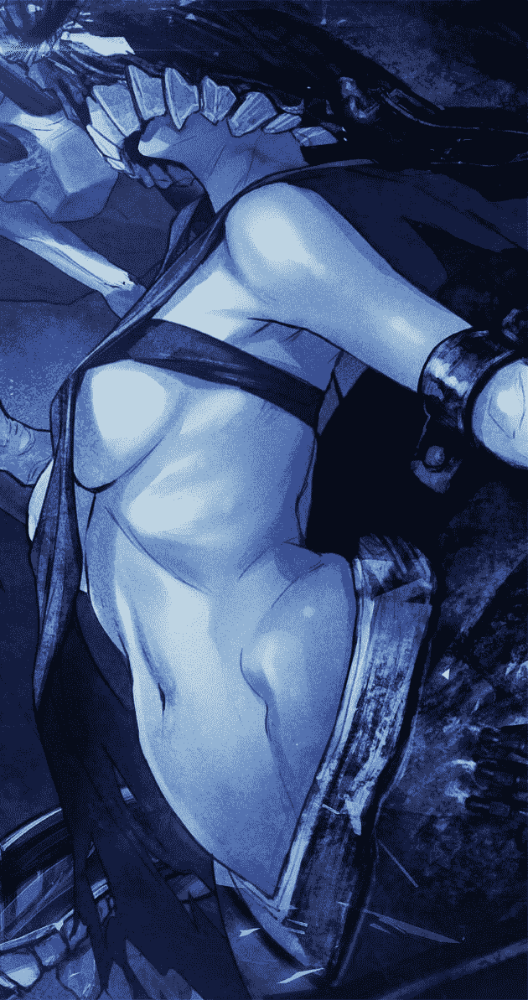

# 永远不会停止的杀戮

作者：不停止的钟表

TID：24660

 

# 1

萌新QAQ，来写个文。嘻嘻嘻嘻嘻

 

# 2

<ignore_js_op>[t019675298e2af16538.jpg](forum.php?mod=attachment&aid=NzEyNjJ8ZTQxYTc3Nzh8MTYwMDg4NjYwMnwxODIzMHwyNDY2MA%3D%3D&nothumb=yes) *(8.83 KB, 下載次數: 5)*

[下載附件](forum.php?mod=attachment&aid=NzEyNjJ8ZTQxYTc3Nzh8MTYwMDg4NjYwMnwxODIzMHwyNDY2MA%3D%3D&nothumb=yes)

2018-3-6 00:26 上傳  

冰雅：能否把我手中的刀与你的心脏交换一下呐？

</ignore_js_op>  

# 3

序章

玥澪，17岁，普通女孩一个，出于一些事故，她父母双亡，出于现实和学习的双重压力，她只能去网络上寻找自己喜欢的东西，偶然在她看动漫的时候，一个兴趣圈引起了她的注意，巨大少女。

她入圈的时候和一个网名叫（雨潇）的人聊天，他很让着她，无论她怎么闹，他都能玩到一起，玥澪她感到很开心，从那时起，她几乎每天放学写完作业，都去这里聊到开心~~

翌日，写完作业的玥澪正准备打开手机的时候，她听见了一阵急促的敲门声。

咚！咚咚！

“谁呀。”玥澪放下手机，走到门前。

“快...救我！”虽然有人在呼救，但是通过门上的猫眼看却是一个人都没有。

玥澪心里有些害怕，但是她依然保持着冷静，外面的人究竟想干什么，长的矮吗？猫眼竟然看不到他，而且听声音，那人似乎跟自己同龄，但是不知道为什么却有点奇怪。算了，只要保持安静，怎么样都不可能跟自己有关系，她带着这样的疑问，缓缓的走回卧室。

大约过了五分钟左右，玥澪回到了门口，又向门外探了探，果然还是一个人都没有，正当玥澪松了一口气的时候，脚部传来一股针扎一般的刺痛，让玥澪差点摔了一跤。

玥澪盯了盯自己的脚踝，不禁大叫了一声，啊！，她看见自己的脚踝上一个黑色的肉球，紧紧的附在了上面，通过不断的鲜红律动，她百分之百可以确定，那个肉球在吸食自己的血液！。

她此时也顾不得恶心了，她的两只手使用了全部的力气想把肉球从脚踝上扯开，但是她没想到的是，肉球的吸附力量竟然会那么强，无论她怎么扯，依然阻止不了自己血液的流失，她很明显的感觉到，肉球吸食血液的量变得更大了，自己的腿部竟然在迅速变白，她哑然：“怎么会，这样...”

不到五分钟.....玥澪的身体已经变得抽褶，像一具被吸食过的干尸一样躺在地上...她的生命，也就此消逝殆尽。

从此，玥澪她在地球上，被除名，但...在另一个平行世界，她....却有了非人的力量！ 

# 4

第一章   系统。

――――

“啊――”

玥澪猛的从床上弹坐而起，胸腔剧烈的起伏，好似溺水之人忽然得到了空气，急促的呼吸着。

汗水浸湿了长发，村衣汗湿的粘着在身上，整个人好似刚从水里捞出来一样。

“这是……”洁白的墙壁，暗金色的窗帘，床上依旧亮着的笔记本电脑。

这是一个完全陌生的环境，自己的家，可没有这么多设备。

突然，玥澪的脑袋中传来一阵剧痛。

不过很快的，这剧痛就消失了。

然而正在这时，玥澪的脑海中却突然回荡起了一种异样的声音。

那声音是如此的诡异。

古老，邪恶，沧桑，似乎经历了无数的年轮。

“你想要获得力量吗？”

坐在床上的玥澪稍稍一愣，紧接着立刻惊立而起，到底是谁在跟她说话？？

“谁！！”

“是谁在那！！”

玥澪心中不禁有些恐惧，她四处张望着，并不是怕有人入室抢劫，而是因为这里根本就没有其他人……

很快，那股声音又在玥澪脑海里响了起来。

“……你想要获得力量吗？”

再次听到这股诡异的声音，玥澪终于可以确定了一件事，这股声音的来源不是房间里的任何角落，而是她脑海意识的深处！

不知道为什么，玥澪心底那股对未知的恐惧逐渐消失了，相反的她还鬼使神差般重重点了点头：“...我..愿意。”

叮！！

一声清脆的声音在玥澪脑海中回荡，紧接着就是一声和刚刚完全不同的机械声。

“恭喜您。”

“获得贪婪系统……”

“呼.....这。”玥澪双手捂着自己的脸，深吸了一口气，她不知道为什么，自己就跟中了邪一样，相信了脑海中的声音，然而....得到了一个什么。。贪婪系统。。。。

虽然眼前的这一切并不真实，但是脑海中的刺痛，可是清清楚楚的！为了弄清楚，这一切是不是真的，她试探的去和刚刚得到的所谓系统交流。

“.....系统..你在吗？”就像平常发QQ消息一样，她尝试的去和系统交流，但是回应她的却是冰冷的机械声音。

“宿主连接系统....绑定中...绑定成功”

“现在开始发布任务-贪婪狩猎！”

“杀死一名人类，时间限制七小时”

“任务奖励：特殊能力

任务失败：死亡！”

玥澪的嘴巴呈O型，发出了一声超高分贝的叫声：“.......啊！” 

# 5

第二章  抉择

“怎么会这样。”

　   玥澪呆滞在床边自言自语，眼神透着淡淡的，非常后悔的忧伤。

她为什么要答应那个神秘的声音，任务是真的吗？

我....是怎么来到这里的。

哦！对了，我死了，被那该死的黑色肉球。

我...重生了吗？力量，或许不重要，但我真的不想再次体会那种死亡的寒冷，黑暗！

虽然种种疑问包裹着她，虽然现在的她想不通答案，但是对她来说，只有一个愿望！

她，不想死！

这时，玥澪的眼神中出现了一股坚毅，同时心中也暗暗喃语：我....会尝试着去做，为了活着。”

玥澪看了一眼墙上的钟表11:30，中午的时间，她的生命还有七小时，来不及熟悉环境了，如果到了18:30分，她就会死！

她打开了自己的房门，是公寓的话，电梯应该就在客房尽头的拐角，乘坐电梯下楼。

玥澪跑出公寓的时候，正好撞见了两个身纹花臂的不良青年，那两个不良青年对上了她的视线，其中一个向她搭讪道。

“呦！这位小妹妹面生，新来公寓的？”

“...是。”玥澪还是第一次被这种看着不像好人的人搭讪，搞得一时语噻。

“别那么拘束嘛！你说是吧！”其中一个青年把手臂搭在了玥澪的肩上，并给了另一个对了一下眼色。

“我....我还有事，先走了。”玥澪急忙挣脱开青年的手臂，快速的朝着前方跑去。

那两个青年就这样看着她跑掉了，两人无奈的对视了一眼。

玥澪见甩掉了他们，便找个路边长椅坐了下来，看了一眼手表的她可是心急如焚：怎么办，怎么办！12点15了，虽然还有6个小时多，但杀死一个人，我..能做到吗？

她知道，就算心里下定了决定，现实也不一定能做到，她对自己的身体素质还是很了解的，自己的力气是绝对不可能，去杀掉一个男子，别说男子，就算是女子，面对死亡的临死反扑，她也不可能那么顺利的成功，利用道具，对她而言，想杀死一个人，必须利用可用的道具。

“刀！”玥澪想到，她需要一把武器，一把能致命的武器。

她向四周张望了一下，看见了一家普通超市，跑了过去。

“老板，你们这里有刀子吗？”玥澪跑到收银台问道。

“嗯？刀子，你要什么样的？”老板楞了一下，用奇怪的眼神看着她。

“锋利的刀子。”玥澪想了想，回道。如果是杀人，那必须要锋利的刀子。

“一个小姑娘家家，买锋利的刀子干嘛？。”老板似乎听出了话中的不合理，质问道。

“用来...。算了我不要了”玥澪想不出更好的解释，转身要走时，一个稚嫩的童音打断了玥澪的思绪“爸爸，快过来陪我玩啦。”

“小小，别闹，爸爸在卖货。”老板一脸笑意的驱赶着小孩。

玥澪心中想到了另一种可能，她走出了便利店。

小孩.........如果是小孩的话....身体素质那么弱，就算是我，一个女生，也能杀掉吧.....

一颗黑暗的种子在她的内心慢慢发芽。 

# 6

第三章   人心

乌云覆日，阳光幼儿园的小孩们高高兴兴的走出门口。虽然天阴沉沉的，却挡不住小孩子的天真与活泼。三五成群，追逐嬉闹，在门口的家长们，等候着自己孩子。

这时，幼儿园门口突然来了一个长发的便衣少女，她似乎焦急的四处张望，在寻找着什么。

这个便衣少女自然就是玥澪，她低头看了一眼手表18:20！还差十分钟，如果她没有完成任务，那她就要和这个世界说再见了。

她没有钱乘车，这一路来到处问路，没想到离公寓最近的阳光幼儿园竟然要走5个小时多。

“呼...”玥澪深吸了一口气，她开始寻找没有家长接送的小孩。

每一个走出幼儿园的小孩，都迎接着自己的家长，没有一个机会给她下手。

再等等..再等等...

没有！3分钟过去了，孩子全被自己的家长接走了，没有独行的小孩。

又过去了一分钟，还是没有！玥澪心中非常焦急，甚至....有些绝望。

6分钟后.....18点26！

这时幼儿园的小孩已经走的差不多了，一个孤单的身影出现在玥澪的视野中，那是一个小男孩，不知道为什么，所有孩子都有家长接送，唯独他一个人，孤零零的，和她一样。

“他....有些可怜。我....”玥澪看着他孤单的样子，自己觉得很惭愧，我杀了他的话，我还有良知吗？不.......我不想死。一滴泪水缓缓的从玥澪的眼角流下。

当小男孩走进了居民楼的一片阴暗区域，跟在身后的玥澪走到小男孩身边。

“大姐姐，有什么事吗？”小男孩笑着，一脸天真的问她。

“...对不起，我是个...坏女孩！”

“啊？”小男孩只是觉得自己的眼前一黑，看着手捧着一块石头的大姐姐，眼前黑了过去。

在睡梦中，他似乎听见了一个女孩的声音.....那声音很孤独，就和他一样........

我...想活着...

小男孩...我对不起你..

18点29....不动手会不会死呢....

大概.....也许.

对...不起..

玥澪还是动手了，她纤细的两只手，掐在了男孩的脖子上，没有挣扎，没有痛苦，男孩在睡梦中......永远的告别了这个世界

“叮！任务完成，奖励特殊能力（贪婪之触）

道具说明：宿主的双手接触目标会处发贪婪之触，令目标数倍缩小（注：缩小倍数取决于宿主的欲望）”

“这是.....”玥澪惊讶的看着自己白暂的双手，那葱葱玉指上有着让人缩小的力量！ 

# 7

第四章   城市的夜晚

缩小？！这种东西，她只在前世的巨大少女圈内看过，这种能力...真有说的那么厉害吗？

这种东西....是真的吗？感觉自己的手没有什么变化呀。

不过....我杀了人....该怎么办，处理掉尸体吗？

我不会啊..处理尸体这种...对了！缩小，如果把尸体缩小了，那就好办多了。

想着，玥澪把手放在了男孩的尸体上......

这时奇迹发生了，男孩的尸体从半米左右缩小到五厘米，刚好是手掌可以握住的大小...

“这...竟然是真的！”玥澪惊讶的捂住了嘴巴，感叹道。

不过在惊讶过后，玥澪赶紧在花园上用手挖了个土坑，然后把男孩小小的尸体放了进去，最后用土盖上的时候，她还特意用杂草来掩盖了一下挖过的痕迹。

“谢谢你！对不起！”玥澪对着男孩小小的‘墓’轻声道谢，杀了一个人，在他死了之后去道歉，尽管她知道这种行为很虚伪，但还是忍不住心里涌来的罪恶感。

“呼...回...公寓？”玥澪叹了一口气，开始往回去的路上走，但是她却想起，这个世界，她有自己的家吗？她的爸爸妈妈呢？她的住的地方在哪里？她一无所知，或许...是一无所有！

“算了...还是回公寓看看吧。”玥澪摇了摇头，开始原路返回。

---------------------------我是可爱的分割线------------------------------------

四个小时后，玥澪又走回了她开始所在的公寓，尽管她带着小跑..但看着手腕上的手表还是大吃了一惊，十点多！

玥澪气喘吁吁的走进了公寓的大门，但是很不巧，两个花臂青年就坐在大厅的沙发上聊天，这时两个花臂青年也注意到了她。

“哟....干什么去了！这不是下午碰见的小妹妹吗？”个子比较高的花臂青年笑道。

“...呼！怎么...又是你们。”玥澪本来体力就消耗的厉害，再加上走了数个小时的路，腿已经有点发软了。

“怎么就不可以是我们，交个朋友嘛。小妹妹”另一个青年说道。

“交....交朋友可以....我先...回去了。”玥澪也没多想，回答完就往楼梯走去。

“好。”高个子男看了另一个人一眼道。

这时，那个花臂男走了过来，他对玥澪说：“看你挺累的，我帮你扶上楼吧。”

“....不，你想干嘛？”玥澪看着花臂男走过来，这才警惕了起来，不过...有那种能力在，确实也没必要害怕什么。

“你....”这时玥澪惊讶的看了花臂男一眼，他真的只是普通的扶她上楼梯，并没有做出任何出格的举动,这让玥澪握紧拳头的小手又松开了。

“都说了嘛...我们是真想和你交个朋友而已嘛，所以你叫什么名字？”花臂男笑道。

“.....我...我叫玥澪”玥澪想了想，还是决定告诉他，不知道为什么，她突然感觉这个看起像流氓无赖的人，很有趣。

“噢...我叫大海，记住咯。”大海笑了笑，说道。

“呵...”玥澪嘴角微挑了一下。

“嗯..到了....你先回去吧。”玥澪看着中午曾经陌生的房间，在门前停下了。

“恩”大海回道。

看着大海缓缓走下楼，玥澪打开了房间门，房屋的布置还和午时一样，金暗色的窗帘，卧室中发光的笔记本，以及,被玥澪浸湿过的床铺。

玥澪把衣物脱下，整个人钻进了白色的被子，不知道在思考些什么..或许是被她杀死的小男孩....或许是她为什么回来到这里.....或许是她以后该如何.......但今天的她将拉下序幕，带着疲惫和困惑进入梦境，可城市的夜晚，却不会就此闭幕！

阴暗的街区.....

“救命.....快跑！”一名身穿附近学校校服的男生，慌张逃窜着，但跑出的距离却不足十厘米，这是为什么...如果不细看，谁又知道这是一名男生，一个人类，一条...生命？！

而在他身后，有一个比他大出数倍的少女在追赶着他，看似的追赶其实也只是女孩的普通走路而已，就是因为这很普通的走路，跑在那个男孩后面的其他人，被一双白色的帆布鞋踩的粉身碎骨，化为一摊血水！

“啊啦.....好有趣呢！”女孩嘴角微微一笑，戏弄着那些.....逃避她鞋子的卑微生命！

“快跑！！快跑啊！”看着那摊被踩烂的尸体，有一个女生尖叫了起来。

“啊！怎么回事...”那名尖叫的女生突然感觉自己脚下一轻，漂浮了起来，当她回头的时候，看见了两根比她腿还要大的手指捏着她的连衣帽.......

“好小....咯咯咯。”正常大小的女孩笑道。

“这么小....真是个宝贝~要松手咯。”

在‘巨大女孩’的言语后，松开了抓住小女生外套的手指头，她那小小的身体像一块沙石一样，自由落体，对小人而言，那是比摩天大楼还要高出十倍以上的高度，在那种巨大的冲击下......就连她的体内的脏器，也被摔得粉碎。

“不....”男孩看见了她令人作呕的尸身，惊叫道。

“所以.....小人们,请快点跑吧~为了..不被我杀掉~”‘巨大女孩’虽然是带着恳求的语气说出，但是在小人眼里，这句话的意义..就是他们死亡的起点！！

“跑！”

 

# 8

第五章    隐藏任务！

“为什么会发生这种事！”小人中那个跑在最前面的男孩，不断的喃喃道。

原本......我应该...回到家了呀.....为什么！

为什么！为什么我要去七班找那个女生！！

为什么！

为为为为......什么！！？

我会落到今天这样？被一个...弱小的女生搞的到处逃窜。

是不是哪里弄错了？

一定是...对吧？！

在他哀怨的时候，天空被黑影笼罩，V字形的鞋底覆盖了他的全部视野....

“不....”男孩看着巨大的鞋底，绝望的大喊。

啪呲

不久后....大部分小人们也被少女处死,虽然不是全部，但是对于少女来说已经无所谓了，她满足了，满足了自己的杀戮感，最后她看了看这片空地，笑吟吟的离去。

城市的夜晚，带着血腥的气息，迎接了落幕！

----------------------------我是可怕的分割线-------------------------------------

“哈....欠~”清晨，云雾弥漫，缭绕其间，一个裹紧白被子的少女，睁开了双眼。

“新的一天了吗？总算....可以好好的生活了。” 那少女自然是玥澪，她自言道。

但是......天愿不由人！

正当玥澪准备穿上衣物去洗漱的时候.....一个清脆的机械音从她脑中响起。

“叮！恭喜宿主”这贺喜的话语，在她看来却是....魔鬼的声音！

“....系..统，恭喜..什么？”玥澪磕磕巴巴的问道，她可不想再次去做系统给予她的任务了。

“恭喜宿主触发一次隐藏任务，是否接受？”

“隐藏？....我看看。”玥澪愣了一下，好奇道。

“隐藏任务-----E级

①找出躲在这间屋子的缩小人类！

阶段奖励-----？？

任务惩罚-----无

是否接受·”

玥澪看了看任务说明,陷入了沉思。

找出缩小人类吗？

这个世界竟然会有这种东西。

看来我所喜欢圈子，在这个世界...是现实呢！

想去了解这个世界,想去知道一切.....

既然任务没有惩罚.....

试试吧！

“接受。”

 

# 9

第六章   缩小的无助

“哎呀...怎么会没有呢？？~”玥澪郁闷的低着头，她不断的检查屋内的物品，该翻的地方都翻遍了，尤其是狭小的缝隙。

玥澪又看了看自己检查过的东西，不觉得自己遗漏过什么叹道：唉！果然隐藏任务好难.....

但是她思考的时候，突然却感觉脚有些痒，她向地面看去时，似乎发现有什么细微的东西在搬动自己的鞋带，玥澪低下头看了一下，眼睛一亮！

“哇...你们在这里，真是让我好找呢！”

“不要.....”微小的声音带着绝望的语气。

时间回到玥澪刚刚接完任务的时候------

“诶...你们快看，那个巨大女生在干啥？”说话的是一名身穿蓝衣的少年。

“切，都说了不要叫巨大女生，那只是个普通的女生而已！”少年身后的青年不爽道。

“快看快看，她动了，像是在寻找什么东西....”青年身后的一名女生细心道。

正当玥澪准备趴地观望床下的时候，女生突然叫到：“....不好！快跑到床脚的柱子。”

“....不在床下吗？唉。”当玥澪看见床下的时候，空无一物，她失望的摇了摇头，站起道。

但那几个小人为什么会搬弄她的鞋带呢？还要从玥澪坐回床边----

“嘿！..你们看，那个女生又回来了，好像坐下了。”小人青年说道。

“天...知道她要干什么，唉！”小人女生叹气道。

“可恶.....明明看起来跟我差不多大（年龄）”小人中的学生男孩开口道。

那男孩看了看柱前的巨大运动鞋，他走上前，狠狠的打上了一拳，虽然这点力道玥澪不会有任何感觉，但是巧就巧在，玥澪突然挪动了一下脚，导致她的鞋带改变了一下位置.....

嗒！鞋带头的小铁环重重的压到男孩的身上，对他而言，不到一厘米大小的他...小铁环就想一大块石快样，压在了他的腹部。

“啊！”男孩吃痛的叫了一声，他的伙伴看见后立刻过来帮忙，但是令人没有想到的却是......

“哇...你们在这里，真是让我好找呢！”女声从小人们的上方传来，当他们抬起头的时候，玥澪巨大的瞳孔正对看着他们。。

“不要.....”最先喊出声音的是小人中唯一一个女生，在她看来，被巨大女生看见，他们的生命就已经毫无希望了。

“嗯？说的什么？听不清..”虽然玥澪听见了两个字，但是他们太过于渺小，所发的声音也渐渐不清。

“所以让我们换个地方交流吧...上来。”玥澪可爱的眨了眨双眼，示意自己没有恶意，并且伸出了一根手指到他们面前示意他们爬上去。

“怎么办...要上去吗？”小人青年沉思了一番，问道。

“...她似乎，没有恶意。”蓝衣少年也回道。

“完了....完了...被看见了.”小人女孩的情绪似乎非常不稳定，也不知道发生过什么事情。

“跑不掉的，我们这个大小，看她和她们似乎不一样，相信一次？”那个被鞋带吃痛的男孩说道。

总之在小人的决议后，三个男性小人把唯一一个女生给台上了玥澪的手指，随着视线慢慢升高，玥澪将他们放到了木桌上。

这时，玥澪脑海中的系统给予了回应

“叮！隐藏任务-----E级

①找出躲在这间屋子的缩小人类！完成！

阶段奖励-----缩小药剂（任务结束时，统一发放！）

任务惩罚-----无”

玥澪看了看这个奇怪的奖励，缩小药剂？自己明明已经有这种能力了，奖励竟然是缩小药剂，难道这个世界的小人类跟药物有关吗？

但不等玥澪思考，系统却又给发出了另一段指示！

“隐藏任务-----E级

②用残忍的方法杀死一名缩小人类！

阶段奖励-----特殊恩赐·阿法罗之心

任务惩罚-----破坏宿主脑部神经网！”   

靠！玥澪眼前一黑，差点晕了过去..................

玥澪抱着脑袋，无语道：“这...任务...是个坑。”   

 

# 10

我是萌新啊~(*・_・)ノ⌒*，大佬们不要吓我。 

# 11

第七章   二段任务

玥澪看着桌上的四个小人，内心的良知再次受到了危机，系统..让她，用残忍的方法，杀死一个生命，她思考起来。

杀死小人.....

虽然，曾经和圈里的朋友玩文字游戏的时候也有yy过，但我...不想做，或许不敢做。

轻松夺走生命这种事！我不想做，可是系统......

...破坏脑部神经网，也就相当于会变成痴者？无法思考！更会丧失智商，这样的我与死亡又有什么区别！

又是这样吗？死...近在咫尺，生...亦在眼前，我想活着！活着！这个信念，不会改变。

不会！！

不...会！

残忍吗？！我..............做！

随后，她把手掌缓缓的伸向那四名小人中的少年，玥澪轻松的把他捏在两指之间。

这么渺小...这是玥澪脑中唯一的想法，她就和捏芝麻一样轻松的捏起来一个人的重量，毫不费力，掌控着他..它的一切！

“残忍..”想起残忍二字，玥澪又回想起前世圈内的那些文章，一个个小人惨死的手法，虽然当时的她只是看着过过眼瘾，但怎会知道，如今的她将要去做那些可怕的手段....

大概我....本来就是一个贪婪的女孩吧......

思绪到此为止，玥澪看见自己手指中间的小人发出大喊，或许是咒骂，或许是惊恐，但她........

“对不起呢！”玥澪不想听小人的话语，也不敢听，随着她的道歉的话语，她两指头一松，那名小人面对的是几百米的冲击....落地的一刻摔碎了身体的大部分结构。

小人的身体骨头尽碎，腿部弯曲的不成人形，它就是如此卑微，如此弱小，就算是一个女生的手指也可以掌控它的生死，简直就和....蚂蚁一样！

但还没有结束.....

它还有一丝意识，没有死亡，这也正是玥澪想要的，残.....忍！

小人双眼的视野很快被巨大的运动足底覆盖，她原来是故意将他脑袋朝上，摔碎身体的下半部分，但只要大脑还在，就有意识，而很快，它就会被她巨大的鞋底踩成血糊。

呲.......那是身体爆裂的声音。

玥澪看了一眼白地板上留下的红点，虽然在她的角度看来，只是一个普通的红点，但是如果离近看，那却是一场悲剧...

小人死了，死的不能再死,悲剧的黏在的地面，看着这一幕她的玉手颤抖了起来.....

我...杀了它，它？原来我...已经把缩小人，当成动物了吗？

我竟然没有把他当成人....

我原来一直都是个坏女孩呢。

如果我变成小人，被不可抗拒的力量杀死，就像我对它一样。

这种结果，会让我害怕.....我....原来这么懦弱吗？

不愿意被别人用这种卑微的方式结束自己的生命.....

小人类.很渺小...。

.....我真的不想伤害他们..但...........我...大概是个....丑陋的伪善者吧！

我丧失说出善意话语的资格了吗？......

等等....任务！

不.....这样...任务.....都没有完成？？！

怎么会....

玥澪她的身体冒出了微微冷汗，这是她想到...能缓解自己良心压力，最残忍的方法了....竟然..

这时她的眼神中，一股狠色涌出，目光缓缓的向桌上的仅剩的三名小人看去......

玥澪把微微颤抖的右手，伸向小人中的另一个男孩，小人男孩看见巨手后竭力逃跑，但在玥澪眼里，他的速度却比蚂蚁都要慢。

她的手指轻松追上并夹起那个小人男孩，小人绝望了，他亲眼看见巨大少女如何对待王东的，她松开了抓住他的手指，王东从她手指尖上滑落，至于如何...，大概他只剩下一滩肉泥了吧。

小人男孩快接近玥澪的嘴边了，正当他以为要被吃掉的时候，他听见了她嘴中所吐出的话.....“不够...残忍。”

他没等反应过来，就感觉右臂一阵痛意刺心！啊啊啊啊啊！！！她.....她...啊！她把我的手臂撕了下去！

小人男孩痛苦的哀嚎着...肩部喷出鲜红的血液，从猩红的圆形缺口上，似乎看见了森森白骨。但....对于玥澪的残忍来说....不够！

啊！！！！！！！！！！！！！！！！！

咔..咔............

这是他....骨头被压碎的声音，明明是正常人类的女孩子手指，却犹如两枚钢板一样挤压在自己的腿部上...她用两枚指尖,压扁了男孩双腿部位！

血......喷的到处都是，动脉....静脉....小人的生命机能开始流失，他已经被剧烈的疼痛晕了过去...

啪嗒..........一滴比他头还要大的口水滴在他的头上，这让他清醒了一番，身上依旧被摧残的剧痛，但是他...连痛晕的资格都没有，残忍，就是要看着，才能见证！

“啊！！你.....个恶毒的..女！”小人咬着牙，带着剧痛吼出了这最后一段咒骂，但玥澪是不会听见的，就算他叫的声音再响亮，都传达不到她的耳朵。

这时，玥澪另一只手的手指笔直靠近，透亮的手指甲，轻轻的划在了小人的脖颈部位.....小人的头和身躯，分了..家

临死前...小人男孩听到最后的声音：“原谅我。”

“叮！隐藏任务E级---完成！【评分A】

任务奖励----特殊恩赐·阿法罗之心

说明：阿法罗之心，来源？？？

能力：修复一切创伤，唯独心脏不受阿法罗之心影响，请宿主保护好自己的心脏！”

“叮！恭喜宿主，系统为您开启目标识别！可识别目标信息！此为宿主完成任务评价A的附加功能！”

“叮！道具融合中-----正在为宿主替换心脏......！”

在冰冷的机械声音诉说完毕，玥澪眼前一黑...失去了意识。 

# 12

第八章     午餐

“叮！替换完成！”

随着无情的机械音提示，玥澪渐渐睁开双眼，她不知为何，身边出现了一个奇怪的小瓶子，里面装着白色的粉末，这应该就是缩小药剂了，她看了一眼道具说明，药剂生效的方法就是，让对方吸入粉末，无论是口腔还是鼻部。

“啊...想起来了，还剩下两个小人。”玥澪站了起来，把视线移到桌子上面，果然....那一男一女两个小人没有逃跑，或者说.......没法跑。

‘抱歉...你们两个，我会好好对待的。’玥澪想着被自己杀死的两个可怜的小人，心中酸然想着。

玥澪用手指轻轻的夹起那两个缩小人，小人很听话，没有任何其他的动作，不知是对生活的绝望，还是对她的惧怕...

她正准备安置小人的住处时，突然一阵敲门声打断了玥澪的思绪。

咚咚咚！

“玥澪，我是大海，出来一起吃个午饭如何。”大海在门口敲门道。

“...我....不去”玥澪回道，她怎么可能跟一个认识才一天的人出去吃饭，她不了解大海是个什么样的人，所以..她不放心。

“别嘛，玥澪姑娘，我和王哥只是想表达一下上次突然拦路的歉意。”大海说道。

“王哥？是那个高个子的？”玥澪道。

“嗯，这顿饭只是一顿道歉饭啦...你选地方，我们请客，怎么样？”大海怕她还担心什么，急忙说道。

“....你们...对这片地域熟吗？”玥澪思考了一番问道。

玥澪她对这个地域没有任何了解，出行和找地方，极其不方便，不如找这两个小哥问一问，或许还能知道一些有趣的事情，反正她有那种能力，根本不怕他们对她如何！

“嘿嘿...这你可问对人了，以前我们哥俩混道的，什么地方都知道，所以....”大海声音带了许许笑意，他回答道。

“那我准备一下..就去。”玥澪粉嫩的小舌头抿了抿嘴唇，她已经准备好好宰一下这两个喜欢撩妹的小哥了。

玥澪把两名缩小人安顿在她的衣衫兜中，虽然她提前告诉小人要去吃大餐，但是它们两个却没有任何反应，不过玥澪管不了那么多了，只能先带着它们。

她将地上的小瓶药剂，放在了自己的外衣兜中，以备不时之需，随后玥澪打开了房门，对着大海笑道。

“大海哥，我们去哪里？”

“王哥在一楼等你，等见了他，你就知道了。”大海笑眯眯的说道，似乎对大海哥这个称呼很受用。

“哦！”玥澪简单的哦了一声，跟随大海走下了楼梯。

下楼的过程，大海问了问玥澪的个人情况，比如在哪上学，这种无聊透顶的问题，然而玥澪的回答全部都是NO。

玥澪对大海的某些问题是非常无语的，先不说她在这个世界本来就没有了解，关键大海问的问题就和一个人问了：你需要吃饭吗？这种极为神经大条的问题，就给人在和傻子谈话一样无语的感觉。。。

“王哥...”当玥澪看见一楼大厅翘着二郎腿坐的花臂青年，急忙朝他打了个招呼。

“嗯！”王哥看着玥澪，回了一声。

“王哥...能不能带我去附近转转，我对附近不熟。”玥澪如同大赦一般，急忙回道，她可不想再和大海那个半木鱼脑袋说话了。

“那跟我走吧。”

 

# 13

第九章   黑市！ 周水子！

经过这一顿午饭，玥澪总算把自己住的城市给弄了个熟悉，她所在的城市名为H市，她住的公寓所在H市的繁华街道北镇街。

吃饭的过程中，她总共跟俩人聊了聊地域，虽然王哥说一半会和玥澪打趣，但是她显然没有陪闹的想法，所以大多数话题都被玥澪一笑带过。

当然最后从餐桌上带走的一个橘子，让她剥给两个小人吃了，幸好两个小人没有绝食，不然她真的不知道怎么办了。

不过这次的饭局，收获可不止这些，玥澪她还得到了一个重要的地方，也是大海和王哥以前待过的地方，周水子！

据王哥所说，周水子看似祥和的地域，其实是个出售赃物的大市场，也就是人们所说的黑市！

“哎，黑市啊..”玥澪叹了口气自言道，她没想到，电影中的黑色地下交易市场，竟然真的存在于现实中，不过惊叹归惊叹，那种地方又不关她一个花季少女的事。

正当她准备躺在床上思考人生的时候...系统的提示音再次响起。

“叮！发布任务！贪婪猎手！

杀死一名体质为A的人类！

任务奖励----特殊恩赐·斗命

任务失败----死亡

时限---48小时！”

“啊？又来...”玥澪对系统发布的任务，已经变得不那么敏感了，既然她逃脱不了系统的掌控，那只好乖乖的做到它所部署的任务。

只是.....又要杀死人吗？

体质A？这是什么意思呢？或许目标识别能看出人的体质吧。

玥澪这样想到，她似乎已经对杀这一举动，不再那么敏感了，内心也不那逃避了，她所杀的人，还少吗？三个！如果她被推上法庭，那么等待她的一定是死刑吧。

“....嗯，还要出去。”她看了看身后柔软的床，不禁摇了摇头，想要躺下休息，还要等完成任务后.....

当玥澪拿起外套时，房门口传来敲门声，她打开门后，发现了两位中年男子，但是给人的气质，似乎不是常人所有。

“你们...有什么事吗?！”玥澪首先开口问道。

“我们是警察，请问您是，照片中的这位女士吗？”其中一位首先开了口，并从衣兜中掏出了一张照片，照片里赫然就是玥澪在超市中被监控拍到的！

“是，怎么了？”玥澪回道，但她似乎觉得有些不对，警察为什么要找上她？记得这家超市好像是她第一个任务所去的那个超市。

“是的话，请您跟我们走一趟，我们怀疑您涉嫌拐卖儿童！”随后另一个中年男子说道，所说的内容，让玥澪的小手微微一颤。

听见两名警察的话，玥澪感觉到自己心虚和害怕，她有些慌张了，因为事情的本身就是她做的，当警察找上她时，她害怕。

害怕被抓到监狱里，还有那两个小人的人命，她会被直接枪决吧。

不！不要！不要不要！

玥澪双手微微握紧，她下了一个很大的决心！

缩小眼前的两名警察！

“请跟我们走吧！”两名警察互相对视一眼，将手伸向她的手臂。

这时，玥澪将手握紧了两名警察的手腕，同时心中产生对缩小的欲望，只见两名警察的身体带着衣服正在急剧缩小！

“怎么回事？”两名警察面对如此异变也是大吃一惊，他们只是感觉一阵天旋地转，随后身高便只有一厘米大小了！

“你对我们做了什么！”其中一名警察在玥澪的掌心中喊道，然而玥澪她并没有听进去，她肩膀的白色肌肤上一粒粒汗珠浮现，她对警察下了手，自然会害怕，害怕警方查到小男孩，害怕警方查到这两名警察。

怎么办！

怎么办！！

谁来告诉我现在怎么办啊！！

这时，从玥澪脑海的深处，一股黑暗邪恶的声音从她内心中钻出....

杀了，就好了！

贪婪，是不需要代价的！

 

# 14

第十章      生命代价

“你想做什么？”其中一名警察喊道，好歹他们也是警察，见过一些世面，而且在这种巨大的差距下，他选择了谈判，而没有选择说出袭警这种二货话语。

“做什么..抱歉，我不想被抓进去。”玥澪缓缓道。

“那么你是承认那小孩的事情是你做的？”这时，另一名警察开口道。

“笨蛋！”那名警察的心里是无语的，这猪队友，这是要提醒她杀人灭口吗？

“呃..对不起！”他也察觉到自己嘴误，小声的说道。

不管这两个警察如何想法，玥澪杀死他们的想法是不会变的，因为那个邪恶的声音已经污染了她的脑海！

杀！！杀了！

杀光所有生命！！

带着这样想法的玥澪，她将左手的手掌开始闭合，五根玉白的手指渐渐覆盖了青年警察的全部视野，在他微弱到几乎无用的挣扎下，被指头压的粉身碎骨！

玥澪的左手掌缓缓张开，在那沾满鲜血的无名指上，留下的是一具悲惨的尸体残骸，这一幕让在她右手掌上的另一名警察看的一清二楚！他的腿开始剧烈颤抖，双腿渐渐跪在了她的掌心。

“不要杀我！”这名警察此时也不顾伤到嗓子，他用尽自己的力气喊出来了这句求生之语，随后他咳出了几滴血液在玥澪的手掌上，尽管微不足道。

“啊”玥澪此时左手已经捂着自己的脸，也不管小人的血抹到自己的玉颜上，她只感觉到自己脑袋中刺裂一切的剧痛！

不要杀我！

好痛！！不要杀我！

痛...

不得不说，这名小人警察很幸运，他所喊出的求生之语，正是玥澪心中唯一一个心愿！不要杀我！！小人害怕被少女杀死，然而少女又何尝不害怕被系统杀死呢？

正是因为这一层的精神刺激下，玥澪才回想起来，她刚刚紧张的时候，竟然被诡异的声音控制了，她不知道自己的身体中存在着什么，那东西竟然趁虚而入控制了她的思想！

原本的她，只是想把这两名小人警察困在自己家里，但是，让她没想到的是，邪恶又诡异的声音，控制了她的思想，那声音没有任何其他意思，在她的理解，只有四个字。

杀戮生命！

“叮！贪婪猎手任务完成！人类（评价A）已死亡！

任务奖励----特殊恩赐·斗命

恩赐评价--S

恩赐说明--这是一种非常罕见的能力，此能力发动的媒介，就是宿主躯体收到损伤，它将根据宿主的伤势，将伤势与体能数倍换算！宿主伤的越重，能力越强！”

系统冰冷的提示音把玥澪从思考中拉回了现实，照完成任务来看，恐怕被玥澪捏死的小人警察，就是一个身体素质就是评价为A的人类，但不等玥澪思索，系统的提示音，竟然再次响起!

“叮！必要任务触发！杀死评价为S级别的人类！

任务奖励---贪婪之躯（固形态！）

任务失败---死亡！

嘟！任务提示：检测宿主所在地域，S体质人类分布为军区和周水子！推荐宿主前往周水子！”

听完脑海中的提示，玥澪无奈的摇了摇头，她将跪在她掌心的小人警察，放到了她为小人准备的盒子里，也就是一男一女小人学生的栖身之所。

处理完小人，玥澪打开房门，走了出去！虽然她还是那个花季少女，但她的内心，已经有了极大的改变！

“我为杀戮而活吗？”踏出公寓后，她仰望天空，长叹道。 

# 15

第十一章      前往周水子！

周水子，一个黑色而又繁华的地带，是H市最有名的的地下交易场所，正是因为它的隐秘性，才让许多逃亡的通缉犯汇集于此。

然而，今天的周水子似乎不寻常，一名完全不符合此地氛围的妙龄少女，站在周水子车站，少女看起来只是一个十六出头，她一身白色的短袖外还套着一个黑色的小黑布夹，给人了一种异样的神秘感！

这名少女自然是玥澪，她花了一个小时，才找到开往周水子的公交，但这一个小时发生的事情，却让她的内心产生了极大的震撼！

时光倒回....

在刚出公寓，玥澪她看见了一家离她公寓最近的服装店，女孩天生爱美的内心激发，最后在商场中挑选了一件黑色的布夹，虽然她身穿是白色的短袖，但套上黑色小布夹的她，却散发着异样反差美。

玥澪付完账走出服装店后，她发现门口停了一辆很普通的黑色轿车，但脑海里的声音，却让她大惊失色！

“叮！发现S级人物！目标检测中...”

“目标信息：隶属国家特种暗杀部队！

身体素质140

防范思维200

注：100为普通人类！”

系统检测的范围是玥澪附近的50米，但，真正！让玥澪大惊失色的，却是系统的下一条信息！

“滴...正在扫描目标大脑！！”

“滴！扫描完成！

目标脑部信息：杀死慧慧！普通女高中生，但却拥有缩小药品！来源未知！

杀意来源：特种暗杀部队任务！”

这才是让玥澪真正大惊失色的信息！

玥澪的小手一颤，粉嫩嘴唇下的银牙，不知不觉咬合在了一起。让她紧张害怕的，不是慧慧！也不是缩小药品！而是猎杀她的组织！

国家...特种暗杀部队？？

那个名叫慧慧女孩恐怕做什么漏了马脚，所以才被他们追查上门！

大概她也缩小了别人吧，我........会不会也被杀。

好害怕.....

慧慧她的结局，或许也是我的结局...

不行，我要跟上去看看！

带着这样大胆的想法，她假装缓缓离开，但等到了墙壁的拐角，她又把头悄悄的伸出探望，这样的她，似乎一个可爱的小猫一样。

但她却不知，车内的黑色风衣男子，淡淡的望了一眼拐角的前面。

“好奇心？”黑色风衣男子笑道。

“或许，但不影响！”坐在前位的司机开口回道，看他一身魁梧的肌肉，想必也不是常人。

“动手！”

这时，玥澪看见黑色的轿车门缓缓打开，那是一名身形高大，极为魁梧的男子，就算是身上的西装，也挡不住他手臂锻炼的肌肉成果。

随后黑色风衣男子也紧随以后，两人不断的向居民楼走去！

在玥澪的一路跟随下，他们的最终走到了一个只有六层的居民老楼，打开楼门后，缓缓的走了进去。

“怎么办，要不要在跟着了。”玥澪此时心里有些纠结，因为她看见了那名黑色风衣男子的目光经常不经意的观望，而且大部分，竟然和她的小眼睛对视！

“不...我有那种能力！”随后她又想起，系统给予她的恩赐，阿法罗之心，只要她护好心脏，就不会死亡！

“拼了！”

玥澪这时，朝着他们进入的一单元走去，咬紧银牙，她可谓是紧张到了极点。

慧慧，一名普通的女子高中生，因为经常被同学欺负，她可谓是恨那些欺负她的人到了极点，她一直都想把欺负她的那些人，让她们下地狱，但这只是无聊的思想诅咒罢了。

但，有一天，她放学并没有着急离去，因为有作业要交给化学老师，当她去找化学老师的时候，看见了不得了的一幕！

平时一副高高在上的生物老师，那个男人，竟然对她的同班同学，张子夏，点头哈腰，态度极为卑微。

老师当然也注意到了她，也不顾什么教师形象，只是单纯的说：作业放在这里就可以了，我要和张前辈试验一项特别有意思的试验。

张前辈？这种称呼，这还是我们那个高高在上的化学老师吗？正当她准备识趣的离开时，张子夏叫住了她。

“慧慧同学，我知道你平时在班级里老被其他人欺负，想不想把一切都还回去。”

“想！当然想！”慧慧什么也没想，就这么说道。

“好呀，你把这个试验品拿去”说罢，张子夏她从桌上，丢给她了一小盒白色的粉末。

“这是什么？”慧慧疑惑的问道。

“你把这个混在饭菜里让他们吃掉自然就知道了。”张子夏冷漠的说道。

“不会是...毒药吧？”慧慧有些害怕的道，毕竟杀人这种事，她也不是有胆子去做。

“张前辈，你把这个东西给她...会不会。”不等张子夏开口，化学老师开口说道。

“不会死人，你走吧。”虽然张子夏打断的他的讲话很不礼貌，但化学老师却没有任何怨言。

带着好奇的想法，慧慧给班级里一直欺负她的一个男生的午餐中，惨了点白色粉末，她亲眼看见了那个男生说浑身发热，没过多久，缓缓的倒在了地上，吓得慧慧赶紧扶着他去医务室。

在去医务室的途中，却发现男生缓缓变小，逐渐变得和掌心一样大，这时，她才知道白色粉末的真正作用。

至此往后，她虽然把欺负过她的人都变小了，但是第一次的不经意杀害，却导致了她坏习性的开始！

直到，一个曾经是富二代缩小人寻到了一部缩小手机！！事情被捅到了.....国家禁药部！

在小人的泄露消息下，特种暗杀部队出动了，因为！他们面对的这种禁药，已经不是一次了！还有一个战友死在了一个女子手上！

所以他们非常仇视这种禁药。

慧慧今天也依然驱使着小人做着一些难堪的事情，把它们当做食物，又或者把它们当做装饰品。

在她玩的开心的时候，防盗门被人节奏有力的敲击着。

“来啦。”自从有了这种药物，慧慧变得有些自大，她不怕任何人，她觉得任何人变小后，都不是她的对手。

是！没错！变小了不是对手！

但,如果没有机会呢~！？

“你们是..” 

# 16

第十二章     仁慈？

当慧慧打开防盗门的时候，一个黑洞洞的枪口对着她的脑袋，没有犹豫，没有断决，只有一颗冰冷的子弹！

呯！

“啊！！”一个少女的惨叫传来，不过不是慧慧的，她已经死了，死人是不能说话的！

“想不到，你还真跟过来了！”黑色风衣男子看了看了楼梯上的玥澪，笑道。

“哦？那个女孩？”在风衣男子说完，那名魁梧大汉，也转过头，把视线对准了玥澪。

“你们...杀人。”玥澪嘴上虽然是这么说的，但是内心却格外的忐忑，她害怕被杀！害怕和那个叫慧慧的女孩一样，被他们除掉！

“她看见了，怎么办？”那名魁梧大汉打量着玥澪，对风衣男子说道。

“老规矩。”风衣男子说完，从玥澪身边走过。

这时，玥澪只感觉自己被一个结实的手臂扛起来，那名魁梧大汉，把她扛在了肩上，也不管她的挣扎，不过再怎么挣扎也是无用的，一个少女的力气有多大？一个成年肌肉汉的力气有多大？

可想而知。

就这样玥澪被他们带进了他们所坐的黑色轿车。

“杀了你好吗？”黑色风衣男子对着被他们扔在后位的玥澪说道。

“不...不要！”玥澪坐在后置位，双目无神的开口道。

“唉！可惜，你看见了不该看的。如果你报案，造成社会恐慌，可就不好了。”魁梧大汉叹了一口气说道。

“再见了。”黑衣男子说道。这是玥澪听到的最后一个声音了.............................

随后她只感觉自己的太阳穴传来一瞬刺痛，被一个锋利的刀子穿透，她的血和脑浆，挥洒在黑色车玻璃上，就连后座，也被血与脑浆的混合物浸透，她娇小的身躯，倒下了。

“唉，把她带到乱坟冈，埋了吧。”魁梧男子无奈的说道。

只是，正当他启动车子的时候，一个暂白的手指如同鬼魅一般紧紧抓住的他的肩膀！

“你...杀了我！我恨你！”少女幽幽的声音从后面响起。

“怎么会，竟然...没死？”黑色风衣男吃惊道，不过也不容他吃惊了，同样他的肩膀，也被玥澪的小手触摸着！

由死亡产生的恨意，由恨意产生的愤怒，由愤怒产生的欲望！！！遵循着各种因果循环，黑色风衣男子和魁梧壮汉，竟然被她的贪婪之触缩小到了...............一毫米！！。

随后两人的世界天旋地转，视线出现在玥澪左右手食指的指尖。

玥澪的一根细玉手指，对他们来说，五十米左右的长度，已经微小到这种地步了！

“啊，对不起！”这时，玥澪手指微微一抖，害的两人差点从手指上掉下去摔的粉身碎骨。

看着他们微小的样子，玥澪不禁感觉到他们很可怜，是一种可怜到就算她吹口气就能飞走的微小生物.......

玥澪还是第一次把别人缩的这么小，导致她心中莫名的产生了许多歉意，而且她还有很多事没有问，不应该把他们缩的这么小，况且，她也不是很想杀人。

背负罪恶的感觉真的很不舒服。

“系统，有办法把他们还原吗？”玥澪突然想到，她急忙问了问系统。

“叮，回答宿主，为宿主解析，贪婪之触，顾名思义，解除的方法，使用相反的欲望！”

“奥...原来这么简单”玥澪叹道，随后她把缩小他们的欲望，替换成为反向。

只见两个小人的身体逐渐放大，黑色风衣男子和魁梧男子，逐渐变成了原来的身高，只不过他们的位置是从前座变成后座而已。

“我好恨你们！”玥澪这时，对他们说道。

“但我又不想再杀...人。”

看着玥澪纠结的脸色，黑色风衣男子开口道：“不得不否认，你有杀死我们两个的能力。”

在以一毫米大小的时候，他清清楚楚感觉到自己的微小，就算少女动动手尖，都可以把自己压扁，但是他也是从血与泪成长过来的一名战士，什么时候该说什么话，他很清楚。

“看你紧张的样子，我有些懂了。”魁梧男子想了想说道，虽然看起来他只有一身蛮力，但作为特种部队成员，脑子还是有的！

“女孩，你是好奇心使然，跟踪了我们，其实我们也早就发现了你，我之前回头观望你，你也发现了吧。”黑衣男子这时说道。

“嗯。”玥澪点头道。

“然后，你没有想到，我们是去杀人的，而且看来你也知道，我们知道那名叫慧慧的女孩拥有跟你一样的东西，所以，你害怕我们会杀掉你？”随后，魁梧男子解析到。

“被我一刀戳穿太阳穴，竟然又活过来了，就凭这点，我没资格杀死你！”黑色风衣男带着敬畏的目光说道。

“我....好恨你。你杀了我。”玥澪看着黑色风衣男子，银牙不禁咬紧道。

“可以理解，那你为什么要把我们复原？”黑衣男子接着问道，他知道这名少女和慧慧不同，慧慧拥有的是药品缩小，但她不一样，不知为何，她竟然会把人缩到那种毫米级...又能使人复原，这个少女真是可怕！

不过别人的秘密，他可不喜欢探究，黑衣男子看了玥澪几眼，笑道：“说吧，你想干什么？”

“嗯？我..只想把你们复原而已。刚刚太激动了。”玥澪脸色微红，有些害羞的说道。

“...真的不是一般的傻。”魁梧男子看着玥澪，无奈的撇了撇眼。

“要说请求的话..能否送我到周水子的车站。”玥澪噘着嘴有些略萌的说道。

时光回到现在......

玥澪被送到了周水子车站，而且她下车的时候，他们还向她保证，她只要放过了他们既往不咎，就不上报玥澪的存在，她本不想杀人，能得到一个无谓的承诺，也算是个结果了吧。

不过她根本不想想这些事情，她的目标只有一个！活下去而已！

“活下去！”玥澪看着这偌大的周水子街道，她独自喃喃道。 

# 17

第十三章     被掳？

在周水子，可谓是平楼占据大面，街道上车水马龙。熙来攘往的人群，像潮水，霓虹刺眼，灯光恍惚。亦幻亦真。酒吧内外大呼小叫恣意放纵的人群，古香古色的街道闪烁着名牌啤酒的广告灯，可谓是繁华与平凡并存。

但！真正的周水子却不是这样的，在不为人知的角落，一个少年在默默哭泣，似乎诉说着天道不公，在某个繁华的酒店包间，一个少女双目无神的躺在床上，接受着本不属于她的命运！

这才是真正的周水子，！恶！罪恶之街！

但是今天这样的周水子似乎有些不同，一个与此地格格不入的少女映入眼帘，漆黑锈铁栏杆和黑夜却无法遮挡她美丽的面貌，她就像此地的一朵莲花，盛开在....白骨之地！

“真是倒霉”少女晦气的摇着头抱怨道，她自然是玥澪。

本来玥澪第一次来到周水子，人生地不熟，但没想到她竟然误打误撞的走进了红灯区！那些老板们，竟然把她当做了‘品’，争抢着出钱购买她的雇主权。

当然，前世喜爱网络的她，也懂得这些人是干什么的，所以玥澪看向她们的眼神始终有些厌恶，虽说如此，她也不想生事，在她谢绝了老板们的‘厚爱’后，缓缓的向周水子的繁华酒市走去。

“大概，这些酒吧里面会有我要找的人吧。”玥澪带着这样的想法，喃喃道。

黑棋酒吧，聚集了很多纹着身、粗鲁拿着酒瓶的人们，他们晚上就泡在酒吧里，发泄着自己的工作和多余的情绪。也有因为周水子的工厂压力大，家庭里无尽的纷争或者各种各样的原因理由借口以及慕名前来的男人女人，借助短暂的休息，来酒吧发泄着他们的积压已久郁闷，释放着自己的不满和纠结，享受一份原始的快感后，重返原来的一成不变的日子。酒吧象磁石一样吸引着他们，令他们乐此不疲，难舍此地。

啪！酒吧的门被重重的推开，酒保显然注意到了她，一个少女，这么小的年纪，竟然会来黑棋酒吧！这女孩不简单！这虽然是酒保的想法，不过他并不会在脸上表现，因为他是一个工作者。

“小妹妹，要一杯冰啤吗？”酒保面带着职业性的微笑问道。

“谢谢！不了我是来找人的。”少女回答道。

“找人吗？！”酒保看了看玥澪，随后用手做出了一个请随意的手语。

玥澪没有管这个酒保，她直接开始了系统扫描。

“叮！未找到S体质人类！”五分钟后，系统给予的答案却是否定。

得到答案的玥澪，走出了酒吧。

寻找下一个有人聚集的繁华地带。

在找了四家酒吧后，玥澪的小腿已经有些颤抖，似乎已经站不稳了，她一个前世宅在家里的女孩，今天走了这么多路，体力已经不支了。

正当她想开口抱怨时，系统的提示音响起！

“叮！发现S级人物！目标检测中...”

正当她心中一楞时，感觉自己的头有些昏昏沉沉，视野在不断变灰，在她昏迷的前，似乎看见了一个魁梧的身影把她抱了起来,随后迎来的是，视野的无尽黑暗！

“目标信息：叶虎！

身体素质115

防范思维140”

“...正在扫描目标大脑！！”

“目标脑部信息：满足纵欲！美丽的少女！

杀意来源：心理扭曲！”

然而这些信息，都是玥澪并未知晓，就算系统给予了检测，但是她由于脑部受到重击，失去了意识。

叶虎！周水子著名的独行侠，原特种部队队员，因为其行为品德不足，而被军队除名，后来到黑街周水子，靠着手段残忍，爬上了夜总会的高管，其有着极为恶劣的癖好，喜欢虐杀未成年女孩，看她们的哀求刺激自己的内心，由于周水子并没有真正的公正而言，使其一直逍遥法外。

“嘿嘿，多美的女孩呀！”叶虎看了看手中所抱的佳人，兴奋的舔了舔嘴唇道。 

# 18

第十四章    百人杀戮！

“嗯？....唔，我这是...”玥澪睁开了双眼，发现自己的手被人用粗大的麻绳绑住了，而且她竟然被人把衣服全部扒掉了，看着自己身体一丝不挂，玥澪的心里不禁产生了一丝怒气！

“美丽的公主，您醒了嘛？”一个魁梧而又高大的壮汉的身影从黑暗中缓缓浮现，这才让玥澪看清了他的全貌，他的脸庞有着一道深入眼眶的刀疤，诉说着他曾经流过血，拼过命。

“啧..。”玥澪厌恶的看了叶虎一眼，想起自己被扒光的身体，银白的牙齿咬合发出咯咯的声音。

“真是的..这种眼神，真是让人讨厌啊！”叶虎看着玥澪厌恶的眼神，不但没有生气，却一副笑吟吟的打趣。

“如果...想做那种事，请把我放开。”玥澪目光紧盯着叶虎说道，她已经想好了，当叶虎放下她后，直接缩小并且踩死！他竟然如此对待她，一直被照顾的玥澪从来没有被这种对待！！她的报复心理正在酝酿...

“哦？哪种？”叶虎看了看玥澪的身体，目光猥琐的说道。

“就..就是，男女之间。”玥澪银牙一咬，把话说了出来，她以前可没有想过，自己也有说这种话出口的一天。

“可惜...我对这个并不喜欢..”叶虎顿了顿语气道。

“你想干什么？”这下子玥澪彻底慌了，她已经完全猜不透这个男人要做什么了。

“哈哈哈，很美丽！就是这种表情！”叶虎看着玥澪慌张的小脸说道，他犹如一个虔诚的信徒一样，看着玥澪，举起自己的双手，似乎确信着自己的膜拜，就像少女是美丽的雕像一般。

“哈哈....呲！ ”叶虎的笑声突然止住了，他拿起手中的镰钩状的刀子，狠狠的刺向玥澪的肚子，当刀子刺透玥澪肚皮时，他突然把刀子转了一个方向，这时刀头的镰钩起到了残忍的绞杀作用！

啊！

啊！啊！

“不！”玥澪曾经可没有被这样对待过，她承受的能力，根本不能承受如此巨大的痛苦，她的眼睛逐渐泛白，再次晕了过去。

但，叶虎会让她就这样晕过去吗？！他还没听到她的哀嚎，他还没有满足自己心里的虐待欲望，还没有满足！

哗啦....一大桶凉透的冷水对着玥澪凄凉的小脸泼了下去，在冷水的刺激下，玥澪缓缓恢复了意识。

痛苦钻心！身体麻木了....当她的睁开双眼，映入眼帘凄惨的一幕，是自己不断在喷血的胃部..

和自己，断掉的一只手臂！

在她的右肩，有着一个完整锋利的切口，肉色的皮与血红的肉中交织着一小白色的断骨！

浑身被如此摧残的玥澪，此时！承受着她所不能接受的痛楚！那是她曾经永远体会不到的痛楚，那是比她曾经所受痛苦的十倍！百倍！

痛......剧痛....我的身体都...！

为什么...我要被这样对待。

为什么！！为什么啊啊啊啊！

为什么要这样对我！

我要杀了...

杀了你

这时，少女双目无神的瞳孔，猛然并发出及其强烈的杀意！就犹如一条毒蛇狩猎自己的猎物一般，盯的叶虎心中一阵发麻。

“杀意！！”经过无数生与死经历的他，是绝对不会蠢到给对手对自己杀意的机会，不然他早就死了，叶虎这时，心猛然一狠，手中的刀刃朝着玥澪的脖颈砍去！

但，玥澪的手缺犹如鬼魅一样，不知何时脱离了绑住她的麻绳，几乎瞬移一般，在一秒之内，掐住了叶虎的脖子，感受着颈部传来火辣辣的疼痛，仿佛要被少女用用力气他就会窒息。

“怎么会..”叶虎不禁呆滞道。

“死。”这时，玥澪的手加大了力气，只见叶虎的脖子犹如豆腐一样，被她用手握成了一条细细的肉条，就连颈部的骨头，也被.....

“斗命生效！宿主的身体素质是当前的130倍！”

随着系统冷漠的声音，谜团解开了，玥澪此时获得如此巨大的力量，是来源于斗命，斗命，根据身体创伤处，层倍增幅身体素质，也就是说，刚刚掐着叶虎的手，拥有玥澪本身130倍的力量，力量，速度，一切的身体素质，都被增强到了130倍，真是恐怖的技能！

但玥澪似乎杀了叶虎并未甘心，她把玉手握紧成拳头，对着叶虎已死的脑袋狠狠的砸了下去！

噗呲！叶虎的脑浆被玥澪的小拳头砸的粉碎，就连叶虎头所躺的地面也不能免于幸，一个巨大的地裂从玥澪的拳头下崩开！

可玥澪却犹如没有惊讶的心情了，随后她双手抓着叶虎的躯体，两手猛然用力！

撕啦....他的尸体，被她从中间撕裂，内脏散落一地，巨量的血液喷涌向天空，不断洗刷着周围的墙壁以及玥澪被特殊恩赐不断修复的身体。

在玥澪回过神来时，漆黑的地下室已经被脑浆与血液沾满了鲜红，玥澪光溜溜的玉体上，流下的不属于她的血液与碎小肉块，从她的长发开始一直向她身下的地面滴落着。

如果有其他人在场，对这血腥而又残忍的一幕，一定会说句两个字。

恶魔！

一个少女如此强大，她虐杀了一个强壮的成年男子！

“叮！必要任务完成！杀死评价为S级别的人类！

奖励---贪婪之躯（固形态！）化身贪婪之神，破坏与所求一切！”

“叮！连环任务触发，百人杀戮！

顾名思义，杀戮一百名人类！

任务奖励----特殊恩赐·神秘

任务失败----死亡”

“贪婪之躯正与宿主融合中......”

“融合成功！（此形态不得变换）”

“宿主信息：生名：玥澪

身高：164m

体重：4700kg

力量：7.8925吨”

在这个繁华的黑暗地带！一个巨大身影在夜色中浮现！

 

# 19

第十五章      巨大少女玥澪

周水子街道此时混乱成一片........

“快跑啊！是巨人。”

“离开这里，快！”

“看，巨人是个女孩子啊。”

“好大的身体，就连那个部位也..”

“啊啊啊啊神啊！”

看着繁华区中的巨大少女，在周水子的人群的目光，纷纷落在了她的身上，然而作为巨大少女的玥澪，缺还处于懵逼状态.......

“...我？”玥澪唔唔的说出了一个字，但就算轻微的说话，她脚下的人也会听的一清二楚，这就是她巨大化所带来的的张扬性..无论做什么，巨大的身体都会如此引人注目！

当然，系统给她的评定信息，她看见了，任务，也知晓，但！但是，变成这样的她，却变得有些胆怯，不敢做，不敢杀人！不敢!

她怕引来可怕的后果，军队！！！国家的秩序，还是军队来维持，这种体型的她，警察或许奈何不了她，但是军队，绝对有办法收拾她。

比如！核弹！一枚核弹下来，可以把她轰的渣渣都不剩！可怕的军事力量，就如钢铁城墙一般，挡住了她的生！

但是，任务....啊！！！为什么！万恶的系统！！！你是要我与世界为敌吗？！

此时玥澪的想法是恼火的，这该死的系统，这次可不是一个两个了，一百人！一百人啊！军方可能视而不见吗？

不可能！！

军方的怒火她绝对承受不住，所以！！她只能期盼！期盼系统，给予她的奖励！能让她，生存下去！！！

她已经不是娇娇女了，没有什么做世界公主的蠢蛋想法，只有对自己生命负责的唯一！活着！

“抱歉！人类们。”玥澪所说的人类，显然没把自己算进去，被刀插入大脑还能活着，她真的还算人类吗？

这时，下面的人类听见了玥澪的话语，产生了一系列的疑问，但是玥澪并不会去管这些嘈杂的声音，在她巨大化的时候，幸好地下室处于一个巨大的废弃旧楼上，由于没有人住，所以她的变大没有对人类造成无意伤亡。

可是，她却要亲自动手了，动手...杀戮！

只见玥澪的手缓缓的下落，速度虽然不是很快，但也不会慢！

在她身体下方的人类们的眼中渐渐被她的手掌覆盖，就犹如如来佛的五指山一样，压在了他们的身体上，噗呲！

他们脆弱的身体，就犹如豆腐一般，被巨大的肉墙缓缓压碎，成为地上的尸骸！

然而在旁有一些没被玥澪手掌压到的人类，他们的双眼不可置信的望着那堆被挤烂的尸骸，那恐怖的景象，每个尸体都不是完整的，残忍的场景似乎告诉着人类，人类与她之间不可抗拒的差距！

“报警啊！！快叫警察。”不知人群中谁喊出了这句话，随后许多人都拿出了自己的手机，虽说如此，但警察来了，真的有用吗？

“报警？警察那点武力？找军队，军队才靠得住！”

“人民警察！请您救救我！！”

虽然人群中在议论着对策方法，但是这些并不干扰玥澪杀人！

她把光溜溜的小脚抬起，向前走了一小步，当她脚落下时，地面产生了巨大的龟裂，微震从地面传来，步步地裂！

巨大的力量似乎让她有些痴迷，但刚刚那一掌，大概碾死了四十多个人类，只要再找一个比刚刚大一些的人群，一脚踩过，她的任务就完成了，可是玥澪却皱了皱眉头。

她感觉到自己的脚有些痒痒的，当她把目光看过时，发现一个中年的女子在用刀子戳她，毕竟刀子是钢铁，玥澪的身体是肉，前世的GTS小说刀枪不入都不现实，锋利的刀子自然戳破了她极小部分的皮肤。

虽然这微小的伤害根本不算什么，当她低下头准备仔细看这名人类女子想要干什么的时候，她震惊了。

那名人类女子，她在用自己一切的手段，一切的方法，一切的一切，想去伤害她，虽然她那微小的打击并起不到什么作用，但玥澪从她的脸颊中，看到了决心与仇恨！

我大概...把她重要的人，不小心杀死了吧。

对不起！

在玥澪心中有些酸然的歉意后，她不在理会这个渺小的人类女子，她把目光放在了另一个地方！

水司大厦！在周水子离她非常近的地方，有一座屹立到她腰部的大厦，那是这里的唯一，最高的大楼！其他的楼房或许连她的膝盖都没有到，但这栋水司大厦却有了她腰部那么高，足够说明，里面存活着无数的人类！

如果她弄倒了大厦，会有无数人死去吧，那...不就成杀人魔了吗？

可是任务...

她......做不到！

正当她断然不决的时候，邪恶而又古老的声音，竟然再一次钻出她的内心！！！

杀......杀光..宰掉！

杀害....杀！杀杀！

清杀生命！

只见玥澪的巨大双瞳，正在从黑亮转为灰色！！！

当她的双瞳中的黑亮色被灰色完全覆盖的时候，她的眼神中已经再无人类的特征，强烈的死气从她眼中散发，死者之瞳！

“杀！” 

# 20

第十六章        军队来袭！

嘟....嘟....！

在一个褐色的办公桌上，白色的座机渐渐响起，随后被一个身穿绿色军装的大叔接起。

“林峰中校！已确认H市巨大生物情报属实，请下达指令！”一个洪亮的声音从电话中发出，尽管有些刺耳，但林峰并未移开听筒。

“巨大生物？”林峰看一眼手表，问道。

“据说是由人类变化而成，原形好像是女孩。”电话里回答道。

“巨人啊...”林峰的嘴角微微挑起一个弧度。

“一般部队的武器，对巨大生物恐怕无效。”电话中的声音说道。

“那就允许轻型坦克参战！另外再加上回收装置..科研院那帮人，对她可是很感兴趣呢。”林峰回道。

“是”

--------------------------------我是严肃的分割线------------------------------

残破的地面，断裂的大楼，碾碎的汽车，毁灭的气息充蚀着周水子，曾经的繁华地带，被印上了巨大的足印，就连周水子最高的建筑水司大厦，都不能免于幸，原本高耸的建筑，如今却从中心折断，被强大的力量摧毁，成为一座废墟。

这残破地域，超过五十米高的建筑已经寥寥无几，但有一个比它们巨大的身影却屹立不倒！

巨大少女玥澪！造成这一切的破坏者，罪恶者。

她所杀戮的人类，远远超于任务所需，虽然是巨大的体型所致，但一切的罪魁祸首，还是藏匿于她内心的恶魔，那个三番五次要她清除生命的声音。

玥澪的眼神现在已无死气，在推碎水司大厦后，她的意识突然清醒了，不知为何，不知缘由。

这时的她，静静的坐在冰冷的地面上，不管身下灰色的泥土与断石残壁，在她失落的眼神中，两种情绪正在内心缓缓涌现，罪恶！后悔！

但现实却是残酷的，只是对她而言！

在周水子车站，已经停着不知几十辆的绿色装甲车，从车中走下几十名身穿军服的士兵，这是对她的制裁！

那名为首的少尉拿着对讲机下达了命令。

“攻击！”

嗖......随着破空声，一枚黑色的火光而至，黑色的炮弹从那钢铁的火舌中吐出，冲向它的目标，巨大少女！

随后玥澪感觉到手腕一痛，她的手与胳膊的连接处，被火光覆盖，随后她的手部掉在了地面上，与她的胳膊分体！

火药！炮弹！军队已经来了..吗？

玥澪想着，无奈的叹气，这是没有办法的，她做出了这些事情，军队肯定会来的，果然.....前世那些小说都是骗人的，科技的力量，怎么可能被区区人类肉体所阻挡？

自己的手，就这么轻松的被，炸掉了呢....

或许我今天就要死了，被军队杀死....

但....至少我...我要！！尽力挣扎！！

那个能力...叫斗命....

斗命...

玥澪她的眼中，似乎多了一些不一样，与曾经的不一样，她接受了自己！接受了自己的生存方式，接受了自己杀戮的罪孽，接受了自己的一切！

“我会挣扎到生命结束！！”玥澪咬着银牙喊道。

随后她站了起来，赤裸的身体在军人面前毫无遮掩，没有必要！完全没有必要，这不是她作为一个女孩的羞耻心丧失，而是她作为生命的决心！！除了活着，还有什么重要之物呢？

玥澪向周水子入口的密密麻麻的军人们看去，随后她做出了对军队的评价。

“十几辆装甲车，看样子没有任何攻击力，但刚刚攻击我的是坦克...”

“四辆...坦克，远处的直升机..好像不是用来攻击的。”

在玥澪广阔的视野一览后，她对周水子所在的入口展开了攻击，此时她的两只手已经修复完毕，再生真是个可怕的能力。

她捡起了地面楼房的废墟，虽然上面还带有人类的尸骸，但她要把它当做武器扔过去！

在军人眼里，一块楼房废墟被她朝着他们仍出，但军人们却毫无慌张，组织有序的躲到掩体后，并未有几个被砸死的人，钢铁的装甲车与坦克，成为了他们的护身符！

只见一击无效，玥澪就不准备捡建筑物了，她不会做无用的事情！

“啧..果然这些铁东西好碍事啊！”她说道。

这时，玥澪突然冲了过去，她那巨大的身体跑动起来，却丝毫不受空气阻力影响，当她两三步跑到军队的部署前时，用一只脚踩了下去！

可玥澪却感觉自己踩在了铁块上一般，就算以她巨大的身体也无法踩动那个装甲车，果然人类的身躯与钢铁比，还是差太多了！

见自己攻击无用，玥澪选择对那些人类的肉身士兵下手，犹如很近的状态，她一把抓到了许多人类士兵。

虽然他们身上也穿有防弹衣，比普通人不知道防御高了多少倍，但依旧被她的握力捏成了血水，看来脆弱的果然是人类本身啊！

其他的军人们见自己的战友被玥澪捏成血水，直接用自己手中的枪械，对她展开了狂风暴雨般的弹药洗礼！

在三百多名士兵的攻击下，玥澪的胸口以下，都被子弹打出了层层弹孔，轰！一个巨大的爆炸声音从玥澪的身后传来，她只感觉身后一热，随后在她后背燃起了熊熊烈火。

燃烧弹！

“这样....这样就足够了吧...足够了吧！”玥澪咬着牙忍耐着自己身体的痛楚，这些皮肉之痛，又怎么能与断骨之痛相比？！

在军队的摧残下，玥澪的身体逐渐变成了一个血人一般，身体到处都在留着鲜红的血液。

“叮！斗命能力生效！”

在玥澪的脑海中，一个让她等待的提示音传来！ 

# 21

第十七章        斗命！

“叮！斗命生效！宿主的身体素质是当前的五倍！”

在提示音过后，玥澪感觉到身体一阵轻盈，光滑的细臂也变得充满力量！！

斗命增强了她的所有身体素质，无论是速度还是力量，甚至包括了智力！

那么，这巨大的身体！与斗命变态的能力！能并发出何种强大的力量呢？！

玥澪用她的行为给出了答案！五指紧握！她向地面出拳，偌大的拳头带着风劲狠狠的砸向了地面，那犹如钢铁一般的装甲车，竟然被她砸了个粉碎！！

39.4625吨！！一拳之力达到了这种恐怖的数字，难怪连钢铁之物都无法承受！

随着拳风，地面的许多树木与路灯被震断，就连一些路边的楼房也出现了裂痕。

军人们看到了她一拳的威力后，立刻做出了相应的对策，当他们准备将武器瞄准到她的头部时，他们看见了一项令他们震惊的事！

那些被他们打入子弹的部位，弹片逐渐被缓缓推出，身体的缺口被以肉眼可见的速度修复着！

“少校！怎么会这样”一名士兵慌张着跑到了长官的面前问道，他是在未见识过这种超常的修复速度，就跟...怪物一样！

“拖住她！！！一会科研部的那些家伙要来了！”少校却丝毫不慌张的回道。

“是！”士兵对少校敬了一个军礼，然后拿出了腰部的手枪！

“开火！”

在少校的一声令下，他们的子弹都朝着玥澪高不见顶的头部射击，由于阻力的原因，击中的弹药并未对玥澪造成什么伤害。

但脸部犹如被针扎一般的感觉真的很不爽，她用手拍了一下大地，许多士兵被这个震动震倒，但他们仍然没有放弃射击。

这就是普通群众与军人所有的差距，就算对手拥有巨大的力量，但军人从来都不会放弃自己的使命！

“啊！”这时，一个导弹从空中飞来，击中了玥澪的头部，在她惊恐的大叫下，一个爆炸声从她的脑壳内部炸裂开来，她的脑浆被炸出了整个脑骨，头部只剩下一半.........

随着空中一阵螺旋桨旋转的声音，军人们知道，他们的武装直升机前来了！

“叮！斗命能力生效！当前宿主的体质为500倍！”由于人体重要脑部被破坏，她身体的斗命能力又给予了她极高的力量！！

当军人们都以为这场破坏结束的时候！！他们看见了一个颤栗的事实！

她被炸散的脑部部位，正在顺着玥澪的腿部缓缓上爬，逐渐爬回到了她的脑部，一张绝美的脸再次出现在军队的视线下！！

此时玥澪仇视的盯着空中武装直升机！这时的她就犹如瞬移一般，在一瞬间出现在武装直升机的身后，只有城市中的几个脚印，印证了她跑动的痕迹！

她的巨大手掌狠狠的朝着武装直升机拍了下去！

由于斗命加持的500倍巨大化力量，她不但是把直升机拍的粉碎，就连手掌挥舞震出的风劲，破坏了被吹过的所有大楼，就连地面也被这股台风印出了大面积的土坑！

正当那些军人没有反应过来的时候，玥澪的巨大身体已经出现在他们的视野里！

在他们没有反应过来的情况下，地面已经留下了一个巨大的拳印！而在拳印中心的士兵，一个个都被压碎与泥土混在了一起。

这种情况下，军人已经完全没有还手之力了！在军人们准备做出最后的抵抗时，玥澪的脸颊笑了一下。

随后她开口说道：“军人吗？果然值得敬佩。”

在她说完话后，正准备将拳头砸下时，一个中年大叔的声音通过扩音器彻响了整个周水子。

“到此为止！” 

# 22

第十八章           结束

玥澪朝着声音的来源望去，映入眼帘的是一个巨大的运输机，而旁边有着四五个武装的载弹战机为其护航，地面部队的增援也已经赶到！！三辆轻型坦克与一辆....主战坦克！

看着这浩浩荡荡的军队武装，玥澪握紧了自己的双手，就当她准备就此一战时，她发现了一个个细微的红色立方体正在从运输机中排出！！

在玥澪想要弄清这是什么物质的时候，她已经晚了！红色的立方体很快通过遥控摆成了一个巨大的长方体，从那微小的入口中一个红色的激光从中射出，当另一个红色立方体被击中时，它也照同，于是不到一秒钟的时间，玥澪所站立的地域，被红色立方体组成的激光大网...囚禁！

看着离自己身体有着分毫之差的激光网，她气愤的咬了咬银牙，想尝试着去用手触碰，但不出意料，当她的手指接触到红色激光网时，带着血腥的玉白手指被融化掉了，一瞬之间！

“可恶！”玥澪忍着手部的痛苦，不禁气愤的说道。

“女士，请配合！现在瞄准你的有四杆炮口和六门23毫米双管航空机炮！”听声线，这句话显然是那位中年大叔军官所说。

“....”玥澪不甘的咬了咬嘴唇，露出了一副可怜的表情，任谁看着这么可怜的女孩一定会产生怜悯之心，但在她美丽的躯壳下隐藏的却是罪恶。

她知道，不管那位军官所说的武器是如何，但她现在被激光网困住，就算有缝隙，也只是能让导弹打进却让她钻不出去的空隙，似乎她....挣扎失败了呢。

失败了！

果然....前世那些小说都是骗人的。

唉...失败了呢！

自己变成了一个活靶子，又能扛得住几次轰炸呢？

玥澪自嘲的笑了笑，随后开口说道：“我配合！”

“请移至周水子附近的内心地中海！”

听着军官的命令，她无奈的向前走着，虽然那名军官没有说别的什么，但她还是主动的避让了大部分居民，为了不踩扁他们。

可有一小部分居民还是无法幸免于难，毕竟玥澪的体型过于巨大，她的走动想不要误伤，那根本是天方夜谭。

但令她吃惊的是，那些红色立方体似乎带有感应一般，它们会随着玥澪的前进而前进，高科技！绝对是高科技！

由于巨大体型的缘故，使她走了不是很长的时间，就到达了那个地中海。

这时，那个军官却不下达命令了。

玥澪只是感觉自己被像针一样的东西扎了一下，随后自己的意识就开始溃瘫，她带着不甘和憋屈，缓缓的合上了她的双眼。

“结束了...”用着最后的意识，她说出了这句绝望的话语。

如果...能重来！

她真的不想死....

真的.....

真的。

-----------------------------------------分割线QAQ--------------------------------------

“报告！这次我们损失了一百七十四名英勇的士兵！损失载具AMX-13SS轻坦四辆,武装SA341小羚羊一架！”一名士兵正在向林峰报告着战果。

“厚葬吧！”林峰漠然的回答道。

“这场闹剧，结束了。”林峰摆了摆手示意了一下士兵，在士兵走后，他独自喃喃道。

随后他拨打了一串电话，在接通后，林峰直接开口问道。

“资料？”

“林峰中校！已经检测出来了！”电话中苍老的声音回答道，。

“哦？”林峰嘴角微挑。

“她的身体实属异常！！她是我在科学史上，从未见过的一个例子”正当老者要开始他的长篇大论时，林峰一句话打断了他的演讲。

“说重点！”

“好..好，她的身体素质都远超常人，就算以巨人的体质换算也绝对不对劲，假如正常170米左右的巨人力气为1那她的力气竟然为500！这种超常的数值，就连我也没法立刻给出答案。”

“最奇怪的是，我们刚刚检测了一下她的身体，发现她的血液内拥有很强大的再生细胞，只...是”

“怎么了.”见电话中老者的声音顿了顿，林峰急忙问道。

“只是她...的心脏！抽出的血液却没有一点再生细胞，换句简单易懂的也就是她心脏是弱点！”

“原来如此。”林峰叹然道。

“除此....我还发现了一个非常特别的地方。”老者在说这点时，情绪竟然有些激动。

“哦？”林峰问道。

“她的大脑电波频率，被一种特别的物质控制着...似乎...人类没有这样的技术！！！”

“我现在正准备去查实这点！”电话中老者的声音愈说愈高涨，他的语气似乎要把玥澪的身体切开十多块来做研究一样。

“那就不打扰了！”林峰回道，顺手挂掉了电话。

电话中的老者听着嘟嘟的挂机声，不禁把火热目光再次投向脚下的这块透明的金属玻璃，一个身高接近170米的赤身巨大少女，被关在这个巨大的培养槽中，培养槽中装着绿色的营养液，来供她所生存。

而她对于那些研究人员的存在，就是一个无限的.....实验材料！

但是那些科研人员又怎会想到，在玥澪的识海深处.....深处.....一股古老而又邪恶的意志..正在缓慢侵占玥澪的身体！！

玥澪.....

谁是玥澪....

我...又是什么....

好像是.....人类呢.....

不对....

我不是人类......我是玥澪...

....巨大少女玥澪....

我究竟是...谁呢....

我是人类.....还是.....

贪婪之主！ 

# 23

第十九章         海地研究所

在一处圆柱形高不见顶的空间内，周围的墙壁、天花板、地面全部是银白色金属一样的材料，而且是一体的，完全看不出一点接缝，在中间有一个类似载物工具似得大型白色吊台上，几名身穿白色大衣的人站在其上。

从他们的衣领附近的胸牌可以得出，他们属于科研部人员，但却有一个不符合此地身份的人踏入于此，她虽身穿白色大衣，但从身高来看，似乎只有年出十几，正属于还在上学的年纪！

“她是...怪物夏，她竟然回来了。”一名科研部人员看见她的脸后惊呼道。

“这不是子夏吗？好久不见。”一个漂亮的科研部大姐姐也向她打了打招呼。

“夏，现在研究到哪了？”另一个研究部男子也凑过来问候道。

但她对附近科研熟人的问候，却连回礼都不作，她只对着那名漂亮的科研部大姐姐说了一句话。

“找白博士，我要参加他的研究！”

“好的。”那名科研部女士想都没想，就答应了眼前这个看似学生年龄的女孩。

不是因为她无理取闹，而是她的胸牌上所注的信息！

姓名：张子夏

职位：科研部骨干

在这个距离地面两万余米的巨大研究所内，能力高于一切！！就算有着不同的身份，学生，教师，工作者都好，但在这里，只要有能力，那被赋予的职位，就象征着所属的权利！

“那个小怪物回来了。”科研部女子拨通了白博士的通讯器，随后说道。

“是吗..我知道了，让她来A112找我吧”白博士并未多说，直接挂掉了电话。

但电话前的老者，白博士！可不是像通话中所说的那么平淡，苍老的手掌握在了一起，他的心情此刻，无比激动！

作为一名研究人员，探究即是所求，他在研究玥澪的身体时，出现了很多令他百思费解的问题，他无法得知为何，就在这个时候，她！回来了。

正因为她的能力，远在他之上！

也就是说，白博士无法研究那名巨大少女的任何问题，也会得到解决！

但！被激动情绪冲击的他，却没有注意到，在它面前巨大的培养舱中，那名巨大女孩的眼睛再睁开的一瞬后，又缓缓闭合。

就在刚刚玥澪已经恢复了意识，但她睁开眼时，却发现自己被困在一个巨大的培养槽中，而培养槽中充满的绿色液体却抑制了她的行动，从而让她浑身无力，那是麻醉液！但这液体中却不止含有麻醉液一种成分！

为了避免被这里的人看见，她在观察处境后又闭上了双眼，开始向系统询问。

“系统我该怎么办...”她向系统发出了求助，随后她得到了系统的答案。

“叮！！目标检测中....检测完毕！”

“建议宿主待在培养槽中！”

“为什么？”听着系统的回答，玥澪的内心用不甘的声音质问道。

“检测到中央大厅，三台武装机器虎！激光通道为一百二十条，墙壁感应射击装置为九万六千个！”

“宿主如果执意逃离，后果自负！”

“............”听到系统的回答，她刚想说出的话被噎了回去，这种武装力量，她硬闯出去的话，恐怕分分钟会被秒杀....。

“我...我还是老老实实的...吧。”玥澪不禁失落的叹道。

这时，一个响亮的声音透过金属玻璃，从外面传来，使玥澪不禁睁开了双眼。

“别装了，仪器已经显示梦境波动为0，你早就醒了。”一个和她差不多大年龄的女声从头顶传来。

“你想干什么？”玥澪张口回道，但原本应该被绿液堵得张不开嘴的她，竟然可以正常的在绿液中说话，但声音听起来却有些空灵....

“我想和你谈一谈。”那个女声说道。

 

# 24

第二十章          战争兵器

“谈什么？”玥澪盯着头顶模糊的身影说道。

“你的能力来源于哪？！”女声说道。

“在我回答的之前...能让我问一个问题吗？”玥澪平静的说道。

“可以。”那个女声回道。

“我...会死吗？”玥澪缓缓的问道，这个问题，已经缠绕着她很久！被军队抓到这种实验室，最终的结果恐怕也是死亡吧，但她不甘心！不甘心那心中就算渺茫为0的东西.....一线生机！

“咯咯...那要看你怎么回答我的问题咯。”女声笑吟吟的说道。

“我的能力来源？”玥澪疑惑的问道。

“yes！不过....你的能力只是让人好奇，但另一件事可是让我大吃一惊呢。”女声说到似乎对玥澪的某件事上，就连她也露出了惊讶的语气。

“我不知道！”玥澪漠然的回道。

“哦？也就是说，你只能使用它，并不知道它是如何由来，对吧！”听后，女声给予了推断。

“嗯”

“那么下一个问题，也是一个重要的问题！你..想要回到以前的生活吗？”这时，那名女子所说的话语，她在给玥澪抛下了一个鱼饵，至于玥澪咬不咬钩...这还要另说。

“回去？呵！我早就回不去了。”玥澪冷笑道，虽说她的面容带着许些冷漠，但在她的心中，那颗炽热的心脏中！又何尝不想呢？

回到过去......一个普通的白色窗帘......一个普通的智能手机....一个普通的......她！

那个曾经，那个普通的女孩.....已经........消失不见！！

被抹杀的彻彻底底！

如今留下的，只有她一身的罪孽，和她这副巨大的身体。

“哈哈哈哈哈！”听她说罢，女声不禁大笑起来，不等玥澪疑问，女声便说道：“哈哈哈！回不去？你是在小看我吗？”

“对你而言，回不去的原因，是你巨大的身体，和屠街的罪行吧！”在冷笑过后，女声继续说道。

“屠街？这种罪行？只要动用权利！封锁h市的消息也不是什么难事吧！至于你巨大的身体。”

“嗯....我有办法让你恢复原状！人类的身体！！”女声顿了顿后说道。

“呵...没用的！”玥澪听她说后，眼中闪烁出了一丝希望之光，但又在瞬间后熄灭！她清清楚楚的记得，当她拥有巨大化能力贪婪之躯之时，系统给予她的介绍，是哪样的！

固形态！

固定！！！！

这可是她的梦魇..系统所说的东西啊！怎么可能，被这样一个研究科学的人类....所篡改！

“没用...吗？很不爽呢。让你质疑了我的能力！”女声恶狠狠的回道。

“那就让我来证明吧！记住了，我叫张子夏！是这个世界最聪明的女人！”张子夏说道。

“觉得我办不到！那我就做给你看！”张子夏抛下这句话后，缓缓的向出口走去，随着顶部微微的踏步声，玥澪也知她离去。

在她走后，玥澪笑了！笑的是那么虚伪！那张做出笑容的漂亮脸庞后，隐藏的却是她灰暗的内心以及.......灰暗中那亮着的一缕火苗！

张子夏....吗？

不要...

不要失败啊！！

----------------------------------------分割线----------------------------------------------

三天后....

玥澪感觉到了震动，机器震动的声音，当她准备睁开眼睛观望四周时，她发现了异常，周围的绿液变得无比广阔！自己就像被关在水杯中的小人一般，在她吃惊的眼神下，一股巨力传来，这时她才发觉自己被一根铁线缠绕住了腰部。

而在几秒后，玥澪被铁线拉到了培养槽的顶部，在一阵机械的运转音后，她看见了一个出口！那个关押她的巨大培养槽的出口！

这时，玥澪看见了一只手在她眼前，她握住后被拉上去。

在培养槽中的她就一直处于赤身裸体的状态，而且她被关在里面已经四天了，都是绿色的营养液包裹着她的身体，脚、大腿、小腹、胸口到头顶。

所以在她的身体接触空气的时候，感觉到身体有些不适，一种说不出的感觉，似乎是长久没有接触空气的原因。

虽然她现在也处于赤裸，但她并没有第一时间寻找衣物，她震惊的望着她面前站立着的三个人类，一个男子，一位老人，一名女孩。

“如何！”这时，那名女孩开口了，而听她的声音想必也能听出，她就是与玥澪对话的张子夏！

“你是如何做到的！”玥澪此时的内心已经被她深深的震惊到，随后激动的问道，在她看来，系统！就是不可许逆的存在，她竟然！竟然！

竟然把系统所说的固形态，解除了？！她变回了人类的大小。

“接下来...让我们谈谈吧！”张子夏似乎不想告诉她如何，于是她换了一个话题！

“谈...什么？”玥澪心中虽然非常激动，她回道，既然张子夏避开了这个问题，那就把这个疑问留到以后吧。

“条件！让你回到从前生活的条件！”这时，那位老人开口道。

“您说..”玥澪说道。

“你需要作为战争兵器！为国家卖命！而且，这不是请求，这是命令！”老者威严的说道。

“我们会帮你改造身体！作为一个完美的战争机器！”老者说到这里时，被玥澪打断了。

“不！！不要！”她一口回绝了。

“自从你...被军队抓起来的一刻，你的生命就属于国家的了！你没有你所谓的自由！”老者皱了一下眉头，有些不悦道。

“当然如果你不愿意为国家卖命，你的可以回到培养槽内，在那里...度过余生！”听着老者的话语，玥澪感觉到心中一股火气正在上顶。

玥澪握紧了拳头，愤愤的说道：“你！”

但她也只能说出这个你字！在这里，她没法做出任何举动，就算她现在可以使用巨大化，恐怕会被这里的武力所击毙，更何况她已经恢复了人类大小。

她不蠢，知道这里不能随心所欲。

“嘛...白博士，不要这么可怕嘛.。”正当玥澪进入深思时，张子夏打趣道。

“你的名字，叫玥澪是吧！”张子夏问道。

“是的。”玥澪低声回道。

“嘛..好奇怪的名字，整个北镇街，认识你的人，竟然只有一个叫大海的人知道你的名字！你很可疑呦。”张子夏把推断的结果说出。

可疑？！难道她知道我不是这个世界的人？玥澪有些紧张的想着，不过张子夏马上给了她安心的解释。

“不过这些都无所谓啦！我又不是侦探！嘿嘿”

“玥澪，战争离人们很远！但由于你的出现！那些各国元首似乎有些坐不住了呢！”张子夏收起了打趣的表情，严肃的对着玥澪说道。

“外星科技！”她只对玥澪说出了四个字。

“你的能力，不属于地球！！”张子夏认真说道：“各国很可能为了你，出手争夺！！”

“毕竟只让炎黄拥有你，似乎有些不公平！”

“你的存在已经打破了各大国间的平衡！”

在张子夏的一番话语下，玥澪似乎也认知了自己的价值，自己被人当做.....实验物的价值！！！！！

“你的巨大身体与再生能力，是战争的最好作用！”

“可是..不是已经被你复原了吗？”玥澪听着张子夏的话语，不禁疑惑的问道。

“不！我是将你复原了，但是这种能力并没有消失，也就是说你现在如果想巨大化依旧可以使用！”

“不过...我劝你最好不要这样做，如果这样我们会被碾死，而你...也会死！！”张子夏用紧紧的目光盯着玥澪，她可不想被碾死，毕竟她是聪明的人，也正因为她的智慧，她才会说出这番话，子夏知道玥澪不会这么做，大概...。

“我....同意。”玥澪思考过后，同意了他们的条件，现在的她，并没有与军事抗争的资格！如果没有修复能力，恐怕就算枪械都能杀宰她。

这样弱小的她，又有什么不同意的资本呢？！

“你究竟是如何...”玥澪还是好奇张子夏是如何把她身体变回原状的，不过张子夏依旧没打算告诉她真相，她只说了两个字。

“秘密！”

“很好！那现在，让我看看你的价值吧！”白博士这时开口说道。

“啊？”玥澪有些疑惑的问道，证明价值？！证明什么？

“带她到试验场！启动试验品！”白博士命令道。 

# 25

第二十一章          海底旋涡

转眼间，玥澪已经被带到了一个巨大的空旷试验场地，里面的墙壁防护程度极高，乃陨铁制成！里面存放着无数台机械制作的老虎，简直就像一个动物军队一样！！

“这.....”玥澪已经惊讶的说不出话来了，机械虎！这种东西竟然被制造了出来！！以动物之姿！

“你去操控吧！那台白色的。”白博士命令着随行的那名男子道。

“是！”男子应声敬了一个军礼，随后他爬上了那架白色的机械虎！

随着机械白虎的双眼闪出白光，它动了起来！在四条机械肢的前后摆动下，它跑了起来！以猎虎的速度！

就在玥澪发呆的时候，她的左肩已经被冲到面前的机械白虎截面砍掉！她再一次体会到了断臂之痛！

“啊！啊！”

这突如其来痛楚也让她从愣神中回了过来，但她的肩口已经鲜血并喷，小脸样子极为可怜，就像一个被无辜屠杀的少女一般。

就算她如此可怜楚楚，驾驶着机械白虎的男人却并未手下留情，他知道，如果这是战场，就算一个小女孩也不能轻视！

也因此玥澪受到了创伤，阿法罗之心自然发动，手臂的血肉和白骨以肉眼可见的速度又再次长了回来。

叮！斗命能力生效！她的身体素质被提升到了五十倍！

嗖！这时，白博士等人感觉到玥澪从身边经过，却没看见她的人影，这正是斗命所带来的效果，五十倍速度！

在她移到机械白虎前方时，她把自己的小拳头打了上去！虽然是五十倍的力量！但由于机械白虎的外身，是由金属子制成，一种极为坚硬的铁物质，由白博士所研出，可抵御穿甲弹的冲击！！所以别说五十倍，就算是一千倍的她，也休想把机械白虎打动！

就在玥澪感觉自己攻击无效的时候，机械白虎的前腿突然从中间裂开！一个红色的激光发射装置弹出，对准了玥澪！

“住手！”这时，白博士紧急喝止了这场战斗！他很清楚，自己在机械白虎上装了何等武器！粒子激光炮，还有.....高爆穿甲弹！

这种东西如果动用在人体身上，就算没打到她的心脏，她的心脏也会被余波所炸穿，玥澪必死无疑！

他可不想杀了这个无限再生的实验材料！也不能杀！因为上层的命令！

不过她的速度还真叫人惊讶，不同常人吗？虽然知道她的修复速度，但是看见细胞肉眼再生，还是很让人愉悦啊！这些是博士心中的想法，不过对白博士而言，最让他满意的还是他亲手制作的机械白虎！

完美的杀戮机器！！普通军队完全无法阻挡的武器！以动物之姿！

正当沉寂于此的白博士，却听见了玥澪的一声尖叫。

“啊！！”玥澪她突然大喊了一声，让白博士和张子夏吓了一跳！

“哇！你吓死本小姐了！”张子夏怒气冲冲的盯着玥澪，小手缓缓拍着自己的没有发育的小胸脯，表示自己受惊。

“怎么会这样！”玥澪软软的瘫坐在了地上，脸色苍白，玉手直抖，她所表现出害怕样子就像刚刚得知了世界末日一般！

为什么呢？！为什么玥澪会突然如此？

因为系统！她得到了系统发布的任务！！！！

一个首次任务失败惩罚为无的任务！！！

“叮！必要任务触发---逃离天灾！！

研究所的建立与万米深的海底，而海底拥有极其不稳定的海底火山与怪异海生物，望宿主存活！！预计风暴来临10秒！

任务奖励----虚空·地狱之手（无法评级）

任务失败----无”

10

9

8

7

6

5

4

3

2

1

“叮！预计时间：0！”在冰冷的机械提示音下,研究所开始震动起来，这个两万米深的研究所，将迎来它筑建深海的第一次天灾！！！

不过，虽说它的深度为两万米，但深不见底的海水中，真的只有两万米...吗？！

轰！！！！一个巨大的声响透过研究所传进了玥澪的耳朵！

那是海底火山所喷发形成的声响！！

“叮！风暴来临！请宿主尽力存活！”

随着系统冰冷的提示音结束，一个惶恐的声音从走廊中传来。

“白博士！白博士！！！不好了！！！”一个研究人员，他慌慌忙忙的跑到了试验场，准备向白博士报告他在电脑上看到的惊人一幕。

海底火山喷发！！！不！

不是一般的海底火山！

七座海底火山同时喷发！！！

这种不稳定的物质在海底喷发....所影响的海洋浪流汇聚一起的深海仪探测图完完整整的呈现在了电脑屏幕上！

海底旋涡！！！巨大的海底漩涡！

大小预计！

一万米！

 

# 26

第二十三章         海底遗迹   

“你说什么？”白博士在听完他的报告后，差点摔倒在地上。

“一万米？？的深海风暴？”白博士震惊的看着屏幕上的深海仪惊道。

“快！！赶快让人们离开研究所！！！”

在博士的一声令下后，研究人员开始行动了起来，他们需要逃离这个地方，海底旋涡会摧毁一切，无论是他们的研究资料，和这个庇护他们的白米金属大墙。

一切都会被摧毁，摧毁！！

而玥澪所接到的任务，则是从这场灾难中生还，而她生还的几率缺不足百分之1，一旦风暴击穿研究所，也就是说，深海两万米的水压将会袭来，而没有任何一个生物，或者说人类，能够承受住这种压强！

“我该怎么办！”玥澪抱着头绝望的说道。

“你巨大化的能力是摆设吗！”但张子夏的声音却是不冷不热的说道。

“别开玩笑了！巨大化？”听着张子夏的话语，玥澪不禁冷笑了一声。

巨大化？！176米的她对于海洋而言，只是一个微小的生物罢了，一万米的海底漩涡，会把她碾成碎片的，彻彻底底！连同心脏！

生机？？！

不！

这一次的玥澪，没有看到一丝希望！

“我要死在这里了吗？”玥澪恐惧的说道，她仰望着身旁的张子夏，坐在地上的她，是如此无力的等待着死亡！

恐惧充蚀着玥澪的内心，怕死！这是人类的天性。

“算了！再帮你一次好了。”看着已经放弃挣扎的玥澪，张子夏无奈的叹了叹，从兜里拿出了一个紫色的怀表。

那怀表很是奇怪，紫色的外壳，但在打开后，竟然散发着白光，就犹如一件世间珍宝一般，这种产物，绝对不是地球所造！

呆滞住的玥澪显然没有注意到这样的一幕，她依旧双眼空洞的望着白色的天花板，犹如一个雕像一般。

“∏！⊙！⌒！∧！∈！”五个奇怪的音符从张子夏口中传出，也终于引起了玥澪的注意，她从出生至现在，从未听过如此美妙的音符，就像深海中的一个明珠，那样美好，那样祥和。

在玥澪惊讶的目光下，随后她手中的怀表，竟然因此产生了共鸣！！与音符的共鸣！！

嗡....

共鸣后怀表传出阵阵刺耳的声音，在声音结束后，怀表竟然释放出了外表犹如光罩一般的东西，将张子夏所站立之处包围，就和保护罩一般。

“我们走吧。”张子夏也不顾玥澪惊愕的表情，她向她伸出了手，示意玥澪握住。

当玥澪握住她手时，她将她拉进了防护罩内，带着许许笑意的张子夏精灵古怪的看着玥澪，似乎等待着她的疑问。

“这是什么？”玥澪自然惊奇的问道，毕竟眼前这一幕太超乎她的常识，可是,....她拥有系统，难道就不超乎常识吗？

当她想一探究竟时，张子夏却把食指竖到了嘴唇上，做出不言的动作。

“秘密”张子夏也依旧不打算把这个物品的来历告诉玥澪，她神秘兮兮的说出了两个字。

“不过嘛...海水可进不来这里呦~”这时，张子夏话锋一转，指了指保护着她们的光罩。

“难道，就连这里的水压都能阻挡吗？”玥澪惊讶的捂住了小嘴，深海两万米的水压，真的能被她这光罩所阻挡？！带着这样的疑问，玥澪思考着。

如果是曾经，恐怕玥澪会对人类的能力感到可怜，但是她的出现！

改变了她对人类的认知，她许逆了系统，改变了系统所固定的东西，所以她相信，相信这个光罩真的可以阻挡两万米的水压！

轰！

就在这时，一声巨响传来，就在战斗试验场的左侧，一片金属板带着巨大凸起鼓了起来，逐渐逐渐变大，直到被...水压击穿！！！！

海水也趁着这个缺口，大批大批的涌入而来，很快不到一分钟，这个巨大的试验场地已经变成了一个水库。

在天灾面前，人类的科技是显得如此无力，如此...脆弱。

但在战斗试验场中，有一颗光球正在照耀着周围的海水，不断的发出透亮的光芒。

光球内，两名少女正在商量如何逃离..

“虽然很惊讶..但是我们要怎么出去呢？”玥澪紧盯着张子夏萌萌的脸，赞叹道，她是真的有些喜欢上张子夏了，虽说她不搞姬....但是张子夏三番五次的救了她，她对她还是抱有很大的好感。

“顺着被压破的缺口，就能出去咯”张子夏被玥澪盯的有些毛，慌张的回道，她不会是......百...

“啊！...不好意思。”玥澪这时才发觉自己的失礼，她脸有些微红的道歉着。

“走吧。”张子夏倒是没理会玥澪的道歉，她拉着玥澪细玉的胳膊，拉着她向前移动着。

当张子夏和玥澪来到了缺口时，张子夏的眼睛似乎带着精光，而玥澪却没看见任何奇怪的东西，她疑惑的瞟了一眼张子夏。

缺口下漆黑的海水，原本应该什么都看不见的她，却听见了系统突如其来的提示音！

“特殊恩赐·神秘发动！宿主将暂时适应深海！”

在系统的提示音后，玥澪感觉自己眼前似乎一亮，深海中的所处的景象似乎也在渐渐浮现，周围的水变得不再那么漆黑了，而是逐渐化为无色！

而在玥澪终于能看清水下何物时，她不禁瞪大的双眼！

残柱断壁！黑色的石板！

这是一片废墟！！！

一片极为古老的废墟！

深海中！竟然存在着这些东西！

而张子夏似乎注意到了玥澪看向下方目中的吃惊，她露出了一个神秘的微笑！ 

# 27

第二十四章           真相

石柱！！这是人类才能打造的东西！

难道...有人在深海中存活？？！

玥澪望着下方巨大的残柱，心中非常震惊，这种人类才能打造的东西，竟然会出现在深海两万米之下，莫非很久之前这里就存在过？

“你听说过....亚特兰蒂斯吗？”这时张子夏的声音打断了玥澪的思绪。

“亚特兰蒂斯？海底城市？”玥澪自然听说过，前世的她在一些书籍上也了解亚特兰蒂斯这个词，它代表的是水下的一个海底城市，美好而又祥和！

“哈？你对它就是这种理解？？”张子夏有些失望的说道。

“亚特兰蒂斯?τλαντ?? ν?σο?，传说中拥有高度文明发展的古老大陆，其在公元前一万年被史前大洪水毁灭。传说中亚特兰蒂斯以海洋之神的子民自居，对大海有着强烈的崇拜，它与利莫里亚文明并存于当时的地球，利莫里亚文明位于现今太平洋中的一块古大陆上。两个文明在一万年前先后沉陷于灭世洪水之中。”张子夏的声音带着极其不满的腔调纠正道。

“明明年纪差不多大，你....”玥澪惊讶的看着张子夏，她仿佛就是一本百科全书一般，任何事她总有更好的解释。

“因为你是笨蛋呀！”张子夏无奈的看着玥澪，但眼中更多的却是失望.......。

“....”被骂的玥澪瞬间哑口无言。

轰隆！！可就在这时，一个建筑倒塌的声音向玥澪和张子夏的耳中传来。

被海底旋涡所卷席的研究所的中层至底部，已经被海底旋涡所击断，无数碎皮在水中上浮，毁灭的景象，在深海中蔓延。

“喂...我们快逃吧。”玥澪看着海底涡流所卷席的毁灭风暴，她害怕的说道。

“戚！”张子夏鄙夷的看了一眼玥澪，虽然嘴上并未表达，但她的心理活动很是不愉快。

庇护着她的可是海神像钟表，遇到区区一万米海底旋涡就要逃跑，岂不是说水下的亚特兰蒂斯遇到风暴就要迁移？

无知的人类！就算海心涡流，比这灾强百倍的海洋变迁，亚特兰蒂斯照样屹立不倒！

“玥澪！能回答我一个问题吗？”似乎思索到了什么，张子夏认真的问道。

“我们快点逃跑吧,...等到岸上再说。”她却因为害怕，有些慌张的说道。

“闭嘴！老老实实回答我的问题，我就带你出去！”张子夏恶狠狠的瞪了玥澪一眼，玥澪看着她生气的眼神，顿时愣住了。

“巨大化的能力，你是从何而得！”张子夏带着复杂的眼神问道。

玥澪不知如何回答她这个问题，但她看见了一样东西，不甘！她看见了张子夏眼中的不甘，不是羡慕亦不是嫉妒，而是.....渴望真相的不甘！

“只要你告诉我，我可以用我所知道的任何事作为交换！”看着犹豫不决的玥澪，张子夏握紧了自己手心。

她渴求！！

渴求真相.....为了从玥澪这里得知。

线索的真相！

看着渴求不已的张子夏，玥澪却陷入了两难！

张子夏或许只想得知巨大化的能力从何由来，但是她还是不想把系统的事，告诉任何人。

因为那个系统.....是她的罪孽！

但张子夏渴求的目光，她看得出来，绝对不是出于什么想研究巨大化！

她是想通过巨大化的线索，找到她想要的某样东西！

或许对她很重要，到底要不要帮她呢？

这一刻时间仿佛静止了.......

无关海水的运动，无关碎落的研究所，无关周围的一切，光罩中的两个女孩，都在等待着相互的答案！

真相的答案！以及....自身的答案！

但就是这样的两人，专注的她们，却没有注意到，在黑暗的海底，一群巨大的身影正在向她们靠近！

身影不似任何海生物，但身躯却极为巨大！！

就像深海中的统治者一样！

它们每一头身上都带着极为暴虐的杀意！！！

仇视！！

它们仇视人类！

人类侵犯了大海！！！

“殺！”为首的身影，竟口吐人言道！ 

# 28

第二十五章           亚特兰蒂斯七代之女

玥澪她下定了决心，告诉她，告诉这个渴求真相的女孩，比起系统的存在，她渴求的眼神更让她怜悯。

而在怜悯她的同时，玥澪又何尝不是在怜悯自己呢？

她浑浑噩噩的活了这些天......

生....死..

杀人....

这些缠绕着她....

害怕.....恐惧.....怨恨....

何时解脱......

“我的能力....是来源.”对生活索然无味的玥澪，说出了她答案，但却在真相即将揭开时，张子夏感觉到了一丝危险的气息！

当她的目光转向那丝气息时，一个巨大的黑色之物正在向她们袭来，速度显然不慢，在如此深海中，竟然能抛出如此速度，想必来者不弱！   

“小心！”张子夏看着远处飞来的物体，她大喊道。

咣！就在黑色之物撞到防护罩时，一声金属撞击的声音传来，玥澪自然也反应了过来，当她看清袭击她们之物为何时，不禁惊讶的张大了小嘴。

“船锚？如此巨大！”在玥澪惊奇的口吻下，竟得知袭击她们的是一条船锚，而且！这个船锚为三钩状，属于，旧时代的产物，但是出奇的却是....它有着一般船锚无法比拟的大小.....如果按正常比例，那这个船锚则是为了..巨人而造！

咔！！这时，深海中传来了铁链拉紧的声音，一个巨大的船锚被收回到远处，当玥澪和张子夏目光望去之时，她们看见了一群奇怪的金属人！

不！与其说是金属人，不如说是铠甲人！他们穿着奇怪的铠甲，拥有四肢，但人形的身体，却穿着密不透风的金属盔甲，就像一群巨大的深海泰坦一般！

“这是什么东西！”玥澪看着眼前惊异的景象，她开始有些世界观崩溃了，前世作为宅女的她，又何曾下入过如此深的海底，又如何见过军队，又如何....杀过人。

“泰坦.....”张子夏看着露出惊呆表情的玥澪，她却不同，她淡淡的说出两个字。

泰坦！

完全不同的代言词！他们与人类之中所知的泰坦，可是两回事！

泰坦种族，完全没有出现过人类的生物档案中！

若不是她拥有王室的记忆，恐怕她也对这群生物一无所知。

泰坦是效忠于亚特兰蒂斯的战斗一族，他们体型巨大，而出生的大部分为雌性，雄性极为稀少，不过雌性却拥有很强大的作战能力，雄性战力自然也只多不少，战斗的体系决定他们的首领大多为雄性！因为力量体系不同。

而泰坦族的作战能力，比起陆地，水中却是更为恐怖，陆地他们可以借助巨大的身体力量达到攻城，甚至肉身投石车，但海里的他们却犹如安上翅膀一般，恐怖的速度更是拟补了巨大体型所产生的的负重感！

所以泰坦在海中，则是极为恐怖的杀手！

“殺光人类！”为首的泰坦首领，向着他的手下们命令道。

随着他的一声令下，许多体型巨大的泰坦一族，在一瞬间竟然就围住了玥澪和张子夏等人！

“玥澪...先睡一下吧。”张子夏看着自己俩人被围堵，她掏出了随身携带的电击器电晕了她，子夏知道，在深海中，想逃避泰坦的追杀！

那是绝对不可能完成的事情，泰坦一族！水中的追击能力与一身巨大的力量合二为一，在泰坦族的最强战斗状态，所以....十死无生！

她...只能....赌！！

赌......她的身份！

看着晕倒在自己怀里的玥澪，她温柔的说着：“别忘了，告诉我答案！”

当张子夏温柔的说后，脸色瞬转，一股君王的气息有她身体中散出，在她的附近的海水，扭成了一个水涡，围绕着她而在旋转着。

“吾乃七代海神之女-渊子夏！尔等下人！何不跪拜！”一个奇怪的音调从她口中说出，不是人类之语，那是只有她与他们所知的亚兰斯语！

而她此时的脸色，已无前一秒的温柔，高傲的王族血脉，冷漠的君王之姿，仅此展现！

“何不跪拜？”漠视着无动于衷的泰坦族，张子夏的双瞳逐渐变为紫色，此时的她已非人之态已毫无保留，这是亚特兰蒂斯王室才有的紫色之瞳！！

双目紫瞳中散发着蔚蓝的大海之力，使得附近的海水变得更加不稳定，一个个巨大的小型漩涡逐渐形成，站在附近的泰坦族人一个一个逐渐被旋涡所袭没！

“参见海神之女！”看着这紫色的双瞳，泰坦首领也终于确认了她的身份，随后在他的一声令下，泰坦一族的所有成员，都以下跪之姿朝拜着她！

“尊敬的神女阁下..我的属下，是否可以..”看着被旋涡卷席的几名泰坦族人，泰坦首领说道，虽然泰坦一族并不畏惧如此旋涡，但是金属的泰坦服坏掉了，可是很难制造的，凭借如今地球的材料。

都是人类，挖走了海洋大部分的资源！！

该死的人类！

“哼！”应着泰坦首领的话语，张子夏的紫色双瞳逐渐变为黑色，恢复了人类瞳孔的正常颜色，而卷席着附近的海底水涡，也逐渐消失。

水涡消失后，几名看似人类女人的巨大生物的身形逐渐浮现，旋涡袭碎了她们躯体上的金属外服，她们就外表来看，有着人类的四肢，人类女性的特征，但脸部却有着鳃，面容配上鳃角，有着不同寻常的美丽。

但她们却是这样的一种杀戮兵器，泰坦一族！

她们的盔甲只是避免人类探测到泰坦一族的存在而已，若与海底巨大海生物的争斗，盔甲没有任何的防护作用，论厮杀还是她们的肉体更胜一筹！

“神女阁下,您手里的那个人类....是否可以杀掉？”这时，泰坦首领看向张子夏身旁的玥澪，那不善的目光，就算隔着盔甲，也感受的到！

“不！！”张子夏一言否决了他的想法。

“请教神女阁下！为何？！”泰坦首领带着不甘的语气说着，人类破坏了海洋千年，他对人类的仇视，已经达到了极高，就算是一个手无寸铁的婴儿，他也会将其杀死！

在他眼中，人类是大海的破坏者，贪婪者，所求者！！

所以他的职责，是让人类只死！不生！

“她身上亚特兰蒂斯的秘密！我还没得到！”张子夏平淡的说道。

“亚特兰蒂斯？！王国不是早已沉寂..”提到亚特兰蒂斯，泰坦首领竟然带着大惊的语气回问道。

“不！亚特兰蒂斯在地球或许已沉寂...但！亚兰斯星！故乡！我一定会回去”张子夏看着惊愕的泰坦首领，她坚毅的说道。

“只要找到亚特兰蒂斯的遗迹！就能得知回到故乡的线索！”张子夏看着泰坦首领，说道。

“那，神女阁下！泰坦一族随时听候差遣！”泰坦首领激动说道，他知道，知道的！亚特兰蒂斯并不只是一个海底国度！

在它的背后，亚兰斯星！

一个文明！

他们的.....故乡！

“我和她...该回到地面了！麻烦你们了。”这巧遇的一切，因果，她已诉说，接下来，她该回到那个地球文明的她了.....她不是亚特兰蒂斯七代海神之女，而她是地球的女孩。

张子夏！

泰坦首领遵从了她的指示，将她们带离了深海，而距离地面几百米的浅海，泰坦一族由于不能暴露，所以张子夏带着玥澪独自游了几百米，游到了H市的岸边。

她将玥澪扔在海滩旁，独自离去.......

张子夏迷茫了.....

第一次....

这个自以为是的聪明女孩...

迷茫了...

何去何从....

故乡何在.....

“叮！必要任务完成！逃出天灾

奖励：虚空·地狱之手（无法评级）”系统的冰冷声音在玥澪的脑海中回荡着。 

# 29

*本帖最後由 不停止的钟表 於 2018-3-12 19:39 編輯*

> [rainodog 發表於 2018-3-12 17:42](https://giantessnight.com/gnforum2012/forum.php?mod=redirect&goto=findpost&pid=363635&ptid=24660)

> 原來是鸚鵡螺(納帝魯斯)啊

不要这样子啦..我心目中的泰坦可是下面那个图的呐。 

# 30

泰坦-女性，泰坦族常见战斗员。

 

# 31

<ignore_js_op>[QQ图片20180302162656.jpg](forum.php?mod=attachment&aid=NzEzODJ8NTdhMjg0ZGF8MTYwMDg4NjYwNXwxODIzMHwyNDY2MA%3D%3D&nothumb=yes) *(215.92 KB, 下載次數: 0)*

[下載附件](forum.php?mod=attachment&aid=NzEzODJ8NTdhMjg0ZGF8MTYwMDg4NjYwNXwxODIzMHwyNDY2MA%3D%3D&nothumb=yes)

2018-3-12 19:36 上傳  

泰坦-女

</ignore_js_op>  

# 32

第二十六章          奇怪

一望无际的蔚蓝大海上，少许白云在空中飘浮，蓝白色是这个世界的唯一主调。

在这里，有一道窈窕且纤弱的身影，如履平地，稳稳地站在海面上，仿佛天地如一。

只见脚下的海水颜色，渐渐波动，一幅幅画面显出，那是她的记忆。

她叫玥澪。

高中生，每天活在网络上的少女。

曾经的她十分俏皮、可爱。抱着手机，喜欢上网。

生活很平静，而又普通。

玥澪伸出了手，想要抓住水中的平凡的她。

可是，蔚蓝的海水突然开始变色，满天的灰色从大海视线的尽头迅速蔓延，直到她的脚下。

蓝色，已骤然全无，灰色的大海铺满了这个世界。

玥澪的脑海中另一幅记忆画面，再次涌现。

小男孩死去时的脸庞.

小人断颈时恶怨的面容.

这些被她杀死所有人类的死前表情，深深的印在了她的瞳孔中，恐惧、噩怨、憎恨以及痛苦。

“啊！”她惊恐的大叫起来，双腿一软，摔倒在海面上。

这时，一股亮光传来，小人的脸消失了....灰暗的世界不见了，她梦醒了。

发觉冷汗已经流过肩膀，她才知道，自己做了一个噩梦，一个真实的噩梦！

可梦醒的她，却发觉有些不对，手和脚似乎套着什么东西，凉凉的，当她看去时，竟然发现自己的手和脚被人带上了手铐，和脚链！

玥澪急促的呼吸着，刚刚经历噩梦的她，又看见这样惊愕的一幕，呼吸自然较急。

她的双手双脚被铐，身体不知被谁套上了一件黑白色的囚服，以及身处于一个狭小的房间内，而旁边微弱的亮光来源，则是一根细小蜡烛。

不过玥澪很不解，她不解，为何自己会突然来到陆地，张子夏呢？

泰坦...呢？

为什么我会在这里？

嘎吱，思绪止然！随着声音传来，玥澪抬头看去，房间的木门被推开了，站着的是一个细瘦的男子，但手臂上两条豹头纹身却证明了他的身份，黑豹帮。

黑豹帮的成员，身份高低由纹身豹的数量决定！两头豹子，也就代表着他是领头级别的成员。

而这些，玥澪浑然不知，她想得知原由，为何自己被铐在此处？他们是从哪里找到她的？

带着这些疑问，她对着那个细瘦男子开口道：“这里是哪里？为什么我被拷在这里？”

“哈哈！你想知道？”面对玥澪的疑问，细瘦男子笑了笑，不知是笑她的无知，还是笑她面对状况的从容。

玥澪只说了一个字：“想。”

“嘿嘿，好办！”听着玥澪的答复，细瘦男子的表情有兴奋，他舔了舔嘴唇说道。

“给老子口，就告诉你！”

在听完细瘦男子的话时，玥澪稍微愣了一下，没听懂，但随后她想了想，知道细瘦男子所说的意思后，她平静的摇了摇头。

“切！要不是陆哥说不让动你。”看着摇头拒绝的玥澪，细瘦男子有些可惜的说道。

听着细瘦男子的话语，玥澪眼中的疑惑越来越多，陆哥？那是谁？他认识我？还是....

不过，不需要胡思乱想，她知道，这些人没法对她造成任何加害，有系统那些能力在，她没有一丝害怕，这或许是她得到力量后的自信吧。

“啧，多好的少女呀。”随着这道声音，玥澪也终于把目光放在了细瘦男子的身上，在她的目光下，细瘦男子走到了她的面前，并半膝蹲下。

“你干什么？”玥澪看着离自己如此近的细瘦男子，她考虑着他的目的。

但令她没有想到的却是，细瘦男子接下来的举动！

他突然把手移到了她的裤绳上，然后向她的下体伸过去，玥澪只感觉，在这一瞬间，自己的下体传来的异样感和疼痛，他正在狠狠地揉捏自己的下体。

虽然下体有些疼痛和少许快感，但她却连挣扎反抗都忘记了，她用着惊愕的表情看着细瘦男子，此时的她竟然在思考着奇怪的问题。

好奇怪...他...竟然敢.....

摸我...那里

他....

怎么回事...

玥澪的心中，很多情绪同时涌出了她的内心，错愕！屈辱！愤怒以及...不解！

“哦？这么安逸。”细瘦男子看着丝毫不做反抗的玥澪，有些吃惊的说道。

但令他惊讶的却是，玥澪看向他奇怪的眼神。

他很不解，为什么她要这么看他。

不是被人侵犯之后的愤怒，也不是屈辱和不甘！

那种平淡轻蔑的瞳孔，就好像.....看望蚂蚁一样。

这时，一股眩晕感冲上了细瘦男子的大脑，当他眨眼的瞬间，周围的一切，却变得无比巨大。 

# 33

第二十七章          愤怒的玥澪

在这间封闭的小房子内，少女细细的打量着手上这个小东西。

他是第一个对她做出这样事情的男人，她很好奇，他为什么敢这么做。

于此同时，细瘦男子也在打量着附近的一切，为什么会变得如此巨大，身后五根肉柱，那是她的手指，他在她的手心上，而在他头顶上，则是玥澪巨大的脸庞。

“喂！”这时，头顶巨大的女孩开口了，她向他问道。

“你...为什么要摸我那里？！”

很奇怪的问题，就好比男人为什么摸女人？

但答案也很简单，性需求，是的，就是一个如此奇怪又简单的问题，玥澪却想不懂。

为什么....他敢摸她..

她杀过数不清的人...他却敢...

“叮！！特殊恩赐·神秘持续时间结束！”此刻，伴随着系统冰冷的提示音，玥澪突然感觉，一股愤怒和屈辱充满她的内心，心中这种奇怪与不解的思绪瞬间全无。

特殊恩赐·神秘结束了....神秘！顾名思义！

特殊恩赐神秘带给了她暂时适应深海的能力，当她到达陆地时，自然也会带给她其他特殊的能力，神秘是不定的，所以带给她的能力也是不定的！

而刚刚带给她的能力，则是自然意识！

因为她带有自然意识的思考方式，所以与她原本的人类思考融合后，产生了不解的思绪。

大自然养育了所有生灵，就犹如生命之母一样，无论生物毁灭，新生，大自然始终不会破灭。

它包容一切！与....不容侵犯!

刚刚带有自然意识的她，当然不解，细瘦男子的行为就像一个渺小的虫子要去触碰自然，就如人类触碰天灾一般。

而特殊恩赐·神秘结束之时，自然意识的消失，思考境界的掉落所导致，玥澪自己本身被侵犯的屈辱感涌来，现在的她，才是普通人类该有的感情！

与刚刚不同，现在的他，要承受的是她的愤怒！

玥澪并没有多说，她的五指逐渐用力，原本想让他感受到疼痛，但却没想到，她女孩的力气竟然结束了他的生命。

小人口吐血块，内脏已经被她捏的错位，骨头粉碎！已经死的不能再死。

看着不成人形的小人尸体，玥澪的火气似乎消了大半，她懊恼的叹了口气，懊悔是她的冲动，她不想杀人.........

而她的恼火，则是他对她做出的事情。

“嗯？脚步声？”突然传来的脚步声，打断的玥澪的思绪，有人来了。

来者是个个子不高的青年，瘦瘦的身材让他显得有些孤零，但他那熟悉的长相却引起了玥澪的注意。         

“大海..怎么会。”玥澪看着这名青年，有些吃惊的开口问道。

“......没想到是你。”大海无奈的摇了摇头，也意外的说道。

“你把光子杀了。”看着玥澪手心上鲜血淋淋的尸体，他大概明白是怎么回事了。

“唉，杀了就杀了。跟我来”当她刚要解释时，大海堵住了她想辩解的嘴。

随后大海解开了她的手锁和脚铐，拉着她向外走去。

看着周围都是石壁的狭小通道，玥澪此时的心中已经乱成一团。

她不知道大海为什么会出现在这个地方，究竟要带她去那里？

而且他似乎认识侵犯她的那个细瘦男子，却把他的命不当所谓。

大海知道她可以缩小别人？他的情绪诡异的平静。

种种疑问缠绕着玥澪。这时，大海的声音打断了她的思绪。

“前面，斗拳场。”大海指了指狭小通道尽头的石门说着。

“既然一起吃过饭，这把刀送你。”紧接着大海从衣兜中，掏出了一把黑色的短匕，匕首刀身有着许多倒钩，如果刺入人的身体，伤口极难缝合。

“尽量别死啊！”他拍了拍玥澪娇小的脑袋，对着她微笑的道别着。

“谢谢”玥澪看着手中的黑色短匕，说了两个字。

随着石壁大门的上升，她看清了外部的景象，一片巨大的空地，与喧闹的人们！

这时，一个声音传进了玥澪的耳朵。

“有请我们的李强大人登场！”

随后与玥澪所处之地相对的石门也缓缓升起，一个魁梧的肌肉壮汉出现在众人的视野中。

“真是可惜，李强大人的对手竟然是这种柔弱的女孩，这种生死决斗，大家猜猜女孩能坚持多久呢”主持人继续说着，并煽动着全场的气氛。

“不如让我们赌一赌吧，五秒！怎么样”看着场外有些激动的观众，主持人继续煽动道。

“好！我倒要看看她能坚持几秒”

“哈哈，一秒都没有吧”

“秒杀！秒杀！”

“杀了她！”

“杀了她！”

随着观众席的喧呼，主持人也露出满意的表情。

玥澪看着把她生命作为赌注的这些人们，还有此地的场景和气氛，她明白了自己的处境。

斗角场！        

而且是必须杀死对手的斗角场！！

 

# 34

第二十八章           地狱

李强，H市地下黑拳拳手，他曾迅速击杀过无数的对手，也被拳场称为快拳李强，但他今天的对手，竟然是一个小女孩，他很不屑，这种他随手就能掐死的女孩，她却要跟他进行生死决斗。

但他却不能迅速的击杀这个女孩，他要用观众席那些大人物所喜欢的方式，去杀死她，这样他才会有那些黑帮老大的赏金，延续他生存的钱财！

在这个地下黑拳场，作为拳手的他，更不能让观众失望。

“决斗开始！”主持人站在台上喊道，同时在场的人们也喧闹了起来。

李强看着瘦弱的少女，心中怜悯由然而生，但他却不能同情这个女孩，被带到这里，死是最好的选择了吧。

“我来帮你解脱。”李强腿部一发力，冲了过去。

当他冲到少女的面前，一把手迅速的掐住了她的脖子，小小的身体被他逐渐提起。

女孩尝试着反抗着，但她的小手却始终无法掰开那索命的大手，而李强的另一只拳头已经重重的打在了她的腹部上。

玥澪只是感觉自己腹部传来巨大的冲击，仿佛要将她肚子打穿似得，她的胃剧烈震动着，喉咙一酸，胃中的酸液和血块随着口中喷出。

“咳...呕..”

看着场中口吐鲜血的女孩，观众席人们的声音越来越大，他们欢呼着。

“好！”

“好好好！”

“再来一拳！”

此地的观众，竟然没有同情女孩，而是一直在期待的叫着好，场外的声音让玥澪的嘴角露出了一丝冷笑。

“你..笑什么？”李强自然注意到了她的表情，他停下即将落下的拳头，疑惑的问道。

“叔叔....我能问你一个问题吗？”女孩用手抹去了嘴角的血液，没有一丝慌张，没有一丝绝望，她期待的看着李强。

“好吧。”被用期待眼神盯着的李强更是疑惑，神差鬼使下他同意了女孩的请求。

他很不明白，她期待着什么？

“叔叔...你知道哪些观众是什么人吗？”女孩提出了她的问题。

“那些人..是来自其他黑帮的成员。”李强淡淡的回答道，心中的疑惑也逐渐放下，原来这个女孩只是想死个明白而已。

“黑帮...吗？”得到了李强所给的答案，玥澪思索着。

黑帮的话....杀掉..也没有关系吧..

我的生命...被他们漠视...

漠视生命的这种家伙....杀掉...也可以吧。

可以吧......

....那个能力...可以使用吗？

玥澪这句话在询问脑中的系统，那个能力，她不了解，所以需要系统的答案！

而系统当然知道她所想的是何能力。

“叮！建议宿主看完发动条件后再做决定！”冰冷的系统提示音传来。

“能力介绍：虚空是极为危险的产物，而存在虚空中的因子，则为反物质，此能力可以让宿主操纵反物质，以手的姿态出现于虚空中，因称地狱之手。

发动条件：消耗宿主精神因子，最大规模同一天不可发动二次，否则后果自负！而范围大小取决宿主意念！”系统根据她的问题，并给出了答复。

听着系统的答复，玥澪她已经有了自己的决定。

看着女孩似乎想通了，那花季般的年龄让李强心生怜悯，就让她死的安详些.....吧。

他温柔地说道：“马上就要结束了，不会很痛。”

但女孩却露出了笑容，不是面对死亡的不甘，不是面对死亡的恐惧，真挚的笑容浮现在她的脸上，她道：“叔叔...谢谢你，你可以不用死哦。”

而在玥澪说完这句话后，她抬起了手掌，对着观众席喧昂最热烈的一处，轻轻一握。

虚空·地狱之手！

这时，诡异的一幕出现了，在观众席的一处，土色的石板，竟然在一瞬间全部变为黑色，只见一只三十米的暗红色大手从虚无中钻出，五根暗红的尖锐指尖对着那些人们握了下去。

而那些人类碰到暗红色的手指时，更诡异的一幕出现了，被握到的所有人类，皮肤开始脱落，眼球，血肉，以及骨架，都开始溃散，就犹如被世界所厌恶一般，他们的肉身在分崩！！

一部分人的眼珠子，迸出掉在了地上，浑身的血肉骨骼崩碎着，另一部分人则是人皮脱落，血管与肉就暴露在空气中，任由细菌侵入着。

而最终他们的身体，都会崩碎，如同血和肉组成的呕吐物一般，这种诡异而残忍的景象...就像...就像.是神话中女娲造人所捏出的失败品一般。

残忍！！！彻彻底底的残忍！

看着那些人类的尸身惨状，玥澪的浑身都打了一个冷颤，惨无人道.....这是目前她心中的唯一想法。

而斗角场则是开始混乱了起来，距离出口位置较近的人们，全都惊恐的逃了出去，正是因为出现了如此可怕的一幕，拳场开始骚动起来。

在逃命方面，人类的自私一览全无，谁都不想自己先死，所以淘汰者便成为了体质较差的女人们，一个黑帮的女子，在这种诡异的气氛下，被前面的男人撞倒，而不等她爬起来，后面的人便踩在了她的身上，后面无数的人群导致了女子悲惨的命运，被活生生的踩死。

李强自然也看到这恐怖的一幕，而在他的记忆中，发生这一幕之前，他面前女孩似乎对着观众席某处握了一下，之后就发生了如此诡异的事情，是.....她。

是她做的！

在得知那一幕是面前这个娇弱的女孩所做，李强的后背早已经被汗水浸湿，他向自己面前娇小的女孩望去时，他的双腿不禁有些打颤。

李强咬牙忍住了内心的恐惧，为了让女孩不杀死自己，他尽量平复着温和语气说道：“你...不会把我也。”

“不会。”女孩虽然只对他说出了两个字，但对李强来说，却如同定心丸一般有效，他松了一口气，同时提到嗓子眼的心脏也放了下去。

看着如此小心翼翼的男子，玥澪心中却有些不满：她有那么可怕吗？她长的又不丑，可他却一副看鬼怪似得看她。

不过无所谓了，该回家了...她。

“你带我出去。”玥澪对李强命令道，在这个人生地不熟的地方，她只能希望李强对北镇街熟悉吧，这个世界她只有那公寓一个家。  

home 

# 35

第二十九章            重归都市

北镇街，这个H市人流最多的繁华街道，此刻已是灯火通明，无比绚烂的灯光迎接属于它的夜色。

而作为拳击手的李强，再次踏入这个令他陌生而又熟悉的世界，曾经，李强还是一个普通的健身教练，但他的父亲却是欠下了种种债务，让他这个儿子不得不去偿还，而他也作为拳击手，在地下拳场生活了整整十七年。

不过感触到此为止，在他的后背上，可是多了一个少女，恐怖的少女，李强向她问道“你住在哪？”。

“...好像忘了，对啦！我记得是阳光幼儿园，然后朝着东边走五个小时就行啦。”后背上的少女思索后，给出了一段让李强险些吐血的话。

..............

“....你说的...应该是星叶公寓....”李强满头黑线的回答道。

“嗯..大概是吧。”她笑嘻嘻的回答道。

“只是....你能不能自己走。”李强无奈说道，此时的他已经有些脱力，他已经背着她走了六个小时了，中间没有一丝停歇，就算是有着强悍的身体素质，双腿也开始麻木。

“好吧。”少女善解人意的从他后背上跳下，不过语气中似乎有些失望。

“对了叔叔你叫什么名字。”她俏皮的戳了戳李强的手臂，问道。

“李强。”李强回答道。

“李强叔叔...你能不能...。”这时只见少女扭扭捏捏，脸色有些微红。

“啊？什么意思”李强看着面色有些奇怪的少女，不解的说道。

“能不能..做我的监护人。”说完，她的脸已经红的像苹果一样了。

“啊？？？”可惜李强还是没听懂。但让他想不到的却是，少女接下来的一句话却让他差点眼珠子都掉出去。

“就是...做我的养父啦。”说出口后，少女的脸已经满脸通红的低下了头。

此处应有黑人问号图片！....

李强这时的内心是懵逼的，他听这个女孩的话是因为她有诡异力量，杀人手段残忍的让他惧怕，但她...好像赖上他了？养父？是要他挣钱养她？

“不是在开玩笑吧。...”李强瞪大了眼睛，满脸懵逼的问道。

“当然不是啦...只有你知道那是我做的，你要是跑掉，我会很困扰的。”少女此时露出了无奈的表情。

“原来如此。”李强露出了恍然的表情，他明白了她的意思。

在斗角场时，她所释放的能力，只有李强一人得知是她所为，如果李强透漏给了黑帮老大，她恐怕就无法过上安稳的日子了，但玥澪她却不知，那天在场的另一个人，也知道了事情的真相！

“嘿..就是前面这家公寓。”看着映入眼帘的熟悉建筑，少女高兴的跑了过去。

就在李强想要离去时，却无奈的摇了摇头，因为她给李强留下了一句话。

“不许逃跑哦。”

李强只好硬着头皮跟了上去。

-------------------------我是鬼父的分割线-------------------------

玥澪兴致匆匆的跑到自己所在的房号，房门被推开后，她急忙跑进房间，打开了自己藏匿小人的小盒子。

只是在她打开后，让她意想不到的事情出现了.....

一个小人的尸身出现在她的视线内，它无助的躺在了盒子里，而在它的身上两个小人在撕咬着它的肉.....小人们正在吃小人！！！

“喂..你们在干什么。”看见这一幕的玥澪可算是急了，她却不敢动手，怕力道用大而杀死它们，她只能焦急的喊着。

震耳欲聋的声音，让两名啃食的小人终于回过神来，它们向少女望去，这时玥澪也刚好看清，两个小人的身高有着差别，而矮一些的小人则是那个小人女生，而高的则是那个怕死的警察。

那么死去的....应该是，那个小人男生吧。

“呼......真是复杂啊！”了解状况后的玥澪深吸了一口气，将手缓缓的靠近小人女生。

而在她的眼里，一根巨大的手指缓缓靠近，作为小人的她似乎变了，不像以前一样慌张怕死了，她咬紧牙齿就这样静静的等待死亡。

但死亡却没有到来，她感觉自己被一根温暖的肉墙所触碰，而她的身高也在逐渐恢复，她在变大。

当她的视线回过神来，发现自己竟然恢复了正常人类的身体，她带着复杂的眼神看着玥澪，惊讶、感激、不解和仇恨。

“喂...我要你！！说！怎么回事！为什么吃它。”而玥澪命令的语气中，带着不满和疑惑。

“.....”而女生却依然惊讶的站在原地，因惊讶过度，才导致她忘记了回答玥澪的话。

她竟然变回去了.....变回去了...

为什么会变回去...为什么

不是无法还原的吗...

无法.....      

“可恶....你快回答我说的话呀。”看着呆滞的女生，玥澪不满的用手捏了一下她的脸蛋，女生长很美，被缩小时，因为看不清她的容貌，但复原后，才发现，原来她很漂亮，而且个子还比玥澪高！！！（某乖：原来个子高才是你最在意的qwq）。

“因为...你不给我们食物！”女生的语气中却带着许多恨意，她实在是有些迁怒于玥澪了，不过玥澪被抓到研究所和斗角场所算上的时间，差不多已经六天了，六天中不吃任何东西的他们实在是忍受不住饥饿。

“但...你们也不能吃他呀...我都回来了。”玥澪被她说的有些语塞，确实！是她造成的过错，但他们就这样吃同伴？

“吃...他？怎么了？”这时，李强的声音从门口传来，他听见了玥澪的话语似乎有些不对。

“在门口站着，别过来！”玥澪已经没心情去管李强了，她随口应付了一下他后，又把目光放在了女生身上。 

# 36

第三十章             赎罪

“好吧...”被玥澪训斥的他自然不敢再多说什么，只得乖乖的站在原地。

“回答我！”应付完李强，玥澪自然把话锋转到女生这里。

“那是他自愿的，为了我。”女生虽说回答着她的问题，但眼神似乎不是那么友好。

“呦..那可真的下得去口！”听着她的回答，玥澪面色也开始变冷。

“你是什么好东西？踩死了王东？分尸了李永？”女生却不甘示弱的喊着。

“呼....看年纪与我差不多，你应该在上学吧。”她的话语却犹如利剑一般戳到玥澪心中罪恶的痛楚，这句话她无法反驳，她只好话题一转，不想再与她理论这事。

“该死！学校！都是因为学校！”可一提到学校，女生的情绪却是非常激动，恨意，玥澪看得出来，她恨意，对她那所学校产生的恨意。

“你...回答我，想不想死？”原本的她打算，放女生回去上学，正常生活的条件，让她说出，自己所经历的，可似乎这个方法不通，于是她只好拿出死来威胁她了，不过也只是吓唬吓唬她罢了，她不想杀人了...已经。

“呵....原本是想的，可是现在...不想！”这时，女生突然微微一笑，回答道，但她的双目却.露出了她内心....女生对她恨意滔天！

“不想死..就回答我的问题！”玥澪继续说道，既然女生不想死，那她应该会老老实实的回答自己的问题吧。

“凭什么让我回答，如你愿！不！”面对死亡的威胁，女生很怕，但她不想向这个曾经带给她恐惧的女孩屈服！

“..对不起。”看着如此倔强的女生，玥澪没有办法，她只好换个方式，既然是她的错，那就需要低头，道歉。

“对不起？？去和王东和李永说去！你怎么不去死！”而玥澪的道歉，似乎起了相反的作用，在女生眼里，她的任何一举一动都是虚伪的！作假的！无用的！

“.....李强叔叔！”看着对她带有恨意的女生，玥澪沉默了片刻后，她对李强喊道。

“怎么了？”李强疑惑道。

“去厨房拿一把刀”（说实话...这里本乖很想断章取义的...但由于太短= =。）

说完后，玥澪冰冷的看着女生，寒冷的目光让女生的身体一颤，似乎自己被死神盯上了一般。

但不到三十秒，一个魁梧的男子推开了房门，他拿出一把刀，递在了玥澪的手上。

“嗯。”玥澪向李强点了点头，示意他出去后，把刀对着女生递了过去。

“你这是什么意思？”女生疑惑的看着玥澪，她原本以为，她死定了，在她想要逃跑的时，却没想到门外有一个魁梧的男子，如果她跑出去，一定会被抓住的，但正当她想拼死一搏时，少女的动作却让她大吃一惊。

她把刀递给了自己。

“来...杀了我，这样你会好受一点吗？”玥澪冷漠的看着女生，说道。

“呵...你以为我不敢？”听着玥澪的话，女生接过了刀，冷嘲道。

“王东..他救过我的命，在那个恶魔的女生手里！！而你把他杀了！”女生恨恨的看着玥澪，说道。

她的心...自从在王东被杀时，就已经变了啊。

“让我问问你...踩死他时，你是什么感触，很弱小？很卑微？？”女生激动的看着玥澪，王东这个名字，似乎给她了不少的刺激。

“我心中只有歉意。”玥澪平静的回答道。

“歉意？？！哈哈哈哈！人都死了！歉意？虚伪！你该死！”听着玥澪的话，女生大笑了起来，可大笑随后，她把刀子对着玥澪的肚子捅了进去。

呲.....

捅进去后，女生又把刀子拔了出去，鲜血从玥澪肚子上的刀口上缓缓流出。

这时，李强却是听到了这声刀入肉体的异动，他急忙冲了进去，看着玥澪被捅，他二话没说，强壮的手臂，把那名女生提了起来。

“咳咳..”女生也因为这双有力的大手，呼吸困难，呛咳着。

“不是...说好....叫你不许进来的吗？”看着冲进来的李强，玥澪的小手一拳打在了他的身上，她想赎罪，赎罪.....而不是错下去。

“..可是她。你的伤口。”看着玥澪奇怪的反应，李强有些焦急的说道。

“滚！”玥澪对着他喊道。

李强见她如此执意，无奈的摇了摇头，走了出去。

她....经历了什么？

....我无从得知...

罢了......顺其自然吧。

“你...继续吧。”玥澪对着女生说道。 

# 37

第三十一章               于珑雪

“继续....”玥澪对着女生说道。

“你...”而女生似乎有些动摇，玥澪的举动，让她明白，这个与自己同龄的少女，真的想寻死，原本不该对她流露怜悯的她，内心竟也有些动摇。

但在女生动摇的一瞬间，她看见了一双手.....那是熟悉而又温暖的手掌....

随着回忆，她的脑海画面渐白，在脑海中，刚入高中校园的一幕尽现。

你们在干什么？

不许欺负她！

没事了...

我叫李永

.....................

活下去吧...

无论那个女生怎么对待我们

.....活下去！！

王东！！不！！

她记得...一切都记得.....王东拉住了她...在那张巨手的死亡边缘下....

李永..王东他们...不该死，该死的是你们！

这些拥有缩小能力的自私女子！

“该死..你们该死！！”女生哭泣的怒喊着，自从被缩小....到如今恢复，她经历了..许多..许多。

岂是玥澪她的一句道歉就能抹平的？

噗呲.....

又是刀子入体的声音，这一次她的刀子落在了玥澪的肺部上....连同着胸口一起被刺穿...

“..开心些了吗？”一个声音传进了女孩的耳朵里，在她不可置信的目光下，玥澪把刀子拔了下来。

“你....”在女孩惊愕的目光下，玥澪的伤口以肉眼可见的速度恢复着，留下的刺痕的只有血迹斑斑的衣物缺口。

“我...想赎罪....想赎罪....可....”玥澪缓缓开口道。她此时的心情无比复杂。

“挣扎着....在生死边缘，你....理解吗？”玥澪是多么希望，女生可以理解她，可惜只是一个奢望。

“杀死王东李永...我想吗？？我想吗？”她埋藏在内心中的委屈感，终于压郁不住，玥澪对她大吼着。

“因为生命的可贵，所以..我....不想死呀。”玥澪的眼泪涌了出来，她在哭泣。

“虚伪！”听着玥澪说的话语，女生冷哼道，虽然这句虚伪是那么底气不足。

但女生在这一瞬间....她感觉到了，来自她面前少女情绪的传递...

无助.....害怕...孤独...

这一切情绪的来源，全是她眼前的这名女孩，她很难想象，她经历了什么..

如此深邃...

是是非非....对与错...谁又能说得清呢？

她被缩小了....遭到那种待遇.....

而玥澪奇怪的死去了.......

寒冷与黑暗包裹着她.......如今的这一丝光明...却被毁灭...

一次...又一次的被人杀戮着...因为那种能力，所以她要承受着那种痛苦....

真希望....那颗心脏...被毁灭..

也不希望...

........

或许这就是她们之间惺惺相惜，但玥澪明白.....

她们互相..是无法真正理解的！

但至少..这一刻.足够了...

“你叫什么名字？”女生的话语打断了玥澪思绪。

“玥澪，你呢？”玥澪回答着。

“于珑雪”于珑雪回答后，她笑了，她看得出来，这个女孩，她与她们的不同！

“想听听我的故事吗？”于珑雪用手抹去了玥澪脸庞的眼泪，凄惨一笑，她道。    

# 38

第三十二章               七班

高中操场..

由于是午休，所有同学都在操场上活动着，有踢足球的，也有着打篮球的，不过这些都是男生所热爱的运动，女生基本很少有触碰运动类项目，她们大多数都坐在操场的阴凉树荫下玩着手机。

而热爱二次元的于珑雪自然也坐在树荫下，摆弄着自己的手机，当她翻到漫画的第七页时，一个女生突然向于珑雪搭讪道。

“喂...于珑雪同学，放学能在教室等我一下呢。”

“好的，请问你有什么事吗？”于珑雪象征性微笑了一下，以示礼貌的问道。

“等你放学就知道了。”那名女生神神秘秘的离开了。

看着女生离开，于珑雪便继续摆弄着自己的手机，而翻看漫画的她...却没有想到，放学会发生那样的事。

在上完一下午的课程后，于珑雪便依照约定在教室等那名女生，只是那名女生似乎迟迟不来，当她看了一眼手表的时，五点。

已经在这里等了半个小时了，糟糕要赶快回家。

“什么嘛..被耍了。”于珑雪无奈的叹了一口气，准备要离开。

可就在这时，她感觉自己突然眼前的画面有些眩晕，强烈的困意席卷了她，于珑雪的双目也缓缓闭合....

气味.....

那是她在晕倒前，唯一闻到的东西，一种非常香的气味！

等她意识苏醒时，她看见了许多人......。

那些人目中无神，而且身体全都被扒的光溜溜的，这时，她才发现，自己也被人扒光了衣服。

人群中有男有女，看见这样的一幕，于珑雪不禁有点脸红，她还是第一次看男生的赤身，为了搞清楚状况，她只好向身旁的女生搭讪：“我们这是..怎么回事..是绑架吗？”

“....你是新来的吧。”女生却并未多说，似乎已经习惯。

“恩恩..就是还不知道什么状况。”于珑雪继续问道。

“我如果你性格烈一点，我劝你还是自杀为好。”女生摇了摇头，示意她最好不要知道。

“...我不敢。”于珑雪惊讶的回答着，让她自杀...也就是...这里无法让人生活下去？

那她们他们又是怎么生活下去的....

种种疑问包裹着她....

很快，一个刺眼的亮光解答了她所有的疑惑，随着头顶的盖子被打开，她也终于知道了自己的处境，她不是被绑架到什么地方，而是在一个小盒子里。

这时，于珑雪面容有些失色，她看着那个巨大的脸，那分明就是之前找她的那个女生。

在思索一番后，她也终于明白了自己的处境，透过亮光，可以看到屋顶的巨大的灯，不是说那女生变大了，而是自己被缩小了。

缩小...

这种奇怪的能力.......

不过也容不得她思考了，只见一个黑色的巨大布料罩住了盒子的顶部，随着重力的下移，小人们全都被倒在了丝袜里面。

“就请你们，在里面好好待着吧。”随着女生的话语，于珑雪更加了解了自己的处境。

..............

“当时...害怕...不安侵蚀着我的内心。”于珑雪对着玥澪说道。

“.....可当我想要去反抗的时候，却发现连她的脚趾都无法推开。”她哭了，说到这里她哭了，她哭泣着，很无助，就像当初一样。

“怎么会这样？？”听完描述的玥澪，此时已经惊讶的张着小嘴。

她是在不敢想象....前世的她所看的文里面..确实有把小人放到丝袜里的..

但她...惊讶的却是...那女生怎么敢......敢这么做？

真相......她要追查....所谓真相..真的会有前世文中所写的那种女生...吗？

这一刻，她似乎感觉到了...称为命运的某个东西...开始运转！

“...我换了好几个女主人....之后”正当于珑雪想要继续说下去时，玥澪把小手堵住了她的嘴。

“嘘..不要说....”玥澪另一只手在自己嘴唇做出嘘的动作。

“杀我也好...恨我也好....我们做朋友吧。”玥澪微笑着说出了每一个字。

“朋友？”于珑雪楞了一下，有些疑惑。

“嗯..作为朋友，就可以名正言顺的..帮你啦。”说完，玥澪笑的很开心，她终于可以帮助别人..了，而不是浑浑噩噩的在杀戮中度过一生。

今天的她，看见了一样东西，那是她来到这个世界，首次看见的名叫..希望的东西！

而她真挚的笑容，终于让于珑雪心中的某个结..打开了，这一刻就像时间定格一般..如此漫长！

“好吧...做朋友吧。”于珑雪同样露出了属于她笑容，她们在笑容中缔结友谊。

月辉尽落，照耀着公寓中的两个女孩，她们的影子，在这个城市的夜晚，无比耀眼。 

# 39

第三十三章             余晖尽散

“那么作为朋友..有个请求。”于珑雪看着玥澪，恳求的说道。

“哈？”玥澪此时非常开心，便说起了二次元的对话方式。

“那个...小人警察..能交给我吗？”于珑雪有些复杂的看着玥澪。

“..可以是可以啦..你要做什么呀。”玥澪一听，便把盒子交给了于珑雪。

“他...那个警察，他破了我的..那个..”珑雪的语气中，虽然是委屈的说着，但玥澪却听出了她话中的不甘于愤怒。

“......随便你吧，这种人，呸！死了也活该。”玥澪鄙夷的看了一眼盒子里面的警察，她还以为那警察只是怕死，没想到连职业素养都没有。

这种人，就是该死！

“谢谢。”珑雪向她说道。

虽然她是在道谢，不过内心更多的却是忧伤，这个警察要了她的身子，她在愤怒的驱使下，杀死他的想法不止一次，但今天她的手却在颤抖。

珑雪看着盒中的小东西，小人类，这种生物，真的可以称之为人类吗？

她曾经也作为小人类，她深深的体会小人类的无力，与渺小。

而如今的她也体会到了，正常大小人类看望小人类时，那种内心难以止住的优越感。

......弱者与强者...

这时，她似乎感觉自己对小人警察的愤怒，也没有那么重了。

她释然了。

“原来....小人类如此的可悲，没有必要了。”珑雪突然摇了摇头，她把盒子递给了玥澪。

“真是的...你在感触个什么劲呀？”玥澪看着心境大转的于珑雪，无奈的摇了摇头。

可就算于珑雪释然了，但玥澪是绝对不会放过这种人渣的。

正巧，她有处决人类的权利呢。

为什么呢？

为什么她可以杀死人类呢？

因为她比人类强呀！

“珑雪..我可不会放过他呦。”说罢，在于珑雪一脸惊讶的表情下，小人警察的身高竟在缓缓恢复。

逐渐恢复着正常人的大小。

恢复的喜悦冲击着警察小人的脑海，但他马上想起，他要逃离这个地方，矮个子的少女说过不会放过他的，与其等死，不如闯出去，反正只有两个女孩而已，应该拦不下自己。

他腿部发力，将玥澪和于珑雪撞倒，冲向卧室门，在他眼里唯一的希望，便是逃离这个恐怖的公寓！

“想跑？李强拦住他。”玥澪吃痛了一下，随后对着门口的李强喊道。

她怎么可能让他跑掉！怎么可能？

当警察男子推开了卧室门时，一个比他高大许多的身影挡住了他的去路，他被有力的手掌推了回去，倒在卧室地上。

“珑雪....好好看着...他！”玥澪说后，她对着警察的手，缓缓的握了下去。

而看着这一幕的李强已经知道了她要做什么。

让李强恐惧的能力，此刻再次出现！

虚空·地狱之手！

那是比斗角场小到几倍的红色手掌从地面钻出，暗红色的手指捏住了男子的身体，而在接触的一瞬间，他的身体已经开始分崩离析。

“啊！不！”在男子的惊恐大喊下，他的肉一块一块掉在了地上，染红了卧室的地板，而五官已经扭曲的不成人形，他将在绝望中迎接死亡！

当他的血肉掉光后，就连白骨也开始曲折，而成为地上的一滩血肉就是他的最终归宿。

“呕....”看着这一幕的于珑雪，她显然不能接受这么恐怖的画面，就算她背过去，依然被血腥气味刺激的吐了出来。

可当玥澪拍了拍她的后背时，她的身体竟然颤抖了起来,不知为何。

“....恶魔.。”于珑雪发现她自己，从未像现在一样惧怕过，她从未如此的惧怕过一个人，她!

她的朋友，是恶魔！

“对不起..。”而玥澪也感觉自己做过了，她歉意的说道。

而已经看过如此一幕的李强，并没有于珑雪那么大的反应，他只是用危险的眼神盯着玥澪，看来他没有违抗她的命令是对的。

如果当时他违抗了她的命令，变成一滩血肉或许也是他的归宿。

“李强叔叔,帮忙收拾一下吧。很晚了。”玥澪对李强示意了一下，已经很晚了，困意不断席卷着她。

“雪....没事了，我们一起睡觉吧。”玥澪走到于珑雪的身旁，轻轻的抚摸着她的头，而亲切的称呼，则是为了让她感到安心。

“...嗯。”于珑雪有些惧怕的望了一眼玥澪，回应道。

“.我们不是朋友吗？为什么这样看着我。”玥澪自然感到她眼中的某些目光，只得无奈的说道。

“玥...澪，你的能力好可怕。”于珑雪的声音此时有些颤抖。

“别怕，我不会伤害你的。”玥澪握住了她的手，无比认真的说道。

“嗯。”而得到保证的她，最后一丝恐惧也随着话语消散。

看着露出笑容的珑雪，玥澪也随着笑了一下后，她开始脱下自己的衣物，钻到卧室的被窝中。

随后她摆了摆手，示意于珑雪也脱下衣物。

可不巧，这一幕正好被收拾完尸体的李强看见了，他老脸一红，急忙关上了卧室门。

“变态大叔。”玥澪跟一脸红晕的于珑雪打趣道。

“我倒是觉得他更像没接触过女生的小男生呢，嘻嘻。”于珑雪笑嘻嘻的回答道。

“话说,我们会不会被警察抓去，杀了人。”于珑雪突然想到了，被杀死的男人，他可是警察，如果警察查到这里，会不会...

“不要担心啦。没关系的呦。”玥澪笑道，她知道有张子夏帮她，这些事根本不足为虑吧。

这时于珑雪也脱完了衣物，她们在被子中赤诚相见，毕竟都是女性，也没有什么害羞可言，只是...玥澪看着于珑雪比自己大很多的胸部....产生了极大的怨念。

“....呃话说.你竟然喜欢裸睡呀。”她似乎没有注意到玥澪怨念的眼神，聊起属于女孩的话题。

“因为这样舒服。”玥澪白了她一眼，回答道。

“嘿嘿，那小玥玥有没有自己快乐过呢？”珑雪吐了吐自己的小舌头，说道。

“诶..这个问题，有啦,不过我不频繁呢。”玥澪脸色已经有些微红，回答这种问题，真是.。

“说起来...好久没有做过了。”随后玥澪想了想，发现自己好久没有生理方面的快感了，她不自觉的夹起了双腿，上下摩擦着。

“话说，你不用手吗？”珑雪看着自顾开心的玥澪，自己的手指也不禁朝被子中的某个部位伸去。

“羞羞啦。”玥澪脸色渐红的说道。

就这样，两个女孩在被中自顾自的玩起了自己的身体，而在一声娇嗔后，两个女孩面部带着潮红，瘫软的躺在了床铺上进入了梦香。 

# 40

第三十四章            第二个坑

清晨，卧室中的少女睁开了自己朦胧的睡眼，她无奈的看着公寓的天花板..幽怨的细语着。

“真是的....怎么会这样。”

玥澪此时的心情是非常无奈的，在她睡梦正香时，来自系统的提示音在她脑海中回荡，强制叫醒了她。

“叮！恭喜宿主触发一次隐藏任务。”

看着这隐藏任务提示，玥澪就感觉有些心痛，上次的隐藏任务，可是把她坑的很，这次她是绝对...不会上当的。

但...

当她看完任务奖励时，她彻底心痛了。

“隐藏任务-----F级

①与人类于珑雪互欢

阶段奖励-----改造宿主染色体（道具说明：将改造宿主身体中染色体为双螺旋，宿主将不老！不死！）

任务惩罚-----无

是否接受·”

可奖励竟然是，不老？不死？这恐怕是每个人的梦想吧，拥有永驻的青春，和无限的寿命，这不难的任务，竟然会给予她如此丰厚的奖励。

但玥澪还是不放心，由于她被系统坑过，她需要知道，这个任务奖励究竟有没有坑。

“系统...改造染色体，是什么？”她向系统询问道。

“叮！为宿主解答，染色体是细胞内具有遗传性质的遗传物质深度压缩形成的聚合体，而正常的人类的染色体，则为单螺旋染色体，而改造的双螺旋染色体，将会改变宿主的身体构造，单螺旋染色体无法再生因子，而双螺旋却可以做到再生，而宿主的身体每一个细胞，都会被它们每分每秒替换，旧的细胞淘汰，新的细胞重生，将不老！不死！”

“emmmmmm....”玥澪的嘴角颤了颤，她实在没听懂系统这长篇大论，不过..应该真的可以让她不老！不死！。

这种任务的奖励，让她动心！

“接受吧....抱歉咯，雪。”玥澪看着还在睡梦中的珑雪，对她吐着小舌头说道。

看着还在睡梦中的少女，玥澪揭开被子，她一口咬在少女雪白的胳膊上，痛意弄醒了睡梦中的少女，她睁开了双眼，但看见玥澪竟然在她身上时，她惊道：“你...你你..干什么？”

“抱歉咯...能不能一起做.呢？”玥澪看着她认真的说道。

“做....难道你。”受二次元熏陶的珑雪，当然知道意思，但她想不到，玥澪她竟然是个百合。

不过...她显然误解了玥澪，她可不是百合，只不过...这任务奖励，让她放下了自己的内心情绪，虽然她不讨厌百合，但是两个女生在一起做显然有些不适，但一想到可以拥有永驻青春的容颜，她心中的不愿顿时消散的一干二净。

“出于某些原因啦，拜托求求你啦。”玥澪咬着嘴唇，眼睛水汪的像要哭出来似得，她恳求着。

“....额，好..好吧。”而于珑雪则是在一脸黑线的情况下，答应了她的无礼请求。

见珑雪同意，玥澪直接把小嘴亲上了她的脸蛋，双手也紧抱着她，两个花季少女的肉体在此刻互相触碰着。

可就在她们刚有点感觉时，卧室的门被人推开，一个熟悉的声音传进两个少女的耳朵。

“起床了。”

而玥澪和于珑雪的身体都处于半兴奋状态，被打断的她们自然有些生气。

“可恶...李强你过来。”玥澪不满的命令道，她和珑雪刚有的感觉却被他打断，她自然有些生气。

听着少女幽怨的命令，李强有些懵的走了过去，但就当他走近少女时，他感觉到一个细嫩的手掌抓住了自己的胳膊。

“哼”随着少女的一声冷哼，李强感觉自己的视野天旋地转后，两个女孩变得无比巨大，而自己似乎只有她们的手掌大小。

“玥澪..你..你这是？”看着被缩小的李强，珑雪隐隐的猜了猜，难道她要..。

可玥澪没有回答她的问题，她直接把缩小的李强，扔进了被子中，本来同是女性，互相又不是百合，刚上来一点的感觉，让李强给打断了，她自然很生气。

而李强感觉自己的视线一暗，随后最后一丝亮光也被覆盖，在这漆黑一片的空间内，他闻到了少女的体香和某些特殊的味道。

这时，李强也终于明白了两名少女在做什么，他拍了拍脑袋，来的真不是时候。

随后李强寻找着离开被子的方法，在他的前面两个少女的胸部紧紧地贴在了一起，他无法通过，他只得在被中朝着下方走去。

而在李强踏出两步后，他隐隐约约觉得某些吸引人的味道变得更浓了，这时他朝脚下一滑，摔倒在床单上，在这漆黑的被中，用手触碰自己脚下时李强发现，自己脚下的被单湿润无比，他站立的一小块不知被何液体染湿，散发着淡淡的腥味。

“妈的，这不会。”此时李强似乎猜测到了什么，他爆了一句粗口，并加快了脚步。

而没过多久，李强似乎发觉被中的特殊味道变得更浓，他不知，自己走到了两个少女胯骨附近，而胯骨旁，就是她们的性器。

被越来越浓的特殊气味笼罩，李强觉得有些刺鼻，自己的身体也有了反应，他急忙向前跑去，跌跌撞撞的他触碰到了一个肉墙，但在这漆黑的被中，他却不知这是何物，而被触碰的玥澪知道，那是她的脚背，李强想逃出被子。

不过，她只是想稍微惩罚一下李强，也怕不小心把他挤死，所以就移开了小脚，让他顺利的爬出了被子。

也正是因为李强在黑暗中连续碰到了她们的身体肌肤，才让她们有了感觉，随着两个娇小身躯的微微颤动，两个少女也同时吐出了一口浑浊的空气。

“叮！隐藏任务①完成。

宿主将立即迎来改造...

改造成功！任务②触发！”随着系统提示音的到来，玥澪松了一口气，她的目的达到了！

双螺旋染色体，她得到了！

“叮！隐藏任务-----F级

②天使（杀戮291）时限：365地球日！

阶段奖励-----特殊恩赐·左海拉之瞳

任务惩罚-----双目失明”

显然，这次的二段任务，让她没有看懂，天使？..杀戮？这是什么？

“系统..这是怎么回事。”玥澪向系统问道。

“叮！建议宿主前往人类于珑雪旧校！一中！”冰冷的系统音回答道。

“能不能详细点。”她自然没有听懂系统的意思，让她上学和任务有什么关系？

“请宿主自行探索。”

“....好像...又是一个坑！”玥澪这时才想起隐藏任务二段的未知，她似乎又...踏入了一个坑。

不过,没有办法，既然接受了，她只能乖乖去做，变成瞎子，她可不想！

“诶..珑雪..能带我去你上学的地方嘛？” 

# 41

第三十五章      一中

“不要！”珑雪一口回绝了玥澪的请求，她怎么会再次回到那个倒霉的学校？她可不想再次被缩小，她与玥澪不一样，只是个普通人罢了。

“拜托嘛..”玥澪眨了眨可爱的眼睛，试图萌混过关。

(QωQ).......(￣—(#￣)╰╮(￣▽￣)

珑雪一脸黑线的看着无节操卖萌的玥澪，给她了一记手刀，幽怨的开口道：“拜托...我和你又不一样，捅刀都不死的小怪物。”

“噫...你稍等一下。”看着不情愿的珑雪，玥澪想起了一个东西。

随后她立刻打开衣柜，在她的黑色小皮夹兜中，翻出了一个白色的小瓶子。

“你猜猜这是什么!”玥澪对着她神秘兮兮的说道。

“我怎么知道。”珑雪摇头道。

“缩小药剂哦！这样你不怕了吧。”玥澪俏皮的笑了一下。

“那你...不对！你没用过这个东西！”珑雪有些动容，但立刻，她回想起李强被缩小的一幕，她感觉到了不对劲，没有使用缩小药剂，那她怎么可以...缩小别人？

“我有..这个！”玥澪拿出自己的食指在她眼前晃了晃道。

“....哈？”珑雪耸了耸肩，示意她不懂。

“走啦走啦。”她没有给珑雪解答，只是拉着她走出了房门。

----------------------------------分割线-------------------------------

在于珑雪的带领下，玥澪和她来到了一中校门前，但于珑雪由于失踪过久，警察和家长都未找到她人，校方只好把她定为辍学，而今天，她回来了！

“学校....唉！”于珑雪站在一中校门口，悲叹道，她想起了很多事情，开心、失落、痛苦以及绝望，都是拜这所学校所赐。

“我们进去吧。”说着玥澪便拉着于珑雪的手往校内走。

但管事的门卫大爷看见了她们，怒喝道：“喂!前面两个，你们是哪个班的？校服都没穿。”

“不好意思，我是七班的。”于珑雪对门卫大爷说道。

“还有你呢？”听了这个少女的回答后，门卫大爷的目光就盯向了玥澪。

“我.....呃。”玥澪此刻支支吾吾的，她根本没在这里上过学好不好....怎么可能有班级。

“她是隔壁六班的。”这时，于珑雪替玥澪说道，她知道，门卫大爷是不可能放一个校外人员入校的，只好给她编了一个谎。

“连自己班级都忘了？真是...”门卫大爷无语的摇着头，这少女竟然把自己班级忘了，一定是逃学上网的坏学生，被家长打电话催回上学的。

如果玥澪知道他的心理活动，很可能会吐血一升.........她曾经的学习成绩不说好，但也绝对不坏。

“那我们去找老师了。”于珑雪说罢，拽着玥澪赶紧离开，她可不想让门卫大爷看出玥澪不是在校学生，不然麻烦就大了。

随后她们走进了一楼大厅，于珑雪对玥澪说道：“你就在学校转转，我先回班了，放学我找你。”

“嗯！好。”玥澪答应后，便一个人在走廊闲逛了起来，碰见老师时她还是不由自主的问好，毕竟前世的习惯还在，她也是学生。

当学生，真好啊！无忧无虑的，对了！让李强帮我办个入学手续吧。

想着这些，玥澪加快脚步走到学校的公用电话处，拨起李强的电话号。

啧，好麻烦！该去买一部手机了，她心中抱怨着。

“喂！李强叔叔。”接通电话后，玥澪问候着。

“...你..你有什么事吗？”电话中李强的声音有些结巴，他对早晨的事可是留下了很大的阴影，被塞到被窝里，还变的那么小...他更加惧怕这个少女了。

“怎么，不情愿？我要上学，你快去给我办入学手续！！一中。”玥澪嘟着小嘴命令道。

“没没，好好今天就去给你办！。”听见她的话，李强赶忙点头答应，他可不想再触这女孩的霉头了。

“好，886。”听着李强的保证，玥澪开心的说道。

挂了电话，玥澪左右看了看，她需要了解这个学校，不断的在走廊中游荡着。

而七班的今天，却发生了大事！对于某些人来说。

回到班级的珑雪编了一个谎言，说自己失踪这段时间去了网吧，掩盖了被缩小当做奴隶的事，这些事不方便让老师们知道，谁知道他们有没有参与其中，而且她并不信任这个学校。

“好好好，于珑雪你的座位还空着，回去吧。”听完于珑雪的讲述，老师对着于珑雪说道。

得到老师的许可后，于珑雪回到自己的座位上，对着班里的几名女生露出了挑衅的笑容，她！回来了。

而那几名特殊的女生，面中都是一副不可置信的表情，她们知道！缩小不可以复原！但，为什么！为什么她.....恢复了？！

看着她们惊慌失措的表情，于珑雪的嘴角微微挑起一个弧度。

很快上午的课程结束，午休时间到来，此时于珑雪的座位上围上了几个特殊的女生，她们面色有些惨白，她们需要知道，于珑雪她究竟有没有把事情报给了禁药部！

来自军队的暗杀，她们不可能抵挡的住，而且抛开这个不说，她们最想知道的，是她如何复原了人类的身体，明明骨骼肉体以及一切都缩小，她们还没听说过缩小药物的解药。

“喂！珑雪,你...能跟我们谈谈吗？”一名女生开口道。

“毕竟我们以前是朋友，把一切告诉我们好吗？”另一名女生也附和着说道。

朋友？呵！多么好笑的笑话！

听着她们的话语，珑雪嗤之以鼻的笑了笑，打感情牌？不想想对她做过什么？

这时，珑雪冷冷的对着其中一个女生说道：“在你的记忆里，我应该已经死了对吧。我的好朋友！依雪晴。”

女生对于珑雪冷嘲的语气，面容上并没有太多意外，她很了解珑雪，也很清楚自己对她做了什么。

对于她这种女生，打感情牌是没用的，既然走到了这一步，已经无法挽回了。

“对不起...”依雪晴面色有些愧疚，她说道。

“可笑。”她淡淡的回道。  

“你有没有把事情...说到禁药部。”依雪晴咬着牙说道，她家庭条件比较好，父母又是大官，自然了解一些国家有关部门的事。

“说了又怎么样？”听着依雪晴的话，珑雪虽然嘴上不软，但她心里是知道的，禁药部，这个部门，她曾经也奢望过，但她一个平民出身的家境，又怎么可能得到他们的回应呢？

她记得清清楚楚，他们把她所说的话当做骚扰电话的一幕，她抱着缩小手机是多么无助。

但就算这样，她也要吓吓这几个给她带来屈辱的女生。

“你....”于珑雪的回答，有了显著的效果，一个女生听完大惊失色，面色红润的脸蛋有些惨白，显然被吓得不轻。

而另外几个女生自然也面色惨白，她们听说过，国家禁药部的手段，九班的慧慧，就是死于他们的手中。

不久前，慧慧的突然失踪，引起了班级的几个同学的注意，而她们调查后，发现竟然牵扯到了禁药部，她们便不敢继续追查下去，生怕自己被注意到。

“你！”一个女生愤怒的看向珑雪，她没想到，事情竟然被闹大了！

“可恶的家伙，早知如此，当初我...”另一名女生也愤愤的说道。

看着这些迁怒于她的自私女生，珑雪依旧保持着从容的表情，她知道她们不敢在大庭广众之下使用药物！

如果被同学和老师发现，那证据确凿她们就完蛋了，她们不蠢，但也...不聪明！

“都够了！”依雪晴不悦的说着，显然她的话让几名女生安静了下去，她们的药物，都是依雪晴所赠与，自然不敢无视她的话。

“雪！我最后一次这样叫你，你的言语，还是和以前一样。”依雪晴对于珑雪说道。

“哦？”于珑雪不置可否的笑了一下。

“你，没有把事情闹到那里，我们...各走各的，行吗？”依雪晴的语气带着恳求，以她对于珑雪的理解，那句话只是气话而已，而且她对禁药部并未露出其他情绪，她没有把缩小之事说出去。

“好，不愧是我的‘挚友’！”珑雪鼓了鼓掌，还是这个曾经的挚友了解她！

“你答应了？”依雪晴有些意外的说道，她很清楚自己曾经做过什么，于珑雪释怀了？以她的不甘的性格？竟然释怀了？

“答应了。”于珑雪不冷不热的说道。

随着上课铃响起，回到座位的依雪晴有些坐立不安，她总感觉，事情..没这么简单！ 

# 42

第三十六章        夜晚

放学之际，依雪晴有些坐立不安，她没从来都没想过，这种药剂竟然可以复原，如果被缩小的人都被复原，他们把事情公布于众，那她们将会受到怎样的制裁？

她要把事情弄清楚，究竟是谁？恢复了她！

“你们先回去吧，我要去跟着她。”依雪晴对着她身后的两名女生说道，这两个女生每天都是跟依雪晴一起上学放学，算是好闺蜜一般的人物。

“自己一个人？没有事嘛？”一名女生担心的说道。

“是呀！雪晴，我们一起去吧。”另一名女生的语气也很焦急。

“这件事很重要，你们就不要来参合了，要被抓也是我一个人承担。”女生担心的话语让依雪晴内心一暖，她说完摆了摆手，制止了她们想要跟来的念头。

说罢，依雪晴看向刚走出教室的于珑雪，悄悄的跟了上去。

当于珑雪走到学校门前时，依雪晴看见她向前挥了挥手，一个女生和她走在了一起，似乎她不是本校的学生。

“见鬼...这女生是谁？”依雪晴皱了皱眉，不安的说道。

这时，于珑雪和那个女生好像要离开了，依雪晴紧接着跟了过去。

“玥玥....今天真是吓死我了。”于珑雪拍着胸脯，惊魂未定的说道。

“哈？我看你出来很平静啊。”玥澪斜了斜眼，一脸奇怪的说道。

“放学时，我走出教室的时候，我还以为自己又要被缩小了呢。”于珑雪叹了口气，说道。她虽然坚强，但并不代表不会害怕。

“..哈哈哈，怎么可能嘛....”玥澪听完，笑了笑。

“怎么就不可能？”看着笑哈哈的玥澪，于珑雪翻了翻白眼，心中想道：感情被缩小的不是你，不怕一万就怕万一啊。”

“拜托....放学的时候，教室里同学那么多，她们去干让全班失踪的事，还想不想活了。”玥澪带着鄙夷的语气为于珑雪解答道，她对于珑雪的智商表示堪忧。

“额，也是。”于珑雪想了想，有些尴尬点了点头。

“对了，公寓我们恐怕是回不去了。”这时，玥澪对于珑雪说道。

“李强回去的时候，被公寓的服务员给拦下了，我已经非法借住了好多天了。”玥澪摇了摇头，叹气道。

“...你...难道，没去前台入住？”听着这个消息，于珑雪一脸惊讶的看着玥澪，她没想到，这少女胆子竟然这么大，没有付钱，竟然敢非法入住。

“emmm....我又没有钱。”玥澪无奈的耸了耸肩，回道。

“那你今晚，去...我家吧。”于珑雪叹了口气，想了想，还是决定回家，既然没有地方住了，那只好去她家了，虽然她父母脾气有些古怪，但没有办法。

于是，于珑雪带着玥澪一路走到了春柳站，但她们没有注意到，某个女生竟然从出校开始就一直尾随她们。

春柳地带的柳树极多，此地萌柳成荫，这也是为此地名叫春柳的原由，在春柳未翻建的平房还是很多的，这种半开发的地域，住户自然不多，这也是路上的行人很少的主要原因。

而玥澪和于珑雪走在一处无人的小巷时，她们同时闻到了奇怪的香味！这是一种接近檀香的迷人香味，于珑雪在嗅到的一瞬间，脸色骤然大变。

“怎么这么香...”用鼻子嗅了嗅后，玥澪疑惑的低语着。

“不会的...又是这种香味。”在闻到香味的一瞬间，于珑雪的情绪激动了起来，她当然知道这种香味，就是这种香味，缩小药剂！

“....这是..缩小药剂的味道。”看着疑惑的玥澪，她解答道，但随后她感觉头部一片眩晕，倒在了地上。

“我也会缩小吗？”玥澪看着晕倒在地的少女，她不禁嘟喃着，她不知道自己会遭受到怎样的待遇，反而一种期待的心情从她的内心涌出。

缩小后？会遭遇什么？我会死吗？

为什么我一点也不害怕？

如果于珑雪知道她这种满怀期待的想法，可能会笑到肚子疼，令他人恐惧的能力，在她身上却变成了期待。

但短暂的思绪被突如其来的一幕所打断，于珑雪躺在地上的娇躯正在缓缓变小，渐渐校服和裙子对她而言，变得无比巨大。

她身体的大小，变成了一厘米的小人。

于珑雪已经被缩小了，但她的身体却毫无不适，这是为什么？

玥澪有些疑惑了，明明被药效已经生效，为什么她的身体还没有被缩小？

这时，从小巷的阴影里走出了一个女生，她面带惊讶的看着玥澪。

“你！你没有被缩小？”她的语气和脸上的惊讶，暴露了她就是罪魁祸首。

但玥澪却选择无视她，目光紧盯着自己的身体，手腕与腿部，比起使用缩小药剂的女生，她更好奇自己为什么没有被缩小！

她的身体没有一丝即将变小的迹象，玥澪很疑惑，为什么？

“叮！检测到异样因子进入宿主身体。”

“特殊恩赐·神秘触发！给予宿主暂时免疫细胞因子的入侵！”

“呵..竟然又是，这样。”听着脑海中的声音，玥澪嗤笑了一下，她没想到，这个特殊恩赐神秘，竟然会这么强大，总是给予她奇怪而又神秘的能力。

如果被缩小，她还是想体验一下的，因为前世她可是圈里的人呀，对这方面，还是比较好奇的。

“为什么..”但依雪晴此时已经惊讶的说不出话来了，缩小药剂竟然失效了，这是根本不可能发生的事情！不过，她思路转的倒是很快，于珑雪的复原，跟她肯定有着密切的关系，想到这一点后，她似乎对玥澪的身份有了许许推测。

“我想跟你谈谈。”依雪晴不甘的咬了咬红润下唇，对玥澪说道。

玥澪弯下腰，捡起了地上被缩小后赤身裸体的小小少女，以及她散落地上的衣物。

做完这些后，玥澪将目光望向面对的女生缓缓道：“你说吧。”

“我想跟你谈一笔交易。”依雪晴看着玥澪开口，她单刀直入的说道。

“我要你和于珑雪保证，不会把这个药物的事情，泄露给警方，以及其他人。”依雪晴此行的目的，就是为了让于珑雪闭嘴，既然缩小不成，那只好用谈判来解决。

“交易？”玥澪没有废话，她不怎么爱说话，也不会闲的没事跑去泄露这些对她没有用的事情，比起这个，她更感兴趣的是，这个女生想要拿什么与她交换，拥有缩小药剂的人，恐怕拥有的不止这些东西。

“我可以给你..缩小药剂。你应该知道这个东西的作用。”依雪晴握紧了手，有些紧张的说道，但她说出后就后悔了，那女生既然不怕缩小药剂，这种条件，又怎么可能打动人家。

“无趣...算了吧。”玥澪对她微笑的摇了摇头，对她而言缩小药剂这种东西，没有一点诱惑力，她拥有贪婪之触，又何必使用只能缩小固定一厘米的药剂呢？

“等一下...我..我可以给你一个缩小城..市。”依雪晴咬紧了银牙，说出这句话的时候，她的语气结结巴巴的，足以证明这东西有多么宝贵。

“哦？”玥澪挑了挑眉，似乎对她所说的交易，有了很大的兴趣。

“伸手。”依雪晴忍着心中的一万个不愿，走到玥澪面前，让她伸开手掌。

随后她从兜里掏出了一个玻璃圆球，虽然圆球的大小仅有五厘米大小，但圆球中的景象却让玥澪惊讶的张开的小嘴。

玻璃圆球内有着一块土绿色的大陆板块，上面有着密密麻麻的建筑，就像一个中心城市一样，而住在其中的人类，就犹如灰尘一般渺小，只有人流聚集的地方，才能看见他们缓缓的移动。

不等玥澪说些什么，依雪晴又把一个无线耳机塞到了玥澪的手里，她说道：“这个耳机可以让你听到小城市里面的小人说的话。虽然小人聚集的声音比较嘈杂，但按两下键也可以跟它们的领导单独沟通的。”

“这东西是谁做的...”玥澪的语气有些低沉，眼神认真了起来。

“不能告诉你....你只需要知道，小人城市不是现实城市转换的，但里面的小人类，确实是真实的生命，不要把玻璃珠压破，现实世界的任何东西都能要掉它们的性命。如果你还想玩的话。”依雪晴并未解答这缩小城市的来源，但她对于缩小城市的态度，仅仅只是玩具而已，她并没有把它们当做生命，就算它们曾经是人类。

“真是....太好了！”玥澪兴奋的看着手心的小城市，她没想到，这个世界竟然会如此美妙与...残忍！

她很清楚玻璃罩被打破的后果，就算城市中掉入了一枚芝麻，也会犹如陨石一般恐怖！楼摧..地毁..人..死！

这种生命，丝毫没有意义可言....

这种玩具....她很满意。

“交易成功呐！”玥澪对着依雪晴眨了眨眼，示意着自己的认同。

依雪晴见女生答应后，默默的离开了小巷，在她拿出这个缩小城市的时候，她的心在滴血，这个缩小城市她也仅仅只有四个！

但她现在却只剩两个了。

一个没有玻璃罩的城市被她的口水不小心淹没，一个赠予了不会被缩小的奇怪女生。

她很心疼。

“唉..回家。”依雪晴无奈的叹气道。

在拿到缩小城市后，前世喜爱巨大少女圈的玥澪，就不断的意淫着这个缩小城市，她很想朝里面吹口气。

但以她这种大小，对于缩小城市来说恐怕结果是城市毁灭....

果然她还是好想把玻璃罩弄碎呀........

........            

 

# 43

第三十七章          缩小城市

浴室......

一个赤裸的少女出现在梳妆台的镜中，银蓝的秀发散落香肩，她玲珑有致的娇小身躯，以及漂亮的脸蛋，似乎能预见她长大后秀丽的模样，她迈开步子，精巧的小脚踏入浴池时，溅起了热气腾腾的水花！

少女在浴池中躺了下去，享受着热水浸泡身体带来的舒适感，说起来，她..已经好久，没有这样好好休息一下了呢。

“..唉..缩小城市。”少女怜悯的看了一眼梳妆台上的一颗小小玻璃球，她知道...里面都是活生生的生命。

浴中的少女自然是玥澪，她对缩小城市实在是非常怜悯，里面的人类，或许不能用人类这个称呼了，如果没有了玻璃罩，就算一个细微的蚊子，对它们的大小也犹如怪兽一般。

玥澪开始纠结了起来，她前世虽然很喜欢缩小城市，但现在她真的拿到后，却对城市这不敢，那不敢...前世的她还yy过，自己尽情破坏的样子呢。

用手指把楼房碾碎...踩碎...吃掉...以及...寻欢。

但如今，玥澪却是一样都不敢做.....这个小小的城市....会坏掉...

城市无法承受她所做的任何事情，所以只能远远的望着...

郁闷的玥澪只好在浴池中用嘴咕嘟咕嘟吹了几个水泡，短暂的玩味后，她开始清洗自己的身体。

她的小手拨弄着水花，不断的把水抹到自己的香肩，清洗着身体上的尘埃，虽然玥澪好几次把眼睛移到了玻璃球上，但她坏坏的小心思却只能想想了。

突然....玥澪感受到头部一阵刺痛，她痛苦的捂着自己的头部，随后周围的环境变得一片漆黑，当她睁开眼时，看到的则是一片漆黑的世界！

她不知道自己头为何会刺痛，她也不知道这是什么地方，她对现在发生的一切都无法认知。

在这个黑暗无尽的世界，突然！一个声音，从整个世界的每一处角落传来。

“人..类！”这诡异的声音是那么古老、沧桑、邪恶！

..好像曾经出现过她的生活中.。

“你是谁？”玥澪向漆黑的天空喊道。

“人类！吾是贪婪之主！”漆黑的世界威严的说道。

“贪婪之主.我..我想起来了！你是！”熟悉的声音逐渐刺激着玥澪的记忆，她想起来了，一切都想起来了，就是它，贪婪之主，那个一直怂恿她，操控她，迷惑她的声音。

在她得到系统之前，那个古老的声音，是它！

在她颤抖于杀戮时，那个诡异的声音，是它！

在她撞倒司水大厦时，那个邪恶的声音，是它！

把她带上杀戮的罪魁祸首，是它！

“为什么...选中了我！”玥澪精致的小脸，泛起了难看的笑容，凄惨的笑容中，带着或许不甘和不愿。

为什么选中了她？为什么要她去杀戮，她想要平凡....为什么。

为...什么。

“人类..你的情绪动摇了。”贪婪之主冷漠的说着，似乎它不想为女孩解答疑惑，也似乎在尝试安慰女孩。

“人类，吾问于你，你渴望力量吗？汝答于我，渴望！”贪婪之主冷漠的诉说着。

“我....我没想过，要去杀人。”玥澪颤颤抖抖的话语，出卖了她的内心，她后悔了。

“人类......本是一个贪婪的种族....”贪婪之主无视了少女的情绪，它续说道。

“吾..诞生于贪婪....邪恶..与欲望之间。

也称，欲望之神。吾即是所有智慧生命的贪婪...邪恶..以及欲望。”

“可..人类..吾为何选中了你？”这时，贪婪之主的一语，引起了玥澪的注意，她暂时放下了心声，开始倾听。

“为什么？”玥澪问道，这个问题，一直缠绕着玥澪，她很想知道答案。

“你...人类！！！为何无欲无求！！！！”贪婪之主的语气有些不悦，他作为远古的欲望之神，他所知的人类，哪怕隐藏的再深，也会拥有自身渴求的欲望，可这个少女，却没有。

“噗，我？无欲无求？别说笑了。”听完，玥澪笑了一下，她又不是什么法力高深的出家人，怎么可能是无欲无求，而且要说她现在的目标，应该是活着吧，这也算渴求啊，怎么就被这个一团漆黑看不见颜色的东西说成了无欲无求呢.....她表示一脸黑线.....。

“活...这是作为活体生命的本能！！跟欲望没有一丝可挂！”读到玥澪心声的贪婪之主，淡淡的解释着。

“哈....随你说吧，我是听不懂你说的话。”玥澪对于贪婪之主能洞察她内心这一点，没有任何奇怪，一般正常人都能想到，既然可以在你的内心发出声音，怎么就不知道你内心所想？更何况还是自称神的诶。

“我可不信神....说到底你也只是人类思想凝结出来的而已。”玥澪一脸鄙夷的看着这漆黑的世界，她对贪婪之主可丝毫没有半点好感，而且她并不信神，对于她来说，这只是思想成精而已。

熟知她内心的贪婪之主当然知道她在想什么，对于这些现代词汇，它不是很喜欢理会。

“你找我..想干什么，唉！”玥澪知道自己现在后悔也无济于事，而且她已经接受了自己的一切罪孽，要错，就这样错下去吧。

“你拥有贪婪的力量，贪婪之触！贪婪之躯！这些都是吾的力量！”贪婪之主说道。

“嗯嗯.所以给我能力系统？你要收回去？”玥澪不耐烦的说道，她非常不喜欢贪婪之主的说话方式，什么吾啊汝的..古代人一样，听不懂。

“不！力量属于你！贪婪系统，分为贪婪！系统！系统并不属于吾，吾只是将力量放入其中。”

“....不行了...我的头有点晕乎乎的，拜托你能不能把叫我进来的目的和一切讲清楚”玥澪玉手捂着额头，一脸黑线的说道。

XX分钟后......

玥澪已经恢复了意识，刚才漆黑的世界，是她的内心。在和贪婪之主的对话中，玥澪了解到……

，贪婪之主！古生代诞生的欲望之神，它在很久之前遭受过主宰的重创，至于主宰是什么，它没有说，玥澪自然无从得知。

而它的目的很简单，与她合为一体....emmmmmm

玥澪果断拒绝了它....这怎么可能嘛...一个青春美少女，要和一个没有颜色的漆黑黑东西合到一起，呕....想想就恶心。

于是...贪婪之主就说，自己想通的就可以去内心世界找它....

这种小说常见的附体经历，还真出现在她的现实了。

躺在浴缸里的玥澪有些无语...甚至有些胸痛，虽然她并没有欧派.......

玥澪使劲摇了摇头，把这些烦心事都摇出了大脑，她跨出浴池，小脚的挪移带出了小小浪花，一滴滴水流沿着少女的锁骨，划过微微隆起的胸脯与小腹，最终在少女胯骨旁的细缝处滴下。

随意地借用了一条浴巾来擦干身体后，她穿上内内并拿起缩小城市离开了浴室。

玲珑的小脚迈了几步，便来到于珑雪的卧室，此时，复原后的于珑雪早已熟睡，美丽的娇躯躺在了大床上。

玥澪拿起桌上的玻璃球专用耳机，打算听听小人城市中的声音。

玻璃是透音的，所以她只要普通说话，城市中的小人是可以听见的。

“小人们...你们好。”玥澪小声的说道，并且赛上了耳机。

塞上耳机后，她听到了市中心晚上正在购物人们的声音，因为那里聚集的声音更加嘈杂。

“这声音..是我们新主人的吧。”

“新主人..什么时候换的新主人。”

“看起来很友好啊。”

“虚伪！”

“嘘...被听见整个城市都会被毁掉的。”

七口八舌的话语，让玥澪有些失望，有些人在议论着怎么讨好她，有些人则是厌恶她，都是些她随手就可毁灭的生命。

弱小呐...........

....虽然被训练的很好，但...曾经他们也是作为人类，傲气也是没办法的吧。

听小人七嘴八舌，果然没什么意思，她决定按两下耳机上的按键，看看他们领导人能不能单独谈话。

“您好，尊敬的女神大人。”按两下后，耳机的声音突然静了下来，一个谦卑的声音从耳机中传来。

“你就是，领导吗？也就是市长？”玥澪有些不悦的说道，男子太过恭敬的语言，让她产生了一些不适。

“啊...别杀掉我们。”在听到城市上空声音中夹杂的不悦时，男子吓得急忙跪在了地上，仰望天空，向他们的女神求饶着。

“.........”听着耳麦中，如此激烈的反应，玥澪无语的咂了咂嘴，心想..你们到底经历了什么。

不过....这样聊天真的好无聊....如果他们能出来就好了。

“市长大人,话说你们要是能从里面出去就好了。”想着，玥澪随意的说着，但也只是开了个玩笑，并没有当真。

“出去的话...可以，您..希望我们多少人出去.陪您。”男子磕磕巴巴的说道，被女神称呼为市长大人，这可让他的心脏差点吓停.....

“哈？还真能出来，可是太小了...看不见呀。”玥澪惊讶的眨了眨眼，她没想到，它们竟然真的可以从城市中走出去，大概是玻璃球有特殊出口吧....

但她，却又要面对另一个困扰，小人的大小，几乎微乎其微，很多人聚在一起才能看清，一个人的大小对于她来说就犹如尘埃一般，无法交流。

她很想知道..很想知道，它们作为尘埃的心声，但却无法和它们交流。

等等.....试试那个能力。

“叮！特殊恩赐·神秘使用，暂时给予宿主超声听力，以及超视双瞳。”

在心里默念特殊恩赐·神秘时，就听到了系统的提示音，神秘，带给了她想要的能力！！

太好了！

玥澪在内心欢呼后，她对市长说道：“市长大人...你们那，有没有...不知道我们正常人存在的人，我很好奇他们见到我的反应，把他们送出来好吗。”

“知道了。”男子说完，对着天空鞠了一躬，这一幕正好被玥澪的双眼捕捉，现在的她可以看见城市中的一举一动，也能听到细微的声音，就算窗外的虫鸣声，她都能微微的听到一些。

缩小城市内..地下奴役。

在这个缩小城市中，也存在于地下厮杀的场所，他们通常一生为厮杀卖命，就算死，也死在这个地下厮杀场内，就连子孙后代都要继承他们的职业，而他们并不知道自己被缩小的事实，他们经常引以为豪自己强壮的身体。

而军队，却在今天突然闯入，抓走了斗角场仅有的十名选手，虽然他们一个个都极为魁梧，全部为男性，但想反抗有枪械的军队是不可能的，他们老老实实的被带到了大卡车上，运到了地下出口。

仅十分钟左右，玥澪就看见了从玻璃球下方开启的出口，十名小人被丢了出来。

玥澪没有说话，她摘掉耳机放在了床头，她的目光紧紧盯着这十个小人，并聆听着他们的交流。

“咱们这是在哪？”其中的一名小人开口道。

“不知道....但我从来没想过，咱们z城竟然是封闭的，我们回不去了。”另一个人开口。

“既然这里不是z城，那我们...野营吧。”一名小人建议到。

“恩，既然被放了出来，从现在大家就要同甘共苦，都释怀曾经吧。”小人附和道。

玥澪继续观察着小人。

“话说...彬哥，这个野外，好像不一样啊，没有树，没有动物，一望无际的蓝色。”经过一番熟悉，小人们已经互相认识，为首的是一个叫彬哥的男子，似乎在他们的地方拥有不错的声望。

“倒也不是...我注意到了远处模糊不清的东西，肉色的墙，不知道是什么。”彬哥说道。

“过去看看？”另一名男子开口道。

“好”

玥澪看着这群迷路的小人，她忍住了自己想笑的冲动，他们现在....可是在小小的床单上啊！

 

# 44

第三十八章            死亡对比

在这片淡蓝色的床单上，有着十几个微小的生命寻找着果腹之物，它们的一举一动则是被少女尽收眼底。

“彬哥..话说这里，好像真的没有什么吃的。”一名男子喘着粗气说道。

“不应该啊，我们已经离开城市五公里了吧。”彬哥疑惑的看着这片蓝色的大地，他们自从出城，已经快将近走了六公里了，按道理说，不应该没有野兔这种常见动物啊。

玥澪听着小人的头头彬哥的话，抿着嘴角开始偷笑了起来，五公里....，这距离在她看来...就像一毫米左右。

低微.....这是少女对他们的评价。

“咯..”

虽然玥澪忍住自己的笑意，但微小到不得的它们，还是听见了微微的声音，为首的彬哥急忙的张望着四周，想要寻找声音的来源。

“彬哥.....”突然彬哥身后的一名男子拍了拍他，语气中带着一丝颤抖。

“妈的...呼..吓死我了，你干什么？”全神贯注的彬哥被冷不丁的拍了一下，自然吓个激溜，语气有些不悦。

“彬..哥..你看.天上的..是什么！”男子的带着不可置信语气，颤抖着说道。

应着男子的话，彬哥抬头一望，映入眼帘的是一望无际的肉色平原，在平原的尽头，连着五条巨大的肉色墙壁，与人类的手掌如出一辙。

遮天蔽日的恐怖景象，让个别小人的腿部一软，呆坐在地上。         

巨大的手掌对他们而言就犹如巨大的五指山一般，悬挂在他们的头顶上空，看着惊慌失措的小人，她内心止不住的优越感，让她嘴角上挑。

她玩味的心思大起，开始微微的将手掌向下慢压。

由于手掌的移动，在下方的小人被有力的风压冲击着脸部，它们这才意识到，巨大的手掌正在缓缓下降。

在得知的巨大手掌有向下移动的迹象后，一个怕死的男子立刻跪在了地上，口中大念：“上天，放过我们吧。”

“谁来救救我！”

小人可怜的样子让玥澪心中涌出一丝怜悯，她晃了晃小脑袋，收起了内心的玩味，撤走了手掌。

看着恢复雪白的天空，几个小人早已吓出了一身冷汗，有的甚至跪坐在蓝色大地上。

“那是！！！什么！”但就当小人们以为这种超自然现象不会发生时，彬哥一脸震惊的望着头顶，他看到了....一张巨大的瞳孔。

巨大的黑色眼球与他对视着，就在他的头顶上空，他感觉裤子一湿，泛黄的液体从裆部流出，而这一幕，正巧被眼睛的主人看的清清楚楚。

“好恶心。”玥澪皱了皱眉，轻微说道。

可对它们来说，轻微声音却是刺耳无比，小人们的脑袋被声音震到，开始似乎产生了眩晕感，而有一个承受力弱的小人，竟然被刺破耳膜，双耳流血，倒在了地上，失去呼吸。

“......”看见这一幕的玥澪，她刚想开口的嘴，立刻紧紧地闭了起来，这一幕真的很出乎她的意料，对这些小人来说，她就和神明一般，无论做什么，总是能伤害到它们。

无趣呢.......

失望的情绪占据了玥澪的大部分心理，既然没有交流的意义。

作为玩具的它们.....可以被标上不合格的标签了呐..

用身体取悦我吧...微小的生命..

用你的一切...

玥澪看向小人的眼神逐渐变得迷离,她伸出洁白的食指，向小人们碾了过去！

九个小人都是极为强壮的男子，其中最榜的一个甚至比李强还要多出许许，可在这巨大的手指面前，浑身魁梧的肌肉却没有了一丝作用，它们就连抵抗都做不到，从最初反抗的双手、头颅、以及身体，都被暂白的肉墙碾碎，渺小的尸体印在了少女的手指纹路中。

在碾碎小人后，玥澪的内心，没有后悔和负罪，只有碾碎小人的杀戮快感，正是因为这种舒适感，让她体内的荷尔蒙分泌，一股燥热从她的体内涌出。

她的手不受控制的向下体伸去，在少女的手碰到细缝时，下体传来快感让她清醒了过来，她用力的摇了摇脑袋，把这些色色的东西摇出大脑后，玥澪缓缓闭上眼睛，进入了梦乡。

...........

H市机场.....20点30分...

一架架巨大的客机从空中降落，在经过缓冲后，缓缓降落在空旷的航空跑道上，在乘客下完后，又飞回属于自己的航线。

绝大部分的人流在出站后，都奔向目标的目的地，然而有一个戴着鸭舌帽的男子，依旧呆愣愣的站在原地。

看这这一幕，停留在机场开黑车的司机，有两三个走向鸭舌帽男子，在他们眼中，这种来自外地，对H市完全不熟，他们在机场前徘徊自己的目的地，是来自外地的‘肥肉’！

“喂..兄弟去哪？”一名司机拍了拍鸭舌帽男的肩膀，对他说道。

“....”但回应他的却是一片沉默，鸭舌帽男子没有开口，甚至没有回头，这蔑然的态度让司机很是不感好，好歹他年轻也是曾经混过道道的，却被鸭舌帽男无视掉。在同行黑车司机旁，脸自然挂不住。

“你..是哑巴吗？”司机继续开口说道，但语气中的讽刺之意，恐怕是个人都能听出。

“....”回应他的依旧是沉默。

“你TM什么意思？听不懂人话？”鸭舌帽男的态度让男子火气上涌，一个没忍住，粗话不禁从口中爆出。

可鸭舌帽男子却犹如不知道他这个人存在一般，依旧背对着他。

当他攥紧拳头，想要给这个鸭舌帽男子来一拳时，一个强壮有力的手握住了他的手掌，不知何时，一个魁梧的壮汉已经出现在他的身后！

“滚”壮汉对司机喝到。

面对着如此体格的壮汉，司机自然不敢再动手，他尴尬的摸了摸鼻头，灰溜溜的回到了自己的车上。

如果玥澪在场，她肯定可以认出，此人就是猎杀慧慧时，风衣男子所带的司机！

喝退围观的几名黑车司机，壮汉看向背对着他的鸭舌帽男，目光中带着一丝尊敬。

“..陈队，你回来了。”壮汉面带激动的对鸭舌帽男子说道。

面对战友的叙词，姓陈的男子收起对旁人的漠然，点了点头。

“把她的资料给我！”没有任何废话，男子开门见山的对壮汉说出他此行的目的。

一场针对着H市的暗杀计划，由此展开！