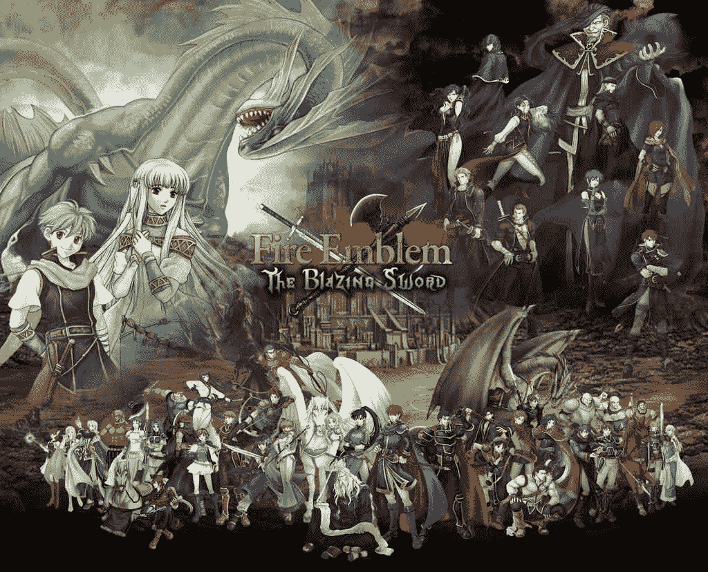

# 火焰纹章——烈火之剑外传——异种人的复仇（4月25日更...

作者：月熙哥哥

TID：18144

<title>1</title> <link href="../Styles/Style.css" type="text/css" rel="stylesheet">

# 1

*本帖最後由 月熙哥哥 於 2020-4-25 13:30 編輯*

月熙哥哥的处女作，这是任天堂出品的GBA模拟器游戏【火焰纹章——烈火之剑】的同人小说，本小说叙述的是游戏结束之后的故事。小说存在两个男主角。一个男主角篇章前期以vore为主，后期穿插unbirth场景，另一个男主角篇章前期以GTS属性为主。
<title>2</title> <link href="../Styles/Style.css" type="text/css" rel="stylesheet">

# 2

 <ignore_js_op>[3b6833f513240955bd3109e8.jpg](forum.php?mod=attachment&aid=NDg1NjF8MjFjMmY2MzR8MTYwMDg3ODk0MXwxODIzMHwxODE0NA%3D%3D&nothumb=yes) *(94 KB, 下載次數: 8)*

[下載附件](forum.php?mod=attachment&aid=NDg1NjF8MjFjMmY2MzR8MTYwMDg3ODk0MXwxODIzMHwxODE0NA%3D%3D&nothumb=yes)

2014-11-22 11:52 上傳  

</ignore_js_op> <title>3</title> <link href="../Styles/Style.css" type="text/css" rel="stylesheet">

# 3

第一章    冰龙少女

第一节   背景

    在广阔的艾雷布大陆上刚刚经历了一场大浩劫，随着灾难招致者奈哥尔的死去，整个大陆逐渐从战乱中复苏过来。当时击杀奈哥尔与恶龙的利西亚第一骑士，年轻的菲雷侯爵艾利乌德，回到了菲雷城并与冰龙族少女妮妮安生活在一起。艾利乌德的死党，利西亚联盟的领袖，年轻的奥斯迪亚侯爵赫克托耳，也回到了奥斯迪亚。他们两个致力于包括菲雷与奥斯迪亚在内的整个利西亚同盟的建设中，在他们两个的努力下，利西亚同盟的各个领地都繁荣起来。
但是，暴风雨来临前，往往是极度平静的……

    冰龙少女妮妮安坐在自己的房间里发呆，等待着艾利乌德大人的到来。然而，距离艾利乌德平时处理完公事回来的时间，已经超过了两小时三十七分零八秒，却任然不见艾利乌德回来的任何迹象，这位漂亮的美人心里难免有点”失落，洁白的手臂靠在化妆台上，右手轻轻托着右腮，左手百无聊赖地在化妆台上打着节拍，计算着时间的流走，银白的长发一直垂到地上，化妆镜中，那双水汪汪的玫红色眼瞳，透出的是无尽的惆怅……
“我回来了！”听见了自己期盼已久的声音，妮妮安孩子般的跑去迎接艾利乌德:“您回来了，艾利乌德大人!”   艾利乌德却对她视而不见，径自走进屋里，还边走边抱怨:“啊啊，今天真的好累啊，除了菲雷领地内的事务，还要额外处理奥斯迪亚的事务……赫克托耳也真是的，抛下一句‘帮我处理一段时间奥斯迪亚的事务’就走了，害得我多工作了好几个小时……”正当艾利乌德至妮妮安于不顾，发着牢骚时，妮妮安积蓄在心里多时的怒火终于爆发!她双眼噙着泪水喊道:“艾利乌德你真是的，工作那么就回来只想发牢骚，一点也不考虑等了那么久的我的感受!”   随后泪水夺眶而出，她抽泣着说道:“当初是艾利乌德大人您说喜欢奴家我，奴家才留下的，而如今每天您都在忙领地的事务，让奴家每天等那么久只为看你一眼，早知会这样子，当初奴家还不如和尼尔斯一起回到龙的世界算了！呜呜~(>_<)~，艾利乌德最讨厌了！”说罢，妮妮安边哭边跑回自己房间里去了。留下飘逸的长发所剩下的芳香，以及在原地看着妮妮安远去的倩影发呆的艾利乌德。
    艾利乌德知道自己不会表达心里的感情，虽然喜欢妮妮安，却不知道该如何对她好，只想着把菲雷整治得更加繁荣，让她生活得安定一点，看样子取得了相反的效果……艾利乌德爱妮妮安，当他知道自己一直伤害了妮妮安以后，他决定去妮妮安的房间里好好安慰她。

本节完<title>4</title> <link href="../Styles/Style.css" type="text/css" rel="stylesheet">

# 4

第二节  身体缩小

    当天晚上，妮妮安的房间里……
    待妮妮安平静下来后，艾利乌德轻轻地从后面抱住了她，隔着银白色的柔顺长发，柔声对妮妮安说道：“妮妮安……对不起，这几天是我不好，冷落了你，今天晚上我就在这儿陪着你，哪儿也不去了。”
    妮妮安听到这话，眼珠一转，计上心来，她扭头嫣然一笑：“真的吗？您说要陪奴家一整个晚上，那么今晚，奴家可不可以，对您干任?何?事呢？”
艾利乌德一听这话，脸“刷”地红了，心里低估着:“妮妮安，你这也太主动了吧?我们都还未成年啊！不过，嘿嘿，如果眼前的美人都那么主动了，我有什么理由不拒绝呢? ”   这么想着，艾利乌德点了点头。随着艾利乌德的应允，妮妮安开心地笑了，她把纤细的手指轻轻放在嘴唇间，调皮地说:“那么，艾利乌德，请闭上眼睛吧。”艾利乌德顺从地闭上眼睛后，妮妮安开始缓缓脱下他的衣服，艾利乌德虽然闭着眼，但能感觉得到自己的衣服在被脱下，自己的身体也快要暴露在妮妮安的眼前，想着要把身体暴露给女生看，艾利乌德还是很害羞的，“那个，妮妮安，可不可以慢点？我还没准备好呢。” “不要嘛~~奴家早就等不及了啦，真的好想得到艾利乌德大人的身体哦~~呵呵”妮妮安妩媚地回答着。 艾利乌德心想:“没想到妮妮安如此渴望我，实在有点出人意料啊，好吧，妮妮安，我来了！”在被脱完最后一件衣物后，艾利乌德不由分说就向妮妮安扑去，却被一双比自己大三倍的手抓住了。
疑惑的艾利乌德猛地睁开眼睛，却发现这双巨大的手竟然是妮妮安的，而眼前正微笑着凝视自己的妮妮安身高竟然超过了4米，艾利乌德和她相比就像婴儿与成人一样。“妮…妮妮安，你怎么变得这么巨大了？”艾利乌德惊恐地问。“嘛~~不是奴家变大了，而是您变小了哦~~奴家刚刚对您施了个小法术，这样子方便进食哦。”妮妮安妖娆地笑着，此刻，本来冰清玉洁的妮妮安对艾利乌德露出了死神般的微笑，艾利乌德恐惧了，他明显知道接下来会发生什么事，连连摆手说：“住手啊妮妮安，我可是你的未婚夫，你不能吃我啊啊啊! ” “那?可?不?行?哦～” 妮妮安充满欲情的红唇吻了吻艾利乌德的头部，”是你自己答应我可以对你干任何事情的啊，反悔可不行哦，艾~利~乌~德~大人~~呵呵”      带着诡婳的微笑，她把艾利乌德塞进了嘴里。

本节完<title>5</title> <link href="../Styles/Style.css" type="text/css" rel="stylesheet">

# 5

第三节  初次入腹(艾利乌德视角)
    这次是怎么了啊！我艾利乌德当初好歹也是拿着烈火之剑斩杀恶龙拯救世界的利西亚第一骑士，没想到现在要落得如此下场!当初用烈火之剑错杀了妮妮安时，我还以为作为一个男人，失去最爱的女人才是最可悲的，现在我却要葬身在自己最爱的女人的腹中，真是不合情理啊！
    呃啊!此刻我的肩已经没入了妮妮安的双唇之间，只剩两只手还架在口腔外面死命做着困兽之斗，因为妮妮安巨大的舌头不断舔舐着我的脸，被柔软的巨大舌头舔着使我升起一种快感，害我无法专心用力，再加上大量的唾液粘在我身上起到的润滑作用，我的手渐渐地、无力地松开了，并和上半身一起滑入了妮妮安的口腔里，由于我是一丝不挂的，接下来妮妮安几乎不废什么劲就把我给吞进了食道，虽然妮妮安已经把我变小了，但我现在的体型对她来说仍然有婴儿那么大，就算她嘴巴的扩展力很强，吞咽的估计也是极其艰苦的，我的双脚也早已滑入了食道，现在我的整个身子都被挤压在妮妮安狭长又紧窄的食道里，并慢慢地往下移动着，我此时甚至想早点到达胃里，死了就一了百了，结束这段地狱般漫长的旅程。终于，我进入到了妮妮安的胃里。
    妮妮安也完成了艰难的吞咽过程，眼看这这么一大团东西缓缓消失在自己的双峰之间，又把自己原本平平的肚子鼓起得跟7、8月大的孕妇似的，妮妮安满足地抚摸着自己涨大的肚子，开心地说：“艾利乌德大人~~在奴家肚子里感觉怎么样，舒服吗？ ”此时，我正在被蠕动着的，又充满粘液与消化液的胃壁挤压得难受，但奇迹的是我竟然还能呼吸，胃里的空间也并不是一片漆黑，周围的胃壁发出着淡淡的微光，使整个胃袋呈现出红彤彤的景象，虽然周围的胃壁紧紧挤压着我，但胃壁温暖又柔软的蠕动，却给了我说不出的舒适感与安全感。“呃……不算太坏，”我答道，“不过你为什么要吃了我呢？”我充满疑惑地问道，”总感觉未婚妻吃未婚夫怪怪的” 妮妮安仍然在抚摸涨大的肚子(里的我)：“嘛~~我们龙其实是非常喜欢生吞活着的东西的哦，以前我早想吞吃人类了，怕您生气才忍住自己的欲望的，今天是你自己允许奴家我吃你的，所以就，呵呵……啊啊，肚子里有人类的感觉真的好舒服……真的好舒服哦……”    即使在她体内，我也能听清妮妮安银铃般的笑声。 “好你个头啊！呜呜……我都要被你消化掉了啦!”我沮丧地说。 “啊，艾利乌德大人，这点您大可不必担心，我们龙有一种特殊能力，可以自由条件自己消化液的消化能力，现在的胃液是伤害不了您的哦，等到了明天我自会放您出来的，至于今晚嘛，就和奴家在一起吧~~”
    一听到胃液对自己是无害的，我心里就踏实了，说实话我并不讨厌这个地方，借着胃壁发出的微光，我欣赏着妮妮安整个腹内的景像。冰龙不愧是龙族中最高贵的贵族，连体内也是如此的美丽。仔细看这胃壁，竟然是半透明的，往下依稀能看到妮妮安的肠子，不过她的肠子并不多，龙的消化吸收基本都是只用胃就行了的，因为龙的胃液消化性生来极强，连黄金都可以在这里被溶解吸收，所幸这里对我暂时无害。放眼望去，透过这层半透明的粉红色的肉墙，似乎还能依稀看到她的子宫，那块未经耕耘过的粉红色的领地向我展示着少女独有的娇嫩与矜持，柔软的肉随着心脏的跳动，而有规律地起伏着，幻想着有朝一日我的分身或许会进入这块未经人事的领地，我的心就莫名地激动。胃袋的贲门和幽门自我下来后一直都关闭着，周围挤压我的胃壁还从未间断地分泌着胃液，而且仔细一闻这些胃液，竟然有着淡淡的香气，有点像百合花的清新，又有着茉莉花的淡雅。“不愧是非人类的冰龙族啊”，我这样想着。于是，我就这样在被柔软舒适的胃壁挤压中，闻着胃液的花香中，渐渐进入了梦乡………

本节完<title>6</title> <link href="../Styles/Style.css" type="text/css" rel="stylesheet">

# 6

第四节 灾祸出现
    “啊啊啊啊，艾利乌德大人~~”今天妮妮安似乎特别高兴。自从喜欢上艾利乌德那天起，她就想象着总有一天要把艾利乌德装进自己的身体里，今天她终于实现了这个梦想，自然非常高兴。“艾利乌德大人……在奴家的体内……啊啊啊~~好舒服” 妮妮安躺在床上，伸出自己白净的玉手，万般娇羞地抚摸着自己仿佛怀胎6个月大的肚子。虽然和艾利乌德保证过明天还是得把他放出来，有点淡淡伤感，但是只要有了这第一次，以后再吞他时，他以后一定不会反抗了，想想还是不错的，怀着这种感情，妮妮安又高兴了，她用厚实的被子牢牢盖住自己的大肚子，好像生怕里面的艾利乌德着凉似的。妮妮安躺下后，纤纤玉手仍不忘抚摸腹中的爱人。“艾利乌德大人，明天……更有趣哦～”妮妮安慢慢闭上双眼，露出了诡异的笑容。

    同一时刻，魔之岛上，呼啸着的暴风雨无情地肆虐着这个小岛，仿佛想要洗去半年前那场大战给这小岛带来的创痕一样。忽然间，本应该被尼尔斯(妮妮安的弟弟，也是一条冰龙)封印了的龙之门被再度开启!厚重的大门缓缓透出另一个世界照射出的强光，在强光之中走出了一队人，为首的男子身材高大，身披紫红色斗篷，径自走到当初奈哥尔被击倒的地方，似乎在为死去的奈哥尔默哀。一道闪电打过，照亮了这个男人俊美的脸庞，以及和头发一样苍白的皮肤，还有，那在黑暗中闪闪发光的，金色的双瞳……   “奈哥尔大人……”他哀伤而愤怒地说道。

(第一章完)
<title>7</title> <link href="../Styles/Style.css" type="text/css" rel="stylesheet">

# 7

第二章后宫登场    【本文由百度贴吧@苍野战樱（月熙哥哥）发布，最早发表于百度异梦阁吧，转文者请误删此句】
第一节  草原之女
   温暖的泉水浸泡着全身，让人自内而外感到如此的安逸，艾利乌德再次醒来时就是这种感觉，芬芳的液体充斥在艾利乌德的周围，一张嘴，粘稠而甜蜜的液体就涌入喉咙，艾利乌德已经不知道吞下了多少液体，但那是无论吞下多少也不能满足的东西。于此同时，艾利乌德也感到自己的身体开始发生了一些微妙的变化。
   “哈啊~~”妮妮安刚刚睡醒，伸了个懒腰，无力地揉了揉眼睛，把目光投向了自己凸出的，如同西瓜一样大的肚子。因为她体内分泌了能改造艾利乌德的蜜液，所以自己的肚子已从昨晚的怀胎6个月大扩张到怀胎10月大了。她吃力地起身，开始穿衣。随着自己周围整个空间一阵剧烈的颤动，艾利乌德知道妮妮安醒了，因为喉咙里全是妮妮安分泌的液体无法说话，他只好用力戳戳妮妮安的胃壁，暗示妮妮安早点让自己出来。
   “呵呵……”妮妮安感受到了自己腹中之物的小动作，嘴角满足地微微扬起，抚摸着肚子，幸福地说道:“艾利乌德大人，还不够哦，奴家现在不能让您出来，再等一小会儿吧。奴家正在分泌的这些液体，可以强化艾利乌德大人的身体，让你不会被一般人吃掉消化。”
    浸泡在妮妮安香甜的胃液中的艾利乌德听了，自是感觉很奇妙，龙女竟然能在体内改造别人，最重要的是她的改造液竟然会让人这么舒服。妮妮安知道艾利乌德理解了，继续道“当然，如果遇到想吃掉你的龙族，那就没办法了。不过反正奴家在旁边，这种被龙族吞食的可能微乎其微。呵呵～”  
    原来如此，艾利乌德大致理解了妮妮安的行为，但心头略过一丝疑惑：“为什么我还会被别人吞食？这不是龙族才会的能力吗?”     艾利乌德刚想到这里，此刻夺门而入的不速之客即将为他“解答”疑惑。
    “妮妮安!”随着一声清脆的喊叫声，妮妮安的房门被一脚踢开，随即走入了三位美丽的女子。为首的女子身形修长，翠绿的长发下是一双碧绿的眼睛，扎一束及臀马尾，穿一身修身旗袍，配一把精灵之剑——玛尼?卡缇。“琳?你们来了!”妮妮安惊喜地叫出声来。 琳面对妮妮安，露出了善意的微笑：“嗯，我们来了，妮妮安师父，我们修炼完毕了!”

本节完<title>8</title> <link href="../Styles/Style.css" type="text/css" rel="stylesheet">

# 8

第二节  百合骑士
    琳一打开门进来，就注意到了冰之龙女妮妮安。以及，她那高挺着的，仿佛像怀孕七、八个月般大的肚子。
“妮妮安?”琳狡黠地笑道，“师父你已经完事了？看样子我们来的正是时候呢？ ” 说着，琳开始玩弄起妮妮安的肚子来。  
   “呜哦哦哦～”妮妮安被按摩得十分舒服，不禁呻吟起来，“呜哦哦哦～再等等，再等一会儿，艾利乌德大人他，现在还太早了～”
    “啊，是嘛，师父?”  和琳一起进来的那个蓝发女子开口了，“既然如此，那我们就在这种时候好好挑逗师父的美肚吧？”
    和身为贵族的琳不同，菲奥拉出生贫寒，是北方的佣兵之国【伊利亚】的天马骑士，留着天蓝色的长发和蓝宝石般晶莹的双眼，在长期生与死之间徘徊的佣兵生涯下，她渐渐对同伴产生了强烈的亲切感，战斗时对同伴互帮互助，平时既会照顾别人又更喜欢玩弄别人。这种腹黑大姐大的性格和清秀的外表到是有几分不符。她在一次执行任务失败后为艾利乌德所救，而且被艾利乌德收纳为菲雷骑士，因为自身实力出众，艾利乌德已经正是授予她骑士头衔。最近菲奥拉说是要修行，和琳一起去了某个地方，现在终于回来了。
    菲奥拉俯下身，将妮妮安推到在床上，轻轻解去妮妮安外衣，自己的玉指慢慢划过妮妮安高挺的腹部最敏感的部位，“呜……住手……”妮妮安满脸通红，但没怎么反抗，因为改造艾利乌德耗去了她大量体力，现在的她面对菲奥拉全无招架之力。 “师父，不，妮妮安，你的肚子真的好软啊……”菲奥拉的樱唇里伸出香舌，轻轻舔舐着妮妮安的肚子，搅弄着她的肚脐，柔软的香舌夹杂着黏黏的津液一次又一次划过妮妮安的肚脐，刺激着她敏感的神经。妮妮安终于把持不住了：“啊啊啊～不要啊……要，要去了!”   随着妮妮安此起彼伏的呻吟，第三位少女也站了出来。她走到琳身边，用稚嫩的童音说道：“琳，既然妮妮安姐姐那么舒服，不如我们两个也上，让姐姐更舒服一点吧？”   “蕾贝卡，连你也!”妮妮安红着脸，诧异地盯着眼前的少女。“好啊！”琳笑着回应道。

本节完<title>9</title> <link href="../Styles/Style.css" type="text/css" rel="stylesheet">

# 9

第三节  萝莉射手
    蕾贝卡本是菲雷领地中一个村庄村长的女儿，虽然外表上像个十三四岁的小女孩，但是弓术超群。而且和艾利乌德他们经历过与灾难招致者的战争，作为主力的一员击溃了恶龙，所以她坚强的内心早已与稚嫩的外表不相协调了。
    蕾贝卡上前一步，吻着毫无反抗的妮妮安炽热的红唇，“妮妮安，唔……你的津液，好甜啊……”
妮妮安虽然是一条活了千年的冰龙，但现在人类形态的她只是一个未经世事的少女。很快便受不了蕾贝卡的热吻，败下阵了，任蕾贝卡的舌头在自己嘴里游走。
眼看着妮妮安彻底失去了反抗，琳也缓缓走上前，解去妮妮安最后遮羞的内衣，妮妮安她那丰满饱胀，白里透红的双乳暴露在三人面前。
   “师父的胸原来有这么大啊！”琳惊叹道，“平时穿着舞女服都看不出来呢。”说着，琳抓住妮妮安一只雪白的乳房，揉捏起来。“啊，好软哦~”
   “那是当然的啦，自己的胸当然只能给艾利乌德大人看了！”菲奥拉附和着。手早已搭上了妮妮安胸前另一座柔软的肉球。还不时用舌头舔着肉球顶端那颗小小的肉粒。三人就这样挑弄着妮妮安的身体，良久良久。
   “啊……”疲惫的妮妮安柳眉微舒，“时间到了……”     “啊，时间到了吗？”  蕾贝卡反应过来，“那么，就由我来给师父展示一下我们修行的成果吧!”  说完，她对妮妮安展开了更为激烈的拥吻。妮妮安在被蕾贝卡深情地拥吻的同时，感受到对方口中传来一股强大的吸力，直通向自己的胃部，随即，自己胃里一团东西开始涌上自己喉咙，“呕”这团东西挣扎着离开了自己的身体，又被蕾贝卡吞进肚中。

本节完<title>10</title> <link href="../Styles/Style.css" type="text/css" rel="stylesheet">

# 10

第四节   苦痛折磨(艾利乌德视角)   【本文由百度贴吧@苍野战樱（月熙哥哥）发布，最早发表于百度异梦阁吧，转文者请误删此句】

    我静静地躺在妮妮安的体内休息，周围温暖的液体缓缓流动着，摩擦着我身体每一寸肌肤，液体被我慢慢吸收着，变得越来越少，等液体完全消失了，我的改造就完成了吧？现在，我什么也不愿多想，感觉整个世界都与我无关，不，这里就是我的整个世界。我静静享受着这惬意的时光，就这样睡着……睡着……突然，一阵剧烈的摇晃打破了我的世界。我被狠狠摔在背后的软肉上，虽然在周围温暖的液体和柔软娇嫩的胃壁我完全没感觉到一丝一毫的疼痛，但是我的第六感告诉我，妮妮安出事了！我竭尽全力在妮妮安肚子里挣扎着，想要出去看看情况，却被从胃壁伸出的一双双大手硬生生按了回来。我看得见一双双巨大的手不断按压着妮妮安的肚子，柔软的胃壁被按压得显现出一只只手掌的轮廓。我可以感觉到周围液体已经越来越少了，少了液体的缓冲，我收到的冲击也就更大了。我心中非常惊恐，外面妮妮安的呻吟声异常清晰，而我却在这里面无能为力。我愤恨地捶打着胃壁，痛骂自己的弱小，连自己的女人都保护不了。而后，因为急血攻心，我晕了过去。 就这样，过了良久良久。

   “唔……”周围的胃壁剧烈地抽搐着，一股强烈的挤压感将我唤醒。周围的液体已经完全消失了，同时那些讨厌的巨手也不见了。取而代之的是来自上方一股强大的吸力。周围的胃壁越来越紧致，我被挤压得快喘不过气来，随着胃壁的快速蠕动和上方的吸力，我挣扎着行将脱离妮妮安的胃袋。只一瞬间，我就穿过了食道，正当我以为我能重见天日后，又被面前一张巨大的嘴吞下了。

本节完<title>11</title> <link href="../Styles/Style.css" type="text/css" rel="stylesheet">

# 11

> [秋兴八首 發表於 2014-11-22 13:17](https://giantessnight.com/gnforum2012/forum.php?mod=redirect&goto=findpost&pid=239319&ptid=18144)
> 大爱楼主！这都可以有！
> 创意无界限啊！
> 希望有一定要有菲奥拉

菲奥拉不是在这里吗？
<title>12</title> <link href="../Styles/Style.css" type="text/css" rel="stylesheet">

# 12

第五节   四面埋伏
    蕾贝卡吞下艾利乌德后，因为体力消耗过度。正心满意足地躺在床上闭目养神，抚摸着自己高高隆起的肚子。而妮妮安现在吐出了艾利乌德，体内少了一个重物，虽然有点失落但是浑身轻松。她也躺在床上回复体力。
艾利乌德换到这个环境，周围算是稍微安定下来了。他环顾四周这里的环境，这里其实并不比妮妮安那里的差多少，只是少了一些龙族少女特有的芳香。或许是胃袋比较小的缘故，艾利乌德感觉两边的粉红色的胃壁带给了他比起妮妮安更为狭窄的空间。柔软紧致的胃壁更大程度加深了胃壁蠕动带给艾利乌德的舒适感。 但同时艾利乌德深知他所处一个敌人的腹中，妮妮安很可能被敌人控制住了，即使自己已不会被常人消化，他也必须要出去，救妮妮安与水火之中。他使出浑身解数挣扎着，想要脱离这里。   而蕾贝卡毕竟年幼，受不了肚子里的翻江倒海，开始捂住肚子呻吟起来。
妮妮安调皮地拍打着蕾贝卡足月大的肚子，“艾利乌德大人，不要这么闹嘛……可爱的蕾贝卡酱被你弄得这么疼，你舍得吗？”   
    什么?!艾利乌德大吃一惊，这是妮妮安的声音没错，也就是说侵犯妮妮安的人，是自己的同伴!更让艾利乌德疑惑不解的是，自己现在居然在蕾贝卡的体内。  他失声喊道：“妮妮安，这是怎么回事，蕾贝卡为什么也会吞食人?”   妮妮安“扑哧”一声掩嘴淡笑后，答到：“是奴家教她的呀～不仅仅只有她，琳，菲奥拉她们天赋都很好，她们现在都在这个房间哦～”    在艾利乌德诧异的同时，妮妮安放开蕾贝卡的肚子，摸着蕾贝卡稚嫩的脸蛋说道，“蕾贝卡，玩够了记得让艾利乌德大人出来哦～～他已经好久没有出来了。”     艾利乌德心想：“琳和菲奥拉也在，那我待会儿出去后一定不能太狼狈，让她们笑话。”
   “嗯!”蕾贝卡笑得眼睛眯成了一条缝，满足地起身，小手一捂嘴，把早已准备好的艾利乌德轻松吐了出来。接触到外面空气的艾利乌德迅速回复了原来大小。“哟呵!琳，菲奥拉，蕾贝卡，好久不见！”  深谙贵族礼仪的艾利乌德华丽地转身，用一个帅气的姿势同在场的女孩子打了招呼。而女孩子们此刻却不约而同地呆若木鸡，四双眼睛直直地盯着自己的下半身。  妮妮安和两个少女捂住了脸，她不好意思地说道： “是奴家的错，是奴家把艾利乌德大人的衣服给……”    琳则五指张开，象征性地遮住微红的脸颊，嫣然笑道：“艾利乌德，在打招呼之前，先把衣服穿上～还有，你……呃，挺大的～”    艾利乌德：“呃啊啊啊啊啊!”
    骚动过后，艾利乌德心中的疑问重新涌上心头，他难以接受现在的事实。他无法理解妮妮安为什么要教会她们这种技能。
    妮妮安毕竟是最接近艾利乌德的人，她一眼就看出来艾利乌德的疑虑，不紧不慢地解释着：“艾利乌德大人，你还没发现吗？她们几个很久以前就喜欢你了！”      艾利乌德一惊，环顾三位女孩，发现没有一个人反对妮妮安的说辞，自己心中涌出一股莫名的幸福。妮妮安接着说道：“因为艾利乌德老是不在奴家身边，奴家担心她们日后来偷偷抢走艾利乌德大人，所以奴家决定把她们带在身边搞好关系，因为艾利乌德大人最近老是对奴家不理不睬的，所以奴家很生气，就决定教她们吞噬术，联合她们一起来欺负你，当然，前提是她们认可奴家的正宫地位。嗯哼~”     
    “她们一起用吞噬术来欺负我?”艾利乌德苦笑着，看着三位少女连连点头肯定妮妮安的神情，他觉得以后的日子不会那么好过了。

本章完<title>13</title> <link href="../Styles/Style.css" type="text/css" rel="stylesheet">

# 13

第三章    兵分两路   

第一节    噩梦前兆（赫克托耳视角）

    同一天晚上，奥斯迪亚城。
    艾利乌德的死党，奥斯迪亚侯爵同时也是利西亚同盟的盟主的赫克托耳，结束了这次的旅程，在狂风呼啸，雷雨交加的夜晚，回到了自己的城堡。袭人的倦意使他快步走进自己的卧室，和衣而睡。

********这里是奥斯迪亚侯爵家的私人庭院，几条鹅卵石砌成的小道将这里茵茵的绿草分割成好几块。小道两旁，各种奇花异草争奇斗艳，吐露芬芳。庭院的中心是一个豪华的泳池，洁净的池水在烈日的照耀下波光粼粼。我坐在池水边的躺椅上，享受着夏日午后的闲暇时光，双眼片刻不离那个在游泳池中的小精灵，伴随着池水的波动而漂浮着的粉色长发，天使般完美无瑕，娇小可爱的身姿，还有那白里透红，弹指可破的肌肤。我静静地享受着这一切，良久良久。
    过了不久，她游累了，穿着湿透了的衣服上了岸，惊慌失措地发现我一直在看她，赶忙用纤纤玉手遮住自己尚未成熟的乳房，白皙的大腿遮掩住自己的下体，羞哒哒却又面带笑容地娇嗔道：“真是的，赫克托耳大人这个H！”    然而，她天籁般的声音加上半遮半掩的身体更是激起了我内心的兽欲。“芙罗莉娜，”我起身，开口道，“过来。”  芙罗莉娜一个惊骇，虽然不情愿但是很顺从地来到了我面前。我左手搂住她的细腰，右手挽住他微微反抗的小手，亲吻着她的樱唇，慢慢把她推倒在草地上。   我解去衣服，俯下身在芙罗莉娜的耳旁低语：“芙罗莉娜，我要你，现在。”  芙罗莉娜双眼迷离，含情脉脉，没有做什么挣扎，娇羞万千的脸上写满的不知是痛苦还是期待。  伴随着“啊”一声冲破灵魂的叫声，我已经把粗大的肉棒深深插入了她狭小的蜜穴中，我眼看着自己的阳具被她下体两瓣滚烫的阴唇吞入，感到非常兴奋，这是她的第一次，也是我的第一次。她的阴道内是如此的狭窄，我的肉棒一进去就被她的淫肉深深夹住，我竭力前后摇晃着下体。粗大的怪物在她淫霏紧凑的阴道内肆无忌惮地穿插着。芙罗莉娜销魂的娇啼声和蜜穴里湿滑的汁液大大加快了我肉棒的抽插速度，当我前进的势头终于被一道屏障给挡住时，我知道我没有退路了。“芙罗莉娜，我要冲了，好吗？”    上方传来妖娆的成熟女音：“好啊。” 我心中一阵欣喜，刚要冲破这层屏障，脑中突然涌入一个观点：芙罗莉娜不是萝莉吗，她的声音什么时候有这么成熟了？我惊骇地抬头一看，忽然发现天地变色，风起云涌。庭院中美丽茂盛的奇花异草转瞬间变成了萧索残败的荒鸦枯木，身下纯洁无瑕的佳人此刻也……原本铺地的粉色卷发染成了凄凉的银灰色，白里透红的肌肤也变得惨白，了无生机。她那双会说话的晶莹明眸此刻被镀成了金色，在昏暗的日光下显得额外闪亮。   <title>14</title> <link href="../Styles/Style.css" type="text/css" rel="stylesheet">

# 14

第二节    末日预言（赫克托耳视角） 【本文由百度贴吧@苍野战樱（月熙哥哥）发布，最早发表于百度异梦阁吧，转文者请误删此句】

    我这才反应过来她不是芙罗莉娜，她是……异种人！“你是琳斯特拉！”我失声喊道，同时下意识地想把肉棒拔出来，但是肉棒像生了根似的怎么也离不开琳斯特拉的身体。琳斯特拉妖艳的眼瞳冷冷地注视着我，鄙夷地说道：“区区人类竟然妄想与我交合……做梦吧！还是乖乖被我吸收力量吧！”顷刻间她的阴道释放出一股让人无法抵抗的强大气流，我的身体被迫逼近她的阴道口，我虽然有挣扎，但在她强大的魔力面前，一切都是徒劳，我的四肢越来越无力，我感觉她正在通过肉棒吸取我的力量。琳斯特拉露出满足的神情：“恩，不愧是奥斯迪亚侯爵，力量果然比常人精华好多。”我已经完全失去抵抗，而后，我发现我的身体正在急剧缩小。一寸寸地靠近琳斯特拉湿滑宽松，冒着热气的阴道口。琳斯特拉此刻的表情极度享受，她俯到我耳边，妩媚地说道：“你现在已经是一个废人了，既然你一无是处，那不如被我完全吸收，成为我的一部分吧？”话音未落，她的身体已经变得异常巨大，我的下半身已经完全陷入她洞开的阴道中。她的阴道壁异常柔软，淫湿的软肉狂乱地蠕动着，摩擦着我的身体，把我带入她更深的地方去。从下半身传来的快感使我血脉贲张，肉棒竟然在她的阴道内勃起。琳斯特拉嘴角露出笑意，阴道内的软肉像有生命一样缠住我的肉棒，玩弄着我的龟头，摩擦着尿道口，我竭力忍住不射，但还是在她的玩弄下到达了高潮。肉棒“噗”地射出了屈辱的精液，琳斯特拉淫荡地放声大笑：“居然在敌人的阴道里也能射精，你可真是只禽兽啊！好了，我也玩够了，你进来吧。”随着她对我下达的最后判决，阴道内的软肉突然加快了蠕动速度，我在无限的快感与屈辱感交替之中慢慢被她的蜜穴完全埋没。我的脸绝望地看了一眼外面的世界，随即在琳斯特拉淫荡的笑声中被两瓣巨大的阴唇拖入她的体内……
    就这样结束了吗？我痛苦地闭上了眼睛，就在我以为自己就这样完蛋了时，周围的景色再次改变了。没有覆盖全身的挤压感，也没有了琳斯特拉淫荡的笑声。我……再次站在了鸟语花香，绿意盎然的奥斯迪亚庭院内。但是面前站着的不是可爱的芙罗莉娜，而是一位陌生的少女。紫水晶般的长发如瀑地垂在她的背后，雪白的肌肤可以让凝结露珠，紫发少女手持一本古书，微笑着向我走来，美丽的笑靥可以迷倒世上一切男子。虽然是个大美人，但经历过刚刚发生的那些事件的我还是提高了警惕。“你是谁？”我喝问道。  “索菲亚，一个预言家。”少女冷静地答道。“为什么你会出现在这里，还有，刚刚那一切都是你搞的鬼吗？”我厉声追问道。这次，这个叫索菲亚的女孩没有回答我，而是自顾自地说道：“艾菲迪鲁率领的异种人已经回到这个世界了，龙之门已经开启，等他复活了琳斯特拉，魔龙会从沉睡中苏醒。异种人大军会对整个艾雷布大陆进行复仇，届时，只有八大神将器合力才能击溃他们。”说完，索菲亚转身就走。我心中一怔，但还是强作镇定地回答：“我为什么要相信一个陌生人说的话！你有什么证据吗？”  索菲亚回头送上一个微笑：“快去找你的同伴吧，如果神将器未收集全，魔龙已经苏醒，整个世界就完了。”话音刚落，索菲亚就凭空消失了，随即，我感到一阵眩晕。*********
    “赫克托耳大人！赫克托耳大人！”呜……在耳边环绕的天籁声中，我缓缓睁开眼睛，眼前的，是小鸟依人的芙罗莉娜急切的眼神。我发现原来我还躺在床上，也就是说，刚刚的一切都是做梦喽，什么世界末日嘛……我舒了一口气。芙罗莉娜看我还没完全醒，连忙使劲摇我，边摇边说：“赫克托耳大人，有紧急事件，别睡了，快醒醒！”   “啊啊，”我被她柔弱的小手摇得心潮澎湃，睡意全无，“芙罗莉娜，我醒了有什么事情吗？”我摸着芙罗莉娜可爱的小脸笑道。芙罗莉娜满脸通红地甩开我的手：“赫克托耳大人捏别闹啦！这次真的是紧急情况！” “噢噢，我不是说过，只要是芙罗莉娜酱的事情永远是最紧急的哦。好啦，说来听听？”我双手托着下巴，调侃着说道。“根据奥斯迪亚密探的汇报，维多尔岛上的龙之门昨天被开启了，艾菲迪鲁和其他异种人已经回来了！”  
    你说什么！！！！
本节完<title>15</title> <link href="../Styles/Style.css" type="text/css" rel="stylesheet">

# 15

    第三节    殊途同归

     艾利乌德撇下正在妮妮安房间里交流吞食心得，讨论日后该如何整自己的女生们，开始了菲雷侯爵的日常工作。突然又有士兵闯入他的办公场所：“报告！奥斯迪亚侯爵——赫克托尔殿下已经进门了！” 艾利乌德，不知道赫克托尔这时候来干什么。”  
   “嘿！艾利乌德，好久不见了！”赫克托耳拉着芙罗莉娜的小手，轻车熟路地走进艾利乌德的办公室，朝艾利乌德打了声招呼。 “赫克托耳，你昨天刚刚回来，今天就急匆匆地来找我，应该不是来和我打招呼的吧？”艾利乌德直截了当地问道。 “呵呵，的确有点小问题。”赫克托耳笑了笑，转而用严肃的表情说道：“异种人又出现了。” 短短七个字，却让现场陷入了死鱼般的寂静中，刚刚走人艾利乌德办公室的妮妮安一行人还惊讶地张大了嘴，不相信赫克托耳是不是在开玩笑。毕竟大家都忘不了当时和异种人大军的战斗，美丽强大的异种人不是一般人可以应付的。那是一段辛酸且痛苦的回忆，许多人失去了挚友，亲人，甚至自己的生命。如果异种人大军卷土重来，那整个大陆又会陷入混乱之中。 没等艾利乌德发问异种人怎么可能还会出现，赫克托耳就回答道：“不用怀疑，奥斯迪亚的密探传回的情报不会有误。你应该记得龙之门第一次开启时，有个异种人头目为了救奈哥尔而被吸入龙之门吧？” “是艾菲迪鲁？！”艾利乌德瞪大了眼睛，恍然大悟道。 “没错，就是他，他率领了不少那个世界来的‘人’，同时利用‘埃吉尔’复活了大批异种人，准备替奈哥尔报仇。”赫克托耳叹了口气，无奈地说道。 “那个世界来的‘人’么……难道说是？” 艾利乌德托着下巴，眼睛撇了撇一脸茫然的妮妮安。“赫克托耳，我大概知道你来找我的目的了。是神将器吧？”  “没错。”赫克托耳点点头。
    为了击溃艾菲迪鲁以及异种人大军，必须要依靠上古时期的八大神将器，这八大神将器被封印在这片大陆的各个国家。“我们分两路走，我去西边寻找天雷之斧，至高的光，业火之理和默示之暗。”赫克托耳抢先道，他选的这些神将器都是路途最为遥远，艰难的。“那我去东边取得烈火之剑，冰雪之枪，疾风之弓和终末之冬。”艾利乌德接下了剩下的神将器，虽然前三个比较好找，但是最后一个神秘的终末之冬一直行踪不定，难以寻找。两人商议三个月后不管有没有集齐神将器，都要在艾非迪鲁的基地——【封印神殿】前汇合。然后一鼓作气攻入神殿。
    赫克托耳带着芙罗莉娜临走前，抛下一句：“这是一次秘密行动，声势过大容易使异种人知道我们的行动，前来阻挠，此次行动只要带上少量精英就行了。”说完，他扬长而去。    艾利乌德目送着赫克托耳远去，忽然感觉背后凉嗖嗖的，还没来得及回头，自己已经被三个女生推倒在地了。琳|菲奥拉|蕾贝卡：“艾利乌德大人，说到精英，不带上我们该带谁呢？”说完，琳还用舌头舔了舔艾利乌德的脸颊。艾利乌德被舔得直冒冷汗：“啊，是呢！不带你们带谁啊！啊哈，啊哈哈哈！”   轻松搞定艾利乌德后，琳带着胜利的微笑把目光转向妮妮安，“师父，你也去吗？”   “啊？我啊……”妮妮安低着头，沮丧地回答：“我虽然也想去，但是现在师父我已经无法变成龙了。去了的话，只会成为你们的累赘吧。”  说完，妮妮安叹了口气，默默走回自己房里。 琳望着妮妮安的背影喊道：“可是你舞女和预言的能力都是一般人没有的啊。再说，如果和我们出发去取神将器，你就可以天天和你的艾利乌德大人在一起了哦~”   “艾利乌德大人，奴家要去（☆_☆）！”火速奔回的妮妮安两眼放光地对艾利乌德恳求道。  “啊，噢……”艾利乌德满脸黑线地起身，“那么大家准备准备，下午出发！”   “好~”  于是，出发的人就这样欢乐地决定了。
    由此，艾利乌德和赫克托耳两人的命运再次与这个大陆的存亡连接起来。同时，前路上还有许多艰难险阻在等待着他们。
(本章完）<title>16</title> <link href="../Styles/Style.css" type="text/css" rel="stylesheet">

# 16

以下故事分为艾利乌德篇与赫克托耳篇，后期还有其他篇章，这里先不公布。
艾利乌德篇以艾利乌德的主角，赫克托耳篇以赫克托耳为主角。
首先是艾利乌德方向的故事。<title>17</title> <link href="../Styles/Style.css" type="text/css" rel="stylesheet">

# 17

艾利乌德篇

第四章    踏上征途    【本文由百度贴吧@苍野战樱（月熙哥哥）发布，最早发表于百度异梦阁吧，转文者请误删此句】

第一节   荒野露营（艾利乌德视角）

    赫克托耳已经出发前去唤醒天雷之斧了。我也要动身前去取回被重新封印的烈火之剑——幽兰戴尔了。 由于琳她们的威逼色诱，这次出行只能把她们几个带上了，如果不带上她们，我会被吃掉的。（无奈痛哭）
    离开菲雷城已经有些时间了，太阳早已沉入了大地之母的怀抱里。明月也已经高高挂起，给昏暗的大地披上一件银色的轻纱。
    “不知不觉已经这么晚了吗……好，大家停止前进，扎营休息一晚上！” 我对身后的四个人说道。 大家也都有点累了，都快速地取出个人帐篷准备扎营。 这时，我才意识到了我犯了一个极其严重的错误：我忘带帐篷了！
    琳很快搭好她自己的帐篷，瞥见我一直没有做什么行动，心里便猜到了几分，“怎么了，艾利乌德，是不是忘了带帐篷了？不介意的话我们两个挤一挤吧？”琳大方地指了指自己的帐篷。 “胡……胡说，我怎么可能会犯那种低级错误呢？我只是……” “呀~~不要害羞嘛……实在不行，到我肚子里来休息也没事儿啊~~” 琳略带羞涩地指了指自己的腹部。 “呃，这个……还是算了吧，我虽然明知道这是很舒服的事情，但菲雷侯爵的自尊心告诉我，一个大男人睡女生肚子里实在有辱尊严啊。” “啊啦啦~不要害羞嘛~~这里就我们几个，没有人会说出去的。” 琳笑着朝我步步逼近，我转身逃走，耳边时刻想起琳的呼唤声。虽然琳的声音渐渐远去，但是我每跑一步都感觉周围的景物在变大，不对上次的经验告诉我是我的身体在逐渐变小，难不成又有人在对我施加咒语？在我变得和一片地上的枯叶差不多大时，背后伸出一双大手，把我抓了个正着。 “艾利乌德大人，放心，是微臣，您的直属骑士菲奥拉！” 是菲奥拉的声音！ 我顿时安心了许多：“是菲奥拉啊！谢谢你帮我，不过你可以先放我下来吗？我今天没带帐篷，决定睡草地了。” “那~可~不~行~哦~”菲奥拉微笑着拒绝了，“我是您的直属骑士，保护主公就要保护到底。让主公睡草地实在是太不安全了，今晚我就献上自己的身体来让主公好好休息吧~~” 还没等我反应过来，我就被菲奥拉扔进了嘴里。由于这次我变得很小，随着“咕噜”一声轻响，我很快就穿过食道，落到了菲奥拉的胃里里。这是我进入的第三个女生的体内，菲奥拉的胃与蕾贝卡那稚嫩的胃又是不同，这里显得更加成熟，更能显示出刚刚成年的女性的美丽，跃动着的胃壁也更加具有弹性，躺在这里就像躺在一张巨大的水床上一样。黏稠的胃壁分泌的液体让我生理上感到舒服。但我潜意识里就是不愿承认这个事实，内心苦苦做着斗争。
“艾利乌德大人，我们要睡觉喽~~您也早点休息吧~”菲奥拉拍拍自己的肚子轻声说道，“师父对您的身体进行改造以后，我们的胃液是消化不了您的，您就安心睡吧。”菲奥拉吹灭了灯，解衣入睡。留下在她肚子里肉体舒服内心煎熬的我。
    本节完
<title>18</title> <link href="../Styles/Style.css" type="text/css" rel="stylesheet">

# 18

第二节    后悔之路

    距离我被吞下已经过了将近一个小时，菲奥拉早已沉眠在她的香梦里。但我此刻仍然毫无睡意，两腿在菲奥拉胃里打坐。脑中有两股势力一直在做着斗争——贵族男性的自尊和置身于女性腹中的快感。贵族是很重视尊严与名誉的，一天之内连进三个少女的腹中也实在有点……但身处菲奥拉这片温暖福地洞天中又给人以说不出的安逸。最终，快感战胜了理智，我决定日后要慢慢适应这种感觉。
    这样想着，我原本压抑的心情豁然开朗，开始以一种全新的眼光打量着这块日后会经常光顾的小世界。“反正以后还会经常来这里，不如趁现在不想睡觉，把这里一探究竟。”我这样想着，双脚深一脚浅一脚地踩着这些坑坑洼洼、弹性十足的软肉，缓缓越过层层叠叠、纵横交错又充满黏膜的沟壑，我的双脚好几次被这些沟壑上的黏液绊倒，一头摔在胃壁上，挣扎着爬起来，满脸都是菲奥拉的胃液。渐渐地，我发现我走到了一个漆黑的洞口前，洞口有规律地一张一合，张开后的大小正好容我一人钻进去，虽然我不知道里面到底是什么，也不知道菲奥拉同不同意我进去，但强烈的好奇心还是驱使我迫不及待地钻了进去。钻进这个小洞后，我横躺在了一处狭长的伸手不见五指的通道里。 接近圆形的肉质通道又窄又长，我在这里根本无法站立，在死寂般的漆黑下，我突然想起，妮妮安对我的改造可以使我抵御普通人的胃液，但如果这里不是胃呢？我一定会被消化掉吧……我开始感到后悔，害怕了。我试着用脚往回爬，慢慢倒出这个狭窄的通道，只要出了这里，我就可以在菲奥拉宽敞明亮的胃里好好睡一觉了。但是，周围的软肉好像嗅到了食物的气味一样，突然加速了蠕动，我身后透着弱光的出口缓缓关闭。我现在被关在了这个通道里，已经没有退路了。“菲奥拉！你在吗？快让我出去！”我试着向菲奥拉大声呼救，可惜过了好久也没见反应，看样子她早就睡着了。肉质的通道缓缓蠕动着，把我慢慢推向前，在多次反抗未果后，我被迫接受了菲奥拉身体对我的行为。这里没有黏液的阻挠，也没有胃壁的那么多褶皱，我前进得非常快速。
    午夜时分，菲奥拉帐篷外的篝火在吐出最后一颗火星后，化为了灰烬。夜阑寂静，明月半空，树影斑驳，整个林子一片寂静。连许多夜行性动物也都归巢睡了。在这本应万籁俱寂的时刻，有谁会想到，帐篷里这位做着美梦的蓝发美少女体内，有一个少年正在苦苦寻找出去的路呢？
    本节完<title>19</title> <link href="../Styles/Style.css" type="text/css" rel="stylesheet">

# 19

好了，今天先到这里，明天继续。<title>20</title> <link href="../Styles/Style.css" type="text/css" rel="stylesheet">

# 20

> [dhl7457 發表於 2014-11-23 13:32](https://giantessnight.com/gnforum2012/forum.php?mod=redirect&goto=findpost&pid=239428&ptid=18144)
> 妮妮安是琳的师傅？你在玩我啊？琳比妮妮安先出场，而且明显比妮妮安大啊，就算是外传也要尊重一下正传吧? ...

这是后传谢谢。妮妮安教琳怎么吞食的。那个琳可不会。
<title>21</title> <link href="../Styles/Style.css" type="text/css" rel="stylesheet">

# 21

第三节    绝地逢生
    我绝望地看着眼前一片漆黑的软肉通道深处，后悔着自己一时好奇的举动使自己陷入如此境地。然而，似乎神明还没有抛弃我，我眼前慢慢出现了一点点微弱的光芒。周围的软肉慢慢把我推向那一片光明的地方，渐渐地，光亮越来越近，越来越亮。最后，我整个人被软肉挤出了那个狭窄的通道。一瞬间，我感到脚下一空，随后整个人都跌进了这片充满光明的深渊中。
    等我再次睁开眼睛，我惊喜的发现这里的环境如同仙境般美好，光亮和菲奥拉的胃差不多，只是比起大的多的胃囊来说，这里只像一条宽度仅够站人的管道。 我缓缓起身，举目远眺，整条长得一望无际的肉质管道覆满了天鹅绒般柔顺的纤毛。我才意识到这里是菲奥拉的小肠，那么，刚刚那条黑暗的通道想必是十二指肠了……我一边抱怨着自己当时完全不必那么紧张，一边行走在这条只能在天上人间才会有的小道上。
    小肠的直径比我的身高长不了多少，却覆盖满了有半人高的绒毛。行走间，我不时地被纤细的，如同出水芙蓉般娇嫩的绒毛拂过全身，实在有着说不出的舒服。我脚下仍然经常踩到消化液，不过看来这里的液体对我也构不成威胁(那最好了，可以安心睡觉了)。
渐渐地，我越走越困，双眼不止一次地想要合上，双脚顺势地被密集的绒毛绊倒了，使我整个人都扑到在眼前这片天鹅绒海洋中。其他绒毛仿佛受到什么指示似的，都朝这边涌了上来，将我全身上下包裹得严严实实，我并不想挣扎(反正不会被消化)，任其缠住我身体的各个部位，娇嫩的，柔顺的绒毛缠着我反而使我更加舒适，更感安全。很快，我就在这些绒毛的簇拥下进入了梦乡……

第四节    午夜小遇
    深夜里，琳因为失眠，走出帐篷欣赏着夜间的风景。一声清脆的“咔嚓”声给警觉的琳一个激灵，多年的草原经历告诉她这声音的主人不怀好意。细细地聆听四周，希望能再听到一点点的风吹草动。很遗憾，四周还是那么的安静，皎洁的月色普照着沉睡中的大地。正当琳以为刚刚那声音是错觉，想回帐篷继续睡觉时，一只漆黑的大手突然从琳的背后伸出，捂住了琳的嘴，还没等琳反应过来，另一只手用肘部扼住了琳的腰部，锁住了琳本想反抗的双手。“唔……”琳刚想喊人，就被这两只漆黑的大手拖进了稍远处一片灌木丛里。
    琳被重重地摔在一棵树前，她背倚着树喘息着，借助月光打量这个把自己抓过来的壮汉，两个虎背熊腰的男人正用猥琐的眼光打量着自己的身体。其中一个邪笑着对另一个人说：“老子还以为是什么追兵呢，抓来一看原来是个女的，长得还挺水灵，哈哈哈”说完慢慢靠近琳，用自己的手捏着琳白皙的脸。 另一个人更是淫笑着道：“哇哈哈哈，小姑娘啊，放心，叔叔不是坏人，叔叔们对向你们这种漂亮的姑娘可是很温柔的哦~” 琳听了，厌恶地扭开头，冷冷地说道：“这个社会人渣怎么越来越多了……”随即她又转向二人，“喂，你们，我给你们5秒钟的时间考虑是否滚蛋，如果你们不能就此收手，那别怪老娘不客气了！” 第一个的男人那只挑弄琳细腻的脸颊的咸猪手慢慢往下移，“嘿嘿”地笑道：“噢噢！小美人儿还挺硬的嘛，你这么晚还不睡，跑到这种地方来干什么，不知道这种地方坏人很多吗？这里这么黑，坏人有那么多，叔叔好怕哦。嘿嘿，来，用你的身体安慰安慰叔叔吧~”
   “拿开！”琳甩开那只即将接近自几胸部的脏手，缓缓起身，低着头、默默地说道：“既然你们不听劝，那就休怪老娘不客气了，受死吧！”睁大眼睛的琳猛地一抬脚，朝那个猥亵自己的男人飞踢过去，正中那人脖颈，那人男人还没来得及反应，瞬间就被踢晕在地。另一个人，恐惧地握起匕首，喊着：“混蛋，别小看我啊！”说完猛地朝琳掷出匕首。  “太慢了！”男人还没注意到消失的琳的踪迹，就被伏在地上的琳用扫堂腿绊倒在地。
   “如何？”琳掸了掸身上的灰尘，用蔑视的眼神看着眼前这个被自己踩在脚下的男人。“你们不是想和我结合吗？好啊，那我答应你们，怎么样？”男人被琳可怕的表情吓傻了，颤抖地求饶着。“不用了，不用了，女侠饶命啊！”  琳咧开嘴，舔了舔自己的嘴唇说道：“真是的，为什么像艾利乌德那样的男人会那么少呢？本来我不喜欢吃夜宵的说，不过这种人留着以后也是个祸害呢……算了，偶尔吃一次也不错。”说完，她走向之前那个被她踢晕的男人，抬起他的头，然后，把自己的樱唇贴在那人的脖子上，津津有味地吮吸着。另一个男人目睹着自己的同伴的身体越来越半透明，越来越软化，就像水一样。在琳的吮吸下，他同伴的身体越来越小，逐渐变成液体一样的东西被琳吸入嘴里，他惊恐地目睹着这一切……
    琳扔下手里一套失去主人的衣服，抿了抿刚刚进餐完毕的嘴唇。微笑地注视着剩下的那个男人，说道：“通过黏膜接触对失去知觉的食物进行注射，使他们的身体在短时间内分解成流体态，这是吞食人类最轻松的办法，既不需要多大力气也不需要魔力，不过猎物必须失去意识，不然挣扎起来会导致注射失败的……你的同伴在被我吸入后很快就会在我肚子里恢复原状，不过过不了多久也会被我消化就是了。恩哼哼~”    “怪，怪物！” 惊慌失措的男人看见琳朝自己走来，拔腿就跑。  “跑也没用哦~”琳话音刚落，男人就发现自己周围出现了像泡沫气球一样的物质，泡沫彼此融合，越来越大，最后把自己包裹在里面，被困在泡沫里面的男人拼命挣扎，但是于事无补，升起的泡沫还是载着他慢慢飞到琳的身边，不知道是不是错觉，明明没有上升的感觉，但他发现地面离自己越来越远，然而琳的身体却越来越大，泡沫慢慢漂浮着，载着他慢慢接近琳张开的巨大的嘴。“为了防止猎物逃脱，妮妮安自己原创了这招，用泡沫困住猎物，让猎物自己来到嘴边。放心吧，到我肚子里以后你也会稍微变大一点点的。”男人惊恐万分地朝琳求饶着，但是缩小后的他声音太小以至于琳完全没听见。他已经飞抵琳的唇边，他望着琳嘴里一望无际的黑暗深渊，咽了口口水，随即，泡沫爆裂，琳伸出舌头轻巧地接住掉落下来的男人，卷回自己嘴里“咕噜”一声咽了下去。“多谢款待。”琳抚摸着自己慢慢鼓起的腹部，轻轻一笑，走回帐篷。
    风和日丽的第二天。菲奥拉花了好大劲才把艾利乌德吐出来，她开心地向艾利乌德道早安：“早安，艾利乌德大人，昨晚睡得怎么样，舒服吗？” 菲奥拉本以为艾利乌德会很生气地指责她，正准备受一顿责罚，但出乎意料的是，艾利乌德微笑地抚摸着菲奥拉的长发，温柔地说：“恩……睡得很好，菲奥拉，谢谢你，看来我以后都不必睡草地了……” 菲奥拉从来没有受到艾利乌德这样的待遇，像个受宠若惊的孩子般手足无措，绯红的脸上映出的表情既是紧张又是幸福：“啊，那个那个……作，作为菲雷骑士的一员，服侍自己的主公的理所当然的，我，我以后会继续努力的！” “呵呵……”小艾盯着看这样惊慌失措的菲奥拉好久，觉得真的是挺可爱的。“好了，那么去吃早餐吧。” “嗯……（羞）”
    大家开始享用蕾贝卡做好的早餐，只有琳独自坐在餐布边上一点食欲也没有，艾利乌德看了，忍不住说：“琳，好歹吃点东西嘛，不吃饱饭怎么赶路呢？待会儿还有很长的路要走呢。”琳微笑着回道：“不用担心我，我昨天晚上吃了许多夜宵，吃得很饱，到下午之前绝对不会饿哦~~”说完指了指自己仍然鼓起的小腹。小艾虽然不知道琳到底吃了啥，不过看到琳的小腹的确鼓鼓的，也就没多问。  妮妮安似乎知道了什么，对琳相视一笑，默不作声。用完餐，大家收拾好行李，就匆匆上路了。
   一路上一直没有什么大事件发生，艾利乌德白天赶路，晚上轮流到几个女孩为自己盖的“温室”里休息，他渐渐习惯并喜欢上了这种新型的休息方式。 几天后，他们到达了此行第一站的目的地，封印着神将器烈火之剑——幽兰戴尔的地方。
<title>22</title> <link href="../Styles/Style.css" type="text/css" rel="stylesheet">

# 22

第五章    幽兰戴尔    【本文由百度贴吧@苍野战樱（月熙哥哥）发布，最早发表于百度异梦阁吧，转文者请误删此句】

第一节      流金铄石
    传说上古八神将之一的「勇者」罗兰身材矮小，但是身手灵活，剑技一流，其使用烈火之剑——幽兰戴尔独创的『疾鹰七痕剑』曾打出过单人击杀两头战斗火龙的佳绩。人龙战役后，人们按他的遗志，将他的骨灰葬在一座休眠火山的石室里，其灵魂始终与守护者一起守护着自己的佩剑，期待有朝一日有新的英雄来使用此剑拯救这个大陆。而艾利乌德，正是「勇者」罗兰的嫡系后裔，掌握着取得烈火之剑的正确方法。
    经过一星期的风雨兼程，艾利乌德一行已经抵达这座火山脚下。经过数千年演变，这座格尼特山已经成为了活火山，远远就能望见山顶冒出的滚滚白烟，山脚下也弥漫着一股刺鼻的味道。妮妮安皱着眉头，纤细的双手扶住前进路上一切能扶的物体，包括艾利乌德。虽然自己的手臂经常被妮妮安充满弹性的双峰摩擦的感觉让艾利乌德很舒服，但他还是非常关心冰龙族的妮妮安的身体会吃不消这里越来越热的温度。
    “就是这里了！”一行人在当地向导的带领下终于到达火山洞口，据向导有说一伙盗贼在一星期前盘踞在了这里，想要夺得神将器但又无法接近石室，所以经常袭击接近这里的人盘问进入火山的方法。虽然一伙乌合之众是赢不了训练有素的菲雷骑士的，但几个人还是抱怨了几句盗贼来的不是时候，盘踞的时间居然和他们出发的时间基本一致。大开火山洞口时刻喷发着灼热的气流，烧焦了一切妄图接近这块神圣土地的生物，所以这里寸草不生，也难怪盗贼团无法进入火山里的石室。更何况里面还有强大的守护者。艾利乌德一行，凭借着祖传的秘术，可以在短时间内不被高温灼伤，不过中暑的情况是难免的。  而作为冰龙的妮妮安，本来就怕酷热，再加上现在的她失去了龙之力，所以对酷热失去了免疫力，晕乎乎地倒在艾利乌德身上。“艾利乌德大人……”妮妮安娇喘微微，面颊绯红，在艾利乌德耳边低语道：“ 非常抱歉，奴家看样子，是无法助艾利乌德大人一臂之力了，”    “妮妮安……”艾利乌德关切地抚摸着妮妮安银白色的秀发，答道：“别勉强自己，你就在外面好好休息吧，我会让菲奥拉保护你，你就在外面等我们的好消息吧。”说完，他就慢慢放下妮妮安和琳，雷贝卡一起，径直走入冒着滚滚热气的山洞中。留下照顾妮妮安的菲奥拉。
    艾利乌德进去后过了许久，妮妮安缓缓起身，晶莹的玫瑰色眼睛朝四周打量了一番，突然意识到一个严重的问题，她一把揪住菲奥拉喊道：“菲奥拉，快到艾利乌德大人身边去，艾利乌德大人有危险！”  菲奥拉被妮妮安这一出搞的手足无措，没反应过来，妮妮安解释道：“我刚刚使用了『真实之眼』来预知未来的情况，这座火山，还有二十分钟就要喷发了！”    突如其来的变故让菲奥拉吃了一惊，但是妮妮安的预知能力在前面几场战役中大家是有目共睹的，菲奥拉很快冷静了下来：“我知道了，我会去通知艾利乌德大人，让他赶快。但是，妮妮安，你一个人要小心那些山贼啊！”   菲奥拉一边往里走，一边回头担心地对妮妮安督了一眼。  “恩，我会的！”妮妮安微笑着目送着菲奥拉远去。因为使用了『真实之眼』消耗了大量本来就不充裕的体力，妮妮安很快就累倒了，躺在草地上沉沉睡去。而此刻，她身后，十几个陌生的男子正在慢慢靠近熟睡的她……<title>23</title> <link href="../Styles/Style.css" type="text/css" rel="stylesheet">

# 23

第二节     四面楚歌

“呜……啊嘞？”妮妮安睁开自己动人的明眸。刚想舒展一下自己纤细洁白的双臂，却发现自己的身体竟然被几条粗大的麻绳困在一根木桩上。“怎么……”妮妮安扭动自己瘦弱的腰肢想要挣脱这些讨厌的绳子，但是失去龙之力的她本身就手无缚鸡之力，又怎么挣脱得了这些粗大的麻绳呢？   离自己不远处聚集着一些看起来不怀好意的人，其中一个头目一样的人发现自己已经清醒了，就慢慢朝自己走来。张开真实之眼的妮妮安看得出他狰狞的脸上挂着虚伪的微笑，一双粗壮的大手不知染上了多少血。  “美女。”那人开口了，“我知道你的同伴们知道拿这里封印的神将器的正确方法。但是我才是这里的主人，我是不会允许你们拿走我的东西的!”  妮妮安心里开始害怕了，她知道他们就是最近打烈火之剑主意的那帮山贼，但她无法预知落到山贼手里的她，接下来会有什么下场。“放心吧美女，我们不会为难你的。只要你的同伴肯用你来交换神将器，我们是不会对你怎么样的。”     妮妮安心里开始后悔了，她知道艾利乌德一定会把烈火之剑与自己交换，最后会使这次行动因为自己的连累而功亏一篑。她星眼半闭，脑袋垂向地面，思索着与山贼周旋的方法。

(5分钟前)
艾利乌德一行一路没受到什么阻碍，顺利地走进了山洞深处，插着烈火之剑的石台明明已经近在眼前，他们却无法过去，这感觉何等煎熬。在他们面前，聚集了数十个身强力壮的守护者，他们生前都是「勇者」罗兰忠实的手下，死后肉体与灵魂仍然守护着烈火之剑，经过千年的洗礼，他们的肉体却不见一点腐烂，在滚烫的山洞中永远守护着烈火之剑。面对面前密密麻麻的敌人，直接冲锋无异自投罗网，艾利乌德这时只有让身为狙击手的蕾贝卡悄悄在各种地方进行狙击敌人，慢慢消耗敌人数量，最后一口气冲锋。守护者虽然力大无穷，正面交战连艾利乌德都难以保证可以无伤击倒一个，但箭术精湛的蕾贝卡箭箭命中红心，在一片寂静中守护者一个接一个倒下。
     就在艾利乌德的计划有条不紊地进行着，守护者在彼此不知道的情况下数量越来越少时，菲奥拉气喘吁吁地闯入，对艾利乌德大喊道：“艾利乌德大人，不好了！这座火山还有15分钟就要喷发了！”一声响彻洞窟的大喊，所有守护者全部发现了艾利乌德一行人。“入侵者，消灭入侵者!”  “誓死保卫烈火之剑!”  黑压压一大片守护者立刻包围住了艾利乌德一行。“怎么办？!”艾利乌德咬紧牙关，守护者数量还是很多，对现在的他们仍然有绝对的优势。面对现在这种四面楚歌情况，全军覆没只是时间问题，然而，菲奥拉的情报也不能忽视，还有14分钟左右，如何才能做到全身而退，艾利乌德苦苦思索着。<title>24</title> <link href="../Styles/Style.css" type="text/css" rel="stylesheet">

# 24

第三节     龙女之威

    妮妮安的身体虽然被捆在了木桩上，但是这否定不了她本身是个大美女的事实，随风飘扬的银色长发，以及被绳子捆住后更明显的凹凸有致的身姿，凭着自己诱人的身材，她发现那个监视自己的年轻山贼时不时用目光打量着自己。通过真实之眼，她知道这个年轻人还是个处男，她沉思几秒，计上心来。
   “啊啊啊~”妮妮安扭动自己柔美纤细的腰肢，发出让任何男人都能为此失魂落魄的娇啼声，年轻的山贼很快发现了她的异常，关切地问她怎么了。妮妮安双眼迷离，含情脉脉地看着年轻人，娇嗔道:“小哥哥~你们绳子绑得奴家那么难受，奴家身体浑身不舒服，好难受啊~~”   一番柔情似春风的话语吹的年轻人心猿意马，小鹿乱撞，他支支吾吾地答道:“小姐，你哪里不舒服，我可以帮你一下。”  妮妮安心里暗笑一声，把胸部往前挺了挺，尽态极妍地回答:“小哥哥，奴家……胸部有点痒痒，如果哥哥不介意，可以帮奴家挠一挠吗？”  
    年轻人被这突如其来的艳福羞得惊慌失措，面红耳赤、战战兢兢地把手慢慢靠近妮妮安丰满圆润的双峰。在快要接近那对如珠穆朗玛峰般伟岸的肉球时，他清楚地听见了自己狂烈的心跳声。当他清楚地发觉自己的双手已经触摸到眼前这位美丽的银发少女胸前那对柔软的淑乳时，吹弹可破的触感使他全身的血液都沸腾了，他的大脑一片空白，只留下双手传来感觉，犹如置身波涛起伏的海洋。恍惚中，他看见海洋中矗立这一银发女子，她是那样的美丽，那样的绝代芳华，年轻人好像看到了自己心中的女神。女神微笑着，顺从地被他抱住，展开了激烈的拥吻。女神嘴里甜蜜芬芳的液体流入他嘴里，他疯狂地吞咽着，抚摸着女神的玉体。他觉得人生再无遗憾，此刻就算让他死他也甘心。他和女神激烈地吻着，直到他发现从女神嘴里传来的吸力越来越大，而自己刚刚咽下了女神的香津后，自己的身体已经越来越轻，越来越无力。就算知道这是敌人的陷阱，他也心甘情愿入套。他无力的手把女神抱得更紧了，任凭女神吸收自己的肉体，他已经完全沦为了女神的奴隶。  
    妮妮安张嘴慢慢给眼前这个纯情的男人喂下液体，让他身体慢慢变成流体，方便进行最后的吞食。虽然被艾利乌德以外的男人摸了自己的身体，让她从生理心理两方面都感觉恶心，但为了大局着想，她还是强忍住了内心的排斥感，任凭眼前的男人抚摸自己的身体。
    年轻人觉察到了从女神嘴里出现的变化，他的身体突然急剧缩小，顺着从女神樱唇里传来的强大吸力，他很快就女神吸入嘴里，还没来得及反应，他就已经穿过了狭长的食道，被女神完全吞进肚子里。在一片粉红色的温暖世界中，，眼前红彤彤的软肉包裹住了自己，手脚完全使不出力气，远处能清楚地听见女神有力的心跳，他知道自己已经被女神吞进了腹中。周围蠕动着的肉壁缓缓挤压着自己，像是在给自己做着按摩，他幸福地享受着女神带给自己的来自她腹内的欢愉。他感觉这是一个人间天堂，如果能一直住在这里，那死也值了。女神仿佛听见了他的情愿，周围的肉壁忽然加速了蠕动，分泌出许多芳香四溢的蜜液，他幸福地饮着这些香甜可口的蜜汁，享受着人间的极乐，生殖器从刚刚进入这温暖的天堂开始就已经射出了不知多少白色浊液。蜜液越来越多，渐渐覆满了他的全身，他的身体也渐渐被这些液体同化，慢慢被女神吸收。他一点也不觉得害怕，自己本来就希望永远地住在这里，和女神永远在一起，现在自己的身体正在慢慢被女神吸收，成为女神身体的组成部分，他觉着这样就能永远不离开女神的身体，他一点也不挣扎，幸福地迎来了自己的结局。
    妮妮安圆鼓鼓的肚子又回到了起先的状态，平坦无垠，不留一丝赘肉。从吞下年轻人到完全消化吸收他，前后虽然只有短短一分钟，但自己腹中的男人竟然没有一次挣扎，让妮妮安着实感到惊讶，心里想着如果艾利乌德大人也能这么顺从就好了，妮妮安叹了口气。在吸收了那个年轻人后，妮妮安回复了大量体力，三两下解开了束缚自己的绳索后，她决定给那些山贼们来点报复，顺便也给艾利乌德大人扫平道路。
    全部十二个山贼们都聚在一个地方，倒也省去了妮妮安来回寻找的时间。妮妮安旁若无人地走到山贼们的视野中，一个山贼很快反应过来：“那个女人逃跑了，大家快去追！”大伙儿很快包围了妮妮安，但四处不见看守妮妮安的那个年轻山贼。山贼头子严肃地问妮妮安道：“你是怎么逃出来的，你把我可爱的弟弟弄哪里去了？”   妮妮安扭头嫣然一笑，妩媚地指向自己的小腹，笑道：“原来他是你弟弟啊，的确很可爱呢~他说他想永远住在这里不出来了。如过你想念你的弟弟，你也可以进来和他永远在一起啊~”山贼头子吃了一惊，大喝一声道：“满口胡言，大家上，把这个妖女拿下！”  面对山贼们齐声而下的猛扑，妮妮安的眼瞳从之前的玫瑰红转为血一样的猩红色，冷冷道：“是不是胡言你自己看看就知道了！”随即身体向右一侧身，避开一个扑过来的山贼，同时右手抓住那个山贼的衣领，把那人拉到自己嘴边，樱唇贴近那人脸庞，只是类似亲吻般的轻轻一触碰，那个就瞬间消失在妮妮安嘴里。妮妮安摸了摸自己再度膨大的肚子，傲视着其他的山贼。其他的山贼包括头子都被这一幕惊呆了，不知谁喊了句：“妖怪，大家快逃！”大家应声争先恐后地拔腿就跑，妮妮安一句：“哪里逃！”口中吹出无数泡沫，吹散四方，所有山贼全被这些泡沫包住，身体越来越小，不由自主地飞向妮妮安，最后全部落在了妮妮安的掌中。之前还气势凌人的山贼头子此刻像只落难的狗一样摇尾乞怜：“女侠饶命啊，女侠饶命啊，我们再也不敢冒犯您了！”  妮妮安此刻眼瞳已经回到了之前的玫瑰红，她摇了摇头，万般妖媚地笑道：“你既然那么宝贵你可爱的弟弟，奴家怎么好意思把你们分开呢，你还是在奴家体内和你弟弟团聚吧，以及和你这帮兄弟们，永远在一起~”  说完，妮妮安不再听自己手里十二个人各种嚷嚷，一低头，十二个人尽数被她的香舌卷入嘴中，她把这些小人一口咽下，然后坐在一颗石头上休息。她把自己的肚子调整到一个适当的大小后，肚子就停止了扩张。静静地坐在石头上，她感觉到自己不断起伏的肚子里有东西在猛烈地挣扎着，推攘着，里面还依稀传来叫骂声，哭喊声。“喊吧喊吧~这是你们最后的叫声了，再过不久你们就喊不出来了~”妮妮安温柔地对自己圆润光滑的，还不时会有不规则凸起的大肚子说道，然后再也不做声，听任自己肚子里面的人们慢慢折腾。
    又过了两分钟，妮妮安的肚子又慢慢变回了之前的样子，里面再也没有什么声音了。“终于安静了……”妮妮安抚摸着自己平坦光滑，洁白柔软的肚子，淡淡说道。  “火山活动好像平静了，看样子短时间不会爆发了……嘛，还是去帮帮艾利乌德大人吧。”
<title>25</title> <link href="../Styles/Style.css" type="text/css" rel="stylesheet">

# 25

第四节    菲雷骑军

    “入侵者，入侵者，消灭入侵者！”守护者们团团包围住艾利乌德一行，无表情地呐喊道。艾利乌德和他们僵持着，他知道不能和守护者正面冲突，在剩下十分钟的时间里，既要拿到烈火之剑又要逃离这里，该怎么做才好……等等！只要拿到烈火之剑在逃出去就行了，根本不需要打完守护者嘛！综合之前的结论，艾利乌德想到了办法。“琳，菲奥拉，你们帮我打开一条通往烈火之剑的血路！蕾贝卡，你掩护我拿剑！我拿到剑之后用烈火之剑驱逐敌人！”  “是！”三人接到了命令，立刻开始行动。  琳手拿两把精灵之剑，脚底生风，剑技『疾风追影』施展得得心应手，在高速运动下，琳在一瞬间变出好几个半透明的身体，刀光一闪，手起刀落，在琳面前的一个守护者已经掉了脑袋。 “琳，后面！”琳回头发现一把守护者的斧头已经逼近自己的咽喉，来不及反应，琳只能眼睁睁看着这把高速运动的斧头像野兽般行将撕裂自己。就在此时，一把寒光闪闪的帝皇之枪突然闯入，改变斧子的运动轨迹不说，还顺势刺穿了别处一个守护者。菲奥拉微笑着从守护者身上拔出枪：“琳，当心后面啊。”  “多谢，喝啊！”
    艾利乌德看着琳她们艰难地为自己开道，但自己因为人类身体的限制无法快速到达封印烈火之剑的石台上，好不容易清出的血路又会被新的守护者堵上，眼看时间越来越少，伙伴的力气越来越小，而守护者的数量却减少得很慢。艾利乌德感受到了自己的无能，他内心呐喊：“如果有速度的话……可恶！给我更快的速度啊！”突然间，一股熟悉的光芒笼罩在艾利乌德的身体周围，光芒过后，他感到自己的身体是如此的轻盈。“这熟悉的感觉，是『风神之祈祷』！”艾利乌德朝不远处一个窈窕的白色身影望去，舞蹈中的妮妮安也看到了艾利乌德。四目相对，相视一笑，无需多言。妮妮安一席白衣，纯净无暇，娉婷起舞，衣袂翩翩，手中一枚戒指『火神之力』闪闪发光。琳，菲奥拉，蕾贝卡感受到了来自妮妮安舞蹈的力量，望向妮妮安，心领神会。“好！接下来，战局扭转了！”一把重斧向琳迎面劈下，凭借风的速度与火的力量，琳左剑正面接住重斧的冲击，下半身往右华丽转身，微微一蹬，右剑直取下对方首级。菲奥拉的枪技『鹰击千里』在提升速度与力量后，同时爆发出大量冲击气流，一口气击倒数人。蕾贝卡仍旧是有条不紊地一箭一个人头，帮助艾利乌德他们开路。“没错，只要我们五个人的力量结合在一起，就一定能克服眼前的艰难险阻。我们就是这个大陆今天的主角，我们就是菲雷的骑军！”士气高涨的艾利乌德四人逐渐接近烈火之剑的石台。在妮妮安『月神的守护』加持下，艾利乌德的身体犹如钢铁般坚硬，正面承受敌人的许多攻击都没有什么明显伤痕。艾利乌德只身走向烈火之剑石台，双手握住倒插的烈火之剑剑柄。吟唱道：“沉睡千年的正义之火，用你的光芒来斩断世界的一切黑暗吧！”烈火之剑上的宝石对握住自己的艾利乌德产生了反应，艾利乌德没反应过来是怎么回事，烈火之剑已经拔起并牢牢被自己的双手握着。从自己双手传来了源源不断的力量，艾利乌德从未有过这种充满力量的感觉，烈火之剑还在给艾利乌德传输力量，艾利乌德突然想到一个主意，他一边聚集力量一边喊：“大家快找地方掩蔽，妮妮安，快强化我的技能。”随着妮妮安最后一枚戒指『雷神之怒』的使用，艾利乌德感觉到自己的力量达到了顶峰，他把烈火之剑用力挥下：“剑技『真武神威』！”巨大的剑气波朝四周爆发，将整座火山轰出好几个窟窿……
    “啊啊啊~艾利乌德大人真是的！还不会运用烈火之剑就不要乱用啊，如果没有妮妮安的加护，我们一定和那群守护者一样灰飞烟灭了！”蕾贝卡不满地嘟囔道。“是的呢~太危险了。”菲奥拉附和道。琳一脸坏笑道：“我看这样……得好好惩罚一下呢~”三人相视一笑，把目光转向不远处的艾利乌德。而此时艾利乌德完全没心思理会她们仨，他正和妮妮安坐在一起你侬我侬地调情着。艾利乌德深情地托起妮妮安下巴：“小傻瓜，明明自己那么怕热，还要为了我特意闯进来。”  妮妮安双手挽住艾利乌德的后颈，含情脉脉地说：“只要知道艾利乌德大人有危险，奴家不管自己受到多少伤害也要帮助艾利乌德大人。”   艾：“妮妮安~”    妮：“ 艾利乌德大人~”   艾：“妮妮安！”   妮：“艾利乌德大人！”两片深情的嘴唇慢慢靠近，最后贴在了一起，在激烈地拥吻中，艾利乌德感觉自己的身体被狂热的欲望取代已经不受自己控制了，妮妮安在吸吮着自己，他也尽情吸啜着妮妮安嘴里的津液，不对！自己的身体好像真的不是自己的了。艾利乌德刚反应过来是怎么回事，妮妮安已经把暂时变成半流体态的艾利乌德吞下肚了。  抚摸着自己慢慢扩大的肚子，感受着变回原样后的艾利乌德带给自己的快感。妮妮安满足地感叹道：“啊~果然是艾利乌德大人最美味了，那些山贼完全不能比啊！” 艾利乌德在妮妮安肚子里愤怒地大喊：“妮妮安你这种时候还想着吃，你……太让我失望了！”  琳一行气冲冲地跑上前：“妮妮安你太邪恶了，我们还没惩罚艾利乌德你居然把他独吞了，可恶，你也要惩罚！”  “哈哈哈，住手啊！”  一行人在欢声笑语，打打闹闹中走向下一个神将器冰雪之枪——玛鲁特的国家。
     艾利乌德一行走后，从阴影中走出一个身着紫红色斗篷的男子，男子目送着他们远去，恶狠狠地说道：“居然来迟了一步，那就先让你们高兴一会儿，冰雪之枪那里，可不会有那么好过了！”一阵风吹过，吹开男子遮住脸的红袍，露出了他金光闪闪的双眼……<title>26</title> <link href="../Styles/Style.css" type="text/css" rel="stylesheet">

# 26

第六章 殊月寒霙

第一节  千里冰封

    这……就是北方的佣兵之国——伊利亚吗？在一家旅馆安顿好妮妮安她们后，我坐在菲奥拉的天马上，和她一起鸟瞰着她的故乡。伊利亚这个北方国家终年寒冷，冬季来临时的伊利亚更是极其恐怖的，被称为“冬将军”的伊利亚冬季曾使上千入侵的骑兵迷路在层层叠叠的高山峻岭中，最后被为数不多，但熟知地形的伊利亚天马骑士逐个击破，创造了大量以少胜多的战绩。但由于土地都被冰雪封冻，所以这里农作物少得可怜，人民生活窘迫，年轻人大多出去别国做了佣兵（比如菲奥拉）。所以这里只剩下老弱病残，至少……我认为应该如此。在我们前往冰雪之枪封印地——寒雪之颠的必经之路上，星罗棋布地驻扎了许多帐篷，好像专门就是来阻挡我们前进的，普通平民自由进出不受限制，我们一飞近，几个眼尖的狙击手立刻发现了我们，架起长弩射出利箭，要知道，天马骑士是最怕弓箭的，菲奥拉赶忙掉转马头，飞回安置妮妮安她们的那家旅馆。“他们似乎是专门针对我们的。如果他们的目的也是神将器的话，那就麻烦了。”菲奥拉皱着眉头说道。
    妮妮安看来在旅馆门口等了很久了，看见我们飞回来了，生气地跺着小脚，嘴里还嘟囔着什么。吃晚饭时我们互相交流了情报，从琳口中我得知黑之牙的残党在这里聚集，我吃完饭，独自一人坐在庭院里，心中有一个疑团一直解不开：“为什么在这段时间里神将器周围出现了这么多敌人？琳说的黑之牙残党应该是那些士兵无误，那么他们为什么针对我们就可以理解了，只是……为什么他们会在通往神将器的路上部署，神将器的地址除了八神将后裔以外，应该没人知道了啊。他们这样做应该不是巧合吧？”琳不知什么时候来到了庭院，抖开我身上的雪，为我披上外套，双手轻轻从背后搂住我：“艾利乌德，天这么冷，当心着凉啊~”   我感到一阵温馨：“谢谢，我在想明天的计划。”琳柔声安慰道：“不用多想了，通过你给我的地形图，作战计划什么的我早就定好了，明天一定可以拿到冰雪之枪的。所以，你还是早点休息吧。啊，还有，欢迎回来~” “恩，谢谢~”我接受了琳的好意，虽然不知道她的计划是什么，但我的确累了。“啊，对了琳，你刚刚说‘欢迎回来’我什么时侯离开过吗？”我道出了我的疑问。琳的玉手指了指自己的肚子：“我说的是这里哦~~~你好久没来睡了，它很想念你哦~~” “等等，今天明明可以睡旅馆，我为什么还要睡这里？”我一骨碌站起来，连连摆手道。 琳似乎早料到我会这么做，一挥扫堂腿把我绊倒在雪地上，她骑在我身上，反扣住我的双手，香舌舔弄着我的脸颊，我虽然面部着地看不见她的脸，但是由于天冷，她嘴里呼出的水汽倒是依稀可见。琳的语调忽然变得异常妩媚：“艾利乌德，你没听见我的肚子正在咕咕叫吗？它正在对你说：‘啊，亲爱的艾利乌德大人，快来我这里住吧！好久不见我好想念你啊’你听见了吗？呵呵~”  我的体型不出意料开始变小。琳已经脱下了我的鞋子，看样子她这次打算自下而上吞了我。我双腿拼命踢蹬挣扎，但琳还是顺利把我的脚装进嘴里，在严寒中受冻的双脚忽然进了一个滚烫的空间里，被满满的唾液浸泡着，就像在一天疲劳后洗个脚一样，我迷上了这种感觉，由着琳慢慢地，一寸一寸地咽下我的身体。
    我很快就完全进入了琳火热的身体里。 和其他三人不同，琳的体内是最温暖的。在刚刚那么冷的环境下突然来到这么个炽热的地方，我感觉我好像喜欢上这里了。这里隔绝了外面猛烈的冷空气，周围一片温暖祥和的气息，这感觉何等惬意，我闭上了眼睛，不再抵抗。这里非常安全宁静，只有琳有力的心跳声和偶尔几次“咕噜噜”的肠鸣。这里非常宽敞，足够容纳上百个我的空间使我可以随意伸展我的身体，琳胃液中的一些荷尔蒙让我昏昏欲睡，我摆出一个最舒服的姿势，不在反抗。在一片宁静中，我忽然感到一阵剧烈的震动。“咚咚咚”听这声音是琳上楼了。胃壁猛烈的上下颠簸使我时不时被胃壁弹到半空中再落下，深深陷入她的软肉中又被反弹到半空。这样重复了好几次，最后一次，琳躺在了床上，可苦了在她肚子里的我。整个世界就像倒过来了一样，我从她胃壁的这头重重摔在她胃壁的那头，这次我被埋进她的胃壁里再也没有反弹出来，因为我的进入造成的一个洞在我身后被其他软肉填充，渐渐回复了原状，现在在别人看来，琳的胃仍然是一个完好无损的胃。我好像成为了琳胃壁的一部分，被周围的软肉紧紧裹住，一动也不能动。不过虽然不能动，我倒也没感到不适，虽然成为了琳胃壁的一部分，但改变不了这里又温暖又安全的事实。荷尔蒙还在分泌，一阵袭人的困意过后，我陷入熟睡中。
    “艾利乌德，我一定会突出重围，让菲奥拉取得冰雪之枪的，你是明天的主角，所以现在先好好休息吧。”琳抚摸着自己的肚子说。好像感觉到艾利乌德已经睡着了，琳打了个响指，妮妮安,菲奥拉和蕾贝卡应声前来，“艾利乌德已经睡着了，外面的雪也停了，那么我们今晚的行动开始吧！”琳说道。<title>27</title> <link href="../Styles/Style.css" type="text/css" rel="stylesheet">

# 27

> [北冥苍风 發表於 2014-11-23 20:05](https://giantessnight.com/gnforum2012/forum.php?mod=redirect&goto=findpost&pid=239459&ptid=18144)
> 顶月熙哥同时求一下钻蛇的密码

汉化游戏那帖有说，需要进入qq群才能解锁密码。53380169，胎内回归同好群。
<title>28</title> <link href="../Styles/Style.css" type="text/css" rel="stylesheet">

# 28

第二节  暗影突袭
    午夜时分，旅馆内，四个少女坐成一圈，为今晚瞒着艾利乌德而进行的行动做着最后的准备。琳总结道：“艾利乌德已经睡着了，不会来阻止我们的。那么，今晚的行动正式开始，听到了吗？……你在看什么，妮妮安？” 妮妮安正望向封印着冰雪之枪的雪山，总感觉有什么东西在呼唤着她，被琳一叫，回过神来。“恩……听见了，琳小姐，我会在后面辅助你们的，你们就放心地去吧。”三个少女互相点了点头，骑上菲奥拉的天马。在月色的掩护中，妮妮安『风神之祈祷』的舞蹈下，一匹天马如疾风般快速飞向敌营。
    一轮弯月高高挂在宁静的夜空中。风雪停下后的天空露出了点点明星，灿烂的星空像一条长长的河流，给这片夜空注入着神圣的乳汁。在这种静谧的气氛里，敌营里大多数士兵都睡着了，连值夜的哨兵也是昏昏欲睡，全然没看见一匹天马正慢慢降落在这里……
岗楼上，一个哨兵正打着瞌睡，忽然听见下面“咯哒”的一声木材折断的声音，“谁！”他顿时来了精神，提起武器环顾四周，周围一片寂静，连风都没有。“这么冷的晚上，傻瓜才会出来呢。可能是错觉吧……”他    这样想着转身回去。突然，一只手从后面猛擒住他的腰，他刚想叫喊，另一只手又捂住了他的嘴。他神色惊恐地回过头，是一个美丽的绿发少女，黑暗中清晰可见她闪亮碧绿的眼眸。少女轻柔地舔舐着他的脖子，还不时地用饱满的两颗肉球摩擦着他的背。闻着少女身上特有的体香，身为正常男性的哨兵很快就酥软下来，倒在地上，任由少女摆弄。琳看到哨兵失去了抵抗力，知道时机成熟了，一改刚才温柔的姿态，张开嘴一口吞下哨兵的头。哨兵大惊“不好”，双手死命抓住琳的肩，想把头拔出来，可惜都是徒劳，哨兵的身体渐渐变小，力气也逐渐变小，最后整个身体被琳轻松塞进嘴里，体型缩小的哨兵在琳充满唾液的嘴里被玩弄了一阵子后，琳觉得玩腻了，香舌一抬，哨兵惨叫着就掉进了琳的胃里。
    琳吞下哨兵后，对已经占领其他岗楼的菲奥拉，蕾贝卡做了个“胜利”的手势，在接到她们相同的回复后，琳下了岗楼，走进附近一间兵帐篷里，把里面熟睡的士兵连人带衣服一起揪出，刚醒的士兵还不知道发生了什么事，就被装进气泡中被琳吞进肚里。另一边，菲奥拉和蕾贝卡也做着同样的事，就连因为舞蹈的缘故迟来的妮妮安也禁不住吞食活人的欲望，加入了这个吞食的队伍里。于是乎，三百个黒之牙士兵，一夜之间，无一幸免，全进了她们四个肚子里。
    月光下，琳等人都挺着个巨大的肚子登上寒雪之巅的山麓，安逸地躺在一块平坦的大石头上歇息，顺便消化一下这些在肚子里做着最后斗争的士兵们。只有妮妮安似乎心事重重，呼唤她的那个声音从未停止，而且离寒雪之巅越近，呼唤她的那个声音就越清晰，响亮。“到底是什么东西在呼唤我呢？它和我又有什么联系呢？”妮妮安藏着这些疑问躺在石头上睡着了。
<title>29</title> <link href="../Styles/Style.css" type="text/css" rel="stylesheet">

# 29

第三节    孤身独行
    雄鸡一声高啼唤来了黎明，纯洁的白雪还是纷纷扬扬地飘落着，肚子已回复原来大小的少女们相继醒来。艾利乌德迷迷糊糊的也睁开了眼睛，却透过琳半透明的胃壁看见在琳的肠道深处有好多未消化完的骨头，意识未清晰的他以为是自己被琳消化了，用尽力气在琳胃壁的包裹中挣扎。“啊～艾利乌德你要出来了？好吧。”琳花了好久才终于吐出前一天埋在胃壁深处的艾利乌德，她暗暗骂了句艾利乌德昨天在她肚子里到底搞了什么破坏。从琳体内极其温暖的软肉包围下突然转回寒冷的雪地，瞬间清醒的艾利乌德被冻得直打哆嗦。他发现现在所处的地方已经穿过了黒之牙士兵的封锁线，回想刚刚在琳肠道里的骨头，再看看其他女生们一脸昨晚吃饱了的表情，心里立刻懂了什么。“琳…妮妮安…菲奥拉…蕾贝卡……那些士兵们，被你们……吃了吗？”他把目光向四个少女们扫视了一圈。妮妮安害怕地闭上了眼睛，她知道按艾利乌德的智商，一定知道了一切，她们从一开始就知道艾利乌德会 反对，只好先斩后奏，如果能忽悠过去当然最好。“艾利乌德大人，对不起……这都是奴家出的主意……奴家以为这样虽然不人道，但是可以帮助艾利乌德大人……请你责罚奴家吧！”妮妮安沮丧地道歉，只希望艾利乌德能从轻责罚她们。谁知自己的头突然被艾利乌德的手轻轻抚摸着，上面传来艾利乌德富有磁性的男音：“妮妮安，你们干得太好了！这样一来我们的时间就省下了很多，那些士兵应该死得也很快乐。”艾利乌德反常的举动让在场的少女们惊呆了。“艾利乌德……你是认真的吗？我们这样做不是违背你的价值观吗？”琳严肃的问道。“我认为成为年轻美丽少女身体的一部分应该有很多处男士兵愿意……而且这是战场，不是你死就是我亡，战场不需要柔情。”   “也就是说我们以后也可以用这招为您肃清前路的敌人喽?”菲奥拉问出了女生们最想问的问题。艾利乌德笑着点了点头:“嗯……只要不对无辜的人使用，随你们喜欢～”    “噢～理解万岁!艾利乌德大人万岁!”蕾贝卡兴奋地跳了起来。大家一起其乐融融地用了早餐。
   “好!接下来目标是登上寒雪之巅!”艾利乌德举起烈火之剑，斗志昂扬地喊道。  “请等一等!”妮妮安突然打断了艾利乌德，“那，那个，艾利乌德大人，您知道奴家的冰龙之力自上次讨伐奈哥尔之后就再也无法使用。其实这座寒雪之巅是奴家的出生地，奴家一直感觉有股声音在召唤奴家，可能和奴家消失的冰龙之力有某种联系。所以奴家想自己寻找答案，你们先走吧，奴家不想给你们拖时间。” 艾利乌德虽然不理解本来寸步不离自己的妮妮安竟会不想跟着自己，不过看妮妮安迫切的表情，犹豫了一下，还是点头答应了。
    与艾利乌德分开后，妮妮安轻轻叹了口气，在苍茫的雪域中独自寻找着那个一直呼唤她的声音。几次跌倒在冰雪中，强烈的寒风像一把把尖刀刺向她的俏脸。终于，她脚步停在了一处隐蔽的山洞前。
艾利乌德一面继续登山，一面后悔着不该让妮妮安独自行动，“妮妮安已经失去了龙之力量，除了用跳舞来强化别人以外，就只会吞食等级低的敌人，没有任何实质性的攻击力。万一遇上强敌……”艾利乌德后悔莫及地摇着头。琳看穿了艾利乌德的想法，拍拍他的肩安慰着他，大雪慢慢停了，一行人加快了脚步。
    通过菲奥拉的天马帮忙，接下来的路程出奇地顺利，艾利乌德一行很快就登上了风暴之颠的顶部，一处冰砌成的高台矗立在悬崖边，一把通体透明，散发着幽幽寒光的神枪插在高台上，正是冰雪之枪——玛路特。眼看周围没有敌人，菲奥拉策马飞去，直上冰制高台，念动咒语，稍一用力，就轻松拔出了冰雪之枪，一切都顺利得有点诡异。正当菲奥拉骑着天马，在马背上炫耀她手中的收获时，冰制高台顷刻间塌倒，背后的悬崖狂风呼啸。琳大呼：“不好，是陷阱！”菲奥拉惊慌地驾驭着天马躲开这风暴。但很快就发现这是徒劳，强大的烈风正慢慢将菲奥拉拉入这风暴中心！紧接着，从悬崖下飞出一位衣衫褴褛，背后长着一对龙族翅膀的可爱金发女孩子，小女孩衣衫褴褛，面带微笑地说着话，对菲奥拉进行着警告：“冰雪之枪是我守护的神器，如果你们谁敢动它，别怪我不客气了！”话刚说完，身后的双翼骤然变大，包住了她整个赤裸的身体，接着一声龙吟，巨大的翅膀打开后呈现在艾利乌德等人眼前的的一条体型庞大，爪牙锋利，虎视眈眈地望着菲奥拉的风龙！菲奥拉也看见了风龙，惊恐地想快速远离风龙，可越加强大的风暴阻挡住了天马翅膀扑打，风龙却无视风暴，舞动巨大的双翼，张开大嘴向菲奥拉冲来。 “危险！”眼看菲奥拉就要被风龙吃掉了，艾利乌德当机立断，拔出烈火之剑，冲向冰台，甩出烈火剑气攻向风龙，“嘎啊~”风龙察觉到了有人在攻击自己，血盆大口转向艾利乌德冲过来…

<title>30</title> <link href="../Styles/Style.css" type="text/css" rel="stylesheet">

# 30

第四节     寒雪风龙

    妮妮安走进山洞，但很快发现这是一条死路，然而不断持续呼唤她的声音却越来越清晰明了:妮妮安……妮妮安……
    妮妮安大喊:“你是谁，为什么认识我？快出来!”   在洞壁的回声下妮妮安的喊声显得如雷贯耳。“我的名字叫霙。”妮妮安手中四枚加护戒指同时发光，印在墙壁上，从墙里钻出一个可爱的小精灵，“人类也称我为永远找不到的神将器——终末之东。怎么样，龙之少女妮妮安，愿意和我定下契约，恢复龙之力吗？”
——————————————————
    艾利乌德成功地引开了风龙的注意力，菲奥拉也成功地从刚刚的强气流中脱身，降落在艾利乌德身边。暴风逐渐停息，只剩一条孤零零的风龙，琳对艾利乌德说:“艾利乌德，菲奥拉已经完成任务了，我们先撤吧，不要恋战！”但是被胜利冲昏头脑的艾利乌德头顶云天，脚踏大地，豪情万丈地说:“现在她势单力薄，不可能是两样神将器的对手，再说，我们取走了她守护的神器，她一定不会放过我们，还是现在除掉以绝后患！”面对迎面而来的巨龙，艾利乌德聚息凝神，烈火之剑再次发出火焰般的气流，熊熊烈火徘徊在艾利乌德周围，他朝着风龙飞奔过去，挥剑使出斩技——『苍鹰破浪』，他双脚用力蹬地飞升上天，如同一只猎鹰振翅冲向云霄，神剑凌空劈下，直击巨龙。“吼——”风龙受到了重创，拍打双翼想要逃离战场，艾利乌德趁胜追击:“必杀技——『伏虎镇日』”霎时间，艾利乌德化身一头猛虎，朝面前的猎物凌云直下，艾利乌德想用双腿重重踏在大地上，却突然发现一个致命的失算。“等等!”艾利乌德发现自己已经冲下悬崖，脚下完全没有任何借力点可用，『伏虎镇日』需要不断通过用力踏地面来改变自己行动轨迹，迷惑敌人，最后给予敌人致命一击，但他忘了在天空中，是不可能找到借力点的。乱了方寸的艾利乌德直直地向风龙跌落。风龙看见对方自乱阵脚，喜从心来，只是一振翅，就拍落了艾利乌德的烈火之剑，然后长颈一伸，将艾利乌德变成的这头失去斗志的猛虎一口吞下，红色的光点在风龙长长的喉咙里闪烁了几下就消失了，只剩下刚刚失去主人的烈火之剑仍然在空中打着滚，最后，一头插进厚厚的积雪中……
    “艾利乌德（大人）！”三个少女失声喊道，“魂淡，把艾利乌德（大人）还给我！” 精灵之剑、冰雪之枪、王者之弓交相辉映，每次攻击都像是要一击置对方与死地一样。但是吞下艾利乌德的风龙此时却毫无战意，且战且退，最后飞下万丈悬崖，留下众少女响遏行云的怒吼声和无可奈何的掩面啜泣声。
    巨大的风龙降落到崖底一处小小的山洞前就失去了踪影，取而代之的是一个长发及臀、衣衫褴褛、体型娇小的金发小女孩，女孩非常可爱，长大后一定是个大美人。女孩挺着一个凸起的肚子，平静地走进山洞深处，来到了一处开阔的地方，这里想必是她的房间吧……她慢慢踱到一张床上，躺下，安详地抚摸着对于自己略显得较大的肚子，对自己肚子里的昏迷不醒的艾利乌德说：“那么，告诉我你的名字吧，作为龙的挑战者，我消化掉你后会给你刻座墓碑鼓励你的勇气喔~”<title>31</title> <link href="../Styles/Style.css" type="text/css" rel="stylesheet">

# 31

第五节    侯爵之死（艾利乌德视角）
    这里是哪里？我的手臂没有任何借力之处，周围浸泡着温暖的泉水，让人由皮肤到骨髓都渐渐松懈酥麻起来，把我紧紧裹住的肉壁柔软无比，湿湿滑滑的有点粘手。虽然记忆模糊，但我知道我现在置身于一个巨大的肉袋里，温暖柔滑的软肉按压着我身体的每一根快感神经，这种舒适的感觉……就像是回到了妈妈的子宫里一样，我在这里内心非常宁静，安详，浑身上下使不上力气，完全不想动弹。我一张嘴，甜蜜芬芳的泉水便源源不断地涌入我的嘴里，我贪婪地吞咽着这些液体，不管吞下了多少也不会厌倦，能给我如此惬意入腹的感觉的除了妮妮安还会有谁呢？
    “妮妮安，是你吗？”黑暗中我戳了戳粉色的肉壁，不过没人回应……“妮妮安，是你吗？快回话呀，我是艾利乌德啊！”我急切的呼唤道，双手用力拍了拍眼前的肉墙，柔软的肉壁在一声沉闷的响声后弹回了我的力量。
   “咯咯……”仿佛在回应我的动作，我听见了一阵稚嫩而清脆悦耳的笑声，这声音的主人应该是一个容貌堪比天使的小女孩吧？“……原来你叫艾利乌德啊~~我的名字叫艾米丽哦。从现在开始我们就要结为一体啦~”
    艾米丽……真是个好名字呢……原来这个身体不是妮妮安的，而是艾米丽的。我闭上眼睛，享受着来自这个小女孩体内充满爱意的暖流。不过，为什么我会在艾米丽的肚子里，而不是妮妮安的？这种无与伦比的感觉，应该只有身为龙女的妮妮安体内才会有。
    就像听见了我的疑惑一样，我的耳畔再次回荡着艾米丽天籁般的童音：“我是被派来守护冰雪之枪的风龙，被我杀死的人类无数，但你是唯一一个重创我的人类，连我都吓了一跳呢……为了表彰你的实力，我特别允许你在我体内享受被我消化吸收，与我合为一体的感觉哦~”
    随着脑子里“嗡”地一声轰鸣，我记起了之前发生的一切，大喝道：“艾米丽！你把菲奥拉她们怎么样了？如果你敢动她们一根毫毛，我就让你不得好死！” 艾米丽拍拍自己圆鼓鼓的肚子，狡黠一笑：“她们现在还安全地在山顶，不过，她们一定无法到达这个飓风龙穴，到时候等我把你完全消化吸收，就是她们的死期，虽然直接交手我未必是神将器的对手，但只要好好利用风暴，我很快就会把她们都来到我肚子里和你永远团聚的~~”周围的空间忽然晃动起来，我倒在我眼前这片粉嫩的肉壁上，我知道是艾米丽躺在床上，想好好休息了。
    “放心吧~在我肚子里还有你之前，我暂时不会去找她们~~不过在关心你同伴之间，还是先关心一下你自己吧~”
     艾米丽连珠般的回答彻底打消了我之前对她的好感。我探察了周围粉色的环境，因为龙族的身体结构类似，所以这里和妮妮安的胃相差无几，这样的话，那招也能奏效吧？ 我嘴角泛出邪恶的微笑：你等着，我会让你后悔吞下我的！ “看招！武技——『惊天动地拳』！”虽然我被胃壁挤压得很紧，找不到借力之处，不过因为长期在妮妮安体内过着寄居生活，我很了解这里的构造。这招是我在妮妮安肚子里经过了无数次失败才找到弱点练出来的，好几次妮妮安都被我打得哭天喊地，梨花带雨，连连求饶。这次，艾米丽也不例外，龙的胃壁虽然柔软而坚韧，怎么打也不会破损，但是受伤的胃壁还是能很好地传递痛感的。艾米丽很快就痛得从床上滚下来，捂着自己的大肚子，娇啼连连，她清脆的嗓音发出了如此引人恋爱的声音，竟让人不免生出恻隐之心：“啊~~~别打~~会痛啊~~~ ” 随着艾米丽的满地打滚，这里整个空间也天南海北地翻滚着。我知道我达到了目的，虽然感觉这样子的艾米丽很可怜，但我并没有因此放慢双拳挥动的频率：“知道痛了吧（冷笑），这可是我在另一个龙女的肚子里练出来的，每次她都会被我这招打得满地求饶！”
    就在我以为稳操胜券的时候，艾米丽忽然间停止了哭啼，安然自诺起身弹去身上的尘土，爱抚着自己的大肚子，笑道：“你真的以为我们龙族会怕这招吗？告诉你吧，其实我们龙族最为强大的器官不是保护我们的坚硬的外皮，而是我们的消化器官，我们消化器官的强度超越想象，任何进入我们肚子里的生物绝无出来的希望，你那条母龙一定是为了逗你开心才故意装疼的，就像我刚才一样，我们的胃连炸弹的冲击都能抵挡，更何况你这小小的击打？本来不想这么快就消化掉你的，是你逼我的呦~~”
    艾米丽话音刚落，周围的肉壁顷刻间快速蠕动收缩起来，把我的身体挤压的没有一处空隙，我被完全包裹在艾米丽的胃里无法动弹。周围的液体也加速了流动，接触身体的部分变得滚烫。 明明我已经不再惧怕一般人的胃液，但此刻我居然发现我特质的衣服正在慢慢被这些液体腐蚀。
    艾米丽躺回床上，平静地说：“你似乎对普通的消化液有一定抗性，那么现在这样如何？”
    我绝望地想起了妮妮安曾经说过的话：“龙族可以自由控制自己的消化能力，强大的胃液有时候甚至连黄金都能消化掉的哦~~” 龙的消化能力真是可怕，我无言地笑着道。我的衣服很快就被这些液体腐蚀殆尽了，接下来，就轮到我了吗？恍惚中我感觉到我的身体正在慢慢变软，逐步和周围的环境同化。嘴里咽进的这些液体有着缕缕玫瑰花香，我竟然甘愿沉浸在其中。我的毛发早已被消化殆尽，融入了艾米丽的身体中。我的皮肤也越来越薄，已经从最初的黄色变成了现在的粉色，皮下的血管清晰可见。
    艾米丽感觉到了来自自己体内的暖流，开心地笑了：“恩……我感觉到了你的身体正在融入我的体内，这种感觉好舒服~~放心，我们龙族会分泌特殊的荷尔蒙，被我们龙族消化这种感觉是很舒服的，我们龙族不会排泄任何吃进去的东西，你的身体会完整地被我吸收，你就乖乖地和我融为一体吧~~” （附：龙族不会排泄，许多食物都是在胃里完全消化吸收的，只有极少数不易消化的会进入肠道，所以龙族的胃很大，相对的肠道很短。）
    艾米丽说的没错，被龙族消化果然是一种人间的极乐。我的皮肤变得极度敏感，周围的软肉夹杂着液体温柔地抚摸着我身体的各个角落，给我以无尽的舒适感。微微的红光中，我依稀看见我的脚趾已经渐渐消散了，手指也是如此。再过不了多久，我就会和这个女孩完全消化吸收，成为她的一部分了吧？我静静数着艾米丽有力的心跳，“咚咚，咚咚”，随着艾米丽的心脏有节奏地跳动着，我的意识越来越模糊。虽然全身都被消化着，但没有一点痛楚。啊，甜蜜而温柔地死，也是一种幸福吧？只是，妮妮安，这种时候你会在干什么呢？为什么，明明快要死了，我却还如此牵挂你呢？好想……再一次牵住你的手，好想再次抚摸你的发丝，好像……再次亲吻你的脸颊啊……妮妮安……妮妮安……我的意识快要消失了，但脑子里一直不停地响着的三个字。
   “妮妮安……” 我闭上了眼睛。

本章完<title>32</title> <link href="../Styles/Style.css" type="text/css" rel="stylesheet">

# 32

以后慢点更吧……这样好累
<title>33</title> <link href="../Styles/Style.css" type="text/css" rel="stylesheet">

# 33

第七章 化龙转生

第一节    冰龙契约

    半小时前……
    面对眼前这个从墙壁里钻出来的小精灵“霙”的话语，妮妮安惊讶地张大了嘴，局促不安地想道：“她怎么知道我是龙女？还有，她真的是神将器——终末之冬吗？”
    霙似乎看透了妮妮安的想法，轻快地绕着妮妮安飞了一圈而霙利用，停在妮妮安耳朵旁边呢喃软语：“知道我为什么断定你就是冰龙吗？因为只有你妮妮安才能听到我的呼唤，也只有你手上的四枚戒指同时作用才能使我现形。来，愿意和我签订契约，重新变成强大的冰龙吗？”妮妮安虽然明白眼前这个小家伙说的基本都是事实，但艾利乌德常常教导她不要轻信陌生人的话，所以妮妮安仍然对霙抱有一定戒备。同时，另一件事也让妮妮安犹豫着：龙族签订契约时往往会使双方都付出代价，不知道这次自己的代价会是什么……
    妮妮安的谨慎让霙觉得有点不耐烦了：“你还在想着那个艾利乌德？很遗憾，他已经快要死了哦~”  霙接下来的随口说出话语让妮妮安大惊失色，妮妮安失声问道：“你把艾利乌德大人他怎么了？！”  一看见这么心急火燎的妮妮安，霙幸灾乐祸地摆出一副事不关己的态度：“这可与我无关，最近有一条风龙在保护冰雪之枪，艾利乌德和风龙战斗失败，现在正在风龙的肚子里呢~你也知道龙族的胃可以消化一切，你再犹豫，艾利乌德可要被那风龙吸收了哦~”  听到艾利乌德身陷危险，妮妮安脸色惨白，双手紧紧握成拳状，坚定而坚决地说道：“我和你签订契约，请给我龙之力吧！”霙看见达到了目的，微笑着在空中挑起了舞蹈，舞姿轻盈曼妙，在戒指光芒的照映下，原本身段柔美的霙起跳的舞蹈，衣阙飘飘，神形兼备，更是显得韵味十足。连身为舞女的妮妮安都惊叹与她的舞姿，霙趁着妮妮安张着嘴惊叹的瞬间，竟然一个猛子扎进妮妮安的嘴里，通过狭长的食道直接到了妮妮安的胃里。“咳咳……”没反应过来，霙已经冲进了自己肚子里，妮妮安忍不住呛了几下。
    “怎么样，想好了吗？要不要取回你的龙之力？”  霙淘气地挑逗了一番妮妮安柔软的胃壁，缓缓说道：“风龙的实力不强，如果是变成冰龙的你一定可以完胜，这样你就可以就出你的艾利乌德大人了。”    “我知道！”妮妮安已经没有心思想霙为什么知道他们此行的目的，以及艾利乌德的处境了，她睁开真实之眼，向山顶望去，穿过茫茫的大雪，她看到在一个山洞里，艾利乌德的灵魂正蜷缩在另一个强大的灵魂之内，而且正在被那个强大的灵魂慢慢吸收。 “艾利乌德……”妮妮安哽咽道，后悔当时自己为了找到霙，独自离开艾利乌德，她这次用带着哭腔的口吻，意志坚决地对肚子里的小精灵喊道：“给我龙之力，我和你签订契约！” 这次，换霙磨叽了，它安静地躺在妮妮安胃的底部，细声细语地说：“真的吗？你得好好想想哦，龙族签订契约都要付出相应的代价——你最后会死在自己最爱的人的面前哦~~” “我答应！”妮妮安不假思索地答应下来，只要一提到艾利乌德，她就会把一切都撇开，包括自己的生命……
    “那……契约——成立！” 说完这几个字，霙的全身都化为一阵旋风，丝丝缕缕旋转着，扩散着，最后全部消失在了妮妮安的肚子里。妮妮安感觉到了从自己胃里传来的一股强大的力量，这种力量虽然强大，但是却让妮妮安感到无比怀念，熟悉。这种熟悉的强大力量融入在了妮妮安的身体各个角落，浑身充满力量的妮妮安感觉好极了，对于这种力量，妮妮安无需适应就已经能行动自如。“艾利乌德大人……妮妮安心里默念道。随后妮妮安后背柔嫩白皙的皮肤突然开始出现两道长长的裂缝，裂缝越来越大，逐渐从里面长出了一对巨大的……
    琳，菲奥拉，蕾贝卡发了疯似的寻找着下山的路，可一次次地被这些肆虐的风暴挡了回来。忽然，骑着天马的菲奥拉指着一个方向惊呼：“你们看！那是什么？” 众人朝着菲奥拉所指的方向望去。风暴中，一位银发随风飘逸，纯白的舞女服在暴风中翩翩飘动，背后长着一对巨大翅膀的少女，正在努力拍打她的双翼穿梭在狂风暴雪之间。
    妮妮安一面拍打着翅膀躲过暴风雪，一面向着风龙所在的洞穴挺进，原本如红玫瑰般晶莹剔透的明眸此时已如冰霜般犀利，鲜血般猩红，她心里默念着：“艾利乌德大人……你等我！”
<title>34</title> <link href="../Styles/Style.css" type="text/css" rel="stylesheet">

# 34

第二节    天地寒冰
    艾利乌德趴在艾米丽的胃里，他早已放弃了挣扎，双眼无神地打量着这人世间最后的光景，静静地看着自己的身体逐渐融入艾米丽的胃液中，被她消化，被她吸收，似乎也不那么痛苦。     “恩……我能感受到他的身体正渐渐被我吸收，这个强大的男人即将成为我的一部分，他的力量，正慢慢转换成我的力量……这种感觉，好舒服……”艾米丽满脸惬意地爱抚着自己慢慢瘪下去的肚子，享受着和艾利乌德慢慢结为一体的快感，希望就这样安逸地消化掉肚子里的东西。但是，龙族特有的敏锐直觉告诉她：“有危险在接近！”她警觉地一骨碌起身，聆听着周围的任何风吹草动。
    通过真实之眼，妮妮安径直飞入艾利乌德所在的那个洞窟，心急如焚地朝里面走去，脚尖和长巾所碰到的岩石，都冒出了丝丝寒气。当她踏足于这个不大的洞窟时，很快看到了远处一个肚子微微鼓起的小女孩。而她的肚子里，就装着自己那个奄奄一息的艾利乌德大人。妮妮安顿时明白了一切：她就是吃掉艾利乌德的风龙！对艾米丽充满杀气的妮妮安猩红色的双瞳越发犀利，背后冒出的寒气将遇到的任何物体都结上一层厚厚的冰霜。妮妮安咬着牙，嘴上只淡淡地说道：“……把艾利乌德还给我！”话音刚落，她背后的积蓄已久的寒气与杀意突然潮鸣电掣般喷涌而出，顷刻间整个洞窟竟然挂满了厚厚的冰凌！这正是冰龙族特有的环境魔法——『天地寒冰』
    艾米丽被对方的气场吓到了，但作为龙族的自尊让她强忍住心中的恐惧，挺着肚子嫣然一笑：“你有能力，就来拿呀~” 身后的翅膀迅速将她包裹起来，待翅膀松开她时，呈现在妮妮安眼前的已经是一条魁梧的风龙了。 风龙艾米丽疯狂地呼啸着，身后的翅膀不断拍打甩出一阵阵猛烈的风刃，在狭窄的洞窟里妮妮安根本没有逃跑的地方。但妮妮安临危不惧，见招拆招，折下一条条冰凌冲散猛烈的风刃，很快她就一一化解了迎面而来的所有风刃。虽然自己毫发无损，但是暴风扬起的灰尘使她看不清艾米丽的位置。来不及等到灰尘散去，妮妮安突然发现身后有东西在高速运动，她还没做出反应，艾米丽就一张嘴把妮妮安也吞下肚里。
    妮妮安摆了个姿势，在艾米丽的胃里平稳着地，冷笑着，道：“区区风龙也敢跟冰龙较量？真是活腻了”虽然知道风龙绝对不是冰龙的对手，她并没有直接破肚而出，而是仔细地寻找着艾利乌德。很快，她就找到了被胃液淹没的艾利乌德，她迫不及待地走上前，温柔地从一滩胃液中撩起他，摸了摸他的心跳：“还活着……” 妮妮安长吁了一口气，心情一下子放松了许多，会心地笑了。但是，当她看到艾利乌德的手脚已经血肉模糊，被艾米丽消化得所剩无几后，一股强烈的寒气又一次情不自禁地放释放出来。“风龙，你死定了！”
    艾米丽刚刚为自己吞下了一条龙族而高兴，变回了之前可爱的小女孩的样子，想道：“龙族的胃是无敌的，就算同样是龙族，只要进了自己胃里，也一定无法突破，只能接受被自己慢慢消化的命运。”忽然腹中一阵猛烈的疼痛打断了她的思考，她被痛的直接扑到在地上，捂着肚子哀嚎道：“呜呜呜~~~好痛呀，肚子，怎么会这么难受？！” 腹中传来妮妮安冷冰冰的回答：“这就是你伤害艾利乌德的惩罚，等你把我们吐了出来，就等死吧！”
    妮妮安看到艾利乌德在艾米丽胃里如此受苦，虽然还活着，此刻的艾利乌德生还的希望已是廖若晨星，她再也抑制不住心中悲愤的情绪，挥动手中形如钢铁般坚硬的舞女丝巾，深深刺入艾米丽的胃壁。虽然之前说过龙的胃是坚不可摧的，但妮妮安的攻击并不在于伤害她的胃壁，通过与胃壁直接接触的舞女丝巾，妮妮安正把大量寒气输入艾米丽的胃壁中。受到严寒侵袭的胃壁传给她的主人巨大的痛楚，艾米丽在地上打着滚，飞溅的泪花在空中抛出一道道完美的弧线。
   “啊啊啊啊，痛死了！艾菲迪鲁大人，救我！” 听到了“艾菲迪鲁”这个异种人首领的名字，妮妮安一个震惊，随即一咬牙，对艾米丽的胃壁展开了更为猛烈的攻击。受不了剧痛的艾米丽终于张开了嘴，妮妮安张开翅膀，怀抱着艾利乌德，快速从艾米丽的嘴里飞了出来。艾米丽没有喘息的时间，她娇小的身躯在一瞬间被妮妮安冻成了冰雕，妮妮安怀抱着宛如风中残烛的艾利乌德，绝望的她眼里滚动着一粒粒晶莹的泪珠，含泪的妮妮安预备给艾米丽以最后一击。 突然，一个熟悉的声音打断了她的动作，“妮妮安，快住手，再不救艾利乌德，就真的来不及了！”这是菲奥拉的声音，妮妮安收敛住自己的杀气，循声望去，菲奥拉此时正骑着天马，气喘吁吁地扒开厚厚的冰块走进洞窟，琳和蕾贝卡也紧随其后。
    妮妮安大声质问菲奥拉：“你有什么方法可以让艾利乌德活下来是吗？” 菲奥拉肯定地点点头，随后对妮妮安耳语道：“我们人类的书籍有过记载，曾经有一条龙女挽救回了她频死的爱人，不过这个方法需要你做出点牺牲……” 妮妮安重重地点点头：“只要能救回艾利乌德大人，多少牺牲我都不怕！” 菲奥拉听了，满意地对妮妮安耳语一番。这次，妮妮安面红耳赤，羞人答答，连连后退，但转头看了看琳她们期待的目光，和怀里生死垂危的艾利乌德。事不宜迟，她叹了口气，走到一处离菲奥拉她们足够远的地方，施展『寒冰结界』将她和艾利乌德与外界隔离开来，妮妮安温柔地呼唤着艾利乌德的名字。同时，她自己也低眉垂眼地默默地解去自己身上的衣服……

<title>35</title> <link href="../Styles/Style.css" type="text/css" rel="stylesheet">

# 35

第二节    天地寒冰
    艾利乌德趴在艾米丽的胃里，他早已放弃了挣扎，双眼无神地打量着这人世间最后的光景，静静地看着自己的身体逐渐融入艾米丽的胃液中，被她消化，被她吸收，似乎也不那么痛苦。     “恩……我能感受到他的身体正渐渐被我吸收，这个强大的男人即将成为我的一部分，他的力量，正慢慢转换成我的力量……这种感觉，好舒服……”艾米丽满脸惬意地爱抚着自己慢慢瘪下去的肚子，享受着和艾利乌德慢慢结为一体的快感，希望就这样安逸地消化掉肚子里的东西。但是，龙族特有的敏锐直觉告诉她：“有危险在接近！”她警觉地一骨碌起身，聆听着周围的任何风吹草动。
    通过真实之眼，妮妮安径直飞入艾利乌德所在的那个洞窟，心急如焚地朝里面走去，脚尖和长巾所碰到的岩石，都冒出了丝丝寒气。当她踏足于这个不大的洞窟时，很快看到了远处一个肚子微微鼓起的小女孩。而她的肚子里，就装着自己那个奄奄一息的艾利乌德大人。妮妮安顿时明白了一切：她就是吃掉艾利乌德的风龙！对艾米丽充满杀气的妮妮安猩红色的双瞳越发犀利，背后冒出的寒气将遇到的任何物体都结上一层厚厚的冰霜。妮妮安咬着牙，嘴上只淡淡地说道：“……把艾利乌德还给我！”话音刚落，她背后的积蓄已久的寒气与杀意突然潮鸣电掣般喷涌而出，顷刻间整个洞窟竟然挂满了厚厚的冰凌！这正是冰龙族特有的环境魔法——『天地寒冰』
    艾米丽被对方的气场吓到了，但作为龙族的自尊让她强忍住心中的恐惧，挺着肚子嫣然一笑：“你有能力，就来拿呀~” 身后的翅膀迅速将她包裹起来，待翅膀松开她时，呈现在妮妮安眼前的已经是一条魁梧的风龙了。 风龙艾米丽疯狂地呼啸着，身后的翅膀不断拍打甩出一阵阵猛烈的风刃，在狭窄的洞窟里妮妮安根本没有逃跑的地方。但妮妮安临危不惧，见招拆招，折下一条条冰凌冲散猛烈的风刃，很快她就一一化解了迎面而来的所有风刃。虽然自己毫发无损，但是暴风扬起的灰尘使她看不清艾米丽的位置。来不及等到灰尘散去，妮妮安突然发现身后有东西在高速运动，她还没做出反应，艾米丽就一张嘴把妮妮安也吞下肚里。
    妮妮安摆了个姿势，在艾米丽的胃里平稳着地，冷笑着，道：“区区风龙也敢跟冰龙较量？真是活腻了”虽然知道风龙绝对不是冰龙的对手，她并没有直接破肚而出，而是仔细地寻找着艾利乌德。很快，她就找到了被胃液淹没的艾利乌德，她迫不及待地走上前，温柔地从一滩胃液中撩起他，摸了摸他的心跳：“还活着……” 妮妮安长吁了一口气，心情一下子放松了许多，会心地笑了。但是，当她看到艾利乌德的手脚已经血肉模糊，被艾米丽消化得所剩无几后，一股强烈的寒气又一次情不自禁地放释放出来。“风龙，你死定了！”
    艾米丽刚刚为自己吞下了一条龙族而高兴，变回了之前可爱的小女孩的样子，想道：“龙族的胃是无敌的，就算同样是龙族，只要进了自己胃里，也一定无法突破，只能接受被自己慢慢消化的命运。”忽然腹中一阵猛烈的疼痛打断了她的思考，她被痛的直接扑到在地上，捂着肚子哀嚎道：“呜呜呜~~~好痛呀，肚子，怎么会这么难受？！” 腹中传来妮妮安冷冰冰的回答：“这就是你伤害艾利乌德的惩罚，等你把我们吐了出来，就等死吧！”
    妮妮安看到艾利乌德在艾米丽胃里如此受苦，虽然还活着，此刻的艾利乌德生还的希望已是廖若晨星，她再也抑制不住心中悲愤的情绪，挥动手中形如钢铁般坚硬的舞女丝巾，深深刺入艾米丽的胃壁。虽然之前说过龙的胃是坚不可摧的，但妮妮安的攻击并不在于伤害她的胃壁，通过与胃壁直接接触的舞女丝巾，妮妮安正把大量寒气输入艾米丽的胃壁中。受到严寒侵袭的胃壁传给她的主人巨大的痛楚，艾米丽在地上打着滚，飞溅的泪花在空中抛出一道道完美的弧线。
   “啊啊啊啊，痛死了！艾菲迪鲁大人，救我！” 听到了“艾菲迪鲁”这个异种人首领的名字，妮妮安一个震惊，随即一咬牙，对艾米丽的胃壁展开了更为猛烈的攻击。受不了剧痛的艾米丽终于张开了嘴，妮妮安张开翅膀，怀抱着艾利乌德，快速从艾米丽的嘴里飞了出来。艾米丽没有喘息的时间，她娇小的身躯在一瞬间被妮妮安冻成了冰雕，妮妮安怀抱着宛如风中残烛的艾利乌德，绝望的她眼里滚动着一粒粒晶莹的泪珠，含泪的妮妮安预备给艾米丽以最后一击。 突然，一个熟悉的声音打断了她的动作，“妮妮安，快住手，再不救艾利乌德，就真的来不及了！”这是菲奥拉的声音，妮妮安收敛住自己的杀气，循声望去，菲奥拉此时正骑着天马，气喘吁吁地扒开厚厚的冰块走进洞窟，琳和蕾贝卡也紧随其后。
    妮妮安大声质问菲奥拉：“你有什么方法可以让艾利乌德活下来是吗？” 菲奥拉肯定地点点头，随后对妮妮安耳语道：“我们人类的书籍有过记载，曾经有一条龙女挽救回了她频死的爱人，不过这个方法需要你做出点牺牲……” 妮妮安重重地点点头：“只要能救回艾利乌德大人，多少牺牲我都不怕！” 菲奥拉听了，满意地对妮妮安耳语一番。这次，妮妮安面红耳赤，羞人答答，连连后退，但转头看了看琳她们期待的目光，和怀里生死垂危的艾利乌德。事不宜迟，她叹了口气，走到一处离菲奥拉她们足够远的地方，施展『寒冰结界』将她和艾利乌德与外界隔离开来，妮妮安温柔地呼唤着艾利乌德的名字。同时，她自己也低眉垂眼地默默地解去自己身上的衣服……

<title>36</title> <link href="../Styles/Style.css" type="text/css" rel="stylesheet">

# 36

第二节    天地寒冰
    艾利乌德趴在艾米丽的胃里，他早已放弃了挣扎，双眼无神地打量着这人世间最后的光景，静静地看着自己的身体逐渐融入艾米丽的胃液中，被她消化，被她吸收，似乎也不那么痛苦。     “恩……我能感受到他的身体正渐渐被我吸收，这个强大的男人即将成为我的一部分，他的力量，正慢慢转换成我的力量……这种感觉，好舒服……”艾米丽满脸惬意地爱抚着自己慢慢瘪下去的肚子，享受着和艾利乌德慢慢结为一体的快感，希望就这样安逸地消化掉肚子里的东西。但是，龙族特有的敏锐直觉告诉她：“有危险在接近！”她警觉地一骨碌起身，聆听着周围的任何风吹草动。
    通过真实之眼，妮妮安径直飞入艾利乌德所在的那个洞窟，心急如焚地朝里面走去，脚尖和长巾所碰到的岩石，都冒出了丝丝寒气。当她踏足于这个不大的洞窟时，很快看到了远处一个肚子微微鼓起的小女孩。而她的肚子里，就装着自己那个奄奄一息的艾利乌德大人。妮妮安顿时明白了一切：她就是吃掉艾利乌德的风龙！对艾米丽充满杀气的妮妮安猩红色的双瞳越发犀利，背后冒出的寒气将遇到的任何物体都结上一层厚厚的冰霜。妮妮安咬着牙，嘴上只淡淡地说道：“……把艾利乌德还给我！”话音刚落，她背后的积蓄已久的寒气与杀意突然潮鸣电掣般喷涌而出，顷刻间整个洞窟竟然挂满了厚厚的冰凌！这正是冰龙族特有的环境魔法——『天地寒冰』
    艾米丽被对方的气场吓到了，但作为龙族的自尊让她强忍住心中的恐惧，挺着肚子嫣然一笑：“你有能力，就来拿呀~” 身后的翅膀迅速将她包裹起来，待翅膀松开她时，呈现在妮妮安眼前的已经是一条魁梧的风龙了。 风龙艾米丽疯狂地呼啸着，身后的翅膀不断拍打甩出一阵阵猛烈的风刃，在狭窄的洞窟里妮妮安根本没有逃跑的地方。但妮妮安临危不惧，见招拆招，折下一条条冰凌冲散猛烈的风刃，很快她就一一化解了迎面而来的所有风刃。虽然自己毫发无损，但是暴风扬起的灰尘使她看不清艾米丽的位置。来不及等到灰尘散去，妮妮安突然发现身后有东西在高速运动，她还没做出反应，艾米丽就一张嘴把妮妮安也吞下肚里。
    妮妮安摆了个姿势，在艾米丽的胃里平稳着地，冷笑着，道：“区区风龙也敢跟冰龙较量？真是活腻了”虽然知道风龙绝对不是冰龙的对手，她并没有直接破肚而出，而是仔细地寻找着艾利乌德。很快，她就找到了被胃液淹没的艾利乌德，她迫不及待地走上前，温柔地从一滩胃液中撩起他，摸了摸他的心跳：“还活着……” 妮妮安长吁了一口气，心情一下子放松了许多，会心地笑了。但是，当她看到艾利乌德的手脚已经血肉模糊，被艾米丽消化得所剩无几后，一股强烈的寒气又一次情不自禁地放释放出来。“风龙，你死定了！”
    艾米丽刚刚为自己吞下了一条龙族而高兴，变回了之前可爱的小女孩的样子，想道：“龙族的胃是无敌的，就算同样是龙族，只要进了自己胃里，也一定无法突破，只能接受被自己慢慢消化的命运。”忽然腹中一阵猛烈的疼痛打断了她的思考，她被痛的直接扑到在地上，捂着肚子哀嚎道：“呜呜呜~~~好痛呀，肚子，怎么会这么难受？！” 腹中传来妮妮安冷冰冰的回答：“这就是你伤害艾利乌德的惩罚，等你把我们吐了出来，就等死吧！”
    妮妮安看到艾利乌德在艾米丽胃里如此受苦，虽然还活着，此刻的艾利乌德生还的希望已是廖若晨星，她再也抑制不住心中悲愤的情绪，挥动手中形如钢铁般坚硬的舞女丝巾，深深刺入艾米丽的胃壁。虽然之前说过龙的胃是坚不可摧的，但妮妮安的攻击并不在于伤害她的胃壁，通过与胃壁直接接触的舞女丝巾，妮妮安正把大量寒气输入艾米丽的胃壁中。受到严寒侵袭的胃壁传给她的主人巨大的痛楚，艾米丽在地上打着滚，飞溅的泪花在空中抛出一道道完美的弧线。
   “啊啊啊啊，痛死了！艾菲迪鲁大人，救我！” 听到了“艾菲迪鲁”这个异种人首领的名字，妮妮安一个震惊，随即一咬牙，对艾米丽的胃壁展开了更为猛烈的攻击。受不了剧痛的艾米丽终于张开了嘴，妮妮安张开翅膀，怀抱着艾利乌德，快速从艾米丽的嘴里飞了出来。艾米丽没有喘息的时间，她娇小的身躯在一瞬间被妮妮安冻成了冰雕，妮妮安怀抱着宛如风中残烛的艾利乌德，绝望的她眼里滚动着一粒粒晶莹的泪珠，含泪的妮妮安预备给艾米丽以最后一击。 突然，一个熟悉的声音打断了她的动作，“妮妮安，快住手，再不救艾利乌德，就真的来不及了！”这是菲奥拉的声音，妮妮安收敛住自己的杀气，循声望去，菲奥拉此时正骑着天马，气喘吁吁地扒开厚厚的冰块走进洞窟，琳和蕾贝卡也紧随其后。
    妮妮安大声质问菲奥拉：“你有什么方法可以让艾利乌德活下来是吗？” 菲奥拉肯定地点点头，随后对妮妮安耳语道：“我们人类的书籍有过记载，曾经有一条龙女挽救回了她频死的爱人，不过这个方法需要你做出点牺牲……” 妮妮安重重地点点头：“只要能救回艾利乌德大人，多少牺牲我都不怕！” 菲奥拉听了，满意地对妮妮安耳语一番。这次，妮妮安面红耳赤，羞人答答，连连后退，但转头看了看琳她们期待的目光，和怀里生死垂危的艾利乌德。事不宜迟，她叹了口气，走到一处离菲奥拉她们足够远的地方，施展『寒冰结界』将她和艾利乌德与外界隔离开来，妮妮安温柔地呼唤着艾利乌德的名字。同时，她自己也低眉垂眼地默默地解去自己身上的衣服……<title>37</title> <link href="../Styles/Style.css" type="text/css" rel="stylesheet">

# 37

第三节    深度结合

    “只有龙女的子宫，才能将一个将死之人救活。”这是菲奥拉耳语妮妮安的话。人类如果进入龙女的子宫，他们的身体就会得到彻底的净化，任何伤病毒害都会消失，甚至据说一个死去半小时的人也在龙女的子宫里得到了重生。但是龙女的子宫一生只能为一个人男人服务，其他人如果进入这里，那么等待他的只有被子宫吸收的命运（从子宫里出去的新生命不算），让艾利乌德进入自己子宫治疗就等于把自己的一切交给他。妮妮安侧过脸，一抹红晕在脸上泛开，像极了初开的桃花，羞涩可人。她深爱着艾利乌德，她坚信艾利乌德也爱着她，把自己的身体献给自己的爱人，并不是什么难为情的事情。这样安慰了自己几句，妮妮安烟视媚行脱去自己最后几件遮羞的内衣，把自己如琬似花般的香肌玉肤完全暴露在爱人面前，虽然他意识模糊已经无法看见自己，但初入人世的妮妮安从来没有把自己的身体这样暴露给其他男人，妮妮安的羞容难以名状。面对眼前命悬一线的爱人，妮妮安放下了最后一点矜持。
    妮妮安轻吻艾利乌德的已经溃烂的嘴唇，将自己嘴里的香津一口一口喂给艾利乌德，随着妮妮安的香津慢慢送入艾利乌德体内，艾利乌德的体型也开始渐渐变小。妮妮安现在已经可以用一只手抱起艾利乌德了，她温柔地抱着艾利乌德，缓缓叉开自己汉玉般白皙无暇的美腿，将艾利乌德火红的头部慢慢移向自己双腿之间的那片无人触及的花园禁地。妮妮安不愧是天生尤物，这片千娇百媚的秘密花园足可以让见到她的任何一个男人血脉喷张，心驰神往。只是可惜，明明即将踏足这片美艳绝伦的花园小径，艾利乌德却在昏迷之中，丝毫没有感觉。艾利乌德现在已经到达了妮妮安的蜜穴，他火红色的头发已经触碰到了妮妮安张开的两瓣阴唇，只是这样一个轻微的动作也让敏感的妮妮安身子为之一震，惊出一声愉悦的叫声。
    实在看不下去妮妮安的畏首畏尾，琳释放出了受孕者的荷尔蒙。妮妮安突然感觉全身燥热，尤其是下体的感觉更为强烈。从下体传来的空虚感让妮妮安难以忍受，她脑中开始出现一种想法——把艾利乌德大人塞入自己子宫。这不是一件害羞的事情，让他通过自己阴道，进入自己子宫的过程一定很愉快。呼吸急促的妮妮安迫不及待地把艾利乌德的身体用力推进自己的蜜穴里，她感觉到自己蜜穴外面的花瓣慢慢打开，接纳了自己的艾利乌德大人的头部，并慢慢运动逐渐吞下艾利乌德的身体，这种与爱人深度结合的快感让妮妮安陷入至深至情的忘我境界：“我想要！我想要艾利乌德更多地进入我的身体！”
    在妮妮安深情地呻吟下，她的阴道壁散发出大量淫湿的液体，艾利乌德的身体在这些液体的润滑下变得更有利于自己把他完全吞进阴道里。妮妮安双眼迷乱，娇羞万千地感受着那个充实、胀满她紧窄的下体的巨物一步步地深入她的阴道，她忘我地呼唤着艾利乌德的名字，扭动下体来配合他的进入。 妮妮安阴道内柔软的玉璧也欢迎着艾利乌德的进入，它们配合妮妮安扭动的腰肢，一步步蠕动着把艾利乌德推向妮妮安阴道的最深处。艾利乌德的大半个身体已经进入了妮妮安的极度扩张的蜜穴中，自己的小腹随着艾利乌德的进入慢慢隆起，下体的充实感随着艾利乌德的一步步深入已经越来越强。
    艾利乌德前进的势头突然间抵到妮妮安圣洁美丽的阴道深处，停了下来。“啊……”一声羞答答的娇啼，妮妮安经不住那强烈的刺激，一阵急促的娇啼狂喘。她知道艾利乌德已经到达了自己下体最深处的那朵“花蕊”之中。妮妮安极度兴奋，媚眼如丝，双肩肩微微颤抖，全身也在用力。自己的子宫颈慢慢张开它的大口，从里面传出一股强大的吸力，将艾利乌德的头部吸入自己的子宫里。
    从子宫里传来的感觉使妮妮安的身子似乎也产生出了反应，不但爱液越来越多，全身都变得松软和顺从，莹白的肌肤在瞬间似乎也光彩明艳起来。她已经成为沐浴在性爱吸收风暴中的温柔圣女了。她的阴道壁分泌出更多的蜜液，润滑了艾利乌德前进的道路。吞噬声、喘息声、呻吟声，两人身子晃动的更加厉害，香汗飞溅，异香弥漫，充斥了整个冰封的洞窟。
    现在，艾利乌德最后的一双脚也被妮妮安完全吸入自己的阴道里，妮妮安一双娇滑秀长的玉腿轻抬，被双脚垫高了的玉股使得肉穴里产生一个向下的倾斜坡度，而且因为高潮和快感，肉穴的蠕动变得更加剧烈，终于，艾利乌德被妮妮安完全吞入自己早已为他准备好的温室花房之中。
    “哈~”完成一个艰难而愉快的吞食过程的妮妮安长长舒了一口气，妮妮安不停地抚摸自己胀大的小腹，感到一阵阵奇妙的充实感，身体彷彿散发出不可思议的光泽，自己原本平坦光洁的肚子此刻已经高高隆起，隐隐约约还能看得见一些血丝。隐藏其中的淡淡嫣红赋予肌肤更有深度的美感。
     刚刚的感觉真的是如梦如幻啊，妮妮安想道：多亏了琳释放的受孕者荷尔蒙，才让我这么想把艾利乌德装进我的子宫里，待会儿得好好谢谢她。“琳！”妮妮安虽然高耸着肚子，却依然端庄优雅，步履轻盈地走出结界。“刚刚谢谢你们的帮助了，没有你们，艾利乌德大人的生命就一定难以保全了。”
     “道谢什么……我们都是艾利乌德的女人，没有他，我们也不想活了，我们还要感谢你救活他呢~”琳打趣道。“呵呵~不过有言在先，我才是正宫，你们谁都不准抢！”虽然身怀六甲，但遇到与艾利乌德有关的，妮妮安还是那么咄咄逼人。“好好好，艾利乌德是在你肚子里重生的，我们听你的~”“那就好O(∩_∩)O”

本节完<title>38</title> <link href="../Styles/Style.css" type="text/css" rel="stylesheet">

# 38

第四节  胎归寄生（艾利乌德视角）

    黑暗，潮热，像是置身温暖的冲浪浴盆。
    这里是……哪里？我舒服的闭起眼睛，懒倦的不愿去想任何事情，这就是极乐的天堂，就这样吧，再也不要醒来，再也不要离开。我喃喃的想着，享受的轻哼一声，再次在这美妙的难以言喻的滋味中陷入沉睡。
    似乎忘记了时间的流逝，也不知道到底过了多久，我再次苏醒过来。四周还是一片漆黑，我习惯性地伸展全身，却发现只能伸伸胳膊，而且触碰到一层柔软却异常柔韧的肉壁后就被弹了回来，这种感觉何等惬意。这，应该就是天堂的感觉吧。远处似乎有人在无休无止地击鼓，悠远的鼓声有力，充满节奏，余音袅袅，不绝如缕，“咚咚，咚咚”，这鼓声让我觉得无比怀念，就好像是我的至亲在我的身边一样，倾听这熟悉的鼓声，我安详地蜷缩起我的身体。
    “艾利乌德大人，您醒了吗？”  不知是谁在我的耳畔低语，这声音娓娓动听，洋洋盈耳。这亲切的声音唤回了我将近迷失的意识。艾利乌德……对，这是我的名字！我应该……被艾米丽吞下肚笑话了了才对，但是，为什么我还活在这里？这里的感觉完全不同于我所到过的任何一个女生的胃，在这里我从来没有感觉到这样的心平气和，尘世脱俗。那这个天堂般的地方到底是哪里？随着我的意识慢慢清醒周围的环境似乎也渐渐明亮起来。这个空间并不大，看起来就像一个柔软的袋子，粉红色的肉壁分布着一些细小血管，表面还覆着一层厚厚的粘膜，粘膜上面沾着晶莹的粘液，当我用手摸上去时，这柔软的肉壁就发出一阵轻微的蠕动。
    “艾利乌德大人，在奴家的子宫里面感觉舒服吗？”婉转悠扬婉转悠扬的声音再次在我的耳畔响起，没错，这种温言软语，是妮妮安。而我现在，好像在她的子宫里！
    “妮妮安，我为什么会在你的子宫里？”无法抑制心中的疑惑，我脱口而出。盈盈的笑声回荡在整个肉质的空间，妮妮安婉声答道：“都怪艾利乌德大人自己不小心，被风龙消化得只剩半条命了，奴家只好牺牲自己的身体来救回艾利乌德大人的生命了~”  “艾米丽的事情的确是我的失误。但是，这和我在你的子宫里有什么关系吗？”妮妮安仍然没有回答我的疑惑，我继续追问道。
    “龙女的子宫能化解一切疾病内外伤，所以她把你吞进了她的子宫里进行疗伤。”这次的声音，是菲奥拉，看样子她们也平安无事。菲奥拉顿了顿，继续说道：“但是，一条龙的子宫一生只能为一个人服务，谁的子宫装进了男人再让他出来，就表示这个龙女已经把自己的一生都托付给了那个男人，就算男人变了心，她也不能找其他男人。所以你要知道妮妮安这么做的代价。”
    原来……妮妮安为了治好我的伤，付出了这么多，一股暖流自我心里流出，妮妮安……一双温情脉脉的手轻柔地抚摸着我的头颅，妮妮安笑似银铃：“艾利乌德大人，奴家不后悔这么做，奴家觉得只要能就会你的生命，这么做都是值得的。艾利乌德大人，你的伤还没完全恢复，请在奴家的子宫里好好休息吧……”
    妮妮安话音刚落，我就感到四周的子宫壁在微微的蠕动，一条沾满粘稠爱液的肉色软管，像蠕虫一样从水嫩的子宫壁上缓缓地长了出来。这是……“脐带”？在我的错愕失神间，这条湿湿黏黏的肉质脐带已经完全生长出来并且在我的身上摸索着，很快它就连接上了我的肚脐眼并且开始往里面钻，最后完全生根了在我的肚脐上。于此同时周围的子宫壁忽然加速了蠕动，分泌的液体越来越多，很快妮妮安的子宫里已经被这些黏液填的满满的。我的肺已经停止了工作，我现在已经和妮妮安血肉相连，我能感受到妮妮安的血液从肚脐传到我的五脏六腑，从肚脐那里开始我的皮肤由原先的黄色逐渐的变为胎儿的粉红色，随着脐带的连接、血液的渗入，让我确实体味到胎儿的快乐，在被子宫包裹的快感中沉醉发呆，我的精神也退化到胎儿的状态。
    妮妮安的血液连续不断的灌入我的身体，替换我原先的血液，我感觉全身舒适无比……粘滑的血液有规律的灌入的感觉，逐渐渗透到我身体的每一个细胞。温暖的血液……渗入我身体的感觉，让我头晕目眩……无法抗拒的快感、侵蚀着我的身体……
    等等，这个女人是谁？我为什么会在一个女人的子宫里？
    “你是谁，是我的母亲吗？”我在妮妮安的子宫里的说道，我好喜欢她的子宫，这里太舒服了！
    妮妮安一愣，转眼才想起，我正在被她的子宫进行改造，现在我失去了记忆，我的思维已经退化到了孩提时的样子。我的话语让妮妮安又惊又喜，一瞬间成为了母亲，妮妮安对这种现状非常满意。
    “是的，宝贝，妈妈在这里，宝贝现在正在妈妈的子宫里呢。”妈妈的声音真好听，一双充满母爱的大手，此刻正隔着子宫壁轻轻抚摸着我，我好喜欢这样的感觉，好想永远住在这里。
    “妈妈，我好喜欢你，我好喜欢你的子宫，我可以一直住在这里吗？”我情不自禁地说道，语气简单得不带任何情感的保留。
    “宝贝，妈妈也喜欢你，也喜欢你在我的子宫里，日后你从妈妈肚子里出来了，什么时候想回来，妈妈的子宫永远欢迎你。”
    妈妈悦耳的声音让我放心了。现在，我也累了，就在妈妈的子宫里，好好休息休息吧。远处，妈妈有力的心跳有节奏地跳动，子宫壁流淌的血液配合她的心跳奏出了动听的音符。就像催眠曲一样，让我感觉如此安心。
    我感觉好困……在妈妈的子宫里，粉色的旖旎的子宫壁还在蠕动着，滑腻的粘液在我的身上缓缓流淌。我真的如同一个纯洁无暇的胎儿一般，单纯、洁净、毫无杂念。温暖、柔软、舒适，妈妈的子宫是我睡过的最好的“床”。一种前所未有的安全感与幸福感涌上心头，我安谧的睡去，沉浸在美好的梦里……
    看看自己的子宫已经没动静了，妮妮安知道自己胎内的宝贝已经安然入睡，妮妮安双手托着沉甸甸的硕大肚皮，慢慢起身走动，她母爱横溢，脸上全是满足迷醉之色，一面走路，一面不忘爱抚自己肚皮里的小宝贝。
    琳和菲奥拉把妮妮安扶上马车，彼此都坐在她身边，倾听妮妮安腹内胎儿的动静。驾车的蕾贝卡回头看了看，喊道：“人已经到齐了吧？那我们出发喽！下一站，萨卡大草原的疾风之弓——米由鲁戈雷！

    目送着少女们的远去，身穿紫色斗篷的神秘男子走出阴影中，嘴角挂着似笑非笑的笑容，慢慢踱进冰洞里，看到了被冰块封住的艾米丽，叹了口气，仍然是那种似笑非笑的表情，一挥手，就解除了艾米丽的冰封。被冰封好久才出来的艾米丽趴在地上痛苦地喘着气，“这么说……你也失败了？”男子冷冷道。话语字字像利剑一样能穿透人心。
    “艾菲迪鲁大人，咳咳……对不起，那条冰龙，太强了……”艾米丽像一个犯错的小孩一样，委屈地低下头。 “对方也有龙族吗？看来我把你们从龙之门里带到这个世界果然是正确的。”艾菲迪鲁冷冷地笑了笑，虽然他嘴巴在笑，但他的笑容和空洞的金色双瞳互相映衬，竟然更加让人畏惧。
    “艾，艾菲迪鲁大人……”艾米丽着实被这眼睛吓怕了，“请再给我一次机会，我一定……” “不用了！你阻止不了他们拿到神将器，现在已经没有任何价值了！”男子一甩手，艾米丽就被一股气流弹飞数十米外，撞到了洞壁的石头上，口吐鲜血，晕死了过去。
    “看来，接下来只有我自己出手了……”男子若有所思地托着下巴，随即，毛骨悚然的笑声传遍了整个山谷………

<title>39</title> <link href="../Styles/Style.css" type="text/css" rel="stylesheet">

# 39

   第五节   不速之客
    长发如瀑，白衣胜雪的妮妮安安静地坐在琳迪斯为她准备的马车里，望着自己膨隆的腰身，柔嫩的大肚皮宛如光洁的玉石一般，随着她的呼吸轻轻跳跃着，昨天，她把自己最爱的男人吞入了自己的子宫里，以此救了他一命。同时，失去记忆的艾利乌德也把自己当成了他的母亲。“宝贝还在里面乖乖的睡觉呢~~真是个乖孩子。”妮妮安爱抚着自己的大肚子，慈爱地说道。艾利乌德自从进入妮妮安子宫以来，似乎一直在睡觉，倒是给妮妮安减少了一些麻烦。经过一整个晚上的调整胎位，使妮妮安把艾利乌德调整到一个最合适的位置，做到他与子宫的完美契合，让自己的肚腹看上去尽可能小，方便行动。艾利乌德在里面很安顺，从来没有作出什么大幅度运动，妮妮安也不必承受痛苦。 本来应该平静地享受这种时光，妮妮安脑海中却浮现出霙的身影：“记住，你总有一天会死在你最爱的人面前！” 妮妮安知道这是她急于签订契约所付出的的代价，她突然感到内心一片冰冷，紧紧握住衣角，把头靠向自己臌胀的大肚子，蜷缩在车里瑟瑟发抖，。
    一星期中大家都平平静静地行军，没发生什么重大事件，偶尔冒出几个山贼打酱油，也是被琳她们当零食吃的命运。艾利乌德一行终于到达了萨卡大草原，翠绿的牧草连绵万里，直至与远方的地平线交会；成群的牛羊星星点点，像一朵朵小花点缀在这无垠的大草原上。时不时有拂面的清风，修长的牧草在风中跳起了华丽的舞蹈欢迎着妮妮安一行的到来。让人难以抑制心中的激动，真想放开嗓子大喊一声，来赞叹这造物主的伟大。这片美丽的大草原同时也是琳的故乡，重返故乡的琳此刻的心情自然比谁2都激动。经过短暂的休息后，熟悉地形的琳打开地图：“我们现在距离守护疾风之弓的库拉特族的城堡已经很近了，大概一小时就能到达了！” 听到这振奋人心的消息，一行人都倍感轻松，库拉特族的族长是琳的朋友，这次的神将器应该能轻松取得吧……
    此时，马车内，“艾利乌德大人~~您的身体早就恢复了，您还不打算出来吗？”妮妮安温柔地拍打着肚子里那个调皮的宝宝。“不是还没到目的地嘛……再让我呆一会儿又没事。” 艾利乌德虽然恢复了所有记忆，但是对这里美妙的环境仍然恋恋不舍，能多呆一会儿就呆一会儿。 “呵呵，原来你那么喜欢奴家的子宫啊~~” 妮妮安银铃般的笑声刺入了艾利乌德的灵魂深处，“那就永远不要出来，做我的宝宝好了。” “我不介意啊！”艾利乌德早已被妮妮安的子宫俘获了身心，脱口而出。 妮妮安莞尔一笑，柔声道：“乖宝宝，妈妈说过，你只要想回来，什么时候都可以哦~~你现在再不出来，妈妈我可要生气了哦~”
    知道妮妮安是故意生气和自己调情，但自己的伤已经痊愈，目的地也快到了，再不出去难免被人笑话，艾利乌德终于决定出去。
   “呃啊啊啊啊！”分娩的过程对于每个女性都是痛苦的，妮妮安也一样，一次次的宫缩不断把她推向痛苦的深渊，为了让艾利乌德顺利出来，妮妮安咬紧牙关，双手死死抓住衣角，竭尽全力要把艾利乌德产出。 正当这边为了生产而痛不欲生时，带路的琳也正好到达了城堡外围，而三个人毫无例外都被眼前的景象惊呆了：“妮妮安，快来看 ！” “啊？怎么回事？”妮妮安忍痛回答道，下体一用力，倒是把艾利乌德顺利产出了。“怎么了？”妮妮安顾不上休息，匆匆走出马车，询问着发呆的琳，“你们这是怎么了……咦，这是怎么回事？！！！” 同样，她也被眼前的景象惊呆了。

本章完<title>40</title> <link href="../Styles/Style.css" type="text/css" rel="stylesheet">

# 40

好了，今天就到这里吧，明天继续更艾利乌德篇的最后一章。<title>41</title> <link href="../Styles/Style.css" type="text/css" rel="stylesheet">

# 41

  第八章 雨梦断魂
    第一节   疾风失窃

    龙！三条巨大的火龙在这座城堡的上空盘旋，还不时对城堡喷涂着烈焰，撕咬着吞下一个个惊慌逃跑的草原之民。火烧城廓，尸横遍野，惨叫声，哭泣声，不绝于耳。飞溅的血肉，卷天的腥风……这简直是一片人间地狱！
   “你们还愣着干什么？我们可是神将器的持有者，还不赶快去帮助草原之民，一起上，击退火龙！妮妮安，你现在体力不足，负责协助我们吧。”看到这景象的艾利乌德立刻作出反应，他从容不迫地穿好衣服，端起身边的烈火之剑下车朝城堡冲去。 菲奥拉这才反应过来，骑着天马，举起冰雪之枪向着火龙飞去，蕾贝卡也努力用弓箭分散龙的注意力，妮妮安自然也是回过神来，跳起了祝福之舞，辅助艾利乌德他们的进攻。只有琳，一直呆呆地站在原地，两眼因为害怕而睁的大大的，跪倒在地上，双手捂住头部，无神地不断重复着：“不可能，不可能……” 萨卡大草原是琳的故乡，琳出生长大的罗鲁卡族被灭族以后，库拉特族人对她照顾有加，她早已把库拉特族看做自己第二个父母了。现在草原上最强大势力的库拉特族受到如此灭顶之灾，到处都是昔日的熟悉的人，琳的精神受到了严重打击。
    “琳迪斯，为什么你会在这里？”一个熟悉的声音唤回了琳的意识，她循声望去，一匹战马踏着茫茫的烟尘疾行而来，马上的骑士，是……“鲁斯，是你吗？” 琳看到自己曾经的好朋友，嘴角绽出一丝笑意。身形高大的鲁斯身着库拉特族长的服饰，手提着一把长弓，慢慢接近艾利乌德一行。“您是……艾利乌德吗？你们是来帮助我们的吗？”   见到曾经的战友已经是库拉特族族长，艾利乌德松了口气：“鲁斯，你知道神将器疾风之弓被封印在哪里吗？只有神将器才能击败这些火龙。”  “疾风之弓——米由鲁戈雷吗？很抱歉，它前阵子被偷走了。”  
    “什么！？”鲁斯平静的回复惊起在场的人一阵轩然大波。艾利乌德虽然震惊，但很快收回自己惊讶的表情，“那好吧……这个之后再说，先把眼前的敌人击退才是首要任务。”很快，在艾利乌德和鲁斯两大领袖的引导下，混乱中的众人慢慢变得井然有序，勇敢的草原之民在鲁斯的带领下对火龙发动了一次又一次进攻，艾利乌德率领的女生们的攻击更是凌厉，神将器好几次对火龙造成不小的伤害。
    由于两大神将器的介入，以及妮妮安强大的魔力加护，火龙渐渐平息了嚣张的气焰，三条火龙一致转向对付艾利乌德一行，虽然神将器能对他们造成伤害，但是在火龙强大的力量压制下，艾利乌德仍然感觉有点应付不过来了。
    妮妮安看见情势不妙，收起长巾，背后迸裂出巨大的银白色翅膀将自己包裹其中，翅膀松开之后，她俨然已经变成了一条遮天蔽日的冰龙。 冰龙是龙族中上位的大贵族，地位仅次于神龙族，自身实力自然不是地位低下的火龙可及。冰龙拍打巨大的翅膀，疾速冲向受困的艾利乌德。“妮妮安……”这是艾利乌德第二次看到冰龙化的妮妮安，在妮妮安第一次以冰龙的姿态展现在艾利乌德眼前时，就是他用手里这把烈火之剑亲手杀死自己心爱的女人的。直到现在，看见眼前这条冰龙，艾利乌德仍然心有余悸。
    冰龙扭头示意艾利乌德：这里交给我，你快带着她们走！  一转身，冰龙已经加入了与三条火龙的缠斗之中。一场冰与火的交响曲开始了，火龙酷热的吐息之后便是冰龙冻结万物的极寒，人类根本忍受不了，艾利乌德等人先后撤离了战场，走上城墙，观察城外的战况。冰龙用双爪揪住两个火龙的头，狠狠往中间一撞，却没躲过第三只火龙的背后偷袭。一口炎龙吐息，近千摄氏度的高温火焰对她的背部造成了严重的灼伤。虽然冰龙实力比火龙强，可无奈对手有三条火龙，而且妮妮安刚刚经过分娩，体力透支严重，渐渐有点应付不过来了。 “妮妮安！”艾利乌德焦虑地喊道。 “咳咳，我不能输……我要保护艾利乌德大人，现在我绝对不能输！ ”眼见一条火龙迎面冲过来，妮妮安张开巨口，顺势咬住这条火龙的头，然后手“尾”并用，硬生生将这条火龙团团捆住，然后一口把它吞进嘴里。虽然冰龙体型比火龙大许多，但是妮妮安吞的很是痛苦。对方毕竟是龙族，在妮妮安的嘴里挣扎的幅度比之前她吞下的任何一个人类都要来得强烈，妮妮安感到痛苦万分，龙族吞食人类是很正常的事情，但是龙族吞食同胞的事情有史以来这是第一次。强忍着嘴唇被撕裂的痛苦，妮妮安吞下了火龙，但不死心的火龙一直在她的胃里挣扎，疼得妮妮安几乎无法应战，妮妮安感到肚子传来一股强烈的热气，知道肚中的火龙将要使出最后的力气喷射高温火焰，同时另一条火龙张着大嘴也朝自己猛冲过来，冰龙张开血盆大口，对准那条火龙，肚中的火龙灌注了所有力量的火焰，全部通过冰龙的嘴巴击中了另一条火龙，“嘎啊啊……”受到严重烧伤的火龙惨叫着倒下了，冰龙顺势用嘴一接，这条火龙没怎么挣扎就成了冰龙的腹中之物。
    只剩下一条火龙了，火龙开始畏惧眼前吞下它两个队友的冰龙，慢慢后退，冰龙乘胜追击，刚刚冲向第三条火龙，一瞬间，不知从哪里飞出一支箭矢，以光一般的速度贯穿了妮妮安的翅膀，狠狠地插在在艾利乌德身边的城墙上，“呃啊啊啊啊！”冰龙痛苦地倒地了，火龙趁机逃离了战场。眼看着冰龙的身形渐渐缩小，变回了虚弱的妮妮安。艾利乌德大喊着冲向妮妮安身边。鲁斯则拔出插在墙壁上的箭矢看了看，刹那间瞪大了眼睛：“这是……疾风之弓-----米由鲁戈雷所射出的箭！”<title>42</title> <link href="../Styles/Style.css" type="text/css" rel="stylesheet">

# 42

第二节    大战在即

    火龙离去后，琳这才意识到现在不是悲伤的时候，家乡遭到破坏，自己理应帮助救援才是，刚刚结束战斗的菲奥拉，蕾贝卡，已经联合城堡里的士兵，一起投入了有条不紊的救援活动中。现在，库拉特族的平民已经基本安置完毕了，琳三人站在城楼上，担忧地望向远方的艾利乌德与妮妮安。
    艾利乌德手里抱着昏死过去的妮妮安，神情严肃地走回城里。虽然他知道妮妮安目前没有生命危险，但是疾风之弓还是对她造成了巨大的损伤，她肚子里的火龙在被她完全消化前仍然不停歇地攻击者她的胃，使妮妮安的伤情更是雪上加霜。在众人的簇拥之下，艾利乌德怀抱着就这样一路走到城堡的中心建筑，库拉特族领袖——草原之狼的房邸。
    房邸的主人鲁斯本来就是大家的战友，站在一个大厅里，彼此百感交集都有许多话想说，但刚刚经历过这种浩劫，众人彼此只是默不作声。
    当晚，鲁斯简单地宴请了艾利乌德一行。艾利乌德把妮妮安交给医生，吻了吻妮妮安越显苍白的面颊，参加了鲁斯的宴会。 “也就是说，疾风之弓——米由鲁戈雷已经被敌人夺走了。”简单地进餐之后，艾利乌德托着下巴，若有所思地说道：“我刚刚亲眼看见了，使用疾风之弓射出疾风之箭的，是一个异种人。如果真的是艾菲迪鲁复活了，那这下麻烦大了! ” 坐在一旁的琳也赞同地点了点头:“火龙不知道什么时候会突然进攻，我们得做好准备才是。” 琳话音刚落，一支利箭突然光速般地飞入会场，绑着一封信，钉在艾利乌德身边的一根柱子上。来不及惊讶，艾利乌德沉着地打开信纸，念道：“艾利乌德， “没错，很高兴能再次遇见你，在艾菲迪鲁的帮助下，我们又复活了，明天。我们会攻下这座城堡，如果你还想抵抗，我们一定会再次亲手杀了你！ ——索尼亚与她手下三千异种人。”  读到三万异种人这里，信纸从无神的艾利乌德手中悄悄滑落在地，年幼的蕾贝卡早已吓得脸色惨白。毕竟异种人的作战能力非常强大，每一个异种人都有万夫之勇，几百个异种人就能让千人大军陷入苦战，更何况这次又三千异种人。艾利乌德调整了一下情绪，对鲁斯说道：“异种人大军明天就会进攻这里，现在妮妮安受伤不能出战。鲁斯，麻烦你动用城里一切成年男子，来抗击火龙和异种人大军的进攻。”而鲁斯眉头紧皱，痛苦而绝望地说道：“这座城堡现在只有五百名战士可以动用，就这点数量，怎么和异种人较量？” 琳叹了口气：“只能走一步是一步了……”
    最后经过商讨，大家决定由鲁斯带着老弱病残先行撤离，去最近的城堡寻求援军。艾利乌德一行则率领五百勇士设法拖住异种人，等到援军到来，一起围歼敌军。刚刚商讨完毕，传令兵传来妮妮安已经苏醒的喜讯，大战在即，艾利乌德决定在妮妮安和鲁斯离开之前最后探望一下妮妮安。<title>43</title> <link href="../Styles/Style.css" type="text/css" rel="stylesheet">

# 43

    第三节    败局已定

    妮妮安眼睑轻敛,安详的脸上透着一份恬静,银白的秀发散发着淡淡的清香。她一睁眼就看到身边坐着面情焦虑的艾利乌德，嘴角微微上扬,描画出一线弧度。看到妮妮安醒了，艾利乌德如释重负地舒了一口气，怜爱地抚摸妮妮安略显苍白的脸颊，道：“妮妮安，好好休息吧，大夫说你只要好好休息的话，过几天就会痊愈了。”妮妮安静静享受着艾利乌德的柔情蜜意。虽然这只持续了相当短暂的时间，一个士兵的闯入打断了两个你侬我侬的情侣的恩爱：“艾利乌德大人，侦察兵在城堡四周发现了大量敌军，他们已经把我们团团围住了，我们已经没有退路了，鲁斯大人请求立即召开作战会议！”  艾利乌德沉下脸，无奈地叹了口气，答道：“知道了，我马上就来。”  随即轻吻妮妮安的脸，恋恋不舍地离开了妮妮安的病榻。“艾利乌德大人……”妮妮安望着艾利乌德远去的身影，嘴里嘀咕道。
    一轮明亮的月亮高高地挂在半空中，漫天的星星汇聚成美丽的银河，像一条长长的带子，连接着这座城堡，和艾利乌德的故乡。艾利乌德只身站在城堡顶部的天台上，眺望着远方，企图能得到敌军动向，虽然过了好久还是没有收获。一件轻纱不知什么时候盖在了艾利乌德的肩膀上，艾利乌德扭头一看，聘婷秀雅的妮妮安已经娥娜翩跹地来到他的身边，自己的耳边响起妮妮安的呢喃细语：“天台上风这么大，可别感冒了。” 她如琬似花的脸上泛起点点红晕，笑盈盈地说道。“妮妮安……”艾利乌德刚想让身体虚弱的她回床上去，却被妮妮安一根玉指止住了口。“呐，艾利乌德，你还记得上个月的今天吗，我们那时也是在一起看星星哦~只不过是在菲雷城里面，那里的星空，和这里一样美丽呢……”  “是啊，有点怀念那个时候了呢。”艾利乌德顺势把头靠向身边佳人，喃喃道。 “是啊，那时你还在给我讲牧羊人的故事呢……”妮妮安不经意地一侧身，艾利乌德一个趔趄，把头靠在了妮妮安一只柔软的乳球上，来自自己面部的这种仿佛坠入天堂般的快感和从鼻腔里传来的沁人心脾的妮妮安的体香使艾利乌德体内的荷尔蒙突然间加速分泌。艾利乌德面红耳赤，心跳加速，脑子一热，把头埋在妮妮安两座高大伟岸的双峰之间享受着这种天堂般的触感。妮妮安温顺地让艾利乌德发泄这一天来所受的憋屈，如花似月的脸上挂着温婉的微笑。“妮妮安，我想进去睡一觉，可以吗？”  妮妮安先是一惊，随即优雅大方地说道：“恩，我说过，只要宝贝想回来，妈妈的子宫永远为你敞开。”
    妮妮安静静松开了我，默默地看着我的手慢慢接近她的一只饱满丰腴的乳房前，我能感觉到我的手正在揉搓着一个充满弹性的肉球。妮妮安侧过桃羞杏让，满脸通红的脸，低语着：“艾利乌德，用嘴也可以哦~” 我如饥似渴地把嘴凑近妮妮安那枚小巧精致，矗立在雪白高耸的乳峰之上，好似千万冰雪中盛开的一朵玫瑰一样鲜红的乳头，鲜红的乳头高傲地挺立着，我的嘴唇已经碰到了这粒坚硬的珍珠，牙齿轻轻咬住这粒红珍珠，吮吸起来，来自乳房的快感使妮妮安随着我的吮吸发出了一声娇人的嘤咛，全身都为之一颤，而这一颤，我嘴里含着的乳头竟然被我吸出许多汁液来，粘稠的乳白色汁液被我吸到嘴里，香甜爽口，回味无穷。来不及惊讶，妮妮安把我的头重重按在了她那只丰满饱胀的乳峰里，这种被柔软的物体挤压，将近窒息的快感使我陶醉其中，严重缺氧的大脑已经失去思考的动力。
    “艾利乌德，不用在意，尽管喝吧……”我如狼似虎地吮吸着妮妮安的乳房，畅饮这些好似琼浆玉露般甘甜的乳汁，没有意识到我的身体正因此慢慢变小，浓厚的乳汁在我口中慢慢回荡着，携带着的妮妮安的体温与体香被我咽下，唇齿留香，余韵无穷，这感觉妙不可言。香浓的乳汁经过我的喉咙到达我的身体各处，滋润着我的身体，控制着我的心智。我的心神已经被妮妮安香味四溢的乳汁彻底征服，如果说死一次能够喝到如此让人销魂的汁液，我愿意再死千次，万次！我右手抓住妮妮安另一只乳房揉搓着，同时加大了对这只乳房吮吸的力度，以便能喝到到更多的乳汁，全身快感如潮的妮妮安瘫倒在地，娇喘连连，身下已经湿了一大片。任凭体型缩小成5岁小孩的我爬上她的身体，肆无忌惮地纵欲，左边这只乳房的乳压渐渐不够了，妮妮安又把另一只乳头早已坚硬的雪白豪乳递送到我嘴边，。不知过了多久，我打了个饱嗝，恋恋不舍地离开这对白净柔软的淑乳，躺在妮妮安光洁平滑的肚皮上。妮妮安的心情也渐渐平复下来，充满母爱地捋着我的头发说道：“宝贝，准备进入妈妈的身体了吗？” “嗯……”我不假思索的答道。
   <title>44</title> <link href="../Styles/Style.css" type="text/css" rel="stylesheet">

# 44

      第四节   星月誓言  （艾利乌德视角）

    妮妮安把我放在地上，缓缓叉开自己的双脚，露出了她那刚刚成熟，让人心驰神往的阴户，她刚刚经过我一番吮吸，早已欲火焚身，美丽的阴户不住地流着一些无色的黏液，传出一股让人欲望横身的气味。身体比婴儿还小的我扑在地上，在妮妮安两条大腿之间出神地欣赏着这处美丽的桃源洞口，惊讶地说不出话，本应是淫荡象征的阴户点缀在妮妮安圣洁无瑕的胴体上却不觉有一点污浊。两瓣肥厚的阴唇周围没有一点体毛，微微张开的洞口透出丝丝热气，中间流淌出飘香的津液，处在她的大腿之前轻吸一口气，就感觉飘飘欲仙，回味无穷。娇艳惊人的蜜穴深处，那连光也照射不到的地方，黑洞洞的什么也看不见，居然愈加地引人遐想。
    “宝贝，看够了的话快进来吧。”上方传来妮妮安温柔的声音，打断了我的无限遐想。两片肥美的阴唇缓缓张开她的大嘴，露出里面充满褶皱的粉嫩的肉穴，仿佛欢迎我的到来似的，我吞了下口水，“原来女人的阴道是这样的……”我也是第一次见到这样美丽的阴道，我感到此生无憾了。也许是等得饥渴难忍，妮妮安的双手托住我小小的身体，把我的身体慢慢送进这个透着热气的香洞里。我的看见那张肥美多汁的大嘴巴离我越来越近，我好像能看见妮妮安柔软红润的肉穴深处，那一片漆黑的肉洞里，似乎有一股力量在诱惑着我进去，进入妮妮安的更深处的地方。“啊啊啊啊！”妮妮安浪叫连连，因为她已经成功把我的头塞进她的阴唇里。虽然之前已经胎归过我一次，但再次有活物通过阴道的快感还是让妮妮安双眼迷离，娇羞无限。妮妮安发现自己的下体因为我的进入慢慢鼓起，她气喘吁吁，全身发热，扭动着自己臌胀的下体来配合我深入她的蜜穴里，周围柔软的淫肉不住蠕动着，分泌出芬芳四溢的黏液，润滑着我前进的道路，我感觉我现在正处于一个软肉构成的通道，我的鼻子呼吸到的每一份空气都来自妮妮安体内，她的下体完全没有那种淫霏腥臭的味道，品味着妮妮安阴道里香如兰桂,味如甘霖的淫液，我的肺似乎也感受到了无上的快感。
    很快，我的头已经完全被妮妮安下体的两瓣阴唇吞入其中，我整个头都没入了妮妮安的湿滑淫霏的阴道里，妮妮安下体那张美丽的大嘴巴也不断地扩张，将我余下的身体慢慢吸纳到更深处的肉洞里去。 妮妮安的蜜道里温暖柔软，周围的柔润的玉壁不停地分泌出香甜的蜜汁，肉质的蜜道在我通过时还产生了痉挛，不停地吸吮摩挲着我身体的各个部位，使我快感如潮。妮妮安的小腹也已经因为我的进入而出现明显的突起，妮妮安全身都为此产生了激烈地反应，她忘情地呼唤着我的名字：“艾利乌德，好棒！我能感受到……你的身体正在完全充实我的下体！” 我的头不断摩擦着妮妮安身体最细嫩的禁区，逐渐将少女的阴道越撑越紧。本来就狭窄的桃源洞被我深入，填满，那种时缓时紧的挤压一点点地充实着妮妮安的身体。妮妮安表情极其娇媚，性感小嘴不住浪叫哀嚎，好似沉浸在至高的性欲高潮中。 我的大半个身体已经进入了妮妮安的蜜穴中，只剩一双小脚还在妮妮安的阴唇外一蹬一蹬的，妮妮安双手松开我的脚，抬起自己的玉股，使自己的阴道产生一个向下的坡度，两瓣肥美的阴唇一张一合，周围蠕动的软肉不断推动我前进，很快我的脚也没妮妮安吞入自己的阴道玉璧之中。红润鲜美的阴唇吞下了我最后的部分，吐出了一点从阴道里流出来的蜜液，从此再也没有张开。我的身体终于完全进入了妮妮安的阴道里，温暖柔软的阴道玉璧分泌出更多的蜜汁，蠕动着收缩着把我包裹得越来越紧，逐步把我推向妮妮安的阴道最深处。不久，前方软肉构成的通道越来越狭窄，越来越稚嫩，周围的香液分泌得也越来越快，我的头一下子顶到了妮妮安的阴道最深处，那一片平滑柔软的子宫颈上。
    圆形的子宫口点缀在鼓鼓的肉壁中间，子宫口微微张开一个小口，并伴随着周围花肌玉壁的蠕动而一闭一合，漆黑一片的内部让我记起刚刚诱惑我的神秘力量。无法抵抗妮妮安子宫里面传来的诱惑，我头部用力顶着妮妮安娇嫩的子宫颈，希望子宫颈能张开让我进去。 感觉到自己的子宫颈正在受到挤压，下体传来神仙般的快感使妮妮安幸福地喊叫着：“啊，顶到最里面了！艾利乌德好棒，现在就让你进去~” 我周围的玉壁就开始有节奏地收缩起来，配合这种收缩运动，妮妮安的子宫颈渐渐对我张开了紧闭多时的小口，里面那一片漆黑的洞天逐渐变得清晰，明朗起来，原来那一片粉红就是诱惑着我的，让我朝思暮想，梦寐以求，天上人间般的处女的子宫。
    对我张开的桃源洞口轻轻箍住我的头颅，配合周围软肉的蠕动，慢慢把我的整个身体送入她的内部。身体周围接触到的每一处软肉都使我高度亢奋，妮妮安温暖的蜜道开始静静地把我的身体运到子宫深处，由于刚刚的全力突进，我现在也使不上半点力气，安心地在妮妮安的子宫里看着自己的身体一寸寸地钻出子宫口。随着周围蜜道有规律的收缩运动，我余下的身体也通过狭窄的蜜道慢慢来到妮妮安的最深处。 “嗯……”妮妮安轻轻呢喃道，抬头看见一个不停蠕动的人形被逐渐送入下体的尽头，也就是自己的子宫。整个子宫随着我的进入，慢慢涨大鼓起，妮妮安抚摸着被涨得巨大还不停蠕动着的肚子，露出了满意而温柔的微笑。 在妮妮安的帮助下，周围花肌玉壁地收缩运动又一次加剧，我的身体终于完全通过了这个狭小的子宫口，顷刻间被吞入了妮妮安藏于深闺秘院的，处女的花房中。
    一切都结束了，我静静地躺在妮妮安的子宫里，享受着再次和妮妮安结合的快感。周围的子宫壁温暖而柔软，稚嫩而湿滑。整个子宫就像是一只巨大的肉袋，将我牢牢包裹在里面。周围肉壁有规律的蠕动让我感到十分舒适。上面传来的声音是妮妮安充满节奏的心跳声。往下看去，她的子宫口已经开始慢慢闭合了，我即将和外界完全隔绝，我懒洋洋地转动一下身体，安详地看着这一刻的到来。 从外面透进来的光线已经完全看不见了，这里只有妮妮安子宫壁发出的微弱的红光，随着我眼前的子宫口逐渐合拢，妮妮安终于完成了整个下 体吞入的过程，她如释重负地放下双腿慢慢合并，一边充满柔情地抚摸着自己这个被强行撑大的肚子。
    一切都回归之前的平静，静谧的夜晚使妮妮安能清楚地听见自己的呼吸声。极美的星夜，天上没有一朵浮云，深蓝色的天上，满缀着钻石般的繁星。浩瀚的夜空一望无际，点点的繁星好似颗颗明珠，镶嵌在天幕下，闪闪地发着光。妮妮安虚弱地躺在天台上，爱抚自己肚子里的孩子，低语道：“艾利乌德大人明天就要上阵杀敌了，不知道这样子一起看星星的场景还能有几次……”乐极生悲，妮妮安又想起之前霙所说的话，眼泪不觉已经湿润了双眼。 我现在和妮妮安结为一体，似乎能感受到妮妮安的沮丧，异种人的实力与自己带领的兵力呈压倒性优势，自己明天恐怕是凶多吉少，自己着实也是厌倦了这种战场厮杀的生活，人生如果有妮妮安这么一个如花似月的天生尤物在，人生何求？如果这场战争结束……
    “妮妮安……”我开口道，“不要难过了，我答应你，等这场战争结束，我们平安回去后，我就离开菲雷侯爵的领地，和你一起到大草原上，一起去过与世无争的生活吧！”
    “艾利乌德大人，你说的是真的吗？”妮妮安一惊，似乎还不确信我说的话。
    “恩，就我们两个人，我只陪你一个，妮妮安。我也厌倦这种生活了，我们一起去隐居吧？”
    “那我还想听你给我讲故事，我还要像牧羊人一样放羊~”
    我似乎能感受到妮妮安含泪的双眸绽出了笑意：“好的，那我们白天放羊，晚上一起数星星，给你讲讲有趣的故事吧？”
    “那我们约定好了！”
    “恩，约定好了……”

    妮妮安的满足感似乎通过子宫壁直接传入我的心里，我现在也感到十分满足。在妮妮安子宫壁缓缓的蠕动下，我慢慢进入了美好的梦乡。   
<title>45</title> <link href="../Styles/Style.css" type="text/css" rel="stylesheet">

# 45

   第五节    兵临城下

    第二天早晨乌云密布，刺骨的寒风夹杂着令人战栗的气息围绕在这座城堡四周，伺机侵入这座城堡，偶尔有风穿过城墙的缝隙，发出尖锐而凄凉的哀嚎声。不远处，异种人大军正与几条火龙一起，缓缓向这里挺进。
    瞭望台上，琳和鲁斯表情凝重地望向远方，焦急地等待艾利乌德的到来，以索尼娅为首的异种人大军已经逼近城堡了，通过望远镜，菲奥拉远远就能望见索尼娅魔鬼般的身材正侧卧在一辆主帅战车上，妖艳的红唇挂着一丝阴冷的微笑，和她苍白的面部完全不符，她手上轻抚一把闪闪发光的长弓，想必是疾风之弓——米由鲁戈雷。
    从病房的窗口能清楚看见异种人黑压压的大军已经来到这城堡脚下，整耳欲聋的呐喊声，攻城锥撞击城门的巨响不绝于耳，好像能把这座摇摇欲坠的城堡掀飞一样。艾利乌德站在熟睡中的妮妮安的病床边，严肃地观察着胜券在握的异种人。现在的妮妮安身受重伤，不仅无法参战，而且只有他用生命去阻挡异种人，随鲁斯一起撤退的她才有痊愈的可能。他默默叹了口气，最后吻了吻妮妮安的额头，走上瞭望台。
    城堡内仅有的五百勇士已经展开阵型，随时准备面对这即将撞开城门的异种人。一条火龙按捺不住，拍打双翼想直接冲上城门，在艾利乌德一声令下，城堡上的弓箭手一涌而出，一支支涂满剧毒的利箭飞向火龙，火龙急于躲闪，注意力全集中在箭雨上，菲奥拉趁机骑上天马，在异种人的弓箭手反应过来前向火龙掷出冰雪之枪，躲闪不及的火龙被正中要害，一声长嘶之后再也没有力气，倒向地面，于此同时，其他城堡的士兵突然打开城门，给满脸惊讶的异种人迎头一击，很快击溃了攻城的先头部队。惊慌失措的异种人在索尼娅的指挥下迅速重整阵型，对城堡内的士兵展开激烈的混战，整个城堡顿时陷入一片混乱，鲁斯趁乱开始组织城堡里的老弱妇孺从小道逃走。一切都按艾利乌德的计划进行着。尤其是艾利乌德一行，为了拖住敌军，深入敌阵，烈火之剑和冰雪之枪斩下、刺下无数敌人，在敌阵中势如破竹，所向披靡；琳双手的两把精灵之剑也不甘示弱，和雷贝卡的长弓一起击倒一个又一个敌人。
    战斗一直持续到下午，库拉特族五百名壮士几乎全军覆没，过于深入敌阵，远离城堡的艾利乌德一行也渐渐体力不支越战越疲，接近穷途陌路。不经意间，艾利乌德的左腿被一把冰冷的长矛刺中，重重地摔倒在地，因失血过多，眼前慢慢变得一片模糊，他朝鲁斯撤退的方向望去：“妮妮安应该已经和鲁斯一起走远了吧？对不起了，妮妮安，我可能无法实现对你的承诺了……今天好累，先睡了……”艾利乌德闭上了眼睛，但突然发现异种人大军开始慌乱起来，睁眼一看，在鲁斯撤退的方向，从空中有一条巨龙朝这边快速飞来，极力把视线聚焦到巨龙上的艾利乌德终于看清了这条巨龙。
    “是冰龙……她明明受重伤了，为什么不和鲁斯一起撤离！？”
<title>46</title> <link href="../Styles/Style.css" type="text/css" rel="stylesheet">

# 46

    第六节    冰碎玉殒

    冰龙的闯入似乎使战斗出现一丝希望，草原勇士士气大振，虽然己方兵力已经捉襟见肘，但异种人军心大乱的现状十分难得，必须好好利用这个机会！艾利乌德则因为异种人的注意力被冰龙吸引去，逃过一劫，被琳进行应急包扎。
    最后一条火龙，也是昨天逃跑的那条火龙，占着自己有庞大数量的异种人援军优势，联合异种人对冰龙发动了总攻，异种人虽然一度乱了阵脚，但这边有强大的索尼娅领导，她手上也有神将器，所以逐渐重整阵型有条不紊地对冰龙进行包围，一支支利箭射出，如倾盆暴雨般袭向这孤零零的冰龙，冰龙吐出寒气凝结了周围的水汽，大部分被冻结的箭重重地掉在地上，但还有少数漏网之鱼穿过寒气的屏障正面命中了冰龙，虽然全身已是伤痕累累，冰龙仍然奋战在异种人的包围中，企图把异种人的注意力全部集中在自己身上！她的确做到了，接近九成的异种人都围在了自己的身边，艾利乌德他们已经远离了战斗中心区，连索尼娅也把消灭冰龙作为当前首要任务。捡回一条命的艾利乌德大口喘着粗气，和琳一起，有心无力地观望着冰龙的战斗。
    “妮妮安……”艾利乌德喃喃道。待琳给自己的应急包扎完毕，他就起身，抬起受伤的大腿，一瘸一拐，举步维艰，但仍然径直向冰龙的方向走去。“艾利乌德，等等!你都这个样子了为什么还要去战斗！”菲奥拉从后面喊住他。艾利乌德回头苦涩地笑了笑，说道：“我非去不可！妮妮安现在虽然帮我们摆脱了异种人，但是她自己也陷入了困境，目前能帮助她的只有我们了……”琳从身后紧紧抱住艾利乌德，带着泪腔，接近破音地喊道：“不要去！妮妮安她有翅膀，可以自己飞走的，但如果你去了，按你现在的身体状况是必死无疑，你真的就那么在乎她，为了她能不顾生命的安慰，但是就不考虑我们的感受吗？我们也从很久以前开始，就对你……”  “不要说了！”艾利乌德无力地摸了摸琳的额头，“我都知道……但是，对不起，这场战斗需要我，琳，你们也都受伤了，我命令你们在这里原地休息，不准跟着我。”在艾利乌德一声令下，三两个草原勇士阻挡在琳的面前，硬是把她和菲奥拉逼回原地。艾利乌德步履蹒跚地离开了，没听见琳跪在地上，梨花带雨般地哭泣着，颤抖地低语着：“这场战斗的胜利也好，世界的存亡也好，我都不管……我只希望艾利乌德，你能平安无事……”
    冰龙和异种人之间的缠斗仍在继续，索尼娅的战车也已十分靠近冰龙，趁着冰龙飞向天空，注意力集中在那条火龙身上，索尼娅轻轻把疾风之弓搭上弦，拉满弓，等待时机的到来。火龙在空中与冰龙展开了你死我活的争斗，一道道灼热的火柱与冰龙擦身而过，冰龙强忍剧痛，寒冷的气流在抵挡火龙激烈的进攻的同时还不忘攻击地上的异种人，异种人虽然遗尸甚重，却仍然前仆后继地冲下冰龙附近。火龙不经意间被冰龙一口咬住，自己也用尾巴牢牢套住冰龙的脖子，双方就这样在半空中僵持着。突然，一支暗箭冷不丁地从索尼娅的战车中射出，离弦之箭风驰电掣般地冲向冰龙，刺穿了火龙的身体，也命中了冰龙。“妮妮安！”艾利乌德心头一紧，不顾腿伤，怒目向索尼娅跑去：“索·尼·娅！！！”  “吼~”索尼娅出卖火龙的一击虽然重创了冰龙，却直接杀死了火龙。火龙一声惨叫，摔在地上，再也没有起来。火龙的身体帮助冰龙阻挡了疾风之箭的能量，使冰龙逃过要害。受伤的冰龙落在地上，支撑着身体站起来，向天空一声凄厉的哀嚎，一股前所未有的强大寒气从冰龙口中吐出，惨白色的寒气像一道粗大的光柱一般直冲云霄。霎时间，天地变色，风起云涌，本来的蓝天白云在一瞬间变得乌云密布，黑暗的天空开始淅淅沥沥的下起了小雨。一些异种人不小心沾到这种雨水，身体碰到雨的部位瞬间开始结冰，冻结的部位还在不断蔓延，还没等他们反应过来，自己的身体已经完全被冻成了冰人，变成冰块的身体又在瞬间破裂，变成粉末消失的无影无踪。小雨又在顷刻间转变为倾盆暴雨，异种人大军有人开始动摇逃跑，而扑面的冰雨则把每一个试图逃跑的异种人尽数冻结，终于，异种人大军全线溃退，连索尼娅此刻也是一脸惊恐，忙不择地调转马头准备撤退，却被愤怒的艾利乌德一剑斩断马脚，重重地摔倒在地上，昏死过去。
    由于损耗了太多体力，冰龙伏在地上，身体慢慢缩小，逐渐变回了先前那个娇小病弱的少女。脸色苍白，神情憔悴的少女，少女踉跄着起身，痛苦地捂着身上的伤口，艰难地朝艾利乌德的方向走去，艾利乌德所处的位置位于云雨区的外围，同时艾利乌德身上也有妮妮安对他胎归时染上的冰龙气息，所以艾利乌德不会受到冰雨的侵袭。刚刚斩下索尼娅的战马用尽了艾利乌德最后的力气，他用剑支撑着自己，望着妮妮安向自己慢慢地走过来。琳，菲奥拉，雷贝卡也浑身是伤地放下手中的武器，安静地看着艾利乌德与妮妮安再会的感人一幕。艾利乌德嘴角含着未干的鲜血，双脚一瘸一拐，用剑支撑住自己，一瘸一拐地移动自己的身体，妮妮安的情况更差，身上的伤口还在不断地流着鲜血，她强忍剧痛，步履维艰地向艾利乌德走去。幸存下来的草原勇士见到此情此景无不为此热泪盈眶，暗暗鼓掌。
    艾利乌德紧紧抱住了妮妮安，他用颤抖的双手不住地抚摸妮妮安柔顺的银发：“妮妮安，太好了……我不会再让你离开我了，来，我们这就回家吧……”   “恩，艾利乌德大人，”妮妮安依偎在艾利乌德怀里，甜蜜地答道，“奴家是你的女人，你说去哪里奴家就去哪里……”正在对艾利乌德撒娇的妮妮安突然看见艾利乌德的身后，索尼娅阴魂不散地挣扎着起身，疾风之弓已经箭在弦上！挂着邪魅的狞笑，索尼娅射出了箭失。
    “艾利乌德，危险！”来不及多想，妮妮安把艾利乌德推到在地。艾利乌德重重地摔在地上，他忍着疼痛睁开了眼睛：“妮妮安，你干嘛……”霎时间，艾利乌德惊恐地瞪大了双眼，妮妮安的身体，此时正被一支飞来的利箭刺穿，命中要害！艾利乌德坐在地上，呆呆地接住这个倒向他怀里的少女。“妮妮安！你怎么了？”妮妮安口吐鲜血，双眼无神，大口大口地喘着粗气。怀抱着妮妮安的艾利乌德咬紧牙齿，回头怒目望向利箭射来的方向，含泪的双眼因为愤怒变得血红。躺在地上的索尼娅看到这一切，狰狞地笑着，扔下疾风之弓，自己慢慢变成了粉末消失了。“艾利…乌德大人……”妮妮安沙哑的嗓音如一根根长针刺痛着艾利乌德的心脏，如果他当时没有大意，能再给索尼娅补一刀，就不会发生现在的情况了。“妮妮安，对不起，都是我害的你……”艾利乌德痛苦地搂住频死的妮妮安，两行男儿泪禁不住夺眶而出。“怎么会呢…我…能认识艾利乌德…很高兴。”带着颤抖而沙哑的嗓音，妮妮安安慰着艾利乌德。艾利乌德哽咽道：“妮妮安，你不要说话了，我一定会治好你的，然后，我们还要约定的吗，你记得吗？我们要一起去大草原上隐居，白天放放羊，晚上数星星，我还要给你讲许多故事呢！你还不知道作者月熙哥哥有多禽兽不是吗？这个世上还要很多你不知道的故事呢……妮妮安，不要，呜呜~我不准你走啊！”泪流满面的艾利乌德在讲最后几句话使已经几乎泣不成声了。自己的泪水夹杂着天空中仍然飘洒着的雨水一并打在毫无血色的少女的脸上，含泪的少女此刻犹如梨花带雨般凄婉而美丽，少女轻轻拭去艾利乌德的眼泪，用尽最后的力气虚弱地呢喃道：“艾利乌德，对不起…我已经…不行了…你这么关心我，我已、经很幸福了，真的…谢谢你……”妮妮安躺在艾利乌德怀里，幸福地闭上了眼睛，随即，她的双手无力地垂到了地上，自此撒手人寰，玉落香销。
    更加昏暗的天空还在下着冰雨，雨点打在沉默的艾利乌德的脸上，也打在艾利乌德怀里一动不动，尚存体温的少女身上，整个大草原陷入一片死寂，除了艾利乌德声嘶力竭地呐喊：“妮妮安！！！”

   雨梦断魂     完

   艾利乌德篇    完
<title>47</title> <link href="../Styles/Style.css" type="text/css" rel="stylesheet">

# 47

啊哈哈哈，忘记这里文章好没有发完了，不过一小时只能发8贴也是纠结，连续两贴时间还不能低于30秒，连续更文很难嘛……嘛，算了，艾利乌德篇目前完结，接下来是男二赫克托耳篇，关于艾利乌德失去妮妮安之后的事情，也会在赫克托耳篇里面出现。<title>48</title> <link href="../Styles/Style.css" type="text/css" rel="stylesheet">

# 48

> [1055348297 發表於 2014-12-1 23:32](https://giantessnight.com/gnforum2012/forum.php?mod=redirect&goto=findpost&pid=240479&ptid=18144)
> 就这样女主就领了便当吗（虽说最近死妹子之瞳看多了产生免疫了）

妮妮安不是女主，不管你信不信，反正我是信了。烈火之剑不管是游戏原版还是这部小说，真正的女主都是琳，艾利乌德篇里面琳是酱油没错，因为艾利乌德更喜欢妮妮安，但是赫克托耳篇后面还有一个琳篇，那里的主角就是琳了。
<title>49</title> <link href="../Styles/Style.css" type="text/css" rel="stylesheet">

# 49

> [tang25377828 發表於 2014-12-2 18:19](https://giantessnight.com/gnforum2012/forum.php?mod=redirect&goto=findpost&pid=240535&ptid=18144)
> 你走上岔路了，不是人人都玩过火焰纹章的，如果要靠作者来告诉谁是谁，怎么怎么的，那就失败了。
> ...

这是我的第一部作品，同时也是我的实验性作品，我用来测试一些东西的，比如我是否擅长写吞食，胎归，GTS等等。关于小说剧情也是，我特地找了一个相对冷门的游戏写同人，看看没玩过游戏的读者的反应如何。还有就是小说本身，到底是以纯福利为主呢，还是要剧情加福利。这些我都在这部小说里做了测试，效果不错。这些测试都是有助于我日后的写文的。<title>50</title> <link href="../Styles/Style.css" type="text/css" rel="stylesheet">

# 50

赫克托耳篇

第九章    新的故事
第一节    旅途之中
    奥斯迪亚侯爵赫克托耳，天马骑士芙罗莉娜，修女塞拉三人，骑着(天)马，在寻找神将器的路上一步步前行着。
    “赫克托耳大人，赫克托耳大人！”听见背后传来一个如图五岁小女孩般娇柔的叫唤声，赫克托耳回过了头:“芙罗莉娜，怎么了？”
    芙罗莉娜稍一踌躇，但还是鼓起勇气说道:“那个……最近总觉得赫克托耳大人心神不宁，脸色阴郁，如果您有什么心事的话，可以找我们说一说啊。”
     被芙罗莉娜这么一指点，赫克托耳才反应过来最近自己内心莫名的压抑感，但他也不知道这感觉的由来，便实话实说:“芙罗莉娜……其实我最近……并没有遇到什么不顺心的事情，但心里确实有种压抑感，就好像是……艾利乌德他，好像是觉得他出了什么事情一样！”  塞拉一听，急忙来安慰:“赫克托耳，艾利乌德他们的话，完全不用担心啦。我和琳小姐一直有书信往来，在最近的一封信中，我得知他们已经找到两样神将器了，同时妮妮安也可以变成冰龙了，有这么强大的战力，还有什么好担心的呢？”    赫克托耳转念一想，妮妮安变成冰龙的强大非同小可，艾利乌德那边的实力比自己这边还强，想必是自己多疑了。于是很快调整心情，有说有笑地和俩少女继续前进着。
    不知不觉天色渐暗，人困马乏的三人决定找个地方借宿。赫克托耳打开地图，惊喜地喊着:“这里是科乌奥候的领地，太好了，我们去找普莉希拉帮忙吧！”
    一听到普莉希拉这个名字，芙罗莉娜与塞拉不由得撅起了小嘴。要知道，普莉希拉是她们最大的“敌人”，一起作战的时候普莉希拉曾不止一次地对赫克托耳眉目传情，战后普莉希拉也凭着自己的美貌与家族地位，时常在贵族聚会中邀请赫克托耳跳舞。普莉希拉还几次暗示赫克托耳如果对自己求婚，自己能立刻嫁给他，要不是木讷的赫克托耳没听懂句里行间的深层次意义，估计普莉希拉的邪恶计划就要“得逞”了。最近一次聚会上，普莉希拉恰好邀请赫克托耳来她家住一阵子，鬼知道她安的什么心。普莉希拉性格天真温柔，人长得漂亮家里又有钱，但两个赫克托耳的骑士就是不喜欢这种白富美。然而，眼下不投靠她，估计只能野外露宿了，两人只好答应。但她们已经做好了赫克托耳今夜凶多吉少的心理准备了。
    普莉希拉打开窗户，隐隐约约看见几个熟悉的人影走进了自家庄园，抑制不住内心的激动，她兴冲冲地踩着小碎步扑到来客的身上:“赫克托耳，你终于来见我了！~\(≧▽≦)/~你不知道这几天我等你等得好苦啊!”
    面对这么热情的拥抱，赫克托耳淡定地推开她，慢慢向她说明了来找她投宿的缘由以及自己此行的目的。普莉希拉一知半解地微笑着点头，亲密地挽着赫克托耳的手臂走进自己家里。当晚她就盛情招待了赫克托耳一行，还把他们安排在最好的贵宾房。对于芙罗莉娜和塞拉来说，自上路一来第一次住上这么豪华的房间虽然不错，但是普莉希拉能给自己这种待遇纯粹是因为赫克托耳，所以两人还是有些不服气。
    赫克托耳躺在床上，因为胸中那股抑郁的感觉而难以入睡，虽然塞拉的分析很有道理，但是他总觉得艾利乌德可能出了什么状况。辗转反侧的他不由得打开窗户，放眼窗外，“好冷啊……”窗外吹来的寒风让赫克托耳不禁打了个哆嗦。最近几天从萨卡草原方向吹来的风异常寒冷，不知道那边是不是下大雪了……赫克托耳这么想着。突然，他发现从窗外闪过一个黑影，似乎还能看见几个金光闪闪的亮点。“开什么玩笑……这可是四楼。”看见窗外没有人，赫克托耳把头缩回了窗户。这时，走廊里有想起了咯吱咯吱的脚步声，虽然对方的动作很谨慎，但长年征战积累高度警觉性的赫克托耳还是轻轻楚楚地听见了这越来越近的脚步声。<title>51</title> <link href="../Styles/Style.css" type="text/css" rel="stylesheet">

# 51

第二节 雷殛山河
    “怎么是你？”赫克托耳大力推开房门，把巨斧朝向来者，却发现面前站着的是一个无比熟悉的面孔。“啊，赫克托耳……你这是干嘛？”普莉希拉惊讶地问道。赫克托耳收回天雷之斧，问道:“普莉希拉，你这个时候来这里干嘛？”普莉希拉收回惊愕的表情，转为最初暧昧的神情，柔声道:“人家只是看看你有没有睡好嘛……没想到你却，对人家这么无礼……”装作可怜兮兮的普莉希拉委屈地拭去眼角的泪花。楚楚动人的样子着实让赫克托耳毫无招架之力，他无奈地抚摸着普莉希拉的肩膀，安慰着:“普莉希拉，刚刚是我太紧张了，我道歉！好吗？”
    普莉希拉一看赫克托耳已经入套，嘴角微微一笑，不失时机的回道:“那你可以答应我一件事情吗？”
   “什么事情，说来听听？”
   “明天你们不是就要走了吗？我很舍不得你……所以……明天让我也和你们同行好吗？”心里想着怎能错过这种和赫克托耳在一起的机会，普莉希拉很快制定好了搞定赫克托耳的计划。
   “这怎么可以呢！？我不能让你陪我们冒这种危险，万一你有什么闪失我该怎么对你父母交代？”赫克托耳断然回绝，但普莉希拉自有办法应付。
   “不嘛……我的理魔法一定可以帮助你的，而且，如果你不让我同行，明天我就对芙罗莉娜和塞拉哭诉，说你今晚对我做了粗鲁的事情！”普莉希拉恳切的眼神中很明显带有一丝诡笑。
   “不，不要！好吧我答应你……”明知自己中套的赫克托耳，坳不过娇蛮大小姐的脾气，只好无奈地答应下来，因为他知道，普莉希拉如果对芙罗莉娜她们告状得片面的话，她们连解释的机会都不会给自己，会毫不犹豫地把自己撕碎的……
达到目的的普莉希拉兴奋地扑向赫克托耳，一脸陶醉的依偎在赫克托耳的怀里。赫克托耳苦笑着，只好无言地抚摸着普莉希拉的赤红色秀发，房间又慢慢地安静下来。两人都没有注意到，窗户外面正有一个黑影，一双金色的眼瞳一动不动地打量着这个房间，“终于找到天雷之斧了……”说完这些话，黑影就消失了。
第二天吃完早饭，芙罗莉娜和塞拉双双骑马上路，却看见前方骑马的赫克托耳旁边，普莉希拉正一声戎装，和赫克托耳并肩骑着马，有说有笑地前行着。心知肚明此后又会增加一个情敌的两人叹了口气，面对已经无法回头的现状只好自认倒霉。两人不愉快地撅着小嘴，闷声闷气地跟在赫克托耳后面。
    “那个……普莉希拉，如果你也要和我们一起旅行的话，”被迫接受现实的芙罗莉娜对普莉希拉问道，“就不怕遇到生命危险吗？我们来的路上已经遇到好几次异种人的伏击了。”她认为身为大小姐的普莉希拉，应该不会愿意冒这种生命危险，如果能在一开始就打消她的念头，那就最好了。
普莉希拉回头微笑着回道:“为了赫克托耳我才不怕什么危险呢！我的理魔法也会帮助你们更好地进行战斗哒~”
知道芙罗莉娜本意的赫克托耳脸抽搐了一下，干笑着道:“没错，不用怕什么敌人，那些不自量力来挑战我们的家伙，我会让他们尝尝天雷之斧的厉害的！”说完还有力地挥舞着自己手上的神将器。
     四人走了没多久，当他们走到一处山谷之间时，突然听见山上传来一阵阵叫喊声，紧接着从两旁的山上冲下上百个异种人骑兵，呼啸着的异种人骑兵杀气腾腾，气势汹汹，浩浩荡荡地朝这四人冲过来。之前没有心理准备的普莉希拉大惊失色，却听见后面塞拉淡然地叹了口气:“哎……你看，麻烦又来了。”还没反应过来塞拉为什么这么淡定的普莉希拉把目光转向赫克托耳，才发现赫克托耳正得意地抡起巨斧，自信满满地冲向敌军，还边冲边说:“这种数量你们不用出手，就让他们看看天雷之斧的厉害吧！”话音未落，他已经冲进了敌阵。
天雷之斧-阿尔玛兹得到了主人的命令，巨斧中心的宝石发出奇异的光芒。天空中瞬间降下数道落雷，将几个冲在最前面的骑兵击落。这把太古的狂战士『迪鲁汉』留下的杀人兵器在赫克托耳的手里被运用得风生水起，削铁如泥。赫克托耳一路披荆斩棘，势如破竹，转眼间已经把数十个异种人斩于马下。面对毫发无损的赫克托耳，骑兵们开始后退，最后同时逃向一处。杀意正浓的赫克托耳没有意识到这是陷阱，立刻驱马追杀过去，斩杀数人之后，敌人完全从他面前消失了，他自己也迷路在丛林深处。
    “不要躲躲藏藏的，有种出来和我打！”迷路的赫克托耳只好下马，独自一人在丛林里寻找出路。突然间，他发现前面有一个人影闪过，嘴角一笑，他朝着那个方向冲过去，然后，当他冲到了那个地方，却发现自己走到了一块寸草不生的荒地上，和周围一圈郁郁葱葱的丛林极不相符，但他并不在意这些地方，举起天雷之斧，缓缓踏进这一处荒地之中。随着他的身体完全进入这片荒地里，他猛然发现自己的身体再也无法动弹。脚底的土地，渐渐变换着色彩，逐步变幻成一个魔法阵的样子。从丛林里走出六个黑魔法巫师，围绕着这个六芒星阵站得规规则则。口中念念有词:“リンステラサマキテ，リンステラサマキテ。”随着他们咒语的发动，魔法阵渐渐发生了改变，被关在六芒星阵里面的赫克托耳感觉到自己的身体有异常的感觉。但是身体就是完全动弹不得，只好大声叫喊:“你们到底是谁？你们念的咒语到底是什么意思！？”<title>52</title> <link href="../Styles/Style.css" type="text/css" rel="stylesheet">

# 52

第三节 血灵异变

“哼……想知道他们在干什么吗？”丛林间的阴影中走出一个身形艳丽的女人，女人妖媚地眨着金色的眼瞳，勾人的身躯踩着猫步徐徐走进赫克托耳，道：“艾菲迪鲁大人知道你们在收集神将器与他作对，特意派我前来阻击你。没想到作为天雷之斧的持有者，你会中被我们一个简单的埋伏。”接着，这个叫诺娜的异种人走到魔法阵面前停止了脚步，纤纤玉指轻轻提起赫克托耳的下巴，嫣然笑道：“在这个魔法阵里面，你已经什么也做不了了，你现在已经是我的东西了。”
惊慌失措的赫克托耳想要举起天雷之斧把眼前这个异种人砍成两瓣，但是在魔法阵强大的魔力压迫下，赫克托耳的身体变得越来越沉重，勉强站立起来已是极限，想要挥舞重达三十公斤的天雷之斧简直天方夜谭。对赫克托耳施加的力量越来越大，终于他也忍受不住这种力量，跪倒在地上，无奈地看着眼前女人冷冷的微笑。
“这样下去，不妙！”赫克托耳能感觉自己的身体正在发生一些改变，他不甘心地竭力抬起头：“可恶，我怎么能在这种地方败北。”几乎就在他抬头的一瞬间，他看到了令他此生难忘的惊悚一幕，周围唱咒的魔法师一个个神情痛苦，直冒冷汗，突然，一个魔法师眼角流血，一声哀嚎之后，紧接着他全身的血管爆裂，直直地倒在了血泊之中，再也没有站起来。面对同伴的暴毙，其他法师似乎早已预料到一般，不为所动地继续唱着咒语，接着，他们相继在一声哀嚎之后全身血管暴裂而亡。飞溅的血液染红了周围的树木，脚下的土地也是一片血海，大地再也无法下渗这片血海了。地上的魔法阵终于开始淡去，在这片血肉横飞的人间地狱之中，只有两个人，只剩下这两个人，还能站在这里。
“这到底是怎么一回事？！”恢复行动的赫克托耳举起天雷之斧质问着诺娜。诺娜一摆手，嘴角微微上扬，似乎很乐意解答的样子。
“那是血灵诅咒，他们通过奉献自己的生命完成了任务，现在，请你接受异变吧！”话音刚落，赫克托耳突然发现自己的盔甲变得越来越沉重，越来越宽松。他冷静地意识到这是自己的身体在缩小，脑中浮现的问题转眼又被似乎看透自己内心的诺娜解答：“我不会选择那种正面进攻神将器的持有者的办法，作为艾菲迪鲁大人最得意的手下之一，牺牲魔法师和一些诱饵战士来实现效益最大化才是我的计策。”诺娜蹲下身子，从一件盔甲中轻松拣起了手指头大小的赫克托耳：“现在，奥斯迪亚侯爵赫克托耳，你的存在将在我的体内被抹去。”诺娜对着手中的小人，张开了自己性感的双唇。
“不！”激烈挣扎的赫克托耳惊恐地注视着这缓缓接近自己的红唇。微张的双唇之间露出两排洁白的牙齿，再往里面看则是充满晶莹液体的粉红色。从更里面漆黑的深处飘出一股芬香的气流。温柔地拂过赫克托耳的身体。“为什么……居然会有这么舒服。”一瞬间，赫克托耳被这片满载女性荷尔蒙的气流陶醉了，“好像就这样被吃掉，也挺幸福的呢……”怀着这样的想法，赫克托耳放弃了抵抗，让自己的身体慢慢抵近诺娜微张的性感红唇。眼看赫克托耳放弃了挣扎，达到目的的诺娜妖媚地笑了。
“赫克托耳大人！”一道闪电从天而降，直直地劈中了诺娜，而她手中的赫克托耳却毫发无损。“我的计划……怎么……可能！”受到重创的诺娜沉重地说出几个字，接着便松开了抓住赫克托耳的手，踉跄了几步之后倒在地上。而急速坠落的赫克托耳本以为会被摔死，却发现自己早已落到了一块柔软的地方。“赫克托耳大人…你没事吧？”从后面传来的是塞拉的声音，赫克托耳回过了头，惊讶地发现自己现在正站在塞拉巨大的手掌中。手里拿着『闪电』的普莉希拉对着塞拉的手掌俯下了自己的身子，对赫克托耳微笑道：“赫克托耳，以后可不要那么自大地踏进别人的陷阱里面了哦~如果不是塞拉的魔杖侦测到远古的黑魔法，我们还不会知道你在这里呢……”眼前对自己俯下身子的普莉希拉，她深深的乳沟已经完全暴露在赫克托耳的面前，看着眼前这片美景，赫克托耳咽了口口水。而这一举动，被身旁的芙萝莉娜瞅个正着，看着自己平平的胸部，一股无名火从芙萝莉娜体内燃起，小脸气得通红的她一把挡住普莉希拉的胸部，羞怯地喊道：“真是的，赫克托耳大人这个H！从刚刚开始就一直盯着那个巨乳看……你，你那么喜欢乳沟的话……我，我也有啊……”
“等等，刚刚那是不可抗力啊！”一看见芙萝莉娜在因为自己生气，赫克托耳连忙解释。普莉希拉这才意识到刚刚赫克托耳原来一直盯着自己的乳沟看，又瞅了瞅芙萝莉娜平平的胸部与塞拉那比自己小两个尺码的胸部，心中顿时充满一股自豪感。
“那个……赫克托耳……”听见普莉希拉的叫唤声，赫克托耳转过了头：
“怎么了？”普莉希拉从塞拉手中小心地取出赫克托耳，略带娇羞地问道：
“如果你这么喜欢这对胸部的话，想不想到我的……乳…乳沟里玩玩？”
“啊？！”
<title>53</title> <link href="../Styles/Style.css" type="text/css" rel="stylesheet">

# 53

第四节   玩偶争夺
    “这个……现在的时机可不好啊……” 赫克托耳干笑着望向旁边的芙罗莉娜和塞拉，俩女的美目中分明正有一股怒火在酝酿。
    “赫克托耳大人，请问什么叫做时机不好，如果现在只有你们两个人在一起，莫非你就要……” 芙罗莉娜和塞拉不约而同的将玉手握成拳头，发出一阵劈啪声，美瞳中的怒火已接近实质化。
    普莉希拉看到赫克托耳的行为，先是一愣，继而转为一脸坏笑：“赫克托耳，原来你担心的是这个啊……不用担心哦，请服从你内心的本能，尽情地玩弄我吧~❤”在这种双方剑拔弩张的情况下普莉希拉还是说出这种话，按捺不住的芙萝莉娜与塞拉终于爆发，争先恐后地扑上来夺取我的身体，打成一团。“赫克托耳大人是我的！”“不对，是我的！”“他是我的，你们谁都不许和我抢！”……

    也不知过了多久，打的筋疲力竭但还未分胜负的三位少女瘫倒在地上，有气无力地开始讨论起目前出现的问题。
    芙萝莉娜先提问：“普莉希拉小姐，你既然擅长那么多魔法，那你知不知道有什么能够让赫克托耳大人复原的方法呢？”普莉希拉稍一思忖，摇了摇头：“没有，这种法术完全没有在任何魔法书中记录，我也不知道解咒方法。”然而，她自己却是一副很高兴的样子：“赫克托耳，其实我并不介意你这个大小啦~如果你一辈子都这样子，那我就养你一辈子好了，然后趁她们不在的时候，我们一起做快乐的事情吧❤~~”  眼看沉下脸的其他两位少女又要起身和普莉希拉展开新一轮的战斗，赫克托耳在脑子经过无数次超负荷的运算之后，突然想到了什么，赶紧出面阻止：“你们等等，我觉得有一个人可能知道解咒的方法！”
    三位少女瞬间安静下来，不约而同地把目光移向赫克托耳。赫克托耳顿了顿，道：“我和你们说过我梦见过一个很漂亮的紫衣女子吧？就是她通知我异种人复活，要收集神将器的事情，我有种预感，我觉得她应该知道什么方法，可以帮我解除这种诅咒。”一听到“漂亮的女人”这几个关键字，三位少女的喉咙里居然同时发出了不满的“呜呜——”声。塞拉没好气地问道：“那赫克托耳，你知道那个能救你的漂-亮-女人在哪里吗？只是梦里遇见，现实世界可未必存在啊。”赫克托耳听出了塞拉对于自己刚刚描述紫衣女子很漂亮的不满，不过他也没在意这些，坚定地说道：“她穿的衣服和大贤者老爷子的很像，我相信，在我们的下一个目的地纳巴塔沙漠里，一定可以找到那个女人！所以事不宜迟，我们赶快启程吧！”最后几句话他是在三位少女渐渐黑化地瞪着自己的时候慌乱地说的，在她们略显愤怒的眼中，仿佛在对赫克托耳诉说“难道我们不漂亮吗？”赫克托耳并没有艾利乌德那么感情麻木，但却没有艾利乌德那样善于表达自己的情感。三位少女缓缓起身，相互会意，表明在出现下一个更具威胁的情敌前，暂时结为同盟。芙萝莉娜顺便提起了赫克托耳，放在自己肩膀上，没好气地说：“好吧~既然我们的赫克托耳大人这么希望去纳巴塔沙漠见他的梦中情人，那个什么索菲亚，我们就事不宜迟，赶快上路吧~”赫克托耳苦笑着，在芙萝莉娜的肩上找到一个合适的位置，开始了前往纳巴塔沙漠寻找下一个神将器，已经解除自身诅咒的道路。
<title>54</title> <link href="../Styles/Style.css" type="text/css" rel="stylesheet">

# 54

  第五节     双峰冲突

    赫克托耳本以为自己已经找到了一个合适的位置，但是他错了，人类的肩膀是会运动的，要想在运动的肩膀上找到一个合适的位置简直是天方夜谭。芙萝莉娜起身，下意识地俯下身拍了拍身下的尘土，但是这一举动却使她肩上的小人失去重心。赫克托耳“啊啊啊啊——”地大声呼喊着，挥舞着的双手竭力抓住芙萝莉娜的衣服，但是倾斜度过大的斜坡还是让他身不由己地掉了下去。可怜的赫克托耳大声呼救着，本以为自己这一次必死无疑了，结果自己没有掉下去多久，就摔在一坨柔软的物体上。

   “唔……”我踉跄着起身，却发现自己的身体被一块蓬松的布料紧紧压在一个软绵绵的小土包上，微微鼓起的柔软土包的顶端高高挺立着一颗粉红色的小球，整个温暖的空间都弥漫着一股令人愉悦的香气。这里好像是……回想起刚刚发生的场景，我大概猜到了这里是什么地方，但就算我知道这里是哪里，好像是为了验证我的猜想没错似的，我轻轻触碰了一下那颗可爱的小球，“噫啊~”从上方传来芙萝莉娜一声柔美的娇喘声，“赫……赫克托耳大人，你到人家的那里面去干什么啊？” 唔……果然和我想的一样，这里就是芙萝莉娜的……啊呀！  
    我的身体被芙萝莉娜的玉手高高拎起，一双水汪汪的大眼睛直直地看着我。出乎我意料的是，虽然芙萝莉娜的样子很害羞，但她并没有对我刚刚干的事情感到生气。“真是的，赫克托耳大人你这个H，都变这么小了却还是这么好色。”

    “啊咧？赫克托耳，你刚刚不是觉得现在不是做这种事情的时候吗？怎么……终于把持不住了？”普莉希拉心里知道赫克托耳是不小心掉进去的，但还是执意想要好好挑逗一下他。

    “不是，普莉希拉，这是不可抗力……”我试着争辩。  “什么也不要说了！”普莉希拉打断我说的话，“既然你那么喜欢欧派，芙萝莉娜那对残念的欧派可不能让你愉快哦，试试我的，怎么样？❤”带着一丝诡异的笑容，普莉希拉缓缓靠近我。 芙萝莉娜见势立刻把我紧紧握在胸前，绯红的小脸把头要的像拨浪鼓：“大胸有什么好的，又大又重碍手碍脚的，一点实用性都没有。” “欸？但是你的赫克托耳大人可不是这样认为的哦~”普莉希拉把自己硕大的胸部顶在芙萝莉娜贫瘠的胸前，芙萝莉娜因为惊吓而一松手，正好把我的身体夹在了普莉希拉与芙萝莉娜的胸前。
    一边是能把我的身体深深陷入的柔软巨乳，另一边则是再深入一点就能感觉到骨头的小土包，我的肌肤享受着柔软温暖的触感，鼻腔也贪婪地吸吮着空气中混杂的两人的体香。这双重的感觉刺激着我的大脑神经，下半身已经开始发生反应了，再这样下去……不行了！、、
    “普莉希拉……住手，唔……快放开我……”我尝试着阻止普莉希拉，让她放开我，不然的话，我可能会把持不住了！但是，普莉希拉很明显不打算放开我：“啊咧？赫克托耳，难不成你不喜欢这对欧派吗？比起芙萝莉娜的，很明显是我的更舒服吧？看吧看吧……”普莉希拉一步步前进，把芙萝莉娜逼得步步后退，她身体还一边前进一边刻意地上上下下起起伏伏，被夹在中间的我就感觉自己面前那对充满弹性的乳房将我的身体陷得越来越深，就好像想把自己的身体完全吸进里面一样，于此相比，我背后靠着的就像一面温暖的墙壁一样了。乳房跟随普莉希拉的身体运动而上下摆动，不停地摩擦着我早已硬起来的肉棒，不行了……我不能在这里射出来!
    “普莉希拉……快，放开我……唔。”   “赫克托耳，你还是这么不坦率吗？你就是喜欢我这对胸部嘛，快直说吧~”  “胡说，赫克托耳大人才不是以只喜欢胸部的人……赫克托耳大人，你不会喜欢普莉希拉那对大胸的，是吗？”芙萝莉娜知道自己完败给了普莉希拉，此刻激动的声音就好像差一点就要哭出来一样。“普莉希拉……其实我觉得……只要我喜欢那个女人，她的胸大胸小其实无所谓，我都会喜欢上的……”我说出了自己的心里话，我知道这不是普莉希拉理想的答案，虽然感觉她接下来可能会用更激烈的方法诱惑我，但是我已经做好了心理准备。
    芙萝莉娜像触电一样站在了原地，低着头看着我，桃红的脸蛋下透出微微的笑意。普莉希拉微微噘了噘嘴，但是停止了前进的动作，耸了耸肩说了声“好吧~”然后放开了胸前的我。充血的肉棒终于得到了放松，我长舒一口气，至少没在她们面前失态，虽然我现在这个样子被捉弄也已经算是相当丢脸了。
    本节从头到尾一直骑在马上没有出场机会的塞拉，嘴巴已经不知撅起了多高，瞟一眼这里，发现事件终于完毕了，用不耐烦地口气嚷了一声：“既然事情都办完了，那就赶紧走吧！我们还要尽快把赫克托耳复原呢……”
    芙萝莉娜这次轻轻把我放在胸前贴身的口袋里，充满芙萝莉娜体温的小口袋有足够的空间让我休息，半透明的布料也让我可以轻松地观察前方。芙萝莉娜不知道怎么回事，从刚刚开始就显得特别高兴，骑马赶路的时候还不时地看着我的脸朝我微微一笑。“芙萝莉娜，你笑什么呢，我脸上有什么吗？”我的疑问换来了芙萝莉娜一声悦耳的轻笑：“没什么……呵呵~”

本章完<title>55</title> <link href="../Styles/Style.css" type="text/css" rel="stylesheet">

# 55

*本帖最後由 月熙哥哥 於 2014-12-2 20:56 編輯*

很好，终于把这文更到和现在写的进度一样的地方了，那么明天开始这里会和我发在其他论坛里的文一样同时更。<title>56</title> <link href="../Styles/Style.css" type="text/css" rel="stylesheet">

# 56

> [zymith 發表於 2014-12-3 07:34](https://giantessnight.com/gnforum2012/forum.php?mod=redirect&goto=findpost&pid=240599&ptid=18144)
> 貌似和贴吧里的还差一节哦~~~~~

那么贴吧里的和我手上的还差了一节你这么说╭(╯ε╰)╮，这种一节的细节不用在意。
<title>57</title> <link href="../Styles/Style.css" type="text/css" rel="stylesheet">

# 57

第十章   冥蛇噬空

第一节    长夜漫漫

    这一天，很快迎来了结束，幸运的是，这附近正好有一家不错的旅店，而令赫克托耳感到头疼的是，这家旅店只有三人间，三少女很快对于赫克托耳的分配问题产生了激烈的争执，最后少女们达成一致，用抽签决定今晚赫克托耳的“归属”。
    “耶~今晚是我呢！”塞拉手里拿了一支红签，兴奋地跳了起来，看样子白天受到的冷落现在已经一扫而光了，真不愧是充满元气的修女啊。塞拉满怀笑意地捧着自己手心里的宝贝，把他放到自己的枕边，洗漱完毕后，塞拉换上宽松的睡衣，轻轻吻了吻自己枕边的小人：“晚安，赫克托耳~。”然后关灯盖上了被子。

    白天经历了这样那样的事，大家也都累了，在舒适的床上很快就进入了各自的梦乡，除了一个人，到现在仍然睡意全无，没错，就是我赫克托耳，自从我变小以后，她们看我的眼神与其说是人类，还不如说是一只宠物，虽然很不甘心，但是毫无疑问，她们对我越来越开放
了，从白天开始就让我过了好大一把瘾，后现在，我居然和三个美少女在同一个房间！身为正值青春期的男人，如果此刻不做点什么，那我还配叫做男人吗？你们三个，我会让你们白天看待我的目光而付出代价的，你们的身体，就由我来好好调查一下吧，塞拉，先从你开始！
    今晚的月色很好，灰白的月光从窗户照进房间里，让我能清楚地看到房间里的一切。旁边是塞拉甜蜜的睡脸，长长的睫毛遮盖住眼睛，微微张开的双唇时不时就会透出一股热气，长长的粉红色长发一直垂到床单上。我从松软的枕头上起身，走到了床单上，在白天的时候，我已经充分女人的其中一个部位，现在，女人还有另一个更私密的部位正在等待着我去探索。
    变小之后看样子也有不少好处，正所谓一报还一报，塞拉的棉被缝隙很大，我轻轻松松地走进棉被里面。……唔，好热，整个空间都充满着塞拉的体温，这种闷热的感觉令我更加兴奋，我已经迫不及待地想探索一下塞拉的身体了。我顺着塞拉宽松的睡衣一路向前走，知道出现塞拉裸露的洁白的肌肤，此刻我的面前俨然耸立着一堵白色的墙壁，想必这是塞拉的大腿了，白皙光滑的大腿没有一根腿毛，就算已经变得这样巨大也显得充满弹性，我的脑子已经越来越热，双手拉住塞拉睡衣的边缘开始向这堵白墙进行攀爬。
    这……这是！？落到塞拉的双腿之间，眼前的美景让我感到惊讶万分，在任何人的印象里，塞拉都是一个纯洁且吵闹的小修女，我也是这么认为的，所以，我原以为她的胖次和芙萝莉娜应该都是类似的类型。然后，呈现在我面前的，塞拉的胖次，居然是一条性感的半透明内裤。中间一片漆黑的地方，散发出一股淫霏的气息，诱惑着我向那里前进，当然，我也接受了塞拉胖次的诱惑，强行压抑住自己狂跳的心脏，蹑手蹑脚地朝着塞拉的胖次前进，在这种情况下，如果塞拉醒了，那绝对不是什么好事。
    胖次离我越来越近了，现在的我甚至能感受到塞拉胖次里透出的热气，自己下面的兄弟也很努力地高高抬着他的头。终于……我来到了塞拉的胖次面前，我的手指轻轻滑过潮湿温热的塞拉半透明胖次，可能是她刚刚洗过澡，这里的那股女性阴部的骚臭味道并没有想象中那么浓郁。
    “观赏完了就赶快走吧，不然让塞拉醒过来就不妙了！” “这种时候不进去里面观赏更为美丽的风景，你还是男人吗？” 对于接下来该做什么，我的两个内心提供了不同的答案，我为此而犹豫着，以现在我的体型，被塞拉发现并被一掌拍死应该是轻而易举的。但是同样得益于现在的体型，我或许可以不动声色地潜入塞拉的胖次，好好地纵欲一顿再出来，然后第二天和没发生什么事一样继续赶路。我的内心为此挣扎了好久，终于，狂热的欲火战胜了冷静的思考。 “都到这里了，如果不进去更里面探索一下的话，我日后一定会后悔的！”      
    我尽量克制自己嘴巴咧出的笑容，颤抖的右手伸向塞拉布满淫霏气息的内裤，正在此时，我突然感到头顶一阵发凉！不……这感觉，不是我自己在打寒战，现在的我，不仅能闻到塞拉阴部的气味，我也能呼吸到外面的新鲜空气，也就是说……这床棉被，被什么人掀开了！
<title>58</title> <link href="../Styles/Style.css" type="text/css" rel="stylesheet">

# 58

第二节    冷寂之沙

    一想到之后可能发生的情况，我全身的血液都凝固了，下意识地把自己的身体紧紧靠在塞拉白皙的大腿内侧。
    “啊咧,赫克托耳不在这里吗?可恶，一定是被塞拉藏起来了！”   从上面传来了普莉希拉的身体，看样子她没有看见我。但是从她的自言自语中，我开始想：难不成她并不是察觉到我在做什么，只是单纯地想把我抓走吗？这样的思路使我心里悄悄舒了一口气，但是神经仍然不敢放松，如果就这样被她抓到，按普莉希拉的性格……她一定会为了封口而逼我做什么事情的。我的心脏没有冷静下来过，大气也不敢出一声的我就这样在塞拉大腿内侧静静地等待普莉希拉的远去。
    “哎，算了，这个时候把塞拉弄醒了可不好，‏还是改天再来吧。”普莉希拉悄悄盖上了塞拉身上的被子，然后轻手轻脚地走远了，从头到尾，塞拉一直未醒。如释重负的我终于长舒了一口气，现在，摆在我面前的两个问题，到底是要继续探索呢，还是就这样回去，经过刚刚那惊魂的一幕，此刻我的心情已冷静了许多，担心再次出现类似的情况，最后我还是选择了回去。

    第二天早上……
    看样子塞拉确实没有感觉到昨晚的事情，因为我是被塞拉在我耳旁浓情满满的呢喃声唤醒的，一侧身就看到床上那巨大的美少女含情脉脉地看着我，如果知道我昨晚干的事情，我估计塞拉应该不会用这种眼神看我吧？一旁正起身着衣的普莉希拉也显得很平常。昨晚发生的一切，看样子大家都没发现，暂时就当只是一场梦，放一边去吧，今天顺利的话，就能进入纳巴塔沙漠了。
    事实也是如此，最近的行程都是出奇的顺利，就像是暴风雨前的宁静一般，我们在日落之前，顺利进入了纳巴塔沙漠，只是，向来以灼热的黄沙闻名的纳巴塔沙漠，此刻却是乌云密布，阴风刺骨。在场的所有人都忍不住打了个寒战，全世界人都知道纳巴塔沙漠是大陆最炎热的地方，我们带好了足够的避暑装备，但是却没有准备足够的御寒装备，仅仅几个夜间的保暖睡袋是无法满足日间行走的。不过，现在在这里感到最温暖的人应该是我了，芙萝莉娜胸前的小口袋，满溢着芙萝莉娜的体温，阻绝了外界的寒流。被寒风冻得瑟瑟发抖的芙萝莉娜，还时刻不忘用手护住自己的胸前，帮我挡住迎面的寒风，心里感动之余，我开始思考这里的天气为何如此不寻常。这种天气，在纳巴塔沙漠里从来没有记载过，绝对不可能是自然现象，也就是说……我的脑中突然闪过一个念头，这一定是异种人所为！
    在芙萝莉娜的衣袋里，我只要一有情况，就可以用力撞击身后的“墙壁”，也就是芙萝莉娜微微凸起的胸部，每次有事情都能正大光明地享受一下女人乳房的弹性，让我很是愉快，这次我也一样，往后一退步，我就将自己全部的体重都撞向了自己身前的柔软墙壁，芙萝莉娜一身娇吟，望向自己胸前：“赫克托耳大人，有什么事情吗？”    我抬头看见芙萝莉娜不知是冻红还是羞红的脸蛋，喊道：“芙萝莉娜，你快让普莉希拉使用火系魔法给大家取暖，不用在乎魔力的消耗，只需要一段时间就行了，然后让塞拉使用光魔法寻找周围的魔力气息！”如果我的预感没错，异种人应该就在这附近，控制天气的魔法耗能巨大，他们应该只是控制了我们周围的天气而已。
    虽然没有妮妮安或者尼尔斯那种方便的预知能力，不过像控制天气这种大法术一定会产生强大的魔法感应，那么塞拉应该就能找到。普莉希拉尽力温暖大家后，塞拉也开始集中精力展开了自己的术式：“唔……这附近，确实有一个很强大的魔法阵，虽然被人竭力隐藏，但是这天空与法阵之前确实有一条魔力丝带连接。”塞拉报告了她的探测结果，看样子，我的推测是正确的。“那么，朝那里前进，打倒我们的敌人吧！”我喊道。
    “哦哦哦~”充满活力的三位少女迅速朝着敌人奔去，奔跑着的芙萝莉娜衣袋里的世界可谓天翻地覆，可怜的我随着芙萝莉娜身体的剧烈运动而前俯后仰，几次都撞在芙萝莉娜的胸部又被弹回来，不过想想还是赚到了，嘻嘻。
    目标离我们并不远，很快，这股强大的魔力连我也能感觉到了，透过芙萝莉娜轻纱般的衣服，我清楚地看到了眼前的景象，许多异种人法师围绕着一个魔法阵聚成一个圈，嘴里好像还念念有词，这个场景……怎么那么像当时我被缩小时的景象啊，而且，那个长的像指挥官的女人……好像就是诺娜本人？！可恶，早知道她没断气，当时就应该再给她补一刀的！

    本节完<title>59</title> <link href="../Styles/Style.css" type="text/css" rel="stylesheet">

# 59

第三节   炫阳烈焰

    虽然眼前的情况令人觉得难以置信，但是，诺娜确实还活着，而且，她摆出的阵法很明显是针对我们一行的。现在不知道她又要耍什么诡计，我决定这次一定要出其不意地发动进攻，阻止她的阴谋。
    “到此为止了，诺娜！”听见旁边的沙丘上好像有人在喊自己的名字，诺娜一副早有预料的样子转过自己苍白的脸，很快，她的金色眼瞳就瞥到了站在一座沙丘顶端的天马骑士，“粉色头发的少女，啊，是那天的家伙。”诺娜似笑非笑地自言自语，看到少女手中的小不点，她就知道鱼儿已经上钩了。
   “阿拉阿拉，这不是赫克托耳大人吗？”知道自己的计划成功引来了赫克托耳，诺娜差点没笑出声音来，她嘲讽道：“变成小人的感觉还不错吧？”
    虽然自己的身体因为诺娜的原因变小了，但是回想起自己缩小一来经历过的各种有趣的事情，赫克托耳倒也不讨厌现在这种状态。“拜你所赐，过得还算不错。”他这样回复诺娜。现在，赫克托耳和芙萝莉娜的任务就是吸引诺娜的注意力，让迂回的普莉希拉与塞拉发动奇袭，虽然敌人数量占优势，但是普莉希拉和塞拉的魔力均不容小觑，出其不意的话，定能形成局部优势。
    然而，诺娜知道赫克托耳的同伴不会只有那个天马骑士，“他那些不见踪影的其他同伴，大概是想从我的背后发动攻击吧，哼……太天真了！”她嘀咕道。估算着赫克托耳的同伴快要接近自己了，她示意自己的手下可以行动了。
    赫克托耳知道现在诺娜的注意力正全部集中在自己这里，对于正在和诺娜对峙的赫克托耳来说，争取到越多的时间，离胜利就更近了一步，时间在缓慢地流逝着，直到赫克托耳看到诺娜身后的沙丘冒出了一个普莉希拉赤红的秀发，他的嘴角绽开一丝笑意。“诺娜，你觉悟吧！”一声令下，两座沙丘的战士同时向中间的凹地冲去。然而，赫克托耳却看到诺娜放声大笑起来：“真的是如此吗，我亲爱的赫克托耳大人！？”诺娜的笑声让本来就已经寒冷的天气变得更为严寒，在芙萝莉娜胸前衣兜里的赫克托耳也不禁打了个冷战。
    就在芙萝莉娜骑上天马冲刺，诺娜发出狂笑声的下一秒，原本阴暗的天空变得不再阴暗，灼热的阳光重新照耀这片沙漠上，而人类的肉眼是无法适应突如其来的强光的，大家下意识地闭上了眼睛。“糟糕！”在自己闭上眼睛的下一刻，赫克托耳才发现中招的是自己，异种人的眼睛和人类不一样，不怕强光。诺娜把太阳遮住，从一开始就是为了能抓住自己。
    塞拉刚刚冲出沙丘，正想给诺娜当头一击，眼前的世界突然变得一片耀眼。她不由得遮住了自己的眼睛，然而，没等她的眼睛适应了光线，自己就失去了意识。等她回过神来，自己的身体已经被牢牢地绑在了柱子上，在这沙漠烈日的毒打下，自己的身体已经越来越热。“唔，放开我，赫克托耳，救命啊！”她扭动着自己纤细的腰肢，竭力想要挣脱，溢出的汗水已经湿了自己的半身。然而，当发现自己周围的伙伴们无一例外都和自己陷入相同的境地时，她沉默了。
    “本来就已经做好了抓住你们的准备，不出所料你们果然送上门了。”诺娜把玩着自己手中的小人，笑道：“呐，赫克托耳，你知道吗？你的兄弟艾利乌德那边，好像有一条龙已经战死了哦~”什么，妮妮安她！？通过和琳的书信，塞拉知道妮妮安已经取回了龙之力，本来是件值得庆喜的事情，但是现在得知艾利乌德的同伴中失去了一条龙，那就定是妮妮安了。看样子很明显赫克托耳不相信，还是在诺娜的手里做着挣扎。“我们凭什么相信你说的话是不是真的，妮妮安那么强大怎么可能死！”  似乎诺娜对自己的小玩具很满意，她把赫克托耳放到嘴边，伸出沾满自己香津的舌头狠狠地划过赫克托耳的脸，一条长长的丝线连接着她的舌尖与赫克托耳的脑袋，丝线断了，诺娜的舌头回到了嘴里，手中赫克托耳的脸上已经沾满了自己的津液。“我没有骗你的必要，索尼娅大人牺牲了自己存活的机会，和那条冰龙同归于尽了。”
    大家现在已经确信诺娜说的是事实。回忆起昔日和妮妮安的种种开心事，塞拉痛苦地低下了头。一边和妮妮安关系更好的芙萝莉娜则是瞪大了眼睛，含着泪喃喃道：“这不是真的，妮妮安是不会就这么离开我们的！”一旁的普莉希拉虽然相对冷静，不过看得出她的表情也显得十分悲伤。
    看着自身陷入绝境，精神上又受到严重打击的芙萝莉娜，诺娜的内心感到无比的喜悦。终于，她们对那天偷袭自己的行为付出了代价。这样想着，诺娜怜爱的抚摸自己手里的小玩具，现在毫无抵抗的赫克托耳在自己的手中居然变得如此可爱，让诺娜爱不释手。“那么，该怎么玩弄你好呢，亲爱的赫克托耳？”她再次用自己的舌头舔弄了赫克托耳，然后微笑着说：“想被我就这样捏死，还是想被我吃掉呢？”  “唔……两个都不要！”赫克托耳感觉到诺娜的握力正在逐渐变大，自己快要喘不过气来了。“欸~怎么这样呢，那样的话，我就把赫克托耳关进我的子宫里面，让你在我的胎内度过余生吧！”  “欸~！？那，那样的……”赫克托耳听到诺娜要把自己关进她的子宫里，赫克托耳大吃一惊，一时没反应过来。
    就在赫克托耳和诺娜纠缠不清的时候，普莉希拉开始安慰芙萝莉娜来，“芙萝莉娜，现在不是悲伤的时候，我们还是赶紧想办法摆脱现在的困境吧！”   
“不要！”毒辣的阳光炙烤着自己的身体，内心极度压抑，再也抑制不住自己情感的芙萝莉娜终于爆发，大哭起来：“呜呜呜，妮妮安不会就这样离开我们的……我，我和妮妮安还有约定，她不会不遵守诺言的……我数到三，妮妮安一定会出现在我的面前！”  “喂……芙萝莉娜。”在这种情况下看着精神状况非常不乐观的芙萝莉娜，普莉希拉也实在想不出什么好办法来安慰她了，芙萝莉娜还是那样抽泣着，说着孩子气的话：“呜呜呜……我数到三，妮妮安你再不出现，我就和你绝交！一……二……三！”
    当芙萝莉娜喊出“三”时，包括诺娜在内的在场所有人都察觉到了异常，刚刚炙烤着自己身体的烈日突然失去了踪影，不对，周围的沙丘还是反射着耀眼的光，只有这里是一片荫凉，也就是说自己上空有什么东西遮住了太阳，而这片阴影的形状，令在场的人都吃了一惊，这形状是……龙？<title>60</title> <link href="../Styles/Style.css" type="text/css" rel="stylesheet">

# 60

    第四节   啸龙翻身

    地上的阴影令在场的大家都大吃一惊。大家不约而同地抬起了头，不会有错，现在盘旋在上空的，确实是龙。但是，巨龙庞大的身躯遮住了阳光，除了可以看见龙的轮廓以外，大家都对它一无所知。芙萝莉娜几乎兴奋地喊了出来：“妮妮安，你果然还活着，快来这里啊，我们在这里!”和芙萝莉娜相反，诺娜此刻则显得异常惊惧，出乎意料的事件让她微微皱起了眉头，险些忘记了自己手中的赫克托耳。
    “嚎呜~”巨龙一声吼叫，拍了拍双翼慢慢降落下来，随着它高度的降低，众人渐渐看清了它的模样，这条龙通体覆盖着黑得发亮的鳞片，巨大的两翼完全打开比它自己的身体还要宽，额头上短短的犄角可以看出这是一条母龙，喉咙里发出低沉的声音，看得出她现在好像不大高兴，她绝对不会无端插入这里，那么她的目的是什么？她到底是敌是友?双方互相猜疑着。
    黑龙……龙族中的大法师，地位虽然没有身为祭司的冰龙高，但是战斗力完全不容小觊，除了妮妮安，这个大陆还有其他的龙族居住吗？抬头看着诺娜皱起的柳眉，我知道这条黑龙并不是诺娜安排的，那么，她到底是……正当我满腹疑问时，黑龙的双翼在她落地的前一刻忽然张得巨大，紧接着包住了黑龙的整个身体，等到龙之翼再度打开，站在众人面前的已然是一位身姿曼妙的少女，瀑布般的紫色长发简直快披到了地上，洁白的皮肤好似月亮下倒映着的白霜，精致的脸上还挂着一对水灵灵的大眼睛。看到这个样子的少女，我突然记起了自己许久以前的梦境，就是那个梦，当时就是她提醒自己着手寻找神将器，没错，她就是一切的开端，她也是我们这次寻求帮助的对象，她就是……
    “索菲亚！”我用尽浑身的力气这样喊道，连我自己都难以相信这具小小的身体居然能发出这样大的声音，很幸运，索菲亚注意到了这里，惊讶之余，她朝我莞尔一笑，原本颦蹙的娥眉也豁然舒展开来，“这片沙漠的植物告诉我这里的气候被人为强制改变了，就想来看看是哪个不要命的，结果……”看了看我现在这样子被诺娜擎在手心里，她掩嘴拈花一笑，道：“赫克托耳，不出意料你果然来了，这真是太好啦！不过……你怎么变成这么个小玩意儿了？呼呼呼~上次我和你梦里见面时你可还是个强壮的大男人呢……”我苦笑了笑：“索菲亚……我们现在遇到了一点麻烦，你可以助我们一臂之力摆脱现在的困境吗？”  虽然和索菲亚真正意义上的见面这是第一次，但我有种预感，她一定是我们这边的！果然不出所料，索菲亚一脸无奈地笑着耸了耸肩，道：“好吧……反正你如果死了对我也没有好处，那就帮忙吧~” 得到索菲亚肯定的回答，我们全员悬着的心终于放了下来，芙萝莉娜虽然满脸失望地望着索菲亚，心里想着为什么不是妮妮安，但在这对自己有利的现实面前，她也是渐渐冷静下来。
    “喂，黑龙！”诺娜的计划被这突然闯入的黑龙打乱，自然气恼无比，她咬牙切齿，对索菲亚横眉怒视地说道：“居然敢破坏我精心制定的计划，我会让你吃不了兜着走的！”随即，在诺娜的一声令下，所有的异种人法师立刻包围了索菲亚，而他们这阵型……不好，是那个！我正想提醒索菲亚，要小心这个会让人变小的魔法，然后诺娜的手却将我紧紧攥住，让我几乎无法呼吸，更无法发出声音了。“别忘了，我手中还有这个人质，如果你敢乱动，我现在就捏死他！”诺娜得意地把我举起，以向索菲亚展示她可以随便捏死我。看到我痛苦的样子，索菲亚樱唇一咬，被诺娜的言语所威慑，暂时也无法做出太大的举动，而诺娜却抓住了这个机会，狂放地大笑道：“你输了！血灵诅咒，启动！”糟糕，看见索菲亚一脸茫然的表情，如果她再不察觉到，迟早会赴上我的后尘！然而，此刻的我在诺娜的手里里也是疼痛难熬，来不及喊出声音，索菲亚身下的魔法阵已经无可避免地启动了。
    “咦？这不是……”索菲亚似乎察觉到了周围的异常，玉手轻轻托住自己完美的下巴，似乎思索着什么，仍然是临阵不乱地站在原地，糟糕，如果她再不离开这个魔法阵的话……“索菲亚，快逃！”我强忍住自己身体被压迫所带来的疼痛，破口而出这几个字，然而，狂笑着的诺娜打断了我的话：“已经来不及了，黑龙，就让你和赫克托耳一起变成小人吧！啊哈哈哈！”  诺娜话音未落，当时发生在我上的事情再次发生在了索菲亚的身上，周围的异种人一个接一个地血管爆裂，倒在血泊之中，索菲亚身下的魔法阵在霎时间闪耀着强烈的光芒，这一切都与当时我的情况一模一样！正当我为索菲亚的安危捏了一把汗的时候，我却看到索菲亚的嘴角咧出一丝笑意。
    “原来如此，赫克托耳就是被你用这种手段变小的呢~”索菲亚一拍手掌，一脸恍然大悟的样子，随后伸出手臂朝我这边挥了挥，脸上满溢着欣喜的神色：“赫克托耳，我知道该怎么解除你现在的样子喽~”这样对我说着，索菲亚把目光转向诺娜，道：“呐，异种人小姐，你知道这个使人缩小的太古禁忌阵法，最初是用来干什么的吗？”   接着，没等诺娜回答，她又自顾自地接下自己的问题：“当初就是我们龙族，用来捕食比自己还要强大的猎物的哦，不过我们本身法力强大，并不需要牺牲什么人就可以进行了，虽然不知道你们人类为什么会掌握这种法术，不过……”接着，索菲亚狡黠一笑，从腰上取下随身携带的魔法书，一个华丽的转身，手中的黑魔法书已经悄然打开，从魔法书从涌出强大的力量，形成了一股暗紫色的雾气缠绕在书的周围，将书悬浮在半空中，索菲亚胜券在握地继续说道：“既然是我们创造的这种术式，我们自然有其破解的方法~”她纤细的手指只是在空中轻轻一拨，魔法书像是有生命般地立刻翻过去好几页。
    索菲亚手中的魔法书……不会错，那是神将器默示之暗—阿波卡布斯，传说中记录了上千种古代魔法的魔法书，且不论那些强大法术带来的力量，这本书籍的本身就蕴含了相当强大的力量，可谓是最具危险性的神将器。我的眼睛一刻不离地注视着索菲亚。期待着她的下一步行动。与我的心情相反，见到闻名已久的神将器，诺娜的表情黯然失色，忙不迭地再次将我举起：“我手里还有人质，你要干敢乱动，我立刻就让他变成肉酱！”虽然再次受到了诺娜的威胁，但是我却没有感到半点不安，虽然我不熟悉索菲亚，但我的直觉告诉我，如果是她的话，一定可以解决眼前的问题。果然，索菲亚翻阅书的动作停止了，脸上充满胜利者特有的笑容的索菲亚歪着头微笑着答道：“异种人小姐，你真的是这么认为的吗？”
    话音刚落，诺娜的全身就被一股黑色的气流包裹，在她手中的我自然也被黑色的气流卷入，在这一片黑暗中，我似乎感觉到自己已经离开了诺娜的手掌，在虚无的天空里飘荡了一会儿，又掉在了什么柔软的物体上面。眼前的黑雾渐渐消失，我重新取回了我的视野。“唔，这是……”本来是索菲亚站立的魔法阵中央，在这一刻突然变成了诺娜，那么索菲亚，我抬头一看，果然，现在将我的身体立在自己掌心的人，已经换成了索菲亚。索菲亚的身体果然有一种不可思议的力量，自从第一眼看见她，我就觉得她值得信任，而现在站在她的手掌心，我心中所有的不安感瞬间灰飞烟灭，被束缚着的同伴们看样子也是这样的表情，这就是……龙族的威慑力吗？
    就在索菲亚的诺娜交换位置的下一刻，诺娜身下的魔法阵终于完全启动，只不过，这是会缩小的不是索菲亚，而是诺娜！诺娜刚刚回过神来，发现站在法阵中央的人已经变成了自己，但是她的反应十分迅速，她向前一大踏步，想要跨出这个法阵的领域，然而，自己的身体还是无可避免地缩小了，望着法阵的边缘离自己越拉越远，周围的事物越来越大，她第一次尝到了绝望的滋味，不对，比起绝望，此刻萦绕在她心中的，更多的是不甘心，自己精心制定的计划就这样被一条乱入的龙破坏了，自己不甘心！
    我现在已经被索菲亚放在了她的肩膀上，索菲亚前进几步，从地上捡起一个仍然不放弃挣扎的小人，放到手掌心。看着自己掌心的小人，她淡淡一笑，接着对她说道：“异种人小姐……破解这个术式很简单，只要在术式启动前一刻将自己和施术者进行空间交换就行了哦~这样不但自己可以逃脱，敌人还没有方法回避自己的魔法呢，呼呼~以后请千万记住了哦。不过……”索菲亚的手指轻轻按住自己娇小的红唇，狡黠一笑，“不过……你也应该没有以后了❤”
    下一个瞬间，索菲亚将小人拎起，举到自己微微张开的唇边，一边微笑着说道：“呼呼，那么，这里是你的新家，欢迎入住哦~”索菲亚杏眼半闭，抓住小人的右手缓缓移向自己微张的红唇，似乎很享受眼前的这种情景。
    呼……我坐在索菲亚宽敞的肩上，如释重负地长舒一口气，龙族的消化能力大家都有所耳闻，如果索菲亚吃掉诺娜，那么诺娜就绝无可能有活着的希望。一路上，诺娜给我们找到麻烦可不算少，这样一来，终于解决了一个大麻烦，全身有所放松的我，突然感觉自己的身体已经如此疲劳，刚刚被诺娜用力捏住的部位疼痛依旧，索菲亚身上穿的轻薄的纱衣，手感是如此舒适，就算是变小后的我坐在上面也没有半点粗糙的感觉，隔着半透明的纱衣，我还能依稀看见索菲亚白皙的肩膀，索菲亚特有的阵阵体香从透气的衣服深处飘出，呵护着我的鼻腔与心肺，真想就这样躺下睡一觉，虽然我知道这回有点危险。
    然而，索菲亚轻敌了，她忽略了异种人的毅力，诺娜从一开始就没打算放弃。一个不小心，索菲亚的手上只剩下了诺娜的头发，而割断自己头发的诺娜，掉到了索菲亚胸前衣服的空隙里，并顺势掉进了索菲亚的内裤中。
    “咿呀！到……到里面去了……”索菲亚的脸色变得绯红，身体一阵颤动，双手不由自主地捂住自己下体，在她肩上的我也因为失去中心而被甩了出去，不过幸好我临时抓住了索菲亚飘散开的长发，并顺势滑到了地上，这才保住性命。
    “咿……那里，唔……不要啊~”满脸娇羞的索菲亚双腿紧紧夹住自己的双手，呼吸开始变得急促，张开一个小口的红唇不时地吐出一股股热气，全身因为快感而颤动着。“啊~~那里是……不，不要进去，咿……呀啊啊啊啊……”索菲亚双眼迷离，身体已经失去重心，一个踉跄，身体倾覆在地上，而且不偏不倚，索菲亚的脸部正好就倒在我的眼前。
    “唔……赫…赫克托耳，”索菲亚颤抖着呼唤着我的名字，原本清澈明晰的双眸此刻已经有了泪花，在众人面前失态，看样子让她羞愧难当呢。“赫克托耳……”索菲亚咬紧牙关，强忍住下体的快感，对我说道：“我……现在遇到一点小麻烦……你愿意帮助我吗？”

本节完<title>61</title> <link href="../Styles/Style.css" type="text/css" rel="stylesheet">

# 61

第五节   火雀戏龙

    看着索菲亚这个反应，诺娜那家伙，好像钻到了索菲亚的下体敏感部位，对于索菲亚刚刚向我提出的求助，我没有拒绝的理由，但是，如果是我要去……“那里”的话，虽然我是不介意，但我不知道芙萝莉娜她们会怎么看我……
    “赫克托耳……快点啦……我，快要忍不住了！”索菲亚赤红着脸，单手插进自己双股间捣鼓着什么，扭捏着双腿的同时，对我伸出另一只手，涣散的双眸噙着一丝羞涩的泪花，紧咬的双唇微微颤动着，轻声恳求道：“赫克托耳，拜托了……” 身为一介堂堂男子汉，我实在是无法忍受一位貌若天仙的女子楚楚可怜地向我求助，再者，刚刚若不是她出手相助，恐怕我已经沦为诺娜的宠物了，我觉得，我有必要帮助索菲亚！
    “索菲亚，那我去了！”我顺从地登上索菲亚向我伸过来的玉掌。被索菲亚充满弹性的大手轻轻握住，她掀开裙子，将我快速移向自己下半身的私处，“赫克托耳……拜托了！”我抬头看到索菲亚眼角的一丝泪水，下定决心绝对要把诺娜给揪出来。
    乘坐着身下的这只大手，我很快来到了索菲亚的蜜穴前。索菲亚的蜜穴比我想象中的要小，即使是我缩小后的姿态，也仅仅是恰好能钻入其中而已。看着眼前微微颤动，溢出半透明爱液的蜜穴，像刚出生的婴儿一般粉嫩的肉穴，居然不带一点腥臭味。我暗暗吞了口唾液：“这就是龙女的私处吗？”索菲亚轻轻一推手指，嘴边轻轻地发出“嗯啊……❤”的响声，将我的身体按进了自己的私处。
    身后有微微的光线投入这个空间，我得以仔细打量这块少女最为私密的仙境宝地。龙女的蜜道非常狭窄，周围的粉红色的软肉就像是有生命的一样将我的身体团团包裹住，肉壁的间隙分泌出粘粘的爱液也阻挡着我的前行，，我的身体不停地摩擦着这些粘滑的肉壁，呼吸着充满这里淫霏气味的空气，下半身无可避免地硬了起来，老二里面还有什么液体似乎想要喷薄而出，真想就这样永远。但是作为一个能力正常的男性，我不觉得这有什么耻辱的，这里散发着强烈的雌性荷尔蒙，没有一个男性会承受得住。真想永远住在这片桃源圣地之中，但是我自知此行的目的不是这种事，大脑极力地排开脑海中充斥的那些奇怪的想法，竭力憋住下体的冲动，艰难地往深处行进。
    “诺娜，你给我出来！”我朝着肉穴深处的黑暗吼道。但是很遗憾，没有人回应我。难不成，诺娜已经进了那里面……我的心中再次浮现出奇怪的想法，如果再这样继续前进，我可能就要探索这位少女最为神圣的地方了，我的心头不免产生些许期待，强压住下体膨胀的欲望，咬咬牙，拨开阻挡我前进的软肉，将两腿踏进那片无人知晓的黑暗地带。
     出口的光线已经完全被身后的软肉吞没，整个肉质的通道终于也变得一片漆黑，在一片柔软的触感中，我的身体突然触碰到了一粒坚硬的肉珠。“啊啊啊……❤”索菲亚的发出身体一阵快乐的颤抖，整个狭窄的蜜道瞬间分泌出大量的爱液，险些将我淹没其中。“看来，这是索菲亚的……”黑暗中突然伸出一双手打断了我的思考，将我牢牢束缚。“唔……”在这个狭窄的空间里，我没来得及做出反应，身体被一个人推倒在柔软的肉壁上，脖子也被狠狠地掐住。“诺娜，是你吗？”  虽然对方没有做出回答，但是在黑暗中忽闪忽现的金色眼瞳证明了我的猜测。我用力挣扎着，试图摆脱诺娜的束缚，而她则是将更多的力气灌注到我身上，企图将我压制。很快，我们两个人就扭打在这一片狭小的肉质通道中。
    “啊啊啊～不要啊❤我……我会坏掉的……”索菲亚无助地看着自己的下体，害羞地感受着两人在自己体内翻江倒海带来的快感。我们不断刺激着索菲亚的敏感地带，整个肉道像是触了电似的一颤一颤，柔软的肉壁分泌的蜜液变得越来越多，我能感受到——索菲亚即将迎来高潮，我把注意力转向仍然和我打成一团，正在试图压制我的诺娜，心生一计。我努力让自己的身体朝着索菲亚的阴蒂挪动，虽然同时需要防御诺娜的攻击有点吃力，但我还是尽力偷出手去刺激那粒坚挺的肉核。 “啊啊啊～赫克托耳……住手，你们别在那里打……那里是…啊啊……❤”  周围肉壁蠕动的速度变得越来越快，溢出的爱液也越来越多，收缩的肉壁使得这个空间变得更为狭窄，我们的身体几乎被泡在了索菲亚的爱液里。“你在干什么，你想这些液体淹死，和我同归于尽吗？”诺娜担忧地注视着周围的变化，恶狠狠地问我。看着肉壁现在的反应，我知道我的行为达到了预想的目的，嘴角微微一笑：“不，我还没准备就这样送死。”知道下一秒会发生的事情，我找准机会一把抱住诺娜：“这才是我的目的！”
    “啊啊啊啊～！”索菲亚一阵快乐的娇吟，全身突然放松，紧接着下体喷出了大量的爱液，于此同时，我和诺娜也顺着这些爱液离开了索菲亚的身体。
     看了看瘫倒在地的索菲亚，我知道自己已经成功看。没顾得上擦去沾满自己的爱液，一把将诺娜按到在地，喊道：“诺娜，你输了！”
<title>62</title> <link href="../Styles/Style.css" type="text/css" rel="stylesheet">

# 62

> [haosamaoo 發表於 2015-4-24 09:06](https://giantessnight.com/gnforum2012/forum.php?mod=redirect&goto=findpost&pid=252437&ptid=18144)
> 作者的写作速度好快！

忙着汉化游戏……没时间写文……
<title>63</title> <link href="../Styles/Style.css" type="text/css" rel="stylesheet">

# 63

> [haosamaoo 發表於 2015-4-24 10:23](https://giantessnight.com/gnforum2012/forum.php?mod=redirect&goto=findpost&pid=252451&ptid=18144)
> 原来是汉化组大神！
> 什么平台？什么游戏？

本论坛就有……三餐魔物娘汉化……自己找我的帖子吧。
<title>64</title> <link href="../Styles/Style.css" type="text/css" rel="stylesheet">

# 64

   第六节    阎罗苏生

    缓过神来的索菲亚眼见赫克托尔和诺娜都已离开了自己的身体，全身紧绷的神经顿时放松下来。尔后，被缩小的异种人戏耍，外加刚刚在赫克托尔一行人面前的失态，两种回忆交织在一起让她恼羞成怒，她不顾自己依然凌乱的衣衫，伸手狠狠捏住瘫倒在沙地上的诺娜，眼里冒出火光，嘴巴轻哼一声，用力将诺娜扔向空中。之后自己口中念念有词，白皙的手指还在空气中比划什么，就像是……画小型魔法阵一样。“暗之法术——虚空蛟龙！”眨眼间，索菲亚手掌中的魔法阵释放出大量紫气，这些紫气直冲向半空中的诺娜，形状也渐渐聚合成一条紫色巨龙，伴随着震天动地的嘶鸣声，巨龙携带者飞沙走石将还未来得及落到地面的诺娜吞噬，转瞬间就撕裂了这可怜的异种人。
    赫克托尔接过芙罗莉娜递给自己的大浴巾（手帕），擦拭这自己被爱液浸湿的身体，呆呆地看着索菲亚只为消灭一个渺小的异种人而施展的强大的法术。一雪前耻的索菲亚满足地掸了掸自己的衣服，稍作整理，转身向赫克托尔，本想道谢，适才突然想起，虽然是自己主动请求，但是自己处女的胴体已经被眼前的男人一览无遗，少女的羞涩不由得直接表现在了脸上。索菲亚强迫自己把脸扭向别处，用左手的袖边遮住自己通红的脸颊，对赫克托尔说道：“赫克托尔大人，那个……对于你刚刚义无反顾来帮助我的行为，我……非常感激，谢，谢谢……”
    看着大救星索菲亚扭扭捏捏的动作，赫克托尔期初还以为是对方贵为龙族，不肯轻易低声下气，心里轻轻一笑，豪气地回答道：“索菲亚，你不用在意哪些细枝末节了，虽然在里面的战斗很辛苦，但是你在刚刚那种情形下，我认为没有一个男人会拒绝这种合理请求的。”
    一听到赫克托尔开始回忆之前发生的事情，索菲亚的原本白皙的脸顿时红成了一个熟透的苹果，她赶紧找话题来打断赫克托尔的回想：“那，那么赫克托尔……作为回报，我这就带你们前往我们龙族的村落——理想乡来解除你身上的缩小魔咒吧。”
    原来她真的有办法能解除自己身上的诅咒，赫克托尔听罢，不禁喜出望外，道：“我就知道你有办法能帮助我的，那我们快走吧。麻烦你带我们去理想乡吧！”     成功转移话题的索菲亚开始强忍住内心的羞涩，僵硬地将身体背向赫克托尔的方向，强忍住了和他对视的欲望，她调整了自己的呼吸，强作镇定地说道：“这本来就是我找你们最初的目的，现在跟紧我，在沙漠中走丢了可和我无关了。”接着，索菲亚头也不回地向前走了，完全没有回头确实赫克托尔一行是否有跟上来。

    同一时间，魔之岛上阴云密布。
    从魔之岛中央的太古神殿里时不时发出的光芒，一群异种人巫师正对祭坛上的一具棺材施放强大的魔法，在法阵中央放置的那具刻满圣纹的棺材，很明显是新近才下葬的，各大高阶德鲁伊正在把魔力源源不断地注入这具棺材中，然而棺材外部的圣纹却将这些邪恶的力量一一拒绝在外。
    “艾菲迪鲁大人！”一位看似德鲁伊领队的人走到正在现场监督的艾菲迪鲁跟前，“这具棺材被施展了强大的净化魔法，在补充了第三次埃吉尔（灵魂能量）之后，我们仍然难以对其施展降灵术！”艾菲迪鲁表情凝重，皱着眉头，道：“为了替奈哥尔大人复仇我们必须要将奈哥尔大人生前的最高杰作——琳斯特拉复生。我继续派人去抓壮年男子，抽出他们的埃吉尔（灵魂能量）给你们使用，，无论如何都要让琳斯特拉复活。一切为了奈哥尔大人！”德鲁伊领队摆了摆手，道：“请恕我打断，艾菲迪鲁大人，以卑职之见，用另外一种方法，既可以省下埃吉尔用来对付艾利乌德一众，亦可在几天内快速对棺材施展降灵术。只要收集九十九名婴儿的鲜血放在缸里，将棺材浸于其中，利用纯洁的血液覆盖圣纹，这样一来，我们只需对血液施展魔力，即可对内部的尸体施展降灵术了。”艾菲迪鲁听罢，苍白的面庞浮现一丝狡黠的喜悦，他招呼身旁的一位异种人干部：“迪宁塔！你去一趟菲雷领！”
    几天后，魔之岛上空雷雨交加，在一群德鲁伊的施法中，一缸鲜红色的血水里，一副被鲜血染红的棺材慢慢浮出，棺木上原本刻着的圣纹此刻已被血液染成了赭色，紧闭的棺盖突然开出一个缝隙，一股幽暗的气息立刻从棺材内部喷涌而出，里面伸出一只苍白纤细的玉手抓住棺材边缘，紧接着，棺盖就被另一只手一把推开，在浓浓的灾祸之气中，依稀能看见从棺材里坐起的少女的轮廓。现场的艾菲迪鲁长舒一口气，拨开围坐在血缸周围精疲力竭的德鲁伊们，径直走到少女面前，伸出手将她搀扶着跨出血缸。
    “喜欢你的新身体吗？琳斯特拉。”
    “我能感觉到这副身体蕴含的强大力量，但现在还没有完全适应。”少女撩开被鲜血染红的蓬乱长发，望向艾菲迪鲁，两双金色的眼瞳视线交织在了一起。两人四目相视，淡淡一笑。
    “一切为了奈哥尔大人！”
    “一切为了奈哥尔大人！”<title>65</title> <link href="../Styles/Style.css" type="text/css" rel="stylesheet">

# 65

赫克托尔篇完结，接下去是琳篇<title>66</title> <link href="../Styles/Style.css" type="text/css" rel="stylesheet">

# 66

琳迪斯篇

第十一章    残兵败将

第一节  情心已逝

    和索尼娅的那场战役已经过去了一个七曜，在这段日子里，失去了妮妮安的艾利乌德整日郁郁寡欢，茶饭不思，失去了作为领导的能力，但是受到战争残害的库拉特族迫切地需要一位领袖能暂时带离他们走出困境。临危受命的琳迪斯开始着手参加城镇的修复工作，在琳的带领下，库拉特的组人渐渐平复了战造成的创伤，他们的城镇也开始恢复了往日的繁荣。
    “琳——！”还没等天马停稳，菲奥拉便急匆匆地跳下马，踏着小碎步跑进了琳的帐篷，打断了琳的休息。
    “唔……菲奥拉，怎么了——发生了什么事情吗？”刚刚从梦中惊醒的琳翻开温暖的被窝，从铺盖中坐起，撩开披散的长发，困意绵绵地问道。虽然自己的美梦被打断了，但是按照菲奥拉原本沉稳的性格和现在反常的表现可以看出，一定出了什么大事情。
    “琳，我们现在就得回菲雷！”因为情绪激动，菲奥拉上气不接下气地询问道：“艾利乌德，艾利乌德大人在哪里？”  对了，之前让菲奥拉回送信，所以她不知道呢……琳回忆着几天前发生的事情，轻轻抚摸着自己微微凸起的小腹。此时此刻，在琳的子宫里正沉睡着一个苹果大小的小人。但只要仔细一看，不难看出这正是被缩小的菲雷侯爵艾利乌德，他像个小婴儿一样蜷缩在琳的子宫里，一条脐带从琳的胎盘延伸至他的肚脐，为他源源不断地提供营养。三天前，琳担心艾利乌德日渐憔悴的身体状况，才将艾利乌德收入自己的子宫，希望在得到充足的养分的同时，能让艾利乌德慢慢走出妮妮安的阴影。虽然艾利乌德默许了她的做法，进入她的子宫并开始沉睡，但是三天过去了，艾利乌德还是没有想要醒过来的动静。
    “其实，我比妮妮安更早就学会了把人类缩小并装进自己的子宫的能力。现在艾利乌德就在我的里面，由我给他提供庇护，我希望……他能正确面对现实，虽然他到现在仍然没有醒过来的意思……”琳叹了口气，把纤细的玉手从自己的小腹拿开，将碧色的长发扎成一条长长的马尾，不紧不慢地收拾行囊，继而严肃地问道：“那么，菲雷发生了什么事情？”

    “扑通-扑通-”从遥远的地方传来琳心脏有节奏的跳动声，轻轻地刺激着我的耳朵，我已经睡了多久了……在琳的子宫里，没有黑夜和白昼，我能感受到的，只有琳那永无止息的心脏的搏动声，有时候，我也可以透过琳的肚皮感受到琳的抚摸，或许她还说了什么，但是我听不清楚。我蜷缩着手脚，静静地沉睡在琳的子宫这处狭小的空间里。我的周围都流动着温暖的羊水，这一切的感觉，就像是回到了出生之前一样，我最初来到人世间，在母上大人的体内，想必也是这样的感觉吧……但是，这样的感觉对我来说却一点也不陌生，遥远。因为就在不久之前……有位美丽的女孩在我生命垂危的时候，用她的子宫救了我，我现在的这具身体，正是那个女孩为我生下来的，我在她的体内度过了短暂而美好的时光，时至今日再回想往事，却有着说不清的凄凉，因为……那个女孩已经……我现在一点也不困，但我更不想醒过来，我好希望能永远这样睡下去，将自己化为爱液，溶解在琳的体内，从此与人世再无瓜葛。沉睡在这个狭窄的地方，我能清楚地感受到子宫任何一次的轻微活动，随着琳身体的运动，我悬浮在羊水中的身体偶尔也会撞上柔软的子宫壁，但是很快就被温柔地弹回远处，这种感觉何等的怀念，我记得很清楚，在那个女孩的体内，我也经常享受着这样美妙的感觉呢。安详地回忆着往昔的温情，我的嘴角扬起了笑意，但是……这样真的好吗？那个女孩——妮妮安，她已经永远离开我了，再也不会回到我的身边了，但如果让她知道了我现在的样子，她会高兴吗？妮妮安是被异种人杀死的，而现在的大陆上，嚣张的异种人大军可能还在进行着同样的事情，不知道会有多少像妮妮安这样的悲剧再度发生……如果下一次，牺牲的人变成了琳呢？我被自己的想法惊出一身冷汗，不再愿意想象接下来的事情，久违地睁开了眼睛。原来，琳的子宫里也不完全是黑暗的，偶尔会有一丝丝的光亮透过琳那布满血丝的肚皮，就像一支微不足道的蜡烛，用柔和的光芒映照在子宫壁上。在一片黑暗之中，这一道从外面世界透入的光芒将琳的子宫壁映的红彤彤的，而这一块微微透着亮光的肉壁的另一边，应该就是琳腹部的前端了。我伸出自己的小手，用上吃奶的力气拍打着这一处透着红光的子宫壁，希望琳能感受到我的觉醒。但是，现在的我身体过于弱小，甚至没有出生婴儿的一半大，外加上羊水带来的强大阻力，我每次的用力拍打，只会迎来柔软的子宫壁一下轻微的反弹，但我仍然坚持不懈地拍打着，因为我坚信琳一定可以感受到她体内的我。

    在菲奥拉的带路下，琳和蕾贝卡星夜兼程，快马加鞭地赶到菲雷领，但看到眼前的景象，不由得满面愁容，暗自神伤。
    “唔……？”突然，琳感觉到自己的小腹深处传来一阵奇妙的感觉，就好像…是有谁在她的体内为她做着温柔的按摩一样。琳微笑着闭上眼睛，静静地感受着这种来自体内的快感，心里猜的八九不离十——这种感觉肯定来自艾利乌德。
    “琳…怎么了？”菲奥拉看到琳的神色变化，关键地问道。心中也不免猜疑起来，悲伤的眼神中还透出了一丝希望。
    “是我们的菲雷侯爵……他终于醒了～”琳慈爱地抚摸着自己的腹部，享受着自己体内艾利乌德的胎动，“正好，艾利乌德，你最好出来看看你的领地现在的样子……”

本节完<title>67</title> <link href="../Styles/Style.css" type="text/css" rel="stylesheet">

# 67

第二节   盟主失联

    “菲雷领……也变成这副样子了吗？”变回正常人大小的艾利乌德登上高地，默默地扫视着眼前凄凉的景象。很显然，异种人大军也袭击了这里，原本富饶繁华的菲雷领地，现在只剩下了烧焦的土地和残破的房屋。昔日万人空巷的街道，现在却连一具尸体也找不到，等等……没有尸体？艾利乌德脑中闪过一个念头，但是琳先一步点出了现在的状况：“看样子，菲雷的骑士们有好好地履行他们的职责，在努力地保护领民呢……” 艾利乌德欣慰地点了点头，菲雷的精锐骑士们，就算自己不在领内，也依旧纪律严明，在异种人入侵的时候有效地保护了这里的领民。至于那些被保护的民众们，现在很有可能正在菲雷城堡避难。艾利乌德与队伍中的女性们对视两眼，大家心领神会，一行人加快速度走向菲雷城堡。

    菲雷城堡顶端一个瞭望岗哨，被委任密切注意敌军举动的哨兵，正在扫视着城堡前方平坦的大地。远远看见了一行人正朝着这边走来，哨兵聚精会神地注视着领头的人。中间领头的人步履稳重，行进之间露出一股王者的风范。身着一套苍穹之铠，在日光的照耀下反射出耀眼的光芒，一件赤红色的披风在风中猎猎飘起。

    “艾利乌德大人…艾利乌德大人回来了……！”侦察兵抑制不住内心的激动，用最快的速度向城堡的大家传递了这一喜讯。无论是菲雷城里剩余的骑士们，还是那些住在临时帐篷里的难民们，听见了领主回归的消息，无不喜上心头。

    艾莉乌德在大家的夹道欢迎之中走进了菲雷城堡。他一改先前和琳在一起时的消极态度，平静地问候着难民，听取着骑士们对于战况的报告。俨然回到了菲雷侯爵在众人眼中的形象。琳站在身边，欣慰地看着重新振作起来的艾利乌德，同时也静静聆听着骑士们的报告。

    “我已经大致了解情况了……好在我这边已经收集到了四件神将器，现在只需要等赫克托尔的消息，我们就可以集结军队，对异种人进行反攻了！”艾利乌德提起腰间的神剑，菲奥拉和蕾贝卡也亮出自己手中的神枪和神弓。众人看见侯爵带回的强大神将器，内心自然是有种说不出的安心感。但是，负责报告情况的骑士，脸上却布满了阴云。

    “艾利乌德大人……其实，赫克托尔侯爵……已经和我们失去联系了。他的神官长普利希拉小姐，最后一次用魔法联络我们是在一周前的钠巴塔沙漠。”骑士痛苦地闭上双眼，像是下定了决心一样，把赫克托尔凶多吉少的消息报告给了艾利乌德。

    “什么！赫克托尔他……”艾利乌德瞪大了眼睛，无法相信刚刚听到的话。琳也暗暗吃惊，和自己这边只能偶尔联系一次不一样，赫克托尔那边因为有强大的神官长，每天都能用魔法和大本营保持联络。一旦失去联系三天以上，很有可能是出现了意外情况。虽然他认为赫克托尔不会轻易战败，但还是为好友的安危而焦急不安。“赫克托尔身上背负的使命比我还重……我们需要派一支精锐的轻骑兵去钠巴塔沙漠，不惜一切代价也要找到他。”艾利乌德刚想对手下的骑士们发号施令，琳开口打断了他。

    “住手，艾利乌德……菲雷的骑士们还需要保护难民，抵御异种人的进攻，我们不能在这种非常时刻抽调多余的兵力。”琳伸出手，压下了艾利乌德准备发号施令的右手。“而且这次的情况很危险，一般的骑士可能去了也是凶多吉少。失去了这些精锐的骑士们的保护，你的领民们怎么办？”

    “那也不能就这样无动于衷吧！赫克托尔……他不仅是我的死党，也是整个利西亚联盟的盟主啊，你作为基亚兰侯爵，难道也要弃你的盟主不管吗？”艾利乌德的情绪开始激动，但他并没有说错，赫克托尔的生死，会影响到未来整个战争的格局，如果现在不去帮助他，异种人大军的优势将无法改变。

    “我当然知道……但是你是菲雷侯爵，你的职责不是营救赫克托尔，而是率领骑士保护你的领民，所以……这次由我去。”琳微闭上眼睛，手掌按向胸口压抑住自己痛苦，并强忍着对艾利乌德装出微笑。她知道，艾利乌德不能在关键的时候分心，营救赫克托尔的任务，本身就是一条充满危机的道路。为了大局着想，她决定与艾利乌德分开，独自去寻找赫克托尔的踪迹。

    “琳……一个人太危险了！我不会允许你去的！”艾利乌德当然不会同意琳的提议。但是琳摆了摆手，走向不远处的马厩，优雅地一纵身，骑上一匹健壮的骏马。

    “我是基亚兰侯爵，不属于菲雷侯爵管辖，即不需要听从你的命令，也没有义务保护你的领民……我是这次营救行动的最合适人选。”琳拉住骏马的缰绳，马儿转身走出城堡大门。她从怀里掏出一本冒着寒光的魔法书，那正是原先寄宿在妮妮安身上的神将器终末之冬的本体。妮妮安死去之后，终末之冬失去了宿主，变回了魔道书。她把琳当做临时的主人，为琳的战斗提供魔力支持。

    “我也是持有神将器的人，我会照顾好自己的。”琳没有回头，生怕和艾利乌德对视，会让自己的决心动摇。“菲奥拉……蕾贝卡……我不在的这段时间，好好照顾艾利乌德……”说完这句话，琳一咬牙，骑着马冲入一望无垠的平原上。

本节完<title>68</title> <link href="../Styles/Style.css" type="text/css" rel="stylesheet">

# 68

时隔两年半的更新……不管还有没有人看……反正我没打算真的弃坑，就算只剩我一个人看，我也要把这个坑填了<title>69</title> <link href="../Styles/Style.css" type="text/css" rel="stylesheet">

# 69

> [ccccccccccc 發表於 2018-10-15 06:09](https://giantessnight.com/gnforum2012/forum.php?mod=redirect&goto=findpost&pid=389432&ptid=18144)
> 所以說勇戰的アルマエルマ篇和玉藻篇呢
> 所以說勇戰的アルマエルマ篇和玉藻篇呢
> 所以說勇戰的アルマエルマ ...

那个真的打算咕了……一来，这是蹭了当年勇战热度的文章热度褪去就没什么想写的了，二来是这种短文不是连载，而且连坑都没开，咕了就咕了呗-3-反正还有新的短文坑
<title>70</title> <link href="../Styles/Style.css" type="text/css" rel="stylesheet">

# 70

第三节   沙海龙乡

    告别艾利乌德后，琳独自驾马赶往赫克托尔失去联系的钠巴塔沙漠。经过几天的快马疾行，距离钠巴塔沙漠只剩下了半天的路程。当天晚上的月亮渐渐挂上树梢，晚霞褪去之后，晴朗的夜晚映出星星点点美妙的夜空。但是，琳发现远方的钠巴塔沙漠方向有些不对劲。琳从小在大草原长大，晚上经常看着天空数星星。她对钠巴塔沙漠上方原本应该存在的几个星座，在这天晚上都失去了光芒，就像是一张巨大的天幕笼罩了整片沙漠一样。心里充满不好的预感，琳虽然想星夜兼程赶往赫克托尔的所在地，只可惜马儿经过连夜的奔波，体力透支得厉害。她只得找个驿站休息一晚，第二天继续行进。

    幸运的是沿途的驿站不仅方便了旅人休息，还饲养了不少骆驼。休息了一晚，养足精力之后，琳换上骆驼，带足淡水和干粮，一头扎进了浩瀚的沙漠中。

    周围的环境正在慢慢恶化，琳已经进入了沙漠的边缘地带，但是远方传来强烈的压迫感，让琳差点喘不过气。只要一闭上眼睛，仿佛就能看到一对恐怖的金色魔眼正在天上瞪着自己。琳心中不祥的预感越发强烈。就连身下的骆驼也似乎感到了危机，显得有些焦躁不安。

    炎热的太阳无情地炙烤着这片广阔的大沙漠，琳擦去额头渗出的汗珠，没有停下前进的速度。袭来的阵阵热浪拍打在琳的脸上，让她有些头晕目眩，她打开水壶，喝了口水，强撑着意识，在单调的沙漠中寻找着赫克托尔的踪迹。突然，全身一阵颠簸惊动了她，身下的骆驼不知为何显得非常慌张。琳跳下骆驼，试着稳住它，但恐惧的骆驼却抛下了琳，自顾自逃走了。琳本想追上去，但脚下的沙土却开始下陷。“流沙！”琳的第一反应是赶快从这里逃出去，但是，她发现自己的身体并不是在下沉。

    “地面……在上升？”脚下的沙子已经流失得差不多了，露出了像是硬质鳞片一样的大大小小褶皱。琳惊讶的发现自己居然站在一条龙的背上！巨大的龙拍了拍翅膀，甩了甩自己身上沾满的泥沙，张大嘴巴，打了个哈欠。震耳欲聋的哈欠声让琳想捂住耳朵，但是她的双手需要费尽力气才能抓住龙突起的鳞片，不让自己掉下去。似乎是察觉到了背上有人，龙转过头，扭过长长的脖子，漫不经心地打量着这个站在自己背上的小人。虽然最初受到了严重的惊吓，但是琳没有拔刀，她察觉到，面前的巨龙对自己没有敌意。龙凑近鼻子，闻了闻琳身上发出的味道。而被琳收在身上的神将器——终末之冬似乎也起了反应，发出些微的寒气。

    “那个……很抱歉打扰到您了……”虽然不知道这条龙能不能听懂自己的话，琳还是尝试着去进行沟通，“我在这里是为了寻找一位友人……啊唔唔！”没等琳说完，巨龙却张开了翅膀，拍打了几下，飞向天空。在龙的背上，琳奋力抓住龙鳞，在强烈的气流之中维持着稳定。似乎龙也没有把她甩下去的打算，虽然飞得很快，但一路还算平稳。不知道飞了多久，龙终于降落在一个地方，它趴倒在地，晃了晃背部，示意背上的琳下来。琳敲了敲被强风吹得发昏的头部，提了提神，沿着龙的背脊一路小跑下地。等琳的双脚猜到地面，龙又拍了拍翅膀，飞走了。琳疑惑地望着远去的龙，它似乎是专程把自己送到这里的。不过，琳背后响起的说话声打断了琳的疑惑。

    “赫克托尔……我们的族人带来了一位神将器的持有者，我觉得你们或许认识。”琳的背后传来陌生的少女的说话声，但是在少女的言语中，她又听见了熟悉的人名。琳回过头，近处走来的少女披挂一件补素的紫色长袍，却没有掩盖住她玲珑有致的身材。少女对琳行了一礼，为后面跟着的一伙人让开了路。当琳看清后面一伙人的脸，一时间感到又惊又喜。

    “赫克托尔？你没事真是太好了……” 紧跟着那位紫发少女走过来的，正是前些天失去联系的奥斯迪亚侯爵赫克托尔，而他的同伴似乎也平安无事。看见自己寻找的人平安无事，琳心中悬着的一块石头终于卸下了。只不过，眼前的赫克托尔似乎没有分开时候那么魁梧，好像比先前矮了一截。

    “琳迪斯！？你怎么会来这里？”对于琳的到来，赫克托尔也是十分惊讶。他身后的芙罗莉娜，看见许久没见的琳，更是兴奋得一下子冲上去扑在琳的怀抱里。

    “芙罗莉娜，你也没事呢……”琳怀抱着芙罗莉娜，手指温柔地捋着她粉色的卷发，把目光放回到赫克托尔身上，“我们已经集齐了四件神将器，但是你们自从进入沙漠之后就与我们失去联系了。我和艾利乌德都很担心你耶！”

    面对琳的质问，赫克托尔却是面露难色，扭过头去不愿说。先前那位紫衣少女开了口：“不好意思，琳迪斯小姐。想必你也察觉到了，这里是大贤者阿特斯大人建立的「理想乡」，是人类和龙能一起和平生活的小村。为了不让外界发现，引起不必要的纠纷，我们几百年来都严格地避免与普通人接触。赫克托尔因为中了诅咒，不得不在这里治疗一段时间。他帮助我们保守秘密，才会这么久不与外界联系的。还望你能谅解……”

    自称索菲亚的少女对着琳深深地行了一礼。琳曾经听大贤者阿特斯提起过「理想乡」，经过人龙大战之后的世界，几乎所有的龙族不是被赶尽杀绝，就是回到了他们原本的世界。只有这一处地方，少量的人类和龙族相互理解，互帮互助，和平地生活着。不管是先前那条没有敌意的龙，还是眼前这位少女散发出的龙族特有的气质，都在预示着这里就是人龙共存的世外桃源。琳释然地微笑着，朝着赫克托尔点了点头，表示自己能理解赫克托尔的处境。

    “那么……赫克托尔”索菲亚话锋一转，轻盈的身姿不知不觉已经贴到了赫克托尔的耳边，她朝着赫克托尔的耳朵轻吹一口热气，言语间还流露出一丝邪魅的笑容：“今天，该进行最后一次治疗了呢❤”

    赫克托尔的苦笑中，夹杂着无奈的眼神。他身旁的女神官塞拉和普利希拉则是红着脸，把眼睛别向其他地方。就连被琳抱在怀里的芙罗莉娜都轻声叹了口气。琳不觉产生了疑问：赫克托尔到底中了什么诅咒？为什么他们会是这样的反应？

    就在琳刚准备询问他们关于诅咒的细节，她的全身毫无征兆地打了个冷战。一双无形的大手揉捏着她的心脏，让她透不过气。先前的不安感再度涌上心头，面色惨白的琳意识到，沙漠中那股令人窒息的气场并不是来自幻想乡。这片沙漠中，还有一个真正让人畏惧的邪恶生物正在接近！

本节完

   <title>71</title> <link href="../Styles/Style.css" type="text/css" rel="stylesheet">

# 71

第四节    试炼仪式

    理想乡，一所散发出浓郁的魔力气息的民居中，在一个小房间里，画着大量的魔法图腾。房间的中心处，巨大的魔法阵上，赫克托尔正被索菲亚压在身下，索菲亚抱住赫克托耳的头，柔韧的舌头紧紧深入到赫克托尔的嘴里，把自己分泌的特殊液体一点点喂给他。

    两人赤裸着身体，就好像人类最初诞生之际，亚当与夏娃之间进行的神圣行为一般，紧紧的缠绵在一起，丝毫不去介意在魔法阵旁边注视着他们的其他女性。

    “原来……这就是所谓的治疗仪式吗……”

    琳把目光转向身边的女同伴，那些仰慕赫克托耳的少女们有的红着脸低着头，有的嘟起嘴堵着气。看样子大家都知道接下来发生的事情。据她们说，这样的仪式已经进行了6次了。最初，索菲亚就像舔舐一根棒棒糖一样玩弄着赫克托耳的全身，随着仪式一次次的成功进行，赫克托耳的体型也在一点点恢复成原来的大小。到了这最后一次，现在已经和索菲亚同等身高的他正在接受来自索菲亚柔软舌头的全身洗礼。

    “啊……你的这里，好像硬起来了呢~”

     索菲亚抬起大腿，压了压赫克托耳的胯下，妩媚的眼神下露出一丝妖娆的微笑。红着脸的赫克托耳把头别过去，不敢正面注视索菲亚。

    “吵，吵死了……那是生理反应啦！比起这个，还是快点完成仪式吧……”

    索菲亚轻笑一声，抱紧赫克托耳，伸出舌头，把刚刚被打断的行为继续了下去。

    因为不想把这样的仪式烙印在自己的脑海里，琳红着脸离开房间，走上天台，感受着迎面扑来的清风。午后的理想乡，空气中弥散着只有沙漠之花特有的芬芳，不远处的街道上，两个人类的男孩子正在和一个半龙人女孩子快乐地嬉戏。一切都是那么的平静祥和。

    “轰轰轰……”一场小小的震动，让站在天台上的琳一个踉跄，看样子并没有打断楼下仪式的进行，但是琳却心生警觉。她眺望向远处的天空，似乎有大片的黑云正在快速接近这里。很快，黑云就来到了理想乡的上方，原来，这些是成群结队迁徙的渡鸦。

    “据说，每当渡鸦成片迁徙，就会预示着一场大灾难……”琳想起了儿时故乡萨卡听说的预言。忽然，一只看样子受伤的渡鸦，直直地落到了琳的眼前，打断了她的思考。

    “这是……被抽干了精气！”琳注视着脚下那只已经一动不动的渡鸦，蹲下身仔细查看。干瘪的躯体完全看不出来，它刚刚还在全力飞行。而它脖子上的一道魔法造成的伤痕，琳认识这种伤痕，这是异种人抽取埃吉尔（精气）常用的魔法造成的创伤。琳眉头一皱，知道事情不妙了。

    “大家，异种人快要接近这里了，我们需要做好迎击准备！”琳冲进正在进行仪式的小屋里，朝屋里的人喊道。但是，让她惊讶的是，小屋里已经空无一人了。只剩下对面一扇打开的老旧木门，随着风发出吱呀吱呀的声音。

    此刻，理想乡的广场上。

    “听好了，赫克托耳，你已经结束了治疗，现在要开始的，是我对你最后的试炼了。”索菲亚望向面前已经变回正常体型的赫克托耳。

    “等一会儿我会变成真正的模样，而你需要进入我的体内拿到我指定的龙结晶石。如果你成功通过这项考验，我就认可你的实力，我与神将器末世之暗——阿波卡布斯会成为你的战力。”索菲亚稍一停顿，把话锋一转，“但是，如果你花了太久的时间，我的身体会把你吸收，让你化为我的血肉……怎么样，准备接受试炼了吗？”

    好几天前就得知需要进行试炼的赫克托耳早已下定决心，为了这个大陆的安危，一定要拿到末世之暗的力量。

    “我准备好了，随时可以开始。”

    索菲亚微笑着点点头，身后迸裂出一对巨大的翅膀，将她的整个身躯包裹其中。在翅膀打开后，一条巨大的黑龙赫然伫立在赫克托耳一行人的眼前。

     「不愧是我看中的男人，那么，试炼开始了！」

     黑龙并没有张嘴，但是索菲亚的声音却出现在了在场的所有人的脑海里。面对眼前压倒性巨大的黑龙，一度被诅咒成小人的赫克托耳并没有心生畏惧，穿上了轻型装备，径直朝黑龙身下走去。

     「接下来…快从我的产道进来吧~」

     “诶…诶诶诶！居然是从那里取结晶石吗？”

     很显然，赫克托耳并没有预料到这一点，但是黑龙的尾巴却悄悄伸到了赫克托耳的后面，趁他没注意，一下子缠住了他的身体，举到半空中，并慢慢接近自己的私处。

     「当然啦~结晶石…可是在我子宫深处，深深埋在卵巢中的未成熟的卵啊。你只要能平安取下一枚，就算成功通过考验了。那么，欢迎光临~」

     赫克托耳被长长的尾巴卷起，一下子便被塞入了黑龙的私处中。黑龙一边发出了舒服的娇喘声，尾巴一边把私处里的人推得更深入。

    「嗯嗯嗯……就是那里……❤子宫口……啊啊啊啊，进…进来了！！！」

     似乎达到了高潮一样，黑龙拔出了沾满黏液的尾巴，伏在地上喘着粗气。

    “大家，快做好战斗准备！异种人已经很近了！”

     站在广场上目睹着试炼仪式的芙罗莉娜听见了熟悉的喊声，转过头望向身后，只见琳从很远的地方气喘吁吁地跑过来。而她的身后，远处的天空似乎也在慢慢变色，一股血腥的风从那边方向席卷过来。

     “哈…哈…哈…赫克托耳呢？”琳跑到芙罗莉娜眼前，双手扶着膝盖喘着气，“快，快别让他进行仪式了，准备好天雷之斧，异种人很快就要攻过来了！”

     “赫…赫克托耳大人的话，他现在……”芙罗莉娜转头看向不远处那条正伏在地上闭目养神的黑龙，正想要回答。

     “索菲亚，快点别睡了，起来准备迎敌！”

      一个年轻强壮的半龙人冲了过来，打断了芙罗莉娜的话。

    「嗯……怎么了……发生了什么事情吗？」

    似乎是自己的休息被打断了，黑龙发出了轻微的愠怒声。但是，看到半龙人焦急的表情，她一下子睡意全无。

    “一级战斗准备，一支庞大的军队正朝着理想乡突进。村长命令我们这些有生力量全部出去迎敌。”

    半龙人对黑龙做了个手势，示意她敌人在那个方向，然后便跑到其他地方去喊人了。

    黑龙缓缓起身。「唉……真没办法，我去去就回来。」

   “啊！索菲亚小姐……等等……”

    芙罗莉娜伸出手，想要对黑龙说些什么，但是黑龙并没有听她说话，晃了晃头，拍了拍翅膀，起飞离开了地面。

   「有话等会儿再说吧，我先和族人们去教训一下入侵者！」

   “啊……飞走了……”

     芙罗莉娜沮丧地望向逐渐飞远的黑龙，然后转过身，一脸为难地看着琳。

   “赫克托耳大人的话……正在索菲亚小姐，也就是那条黑龙的体内……”、

    （本节完）