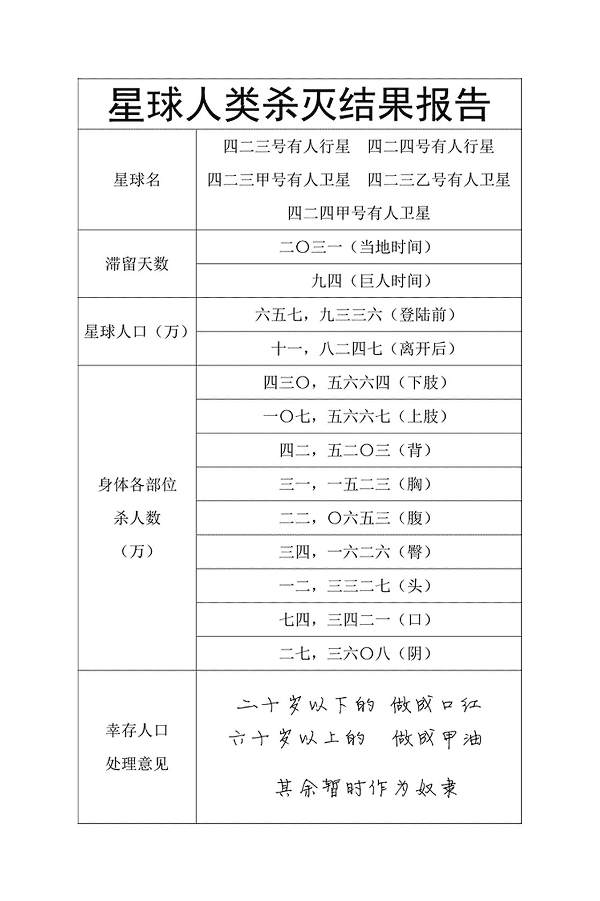

# 玩转星球（破坏·践踏·入阴·千倍级。09.02终章）

作者：sjw

TID：24985

 

# 1

*本帖最後由 sjw 於 2018-9-2 00:40 編輯*

**　　本文可谓是西方巨娘控名作家Grildrig小说《Love Child》的人称三转一版。****谨以此文，献给我所不愿流逝却业已流逝的三十年青春，和老一辈****巨娘控工作者们****。**

 

# 2

　　裸睡是一种健康的睡眠方式。对此我一直身体力行。

　　此时的我就在睡觉，浑身上下一丝不挂，睡得沉沉的，甜甜的。

　　只是，我所睡着的地方，本该是一片五六十层住宅楼的地方。双臂大咧咧的搭在两边的山脊上，将其足足压低了三四十米。

　　晨光照耀下，体毛上结成的露水闪着钻石般的光芒。同时闪着光的，还有手指脚尖上的粉红色美甲，表面点缀着被压成薄片的小车子，以及用一根发丝串起来戴在脖子上的二十多节有轨电车，车厢里一片血肉模糊。右脚脚脖子则是三架被两根发丝从机头和机尾串起来、可搭乘上千人的客机，机翼已经不翼而飞了。

　　随着太阳的升起，体表温度也逐渐升高，终于把我这头萌萌哒的大怪兽从美梦中唤醒了。

　　右手向前滑动，毫不费力的通过只比它高一点的树林，让手掌沾满草木的碎片以及不幸生物们的血肉。原本在里面栖息的鸟纷纷振翅高飞，在泛着红晕的脸颊旁盘旋。

　　我嘟囔着，诉说着自己不想起床，然后叹了口气，抬起眼皮，用蔚蓝色的眼珠凝视着山的另一边，嘴角上逐渐泛起一丝幸福的笑意，便开始舒展筋骨。

　　这是一次规模巨大的伸展，蜷缩在身边的左臂去会见右臂。右腿拉直，脚跟将整个山脊夷为平地。我欢快的哼吟着，猫起腰来，品味着自己一千六百二十七米高身躯紧绷着的每一寸肌肉。大地震动着，林木颤抖着，有如台风犯境。

　　我慵懒而轻松地翻了个身，凝视着蔚蓝的天空。结束了苏醒的过程，我收紧腹肌，忽地坐了起来，开始用手指梳理自己那一头蓬松的金发，把缠在上面的树木和瓦砾挑出来。随后扭了扭腰，双手抱住自己那修长的美腿，紧紧的。

　　花点时间欣赏大自然的美吧。远处，朵朵白云与世无争的飘着，大海波光粼粼。周围的旷野上，森林和山脉，湖泊和河流，整整一大片鲜嫩的绿。我决心把它们保持下去。

　　眼见自己昨天踩过的地方，我笑了笑，记起自己干的好事来。这座滨海城市成为我降临这个星球之后的第一个牺牲品，一夜之间就被抹去了。数千幢建筑和上百万小人儿以粉末为形态，分布在我全身的上上下下。哼，我就是这么强大，我就是这么任性。

　　蜿蜒的河流让我发现嘴唇很干。舔舔双唇，想起昨晚在明亮的月光下发现的一滩泛着银光的浅水。沿着河道，我很快就找到了它，便起身朝着它走去。

　　在湖前面，我停下脚步，双膝跪地，把脸往湖面贴，直到嘴唇感到一丝凉意。这湖光是深度就能没过我的半个拳头。我把成吨的水连同混杂其中的生命一并吸入嘴中，甘美的液体爱抚着喉咙。头发晃过面颊，落入水中，我两手一拢，把水泼到脸上，一边晃着头，一边笑，微卷的秀发随风飘逸着。

　　岸边一条细线吸引了我。当顺着这根灰色的线看到一排排高层住宅楼时，我不禁眉头紧锁。它们激起了我内心深处的愤怒。小人儿们实在好过分呀，把昔日可爱的天然风景破坏殆尽，取而代之的是一排排单调的建筑，其周围的灰色道路上，污染着空气的小车子蠕动着。

　　是时候清除这些垃圾了。

　　我一脚踩进湖里，随之形成的巨浪把湖面上的十几艘货船直接推上了岸，把湖畔的村镇夷为平地。第二脚就踩进了河里。

　　这条河是很宽的，就算是我，身高一千六的我，也没法一脚跨过去。就凭这一点，就可以想象沿岸会有多少座城市了。

　　我一边在河里漫步，一边惬意的俯视着自己双脚造成的巨浪把沿岸的厂房、村舍和高楼冲刷得无影无踪。如有必要，我会朝岸上踢几脚，用巨量的河水与泥沙把毁灭传播到更远的地方；这都不够的话，我那两只大脚就会急不可耐的上岸去收割更多的性命了。

　　可笑的是，杀到城郊时，我经常看见事先炸毁的立交桥，被几十辆有意横过来的货车堵塞的道路，甚至时不时看见炮火不往我身上打，反而往逃难的人群打。

　　显然，政府为了控制局势，竟干出这等事情。难怪沿着这条河八九天走下来，光是被我两只脚夺去小命的人就超过了三千万。

　　小人儿们，你们要是知道了这些，还会那么想保住性命吗？呵呵。

　　×　　×　　×

　　强烈的地震把他俩从床上抛了下来。他匆忙的拿起门口的毯子和枕头，他老婆则拖着沉重的睡衣，轻轻抚摸挺着的大肚子安慰着里面的小生命。

　　“什么鬼，”他喊道，“房地产商没说在这个鬼地方发生过地震呀！”

　　“但这感觉的确像一场地震，就像我昨晚跟你说的那样。“他老婆嚷嚷着。

　　“没错，这是地震。那我们赶快下楼吧。”

　　“电停了，”他老婆撅着嘴说，“我们得自己走下四十七层楼。”

　　“我知道，但说走就得走啊”，他笑着，吻了下她。

　　另一次地震开始摇晃他们近两百米高的住宅楼了。遥远的楼下，几乎所有的车载报警器都响了起来，人们大喊大叫。他诅咒着并安慰站在门口的她。

　　下一次地震之前，有一个长时间——其实也就几分钟——的暂停。此时他们都舒了一口气。当第三次地震波及到他们的时候，两人都被震了起来。墙皮大片大片的脱落。

　　“真蠢，”他咆哮道，“宝贝，我们得离开这儿，”他刚颤颤巍巍的站了起来，第四次地震又把他击倒在地。他突然为他的衣服在哪里散布在椅子上，可伸手时，他透过阳台的玻璃门发现了什么。这让他的下巴都掉了下来，他颤颤巍巍朝着门走去，开始摸索门闩。

　　“亲爱的？“他老婆有些抱怨的问道，“亲爱的，咋啦？把衣服给我啊。”

　　但他没理她。他伸长脖子，发现数里开外的高层住宅楼群已荡然无存，取而代之的是……

　　一只脚，一只尺寸比一块田径场还要大的嫩脚。这只脚嵌入大地。它的四周堆着三四层楼高的土。漫天粉尘之中，五只饱满的脚趾整齐的排成一排，趾甲盖放肆的闪耀着血钻般的光泽。大脚趾霸气的将趾甲稍稍仰起，其它四只脚趾则顺从的蜷着。

　　他跑到阳台，斗胆抬起头。纤长的雪腿之间，紧致的阴户恣意暴露着。穿过两座高挺的半球形雪峰的间隙，在金色的披肩蓬发之间，他终于望到了这副巨大身躯的主人的脸。

　　这张被紫外线微微晒红的俏脸本该出现在某个学校里，现在却高挂在云端。一双圆睁着的蔚蓝眼珠朝着他所在的方向转来转去。一阵热流在他的胯部蔓延，顺着大腿淌了下来。他觉得自己好被注意到了，可在那个距离上，一只螨虫怎么可能被注意到呢？

　　“我们得走了，”他小声说道。他听到邻居们的尖叫，以及汽车呼啸而过的声音。但已经太迟了。

　　他知道太迟了，因为我的右脚抬了起来，展示着肮脏的脚底。一段道路的遗迹依稀可见，上面一片暗红。

　　超过两百米长的脚掌朝着他那里缓缓降下，仿佛要让底下的万千将死之人多受些罪。他懊恼地觉得自己五脏六腑内的怒火被点燃了。他如此无助。他老婆乞求离开，但他朝天大喊，“赶快踩下来啊，婊子！”

　　我满足了他的遗愿。他双手护头，徒劳的企图逃避自己的命运。夫妇俩的尖叫声混合起来，周围骤然一片漆黑，他俩的头顶响起嘎吱嘎吱的声音，然后便是永恒。

　×　　×　　×

　　杀入城中的第一脚是右脚。它砸在一个路口，把十几幢三五十层高的住宅楼、上百辆车和上万人化为齑粉，还硬生生踩进五六十米深的地下。

右脚才站稳，左脚又飞了出去，落在一座学校的田径场上。脚后跟造成的冲击波把教学楼连同里头近千慌乱的学生和老师瞬间荡平。学校外面的也无法幸免。脚掌压迫地面形成的土丘把临近的三四个高层住宅区和近万人瞬间埋葬。这两步所形成的冲击波把方圆千米的上百幢建筑和超过六万人一扫而空。更多人被困在残败的楼房里，道路上，地缝中，忍着伤痛，眼看着我这双承受着上亿吨体重的脚欢快的左右扭动起来，眼看着更强的冲击波把更多的人杀死。

　　从脚底传来的快感在全身上下荡漾着，好像才被夺去生命的十多万亡魂要逃出我这直插云霄的身体。哼，伦家才不会让他们得逞呢。

　　我两眼一闭，牙齿猛咬住嘴角，屏住呼吸，绷紧肌肉。过了一会儿，这股劲儿才熬过去。

　　一想到小人儿的无助，我就感到一种甜蜜的刺激，不禁抚摸起咪咪来，纤纤玉指划过体毛，让我觉得乳头变硬了；它又来到裆部，在粘湿湿的那里划过来又划过去，在小人儿们眼中宏伟无比的娇体随之颤抖起来。一些微弱的痒让我感觉到了，那是爆在身上的炸弹。

　　这是多么奇妙的取乐，但我还要，要很多，要更多。

　　于是，我又迈起了步子。双臂在身边摆着，丰满的臀和胸不受拘束的晃着，从没想过回头看一眼散布在自己足迹周围的一片狼藉。

　　公路又黑又长，我故意走在上面，用自己那超过两百米长的脚丫子摧毁那些微不足道却为数众多的污染源——轿车、卡车和公交车。路边的高楼自然也无法幸免。

　　尖细的声音从下界传到了一千六百米的空中，那是数以百万计小人儿们的哀嚎。唉，你们这些连蝼蚁都谈不上的生物，怎么现在才知道害怕哩？我肉嘟嘟的脚丫子需要你们身上的脂肪来滋润喔。

　　×　　×　　× 

# 3

　　空空如也的车辆把路塞得满满当当，衣衫褴褛的人们哭喊着，拥挤着，践踏着，咒骂着。

　　她听着耳边的对讲机，两眼从未偏离步步近逼的庞然大物。影子每一次掠过都使她大气都不敢出。脚掌每一次落下都让她五脏六腑颤抖得更厉害。她听着街区居民的尖叫，望着高高在上的巨脸上显出的笑意，感到骨髓里透出的阵阵寒意。

　　那堪比山峰的巨人虽然每一步要花超过十秒，但对于千百万也只能用两条腿走路的人们而言，速度还是太快了。简单点说，巨人一步就能迈出六七百米，慢步的时速就超过了两百千米；可在这块遍布高楼大厦的平原上，哪里的人流时速能超过二十千米呢？

　她的右手食指轻轻搭在电磁枪的扳机上。她明白这是唯一能让自己感到安慰的东西。她反复呼叫着，希求这更多的支援，尽管明白这并没有什么用。毕竟，她不会看不见被阳光晒得发红的肌肤表面此起彼伏的橘黄色小火球，不会看不见那两只不时挥动的手臂把一些不幸的战机像飞蛾般打爆，不会看不见从那双眯着的蔚蓝色眼珠里射出的轻蔑。

　　我又向前迈了一步，刮起的又一阵强风让她变得惊慌失措。但她还是鼓足仅存一点勇气，开启机甲的发动机，让自己飞离楼顶，飞到四百米的高空，尝试履行作为战士的责任。

　　“小队，准备攻击！”她向队友命令着，全没发现本来有二十四人的小队现在已经只有十一人了。

　　可她再次惊呆了，只见一千米开外，我的右手缓缓滑向大腿内侧，食指和中指轻轻拨开自己下身的唇儿，向全世界展现那黑洞洞的巨穴。

　　同为一个性别的她骤然意识到要发生什么事。深吸口气，她强迫自己定下那颗没法定下的心，举枪对准洞里粉嘟嘟的嫩肉。

　　突然，从阴唇里发出震天的吼声，随即，一根液柱喷涌而出，强大的气流把她猛然吹了六七十米远。这无色的液柱热气腾腾，一下子就喷出千米开外，把一片四五百米的商务楼瞬间冲得灰飞烟灭。这液柱往左移动，把住宅楼、旅馆、酒店、学校、医院整片整片的冲得连地基都不剩。

　　四五分钟后，巨人终于停了下来。女孩尿液的味道在市区弥漫，一股麝香味，又散发着海水的腥气。近百万人直接死于尿柱，二百七十万人死于或正在死于尿液的洪水里。

　　在某银行办公大楼三十七层，她也缓了过来，心中的恐惧一扫而空，剩下的只有仇恨。她从一堆办公桌里飞了出来，在距巨穴五六百米的地方停了下来，对着它把扳机死按住不放，直到我搧起的左手把她拍死在食指关节处为止。

　　她给了我的阴部一点针刺的感觉。不，这感觉很爽，我用右手悠闲地拨弄着私处，兴奋得直哆嗦。我需要一些东西。环顾四周，这些东西遍地都是呢。

　　×　　×　　× 

# 4

　　“真是头不要脸的大畜生！“

在这幢不停颤抖的四百多米高的商住环厦的六十五层，望着那肆虐在楼宇之间、丰腴又不失肌肉线条的胴体，一个中年女职员肆无忌惮骂了起来。

　　不想挤在昏暗的楼道里徒劳挣命的她，回到办公室，站在窗边，想亲眼看看自己是怎么死的。

隔着两条街道，那双尺寸堪比田径场的俏丫子，每隔十几秒便把那些连巨人膝盖都很难够着的高层建筑，像枯枝败叶那样成片踩入五六十米深的地下。最新造成的火山般的巨坑里，脚踝周围尘埃滚滚，只有十个脚趾甲透出璀璨的艳红光芒。在不断输出着毁灭的同时，巨脸浮现着蔑笑，摆明了这一切都是故意的。

此时，巨人蹲了下来，用左手一把抓起两幢五六十层的商住楼。然而，因为用力过猛，两百多米高的建筑连同还困在里面的三千多人，瞬间就被握爆。

众目睽睽之中失了面子的巨掌恼怒的五指大张，往两幢大楼坐落的区域一压，并碾来碾去。七八幢大楼和上万人顿时灰飞烟灭。

余怒未消的巨掌往私处擦了擦，用手上厚厚一层瓦砾把残存的尿液弄掉，然后盘旋在空中。选中猎物后，便扑了下来，直指女职员所在的商住环厦。

巨掌先伸出食指，用突出指肉五米多的艳红美甲往环厦的六七层处一划。明白意思的她连忙往办公桌下一钻，接着便是一阵强烈的晃动。然后，一种好似电梯猛然上升的感觉压在身上。她往窗外看去，先是腹部若隐若现的马甲线，然后是两座突耸的雪峰。也是长期锻炼的她不禁赞叹这胴体的精致，但也倒吸了口凉气：她看到散布其间的无数微小的褐红色斑点，那是小人儿们的遗骸。

终于，晃动的幅度减小了。她起身回到窗边。仰望着那张脸，好似在百米开外从自己大楼的底部仰望着楼顶。

此时，足有三层楼高的洁白上门牙咬着透亮红唇的嘴角。眯着的眼皮里，碧蓝的瞳孔对着下方，但还是显得在用余光看着自己的猎物。雀斑在透着艳红的雪肤上若隐若现。

她那已经在学习怎么解齐次微分方程的女儿的脸，看上去也和这头巨人的差不多吧。但她从未见过自己女儿的脸上显出这样的轻蔑，就别说还带着些愠色了。

突然，上门牙松开了嘴角，放它往上扬起。这张脸开始有了些笑意，但还是掩不住轻蔑，毕竟头并没有低下来，好让巨人显得并不是在用余光打量环厦。

但一口好牙还是暴露着，显出残留在牙缝的钢筋水泥。她明白了自己的结局，脸上人色全无。

两排牙齿慢慢张开，一头粉嫩湿润的巨物伸出来，怯生生的轻轻舔起环厦的外墙，很快又缩了回去。

突然，狂风猛的把她连同整间办公室里的一切都卷进了巨口，落在了那头巨物之上。“是那头畜生的舌尖啊。”她想到。

穿过上下两排白厉厉的巨齿，她望着我左手的食指和中指互相搓着，弄去那幢环厦的残骸。想起还挤在安全通道里的上千人，想起同层的雇员、住户和幼教学校的孩子们，听着从身边垃圾堆里传出的哀鸣，她木然呆立。

但当又一幢大楼被两根巨指提到自己眼前时，她本能的躲到了牙齿的后面。又是一阵狂风，又是上百个无论生死的同类外加一大堆室内陈设的残骸落在了舌尖上。如是四五回。

终于，她盼到了终局。舌尖把上千个动弹不得的伤者还有他们的家当送上了臼齿，礼堂般的口腔顿时充满了血腥气。她则被口水送入食道，有幸得到活活融化在我胃里的命运。

　　×　　×　　× 

# 5

　　千把人太少了啦，根本压不住饥饿感。但又并不少，让我高兴得发抖，因为品味出了一丝人肉的味道。

　　我双膝着地，选中最前面一幢跟腰差不多高的大楼，用右手指尖往低楼层一划，左手一推，大楼便向后栽去，砸倒了另一幢大楼，哈哈，又是一幢……不一会儿，地面就躺倒了十几幢摩天大楼。

　　看到高层建筑群的溃灭，听到我的笑声，主干道的人流更挤了。时辰已到。我食指中指一并，指尖沿街道一划，便伸进嘴里。一舔，满口的肉鲜。嗯，我还要。哪里哭喊声大，指尖就往哪里碾，嘴巴就往哪里舔。小人儿们，身处食物链低端的感觉如何呀？嘻嘻。

　　上面的嘴儿填满了，可下面的嘴儿还饿着。何况在用餐的过程中，一幢幢高楼把我乳头都撞硬了呢。

　　我要，我还要，我还要更多喔。

　　×　　×　　×

　　市中心。

　　这是全城最高的大楼，超过千米的高度才使处于顶层的他可以望见全貌。

　　此时的他往正瘫坐在黑色真皮沙发上。右手无奈的把双眼遮住。显然，他明白我正在以他所在的商住一体式建筑为轴心，绕着一个越来越小的圈子。

　　可供出逃的通路以及水电气的主要供应管线早就中断了，只有装在大楼上的太阳能电池板还能提供些许电力。

　　才把二百四十万人吃掉的我显得元气十足，阳光充满敬畏的把那蒸腾着热气的白嫩肌肤微微晒红，导弹爆炸所形成的闪光，让直插云霄的娇躯增添几分健壮。绵长卷曲的金发随风飘逸，圆润而高挺的巨乳无拘无束的晃着。沿着城市的边缘，丰润修长的双腿慵懒的迈着步子，脚趾甲如血钻般闪耀的脚掌，把数百米高的大楼整排整列的撞倒踩烂，恰如砍瓜切菜。时不时俯身随手抓起几幢，擦碎在自己的巨体上，或者揉成球形后一丢，使其沿着街道一路碾过。千百万人哀嚎着，可他只能从微扬的嘴角看出，我对此的快意和不屑。

　　×　　×　　×

 

# 6

　　机场快到啦。

　　几百万人在往机场涌，活着到达那里却好难啊。

　　老老实实走机场快道的话，会被我的脚丫子干脆利落的带走；

　　自作聪明走小路的话，我随意踢爆几幢公寓楼，雨点般的瓦砾就将杀灭一切。

　　终于，我的影子笼罩着机场。

　　一切还是那么套路。

　　小人儿们往候机楼挤，灰压压一大片，就像丧尸一样。楼里的倒没几个敢往跑道上走了，应该是看到跑道早已被相撞客机的残骸堵住了吧。

　　我抬起右脚，先用手搓了搓脚掌，把粘贴在上面的脏东西清了清，便盘旋在候机楼前广场的上空，逗了逗下方的小人儿，就把前脚掌径直砸在候机楼的东边，再往西缓缓拖碾。

　　楼里的人们开始往机场上涌了，但楼前广场的出于惯性还在往楼里挤，于是被我的五个脚趾碾过。

　　候机楼主建筑被夷平后，我让右脚停下，然后往人最多的地方缓缓降下脚跟，把拍打着我脚皮的小人儿们整排整排碾爆。四处喷溅的残肢断臂，加上我从手上不时抖落的建筑瓦砾，使得人群更加拥挤。于是，当右脚再次抬起时，小人儿们又涌进了那片修罗场。而当他们填满之后，脚跟便再次降下……

　　右脚跟第四次抬起后，我抬起右脚，用左手中指和食指的靓甲去刮脚底粘着的肉酱，然后往嘴里送。嗯，二十多万人血肉混着我脚味，真是别有风味呢。

　　好东西要知道分享喔。我把剩余的肉酱推在广场上，左手把机场的残余建筑夷平，右手用指尖戳死百十号不愿品尝我的恩赐的人以后，其余人都吃了起来。我便饶有兴致的盯着那堆肉酱一点点消失。

　　我并不想让幸存者死，但也没觉得有必要让自己将要着地的膝盖避开他们，毕竟清理跑道要紧啊。我捏起一架架客机，把装着发动机和油料的机翼撕掉，再切去整个机头，把千百名乘客倒在舌头上，最后把机身用发丝串起来，系在额头、大腿、脖子和手腕脚脖子上。

　　喂，那些想趁乱跑掉的，我现在像不像野生的女孩呀？还有，看没看见我这双拳头哇？

　　×　　×　　×

 

# 7

　　他望着我，右手握着自己的小兄弟，它不可遏制的坚硬起来。这应该是雄性小人儿们死前的固定动作吧。

　　此时，我的右手也滑向了大腿内侧。我低下头，让自己那圆睁的双眼看着这座城市，所有厂房，所有道路，所有自称坚不可摧的摩天大楼。

　　我双臂伸展，通天圣体旋转起来，挺拔的巨乳旁若无人的来回荡漾，血红的美甲显出更为夺目的光芒，肥嘟嘟的脚趾以比之前更大的力道撞向地面，空前强大的震波随之排山倒海的传向四方，让地上地下的三千多万人寸步难移，只能互相拥抱着，哭泣着，等待最终裁决。

　　裁决无情却公正。即便上千米的大楼，即便两百米深的地道，即便身怀六甲的女人，即便年岁过百的老者。猛然明白这一点的他，眼睛里冒出火来，那应该是发现我早已把他家夷为平地。他的女友及其二三十名托管儿童注定成为二百多米长巨脚掌纹上的又一小块红斑。但他只能暗自哭泣。毕竟，这慢节拍的舞蹈不是他能停下来的。

　　谢天谢地，我终于停了下来。他弯着腰，喘着粗气，然后继续从窗边观望着。

　　整座城市又空旷了许多。四周升起淡淡的青烟。我屹立着，好像一幢傲视天下的大楼，无法撼动，坚不可摧。右手轻抚巨乳，左手食指伸入下体的唇儿，把里面黏糊糊的大楼残骸掏出来，以迎接新的玩物。我眯着的眼睛打量着他所在的大楼，他从我略微扬起的嘴角明白了自己的命运，便直接瘫在了地上。

　　×　　×　　× 

# 8

　　这幢高度竟敢超过我大腿根的摩天大楼现在需要装点一下，为数四五十万的人流把这幢超过三百层的大楼当作归宿，只是因为我以爬行的姿势在四周肆意杀戮，逼得他们往大楼方向盲目逃窜。

　　需要用些法术了。我双眼射出浅红色的光，把小人儿们整片整片提升到半空，然后往大楼空荡荡的中高楼层里塞。结果，大楼很快多了超过十万人，成了一根……噫……肉肠。

　　我整了整金光闪闪的乱发，欣赏着我的杰作，伸出那近千米长的美腿，用脚趾逗弄着它。这双腿可是我的骄傲呢。在清理其它星球的时候，我有时会先沿着海岸线跑个步，让腿部肌肉得到锻炼，使其线条显得更加靓丽。顺便摧毁港口码头和沿海大城市，把小人儿尽可能多的封锁在内陆——如果他们没有当时就被连绵的强烈地震十几万几十万杀死的话。

　　不，我的脚可没碰着大楼，毕竟没有哪幢建筑受得了它哪怕最轻的撞击。我收回腿，双膝跪地，往大楼那边小心翼翼的拖动着小腿，然后伸出右手，让食指轻轻碾过楼底的人群，再把粘在指尖上的血肉抹在或者用大拇指弹在外墙上，吓得每层的人流纷纷把更多窗边的同类从大楼挤下去，落在地面的人流头上。大楼现在像一根血肠了，呵呵。

　　太阳早已落山，周围却没有暗下来：探照灯和枪林弹雨的火光让整座城市恍如白昼。我缓缓起身，让无数弹药倾泻在全身上下，那种感觉恰如风沙轻抚着肌肤。

　　它们是为一场史诗级的表演准备的，而我准备好了喔。

　　开始插楼吧。

　　我先用手截掉一二十层，随便一扔，然后放在膝盖上，下体缓缓接近大楼。唇儿一碰到楼顶，我就不禁发出了一声娇喘。唇儿张开时，我低低的呻吟着。闭上眼，以便更加专注于那个又硬又厚的东西。拱起背，左手抚摸巨乳，右手穿过金色的发丝。双臂高举过头。大楼的外墙用最好的方式抚摸着敏感的淫肉，让我兴奋地叹了口气。

　　我停了一段时间，只是为了享受内心深处那种无敌的感觉，绷紧阴部周围的肌肉，我敏锐地意识到，玩具里面的小人儿数以万计；玩具外面的小人儿数以百万计。这是一种令人陶醉的念头，充满了情欲的力量。我又挤了挤阴道，测试着大楼的强度。嗯，这么高的大楼就是比一般的商务楼住宅楼好啊。

　　×　　×　　× 

# 9

　　他从窗口摇摇晃晃地走了回来，又呕又气，由于望见了遍布我阴唇外部的鲜亮红斑。那是此前从沦为性玩具的大楼里被甩出来的小人儿们的尸骸。

　　大楼又一次更为强烈的晃动终于让他想起来，自己该逃命了。

　　他摇摇晃晃地站了起来。当大楼晃个不停时，做什么都得靠墙支撑着。当来到电梯门前伸手按下按钮时，他猛然想起，这并没有用。他四处寻找，找到了逃生通道，然后紧张地往下走，来到熙熙攘攘的人群中。人群不自然地保持沉默。所能听到的都是无数回响的脚步声，在大楼摇晃时偶尔发出低沉的呻吟声或呜咽声。

　　这条线突然停了下来。人们挤在一起，互相挤着喘着气。他站在栏杆旁，向下瞥了一眼，看到的是不间断的人影。

　　“他妈的咋啦!”一个女人尖叫着。在楼梯井里，一个回答从更深的地方传来。

　　“我们没听到，”他喊道，“到底咋了？”

　　“出口堵了！”妇女们用颤抖的声音喊道。

　　不顾人们的打骂，他强行穿过拥挤的人群来到下一层，又逆着人流挤进一间会议室，却发现这里也是人满为患。看来，往下走是没有希望的。

　　会议室豪华气派，有精美的书架，宽阔的窗户可以眺望市中心。但他现在更喜欢看我那挡住了视线的右大腿，而它光是横向尺寸就与摩天大楼的不相上下。肌肤表面热气腾腾，逼着他发狂的脱去身上的衣服，只剩内裤。一根根四五米长的汗毛周围，透明的液体从紧致毛孔里沁出，若隐若现的血管，让肌肤显出雨花石般的纹理，使人百看不厌。

　　大楼晃了一下，天花板的墙皮噼噼啪啪地落下，砸在人群身上，但他仍在盯着巨腿看。在一阵更猛烈的冲击下，大楼又晃了起来，让他撞在别人身上。当他颤颤巍巍站起来的时候，应急灯惨白的光亮映照着我的大腿内侧，他满脸恐惧地盯着它。大楼里传来低沉的隆隆声，地板摇摇晃晃。他的眼睛睁得更大了，因为窗外出现了光滑的肉壁。震动增加了，房间里响起了越来越大的雷声，就像一件不可阻挡的巨物在大楼的外墙上拖行。只剩玻璃渣的窗框外，厚厚的白色粘稠物体滑落下来，它散发着的味道，让他脸上泛起了红色。他在无助的恐惧中僵住了，因为应急灯照亮了我那皱巴巴的柔软巨唇。浓浓的湿气在大楼里飘散，附在墙上，那麝香味无法逃避，使人陶醉。一个玩笑般的挤压把那块厚实的皮肉紧贴在大楼外墙上。房间那一头的天花板和地板塌了下来，把他和他的几百个同类暴露在巨大的阴道面前，我的花蜜注入了房间，向他们涌来。

　　他们从不停止挣扎，但地面上的汁液很滑，他嚎叫着，身体在地板上滑动，手抓着其他人的衣服，直到把它们扒下来。大理石砌成的地板开裂了，破碎了。当我滚烫潮湿的淫肉越来越近的时候，他的眼睛睁得大大的，痛苦地呜咽着，身体抽搐着，眼看着房间里满是破碎的石头和劈啪作响的木头，听着人们的哭喊在房间回荡。

　　光是这次收缩，阴道就瞬间压碎了十几个楼层和超过两千人。其中五六百人被淫肉紧紧压在墙上，挤出肺里的空气，碾碎肋骨，直到身体一个个被挤爆，血肉溅在淫壁上。挤在安全通道里的人则被墙壁压碎。嗯，感觉好好喔。

　　×　　×　　× 

# 10

　　每次用淫肉挤压大楼时，每个楼层都会以一种令人愉快的方式爆裂开来，但它的核心仍是一个坚固耐用的玩具。我的心怦怦跳着，想象着阴道里那些微小的男男女女正在经历什么，脸和乳房泛起一抹暖色。

　　随着越来越多的需要，我狠狠骑着摩天大楼，甩了甩头，让蓬松微卷的长发飘起来，但我最喜欢凝视的是那些挤满街道的小人儿。灰压压的，还真像虫群呢。马上就收拾你们喔。在我身体里，一种奇妙的紧张感正变得越来越紧，这是一种甜蜜的性急迫感，是由那座小小的摩天大楼的感觉所激起的，它在我下唇上来回滑动。我幸福的哼哼着，用力晃着，把很多人从大楼里甩出来，成为粘在我腿上的小红点点。

　　然后，高潮把我带到了幸福的顶峰。

　　我呻吟着，阴道把大楼拍打着，挤压着，把墙壁向内压着，钢梁扭曲，钢筋混凝土破碎，它的声音嘎吱嘎吱的声音通过她的身体发出一阵纯粹的快乐，让我变得狂野起来。

　　我倾身向前，把大楼从连着地基扯下来。我一千六百米高的身躯倒在了市区里，两百多幢商住高楼以及里里外外六十多万人瞬间被胸部、腹部和双腿一视同仁的压碎。超过一百万人被震死。我兴奋地扭动着双腿，十个美甲齐齐闪耀着红钻般璀璨的光芒，在钢铁和砖石建筑的轰鸣声中把一排排大楼撞得粉碎，恰如雪崩一般。当身体翻到大片生活区的时候，手指急切地寻找着阴蒂。再次翻滚的时候，一团尘土飘散到空气中，金色的乱发飞扬着，小人儿们在哪里尖叫，我的身躯就碾过哪里。每一次破坏和杀戮都激起我的性高潮，给予我无限的力量。全身的每一寸肌肤都感觉到了不堪一击的微小结构，每一个毛孔都塞满了无辜又卑贱的灵魂。好爽喔。

　　当快乐终于开始消退的时候，我蜷缩起来，紧紧抱住大腿，尽可能长时间地保持着美好的感觉。然后用颤抖的手划过脸，掸去那乱糟糟的脏东西，我坐了起来，环顾四周。

　　太阳又在不知不觉之间升了个老高，这座本来有六千万人的城市看上去焕然一新。几缕青烟怯生生的从废墟中冒出头来，但这片广阔的区域却一片寂静。没有吵闹。没有警报。没有只会尖叫的小人儿。我甜甜地笑了，慢慢地站起来，拍打着身子，把粘在肌肤上的脏东西弄掉。我沐浴在温暖的喜悦之中，向那些一直陪伴着我的战机送去一个飞吻。但现在得洗个澡，弄掉身上的脏东西。

　　×　　×　　× 

# 11

*本帖最後由 sjw 於 2018-7-21 21:19 編輯*

　　他望着我，通过瞄准具，两眼射出愤怒却绝望的眼神。

　　对身高一千六的我而言，来到这个星球不过一天而已；但对他这种小人儿来说，我降临这个星球已经快一个月了。

　　他自己更是度日如年。毕竟，亲眼目睹自己全家被杀可不是什么好受的事情。

　　第六天的时候，我来到了他家所在的城市。

　　这里有四百万人口，在那个星球勉强算的上中等城市了，实在没啥有趣的东西。好像连一幢高过我膝盖的建筑都没有吧。我也没打算在那里花时间的啦。一路踩平就行。

　　他的飞机满载着弹药，与战友组成大编队，向我飞来。

　　此时的我，更加有杀伤力了。

　　对小人儿们来说，我散步时，本来迈一步就超过六百米，得用差不多十二秒。现在一步有七百多米，却反而连十秒都不用了。对此，他可以从驾驶舱仪表上看出来，我时速现在超过三百千米了，本来不过二百千米出头的。

　　一眼望去，十几千米开外的我显得既丰美又刚健。沾满风尘的红润巨体看得那些微不足道的小虫子血脉偾张。一双近八百米长、水润匀称的秀腿与空气摩擦更为剧烈，发出更为巨大的轰鸣。随着加快的脚步，超过三百米长的金发飘逸着，更显狂野不羁。乳白色的稠汁不时从含着一幢圆柱体的大饭店的下唇里滴落下来，里面充满了寻欢作乐的房客们的残肢断臂。

　　大编队散开了，战机分头攻击。在我看来，就像捅了马蜂窝一样，身边聚拢了大量小虫子。小小的烟花在全身上下此起彼伏。

　　他选择从背后下手，便绕了个大圈。这时，他不由自主的被沿途的情景所吸引。

　　而所谓的情景，就是大片只有我那超过两百五十米长、深达五六十米的巨坑。鳞次栉比的摩天大楼？熙熙攘攘的大街小巷？不存在的。他不禁倒吸了口凉气，又往前看去。

　　他往我的右肩一口气打出去十几发导弹，有几发被发丝诱爆了，其余的也就稍微弄脏了肌肤而已。粉嫩剔透的玉足照样在楼宇密集的市区玩耍着，把商务大厦居民楼整排整排压成粉末，整片整片夷为平地，将挤在街道上的可怜虫人几万几万踩成肉酱，像灰尘一样被震飞，或者被消失在建筑瓦砾的海啸里。掌纹里，趾缝间，瓦砾与尸骨积压了一层又一层，原本红钻般闪耀的趾甲也因为沾染了粉尘而黯淡了许多。杀戮的快感从脚底传来，在上千米高、过亿吨重的巨体上下来回震荡。让我如醉如痴，如癫如狂。

　　突然，我停下脚步，蹲下身子，双手伸向前方的楼群。左手抓起一幢高度过百的淡黄色住宅楼便往身上擦。在我半径超过四十米的半球型巨乳和马甲线右侧肌肉摩擦之下，严重变形的钢筋混凝土发出的凄厉惨叫压过了两三百名住户的哀号。马甲线两边的毛孔，被细碎的瓦砾填满。腹部弥漫着淡淡的烟尘。

　　右手抓住同一个居住区的另一幢住宅楼，缓缓送到巨脸的前方。几个阳台上出现了人影，他们发出尖细的声音，求饶还是谩骂？无关紧要了。他们眼前是修长的玉颈，下方一片酥胸如凝脂白玉，七八架客机的机身整齐的列在胸前。往上看，脸颊泛着桃红，深邃的眼窝里那双微眯的蓝眼睛，射出的只有高傲与不屑。我的左手靠了上来，食指一弹，砸中了一个阳台，红钻般璀璨的美甲瞬间将上面的一个孕妇打得尸骨无存，冲击波把躲在房子另一端的三岁小孩扫出了楼房。楼下隔着三层的两个七十多岁的夫妇被落下的天花板砸死。楼上一家人则冲破了天花板，大大小小四具尸体卡在了楼板上。我猩红的嘴唇一扬，露出一口整齐洁白的牙齿，以及笑容，带着彻入骨髓的轻蔑。

　　见状不妙，两人直接跳楼自杀了，其他人都跑出了阳台。但我怎么会这么快就忘记哪些阳台曾经有人呢？食指一一点名。整个居民楼很快千疮百孔。

　　玩完之后，我五指慢慢合拢，大楼很快如摧枯拉朽般被粉碎了。稍微使劲，瓦砾连同住户的尸骨被压在一起。

　　然后，玉臂在空中划出一道靓丽的曲线，就把大楼扔了出去，朝着战机最多的空域。

　　顿时，超过十架战机被瓦砾直接砸爆，另外六七架则撞毁在瓦砾雨上。

　　很快，第二幢，第三幢……随着通天巨臂把一幢又一幢大楼扔出去，方圆五十千米的空域很快清静下来，四周远远近近升起六七十柱黑烟，那是他战友的坟墓。

　　其它战机费尽浑身解数逃离了战场，他也身在其中。他开启自动驾驶，回头眼睁睁望着我站了起来，给辛苦的他们送去一个飞吻，便伸出右脚，用粉嫩剔透的脚背把两个居民区十二幢高层住宅楼统统撞毁，在脚趾把一座幼儿园和躲在里面的近千名师生家长全部犁平后才暂停下来。我那灿烂无邪的笑靥，还有那红钻般夺目的大脚趾的美甲，这一幅自己家乡和上下二十几口人的末日图景，他应该一辈子也忘不了的吧。

　　对了，他们的生命很短暂的说。

　　现在，他又要去飞蛾扑火了。

　　×　　×　　× 

# 12

　　记得小人儿们喜欢拍怪兽片。当怪兽出现时，大部分民众总是能井井有条的及时疏散掉。

　　现实中，这当然是不可能的啦。

　　比如这里的海岸线，眼下就乱成一片。

　　逃难的人们把沿海城市带堵了个水泄不通。

　　港囗码头尤其人满为患。

　　然后，我出现了。

　　这没有污染的高空空气，由我一人尊享。

　　这时缓时急的高空气流，敬畏的轻抚着我全身的体毛。

　　这浑浊的海水，殷勤的微微拍打着我的脚踝。

　　这微小的飞虫，远远的打出一些小东西，飞到我身上，发出无关痛痒的点点火光。

　　而我，只是在离岸五六百米的近海散着步，用激起的四五十米高的波浪把滨海城市冲刷掉。

　　要是不够的话，就飞起一脚，用海水和粘在脚上的泥沙把它们砸毁。

　　如果还不够，就用手挖起海底的泥沙，抛向它们。

　　当然，也有几千万幸运儿得以品尝我那双咸腥的大脚片子。毕竟，超过两百米长的脚底是经常需要万千高楼的钢梁砖墙去按摩、亿万人的血肉去滋润哒。

　　在海边，意外的惊喜时不时便能撞见。

　　那就是小人儿们的船呀。

　　尺寸不合我意的，稍微弄点波浪就沉了。

　　合我意的嘛，长度起码要超过两百米，也就是我手宽的一倍半。

　　这样的船，无论原来是装货的还是载客的，现在里面都起码有七八万人，真是薄皮大馅呢。

　　一发现它们，先得小心翼翼的接近，再小心翼翼的抓起来。满甲板受我惊吓的人把自己的同类像灰尘一样挤落千米高空，从船舱里传来的沉闷的哭号，这些都让我的心好痒痒的呢。

　　开动啦。

　　先用舌尖把甲板上的人成万成万收入喉中，就像舔蛋糕上的奶油一样。

　　再用牙齿把船一口一口拦腰切断，嚼碎后咽下去。

　　这样，两百四十多艘船和里面一千八百多万乘客成为了我的食物。肚肚鼓鼓的。

　　不知不觉，又消灭了两亿七千多万人酱紫。小人儿们的命还真是贱呢，嘻嘻。

　　终于，当所能看见的最后一片城区被一只直径超过六十米的泥球砸毁以后，我插着腰，最后望了一眼大陆，微微一笑，便头也不回的往大海深处走去，只留下大片大片废墟，从中怯生生冒出的缕缕青烟，恰似那已经逝去的二十一亿四千万个小小的魂灵。

　　我的脚丫子在一片诱人的水面上走来走去，一边戏水，一边欢笑着，直到海水没过膝盖，我的巨体才能完全沉浸其中。

　　当我的左手把下唇分开，右手食指开始掏那个里里外外沾满瓦砾尸骸的小洞时，大腿上有一种清凉的抚摸，可以洗去灰尘，抚平大腿间的火。我缓慢而自信地游着，漂浮着，微蜷的金发像海神的长发一样在水中伸展开来。我一边打瞌睡，一边微笑着回忆当天发生的事情，无忧无虑地漂泊在这世界上。

　　所以，当左肩感到被轻轻拍了一下时，我有点惊讶。一只眼睛懒懒睁开，在身边搜索着。

　　它看到了东南方向的海天交接线上大量的小黑点。

　　那个方向，应该有大舰队。

　　决战吧，害虫们。

　　×　　×　　× 

# 13

　　站在舰桥上的他，放下望远镜，笑了起来，前仰后合着，像一个孩子。

　　能把山打个对穿的弹药。

　　能把亿万生命毒死的生化烟雾。

　　能把方圆百里的一切转瞬化为乌有的炸弹。

　　几乎什么用也没有。

　　除了爆炸的强光偶尔能让我眨眨眼。

　　远远看去，我就像一个海边玩耍的普通女孩。

　　每一根毛发都闪着光芒，每一条曲线都显出壮美。

　　整个胴体透着小麦般的光泽。

　　丝毫也不像一头在一个月里就杀死了超过十三亿人、夷平了上百座大中城市的巨兽。

　　他的眼睛不时打着转，防止被我那两只傲视大地的巨球和清晰的马甲线钩去了魂魄。

　　尽管整个舰队以超过两百千米的时速前进着，我却能以高出一倍的时速前进。

　　但这还是慢了。

　　于是，我一头扎进了海里。

　　他马上命令整个舰队开展水下攻击。

　　命中率非常高，却并没有妨碍侦测大屏幕上，一个巨大的人形以将近六百千米的时速冲向舰队。

　　他感受得到我的降临，就凭越来越晃的船舱，晃得连他这种老水手都不禁上吐下泻起来。

　　而当航母的晃动幅度骤降下来的时候，一丝不详的预感让他不禁打了个寒颤。

　　突然，舰队最前面的那艘战舰离开了海面。

　　让它缓缓升上半空的，是一只手，一只纤细又毫无杂质的手，它微泛着冷意，似是没有温度一般，透着彻骨的寒冷。它抓着战舰的中部，宛如章鱼的触手。

　　战舰的炮塔乱转着，漫无目标的打着炮弹。它的同类也对着这只手开炮。

　　当然，毫无作用。这只看似纤弱的手展示着自己的刀枪不入，任何武器也无法蹭破哪怕一点皮。而当这只玉手使劲的时候，战舰的船体发出无助的哀鸣，玉指轻松的把舰桥连同船员压碎，最终，战舰在越来越紧的拳头里爆炸了，舰首与舰尾的残骸从手上掉落，沉入海底。

　　与此同时，编队前部的另一艘战舰突然向邻近的友舰撞去！顿时火光冲天。在一片火海中，只见那艘战舰的中部被两根手指夹住，指甲闪耀着红钻般的光芒。

　　当舰队陷入混乱之时，不远处的海面，猛然冒出一颗巨大的头，接着是双肩，双乳，腹部，阴部，双腿。

　　我，终于再次现身了。

　　最前面战舰的船员只能看到巨乳的南半球，大滴海水纷纷从乳头附近坠落，把这些战舰直接砸爆。战机军舰纷纷对着巨大的胴体射击。这当然毫无用处。而我甩甩头，大量的水滴就把它们打爆了不少。

　　我缓缓弯下腰来。然后猛的张开眼，他不禁倒吸了口凉气，这双澄澈的蓝眼睛充满了红血丝，一看就杀气腾腾。

　　果然，随即，我右手一拳打爆了一艘战舰，左手抓起另一艘，便往私处插去。阴部深处的淫肉把舰内弹药挤爆了，爆炸刺激着阴道，让我更加狂野，抓起一艘战舰就往阴唇上来回摩擦。战舰瞬间就爆了。

　　十几艘满载平民的无武装客轮？嗯，百万人给我当加餐，还真是体贴呢。我先用双手把两艘客轮小心翼翼的举起，尽情享受小人儿们那绝望的哭号，再伸出舌头，轻轻舔去甲板上绵延的小人儿，接着，用上门牙轻轻啃掉客轮一块外壁，就可以把躲在船舱里的小人儿们轻轻吸到嘴里了。一嚼，满口的血腥味，我喜欢。

　　舰队边缘的小船啊，觉得离我远就可以逃掉吗？我抄起临近的战舰就砸了过去，把它们一一

　　很快，海面到处是燃烧的残骸，海上成片成片飘着深红色，那是船员的鲜血。

　　一百六十七比零。

　　就算是最强大的舰队，也不免这个下场。

　　这个战绩，在我的胸前就可以看到。

　　那是半截航母的飞行甲板。长宽各一百多米。上面二三十架飞机清晰可见。甲板背后，是六十多架战机、三十多艘战舰。被压成五米厚的薄片。用我的头发串了起来。

　　还有半截在我手上，等会系在左脚脖子上。

　　对了，他，舰队司令，应该也在里面，和他的超过四万名下属一起。

　　有创意吧？嘻嘻。

　　天际线上，出现了海岸的线条。应该是另一块大陆吧？又可以胡闹一番了。人家的脚丫子急不可耐的蹉起脚趾头来了呢！毕竟，这个星球上的几百亿小人儿，绝大部分要被它俩处理掉啊。

　　×　　×　　×

<ignore_js_op>

**星球人类杀灭结果报告.png** *(294.81 KB, 下載次數: 4)*

[下載附件](forum.php?mod=attachment&aid=NzM5NzB8NmFmZTkxZjN8MTYwMDg4NTYwMHwxODIzMHwyNDk4NQ%3D%3D&nothumb=yes)

2018-9-2 02:37 上傳</ignore_js_op>