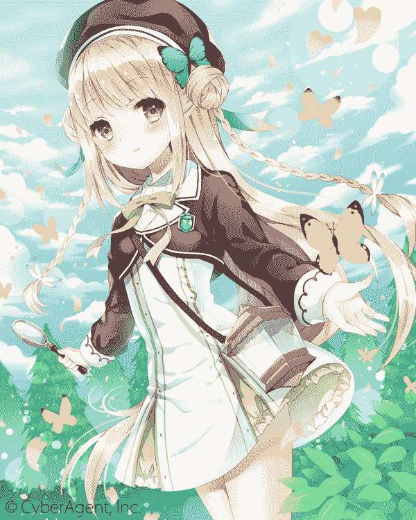
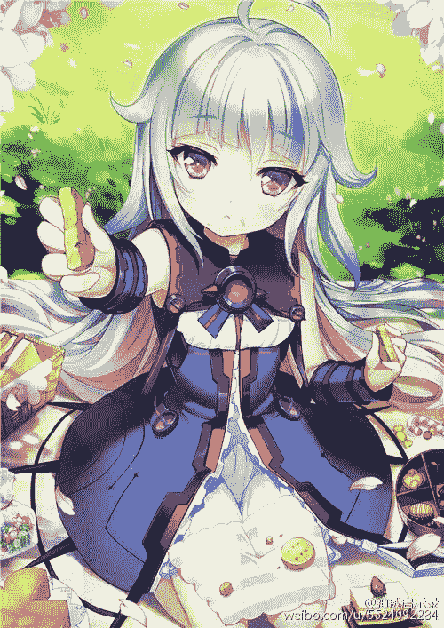

# 白樱的日常（暂定）

作者：琉璃

TID：22170

<title>1</title> <link href="../Styles/Style.css" type="text/css" rel="stylesheet">

# 1

*本帖最後由 yuxiaoqiu 於 2017-8-26 11:22 編輯*

在偌大的房子里，有一个可爱的小女孩，小女孩可爱极了，如果一动不动就好似玩偶一般，不过……“玩具酱！，来玩吧！”一只身穿粉色洛丽塔样子的可爱8岁小萝莉，对着脚下1cm的23岁男性进行的残暴的控制，巨大的脚丫夹起男性的脑袋。“举高高啦！”小萝莉抖动着可爱的脚丫，带领着男性左右摇摆。想哭？想死？我不知道男性的想法， 我只知道的是，这个可爱的8岁萝莉，却已然成为他的主人，控制者，男性身为人类的权利，在萝莉的脚下荡然无存。或许他分恨这个世界的不公吧。确实这个世界就是那么的不公。“玩腻了呢。有点冷的说”小女孩笑了笑，夹着男性的脑袋，坐在地上，连同着男性一起，套上了粉色的过膝袜。“我回来了，一声甜甜腻腻的幼女声。打破了女孩的笑容。”-------------------“我回来啦！妈咪，妈咪，今天丽萨丽萨很乖哟。妈咪人家可以吃糖么？。”“可以呀！““哇谢谢妈咪！”女孩飞奔冲进了房子里。笑着玩起来娃娃。轰隆隆”地震？不，小女孩头上的巨大房盖掀了起来。一只巨大的手伸了进来。“小姐姐乖不乖呀！”一只4岁的幼女抓着玩偶，一身全是粉色的玩偶。不，仔细一看，这却是那只可爱的小女孩。女孩挣扎着，但似乎在巨大的幼女面前丝毫没有任何用途。“所以说，丽萨那么乖，今天妈咪就允许丽萨吃糖了。”幼女笑着，握着小女孩。走到了桌旁。桌子上摆着一盒细细的糖沙。“先把姐姐舔一舔“幼女啊呜一口就把小女孩的脑袋含在的嘴里。小巧的舌头在女孩脸上尽情地涂抹着，女孩只能无力的挣扎，发出呜呜的声响。“噗哈~“幼女在含了近一分钟后，终于把小女孩弄了出来，大量的唾液粘在女孩脸上，细细的唾液丝连接着幼女的嘴角。“这样就可以蘸糖啦！“幼女笑着，在女孩的绝望下，毫不犹豫的把女孩塞进了糖罐，还在里面搅了搅。对于小女孩来说，糖就如沙子般。磨损着女孩的脸蛋，再加上糖果本身的裂口，更是划伤了女孩的脸蛋。“啊！沾了好多糖呢~啊呜！”在搅完之后，幼女又立刻将女孩塞入口中。“跳跳糖好好吃！！”霹雳巴拉的声音从嘴里传出。还略带着微弱的惨叫。在幼女的舔舐下，女孩连痛苦的喊叫都发不完整。脸上已经是蹦着流出鲜血却被大量的口水无情的冲刷着，舌头触及着伤口，又使得女孩痛不欲生。“再来些！欸嘿嘿”在女孩未反应过来时，女孩再次被幼女硬塞进糖沙之中，伴随的搅拌。白色的糖沙开始微微发红。-------------------叮~叮~几声巨响，如同防空警报一样，“丽萨好好在家呆着~”厨房里，丽萨的妈妈慌忙地放下手中的活，快速的叮嘱好女儿后，飞奔到街上，之间街上已经人满为患了。少妇快速的找到了一个空闲的地方。虔诚的跪了下去。“咚！咚！”巨大的声响从远方传了过来，人群静悄悄的，这更显着巨大声响的与众不同。“嗯…………咚！”一只巨大黑色女性运动鞋从天而降。乍一看小巧的运动鞋。却以异常的比例存在于人世。没错，跪拜下来的人群竟然都没有一只明显是给小学生准备的运动鞋高。众人们无言的沉默着。无言的接受着她们的渺小。远处，蓝色长发女孩子，以急速走来。咚咚溅起几十米的尘埃“一京，你怎么出来了。”在无言的沉默人群中，突然传出一声细小的呼喊声。说话的人及其小心，低语。然而似乎依旧被发现了。“咚~”两只运动鞋合拢在一起，也说明脚的主人停了下来。“筛选~”一声半睡不醒的喃喃自语声，巨大而又低沉，甜美而又敬畏。语罢，几十名男性女性，被魔法阵带出了人群，漂浮在女孩的周围。“主人， 主人对不起~虫子不是有意打扰………“”对不起请原谅我们吧！”“都是这个家伙的错，主人！主人“一瞬间，求饶声，炸裂开来。女孩皱了皱眉头。并没有说什么。然而这次，一群小孩子被魔法阵揪了出来。“其中就包括那个叫一京的男孩““请不要！！”“一京！“”求你了！“求饶声更加响烈。然而女孩却轻轻微张开小口。小孩子们惊叫着。挣扎着，却发现是无济于事。魔法阵自顾自的把他们往女孩的口中牵引着。这几十秒钟或许是她们人生中最漫长的时间吧，也是最后的时间吧。周围漂浮的大人们更是悲痛欲绝，瞪大的眼睛，哭泣着的。抱在一起的。可是无论如何，都改变不了女孩的决定，最终女孩将所有的小孩子全部送进了口内，轻轻的泯了下双唇。没有任何犹豫，下咽。唾液带领着小孩子们到达了自己生命的终点。女孩的胃中。“分拣~“在吞下下小孩子们后。女孩又喃喃自语的说了个词。这次大人们被强制分离开来了。男性被送到了左鞋的鞋口。女性被送到了右鞋的鞋口。随后魔法阵失效。大人们惊悚的看着自己掉落到女孩的鞋内。粉色的鞋内绒毛和女孩的棉袜似乎减缓着她们的冲击。使得她们不会那么容易摔死。但是同样，受到绒毛和棉袜表面的魔法阵影响，她们越来越小。最后她们会迷失在年仅10岁的女孩鞋里吧。昔日的家庭已经不在了，他们永远不会见面了------------------------“唔………”幽琦只是走路而已，两旁的小人虔诚的跪拜者。没错，我们可爱的幽琦就是这个国家的主人。在惩罚完打扰自己的小人后，幽琦继续开始开始了旅行。无口的幽琦总是不发布自己的看法。众神女中也属她最让女神头痛。所以女神就决定让她一个人管辖一片与世隔绝的地方。无奈也正是与世隔绝。这里的人愚昧无知，根本不懂得如何讨好神女。何况是连女神都无法猜透心思的幽琦呢。为了让他们长长记性。幽琦采用了高压的连坐制度。虽然这样一来小人们消耗的多了，但是服务质量也急冲冲的向上涨。幽琦一瞬间成为了最受尊敬的神女。不过……“苓雅，书，看完了！幽琦似乎到了海边。”幽琦很喜欢这里，因为这里风很舒服。不过这次似乎先有人到了。“yahoo！你怎么发现我在这里啦！”“苓雅，很不擅长做迷藏。”幽琦仰望着，没有回答.在天空的尽头一张巨大的可爱脸庞浮现在面前。亚麻色的头发异常的耀眼。“真失礼呢！对于上司就这样态度么。”“………”幽琦没有说话，点了点头。“真是的。不过我就喜欢你这样。我的挚友。““挚友不会当宠物养。“幽琦依旧用面无表情的样子抗议着。“才没有呢。再说人家也没有限制你自由了啦。““………““嘛嘛~我可爱的小挚友，可爱的小宠物。今天白樱大人开盛宴要不要一起去。““果然，不去，白樱的东西太大，吃不了.““也是我们的老同学白樱已经是神明大人了，连我这种可以抱住星球的大小却只有白樱酱的手掌大小呢。”“这不是你““所以说！这就是你不满的原因咯！““哇！白樱大人“苓雅唯唯诺诺的转过头，却发现自己和星球在一张巨大的脸庞面前。晶莹的眼睛几乎占据了整个自己的视线。“别拘束，现在只有我和你，偶对了还有幽琦……“白樱说着。看向一颗耀眼的星球。而对于幽琦和星球的人们来说呢？天空毅然变成了淡黄色。完全看不出来这只是一个普通小女孩的眼睛。“啊对了幽琦和苓雅，恭喜你们呢。““欸？“”……““你们升官了哟。幽琦变成宇宙总管理员咯，苓雅嘛，在莉莉丝城堡服侍我吧。”“哈……怎么情况。”“嘛…“白樱笑着打哈哈，”之前错怪你啦，抱歉呢。““哈？”“等下！我先把幽琦变大些”说着白樱挥舞了下娜让那个人胆战心惊的魔杖。一个淡蓝色长发的女孩子就出现在了白樱面前“啊！幽琦你变得可爱的许多嘛！还有你以前不是不喜欢穿鞋么。“裸足，小人很烦！”“也是呢，扑哧踩死很烦的呢。““所以说！抱歉抱歉啦！”白樱笑着，合起手拜了拜两位女孩。“是玲子的事情。”“嗯，作为惩罚已经把她送进马桶里了呢。““好可怕。白樱，你不会也想把我……““白樱，可怕！”“不会啦不会，向神明发誓，今后只会提高你们的地位。不会降低了。““白樱，狡猾，自己就是神明！““创世神好吧。姆！幽琦你这个性格一直就不爽！“白樱说着用力推了一下幽琦，未反应过来的幽琦一下子坐到了身后的星球上。脆弱的星球当即就四分五裂开来。“白樱？““呀~！白樱~做什么？““别发出这么刻意的声音啦。“白樱稍稍下潜了下，双手捧起幽琦的一只脚。轻轻把幽琦脚上的鞋子退了下来。“啊呜~“出其不意的，白樱竟然将鞋子送到自己嘴前。将之前被幽琦送入鞋内的小人悉数倒到了自己嘴里。“白……白樱？““这下相信了吧。哼“白樱的红着脸。羞答答的赌气到。“把另一个也脱下来吧。““欸。还要么？““反正依旧吃了就吃完好了。“白樱别过头。接过幽琦退下来的另一个鞋子。一口气的再次把里面小人吃了个干净。“咳，这就算舔了幽琦的脚丫了，也算是向你赔罪了。““…………“幽琦也红着脸。点了点头。“苓雅呢？你也要樱子舔么？“”不啦不啦！我相信你啦！“苓雅连忙解释“嗯！那就好！“白樱笑了笑。拉起两个女孩子的手。这下可以一起去庆典了吧。“嗯！““嗯！”两个人幸福的回答道。-------------

人物介绍（图片仅供参考）<ignore_js_op>

**白樱.jpg** *(457.81 KB, 下載次數: 1)*

[下載附件](forum.php?mod=attachment&aid=NjU2MjB8YjJhNmMyMDB8MTYwMDg4ODQ4MnwxODIzMHwyMjE3MA%3D%3D&nothumb=yes)

白樱

2016-11-16 00:57 上傳

白樱<ignore_js_op>

**苓雅.jpg** *(287.17 KB, 下載次數: 1)*

[下載附件](forum.php?mod=attachment&aid=NjkyNjB8ZjMyZjg2NWJ8MTYwMDg4ODQ4MnwxODIzMHwyMjE3MA%3D%3D&nothumb=yes)

2017-8-26 11:20 上傳

苓雅<ignore_js_op>

**幽琦 .jpg** *(90.26 KB, 下載次數: 0)*

[下載附件](forum.php?mod=attachment&aid=NjkyNTl8M2UwOWU2NjF8MTYwMDg4ODQ4MnwxODIzMHwyMjE3MA%3D%3D&nothumb=yes)

2017-8-26 11:20 上傳

幽琦</ignore_js_op> <title>2</title> <link href="../Styles/Style.css" type="text/css" rel="stylesheet">

# 2

> [雪羽凌纱 發表於 2016-11-16 09:48](https://giantessnight.com/gnforum2012/forum.php?mod=redirect&goto=findpost&pid=314733&ptid=22170)
> 这篇文让我有些不明觉厉

是哪里呢？不明白的地方
<title>3</title> <link href="../Styles/Style.css" type="text/css" rel="stylesheet">

# 3

*本帖最後由 yuxiaoqiu 於 2016-11-16 14:30 編輯*

> [雪羽凌纱 發表於 2016-11-16 12:29](https://giantessnight.com/gnforum2012/forum.php?mod=redirect&goto=findpost&pid=314738&ptid=22170)
> 就是不太懂IF结局是什么意思，具体是哪个故事的结局呢？

所谓if结局只是表明只是一个支线。可能发生的世界而已。具体要说是哪个故事呢，等看完下篇就知道了，不过下篇几乎也没什么play就是了
<title>4</title> <link href="../Styles/Style.css" type="text/css" rel="stylesheet">

# 4

> [ppyy123456 發表於 2016-11-17 22:27](https://giantessnight.com/gnforum2012/forum.php?mod=redirect&goto=findpost&pid=314856&ptid=22170)
> 幽琦的图像很像那个电波女啊

就是电波女，不过性格不像，图片只是参考而已
<title>5</title> <link href="../Styles/Style.css" type="text/css" rel="stylesheet">

# 5

> [545808216jhz 發表於 2016-11-18 18:41](https://giantessnight.com/gnforum2012/forum.php?mod=redirect&goto=findpost&pid=314954&ptid=22170)
> 好散的感觉啊，有点难看懂。。。

是哪里难以看懂呢？？人称的转变还是视角的转变呢？</ignore_js_op></ignore_js_op>