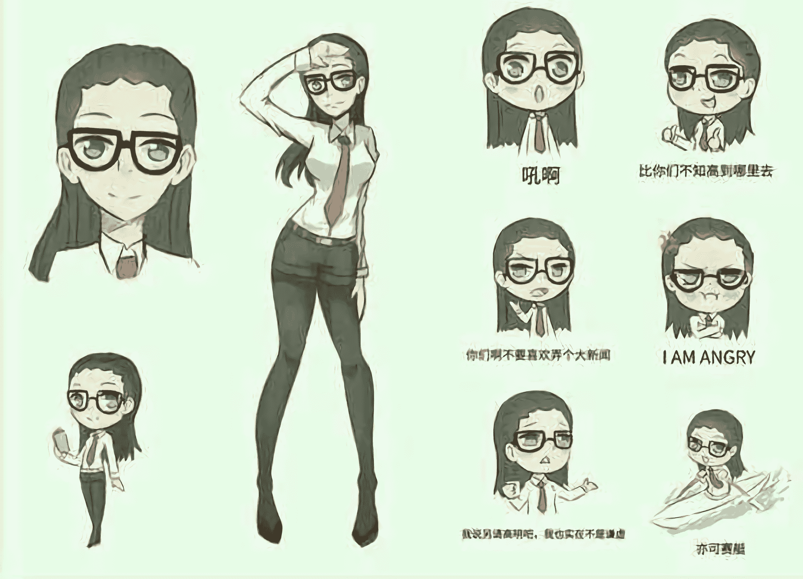

# 看图妄想小天地，作死篇

作者：膜法师凌燕

TID：21560

 

# 1

*本帖最後由 zlm18800000 於 2016-8-12 16:08 編輯*

这里是看图妄想小天地~又称进击的脑洞。这贴用来存放平日里的各种脑洞作首先，这是万恶之源：

<ignore_js_op>

**长者娘(noise_scale)(Level1)(x4.000000).png** *(2.62 MB, 下載次數: 65)*

[下載附件](forum.php?mod=attachment&aid=NjI4ODh8M2Y3ZWUwMmV8MTYwMDg4ODQxOXwxODIzMHwyMTU2MA%3D%3D&nothumb=yes)

2016-8-12 15:42 上傳

人物介绍：酱泽敏（简称大酱）

咳咳，真正的粉丝，即使我娘化成可爱的模样也能认得出来！

好吧我承认我只是在玩梗。。

没错就是这张昨日逛贴吧突然发现的一张长者娘化图，（很想要张高清版的OTZ）整个颠覆了我脑中的长者形象。

黑丝高跟配上小皮裤和高高的裤腰带再加上诱惑力MAX的爆乳衬衫，看完一瞬间就有了一股强烈的妄想。要是女体化成巨大娘整个人感觉都不一样了。（黑框眼镜和高发际线可是长者的浪漫！）**于是最可怕的事情发生了，越写越有感觉，写完这篇文章后我竟然对着娘化长者硬****了。。。**

**忍不住作死写了这篇文章。望版主大大手下留情。。。**

另外，以后如果看到脑洞大开的图片估计也会放在这里配上一段自己妄想的配文。**并且欢迎看官们提供图片或者在回复中写出自己的妄想～就算是几句话也行。**（因为很快就要开学了原来两个文章很快就会坑起来。为了给自己点动力不妨再留一个坑）

时间：2316年11月20日（发生[温柔线剧情](http://www.giantessnight.com/gnforum2012/forum.php?mod=viewthread&tid=21385&extra=page%3D1)）地点：T球 某私人领地大酱全名酱泽敏。是拜亚帝国的一名女公爵。与生俱来的优秀的基因使她在出生后体型迅速增长，不经改造便拥有了和T球远古巨人一样庞大的体型（大概17米，T球小人平均1.6毫米高）。成年后更是觉醒了异能：“膜法”，不仅能够汲取他人的生命活力为自己续命，还可以在汲取后使自己的体型不断的成长依靠着这一异能，大酱得以青春永驻，坚持几十年的修炼让她成为了T球屈指可数的异能强者之一。年轻时因治水有功被先帝分封至帝国海外省的一大块人口众多但时常有洪水泛滥的冲击平原。雄心勃勃的大酱为此征召了不少壮丁进山挖土。先运用膜法先将汹涌的河水压制在上游，然后充分利用自己相对于普通民众无比巨大的体型，将壮丁们带来的硬土放在手掌中用力挤压，捏成高密度的土墙然后加固在河道上。洪水泛滥的平原几年后变成了鱼米之乡。不少平民的生活富庶起来。大酱得以加官进爵。时人称之为江泽之主。但是，酱泽敏女士的身上也有不少污点。偶尔用一个村庄的平民为自己续命只是其中的一点。T球正属于新旧交替的时代。即使在各国的繁华地区已经开始有公民选举制的尝试。但在私人领地中平民仍然被视为领主财产的一部分。领主们普遍喜欢从民众身上收取苛捐杂税。所以抗议与暴动总是时时发生。。就算是平日里待人亲近温柔的大酱，在有人试图威胁她的统治时也是毫不留情的。[size=21.3333px]。在领地内拥有控制权的领主们一般会选泽动用装备精良的私人部队武力驱散。而对于酱泽敏来说，几千个平民百姓组成的游行部队在自己面前也就巴掌大小，对他们稍微皱紧眉头并慢慢走近平民们便会知趣的四散开来。即使遇到不怀好意的暴民也没事，只要轻轻地将心爱的高跟鞋放下，就能将整条街的小小平民一并抹去。所以在进行几次简单的镇压后大酱领地内的民众便再也不敢游行了。相比其他领主内领民受到镇压时普遍充满了愤怒的情绪。同样是使用武力。大酱巨大的身体在蹂躏暴民时带给其他民众的更多的是震撼与恐惧。矗立在领地中央的巨大宅邸，更是深深的刻在每一个领民的心里。大酱对于领民来说已经不是一般范畴的T球人了，大酱一直年轻貌美，而他们随着时光渐渐老去，而这位平日面露慈祥的领主每年的年会，都会高兴的向领民们宣布每年体型越来越大的增长。现在的酱泽敏，已经成长到光是平时出门的步行都足以对领民们造成威胁了。即使是大酱平时视察领地时不经意间的举动，都会造成脚下整个村庄的平民的不安。即使在她预先施展的膜法下大部分领民都没有发生身体上的伤害。------------------长者的分割线-------------------时间回到现在，今天大酱的家格外热闹。时任小人特区特首的董先生，在一个月的试用任期结束后成功连任。今日特地来拜访昔日的领主。大酱的心情也格外的愉悦。对坐在贵宾专用的小小椅座上的董先生一阵寒暄。董先生是自己在领地内一手创办的文化考试中脱颖而出的大学士，大酱每年都会亲自教导这些大学士如何提高知识水平。可以说是董先生当年的领主也是导师。如今功成名就，对回乡拜访的董先生自然一见如故。不过随着董先生回访而纷纷跟随，现在围坐在不远处的地板上的众多小人特区的记者们可不怀好意。“酱泽敏女士，请问你觉得董先生连任好不好啊？”一位年轻貌美的女记者率先提问。“吼啊！”还未察觉到异样的大酱漫不经心的回答着记者的问题记者“这么说您也表态支持他吗？”“当然啊”“是这样的，最近国内有些人士说酱泽敏女士通过了一些方式来干预了这次连任的投票，请问这件事您怎么看待？”大酱皱了皱眉头，意识到这些记者是来者不善。刚才轻松的脸色顿时凝重了起来。“阿拉，我希望你们这些报社啊，不要见得风是得雨呢。把未经确认的消息当做事实宣传出去，这可不太好哦~”“也就是说，如果你们想刻意对我造谣的话”酱泽敏放下了翘起的二郎腿，起身向记者们所处的地方走去。地板上的震动逐渐加大，记者们惊恐的看着巨大的酱泽敏慢慢地向他们走来。刚才还远在天边的酱泽敏转眼间便来到了记者们的上方，现在他们的两边是生平见过的最大的高跟鞋，一左一右的分立着。抬头望去，这过近的距离让记者们心生恐惧。“你们也是要负责任的哦~”酱泽敏就这样站着，黑框眼镜的反光遮住了她的表情，低下头，静静的俯视着渺小的特区记者们。巨大的压迫感刚才滔滔不绝的靓丽女记者已经吓得连发出声音的意志都没有了。在沉默了半晌后，一位老成持重的老记者终于鼓起勇气，抬起头结结巴巴的说道：“我，我们的意思是您作为位高权重的大领主，现在那么早就表态支持董先生，是不是有种已经内定好的感觉？”“哦呀？刚才还口出不逊，怎么现在开始用敬语了嘛”酱泽敏将右脚脚跟稍微提起，左手叉腰，右手放在膝盖上，手指轻轻的拨弄着黑丝袜，用挑逗的语气说道：“难道是这位记者先生喜欢上我的黑丝长腿了吗？”“请，请您回答我的问题”“实话告诉你，刚才你问我这些过分的话，我可以回答说我无可奉告！”严厉的斥责声震得特区记者们纷纷捂住耳朵。“但是这样你们又不好回去交代，对吧？”右脚的鞋尖作出左右转动的动作，像是要将脚下的东西碾碎一般。巨大的摩擦声震颤着特区记者们的内心。让他们的双腿不由自主的发抖。“我刚才已经说了，董先生是凭借着自己的实力担任的特区特首的职位。”“但是你们刚才又有意将我对董先生连任的祝贺，歪曲事实污蔑我，称是由我指认的，钦定的。”“你们好大的胆子！”刚刚悬在特区记者头上的右脚鞋跟此刻重重的踏在他们身旁。

咚

记者们被纷纷震倒在地。有的记者已经吓瘫了，有的跪在地上浑身发抖。还有的互相抱着，失控着发出绝望的哭泣声。但是酱泽敏的怒气并没有因他们的屈服而消散。责骂的话语一句接一句，沉重的击打在特区记者的心中。“我看你们一大早就赶过来，这么热情，还以为是为了祝贺下我和董先生的会面，没想到竟然是来问我这种又simple，又naive的问题。”“我今天可是作为一个长者来接待你们的，可你们竟然连基本的敬语和感想都不懂得说，一心只想弄个大新闻！”“想要算计到身经百战的我头上，你们实在是图样！”“要知道，T球各个国家哪个我没去过？你们这种货色我见得多了！告诉你们，同在小人特区里的华莱士，比你们不知道高到哪里去了！我和他谈笑风声！”骂累的酱泽敏怒极反笑，她回头对董先生说道：“旅途劳累辛苦你了，我先带你去休息室吧。”一个响指，膜法的力量就将董先生传送了出去。留下了这群无助的小人

斥责声停下来后刚才跪倒在地板上的小人们纷纷起身查看情况，只听见碰的一声，小人记者们又纷纷倒地。回过神来时，自己已经身处酱泽敏的胯股之间。她一手将早已被肿胀的乳房挤得难受的衬衫纽扣拨开，一手将紧身小皮裤上的皮带解开，缓缓的拉下拉链，黑色蕾边的T型内裤展露在了众人的身上。小人们呆呆的看着酱泽敏将蕾丝内裤脱下，右手轻轻的抚摸着巨大的阴户，刚才还在生气的面容此时尽显妩媚和挑逗。“现在的我，很生气呢。所以，要惩罚哦~”---------还有一段H的不敢发了------------蜜穴中喷出一阵阵涓流，将精疲力尽的小人们全部放了出来。在膜法的保护下，小人们摆脱了成为消耗品的命运。毫发无伤的活了下来。温柔的她最后并没有选择夹碎这些对她不敬的小人。当然，作为惹怒领主大人的代价，他们其中的一部分寿命，被蜜穴的肉壁吸收了。化为生命的精华悄悄的续给了酱泽敏。心满意足的大酱用纸巾将蜜穴中残余的爱液擦干净。然后重新穿上黑丝袜与小皮裙，整理好衣装后，一个响指将还挣扎在爱液中狼狈不堪的小人记者们传送到桌子上弄干。脸上留下了一抹迷人的微笑。“要是在明天的宣传和报道上有偏差，你们就等着成为我的饭后点心哦~！”</ignore_js_op>  

# 2

> [yjl0119 發表於 2016-8-12 16:16](https://giantessnight.com/gnforum2012/forum.php?mod=redirect&goto=findpost&pid=303630&ptid=21560)

> 大酱……好吧，也是挺可爱的。。期待下文

下回应该会找些其他图来写

 

# 3

> [g1t2s3s4 發表於 2016-8-12 16:32](https://giantessnight.com/gnforum2012/forum.php?mod=redirect&goto=findpost&pid=303633&ptid=21560)

> 我先看的评论，以为大酱是⑨的大酱。结果居然是，，，，我不需要续命。

东方的那个大酱啊。。。以前我找到个很好看的大酱模型配图可惜不知道扔哪里去了。。

 

# 4

> [wh2668080174 發表於 2016-8-12 17:00](https://giantessnight.com/gnforum2012/forum.php?mod=redirect&goto=findpost&pid=303639&ptid=21560)

> 蛤蟆，脑洞好大啊

谢谢支持啦，没有什么不是脑洞解决不了的

 

# 5

> [xnr 發表於 2016-8-12 17:17](https://giantessnight.com/gnforum2012/forum.php?mod=redirect&goto=findpost&pid=303641&ptid=21560)

> 把楼主拖出去续命。。。。。。。。。活着不好吗？

终于炸出远古大触了

续命什么的，俺家根正苗红，不怕被续

 

# 6

> [上官傲雪 發表於 2016-8-12 17:39](https://giantessnight.com/gnforum2012/forum.php?mod=redirect&goto=findpost&pid=303645&ptid=21560)

> 很期待被没发的那段H

其实H场景还没写完。。。因为写到一半时忽然担心发上来会不会被查水表就停笔了

等以后补完了再编辑上去吧。

 

# 7

> [archer 發表於 2016-8-12 17:42](https://giantessnight.com/gnforum2012/forum.php?mod=redirect&goto=findpost&pid=303646&ptid=21560)

> 还真是无所不娘化。。长者都能玩~。。  太神奇了

这就是脑洞的力量，其实是放假有点时间可以写写啦。

 

# 8

> [w381812988 發表於 2016-8-12 17:58](https://giantessnight.com/gnforum2012/forum.php?mod=redirect&goto=findpost&pid=303652&ptid=21560)

> 先续一秒

> 话说为什么简称是大酱

> 是什么谐音么

刚开始写的时候是写成江女士，结果嫌太别扭就改了。。没啥特别的意义

H剧情等写完后会编辑上的。

 

# 9

> [1945911 發表於 2016-8-12 19:12](https://giantessnight.com/gnforum2012/forum.php?mod=redirect&goto=findpost&pid=303654&ptid=21560)

> 我艹好恶心啊！！对于男性娘化的设定我一向接受不能，何况是这么一个胖老人。

> 

> 但是，出于对生物多样性的尊 ...

其实我只是对这张图的酱泽敏很有感觉，

对现实中的那位也无感啦

顺便问下下周有什么重大节日吗？

 

# 10

> [cxz123 發表於 2016-8-12 19:37](https://giantessnight.com/gnforum2012/forum.php?mod=redirect&goto=findpost&pid=303656&ptid=21560)

> 恕我孤陋寡闻，长者是谁.

长者就是386，胡哥前任的那位

 

# 11

> [妖妖 發表於 2016-8-12 19:57](https://giantessnight.com/gnforum2012/forum.php?mod=redirect&goto=findpost&pid=303662&ptid=21560)

> 我的天，最后还是别把gts跟现实一起过量融合吧，大家不想被查水表啊

我记得GN论坛服务器是在美国的吧，应该查不到水表

 

# 12

> [1945911 發表於 2016-8-13 00:53](https://giantessnight.com/gnforum2012/forum.php?mod=redirect&goto=findpost&pid=303701&ptid=21560)

> 下周三，也就是817，是泽敏酱90岁寿辰，是全球ha丝的节日

长知识了，还是真蛤粉比较专业

 

# 13

> [xxx99 發表於 2016-8-13 00:01](https://giantessnight.com/gnforum2012/forum.php?mod=redirect&goto=findpost&pid=303699&ptid=21560)

> 所以說到底有沒有H啊？

> 

> 只想看H那一段怎麽辦？

那我找个时间写完编辑上去吧

 

# 14

> [cg17 發表於 2016-8-13 05:44](https://giantessnight.com/gnforum2012/forum.php?mod=redirect&goto=findpost&pid=303714&ptid=21560)

> 这个风险在于，如果过多涉及政治话题，论坛可能会被墙掉。楼主的人身安全倒是没什么

> 话说不建议这种娘化， ...

有道理。。。

能看张图就萌起来可能是我想象力比较丰富的原因吧

 

# 15

> [a847555600 發表於 2016-8-13 03:02](https://giantessnight.com/gnforum2012/forum.php?mod=redirect&goto=findpost&pid=303708&ptid=21560)

> 活着不好么，看来你不知道坦克车的厉害，闷声作大死啊！最后送楼主一句诗，苟 ...

苟。。。。全性命于乱世，不求闻达于诸侯~花式接龙

这里的酱泽敏不需要坦克车，只要用高跟鞋就够了

 

# 16

> [zsd 發表於 2016-8-13 09:40](https://giantessnight.com/gnforum2012/forum.php?mod=redirect&goto=findpost&pid=303728&ptid=21560)

> 你写的这个文啊，很excited。

> 

> 你们这些年轻人，不要总想搞个大新闻。

看来论坛里大部分人还是认得蛤三篇里的这些梗的

 

# 17

> [dasers_100 發表於 2016-8-13 12:59](https://giantessnight.com/gnforum2012/forum.php?mod=redirect&goto=findpost&pid=303746&ptid=21560)

> 以后lz的每一分钟只有59秒了（斜眼）

一分钟-1S。。。。还请长者手下留情啊。。。

对了大佬size matter的更新都更了些什么剧情啊，透露一下呗

 

# 18

> [ZERO001 發表於 2016-8-13 13:45](https://giantessnight.com/gnforum2012/forum.php?mod=redirect&goto=findpost&pid=303760&ptid=21560)

> 这可是...真正的长chang者啊.然后娘化的那张图怎么看怎么像是用waifu2x处理的诶///

> 

> ...

**果然被发现了。。。天真的以为用****waifu2x处理****好就能高清一点，果然还是too young了。**

 

# 19

> [liyun1988 發表於 2016-8-13 15:07](https://giantessnight.com/gnforum2012/forum.php?mod=redirect&goto=findpost&pid=303769&ptid=21560)

> 我的天哪，这设定比扶他强多了

扶她什么的。。。。。我还是至今都萌不起来啊= =

 

# 20

> [cg17 發表於 2016-8-13 13:10](https://giantessnight.com/gnforum2012/forum.php?mod=redirect&goto=findpost&pid=303753&ptid=21560)

> 哪怕像舰娘那种，虽然我对它萌不起来，但好歹是物体的娘化，所以接受的读者还是很多的。但你想一个90多 ...

既然大佬都这么说了那好吧。。。下回还是找其他图写写即兴短文吧。。。

实在没时间再写两篇长文了。。。打算先把微儿残酷线和母上的假日篇赶完就先告一段落，以后就不定期更新了。。

 

# 21

> [hunj 發表於 2016-8-23 15:02](https://giantessnight.com/gnforum2012/forum.php?mod=redirect&goto=findpost&pid=305489&ptid=21560)

> 酱泽敏…为什么这名字让我想到…江泽民…

。。。你知道的太多了。来人给我拖出去续了

 

# 22

> [djh10 發表於 2016-8-26 19:46](https://giantessnight.com/gnforum2012/forum.php?mod=redirect&goto=findpost&pid=306105&ptid=21560)

> 看文章同时联想 比你们不知道高到哪里去了，以后会不会加入什么华莱士，体型无限大，香港记者，大小普通村 ...

华莱士在我另一篇文章有龙套出场过，这个只是随兴文，所以香港记者什么的就不会出现了= =

 

# 23

> [asdfghj 發表於 2016-8-29 21:26](https://giantessnight.com/gnforum2012/forum.php?mod=redirect&goto=findpost&pid=306538&ptid=21560)

> 你问我资词不资词，我肯定是资词的。但是真没想到在这个论坛会看见长者文章……膜法师们也是厉害…… ...

能把平日潜水党炸出来才是最吼的！要文膜不武膜～