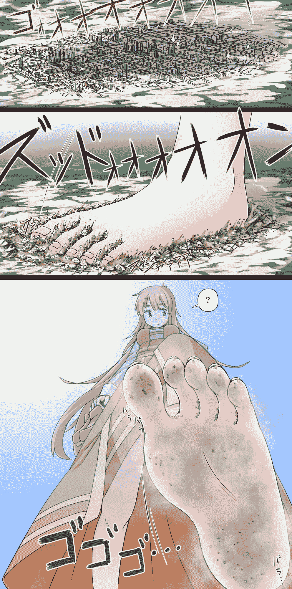

# 第一次发文......大家看个乐吧

作者：十六夜咲月

TID：16745

<title>1</title> <link href="../Styles/Style.css" type="text/css" rel="stylesheet">

# 1

*本帖最後由 十六夜咲月 於 2014-4-26 19:16 編輯*

    嘛嘛，随手写了一个，只修改了两次......凑合看吧。
    怎么想也是距离感不明显，而且描写也很差......如题，大家看个乐吧。
*****************************************************************************************************************************

天空被一个黑影遮住了。毫无征兆的，整个城市陷入了黑暗之中。
但是，城市中的居民并没有什么过激反应。这种季节有一阵突降的雷阵雨，是很正常的事。经过一阵小小的骚乱，城市再一次恢复了平静。
似乎有什么不对的地方？
那个遮盖了整个城市的阴影正在下降，最终暴露在城市的人们的视线中。
那是一只细嫩而白暂的脚，脚掌略带红晕，脚弓处有着完美的曲线，五根可爱的脚趾圆润饱满，脚跟嫩白光洁。这只脚正匀速向着它下面的城市踩下来，而它的大小足以覆盖整座城市。
城市中的人们开始恐慌了，纷纷带上自己或别人最重要的东西钻进了汽车中，以最快的速度向城市外驶去，但那代表死亡的巨大阴影却一直笼罩着他们。那只脚仍在下降，已经由近万米下降到了几千米的天空，一架飞机很不幸的撞到了小指肚上，变成了一团火花，但却无法使那块皮肤沾上一点灰尘。
巨脚仍在继续下降着，踩碎了十几片云彩，湿湿的水汽最终在脚尖形成了一滴汗水。对于这只脚来说，这仅仅只一滴微不足道的汗水罢了，但当它从几千米的高空在重力的作用下砸向下面的城市时，就是一场巨大的灾难了。它落在了城市的东面，压毁了半径几米内的所有房屋，并在滚动的过程中碾碎了一条街道，最后像海啸一般向四周散开，将那里淹没。但这一切，仅仅是一个开始。
这只脚带着可怕的重力落下了。首先与地面接触的是脚跟，正好落在了城市的西面，所有的建筑加在一起也没有对脚跟产生一丝阻力，仅仅在接触的一瞬间便被粉碎了；随着脚跟落下，脚心也随后接触了这座城市，几十栋高楼却仍无法让敏感的脚心产生一丝感觉；前脚掌随后落下，在辗碎了一大片城市的同时也使耸立的足弓碾碎了幸免于难的房屋，并连同前脚掌一起将整个地面压深，低于附近几十米；五个脚趾最后落在了城市的东面，留下了五个可爱的印记。整座城市至此已完全泯灭在这只脚下，原本所在的位置仅留下了一个清晰的脚印，而那只脚的脚底只是沾上了一层薄薄的尘土，虽然这些尘土不只是泥土，还有大楼的残骸与人类的尸体……
*******************************************************************************
凌月突然停下了脚步，她感觉到她的左脚似乎踩到了什么东西。不过……
凌月环顾了一下四周。在这个只有灰色的岩石、绿色的苔藓与浅浅的水坑的小星球上，哪里会有什么生物呢？这里有苔藓生存已经是很难得的了。
大概是踩碎了一块被腐蚀风化了的岩石吧。凌月这样告诉自己。于是，她没有停下，继续在这个小星球上散步。**********************************************************************************************************************
    就是这样......
<title>2</title> <link href="../Styles/Style.css" type="text/css" rel="stylesheet">

# 2

 <ignore_js_op>[256.jpg](forum.php?mod=attachment&aid=NDI1MTl8N2JkOTJlOWJ8MTYwMDg5MDU1NHwxODIzMHwxNjc0NQ%3D%3D&nothumb=yes) *(826.82 KB, 下載次數: 42)*

[下載附件](forum.php?mod=attachment&aid=NDI1MTl8N2JkOTJlOWJ8MTYwMDg5MDU1NHwxODIzMHwxNjc0NQ%3D%3D&nothumb=yes)

2014-4-26 19:15 上傳  

配图...灵感来源

</ignore_js_op> <title>3</title> <link href="../Styles/Style.css" type="text/css" rel="stylesheet">

# 3

> [ADSL 發表於 2014-4-27 08:56](https://giantessnight.com/gnforum2012/forum.php?mod=redirect&goto=findpost&pid=221187&ptid=16745)
> 小十六的初作呀。
> 更像是片段描写，配合图就更是如此了。
> 描写相对比较细，左脚这个细节与图对上了，但长度 ...

没。。。哪位？