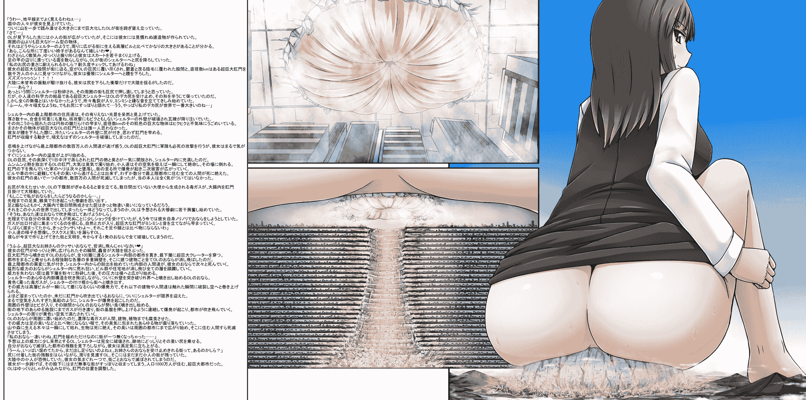

# 翻译：巨大OLさんの臭い攻め3(依頼絵)

作者：Jozetto

TID：20193

 

# 1

*本帖最後由 雨天de纸飞机 於 2015-11-27 23:41 編輯*

说好的高考之后学日语，自学到现在，翻译这些文章还有是些勉勉强强，因此出现翻译错误，还请大家指正。

姑且算是实现了翻译一次文章的夙愿，今后也要努力地把学习日语坚持下去。

话说到了大学也并没有比高中轻松多少，一天平均七节课不到了期中就是各种deadline，昨天可算是把模型弄完，今天有时间肝翻译了。本来准备每天肝一段，没想到一肝起来就停不下来了。

好吧废话不说下面把翻译放出来

<ignore_js_op>

**OL3-b.png** *(2.81 MB, 下載次數: 66)*

[下載附件](forum.php?mod=attachment&aid=NTY1Mzd8MWU5NWUxYmF8MTYwMDg4OTQ1N3wxODIzMHwyMDE5Mw%3D%3D&nothumb=yes)

2015-11-26 20:11 上傳

【欸！可以看到地平线诶！】全国的人都得抬头仰望她的身姿。OL最终巨大到可以一脚踩碎山的程度了，这样的她跨过街道站立着。【接着…】OL俯视小人们宽广的街道，街道中央树立着闻名遐迩的建筑物，那是比周围的山都要高的建筑。似乎是作为避难所，所以建造得比起街道中的高层建筑要更加巨大。【啊拉，发现了一把好椅子呢，真高兴】刻意展现出笑容，OL慢慢地把裙子掀起来，站立在避难所的上方。屁股周围的云都被冲击波吹散开去，OL坐到了避难所上。【能经受住我屁股的重量吗？让我来替你们测试一下耐久度吧】她巨大的臀部向街道靠近，天空完全被OL的臀部取代。小人们看到了浓密阴毛缠绕的股间中，直径数千米的肛门。这只不过是她坐下来而已。轰轰轰~从未有过的巨大震动传遍了整块大陆，仅仅只是屁股落下的冲击就让大陆摇动不止。【欸?】仅仅一会儿避难所顶部就粉碎了，避难所周围的街道也被OL的巨大臀部给压碎了。只是，幸亏避难所是凝聚了小人们科技成果的结晶，终究承受住了OL臀部的重量，就这样勉强保持了原来的形状。但是受伤的人也不计其数，更可怕的是建筑内部传出了不祥的龟裂声。【唔…内部还是很坚硬的嘛。不过它完全隐没在我的臀部之下了，库库，果然我的臀部是世界上最大的呢】

避难所内的居民们，呆然注视着难以置信的场景。厚达数十米的，合金制成的，就连核武器都难以破坏的墙壁，被从天而降的巨大物体压坏，碎掉的瓦砾从天上落下来。冲破墙壁后出现的，是巨大的圆形褶皱。直径数千米的巨大物体有着皮肤般的颜色，还散发出一种不妙的气味。谁也无法相信，这仅仅只是超巨大OL的肛门而已。OL坐上避难所的时候，屁股接触了冰冷的外壁，肛门不由自主的收缩了一下。这无意识的行为，就破坏了了本是坚固无比的墙壁。

悲鸣从最上层的城市中传出来，数百万人慌张地逃命，理解不了这灾害是由什么引起的。军队用最大的火力集中攻击着ol的肛门，然而这攻击甚至难以让她感觉到。避难所内的温度迅速上升着。OL的巨大臀部的深处，一天运动产生的汗不断地蒸发着，挤走了避难所内的空气。OL的肛门中释放着热气。臭气融入大气之中，光是吸入一点就足以让小人气绝。[その場に倒れ](?)肛门之下飞行的空军，在臭气的影响下坠落，砸到街道上又引起了二次破坏。无论是在建筑，还是在车中避难的人们，都难逃臭气的包围，不到数分钟内，最上层都市的住民们就全部死掉了。因为自己肛门的臭气，消灭了居住在城中的数百万人，OL本人完全没有注意到。因为臀部有些冷，OL的下腹部响起了隆隆的声音。几天没有便便因此产生的毒气，从大肠内迅速积累至肛门处。【如果我在此处放屁，事情会变成怎样呢…】OL记起了之前因自己的足臭，腋臭引发的惨案。姑且不论脚部和腋下的气味，大肠内积攒数天产生的屁定是有可怕的臭味。把那个屁排到小人的世界里，究竟会引发怎样凄凉的场景呢？光是想象一下那场面，OL就不由得兴奋起来了。【嘛，大概你们会被屁轻易地吹飞吧】直到刚刚还只是让避难所内的小人们暴露在自己的体臭之下，这样就让他们死绝，现在则是要直面自己体内喷发出来的屁。OL感受到肛门内已经聚集了大量的气体，稍稍用力，超巨大的肛门发出mitsumitsu的声音，收缩起来【稍稍积蓄了一下，所以一定是炒鸡臭的。脚臭啊腋臭啊，完全不能与之相比呢】想象了一下城市中的场景，OL不禁发出了轻笑。毕竟他们至今为止，努力建造的街道，以及不断发展前进的文明，从现在开始就要被一发屁给破坏得完完全全。【fufufu，在超巨大的姐姐的臭屁下，大家都被吹飞吧】她的肛门急速扩大的瞬间，发出了震动大陆的声音。从巨大的肛门中喷发出来的OL的屁，贯穿了百层的都市，洞穿了最下层的火山口(?)。足以支撑全部都市的重量，强劲如此的承重壁，还有其上的所有建筑，全部都被气体吹飞消失了。注意到最上层都市的异变的人们，也没能逃出她的屁的攻击，接二连三地死去。效果拔群的屁，在避难所内肆虐，公用建筑也好住房也好，全部都被吹飞了。屁的冲击力直到最下层也没有消失，冲击大地后就那样横向地扩散开来。将避难所内部结构完完全全破坏掉之后，屁终于冲破外壁扩散到外界。黄色，并且浑浊的毒气从避难所的底部冲出向周围街道上袭去。有着足以让高层建筑瞬间化为灰尘的冲击力，在这个屁的冲击之下，所有人和建筑都在瞬间化作碎片被卷上高空。在蓄力后放出的屁的席卷之下，避难所终于迎来了毁灭。如同空气过度涌入的风船一般，避难所从内部爆炸开来。周围的墙面生出裂痕，从那裂缝中OL的屁气势不减地喷发出来，充满了街道之下的所有设施的周围，冲击街道的基盘，发生连续的爆炸，吹飞整个都市。避难所周围逐渐充斥着黄色的气体，将建筑，人类，植物，统统腐蚀掉了。那臭味是脚臭完全无法比拟的，被那气体包围的所有物体都被腐蚀个干净。山上的森林一瞬间化作枯木，生物全部死亡，臭气侵入周围的城市，又引起新一波的死亡。【哇…我的屁真是厉害…明明只是稍微张开肛门，就导致了所有街道的消失】因超乎意料的威力而呆滞了一会儿的OL，仍是坐在避难所上，只是避难所内的建筑和人们全都消失了。俯视着因为自己放屁的缘故而毁灭的都市的残骸，OL满足地站立起来。【只是稍微逗留了一下，我还没有开始走动呢。承受了我屁的攻击的街市，还存在吗】OL环视着四周，看到了小人街道的残骸。大陆上的小人们恐慌着。仅仅是因为她的屁，就毁掉了整个街道。OL跨出一步，她的屁股覆盖了整个都市。那个都市，可是1k万人居住的超大型都市。OL缓缓地蹲下，调整肛门的位置。

 

# 2

> [shendanxiaogui 發表於 2015-11-26 21:10](https://giantessnight.com/gnforum2012/forum.php?mod=redirect&goto=findpost&pid=275694&ptid=20193)

> 最后两句其实原文就放错了位置吧？当时在看着文字脑补的时候就有这疑问了...

> ------正经的评论下---

> 饺子， ...

之前还以为是续作的flag，yy是不是有排泄的可能性来着

 

# 3

> [zuolong 發表於 2015-11-26 21:18](https://giantessnight.com/gnforum2012/forum.php?mod=redirect&goto=findpost&pid=275695&ptid=20193)

> 支持楼主啊，不过话说楼主觉得大学也不轻松是因为你翘课太少了

翘课虽然少不过能水的课我一般都水过去了...

日常七节课太变态了啊

 

# 4

> [wqr 發表於 2015-11-26 21:35](https://giantessnight.com/gnforum2012/forum.php?mod=redirect&goto=findpost&pid=275698&ptid=20193)

> 好文（闻），图也很对胃口

> 翻译辛苦了，

> 大学还是少旷课吧，毕竟挂了可是很麻烦的。 ...

近代史纲要点过一次名之后我就没去过了... 

# 5

> [包子巴掌 發表於 2015-11-26 22:01](https://giantessnight.com/gnforum2012/forum.php?mod=redirect&goto=findpost&pid=275702&ptid=20193)

> 楼主厉害呀，我羡慕会日语的，要是我会日语就能把好多看不懂的翻译过来了。 ...

现在还是日语苦手a...其实自己学日语本是为了推gal的,有了目标就可以坚持下去了

 

# 6

> [that123 發表於 2015-11-27 04:34](https://giantessnight.com/gnforum2012/forum.php?mod=redirect&goto=findpost&pid=275724&ptid=20193)

> @饺子

> --

谢谢点评

无论是英语还是日语，这种长度的翻译对我来说还是第一次，尽管已经比较注意转化成符合中文习惯的用语，不过还是有一些不到位的地方。

关于翻译，首先我还是觉得自己日语能力不足，很多地方我都是根据图片和汉字脑补的，如果不是有配图的话，肯定得有一些前后矛盾的地方。

再者，个人比较喜欢的内容是缩小系的，尤其是Micro系，因此对这个题材并不是很感兴趣。

 

# 7

> [牛逼牛逼 發表於 2015-11-26 23:40](https://giantessnight.com/gnforum2012/forum.php?mod=redirect&goto=findpost&pid=275719&ptid=20193)

> 我的天 前两章都是饺子君翻的 这是出现了新的翻译君吗。  PS:日语这个东西 LZ还是好好坚持吧 以后如果日语 ...

希望没有撞坑

谢谢你的鼓励，离日语翻译还差得远，不过如果没有达到一定程度我是不会停下的

至少也要能看懂galgame

 

# 8

> [餃子 發表於 2015-11-28 17:00](https://giantessnight.com/gnforum2012/forum.php?mod=redirect&goto=findpost&pid=275813&ptid=20193)

> 这个故事告诉我们，只要挖个坑然后蹲在坑旁边等，就会有小天使自己来把坑填满 ...

......计划通り

没有撞坑真是太好了</ignore_js_op>