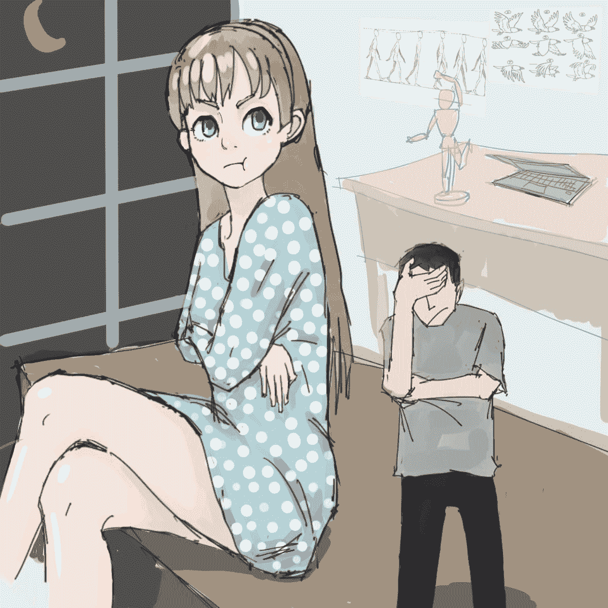
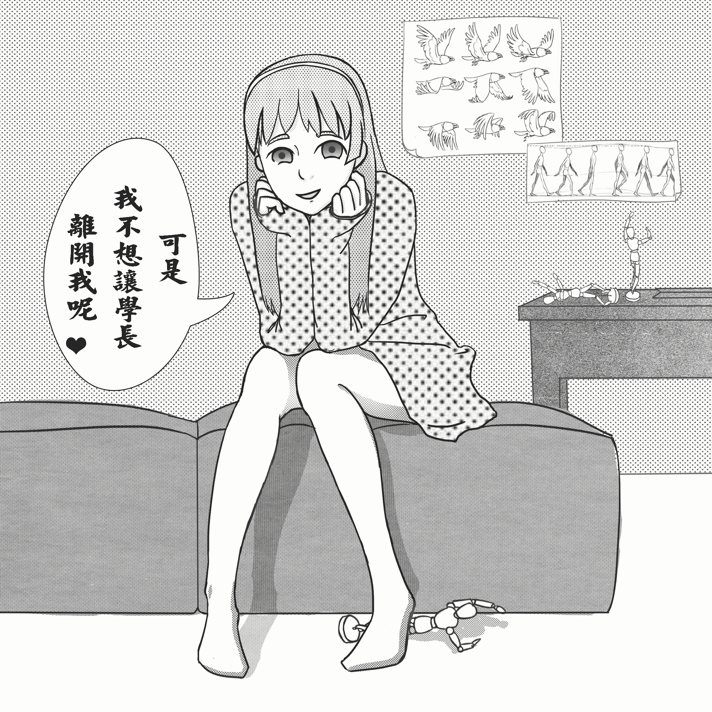

# 膨胀的未来（完）

作者：1212123

TID：19866

<title>1</title> <link href="../Styles/Style.css" type="text/css" rel="stylesheet">

# 1

*本帖最後由 1212123 於 2015-11-8 15:20 編輯*

    我对于**缩小属性**这个分类的定义是：按照所在世界，其是否符合正常比例，比正常比例小那么就是缩小属性分类。
所以我就分类到缩小属性了，不然按照我的设定其实大家本身都没有变化，只是整个世界在膨胀。
    这是我很久前就有的灵感，趁着放假尽快写出来吧，这次我尽量写完，不留坑。

2015-9-29更新了渣配图。
2015-10-1更新了病娇配图。尝试了漫画风。

发现好多人说看过类似的科幻小说，也是世界膨胀的理论，说实话这个灵感真的是我自己想到的，不过我的灵感居然能达到科幻小说的水平，恩，看来平时没白心思。= =

以前有另外附加繁体版，这次就不附加了吧，因为发现论坛居然有繁简转换功能，好吧，眼残的我这阵子才发现的！

2015-11-8到这里就可以了，结尾了。
<title>2</title> <link href="../Styles/Style.css" type="text/css" rel="stylesheet">

# 2

*本帖最後由 1212123 於 2015-10-26 23:19 編輯*

**零**  有一件事情是我不可能忘记的，却也不再想起。在我小学的时候，我的父母在一个电闪雷鸣的暴雨天突然外出，再也没有回来。他们死于了车祸，据鉴定得出的结论是闪电劈中了道路旁的高大松树，燃烧的松树倒向马路，开车的父亲躲闪不及，加上雨天地滑，整个车直接翻了过来，当场死亡。  那段时间我可谓是识尽了人性的丑恶，各方的亲戚来到我家，不是来关心我照顾我，而是为了争夺一份遗产，没多久父亲的律师带来了父亲的遗嘱，依照遗嘱我继承了全部的遗产，并由父亲遗嘱中指定的人作为我的监护人，并代替保管遗产到我成年为止。亲戚们这才散去，但是他们莫名其妙的拿出许多所谓父亲向他们的借条，讹走了不少财产。但父母的遗产依然够我一辈子不愁吃不愁喝了，一开始我大哭，可没多久我就不哭了，并且那之后再也没有哭过了，因为我的注意力转移了到了一件事上面，就是导致我父母死亡的——雷鸣暴雨。  我也搞不懂，我就像是把对父母的思念转移到了闪电上一样，我对闪电开始无限的着迷起来，我用父母的遗产买了大量的书籍，没日没夜的看着，平日在学校的学习也更加努力起来，为的就是可以更多更多的了解它，高考那年我考上了南大大气科学学院，然后一路考到了研究生，而我目前的研究计划是树木防雷。  为了方便每天的研究，我在学校的附近买了套房子，据说这栋楼上有很多我们学校的学生，而我并没有在意，因为我只对闪电着迷。  家的附近有一个公园，公园中树木繁多，一个雷雨的前夜我带着我亲自制作的雷电数据监测设备来到了这个公园，正在架设设备中，突然天气变得诡异起来，雷雨似乎比预测提前了几个小时，本来平静的天空突然雷声大作，眼前突然一闪，我直直的倒在了正在架设的设备上，昏迷前的最后一个念头：我好像被雷劈到了。--------------------------------------  我的头感到剧痛，耳鸣持续着，我的记忆似乎也出现了空白，发生了什么，我努力回想着，我睁开眼睛也看不清楚，只觉得眼前有很多东西在晃动，不一会我便再次昏迷过去。  我再次醒来，这次耳鸣好了很多，头也没有那么痛了，浑身依然无力，我从喉咙呜呜的喊出声来。**  “学长？”**一个温声细语的少女音。  我说不出话，嘴里呜呜着，缓缓睁开眼睛。**  “学长？你醒了？”**还是那个少女音。  我看到一个不太符合常理的景象，我面前出现了一个不符合比例的巨大面庞，她正眼角带笑的看着我。**  “学长？”**少女似乎是在确认我能否看到她而在我面前摆动手指。**  “呜啊呜……哪……呜”**我艰难的问出了我的问题，我似乎躺在床上，心中的疑惑很多，但我只能一个一个问。**  “学长啊，这里是我家，应该我问你才对吧？几天前你莫名其妙的出现在我的家里，而且你怎么变成了这样？”**少女叹了口气，**“你看你这个样子，连话也说不清楚，你先好好清醒下吧，一会再来‘审’你。”**  少女走出房间，我努力让自己的思路清晰起来，身体还不太能动，我便努力观察起周围来，天花板很高，高度至少比我家的高一倍。我努力翻了一个身，这里很明显是一个女孩的房间，但是，好大，所有东西都好大。床边是一个巨大的落地窗，我努力向窗边移动，我必须先知道我在哪，刚才根本没从女孩嘴里得到任何有用信息，告诉我这里是你家有什么用，我知道你家在哪啊喂？不过她叫我学长？我是哪个学校的来着？  我终于挣扎着爬到了床边，透过巨大的落地窗，我看到窗外楼下有一个公园，很眼熟，我慢慢回想起之前的事情：雷雨、公园、设备，对了，我好像是被闪电劈中了来着？！<title>3</title> <link href="../Styles/Style.css" type="text/css" rel="stylesheet">

# 3

> [MEWSAMA 發表於 2015-9-28 00:49](https://giantessnight.com/gnforum2012/forum.php?mod=redirect&goto=findpost&pid=269541&ptid=19866)
> 不是说大家都没变化话吗？总之还是很有趣的设定

请耐心，看到最后会自圆其说的。我先睡了，明天再更。
<title>4</title> <link href="../Styles/Style.css" type="text/css" rel="stylesheet">

# 4

*本帖最後由 1212123 於 2015-9-29 23:38 編輯*

一  慢慢我的思路越来越清晰起来，视觉和听觉也几乎完全恢复了，行动能力逐渐恢复，肌肉还有些酸痛，我努力坐了起来，然后爬到了旁边类似枕头的上面，站起来好好观察着周围并思考起来。  果不其然，这里可真是巨大呢，不远处桌子上有一台很大的笔记本，屏幕半掩着，几本好大的书和一个类似速写本的东西也散落着，还有几个人体模型一样的可活动木头人被扭成一个奇怪的姿势立在一旁，墙上贴着几张手绘的人物与动物的连续行走图，依照墙上胶带的痕迹来看，似乎墙上的图片经常更换。  我心想：这女孩是学美术的……吧？  我低头看了看，衣服完好无损，然后我发现其实我所在的地方并不是床，而是一个类似折叠沙发的东西。  我开始回忆：我在安置设备的过程中意外被闪电劈中，嗯，大概。然后，醒来就到了这个不符合常理的地方，我全身上下完好无损，但遇到了一个叫我学长的巨大少女，目测我站起来应该能勉强到她的腰部吧。她似乎说过我是前几天突然间出现在她的家里，也就是说我昏迷了好几天了吧？  “咕噜噜……”我的肚子……  “**同学！你还在吗？？”**我喊了起来。  终于少女推门进来了。  **“啊，学长你都能站起来了。”**少女接着转身走掉，**“稍等啊。”**  接着少女又回来了，带来了一些食物。  **“吃吧！”**少女把食物摆在我的面前。  **“谢谢。”**我也不客气。  **“学长你前几天就像快死了一样，我也不敢把你送去医院，我怕你这个样子万一再被抓去实验，所以没让任何人知道你的事情。”**少女充满关爱的看着我。  **“啊呜，你认识我？”**这个女孩对我的态度让我很疑惑。我一边吃着，一边抬头看着巨大的少女，跟一个巨人对话的感觉真是蛮让人心惊胆战的。  **“咯咯咯，学长是南大气象学院的吧？”**少女看着我。  这种敌暗我明的感觉真不好。  **“是。”**但我也只好应。虽然少女总是笑盈盈的，但体型的差距让我的心里很没有底，**“同学你也是南大的吧？美术生？”**  **“哎？学长你好厉害，你怎么知道的？”**少女的眼睛微微变大。**  “一般人也能猜出来的吧，你一直叫我学长啊。”**我继续吃起来。**  “不是啦，美术生这点你怎么知道的？”**少女嘟嘴看着我。  我一边吃着，一边抬起手指了指墙上的手绘画：**“这个连续行走图是你画的吧？”**  **“这是运动规律啦。不逗你了学长，我是动画专业的大一生。”**少女低头看着我，**“咱们见过，只是你肯定不记得我了。”**  听了这话我开始认真看起眼前巨大的女孩来，我抬头看着她，她低头看着我。  **“你别这样一直盯着人家看啊。”**少女的娇斥。  **“好吧，我确实对你没有印象，不好意思啊”**我很坦诚的说着。  **“哼。”**少女把嘴挤到一边。  她……好像生气了呢。可是我真的没有印象啊，总不能骗人吧。  少女推门离开了房间。  **“真是个孩子啊。”**我感叹。  刚才我又仔细目测了一下，我站起来可能连她的腰都不到。不过好处就是，食物也变大了，我看着手里的大面包，下意识的看起生产日期来。  **“2016年3月1日？恩？哪里不对？”**我的眉毛皱了起来。  **“同学！你在吗！我有事情问你！”**我的喊道。  **“怎么了学长？”**少女走了进来，疑惑的看着我。  **“我的设备和背包呢！快给我！”**我喊道。  **“什么？”****  “啊，就是，我出现在你的房间里后，我身上有没有其他东西？”**我突然发现我刚才太急了。  **“有啊。你要啊？”**少女眯着眼看我。  **“请给我可以吗？”**我态度好了很多。  **“求我啊。”**少女继续笑盈盈的看着我，似乎是对于我刚才喊他的态度很不满。  **“求你了。”**我只好示弱。  **“学长啊，你到现在都没有问过我叫什么哎，还向我大吼大叫。我可是救了你哎，不觉得这样太没礼貌了吗。”**少女还是笑盈盈的看着我，看得我浑身不自在。  **“对不起，但是我现在很需要我的东西。请你给我好吗？”**我说道。  **“你让我不高兴了，你来哄我吧，哄开心了就给你。”**少女一边说着一边做到我身旁，翘起二郎腿。  可能是变小了的关系，女孩坐下后沙发的震动我感受的很明显。  我很无奈，但我仔细想想，我真的一点办法都没有，我现在可以说是完完全全被这个女孩控制着，依我现在的大小连开门都有些困难了。可是我真的不会哄女孩，我的情人只有闪电，父母逝后的这十几年我没有交过一个女朋友，甚至连同学都不太来往。  我每天都是和闪电度过的，我懂的也只有闪电。  **“傻愣着干嘛，安慰下我嘛，安慰完我马上就会好。”**少女嘟着嘴，一副恨铁不成钢的样子，似乎在手把手教我。  我马上站起来，拍着女孩的肩膀说道：**“安慰安慰。”**  少女哭笑不得的看着我：**“学长啊……算了，给你吧。”**  少女从一个角落，拿出来我的设备和包，放在了我的面前，然后又坐在了我的旁边。  我发现背包和设备也被缩小了，我现在的大小来使用，刚刚好。我马上打开背包，掏出一本本子翻了起来。  **“学长，我叫可真，你都不问我，我只好自己告诉你了。”**少女看着我。  果然，我翻到最后一页，日期栏写着：2015年9月28日。  **“恩，可真，你好。”**我抬头看着她，“我大概可以告诉你我是怎么来到你的房间里的了。”  听完我的话，少女便认真的看着我，等我说话。  **“虽然有些不可思议，但是我似乎是穿越时空了。本来我以为我记错了，但是我的记录本上的日期不会错”我叹了一口气，“我到了未来。”**
<title>5</title> <link href="../Styles/Style.css" type="text/css" rel="stylesheet">

# 5

> [xnr 發表於 2015-9-28 12:19](https://giantessnight.com/gnforum2012/forum.php?mod=redirect&goto=findpost&pid=269572&ptid=19866)
> 太过复杂的设定会增加脑补的困难，太困难的脑补会影响观赏的效果和实用性。
> 
> 另外问一下差距最大的尺寸落差 ...

恩，会注意。
不会那么小的，请耐心。<title>6</title> <link href="../Styles/Style.css" type="text/css" rel="stylesheet">

# 6

今天情况不便没有码字，尝试为第一章配了个图。。。。
<title>7</title> <link href="../Styles/Style.css" type="text/css" rel="stylesheet">

# 7

 <ignore_js_op>[第一章.jpg](forum.php?mod=attachment&aid=NTQ2MzF8MDAwZTQxOTl8MTYwMDg4OTQ3MXwxODIzMHwxOTg2Ng%3D%3D&nothumb=yes) *(132.09 KB, 下載次數: 18)*

[下載附件](forum.php?mod=attachment&aid=NTQ2MzF8MDAwZTQxOTl8MTYwMDg4OTQ3MXwxODIzMHwxOTg2Ng%3D%3D&nothumb=yes)

2015-9-29 22:03 上傳  

</ignore_js_op> <title>8</title> <link href="../Styles/Style.css" type="text/css" rel="stylesheet">

# 8

*本帖最後由 1212123 於 2015-10-19 21:49 編輯*

**二****  “也就是说，学长你去年被雷劈了，然后就莫名其妙的穿越时空来到了我的家里？”**可真把食指放在下巴上呈现思考状，**“好浪漫啊。”****  “我一点也不觉得被雷劈有什么浪漫。”**我面无表情的回复。**  “学长我感觉你好淡定啊，我想了一下如果我变这么小一定会很慌乱的，可是你从醒来后表情就没有太大的波动。”**可真把脸凑近了我，似乎想把我看个透。  确实，但其实我从来没有在意自己如何如何，因为我的精力全部都在研究闪电上，相较于同龄人我的确是更加冷静些吧。从小经历了重大变故，见识了人性的阴暗，而又有明确的人生目标，什么都看的很淡，因为很虚无。只不过我好累，偶尔我也会渴望有个可以依靠的人，可是从父母逝世开始就注定我永远不会有可以依靠的人了，我只能孤独坚强的活下去，支撑我的只有闪电了，我要用我这一生尽可能多的了解闪电。  可是之后我该怎么办呢？我不可能一直呆在可真的家里，我必须找到我变小的原因，但是说起来……**  “可真啊。”****  “学长？”**可真温柔的声音。**  “你自己住吗？”**从各方都感受不到可真是和其他人住在一起的，所以我抛出我的疑问。**  “是啊，不过学长啊，你不知道这里是哪吗？”**可真笑着。**  “是你家啊。”**我摸不着头脑。**  “我家就在你家的隔壁啊。”**可真一脸的哀愁，**“你居然真的不知道，我好失望啊。”****  “额这个，啊，你现在是大一吧，大一就可以不在学校住的吗？”**我赶忙岔开话题，居然是我家隔壁？看来我平时太专注研究了吗。**  “我不喜欢宿舍，我不太擅长和人相处。”**可真表情暗淡了很多，**“人，真的是太复杂，我不喜欢。”**  似乎这个女孩也经历过什么，可是从和她对话来看，很正常啊。哎，等下，我看了下我和她的体型差距，就像是宠物与主人一样。难道她并没有把我当做人？想多了。**  “说实话我也不喜欢人。”**我说。**  “我知道哦，学长每天都只在搞研究，从来没见过你和谁在一起过。”**可真又变得笑盈盈。**  “你好像很关注我……”**我看着可真。我到底在哪里见过她？**  “怎……怎么会，别自以为是了！”**可真憋红了脸，哼了一声走出房间了。  我也不在意，开始摆弄起我的设备，设备是我自己制作的，其中有一个计时装置，我翻出打开了计时装置，看到后我愣了一下。**  “2015-9-28 20:16:33，为什么时间停住了？没电了吗？”**我陷入思考，**“这个时间，晚上8点16分左右，那不是我安置设备的时间吗？9月28日吗？”****  “难道这个计时器从我被闪电击中后就再也没有工作了吗？”**我继续摆弄着设备，自言自语着。  最后我确认设备的确完好无损，找不到计时器不工作的任何原因，我有些搞不清状况了。  我从沙发上小心的跳下来，走到房门口想要出去，却发现房门是锁住的，我便喊起可真的名字。**  “怎么了？学长？”**可真打开门走进来。**  “我想打个电话，可以借用一下吗？”**这样站着抬头看这个女孩真是感觉很不得了呢，震慑感好强。**  “不行哦学长，我不能让任何人知道你的存在，万一你被带去实验怎么办，这可太危险了。”**可真还是那一脸笑盈盈的低头看着我。**  “我要和教授联系一下，我突然失踪了几个月必须和他说明一下，而且我设备出了一些问题想要询问他。”**我只好和可真解释道，并摆出了请求的手势。**  “不行的学长。”**可真认真的看着我。  我突然有些害怕，这种感觉很久没有过了：**“好吧好吧，我不打了，那可以让我回一趟家吗？就在隔壁，我在消防设施里藏了一把备用钥匙。”****  “不行哦学长，你只能呆在这里。”**可真的表情变得有些居高临下的威严，**“学长要听话哦，听话才是好学长哦。”**  我下意识的退了几步。**  “不要怕嘛学长，我又不会对你做什么。”**可真突然蹲下摸了摸我的头，就像是在摸一只宠物狗一样。**  “不要这样！”**我叫道。**  “来量一下身高吧。”**不知道什么时候可真手里多了一把卷尺，轻轻的拉开。其实我也好奇我现在到底多高，便稍微配合了她一下。**  “90厘米。”**可真看着我，**“如果你能再小一点就好了，嘛，不过这样也很好了。”****  “可真同学，我觉得我们有必要谈一下。”**我认真的看着女孩。  可真站了起来，走到一旁的沙发上坐下来：**“好啊，学长，您讲。”****  “那我就直说了，我很感谢你在我昏迷的时候照顾我，也感谢你给我食物，但是现在我已经恢复了，我有我的事情需要去做，请你让我离开。”**我转过身面对可真。  可真用两手托着下巴，手肘搭在腿上，低头看着我，笑道：**“可是我不想让学长离开我呢。”**  我走近可真，试图继续说服她，没想到可真却先说话了：**“我没有什么朋友，我总是无法融入任何一个圈子。”****  “可真……”**我停住了。**  “人真的好复杂，明明和动物相处那么的容易，只要有食物和爱就可以和动物相处的很好，为什么人那么难以相处，我好讨厌人类。”**可真说着说着居然快哭了。  你讨厌人类可你自己就是人类啊，其实我能理解，我也不喜欢人类。**  “我好孤单啊。”**可真还是哭了，**“学长你不要走，留在这里陪我吧。”**  我能理解可真的感受，因为从某种程度上我们是同一种人，但是我的注意力全部被转移到闪电上，所以不会感到孤独。  但是我不能答应她，我有必须做的事情。**  “可真，对不起。我必须走。”**
<title>9</title> <link href="../Styles/Style.css" type="text/css" rel="stylesheet">

# 9

第二章配图尝试了漫画风。
<title>10</title> <link href="../Styles/Style.css" type="text/css" rel="stylesheet">

# 10

 <ignore_js_op>[第二章.jpg](forum.php?mod=attachment&aid=NTQ2Nzh8NDE4NDRjZGV8MTYwMDg4OTQ3MXwxODIzMHwxOTg2Ng%3D%3D&nothumb=yes) *(3.15 MB, 下載次數: 111)*

[下載附件](forum.php?mod=attachment&aid=NTQ2Nzh8NDE4NDRjZGV8MTYwMDg4OTQ3MXwxODIzMHwxOTg2Ng%3D%3D&nothumb=yes)

2015-10-1 13:28 上傳  

</ignore_js_op> <title>11</title> <link href="../Styles/Style.css" type="text/css" rel="stylesheet">

# 11

> [stgpoco 發表於 2015-9-30 23:20](https://giantessnight.com/gnforum2012/forum.php?mod=redirect&goto=findpost&pid=269898&ptid=19866)
> 我记得很小的时候看过一篇科幻文章，就是讲述世界膨胀原理的。
> 这个世界其实无时无刻都在变大，每一个原子 ...

好厉害，南大！其实我根本没去过南大，但是据我所知南大的气象是全国最厉害的了，所以设定了南大。
啊，好多人都说有个这样的小说，可是这篇的灵感真的是我自己胡思乱想想到的，我平时就喜欢瞎心思，想到这个灵感后才突然发现可以和GTS结合起来。<title>12</title> <link href="../Styles/Style.css" type="text/css" rel="stylesheet">

# 12

*本帖最後由 1212123 於 2015-10-3 22:08 編輯*

**三**  听了我的话，可真还挂着泪的颜却突然笑了。**  “不可以哦学长，我没同意你离开。”**  我走到可真的面前认真的说：“可真同学，我没有开玩笑，我真的要走了。”  说完后我直接爬上沙发去拿我的背包和设备。**  “不行哦学长，请转过身来。”**  我并没有回头，刚拿起背包的时候突然感觉什么东西被套在了我的脖子上，我低头，是一个项圈。**  “你这是？！”**我向可真叫道。**  “必须让学长认清目前的处境呢。”**可真把我脖子上的项圈收紧，扣上了锁，其中一只手牵着链接项圈的绳子。**  “你在做什么！？”**我叫道。**  “嘘……”**可真用牵着绳子的那只手伸出食指放在唇边，然后摸了摸我的头，**“学长乖一点。”**  简直无法交流无法交流了，我用力的扯脖子上的项圈，毫无作用。我只好跳下沙发向门口跑去，结果绳子的长度有限，没跑几步我就被绳子勒住，因为跑的太猛我的身体反而弹回去了。  可真的力气怎么这么大，不，应该说是我的力气怎么变这么小了。**  “学长你真是的，拽的我的手好疼啊。”**可真娇斥。**  “请马上给我把这个拿下来。”**我爬起来指着脖子生气的说道。**  “学长，其实我确实一直在关注你。”**可真脸很红却是病娇般的神情，**“我……我很喜欢学长。”**  可真完全不在乎我说什么做什么，自顾自的说着。**  “马上，把这个，拿下来。”**我的心脏砰砰跳，一部分是愤怒，一部分是恐惧。**  “哦，这件事学长你别想哦，既然已经戴上了就要好好的戴一辈子呢”**可真用两手托着下巴，膝盖并在一起，笑盈盈的着看着我，**“我对待宠物很好的。”**  宠物？！我不是！**  “我…！@#￥%……”**刚说出一个字我的嘴就被堵住了。**  “学长又要讲没有意义的话了，我根本不想听。”**可真勒紧项圈的绳子，用穿着白丝袜的脚顶住我的嘴，**“这是主人的惩罚咯。”**  我的脖子被勒的很难受，我能感受到女孩脚趾的形状和温度，以及女孩足尖的特有的味道，这都是我曾经从未在意的东西，这一瞬间我突然有一种触电的感觉，这也是闪电吧，这也是一种闪电吧，这也是我所着迷的闪电吧，原来这也可以产生闪电吗，我突然有种很放松的感觉，就像是冬天回到家中将厚重的冬衣脱下后的那种轻松，又像是中学时花费一阵个晚上终于将作业写完的轻松感。可这轻松感到底来自哪里？我也说不好。我为何会感到轻松？我也不知道。**  “学长你怎么呆住了。”**不知何时可真的脚已经从我的嘴上移开了。  我没有说话，我也说不出话，我现在心中一片混乱。  我跪在地上大口的喘着气，我渐渐冷静下来。  我刚才居然出现了一股异样的心动，这不对。**  “所以学长不要再想离开这里的事情了。”**可真又摸了我的头，那动作简直像在摸狗一样。  我想反抗，但是从刚才的一系列事情，我发现，目前的我无法反抗眼前这个女孩。  稍微平静了一些，我决定暂时迎合眼前的女孩。**  “你需要我做什么？”**我站起来问道。**  “学长终于变乖了。”**可真面部肌肉似乎变得兴奋起来，**“第一，你是我的宠物，点你必须记牢。第二，在这里你要听我的话。就这些哦。”**  可真的表情变得很愉悦。**  “知道了……”**我只好应道。**  “我带你去你的窝。”**可真站起来走向房间外。  窝？简直真的把我当做宠物了。  我连忙起身跟着可真，我必须跟着啊，不然绳子会勒住我的脖子让我很难受。  这是我醒来后，第一次离开这个房间。格局果然和我家的一样，好像这栋楼每户的布局都是一样的，嗯？那个方向是卫生间吧？**  “锵锵锵，这里就是学长的窝了。”**可真指着卫生间角落里的一个小窝，真的是窝，像是一些旧衣服铺在一个大框子里。**  “为什么在厕所。”**我问。**  “因为我喜欢啊。真是的，那么刚才的再加一条咯：我的决定不要问原因。”**可真说着把绳子扣在我头顶的一个金属杆上，这下我的行动范围被限制在了这间卫生间内了。倒也有好处，上厕所方便了。我这样安慰自己。  可真打了个哈欠：**“学长我要去睡了，明天我们再愉快的玩耍，你也睡吧。希望你能住的习惯。”**  可真走后，整个屋子静的吓人，好像可以听到自己思考的声音。我突然想到，这个窝早早就安置好了，看来这一切都是有预谋的，她早就想把我当狗一样的养？！  我一定会出去的，我怎么会被一个小女孩关起来呢。首先这个项圈怎么办呢？  我从口袋里拿出本子和笔，我有随身携带纸笔的习惯，思考的时候如果没有纸笔我会很难受。  不知不觉我开始思考起我为什么会变小，其实被关起来总可以逃出去，但是身体变小这个目前却毫无头绪，其实这才是首要的任务吧。  我在笔记本上计算着我穿越的总共天数，然后画着平面图，连带着这栋楼的平面图也画了起来，并不规整，但是也大概能看。我也不知道我为什么要画这些，在我对于一件事没有头绪的时候，我习惯把已知的所有线索都罗列出来。其中有一个疑点就是我从公园被闪电击中，可是为什么会出现在可真的家里？  我又在纸上计算了很多东西，突然我发现一件事情，我又验算了数次，确认没有出错，我身后冒出冷汗。  难道？
<title>13</title> <link href="../Styles/Style.css" type="text/css" rel="stylesheet">

# 13

*本帖最後由 1212123 於 2015-10-4 01:03 編輯*

**四**  我发现的这件事就是：也许我并没有变小！其实是地球在膨胀，或者说，整个世界、整个宇宙都在膨胀！每一个分子，每一个原子都在膨胀，相对于每个人来说，世界毫无变化。但是对于穿越时空的我来说，世界就显得巨大了。虽然只是猜测，但是从数据的变化分析来看，几乎这就是事实了。  也就是说，整个世界在膨胀，但是我穿越时空跨越好几个月直接来到了未来，这段时间我一瞬间就达成了，而整个世界还在持续膨胀，所以就显得好像变小了一样，所以其实我并没有变小，只是世界变大了。所以我只要回到过去，那么“变小”的问题自然而然的就解决了，我会“恢复”本来的大小。  如果这成立的话，那么至少我会保持这个大小，因为一切都在膨胀，我只是“暂停”了几个月的膨胀，现在我又“回归”这个世界了。  仔细思考后，我突然浑身冒起冷汗，真是细思极恐啊，还好只有几个月，如果穿越了一年、两年，甚至十年，那么我将会变得多么小啊。  不能再想了。  突然感到了无比的困意，我便蜷缩进这个旧衣服铺的窝里，闻着说不出的味道，渐渐的睡着了。  第二天，我被水流呲到光滑表面的声音吵醒了，我打着哈欠爬了起来，我看到可真坐在我不远处的马桶上，那么声音的来源也就是可真正坐在的马桶内部……哎？？！  **“呀！！”**可真看到我后尖叫起来，**“变态，快出去啊！”**  我也被吓了一跳，连忙往卫生间的门外跑去，可是我的脖子上有项圈，以及绳子的限制，跑到门口的时候我一下子被勒住弹了回来，我摔倒在地上，正好躺在了可真的脚边。我还没来得及向上看，可真的脚便朝我踩了过来。  **“学长快闭上眼睛！”**可真一边说着一边用脚踩住我的脸，一只脚就几乎盖住了我的脸，两只脚已经能把我的脸全部埋起来了。  事后，我被可真牵到了她的房间，可真坐在床上满脸通红的鼓起腮帮子一直看我。我被看的很不自然，解释道：**“是你把我锁在了那里的。”**  **“我知道，只是我忘记了！”**可真依然鼓着腮帮子。  我突然冒出一个想法，既然可真已经拿我当宠物了，为何刚才还会这种表现呢？  **“学长你太像一个人了，根本不是宠物嘛。”**可真慢慢平静下来，脸恢复了白嫩。**  “我本来就是人啊。”**我摊手。**  “这样不行啊，能不能好好当宠物啊。”**可真张了张嘴，像是想到什么，**“学长啊，你穿着衣服的样子太像个人了。”**  我感觉不太妙。**“把衣服脱了我看下。”**可真打量着我。  我：**“……”**  见我没有反应，可真笑了笑，把我固定在墙角，从桌上拿起一把美工刀。我马上挣扎起来，可真用脚顶住了我的身子，这下我在墙角可一动都不能动了，只有手在挥舞着。**  “可真！不要这样！”**我喊道。**  “学长不要乱动，我不想伤到学长哦。”**可真用美工刀割开了我的领口，然后两只手一下子把衣服整个撕开，一扯，衣服就从我的身上下来了。  **“可真！请住手！”**我无力的喊着。**  “裤子也很碍眼呢……”**可真像是自言自语的念叨着，又用同样的方法毁掉了我的裤子。  现在我的身上只剩下内裤了，和鞋了。**  “请住手……”**我的呼吸变得混乱。  果然可真把我的鞋袜也扯了下来。**  “内裤就算了吧……恩，这样果然感觉顺眼了很多。”**可真用穿着白丝袜的脚蹭了蹭躺在墙角喘着粗气的我的脸，**“学长的身材蛮够看的嘛。”**  这种完全控制的感觉，我现在对这个女孩已经感到非常恐惧，但是刚才被眼前这个女孩扯掉衣物的时候，我却莫名产生一种很舒畅的感觉，我不知道该用什么词来形容，这种形容可能显得我像一个变态，但是真的，一种非常非常舒畅的感觉。虽然我依然很恐惧，但是也很舒畅，似乎很矛盾，但这就是我此时的感受。  日子一天一天的过去，我也有些习惯了这种生活，可真除了有时会用脚欺负我一下，其他真的对我还不错，不过，是按照宠物的标准来看。每天的食物是足够的，可真吃饭前会分出一些给我，可真专门为我定制了一个宠物用的餐具，上面印着我的名字。这种感觉真的很怪异，好像自己真的变成了一只小动物一样。  吃饭时我会被可真牵到饭桌旁，我吃饭时可真时不时会用脚爱抚的蹭着我的头。一开始我坐着吃饭，可是地上没有我专门的桌子，这样吃腰会非常的累，最后我没办法只好趴下吃了，真的就好像一只宠物了。除了这些，可真并没有对我做其他更过分的事情了，只不过慢慢真的有些把我当做宠物了，如厕时大叫的把我赶走的事情再也没有发生了，慢慢的我居然也不觉得这些事情很过分了，不知道是不是可真开启了我因为闪电而封印了十几年的正常男孩都该有的某些存在于内心的东西，我竟然发现可真越看越美起来，而且有时竟然还冒出了‘就算一辈子这样其实也不错。’的可怕想法。  但是一件事让我再次有了逃离这里的想法，我发现我又“变小”了，我清楚的记得第一次来到卫生间的时候我的眼睛可以平视靠近水池的那个瓷砖的黑色缝隙，可是今天我发现这条缝隙跑到了我的视平线以上。可真每天还是要去上学的，我白天我会被限制在卫生间里，但是通过几天的努力，我已经可以悄悄把项圈的锁打开了，一次白天可真不在家的时候我在房间里找到了卷尺，自己量了一下，不，量了好几下，我真的又变小了：85厘米，比上次矮了5厘米。  我必须联系到教授，我需要帮助，我想要回到过去，恢复自己原本的体型。我不知道我这样子缩小下去会变的怎么样，我感到无比的焦虑，我的判断失误了，我以为我不会继续缩小，可是我错了。随着这一次次的挫败，我感觉我的信心也少了很多，我突然开始怀疑自己曾经那么努力的学习、研究是为了什么。但是，我依然记得：我一定要离开这里。  我记住了可真每天的作息，和各种必要的信息，明天是个好机会，我准备逃出这个房子了。
<title>14</title> <link href="../Styles/Style.css" type="text/css" rel="stylesheet">

# 14

*本帖最後由 1212123 於 2015-10-7 15:45 編輯*

**五**  今天是我计划逃离这里的日子。我一般不做没有把握的事情，所以这次逃离是我深思熟虑后的产物了，但是今天我的心里感到非常不安。我把整个计划以及可能遇到的风险重新考虑了一下，今天逃离这里几乎是没有风险的，我认为最大的威胁就是可真了，不过据我观察，今天是可真最忙的一天，天黑之前一定会不回家。  我像往常那样摸出藏在我的“窝”里面的细铁丝，这是有一次可真吃塑料包装的点心的时候掉在地上的，是用来扎紧袋口用的，我小心的藏了起来。我试探着，终于将脖子上项圈的锁打开了。  我在房间里走了一圈，又回来了。  我是一个非常谨慎的人，今天我的心脏跳的厉害，不安感实在太强烈了，总觉得会发生什么，所以我放弃了，我决定再另找机会。  房间里没有任何通讯工具，窗子居然也不可思议的锁住了。电脑可真总是随身携带。要想联系外界，我必须先离开这个屋子。虽然可真离开家前都会反锁房门，但是我发现了藏在鞋柜里的备用钥匙，鞋柜几乎与我同高，我还记得当初的场景，我打开鞋柜看到许多很大的鞋子，还有高跟鞋，但我从来没有见可真穿过，这种感觉很怪，有种自己是个偷翻大人鞋柜的小孩子的感觉，不过就算我是个真正的小孩子，这些鞋子在我眼前也不会看起来这么大吧。  我又走到鞋柜面前，打开了鞋柜，确认备用钥匙还在原处后，我稍稍放心了一些：这次不走，下次还有机会。  然后我又看到了那双高跟鞋，看到这双高跟鞋的时候我总会试图想象可真穿上它的样子，因为我认为可真并不是适合穿高跟鞋的女孩子，因为她看起来过于可爱了，总觉得这双高跟鞋放在这里摆着和其他的鞋格格不入，但是越是这样想我越想要看看可真穿着它的样子。  我也不知道怎么搞得，明明我每天都在“变小”，又被囚禁在这里，按理说我不该有闲情去想这种事情，我也有些搞不懂自己了，似乎从来到了未来后，慢慢的我整个人都改变了吧，慢慢的不再是曾经那个独来独往的封闭者了吧。难道是被欺负傻了，我居然好像有些喜欢可真了。不管怎么样，毕竟……毕竟很久没有人这样关心我，每天为我准备饭，虽然是对待宠物般的，可是有时候竟然莫名的感觉很温暖。  不过放心，我依然记得我要离开这里。  我拿起那双高跟鞋中的一只，靠近鼻子，嗅了嗅。  我到底在做什么。  而这时，鞋柜旁的房门打开了，我居然没有听到钥匙开门的声响？  “学长？你在做什么？”可真走了进来。  不对啊，今天可真应该是满课啊，我看过她的课表的，她怎么会出现在这里。那时候我可能是无法理解逃课这种东西了，因为本科时我每堂课我都会认真的听，只想离闪电更近一点。是这可能也是我的局限性了，也许我的不安就来自这里了吧，对于未来的未知。  我不可思议的看着可真。  “学长你为什么抱着我的鞋子啊，还有你这惊讶的表情，咯咯咯。”可真蹲下，看着我，“而且你居然自己把项圈打开了。”  “我……”我也发现自己抱着可真的高跟鞋，而且被可真看到了，一阵语塞。  “你难道以为我不知道你悄悄藏了什么东西吗？没想到那种东西居然真的可以打开锁啊。”可真用手托着下巴，看着我，却突然叫道“哎！你怎么还拿着人家的鞋子，快放回去啦。”  我这才反应过来将鞋子放回去，我观察着可真，可真并没有生气，只是表情变得有些耐人寻味。  可真走进房间，坐了下来，我在后面跟着可真。以前是可真牵着绳子，脖子上的项圈牵引着我不得不走，而现在我才发现其实我的脖子上并没有项圈，跟着“主人”似乎已经成为了我的习惯。  “学长，原来你喜欢我的鞋子啊。”可真翘起二郎腿，在空中晃着。  “并不是这样……”我反驳道。  “啊，你在拿那把备用钥匙？”可真像是突然想到了什么问道。  “我没拿！”我反驳道。  “你果然还是发现了那把钥匙，所以呢？今天你打算离我而去吗？”可真有些伤心的表情。  “不是的……”我发现我说什么已经没用了。  “学长我真的很失望。”可真把腿放下来，脸靠近我，“我明明那么爱你，还不够吗，你为什么想要离开我。”  这句话似乎点燃了我。  “这就是你爱我的方式吗？！当做一只动物一样，每天在地上吃饭，在卫生间睡觉？！我宁可饿死也不想被你当做宠物囚禁在这里！”这些话说的让我有些恼火，我大吼着。  可真好像被吓到了，她哭了，眼泪一滴一滴留下了，然后哭着大步走出了家门。  我好像说了过分的话……  可真突然又打开房门进来，总鞋柜里拿走了什么，再出门。  门被反锁了，好像……  我跑过去打开将鞋柜找了一个遍，备用钥匙不见了。  而这是我才发现，鞋柜旁放着什么，我拿起来，一个蛋糕，我轻轻打打开蛋糕的盒子。  ‘学长！生日快乐！’蛋糕上写着这几个字。  哎？今天是我生日吗？记不清了……啊，好像是的！我自己从来不过生日的，居然还有人能想到我的生日。一股强烈的内疚感冲上我的心头，我很想狂奔出去向可真道歉，可是我门是反锁的。  蛋糕盒子的旁还粘着一张类似贺卡的东西，我立刻拆开：学长，生日快乐啊！其实这几天我也在考虑，我是不是不应该这样对待学长呢，我不该这样把你关在这里，给你带着项圈。一开始我只是觉得学长的样子很可爱想要逗一逗你，但是我        我多么想和学长永远在一起啊，不过我发现了一件事情，我决定不再这样关着你了，学长你又变小了，真的，你似乎在持续变小，所以我决定不再限制你的行动了，我不希望我爱的学长越来越小，最后消失掉，当你看到这段话的时候大概已经到晚上了，你喊我，我来帮你打开项圈，之后你想离开也好，怎么样都好，我不会再限制你。                                                                          可真。  看完后，我心中有着说不出的滋味。我躺了下来看着天花板发起呆来。  不知不觉一天过去了，可真居然没有回家？这是真的要饿死我吗？  两天过去了，可真还没有回家？蛋糕已经吃玩了。  三天过去了，好饿，可真快回来。冰箱也是空的，全家什么吃的也没有。  四天过去了，我就要饿死在这里了吗，可真我错了，我愿意当你的宠物，我不想饿死。五天过去了……
<title>15</title> <link href="../Styles/Style.css" type="text/css" rel="stylesheet">

# 15

*本帖最後由 1212123 於 2015-10-20 22:50 編輯*

**六**
  很久前就听说过，人在极度饥饿的时候什么都吃，只要是能吃的东西都可能吃掉。当时我没有这种经历，所以并无体会，可现在，我深深的感受到了。  一开始我还有力气去厨房喝自来水，毕竟只喝水可以活大概一周是众所周知的常识。而后来，我连站起来的力气都没有了，我只能去厕所喝马桶里的水。   因为，马桶的高度比较低，可就算这样也让我非常的费力。  冰箱里只有几个鸡蛋，我敲了一个裂口，一次只吃一点点。  浑身无力，已经快要休克了，我根本不知道过了多久了。  我躺在卫生间的窝里，以便方便喝水，“窝”里的旧衣服被我咬烂了很多，边边角角吃掉了很多。  就在我快要昏迷的时候，我听到了钥匙开门的声音。  可真！可真吗？一定是可真吧！  可是我的身体几乎动不了，我艰难的向声音的方向爬。  一双穿着棉袜的脚出现在我的面前，好大，怎么会这么大。我努力抬头，是可真，好高，好大，我果然又“变小”了吗？  可真就这样看着我也不说话。  我爬到可真的脚前，用舌头舔了舔面前的袜子，然后咬住了袜子。我现在脑子里是一片混乱的。我饿的不知道自己在做什么，也不知道自己要做什么。  可真弯腰想把我从袜子上扯下来，可是我咬的很死，她便直接将袜子脱掉了。  **“学长，真是可怜呢。咱不吃袜子，我带了吃的。”**可真略带关心的语气。  这时我才松口，袜子掉到了地上。  可真拎着我到了房间里，然后拿来了我之前使用的那个印有我名字的饭盆，放在地上。**“学长，很饿吧？饭这就来了哦！”**可真把那只脱掉袜子的脚放在了饭盆上。  啥？  只见可真拿出来一包酸奶，转着圈让酸奶均匀的流在了她的脚上，酸奶流了下来，顺着脚面一直流动，流进了饭盆里。  我什么也顾不得，把脸趴上去就疯狂的舔起来。
  这简直是我吃过最好吃的东西！我一边想着，舔食的动作也没有停下来。  当我把可真脚面的酸奶几乎全部舔干净的时候，我还继续舔着可真脚上残留的酸奶，然后抬眼看可真，可真竟是一副很享受的样子。  可真像是明白了我的意思，轻轻的抬起了脚，我赶忙伸长了脖子，可真的脚底还残留着大量的酸奶，我继续大口的舔食着。  头顶传来可真的笑声：**“咯咯咯，好痒啊，学长。”**  喝了这些酸奶，感觉身体逐渐有一点点力气了，但是依然非常的虚脱，我通过缝隙可以看到可真的脸。  **“许久没吃过饭的话，要吃流体的食物比较好。”**可真一副‘都是为了你好’的表情，**“而且这时候吃的太急容易猝死，倒在脚上你就只能慢慢的吃掉了。”**  可真脚上的酸奶快舔完的时候，我开始舔起饭盆里的酸奶，根本不理可真。  **“学长，你这样光顾着自己吃，一点都不尽责啊。”**我头顶可真的声音，**“我脚趾缝里还有，这样根本没法穿袜子嘛，快帮我舔干净啦。”**  说着，可真的脚趾上下摆动着，似乎是想让我看清里面确实还有残留。  **“学长你果然又变小了呢，比之前可爱多了。”**怎么感觉可真似乎因为这个而心情很好。  我感觉自己恢复了很多体力，正常人一包的酸奶，对我来说可不少。  **“可真，之前，对不起。”**我艰难的说着。我对于可真的内疚，以及我的饥饿，已经让我无视了眼前可真对我的态度，完完全全把我当做宠物了的态度。**  “看在你现在这么小、这么可爱的份上，我已经原谅你了。”**可真低头看着我笑着，**“而且学长你现在这个大小，也只能在这里老老实实的当我的宠物了吧****～”**  虽然恢复了很多体力，但是我依旧是虚脱的状态，我依然饿极了，可我不敢和可真提。现在活动起来依然非常吃力，如果是正常人的话，饿这么久都该在医院接受治疗了吧，但是就在我刚才舔食了可真脚上的酸奶开始，我的地位已经真真正正的降为了宠物。  我仔细观察起我和可真的体型差距，感觉是，就算我站起来，可能也只能达到可真膝盖的高度吧？  也就是30-40厘米左右吧？我怎么会“变小”这么多？？按理说我不可能“变小”这么多的，难道世界膨胀的速度并不是平均的？  对啊，谁说过膨胀的速度一定要平均了？看来自己有时还是太死板了。  “可真、之、前、卡片上、写的……”我用询问的语气问可真，啊，还是好饿。  **“哦那个啊，已经不算数了，因为啊，我想要学长和我永远在一起嘛。”**可真被窝舔过得那只脚在我面前的空中打转转，**“学长这样变小下去，会不会到看不见的地步呢？好期待呢。”**  我觉得我已经没有必要和可真解释我的世界膨胀假说了，按照这个世界来看，我也的确是在变小，而且她似乎根本不关心我为什么“变小”，而是希望我变得更加小。  怎么感觉更加饿了，啊，酸奶……这东西是增加肠道蠕动、助消化的东西吧。  **“学长没吃饱吧？”**可真不知道从哪里又拿出了一个红薯，掰碎放在了饭盆里。  我刚要过去吃，可真便用脚轻轻把我踢开，我一下子翻了过去。  **“学长真心急啊。”**说着，可真把另一只脚的棉袜脱了下来，然后踩在饭盆里，红薯被踩的黏黏的沾满了脚趾。**“喏~这回儿，来吧。”**  我得到了允许，趴上去就开始吃，好吃好吃，我已经什么都不在乎了，我只想吃东西。这次吃的时候，我突然闻到了一股女孩脚上特有的味道，并无它感，毕竟和食物混在一起，又是一个饥饿至极的人在吃。  **“学长这次要把脚趾缝也舔干净哦，不要再让我提醒了，不然再也不管你了。”**可真娇斥的声音从我的头顶传来。  我会的，我会的，千万不要不管我！我在心里大喊道，更加用力的大口的舔食着。  **“啊，好舒服那~****”**可真略带呻吟的轻哼着。**“这种小小的舌头，啊，这感觉****～爱上了。”**  总觉得可真的性格漂浮不定，时而正常，时而病娇，时而……恩？这该怎么形容呢？
<title>16</title> <link href="../Styles/Style.css" type="text/css" rel="stylesheet">

# 16

> [冰西瓜 發表於 2015-10-10 22:44](https://giantessnight.com/gnforum2012/forum.php?mod=redirect&goto=findpost&pid=270987&ptid=19866)
> 我觉得这段特别适合出一个配图，因为我对很多细节都很好奇

哎？是吗？哪些细节呢？
<title>17</title> <link href="../Styles/Style.css" type="text/css" rel="stylesheet">

# 17

> [gw1990zzz 發表於 2015-10-11 00:38](https://giantessnight.com/gnforum2012/forum.php?mod=redirect&goto=findpost&pid=271010&ptid=19866)
> 动画学了多久了？主攻哪个方面的？

现在大三。我们专业可以分二维和三维方向，大部分人都会选择三维，我个人来说二维更加优势，不过最后毕业大概也会选择做三维的毕业设计吧。
前辈呢？
<title>18</title> <link href="../Styles/Style.css" type="text/css" rel="stylesheet">

# 18

> [冰西瓜 發表於 2015-10-11 08:52](https://giantessnight.com/gnforum2012/forum.php?mod=redirect&goto=findpost&pid=271045&ptid=19866)
> 女主的表情，动作的幅度，男主的姿势，周围的景物，还有男主视角下的特殊画面 ...

其实这篇是我在十一期间开始写的，回学校后几乎没有独处的时间，所以之后再也没有更新配图了，这几次更新有一次还是在天台旁的平台坐了一个下午写出来的，因为这里一般没人。我也好想画配图，可是真的难以在同学的面前画如此羞耻的画。天台那里没有桌子，码字可以，画画就困难的多了。不过大概是会画的，我会找机会的，所以请耐心。:-D

另外，有什么经验可以分享吗？
其实每天晚上睡前可以在宿舍的床上背靠墙来画和写，但是第二天的精神状态就不能保证了，不能长久。
<title>19</title> <link href="../Styles/Style.css" type="text/css" rel="stylesheet">

# 19

> [王正念 發表於 2015-10-11 12:37](https://giantessnight.com/gnforum2012/forum.php?mod=redirect&goto=findpost&pid=271065&ptid=19866)
> *一口氣看完了，樓主的構想真的是很創新，
> 
> 縮小文現在看已經沒什麼太大動力，但是這

多谢意见建议等，对我的灵感的认可，我也非常开心。
大家说的那部设定相同的科幻小说名叫《狐变》有兴趣也可以去看一下，虽然完全没有GTS情节，不过设定真的和我的几乎一毛一样。
我的确是打算两个人到结束的，但也可能临时改变想法。
至于可真的种种，其实她的心理是非正常的，也就是大概有精神疾病那种感觉吧，可能我并没有体现的很好吧。

请耐心的期待着吧！

另外，请注意休息。:-D

<title>20</title> <link href="../Styles/Style.css" type="text/css" rel="stylesheet">

# 20

> [gw1990zzz 發表於 2015-10-11 17:05](https://giantessnight.com/gnforum2012/forum.php?mod=redirect&goto=findpost&pid=271090&ptid=19866)
> 我当时选的二维，现在工作了三年多了。还在职。

二维的工作都是怎么样的呢？其实我现在挺迷茫的。我打算毕业出国，然后再回来做动画。
<title>21</title> <link href="../Styles/Style.css" type="text/css" rel="stylesheet">

# 21

> [冰西瓜 發表於 2015-10-13 10:29](https://giantessnight.com/gnforum2012/forum.php?mod=redirect&goto=findpost&pid=271264&ptid=19866)
> 经验是，用MMD测试下动作的可行性，景深和渲染，不过我根本不会画图，说不出什么有用的建议 ...

果然我没写明白呢T_T我在学校独处的时间比较少，在一堆耳目周围码字是做不到的。
所以有什么这方面的经验呢？
我想过很多方法，去天台写是一个办法，但是很累。

<title>22</title> <link href="../Styles/Style.css" type="text/css" rel="stylesheet">

# 22

> [冰西瓜 發表於 2015-10-14 09:56](https://giantessnight.com/gnforum2012/forum.php?mod=redirect&goto=findpost&pid=271366&ptid=19866)
> 码子我是一直手机码字，而作图的话，我不住宿舍，你把工具对着你，你背对着墙不就行了。。
> 
> ...

手机码字。。。
实在做不到。
今天我发现了一个图书馆靠墙的位置。以后去那里吧。
<title>23</title> <link href="../Styles/Style.css" type="text/css" rel="stylesheet">

# 23

*本帖最後由 1212123 於 2015-10-24 13:52 編輯*

**七**在可真的脚边吃饱饭后。“脚趾缝里还是黏黏的，学长你根本没认真吃吧！”可真一边用手把头发撩到耳后，一边低头看着我斥责道。我能微弱的感受到可真冲我说话而发出的气浪。“已经……吃不下了。”我躺在可真的脚边，略微沉重的呼吸着，用手擦着嘴。我的嘴里充满了可真脚上的味道，可是因为吃到了食物，我的表情却是满足的。“不、可、以。”可真把脚踩到了我的身上，脚趾缝刚好在嘴的位置。“请吃干净！”我挣扎着，可是显得很无力。我越挣扎，可真越是加大了力度，我的上身便被踩的死死的，胸口的骨头在响，强烈的压迫感让我呼吸变得急促，痛感使我的挣扎变得更加剧烈。我的表情一定充满惊讶吧，我怎么也想不到可真会想杀了我。这种力度，绝对是要杀了我啊。“啊啊啊！”我还是喊出来了，好痛，身体本来就很虚弱，这样下去会死吧。我不想死，不想。明明不会被饿死了，为什么现在又。可真抬起脚，压力的消失让我瞬间感到轻松了很多，但是疼痛的感觉还残留着。我无法反抗这个女孩。不顾身上的痛感，我奋力翻过身爬到可真脚边，把头向脚趾缝里挤，尽可能的让舌头舔干净食物的残渣。我看着面前白皙的脚趾，舔食着粘在缝隙里的食物残渣，视线抬高，我看到了因为近大远小规则变得略微有些透视感的膝盖。可真的腿型真的很好看，可是对我来说却是致命的，这双腿的主人，似乎分分钟可以踩死我吧，刚才我已经见识到了，如果可真再用力一点，我真的就要吐血了吧，等待我的就是死亡了吧。我怕了。我怕死。就算世界每天都在膨胀，我显得越来越小。这样下去，可能早晚有一天我不得不死掉。就算这样，我也不想现在就被踩死。太没出息了。我的人生。我的人生。要这样结束吗？我现在必须臣服于面前这双脚的主人，才能活下去吧。我身体虚弱的很，光是翻个身都要耗费很多的力气。可就算现在让我完全恢复体力，我也不可能反抗可真了。而以我目前的大小，已经没有自己获取食物的能力了，连猫和狗对我来说都是致命的危险吧，慢慢的小鸟和老鼠也能轻易杀掉我，然后是昆虫……现在的我只有呆在可真的家里了，只有可真给我食物我才能活下去吧。突然一股强烈的无力感灌满我的全身。舔着可真的脚趾缝，舔着舔着，我有些莫名其妙的哭了出来。这个画面真是有趣呢，一脸享受的少女，脚边是一个小小的男人，一边舔着她的脚趾，一边哭泣。有东西在触碰我的头，我抬头看到几根手指，以及可真靠的极近的面庞，手指轻轻擦去我的泪，大眼睛中竟透出一丝温柔。接着几根手指轻轻摸着我的头，可真靠近我的面前，轻轻说着：“没事了，学长，不要怕。”我能感受到可真口中的热气呼出来。我抬起头。可真的双瞳，在白皙柔嫩的皮肤衬托下，显得更加灵动。这才注意到，可真有着高高的鼻梁，这让整张脸显得更加精致起来。其实我特别羡慕高鼻梁的人，因为在我看来，高鼻梁的人在平静的时候可以显得更加有深度。此时此刻，可真平静温柔的眼神，在精致的鼻梁衬托下，虽然是学妹，却让人有了一种看不透的感觉。那感觉就像，姐姐看着弟弟、老师看着学生、大人看着婴儿，或者，人类看着小动物。听起来似乎并不是什么好的感觉，但是我却莫名其妙的平静了下来，不再哭泣。莫名的有一种安心的感觉。与此同时，我的心里似乎也开始产生了一些奇怪的变化。而我也确实是越来越不明白可真了，越是让人想不明白的事情，想的会越多。我舔着可真的脚趾，可真用手指摸着我的头，没有一点要我停下的意思。“我的脚趾上的……是什么味道呢？”可真把整个身子压到腿上含糊的问着，眼睛向别处飘了一下，然后低头看我，“我只顾着自己享受，忘记在意你的感受了。好吃吗？”对于一个快要饿死的人，只要能吃到东西都会尝试去吃，更别说真正的食物了。“美味至极。”我如实说。“哎？真的吗？”可真脸上出现不可思议的红晕，说着，可真把脚从我嘴旁抽出。我被可真轻轻的踢开了“学长可真是个变态啊。”哎？好像被误解了。我指的是食物啦，食物啊！不是脚趾。“我是说……呜呜。”我的嘴被什么堵住了。可真将脚趾伸进了我的嘴里。“学长，你什么都不要说。你只管听着，照我说的做就好了。”说着，可真调整了姿势，精致的面庞不断靠近我，最后双唇几乎贴在了我的耳朵上，湿乎乎的气音钻进我的耳朵，“其实啊，宠物的感受人家才不会在乎呢～”然后可真小声的笑了。“脚要被舔麻了，就到这吧。”可真说着躺倒在沙发上，发出慵懒的声音。“被你这个小东西舔着舔着都感觉困了。”可真不再理我。我看着地上的鞋袜，我靠近认真的看了看，捧起袜子深深的嗅了一下。然后将鞋子袜子按照可真醒后方便穿的方向摆放好。不知不觉，看来我真的发生了一些变化。

<title>24</title> <link href="../Styles/Style.css" type="text/css" rel="stylesheet">

# 24

*本帖最後由 1212123 於 2015-10-25 11:52 編輯*

八时间一点点过去，我已经不知道在可真家里呆了多久了，有时恍惚间让我感觉自己生来就在这里，而在这里做的一切事情，都是理所应当的。我的思维也混乱起来，我不知道自己现在到底是个什么东西，自己到底在做什么，自己的未来会是怎样。门口有脚步声。我条件反射般的跑到门口，把可真的拖鞋从鞋柜里扯出来。咔嚓。门打开了。好高，好大。我仰望着可真。可真也不理我，只是扶着墙轻抬了一只脚，我赶忙过去亲吻面前的鞋子，然后费力的把可真的鞋脱了下来，替可真换上拖鞋，可真换另一只脚，我再次费力却娴熟的为另一只脚换了另一只拖鞋。可真走进房间，慵懒的倚靠在沙发上，轻轻的呼吸着。我将鞋子整齐的摆放进鞋柜后，立刻来到可真的脚边，跪好。“学长，今天上了体育课，脚好酸，麻烦你了。”可真发出慵懒的声音，我跪在脚边，我看不到可真的脸，只能听到声音。可真说着把两只脚从拖鞋中抽了出来，踩在拖鞋的上面。我便靠近可真的脚，从指缝开始，大口大口的舔起来。我的头顶，可真发出享受且放松的声音。指缝里好黏，充满了少女汗液的味道。可是我竟然似乎感觉自己闻到了食物的味道，毕竟那之后，把食物用脚碾碎让我趴在她脚上吃掉成了可真的一大乐趣，渐渐的我已经分不清食物的味道和脚的味道了。导致我在饥饿的时候，看到可真的脚，闻到脚上的味道，都会有扑上去舔食的冲动。有一次可真床边掉着一只袜子，闻到味道的我下意识的想要去舔食，不过最后克制住了这种冲动。而这些日子不知不觉中，可真居然真的爱上了脚趾被我舔食的感觉，因此现在为可真舔脚已经是我每天必须做的事情了。而我的内心似乎也发生了改变，虽然被非人的对待，但是我却莫名其妙的有种解脱感。将自己的全部交给一个至高无上、不可反抗的人，让对方完完全全的控制自己，这种感觉真的好轻松，什么都不用考虑，也什么都不用担心。该舔另一只脚了，脚趾缝也要舔干净，不然可真会生气的。虽然被这样对待，但是好安心，不过我已经完完全全是为可真而活了。一开始所有的事情我都是被迫而为，可现在为可真做这些事情都是我心甘情愿的，在这种畸形的关系中，在不知不觉中我似乎也对可真产生了不可思议的感情。可真成为了我的倚靠，似乎也真的成为“主人”与“宠物”的关系了吧，因为现在如果没有可真我也无法独立生存。可真要是不管我了，我也只有等死了吧，我现在连可真的膝盖都够不到了，以这个大小存在于这个世界，我似乎什么都做不了了。对于可真施予的食物，怀着感恩之心，并为可真献出力所能及的一切。舔的舌头已经发涩了。我抬头，发现可真不知什么时候已经坐起身子，正低头看着我。舌头好干，我下意识的伸伸舌头。可真突然一笑，似乎是看透了我的想法。然后她做出一个像是亲吻的动作，接着嘴唇微张，唾液从双唇之间流了出来，拉出一道晶莹剔透的丝线，落在了我面前的脚背上，唾液从脚背慢慢流向脚趾。可真的唾液，这是第一次吃到脚汗以外的东西。我伸长脖子靠近向下流着的唾液，以便尽早的得到它。其实也吃过其他的东西吧，脚上的泥和皮屑，吃的时候已经混在食物里让我察觉不到罢了。这时，似乎什么东西滴落在了我的头顶，黏黏的从我头顶流满我整个脑袋。我下意识的抬头，可真的唇在我头顶的正上方，唇边粘着残留的唾液，又一滴落了下来，正好滴在我的眼睛里。“这是学长近来良好表现的奖励咯。”可真轻声说着，然后把两臂交叉放在膝盖上，脑袋压在胳膊上，看着我。“请全部喝掉哦。”被可真唾液侵入的双眼看到的画面是扭曲的。我用双手抹着脸上的唾液，舔食着。有了唾液的，舌头不再那样发涩，继续为可真的脚服务起来。黏黏的脚汗和黏黏的唾液掺杂在一起，变成了一股莫名的味道，闻着这股味道，我发现，我的下体变得燥热。居然？硬了吗。我已经变成闻着女孩的脚趾就能产生性欲的变态了吗。不过说起来，比起曾经几乎是性冷淡的我来说，这似乎更“正常”一些吧。随着下体的变化，我的姿势也变得扭曲起来，可真似乎是发现了我的异样。“学长～”可真的脚趾向上挑，把我的脸挑了起来。“怎、怎么了？”我很心虚。“学长是不是……”可真面带平静的看着我。“不是！”我立刻叫道。“我还没说是什么呢。”可真的眼睛弯起来。我不知如何是好，我不想被可真发现。“学长，站起来，我看看嘛～”“不要。”我低头。“看看嘛。”“不。”“站起来！！！”可真突然厉声叫道，依然是可真可爱的少女音，但是其中让我感受到了一种不可违抗的威严，我还没有反应过来，我的身子已经弹了起来，我在可真脚边站的直直的。可真瞬间又恢复原来的神情，面带微笑的看着我。此时我的腿有些抖起来，面对体型差别巨大的可真，这种颤抖是从生物本能而来的。我越来越看不透可真了，这让我从心底涌上不可掩饰的恐惧，但却又莫名的产生一股不可言喻的快感。“学长支帐篷了……”可真一只手轻轻捂住嘴，嘴唇微张，然后又把手掌向下滑动，把手指轻放在唇间成思考状，“说起来……”“学长把你的内裤脱下来，以后在家里你不要穿衣服了。”可真轻声说道。我还未从刚才的惊吓中恢复过来，我机械的脱下了我最后的遮羞布，手指也颤抖着。这下，我真的完完全全的暴露在可真的面前了。一点余地也没有了，可真，我已经被可真，完完全全的，掌控了。<title>25</title> <link href="../Styles/Style.css" type="text/css" rel="stylesheet">

# 25

九没多久，我又变得更加小了，我可以看清可真脚上的更多细节了，右脚的小脚趾上有一颗痣，在白皙皮肤的衬托下反而显得格外的好看，不知道为什么，我就是觉得这颗痣好看，有时候舔着可真的脚趾，会看着这颗痣入迷。早晚我会变的比这颗痣还要小吧。看着这颗痣的时候我时常会这样想。不知不觉，可真开始让我做各种事情，那些对她来说轻而易举，我做完后却会精疲力尽的事情。越是这样的事情，可真越是喜欢交给我去做，并且喜欢看着我做。我手上拿着可真帮我裁好的合适大小的香皂，我用这块香皂洗着可真的袜子，那感觉就像在洗一件军大衣。我费力的洗着可真的袜子，可真就坐在我的旁边低头看着我，充满了异样的笑容。袜子洗好了，我举着袜子来到可真的脚边，双手托着洗好的袜子举过头顶。可真一只手拎起了洗好的袜子，一只脚从拖鞋里抽出伸到了我的面前，我便趴上去深深的吻下去。无论多少次，我还是想要赞叹可真的脚，是那么的美。东亚女孩的皮肤细腻程度是可以完爆全世界女孩的，而可真的皮肤已经无法用细腻来形容的了。也可能我被迷住了，才会做出如此高的评价。这样想着，我又亲吻了一下。可真脚趾的味道，熟悉，安心，我似乎喜欢上这个味道。好喜欢。我从亲吻变成了大口的舔食。“学长，你现在这么喜欢我的脚啊。”听到这句话，我莫名变得兴奋起来。我不说话，继续大口的舔食着，呼吸变得急促，不知什么时候下体也硬了起来。“咯咯咯～学长你真的是个变态啊。”可真笑了起来。对，我是变态。我继续大口的舔食着。“学长，接受你的内心吧。”没错，我是变态。我是变态我是变态我是变态我是变态。我是变态我是西态我是变态我是变态。我是变态。我是变态我是变瓜我是变态我是变态。我是变态我是变态我是变态。“我是变态！我喜欢可真的脚趾，我喜欢舔可真的脚趾！”我大声的喊出来。“我想成为可真的袜子。”“我想成为可真脚趾上的一颗痣。”我的精神似乎有些混乱起来，我有些疯狂了，但是我还留有一丝理智，只不过大部分都已经不正常了。我到底是什么？我突然发现，我的背包竟然躺在离我不远处，已经随着我一起”变小“了。我停下来，走过去背上了我的背包。我也不知道我为什么要背上背包。但是这一刻我突然想要背上它。我背着背包回到可真的脚边。突然感到一阵刺痛，可真拖鞋和我身上的背包产生了静电，我的眼前扭曲起来。我昏了过去。等我醒来，我发现自己躺在公园里。是晚上，下着雨。周围，是，正常的大小？！我恢复了？不。不可以。怎么会这样。让我回去。我开始检查背包里的设备，计时器，2015-9-28 20:16:59。我回去了，回到过去了，时间也开始前进了。怎么会这样，为什么我会回来。在我都已经放弃的时候。我一个人坐在公园的地上，淋着雨。不一会，一个人拿着伞走来过了。“学、学长，这个给你。”她害羞的递给我一把伞。然后立刻走开了。我木讷的接过伞，没有抬起头。但是我看到一双熟悉的鞋子，在我的面前。好小。我下意识的感叹道。完。
<title>26</title> <link href="../Styles/Style.css" type="text/css" rel="stylesheet">

# 26

> [aeve 發表於 2015-11-8 15:32](https://giantessnight.com/gnforum2012/forum.php?mod=redirect&goto=findpost&pid=273913&ptid=19866)
> 完结了啊，所以说最后只是梦吗，还是有伏笔的

不是梦。

前文说过，主角以前就见过可真，可是主角没有印象。所以最后这段就是告诉大家主角为什么没有印象。