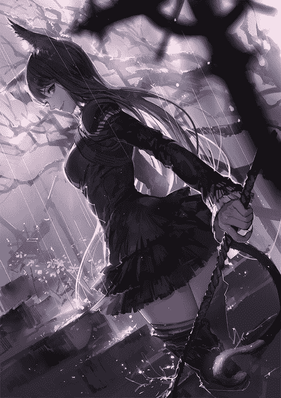

# 莫亚的复仇

作者：lanbo

TID：21316

 

# 1

嘛..很久之前自己写的了，但是一直没有在gn发过

 

# 2

<ignore_js_op>[少女时期莫亚人设图.jpg](forum.php?mod=attachment&aid=NjE5ODV8ODcyNjIzOTJ8MTYwMDg4ODkyMHwxODIzMHwyMTMxNg%3D%3D&nothumb=yes) *(152.68 KB, 下載次數: 10)*

[下載附件](forum.php?mod=attachment&aid=NjE5ODV8ODcyNjIzOTJ8MTYwMDg4ODkyMHwxODIzMHwyMTMxNg%3D%3D&nothumb=yes)

2016-7-1 19:53 上傳  

</ignore_js_op> <ignore_js_op>[萝莉时期莫亚人设图.jpg](forum.php?mod=attachment&aid=NjE5ODR8NGUzZmM1NDl8MTYwMDg4ODkyMHwxODIzMHwyMTMxNg%3D%3D&nothumb=yes) *(104.34 KB, 下載次數: 12)*

[下載附件](forum.php?mod=attachment&aid=NjE5ODR8NGUzZmM1NDl8MTYwMDg4ODkyMHwxODIzMHwyMTMxNg%3D%3D&nothumb=yes)

2016-7-1 19:53 上傳  

</ignore_js_op>  

# 3

序章

“尊敬的魔导大人...”

“又跑了，对吗？”

“...”

一看着装就知道有着不低地位的大臣正毕恭毕敬地向伊米利亚的首席魔导诉苦。

“当时跟您提过不要这么早激活她的念力，她还这么小，有了念力真的很难管住

的...“

“她在求我的那几天里表现得可乖了，又端茶又倒水的。我实在是拗不过她，所以才答应的，谁知道她却是个小恶魔，现在也只好拿她没办法了。”

“但今天可是两百年庆典的大日子，还有一个小时就要正式开始了，您真的不打算亲自去找一下她吗。”

“算了，随她吧...孩子大了也确实是管不住了。”

说罢两人也只好对着叹一口气，继续商量着如何应付那些前来参加盛典的客人。

-----------------------------------------------------------------------------------------------------------------

盛典举办在与伊米利亚和伊加罗蒂两大国都接壤的一个中立小国特华尔，为了这次的盛典，两国都花费了不少金钱和精力。一是为了庆祝这一伟大时刻，二也是想在庆典上展现自己国力。按贵族礼仪来讲，身为伊米利亚首席魔导的独女，莫亚是有义务出席的，但此时此刻，仅仅11岁的莫亚由于十分厌烦这种僵硬无趣的礼仪，再一次地偷偷从专为贵族们休息用的宫殿中跑出，一个人漫步在周围的森林里。莫亚爬到一块石头边缘，晃荡着双腿无聊地看着远处领土边境的哨塔。 满溢着魔力的哨塔从塔顶射出冲天的光芒，时刻警告着靠近的一切生物。

身为贵族之女，莫亚知道自己身上所肩负的责任，但年纪还小的她就是不想被这些所束缚。

“好烦呀.....”

少女就这样躺在冰冷的石头上仰望着夜空，脑子里想的全是那些无聊的礼仪规范。周围的虫鸣听起来倒是悦耳，莫亚甚至觉得这些都比父亲请的那些演奏大师们的表演要好听得多。莫亚慢慢地闭上眼，对时间和空间的感知也渐渐消失，就这样，她竟然就在这样的地方睡着了...

不知过了多久，突然，睡梦中的莫亚突然被一种极度压抑的感觉惊醒，莫亚警觉地望向四周，可四周却明明什么都没发生，只是安静地出奇。森林还是那样的森林，夜空也丝毫没有改版，只是说不出来的奇怪，似乎周围有点太安静了。

“等等，哨塔...”

莫亚突然察觉到，刚刚她好像连哨塔的影子都没有看到，难道是自己睡着的时候被带到了别的地方吗。越想越诡异的莫亚慌张的回忆着之前来的路，再顺着路摸索着回去。因为逃出来的时候也没走远，所以找到回去的路也比较轻松，可是到达原先庆典的位置才发现，之前的外围的礼乐队现在全部变成伊加罗蒂的士兵把守在外。原先的举行典礼的场地现在已经完全被士兵围着死死的，但不知为何，一阵阵的惊叹声从远处传来。

感觉到诡异的莫亚已经不敢再往前走一步，只好赶紧先躲在旁边的草垛里。为了弄清楚到底是怎么回事，莫亚不熟练地默念咒语，用出刚刚才学到的视界术，想看到人群中间的事物。

终于，莫亚看到了…尽管很模糊，但她所见到的几乎使得她惊叫出声。

远看似乎是伊米利亚地图被平铺在地面，但当莫亚凑近看后，却发现这里，就是她所生活，成长的土地。伊米利亚首都的尖塔，围绕首都的河流，平民居住的农庄…她记忆中的一切全部被按比例缩小到一张地图的大小。

尽管她很想想象成这一切也许真的只是一个地图模型，一个逼真的地图模型，但那时隐时现闪烁的光芒，却无情地摧毁了这个幻想。这光芒便是她见过的，自己父亲的成名咒术---“炽天使”…只是现在看起来是如此的脆弱无力，似乎只能放出一点微弱的光芒。”

莫亚的眼泪已经流了下来，但是却用自己的双手强捂住嘴不让自己放出一点声音。

“魔导大人！这到底是怎么回事啊！”之前与魔导对话的大臣现在已经丝毫不注意自己的形象，拽着他眼前之人的袖子哭喊道。

此时此刻，整个房间的人都乱作一团，因为从窗外看去，那遮住半个天空的，伊加罗蒂王女的身影仅仅只是站着，便足以鞭挞，蹂躏着每一个人。

“既然这招也没有用了…看来…”

“你每次都有解决方法的！魔导大人！”大臣已经近乎崩溃，差点扑到首席魔导师身上。

“有的，”他转向大臣苦笑说道。

“我们现在不如直接坐下来，歇歇就好了。”

大臣听到这句后，再也没有了任何求生的勇气，眼神慢慢变得无神，向魔导点点头，嘴里喃喃地离开了。

魔导也正如他之前所说的，坐了下来，开始望着天空。

“等等！这是…” 突然，他感觉到空气中的一丝魔法波动有些熟悉，这是一种血缘上的熟悉。

莫亚此时此刻正观察着自己的父亲身边的一切，但她突然发现，眼前父亲的影像突然看向自己。透过那层虚幻的雾气直接直视着自己！

魔导瞬间激动了起来，拿起本来是写着演讲文书的纸开始写起字来。

“别哭。” 大但有些潦草的字体出现在那演讲文书上。尽管魔导看不到她女儿具体是什么样子，但作为一个最了解女儿的人，也不需要这些。

“躲起来，永远”魔导快速地写道。突然，他感觉到地面开始的震动，于是加快了写字速度。

“在这里，找”魔导在“这里”两个字下面，重重地画了好几道横线。

“活下去。”然后，魔导的身影已经被阴影笼罩起来。

最后，文书上面被画上了一个笑脸，欣慰的笑容也出现在魔导的脸上。下一秒，整个影像便被黑色完全取代，什么也看不到了。

“执行”

来自费德拉家族的长女丽安娜，由于魔法天赋超群，深受伊加罗蒂大魔导的偏爱，于是被选为这次行动的执行者，当她听到后，便将刚刚穿着典雅晚礼鞋的右脚优雅地点在伊米利亚地图版图的最下面，是一小块特华尔领土，也就是大部分伊米利亚贵族刚刚休息的地方。莫亚这才注意到，庆典那一边的森林全部消失，只剩下空荡荡的地面，诡异到让人窒息。

年仅17岁的长女，心中却一点也没有怜悯，也许对她而言，她脚下的那些生命早就失去了意义，只是灰尘罢了。面无表情地，继续将另一只脚也踏进伊米利亚版图。之前也许只是脚尖真正碾到了大地上，但这次确实整只脚一点没有缝隙地与地面接触。数十万生命就这样，无声地陨落。这只脚再抬起时，刚刚踏过的那片土地，只剩下一道的痕迹和完全被翻出的土地。留下的鞋印对脚下的那些人来说也许比山还要高，但，对丽安娜来说，仅仅只是一道鞋印而已。

每次踏步都是用脚尖先着地，再缓缓踩下，如跳舞般收割着脚下一整个国家平民的生命。

住在伊米利亚另一边的人民也可以清晰的看到丽安娜的动作，这场面如末日的压抑般将所有人逼疯。

旁边的次女丽莎娜就站在她旁边，看着她“执行”着这一切。突然次女眉头一皱，似乎是有些不忍，站起身向国王说了些什么。

此时莫亚心中突然一喜，期盼着这个和她年龄差不多大的次女能挽救这一切。

“姐姐没看到湖上还有岛呢。”

当莫亚看到国王对丽安娜说了几句话后她便转身向身后遗漏的湖水也温柔地踩了下去时，莫亚的心已经被无情地捏碎，对次女抱着的那一点希望也瞬间转化为绝望。此时此刻莫亚不知为什么，对眼前的次女已经恨入骨髓，也许正是这样给予希望再粉碎的举动，彻彻底底地激怒了莫亚。

这次执行是以魔法影像的形式记录了全程，眼看着自己的国家一点一点地被以这种方式毁灭，甚至让全世界人都见证了这一切。耻辱感，愤怒以及痛苦在这样一个少女的心中狠狠的留下了不可磨灭的痕迹。嘴巴已经被双手捂得发红，眼泪也不停地向外涌。

短短几分钟后，伊米利亚的领土彻底被摧毁，仅仅只是被王女，丽安娜一个人，摧毁殆尽。所有的农场，城市，现在只剩下一片片废墟，遗留在土地上，当然，也有丽安娜的晚礼鞋上。

目睹了全程的莫亚，此时身体开始痛苦的抽搐，但仍然紧紧克制住自己的情绪，克制自己不要发出任何声音。

“别哭。”

脑海里，父亲临终前留下的字样又突然出现。

“等等，父亲…”

一想到父亲，莫亚再次哭了出来。红肿的眼睛痛恨地盯着眼前的一切，刚刚的场景一次又一次的在莫亚的脑中回放。但慢慢地，从眼中留下的眼泪越来越少，直到最后，完全流尽。

也许这一次…已经将莫亚一生的眼泪流尽。

 

# 4

第一章

距离特华尔事变已然有五年，当时为了歼灭伊米利亚贵族，特华尔一半的领土也因此被迫缩小，毁灭。残存的特华尔人虽然无比痛恨伊加罗蒂，但为了重建家园，却不得不无奈地向伊加罗蒂效忠以此作条件来获得补偿金。而原本伊米利亚富饶的土地现在只剩下无比诡异的平地，这也引得不少人前来参观这样一幅景象，因此，特华尔近几年靠着这样丰富的人流量以及来自伊加罗蒂的补助金，经济竟然慢慢地有了复苏的迹象。

拉瓦坐落于特华尔交通网络的中心，原本只是一个大一点的驿站而已，现在却发展成了一座规模不小的商业城市，甚至每年都会在这里举办各种各样的展览以及拍卖会。尽管名气不是很大，但每年仍然会将方圆几十里的居民都吸引过来。虽然大部分人其实也都买不起什么，但热闹总归是要看的。

在拍卖会的会展中心，人群的惊呼一阵一阵传来。或是稀世珍宝，或是珍贵的魔法卷轴，甚至连一些比较稀有的奴隶也都有卖。

“伊加罗蒂高阶魔导亲自赋咒冰壶一件，高效魔力转化，只要100金币了！”

叫卖者在一个大型木质平台上努力地喷洒着唾沫。在他嘴里，任何商品都似乎有永远说不完的优点。

“哇…竟然没有魔力输入还一直冒着寒气呢。”

“生活用品也这么贵，买的人都傻吗？”

“喂，买不起也不要这么酸啊你！”

底下的人群小声嘀咕起来，羡慕赞叹的声音不绝于耳。

莫亚坐在平台旁边的屋顶上，两手交叉拖着下巴看着地下的人不停叫价，争吵，最后再平息。如今莫亚早已褪去一身稚气，身材的线条也开始显现出来，只见她两手一撑，整个身体往前一跃，双脚熟练而又轻盈的着地，一套行云流水般的动作。

莫亚不屑地看了一眼人群，便转过头自顾自地离开了。也许第一次拍卖会她还兴致勃勃地观察这些新奇的事物，今年这次对她而言已经是第四次了，只是看个开头便了解全程的她早已失去了任何的兴趣。莫亚走在这条无比熟悉的回家路上，看着周围熟悉的景物，熟悉的路人，好似自己本该属于这里，而贵族之女的身份，也许只是曾经的一次幻想罢了。然而五年前的那件事却时时刻刻提醒着这一切并不是幻想，心中的那份仇恨也一次又一次地被铭刻。

-------------------------------------------------------------------------------------------------------------------------------

五年前，当伊加罗蒂举行了真正的，只属于自己的盛典后，便离开了那片森林，谁也没有发现这个一直躲在草丛里发抖的伊米利亚遗孤。经历了这样的噩梦之后，年幼的莫亚瑟瑟发抖实属理所应当，然而，除了恐惧带来的发抖，还有一种微妙的兴奋。面对自己这样的一种奇怪的感觉，莫亚也有些疑惑。在莫亚的脑海中，一种精妙，庞大的法术模型正以一种奇妙的姿态映射。莫亚能感觉到，在这模型外围包裹着的正是自己的念力，似乎在刚刚这个地区遭受到魔法冲击时，自己刚刚激活不久的念力将其刻在了自己脑海里。如果有适当魔力能够激活这样的法术模型，理论上是可以达到这个法术本身的效果的。换句话说，缩小魔法，被意外地复制了。

莫亚对于自己刚刚获得的念力还并不熟练，但却对这个法术模型无比熟悉，作为首席魔导的女儿，即使还没有正式开始系统学习魔法以及念力，但在父亲平时的言传身教下，对这些东西早已有所领悟。此时此刻，莫亚可以确定，她脑海里的这个模型，与眼前伊米利亚被践踏后的废墟所残留的魔法痕迹一模一样。 莫亚立刻尝试着对准身旁的一块大石头释放出刚刚这个法术的模拟版本，可石头却似乎毫不领情，连一丝缩小的痕迹都看不到。莫亚又尝试了一次，可这一次几乎用光了自己体内那可怜的魔力库存的全部，然而实验对象依然屹立在那里

纹丝未动。

刚刚燃起的希望之光瞬间熄灭，莫亚也只好垂头丧气的依靠在石头上稍微歇息一下以补充刚刚几乎魔力透支所带来的副作用。就在这时，莫亚却突然发现，石头底部周围却突然出现了一圈，像是用笔画过的一圈痕迹。看着这一道浅浅的划痕，莫亚两眼似乎有一瞬放出接近疯狂的光芒，但又马上回到之前平静的样子，只留下嘴角那若隐若现，有些邪魅的微笑。

只沉浸在这份喜悦中一会，莫亚又平稳下心情，立刻转身走向那片被践踏得不成样子的废墟。

原本风光富饶的伊米利亚土地，如今满目疮痍。原先雄伟无比的山脉，现在却被拦腰截断，中间部分山脉被完全踩平，原本的山脉现在只剩一条有着清晰鞋底纹路的峡谷。包括首都在内的主要城市由于其建筑分布比较密集，在丽莎娜的眼里辨识度较高，所以成为了重点毁灭对象，对于其他地方丽安娜也许只是单纯的踩下，让碾压和强烈的震动虐杀着脚下的生命，而对于这些主要城市，丽安娜总是不忘在踩过后再细细的碾磨一下，直到土地表层都被翻了几层，丽安娜才肯停下，继续她的杀戮。

然而，即使如此，在少数临海以及偏远地区仍然有少量人类幸存，但大部分也只是身体还''活着''，面对这地狱般的审判以及自己已经沦落到一粒灰尘都不如的现状，绝大部分幸存者已经陷入癫狂，一些心理承受能力弱小的人，在认清了自己的状况后，甚至已经选择自己结束掉自己这卑微的生命，至少再被以其他可笑的方式抹杀之前。

当人们听到巨大的震动再次出现在远方时，心中那最后一丝侥幸也荡然无存，看着远方的人影越来越大，本身还抱有一点希望的人此时也瞬间崩溃，索性放弃抵抗，坦然面对这最后的几秒。

然而，震动在接近最大时，却戛然而止。人们好奇地望向天，由于莫亚不是很经常出席各大礼，只有少部分幸存者认出那是自己国家的首席魔导的女儿时，喜极而泣。或激动地朝天大吼，呼唤着莫亚的名字，或低头悄然哭泣，既悲哀自己的命运又庆幸自己似乎还没有完全被神放弃，在最关键的时候救世主终于来临。没认出莫亚的人通过那些人欣喜若狂的举动也能猜到眼前这张遮住整个天空的脸的主人并不是坏人，也加入了这些疯狂庆祝地人群里。

但莫亚却并不能直接看到这些尘埃般的子民，勉强用残余的那一点魔力，才支撑起一个微弱的视界术。由于幸存者其实数量上已经是微乎其微，莫亚搜索了近一分钟才找到一小撮没有被屠杀的居民。但即使这只是一小撮，依然使得莫亚高兴地快要跳起来，莫亚知道这意味着自己的国家还没有灭亡，至少，自己的子民还没有全部灭亡，也许还有更多的幸存者，也许还有机会...

''你们先找个结实一点的地方扶着，可能等下会有些颠簸哦。''

莫亚是绝不会放心自己的国家就这样晾在荒郊野外，虽然自己的魔力已经透支，但念力还很充足，于是莫亚慢慢动用念力，将整个废墟连土地一起挖起来，再用自己的双手捧起。在念力的辅助下，对居民们来说足矣产生飓风的气流被完美地格挡，同时也减小了莫亚的双手所产生的震动。就这样，莫亚一步一步，小心翼翼地将其捧着向周围的村庄进发。

经历了漫长的徒步路途后，莫亚最终被一户农家当作被另一半领土上的特华尔难民收养，伊米利亚废墟也被莫亚悄悄地安置在自己居住的房间的抽屉内，并一直在其周围充盈一些念力以作保护和预警。莫亚就这样，为了不暴露原本的身份，只好作为一个普通难民，低调又艰难地在这个村庄平静的生活到现在。

___________________________________________________________________________

回忆着之前遭遇的莫亚不知不觉已经快走到了家。一回到家便惯例地检查一下自己微型的国家。 与之前满目疮痍的残骸不同，如今在莫亚的帮助下，土地上之前残留的鞋底灰尘，城市残骸包括平民遗骸都已经被清理。当然，在清理过程中的一切有价值的物品都被保留了下来，尽管莫亚目前掌握的缩小法术可以复原自己缩小的目标，但并不能将其他人的施法产物复原，莫亚仍一直努力寻找着复原方法，也锻炼着自己的能力。  城市上空有一颗发光的球体，这是莫亚为自己的子民们自行学习的第一个法术，为了保证每日的光照并且又能在抽屉里隐蔽，莫亚只好在抽屉里保留一个最低级的小型照明法术。随着废墟内残存的法术书籍的挖掘出土，莫亚也一直都在学习新的法术，练习着自己贵族血统传承下来的念力。时刻不忘那，五年前的屈辱。

 

# 5

第二章

刚刚莫亚路过的拍卖会现在进入到白热化，会场人数也早已爆棚，各式各样的商品疯狂吸引着人们的眼球，虽然大部分商品的标价对于这些平民而言都是天价，但仍然阻挡不住他们看热闹的热情。

在现场变得越来越难以控制的同时，一些聪明的“商品”开始了他们的逃亡计划。

“瑞斯团长，您…您真的有把握吗…”  在拍卖仓库里的一个阴暗角落，一名少年气喘吁吁地对着他身边的较年长的大叔说道。

“反正都已经逃出来了，难道你还想爬回那个笼子嘛？”

少年被这样一呛，也觉得自己的问题实在不妥，便只好乖乖回到他们身后的人群里。 此时，在这个小小的角落里，聚集着二三十个逃亡中的“商品”。领头的瑞斯团长曾在某个贵族的私人马戏团工作，当整个家族被推翻时，自己的马戏团也只好被变卖降级成奴隶，由于之前靠表演带来的名气不小，即使被缩小后，马戏团的表演依然很受欢迎。几经转手后，整个团最终被决定在拍卖会上拍卖，而就在叫卖者在前台大肆夸耀着他们的表演时，后台的笼子已经被破开了一个小洞，瑞斯带着他的所有团员和其他关在一个笼子里的奴隶们一起逃了出来。

尽管他们现在才刚刚从笼子逃到仓库的门口，但对于他们只有5cm的大小而言，这已经消耗了大量的体力。经常表演的马戏团团员们身体固然是好于一般人，但考虑到这些逃亡者里还有些妇孺，他们也只好陪着一起休息一下。

“恕我冒昧，瑞斯团长。”人群中一位打扮算得上比较光鲜的中年妇女突然问道。

　　　　　“其实，我一直不明白为什么您那么想逃出去。如果您老老实实地待在笼子里被人买走，凭着您的技术也绝对会被伺候得好好的，不愁吃不愁穿。哪像我们这些贵族奴隶，由于之前的贵族身份，假如被另一个贵族买走了也许还能惺惺相惜一下；如果被平民买走了．．．那日子可就太惨了。”　妇女说时眼神不停地向团员们打量，似乎还露出一点嫉妒的光芒。

　　　　   “这种悲哀的生活怎么可能满足，与其一直这样卑贱地活下去，还不如拼一把逃出去，哪怕失败也值了。”

“逃出去，逃出去之后呢？　你不会以为你还能恢复成原来的大小吧，被魔导学院缩小后的人，只有再找到他们才有可能恢复，劝你还是别天真了。”

瑞斯还没来得及回答，之前发问的少年倒是站了出来。“喂，你能不能不说风凉话，瑞斯团长辛辛苦苦把你们从笼子里弄出来，就不能体谅一下他吗，不帮忙就算了还说这种打消士气的话。”

“怎么了年轻人，说两句实话都不行？”

“你！“ 见少年几乎要向老妇伸手，瑞斯立刻拦住他，”算了别说了，休息得应该够了。大家都收拾收拾准备上路吧。“

“哼。” 老妇听完也不再说话，起身准备出发了。

然而，正当所有人准备离开时，地面突然传来不断增强的震动，这个信号无疑使得每个人的神经紧张起来。人们发现震动丝毫没有减轻的迹象时，之前聚在一起的人堆也开始向外分散，随时准备各自奔逃。

“大家别慌…也许…”瑞斯团长的话还没说完，所有人最担心的一幕便发生了。人群旁边的大门被打开，门后的踏入一位女仆装扮的少女。由于人数过多，少女很轻易地就注意到了脚下的人群。当少女与人群目光相交时，两边都吓了一跳。 缩小人类的恐慌不必多言，少女的惊慌则是因为看管这些小人本该是自己的职责。虽然自己是奴隶身份但拥有着正常人的体型，但如果犯了像这样的错误的话，这样的恩赐也许就会被她的主人收回了。

抱着这样的想法，女仆赶紧平复心情，急忙蹲下来想将这一切复原。

“我…我不想伤害你们，请你们不要跑。“少女的语气并不强硬，即使面对比她弱小这么多的小人奴隶，她的话语也丝毫没有任何底气。也许这是因为她和这些人类在社会地位上其实并没有什么太大差别吧。

但小人怎么可能会听话，在他们眼里，如此悬殊的体型差距带来的就是最纯粹的恐惧，这样的恐惧直接将已经疲惫的人群最后一点力气逼出来奔逃。 少女眼看没有人肯听她的话，只好蹲下身来，尝试轻轻地用右手将他们捉起来放到左手捏住，想直接靠武力来把这烂摊子复原，而又尽可能的不伤害到这些同样可怜的小人。

“你们不要再跑啦，我可以不伤害你们，但你们确定其他人也能像我这样吗？”

看着自己身边的同伴一个一个被巨大的手捏起再消失在视野中，本来就不抱什么希望的人们已经逐渐开始自暴自弃。是啊，就算从这一个人手上逃走，那门外又有多少人等着自己呢。紧接着，人群的扩散速度开始减缓下来，直至停止。 不少人已经迷茫地看着头顶，不知所措。

“这样就对了嘛！”女仆看着底下的人群开始乖乖听话，心中也开始庆幸自己可以免受惩罚了。

此时，人群中的大部分都已经聚集在少女脚下听候命令，但瑞斯团长以及他之前的团员们仍然没有放弃希望，全力向外奔跑着。

“前面的墙壁下有裂缝，我们可以钻进去躲一下！” 瑞斯一边跑，一边向身后轻喊着。

一行人也纷纷看到了团长口中的洞穴，开始有了目标地狂奔。但就在这时，这些人的动作已经引起了巨大少女的注意。

“喂！那边的人快停下啊！” 说着巨大女仆便急忙开始迈出步伐追赶。 尽管女仆跑步速度相对而言已经非常快了，但包括瑞斯在内的数名团员已经成功钻进了那个裂缝，地面上只有少数几个人还在奋力奔跑。

“快点！不要回头看，直接跑就好！” 瑞斯大喊道。

最后几人在再一次感受到逐渐增大的地面震动后，自己的体能完全被激发出来，开始不要命地往前做最后的冲刺。但并不是所有人都那么幸运，正当跑在最后面的人也好不容易挤入裂缝时，一故巨大的压力向他的腰间袭来。两根手指此时已经捏在他的腰上，而他所能做的只有绝望地用两只胳膊扒着墙缝，试图抵抗这不可能抗衡的力量。

女仆也感受到了这小小的阻力，低头好奇看着小人。

“喂， 手臂，会断掉的哦。” 女仆开口提醒道。

被抓住的男人不甘地看着已经安全的人们，眼神中流露出的除了绝望，还有一丝怨恨，但墙内的人们实在无能为力，只能眼睁睁地看着他与巨人这一边倒的较力。

女仆确实不想让他受伤，于是只好开始轻微晃动男子的下半身体想让他放弃挣扎，但男子的毅力出乎意料的坚韧，即使身体已经开始有了撕裂的痛楚，但两只胳膊仍死死地抓住不放。

“我有那么可怕吗？竟然这样都不肯放手。” 女仆似乎有些生气，手中的力度再一次加大。“要知道，以缩小奴隶的身份，如果不小心残疾的话，可是没有任何生存下去的可能哦。” 同时女仆除了晃动之外，还开始扭动男人的身体。

在身心两重的折磨下，男人最终还是无法承受这样的痛楚，已经伤痕累累的胳膊最终还是放弃了抵抗，任由女仆将他提起，和身后的小人群们一起被关了起来。

被男人坚韧的毅力小小的震撼住了的女仆，似乎忘记了那墙壁的裂缝中还有其他人的存在，直接抱着这一群逃亡失败的奴隶回到他们的笼子处，然后便又开始忙着自己的工作了。瑞斯以及仅存的几位团员也因此成功地沿着裂缝逃跑了。