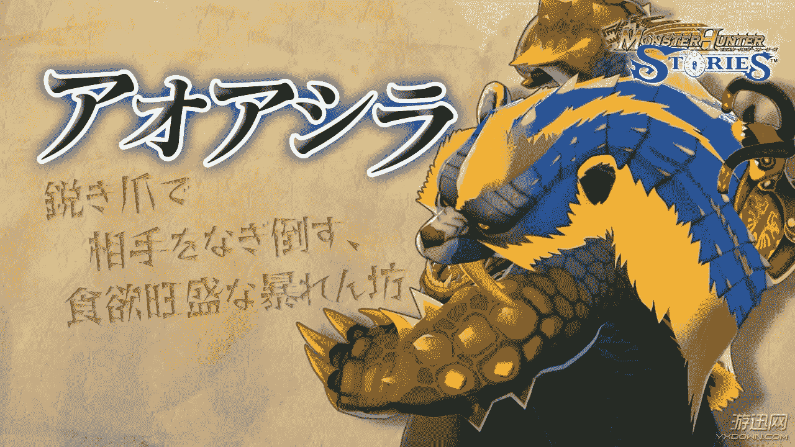
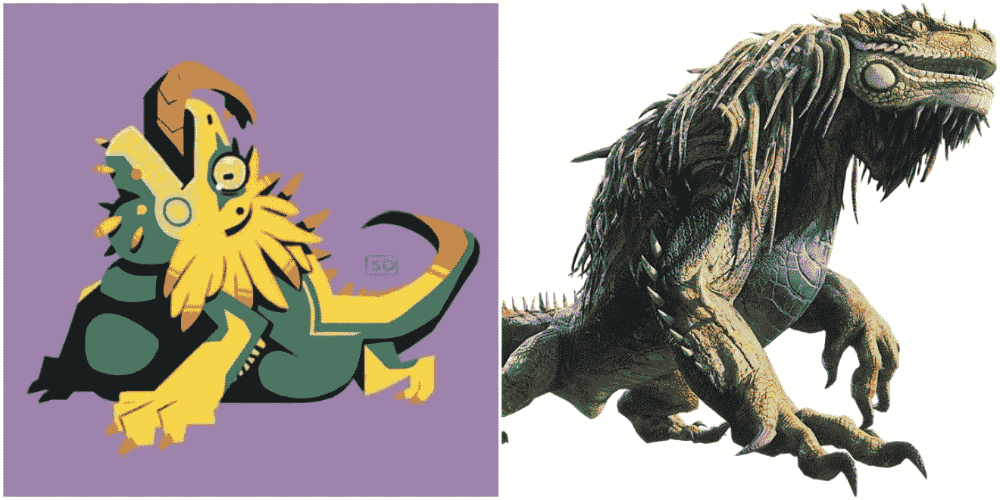

# 萤火虫之芯

作者：蘑菇菇

TID：26570

<title>1</title> <link href="../Styles/Style.css" type="text/css" rel="stylesheet">

# 1

*本帖最後由 蘑菇咕 於 2019-4-24 20:23 編輯*

         学业繁忙……暂时停更
         首先要说的是。。由于找不到互动区我就发在这里了，有dalao知道要怎么做请告诉我...8"         各位好，这里是新人蘑菇菇（划重点）。欢迎收看我的处女作5" 首次发帖，请大家多多指教！         如你所见这是一个生存游戏，作为观众（主角）你们可以在出现选项时进行选择。本游戏可以读档重来，原地复活。         一些重要的线索可能隐藏在BE里面，世界观部分借用了怪物猎人，但是不完全相同，后面慢慢展开介绍，不用担心看不懂。         将来可能会留下一些可以供大家自己想办法的开放性选项。除了固定选项之外，如果你还有什么S.A.O的操作想做的话也欢迎留言，有时间的话会给安排上，会被改成主线也说不好。         如果有不懂的地方可以提问哦，不涉及剧透的话会回复的。顺便也可以帮我修改下逻辑错误。。
         再次感谢观看。那么现在开启你的 冒险！

序章 长天下，密林中
      如同很多动人心魄的冒险传说一样，我的故事也要从一片阴冷的森林说起。      如果我没有记错的话，那是盛夏的一天，疏影摇曳的夜晚，我，一名初心者魔物猎人（Monster Hunter），正在布兰德森林的溪流附近追猎青熊兽。青熊兽，就是那种偶尔会到村子附近偷吃蜂蜜的可爱小混蛋。青色的背甲，圆滚滚的身材，大概有两三米长，并不十分锋利的爪子和牙齿。说真的，信不信由你，虽然我是初心者，但是这种简单的魔物对我来说还是不在话下。而且，确切的说，这次接到的委托并不是狩猎，而是击退青熊兽。一般来说溪流区域属于安全区，大型魔物很少出现。只有青熊兽，大野猪王，大贼龙这种常见的魔物活动。      月下的溪流区域并不十分阴暗，小溪两侧的开阔区域笼罩在一片薄雾之中，而月光却碎银一般撒在整个水面，整个阿尔贡溪仿佛是一条潺潺作响的银绸缎。岸边的草丛中闪着点点亮斑，这是雷光虫和光虫的杰作。空气中传来泥土的芬芳，果实成熟的气息，一种不好形容的香气，以及，我在追寻的小笨蛋的味道。      一身的轻甲，简易的盾牌，不算很长却还算锋利的短刀，这就是我此行的装备。虽然任务简单，但是我也不会在装备上放松警惕。作为初心，能在猎人工会买到这套装备也算不容易，我可是花了整整一周收集大贼龙的鳞。并且这几乎花光了我所有的积蓄，所以我才接下这个紧急任务。说来也奇怪，这份委托没有委托人落款，只给出了一个任务完成后的交易地址。要不是它报酬丰厚，而我正巧要饿肚子，恐怕…我要对它的真实性产生些怀疑。      我一边回想着接任务的过程，一边设置落穴陷阱。青熊兽就在附近，只要在陷阱上放一些蜂蜜，它肯定就会中招了，嘿嘿，到时候再教训它一番，任务应该就能完成了。      安置好诱饵与陷阱，我悄悄趴到了一个半身高的灌木丛中。月光是那么明朗，泥土是那么轻柔，虫儿的叫声是那么有节奏，空气是那么清香……我的眼皮开始抑制不住的打架……意识变得模糊起来       ……       咯吱咯吱的声音       杂乱的脚步声       刮擦地面的声音       ……       我渐渐从昏昏欲睡的氛围中警觉起来（魔物猎人的本能，发动！），空气中似乎传来某些危险的味道。       雾气突然十分浓密，我小心翼翼的拿起盾牌短剑，费力剥开挡住身体的枝条，向陷阱的方向望去，我竟然看到了一个巨大而模糊的影子！这让我有些吃惊，如果说这是青熊兽，那体积也太不可思议了。如果它不是青熊兽，那也不会有其他生物偷吃蜂蜜。思考良久，我决定……

A慢慢向影子接近B后退远离黑影

<title>2</title> <link href="../Styles/Style.css" type="text/css" rel="stylesheet">

# 2

> assassindark 發表於 2019-3-15 20:54
> B 不作死就不會死

有人选B我真是太开心了<title>3</title> <link href="../Styles/Style.css" type="text/css" rel="stylesheet">

# 3

> [水泥彼岸 發表於 2019-3-15 21:03](https://giantessnight.com/gnforum2012/forum.php?mod=redirect&goto=findpost&pid=400340&ptid=26570)
> A 死亡并不可怕，可怕的是死的毫无意义，让我来为后来者铺路吧
> 人生就是要作死啊，只要作不死就往死里作！ ...

勇士，我很欣赏你
<title>4</title> <link href="../Styles/Style.css" type="text/css" rel="stylesheet">

# 4

> [寻觅未人 發表於 2019-3-16 00:05](https://giantessnight.com/gnforum2012/forum.php?mod=redirect&goto=findpost&pid=400346&ptid=26570)
> 似曾相识的文章啊，楼主是贴吧那个人吗？

是的，这里的稍微做了些修改，然后两边会一起更的
<title>5</title> <link href="../Styles/Style.css" type="text/css" rel="stylesheet">

# 5

> [7509 發表於 2019-3-16 00:11](https://giantessnight.com/gnforum2012/forum.php?mod=redirect&goto=findpost&pid=400347&ptid=26570)
> 在回复有积分赚的条件下，搞这种互动文章，可能会让一小部分人随便选一个来蹭分，而且有时候凭直觉的选择也 ...

谢谢提醒，我会认真看看规则的
<title>6</title> <link href="../Styles/Style.css" type="text/css" rel="stylesheet">

# 6

鉴于楼上有位dalao提到的关于刷分的问题，由于现在找不到互动专区。我会把AB选项改为支持和反对。如果各位没有什么头绪请直接选择支持和反对。有想法的选择欢迎评论哦。.jpg)<title>7</title> <link href="../Styles/Style.css" type="text/css" rel="stylesheet">

# 7

*本帖最後由 蘑菇咕 於 2019-3-24 15:36 編輯*

      这里主线剧情是A，但是如果选择B项……
      这种诡异的体型，根本就不可能是青熊兽，如果是什么了不得的大型魔物就糟糕了。诡异的声音不听的刺激着我的神经，我小心翼翼地慢慢后退，可是本来不大的灌木丛似乎变得十分广阔……

莫名其妙的白雾沉沉的垂在树林中，我努力想脱离昏昏欲睡的状态，但是身体好像被麻醉了一样不听使唤。这种感觉就好像是中了眠狗龙的睡眠吐息一样，不过眠狗龙生活在雪山区啊......

一番胡思乱想后，黑影的声音变得安静下来，杂乱无章的水流声音却越来越响。也许是那怪物已经离开了。不过，三十六计，走为上策，鬼知道它会不会还在  附近游荡，而且我也距离岸边越来越近了，只要穿过小溪，就有可能碰到其他猎人了。
       我无精打采地低头赶路，岸边的泥土十分湿润，如果不看清楚很可能会摔倒。况且路上时不时还有一些石头和不太好形容的大型裂痕。
       哗啦！
       左边突然传来刺耳的响动，我下意识的扭过头观望，却看到一个长长的阴影一闪而过…
那是什么？巨蟒吗？！这种地方哪有这样的生物？！突如其来的惊吓让我清醒了一些，我急忙拔出武器，摆出了防御姿势。但是为时已晚，一股根本不讲道理的力量从我的屁股传来，我的身体随即开始了完美的抛物线运动。相信我，我一向讨厌万有引力，但是也许是这股力量太过强大，我竟然感觉自己的身体十分轻盈……
      一瞬间，我的世界天旋地转，然后我看到了我十分不想看到的画面:我的身下就是阿尔贡溪，而且还有一张血盆大口正令人愉快的迎接着我，是大贼龙，不……超大号的大贼龙，这种生物平常就喜欢把小型草食动物一口吞掉，然后找个隐蔽的地方慢慢消化……说真的，道理我都懂，但是为什么贼龙这么大！！！
      我眼睁睁地看着自己距离死亡越来越近，但是却没有任何办法…..
      黑暗吞没了我，腥臭的气息、怪物强劲的心跳、滚烫的酸液、流水的哀悼声….      

恭喜您达成结局 BE1：

   众所周知，咸鱼溶于水。<title>8</title> <link href="../Styles/Style.css" type="text/css" rel="stylesheet">

# 8

*本帖最後由 蘑菇咕 於 2019-3-24 15:37 編輯*

恭喜，A线是正确答案
**初章 甜食爱好家**
       我还是决定过去看看！在猎人前辈之间一直流传着一句话:怪物越大就越蠢。虽然前辈平时表现得大手大脚，随随便便，不过在狩猎上倒是不含糊，不妨就相信一次。

不知道是因为迷雾阻碍了视野，还是头晕脑胀搞不清路程，从灌木丛到陷阱这段距离似乎比之前要远一些，果然人类不能走直线吗？但是随着距离逐渐拉进，模糊的大型黑影的轮廓越来越清晰，这看起来像是一种直立活动的生物。我尽量迅速的用昏昏沉沉的脑子搜索答案，但是工会学院的教程里并不存在这种魔物，《蘑菇菇教你辨识亚种魔物》也没有什么作用…啊，这种没用的作者就应该被做成慕斯蛋糕…       果然，书到用时方恨少，饭到肥时方恨多……不过此时此刻我饿的前胸贴后背，为了迎接可能的对战，我拿出最后一块携带食料，一把塞进嘴里……
       就在这时，地面突然开始连续不断地震动起来，我慌忙抬头一看，果然，那团黑影越来越大，随着它不断晃动，大地也在有节奏的发出颤抖。“我X……”我好倒霉……当时我是想要这样说的，但是没有说出来。如果要问为什么的话，没有人能在嗓子被食物卡住的时候说出话。我拼命拍打自己，可是没有用！地面震动的越来越厉害，奇怪的是这个影子怎么看怎么像是人的轮廓。说真的，道理我都懂，但是这个人形为什么这么大！！但是黑影没有留给我想道理的机会。一道劲风扑面而来，撕开了迷雾，只来得及看到柱状白影一闪而过，我的身体随即开始了完美的抛物线运动。相信我，我一向讨厌万有引力，但是也许是这股力量太过强大，我竟然感觉自己的身体十分轻盈……可是我没能像自由的小鸟一样飞向天空，天旋地转中我感到又一股力量击中了我，不幸的我被死死的拍到了地上，“哇啊啊啊！！……”巨大的冲击挤出了肺中的气体，竟然挽救了被噎住的我。可我还是一点都高兴不起来……如果你从混乱中清醒过来，发现自己被一只巨大脚掌踩住上半个身体也会理解我的。
       “人类……那个，还有没有？”
       我循声望去，jio的主人正弯着腰看我，明亮的橙红色眼眸让人不禁联想到熟透的橙子，圆圆的脸蛋看起来很蓬松，水蓝色的长发随意的垂在两侧。
       我一时有些发呆，不仅仅是看到了梦幻般的黑影本尊，更重要的是……黑影本尊的体重正实实在在的压在我的身上，我根本无法呼吸！刚才已经噎了好久，再加上这一个千钧一jio，我的肺已经没有剩余的空气用来说话……
       时间默默流淌，少女依旧和我对视着，而我却只想翻白眼。显然，这位大小姐的智商不会超过80，好在我智商仍然在线，我决定:

      A 用嘴型表达自己的意思。（支持）
      B 酷刑是挠痒痒！（反对）
注：为防止刷分，没有想法要说的请直接选择支持或反对

PS：请慎重选择哦，BE2等着你来探索

<title>9</title> <link href="../Styles/Style.css" type="text/css" rel="stylesheet">

# 9

*本帖最後由 蘑菇咕 於 2019-3-24 15:38 編輯*

A线  很遗憾是个错误选项              

       现在还不清楚对方的底细，我决定采用一个看起来没有攻击性的做法。于是，尽管长时间失去氧气是我的肌肉崩的紧紧的，我还是努力的挤出一个灿烂如夏花的微笑，用口型抗议:fang kai wo！

橙红色的眼睛中没有泛起丝毫波澜，四周安静的出奇，只有溪水不懂礼节的发出哗哗声。夏夜沉闷的风儿玩弄着少女的长发，雾气看起来也已经褪去了一些。
       “人类，那个，还有没有？”清脆的声音打破了沉默。
       “mei you, kuai gun！”我的嘴这样回答道，但是奇迹般的还保持着笑容。
       四周再一次陷入沉默，这下连水声都没有了，空气中只剩下诚意满满的一筐尴尬。
       我的笑容逐渐消失，这样下去药丸！可是我的四肢已经完全麻痹，甚至开始轻轻抽搐……这种死法是会解锁人生成就的吧……
       少女似乎是露出了遗憾的眼神，她咬了咬嘴唇，突然抬起了脚:“那么，祝你好运，人类…”
       仿佛从深海浮出了水面，难以言喻的压力一瞬间消失殆尽，空气似乎是自动灌入我的身体，我贪婪地感受着美好的氧化反应，静静听着少女离开的脚步声，难道就算是赤脚走路也能发出这种有些刺耳的摩擦声吗？
       心脏疯狂的脉动着，四肢的触觉已经恢复。我用力从地上坐了起来，回想着刚才发生的一切。虽然脑子已经不再那么昏昏沉沉的，但是我仍然无法理解我自己的遭遇。
       呃……完全搞不明白，还是先回家比较好。下定决心后，我抬起头，直视我面前的大脑袋。这个脑袋大概有我一般身体那么长，鳄鱼一样的黄色眼睛凶狠地盯着我，脑袋上还长满黄毛，竟然还是一个中分的发型……
      “我X！大大大大贼龙！超大号贼……”
       说真的，我很遗憾……因为我人生的最后一句话竟然没有说完。
       尖厉的牙齿刺穿了我的身体，对于凶狠的魔物来说，我不过是血，肉和骨头。

END 
    恭喜您达成BE2
    血，肉和骨头

<title>10</title> <link href="../Styles/Style.css" type="text/css" rel="stylesheet">

# 10

*本帖最後由 蘑菇咕 於 2019-3-24 15:38 編輯*

更新主线B

     “勇敢果断的男人总是会更受欢迎。”曾几何时，在食堂与我争抢丸鸟腿的学长曾语重心长地对我说过。是啊……只有活着回到工会，才有机会把失去的鸟腿夺回来。

再这样下去…我一定会坚持不住的。这样死掉一定解锁人生成就的。
      我咬了咬牙，拼命控制着已经开始轻轻抽搐的手臂，这就好像是在反抗鬼压床一样。听着溪水杂乱的律动，我急切地努力着。手指，控制权获取；手腕，重连成功；小臂，肌肉激活……哈啊！我在内心嘶吼。求生的欲望在我的整个左臂充盈，它慢慢地抬了起来！
      潮湿的夜风吹过，发丝的缝隙中，血红的瞳色一闪而过，胸口强大的压力猛的消失殆尽。抬脚，后撤，射门，正中目标！整个动作没有超过一秒钟，因为我干涸的肺还没来得及将第一口空气泵入肺泡，痛觉神经的抗议就充满了大脑。
      我大概在空中做了两个高难的体操动作，然后以狗啃屎的姿势摔得七荤八素。我疯狂的呼吸着，吸气，呼出，这简单的氧化反应竟然如此美妙。
      “为什么要攻击莉雅？”清脆的声音打断了我贪婪地喘息。
      我抬头，少女的上唇紧紧包住下唇，露出两颗小虎牙，简单的蓝白衬衣轻轻摇摆，她眉毛微蹙，橙红的眼睛写满了委屈……
      委屈……我才委屈啊！
      “不是…你先…你先…攻击我的吗，我也没有想要攻击你。”我的声音有些嘶哑，好在四周很安静，我并不需要大声说话。
      少女的脸蛋突然变得微红，她把两只拳头送到嘴边:“莉雅，莉雅只是想要你的蜂蜜啦！”
      很遗憾，这个动作并没有让她平坦的身材发生多大变化。仔细看来，她的外形怎么看都像是十几岁的女孩子，除了…这巨大的体型。
      “那么，你为什么这么…这么…高？”
      “明明是你……”刺耳的摩擦声打断了少女的回复。渐渐褪去的白雾中，出现了一些影影绰绰的东西。
      我翻身站起，初心者短剑Lv2乖巧地落在掌心。多亏刚才的对话拖住了时间，我已经恢复了不少。这样大型的影子，恐怕比面前的少女还要夸张很多……
      “人类，快走。我们不是它们的对手。”少女突然开口说话。
      哈？我们？我内心有些惊讶。“这些都是什么？你到底是谁？”我迫不及待地喊出了自己的疑惑。
      “山下的废旧圆屋，请到那里去。”留下了这样的话，少女转身消失在烟雾中……
      废旧圆屋，那就在不远处的悬崖下面。她到底是什么人？我要按照她说的做吗？摩擦声越来越大，已经没有更多时间容我考虑。我飞快地开始了行动……

A朝少女消失的方向跑
B向悬崖跑 
蘑菇菇的小提示:
勇敢果断的男人才能成为优秀的怪物猎人！
本次错误选项有足控福利哦，猜的到吧，要选哪个选项。<title>11</title> <link href="../Styles/Style.css" type="text/css" rel="stylesheet">

# 11

除了固定选项之外，如果你还有什么S.A.O的操作想做的话也欢迎留言，有时间的话会给安排上，会被改成主线也说不好。<title>12</title> <link href="../Styles/Style.css" type="text/css" rel="stylesheet">

# 12

> [wwwnwy 發表於 2019-3-16 18:05](https://giantessnight.com/gnforum2012/forum.php?mod=redirect&goto=findpost&pid=400444&ptid=26570)
> 楼主能那么认真的码字 拿完全可以做个剧本做成游戏呀 文本量看起来还是够的 ...

感谢支持。游戏是很想做的，不过存在的问题太多。
没有技术，没有时间，写文很生疏……
<title>13</title> <link href="../Styles/Style.css" type="text/css" rel="stylesheet">

# 13

*本帖最後由 蘑菇咕 於 2019-3-17 13:46 編輯*

当当，这里是蘑菇咕，本作的第一章到此就要结束了。十分感谢各位的观看。
下面的内容我需要仔细想一想，毕竟要决定剧情走向了（同时本人将面临数门考试），还有大家都想要的被妹子BE....
说起来，如果把你吃掉的大贼龙之后会变成可爱的女孩子，阵亡的勇士们会不会开心一些...

回归正题，本次更新内容为 **情报篇**！想生存下去就要好好了解情报啊（怪物介绍与游戏不同）

首先是青熊兽，

这是一种常见魔物，也是本作主角（主角甚至现在还没拥有名字...）在开篇要寻找的魔物。青熊兽喜食甜食，用蜂蜜引诱的话很容易就会出现。
“碰到青熊兽不要跑，把蜂蜜涂在自己身上，隔壁小孩现在还在天上飞着没下来。”——《蘑菇菇教你狩猎技巧》
青熊兽一般性情温和，但是也有报道称其在饥饿时会攻击携带蜂蜜的人类。
（以下指数从1-10依次表示程度增加，后同）
危险性：3
体力:3
耐力：2
攻击性：2

然后是大贼龙，

“两次BE全是这家伙，不是可爱的妹子，真是好气啊！”——不愿透露姓名的（zuo）读者
所以说，知己知彼，方能百战不殆。还是来仔细了解一下吧。
大贼龙，也叫作大凶豺龙，或者中分哥。这是一种低级魔物。大贼龙的身边经常围绕着数只贼（xiao）龙（di），实力不够，数量来凑嘛。一般来说群落的头领为雌性（所以实际上是中分姐的说）。
大贼龙喜欢湿润的环境，河边是它们的不二之选。
有目击报告称曾见过数只大贼龙同时行动。但一般来说各个群落因为领地问题常打的不可开交。
危险性：3
体力:2
耐力：2
攻击性：3

最后是，布拉德森林，
波波云村旁边的大森林，坐落于群山之中，传说中钢铁的钢龙的栖息地。钢龙和岚龙两种天灾级古龙的古战场。据说森林深处充满了价值连城的龙结晶，不过就连波波云村的村民也不敢太过深入。山顶的雪水化为帕帕森河，横贯整个森林，其中著名的支流阿尔贡溪不仅是初心猎人的良好斗技场，同时也是本作的开端。

本次情报到此结束！
<title>14</title> <link href="../Styles/Style.css" type="text/css" rel="stylesheet">

# 14

 <ignore_js_op>[青熊.jpg](forum.php?mod=attachment&aid=NzcxMzF8YWQwMjNlZjZ8MTYwMDg4MzkyMnwxODIzMHwyNjU3MA%3D%3D&nothumb=yes) *(161.32 KB, 下載次數: 0)*

[下載附件](forum.php?mod=attachment&aid=NzcxMzF8YWQwMjNlZjZ8MTYwMDg4MzkyMnwxODIzMHwyNjU3MA%3D%3D&nothumb=yes)

2019-3-17 13:09 上傳  

</ignore_js_op> <ignore_js_op>[QQ图片20190317132330.png](forum.php?mod=attachment&aid=NzcxMzJ8MGNhZmUzNjB8MTYwMDg4MzkyMnwxODIzMHwyNjU3MA%3D%3D&nothumb=yes) *(742.1 KB, 下載次數: 0)*

[下載附件](forum.php?mod=attachment&aid=NzcxMzJ8MGNhZmUzNjB8MTYwMDg4MzkyMnwxODIzMHwyNjU3MA%3D%3D&nothumb=yes)

2019-3-17 13:23 上傳  

</ignore_js_op> <title>15</title> <link href="../Styles/Style.css" type="text/css" rel="stylesheet">

# 15

> [13573326108 發表於 2019-3-17 19:19](https://giantessnight.com/gnforum2012/forum.php?mod=redirect&goto=findpost&pid=400571&ptid=26570)
> 当然是朝少女那里跑！我就是死少女脚下，也不让奇怪的东西吃掉！

……敬请期待。我突然想到，把可爱的少女突然变成奇怪的东西会不会让观众SAN值危机
<title>16</title> <link href="../Styles/Style.css" type="text/css" rel="stylesheet">

# 16

*本帖最後由 蘑菇咕 於 2019-3-21 11:28 編輯*

A线更新

啧啧啧……我说过要做一个**果断**的人了吧，还是说你就这么想要福利呢（叹气）？那么，请迎接你的结局（end）吧。

恭喜开启:
**次章 林中旧屋**

别以为我会不知道，这个时候，你还不是十分相信这名巨大少女。但是四周密密麻麻的影子让你不敢耽搁。

你飞快地向前逃去，追寻着少女的方向。也许你是想得到她的帮助，也许你是想追上去问个清楚。但是无论怎样都不重要，“山下的废旧圆屋，请到那里去”，你没有遵守少女的请求。

空旷的河谷很快被你甩在身后，前面就是茂盛的林地。即使是刚才还不怎么灵光的你，也看出了一些端倪:这里的树木似乎不太寻常。

晚上的经历闪回般侵入意识，灌木丛、距离、少女、巨大的黑影、树木……不，一切都没有变化，问题出在自己身上！是自己缩小了！惊讶于这个令人费解的发现，你没有注意到渐渐逼近的黑影已经停止了追击，而只是在你的附近徘徊。猝不及防的阻力从小腿传来，打断了你的思考，可你的上身却如同大脑一样无法及时停止行动。毫无悬念的，你重重的被绊倒在地，摔在了一片黏糊糊的液体中。

是血液，经历过数次战斗的你，无需费力就认出了这种触感和气味。

……

“快……”

耳熟的声音在身后响起。不过不再是蠢乎乎的脆脆的发问，而是没有任何感情的呢喃。你缓缓地回头，活像个生锈的机器。

两双失神的眼睛相望，绝望与恐惧在视线的交流中碰撞，放大。你张了张嘴，想要从干涸的口中挤出些什么，却没有发出任何声音。

“啊啦啦，今天**收获颇丰**呢……”

随之而来的是噗嗤一声……长长的针管从身后狠狠地插入你的身体

你再次无力地倒在地上，最后一次倒在了地上。莉雅的橙色眼睛已经失去了光泽，仅仅剩下一丝不甘。

你的身体不能移动，大脑一片空白，身边的景物进一步放大……**类似的**体验你似曾相识。

“诶呀，这不是猎人大人吗？真是**可爱**呢。”

卡其色的小皮鞋轻轻踩在你的身上，把你翻到仰面朝上。完全无法反抗，你只能惊恐的看着眼前黑发赤瞳的猫脸女孩。干净的水手服下，胸部发育的恰到好处，一抹模糊的白色在深蓝的小裙子中若隐若现。

你想要大喊，然后逃的越远越好，但是你能做到的仅仅是让手臂滑稽地抽搐了一下。

“啊嘞，猎人大人是想要……”女孩做出若有所思的样子，眼神中却没有任何温度:“**逃跑**吗？”

你无法回答，也不知道该如何作答。

“这样可不行哦…猎人大人，您可是非常，非常**美味**的呢。”饱满圆润的舌头在嘴旁舔舐了一圈，女孩渐渐将重量施加在你的身上，整个动作看起来如同舞蹈一般轻盈。

不过你拼命的挣扎着，绝望的感受着这超乎寻常的重量。水手服的前脚掌不费吹灰之力就盖住了你的整条腿。变形，扭曲，骨骼错位，肌肉被撕裂，血液喷涌而出……女孩像是进行某种仪式一样，缓缓地完成这一切。

痛，痛，痛苦！不想，不想，不想再要！剧烈的疼痛冲刷着你的神经。请结束这一切吧，你向不明身份的神祈祷着。但是.....

“猎人大人的表情还真的是……让人心疼呢，难道说，您不想再**继续**了吗？”

“咕……啊……”，你当然知道对方脸上的同情只是装模作样，却不得不把自己最后的希望寄托在上面。

“很遗憾，我完全**听不到**呢。”可爱的声音在你听来却像是地狱的钟声。

少女轻盈地抬腿，褪掉鞋子，露出纤细的脚丫。白皙的皮肤吹弹可破，一丝褶皱都没有，脚底淡淡的纹路将本就优雅的曲线勾勒的更加丰满。

“我呀，最喜欢**蹂躏**猎物的感觉呢……猎人大人的话，一定能理解我吧。”

巨大的足将你的身体整个拢盖，脚趾却调皮的包住你的头部。少女足部的气息毫不留情的灌进你的鼻孔，小巧（也许对你来说不是）的足底温暖了你已经发冷的身体，透过脚趾的缝隙，你能看到少女乖巧地笑着，那笑容很好看，但这也许是对你最后的慰藉了。

“那么，请和世界说再见吧，猎人大人。您的未来，就由我来见证吧……”

压力暴雨一样席卷了你的整个身体，你的意识一瞬间便沉入深渊……

恭喜您达成：

**BE3：无名之辈**

此奖章送给第三次死亡却依然没有留下姓名的勇士。

这是首次由妹子完成的BE，希望各位喜欢..

对了，咱有在这篇中留下重要的暗示哦，好好寻找吧

<title>17</title> <link href="../Styles/Style.css" type="text/css" rel="stylesheet">

# 17

*本帖最後由 蘑菇咕 於 2019-3-20 22:58 編輯*

**B线更新**

我飞快地向着悬崖跑去。车到山前必有路，千金散尽还复来。只要从悬崖跳下去，不仅可以甩掉逼近的不明敌人，更可以迅速到达少女口中的废旧圆屋。

如果你问我为什么要选择这种近乎自杀的方式，那么你一定不是一名合格的怪物猎人。就我所知，作为一名魔物猎人，有人在保卫村庄的战斗中与古龙同归于尽，有人为了让同伴安全撤离而丧身深林，甚至还有人差点被迷之少女…呃，总之，绝对没有从高处掉落而阵亡的。不同于猎魔人这种（两米高能摔死的）职业，作为被狩之女神加护的魔物猎人，无论从多高的地方掉落都不会受到伤害。

河谷很快被我甩在身后，旁边就是茂密的林地，得益于最后一块携带食物，我现在姑且有力气逃跑。调整呼吸，双脚加力，高大的树木在我面前飞驰而过…等等…这树木的高度似乎不太寻常…刹那间，今晚的一切在我脑海中快速闪回:灌木丛、距离、少女、巨大的黑影、树木……不，这一切都没有异常，问题出在自己身上！是我自己被缩小了！

这个发现令我有一些震惊，但它又无比真实，除此之外没有任何理由能解释我今晚所遇到的种种奇怪现象。大脑飞速运转的同时，我的身体也没有停下来。悬崖已经近在眼前，阿尔贡溪的流量虽然不算大，但瀑布的轰鸣声依然在空旷的山谷回转不绝。在悬崖的边缘，雾气突然消散，仿佛溶解于清香的山风。漫天繁星阵列排开，瑰丽的夜之幕布下，层林尽染。

山穷水尽之处，却是我的柳暗花明之村。从脚步声来推断，朝我追来的敌人显然已经少了一大部分。果然我和那名少女都是目标，分头行动确实是一个好办法。我没有急着跳下去，既然迷雾已经消散，不如在这里看清楚敌人的身份。

我静静地等待着，微妙的震感从脚下传来，刺耳的摩擦声在耳边呼啸。要来了！迷雾如同被重炮冲击，噗的一下四散开来，硕大的土黄色炮弹朝我袭来。对于我现在的体型，这货的威力很可能不比二营长的意大利炮差。不过，这不过是一条体型大一些的大贼龙罢了…我虽然菜，但是还没有到这种连初级魔物都搞不定的地步。我微微一笑伸开双臂，笔直地向身后的悬崖躺去。紧接着，刹不住车的大贼龙一跃而下，它的嘴巴大张着，发出咸鱼一般的吼叫，猩红的舌头在空中摇摆，呆呆的眼睛瞪得老大。风，肆意撩拨着它本就杂乱的中分头……美妙的重力加速度包裹了我的全身……

**次章 林中旧屋**

我缓缓地从地上爬起来，拍了拍身上的泥土，长舒一口气。这次还真是好险，差一点被石柱戳穿……好在现在上面只有一只蠢乎乎的贼龙尸体。没有迷雾的森林闲的很清爽，虽然用目前的体型移动多少有一些不方便但是至少目前很安全，大概。

废旧圆屋，和前辈一起狩猎的时候曾经去过。据说是很久以前新大陆的开拓者遗留下来的废弃据点，如果仔细去找的话说不定还能找到恢复药剂什么的。

淡淡的灯光从远处传来，像是黑夜中的一只萤火虫。我渐渐走进，只听得风铃叮铃叮铃的碰撞声。故地重游，竟然也有一些伤感，不知道什么时候才能再见到前辈呢……

翻过最后一片树林，灯光一下子通透起来，在寂静的黑夜中洒下一片温暖的亮斑。澄澈的灯光下，破旧的废屋显得庄重肃穆，漏洞的地方经过细心的修补，还添加了一些简单的装饰，废屋变得容光焕发。

木屋的门前…如丝如缕的银发飘然而起，在夜风中舞蹈。秋水般碧绿的眼睛里充满了焦急，却并没有打破圆润脸蛋浑然天成的和谐。淡红的巫女服轻轻摇摆，干净的脚踝微微地从缝隙中露出。

我一时有些入迷，没有打破沉思中的巫女。她突然转头看着我，微微露出一丝惊诧，但随即收敛了焦虑的眼神，换上一个和蔼的笑容:“您好，猎人大人光顾这偏远小屋，是有何贵干呢？”

我盯着她摇摇欲坠的长呆毛和兔耳装饰，:“嗯……你好，我…是有人叫我来这里的，蓝头发的女孩子。”

巫女莞尔:“这样啊，早就猜到您会光临，请进屋稍事休息吧…”

我感觉有些奇怪，这时候……还是应该先

A我认为蓝发少女有危险

B还是先进屋再说吧

蘑菇咕的小剧场诗诺：大家好，欢迎来到首次蘑菇咕的小剧场，我是这次的主持人诗诺诺！这次我们请到的嘉宾有：猎人桑：各位观众晚上好。大贼龙：吼吼吼！诗诺：啊嘞？第一次的小剧场作者本人没有来吗？大贼龙：吼...吼吼..吼。诗诺：原来如此！大贼龙桑说作者本人太咸鱼了不好意思来呢。但是大贼龙桑您的肚子鼓鼓的呢。大贼龙：吼..吼。诗诺：哦，大贼龙桑说自己刚刚吃过咸鱼呢。大贼龙：吼吼吼吼！吼吼！诗诺：阿拉阿拉，大贼龙桑还是觉得猎人大人更美味一些呢。猎人桑：诶？作者说好这里是不会有危险的啊。诗诺：（笑）作者还说过这一章会给猎人大人取名字呢...猎人桑：诶诶诶诶？？？！诗诺：是这样的呢，本次剧场的主要内容还是帮助大家做出正确选项呢！猎人桑：啊啊啊啊！！大贼龙：吼吼吼吼！！诗诺：嗯嗯！这里诗诺诺觉得应该选A哦，诗诺诺很期待上口的美味..啊，我觉得应该抓紧时间去救莉娅小姐呢。猎人桑：啊啊啊啊！！
大贼龙：吼吼吼吼！！
诗诺：（看台词）啊，还有最后一项，次回预告，**番外篇：青兽与白兽**
猎人桑：啊啊啊啊！！
大贼龙：吼吼吼吼！！
（谜之声音）：唔..你们..按照台词...唔啊....
诗诺：各位观众朋友，我们下次再见呢。（飞吻）
猎人桑：啊啊啊啊！！
大贼龙：吼吼吼吼！！

<title>18</title> <link href="../Styles/Style.css" type="text/css" rel="stylesheet">

# 18

*本帖最後由 蘑菇咕 於 2019-3-21 00:44 編輯*

> [A27452682 發表於 2019-3-21 00:13](https://giantessnight.com/gnforum2012/forum.php?mod=redirect&goto=findpost&pid=400821&ptid=26570)
> 身為獵人之一的我 一定是要來支持的,內容上偏向輕鬆甚至玩了一些梗讓人讀起來比較愉快和有趣,文章雖然大致 ...

虽然刚刚说要睡觉了……但是我还是忍不住来回复一下。
首先这篇破文能有人喜欢我真的十分激动，真的十分激动。毕竟我自己写的时候就感到了很多问题。比如文笔无力，更新很短，完全不会心理描写啊什么的。
很开心能通过这个文章认识建州，非常感谢支持！
虽然序章的确是随便写的，但是目前已经有了一些模糊的思路，主要人物也都在按计划出场了。所以我会尽力把它写完，但是由于学业问题，更新不会很长很快还请见谅。
为了让这篇更新慢，不存在大段福利的文章看起来舒服一些，所以才用了一些让它看起来好玩的手段，同时让它看起来更像游戏一些。
最后，突然变成第二人称是有原因的，在这里就不解释了，相信大家到后面会发现。只要满足一定条件，就可以触发第二人称哦。不过说起来第二人称写起来比第一人称顺手多了……最后的最后，各位晚安！

<title>19</title> <link href="../Styles/Style.css" type="text/css" rel="stylesheet">

# 19

*本帖最後由 蘑菇咕 於 2019-3-24 15:34 編輯*

番外篇
青兽与白兽（上）

天色渐渐晚了下来，伽白莉鲁雪山迎来了又一天的落日余晖。阳炎七日雪封山，这是波波云村居民对伽白莉鲁山的描述。伽白莉鲁的山巅绝不会保持晴朗，好天气持续不出一个星期，就一定会有强烈的雪暴席卷而来。很少有魔物愿意在这里安家，就连植物也只有寥寥数种。

此刻，橙澄澄的圆球正缓缓落下，云海浩瀚恰如张牙舞爪的巨龙，巨龙吞吐之间，时而霞光万道，须臾又金光四射。恐怕就连整个大陆最好的画师也难以驾驭这雄浑壮丽的山色。大片大片的雪花在空中飘摇，借着余晖炫耀着自己镶好的金边，然后成为皑皑雪山的一部分。。

……

浑身银白的小兽正在雪地中踽踽独行，她毫不在意迷人的景致，只是麻木地挪动着僵硬的四肢。血液从腿部渗出，将纯白的毛发染上一抹嫣红。冰冷的气息透过柔软的肉垫，刺激着她的神经。如果在太阳彻底落山之前不 能找到安全的庇护所，就连白兔兽这种极寒适应性魔物也会被暴雪吞没。

鬼使神差地，四肢将它带到了已经冻结的帕帕森河，冰封的河流如同镜子一般，映射出了白兽胡乱的毛发，脏兮兮的脸蛋，还有宝石一般翠滴滴的眼睛。白兔痛苦地闭上了眼睛，她憎恨这异端的颜色。

脚步声从河对岸传来，即使蓬松的积雪吸收了绝大多数声音，白兽的长耳朵仍然轻易地判断出正确的信息:是一大一小两只魔物。

出于自保的本能，白兽抬头向对岸看去。只见一对青熊兽母女正在河边缓缓地踱步。雪山并不属于青熊兽的常规活动范围，白兽疑惑地眯起眼睛。幼小的青兽好像是第一次看到雪一样，她兴奋地在雪地中翻滚，把自己冻得瑟瑟发抖。

青熊兽母亲显然察觉到了河对岸的白兽，她停下脚步，静静地注视着白兽。然而小青兽没有留意到母亲的动作，一下子撞在了妈妈的屁股上，摔了个四仰八叉。母亲旋即收回目光，转过头敦促小青兽快点爬起来。幼兽哪肯就范，委屈的哼哼叫着。母亲无奈，只好用鼻头轻轻触碰幼兽的肚皮。幼兽哼哧哼哧的笑了几声，一骨碌爬了起来，钻到了妈妈身下。于是，一大一小两只青兽，又缓缓地朝前走去……

……

白兽不知道自己是什么时候跟了上去，反应过来的时候，她已经跟在两只青兽后面走了好长一段路。天色渐渐的昏暗起来，大雪也变得更加肆无忌惮。两只青兽有条不紊的前行，白兽却有些吃不消了，她的眼前发黑，体温下降，伤口处的血液被寒风冻住，每走一步都能感到钻心的痛…终于，白兽一头载到在厚厚的积雪中，慢慢的闭上了眼睛。夜之女神是仁慈的，在极寒的雪山之夜中永远的消失，不会给任何人带来痛苦。

……

寒风的呼啸声似乎不再那么凛冽，四周似乎变得温暖起来，不远处传来淡淡的呼声…翠绿的宝石猛的睁开，生命的光芒闪耀在白兽眼中。山洞里一片漆黑，借着洞口传来的微弱光芒，白兽努力的观察着。就在不远处，一团黑影沉沉的睡着，呼声也是从那里传来，毫无疑问，这是青熊兽妈妈。紧接着，两朵橙色的淡光在眼前绽放开来，好奇的打量着白兽这个新成员。白兽的眼泪猝不及防地涌出眼眶，被亲生母亲逐出族群的场景不断的在脑海中回荡，如同数日来每天晚上重复的噩梦，母亲那憎恶的眼神针扎般的刺痛白兽的心脏。为什么？为什么就连母亲也要抛弃我？为什么要让年幼的女儿自生自灭？

沉浸在这样的痛苦中，白兽的泪水止不住的夺眶而出。幼兽缓缓的接近白兽，轻轻地将脑袋贴在她的脸旁，小心翼翼的舔舐苦涩的泪水。

在洞口之外，暴风雪正肆虐着整块大地……

PS1:推主线的时候，脑子里突然蹦出来这个番外篇的故事。结果…实在是…俗话说得好，挖坑一时爽，填坑火葬场。目前故事的流程已经超过了我的想象，也不知道要连载到什么时候了233……

PS2:开头的时候搞了一个舰R的雪风梗……果然课堂测试就给跪了，雪亲王实在是可怕…

<title>20</title> <link href="../Styles/Style.css" type="text/css" rel="stylesheet">

# 20

*本帖最後由 蘑菇咕 於 2019-3-24 15:35 編輯*

大家好，这里是蘑菇咕，最近去看了看聊天区的投票和其他dalao的文章，就有一些想要说明的:

首先我写这篇文的动力来源是观看了隐形守护者的流程视频，加上我个人更喜欢剧情与设定，所以本作毫无疑问是剧情向的文章……

不过果然各位还是喜欢更多的GTS情节，所以在之后的主线上会尽量安排更多的。毕竟我也没打算让主角很快就能恢复原大小（笑）。

然后就是一些解释。相信大家能看懂“青兽与白兽”中的暗示吧？白兽与青兽是不是和某些角色很像呢？这篇番外会在主线中穿插，一共3篇，以便各位更清楚的理解背景设定。

关于莉雅，文中的第一个女角色，当然是我亲女儿啦，在选择中请务必保护好她，不然就会【数据删除】。巫女的形象…是不是和我的头像很像呢，致敬一下我最喜欢的动漫人物，“不被发现就不算犯罪哦”，我一定要写巫女BE，Nyaruko请踩我吧（好像暴露了什么？）…然后某水手服嘛，第一次故意模糊的写了一下，玩过MH的猎人说不定能看出来她【数据删除】，另外她的名字已经出现了，有没有发现的？

（猎人桑:听得到吗听得到吗？这里是匿名投诉，你这篇文章主角还没有名字啊？这要差评的！）

最后，如同之前所说，最近考试很多，更新会变得更慢。而且不管是BE还是主线都会有很多各位喜闻乐见的情节。

<title>21</title> <link href="../Styles/Style.css" type="text/css" rel="stylesheet">

# 21

*本帖最後由 蘑菇咕 於 2019-3-28 13:11 編輯*

B线更新

尽管这时候怎么看都应该先去支援蓝发少女，但是仿佛受到了什么无形力量的控制，我竟然一步一步地走向屋门。

“请进～”巫女拉开屋门，微微欠身，礼貌的微笑轻轻挂在脸上。我的身高不及巫女的腿根，不得不说这样的体型真的很不方便，就连登上屋口的台阶都有些吃力。

从门口看去，这间屋子好像是起居室，小巧的圆桌摆在屋子正中，几把精致的木椅环绕在周围。左面的柜子中摆满了瓶瓶罐罐，中间夹杂了一些不知名的装饰品。头顶的吊灯撒下温暖明亮的光束，驱逐了右边窗子外虎视眈眈的黑夜。屋子内萦绕着淡淡的香味，门口的风铃还在发出悦耳的声响，一切都让人感到十分和谐舒适，直到……

碰的一声巨响，大概是身后的房门被猛的摔在了门框上。我猛地回头看去……“猎人大人，请随意坐哦。”巫女一只手摩挲着自己的银灰色头发，另一只还扶在门把手上，她弯着腰，居高临下的，以一个非常欠揍的姿势看着我，眼睛像月牙一样眯起来。

可恶，看不到眼睛，我的独有技能【看破】就无法使用了，现在只能走一步算一步。于是，我乖乖爬上椅子，双腿在空中荡来荡去，回忆起了童年的美好时光。而巫女走到柜子旁，端出一杯水放在我的面前，然后坐到了我的对面，碧绿的眼睛里并没有恶意。

“那么，猎人大人，我是这里的巫女，叫我奈雅就好。”巫女奈雅漫不经心地摆弄着手旁的小盒子。

“哦，我的名字是蘑菇，不用叫我什么猎人大人的。”从我的嘴里蹦出来了这样的话，“所以叫我来有什么事吗？”

“有很重要的事，但是，嗯……在这之前，我想先介绍一位朋友给蘑菇认识。”乖巧的表情泛起些许波澜，一抹狡黠的目光从中成功逃出。

“哦…可以啊，但是这里不就只有我们两……”我话还没说完，奈雅就迫不及待的打开了手中的小盒子。

“诺，就是这位啦…”

盒子里赫然是一个被绑的结结实实的小小人形，而且这是…“建…建州君？”我的内心突然被疑惑填满……

曾经被称为校园最快人车王的建州君？长枪冲刺项目连续4年校园第一的逮虾户建州？重盾在手堵在最前方掩护朋友全身而退的可靠的建州？

但是建州并没有回答，除了全身密密麻麻的绳结，建州君的嘴也被堵的严严实实，与其说是粽子，却还是毛线团更贴切一些。

“原来你们认识啊？那就更好办了。”

“你什么意思？”我的手不由自主的移到了剑柄上，“为什么我们会变小？”

巫女奈雅把玩着毛线团，哦不，建州，并没有急着回答。而建州的眼睛看着我，传达来意义不明的信息。就在我努力识别这复杂的信息的时候，奈雅慢慢低下头，长而柔顺的刘海自然地垂下来，然后……

骨骼爆裂的声音惊雷一般的响起，压抑已久的笑声同时在小屋内回响……奈雅猛地抬起头，空洞而凶恶的眼神狠狠地插入我的内心。巫女的伪装轰然倒塌，不明的恐惧将我吞没。

“因为……你们是食物啊，蘑菇酱。”

“诶！食物？”

我表面上做出一副被吓傻了的样子，其实确实也受到了些许惊吓，但是这并不影响我久经考验（其实并没有）的敏捷身手。

看我的，上捞斩！

“嗯，就是食物呦……因为很重要，所以我说了两遍哦。”

就在我拔剑的同时，奈雅狠狠地扔掉手中可怜的不省人事的建州，从胸口掏出一把不可名状的棍状物体。

武器相接，强烈的震感从手臂传来，仅仅一个回合，我就丧尽了所有信心。但是奈雅显然不想给我留下喘息的机会…

“宇宙CQC！不可名状的亵渎之棒！”

仔细看去，巫女手中高高举起的棍状物体竟然是一把撬棍，我哪敢怠慢，赶忙举起盾牌……

然而……

冰冷刺骨却黏糊糊的触感突然出现在双臂，牢牢的控制住我的行动，紧接着，巨大的力量狠狠地将我摔在墙壁上，墨绿色的触手紧紧的缠绕住我的身体，将寒冷与恐惧塞进我的身体…

“宇宙CQC由自己来定义。”奈雅轻描淡写地做着毫无必要的解释。

冷…仿佛身处南极的冰海…深入骨髓的寒冷好似将意识也冻结，记忆一片一片从脑海中剥离。

又是碰的一声巨响，破木屋发出了不详的颤抖。淡淡的温暖从身旁传来……

“果然…被冻住的蘑菇才是乖蘑菇，但是这样就没意思了…”

意识慢慢修复，光滑的膝盖挤进视野，只是我实在没有心情欣赏这曼妙的曲线，我微微偏头，向右侧看去，简直比我半个身子还大的白花花的足袋踩在我的脸旁…没想到温暖气息的来源竟然是这样…

“呐，蘑菇酱。被冰冻的感觉怎么样呢？”巫女的左脚一下一下的摇晃着，“如果不想彻底变成冰棍的话，那就来……来舔我的脚吧，很暖和的哦。”

虽然看不到脸，但是就算用脚指头也能猜到对方脸上正挂着欠打的嘲讽。我很努力的把头抬起来，控制住哆哆嗦嗦的嘴:“怎…怎怎怎怎…么可……唔…！”

一只脚丫不由分说地踩在了我的身体上。

“你刚才喝过含有S药剂的水了呢，虽然不会像注射那么迅速起效，但是你还是会慢慢变得更小。”

我完全没有去听奈雅又在说些什么，她脚上的足袋有些湿润，体温高到让人难受，微微发黑的足底紧紧抵在我的脸上。屋顶的灯光很明亮，透过足袋可以看到几根脚趾像栏杆一样竖在我的面前……好热，好重，好讨厌……

也许只是我的错觉，面前的栏杆似乎在逐渐变得越来越大，压力也随即变得让人难以承受。粗糙的足袋一下下摩擦着我的身体，皮肤被蹭的生疼，肌肉被随意的扯断……

我听到自己嘴中发出了不受控制的大叫…

“那么，请变成真正的蘑菇酱吧，亲爱的蘑菇酱。”

这就是我菇生的最后的声音。

BE404

强行终局

这里是一些解释，

首先，本篇BE并非发生在主世界线里，因为它显然有很明显的世界线错乱，完全是本作者推主线灵感不足而水出来的一篇BE，虽然很抱歉质量不高，但是这并不代表所有事情就是假的。哼哼，虚虚实实，假假真真嘛……

关于下次更新，emmm，明天是我重要的日子，菇，后天有考试，菇，下周一还有考试，菇，还有难到要死的传递过程作业，菇……以后大概是周更或者半月更了吧，当然我也会尽量写长一些，删掉一些意义不大的会导致BE的选项。

最后嘛，如果你要问建州君[@A27452682](https://giantessnight.com/gnforum2012/home.php?mod=space&uid=7789) 怎么样了？那我只能说…

那……谁知道呢。

最后的最后，主角的名字不是蘑菇...

<title>22</title> <link href="../Styles/Style.css" type="text/css" rel="stylesheet">

# 22

*本帖最後由 蘑菇咕 於 2019-3-28 19:51 編輯*

> [jiko 發表於 2019-3-28 18:55](https://giantessnight.com/gnforum2012/forum.php?mod=redirect&goto=findpost&pid=401310&ptid=26570)
> 今天是作者的生日吗？生日快乐！
> 虽然我没玩过猎人，但这篇小说看得还是很愉快，大概小人和gts的互动属于我 ...

谢谢观看和祝福！！
很有用的建议啊，积累到一定程度会加上选项和目录超链接的。
我也是下笔如龟爬呀，所以目前这篇也只有这么短了，确实体现不出人物性格……
仔细想想的话，其实我也只是把怪物搬到了小说里，设定和游戏出入也挺大的，只是为了有个参考方便描述……
另外看你的头像是小宅，看来是同道中人了。
<title>23</title> <link href="../Styles/Style.css" type="text/css" rel="stylesheet">

# 23

*本帖最後由 蘑菇咕 於 2019-4-4 18:28 編輯*

A线更新

“不不不，我觉得我们可能还是应该先去救人。”

“您说什么，救人？”巫女脸上的笑容突然凝结，在夜里看起来有些可怕，不详的气息在花儿般的脸蛋上积蓄，如果一定要比喻的话…就像是包装华丽的鲱鱼罐头在自动开封。

“是，是的，我和蓝发女孩被一群大贼龙围攻了。那位朋友说要我在这里和她汇合。”鲱鱼罐头的眼神让我感到一些紧张，我的语速不自然的加快。

“大贼龙？怎么会…”焦急重新渗入到鲱鱼罐头的表情中，她朝我快步走来，“那么，请快些带路吧，猎人大人。”

说实在的，仰视一个比自己高两倍多的漂亮女孩子让我有一种梦幻般的感觉，长长的巫女服在夜风中微摆，本就凹凸有致的身材更显立体。我的脸颊有些微微发烫，为了避免在氧气充沛的森林中发生剧烈的放热氧化反应，我只好强迫自己盯着对方长长的兔耳装饰:“好的，请跟我……”

“来不及了！快上车！”

“当一群人想要开车的时候，得有人坐在驾驶座上，往油门上踩一脚”。我永远忘记不了著名哲学家，花生炖·贝卡骡莱纳，讲过的这样一句名言。

这趟车开的猝不及防，而且显然不是去往幼儿园。路过我身边的时候，罐头一把抄起了面红耳赤的我，一如我把我家噗噜猪扔进浴缸的动作，这种动作我在行，说到底，讲究的就是一个快、准、狠，出其不意，攻其不备，杀敌于对方没有反应过来之时。不同的是，噗噜猪准确飞进了浴缸里，而我……

蛋糕一般的触感骑脸而来，夏夜少女的体香毫无保留的透过了轻薄的巫女服，她的身体凉凉的，在燥热的天气里反而给人一种安心的感觉。没有想到巫女竟然直接把我抱在了胸前！快速跑步造成的令人飘飘欲仙的抖动一下又一下刺激着我稚嫩脆弱的心灵！

……

“猎人大人……现在往哪边走啊？……猎人大人？”

“…请不要叫醒我，就让我在美好的梦啊疼疼疼疼疼要断掉了要断掉了我错了请原谅我！！”

……

夜幕下的森林静谧而安详，沉闷的风被飞速移动的罐头划破，气鼓鼓的呼呼叫着。大概是使用了【跑者】技能？这样高强度的移动下，罐头的速度也没有下降，而且可能比旅行用丸鸟客车还要快了吧，牢牢抓住巫女肩膀的我静静地思索着。斑驳的星空在头顶流动，地面上闪烁着点点萤火。沿途可以看到越来越多的杂乱无章的大贼龙脚印。

“就是这里了。”我低声提醒巫女。

“嗯，我也感受到了，猎人大人，请做好准备。”

“嗯？什么准备？”

虽然巫女没有回答，但我还是很快就知道了。

罐头火车突然减速，巫女左脚立定，重心猛的向左倾斜，右半边身体高速旋转的过程中还不忘把后背上无辜的我一把揪住。

“亵渎之手榴弹！”

随着一个精彩漂亮完美的抛物运动，我又一次飞了出去。

我的内心十分平静，就好像心头长了一颗巨大的世界树。想来人与人之间就不应该有名叫信任的东西存在。

现在，我的眼中充满了脱离尘世的美好:萤火虫的柔光，星辰的闪烁，歪七扭八的树枝，圆润如珠的果实，互相招摇挑逗的树叶，漆黑如夜的长发，血色如火的眼球，撑得恰到好处的水手服……

诶？等等！这什么东西啊！

PS:我终于过完了刺激充实的一周获得了假期...想了想还是先把这段挤了好几天搞出来的牙膏放出来把...清明大概会继续更新。呼，终于把剧情接过来了啊……到这里第二章终于完结了，敬请期待不久以后的【数据删除】吧。

<title>24</title> <link href="../Styles/Style.css" type="text/css" rel="stylesheet">

# 24

第三章 Aibo

如同在深渊中坠落，不踏实的感觉排除了一切杂念。光明在我眼前渐渐消逝，狭小的缝隙在岩壁的包裹下越来越细，最后沉寂于无边的黑暗。完全无法挣扎，仿佛被无影的绳索束缚。

啊，可恶，做梦都能遇到这种讨厌的似曾相识的感觉到底是怎么回事！

带着这种愤怒的疑惑，我从阴影中降临，迎接一天中最美好的清晨。微微的眯起双眼，享受夏日朝阳的炙烤，如果再能伸个懒腰，舒展一下经过一夜睡眠而充分放松的身体，那该是多么令人惬意的事啊……

可是我不能……

这个绝赞的压在我身体上的形状微妙的柱子是什么鬼啊！再看到白里透红的柱子下我已经变形的双腿…气就不打一处来！不过不幸中的万幸，这双腿现在根本没有任何知觉。

“没关系的，只要简单处理一下，明天就能治好了。”我回忆起昨天晚上巫女罐头信誓旦旦的眼神和斩钉截铁般肯定的语气…当然腿部被凭空飞来的树枝重重横扫的痛苦也让我永生难忘。不过被巫女“简单处理”后，它们真的不再痛了，虽然同时我也无法再感受到我的双腿。

于是现在我只好郁闷的仰望着堪比我两倍高的嫩白嫩白的“柱子”。在朝阳的安抚下，这只玉足显得十分透亮，淡淡的纹路填满了阳光，好像一件工艺品一般精制。它的主人显然没有睡醒，尽管五颗饱满的脚趾时不时的轻轻摇摆一下，但是脚丫后面的庞大本体仍然在发出均匀的呼吸声。所以说为什么我又要悲惨的被压在脚下啊！想到这里，我坐起身子，深吸一口气，用尽全力给巨大的脚跟来了电光火石的一拳，这是富含我勇气、力量与信念的决胜一拳！

好软…就好像打在了棉花上一样，被拳头击中的皮肤微微下陷，恰到好处的弹力与少女皮肤完美的触感完美的结合在一起……了不得，这个真的了不得啊！反正本体也没有醒，那不如就…再多来几次吧！

可是还没等我开始这个邪恶而美好的计划，一阵阵不详的震动就从身下传来，紧接着，压在我身上的巨大脚丫猛的缩回。少女像小猫一样蜷缩起来，然后打了一个长长的哈欠。

“猎人大人？你在做什么啊？”醒来的莉雅一边揉着惺忪的眼睛，一边向我发问。

“还…还不是因为你又踩到我身上了！”虽然刚睡醒的少女的乱蓬蓬的头发以及迷迷糊糊的眼睛看起来别有一番可爱，但是我依然没有什么好心情。

“诶？莉雅怎么可能会做这种事呢。难道不是猎人大人自己主动被踩的吗？”

自从昨晚我将最后一瓶回复药用在失血过多的莉雅身上后，她对我的称呼就从“人类”变成了“猎人大人”这个敬称，但是她的行为却没有表现出丝毫的尊敬！

此刻，巨大的脚遮蔽了我的天空，连太阳也被阻隔在另一个世界。

“你……你要做什么啊！莉雅小姐？”

“呐，既然猎人大人喜欢，那就再多来一些吧。”

“喜欢…喜欢个锤…你不要过来啊！”

但是不由分说的，怪物般大小的裸足就恶狠狠的踏在了我的身边。强大的冲击力简直将我弹飞三个身体的高度。

“哇啊…你认真的啊？那这样 可 别 怪 我 不 客 气……”我揉着摔疼的屁股，恶狠狠的一字一顿的说道。

“呜噗噗噗…就你这个大小，莉雅一脚就可以把你踩扁哦。”莉雅重新把脚掌踩在我可怜的双腿上，脚趾头调皮的将我一点一点的拖进脚底，“不过，如果你能给我一些蜂蜜的话，莉雅或许会考虑放过你哦。”

“想 都 不 要 想！”我当然不是那种会轻易妥协的人。没想到她竟然还只想着蜂蜜！要不是因为她我怎么会变成这个样子！

柔软的触感逐渐从肚子向上蔓延，灵巧的脚趾盛气凌人的踩在了我的胸口。好在这傻姑娘倒没有真的用力…

“真的没有吗，莉雅可是很宽容的……”我没有仔细看那蠢乎乎的脸上的骄傲表情，因为…

就是现在！我一把抱住莉雅的脚趾，另一只手攒成爪子状，对莉雅的脚底施以瘙痒酷刑。如果我没猜错的话……

“啊哈哈哈哈哈哈哈……”莉雅暴发出了疯狂的笑声，她不断用力甩腿。但是我怎么可能会放手！

空气在耳边呼啸着，老实说，疯狂的抖动简直让我撑不下去了。正当我想着要不要停止恶作剧…

重重的压力猛的传遍全身，我的身体一下子嵌入柔软的脚丫中，气体瞬间被挤出肺部，使我发出了一声难听的哀嚎。我的头被两只脚趾狠狠地挤在中间，痛苦的感觉让我近乎昏厥。

“莉雅，猎人大人，你们在做什么，该吃早……诶？猎人…大人？”巫女推门而入，只穿着睡衣的莉雅一脸慌张，面红耳赤。她坐在床上，一只脚乖巧的盘在身边，而另一只脚却踩着一个不断抽搐的可怜而悲哀的小小物体。

PS：久等了....下周还有两门考试。我...

