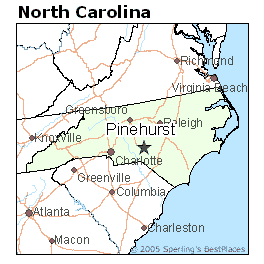
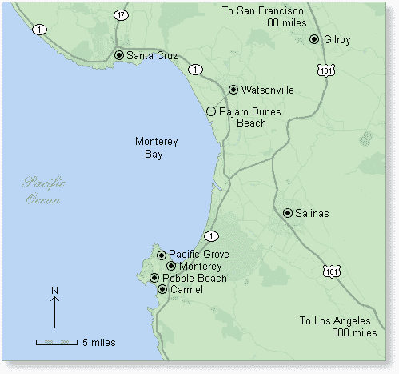
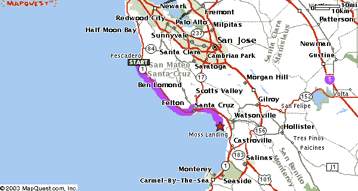
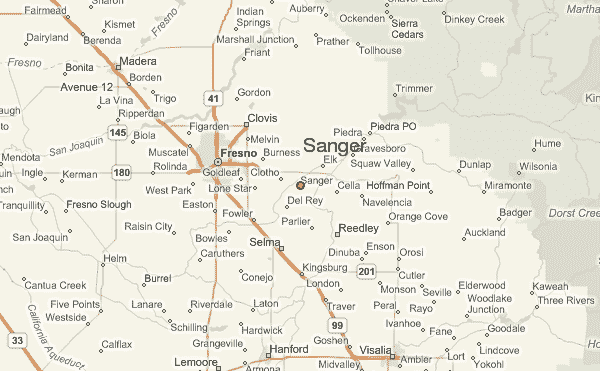
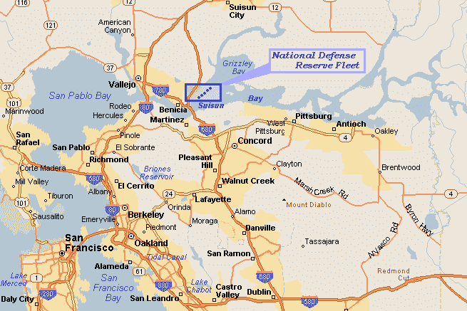
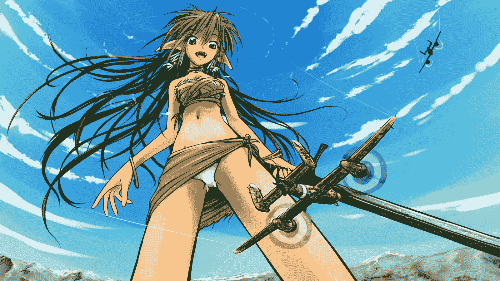

# 轉•成為巨人之後的生活？•空氣山寨文29／07／2011小更新

作者：wtman

TID：9661

 

# 1

 這是重貼文!!

[http://giantessnight.com/gnforum ... &extra=page%3D1](http://giantessnight.com/gnforum/viewthread.php?tid=9622&extra=page%3D1)

相信我，身為一個巨人的方式生活下去，是一種非常奇怪的生活。就是這麼簡單。因為這個原因，我決定寫一個關於自己的故事，你們才得以閱讀到的這張紙。

當然，我敢肯定，你認識我們 — 我和我的女兒。我們出現在世界上的每一份報紙的頭版，儘管最近幾年我們沒有了多少的新聞價值，關於我們的消息也平靜起來。我們習慣了。你們也習慣了。沒有甚麼意義繼續討論。這就是辦報紙的人的想法。雖然我預期你已經了解我們，我想我還是介紹一下自己。當然，也介紹一下我的女兒。

我是簡．密爾沃基。不錯。這是我祖先傳下來的姓氏。不是那個國家。多得那些小港灣，我們居住的地方屬於美國加州。正確一點，是加州的Gravesboro。接近弗雷斯諾縣。北面與約塞米蒂，這樣說吧，「手臂之遙」的距離，南面鄰近國王峽谷。

十分美麗。雖然我們很少遊覽，這很理所當然吧。

說些關於我自己的事。我越來越接近四十歲。我一定要告訴你嗎？算吧，沒關係，三十六歲，你已經知道了，我沒有辦法掩飾。我的女兒說，我看起來像二十八。我希望她是對的，但我無法不相信，因為我找不到其他人問問他們。

美莉是我的女兒。她上個月就已經變了十九歲。我以她為榮。她比我更容易接受自我年齡的增長。嗯，我想當你年輕時，你不會覺得年長是一件壞事。

我們像這樣生活了七年了。假如你問我，這是相當長的時間。還有很多的謠言，關於我們如何變成巨人的。不，別指望我會說一個新版本的故事。或者，這就是從你們的觀點上，我即將要做的事。那個時候我非常忙碌，所以我沒有讀過報紙。反正它們太細小，閱讀不了。

那時是2009年，尋常的生活每日都不停重複著。我和美莉掙扎求存。至少，現在都已經改變了。這是六月。我想賺取多一些額外的錢，所以當了在晚上清理商店的工作。我想要錢，美莉的生日在七月。所以我很晚才回家。再一次。我的美莉就是這麼一個勇敢的女孩子。她還在廚房裡留些晚飯等著我呢。沒有什麼特別，但對我來說非常足夠的。我吃下了幾口，就爬上樓梯，看著她。她還在床上看書。女孩子的書。馬兒，女孩子，歷險故事，都這一類的東西。我很高興看到她在閱讀，而不像同年齡的其他女孩們，只會漫無目的立在電視的前面。

這大約是當晚發生的事情。我上床睡覺，靜止得像機器關閉一樣。

上午時候的一切都像平常那樣，除了…嗯…我們那裡沒有了食水。連電力也沒有了。我咕噥詛咒了一連子，叫醒了美莉上學。然後，我鑽進了廚房，為她準備好一些麵包。

「媽媽，我已經遲到了。要走了！」

「走出門口前不能沒有吃早餐，小姐。在這裡，在路上吃！」

接著，她出去了。砰！

我走到門口，得到了報紙。美莉從門廊抓到報紙，將它拋了進來。當我回到了廚房的中途，我聽到美莉的敲門聲。

「媽媽？」我聽到她壓低的聲音，這一點使我有點警戒。出事了。這一刻，我預見到，一群工人跟在Caterpillar挖土機後面，破碎球以及一個精明的律師…

我來到門口，打開了一點門縫。畢竟我只是穿著浴袍…而同時呢，內裡一絲不掛。看出外面，我看見美莉擔憂的神情。

「發生了甚麼事？」我問道。

「你最好自己先來看看，媽媽。」

「美莉，我只穿著浴衣，就算包緊了浴袍，我也露出了太多的腿…」

「媽媽，我覺得現在這並不重要了。」

我看著她，她看上去…驚訝。但不害怕。

我收緊了浴袍腰帶，調整好自己的乳房，終於打開了房門。美莉站在一旁，而我看見了…

好吧，最初我看不到有甚麼特別。我看到了平常的景觀。山還是那個樣子。但是…金斯河呢？去了哪裡？

「河在哪兒呢？」我喃喃地說。

「我認為它取代了道路。」美莉說。

「瞎說！」，我叫了出來，但我還是走近了郵箱。赤著腳。

然後，這就是我的故事的開端了。就在我家門前，曾經是石子路的地方，現在是金斯河。好吧，它看上去好像是精靈國王的溪流或類似的東西。我們的草坪振連綠色河岸的邊陲。綠色的草地與綠色的樹木融為一體。只是高度的差異消失得無影無蹤，美莉一直負責裁剪我們家的草坪，所以它們都保持著短小。

「媽媽，今天上學遲到不是一件重要的事。」

「的確，親愛的。這到底發生甚麼鬼事？」

你可以想像，我們只能夠面對現實。我寫的那張紙就在這裡，而那是最後一樣東西確立了我們對自己的規模的認定- 或者對你們的大小的認識，以事論事來說。

我問美莉借了她的間尺來測量一下那些樹木，我就這樣子蹲在我的物業的邊緣。我選一棵大的。大松樹吧，我想。這只有一英寸高。我回到屋裡，尋找我們的百科全書。 松樹(Pine trees)，書中說，成長至大約25公尺或80英尺。家中門外的那株只有一英寸高。這樹應該有幾千倍的大小。然而，事實並非如此。

走到院子裡，我看到我們的後院環境。它看起來十分正常…直至到柵欄。欄後面座落了國王峽谷國家公園。 有「一點」距離，就像我之前告訴你們。

翻開地圖，我們發現，我們小小的物業幅員由北面的松平湖(pine flat lake)，至西南方的迪努巴(Dinuba)- 還有大約一半的迪努巴留在外面。在東面，我們發現Badger和 Pinehurst就僅僅在我們的圍欄後面。

米拉蒙特(Miramonte)，奧克蘭(Auckland )，奧蘭治灣(Orange Cove)...這些地方都，嗯，被取代了。消失了。我不知道這是否重要，但假如你有一張舊的地圖在你手，你會發現，在那處的中心就曾經有一個小鎮。

「你覺得這個重要嗎？」美莉問我。

「甚麼？」

「斯闊谷(Squaw Valley)。」她說，指著舖平在廚房的桌上的地圖。

「我不知道，孩子。這是實在令人難以置信。」

從那時起，我們必須面對的現實 — 外面的世界很細小。或者說，我們變得巨大了。1000:1比例的那種巨大。這使我剛剛好一英里高。我幾不多5尺7寸。美莉就更高了。她本來5尺11寸。

我認為母親照顧自己的孩子是天性所為的。而照顧對我的意思是簡單的東西。愛。水。麵包。和睡一張有屋頂保護的床。屋頂和床上用品似乎還好吧。愛也一樣。但龍頭出不了水 — 毫無驚喜。麵包...對我們是一種錯覺，它超出了我們在小屋裡所有的僅存物質。

「美莉，請回到您的房間裡…看一兩本書。我想我得查一查些東西…」

「媽媽？我不是想找你麻煩，但我已經長大了，可以看看發生了怎麼回事。我們沒有任何水和食物，另外我們也不知道怎樣可以回復原來大小。」

「是的，美莉。不管怎樣，回到你的房間去吧。」

而我告訴你，那好孩子聳了聳肩膀，就微笑著爬上樓梯…

但是，我走到了門前 —我才認知到，我仍然赤著腳。我不想這樣外出。所以我從鞋櫃拿出了一雙黑色拖鞋。

我走過了前門，直奔向北部邊緣的草坪。松平湖(pine flat lake)是…嗯…它是一個水坑。嗯…我的意思是它至今仍然是。

至少它是一個大水坑。或者形容它是一個狹長的。而且它的深度有數英寸。我估計裡面有幾加侖水。也許五至十吧。或者更多。不論是否巨人，我們人類都不太好拿手估算容量。

以它為源頭的河流，只是一道滴流。它看起來相當的小，非常遺憾，但我相信過了一整天，它能夠提供足夠的水。遲些會不會下雨，那我們的屋頂呢？我決定移除那些排水管道，在屋頂底下放水桶。永遠不能浪費寶貴的資源。

所以水看起來...可以接受的。是的，這是可以接受的。但是食物？我低頭看著湖面。這湖滿了。但是，有些時候它會淺得多了。我忘記了那個大壩。該死的大壩。我們真是太幸運了，它依然存在。當我沿著湖邊走了幾步，我發現它在我們的草坪邊不到一英寸的地方，河水流入了我們家的草坪，大壩稍微被淹沒在我家濕地之間。

當我踏住了那個水坑，它發出了嘎吱作響的噪音。然後，我拖著我的腳掌，挖了一個小溝槽，直到我可以把它連接到河床的另一端。我的拖鞋滿佈泥濘，有點噁心，所以我走出了那泥濘水坑，水坑的水流正慢慢地排入河道。

這個湖滿了。足夠的水。不過，我得悄悄說，當水位下降時，我們得確保沒有人會有任何損失，又或者你們有甚麼東西會因此而流失。我手上一小把泥沙肯定可以解決你們的問題。

然後又回到了麵包這東西。食物。啊。我們的大小！我低頭看著這個細小的世界。有一點驚喜，因為我發現我正正站在細小世界之中了。我不小心走下草坪和走出水坑引領我來到了河床的對面。我的右腳和湖的西岸之間有一座小山。我從地圖知道了這個地方。山面向湖的那邊叫作森尼斯洛普(Sunnyslope)，並有一整排的房屋。家境富裕的人的假日別墅聚集在那裡。現在看起來好像他們是被清除了 — 森尼斯洛普路消失在我的拖鞋之下，正正在我的小腳趾底下。

我的情感很難形容。我是…驚訝吧。而且我感到要說「噢！對不起。」而我當然，沒有這樣做。這種情況實在是太不真實，讓我無法感到內疚。反而，此刻腦海中記起了在山另一邊的山谷上還有一條道路。我記不起它的名字，但我轉動了腳掌，提起我的腳後跟，直到發泡橡膠鞋底從地上離開，我看了一眼我製造出來的足跡。地面...十分平坦。除了我的鞋底花紋深深地刻在地上之外，甚麼也沒有，好像壓路機。

2/04/2011

我在路段甚麼也看不見，除了比較大的那條路是相當明顯，因為路旁有一點點的燈光點綴著。走明亮那邊吧，沒有甚麼值得考慮。我走一步的代價，令到某些人他們的房子變得一文不值。當然他們許多都沒有性命去了解這回事。

我承認我意識到我剛剛壓扁很多人。本人立即知道我殺死了他們。但同時間我只感到我剛剛邁出了一步。

沒有什麼特別，也不是甚麼必要的行為。這些建築和人都很細小和遙遠，他們遇到的險境壞透嗎？我一點也不覺得。我踏到，他們就消失。就像許多年以前的無數昆蟲 —

不論是無意之間或故意，或者只是因為方便而這樣做。

糧食問題依然存在，但望著對面那個在弗雷斯諾的一個小平原 — 距離草坪的邊緣只有100英尺，我知道，我們走出外面將不會提供任何解決方案。沒有食物。一切都太小。於是我又回到了房子。

踏上了陽台，我注意到地上升起有一點點煙。一個小小的火種靠近門燃燒著。我不知道這是什麼，但我已經猜到有東西在我的路上。一些機器。我踩中了它，它溢出了的燃料，現在就在燃燒著。

再次踏上不足以撲滅火焰。但是用力跺腳確實會起作用。我的拖鞋底下的坑紋留給火種足夠的空氣。然而，當我跺下做成的爆風吹熄了它。望著黑色的小點，但是甚麼也看不出來。但是看著門廊的邊緣我推測出來，它肯定是某種飛機。沒有哪種車輛可以攀上這個垂直懸崖 — 就是門廊的邊緣。

我聳聳肩離開，留下我骯髒的拖鞋在門墊上。然後我直接走上了樓梯。

「美莉？」

「媽媽？我看到你在那裡。任何新鮮事情嗎？」

「不，親愛的。只是看來我們變大了或世界已經縮小了。無論如何，我們社區現在已經消失了。部分的河床也消失了，河水濺上家中的草坪。我挖了個壕溝將它連接到殘餘的河床。嗯，好消息是我們有水。壞消息是沒有食物，我無法想像在這樣一個細小的世界可以找到任何食物。」

「反正我不覺得餓，媽媽。」

「噓，別因為你想使一切看上去比實際更輕鬆，而對我撒謊。」

「媽咪，我真的不肚餓。告訴我更多。感覺怎樣？」

「甚麼？」

「走出了草坪之後走進微細景觀，如何？告訴我！」

「嗯，」我聳了聳肩，「沒有什麼特別之處。就像走在沙箱之類的東西。山是軟的。也許我踩到了一些房屋。但是我無法從我的腳印分辨出來。」

她看著我，我們都知道我撒謊了。

「好吧，我知道我踩到了一些房屋。我沒有看，如果這一切都是現實我應該已經摧毀了許多房屋，我肯定我這樣做已經殺了很多人。這不是故意的。只是一如既往的走了一步。如同在後院行走。你不會在放下腳掌之前，去留意地上的一隻螞蟻。」

「啊…酷啊。」

「嗯。我不知道。我對它沒有任何感覺。但我不知道你是否年長到足以擁有這種經驗。你可能在你以後的生活中感到後悔和遺憾。」

「你是說我呆在家中，不可外出？你不能這樣做！我沒有做錯任何事情，我擁有同樣的權利外出，和你一樣的權利！」

「噓，親愛的。當然，你沒有被禁足。我想說的是，你不應該離開我們的地方，而你似乎沒有絕對必要時。」

「根本就是和禁足一樣的。」

「如果真的只是相同的話，我希望你想想所有的小人類。如果你去了那裡，你會殺了他們。您可能沒有留意到，但你總會知道的。你殺死了人。無辜的人。男人，婦女，兒童以及他們的寵物。不！不用回答我。你沒有被禁足，但我希望你用這半小時想一想，然後告訴我你的感覺。」

她嘆了口氣，一屁股坐在床上，而我走出房。

在門廊上的經驗讓我思考。我很肯定出現了一架飛機。它降落，很接近我們的門。為什麼呢？

答案很明確。所有的一切都不是幻覺。一個奇怪的夢之類的東西。這是真實的。而在現實世界中的政府不會接受幾畝土地就這樣消失在一個巨大的房子之下。他們會盡力蒐集資料，而這個任務將會交給軍隊負責。

我狂奔起來，衝入了廚房，我關閉了窗口。然後我走上去，在我的臥室做一樣的事。要告訴美莉關閉她房的窗，她就是那麼的酷。

「這已經關閉了，媽咪。我不希望有一架飛機進入了我的私人空間，還有一堆渺小的人在我的房間監視著我。」

這個女孩很聰明，我想。

經過一番思考，我回到了廚房，我關閉了排氣罩的排氣口。然後我去了洗手間，關上了那兒的氣孔。最後，我不得不關閉煙囪內的氣瓣。

房子不是滴水不漏，我知道。但它至少可以保障我們，讓那些人們難以進入。

然而，幾分鐘後，他們給我上了一課，關於「困難」這個詞語。

我剛靠在沙發上，試圖想通所有事情。當然，如果這一切都是真實，政府一定會做某些事。他們已經在外面見到我們兩個，而我還曾經離開了自己物業。如果他們懷疑一切是虛構的，我已經以外出踐踏和一系列破碎的房子來糾正他們的誤解。我是真實存在，我可以離開這個地方，而且我是粗心大意的。我是一個威脅。美莉也是一個威脅。

在那一刻，我聽到她下樓。我留在沙發上。她從後面走過來看著我，彼此沒有望著對方，她就開始告訴她的決定。

「媽媽？我想得很清楚。我用望遠鏡看一看外面的風景，它們看起來非常真實。車輛移動，我相信我看到了人。如果我醒來時，看到一個巨人就在地平線上，我會害怕。他們肯定是害怕，尤其是在剛才你做了那回事之段。因此，他們會見我們為一大威脅。他們會盡他們所能與我們戰鬥。

「如果他們和我們打仗，我看不出我有甚麼理由在意他們的生死。」

我嘆了口氣。

「唉，女兒，我暫時看不出他們在打仗呢。但是，也許你是對的。這有點像演一段獨腳劇。但是，如果你是這樣覺得，我覺得這是可以的。」

「媽媽，我知道我們現在身高約一英里。但世界仍是遠遠大於我們，要打敗在這個星球上到處都是的人類，可要耗盡我們一生啊。因此，我認為最好是在大部分時間忽略他們，在我們的角度。」

「或許你是對的。至少我認為這是你應該處理這種情況的方式，直到我們了解更多。」

「嗯，媽媽，也許這將是非常的快。我想我聽到了甚麼 ...」美莉說完就走了。

我站起身，跟著她到門口，我確實聽到了。這是一種柔弱的嗚咽，隨著時間越來越疲軟。

我跟著美莉的目光尋找源頭。她看著在前面的大門地板上的東西。

物件是大約蒼蠅大小，這是一個對其功能很好的說明。

當我在蹲在它前面，我可以很清楚認識到它就是一個微小的直升機。迷彩塗裝在白色瓷磚下變成沒甚麼用。軍隊已經到達，他們就通過門下面的間隙飛進來。

「你好。我們期望您們的到來。但無論如何，你闖入了私人財產。你有五分鐘時間，發出聲音或者任何可見的方式解釋自己，否則你們將被驅趕。」

美莉說明了後，她走近，隨便地在我旁邊撲通坐在地上。

「他們要出來，媽咪。」她提及。

事實上，我們可以看到細小的人類離開了機器。當然，我們只是估計他們是人類。我們無法真正知道。他們只是太小了。我們所看到的是一些移動的小圓點。我們可以看到，他們是直立行走，而這大約是從坐或蹲的位置。

「我認為，他們對著我們揮手，媽咪。」

「你的眼睛比我更銳利，孩子。我不知道。」

「是的，他們都揮舞雙臂，活像他們想引起人們注意。但是，他們應該已經意識到，我們注意到他們。 噢。哈哈。現在他們掩著自己的耳朵...」

美莉抿嘴笑道，我是嘻嘻笑的。然而，我們不請自來的客人沒有作出任何進展，我們也留意不到。

「美莉，也許你應該在家裡四處檢查一下。這可能只是偽裝。這有點太明顯了。」

梅利不辭而別。這些人 — 我想這是男性 — 在我的下面開始於直升機周圍四散。但他們顯然不會使用體育場揚聲器之類的設備。我等了幾秒鐘，看看他們會自己排成一個模式。字母或者其他的。但他們只是錯亂而不穩定的移動。所以我決定直截了當。我對他們微笑。然後我俯下身，用食指指著一個離開直昇機相當距離的人。

然後配上一個笑容，我緊緊地壓我的手指在他身上，在白色瓷磚上將他整個塗抹。留下了一點紅色的污漬和他的戰友們在恐慌中。他們開始逃亡，但如果我期望他們返回直升機，然後逃往我就錯了。他們分散在各個方向，以他們最快的速度。

嗯。一個訓練有素的人可以跑得每小時20英里一樣快。在更長的距離，約莫15每小時英里。但在我們的尺寸規模看來，這會可憐地減少至每小時100或80英尺。我的意思是英尺/每小時(fph)。而這大約是每秒四分之一英寸。所以我也許顯得有些漠不關心，我懶洋洋地站了起來，踐踏住他們。我的腳很容易就覆蓋了他們，當我粉碎了直升機時，它在我的體重下屈服，我只感到有些軟的物體。這感覺就像在踩住積塵毛球。一個幸運的倖存者從我的腳弓下竄了出來。就在我抬起腳跟，在瓷磚上拖著我的腳，讓他的同志們留下更多的紅色污漬時，最後一位倖存者前的被我的腳踝骨輾過。總而言之，他爆成一陣紅霧；但那是在我的腳輾過之前，他同樣被我壓破，留下的血點就像其他人。

「美莉？我敢肯定，他們想欺騙我們。你的腳趾準備行動。」

這樣我就進入了客廳。我覺得，煙囪內的通口，是最薄弱的環節。然後我是對的。我只是踩上了壁爐，直升機就由煙囪嗡嗡作響下降著。

我只是嘲笑並且我的手指輕彈一下，我把它變成了一個小火球。

「收拾他們，女孩。我認為這完結了。」

嗯，當然啦，如果你更了解我的真實故事，你知道，我們回敬了他們一次「探訪」。但在此之前，我想告訴你一些關於我們如何生活的事。畢竟現在這個世界比以前更加和平了。

*

07/050/2011

美莉還和我一起生活。當她還是個孩子我一直希望她能這樣做，直至她能掌握自己的生活。工作，男朋友，婚姻，孩子 — 老調子。這是你們生活的方式。你們。不是我們。

當然，我們只有這一個房子。裡面大部分的東西無法繁殖/再製。美莉和我從來沒有談論過它。我們都知道這是無可奈何接受的事。當然，我們也沒有真正和其他人談過。

她長大了。一位年輕的女士。她很幸運，她可以穿著我大部分的鞋。她比我高大。我們沒有任何合適的衣服。但也有一些比基尼和內衣 — 要麼有足夠的彈性或勉強合身，而且天氣也讓我們一起出去時，要像她那般服裝相當的輕薄。我們沒有什麼可以做，為什麼不在院子裡曬太陽？誰將會阻撓我們袒胸露乳？

當她到了十六歲時，我允許她這樣。當時我只是單純地放棄在她日漸成長的身體上，嘗試為她穿上那些不合身的舊衣服。反正她已經長大了。非常成熟，不論身體和禮貌舉止。而且她真的不再需要害怕強姦犯或其他不道德行為，我讓她自己作決定，而她十分的感激。

我們日常的例行公事十分簡單。我們通常在太陽升起時起床。在沒有電力和在光線昏暗的臥室看一個小時的書，便需要燃燒數畝的森林的情勢下，日子就是這樣的過。首先，我們清潔自己。那是，如果我們有足夠的水。有時只夠我們其中一個。因此，另一個只得到一把水來弄直她的頭髮和擦眼睛。有時候，我會有點兒懶，水就留給美莉，即使輪到我了。

然後我們吃早餐。這意味著一罐水和一些談話。我們總能找到一些東西來談。你們人類是一個忙碌的生物，談論你們的愚蠢可以消遣我們不少小時。每逢星期天，我們會喝茶。我們在晚上放好了罐。美莉利用了我們的一些鋁箔建立了一個巨大的太陽能熱水器。我們試圖睡多一點，同時太陽展開它工作，燒開我們的水。

有時候我想從你們壓榨出更多的茶葉，但後來我知道，這將會超越你們的能力。就像咖啡。也許你們一年可以生產十杯。但是，如果我消耗了你們所有的生產，我不得不每兩個月才能喝到一杯咖啡。因此，我應該努力忘記咖啡，堅持用茶。

之後，我們會決定接著做甚麼。大多數時候，我們會在我們的後院享受陽光。在庭院曬太陽或圍繞在花園溜達。有時候，我們決定一起出去，或者有時只有一個，去探望你們小人類。沒有太多的家務要做。

下午美莉會看書打發時間。那是，學校的課本。我的舊書和她的爸爸遺留下的一些。她說她可能是一個巨人，但她不想成為一個糊里糊塗的巨人。我很高興她得到了一些消遣，我相信許多的人類也是。

對於我而言，我喜歡緬懷老照片。有時候，我想念著小世界。在所有的山之上。我們只有小丘。好吧，這些都是高山和它們看起來不錯，但他們仍然無法使我們其中一個留下深刻的印象。幫不了它。

至少我們可以在海洋中游泳。我們通常遊覽蒙特雷灣(Monterey Bay)。你不必涉水太遠，便到達足夠我們游泳的水深，而且日落國家海灘(Sunset State Beach)是個好地方給我們坐下休息。不過沃森維爾(Watsonville) 隨著一段日子，吸引力已大不如前。而現在它被蔑視。但是驚喜啊，驚喜啊，每當我們在那裡露面，我們總是在那裡找到一些就是無法與城市，海灘或兩者兼而有之割離的人類。

我們傾向不理會國王峽谷或約塞米蒂。我們不希望打擾大自然。

有時，我們會走近看看。我們看守這兩處地方，阻止人類來往那裡。一旦美莉發現了新的定居點。需要做的，就只是一兩步。

晚上，我們會準備明天的預防措施。我們取了水，我們放置好茶罐，就像我已經告訴你的那樣。那種東西。

當陽光下山我們準備睡覺了。我們互相親吻、說晚安，進入了我們的房間。

所以這是我們的日常生活流程的一個粗略大綱。除此之外，還有許多無法估計的事情經常發生。

最常見的東西是微小的遊客。我不知道，他們想從我們這裡得到甚麼。

有時我覺得他們只是某些特殊癖好的狂迷。或是怪胎。也許還有狗仔隊(paparazzi)或只是偷窺狂(peeping tom)。通常我們不覺得自己在捕殺他們。假如我遇到一個，當然，我可能只會覺得，自己只不過在移動一下腳趾或者橫跨一踏時剛好了結了他。對我們來說，無論是男人還是女人，都是微小的生物或是縮小了的人類。大多數都是。

有時，何其幸運，我只是無意中動一動，就做成了另一點的紅色塗抹。

有時，我們會走近看看。我們看守這兩處地方，阻止人類來往那裡。一旦美莉發現了新的定居點。需要做的，就只是一兩步。

晚上，我們會準備明天的預防措施。我們取了水，我們放置好茶罐，就像我已經告訴你的那樣。那種東西。

當陽光下山我們準備睡覺了。我們互相親吻、說晚安，進入了我們的房間。

所以這是我們的日常生活流程的一個粗略大綱。除此之外，還有許多無法估計的事情經常發生。

最常見的東西是微小的遊客。我不知道，他們想從我們這裡得到甚麼。

有時我覺得他們只是某些特殊癖好的狂迷。或是怪胎。也許還有狗仔隊(paparazzi)或只是偷窺狂(peeping tom)。通常我們不覺得自己在捕殺他們。假如我遇到一個，當然，我可能只會覺得，自己只不過在移動一下腳趾或者橫跨一踏時剛好了結了他。對我們來說，無論是男人還是女人，都是微小的生物或是縮小了的人類。大多數都是。

有時，何其幸運，我只是無意中動一動，就做成了另一點的紅色塗抹。

30/5/2011

不過，他們大多都由始至終被忽視。每當我們在房子裡走動，我們很少放眼留心地上，他們彷彿不知道，在空曠地方跑來跑去乃是相當玩命的表現。每當我走進廚房或其他地方，我往往會發現一些紅色的斑點，尤其在我的歸途。或者，如果我回到天井在我的毛巾上伸展時，美莉會宣布我赤足腳踝底下的污跡的最新統計數字。

有些甚至達到我們的毛巾。這些都是真正的怪胎本性！哪樣的偷窺狂，會冒著被我的屁股下夷為平地的風險，只是為了密切的關注我？與腳下的亡魂相比，他們的數目非常稀有，當然更稀有的情況，是我在院子裡日光浴時，居然沒有一個人被我壓扁在我的身體某處。

還有更多人在外面 — 在我們的後院或在房子前面的草坪上。但他們通常會消失無踪，只因為他們的遺體由泥土和草掩沒。我知道有很多在那兒，自此美莉經常走帶著她的放大鏡出外作為消遣。她與他們的互動自成一格。也許遲些我會告訴你。

當然在白天我們也會做一些其他的事情。我跟美莉談起記述下來，但她認為這只是一個普通的事情，因為我寫的東西，我們就假設大家都已經知道，那為甚麼我就不寫下即使大家從來沒見過，但他們都知道的東西呢？

正如你可能已經注意到我沒有談論到食物。您可能還注意到，你有食物。如果我們所需要你不會有食物。但是，我們不需要。要感謝我們。但是我們喜歡喝水，關於這方面，我們的身體只是運作正常。因此，我們喝了水，因此我們也必須把水「排除」。

現在，我們的房子裡沒有水，所以我們也失去了排水系統。我不知道附近的城鎮是高興的還是不喜歡這個安排。但是，在我們成為了巨人的第二天，我們不得不作出決定。我們決定了利用最自然的方式。

我們地區的天然排水渠就是國王河(King’s River)。所以我們只需要一個靠近河流的地標以及遠離我們房子的一小段距離。我們決定了桑格(Sanger)。這個鎮在我們的物業以前的路邊30英尺的地方，國王河在城市和我們的物業之間流過，也流經旁邊的桑格。當我們選擇這個地方，我們仍然為這個地方設身處地著想，選擇這個地方而非里德利(Reedley) — 這個離房子遠一點，但是它在河上這一邊，所以我們在日常生活流程中會時常經過它。

另一方面，當我們其中一個蹲坐在河床上，腳掌降落在桑格的近郊時，它甚少遭受人命損失。

因此，每當我們需要小便時，就是在這個地方解決，日復日，年復年。只是自然而已。假若你不得不居住在沒有廁所的地方，你不要告訴我，你不會這樣做。

當然，約半分鐘內釋放約 500萬噸小便，是一件十分壯觀的事情。美莉是我們首個使用了這個地方，當我遲一些到達那裡時，我發現她創造了一個不少的湖泊。那時的我要再用她曾使用過的同一個角落，我頓時感到有點不快。所以，我移前了一點，再蹲下來。當然，對四周景觀來說，我造成了同樣的變化。我的尿液湧了出來，沖走了一部份軟土。當我蹲坐的位置一直向著北方緩緩遞進，我看到一些尿液的飛濺擊中了桑格，當然我排出的尿液溢出了河床，做成尿液氾濫，淹沒了部分城市。我想這是現在這地方的人口減少的原因。每天的尿液氾濫，令到城市的一些地區變得不適合居住，整個城市必定聞起來活像廁所。另一方面，我們從來沒有踏進這個城市，除了在河邊的近郊，但這裡也時常淹沒。多年來我們的尿液已經在那裡建立了一個相當大的湖。但是，正如我們同意使用相同的位置，我們也漸漸一點一點移到桑格的西南方。這個城市依然受到淹沈，我們排出的容量往往會引發波浪，波浪甚至能到達這城市的那條河中，但至少這個城市沒有淹沒入湖中的威脅，就像這個國家的很多沿岸地區已經陷入這個景況。

28/7/2011 更新

最初幾天，我們心想，我們撒的那泡尿對你們沒有多大的衝擊。正如我所說，那時我們仍是那麼體貼。我們想，我們只會到我們之前飲用過的河流小便。但是，當然還是有差別，試想像我們一天飲用的水量在短短半分鐘內排泄到外面。我們的尿液洪水每天至少兩次順流而下，奔流到匹茲堡(Pittsburgh)，在色遜灣(Suisun Bay)湧出。我聽聞，舊金山灣(San Franzisco bay)也充斥廁所的尿液氣味。

也許你認為我們仍然使用河流如廁，是輕率的舉動。但我告訴你，這是理所當然的。罵我們輕率也好，甚麼也好，我們仍舊必須要如廁，其他的地方。然後人們抱怨，他們的城市在我們的尿液洪水中浸泡，留下了尿臭味道的污泥。我說，如果我們沒有選擇一條河，我們早在第一天就選擇了桑格(Sanger)，第二天是里德利(Reedley)，然後可能第三天就是弗雷斯諾(Fresno)！他們會更加滿意嗎？我覺得你們都非常幸運，我們提出這個協議的時候，我們仍然很體貼你們，而且從不覺得要改變協議。我發誓，打賭誰的小便可以清除弗雷斯諾上最大面積的建築物群，將會是相當有意思的消遣活動。

好了，足夠了。應該很高興我們從來沒有進食的需要，否則我們就會有一個不同的尺度的討論。

大部分的時光美莉和我都過得很好。但是，我們雖然是巨人，但我們不能忽視我們那些源自人類的情感。這意味著，有些時候我們特別高興。有幾天我們特別淘氣，有幾天我們會溫柔起來。

例如，每當我們興之所至，我們去出外散步。然後我們出去看一些特別的東西，我們女性不能每天都望著同樣的牆壁過日子。所以我們打扮了，然後走出去。我們甚至想使用汽車，但後來決定我們最好束之高閣。天知道，有甚麼用。

通常我們走出去，直到我們找到一個可供漫步的城市。當然，即使大城市也沒有太多「漫步」空間了。佔地面積四英里乘6英里的弗雷斯諾與我的睡房一樣大小。因此，我們主要是享受旅途的景色，以及在那裡步行。

兩英里高的女子訪問城市，對居民當然是一件大事。每個人拔足狂奔，有時我想這是他們在遇上「突發事件」時的自然反應。他們一個踩著一個。我們可以看到他們在街道停滯不前，爭取踏在其他人之上。當我們降低臉頰緊貼地面，我們看到他們是怎樣互相踐踏。我必須說我喜歡向他們示範，他們不會去到最高點的。當然，我沒有甚麼感覺，當我的鞋子壓扁了數以千計的小人。好了，房子有一點嘎紮嘎紮的感覺。如果我是赤腳，也許我會感覺到汽車，但通常我穿高跟涼鞋散步。就像我說過，我們打扮了。

(待續)

[ *本帖最後由 wtman 於 2012-6-15 19:59 編輯* ] 

# 2

<ignore_js_op>[Pinehurst_NC.gif](forum.php?mod=attachment&aid=MjM3MDh8YTIzZmZlZjN8MTYwMDg4ODc3MXwxODIzMHw5NjYx&nothumb=yes) *(7.95 KB, 下載次數: 18)*

[下載附件](forum.php?mod=attachment&aid=MjM3MDh8YTIzZmZlZjN8MTYwMDg4ODc3MXwxODIzMHw5NjYx&nothumb=yes)

2011-3-5 20:16 上傳  

</ignore_js_op>  

# 3

還是英文比較有種

  

# 4

我們那19才的少女美莉,會不會在看書時候,發現書本某些頁有點.....嗯,有黑色的點點呢?

 她又不可以拿去書店換或者退錢.....

------------------------------------------------------------------------------------------------------

[ *本帖最後由 wtman 於 2012-6-15 19:57 編輯* ] 

# 5

<ignore_js_op>[book.jpg](forum.php?mod=attachment&aid=MjQwNzV8NmM5YTU0ODR8MTYwMDg4ODc3MXwxODIzMHw5NjYx&nothumb=yes) *(105.29 KB, 下載次數: 14)*

[下載附件](forum.php?mod=attachment&aid=MjQwNzV8NmM5YTU0ODR8MTYwMDg4ODc3MXwxODIzMHw5NjYx&nothumb=yes)

2011-4-2 17:19 上傳  

"媽,我的書髒了!"

</ignore_js_op>  

# 6

我想起了一句:

「徐佳是一个在做什么事之前都要制订计划的人，现在去毁灭世界也不例外。她把这座城市仔细地审视了一遍，然后对着整个城市，徐佳公布了自己的复仇计划:“小虫虫们!女神将这样消灭你们呦!我先顺时针绕着城市慢慢地走上一圈。大家想活命的要抓紧时间喔!”说完，徐佳的右脚缓缓抬起，向前踩去。这时她的脚下是市郊高层居民楼群及其配属设施。」

天朝的女神，連破壞之前都要正經八百的實地考察，再報告一番﹏﹏﹏

天朝，果是禮儀之邦。

[ *本帖最後由 wtman 於 2011-4-23 12:13 編輯* ] 

# 7

> 原帖由 *songpeng* 於 2011-4-26 01:12 發表 

> 没有原文贴出来的啊

「對不起，閣下的語言尚未被確認，未能了解閣下要求，請耐心等候回覆。」 

# 8

<ignore_js_op>

[Our Life as Giants.pdf](forum.php?mod=attachment&aid=MjQzNDF8ZGYyNmE5ODR8MTYwMDg4ODc3MXwxODIzMHw5NjYx)

2011-4-26 10:20 上傳

點擊文件名下載附件

190.92 KB, 下載次數: 195</ignore_js_op>  

# 9

Sunset State Beach。

Monterey Bay。

還有..........

無邊落木兄的插圖。

[http://giantessnight.com/gnforum ... p;extra=&page=1](http://giantessnight.com/gnforum/viewthread.php?tid=10093&extra=&page=1)

這是日光浴的標準姿勢。 

# 10

<ignore_js_op>[pajaro-dunes-monterey-bay-area-map.jpg](forum.php?mod=attachment&aid=MjQ0Mjh8MmZkN2VlNDJ8MTYwMDg4ODc3MXwxODIzMHw5NjYx&nothumb=yes) *(84.38 KB, 下載次數: 3)*

[下載附件](forum.php?mod=attachment&aid=MjQ0Mjh8MmZkN2VlNDJ8MTYwMDg4ODc3MXwxODIzMHw5NjYx&nothumb=yes)

2011-5-7 18:24 上傳  

</ignore_js_op> <ignore_js_op>[Sunset State Beach.gif](forum.php?mod=attachment&aid=MjQ0Mjl8MjI2ZDY2MjV8MTYwMDg4ODc3MXwxODIzMHw5NjYx&nothumb=yes) *(15.94 KB, 下載次數: 7)*

[下載附件](forum.php?mod=attachment&aid=MjQ0Mjl8MjI2ZDY2MjV8MTYwMDg4ODc3MXwxODIzMHw5NjYx&nothumb=yes)

2011-5-7 18:24 上傳  

紅星是sunset state beach

</ignore_js_op>  

# 11

往後好像有排尿情節。。。

---------------------------------------------------------------------------------------

[ *本帖最後由 wtman 於 2012-6-15 19:58 編輯* ] 

# 12

<ignore_js_op>[SangerReedley.jpg](forum.php?mod=attachment&aid=MjQ2ODZ8YTljYzQ4NmF8MTYwMDg4ODc3MXwxODIzMHw5NjYx&nothumb=yes) *(156.57 KB, 下載次數: 1)*

[下載附件](forum.php?mod=attachment&aid=MjQ2ODZ8YTljYzQ4NmF8MTYwMDg4ODc3MXwxODIzMHw5NjYx&nothumb=yes)

2011-5-30 19:30 上傳  

</ignore_js_op> <ignore_js_op>[Kingsmap11-306.gif](forum.php?mod=attachment&aid=MjQ2ODd8ZDU0NTJmZmN8MTYwMDg4ODc3MXwxODIzMHw5NjYx&nothumb=yes) *(46.03 KB, 下載次數: 0)*

[下載附件](forum.php?mod=attachment&aid=MjQ2ODd8ZDU0NTJmZmN8MTYwMDg4ODc3MXwxODIzMHw5NjYx&nothumb=yes)

2011-5-30 19:30 上傳  

</ignore_js_op> <ignore_js_op>[SuisunBay.gif](forum.php?mod=attachment&aid=MjU2OTR8OWNlY2U5YWZ8MTYwMDg4ODc3MXwxODIzMHw5NjYx&nothumb=yes) *(34.22 KB, 下載次數: 1)*

[下載附件](forum.php?mod=attachment&aid=MjU2OTR8OWNlY2U5YWZ8MTYwMDg4ODc3MXwxODIzMHw5NjYx&nothumb=yes)

2011-7-29 19:27 上傳  

</ignore_js_op>  

# 13

這頭像很給力啊!

是哪兒的?

那把劍，是黑曜石還是秘銀?

[ *本帖最後由 wtman 於 2011-5-28 13:06 編輯* ] 

# 14

<ignore_js_op>[2739.jpg](forum.php?mod=attachment&aid=MjQ2MzV8NDU0ZmNhYTB8MTYwMDg4ODc3MXwxODIzMHw5NjYx&nothumb=yes) *(293.21 KB, 下載次數: 4)*

[下載附件](forum.php?mod=attachment&aid=MjQ2MzV8NDU0ZmNhYTB8MTYwMDg4ODc3MXwxODIzMHw5NjYx&nothumb=yes)

2011-5-28 13:04 上傳  

</ignore_js_op>  

# 15

這帖之前被淹沒了。。。。

現在退潮了。浮上面。 

# 16

告訴你，蛋大的「活動用」戰情告急，無暇更新此文。 

# 17

word 版本的'our life as giant'。

話說27樓的帖子，我可以告發他灌水嗎? 

# 18

<ignore_js_op>

[OGL.doc](forum.php?mod=attachment&aid=MjUwNDN8OTMzMTZiMDB8MTYwMDg4ODc4M3wxODIzMHw5NjYx)

2011-6-29 10:50 上傳

點擊文件名下載附件

131.5 KB, 下載次數: 371</ignore_js_op>  

# 19

29/5/2011 小更新，不喜勿入。