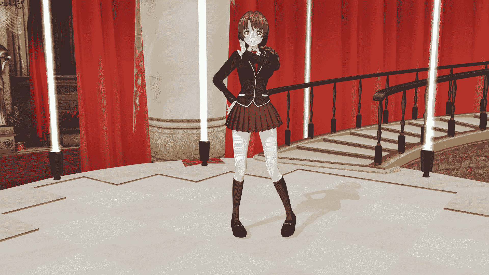

# 随手捡到的美少女不可能是最终boss(2019.3.18更新人设图)

作者：TANGLUNG

TID：21985

<title>1</title> <link href="../Styles/Style.css" type="text/css" rel="stylesheet">

# 1

*本帖最後由 TANGLUNG 於 2019-3-18 17:11 編輯*

注：本文的原标题是《很幸运的捡到了一个美少女的我却因此陷入了我的红颜知己还有青梅竹马还有她的修罗场之间结果就要导致人类毁灭该怎么办，在线等挺急的》，但因为标题字数限制所以改成了现在的名字
潜水多年的我来挖坑了，希望各位老司机多多支持……此文是我多年以来的脑洞的集合体，如果有什么奇怪的地方那一定是时臣的错（喂喂这梗已经很老了）
另外此文前面会有很多铺垫，真正涉及到GTS的可能要等一段时间，但愿我不要在那个之前弃坑吧……
<title>2</title> <link href="../Styles/Style.css" type="text/css" rel="stylesheet">

# 2

*本帖最後由 TANGLUNG 於 2019-3-5 13:15 編輯*

序章 末日的前奏

2017年9月，日本东京。 这座曾经无比繁华的城市已经沦为了活生生的人间地狱。

无数的楼房在一瞬间内变成了废墟，恐慌的市民们四处逃散，却终究不能避免死亡。

造成这一切的，并不是什么恐怖分子，更不是战争，只是一名少女。

一名有着万米以上身高的少女。

她从一般人根本无法触及的高空中带着充满嘲讽意味的笑容，静静的凝望着这一切，随后又开始新一轮的破坏。

人类的抵抗的意义并不大，少女根本不废吹灰之力就能让世界上任何一支军队灰飞烟灭。

她与人类有着的并不只是体型上的差距，她身上隐藏着数不尽的可怕能力，随便挑出一项，对于这个世界都是灾难级的威胁。

但是比起那些能力，她似乎更热衷于用身体去摧毁挡在她面前的一切。

东京，或者说整个日本，都已经沦为了她一个人的玩具。

这也很有可能是，将来整个世界的命运。

而我只是在移动基地里的显示屏上默默的看着这一切，然后深深的叹了一口气。

仔细想想，事情会发展到现在这个地步，和我也脱不了关系啊。
============================================ 2014年12月，英国，巨石阵

至今也没有人知道这个鬼斧神工的世界奇观的用途，但仍不妨他成为游客们心中必去不可的景点之一。

那是平安夜的晚上，游人渐渐地稀少了起来，也更方便我完成自己的的调查。

介绍一下自己吧，我的名字叫陆仁甲，当时18岁，是“那个连名字也不能说出来的组织”，简称“拉顿哈gay顿团”，再简称“康纳团”下属的“213小队”的队长。

至于我们组织的目标嘛……那当然是防止世界被破坏，守护世界的和平，贯彻爱与真实的邪恶……啊不好意思拿错剧本了，我要说的是贯彻爱与真实的正义。

现在言归正传，根据我的调查，我发现了一个事实。

巨石阵本身并不是什么了不起的遗迹，他只是通往某个重要地点的指示牌而已。

而这个重要的地点，和在太古时代曾经辉煌一时却又销声匿迹的古文明有着巨大的联系。

循着巨石阵的指示，我终于发现了遗迹的入口。

在躲过了无数的机关和各种机械守卫的袭击之后，我终于来到了遗迹的最深处。

希望里面会有一些关于太古文明的科技的东西吧，毕竟我们太需要这个了……

但当我打开大门的时候，我却不知道说什么好。

这里面是一个祭坛状的建筑，而在祭坛的中间有一口水晶棺，里面躺着一名相貌惊为天人的少女，她的手脚上都被绑着用不知名材料做成的锁链。

少女有着一头棕色的长发，身高并不是很高，大概也就一米五左右吧，但是身材却十分标致，让我不禁看呆了。

这难道是……那个时代的人吗？

如果是这样的话，那也太神奇了，尸体竟然保存的这么完好……不知道如果把这项技术上交给国家的话会不会有什么奖励。

哦不对，这妹子不管怎么看都不像是死了的样子吧……？既然这样那这技术就更加神奇了！某位带着黑框眼镜的长者一定会很喜欢这个的！

只是为什么她会被放在这个类似于祭坛的地方？是以前的某种奇怪的宗教仪式吗？

不管怎么说，如果能唤醒她并成功与她交流的话，一定能知道不少有意思的事情的，但是该怎么做呢……？

这时我注意到了不远处的墙壁上的一个凹槽，形状正好和我以前在希腊的克里特岛上发现的一块石头很相似。

那块石头上面刻着的东西也是我今天能找到这个遗迹的关键，所以我一直带在身边。

我试着把石头嵌在了墙上，而那口水晶棺竟然被打开了，缠在少女身上的锁链也慢慢消失了。

她睁开了自己蓝色的眼睛，然后站起了身来，走路踉踉跄跄的，不一会儿又昏倒了过去。

这……总之先想办法把她带出去吧。

不过话说回来，这妹子什么也没穿啊！万一等会我背着她走在路上被别人发现怎么办，一定会被当成变态的吧！<title>3</title> <link href="../Styles/Style.css" type="text/css" rel="stylesheet">

# 3

> [archer 發表於 2016-10-13 10:56](https://giantessnight.com/gnforum2012/forum.php?mod=redirect&goto=findpost&pid=311432&ptid=21985)
> 看起来会是GIGA破坏和福利的样子？   
> 我觉着原来的标题挺好的

可惜论坛标题字数有限制啊，不然我肯定用那个了……
<title>4</title> <link href="../Styles/Style.css" type="text/css" rel="stylesheet">

# 4

*本帖最後由 TANGLUNG 於 2019-3-5 13:17 編輯*

第一章 身边有两个天降系的我该怎么办才好

看着这女孩躺在旅馆的床上，我不知道该做些什么。

好吧，最主要的原因是因为过度的兴奋让我无法集中精神……别说我变态什么的啊，有一个啥都不穿的美少女和你共处一室的话是个男人都会把持不住的吧？

而且还是个有着童颜巨X的美少女，如果某热爱奶子的喜欢用蓝色给自己的作品上色的漫画家看到这个的话一定会非常兴奋的吧。

……言归正传，总之这妹子看上去非常虚弱的样子，不过至少还活着，应该静养一段时间就会没事的吧？

=========================================== 少女在无尽的黑暗里醒了过来。

当她睁开眼睛的时候，发现自己正穿着一件不知用什么材料制成的华丽连衣裙，赤足走在被白白的烟雾挡住的地面上。

透过烟雾可以隐隐约约看到，这地面是由不规则的蓝色和绿色构成的，在那些绿色的色块上面还有一些奇怪的花纹。

“这……是哪里？”

她自言自语道，但很显然没有人会回答她，整个世界就好像只有她一个人一样。

少女的视野随后突然变得无比的清晰，她低头凝望，然后惊呆了。

她看到了一座座有着各种建筑的，小小的城市，而里面的市民们也陷入了绝望。

有的人还在试着逃跑，有的人已经双膝跪地，试着向上天祈祷。

这个时候，她也意识到，自己之前的脚步，已经不知道让多少的人陷入了末日。

无尽的罪恶感向她袭来，她蹲下了身，不安的颤抖着。

“我，我到底在做什么啊……”

在这个大小之下，即使是她的声音也成为了可怕的武器，巨大的音波震碎了楼房，也让无数的人痛苦的捂着耳朵，最后离开了人世。

“哀鸣吧，毁灭吧……”

一个声音从少女的心中响起，她环顾四周，却没有看到任何人。

“你是谁……？”

“我就是，真正的你……”

那声音听起来很虚弱，过了一会就消失了，而她也再一次的失去了意识。

===========================================

过了很长时间，那个女孩终于苏醒了。

“你醒了啊，身体有感觉不舒服吗？”

我关切的走到了她的身边，这时她却毫无防备的把裹在自己身上的被子拉了开来，我看了马上把头转到了一边。

“我，我怎么没穿衣服……”

她出人意料的开口了，声音很好听，而且我竟然还听懂了她的话，难道太古时代的人说的也是中文？

如果真是这样还真的是了不起的发现呢，棒子们，投降吧。

……不，与其说是她在说中文，还不如说是……她说的话听起来像中文，如果要描述的稍微好理解一点的话，大概就像我吃了某只蓝色的机器猫的翻译魔芋一样的感觉。

“那个，现在我可以转过头来了吗？”

“嗯……”

我转过了头，她又把被子裹了起来，脸上还带着一点红晕。

“我在……哪里？”

她仔细的打量着四周，看起来还是有点戒备的样子。

“这里是我住的旅馆，刚刚在一个遗迹里发现了你，你为什么会被关在这种地方啊？”

我找了张椅子坐了下来，然后问道。

“啊？我，我不记得了……”

她一脸的茫然，看起来好像是真的不知道的样子。

“我，我只觉得自己在黑暗中沉睡了好久，好久……我不知道自己是从哪里来的，也不知道自己要到哪里去……”

“这样啊，那你还记得自己的名字吗？”

“不好意思，我真的不知道……那么你呢？”

可能是觉得我不像坏人吧，女孩的戒备心没有刚才那么重了，她也抬起了头，正眼看着我。

“我叫陆仁甲，是个……我的工作也一时说不清楚了，你就当我是守护世界和平的人好了。”

“真的吗？那你一定很厉害吧……？”

她向我投来了崇拜的目光，话说妹子你这么容易就相信我真的好吗？

“也没什么啦，这是一个苦差事……”

我说道，这时我的手机响了。

“等一下啊，我接个电话……”

“仁甲，遗迹调查的怎么样了？”

电话那头传来了帕蒂的声音。

帕蒂——全名叫帕特里西亚·布朗，是我的第一个搭档，也是我们小队的副队长，一名来自瑞士的合法萝莉，虽然看起来只有十一二岁，个子也不是很高，但她的实际年龄却比我还大两岁，还是日内瓦大学的高材生，精通包括汉语在内的多国语言。

相比起什么都会一点但什么都不精通的我，帕蒂有着一般人难以想象的战斗能力，而且她还有着瓦尔基里的血统——嗯，没错，就是某个无节操的游戏公司做的烂尾游戏里描述的那个神奇的力量，因为懂的人都懂所以我就不具体描述了，不懂的人在后面也会懂的吧。

“就不能好好的叫我一次队长嘛……不过我也正想找你，你有多余的衣服吗？我这边急需一些女装。”

“你的心里终于觉醒了某些奇怪的爱好？真是变态。”

她无情的吐槽道。

“不是啦……哦对了我忘了你那尺码她大概穿不下……不好意思是我多嘴了。”

“什么叫我那尺码啊！还有她又是谁！”

听到我嘲讽了她的体型，帕蒂在电话那头的声音也没有之前那么平静了。

“我只是在说一个事实而已。”

“别瞧不起人！我相信自己只是发育的晚了一点！”

“二十岁了都还没发育也是一个奇迹啊。”

“你这家伙……算了说正事吧，难不成你在那个遗迹里发现了一个妹子？” <title>5</title> <link href="../Styles/Style.css" type="text/css" rel="stylesheet">

# 5

刚才用CM3D2捏了一个女主大致的人设，以后有新的妹子登场了我也会做新的图片，至于男主长什么样就不重要了，反正就是大众脸啦（喂喂明明是自己太懒了）
<ignore_js_op>

**img20161015092654.png** *(1.63 MB, 下載次數: 0)*

[下載附件](forum.php?mod=attachment&aid=NjQ5NzN8NGEyY2VkNzZ8MTYwMDg4MjczOXwxODIzMHwyMTk4NQ%3D%3D&nothumb=yes)

2016-10-15 07:27 上傳

<title>6</title> <link href="../Styles/Style.css" type="text/css" rel="stylesheet">

# 6

> libido 發表於 2016-10-14 15:42
> 嗯，文章很好看，不过楼主头上的斧子更好看

在被死在美少女的脚下之前我不会轻易狗带的！<title>7</title> <link href="../Styles/Style.css" type="text/css" rel="stylesheet">

# 7

> 顺丰快递 發表於 2016-10-15 02:00
> 快开门，收快递啦

我没买东西，水表在外面<title>8</title> <link href="../Styles/Style.css" type="text/css" rel="stylesheet">

# 8

> [kuazhang 發表於 2016-10-15 16:00](https://giantessnight.com/gnforum2012/forum.php?mod=redirect&goto=findpost&pid=311716&ptid=21985)
> 瓦尔基里的梗是什么？求科普

这个来自于SEGA的《战场女武神》系列，里面历代都有可以变身成瓦尔基里的女性角色，变身后手持长枪和盾牌，战斗力大大加强<title>9</title> <link href="../Styles/Style.css" type="text/css" rel="stylesheet">

# 9

*本帖最後由 TANGLUNG 於 2019-3-5 13:19 編輯*

第二章 我从遗迹里捡到的妹子不可能是超能力者

这是距离我们生活的时代非常遥远的过去。

在那个时候，曾经存在着一个高度发达的文明。

先进的科技和奇妙的魔法互相结合，百姓也安居乐业，这可以说是人类的黄金时代。

作为当时世界上最强大的国家——亚特兰蒂斯联邦的首都，亚特兰蒂斯城无比的繁华。

这座城市有着无数的精美建筑和几近完美的各种公共设施，让每一个初来乍到的人都感觉到无比的震撼。

贾拉尔·尼托斯正开着车在路上飞奔着，他和往常一样准备去情报局上班。

作为国内最精英的特工之一，他在这和平年代并没有什么特别的工作，只是每天去打卡报个到，然后在办公室里和同事们唠嗑到下班而已。

“真希望这样的日子能一直保持下去啊……”

望着车窗外的阳光，贾拉尔不禁感叹道。

但就在这个时候，天色不知道为什么变得暗淡下来。

“怎么天气一会儿就变样了？一会儿要下雨的话可麻烦了，我没带伞……咦这是什么情况？”

整个城市被一道突如其来的紫色光柱笼罩了。

行人们都纷纷停了下来，围观着这不可思议的景象。

那道光柱越来越明亮，发出刺耳的声音。

轰！

在城市的边缘，也就是那光柱的中心部分，似乎出现了什么东西。

贾拉尔朝着声音的来源处望去，却只看见了两所巨大的，白色的山，在那两座山上都连接着一根同样雪白的柱子，直插云霄。

那两座山的高度几乎高过了城里所有的建筑，巨大的阴影笼罩着城市。

这到底是……什么？

虽然非常的不安，但贾拉尔还是想尽力保持淡定。

“那不会是……一个人的脚吧？”

围观群众中突然冒出了一个声音，他指着远处那座巨大的“山”，身体已经开始颤抖了。

“你这么一说还真有点像……但如果真是这样的话，那人该有多大啊……”

“至少得有个一万米吧……救命啊！这一定是什么末日级的灾难！”

“如果这样的话我们该怎么办啊！快逃啊！”

整座城市瞬间陷入了恐慌，大家四处奔逃着，原本井然有序的交通也变得无比混乱。

“答对了哦，真聪明～”

是一个女孩的声音。

这声音直接从人们的脑中响起，虽然非常甜美，但却实实在在的给人们带来了巨大的恐惧。

“这位小哥，既然你这么聪明，那就给你一个特别的奖励吧？”

话音刚落，那个最早发现的人已经失去意识了。

“没有痛苦的死去，比起其他人来说肯定要幸福很多吧……？” “那么接下来就是游戏时间了，大家要逃的可要抓紧哦～虽然实际上也没什么用就是了，毕竟你们实在是太弱小了嘛。”

少女对着城市的郊区抬起了自己光滑细嫩的玉足。

“哎呀忘了介绍自己了，我的名字叫安格尔摩亚，很高兴认识大家～哦对了顺便一提我是在用心灵感应和你们说话哦，要不然我声音太大把你们都震死的话那就没得玩了。”

她并没有迅速落脚，而是持续酝酿着恐怖的气氛。

“你们也赶紧介绍一下自己嘛……咦，怎么一个个都不说话了？真是没有礼貌。”

少女假装愤怒的嘟起了嘴。

“既然这样就要好好惩罚一下你们哦，我可是真的生气了。”

巨大的玉足缓缓落下，瞬间让方圆两公里内的街区受到了毁灭。

“我只是把脚放下来而已，怎么房子就全倒了？你们比我想象的还要没用啊。”

贾拉尔在混乱的车水马龙中穿梭着，他刚刚接到情报局的电话，说是有紧急会议。

“为什么会摊上这么大的事情……”

===========================

几天之后，完成任务的我终于可以回国了。

只是在这之前还有最后一件事要做……

嗯没错，就是帮我爸妈代购。

因为我爸妈并不知道我是去英国干什么的，他们还以为是学校的交流项目，因此我便很无奈的接下了这个任务。

顺便一提，那个我从遗迹里的妹子现在还是跟着我，她现在扎了一个麻花辫，穿着我给她买的大衣，正和我一起逛着商场，而且为了方便称呼我给她起了一个名字叫茉莉。再顺便一提，会起这个名字是因为她身上有一股茉莉花的香味，是不是很随便？ 咦，话说回来她人呢？

我四处张望着，都没有发现她的身影，最后还是在一个小巷子里发现了她。

她正被几个穿着十分……嗯……前卫的小混混包围着，应该是被骚扰了吧。

“你们要干什么……”

茉莉的声音听起来非常的不安，她蜷缩在墙角，完全不知所措。

“这么怕干嘛，我们好好玩玩……”

那几个人离茉莉越来越近。

“不要啊……”

这帮人也太可恶了吧，光天化日之下做这种事情，是时候让他们得到正义的制裁了……

但正当我准备出手的时候，这几个混混突然被弹开了，重重的摔在了墙上。

“咦，我……”

“你对我们干了什么！可恶！”

他们再次一拥而上，但却又一次飞了出去。

这次的力量比上次大了很多，他们直接晕了过去。

“茉莉啊，刚刚是你干的吧，太漂亮了。”

我不禁拍起了手，如果我没猜错的话这应该是她的力量吧。

“这是……我干的？”

她还是不敢相信刚刚发生的一切。

“我觉得应该是吧，要不你对我试试……哎呀疼疼疼……”

我还没说完，就被摔倒在地。

“那个，不好意思……我只是想确认一下……”

茉莉连忙把我扶了起来，然后拍了拍我身上的灰尘。

“茉莉啊……”

我停顿了一下，然后认真的看着她的眼睛。

“怎么了？”

“你要不要加入我的小队？反正你现在也没地方可去对吧。”

“没问题啊，你对我这么好，正好给我一个报恩的机会。”

她露出了微笑。

“我也只是做了一些小事而已啦，能这么爽快的答应我才要感谢你呢……不多说了我们走吧，过几天我会带你认识一下其他的队员的。”

“嗯！” <title>10</title> <link href="../Styles/Style.css" type="text/css" rel="stylesheet">

# 10

> [kongming 發表於 2016-10-21 06:39](https://giantessnight.com/gnforum2012/forum.php?mod=redirect&goto=findpost&pid=312131&ptid=21985)
> 我只是做了一些微小的事情
> +1s

这个细节都被你发现了，看来这里的膜法师比我想象的还要多啊
<title>11</title> <link href="../Styles/Style.css" type="text/css" rel="stylesheet">

# 11

*本帖最後由 TANGLUNG 於 2019-3-5 13:21 編輯*

第三章 来历不明的邪教什么的太老套了啦

两年后。

哈萨克斯坦的某座小城的郊外，一片荒无人烟的森林里的一间小木屋。

房间里弥漫着血腥的气息，让人感觉很不舒服。

“……帕蒂，你怎么看？”

我左手托腮，一本正经的看着房间里那些似乎是被排列成某种形状的尸体。

被我称作帕蒂的少女站在一旁，她有着娇小的身材和很符合她身材的年轻外貌，再加上一头秀丽的金色长发和白皙的皮肤，让她看起来就像洋娃娃一样可爱。

“此事背后一定有一个天大的秘密。”

她一本正经地回答道，不得不说她作为一个外国人中文说的已经十分标准了，比一口南方口音的我还强不少。

“我觉得这背后一定有某股黑暗势力在操纵。”

我稍微走近了一点，可以看得出来，这些死者似乎都很年轻的样子，最多应该不超过十岁，但是他们的死状却十分凄惨——身上的血被吸得一滴也不剩，内脏则是全部被挖了出来，同样以一种奇特的形状铺在地板上，如果胆子比较小的人看到这一幕恐怕要被吓得魂飞魄散。

“这都被你看出来了，真是厉害。”

这时，帕蒂的眼光瞥到了一边。

“喂喂快看那边，那具尸体的头都没了。”

“头都没了？那他肯定死了吧。”

我低下了头，故作深沉的回答道。

“没看过现场就能推断此人已死，你果然不简单啊。”

面对我的推测，帕蒂发出了称赞，虽然语气上没有任何的波动。

“那是那是，也不想想我是什么人？”

我帅气的甩了甩实际上并没有的秀发（我剃了个板寸），眼光却一直盯在遍布整个房间的诡异魔法阵上。

“所以说我们能不能正经点？”

终于忍不住吐槽出来的帕蒂开始仔细的打量起现场。

“噗哈哈哈哈……你能忍住这么久不笑也是够厉害的，不过玩笑归玩笑，我可是一直有在仔细的观察哦。”

我也忍不住笑了出来，随后指了指墙上： “帕蒂，你不觉墙上的那些图案还有尸体的排列都非常奇怪吗？”

“早看出来了，你当我瞎的吗？”

她依然和以前一样没好气的对我吐槽道，并拿起了相机记录下眼前的这一幕。

“和之前其他地区同样的事件对比……这些图案都有所不同，但我没法从任何一篇古籍中发现关于这种图案的有关记载。”

如同帕蒂说的那样，这样的事情最近已经发生了很多起了，而且发生的地点都是在中亚、南美洲、印度这些地方的一些偏僻地区，搞得当地人心惶惶，组织这才派我们前来调查。

不过到底是谁会干这样的事情呢？……某和平教？不像，那帮人都是直接上街BOOM的，哪里会有心思去搞这些奇怪的东西？

但可以肯定的是，就目前的情况来看，这绝对和什么奇怪的宗教有着巨大联系，可他们的目的又是什么呢？ 

与此同时，中国北方某城市的一间公寓内。

在被陆仁甲从那个遗迹带回来之后，茉莉正式的加入了陆仁甲的小队，平时则作为一名普通的高中生在某所学校上学，她也已经完全习惯了新的生活。

正准备去学校的她突然感受到了一阵剧烈的晕眩感，踉踉跄跄的倒在了一旁的沙发上。

“看来又有一次血祭完成了啊……”

“只可惜封印到现在还是没有完全解除，不然的话……”

在她的脑海中又传来了那个陌生又熟悉的声音。

“……谁在和我说话？”

“看起来你还是没有一点记忆啊，不过没关系，你会慢慢想起来的……但首先，有些事情你必须知道……”

话音刚落，茉莉的眼前就一片漆黑。

当她再次睁开眼睛的时候，她发现自己站在城市的中心。

和自己时不时会做的那个奇怪的梦一样，她的身姿变得非常巨大——虽然这一次相对来说小了很多，但这座城市最高的高楼也就刚刚高过她的膝盖而已。

更重要的是，这次的感觉更加真实。

“那是什么东西啊！”

“快跑啊！她肯定会杀了我们的！”

“谁来帮帮我们啊！”

她的出现让恐惧瞬间蔓延到了整个城市，大家惊慌失措的开始逃跑起来。

“大，大家听着……我，我没有恶意的，真的……”

茉莉的脸上也露出了惊慌的神色，说话也变得支支吾吾的，但这声音还是足以让城市里的人都听到，虽然并没有人在意她刚刚说的话。

而这时的茉莉也意识到了一件事——她正穿着带有裙子的校服，也就是说……在这么巨大的姿态之下，自己的裙下风光会被底下的人一览无余。

“哇啊！”

她满脸通红，连忙捂住了自己的裙子。

“……只是这样就完了吗？不去惩罚一下那些偷窥你的不法之徒吗？”

那个声音又在茉莉的脑中响起。

“这，这可是杀人啊……这怎么可以……他们都是无辜的啊……”

“无辜的？他们只不过是蝼蚁而已，你没有必要在意他们的死活的。”

“什么蝼蚁……他们和我一样都是人啊……”

“看起来你还是不理解啊，不过也没关系……总有一天，那个真正的你会觉醒的……”

正当茉莉在和那个声音争论的时候，一支部队靠近了她。

茉莉也被吓了一跳，下意识的向前跺了一脚，一些比较矮小的房屋就这样变成了一堆废墟，很多在街上的人也只能眼睁睁的看着巨大的学生皮鞋从天而降，夺走了他们的性命。

她很快就意识到自己刚刚做了什么，罪恶感油然而生，只是这次……不知道为什么竟然还感觉有些高兴？这样的心情让她更加的感到不安。

“那个，大家，对不起……我不是故意的……”

茉莉双手合十鞠了一躬，试着对自己的行为道歉，但却没法平息市民们的怒火。

“还有什么好辩解的，杀人犯！”

“这么多人的命哪里是一句对不起就可以解决的啊！”

“我的家人啊……”

……

茉莉只能默默的忍受这些怒火，一句话也说不出来。

这时军队也对她展开了攻击，无论是空军还是地面部队的狂轰滥炸都没有很明显的效果，而茉莉却一直蹲在那边一动也不动，本来充满活力的脸上完全失去了神采。

“不该是这样的……如果这也是梦，就让我快点醒来吧……”

她自言自语着，眼泪都快掉出来了。

也就在这个时候，她的眼前有陷入了黑暗。

“……又是梦吗？”

一身冷汗的茉莉从沙发上惊醒了过来，她还是没法忘记刚刚的那一幕幕。

而最让她感到可怕的是，刚才在梦中不小心踩死了人之后，自己的心里那种罪恶感与满足感交织而成的感情。

“……我，到底是怎么样的人啊？或者说……我，真的是……人吗？” <title>12</title> <link href="../Styles/Style.css" type="text/css" rel="stylesheet">

# 12

> [顺丰快递 發表於 2017-5-15 21:52](https://giantessnight.com/gnforum2012/forum.php?mod=redirect&goto=findpost&pid=332530&ptid=21985)
> 每次看这篇文章，怕不是都要续一秒

这可是一篇充满膜力的文章
<title>13</title> <link href="../Styles/Style.css" type="text/css" rel="stylesheet">

# 13

> [网络菜鸟 發表於 2017-5-17 08:47](https://giantessnight.com/gnforum2012/forum.php?mod=redirect&goto=findpost&pid=332699&ptid=21985)
> 上面的+1S都是啥意思。。。我与时代脱节了？

这是为了表达对某位长者的敬意.jpg)

<title>14</title> <link href="../Styles/Style.css" type="text/css" rel="stylesheet">

# 14

*本帖最後由 TANGLUNG 於 2019-4-3 00:54 編輯*

发一些登场人物的人设，会随着剧情的推进持续更新

——“有关部门”第213小队队员档案——
No.000
姓名：不明
性别：男
职务：前任队长
生日：不明
国籍：不明
出生地点：不明
第213小队的创立者和前任队长，于2013年与多名队员一起失踪，所有有关资料也被销毁，临走前将队长的位置传授于陆仁甲。

**No.001
姓名：陆仁甲
性别：男
职务：队长
生日：1996年10月19日
国籍：中国
出生地点：中华人民共和国，浙江省，杭州市
身高：178cm
头发颜色/发型：黑色/板寸
瞳孔颜色：棕色

关于陆仁甲的人物背景我们并没有太多的信息，只知道他曾经只是一名普通的中学生，和很多漫画的主角一样在某个契机下加入了“有关部门”，并进入了213小队。
在2013年前任队长与多名重要队员一起失踪后，213小队基本处于崩溃的边缘，接任队长的陆仁甲以很快的速度重建了这个小队，不仅补充了一批才华各异的新鲜血液，同时也在科研人员的帮助下开发了大量新型装备并在唐古拉山脉的深处建立了小队的主基地，在他的带领下，第213小队也在“有关部门”中获得了极大的特权，可以在没有高层批准的情况下自行布置并执行任务。**

**No.002
姓名：帕特里西亚·布朗（Patricia Blanc）** **性别：女
职务：副队长
生日：1994年12月25日
国籍：瑞士
出生地点：瑞士，伊弗登
身高：145cm
头发颜色/发型：金色/长卷发
瞳孔颜色：绿色

帕特里西亚（昵称“帕蒂”）从小就在瑞士的深山中的一个被称作“摇篮”的实验室里长大，而这个实验室一直在进行一些不为人知的项目，其中一项就是她所参加的“瓦尔基里计划”，这个计划选择了一些有着上古女武神血统的女孩，并以各种惨无人道的方式激发她们潜在的能力，而帕特里西亚是唯一的成功品并在世界各地进行了一些任务，她不但有着常人难以想象的身体素质，还能通过“圣枪”获得更强大的战斗力。
一直以为这种痛苦的日子将继续下去的她终于在自己十八岁那年迎来了曙光——在“有关部门”第213小队的领导下，“摇篮”被彻底捣毁，******帕特里西亚**也因此得到了解放，从此加入了第213小队，也正是在那个时候，她认识了负责此次任务的陆仁甲，两人也很快成为了出色的搭档。
虽然她过去的经历非常惨痛，因此性格也显得有些别扭，但总体来说******帕特里西亚**并不是一个很难相处的人，她最大的痛处可能是自己小孩子一样的体型，所以和她说话的时候最好不要提到这点，不然后果自负。** 

No.003
（资料不明）

No.004
（资料不明）

No.005
（资料不明）

No.006
（资料不明）

No.007
（资料不明）
No.008
（资料不明）

No.009
（资料不明）

 **No.010
姓名：茉莉（见注1）
性别：女
职务：队员
生日：不明（******见**注2）
国籍：中国（******见**注3）
出生地点：不明（******见**注4）
身高：152cm
头发颜色/发型：棕色/侧麻花
瞳孔颜色：蓝色

小队里最神秘的队员，不知为何被封印在了一个有着古老历史的遗迹中，在陆仁甲的一次调查中偶然被发现并解开了封印，她有着不可思议的超能力，而这也是陆仁甲看中她并将她招募进213小队的原因。
茉莉有着温顺善良，彬彬有礼的性格，遇到什么困难都会全力以赴，也很快融入了现代社会的生活，只是身世之谜一直困扰着她，而随着时间的推移越来越频繁的奇怪的梦也更加让她对这个问题在意起来。

注1：“茉莉”为化名，真实姓名不详
注2：相貌上看起来大约14~15岁
注3：原国籍不明
注4：于2014年12月在英国的巨石阵附近的一个遗迹中被发现，但是除了瞳孔之外的相貌特征更接近于东亚人

No.011** （资料不明）

<title>15</title> <link href="../Styles/Style.css" type="text/css" rel="stylesheet">

# 15

卧槽真没想到这帖子又被顶上来了……看来我还不能随便弃坑啊<title>16</title> <link href="../Styles/Style.css" type="text/css" rel="stylesheet">

# 16

*本帖最後由 TANGLUNG 於 2019-3-5 13:22 編輯*

第四章 但大的但和林蛋大的蛋不是一个蛋，但是但大的大和大中天的大是一个大 台北的一栋平平无奇的写字楼里。

和其他的大楼一样，这里也汇聚了不少各式各样的中小型企业。

而这里面最特别的，应该是一家名字为“GN”的公司了，这家公司虽然员工数量不多，却整整占据了三层楼的空间，再加上整个大楼的地下室。

没有人知道这栋楼的最大租户到底是什么来头，除了在有关部门的备案，你在互联网上也搜索不到任何关于这家“文化创意传播有限公司”的任何信息。

根据在这栋写字楼里工作的不愿意透露姓名的张国栋先生的描述，每天都会看到一群身穿黑袍，神色诡异的人进入GN公司的大门，在深夜经常还会传来奇怪的声音，不管从哪个方面看都很可疑。

而今天，这家奇怪的公司里，好像也在发生什么不得了的事情。

公司的会议室里，一群身穿黑色长袍的人围坐在一张长条形的桌子边，而桌子的正中央则画着深红色的类似于魔法阵的图案，上面还摆着一个烛台，看起来就像是什么奇怪的邪教的聚会一样。

“但大，这就是我们找到的东西。”

其中一名黑袍男子将一个做工精巧的吊坠郑重的递给了坐在主座上，被称作“但大”的青年。

这名青年身材高大魁梧，坚毅的目光里透露着对自己事业的决心。

“这个就是……封印我们的女神大人的灵魂的容器吗？”

接过吊坠的但大仔细的端详了一下这个水滴状，散发着幽深的紫色光芒的吊坠，露出了满意的微笑。

“做得很好，三号，这个月给你加工资。”

“谢谢但大！”

“至于那个没有找到女神大人的圣躯的家伙嘛……五号，给我过来。”

“真是抱歉！不知道被什么人抢先了一步，希望但大能从轻发落。”

五号眉头微皱，看起来似乎有点紧张。

但大仔细的看了看五号的脸，然后做出了决定。

“看你这脸长得也挺清秀的，不如……”

听到了这话，经常观看某乡村美食博主的视频的五号的后背突然一凉，莫名的有一种下一句话是“把你带到河边”的感觉。

“你去一趟泰国吧，机票已经给你买好了。”

“啊？”

五号不解的看着但大。

“去做个变性手术，然后当偶像给我们组织创造营收。”

“但大你……是认真的吗？”

“当然，你犯了这么大的失误，我已经尽量的从轻发落了……毕竟老夫也不是什么恶魔嘛。”

然而这从男人的角度来看的话，某种意义上比带到河边还要可怕啊……

五号这么想道，当然他是不敢说出来的就是了。

“不要啊啊啊啊啊啊……！！！！”

据说，五号哀怨的呼声在楼道里整整飘荡了一夜。

“好了，现在让我们来进行下一步吧……”

说完，但大将吊坠放在了魔法阵的正中央，念起了不可名状的咒语。

随后，一阵强烈的闪光从吊坠里发散开来，慢慢的勾勒出了一个少女的形状，漂浮在空中，而这名少女的样子，和茉莉一模一样，只不过头发是披散开的，身上也只穿着一件做工精美的黑色无袖连衣裙，完美的衬托出了少女娇小却凹凸有致的曲线，一双精致的凉鞋点缀在少女小巧玲珑的玉足上，显得无比的高贵典雅。

而她的身影则有些缥缈，看上去就像没有实体一样。

看到少女的样子，会议室里所有的人都不约而同的跪倒在地。

“就是你们……试图在唤醒我吗？”

她的声音非常的动听，却有着一股莫名的威压感。

“是的，女神大人。”

但大低着头，用十分恭敬的语气说道。

“既然都做到了这个地步，那么你们也应该知道我是谁了吧……接下来，就去找到我的身体吧，我和‘她’可是已经有过很愉快的交流了呢……”

“是！我们保证完成任务！”

“真是怀念呢……把渺小的人类蹂躏在脚下的感觉……这次，没有人可以阻止我了。我的力量还会无限延伸，直到这个星球，不，这整个宇宙都……嘻嘻嘻……”

少女露出了甜美的微笑，在说完这句话后，她便消失在了众人的视线中。

“动用一切力量，尽快确定女神大人的圣躯的位置，GN万岁！女神大人万万岁！”

但大站起了身，对着会议室里的下属们下令道。

“是！GN万岁！女神大人万万岁！”

与此同时，中国北方的某所高中内。

“这一天快要到了呢……”

正在上课的茉莉再一次的听到了“那个声音”，思绪渐渐地从课堂之中离开了。

“那么，如果函数f(x)=sin(x)的话，那么他的导数f’(x)是……陆茉莉同学，请你来回答一下这个问题。”

回过神来，老师已经走到了茉莉的跟前，而茉莉被惊出了一身冷汗，当然原因并不是老师的突然点名，而是别的事情。

“还记得老师的问题是什么吗？”

“……答案是cos(x)。”

茉莉的同桌小声提醒道。

“是cos(x)。”

她心不在焉的回答道，脑子里还在想着刚才走神时“听到”的话。

“这不是有在好好听讲嘛，不要总是做出奇怪的表情啊，很容易让人误会的。”

说完，老师又重新回到了讲台上，而茉莉的神色依旧非常紧张。

“你这是怎么了啊，看上去像是身体不舒服的样子，要不要去医务室啊？”

茉莉的同桌关切地问道。

“没，没事的……谢谢你的关心，崔东……”

茉莉深呼吸平复了一下情绪，然后对着同桌的少年说道。

“没事就好，有事也别逞强啊，身体最要紧。”

“我知道的……” <title>17</title> <link href="../Styles/Style.css" type="text/css" rel="stylesheet">

# 17

> [浮世浮尘 發表於 2019-2-12 13:03](https://giantessnight.com/gnforum2012/forum.php?mod=redirect&goto=findpost&pid=397109&ptid=21985)
> 成功续了1s
> 可5号究竟是谁呢？

这个就任凭大家想象了，或许可以是任何一个喜欢咕咕咕的作者？（我 说 我 自 己）
<title>18</title> <link href="../Styles/Style.css" type="text/css" rel="stylesheet">

# 18

*本帖最後由 TANGLUNG 於 2019-3-5 13:25 編輯*

第五章 因为是有点恋爱喜剧感觉的轻小说所以有白学剧情也应该是没问题的对吧？ 贾拉尔驾车穿梭在混乱的车流中，心里很不踏实。

因为那个超乎常理的巨大少女的出现，事发突然而无法在第一时间组织起有效的疏散和避难措施，整座城市已经乱成一锅粥了，而少女也没有进一步的行动，只是默默的在城市的上空俯视着，似乎很享受这种混乱的感觉。

虽然军队很快的集结起来，无数的激光和导弹倾泻在少女的身上，然而在攻击造成的硝烟散去后，少女依然没有受到任何伤害。

“真是无聊呢……我还以为会有什么像样的抵抗呢，这种程度的话，对我来说连挠痒痒都比不上呢~”

少女只是随意的挥了几下手，数以千计的战斗机和航空战舰就在一瞬间灰飞烟灭了，地面上的部队虽然没有受到波及，却也逐渐失去了战斗的意志。

“所有部队，全力攻击！我就不信一点用也没有！”

“该死……我们的空中部队就这么全军覆没了？我们到底是在和怎么样的怪物战斗啊……”

“光凭我们真的能打赢吗……？现在逃还来得及吧，我可不想死啊……”

虽然地面部队依旧在对着少女狂轰滥炸，但依旧没有太大成果，少女甚至没有注意到他们的存在。

“哎呀哎呀，怎么看大家都这么惊慌的样子，我长得真的有这么吓人吗？”

少女弯下腰来，清秀的脸遮住了整个天空，脸上虽然一直挂着微笑，却让人不寒而栗。

“明明我还对自己的相貌很有自信的呢，真是讨厌……不过我这人也不会因为这点小事就生气啦，对这么诚实的各位，我这里还有一个小小的奖励呢~我相信这里肯定也有不少好这一口的人吧~”

少女抬起了她白嫩而又“小巧玲珑”的脚，脚趾随意的晃动着，如果她是一个普通身高的女孩子的话，这一场景对于有些人来说应该是充满诱惑力的，但在现在这个数万米的身高之下，给人们带来的只有恐惧。

“我现在要选一批幸运的虫子，和我的脚来一个亲密接触，那么会是谁呢？”

终于，少女将目标锁定在了一片建筑非常密集的住宅区，她不紧不慢的将脚放了下去，仅仅是这一个小小的动作就在城市里引起了巨大的地震，而她的落脚处也只剩下一片残垣断壁。

幸好贾拉尔离少女落脚的地方有点远才没有被波及到，但他的车却被少女踩踏掀起的气流给吹翻了，眼看着离召开紧急会议的地下基地不远了，贾拉尔就从车里跳了出来，向着基地狂奔而去。

“该死的，再快一点啊……别来不及了……”

在贾拉尔奋力奔跑的同时，少女也没有闲下来，她蹲下了身，随意的用双手玩弄着城市里的建筑。

细嫩的双手一会在城市里划动，留下各种形状的曲线，一会抓起一把楼房之后将他们捏碎又洒在地上，这些废墟对于少女来说也许只是小沙粒一样的存在，但对于一般人来说，哪怕是一小片残骸都是致命的存在。

在意识到了这不可逾越的力量差距后，有很多人甚至已经放弃了求生的念头，带着空洞而呆滞的眼神等待着死亡的降临。

===========================================================================

在第213小队位于西藏的雪山深处的基地的模拟训练场内，一银一棕的两道身影正在激烈的交锋着，这两个人正是小队的副队长，有着丰富作战经验的帕特里西亚·布朗和小队的新成员，充满谜团的少女茉莉。

身穿小队特制的紧身战斗服，手持圣枪和圣盾的帕特里西亚因为瓦尔基里之力的解放，头发变成了耀眼的银白色，身体被青色的火焰所包围着，让本来身材娇小的少女显得气势十足。

青色的能量形成的光芒从圣枪上喷涌而出，射向了茉莉。

但是这道光束却被茉莉的念力轻松的偏转了方向，反而向着帕特里西亚的方向冲了过去，她只能一个侧滚翻勉强躲了过去，稍微差一点就被光束引起的爆炸卷进去了。

而这次躲闪也让帕特里西亚的身后出现了破绽，茉莉趁着这个机会，利用瞬间移动出现在了帕特里西亚的背后，用一个漂亮的过肩摔将她摔倒在地。

“模拟战斗结束，胜利者——茉莉。”

系统冰冷而无机质的声音响了起来，随着训练房的全息背景投影的消失，两个人走出了房间，来到了一旁的休息室。

“呼……这次输的很彻底啊，茉莉你的进步真的太大了。”

帕特里西亚用毛巾擦了擦汗，从冰箱里拿出了两瓶冰红茶，把其中的一瓶递给了茉莉。

“哪，哪有，都是大家平时教得好……”

茉莉低着头，不好意思的说道。

“你就别谦虚了，现在我在你这边可是一点优势也没有了，你每次打败我的方式都还不一样，真的是长江后浪推前浪啊……”

虽然在模拟战中落败，但是帕特里西亚的脸上看不出来任何的失落之情。

“你应该也知道吧，我们现在在调查的那个组织……不简单，如果真的和他们起正面冲突的话，有你在真的会放心不少。”

“您是说，那个……GN教团？”

听到这个话题，茉莉的表情也变得严肃起来。

“是啊，虽然现在还不是很确定……但种种迹象表明，之前的那些事和他们都是有关系的……能做到这个地步，说明这些人背后肯定有巨大的势力，而且他们的目的恐怕也不一般。”

“嗯……我明白的……说起来，布朗副队长……我有一个问题想问您呢……”

茉莉拍了拍脸，似乎是下定了什么决心，用一本正经的语气对着帕特里西亚说道。

“都说了几次别对我这么客气了，叫我帕蒂就可以了。”

“好的，布朗副队长……”

“都说了叫我帕蒂啦，这个样子多见外啊。”

“知道了，布朗副队长……”

“唉算了……你有什么问题啊，只要是我知道的，我一定会尽力回答的。”

帕特里西亚一边说着，一边喝了一口手上的冰红茶。

“‘爱情’到底是怎么样的感觉啊？”

“噗——咳，咳……”

听到了这个话题，帕特里西亚的表情变得有些不淡定了，差点把嘴里的红茶给喷出来。

“副队长，您没事吧？”

看到了帕特里西亚的窘态，并不明白其中的理由的茉莉连忙冲到了帕特里西亚的身旁，帮她拍了拍背缓解咳嗽的痛苦。

“没，没事啦，就是不小心呛到喉咙了……”

帕特里西亚很勉强的恢复了镇定的表情，脸色却染上了绯红色。

Mon Dieu……这孩子到底是怎么想到这种问题的啊？我的耳朵应该没听错，她说的的确是“爱情”啊，“L’ Amour”，不是别的什么词…… 这种话题对于我这种完全没有感情经验的人来说是不是太难了……虽然我的确有喜欢的……Non, non, non，为什么我会想这个啊？还是想想该怎么回答，总不能说不知道吧这样就辜负了后辈的期待而且敷衍了事也不太合适所以说我现在到底该说什么好……

整理了一下混乱的思绪，帕特里西亚还是决定先问出茉莉为什么会想到这种话题的理由。

“那个，茉莉啊……你为什么会突然想问这种问题呢？”

“因为看学校里很多同学都在聊这方面的事情，但是我和她们不是很熟又不敢问她们所以才来求助您的……副队长您这么聪明，一定可以解答我的疑惑的！”

看着茉莉闪闪发光的眼神，帕特里西亚也只能硬着头皮回答了。

“‘爱情’这种感觉……怎么说呢……是很复杂的啦……大概就是那种想要永远陪在一个人的身边，见到他就会觉得很高兴，见不到就会觉得不安的那种感觉吧。”

“我差不多懂了，那么看来我是爱着副队长的呢。”

“诶诶诶诶诶？”

面对这突如其来的告白，帕特里西亚被吓得有一点恍惚，不知怎么的，就连喝的红茶里都多了几分柑橘的味道。

“我喜欢副队长，还有大家……不过这样会不会有点‘脚踩几条船’的感觉啊，我同学们说这样子的人都不是好人呢……”

茉莉的表情变得有点不安，而这时帕特里西亚才意识到，面前的这个女孩子根本没搞清楚状况。

“不是啦，你说的这种‘喜欢’是朋友的那种，感觉上就是完全不一样的，有很多个朋友根本不算问题。”

“原来是不一样的吗？那么会有什么不同点呢？”

“这个嘛……”

“非要说的话，那就是当那个人在你身边的时候，当他关心你，和你有一些比较亲密的接触之后，你会本能的有脸红心跳的感觉吧。” 强压住自己心中的羞涩感，帕特里西亚回想起自己和“那个人”在一起时的感觉，果断的回答道。

“话说回来，茉莉你该不会真的爱上了什么人吧？是学校里的同学吗？”

在每个女孩多多少少都会有一点的八卦之心的驱使下，帕特里西亚问出了这个可能会让她后悔很久的问题。

“你的意思是，会让我有这种感觉的人吗？”

“嗯，不介意的话，可以告诉我吗？”

“这当然没问题啦，那个人就是队长。”

茉莉毫不犹豫的回答道，水蓝色的眼睛里看不到任何一丝迷茫或者羞涩的神色。

“噗……”

听到这个充满冲击力的回答，帕特里西亚又一次差点把嘴里的红茶喷了出来。 <title>19</title> <link href="../Styles/Style.css" type="text/css" rel="stylesheet">

# 19

> [archer 發表於 2019-3-5 18:15](https://giantessnight.com/gnforum2012/forum.php?mod=redirect&goto=findpost&pid=399204&ptid=21985)
> 我记得  标题上有着GROWTH来着。。。GROWTH三年了。。为啥一点都没长呢

因为现在离主线剧情还有点时间啊（手动滑稽）

<title>20</title> <link href="../Styles/Style.css" type="text/css" rel="stylesheet">

# 20

第六章 少女（？）陷入恋爱的烦恼什么的不是喜闻乐见的剧情吗

“呼……”

自己房间的浴室中，茉莉心情复杂的冲着澡，脑子里一片混乱。

喜欢的感觉……爱着一个人的感觉……

虽然茉莉还是无法完完全全的理解这些话题，但一想到队长的样子，就很难控制心中的那份悸动，雪白的肌肤在热水和羞涩的感情的双重作用下变得绯红。

这就是……“爱”的感觉吗？

面对这个把自己从无尽的黑暗中解放了出来，让自己在这个陌生的新世界里找到了自己存在意义的人，茉莉对他的感情自然不是三言两语能说清的。

可能连她自己也不知道的是，自从两个人相遇的那一刻起，陆仁甲已经成为茉莉存在的唯一意义了。

自从她苏醒之后已经过了很长时间了，即使如此，茉莉对自己的过去还是没有什么记忆，而这件事也一度成为了她最大的心结。

“别想这么多啦，你现在作为茉莉而活下去的日子，才是你该考虑的，人嘛，总是得活在当下的。”

她还记得，当她为自己的身世感到困扰的时候，队长这么对她说道，还摸了摸她的头。

即使已经过去了很久，每当茉莉回忆起这个画面的时候，心总是跳的特别快。

但这样真的好吗？自己真的应该什么也……不要想吗？

内心深处有一种预感在提醒她，这样普通的日子是不会长久的，自己应该是有着什么不可告人的过去，如果什么时候自己回忆起了一切……

“这是……”

“不要……又来啊……”

这时，茉莉只感觉头一晕，随后自己又陷入了那个熟悉的“幻觉”内。

她慢慢的睁开了眼，发现自己正处在一个欧洲风格的海滨城市之中。

更加重要的是，这次茉莉是一丝不挂的出现在城市里的，拥有五百米身高的她曼妙的身姿就这么暴露在了大庭广众之下。

“你们不要看啊……”

茉莉用一只手护住了自己丰满的胸部，另一只手则试着遮挡住自己的下体，但这样的姿态再加上她羞涩的表情，反而显得更加的诱人，让无数的路人忍不住的驻足围观起来。

“还是不明白吗？老好人的‘我’啊，都和你说了不知道多少次了，你总有一天要接受这个现实的。”

那个恶魔般的声音又一次在她的耳边响起，诱惑着她。

茉莉的心里依旧很抗拒伤害他人的行为，但不知道为什么，茉莉的身体不由自主的开始行动起来，仿佛是内心深处的某种本能在驱使她这么做一样。

最后，她的目光锁定在城市的一块广场上，惊慌的人群正四处逃跑着。

轰！

白嫩的双脚踏入了广场之中，在茉莉的巨足之下，如同蚂蚁一般大小的小人们没有丝毫的抵抗能力，瞬间就化作了肉泥。

“嘻嘻，你终于开始出手了啊，这就对了嘛，把这些讨厌的小家伙全部都杀光光吧~”

“就把这一切当成一场梦好了~反正在梦里，不管做什么都是没关系的对吧~”

“诶？可这样……还是不太好吧……？”

虽然嘴上在这么说，但是茉莉的双脚却毫不留情的踏进了人群密集的街道之中，几十米宽的脚掌很轻松的就覆盖了街道以及周围的楼房。

“说的也对啊，反正这只是做梦而已嘛……既然这样就不用顾虑太多了，就好好玩吧~”

不知怎么回事，茉莉的表情突然变得邪魅起来，原本蓝色的眼睛慢慢的变成了紫色。

转眼间，茉莉已经走到了繁华的市中心。和大部分的欧洲风格的城市一样，这里并没有很多特别高大的建筑，有些只有几层楼的矮小房屋甚至连茉莉脚踝的高度都达不到。

“看起来就像玩具一样呢，只不过逼真好多……”

她小心翼翼的用手抓起了一栋看起来有着悠久历史的楼房，而里面的人只能无助的看着这一切。

清纯可爱的脸蛋带着认真的表情端详着他们，这大概是房子里的人们在临终前所见到的最美丽的风景了吧。

“哎呀，大家看起来都很慌张的样子呢？没有什么好怕的啦，我只是想和你们玩一玩而已。”

茉莉只是轻轻用了点力，这看上去非常坚固的建筑就化作了一片废墟。

“什么啊，这么一下子就被玩坏了，真没意思……既然这样，就去找新的目标吧~反正这里建筑这么密集，乐子多得是……”

茉莉开心的在老城区里漫步着，还哼起了欢快的小调，那些低矮的楼房也根本完全抵挡不住有如此身高的茉莉的巨大力量，她不费吹灰之力的就踩塌了众多的楼房，也夺走了无数人的生命。

“总是这样踩来踩去也有点没意思呢……要不试试刚想到的新玩法吧？”

利用着自己的念力，无数的试图逃跑的小人在一瞬间失去了行动的自由，他们只能无助的被巨大的力量拉上了高空，来到了茉莉的面前。

“你们挣扎的样子真是可爱呢，最后再看一眼这个美好的世界吧，3,2,1，再见~”

茉莉解除了念力的控制，从五百米高空跌落的小人们根本没有任何存活的机会，纷纷被摔成了肉酱。

而这个时候，茉莉也找到了自己的下一个目标。

“好高的教堂呢……都快和我的膝盖一样高了呢~”

带着有些嘲讽的表情，茉莉缓缓的走到了那座在普通人看来已经高耸入云的教堂的跟前，将脚抵在了教堂尖塔的顶端。

教堂的外墙上出现了明显的裂痕，只要茉莉再稍微用点力，这座城市的标志性建筑就会变成一片废墟。

“那么，我要踩下去了哦，嘻嘻嘻……”

茉莉露出了满足的笑容，一点点的开始施力，随着力道的加重，教堂从屋顶开始慢慢的粉碎，外面的墙壁上也出现了深深的裂纹。

正当茉莉想把教堂一脚踏平的同时，她在四处奔逃的人群中发现了一个熟悉的身影，而那个人也认出了她。

“队……队长？”

“那，那个，我……不是你……想的那样的……”

看到陆仁甲惊恐的表情，茉莉的大脑一下子清醒了很多，陷入了深深的自责之中。

“不应该是这样的……我到底都……做了些什么啊……”

看着被自己蹂躏过的，变成一片废墟的市区，茉莉捂住了自己的脸，不敢仔细看周围发生的一切，即使罪魁祸首就是她本人。

“呜呜……我错了……我不应该这样的……”

她开始抽泣起来，眼泪止不住的往下流。

就在这个时候，她的意识也逐渐的变得模糊了……

==========================================

“茉莉……茉莉？”

回过神来，茉莉发现自己躺在自己在基地的房间的床上，而小队的成员都围在她的身边。

“你刚刚在浴室里晕倒了，多亏帕蒂及时发现你，不然的话事情可就糟了。”

“我，我没事的……队长您就别……担心了……”

看到了陆仁甲关切的表情，茉莉红着脸低下了头。

“那个，能让我一个人呆一会吗，我想安静一下……”

“好吧，如果还是感觉不舒服的话一会的会议你就不用参加了，身体要紧，待会儿我会让车莲再给你检查一下的。”

虽然陆仁甲并没有理解茉莉的神情里隐藏着的意思，但他也大概看得出来茉莉现在的情绪有些不太稳定，所以也就答应了他的要求。

在大家都离去后，茉莉神色恍惚的瘫倒在床上，用有些颤抖的语调喃喃自语着。

“那不是真的那不是真的那不是真的……我一点也不想这样啊……”

“我绝对不会伤害队长的……绝对不会……”

心烦意乱的茉莉戴上了耳机，打开了手机里的音乐电台，试着借助音乐平复一下混乱的心情。

“Everything is so blurry”（所有的事情都这么模糊不清）

“And Everyone’s so fake”（所有的人都是那么虚伪）

“Everybody is so empty and everything is so messed up”（每个人都是如此的空虚，每件事都是那么的糟糕）

“Be occupied without you, I cannot live at all”（如果没有你的存在，我完全无法生存）

“My whole world surrounds you, I scramble and crawl”（我的世界围绕你而存在，我跌倒向前匍匐前进）

……

伴随着Puddle of Mudd的《Blurry》抒情的曲调，茉莉双手抱在腰前，深吸了一口气，闭上了眼睛。

“当地时间今天早上，西班牙的巴伦西亚市内发生了重大事故，大量的建筑物突然倒塌，造成了严重的人员伤亡，事故原因现在还在调查中……”

就在这个时候，在遥远的欧洲传来了一个有些令人震惊的消息，并一下子就引发了网络上激烈的讨论。

“想不到国外也有豆腐渣工程啊，不过这倒塌的数量也太夸张了吧，感觉像被炸弹炸过一样，会不会是什么恐怖袭击之类的？”

“总觉得这背后有什么不可告人的阴谋……”

“把房子弄塌的人的微博找到了：@带带大师兄”

“瞎说，我认识那个人，他在斗鱼6655直播间直播，ID是ywwuyi”

……

虽然大家讨论的热火朝天，然而也并没有什么人把这新闻太当一回事，就和在世界各地每天都可能发生的各种事故一样，只是被人们当成茶余饭后的一点谈资而已。

在这个时间点，自然没有人会想到，这，仅仅只是一个开始而已……

“You could be my someone”（我想你可能是我最重要的人）

“You could be my scene”（我想你可能是我的中心所在）

“know that I'll protect you from all of the obscene”（希望你知道我将会保护你不受到任何的攻击）

“I wonder what you're doing”（我想知道你在做什么）

“I imagine where you are”（我设想着你在哪里）

“There are oceans in between us”（我们之间似乎隔着千山万水）

“but that's not very far……”（但是它对我们而言不算非常遥远）

依然躺在房间里的茉莉也看到了这条新闻，看着图片里那似曾相识的场景，她整个人都感受到了一股彻骨的寒意，原本平复了一些的心情又变得焦躁不安。

“Can you take it away……”（你可以使这些感情消失吗）

“Can you take it away……”（你可以使这些感情消失吗）

“You shoved in my face……”（你把它推向我的面庞）

“The pain you gave to me……”（你给予我这样的伤痛）

音乐依然在播放着，但是茉莉已经完全没有心情去听了，她双手捂着脸，娇小的身躯不停的颤抖着。 
<title>21</title> <link href="../Styles/Style.css" type="text/css" rel="stylesheet">

# 21

> [AOLZLAL25 發表於 2019-3-13 12:22](https://giantessnight.com/gnforum2012/forum.php?mod=redirect&goto=findpost&pid=400137&ptid=21985)
> 感谢楼主的创作!设定和剧情很有趣,听说后面还有GROWTH的剧情!?期待楼主的后续更新! ...

多谢支持！我是不会停下来的（指更新）
<title>22</title> <link href="../Styles/Style.css" type="text/css" rel="stylesheet">

# 22

> [darkart 發表於 2019-3-14 03:17](https://giantessnight.com/gnforum2012/forum.php?mod=redirect&goto=findpost&pid=400216&ptid=21985)
> 绝了，在这种地方都能看到ywwuyi

大家都是爽哥的粉丝（手动滑稽）

<title>23</title> <link href="../Styles/Style.css" type="text/css" rel="stylesheet">

# 23

*本帖最後由 TANGLUNG 於 2019-3-18 17:15 編輯*

你以为今天有正文更新？其实是人设图哒！

这里是之前拜托一位画师大佬帮我画的女主角茉莉的人设图，希望大家喜欢，也要感谢画师dalao的辛勤奉献！

<ignore_js_op></ignore_js_op> **colour-1.png** *(2 MB, 下載次數: 2)*

[下載附件](forum.php?mod=attachment&aid=NzcxNDN8ZDU3Nzk3MGZ8MTYwMDg4Mjc0OXwxODIzMHwyMTk4NQ%3D%3D&nothumb=yes)

2019-3-18 17:07 上傳 

还有在文中出现多次的神秘巨大少女（emmm大家应该都知道是谁吧）
<ignore_js_op>

**colour-2.jpg** *(749.63 KB, 下載次數: 1)*

[下載附件](forum.php?mod=attachment&aid=NzcxNDR8MjllNzMxYTJ8MTYwMDg4Mjc0OXwxODIzMHwyMTk4NQ%3D%3D&nothumb=yes)

2019-3-18 17:08 上傳

<title>24</title> <link href="../Styles/Style.css" type="text/css" rel="stylesheet">

# 24

> [archer 發表於 2019-3-19 09:24](https://giantessnight.com/gnforum2012/forum.php?mod=redirect&goto=findpost&pid=400679&ptid=21985)
> 变成巨大少女之后居然失去了白丝~~~

裸足有什么不好的吗</ignore_js_op></ignore_js_op>