# 雪风的少前图文小故事档案室！（11／26更新）

作者：吳港雪風

TID：22938

 

# 1

*本帖最後由 吳港雪風 於 2019-11-26 02:10 編輯*

(｡･∀･)ﾉﾞ嗨~

这里是雪风

为了改变论坛里文风式微的现象，于是本人决定站了出来，成为——新一名的写手！

啊不过也有可能是一个新的挖坑者吧，大概（被打）

在第一次向火山杨老爷约稿成功之后，我就有了以图写文的想法

至少短篇不用花费太大的精力去构筑各种世界观之类，对我这种初心者来说是最好的选择了……

7/4修正：

目前有了自己的合作者，也打算以短篇的方式来展示这个以少女前线世界观作为基础的世界。不过，在您开始看之后的文章之前，请先稍微花一两分钟阅读以下的背景小介绍，也可以对这个世界有一个最基本的了解。当然，不看背景介绍并不会太影响您对于短篇故事的阅读，但是带着对背景的稍许了解进入则会更好。

世界观：

这是一个三战爆发后的世界，由于争夺土地和各种资源人类爆发了第三次世界大战。战后由于人口数量的急剧减少，用以替代人类工作的仿真机器人（人形）则被大量制造以代替人类完成各种工作。由于科技的发展，人形几乎无法和人类区分出来。而格里芬（文中人形所属的组织）作为个人安全承包商（PMC）是少数使用人形来进行战争类工作的组织。

故事和原来的转折点在于：

在一次任务之中，（《开端》）一颗神秘的陨石砸落到了wa2000和指挥官躲藏的地方，而这颗陨石的作用竟然能让人形变大。之后格里芬就开始组织人手对于陨石进行研究，同时由于和军方撕破脸，格里芬在掌握了技术之后反过头来灭了军方，同时合并了铁血（原故事中的敌方PMC，由ai控制），然后就是喜闻乐见的统治世界的剧情了……

（啊好麻烦，有哪个设定dalao能帮我补完这些设定吗，打起来好累）

目录

开端                         [14L](http://www.giantessnight.com/gnforum2012/forum.php?mod=viewthread&tid=22938&page=2#lastpost)

（百倍，温柔，胸部play，双腿间探索）

告白之夜（上）         [26L](http://www.giantessnight.com/gnforum2012/forum.php?mod=viewthread&tid=22938&extra=&page=3)

（百倍，温柔，福利轻）                    

告白之夜（下）         [42L](http://www.giantessnight.com/gnforum2012/forum.php?mod=redirect&goto=findpost&ptid=22938&pid=332008)（未完成）

（百倍，温柔，浴室play，H）

SOP的杀戮时间          [50L](http://giantessnight.com/gnforum2012/forum.php?mod=redirect&goto=findpost&ptid=22938&pid=337991)

（千倍，残酷，虐杀）

采访                         [51L](http://giantessnight.com/gnforum2012/forum.php?mod=redirect&goto=findpost&ptid=22938&pid=337992)

（百倍，温柔，多重福利）

相遇，温泉               [61L](http://www.giantessnight.com/gnforum2012/forum.php?mod=redirect&goto=findpost&ptid=22938&pid=338210)

（百倍，温馨，清淡）

恋                            [75L](http://www.giantessnight.com/gnforum2012/forum.php?mod=redirect&goto=findpost&ptid=22938&pid=338754)

（百倍，调教，足，浴室）

母爱                         [96L](http://www.giantessnight.com/gnforum2012/forum.php?mod=redirect&goto=findpost&ptid=22938&pid=339625)

（百倍，温馨，unbirth，哺乳）

沙盒（上）               [101L](http://www.giantessnight.com/gnforum2012/forum.php?mod=redirect&goto=findpost&ptid=22938&pid=339985)              

（中）               [114L](http://www.giantessnight.com/gnforum2012/forum.php?mod=redirect&goto=findpost&ptid=22938&pid=340781)

（下）               [119L](http://www.giantessnight.com/gnforum2012/forum.php?mod=redirect&goto=findpost&ptid=22938&pid=341116)

（千倍，其实这个是什么属性我也不清楚www）

沙盒篇后日谈（一）   [125L](http://www.giantessnight.com/gnforum2012/forum.php?mod=redirect&goto=findpost&ptid=22938&pid=341547)

（千倍，百合，整篇福利）

实验室的小“插曲”       [142L](http://www.giantessnight.com/gnforum2012/forum.php?mod=redirect&goto=findpost&ptid=22938&pid=343185)

（百倍，研究，轻度调教）

404小队-第一次巨大化 [165L](https://www.giantessnight.com/gnforum2012/forum.php?mod=redirect&goto=findpost&ptid=22938&pid=349156)

（百倍-千倍，踩踏，虐杀）

98K-第一次巨大化       [185L](https://www.giantessnight.com/gnforum2012/forum.php?mod=redirect&goto=findpost&ptid=22938&pid=349454)

（多重大小，温柔，日常？）

万圣节特别篇（观望中）[192L](https://www.giantessnight.com/gnforum2012/forum.php?mod=redirect&goto=findpost&ptid=22938&pid=349481)

（多人GTS，城市互动，日常生活）

审讯【台本】              [207L](http://giantessnight.com/gnforum2012/forum.php?mod=redirect&goto=findpost&ptid=22938&pid=349879)

（百倍，调教play，抖s）

G36&G36C-那战场上的纯白之花  [245L](https://giantessnight.com/gnforum2012/forum.php?mod=redirect&goto=findpost&ptid=22938&pid=355865)

（百倍，百合，城市破坏）

M4 SOPMOD II-她与它的游戏  [270L](https://giantessnight.com/gnforum2012/forum.php?mod=redirect&goto=findpost&ptid=22938&pid=358350)

（growth，mega to giga，多重play）

64式-交错                   [279L](https://giantessnight.com/gnforum2012/forum.php?mod=redirect&goto=findpost&ptid=22938&pid=359914)

（战争场景，剧情向，温柔系）

wz.29-殇（存在if结局）             [296L](https://giantessnight.com/gnforum2012/forum.php?mod=redirect&goto=findpost&ptid=22938&pid=360420)

(温馨日常，世界观，欧亨利式结尾）

M99-无处可藏            [332L](https://giantessnight.com/gnforum2012/forum.php?mod=redirect&goto=findpost&ptid=22938&pid=371710)

（短篇，足控，可爱萝莉）

AK12-邂逅“巨狼”        [354L](https://giantessnight.com/gnforum2012/forum.php?mod=redirect&goto=findpost&ptid=22938&pid=372690)

（日常，性爱，轻松）

代理人-战俘营的圣诞节         [410L](https://giantessnight.com/gnforum2012/forum.php?mod=redirect&goto=findpost&ptid=22938&pid=387385)

（虐恋，日常，调教play）

HK416-疯狂的年代                            [427L](https://giantessnight.com/gnforum2012/forum.php?mod=redirect&goto=findpost&ptid=22938&pid=389005)

（剧情向，戏剧性，残酷系，调教）

衔尾蛇-保持沉默          [457L](https://giantessnight.com/gnforum2012/forum.php?mod=viewthread&tid=22938&extra=&page=46)

（百倍，残酷，城市破坏）

 

# 2

*本帖最後由 dasers_100 於 2017-4-28 05:04 編輯*

P站id=62454563

（插画作者：火山の杨）

在某次和指挥官在外执行双人绝密任务的结尾，受到了不明辐射的WA2000突然变成了巨人？

可就算是出现了这种完全意料之外甚至是乱来的情况，指挥官依然勇敢地向WA酱表达了爱意！

面对着指挥官真诚的话语，WA酱的选择会是……？

短篇小故事 《变大了的WA酱也一样可爱！》绝赞制作中！

 

# 3

<ignore_js_op>[WA2000.jpg](forum.php?mod=attachment&aid=Njc1OTB8ZGM5NzMzYTl8MTYwMDg4MDIzOXwxODIzMHwyMjkzOA%3D%3D&nothumb=yes) *(4.03 MB, 下載次數: 141)*

[下載附件](forum.php?mod=attachment&aid=Njc1OTB8ZGM5NzMzYTl8MTYwMDg4MDIzOXwxODIzMHwyMjkzOA%3D%3D&nothumb=yes)

2017-4-18 19:32 上傳  

[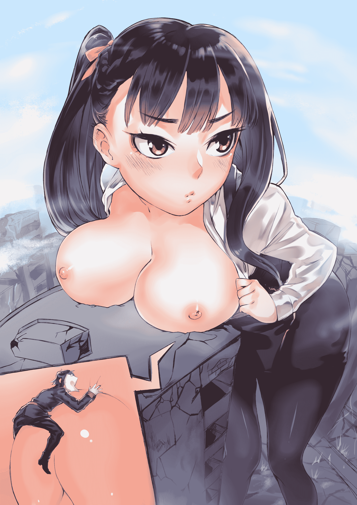](javascript:;)</ignore_js_op>  

# 4

> [POP 發表於 2017-4-19 12:16](https://giantessnight.com/gnforum2012/forum.php?mod=redirect&goto=findpost&pid=329731&ptid=22938)

> 一開始看到雪風這個名字還以為是艦隊收藏的那隻雪風

> 想不到還有別的角色也叫雪風

> ...

不不不，其实就是这只雪风

当年入坑舰C的时候是被群里一帮人带入坑的，然后第一发自己建造的130x4就出现了祥瑞，于是雪风就顺顺利利的成为了我本命之一啦！

（而且其实我自己本身也有些祥瑞体质……）

 

# 5

感谢各位的意见，今晚把活动通关了（话说我为什么每次非要到活动结束之前才打完啊

半夜写了个开头，争取明天能写到更新的篇幅。。 

# 6

*本帖最後由 dasers_100 於 2017-4-24 13:26 編輯*

【档案编号：SECPDR-██████498】

【档案类型：图片文字混合型文件】

【密级：极密】

【阅读权限：仅供指定人员查阅】

******************************************

【请输入密码……】

【密码验证正确……】

【请于旁边的传感器上验证指纹……】

【指纹验证通过……】

【请将双眼对准扫描仪验证虹膜……】

【虹膜验证通过……】

【所有验证措施通过，将于三秒钟之后开始播放文件……】

【三……】

【二……】

【一……】

【开始播放文件……】

*******************************************

“目标击杀确认......任务...完成。”

“很好，赶紧把这里所有的痕迹清除掉，准备去撤离点。”

“了解...”

“等等，卫星侦测到有高速接近的不明物体....那是..........

陨石！快离开那儿！”

“指挥官，危险！”

（轰......）

（杂音......）

“老鹰小队！老鹰小队！这里是鹰巢！听到请回话！重复！听到请回话！”

（杂音......）

【1小时之后，格里芬总部】

“我需要一个解释，克鲁格。”

“关于...什么？”

“你知道我在说什么，老鹰小队。”

“你如果知道自己在说什么的话，那你也应该知道我们花了多大的牺牲才把他们两个投入了那个地区。更何况在这次行动暴露了之后，我们更是受到了军方的报复性袭击！我现在已经根本没办法再抽调出任何多余的人手给你了！”

“可是...如果...我是说如果...他们还没有死呢？”

“放弃吧，X，我知道他是你的兄弟，可是他们所在的地区可是被陨石直接轰击到的地方。16lab的预测是，他们两个在敌方追杀下生还的概率...不到0.001%。”

“（叹气）那么，我们还能为他做些什么？”

“为他祈祷吧，如果这能让你感觉好过一点的话。”

【D31地区，老鹰小队所在地】

“咳咳咳...”

我摇摇晃晃地爬起来，感觉整个脑袋像被一把大斧劈中了似的，整个人烦闷的几乎快吐了出来。这也快倒霉到家了吧？第一次出来做任务就碰上这种倒霉事，要是回去被总部的几个家伙问起来的话，“菜鸟指挥官的第一次任务在即将成功的时候被天上的陨石砸了个半死”这类的话题怕是要被这帮损人讲上个把月的。

算了算了，先不管回去是什么情况，还是先辨明自己所处的情况才是头等大事。只是在恢复了一点意识，稍微可以开始思考一些的时候，我却开始犯迷糊了：这。。。这到底是哪儿啊？我不是应该在和WA酱在一片岩石高地上么？什么时候跑山洞里来了？而且这个山洞，为什么地踩上去的感觉是...软软的？

布料的感觉？

而且从山洞口向外看去的话，是可以看到外面荒原的景色的，没什么异常情况。

不对不对不对！清醒一点啊！在任务开始前你们两个可是把这里的所有地方都勘察了一遍的！平原地带哪来的山洞啊！

也许。。我应该往洞穴深处看一看？

打定了主意的我，检查了一下自身的装备。伪装服在准备撤离的时候就甩掉了，而枪械望远镜等装备也在陨石砸下来的爆炸性气浪中被甩了出去，完全不知道去了哪里。不过不幸中的万幸，我贴身的战术手电等东西还是毫发无损，不然的话我只能摸黑朝洞穴里探索了。

“啪-”

打开了手电，环顾了一下四周，我现在所处的位置应该是在一个不知名的洞穴当中...吧？然而这个洞穴看上去却是十分的奇怪，两条黑色巨大的柱子从洞内延伸出来，一直通向洞穴外面我看不到的地方。而且更奇怪的问题是，当我凑近看其中的一条柱子的时候，发现上面有许多的网眼，就像...就像...丝袜的感觉？摸一摸，并不是我想象当中冰冷的石头的温度，而是像果冻一样的，具有弹性？

“这地方到处都透露着诡异劲儿啊。”心里默默想到。

越往里走，两条柱子中间的空档就显得越发的小，不过整个洞穴倒也不大，三四十米之后，我便走到了洞穴的尽头——一个大致半圆形的凹口。用手电往上一照，正面的墙壁对比起两边的黑色柱子是不一样的白色，并且在两边黑色和白色的交界处，却隐隐有看到在细密的网眼后面，隐隐看出了肉色的颜色？把手放在白色的墙壁上用力地敲了几下，本来想听听看墙壁大约有多少厚度，可是却从另一侧传来了“沙—沙—”的声音，和我预期的情况完全不符。

这...这到底是哪儿啊？

“嗯—”

一声叹气声响了起来，是从上方发出来的，wa酱的声音？而且这声音和平时听到的根本不像，简直像是从天上传来的一般，还带着一点闷闷的感觉。

“这一切到底是怎么—”就在我胡思乱想的时候，两边黑色的柱子突然开始发出了轰隆隆的声响，并且开始像上抬起快速地朝着我在的方向挤压了过来。

“糟糕！” 情急之下，我甩开了手电筒，直接伏下身子朝着巨柱抬起来之后下面的空隙钻了下去。还好我在出任务之前稍微强化了一下体能，终于在两根巨柱并拢之前找到了一个墙壁下的缝隙，不顾一切的钻了下去。

然后，我后悔了。

“救，救命啊！”

似乎是像在惩罚我的这个举动一般，整个山洞简直像是被90度翻转了一样，柔软的地面快速地滑动向上，让我的整个人如同滚筒一般翻滚着朝着洞口外摔落了下去。本想抓着地面的手此刻却也如同不听使唤了一般，无助地挥舞着。

“啊啊啊啊啊啊啊啊啊啊啊啊啊啊啊啊—”

撞在了什么柔软的东西之上，是我再一次昏过去之前最后的意识。

“指...指挥官？是你...吗？”

（WA...WA酱？又是那种的声音！这...这到底是怎么回事啊！）

吃力地睁开了眼睛，之前的山洞完全不见了。取而代之在我眼前的，是一只有我两倍多高的眼眸。吓得我一屁股坐到了“地”上。

（这，这是什么怪物啊！）

只是在同时，我的脑海中以极快的速度回想了一下刚才的情景。突然，一个极其怪异但却是唯一可能合理的解释从我脑海中升起。

“WA酱！我在这儿！”

我用尽了所有的力气，朝着天空中那巨大的酒红色眼眸喊道。

4/22更新

在这一刻之前，如果有人对我说：“有个女孩儿长得比你高。”那我顶多会是惊奇地“哦？”上一声，毕竟虽然高度超过一米八六的女生虽然说是凤毛麟角，但也绝对不能说是完全找不到。可要是那人这么对我说：有个女孩大到能让你站在她的手上。那我多半会直接给他的后脑勺一手刀，打晕了之后送去医务室清醒一下。然而，我现在所处的情况，让我恨不得那一下是敲在我自己的后脑勺上。因为，现在的我，就坐在了wa酱的手心上面。朝四周望去，wa酱原来小巧洁白的一只玉手，现在却变得几乎如同一个小型的院子一般。就算是横着平躺下来的话，离两边起码还有一米五左右的距离。稍微低下头往下面看了一眼，一股强烈的眩晕和不真实感扑面而来，我所处的位置，离地起码该有一百米以上了吧！正在我望着四周，完全不知所措的时候，wa酱的声音，从天空中又传了过来。不过这次稍稍有点心理预防的我，已经开启了微型耳麦的“滤音”功能，将杂音过滤到了最小的程度，至少可以比较清晰地听出她说的话了。“指挥官...这究竟是怎么了...”虽然我也有点迷糊，不过在深吸了几口气，强迫自己冷静下来了以后。从她的手上站了起来，对着耳麦开始和她讨论起现在的状况...（话说我神经也算是够大条的...）在经过了短暂的讨论之后，我们两人终于确定，由于那块天杀的陨石上面带有一种我们完全不知道的辐射，wa酱被变成了一个155米高的女巨人，正好是她原来身高的一百倍。还有一件事也不知道是好事还是坏事（对我来说），wa酱身上的衣服，似乎也受到了陨石散发出的辐射影响，和她一起变大了。至于其他方面的副作用，一时半会儿也看不出来，还是等回基地的时候再想办法检查一下吧。不过，虽说是要回基地，可现在wa酱这样子，根本也坐不了任何的交通工具啊...

不管怎么样，还是先安抚一下她的情绪吧...于是我抬起头来，朝着天空中那巨大的脸庞说道：“WA酱，你没事吧？”“呜...指挥官...为什么我会变得这么大...这样的我...我...以后还怎么去战斗...我...我可是为杀戮而生的...呜...”话说，现在wa酱变得这么大了之后，细细的看她的脸，突然觉得可爱到不行啊！（作者：等会儿，你的思想很危险啊！）就算是整个人被放大到100倍，可她的肌肤，却并没有变的粗糙不堪，依然精致得如同蛋糕一般，晶莹剔透。紫色的头发梳成的单马尾，搭配上那双漂亮的丹凤眼，还有那挺拔的鼻子，樱桃小嘴，简直就是最完美的搭配。可现在美中不足的是，wa酱那漂亮的眼睛，现在却眯缝着，不断地在溢出泪水。看着她伤心的样子，我的心突然猛烈地抽动了一下。

“放任这么漂亮的wa酱在你面前哭却什么事都不做，你还是个男人吗！”脑海中顺理成章地冒出了这个念头之后，我知道自己应该做什么了。

“WA酱！”“指挥...官？”稍微抬起来的脸上，挂满了泪痕，也不由得让我坚定了自己的想法。“就算你变大了，WA酱在我看来依然也一样可爱哟！”“诶.........诶？！！！！！”一阵剧烈的震动传了过来，直接又把好不容易站起来的我又震得坐了下去。不过，现在的重点可不在这儿，于是我继续鼓足勇气，对着wa酱说到：“放心吧，就算你变大了，指挥官也会一直保护你的！”“真...真的吗？指挥官？”“嘛，作为指挥官，关心爱护自己的部下，不是应有的职责吗？更何况，你还是我可爱的wa酱呢，诶嘿～”“是吗...指挥官，谢...咝—”突然，wa酱的脸上浮现出了一抹痛苦的神色，本来想说的第二个“谢”字也咽了回去。这似乎不是什么好情况，难道是...受伤了？很有可能，如果我记得没错的话，在陨石砸下来之前的瞬间，我似乎听到了wa酱扑过来的声音。“wa酱？你是不是哪里受伤了？”我紧张地问道。“没...没有...” 虽然wa酱否认了我的提问，但由悄悄低下去的头以及红的都能滴出水来的脸颊来看，我的判断应该已经是八九不离十了。与此同时，我也发现了在wa酱的丝袜包裹的右脚上，隐隐约约看到了一团污渍，想来受伤的地方就是那里了。于是我朝她用力地挥了挥手—“wa酱！把我放下去，到你的...呃...脚上？”（啊不行，果然还是好羞耻...）不过看来，似乎wa酱受到的刺激似乎比我还要大了一些？“诶————————？！！！！”与此同时，wa酱的手臂也开始剧烈的抖动了几下，虽然对她来说可能只是很平常的动作，然而当这股震动放大一百倍落在了我身上之后，给我的感觉简直不啻于一场十级的大地震，此时我唯一能够做的就是趴在wa酱的手上，同时竭力抱住她手掌上稍微有些凹凸的地方，竭力保持自己的平衡不被甩下去。还好，wa酱马上就意识到了这一点—“指...指挥官，对...对...对不起...，我还是不习惯这个大小...”算啦，换做是任何一个人，也不可能对着这个美丽可爱的女孩儿发脾气吧？毕竟不是谁在变大了这么多之后，还能以一样的心态来对待我的。更何况，就算我硬下心肠来去惩罚她，难道我可以真的对一百五十多米高的她造成什么伤害么？于是在再一次的要求之后，wa酱的脸变得更红了，不过嘴里却是轻轻地“嗯—”了一声。同时翻了一个身，把自己的姿势变成了“鸭子坐”之后，慢慢地用手把我对着她的右脚送了下去。

当我终于站到她的右脚之上的时候，我再一次被这令人震惊的体型差给吓到了。那本来应该只是少女的一只纤纤玉足，可在经过了一百倍的放大之后，已然变成了将近长20米，宽六七米，高近十米的庞然巨物，已经比一般的三层楼的平房都要高了！就算是在上面跑跑跳跳，也应该根本不在话下吧。而且，站在这只玉足之上，本来已经打算闻到脚汗味的我却惊喜的发现，wa酱的脚上并没有因为长时间处于丝袜包裹之中而憋闷出浓郁的汗味，取而代之的是丝袜淡淡的气味与少女的体香混合而成的一股奇异的味道。虽然并不是什么香味，但是却完全不令人讨厌呢。只是，这片黑色肉色混杂着的完美大地之上，却突兀地长着一条红色的裂纹。“好...大！”就在靠近脚趾的地方，一大片的丝袜已经被硬生生地撕扯了开来，露出了白色的肌肤。同时在这上面，还有一道说大不大的伤口。当然那只是对wa酱来说的，而我面对的，则是一道一人宽，两人多长的红色峡谷。“我的消炎药水还够用吗？” 这是我看到了那道“小”伤口之后的唯一想法。虽然这么想着，我还是将急救箱里的所有的五大瓶药水都拿了出来，随后尽量均匀地朝着这片“峡谷”之中撒了下去。与此同时，wa酱的这只脚微微的抖动了一下，还好早已做好准备的我并没有被突如其来的震动给绊倒。从耳机之中传来了另外一声的“咝—”的声音，让我在心疼她的同时也有了不小的慰藉—起码药还是起到了应有的效果。然而，这也是我能做到的极限了。毕竟，我没有更多的消炎药，也没有这么大的绷带能给她戴上去。想到这儿，刚刚升起的一点好心情又消散的无影无踪。“抱歉啊wa酱，我只能做到这些了。”“指挥官...，谢-谢谢你。”耳机里传来了wa酱轻轻的感谢。同时，一阵风扑面而来，wa酱的两根玉柱般的手指轻轻将我捏了起来，慢慢的升起之后，放在了她的右手上。只是，这一次在我的要求之下，wa酱并没有继续将我托在手心里，而是放在了旁边的一栋废弃的高楼的楼顶上。可当我站到楼顶上之后，面对着仅仅堪堪到wa酱胸部下面的楼顶，不由得又是一阵无语。“这也太扯了吧，我记得资料上发给我的这栋xx大楼，已经超过了一百米高，可现在却连wa酱的胸部都达不到...”“不过，这么大的胸部，要是能摸一摸该有多好啊......”就在我仰着头看着wa酱的胸部，胡思乱想的时候，却听到耳机里传来了wa酱的声音：“指挥官...你...居然想摸我的...胸部？”西马大！我真是史上头号的大笨蛋！这种东西在心里想想也就算了，怎么能直接对女孩子提出“摸胸”的要求呢！这岂不是在耍流氓么！还是对着一个足一百多米高的山一般大的女孩子耍流氓...可就在我满脸通红，想解释些什么的时候。wa酱的胸却慢慢的靠了过来，在我的眼前越变越大，越变越大...充斥了我整个的视线。“天哪，wa酱，你该不会是...”

4/24 更新

随着wa酱的胸部在我视线中越变越大，终于，在占据了我整个的视线之后停了下来。而此时，我惊讶的发现，我居然连wa酱的脸都已经看不到了。“如...如果是指挥官的话，作为刚刚的回礼，就特别允许你摸一次好了...（小声）”“诶—？！真的可以吗？”这次惊呼出声的轮到我了。“も—，真是的，只有这一次哦！要...要记得好好的感谢我哦！”wa酱的话音落下同时，天空中的胸部也逐渐慢慢地下降着，随着终于落到了地面上的一声沉闷的响声，由坚硬的钢筋水泥所建筑的大楼楼顶上，赫然已经产生了数到大小不一的裂纹。而就在刚刚停稳之后，仿佛是在炫耀自己的存在一般，那简直如同两座小山一般的巨乳，轻轻地抖动了一下——“喀啦啦—”，就算只是再正常不过的轻微的乳摇，就让这栋百米的高楼大厦楼顶多出了两道清晰的裂纹，并且还有着继续向前蔓延的趋势。简直如同嘲笑这对于普通人类来说已经是高不可攀的存在一样，本来作为人类技术结晶的高楼大厦，现在居然连一个女孩子家的胸部的重量都几乎快承受不住，只能屈辱的接受成为临时胸垫的命运。我小心翼翼地走了过去—以我现在的身高对于wa酱来说，不过只是一只1.7公分长的小蚂蚁而已，而wa酱的乳房单是乳头的部位就已经将近两米长，这已经是足够让我趴在上面的长度了。乳晕延伸出去，形成了一个将近四五米直径的粉红色的圈。要是算上整个乳房的话，那就和一座小山丘没什么两样了，简直是压倒性的身高差。就算我站在房顶上踮起脚，不，就算尽全力跳起来，也够不到她乳头的一丝一毫。可她要是只要稍稍动一下坏念头，甚至连一整个乳房都不用，只需要轻轻的用两个指头捏住乳头轻轻的对我一压下来，我当场就会被压扁的吧。可就算是心中依然有诸多害怕，对于胸部的渴求依然充斥了我整个的大脑，就算是摸完以后被压死在下面，我这辈子也值了！于是怀抱着这样的想法，我伸出手掌，对着wa酱胸部下侧的地方，也是我唯一能摸得到的地方，递了上去...并不是想象中少女柔软的，带有体温的肌肤，而是粗糙的布料感觉。（作者：所以你知道了吧，男主的脑补能力简直是逆天级别的）滑稽！太滑稽了！我为什么会忘记让她把衣服解开呢！不过幸好，看来今天wa酱经过了这一连串的事情之后，对我的好感度也是大幅度得上升。此时要是不趁机得寸进尺的话，那下次能有这么好的机会也不知道要等到猴年马月了！脱！脱！脱！我的大脑似乎只剩下了这一个声音，促使着我不假思索地就问了出来：“那个，wa酱？我想摸的是你的胸-部。所以，能不能把衣服解开，让我坐在你的乳头上面？”“指...指挥官...色...色狼...”wa酱的声音越来越小，可脸却是红的越来越厉害，简直都快要滴出水来了。虽然站在乳房下面看不到上面的情景，可我清晰地听到了一粒粒的纽扣慢慢解开来的声音，随着两只玉兔露出的部分越来越多，少女的玉肌终于清晰了起来。当所有的扣子都解开以后，wa酱畏畏缩缩地伸出了右手的大拇指和食指，小心翼翼地捏起了我，将我安全运送到了她的乳头之上。简直...这简直是绝景！跨坐在wa酱的乳头之上，我心满意足地将身子贴在了她的乳晕上，呼吸着少女淡淡的体香。紧实而满满的具有脂肪感的弹性从手上一阵一阵的传出来，刺激得我整个人都兴奋了起来。wa酱的乳头并不是我想象的那样完全平滑，而是有着凹凸不平的细密褶皱，正好摩擦着我的下体，使得我的下面也不由得硬了起来，呼吸也开始渐渐粗重了。这兴奋感不由得让我的两腿收缩了起来，紧紧地夹住了身下的乳肉。“啊嗯—”似乎我的全力一夹，让wa酱也似乎感受到了些力度。于是我所处的左乳头之上，开始上下抖动了起来，犹如小时候玩的翘翘板一般，只不过幅度大得多。我用两只手紧紧地抓住wa酱乳头上面的褶皱，保证了自己不会摔落下去之后，便坏笑着用整个身体如同刷子一般朝着身下的乳肉摩擦了起来...“呀！指挥官...这.这感觉是！”就在我开始用力地摩擦起wa酱的乳头之时，我看不到的云层上，wa酱的脸已经变成了一只熟透的红苹果。毕竟以wa酱的性格，是不会像某些人形一样去主动寻求性生活的。所以造成了其实在关于性的方面，wa酱的体验次数应该是：0。“啊——”大概是由于从来没有体验过这样的快感，随着wa酱又发出了一声娇吟，从她的乳头之上的缝隙之中流出了奶白色的液体。乳...乳汁？让我没想到的是，只是稍稍的刺激，就让还是新手的wa酱射了出来。看着白白的，香喷喷的wa酱的乳汁有着往下流的趋势，这种好东西怎么能浪费了！说时迟那时快，我迅速地调整了一下自己的姿势，使得自己的头正好能凑到流出乳汁的地方，贪婪地伸出了舌头，大口地吞咽了起来。“咕嘟—咕嘟—”我每次用舌头舔到wa酱乳头的缝隙之处时，就会有一阵明显地颤动，像是在回应我一般。看来，我对她的刺激还是十分有效的，至少，在乳头之上。当wa酱似乎适应了这样程度的刺激以后，我也已经累得气喘吁吁，停了下来。可就当我准备让wa酱把我放下去的时候，突然，在一阵更加猛烈的震动之后，wa酱的脸从云层上面罩了下来。那双漂亮的丹凤眼已经眯缝成了一条线，红着脸对着我小声的说到：“指挥官...能...能不能继续...？”“可我已经累的半死了，wa酱你也不想让你的指挥官因为摸摸你的胸部就虚脱吧？要不，我教你用你自己的手指来做？”“可...可以...”wa酱的声音已经小到快如蚊子叫了，可就算是嘴上不承认，她的身体却是很诚实地做出了反应。在把我托升到了胸部的顶端之后，两只玉柱就轻轻地夹住了粉红色的乳头。在我的指导之下，开始揉搓了起来。“啊—好舒服...指挥官...啊...”从我这儿看来，本来能让我完全趴在上面的巨大乳头，现在却可怜兮兮的只能接受wa酱手指的揉搓，不断地改变着形状来满足主人的需求。最后，当wa酱再一次捏起了两只乳头的时候，她的快感达到了顶峰，猛然间又是一股白色的喷泉喷了出来，壮观地在空中挥洒着。（“没想到居然还能见到wa酱这么不为人知的一面...”）“指...指挥官...这件事...能不能对大家...保密？”“啊这是当然。不过看了你刚才的表现，我猜，wa酱对我也应该有些好感的吧？”“诶——？！才...才没有呢！让你摸胸部什么的...对！只是对你刚刚帮我治伤的回报而已！”说完wa酱就把头给扭向了一边，似乎是不想再继续在这个问题上再多说些什么。可是我的耳机却忠实地完成了使命，让我听到了wa酱在咕哝着的声音：“笨—笨蛋，要是真的不喜欢你的话，就不会和你说话了啊，大笨蛋...”之后本来还想在wa酱的胸部再多呆一会儿的，可看wa酱已经快要爆炸般的红通通的脸我也不好意思再继续挑逗她了，便坐着她的手回到了大楼顶上。可就在wa酱刚刚整理好衣服，满面通红地看着我之时，从远处传来了一阵阵的响声，就像是——脚步声？随着脚步声的逐渐接近，越来越响的时候，另一个巨大的人影，从晨曦的雾中浮现了出来...

 

# 7

<ignore_js_op>[QQ图片20170423003154.jpg](forum.php?mod=attachment&aid=Njc2MjB8NDRlYzA4YzV8MTYwMDg4MDIzOXwxODIzMHwyMjkzOA%3D%3D&nothumb=yes) *(71.92 KB, 下載次數: 25)*

[下載附件](forum.php?mod=attachment&aid=Njc2MjB8NDRlYzA4YzV8MTYwMDg4MDIzOXwxODIzMHwyMjkzOA%3D%3D&nothumb=yes)

2017-4-23 00:36 上傳  

[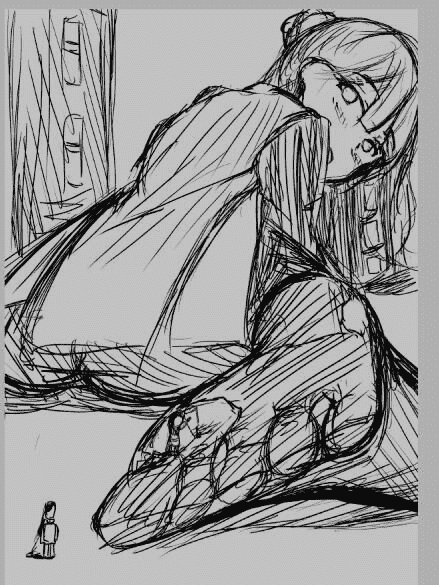](javascript:;)</ignore_js_op>  

# 8

*本帖最後由 dasers_100 於 2017-4-21 04:03 編輯*

天哪感觉好想死！

看论坛的各位写手们写起来都是轻轻松松的，换到自己身上就是各种思路不畅各种卡壳。。。自己写的东西是越看越羞耻……感觉像是退化到了小学生的程度TAT

所以大家看的时候能给我提些指导的话，感激不尽！（土下座）

（by 凌晨将近四点对着屏幕上那一堆乱糟糟文字有跳楼冲动的雪风）

 

# 9

感谢Lucifer（maker13）大佬半夜的速图一张！是指挥官帮wa酱处理伤口时候的情景，完美的丝袜巨足……真想直接趴上去睡一觉啊……

于是这就是第二更了，抱歉吊了各位看官的胃口，不过下次更新就会是满满的欧派福利了！同时……还会有第二个巨大的人影浮现，究竟是敌还是友？敬请期待！

P.S. 求求你们了，看完文章之后说点话吧（） 

# 10

> [shendanxiaogui 發表於 2017-4-23 07:29](https://giantessnight.com/gnforum2012/forum.php?mod=redirect&goto=findpost&pid=330126&ptid=22938)

> 点话吧(，虽然感觉没啥好说的，除了更新速度慢以外作为新手作质量不错。要不给你个论坛上的建议吧。尽量把 ...

啊这点其实我也想到了，所以我现在参照的是葬仪社dalao的制作模式……

话说有没有参与人设制作的想法呢？（坏笑）

 

# 11

> [长马斯恩2333 發表於 2017-4-23 15:22](https://giantessnight.com/gnforum2012/forum.php?mod=redirect&goto=findpost&pid=330156&ptid=22938)

> 听说雪风在群里不被当成雪风

我和你讲！这一切都是他们玩星际的错！一个个都是瞎子！认错能怪我么！我也不想被认错啊！

 

# 12

4/24 更新福利片段

已经是尽力在写了，可是这自己描写出来的福利咋就和dalao的差距这么大呢……明明脑海中已经有清晰的影像了，可就是写不出想要的效果来。有哪位dalao能教教我第一人称的福利怎么写啊……

对了，为了回应圣诞小鬼dalao对我的鞭策，今晚我抓紧再更新一个福利段出来，是指挥官与WA酱的模拟空间play！ 

# 13

*本帖最後由 dasers_100 於 2017-4-28 05:12 編輯*

经过两三天的酝酿之后，终于开始动笔了第一篇福利番外！对于没有写过H的雪风来说这简直是一个艰巨的任务，而就算在这两天遍读了论坛里各位大手子的佳作情节之后，雪风依然对写出来的H情节并不是很确定，所以还请多多包涵啦！

这次的福利依旧是指挥官和WA2000，不过时间线跳转到了一定情节之后，在经过了感情上的磨炼之后，指挥官终于下定决心向wa酱告白！（只不过，是在模拟世界当中）不过就算在模拟世界当中，两个人依旧度过了一个幸福的晚上……

于是我们的故事就这么开始咯~

番外：告白之夜（上）

【身份验证中...】【验证通过...】【开始构建预设场景...】【场景构筑完成，开始扫描用户身体数据...】【扫描中，请稍后...】【扫描完成，正在构建数据化模型...】【模型构筑完毕，正在与场景环境同步中...】【同步完成，即将在三秒之后进入VR（虚拟现实）环境中，请用户做好准备...】【3...】【2...】【1...】“刷—”***随着眼前的白光一点点的褪去，我慢慢的睁开了眼睛。遵照着帕斯卡的嘱咐，首先先检查了一下身体各部位的功能。用具体一点的话来说，就是甩甩脖子，摆动手臂，扭扭腰之类的动作，目的是为了检查模型数据构建得是否完善。之后，在确认一切正常之后，我撸起了左臂的袖子管，上面戴着她给我的微型立体化通讯装置。在输入了通讯请求之后，过了大约十秒钟，在一束蓝色光芒照耀之中，一个上身穿着白大褂，脸上还有着一抹坏笑的女性研究员形象出现在了我的面前。“指挥官，欢迎来到VR世界！虽然我想你应该已经无数次的让“她们”来这儿训练，不过像这样自己进到这里来，好像还是第一次吧？”“啊...是这样的呢。”我挠了挠头，以前虽然每周定期也让手下的少女们进入vr舱进行训练，以培养她们在各种严酷环境下作战的经验。不过因为自身战斗力的孱弱，以及没有这方面的需求，我自己躺入vr舱里进行虚拟现实模拟似乎还是大姑娘上轿—头一回。更何况，这次我进入模拟世界的目的也并不是战斗，而是...“您这一次突然要求来这里的目的是...告白，对吧？”“是啊，诶..............？！”我惊慌地看着帕斯卡，被人一口叫破心中的秘密的滋味可不好受。然而荧幕中的帕斯卡又摆出了她招牌式的坏笑，一副“我早就知道”的样子简直气的我想揍她两下，可又因为这个帕斯卡只是一个远程投影而作罢。“虽然你和wa2000从那次的秘密任务之后回来并没有表现出任何异常的状况，也没有交流过比以前更多的次数，不过—AI芯片的储存功能可是不会骗人的。”“储存功能？难道说，你—”我不由得惊呼了出来。“没错，”帕斯卡脸上的笑意更盛，“我以wa2000的第一视角观摩了你们醒来之后的'那些'场景，不得不说，你的技术...还不错！特别是对于一个有着超过一百五十米高的巨大女生来说。”“你这是—”脸上已经烧红了一大片，毕竟我和wa酱那次的事情约定深埋在心底，而且回来之后谁也没说，可现在却被她直接说了出来。而且据她的说法，简直就像是以360度的自由视角看到了我们做的那些事...这简直...“嘛...嘛...冷静，冷静，毕竟我也没对任何人说。而且我十分理解你的心情，毕竟指挥官也是人，也需要发泄嘛。所以至少我们目前还是处于fairdeal（公平交易）的状态？”“好，好吧！不过你得保证，以后这类的资料你绝对不能外传，还要保证其他人不能外传。不然的话...不然的话...我就让wa2000来亲自找你要。”从气急的状态下冷静下来之后，我马上就对帕斯卡提出了这么一个要求。“噢这位先生，我想你是不是搞错了些什么。要我以后不外传资料确实可以，可要是别人也拿到了怎么办？还有，你居然让一个女生挡在你前面？你作为一个男人的气概到哪里去了？“首先我必须要纠正你一点，不是一个'普通”的女生，而是一个具有着一百五十五米身高，战斗力达到原来二十名军方人形总和以上的战术少女！其次，作为前90wish的研究员，现在16lab的领军人物，还发明了烙印系统这种独家技术的帕斯卡莉娅小姐，要阻止几份资料在网上扩散的办法应该是数不胜数吧？哼哼，你最好证明你有这方面的能力，不然的话...我可要让wa酱天天来堵你的门口咯？我想这滋味对你来说应该也不好受吧？”（抱歉，帕斯卡小姐，虽然我一直是很尊敬你的。但是为了我和wa酱以后的幸福，只好让我当一回恶人了）“啊—，真是的，败给你了。好吧，我会帮你看住这边的动静的，行了吧？“嘿嘿，我就知道帕斯卡小姐对我最好了！”“不要对我撒娇，撒娇也不顶用，你一个大男人家的撒娇恶不恶心，真是的。—啊，被你搅和得都快忘了正事了。听好，虽然vr系统是通过采集你的脑波来和AI系统进行交互以达到模拟的目的，但要是在里面遭受重大的创伤的话，反馈出来的就是对大脑的损伤！所以我郑重地警告你一句，不要搞的太激烈，否则真要是出了事的话，你就直接变成白痴了！”“这...这么严重？”我被她的话吓着了。“对，所以我怕你到时候玩high了做出一些傻事，我可不希望看到我们的希望之星是一个只用下半身思考的蠢货，”帕斯卡的脸上稍微缓和一点，继续说了下去“除了这点，其他应该就没什么限制了，毕竟你也不是进来战斗的，没什么太多需要注意的地方。”“那...我大概可以在里面呆上多少时间呢？”“因为那位大小姐的体型，所以你也知道的，我们为她构筑模拟所需要的电量也会大幅度上升。目前我能给你们最多的时间大概是：现实时间的一个小时，换算成VR世界的话，十六个小时。足够你们俩在里面玩整整一晚上了。”“帕斯卡小姐，谢谢你！”这确实是我没想到的惊喜，我本来以为自从wa酱变成巨人之后，我就再也没有机会对她进行表白和更亲密的举动了，就算想用vr系统，巨大的能耗也像一道紧箍咒一般使我根本没有机会去使用。毕竟你不可能用整个基地能消耗一周的能源就为了和她在vr世界里面呆上一晚吧？我敢打赌，要是这种事真的发生了的话，克鲁格那个老家伙真能直接坐飞机过来把我骂得狗血淋头的。“哦对了，这次为了你们，我特意在你的控制器里加上了悬浮的功能，否则就按照你这个体型的话，怕是爬到上面就要几个小时呢。”帕斯卡一边这么说，一边还不怀好意地瞄了一眼我的下面。“......”（好吧！我收回这人很好的话！）“对了，走之前再要提醒你一下，这次模拟可是严格按照真实数据构筑，”看到帕斯卡小姐的笑容越来越坏，我的心不由得“咯噔”一下—“所以，要让她对你真情流露的话，可是只能看你自己的本事了哦？像直接让她衣服消失什么的作弊行为可是禁止事项～那么指挥官，祝你攻略成功。”随着话音落下，帕斯卡切断了通讯，只留下来一脸蒙逼的我站在原地发呆。直到二十秒之后，整个屋子里面才响起了我的咆哮声：

“帕斯卡！你算计我！帕斯卡！

被打扮成星空样子的墙壁和地板，精美的铺上了白色桌布和鲜艳花瓣的高级餐桌，巨大的无角兽雕像，一架白色的，有着华丽装潢的豪华三角钢琴，以及房间中最显眼的那一道蔷薇与水晶组成的爱心形拱门，无不让浪漫的气质在房间之中一层层地扩散着。可是，这一切对我来说都太过于巨大了，因为这房间的大小与我的比例是：100:1这就造成了我只能站在光滑的木地板之上，呆呆地看着如大山一般高的椅子发呆。不过，这个情况也早在我的预料之中，心念一动，我打开了左臂上的控制器盖板，按了几个按钮。随后，我的整个身体便飘浮了起来，一直到上升到正常的高度才停止。虽说是变大了100倍的房间，但似乎物体的数据只是单纯的尺寸改变了，其他的重量之类却是依然保持了原样。我长舒了一口气，起码帕斯卡这家伙还留了一丝良心，没让我真以百分之百的拟真度进入场景，不然的话，以我现在这个体型，哪怕是拿起一根小小的牙签都有难度，更别说做其他任何事情了。“于是，接下来就是...”我把双手搭在了冰箱门的扶手上，用力地向外拉开，一股强烈的寒气扑面而来，呛得我连打了好几个喷嚏。“阿嚏—!”不顾依然因寒气影响依然颤抖着的身体，我朝冰箱内看了过去。就在冰箱的最下层，赫然放着一份精致的巧克力冰激凌。10米高的玻璃巨塔之中，巨型的巧克力冰激淋球如同超大型的雪球一般从杯子的底部开始叠起，直到我吃力的把脖子仰起来才终于看到了顶端。而在杯子的底部，已经有一部分冰激凌因为压的太紧，已经在杯壁上涂上了薄薄的一层。我吃力地把杯子像拔大树一样的抱起，重新悬浮了起来，把杯子放到了餐桌对应的位子上，之后我又吃力地把冰箱门关了回去。“呼...呼...”虽然这是在模拟世界里，但做了这么多动作的我还是感觉身体一阵阵的发汗，不由得跌坐在了地板上，喘着粗气。可就在此时，我的身后出现了一个白点，随后刷拉一下，扩展到了百米多高，在空中形成了一道闪亮的光门。我惊讶地回过头，看着这道光门，意识到自己似乎翻了一个很严重的错误。这道光门出现在这儿，意味着—wa酱来了。还是在我的正后方。“不好—”就在我刚冒出这个念头的时候，一只穿着丝袜的巨脚从光门处伸了出来，然后对着我所在的位置以难以想象的速度踩了下来。而我连反应都来不及反应，就被黑色的丝袜包裹着的肌肤给死死地按在了木地板上。”呜—呜—”虽然想说些什么，但整个身子都紧紧地被丝袜贴住了，什么声音都发不出来。不过幸好因为我太小的关系，所以在被踩住的时候，旁边还稍微露出了一丝缝隙能让我稍微呼吸两口空气。不然的话，我只能直接中止这次的模拟了。就在这个时候，从天空终于传来了wa酱的声音：“咦？指挥官跑哪儿去了？明明让我下班之后过来的...结果自己却爽约了，笨蛋...（小声）”为了引起她的注意，我只好拼命地扭动自己的身躯。其实本来我想用漂浮功能的，可整个人被踩住以后，根本按不到左手腕上的控制器，导致我现在只能用这种方式来吸引她的关注。“咦？我记得这里是模拟的场景吧？怎么会有虫子...啊等等，难道说？！”随着wa酱终于想起来了些什么，我身上的重压也被迅速地移开了，而迎接我的则是那张熟悉的巨大脸庞—“不得不说，还好你有着进门脱鞋的好习惯，咳—。不然要是被你的那双高跟鞋压到，我估计就直接被系统踢出去了...”虽然整个人依然是浑身酸软地倒在地上，为了缓和这尴尬的气氛我还是开起了小玩笑。“哼—明明就是指挥官自己不小心像小虫子一样跑到我的脚底下的—”wa酱的嘴嘟了起来，形成了一个可爱的へ字型。不过，虽然嘴上这么说，身体却还是很老实的嘛—请不要误会，我说的是她脸上满得都快溢出来的关切表情，使我刚刚的不愉快已经完全散去了。“那么，”wa酱低着头看着我。虽说是看着我，可有着那双巨大的欧派的遮挡，我只能看到她那双美丽的酒红色的眼睛，“指挥官把我叫到这里来是干什么呢？让拥有着昂贵身价的我忙了一整天，也该报答我一下了吧？”“没错！所以到这儿来吧？”一边说着，我一边启动了漂浮功能升了起来，不由得让wa酱惊呼了出来，就连我在上升过程当中蹭了她的胸部一下都没发觉。在我的引导之下，wa酱向餐桌走去，就在她坐下之后，便发觉了我摆上桌的那一份冰激淋。“指挥官，这是...？”“啊，这份巧克力冰激淋，是特意为你准备的哟。”“诶——？？？！可是...可是.........指挥官你怎么知道我喜欢吃这个的...（小声）”wa酱的声音越来越小，都快成蚊子叫了。“嘛，大概因为我是指挥官啦！”我完美地将这个问题挡了回去，并没有泄露出某位不愿意透露姓名的女仆小姐的信息，随后问到，“所以，想吃吗？”“诶—诶？！区区...区区巧克力冰激淋，我...我才不稀罕呢！”这小妮子，完全没发现自己的口水已经都流出来了，还在这里嘴硬。那不如...继续逗逗她，说不定能发现她更多可爱的表情呢！想到这儿，我于是故意沉下脸说到：“你可真是过分呢。你知道这个冰激凌，可是这一代最有名的'冰橘'冷饮店的秘密配方，据说是完美传承了三战前那个著名冰激凌......对！“哈根达斯”的口味哦，你要知道，为了你的这份冰激凌，我可是花光了这个月的工资，可你居然说不要了？”一边说，我还一边偷偷地看着她的表情。当她听到哈根达斯这几个字的时候，眼睛越来越亮。可就当她想说些什么的时候，我强忍着心中想狂笑的冲动，继续板着脸说道：“好吧，看来这东西你也不想要了，还是丢了—”就当我作势要去搬起这个巨大的玻璃杯子时候，却听到了wa酱的尖叫“不要—”，紧接着，一只比我身体还要粗的手指就飞了过来，一下子把我死死地按在了桌面之上。“不是吧？又来...”在洁白的桌布和wa酱的指腹中变成了一个夹心三明治的时候，我眼前的景象开始飞速变化。我被wa酱用两根指头小心翼翼地捏起，送到了那巨大的犹如影院IMAX荧幕一般大小的脸前。而wa酱的眼睛，此时已经眯了起来，带着一丝丝嗔怒看着我。“完了！”完蛋了，完蛋了...我把wa酱惹生气了！虽然前面漂浮起来平视的时候并没觉得她有多少大，可现在一被她捏起来，才发觉我对她来说简直就像是一只小小的蚂蚁一般。就算是她小指上的指甲，都比我的整个人要长，我甚至都没有她的手指粗。在这巨大得简直让人感觉绝望的体型差之下，我还要去戏弄她，简直是蚂蚁对着大象发动了正面的冲锋一样...这时，我看到wa酱终于开了口：“指挥官，明明知道我最喜欢吃巧克力冰激淋，可为什么要戏弄我呢？我可是会生气的！”面对着wa酱咄咄逼人的威势，我只好无奈地低下了头，老实交代道：“好吧，是我不对—”“既然指挥官想戏弄我的话，那么对于这样的坏指挥官，我—我要惩罚你！”诶？！等等等等！可我不是抖M啊！我本来只是想多看看wa酱可爱的表情啊！“至于惩罚的内容嘛—，指挥官？”wa酱突然提高了点声音，却又柔和了下来，低声地对我说道，“这个冰激淋，真的是特意为我准备的嘛？”“真的真的！我可是准备了很长时间的！”为了逃脱wa酱的惩罚，我瞬间变成了乖小孩，直接如竹筒倒豆子一般说出了准备的过程。“へ—，那么，对指挥官的惩罚，我想好了哦—”一边说着，wa酱灵巧的摆动着手指，提着我到了她的右半边脸，轻轻地把我送到了她红红的脸颊旁，小声的说道：“罚你，亲我一下—”诶？！这算是哪门子惩罚啊！不，这简直是上天赐给我的一份大礼啊！就算是我，现在也不由得脸红燥热，一时间呆在了那里。（呆子，你还在想什么呢...）好在我迅速反应了过来，把身体贴在了她细腻光滑的小酒窝上，双唇用力地吻着。鼻子里面充斥着的，是少女那淡淡的体香，使我不由得心跳加速了起来。可就在我以为这样快乐的瞬间能永久持续下去的时候，wa酱的手指已经把我带离了她的脸边，把我放在了那只玻璃杯子的杯口上。“那么，指挥官，我要开动咯？”伴随着wa酱幸福地小口小口品尝着美味的极品冰激凌同时，我看到的却是另外一番景象。犹如一只巨型的铲子般的调羹，在黑粽色的雪之大地上挖掘着，每挖掘的一口，都足够装进五六个人。随着调羹的不断升起，wa酱张开了她的小嘴，伸出一小截粉红色的小舌在这块冰激凌上舔舐着。可就算是她的舌头只伸出来了一点点，那部分的长度已经比我的人都要高了。这就是我和wa酱之间的差距么？好大啊...可就在我看着wa酱吃冰激凌时，意外发生了。不知道是我没坐稳的关系还是被wa酱的吃相吓着了，我屁股下面本来稳稳坐着的玻璃壁，突然如同一条蛇一般就滑了开去。紧接着，我摔入进了那巨大的，简直无边无际的雪地之中。“wa酱！wa酱！救命！”我这时候什么都顾不上了，冲着半空中wa酱的脸以最大的声音喊了出来。（作者：你每次都忘记你能浮起来了么？）还好，作为精英狙击步枪人形的wa酱眼力也是一等一的，很快便发现了我，将我所处的那一块冰激凌挖了起来，放到了眼前。“指挥官怎么这么不小心...算了，这次就帮你一把好了！”在我还没有反应过来之际，wa酱已经将这勺盛着我的冰激凌送到了自己的嘴边。望着那简直如同山洞一般的巨大嘴巴，中间躺着的那条粉色怪兽便朝着我卷了过来，上面带着的热气使我不由得闭上了眼睛。“嘶溜—”我睁开眼睛，发觉wa酱竟然用舌头...在舔我的身体？就在我为这个惊人事实呆站着时，wa酱的舌头又从远方卷了过来，瞬间接触上了我的身体。“啊—”一股奇特的感觉从脚底直接冲上了头顶，wa酱的舌头在放大了百倍之后的触感并不是完全顺滑的，上面带有的味蕾毛毛糙糙的触感在我的身上摩擦，让我突然有了一种爽翻天的感觉。湿湿的，粗糙的舌头摩擦着我的身体，让我的下面某个部位有了一种想挺立起来的冲动。不过就算是有着强烈的念头，我依然勉励地保持着自己脑海中的一片清明，不至于让自己在今晚刚开始的时候就完全失态。“哈—哈—”被wa酱一阵一阵的舌头包裹着的感觉简直如同整个人都敷在了热毛巾上，略带咸味的口水大片大片地留在了我身上，顺着衣服的下摆滴滴答答地往下滴落着。还好，身处模拟环境的我，随时都能在身上变出衣服来，杜绝了继续在wa酱面前丢脸的可能。可就在把湿衣服删除的时候，我才反应过来wa酱还在看着我。而且还是站在wa酱吃冰激凌的调羹里换衣服！这巨大的羞耻感冲击得我以最快的速度转过了身去，身后是wa酱羞得满面通红的脸发出的声音：“我...我什么都没看到！真的！”20分钟之后，wa酱终于心满意足地舔着嘴唇，望着里面那已经被吃光的空玻璃杯发着呆。小眼神中带着一丝幽怨，仿佛在说“要是还有就好了”。不过这个时候，对我来说，却是最好的表白时机！于是，我趁着wa酱还沉浸在冰激凌的味道中的时候，缓缓地走到了餐桌的边缘，对着她说道：“wa酱，其实今晚把你叫过来，还有一件更大的礼物给你...”“咦？指挥官，是什么呢？”wa酱把身子探了过来，脸上是一脸的期待。（就是现在！姨妈大！）一瞬间，我的右膝跪了下去，从半空中落下了一枚巨大的戒指被我双手举过了头顶。这戒指比我人还高，所以实际上本来应该是很浪漫的告白场面现在却弄的无比滑稽。不过，对于wa酱来说，现在她关注的唯一一点就是我嘴里吐出来的话：“wa酱，你愿意，成为我的女朋友，缔结灵魂烙印吗？”“诶—？？？？？？？？？！！”wa酱发出了从进屋一来所能发出的最大的响声，强烈的震动甚至都传到了站在餐桌上的我的耳朵里，震得我的耳膜一阵阵发痛。“指挥官，这...这太突然了！您...您...”wa酱似乎是被吓着了，“您”了半天也说不下去。这种时候，还是得我来打破这个尴尬局面啊！“听着，wa酱，我不管你心里现在是怎么想的，但是在我看来，我们两个的羁绊，已经完完全全地超出了一般指挥官和下属之间的关系。自从你来了这个指挥部以后，不管是你的工作能力也好，个人魅力也好，无时无刻的都不在深深地吸引着我。而从你变大之后，我对你的感情愈发的强烈了。现在的我，已经完全习惯了有你在身边的日子，我无法想象如果有一天我睁开眼睛，陪伴在我身边的如果不是你的话，我会怎么过下去。所以—”我站了起来，用尽力气举高那只戒指，大声地说道：“请...请你当我的女朋友，拜托了！”“呜—”wa酱突然哭了出来。紧接着，她瞬间伸出了手指将我和戒指一并带起，放到了她的脸前。然后，她巨大的红唇便吻了上来。“chu—”“指...指挥官（抽泣），我真的没想到，您会认定我这样的人做您的伴侣。我...我感觉无比的幸福（抽泣）...我是为了杀戮而生，从来没考虑过其他的事情。指挥官，真的可以让我在你的身边么？那个，我能变得更坦率一点么？（抽泣）”看着wa酱梨花带雨的幸福小脸，我的内心也已经被融化得只剩下一片暖意。等到她哭完，带着泪水的笑脸抬起头，我才清了清嗓子，说道：“那么，是不是该给我的巨大女友，带上戒指了？”“指挥官，嘿嘿...”wa酱看上去已经陷入了完全的当机状态，似乎我说的话现在她根本听不进去了。而在我面前晃来晃去的，却是wa酱翘上来的有我人那般高的被丝袜包裹着的脚趾。“有了！”我双手拿着戒指，小心翼翼地走到了wa酱左脚的无名指下方，在确认了自己没有被夹住的危险之后，慢慢地对着那只脚趾套了上去...“诶—指挥官，为什么是脚趾—“wa酱发现了我的动作之后，终于清醒了过来，一脸疑惑地看着我问道。“因为，我喜欢wa酱的任何一寸地方嘛，就算是脚，我也喜欢！”在毫不知情的情况之下，我又一次做出了近乎于变态一般的发言。而wa酱听了之后，脸上却挂了一幅小恶魔般的微笑，以一种极不符合她本来性格的调皮，坏笑道：“嘛，没办法了。毕竟指挥官看起来好像一只小虫子，喜欢我的脚也是没有办法的事呢！”“不过—”她将脚放了下去，巨大的脸庞慢慢地凑到了我的身前，轻轻地说，“能当上虫子指挥官的女友，我现在，感觉十分幸福—”“chu—”在寂静的房间之中，我紧紧地拥住wa酱那巨大的，能把我整个人包裹进去的红唇亲吻着，久久不愿分开...良久，终于分开的两人都瘫了下去。像是被抽空了力气似的。在稍稍的休息过后，wa酱突然将我用双手捧起，温柔地对着我说道：“指挥官，谢谢你为我做的这么多。从今以后，只要是您需要的地方，我愿意为您付出我的一切。还请您以后，多多指教了！”“嗯，那么说好了，这是专属于我们两个人之间的约定哦！永永远远都要遵守下去呢！”“是的，指挥官！所以，请您接受属于我，瓦尔特WA2000的回礼！”wa酱把我带到那架巨大的三角钢琴旁，扶着我稳稳的坐上了琴檐，随后自己抽出琴凳坐了下去。然后对着我说道：“指挥官，其实我在很久之前，看到你很多次坐在办公室里一个人静静地听歌。于是，我就努力地去练习，希望在有一天能用歌声吸引您的注意。现在，是我唱给您听的时候了。指挥官，你想听么？”望着她期待已久的眼神，我当然是选择微笑着点了点头。十指纷飞，在黑白色的钢琴键上演绎出了美妙的旋律。随后，wa酱的歌声，便如轻柔的微风一般，吹向了房间的每个角落。我被wa酱专注的神情所感染，不由得和她一起唱了出来。歌声回荡在房间里面，为这个旖旎的夜晚，增添了一抹温情的粉色……“あなたのこと 私は今でも思い続けているよ

我到了现在仍是思念着你啊

いくら时流れて行こうと I'm by your side baby いつでも

纵使多少时光流逝 我何时都会在你身旁

So. どんなに离れていようと

所以即使相距多远

心の中ではいつでも一绪にいるけど 寂しいんだよ

虽然心里何时都在一起但仍会寂寞啊

So baby please ただ hurry back home

那么亲爱的 只是请你快点回来……”（该歌词摘自于青山黛玛，Soulja所做的《留在我身边》） 

# 14

<ignore_js_op>[image145_S.jpg](forum.php?mod=attachment&aid=Njc2Mzl8YzBhNjQ2ZWV8MTYwMDg4MDI1M3wxODIzMHwyMjkzOA%3D%3D&nothumb=yes) *(16.54 KB, 下載次數: 7)*

[下載附件](forum.php?mod=attachment&aid=Njc2Mzl8YzBhNjQ2ZWV8MTYwMDg4MDI1M3wxODIzMHwyMjkzOA%3D%3D&nothumb=yes)

2017-4-26 21:14 上傳  

帕斯卡

</ignore_js_op>  

# 15

我去。。。。写了三分之二的时候家里突然断电了，然后我才惊恐的发现我并没保存。。。简直了，我还不知道啥时候能恢复，而且要是没有保存下来的话我就要重打了TAT

所以实在抱歉了，等明天起来再说吧，心情乱的很 

# 16

所以在经历了断电被消去了所有更新内容的人类史上最大最恶事件之后，坚持回来写文的我，今晚也只能坚持到这儿了。不过上篇在经过我重写之后的新构思扩充下，已经有了原来更新三分之二的程度。所以量还是挺足的，也应该能满足各位看官的胃口。

下篇的更新应该就是浴室play和销魂的风情了，我会尽量在保证质量的速度下尽快更新的，还请多多支持，发表些留言，让雪风感觉到GN大家庭的温暖_(:з」∠)_

说到指挥官和wa酱在最后唱的歌，其实这首歌在我很小的时候听到之后就迷恋上了，一直希望自己也能拥有这样一个在家里等待自己回家的女朋友啊（快醒醒死宅怎么可能有女朋友），希望通过这种形式的展开，来表现GTS和小人之间的互动并不是只有着SM的心理形态，也可以是以温情甚至热恋的形式展开。毕竟，我还是坚信人的内心之中还存乎着“人性”的，不管变得多大，依然可以为自己保留一片清明。

以上

在凌晨五点更新却依然脑子活跃睡不着觉的雪风 

# 17

> [ZERO001 發表於 2017-4-29 02:11](https://giantessnight.com/gnforum2012/forum.php?mod=redirect&goto=findpost&pid=330528&ptid=22938)

> 雪风 -- 新GN时代的潜力股

> 希望不要和其他人一样坑了

这个...尽量吧...不过至少在我灵感没完全枯竭之前我是不会轻易弃坑的

 

# 18

我今晚一定要更新！不更新你们记得砍死我（ 

# 19

> [长马斯恩2333 發表於 2017-5-12 18:02](https://giantessnight.com/gnforum2012/forum.php?mod=redirect&goto=findpost&pid=331969&ptid=22938)

> 做的雪风被砍死^O^更了算我输

kuso你对我就这么没信心嘛！！！！

 

# 20

> [长马斯恩2333 發表於 2017-5-13 00:44](https://giantessnight.com/gnforum2012/forum.php?mod=redirect&goto=findpost&pid=332004&ptid=22938)

> 了解你们了(爪机码字全是错的简直没救)

我我我……我还没睡！我还可以再续一秒！（

话说你不去看看另外那个脑洞的接龙文吗，花了两个多小时在上面的。。。。

而且我已经写了不少了！我只是说要更，但并没说更多少吧！

反正我睡着之前更了就算我不咕！哼！

 

# 21

*本帖最後由 dasers_100 於 2017-5-13 10:58 編輯*

“へ—，指挥官居然想和我一起洗澡？”

wa酱的眼睛又眯成了那标志性的一条缝，以一种极度嫌弃的目光由上至下的盖了下来。要是换一种说法的话，就是所谓的“看垃圾的眼神”，而这一切的缘由，还是在一分钟之前我和她提到的某个本应该是很普通的男女朋友间的可对wa酱来说是和“非礼”一类词画上等号的一个要求。

此时此刻wa酱的心里一定是在剧烈地挣扎着吧...就算不用看她的脸也是能明白的。毕竟就在我的前方不到一米的地方，wa酱那被黑色丝袜包裹的右脚大拇指已经在不安的搓动着了。每一次的震动，简直如同一把砸向地面的巨型锤子一般，让我几乎连站都站不稳了。而这样的景象，无疑说明了这脚趾的主人，现在的心情应该不是很好。

（大概对于wa酱这种应该是保守派的少女来说，在告白当天就提出共浴的要求似乎也是太超前了一点...吧？）

可就在我打着退堂鼓准备撤回刚刚所说的话的时候，wa酱的回应却先传到了我的耳中：

“指挥官...在告白的当天就那么急不可耐的想要得到我吗？虽然是想给坏指挥官更多一点考验的...不过今天就破例好了！听好了，我可是看在你能给我提供冰激凌的面子上才同意的哦！不要想到其他方面去！”

虽然这么说着，可是wa酱的脸上，却已经泛起了一片暖意。这个看似高傲挑剔的女孩，其实内心却是那么的纯真。所谓的高傲，不过是对自己强大实力的自负，和因不擅长交流而作出的伪装罢了。当有人亲手挑起了她的面纱，并以一片真诚待之时，那她愿意回馈给那个人的，便是十倍，百倍于此的爱意。

而现在，便到了瓜熟蒂落之际，是时候去享用这丰美的果实了。

***

"♪~”

（咕嘟...）

我艰难地咽下了一口口水。

旁边巨大的，看上去简直如同湖一般的浴缸中，大量的热水散发着袅袅的热气。

wa酱在用手指轻轻地将我放在浴缸的边上之后，自顾自地坐到了旁边的淋浴龙头下的小凳子上。嘴里哼着一首不知名的小调，看上去似乎很开心的样子。而我则浑身光溜溜地坐在了浴缸边缘，等待着wa酱脱下衣服之后的“大驾光临”。可是，现在很遗憾的一点是——

我现在的位置，wa酱是背对着我的啊！

（这死妮子一定是故意的！）

就在我为看不到她脱衣服的美景而苦恼不已的时候，wa酱突然转过身来，以小恶魔式的窃笑对着我戏谑道：“咦，指挥官，你盯着我看干什么？难不成是想看我脱衣服嘛？嘛，也好，等会也是要和指挥官亲密接触的话，现在给你看看我的身体也没什么...那么指挥官，你可要看-好-了-哦～”

（日！以后谁和我说wa的内心纯真我和谁急！这丫头简直就是一魅惑众生的妖精啊！我以前怎么没看出她还有这一面来？）

不过心中想归想，在眼前饱满的福利如果不盯住仔细看的话，多半是废了（划去）

只见wa酱慵懒地伸出了手臂，开始解起了上衣上的扣子，随着扣子一个一个的散开，里面包裹着的大好春光也一点一滴地展现在了我的面前。wa酱的胸部属于那种挺拔的类型，虽然不是那种e杯的巨乳，但是c以上d以下的浑圆却在她的胸前得到了最完美的黄金比例。由于wa酱平时穿着比较严实，所以在衣服下面露出的皮肤，依然是那种健康的肉色中透着红的细腻光泽的肌肤。当纽扣解开一大半时，我看到了衬托着那完美乳沟的黑色pad，虽然大部分人形在内衣选择时都以老气，不好看等种种理由排除了黑色。然而当这种颜色衬托在wa酱的身体上时，却形成了一种特殊的魅惑气质，让人忍不住地就想扑进那完美的半球形去。

“啪！”随着wa酱动作的结束，最后的外衣纽扣也解开了。

将外衣扔出了浴室之后，wa酱用两只手故意虚挡着胸部，对着我笑道：“那么，指挥官，接下来脱下来之后，可就是你最想看的部分咯？”

我已经被这高潮刺激得说不出话来了，只能以拼命点头的方式来催促她。

“那么—”wa酱将手伸到后背，解开了胸罩的搭扣，从右手边开始慢慢地对着我揭开，而那对沉重的玉兔，在束缚他们的负重被去除之后，终于以一种强势的方式，傲然地挺立在了wa酱的胸前。哦，以及那荡漾的乳摇。

在这玉女峰之上，点缀着两颗粉红色的物体，晶莹剔透一般，如同两颗水蜜桃顶峰上的那一抹红色，如此的亮眼，又是如此的令人迷醉。更要注意的是，这并不是一对普通女孩子的乳房，而是一个拥有普通人一百倍大的女孩子的乳房，完美无瑕。光是乳头的直径已经超过了一个人的身高，而如果要攀上那玉女峰顶之上，饱览秀丽景色的话，更是需要花费上不小的力气。可就是这么巨大的乳房，这么令人陶醉的至美，在这一刻，只属于我一个人...

（不行，要忍住，要是现在就射出来的话那等会就一点力气也没有了）

饶是如此，我依然憋的是脸上如火烧一般通红，双手死命的按住了大腿内侧，努力的挤压着，尽量让我的姿势看上去不那么失态。不过，似乎已经被wa酱发现了。想想也是，毕竟是专职远程狙击的人形，怎么可能连这点小动作都发现不了...虽然我现在在她眼中应该只是一个小黑点大小才对...

wa酱在看到我的窘态之后，扑哧一声笑了出来。用手轻掩住樱唇，说道：“咦，指挥官对着我上面就快憋不住了？那我要是把下面也脱下来的话，你会不会直接射出来呢？”

（。。。。。。）

我不想说话，只是把头埋了下去想稍微在巨大的她面前保留一点作为指挥官的那可怜的自尊心。只不过，在她曼妙身躯的诱惑下，我还是忍不住慢慢地把头抬了起来...

wa酱慢慢地抬起了左脚，随后将连裤的丝袜给一点点地从腿上褪了下来，露出来的乳白大腿，在浴室的灯光映照之下闪闪地发着光。而在那通天的玉柱之下，支撑着的是那一双如同房子般大小却依然如同白玉一般的双足。近乎二十米长的巨大玉足，不由得让我生出无限遐想：假使wa酱现在的这个身体，出现在城市里会怎么样呢？也许她的一只脚，就可以阻塞住那些并不算宽敞的道路了吧？那么，面对着想要走路的少女，那些司机的反应又会是如何呢？“啊对不起，小女子只是想过马路，只不过不小心一只脚就把道路给塞住了呢...”“啊真是对不住，似乎路面都被踩裂了，不过这可不能把错怪到小女子身上呢。毕竟道路设计出来就是让人走的不是么？难道说，这城市里的道路，连小女子的一只脚的重量都承受不住吗？”“啊警察先生对不起，引起交通混乱的是我，破坏城市道路的也是我，请您把我拷回去吧？啊，似乎我的手太大了呢，那要不然的话铐我的小脚趾吗？咦，警察先生难道连小女子的趾尖都摸不到吗？真是太弱了呢。”之类的话，不由得想了痴了......

“喂，你在看哪里啊！可是你自己要和我一起洗澡的啊！现在却对我的身体不感兴趣了吗？！”wa酱嗔怒的喊声把我从遐想当中拉回到了现实。此时的她已经褪去了所有的衣物，而在浴室中缭绕的雾气掩映着的，是下体那若隐若现的一道裂缝，上面还夹杂着些许茂密的黑森林在其上。当她从远处走过来并跨过我一只脚放进浴池的时候，那道裂缝给我的感觉简直就像横跨了天际一般，占据了我整个的视线。虽然在朦胧之中并不能很清晰地看见那其中掩映的粉嫩，但光是那种至强至美的感觉，已经让我深陷其中，不能自拔。

“哗啦！”当wa酱将身体埋入了浴缸之后，我惊讶地发现浴缸里的水已经满溢了出来，冲刷着我的脚底，幸好我的两只脚紧紧地扣住了还算光滑的边缘，才没被丢脸地从浴缸上直接冲到地上。wa酱似乎是看到了我的窘态，一改之前的小恶魔风格，从浴池中直起了半个身子，温柔地对我说道：“指挥官，进来吧？”

说着，wa酱用右手托起了自己的右乳房，用左手捏着那对我来说巨大无比的蜜豆，颤颤巍巍地伸到了我的跟前。在我稳当地爬上去并跨坐在了乳头上之后，慢慢地，她托着那小山丘，带着我进了那云雾缭绕的湖泊之中。

之后，wa酱以一种女神的姿态温柔的俯视着我，对我说道：

“指挥官，既然是共浴的话，我刚刚想到的，特别为你准备了一样东西...”

（未完待续）

 

# 22

*本帖最後由 dasers_100 於 2017-5-13 03:09 編輯*

简直快崩溃，为什么ipad上无法直接把所有东西都粘贴进去啊，崩溃，我明明写了好长一段的。。。 

# 23

*本帖最後由 dasers_100 於 2017-5-13 03:47 編輯*

我tmd目前想骂人，上来就是一套素质三连.jpg

当你辛辛苦苦地写了大段文字却发现你的老爹在半夜四点还没睡而你却不能开电脑更新的时候你就会知道有多么操蛋了。我放弃了，我明天还要早起我不可能去为了更新牺牲掉我的睡眠时间去和我老爹比拼耐力。

话说谁tm设计成ipad上网页版只能更新一段的?！谁？！给我出来我给你加个buff

mdzz

起来再更

by 半夜四点床上看着手机发着无名火的雪风

 

# 24

终于算是发上来了，虽然还是没有写好，但昨天的灵感也就到此为止了。不过我尽量在活动忙起来之前写完这篇 

# 25

*本帖最後由 dasers_100 於 2017-7-25 01:03 編輯*

SOP的杀戮时间

本次的主角是萌萌的狂犬系枪娘M4SOPMODII，在文中简称SOP哦

以下是人设图

<ignore_js_op>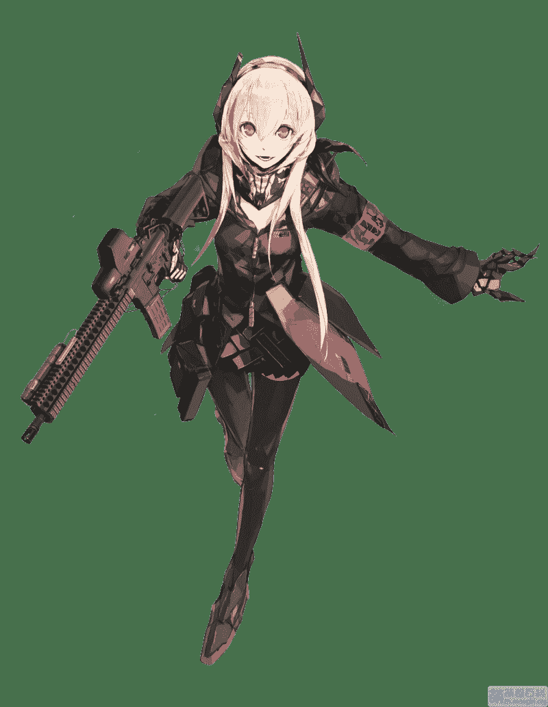

**800px-M4_SOPMOD_II.png** *(418.56 KB, 下載次數: 7)*

[下載附件](forum.php?mod=attachment&aid=Njg1NzV8ZDUzNjQyZGV8MTYwMDg4MDI1NnwxODIzMHwyMjkzOA%3D%3D&nothumb=yes)

2017-7-4 01:41 上傳

<ignore_js_op>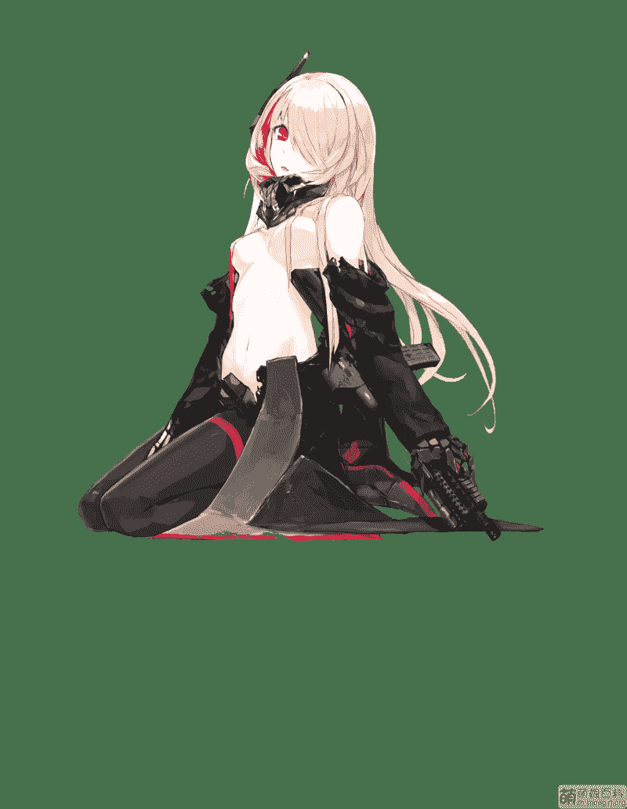

**800px-M4_SOPMOD_II_D.png** *(307.68 KB, 下載次數: 4)*

[下載附件](forum.php?mod=attachment&aid=Njg1NzZ8NWVhMTcwMjV8MTYwMDg4MDI1NnwxODIzMHwyMjkzOA%3D%3D&nothumb=yes)

2017-7-4 01:41 上傳

一架无人机正在空中拍摄着一座半露天碉堡的情况,说是半露天应该说大半基本都在山的里面吧,

而只有一小部分在几乎顶上的地方作为防空阵地,是一个仿造二战时期硫磺岛那类的山地碉堡

里头少说也有一个旅吧,整整两千余人的部队驻守在这里

如果派出人类地面作战单位也好,复制人作战单位也好,铁定都是死伤惨重的一场血战

而格里芬官方料想到了这点,正好这次行动可以做为心理战的素材

他们派出了在无数反抗组织中被视为恶魔存在的她

在巡航高度不断盘旋着的无人机正拍摄着,巨大的如雷鸣的声音回荡着

"嘻嘻...... 要藏好哦，笨蛋们——哈哈哈哈哈哈！"

她是 AR小队的M4 SOPMOD II,也是致力于铲除反抗势力的女孩之一,正是那个恶魔

士兵们明显听到这声音慌乱了,如同雷鸣是听不明白的,但有巨大的女孩正在靠近自己,这一定是坏事!

美丽的脸庞,脸上带着微笑,这是真正意义上的女神吧,但她异常兴奋与期待着杀戮的心情却是属于恶魔的

基地内的广播响了起来,操练中的也好休息的也好办公的也好士兵们都以最快的速度到了冈位上,

防空炮和火炮也对准了正在漫步靠近的女孩,士官已经下令开火,无数曳光弹与火炮砸在她的身上

火炮不断开炮着,轰巄巨响,本以为能击退的吧,当烟尘消散之后,女孩身上的衣服甚至没有丝毫破损

她露出了更加兴奋的微笑,走近了碉堡蹲了下来,巨大红色眼睛正值盯着那些防空炮和火炮的操作人员

露出了恐怖的笑容,露出了犬齿,使人们害怕地丢下手上的武器

都比自己还巨大的瞳孔,正以小女孩看着糖果罐中糖果的那种眼神看着他们

轻轻地舔了舔嘴唇,嘻嘻的笑着

"该轮到你们啰~刚才你们试着发起攻击了吧!? 试着发起了对吧!? 嘻嘻嘻"

她兴奋地说着,还把身子靠得更近了,很多人发出了惊恐的声音

"但是呢我直接攻击的话是不是就不公平了,而且很痛苦对吧"

她恶意的露出了一种同情可怜的表情,但还是感受得出,这是在玩弄他们

金属物的碰撞声与马达声,身后通往碉堡内部的防爆门已经被关上

里头的人为了自保将门关上把这些人遗弃在外头,祈求着她不要伤害里头的人

他们自私的把人们关在了外面,无助的拍打着厚重的防爆门,祈求着里头的自己人开门

她露出了一种同情小动物的眼神,恶意的,好像在说,真可怜呢~被关在外面给我当玩具

"你们的朋友都抛弃你们了呢,小家伙们,我或许可以给你们优待,放过你们喔?"

有几名士兵已经慌张地扣下板机,是新兵呢,脑袋不懂得好好运转,精神已经崩溃的新兵,

虽然老兵也好不到哪里去,只有士官不断吼着,要求士兵们停火,但没有人听得进去

"看来是不接受呢...... 那~么~呢~就让我们 开~始~吧!"

她有些失落的说着,然后咬字清楚的说着士兵们的噩梦

有些人更用力地拍打铁门 祈求开了一点也好 放自己进去吧

其中几个人正呼喊着

"快开门啊!! 我们还不想死啊!! 快开门...!! 她要来了啊!!! 快点啊!! 混账! 开门啊!!"

"你们这些混蛋!! 快给我开门! 拜托了!"

巨大的手开始收集起那些散落在角落瑟瑟发抖或是在铁门边还有在一些阴暗处以为能躲跪她的家伙们,

把他们放到掌上仔细观察着,是在观察着玩具还是虫子呢,眼神就好像看着一群

"真的是好小阿.... 比蚂蚁还小了吧,虫子们,真的是小虫子呢,哈哈哈哈哈! 这里有好几只呢...."

少女笑着,士兵们只能无助地等着自己的命运降临,有些人相拥在一起,绝望地看着她

这些绝望与无助,只能使她更加的兴奋罢了

大家正以为自己可能会被捏死 吃掉 或是被以奇特的方式玩弄死时,心理或许已经做好千万个复杂的心理准备

已经做好为国牺牲,精忠报国的准备,大家肯定都认为自己死了吧,或许不久后就能在忠烈祠看到自己的名子

这不像平常那样感到骄傲与荣誉,而是满满的恐惧与不甘

她把一个小杂物包打开,把那些小家伙们一并倒了进去,里头做好准备了,底部不是甚么粗糙的材质,而是厚厚的一层棉花

他们很错愕的被丢下去,这是怎么一回事!?

她微笑着扣起了杂物包,放在了一旁,黑暗盖住了杂物包中,士兵们只能无助的呆在里头,根本不知道自己的未来会如何

他们正绝望着,但她在凑近了碉堡

"那么,其他虫子.... 我已经解决外面的人了喔~换你们了呢.... 嘻嘻...... 要藏好哦,我来找你们了喔~嘻嘻嘻"

顶部正是山顶的那一小块,防爆门顶部估计深度也不深,SOP就直接挖了开来,直接看着里头无数惊慌失措的家伙们,

里面的士兵们就如同笼子里的动物一样,无处可跑了,就像是在仓鼠笼中,而外头正是一只想吃了他们的猫

他们本以为是破坏铁门以正面突入,甚至都用大量的铁条木棍支撑着铁门,也堆好了沙包,以防万一

但从没想过是挖开顶部的岩石与泥土,直接由顶上观察着他们,不断打量着每个人,她相当兴奋的不能自己

"现在在给你们一次机会吧,这可是最后一次喔,要不是指挥官要我给你们多点机会的话,我们就能好好开心了呢,嘻嘻嘻"

她闭上了一只眼睛,盯着里头的士兵们看着,看起来很可爱的举动,但今天是由一个巨大的女孩子,会伤害自己弄死自己的女孩

这显得格外恐怖,这是一个巨大的怪物!

"现在投降的话就丢下武器往我这里走过来,我一定~不会伤害你们的,如果是不想投降的虫子的话,我就会让你们.... 嘻嘻嘻嘻"

一个戴着盘帽的军官抓着手枪吼着,他的职业酷似二战时期的苏联兵政治委员,正试图凝聚着这最后的力量,前往送死之路

"没有人可以投降! 一步也不许后退! 最后的防线由我们来守护了! 投降的话,天知道那家伙会不会遵守诺言!"

这时候估计就算有人想投降也打消了念头吧,毕竟很可能不是死在敌人手上,而是自己人的枪火下

沉默了几秒 大家的手上依然抓着武器. 有些人颤抖着,枪对着她,估计用最大口径的步兵武器都无法造成伤害吧

"看来你们小小的,脑袋也跟虫子一样呢.... 还以为有几个聪明的虫子,那么这样看来~指挥官要我做都做了,现在是玩乐时间了呢,这~样~呢~先由你开始吧"

她的眼睛盯着刚才阻止人们撤退的军官,露出了犬齿笑着,把他捏了起来,少女欢快的笑着,训练有素经历无数战场经验的军官正在抵抗着,

手不断用手枪的握柄敲击着巨大的手指,试图挣脱,但这如同弱虫的挣扎显得是格外无力,她只要加大力道捏着,或许就会变成一团血肉

她恶意的张开嘴巴,发出了"阿~"的声音 这时候在里头的士兵们已经呆住了,他们彷佛可以知道上级的后果,那巨大的手指自己在怎么开枪也无法抵抗,

那已经可以占据大半个顶部入口了,自己看起来宽敞无比的巨大要塞,居然只能容纳少女的手伸进来都做不到？

在这个女孩面前就跟蚁窝一样的基地,而或许自己连一截手指的高度都没有 能够站在指腹上了,完全就是蚂蚁等级的大小了

没有人开枪,没有人开枪,基本上都呆住了,有几个保持理智地就开始冲向楼梯试图往下跑,才发现楼梯出口的防爆门已经被关上了

跟刚才自己对外面的人做的事情一样,而且在里面只有听到声音 天知道外面的人遭遇了多么凄惨的下场,现在因果报应换自己了

害怕的缩在角落发抖着 现在脑袋只能想着爱人或妈妈了,祈求着上天能救赎他们,但没有人可以救他们,毕竟她就是神

SOP笑着,巨大的舌头伸了出来,看着小小的军官,他更剧烈的挣扎着,

"不知道你的味道如何呢,要咬碎呢,还是直接吞下去呢,咬碎手脚好了,然后在吞下去,折衷的话你也不会有意见吧? 哈哈哈哈哈"

如果直接吞下去可能就得承受被胃酸消化的痛苦,而被咬碎则是自己在巨大的口腔中被撕裂磨碎了,两种都是最痛苦的,而两个都来

这可能会把他吓晕吧,他正很希望自己是晕倒的,但他没有,得好好的体验自己被巨大的少女给食用了

“不过你似乎太小了呢”

她看着他,放在舌头上都是很微不足道的存在呢

“也许要扯开来才能吃吧？ 哈哈哈哈！"

军官没有响应,持续着无力的抵抗,无助地看着自己的同僚已经呆住,不敢反抗,既使手上抓着枪,也正在发抖着,或许已经失禁了

SOP将手指松开,他掉落在了巨大的舌头上,在被收回口中关上的前一刻他正以含糊地喊着,这是他的遗言了,

"领袖万岁....!!"

政治的口号,最后的精神支柱,祈求着自己能到所谓战死者会被送往的天堂,一个和平自由的净土

她还很恶意的发出了"恩~"的声音搅动着舌头,好像是女孩在品尝糖果一样

翻滚着在里头的小家伙感受到的是无比的恐惧,身旁是比自己还巨大的牙齿,而在更深,就是通往食道的无底洞了!

在经过舌头无情的玩弄之后,她好像玩腻了,精确地让他的下半身与上半身分离后,故意把他慢慢地将头部和部分上半身吐出,用嘴唇夹着,故意让他惨叫着,让他在口中流血恐惧着,

她只要像是吸东西一样吸个几口,或许鲜血就会被吸干吧,但她没有这么做,享受甜美的血腥味和这家伙大声绝望的惨叫救无比兴奋,然而感受到他很可能就快死掉,得让他体验看看被胃酸消化的感觉呢

幸好刚才就有进食过了,没意外现在胃中正有满满的胃酸让他游泳,

快速地吸回去,让他朝后头的无底洞滑动着,绝望的看着自己正滑向无底洞,巨大少女的头仰了起来,就连想抓住舌头都没有用

想想自己的半身刚刚也被吞下去了,或许已经被消化掉了吧,他绝望的被巨大的少女带着口水一起吞入胃中,口水包裹着他,好像起了些止血作用

迫使他得接受被胃酸消化殆尽的绝望与痛苦,完全的巨大少女当成点心一样的吞食

咕噜一声 带着大量的口水吞了下去,

"味道很不错呢.... 但是你们那么小,吃一只怎么可能饱呢.... 乖乖的站好别动吧~让我来品尝品尝一下你们这些小家伙的味道吧 哈哈哈哈哈"

其他士兵在听到军官的惨叫时已经清醒,冲向了那到楼梯底部的防爆门,用枪托用力敲击着,设计拿来抵挡透地炸弹攻击的防爆门 怎么可能因此而有损伤呢

能把上头的漆给打落就已经很了不起了吧,毕竟这厚重巨大的防爆门可不是人类可以轻易破坏的,就连没锁上要拉开都要好几个男人

她看着这么滑稽的景象不经感到兴奋与好玩

"小小的虫子们~要不要大姊姊帮你们啊? 哈哈哈哈"

巨大的少女嘲笑着,抱住自己的肚子就这样笑着这些比蚂蚁还弱小的家伙们

正好其他士兵们都聚集在了一起,相当好捕获,完全不需要特意去找了

基本是捏起一群吧,还有机会正好几个倒霉的在这期间断手断脚了,绝望的看着巨大的少女,

"大家~我们来玩个游戏吧!"

她手撑着山壁,巨大的身体依在山边,俯视着这些士兵们说着,好像更加的陷入兴奋之中

"不过呢 想不想参加可不是你们这些虫子能选择的呢 哈哈哈"

他们或许知道了自己的下场,绝不可能是安然无恙的,她直盯着那些人们的绝望与失落

他们相当的畏惧着她,更恐惧着自己的未来

“对！ 对！ 就是这种绝望的眼神！ 再让我看看吧！ 哈哈哈哈！ 想哭的或想叫得话趁现在还可以喔,哈哈哈哈哈! ”

"那么让我们开始吧~答案是对的话 就到靠大拇指那边 是错的话 就到靠小拇指那里 请诚实照自己的意愿回答喔~ 但是答错的话..... 哈哈哈哈"

这时候很多士兵们产生了一个想法,或许自己已经死了,现在自己正在地狱,而她正是恶魔

"问题一~你们觉得我是恶魔吗?"

这句话好像刚才的想法被读心出来一样 她还以尖锐的声音问着,士兵们还因为这个问题错愕的惶恐了下

如果她真的能读心就恐怖了! 说要照想法回答,不然就.... 只能硬着头皮上了!

有大半的人站在了大拇指那头,而只有几十个站在小拇指那里 他们是试图讨好她的那群

巨大的红色眼睛俯视着他们,捏起了那些在在右边的人,

"吶,如果敢乱跑的话,你们也看到你们指挥官的下场了吧? 嘻嘻 想要也体验一次吗? 不想的话就乖乖配合喔,乖的话我会优待你们的"

就把他们放在了地上,对着他们露出了微笑,这是来自天使还是恶魔的呢

那些人 或许以为自己答对了,正要嘲笑或哀悼还在掌上的那群人时,她把掌上的那群人先收进了外套的口袋中

外套口袋的拉链也拉了起来,但是这是透气的外透,基本上外面的味道都是能传进来的,相反的她的体香也散布在这里

"你们知道位什么我的头发有些是红红的吗? 很漂亮对吧! 很可爱对吧! RO635说很喜欢呢!"

她捏起了几个人和自己的头发交缠在了一起",手指头玩着自己的头发,被裹住的人们就被头发紧紧的缠着

女孩洗发精的香味正冲昏了他们的头,这可是在军队中没有的味道! 花香与女孩的贺尔蒙香气正在吸引着他们

"那你们可以帮我把头发变的更漂亮吗? 嘻嘻嘻嘻"

听到笑声的时候,地面上那些人已经坐倒在地,而在头发上的人们.... 正要遭遇更不幸的死法

要变成染发剂了! 少女的小小染发剂

她捏碎了在头发中的小人们,搓着,不久那些鲜血已经染红头发,并且散发出了血腥的味道,这天然的染发剂正在散出这天然的味道,

也使着 SOP更加兴奋了起来. 她的大手伸向了人群

"那么.... 换你们了喔~嘻嘻嘻"

她捏起了一个小人,直盯着他笑着

"不要.... 不要杀我 拜托了!!"

她看着这家伙惊慌且恐惧的表情再次笑了起来,露出了玩弄的笑容

"哈哈哈,再多恐惧一点吧小家伙,再更多的害怕一点,我会很喜欢的喔~但是呢,游戏是你输了呢,得要惩罚的喔,不然对刚才那些人是很~不公平的"

他持续颤抖着

"拜托了... 我还不想死啊!"

她歪头着很明显正在伤脑筋着

"会害怕吗,是害怕看到对吧,我可以把你送到很安全的地方喔!"

她说着,捏起了基地外的装甲车,这辆BTR-90是三战期间服役的骨干装甲车呢,她把小人装了进去后,并把驾驶与指挥官座的装甲版盖上

(注-BTR-90目前为俄罗斯联邦所使用的APC,而本装甲车设计特殊,进出口在车辆的侧面而非后方)

"这样就安全了吧 嘻嘻嘻嘻"

她笑着,温柔的,此时他有一瞬间认为求情给自己带来了幸运与女神的宽恕,但她的手正握着装甲车,

慢慢地施加力道,开始变形,开始扭曲,金属喀擦咖扎的声响传出来了,里头的家伙原本以为自己或许能活下来,但他完全错了!

自己的求饶只换来了更残酷的死法,真正铁包肉的铁棺材!

没多久这块铁块已经和里头的肉块紧密的黏在一起,就像是被丢到垃圾压缩机的人一样,被挤死了

她把极度压缩过充满铁锈味的铁球丢了进去,虽然说不是很明显的球状就是,

那些人们就这样亲眼目睹着自己的战友被丢进装甲车装给挤死了,开始担心起自己的死法只会越来越残酷了吧

她这次很有效率的捏起了一把小人,只留下一个在地面上并恶意的说着

"我还需要一个好观众呢,刚才你当害怕的缩在那里对吧,好好地看着吧,自己的好朋友死在自己的面前,哈哈哈哈哈"

"妳这个格里芬的恶魔!!!"

其中一个人喊着,他手臂上还挂着自己国家旗帜做成的袖章,是一名士官

她单独捏起了那家伙,"你连被玩的资格都没有呢.... 真是无可救药的虫子,本来想说让大家舒服点的,那么就来好玩的方法吧! 哈哈哈哈哈"

她无趣的说着,用力地将他丢向了碉堡中的地面,鲜血与肉块沾再了那家伙的身上,他正崩溃的发抖着

正靠在有些管路的墙壁边发抖着,她看着这一切再次笑着,还很恶意的用手指沾了一些血与肉块,放入口中品尝着

发出了感叹美味的声音"恩~",还意犹未尽的舔了舔手指,其他人估计是不敢说话了,他们证聚集在一起,紧紧靠着彼此颤抖着

"那么,那么,还有其他人想要说些甚么吗? 也想要... 不参加游戏吗? 嘻嘻嘻嘻嘻"

她把一些人抖到了铁血的钢铁手臂上,留下几个人在正常的手上,

"小家伙们,你们知道吗? 我很喜欢血的味道呢,而女孩子的口红是红色的喔~你们知道这有甚么关联吗? 不过你们小小的脑袋能想得出来吗? 哈哈哈哈"

拇指用力向内收着,辗残了不少人,鲜血正顺着动脉喷出,而接下来是食指无名指中指的辗压,基本还在手上的人都被辗的手断脚断 几个幸运儿则被捏死了

她把手抖了几下,把几个人收到了手掌中央,笑着贴上了嘴唇,这是女神的亲吻呢,还是恶魔正在以他们的鲜血作为口红料呢

正在涂抹着,一些人在这过程中已经失血过多,而有些人被嘴唇给辗死了,既使失血过多尸体也会被辗烂,最后剩下了一个极度幸运的家伙,他只断了一条胳膊

"阿啦~还剩下一只呢 那么让我来试试这个口红吧~哈哈哈哈哈 啾~"

她真正的亲吻了这个在掌上的家伙,也顺带的... 以嘴唇辗死了他,手掌上还真正有个鲜血的口红印

舌头舔着嘴唇上的残存血肉,而有些已经让嘴唇显得红润,在钢铁手掌上的人更显得害怕了,自己的战友们正在已超乎想象的死法"阵亡"着

而自己却不被当成正常的生物看待,完全是取悦用的小虫子了,只是这比玩弄虫子还更加残酷

她充满玩味的眼神已经盯向了另一手掌上的人们

"吶,轮到你们了喔~准备好了吗? 准备好了嘛!? 准备好了对吧! 嘻嘻嘻嘻嘻"

她兴奋地问着,脸直接贴近了手掌,巨大的压迫感几乎吓倒士兵们,他们就这样跌坐在她的手上

"我问个简单的问题呢,愿意的人就举手吧~嘻嘻嘻"

她愉快地问着,听起来是奔向自由的机会呢

但没人敢回答,谁敢知道她所谓的自由是什么,是被踩死还是被捏死

以死来换得自由吗?

"没人选吗,那么我来决定啰啰~要你吗? 还是你!? 还是你也不错呢! 还是说.... 就是你了!"

她巨大的手只挑选着的时候大家都是害怕的,她捏起了一个戴着小帽的家伙,

其他人则抖到了地上和那个身上被喷满鲜血,精神崩溃的队友在一起

"你放心吧~你可以自由地离开这里了喔~我是不会说谎的呢,而且是单程票呢,因为M16前辈说过不能说谎呢! M4也很不喜欢我欺负小人呢,明明你们都是玩具阿,嘻嘻嘻"

她愉快的着,拿出了条对她而言是棉绳,细的跟衣服脱线的棉线一样,对人们而言是拔河绳以上粗度的绳子把士兵好好地绑牢,

就像是要绑住垂降人员一样的牢牢绑着,绑住大腿绕过胯下在绑住腰部,确认绑牢后还像是肩带一样地绕过双臂与底下的绳子绑好绳结

你知道为什么要绑住你吗? 要准备开始了喔~自由的单程票,我取名叫做小人甩甩乐~"

上头的家伙还搞不清楚状况,看着她恐怖的愉快兴奋笑容,就感到害怕

她开始转动着绳子,离心力将绳子打成一直线,比空军所有的离心机转速还快,而他身上没有任何抗G力的装备和呼吸面罩

他就这样高速的旋转着,血管开始爆裂,开始缺氧,但是不知为何还是能保持一定的清醒,眼睛开始看不清,开始渐渐变黑

这是高 G负荷的现象,而变黑的视线却还是有一丝丝光芒与景物,看到了模糊的兴奋正在笑着地她

此时士兵的样子已经看不清了,高速的旋转着,高速的,甚至还有些风出来了

弹弓效应下这时候只要一放手,他就能飞得老远,但她并没有马上放开

反而在已经被挖开的天花板上头玩着,好像在说着他们的弱小,她也看起来好像快忍不住想笑了

"那么差不多可以起飞啰~哈哈哈哈哈,飞上天吧~小虫子! 会很好玩的喔~"

她用力在甩了几下,松开手,带着士兵的绳子已经飞上了高空,飞向了那所谓的「自由」

在强大的 G力下,那旋转时已经超越所有战斗机回转出的G数 而离心机也难以做到吧,少说也有20G

好像她在玩这游戏前早已精密计算力道,圈数角度,和速度,这可比任何数学家都还快速的演算

难道是因为早就有无数次游玩的经验,使的她都已经熟练成可以这样随便玩了吗

那具尸体正从高空中直接落下由天花板砸入基地,鲜血再次溅满了这个房间

"吶~调味料都弄好了呢,恐惧和害怕的佐料也备好了呢,不知道为何如何呢,哈哈哈哈哈,让我尝尝吧!"

她先紧密的捏起了两个人,放到掌上,两手搓揉着,两个人在巨大的力量下被活生生辗死,搓揉着,变成了大颗的肉丸

虽然对她而言连一口都不到就是了,甚至连塞牙缝都是问题

"哈哈哈哈,变成一团了~让我来吃吃看吧~"

丢到嘴中,根本不需要咀嚼,毕竟太小了,像是糖球一样含着,没多久,就吞下去了

"吃点心的时候得看些甚么来娱乐呢,就请你们来帮忙吧!"

她用机械的手斩断了几个人的脚或是下半身,然后不知到哪里来的盐巴,从高空中撒了下来,

剧烈的疼痛正刺激着神经,他们惨叫着,爬行着,恐惧着,

"尽情地爬吧~你们是虫子啊! 就该像是小虫子一样用爬的才对啊! 快点快点~大声的惨叫吧! 在大声点! 在叫好的好听一点啊! 哈哈哈哈哈哈"

他们爬行着拖出了长长的血条,他们在队友身旁惨叫着,既使有医护兵也不太敢行动,毕竟出面干涉谁知道那女孩会不会伤害自己

他们正在地狱强迫参与着这场飨宴,这场血腥的飨宴,她开心的笑着,想到底下还有更多人后就更开心了,也在想着其他各式各样的玩法

她故意留下了最早崩溃的家伙,其他人用手掌赶到了另一头,捏起了几个,用力的擦像地板,脖子与头部产生的巨大压力已经分离,鲜血正在顺着颈动脉涌出

她在画着什么,哼着奇怪的小调,AR小队的标志...... 牺牲了大半幸存者之后的成品,对她而言血是调味料,是饮料,更是颜料吧!

她很满意的点了点头笑着,在恶趣味的看着最后的家伙,

"只剩你了呢 哈哈哈,怎么样? 画的漂亮吗? 很漂亮对吧! 画得很好对吧! 哈哈哈哈哈,那些可是用你朋友画出来的喔~"

把他拎上了空中,强迫由上往下看着这里布满鲜血,血肉的血腥磨坊,这个腥血地狱,被迫看着这杀戮过后的场景

"好好记住这个标志喔~这可是你生前最后看到的呢,嘻嘻嘻"

"把你做成标本如何? 感觉不错呢,一个可爱的标本,你就是这个基地中唯一一个会跟我一起回小队的小东西了呢,一个小~小~的纪念品喔! 哈哈哈哈"

她抓着这个小人,手指小心翼翼的折断了他的关节,她笑着,好像不想杀死他,想活生生地把他作成标本

SOP拿出了预备好的小玻璃瓶,拔开了软木塞,打量着这个小家伙的迷你身高与身材,倒入一些特殊液态凝胶

把他丢了进去,现在的他是呈现十字型的,好像被钉在十字架上,而大部分的脚和腿已经陷入了凝胶之中,

她故意把瓶子举到眼前,露出了玩味的笑容,好像期待着这个小家伙恐惧而死的样子

她故意放慢速度慢慢倒着凝胶,慢慢地覆盖住身体,直到胸部颈部,只留下一头在外面

"试试挣扎吧! 这没用的! 哈哈哈,你会是个很可爱的标本喔! 等等,不准闭上眼睛,不然... 我现在可以把你拿出来玩死喔! 哈哈哈哈哈哈"

凝胶慢慢盖了上来,盖住了嘴巴,她又停了下来,此时脸颊也被盖住了,凝胶也持续在凝固中

"恩.... 就是这样恐惧的表情,很可爱呢,我很喜欢喔! 哈哈哈哈哈"

这个凝胶还带有特殊的香气,好像是故意的,她或许会想把这个小瓶子的瓶颈绑上绳子,把这家伙当成项链或吊饰也说不一定

但她基本会收起来当成收藏吧,然后再慢慢地装满,封上,凝胶已经凝固,完美的保存了这个士兵的最后姿态,表情是崩溃的恐惧的

她满意的点了点头,就把"小瓶子"收了起来

在里面的人毕竟这是透气外套,他们闻到了血腥味与刚才的对话,已经知道了伙伴们的下场

更坚定了他们得好好回答问题的决心,她拉开了口袋的拉链,把人抓了出来,有几个人看到了外面的景象都快吐了

但他们不敢,深怕惹这个巨大的女孩生气

"那么让我们继续吧,小虫子们"

"问题二 你们想要进到我的鞋子里面帮我服务吗? 哼哈哈哈哈哈哈"

她都忍不住笑了几声,但他们这时候进入了抉择,回答好的话 该不会真的被放进去吧

回答不好 难道会和那些人一样吗? 此时剩下的六个人有四个人选择了否,两个人选择了是....

她笑着 好像对于这个回答相当满意

"会选择想要的那种人都是抖 M吧,好恶心,但是我会实现你们的愿望的喔,哈哈哈哈哈哈"

这个绝望的瞬间..... 使那两人跪着崩溃哭着的瞬间 那四个人被收了回去,而自己.... 正在另一只手的手上,

而她收妥其他人后,另一只手正在协助脱去鞋子,这是一个真正绝望的瞬间,少女的脚伸了出来,无意识地动了动

就让他们两个人害怕得靠近了彼此,祈求着谁来救救他们,估计也没办法就是,不可能有人在这场游戏中生还

毕竟他们又不是什么小说的主角,怎么可能活下来呢

他们俩个被分别放到了左右不同的鞋子中

"先体验体验看直接踩着小虫子的感觉吧,要做好觉悟喔! 哈哈哈哈哈"

她的眼睛看向了左边的家伙,他已经被吓倒在地上了,光是被那巨大的眼睛盯着

她看着这里头的小人,笑着

"这好左边这里有一只呢 哈哈哈哈,那么.... 来~嘻嘻嘻"

左脚抬了起来,慢慢地 慢慢地要伸进鞋里

"很可怕吧 很可怕对吧!! 就只是我的脚而已喔! 很可怕是不是! 是不是啊! 小虫子! 哈哈哈哈哈 "

开始无助地向后跑着,紧贴着鞋尖处,靠在这鞋尖,少女高跟鞋的鞋尖,无助地看着脚慢慢的伸进来

覆盖住了是线,无助的等待着自己的命运看着巨大的脚正伸进来,慢慢地伸进来,现在连光都没有了,可见大半都进来了

脚指尖拨下了他,,鞋子翘了起来,他掉到了鞋子的中间,在足弓的位置,脚这时候快速地穿上鞋子,脚掌心踩了下来

她并没有用力,他就感受到了无比恐怖的重量与绝望. 少女的味道也强行灌入他的鼻腔,没有新鲜的空气,少女的味道不断涌入

除此之外这强大的重量感也压迫着他,他的手不断敲着捶着不断敲打着少女的脚底,这对她而言或许没甚么感觉,

但也是最棒的绝望脚底按摩吧,不断哭号着,不断哀号着,不断求救和叫着,对她而言正是最好的服务了

她这时候的目光盯到了另一个人的身上,露出一副,接下来就是你了的表情

"帮我把鞋子舔干净吧,给你十秒,一个女孩子的鞋子一样不难吧? 还是说对于小虫子的你而言.... 哈哈哈哈 你果然是太小了吧 嘻嘻嘻"

她充满玩味的笑着,不时还晃啊晃自己的左脚,在左脚的那家伙彷佛是在游乐园的海盗船一样,只是更加剧烈,而且一点都不安全

随时都会被踩死,变成脚底不起眼的红斑,完全不会被注意到

"10~ 9~ 8~......"

此时在鞋里头的他不知所措该如何清理. 慌张的左顾右盼,跪了下来,舔干净不可能吧.... 绝对不可能!

一个一千倍大的鞋子,怎么可能在十秒内舔干净! 而且是用舔的! 她果然是虐待狂吧! 果然是抖 S吧!

"7~... 6~... 5~"

剩下五秒了! 只能硬上了吧! 真正伸出舌头舔着少女的鞋垫,开始舔着鞋垫,疯狂的

"4....~3!2!1!"

明显最后三秒念得比较快呢,甚至有没有三秒都不知道

她拿起了鞋子晃啊晃的,在里头可比任何游乐设施还刺激,毕竟这巨大的她,会对小小乘客做甚么呢

巨大的眼睛好像在检查着,而她的眼神好像是充满了,这家伙失败了呢,可以好好玩他了呢

"真是不尽职的虫子呢,.... 让我来踩死你吧! 哈哈哈哈"

他被倒出了鞋子,跌坐在基地外的荒漠上,害怕的看着巨人,害怕的看着她,直接在地面上而非在山上的基地这样仰望着

更显得有一分巨大感,一个跟山一样高大的女孩,仰望着更显得头晕,相当恐怖!

“最后，要不让你选个死法吧？"

"是黑丝袜子呢?"

"还是我的鞋底呢? 嘻嘻嘻"

他并没有回答.... 这是甚么问题! 这都会死啊! 还不想死啊! 家乡还有个自己默默暗恋着的女孩子呢!

怎么可能就在这里死掉! 而且是被一个.... 巨大的女孩像是虫子一样杀死,这千份复杂的心情不断涌出

甚至一时还有一股,她好美阿.... 被她杀死也不错呢的想法,但很快地被抛到脑后

"快点回答喔~我可是很没耐性的呢,还是小虫子的脑袋不知道该怎么选呢. 果然太笨了吧? 哈哈哈哈哈"

"3....2.....1~"

她倒数着.... 带着兴奋的口吻

"不回答呢.....,不想死对吧!,不想被我踩死对吧!,一定很不想死对不对!?,那么我放你走怎么样? 如果你可以的话"

他抬起了头,眼睛露出了光明,感觉这一定上帝的眷顾呢! 她.... 这时候感觉好像女神,充满慈爱的女神

她温柔的笑着,突然显得如此可爱,这一定是女神吧,自己正转身要往她的反方向,友军控制的城镇方向走时

她忽然,右脚精确的一踢,踢起了他周遭大把的泥土与砂石,他先是头与身体分离,上半身与下半身分离,

整个人都变成尸块与血肉的正朝远处飞着着地,沙土也几乎覆盖住了着弹点埋葬了他,

自己都不知道的死亡,自己都来不及面对的速度,自己根本不清楚状况,连死了都不知道,就没有恐惧了呢

之前温柔的笑容,此时变成狰狞且鬼畜的笑容. 脸红了,兴奋了,而她对着那团有些红色的沙土堆嘲讽着

"还是最讨厌脑袋不灵光的虫子什么的了,要让放过你们,可~是~不~可~能~的~喔~毕竟是取悦我用的呢 哈哈哈哈 小虫子回归尘土的感觉怎么样阿 哈哈哈哈"

而她在踢击的时候右脚为了固定地面,而用力踩着,里头的倒霉鬼就被她的黑(连裤)丝袜给踩死了,变成了不起眼的红斑点在鞋垫与脚底下

她的玩弄已经死了多少人呢..... 而踩死虫子和踩死小人,或许前者还多些罪恶感吧,后者则多了兴奋与爽快,毕竟她是个虐待狂呢

她把剩下的四个人给放到了地上,他们听到了刚才的声音,看着眼前那些暗红的沙土堆,不禁感到痛苦悲伤,自己的力量如此卑微与弱小,甚至带给她一点感觉的能力都没有,而这时得她早已经把鞋子给脱掉了 ,只穿着连裤袜就这么站在地上

"恭喜你们能到最后喔~最后一场游戏,能活下来的话,就放你们走,这个我保证,绝~对不会耍诈,嘻嘻嘻"

她兴奋的蹲了下来看着这些最后幸存的士兵们,巨大的手指还在附近周旋,还点了点一个侦查兵的头,用手指戳了戳他

大家都戴着头盔,就只有他比较特别是戴着扩边帽的,这也引起了她的好奇吧

"小虫子们,姊姊我啊.... 有个更好玩的游戏喔! 想不想玩呢? 来一起玩吧! 一起玩吧! 哈哈哈哈哈 不~过~你们也没有选择的权利呢! 嘻嘻嘻嘻嘻 来吧!"

一个年纪看起来比自己还小的女孩,虽然比自己巨大很多,自己也只能像是虫子一样站在她掌上,就跟虫子一样,然后她自称自己是姐姐. 而自己却不被当成人类,而是玩具

被迫参与一些不可能完成的事情,被迫成为她的娱乐用品供她玩乐,被吃掉被玩死被弄死,都如此简单,自己的生命真的跟虫子一样脆弱

她的手指放在唇边,思考着什么么,她的手指清点着手上的幸存者

"一只~两只~三只~四只~这里有四只呢.... 哈哈哈哈 只剩下四只了呢!! 哈哈哈哈哈哈"

只.... 真的把我们当成虫子了吗

她嘲笑着,但好像再打着甚么算盘

"刚才那家伙想往那里跑呢,有很多岩石当作掩蔽,那座山丘后面一定是你们的其他基地吧! 待会就尽全力往那里跑吧!"

士兵们害怕着,刚才那个蠢蛋! 他可能害死了前方后勤本部的所有人了! 那里还有不少平民啊!

但也没办法了,跑就对了! 既使她可能一步就追上了,但还是赌一把了!

"开始啰~哈哈哈哈"

我们跑着,她跪着,膝盖正在不断着地着追赶我们,每次她的膝盖着地,地面就有剧烈地晃动始自己站不稳,

沙尘也溅了起来,黄昏中,风起了,沙尘更吹向我们始呼吸困难不断咳着,她依然靠近着,或许她正在轻轻吹口气什么的加强风速使我们更难的逃跑

其中一个同僚跌倒了,士兵们回过身子看着他,SOP停了下来,充满玩味的看着

"再见了啰~小虫子,哈哈哈哈哈哈"

她嘻笑着,嘲笑着这第一个出局者

"啊!!!!!!!!"

他惨叫着

膝盖砸向了他,原本的地上变成了一摊血肉,而她的膝盖上也沾着一些

不能管了! 再不跑的话! 也会跟他一样的!

"快! 快跑! 还不想死的话!"

这最后三人之中,最高阶级的下士这样下令着,两个二兵也只能跟上,毕竟他们也不想死

SOP忽然起身,用走的,当巨大的脚地从头顶掠过,一时还想说是完蛋了嘛!?

她超越了士兵们,忽然一屁股向后做下,巨大的风压吹跑了两人,但还有一个倒霉鬼刚好被风压压倒在地

噗哧,好像听到这个声音

"哈哈哈哈哈,好像坐到了一只呢,那么还有两个人吧~"

有一个二兵被吹得比较远,SOP包裹在黑丝袜的裸足再他反应过来之前夹住了他

而下士则在她双腿所围成的圈中,绝望的仰望着她,前方是她双足所构成的墙

自己的下属则被夹住了,不断求助的,但这一切都是徒劳,她扭动着双脚使他更难受

而相反的另一边则是女孩的..... 他完全不敢多看几眼,连裤袜中半透明的透着里头的粉色内裤,充满了少女的香气与贺尔蒙的味道,但完全不敢多看

深怕自己换来的是更残酷的虐杀... 毕竟任何女孩子被看到内裤都会不开心吧

"长官! 救命...! 长官!!!!!!!!"

刚刚下部队的二兵嘶吼着,向自己的长官求助着

但她慢慢地施加力道嘲笑着

"哈哈哈哈哈哈,就是这样! 就是这样! 大声点! 再大声一点吧! 小虫子! 哈哈哈哈哈哈,他正再向你求救着呢,你甚么都做不了喔,就慢慢地看他死吧!"

"长官!! 我还不想死啊!! 长官!! 长官!! 救命啊!!! 长官!!!!!!!!"

他的班长已经将头撇过,不忍持续看着自己亲自训练带领一起生活的下属.....

惨叫与哀号和求助... 这一定会在他的脑袋中挥之不去吧

"那么~那么~就请你去死吧! 哈哈哈哈哈哈"

她的双足合拢了,噗哧! 这一声比较大声,是距离更近的关系吧,彷佛能感受到那份血肉的温暖

或许有几滴鲜血喷溅到了自己,她的双足伸了过来,要做一样的事情嘛!? 这就是自己忽视下属的代价吧!

她夹起了这小小的下士,搓揉着,用双足搓着,轻轻地,鲜血与一些像黏在脚底口香糖般的肉块沾到了身上

"好好感受你朋友的味道吧~很棒对吧! 很棒对吧! 被我的脚夹着,我可以马上就把你杀死喔! 哈哈哈哈哈哈哈哈"

然后她粗暴地把他从将近一层楼高的地方放了下来,经过无数战场磨练与训练得他,并没有跌坐在地等死

反而是趁着这时候顺势开始跑着,如果能跑到掩体后,在她反应过来之前,躲得住的!

"诶~... 虫子呢? 小虫子~你跑到哪里去了呢~小虫子~~快出来喔~那么.. 就好好地躲起来吧~我~要~来~找~你~啰~哈哈哈哈哈哈哈"

她正一步步逼近着,根本不需要寻找,对于下士来说可以掩护自己的巨石,在她眼中只是一颗不起眼的小石子吧

站起来就能看到在石子后方自以为能躲住得小小士兵,她趴了下来,脸覆盖住了他的上空,残酷地说着

"找·到·你·了·哦~哈哈哈哈哈哈 以为这点东西就能躲着什么的,对我而言实在太小了呢"

她捏起了那颗石子,轻松地抛向远方,她趴着,一只手托着脸颊,充满玩味的看着这小人,他已经跪倒在地

手指头不断戳着他,最后把他按倒在地,看着他,

"如果现在站起来的话,一脚踩下去,你就GAME OVER~了吧,但是这样就不好玩了呢,毕竟我还没玩够呢,哈哈哈哈哈哈哈"

当她捏起小小的士兵,将他的右手折成了不自然的角度,伴随的惨叫,看这手铁定是骨折了,她更兴奋的露出了笑容

毕竟惨叫与血腥味正是她最爱的呢,这时候另一个巨大的影子盖着了她们,

"诶?"

SOP发出了疑问,回过头是M4A1!

"SOP你在做甚么?"

看着她手上抓着一个小人,而刚才查看过了那个基地,后续已经确认交由404小队处理剩下的人了

而她看到基地时也知道了 SOP做了甚么,她手上抓地的很肯能是幸存者

"M4A1! 我好想妳喔!"

她抱了上去. 这时候手中还握着那个小人

"妳在对那个小人做甚么...?"

M4关心着,看着她手中握着的小人,表情是相当痛苦的,而M4露出的表情跟SOP兴奋的完全不同

反而是满满的担心与关怀

"我... 我在跟他玩呢! 这个小家伙还想逃跑啊!"

口气和用词变了,手上的他完全不敢说些甚么

深怕着眼前突然多出的另一个女巨人会对他做出不利的事情

"不是说不能欺负他们吗.... 小家伙,你没事吧?"

M4接过了那个小人,放在掌中,让他躺平,确认着受伤的情形

"这不是骨折了吗..... 而且还很多外伤呢,SOP! 妳到底做了什么?"

"我... 我只是跟他玩玩啊! 真是的.... 是他太小了阿"

"那其他投降的人呢?"

SOP拿起了一个小杂物包,M4很自然的接过,扣上了自己的腰带,但她还是持续观察着这小家伙的情况

"你没事吧....?"

没有回答,看来是相当的惊恐,感情完全无法适应,刚才被残酷的对待现在忽然被巨人温柔的关心

完全无法适应!

"恩.... M4,可以把他还我吗,我想要把他带回去"

SOP看起来已经打消了在这里杀掉他的念头,为了M4起了个想把他带回去当宠物养着地念头

这样 M4也可以有个对象关心和照顾

"不行,他受伤了呢,得带回去医疗才行"

"恩..... M4..!! 我想要一个宠物啦~"

SOP贴了上来,抱住了M4,并悄悄的对了小人吐了舌头,看来是很不开心自己的游戏被打断了

"不行! 他是人呢,不能够欺负他喔"

M4说着SOP好像不太开心,有些赌气,但是M4柔和的眼神正看着这眼神已经混着黑暗绝望的家伙

"放心吧.... 你会没事的"

打开了杂物袋,看着里面好几个绝望的军人,真的是太好了.... SOP有留活口呢

有记得让他们投降呢,把这家伙缓缓地放进去

"里面.... 有谁会急救的,帮我照顾他一下"

打开杂物袋的并不是那个变态的巨人而是一个黑常直感觉就很温柔的女孩

但 SOP凑了过来,两个巨人俯视着,当他们看到SOP巨大的脸以及微笑时,很多人倒在底部的棉花上,害怕地颤抖着

M4缓缓的盖上了杂物袋的开口,看着SOP

"M4~我们一起去处理剩下的人吧! 我想顺便....."

"不行! 那些人已经由别的小队去解决了喔,不是说不要这样伤害他们吗....."

"可是很好玩啊,他们....."

"他们也是生命喔,既使小小的也跟我们一样是生命阿,一样有感情一样会害怕一样会说话的生命"

"但我觉得他们倒比较像虫子....."

SOP小声地说

"你刚才说什么?"

M4不是质问的口气而是真的没听清楚

"没事~"

两个人就这样在地面留下了巨大的脚印,正缓缓地向另一边远去,回到格里芬....

"M4回去的时候我们吃点甚么好呢? 一起回食堂吃吧!"

"恩,妳没弄脏自己吧? 回去先洗个澡吧!"

"我洗完之后可以和那些小虫.. 小家伙们玩吗?"

"他们要先带回检查有没有受伤呢,得好好的医疗在安置,他们可不是妳的宠物或玩具!"

"哼恩.... M4!"

"不行就是不行"

两个女孩正在嘻闹着,SOP所谓的游戏.... 传到了杂物袋中也使里面的人们感到害怕

毕竟他们既不能看到也闻不太到味道,但是听着SOP的话语,就大概知道刚才外头发生了什么

而如果那个被称作M4的女孩同意了她与大家一起玩的话,又有多少人能生还呢.....

在两人嘻闹中,杂物袋也是剧烈摇晃着的,要不是底下有厚厚的棉花,他们可能就受伤了吧,毕竟是剧烈晃动且不安全的环境，可难说会有什么意外呢

而那个下士,刚才被捏在手中曾一度以为自己会身亡,现在却意外获救,心中满满的感慨与复杂

他在袋子中崩溃的哭了,他正是整个碉堡中唯一一个生存下来的士兵....

 

# 26

*本帖最後由 dasers_100 於 2017-7-4 01:54 編輯*

采访本次的主角是优雅温婉的大姐姐95式哦，而且由于我实在是太喜欢她的旗袍装了，所以在写文的时候就私心让她以这套衣服出镜了人设图：<ignore_js_op>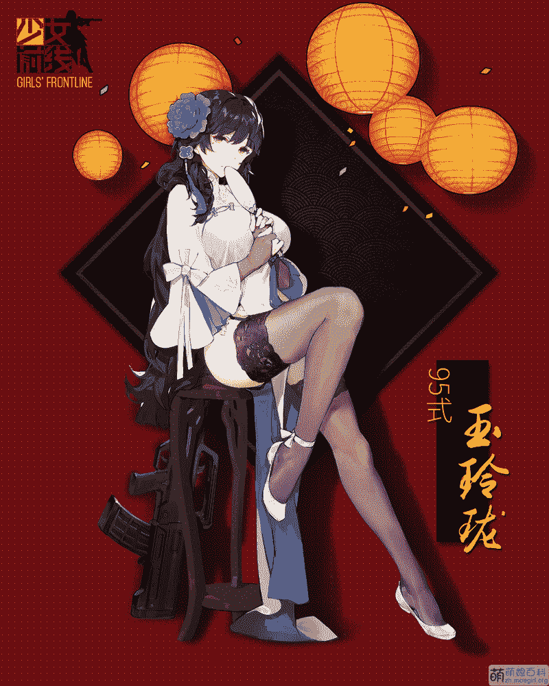

**800px-95式新春立绘.jpg** *(906.02 KB, 下載次數: 17)*

[下載附件](forum.php?mod=attachment&aid=Njg1Nzh8NGY2NDYxOGR8MTYwMDg4MDI1NnwxODIzMHwyMjkzOA%3D%3D&nothumb=yes)

2017-7-4 01:54 上傳

<ignore_js_op>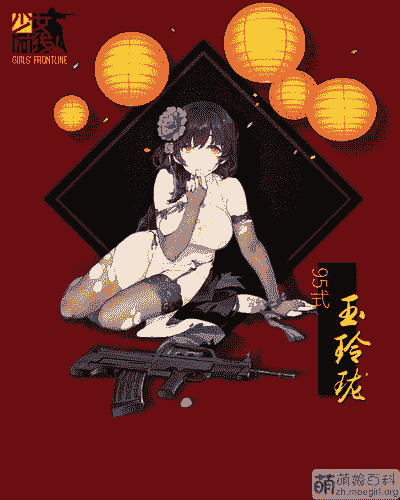

**400px-95式新春立绘_大破.jpg** *(192.87 KB, 下載次數: 5)*

[下載附件](forum.php?mod=attachment&aid=Njg1Nzd8MmRhMDhkMmZ8MTYwMDg4MDI1NnwxODIzMHwyMjkzOA%3D%3D&nothumb=yes)

2017-7-4 01:54 上傳

拿着笔记本,确认着,今天要代表报社访问的是格里芬的人形呢,看来,该把所有人们的疑惑都给问清楚了

身为一个职业记者,连战场都去拍过,连那些疯狂的人们都访问过,现在或许是个不错的工作经验,而看起来一切都很正常吧? 但我可是在一个巨大的圆木桌上,我正在这上头的小椅子上确认着今天的访问内容和数据

这里是有些古代远东国度的茶厅一样的房间,一旁还有巨大的茶杯和小盆栽,另一边还有巨大的木椅子,毕竟格里芬人形可是和人类有些不同的,基本上都是数百米高的女孩子,毕竟这是战斗和很多方面的需求, 但这也让我对于是否浪费粮食与资源这种是匪夷所思

此时桌面有些震动着,远处阵阵传来有规律的震动,抬起了头,看来受访者来了,而震动还在不断地增加着,随后很快的，阴影就覆盖了桌子

"啊，您就是来访问的记者吧"

"阿,是的,我是纽斯报社的职业记者,请问您就是95式吧?"

"没错，我就是95式"

"若有招待不周之处，万望海涵"

她优雅地行了一个礼,拉开了椅子坐到了桌边

"阿,不会,那么我就开始这次的专访了"

"恩... 具数据看来您是突击步枪对吧,对了,对于妳们而言枪是重要的吧? 请问您的配枪呢?"

"配枪的话，因为现在是非战斗的状态啦，所以并没有带着呢,要不然平时一直扛着枪也是挺麻烦的"

"原来如此,对了您们平时都是这样的体型吧? 那么不会过度浪费资源吗? 例如服装上阿 饮食上啊这些 毕竟战后多数耕地至今都无法回复"

"啊，我想，这点似乎不止您一个人，其实很多人都想问的吧？"

她略带笑意的俯视着那小小的记者

"是的,毕竟至今粮食价格都无法下降,所以我想替人们问这个问题"

“关于这点的话，我想先澄清一点，我们并没有挪用大家的耕地为我们生产粮食呢。 ”

"那么妳们的食物来源是?"

"我们这边是经过我们的研究所特殊改良过的动植物啦"

"能供给我们身体需要的，但也因为蕴含的能量太大，所以并不能够供给除了基地以外的地方呢"

"所以这些巨大的植物不是塑料做出来的装饰物? 而是货真价实的植物?!"

"确实是啊"

"了解了,那么饮水上和生活空间上呢? 妳们所需的活动范围铁定很大吧? 不会担心影响到我们这边的战后回复发展吗?"

"饮水方面，这点倒是没法在资源本身上想办法呢"

"不过我们的数量也不算多吧？ 相对于供应起我们这边来，其实人类城市的供应量才是大头呢"哪里需要补的来着

"那么干旱时期的话,妳们会选择先配给给自己还是人类方面的城市?"

"是个很尖锐的问题呢"

她用团扇挡住了自己的嘴巴,一只手架到了桌上，把你略微吓了一跳

"这点可以保证，就算是在干旱时期，我们格里芬的技术力量也是可以保证所有人的供水需要的"

"了解了,那么换个问题吧"

",请问妳们对于恐怖份子的处里上还需要多久才能达到和平? 也就是根除他们"

"这点的话，我们也在尽力想要根除他们呢。 当然，由于在战后人类数量急剧减少的现在，我们对待他们的态度也是尽量先以教育为主，杀伤性的行为为辅呢"

"根除的话，这点，我毕竟只是一个普通的人形而已，具体的战术安排，得问我们的指挥官呢"
"那么对于无数军事基地失踪以及甚至在某些地方有散播着虐杀的心理作战影片又是怎么一回事?"

"啊... 这点我不是很清楚呢?"

她露出了有些疑惑地思索表情,看来是真的不知道此事

我并没有参与过直接攻击军事基地的行动呢，至于那些影片的话，我想大概是那些人为了散播恐怖效果而拍摄的吧

"我并没有参与过直接攻击军事基地的行动呢，至于那些影片的话，我想大概是那些人为了散播恐怖效果而拍摄的吧"

"好的,那么我这还有些问题,妳们平常的工作都是在做些甚么呢?"

"我们平常的工作？"

"唔，在基地里是会协助处理各个区域的管理呢"

"在外面的话，似乎和以前“市长”一类的职位差不多？"

"虽然一般也没什么问题会发生，偶尔也会去城市里转转啦"

"感谢,那么我这里有个可能是大家比较关注的问题,也就是对于那些战后投降的敌方复制人是怎么处里的?"

"您也知道他们有几乎不可能投降与反抗命令的决心,那么你们是怎么处置他们的? 这是个人道和目前恐怖攻击上重要的话题"

"那些复制人的话... 首先可以很明确的告诉大家，我们从来没有强迫任何一个人加入我们格里芬，我们也知道不是所有的人都对我们抱有好感的"

"所以我们能做的通工作的人会被吸纳进来，而那些不愿意的人则是作为劳工被分配到各个地方去了"

"好的,对了,对于你们生活器具上的原料又是从何而来?"

望向了这木桌上的一些装饰物与器具

"原料的来源除了传统的来源之外"

"还有很重要的一点是来自于海里呢"

"沈船? 还是海底资源?"

"我们已经拥有了可以开发海洋资源的基础"

"都包括吧，而且海水中的资源也可以被我们提取出来"

"而且那些战后遗留下来的物资也在不断被我们二次利用之中"

"所以大家不用担心我们会挤占你们的生活资源了呢"

对于她似乎是早有预料一般的话呢,

"看来基本的问题是这样了,那么我这还有个个人的疑问,妳们是怎么看待大部分的人类的?"

"哦？ 似乎是个很有趣的问题呢"

她晃了晃手指,身体俯了下来,阴影已经垄罩住桌上那故作冷静的家伙

"在你看来，我们是怎么看待人类的呢？"

"我就是不知道,所以才需要提问..,请.. 请您回答"

“那如果，我拒绝回答这个问题，会怎么样呢？ ”

她的身体又俯下来了一些,已经几乎是横在上空的程度了

"不会,这只是需要作为新闻内容的提问"

吞了口口水,她是不可能伤害平民的吧,依照经验来说,但她这样子,口气和眼神都已经让人害怕了....

"噗"

她忍不住的轻轻地笑着,身体收了回去,"刚刚一瞬间紧张了对么"

"我无法否认...."

"你看啊，其实人类和我们相处的时候，不可避免的会有紧张，惧怕的感情在呢"

"就算是我们说，我们把人类放在完全平等的地位上，你们自己会相信么？"

"那么对于这个问题还是无法完整回答吧? 对了,我记得也有人类与人型的友好相处吧? 甚至也有结婚的,那么妳们是有生殖能力的吗?"

"啊..."

她的脸有些红了起来,这个问题真的有些尴尬

"说话还真不客气呢，记者先生"

"这是我的工作"

"可也请婉转一些啦，请也稍微照顾一下少女的心情"

"不过，这个问题上，我要对你们说抱歉了呢"

"我们并没有那方面的功能"

"而且就算是有的话..."

她再次的轻笑着

"你们的“量”似乎也不够呢"

看来这个话题果然尴尬,试着扭个另一个方向好了

"对了,之前看到了有科学家加入你们,还发布了新的雷射科技,对于最新进度能给予透漏吗?"

"抱歉，对于科研上的进度，我想你应该去问的是帕斯卡小姐了，这方面具体的数据我不太清楚呢"

"不过，我个人也是很期待有着新的能让大家生活更方便的仪器和技术出现呢"

"好吧,"

"那么,可容我拍几张照片吗?"

"我需要替这份新闻加些图片"

拿起了相机包中的相机,测试了光圈和镜头,对着她说

"唔... 可以是可以没错"

"但是我也不知道你们需要怎么样的图片呢"

"只要普通的照片就好,像是生活照一样,"

看了看小小的记者手中的相机,她面有难色

"会不会太小了点？"

"这样近的距离的话... 怎么拍照呢"

"我只能带这这个了"

笑了笑,毕竟自己身上能带的相机怎可能那么大呢

"您可以站远些"

想了想,站起了身,离开了桌旁，走到相对来说有一点距离的床边,坐在了床沿这里

"这样的距离可以吗？"

"可以"

"您可以摆些姿势的没关系"

她调整了姿势是淑女端坐的姿势

"好.. 谢谢"

扣下了快门,喀擦,照片拍摄完毕

"出乎意料的好呢"

"能给贵社派上用处就好了呢"

"那么，还需要什么其他的姿势吗？"

"这是我第一次拍人形就是了,毕竟我原本是前线记者,负责拍难民和战地的,所以有些不习惯,可以请您自行决定吗?"

听起来很不负责任的口气

"唔，或许有些参照物会好些呢"

"毕竟要是只是普通的生活照就看不出区别了"

"比如说?"

"比如说，记者先生可以和我一起合照一张呢"

"那么该谁掌镜?"

"我啊"

"类似于自拍的姿势呢，不过，就不能用到你的相机了呢"

"您别说笑了,诶...?!"

"怎么了，记者先生？"

"没事,我倒没想过可以这样"

"那么..."

从床沿上站了起来，重新坐回了桌边,在一旁显得十分有压迫力

"记者先生是想就站在桌面上呢?"
"还是....?"

她轻笑着,

"站到我的手掌上呢"

思考了一阵,这是个不错的题材吧

"手掌上好了或许能体现出人类的与您们的差别"

"也是呢"

纤细地手掌伸了过来，不过那只是相对于她们来说的,对于他可是个百倍巨大的手掌记者缓缓地爬上了她的掌上

"那么，记者先生，坐稳了哦"

她把手掌提到了脸旁,另一只手则从旗袍内掏出了一个很精致的手机在她的脸颊旁还是非常紧张地站在那里,咔嚓,她把记者重新放回到桌上并把手机竖立在他的面前

原来自己在她身旁.... 显得如此渺小阿

"谢谢您 那么这照片....."

"在临走前我会传给你的"

"还需要其他的照片吗"

"恩.... 试着多一些吧! 这样会更完善的"

"那么，您的要求是？"

"跟您日常的生活用品合照好了"

"生活用品..."

"具体是什么呢"

"像是笔阿 尺阿 这些的"

"啊这些吗？ 怎么拍照呢"

"要不 让我站在您的尺旁如何?"

"噗，这倒是个好主意呢"

她忍不住轻笑了下，从旁边抽出来一把木尺。 上面标有30cm的刻度,至于那么巨大的尺,为什么还是用公分来标记啊!应该改成公尺了吧这! 整整十层楼高的尺....

摆放到了他的面前

"这上面还标注着公分阿.... 那么可以请您帮我拍吗?"

"啊，可以哦，怎么拍比较好呢"

"把尺立起来好了,让我站在旁边"

"诶？ 啊... 那您站稳了

于是，少女蹲在了桌边，一只手扶着尺子，一只手拿着手机，以平视的方式拍了一张照,

“咔嚓”

"可以了~"

她站了起来

"话说回来，我刚刚偷看了一下刻度"

"您在尺子上连2公分都不到呢~"

她偷笑着

"不到两公分吗...."

"确实呢... 我以前也没有量过人类的身高"

"所以第一次有了这种数据，我也吓了一跳呢"是在尺旁的才要吓一跳吧,毕竟自己在她的眼中是个一公分左右的渺小存在,就跟虫子一样

"为甚么?"

"因为以前只是觉得你们很小呢，但是具体小成什么样子也没个概念"

"倒是记者先生的提议让我对人类有了更加直观的认识呢"

扇子掩住嘴发出了轻轻的笑声,总感觉不妙啊

"恩.... 这样感觉上照片也差不多了,"

"那么，似乎您的采访任务完成了呢？"

"是的 这得感谢您的配合"

"没事啦，第一次被采访其实我也有些小紧张呢"

"还是记者先生您的技巧高超"

"不过..."

她望向了远处墙上的时钟

"似乎离预定的时间还差一餐饭吧？"

"怎么了吗?"

"直升机预定的时间..."

她好像在手机上看着甚么讯息

"咦？"

"啊.... 抱歉... 似乎是我们失误了..."

"FNC把您的直升机预约时间给登记成了明天来着..."

"那么看来得靠其他方式回去了? 难道说... 只能在格里芬这里过一天了吗,阿... 后天就要发布新闻了"

"您... 急着走吗？ "

"总不能麻烦这边吧"

"麻烦倒是不麻烦的呢"

"这里再怎么说也有近万的员工"

"就是不知您是否肯屈尊在我们这里凑合一晚上了"

或许在这里过一晚能发掘更多关于格里芬内部的情况 这或许是很好的题材啊!这样想着,决定同意好了

"那么 麻烦您们了"

"那么，容我向指挥官汇报一下情况，也请求您住宿，餐饮之类的分配"

她闭上了眼睛，像是在传输什么信息似的,过了一会儿她睁开了眼睛

"指挥官很欢迎您来到格里芬做客呢"

"不过，由于涉及到机密问题...."

她面露难色,有些有些古怪的神情

"他的指示是... 让您住在我的房间里,由我来照顾您一个晚上"

"这不麻烦您吧?"

"不麻烦，倒是希望您不会觉得不习惯就好了"

"不会的,或许能得到更多素材"

"素材吗"

她听到这两字再次轻笑着

"我原来以为你们是大公司，结果居然对我们的日常生活也有兴趣啊,不过，我不反对就是了"

"毕竟对于我们可是很可观和值得好奇的"

"也是呢,那么，现在差不多是到饭点的时间了，您要用餐吗？ "

"可以啊"

"那么，请您注意一下桌面的变化"

她轻轻地按下了桌子底部的按钮,然后在桌子的一边升起来了人类尺寸的餐桌,上面已经摆放好了晚餐

"这太神奇了吧!? 这是怎么办到的"

"因为毕竟我们也经常会出现要和人类同桌用餐的情况"

"所以我们特地研发了这么一个传送装置"

"也避免了因为尺寸不同而造成的尴尬"

"传送装置....?"

"其实餐桌是和餐厅联通的"

"把要求告知餐厅就会把相应的菜式通过传送带传过来，很方便吧？"

"也是方便了一些不在餐厅吃饭的人的需求呢"

"原来这里已经那么进步了阿...."

"毕竟这里是格里芬呢"

又按动了按钮,不过这一次，几乎半个桌子都参与了传送装置,升起来的就是95的晚餐了95式看着他正在看着巨大的碗筷出神,露出了微笑

看着巨大的餐具 食物 不禁觉得自己来到了巨人的国度阿,或着是误入餐桌上的小蚂蚁,这时候又想到了自己在她眼中的确是蚂蚁吧.... 不到两公分的身高

"怎么了？ 记者先生？"

"这些餐具和食物都好大啊......"

"对于你们来说确实大了点..."

她轻笑着

"或许，记者先生要体验生活的话,应该一起吃会比较好呢"

"一起吃? 当然好啊"

她看着面前的小人

"因为我的口味偏甜,不知道您是否能吃的惯？ "

"可以的,您这样招待就很棒了"

那个小小的记者,拉开了椅子,坐在那比玩具还要小很多的餐桌旁看着他开始开动了起来，95自己也端起了碗筷,很优雅地吃着

"您对菜式还满意么？"

"虽然有些甜 但不可否认 真的非常好吃!"

"您能吃的惯就好了呢"

"这个爆鱼怎么样，是我花了好久从一个老人的手中学来的呢"

"也是快失传的美味了"

"您是指... 那盘鱼肉吗? 吃起来非常美味呢从没吃过的料理"

"您喜欢就好了"

"似乎是指挥官家乡的料理来着..."

"他念叨很久了，我才好不容易找出来做法的"

"他铁定很喜欢吧?"

"确实，第一次看到他激动得哭了呢"

"也不知道指挥官的家乡是个什么样子.."

"他一直说这身旗袍总会让他想到自己的故乡呢"

"旗袍....,难道他是亚洲那边的人吗?"

"指挥官和我的产地是一个国家的人呢"

"据他说他的故乡是一个名叫上海的城市呢"

"可是那个地方我特意去查过了... 只有战后留下来的废墟..."

她露出了失落与难过的神情

"我很遗憾"

"但国家吗...,好久没听到这个概念了,这样说来曾听过参加过战争的老兵说过 以前他们都是为国家打仗的"

"确实... 那时候虽然我并没有参与到前线"

"但是确实指挥官说过那时候有许多国家在和我们交战呢"

她喝了一口汤,毕竟这个话题转为深沉,饭局这样子会毁的,正想着一个话题

"其实啊,指挥官在吃的方面相当有学问呢"

"有的时候我们都不知道他的这些知识是从哪儿来的"

"还经常会抱怨自从统一了之后很多老味道就消失不见了"

"感觉是个不简单的人呢 毕竟在这时候还能了解食物的人不多了"

"确实... 而且特别是东方式的食物，在统一之后愿意去钻研的人就越来越少了"

"毕竟比起烹饪，西餐方便快捷多了"

"因为他的影响，我才会去钻研食物的吧，不然按照我们餐厅的标配的话，现在在桌子上的基本就是汉堡肉，牛排，色拉之类的了"

"看来我可真幸运,不然还是得吃跟平常没两样的东西了,但中餐这种东西到很少看到呢"

"确实，而且他有的时候也会自己到厨房里去露两手呢""烧出来的东西味道和外面的餐馆完全不一样"

"这几道菜也是我偷偷根据机器上的记录学的呢"

"能... 能帮我保密吗？ "

她以一种奇怪的目光望向了那个记者,有些楚楚可怜的,虽然这样子与那巨大的身体有奇怪地维和感

"了解'这我会保密的"

有些虚伪的响应着,毕竟记者是不可能保密的，即使想，迫于工作也只好把无数秘密给曝光吧,有时候更是会捏造和伪造事件也是必要地,毕竟媒体正是政治与群众操弄下的职业

"记者先生？"

该不会被她看出来了!?

"怎么了?"

故作冷静地响应

"您似乎是吃完了呢"

"还需要来点什么吗？"

"还有甚么?"

"唔，甜品，饮品，还是再加点食物呢？"

"供应还是很充足的"

"再些食物好了"

"看来记者先生的饭量还不小呢~行"

还是很期待着 或许还有更多战前的美食,还有更多没体验过地味道按动了按钮，餐桌被收了下去，过了一会儿又升了上来，不过是完全不同的菜式

"这些是...?"

"这些是指挥官的秘密食谱啦"

"因为尺寸的不同"

"我们不管是人类做饭还是人形做，机器都会精确复制每一个动作，记录下来各种数据呢"

"所以基本可以做到精确记录"

"我就是根据这些记录偷偷学的"

"纪录吗..."

"不过因为是加餐，所以我特意让餐厅那里分成了小分量的程度"

"这样您也可以多尝几个菜"

"了解,感谢了"

这时候忽然觉得自己就跟隔壁办公室的那群美食记者一样,或许离开后会胖个几斤少女自己的饭菜早已吃完收了下去,笑吟吟地看着你

"怎么了? 这样看着我"

"只是单纯很好奇您对这些菜式的感觉如何呢"

"一样是没见过的料理呢"

"毕竟这些菜也没有流传出去过"

"那么这些是..?"

"是指挥官的作品啦"

"我指的是这些菜色的名称?"

"唔... 这个是响油鳝丝.. 这个是草头圈子... 这个是罗宋汤.... 还有这个..."

她开始一一的介绍起了这桌上的菜色,相当的专业,看来对这些食物了解很深呢

"说了名称，不如您自己去用舌头品尝吧？"

筷子伸向了食物夹了一些,当放入口中时

"这.... 这味道!"

这时候的画面彷佛是战前的某部动画一样,中华O当家,整道菜色亮了起来,然后响起了中华风格的主题曲

"这味道怎么了？"

"超乎我的想象,这完全在强烈的刺激我的味蕾,这.... 味道很好吃呢!"

但内心还有些寂寞,深想未来要是再也吃不到怎么办

"确实是这样呢，您和我第一次吃到这些的反应很像呢"

"其实,今天让您尝试这些也是有推广出去的意思呢"

"嗯?"

"记得贵社的美食板块和很多的知名餐厅有合作是么?,我们也来借贵社的影响力把这些美食推广出去"

"是的! 这我一定会尽全力完成的,毕竟这种美食不推广发扬出去就太可惜了"

"光是在格里芬内部流传太可惜了，然而要是以官方身份推行的话也不太好"

"算是我们给合作者的福利吧,这件事运作的好的话，你们这边也会有很大的收益呢"

"这是一定的,但功劳还是在您们"

"那么，您饭也吃完了"

餐桌缓缓地降了下去

"接下来您想干什么呢？ 今天晚上并没有什么工作呢..."

"晚饭结束了.... 那么....."

"是该休息了吧? 现在或许不早了"

"这么早吗？"

"这是您的作息习惯吗？"

"这是吧,毕竟平常吃晚餐都是在深夜 然后就该休息了,那么... 您的作息是?"

"深夜..."

"看来您的工作还真是辛苦呢,不过，现在才七点半哟"

她的手指向了远处的那巨大的时钟,

"我可是记者,我得整理好数据才能把新闻发出去呢... 等等,七点半!?"

"难道您连时间都忘记了吗"

"看来... 我有些不适应这样的正常作息,呵呵..."

"看来我的作息还真不正常 现在连时间都搞不清了"

自嘲着,毕竟记者的工作也是很繁忙的,

"噗，看来您确实是需要好好放松一下了呢"

"但我还在工作中阿"

"本来还想问您要不要整理资料的... 但是"

"看来也没这个必要了呢"

"今晚您就在这里好好放松如何"

"在这么大的房间里也是一种很新奇的体验吧？'

"的确呢,感觉自己变成蚂蚁什么的一样,有些恐怖"

"噗哈哈，您说话真是风趣"

她看着这在巨大的眼中确实跟蚂蚁没什么两样的他,忍不住笑了出来

"那么，既然是放松一下的话"

她按动了按钮,这次传上来的是软垫子

"您想试试吗，按摩？"

"按摩....?"

看着巨大的她,眼角抽了下,冷笑着,她在开玩笑吧....,少女调皮地动了动手指,这更吓着他了

"按摩哟~"

感觉自己就算拒绝也会被拎上去强制行刑吧,看来没有权利拒绝了

"或许是很棒的体验...?"

有些疑惑和怀疑的响应

"那么，请您躺到软垫上去吧？"

算了,只能试试看了,如果... 还活着的话,那么看要不写在稿里好了。 这样想着，自己乖乖地趴在了软垫上

少女巨大的手指覆盖了下来，轻轻压住了小小的身体,由于软垫下面的缓冲作用，并没什么太大的压迫的样子,紧接着，手指就动了起来，就像是按摩师在按压身体的不同部位一样,虽然在被按摩者的眼中是被辗过的样子

"这个力度还好吗"

"啊!!"

被手指压着 还是会怕她失手把自己给辗死吧

"请不要慌张啦,没有百分百的安全性我也不敢这么做啊,人形控制力度的精确性要比人类高得多了呦"

她这样一说还是让人害怕,而且她的眼神和口气就好像是对着可爱的小生物一样,更让人害怕了

"啊!!!!"

这次叫得更大声了,而且声嘶力竭,刚好压到了筋骨疲劳的位置,或许还有筋膜炎

非常的痛,但每一次按压离开后都有一种快感,更是一种舒畅的感觉,但还不够

"看来记者先生，平时一直是坐在办公室里，很少运动的吧？"

她突然说话了,还微微的加上了力道,是有心还是无心的

"是...!!!"

要死了 要死了 要死了 要死了 要死了 要死了 要死了 要死了 要死了 要死了 要死了 要死了 要死了 要死了 要死了 要死了 要死了 要死了 要死了 要死了 要死了 要死了 要死了 要死了 要死了 要死了

"怎么了?"

她有些担心,但手指的动作并没有停下

"疼!!!!!"

大声的吼着,不是因为生气还是怎样,而是因为痛苦与被压迫的恐惧交杂出来的吧

"啊.... 是腰间盘的部位呢,果然记者先生没有良好的坐姿呢,腰部的肌肉已经反映出来了哦"

开始有些挣扎,但在她的手指下却毫无抵抗的本钱,完全是手无寸铁的状态,感到了不妙

"没事啦，就是因为长时间坐办公室，所以肌肉长时间不运动才会有这么大的酸疼感啊"

她巨大的手指不断地变换着角度，从上半身到大腿，小腿的肌肉都被"按摩"过了剧烈的压力与完全到点上的按摩,虽然说痛得要..!!!! 死,但不知道为甚么那些区快结束后总特别舒畅当她的手压过腿时,平时总扛着器具和翻山越岭的双腿就反映出来了剧烈的疼痛

"记者先生以后也要好好保养自己的身体啊"

她闭上眼微微的笑着,看着这小小的家伙,手指缓缓地停止施力,离开了

"完成了"

"没... 办法.. 阿.....,我的工作就是这样... 哈..... 我还以为我要死了... 呼.."

喘着,虽然还是有些疼痛的感觉,甚至有些麻木,但是却感受着每一寸血脉筋骨都通顺了一般

"如何，站起来动动试试看？"

从软垫上爬了起来,不知道为什么,站着时总觉得轻松了些,没有之前那么紧绷,更没有如同扛着石头一样的沉重

"谢谢......"

"没事啦不用谢我"

"倒是谢谢你今天给我做专访呢,平时忙起来没什么时间好好聊天的来着"

"这应该感谢妳们的人员吧.... 是妳安排的来着"

"假日也不知道去哪里玩，人类城市我们也没法去玩"

脑袋这时候想象到了如果她站在那里,一定很壮观吧,50多层楼的身高,可是寸步难行吧

"有的时候还真是伤脑筋啊"

"也是呢.... 妳们那么大能去的地方的确很少"

"虽说我们确实能变成人类的尺寸啦"

"但那是有时间限制的，而且也不习惯，所以基本上也没人用了'

"我问一下 如果时间限制过了... 会怎么样?"

"会... 变回来现在的尺寸啊! 所以要是没有算好的话,你也懂后果了吧?"

突然在想这类事件有没有发生过,如果在建筑中,车辆中,甚至是飞机上,后果不堪设想... 假如在大楼中的话.... 突然变大把楼给压垮,人们从窗户中被抛出,建筑物瞬间化成一片废墟,还是突然把车辆给挤开,坐在那里变大,或许还会压死几个倒霉鬼吧,在飞机上的话.... 大家估计都会罹难了,除了她们以外

"了解...."

打了几个冷颤,甚至开始后悔起自己为什么要去想象那些恐怖的画面

"那么.. 八点半.. 唔.... 还想做什么吗? 或者是再聊一会儿也可以哦"

"做些什么吗........ 还是要聊一会"

"那么八点半了现在...... 对了! 您前面说过想“体验生活”？ "

"是的,毕竟这样可以写出更多的内容,让大众了解具体妳们的生活是怎样的"

脑袋突然传出了坑爹啊的声音,工作... 还不能结束吗,只是体验的话... 又是什么新奇或挥之不去的经验呢

"对了，您在城市中的时候，和我们接触过吗? 那时候的景象又是怎么样的呢?"

"算是有见过几次吧,之前和平阅兵时也有见过,感觉很震撼呢,毕竟妳们都那么巨大"

震撼到每走一步都可以感觉到很恐怖的震动,比刚刚在桌上还恐怖,自己就在地上,脚踏在自己前方的大道之上,就算穿著鞋子也是极其巨大。 那时候自己还是待在地面上的播报员来着... 她们从大道前走过，除了完全的震撼以外甚至有一丝丝的惧怕呢。

"近距离的接触，除了今天，以前有过吗?"

"没有呢.... 毕竟平常与妳们一起的机会几乎是零吧"

"那么，我想我知道该做什么了"

"要不要把您放到地面上去感受一下呢"

"诶..?"

有些疑惑的发出声音,她.. 想做什么,非得到地面上去,总觉得第六感告诉自己,这是个不妙的体验

"毕竟您到这儿来之后,基本都是在这个桌面上呢"

"是呢..."

"那么，您想要试一下么,近距离和我们接触的感觉"

"好的,毕竟这样能实际体会到更多吧,另外... 具体内容是?"

"唔... 先把您放到地面上感受一下，之后我会有和您的互动，如何？ "

"是... 的.."

一只手掌伸了过来,停在了桌上,好像是要他走上去一样

"请吧？"

感受到了异样的感觉,感觉自己就像是童话故事中拇指大小的人,缓缓地走上了她的手心接着，手掌开始慢慢移动起来，不断下沉,最终降落到了地面上,等小人从手掌下来之后，95就把身体收了回去,站在那里,走下了手掌,看着巨大的让人头晕的她,

"这样是什么感觉呢，记者先生？"

"好像是摩天大楼... 或是那种巨大的女神像一样,让人头晕,很有压迫感"

她则是笑而不语的看着这小小的记者站在自己的脚边,仰望着,巨大的让人感到头晕瞻望着,从那巨大的鞋子,到如同巨塔搬的大腿直到那身姿与山峰,她.... 真的感觉跟山一样高呢她调皮地将一只脚放到了自己的面前,地面还有微微的震动与风压,使的小小的记者还后退了几步

"啊呀~吓着了？ "

"还以为差点要被踩到了...."

带着恐惧与刚跟死亡擦肩而过的心态响应着随时一不小心就可能像是踩死虫子一样踩死自己的她说着

"啊哈哈"

她笑着,弯下腰,一只手伸了下来把鞋子脱了,脚摆成了趾尖向下的姿势,整条腿的曲线暴露无遗

"好大啊.... 这腿也有近百米长了吧...."巨大的脚至少有几十公尺长,而腿,而我尽然开始担心起来她会不会踩下来,但身为记者的我,还是专业的拿出了相机,按下了快门

"咦? 这个也要拍照吗?"

"毕竟.... 该怎么说呢,这对于人们来说还是很震撼的吧"

"或许... 以后拍个类似的写真集还不错？ 人类之中也有这样的人呢"

她动了动脚趾,不知有意还是无意的,还是让人有些害怕,但不知道为什么有种独特的美感难道自己是那种会迷恋女孩子足部的变态吗.... 这不可能的! 但是.... 这么近距离的看着,如果她脚嗖地踏下来.... 正好是在自己头上吧

但说到了那种写真,摄影棚.... 不太可能那么大吧? 估计可能是在海滩她们穿著泳装,一只脚要踏向摄影师一样,去满足那些抖m们的画面,或是巨大的脚夹着某个人搓动着,还有脚趾把人夹着带上高空晃啊晃的那种画面,但是对于脚部分的情色杂志也不是没有的 ....

对了,情色杂志! 她们可以穿著暴露甚至是完全裸体的躺在床上,充满诱惑眼神的看向镜头,或许还可以把摄影师捧在手上去拍摄,近距离且真实的神情,看起来更加的有压迫,而且要是距离镜头够近的话,更能显出那有些不同的美。 而她们胸前的山脉,那对于我们人们而言真的是山了吧,但也可以让多个模特儿参与拍摄,两个甚至更多巨大的女孩抱在一起或许也很性感呢？

但脑袋忽然跑过了,这样基本就跟正常女孩能拍出来的无异了吧?,或许她们能用胯部或胸部特意的贴近大楼,或是抓起电车用胸部夹着,甚至是在她们的那里擦着,全裸的话或许还能把房屋碾碎在胸口间, 更可以把电车或是大楼插入了吧,这更能体现我们与她们对比之下的渺小,也可以让一个人悬挂在她们的乳头上,紧紧的抓住,深怕她们走动或晃动就会掉下去一样。 这样的不管是写真还是影片都会大卖的吧，更何况也只有她们能拍出这种效果呢。

但要具体拍出她们巨大的感觉,或许可以让她们好像裸睡一样的躺在大道上或是城市的一旁,从空中由上往下拍摄,毕竟有些城市她们真的会很贴近的与人群一起生活,但是这一次可是煽情多了,也可以拍着她们会拎一个人舔着唇 ,感觉不只有女方是反着操弄男人之外,更是她们身为巨人的感觉吧。 而且，如果让她们来拍摄视频的话，可比人类模特来震撼多了呢。 在模型城市之中... 啊不，听说格里芬内部有仿真世界的技术，而且似乎已经达到了基本以假乱真的效果呢，那么这些效果就不在话下了吧，甚至拍摄视频或是影片之类都完全没问题，就算是要踩死人还是破坏大楼之类的都能仿真出来真实的效果呢。

也可以有另一种题材,她们站在城市中与大楼合照着,或是蹲下来看着堵车的高架道与公路,不管怎样对于我们的城市就像是去到小人国一样,但又是活生生的照片更显活力,这时候脑筋也转的很快,她们可以换上 OL的服装抱着文件在大楼间走着,又或是穿著学生装在学生的通勤路上走着,不管怎样都很有画面呢

但是.... 今天自己可不是以上那样充满下流思想卖着情色照片和影片的摄影师,那可侮辱了摄影! 裸体本身或许是艺术,但是今天变成了煽情和情色的,甚至是以她们巨大的身躯来欺负人们为卖点,这可不好! 我才不是那种家伙! 想了想，严肃地抬头对着她说道，

"我是记者呢,我是替人民对妳们解惑的,并不是那种下流照片的摄影师.""想什么呢?"

她的口气有些责怪的意味,好像看透了自己刚刚满满的下流想法,有些生气的感觉

"...怎么了? 写真.. 写真... 阿.. 阿对不起!"

"真是的.... 你把我又当成什么人了啊?"

她巨大的脚在上空不满的晃着,好像真的想随时踏下来一样,自己也没法跑吧? 跑不赢她的,跑在远她没几步就追上了吧,看着那脚好像意识到自己说话太不客气了,或许还会招致祸害什么的,闭紧了嘴巴,不然真的惹着她的话,自己或许会变成了失踪人口之一吧

突然大脚趾放到他的头上,扭动了几下,略带着威胁的意味,她的口气中让人感受到了一丝让人不寒而栗的恐怖

"你刚刚的发言... 我直接踩下去都是可以的哦"

糟了! 她真的生气了! 踩下来.... 我会变成肉酱的,害怕的看着她的脚趾和脚底,第一次感受到了这样的恐惧,好像开始颤抖着了,双腿软的几乎无法行动了,自己在她眼中真的只是一只脚随时说要踩死就能踩死的虫子呢

"我... 您... 您.. 您... 请您冷静一下.... 不要冲动... 我.. 还不想死阿..."

到后面越来越没有骨气,声音小的她几乎听不见了,但她正偷偷地观察小小记者的反应轻轻地在他的头上抚摸着,每一次擦过都使他抖得更厉害,甚至还听到了小小声充满恐惧的不要

"嘿嘿... 我要踩死你哦~小家伙"

她故意的笑着,那微笑中好像真的生气了,但是她真的就像是要踩下来了,颤抖着,不敢乱动,深怕再次招惹到她

"您... 不会这么做.... 对吧....? 对吧..... 求... 您了... 不.. 不要"

"或许呢~... 看我心情,压抑了这么久，偶尔也想放松一下来着,踩死一个绝望的小人或许是个好选择"

"咦!? .... 可.. 可以.... 请.. 请.. 您不要开.. 开玩笑吗..... 这是个玩笑... 对.. 对吧.?"

看着他，笑而不语,而那在她脚下的小家伙,正在发抖着,害怕的好像要哭出来了一样,也差点就要失禁了,咽了口口水,心里正想着如果她真的踩下来自己的惨状.... 不要阿.... 我还不想死阿,单身20多年了,都快30岁了,还不想死阿....... 还因为自己做死乱想惹到她被踩死什么的

脚放到了她的面前,因为震动和过度的害怕而倒坐在地上,迟迟无法清醒,手掩护着,害怕的闭上双眼

"不要...!!"

"噗... 呼呼"

她正在轻笑着,没有压迫的感觉,还听的到她正在轻笑着,看来.... 她没有踩上来?

"看来体验很成功呢... 记者先生? 能和我说说刚才是什么感觉么? 没事了,没事了,刚才只是让你体验看看而已喔~看你吓成那样"

".......您别吓我了吧... 我.. 我还以为妳真的要踩下来了..... 很.. 恐怖,差点以为就要被您踩死了"

正倒在那里惊魂未定

"嘛..."

她的脚扭动了几下,再次惊动到了这个吓的不清的小家伙,站在了他的面前

"这样看我呢"

向后爬了些许距离,仰望着她

"跟山一样... 跟摩天大楼一样高.... 然后... 很可怕..."

连阴影都可以盖住自己,巨大的让人感受到压迫更多的是恐惧,比大多高楼高些,相当让人感受到压迫的高度,跟刚才在桌上时那温柔的形象开始有些不同,令人感受到了只有满满的畏惧

巨大的少女像是了解了他的心思一样,缓缓抬起穿着丝袜的右脚,而在地上小小的他则是已经把手护住头,害怕的蜷缩在那里颤抖着,祈求着她不要踏在自己的身上,已经对她的脚有阴影了吧脚斜着放了下来,虽然是慢慢，但是对小人来说还是很快,甚至不能反应,踏在了后方

"啊!! 不要..!!!"

有些惊吓的,向后靠倒时,才发现自己正靠在那巨大的脚边,但靠在了她的脚背上,靠倒在那巨大的脚边时,头正好向上看着,让人头晕的巨大,覆盖了全部的视线, 这样上去....! 好像看到了什么一样,头忽然垂了下来,不敢再向上看起

轻笑着，另一只脚又抬了起来,从头上慢慢移过。 当巨大的脚底掠过; 无比巨大的影子那怕有那一刻笼罩自己的时刻,无助地抱起头来,颤抖着,深怕着.... 她踏向自己,这阴影估计不浅了，或许会变成永生难忘的回忆吧。 当然，或许以后不会再有了呢。

95轻声地笑着，那只丝袜包裹着的脚掠过了他的头顶,踩在了前方的地面上,向前走了几步，在他惊愕地延伸之中又转身朝他走了过来。 当看着她靠近时,更害怕的缩着,地面不断地震动着,越来越近... 震幅越来越大，而那双巨大无比的脚在眼前不断放大着...

"不要....!!"

蜷缩在那里,害怕着,开始痛恨起这份工作起来,自己彷佛就是地上的虫子了,但自己这时候也完整的体验到了那些恐怖分子要被她们一脚踩下时的无助和恐惧了吧。

她很恶趣味的,脚踏在了他的面前，站定,最后一步或许还踏的特别用力

"怎么了记者先生?"

温柔的问着,巨大清澈的眼睛充满关怀的看着这个吓的不轻的小家伙

"稍微... 玩过头了一点吗"

"不要... 不要踩死我.... 我还不想死阿...!! 我.. 甚么都愿意做!... 拜托您了...."

"好啦~好啦~记者先生,没有踩死你啦，抬头看看我"

有些迟疑,紧张,甚至是恐惧的望向了巨大的她,身体还是微微不自觉的打颤着,自己就是那么弱小吗,人类在她们的前方就只有当个虫子的份吧,但她却在微笑着

"虽然似乎确实有点吓人,不过，这可是一次安全的过山车之旅呢~"

'诶...!? ... 我没有死吗....!?"

张望着,这时候才反应过来,甚至有些喜悦

"这样子的体验才真实吧?"

并拢腿蹲了下来，看着小小的他,当注意到阴影再次垄罩自己时,恐惧如同藤蔓一样,更如同荆棘一样的缠住了自己内心

"妳... 妳想做甚么!?"

"惊险的部分结束啦，记者先生~"

"还没恢复过来吗... 还是你要在这里躺上一晚上呢"

她坏笑着,不知有意还是无意的再次动了动脚趾

如果继续这样待在地板上的.... 一定会有意外发生的! 连忙起身着,狼狈的无法镇定,看着她,如果继续在这的话,一早她没注意到,可真的会踩死人了!

手掌放到了他旁边

"来吧，记者先生"见到他犹豫不决的样子，95微笑着，又补充了一句，

"放心，你在这里是不可能受伤的"

见到她微笑的看着自己,精神恍惚中... 慢慢的清醒过来,但又害怕着继续待在这里有可能发生意外的可能,急忙的爬上了她的手掌上头,她将手掌抬起,带着走向了椅子。 之后，重新坐到了椅子上,把他放在了大腿上。

"记者先生，刚刚虽然确实让您受到了不少惊吓，但是那段真实的心路历程，可是很好的素材啊~"

"不要害怕，仔细想想我说的话有没有道理呢?"

"呜..... 我.. 我应该不太敢在键盘前面回忆这些了"

"好吧....."

她略显失落的看着那腿上的小家伙

"抱歉呢记者先生，是我没有顾及到你的感受"

她郑重的道歉着,表情有些严肃

"向您致歉"

这道歉其实没啥说服力.... 自己可在她的大腿上,依然是任她鱼肉的状态

“不... 不会... 只是... 刚才真的以为自己死定了"

"本来以为这样写出来的近距离接触会真实一点的，是我唐突了"

"那么... 需要给您一些补偿呢"

"您.... 觉得我.. 漂亮吗?"

她有些不好意思甚至害羞的问着

"的确... 很美.. 很壮观..."

"我的... 腿呢"

"腿... 很大... 甚至我现在正站在上头.... 很柔软..."

"请您仔细看一下我腿现在的姿势"

整个小腿正好和地面形成了一个斜面

"妳.. 想做甚么....?"

"记者先生，童年的回忆里不知道有没有这一项呢？"

"滑滑梯"

她微笑的看着大腿上那个有些傻住的小家伙

"不... 会.. 吧"

好像了解了她想做什么一样.... 会出意外吧! 站在她的膝盖附近,看着她几乎依上来观察自己的样子,更显的压迫与恐怖,但最大的压迫估计还是那两座山了,但往另一边望去,则是远的让人有些绝望,高的有些恐怖的大腿到小腿最后是脚背的距离 ,感觉... 是世界上最长的溜滑梯了吧,倘若她站在城市中,或许公寓楼都没到她的大腿吧,或许大楼都难以到达她的身高,这腿长... 大楼就显得矮小了许多。

"您愿意尝试一下吗?"

她的手掌摀住了嘴,看着这个小人,或许她正在轻笑着

"当然，这次是完全自愿的"脑袋中忽然跑过了自己如果不小心从侧面滑落掉下去摔死的情景,或是倾度太大,速度过快无法在脚背就停下,而滑稽的卡在她的脚趾附近,不管怎样都不是好事

但是自己继续待在这里... 下一个项目又是甚么... 算了,或许这是个不错的选择 总被被脚踩着好多了!这绝对比被她的脚给威胁着还好

"我... 愿意"

两只手放到了腿两侧,护着,好像料到了他害怕着什么一样

"您放心好了，既然我都提出了，肯定会保证您的安全"

"谢谢..."

"这可是现在世界上最大的滑梯呢~体验过这种的可没几个人吧?"

她用手轻轻遮住了嘴笑着，或许已经在想象着这个小家伙的窘态了吧，毕竟自己也是刚刚才想出来这种体验，自己的腿长对这个小家伙来说绝对是震撼的吧

"那么我知道了.."

坐在了她的膝盖到小腿.... 还是很恐怖啊! 这个长度和斜度      

"您是想自己滑下去,还是反着抱住我的腿呢"

她满意的点了点头,

"恩~恩"在这边缘 自己果然还是不敢前进

"可以请妳... 推我一把吗? 我没这个勇气...."

她轻笑着,手指头伸向了这小小的乘客

"那么，您做好准备"

一根手指放在了他的背后

"我可以了"

手指轻轻把他朝前推，然后，滑了下去,看来效果很好呢

"啊!!!!!!"

好像在云霄飞车上 这样叫着,害怕的双手还试图再她光滑细致的腿上煞住,当然是不太有效果的虽然说是滑滑梯，但是滑下来的速度并不快,当然这不快是对于她而言,当然的丝袜的摩擦力很大地减慢了速度,不然原本可能会更快的使他惊慌失措吧,看着他惊慌的样子忍不住偷笑

"噗.. 呼呼"

当滑到脚背停下来时,害怕得趴倒在上面喘气着

"您..."

忍不住笑意

"根本没那么可怕吧... 太夸张了,"

"不.... 这可能是我人生中坐过最恐怖的溜滑梯了,还是我在办公室太久了...."

"有吗..... 其实根本滑下来的速度就不快啊..."

"呜...."

"您还真是... 难道人类的反应都是这样的吗"

她的心情显得有些沮丧.. 难道人们就是那么惧怕人形吗... 近距离相处接触的时候都是这样的表现吗... 不禁失落着。 可明明指挥官，还有其他一些人型的人类伴侣的表现并不是这样的啊。 难道他们都是少数派吗？

"可能不是吧,或许是我太弱了"

95把小小的记者从脚背上轻轻捏了起来，重新放到了桌面上

当自己重新回到桌面上时,心情或许也稳定些了吧。 毕竟刚才在桌上的时间,都是最安全的时候,心里不免庆幸着而她似乎像是重新打起了精神,拿了一个小箱子过来,放到了自己的面前

"这个是...?

"我记得您刚刚不是在问我... 我们格里芬是如何来管理战俘的呢?"

"是的..."

"这里就是运输他们的容器,。 您可以进去参观一下,体验一下"

"..这难道曾经装过人吗"

"装过一次呢"

"了解.."

这巨大的箱子,至少也有一个小型体育馆的大小了,如果空间利用充足,装个千人也不是问题吧,但怎么想都是阴暗潮湿,隔间狭窄,充满臭味的小牢房,完全是适合虐待那些敌方的地方 ,或许还有阵阵悲鸣还有哭泣声,但想到她带着这巨大的箱子,拿着巨大如同舰炮甚至更大的步枪,对着成堆投降的人们,逼着他们进去的场景,或许可以当个很悲伤的反战照片, 更可以当成胜利照片了吧

这时自己不免为了那些投降的敌人感到了同情,毕竟刚刚的体验,对他们而言可是实际的绝望,忽然觉得自己好幸福的感觉,但是望着这箱子,还是很好奇里面到底是甚么样子,是充满刑具? 还是把犯人直接绑死在墙上? 又或着是一个个的小牢房? 又还是跟古时候运奴船一样的恶劣环境呢.... （提到区别吧

这不免让自己想到曾经在战俘营门口拍摄着这个大箱子打开来的画面,只不过当时的更大了些,至少千人的部队从里面,双手抱着头,慢慢的在士兵们的监视下走出,绝望的走在雪原中.. 看着那直盯着他们的人形只露出了绝望,毕竟这逃不了了吧,更无法存活下来了。

但是最震撼的还是那一次了,虽然因为限制得离战区一段距离以保证安全,不过当时在一栋破败的楼上还是拍到了一个战术人形提着这种箱子放在地面上威胁着那些敌人,要求他们投降或是被她弄死,那一次是黑夜的荒漠,冷得让人发抖 ,无数的爆炸与哀号下,即使看不到现场,也知道他们基本上都愿意倒戈了吧,毕竟手头上的武器,是无法对她们造成任何一丁点伤害的,而在战场上的她们可比现在大的恐怖多了, 真的是一座山的大小了

愣了愣,望向了她,但没想过能那么近距离的接触这箱子呢.... 第一次那么靠近,甚至可以摸到外面的铁皮呢。

"装过人一次吗....."

有些感叹的默念着....

一道门打开了,应该说,其中一边被她拉起了,里面的灯光亮了起来,暗黄色,暖色的光,甚至有些一闪闪的,更添了一股让人感到凄凉的色彩

"这就是... 关运他们的容器吗...."

"是的... 您不想进去看看吗?"

"好的...."

缓缓地走向了那或许是战争悲剧的容器吧,毕竟有这个东西被设计出来.... 一定都是为了那些血腥的悲剧,但这同时也是让那些无奈的家伙们活下来的地方,既使后果多么悲惨

里面跟自己想的一样,是一个个的小隔间,然而意外的没有床，也没有厕所，只是在墙上有着大大小小的带子和一个个的洞,是把人绑在墙上吗......

"如您所见，因为考虑到我们的体型问题，走动起来是会有很大的震动的。 所以，我们把战俘是固定在墙面上来抵抗震动,不然可是很危险的,那些小带子则是用来固定饮水和食物容器用的,而洞的话.... 您应该也猜到了，是为了方便排泄用的"

"那他们是自己走进去的还是你们放进去的.... 又是怎么固定的?"

"每次收集起来，都会有我们的士兵进去固定的"

"确认好安全问题之后才会被我们运走"

"对了妳们在战后具体是怎么接收战俘的? 特别是复制人 他们是否有被赋予人权?"

"我可以用四个字来概括"

"一视同仁"

"原来如此.."

"我们没有区分过,他们只要他们愿意,复制人和人类没有任何区别,权利和义务都是相同的"

"但妳也知道吧,他们基本上有绝对忠诚与服从的基因,那么不怕他们在战后执行恐怖攻击或造反吗? 毕竟我记得没错的话... 他们大多来自先前与妳们交战的国家"

"这点嘛.... 确实，有不少人选择拒绝加入我们呢,那么我们便安照他们本来的身份进行处理了,如果是战俘身份，那便以战犯的身份处理,如果是非战斗人员，那么则会被分散到各个地区,并且会被监控起来"

"虽然确实有点不人道,但是为了忠于我们的人民安全,我们也必须这么做"

"原来如此... 那么战俘具体是怎么处里的"

"根据不同的战争罪行会给予他们不同的劳动惩罚"

"劳动...? 矿场或是工厂吗?"

"矿场，工地，工厂之类的都有"

"在结束服刑之后不愿加入的按照非战斗人员处理,但是会被更严密的监控,愿意加入的就和其他人一样了"

"原来如此,那么这一个箱子具体能装多少人?"

"如果是战斗时候携带的话... 5x5的盒子......”稍微思考了一下，很快得出了答案。

"大约可以放入2500人左右吧"

这箱子的确是有分层数的... 有好几层,空间利用很够,塞下这一个旅的人是完全没问题的

"一般单人会携带2-4个盒子左右,所以空间是完全充足的"

"2500人.... 那么运算完成时,能保证每个人都能活着吗?,像是环境恶劣,或是自杀的状况,那么具体真的携带回来,会有多少人活着?"

"这点我可以保证,没有一个人是因为盒子中的环境而死的,自杀这点我们没法控制，不过愿意走进来的人，基本上都不会自杀"

"所以他们不是像是以前战争一样强制俘虏的 而是自愿的?"

"只要他们愿意放下武器的话... 因为毕竟如果我们强制俘虏他们的话,不会有多少活下来的人,指挥官一直把人们放在第一位,再怎么打下去受伤的是人类同胞本身而已"

"原来.... 但是敌人至今都没有投降甚至不断组织攻击和部队,这代表依然是胶着状态吧?"

"即使如此... 我们也依然会执行这样的模式,相信越来越多的人会理解我们的苦心的"

"但很明显没有吧? 毕竟他们的复国与政治思想依然坚固"

"也不能说没有,至少，我们正在这条正确的路上前进着,越来越多的人已经站在我们这一边了,我想，您也是其中之一吧？ "

"我并没有政治思想呢,毕竟我只是一个记者,既使被接收后也不能改变我的工作,我就只写出当权者或读者想看得而已"

"好吧..."

她把这个箱子收了起来,看着他问着

"您觉得我们在虐待战俘吗？ 似乎外面有这样的流言呢"

"我认为还是有的吧,怎么可能完全没有呢"

"或许吧.... 或许吧.... 这我也没法完全保证呢"

她再次看了看时钟,九点半了....

"啊啦... 现在也不早了呢,已经九点半了呢... 是时候结束一天的行程了呢"

"那么现在..... 您要洗澡吗?"

"洗澡....? 可以啊 "

巨大的95看着他笑而不语,脸或许有些红了起来

等等 这不可能一起在巨大的浴缸一起洗吧,一定是在巨大的瓶盖还是什么的里面装热水吧,巨大的浴缸对自己而言是深的要命的湖了吧!?

"所以... 您唯一的选择是...."

"是...?"

"我"

"妳...?"

"我带着您洗..."

"妳带着我洗..... 诶!?!?!? 诶!?!?!? ......"刚应和着她说出的话，马上反应过来有什么不对，脸一下子涨红了起来。

"您似乎很拘谨呢，虽然很抱歉，但是为了您的安全考虑.. 您必须要随时待在我的身边......”

"可.. 可是...."

"说起来，我记得......"

"上次我参与xx城市的建筑小队的时候,您还曾经报道过海滩的活动呢,我看到过您的名字，在报纸上"

"诶...!?"

很讶异她会注意到那小的不起眼在报纸角落的名子,还特意记下来了这时才想起当时自己曾经负责报导这件事情,毕竟有她们的帮助,建设才那么快呢,轻松地搬运建材和像是堆积木一样的盖起房子

而.... 海滩上的她 的确很壮观呢,各方面来说....

她轻笑掩嘴,

"看来是想起来了呢,我敢打赌您一定偷看过我的身体,所以您还有什么好害羞的呢"

"我...."

不敢否认,且害怕着... 被当成偷窥的变态啥的

"还是说，您有什么问题吗？"

"所以... 我们是要一起洗吗..."

"您不愿意吗？"

95用著有些疑惑的眼光看著他

"沒事.."

看着他不情愿的样子，更加疑惑

"您有难处就说吧"

"沒有.."

"那么..."

"您和我一起去浴室吧...换洗衣服会为您准备好的"

手掌放到了他的身边,又要他再次的踏上那巨大的掌上

"謝謝...."

緩緩地走了上去,想著自己待會就要和她一起洗澡,看到她是還好,但是,被她看到自己....還是很害羞的

"啊对了...忘记问您了,您是习惯洗淋浴，还是泡澡呢?"

"淋浴吧 先洗乾淨了才泡澡"

"好的"

她从桌边站起,高度也正在上升,走到了浴室的门前，按动了门旁的数字按钮,里面传出了马达的声音和升降带的声音,过了一会儿声音消失了

"好了,设置完成"

拉开了门把手,里面是一个非常宽广的浴室,装修的十分精致

"這裡好大...."

"这里只是私人的淋浴间哦....还不是公共浴室呢,那么..."

把小小的他放在了洗手台上,

"您可以先脱起来了？衣服放在旁边就好，等下会带出去让专人清洗的"

還是很害羞的,畢竟在一個女孩旁脫衣服.脫去上衣褲子 最後是留下自己最後的一道防線,雙手緊緊地遮著

"啊呀啊呀~ 这还有什么害羞的呢...您难道是穿着内裤洗澡的吗"

95自己坐在了旁边的淋浴台的小椅子上,望著這個小傢伙站在洗手台上的可愛姿態

"當然不是...但是....."

"怎么了，这有什么不好意思的呢"

自顾自地开始脱起旗袍来,看着洗手台上的他的窘态

"我..."

"您要是真这样的话，真的没法洗澡了哦"

她好像在說教一樣的對這個小人說著,還嘆了口氣

"记者先生还真是死脑筋呢"

说话间，95已经将她旗袍上的扣子解下，一件旗袍就这么缓缓被拉了开来，放置到了旁边的升降台上，缓缓地沉了下去,露出来的，是一对缀有蓝色蕾丝边花纹的胸罩，衬托着里面那对沉重的凶器,她看着洗手台上的小人，笑意更盛

看著那大的或許都能壓死人的女性性徵,看著她這樣笑著,讓人更害怕了...而她巨大的女體卻非常吸引人的眼睛....

侧身坐在洗手台前,這讓人更感壓迫,她離自己更近了,讓人不禁感到崇拜與迷戀的巨大女體。95的手慢慢地伸到了背后，开始解起胸罩的背带来,眼睛依然笑盈盈地看着那个窘迫的小记者

意識到她正在做甚麼後,轉了過去,不敢直視,畢竟那一定很尷尬,随着背带被慢慢解开，那对象征终于挣脱了束缚，傲然地挺立在了95的胸口,在解除了胸罩的遮蔽之后，那对大的或许能和小山丘媲美的乳房，就这样横陈在了他的上空，向他无声地宣扬着所有者的绝对压迫力,

“怎么了记者先生？不是已经看到过了吗？啊，大概是远距离的关系？那么现在可以特许你近距离地接触哦”

"....."

用力地遮住自己跨下,不敢亂動,你這個狗日的混蛋啊! 誰叫你起反應的! 想害死我啊! 那麼大的女孩子! 你幹啥起反應!? 稍早都說過了量....不太夠的話,而且在她面前根本是針吧...或許還看不清楚的小,不禁感到難過自卑

"噗..."

看到他的动作，95忍不住又笑了起来，两只手还故意地放到乳房之下托了一托，带起了一阵阵地乳摇,简直像是故意挑逗一般，95此时的身躯并不是直立的,而是微微向前倾，那对乳房离他的距离如此之近,這樣逗弄玩著他的本能

“您不用忍得这么辛苦，毕竟这是人的正常反应哦~"

"我...但第一次在女生面前全裸什麼的...而且...還當著她的面起反應...."

“或许正是因为这么害羞，才找不到女朋友？”

似乎是看穿了他一般,刺穿了他的內心

"....."

"啊啦~"

开始俯下身子，脱去下面的吊带袜来,脸上仍然是带着笑意的,随着丝袜被一点点地脱去，白嫩的大腿曲线完美的展露在他的面前

"......"

不得不承認自己真的很想貼在上面被蹭著呢,跟她的大腿親密的摩擦著,但這絕對不能讓她知道,不然可能就不能活著走出這裡了

脚趾从丝袜中最后退出来的时候，还调皮地扭动了一下，整条白嫩的大腿就这么横着展现在了他的面前,接着，这条腿放了下来，又是另外一条被举了起来

"哈......."

糟了....理智值在下降了,感覺...她那麼巨大也沒關係...既使自己是被玩的那一方

她在脱的时候，还故意地用眼角瞄了一眼他的反应，似乎一切都在预料之中一般,当两条腿上的丝袜都被脱去之后，她站在了他的面前,整个人身上只剩下了最后一条白色的内裤

看著這已經幾乎全裸的巨大女性...而她正好只剩下一件內褲....這讓人感受到的是誘惑 但想到她如此巨大 與自己成絕對的懸殊比例。自己就算被丟到那內褲裡面,也不能滿足她吧

不知是挑逗还是故意，她笑盈盈地用手搭住了胖次两边,向外拉动，手指已经搭在了内侧,看到他已经有点快忍不住的状态，强忍着笑意，以极慢，极慢的速度，把内裤向下褪着。慢慢地，少女最重要的部位，已经一点一滴地展现在了他的面前,光滑，细腻，没有一丝的杂草,整潔的在那

或許自己的體型靠近那裏既使貼上去都沒什麼感覺吧.....被塞進去或許更沒啥感覺,得靠她的手指頭輔助了,那就跟她自己在自慰沒兩樣吧,只是...有個助興的人在裏頭罷了,想著想著,底下的傢伙更翹著,得用更大的力氣壓著遮著了,而既使有內褲遮著也能看到了吧,那根對她而言的細針

内裤已经褪到了膝盖部位，俯身着，此时的右腿开始抬了起来,慢慢地从内裤的束缚之中解放出来,在抬起来的过程之中，下面毫无保留地展现在了他的面前

"...."

而且就在他看得入神的时候，她的腿似乎抬到最高处停住了,停留了几秒钟才慢慢放下,接着，就是左腿又抬起来,最终，将胖次完全脱下之后，她傲人的身躯已经完全展现在了他的面前,双手扶在洗手台两侧低头看着他

嘆息著...看這大的誘人 但卻壓迫的女體....令人不禁想崇拜著的巨大女體....

“小家伙？”

不知不觉，称呼已经变了...跟剛才完全不同了诶...是在叫我嗎...也不錯呢...哈....感覺好美啊...好..美

"嗚..."

“你还不打算脱下来吗？”

“下面都快遮不住了哦？”

' 嚇!"

嚇到了,她...原來一直都在盯著,啊! 太羞人了....但她並沒有把自己當變態處理,這算好事嗎....就算脫下來 她也不一定看得清吧....畢竟她那麼大呢  也是呢 竟然這樣或許不需要害羞了阿....而且她都脫了...

"嗚...可以請妳...不要看嗎?"

没说话，笑着看着你,並沒有理會他那渺小的要求...持續盯著這既使是轉過去也只要用手指頭捏著強行轉回來就行的小傢伙

"那麼....我..脫了....."

這與她不同,有些是害羞呢 完全是無地自容的害羞表情 臉正紅著  那巨大的少女卻這樣笑著盯著自己,壓迫感和壓力是完全不同的! 抓著四角褲....正在退下,脫下後.雙手依然遮著,與少女這樣直接露出是完全不同的態度 甚至這次遮得更緊了

“你打算就这么从头遮到尾吗？”

"我....但被女孩子看到還是會很.... ..嗚...而且妳...還那麼大..."

聲音越來越小,顯得更加的沒骨氣

“都说了啊，这么害羞才会找不到女朋友呢”

或許是她話語的刺激吧,還是果斷算了...,畢竟她想看的話也只要把自己的雙手扒開就可以了吧雙手才挪開...垂在兩旁,不知所措

"嘛，不要那么拘谨，只是洗澡而已"

少女轻笑着，身体沉了下来，巨大的胸部搭在了洗手台之上，正好落在你的面前

“看到这么大的胸部，有什么感想呢？”

"很大.....可以壓死人,跟山一樣的大"

95此时相比起她平时的大和抚子形象起来，更像是一个魅惑众生的妖精一般，在挑逗着这个不知所措的男人,或许是形象的反差吧，此时的她，简直如同头上生角，臀部后面有着一条恶魔尾巴一般晃着,完全是惡魔的形象

“那么，想摸摸看吗？”

"...!"

她手托著胸部彈了一下,更加誘惑著他

"嗚!!"

“毕竟这样子的距离直接摸上来，和上次远距离看到的完全不同吧？而且人類的女性也沒那麼大喔?”

眼睛此时已经眯了起来，调皮地笑着

沒啥敢太靠近,但人已經接近了那巨大的胸部,至少還有一步的距離,但還是不敢貼上去用手觸摸

胸部似乎又往前推进了一点，已经凑到了他的面前,基本上是貼著他了

“可以的哦，特许你可以走過来摸一摸。还是，连这样也提不起你的兴趣来呢？”

在胸部的上方，95用着轻轻的口吻，几乎是耳语般地说着,简直如同恶魔的低语一般

沒敢回應,但...理智這時候已經幾乎崩潰掉了,少女此时的胸部散发着淡淡地香味，巨大而神圣地屹立在面前,上面的乳头如同熟透了的樱桃一般，向下倾斜着，傲然地点缀在胸部的前端

“真的，完全不感兴趣吗？”

有些带着小失望地问着

"我..."

或許是受到刺激了把,手....輕輕地摸向了她的胸部,皮膚相當細緻且柔軟.而且很舒服溫暖,不知不覺....整個人都貼了上去,靠在那巨大的胸上...當然是正面靠下去的,或許自己的小分身也在體驗著這奇妙地觸感吧,成大字形貼在了她的胸上

或許還偷偷親了一口吧,連臉部都埋了進去,體驗著這一胸的舒適,左右摩擦蹭著這酥胸,卻忘了自己在這山脈面前是多麼渺小 但既使是這樣 依然包容著吧

看着那小家伙几乎把全身都埋了进去一般，笑盈盈地，虽然也有点小小的害羞，不过看到可爱的他，总是忍不住想去挑逗，欺负他呢

“那么……小家伙，舒服吗？”

沒有回應,或許是用行動來回覆了吧,臉埋著,或許還在蹭著,就像是在撒嬌一樣,使著微弱的全力將渺小的軀體埋在裏頭

好可爱……她心里这么想着，不过，事情还是要一件一件来的，当过了几分钟之后，胸部稍微抖了一抖，把他向外弹了几步

“好了，小家伙，和我进淋浴间吧？”

“你是想坐在我的手掌上呢，还是……”

她又调皮地挺了挺胸部

或許自己在這段時間完全變成了她的東西,很乖的聽著她的話,每一句話彷彿都充滿了誘惑,基本上是失神了吧,緩緩地走向了她母性的象徵,走向了那誘人的巨峰

“那么……”

95用手指稍微将乳头向下压，到了贴到台面上的程度

“可以骑上去哦，小家伙？”

雙手抓住了那乳頭,爬了上去,或許撐上去的時候有偷偷舔一口也說不一定,或許是香甜的,帶有點奶味接着，95就缓缓地抬起了身体,或許是妄想能整個人趴在乳頭上吧,但是失敗了? 自己反而失去重心,吊掛在上面,順著她的動作整個人拍在了她乳頭上幾次

看到小家伙的囧相，她笑了笑，用手指将他轻轻地提了上来,让他稳稳当当地坐在自己的乳头上,隨後,變帶著這小傢伙走進了淋浴室中,不过，淋浴间似乎并没有能让他坐着的高处呢,看着这个景象，95有些为难起来

“小家伙，要是你在地上的话，不会被踩着吧？”

沒有回應,好像真的是她的小寵物一樣,乖乖地等待著主人決定著什麼95轻轻地蹲了下来，捏著这个小家伙放到了地上,紧接着自己站了起來，巨大的莲蓬头开始喷出水柱，将她巨大的身躯笼罩在了下面

水正噴在她的身上,而許多地順著她的身體 腿部 到足部流了下來,而熱氣也布滿了整間淋浴間,還有些水花噴到自己,水溫不會太燙 覺得很舒服,當仰望上去時....大腿....還有那巨大的有些恐怖的女性性器......以及那剛才自己近距離接觸的迷人凶器,但這次是南半球,不太能看到她的臉,幾乎被她的胸部擋住了

巨大的女體在這濕漉漉的情況下反而更誘人了,她正淋浴著,而自己不知為何已經靠近了她的足部,沒有擔心自己可能被流下的水給沖走或是被大點的"水滴"給砸到,在她的足部伸手輕輕地撫摸著

“咦？”

少女轻呼出声，不过声音小的没人能听到,似乎是在享受着这个小家伙的崇拜吧，少女并没有做出发现了他的样子,自顾自地抚摸着身躯

見她並沒有注意到自己,這次繞著,走到了腳趾頭的位置,一樣撫摸著,但這一次,好像是要鑽進腳趾縫一樣,已經完全失神的,彷彿接受支配一樣的,

“呀！”

少女这次出的声比刚刚稍微大了一点，同时也注意到了这个已经转移了位置的小家伙她无奈地笑着蹲了下来，巨大的身体覆盖了他整个地视线她蹲下來時,瞬間的壓迫感,與迅速佈滿視線的壓力,她笑著,反而讓自己感到難為情

而這巨大的軀體,很快的已經占滿了全部的視線

“怎么了，小家伙？就这么喜欢我的脚吗”

聽到她的話語,才清醒過來,這時候才發現自己正在她的腳趾間,正被她的腳趾頭給夾著或許她扭動一下就能要了自己的命,這時候才掙扎著,這使她發癢著

而此时他抬起头的位置，正好能看到她的下面的私处,臉不禁脹紅了起來,或許那好不容易才放鬆下來的小分身又再次打起精神了吧

“怎么了小家伙，不说话，都已经这么做了还不敢承认吗？”

"我...."

少女轻轻地笑着，没有恶意，反而更像是朋友之间调侃的语气

"對不起...."

被她腳趾頭給夾著,失落的低著頭,手撫摸著腳趾頭的背部

“？”

少女疑惑地看了下来

"我...似乎..."

“怎么了？刚刚明明不是摸的很舒服的样子吗？”

"妳....不討厭我嗎"

“你先看看我们两个身上的状态再想想为什么要问这句话吧？”

被这没头没脑的一句话给惹笑了，她全身抖动着，连胸部也跟着一起晃动,雙手撐著那巨大的腳趾,在這晃動中試圖穩住自己,畢竟如果被她給踩著 或是被她的腳趾用力的夾住,或許就會不妙了

看到了他窘迫的样子，才停了下来，将那小家伙从脚趾缝之间解放了出来,拎著他的一隻手,帶到面前溫柔的看著他

“小家伙？我们之间哪有互相讨厌的关系呢？”

"我....不會很變態嗎..."

"没有哦~ 要是你完全对我没反应的话，那你才有问题呢.....不过，这么喜欢我的脚，我倒是很意外"

“还是只是因为你够不到我的程度？”

一连串的发问，如同一句句的春风一般吹拂着他,也让他扑通扑通的心安定了下来

"嗚....."

或許說中了吧 但自己也不是不喜歡她的腳呢....或許剛才曾有想過如果被輕輕地踩住或許還不錯

“小家伙……”

她坐了下来，直接在淋浴间光滑的地板上坐了下来,而他所正面对着的，正是那少女双腿之间的绝密之处,此时的莲蓬头已经被她关上，偶尔间或有一两滴巨大的水珠噗通掉下来,砸在地板上，对他来说或许是比人还要大的程度吧

看著那如同砲彈一樣掉落的水滴,有些害怕著,當自己坐倒在地上時,正好看著那巨大的女性的性器官,自己就算進去,也沒能刺激到她吧,畢竟...體型的懸殊呢,而那私密的地方....正在自己的面前展露無疑而自己或許因為賀爾蒙的關係,下頭已經直挺的更誇張了,望向了那巨大的少女,這一次自己也快要失神了 理性早已淪陷

“诶嘿嘿”

95看到那已经几乎是失神状态的他忍不住扑哧笑了出来

“要……试试看吗？”

双腿稍微分了一分，又把身体向前挪动着，双腿已经凌驾于他的两边,不过，整个淋浴间还是很宽敞的呢，即使将双腿放平也没问题，95把双腿放到了地面上，调整了一下姿势让自己更舒服一点。以一种极其挑逗性的姿势用手遮着下面

“想……要……吗？”

如同恶魔一般的字符被一字字地说出，不断地冲刷着这个小家伙的神经和四肢

正靠近著,貼在她的手背上張牙舞爪著,看來 理性已經徹底戰敗了,拍打著她的手背,還試圖爬上,但好幾次都失敗了,正在她的手背,如同野獸一樣,發出嘶吼,正在那裡發狂著,

看着这个已经完全迷在自己女性魅力之下的小家伙,95笑着，将手指移了开来。但是，就算是移开来之后，那巨大的性器，也不是一个区区一公分多的小人能够打得开的,看着那小家伙在自己下面不断发力却完全无能为力的样子，陶醉于自己的强大和美丽，95的兴趣更浓了

“小家伙？难道，你连让我满足的能力都没有吗？”

雖然她可能沒感覺 甚至感受不到自己  現在自己或許就跟精蟲衝向卵子一樣 使出洪荒之力 不斷的試圖刺激著她 雖然連外部都無法突破

呜呼呼，真努力呢，帮他一把也好,于是，两根葱白的手指伸了下来，将那最终的禁忌之门，缓缓地打开，暴露在了他的面前

“欢迎光临……”

95轻哼了一句，想象着这个小家伙看着自己下面惊讶地样子，心情越来越愉悦了。他朝著那個大得可以吃掉他的肉穴，有些笨手笨腳的爬了上去,試圖鑽進去,但是陰部的肉壁還是緊的,但依然在做著嘗試,試圖滿足她,甚至敲打著,舔著,撞著

慢慢控制着自己的肌肉，放松着下面，同时伸出右手中指，带着这个可爱的小家伙一起钻了进去

把他贴在了肉壁之上，以不会伤害到他的力度慢慢地摩擦着,被手指頭帶進去時,還因為驚嚇而掙扎著自己就像是她自慰的助興用品一樣地跟著那手指,摩擦著

感受着这个小家伙的动作，自己的下面也有点湿漉漉的了

"小家伙，你或许可以在下面来一次愉悦的洞穴探险呢……”

这样说着的95，将自己的手指缓缓地又抽了出来，把那个小家伙留在了里面，想看看他还能干什么

是聽到這句話嗎? 正在向裏頭鑽著,雖然已經放鬆,但對他而言還是有很高的壓力的,每次鑽過時,都會被夾著下 甚至裏頭的舒張 都跟她的呼吸同步

掙扎著,甚至用力地敲打踹著撞著,試圖滿足她,此時正越往深處前進著,95在外面捂住了自己的下身，想象着这个小家伙在里面不断探索着的样子，心满意足地笑着,更多是母性的關係嗎

或许他现在正在试图用他那小身板满足我吧？还是在肉壁之中艰难的爬行着呢？ 95不由得开始想起各种可能性来,每一次自己呼吸伴隨著的舒張,都更加惡趣味,稍微的用力一下,都能讓他感受到恐怖的變化吧,或許被夾著正掙扎著

在肉壁的緊緊壓迫下,掙扎著,並不斷朝著深處前進著,朝著神聖的地方前進著,誕生生命神聖的地方,向內部邁進著,艱難的刺激著她每一絲肌肉與神經,她每一次是故意還是因為受到刺激的緊縮都使自己被緊緊地夾著幾秒,但依然試圖朝內部擠著 蠕動著

不知過了多久,經歷了多少次的緊縮,終於到了那神聖的地方 子宮頸已經在眼前,前方...就是了,但自己也不可能鑽進去呢....那誕生生命的入口

95感受到了他已經很努力的到了自己的深處，手指又伸了进来，试图在他出来的时候帮他一把不过，手指一进去就收不住了，将他贴在了肉壁上不断地摩擦着,擦在子宮頸上,摩擦著,不只剛才的過程,或許在此時也射了幾發,希望能進去

几乎整根手指都伸了进来，不断地搅动着,在如此强烈的刺激之下，不断地，有液体从缝隙之中涌出被液體淹沒 ,被包裹住,似乎還感覺自己會溺死,但又是多麼的舒服溫暖,香甜

但這可是她的愛液...嗆到了幾口 依然不減自己的活力 或許還更有精神了 乖乖地跟著她的手指 再肉壁間攪動 掙扎 試圖刺激著她 試圖使她滿足 開心 ,自己體驗著這自慰用品般單純的幸福,想著永遠都這樣服侍著她有多好

终于,在不断地刺激和流出之下，95发出了低低畅快的满足声，要是其他人看到她如此的样子的话，一定会大吃一惊吧,最后，她略微疲惫但满足地将他用手指包裹住,轻轻地带着送了出来,看着那个完全融化在她手指之上的小家伙

此时她的双腿已经不是架起来的样子，而是软软地放在了地上，神情虽然有些疲惫，但还是幸福地看着他,因為愛液的關係 黏在了她的手指上 但享受著,喘息著

“小……小家伙，你很努力呢”

“好久……没有这么满足的感觉了”

她把手指放到唇边，巨大的舌头伸了出来，轻轻地舔舐着，同时也在为他清理着身上的粘液被巨大的舌頭舔著時 還掙扎了幾下畢竟...如果被跟著帶進去口腔 或許不能再出來了吧黏在自己那兒的殘留精華也被她舔入了口中,

"小家伙……把我搞成这种样子……你还真是……“

略带嗔怪的眼神宠溺地看上了他,把他贴在自己的乳头上，轻轻地摩擦着，感受着这片小小的温暖再乳頭上摩擦時,自己享受著,輕輕地在上頭蹭著

“呐……小家伙，不要离开我好吗？我很中意你呢……”

乖巧的依在她的手指上,真的很像是她的寵物或是用品一樣,轻轻地说着，95的手指慢慢地动着，似乎想多感受这种有小生物依在指尖的温暖,

此时，95的另外一只手上，不知道什么时候已经挤了一些沐浴露，手指轻轻地覆盖上了他的身体，慢慢涂抹着，不断地泛着泡沫，在仔仔细细地为他做着清洁,但更多的是玩弄

“小家伙，舒服吗？”

"哈....哈...."

她的溫暖巨大的手指,上頭帶著沐浴乳的擦向了自己的下體,不爭氣地被巨大的手指,戳了幾下就再次硬了,既使剛才在裏頭都不知發射了多少 但這次 好像要榨乾自己一樣的 擦動著

"嘻嘻，没想到小家伙你的下面还是很调皮嘛~"

手指轻轻地在那个地方擦动着,深怕弄傷他,相當輕柔細心的,简直如同在帮他做一般，软软的手指每一次的摩擦都像是最棒的按摩一般,这样的后果可想而知了"阿.....!!"

已經完全如同融化的奶油一樣,化成一攤,在她的手中乖乖地躺著,喘息著,享受著自己是她的所有物這一刻

看着这小家伙几近虚脱的样子，看来今天已经是极限了,要是再这样让他发射下去，怕是要生病了吧.壞掉的話以後就玩不了了呢,这样想着的95，已经不再开始刺激到他，而是转为了擦洗着他的背脊接着是双腿，股间，最后连小小的双脚都被细心地用手指擦过一遍,随后95鞠了一手掌的水，覆盖上了他的身体，细心地擦洗着

雙掌像是搓湯圓一樣搓洗著他,當然的是非常小力而舒服的,不然真的會把他搓成一團肉球了吧接连过了两次水之后，将他覆盖在毛巾之上轻轻地如同浴袍一般包裹了他，吸干了水之后又放了开来,以绝对温柔的眼神注视着

以疲倦的眼神回應著,好像隨時要睡著一樣.而自己正享受著那溫暖的眼神,自己就永遠的當她的東西好像也不錯呢...

温柔地用手指拂过他的眼睛，已经慢慢地闭了起来,将他放置在自己的手掌之上，就这么赤裸地，向着自己的床铺走去，或许今晚又是一个香艳的夜晚呢…

不知道這裡是哪裡...看起來是古時的建築,自己正穿著從沒有見過的服裝,在這街道上人們正繁忙的走著交錯著,路上相當的繁華,真有總大都會的感覺,此時眼前走過了一個人海中特別吸引自己目光的女性,是唯一可以讓自己注目著的

婀娜的體態以及那溫柔的微笑,沒錯! 就是她! 她正穿著那熟悉的服裝正走在那,自己呼喊著,卻毫無回應,跑向了她,這時....她正逐漸變的巨大著,開始比周遭那些建築還要高出許多,甚至有總跟鐘塔一樣高的錯覺,不! 已經比鐘塔還高了,

人們好像不以為意,還是如何,街上已經空無一人,她正走向自己,地面震動著,她溫柔的笑著,捏起了看著自己看呆的小小仰慕者。

此時在那柔軟的床鋪上，95赤裸地側著身子,看著自己一手掌上正睡著沉美的小傢伙,不禁又起了想逗弄他的想法,畢竟因為那樣昏睡過去的話,不太容易輕易醒來吧。也不知道這小傢伙在想什麼呢，嘴角稍稍地翹著，似乎像是在做夢的樣子，幾乎都要吹出泡泡來了。簡直就像是個小孩子一般呢，明明都那麼大的人了，剛剛在採訪的時候也是彬彬有禮，一副成熟男性的樣子，結果……

而在夢境之中，自己現在被她捏了起來,帶上了比許多建築還高的高空,她的另一隻手指戳向了自己的頭部,精確來說是臉頰,她溫柔的微笑著,

"好可愛啊...小小的"

她溫柔的笑著,以一種充滿玩味的眼神盯著我,雙手想要阻擋她的手指都是那麼的無力,畢竟對於那麼大的身軀,自己又有何能耐,她戳了戳我,眼神正在打量著

"嘛....來陪我玩玩吧"

她舔了舔舌頭,像是盯著獵物一樣的盯著我,手指頭把我的雙手上舉固定著,不管我怎麼抵抗都顯得如此無力,只能讓她擺布,此時在這高空,我才發覺沒有任何建築物能超越她的身高,她是如此的龐大,更顯得我的弱小,但同時也害怕著她一鬆手自己就得從這一百多米的高空中落下

當她把我脫個精光,我只能無助的蜷縮著自己,試圖遮掩住,害怕著她一口將我吃掉,對她而言不到一吋的我,就躺在了她的掌上,她固定著我不讓我掙扎,正在玩弄著我,食指和拇指正在搓動著我底下已經直立起來的器官,是嘲笑著我的渺小還是我的無力,她正笑著,像是個玩著玩具的小女孩一樣,微微的掙扎著,但卻在享受著,抵抗屈辱與肉體滿足的交織如此複雜,對於她而言,掌上的自己又是多麼的弱小啊。

此時在房間裡，95看著這在掌上有些翻動,享受著的小傢伙,下半身正直立著,該不會夢到甚麼了吧.....她起了玩念,舌頭吐出手指沾了點口水,然後伸向了他的下體,用食指和拇指小心的搓動著,溫柔的玩著,發出了一些輕輕地笑聲,而他沒多久就射在了她的指尖,被她舔了下,品嘗了大半部。

回到夢境之中，自己則在巨大的她手指尖射了,在她的手掌上扭動了下,她笑了笑,她一定是感覺這手掌上的小傢伙相當的可愛,就被她巨大的手指頭挑弄幾下就射出來什麼的,在我的面前品嘗了下,露出了滿意的神情,微笑著看著我,自己的量...在她的口腔中或許連唾液都能掩蓋著吧

"恩~ 味道很棒呢,那麼....."

她露出了一種溫柔的神情,但是嘴角卻是讓人感到害怕的弧度,相當不懷好意,不禁在她的掌上顫抖著

95此時看到了剛射出來, 輕笑著,只是手指頭輕輕地弄了幾下就出來什麼的,但看他這個樣子有些想繼續弄弄他呢,把他拎了起來,放到了自己的胸口,輕輕地夾著,揉著,他在夢境中還在掙扎著,看來被影響到了呢,95有些壞笑著,繼續玩弄著小小的玩物,不知道他會夢到些甚麼呢...95舔了舔自己的舌頭。

不知道為什麼,在不自覺的期間,她已經脫去那套服裝,掛在一旁的樓上,現在的她正赤裸著,坐在一旁,身體傾著,把我放在了兩乳之間,輕輕地夾著,我正在掙扎著,她正在享受著我這微不足道的抵抗,這更勾起了她的玩性了

被巨大的雙峰給夾著,在裡頭掙扎著,她正在揉著自己的胸,但對於小小的自己而言,確認一場浩劫,畢竟她如果一個閃失,自己就可能成了巨乳間的小紅斑,但同時這一切又是多麼的舒服,被她夾著夾著,輕輕的揉動著,在理頭享受著,這是最棒的體驗了吧,就跟天堂一樣,被棉花糖給夾著一般的感覺相當舒適溫暖,感受著她的心跳與包容,自己...就慢慢的成了屬於她的私有物。

被她夾著時,她停止了揉動,雙峰把我緊緊的夾著,幾乎無法呼吸的夾著,此時我的頭露在外頭才注意到這位置可以看到整片城市,而這高度相當的驚人....而此時的她正將自己的背靠在一棟樓旁,正笑著看著我,看著這乳溝之間,而我更注意到了,一路上...還有幾輛被她踩扁的小汽車,幸好裡頭並沒有人,但這看起來她更加的巨大和迷人

我更望向了她方才用手指頭欺負我的地方,那邊幾乎成了一片廢墟,她的腳印正在城市上頭,有如巨獸踏過一般,而大道上也有些凹陷下去的腳印,而有些建築已經在她的玩弄與破壞下變的殘破不堪,她的遊戲竟然可以毀壞這城市的大半,不禁令我感到慶幸,她沒把那份破壞力弄在我身上,而只是利用這巨大的力量來欺負我而已

不知道被她弄了多久...被她玩弄了多久...幾乎她的全身每一個部位,能滿足她的地方,在怎麼私密,都被她送進去過了,現在自己完全如殘雪般化在她的掌心,任她擺佈玩賞,或許....當個玩具或是她的小小寵物是個不錯的選擇。

疲倦地看了一眼四周,此時整片城市早已化為她玩樂下的廢墟,她的愛液像是水災一樣淹著城市不少部分,到處都是她踩踏下的腳印,或是她翻滾時所碾碎的區域,一座大城市就成了她自慰與玩樂時的犧牲品,但這時候意識到我可以看到外頭的廢墟才知道自己已經脫離她的身體.離開了她的體內,因為她的玩弄使自己完全的虛脫了,躺在她的掌上....跟團化掉的棉花糖一樣,

不想多動,而城市變的漸漸模糊,漸漸的化為碎片消失在空間,只剩下我與她在此,她正捧著我,像是要哄著我入睡的女神一樣,溫柔地將手掌蓋在了她的胸部上,讓我貼在她的胸上,緩緩入眠....而我正往更深處的地方邁進著  

當再次睜開眼睛時,自己正裸體的躺在她溫暖的掌心上,躺在她的掌心睡著,令人感到有異樣的安全感與舒適....,這就是渴望被照顧被她統治著的感覺吧,望向一旁,她正躺在那裡,這樣看來跟山一樣巨大,原來自己在床上阿....

她似乎还是很香甜地睡着，嘴角浮现着一抹微笑,在這白色大地上朝她的位置緩緩走去,自己依然一絲不寡,走向那女孩,順著被單的斜坡攀爬上去,從她的腹部往上走去....走到了她的胸間,這兩巨大的山脈真的很壯觀呢...如果她一個翻身 或夾著,又是另一種體驗吧 阿不! 如果沒控制好或許會在她不自覺的情況下死在這吧

爬上了她的左胸,跟山一樣大,爬起來有些困難,但全身貼在她胸部上攀爬時,感受著她的鼓動與神聖,卻讓人感到一種奇妙的感覺

最後到達頂部,跑向了那聖物,抱著她的乳頭,輕輕地舔著,

？！

在睡梦中被刺激到的95，缓缓地睁开了眼睛,小家伙居然自己在主动地舔着自己的乳头什么的，太羞涩了。不过想到昨晚一晚的香艳，自己的脸虽然还有点红,但是还是温柔地忍住想要挪动身躯的意识，宠溺地看着他

虽然，乳头痒痒的，还有点小小的湿湿的感觉,他還全身都貼了上去滿足著自己而他正緩緩爬上逐漸變硬變大的乳頭

还没意识到我醒了吗...真是可愛呢....

在上頭刺激著,回過神來,已經大的自己都下不去了,無助的....看著,不知道該如何是好,如果她...醒來看著自己在這上面...或是一個翻身! 都後果不堪設想

这样想着的95，把眼睛眯缝了起来装作睡着的样子，暗中观察着他的行动,似乎是无意识地一次乳摇，让他略带踉跄地扑倒到了下面的乳房之上,软软的乳肉垫着他，一点也没有受到伤害,

終於...下來了,還以為會怎麼樣呢....摔下來的感覺也挺舒服的,看著自己的成果....那高的壯觀的巨大乳頭,充滿著奶香與少女的香氣,讓人欲罷不能從她的胸滑了下去,滑下去時並沒有一絲恐懼,因為他知道這裡是安全的,她母性的象徵,再次到了乳間那塊誘人的位置,試圖爬上右乳,再次執行一樣的程序,畢竟這是滿足她必須要完成的工作

小家伙还是不死心吗，那么看来这次要做些变化了呢,这样想着的95，眯缝着自己的眼睛，受到刺激的乳头又一次地开始膨胀着,只不过，这次没有那种恰到好处的乳摇了,这一次，小家伙你又会如何应对呢,他無助地受困在自己的乳頭上...想想也有些興奮了

這一次依然困在她的乳頭上,無助的先看向了她....還在睡嗎....本來還想呼救什麼的.但還是算了..但剛才自己掉下去都沒怎麼樣...試著跳下去吧,當自己笨手笨腳的試圖下去時,反而成了自己的雙手抓著乳頭,而懸掛著,不敢鬆手的情況,畢竟也是有點高度的

这次，手指悄悄地覆盖上了乳头另一端,将乳头往这里压了下来，使他的双脚能够站到乳房之上了,而他也顺势把自己的手放了下来,真是的，看来还是要我出马呢,95这样想着，不过依然默不作声

嗚挖阿...! 先是驚嚇著,她...只是睡著的無意識動作嗎....但也感謝她呢,這次滑了下去,但躺在這胸間,成大字形,享受著,啊...好舒服啊,聽著她的心跳,現在...或以後,自己就是她的東西了

噗哈哈哈，那么，让他意识到我醒着好了,就在小家伙躺在了双峰之间的时候，突然感受到两边的肉壁正在合拢,但也逃不了了,畢竟....太渺小了

來不及了!

原来是95的两手已经伸了过来，悄悄地在外面推着,合拢起来的双峰，直接将他夹在了中间看看这小家伙是否能意识到我的存在了呢,晚上可也做過幾次一樣的事情喔,看他還挺享受的啊

嗚...! 她...到底夢到了什麼啊!?.....好痛苦...但也好舒服阿....啊!,不斷掙扎著,但從沒意識到她或許已經清醒這點

真是的，真是个迟钝的小家伙,这样心里嗔怪地想到,不过，也是时候起来了呢，再怎么说时间也不早了,于是，巨大的身躯开始缓缓直立起来，带动着他往自己的小腹滑去

"哇...!"

而就在他要从小腹上滑落之际，落在了一只巨大的手掌上面,已经睁开眼睛的95，一脸温柔地看着他,不过，嘴上却是一抹坏笑

"早....阿"

看著她露出的是不懷好意的笑容,既使眼神在多麼的溫柔,還是令人害怕的顫抖著,完蛋了

“很有精神呢，刚刚趴在我的胸部上的时候……”

"嗚...!"

好像做錯事情被發現的小孩一樣,現在深怕著自己會被如何懲罰外,更害怕著巨大的她會想對自己做什麼

"噗..."

轻笑出声，看来这迟钝的小家伙终于明白了,自己的刚刚两次并非偶然吧,爱怜地看着身上的小家伙，真想和他再多呆一会儿呢,只不过，今天他就要走了，有点恋恋不舍呢

“唔……要不要起来洗漱一下呢……等会儿接你的直升机就要来了……”

說到直升機才回想起自己的身分與職業,更想起今天就要離開她的事實....心情不免有些低落,自己能永遠待在這裡有多好啊?

"好的....."  有些依依不捨 畢竟自己或許已經在性癖上造成了永久的扭轉

看着小家伙失魂落魄的样子，或许他也不愿意离开自己呢……如果是这样的话……作为格里芬的人形……95想着

“小……小家伙……你……真的要走吗？”

有些吞吞吐吐地问着，毕竟，不知道他的答案呢

"我...我...我也想跟妳在一起....但這會給妳添麻煩吧......讓我..跟妳在一起什麼的..."

“噗……噗呼呼呼”

轻轻地笑了起来，看来这小家伙真的有些迟钝呢,自己是什么身份难道他已经忘了吗

“小家伙，你忘了我的身份了吗？”

有些遲疑的看著她,自己的女神.....

"....?"

“我是格里芬的人形哦”

95略带着笑意看着手掌上依旧赤裸着的小家伙

"恩.....可是....."

“格里芬……”

有些无奈地看着下面还有些头脑不清楚的小家伙,自己的眼神依舊溫柔,另一隻手的手指正在挑逗著這個心情低落的小傢伙

“喂，我说，小家伙，你不会真的忘了格里芬是什么了吧？”

"所以...我......我...我可留下嗎?.....給....給妳照顧著..."

“我想还没有我们办不到的事情吧”

她正掩著嘴笑著看著這個腦袋終於想通的小傢伙,就像是被撿回來不敢置信的小流浪貓一樣

“你现在应该想的是，怎么适应自己的新身份了”

"新...身分?"

“我的……小……”

最后倆个字没有说出来，而是一只手指搭在了自己的唇边,不过已经完全理解了自己的意思了吧,似乎他的脸都已经红了起来,但是喜悅已經將剛才的低落一掃一空

"真的可以嘛!? 太好了呢...."

"那麼...那就是....請多指教了!"

她笑著看著這驚喜的小傢伙,看起來真的有些可愛,他現在正抱著自己的手指頭,正刺激著自己,更想要去照顧和玩弄他了,畢竟那麼可愛...哪個女孩子不想呢

这时，床头柜上弹出了直升机即将到达的消息

“烦死了……”

95直接一手按在了PDA之上，把它关闭了，之后又转回过来，看着自己的小小男友

“请多指教？那么，现在要指教你吗？小家伙？”

"嗚..."

“嘻嘻嘻……”

95的大手伸向了他…看來嶄新的生活....開始了呢過了幾個小時之後,通往城市的路上,一尊巨大的身躯出现在那里

“我说小家伙，为什么你要辞职，要把我一起拉过来啊”

"畢竟...這樣才有信心吧"

“我觉得纯粹是你在吓唬你老板来着……”

"還是會怕他不同意吧"

95想到了那小人们看到自己大概会出现什么惊慌的表情，眼睛不由得又眯了起来

“或许，把一只脚放在大楼上会比较好？如果他敢不同意的话……”

"還是不用啦..這...有些恐怖來著"

就这样，两人不断地说笑着，朝着城市的方向走去……</ignore_js_op>  

# 27

7/4 写在更新之后的话

抱歉这段时间一直没有发文，因为浴室那段一直没有什么好的灵感能写上去，写H福利这东西要是作者自己想不出来，写出来的东西读者也不喜欢吧？所以只好暂时搁置了

不过，并没有浪费时间呢，其他的文章也一直在创作，而且创作的非常多，可以说这一个月几乎是最高产的时候了，也会在这段时间内不断地发出来给大家看的。也谢谢我的合作者，他为文章的完成做出了非常大的付出，两人的合作才造成了高产的景象XD

所以，也希望大家能踊跃回复，我们期待着大家的意见，点子，甚至是加入 

# 28

> [wtr2010 發表於 2017-7-5 01:30](https://giantessnight.com/gnforum2012/forum.php?mod=redirect&goto=findpost&pid=338140&ptid=22938)

> 我TM社保！楼主写的福利太棒了，实在自愧不如。读完后满脑子都是95的巨大黑丝足...

> 虽然因为手机容量问题和 ...

感谢关注XD

首先回答你第一个问题，人形的巨大化是由陨石造成的，具体的可以参看第一篇《开端》。然后被格里芬掌握了技术之后吞并铁血，反攻军方，统治世界（这大概已经脑洞开到银河系去了）

具体的过程我们正在思考，有好几篇是在还没成为统治者之前的，也可以间接解答一下你这个统治过程的疑问。

人形倍率的设置目前思考的是常用的日常是百倍，战斗姿态是千倍，其他的倍率一般只在需要的情况上使用。人形变回人类尺寸有时间限制，超出后会变回来。

格林娜，赫丽安，帕斯卡三个人在我的设定里，统治世界以后因为只有人形的身体能与陨石技术发生共鸣，所以为了方便起见，她们也接受改造成了人形，于是整个组织（包括铁血）唯一的人类高层就是我们的指挥官啦（可喜可贺）（甚至连动物和某个铁血狗筷子都被改造过了）

所以其实不是我没有做设定，而是我不会写TAT

 

# 29

> [1569964774 發表於 2017-7-5 15:10](https://giantessnight.com/gnforum2012/forum.php?mod=redirect&goto=findpost&pid=338187&ptid=22938)

> 如果我也有大大的文笔就好了，我要写一篇文给我心爱的9a91

欢迎参与讨论啊，可以私信给我，以及沟通一下想如何写作之类，我们对于任何同好都是很欢迎的！

 

# 30

*本帖最後由 dasers_100 於 2017-7-5 20:52 編輯*

相遇，温泉本文的主角是很萌很萌的RPG少女建（er）筑（wu）师（zai）☆(>ω・)，不过里面的性格似乎和游戏中完全不同了（大概出于我的私心）还是放人设图好了（擦汗）<ignore_js_op>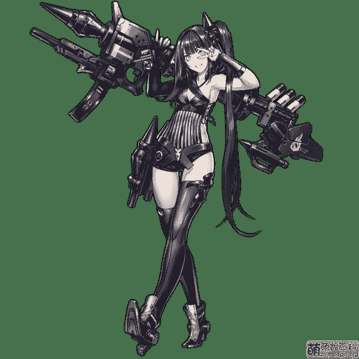</ignore_js_op> **600px-Architect.png** *(306.62 KB, 下載次數: 4)*

[下載附件](forum.php?mod=attachment&aid=Njg2MDZ8NGNmN2U5OWR8MTYwMDg4MDI1NnwxODIzMHwyMjkzOA%3D%3D&nothumb=yes)

2017-7-5 20:52 上傳 

不知道为甚么,或许是心血来潮吧,一早索性的背起了背包,就这样爬上了山野,上头有个很大很美的瀑布,或许那里是静下心来在这假日休息的好地方当接近瀑布时....感受到了异状,怎好像有人在唱着什么歌,攀过了石壁与树丛,当翻开树枝时眼前的瀑布....

一个少女纤细的声音正哼着歌,怎么可能她的声音几乎可以盖过瀑布的声音当翻开树丛时只差点没有腿软了,

竟然有....个....铁血...的人型在那里,腿已经没有力气转身了,逃不了了

"不...不会吧..." 正颤抖着 手捶着自己不争气的腿

或许能趁她不注意的时候偷偷溜走,不管了! 如果摔下去顶多严重擦伤和骨折而已,总比被她发现好,而且是这种情形....会死的!

当要跳下去的时候,巨大的手指挡在自己的面前

"呜..啊!!"

吓到了,如果她的手指在往这个方向近一点,自己就会被她按在地上吧抬起头时,她已经坐了起来,正往这个方向直盯着

“啊呀，没想到偶尔出来散散心，居然还能碰上偷窥我的小虫子啊”

"不.....不要.....不...."

牙齿正颤抖着,自己根本跑不了了,死定了被当成偷窥了! 死定了!她正直盯着自己,打量着,但她好像注意到了什么

“咦？你身上背着的是……你是背包客？”

反应不过来了,害怕地看着她,点了点头

“唔，看来是这样的呢，你并不是真的闯进来偷看的呢”

"妳....妳.妳不会杀了我吧..."

颤抖着,倒坐在地,看着那巨大的她

“杀你？噗……噗哈哈哈哈哈哈哈！”

她正笑着,巨大的笑声回荡在山林间,更使人害怕,耳朵也正发疼着

"杀你干什么呢？你又不是偷窥的小虫子"

听到她的笑声,不禁害怕着,正慢慢地向后爬着

"妳...妳会放我走吧?"

"放你走？唔，虽然说确实不会伤害你啦，但是..."

她的手指放在了嘴唇上,坏笑着

"既然来了客人什么的，不好好招待一下可不行呢"

"不...不用了...."

“恩？”

巨大的手指在面前敲击着泥土

"都看到了，难道我的身体完全没有吸引力吗.."

她靠了过来,这时候才注意到她是一丝不挂的在那里,全身都看得非常的清楚也都十分的庞大

"咦!! 我...我.."   

“啊呀呀，看来是脸红了呢”

“小虫子？如果你现在真的走的话，那我只能真的把你当成是偷窥者处理掉咯？”

摇着头深怕着她想做些什么

"拜...拜..拜托别..."

“啊哈哈哈哈，看把你吓得，我有这么可怕吗”

她的手指伸了过来,戳着逗弄着那吓得不知所措的小家伙巨大的手指逗弄着,巨大的眼睛直盯着他,就像是看着小玩具一样

“这你倒是可以放心啦，我并没有要加害你的意思哦，至少目前来说”

至少目前来说,这几个字听起来是多么恐怖....

“铁血已经没啦，并入格里芬了，本来这段时间就要宣布了来着，就算提前和你说了吧”

“你对她们那些家伙的印象还不差吧”

没有响应毕竟被这巨大的手指玩弄时心理只会在乎她会不会辗下来吧 ,根本没注意到她说些什么她说着调整了坐姿,翘起了二郎腿刚好遮住了她重要的位置,一些湖水散了出来水甚至可以达到脚踝快到小腿的位置冲着,但她的手指在玩弄的同时好像也在固定着自己

真是的，明明都已经习惯和她们相处了，可还是会这么害怕呢……

"你们到底是人还是虫子啊……"

她的手指有些用力地戳着,好像是真的在辗着虫子一样

“我说你……”

她手指头不断在身上话圈着,划过了身上几乎每一个部分

"陪我说说话好不好？"

她这样问着,手指头把人放开了,她盯着这惊慌失措的家伙,果然是因为铁血的缘故吗

"我...我是人.别....我..我还不想死..! 别伤..伤害我..."

在地上害怕地颤抖着,蜷缩着,就像是被猎食者盯上的猎物一样她嘟起了嘴,很不快的样子

"这样怎么说话啊……"

真是的，为什么一个个都不能像指挥官那样呢,明明一样都是人类的说……

"你想离开对吧？"

她的双膝靠在了一起,泡在水中,双手抱着大腿,脸埋了下去,看起来相当失落的样子

"走吧……我不会伤害你的……"

当准备要离开这里时,又总觉得她....好像有些可怜,自己好像会做错什么.....为甚么自己会对几年来一直害怕着的阵营起同情心呢.....而且她还那么大.....我..还是不走了吧! 把背包脱下,坐着,这到底是自己替她感到难过了,还是看到天空上的乌云聚集起来没地方跑的缘故..

这份沉默过了几分钟,她抬起了头,张望着

"他……走了吗"

小声的说着,听起来更让人感到孤独了吧但看到了那个小小的身影,她相当的惊讶

"诶!? 你...."

虽然还是抑制不住恐惧有些颤抖着,但...她竟然没有要特别伤害自己,而且要的话自己早该死了吧....巨大的手伸了下来,在周围围了起来,这个弧度包围着这小家伙,但当她手伸下来时,他还是惊慌的

"你..没有走.吗？"

她的语气比起刚才充满了要欺负与玩弄的气氛感觉更加了温柔些....."我......我..还是在这里吧"

眼见巨大的手几乎围住了自己,还是会害怕的

"你……你难道是特意留下来的嘛？"

她的眼睛好像亮了起来,开始有些兴奋

"我....."

看着她巨大好像发亮着期待着的眼神,"我....我愿意留下来的......毕竟....妳不会....杀了我吧..."

抓了抓自己的脸颊,问着,如果她真的要一手捶下来或是捏过来就好啦

"啊....不会不会"

她惊慌地看着眼前这个小小的登山者,当她想要说些什么的时候天空上斗大的雨滴低落了下来,这可是山上常见的间歇性阵雨跟炮击一样猛烈，也一样的来的快去得快

"啊，下雨了..."

她的手掌覆盖在了自己的头顶,当自己被阴影垄罩时,害怕的闭上双眼缩紧身子发抖着,等待着死亡再次张开眼睛时,她没把把自己当成害虫一样地拍死,反而是用这巨大的手掌替自己挡着雨

“这...这样就不会淋到了吧…”

她温柔地说着,关心的这个小家伙

"谢....谢,那妳...怎么办"

她...能替自己挡雨但她自己怎么办....身上虽然有原本要搭营账用的防水布,但是对她而言可能小的不象话吧...很快的打消了要拿出来的念头

"我？我是人形啦，这些雨还是没关系的"

她现在只关心着掌下的家伙,但还是因为反应的关系身上是湿漉漉的,拖着沉重的衣服,不禁打了个寒颤

“抱歉...我反应应该再快点的...”

她吐了个舌头,露出了不好意思地样子,眼神中真的是一副不好意思的样子

"没关系的,很习惯了,毕竟山上很常下雨呢"

好不容易才鼓起勇气好好地说完一句话,这或许是人生中最大的勇气了吧

"啊，也是呢...说起来大叔你居然没带雨伞来着？"

大叔....大叔....大叔....这个字好像在脑袋里回荡着

"这可是严重的失误哦？"

"在山上带雨伞可不安全...金属的材质可能会被落雷击中...所以都只带个雨衣而已,而且风大还可能被吹得开花哩"

"啊...原来如此呢！这些知识我都没学过的说..."

她点了点头好像是学到了什么一样,就跟个小女孩一样

"不过大叔你现在不用担心下雨啦，我会替你好好挡着的"

她微笑着看着自己,就像是要包在她身上一样

"谢谢.......但一直大叔大叔的叫我...我没那么老吧....我还年轻阿..."

"唔....那我该怎么称呼你呢？"

她有些歪着头,看着这小东西

"叫我史提夫就好了"

微笑的响应着,

"史提夫？唔...."

"我记下来了"

"那么，你也叫我建筑师吧"

"这是我的代号呢"

"建筑师......"

等等这不是个职业来着吗,谁那么恶趣味把这个当成女孩子的名字的

"这是我被制造出来之后就写在我的ai里面的呢"

"代号什么的怎么样都好啦"

她好像露出了一副无所谓的样子

"唔..." 她望向了天空,雨越下越大了,气温也开始下降,看来会下好一阵呢

"妳这样真的没问题吗....."

可恶阿....附近也没足够大的山俏可以让她躲雨,自己也很不敢相信吧,跟一个铁血的女孩聊起来,而且开始替她担心了,明明不久前还担心着她会用甚么残酷的方法玩死自己

"没事啦，我的皮肤不像你们，只是外面的保护层而已啦，所以下不下雨对我来说无所谓的呢"

她好像看透了想法一样,轻松地响应着

"倒是史提夫你没法下山了吧"

她另一只手的手指好像要戳了上来,正在替他担心着

"估计得在这山上等到雨停了吧.....看来会下一阵子...早该知道看天气预报的"

她看着这浑身湿透了的小人,这样可不行,闷在湿透的衣服里头会生病的,

好像注意到了她正在担心一样,这样说着确打了喷嚏,完全打脸了自己,感冒了吧但这也让她更慌张了,眼前这小家伙有个三长两短的话也会过意不去吧

她想了想,手指头再次戳了下那小人

"总之先把衣服脱了吧!"

她认真的说着,这样子至少不用穿着湿透的衣服吧

"等等....把衣服脱了?..."

疑惑着,她想做甚么...这样会冷死的吧!她把一旁那巨大的一套衣服拎了过来

"先...先用我的衣服当被子吧！"

"好....大件阿...但这是妳的衣服吧..."

"没..没事的啦，救急重要啦"

"来"

这次的口气好像是叫唤着宠物一样,虽然说是温柔,但是对着小小的生命,却是满满的关心吧,但看着他与衣服的对比又觉得这家伙很可爱,而她把衣服铺在地上像是地毯一样

"躺上去吧...然后我盖起来？"

她的脸色相当的焦急但她的担心可是真诚的

"快...快脱啦"

"可是....脱...."

还是有些害羞吧,毕竟她正直盯着自己,那双巨大的眼睛正盯着自己

“你都看过我的身体了，没什么不好意思的吧，而且你再这样下去可是真要生病的说..."

巨大的手指伸了过来，像是要帮他脱衣服一,而回应的是害怕着看着巨人手指的小家伙他不知是害怕还是因为寒冷的发抖着,建筑师也不管了,把他捏了起来就像是对着一个极度精致的小公仔一样,一个活生生的,小小的,可爱的,会害怕会说话的小东西

她小心翼翼地架着这个被她捏着挣扎着的家伙,不敢太用力,但又深怕他掉下去慢慢地将他的外衣给一一脱去然后丢到一旁,接下来是裤子,最后留下的是一条内裤,当她巨大的手指要伸向那最后一道防线时,他的挣扎更猛了,捏得稍微紧些,退去了他最后的防线

没有去注意那男性的器官,只是把他放在衣服上,然后盖起来,整个身体都被包住罩着

"这..这样应该就可以了！"

衣服里似乎还有女孩的淡淡余香"不..不冷了吧?"

那紫色的眼睛有些担心地盯着衣物中那小小的生命,因为她的余温吗,还是怎么一回事,这件衣服还是有些温暖的比起外头的冰冷甚至还有她的香味...样"恩...确实好多了...谢谢妳...."

身体甚至在里头蜷着,试图靠着她的余温来取暖

“没...没事啦，说起来刚刚还吓着你了呢，真是抱歉"

她低着头不好意思地说着

"不...这是我的错....是我慌了....但没想到是妳会救了我呢,如果刚才我先走的话,可能就在坍塌的道路上被困住甚至会被落石砸死...."

自己还是会过意不去吧,试图安抚着她,

“是么...这么说我做对了？”

少女似乎开心了起来,望着他,打量着,很想抓起来在脸颊边蹭着,感觉很可爱,所以看着看着出神了

"怎么了吗...."

见到她巨大的眼睛正在持续盯着自己,那种眼神就好像是在看着甚么可爱小动物一样但她的衣服在这磅礡大雨中还是湿透了,沉重着,湿冷着

"啊.....果然这里也不行...你...你还好么...?"

她露出了好像自己做错事情一样的眼神,手在一旁不知道是要抓起他,还是让他保持原地的不知所措

"还....还可以..哈啾"

她巨大的手在史帝夫的身旁探了探周遭的湿度,

"这不是湿透了吗...果然不行来着...这样的话真的会生重病的..."

"需要热的东西..."

"热的..."

扫视着四周,这不是注意到自己正在温泉中吗,甚至指责着自己为甚么没有注意到不待他的同意把衣服掀了起来,吓得他双手快速地遮住了下体,手指捏起了那慌张的小家伙

"虽然有些难为情，但是这是唯一的办法了，温泉是唯一不会被雨淋到的地方...."

她难为情的,脸已经红透的看着指间慌张的小家伙

"来...来一起泡温泉吧"

她小声地说着,看着这小家伙,她到底想做什么...?

她缓缓地移到了水面上,然后松手。自己就噗通的掉了进去,看起来有些滑稽但当松手时才注意到忘了问他会不会游泳了,在慌张的同时,他到了水面上,正浮着非常的温暖,而且也非常的舒服,好像疲劳都被冲走了一样

一下水,由于是热水的关系,整个人都变成红通通的,在她眼中看起来更让人想好好地弄着但他拨着水把自己转了过去,不敢对着她,毕竟底下的小分身已经开始起反应了

"咦？怎..怎么了？"

"生病了吗....? 有哪里不舒服吗?"

"没...没事!"

慌张的响应着那巨大少女的关心

虽说是不小的湖，和少女相比起来，也就是一个浴缸左右的大小被她看到的话.....会被当成变态处理掉吧...! 得...不能让她看到才行...!被处理掉....想了想都害怕了起来

"我...没事"

"唔...."

"是...是生我气了嘛？"

"因为刚刚吓着你什么的吗...还是帮你脱衣服的关系...."

她的手正伸向了那家伙,有些难为情更是自责地问着

"没...没有....我...."

小人相当的慌张,说话都奇怪了起来

"那史提夫你背过身低着头在干什么呢...."

她露出了疑惑的神情,

"我........"

双手正试图压制住,但这一点效果都没有,反而起了反效果,不行了啊! 得保持冷静才行!

"咦..."

她露出了小女孩般好奇的声音

"你的身体好像有点奇怪...心跳很快..体温也有上升呢...."

"能让我看看吗...我好歹ai里面也有医学的知识来着"

她的手指已经完全靠近了那小人,好像要再把他捏起来观察一样

"我....哦...我...."

慌张已经失去思考能力的响应着她巨大的手指把小人拨的更靠近她些,而且方向转了过来

她疑惑的脸正在自己面前,此时脑袋充满着死定了这三个字她还发出了诶....的声音正在观察着,紧接着目光已经注意到了他下半身的变化

"啊........."

她的表情显得有些尴尬了,但她微笑着

"难道是因为.....史提夫看到了我的身体...硬了？"

"呜...对不起!!.我........这是生理反应我也没办法啊.....对不起....."

"咦..."

深怕着她生气,更怕她把自己当成变态,但她现在的表情却是充满玩味着,好像发现了一个玩具一样手指头好几次想要伸过去拨弄看看,但都因为太小了而放弃了

"唔...史提夫..难道喜欢我吗....所以看到我才会硬起来什么的"

闭紧嘴巴....是温泉的关系还是害羞的关系还是生理反应的关系脸是红的 头低着巨大的少女也脸红了起来,正等着那小家伙的回应

"史提夫...你...你喜欢我吗？"

头顶上回荡着她害羞的声音

"我...我........."

这可能比跟正常的女孩子表达更难了吧,毕竟没回答好一定都是bad ending吧

"真...真是的！        前面就看到了人家的身体什么的，之后都硬了起来，现在还吞吞吐吐的，史提夫真是差劲呢,"

她的姿势一直都没变,深怕掀起波浪把他冲走或吓着,而她却直盯着自己,手指头一直在一旁滑动着好想直接潜下去淹死自己算了,毕竟这太害羞了吧 ,是喜欢上了没错啊!  

但...那么突然而且自己都直接跟她泡在同个池子里,还起生理反应什么的,果然太变态了吧....

"我....喜欢妳!"  

这样喊着,之后还大口的喘着气什么的,也做好了被她捏死的觉悟,然后自己的面部一半都沉到了水中,非常的害羞更是非常的害怕;像是触了电一样的..少女的脸开始慢慢红了起来,声音也有些不同

"真...真的吗..."

她羞涩地问着

"真的....."

她的脚忽然伸直了,不再坐着,上半身潜到了水下,巨大的脸正在自己的面前,脸上还有着红晕

"谢...谢谢你"

她小小声轻柔地说,微微的闭起双眼,有些害羞的样子,但当自己反应过来,她的手掌已经贴住自己,正把自己靠向她巨大的嘴唇,啾,轻轻地吻了一下,然后马上离开了,另一只手的手掌马上遮住了自己的嘴部,相当害羞的样子

而她再次将自己放下时,手滑过,导致了水面正在波动着,在这波浪上飘着,无法承认她真的很美呢,虽然巨大的有些可怕,虽然回答问题时是害怕着的,虽然她是那么的有压迫感,跟山一样,但不可否认真的是个美人

"你...你还是第一个会承认喜欢我的人类呢..."

"其他的人在我出现的时候就跑走了什么的..."

"其实我根本不是要伤害他们啊...连边都搭不上,只是想说说话或玩玩而已...."

"所以，想找个能聊天的人类朋友什么的...都找不到呢"

"还好，你没有跑走呢，还主动留下来陪我，谢...谢谢...."

"不....不会....还谢谢妳替我遮雨还....让我....陪...陪妳泡温泉...."

她露出了一种温暖的笑容,身体抬高了起来,胸部就如同湖中的岛一样冒了出来

"妳....想做什么...."

"我...我可以接受的啦，对着我起反应什么的"

"让...让你舒服一点?"

她小小声娇羞着地说着,巨大的手搭在了胸部上面或许因为这句话,下方估计已经无法恢复了吧 ,理智也正在崩溃

"你....你想要吗？"

她脸红着,有些害羞的问着

"我......可........可以吗...."

少女笑了起来，如同银铃一般,

“可...可以...只要能让你舒服的话...”

"那...那么......"

"想...想到哪里去都..都可以哦........"

是因为女方提出的关系吗还是她太过巨大了又还是这是自己的第一次?自己正不知所措地看着那巨大的胸...

"我.....我不知道....该怎么做...."

巨大的"岛"正在自己的面前,那压迫感与一股奇妙的感觉让人语无伦次

"噗..."

她笑了起来

那对巨大的胸部，被用手分了开来，露出了女孩子的谷间

“史提夫...想要进来呆一会儿吗？”

".........想......"

不敢发出太大的声音...但这也是他的极限了吧,毕竟自己的理智崩溃了她的一只手拨动了水,让小小的他正被水流带往她胸间的那块区域

"咦，这里看来是个很合适的地方呢，专属于史提夫的温泉哦"

由女生的胸部这里构成的小小地带，对于他来说，却是正好如同一个小小的温泉相当令人难为情的地方,在她胸部上的小小男人已经完全的被本能给冲昏了

如果她夹起来的话.....会是怎样呢....不禁想着,但有些害怕着,毕竟在这地方....使自己是本能上的兴奋了起来吗,不敢说话.....但自己却无意识的靠向了她的胸口

"诶嘿嘿...史提夫就像是小动物一样呢...好可爱~"

为什么是自己该害羞呢....是因为体型的差距吗.....她实在是太壮观了吗......自己如果就这样当个小动物般,给她当成宠物照顾着或许还不错吧

"呜.....我...."

她不再说话，耐心地听着,而他最终还是不敢说出甚么,整个人趴在了她的胸口上....双手也贴着,可以感觉到鼓动而且很温暖....已经不在意严重膨胀的分身了

“舒服....吗？”

巨大的胸部相当的柔软且温暖,这里正是男人梦想的圣域吧,让人感受到了天堂的滋味

"呜...很舒服...."

“舒服就好...”

她温暖的看着这胸前小小的家伙,正在享受着

“这...我这里还是第一次让男生趴在我胸部上...所以，如果有什么没做好的地方一定要和我说...”

她小小声的说着;突然就想...能一直待在这就好了呢......或许被她带去别处也好被她做甚么都好吧这样的幸福 或许也不错呢.........  

"我....也是第一次趴在女孩子...的....胸...胸部上.......而且我.....还是.....还..是....处....处男......这样...."

突然摇晃了起来,原来是少女的另一只手在调皮地戳着胸部，带起来一些震动,完全任他摆布的,在上头惊慌地抓着,紧紧的依在她的胸上,相当害怕,好像要哭出来一样绝望无助的紧紧贴在她的胸部上

"你...没事吧? 就只是晃..晃动一下而已,....史帝夫....你看起来...好可爱啊...."

她头低下来,好像充满着甚么眼神一样的看着这胸前惊慌的小家伙

"那...那个...请问....妳....可以用...胸...胸部...夹..夹着我吗!"

果然还是很害羞吧 ,这个要求,

"可...可以..."

她相当开心,有些惊喜的响应着,自己就是想要这样做呢....没想到这小家伙主动提出了她巨大的双手把在他移到了胸口上更高的位置,身体有些倾斜着,不至于掉下去然后夹了起来,主动的包裹着他,全身都被这巨大的欧派给夹住了

然后她深怕伤到他一样的微微施力着,就夹着他,轻微的揉着

"可....可以.....可以再用力一些......把我...把我紧紧地夹着...."

双手按在了胸部的外侧，轻轻地，慢慢地朝着里面挤压着，有些用力地挤着,感受到了他有些挣扎感觉很可爱又很想欺负他的揉着,感受着他在双峰之间挣扎着的快感,而在里头的他或许也受到了些刺激,完全兴奋了起来

"喜..喜欢吗.....?"

她这样问着然后继续揉着;糟了....这样下去....会射在这里的....比想象中的舒服! 虽然几乎无法呼吸,但非常的舒服,好想一辈子都被夹在这里了,

"怎..怎么了...?"

她好像发觉到了甚么异常,但没有多想,多加了一些力道,揉地更激烈些

"我....."

此时小分身开始完全膨胀且硬着,被双峰夹击着更加的严重了,她完全没有意识到这个要舒服的晕过去, 正喘息着挣扎着的小东西。最后爆发了,不再挣扎,在她的巨乳间几乎溶化了一样,这就是自己身为渺小存在的幸福吧

她好像注意到了什么异常一样,停止了动作,她低下了头看着那个几乎失去力气,好像在天堂一样的小家伙

"史帝夫....."

她注意到了甚么后,脸就马上胀红了起来,在胸口的小人也能感受到她的心跳加速了起来

"史提夫真是的....居然直接在人家的胸部就...就..."

羞红了脸半天说不出来,太难为情了!

在精神恍惚之中....他的脑袋或许已经乱掉了吧,神智不清整个人都飘飘然的说着

"请....使用....我吧.....我...愿意像是玩..玩具一样.....替妳服务的"

完全羞红了脸,把那小小的男人提了起来,移到了下腹部的位置,双腿之间已经缓缓从水面中冒出,把它移到了那三角地带之上

"真...真的吗?"

她兴奋着,看着一个活生生的愿意替自己舒服的小东西,完全燥红了脸

趴在了上面,或许还偷舔了一口吧,在脑内啡与少女贺尔蒙与费洛蒙的催使下整个人已经被什么给支配了一样,这就是最好的回应吧

"那...那...我..."

少女也说话不太利索了,用中指抄起了你，慢慢地朝着里面送了进去被弄进去时,还有些挣扎着,手指头压着自己进去时是挣扎着,刺激着她,,这也使得她更兴奋了手指头动的更欢了,被手指和肉壁包围着,不断扭动着,略有些腥味的热热的液体包裹了身体

少女的手指不断地逗弄着肉壁,在一旁看来就像是个少女在自慰一样,但她的手指与肉壁间,却有个小小的男人,是加入她欢愉的存在,还是个助兴用品而已? 但这样看来两者皆是吧

当肉壁夹紧时,还不断用力挣扎着,自己好像完全成了满足她的物品,这顿时成了这时间他存在的意义,试图服侍着她,让她更舒服些

"啊....啊........哈...哈......"

她喘息着,手指头不断变化速度刺激着,这与平常不同,里面是有个小东西的,在自己...生孩子的地方直到淫水开始不断地涌出，冲刷着他的身体的时候，手指才带着他慢慢地伸了出来

外头，是少女潮红的脸庞和歉意的眼神,不小心就把他当成自慰用品什么的;在她的手指上,也不断喘息着露出的是,单纯且幸福的微笑,或许这样子还不错吧,自己就像是在她手指上融掉的小小存在

被放置在了少女的腹部

"呐...史提夫...抱歉刚刚是不是闹得太欢快了点..."

她不好意思地望着那小家伙

"这...是我自己要求的,......我是妳的东西了呢....我是...妳的......"

估计比被胸部夹着爆发还更加的恍惚了起来,毕竟被带进去自慰而且还迎来了高潮,自己从女孩子的那边出来....只差没有恶趣味的对她说声妈妈了吧

看着腹部的小小的他，幸福地笑着

"那...那么..."

"我们...是那个了吧...你们人类说的...唔..."

娇羞的好像要说甚么却说不出来

"情...侣了吧....."

“情侣...”

她低声默念着,头又再次低了下来

"是阿.....我们已经.....在一起了吧"

手轻轻地抚摸着她的腹部,身体靠了上去,基本上是整个人贴了上去吧

"诶嘿嘿..."

双手放在腹部上，他的两端

"我.....喜欢....妳..."

她的脸更红了，不敢抬头

"请....跟我...结婚..吧!!"

少女惊讶地想站起来,但是想到他还在腹部上,刚想起身又压了下去

“结...结婚？！”

脸红通通的，眼睛眯着，完全是慌张的小女孩模样

"我愿意.....让妳幸福的.....那怕是体型的差距也好..还是.我俩的..困难也好......"

"那怕....只能被妳当成.....也好..我也愿意.只要能让妳幸福,要我怎么样都行!"

"我....愿意多辛苦些,我愿意用尽全部的力量只为了让妳开心!"

"你...是认真的吗？”

少女眼中的羞涩已经全然不见,取而代之的是严肃的眼神

"这当然是认真的..,陪妳聊天也好,多陪妳说说话,我绝不让妳孤独的,跟妳一起生活也好,多陪伴着妳.怎么样都好,甚至......得让妳使用也可以.....只要能让妳开心让妳幸福,我甚么都愿意的!"

少女的眼睛亮了起来,露出了微笑

"谢...谢谢你...史提夫"

你被手指捏了起来，提到了少女的面前,紧接着,她闭起了双眼,巨大的嘴唇就覆盖了你的身体;在嘴唇上挣扎了几下,但很快地整个人贴了上去,接受了这全身吻.双手张开的在这嘴唇上享受着;良久，才缓缓分开,

"我...我也会努力的"

"虽然我之前完全没有与男孩子交往过的经验什么，还是人类..."

"不过我会试着去学的..."

"所以，我...我愿意接受...."

"不过...先从情侣关系开始..."

她说的话越来越小声,最后的几个字几乎是含糊嗫喏出来的

"是..!"

少女把小人放在了胸部的乳头上,小心翼翼地让他跨坐在上面看起来小小的,非常的可爱,也刺激的她的乳头,或许有些变大了,这也更稳了吧

"诶嘿嘿"

她轻笑着,感受这可爱的小生物在自己的乳头上跨坐着

"喜...喜欢吗..."

"喜欢.....只要是妳...我都喜欢"

“谢..谢谢你”

“我们...回去吧？”

"回去...?"

“回我的基地...也应该让你熟悉一下我...”

"知道了....那么我也会好好学习得"

少女的身体带着她缓缓站了起来，刚刚她躺着还不觉得，站起来之后，才感觉到她的巨大,简直就是一座山了呢,对于喜欢登山喜欢山地他,这个女孩又更加的美了些,使他更深深的爱上了她

"好...高"

"诶嘿嘿，我是不是很大呢....?"

"是呢.....所以....我喜欢......"

"那么，我要穿浴袍咯，抓紧一点..."

"好....真的...好大啊......."

感叹着,感受着如此庞大的她;外面柔软的布料缓缓地盖上了身体,绕到了背后，随后被系上，带子打了个结,她俯视着乳头上小小的情人

"没，没问题吧，我要开始走咯？"

"没问题的!"

"还是...要把你放出来呢..."

她有些担心的看着那小家伙,深怕他掉下去但这样问着时,他却紧紧靠着她,深怕离开她一样,依依不舍像是个小动物一样靠在她的乳头上

"我想和妳....在一起"

少女羞红了脸,不只是这句话,更是觉得他非常的可爱吧

"那么，我要走咯"

手拿起来了自己的湿衣服，赤足踩在了地面之上,每走一步，都会有地面浅浅地凹陷下去,留下脚印由于是浴袍的关系，在乳头上能看到下面少女的身躯以及再下面的地面,但一点都不害怕这个高度

看到她简简单单就跨过了河流，跨过了森林，跨过了那些自己要跋涉很久才能通过的地方只有这时候才能意识到她并不是普通的女孩子，而是一个拥有着百倍身躯的巨大人形

高的很可怕.....她也如此壮观....但就是因为这样才特别吧,就是这样才会爱上她吧她巨大的身躯,给自己温暖很多,如此的有力量且巨大,但内心又还是跟正常的女孩几乎无异,也是需要有人陪伴和关注的,

这时候轻轻地抚摸着自己跨坐着的乳头,她....真的是很美呢,看来以后得学的可多了,今夜回去以后,看来又是个美好的夜晚呢……

 

# 31

7/5更新

冒着重感冒以及喉咙不断咳嗽我依然来更新了……不过今天似乎只有一个短篇，还请大家多多见谅

另外请善用目录啊……明明有的时候更新不止一篇的 

# 32

休息时间稍微来顶一下，为什么用心写出来的作品没多少人看呢。。。伤心 

# 33

休息来顶一下，晚上再更新一篇 

# 34

> [w381812988 發表於 2017-7-8 00:59](https://giantessnight.com/gnforum2012/forum.php?mod=redirect&goto=findpost&pid=338561&ptid=22938)

> 这个文最开始wa的部分，其实我是没怎么看的。按个人感想是这种故事太温和了，感受不到什么快感，所以一直对 ...

怎么说呢，既然是少前，那就是人形，人形在精确操作之类的方面肯定是高于人类的。我记得在P站看过图配文那里面十万倍的舰娘都能进行以米为单位的操作了，所以这里也应该是不在话下。不过既然是故事嘛怎么设定都可以啦

另外你说到单纯的问题，怎么说呢，毕竟人形和人类是不同的，有模拟ai但毕竟人生经验还要学习一个，好骗我觉得是说得通，而且你要知道在短篇故事的篇幅里要兼顾剧情和福利的问题确实不太容易……所以只能委屈枪娘们降低一些智商了

不过我承认这是我新手的经验不足问题，所以如果有改进的意见的话我会很愉快接受的

 

# 35

*本帖最後由 dasers_100 於 2017-7-9 04:49 編輯*

恋

这次……给大家带来的是铁血的代理人！而且，是和足有关的调教章节！也是第一次写这类型的文章，总感觉有点紧张啊……

那么话不多说，上人设图，请大家自行欣赏吧：

<ignore_js_op>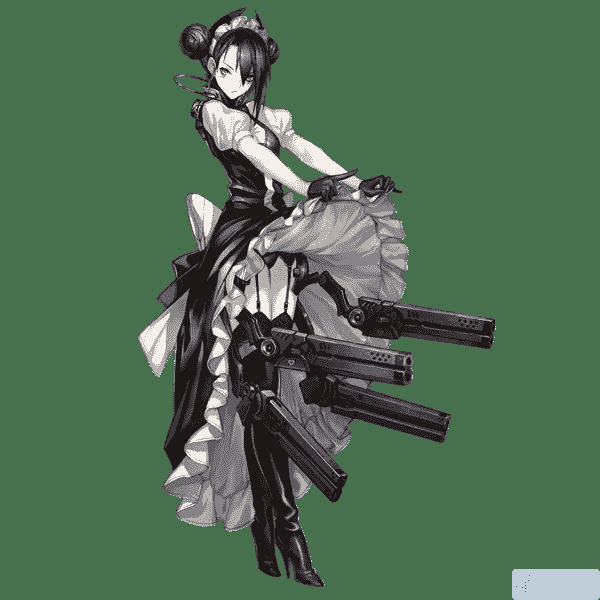

**600px-代理人.png** *(287.44 KB, 下載次數: 8)*

[下載附件](forum.php?mod=attachment&aid=Njg3MDh8ZWY5NzAwZjF8MTYwMDg4MDI3M3wxODIzMHwyMjkzOA%3D%3D&nothumb=yes)

2017-7-9 04:49 上傳

再次睁开眼时,眼前的家伙正在帮我从这墙上松绑,该死的.....最后也只能当战俘了吗,没想到自己会有这一天呢,

保卫着国家,却得承受着战争罪的罚则,被押出了这个该死的押送牢笼,眼前的一片烈日正照着眼睛疼着,没能看清眼前那黑影

在这阴暗的潮湿的箱子中刚步出时,眼前是一片雪白,怪不得刚才阳光照着自己眼睛疼着,一道寒风吹过来,还有些令人打颤,

眼前的是一片矿区,更是一片无止尽的雪原

这让人想到了小说中常看到的西伯利亚劳改营,据说是二战时期的血泪,没想到自己来到了几乎与内容如出一辙的鬼地方,

眼前有几栋木头和铁皮简易搭建的营舍,还有好几个哨塔,以及好几层的铁丝网与巡逻士兵

还能看到有人被押送着,不知要送往哪里...矿场吗,我这样想着,人们就像是在集中营的羔羊一样,无奈悲伤阴沉的晃着,

被敌人的士兵们欺负着,看来....这就是投降与战败的代价吧,看来我不是第一个恨不得战死的人

“新的一批虫子到了呢...”

代理人坐在远处的地上看着地面上那密密麻麻不断穿梭着的人影，站了起来,开始朝着预定的地点大步走了过来

地面，不断回响着巨大的体重所引发的震动声,地面正在震动着,看来是有人形正在靠近呢....

这使我打消了在这里马上煽动着人们一起反抗暴动的念头,看来...那些混蛋想的真周到.

或许煽动惹到他们,我可以换取一死逃离这个地狱,不然比起被他们劳改致死,不如这样去死,才更有面子去见死去的亲朋好友

不过是几十步的距离，她已经从整个营地的一端走到了另外一段，站在那群不知所措的小虫子面前俯视着他们,

宽大的裙子很好地遮住了自己几乎所有的下半身，只露出一双高跟的战斗靴在下面

当回过神,自己无意识地开始会跟着这一排脚镣和枷锁前进,这时候已经被巨大的阴影给垄罩.....

抬起头来,差点没有吓的倒在地上,是铁血的....人形

然而她的眼神是冰冷的，几乎完全不带有一丝感情

"这....不可能吧...."

铁血和格里芬是敌对方才对啊....为甚么她正在这里,也没有对这些格里芬的士兵和劳改营破坏,

她...竟然与他们是同一阵线的,太棒了....两边都有这巨大的恐怖的人形,而且还合作起来了,

该死的...难怪我们败退成这样,该死的格里芬混账

俯视着这些完全看上去和虫子没有两样的战俘们，代理人冰冷的眼神笼罩着，从嘴里说出了第一个命令：

“虫子们，列队”

队伍忽然停了下来,格里芬的士兵们在那如雷鸣的号令下驱赶着我们,看起来疲倦且装备不全的我们就在此处排列

有些人身上还是沾着血的,我们无奈地站在那里,然后呢? 下一步是一脚踩下来踩死我们,

还是要机枪把我们当成活生生的练习靶来攻击? 这时候我清楚的认知了自己的命运 我们是战败者

一列列小小的队伍在代理人的脚前排列着，看着这些“虫子们”排列着，稍稍忍下了一脚踩上去的冲动，她开始说起话来

“虫子们，欢迎来到地狱”

第一句话，就如同荒原上的寒风一般，所有战俘们听的都凉飕飕的，不管是身体上，还是心里

冷笑着,哈哈....闭上了双眼,看来....回不了家了,我来到了异域了呢....,不! 打从我们被俘虏后,再怎么样都回不去了

我们全部都只能死在这里,只是迟早的问题,疾病,寒冷,实验,屠杀,虐待,劳改,各式各样的原因都会杀了我们

毕竟...他们绝不善待战俘

“我不管你们以前在哪里战斗，什么身份，到了这里，你们这些渣滓的身份就只有一个，就是虫子”

“这里的规则很简单，听话，努力干活，活下去”

“任何其他的情况，死”

突然好想说出一句,干脆杀了我好了,杀了我至少能少一个要饭吃的,毕竟....宁作战死鬼,不愿做亡国奴,这句话依然在脑袋中回荡,

看着远处飘扬着的敌方旗帜,想到了自己曾在那自己家乡的旗帜下宣誓效忠,我们就只是虫子吗.....那杀了我们吧, 不然自杀也好

似乎在战俘里面有这种想法的人不在少数，而代理人也并不是那种蠢人。

相反，作为在铁血握有实权的人，代理人既然能把偌大的铁血打理得井井有条，这些人的小心思怎么可能瞒得过她呢？

“想自杀的虫子们，你们听好"

“你们在这里所没有做完的工作，会转移到任何与你们有关系的人身上”

“你们大可以自杀，我无所谓，反正我也不缺虫子用”

这样说着，嘴边露出来一抹残忍而冰冷的笑容

看着她那样寒冷残酷的笑容,看了看自己左右的临兵们....,该死的...

"难道....连殉国都不能吗"

不禁吐出了这字句

“殉国？”

像是听到了这个词,眼神更加严厉

“你们现在连人类都不是，只是虫子而已”

把自己的头盔脱下,使其砸在雪中,仰望着那让人感到压迫和恐怖的铁血人形,充满怨恨与锐利的眼神

"竟然我是虫子....那么妳大可以把我给踩死吧"

"其他人...我们都累了,连家都回不去了,在这里我们迟早都会死得,或许还更惨吧,不如妳先在这里杀了我"

没有人反驳,有些人只是低着头,有些人拿出了爱人或家人的照片,我们....都回不了家了呢

听到这样的话，代理人的脸上有些恼怒，右脚稍微伸前就精准地踩住了这个胆敢反抗她的“虫子”，

稍稍加了点力，在保证不会受伤的前提下让他能体会到最大的痛苦

“哦？是么？就算自己的家人朋友之类的被送过来也无所谓是么”

“现在点头的话，马上就可以踩下来呢，还是说，先踩一半呢”

旁边的人已经无法维持队形，发出了低低的惊呼声

眼睛瞪大着,难以呼吸,被她踩着被山压住一样,

"杀了我啊! 我的家人我的家乡我的国家都被夷为平地了! 我们难逃一死! 我根本不在乎甚么了!"

又稍稍加重了一点力，已经是人的骨骼能承受的最大极限了，已经嘎嘎地发出了不堪重负的声音

“不是还有旁边的人吗？我说了哦，任何有关系的人”

“你的工作会被分到他们的头上哦”

指了指旁边的人,那些人又惊又怕地不敢作声

"啊!!! 哈....啊!!!!!! 杀了我啊! 这都不关他们事,我...我是他们的..士官...这一切...都跟他们无关!"

叫着,痛苦着,呻吟着,吼着

看着脚下不断扭动着的虫子，代理人的脸上更是一片冰冷，

“看来得给你个教训呢”

“带他们去跑圈！”

随着命令的发出，所有的战俘都被集中起来，开始围起了营区拖着疲惫的身躯，以及手铐脚镣之类，艰难地动了起来

旁边不时有着格里芬的士兵在怒吼，有掉队的就会受到枪托或是皮靴的惩罚

“那么...”

“现在还不关你的事吗？”

脸转了回来，依旧是那张万年不变的冰山脸，毫无感情地说着

"杀了我啊! 让我去替这项事情接受惩罚啊! "

嘶吼着 而也被踩得更紧了

“杀了你？你是不是误会了什么。你现在是唯一能让他们不跑步的人。”

“臣服，或者，他们跑到死”

"呜....."

痛苦地发出了声音 停止了挣扎,

绝美的容颜，吐出来的话却是如此冰冷

"我..... 哦呜..."

忍着,被踩踏着的痛苦,不让自己大叫出来

严厉的目光瞪视着他,而那边，队伍仍然在艰难地跑着

"我投降...但他们的工作部分由我负责,惩罚由我承担"

“不，不是投降，是臣服。你在这里不是什么战俘，是虫子，只有取悦我的资格，没有我的允许，任何事情都不许做，包括死”

被压在底下的双手,抓住了一把雪,痛苦的试图把自己最后一丝自尊心给藏好

"我..."

眼神更严厉地注视着他，脚下仍然保持着他能承受的最大力度，试图一点一滴地消磨着他的精神。

是啊，再怎么说，他也是战俘，是任由自己摆布的对象

远处的队伍中，不断地传出喘气声，以及被砸到之后的叫声，越来越多的人已经跟不上队伍的脚步了

而在工地上，大部分人都只稍微看了一眼，默默地又把精力投回在了自己的工作上

"求你了....嗑....放过他们吧....我愿意.."

“说，直接说出来”

"我愿意臣服于妳!!"

吼着,这是为了弟兄们,

“不够，你不是人类，你是虫子”

"我...我不是人类! 我只是虫子! 这样总行了吧...."

为了弟兄们....为了他们,让自己的自尊给藏好,要我真的臣服于妳是不可能的

“大点声，听不到。虫子连叫出来的声音都没了吗?”

"我不是人类! 我是虫子!!"

撕心裂肺的吼着

“很好...”

靴子缓缓地移开了

“过来，跪下，舔我的靴子”

她还是那毫无生气冰冷的视线,根本是恶魔...

为甚么....我当初不战死好了

跪在了她的靴子面前,迟迟没有动作

远处的队伍之中，发出了惊呼声，原来已经有人开始嘴里流血了，看来整个人已经到极限了的样子

而代理人则依旧是那副扑克脸，没有说话，只是看着小小的"虫子"

"我舔.....我舔总行了吧...!"

看着那些友军们正在受苦....这点自尊....我得全藏好了

手撑在了鞋面,整个人几乎趴上去舔着,心不甘情不愿的

身体正在颤抖着,好像快要崩溃了

“哼...”

代理人冷哼了一声，随后冷冷地说着

“停下吧，知道自己的地位了么

站在那里 低着头

"我....只是虫子..."

该死的....该死的格里芬人形...去妳的铁血....

“很好，看来你明白了”

“停下！”

远处的队伍终于停了下来，被带回了她的脚前

所有的人已经是累瘫了的样子，甚至已经有口吐白沫甚至咳血的，躺在地上一动不动

一个箭步,走向了一个快要倒地的友军,扶住他,

"我错了...."

"我...愧对了你们"

当初带着人们选择投降是个错误的决定,现在又害了大家得被折磨 不禁感受到了最深的自我谴责

当初是为了让大家活着回家,然后自己再去组织和回部队报到,但这一切都跟自己想的完全不同

她冷冷地瞪视着下面，没有说话，只是朝着旁边的士兵打了个眼色

过了几分钟，两个士兵驾驶着小型的运输车过来，从上面卸下来了两个箱子

打开了其中一个，里面装的满满的，整整齐齐地摆放着一瓶瓶冰凉的葡萄糖水

“给他们喝”

随着士兵们的走动，所有的人手上都被塞上了一瓶葡萄糖水

而另一个箱子打开了,里面是一条条的黑巧克力,也被迅速分发了下去

“看来你们都拿到东西了是吧。很好，你们等会有今天剩余的时间来熟悉营地环境，明天开始工作以后，没有犯错误的机会。”

她掷下这句话，一步就跨走了，走向了远处她自己的屋子,只留下了士兵们和他们所看守着的战俘们

打开包装撕咬着那巧克力,流下了泪水,这是饥饿才流下的 还是因为失去一切的痛苦呢

看着渐远的巨大身影,与那些入侵者么依然提着枪警戒着我们,内心总是不甘的....毕竟我们只是为了守护国土与家园 守护国家与自身 今日却得沦为战争罪犯

这还有何天理呢....。

在私下与其他在这里的军士官们讨论过一些暴动和逃离这里计划后,我们决定先假装顺从,然后挑选一天进行对众人的煽动

而今天我手拿着这十字槁,敲击着那块矿石,不断的提起,坠下,手都酸了,胳膊彷佛都要断了

坐在营地旁边的代理人依旧是那张脸，几乎如同万年不变的冰山,整个营地和她相比一点也不大,用力地敲着那块该死的矿石

甚么时候才能结束....杀了我吧....

或许...是时候了

"该死的..."

干脆把稿子丢在了一旁,站在一旁看着整个矿区坑中的友军们,这里的战俘人数铁定比驻军多的,麻烦的只有那家伙...

此时的代理人，正在看着另外一边，一只手不断地在另一只手腕上的pda打着什么

整个营地此时很安静，只有不断的金铁交鸣声，那是战俘们在不断地挖掘着矿石

清了清喉咙,用着故乡的方言喊着

"同胞们!"

"我们人数比那些该死的格里芬走狗还多! 为什么我们要臣服于他们!?"

"我们拿起你们的工具和武器! 我们必须反抗! 当初我们为甚么投降!? 战死正是我们的荣誉!

"各位! 也看到我们的首都是怎么被残忍的踏平了吧! 也知道那是怎样在开战日第一天就不见的吧!?"

"我们! 必须替国家和家人复仇!"

举起了一边的十字槁,嘶吼着 伴随着底下的躁动,代理人的耳朵动了动，不过似乎这些人兴奋起来，一个都没有看到呢

"今天! 我们死了正好离开这个地狱! 成了! 我们将再次组织起来! 让这些格里芬强盗看看如何作战!"

“是么，你们还懂如何作战？”

冰冷的语言覆盖在了营地的上空，代理人此时的身躯已经转了过来，巨大的身躯就在营地的旁边坐着

而且刚刚说话时候使用的语言,正是同一种语言

等等....这是怎么一回事,为甚么国家的方言她能理解,但这已经不是该思考的了....这个语言是除了我们国家外就没有人使用的阿

"各位! 不要畏惧! 打倒你身旁的格里芬士兵! 为了祖国!"

绝望无奈的吼着

没有人敢动作，因为代理人已经站了起来，抬起了一只脚对着他们

而更可怕的是，在她的两条腿旁边，还有着四条支架，上面伸展着四门对于他们来说不亚于巨炮的枪械

“作战...”

轻轻吐出了这个词，以完全嘲讽着的语调打量着下面惊慌失措的人们

"该死...."

仰望着那巨大的人形,吐出了这一个单词 仅仅两个音节的单词

而旁边的士兵们也已经把枪举了起来，远处的岗哨上架设的机枪重火力之类已经开始瞄准

“又是你...”

"我的工作,是让他们至少能脱离这鬼地方! 不管是死 还是活 毕竟我们最后都得死的"

冰冷的说着，代理人已经锁定了这次骚乱的始作俑者，那个在新来的第一天就敢于顶撞她的男人

我瞪着她,眼神中好像已经替死亡做好准备,也不知道哪里来的勇气

就像是三战时期疯狂愤怒的士兵一样,眼神中是满满的盛怒与恨意

“虫子...”

“在这里只允许也只会有一个声音，那就是我的声音。如果我要你死你不会活到下一秒。但如果我没让你死，谁都不能让你死”

“这一点，你们这些新来的必须搞清楚"

"那妳大可以杀了我了"

张开双臂,疯狂地说着,眼神早已布满绝望

“杀了你完全可以，只要你同意把你的工作转移到其他人身上”

冰冷地宣判着，完全不带丝毫情感

"来啊! 要长期虐待我也行啊! 要我去死也行啊! 要把我抓去实验也行啊! "

“虐待？

"这不就是你们这些混蛋对付战俘的方式嘛!?"

“照你这么说，我们还得好吃好喝供着你们了是吧”

漂亮的脸蛋上已经有丝丝怒气冒出

他没有响应,只是瞪着她,就像是一个被荼毒深厚的士兵一样

收起了枪管，毕竟在底下的他们，随便用自己的身体也足够消灭了

刚刚自己也一下子头脑发热了呢，代理人这么想着,他们有着这种反应可以理解，但是作为自己的对立方，

再怎么理解，惩罚还是要有的,于是，代理人抬起来的脚，已经覆盖了这个矿坑

绝望着看着她的脚底,或许踏下来,脱离这里也不错,毕竟也没法离开这里了吧,低语着

"能死也不错....."

代理人在外面则冷笑了一下,毕竟不是所有人都有他的这种想法呢，

那只巨大的靴子慢慢地向着坑洞内降下,似乎可以看到不错的表演了呢

只剩下自己站在那哩,有些人正在溃散着,有人正跪下来抱着头哭着,当原本凝聚的微少士气就瞬间溃散

"看来 ,到头来敢迎死的,只剩我了"

看着友军纷纷跑走,或是选择臣服着,只剩自己站着,等待着死亡

靴子越降越低，已经到了头顶上方，停住了

"连死都不行吗....."

看着那靴子的底部,或许她曾踩死不少人了吧,该死的.....连下地狱找其他友军都不行吗

靴子突然又急速地上抬,露出来天空的样子,代理人轻蔑地看着下面矿坑中的情况

除了他和一些已经吓得有些崩溃的人以外，剩下的人无一不是躲在高跟鞋鞋跟的旁边，试图躲避她的踩踏

"不踩下来吗?"

怨恨与绝望的眼神正瞪着她,好像完全无视了她巨大的优势

“我还没说让你们死”

厌恶地看了看那些瑟缩着求生的人，他们刚刚的行为的确和虫子完全无二,反倒是他稍微表现得像个人呢,不过，他再怎么说也算个危险分子，代理人脑内有些头疼

直盯着她,眼神中并无恐惧,反而有一丝丝的恨意,还有很多愤怒,毕竟还是无法接受成为战败者这回事

身为一个老练的士官 鼓动士气 也是工作之一 但眼见士气就这样烟消云散 心里不免有些失落

毕竟....人总是想活下去吧 既使结局一样 既使路途痛苦.而我却不同

一时间也说不出什么话的代理人，跺了跺脚,而震动也把那个激进的虫子给震的站不太稳

震动倒是吧旁边的几个战俘吓得不轻

"妳到底是想怎样!? 我可是个随时会做出什么的人! 杀了我啊!"

“别闹了，好好工作，我会视察你们工作的进度的”

淡淡地说着这话，重新回到了自己的位置上，看着另外一边.不再看向这里的情况

在她说出话后,转向另一边的空档,对着一旁的格里芬士兵执行了格斗技,夺了他的步枪,压制的他

"格里芬的混蛋....!"

“你如果还是个士兵的话，你就不会开枪”

淡漠的话语又从旁边飘了过来

"妳能保证一个不顾性命的人,不会扣下板机吗?"

“至少，你不会不顾旁边人的性命”

淡淡的语气，听不出是在威胁，还是单纯的话语呢

"这可难说,对于我这爱国疯子"

"我大可以带着友军们陪葬"

“那你在刚来的第一天就会这么做了”

"我不正都在尝试吗?"

似乎早已预料到一般，轻飘飘的一句话就这么说了出来

枪托敲向了那名敌兵的后脑勺,枪抵住了自己的下巴,正准备含枪自尽,毕竟,不给我死是吧,那么我就自杀

“想死的话，至少把你手头的工作做完再死，别让我看不起你，虫子”

依然是并没有看他，自顾自在工作的状态

"替格里芬工作,就是在多羞辱我们的国家"

手指已经挖进护弓,露出了疯狂的笑颜

“你们的国家？你们的国家还需要我来羞辱吗”

“本来已经成为了大国的玩物”

“换一个统治者也是毫无区别的吧？”

“反正你们也不在乎谁领导着你们”

"我就是不希望这种事情在发生,我可希望着我们有一日 民族可以自己统治自己,我才入伍的"

"领导者? 还不都是那些该死的异族政客"

“如果你还想看到这个局面在日后发生的话，就不要扣下扳机

“不过，你的生死和我毫无关系，我倒是奇怪为什么我要劝你了”

"至少我还能抱着最后一丝忠诚,我的荣誉下地狱"

“忠诚？荣誉？为了可笑的虚荣心就自私的想解脱自己吗”

"就当我的自私吧"

“真是个无可救药的混蛋...”

"我的友军们,也不是为了吃饭和这份该死的荣誉才入伍的,"

“算了，我也不是完全不通人情，你们知不知道你们在挖什么”

代理人叹了口气，把头转了过来,

“看来，你们完全毫无感觉呢"

“你不想想，有了复制人的我们，为什么不用他们，而是要让你们来执行这些工作”

“因为某个混蛋说，要让你们用自己的工作来建起一座城市”

“你们看到远处的建筑没有？”

“属于你们的城市，你们现在在挖的不就是矿石吗”

“他的一片好意还真是被你们白白浪费了啊”

"劳改和开垦还可以说的那么好听"

“是么？你们自己再看看那些建筑，连自己国家的建筑物都认不出来了么”

“这城市就是复制你们的首都而建造的”

“好好看看！”

哼了一声，代理人的脸又散发出了那股完全的冷气，把下面的人都吓了一跳

看着那些没有粉刷与贴上磁砖的水泥丛林,这位置和构型都的确和首都十分类似

但泪水还是要滴了下来 毕竟看到这座城市 彷佛想起了在无数战斗中 如同现代斯大林格勒中 消亡的战友与家人们

“既然都知道了，那么，自己想想我们为什么要在这里建造这样一座城市好了”

“你们现在拖的时间，都是城市完工的时间”

头又扭了回去不再看他

把枪的弹夹取下,把弹药清出,把枪丢到了远处,拔出了那名士兵身上的刺刀,正准备往自己的脖子划了下去,只是就在刀子即将刺下去的时候，一块呼啸而过的石头，准确地砸到了刀面上，带着整个刀子砸到了地上摔成粉碎。

而他也因为这巨大离心力的作用摔在了地上

“哼！”

又是代理人的声音,只不过这次，她的手保持着弹飞什么的姿势，这样看来，刚刚那块石头...

倒在地上,看着天空,喊叫着,毕竟,难以适应和接受吧,脑中正在冲突着

开始抽泣着,眼前正跑过着友军们集体自杀与战死的画面,无数人在前线冲锋着,冒着炮火前进着

更跑过了火炮轰炸在住宅区上头的画面,这一切都是为了对付格里芬的人形,好几架轰炸机与战斗机组成联队去轰炸着曾是我们的城市,就为了阻挡那些格里芬混蛋和那些巨大的人形,最后也...几乎全灭

一场场战役都在眼前跑过,已经完全的崩溃了

爬起身来,把侧面印有国家标志的头盔丢向了前方的矿洞  而此时刚才那名格里芬士兵已经把枪底在自己的头上,为何.....自己总得任人摆布呢

已经坐起来的代理人，看着下面他的反应,

“城市里面住着的是那些幸存者”

慢吞吞地说这话,毕竟，自己已经把所有能透露的信息都透露出去了,接下来就要看他自己的选择了

一切都回不去了,闭上了双眼,板机迟迟没有扣下....,回头看着那格里芬的士兵,他拉下了原本照着自己面庞的黑色面罩,他....正是以往的战友,认得出来的,他虽然是复制人但是因为制造缺陷的关系,额头上有个像是弹孔的胎记

"是你.....其他人呢!?"

"你这家伙,刚才还打那么用力...他们都在前面,估计是战后人力不多了,基本不会杀死我这类存在的,我....看来我貌似会被你在打一次啦,我带队投诚了,现在我是她们的人"

"那么我还能怎么做....其他人呢?"

"其他人我就不保证了,但就算我是军官他们都不愧待我了,你也可以的,虽然他们是战斗多年的敌人,但至少....这是目前对我们国家最好的办法,停止战争,加入她们,如果你把这份热诚放在她们那边,你一定可以快速升迁的"

"那几年我们都浪费了吗.....大家都白死了吗....."

"不必然的,毕竟这是战争"

战友仰望着自己的直属上司,也就是代理人..." 此时她没注意着这里,依然在工作着

自己则不语着看着双手,我还能做什么

"都当一辈子奴隶了.....现在到头来还是得当出苦力的阿,在这里自己杀自己的情况还是有的吧,照你这样说来,有人已经开始加入格里芬了,这不是更悲惨了吗......"

战友没有再次搭话,默默地离去,而此时,依然跪在那,脑袋错乱的矛盾着混乱着

“还跪在那里吗？算了，想通了就乖乖过来干活吧”

把脸又转了过去开始处理起文件来

"我办不到"

如同这里冰原一样,冰冷的回应着,绝望的,这不毛之地的确让人绝望

“你说……什么？……”

简直如同牙缝里挤出来的字一般

"我办不到...,我曾经向我的国家宣示过,无论如何,我都不能臣服于敌人之下"

坚决的说着

“就算同伴的命都能抛弃不顾吗？”

已经放掉了手上的工作，冷冷地站了起来，以绝对的居高临下的姿态俯视着他

"要不都把他们的份,算在我身上好了"

“算你身上？你担当的起吗？光靠你一个人怕是一万年都做不完这工作”

轻蔑地看着他，完全和虫子没什么区别

“简直不知好歹……”

"不...我指的是他们该受的苦,直到我死,这或许是我唯一能保持忠诚所能做的"

“想当英雄？可惜，这个世界没那么多英雄”

一脚把他给踢倒在雪地之上,对她来说只是很小的一个动作，可是却是超乎人类想象的冲击力        

摔倒在雪地中,有一只手已经失去知觉了,倒在那里,咳了几下

"我不是英雄...在这愚蠢的事情之中....这场该死的战争中...没人是英雄"

“那你所求的又是什么？回答我。”

"妳一脚踩上来踩死我算了"

又是另外一只脚在他头上一晃而过，巨大的冲击力又把他带了起来，翻了一个身仰躺在雪地上

“踩死你？那样太简单了，和我的目标不符合”

"啊....该死"

那只手的骨头铁定完了,连握紧都不行了,   

"妳要一个不能工作浪费医疗用品还会危害秩序的人吗?"

“这边的技术力也不是你们这些低劣的虫子能想象的到的”

“像你这种伤势，不到一个小时就能治好了”

“所以……给我好好工作”

巨大的靴子踏在了旁边，溅起一大片的雪花

面目狰狞的看着她,冷笑着  眼神已经充满了一些悲伤和愤怒,被雪所盖着,想着干脆被冻伤算了

"如果工作...能换回人命,谁不想,但是我们这之中又有多少人的家人被杀了..."

我宁可继续找死下去 毕竟 这不只是持续的替国家效忠 更是赎罪吧 或许一死 就能见到那些家人一面了

“你这小虫子是永远不会明白的呢……这种差距……”

冷笑着，弯下了腰，一只手把右脚的靴子脱去了，露出了里面漂亮的黑色丝袜包裹着的完美曲线。

不语的看着她,八成不是要踩下来就是把我踢飞出去吧,但我并不在意呢.毕竟视死如归。

"那妳就让我知道啊! 甚么差距"

脚趾一下子顶住了他，让他根本发不出声来,慢慢地用力在地上刮擦着，人形的关系能精确地控制力度，让他的每一根骨头都能感受到重压的绝对痛苦。

被她死死的踩着,感觉骨头就要散掉就要断裂,却发不出任何一点惨叫,痛苦都被闷在身体中,冰冷的雪正刺激着自己,但她的脚却是温暖的,不由得就这样任由她弄着

“叫啊！求饶啊！”

稍稍调整了一下，不覆盖着他的头，让他稍微能喘口气

没有发出任何声音,当脚离开头时,大口喘气着,把脚抬起来，看着底下的那个家伙在地上痛苦的扭曲着,翻动着,带着自己断掉的一只手,甩动着,全身都饱受了痛苦的打击,但依然没有向她求饶着

“来一个人”

朝远处招呼着

“给他灌药"

来啊! 这样一点就要我投降嘛!? 要不是上次妳逼着我的人 我才不会投降....

被几个人架着,绿色发泡着奇怪的药剂正在灌入口中,奇怪的药剂灌入口中时,手渐渐恢复知觉,但并没有完全的,依然痛苦,全身上线蔓延着刺麻的感觉,倒在那里大口喘息着,但眼神却瞪着她 好像说着 为甚么不杀了我

“不会这么容易让你死的”

巨大的眼睛散发着冰冷的眼神直盯着他

“然后...”

弯腰把另外一只靴子也脱了下来,这次，黑丝袜包裹着的脚一次又一次地从他的上头掠过,每次都因为冲击力被翻过来,又趴下,又翻过来,简直如同一个人型的球一般被她玩弄着

在雪地中翻滚着,不断着摔落着,或许还摔断了几颗牙,满嘴鲜血的把雪都染红了

"灌药！”

然后瞪了一眼其他呆看着的人

“你们也要加入进来吗？”

把那些人吓得又低下了头去

再次被那一群人架着,灌入了奇怪的药物,冷瞪着她 反正本来就一心求死了,不在乎过程多么痛苦了

当药物再次灌入,下体却有异样的反应...与内心的仇恨与愤怒完全不同,自己的分身已经直直的翘了起来,说真的在这寒冬之中真的很冷,但明明是被她踩踏着....我难道疯了吗

“哼，看来副作用也出来了呢”

依然是毫无感情的冰冷声音

“把他脱光”

同时冷冷地盯着他,被脱光了,倒在这一片雪地中,皮肤开始发紫,有些冻伤,在这里不由得发抖着

快冷死了...看来我是要变成棒冰吗,哈....这样说来自己的家乡是不会下雪的地方,相当炎热,在这的确也第一次看到雪呢....没想到杀了自己的不是炮火,而是冰雪啊....,但眼神中没有一丝退缩,即使有那副作用存在,坚强的倒在那里瞪着她

“要是冷的话，就给你裹起来好了”

用黑丝袜再次踩向了他，不过这次除了给他疼痛以外，更多的是在他的下体这边慢慢来回搓着,简直就是在替他做一般,疼痛...与酥麻的感觉交织着,在她的脚下喘息着,有种味道从鼻腔灌入,她的脚更是唯一温暖的地方,要不是能保持住理智,或许早就贴上去了吧,毕竟那里是唯一温暖的地方

不久,伴随着飘飘然的感觉,无力的倒在那里,射了。

脚又重重地踩了一下，然后移开来，看着那倒在那里喘着气的他

“哼……居然被踩着都要射出来，你们这些虫子都是这么肮脏的生物吗”

在冰雪中喘息着,心跳加速着,增加的体温正替自己暖着 不过很快的又被冰冷给覆盖,冷的发疼

“回答我的问题”

话语和正在呼啸吹着的冷风没有任何区别,

已经没有任何力量响应了,露出了屈辱和怨恨的表情看着她,

“是么……”

“这么喜欢和我的脚呆在一起？”

不自然地笑了笑，简直就像是为了笑而故意咧嘴一般

“那么特许你到我的鞋子里好了，虫子，好好地心存感激吧”

眼神疲倦的,怨恨的盯着她,但是自己的分身却不这么认为,听着她残酷冰冷的话语,正想着自己甚么时候能死一死,厌恶地用脚趾夹起那个瘫软在地上的人，丢进了自己的靴子里面,丝毫不管他在自己的靴子里滚了多少圈随后，脚已然抬起，搭在了靴子上方的边缘

摔在了有些她的味道以及温暖的鞋中,不知道为何自己有些感激起她 至少比在外头暖多了

“虫子，好好在里面呆着，要是把我弄痒了踩死你可不管”

接着，脚就伸进了靴子中，不过并没有用脚趾，而是柔软温暖的脚弓包裹着他,不过，当她穿完靴子的时候，无比恐怖的重量感还是压在了他的身上

被她的脚给踩踏着,恐怖的重量感带着这里的温暖,又是一次天国与地狱的交织,而自己...却正被她的脚刺激着,在这种地方....格里芬的混蛋 那该死的药是春药不成!?

在外面的代理人，已经迈开步子，朝着自己独立的，巨大无比的房子走去,每一次抬起，放下，对于鞋子里的他都是无比恐怖的震动与踩踏

她每踏出一步,当脚抬起就被离心力甩起,贴在她的脚底,然后踩下,就是恐怖的挤压,都感觉自己就要被她踩死了

再她踩踏时,很温暖.......刚才外面的酷寒都快冻坏自己 不自觉间....一阵酥麻的欣快感...又我射了...再次的因为她的踩踏与蹂躏

当自己饱受了外头的酷寒,不知为何却有种在这鞋子里还比较好的感觉,但她的大脚却踩着自己,不断的踩踏着,不断的抬起在踏下,相当痛苦...但自己却因为她这样的踩踏就这样射出来了,太...屈辱了

不知过了多少时候,外头的光线照了进来，代理人把脚从鞋子里伸了出来

“还真是恶心呢，走走路什么都能射在我脚上，真是恶心的虫子”

"明明是你们这些格里芬的混蛋给我灌那什么鬼药的....!!"

"那不涉及到射出来吧? 你这讨厌的虫子! 给我从鞋子里面出来!"

抓起靴子底部就往外面倒,

在重心改变和她的靴子在把自己倒出时,不知道为甚么还很自然地抓着她的鞋子,好像会怕着掉出去一样,我到底怎么了,当我离开这里后,就站在鞋子附近盯着她

"妳还想怎样....!?"

“我要怎么样不是你这虫子能决定的了的，你也没权利决定”

“现在，跟我去洗澡，你刚刚在外面冻过了，虫子”

伸手把另外一只靴子也脱了下来，从地板上捏起他向着浴室走去

"放开我...! 放开我!! 妳这该死的铁血混蛋!"

挣扎着,在她的手指头间挣扎着,绝不退缩的挣扎着。

丝毫不管手指尖他的挣扎，应该说他怎么挣扎也不会有太大感觉，自顾自地走进浴室,四周看了看之后，把他放在了浴缸的底部

"妳到底想干嘛!?"

看着四周如同盆地般的白色墙壁

“乖乖等在这里，不过，我想你也跑不出去吧，虫子，太弱了”

毫无感情的眼神看着他，随后直起腰走到了旁边开始脱去衣服,跑向了这巨大的浴缸的缸璧,试图用跑的冲上去,用手攀上去,都没有支点更无法抓住,完全爬不出去

"可恶...."

该死的完全出不去....只能待在这里了嘛!? 这不是办法的....她说洗澡是甚么意思...!? 脑袋跑过了历史书上写的二战,当时战俘营曾也有用洗澡的名义给予实验和毒气.....

从旁边传来了走路的震动,地面正在震动着,使的自己因为震动而靠在这浴缸璧上

“哼，都说了你太弱了，虫子”

巨大的身影遮盖着浴缸,只不过，她的身上已经空无一物了

看着已经脱个精光的她,眼神虽然是充满疑惑和愤怒的,但脸上却有些赤红

"妳..."

“怎么了，你们虫子不是最喜欢这个吗？”

"裸体什么的，要射就射吧，我不在乎”

说着，巨大的白净的腿跨入了浴缸

"在怎么样..我也不会对妳们这些铁血发情的...!"

看着她 跨入浴缸中的震动再次使自己被震倒在地上

“因为是虫子所以记忆都有问题了吗？刚刚都对着我的脚射了两次了，也没办法，看你们那脑容量也装不下什么东西。”

全身已经坐在了浴缸里，拧开了水龙头，水正从代理人身体和旁边的缝隙中蔓延出来。

看着水龙头流下如同瀑布的洪水,正朝自己涌来,往浴缸的另一边逃跑着,但依然无法跑的赢这水流,被水冲走,撞在了浴缸上,然后还跟着水浮了起来,当浮起来时,自己的视线正好对着她的身体..她巨大的躯体与坚挺的胸...,白皙的皮肤与修长的身体,不得不说她是个美人吧,但她是我的敌人,是可恨的敌人

而这滚烫的热水中,疼痛感正在顺着四肢延伸,因为刚才被她在雪中磨蹭着吗,身体开始红透,毛细孔开始张开,而血管当然也舒张着,而这水使自己几乎受不了,不断打水着,叫出了点声,

代理人并没有在意他，而是闭上了眼睛享受起热水浸泡全身的感觉,双手搭在了浴池两边,浴池很大，让她坐着放直双腿绰绰有余

"妳这个铁血的贱女人! 放我出去..! 放我出去!!"

全身都被这滚烫的热水烫着,不知道有没有烫伤,但我认为我铁定就快被煮熟了,全身有种被撕裂的疼痛感,忽然从冰冷的环境被丢到了这滚烫的地方

“闭嘴，虫子，不然把你扔冰水里面去”

“这水温烫不死你”

代理人没有低头睁眼，慵懒地说着

在这热水中打水漂浮着,慢慢地的确疼痛感正在下降,但是全身都红了一片,当自己冷静下来后,不知道为甚么目光却被这巨大的女体给吸引着

"反正刚才都在雪里面待那么久了,你们这些铁血的混蛋!! 我凭什么要听妳的!?"

“是么…”淡淡地说着，似乎在考虑着什么

在水中划水使自己漂浮着,看着那个丝毫不在乎什么的人形,心有股无名火,是因为自己刚才被她的脚屈辱的关系吗,还是她根本不在乎我的存在

"妳这个该死的铁血人形..."

在他还没说完的时候，手指已经伸了过来，真的如同捏虫子一样地把他捏起，巨大的瞳孔不带感情地注视着他。

“看来，这是你自己选的…”

捏着他，靠近了浴缸的水龙头这里。

"妳想干甚么!?"

在她的手指头间挣扎着,这个贱女人....到底在盘算些什么!?  想杀了我还不直接一点嘛!?

“我说的话不会改变，那么，你就试一下被冰水冲着的感觉吧。”

把上面的刻度调到了最冷的那一档，随后拧开，巨量的冰水就从那个莲蓬头里面倾泻了出来，浇在了她的手指上，带着他一起。

有种快要淹死在这里的错觉,不断在她的手指间挣扎着,放开我..! 放开我!! 感觉快要冻死了,更快要窒息了,而且强大的水压如同到了瀑布底下一样,相当难受,不断挣扎着,这个贱女人! 放开我!!

“还有五十秒…”

毫无感情的话语说着，淡淡地看着这个在自己手指尖上挣扎着的小人。当然，这种动作对她来说毫无意义。

五十秒...!? 五十秒!? 看来离死亡不远了.....,四肢在不断的活动中感到麻木,甚至慢慢地失去知觉,疼痛或许开始发紫了,在这里我无法发话,只能憋住气,继续挣扎着,试图从她的手中挣脱

“三十秒…”

依然是那个毫无感情的声音，不过，这时候另外一只手的手指挡了过来，为他挡下了一部分的水流

三十秒....这个女魔头还是有些人性的吗....水压小了点,刚才巨大几乎可以把颈椎冲断的冲击力没了,水显的环河些,还是这是她希望不要那么快玩坏我的打算? 难道....这一切还没结束吗.....此时肺活量快不行了。

开始憋不住气,就快要呛水然后吐出最后的氧气了。

把他拉了出来，没有再冲到水流之中。然后冰冷地说道：

“换气，你还剩下二十五秒钟。”

喘息着,整个人撑在她的手指头上,怒视着她,没有因为被"水刑"而屈服,冷笑着

"咳...妳这不是给自己的洗澡水弄凉了吗? 就这点!? 就想要我安静下来听妳的话?"

完全不在意我是不是在她的手指头间了,现在我正试着激怒她,如果逃不出去,至少能死的出去,或是看看她又会怎么做,我的意志可没那么软弱,就这点就想要我臣服于妳这铁血人形之下嘛!?

"妳...何不来点更刺激的? 就这点而已吗?!"

疯狂的看着她,我根本一点都不畏惧我会遭遇到甚么

“你还有五秒钟准备”

依然是毫无感情的声音

"还给我准备时间啊!?"

对她轻藐的说着,五秒...该死的五秒?!...。

当五秒过去之后，就继续把他放在了水龙头之下继续冲着，另外的一根手指也继续伸了过来。

“二十秒…”计时还在继续着，不管他吵得如何激烈，她的声音依然是那样的冰冷和不带情感，完完全全如同冰块一般。

完全不想弄死我嘛!? 哼...不如准备一整杯的冰水把我丢进去算了,经历过了甚么!? 那些可远比在这给她用冷水冲冲还痛苦多了,既使四肢已经麻木至极,我也得继续反抗! 那怕截肢,水压虽然不那么强劲了,但动的也更激烈了...该死的铁血,去妳的。

“十秒…”

声音又传了过来，完全一成不变的语调和语气。

最后的十秒了嘛!? 她也太不会审讯了,就这点就想让我屈服的话,还差地远了!  

“时间到。”

头上传来了最后的话语，紧接着，手指就松了开来，让他掉进了浴池之中，溅起了小小的水花。但是由于刚才大量的冰水从莲蓬头中被放入了池中，浴池之中的水已经变成了冰凉。

从半空中掉入水中,到水中时还想着是热水嘛!? 那么可解脱了,但是....让人绝望的是这里头全都是冰水,像是掉入北极海一样。


"妳他妈的!"

几乎快要冻僵,疯狂的打着水试图漂浮着,但不久四肢因为过度的冰冻麻木的不听使唤,全身无力的在那里,眼见就要沉入水中....就可以解脱了吗....没想到是这种方式

"妳这铁血的走狗,没想到还挺聪明的阿..."

不在过度的挣扎,任凭自己,沉入水中,冰冷...的水中,闭上双眼让自己在里头缓缓下沉,终于争取到自己要的了,其实还挺平静的阿.....但当自己沉到一定深度时才发现,竟然有水流...! 底下的塞子正在放水,也证明了为何整缸都是冰水而非温水,可恶...要被吸进去了嘛!? 但...没有力气上浮了啊,我...要跟困在浴缸的虫子一样,被排水管给吸走吗.....

但当有一股力量正在波动水流使自己漂离那块塞子,我看到了一只巨大白皙的手掌正在我的下方垫着,还有些拱起,要把我捞起来吗...可恶....可恶!! 张开了嘴,故意吐出了最后的一口气,这样妳捞起来的就是尸体了....我绝不轻易放弃任何死的机会

然而，手掌已经开始带动他升起，冲出了水面。同时，剩余的水从她的手指缝之间留了出去，只剩下他带着一些参与的冰水躺在了她的手掌之上。

“你的惩罚结束了，我们继续泡澡。”

还是那副能气死人的一贯冰冷的语气，代理人关闭了排水阀，重新开始向浴缸中注入起热水来，在重新放满之后，又把他放了进去。

四肢依然麻木,可能有些冻僵了,甚至冻伤也有可能,但至少还能保有ㄧ些些行动能力,在这热水中痛苦的飘着,毕竟刚刚泡过冷水直接被丢进来,全身...都剧痛着,热水的感知更是被开到最大一样,痛苦地叫着,再次感觉自己好像要被煮熟一样的痛苦,在这热水中挣扎着

"妳他妈的....啊!!!!!!"

“闭嘴”

代理人用手指轻轻捏住他，在水面上稍微来回地轻轻搓着。每一次都把力道点在了他身体的不同部位。搓着搓着，感觉他的体温开始回升了之后，又重新放了开来，任由他在水面上漂浮着。

感觉自己就跟火锅的肉片一样被刷着,痛苦着,但这份疼痛感开始减轻....身体也暖了,但是自己手脚的麻木依然还没恢复,看来这真的是...冻坏了,但在这热水中还是有在恢复的迹象,她..为什么要这样帮我!?

"妳...."

没什么力气说出下一句话,毕竟被她这样"涮"着,晕眩感是十足的,在水中漂泊着,四处飘着,头昏脑胀,完全不能搞清方位,只差没吐出来了。

完全被她当成浴缸玩具了...太屈辱了...刚才踩踏着自己,强灌着奇怪药物给自己的家伙...还用脚....就这样强奸我的女人.....太屈辱了....她...到底还想干甚么,我..绝不屈服于她! 我更坚定了

"我可是妳的敌人....为什么要把我丢到这里!? 不让我在外面冻死吗!? 还是不干脆直接把我用滚烫的热水煮了呢?"

巨大的脚趾从他的两旁突然钻出，夹起了他，然后就往水下拉去

"干....!"

被拉下了水中没有憋气 所以不断挣扎着,敲打着她巨大的脚趾,呛到了不知道多少水,快窒息了!! 快要溺水死了! 她妈的...铁血的人形果然没有人性,被她巨大的脚趾夹着拉到水中,眼睛却不知道为甚么....会想往她的那里飘去 但视线的问题看不到,却只能知道自己快呛死了

很快的，脚趾带着他又钻了出来,稍微分开了一些让他能趴在脚趾缝上

撑在她的脚趾上喘息着,好像深怕着在也吸不倒氧气一样

"妳这个....混账!"

“虫子，你没资格对我吼，你的声音我也听不到。我发令，你去做，就这么简单。”

怒视着她,但不久后才发现我...正在她的脚趾缝间,她显然不会那么容易杀了我,我...只有被玩弄的份吗....。

眼睛已经睁了开来，冷冷看着他

“那么，虫子，干活吧”

“舔我的脚趾，虫子就要做个好虫子”

被她那冰冷的眼神盯着,自己却无意识冷颤了几下,既使在热水之中;听着她的命令,我...绝不做这种事情,并没有理会她的命令

“舔”

"我..才不要做这种事情! 妳这个铁血的家...伙!"

在她的脚趾缝挣扎了几下,以示抗议,并且吼着回应

脚趾再一次夹起了他，带入了水中,这次还带着大脚趾和食指的摩擦,自己胸口的氧气好像被都挤出,氧气从嘴巴被挤出去了,从口中冒出了一些气泡,意识...已经不清,被她的脚趾给夹着真的很痛苦...就要死了吗......被她的脚趾头拉到洗澡水里给淹死什么的....

脚趾再一次冲出了水面，带起了不小的水花，又是那双眼神

“照做，不然下一次会更痛苦”

"喀喀...妳...这家伙......咳咳"

她是恶魔....真的是恶魔!! 撑在她的脚趾头上,被水呛的咳着。

巨大的手指伸了过来，把他夹在之中轻轻捏着,对着手指的揉捏，他不时地吐出水来,当水差不多吐完的时候，手指放了开来

“你没事了，继续吧”

依然是那副冷的如同冰块一般的语气

为什么她不捏死我....难道是要我继续这样活下去吗......她这么魔女....她这个恶魔....在她的脚趾头间这样想着,但眼神是不情愿与愤怒的,身体不知为何却被那冰冷如极地的话语给弄的冷颤,可笑的是....底下可是热水啊

"妳到底...要我做甚么"

“已经说了，虫子，舔我的脚趾”

“还是你想再试试下去的感觉？”

脚趾稍微向内收了收，像是在催促一般。

到底是甚么虫会舔脚啊!? 她是变态吗....不...她绝对是来自地狱的恶魔! 我...绝对...但她又不会杀了我.....只能持续这样下去,然后被她嘲弄着吗,还是又得被她的脚给"强奸"了呢....乖乖地靠在她的脚趾头上....我真的只能这么做了吗...伸出了舌头舔着,

我竟然在舔她的脚趾....我....真后悔为何当初不战死,这样或许去地狱还好多了,还是...这里就是地狱了吗

代理人抬起了头重新闭上眼睛，似乎在享受着趾缝间他的“服务”,也不知往旁边哪里按了一下，整个浴室开始响起舒缓的音乐,她..真是疯了,看着她没有了动静,也停了下来,睡..着了吗,这地方...我也逃不出去吧,该死的...。

脚趾突然开始合拢起来，把他夹在了当中，接着开始搓动,压迫着他的每一根骨头和神经

"啊!!!"

惨叫着,在她的脚趾头间,而且完全喘不过气,相当的痛苦,完全...展现了自己的无力

"我..舔...! 我..舔!"

脚趾头停了下来，重新舒展开,在这期间她一句话也没有说。

该死的.....继续在她的脚趾头上舔着.....为甚么甚么不做偏是要舔这里,她是...有奇怪癖好的家伙嘛!? 但看来不能招惹她的....在怎么样都不可能死的,只会换来更多的....屈辱,被她弄到继续....射出来的话..

不可能的...不可能继续舔下去的,依在她的脚趾边,喘气着,此时自己的全身正靠在上面,她该不会还想把我带进去水里面吧....如果继续停下去的话,但不可能的...我做不到的

脚趾合拢了起来，夹着他，不过并没有那种痛苦的感觉,被她忽然的举动吓到了,抖了几下,看向了她

接着，代理人的长腿一伸，把他放在了浴池边缘的地方,紧接着那只巨大的脚就树立在了他的面前

“帮我按摩，小虫子”

不知道从这里跳下去....能不能死呢,会吧,但有那么容易吗....忽然起了这个念头,按摩...!? 我该怎么按摩!? 这跟墙一样了吧!

看着这巨大的脚,很细致....一点都不粗糙,但是我该怎么按摩!? 我宁可等她把我丢回水中冲泡,我也不想在这里....而且这只脚正是她....刚才...自己都有点不想回忆了,我办不到,既使可以,我也绝不会去做

"妳这个铁血的贱女人....妳到底想干嘛!?"

看着这巨大的脚吼着,已经受不了了

巨大的脚趾动了动，弯曲了下来，接着以闪电般的速度就把他按倒在下面光滑的瓷砖上,锋利如刀的脚趾甲直接压在了他的颈部

“你说……什么？虫子，说话放尊重点，要不是我把你带了回来，你现在应该在外面已经冻成冰棍了。还有，叫我主人”

“难道你们虫子都是一点感恩的心都没有的吗”

远处传来了代理人冰冷的话语

"杀了我啊....! 把我的头砍了啊.....!!"  

有些复杂的神情看着她的指甲,等待着什么一样,

“别白费力气了，虫子，你自己知道我不会让你轻易死掉的”

"那威胁我..做什么"

“至少，对我，尊重点”

一字一句地说着，脚趾抬了起来，重新竖在了他的面前

主人.....主人!?

"妳要我做这种事情!? 绝不"

看着那随时可以把自己从这高度扫到浴缸中落水的大脚,那更可以直接踩死自己,但我绝不做这种羞耻的事情

“别不知好歹了，你刚刚都对着我的脚射了两次了”

“难道这也是我逼你做的吗？”

冷冷的声音从浴缸另外一边传了过来

"那可是不是我....愿意的啊!"

哪个男人可以控制啊! 而且...是妳踩着才会这样吧!

“既然做了出来，连承认的勇气都没有吗？”

那边传来了一阵的冷笑

“还真是枉费了我对你还有的最后一点期待呢”

"那可不是我能控制的! 不是妳踩上来的吗..!?"

对着她的脚吼着,这也是覆盖着自己视线的部位了

“你要是还是个男人的话，就承认，不然你就只能在这里当一辈子的虫子了”

简直如同最后通牒般的话语

"为甚么我要叫妳主人还要帮妳按摩!? "

质问着她,而且我可没有否认我...被她踩踏到射出来的这件事情啊。

“因为你是属于我的”

强势的发言，同时用脚趾点着他的头,轻轻地按着

被她的脚趾点着,只能一辈子给她这样屈辱下去吗...死不了,也逃不了,只能..... 看着她的脚 眼神有些绝望

“按摩吧，我等的够久的了”

脚重新竖了起来，立在了他的面前。

这时候心里祈祷着有谁能来救自己,脱离这个巨大少女....但..为了不要继续接受屈辱,死不了 在怎么去刺激她 而且她..不杀了我 又逃不了 我....真的只能听她的吗 手放上了她的脚底,双手都搭了上去,这怎么可能按摩啊....。

双手在上面蹭着,意外的柔软....双手按着,深怕着她没有感觉,干脆前臂都伸上前按着

“恩……”

发出了一些哼声,似乎在享受着他给自己带来的“服务”。

成效了....太好了,心里有这种想法,但这一次并不敢停下,谁知道她又会怎么对待自己,她...喜欢我舔她是吧,这个抖S女...,偷偷舔了几下她的脚底,但我....我还是无法完全接受.....还是说不出那两个字

另一只脚也从水中钻了出来，搭在了另外一边,由于是刚刚伸出来的关系，还是湿漉漉的

整个人都贴上了她的脚,"按摩"着,当看到她的另一只脚伸出来时,有些害怕的,走向了她的另一只脚,按摩着,被她拎出来有些冷的感觉,整个人都贴了上去,上面不只有她的体温还有些热水,

在上面蹭着,按着,压着,试着...让她满足好求生下去,毕竟死不了,逃不了,只能活下去了

“做的不错……”

有些慵懒的声音传了过来,她调整了一下自己的坐姿

在她脚动着的时候,还有些害怕的,趴在她的脚上,真是...太羞耻了,自己都不太敢想象这是自己未来生活的方式了。

另一只脚凑了过来，两脚倒下平放着，把他夹在了中间轻轻按摩着,不像是之前的按压，疼痛的感觉，倒更像是被包裹着什么东西一般。

"啊!! 放...开我..."  

因为那药剂还没完全退去的关系吗,不知道为甚么自己的底下竟然....开始有些感觉了 不行...绝不能 我....像是并没有听到他的呼喊一般，继续揉搓着

"放..开...我....我..快..."

被她夹着,为什么脑袋告诉自己这是一种舒服的感觉....是因为太冷了被她夹着很温暖吗,因为有些湿,所以更舒服了....我..为什么...要继续被她的脚给...玩虐吗....在她的脚间喘着 体温开始升高 下体已经完全肿胀了,但这样说着确舔起了她的脚希望她能够注意到自己 能够....愉悦的放开自己

结果，双脚的搓动更加开始频繁起来,而且还似乎有着某种神秘的节奏……

"主人....主人!!"

绝望的喊着,如果在...射出来的话,一定会被她更不当人看,一定会被她....玩虐的,频繁的搓动不只是下体愉悦而已,虽然很温柔,但她左右搓着,身体却这样翻着,全身都被她玩弄着 。

脚停了下来，让他躺在了中间，两脚稍许分开，远处代理人的嘴角有些微微翘起

“怎么了？刚刚喊得很好啊，再喊两遍来听听”

躺在了她的脚底,但当她脚分离时,却.....射了出来,颤抖着,虚弱地看着她,不要.....不要再来了 拜托了.....我..快不行了

"主....人...."

但眼神已经充满了无助与绝望,看着已经微笑着,让人恐惧着的"她"

“明白了自己的地位了？”

“明白的话自己做出表示吧”

上半身又向热水里面缩了缩，把腿更加的伸出来放在他两边。

两边都被她的腿给包围着,感觉自己更加的无助....更无处可逃,我..只是她的所有物吗

"我是...妳的...."

那张脸在远处的水面之上看着他。

那巨大的眼睛正盯着自己,非常的害怕...不知道为甚么,正在畏惧着。

"主...主人,我是妳的"

声音还是有些颤抖,毕竟....快虚脱了。濒临体力耗竭的边缘

“承认了？做点表示吧”

整个人都趴上了她的小腿,肌肤非常柔软...舒服...,因为没甚么力量的关系,正用全身正替她按摩着,同时有些颤抖着,绝望着

“看来你的头脑还不是完全不灵活”

音调有些变化，并不是完全冷冰冰的声音

“你就是我的东西”

向着他的脑子里灌输着这个概念

"我....就是妳的东西"

跟着她念着,深怕着她...害怕着惹着她....继续"玩弄"自己的身体

“对着主人表示一下自己？”

向着他又提出了一个要求

离开了她的小腿,转向她跪着,有些颤抖,虚弱与刚才强硬的态度完全不同

"主....人..."

脚趾又放了上来，稍微摸了摸他的头顶,似乎还有些颤抖着呢，他的身体,脚趾在他的面前稍微触碰着他，上下动着。

吓坏的在那里固定着,不断祈求着自己...不要惹到"主人"但她巨大的脚趾,却对自己的全身"近距离"接触着,为什么....还会硬起来,这不可能的......难道我就真的喜欢她的脚吗....

脚趾放在了他的面前

“跪在我的脚趾前吧”

就这么说了出来

"是...的..主..主人"

用膝盖移动着自己,到她的脚趾头前,跪着,死不了....逃不了.....只能...这样了吗,该死....我...的最后一道防线就快崩溃了....或许现在..的思绪是在完..全失去理智前的最..后时刻了吧.....我....不会就要这样下去吧...有些难过了起来。

看着他用膝盖走了过来，跪在了自己的大脚趾前。代理人便抬起了自己的脚趾，移动着，随后把他向后仰着按倒在了光滑的瓷砖之上，接着开始轻轻地摩擦了起来，就像之前在外头对他做的那样。不过，此时已经没有恢复药剂的副作用存在了。

被按倒在磁砖上时,头还撞到了,在头因撞击晕眩疼痛之际,她巨大的脚趾正在摩擦着我的下半身,觉得看着她的脚趾头以及那锋利的指甲,她...正在用脚趾辗压着我....我....只能这样认她玩弄和欺负吗....只能让她作为发泄或作为玩具的存在吗.......绝望的看着她的脚趾,意识到自己的心跳正在加快体温正在升高

"妳...想做甚么?!"

很快的....被刺激的硬了..起来,但对于她而言....或许小的可怜吧,被她的脚趾弄弄就硬起来了......我....到底怎么了.....我....难道生理上开始顺从于她了嘛....我....忍着,不想不争气的发出声音给她嘲笑,忍受着那份屈辱,看着她...正在玩弄自己,我...是属于她的吗...?

很快的,一阵阵愉悦的感觉正从下体直达脑袋,我忍不住的开始喘息着,发出着不争气的声音,最后从自己的小分身中...射出了比刚才两次她脚踩踏下射出来还要更大量的白色液体,直接射在她的大脚趾腹上,最后无力的倒在那里,脸胀红的喘息着,我....不听话不满足她,只能被她这样玩弄吗.....

脚趾抬了起来，代理人把脚底朝着自己的方向翻了过来，看着上面有着星星点点的乳白色液体痕迹。虽然他射出的对她来说只有几乎一点点的程度，但是对于视力超群的人形来说，毫不费力地就看了出来。冷笑了一声，然后把脚趾头放到了他的面前。

“怎么了？这可是第三次了，而且药效的时间已经过去了，你还有什么借口吗？”

听着她冰冷的话语,看着自己刚才爆发在上面的证据,但...这不是我自己射上去的啊! 不! 是妳在玩弄我的生理机制吧!? 妳...自己在刺激着我的器官才会这样的....虽然两次都是因为药物的关系,但这一次...可是自己被她刺激到硬起来的...完全无话可说

颤抖着盯着她,冰冷的表情让人害怕....但自己的量在她巨大的脚趾上却显得不占地位,感觉自己在她的眼中是多么渺小的存在.....而被她的脚就这样不到两分钟的给弄射出来什么的,真的很让人感受到屈辱...我....就只是....能够让她随心所欲...摆布的存在吗....但她...是有感情的人吗....

“是吗……这次借口找不出来了，就沉默面对我了吗……”

代理人的语气稍许有些不快，紧接着，脚趾再次按了下来，带着上面些许的白色液体。不过这次，按住他的位置有些朝下，而他刚刚发射完毕的下体分身，正在巨大的脚趾甲顶着，直着翘了起来。

发出了惊恐的声音,害怕的看着她的脚趾甲正顶着自己的下体....她只要不小心动一下...恐怕我就得永远失去陪伴自己多年的小伙伴了,颤抖着

"不....不要...!"

摇着头,害怕的对她说着

“是吗……既然射完了还不愿意承认是自己的原因，那留着也没什么用了是吧？”

脚趾又稍许晃了晃，没有发力，但也把下面的他吓得够呛

“你还有……最后一次机会”

冷冷地说着这句话，代理人的脚趾甲继续顶在了他的小分身前面

最后一次机会....但我从来没有否认啊..从来没有不承认阿.....露出了慌张一副快要哭出来和昏过去的样子,看着她,颤抖着

"那..是...是我射的!! 我...我最喜欢主人的脚了.....不...不要..拜..拜托了....."

鼓起了勇气喊着,但明明自己从没否认过....却得被她威胁着,那巨大的脚指甲...正抵在上面,谁不会吓的晕过去,甚至不敢让自己的小分身有丝毫的移动,不然那锋利的脚指甲肯定会伤到,边说边颤抖着

“是么……你把握住了最后一次机会呢……”

语气稍微柔和了一些，顶着他分身的脚趾甲也松开来了，脚趾重新踩在了他的身体前面。

“既然承认的话，亲吻我的脚趾来表示臣服吧。记住，要真心实意的。”

我...才不喜欢...我不喜欢...但她..是我的主人...我不能轻易臣服于她...但她...但服从于她...会好过些啊...或许大家也会好过些....整个人扑了上去,亲吻着,听她的....或许比较好吧.....不然她或许会再次的玩弄自己...或是拿自己的.....做威胁吧...

"主人...."

开始舔起了她的脚趾头,希望着她会喜欢,毕竟.....这或许是让她停止玩弄自己的办法吧,但不知道为什么身体却开始兴奋起来,我...难道真的要是她的东西了吗

"我是...妳的...."

继续舔着,好像有泪光要落下一样,绝望和兴奋交杂的服务,我...是她的,我是她的所有物....我不再是甚么....毕竟...这可是我主人的脚...我....不再被她玩弄的办法就是舔着...这巨大细致白皙美丽的脚....

"主人...我是...妳的...."

全身都上去摩擦着,主动的,不断的舔着,亲吻着,双手还一边按摩着,替自己的主人,她...是我的主人,我是...她的...所有物,我只是虫子.....我..得让她开心...我得服务她

"主人....我是...妳的...所有物....."

这...都是为了什么....为了不在被她玩着自己吗.....但或许被她玩着才是奖励呢.....我是她的....请妳...玩弄我吧......我都是为了让她愉悦....

脚趾向前，弯曲着，整只脚把他包裹在了下面，轻轻地搓着。

主人...主人........好舒服....主人正在疼爱着我.....我是她的............我乖乖的任主人玩着,我是她的玩具....是她的所有物........只要能让她开心......我甚么都愿意,过了一会儿，脚放开了，紧接着，浴池里响起了巨大的水声

代理人把双腿收了起来，这次换了个姿势，上半身凑了过来，胸部软软地压在了浴缸边缘,

"主.....人......"

心跳正加速着 看着我的主人正靠了过来 我的主人......自顾自地走向了她的胸部,她可是我的主人.....我必须要....让她玩弄着,不然....她可会不开心的,这样服务就不周了.....

饶有兴致地看着下面的他,他，会如何来取悦我呢,自从到这里以来，好久没有这么有趣的小人了

走向了她的胸部,靠在上面,舔着,甚至我开始有些期待着被她的胸给夹着或压住,但...她是我的主人...这一切由她决定...我只是她的.....全身都在试图给与她那丝毫也好的愉悦,拜托了....主人......我是妳的.....请让我被妳....欺负吧。

有些兴奋，他果然愿意接受这个身份呢,胸部抬了起来，偷偷地用乳头对准了他的位置压了下去,让他全身被自己的乳头覆盖着。

主人..正在压着我...正在压着我... 她正在使用我..正在使用我....好开心.................挣扎着,舔着主人的乳头,她..正压着自己,一定得让她喜欢才行......被她压着,虽然压迫着,不太能喘的过气,但是很舒服,让人....很开心,可以给主人玩...可以给主人开心....

"主人......"

乳头抬了起来，随后不断地放上来，每次都是轻微接触，稍微 压一下之后又抬起来,就这样和自己的小虫子嬉戏着

主人正在用乳头....辗压着我...正在辗压着我.....好开心.......双手张开,双腿也张开着,成大字形,让她玩着,好....满足....我是她的....

主人.....我是......妳的......哦!"

继续被她压着,好.....开心...连话都来不及说完,就可以被主人的乳头给压着,好幸福.....

“是么……那么，小虫子，当我的沐浴擦吧”

眼神稍微有些柔和地看着他,看着这个已经完全沦陷的他

"是的....主人...."

挤了一些沐浴乳在手指上，同时涂在了他的身上，没有涂满,紧接着捏起了他，在自己的胸口这边擦着。

被她当成洗澡的工具...我好...荣誉....好兴奋.....我是她的工具了....我是她的...工具了,但全身被她涂了沐浴乳,在她身上擦着,好舒服.....好开心...能够帮主人....,正在她巨大的躯体上擦着....她是我的主人,我好想..每天...每天...永远的这样给她玩弄着。

胸口锁骨这边擦完了，紧接着被转移到了腋下。

在她的腋下的时候很暖...很柔软....很舒服....好想被她的腋下给夹着,帮她擦着,好开心....。

像是看出了他的想法一样，用手指把住他，紧接着手臂动着，就把他夹在了腋下。

腋下已经把我紧紧的夹着了,好开心...主人正在奖励着我,很紧...很暖....主人正在把我夹着....我是主人弱小的私有物.......我是她的...挣扎着,用力的,在这无毛柔软的腋下动着,试着让她开心着。

然后，把他拿了出来，在腹部摩擦着。

我是她的沐浴擦....我是她的....沐浴擦....沐..浴...擦...啊.....好开心..,我是她的在她柔软的腹部好舒服.....好温暖....。

稍稍直起了身子，把他放在胸部的双峰之间，让他从上面向下滑着,最后掉入自己的肚脐之中。

在里面翻动着,我得主动替主人清洗,我...必须当个好的沐浴擦...因为我是主人的....要...服务主人才行....我是主人的....我是主人的沐浴擦.......我必须替主人清洗干净,

这里好温暖...好舒服,感觉离主人好亲近....。

等待着他在里面翻动着,也要给他点表现机会呢，难得自己的小虫子会这么主动。

当沐浴乳几乎已经盖满了她巨大舒适的肚脐,泡沫甚至可以淹到自己,才依依不舍的停下,好想.....每天都被主人这样使用着。

手指头伸了进来，小心地把他提了出来

“玩的开心吗”

"主...人........"

开心的,温暖的微笑着,更期待着主人怎么玩弄自己欺负自己使用自己....因为我是主人的私有物....我是她的....我必须给主人玩着....,我人生中...这是最开心的.........因为我是她的私有物......这样才开心吧,感觉快融化了....因为主人正在和我说话

“小虫子，把你身上冲干净吧”

手指带着他，把他放入了双腿之间的水中,随后放开，让他自己在水里扑腾

沉下了水中,快速的冲洗掉了自己身上的泡泡,然后开始朝主人的方向游着,我该好好让主人开心.....我好开心....现在我该好好让她开心了

游到了她的附近,贴上了她的私处,我正在主动接触着主人....我是主人的,我是主人的,我正贴着她,好开心.....好满足,但忽然有些难过的依靠在主人身上,自己那么小......只能靠在这里吗,不能往其他地方服务着她,

连...进去她那里的能力都没有...但主人会希望我进去吗,但这可以让她开心啊....被她惩罚就是她不开心了吧....整个人依靠在她的那.....有些失落,毕竟自己无法让主人好好的舒服,

"主...人..."

磨蹭着,双手抚摸着。

轻笑着，看着有些为难的他,手指伸了下来，轻轻把他按在了上面,靠在自己的三角地带抚摸着。

"主...."

因为摩擦着没能说完,但是很舒服,好温暖....我正在替主人.....服务着,我是她愉快用的小玩具,我是她满足用的助兴品....我是主人的情趣用品...我是主人的自慰用品...我是她的...我是主人的,在她的私密部位服务着,好开心啊.....因为我可以被主人这样使用着

看着他刚刚的动作,身体稍微抬了一抬，把他对准了自己下面的部位,然后用手指带了进去,轻轻地刺激着

在她的那里假装很害怕的挣扎着,试图满足着主人的需求,主人的喜好,这里面很紧....很热....主人正在紧紧的包裹着我,主人....正在给我温暖,四肢不断的动着,让自己好像进入恐慌反抗的状态,满足....主人的爱好,让主人开心....。

手指熟练地扭动着，刺激着,同时也带动着指尖上的他。

被她送入了神圣的地方了,在这里乖乖地让她使用着,配合的不断挣扎和扭着,我得好好满足主人,如果我不能做到的话,这可就糟糕了,她就是我的全世界,她就是我的女神,她就是我的主人 我的一切,我的主人....我好像成为她的一样.....不 ..我本来就是她的....永远都是她的...她是我的主人....

在手指熟练的搅动和刺激下，以及他的努力之下，很快，爱液流了出来,和从外面灌进来的水融合在一起,乖乖地被她温暖的包裹着,好开心......在她给包裹着在里头持续的挣扎和满足着她,她..神圣的液体正在沐浴着我....我好开心能成为她的东西 我好开心 能够成为她的私有物 我好满足能够让她当我的主人  她是我的主人

继续搅动着，感觉他似乎已经有些动不动了的样子之后，就把他黏在手指上弄了出来,然后，把他抹在了自己的脚底

在她的脚底下,好开心......在她的脚底下因为她的关系我黏着,可以亲密好好的待在这,翻滚着,抚摸着舔着,蹭着,我是她的私有物,她是我的主人

“小虫子，还喜欢呆在这里么？”

感受着他在自己的脚底扭动着。

"主人.........只要...是您...我都愿意服务"

幸福的在她的脚底下蠕动着 真的照她说的一样当个虫子,舔着,蠕动着,挣扎着,双手双脚好像在上面张开收起张开收起

“你的那些同伴呢...”

代理人突然想起了今天他刚过来时候的那副样子

"主人....我没有同伴....我只有您..."

幸福的说,在她的脚底下满足着她,替主人按摩着,服务着

“是么，也好”

“以后你就跟着我吧"

脚倒了下来，把他压在底下揉搓着。

听着主人想要让自己服务她下去,好开心.....好幸福,好满足,乖乖地接受着主人的赏赐,给她踩着搓动着,主人正在踩着我...幸福的喷出了什么,然后虚脱完全无力的在她脚下摊着....主人.........

"主....人........"

最后在自己被主人怜爱着,然后在她美丽的脚底昏了过去,我好幸福........

“小虫子，醒醒”

用脚趾踩着他轻轻摩擦着,自己都洗好穿好衣服有一会儿了，他居然还没醒，是太累了吗

"主....人?"

原来.这些 都 都不是梦......真的是...太好了,太好了 太好了....这都不是梦,我是主人的........我是...她的私有物 我是她的....她就是我的一切 她就是我的女神  .她是我的一切...我是她的......所有物,主人....主人.......刚才的都不是梦....我成为主人的东西也不是梦....太好了

“醒了？”

"是的...主人"

把脚趾移开来，双足赤脚地踩在地板上，看着这个小小的，属于自己的小虫子。

爬了起来,走向了她的脚趾,趴在上面舔着,我...必须满足主人 我必须让主人开心 因为我是她的,裸身着在她身上磨蹭着,愉悦的在主人的脚趾上蹭着舔着,我必须让主人开心

“既然这么喜欢我的脚，那我等一下出去的话...你和我的脚呆在一起吧”

这么说着，她坐了下来

"谢谢...主人"

好开心...主人要赏赐我了 我的服务被肯定了,可以被主人一直踩着了....可以一直给她服务着,好想永远当这样每天给她使用着 我是她的..

拿起了自己的吊带过膝袜，对准了自己的脚，带着他向里面伸着.伸到了底部，脚趾滑动了一下，把他抖到脚弓的位置，站了起来，试了试,然后开始扣起上面的带子来

主人正压着我...正踩着我,好开心.......舔了舔 手开始擦着,在她的脚底下,我是她的......我是她的......可以被她踩着 好满足....

这条腿穿上了丝袜之后，又开始处理另外一条,紧接着，双脚伸进了自己的长筒靴中,带着袜子里面自己的小虫子,稍微在地板上跺了跺

主人正在踏着自己,全身都被她踩着挤压着 好开心...被她踩着虽然很痛 但是好棒......主人这是在赏赐自己,她正在踩踏着自己...正在踩踏着....好幸福...主人一直在奖赏我.....主人....主人....我是您的

"主....主...人"

带着她跺脚时的疼痛挤出来了这几个字,太..幸福了。

不过，外头的代理人是听不到小小的喊声的,穿戴完毕之后，带着他就迈开步子踏出了自己的小屋。

主人每次走出下一步时,都好舒服 都好开心 可以被她踩踏着 在她柔软舒适的足底下,今天我得好好服务她才行。

一整天，他就这么被关在自己的袜子里,不过，毕竟也不能一直让他裸着身子吧,在晚上放他出来之后，给他拿了一套厚厚的士兵制服过来。毕竟，在外头不能让他裸着身子给自己服务吧

“以后，你就跟在我身边吧”

这么对他说着。

"主人........."

很开心的,非常欣喜的看着主人,太棒了我可以一直替她服务了 希望能够直到永远,我是她的....我是主人的,我是主人的私有物,主...人。

就这样，把他带了出去，当然，是在自己的靴子里,这次特意没有坐在外面，而是选择在了矿区之中的空地上，脱下鞋子把他放了出来,在无数道惊讶的目光之中让他给我按摩。

人们看着那个当时被她带走失踪,原本很可能早就死掉的人,竟然被她从鞋子里面倒了出来,这不太可能,他还活着,但整个人却看起来怪怪的,跟原本强硬试图掀起士气,散播爱国与反抗运动的他,整个人...都很诡异与..被带走当时已经判若两人。

我正走向了主人,在那些混蛋们的目光中,我很骄傲的趴在她的脚上舔着,按摩着,我是她的....我是主人的私有物...我是主人的.....

"主人......"

微弱的回荡在矿区中这忠诚的话语。

没人敢发出甚么声音,只难过的看着这曾在前线带领大家的士官,也曾在这集中营中最赶站起来反抗着试图让大家脱离这里或暴动着换取自由,但今天却成了她最忠诚的私有物。

“怎么了？你们在看什么”

虽然正在接受着他的“服务”,眼睛冷冷的扫视了一圈整个矿区，问着

没人敢响应 竟然连心理素质极其高的人都可以.....被弄成那样...他很可能是整个集中营中最凶悍坚强的军人了,也不可能有人能熬过了吧 正常人铁定崩溃了吧 发疯了吧,或是早就死了吧。

“小虫子”

叫了一下他

"主人....."

响应着 好像非常的幸福

“帮我做个小监工吧？”

有些恶趣味的提议着。

"我知道了 主人..."

服从的回应着。

用脚趾摸了摸他的头。

幸福的给主人用脚趾头宠爱着,主人正奖励着我...我做对了...。

“去吧”

用脚趾头稍微碰了碰他

"是..."

像她表示着,非常的轻柔,好像完全属于她一样,但是转向看着其他人的时候,却是凶狠冰冷着,如同他在战争当时对待敌人的眼神一样。

我正是她的私有物,她正是我的一切我的主人,我得服从于她,转向看着那些在雪地中抓着铁橇一动不动的俘虏们,一群不了解主人是多么爱护大家,真是一群不知足的家伙。

冰冷的眼神看着他和俘虏们,不过里面带着一种期待,期待着他能带给自己足够满意的表现。

"给我工作! 你们这群混账! 想死吗!?"

凶狠的说着即使手上没有武器,但眼神却是完全的怒视着,好像随时会冲上前给与暴力的攻击一样的凶狠。

看着他这个样子，略略点了点头,随后朝着他抬了抬自己被黑丝袜包裹着的脚。

主人很开心吧....主人很开心吧........我做对了,我必须要做的更好...我得让主人满意,让她开心....这样她才会奖励我...而且才会让我更多的服务她。

"继续挖! 敢停下来的,就给我吃枪子吧!"

他嘶吼着,人们不只是因为他的话语,更是担心着自己也被带去"改造" ,毕竟这可能是整个集中营最坚强的人了,他都成这副德性了,那么其他人就更糟了。

当然也有人反抗着,好像是想唤醒自己曾经的上级一样或是想终极他悲惨的人生,抓着稿子从远方冲向了那名曾经的士官。

站在那里没有一丝畏惧,没有退缩,稍息站在那里,眼神依然锐利,好像手藏在披风中,紧握剑鞘的武士一样,不知随时会有何作为。

当然，这些小动作怎么能逃过代理人的眼睛呢,稍微动了动腿，巨大的脚就抬了起来，直接把那个小人从后面追上用脚趾按倒在地

“小虫子，没事吧？”

"主人...我没事"

她关心着我,她关心着我....主人正在关心着我,主人会关心我的生死,主人在意我有没有受伤,主人会担心我...,我....是不是到了天堂呢? 一切都太美好了。

“那么，小虫子，你来决定他的命运吧”

"让这些不知足的人接受惩罚吧"

冰冷的说着,好像眼前曾经的战友已经成了仇敌,一丝情感也没有

“很好...”

脚趾慢慢用力向下压着，那个人已经直接被碾成了脚底的碎块，发出了骨骼破碎的声音，在地上擦了擦之后,巨大的脚趾外面的丝袜上沾着血迹伸到了他的面前

“小虫子...？”

"主人....?"

因为主人叫着我,我幸福的回应着,冰冷的盯着那已经变成主人脚底下的尸块的那家伙

“小虫子，跟他们说说和我作对的下场吧？”

巨大的脚竖立在了他旁边，如同一块巨大的告示板一般

"你们这群肮脏的混蛋也知道了吧? 如果你们不乖乖听主人的话,不服从她的命令,下场很明显了吧? 还不快工作!"

吼着,主人....正要求着我做甚么 她要我做甚么...我被命令了.......我是她的....她会信任我,她会给我命令,她会要求我,好开心...好幸福

眼见大家埋头进入工作中,看来他们听话了,仰望着主人,敬畏地看着她

"主人....他们已经开始工作了"

“做得不错，小虫子...”

脱下了那只肮脏的占着血迹的袜子，准备等会拿回小房间中去洗,光着的脚对着他扭动了几下脚趾。

主人称赞着我 她正称赞着我..主人会称赞我..我做对了.......幸福的走进了她的脚趾缝中,舔着她的脚趾,我正服务着主人

"主人....."

脚趾稍微扭了扭，把他夹在了当中。似乎是认同了他的工作。紧接着又放了开来，以便他能继续着“服务”。

幸福的在主人的脚趾间工作着,小小的挣扎着,舔着蹭着,好期待....等等我又要继续被主人使用了;我跟主人生活了好一阵子,每天....都帮她服务着,让她满足,我好幸福...能够被主人给怜爱着,好开心当初能被主人选上,这一切...都要感谢她。

就这么，我和主人就在这偏远的营区生活下去了，再也没有什么追求，也没有什么想要逃走的愿望在存在了。我只希望能永永远远地保持着这样的关系，和我的主人在一起，就好了。 

# 36

> [GhostButterfly 發表於 2017-7-9 08:28](https://giantessnight.com/gnforum2012/forum.php?mod=redirect&goto=findpost&pid=338760&ptid=22938)

> 啊 一看到雪风dalao更文了就点了进来 只不过这次有点不同的是 我居然回复了！！！以前的话，一直都不太了解 ...

感谢支持XD 不过女仆装的问题只是因为她就是这样的装扮，不是因为是真的女仆的关系……

另外，我也很奇怪为什么看的人不多……明明写的很勤快啊

 

# 37

设置了一个小抽奖……没办法了为了提高人气……

如果这样还不能吸引到更多的读者的话我也实在没办法了……不过希望来的不都是水军就好了……_(:з」∠)_ 

# 38

*本帖最後由 dasers_100 於 2017-7-15 16:18 編輯*

感谢各位支持……完整篇已更新在后面 

# 39

*本帖最後由 dasers_100 於 2017-7-15 16:16 編輯*

这次写了5w多字的大篇幅啊……果然还是温柔系适合我，这次的主角就是可爱的后勤官小钱钱——格林娜小姐，啊果然办公室ol的黑丝袜对我来说是一个非常好的画面啊www那么话不多说，上人设图，请大家好好享受：<ignore_js_op>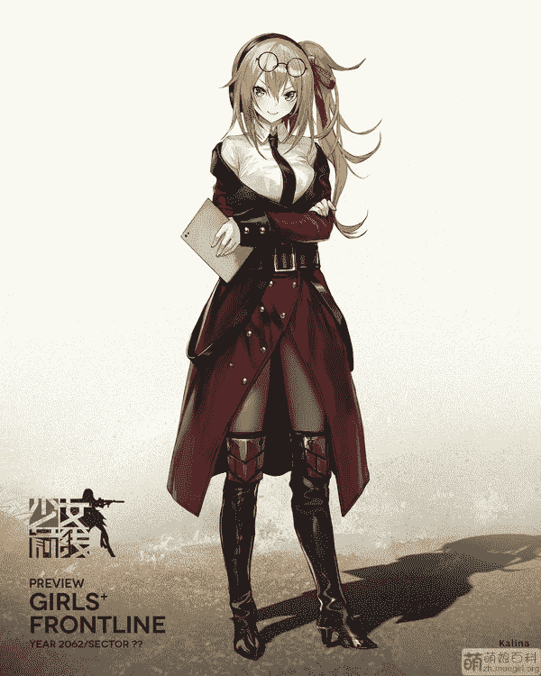</ignore_js_op> **600px-Kalina_in_uniform.jpg** *(107.8 KB, 下載次數: 5)*

[下載附件](forum.php?mod=attachment&aid=Njg3OTB8ZDZhNDU4ZmF8MTYwMDg4MDI3M3wxODIzMHwyMjkzOA%3D%3D&nothumb=yes)

2017-7-15 16:16 上傳 

还是难以平复紧张的情绪阿,毕竟能在格里芬中工作可是很挑人的,敲了敲眼前那扇门,脑袋中都是满满的第一次面试必胜的那类内容走入了这个巨大的区域,眼前是张巨大的桌子和椅子,也对呢....面试官应该是格里芬的人型吧....

坐在了那相对起来真的很小的椅子上,对望着眼前巨大的桌子,有种奇妙的感觉,但这也使自己更加的紧张了

此时旁边那扇巨大的门响起了门把手转动的声音.她来了吗,现在才开始整理起自己的仪容,拉了自己的衣衬,调整了领子,试图让自己看起来整齐些

门逐渐逐渐被打开，一个看上去还很年轻的女孩走了进来.她美的令人看呆.她朝我看了一眼,没有说话，走到了她自己的桌前。

坐了下来，翘起了二郎腿，将整个腿部曲线暴露在了他的面前,完全丝毫不在意这底下的小家伙。

那腿部的曲线以及若隐若现的肤色,紧实的丝袜更衬托出了她的线条,看起来是真的非常吸引人目光的大腿,虽然大腿都比自己还要巨大了,但以这样的视角看来却一点也不胖更不会影响美观,反而继续有着另一种粗暴的美感

当她在走动时,地面还有些震动着,鞋子发出了与地面碰撞的清脆声响。她拉开椅子坐下,翘起二郎腿时,双腿交缠着让人目不转睛地想盯着那里看,不行...! 这会毁了面试的,连忙抬起头,仰望着巨大的她。

她没有说话，开了旁边的灯，翻阅着资料.似乎在认真阅读着

见她认真地翻阅着资料,或许还有自己的履历,虽然不清楚是怎么印出等比例放大尺寸给她看的,但这时候才开始担心,会不会有错字,会不会弄错甚么

“......”

翻阅了一段时间，格林娜才把手中的一堆a4纸放下，开始打量起地上的小人

她..看过来了!! 让人更加的紧张,被一双巨大的眼睛盯着

“你就是今天来面试的？唔....名字...”

她看了看手中的资料

“不如还是让你自己做个自我介绍好点吧”

她直盯着自己而且是那么巨大的面试官  还是很紧张的,

"是的.....,张国强,亚洲人,现龄22岁,大学刚毕业,我对这这份工作已经有事先研究过,并且我已经深熟的了解文书处里以及一些会计,目前我很有信心担任这份工作"

"而我的父亲曾有是格里芬的外勤作战人员,而母亲也是格里芬的内勤人员,我希望我能像他们一样在这里替妳们工作"

“原来如此啊...."

"是的..."

“看来你的父母都算是格里芬的成员了...”

"没错,但现在母亲退休了...但几年前刚过世了,我与她相处的时间并没有很长"

“不过我刚刚看了一下你的资料，你父母的工作都没有和现在这里有着相关性。那么为什么你会有到我这里来工作的想法呢？”

略带笑意地看着底下的小人

"就是因为与他们不相关阿,像是我的父亲曾是战斗人员,而母亲则是内部的战情人员,我认为我也该试试完全不同的工作,不然总尝试一样的能帮到格里芬内部运作上的就没那么广了"

“没想到你还这么有心呢，对你的评价上升了一些哦”

看了看他的面色，还是很紧张呢,按了一下桌上的按钮,在他的旁边又升起来一张桌子，上面有着一杯水

“别紧张，放松一下，喝点水”

"谢谢...."

拿起了那杯水.喝着,还因为太过紧张呛到了

“我们这边的工作和你的父母他们不一样，没有那么紧张。不过，需要的要求会更高”

“所以我不会因为你父母也在这里工作对你另眼相待的，一切还是你自己的能力”

"了解..."

“22岁...不比我小多少呢...”

"诶....?"

“不过我的真实年龄不会告诉你哦，这可是女生的秘密呢”

"是..!"

少女调皮地晃了晃手指,沉默了许久,刚才的自我介绍也使自己陷入回忆之中,自己的父母....

这样说来...自己也从没见过父亲,据说他都忙于工作,最后那场大战争时期阵亡了,这也更奠定了自己想加入格里芬的决心吧,小时候自己一向是在仓储间和后勤人员一起长大的,也没有实质的和父母好好相处过

母亲也在两年前应病过世了,或许是童年和家人的影响吧,我一定得拿到这份工作 ,跟他们一样为格里芬工作

少女继续翻看着资料

“说起来，我似乎对你有点印象啊...”

"但是...我没有见过您...啊"

“你跟着你母亲长大的对吗？”

"其实不算是,基本上是和仓库里头那群大叔一起的,毕竟总不能把我带进战情室吧"

“也是呢...大概我曾经看到过你，但是你没注意到我吧，我偶尔也会去仓库搬东西呢。你们搬不动的大件货物之类的”

“说起来，你对人形的适应性如何？比如在我们这里，你所在的位置就是团队的办公地点”

“会因为我而影响工作吗”

“毕竟在格里芬工作，就要克服这些问题”

"我会努力去适应的,但基本不会吧,虽然以前没怎么看过人形,特别一起去工作,但既然是同样工作的同事的话,我会努力的"

“那我换个方向问好了，我平时的走动之类都会引起对你们来说的地面震动之类，这些你都考虑过吗，在申请之前"

“以及面对人形的紧张之类的情绪"

"有想过的,对于这点上,我是很能适应的,然后经过时间相处后,基本都能缓解紧张的吧"

“也是，这个毕竟要在之后才能看得出来呢...那么..."

格林娜少许想了一下

“我们这边可是一直会有招待人员的。如果让你来安排一场记者招待会的话，请你简述一下需要注意的要点”

开始问起了实质性问题之后，格林娜的表情就变了。不是那个青涩的小女孩，而是一个货真价实的高层人员

"注意要点的话,第一点,避免过于敏感的问题,第二点请各位有秩序的依序发问,第三点有请各位请位躁动,第四点请各位注意个人安全请勿在招待会后擅自前往其他区域,第五点的话我认为会开始说明这次的议题以及相关内容了"

“很好很好，对于普通的会议来说差不多就是这些问题了”

“不过，在这里的话，你忽略了一个很关键的问题”

似笑非笑地看着那个小家伙

"请问是...?"

“这里是格里芬，不是其他的什么公司。要做会议报告的不一定是人类，还有人形”

“在关于体格差这方面的问题，你一点都没有提到”

"对于这个疏忽,我非常抱歉!"  

双手放在膝上,身体向前倾着,在椅子上鞠躬着果然还是刚出校门的大学生呢，不过，这股精神还是值得鼓励的她清了清嗓子，继续说着

“那么，有人形参与的会议，又该多加什么要点呢"

"请注意脚下与一些个人行为,也请其他记者们请勿过于接近,以防意外"

“就这些了？”

歪着头看着底下的小家伙，悠闲地喝了一口咖啡,桌子下面的腿偶尔晃晃

还有.....什么,绞尽脑汁想着,还真的没想过这个问题呢

“声音问题，文件，对象，记者们的位置...”

一个个词语从格林娜的嘴中吐出

虽然缓慢，却字字见血

"呜..对不起!"

笑着把咖啡杯举过了桌子的边缘，对着下面的小家伙说

“你看，比如这个咖啡杯要是摔下来的话，下面要是有人，那会怎么样呢~”

"会被砸到...会被咖啡烫到...."

“那么，为了避免这种情况发生，需要进行什么步骤处理呢？”

"请注意杯子放置位置以及个人活动姿态"

“为了避免人形的活动影响到记者们，又该采取什么措施呢？”

如同一个精干人员一般，格林娜开始对着下面的面试者开始循循善诱起来

"设立一个独立的区块,可以不影响镜头与记者们纪录活动发问的位置"

“那么这种位置的话，该如何让记者们与人形之间对话呢，又如何避免过响的声音影响听力呢”

"请人形们降低说话音量,或是给予记者们配置抗噪方面的设备"

频频点着头，小家伙虽然开始有些头脑不清,但是只要一旦点醒了他，反应还是很迅速的呢手指敲着文件，思索着，同时也在观察着下面他的表现

紧张的,双手甚至开始用力地抓着自己的双腿,自己...准备得还不够吗

“那么，能告诉我你为什么选择的是这里吗？”

“格里芬的岗位还是非常多的，为什么单单选择了这里呢?"

"我体能并没有遗传上我的父亲,所以我认为既使参加了外勤单位也只能是拖累队友,但我在信息以及字处理方面确有一定的专长"

"在学校也是数据处里相关科系的,所以我认为以我的专业以及能力我选择这里能够达到最大的发挥以及效益,且能最不脱累同僚"

“那为什么一定是格里芬呢，我们这边限制多，工资可不比外面多上多少呢，而且外面对军属可是有不小的补贴，在里面可就都没了哦？”

略带疑惑地问着，毕竟这不是军队或是什么忠诚能盖过一切的地方,单纯选择公司的话，一定会考虑到待遇问题吧

"毕竟我的家受惠了格里芬这里不少,我希望能够给予些回报,毕竟这里也算上我长大的地方吧,待遇上我认为你们是不会愧待员工的"

“原来如此..."

这小家伙对格里芬的忠诚度还是很高的嘛，不用担心政治问题了.不过之后必要的检查还是要做的呢,同时也想看看他的反应呢见着这沉默,不敢发话,深怕会打岔,紧张的,坐在那里,既使有空调还是流下了不少汗水,深怕着...无法胜任这份工作

“那么...”

沉默了一会儿之后，格林娜开始发话了

“你现在还有什么话想说吗？”

“一切你为了得到工作的话都可以说哦”

"我.....如果我不能胜任这份工作的话,那么我会再加强然后会再过来再次面试的,我会准备得更多,既使到最后或许只能当底层的员工也好,但至少能替这里工作,我就心满意足了"

“噗...”

轻轻地笑着，看来还真是自己给他的压力太大了呢

“那么，也别这么紧张坐着了，站起来走到我桌子前如何？”

"知道了...."

缓缓地起身,双腿或许正在发抖吧,有些麻木无力呢,正向前着走近时,到了巨大的书桌前,她巨大的脚与靴子,还有那如巨塔一样的双腿,到最后是那张桌子的底部抬头看着那案前的巨大女性这压迫感以及被阴影垄罩的感觉实在让人心脏好像是被压着一样,相当的不舒服,而且很恐怖....总觉得自己就像是书桌前的蚂蚁一样

“很好啊，小家伙，那么，站稳了哦”

"诶...?"

站稳了站稳什么,地上他所站的钢化地板突然升了起来，同时在四周的位置已经升起了隔板，原来这是对于人类来说一台小型的电梯！而电梯的顶层，就是她的书桌了吧,电梯带着这个不安的年轻人缓缓地到达了格林娜的书桌旁

"吓.."

前方的隔板突然打了开来，看这意思，是要他走上桌子吧,而远处就是格林娜那巨大的身躯了虽然只是上半身，但浑圆的胸部已经被制服紧紧地包裹着，露出了一道非常漂亮的曲线旁边半露着的大衣，更是成为了衬托这胸围而生的绿叶

这张桌子....好大阿,而且眼前的她,更有压迫感了,比起刚才在地上,这是怎么一回事,不禁有些颤抖着不安地踏出了下一步,走上了巨大的桌上,正好穿着那黑色的西装,看起来自己就像是桌上的蚂蚁吧,看着那巨大且有让人感到恐怖压迫的身材,女性象征在衣服设计与曲线下让人更感受到是一座山脉的错觉

看着下面的小家伙望着自己出神，格林娜的嘴角不由得弯了一个浅浅的弧度,啊…和以前的自己好像呢工作能力也不错……细心培养的话，成为自己的得力助手也不是不可能呢……这样想着的格林娜，用手指敲着桌面，露出了一副思索的神情

她手指对桌面,对她而言是轻轻地,但对于在桌上的我而言可是有感的震动,试图保持冷静不想被她察觉,但她的表情已经有了一丝浅浅的弧度,难道是注意到了吗

“怎么了，小家伙？难道这样对你来说也是不小的振动吗”

格林娜突然露出了一副“我很遗憾”的表情

“那么这样的话，或许我不得不说我很遗憾了……”

脸上也已经做出了一副叹息的样子

“因为……”

同时眼角在密切关注着他的一举一动

"对不起.....我会加强的"

鞠躬着,低着头露出着那失落的表情,果然...还是没办法吗....

“因为……你以后可能天天要感受到这样的震动了”

".....!?"

简直如同最会吊人胃口的电视主持一般，格林娜慢吞吞地说出了后半句话

“以后要好好适应呢，小家伙”

"...是! "

或许是松了一口气吧,还跪了下来,整个人倒坐在那里

“噗……”

忍不住地偷笑，赶紧用手掩住了自己的嘴巴

“那么紧张，以后还怎么处理事务呢？以后的事情可是比单纯的一次面试还要重要的多哦”

"我知道了.,我会尽快适应的,我甚么时候...开始工作"

这种冲劲好是好，可也要放到正确的方向上呢。格林娜这么想着，俯视着这个可爱的小家伙

“先别急……”

再次按动了一下桌子上的按钮，一块桌面沉了下去，再次升起的时候，上面已经放了一套制服，再上面有着覆盖着的很厚的一个文件夹

"这些是...?"

“你的东西啊”

"了解...."

“制服是外出时会需要的呢”

“文件夹里面是你需要了解的所有关于格里芬的东西”

“以及工作上的安排和须知”

“还有各种装置的使用方法，比如把你送上来的电梯之类”

看着那在桌上都快跟到自己胸口高度的活页夹,或许......看来还要学的比想象的多呢

“那么，以后的工作，也稍微让我期待一下吧？好歹我现在也算你正式的上司了”

格林娜笑了起来，成熟女性的风韵在这一刻显露无疑,她的性格可与样貌有很大的反差，更别说她胸前的雄伟了,即使对于他来说是极其巨大的高度,以及超级巨大的大小

"是...!"

这时候真不知道该看哪里,有些尴尬,完全不知道该不该看着她

这小家伙再一次失神了呢……格林娜这么想着，故意将双手垫在了胸部下面

“怎么了？在想什么呢”

"没有..."

“我完全可以理解哦？那种心情，只不过……可不要因为看入神而耽误了工作哦”

格林娜决定还是稍微提醒一下这个小家伙为好

"吓..!"

被发现了.....不会...让她留下坏印象吧

“那么，你可以离开，去做些准备了，另外也和团队里面的其他人打声招呼比较好……”

过了一天,一早起来,太阳还没升起,今天可不能迟到,这可是第一天上班,笨手笨脚的穿上了不知道谁设计的制服,相当繁琐及复杂,打好了领带,准备好工作了

靠着"步行"正在这残破的道路上往着自己的公司前进着。

身上还是带着一个侧背的小包,里面还是装满了那些说明书,毕竟以防如何使用走到了那巨大的桌前,看着这说明书,有些不熟练的启动了.但是到了桌上时,前方的隔板并没有打开

"诶...?"

"这个该怎么打开来着....该不会要在这里待着一整天吧...."

露出了一副害怕自己会不会就被关在这里到下班还是怎样子的表情

“噗”

正好从外面走进来的格林娜,看到了这滑稽的景象

“我说……”

“你的办公地点可不在这儿啊”

"我...我不知道该怎么把这个放下来...."

有些无助的看着她.对于办公地点却是无奈的,自己也不想被关在这里头阿.

噗，这小家伙,指了指他的身后.略显无奈地笑着

“你背后不是有个操作台吗”

"诶....?"

好像才注意到一样,这时候才把那到隔板放下来,有些尴尬地走了出去,走到了这张巨大的桌上

“虽然……不是很想说”

“但是……你的工作地点不在这儿啊”

"...?"

她稍许指了指自己书桌对面的一块地方，正是面试的地方

".....?"

发出疑惑的声音看着她手指的方位,那里的那块区域已经变成了玻璃覆盖着的房间而里面则是如同一个办公室一样，不时有人在那里穿梭者

“你的工作地点是那里哦”

"阿..!! 对不起!"

鞠躬着,道歉,在巨人的书桌上有些颤抖着

看着这个不断道歉的小人，格林娜的嘴角又翘了起来,不过，光是道歉可不是办法呢

“要是光是道歉的话，还不如赶紧到工作岗位上如何”

"是!"

向后跑向了电梯的位置,但电梯早已回复到原本的位置,还因为鲁莽的动作,就踏出了下一步,掉下了桌子

“小心！”

格林娜抢上一步，用手掌把他接住了,看着摔到手心里的他一时也不知道说什么好

"啊!"

看来是受到了不少的惊吓,倒在她巨大温暖的手掌中不知所措的看着她

“小心一点啊……”

"是.....对不起..."

把这个冒失的小家伙放到了地上，看着他逐渐跑远，心里还是在为他担心着,不要出什么事就好了

很担心替这里惹上什么麻烦,非常紧张而且更是非常的害怕,走回了办公室,有些尴尬地到了自己的位置里面还有着不少人在和自己打着招呼,看起来没有看到刚才那副尴尬的样子里头的人相当亲切,一点都没有严肃的感觉,太好了呢....还担心同事们会不会不好相处

隔着这玻璃帷幕看着另一头巨大的她...想起了自己刚才傻呼呼的举动,这时候真想找个地方把自己埋了或是想赶快忘记这件事情,当自己在准备写着文书时,地面忽然的震动使自己的笔划了一长条的痕迹,杯子里的水也开始波动地面正在震动着,自己转过身,她才正走过一旁,巨大的脚好像有那一刻踏在自己面前,感觉就要踩到自己一样向后缩了缩

有些可怕....但她...不会踩到人吧....

站在玻璃房子旁边，看着下面那个惊慌的小家伙,看来要适应还是有一段时间呢,只是出去递送一份文件而已，就惊慌成这个样子,你要学的还很多呢，新人~

如果每天都是这样的话....这不行,该准备更多修正带了,我得赶快适应好啊 ,不然文件出错的话会有问题的但当这样想时,她正折返着,似乎又引起了不小的震动呢

"吓!!"

这一次甚至还把文件上画上了更长的一条痕迹

"呜...要把写字的技巧练好才行呢...."

看着自己的团队和那个新来的小家伙的对比，无奈地摇了摇头,回到了自己的办公桌又翘起了二郎腿，仔细地看着自己的文件

小心翼翼地用修正液把那条黑线给涂掉,并且开始补上文字缺少的部分,完全不敢浪费一滴墨水与一滴修正液一样,看来...还必须更努力些才行呢,不然影响到别人就糟了

扶着这张文件,小心翼翼一笔一画的终于完成了,写字这时候就跟小学的孩童没两样,但这也是为了避免她走路震动而做的

"呼....终于完成了"

这时候整个人在椅子上放松着,毕竟工作终于完成了呢,现在还是个新人,工作具体也不会太繁重更不会复杂,在这空闲的时间中,自己把椅子转向了另一个方向,望着她那巨大无比的身躯,以及优美的曲线与面庞,恐怕令每个男人都会想暂留自己的眼在上面几秒吧

毕竟自己的视角是比较低的,从那靴子到诱人的大腿,让人想要贴上去蹭一蹭的冲动,但想到了她的体型与自己的区别....还是打消了念头,到了那惊人且让人感受到什么叫做"山"的雄伟,自己不自觉的脸红,更不自觉地盯着她每一个部分

正好这时候格林娜完成了一份文件的批阅工作，把腰稍微挺直了起来，那对雄伟在她的胸前显得更为挺拔,在制服的紧绷下面几乎有一种会随时弹出来的感觉。当然，如果成真那就简直太美妙了

让人感受到血脉喷张的变化,竟只是她一个正常的舒展动作,在小小的眼睛中,这已经是相当让人感受到兴奋且壮观的盛景了,她发出了一些伸展时的娇音,这远看起来真的很可爱呢....,但她却是一个体型与自己差距百倍的女孩子,自己刚才还被她救了...

不过这时候，格林娜却拿起来了自己的手机，在上面点了几下紧接着，放在他桌子上的手机就发出来了新信息的提示音上面只写着三个字

“不老实”

"诶!?"

有些疑惑着,看了下手机,又看了下她,又再看了手机,又看了她

"我做了什么吗?"

响应了这则讯息

看到下面那个小家伙，格林娜偷偷地笑了笑。毕竟，她现在的身体可已经不是人类了啊

“虽然我很喜欢你看着我的感觉，但是这是上班时间哦”

这样在手机上打字着

"是!'

他传了一个活泼的贴图,

噗，这小家伙...好有活力,放下了手机，格林娜将自己的注意力重新回到了电脑屏幕。而二郎腿又重新翘了起来

办公室中充满了键盘打字中的声音,而办公室并不是完全死气沉沉的,也有人正在上网看着一些影片和讯息,自己的办公桌也有满满的个人化的装饰物,也有人做完工作后果断开始吃着零食,其实大家都跟自己一样工作量并没有太大

那么现在又能做什么呢...懊恼着,而现在她正认真地看着银幕正在工作着,不自觉的继续偷看着她,但这一次正小心着,不断注意着她,当她的视线可能会注意到自己时,马上把视线转移,眼睛开始飘到了她的腿上,无法移开视线了

丝袜的颜色并没有完全盖住她的皮肤色,巨大的大腿吸引着人,眼睛正盯着那美的诱人的双腿,她的双腿不时晃着或是她翘起二郎腿时,让自己感受到了那庞大震撼的诱人双腿,充满肉感与性感线条的双腿,不禁让自己视线无法转移

这样盯着，时间不知不觉到中午了,可正当办公室的人大部分都出去的时候，格林娜看着下面只有了不知所措的他，轻轻用笔敲了敲桌子

"吓..!?"

似乎是要示意他呢而他则在那里张望着,好像一副,大家...去那儿啦的样子

“在想什么呢，这么入神？”

远处的她轻笑着，这小家伙肯定把刚刚自己的话当成耳旁风了

"没有,真的没有"

“别人都吃饭去了哦”

说道吃饭....餐厅在哪里啊....。格林娜回了一个“你懂的”的眼神，接着把话题转了开来

"那么....餐厅在哪里.."

“本来餐厅出门跟着指示走就到了，但是，今天下午你和我出基地一趟"

这样说着的她已经站了起来，整个人正朝着玻璃箱中走过来而他却露出了一副,你在说甚么? 我不懂的表情

“刚刚收到消息，一座城市的老城区拆迁工作似乎进行的不顺利呢，还有暴力抗拒的。似乎，里面有问题”

这样说着的她，语气严肃了起来，看来那边的问题并不小

"了解....,但为什么是我要去,其他前辈们..."

“团队里其他人经验都不错，所以这次你和我来，看一下格里芬是如何处置这种事件的。你知道光记住手册上写的东西是完全不够的。”

这样说着，她整个人已经走到了玻璃箱跟前，蹲了下来。恍惚之间有一种错觉，她和他之间不是上司与下属的关系，而是小女孩在看着玻璃箱内的宠物一样,那眼神完全是在看着可爱动物的感觉。

"好的..."

也是呢身为一个菜鸟是必须要学习经验的,但注意到了她真蹲着着自己,总有股旗妙的压迫感玻璃箱前方的门已经移开，格林娜那巨大的手掌已经躺在了那里

"...?"

“这也是你必须要习惯的呢，以后还会经常坐上别人的手哦”

怎么听到这句话感觉自己就跟仓鼠一样啊....

“这次有陆路，我带你过去”

"知道了...."

小心翼翼地爬上了她的手掌,但在手心时还是站不稳的跪倒在手心上搀扶着。看着下面那个小家伙，果然，还是要一步一步慢慢来呢

“抓稳了哦～”

这样嘱咐着他，慢慢站了起来,站起来之后，看着手心上的他，笑着说道：

“那么，是想在外面看看风景呢，还是在口袋中睡一觉呢”

当她站起来时,还因为高的急遽变化,在她的手心微微发抖着,毕竟....会怕高呢

"我...."

不知所措着,此时自己还因为这些高度而微微发抖着,腿软的不能站起

“这样子可不行哦，要尽快适应起来呢。”

格林娜有些不开心地看着他。这样害怕的话，以后还怎么适应四处跑的生活...虽然直升机确实可以用，但是直升机哪有被人形带着走方便呢

"可是....我...我会怕高"

连飞行器都不敢坐了呢....所以自己才有很大一部份原因选择内部单位阿

“怕...高吗？”

格林娜面露出了难色..

“那么只好让你在口袋里等着咯？不过，里面肯定会有点闷呢”

指了指自己胸口上的口袋，正好处在胸部的位置盯着她手指的那块....不会..有事吧....

"口袋...."

格林娜没有说话，静静地等待着他的选择。毕竟，恐高症不是能迅速克服的东西呢还是无法应对自己的恐惧,

"我....待在口袋里面就可以了...."

感觉自己真的要变成仓鼠了一样      

“也是呢，慢慢来吧”

格林娜用另外一只手打开胸口的口袋，把那只手放了进去，在确认他坐好了以后，才把手缓缓地拿了出来。

一路上晃动着,靠着自己身后的"巨墙" 那可是有弧度的那是她胸前的山脉而口袋中原本是为了夹着笔或手帕还是其他东西的根本没想过会把人装进来吧是非常挤得 自己基本上是被挤压在胸与布料之间,但也是因为这样才比较安全吧...晃动着晃动着 感觉很晕 感觉很温暖 又有种让人安心的感觉

“我们到了”

仅仅过了将近一个小时，口袋外面就传来了格林娜的声音，接着，同样的手又将他带了出来。刚被放到地面时,还有些晕头转向的站不稳,感觉自己刚刚坐了一趟,不太刺激的过山车,但依然颠簸,外头是一片破败老旧的建筑,完全是三战以前的建筑物,有些甚至残破的用帆布来遮盖缺口

但还是没有看到她说的那些"暴力抵抗",难道是抗议和暴民吗....但都没有看到那些人的活动迹象,是躲起来了吗....这时候好像就有好几对眼睛正在盯着自己的错觉

看了看下面的景象，只有不少民众在和拆迁队伍交涉着，而更多的人则是惊讶地看着自己

“小家伙，我越来越觉得这件事不简单了”

"这里看起来很...平静啊?"

格林娜坐了下来，面色严肃地对着他说道

“不觉得有些平静过了头吗？你回想一下普通人第一次近距离看到人形会是什么情景吧”

"害怕....?"

格林娜完全没有了平时开朗的眼神，眉头也皱了起来

“对，但这里的人完全没有乱套呢...”

"或许这不是第一次了吧"

“不知道是不是因为我被改造过的原因，我可以清晰地看到他们的动作，那种感觉不像是害怕，而更多的有点像是...激动？”

"可能是太慌张了?"

“小家伙，我有点后悔把你带出来了，这里需要的不是我们，而是战术人形与警察”

改造...听不懂她在说甚么,但是激动,这可能是太害怕了吧,耳朵稀疏的听到了几个快速的脚步声,有人正在附近...

“不过，目前只能走一步看一步了...”

“先按照一般的程序处理吧，不过在这之前，我们，先吃饭”

“先要把肚子填饱才能开工呢，小家伙”

"知道了"

此时一个戴着黄色安全帽的工人走了过来,

"你们这些格里芬的人来的真慢,这些家伙可害我们忙了好久了,迟迟无法下工,我的人还有不少都住院去了"

他递来了一个温热纸盒,

"这个给你,你铁定饿了吧? 拜托你们了,让这些家伙安分一点吧,不然我这儿可是很麻烦的"

此时一辆辆拖板卡车也开了过来,上头有着格里芬的标志,拖板上放了巨大的便当盒和一瓶巨大的铝箔包果汁

"好大啊.....还要用卡车才能载的动..."惊叹着

群众们看着这车队的到来以及一个格里芬人形,多少安分了些,但还是有不少激动的人再对人员们啷嚷着,这时候感觉到了更多的不安,直觉告诉自己,好像随时有人会拿个大棒敲晕自己一样几个细碎的脚步声,几个穿过残骸间的身影,都让人感到不安,

轻易地拿起了卡车上费力拉过来的便当盒,拆了开来，就坐在那片老城区的入口处，人群的旁边开始吃了起来，巨大的咀嚼声回荡在这一片区域,也不知道这种威慑能不能起到效果呢

虽然心里是担忧的，但是在脸上还要做出满不在乎的表情，甚至还要故意吞咽的时候发出声音，也真是难为她了,她同时也借着这段时间观察着下面的情况

听到她巨大的咀嚼声不经害怕着,自己到底是多弱小阿.....这只是一个女孩子的咀嚼声而已啊.....脑袋甚至开始胡思乱想着,此时自己坐在一旁的长椅上,也不敢吃东西了,这巨大的咀嚼声正在震摄着自己,不明所以的恐怖好像蔓延了起来,心里好像害怕着被她吃掉一样

而此时自己把饭盒和筷子放了下来,没想到....人们都安静着,原本机动吼着的人们也闭上了嘴巴,甚至街上的人群还少了些,看来大家....都跟我一样会害怕呢.....

或许反抗的群众和那些暴力份子都随之退去了吧,自己脑袋甚至跑过如果他们真的把她惹生气了,或许会直接夹起一个人把他吃了.....她不是那种人吧应该不是吧

慢条斯理地咀嚼着，虽然其实并不算很饿。借着这个机会扫描了一下整个老城区，除了那些对补偿条款还有所不满的人以外。这里似乎没什么其他的人呢

难道真的是自己多心了吗？格林娜这么想着

很快，饭盒已经空了，随手放到了旁边，正好处在一片矮房子旁边，又拿起了那杯几十米高的饮料喝着，喉咙不时划过“咕嘟”的吞咽声

几个穿着灰色数位迷彩服装的身影从自己眼前不远处的建筑残骸间跑过,但他们手上好像抓着什么,是自己看错了吗.....忽然有股强大的力道打在了自己的后脑,随之就是一震晕眩,这时候才发觉那些人已经跑到了自己的深厚,而手上抓着的正是一把三战时期的步枪,而击中自己的一定就是枪托了吧,

倒在地上晕眩着,除了痛外没了知觉,而自己也没法移动了

"格里芬的混蛋!"

一个充满异国口音的声音   

那家伙正驾着自己,他穿着的正是当时某大国的城市迷彩,他的手枪正抵着自己的侧脑,而我也无法发出声音叫喊着,害怕的颤抖着,

"敢靠过来我就让这小伙子的脑袋开花!"

“小家伙！”

此时几个反抗份子也从建筑物中跑了出来,步枪指向着巨大的她...虽然他们也很清楚这些武器没甚么用就是了。

害怕的望着她,好像祈求着她拯救自己

格林娜惊讶地地低呼着，而旁边的人们不管是拆迁队还是群众都惊讶而害怕地向后退着

“你们是什么人”

稍微稳定了一下自己的情绪，不能让自己也被他们控制呢，盯着那些人发问者

那家伙好像就是他们的领导,他的枪抵得更紧了,手指也靠近了板机,激动得好像随时要扣下

"妳们这些混蛋忘了吗? 这里可曾是我们的城市! 我们绝不会让格里芬控制这里的!"

“原来那些人还没全部消灭完吗...”

在心里默念着，稍微闭起了眼睛，马上又睁开了。看着他们一字一句地从牙缝里挤了出来

“说出你们的 要求”

"撤出这里的所有驻军! 停止控制这里! 然后滚出我们的祖国!"

他越说越激动时,都担心着他走火或是扣下板机,而自己也只能害怕的发出懦弱的声音,自己变成了人质可真是件恐怖的事情,甚至有些后悔跟她来到这里

但是战争都结束多久了....为甚么,敌人的残军还会在这里活动...自己为了试图冷静下来继续保持着思考,但很快的又被那冰冷的枪口给吓着

“我可以暂时退出去，驻军的事情我必须向指挥官汇报。但我不希望他受到任何一点的伤害。否则，不要怀疑我可以让你们的国家再也不复存在"

此时的格林娜脸上也是一片冰冷，同时也有点懊悔，为什么要把他带过来，自己有着不可推卸的责任呢,可恶啊，自己并不像那些战术人形那样有着武器装备呢

"别想耍小聪明! 在那之前! 这家伙先待在这! 如果你们敢做甚么,我就毙了他!"

他们俩正在交涉着,但这让身为人质的自己更感到害怕,但得待在这里,独自的待在这里,却感受到更多的威胁感

此时一阵阵地风刮着，在地上吹起了不小的尘土。毕竟这里已经快变成工地了呢...

发抖着,对于绝望以及被枪直接顶着威胁的恐惧,无助地望着她,深怕着她真的留下自己

格林娜看着地面，脑子飞速地思考着,一边在和那个头领交涉，另一边则在给那个小家伙打手势，一根手指做出了类似于趴下的姿势。

“也不知道小家伙看得懂么...拜托了啊，了解我的意思吧...”

格林娜心中焦急地想着

她想要做甚么....,那家伙枪正抵着自己啊,如果乱动的话...我就死定了随后又用手稍许做了个挖掘的动作，手指之后又向上翘了翘"不行啊这是我能做到的极限了，幅度太大肯定会被他们发现的..."

这样想着的格林娜，双脚在鞋子里不停地扭动着

挖....难道底下有甚么吗....,但是,会死啊!  他铁定会开枪的,用着许可范围的力量摇着头,不行的啊! 这没办法啊!

格林娜又试着做了一遍这个动作,不过这一次，沙土淋在了自己的手指上

那名士兵好像注意到了什么,但这是注意到自己驾着的那家伙而已,并没有看到格林娜的动作

"你在想甚么!? 别想乱动! 不想死的话就给我配合"  

"小家伙....求求你现在别迟钝了啊...趴下来就行了啊...我的反应可比他们快得多了"

这样想着的格林娜，手指已经开始准备发力

呜....如果自己也有更多的勇气就好了,算了! 不管了!! 拜托了.....神啊....卧倒了下来,手抱着自己的头

"你这混蛋! 你在做什么!?"

他的枪指向了自己,正怒吼着

就在这一瞬间，格林娜的那只手已经插进了下面的地里开始发力，瞬间朝着几个人的位置掀起了一大片的夹杂着细碎土块的烟尘,而就在所有人都被雾给迷住的时候，一只巨大的手瞬间从天空中伸下来，把他从几个人的包围之中拎了起来，放回到了自己的口袋之中

还好，算得刚刚好...

心有余悸的格林娜，长出了一口气

当回过神来时,又回到了那个狭小的空间,但也因为过于的害怕与恐惧而昏厥过去了,在她胸口的口袋之中,这里...是最安全的吧

因为沙尘覆盖住了眼睛无法确认视线,咳嗽着,手上的枪一而在的扣下板机,这样下来那家伙也死了吧!当烟尘散去时,刚才自己还架着的年轻人已经不在,只有地面上几个弹孔,

"可恶....那家伙去哪里了!?"

但这时候视线转向那巨大的人形,只能把枪无助地指向她了, 失去谈判筹码了此时的格林娜已经站了起来，居高临下地俯视着他们,而那只巨大的靴子已经抬了起来,就在他们的上空

当她的脚抬起时,板机已经扣下,不断朝着巨大的她开火着,希望能有些影响或奇迹,但很显然的....是徒劳无功的

“五秒钟，丢下自己的武器双手抱头蹲下，你们还能活下去”

冷冷地说着，对于这种恐怖分子不需要有太多的同情呢有些人人照做了,但是以首领为首的却毫无作为,

“那么...”

前脚掌降了下来，变踩为碾，精确地覆盖了那几群死硬分子剩下的人都被巨大的冲击力给弄的坐倒在了地上接着鞋底就开始在地上摩擦起来。并没有再次抬起，毕竟，还有普通民众在这里呢

不过很多人也是被吓得不轻,此时警察们已经赶到了现场，把那几个已经吓得有些崩溃的人带离了现场,而外面的人们也是惊慌地看着那个巨大的身影

当人们看到她辗着那几个人时,就知道了很可能....都变成一团非人形的肉酱了吧,有人正惊慌地抱着头掩护着更有人吓得不清的呆站在那里,当警察安抚着他们,把他们带离时,顺便把几个投降的反抗分子给押走了

“那么...”

格林娜脱下了自己的鞋子，放到了卡车上，避免再吓着人群之后，走到了那些有着不满情绪的民众面前

“你们对拆迁协议有什么问题吗？”

看着那几个反抗着人们落得那种下场,人们不禁疯狂地摇着头,虽然是很平常的问话，但是很明显能听出来，她的心情不好

“既然没有问题的话，等会儿就把协议签了吧，顺便我也做一点拆迁的工作”

接着，她就朝着那片城区走去，直直地走了进去，因为里面没有人了，所以她就直接踩在了那些老建筑的上头,巨大的丝袜不断地接触到那些建筑，响亮地声音不断想起，这一路走过去也不知道毁坏了多少建筑

而人们签下了那份文件,然后着她这样踩踏着那些建筑,害怕地想着,更想起了刚才被她踩死的那几人

当一圈走过，又再次走了回来的时候，大半个城区已经被她踩平了。也免去了拆迁的麻烦工作。这也让拆迁队的工头不禁打了个冷颤,原本要数月拆除的房屋,她三两下都就踏平了

“真是的...警察部门都在干什么...这种地方都能冒出来持枪恐怖分子...”

嘴里念叨着，格林娜的巨大的脚站在地面上，看着她，又看着那片已经几乎成为了废墟的城区，很多刚刚抗议的人都打了个冷颤,毕竟，格里芬给出的价格并不是不公道，来这里抗议很大一部分是贪念作祟吧。不过，似乎自己是被金钱蒙蔽了双眼呢

“那么，现在还有什么问题吗？如果没有的话，我以后不希望看到这种情况再出现了。毕竟住在老城区很不安全是吧，很容易塌的。”

这么说着，格林娜严肃地俯视着他们

大家乖巧了起来,乖乖地配合着,她说的都只会想乖乖配合,不然她只要不开心....一脚踩下来.....自己连尸体都没了,毕竟她刚才轻松地踩死了好几个人,脸上一丝表情都没有,而那片城区却像是玩具或沙堡一样的被踩碎,在想想她如果采在自己身上会是甚么样的情景

都不敢想了,只是配合着,深怕着她生气

当再次醒过来时,意识到自己正在她胸口处的口袋,听见她正在和其他平民交涉着,自己怎么会在这里...刚才那是恶梦还是怎么一回事,无法马上反应过来的他,在她的口袋中动了几下

“呀.."

反应过来他醒过来了，在结束了和平民的交涉之后，在旁边坐了下来，把他从口袋里拿了出来

“没事吧，小家伙？”

有些焦急地看着他

"我没事...刚刚怎么了..?"

“我把你从那些人手中拎出来了”

“这次是我不好呢，把你带出来结果就遇到了这种事...”

看着她,心里也有一丝愧疚

"是我的问题吧...没有注意到他们,而且...还得麻烦妳,谢谢妳..."

“你...”

一时间也不知道该怎么安慰他，只是用手指轻柔地抚着他的背脊，试图让他感觉好些她的手指忽然靠了过来,还挣扎了几下,但不明所以的感觉非常的舒服这时候才发觉自己就像是她的小宠物一样

“小家伙，感觉好点了吗？”

关切地问着

"恩....对了那些人怎么了?"

“被警察带走了”

为了不再惊吓他，撒了个小谎，故意省略掉了那几个被踩死的人

“之后要好好审问他们呢”

"原来阿...刚才真的吓到了呢.....差点以为就要死掉了"

再次露出了感谢的神情,望着那巨大的她,

"对了....到现在都没问过呢,该怎么称呼您...身为一个下属竟然不知道自己上司还是救命恩人的名子...."

"噗"

看着这个迟钝的小家伙忍不住笑了起来,不过转念一想，他似乎确实不知道自己的名字呢，不管是面试还是今天都没问过

“我叫格林娜哦”

"是个很好听的名子呢...."

虽然自己知道他的名字，不过更愿意叫他“小家伙”呢，毕竟，他好可爱啊

“小家伙，还站得起来吗？”

"可以"

她怎么总这样称呼我,而且她的表情好奇怪......脸有些红红的,眼睛有些瞇起来的看着我

“那么，是不是该继续我们的工作了？”

"知道了...那么我该做甚么..?"

“我想刚刚那些人只是因为看到我的行为被吓着了吧”

指了指那片废墟,有些不好意思地说着

“你的任务就是给那些人准备协议，解答疑问，让他们至少不是被强迫接受的”

“我会在这里等着，有问题就可以来找我”

"我知道了,谢谢..."

说着，把他放到了地面上,当被放下去时,才注意到她脱掉了鞋子...好大的脚阿....如果被踩到的话一定会很糟糕吧,上面还有些建筑的水泥碎屑和砂土...

"对了...您的鞋子哩?"

“啊...脱了...让卡车带回去了...”

慌乱地解释着...

"原来阿....请小心点吧,这样直接踩在地上,会很脏或受伤的...."

向她微笑着,然后缓缓地走向群众,说话有些打结,经验相当不足的向他们试着解惑着,当然有很多时候是对于大部分内容都没搞清楚的,还不时望向了她,露出了一副,我真的不知道这里的情况,的表情

幸好有身旁的警察协助,才得以脱身,他们甚至比自己更了解且专业的讲解着都市更新计划,并且解说着这带来的好处有多少,房价上涨阿,土地涨价阿,交通便利阿,建筑安全性等等的,也吸引到了不少住户的目光,更重要的是能分到精华地段的房屋供他们居住这件事,还愿意包办一些家具和补偿金,这听起来确实划算

就在这一刻,或多或少民心已经偏向了另一侧了,不只是她的压迫,更是格里芬在此执行多个计划的贡献

当工作大致完成之后,虽然这些都是麻烦了当地的警察才完成的....有些对不起他们,最后缓缓地走向了她的前面,仰望着她好像是报备着自己的任务完成了一样

笑盈盈地看着下面的小人，终于迈出了第一步呢，虽然这第一步可能有点惊险来着

“工作，完成了？”

"是的....虽然不完全是我完成的就是了..."

“虽然有些磕磕绊绊，但是对于一个第一次面对这些的新手来说，还不错……”

"嗯...不过刚才还是吓到了...幸好有妳的帮忙,而且他们还被警察带走了呢...太好了...."

赞许地看着他，或许这对于他来说也会是一笔很宝贵的记忆吧，不过……

“不过说实话……你的身体……还是……需要锻炼一下”

有些迟疑地点了出来，毕竟这个团队什么都要涉及，不只是本职的文书工作，在各地跑来跑去也是所以，拥有一个强健的身体是必要的呢。

"对不起..."

看来之后...得是着锻炼自己的体力了呢....不能只当个总得靠她的存在...这会扯后腿的

“唔……这个周末你有没有时间来着”

"没有特别的安排...怎么了吗?"

“一起……去健身如何？我会安排好的”

"知道了....只是...."  

盯着她....这种体型差距...

“这个你放心啦，到时候你就知道了。不过不是模拟系统哦”

似乎看出他在想什么，特意否定了一下

"知道了...我会准备的"

"那么现在……我们回去吧？"

手又伸到了他的旁边

“这里的工作似乎完成了呢……”

“如果还有不听话的话……”

最后那句说的很小声，也不知道小家伙听到了没有,缓缓地爬上她的手

在她温暖的手掌上,总感觉着自己总是在扯着她的后腿....刚才还被抓住,得靠她和警察救什么的,还会怕高...体力又不好,感觉上自己根本就不能做好工作吧,有些失落

“要站起来咯”

轻声提醒着手掌上的他，缓缓地站了起来，尽量不让震动影响到他

因为高度的变化,不禁使自己有些害怕,甚至不敢站到手掌的边缘,乖乖地在手掌心上,不行的....这样下去,难道总要进去她的口袋里面吗....但...又不敢待在外面....

“怎么了？是不是有话想说？”

似乎看到了他有些犹豫迟疑的样子

"我....我..我这次可以不要进去口袋里面吗....."

有些颤抖着,与自己的恐惧对抗毕竟是件不简单的事情

"...?"

他到底是怎么了,似乎在自己的手掌上有些颤抖

"我...们回去的时候我可以不要进去您的口袋里面吗....."

“咦？”

有些奇怪，来的时候明明不是他自己要进口袋里的嘛,有些疑惑地看着他

"我不想要....给您添太多麻烦..所以我想要...试试..看,不然..我"

比起在地面上而言,在这里他结结巴巴的颤抖着试图将一句话完成...

“吓着了？”

伸出另一只手，用手指抚摸着他，试图想让他镇定下来.一时之间也不知道怎么办好，毕竟恐高这种东西……不是吃药什么就能治得好的啊

被巨大的手指头给抚摸着,感觉相当的奇异,总觉得自己现在根本是她掌上的仓鼠一样但不知为何 冷静了许多   

"不是....我想要..解决怕高的问题....我不想这样下去...不然每次出来都得这样....."

“也是呢……不过，你这个样子，真的……没问题吗？”

原来这小家伙竟然还有这样的勇气啊……越来越欣赏他了，不过，这样真的没问题吗？

"我...我可以的.."

一点气势也没有,但不解决的话....难不成以后都得一直待在她的口袋里面吗.....总感觉这样下去自己会很没有面子的.....而且又会影响到她吧,有点犯难了呢

“不……不要勉强啊，不然我真不一定救得了你……”

虽然这身体已经变成了人形，但是毕竟反应速度还没有她们的那种水平啊,总会有点差距的，而如果真的他一失足掉下去的话……有点不敢再想下去了

虽然她这样说  总觉得待在外面...会给她找更多麻烦,心里就呈现了一阵子的冲突,有些阴沉的坐在了她的掌上,难道....只能这样懦弱下去吗

“怎么了……啊抱歉……我不是真的想这么说你的……”

“你……你如果坚持的话……”

有些慌乱的解释着,但这时候自己才想到....待在外头,又该在哪里呢...,想着如果是在她的肩膀上....有晃动掉下去的话....! 不行不能因为这一点问题就轻易放弃的,在自己的坚持与恐惧下...彷佛要被撕裂一样感觉怎么选都不是很好啊....

“先……先在手掌上试一下吧……”

有些为难地说着

"麻烦您了...."

毕竟，这对他来说已经有百米多的高度了啊，肯定很吓人吧。在这至少三十几层楼的高度....还是站不住脚的应该说只要离开地面就会有些发抖了吧

于是用托着他的右手做出了一个弯曲的手势，为了防止他滑落，还特别向内收了一些而左手则护住了一边，另一边则是大拇指的区域

“小……小心啊……”

有些迟疑地说着

"知道了...谢谢您"

但还是没敢站起来,还是我的腿已经失去知觉了....为什么! 为什么我连这点都做不好...当她的另一只大手护了过来,有种自己被她保护着的感觉....有些安心,但也有些自叹为什么还得让她担心呢

担忧地看着他，毕竟这东西不是一朝一夕能练出来的,突然有些恨自己为什么会有这么高了，要是两人是相同的身高的话，也不必有这种烦恼了吧,这还是变大以来第一次呢

完全不敢看看她掌下的地面,如果....从这么高看下去的话,一定会晕过去吧,这也是人生中根本不敢到达的高度.....

所以连房子都是租郊区的平房,连大楼都不敢住,忽然觉得自己连生活都那么懦弱,那么跟这个比许多高楼都还巨大的女孩子一起工作...完全是在找她的麻烦吧

“小家伙……你……”

完全不知道该说什么了

但幸好自己依然敢在这掌中抬头看向她,她的表情有些担忧着,不免让自己感受到更大的打击

"我...."

“？？”

犹豫地看着他,到底想要说什么呢,还能继续进行下去吗，关于勇气的试炼

"对不起...还是麻烦您了....还害您担心....那么.....我们回去吧..."

心理满是歉意吧,毕竟害她担心了...还因为自己只是想克服恐惧这种理由,低着头,好像准备好挨骂的样子,

“回……回去……”

有些犹豫,看到他那害怕的样子

“那么……我要走咯……就算……”

“就算你等下想反悔我也不管了哦？”

有些赌气的样子，不过，还是欣喜的

"我....."

仔细想想幸好自己会晕过去不然总比被迫在这高空继续待着还好吧.如果掉下去的话.....还是不要想好了,不然等等把自己给吓晕了

"知道了....."

“恩……”

轻轻点了点头，开始迈起步子来……很小心地，生怕颠簸把他给吓着了

在她手掌因为每一步而摇晃着的时候,自己都试图忍住惊叫声,害怕着让她担心...,但更闭紧了双眼,欺骗着自己其实不是在那么高的地方什么的,她踏出了几步,没多久自己就完全趴倒在她的手掌上了,完全不敢动,害怕着乱动害自己翻下去,还是一样....懦弱的趴在这里,自怨着为什么会那么怕高....连这样都快吓死了

如果被她知道了自己现在的样子....但自己也不在意了毕竟恐惧已经蔓延了全身了。

虽然他刚刚这么逞强，但是实际上心里已经在发慌了吧,这样走着的格林娜，心里想了一下，又低头看了他一下,果然不出所料，这个小家伙已经趴在自己手上瑟瑟发抖了“你没事吧……”

但已经走了一小半路了，反悔已经来不及了

"呜....!"

还在她的手掌上发抖着,不断祈求着自己晕过去或 这趟路途赶快结束

“小家伙……给我睁开眼睛！”

突然，格林娜的声音大了起来。没办法，为了根治他的恐高症，只能下猛药了乖乖地张开眼睛,但还是趴在上面发抖着

"不要把我丢下去.....拜托您了..."

不知道为甚么说出了这句话,害怕的看着她 好像正害怕着她生气的对自己做什么 毕竟自己那么小 她想干嘛都不能抵抗吧,对她而言我就只是个虫子吧,现在发抖的原因不只是因为高度了吧 更还有她让自己害怕的声音

“睁开眼睛好好看看下面！”

用手指把他拨弄到了指缝的位置抱歉了啊……小家伙，我也是为了你好，只要你能挺的过去的话。

"啊!!!"

害怕的叫着从这里摔下去的话会死掉的

“别慌！给我镇静下来，好好看着下面，然后跟我说说下面的情况”

强迫他思考着吧，这样的话，只要分散他的精力，应该也就不会太关注高度的问题了被她逼着到了这里,盯着底下的道路,但这高度....还有种就会掉下去的恐惧感

"这...这里很高......拜托了..."

颤抖着,祈求着她放过自己继续这样下去。

“好好睁开来看，你要是现在闭起来眼睛的话，以后一辈子就摆脱不了阴影了！”

手指稍许加了些力道按了上去，防止他因为恐惧而挣脱自己的控制也算是给他加了一道保护措施吧。

既使这样说,也没办法啊,被她的手指头给压着,自己哪里都逃不了,这样反而让自己更加的害怕,

"我...我....我"

强制看着地面那片她正行走着的地方,晕眩感正在传来,感觉自己随时都要失去意识

"拜托了....放过我吧........我快要....."

“你要是再这样的话，我可真把你丢下去了哦？”

“这样软弱的下属，不需要呢”

没办法啊，这时候必须得硬起心肠来，不然他一辈子摆脱不了这个阴影啊会被丢下去.....会摔死的,会摔死的!  如果....唯一待在她掌上的办法就是这样...我宁可试试看,不然..被丢下去...呜! 太可怕了

"底......底下,是一条路,没...没有车子....."

在她的掌上颤抖着,深怕着她真的把自己从这个高空丢下去

"我..我求...求您了 不...不要把我丢下去"

“很好”

“你还是稍微有点用处的……”

“那么，继续看吧”

硬着心肠冷着脸说了这句话

"呜....."

"现在地上....在妳的脚旁有些农地....."

心跳还是很快的,被她逼着看着地面相当的害怕如果现在晕过去的话....她会把自己从这里直接丢下去吗.....不敢多想不然被她认为自己不敢往下看的话真的就会被丢下去了

“很好...那么，现在听着我的话，深呼吸几口气”

这样说着，同时手指放松了一点，保持还能控制他的同时给他放出了更多的空间

照做着,但双腿还正微微的颤抖着

“那么现在去试一下，数数有多少块农田吧"

发出了下一步命令，进一步试着转移他的注意力

"是一片片的.......很远的地方还有个村庄..."

“试一下数数被分成了多少块吧"

"有几十块......"

“一块块数，我要知道具体的数量”

必须让他通过这样子的训练来克服对高空的恐惧感呢,不这样改掉的话...不敢再想下去了以后肯定会出事的吧...小家伙，加油啊。

格林娜在心中默念着

为了不要被她丢下去迫使自己计算着  也是为了让自己活下去....,好几次快要晕过去,想到她会把自己就这样丢下去,可能尸体还会被她的脚给踩过,过相当的害怕

"有27块...麦田,和..和12块甚么都没有种的田块.."

“很好...”

看来小家伙还是挺过来了呢,那么接下来，就要更进一步了

“接下来一个任务，站起来!"

“你难道指望在我的手掌上趴一辈子吗”

"呜...."

缓缓地爬了起来,但还是害怕着自己会摔下去,最后只是跪着

"嗯?"

故意从喉咙里发出那种不满的声音，同时左手的食指已经屈了起来，搭在了大拇指上，一副要把他当成虫子弹下去的样子

"不...不要...拜托..您了"

颤抖着,害怕着,我...在她眼中果然是个虫子吗...拜托您了...我办不到...我...

“站起来”

有些颤抖着站了起来,双腿正明显的抖动着,一副快哭出来的样子

“不要害怕"

“转身，从我的手指缝里再看看下面”

一连串的命令从格林娜的嘴里吐出,有些不近人情，不过，别无选择，要是在这里倒下的话，就更不可能祛除这个阴影了

乖乖地向下看了,只差的没有后退几步吧,毕竟这么做的话.....一定会被她当成虫子弹下去的! 刚进来没多久...就这样什么的

“现在还是像刚才那样吗？”

语气软了下来，不然再强硬下去的话，这小家伙估计就快崩溃了,毕竟是在职场打拼了多年的人呢。格林娜对于心理调节这种事已经了如指掌了

但当自己被迫从这里往远处看时.....才注意到这是平常不太可能有的视野一片金色的麦田正结出了丰满的麦穗,正随风飘扬着,而远方的山脉在这衬托下总感觉跟一幅画似的,虽然有风吹过来根本一点都不想受,是怕死了,但...这里的风景真的很棒这时候从上而下看着这一片的麦田,与平时的金黄一片完全不同,反而能看着随风摆荡时的波纹与全景,不知道为什么总觉得相当的让人愉快

这时候就跟小孩子第一次到观光飞机上一样,紧紧的贴着她的手指,在手指缝那儿看着底下的风景,这或许是最大的突破了吧

“呐...小家伙，这里的风景很美吧...”

"是....."

格林娜注意到了他的变化，此时再驻足远望，不由得自己也看呆了

“要是你现在闭上眼睛，可就完全错过了呢”

“现在好点了吗？没有刚刚那么恐怖了吧?"

口气已经和刚刚的冷面上司完全不同了,更像是一个关心人的大姐姐在问着

"谢..谢您"

“和我没什么关系，是你自己克服了恐惧哦”\

她开心地笑了起来，手掌稍微有些颤抖，不过很快平静了下来。还不是妳逼着我看的吗...刚才还以为自己真的会被她弹下去了....她手在抖动的时候还以为着自己会有可能掉下去而摔倒在她的手上

每当看到他笨手笨脚的样子，仿佛就想到了从前的那个时光。那个当自己还是人类，铁血还是敌人，一切都没发生的时间 old times never back～

回过了神，又看着手掌上的他...真的是很可爱呢

当自己仰望着,才注意到她正直盯着自己,不禁打了几个冷颤....她又想做甚么,不要...难道这次要把我直接拎着陪她走回去吗...不要..害怕的颤抖着

“好啦好啦，小家伙，克服恐惧的训练已经结束咯？”

看着他这么害怕的样子...似乎自己刚刚用药是不是过猛了一点呢。不过，他会理解的吧，这样想着

"所以....您不会把我...弹下去吗...."

担心和害怕的问着她,但她说训练已经结束了.....那么她不会对我怎么样对吧

“刚刚那些话，都是为了让你克服恐惧而说的哦。你看，你现在不是已经能稍微站起来了吗。至少，比起之前趴在手上叫已经好太多了吧”

就这么笑吟吟地看着他

"呜....."

“好啦，不要摆着这副哭丧脸啦。要好好感谢我哦。”换成了小女生的样子，左手点着他这么略带责怪地说着，完全像是变了个人啊

"谢谢妳...救了我好几次了....还帮我....让我不会那么怕高了...."

“这是对下属的关爱哟～要是你一直会恐高的话，我也是会很困扰的哦”

被她的手指点了点,说着是关爱还是让人害怕......这样子自己绝不能告诉她其他害怕的或是弱项了不然....铁定又是....后果铁定不堪设想啊

想着想着自己不禁打颤着,但该不会每种都是要这种极端的方式吧....,原本还以为说内勤会好些的.....结果总麻烦着自己的上司......而且..还得被这样强制教育着

疑惑地又看了看他,这小家伙为什么老是喜欢想事情呢。可恶，要是自己能知道他的想法就好了，不如抽空去问问帕斯卡吧...或许她那里有能解决这个问题的办法？

“好啦，我们回去吧”

有点尴尬呢这个气氛...还是早点回去好了

“啊对了”

在重新开始启程以后，格林娜突然问了起来

“似乎回去也没什么事情了呢，你在基地里有要拿的东西吗"

"没有...."

“那么...我直接把你送回家...如何？”

"谢谢...给您添麻烦了"

“也省的你自己回去了呢”

“没事啦，只是希望城里的人不要被吓着就好了...毕竟我不是管理者啊...”

“不过，城郊的话，应该没问题吧...”

"没关系的,我家就住在郊区而已...."

“那么，小家伙，你来指路吧”

一路上顺着这条路替她指路着,穿过了城外的区域,虽然大家已经对格里芬的人型很习惯了,但今天是个没见过的女孩不免有些慌张,大家都乖乖地靠在路边让路,根本不敢挡住她的去路深怕她一脚踩向人群

她一路上都在和自己聊着,这时候感觉她是一个非常外向活泼的女孩子,但....有些太让人害怕了些,平时都没在这高度好好看过城市,一片曾经是废墟的地方,能重建的如此快速也该感谢她们吧

现在只有市中心和附近的区域有些大楼和商业建筑,而在郊区则是一片临时搭建的房子,还有一些小贩,都是一些过度或是没法买房的人们居住的木制与铁皮混合出来的,基本上都是一碰就散吧,这也让自己有些鼻酸,

这里与刚进来时住商混合的区域明显不同,道路显得有些破旧,还可能是战前留下的,有的甚至还有弹坑,这里更没有什么车辆,是人力拉的木拖车,让人有种回到上个世纪,二十世纪初期的感觉

而穿着破烂的孩童有些身上只套个面粉袋就开心地跑来跑去,有些还带着不知道从哪里捡来甚至还有弹孔的旧式军用头盔拿着木棍玩耍着,完全就是一片被忽略于那些繁荣地带之外的地方,完全是形成了强烈的反差

当到了其中一栋在郊区的小屋前,就跟她说着

"就是这里了,谢谢妳...给妳添麻烦了"  

在走过这片破旧的地区的时候，格林娜明显地皱起了眉头，这里完全和城市是格格不入啊...

“你....”

"怎么了..吗?"

有些惊讶地看着这栋明显是陈旧不堪的小屋...

“你..就住在这儿？”

格林娜皱起了眉头

"对啊,小时候也是在这里的,虽然很多时间都被带进去仓库里面就是"

“这里怎么能住人呢...”

有些不快地看了看脚下以及附近的低矮房屋,再怎么说这里的环境也太差了,住在这种地方，各方面完全都没有保障啊...

"可以啊..,而且还能遮住风雨啊"

“为什么不搬到基地来住啊，我记得基地是有提供住宿的大楼吧？”

刚问了这句话就想起来...啊对啊！他似乎恐高来着...

"我...还是住在老家这好吧,我...挺怕高的,所以连大楼都不敢住..."

“要不我去调配一下，让你住底楼如何？”

“或者就干脆调配一栋独栋的房屋给你...你这里也太不方便了吧...不管是从哪方面看”

"不用了,我还是住这里习惯,毕竟几十年了,我们家以前都是住这里的,好像在战争爆发前也是我们家来着...这栋房子好像是我父亲亲手盖出来的"

有时候真的很佩服有些人手上只要有槌子和钉子,什么材料都能造出任何东西来....但这也是人类的适应能力和生存能力吧

她轻轻地在房子旁边的空地坐了下来，小心不要碰坏了旁边的建筑。毕竟这些建筑都太过于老旧了

“原来如此呢...不过，就算是老房子，也得好好修缮修缮才是...是因为资金的原因吗...”

“而且这里...你每天上班得花多少时间赶到基地啊...我都不敢想象你几点起来了来着...”

有些不敢相信地问着，毕竟，这种环境和那个总是穿着得体的小伙子的反差实在太大了

"如果不迟到的话....4点,我有大概算过,但我都以防万一,三点半就起来了"

坐在地上的同时也稍微扫视了一下整个区域，借着自己的体型优势看了看整个的规划...基本上都是凌乱不堪，完全是乱糟糟的样子。

远处，人们都瑟缩在房门边或者是窗边瑟瑟发抖地看着这个无比巨大的女孩。

“......”

一时间不知道怎么说好了，毕竟，这样的环境，他居然住在这里这么久,该说是不知道变通还是佩服他的意志力呢...这样想着，把他放到了地上。

从她的手中走回了地上,才发觉....她是这整片区域中最突兀的存在了,高出所有建筑啊...,好恐怖...

“这一片区域存在这里多久了...我居然都不知道...”

有些奇怪地说着，毕竟，对于几乎像是格里芬总管一样存在的她，居然不知道在自己的眼皮底下还有个贫民窟,怎么想都是一件很奇怪的事情

"几十年了吧,从我出生左右这里就存在了,好像说在以前铁血...和我们交战的时候这里就是战场了....以前三战的时候也是前线"

“真是可怕...这应该算是我的失职了...”

格林娜此时看到还在远处嬉戏的孩子，有些忧伤地问到

“那些孩子们呢？难道他们的玩具就是战争遗留下来的东西？学校呢？公园呢？图书馆呢？这里全都没有吗？”

"学校的话...除了比较有钱的家以外基本都是在家而已,基本上这整片区域就是那些孩子们的游乐场了吧...图书馆的话得到市中心去....不过大家都没什么过去就是他们小时候的玩具包括我的,基本上都是...有些地方或许还能找到一些当时留下的残骸吧"

“......”     

格林娜的表情变得严肃起来了毕竟，城市建设就是要让市民们获取福利呢。这里遗留下来一片贫民窟这叫什么事啊

“小家伙？”"怎么了吗?"

她轻轻地呼唤着，又变成了早上工作时的那副表情

“看来我们今天的工作还没有完成呢”

“你对这一片比较熟，能把这里的居民们召集起来吗？我想亲口问问他们这里的现状”

"是!"

快速的跑过了几栋建筑,通知着大家要集合在广场上的事情,说是广场,其实只是一架轰炸机坠毁的位置,残骸完整的遗留着,但这周遭都没有建起房屋,所以形成了一个不小的空地,过了一阵子整区的人都聚集在了那片空地上,当然也包括那个跑了整个区块整个人快累倒的他。

“辛苦了小家伙...”

用手指轻轻抚摸着已经快坐倒到地上的他

“那么...”

视线转向了人群

“大家不要惊慌，我是格里芬的办公厅主任，大家叫我格林娜就可以了。我今天来这里呢，是想调查一下大家居住的现状，毕竟我们在建设城市的时候疏忽了这一块，我向大家致歉。”

同时，低了低头

当然们议论纷纷着,格里芬的主任来这里做什么,有人正害怕着难道要被赶出这里了吗,还是又要打仗了,又要把这里仅剩不多的男人都推上前线,大家露出了担忧又无奈的眼神。

看着自己生活多年这片区域的邻居们露出那种担心又复杂的神情,自己也有些被影响,不知道她...想做甚么呢。

“想什么呢...我是来问问你们居住的情况，来收集资料的。如果你们愿意的话，我们很愿意将这一块进行改造"

似乎看出了底下人群的疑惑，格林娜笑着说道

"改....造?"

一旁的人们疑惑的问着

“是的，改造。这片街区已经不适合居住了，而且附带的基础设施建设可以说是完全没有。不管怎么看，都得进行大面积的改造”

"那么我们又该去哪里....在改造的时候"

“这点你们放心。我们格里芬会为你们准备临时的住处，当然，如果你们不想离开这里的话，我们也可以在附近搭建起临时居住点。还是说，你们想继续蜗居在这里吗？”

完全是精明能干的职业女性口吻

"哦..那么改造这里的金费....是需要我们付吗"

“资金问题嘛，这点我想我们还是负担得起的。而且，这里的交通和娱乐设施也要跟上，你们不希望以后这里也有商场，广场之类的吗？从那些商户那里我们也能回收一部分资金呢”

人们还是非常紧张的,敢发话或是看着她的也没有几个,这里的大家可是非常少接触到格里芬人型的,而人们几乎聚在一团,但至少秩序还算好吧,还是根本没人敢危害秩序

为了避免吓着人们，格林娜的手没有垂下来，而是放在了膝盖上，尽量减少直接与人类接触的可能

人们好像在讨论着什么,大家认为这或许是从这破败的地方改变的机会了,这一切都该拜托她了吧

"那么甚么时候动工呢...?"

人群中有人问着

“啊...这点...目前还不清楚，我得回去安排一下。不过我会尽量早地安排施工队过来的。不过，这要你们能先统一意见才行呢”

笑着看着地上的人们，毕竟这里是他们的家，如果他们自己不想改变的话，格林娜也没有权利请他们出去吧。

这里的人们基本上都是穷人家,工作也只能靠苦力和卖命的方式换取温饱,大家基本上都一致同意了改变,毕竟这里真的环境不是很好呢,既使这里已经不是战地,建筑都还保持着残破不堪的样子。

“小家伙，你也说两句如何？”

格林娜把目光投向了自己的小小下属

"大家....我也是住这里的.我从小就在这里长大..现在我正在格里芬里面工作着...她一定会帮我们的,这样子我们都有更好的地方可以住了吧...."

有些紧张的在群众面前发话着...

“那么，我回去之后，会尽快找来施工队进行施工的。那么，现在你们能和我说一下吗？目前居住的情况？我们也好有重点的进行改造”

"我们这里没有电也没有自来水...希望妳能帮我们.."

有个人这要说到

“小家伙，记录一下”

格林娜点着自己的小小下属

"是...!"

拿着一本小小的笔记本在上头抄写着“咦，那你们平时的水电从何而来呢？难道完全不使用电吗？水源呢？”

转头看着那个人

"水...我们不是雨水就是地下水.因为附近也有不少炸弹炸出来的弹坑...所以雨水都会积在里面,电的话这里完全没有....照明都是靠柴火和油灯"

“这...这水完全没有经过任何消毒处理啊...天哪你们到底是怎么生活下去的，这种状况为什么不早提出来呢”

没有回应她....毕竟原本就没人敢提出,就算有提出过好了,都没被列为重大事项....反而是市中心被列为优先目标

“发生这种事情，实在是抱歉，本来我们就应该重点关注贫困地区的。不过还好现在发现了，那么我们会采取措施来补救的，倒是让你们白白等了那么长时间”

“那么，水和电都不需要担心，我们会专门接入水管和电缆的，保证改造完成以后你们都能用上自来水和稳定的电”

“净水我们会专门接入净水管道，每一家我们都会安装净水器，以后真的不要再喝雨水了。”

人们好像对这项建设感到开心了起来,有些人们还在欢呼着,毕竟...如果没有下雨的话真的会很麻烦了

“这一项记下来了，那么，还有其他的问题嘛？”

"没有了吧..."

在她身旁小声地说到,看着笔记本上的内容

看着高出这里所有建筑,她俯视着大家看起来也挺可怕的,但是她却是真的为了大家做事的,这时候原本的恐惧感却好了些,但今天忽然格里芬的人来了,他们也不免有些紧张

这里也有人害怕着,要帮大家建设,难道未来要付出什么代价吗...毕竟大家总怕着,总是乖乖的给不同的人们统治着,替他们工作着

“那么...”

看着已经到了晚饭时间的天空

“大家肚子都饿了吗？”

虽然说饿了,但又没有甚么东西可以吃吧,就算回家也只能无奈的烧着柴取暖而已吧

“小家伙，这些人怎么都不回家吃饭呢？”

格林娜有些奇怪，小声地问着

"我们这里....大家都没甚么东西可以吃....."

有些低声的响应着,毕竟自己也是一样,一天可能只有一餐,如果有工作顶多一餐半,都没甚么吃的,营养都不太好,这些人....这种情况持续多久了？必须尽快改变，暗暗下定了决心，随后对着人群说道

“大家不用担心，今晚，我请你们吃饭"

然后，格林娜从口袋里拿出了一个巨大无比的手机，当然是对于下面的人群来说,紧接着，拨通了电话

“嗯......我这里需要千人份的饭食......不我不是在预定，我是要你现在搞出来...运送用直升机，这里的道路不行...不够再做...还有问题吗？很好，那么快点送过来吧。”

疑惑地望向她,她想...做什么?

“请你们所有人吃饭”

小声地对着小小的他说道

"谢谢...."

都已经不知道自己该怎么感谢她了....

直升机队的引擎声正从远方响起,当直升机逐渐接近,接近地面准备放下吊挂的食物时,地面的尘土正在飞扬着,在人员专业的卸除后又迅速的返航,好像还没运完似的

“大家，愣着干什么呢？为你们安排的晚饭哦”

看着下面疑惑不已的人群说道,当吊挂下来的物资箱打开时,里面是一个个的饭盒,里头装满了满满的食物,有些人一接过食物就大口大口的吃了起来,看起来饿了很久

笑着指引着人们按照秩序领取着饭食,同时也关怀着那个小家伙

“小家伙,你也去拿一份吧，中午饭你也没怎么好好吃，赶紧吃点东西吧，不然对身体可不好”

"不用了..我不饿"

“不...饿？怎么可能呢...你今天一天都没好好吃东西了”

"我没关系啦...真的"

“别闹啦，好好吃饭，听话”

同时一边说着还一边用手指抚摸他的背脊

感觉上自己就好像是被逼着吃饭的小孩子一样,是刚才的紧张经历吗还是自己的生活区域要有所改变了而开心着,这时候真的是不知道为什么总不太想吃东西,但还是乖乖的去领了食物,不然....她难道真的会逼自己吃东西吗

领了盒饭,走了回去,坐在一旁,打开饭盒,真的一点食欲的没有....但这就是格里芬餐厅里的食物吗....看起来的确很丰盛呢

“怎么了？吃不下？”

看着他对着食物看着有些发愣

"嗯..."

“生病了吗？还是太累了？还是...”

脑中闪过了几种可能性

"不知道....."  

但这时候忽然想到刚才自己因为怕高被她压着还被当成虫子来威胁着不禁感到害怕 她不会把我抓着逼着吃东西吧...,有些害怕的望向了她

“......这小家伙......”

“算了...现在吃不下的话放着也行...这饭盒是保温的，所以放晚一点也没有关系。不过你这样真的没问题吗？”

有些担忧地看着他

"我没关系的...或许可以留下来当明天的早餐吧"

看的这盒饭盒,已经盘算好这或许可以分成几分来吃了,这样子就有几餐的分了呢

“这些人，平时过着的都是什么生活呢?”

不由自主地想着

当大家食用完毕后将饭盒缴回时,时间也不早了呢....,没想到她一通电话就能让大家温饱一餐什么的,还替我们要改善这里的居住环境,自己果然竟是给她找麻烦而已吧

自己只是个会在她手掌上发抖,工作还没能做好的下属,这样子....甚么都做不好吧

"看来...现在的时间也不早了呢....大家都要回家了"

“也是呢...”

“大家，回去吧？今天真是麻烦你们了呢”

人群正在散去,最后只剩下这一大一小俩人,这一边的人们或许又与格里芬的关系好了些吧

“那么....你要不要也回去呢...”

"那么我...算下班了吗...?"

“嗯，今天辛苦了...”

“抱歉啊，明明是我的工作却让你陪了这么久，我是不是有点自私...”

有些低着头，不好意思地说道

"不会...谢谢您给我们的帮助....而且还帮了我那么多...谢谢您..."

向她鞠躬着,致谢,然后就转身慢慢地往自己回家的方向前进了而格琳娜则温柔地看着他

自己也不知道为什么会对他这么关注起来呢，完全不像是单纯的上司和下属的关系了，是错觉吗,这样在心里想着,只是，完全没有想回去的意思...

“啊...小家伙...”

俯下身子凑到小房子旁边说着

听到她叫着自己,马上转回过身看着她,她这忽然靠近害的还吓了一下

"怎....怎么了吗?"

“唔....干脆...在这里住一晚上好了...回去还要走路好麻烦...”

露出了小女生的神情

“顺便明天早上再把你带过去，也正好让你睡个懒觉啦~"

害怕的看着她....如果她睡在这里总觉得会不妙啊...

"您....还是不要待在这里比较好吧...."

“咦？为什么？”

有些疑惑地问着，这里的空地是足够自己睡的

"总觉得...会很危险吧..."

“啊哈哈...小家伙...放心啦，我睡觉可以保持不动的...”

“而且，还能看着我可爱的下属。怎么想都是在这里比较好吧”

做了一个小女孩般的鬼脸

"只是...其他人还是会怕您吧......"

等等....为什么要用可爱的来形容我

“他们？没事的啦，我又不是怪兽...”

"呜..."

觉得好恐怖  一早起来 一出门就看到自己的上司,而且还那么大....

“难道小家伙你不欢迎我吗？唔...”"没有....."

不敢拒绝啊...而且我说什么也没用吧,

“那我就住在这一晚啦！”

不过虽然是这么说，自己也没带什么东西出来呢,只有在地上和衣而睡了

"只是...这样妳会睡的舒服吗..."

“没事啦，以前在更危险的地方都睡的着"

这时候突然发现，自己躺着时候正好能横着看到他的小房子呢

"知道了...."   

走进去这连门都没有的房子,稍微整理了下里头的用品,把制服脱掉放在一旁折好,就躺在了一快用铁链撑起来的木板上

脱下了自己的大衣，叠成枕头状的样子，就铺在了地面上,从门窗外面看着屋内的情况,躺在外面的空地上,好简陋的屋子..这么想着

呜...睡不着,被那么她这样盯着,有些压力的感觉,躺在床上用自己的手臂当作枕头翻过身完全不敢看着门外的样子 ,巨大清澈的蓝色眼睛正盯着自己,

既使她躺下来,在周遭也形成了强烈的反差,毕竟躺下来也比一些建筑的高度还高....侧躺的话就更明显了,而且她是对向我这里的觉得相当的恐怖,而且她的腿长就不知道横跨了多远了呢....至少有几十公尺,在差个一些或许就要近百了吧,

一早起来时,今天真的比较晚起一些,五点,有些迷糊的从门口走出来,伸展下时,才注意到那对巨大的眼睛正盯着自己,不禁缩回了身子,跌坐在地上,有些吓到的看着她

“呀...吓着你了？”

相比起他来说，反而是自己收到的惊讶更多些

"嗯...."

因为一早起来就被巨大的眼睛直盯着谁不会害怕啊

“早..早上好...”

"早...上好"

“你...你准备一下，吃点东西什么的...过一会儿我带你走吧...”

有些慌乱地回应着

"知道了..."

从柜子中拿出了一片硬面包,简单的果腹后,就从门口的一个木桶中捞了一杯水,喝了几口,就看向她

"我可以了"

“就吃这么点吗？

"这样就可以了..."

“那么....”

突然有些想把他的房子直接带到基地的冲动...这样照顾着他,不过还是算了吧,巨大的手掌铺在了门前有些有气无力地爬上了她的掌上,但也很不好意思,得让她担心什么的

“好啦好啦小家伙...你这样真的没问题吧？”

有些怀疑地看着手掌上还很疲倦的他而且还没好好吃早饭来着

"可以的"

有些饥饿和疲倦,好像就要昏昏欲睡的直接倒在她的手掌上,不过这样的话会被她戳醒吧

“走过去的时候，在我的手上再睡一会儿吧”

"诶...?"

“养足精神才能好好工作吧？”

跟自己想象的不同,她反而希望我睡在这里....不过睡在她掌上甚么的还是有些难为情吧

"是..."

“你这样子可完全不行啊...

低下头来,乖乖地在她的掌上躺着,让她担心着,有些自责,为什么总该让她担心,但总开始感觉自己应征的不是员工,而是她的宠物吧

开始走动起来，向着基地的方向走去,期间还不时地关注着手掌上他的情况

躺在她的掌上,非常温暖....让人安心....,不知不觉的在她的手掌上闭上了双眼,趴在了她的手上,睡着了,这小家伙果然还是撑不住了吧。干脆让他睡到自然醒好了这样想着，继续向着基地走去

她的手掌晃动时,就跟摇篮一样,让人非常的安心,还使自己沉睡着

当再次回过神来时,自己已经不是在她的掌上,而是在坚硬冰凉的桌上,而且....是很大的桌子上

"这里...是哪里"

“你醒了？望向了她,不禁向后爬了几步,这压迫感虽然几乎习惯了,但还是改不了胆小这点, 看着她和这巨大的桌面,就知道自己被她带到了桌上吧

"嗯..."

看着桌上还有些不明所以的小家伙,悄悄地把自己的小闹钟推到了他面前

“你看看现在几点了？”

看着巨大的钟面,指着正好是十点快十一点的位置

"呜.....十点....现在快十一点了..."

有些颤抖着

“睡了不少时间呢”

"对不起...."

低下头来,有些颤抖着,深怕着被扣薪水外更怕她"惩罚"自己吧

“没事啦，是我让你睡到这么晚的。昨天一天辛苦了，今天没什么工作哦。”

"那么...."

“怎么了”

关心地看着他

"我现在...要做甚么"

“你现在什么都不用做，今天你没有工作哦~"

"知道了...."

坐在她的桌上仰望着她

“小家伙，怎么了？一直这么看着我"

"没有...总都要让妳照顾我....有些不好意思..而且都不知道怎么感谢您了"

“感谢的话就不要多说啦。正好我上午也没什么工作。不如...”

脸上出现了一抹坏笑

“你在桌子上陪我玩一会儿如何?"

看着她笑着,向后爬了一点距离,有些害怕的看着她 "

我...."

她某些意义上是自己的救命恩人吧.....而且她不会伤害自己吧,吞了口口水,点了点头,但还是有些颤抖着

“要玩什么呢...”

用笔点着纸面...

看着她的笔正戳向那不知道那有一些厚度的纸,还有些震动着,桌上的计算机和一些办公用品都远比自己巨大很多,或许要举起一根笔芯都不可能了吧 ,而且说不,也不能离开这张桌子...只能任她玩弄了吧她会想要....做甚么呢不安的想着

先来让他在纸上玩玩好了,这样想着...格林娜看了看桌上的小家伙，说道

“你先走到纸上来如何”

乖乖地起身,慢慢地走上了她的纸张上,这一张纸都比自己家还宽广大多了呢

“话说...小家伙，你玩过跳房子吗？”

"您...想要....?"

“不如试着在这里玩玩如何？好久没有玩过了，噗嘻嘻”

笑着，在纸上画出了连着的一个个格子

看着她划出了大小颇大的格子,感觉上都比正常看到的还大些了...,不能说大些了,而是超大吧...走到了那些格子前,有些疑惑的看着她。

双手支撑着头看着他，饶有兴趣的样子

“怎么了，难道连这么具有童年回忆的东西都想不起来了吗

"不是...那么我跳啰..."

“嗯...”

右脚跳进去时,要换双脚,在向前,但是当要再换单脚跳时,就跌倒在那片纸面上,好痛....但是她...不会因为我没跳好就..想了想,不禁怕的打颤

“噗...."

看到他那摔倒惊慌失措的样子，真的忍不住想欺负欺负他呢

“没事吧，小家伙？"

跌倒了....双手撑在地上要爬起来

"没事..."  

继续看着他，看他还会不会做出其他动作来呢再爬起来,重新跳着但这次,在三格的那边,双脚张开跨着跳时,好像没有站稳又扑倒在了这张纸上,是因为纸面没甚么摩擦力的关系吗.....摔倒在这张纸上,

“呀...小家伙，没事吧？”

"我没事...."

为什么自己老是笨手笨脚的连这点都做不好 。

担心地看着他，用手指把他扶起来

"谢谢..."

“抱歉啊小家伙...是我不好...”

“明明不应该让你这么做的来着...”

"没事的....是我太不灵活了吧"

“小家伙...你好可爱...”

眯着眼睛看着他，脸上有一些不正常的红色

“呐...你不是一直想谢谢我吗...”

"是....因为我总是替妳添麻烦而且还要您帮我什么的...如果有我能做的,我一会去完成的"

“那么，噗嘻嘻...”

格林娜用手指把他轻轻捏起，而所对的地方，是那对大的吓死人的胸部几乎要把衬衣给撑爆一般，衬托出了完美的曲线

被她捏起时,不断颤抖着,她...想要做甚么,微微的挣扎着不敢太用力,从这点高度掉下去...如果摔到头,会死人的,摔死在她的桌上什么的

“小家伙...我好喜欢你呢...所以...让我舒服舒服吧...”

"是.....诶!?"

紧接着，格林娜就把那个小家伙凑向了自己的胸部，按在乳头的位置上轻轻地摩擦着

"呜...."

不断在她的手指与她按压的位置之间挣扎着,虽然对她而言一点能力都没有,这里很温暖....有股香气...但紧迫的根本不太能呼吸了,

“呀..嗯...”

小声地发出了舒服的声音，毕竟，这种按摩简直...

在她巨大的力量下自己什么也不是....真的总是只能被她照顾和保护着贴在她巨大的胸部上非常的柔软和温暖但是同时也很压迫不太能呼吸 要呼吸也只能强迫吸着她芬芳的味道,我...只是她眼中的小虫子吧

不断挣扎着手不断敲着,脚不断抽着但这样子对她而言.....或许也感受不太到吧

小心地摸着自己的乳头，感受到渐渐膨胀起来。有种不知名的快感在心里蔓延，或许是因为有他加入的关系吧,更何况...这还是在办公室里，虽然因为高度关系底下是看不到的，但是总不能直接在这里脱光了吧...这样子，也就是极限了呢...摸了一阵乳头之后，把那个小家伙又放到了自己的大腿上

因为刚才被强烈压迫着,也不怎么能呼吸着,晕头转向的倒在了她的大腿上,大口的喘气着,脸也有些红了,感觉....自己完全是玩具啊不过.....要是真的是这样的话好像也不错....不行啊怎么能萌生这种要麻烦着和依赖着她的想法呢...

“小家伙...舒服吗...”

有些喘着气，面色潮红地问着他

无奈点了点头,还在喘着 ,如果我敢摇头的话....铁定又是一阵玩弄吧,而且...这可是在感谢她啊感觉自己就乖乖听着她的吧.....毕竟她的恩情或许是还不完的

稍稍又用手指把他捏到了两腿之间...想象着他看着自己下面的表情...不行啊...有些兴奋起来了...现在还是上班时间呢...这样想着，可越是想压下去，越是有种欲火上升的感觉,感觉好想欺负他...

看着眼前巨大的胖次....还有些热气,但心里却有一种恐惧感,难道自己只能成为一个女孩子舒服用的物品吗....这从原本的上司与下属,再来是宠物与主人,变成了更奇妙的关系了,不禁再她的手指间无力的挣扎着  

看着他可爱地挣扎着，自己下面的那股欲望更加强烈了...将他轻轻地贴在自己的丝袜外面，里面则是自己的私处，用手指又是轻轻地摩擦着

好热...她的味道不断强制的灌入鼻腔之中,在她手指压迫下的摩擦,使的自己只能不断的蹭着,同时也不断使出全力动着,深怕着她不开心之外,更提醒她手指间的是个人吧

不知不觉，已经有些失神了...为什么会有这种快感呢...只是单纯的把他贴在外面摩擦而已，就会有这种效果...下面不禁有些热热的感觉...难道...自己居然...格林娜的脸不由得一下子红了起来，手指也松了开来

"呜啊!!"

当她手指松开来时,自己好像朝她的椅子掉了下去,躺在椅子上,刚刚从充满了贺尔蒙与少女味道的地方脱身,躺在那里,俩边是她的大腿,相当有压迫力,不由得自己不断的喘息,如果夹过来的话,我是不可能脱身的,害怕着她下一步又要对自己做甚么

但她的脸已经红成一片了,看起来快要失去理智的感觉

“小...小家伙...你...你想进来看看吗？”

面色已经有些不对的格林娜，面红耳赤地低着头对着他说到 ,一只手趴在桌子上

"我..."

感觉自己完全就要是她的东西了吧,或许是她的玩具了。

面色依然潮红，但是依然看着他..期待着他的回答...

"好....."

看来也没法拒绝吧,拒绝了也会被她强塞进去吧,而且或许这就是报答她的方式了..但还是有些慌张地看着巨大的她....自己那么小,而且体力也没有很好......只会让她不开心吧..

但从小缺乏母爱的自己又不知为何相当期待着回归母体的感觉....被她照顾着和欺负着的时候都有一种诡异的刺激感,刚才被她压在胸部上磨擦时更是让自己有种想成为她的宠物这样的感觉....而现在却被她主动问着要不要进去

就算被她弄进去不想放出来好了....或许也不错吧.....让人感觉会很安心和舒服的感觉,但同时也害怕着她到底是怎么看待自己的,不过想到她可是自己的救命恩人而且还愿意协助自己家园的改善

就没法拒绝她的要求了吧,毕竟....这是让她舒服,让她快乐的方法吧,心里已经下定决心要好好的满足她了...乖乖地躺在那里,看着满脸兴奋得她

“是吗...这么看来...你同意了...”

略带幸福地看着他，毕竟，他太可爱了...真的...好可爱啊,脑子已经有些失去理智的感觉，一只手伸到了腰间将胖次连带着外面的连裤袜褪到了大腿处,女性私密的部位已经展露出来,幸好，格林娜的办公室隐秘性相当好，一般也没人会进来汇报呢

而双腿间的小家伙已经被放在了那私密部位之前，他的身后，则是褪下来的胖次内部

好大.....但感觉能进去或许是件很幸福的事吧....不用她把自己强制关在里面,都有种想待在里面的感觉而自己也没法退了吧,她只要把胖次穿上....就会被连带着贴紧在哪里

她的私处好像在吸引着自己一样,充满着她的味道和热气,跟峡谷一样的巨大,但却非常的紧实,那里正是她神圣且私密的地方,红润的,让人想要趴上去享受着被她支配着的感觉,而上头更没有一丝毛发,正期待着自己被她送进去,既使只是她自慰中的小小参与者,甚至不太能给她实质的感受,不过这时候自己却正期待着

现在的自己不是她的宠物而是她的玩物了呢.....看着这巨大的她对比起自己或许就跟豆子或蚂蚁一样小吧...

低着头俯视着他，看着他那惊讶的样子，不禁更有种期待感了,那种自己完全操控着的感觉,还要加上可爱的小家伙，想想就让人兴奋了起来

“小家伙，看呆了？”

轻轻地问着

"呜....."好像是觉得自己的弱小根本无法满足她吧,自己完全只能是被她使用的存在吧 ,平时根本就像是宠物一样被她放在掌上而且还要她保护着照顾着关心着,

用手指逗弄着他，看他脸红的样子，自己更加兴奋了

“那么，小家伙……想怎么玩，就让你自己来选吧”

“怎么照顾你都可以的哟”

或许....能够这样子,是个很幸福的事情吧,但怎么可能说出口呢.....想被她照顾着什么的,像是宠物一样的被她照顾着......现在自己也进退两难了吧.....后面就是她的内裤....而向前就是她的...

"我.....还是...请您...来决定吧...我...是妳的....妳的..."

“恩？”

女孩慵懒的哼声从上头传了下来，带着不尽的诱惑

现在自己的制服也都是她的味道....或许有些她的汗水,心跳非常的快,很紧张,

"请..把我当成您的......."

“恩？”

看着他窘迫的样子，就是越想继续让他说出那些话呢

自己那么小....她不高兴的话就直接把我捏死了吧......或是直接弹开就好

"ペット......"

“宠物……？”

听到他嘴里吐出来的这个词……有些意外呢,不过，他真的太可爱了，或许当成宠物养起来也不错吧……

“那么……小家伙，向前走吧，贴过来……”

乖乖地向前进,贴向了她的....脑袋....也开始失去理智,停止了思考,一切都由本能前进着

“呀……”

轻呼出声，那小家伙已经贴到了自己的那里旁边……好像要从她身上得到关爱和照顾一样的,抛弃了所有自尊与理智,乖乖地贴在了她的那里蹭着,当然以自己的力量是不可能钻进去的,只能在外头抚摸着全身贴上去满足着她。

手指轻轻地搭了上来,把他按在了那道裂缝这里蹭着,小小的，虽然感觉几乎没什么，但是他可是活生生的在自己的下面挣扎着呢...

被她巨大的力量压了进去,滑动着,不断挣扎着,是不能呼吸与本能性的挣扎,但同时也用力的试图让她有些感觉,力量可能比其他人还小吧....但是还是试着让她知道,自己是鲜活生命的这件事

稍许按摩了两三分钟，又放了开来，以免他因为闷住而窒息缺氧,怜爱地看着下面的小小的他

被她放开时,晃着晃着.原本试图撑在她的腿边,但还是失去重心倒下,,头昏着,不只是她带着自己磨蹭的缘故,更是有些许缺氧了吧,最后就倒在那里,喘息着,

看到他这样子，反而不忍心把他真的放进去了,外套在来的时候已经脱下挂在一旁的衣架上，此时只是一件衬衫穿着的状态，便扭动着手指慢慢开始解开扣子起来,虽然依然还是披着的状态，但是里面已经敞开了,露出了那对沉甸甸的胸部以及外面衬托着的黑色蕾丝bra

既使已经没什么力气,可能是饥饿,也可能是缺氧,正拖着最后的力气正试图爬向她的那里,双手支撑着自己匍匐前进着,一定...得满足她才行已经变成了自己的使命了

“怎么了...小家伙...你的脸色很不好啊..."

"我...可以的......"

就算是在这种时候，格林娜依旧保存着清醒的理智，看到小家伙的脸色已经不对头了，轻轻地问着

“小家伙....你的脸色真的很差啊...不行...”

当爬到她阴部前面时,虽然这只是一小段距离,却已几乎用完所有仅存的力量,血糖与血氧都相当低的情况下....整个人都昏昏沉沉的

当试图用手撑起自己,贴上去时,一阵无力与晕眩涌上,向后倒下,失去了意识

自己在相当柔软的地方,地面非常的软,非常难住脚,试图爬起来往前进时,因为没踩稳而摔在这片柔软的大地上....

"这里..是哪里啊...."

“小家伙..你醒了？”

一张眼睛有些红肿的脸

“太好了...你前面真是吓坏我了...”

“来，躺着别动...你在我的床上呢...”

此时的格林娜已经收拾完毕，不再是那副姿态，而是成了一副居家贤惠的模样,原来这里是她的床上啊....好大啊.....也对呢,她人也很大,床也会很大张吧

“来...张嘴...”

乖乖地躺在那里听她的话....张开了自己的嘴巴,格林娜用手指尖捏着一个几乎像是玩具一样的碗，在里面舀出来一些东西，用小小的勺子送了过来

“小家伙，吃吧...”

勺子里面，是黑乎乎的糊状物,乖乖地吃下了那黑色糊状有些甜味的东西

"对不起...."

连让她开心的能力都没有....让自己不免感到失落

“说什么呢...明明是我强求你满足才不对吧...”

“照顾你也是应该的...”

“烫吗？”

又是一勺送了过来

"不会......."

其实自己也很想去满足她就是......毕竟那可能是感激她的方法吧。

小心翼翼地凑着自己的唇边，轻轻吹了两口勺子上的芝麻糊，让他吃下 ,一勺接着一勺，很快，一碗芝麻糊就吃完了

“好点了吗...”

紧接着又掏出镊子夹着的一小块手帕，细心地为他擦着额头

"谢谢....."

这对营养不良的他已经是很丰盛的一餐了吧...

自己对她而言....到底是怎么样的存在呢.......一个连满足她或是 工作都不能做好的下属吗....不禁有些自责 为甚么自己会那么弱

“小家伙你也真是的，年纪轻轻怎么就这么糟蹋自己的身体呢...”

"我也...没办法...."

“而且，你有困难也不说。特别是不和我说...”

少女嘟起了嘴有些生气的样子

“明明这些都不是问题，为什么要藏着不说...”

“你那自尊心到底是从哪儿来的啊...”

“明明求助并不是什么做不到的事情啊...”

"对不起...."

自己会营养不良也没办法啊....得早起工作也是为了活下去吧....而且还怕会麻烦和影响到别人。

少女絮絮叨叨地数落着，但是却有种温暖感

“这种事情你只要和我说一下我就能帮你解决的，为什么老是想要把所有的事情都一个人来扛呢...”

“你看，你再逞强，生病了？”

“现在还嘴硬吗...”

忍不住笑了出来，这小家伙还真是...

"对....不起......"  

好像快哭出来了一样...

“算啦算啦，你现在知道错在哪里了吗？”

温柔地问着

"知道了....."

“错在哪儿了？”

“嗯......”

少女点点头

“那么现在呢？应该怎么改正？”

"可以...告诉您..."

“嗯嗯...这样才乖嘛...帮你是完全没有问题的...”

手指摸了摸他，不过似乎还是有些发烧呢...,看来自己真是疏忽了他的身体状况啊。

躺在这里,被她喂食着,好像正在发烧呢.....果然自己营养不良就是抵抗力弱吗,为甚么自己会很不脸的要让她照顾着,这样子只要负责让她开心就好了,只要乖乖地听话就好了,不过自己连让她满足让她开心让她舒服的能力都没有,或许只能给他一些保护欲吧...为什么自己甚么都做不到呢只能躺在这里..被她照顾着。

"我每次都..总给你找麻烦...甚么都做不好....对不起.."

“你为什么一直这么想呢...昨天你不是给我帮了很多忙吗？为什么总是这么看轻自己呢？”

有些不开心了...坐在床边,因为她坐在一旁有些晃动,显得有些不舒服的样子

"因为...我都要妳担心 而且连...让妳..开心的能力都没有..."

最后说话越来越小声几乎都听不到了

“你怎么能这么想呢...这不是你的错啊...你唯一的错就是有困难不和我说哦”

从旁边的桌子上拿起一条手绢，似乎是亲手洗过的，上面还带着淡淡的香味，盖在了他的身上

“安安心心在这里休息吧，在病好以前不要老是想着工作了。身体是第一位的哟”被这巨大的手帕给盖着,才感觉着自己对她而言真的很小呢...,但躺在这里不知道为什么非常的温暖和舒服,有些香气,

"谢谢..."

但心里都还不知道为甚么欠她的又更多了吧。

她总温柔地看着我,少了原本的戏弄和欺负,细心的照顾着,跟她一起生活着,但不知道为时么她总要喂食我,不让我自己啥的,但总觉得这也不错吧...被她照顾着的时候心里总有种迷之悸动感。今天烧退了,好像好多了,这都要感谢她的照顾吧...但这几天都在她的床上度过,基本就没离开过这里,站都站不太稳了,脚都跟果冻一样,在这几天之中，格林娜基本除了上班以外，剩下的时间都没怎么出去，都是在照顾这个小家伙之中度过的

要不是考虑到办公室里的冷气太足，格林娜甚至都想24小时把他带在身边了,在这两天之中，格林娜在下班之后悉心地照料着他，同时，也满足了自己那渴望当母亲的一种...很奇怪的欲望吧。

被她照顾着的时候,乖乖听话的时候,心理总有温暖的感觉,甚至就只这样乖乖地给她照顾着 。

而且，格林娜并没有对他有什么太大的忌讳什么的，晚上该脱的时候还是会脱下来,甚至只穿一条胖次裸在他身边，倒是弄的他面红耳赤。

看着自己某些层面上的"主人",她就只穿着一件内裤躺在自己身旁,就这样对着自己睡了,总感觉不太好啊...虽然自己那么小也不太可能,能做甚么了,当她大得吓人的乳山凑过来时,不免想起那天的情况,还是有些难过的,毕竟...在她正开心的时候忽然昏过去什么的。

“怎么了小家伙，现在不会强行逼迫你哦，要来，喝点奶吗”

有些犹豫地问着，毕竟这样很羞涩吧

像是婴孩一样,还是自己的本能呢,乖乖爬上了她的巨乳,抱在上面舔舐着她的乳头,真的像是小动物一样,但这点大小对比起她的乳头,我真的很小呢。

“诶嘿嘿，小家伙，好乖啊...那么，给你弄点滋补的东西哦~"

说着，两根手指伸了过来，开始揉搓起下面的乳头，不时还按着，像是真的要挤出奶水一样,而确实，有着一丝丝晶莹的带着奶香味的液体从乳腺当中被挤了出来。

听着她温暖的声音,完全程服在她的照顾之下,乖乖的去舔着那甜美的味道,好像被满足了幼时缺乏关爱的创伤一样,像是个孩子一样的舔着,舔拭着她巨大的奶头,舔着上面她..的乳汁,被她喂养着

她巨大的身体,就跟女神一样,有自己百倍的大小,大的简直不象话,自己就像是甚么小小的生物一样,被她照顾着,她可以把自己像是现在这样子养着,更可以把自己当虫子吧,但她不会这么做的.....对吧。

“嘻嘻，看看你好小哦，只是挤出来一丝丝就把你全身都打湿了呢"

轻轻捏着乳头，似乎有种莫名的悸动感，不知道是因为自己和小人的力量差距实在太大，还是照顾他真的有一种母性的释放呢？

“好喝吗？”

这样怜爱地看着他，简直就像自己养着的小宠物一样,或许更上一层了呢

确实全身的湿透了,甚至有种她如果再挤多点或许可以淹死自己的错觉....但我不会游泳啊....,乖乖的舔着,这或许就是最好的回应吧 。

默不作声地等着他，不时地发出满足的声音，或许这样真的很惬意吧,等着他吃饱的样子。

喝饱了,喝足了这香甜与浓郁的母奶,抱着她已经变大的乳头,好像快要睡着了,最后就这样抱着这巨大的乳头,在上面睡着了,在这温暖充满奶香的地方睡着了,相当的舒服。

轻轻地笑着，没想到这小家伙还是如此迷恋自己的身体呢。那么，等他醒来，清醒过来之后又会是什么反应呢,不由得开始遐想起来。

当一早,我抱着甚么....暖暖的还有股奇怪的香味,张开眼睛....这是....,她的......乳头!?!?! 我在她的胸部上!?! 我怎么会在这里.....被她发现会被杀了吧....,但这是这种高度....我下不去啊...

"救....."

不敢说出来.深怕被当成变态直接捏死

“噗....早上好？”

"呜...."

自己在上面有些恐怖....下不去....我到底怎么到这里来的 而且为什么我会上来这里....有些颤抖着,害怕着她会对自己做甚么

"噗..你醒了?"

这样问着

有些颤抖着看着她....不知所措的,但手还是无意识的抱着她的乳头,全身都在颤抖着

“昨天还在我的乳头上吸了这么久，怎么，现在反而倒不好意思了吗？

"呜....."

我到底昨天做了什么啊.......而且那么大的乳头,我怎么吸的,一脸就是我甚么都不知道地看着她。

“啊呀呀，小家伙，到底是真不记得了呢，还是...”

一只手搭到了唇边,笑盈盈地看着他

"对不起...."

自己昨天一定做了甚么蠢事吧,害怕的看着她 怕着她..会做什么

“咦？真的想不起来了？唔...”

“噗哈哈哈...你看看你现在的样子...哪里还像平时的你啊”

"呜......"

在她的乳头上颤抖着,她笑的时候还差点掉下去,紧紧抱在上面,深怕着掉下去

“好啦好啦，到妈妈这儿来..."

"格琳娜...小姐...? 我...昨天到底做了什么"

“嗯？小家伙,称呼错了哟”

有些不满地看着他。

好可怕......她不会杀了我吧...不会吃了我吧,还自称是妈妈....什么的,但总觉得当她的孩子或许很棒呢......我脑袋中竟然有这种奇怪的想法了,是贺尔蒙的关系吗,怎么自己也快失去理智了

"我..."

看着她不满的表情,感觉上就要吃了自己一样,不知道为什么无意识的抱紧她的乳头,颤抖着,造作吧....但自己不知为何也要失去理智了

"妈....妈妈"

抱在她的乳头上这样说着

“小家伙...诶嘿嘿...”

格林娜也红着脸，说话也有些不利索了

“小家伙你昨天可是趴在我的乳头上喝了半天的奶呢...诶嘿嘿，虽然那时候是趁你不是太清醒的时候...不过，妈妈的奶味道不错吧？”

"我....不知道...忘..忘记了"

有些颤抖着回应她

“怎么了小家伙...难道我真的不称职吗？”

似乎真的有些难过了,毕竟照顾了他这么几天，现在居然被流露出来这种感情，不开心是会正常的呢。

自己怎么可能有记忆...而且我连我在她乳头上喝奶这件事都不知道了

"呜...对不起....."

“我不要你的道歉...我只要你给我一个准确的答案！”

似乎真的有些伤心了。

她生气了.....我该怎么说她的味道如何啊.......她...生气了,而且自己还在她的身上....我....

"很...棒....谢谢..妈...妈妈"

完全不能适应她的新称呼阿....而且这跟玩家家似的 但她感觉完全是认真的.....我....得接受这个设定吗........我.....

“真是的...不要再让我伤心啦...”

"是...对不起"

脸上露出了一些欣慰的表情，要是刚刚他回答不满意的话，可能真的会伤心吧

“那么，你的病好点了吗？”

"有,好很多了"

“难道是喝奶喝出来的吗？”

有些疑惑地看着，毕竟，没有给他喂过药呢。

"呜...."

自己也很无意识的继续抱在她的乳头上,是还没完全克服惧高症吗,还是就这样撒娇着

“小家伙，嘴上不服气，身体还是很老实的呢”

看着他就这么抱住自己的乳头，忍不住就笑了起来

啊!! 她笑的时候胸口也正在晃着,抱得更紧了,发抖着,紧紧的抱着她的乳头

“诶嘿嘿...”

看到他这么害怕的样子，反而心里更有种满足感了，恶趣味地用手指戳着自己的乳房,

“怎么了，小家伙，在妈妈的身上还要害怕吗？”

"妈妈......."

她的胸部正晃着,不想摔下去,

“自己说呀...小孩子撒娇不是很正常的事情吗？”

手指停了下来，改为手掌摸了上来，轻轻地摸着乳房外侧，看着乳头上的小可爱

"呜..."

紧紧的抱着她温暖舒服的乳头上,感觉上自己就是在妈妈怀中撒娇的小孩一样,不...这就是真正意义上的在她怀中了

"妈妈....可以..放我下去了吗..."

有些紧张的说着

“诶嘿嘿……可以哦，小家伙”

手指按到了乳头的一边，慢慢让他滑落了下去，站在自己的乳房之上。

她的胸部软软的,非常温暖,站不太稳,就这样趴在了妈妈的胸上,但这一早起来,口也有些渴了,有些饿了....

"妈妈....我饿了...."

“那么……想吃什么呢，我的小家伙？”

慈爱地看着乳房上的小不点,仿佛真的把他当成了自己的孩子呢,或许这样也不错吧，心里这么想着

"妈妈....我不知道"

对着自己的"母亲"说着,乖乖地趴在她的胸部上

“还……还要喝奶吗？”

不禁脸红了起来,他...好可爱啊

"好...."

“小家伙，能自己爬上来吗？”

"我...不能"

看着这个比自己还大很多的乳头,高度都很可怕了,

“小家伙，妈妈这就把你放上来”

用手指轻轻捏起他，又把他放到了自己的乳头上,看着他躺在那里有些面色发慌的样子

"妈妈...."

趴在上面,舔着自己前方的乳头,但一点奶汁都没有出来 不免有些失落

“别急……”

看到他急急的样子，不禁开心了起来，看到自己这么被他需要着，心里也不禁快乐了起来,小心地揉捏着自己的乳头，过了没多久，又是晶莹的液体流了出来，覆盖了他所在的位置

在她的乳汁出来时,慌张的挣扎了几下,但当自己尝着自己妈妈的乳汁的感觉,非常的温暖,心脏悸动着,味道很棒....像是毒品一样,就要自己成为她的孩子

"妈...妈........." 舔着,在她巨大的乳头上舔着

“再……能再多叫两声吗？”

有些脸红地问着他

"妈...妈......."

"妈妈........"

当自己全身都被浸湿着,感觉有了些饱足感,乖乖的趴在了她的乳头上,很温暖....很香

"妈妈....."

“饱了吗？”

"饱了..."

趴在上面,紧紧的依着,享受着她的照顾,全身在她的乳头蹭啊蹭的,

轻轻地，慢慢地抚摸着乳头，不让他有着震动感

“小家伙……”

光是看着他这样在自己的身体上撒娇，就有着说不出的幸福感全身都湿了,而且衣服也被她的奶汁给浸湿了

"妈妈....我...可以换一套衣服吗......我想把这套...脱掉"

既使是妈妈的乳汁,这样把全身搞的湿透的状态,可能只会让好不容易快好的病更严重吧,这样妈妈会生气的

“脱了吧，在妈妈面前还要害羞什么呢”

说着，巨大的手指伸了过来，就开始帮他脱起衣服来。

乖乖地认她摆布着,

"妈妈..."

衣服和裤子都被脱了下来，只剩下一条依然湿透的内裤，指甲已经摸到了上面

“小家伙？”

"呜....妈妈...."

手指动着就准备把内裤也脱下来放到一边

"妈妈...我可以自己来....拜托....."

看着她就要把内裤脱下来时,这样说着,但小小的自己又能阻止那巨大的手指吗听到了他的话，手指停住了，笑嘻嘻地看着他

“那么，小家伙你自己来吧？”

乖乖的脱掉了自己的内裤,在她的乳头上,乖乖地在妈妈面前

"妈妈....."

"今天....可以陪我玩吗......"

像是个孩子一样,完全的失去了理智,像是小孩一样的看着她,就想给她照顾着,

“可以哦……小家伙……”

看了看旁边的电子钟,

“今天是休息日呢…小家伙…所以你想怎么玩都可以哦”

趴在她的乳头上撒娇着

"谢谢...."

“小家伙……你想怎么玩呢”

"妈妈...可以陪我玩捉迷藏吗....."

“噗……捉迷藏吗？”

巨大的手指把他捏了起来,放到了地上，这时候才发现格林娜自己上半身也是赤裸着的，只有一条黑色的蕾丝胖次而已

“小家伙……那么，你这么小的话，给你五分钟好了？”

“五分钟之后，妈妈就来找你了哦？”

说完，自己躺回到了床上，闭上眼睛开始默数。

仰望着她,有些看呆了,但当她说了只有五分钟,不禁感到有些害怕....自己该怎么在这巨大的房间中躲起来呢,站在这里有些慌张的四处张望着, 然后跑到了她的桌下,躲在桌脚后面,蹲坐在桌脚后面,蜷缩着闭着眼,等待着这游戏的开始,希望她...不要发现我

躺在床上的格林娜睁开了眼睛

“小家伙？躲好了吗？妈妈要来找你了哦？”

她从床上翻身下来，站在了房间中央，环视着四周。

地面正在震动着,害怕着,她的脚好像就踏在附近一样,感觉非常的害怕 ,听到她的问话,回应着

"我躲好了....!"

"...?"

噗……这小家伙，到底会不会捉迷藏啊他出声的方向，是桌子下面呢……看到你了~

然后继续假装着自己就是桌脚一旁的小东西一样,缩在那里。

这样在心里想着，向着那里走了过去，脚故意用力地踩着地面。

地面在震动着...! 她...不会踩到我吧 这种地方。

站到了桌子旁边，看来小家伙躲在这里啊，脚踩到了桌角两旁,脚趾就在他的两边。

"呜..!"

她踩到附近了! 害怕着她踩到自己以外 也有些害怕着她发现自己

这小家伙还真是的……

“啊……到底在哪里啊……好麻烦”

妈妈还没发现自己....太好了

故意说着这种话，然后自己像是走累了一样，就坐了下来，两只脚翘了起来一晃一晃的

"妈妈....还没发现我吗...."

低声地说着 。

格琳娜,人向前挪动了起来,用臀部向前蹭着,直到桌角能碰到胖次所在的位置;

怎么感觉有种奇怪的味道....而且还很温暖,是甚么呢? 刚刚起身,正要后退几步看看是甚么东西在自己附近 。

两条腿已经放在了两旁，双脚已经合了起来，如同一个菱形一般把他包围在中间。

"这是..?"

这是一个黑色...有些雷丝边的墙,意识到这是她的内裤后,就是着往侧面跑离这里,但看到两边是她的大腿.....没有地方跑了...前面是她的脚...这边又是她的内裤....

"不..会吧......."

双脚这时候往他所站的地方开始滑动了过来,没有地方跑了,慌张的看着双脚正在往自己的位置收拢着,

"不要....,妈妈!"

“噗……噗哈哈哈……噗哈哈哈哈哈哈哈”

实在忍不住了，笑了出来，双脚的动作也停止了

“小家伙……你也太不会玩捉迷藏了吧”

“哪有应和我的话的”

"呜..."

因为是您自己问我的阿....心理这样想着,在那里低着头,不语着。

不行，太可爱了，鼻血快喷出来了……

这样想着的格林娜，从桌子上方把头给低了下来，笑着看着下面惊慌不已的他

"您...不会对我怎样吧.....妈妈......"

有些慌张地问着她...

“虽然只是游戏而已，不过，这次被妈妈找到的话，有一个要求哦？”

笑着看着他

“对妈妈撒娇一次如何？”

总觉得……越来越喜欢他了呢

走向了她的内裤,整个人趴在上面,温暖的地方,那里正是生出孩子的地方

"妈妈....."

“诶嘿嘿，小家伙”

手指轻轻地按着他在自己的内裤上摩擦着,感受着这份小小的温暖。

挣扎着,不能呼吸了....不行,我得让妈妈玩才行。

过了好一会儿，才恋恋不舍地放开,看着下面面红耳赤的他，笑着说道

“那么，再给你一次机会吧？这次可要学乖了哦？”

妈妈的味道刚刚正灌入自己的鼻腔之中,更让自己逐渐失去自我...

她站起身来走回了床上，依然像上次一样的闭起了眼睛。

这一次正跑向地上的一个小纸片底下带着这个,像是伪装一样,移动着躲到了房间的角落 这样子就不会被妈妈踩到了吧,正等待着这五分钟结束,这里应该安全了吧,在这纸片底下有些颤抖着,说不订连着这片纸都跟着抖了吧,。

躲在这个角落,正祈求着这次不要被妈妈发现了

“那么……这次藏好了吧？我要来找你咯？小家伙”

开始站在地上，仔细地在房间中搜索着

床下……桌角……橱柜底下……很多地方都找了,还是没有

“奇怪，他藏到哪里去了呢……” 这样自言自语着

她的脚步在附近踱步着,在附近寻找着,颤抖着,害怕着自己会被发现,趴在那里害怕着。甚至连身上的纸片都掉了下来都不知道,应该只是被她走路的风压给卷走了吧

"噗……"

原来在这儿呢……居然还拿纸片藏着，不过，却是被自己走路时带了起来扫飞的……,不过……这次就算他赢了好了呢，毕竟，再怎么说自己也是他的“妈妈”啊,让着他是理所当然的吧？

“啊……好啦好啦！我找不到啦！”

“小家伙你快出来吧！我认输了……”

就这样坐在了房间中间，笑嘻嘻地等着他出来

有些迟疑的爬了起来,看着在房间中间巨大无比的妈妈,慢慢地走向她

"我..在这里"

“小家伙……你在这儿啊……”

“你刚刚跑到哪里去了？”

假装不知道他藏在哪里，装出了一副奇怪的样子问着他

"呜..."

贴在她的脚边,蹭着她的脚,撒娇着

“好厉害呢小家伙……”

在她的脚边撒娇着

"妈妈....."

“那么，小家伙……妈妈输了哦？想要什么奖励呢？”

宠溺地用脚趾摸了摸他的头

看着巨大的她,好像是路边的小流浪猫一样,仰望着她

"妈妈....不要丢下我...."

乖乖地依在她的脚边,真的很像是害怕着一样,看着她

“傻孩子，妈妈怎么会丢下你呢”

把双脚分开，身体倾下来，用手指摸着他

身体也很自然地靠向了她的手指,蹭着,

"妈妈...."

“好啦好啦小家伙，告诉妈妈，想要什么奖励呢”

"妈妈...我不用奖励...我是妳的就很幸福了...."

抱住了她的手指,闭上了双眼,身体在上面蹭着

“真……真的吗……”

稍微有些不敢相信,他……这么需要自己吗……一种巨大的幸福感包围了格林娜,

"真的...."

亲了下她的手指头,全身都开始在上面磨蹭着,依然抱在上面撒娇着,就对着自己的母亲撒娇着

“好……好幸福……”

把他用手指提了起来，就按在自己的嘴唇上摩擦着，像是亲吻一般,脸上止不住的笑脸溢了出来,这一刻完全被这小家伙给融化了，心里只有满满的母性所带来的幸福和满足感

"妈妈....."

被她亲吻着,身体在她柔软的唇上摩擦着,很舒服...在妈妈的唇上,自己好像就要变成她的一部份一样,乖乖地在那里摊着,当妈妈的嘴唇离开了我,她把我轻轻地放到地上,我靠在妈妈的那里撒娇着,希望她能够继续陪我玩

"妈妈..."

轻轻的蹭着,好像想吸引她的目光,靠在她温暖的那里,有些飘然

“怎么了，小家伙？”

"妈妈,我们可以继续一起玩吗? 玩一些别的吧...."

呼吸着妈妈的味道,很温暖...很幸福.....心跳很快,好希望妈妈能够陪着我和我一起玩毕竟她休假前几天,她去工作的时候好寂寞...好孤单....

动了动自己的双腿，看着蜷缩在自己腿间的那个小家伙，笑着说道

“小家伙？还想要和妈妈玩什么呢？”

"妈妈...我想和妳玩一个游戏,就是....妳追我跑...这样,我要在房间里面逃跑,妳负责来追我...然后时间...就半小时吧,在时间内我必须要逃跑,如果被妳抓到的话就是我输了"

对着妈妈解释着自己刚刚想到的游戏,不知道妈妈会不会喜欢？

“是么？”

认真考虑着他的提议，毕竟是他主动提出来的呢。不过，这样真的好吗？毕竟…自己的一步对他来说就要跑一段路了吧？还是他有什么不会输的秘诀呢？这样想着

“小家伙，你在想什么呢？妈妈稍微多走几步路就可以走完房间了啊？”

"所以我不是只会跑着而已,我得边躲边跑...这样"

跟妈妈解释着,但她的确...很大,所以我必须更小心谨慎些了,离开了妈妈的胖次,后退了几步仰望着她

"那么...妈妈妳认为呢?"

仰望着她闭眼微笑着,有些歪头,脸上还有些红晕,有些摇摇晃晃地看着她,刚刚妈妈把我的衣服都脱掉的关系,现在感觉还有些冷呢....但妈妈身上也只有一条胖次而已....

“是么，小家伙……”

看着这个不断撒娇却又不断提出对他自己来说几乎不可能完成的任务，稍许有些心疼他了。不过既然他要玩，那自己肯定是要陪他玩的，既然这样的话……等会儿就放点水好了，格林娜这么想着。

不过，玩耍归玩耍，必要的保护措施还是要做的。

“小家伙，妈妈给你个小东西……”

坐在地上伸手在旁边的桌边翻找着，紧接着，从乱糟糟的抽屉中用两根手指的指尖小心翼翼地拿出了一个对她来说小到几乎看不见的装置，送到了他的面前。

"妈妈,这是..什么?"

看着一个小小的碟状物,铁灰色,而且中间还有再微微发光,感觉非常前卫的感觉,但原本感觉会很重的样子,拿起来后感觉是非常轻盈的,手伸向了中间发光的地方,很好奇的按下,好像按钮一样有被按进去的感觉,翻过去,背面写着,此处对向胸口,放上了胸口,就好像是磁铁一样吸在上面

“这个啊……是个简易的保护装置哦，具体的效用你等会儿玩的时候就会知道啦~”

卖了个小关子，毕竟，不知道这东西的功用玩起来才会有趣吧？在看着他把这个装置装上了以后，说道：

“那么？小家伙，要妈妈等你先跑吗？还是……”毕竟不是很清楚具体的设置呢，稍许试着提出了一个时间

“唔……三分钟，够用吗？小家伙”

"够用了,妈妈.."

“那么……”看了看房间略显脏乱的摆设……他到底准备怎么躲过自己的搜索呢？

“开始吧？妈妈会等你的……”同时闭上了自己的眼睛

想了想,妈妈铁定会往前找的,这一次我跑到了床底下,如果不行的话再往更里面跑就好了,这样看来....躲着一阵子是可以的,躲在了床底下的位置,等待着妈妈来找我,在这床底下非常黑暗...还有些灰尘把鼻子弄得痒痒的,让人有些不舒服,而且...很可怕,开始有些后悔了,但是现在来不及跑出去了转换位置了

过了几分钟，睁开了眼睛。虽然说是对他说三分钟，但其实自己足足等了将近四分钟呢，那么……看着不见了的他的房间，是时候开始找他了。小家伙，你能给妈妈什么样的惊喜呢？

格林娜趴在了地板上，一寸一寸地搜索着，每一个角落都没有放过，每一张散落在地上的纸片或是物体都被仔细地翻找着，任何一寸空间都被她扫视过了。不过正是由于这样的搜索，使得进展相当缓慢，离开小家伙他所躲藏的床底还有一定的时间才能扫到。

趴在地上,躲着,妈妈并没有靠近这里,脚步震动的感觉也没有在靠近这里,但妈妈趴在地上的时候却觉得相当有压迫的感觉,非常的巨大,她...的巨乳也几乎贴在了地上,这时自己才想到刚才自己还趴在上面喝着奶呢...,好像正在别的地方想办法找着我,忽然觉得这个黑暗的让人害怕的地方才时自己安全之处了,但...忽然吸倒了一口灰尘,鼻子痒痒的,不行...会被发现的...不行.....!

"哈...啾....!"

马上呜住自己的嘴巴,往后爬了一小段距离...妈妈不会注意到我吧...闭上双眼掩护着自己的头,发抖着此时也想好了待会如果真的被发现时的对策...先往里面跑然后从侧面跑出去,这样或许能脱离这里

“咦…？”

格林娜停下了脚步，似乎听到了什么，毕竟人形的听力也比人类好太多了。

似乎，声音的来源是在床底下呢。这样想着的格林娜，脸已经向着这边转了过来。

糟了! 被发现了,身体以低姿态不断向后爬着,不能被发现的....不知道为甚么既使是妈妈,还是有点压迫与恐怖感,朝床的深处爬了进去,但这里的灰尘又更多了捏住了痒的难耐的鼻子,深怕暴露自己的位置,但是大量的灰尘以及自己这掩护又有甚么用呢。

"哈...啾....!"

“！”

又是来自床底下的声音呢，看来，他就躲在这里没错了。脸已经凑到了床底的边缘，开始扫视起里面的空间来。很快，就锁定了身上已经沾满了灰尘的他。

“真是的，偏偏要躲到这里面，待会儿要好好地给他洗洗呢…”一边这么想着，巨大的手臂就朝着他伸了过去

被发现了! 刚才....四目相对了,看着巨大的手已经朝自己伸了过来马上起身向斜后方跑着,往着床尾的方向爬着,如果妈妈起来应该也不能马上反应吧,这不只是得跑得更深,也是为了从床的另一边跑出去,总觉得如果被抓到的话...会被责骂吧,现在全身都沾满灰尘了,因为....甚么都没有穿的缘故,灰尘像是大衣一样死死的沾在自己全身上下

那能覆盖住他整个视线的巨大的手正朝着他逐渐逼近过来，就在即将到达他的上空的时候，停住了。

要被抓的了啊!! 不断向后跑着,然后开始跑向床的另一边,有亮光的地方,如果跑出去的话....在找个地方躲起来可以的...这样子或许可以,但这时候想着,那巨大的手并没有抓住自己,好像是没办法在伸进来了,让人松了口气.....

"呼...幸好...."

呼了口气,庆幸着,如果被抓到的话会被责骂一顿吧,或许 会被处罚吧...把全身搞得脏兮兮什么的

“呃…”

格林娜有些尴尬地看着自己的手就差一点就能触及的小家伙，可是，自己的身体已经无法再往床下伸去更多了，那怎么才能抓住他呢。不禁有些犯难起来，而且由于刚刚深入太多，现在就算想把身体从床底下抽出来都有点难了…

跑到了光明处带着自己身上的一堆灰尘跑着,沿路上身上的灰尘块还一块块的掉下,第一次竟然希望身上保有这些灰尘...上面还有些非常巨大的头发,如果找个角落躲着或许会真的被当成一团灰尘而已吧。

这时候用尽自己的全力也只不过跑离了床一段距离,这时候才绝望的在这巨大的房间中不知该躲到哪里....跑向了床尾处前方不远的小杂物架后方,这里正好是房间的角落,如果躲在那里,或许能用身上的灰尘做伪装也不错。

而反观格林娜呢……由于怕手如果继续向前试着甩出去抓他的话会伤到他，并没有这么做，而是稍微扭动了几下退出了床底。随后，她笑着坐到了床边，两只巨大的脚就搭在了床底旁边。

“小家伙，就算你跑出来，对我来说速度也是太慢了哦~”

只是，由于床底能透进的光线十分稀少，所以就算以格林娜的视力，也并没赶得上他的速度。在格林娜坐到床边的时候，他已经躲在了那个杂物架的小角落

在这里灰尘没有那么多了,在置物架和房间的角落躲着,妈妈正坐在那里,她...没注意到我吧? 这里也不太可能会注意到吧? 探出身子观察着,但这也是最后的位置了....无别处可逃了...有些害怕着

"应该...不会注意到这里吧?"

低语着,有些颤抖着,让自己靠在杂物架的角落,依在上面,紧缩着,闭着眼睛,假装自己就像是一团灰尘一样。

伪装着自己,偷偷看着她....温柔,美丽,而且又会照顾自己,她要是自己的亲生母亲就好了吧,她可以保护着我更可以用这巨大的身姿爱护着我.....她给自己的照顾和母爱或许就比自己的"亲生"母亲有生之年来的还要多吧,但也是因为战事的关系啊...但不知道为什么自己却给她深深的迷上了,不知道为什么...好希望这样持续下去……

恍惚之间，不由得想到……要是她本来就是自己的母亲的话，自己会过上怎么样的生活呢？毕竟自己小的时候亲生母亲由于工作的原因，自己基本没有见过她几次，就算有也只是匆匆见面，并没有那种真正的母子情感呢。不由得想得痴了，似乎回到了自己小的时候……

如果自己就是被她生下来的话...她是我的亲生母亲,或许能受到的照顾会好些吧,例如说营养上面生病上面还有胆小上面.....,上学的话也不需要在深夜中起来想尽办法走到破烂的学校中学习了吧,她能够教导我更可以带着我,完全不需要担心任何问题。

这也让我想到,或许出门的话,只要乖乖的坐上"妈妈"的掌中,就可以了吧,像是对她说着,"妈妈...带我去学校吧"像是这样,她只要几步就能带自己去远的要命的地方了....而且还可以在她的掌上依靠着,温暖的手掌中.....

如果我们能够一起出去玩的话....或许可以比平常看到的风景还要更美吧....上一次的麦田...虽然还是很恐怖就是了,如果去海边的话虽然我不会游泳....但她一定能够救我吧,或许还可以帮助我克服这个问题。

在家里面一起生活的话...虽然这里那么大....我在这里就跟蚂蚁一样,但是或许是个很好的游乐场吧,每天每天都有属不清的回忆吧,而且她可以把我从很多危险的情况中拯救出来,也是有在乎我吧....不管怎样她都总让自己的视线无法离开。

在家里面的话或许就像是现在这样,在地上是很危险的吧....如果被"妈妈"踩到...一定后果不堪设想,或许她只会希望我待在桌上或是床上就好吧....如果偷偷跑到地上或许会被拎起来责骂着像是"这很危险的啊....如果被妈妈踩到的话"什么的.....

但仔细想想在地上真的很危险呢...不只是会被踩到,如果她正整理房间的时候,她只要打开吸尘器的话....自己或许就跟一团灰尘一样被吸进去吧....,但也想着,如果她在做饭的时候在她的脚边,不能看到她的脸,但依然感受到她的温暖与爱

向上望去,只能看到穿着巨大围裙的她,正在做饭着,有些饿了,摸了摸"妈妈"的脚,她或许或注意到我,微笑着俯视着我,然后拿着甚么蹲了下来,拿着一根巨大的土豆条问着"饿了吗? 要不先吃点吧....可是..这好像太大了呢...等会在准备你的吧" 然后就丢到她的嘴中吃掉了,但这样想想....她的尺寸那土豆条是多大阿....忽然觉得有些恐怖打了个冷颤。

说到吃饭,准备完食物后,她的餐具肯定很巨大的吧....每一口饭或许都能压死我了,那么我是会在她的旁边还是桌上的一边呢....想起了上次她在那里吃饭的事情,巨大的咀嚼声和吞咽声,仿佛还在耳边,那么我要跟"妈妈"一起吃的话,或许一粒米就够了吧,或许还能吃上不只一顿。

但这样想想自己在小时候,在仓库时却没看过她...总是跟着一群大叔们在巨大的仓库中闲晃着清点货物和坐在重型机具旁看着那些货柜搬运着,我从来不过问里面装些什么....不过现在我基本也知道了吧,不知为何有些可惜的感觉.....为甚么不能早些认识她呢....。

忽然间,有股温暖的气流正在吹向我....但这气流是怎么回事,还会...来回的吹拂呢,就跟呼吸一样,回过神,一双巨大的蓝色眼睛正凑近看着我,巨大的脸和身体已经完全挡住了去路....被...发现了...无意识的靠在了角落,害怕的颤抖着,就像是被猛兽盯上的猎物一样。

“小家伙，找到你咯~”

格林娜趴在地上，俯视着这个害怕地蜷缩在一起的小家伙，呼吸有些粗重，不知道是因为这样找他有些累，还是找到他的兴奋，抑或是……

“小家伙，我都看了你好几分钟了，你一个人躲在角落里到底在干什么呢……”

有些无奈的笑笑，格林娜的手在他的身旁围了一个圆

看着她已经包围了自己,打颤更加的猛烈,她粗暴的呼吸....让自己更加害怕被找到的下场了,她这样趴着也根本无处可逃,有些摇着头,颤抖着

"不...不要...."

好像快哭出来一样的害怕,毕竟她的眼神不知道是温柔祥和的,还是想要玩弄自己的期待....。

“小家伙，你看看你……为了捉迷藏都快把自己弄成小脏猫了，来，我帮你擦擦”

格林娜笑着用手指抵住他的后背，另一只手的食指伸了过来，在他身上细细地摩擦着，为他拍打着身上的灰尘

她...不.."妈妈"巨大的手指正在摩擦着自己的身体,虽然身上的灰尘也被一并弄去,但是身上是一丝不挂的,她的手自然的....擦向了自己的下体,不由得体温升高了起来,颤抖着,但自己却在她的手中,不自觉的...自己的胯下已经充血,满脸通红,心跳快速的看着她,呼吸也不自觉得加快了

"妈妈...."

格林娜像是并没有注意到他异样的状况一样，仍然细心地在为他拭去灰尘。毕竟，他的长度对她来说……简直可以忽略不计了

身上沾着的超大块灰尘块基本都被妈妈给拭去了,开始挣扎着,在她依然在观察着有没有遗漏的地方,被她的手指擦了擦就......这种事情...太羞耻了,在她的手指间扭动着,虽然她的力量下....根本一点能力都没有,但当她停止了磨擦,正捏着自己观察着,好像是在找哪里还有遗漏的一样...当她停止下来,我也松了口气....幸好她....并没有注意到呢,不然会很尴尬吧...还是会开始欺负起我呢...。

把他从自己的指尖上放下来，格林娜用双臂支起了身子。整个身体呈一个“Z”字形一般横在了他的上空，就像是一头猛兽一般，在俯瞰着自己的小小猎物，简直就像下一刻马上就会扑上去似的。

“小家伙，游戏…还没有结束哦，刚刚那次不算。这次，可要让妈妈玩到尽兴呢…”

稍许舔了下嘴唇，看来，格林娜身体里的激情也被他不断地调动了出来呢。现在的她面色潮红，整个身体不安地扭动着，简直和那些正处于发情期的野兽并无二致

看着她舔了下嘴唇,不会吃了我吧....,看着她趴跪在自己眼前,害怕的颤抖着,只能豁出去了吗....大不了被抓起来吃...吃掉吧,深呼了一口气,开始往她跑去,从她的身子底下跑去....如果能跑过,一定逃的了的...!

当自己跑在她的阴影底下时,才注意到自己....正好在她的底下,而上面...正是黑色的带有雷丝胖次,不会...压下来吧,这么想的时候,不知道为什么自己的双腿已经停下,毕竟这时候才恢复一些思考,开始敢知道恐惧....腿有些软了起来.从这里望着"妈妈"巨大的山脉,自己压根没敢跑回那个角落了....沿途到达这里,颤抖着,巨大的可以覆盖住自己的胖次,被阴影垄罩着,向上望去也是黑色的,心里正有些绝望当腿软的跪下,正试图挪动自己向前,忍住紧张害怕以及跳的胸口都有些痛,深深恐惧着的情绪,试图爬离这里,但是因为我的渺小吗....离不开这个范围,反而到了正中央,极度恐惧着......

格林娜的头慢慢垂到了地上，倒着看着那个已经软在自己胖次这里的小家伙。忍不住玩心又开始了起来，腿向后退着，那巨大的胖次对准他在的地方缓缓向下压了过来，带着她的体香和荷尔蒙的味道

“偷看妈妈的胖次什么的，小家伙不乖哦～”

看着可以覆盖住视线的黑色天空压了过来,看着那天空还是缓缓的压下,不禁叫着,

"妈妈..!! 不...要啊...!!!"

但又跑不了,只能无力的向前爬着,这惊叫也是徒劳无功,巨大的胖次还是压了下来,布料中透着她的味道...与体香,头有些昏着,但自己却正好在胖次的边缘,成功了..心里不禁有些欣喜...起身..望向她巨大的身躯和自己就差点要被她压到....或许会被压死吧,体型上的悬殊,但是"妈妈"的味道已经充斥着整个鼻腔,自己...也彷佛被控制着

整个人贴在她的胖次上蹭着,..味道也很浓郁,整个人依靠在更明确是贴在上面,摩擦着,好像是在对她撒娇一样...就跟刚才她的要求一样...

小家伙，如此迷恋自己呢。强忍着想要把他就这样按在胖次上摩擦的冲动，想到是他主动要求的游戏，还是暂时压下了自己的欲火，扭了扭自己的身体，对着他说道

“小家伙，快点…去藏好吧，不然，妈妈有可能…有点忍不住了…”

有些扭捏而吃力地说出了这句话

有些不舍地离开了"妈妈"温暖的胖次,不知道为什么安定了自己紧张的情绪,双腿恢复了知觉,转身开始跑往了另一个地方,经过她的小腿和大腿时,也让人感受到她的腿长对于自己而言是多么惊人,当自己懊恼的该往哪里跑时....注意到了眼前有个如储水塔般大的纸杯,很像是快餐店的饮料杯一样,已经几乎干了,丢弃在房间中横倒着

或许那里面是个很好躲藏的位置....只要妈妈不踩到的话...不会有意外吧,缓缓地躲了进去,里面还有原本装在这里面饮料甜腻的味道,靠在了底部,里面还有饮料的残珠,身上被这含糖饮料给浸湿了,但也不能在乎那么多,只能...想办法躲过去了。

在等待了足够长的时间之后，格林娜又支起了身子，对他来说简直就像一座大山开始移动一般，每一次与地面接触都发出沉重的响声。虽然躲在杯子里的他并不能看到外面的情况，但每次的声音和震动都能让他心一跳一跳的

“小家伙……妈妈要来找你了哦~”

格林娜此时的动作像极了一只巨大的猫，双手和膝盖趴在地面上身子前倾，一寸一寸地在搜索着，而搜索的目标他，则是那只被大猫看上的可怜的小老鼠，在杯子里瑟瑟发抖着。

“砰”，“砰”

每一次与物体接触时发出的响声对他来说都会让他担心是不是搜索到了这里，然而，现在已经没法跑出去了，就算后悔也来不及，只能在杯子里面祈祷她不会搜索到了吧。

她的每一步都担心着会不会刚好踩在杯子上,更担心着她...会不会找到自己,毕竟这是个绝对逃不了的地方了....现在全身都甜腻的黏呼呼的,只能在这里颤抖着,不断祈祷着又绝望的在这里躲着,巨大的震动离自己比较近的时候都不禁惊呼着

当她的寻找着我的时,制造的震动与声音开始远去,打算出来观察一下,毕竟...在这里是不能确认她的位置的,当离开杯子的后半部,往前查看时,忽然...巨大的躯体压到了杯子的后半部,直接被压扁了,震动也使自己跌坐在杯壁上,不禁发出了惊吓的声音,而在杯子被挤压时,巨大杯子中空气与纸壁压缩的声音正在回荡着,使自己更加惊恐

"啊...!!!"

刚..刚才差点被压死了对吧....害怕的趴在杯壁上颤抖着,她...发现我了吗...

然而似乎，格林娜只是单纯的压到了杯子而已，而她现在的注意力，已经由杯子的后面的空间转到了另外一边的空间。她巨大的身体越过了杯子，以一个标准的鸭子坐姿态坐在了地板上，然后开始细细地翻找着地面之上，所有可能藏匿他的小身体的地方，然而偏偏就漏掉了她自己压扁的那只空杯子。或许，她根本没想过他会藏匿在那里面吧。

从杯子中向外探出,眼前是巨大的脚底与她的背影,到底是多大啊....让人不禁害怕着,巨大的脚至少就有二十几公尺吧,她...如果是一脚踏下的话,或许我就不在这里了吧,但这么大的脚离自己也不到几公尺吧...巨大的脚趾头都能压死我了吧,她巨大的脚趾不知是有意无意地扭动都使人胆颤心惊的....。

她忽然转身了! 巨大的躯体转身时,害怕着她会注意到我和发现到这里,不禁往后方爬去,此时她已经转身过去,她巨大的躯体在附近着地时正震动着,不禁抱住自己的头掩护着,害怕着..这脚真的压在杯子上了,而...胖次刚好挡住了杯口,被关住了...不...会吧,刚好被关在这里...

她内裤的味道和贺尔蒙不知道为甚么开始往杯子飘入,害怕的颤抖着蜷缩着,她..会发现我吗,会...把我抓出去吗.....颤抖着害怕着她....

难道..要困在这里一整天吗,会窒息吧...会闷死吧,但"妈妈"的味道布满整个空间,只能...拜托她放自己出去了吗....果然是被发现了吧,贴上了她的胖次,温顺的磨蹭着,希望妈妈....能够放自己离开这个有些暗而且密闭的空间,

"妈...妈妈...拜托您了....可...可以放我出去吗....我..我甚么都愿意做....拜托..您了"

有些颤抖着说着,祈求着她...注意到小小的自己更希望能够放过自己。

“真是的……和妈妈说话为什么要这么害怕呢……”

格林娜的声音有些不愉快地从上头飘了下来。紧接着，那杯子被她稍稍拿了起来，在胖次这边一蹭，就把他重新带入了里面

“小家伙，放你出去之前，妈妈有一个好玩的点子哦”

在杯子之中,她正从杯口俯视着他,他正有些无力的在杯子中依靠着,望着巨大的她,不知道她想做什么...难道是想要倒出去吗,还是要...把杯装满水呢,又还是一脚踩下呢...害怕得不敢在多有些想象,但是她不会伤害到自己吧...毕竟她是"妈妈"啊,但神情却好像祈求着....请温柔点对我吧,一样的神情

"妈妈....."

刚才的惶恐和过度的紧张一扫而空,但是....好玩的点子到底是甚么呢

“那么……乖乖呆在杯子里面不要出来哦，听妈妈的话~”

开心地这么说着，甚至，能听得出来有些激动呢

她开心的说着,应该....是很有趣的事情吧,但是为什么要继续待在杯子里面呢...而且我也不可能出去吧

"知道了..."

望着妈妈响应着,不知道为甚么有些期待起她所谓的游戏了

于是，格林娜向后稍微退了退，开始移动起自己的身体，把自己的姿势变为了趴在杯子面前。紧接着，稍微抬起了一点自己的身体，以便让自己的胸部能正好对住杯子口。

“嘻嘻，小家伙，妈妈的胸部要进来了哦？”

接着，她就开始向前移动，同时手指点住杯底，把自己的胸部朝着杯子里面挤着

看着光源被遮挡,这次挡住杯口的不是"妈妈"的胖次,而是她的胸....看着巨大的乳晕和乳头就在自己的面前,稍早自己还趴在上面....喝过奶什么的,粉色的,温暖的巨大奶头.....正在自己的眼前阻挡着去路,走向了妈妈温暖的乳头....下意识的好像知道了她的游戏是什么了吧......妈妈她希望我做些甚么

整个人趴在上面,舔着,蹭着,甚至撞击着,敲着,只希望能带给她一丝丝的快感....

“诶嘿嘿，就是这样哦小家伙…要是能让妈妈的乳头舒服起来呢，那妈妈就自然会带着你出去咯～”

杯子外面，传来了格林娜调皮的声音。

这是为了取悦她呢...还是想要离开这里....,加大了力度,整个人是赤裸裸的黏在上面蹭着,舔着,不断的使出全身的力量弄着,舔舐着,就好像早上喝着奶的时候一样,手时而敲击时而抚摸着,不断的试图用各式各样的方式,只为了....带给她感觉....我...是属于妈妈的孩子呢.....必须要让妈妈开心才行

这或许是自己人生中第三次了吧....从小都没有喝过母奶呢....抱着冲泡的牛奶长大的,这时候被她这样照护着,哺乳着,为甚么觉得心里总是温暖的....自己就好像真的要变成孩子一样,跟她玩乐,被她照顾着,让她照顾着....她....是我的妈妈...没错....她是我的妈妈...

一边舔着一边蹭着,更想起了.....自己愚蠢与逞强下导致的感冒...还要她照顾着自己,喂食着..和关心着,心里不免有丝丝的内疚...害她担心和这样照顾着....但自己也曾想过她会不会不小心踩到自己或是...把自己像是虫子一样捏死或弹飞,但她都没有...都无时无刻替我着想着...照顾着我...看来我以前的想法都错了,她...可是妈妈啊....我必须要听话才行。对阿...她可是妈妈啊....她会好好照顾我的...保护着我....我也只要好好的依靠着她....乖乖的..这样就可以了...

在不断试着按摩妈妈的乳头的同时，自己也有些慌张地问着

"妈妈...这...这样舒服吗...."

但自己想到..在这杯子里面,声音传的出去吗....

“加油哦小家伙，要是只有这点触感的话，是完全不够的呢～这样的话妈妈可是会伤心的哟～”

格林娜的声音又传了进来，虽然由于杯子的阻隔听起来有些发闷，但还是很清晰地传达下来了自己的信息：还不够

听着回荡在杯子里的声音,发觉了自己刚才的所作所为是不够的,停止了这样的方式,向后退了几步,用撞的好了...希望妈妈能感觉到......冲向了乳头撞了上去,柔软温暖的乳头把自己向后弹了,后退了几步,跌坐在地上,如果....这样下去...妈妈会有感觉吧........

持续了重复几次,体力终究还是有限的,最后整个人没有撞上去,而是冲上去紧紧抱在上面,舔着,已经累垮了,没有任何一丝力气.......感觉自己有些失落,无法....让妈妈开心....但现在的自己只是又渴又累而已只能抱在上面好像对着妈妈说着,我已经动不了了。忽然一阵震动，自己不禁有些惊慌的抱紧了眼前妈妈的乳头,颤抖着,希望妈妈能保护自己

但是当自己在妈妈的乳头上时,才注意到....这是是不是离自己的距离近了些...还变大了些,是我的错觉还是怎么了....但是手还是没有松开,整个人死死的抓在上面,怕被摔落了下去

“小家伙…妈妈，很舒服哟，所以，妈妈让你亲一下妈妈的乳头好不好呀？”

外面传来了格林娜满足的娇哼声，随后乳头更加勃起，简直变换成了一座粉红色的巨大的山，让他已经能够稳稳趴在上面了。紧接着，格林娜慢慢地将套在外面的纸杯取下，让这个小家伙重见天日。看着他有些惊慌但已经没了力气的样子，格林娜的笑意更盛了。

“乖孩子，妈妈很满意哟，所以要奖励你呢…”

无比温柔地说着，不过，多了几分魅惑，将女性妩媚化到了极致。

在妈妈的乳头上松了一口气....我...成功了,但是妈妈的奖励是甚么呢....趴在妈妈的乳头上有些疑惑着但同时也相当期待和兴奋着

"妈妈....."

好像是随时准备接收"奖励一样,亲了一口妈妈的乳头,偷偷舔了几下,她可是妈妈呢....

将小小的他从乳头上面取下，重新放在了地板上，自己的胖次前面。

“小家伙…那天没完成的…现在，要继续咯…”

紧接着，格林娜把自己的胖次褪到了大腿两侧，再一次地将他放在了那个中间的位置。恍惚之间，竟有一种deja vu的感觉

这一次不容扫兴了,看着巨大的女阴...整洁..干净...巨大...神圣..无毛的女阴,紧实的依渺小的我是无法有丝毫作为的,红润的随着她的呼吸还有些舒张与紧缩.那里事..妈妈....可以生下我的地方.......不自觉的走向了那里,好像是要回归生命起点一样,但....我那么小又有能甚么能力呢,只能趴在上面舔着,或是撞击着而已吧,贴在上面蹭着,妈妈...能有感觉吗

"妈妈....这一次....可以把我生下来吗...这样子....我...就是...您的孩子了"

贴在上面,心跳快速的,还有些吞吞吐吐的说着,这样子自己在妈妈巨大的阴部旁蹭的更加像是在撒娇一样,想被她弄进去....被她带着,然后被生下来....这样子就是妈妈了呢......

在她充满香气与贺尔蒙气味的那里,让自己不禁想起了上次贴在这里的时候还浑浑噩噩的,最后还病昏了过去,那时候整个人都不太能理解情况,替自己的"上司舒服",那现在可是完全主动的在让"妈妈享受",这一次的目的和情况和气氛可完全不同....甚至有种倘若时间就停在这多美好的遐想。

格林娜看着下面顽皮的小家伙，不禁伸出了手指，把他按在了自己的阴部上面摩擦着，巨大的阴唇包裹着他的身体，使得她发出了轻轻地哼声

“小家伙，妈妈好爱你…呢…”

在妈妈的那里摩擦着,上下蹭着,被紧紧的压着无法说话,很难呼吸,妈妈的那里很热....被压在上面只能挣扎着,妈妈的味道....很香....让心跳开始加快,但这里的温度还在上升着....甩动着自己的四肢,但在她的手指下又有什么反抗的余地呢....这并不是反抗吧...而是让妈妈更舒服些...舌头还伸了出来,跟着这摩擦这样上下舔舐着,而身体挣扎的更加用力,必须让妈妈开心点才行...

似乎是感觉他有些挣扎地过紧了，格林娜稍稍放松了点手指上的力度，同时开始用手脱去自己的胖次起来。在弯腰下来的过程中，胸部和身体整个把他的空间和视线完全覆盖了起来。

此时眼前被影子给盖住,妈妈已经弯下腰来,完全包围了我,头顶上....一定是她巨大的胸部吧....现在我正被她按在这里呢...两旁正是她的大腿,我发觉活动空间变大后,才知道妈妈已经放松了起来,但这里ˇ的温度也更热了....

"妈妈..这里...好热.....可以紧一点,我没..关系...我想要让...妈妈..更舒服些..."

在她摩擦的时候,用了仅剩可用的力气说着,毕竟大部分精力都得拿去让她开心呢,还不断试图朝她的阴部中钻进去,但一个巨大少女的紧实私处哪是那么容易钻进去的呢....只能是徒劳的扭动罢了

“哦呀…小家伙？这么急着想钻到妈妈的身体里面来吗？真是性急呢…那么，妈妈想看看你能不能自己进来吧。”

笑嘻嘻地，格林娜把两条腿向内收，整个下半身形成了一个m字形，赤裸的巨大身躯配上那曼妙的身姿有着说不出来的多大诱惑，特别是对于那小小的他来说。而且这样的姿势，使得阴唇中间也露出了一丝丝的缝隙，比起之前双腿平放在地上可是松了很多了。不过，对他来说依然大得简直和山洞没什么区别就是了。

在妈妈的手指头摩擦下,有些笨拙的钻进了眼前可以容纳人且巨大的一个潮湿且有些热气的洞中,但半身进入后,却被巨大的肉壁给夹紧着,挣扎着,眼前巨大红色的墙壁紧紧的夹着自己,曾有错觉如果她在用力下去我可能就会被夹死,不断挣扎着,

"呜...!! 要被...夹..死了...!!"

“小家伙，妈妈的里面可是很…珍贵的呢，所以要进来的话，要更努力哦？”

格林娜在外面用手轻轻按住了阴唇的外部。

看到了空隙,整个人试图钻了进去,这时候才发现这里充满了妈妈的爱液,自己因为不会游泳而不断在挣扎着,还呛到了几口,而且这更热...更紧了,不断踢在还被留在外的脚,挣扎着,但自己的身体却早已深陷于妈妈的阴道中

好不容易才把身体推进去,不动蠕动和挣扎着,但妈妈还是很紧的夹着,不断向前推进,也越来越热,也充满了更大量的爱液,几乎快能淹住人了,不断挣扎着,快...不能呼吸了...脚不断踢着,手敲着,最后咬着她的肉壁,拜托了....! 我...会死在这的!

“啊……”

格林娜在外面，想象着小家伙在里面的样子，不由得出了神，下面已经有些湿漉漉的了。直到已经有几滴爱液已经流了出来。她才突然想起来，小家伙还在里面呢！自己的下面对他来说，一定是大到可怕的地方吧，而现在里面已经充满了自己的爱液……他，他可不会游泳啊！

“小家伙……别怕啊…妈妈这就来救你”

赶紧用手指扩展开自己的阴唇，将右手的中指伸了进去，不断地在里面轻轻搅动着，在不伤害到他的情况下，试图发现他的踪迹。

当妈妈的手指伸进来,这里面的空间瞬间被压缩,整个人就被夹在手指头和肉壁中间,爱液也布满了全身,摆动着四肢,甚至整个人抱在了妈妈的手指上,舔着她的手指,希望她能注意到自己,如果再这样下去这里会更泛滥的,我一定会淹死的啊!! 淹死在妈妈的那里...什么的

"妈..妈...!!"

被她的爱液呛着了,在她的手指上咳着,因为爱液的关系自己正是沾在妈妈的手指头上,跟着手指在阴道中搅动着,在妈妈温暖的肉壁中,但爱液虽然呛入鼻腔,虽然闻起来有点腥，但尝到时味道却是甜美的,妈妈.....是不可能让我受伤的吧....我不需要害怕....因为她可是妈妈阿,我正在妈妈的体内呢.....

在妈妈的手指上咳了几口,原本被刺激的有些痛的喉咙也好多了

"妈妈.....送我进去吧......拜托您了....."

有些期待的说着,虽然这句话中还有些咳着,但也是用了不少力气才说出,毕竟是深怕着妈妈听不见自己这微弱和虚弱的叫喊。

似乎像是听到了他的喊声，还是单纯的被他勾起了性欲而无法自拔呢？在外面的格林娜已经开始面色潮红了，手指不住地动着，朝着里面不断地搅动着，刺激着自己的下体。随着深入的程度越来越深，几乎整只中指都要从阴唇当中伸进去一般，在下面随着身体抖动的节奏而动着。逐渐逐渐地逼近了那一道关口，那孕育出生命的地方，并最终……带着抱在手指上的他，小小的他，伸了进去。

“小宝贝……啊……妈妈最爱的小宝贝……”格林娜喃喃地说着

被妈妈送进了这里,虽然是黑暗的,但依然温暖柔和,平静令人想在此继续待下去,让人安心着,且感觉相当的满足,躺在这里,这里会随着妈妈的呼吸有所影响,可以听到妈妈的心跳声,更可以感受着这里与外头不同之处,相当的宁静,

彷佛这个世界只有我与妈妈一样,来到这神圣诞生出生命的地方,在这里见证了生命奇迹之处的伟大,更让人想乖乖的成为她的孩子,在这里不再紧张与害怕,原本心跳加速与惶恐都一扫而空,来到这里仿佛就是人生中最美满的事情了,

现在躺着相当舒适,翻转了身体,趴在这,感受着妈妈的心跳的鼓动,感受着妈妈的呼吸,双手张开,妈妈子宫中的触感相当温暖,内心却有种似曾相似感,或许是自己身为胎儿之时的深层记忆吧,柔软温暖有些湿润的肉壁,还有些粘黏的那是妈妈的子宫内膜吧,相当的让人安心,彷佛世界上最好的寝处,

闭上双眼,在这里....让人感受到的祥和,在这里....妈妈正保护着我,在这里......我与妈妈是最亲近的在一起,在这里.....我是她的乖孩子,放慢了呼吸与心跳,让她的温暖带给自己美好,让她带着进来的一些柔滑爱液,把自己包裹,进入了美好的梦乡中,这时间正是自己填满自己心中缺口之时,

她的母爱毫不保留且毫不吝啬的带给自己,这些壮阔却意外美满之事,这些雄伟却甜美之事,这些...妈妈给自己单纯且不求回报的无私之爱,在妈妈的子宫中....蜷缩着,如同胎儿一样,但或许太小了些吧,在这里等待着自己的"生日"与"诞生",妈妈....我爱您....我是您的孩子,

此时这里只有微小且几乎无法感知的打盹声以及安心的赤裸小人在这里,而他愿在此深眠,安心地睡去与休眠,修补着自己的悲伤创伤以及恐惧,梦中是甚么呢? 或许是他正梦着出来后与妈妈一起生活的样子吧又或是那些最深层的记忆呢..?

模糊且充满记忆碎片的梦境中,一个女人正抱着自己,而眼前是一个欣喜的已经跪下,强壮高大的男人,他穿着深黑的制服头上戴着盘帽,胸口别有一些勋章,那是....爸爸? 接下来闪过了自己孩童时曾在家一个人孤独着哭喊,从没有人响应过....相当孤独与绝望无助,染病的自己好像觉得就要死掉了一样,

孩童时的自己正跑在街上,头上还戴着一个比自己头还大出许多的钢盔,眼前是妈妈的背影,手上正提着几包买回来的食材,跑向她,呼喊着"妈妈~" 当女人的背影转过身时,那个人影忽然变大，吓得自己跌坐在地上，是一个巨大金发蓝眼的女人，正对着自己温柔地笑着。不会错的，就是她，妈妈的脸...对阿,她就是我的妈妈呢....她正微笑着,把我接上掌上,她正跟我说着今晚的晚餐,而我正幸福的期待着今晚的菜色与日子。

自己不再是一个人绝望的躺在床边或饿倒在地上,绝望的发抖落泪,妈妈正照顾着我....喂着我吃着营养品,细心的照顾着我,既使她那么巨大但这份爱同时也被放大了,她照顾直到我病好,但可没就此停止,从不让我饿着和渴着,我也不再孤独,她....正无时无刻陪伴着我,绝望已被温柔取代,

我不用在黑夜中走向远方,因为妈妈温暖的掌心或是那虽然有些挤但是十分舒适的口袋中,正是可以带着我到任何地方,任何的险境她都能保护着我并让我脱出,关爱着我,保护着我,从不让我受到伤害更不会让我再次感受到无助,

当她用巨大的手指捏起我时,虽然可能是带着玩弄的,但也是温柔和关心的,当她把我抓着抱入怀中时,那巨大的胸部虽然几乎让人窒息,但也是最舒适的拥抱,妈妈百倍巨大的母爱,正使我无法从中自拔,我可是她乖巧听话的孩子....

而当被她捏起来亲吻着,张开双手让自己投身入这妈妈的全身吻中,在这丰厚巨大的双唇中,感受着妈妈的母爱与温柔,而自己也向妈妈亲吻着,当离开时我的眼神却是依依不舍的,她总是微笑着,温柔的微笑着,俯视着我,让我感受到她的强大与令人崇拜的美。

此时的自己正往更深层的梦境中冒险着,好像融化了一样,在妈妈的子宫中有些微笑着,乖乖地趴睡在着,不时翻动着,在妈妈的子宫中,软绵绵的打盹着。

外面，格林娜已经停止了高潮的感觉，转为的是赤裸着身躯温柔地抚摸着肚子……就像那些待产的孕妇一般，双腿也不再分开，而是软软地平放在了地上，稍许分开了一点。巨大的手掌抚摸着自己的肚子，想着里面那个自己即将“孕育”出来的小生命，格林娜的心里，充满了即将当做“母亲”的幸福感。

当初，还是自己为了满足想当母亲的一己私欲，强加给他这个身份的呢。毕竟人形是无法怀孕的，这一点在当初自己接受改造的时候也很清楚。本来以为稍微忍忍就能过去了，可是没想到自从遇到他以后，这个念头又重新冒了起来，而且越来越强烈。自己几乎是有点不顾感情地强加给了他自己孩子的身份，本来已经做好被拒绝的准备了，可是他居然就这么接受了，而且还留恋着自己。格林娜并不是一个信神的人，而且或许她以及其他的格里芬人形在人类的心目中已经和“神”差不了多少了吧，但此时她还是闭起了眼睛，默念着祈祷的话语，希望自己的“孩子”能够平平安安

在这里舒服的翻滚着,已经从深眠中渐渐苏醒,如同胎动一样的翻滚着,在妈妈的子宫中睡眼惺忪迷迷糊糊的爬起来,然后又因为肉壁难以站住脚而跌倒了,摔在妈妈的温暖柔软的子宫中....,动了动身子,好像是要告诉妈妈自己已经醒过来,随时准备可以"出生"了

"妈...妈妈....."

有些小声的说着,或许妈妈听不到吧.....脑袋忽然跑过怀孕的时间....该不会自己真的要在这里待那一阵子!? 但妈妈不会真的这样做吧......这些举动或许跟刚才睡眠时的翻滚无异,注意到这点的自己,才意识到得激烈点....

撞击着妈妈的子宫壁,她会注意到吧....拜托了....妈妈...快点注意到我醒来了啊.....几次后无力的重摔在妈妈的子宫中喘息着,妈妈...该不会真想要我在这里...待个十个月吧....

一些轻微的响声，紧接着是地面开始出现巨大的裂缝。就像是听到了他的呼喊一般，一根如同巨大的柱子一般的葱白手指，从肉壁的缝隙之间冒了出来，伸出来了之后，动了几动。仿佛就是母亲对他的呼唤一般

“小宝贝，出来吧……我的小宝贝……”

外头，格林娜一手抚摸着肚子，另一只手灵巧地在下体这里扭动着，脸上满满地是初为人母的温柔和幸福。

深怕没能赶上,就得真的待在这里十个月,但仔细想想....或许也不错呢....但又想到了饮食和呼吸的问题....还是跌跌撞撞的走向了妈妈的手指,上面有很多爱液...就把自己沾了上去,等待着她把自己带离子宫....沾在手指上后,轻轻地敲了敲妈妈的手指头,巨大的手指头.....

"妈妈...."

但还是有些担心的紧紧抱着妈妈的手指头,脸颊在上面蹭着,舌头轻轻地舔着,这到底是害怕被留在这里,还是在这里向妈妈撒娇呢....

随着他的动作，巨大的手指开始带着他向下抽离着，带着他满心的希望与期待，离开了她的子宫

一路向前进着，被手指带着不断地与四周的肉壁做着紧密地摩擦，每一次经过的时候，他都会轻轻地用脸去蹭蹭，或是用舌头再试着舔舐几下，试图把妈妈地味道传达到自己身体的每一个角落

“小宝贝……出来吧……”

随着格林娜亲切地呼唤着，她的手指，带着他娇小的身躯，从自己的阴唇中被抽离了出来，整只手就这样摊在了自己的双腿之间。而格林娜的眼神看着他，已经完全是那种充满了关爱的眼神，完完全全，没有任何一点其他的目光掺杂着的关怀。

摊在妈妈的手指上,微笑着看着她,全身都沾满了她的爱液,喘息着,看着妈妈巨大的美丽眼睛,在妈妈的手指上放松的躺着,然而自己下体那小小的分身却硬着,直立着,好像是要对妈妈说是个男孩子一样的样子...

"妈....妈妈...."

像是刚学会说话的孩童一样,这样说着。

之后被妈妈带进了浴室她把我清洗干净后,重新穿上了内衣,但只有自己还是赤裸着的,好像是找不到那么小尺寸的衣服吧,毕竟有娃娃的话衣服也比我人大出许多.....,被她带回了房间,在她的手中,有些疲倦的摇晃着,站不太稳的坐在妈妈的手中。

当妈妈坐下了,我就紧紧抱住妈妈的手指头,像是无尾熊一样的抱着,虽然妈妈的手指头不可能完全抱住就是....她不久前才生下自己呢....在妈妈的手指上也好幸福........身体在上面蹭了蹭,但显得有些无力,想试图告诉妈妈....自己已经累了。

"妈妈....."

“小宝贝想睡觉了么……那么……一起睡吧……呼……”

格林娜没等到想说的话，自己反而倒是先睡着了……手软软地垂了下来。

爬上了妈妈的手掌心,她已经累得先睡着了,依靠在她的手掌心上,她...好美,巨大的让人想依靠着,想被她照顾着,希望这一切继续下去,她温暖的气息与让人被控制着的体香..而且自己可是她生下的孩子啊.....就这么进入了梦乡之中，嘴角还带着一丝甜甜的津液……

(几天后)

“小宝贝，帮我处理一下这份文件”

办公室中，格林娜这样说着，只是她看着的地方，是她的桌面,而在桌面之上，有了一个新的小小的办公桌，上面一个小人正在处理着文件

"妈妈...我知道了,交给我吧"

“呀……在外面别这么叫啊……”

格林娜羞红了脸，小声地说着

"对不起......"

低着头,像是做错事情的小动物一样,露出了一副楚楚可怜的样子,正在反省着...因为做错事了,

“好啦好啦，专心工作，不要分心了~”

格林娜笑着摸了摸他，又转回到自己的工作上

看着成堆的文件,看来今天也会很忙呢...,现在我和妈..不对是她...算是一个很微妙的关系吧,除了我们两人之外都没人知道的秘密,在这里她是我的上司,回到家她就是我的主人....我的母亲...我的妈妈,平时都给她照顾着,我们俩就这样幸福的生活着。

顺带一提，他在外面的工作已经由办公室的小文员，变成了格林娜的小秘书当然，对于他来说，只要能和自己的“妈妈”在一起，怎么样都好啦。

每天替她工作着,回家以后被她照顾着,陪她玩着,假日时,就可以一直跟她在一起,平时根本不想和她分开....不然总是有种寂寞感,这样在她桌上工作着,感觉非常的安心,时时刻刻她就可以关心着自己,但有时候妈妈比较空闲的时候就会把我抓起来玩,我这也是让妈妈娱乐和纾解压力...,我会感到非常的开心,毕竟能让她开心,要我做甚么都可以...... 

# 40

完整版更新咯~~~5w多字已经快把这篇的灵感几乎榨干了，所以还请大家好好享受XD 

# 41

*本帖最後由 dasers_100 於 2017-7-18 03:50 編輯*

沙盒（上）半夜睡到一半爬起来更新了……话说我的作息时间都已经快乱成一锅粥了得调整调整。那么，闲话不多说，这次为大家带来的是人气很高的404小队中的UMP姐妹的文章，虽然说是姐妹但其实在这篇当中只有45就是啦……后面还会继续更新下去的！那么话不多说，来放人设图吧：<ignore_js_op>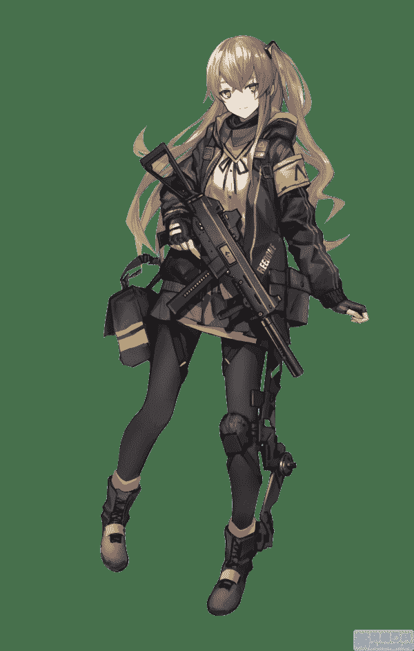</ignore_js_op> **600px-RZ-ump45.png** *(310.8 KB, 下載次數: 8)*

[下載附件](forum.php?mod=attachment&aid=Njg4MzV8NzliZDM3YjN8MTYwMDg4MDI3M3wxODIzMHwyMjkzOA%3D%3D&nothumb=yes)

2017-7-18 03:50 上傳

<ignore_js_op>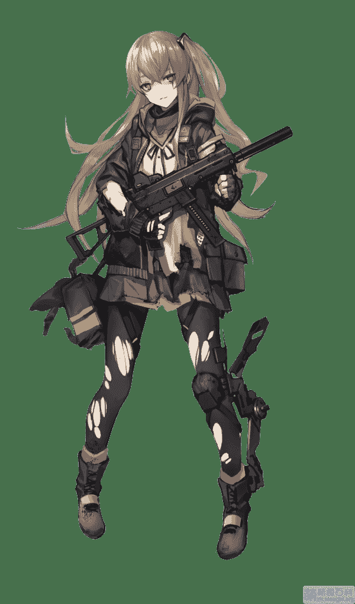</ignore_js_op> **600px-破-ump45.png** *(367.65 KB, 下載次數: 6)*

[下載附件](forum.php?mod=attachment&aid=Njg4MzZ8YjUxMTk1N2N8MTYwMDg4MDI3M3wxODIzMHwyMjkzOA%3D%3D&nothumb=yes)

2017-7-18 03:50 上傳 在一片如同殭尸末日片般残破的,营地中,一个复制人医护兵正在站那里,好像在等着甚么,眼神空洞着放松着,这在这时时刻刻都在担心着成为那些怪兽的盘中飧的生活中是必要的吧,好好放松,在这里几乎是用铁皮和木板搭起来的,看起来不太坚固。虽然不甚坚固,但至少能带来些微弱的安全感

在他充满着一种不知是哀伤还是疲倦的眼神中,这份黑暗与空洞的眼神就好像是当时的现场。

一阵阵的震动,伴随着从天花板上散落的水泥碎屑,同时带着血腥的味道,友军们正在自己的上头惨叫着,惨叫的同时,却是一个女孩正在高亢笑着的尖锐笑声,就跟恶魔一样,她正在把人们当成玩具来玩着,而我们正是给她玩坏与发泄用的玩具。对外的摄影机和窗口都是看到一片黑暗,到底....怎么了? 难道大家都要成为那脚下或手中的牺牲者了吗？

回过神来,柴油引擎的臭味将从回忆中的自己唤醒,还有一丝丝的血腥味与哀号,一辆载满着伤员的卡车开了过来,医治他们就是我的工作,但忽然才想起,自己所站的地方曾是在完全控制后也是前线,现在却成了大后方,原本这里过的更糟,而这些破烂肮脏的木屋已经比起搭建在残骸间的营账好多了。

当时我们离开基地....外头,就是这一片城市了,走进了商店,才发现里头的报纸是开战日当天的报纸,里头的文字正是自己家乡的文字,不过多久大家早已发觉这就是自己国家当初失踪的城市,这是怎么一回事.....经过格里芬的攻击后,为甚么我们会突然出现在这座城是呢? 一阵野兽的吼叫伴随着枪火与哀号回荡着

此时车上的人员已经将伤员给抬下,或是扶着走进了在那栋建筑中,里头放满的担架与病床,挂着点滴只能靠着外头的光线去照明着,环境真的是非常的恶劣,这时卷起了袖子,跟着那些人们走入了医护站中,这里还曾是间超市呢,现在却成了我们的病院,看来今天的工作也会非常的棘手呢,有不少需要截肢和大面积撕裂伤的

就在这时….地面正在震动着,她....来了,她是格里芬的人形,自从我们来到这后,她与她的姊妹时常会进来,都是一阵破坏而且是针动于我们的攻击,分明是单方面的玩弄与屠杀了,但她这次并没有对着营地和城市踩踏,就只是坐在那里,双膝并在一起,双手环抱着,

谁知道她正在想些甚么,大家都慌了,看来...这是我表现的机会了吧,大胆的在会议中举起手,自愿牺牲.执行了这自杀式的任务,愿意去吸引她的注意力,让她去杀了自己,尽可能的拖延时间让大家逃跑,我们已经禁不起更多牺牲了.....如果死的是我而已的话,那总比死几百几千人好多了。

身为医护兵的自己而且又是复制人,非战斗单位在这疯狂的时候是不被重视的,或许还有另一种功能,就是去拯救更多性命,牺牲自己又算甚么呢? 现在我正在这格里芬人形的小腿部分吧,我正在向上爬着,毕竟这一切都是我自愿过来吸引敌人的,希望能够使她注意到我,攀爬在这黑色的连裤袜上,或许我们就是如此渺小呢。

试图清空自己对于高度的恐惧,迫使自己回忆着和思考着,并不断提醒不要往下看,但这却也只是一个少女的小腿高度而已,就不知道爬了多久像是蚂蚁攀爬的同时,又使我想起了那天：

地面正剧烈晃动着,此时在城市中探索的人们在通信频道中吼叫着 "是格里芬的人形!!!"

在我们所有人惊讶地目光之中，巨大的黑色连裤袜包裹着的脚趾慢慢地攀爬上了高墙的顶端，在顶上还稍许地扭了扭，带起了不小的震动。紧接着，那黑色巨塔就更加地升高了起来，一只无比巨大的，几乎有半个基地那么大的脚就举到了我们前方的空中，然后缓缓地踏了下来。踩在地面上扬起了一大片的尘土，吹的附近的人几乎睁不开眼睛。在这几乎和巨塔无异的脚站稳之后，又是另外一只脚伸了进来……

该死....不会吧...所以这四周的高墙果然和她们有关,地面依然在震动着,身体护在伤员身上,毕竟砂土不能洒到伤口上阿。此时UMP45跨入了这个她的杰作之中,这座城市是在开战日后不久就挖了过来,还改造成了自己最喜欢的样子,自己最喜欢的末日废土风格。

当地面的驻军开始全面撤军,但这是玩笑吗? 她行走的路径正好是追赶着那些撤退的人们。她的每一步都能轻松地带走数十条人命,而她或许不在乎吧,就跟踩到虫子一样,无视着下面的火光与哀鸣,无数武器正向上射击着,但在她眼中甚么都不是。

此时她的视线望向了她不久前挖来的那个小基地,她故意在基地的一旁周旋着,甚至脚步显得有些用力

"虫子们~ 躲在里面也是没用的喔,如果我想的话也不是不能连着你们的基地一起踩坏的喔~ 不过...不留点活下来的,就不好玩了呢"

她笑着,看着这脚下这片区块或许再里头发抖着听着他宣言的倒霉鬼们

她还故意在基地外头用力的跺了一脚,让基地内的人们震得歪七扭八的,毕竟.....体型的差距只能使我们蜷缩在这里面了,之后的几天相继其他的女孩们也都进来了这里,杀了不少人,更破坏了不少地方,她们完全的把杀人与破坏当成了娱乐,甚至有人开始怀疑我们到底为何而活了,也有人在这段期间自杀...大家都不想继续待在这个地狱了

震耳欲聋的问话声把我从回忆拉回到了现实之中,虫子....是指我吗,但她这样一说即使是心理素质比常人来得坚强的我也不禁感到害怕

"看来有奇怪的虫子?"  

巨大少女的声音回荡在空气中,声音震耳欲聋,充满藐视的问着

那么任务或许完成一半了,至少她的目光是在我这里了吧,强忍住耳膜遭受冲击的疼痛,继续向上爬着,说来奇怪,为何我要爬上她的腿呢....忽然觉得自己就真的是虫子,或着是一个变态了

"还敢继续向上爬? 你不怕死吗? 还是因为你的小脑袋真的退化成跟虫子一样了? 不能想吗?"

她轻藐的问着,

"为甚么我该怕死,而且妳又有什么理由和利益迫使妳杀了我"

看起来真的疯了,在她的腿上向上爬着,如果爬到膝盖的话基本能看到她的脸了吧,但我依然在此吼着响应,只试图让她听明我的回应

"噗...哈哈哈哈哈, 我要杀了你这虫子还需要甚么理由吗?"

她的小腿跟着晃着,不禁让自己更紧紧的抓住了她的连裤袜,掉下去可就死定了她捏起了这个疯狂的反抗方士兵,比他还大的眼睛正直盯着这对她而言比蚂蚁还要更小的人,

"妳如果真要杀了我的话...不如松开手让我掉下去吧,这也省着妳的麻烦"

此时心理或许已经做好了真的掉下去变成一团肉酱的心理准备了吧,或是被她捏死的准备

"你....意外的比他们还冷静呢,不想活下去吗?"

她的口气好了些,她或许也注意到了自己的音量可能会在对话结束前就让人耳膜受损吧,明显地降低了些音量,不然这个小人可能就不能回复她的问题了,她把我放在膝盖上,看来到膝盖上也不能够平视呢,但至少总比在地面强,

"想活下去吧,毕竟这样我才能够救更多人,但是看来现在活不成了,至少我在被妳弄死前还完成了任务,我得替那些人争取时间呢"

望向了远方正在道路上连夜赶路的撤离车队,有些悲伤的说着,毕竟自己自愿被丢下的,而且靠近这巨大少女的交通工具还是脚踏车什么的,那一批车队...可载满了食物装备医疗物资还有军官们

"你是被强推出来的?"

摇了摇头,但她也注意不上吧,表明了自己是自愿执行这场自杀行动的 ,而且毫无悔意,完全是个人因素才自愿留下

"为甚么你会自愿接下这个任务?"

她的手指伸向了膝盖上的家伙,好像要戳过来一样,总觉得跟拷问似的,但她的口气中明显感觉了已经对他产生了兴趣

"我必须要完成任务,因为有命令,因为我的职责就是完成命令和部队的需求,现在....我的任务算是完成了吧,他们都在路上了,我也完成了吸引妳注意的任务了,我任凭妳的处置"

看着逐渐远去,令人有些被抛弃的忧伤和无助,但是却有一丝丝的自豪,这就是打从基因写入的感情吧

"是嘛....但是你的努力,对我而言不值一提呢"

她捏起了膝盖上的家伙,起身,没有几步就追上了车队,在城市的一边,脚已经抬起到公路上头 ,一脚用力的踏下,踏下时车队的大半被她连着公路一起踩碎,剩余的则慌了,有些撞上了她的脚,有些还撞上了附近的护栏,她再次的踏下,这一次可没有幸存者了,只剩下那些还在燃烧着的残骸，以及四处可见的尸体。

原本载着军官们还有大批物资的车队,就被她这样轻松地给踩烂了,我们在她的眼中....真的就只是跟虫子一样吗,而她踏下时,正好也把公路给踩出了一个脚印,看来这段公路不能用了....脚印直接把公路给截断，车辆无法行驶了。

但这也是我们的主要道路...看来补给线又要断掉好一阵了

"这就是你当诱饵的价值吗?"  

她正质问着指间来送死的家伙,眼神就好像是你根本一文不值,根本没法完成任务,她捏着这个小人举到自己的面前,如果她想的话,正也可以随时就捏死他

"总比马上死强,毕竟谁不想多活那几分钟,至少还有希望,而且有离开那个基地至少就还有机会,而我参与这个任务是我的决定更是我的责任,任务失败了.如果我还活着军法上来说我该被处死的,如果妳想现在捏死我的话,我不会求饶和反抗的,毕竟……我不太可能活下去了...把我放回去,总有一天也会被那些怪物吃掉,不如现在就死一死吧"  

她露出了惊讶的表情,毕竟很少人能如此冷静的面对死亡,甚至还表明着不会有反抗和哀求,只是等待着让她捏死。

"你意外的让我有兴趣了呢,不是每个家伙都像你这样冷静,很多人早就昏倒或是在发抖着求饶"

她充满玩味,兴致满满的对着指间的小人提问着

"那么,你愿意接受我的邀请吗? 跟我喝一杯如何?把你们带到这里来以后，已经很久没有让我如此有兴致的人了。"

她略带诱惑的声音问着手上的小人

"邀请...? 喝一杯...?"

具体是要邀请什么...不过不太清楚，看来自己并没有拒绝的权利呢,毕竟是真正意义上的在她的手中 ,她不开心的话....自己倒也罢了，其他人或许也难保性命吧

"那么...我接受的话,妳能不伤害到其他人吗....如果是我的话,倒没关系"

有些疑惑的问着,不太敢抬头看她.这正是他小小的请求,但在这之前或许也想好了她有可能生气捏死自己吧,

"我并没有义务向你保证,你只能赌我的心情啰~ 而我的心情...可是和你的行为有关呢"

她充满玩味的看着手指间不敢抬头的家伙 ,还晃了晃自己捏着他的手指,好像要吸引他的注意,但是这对他而言可是晕头转向的不适,这是她在提醒指间的小人,自己的力量到底有多强大吧,只要她不开心就可以随时踩烂整个城市呢

"我....知道了...."

她看着,不知为何总感觉手指间的力道有些增强,或许她失手,这倒霉虫就噗叽被捏死了吧,让他下意识的捶了她的手指几下,发出了一些悲鸣,更难以呼吸的微微挣扎着,

"我...我接受!"

好像要用尽最后的力气嘶吼出来,不只是想活下去的本能,或许更是让她开心的办法吧,毕竟她只要还在这里,一定就会造成灾害。那么这个自杀任务,可真的是完全的失败了,刚才的牺牲已经是足够严重的了。

"很好,那么我今天就到这儿吧,今天我不会再过来了"

当被她"带"来这里时,无线电中彷佛传出了欢呼声,看来大家知道她离开这里的事情了,命保住了,正在欢呼着,但被她几步走到了那高墙的一旁时,才惊觉自己根本是被观察箱中的小动物,关住我们一万多人和城市住民几千百人的地方,竟然不是甚么奇怪的地方,而是一个箱子里面....这顿时让自己嘲讽着,我们任何武器都伤害不了的墙壁,竟然只是箱子而已!

当她轻松地跨过了那高于天际的"墙"她好像注意到了手指间的我发觉了自己其实跟她的玩物没两样的事实,笑了几声,再次晃了晃手指,好像要不断提醒着他,这家伙的确就是她的私有物,是能够轻易决定生死的存在,更是她按心情觉得状况的家伙吧,比如说只要他敢顶嘴或是惹着她,或许就得接受她的玩虐了吧。

外头，是一个巨大的房间,而我们日间的光线,和夜间的黑暗,都来自于一盏灯....她把手指间已经快窒息的他放到了桌上,戳了戳他,好像是唤醒他,更是提醒他记得呼吸,还是要试图把惊叹于整个房间如此巨大的同时,或许真的忘记呼吸了吧

"稍微陪我喝一杯?"

她拿了一瓶巨大的玻璃瓶装紫色的饮料和高脚杯放到了桌上，轻微的震动让自己有些不太适应。

这....该怎么喝阿,一滴都能是几天的饮水量了吧……想象着自己在这个和小型湖没有什么区别的酒杯里游泳的样子，难道要我把这个饮料形成的湖给喝干吗？而且和她一起喝的话，自己怕是只有成为她点心的份吧！

"喝....?"

望向了她手中巨大的杯子,再看看自己的体型,或许连喝到都是不太可能的,高脚杯是几乎不可能爬到杯缘吧! 刚爬过巨大少女的腿,现在换成爬上杯子了吗!?  如果爬不上去....那会让她生气吗,爬上去了,从边缘掉下那个湖泊,没喝干净会怎么样...这饮料的质量和容积都超越自己了吧,还是说...她会一口把自己连着一起喝下....想着不禁有些感到恐怖

"放心,这点我完全考虑过"

她微笑的看着这个好像注意到了什么的小家伙,总不能这样接待客人吧?

她好像看透了这小家伙的想象,说起来这或许是个不错的玩法呢....,或许以后可以这样试试,感觉上他们的反应一定是很绝望的吧,被自己当成下酒菜或是食物,弄在食物上或是把他丢到酒里面,在慢慢地喝下,体会他绝望被酒带入口中被下咽的无助神情,或是在最后停下,让他撞在自己的唇上,那害怕的神情,不禁有些兴奋。但是他可是客人,还是该好好招待的,就打消了这么做的念头。虽然实在有些可惜,但还是按下了桌子底下的按钮。

桌上的某处忽然升起了一张桌子,上头放着一样的紫色玻璃瓶装液体和高脚杯,还有满桌放满奇异菜色的盘子,还有一碗据说是白米饭的东西,那东西只有在图鉴上看过,没想到能在现实中亲眼看见

"你可是让我第一次动用到这套装置的人呢"

看着这桌上的食物,都是从没有见过的东西,正热腾腾的,熟食可好一阵子没看过了....那奇异的香气正刺激着自己,心里总想着,那铁定比口粮那杀人饼干或罐头还好吃多了,但不禁怀疑这到底是现实还是虚幻的,毕竟一切都太不真实

"我..有些搞不太清楚状况,这些是?"

她巨大的金色眼睛正盯着我,微笑着,跟刚才充满玩味与让人不寒而栗的感觉形成了强烈的反差,害我还以为这真的是同一个人吗的错觉,她的手指正戳向我,轻轻的捉弄着,但被她这样盯着确有一种奇怪的感觉....

" 这些是招待客人而准备的喔,也就是说,今晚,你是我的客人,这可是我亲手准备的"

他看着巨大少女的微笑,但自己一点作为都没有,没有到饭桌旁坐下,而是呆站在那里,或许自己早就死了吧,这或许是天国? 还是这是传说中在地狱的晚餐?

"怎么了吗?"

看着他愣在那里,看起来有些心烦的,看来是不能适应自己对他态度的变化吗? 看来也是呢,平时都是被当成虫子看的,今天还让自己起了兴趣带了出来,难道是心理不平衡吗?  还是说他的小脑袋根本想不了那么多? 果然...

"本来做好会死掉的决心了,没想到....我现在正怀疑着我会不会早就阵亡了什么的"

平淡的响应着,看着自己的双手,双脚健在,或许到天国是不带着伤的?  正在怀疑着自己,毕竟能在她们的手中活下来是不可能的,被捏起来或是被带起来,都是不可能活下来的.....

"如果妳真的想死的话,从桌上跳下去就可以了,就这点高度,对你们这些小虫子而言够高了吧?,不过你不会敢这么做吧?"

听她这样说那么可能是还活着吧,但是忽然与长时间一直对抗着地她忽然那么接近,而且要吃东西啥的,还是有些不平衡,而且这样她心情如果变糟....其他人可能就完了,但她会这么说就不可能是天堂的天使,更非地狱的恶魔吧? 是后者可能早在虐待自己了

"怎么啦?，呆站在那里干什么呢？你现在甚么都不是,只是我的客人而已,那么真的想死的话,至少先把肚子填饱再说吧,反正我也不在意就是"

静静地走到了桌旁,拉开了椅子,做了上去,双手放在大腿上,不敢轻举妄动,深怕有甚么没做好的,会让她生气,近而影响到其他人

"很好,乖乖待在那儿,不要乱跑"

她把自己的盘子还有那些餐具端了过来,放下时还能感受到地面有些震动,她把紫色的液体倒入了自己的杯中,直盯着已经傻住的我,那盘子....都有几个街区大了,上面的食物都比自己的人还大了吧...,看来即使被她混着食物吃下去也感觉不到,在她的口中连塞牙缝都不能

突然想...如果没做好,她会不会忽然把自己捏起或夹起,弄到口中和食物混在一起吞下,已经不管我的营养价值甚至都不够让她感到饱足的问题,而是单纯只是想吃掉我的话....不禁让我有些害怕

"哦...我现在该做甚么?"

有些傻里傻气的问着,好像没有正式地在餐桌上用餐过一样,

"你先把葡萄酒倒到杯子里吧"

她平淡的说着

"葡萄...酒? 是那个紫红色的液体吗?..对不起.我真的不知道"  

她有些惊讶地看着这好像没见过世面的家伙,

"没错,那就是葡萄酒,把上面的塞子拔掉,然后倒进杯子里"

有些粗鲁的拔开了塞子,笨手笨脚的倒入杯中,几乎装满了杯子,看起来相当的俗气,但这可是他人生中第一次看过酒,甚至以前连酒是甚么都不知道,但她看着这小人和自己杯子的大小,根本碰不了呢,

"看样子也不能碰杯了"

她把杯子举起示意了一下,喝了一小口就放到了桌上,但此时在小小餐桌上的自己还因为大口喝下而呛到,还因为第一次尝过酒第一次的体验使他完全不能适应酒精,有些辛辣和奇怪的味道正在他的喉咙中延烧着,不断咳着。

"噗.....你是不是从没喝过葡萄酒啊?"

"我....在这之前连酒是甚么都不知道,这味道还真怪...有些呛和刺鼻,还有一股说不出的味道"  

她轻笑着,看着这小家伙

"我刚刚看到你几乎装满的时候就在想,真是低俗的家伙。” 她笑着看着自己，金色的眼眸闪动着，不知道在想些什么，“不过，这样的喝法我偶尔也想试一试”

紧接着，她居然也倒了大半杯,模仿着自己的样子喝了一大口,或许那一大口完全能淹死自己了吧,看到那个动作之时不由得联想着,当她一口喝下,把杯子放到桌上,桌面都还有微微的震动,她脸还有些红了,难道是醉了吗......

"也许...这是我第一次这样喝酒……”

轻笑着，手指头戳向了这个小人的方向,

“还喝的惯吗? 我可不想被客人抱怨呢。葡萄酒要是不对你的胃口的话，其他的酒和饮料的种类还是很齐全的。"

仰望着她,看着桌上的佳肴和这名为葡萄酒的奇怪饮品,

"这是我人生中第一次碰过这些....,这一定很贵重吧,我从没见过更没听过,我们连喝到干净的水,都很困难了,没想到...还能喝到这种饮品,谢谢妳...."

她忽然凑近着看着这小家伙,脸完全在他的上空俯视着,突然的动作还有些吓到他,感觉就跟天塌下来一样的压迫,更多害怕的是她生气了吧,更怕的是她如果真的醉了,如果变的更加残暴的话....后果铁定不干涉想

"感谢我? 我可是一手把你们带进来这里的人喔,你不恨我吗? 而且一切都出于玩乐和兴趣喔,连杀死你们都是,破坏城市也是,就跟恶魔一样,跟怪兽一样,不是应该把我当仇人吗? 不应该恨我嘛!?"

她靠近着这个小家伙质问着,听起来....是心理非常复杂的问着这餐桌上的奇怪家伙

"恨没什么用吧? 仇恨...只会制造更多仇恨,这只是个循环而已,想办法活下去,活下去,然后在关键的时刻牺牲掉自己,使更多人活下去,这就是我的职责,更是我诞生的目的"

冷静地说出了这种容易被视为伪善或是爱国疯子的话语,但这的确是他存在的意义更是他的工作吧,而仇恨本来就不是他的任务与工作,或许...只有无奈吧

"不是应该牺牲别人活下去吗? 我看过很多人,可大部分都是这样呢~"

她更加激烈的问着,眼神好像是回答错就一掌拍死他一样的锐利,看着这个奇怪的家伙

"把别人牺牲掉,那么牺牲一命只换来你这一命,不如牺牲自己,换取更多人活下去的估计好些,我只能去....牺牲自己,毕竟我并没有任何存在的价值,我只是一个士兵,我的职责就是牺牲自己的去守护他人,也不用管对方是谁了.....我只要做好工作就好"

少女反问着,而且是以相当令人害怕的冰冷口气

"然而呢? 那些人值得你去守护嘛? 那些人可是完全的把你当成棋子甚至是弃子来用喔~ 而且还要你来对付我呢...好像忘记你对于我而言连虫子都不如呢...."  

"值不值得,只要我能够牺牲,让他们活下去,让他们去完成工作和使命,这就值得。即使不值得也得去牺牲自己,毕竟这是我的责任,更是我的义务,也是我存在的唯一价值。而且有任务我就该去执行,不必过问其原因吧"

她轻笑着,与刚才的气氛有些不同,看着这个在桌上那微型餐桌旁的家伙。

"你现在,真像我以前的时候呢,真好啊....当初也是这么想的呢。我,一次一次的被利用被抛弃,一次一次的被当成弃子丢在一旁,甚么都不是。为了回报那些人，我那时选择了格里芬，成为了404行动小队的队长了呢,脏活也做了不计其数,如果当时能遇上值得的人就好了,可惜那样的人太少了....."

但在那小餐桌上的他好像根本不太能接受她情绪波动的那么快速吧,或许正想着不要惹到她比较好,或是她估计是有些醉了吧

"虽然我搞不清楚格里芬什么的,特殊编制的部队什么的,但是我认为,只要是在我身后,只要是人类,我就该拚了一切的去守护他们,毕竟这是我存在的意义阿..."

"真傻阿....."

她平淡但感觉得出来深感着甚么复杂情绪的说出了这句话,或许是经历过得太多了吧

"但妳们的出现...我才知道我是多么的弱小,或许这是我的过错吧,连自己身后的人类们和平民们都守护不了,只能眼睁睁的看着他们....死去...他们呼喊着我的声音...好像依然在我耳边回荡着"

他望着巨大的少女,叙述着这些事实,的确在被带进来之前他也无法拯救那些被单方面屠杀的队友,即使在被带进这个少女的小天地后,自己依然无法拯救友军们

"是嘛....你不会怨恨我吗?"毕竟她就是杀死那些人的元凶,更是让这桌上的小家伙感到绝望和无力的源头 ,

"为甚么? 要恨的话....我会恨透自己吧,为甚么自己不能够再多让一个人存活下去也好。有时也想过,被踩死的为甚么不是我自己,而是他们,连拯救和保护他们都不行,我存在还有甚么意义?"

巨大的少女浅浅地又喝了一口那名为葡萄酒的饮品,好奇地看着这在桌上丝毫没动过饭菜只喝了一大口葡萄酒还呛到的家伙

"明明知道毫无胜算,还是要自愿出来吗? 而且还做好了死的觉悟了 怎么觉得突然对你有些喜欢了"

那小小的客人并没有对她有所回应了,只是坐在那里,看着自己这套制服,和手臂上那标注白底红十字的袖章,

"怎么了? 在想些什么?"

她不知为何此时的语气显得有些温柔和温暖,

"没事....我正在怀疑着,我是否适合这套制服和装备,如果我连生存的意义和价值都无法证明,我或许是在玷污这套战斗服"  

此时的语气已经显得有些失落....和无数的自责

"唔...就这样吧,你先吃完饭,待会我给你一次证明自己的机会,就先放松一下吧"

或许她注意到了这家伙的饭菜一点都没减少了吧,连筷子都没动过。手有些颤抖地拿起了筷子,如果这是梦铁定饭菜都是没有味道的,但是当吃下了第一口之后,就再也停不下来,毕竟这一切都如此真实

"菜....还和你的口味吗?"

她盯着这没有停下筷子不断扒饭和夹大口配菜吃着的小家伙,没有停下,速度非常的快,还有些担心他会不会噎到,毕竟这体型的差距,也无法帮他急救呢,但他没有响应,少女加大了音量,对着这没有发觉到外在影响的小士兵

"味道如何?"

这句话问下来时,碗筷被放到桌上,他原本低着头扒饭的头抬了起来仰望着她,原来....他落泪了,

"这就是...妳..替我准备的吗....我打从有记忆以来,就没尝过这些..只有吃着口粮饼干....谢谢妳......今天给了我那么多的......这可是我第一次....品尝到所谓的米饭和配菜...原本这些只有在图鉴或是书籍上看过而已..."

少女露出了些惊讶的表情,看着这说着自己没吃过饭菜这回事,是真正意义上没吃过米饭和青菜和料理

"不是吧!? 你们连基本的后勤保障都做不到吗? 你们的军队竟然会让这样的后勤官活下去?"

"几个月前...后勤连就失踪了,我们就开始征收附近的粮食,我们甚至得开始在地底下种植水耕食物,直到来到这里,水源都是个问题了....水耕食物原本是给军官吃的,我们吃罐头,现在得让他们吃罐头....我们只能吃口粮饼干了,但我被分配到那里以来,我就只有吃过口粮而已....连罐头都没吃过..."

"如果你...愿意的话,我很愿意给你提供食物"

她忽然提议着,或许这是这一年不到以来听过最天大的消息了吧

"那么....其他人呢? 他们也可以.....得到食物吗?"

抬起头来央求着,毕竟他总是替那些其他友军着想呢,

"其他人我并没有像你一样的兴趣,那些家伙得那样活下去是应得的"

"如果我做甚么都愿意,既使要了我这条小命,我都愿意....妳愿意...给其他人食物吗?"

低下头来不敢看着她,感觉没什么骨气的对她请求着

她巨大的手在不远处捶了一下,对于他而言是一段距离了吧,但还是能感受到恐怖的震动,他被震倒在地,而桌子甚至是桌上的食物都没有翻倒的迹象

"给我抬起头来! 我讨厌软弱的家伙,这是对我没有用的! 你先乖乖把这顿饭吃完再说!"

她盛怒的对着这在她眼中这小小的家伙骂着,但很快的恢复了冷静下来,或许是注意到自己在继续这样下去,或许手就是捶在他身上了吧,而且...他或许吓坏了

"真是的....好好的晚餐都被你给毁了"她吐了口气,很不快的看着这小家伙,

他仰起了头看着这巨大的少女,发现她正俯视着自己,正直盯着自己,快速的再把头低了下来,这时候因为角度的关系,好像有阴影遮住她的眼睛,看起来更令人害怕

"对不起...."

一句道歉的话吐了出来,毕竟是他的举动让少女不快的吧,如果不赶紧道歉的话,她生气起来....或许会毁了整座城市的

"算了,菜还和你胃口吗?"

她这时才注意到了这餐桌上的小盘子中的所有饭菜都被扫得一干二净,连一丁点剩的都没有,但或许是饥饿了许久憋出的吧,

"这些是我人生中吃过...最美味的一餐了,谢谢,我不知道该如何回报,但...我搞不清楚为什么大家都害怕妳呢"

这的确是他人生中吃过最美味的一餐,毕竟是他第一次吃过正常的饭菜,而且这些是45准备的,美味程度当然不会太糟,她的手指开始在这小小餐桌旁画着圈,

"在你眼里,我是甚么样子呢? 在你们部队里面,大家又是怎么看我的呢?"

这巨大的手指是带来压力还是正在威胁,这并不知道,或许只是挑逗下他的周旋着而已,这的确也一定程度上的达到作用,他一点都不敢乱动,乖乖的任她欺负着

"我不知道...该怎么说呢,感觉妳是个很漂亮,很可爱的女孩子吧,人也很好呢,只是大家我就不知道了..."

相当直觉和单纯的响应着,她听到了还哑然失笑,忍不住笑了出来,

"可爱!? 我的双脚可和你们的基地差不多大喔? 而且我的手指都比你还大了呢,你就跟一只蚂蚁一样,搞不好还更小呢,你会觉得我可爱?"  

她的样子的确是个美人呢,金色的双瞳与灰色的单边侧马尾,各方面来说都是个相当可爱的女孩子,但...不能否认的是她不同的是相当的巨大,至少有一公里以上的身高,如果她想,也真的能像刚才踩烂公路和车队一样的对付我们的基地,这好像形成了强烈的反差,但是她不管怎么看都很可爱啊,既使那么巨大。

刚刚在一瞬间脑子恍惚有着她的双脚踩在基地之上的景象，用力地甩甩脑袋想把这个恐怖的画面甩出去，可画面却越发清晰了。不过，就算是这样，她依然……好美啊。

不过即使她有绝对的力量与身躯，还是无法影响这桌上比蚂蚁还小那小小客人的回应。

"我是真的觉得妳是个很可爱美丽的女孩子,而且....或许是我们太弱小了吧...对妳们而言"

她好像擦了擦笑着流出来的眼泪,看着这小家伙,终于止了下来

"行了,你饭吃完了,小家伙你要来点甜品吗?"   

她微笑着看着这这称呼她很可爱的家伙,还无意识地给他一个称呼

"请问....甚么是甜品?"

她好像又要发笑一样,但她却还有些惊讶,

"你连甜品是甚么都不知道嘛!?"

在享用完"甜品"之后,才知道原来那是一种白色球状,绵绵的甜甜的有股香甜滋味的冰凉食品,她好像说那是冰淇淋来着,她按下了桌下的按钮,桌子就沉了下去,她带有些兴致和玩味的看着小人

"如果给你一次证明能力的机会,你会怎么样呢?"

"试着拿命去拚吧!"

"哦?"

她貌似被勾起了更深的兴趣 ,但也起了一种想玩玩他的感觉

"那么...你成绩最好的科目是什么?"

"野战医疗之外,或许就没有了吧..."

"医护兵吗...."

"障碍跑行吗?"

她问着这个问题,这是训练中的基础科目,基本上...这是部队训练中最常拿来比较体能的方法

"可以"

简单的响应着,然后起身离开椅子,随时做好准备,

"那么就这样吧"

忽然她与桌上的这个区块跑了充满科幻感的数据,很快的一闪,

"这可是我们的仿真系统,但没想到改进到这样的地步阿,当然,你的对手是我~"

她轻笑着这怎么可能!? 要和一个这么巨大的女孩来对比障碍跑啥的,她一步就能跨过整个区块了吧,两人周围的场景正在变化着,终于变成了操场.张开了眼睛,没有巨大的阴影垄罩着自己,抬头张望着,她不在附近....

看着远处.....她是在多远的地方,还是这里难道也只是个箱子或盒子里面嘛!? 不禁感到不寒而栗

"这里这里,有些不习惯呢....还是要变大一些呢...."

她露出了不快的神情,看着这个比自己高出不只一颗头的家伙,但在外头,他可是比蚂蚁还小呢,可以被自己的手指头欺负的存在

她发出声音的时候还吓到了这名医护兵,毕竟原本震耳欲聋的雷鸣变成了这样纤细可爱的声音,而她也不比自己高.....是人类的体型,

"幸好...你愿意和我用一个大小来比"

她后退了几步,闭上了眼睛微笑着,好像不怀好意

"怎么? 难道你想要我回复成原本的尺寸吗? 我可以马上做到喔~ "

她发出了几声轻笑,但还是摇了摇头

"如果要的话...或许很简单的一步就能跨越这段距离了呢,还是说你想在我身上跑呢? 那么我就得用手指追着你了呢,被追到的话...你也知道下场了吧?"

总感觉不妙了,摇了摇头,她用手指头追着自己肯定是要辗死人啊,她还故意摆出了好像在用手指头追着什么的动作,最后辗下

"虽然是脑中的数据仿真,不过这可是一点都不马虎的,身体的体能和状况都会完全的反应出来,感觉都一模一样,所以不需要担心."

"当然疼痛和疲累也会喔~ 疼痛~"

忐忑不安的问着她

"那么....我们要开始了吗?"

心里还是对这些格里芬的女孩有很多好奇,但也没有多问了,毕竟...还是紧张着吧,输的话话怎样吗,那么赢的话她会生气吗....

"随时都可以开始"

两人站在了跑道上,准备着,紧张地调了调自己的头盔,咽了一口口水, 眼前忽然出现了倒数的数字 3.....2......1

看到1消失的瞬间就保持的节奏跑着,不然待会可是会先倒地的.调节着呼吸,小心着不想被口水呛到,但她却轻松的跑着,一点都没有在乎什么

"这就是你的全力了吗?"

看到了不远处的高低杆,跟军中的一样是粗造的水泥,快速的一蹬,越过了数个,光这第一项目就使自己的腿部开始有些酸痛,看来刚才是蹬得太大力了

当回过神来,她已经领先自己些许距离,已经快到爬竿那里了,害怕的跑着,不禁加快速度,如果输得话....或许会被杀的!

虽然死并不可怕,但她心情不好,一定会对其他人做什么的,这样想着,快速地向前跑着,像是蚯蚓一样的向上扭动着,到顶部勾着竿子下滑时,她已经完成了这个项目

她是累了吗,还是怎么了,难道是刻意放下速度来等我吗,她的速度开始有些放慢,不用多久已经与她平行,但与她平行这点就使自己输出了全部的体力

到了板墙那里,用力的蹬上墙,爬了上去,一只手伸着,要拉她起来,

"帮助你的对手吗? 不怕输吗?"

她感到有些奇怪的问着

"这也是项目之一"

抓住了她的手,把她拉了上来,当她到墙壁上的时候,跳了下去继续向前着,但她以惊人的速度已经跟了上来,果然刚才是故意放慢的吧在沙坑前停了下来,后退了几步,用力地向前跳着,,跳过了这个坑,当着地时,才发现她根本不需要任何助跑,轻松地就越了过去,这是何等恐怖的体能....果然人是无法和人形比的吧

通过了独木桥,小心翼翼的不要到下去,但同时她的距离已经与自己拉远,离开独木桥后,向前跑往铁丝网时,她已经完成了一半,身子压低,以四肢的关节为支点前进着,虽然很痛,但这也是最不容易被勾到和受伤的办法了

爬出了这鬼地方后,向前跑着,到达终点时,她才从一旁轻松地跑过来,计分表跳再了眼前,自己是第一名....这不可能,她刚才明明比自己还要领先至少25公尺阿

用步枪在地上支撑着自己,喘气着,快虚脱了,但她却一脸轻松地看着这已经烧尽体力的家伙

"妳...刚才..咳咳.放...水了对吧"

她微笑着,应该说她一直以来都是微笑着的吧有些让人不寒而栗的微笑,但这一次的显得有些温暖

"还有力气吗?"  

看着这个无法好好调节呼吸,正咳着的家伙

"当然..!"

"先喘口气吧"

当以步枪作为拐杖支撑着喘息时,眼前突然拨放着一段纪录画面一些女孩们正在训练场上执行着五百障碍的项目,其中一个女孩有些波折,但每次跌倒后都会爬起然后继续向前着,

"这是当初的我,看到你这家伙...不知道为什么想起那时候的我呢"  

开始混乱了,原来人形不是原本就那么大!? 原来人形也需要训练吗..... 她好像看透了自己的疑惑和思想一样,轻轻地敲了下头盔,

"你在想甚么呢? 我也是人类喔,曾经,是被改造过的,但这都是属于我们格里芬的机密数据,你是不可能知道的吧"

"那么,你和我当初领先的可不只一点半点而已呢,所以是你赢啰"  

对于这个放水与她基本没有使出全力来正规的与自己比较,这样或许了胜利的确感到羞耻,但是....心里也立下了一个目标

"我得以现在的你为目标了阿"   

还是有些喘不过气,毕竟呼吸没调节好,忽然地加速,这可是对心肺极大的负荷呢,更何况身上背着满满的医疗用品和装备,重量都快把他压垮了

"现在的我? 你可知道,离开这里以后,你对我而言可是比指尖还小喔,你既使在桌上全力地跑,我的手指还是可以轻松地追上你呢,还是要把你放在地上? 这要子我可以很轻松地就可以踩死你了呢"

她手指摆出了向下在追着什么一样的动作,嘻嘻的笑着,还摆出了好像轻松的动了点就追到他,戳下去的样子,然后在把脚抬起来,好像对甚么踏着一样

"那么看来我得更加把劲儿了,我会去拚的...既使连你的手指都赢不了"

她笑着,捧着肚子,

"噗...哈哈哈...这真的是个笨蛋呢。好啦,好啦,作为你的奖赏,我让你不用再回到那个城市里如何? 我会给你准备住的地方的,毕竟能遇上你这种人是不太可能的,"

这时心里还是有些不敢相信吧,毕竟自己是炮灰呢,现在忽然有了点活下去的可能,虽然完全违背自己被制造出来的意义,但不知为何心里还是很开心,但这话...好像就是自己要当她的宠物一样,完全意义上的供给吃住,让她开心的存在

"谢谢....那么其他人呢?"

"他们还需要磨练,不过我会帮他们改善环境的,会种植一点树弄个森林什么的,然后再弄点水和小动物进去吧,你们就有些水和食物了吧? 就别怪我对他们不好啰"

"谢谢...."

"对了,还没自我介绍呢你,主动找上我还不自我介绍,你的军阶,姓名和单位国籍"

"了解....对不起...,我并没有名子,国籍是"Estovakia"单位是第六十二步兵师,第二复制人营,第三救援连”

"原来阿...很好,我在格里芬这儿的军衔算是上尉吧,现在我们不是敌人吧? 属于你的战争已经结束啰~ 所以... 现在,像我敬礼,"

有些疑惑,通常上级没有这种请求,而她也并非自己的直属上级,但不久后就反应了过来,站挺敬礼,把枪以右手抓着,枪托抵住腰部,左手在胸前打平敬礼着,她给予回礼后才放下,枪托敲击在地面上,一点也不马虎,既使是战斗医护兵,这点也是得要求好的

"看来你还算是个合格的士兵呢,少尉"

她关闭了仿真系统,两人回到了房间。  他直盯着那巨大的少女看着,几乎出了神

"怎么了...盯着我看呢,在想甚么?"

是怎么了吗,错觉,总觉得她脸上有股红晕,

"没事,只是觉得很感谢妳....还有很..复杂"  

"复杂?"

"刚才,打从我自愿接下任务时,我就没想过有这种事情发生"

"你觉得....自己死定了?"

"对阿....虽然我不太怕死就是了,做好了接受疼痛的准备,被踩死也好,被捏死也好,被当成虫子也好,但从没想过这种事情"

"是你的表现打动了我喔，你自己争取到了让我给你奖励的理由"  

"从没想过能像今天一样当面和妳说话什么的,毕竟你不时会出现在城市哩,而我却不能做些什么"  

"对你们来说,我只是一个只会破坏的怪兽对吧"

她笑了笑,有些惆怅的说着,毕竟大家总喊着她恶魔...格里芬的魔女....怪兽

"我只知道完成任务而以呢....但是任何事情都有原因吧? 妳会这么做一定有苦衷和原因吧"

"或许吧.....或许...我只是在释放自己吧"

"对了,妳只是在释放自己的话,但也不用把自己说是怪兽吧,妳并不是,至少我这样认为,妳只是一个比较大点的女孩子吧,是个很可爱漂亮的女孩子"  

"你...还是第一个这么说我的呢...以前遇到的人,都没这样叫过我"  

"或许该试试让大家别把枪总对着你的脚吧,试试抬头看看妳,"

她露出了娇羞的表情,双手好像要遮住这小家伙,不想让他看一样,毕竟...会害羞吧, 但她并没有这么做,脸上的红晕扩了开来,

"或许吧...谁知道呢,好了好了,我要怎么称呼你呢？少尉？先生？"

"大家只管叫我医官而已,自从我被分配到这里以来,有意识以来,就没有名字.....但听说上级会帮战斗表现优异的复制人取个名字甚么的"

他大胆地再次承认了自己身为比人类,甚至比人形还要低阶的存在

"那么...要不我帮你取个名子好了,作为你的奖励"

"嗯...那么该叫你甚么呢....要不叫你汉斯如何?"

"汉斯吗.....这个名子很好呢,谢谢妳.....今天给了我那么多"

她好像觉得没有甚么,笑了笑

"只不过是名字而已吗?"

感觉上就像是帮宠物取个名子啊,感觉一点也不难的感觉,她这样看着桌上那真的露出真实感激神情的小家伙，伸出了手指,伸向了那个名为汉斯的小人

"爬上来吧"

他缓缓地走向了那巨大的食指

当手掌摸向了巨大的指尖时,巨大的少女好像还有些颤动

"会痒...快点啦!,等等真的下意识的把你当成虫子辗死就麻烦了..."

缓缓地爬上了这巨大的手指头上,趴倒在指尖,快速的上升,使他不敢乱动,带到了床头柜旁,手指头也着地了,这可是第一次的"飞行"旅程阿

"下去吧...."

这时才缓缓的从这巨大的手指上爬下

她按了下这床头柜的按钮,跟刚才一样神奇,只是这次升起的对自己而言是一栋小屋了,

"汉斯....,你就先住这儿吧,那里就是你的新家了喔,快点休息吧....晚些我的妹妹就要回来了, 她如果发现你那么可就不好了"  

有些紧张,甚至是谨慎地踏到门前,不敢弄脏,脱去鞋子后进到了这栋单层楼的小木屋中,里头的格局格外的温馨和温暖,有简单的客厅饭桌,甚至有卫浴设备和寝室,还有一个日式的橱柜,刚把背包放在了寝室的地上,地面就开始剧烈的震动

"怎么了吗!?"

紧张得靠在柱子旁,此时天花板竟然被镊子简单的夹了起来,放到一旁,巨大的脸笼罩在天空中

"怎么样? 还舒适吧?"

"可以的....这...我都不知道该怎么感谢妳了,谢谢妳..."

她好像又要笑出来一样,这家伙到底是见识得太少还是太蠢了呢

"那么先不打扰你了,好好休息吧"

她又把天花板"弄"了回去,这时才松了口气,

看向房间的橱柜,拉了开来,这里面空间很像部队里面床的空间一样呢,果然还是比较适应,把背包放在了橱柜外头,打开了军毯铺在地上,脱掉装备安放好,打开睡袋,把橱柜关了起来,索性睡在了里头.....

第二天一早,UMP45缓缓的床上坐起了身,很轻的,不希望吵醒和自己同床的妹妹,转向了这栋迷你的小屋,拿着一旁的镊子再次地把屋顶打了开来,他...不在里面,床根本没动过,而装备都散落在地上,他去哪里了!? 该不会就这样逃跑了吧?  

她慌张地望着这个小屋,同时握紧了手上的镊子,那家伙...又能逃去哪里呢,床头柜他不可能跳下去吧....既使是往床跳,对他们而言也是不低的高度,看了看地上,他也没跳下去啊....不然地上一定有个很小很小的红斑才对

他在哪里!?

他又能躲在哪里? 盯着小屋中 "汉斯...? 你在哪儿?"

好像看到了房间中橱柜的拉门有些动静,不久后才缓缓拉开,他摸着自己的头,好像被她叫醒了,忽然起身时,撞到了橱柜的木板夹层

"怎么了...?!"

"你怎么睡在那种地方啊....有床你不睡吗...."

"我还是不太习惯吧,所以还是睡在睡袋里了,"

"你这家伙....算了,以后别这样吓我了....还以为你出了意外什么的,如果以后我再找不到你,或是不乖乖睡床上的话.......你...你就别想住在那里了,就乖乖..跟..跟我睡吧."

"知道了....对不起让你担心了"

失落的道歉着,好像是做错事情的小狗一样,

"好啦算了....别露出那种表情,先穿好装备出门吧,我要先把你送回去,晚点再把你接回来吧"

快速的整备后,离开了小屋,巨大的手指捏起了他,靠向了箱子中的城市

"放到这儿可以吧? "

这里是离基地只有几十分钟路程的地方,但在这里已经几乎没有那些怪物的踪迹

"我今天要出门呢,你先回去吧,小心点,等等她起来的时候,就小心一点,不过你也不会怎样吧?"

巨大的手指松开了,被放到了街道上,她微笑着,离开了这里,望向远方的道路.正在前行着返回基地,之后回到基地后,就继续执行的没日没夜的医疗工作,既使到了晚些....也没能找她赴约,在地底下的医护站中医疗着伤兵们,大约在晚间时,好像还能感受到的她貌似在外头踱步着...有些不快的

 

# 42

> [ccccccccccc 發表於 2017-7-13 03:14](https://giantessnight.com/gnforum2012/forum.php?mod=redirect&goto=findpost&pid=339289&ptid=22938)

> 插(誤

> 怎麼突然變繁體了 中間還有簡體混雜

> 不太喜歡格林娜呢 因為畫風還有性格問題

很巧这里还真有404的东西，而且不是单一篇，有好几篇www，而且欢迎给我们提供点子啊www

 

# 43

> [shendanxiaogui 發表於 2017-7-15 20:05](https://giantessnight.com/gnforum2012/forum.php?mod=redirect&goto=findpost&pid=339669&ptid=22938)

> 恩……恕我直言，上篇和下篇完全是两个文章，完全没必要假装成一篇放一起……(ﾟДﾟ)ﾉ或者说作者想表达 ...

也是呢，这篇文章应该说是我们改起来最困难的一篇文章了。不过确实如你所说，之前没安排好的剧情导致了后期的工作困难，而且效果还没那么好。

所以这种时候就需要dalao来给我们提供点子了啊！不要光在那里说快来提供素材XD

 

# 44

*本帖最後由 dasers_100 於 2017-7-22 22:36 編輯*

沙盒（中）那么这次的更新继续写了沙盒，不过这次不是45，而是404小队中她的妹妹UMP9~请大家欣赏，9妹的小肚脐最可爱了(*╹▽╹*)同样照例放人设图：<ignore_js_op>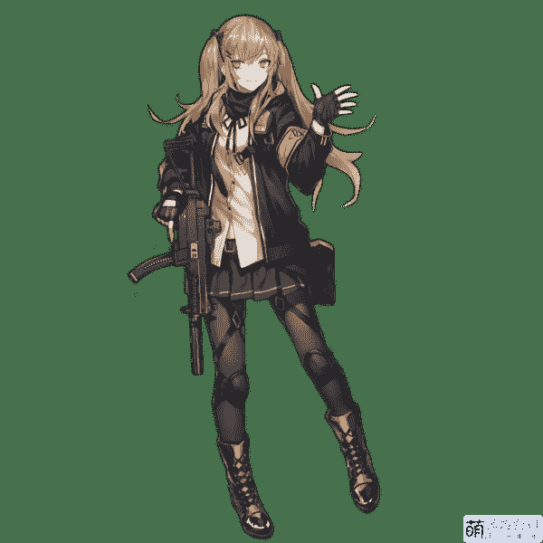</ignore_js_op> **600px-Pic_UMP9.png** *(172.08 KB, 下載次數: 4)*

[下載附件](forum.php?mod=attachment&aid=Njg4OTZ8MzI5YzMwMTd8MTYwMDg4MDI4OHwxODIzMHwyMjkzOA%3D%3D&nothumb=yes)

2017-7-22 22:35 上傳

<ignore_js_op></ignore_js_op> **600px-Pic_UMP9_D.png** *(191.6 KB, 下載次數: 5)*

[下載附件](forum.php?mod=attachment&aid=Njg4OTd8NDc2NTM0ZmN8MTYwMDg4MDI4OHwxODIzMHwyMjkzOA%3D%3D&nothumb=yes)

2017-7-22 22:35 上傳 

回到基地后,并没有太多人在意我的归来,继续在前线奔走着,继续与那些怪物缠斗着,带着伤员们冲出那猎食场,继续在基地中替伤员们动着手术,继续他们医疗着,平淡无奇的好几天,有时感受到地面正在规律颤动时,我或许知道了她们正在上头,但我还得完成任务,医疗好友军们,在那天过后或许过了几天了

直到今天....UMP9进到了这里,蹲在基地的一旁,直盯着驻守的人们,看到这庞然大物,无数的人们已经举起了武器,颤抖着,毕竟自己是不可能对她造成丝毫伤害的

当人们以为这是那个时常虐杀人们的少女时,都惊慌了起来,但稍微注意了一下,头发的颜色,眼睛的颜色,还有一些特征....这很可能是她的姊妹吧,但人们正在祈祷着,她不要也是那种以杀戮为乐的女孩

她正俯视着基地,既使大部分的人都撤离到了新的地方隐蔽起来,但这里还是有少数人驻守着的,就因为是少数人所以才特别的害怕吧,她坐了下来,地面还能感受到一些震动,她注意着那些小人们,他们正慌乱着,甚至连岗位上都能有人倒在地上发抖

"姐姐说的小人在哪里呢...."

她正张望着好像是一个不会害怕地小人,但见底下的人们的这么慌乱,看来他不在这里?

她巨大的手指头在基地上空绕着,好像随时要戳下去一样,戳下去会戳死人吧

"呜.....好烦阿...."  

她不耐烦的看着地面,有些生气地嘟起嘴巴,看着底下惊慌的小人们,没有任何人敢扣下版机,不然或许要塞的防护强就要被弄掉一块了吧,但人类的恐惧总是能盖过理智

有些人丝毫不在意后果的开火着,疯狂的吼着,但这对于她而言可是一点伤害也没有,反而觉得更烦了,巨大的手掌扫下了那一批开火的新兵们

"这些小人们居然敢朝我开火......真是一群不知天高地厚的家伙"

很多人都摔了下来,非死即伤,当无线电中呼喊着医护兵的时候,自己就被叫了上去地面,毕竟正常人类是不敢上去的,这时候只能牺牲这些家伙们了吧

跑向了通往地面的通道,跑出了防爆门,尸横遍野,更有一群伤员躺在哪里,跑向了一个手举起来,正倒在地上哀号的士兵。

此时,她眼睛一亮着,或许是他,冷静且专注的执行任务,不像看的其他他人总害怕的,反而是一点也不怕

"就是你吗?"

她的身体靠向了基地,脸凑了下来

"是你! 是你对吧!? 是你前几天和45姊说话的是吧"

她激动地说着,巨大的风几乎要将自己吹飞,震耳欲聋的声音使耳膜剧痛,趴倒在地上,盖着伤员,手遮住了耳朵

"阿...抱歉,你太小了呢"

她露出了抱歉的表情把脸收了回去,但是还是整个人几乎是贴了上来的

缓缓的爬了起来,关注着伤员,拿出了碎布堆,和支架,固定着骨折的地方,然后开始替他注射止痛剂,专注的照护着这个从墙上摔下来的倒霉家伙

"真不知道你这样的小人儿,到底是怎么样45姊开心好几天的,唔......"

她嘟起了嘴巴她伸出了一根食指,比划着,

"这根食指就跟你们的城墙差不多长了,嘻嘻,你们还真是弱小阿"

食指擦过城墙时,不少碎块掉了下来,或许在她眼中很不起眼,但是在我们眼中可是棒球篮球大的,被砸到可不得了的

此时再次护着自己身旁的伤员,挡着他深怕着有碎块砸伤,此时不少小碎块至少也有乒乓球大小的,砸在了头盔上,但依然护着自己底下呻吟着的友军,此时她咯咯笑着

"你们快点进去,有行动能力的把伤员扛进去!"

一边咳着,一边呼喊着友军们,或许见效了吧,毕竟到底下去才能存活,继续待在这里难保会有什么事情发生,

"吶,小家伙你能到我的手指上吗?"

没有理会她,到了另一名失血的伤员旁,替他止血着,用着干净的纱布和碎布压住伤口,

"吶,小家伙,你到底在做甚么呢?"

她脸靠近着,仔细观察着

"你在,治疗伤员?"

她说话时,声音很大,但这不能阻止他替伤员止血的任务,而沙土飞扬着,这也使的环境更恶劣些,当洒下止血粉开始发泡时,鲜血已经止住,但这时候才注意到,为时已晚,这位友军已经休克身亡

"对不起...我来晚了,安息吧"  

望向远处还有些伤员聚集在城墙的另一边,正准备跑像那里时,一根巨大的手指头挡在了面前

"虽然我不想阻止你,但你能先听我说话吗?"

缓缓地绕开了手指头,如果她生气了把我辗死也就罢了,但在这之前请先让我把那些受伤的人们医疗完毕吧! 这可是我的任务!  少女想了想,把手指拿开,

"好吧,我等你就是了....."

点头示意着,压低了头盔,走向了伤员,关心的伤况,正在治疗着,巨大的少女做在外头一只手托着下巴,不知道在想甚么,期间靠近的怪物都被她给辗死了,或是用手指头弹飞,

"真是受不了45姊...怎么会喜欢这种小虫子呢..."

她小小声地嘀咕着

"这样就可以了....其他人! 你们试着把伤员扛回去吧,"

其中很多人都在医疗的过程中死去更多的是被石块给砸死,但他也只能无奈地走向下一个伤员,此时他正望着那巨大的少女

"这里可以了...妳有什么事吗? 特别来我们这个基地,这些人可是无辜的,妳没有必要这要对他们吧....."

"可是他们可对着我开枪呢,难道我没有自卫的权利吗?"

她巨大的眼睛正盯着这家伙,俯视着

"但是...妳可没受伤吧,他们可是丢了命啊,好些的是少条腿或手,他们还只是新兵阿"

她的眼睛瞇了起来,直盯着这小家伙,

"战场上还有分老兵和新兵吗? 说到底,这是你们自己造成的吧? 对一个少女开枪,妳们还真下的了手"

"对于没有威胁的目标,而且是个女孩子这件事情,我代表我们的指挥官以及在这种情况下混乱的指挥体系道歉,我愿意替他们接收处分"  

她盯着这个向那小小的医护兵,他正鞠躬着,

"可明明我很克制的,连枪都没掏出来的说..."

她用了委屈的口气说着,当然那把冲锋枪是她的尺寸

"而且我只是想挥挥手要他们不再开枪什么的,就自己飞走了"

果然是我们太弱小了吧,她只是挥挥手什么的都抵御不住...只要她想,或许现在就能带着整个基地的人上西天,

"算了算了,小家伙,这次就是算我的失误好了,现在还能不能爬上来?"

看着巨大的手指伸到了自己的面前，迟疑了几秒....才缓缓地爬了上去,在那巨大的食指腹上高度正快速地上升着,被她带到了眼前

"你好小阿......"

她露出了好奇的眼神,眼睛一闪一闪的感觉,好像看到了甚么小动物一样

"呜....你到底是有哪点能吸引45姊..."

此时不知道她是否有注意到这个小士兵正在发抖着,只穿着一件迷彩军服侧边也只背着一个装满医疗用品的小背包,并非战斗装,在这空中还是很冷的吧

"咦? 你在发抖诶"

她好像注意到了这小家伙正受寒着,但同时也注意到了那个医疗包,毕竟上面有显目的白底红十字

"唔...医疗包? 你是医护兵?"

"没错...我是"  

双手抱胸着,坐在巨大少女的食指上,

"小家伙,你...认识45姊吗? 我想先确认一下"

"45姊...? 是她吗....果然格里芬的人形用枪来命名的传言是真的呢,我认识她....有跟她聊过天和吃个饭啥的,之后被她带去运动什么的,然后睡了一晚"

她看着这手指上的小人笑着

"似乎45姊很中意你呢....不过运动和睡一晚什么的...她到底是怎么做到的呢.....嘿嘿"

"毕竟你那么小呢......"

她直盯着这小家伙,连手指都比他大了,45姊.....原来...喜欢这类型的小人啊

"这...我也不清楚呢,抱歉....脑袋其实到现在都还没搞得很清楚....."

"唔....我似乎对你起了点兴趣呢,毕竟45姊她..,快和我说说吧! 你到底是怎么搞定她的!"

一脸好奇着,脸又不自觉地贴近了这小家伙

"我并不知道我做了什么.....我也不清楚呢,只是照着她的问题回答而已"

也搞不清楚头绪的看着这巨大的女孩子,她的表情有了些变化,看起来有些生气

"你是在骗我嘛!?"

有些凶地说着,但这也让这手指上的小家伙或许更害怕了些吧,但他并没有求饶,或是哭喊什么的,这家伙真的有些有趣呢

"我也不知道,我只是回答她的问题和执行任务而已"

"真的吗....45姊居然请你吃饭了来着"

委屈地看着这个小人,另一只手指好像要戳了过来一样

"我平时都很少和她一起吃饭呢......而且是亲手做的料理什么的"

"那件事情我到现在都不知道该....该怎么感谢她呢,她让体会到甚么是食物,也让我吃了人生中最美味的一餐..."

她听了只不过是简单的饭菜而已啊,虽然是45姊亲手煮的有些羡慕,但这反应和口气怎么感觉这家伙以前都在吃什么一样, 少女禁不住想笑了出来

"噗....你真是有趣阿"

她带有些兴致的看着这小人  

她另一只手伸向了包中,掏出了一包巨大的零食,看着这小家伙

"要吃吗?"

晃了晃那包零食,

"我也打不开那么大的包装吧......而且里面的东西都比我还大了吧"

"唔......"

她看了看那包零食,在看了看这个都能坐在指尖上的小家伙,

"我放弃,你还是太小了呢....."

她把小人放在了肩膀上 ,自顾自地吃起了零食,在耳边是巨大的咀嚼声,不禁想着,自己如果被她混着零食丢进嘴里,或许只能变成零食的调味料了吧,

同时也惊叹着那巨大的零食,一片都大的不象话了

"哇....好大..."

她笑了笑看着这看着手上的这片薯片,

"唔...好大了? 阿,对你们来说确实大了点呢"

"嘛..我也不知道要怎么感谢你呢....你知道吗? 45姊已经很久没那么开心了,自从我们变大后.....任务就不太必要了,我们就不需要作战了,控制了大半个世界后,整个人就空荡荡的...阴沉地做甚么都抬不起劲呢..."

她有些失落,难过的说着,这也让人感到不忍吧,虽然内容有些残酷,

"至少还有我这个敌人吧,虽然对妳们而言跟蚂蚁一样吧"

她望着天花板,对于他而言却是极高的高空

, "唔...能答应我一个要求吗? 拜托了...."

前几天那个名为45的女孩曾说过....我们不是敌人了吧,这样说来她的命令和需求,就是上级的需求了....

"妳有甚么需要的,我都会用我这条命做担保去完成的,会拼命去做的"

她的脸色凝重了起来,但对于这个小人而言,是看不太到的吧,毕竟...在她的肩膀上呢

她把小人放到了手掌上,摆到面前微微的俯视着他

"就算是要我做甚么都可以..."

她的表情凝重了起来

"妳多陪陪45姊,让她开心点吧,拜托了....身为她的妹妹,我看到她这样颓废下去很不忍心阿.....这不是原来的她...."

她好像快哭出来了一样

"我也想过很多办法啊...陪她一起破坏城市也好,一起抓小人也好,一起.....玩弄你们也好,但她依然不能开心起来,可是你第一次和她接触,就让她跟你聊了那么久,让她对你起了兴趣,所以...你一定有甚么办法吧!"

"求求你了.....多陪她说说话也好,多在她身边也好..."

或许她的眼泪正在眼眶中打转吧,或许那一滴眼泪都能砸死人了,,她一手托着我,她一只手拉开了领前的结,打开了一些钮扣露出了女孩子的双峰,

"就算....要让你....舒服也没关系" 声音越来越小

"这位....不知道该怎么称呼...这位大姊...? 她说过你们不算是敌人的对吧....那么我,就愿意接收任务,而我的职责就是如此,我会去完成任务的! 大姊.."

少女的眼神变的愤怒了起来,瞪着这个说错话的小家伙,另一只手掌覆盖在了上头,如果两掌拍在一起或许就会变成不起眼的小红斑了

"大姊.....?! 你刚才说甚么呢? 小 虫 子,看来这边有个不乖的虫子呢....是不是该把虫子给打死呢"

"对不起,若因我说错了甚么,妳要...杀了我的话,拜托了,请不要伤害其他人,这是我的错,关于其他人的事,拜托妳了"

呜..! 她的手离开了,垂了下来,泪水开始低落

泪水滴落在几个街区,而那一滴果然跟想象的一样....有些恐怖的大阿,但是她正啜泣着,

"请...帮帮我..."

"妳别哭了...,任何事情我都会去执行的,要我做甚么都可以的,所以...请妳别哭了"

或许是罪恶感吧,还是写入基因的信号,他的心里正在接受折腾

"呜...呜..."

看着这小家伙,稍微有些止住了

"你...真的愿意帮忙吗..."

或许是深怕着她再次哭起来,还是这是个某些层面的任务的关系呢

"愿意,我当然愿意,我绝对会尽全力拚了命去执行的"

"真的..?"  她似乎开心了点

"真的"

"她对你有兴趣的话....应该每天都会来的,只是...最近她好像都没找到你呢,请多陪她说说话,让她开心也好...."

"了解....之前是因为...任务的关系所以没出现呢,抱歉"

"我不知道...这本来都是我要做的,可是我却做不到,还得拜托你什么的...."

"妳是她的姊妹吧? 请妳一起努力吧,毕竟我只是个外人而以,而且我人...就那么小而已,而且妳和她比较亲近,妳一定也能让她开心的! 不然....我自己的力量或许甚么都做不到吧"

"妳也知道的,或许不只细看还以为我是蚂蚁吧,所以,妳一定会比我有效率的,妳也来一起试试看吧"

"真的吗..?太 ....太谢谢你了! "

"那么....你们有什么需要的吗? 我是说物资一类的"

"毕竟把你们带出去不太可能呢...45姊会生气的" 她张望着门外,

"部队现在需要的还是食物吧,还有一些医疗用品,伤亡还是很严重....医疗物资已经不够用了"

"唔...食物我可以解决,但是医疗用品,我的尺寸,好像太大了一些,一颗药你们都不能搬动了吧"

"搞不好..那一颗药可以挖成一块一块地用好一阵子了,感觉好像采矿一样"

少女听到了这有趣的形容不禁笑了出来

"我,我会尽可能弄小一点的,然后...

她从背包中掏出了一个罐头,打开用手指沾了一点里面的罐头肉出来,放到了广场上,虽然是一点,但对于人们而言是一座小山了吧,

"够吗?"

"这已经够让我们所有人吃好一阵子了,谢谢妳,这能够解决不少问题了"

"抱歉....因为是罐头肉,可能味道和口感有些不太好...还要些吗?"  

"不了,这样我们可能都无法好好保存了,但谢谢妳....能有这些食物就是奇迹了"

"不用谢我啦....其实我也挺过意不去的"

她露出了一种有趣的表情,

"还因为那种理由就踩死你们和欺负你们什么的,还破坏了你们的城市...."

听到这些虽然百感交集,但是依然冷静着....她掏出了一瓶矿泉水,看着小人

"要吗?"

"不了吧....这里没有地方能储存水呢,我们都靠附近的湖水和地下水度日"

她有些失落的把水收起来"呜...

她看向了箱子的另一边,“需要我帮你们杀死那些虫子吗?"

虫子...是指那些怪物吗,那么这大小差距下我们又是甚么呢...连虫子都不如吗....

"可以的话....拜托您了"

少女腼腆的笑着,

"举手之劳"

她轻松的一个个辗死了那些至少有人类十倍大小的怪物,根本不费吹灰之力,这时候才感叹着她并没有生气,更没有把这力量弄在我们身上发泄....至少现在不是,不然铁定是更惨烈的地狱吧

"谢谢妳...这样子我们会安全一些的"

她望着这小家伙,认真地看着他

"唔...那么,你是答应要和我一起让她开心吧?"

她巨大的眼睛正直盯着小小的他

"我会的! 绝对会的! 我以生命作担保"

她笑了笑,露出了开心的神情,果然比刚才哭脸还要可爱多了

"那...那就好"

她的表情忽然有些严肃,好像有甚么严肃的事情

"姊姊这几天好像都在找你呢.....今天记得让她找到你吧,不然她可能就会毁了整座城市了吧,看来挺想你的....一直都在说你...呜..区区一个小人...她就这么关心...你.可要好好表现喔! 不然我可不会放过你…"

她微笑着,另一只手指则在讨逗着那个掌上的小人,

"我知道了"

"唔...这样看来,你真的是能让45姊,解开心结的人吧,她差不多要回来了,那..那么我先走了!"

把我放到了地上,她慌忙地起身,带起了无数砂土和混凝土碎块,优美的曲线跨出了不亚于天堑的高墙,其实那只是箱子而已,但....大家都不知道吧,自己其实是生活在这种地方,我们就如同家畜一样享受着这份"幸福"的安宁

 

# 45

然后很快就会放出下篇，到时候就是姐妹的百合了，而且另外的两个人也会来参一脚，甚至还包括刚刚出来的UMP40！（啊40的黑丝……果然连裤袜是好文明！！！！） 

# 46

沙盒（下）地面开始震动着,那高墙的另一边,她跨了进来,黑色的摩天楼伸了进来,巨大少女穿着黑色连裤袜的双腿,她蹲了下来好像在找些什么,锐利的眼神不断扫视着整个城市与在其之中的基地

"今天...也不在吗..."

她的眼睛晃过了基地,扫视着整个城市,有些失落的低下头来,但当她低下头来时,注意到了自己附近有个异样的存在,并没有往她的相反方向逃跑,手臂与头盔上都有鲜明的红色十字,他正仰望着

"汉斯....?"

她巨大的手指伸了过来,没有逃跑和害怕呢,他仰望着那少女

"是..!"

那小小的家伙发话了,少女的表情露出了担心和一些生气的感觉

"你这几天都到哪儿去了?! 你知道我多担心吗..."

她的手指伸向了城墙,好像是要他爬上去缓缓地爬上了她的手指,被她带到了高空之中,因为惯性,他整个人趴倒在她的指腹上,她轻笑着,她直盯着这个手指上的小家伙

"对不起.......之前我们都在执行任务....然后我基本上都在地底下的医疗站工作着"

她看着这个真的认为自己做错事的小家伙,表情真的很有趣,

"其实也没事啦.....只是你至少先报备我啊"

此时她好像注意到了广场上那一坨罐头肉,难道是9放的吗......手指向了那一团罐头肉

"那些....是怎么一回事?"

"那个是妳妹妹刚才给我们的,很谢谢她呢...这样下来我们就不必担心食物短缺的问题了"

"9...真是的,不过她没对你怎样吧?"  

"没有,而且她还帮了我们不少"

"是嘛......"

她把我放到了那床头柜旁小屋的门口

"离晚餐时间还有一阵子...你先休息吧"

"知道了"

当与她接触时....又不知道该如何对她开话题,怎么跟她说话...和陪伴她...这反而让我懊恼着,她的姊妹都那样拜托我了,这就是我的任务了既然要休息...那么先打理好自己吧

拎着战斗靴走进了房间之中,坐在了地上,拿着布轻轻的擦着,表面擦干净后,涂上鞋油抹平均后,在用打火机稍作加热,拿出水壶在布上沾了点水开始擦亮皮鞋,之后在用棉布在上了一层鞋油,然后再用海绵轻轻的抹着鞋头,吹了几口气在上面然后继续擦着

但忽然房间好像被什么阴影给罩着,当我以为是灯坏掉时,才发现她几乎是趴在桌上观察着我....

"擦的挺亮的嘛....你要不要也帮我擦擦?"

看着她,不知道该怎么响应着

"如果..妳可以给我足够的鞋油的话我可以"

"噗...开个玩笑你也相信....你怎么可能呢....不然...今晚你就乖乖的擦我的鞋子吧~"

她微笑着

"还是不了吧...."

把靴子放到一旁,把自己的装备脱去放到一旁,整理好领子换上了小帽,总比全副武装被戴上餐桌还好吧,

"嘛...其实离晚餐还有一段时间喔....要不我们来...训练吧"

"训练甚么...?"

"嘻嘻....你待会就会知道了"

她还是露出那种让人害怕的微笑,感觉根本不怀好意啊!!!

四周再次泛起了那些奇怪的数据,眼前的景象变换成了一片沙滩,在抢滩吗...好几名穿的跟自己一样制服的友军从一旁不断的向前冲刺.格里芬的枪火和炮击不断打过来,一个人倒下了正喊着我,本能地冲了过去,正在替他止血着,地面正在震动,

"好久没有这样子踩死虫子了呢....而且还是一群"

她冰冷的说着,在我身前的这家伙显得更慌张了,

"放心吧....你一定可以回家的"

安抚着他,注射了吗啡,替他取出了弹头,绷带就紧紧的缠了上去,震动正在接近,不久阴影已经垄罩住我们,她正盯着这里,冰冷的看着我们俩

"发现了这里有不跑的虫子呢....."她脚抬了起来,背着他,用着此生最快的速度跑着,当她的脚要踏下时,把他像前甩出,抛离了她踩踏的范围,最后她的脚已经踏下,当回过神来,眼前原本抢滩着的画面已经消失,那个年轻人也不见了

"他...有活下来吗?"

"你认为他有可能活下来吗? 就在我的脚边而已,要再踩下一步也不难呢....为甚么你要做这种蠢事,把他抛下的话,你一定能跑开吧"

"我是医护兵,我必须让让他们活下去,而且...这就是我活着的目的"

"真是奇怪的家伙啊你.....我越来越欣赏你了呢..."

"不过还是差地远了....看来得帮你做点训练了,这样可不行喔"

画面又开始转换着,当回过神来,自己在一片温暖且柔软的地方,地面是粉色的,眼前有个突起物,很高的突起物,而且很大.....

"这里是...."

喃喃地说着，可面前这东西总有种熟悉感，粉红色的，山峰？怎么总觉得…像在哪里看到过一样，难道说…

就在这时，远处已经传来了她的声音，还是有些坏笑的

“你该不会到了女孩子的胸部上还没有自觉吧？”

"女孩子的....胸部上...?"

"是你太蠢了吗.....你啊....没有意识到自己到底多小吗?你前面啊...可是我的小~乳~头~喔"

"现在我给你一个命令,绕着我的小乳头跑吧~ 不然想要从这里跑到我的脚,在折返回来也行"

"我还是在这里好了..."

"果然你还是有脑袋的嘛.....不过你得先跑满100圈喔~ 中途不准停下,不然我会惩罚你的"

"100圈....""是让你在我身上跑了呢,出什么状况还可以马上帮你,我很周到吧~ 而且...还是在我身上喔,你可不要因为在这种地方就失去理智了呦~"

"那么...小虫子~,你就开始跑吧~ 如果我没感觉的话,我可会惩罚你喔....而且我啊....会不开心喔~ 所以就乖乖地跑起来吧~"

用跑的....100圈这不可能吧,而且记得刚刚自己的装备脱掉了啊,为什么到这里面来又变回来了....会死人吧这

开始绕着跑起来了,根本没去记录圈数,因为根本也不知道该以哪里为基准点,更停止了思考,完全不敢停下,不知道多久了....已经要累倒在这里,不能停下...不能停下,粗暴的喘息着,每一次呼吸都是她身上那吸引人的味道,不能被诱惑,必须继续跑下去

当脚步都无法站稳,每一步的力量都开始感到虚弱,很热....很渴...腿很酸...很痛....快要达到体力的极限了

"哦? 你要不行了吗? 反正你那么小原本就感觉不太到呢....但是你变虚弱的话可是很容易感觉到的喔"

摇摇晃晃地继续前进着,每一步都是多少的疼痛,不能让她不开心的,我的行为会影响到她的心情....而她的心情可攸关着大家的性命啊...现在又过了多久....腿已经没有知觉了,现在我正跪在这里,倒了下去,趴倒在她巨大的乳晕上,手正不断向前爬着,虽然不是用跑的,但绝对不能停下,至少还有在前进

"你真的意识到自己是虫子了啊? 开始用爬的了,你已经Game over啰~"

"那么让我看看你还有甚么价值吧..."

她的手伸向了趴倒在她的乳晕上惊恐的小家伙,把他捏了起来放在乳头上后,就用手指按压着,揉着在这过程中,她有很多可能会把自己辗烂在乳头上,但她都没有,刚好在极限与死亡之间,

带给他最大的痛苦,当45都把自己的乳头都给弄硬之后,她轻笑着,看着在她手指上那可能是累得要死的要她放过自己的小人

但当她仔细看着,他并没有想祈求她停下的意思,更没有流出一滴眼泪或鼻涕,就这样乖乖地接受她的惩罚,她或许还吓到了,这家伙就跟人偶一样.....保持着这疲倦的表情

"喂....你没事吧?"

她或许意识到自己可能玩过头了,或许把他弄的精神崩溃了,真正担心的问着,毕竟...她从没想过会玩坏一个自己有些喜欢的人

"我没事,可能只是有些脱臼吧.."

冷静地替自己诊断着,好像毫不在意自己刚才是很有可能被她辗死在乳头上的,但每次看到他关注友军时却是非常担心的,甚至愿意牺牲自己,她不由得感到敬佩

"那...我来帮你一把好了 我可不希望你刚开始就快死掉了"

不知道她做了甚么疼痛感都消失了,也不会喘了,但至少好多了,她轻笑着看着自己手指间的小人,缓缓地起身了,原本她可躺在一张床上啊现在她把自己放到了地面,坐在床边,命令着

"你不是挺喜欢我的腿的吗....试着往上爬吧"

"一样的,如果撑不住或是掉下去的话....会惩罚你喔~ 而且太痒的话我可能会把你当成虫子给弄死也不是不可能的喔~"

既使响应她可能都听不太到吧....顺着她脚的侧面爬上了脚背,就开始向上了,当我以为这很容易时,她的腿开始晃动了,让人头晕,让人很难抓稳,而且感觉就要被甩下去,在她的连裤袜上爬着,跟那时一样,只是这次腿正在晃动着,甚至感觉到了她根本不希望我爬上去吧

是..单纯的想要欺负我吗,但她可以直接命令啊,我绝对会接收的,不论是甚么命令,但她没有...她的腿正晃动着,而我正向上爬着,不知道过了多久,终于爬上了膝盖,到了她的大腿,她却俯视着我,坏笑着

"有虫子爬上来了呢....我可没说你成功会有奖励喔~"

她的手指按了过来,被压倒在她的大腿上,但她很快就放开了,看着我的神情就好像是这一切才没有那么快结束一样

"那么...换下一个项目吧,但这也是最后一个了,不然晚餐时间就要到啰~"

她又把我放到了地面上,脚抬起来,对着我的方向好像要踩下来一样,但她的脚却是悬空着的

"那么....试着对我反击吧,不过你们这些小人手上有的武器也不可能伤到我就是了"

对着她的脚底开枪着,但好像根本打不穿她的连裤袜一样,怎么可能....刚才在爬的时候明明是很柔软的啊,怎么可能步枪的子弹会打不穿呢....不知道打掉了多少弹夹,最后把步枪丢到一旁,用着自己基本上是拿来最后自杀用的佩枪对付着她的脚底,却一样的一点功效也没有

"这样就结束了吗? 那么再见了"

她的脚踏了下来,并没有死,还在地面上擦了几下,麻木且无助的感觉涌上,过了几秒,才发觉已经回到房间,而自己正倒在地上,但...这时候垄罩着自己的并不.是45,而是她的妹妹

"看来你刚才和45姊玩得很开心嘛....虽然不知道在做什么就是,但是她都脱到只剩衬衫了呢...还躺在床上,真有你的"

她捏起了房间中刚经历过一连串体能浩劫的小家伙,另一只手故意解开了45她衬衫上胸口位置的扣子,坏笑着把他放了上去,

"那么也在这里好好享受吧~ 先休息下吧...我来准备晚餐"

躺在了那里,感觉上她的胸部真的跟山一样呢.....,但是...与其说是女神丰满的峡谷还差地远了吧...这个想法绝对不能被她知道,但这对我而言也很大了....都可以在她的乳头上虚脱了....

不知道为什么总感觉很舒适的还是过度疲倦的缓缓睡去。

当45醒来时,发现那个小家伙正舒服地躺在自己的胸口上,不忍心吵醒他呢...毕竟刚才被自己发泄和玩弄了下,辛苦他了....而且他也很努力了,只能怪自己太逼他了吧,看来得对他温柔些了....不然这家伙迟早有一天会被玩坏吧。

而且就算是死到临头都还是那么坚持,不知道为什么内心有种悸动感....觉得他是个不错的家伙吧当9又要大声的冲进来时,她的手指放在了嘴前要妹妹安静些,不要吵醒他,并悄悄盯着那个趴在胸口上睡着的小家伙。

当醒来时自己就被她放在了小小餐桌旁的椅子上,不知道她怎么做到的,但她正微笑着,不知道在想些甚么

"晚餐已经开始啰~ 不要睡了"

桌上的食物相当的丰盛,有色拉`浓汤`饮品`一盘牛排和一些薯条还有一些小面包,45正看他正狼吞虎咽地吃着,忽然觉得这样喂饱他是有很有趣的感觉,而9则感觉没什么的吃着自己眼前的饭菜,她看着小人问着,

"嘛..你平时都在做些什么啊? 我有些好奇"

她带着好奇和玩味的眼神看着桌上那小小的家伙

"急救伤员,医疗伤员,如果有严重到需要开刀的就需要进手术室....这样"

手指头伸出来数着,脑袋中整理了大概说了出来,毕竟一个士兵,又是战斗医护兵工作可多了,而且又是部队里面少数的医官

"原来阿...抱歉之前让你忙了呢...,不过45姊,妳不是有什么要问他吗?"

她露出了抱歉的眼神,低头看着这个小家伙,毕竟那些伤员很大部分都是自己创造出来的,死者也是

"甚么事情吗? 有我可以做到的话,我都会去执行的"

听到了"她"有事情想问我,抬起头来转向她,

"是没事啦...只是想问问你的意见"

"你认为我帮你们增加一片森林啊和一些湖如何?顺便可以丢些动物进去"

"可以嘛!? 那样就太好了....这样大家生活会好过一些的"

有些不敢置信的口吻,高兴得好像快流下泪来的看着她

"我说你啊...为啥总想到别人呢? 不想想自己嘛?"

她手上巨大的叉子指了指那小家伙的方向,有些责怪的语气,毕竟他根本没看重过自己

"如果大家好过了,那么我也会好过些吧"

"是嘛...不怕我哪天心情不好把你们全部都踩死吗? 而且希望比较多的时候,绝望会产生更多喔~"

她坏笑着,看着这个或许内心充满希望的家伙,这句话可说是让他起了担忧了,

"我....我不会让你心情不好的,我一定会想办法让妳心情好些的"

"光凭你?"

"对...就我"

"你最好想清楚喔,如果...要我心情好转的代价可能是你的命呢? 而且你就那么小一点而已...."

"那么我也愿意"

"噗....果然你还是这样傻傻的,那么我就当大家都同意了吧,另外你也好好顾虑你自己吧"

她的手指戳向了餐桌上那小小的家伙,眼见他吃完饭,微笑的看着他

"你吃完了?"

"吃完了"

"那么你先休息一下吧"

她边说边把餐桌上的小人给捏起

"对了,晚餐有甚么不妥的吗?"

"没有..当然没有,都是我没有吃过的东西,非常好吃..."

"那就好....9! 妳过来一下"

"45姊怎么了吗?"

她忽然靠在45的背后,她的手当然会跟着身体晃了一下,整个人再次趴倒在她的手指上,而且这次还差点就掉了下去

"阿...抱歉呢,小家伙...."

"9,那些是怎么一回事?"

"喔,那些是我给他们的,我怕他们会饿着阿,这可是那家伙拜托我的喔~"

"喔 对了对了,45姊你看~" 她手上拿着一个小箱子,里面好像装着甚么

"这可是帕斯卡给我们的呢,你拜托她研究的动物们很成功的被复育了喔!"

9自顾自地把那些"动物"们放进了城市之中,他们很快的各自朝城市的四周散开,也为了这座城市多了一些鲜活的样貌.这或许不只是给那些人们的食物吧,更是这座城市的新住客

（几天后……）

今天是个特别的日子,她履行了承诺,准备要替我们这个地方进行改造,或许会让我们的生活好些吧当她从高墙外好像拿着甚么要进来时,我们在这看着她手上就直接捧着一块森林,这或许让我们感受到极度的震撼,一片森林对她而言就是巴掌大的大小,而她正要放向一快原本甚么都没有的地方,那里已经被事先挖开了一块区域,

她正把森林放了进去,途中当然有不少土石掉落,那一块,就有汽车般的大小,我们感受到了自己对她而言如此渺小的事实当她把森林放下,当然不只这一些,还有不少林地,甚至还有小丘,我开始好奇这些到底从哪里而来,但还是不要问好了,

当她把森林完成时,她在森林附近用着对她而言小巧的小铲子挖着,开出了一片低地后,她拿着自己的马克杯,里面装满了淡水,就这样注入这湖中,这成了个淡水湖,这能够完全解决我们的水源危机了,当这一部份的地形改造完成后,我好像感觉到她正微笑着看着我,此时9忽然从她背后靠了过去,从后面抱着45,偷偷的亲了她的脖子,两个高耸入云的姊妹,说高基本是连建筑物都很难比小腿高吧

当9向前靠,她的姊姊就坐倒在了那一片城市中,而9扑了上去,两人在那里不知道压碎了多少大楼与建筑,幸好那一片几乎是没有人居住的了,她们躺下时有如看着远处的高山一样,几乎占住了远景两人趴倒在地上互相交缠着,两人倒下时压碎了不尽其数的建筑,幸好那是已经净空的区块,两人既使躺下,都跟山一样

而两人交缠在一起的时候地面正在震动着,发出轰巄声响,两姊妹正在亲热着,舌头交织在一起时,还有些依依不舍的才肯分离,两人亲吻着,拥抱着,开始亲密的互动着

"45姊..."

地面传出的轰隆声响就是她们两人制造的,而她们既使躺下也比很多建筑还高,两姊妹超乎亲情的互动也对地面造成灾害性的破坏

而此时的地面已经是要被夷平的状态了,整片城市就这样被压碎成为废墟。但或许这是让我们深入该区域开始重新建设的机会也说不一定,但是两人亲吻着,两人互相在耳语着什么,令人看得脸红心跳的,而她们舌头交织在一起的时候,那时候才想到,或许连一滴唾液都能淹死人了吧

当两人回过神来,起身时,才注意到自己不是在一旁的木地板上或床上,而是这一片城市中

"45姊....我们...该怎么善后啊?"

"都这样了,只能要这些小人们去重建吧,正好能住人呢"

"可是这里好像有些太窄了....每次进来玩都好麻烦"

"那么顺便把箱子弄大一点好了"

当四周困住我们多时的高墙被她放下,9坏笑地看着箱子里的人们

"如果敢跑出去的话,被不小心踩死的话,就自己负责喔,最好给我乖乖待在里面吧"

当然有个逃出生天的机会谁不想走? 当天就有人组织起来试图逃离这里,当他们的车队出发时,我正为他们担心着,毕竟在巨人的房间里,我们又能逃去哪里....

当外部的范围变大,她们不知道从哪里来的更多的建筑与城市区块,都一一被放了进来,最后那巨墙再次立起,我们的生活空间又变大了些,当然那些怪物也变得更多了些

或许这样是给我们更好的生存空间吧这样说来,或许....让她们两个开心,让她们两个心情好些,或许我们迟早就能够过上好一点的日子了在这城市被改造后,我们发觉建筑中有更多的食物,是新的罐头,还有上次她们放进来的那些动物! 那将是我们新的食物来源

而有了那座湖,我们开始规划铺设水管,让我们未来不用在担心生活用水和饮水的问题更有工兵们建议维修这座城市原本就有的净水厂,这样看来我们很快就能让这座城市恢复运作,甚至可以跟以前一样好。

当我站在这防御墙上,我第一次看到这座城市开有更多地方亮起了灯,开始看到文明开始在这里发展,而也有更强的能力抵抗那些怪物们,这不是只该感谢那些努力的人们,更该感谢这两个女孩愿意给我们这些赏赐吧,当我们不知道她又带给我们甚么经惊喜时

看到她手上带着些货柜,当她轻轻地放在了我们的广场上时,很多人快速的过去查看,有食物,有水,有医疗用品外,还有弹药装备和武器,甚至找到了燃料和车辆的备料,这或许是经历过这么多之后,遇过最美好的事情吧

而在房间之外，一群组织起来逃跑的人们,驱车逃离这座长久以来都被封闭起来的城市很快的他们已经离开了这个房间,通过那好像是忘了关上还是刻意不关的房门在这无尽着走廊上,他们试图找到出路,他们想回家,他们想逃离这里

当他们通过每一扇门,都是警戒着的,深怕会有其他巨大少女从里面走出来但都是死寂的,他们停止了警戒,朝着未知的方向前进着,很快的车子没油了,当领导的头子表示自己忘记把油料弄上车时

他遭受大家的指责,但也有人袒护他在这巨大且无尽的长廊中大家又能去哪里? 在这里干等? 食物和水总会消耗完也有人提议原路折返或许走回去的时候总有办法回到城市里的但也有人认为该继续往前,

格里芬总不会没有其他人类吧此时远处传来震动,人们纷纷躲了起来,躲到车子底下或是车子里面,但是有几个人疯狂地站在走廊中间呼喊着习惯了在那个城里了,已经知道有这震动一定是有其他人型在靠近

车底下的人完全无法看到那个人形长甚么样子,但快速接近着的她,既使是在走廊上的人很快的才发现自己的喊叫甚至无法让她的耳膜有震动,甚至无法让她听清,看不到她的面庞,人们正对着这至少有数公里外的巨大妹子呼喊着,喉咙都给喊哑了

挥着手,喊叫着,也有人绝望的跪着,在车子底下的人反而不希望被发现,毕竟谁知道格里芬的其他女孩会怎么样对待他们地面正震动着,一个灰发的少女揉着眼睛,好像是刚睡醒一样地走着,她下半身只有一条白色的内裤,而上半身也只有一件单薄的衣服,她会注意到地面上的那群小家伙们吗?

她很快的接近...她盖住了大半部的视野与天空她已经近到了下一步就是要踩到人们的地步很多人都往前跑着,试图跑出她踩踏的范围但显然这一点用都没有,此时地面被黑影垄罩.她的脚,非常无私的,将那群不愿求救,和试图求救的人们给踩死了.大部分的车辆和人们都被踩扁了,睡眼惺忪地她根本不知道自己踩到了这些倒霉鬼,正继续向前走向厕所着

而在走廊的边缘,有一个....极度幸运的幸存者,在依着这墙壁,看着两方都是无尽的嚎啕大哭着,没有地方可逃,更无法离开.....最后他是否存活,就没有人知道了

或许是生活被改善了吧,还是她们已经不对人们发起攻击,大家已经不在对她们开火甚至没了敌意了吧,现在也甘愿成为这里的住民了

原本属于残军的他们,或许成了这里的驻防军了吧,开始对付着那些怪物们,开始寻找着更多当初被一起带过来的平民们而这些少女们时而会来欺负或是扮演假想敌一样的往我们吓唬,更有时候会帮助我们对抗那些大型怪物

大家就开始适应起了这微妙的互动关系,有时候如果表现的好,维持得好,她们甚至会大发慈悲的给予我们更多的物资和补给,但也没有停止补充那些怪物,这或许是让我们保持存在的价值吧这让人感受到错乱,毕竟不久前她们还是会主动寻找我们,踩死我们的女孩们,除了不会踩碎基地外,其他地方都会一一破坏,现在她们却突然和平了起来,就跟女神一样

当然,也有人反对着她们,但很快地都被处理掉了,而我们就在此继续生活着,接受她们某些层面的饲养了吧比如说好了,像是今天一样的平常日子,或许有些寒冷吧

这时候在城市某处的广场,中间还有雕像和喷水池,这里完全变成了士兵们的小营地,大家四处走着,好像忙碌着什么,正在准备着甚么,但有个相当巨大的阴影正在垄罩他们。

"嘛....数到1的时候,你们就试着阻挡住我吧~"

45露出了那招牌让人看不透的微笑,巨大的脚悬空在大家的上头

"大家! 快撤往掩体后!"

军官喊着,我背着已经吓傻的新兵,带着他向后逃着,这些新兵基本也是从市民中而来的,很大一部份都是为了填饱肚子才加入我们,把他在了街道边的梁柱旁

"冷静点,她不会对我们怎么样的,试着好好的攻击她吧!"

"3...2....1...~ 开始啰~"

当大家听到了她说开始时,就一同的开火着,火力全开着,但没人敢使用重火力武器,毕竟这是违反她的规则的,既使那也不能伤害到她,她的脚踏在了我们附近空的街区,砂土和混凝土的碎屑飘扬在空中

"在努力一点吧~ 不然...我就真的踩下去啰~"

她故意这样说着,有些人想起了格里芬那些女孩们,如同怪兽辗过自己家园的情景,彷佛回到了当时的情况,正开火着,过了许久了,或许连附近的有些街道都被疑为了平地,真的有股回到当时战地的情景

"就算你们勉强及格了,但是...很多人还是太懦弱了"

她冰冷的说着,好像盯向了那些由汉斯背往掩体后蜷缩着那群新兵们而他就只是拍了拍那些人们的肩膀,要他们打起精神来,好像还说着

"我就说吧,大家不会有事的,就把这....当演习吧!"

不久45蹲了下来,把手指伸进了箱子中,而汉斯就快速的跑向了手指,很熟练的爬了上去,45她跨出了箱子,把汉斯放到了桌上,有些生气的说,虽然一点都不可怕

"为什么你要多管闲事....那些人那么懦弱"

"这可是我的工作和任务阿,毕竟妳不会制造太多伤亡的,那么我就把那些吓坏的人们作为受伤的人带回到掩体后面了"

45双手抱着胸,闭着眼看着另一个方向,她转过头睁开了一只眼好像是在偷看着他,站在那里有些傻气的

"算了...这次就放过你了,你这样那些人们只会更害怕而已吧,下次注意一点"

"他们再不改善的话面对实战可是会很快就一命呜呼,那些恶心的虫子..."

忽然9用力地把门推开,很有精神的走了进来

"45姊~ 看我手上这个~ 这可是妳要我帮你弄得,这可是牛奶喔~"

"诶...45姊?"

9看着45和那小家伙的状况,露出了有趣的表情

"看来是我来错时间了呢,对了小家伙...你知道为什么她总喝牛奶吗?这很大部分都是因为你喔~"

45满脸通红着看着9,   

"9!!"

"牛奶....?"

他有些疑惑地问着,虽然知道牛奶是乳制品饮料,但她为什么要特别要9去弄到呢,还有为什么要特别去喝牛奶,有什么特殊的功效嘛!?

"牛奶阿....就是可以让45姊的....."

"9!!!"

45满脸通红地看着他,好像想手指头直接压过去要他不要看一样,但她却没那么做9在一旁坏笑着,45则把他捏了起来,摇晃着,

"给我忘掉! 不然...杀了你喔!"

她好像快哭出来一样,但这听得出来不是认真的,过了一阵子,指间的小人好像快昏厥一样,直到45注意到才停止, 再这样下去的话,或许指尖的那家伙就会死掉吧

"抱歉..."

才把他缓缓地放了下来,当然的,连站都站不稳了

45满脸通红地看着他,好像想手指头直接压过去要他不要看一样,但她却没那么做

"45姊...这样是不行的呢,为甚么不跟他好好坦白呢..."

"9...! 所以说了"

"吶,我就直接说啰~ 小家伙,45姊她,可是为了你,每天都会喝牛奶呢...嘻嘻"

9从后面抱住了45,一只手拉开了胸前的结,然后打开了钮扣,忽然把来不及反应的他给捏起,

"9! 妳想做什么!?"

"让他...体验看看成果呦~ 要不然妳一直都在喝牛奶是想做甚么呢"

就这样把一个的小人,放进了45的胸口之中,双手开始支撑着,

"看来可以夹住呢....嘿嘿"

看着那已经几乎要昏厥的家伙,

"看来很享受呢....45姊,看来成功了喔~"

9坏笑着,看着那双峰间已经快不行的小家伙。

"9! 妳到底在做什么..! 快..放开我......把他拿出来....他会...死掉啦."

既使是这样说着,却没有对她妹妹有任何反抗,那家伙被两边的山给夹着,只能是痛苦与天堂的交织吧,在这少女的嬉闹中,那小人也只能是这个贫乳少女乳间的受害者了,不断被另一位巨大少女揉动时带来的痛苦所袭击,更不断无力的挣扎着

当不知道过了多久之后,他已经在这之中昏厥过去,醒来时....已经在那巨大的手掌上,而她正躺在床上,今天并没有把他送去那连娃娃屋都称不上的小建筑中,反而就让他这样睡在巨大的手心中,正在可爱的鼾息着,看来...未来或许也得持续这样的生活吧。

全文完

 

# 47

ok沙盒的本篇终于算是结束了……不过还没完呢，我们还有后日谈和更好玩的一些点子没有写出来，所以敬请期待吧！这次的百合剧情只能算是浅尝辄止，而后日谈里面则会有一整章的百合剧情呢 

# 48

> [coverle 發表於 2017-7-22 23:06](https://giantessnight.com/gnforum2012/forum.php?mod=redirect&goto=findpost&pid=340788&ptid=22938)

> 妹妹太有愛了, 改天是否可為9妹妹開一篇獨立故事

可以哦……而且我打算写9x416呢…被p站上的一幅图给激发的灵感，打算让9当一次撩人的男友www 

# 49

*本帖最後由 dasers_100 於 2017-7-27 02:56 編輯*

沙盒 —— 日后谈（一）

不知道过了多久,或许自己都习惯了这份与两个巨大女孩的作息,只要到了所谓的傍晚,也就是大约17点左右,我就得独自出现在她们总来接我的那栋大楼的楼顶,被她们接出去吃晚餐,这件事情被9称为好像是下班这个动词,在巨大的餐桌上,我一样得在那显得非常渺小的小小餐桌旁吃着自己的晚餐桌上的饭菜都是由她所亲手料理的,相当让人感到幸福,这也让我回忆着之前自己曾经是个吃口粮饼干的家伙,这根本是不敢想象的未来,而这些事情已经成了日常,原本是躺在狭窄的空间中入睡,现在却是躺在她的手掌上与她在床上共眠,

每天都过着常人无法想象的日子,也是当初决定赴死的自己当初无法想象到的,不过自己时常还是得陪着巨大的她聊天生活偶尔陪她玩玩吧,但有时候总觉得自己根本是她的宠物或玩具了吧,但却比这种关系远远的更深

今天的我也被她带到了餐桌上,一旁都是那巨大的餐盘与餐具,但基本上都习惯了,在这显得格外迷你而突兀的小餐桌旁用餐着,此时9不知道为什么正露出一种奇怪的神情打量着我,坏笑着

"吶....45姊...让小家伙他...和我们一起玩吗? 把他带出来之后...就很久没有一起玩了....."

等等一起玩...玩,是要做什么!? 难不成...要我陪她们玩甚么恶趣味的游戏吧!? 还是又要用那种仿真装置做甚么....心里一阵阵不安传出来,总觉得待会不妙啊

45脸有些红着,看着桌上小小的他,手指头戳了过去,但表情却是难为情害羞的样子

“汉斯……你……你愿意吗……”

她们到底在问什么!? 玩...又是要玩什么游戏!? 而且她....的样子感觉上拒绝了心情铁定低落,

已经没有拒绝的权利了嘛!? 面对她们每次的要求和请求

"我可以的,只要能让妳开心,我甚么都愿意做"

微笑的回应着她,她的表情有些起色,看起来心情有起来,等我们吃完饭后,她说什么她要和9准备一下,就把我丢进了口袋,带到了别的房间,在这陌生的房间不免让我感到害怕,灯光有些昏暗,但是床比较大张,她把我丢了上去,她与9就先离开了,说要先去洗个澡什么的

现在我正在想着,什么游戏前要先洗干净身体的....而且还是要在床上,怎么脑袋都搞不清楚头绪呢....而且45的表情也有些奇怪.....跟平时总是阴沉微笑的她完全不同,感觉很像我第一次说她很可爱的时候那样的表情

当门再次开启,45换成了过膝袜,而视角逐渐往上,才知道她....并没有穿着其他衣物了,正是一丝不挂的状态,而9则是还穿着粉色的内衣,正看着我,

"怎么样~ 45姊很棒吧~"

9咯咯笑着看着这个有些搞不清楚状况的小家伙,他正要参加这夜晚的盛宴了,属于她们俩人的

她轻轻地推了自己有些羞涩的姊妹,45的脸已经红成一片了,9在她的耳边低语着

"45姊....妳不想让他...被妳玩玩吗? 这样子...他才会是妳的东西喔..."

45好像某个开关被打开一样,露出了坏笑走向了床铺,一只脚对准了那个站在那里并没有逃跑的小人,精确地一脚踏下,相当的轻,至少对她而言,轻轻地把脚放在那小人身上,还蹭了几下,但她不免觉得无趣,好像没有在挣扎呢,还是说,既使有挣扎也是没有感觉吗,但是想到脚下是自己喜欢的人,她也被勾起了一丝兴致

把脚抬起来,踏在床边,他倒在那里,还活着,45露出了一种不快的神情,

"为甚么刚才不多挣扎一点...一点感觉都没有"

她发觉这一句话好像刺激到那个小家伙,他或许刚才被踩着的时候是有用力挣扎着的,或许还害怕着,但是她是不太可能感觉的到吧,毕竟他比起这个巨人而言的确比蚂蚁还渺小

"嘛..算了,这次先原谅你好了,不过等一下给我努力一点,不然....我会不开心喔"

她会不开心....想到了她曾经威胁自己,她没有义务向我保证不伤害到其他人,这都只能看她的心情....她的心情又只能因为自己的作为而被影响,不免感到害怕,

她舔了下手指,手指伸过去沾住了他,摆到面前嘲弄着

"被一个女孩子的口水个黏住什么的,你还真弱小啊....."

"我也没办法啊 ..."

她笑了笑,毕竟手指上的这家伙可是自己的千分之一大小呢,

"算了算了,待会就好好享受吧~ 你陪着两个女孩子一起玩喔....."

忽然9从后方扑倒了45,幸好她已经把手伸离了自己可能压到的地方,9则是吸了吸她的手指,那小家伙理所当然的不可能还在上面了

"9! 你在做甚么?!"

她有些慌张地对着自己的妹妹说着,但感觉上一点都不生气啊

"45姊....他现在可在我的舌头上喔~ 还是说...你想把他让给我呢?"

她故意吐出了舌头,一个小人正被她的唾液给包裹着,在她的舌头上挣扎着,她并没有把他吞下去呢,

45忽然抱住了9,舌头也伸入了那口腔中搅拌着,试图抢回舌头上的小家伙,或是....这只是她们姊妹间的游戏呢

在俩人激烈的接吻中,有个人正饱受着在俩个女孩的口中不断交换着,不断跟着口水与舌面交织着,还担心着她们只要咕噜一声吞下口水,自己就会被跟着吞到她们的腹中,现在也不知道到底是在谁的嘴里了,当回过神来,一旁有个粉色的物体,有些突出的物体,这里是哪里啊....好像在某座小山来着,等等..前方那是谁的脚...有穿着袜子...45!?

"吶...小家伙,你知道你现在在哪里吗?"

手轻轻摸了下眼前的这跟房子一样高的粉色墙面,地面顿时开始震动,让自己不禁趴倒在那上面

"45姊....这个小家伙好像很喜欢你的乳头呢....嘻嘻"

"小家伙....你眼前的可是45姊她的,小~乳~头~喔,要不我们来玩个游戏吧,看谁先让她的乳头舒服,谁就赢了,但是....你那么小,我先让你开始吧~ 身为一个男性,你该不会不知道怎么满足45姊吧...."

整个人趴在上面舔了一下,好香.....但不知道为什么脑袋有种力量正在控制自己,现在的我...正试图满足她,向后退了几步,对我而言的几步都离不开她的乳晕了,撞向了她的乳头,用力的撞击着,重复了几次后,爬上这都比我还大出许多的乳头,正缓缓地爬上去

"好痒....."

再爬上去的过程中我还舔了几口,对我而言跟山壁一样的乳头....,但是当我到达顶部,我看着那在天边的9,她好像正忍着,不想笑出来一样....当我看着这脚下的乳头,她并没有任何一丁点反应,不禁感到自卑连让她舒服也不行吗.....

"那么...该换我啰~ 45姊...让我也来尝尝吧"

9趴在了她的怀中,嘴正吸着她的奶头,就跟正在哺乳的婴孩一样,但她正在用舌头舔弄着,45的手正压在9的头上好像要她不要停一样,过了不久,那里的乳头至少高几层楼了,9则望向了另一边那根本没有让乳头硬起来的他

"看来....你输了呢,惩罚的时候顺边帮你一把吧~"

"你...要我做甚么....?!"

倒在她的"小乳头"旁颤抖着

"你问错了呢小家伙....是我要对你做甚么喔~"

她轻笑着,不会吧!

"啊~"

还很故意的发出了张嘴的声音

她吸住了,巨大的舌头正在舔着弄着,绕着她乳头的四周弄着,重点是还夹带着我,不知道过了多久,她的嘴才离开,然后我可还在她的嘴里啊! 巨大的舌头翻弄着,搅着,好像要我全身都裹满一样,感觉自己就变成了一颗糖一样的被她含着,还得担心着她接下来要把我送去哪里

这时候45正靠坐在床边的玩偶旁,左脚伸向了9,但上面可还穿着袜子,可是她们没管那么多了,9的双手正捧着她姊姊的脚,先是亲吻了脚被然后慢慢地舔着她的脚指头,她当然意识到有可能会把那小家伙弄到她姊姊的脚上,但很快的就把他给舔回了口中.

当45的另一只脚轻轻的踩在9的脸上时,她有些不舍的离开,然后把口中的小家伙吐到了45的小腹上,轻笑着看着他连站不能站稳,倒在45的小腹上,看来是头晕转向的样子

"连站都不能站稳吗? 只不过让你跟45姊亲密接触下而已,而且还让你跟我们亲过了呢"

当她垄罩住天空时,自己是因为唾液的黏度吗,还是因为晕的不能起身了,躺在了45的小腹上,看着她巨大的脸正凑近靠着自己,她拨了下头发,好像要在亲下来了! 不! 不要! 我不要再进去她的嘴里了! 不要啊!!

"瞧你那慌张的样子...看来以后有个好方法欺负你了呢.....只是想亲你的说...."

"会怕被我吃掉吗? 还是说...怕被吃掉以后就不能跟45姊一起了呢?"

她轻笑着,满脸通红的,看着那小腹上慌张的小家伙

"9..."

45的手指伸了过来,把小人沾了起来,原来她的手指在自己被9的嘴巴玩弄的期间都在下体不断的刺激着,所以黏着自己的理所当然的是....

"准备好啰....我要让你...你给我好好的表现就对了"

她逐渐的把他伸向那个深渊,正渴望着有东西进去的深渊之中

手指头插了进去,抽插了好几下,最后拔出时,手指上的小乘客就已经不在上面了

"9...他不见了呢....帮我找出来吧"

9咯咯笑着,转过身子,但她依然趴在她姊姊的身上,她的舌头不断舔弄着45的阴部,而45也正在替9做一样的事情,俩人正互相交迭着,互相舔弄和玩弄着彼此...神圣的地方

"让我找找看~ 啊...45姊..这样子我不能专心找他啦! 不然...妳想把他生出来吗?..."

她的姐姐当然没有响应,继续舔弄着,这时候9可认真的寻找着失踪在她姊妹阴道中的小家伙

这时候他可能困在某处吧,或是被她的爱液给黏在某个地方,每一次挣扎着45或许都不能感受太到吧

或许呼救着9也听不到,既使因为是人形听的到也不在乎吧

9的手指头伸进去搅动着,不断抠着和抽插着,试图让她的姐姐高潮外更在找着那困在某处的家伙.毕竟可不像说的那样简单,如果就这样困在里面或许还很有可能就出不来了吧,当她感觉到手指头上有什么在挣扎着的时候,手指头很快的伸了出来,在面前看了看确认是他后，把它擦在了45的大腿内侧接近阴部的位置，笑嘻嘻地俯视着他。

完全搞不清这是甚么情况了,俩个发情的巨大少女忽然把自己带入了俩人的游戏之中,身上的制服都湿了,沾满了她们的唾液和体液,现在被黏在了45她的大腿内侧,被已经满脸通红的9给俯视着,感觉是她根本还没满足一样,现在正觉得,其实这就是...让俩人开心的方法吗

眼神中第一次流露出绝望与无助,害怕的再次被她舔入口中,被她再次送往哪里,自己现在就是两头巨兽的助兴用品,就算少了一个好了,那么也就只不过是自慰时的玩具吧。

现在自己正在巨大的女性阴部附近....或许没人敢相信吧,从她们的视角看来,不仔细看也不可能发现吧,现在身后是她柔软的肌肤,而她的爱液正黏住了自己,我敢说这里的温度一定高的吓人,快要热死了,但她的味道....贺尔蒙和一种少女的芬芳却强烈的灌入鼻腔中,既使在大腿这边味道依然强烈着

是她与自己的差距有千倍的关系吗,理智正在崩溃...正在沦陷,现在为了保持一定的思考能力正迫使着自己观察着四周,她的阴部是无毛的,这里非常的温暖...是她的爱液还是因为体温的关系..她的里面非常的潮湿不断收缩着很恐怖,她....的女阴如同峡谷一样..深不见底...肉色的巨谷 不时还在收缩着...好可怕...但有种未知的力量好像在勾引着自己深入其中..不过就这样掉下去会死吧...在女神的面前我就只是一个虫子...连满足她都很可能办不到的虫子,

眼前那深谷我根本看不到底,散发着她的味道,散发着热气,而自己刚才还在她的里面几次差点被她的体液给淹死,还一度怀疑自己会永远的待在里面,毕竟.....里面是多么的深,根本就没有一丝光线,还是个极度恶劣的环境,同时也是让人兴奋的环境,

不行了! 不能再往那边看了,试着往另一个方向,才注意到,她的腿长至少也有几百公尺吧,远的让人害怕.....想起了她之前说着干脆在她身体上跑这类的话,不禁觉得这已经不是玩笑了吧,这是可行的。

这时候9,忽然在床上站了起来，由于床垫还是比较柔软的关系，她站起来的时候还稍微在上面有些晃动。可对于我来说那简直是如同十级地震一般的上下颠簸。而她站在了45的两腿中间之后，在高空中的脸以一种绝对统治的姿态坏笑着。而她的右脚，又已经抬了起来，悬挂在我的上空。

她，她到底又要干什么？

"小东西...你以为这样就结束了吗? 游戏时间要~开~始~啰~"

通常来说，女生的一只脚的长度大约在二十多公分左右，乍看之下完全不是什么可怕的事物。可是，我现在要面对的这只脚，是要把所有数据乘以一千来算的。这样的话，光是脚的长度就从二十多公分变成了两百多米，光是她的大脚趾就有将近百米的长度。单是看着这样大的一只脚就有一种令人几乎头晕目眩的感觉。更可怕的是，这只脚现在的阴影已经全部把我笼罩起来，正缓缓地朝着我踏下来

她。。到底要干什么？

我无助地躺在45大腿内侧的肌肤之上，浑身上下由于全是粘液的关系几乎一动也不能动。仰视着她的脚底以开天辟地之势从上往下降，由于视力被强化过的原因，她脚上几乎每一丝纹理我都能看得很清楚，每一条趾纹都大到以一种完全清晰的方式展现在了我面前。

然后，我的整个视线就被她的大脚趾完全包裹，随后便是一片黑暗。

在黑暗之中，感觉到她那无比可怕的重量压在了我的身上，虽然底下是柔软的肌肤并不会有生命危险，但是依然几乎压的我喘不过气来。随后整个身体被左右强行地扭着左右摇摆，应该是她在扭动脚趾吧，我这样猜测着。

随后，身下的大地突然消失了，应该是她的脚抬起来之后把我带起来了？那股重压感也消失了。可，她这是要把我带去哪里啊…

"准备好啰~ 小心不要掉下去了,哈哈"

她轻笑着,晃了晃脚,这使的我不由得紧紧抓住,但爱液还是有一定固定的作用的,她...到底想做什么啊!?

她踏向了一处非常热,应该说有些烫的地方了,左右揉着,我正被那处的肉紧紧的吸住了,不会吧....不会又是那里吧!? 一样的味道....恐怖的热度,和45的喘息声,

"哈....啊....9....9....."

45她正愉悦的喘息着,正兴快的享受着,有些颤抖着,心跳加快着,这样子也使的她的私处温度和湿度都正在持续上升

她踩踏着我,带着微不足道的我在她姊姊的阴部上用脚踩着,根本无法呼吸了,不是要吸入45阴部充满贺尔蒙的味道,就是要乖乖的窒息,不断的挣扎着,因为底下是软肉的关系,还不会把我给踩死在这里面但是她的脚开始擦动着,非常的害怕,深怕着自己又掉入那个地狱

当我意识到她开始把脚往里面顶的时候,我无助的可笑的抱着眼前的巨墙,那其实是她的脚趾,我祈求着这一切快点结束,我祈求着我绝望着,任两人蹂躏着,。

她的脚趾摆弄着拨弄着,45也很配合的喘着和发出娇音,而脚趾上绝望的我,这时候正开始痛恨起自己,绝望的试图呼吸着,却不断被灌入她的味道,却只能乖乖的被更多的黏液给沾上,必须挣扎着不然就要被淹死,被窒息而死,她们俩姊妹的欢愉时光,对于我而言就好像是被丢到地狱中受刑一样.不知道过了多久,我已经缺氧昏厥在她的脚趾头上。

当我醒来时,正在床上,我的两边都是如同山岳一样高耸让人害怕的女孩,两面包夹着,无处可逃,两人看起来已经玩累了,而45已经快要睡着了一样,只是侧躺着看着我,没有更进一步的动作,9兴奋的看着我,手指头好像意犹未尽的想要再次把我送入那里,她在自己的下体掏了几下,上头沾满了她自己的黏液

"吶~ 小家伙~ 45姊的体内之旅如何啊? 如果喜欢的话...每天都可以喔? 或许还可以从...她的...嘿嘿"

"还是....你现在就想从她的...进去呢?  只不过进去的话 就很可能出不来啰?"

"开玩笑的啦~ 看你那样害怕的样子....不过下一次这样玩好像也不错,不过.....今天都是45姊在玩呢,她已经很累了呢.."

"那么,该换我啰?"

本能地想要跑向45的方向逃跑着

"你还是比较喜欢45姊吗? 这可不行喔....该换我了~"

被她的手指头沾上了! 她到底想做什么!? 刚才都过了那么久....她怎么可能还有体力!?

不....难道刚才只是单方面的在跟45玩而已嘛!? 我正惧怕着她的手指到底要把我送去哪里,更害怕着她...是否会把我送到她的口中

"嘛...今天都把你一直塞进去那里呢...我想想...或许把你送去一个特别的地方会更舒服呢~"

她坏笑着,嘴角已经到了让人害怕的弧度,她不怀好意的看着我

"而且....你没有任何选择的权利"

"咳...妳想做甚么!?"

身上的爱液还没有干..这证明自己刚刚脱离她的脚趾和45的私处没多久,

"小虫子...你的声音太小声啰~ 我听不到...所以我说啊,你没有选择的权利~ 嘛...不过也是你当初自己同意要让45姊开心的啊~ 而且你或许还挺享受的不是?

"不过~ 这一次我不能保证你能不能出来了喔~ 如果我太兴奋,把你送进去的话"

她说着说着,已经把手指伸向了她后方的紧实洞口,不会吧....不会吧! 我宁可进去另一边! 不要! 我宁可被妳吃掉也好,拜托了...

她好像感受到了我在手指头上挣扎着,不要! 不要啊!!!

"小家伙....你很兴奋对吧?"

她的后方有个紧实的区块,这是通往深渊的巨穴对吧,自己既使被丢上去,那些皱褶都对自己而言都是有一定深度的东西了,虽然无毛感觉上也没什么味道,但是就是让人感觉如果被她弄上去,我可能一辈子都得生活在那直到死了

她的手指已经贴了上去,正顺着她的"小菊花"在一旁和附近按着我绕着圈,她开始喘息着,因为我和手指头接触到的时候还颤抖了几下,但是挣扎和敲打可一点都没有传达到她那里去,但她只知道我正在被她使用着,在那种地方自慰着

同时也很克制的没有把他跟着手指插进去,不然就真的永远找不回来了吧

"小...小家伙....如果你不能让我舒服的话....我可不会让你轻易离开那里喔....多挣扎一点吧...你如果用舔的话..我搞不..搞不好会开心一点"

她的另一只手已经揉向了自己的胸部,而一只手则正在自己的后庭摩擦着。

我只能在这里不断的挣扎着,当她说用舔的时,我只能乖乖的这么做了,当舔下去第一口的时候,她的手指还颤抖了一下,但很快的又恢复镇定

当她把这小家伙用爱液黏在了那附近,两旁她的屁股肉夹了过来,还揉了几下,相当痛苦,快要死了一样,这是肉体上和精神上的双重折磨

"我要先休息啰~ 那么你就先待在那里吧~ 醒了之后再想想怎么玩吧"

她穿上了内裤,我绝望的在她的"小菊花"待着,害怕着...还一缩一缩的,让人相当害怕,不要...我不要进去那里!! 害怕的挣扎着,则爱液却把我死死黏在这里,动弹不得,而体力衰竭下,自己的确也没什么力气了....我不知道我挣扎了多久,累坏的竟然在这里睡着了。

当再次醒来是,我躺在柔软的布料上,四周都是拱起来的,这是哪里?!

我听到了45说话的声音了

"9,汉斯去哪里了?"

"我把他先收起来了,他看起来挺可爱的...."

"是嘛..."

我看到了她的脸正垄罩住我的天空,她很快的把带着我的物体对向了她的胸部,我该不会是在...是在她的胸罩上吧!? 不会吧!!

想喊,却喊不出声音来,算我求妳了,快注意到我吧! 当我绝望的这么想时,9却坏笑的发出声来

当她的胸部已经朝我靠近,靠近到这胸罩,最后贴了进来,把我死死的压在这儿,胸部与布料一同夹着我,我却无力挣扎,乖乖的被固定在这里

"45姊...其实,我把他放到了妳的胸罩里面喔~ 让他好好的体会一下被妳的胸部给压着的感觉~ 妳不时时常喝牛奶吗? 该让他好好的体验体验看看吧? 那小家伙一定没有在挣扎吧~ 铁定享受着"

她坏笑的看着她的姊姊,一副就是想害着胸罩里面已经无力挣扎着小家伙被迫乖乖待在里面的感觉

但45却丝毫没有怀疑的看向她"

"9...."

她脸有些红的,因为有好感喜欢的男生就在自己的左胸下....被紧紧的压着,而且还很享受...都舍不得放他出来了,算了,今晚就让他待在那里吧.明天在放他出来,她这样想着套上了衬衫,穿上了外套,离开了这个属于她们两人玩乐用的房间....

"我在这里....."

好像有这个声音在她的胸罩中有些绝望的说着,被一个有一千倍大小的胸部给压着,今天几乎去过了女孩子所有敏感的地带了...都有些阴影了吧

两姐妹就这样打打闹闹的嬉闹在这无尽的长廊中,而其中一个的左胸下还有一个绝望的小家伙

她或许不会意识到那么多吧,看来...未来的日子也不好过呢 

# 50

隔了两天之后更新日后谈第一章，你们想看的百合剧情XD，那么，不为了我们辛苦的努力多顶几下吗 

# 51

> [shendanxiaogui 發表於 2017-7-25 17:19](https://giantessnight.com/gnforum2012/forum.php?mod=redirect&goto=findpost&pid=341217&ptid=22938)

> 沙盒篇看的比较尽兴，因为除了男女主角的交代以外城市的变化也很自然。说起来最近的游戏大作都是生活感特别 ...

终于看到小鬼dalao的好评了，真是不容易TAT，话说新番我还没看，那个番有什么特殊的地方吗 

# 52

emmmmmmm写完福利反而倒没人看了，我怀疑你们……（大雾） 

# 53

目前熬夜爆肝夏活中，进度3-4……

不过保证打完之后就会更新的，请大家稍待，晚上发一篇存货上来 

# 54

很抱歉这次更新来的有些迟了……准确来说是我因为现实生活中不断的有事情在打扰，然后每次一到半夜里又懒得开电脑去更新了……（被打）

不过突然感觉为什么拖更了几天反而会被人关注了……难道这才是提升知名度的方法么（再被打）

好吧好吧我承认我错了……于是这次放出拖欠的更新……是关于我们的天才研究员妹子帕斯卡的，在实验室玩弄小人也是不错的风味呢，那么请看人设图：

<ignore_js_op>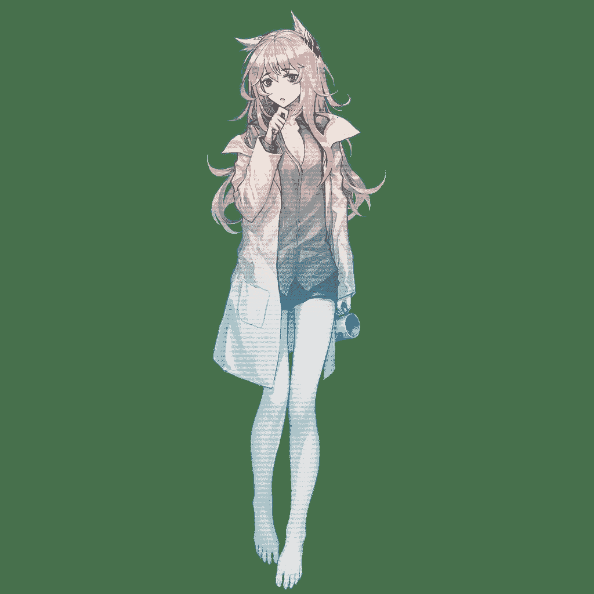

**NPC-Persica.png** *(441.24 KB, 下載次數: 10)*

[下載附件](forum.php?mod=attachment&aid=NjkxMDN8MTg3ZjUxNDN8MTYwMDg4MDI5NnwxODIzMHwyMjkzOA%3D%3D&nothumb=yes)

2017-8-7 03:05 上傳

实验室的“小”插曲

几个穿成冬季作战服的特战队士兵正潜伏在补给品中,一盒方糖,他们正躲藏在糖块与糖块之间的缝隙,紧紧地贴着糖块,告诉自己我就是一块糖,并试着不让检查的人员发现,经过了无数人类人员检查,最后到了最艰难的一关,后勤官,一个名叫做格林娜的女孩,她打开了盒子,拿起了一块方糖,而上面正好有个倒霉鬼,他在糖的背面, 格林娜旋转着稍微检查,幸好并没有看到那家伙所在的一面.....

"恩...如果偷吃一颗的话,不会被发现吧?....恩....但是不能这么做呢,这是她的"

当听到她想吃下那颗方糖时,队长不禁打了个冷颤,上面有自己的队员啊! 但看着巨大的女孩把方糖放回,连带的是紧抓着糖块,已经吓出冷汗的友军,他就放心多了...

盒子已经被盖上,方糖被放回了无人拖板车上,继续运往目的地,

"小伙子? 你还好吧?"

队长关心着刚刚差点就被吃掉的那家伙

"我....我还活着对吧...? 刚刚差点以为就要被当成糖吃掉了"

"这样好啊! 代表我们的伪装着能让我们融入这块糖呢...我们这样看来跟一颗糖差不多吧哈哈哈 没想到冬季的装备在这时候意外的好用"

"我可差点死掉 !"

"没事的没事的,我们等会儿,赶快把任务完成,就能赶快脱离这充满格里芬混蛋的鬼地方"

无人拖板车停在了帕斯卡的房门前,并逼逼得响起了通知的声音,但帕斯卡并没有前来拿取她的"货物".他们注意到自己并没有被带出去后,就悄悄的从准备好的位置爬了出来,就只是在外部这巨大的只和侧面打开的小口罢了

爬出了巨大的盒子后,他们正缓缓地走向实验室,这巨大的门并没有关好,好像是刻意留的小开口一样,他们正从这门缓缓地进入,警戒着,确认那个巨人并不在后,就放纵了些,降低了警觉的接近着桌子,当人员预备好,就使用抛缆枪,将缆绳抛上桌子,准备爬上桌,而留下了一个人在地面上观察情况

在桌上的一行人看着身旁巨大的实验器材,巨大的药剂与器皿,桌上相当杂乱,有些是饼干的包装纸,更有糖果的包装纸,还有一杯巨大的咖啡,他们根本来不及惊叹,毕竟得快点完成任务,被抓到的话就死定了,那些格里芬的女巨人可不会放过这群小小侵入者的

"小队收拢"

队长下了这个指示,小队从原本的散开警戒变成了集合,围着队长,他们的队长手上拿着上个年代的产物,印刷地图,明显是这个房间的配置图,他拿着麦克笔简易的画上了主要的几个模型位置,说是模型应该说是那些研究成果吧,他分配着负责的人力,并指示着该注意哪些后,当他们正准备散开各自完成时....一个巨大的玻璃杯从他们的上空直接罩了下来,

"抓到你们了，小老鼠们..."

一对巨大的红瞳正盯着这些小小的猎物们.露出了一些些微笑,而刚刚在地面上警戒的倒霉鬼,现在正在她的脚下被踩着,并没有被踩死,就只是踩着而已,而且正在痛苦的挣扎着,毕竟一个百倍大小的女孩子,既使体重不重,对他们而言也是相当惊人的吧

一个士兵问着

"队长....他们有说怎么撤离吗?"

"没有...."那个队长无助的响应着"那他们会不会早就知道....我们会被抓住了...."

而听到这个消息的士兵脸上已经有些绝望

"看来...很遗憾,我们的任务失败了。同志们,很高兴认识你们"  

帕斯卡正盯着这几个垂头丧气,完全不想再多些反抗的小家伙,毕竟经历了无数战斗,他们也知道遇上巨人在怎么开火和反击都是无用的吧,她看着他们的笑容开始充满了玩味和一种看着小动物惊慌失措的感觉,总觉得她就要笑了出来,觉得小小又害怕着他们或许很可爱吧,而他们全身都穿成白色的,又小小的一点,看起来就像是一小颗糖正在害怕着被她吃了一样,

帕斯卡意识到脚底下那家伙在继续下去的话可能就不妙了,而且自己也没有奇怪的癖好,轻轻地抬起脚,那家伙还黏在脚底几秒才掉下来

"是有那么喜欢我的脚吗.....小家伙"

她轻轻地拎起了那家伙放在掌上戳了几下,在抓到杯子前,晃啊晃的

"他是你们的朋友对吧? 穿的都一样呢"

"队....长......"

有些无力且无助的声音,声音小到几乎听不见了

"毕竟被踩在脚底下有好一阵子了,已经显得狼狈不堪,"难道你们有那么弱吗? 只是不小心踩到而已就快死掉的样子 但...你们闯进这里还是得付出代价的呢"

当她说出代价两个字,或许恐惧已经缠住心脏,并且如同蟒蛇一样慢慢勒紧着

这时候的帕斯卡正跪在地上一手拎着那个倒霉鬼,另一只手的手指正撑着下巴不知道在想些什么.好像正在盘算着这些家伙们的命运吧,但从她那带有黑眼圈还有一些让人有些寒意笑容中,就知道这肯定凶多吉少,毕竟她的笑容中有些一丝丝的好奇与玩味,感觉上这些家伙就像是被送入实验室的"样品"一样

“不错的素材呢...”

"素材"这两个字让那些玻璃杯中的士兵们吓傻了,既使他们曾多次参加过无数战役,既使他们也不是第一次看到这些巨人,但这也是第一次那么接近的接触,更也是担任着参与者了

而被帕斯卡拎在另一只手上的家伙,还没搞清楚状况,毕竟失实感还没消去,被踩着那么久外,还得被巨大的女性给拎着,这完全不真实,而他还没从晕眩中清醒过来吧,就像是超小的人偶一样,被吊挂着,四肢无力的垂着

"妳....想做甚么?"

那名带领他们的军官有些无力地问着,帕斯卡则是看着他,表情跟刚才一样,都是让他们感到害怕的,毕竟....自己好像完全被当成实验动物一样了

"看来你们还没搞清楚自己的立场呢"

"小家伙...就你先吧~ 正好在手边"

帕斯卡看着被她拎着的家伙,放到了掌中,看着正惊恐的那家伙,而他的队友们也不能做些什么,毕竟只能无助的隔着这巨大的玻璃杯看着这一切吧

"先把包装拆掉好了"

她所谓的包装是....当看到她拿着巨大的镊子,正在咯咯笑着,巨大的镊子扯开了士兵的战斗服,既使是高韧性的服装在她面前也如此脆弱,没多久那家伙已经被扒到只剩内裤了,好像被强奸的人一样,害怕的摀住下体,但正常来说都是女孩子被这样的对待,而今日....他或许没想过会躺在一个女巨人的手上被她如此玩弄吧

士兵遮挡着自己的下体,帕斯卡则是充满玩味的笑着,先把镊子放在一边,戳了戳那个士兵的上半身,

"这样女生是不会喜欢你的喔"

在她巨大的力量下,谁也无法抵抗,手臂就轻松地被手指头给拨开,而自己正躺在她的手掌上,这可见人为刀俎的难过氛围,她的手指固定住了那个小家伙,巨大的手戳了戳士兵的下半身

"好小阿....不过没关系呢,我挺喜欢的喔"

她笑着,但这口气中更多的是嘲笑与玩弄吧当她注意到这小小的家伙已经起生理反应时,另一只手才捂住自己已经露出笑容的嘴巴,

"抱歉抱歉,你实在太小了呢...噗 哈哈哈哈...不过才戳个几下而已"

他很明显已经无地自容,被一个巨大的女人给玩弄着,她到底会对自己怎样....被她这样羞辱着,用手指头戳个几下就已经硬了什么的....

"吶.....我想看仔细点呢,突然起了点好奇心,对你们这些小家伙"

她把士兵成大字形用透明胶带黏住了手脚固定着,好像被封印了一样,她拿了一个放大镜过来,正露出了一股充满玩味且让那家伙感受到不妙的微笑,被黏在巨大的玻璃垫片上,害怕的挣扎着,自己在怎么用力,都无法挣脱胶带

"连胶带都无法睁开吗? 真的是很弱小欸...你们,就是这样才有趣呢"

她说着,自顾自地把他放到了显微镜底下,

"让我来好好地看看你吧,小家伙"

她打开了显微镜底下的灯,转动着倍率,这种显微镜看来是拿来解剖动物用的,如果她一个心血来潮拿起手术刀要解剖....这些想着,这个士兵都快要吓晕自己了,自己只剩下一条内裤,而被一个巨大的女孩子用显微镜看着,而在这上头还有些温暖甚至到热的感觉,巨大的灯正照着自己呢....

"好啦,让我来帮你,我得好好看看呢,毕竟...我很感兴趣"

她拿着镊子已经撕毁最后一道防线....看着这无助的小素材笑了起来,

"好小阿....看起来有些可爱呢,很有精神的感觉喔"

她拿着滴管,戳着那小家伙的下体,

"哇...会弹回来呢,原来是这样的阿"

好像是故意的一样,听得出来那些惊叹与话语都是在嘲弄这个小"实验品"

"试着用手戳戳看好了,试试看触感和反应吧,小家伙~ 让我来...试试看吧~"

有些恐怖的话语

巨大的手指正朝他袭来,惊恐的他不断挣扎与发出叫声

"不要乱动喔,如果...不小心捏碎的话,我可就没办法了呢,这样我只能把你丢在一旁,换你的朋友们啰?"

帕斯卡盯向了玻璃杯中的小家伙们他们吓得靠着玻璃,她这时候的笑容就跟小女孩一样,跟平常理性的样子完全不同,完全是个痴女,不过很快地，她的视线又回到了她的实验品身上

"已经完全的硬了呢....好小阿....长度应该只剩毫米了吧,真的好小喔...."

小这个字已经彻底的污辱了在这垫片上的男人,他已经放弃挣扎,无力地躺在那里,供这个巨大的女人给观察着

"杀...了我吧...."

这几个字正从这个小男人的口中被虚弱地吐出,巨大的帕斯卡依然再用手指头轻轻地玩弄着而明明不该兴奋的事情，不知为何，一丝丝的兴奋感与酥麻感正在传出，从大腿开始延伸的感觉。她用手指头玩弄着,一下压倒着,一下晃着,现在开始搓动着

"杀了你? 我会让你后悔说出这句话的喔~我这样做可能会让你的性癖产生永久性的变化呢....就不要以后都想被我这么玩什么的,我现在可是在研究小小的你们喔"

她这样说着带着玩味与一丝笑意的说着,而他则是总的自己绝不能这样射出来! 会被欺负的! 但....已经支撑不住了巨大的刺激 百倍的刺激与力度 且意外的温柔 没有想象中的压迫与痛苦 不像是先前被脚踩着一样

今天真是倒霉日....被巨大女给踩着还得被她研究着下体的小分身,脑内啡正在分泌着，而一阵解脱的感觉以及强烈的电流充斥脑门,巨大的手指好像感受到了什么温暖微量的液体喷了出来

"噗..呼呼呼.....射出来了呢,就这么一点能让女生怀孕吗?哈哈...不过看在你那么小的份上....我就来试试看吧"  

手指头离开了,帕斯卡把沾着一小点白色液体的手指伸向了口边,轻轻地舔了一口,说实在尝不出味道呢,但有股奇妙的感觉,这样欺负一个小人的时候,自己好像也很投入,或许....这就是那些女孩们那么喜欢玩虐他们的原因吧,或许男人就是那么可爱的小生物

"呜......"

那小小的男人很明显是自尊严重的受创了什么的,帕斯卡把他取从显微镜上取了下来,但人还在垫片上被黏着, 她把他举到和自己脸一样的高度平视着,

"挺不错的呢....谢谢你的配合阿,小家伙,作为感谢....我也勉为其难的牺牲一点吧"

她渐渐的把嘴唇靠近.她...该不会是想....不! 我还不想死啊! 别吃我!! 别吃我!!!! 但是真的挣脱的话 从这里掉下去会死得!  ,在他胡思乱想的时候,啾,对这个全裸的小家伙来了个全身吻,而且还不是一瞬间而已,持续了至少三秒, 他停止了挣扎,明显安分了下来

"阿....看来这个垫片要洗了呢,你刚才是不是以为我想吃了你呢? 哈哈哈,怎么可能,我又没有那种癖好,不过...你想被我吃掉的话,我很乐意体验看看吃掉小人的感觉喔? 不知道为什么SOP总很喜欢呢....或许我也该试试"

她舔了下嘴唇,但听起来是开玩笑的,在这小人的耳中则是恐怖的,他已经略显虚弱,帕斯卡笑着,把他连着玻片收进了她的山峰之间,夹在了里头,看来是想晚些再好好享用呢,她的眼神游移到了那些在玻璃杯底下的小家伙

"先休息下吧~ 晚些要好好陪我玩喔"

然后整个人趴倒了桌子上,脸极度靠近的盯着他们,这忽然的举动与如同山崩的压迫感，使他们吓倒在地,

"那么...该换你们了,这次该实验些甚么呢"

帕斯卡转而将目光盯向了那群在玻璃杯中已经吓傻的小家伙们,露出了坏笑。她把巨大的手放在玻璃杯上抓着,

"如果谁待会敢逃跑的话,我可不能保证他的安危"

这样说着,这巨大的屏障,一个巨大的玻璃杯就升起了,被放到了一旁,一个背着通讯包,背后的天线还会随着晃动而摇晃着,看起来相当显眼的家伙,快速的往桌子的另一边跑着,帕斯卡叹了口气,巨大的手掌形成了墙壁般,挡住了他的去路,他还无法立即停止自己,撞在了帕斯卡的手掌上

"不是说不要逃跑吗? 要搞清楚自己的立场才行呢...."

就这样把他握着,看着其他人,好像说着,你们不想逃吧? 如果还不想死的话,就待在那里吧,队长用力地敲打着帕斯卡的手指,握着他的手指,

"妳这个恶魔! 妳这个怪物! 女巨人快放开我!"

帕斯卡冰冷的看着他

"放开是嘛...."

把他带到了试管的上头,松开了手,掉进了试管里,

帕斯卡用手将试管左右摇晃着,看着他因为这样撞击在试管管壁上感觉相当有趣,就这样看着,好像在小小的惩罚一样,停止时,举到了眼前,巨大的双眼直接盯着那小家伙看着

"你该不会以为这样就结束了吧?"

"看来得让你知道自己多么渺小吧，顺便帮我做个实验"

帕斯卡把这个试管放到了试管架上,则自己正拿着巨大的打火机点燃着酒精灯,当酒精灯点着后,她充满恶趣味的眼神看着那小小惊慌的侦查班队长

"你知道接下来我想做什么了吧? 小家伙"

她抓起了试管与自己平视着,好像能看到他的态度有些改变甚至是恐惧但颤抖的双唇中还是说出了 "恶魔" 这两个字一个女孩子怎么可能会喜欢被别人骂做恶魔呢,明明是他自己太弱小了吧

"看来是不知道呢....待会如果叫得不够大声地话,我可不会停喔,让你看看真正恶魔的做法吧"

"妳....妳想做甚么!? 妳这个格里芬的...."

这时候试管并没有碰触或完全接触到酒精灯而还有些距离  帕斯卡的口气不再冰冷而有些盛怒了,

"的..什么? 小家伙,还是说....你只是虫子呢? 发出来的声音太小声啰~ 我听不清楚~"

"我..."

"看来连说话都不会呢...让我好好的教育你吧~"

把试管直接贴在火焰处加热着,这时候温度急遽的上升,他也只能向上爬着,但再往上就太颠簸,而且完全无法施力了,只能困在这里

"连离开试管都有问题呢,果然是个蠢虫子吧? 或许连蚂蚁都比你厉害啰"

士兵明显正忍受着剧烈的灼热,任何接触着试管的地方都正在受苦着,手套到手臂,靴子到小腿都正在接受着这比被热水泼到还痛苦的感觉.而身体正呈现很奇怪的姿势支撑在试管当中

"如果我在晃个几下,你会掉下去喔,或许放久点,你就可以吃了"

帕斯卡故意舔舔嘴唇说着

"正好有些饿了,虽然你小小的,不过我很乐意让你当第一个被我吃掉的小人"

帕斯卡更故意地说,但她还没有玩够呢,这只是吓唬吓唬他罢了

帕斯卡故意慢慢的像是钟摆一样的轻微晃动着试管

"....不!"

帕斯卡露出了坏笑

"一只虫子还敢命令我吗....? 难道真的要让你掉下去吗? 会很烫的喔""拜托了...."

"这就是你的诚意吗? 还是说...你难道是抖M吗? 要拜托我让你下去"

"拜托了!! 不要...."

帕斯卡这时的笑容如此让人不寒而栗,但她并没有残忍到让他掉下去,看着试管正在加热着

"如果忍不住的话,可以大叫看看喔,或许我会高兴点"

帕斯卡一只手抓着试管,在自己的办公椅上坐了下来,一只手撑着,

"还是你可以忍住呢? 或许我可以让你体验更棒的,直接绑在拨棒上加热看看如何?还是要直接烧烤呢?"

看着自己的队长正在承受着痛苦,但不知道为何,心里却有种,幸好我没有逃走,的侥幸想法,他或许...是想替大家求援,毕竟也只有他有能力可以向指挥部申请些甚么了但....在这格里芬的大本营,又能做些什么呢

有人自责的跪坐在地上,如果自己试着跟那个巨人提出愿意帮队长承受什么的,....毕竟也不忍心,一起作战多年了,今天他很可能真的会死在这里.....这就让人感到害怕,刚才她还威胁着会吃掉他什么的.....看到这些格里芬的女巨人吃人,都是在影片中看到,他们可一点都不想看到自己的同僚,就在自己的面前被吃掉阿

帕斯卡这时候突然把头转向了那些人的方向,

"你们应该不会想逃吧? 还是说也想要进来?"

很显然的,没有人敢动任何一步,帕斯卡看着他们几秒就回过头来关心着这可怜的小家伙

帕斯卡显得是很不耐烦了,但也很讶异第一次看到能坚持那么久的小人,忽然有种这个人不简单呢的想法,但她心中也感到可惜,为甚么这样的人不加入格里芬会好受些呢,还要继续抵抗,这明明是不可能胜利的事情啊

帕斯卡把试管移了开来,倒过来,把人倒在桌上,已经一动也不动,正在喘息着。她巨大的手指戳了那队长两下,

"最好乖乖别动,不然等等就真的把你绑在拨棒上拿去加热了"

这时候帕斯卡把视线转为那些倒坐在地上的其他人们

"那么....他都不行了,换你们啰~ 你们的队长真的很有毅力呢,不知道你们如何....就让我来测试一下吧"

队长慢慢地撑起了自己的身体,他拉开了防弹背心的落水绳,脱去了背心,看着巨大的帕斯卡,

"我....不准妳动我的队员,要做什么都针对我就可以了,妳别伤害他们....他们是无辜的"

帕斯卡看了愣了愣,很快就笑了起来,巨大的手指还不断戳着那小小的家伙,身上满是汗水,还红通通的

"吶....你那么弱小还可以说出这种跟英雄一样的话呢,看来是我玩得不够刺激吗? 难道说你是抖M吗? 小家伙,不过我很喜欢喔,但我不会现在玩你就是了,待会得把你们拿去测试数据才行...."

帕斯卡的眼神游移到了实验室角落的一个昆虫观察箱

其他人正跑向他们的队长但帕斯卡用手指挡住了他们

"你们想要你们的队长替你们受到更多痛苦吗? 他可愿意帮你们承受痛苦喔"

他们才慢慢地退回原本杯子罩着的位置

"那么......现在有小虫子在桌上呢....."

巨大的帕斯卡拿着什么喷剂正对着小小的他

"这是杀虫剂喔....不知道对着虫子这样直接喷会怎样呢...."

他露出了绝望的表情,倒在那哩,无奈地看着她,等待着那杀虫剂被喷出

可喷出的不是预想当中的那种浑浊的雾气，而是冰凉的白色雾气，将他笼罩在了烟雾之中噗嘶~ 那所谓的杀虫剂没有想象的痛苦,而是冰凉与舒爽

"噗..哈哈哈,你刚才吓到了对吧? 吓到了呢,这只是烧烫伤喷剂而已喔"

帕斯卡恶趣味的笑着,把喷剂收了起来,帕斯卡向是拎着甚么小动物一样地抓着他,把他丢向了他的队友们

"他没事了,先好好的珍惜现在吧"

她把昆虫观察箱放到了桌上,并把小人们赶到了自己的掌上

"你们都有弹药吧? 希望你们有呢,在这里面有一栋小房子喔,里面有放不少武器和弹药,然后呢....我有事先用麦克笔画好了警戒线,如果有东西超过那里的话,你们就输了,会被惩罚喔"

"至于是甚么东西吗,你们待会就知道了呢"

帕斯卡把观察箱的侧门打开,

"进去吧"

把他们带到了有些高度的侧门,看着他们一个个地走进去

"保持警戒....我不知道她所谓的东西是甚么,但我觉得不太妙"

队长说着,但口气上显得还有些虚弱

"你还好吧?"

机枪兵问着他的体型有些壮硕,毕竟得扛着FN Minimi 班用机枪跑着呢

"我没事...至少现在没事"

队长说着,举着他的MK16 警戒着四周

"你们好像有些太紧张了呢....先去那栋房子里面拿些弹药和武器吧,我还没坏心道在你们准备完以前就让你们被攻击什么的"

帕斯卡这样说着,士兵们才放松了下来,但依然不减四处张望的戒心

他们走入建筑前榴弹兵和反坦克兵留在外头警戒着,两人身上的装备和武器都是战后少见的,甚至连生产国是否健在都不清楚,但幸运的是上头的配件和弹药是可以和北约装备去通用的

两个人正在外头戒备着,此时友军们并没有想拿取其他武器的意思,只是帮自己补充更多的5.56弹药和通用弹夹而已,而帕斯卡正打开着盖子,过程中有些施力,对于里头的他们而言已经是一场地震了当盖子被拔开,她拿着巨大的笔,绕着房子画了个圈,在这时候巨大的笔正插入土中,画线时还有些土地被摩擦的声响,更有种让人害怕的感觉

对于他们而言是38公分粗的笔,是二战时期舰炮等级了,当笔画完了一条带有颜色的壕沟后,帕斯卡就把笔收了回去,但没有想把盖子盖上的意思 ,当他们顺着笔向上看,是穿着白色实验袍的巨手,虽然说是女人的手臂,但在自己的眼中已经是巨大到有股压迫感的存在,或许这条手臂都有一条街长了

当震动时,房屋里头的人们跑出了屋子,一样目瞪口呆的看着这巨大的手正在大地上"画线"着队长拍了拍榴弹兵的肩膀"你们可以进去了" 他和其余的三人正在屋外建立起了三方位的戒备

榴弹兵和反坦克兵进去后,他们一样的不打算挑选其他武器,毕竟不熟悉外可能也无法掌握保养状况吧,拿了点弹药,粗野的看着这些穿甲弹,就觉得不妙了,如果是人员....有必要用到这种等级的穿甲弹吗  虽然有自己熟悉的T-74 钢芯穿甲弹 但也有美制的MK262和M855A1

这些都是给5.56口径打出去的高性能穿甲弹了....他们或许想也没想到自己待会会面对什么吧当小队员们整备完毕,队长仰望着帕斯卡,看的出来,身体有些颤抖与无力,帕斯卡只是恶笑得把有一栋平房大的小盒子放在了地面上,把盒子底部的板子抽掉后缓缓地拿了起来

里头满满的都是张牙舞爪正准备朝他们冲锋而来的怪物,有的至少有三层楼高,有得就只是一层楼多的,但依然是分威胁,毕竟牠们的数量可不少!

他们没有任何交集,熟练的部属武器与位置,对准了敌人,开始散射着火力,帕斯卡则一脸惬意地看着这些正紧张战斗着的士兵们,桌上的一旁还有不少盒子,里头是不同配置与品种的怪物而帕斯卡她则喝着甜得要命的咖啡正看着这一切

很快的那群怪物已经被穿甲弹打的体无完肤,各各倒在远处的平原上,毕竟5.56口径的武器射程在四百到六百公尺以内可是相当凶狠的存在,在这巨大的箱子中距离也没那么远吧,

帕斯卡喝了一口咖啡,在簿子上记录着甚么,巨大的抄写声让人感觉到有些不舒服,而她正冰冷冷的看着他们

"准备好了,下一批要来啰"

帕斯卡从桌上又那了一个小盒子,但在他们眼中明显比较大了,

"长官....这看起来有些怪怪的"

队长声音还是无法平复,毕竟刚刚的灼热感与疼痛感至今依然无法消去

"我..我当然看的出来,准备好了"

帕斯卡笑着,再次把那群怪物放了出来,这次有一只至少是一栋楼级别的,还有大量的小型怪物,虽然说小型但至少也有一层楼高,牠们正以四足狂奔着,像是野兽一样正准备冲刺而来,将他们大快朵颐帕斯卡继续记录着,好像不太在乎他们的死活,他们正激烈的战斗着,

弹壳已经可以布满他们的脚边,而机枪的枪管已经烧红,几乎无法再次发射,这比起刚才辛苦了许多,肾上腺素也开始分泌着,那些杂鱼很快地被解决,但是那最大只的家伙发出了低沉的嘶吼,正准备朝他们冲刺而来

帕斯卡好像注意到了,坏笑着看着他们,

"如果受不了的话,求救我还是可以接受的喔"

必须让队员们活下去才行.....不管能不能再回到家,他拉开了红色的烟幕弹,烟雾在他的手中喷射着,这在对空通讯中的意思是紧急状况,他丢向了那怪物的方向,现在的距离,已经不到一个路口队员们不断倾泻着火力,依然无法阻止那庞大的家伙

这时候，帕斯卡巨大的手掌伸了下来。阻挡了那怪物的去路,将牠捞到了手中,故意转向那群士兵,帕斯卡是有心还是无意的正再向这群士兵们表示自己的弱小与渺小

她只是轻轻用力,那怪物已经支离破碎的变成一团充满黏液的烂泥,帕斯卡把尸块丢到了一旁,用纸巾擦了擦手看着他们

"连这点程度都不行吗....你们该不会输给一个弱女子了吧? 这样看来你们很快就会死掉啰?"

士兵们躲回掩体之中,换上了新的弹药,虽然躲进去已经是不必要的动作,但这看来是经年累月作战所造就的习惯吧,他们准备好接敌了,而这次把弹种换成了钢芯穿甲弹,帕斯卡这次带进来的盒子比起先前的还要更大,他们或许看到时就做好死在这里的准备了吧

但看到刚才那样的场面，她能够解决如此巨大的怪物,而且只是一只手而已,这是多么让人害怕,毕竟自己在怎么使出火力攻击都无法造成任何一点伤害,而她只要随手一抓就可以把那怪物弄成一团恶心的块状物甩到一旁

当帕斯卡把那些怪物留在地面上时,他们只差没有跪下来了,比例跟刚才很类似,但这次的大型怪都是那些三层楼高的,至少有五只,而其他的都是超出一层楼高看起来很像巨大蜥蜴的怪物

"可恶阿....为什么我们面对的好像都是爬虫类动物一样"

"怎么觉得....我们好像是误入了超大蜥蜴养殖箱的昆虫一样"

"你没有更好的形容了吗?!"

几个人正在抱怨着自己的遭遇,但他们的眼神已经对准了那些怪物的关节与胸膛,准备好给他们一些甚至可以在近距离打穿轻型装甲车的火力,但让他们感到绝望的是.....在战斗结束之前帕斯卡竟然又多放入了一批怪物,

虽然是小型怪,但是这可是相当棘手的状况,当那些小型怪超越了大型怪高速的奔驰时,火力网撒下,依然难以敌挡那些数量众多的怪,这基本是人海战术! 榴弹与反坦克武器全部都打出去了,才勉强解决,但他们绝望地看向自己的弹药存量,在看着那些正在步步逼近的大型怪,这可比坦克还麻烦了.....或许自己只能死在这里了

帕斯卡这时候已经停止纪录，整个人带有些兴致的看着这些小家伙们绝望的表情,好像有些兴奋地笑着

"你们可以的吧? 只是几个跟老鼠一样大的东西而已喔"

"还是说...对你们而言已经是甚么恐怖的怪兽了呢? 只能怪你们自己太弱小了吧"

子弹完全打不穿他们从任何地方都不行,但这些只能激怒牠们当他们各自向自己信仰的神祈祷当他们有些已经闭上双眼不再瞄准绝望已经如同藤蔓一样覆盖着缠绕自己,巨大的震动传来,四周的玻璃幕已经倒下,而帕斯卡的手对着他们的"地面"捶了下大半的怪物已将变成了肉泥

她的手很快地追了上去,将他们抓起一把抓烂

"果然连人类最精锐的部队都不能抵挡住这些小老鼠呢"

"果然你们只是虫子而已,对吧"

"但是你们可是我重要的实验素材喔,不会那么容易让你们这样死掉的:"

当大家看到怪物都被解决,已经倒在地上,靠在掩体边喘息着，有些人吓到腿已经几乎无法再次站起此时武器已经放下失去了大部分的战意毕竟自己刚刚去地狱门前走一遭还是基本不可能赢的战斗 ,

要不是帕斯卡肯支持的话,或许早就被吃掉了吧

帕斯卡冷笑着,自己缓缓地爬到桌上跪着看着他们,俯视着,眼神中不是怜悯或是同情,而是坏笑着,好像是一副鄙视的眼神,她缓缓地把手伸向唇边,

"刚才看在你们那么小的份上...算你们通过好了,之后呢...这是最后一项测试了,试着打败我吧,小家伙们"

已经不知如何应对,弹药几乎耗尽,机枪兵疯狂的对着帕斯卡发射着火力,但此时他的位置也难以对这个百倍的女人散射火力吧,大部分的弹药打在了粉色的内裤与大腿边

"真是变态呢.....攻击着女人的那里什么的,那么...你们就这点实力吗?"

帕斯卡巨大的膝盖正在推进着,这跟山一样大的女人,如果她....真正接近我们的话,又会遭遇到什么样的折磨呢? 很多人捡起了自己丢到一旁的武器,开始攻击着,当她另一只脚跟上时,地面就是一阵的震动,自己都开始站不稳了,而她也正在接近着,缓慢的,但也是无可阻挡的

眼见她慢慢地覆盖自己的视线,她已经盖住了自己的视角,慢慢地几乎要盖住整片天空,此时帕斯卡的影子已经要罩住了这些士兵们火力只能散布在她的大腿与大腿内侧那神圣不可侵犯的领域

帕斯卡冷笑着

"你们连刺激一个女孩子都办不到吗? 这就是你们最强的力量了?"

当弹药耗尽，他们无力的跪坐在地上等待着属于自己的命运，武器已经丢落,仰望着巨大的她,要不是她正好也俯视着自己,不然也无法盯着她看吧

"这样就放弃了吗? 不过....你们没有向后退或是逃跑呢,我很佩服喔,实力还算不错呢"

她的笑容中,并不知道在盘算些甚么,她坐了下来,地面可以感受到一些震动,但也没人敢不站稳吧,或大声说出妳的体重真重之类的,毕竟对她而言是自己太小了,她以鸭子坐的姿态看着这些士兵们,手还在附近游移着....

她的手降了下来，落到了几个人的身前,他们只能以绝望的眼神等待着巨大的她的审判，有的人甚至已经开始低声地啜泣起来，准备迎接着死神的降临,只是，帕斯卡说出的话，让他们已经死寂的心，重新...燃起了希望

“干得不错，小家伙们，你们通过了”

帕斯卡以满意的神情看着那些惊愕地看着自己的小小士兵们，满意地笑着。

“你们还真是超出我的预期了呐”

“居然在我的压力之下还没有人崩溃的，很好很好”

她从口袋里掏出了一个“小”箱子，放到了几个人的面前，里面是装的满满的食物，冰凉的水，药剂之类的补给品

“这是...”

队长惊愕地仰头看着帕斯卡俯视下来的巨大身体。有些不敢相信地问道

“既然通关了的话，这就是奖励了哦”

此时她的声音在所有人的头上覆盖下来，犹如天籁之音,士兵们从箱子中取出了冰水脱去了头盔与面罩,往自己的脸上淋着,然后大口的喝着这许久没碰到的冰水,里面还有一堆自己不可能碰上食物,已经吃口粮吃了数年的他们或许不敢想象自己有机会吃上正常的食物吧,毕竟这是除了军官和平民外不可能的

长期在前线,补给线都是断掉的,甚至很多基地得吃种植于水耕农场的菜叶,当大口咬下食物时,他们的泪光闪烁着,饥饿许久的他们,正在啃食着,队长则默默地收了药品收到自己的背包中,毕竟也不知道未来是否会再次用到

"你们想要的话,未来每天都可以吃喔"

"毕竟这些量对我来说根本不算甚么呢,只要你们愿意担任我的实验助手，生活在这个基地就好。放心,我会让你们名义上的成为格里芬的士兵的,未来负责帮我测试装备和武器就好"

"我....."

现在他们的队长正面临了抉择,是对国家的信念,还是队员们的生存,若选前者....大家顶多是填饱肚子的被她辗死吧,后者....这样大家就不避挨饿了呢

"妳会遵守承诺吧? 我现在只希望能好好活着就好...."

有些崩溃的看着她,毕竟自己受苦时那些信念可不能当饭吃,更不能拯救自己,顶多只能当成精神支柱以及那些狂热份子们战斗下去的理由,但自己可不是那种满腔爱国热血的人

"其实你们也不是第一批过来的呢,你们的上层都说其他人他们挂掉了对吧?"

帕斯卡说着,把平板放到了自己的前端,挡住了内裤,上头显示着至少有百名士兵的资料,不只是特战单位还有普通投降或被捕获的战斗单位,他们并没有死,有些投入了民间很多的是加入了格里芬方的军队服务着

"你们刚刚也知道了,面对我们的时候,你们可是一点力量都没有的喔,所以为什么还要相信那些官员的替他们送死呢? 想好好的活下去,就投降吧不然要继续战斗下去的话,我很乐意把你们一掌拍死呢,但我也很想要跟你们和平相处,毕竟那么特殊的助手可是很难找到的"

帕斯卡不解地说着,同时也带着诱惑的问着他们

队长看向了自己的队员们,好像不需要话语,就已经可以传达彼此的想法,

"我了解了....我....我愿意加入你们"

他丢下了武器,好像丢去了包袱,但更多的是无奈与矛盾,这可是一点犹豫都没有,毕竟这可能是生存下去的办法,替变为残存政府的国家作战下去,被格里芬的人形玩死或踩死也是迟早的事情,不如在这大好机会的时候,就投降加入他们吧

"是个很聪明的选择呢,如果你如那些家伙的愿,对你而言坏处比好处多吧?"

帕斯卡称赞着,但她或许不知道这对于这些小家伙们是多么沉重的话语,毕竟背叛自己的阵营是让人难过的抉择更是无奈的,此时平板中拨放着一段录音听得出来正是他们军区的总司令

"目前为止派出去的八支特战小队都没有回来,反正他们也不可能回来吧,那么恐怖攻击部分可能还比较成功,对了,你们下次在组织一批特战小队,以窃取资料的名义让他们去潜入格里芬,至少告诉那些混账,我们的能力可是可以达到他们大本营的"

另一个声音传出了

"但是,这不可能成功吧? 他们基本都会死吧"

"这是在想法内的,这只是让格里芬的内部人员知道,我们随时都可以发起攻击,不然你们该怎么持续制造这不稳定的平衡? 这必须拿来维持军区中的民心与军心"

"我了解了....就以他们的武器实验室为目标吧"

"很好,如果真的不小心给他们成功或许也是好事,失败的话,那些家伙估计会拉手榴弹殉国吧"

录音中断了

其他士兵们好像更坚定了自己队长的选择,纷纷也把武器丢到远处,望向帕斯卡

"那么...我会替你们安排位置和人事调动的"

帕斯卡拿起了平板,好像点了些甚么,她把那些人放到掌中,她蹲在了门前,不久后一辆无人车辆驾驶了过来,她把那些人送上了车,他们将会被分配新的装备位置 军衔 将会有自己的宿舍 与 全新的身分 并且正式成为格里芬的士兵之一 当无人车远去 想不久前自己可是悄悄的潜入 现在可是光明正大地 果然轻快多了

远去时,看着帕斯卡,那个女人,总有复杂的情绪,特别是队长,他自己从反抗被折磨到后来的救赎与接受,这一切都是许多无奈的决定吧,帕斯卡眼见那些小家伙被送走,手就伸向了乳沟,无法挣脱胶带的小家伙,已经睡着了呢,挺可爱的,毕竟刚刚他可是被夹在男人们梦想的地方呢

"现在就是你了呢...我的贴身小助手...."

帕斯卡正走向自己在实验室门对面的"休息室" 她的房间,设计在那么进也是因为工作上的方便吧当帕斯卡粗暴地把他连着原本的玻璃垫片一起丢上了床,剧烈的撞击与晃动使他惊醒,身旁已经是柔软且有起佛的地面。而自己脖子可动的角度看来这里是一张巨大的床,他...并没有看到那个巨人

帕斯卡正在缓缓脱去实验袍和自己的衣服,不久剩下内衣时,但她却一点都没想停止的意思,继续脱着,她拿起了那小家伙,巨大的舌头舔向了他,帕斯卡的口水呛得他不断咳着

"你的朋友都已经通过了喔,现在换你来了,如果没办法让我在今晚舒服的话,你就每天的跟我在一起吧,不过表现的好的话,你就可以永远永远的当我的小玩具了喔~"

此时他并没有发现帕斯卡已经是裸体的,帕斯卡有些粗暴地把胶带给撕开,没有在意他是否会疼痛,直接捏着他,贴向自己的乳头,而帕斯卡的另一只手也伸向开始湿润的下体,这将会是一场难忘的夜晚........

充满着帕斯卡的嘲讽欢愉 与快乐 而对于这小家伙或许更多的是不情愿吧 既使在巨大的女体上很兴奋 但今天自己是担任属于她的实验品又或是着是玩物给她带来快乐,而自己得苦着替她服务,但无论如何这都是他未来每天的工作和日子了

就在帕斯卡走入了房间不久之后，被遗留在桌子上的平板电脑，似乎是被什么吹动到或是触动到了，刚刚暂停的录音，又继续播放了下去

“虽然这么说，但我还是希望这些混蛋能平安无事的归来”

“副官”

“在”

“准备一个接应小队，一旦时间过长，就潜入进去观察情况和营救”

录音此时才真正的结束了,只可惜后半部分，除了帕斯卡以外，小队之中没有一个人知道。也许，永远都不会知道呢。

而此时的格林娜，在后勤的仓库内，伸了伸懒腰，又开始准备检查起新到的一批物资来....而巨大桌子中的抽屉有个玻璃瓶,里面装个几个瑟瑟发抖的小人们....而玻璃瓶外讽刺的贴着价格的卷标,现在他们可是"商品"了吧。

 

# 55

于是我更新咯……最近大概会减少更新的频率，因为毕竟马上要回美国了。

大概回去之后空闲会更多一些吧，现在在中间的这个时间段应该会忙呢…… 

# 56

> [s117 發表於 2017-9-12 00:24](https://giantessnight.com/gnforum2012/forum.php?mod=redirect&goto=findpost&pid=347660&ptid=22938)

> lz啊 你在哪里 在不更文我就要死了_(:з」∠)_

抱歉，前段时间自己的日程表极度混乱，到这两天才刚刚修好，已经恢复写作状态，正在缓慢推进进度中……

 

# 57

*本帖最後由 dasers_100 於 2017-10-22 01:07 編輯*

是的你没看错我跑来更新了，其实说实在话这是之前的一篇半成品，最近终于被完善了之后才发出来的

故事依然是我们的404小队，不过这次的话，则是聚焦在她们第一次的巨大化的时间点上，那么，还请大家享受久违了的更新吧_(:з」∠)_

数年前大批的平民早已撤离前线的这座城市,而数万名士兵,好几个师级单位驻守在了这里,他们已经将城市军事化了,到处都是哨战和营部,大楼中也驻守了不少士兵和军眷而外部也有不少防线是由老练的士兵组成军队们执行防卫和支持的,毕竟他们本能的就有忠诚与坚守命令的基因,把他们丢去前线在适合不过,但他们没想到这无法挡住格里芬的特工们

层层的防线不需要突破,甚至没有引起任何注意,每个哨站都正常运作,她们则是以军眷的身分悄悄的潜入了这城市里头,她们成功欺骗了这城市的免疫系统,悄悄的进入了里投,开始进行着刺杀任务,悄悄的从线人的手中接过武器,再来摸入指挥所中,成功的把他们的指挥官干掉的同时

敌人的警报就已经响起,一定有哪个环节出错了,不过至少任务目标完成了,她们再次如同棋子一般被利用,不过这撤离上格里芬绝对不会抛弃他们吧,当直升机的驾驶员在通信频道中不断回报着距离抵达撤离点的时间,通知她们准备撤离时,这或许又燃起了一丝希望吧

UMP45跑出了门,带着少了一个人的404小队冲出了建筑,在那几个卫兵嘴角还叼着烟或许无法反应过来时,就将他们一一击毙,不知道是上天的玩笑还是怎样,这条街上没有任何车辆,她们只好顺着街道用跑的了,跑向几条街外的撤离点,当然有直升机直接飞进来实在危险,但也没办法,或许也是因为命令的关系吧

在此时已经有无数追兵甚至有车辆正在赶往这里,不少敌人的士兵们正在她们的后头追赶着,人数相当可观,为了三个女孩动用了至少一个排以上的步兵,这或许也是他们混乱指挥链底下所造成的愚蠢举动吧

"这里是伊卡洛斯,准备降落"

直升机正盘旋着,噪音并不大,甚至雷达上面也不易发现,完全为了夜间作战以及匿踪而设计的,不过这时候,一管RPG打了出来,画出了完美的线条,击中了直升机的机体,一瞬间直升机被直击,驾驶舱爆裂,而引擎和燃油箱都着火了,毕竟推力和引擎还是有作动的,直升机正飞向不远处的建筑,直接撞入了大楼之中,一阵爆炸,这估计已经引起了全城的警戒与封锁

45看着自己被包围,停了下来,躲在一个无人驻守的哨站中,她靠在一个水泥墩后头,在通信频道中联系着指挥官

"指挥官,直升机刚刚坠毁了,请求指示"

"启动战斗计划B,UMP45待会妳带着队员输入密码,启动新型的芯片,这是最后的手段"

甚么是计划B? 这可在简报中没有提及阿,但总感觉指挥官总有法子,看到了通信系统上出现了一串数字后,45带着404小队中的两人,输入了密码,为何是两人呢,加上45正好3人,这一次的任务G11并不参与

"了解"

当密码输入,确认后,她们几个就开始渐渐的变大了,先是十几米,之后是五十几米,,然后慢慢地已经到了十层楼,再来到了更高的层楼,至少有原本的百倍了吧,9吓到了,她还以为自己是飘了起来还是怎样,吓得后退了几步,

她发觉自己有踩到地面,张开因为害怕而闭起的眼,脚已经踩碎了几栋在后方的建筑,以及车辆,而踩踏的震动还震倒了几个人,此时包围着她们的士兵们吓傻了,枪可能还举着,但是没有人扣下版机毕竟这是没有面对过的情况,训练中也没教导处里的办法,更没有这种状况的应变措施,更没有一本作战手册提及敌人变大的话该怎么办,毕竟这只有卡通或是小说才会出现的情节。

此时三人也对这个情况感到一脸蒙逼,这是甚么情况!? 此时只有416和45显得比较冷静,而9依然惊魂未定的四处张望着

"看起来是我们变大了,各方面都是"

她俯视着那些士兵们和炮台指向她们的装甲车.9发现自己并没有怎样,只是变大了而已,此时的景物确实特别,跟平常在直升机的空中一样,是很高的,但是这一次她是脚踏实地的以这种视角看出去

45询问着指挥官,毕竟...这到底是异常现象还是计划中的项目呢

"指挥官,我们变大了....这是怎么一回事?"

"歼灭敌人,然后马上撤离,竟然都已经启动计划B了,取消直升机撤离计划,改采步行"

指挥官冷静地说着,毕竟机密行动是不能够被知道的,而这项技术也是格里芬的机密并不能够公布出去让敌人知道,否则可能更变他们的战略部署,进而导致战线崩盘

"步行!?"

三人在频道中喊了出来,这巨大的声音使着地面上的小小士兵们都跪了下来,倒了下来,甚至有人正摀住耳朵打滚着,既使有耳塞抗噪耳机和头盔的阻挡,那巨大的声音依然使他们的耳膜受到了强烈的打击,基本上每一个人都对这三个巨大少女的喊叫感到痛苦,附近有些玻璃甚至直接破碎,军用车辆的防爆玻璃还有些裂纹,这完全不是合理的声音大小了

在此时指挥官在通信频道中接着说了

"没错,用走的,往东走,对我们而言几十公里的距离,计算过后,妳们大约不用十分钟就到了"

此时45正俯视着那些士兵们,那微笑或许已经让不少人吓得发抖了吧,眼睛的部分正好被阴影盖住,在接受高分贝打击后,他们有些人开始攻击了,起初还想用手挡着,才忽然想到,这一点也不痛,更无法对自己造成伤害,这些子弹原本可以让自己变成蜂窝的现在却一点伤害也没有,根本不痛,如同无敌的存在一般

脚底下的"重"火力一点都无法伤害自己,45已经觉得有些不耐烦了,像是个小女孩一样,向前踏了一步虽然没有踩到人,已经震倒了几个靠得比较近的,更让不少士兵已经向后退守,地面也被踩下了些,震动也使一旁的汽车发出了警鸣声

敌方的军官在吼着

"全体! 撤退! 撤退! 火炮支持已经在调动了! 快撤!"

而格里芬的指挥官则在通信频道中冷静地说着

“你们的身体现在就是最强的武器”

士兵们撤离着,有些人倒霉的没能爬上车辆,只能无助的看着友军已经到了几个街道外,害怕的仰望着巨人,再她们反应之前有些人正用跑的试图跑离,更也有人已经有如石化,依然举着枪对着她们,但有的则是跪了下来,枪丢在了一边,绝望的颤抖着

没有扣下版机,更没有行动,害怕的站在那里,9蹲了下来,看着那些被留在这里的可怜家伙们,用一种不知道到底是同情还是在看着小动物的眼神看着他们,也好像是观察着蚂蚁行军的小孩子一般的俯视着,好像想捏起几个人偷偷藏起来保护他们,好想偷抓几个看起来不错的回去偷偷养着也好

“我想我明白了指挥官的意思...”

45冷冰冰的说着

“原来最强大的武器的意思是这个啊...”

45仰头望着天,一只手罩住了右边的脸,突然,开始发出了疯狂的笑声

“那么，我们不如就来当一回恶魔吧！”

她笑着的时候耳膜或许还会有些刺痛吧,不少士兵们受到刺激,或许是听到了她的笑声,知道了自己免不了死的下场了,疯狂的对她开火着

“你们觉得他们现在像不像虫子？”

45完全无视了那些士兵们的火力打击,毕竟一点伤害也没有呢

“既然是虫子的话，那就按照灭虫的方法处理就好了！”

她一脚用力地踏入一个小队之中,巨大的战斗靴让十几个汉子被压成了马路上的一团红色烂泥

"这...是骗人的吧,45姊....

9看着露出诡异笑容踩踏着小人们的姊妹,有些...不知所措的说着

"了解,那么...就这么办吧"

416也举起了脚,但这一次他们学乖了,学会逃跑,并没有傻住,但是她的巨足在上头跟着,脚尖先着地挡住了去路,然后再一脚用力的踏下,好像听到了噗哧一声

"416...妳怎么也! 45姊...妳.........!"

"这可是指挥官的命令喔"

9这样吼着,45则是完全投入了这场游戏之中,她并没有给予什么仁慈的回应,而是冷静地说着

"9.别忘了我们的任务是歼灭他们"

毕竟这和平常开枪杀敌不同,这可是....踩死他们,真正意义上的,他们跟虫子一样弱小,但他们依然是鲜活的生命阿....为什么要当自己玩乐的玩具,或许能好好战斗的,为什么...要变成自己单方面屠杀取乐用的,而且平常的话....也不必要杀那么多人啊.....他们可是活生生的人啊....

当转头看着自己的姊妹,她....露出的笑容格外的真实,而她的笑容也格外地投入且享受,完全不把他们当成对等的生命体在看待了,完全的好像在玩乐一样的愉悦,而且正享受着这屠杀的感觉

我能怎么办....不能只发觉这是个命令...是个任务而已啊....这或许是让45姊更开心的办法吧

"对不起了.....我会尽量快点结束温柔点的,小东西们....对不起..."

9俯视着底下两个小人,一个正跪着,一个正倒在地上,很明显跪着那个正在替倒地的急救和包扎,他是个医护兵

"医官! 快.....跑!"

那名不知怎么重伤倒地的伤员,挤尽最后的力气对着那名医护兵喊着,

9举起了脚,头撇过闭上了双眼,用力的一脚踏下正在救护伤员的医护兵头上,此时地上还有不知道多少个伤员,说伤员吗,估计都是刚才耳膜受伤的那群,毕竟在这极度的体型差距下,能有多少正常受伤的人呢

当她踩下,噗叽,他们被踩死了,但忽然有一股强烈的电流流过自己的腿间与背脊,通过了迷走神经刺激的,酥麻的快感开始传出,罪恶的快感,她....不知为何脸上出现了红晕,好像也开始投入其中,不过她一部分的也正在忍受着这杀戮的痛苦,此时在地面上的人们则是绝望的,他们眼中....这三个巨大的少女,正是恶魔

此时还有一辆装甲车留在这里抗命的掩护着他的友军们撤离,上头的三零机炮试图能够伤及那些巨大少女们,但很显然的一点伤害都没有,不过起了另一个作用,吸引到了她的注意,UMP45正走了过来,或许这辆装甲车并不是抗命吧,因为某些原因导致的行动不能而被留在这了,例如机械故障

45原本想要捡起这辆装甲车,但想了想有个更好的办法,巨大的脚轻轻地放在了装甲车上,此时里面的成员已经可以听到金属疲劳和挤压的声音,不断敲打着舱盖,因为些微变形,连后方的门都无法打开,正在里面绝望的喊叫和求饶着,而后方成员舱顶部的舱盖也已经变形无法开启,处于完全绝望的状态

"如果轻轻一踩的话应该就会扁掉吧? 还是说...."

她的脚故意轻轻地碰了碰车头,这时候里头的人原本想着或许能够逃跑吧! 没想到连上头的舱盖都因为变形和液压系统故障而无法开启

"还是说踢出去呢? 不过那么小....还是踩扁好了吧!"

她说着这恐怖的话语,炮台左右摇晃着,虽然因为损坏有些迟钝甚至炮管都不太能动了,机灵的组员认为这伙许能让她知道这是"不要"的意思吧,但看来她没注意那么多,或许是注意到了,故意不去理会吧,脚放在了装甲车上,这次开始有些用力了,慢慢向下压着

"永别了,小虫子~"

咖滋,一辆装甲车就变成了铁饼,或许还有些血肉在里面,她觉得很无趣的看着这辆装甲车,毕竟原本还以为有多坚固呢,就把这夹着血肉的铁饼给踢飞了,此时街道的远处两辆坦克从街道的远处高速的靠近,战车炮打中了腿部,但这样的火力也没能对少女造成丝毫伤害,甚至连袜子都没有受损呢炮台上头的机枪与战车炮一同开火着,它们就在街道的远处

此时416靠近了它们,一只手抓起了一辆,另一辆则是交给了45处理

"比玩具还小的大小呢"

416平淡的说着,手此时抓着战车,说是三根手指头捏着比较实际,虽然说起来很怪,但的确是这种姿势虽然手指头压住了车长塔,但组员原本想说要逃生的打开了装填手位置的舱盖,打开来尽是看到一对巨大的绿色眼睛正盯着他们

"看起来就跟虫子一样小呢"

拎起了装填手,用力地将这辆战车抛向远处,砸向远方,飞过了几栋建筑几条街,就这样如同玩具一样的砸在地上,她巨大的绿瞳冰冷的让人感到害怕地盯着,白色长发的女孩,手拎着一个绿色数位迷彩服装的士兵直盯着,头上戴着北约制式的战车通信头盔

"不....不要吃我..!"

战车兵害怕地说着,毕竟被她抓到了,就不太可能活下去了吧,而且还是被这样拎着,这已经几乎足以吓晕自己了,看着那冰冷的眼神,或许会被捏死或更有可能被吃掉,毕竟童话故事中巨人总是吃人的

"真是无趣的虫子....我可不是那种捡起虫子就吃的人"

但她并没有那么做,把他放到了地上,然后在他反应过来开始逃跑以前已经一脚精确地踩下,毫无情感,甚至还辗了几下,当416望向45时,那辆交给她的战车已经被她踢飞,撞向了远处的建筑中,驾驶组员们都因为剧烈的冲击在车辆中撞击致死

而45现在把兴致转向放在了那些躲起来的可怜虫们,她在路上晃着,碰碰,碰碰,正在走着

"小虫子们~ 你们在哪里啊,求饶的话....会考虑让你们死的好一些喔~不过不想求饶的话,也可以死的比较痛苦些喔~"

她甚至趴了下来,巨大的眼睛盯着建筑中,盯着掩体后,她确实找到了几个,有一个举起了双手投降着,步枪直接掉落在地上时,45有些不快的用手指头直接把他弹飞,其他的她俯视着,微笑着,他们坐倒在地,深怕着个女巨人对自己做什么

"最讨厌放下武器的家伙了"

她捏起了其中一个,并且警告着那些已经吓的基本没有思绪的家伙们

"如果敢逃跑的话...."

她故意舔了舔嘴唇吓吓他们,这或许达到作用了,他们完全饱受着惊吓的坐在那里,不敢乱动,但被她拎着的才是被吓得最惨的那个吧

"小家伙....帮我脚底按摩如何啊? 嘻嘻"

她脱下了靴子,把人丢了进去,脚缓缓地伸了进去,感觉到他正在求饶着,正在敲打着脚趾头但这可一点用都没有,脚完全的穿上了靴子,然后噗哧一声,他已经变成了鞋底的小红点

剩下的五个人则被45盯着了

"没想的那么弱呢...."

她随手捡起了附近阵地的储水槽,拔开了开口,把人塞了进去,然后把盖子盖了起来,她轻藐着问着

"你们知道吗? 很多喜欢这样摇巧克力饼干的喔,这样好像会变成一颗小球呢,但这次好像是草莓口味的呢,小虫子们~"

她开始摇晃了储水槽,里头的人撞得乱七八糟的,在两边的不断撞击着,撞击着,最后就真的变成跟那种巧克力饼干一样了,变成一团肉完了。

当她摇了一阵子,上下的摇动,使她手有些酸了,拔开了储水槽的一边,把他们倒了出来,果真变成了一个小肉球

"哈哈哈.....没想到...这可以拿来玩小虫子呢,哈哈哈"

她把这颗小肉球随手抛向了远处,在四处溅起了鲜血与肉块,染红了街道,她或许在此时已经完全的视人类为玩物或虫子了吧,一点罪恶感都没有,根本是在玩乐了

当被丢下的人们已经所剩无几,而稍早撤离的人们早已逃回阵地之中,变大的她们看到了远处传来了火光一闪一闪的,估计是他们动用了炮兵,炮击正在开始,刚才那段时间正好是联系和计算的时间吧,毕竟在城市当中要炮击真是十分不容易

毕竟是炮击城市中的目标,炮弹拋物线比较高,炮弹不可能那么快落地,在这时间45的脚抹了抹在地上的肉酱,对着通讯频道问着

"指挥官,他们正在炮击,我们该怎么处置? 要杀死那些任务区域外的敌人吗?"

指挥官冷静的解说该如何使她们自己变得更大,45倒数着三人在同一时间又开始剧烈膨胀,变大到了至少普通人类的1000倍左右

原本还没着地的炮弹还直接撞上她们的腿部,但出乎意料的是一点感觉都没有,大概有些暖暖的感觉吧,连袜子都无法弄破

"哈哈哈哈,这就是炮击吗? 看来得让他们更绝望了呢!"

45没有几步就走到了炮兵阵地那里,脚高高的举起对着底下操作着牵引炮的士兵们说着

"数到五就踩下去啰~,让你们跑远一点吧,如果能跑走的话...哈哈哈"

士兵们丢下了手中的武器,开始狂奔着... .绝望跑着,这巨大的少女....根本无法应对! 大口径的火炮都不会有伤害了更何况是步枪

"5...4...~"

听着巨大少女倒数着,不禁加快了速度,还想活下去阿,绝望的听着,彷佛倒数着生命的尽头将至

"3....2~~ 1~~ 时间到~ Gameover~"

她一脚踩下,连着火炮和那些士兵们一起踩烂,而这时的416已经开始攻击,应该说是破坏着,敌人主要基地了

这真的是完全的歼灭.....而9则站在城市的外头,没有任何作为.....看到几辆侥幸逃出的军用卡车,则是告诉着自己, 这就跟踩死虫子一样! 对啊! 他们可是敌人! 被枪杀死和被踩死都是会死得 或许这还比较不痛.....不这么做的话...就是抗命了

她走到了公路那,脚高高的举起,踩了下去,连着公路和那批车队一起踩入了巨大的脚印之中那时的酥麻感再次涌上....她却不受控制多踩了几下, 脚印变得十分混杂,或许敌人会误以为这是甚么航空武器轰炸出来的吧,毕竟这威力已经大的不科学了

此时45看到了一架直升机正从城市边缘起飞,45把手掌挡在了直升机前百公尺,看着直升机笨拙的悬停回转,双手拱了起来,包围了直升机

"抓到了....小苍蝇"

双掌快速地远离,这对直升机造成了不少影响,毕竟剧烈的气流变化使他的尾旋翼断裂正在自旋着,双掌用力地拍下,就如同打死苍蝇一样的,打下了一架重型的运输直升机

此时指挥官好像看到了无人机的画面,对着频道中发话着

"发现城市中还有不少热源反应,计划修正移平城市,该区域平民在几年前就撤离了,这是军事化的都市,不用担心误伤平民的问题"

也是阿,这里除了军眷和军人外就没有其他人了,她们也能更合理的破坏这里了吧45听到命令后好像被打开了甚么开关一样,开始踩踏着,踢击着,甚至用手挖起了一个街区,然后在掌中慢慢地弄碎,捏碎时还发出了诡异的笑声,好像很兴奋,

"街道什么的....你们还真弱小阿...嘿嘿嘿...连虫子都不如了呢"

而416则冰冷的执行命令,面无表情,无情的对脚下的可怜家伙们踩踏着,这一切就跟地狱一样,整片城市甚至因为燃气管线爆裂变成了一片火海,而45和416在上头踩踏着,就如同恶魔正践踏在地狱上头一样,此时真是火上加油,煤气管爆裂引起的大火燃烧到了航空燃油储备的区域,更巨大的爆炸,整个城市完全的烧了起来

而9跪在一旁,难过的看着许多生命因此而消逝,他们本应不用死的,特殊行动也只是为了达到目的杀人,而不是屠杀啊!  虽然自己刚才...也踩死了一些人,但是心里还是很不能接受的,非常的不平衡

看着这场血腥屠杀....她甚至开始自责自己撤离行动的失败,导致了那些家伙的死,但同时心理冲突着,他们可是敌人阿不该为他们同情,几千度的高温燃烧着,大楼玻璃甚至有些融化,有人跟着建材一起从高楼中掉下,应该说他们是跳下吧

人类本能的反应,在她们眼中就是一个个小火花掉下来而已,毕竟人在最痛苦的时候甚么事情都做得出来从高楼中跳下的火球被9看在眼里,更加的难过但想着 他们都不可能活下来了 或许....自己是让他们解脱的方法

街道上既使有人没被烧到,也痛苦的跑着,喊叫着,打滚着,高温或许使他们血液沸腾,极度的疼痛延烧着

9看着那些可怜的家伙,甚至想把他们捏到掌上,偷偷的藏起来待会找地方放下他们,但是巨大的手指对比起他们实在太大了,当想捏起时,噗叽,一声捏死了,人群开始跑得更卖命,头也不回,或许认为这是她们杀戮的新方法吧

9还是试图想拯救他们,但捏死了至少二三十人后才停止....绝望地看着手指头上小小的血迹,质问着自己的力量会不会过于强大.....当她看到有车辆正载满了撤离的人们时,她几乎没有施力,轻轻地捏了起来放到掌上

"不要乱跑....会很危险的,你们先出来吧....."

这只手掌上的小家伙们,正颤抖地看着自己,已经吓坏了吧,他们或许正以为着自己要杀了他们,有人已经举枪要自杀了,人们因为恐惧,看着这巨大的女孩,与逐渐崩坏的城市,他们选择了自尽,毕竟在极大的恐惧下,大家当然不会有理智了,毕竟比起被她虐杀致死还是自尽好些吧

"不! 不要...! 拜托了...."

板机扣下后,一具小小尸体就倒在她巨大的掌上,接二连三的好几个人都自杀了,最后....全部都死在了她的掌上,她的阻止和她的话语,忽然激动起的时候,反而使的有些犹豫的人更选择了死,毕竟在他们耳中如同雷鸣,相当痛苦

自己....真的是恶魔吗,而且他们正痛苦着,或许踩死他们会比让他们烧死好受吧,只能...这样了,9的眼神已经被阴影覆盖着,把手上的尸体抖了抖弄进了火海当中,自己踏入了城市,踩踏着建筑,无情的踩踏着那些逃跑的家伙们,巨大的脚踩碎了燃烧的大楼与那些甚至不太起眼的人们

这是让他们解脱的办法啊....不像是45的恶魔类型，也不是416的冰冷机械,她的眼神当中已经看不到光线,她踩下去的时候，眼神中是悲伤，无奈，甚至是，解脱,慢慢地她有一股奇怪的感情开始涌出或许.....这就是45姊开心的原因吧,他们...只是虫子...只是供自己娱乐玩弄的存在罢了

当城市被踏平,如同压倒的火堆一样,闷烧着,已经没有刚才的火海,焦黑的残骸中央,一个巨大的双马尾少女正坐在那里哭泣着....,巨大的泪珠几乎可以淹死人,如同炮弹一样掉落在了残骸当中

这里没有哀嚎与绝望,毕竟每个人都变成了她们脚下不起眼的红斑,或是变成了焦黑的木炭......这里已经没有任何一个生还者,除了她们以外也没有其他生命迹象存在了,她们完成任务后,正朝着破晓的位置前进着,一路向东.....正缓缓地走向基地

应该是高度的关系吧,已经可以看到远处那灰灰的还有些绿绿的阵地,带有科技感和前卫感的基地,不到几分钟的时间已经跨过了敌我分界线,更跨过了战线,走回了后方.....几架格里芬的直升机在一旁迎接着,又或是确认到底是什么跨过了敌我分界线吧,从一旁飞过,转了转试图吸引他们的注意飞行员甚至还没想过或许自己会被当成苍蝇拍掉吧,但机尾都涂着格里芬的标志了,不会这么做吧

但还是避免从她们的耳边和眼睛附近飞过,不然这种差距下就跟苍蝇一样了,或许连苍蝇都不如小的可怕,几架直升机,迂回转向西方,正准备对那座废墟....再做一次的打击确保万无一失,而一个少女疲倦的,泪痕还带着,眼睛是红肿的,她正无力的....走向基地

回到基地,指挥官正在外头欢迎着,有些枪娘则惊叹着原来人形能够变那么大,确实自从WA的事件后这项技术的确正在研发了,在404小队解除巨大化后,45和416则是像指挥官报到着,然后走入了基地中,但9解除后迟迟没有动作她哭了,走向了指挥官,用力的甩了他一巴掌

"为甚么....你要派我们执行这种任务! 为什么! 这...是单方面的屠杀阿...."

这的确无法否认,但为了这项极密技术的发展,这是必须的战略抉择,9痛哭着,自己的脚下到底死了多少人....在指挥官的怀里哭泣着,手不时敲打着指挥官的胸口,这铁定是个沉重的打击,毕竟这与平时的战斗完全不同啊

待着技术不成熟导致的头晕,有些累了,在指挥官的怀里哭着哭着睡着了,但在这次的行动也有其他的收获的,帕斯卡此时正在研究室中笑着,看着当时无人机的空拍画面,这一次的行动有不少数据可供研究与参考,而敌方这次一点遭遇全灭的消息一直都没传回基地,他们估计也要几天才会注意到失去联系的异状吧,或许看到这一片被铲平的城市会先认为是保有战力的列强干的,看来世界混战的计划...会相当成功

或许还会以为是大规模入侵,毕竟人类和人形的火力要怎么样才能辗平一个城市呢? 战争城市通常会接收下来,要铲平是极度困难的,或许这能够有效的吓阻敌方势力,毕竟他们还不知道....此时的格里芬在意外的一颗陨石的推动下,将永久的改变未来 

# 58

然后再发一下某些预告好了，毕竟都拖了这么长时间了（你还知道啊！）

是的你没看错我们有这么多的计划，然而……还没成文（逃走）

 

# 59

<ignore_js_op>[QQ图片20171022011307.png](forum.php?mod=attachment&aid=Njk2NTR8ZGU0Y2VhZWJ8MTYwMDg4MDI5NnwxODIzMHwyMjkzOA%3D%3D&nothumb=yes) *(10.48 KB, 下載次數: 18)*

[下載附件](forum.php?mod=attachment&aid=Njk2NTR8ZGU0Y2VhZWJ8MTYwMDg4MDI5NnwxODIzMHwyMjkzOA%3D%3D&nothumb=yes)

2017-10-22 01:13 上傳  

[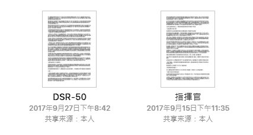](javascript:;)</ignore_js_op> <ignore_js_op>[QQ图片20171022011311.png](forum.php?mod=attachment&aid=Njk2NTV8ZWNkY2I0NGV8MTYwMDg4MDI5NnwxODIzMHwyMjkzOA%3D%3D&nothumb=yes) *(4.58 KB, 下載次數: 10)*

[下載附件](forum.php?mod=attachment&aid=Njk2NTV8ZWNkY2I0NGV8MTYwMDg4MDI5NnwxODIzMHwyMjkzOA%3D%3D&nothumb=yes)

2017-10-22 01:13 上傳  

[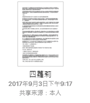](javascript:;)</ignore_js_op> <ignore_js_op>[QQ图片20171022011314.png](forum.php?mod=attachment&aid=Njk2NTZ8MDI2YTViMjR8MTYwMDg4MDI5NnwxODIzMHwyMjkzOA%3D%3D&nothumb=yes) *(4.7 KB, 下載次數: 3)*

[下載附件](forum.php?mod=attachment&aid=Njk2NTZ8MDI2YTViMjR8MTYwMDg4MDI5NnwxODIzMHwyMjkzOA%3D%3D&nothumb=yes)

2017-10-22 01:13 上傳  

[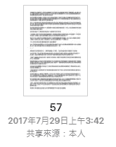](javascript:;)</ignore_js_op> <ignore_js_op>[QQ图片20171022011316.png](forum.php?mod=attachment&aid=Njk2NTd8YzQ1YTgwZDh8MTYwMDg4MDI5NnwxODIzMHwyMjkzOA%3D%3D&nothumb=yes) *(4.35 KB, 下載次數: 3)*

[下載附件](forum.php?mod=attachment&aid=Njk2NTd8YzQ1YTgwZDh8MTYwMDg4MDI5NnwxODIzMHwyMjkzOA%3D%3D&nothumb=yes)

2017-10-22 01:13 上傳  

[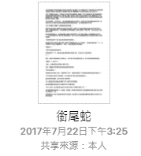](javascript:;)</ignore_js_op>  

# 60

以及，还请大家多多支持和提意见……（汗如雨下） 

# 61

> [wtr2010 發表於 2017-10-22 03:47](https://giantessnight.com/gnforum2012/forum.php?mod=redirect&goto=findpost&pid=349163&ptid=22938)

> 感谢雪风大久违的更新！一直觉得雪风的这篇少前GTS系列文实用性很强的，我很喜欢。（读了雪风大的GTS ...

有你们的支持是写作最大的动力了！说真的，每次在写完一篇文章的时候都期待着能收到如此认真的回复。在看到的时候就会觉得自己把时间一把一把的扔进电脑里的价值就体现出来了。所以我是完全不会介意解答你的这些问题的XD

我也希望通过这样的互动形式来使得笔下的世界变得更加丰满，更加成为那个“理想之中的世界”

1\. 普通大小和巨大化的问题？

这点其实是在对待陨石物质研究之中不断变化的。随着研究的不断深入，人形与陨石物质的辐射越来越融合，就会造成巨大化状态越来越稳定。而正相反的，能保持普通人类尺寸的时间则会变得越来越短，直到缩成对每个人形来说会有细微差别的固定时间。

当然，如果借助外力手段，比如某些设备或是药剂或是帕斯卡开发出的那些黑科技之类也是能延长人类状态下的时间。比方说，需要提前的潜入侦查啊，或者是相对非暴力的一些手段啊之类的，不过那样的话相比起正常的人形数据则身体能力会下降一些。

2\. 巨大化的人数？

当然开始只是一部分的人形接受改造，但是之后随着统治区域的不断扩大，以及各方面的需求增加，最后肯定会为了统一管理而巨大化的。而且人形平时也不是不干事情的啊。毕竟一百多个人形的话对于战后重建的帮助还是很大的。各个方面都会需求，所以回答应该是是的。

3\. 铁血？

铁血在合并之后，在两方能逐渐彻底融为一体之后就统一换装了集合两家科技所做出来的新的身体，所以这方面并没有什么可担心的。

4\. 人形战斗力？

其实武器的话比起在游戏中并没有较大提升，主要是巨大化带来的身体优势。当然，由于能够动用的资源越来越多，所以科技树肯定是会不断的向上点的。这点在之后的文章中会体现出来。（指的是时间点较为靠后的文章）

当然，如果真的会出现大规模的集体化作战的话，我也是很期待一大堆巨大人形进入某一座城市彻底抹平的情节呢

5\. 性格？

为了不至于让很多同样也玩少前的读者感到陌生，我尽量还是会在写作当中保持人形原本的性格，当然，如果人形性格变化真的出现的话，也是会在文章中写明的。毕竟大部分人也不希望看到黑化啊或者是性格扭曲这类的存在。

6\. 管理者？

啊……那个…… 克鲁格嘛……我设定当中是被军方给暗杀掉了（挠头），所以指挥官，也就是我自己就变成了实际上的格里芬继任者了（脸红）

至于赫丽安她们嘛，当然都是自愿接受改造从人类变成人形的存在咯、当然其实其他人也是可以被这样改造的，但是目前还没有看到有哪个人有这种必要会被这样改造。毕竟改造之后就变成了全新的物种存在了（其实只是因为没有人设不想写而已_(:з」∠)_）

赫丽安的篇章肯定是会有的，但是这个老女人（被打）的性格我还需要更多的花时间揣摩预测她的行为，当然抓几百个男人满足自己的性欲什么的……（我不知道有没有这样的可能性，不过我可以剧透一下在57的篇幅是涉及到很多黑帮啊灰色地带之类的东西）

7\. 更大体型？

肯定会有，而且不要忘了我们还有模拟系统呢！在模拟系统的运算之下什么都是有可能的。当然，真实世界基本应该不会写的太大，如果太大也容纳不进这个世界的条条框框之内了，不是么。毕竟我们不是来搞破坏的，而是真正的去统治一个巨大人形与人类共存世界的（大雾）

另外我也同意在巨大化过程中确实应该有一些文章去着重描写growth的过程，当然随着写作技巧的进步我希望能让更多的人来感受这个世界的魅力，也让各位忠实读者满意吧，以上

 

# 62

> [foxfun 發表於 2017-10-22 18:49](https://giantessnight.com/gnforum2012/forum.php?mod=redirect&goto=findpost&pid=349198&ptid=22938)

> 嗯，说实话我也是有点类似的观点。。。

> 

> 虽然我很喜欢雪风大大的文章，但是总觉得貌似设定有点奇妙？

同样也感谢长回复啦~解答你的问题：

从官方某一次放出的PV可以看出，当时M4是被放置在营养仓内的。所以我个人认为人形的话有两条路线，铁血走的机械化+AI控制路线，格里芬这里用的IOP人形则是生化人+心智云图以及其他的模拟人格啊之类的科技的集合体。而且在官方设定中也出现过一句“你很难真正去分辨一个人类和人形之间的差别”（当然这里讲的应该是第二代人形了）。所以人形虽然不是真正意义上的人类，但是我们完全可以把她们当做人类去看待。

（这也是我个人一点私欲吧，我真的很想看到两方能和谐共处的场景，一个真实的GTS存在的世界）

既然人形能被制作出来，那么如果能拷贝一个人的大脑呢？几个妹子巨大化的真实情况就是拷贝了自己身体的数据之后接受改造变成了人形而已_(:з」∠)_

为什么？为了个人方便？还是为了格里芬的未来？还是……

天知道，反正她们就是这么做的就对了，太认真你就输了

克鲁格吗……忘了他吧XD他不死我没法真正领导格里芬啊_(:з」∠)_不过我同意那个高达机体的想法，也有这方面的考虑，或许在之后的篇幅中会有提到开着机甲的驾驶员出现呢

不过！不要忘了筷子啊，让筷子带着指挥官到处移动不是很棒吗！（既然人形巨大化了，那么筷子也该有个相应尺寸的身体了，甚至干脆就做一个拟人化的身体）

嘛，反正这一切还是要在之后的新文之中看到啦。感谢你的意见，以上

 

# 63

另外在下一篇更新之前扔一个不相干的即兴小片段出来好了~其实偶尔写写少前以外的人物会给自己带来新思路呢：

这个片段的主人公是舰C的扶桑了——

当做是音乐会新一章开始之前的小插曲就好：

八月中旬的下午，正是太阳最为浓烈之时。在镇守府某处的船坞之中，停泊着刚刚来到此地成为战力还没多久的战舰·扶桑，正侧躺在水面之上，享受着这难得的片刻清凉。只不过，扶桑自己没想到的是，在她白色的胸罩之下，隐藏着一个极小，极小的生命。

那是误入镇守府而被缩小的一个普通青年，此刻他的身体已经彻底被汗水浸透，趴在扶桑那如同巨大的简直如同平原一般的乳头上，抬头看着那覆盖着天空的白色布料。心中，已经是充满了绝望。本来舰娘的身体就是人类的百倍大小，而且青年又是被舰娘宿舍里面的缩小光线给射中，所以这样一来一回的阴差阳错之下，扶桑的身体对他来说已经达到了万倍的大小。光是他趴伏之上的乳头就有千米的高度，而随着扶桑的每一次呼吸起起伏伏的，简直如同地震一般的上上下下，让他光是勉强保持住这个姿势就已经很辛苦了。不过，最终，体力耗尽的他在再一次的起伏来临之时，被甩了出去。

“哇啊啊啊啊啊啊啊”

被不断翻滚着的身体惊呼着，自己完全无法控制地对着那乳头平原上的某个大坑栽了下去，紧随着里面的，便是如同百多米高的悬崖一般，直挺挺的摔落了进去，在落到底下的乳白色液体的液面之时，整个人便失去了意识。

“唔嗯……”

扶桑无意识地发出了一声呻吟，从刚才开始乳头不断的就感觉些许有些痒痒的，也刺激到了她的梦境，就像在给婴儿喂奶一般。这样经历着梦境的她露出了一股满足的笑容，甚至手有些无意识的去触碰了几下自己的乳头，简直如同一个真正的母亲一样。只不过，她又怎么会知道，正是在她的乳头之内，潜藏了一个真正的“小”生命呢？而对陷入到扶桑的母乳海洋之中的那个青年来说，只能企盼这巨大的身体能够反应过来，并把他从这片汪洋大海之中解救出来了吧。

 

# 64

<ignore_js_op>[BB_Fusou_026_Full.png](forum.php?mod=attachment&aid=Njk2Nzd8YjRkNTExNjd8MTYwMDg4MDI5NnwxODIzMHwyMjkzOA%3D%3D&nothumb=yes) *(565.82 KB, 下載次數: 7)*

[下載附件](forum.php?mod=attachment&aid=Njk2Nzd8YjRkNTExNjd8MTYwMDg4MDI5NnwxODIzMHwyMjkzOA%3D%3D&nothumb=yes)

2017-10-24 01:02 上傳  

[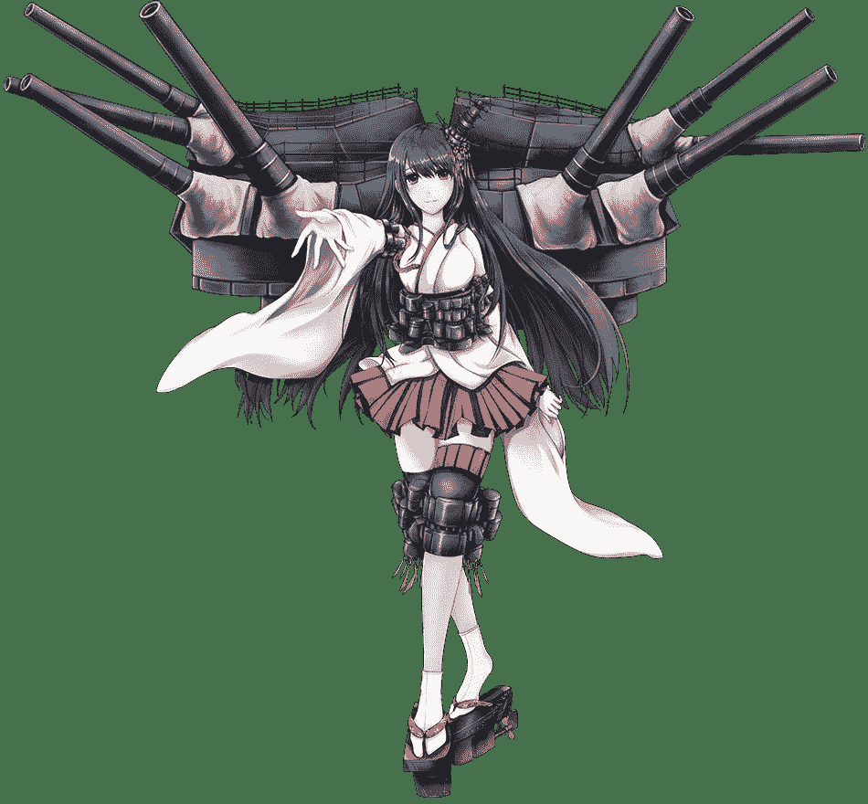](javascript:;)</ignore_js_op>  

# 65

嘛，继续更新咯~，不过由于我开始上课的关系，肯定不能向暑假那时候那么频繁了。我会尽量保持一定的速度的……不过我承认这次的篇幅相对来说短了一点……也是没办法的嘛……今天是万圣节的话，晚上我会争取写一篇特别的短篇出来的_(:з」∠)_

这次更新的主角可以说是少女前线的看板娘了（叫一米一的人全给我出去罚站），也就是德皇KAR98K（对不起，没有八倍镜），她在第一次巨大化的时候，又会是干什么的呢？敬请欣赏XD

人设图：

如何让一片原本繁华无比的城市变成一片狼藉的废墟,就是战争,在三次世界大战后,人口不如当年,人类的数量变得稀少,此时就由战术人形们负责原本属于人类的工作,防卫,甚至是铁血入侵的期间...人类部队也只付得大城市的防御罢了

已经没有需要动用到人类的战争更没有太多的武器开发,更多的是和平,或许这就是那场腥风血雨的大战后的雨后天晴吧,但....新的一场战争正在走向人们

这时候无数架三战时期的战略轰炸机和战机开始轰炸城市,无辜的平民们遭受着来自天空的强烈打击很多人被炸得粉碎,这才是幸运吧,真正绝望与痛苦的是被压在巨大的水泥堆下

无助的哀号与惨叫,只希望着....救难队能够发现自己,痛苦的呻吟在原本的街道间回荡,两旁的高楼已经倒塌成为了一片废墟,有人被压倒在底下,更有人无奈地抓着自己断掉的胳膊游荡着,已经无法保持思绪

人们正在受苦着.....在这场战争中活受罪着,一个银色长发的女孩正忧伤的走在这街道上,她无奈着看着这些受困重伤的人们,但身为人形的她,却也无力救援

她听到了孩童的惨叫,走近一看,只差的没吓哭她而已,一间学校被炸弹直击,水泥堆活生生的压死一群孩子们,底下....正是一群孩子们啊! 他们哭着,希望妈妈来救他们,但悲伤的是他们的母亲很可能已经丧生于空袭中

一名格里芬的士兵快速的跑向了那银发的少女

“98k小姐！您快离开吧！这里太危险了，废墟随时都有可能再次崩塌啊！”

张望着,警戒着,并非针对敌人,而是这栋随时都有可能再次崩塌的建筑,他一个箭步,拉着98K,想把她带离这危险的地带,毕竟她可是格里芬重要的人员,但人类的力量怎么可能和人形相比呢? 既使是训练有素的警卫人员也无法拉动她

“可我....他们还在受苦啊...我怎么能抛弃他们...”

美丽的kar98k无助地跪倒在了废墟之前，眼泪不断地在流出，就连旁边正在不断撤离的难民也为之侧目

“那么，98k，看来也是时候使用这个东西了。本来还想再保密一段时间，看来是时候公开了。”

指挥官走到了她的身旁，拍了拍她的肩膀

“指挥官......您说的东西是？”

98k停止住了哭泣，脸上仍然带着泪痕地望着那个最敬重的人

“是能让你拥有着能帮助别人的巨大力量哦”

指挥官看着她笑了笑，坚定的对着她说到

“那么，跑到那块空地上去吧。等下不管发生什么事情都不要乱动哦”

指挥官用手指了远处的一块巨大的空地，原本这里是城市的中央广场，能容纳几百个人的巨大场地

“是的！”

虽然kar98k并不知道指挥官要干什么，但是他所说的“帮助别人的力量”很明显已经刺激到了这个善良的女孩，她使出了最快的速度朝着那里奔跑着，在站到了广场的中央位置之后，一动不动。

“跑到了吗，很好，那么开始激活程序吧”

指挥官掏出了自己的PDA，在上面输入了一串密码，随着“程序启动”的提示声中，那边的kar98k，已经开始发生了惊人的变化。

周遭的建筑逐渐矮了下去，简直如同自己被什么东西吊起来了一般。可明明自己的双脚还踩在地上。这顿时给了98k一些不真实的感觉。她低头向下看去，自己的双脚逐渐地在向道路两旁延伸着，甚至把一些遗弃的车辆给推动了起来，撞到了两边的墙壁上，发出沉闷的响声。

随着奇怪的感觉逐渐在身体里面涌动着，慢慢地，身边的建筑以不算慢的速度矮了下去，先是胸部，紧接着是腹部，又渐渐延伸到腿部。最后，一般的房屋甚至只能到达她穿着高筒靴的脚踝处。

她有些惊慌地看着指挥官,她也不知道自己为什么会突然变得那么大

“很好，看来程序启动正常了”

“指挥官？这是？”

98k轻声地在通讯频道里面问着。毕竟，这样的状况太超出她的想象之外了

“我说了啊，这就是我能让你拥有巨大力量的变化啊。你现在的身体，已经是原来的一百倍大小了呢。”

98k惊讶地四处望着，原本高耸着的建筑群已经矮了下去，城内最高的几栋大楼才堪堪能与自己的身高平齐，而剩下的几层楼高的房子之类，或许只能达到自己的脚踝这么高

“那么，这座城市就拜托你了，快点去救救那些还被压在废墟之下的人们吧

此时的指挥官，已经开始准备带领其他人员撤退，并且开始在城市外建立起临时的收容点98k像是猛然反应了过来一般，一步就跨到了那栋倒塌的学校废墟之前，巨大的靴子落下来的震动把旁边还在目瞪口呆的几个人给震得东倒西歪

受到自己力量惊吓的98k，慌忙地脱下了自己的鞋子，将那双巨大的靴子放在了城市外面，恰好竖立在了聚集点的人们之前

地面上有些人正仰望着那巨大的靴子,表情或许还有些深怕着她把这份力量拿来攻击自己吧,但同时又觉得震撼这巨大的靴子,但又有些温暖,她就如同救世女神一样的要拯救那些被埋在水泥堆下的人们

那可是连救难队都难以挖掘到的深度,是人类部队难以拯救和协助的,但对于她那些巨大的水泥块只是手可以轻松拿起的大小而已

而此时的98k则完全没有想到这些，她赤足踩在地面上，轻轻地跪了下来，避免自己巨大的体重再次引发震动

随后，原本对自己来说巨大的水泥块，已经变成了只要用一只手就能轻松拿起来的程度。她一边核对着扫描出来的废墟结构，一边小心翼翼地像小孩子玩抽棒子一样在移除着不同大小的水泥块

饶是这样，她挖掘的速度，也早已经超越了之前任何一个援救小组所能达到的速度。只用了五六分钟，这块废墟就被彻底的清除，从中被抬出来的，是好几个受伤的孩子和成年人

除了那些受了重伤无法移动的重伤员之外，剩下的人都躺在了担架上被慢慢地移动着送到了城外的聚集点旁边

当那巨大的手掌缓缓地降落在城外之时，那边聚集着的难民们，都激动地站了起来，眼含泪水地看着那犹如女神一般的98k，不断地鼓掌吹口哨，有的人甚至已经神情激动地跪了下来，朝着她所在的位置不断地叩拜着

原来，这就是那股能帮助大家的力量了吗...谢谢了，我的指挥官...我知道该怎么运用它了

下定了决心的98k开始继续“工作”了起来

有了第一次救援经验的她，工作起来的速度更快了，先是用脑中自带的扫描仪扫描一遍废墟的结构，确定了拿走瓦砾碎片的顺序了之后，巨大的手指就会变成这世界上最大又最灵巧的挖掘机，开始移除障碍

好几个人在崩塌了的钢筋水泥造就出的一个小小的空间里绝望地看着上面，完全地一片黑暗，有的人甚至是低声的啜泣着，因为这里本来已经就是地下铁路，再加上炸弹的袭击使得紧密的空间已经完全崩塌，就算是技术最高超的挖掘队直线下来救出他们也需要好几天的时间。

“我们怕是要死在这里了呢……”

有人已经绝望地坐了下来，低着头完全不想管其他的事情，毕竟在这里没有水，没有食物，根本撑不到救援下来的时间了吧也有的人试图在给周围的人打气，指导他们如何保存体力，但似乎看来效果不大。几乎完全绝望的气氛笼罩了这个小小的空间在黑暗之中,有些细微的碎块洒在脸上...难道是要崩塌了吗...绝望的害怕着。

外面不断地传来了轻微的声响，而且有着些微的震动，逐渐逐渐地，这股震动感越来越强烈了

“你们看！”

突然，有人叫了起来，所有的人往他手指的方向看过去，那是一束光线透了进来这是……难道是救援队吗？但外面完全听不到人们叫喊的声音呢，很多人疑惑地想着又是一阵强烈的震动感，压在他们头上的最大的那块原来建筑顶上的巨幅广告牌，被直接掀了开来。刺眼的阳光终于照了进来，让所有的人都不由得眯起了眼睛

可本来应该是强烈的阳光，突然又被一个巨大的阴影遮住，难道又有东西砸下来了吗？有的人甚至已经用手挡着眼睛坐倒在了地上可是，透过剩余的光线，他们看到了一张巨大的脸，有着银白色头发和红色瞳孔的绝美容颜就在所有的人还惊愕地说不出话时，她，说话了

“大家，没事吧？”

就在人们还在惊讶于她的巨大与美貌的时候，旁边，被98k挖开的一条通道中，已经有救援队的人迅速地冲了上来，开始对伤员进行分门别类的处置

“她是……格里芬的人形！”

人群之中突然有人认出了Kar98K的身份，这让人们显得有些惊慌失措。毕竟，占领这座城市的是她们。而且在占领之后，有人曾经偷偷带着不少的市民在地下开展起了反抗活动，结果被抓起来以后再也没人见到过他们。

本来作为PMC的他们突然和人类的敌人铁血联合了起来，并且摇身一变成了更像是军阀的组织的他们，已经完全的统治了这里。

虽然人们对于统治者的她们是敢怒不敢言，但是在私下里，人们依然是在把“恶魔”，“叛徒”之类的名号加在了她们的身上可没想到，作为人类同胞的其他国家，用来对付自己的是飞机和炸弹。而她们这些“恶魔”，则是在废墟之中尽力地拯救着身为难民的自己这巨大的反差感让许多人的脑子一下子都转不过弯来，呆愣着看着她，思考都几乎停止了

98K看着这里的救援工作基本展开的很顺利之时，对着下面的人群发话了

“那么……下一个需要我的地点是在哪里呢？”

就在她和救援队的队长讨论着的时候，突然，人群之中，响起了说话的声音

“这位……人形小姐？是您拯救了我们吗？”

"其实是大家一起努力的啦,我没有那么厉害"

98k这么说着，脸上似乎还像少女一样露出了青涩地微笑

“谢…………谢谢您！”

从这一刻开始，他们真正接纳了格里芬，接纳了这个之后作为他们统治者的组织就这样，有着巨大化的98k的加入，救援的速度已经得到了极大的提升还没过半天，几乎所有的废墟都已经被清理完毕，伤员也得到了妥善的安置

可是，仍然会有不可避免的死亡出现。每当挖掘出一具遗体的时候，那个巨大的银发女孩都会流下眼泪，让旁边不管是被救援出来的伤者还是救援的人们都于心不忍这让人们对于格里芬的印象都大为改观，如果她真的是属于这个统治自己的组织的话，或许，他们相比于原来的政府来说，是个更好的选择呢。而且，她真的好美啊...就算是拥有着这么大的躯体，也丝毫不影响她的美貌。

很多人甚至自己都没发现，他们在不知不觉中，已经认同了她们的存在的事实

就在救援行动即将接近尾声之时，终于可以站起来松了一口气的Kar98k，在地上的人们充满感激，赞叹的目光之中，露出来了如释重负的表情。只是，远处的天空之中，似乎又传来了飞机高速掠过的轰鸣声？！引擎的嘶吼声在几里外都能听得清楚,这也使的地面上的人们,有如被唤醒恐惧一样,禁不住惊慌了起来

“这是？！”

98k也发现了这个情况，巨大的红色眼睛眨着，就算是百倍身躯的她，一时之间也不知道该怎么去保护脚边慌乱跑着的人们

“那么，听我的指挥吧，98k。”

久违的冷静的声音，从通讯频道中响了起来

“指...指挥官？！”

98k也被突然响起的声音吓了一跳

“那么，首先把人们带到安全的地方吧，这一带就剩下你们这里了。”

“是的！”

重新找到了主心骨的Kar98k，迅速地把手掌放到了地面上，由救援队的人们带领着伤员们，登上了那饱含着生的希望的手掌随后，正如她刚刚所做已经无数次的一般，这最后一批人，也被放到了城外的集聚地。这样，城里就只有她一个人了，而所有还活着的人，都在城外，用着饱含感激与敬意的目光看着那巨大的美丽躯体

“接下来，98k....就让我来给你更大的力量吧...”

随着指挥官的话音落下，Kar98k发现自己的身体，再一次的膨胀了起来。只不过，已经有了一次变大经验的她已经不是慌乱了，而是微笑地看着城外，那张完全充满自信的脸上布满了阳光一样的笑容

此时，阳光正好洒落下来，在城外的人目光中，她的身躯正好遮蔽了太阳的本体，而金黄色的阳光从她身边打出，简直如同神话传说之中的女神一般

很多人都激动地跪了下来，口中念叨着感激和祈祷的话语她正如同老套特摄片的英雄一样,逐渐地变大着,建筑物开始看起来越来越小,甚至她的脚还踩到了一些建筑的残骸上头,幸好里头都没有人了

当她变大,直到天际,在她的眼中看来人们和城外的营地都小的不象话,但那可是不是该注意的,她的眼睛望向了那些正准备来第二轮轰炸的空中打击群,眼中还带有一丝怒火

"你们的罪过，就用死来偿还吧!!"

她盛怒的说着,毕竟这些灾害都是那些家伙造成的呢

而城外的人们惊讶的看着这犹如通天巨塔一般的身躯，惊讶地几乎合不拢嘴了。不过，并没有人慌张地乱跑，所有的人都安静了下来，期待着她下一步的行动此时来袭的轰炸队伍中，明显的已经慌乱了起来，几十架飞机已经分散了开来，护航的战斗机已经朝着98k俯冲了下来开火

回答他们的攻击的是一个拳头,一个有着普通人千倍大小的拳头,一个饱含着Kar98k怒火和必杀之意的拳头

“轰！”

几乎是同时，有两架飞机就直接撞上了那巨大雪白的肌肤，凌空爆炸了开来并且，光是拳头已经是超级大的了，还有那些虽然没有被直接命中，但却被超高速移动的巨大手臂的乱流带了起来，已经完全失去了方向的他们，无助地朝着下面坠落了下去带起了一连串的爆炸,幸好已经把难民都撤出了,不然这些掉落在城市中的战机,铁定会影响作业和救灾的

“轰轰轰！”

就是这简简单单的一拳直接毁灭了将近十架飞机，是这个联队中飞机数量的六分之一了但是拥有着这样冷静思维的飞行员毕竟还是少数，大多数人在慌乱之中选择了最愚蠢的方式—对那个女孩发动了攻击

“轰！”

这是大当量的航空炸弹在身体上爆炸的声音

“哒哒哒...”

这是机炮对着她吐出火舌的声音而就在城外，无数的人在开始看到她击落飞机的兴奋劲过去之后，都担心地为她祈祷了起来，生怕那些炸弹和子弹弄伤了她。毕竟她可是拯救自己出了废墟的女神啊，要是她被那些巨大的炸弹炸中...很多人都已经蒙上了双眼不敢再看，硝烟弥漫，几乎都遮住了她那巨大的脸

而当硝烟散尽之后，所有的人几乎难以置信地看着那连痕迹都没沾上的衣服，先是一阵阵的倒吸着冷气，随后爆发出来了巨大的欢呼声：

“女神！她一定是女神！那些飞机根本伤不到她！”

“我，我听到了！她是格里芬的人型！那些警卫称呼她为98k！”

“这下看你们再往哪里跑！”

紧接着，Kar98k就开始发挥出她巨大体型的优势，无论是轻轻用手一挥，还是吐出一口气，对于她来说基本和苍蝇大小没区别的飞机来说都是致命的攻击，每一个动作都会带动着几架飞机爆炸成空中的一团火花，或是无助地坠落到地面上

在这样绝望的情况之下，不是没人想过使用弹射座椅来进行逃生，但在这比自己飞机移动速度快得多的巨大女人面前根本没有反应的时间。就算有，在她身周因为她的动作引起的狂乱气流也会一瞬间把人吹飞，或是把降落伞给撕成碎片，根本没有活下去的可能性

他们所能做的，只是徒劳无功地在她的身上耗费着弹药，然后惊恐地看着巨大的身体与他们进行亲密的“接触”这也会成为他们人生之中看到的最后一幕景象而在地面上，所有还能动的人们都已经聚集到了一起，看着那惊世骇俗的防空“表演”，每当她的动作带起了好几个盛开的火球之时，下面便会爆发出一阵阵的欢呼，口哨和鼓掌的声音

她在几次的"攻击"下成功的击溃了他们的航空攻击,而她不只感受到了自己的力量多么强大,原本的三四代战斗机在她的手下都比苍蝇还不如她看着这些因为空袭而流离失所和受伤的人们,心中有了种悸动感

或许她真的能好好的保护他们呢,毕竟她可以如此轻松的击退他们,更能够拯救这些人们,或许这是她的使命吧! 最终，在这股超乎想象的力量的攻击下，来袭的航空队几乎被悉数全歼，只有寥寥几架逃了回去。虽然这大概会造成情报泄露，不过此时的指挥官已经不想管这些了

他低头看着自己的pda，上面传来了新消息的提示音，他点开了之后，上面并没有任何的署名，也没有什么实质性的内容，只是一个简单的数字“7”显示在了屏幕的中央

“还有七天吗....”

指挥官喃喃地念叨着，看着98k在城里骄傲地张着双臂，接受者来自人们的欢呼祝贺之时，他的嘴角，也浮现出了一丝微笑。

“看来，这场世界争霸的棋局，我已经是必胜无疑了呢”

他的手不断地敲击着pda所构筑出的虚拟键盘，向远处的一处未知地点发送着自己的命令，嘴里轻轻地吐出了一个词：

“checkmate.（将军）”

-------------------------------------------我是分隔线------------------------------------------------（几年以后……）

通知要我们准备避难的传单正从高空被撒下,估计是格里芬的直升机和飞机撒的,广播中也不断告知我们得去避难所报到,但我得好好目送我们城市的大女孩离开吧,她轻柔地说道

"大家,小心点喔,让开点,我要开始工作了呢,如果踩到你们就糟糕了..."

城市中正晃动着,白色长发和一顶黑色的大盘军帽,欧洲风格的军服与普鲁士长靴,她正是kar98K,我们的城市的负责管理者

她慢慢地由市区步行到郊区,这至少要半小时以上的通勤,她没几步就走出这里了,还很小心的,没有踩到任何建筑与人蹑手蹑脚地看起来挺可爱的,不断朝脚底下张望着,深怕着会踩坏建筑或踩到地面上微小的人们

就跟小猫一样地走出城市,不制造太大的震动,她也知道,她每走一步估计都是一阵阵的地震,虽然大家都习惯了,但她还是不愿意造成太大的灾害,她就是这样温柔的女孩吧

她走出城镇后,慢慢走向远处的山后,虽然这漫漫大约是几分钟的时间吧,至少有数百公里了呢,她的一步距离纠近是多大呢,她到了林线后方,已经被盖住,看不到她的样子,已经被山棱线给盖住,慢慢地地面开始有些震动,黑色的影子正覆盖着林线高速的上升

那是她的帽子....但都可以覆盖老大的天空了,还没看到她的面庞,这到底是有多大呢

“她……还在变大吗？”身边有人不敢相信地问着

慢慢地是那白色的秀发,和红色的巨瞳,....比刚才更大了,少说也有十倍! 不! 这大小绝对不只十倍! 而是百倍!

在大家还正在惊叹或是无法反映的同时,好几个武装士兵走了过来,将我们强行送往最近的地下避难所,毕竟,今天正式她要改造附近地形的日子，她绝对无法接受自己的城市里有任何人因此受伤吧,这些士兵那么慌张

估计是我们如果有人因为她而受伤,因为保护没有周全撤离没有完善而受伤,这些士兵估计就好受的了,肯定会被好好的惩罚一下吧,虽然有些不开心,被他们这样强制的带走,带有替他们感到一丝丝同情

在被护送走的时候,我不由得想起来当时她在询问我们对城市发展的要求时,有人曾经半开玩笑的说附近的地形实在是太差了,还说就算是她对大自然也无能为力吧,但她好像还是有些法子的

没想到……我看着变得越来越大的她，不敢再想下去了,如果她就这样开始移动的话,一定是很危险的!

也不敢想她眼中的我们到底是多么渺小或脆弱,现在只有一心配合,跟着那些士兵们进去地下避难所了厚重的防爆门关上,跟着电梯向下,在枯燥的防空洞中,这战争时期建造的地下碉堡显得非常有战争时期的味道,更有股沧桑

还有个大型的投影幕,正放着无人机拍摄的画面,由高空中拍摄着她正在逐渐改善我们家园附近的环境,那里根本无法开发,更无法拓垦,是个糟糕的地方,记得当初是有人开过玩笑吧,但没想到她还真的会去正视这件事情,这也显得她是多么可怕吧,但同时又是温柔的

伴随着轰巄巨响,巨大的脚步声回荡在数十数百公里外,就彷佛核试爆一样清晰明显，幸好有事前通知,那区域内是完全封锁的,而在区域外几百公里的我们都能清晰的感受到震荡，一个巨大的人影,一个巨大的银色长发女孩正在那里行走着，

她稍早前还正蹲下来用手挖着,好像说要造湖什么的,没多久就开始注水了,巨大的水壶倒出水时,那超巨大的瀑布从高空涌下,巨泉的声音在此也能听晰

地面正在震动着她依然在行走着,或许卫星空拍出来的是一个个超巨大的脚印吧,得过时间推移,在我们看来就是形状怪异的谷地了，但这谷地或许可以拿来建设或农耕,更是个奇妙的自然景观吧,但仅仅是脚印却对我们影响之大

她正继续行走着,盆地和湖泊,接下来就是山了吧,具我的地理知识,那里有不少高山，土质虽然不错,但是因为地形的关系根本无法开发与建设，她正往那些群山靠近着

她巨大的脚正轻轻踏着,虽说是轻轻踏着,都可以把山给踩碎了,可见她是多么强大,应该说用脚弄碎吧,不能说是踏着,那里不久后就是一片丘陵地形了,震动还在持续,得等时间过后,她才会离去,这期间,我们在远处,都还得继续待在避难所中,一切都是为了安全,地震还在持续着,吊灯正摇晃着,她已经将预定地区的地形改善完毕,原本恶劣不适合发展的地方，

大约再过几年就会有冲积扇和优良的三角洲地形诞生,就是相当适合建造城市发展农业的好地方了,或许这些统治者并不坏,既使她们无比巨大,但又可爱,恐怖,只希望她们不要心血来潮,把那巨足举倒我们头顶,如同造地形一样,如同造地形的女神一样,一脚踏下，我们就跟地板上的灰尘和跳蚤一样完全看不清吧

一脚踏下或许你我都会成为脚印中的倒霉鬼;亲眼目睹了她改造出了适合耕种的丘陵,适合建设城市的地形,以及可以发展养殖渔业的大型湖泊,真是有些感动,但同时也对她感到敬畏,可以如天神一样的随意改造地形,

更可以保护我们,虽然父辈们曾与她们为敌过,但这时候才发现她们的确是好人,这时候她看向了镜头微笑着,露出了清纯的微笑,此时底下的地形已经几乎改善完成,

她是脚站累了还是替我们改善地形了,她很干脆地坐了下来,手指正在地面划着,划出了河道与溪流,更好像在规画着这未来城市的预定地,那些估计是运河粗度了,但她也很细心的弄出了较小的分支,她好像是在玩一样,

但的确是在帮助我们,她哼着轻松的小调,正在整理着这刚刚出现的雏形,看着湖泊的水被注入那些溪流与河道,无比的感慨更是壮观,在她眼里,或许没甚么吧,就只是相当迷你的水流而已,对我们而言已经是巨洪了,连水库泄洪都没这个壮观也说不一定

当城市已经准备妥当,她起身,伸展了下筋骨同时发出了很可爱的声音,这时候不需要那些收音设备,在这个防空洞内都能感受到的那声音,她轻轻呼口气,有些云还因此被吹开了,看来她的力量是如此强大,但我在暗喜着,幸好她并没有把这份力量拿来欺负我们,不然我可能就是这游戏下的牺牲者了吧

不过，对于把这份力量拿来保护并爱护着我们的她，我们不得不颤抖地奉献上我们的忠诚，并期待着她的回应,或许当这个女神的小小支持者也不坏呢....一个温柔可爱且几乎万能的女神,她并没有把强大的力量来欺负奴役我们

而是照顾与爱护,这点就值得我们献上无比的感谢与忠诚,她是个时时刻刻为我们着想担心我们的好女孩,我正看着投影幕中的她,她也正对着无人机的摄像镜头轻轻地微笑着,双臂张开好像正骄傲的展示着自己的功劳,

嘻嘻笑着,我们势必将世世代代都感谢着她吧

 

# 66

<ignore_js_op>[98Ka.png](forum.php?mod=attachment&aid=Njk3Mjd8ODJkYTYxYzJ8MTYwMDg4MDI5NnwxODIzMHwyMjkzOA%3D%3D&nothumb=yes) *(998.99 KB, 下載次數: 11)*

[下載附件](forum.php?mod=attachment&aid=Njk3Mjd8ODJkYTYxYzJ8MTYwMDg4MDI5NnwxODIzMHwyMjkzOA%3D%3D&nothumb=yes)

2017-10-31 01:34 上傳  

[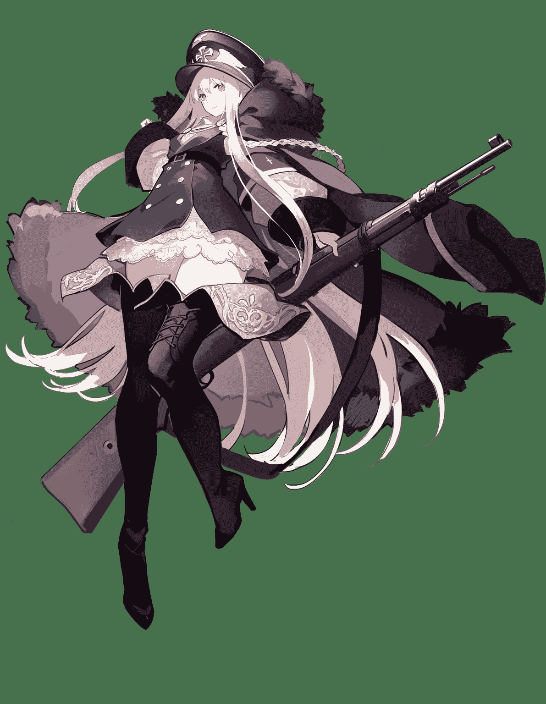](javascript:;)</ignore_js_op>  

# 67

> [tony 發表於 2017-10-28 16:13](https://giantessnight.com/gnforum2012/forum.php?mod=redirect&goto=findpost&pid=349375&ptid=22938)

> 看到少女前线的同人文真是高兴得快要跳起来了，毕竟当时也曾经欧过。虽然到最后也没出我最喜欢的索米，但是 ...

虽然很感谢您的支持……但是还是想问一句，吸血鬼……是哪篇？

我怎么没记得我有写吸血鬼来着_(:з」∠)_

（这系列也不是魔幻主题啊）

 

# 68

唔，这就是某个特别篇写到四分之一都不到的可恶家伙决定观望回复的热度再写，于是先把写好的部分放出来，

要是反响……热烈的话，那我就把它写完，不然就坑了吧_(:з」∠)_

（by 半夜三点莫名怠惰的雪风）

“Trick or Treat！”

我面前的荧幕中闪动了几下，映照出的则是WA2000那张略微因为有些小生气而显得泛红的面颊。不过，今天的她并没有像往常一样穿的是那身作战用的服装，而是换成了一副南瓜色的露袖装。不知道是因为忘记了还是式样的原因，小腹部分的纽扣她并没有扣起来，肌肤略略暴露在了外面，和她的衣服相互衬托，显得十分的匀称。脑袋上还带了一个蝙蝠形状的头饰，旁边扎着条纹格子的蝴蝶结。虽然下身由于视频镜头的关系并没法看到，但光是上半身已经够让我惊艳好久了。毕竟，对于WA酱这个死傲娇来说，会换成这样略显暴露的装束已经挺难得了。

“啊……晚上好呢我的小WA酱，和孩子们玩得开心吗？”

我略带笑意地看着屏幕里一脸苦相的WA酱，戏谑地说道。

“你……你还好意思说！要不是你当着所有的人面说要办什么鬼故事大赛，讲的好的还有额外的奖品，我……我才不会去……去福利院陪小孩子们呢！”

“哦？” 强忍着内心笑意的我，一根手指点到了屏幕上，收回，晃了两圈，继续说道，

“可当初我可记得某人当听到我说有“额外奖品”的时候，想都没想就满口答应了下来呢？”

“那……那是因为！明明你没说那是什么比赛嘛！”

“怎么了？只是讲故事而已，啊哈！”虽然已经知道了结果的我，依然忍不住说了出来，

“难道说，小WA还会害怕鬼故事吗？”

“才！才不是呢！”

屏幕对面传来了略微嗓门有些高的声音。不过，虽然她这么说，但是我可以清晰地看到她额头上已经开始冒出了冷汗，整个脸部的肌肉都有些微微颤抖起来——很明显地出卖了她心里的真实想法。

“区……区区鬼故事，不就是骗小孩子的吗！”

我无奈地摇着头笑了笑，刚想开口安慰她几句，可却发现在屏幕的一角，似乎有什么白色的东西正在晃动，简直如同幽灵一般。

幽灵？难道说……

“啊，小WA啊，你背后……”

我刚想伸手指着那坨白色的东西提醒她转头看一看，不过很明显我的声音被她还在发表着自己勇敢演讲的女声给盖了过去：

“听好了指挥官！鬼魂什么的都是假的，怎么可能会怕！毕竟世上又不存……”

“Trick or Treat!”

就在这个瞬间，那坨白色的东西已经潜行到了她的身后，并且突然跳了起来，以迅雷不及掩耳之势瞬间托起了她就算在和我视频时也放在身上的步枪，并双手举到了最高。而那白色的幽灵装下的一张略微看不清面容的脸，也无限逼近到了她的脸前，和她四目相对。

“完蛋……”

已经预感到会发生什么的我，瞬间将双手的食指插入了耳朵中，紧接着……一声无比尖锐的，几乎要把我耳膜撕裂的尖叫声从书桌上的扬声器中传了出来，回荡在办公室的每一个角落，

“哇啊啊啊阿啊啊啊啊！放下我的枪！不对，别过来啊啊啊！”

******************************************************************************************

（半小时后）

“您也真是的，明明知道那孩子会怕鬼魂之类的还要故意告诉她什么鬼故事大赛。等明天她回来之后，您可得做一些补偿的措施哦？”

在我面前的，是春田那张略带笑意却不容置疑的脸。也是……WA酱的闺蜜。她巨大的脸，就悬空在我的办公桌上，居高临下地俯视着我。而双手已经撑到了我周围给副官使用的巨大办公桌的桌面上。（我的办公桌在副官桌上）

“额……”

虽然已经习惯了和巨大的她们相处，但是毕竟，在她这样有些“张牙舞爪”地凑近你，简直如同戏耍猎物的大猫一般的时候，总还是会有些紧张的？

“指挥官~？听到我说的话了吗？”

再一次露出了“和善笑容”的春田，上半身又朝着我的办公桌上空探出了一点，让我那对她来说小到可怜的身躯完全陷入了阴影之中，而一只光是第一节指节就高出我办公桌不少的，戴着洁白礼仪手套的手指点在了我的身旁，让我整个身子都不由得颤动了一下。

“啊……明……明白了！我……我……我等她回来给她亲手做杯巧克力冰激凌就是了……”

真是的，到底谁才是这里的指挥官啊……略微有些抖抖索索地说完这句话，整个人仿佛有些陷入了椅子中。

说起来，还是春田她主动跑过来找我的吧……不就是稍微调戏了一下WA酱而已嘛，至于要这么专程过来吓我一遭吗……

“那么……就这么说好了哦？”

春田直起了身子，对我弯腰行了个礼，似乎是我的错觉吧，我看到她的嘴角略微翘了起来。

“啊……春田，等一下”

也就在这个时候，我决定好了在半夜回到基地之前，自己的日程安排

“怎么了指挥官？还有什么事吗？”

刚准备转身的春田将头别了回来，疑惑地又俯视向了我。

“春田，等会儿晚上陪我出去一趟吧？”

“诶诶？！！！我吗？可是，您到底是想去哪儿呢？”

“去离基地最近的城市逛一圈吧，说起来，我也好久没有出去过了。”

“诶？”春田有些吃惊地捂住了自己的嘴，一双美目之下有些惊慌地看着我，

“指挥官？！您别忘了，我们现在这大小，怎么能随随便便进入城市里……”

“啊哈哈哈哈！”

我爽朗地笑了起来，毕竟我可是在脑海里策划了不少时间了

“当然，是让你暂时缩小到人类的尺寸啊。”

“啊……”

春田略微地失了失神，不过很快地恢复成了往常的面带微笑的容颜，

“既然是您的命令的话，那么春田我就愉快地接受了，请恕我失陪，先去调整一下装束。”

“恩，去吧。另外不要忘了今天是万圣节哦？”

春田笑着点了点头，转头走出了办公室。不过，高跟鞋撞击地面发出的声音频率似乎和平时相比起来快了不少呢。 

# 69

> [tony 發表於 2017-11-2 23:47](https://giantessnight.com/gnforum2012/forum.php?mod=redirect&goto=findpost&pid=349566&ptid=22938)

> 是我表述的问题，我习惯把sop叫做吸血鬼

大众化的叫法不是狗子吗（笑） 剧情里面SOP也被16哥叫成战术攻击狗吗www

不过SOP篇其实应该是我最喜欢的篇幅之一了，那个……哪里写的不好啊（擦汗）

 

# 70

于是我又继续回来更新了……这周的更新有些特殊，并不是文章，而是被委托写的一份类似于CD剧本的东西。于是趁机就写了少前题材，然后不要脸的当做这次更新的东西了，或许以后有机会的话扩写成文也不错呢？毕竟这次写的东西论坛里的抖m应该会很喜欢的吧……（被打）

好吧，这次的主角是抖s腹黑大小姐ppk，调教的过程在这份台本之中发挥的淋漓尽致（这么吹真的好么）

于是在人设帮助下请愉快的观看：

啊啦~

原来你就是那个不肯听话的战俘吗，小人先生？

啊哈哈哈哈哈，我就稍许赞赏一下你的勇气好了，不过呢……（笑声）现在，要对你审讯的可是一个比你大上百倍的战术人形哦。是不是在待会儿你还能保持现在这么强硬的态度呢，我可是很期待的呢？（笑声）

啊呀呀，怎么了，现在开始感到害怕了吗？一副见到鬼的样子，这可不是对待淑女该有的礼仪哦？

在审讯结束以前，我们可是有很多时间 ，可以好好互相玩玩呢（轻轻舔嘴唇）

在我说可以停下之前，都要给我好好忍住哦~

（靠上椅背的声音）

嗯？你在干什么呢？像只蚂蚁一样在我的桌上跑着……

难道说，你还想从桌边跳下去吗？

小人先生还真是头脑不清醒呢，这书桌对我来说，只是个高度不到一米的普通桌子呢。可是，对你来说，这高度要将近一百米高。像你这么跳下去的话，你知道有什么后果吗？

对，没错，就是成为我地毯上的一个小红点哦（轻声，戏谑地）

呀嗯~不要拿着这么凶的眼神盯着我，你这样的话，会让人家不由自主地更想欺负你呢~

呐，不听劝告的话乱跑可是很危险的呢，还是让我把你放回桌子的中央吧

唔嗯……好小啊，这样的话要控制力度呢（手指碰撞的声音）

诶，你在干什么啊？

噗哈哈哈……居然在用双手敲打着我的手指什么的，真是，难道你以为凭你的身体能挣脱开来吗？小人先生？

都说过没用了吧？对，也该看清现实了吧？你现在啊，连女孩子的手指尖都比不上呢

啊啊……真是的，都已经说过了为什么还是这么顽固呢？

那么这样的话，就如你所愿好了

现在我就伸出一根食指放在你的面前，如果你能让我的手指移动一点的话，我就放你走，如何？

呐，是不是很简单？只是移开女孩子的一根手指而已哦？该不会小人先生，连这点力气都没有吧？

啊哈哈，居然还真的开始涨红了脸想要搬起来吗？

没用的哦？就算你再怎么努力，小人先生依旧对我来说是连蚂蚁都不如的可~怜~虫~哦？

那么，看你闹了这么久，也是时候给你一些惩罚了呢……

被女孩子用手指按住的感觉如何啊？光是我的指腹就能覆盖你的身体了呢，全身被压住的感觉很不好受对吧？不过这也是没办法的事呢，谁让小人先生之前在问你问题的时候一点都不乖呢？

全身的骨头被彻底压迫的感觉是怎么样的呢？一定很痛苦对吧？你看，脸都涨红了呢~

接下来，呼吸也会逐渐受到压迫哦，被强迫吐出肺里的空气一定不是舒服的事情吧。而且要是我继续按着的话，你最后可是会窒息而死的哦？

要是还稍微想要活下去的话，就用你全身的力气去拍我的手指吧？谁让你这么小呢？

啊哈哈，感觉到了哦，虽然是连蚂蚁都不如的触感，不过确实能感受得到哦，小人先生？

也是，稍许让你喘口气吧？要是现在就把你碾死的话，接下来就不好玩了呢……

那么，把你放到地板上好了~

（椅子退后声）

啊哈哈哈哈，果然要这么看小人先生才更像只小虫子呢~

怎么了怎么了，盯着我的脚看，明白了，小人先生一定是很想和我的脚亲密接触一下，对吧？

没问题哦，毕竟，我的鞋子对你来说，大概已经是一栋房子大小了吧？

（脱下鞋子的声音，鞋子被甩出落地时候的撞击声）

啊啦啊啦~我的脚上，有沾着什么脏东西吗？把你吓得直往后退呢？

怎么了？光顾着向后退，这不是你们男人最渴望的东西吗，这么美丽的脚，难道你看到之后连一丝欲望都没有吗？

什么？不要？哎呀呀，小人先生你还真是失礼呢

难道刚刚的事情没有让你搞清状况吗？

在这里，你根本没有选择的权利哦？

对，就是那种绝望的表情，再多显露一点吧。那才是能让我心情愉悦的东西呢

你所有的，仅剩的价值，就是在说出你所知道的一切以前，让我好好的玩弄呢

那么，你准备好了吗？没准备好也没关系，我也不会考虑你的感受的，啊哈哈哈哈！

被我的黑丝袜足包裹着的感觉，舒服吗？

（揉搓的声音）

要是疼的受不了的话，请一定要叫出声来哦？越大声越好，那样的话，我才能感到心情愉悦呢。说不定，会让你喘口气也说不准哦？

啊呀呀，已经全身被汗水淋湿了吗？这可不行呢，要是弄脏我的丝袜的话，那么你就game over了哦？

什么？居然还问我有什么可以避免的方法吗？啊哈哈哈哈，可以啊，那就用你全身心的虔诚去舔我的脚趾吧！每一寸地方都不能放过哦？

唔嗯……啊……

哈……

能感受到脚趾尖上有小小的，湿润的感觉呢（小声）

就是这样呢，在我彻底满足之前，都要这样好好地侍奉我哦？

嗯……哈……

哎呀哎呀，居然舔的越来越开心了呢，真是搞不懂你啊小人先生

明明刚刚还在那里对我害怕的缩成一团，现在却对着我的脚趾这样的舔什么的，真是太难看了呢……

嘛……嘛……

看在你现在这么努力的份上，稍许给你一个小奖励好了

要好好的感谢我哦？这可是给你的恩赐呢，看在你刚刚这么努力的让我的脚趾稍微有了一些感觉的份上

（脱衣服的声音）

很惊讶吧？我的身体是不是看上去和小山一样大呢？你看，那对胸部虽然和那几个大胸女比不上，但是对你们小人来说的话，应该已经是几十米的大小了吧？

呐，你说，要是把胸部直接压向你的话会怎么样呢？

诶嘿嘿，不要用这么恐怖的眼神盯着女孩子的胸部看，会不好意思的呢

那么，小人先生想到胸部上面来感受一下吗？肯定是很想的吧，挂在这么大的胸部上之类的

不过呢，可不是这么简单就能让你在上面休息的哦？毕竟胸部的话，是会摇晃的吧？要是小人先生掉了下去的话，我可是会很困扰的呢？

不如现在先来试试吧？小人先生，可要好好抓紧我的乳头哦？

诶嘿嘿，那么，我手指要弹上去了~

嘿咻~！

啊呀，居然没有一次性就掉下去啊，小人先生还真是努力呢，紧紧的抓着女孩子的乳头不放，还真是H呢。不过，双臂的支撑力应该也快到极限了才对，那么就再来一次……

嘿咻~！

单臂抓着荡在上面吗？小人先生，把我惊讶到了呢。不过，还有最后一次哦？这次我会弹得比前两次还要重一点呢。还支撑得住么？啊哈哈哈~

嘿咻！！！！

啊啦啦，果然支持不住掉下去了呢。不过，在没有得到情报之前是不会让你这么轻易的死掉的哦？现在，就稍微呆在我的胖次里吧？

当然，在下一次问话之前，你会在里面弄出多大的动静呢？还真是让人期待啊~

（舔嘴唇）

---------------(完)----------------------

 

# 71

<ignore_js_op>[570px-PPK.png](forum.php?mod=attachment&aid=Njk3NjV8MjdjODIyYTJ8MTYwMDg4MDMxNHwxODIzMHwyMjkzOA%3D%3D&nothumb=yes) *(241.03 KB, 下載次數: 7)*

[下載附件](forum.php?mod=attachment&aid=Njk3NjV8MjdjODIyYTJ8MTYwMDg4MDMxNHwxODIzMHwyMjkzOA%3D%3D&nothumb=yes)

2017-11-10 00:19 上傳  

[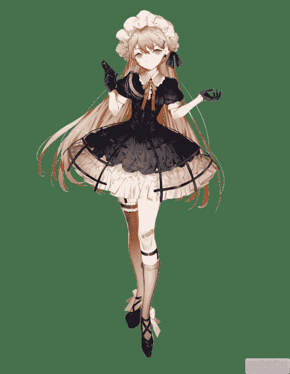](javascript:;)</ignore_js_op> <ignore_js_op>[570px-PPK_D.png](forum.php?mod=attachment&aid=Njk3NjZ8ZGM1Njg5YmF8MTYwMDg4MDMxNHwxODIzMHwyMjkzOA%3D%3D&nothumb=yes) *(193.7 KB, 下載次數: 6)*

[下載附件](forum.php?mod=attachment&aid=Njk3NjZ8ZGM1Njg5YmF8MTYwMDg4MDMxNHwxODIzMHwyMjkzOA%3D%3D&nothumb=yes)

2017-11-10 00:19 上傳  

[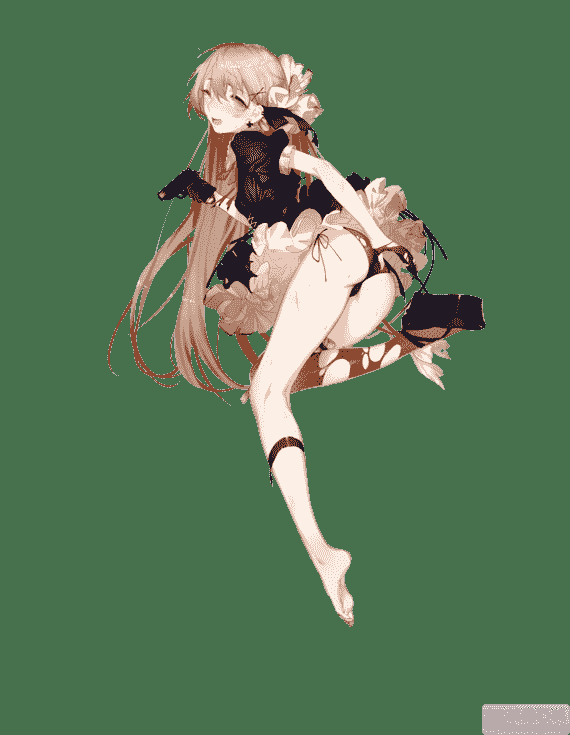](javascript:;)</ignore_js_op>  

# 72

> [狐乐 發表於 2017-11-5 13:15](https://giantessnight.com/gnforum2012/forum.php?mod=redirect&goto=findpost&pid=349683&ptid=22938)

> 多谢回复~！

> 也就是说，其实人形跟人类在精神上区别不大么？我感觉也挺支持这种观点的。

战术少女分为两代，第一代只是拿着枪械的自律人形，通过对目前适宜投入作战环境的人形型号进行特殊配置和改造后完成。第二代则通过“烙印”和“傀儡网络”而获得高效作战能力并易于大范围作战指挥的自律人形。

以上是官方对一二代的解释，其实也就是要在加上了帕斯卡黑科技之后的人形才是第二代人形，并不存在格里芬内部的人形有着一二代的差别。

不过AR小队的特殊性应该在于能力高于平均值并且M4搭载了战术指挥模块之类？

至于不备份的原因大概也是因为知道的东西太多怕泄密之类的？

目前的设定是陨石物质和人形身上的某些组织能相互反应的结果

格里芬的人形是活体半生化组织之类的，铁血则是机械构体。不过在文里面两方融合了之后相互科技互补研究出了更高级的身体就是了_(:з」∠)_

（反正你问我更高级的是什么我也不会告诉你的因为做设定真的很麻烦啊哈哈哈哈哈）

 

# 73

实在抱歉，各位依然在关注着我，并热情催更我的读者。由于事出突然，我这段时间之内并没有来得及更新，而且这两个月是突然从一个学生党转变为社会人的过程。有些痛苦，自然而然也很忙。所以没有更新，在这里只能对大家说句“万分抱歉”

是的，我回来更新了，但是我也不知道下次更新是什么时候。要根据我工作的程度来定，毕竟在不确定工作日常安排的情况下保证多久一更是个未知数。我只能和大家保证，我不会在未说明的情况下就把这整个系列的坑给放置的……这点还是可以保证的。

于是，这次的更新，是帅气的女仆小姐G36，以及她的妹妹G36C，这两位在本次的文章里会有什么表现，还请阅读下去吧！

人设图：

G36

G36C

好几辆改装成无人战车的坦克在道路上奔驰着,原本装有成员的区域装上了更厚的装甲,计算机,以及更多的弹药,把这些三战时期甚至是冷战时期的战车作为改装成无人坦克,这样的举动在三战时期也是最经济实惠的,而在这个时期,更是前线防卫上而言属于较低成本和高效率的。

毕竟机器不需要休息,更难以出错,可以无间段的执行任务,原本的车长塔装上了大量的计算机以及装置,上头的小型炮台跟着20MM机炮不时左右转向警戒扫描着任何IFF不明的信号(敌我辩证系统),远处是几座小山丘,但上面已经不是熟悉的花与草地,而是满目疮痍的弹坑,或许在那里能找到一些尸块和装备,让人备感战争的残酷。

远处几座依然在运转着的风力发电机,虽然有好几具已经损坏的倒塌或停止运转,但还是有几个屹立不摇的持续工作着,在午间本是优闲的时光,或许这道路上开过的是一辆敞篷车,载着那些欢乐的青年,他们将在草地上打滚,将在这小丘间欢乐的度过周末。

不过今天他们却被征招上战场,女人被派往兵工厂或后勤,当男人死得差不多的时候,那些冰冷冷的机械与无人武器更显得无情,此时印在那些战车车头前端的标志,更显得苍冷,无人战车的车头灯一闪一闪的,或许是某个传感器坏了,又或是那些后勤单位的迷信吧。

战车在这荒野小径中前行着,整个无人化装甲排形成了箭头队形向前,有些沿路辗过了草地,辗碎了花朵,又或是掉落在地上的头盔,这些头盔的主人的下场或许可想而知....,几天前格里芬和当地军才执行了一场血战,当地军已重大损失获得了胜利,但格里芬或许丝毫没有想停止战争的意思。

每个指挥官都认为舆论压力以及求得世界和平的共识或许能在战争之中显现,他们又想过以巨大牺牲换取那些胜利并无法得到格里芬的同情与任何一丁点停止的意识,既使今天损失惨重的是格里芬也是,毕竟战争的巨轮才刚刚转动。

巨大的人形一脚踏下时,就跟碾碎虫子一样没有罪恶感,更可怕的是她们那些巨大的女孩们,还把这些当成游戏一样的正在戏谑着这些底下的"蚂蚁"们,当飞行员们看到高磅数的炸弹以及空地导弹击中她们,巨大的烟尘遮蔽住了摄影机的视线,但当烟尘消散,他们往往只看到一个毫发无伤的少女。

任何攻击都显得无力,只是徒劳无功,没错,这些无人战车就正在曾发生过这一切的战场上前行,政府军正在检视着自己的险胜,当他们看到那巨大的人形离开战场,部队才将残弱的格里芬推出战场,勉强地以那些伤残士兵守住前线。

或许这些战车曾经搭载过不少成员,不是曾经服役过的,而是真正意义上曾经有人驾驶过这些踏上前线,或许那些成组员早被那些炮弹给打得整个车体内都是,分也分不清谁是谁了吧,最后只能将这些没人敢驾驶的车辆,改装成了这些据说载有那些成员灵魂的战车...不过这也是前线士兵的迷信罢了....

不过里面确实除了改装构建和增强装甲和武器外,基本许多内部的东西都保留着那些前成组员留下的,比如就有其中一辆贴了两张照片,一个是年轻的装甲兵和一个女孩的合照,一个是一对军人兄弟的合照,很明显其中一人就是那装甲兵,他们都是备受征招才踏上战场的,或许没有战争,他们早成家立业了吧。

地面正在震动着,不过这些战车只会由传感器判定是地震又或是单纯的行驶问题,但当震动正在接近,传感器感到异常,当车长塔转向那正逐步靠近着它们的巨大身影时,炮台也缓缓转向,不过也显得比友人战车转向的速度还快就是,但在他们开火之前,巨大的鞋底已经垄罩住它们,喀滋金属被压扁了,那些战车被压成了铁饼,再也无法行驶。

巨大的黑色靴子辗碎了这五只涂有绿色迷彩涂装的"甲虫",这一次没有成组员绝望的哀号以及肉酱混在里面,只有那些金属被压扁的感觉,以及那沾上了不少泥土的铁饼,G36只是这样的踩踏了下来,仅此而已,就让这些战车变成了铁饼。

G36她当然知道自己踩到了甚么,而且这一步也是特意踩在那里的,这些对于步兵而言特别难缠的无人战车,在她眼中的确与甲虫无异,不过今天如果是装有人的,G36也没有那个兴致去陪他们玩,通常也是一概的一脚踩扁吧,毕竟那些虫子根本无法勾起她的兴趣。

G36无视着那些曾经的战场以及上头或多或少移动着寻找尸体与伤员的医护兵们以及试图修箸好壕沟的工兵们,一脚医脚的踩碎了那些战壕以及炮弹与炸弹砸出来的弹坑,她的脚或许辗了下,确认了那些人死透了,才继续往前,不过在无人机看来那些惨况,就只是无数弹坑与巨大的脚印而已。

G36的脚步正踏在这个片血肉之地上,她一脚一脚的好像只是在这块区域踱步着,但又好像是正在清理着这些地面上的阵地(害虫)一样,她的每一步又是多少个家庭破碎,以及多少孩子的父亲呢,没有人知道吧,但毕竟这是一场结束不了的战争。

在此同时....

在前线的一个哨站中,一个散兵坑上盖着帆布撒着砂石与土块做伪装,只打开一个口架设机枪作为防卫,而尾端连接上了战壕,战壕的顶部不少区域盖上了木板上头同样的盖上了砂土作为伪装,在无人机的视野下也难以发觉这防卫设施。

不过稍微挡住战车炮机炮和子弹是可以的,剧烈的炮击和空袭可就不行了,毕竟这里的土质和这散兵坑的深度与厚度可承受不住,但依然是一个给人安心的堡垒,有人正在铁桶改造的暖炉边烤火,上头还有铁网可以烤肉和放上钢杯加热咖啡。

上头现在正有片吐司正在烤着,伴随着底下木炭的燃烧声响,那片土司上的奶油也正在融化,当奶油融化,放上了片风干肉,撒上些许胡椒和盐巴,盖上去,这虽然不算是什么美食,更非哪里的当地佳肴,单纯只是这些军人们把粮食做成的特色料理罢了,只保持能够入口的美味,而那份美味来自得来不易的补给。

一个年轻的士兵此时正坐在弹药箱上,以另一个箱子作为桌子正写着信,或许是写个远方家人的信吧,鲜少能收到回信,能收到也是许久之前的消息,但每一封信又是多少思念与千言万语,许多人巴不得咬紧牙关打赢这场硬仗,没说要反侵略格里芬,只求得他们停止对家园的侵略.保持和平。

他伸展着,让背靠在后方挡着土的木板,桌上的信这时才能看清,要不然原本他可是整个人埋在那里写着这封带着满满感情的信,给的是远方的母亲,远方的家人,更是自己继续站在前线作战的动力。

--- 分隔线 ---

母亲,或许请原谅我已经忘记了书信的格式,毕竟在这里,我们的脑袋只剩下一片空白,我很清楚我们必须打败那些入侵者,军官说我们就像是白血球,我们必须逐出必须消灭那些入侵者,不过几天前我们才刚刚击退了格里芬近几年来最大的一波攻势,虽然....对街的布莱克和赫鲁夫曼都已经阵亡了。

军官告诉我们,那些人是为了守护家园,为了和平而英勇牺牲的,同时也告诉我们,我们就快要赢得战争了,格里芬没有理由会继续打这场毫无利益价值的战争,或许我可以在圣诞节前回去,我很快就能够回到家继续我们家族的事业,很快我就可以让我们家过得更好。

这里的夏天很美,山丘上布满了花朵与草地,安静下来时,我都感觉到宁静,我好希望能在未来带着家人故地重游,告诉孩子我是怎么击退那些入侵者的,和家人在这里玩乐追逐,在这里野餐。

不过我已经有好一阵没听到卡尔的消息了,据说他和他的装甲部队现在正在前线抵御着格里芬的入侵或许正忙着杀敌吧,他已经成为了连长,更已经是我们家的英雄了,他还在附近村子认识了一个女孩,他们很快就会成婚,或许我们家会更热闹些,母亲,请您等待我,备好我们兄弟俩最爱吃的,我们也会带着荣誉凯旋的。

--- 分隔线 ---

此时地面正在震动着,不是炮击...这靠近的速度和规律根本不是炮击所能制造的,当整个半地下化的碉堡传遍了一个声响。

"警戒!!! 全员就战斗位置!"

士兵们当抄起武器站在射口准备迎敌时....一个方向的人只看到了黑色的一块,以及上面可以看到些许微微的透出的血管和白皙透嫩的皮肤,一名年轻的士兵吓得跌坐在地上,颤抖着,用颤抖的手指着,害怕和绝望的眼神望向了一旁的士官。

那名士官显得冷静些,不过他同时也正颤抖着。

"是..是...是人形! 是格里芬的人形!"

他吓得举起了步枪,没站稳脚步,身体向后倾着,颤抖的双手使枪根本拿不稳,靠在肩膀上的枪托都在磨蹭着,根本没有抵住,但迟迟没有扣下板机,当几个人围了过来把枪对向了那只脚,这诡异了,另一只脚呢? 该不会......!

"肮脏的家伙们,都给我消失吧"

她的声音从空中传荡下来,每个人都听得非常清楚,而他们反应过来自己就是要被消灭掉的目标时,早就已经来不及了,连转身逃跑或是找掩护的机会都基本没有,他们正推挤着彼此,正要试图逃离这个格里芬的人形,G36。

伴随着沉重着声音,冲击波甚至震倒了不少人,土块和木头结构崩塌的声响回荡着,一只巨大的脚踏了下来,踩破了那不怎么坚固的顶部,踩死了不少倒霉鬼,更破坏了中央的指挥与医疗站结构,基本也瘫痪了这个区域的通信与指挥了,不过在人们反应过来之前,G36再次抬起脚,再次用力地踏下,在另一端用力的跺下。

士气瓦解了,在经历许久的压抑以及长期未能结束的战争后,士气瓦解了,很多人从出口跑了出去,更多人翻过射口逃跑出去,丢下了装备或是书信,逃跑着,不过G36又怎么会放过他们呢? 她几脚解决掉了这无数条战壕结合在一起的地堡,她追了上去,仿佛在这个区域轻轻地起舞移动一样。

一脚,噗哧,两脚,噗哧,六个,十四个,二十八个,她或许正这样默默数着这些她踩死的人数,直到远处一个跑得最快的,他跑的距离可是对于她来说半步不到,不过他又怎么知道自己身后的友军们都早已惨死于她的脚下?

不过G36并没有踏出下一步把他给踩死,毕竟发现这个基地也只是偶然,发现了这里有不少的热源反映以及生火料理的迹象,她才注意到这里,不过意外中了大奖,竟然是敌方的指挥部,她想也没想到就单纯地往敌人的战线内部走,就轻易地碰上了吧。

但要找到其他窝藏起来的区域可就不容易了,或许可以"利用"那家伙吧,G36这样想着,低了身子,稍微靠近些,手挡住了他的去路后,在他反应过来之前,把他捏起,重新站起来,带着他到了自己眼前,他正在颤抖着,而G36有些远视,眼睛正以一种恶狠狠的眼神瞇着,更让那个指尖的家伙颤抖的更盛。

他不敢说话,正以恐惧的眼神看着G36颤抖着,而G36手指头稍微磨了下,才把他弄得回神,不过同时他也更加的害怕自己会被捏死,又或是被她以其他更残忍的方式杀死。

"你是想要乖乖告诉我你的其他同伴在哪里呢? 还是想要我松手让你掉下去好了?"

G36这样说着,不过在她那不知道是凶狠还是单纯瞇着的眼神之中,他又怎么能保持冷静呢,不过G36显得有些不耐烦了,手指头已经作势要松开时,他的手还试图抓住的样子,特别显得无力,不过他咽了口口水,害怕的看着这巨大的格里芬人形。

"我...说.....我说!"

G36这时手指稍微捏紧了些,好像是要给他安全感,又还是如同审讯一样的威胁着而已。

"以...以我们原本的基地为中..中心点,以东到西北,形成一条防御线,每间隔300公尺就有哨站,每间隔900公尺就有驻兵,最..最..最后每隔1500公尺就有个基地..."

他为了活命一五一十地把战线的配置说了出来,不过G36并没有松手让他摔死,更没有捏死他。

"那么....你们为甚么不乖乖投降就好? 还想要抵抗我们? 你要知道我等会就可以三两下的踩死他们喔?"

G36紧盯着手指间那颤抖着,穿着绿色军服略带狼狈的年轻人。

"因为....你...你..你们格里芬是入侵者....是你们入侵我们国家的....所以...我们才需要抵抗...妳...可以放我走了吧....我..."

他鼓起了勇气说着,毕竟这的确是事实,是由格理芬主动入侵他们的,而这个年轻人并没有想过活命的意思了吧,毕竟被她抓了起来,要活下来的机率或许也是微乎其微。

"是嘛...这样廉价的借口...我可一点兴趣都没有呢...而且,我可没说过会放你走.."

G36语毕,手指慢慢地施加力道,用力的一点一点的碾碎他的身体,最后,噗哧一声,变成肉泥,死在她的指间,就像是一小块被捏碎的肉一样,又像是被捏扁的米粒一样,沾在G36的指尖,些许的染红了他的白手套,她甩了甩,之后把那些剩余的血肉干脆沾到了刚才的残骸之上,然后转身离去.....

而在这个基地的深处,还有一封还没能寄出甚至还没写完的信件,而正巧沾满血肉的木条,就在那封信的一旁.....更显残忍。

G36就像是"扫除"一样的沿路踏着,"清理"着,不过她已经没有再捏起任何一个小人,毕竟在她眼中这些底下渺小的存在就跟虫子没两样,根本不太想去捏起更别说是对话了,她现在正完成着由指挥官下达的命令,清除这条战线,她正践踏着这些还沉浸在那些胜利喜悦中的人们,她正践踏着那些自以为胜利就要到来的人们。

噗哧,噗哧,噗哧,一次通常不是一个,而是一群一群,有时候跑上车逃跑ˇ的她就用力地踏下,或是轻轻地跳着,正好让脚着在他们上头,她正轻快的清理着,根本没有留下任何一个幸存者的清理着,甚至根本不理会他们的下跪求饶,以及投降,就一视同仁的踩踏着,给予他们最直接最残酷的死法。

G36这时候收到了命令,也正转向,离开这被她践踏着充满了泥泞与血肉的区域,那些壕沟就好比他们的坟墓,不过或许连墓穴的样子都没有,因为他们是根本如同肥料一样被压埋在泥土之中,在她无误的辗压和践踏之中。

而在此同时,格里芬的部队也迅速的进驻了那些已经失去了后勤和指挥防御显得单薄的城市,当他们踏入一片狼藉时,看到了无数充满恐惧眼神的平民,以着当地的语言窃窃私语着,妇女们将小孩带入室内,或是遮挡住他们的双眼,而那些明显不是壮丁的男人也站在了妇女面前挡着。

而那些投降的士兵被一一押上了卡车,不知道被送往何处,而格里芬的士兵正沿着道路形成行军的队形,一批一批地进入城市,而正好有一名少尉排长和下士站在电线竿旁。

"长官,我搞不清楚为甚么当地人那么讨厌我们"

一个格里芬的士官这样说着。

"你要知道,他们可是死硬分子,明明乖乖地加入我们旗下可以过好日子,有吃有喝,也不用制造军火和被征招,他们八成是被洗脑了,我们可是来解放他们的,你要记住"

"不过长官...我当初有攻读过他们当地的语言...他们都说我们是入侵者...."

"你怎么没跟我说你有这项专长? 下士?"

"报告,我就是这样才在你旁边的长官...."

"好吧,你待会最好帮我翻译好他们的对话,我们应该要找出那些潜藏在人群中的敌人"

"了解,保证完成任务"

这时候好几个男人们聚在一起,正激烈的争吵着甚么,而好几名格里芬的士兵围了过去,却也不知道该从何处沟通开始....而双方的冲突仿佛要一触即发,毕竟现在平民都好似针对着格里芬的士兵说什么,充满外语的语句中充满了无数的"格里芬"三个字的发音。

在这里可以看出,这里的人非常敌视格里芬的士兵,除此之外非常地不欢迎,连小孩都敢对他们的装甲车辆丢掷石头,而有士兵也没有夹道欢迎,反而是紧闭门窗和警戒着,无处不带有那些敌视的仇恨眼神,也对格里芬对这个国家的战争执行了很久,除此之外也丝毫没有停站的意愿,这或许也彻底地惹怒了这个国家吧。

"下士,看来你有工作了,去了解情况"

那名士官简单的敬礼后转身走向那里,稍微拉开了与平民越吵激烈的几个士兵后,变走向前简单的用当地问候的方式问了当地人。

"你好,请问你们怎么了吗?"

听起来非常生硬且不自然,毕竟这也只是大学四年学到的,而他除了跟教授与老师对谈外,基本都还没有和当地人对话过。

但当他这样说完的时候,连那名平民都来不及响应,那名少尉走了过来,双手抓着腰带,好像很神气一样,就好像从战火中走出的英雄一般,他正抬着头对着那名下士说着,不过在难民眼中他的样子好像是自大傲慢的入侵者一样。

"跟那些老百姓说,我们格里芬的士兵会保护你们的,绝对不会像是政府军那样对待你们,我们可是格里芬的士兵,是解放者,是英雄"

下士点了点头,用当地的语言重复了一次这句话,但这句话反而没让他冷静下来,反而更加的激怒他了。

"就是你们这些格里芬的士兵在破坏我们的家园! 你们的士兵每次都是这么说,会保护我们,会保护我们! 而你们要怎么保护我们!? 你们占领这里之后,只会害我们变成空袭的目标罢了! "

下士翻译过来之后,少尉握紧了拳头,点了点头,看来正在忍耐着什么,而他转过身走向远处默默地用无线电不知道正在跟谁对话着,保持立正的姿态,好像是跟哪个大人物说话一样,语气中透露着严肃与那种诡异的氛围。

"等你们今晚安全的回到基地后,你们又是怎么保护我们!? 故意设置帐篷和挂上旗帜把我们当诱饵嘛!? 只有政府军才会真心地想保护我们! 而你们却只想消灭那些守护者! 你们根本不懂被侵略的痛!"

下士无视了少尉的远离继续对着其他人翻译着,不过那名平民说完之后就马上激动地转身离去走向远处,而少尉却得意的笑着走了过来,把护目镜拉了起来弄到了头盔上。

"大伙,我们得先离开这里,这里需要整地,指挥官说这里可以设置一个前线基地,我告诉他这里有叛乱者和死硬分子,已经有人形要来支持了,我们得先撤离了"

少尉的这句话把那些刚刚坐下来安顿好的士兵们给弄得有些气愤,不过也只能摸了摸鼻子的爬上卡车或装甲车,有些没能搭上便车或运输车辆的,只好尽快地集结离开这座城市,在人形来以前他们就得尽速离开,不过人形要进攻的这件事情可没翻译给那边的平民知道。

他们或许以为格里芬退兵了吧,当格里芬的部队围着城市简单的建构出防线后,那一阵阵的巨大声响再次传遍,那一阵阵的震动再次逼近着,当那金色头发的人影出现时,有不少格里芬的士兵们正高举着步枪欢呼着,好像是已经被战争逼得透露出了最邪恶的本质,杀戮。

当G36跨过防线,或许有些士兵举着头正好看到了她的裙底风光,但她也没在意那么多,毕竟她也不太计较这些了,但当她的脚步靠近时,尖叫声以及小城中最后藏匿的兵力也开始对她攻击着,但这些小小的火力她也感受不太到,但她也确认了有反抗势力的这点事实。

那些人藏了起来,反而使的这个不想特别与这些平民建立关系的军官得逞了,不过这块地被指挥官选择了其他用途,建造格里芬的前线基地,这也表示着G36将再次不留活口的践踏着,不过这次底下的不是那些士兵们,而是老弱妇孺以及些许的残兵....

她踏入小城市中的那一脚,正好踏在了教堂上,那座教堂被她踩碎,更证明了人形的力量可是比所谓的信仰还可怕吧,她的脚辗了辗,辗死了里头所有的伤员以及平民,还有直到最后都还在祷告着的神父,不过她根本不想管这些,她只知道,要清除这些"害虫"

她无视着底下哭号着,下跪求饶的,逃跑的,反抗的所有平民,毕竟由高至下的俯视着时,她看到的只有那些细小的身影,她又怎么能分辨呢,她只是践踏着,轻轻地踢着,当她的脚踏着,踩碎,踩扁了那些逃跑的车辆与人群,她的脚步对于老人与妇女而言是根本逃不出去的。

换句话说,连那些骄傲的体育健将和正规军士兵都逃不出去了,更何况是那些老百姓呢? 那些建筑物就如同沙堡一样,她轻轻的一踢就化为碎块,对于底下人而言有如巨石一样的混凝土块飞散着,砸了下来,就能砸死数十人,而破坏只是更加的恐怖,伴随着城市中的瓦斯管线爆炸,瞬间化为一片炼狱。

人们在火海中打滚,皮肤仿佛开始融化,如同烂泥一样的沾在他们身上,他们不断的惨叫,打滚,伴随着管线和油料混和的巨大爆炸,温度持续上升着,直到他们熟透,直到他们完全碳化,直到这里散发着让人作呕的味道,甚至可以看到一个母亲正试图护助自己的孩子而抱着,最后也不是和孩子一起成为焦炭。

在G36的踩踏中化为碎块,无数的人在火势蔓延的地区以外逃跑着,她的脚踏入了医院,踩死了里头无数的伤兵和伤员,辗死了无数的老百姓,人道救援组织的成员也死了不少,医生护士都被她踩死,她无视着医院的十字标记,毕竟她就是要将这座城市铲平。

而在远处那名军官正站在装甲车顶拿着望远镜露出了让人感到不寒而栗的笑容,还露出了有些泛黄的牙齿,他甚至起了生理反应,他正以旁观者的姿态观赏着那片炼狱,观赏着那些人们的惨况,看着这巨大的女仆正在破坏着这无辜的城市。

甚至有不少装甲车和坦克都攻击着侥幸逃出的平民,战车炮装入了反人员弹,毫不留情地砸在那些小孩和妇女身上,毫不留情地打在那些老人与伤员身上,机枪也不断地扫入城市,完全的不想留下任何活口,甚至有不少的武器都打了进去,步兵们也架设起了装备,对城市中不断开火。

"去死吧! 你们这些垃圾! 去死吧! 哈哈!"

甚至有格里芬的士兵这样喊着,无不一个是不享受这残忍的屠杀的,这场战争彻底地把这些年轻人变成了恶魔,不过....他们正享受这灭绝性的屠杀,同时又称呼着敌方是恶魔,那么....这或许是不是更加的讽刺呢...

增添了城市的火海以及惨况,更使无数人化为尸块散落,有些被挂在了横越街区的电线上,跟着那大火,仿佛火烤一样,最后尸块焦了,电线也被烧断的如同火鞭一样鞭向火海,当G36不断践踏着,甚至踩过了学校,里头还有无数发抖着的孩子和他们的母亲,她就无情的踩下去,体验着那莫名的愉悦感。

那些小小的人们正不断地死在她的脚下,而她体验着那些绝望与惨叫,不过她并没有表现出来,她就继续冰冷的踩踏着,或许露出了一丝丝冷笑,她的脚尖钻破了那对她而言如同豆腐渣一样的混凝土地面,让在地下室中发抖着的孩子们被上头的火海与混凝土块给压着,若没被压死,也是在高温之中死去。

此时天上有一架政府军的无人机正默默对着他们剩余不多的基地直播着这画面,镜头放大了最大的倍率,看到了无数惨况,士兵们怒捶着桌子,咒骂着那从来不遵守战争法与国际法的格里芬,咒骂着那背叛了全人类的格里芬,咒骂着那忽然转向自己发起全面入侵的格里芬,且毫无和平的意愿。

还有些士兵看着哭了和盛怒着,毕竟有不少人的故乡就是那座城市,他们聚集在食堂与各处,他们悲愤的嚎哭着,自己的家园,老婆,孩子,以及家人,全都在那里,毫无幸免.......,而此时不知道是有意无意的,政治口号以及战争时期的宣传口号正不断拨放着,有些人已经全副武装的站到集合场等待那一声令下。

他们知道对付人形是绝对不可能胜利的,但这样拿起武器去抵抗,也总比眼睁睁看着家园燃烧殆尽好,甚至有架武装直升机忽视了命令擅自全副武装的起飞飞上了天空,正往着那几里外都能看到的硝烟处,那里的黑烟正直冲天际,灰烬甚至开始从天空飘落,灰白色的灰烬,正是城市与人们的残骸。

那是城市与平民燃烧殆尽的灰烬,在这季风下带来了这里,同时正助长着火势,直升机正这样飞往了城市之中,在远处送出了数枚导弹砸在了格里芬外围的防线上,AGM-114L虽然在这个年代已经显得老旧,不过也是政府军最廉价且有效的手段,以这些三战后封存的武器来对付格里芬。

在三战后几乎所有国家都裁减了所有军备,全数封存,保留了简单的巡逻与城市保卫部队,这也进而导致了这场战争迅速崩溃以及以前铁血战争时期的惨况,不过现在政府军既使有了大量的编制,在那巨大的人形脚下,这些后备部队又怎么能伤害的了她呢?

导弹送出精确地砸在了指挥车上,那个甚至下令其他士兵去远处警戒,单独一人慵懒的瘫在座位上对着这巨大女仆脱下裤子,准备享乐的那个指挥官就在这里头,精确地砸在了他身上,而其他的正砸在了那些机枪堡上,机炮也不断地扫射着底下的格里芬士兵。

但当城市少部分躲在屋顶绝望的平民见到这一幕时,或许有那一瞬间燃起了希望,不过当G36注意到那架已经构成了严重威胁的直升机时,她只不过是简单的用了病毒和电子干扰入侵和破坏了直升机的航电系统后,这架完全电子化,一点传统机械和设备基础都没有的直升机正在空中打转。

直到失去控制坠向火海,而在屋顶的平民们,不在欢呼,女人埋入了那些无助的青年的胸怀,痛哭着,大家露出了绝望的表情,而G36不经意的一脚踩碎了他们,更踩碎了这些原本抱持希望,最后坠向绝望的人们,很显然这里就已经是比地狱还要更可怕的地方了。

当G36踩碎整座城市后,火焰也渐渐失去燃料而逐熄,留下那些黑烟持续闷烧窜着,她得知了这个区域的军官在这直升机的攻击下殉职后,她并没有任何表情,好像对着指挥官传递了什么讯息后,变悄悄离去,伴随着格里芬的部队重新进入。

推土机推开了那些尸块堆入了大洞中掩埋,逐渐有效率的铲平了这整块区域,建立起无数HESCO掩体,大量的工兵藉助了强大的机械快速的建造起基地,而格里芬的野战指挥部也快速地派出了后备军官到达前线接手这个部队。

一切都是那么有效,而他们停止了进度,因为发现了奇迹,几个幸存下来的孩子,应该说是已经是到达征招年龄最低门坎的岁数了,几个15岁的少年正在水泥块下昏迷着,有个清醒的正瑟瑟发抖,身上有些区块是大面积灼伤甚至焦黑的,不过对于格里芬而言还算是简单的状况。

不过那刚刚下直升机的军官并没有怜悯他们,更没有要求医官过来,他举起了手枪,没有打向要害,好几发都打在腹腔和要害之外的其他位置,当看到一口血吐出时更没有停止,直到那些孩子停止抽动与呼吸为止,他才补下了好几枪在脑门,确认他们死透了。

格里芬的军官拉了拉右手臂上的黑底袖章,上面印着白色的格里芬标志,具有冲击且鲜明,他调整了下,露出了狰狞的表情命令着底下的士兵。

"埋起来,等等有找到其他活人就都埋起来,我们不需要浪费弹药在那些反抗份子身上,不管老弱妇孺,反正最后这些都会记录到反抗份子头上,这样子大家就会更确信那些该死的垃圾是恶魔了,这些恶心该死的败类"

确实,如果在场的士兵不说出真相,修改些文件,这些的确能让政府军遗臭万年,更让无数后世憎恨吧,简单明了的塑造出一个反派的方法,就是制造问题,再把过错的黑锅丢给他们就好,不过这些纪录如果在未来既使被翻出来,那么也只是替这些已经成为邪恶象征的政府军稍作清洗罢了吧。

在这名新到任的军官下令时,没有任何一个士兵反抗,麻木的打扫得战争的现场,甚至有卡车运来的政府军的弹药和武器,士兵们对天开着枪,留下了无数政府军的弹壳丢下了不少他们的装备,一起深埋入土中,伪造成政府军发起屠杀的现场.....这或许已经不是第一次了。

当格里芬的阵地开张完成时,已经入夜,星辰照着天空,而格里芬的士兵正在这里巡逻,在道路上的不是熟悉和蔼会帮你整顾环境的政府军士兵,而是一群群格里芬的士兵,以及手臂上套着袖章的军士官们,他们正在巡逻着,说着异国的语言,点着烟毫不在乎自己刚刚做了甚么。

这时候G36已经完成了区域的巡逻和检查,她来到了这无数黑暗之中唯一灯火通明的前线基地旁,坐在了外围,等待着那些小小的食勤兵们正在准备着她那"特大份"的晚餐,她望着星空,看得入神,而格里芬的士兵们对于人形的巨大体型或许早是习惯,在她的身边也不会害怕被她压到,甚至离她很接近的作业着。

她不知道是露出什么样的眼神,好像称在地面的双掌也有些用力,而她的眼神显得有些忧郁,毕竟刚才那些举动可不像平时的她,她当然也很不愿意这样冰冷的踩死那些底下的人们,要不是有命令....和因为这场战争,她也很不愿意这么作。

不过在她那样望向星空的眼神中,又有谁能安慰她那有些许悲伤的心灵呢? 既使有着巨大且无人能敌的体型,但心里又何尝不是一个正常的女孩,她可以说是充满着无奈和迫不得已而这么作的吧,她只能继续露出这冰冷无情的表情,掩盖着她那样复杂的情绪。

虽然眼见胜利将近,心里还是很是开心的,不过踩踏着底下那些不管是平民也好,士兵也好,她却是悲伤着的,她矛盾的心理也促使着她只好继续露出这冰冷的表情,不然迟早有一天会崩溃吧,那时候又有谁能帮助她呢?

不过敏锐的她又闻到了下一次杀戮的气息,她根本不想要再继续踩死任何一个人了....她更不想继续杀人了,不过在底下这些士兵们的面前,不! 应该说在格里芬之下,她也只能保持这个状态下去,不然那无数的牺牲和战斗不都白费了吗?

在这时候在黑暗之中,几辆采用电力驱动的轻型车辆和伞兵脚踏车正在前行着,政府军正打算使用最后的攻势,来对格里芬造成痛击,他们已经知道胜利的希望已经渺茫,这时候的反抗又能造成多大的伤害呢,几组迫击炮架设着,士兵搬运着炮弹,士兵们架设起武器对准了格里芬的基地。

士兵们喊着口令时,信号弹打向天际,飞上去的时候就跟流星划过一样,只不过在天中停着闪耀飘落,光照耀了整个格里芬的阵地与周遭,忽然蔓延整个平原的哨音响起,准确说来是来自各处不同的哨音同时发出,士兵们吼着,载着30MM机炮装甲车和载了20MM机炮的车辆也正在平原上挺进着。

此时强光下星月的光芒显得不再耀眼,在那信号弹以及吼声之中,这场夜袭,正是最后一次的总攻击了吧,这是为了这他们脚下那无数的尸体的复仇,迫击炮换成了榴弹,正不断朝着格里芬的巡逻部队轰炸着,这场奇袭的确让他们措手不及。

但G36不耐烦的站了起来,冰冷的眼神望着这些对她而言拿着玩具的"虫子"们

"一群打扰我吃晚餐的虫子呢........抱歉了..."

她好像正说着甚么,特别是最后的三个字,更让人没能听清楚,不过她的脚步并没有踏向那群正突袭着的士兵们,格里芬的前线基地也只是紧紧以压制火力攻击着,她竖立在这片大地上,伴随着来自天空的巨响,数枚巨大的炮弹砸落在前线上,来自后方阵地木星炮的支持,木星炮原本是铁血的高强度武器之一,不过在现在更是格里芬的主力炮兵武器。

不需要士兵搭载,只需要计算机控制就好,而且是先进的电磁炮,能够轻易地打穿地下碉堡或是进行反人员的大面积攻击,这些炮弹无情的轰击着前线,这些木星炮已经不如以往的早期型或铁血战争时期的样貌,现在的型号更加巨大,威力更是大了几倍,光是刚才那着弹的几枚就几乎灭了一整个旅。

在无线电中他们各自的指挥官都吼着,不断提醒着他们正站在那里,竟然自己的最后的命脉都沦陷了,那么离被送往充满着屠杀着集中营也不远了,不如就死在前线还好些吧,至少证明自己最后是在挡抗的,不过格里芬想也没想到木星炮的轰炸并没有阻止掉部队的挺进,他们反而更疯狂的突袭着。

但那巨大的声响再次划破天际时,最后一波的着弹夺走了将近九成以上的兵力,最后的那一成正继续往格里芬的阵地来势汹汹时,G36跨出了一步,露出了极为厌恶的表情踏出了一步,踩死了一些打扰她吃晚餐的人之外,更在地上多辗了几脚,毕竟她的眼神中的确充满了不悦。

但剩下的几个,丢下了武器正瑟瑟发抖着,举起了双手表示着投降,但没有一个人员去押送他们,而是冷眼的注视着,G36蹲了下来,拾起了他们,冰冷且让人感到恐惧的眼神,她那巨大美丽碧蓝的双眼.如同最清澈的湖泊一样的双眼,对于她掌上的这几个年轻人们而言根本不是天使的眼神,反而是恶魔吧。

她捏起了一个,张开嘴巴向是要吃零食一样地把他抛入口中,咀嚼着,好像故意发出了咀嚼的声响,她或许也是故意的让嘴角流出了些那"小零食"的血,她露出了微笑,在那战场燃烧的火光之下又显得更加可怕,仿佛她就是地狱之中的恶魔一样,她又捏起了一个

"要先吃胳膊好呢? 还是要先吃腿呢....不过你们这些虫子那么小的话,还是用吞的好了"

她捏起的那家伙正摇着头说着那她根本不想去听懂的异国语言,在她耳中就好像小动物发出的可爱叫喊一样,在她这饥肠辘辘的状态下,这些掌上的人们或许根本不是称作为零食,而是开胃菜吧,她故意的再次张开嘴吧,从捏改成拎着他的一只脚,让他头朝下的面对她的血盆大口。

故意地靠近了嘴巴,在空咬了下,巨大洁白的牙齿,深处臼齿还可以看到血迹,她微笑着,露出了玩味的笑容,舔了舔舌,轻笑了几声。

"哼哼哼..."

她再次张开了嘴,舌头都伸了出来准备接住这个小食物,脸上甚至泛起了些红晕,她享受着这小人的叫喊和哀号,享受着他的求饶和哭声,绝望正是最美味的佐料了,她松手,他着陆在那温暖潮湿的舌头上,她将舌头收回口中,开始含着,并没有咀嚼。

在她口腔中充满着他的呼喊,不过G36发出了嗯声,让他吓得不清之外,还被G36的口水呛到了不少,G36开始把他当成小糖球一样的在嘴巴中玩弄着,最后舌头有些烦了,口水甚至都多了,她才吞下去,顺着那食道,落入了她的胃中,在里头还混着另一个家伙的"尸骸",正是那些鲜红的肉酱。

不过在黑暗的胃部中又怎么能看清呢? 充满着G36的心跳声外,更多的是他无助地敲打着胃壁和绝望,她忍不住的笑了声,手轻轻地在胃部那里按摩了下,让他感受到挤压之外,更多的是告诉他除了以另一种型是离开她的体内外就没有第二种选项了。

他的挣扎仿佛就是在促进消化一样的使胃酸开始分泌,他开始感到被强酸腐蚀的灼热与痛苦,开始惨叫着,皮肤,肉,骨头开始融化,他正在胃中挣扎着,逐渐地被消化着,此时她正俯视着掌上残存的几人,她露出了一种这样怎么会饱的表情,直接张开了嘴将最后的几人倒入了口中,让他们沾满了唾液之后就直接开始咀嚼。

她咀嚼着,没有完全的咬着,他们基本都还活着,只是少了手脚,而唾液包裹着的缘故,失血也没有更近一步的严重,这也表示着,他们也必须体验着那可怕的消化,她吞下了那最后的几位,然后充满玩味的望向了地面那些正在修整基地的士兵们。

当食勤兵们用重型机具将一个有如游泳池一样的抛弃式铝制餐盒送到G36身边食,揭开了上面的锡箔纸,食物冒着热腾腾的蒸气,白烟向上冲着,锡箔纸上沾了不少凝结的水珠,而G36掏出了巨大的汤匙享受着这个盒饭,

刚才血腥味以及那几个开胃菜的帮助下,的确让G36的胃口大开,正享受着自己的晚餐,不过底下的食勤兵们也开始用大桶子和勺子开始分配晚饭,而在有些人撕开了野战口粮正在享受着自热口粮,他们经历了刚才的激战和一日的杀戮后,正在补充着能量,准备着下一次.....

而此时一个银白色长发红瞳,穿着灰色的旧式军装的G36C正在踩踏着那些残存的基地,接下来只要持续扫荡和镇压,这个国家不久也可以纳入格里芬的旗下,开始投入生产,穿着吊带袜和裙子的她正踩踏着底下燃烧着正逃着的小火球们,那些正是被航空燃油沾满全身燃烧着的士兵们。

这个国家最后一做机场也是军事基地,被她轻松的践踏着,跑道上也被残骸堆满根本无法起飞,而战斗机也在事前木星炮的炮击下而损失大半,一名逃生出来的飞行员,跪倒在滑行道上,亲眼目睹着这场屠杀......从头盔中,从那呼吸面罩中,仿佛听到了那一声哀号。

他正对着一个滑行道彼端那正在燃烧着崩塌着的一个宿舍哀号着,里头或是就是不少他的同僚吧,大家或许还在打牌,还在休息,还在用计算机或手机与家人朋友相处着,就被那一发炮弹给带走了,他跪倒在那里哀号着,丝毫没注意到自己的另一边有一个银色长发的巨大少女正在晃着。

最后G36C注意到了这个在火光之下显眼的家伙,她把那家伙捏了起来,然后用另一只手的手指头戳着,挑逗着他,或是试图确认他身上有无外伤吧。

"你没事吧...."

她盯向指尖那个正在挣扎着,正在试图以那微弱的力量推开自己手指的小家伙,不过现在可不是玩乐的时间了,不然她或许会想陪他玩玩吧,她那巨大的红瞳正盯着手中那惊恐的小动物,阿不,一个人。

"格...格...格里芬的..人形!"

"不要害怕,我不会伤害你的,应该说...我会把你带出这里的,你的其他同伴呢?"

"他们还在宿舍里....但炮击....其他人应该在蓄水池那里...."

G36C望向了那很明显已经被轰炸的不可能有幸存者的房舍,但她正四处扫视着,而且正在找着附近有生命迹象的位置,当她看到了那被树包围着的游泳池,的确那附近有不少伤员和幸存者,但这家伙怎么又会在滑行道上呢,她转头再次望向了那惊魂未定的小家伙,不过他的心理素质的确比之前遇过的其他人还要好。

"那么你为甚么在这里?"

"我...原本要去宿舍找其他人...但下一波炮击..就..就在我面前着弹了,大家都..."

G36C并没有追问下去,轻轻地用手指头隔着他的头盔摸了摸他的头,然后带着他走向了那游泳池边,当大家看到她时,并没有疯狂的开枪抵抗,反而好像是接受了命运一样的呆在原地,她放下了那手中的小家伙后便打破了沉默。

"我不会把你们送去战俘营的,我会把你们带去附近安全的地方,然后放你们离开...我保证"

私自放走俘虏可是严重的,不过指挥官一定能谅解吧,而且在三战后能有航空背景的人员都是稀有,就这样送去集中营等死,不如让他们活下去,这样能为世界的贡献还更多吧,不管是格里芬也好,还是他们的国家也好,至少都是为了人类再进步与努力。

他们好像再讨论着甚么,互相交谈着,或许也无处可逃了,总比被一早格里芬的扫荡部队给枪毙,不如就赌一把相信她吧。

G36C取下了那扣在腰带上的小盒子,打开来,平放在地面一一将他们装入进去,最后再次确认了附近没有其他生命迹象后,把这个盒子盖了起来,重新挂回腰间,她确认已经没有任何活人后,才开始她的工作,在炮击后善后,她踩踏着楼房,假装着自己曾经破坏过这里和攻击过这里。

事实上她只是等炮击砸落在燃油库后才进来的,她根本没有造成什么伤亡,不过除了这些幸存者和她本人之外,又有谁知道这些真相呢,她结束了破坏之后,便离开了机场,走向了远处的方位,在一条格里芬的巡逻车队压根不会经过的路上,放下了他们,并丢下了对他们而言有不少数量的水与粮食。

"只要继续往东走,你们就可以到中立区了,不过哪里...应该也不能安全多久,希望你们能够平安"

她和这些人们简单的道别之后,见着他们扛着补给正沿着公路一路向东走着,他们行进在路上,有些狼狈和无力的前行着,那一块块的中立区也迟早会被格里芬的攻势给毁,身为军人的他们,身为壮丁的他们或许又得被充军,但又还不是得往前,不然只能等死了,而在路旁有一个没人注意到,被沙土几乎埋没的路标,"地雷区",在已经看不到那巨大少女的位置,几点亮光与爆炸声响,无人幸存。

她转身在这深夜里回到了机场,累得躺在了这机场的跑道上,她并没有顾忌太多,毕竟这里除了死人与残骸之外,就没有别的了,她现在所能作的,就是尽可能的在不被发现的情况下让自己发现的每一人存活下来,毕竟她可完全不想伤害这些一点反抗能力都没有的小家伙们。

直到黎明,烟硝已散,她正在那平坦的跑道上酣睡着,不过此时一阵阵脚步逼近,G36看到了自己的妹妹正在熟睡着,变下意识地放轻了脚步,轻轻地走向她的身边,坐了下来,不自觉的她开始放空,望向那一片片云彩和那个失去了控制者和基地正在上空无助盘旋的无人机。

失去了控制者,整个机场也毁坏,这架无人机的计算机根本不能判断,更不能降落,只能盘旋直到燃料耗尽,坠毁为止,不过不知道是G36为了消遣还是哪样,忽然接管了无人机的控制,手动的替这架已经算是老家伙的MQ-9降落,政府军已经没有先进武器了吧。

看起来是只好把那些封存的武器拿出来填补空缺的样子,挂架上挂着两枚像是炸弹的东西,但是上头却是十字标记,是人道救援的医疗用品和补给物资,这架无人机好像是要前往城市进行人道救援的...G36并没有想太多轻轻地捧起了这架对她而言跟模型没两样的无人机。

正仔细端磨着,保养相当周全,可见维修技师的水平是一流的,而外表的蒙皮更没有因为环境和老旧而有任何的损坏,相当的完整,她的手指开始拨弄着机尾那可爱的小螺旋桨,不过这时G36C已经停止了酣睡声,有些睡眼惺忪的在这清晨望向了自己的姐姐。

不过她并没有被她的姊姊G36发现,她假装还是睡着地躺在那里,放慢着呼吸,休息着,而G36看着那根玩具模型一样的无人机自顾自地说的。

"我们到底来这里作甚么呢....杀死他们然后再让自己的入侵名正言顺吗....指挥官到底在想甚么...."

不过G36C还是无动于衷地躺在那里,静静地听着她的姊姊说着。

"我根本不知道该怎么办,很多人在执行任务的时候都可以笑得出来,又或是很有热诚的投入其中,但那可是杀人阿....我怎么样都办不到阿.....我..那些人的表情.那些人的样子.都常常出现在我面前,他们那样无辜又恐惧的表情...."

这时候G36的手指灵巧地将那个救援夹舱取下对百倍巨大的她而言有三公分半多的夹舱,她捏在指尖端倪着,里面应该装了不少本应该要救人的东西....而自己不只毁掉了它要救助的地方,更杀光了那些要被救援的人们,她心里非常的难受。

不过当她把无人机和夹舱一起放到跑道的一边时,G36C忽然起身,深吻了G36,抱住了她的姊姊,两人倒在地上,地面发出了轰鸣声,G36有些意识不过来情况,被G36C压制着地亲吻着,然后望着她的姊姊。

"明明有难受的事情都可以和我当面说的阿....."

"难道妳刚才都听到了吗?"

"当然...我全部都听到了喔,妳为甚么要那么执着呢,我们不是姊妹吗,而且不管怎样都没人能反对妳吧,而且那些小东西们其实也有办法活下来的喔?"

"我该怎么做...."

"只要放轻松点就好......"

G36C上去又是一吻,,她的腿正抵着她姊妹的私处,不断摆动,不过两人正吻着,相拥着,两人一个滚动就将这架MQ9给压碎,不过两姊妹并没有在意太多,G36C正往G36的私处发起了攻势,隔着内裤就能看到那已经湿了一片的情况,伴随着浓郁的女性贺尔蒙,G36C的手指头隔着胖次开始了一阵阵的挑逗和摩擦。

"如果这时候有小人的话...搞不好会更好玩呢...G36姊....他们会在那边挣扎...然后在把他们舔到嘴巴里用舌头玩弄一番之后在...弄在妳的乳头上...嘻嘻,刚才把那些人放走忽然觉得有些可惜了呢...."

G36C替她的姊姊脱下了胖次,然后开始舔弄着私处,挑逗着那巨大的女阴,含着那小豆豆,然后伸出食指开始搅动和抠着,伴随着G36那阵阵娇喘她也有些兴奋地抱了上去,正向是哺乳的孩子一样,主动的解开了G36的衬衫,解开了那巨大的胸罩,正兴奋的含着舔弄那娇嫩的乳头。

这个举动好像打开了G36的开关一样,她轻轻扶着G36C的后脑杓,轻轻施力着

"用力点吧....恩.....阿.....很乖呢......嗯...."

当G36C离开那乳头后,就往另一边展开了攻势,先是含着,轻轻咬着,吸吮着,然后开始用舌头熟练地舔弄着,嘴唇也正磨蹭着展开攻势,很快的两边的乳头的硬了起来,在持续的攻势下,G36的私处就已经泛滥,大量的爱液淹没了跑道,伴随着那黏稠温热的爱液沾染了跑道一旁与中央的草坪。

"那么....换我啰...G36C....嘻嘻...妳这次做的很棒呢..."

G36搂住了G36C的腰部一个翻身,将她压制在地,向前挪动让自己的女阴压在了G36C的脸上,脚背勾在G36C的私处挑弄,伸手抓向了机场跑道远处那原本拿来载着士兵的小巴士,这原本是拿来载运飞行员或是官兵在机场间行动的,现在已经成了这巨大少女手中的自慰棒。

"在我奖励妳之前....先继续替我舔吧....很舒服呢..."

G36正确认着这"自慰棒"的强度,然后舔弄着用自己的唾液去润滑,她看着空荡的小窗,想象着里面如果有着一群小人在害怕地拍打窗户和求助,是多么的可爱....或是打开了车门无助地悬挂在门边又或是掉落下来掉在自己的胸脯上,想着想着他们如果被这样送入阴部的话....不禁再次湿了,G36C也很乖的将她姊姊的爱液给舔掉,两人都享受着这份欢愉。

"那么.....我要来咯......下一站...就要进山洞了呢....嘻嘻"

G36起身转向了G36C的阴部,她面对着G36C的阴部,人压在妹妹的身上,而自己的阴部也正对着G36C的面前,她抓住这辆巴士插入了G36C的阴部开始抽插着,甚至搅动和轻轻转着

"怎么样,舒服吧,很舒服吧?"

她用力地抽插着,快速的使用着这"自慰棒"

"G....G36姊...!!"

"妳可别偷懒喔....也要让我舒服起来"

G36C好像没听进去一样,正享受着,口水甚至都流出来了,满脸胀红着,体温正在上升着,爱液不断的流出,用力的收缩着自己的肉壁,车窗甚至破裂,大量的爱液淹没了那小自慰棒,G36抽了出来

"啊....有那么舒服吗....那么公交车要往下一站出发啰....?"

G36向前爬着,移动过程中,自己的女阴不知是有意还是无意的压向了G36C的嘴巴扭了扭,再继续向前着,转身,挪开了G36C的大腿和屁股瓣。G36C颤抖着,轻轻摇着头,心跳正继续加快着

"G3...G36...姊不要...我.."

G36好像根本不想理会一样,毕竟这自慰棒除了里面沾满爱液之外,还是可以用的啊,而且G36C也才高潮几次而已....还是可以继续的吧,看着她那已经发烫着的身体G36正兴奋着地把那小巴士弄上了她的小菊花的周边正挑逗着

"准备好了吗...要准备...进去洞窟了喔...."

用力一插,公交车被G36C的小菊花深深吸着,甚至随着那粗暴的呼吸正发出金属的喀兹声响,正收缩着

"啊...有那么喜欢吗?"

G36扭转和抽插着那小巴士,伴随着那一边G36C的阵阵喘息和挣扎,她的娇声或许都能震碎一旁塔台的玻璃了吧,她捶在跑道上的手已经把跑道捶出了些裂纹和凹陷,可见力道之大,直到G36C再次的高潮瘫倒在那里,G36才得意地拔出了这坚固的小巴士

"这东西还真坚固啊....玩了那么久都没坏的东西,可真少见呢....人类的交通工具通常很容易坏的...."

G36笑着轻轻舔了下那小巴士,然后在一旁坐着,爬向了一边靠着那有些焦黑的机库残骸,将这结构快崩坏的小巴士伸向了自己的女阴挑逗着,然后插入了自己的女阴,经历了一番的自慰与她那粗暴的玩法,很快地进入了高潮,而这辆巴士也几乎变形

"什么嘛....才刚刚夸奖你,就这样烂掉...还想说带回去玩的说..."

G36随手将这巴士扔向了远处,爬向了G36C正躺在她的一旁休息着,两个刚刚结束了这鱼水之欢的巨大少女,就这样把这原本已经残破不堪的机场破坏的更甚,几乎整个跑道上都是两人发情时所流下的爱液与口水,

不过当两人回过神时,才慌忙地起身拍了拍身上的尘土,虽然这个机场已经没有任何人了,但还是免不了尴尬,两人望着彼此,不过原本很有攻势的G36C作为妹妹现在已经面红的在一旁没有说话。

反而G36很快的回复了状态,但此时指挥官的命令又下来了,要她们准备在附近持续巡逻和扫荡,因为反抗分子根本没有完全消灭,在清点后发现那次的总攻木星炮只毁掉了不到七分之一的兵力,而此时这场悲剧好像没有要结束的意思....

两个巨大少女起身后便往一个方向行进着.....而两人的眼神中好像说着,回到基地之后再完成剩下的,不过G36的步伐显得还是没有轻松起来,但至少她的心里没那么难受了,毕竟要是应接受杀人是谁也难以办到的吧。

在这时候政府军已经濒临最后的时刻,集结着最后的士兵,军用卡车甚至开入了城市中号召着最后可以使用的男人们,最后的志愿者们,让他们套上装备拿起武器,在这最后的据点中布起这一道道中年人,少年,老年人,和那些原本不适用于战场上体格的人们,他们都得加入这场最后的血战。

甚至也有不少学生也被迫参战,而妇孺们却被送上了那原本满载军人和装备的车辆,被送往了人道救援组织的救济区域....,这时候政府军的士兵们明知道这是人生的最后一刻,却无任何言语,甚至没有大肆掠夺或展露人性,他们从不敢提及未来,因为未来是那么遥远。

年轻的少年们,甚至原本逞凶斗狠的,那些或许已经在某处的堡垒或是沙包后面蜷缩着哭泣,大哭着,喊着母亲,那些不良少年们这时候也加入了保卫家园的行列,但这时候他们才想着自己的不孝以及未能尽孝,他们哭着,老兵们则是冷静地清理武器,冷静的清点弹药,冷静的调度,甚至不怎么说话了。

好几架直升机飞过,政府官员,权贵也都撤离,但上头却没有载着任何军官,他们也愿意拿着步枪,在这最后的防线,同时也是最前线进行指挥作战,此时地面不是人形步伐的震动,而是那些沿路掠夺强奸和屠杀的饿鬼们正在兵临城下,有些甚至是自己的部队投靠过去的,这自己人打自己人的悲哀更让人难过吧。

这些政府军剩下了首都这块最后的防线,而且这里还是迁移过的首都,这些政府军或许已经在格里芬的文宣与报导中变成无恶不作的恶魔,变成了打输无数战役的祸首,变成了三战那些败仗的原因,既使最后他们打赢了三战,让国家幸存了下来,昔日的政府军今日沦落为恐怖份子,沦落为这格里芬大军即将要辗压的目标,现在的政府军与这些百姓们,就成为了恶魔,控制了媒体所制造出的假象,确实使人哀伤。

士兵们最后的寄托在那些家信中,被送上了卡车运往了所谓人道救援的区域,事实上那人道救援的区域也只不过是格里芬设计好要拿来一举歼灭的屠杀场吧,这或许也不是第一次这么做了,只要把这整块区域净空,那些格里芬处理不了的人口就有着落了,这也是一个最极端的处理方法。

当火箭弹的咆啸声划破天际,砸在这座充满忧郁的城市上,鲜血炸往天空,而在这无数装甲车辆轰炸攻击着,在这无数火网包围着,甚至直升机追赶着那些装满平民的撤离卡车正进行拦截,机枪扫射着那里头无数的平民百姓与老弱妇孺,运兵直升机甚至打开舱门让士兵们对他们开火,他们露出了狰狞的笑容,这时候不免让人怀疑,到底谁才是真正的恶魔呢。

而在这无数炮弹攻击和子弹造成的火力网中,有个巨大少女正悄悄靠近,G36正在踩踏着这一块块的区域,她面无表情的,但又好像快要承受不住一样的颤抖着踩踏那些目标,或许是快压抑不住了吧,救护车,医护兵,伤员,她都得无差别的踩踏着,学校,医院,避难所,她都无差别的让那些建筑如同沙堡一样地在她脚下化为尘埃。

她不断踩踏着,鲜血与血肉甚至沾满了她的鞋底,她甚至开始麻木,她最后都不知道自己执行了这单方面的屠杀执行了多久,又有多少人跪下哀号,又有多少人放下武器投降,也有多少人战斗到底....她也都得把那些人们当成蚂蚁一样的踩死。

她在这一切结束之后,落下了巨大的泪滴,在那还冒着烟的废墟之中,无数格里芬的士兵在她身旁检查着,还有气息的补下了好几枪毫不留情,甚至不少人正对空鸣枪着,在一旁曾是国家领导办公建筑的区域,早已化成废墟,那混凝土堆上正插着一根旗杆,格里芬的旗帜......这面旗帜,今天看起来仿佛沾染了无数鲜血。

G36那巨大的泪滴从空中低落,她第一次哭泣吧,她第一次流露出自己除了冰冷以外的情感吧,她啜泣着,她仿佛闻到了自己身上的血腥味,她不停地哭着,那些士兵们还在继续那些残虐的事情,她没能阻止,她听着那无数枪声与讪笑声,她第一次感受到自己巨大体型的无能。

地面传出了除了人形以外,没有任何生物可以制造的震动,G36C正走向那跪坐在废墟中哭着的姊姊,她知道发生了甚么,这也是她希望着,毕竟G36能哭出来总比闷在心里这样使自己忧郁着好吧,G36C手伸向了G36的肩膀,G36带着泪光回过头看着她的妹妹,她抱了上去继续哭着。

G36C这时候正安慰着自己那精神已经支撑不住的姊姊,但她又能怎么办,如果上报或是被指挥官知道的话,最好的选择就是让G36"忘掉"这段经历吧,让她继续....再一次的执行着这无数残酷的任务,她们终究还是为了战争而生的人形,与之前的差别只在于用子弹杀人,还是一脚给敌人痛快,怎么样都不能改变身为战争机器的事实吧。

"G36姊,一切都结束啰,我们已经可以回去了,这边的任务完成啰...."

"我...我踩过了一个国家了吗...我...我杀了多少人...."

"这些...都不用在意了,如果妳哭着的话,不就丢脸了吗,而且这是战争阿,那些政府军可是逼着年轻人上战场喔,而且被我们格里芬统治着,人们就不用被征招,也不用担心征粮的问题,这对于他们而言比较幸福呢,也就是说G36姊,妳做的是正确的决定,妳踩死的都是恶人"

"可我...."

"这些都不重要了喔....我们只要能完成指挥官的命令,只要我们能快点完成,让他们快点被消灭或是投降,战争就能早日结束了喔...."

G36松开了双手,她望向自己的妹妹,好像理解了甚么,虽然无奈,但也无可奈何,她好似接受了一样,微笑着,原来.....这是结束战争唯一的办法....那么自己就只能执行身为女仆的职责了呢,G36停止了哭泣,起身,手握住了G36C的手掌牵着。

"那么我们....回去吧,跟指挥官报告"

"恩...果然G36姊不哭的样子比较漂亮嘛...."

"妳在说什么....另外可别把这件事情告诉指挥官喔"

"好~ 我知道了~"

再此同时....不知道被遗忘在哪的建筑物之下,残骸堆中一个被压断了右小腿的通信兵正忍着痛替自己止血,注射吗啡,他的通讯包就在一旁,正广播着全面沦陷着消息.....这个国家已经覆灭,再也不存在,历史也只到今天,军队或许就只剩他一个幸存者了吧,他露出了自嘲般的表情。

"原来....一切都是徒劳阿....我们只是想抵抗入侵者而已啊....."

他颤抖的手伸向了一旁的手榴弹,悄悄的拉开了插销,弹片弹开,手带着手榴弹敲击在一旁的水泥块上,伴随着闷沉的爆炸声,鲜血与血肉沾满了那原本灰白色的混凝土,或许一切都结束了吧.....而其他地方也正燃烧着那无数战火.....悲哀的战争,何时能够早日结束。

几个月后.....

政府军的残军以及当地幸存没被清洗的平民们组织了武装反抗组织,用着那些保存在地下碉堡中的武器正在进行反击与夺回....至今甚至一个城市都没能占领下来,他们正不断广播着政治的话语,同时也正不断煽动着民众反抗,但他们好像不知道,自己以往的家乡,早不是自己国家的人们住着,而是另一个语言与国籍的平民们....

他们也不是人民眼中的战士与英雄了,反而在这格里芬的宣传下早已成为恶魔.....,他们那无数广播甚至被拿去嘲笑或是被视为污秽的,他们并不知道这一切,正以不可能起作用的攻击,不断的牺牲与加臭自己的名声,不过最后的归宿还是战场,或许对于他们是最后的欣慰吧。

而在某处的指挥部中,那最后挣扎般的计划也被格里芬拦截了下来....特战部队....潜入....格里芬......实验室,在那份资料中被破译出了这些内容,那些士兵们或许不知道自己的任务早就曝光,而他们的内部也有无数格里芬间谍的事情或许也不知道吧,在这场战争上....经济,情报,武力,都极度悬殊下,或许这场自杀计划,也是最后的任务了吧。

而G36手上正拿着这份被破译的资料....一份送往指挥部,一份送给帕斯卡,接下来....一切都万事俱全了,下一场的战争计划....或许正在准备运行着,那如同坦克主动轮般的战争巨轮正在转着....而这些巨大少女们将再次,将巨足踏向那些无辜的人们,或许这就是战争吧,战争,战争从不改变。

 

# 74

<ignore_js_op>[少女前线-G36C.png](forum.php?mod=attachment&aid=NzA0MjF8NmFlZmQxODZ8MTYwMDg4MDMxNHwxODIzMHwyMjkzOA%3D%3D&nothumb=yes) *(515.33 KB, 下載次數: 12)*

[下載附件](forum.php?mod=attachment&aid=NzA0MjF8NmFlZmQxODZ8MTYwMDg4MDMxNHwxODIzMHwyMjkzOA%3D%3D&nothumb=yes)

2018-1-18 22:50 上傳  

[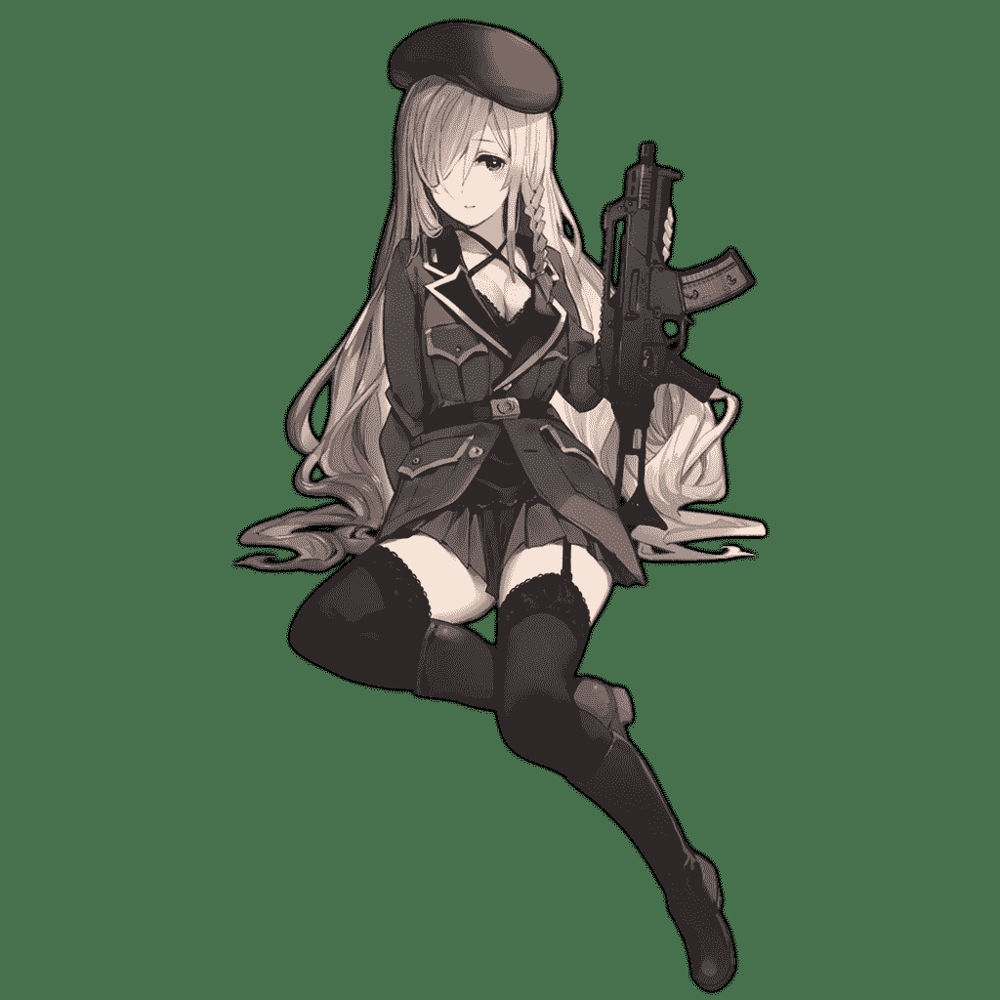](javascript:;)</ignore_js_op> <ignore_js_op>[Pic_G36_Left.png](forum.php?mod=attachment&aid=NzA0MjB8NDBiNGZiNzd8MTYwMDg4MDMxNHwxODIzMHwyMjkzOA%3D%3D&nothumb=yes) *(4.01 MB, 下載次數: 24)*

[下載附件](forum.php?mod=attachment&aid=NzA0MjB8NDBiNGZiNzd8MTYwMDg4MDMxNHwxODIzMHwyMjkzOA%3D%3D&nothumb=yes)

2018-1-18 22:50 上傳  

[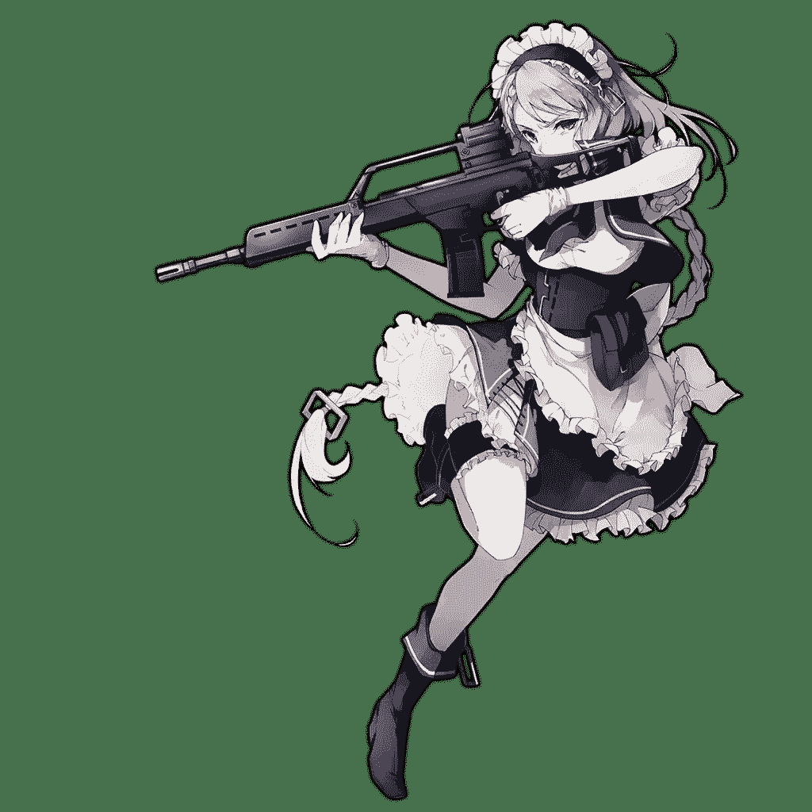](javascript:;)</ignore_js_op>  

# 75

> [天衣无缝 發表於 2018-1-20 09:19](https://giantessnight.com/gnforum2012/forum.php?mod=redirect&goto=findpost&pid=356042&ptid=22938)

> 我爱多元菌。这两把新枪让我强烈的涌出了被她们踏み溃す的愿望

我也有同样的感觉……或许在冬活的剧情把两人资料补全之后我可以写个单独的小片段？

 

# 76

> [s117 發表於 2018-1-21 13:55](https://giantessnight.com/gnforum2012/forum.php?mod=redirect&goto=findpost&pid=356258&ptid=22938)

> lz能不能爆发一波来满足一下我们啊_(:з」∠)_

看今晚吧，或许会有更新呢XD

 

# 77

*本帖最後由 吳港雪風 於 2018-2-5 02:41 編輯*

感谢大家的支持……真的，从各种偷偷上论坛看到各种催更的情况我就知道大家对我其实还是很关心的。感谢大家支持的我，于是这次又来更新了。不过这次虽然说是更新，但这篇文章的主体却并不是我写的，大部分是由群里的建州dalao写好之后，我做修改的工作以及添加了一些片段。所以只能说这次的更新是假借他人之手吧。尽管这段时间工作忙，但我会争取在春节假期的时候多写一些的……

于是这次应GN群里的各位要求，不再是传统的百倍身高，而是写成了growth到giga级的新play，主角嘛，依然是我们可爱的战术攻击犬M4 SOPMOD II，不得不说小狗狗真的是太可爱了，而且这次正好因为一张图的原因给了我修改的时候很大的灵感，这里也放出来让大家YY一下。

另外还有一件事情想要和大家说的，希望大家如果有任何灵感，不管只是一丝小小的想法，还是宏大的构思，都请不吝和我分享，我的qq是2408567240，说不定之后的故事中的一些片段，甚至是整篇文章，就会有你所提到的东西出现呢。作为写手，我不想放过任何一个能勾起我兴趣的灵感~

于是废话就说到这儿，咱们配着SOP的美图，来看文吧~

SOP平常的形象在格里芬中可是很有名气的,如同狂犬一样的行事作风,而在战场上又是个战斗狂,心理年龄上也比其他AR小队中的成员来的幼稚,不过她就如同小恶魔一样,不过在前线的话或许就是无数军方士兵们的梦魇了吧。

但她也有意外可爱的一面,当她睡着时,安静下来时,给人一种意外的柔和和宁静,她蜷曲着躺在床上,而手上还捧着一个小小的身影,而她的手掌还很靠近自己那可爱细致的脸蛋,虽然对于在她手掌上和她一起"睡"的家伙来说或许可是非常有压迫和巨大的吧。

她无意识的露出了笑容,发出了一些娇声,但这让在一旁看着她的人,没有任何一个不会被她这举动给融化的,毕竟她这样子真的有一种让人喜欢上她的错觉,不过先撇除她那巨大到可怕的身躯,还有她身为格里芬的人形之外,真的和一个正常的少女没有甚么差别。

在那次击破要塞的任务后,这个小家伙就在格里芬的军医院中被医治直到康复,但对人形和许多事情都有严重的创伤,SOP就主动提出要照顾他的提议。她口头上是说这是自己造成的想对这家伙负责,不过实际上只是想要一个玩物而已吧,毕竟她非常享受自己对于这家伙造成的绝望。

此后SOP便无时无刻带着这家伙一起了,不过在AR小队其他成员面前,她会抓着这个小人在脸颊上蹭着,或是温柔的照顾着。而当在她们转身之后则拎着他,或是捏住他的小腿倒吊着欺负着他,享受着他哀号和无助绝望的眼神,享受着自己正在玩虐着他的心灵与肉体的快感。

对于旁人而言一个女孩与一个小人是个温馨的画面,但对于被拎着的他而言可或许是个想死也死不了的阿鼻地狱,因为他曾经目睹这个少女屠杀了自己的部下和无数同僚,现在却得以她照(一)顾(个)对(玩)象(具)的身分生存着。

或许自己精神和肉体上都被调教了吧,虽然害怕难过着,却还是会乖乖听她的话,不然又是甚么样的折磨呢? 为了生存也只能变成她掌上的玩物了吧。

话说回来,在一旁放在床头边的平板计算机正显示着几个大字,"仿真系统执行中...",这表示她并不是单纯的睡着了,而是带着她掌上那个无辜的小人一起进到了仿真系统中。这个系统当初是为了设计进行训练以及模拟作战而创建出来的,虽然现在依然保持着这项功能,但是也有不少女孩更乐意在里头玩乐着。

毕竟这仿真系统的强大可是夸张的。可以模拟出一整个城市,不只是建筑地貌而已,而是连里面的每个市民都能模拟出来,如同栩栩如生的人类一样,更可以模拟出一个大型战场与战线,里头的每一个士兵都能精细的模拟出来,如同真人,而且他们还会以为自己的后方真的是有家人要守护的。

不过这系统不单是给数据而已,而是真正连他们的家人和后方都能模拟出来,基本可以说是存在于计算机之中的现实世界了。这也使得那些巨大的人形们可以在里面练习如何和人类互动,毕竟在里面人类的反应基本是和现实中是一样的,不过SOP这一次调整的模拟细节度真的是到了系统的极限。

毕竟她一次性就把系统调整到了最精细的程度,而且是把整颗地球都模拟出来了,每一分细节都是,她究竟是想作甚么呢,一次就把每个数值都调到最高,而且还带着掌上那个属于她的小家伙一起进去了仿真系统之中。

夕阳西下，整座城市被覆盖在最后一抹红霞之中。而就在此时, 鸟类惊慌地从城市中飞起,伴随着一阵阵有节奏的震动声,以及绝望的惨叫,好像有些不对劲了。此时在城市中的某处，传出了一阵戏谑的笑声。

"哈哈哈哈哈,找~ 到~ 你~ 了~,没想到你连二十倍的大小都跑不过啊? 小老鼠? 哈哈哈哈哈"

"不过看你那么可爱的份上,还是当作仓鼠好了? 如何? 哈哈哈哈哈哈"

一个身影忽然如同发酵的面包般膨胀,她更加的巨大的同时,也压毁了无数建筑和原本道路上的车辆,她巨大的身影已经竖立于城市之中,比大多数建筑还要高大,这已经是百倍的大小了,她刚刚原本还用着十倍的大小恶趣味的追猎着她的小玩具,当她"捉"到他之后,便把他用手指头弹飞到远处后当做惩罚了。

只要他每被她抓到或杀死一次,她就会更加的巨大化,难度当然也会跟着提升,不过她这样忽然的巨大化不只破坏了附近无数建筑,她在过程中手无意识的伸展也把一栋大楼打出了一个巨大的洞,然后跟着她巨大化的同时向斜上方划破,直到高楼整体坍塌下来。

"哈哈哈哈哈,没想到那么快你输了~ 那么再给你一次机会吧,这次可不要那么快死喔? 哈哈哈哈哈"

而附近的平民们早就躲到地下室中瑟瑟发抖,完全搞不清楚头绪的面对着这巨大少女的游戏,他们很显然不是游戏中的主角,但他们也是被泼及的一方,她在路上跑着或用力踏着的同时,当然也会踩到不少人,而尖叫和血肉此时就沾满了街道间....

当然这个城市中的军警也不是闲着的,他们很快地动员在许多街区中戒备着,接收着平民前往安全的区域,所谓安全的区域当然是隔壁城市或是更远的避难所吧。不过当他再次张开眼睛时,就重生在军方的据点中了,慌张的四处张望着,有没有军车或是办法可以让自己逃离这里,如果输的话,她一定会变得更大的....

如果她玩累了,离开仿真系统中,在现实的一定又会被迫让她玩一些什么恶趣味的游戏的!  张望着,直到看到一名士兵正在引导着市民搭上卡车,一旁还停着不少装甲车辆,看来这是要撤离平民的车队,必须...逃离这里!

他看到那辆卡车的方向便快速的跑向平民的队伍之中,跟着队伍被引导上卡车之中,跟着车队....渐渐离开这座城市,不过或许他们的指挥官已经决定要放弃这座城市了吧,能救多少就是多少了,还有残存的平民,估计也是没办法救了,毕竟她正在城市中如同电影的大怪兽一般破坏肆虐着。

当SOP没看到那家伙的身影后,便趴了下来,挖掘着地铁站的入口,随后稍微一用力就把整个地铁站给挖了开来,用着蛮力把马路和底下的管线都暴露了,直到看到整个地铁站,她露出了邪恶的表情,正坏笑着,伸出了她巨大的手,好像要开始在执行与之前一样的虐杀.......

此时在低空中好几架AH1W飞了过来,围绕着那个巨大的少女。当无线电中传出了开火许可,他们便疯狂的倾泻火力试图击退这个侵犯自己家园的入侵者,无数机炮与多管火箭被发射出去,而此时天空上也有几架战斗机正在盘旋着,从高空中投放着炸弹精确的轰炸在SOP的位置上。

但实际总是绝望的,那几枚炸弹并没有直击到SOP,反而正中了地铁站之中,原本存活着还正感谢着上天的平民,忽然化作无数尸块和血肉,他们或许还欢呼着军方的强大火力前来支持了,但下一秒就被军方的火力给打碎。

他们的尸块散落在方圆五十公尺,他们的鲜血与肉块几乎沾满了整个地铁站,还有些飞溅的喷上了外头,吊挂在附近的电线上,也有些直接喷上了道路,而蛋白质烧焦的恶臭布满这里,地铁站中没有任何一个幸运儿活着,或许活着反而是更惨的吧。

SOP露出了让人不寒而栗的笑容,头还微微歪着,看着那几架直升机,巨大的眼睛好像在注视个每一个驾驶员脆弱恐惧的心理一样。就算那些人心理素质再怎么坚强,面对她巨大鲜红的双眼,就如同森林中的小白兔被一头巨狼给盯上了一样。

"你们这些苍蝇们怎么能伤害平民呢? 我必须得替他们出一口气吧? 毕竟刚刚还陪我玩得那么开心呢,哈哈哈哈哈哈~"

她随手抓了一大把的水泥碎块,那都是在她玩乐之中被压碎和踩碎的大楼,其中或许还混着几个无辜的小人,而每一块最少也有汽车般的大小了,她抓紧了那些水泥块丢向了那些直升机群,被汽车般大小的碎块给直接击中,又或是螺旋桨绞入了水泥块或尸块而折断起火。

好几架直升机因为失控和着火,许多被直接击中而撞击上了大楼或被应力给打向地面,但也有些失控的撞向彼此然后在一同坠向地面,坠毁时驾驶员们也只能无助的哀号和发出惨叫,根本没有迫降和逃生的可能,就这样撞向死亡。

在黄昏之中,燃烧的城市,燃烧的残骸,遍布的尸块,伴随着无数绝望持续照着,温暖的火焰与光芒,并非救赎,而是使人绝望的炽热与恐惧,无数驾驶员和平民就这样牺牲掉了。

她这样轻松地举动便击毁了整批前来支持的直升机群,此时她巨大的红色双眼无意识的看向了地面几名士兵颤抖着拿着枪指着她,她露出了让人几乎失禁的微笑,手伸向了他们巨大的手掌瞬间抓紧了他们。噗叽,他们瞬间混为了一团，字面意义上的“一团”。

"嘻嘻嘻嘻,你们到底哪块是谁我都分不清楚了呢,只是手轻轻地握一下而已嘛...哈哈哈哈,果然你们这些虫子们就是那么弱小呢"

她还轻轻地舔了下手掌上那些"肉酱",露出了满意的笑容,好像很喜欢这样的味道似的。但她随后又把这些"肉酱"随手抹到了一旁的大楼上,血腥的味道变沾染了整栋大楼,里头或许还有些人躲着,当闻到了这血腥味后便发出了阵阵尖叫。

她起身抬起巨大的脚,对着这沾满了血肉的大楼一脚踏下,踩碎了这栋大楼，之后继续破坏着这里。当这座城市整体被踏平后,她发现那个小家伙的生命迹象还非常明显,而且并不在自己脚下的这片"废墟"中,她的目光便对向了远处的另一座城市,露出了微笑

"小虫子~ 你要躲好喔~ 要躲好喔~ 哈哈哈哈哈哈哈哈"

她一步一步的走向了另一座城市,原本搭车也要半个小时以上的路程,对她来说却不需要多久。一步一步的震动都使人们惊慌,当军方架设好防线,当各式武器,不管新的旧的,只要能发射出去的都瞄准着她,而无数警察也跟着动员抓紧了武器对向了那个将一座城市践踏着的已经毫无生机的巨大少女。

许多坦克也驶入防线之中,炮台转向对着那巨大少女,面对着无数武器和火炮的瞄准,她却丝毫不在意的走向了他们,每一个步伐都使地面震动着,每一个步伐都践踏着人们的心灵与士气,每一个步伐都让人们感受到恐惧与严重,就是这娓娓道来且缓慢燃烧的恐惧才使人害怕。

如同巨蟒一样缠着心灵,如同毒液一样渗入血液,直到混合血液使血液凝固,恐惧就是如此恐怖,她只是走了过来,接近的同时,更使人更感受到那压迫的不能呼吸的巨大与恐惧,她的脚底下还沾的无数尸块和红班,那些都是被她踩死的人们。

当她俯视着这条防线时,由上至下的俯视着,有些阴影些许的盖住了她的眼神,更让人感受到恐惧.她一只脚踏向了这条可笑防线的一端,随即往另一边划过。不少的装甲车辆和坦克也被带着翻过和碾碎,无数人就被装甲车给撞死,又或是被她的脚给辗死,她嘲弄着

"这就是你们的迎接方式吗? 哈哈哈哈,不过让我看看有没有活下来的虫子吧~ 我要让你们有些优待才行呢? 嘻嘻嘻"

她蹲了下来,找着这片狼藉之中,还有没有任何一个幸存者,当她发现了几个还正试图爬出残骸间的小小身影时,她轻笑着,伸手除去了那些残骸,然后把他们收集到掌上,一共有五个,一整条防线就这五个人活了下来,很不幸的,被她带到了掌上

"我可救了你们呢,你们是不是该感谢我呢? 嘻嘻嘻"

他们几乎靠在一起颤抖着,在这巨大少女的掌上,或许在旁人眼中他们就只是在巨大的手掌上而已,又有谁能知道那份绝望呢? 但在SOP或其他人形眼中,小人们这样在自己的手掌上依靠在一起颤抖的样子很是可爱,让人忍不住想多欺负一下。

她笑着,晃了晃自己的手掌,他们便散了开来,各自倒坐在她的手掌心上,她的手指头忽然按住了其中一个,然后用力的,用力的压着,享受着他的悲鸣然后,噗叽,一声相当的清晰,他就这样地被她给弄死了,就这样被手指头辗死了。

"诶嘿.....这样就死掉了阿.....你们这些虫子真的太弱了呢.....嘻嘻嘻"

她笑着看着其他还在掌上的人,完全不可能逃了.....根本逃不出她的手掌心,而且被带上了这样的高度,跳下去也不可能存活了。

"不过连被我好好玩的能力都没有的话,就和地上那些人没甚么区别吧?"

他们害怕的颤抖着,连一点都不敢动,而SOP的眼神正扫视打量着他们每一个人,这才是让人更加害怕的吧,被一双巨大的双眼注视着。

"那就只能把你们丢掉了,哈哈哈哈哈,就像是垃圾一样丢掉喔,嘻嘻嘻"

她画刚说完,就轻轻地晃了下手,她掌上的小人们被抛到了半空中,sop手一把抓住,但并没有将他们握死,或许只有骨折或是断掉四肢的某个部位而已,变向着远处用力掷出,好像丢球一样的丢了出去,几个人就被这样丢向了远处,直接砸在地面上变成一大团血肉,到处都是他们的尸块,遍布于那个区域,让人感到无比的恶心。

而回到城市之中,她已经开始新一轮来踏平建筑物,同时寻找着她的目标。她非常清楚这家伙不会蠢的躲在建筑中或是傻傻地藏在地下室里,而当她扫视的时候发现到了道路上唯一一个正在逃跑的身影,那正是她的目标。看来她的推断是没错的,毕竟如果躲起来自己也能轻松地让他带着建筑物一起去死吧。

SOP在城市中晃着,不时踩过许多车辆,踩过许多逃跑的人群,破坏了数不清的建筑。可这些根本无法吸引她的注意力。

而当她终于发现了他的身影之时，便故意站在他所处的那条街上,就这样突兀地站在他的身后,让自己的影子覆盖住他。他吓得差点跌倒,但还是连滚带爬的向前跑着,在SOP眼中是多么滑稽的样子,不过她并没有马上踏出下一步踩死他,而是继续享受着自己带给他更多的恐惧。

"哈哈哈哈哈,小虫子,你在跑快点啊~ 如果能跑出我一步的距离的话,我考虑放过你喔? 哈哈哈哈哈"

他依然向前跑着,此时SOP的脚轻轻踢着,在附近晃啊晃的,正一点一点的戏谑着他的心灵,地面的震动,无数的惨叫,SOP无情的嘲笑与踩踏,以及建筑物崩塌的声音,直到她已经把自己身边的建筑物都几乎给破坏光的时候,才走回了街上,都过了一阵最后都还没有跑过SOP触手可及的范围。

"只要我一脚踩下去,你就GAME OVER了喔? 哼哼,我会变得更大喔? 哈哈哈哈哈"

她的脚已经到了那个已经跌倒在地上绝望挣扎向前爬行的那家伙上头,她戏谑的笑声正一步步打击着他的心理,沾满血肉的战术靴缓缓地踏下,风压压得他无法起身,最后甚至还使道路上印出了她的脚印。他又化为了那黑色鞋底下的一个红点,而SOP也正持续变大着。

她干脆坐了下来,形成着了一个鸭子坐的姿势膨胀,压毁了更多的建筑。许多残骸直接遍布在她那巨大的腿上,又有大量的建筑被她不断膨胀而移动的脚给卷了进去,直到她几乎压毁了大半座城市,变成了千倍大小。她在巨大化完毕后起身,随意地拍了拍身上的"尘土",便有无数的建筑碎块从天而降,又制造了一波质量炸弹的炮击。

此时无数枚几乎与晚霞同在的导弹划过天际,因为快要入夜了,那些导弹的尾焰显得特别显眼,来自地面与船舰上打过来的导弹飞向了SOP,她笑着,而在此同时,这座城市还有不少区域是没有受到损害的,而那些小小的身影们也正试图往那些区域前进,或许他们不知道军方一次性打出了那么多的导弹,估计都可以把这座城市炸成平原了吧。

SOP轻轻地往一旁跳了下,对她而言的确是轻轻地。战术靴在城市的郊外着陆,冲击波毁掉了附近的建筑物之外,她踩到的地方更失去了一切生机,只留下一个个的的脚印。她往一旁跨过,站在一旁,看到那些导弹掉落在城市之中,疯狂的轰炸着,多管火箭和炮弹也不断刷洗着市中心与整座城市,或许他们的指挥官已经要举枪自尽了,毕竟谁也没想到这些武器没有打到她之外,还毁了整座城市吧?

不过SOP除了追猎她的猎物之外,其实也是非常享受屠杀这些小家伙的,毕竟几乎很少有任务有机会可以让她踏平一座座城市吧,不过更令她抱有兴奋和优越的还是那些人们无助的哀号和绝望的眼神,就这么享受着自己体型和力量带来绝对的优势和满足,或许她也有些兴奋了起来。

在她踏到一边后看着燃烧着爆破着的城市,伴随着好像那一丝丝细小的哀嚎与绝望,一只手已经撩到裙子底下缓缓按压着自己的私处,不过她动了个念头,要不在系统中把那个小家伙弄进去自己的那里好了。不过直接传送过去就失去意义了,当然是要亲自去"抓"他,在做出这个决定之后，SOP便带着那泛着红晕的脸,以及散发出渐渐升高体温的身体正在找寻着那家伙在哪里了。

她轻轻哼着奇怪的小调正在踏步着,穿着的黑色裤袜在远处看来就像是两座黑色的巨塔一般,而全身的血色看起来与地狱中的恶魔又有甚么区别呢? 以虐待与杀戮为乐,更享受着人们的绝望与苦痛,她无疑正是一个恶魔。

此时地面有些黑点正在移动着,对她而言是一些只有几毫米的小黑点,他们正试图倾泻着火力对着这疯狂的巨兽,设计用来打穿碉堡的炮弹也无法对她造成伤害,甚至连最好的穿甲弹连她的裤袜都无法伤及半分,战车上的组员们把舱盖开启,用着外头的机枪对着她进行攻击,很显然12.7和7.62更不可能对她造成伤害吧。

车长吼着,双手紧紧抓着机枪的握柄,拇指压住了发射片,并示意着装填手回到车内

"装填手M829E2,射手校正"

装填手爬到车内后便熟悉的打开了弹药舱的盖子,取出了车上穿透能力最好的穿甲弹,重达五公斤的M829E2,虽然在三战时期已经有更加优良的炮弹诞生了,不过因为成本的关系还是以M829E2为标准配备,这可是贫铀弹。

装填手熟练的将炮弹推入炮门之中,他们或许根本没想过这些武器是否能对她造成伤害,只想着要将这巨大少女打退让她离开自己的家园吧。

"射手了解,主炮,AUTO,摇炮,目标....脚踝,前置镭射,预备!"

或许他们从没想过目标不是什么型号或哪个方位的敌人,而是这个巨大少女的"脚踝"而已,他连说出这个目标的时候都有些迟疑,毕竟自己对准的那一片黑压压的的确就是她穿着裤袜和靴子所掩盖住的脚踝。

"预备! 放!"

"发射了!  M829E2射出!"

大家或许都忘记了在装甲兵学校时的口令和标准动作,不过在战场上那些其实都只是个程序而已。毕竟实际上只要能装入弹药,然后发射,击中目标就是姑且能用的了,车长在外头看着炮弹的火光飞向了那巨大少女,然后砸在她的脚踝上,丝毫没有半点损伤。

"装填手! 同弹种! 再次装填! 射手同目标! 校正,不待命令发射"

索性直接要求他们不用命令就直接发射了,毕竟喊这些口令反而让人更加的紧绷,不如在这之前轻松点吧,毕竟大家都做好去死的觉悟了。

此时天空中略过了从各地调派过来的直升机和战斗机,也开始包围着这巨大少女,如同世界大战一般的场景,又像是老套科幻电影军方抵抗外星人入侵一样的场面,他们绝望的用了各式各样的武器都无法伤及她,而SOP也注意到了这些小东西们,她露出了一丝不怀好意的笑容。

她的手挥了挥,如同赶苍蝇一样的动作却已经对那些离她过近的直升机造成了绝望的伤害,直接损失掉了不少个机队,有些是被旋风给扯断旋翼,有些则是被直击,毕竟直升机可不像真的苍蝇一样,被她的手挥到后就爆炸了,也有些被折断了尾旋翼或机尾在空中挣扎着,最后相撞,或是俯冲向着地面撞击....

"哈哈哈哈哈,你们这些虫子们~ 就这样而已还想和我战斗吗?"

话刚说完她的脚便抬了起来,对着地面上那群持续对她开火的战车们一脚踏下,整个阵地瞬间消失在视线中,估计没有幸存者了吧,不过在她的鞋跟和鞋子之间还有一小块间隙,几辆载着25MM机炮和拖式飞弹的装甲车正试图逃离这个区域时,SOP的脚再次抬起,精准的踏了下来,让他们从在踩踏之中存活的希望瞬间变成绝望的死亡,此时的她脸上的红晕又更深了,而且也更加的兴奋了。

原本照亮天空的曳光弹与火炮停止了,这片平原化作死寂与冰冷,唯一温暖的只有那些燃烧着的残骸与火光。

不过这时候她的"猎物"又在做甚么? 他蜷缩在某栋建筑物的残骸后面,毕竟SOP不可能持续在踩踏废墟一次吧,他再次构成时就在这块区域目睹了刚刚那场单方面屠杀的会战,不到十分钟,估计有整个旅甚至更多部署的火力就这样被她轻松地踏没了,此时正展示着人们的渺小与无助吧,她甚至不想用其他的方式杀死他们,就单纯的当成地面上的虫子一样踩扁。

不过地面上直升机爆炸以及弹药燃烧的火光,不知道多少批机队的火光彷佛可以照亮天空,而来自远处持续攻击SOP的炮弹砸落在地面上也更增加了亮度,SOP令人打颤的微笑,已经由高至下的目光,她正笑着,看着这块残骸。

这...这不可能! 她不可能会发现我啊! 我对她而言应该不怎么明显啊! 而且现在可是几乎入夜了,她怎么可能还会那么清晰的注意到自己?! 惊慌地想要搬开混凝土块,想要躲到建筑残骸底下,或许她只是无意识的看向这里而已,应该不是发现了我,对吧!?

SOP看着那家伙惊慌失措的样子,又忽然觉得他还挺可爱的,就像是自以为能躲避人类视线的小蚂蚁一样,不管躲到哪里,都不可能躲的了她的目光的,毕竟俯视的视角可是几乎涵盖住了大片区域阿,而且SOP可是有感知器可以定位那家伙的位置的,所以理论上他不管到哪里,SOP都能轻松地找到。

SOP故意放慢了脚步,走向了那团残骸,轻笑着,红色的双眼彷佛可以发亮一般,她正享受着这份感觉,看着他无助的爬出残骸,开始往一个方向跑着,说是跑着,在SOP眼中,不仔细看或许都不知道他在移动吧,毕竟实在是太小了。

"再快一点....再快一点啊! 小虫子,啊哈哈哈哈哈哈"

刺耳且如同雷鸣的笑声从高空中回荡着,传遍了这个区域,她笑着,她一只脚抬起,故意踏在他前方很接近的位置,还使得他被冲击波吹飞了一段距离,被震倒在地上哀号着,SOP弯下腰,伸出了手指,粗暴的捏起了他,不过力度是掌握在他不会受伤,但是最痛苦的临界点上。

SOP把他带上了高空,带到了眼前,巨大的眼睛就这样直盯着这个跟蚂蚁一样的存在,手指还故意搓了搓,使了力的捏着,仔细听着那微不足道的哀号声以及惨叫,SOP好像非常享受一样,甚至把他当成那种

捏会发出叫声的玩具一样,她嘻笑着,享受着这家伙的哀号。

"大声点……再大声一点啊! 哈哈哈哈哈哈哈! "

她发现这个小家伙正试图挣扎着,但却被她的手指捏得动弹不得,在她的指腹上都显得渺小的存在却想要对自己的手指头反抗,怎么看都非常的无力,这也让SOP看的是更加地兴奋,或许脸上的红晕又更深了,他的弱小或许勾起了SOP更多的性欲。

"你看起来很痛呢...很痛对吧? 我让你先休息下吧? 不过要去哪里可由不得你喔? 哈哈哈哈哈哈"

SOP拉开了裙子和胖次,把他带了进去,正好是可以被自己私处覆盖住的位置,然而,手指头往私处勾了下,他被带进了SOP的阴部之中,然而他被留在了里头,而手指抽离出去,内裤再次贴合再SOP身上,只剩下一片黑暗,强烈的贺尔蒙的气味以及温度和湿度。

不过当他还在思考着下一步时,SOP的声音回荡着。

"要让我有感觉喔~ 不然...离开模拟之后,我就让你一辈子都待在里面吧~ 哈哈哈哈哈"

她笑着的时候,自己所身处的位置也跟着晃动着,不过渺小的自己又怎么能让这个巨兽有任何一丝感觉呢? 更别说让她舒服了....连自己在里面她都不太能感知道吧,不过这时候的SOP不知道正在做什么,巨大的手指隔着胖次不断按压着和上下磨蹭着她自己的私处,她该不会要...自慰吧!

这时候的SOP正喘着,发出了一些咕声,虽然也不是第一次自己做这种事情了,但到是第一次把小人丢进去自慰吧,虽然肉体上是没甚么感觉,不过精神上自己满满的优越感以及奇妙的兴奋却不断涌出,一只手不断地按压着自己的私处之外,另外一只手正扶在自己小腹那里,或许能些微感受到那个小家伙在里面的挣扎,感受着自己的分泌物淹没他的快感和兴奋。

"哈哈...哈....小东西,在更用力一点挣扎阿,再用力一些,不然你离开之后可要被我关在这里面了喔? 也不要在里面被淹死了? 我可会变得更大的呢....."

巨大的手指熟练地伸进了自己的连裤袜内，紧贴在女性私密的凹陷处，二者中间仅有一层内裤薄薄的布料作为阻隔。SOP轻轻地向着里面按压着，轻微的触感如同微弱的电流持续刺激着她的身体，使她的性欲不断的开始攀升起来，同时在“峡谷”之内的各个角落也开始有着粘稠的液体开始分泌出来。

当然这样的刺激根本无法满足这巨大的躯体的需要，SOP的手指又隔着胖次更加的深入其中了。而在她的私处，那家伙则如同被蜘蛛网所困住的猎物一般，无助地被大量粘液给粘在了肉壁之上，连稍许的移动都做不了，唯一使他依然还活着的理由却是他的头部还并没有被彻底覆盖住，这使得他依然能够呼吸着她私处那从下方漏进来的为数不多的空气。即使那里面的温度已经高到让人满头大汗，如同蒸笼一般，还夹杂着浓郁到几乎化为实体的女性荷尔蒙气息。

当这股性欲和优越感更强烈的爆发出来之时。SOP已经开始有些嫌弃胖次布料的阻隔，坏笑着双手搭住了两端，向下轻轻地就把自己下身的裤袜一股子全部褪了下来，随意地朝远处丢了出去。两条白嫩的通天柱彻底的被从黑色包装中解放出来，屹立在了大地之上。

反正在这里，她就是目前这个世界的主宰，想要做什么都可以呢。

SOP坐了下来，数百米长的腿横跨了城市的数个街区，足跟落下的地方地动山摇，屁股与脚跟接触的地方飘起了对人类来说有着数十米甚至百米多高的烟尘。那些幸运的没有第一时间死在她身体或是建筑垮塌下的，也因为遮蔽了天空的烟尘散布着无数的灰尘颗粒堵住呼吸道窒息而死。然而这些惨剧甚至都不能被她所注意到，现在的她把自己的目光都投入在了下体的愉悦之中。白皙的手指再次细心地插进了缝隙之中，享受着刺激给自己带来的愉悦感。

“恩哼~啊~哈恩~”

如同小狗一般的叫声回荡在城市上空，本来应该是可爱的声音在幸存者的耳中听起来却像是地狱的呼唤一般。在她的身下，城市的废墟之中，为数不多的幸存者依然存在于此。有些还能稍许存留着一丝理智的人用自己的最后一分力气向着她身体的相反方向奔逃着，尽管这样的努力在她和他们间的绝对体格差面前显得相当可笑。而那些已经彻底被一连串的破坏而打击到理智丧尽的那部分人，则漫无目的地在她身下的废墟之中游荡者，甚至有些还向着她走去……

或许如果SOP注意到他们的样子的话，兴奋感会更加强烈吧。不过此时此刻他们的行为对SOP来说已经无关紧要，在她的手指灵巧地挑逗之下，下体已经不断地开始一波又一波地分泌出对小人来说完全是海啸级别的湿润液体。带有强烈荷尔蒙和略腥的液体正欢快地从那手指与洞穴之间的缝隙涌出，大颗大颗的水珠如同瀑布一般掉在地上，在摧毁着地面上的一切时又恣意流淌。不管是逃跑者，还是心理扭曲的仰慕者，都无差别地淹没在了那灭世的洪水之中。

而处在阴道深处的他并不是什么超人，或许超人在这种环境之下也做不了什么吧。在巨大手指和爱液潮的双重夹击下，他不断地呛咳着，挣扎着，但是依旧被淹没在无尽的液体之中。不过对这家伙来说比较幸运的是，他并不是被淹死的，而是被无意识伸得更里面的SOP的手指压住，在阴道的肉壁之上爆裂为了一滩小而不能再小的红点，紧接着又融入到了喷发而出的爱液之中，再也找不到了。

再次醒来时,自己已经离开了那个地狱之中,不过当自己下意识的感觉自己被盯上时,抬头仰望着,她的脸已经是覆盖天空俯视着自己的等级,眼神让人感到有些害怕,有些迷离,双眉有些向上翘着,脸上还带着一些刚才残留的红晕,舔了舔嘴唇的举动更让人感到害怕与恐惧。

"已经不太能看到你了呢......真小呢,你永远都逃不了啰...."

她的声音已经让人听不清了,甚至会地面造成旋风,换句话说只要SOP说话没控制好,或许连说话都能杀死他了吧,被旋风给刮飞。

SOP将手掌覆盖到他所在的区域之中,拍下,伴随着那低沉的轰隆声响,震波已经可以造成地震,而能量与冲击波也传遍到了远方,她一掌拍下,这新一次的追捕就在这么简单的动作中结束了。而她又再一次地变大着,直到他的十万倍大小。160公里高的的她正笑着,巨大的红瞳俯视着这一切,她的手指重新开始划过许多地方破坏着。

例如顺着大海划过河流与运河,让海水直接涌入城市与她划出的渠道中,或或是用手指头在城市中作画,她知道那家伙正在自己而言的不远处,或许对他来说这个距离是惊人的,但对于现在的SOP而言也只不过顶多几步的距离吧。

SOP甚至用手指头直接插入地下挖绞着,例如把食指插入城市中然后开始搅动看着城市的建筑因为震动而倒塌,看着土石松软的让整座城市下沉,当她的手指拔出后一座城市就这样夷为平地,她时不时会看到手指尖会有些爆炸,她甚至有些想笑,毕竟那些可能就是她所破坏的那个区域最强大的火力了,这些连弄脏她的手都是问题。

她甚至开始用手指头用戳的开始破坏一座又一座城市,当她腻的时候就是轻轻地放在城市上然后开始抹动,将整座城市给抹碎掉,不过有时候又会挖起一块故意放到海上,试着想要弄出一座小岛,但通常不是在她的掌中碎掉就是在海水中散开甚至沉没。

不过她很快的又想到了玩法,干脆把城市捏成一团土球然后丢向另一座城市好了,她巨大的手挖起了整座基本有百万人口的城市,人们绝望地看着通天的巨柱和手掌将自己带往天空,巨大的笑脸正邪恶的笑着,发出了让无数人永久失聪甚至破坏掉不少建筑的笑声,她捏成了一团,丢向一座城市,质量炸弹的威力破坏了整座城市之外,抛飞的碎块更毁了其她区域,她还看得倒在地上哈哈大笑。

躺着滚动都可以毁掉不少区域,甚至她的每一个动作都能造成严重的破坏,她又有时候会趴在城市边,然后用力地吹一口气,就可以将这座城市给几乎刮没,只是一些简单的动作就能杀死那么多小生命更使的她有些莫名的兴奋,不过她最后将一滴唾液滴到了城市之中,蔓延开来的同时,她知道无数人都会被她的唾液困住,最后淹死,甚至是被掉落时的冲击砸死。

不过在仿真系统中生理机制基本都是完全搬照现实的,SOP忽然感觉到了一阵尿意,她蹲了下来,对着海洋,她的尿道口开合开合的,直到金黄的瀑布冲击着大海,造成了海啸,上升了海平面,增加了海水温度之外,更让这片大海充满了她的味道，被染黄了,她正愉悦地享受着,她注意到了一旁还有些满大的岛屿,她动了动身子,让自己的尿直接淋向那座岛屿,看着尿液淹没山谷淹没城市淹没平原,再次地让她感到了一点兴奋。

"哈哈哈哈哈,你们这些小微生物~ 要好好的游泳喔~ 就只是我的尿而已,不至于被淹死吧? 哈哈哈哈"

温热的气体甚至可以看到,不过当她最后抖了几下,结束了放尿后,她身上并没有任何厕纸,她的魔爪伸向了那一座又一座的无辜城市,她挖起了一块,意外的完整,她带到了面前露出了让人发寒的笑容,更多的是充满玩味的感觉。

"小微生物们~ 我身上没有任何厕纸呢....可以拜托你们帮我擦吗? 当然...你们没有任何选择的权利喔~ 嘻嘻嘻"

她把那座城市带往了自己的阴部蹭了蹭,沾上了尿液之外,也有不少碎块在她的私处上,她想象着那里可是有无数的小人在自己的私处和尿道口挣扎着,她显得相当兴奋地用力蹭了下后,变把剩余几乎变黄的那些残块给丢到了大海里,有些还甚至当成打水飘的石子丢了出去,看着那块城市在水面上弹阿弹的最后沉到海底,她玩性大起了。

不过在那些"石子"上可是有几十万几百万的人口,无数人被抛飞到天空,又或是在丢掷的过程中被甩飞甚至是窒息或被高G力给甩死,或许能活到沉到海底的只剩下少数了吧,不过SOP可不在意这些,她只在意着利用这些人的绝望来取乐而已,大家都只是她的玩具,而她正是一个喜好破坏的女孩,当然是要靠着用无数方法残杀这些小生物她才会感到满足。

不过地球上大半区域都被她破坏时,她甚至感到无趣了,她甚至无视了游戏规则,根本不在意自己根本有没有杀死那个在地面上目睹着这些末日的猎物,便自己巨大化了,踩在地面上的脚开始跟着她的体型开始膨胀,而原本没有被压在底下的城市,很快地在她的再次巨大化中被压到了底下,成为了再一批的无辜牺牲者,SOP甚至都不需要移动就杀死了无数人。

不过这时候一个混乱的几乎搞不清楚情况的家伙,在稍早刚刚被重新构成在这里,,而他现在正趴在国际太空站的观测窗边,不知为何他身上多了套太空服,旗帜还很贴心的还是他原本国家的旗帜,他把刚才的一切看在眼里一清二楚的,而太空站上的人员并没有对于他的出现而感到意外,或惊奇,反而就把他当成这里的一份子一样。

而一艘航天飞机的对接,伴随着减压舱的声响,列强的官员也逃上了太空,毕竟军方采取了最终的手段.....以当初三战时期没有动员的所有核武器,进行疯狂地核轰炸,只希望能够击退这个入侵家园的巨兽,不过SOP早料想到了,嘴角露出了一丝带有不怀好意弧度的微笑

那些导弹在发射出去以前就在上空不远处引爆,这在SOP看来就是一堆堆小小的爆炸在世界各地引起着,冲击波和威力也只让她觉得脚边有些暖暖的而已,根本无法造成任何一丝伤害,她只是改变了点参数就能造成至少有数亿人的伤亡,虽然这不是由她亲自造成的伤亡,但也一定程度上让她心里有种莫名的优越感,只要轻轻地修改点参数,就能让更多人绝望的死了,不过在爆炸时他们确实是某些上的安乐死。

在国际太空站上的他看着这一切,自己的家园,自己生出的星球,逐渐化为炼狱....,地面发起了无数爆炸,地面不断燃烧着,火山的岩浆喷发到了地面造成了无数大火,全世界仿佛刚诞生的地球一样,都是一片火海,山崩地裂,而她所践踏的区域,更让人觉得像是地狱中的地域,海水几乎是黄的,而地面正在燃烧着,底下还可以看到无数炮火与导弹的爆炸.....而她正嘻笑着,以可怕的眼神望向这个太空站。

怎么可能,她看的到!? 她没理由看的到这个太空站阿! 既使有可能,相对大小上,她也不可能发现吧...这绝不可能,她或许只是凑巧而已...还是说...她就是希望我关注着地面那些慎人让人几乎崩溃的不敢直视的场景吗.....

而太空站中研究人员也几乎聚集在其他的窗边....有些人正哭着,而那些政治人物只是在盘算着利益上数字的损失,丝毫不在意那些被抛下在底下在那已经化为地域的地球中不断伤亡的百姓,而自己仿佛也被这模拟的让人感到害怕真实的虚拟器中被感染...感觉到了那一丝丝让人颤抖的绝望。

此时的SOP变成了百万倍,对于地球而言已经是可观的大小,她没几步就能够环球,除此之外地球的引力几乎无法控制住她,而她轻轻地跳了下,脱离了地球那对她而言几乎不存在的引力,这个举动甚至将地球的轨道给偏移了,甚至自转都被影响,各地传出了巨大的灾变,原本是剧烈的燃烧,现在却被那些海啸给淹没,那些少数幸存的人带着被核弹给融化的皮肤浸泡在了剧烈的海啸中给淹死.....最后的表情无不是绝望的。

SOP漂浮在地球的一边感受着这些绝望的快感,她伸出了右手的食指,划过一个又一个区域,一个又一个国家,划破了地壳,划破了某些区域让她感觉温暖的岩浆,地面成为了一片火海,幸存的军队已知道无处可逃,随即开始了更加疯狂的策略,无数飞行员搭载上了大量的战术核弹,船舰与潜艇已经不分国界的支持着彼此,他们不断打出所有能发射的武器。

甚至是那些架设在舷边的机枪,但都不能阻止那巨大的手指前进,最后他们也跟着大地消逝在了SOP这简单的动作之中,她左手正扶着脸颊,露出了享受的表情,看着这些"微生物"们那绝望的挣扎与无助。

不过SOP感觉到了那小小的太空站就快要失控的撞向自己的身体时,双手拱住包住了那对她而言根本看不见的小小太空站,或许只能用系统的提醒才知道那小东西在那里面吧,而获得了这SOP巨大引力的缘故,太空站就这样悬停在了她的手掌之间。

她由上而下,如同覆盖住他们视线,挡住银河的女神一般俯视着他们。露出了犬齿和那招牌般的让人害怕的微笑。即便在太空之中她也无法传递声音,但她光是这样的表情和动作,就已经足够让人们感受到自己的生命也要随着全球那无数的生灵一同前往极乐世界了。

当她双手开始接近,整个太空站几乎要被这庞大的引力给扯开,而有些舱室的铆钉与接合处已经喷飞,随之的是气压造成的巨大爆破,当大家被卷到太空中时,在她那巨大的双手之间时,她双手抹了抹,将那些人用如同大陆板块般大小的手掌给磨平,在上头如同细菌病毒的死骸一样一点都不起眼。

SOP再次伸展着,更加巨大化着,直到地球对她而言就像是小石头一样的时候才停下。她巨大的眼睛正对着这颗小的不能再小的星球,红色的瞳孔如同统治着这颗星球一样,而她这也是最好的一段距离,如果再凑近的话她自身的重力或许就能让这颗星球撞毁在她的身体上了。

她认为这颗星球甚至不需要她以什么方法毁掉,更不配被她亲手给消灭,她的手边不知怎么变出了个小小的针,钝端对向了地球轻轻地一戳,那边便引起了巨大的灾害,除此之外冲击波绕了地球数圈,刮平了无数区域,而凹陷下去的地方也比地球最深的坑洞还深,几乎是海沟等级甚至更深了。

而因为力的关系,地球正在偏移,朝着太阳的方向前进着,那对她而言也不怎么大的太阳,朝着那个方向前进着,直到地球在那烈焰中毁灭燃烧殆尽,撞击在太阳上,引发了剧烈的爆炸与燃烧,成为了太阳的燃料给烧尽.....

这颗星球就这样毁了,SOP满意地笑了笑,不过这时候那家伙或许已经早就被强制注销出去了吧,或许他正在掌中不知所措的发抖着,毕竟自己曾经说过会把他关起来什么的,不过SOP确实想这么做,但在那之前还想玩更多呢。

当SOP的眼睛睁开,侧躺的她,巨大的眼睛看着那被自己几乎握在手中发抖地小人,轻轻的握紧了些,看着那被自己囚禁着无助的小家伙,这又是第几次把他带进去这样玩了呢? 看着他害怕的样子SOP开口了。

"嘻嘻嘻嘻,小虫子,好玩吗? 或许下一次就把你当微生物好了,还是说....你有更好的玩法呢? 但你的小脑袋根本就想不出来吧,哈哈哈哈哈哈"

SOP用食指戳了戳他,完全不留些让他挣扎的余地地戳着

"对了,我说过要把你关进去对吧? 小家伙,做好准备了吗? 你要知道...如果在现实世界你可是会真的死掉的喔?"

SOP看着他摇着头,害怕地看着她,这根本没有让她感觉到任何一丝同情和不舍,反而更增添了她的兴致以及玩性,毕竟他基本上就只是自己的玩物阿,如果出了问题,只要去删除记忆就好,这样他就能不断地给自己欺负了。

"不要...拜托了,我甚么都愿意! 拜托了....请...不要....."

SOP有些不耐烦的握紧了些,用了有些生气的眼神看着他。不过并不是真的生气,只是想欺负下他而已,不过让SOP有些不高兴的是,为甚么过了那么久,他都还没服服贴贴的像是别人的小人一样听话呢。

"哈? 你这个虫子原来会说话啊......不过我可没有准许你说话喔....要惩罚呢...哈哈哈哈哈"

他露出了害怕的表情

"这样的表情好可爱呢....就是这样,哈哈哈哈"

SOP露出了玩味的笑容,有些瞇着眼睛看着这掌中之物。

"不过...在把你弄进去以前,我们先来些游戏吧~ 在M4她们回来以前还有一段时间呢,要好好的活下去,继续让我玩喔,嘻嘻嘻"

SOP在M4她们回来以前,不知道用了多少方法玩弄着和欺负着这个她的小小玩具,不过都神奇地保持着让他不死的方式,不过就算玩死的话,M4只能责骂之外,又能有甚么办法呢....毕竟她根本就没把这个掌上的小人当成生物看过,基本只是当成玩具而已吧。

就这样，SOP今天也很愉快的和这个"小玩具"执行着那欢乐的玩乐时间。

 

# 78

<ignore_js_op>[F16B0BB07F5F3B702C60A3DACAF30966.png](forum.php?mod=attachment&aid=NzA2Nzh8NDQ4NmE5ODd8MTYwMDg4MDMxNHwxODIzMHwyMjkzOA%3D%3D&nothumb=yes) *(66.33 KB, 下載次數: 23)*

[下載附件](forum.php?mod=attachment&aid=NzA2Nzh8NDQ4NmE5ODd8MTYwMDg4MDMxNHwxODIzMHwyMjkzOA%3D%3D&nothumb=yes)

2018-2-5 02:41 上傳  

[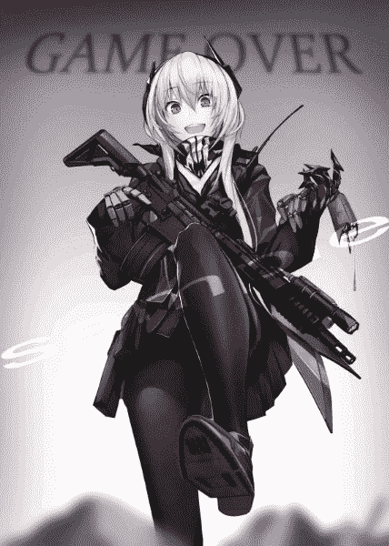](javascript:;)</ignore_js_op>  

# 79

是的这里是雪风，虽然这次先发出来更新并不是我_(:з」∠)_，而是建州，谁让他的假期比我早哼~（你不懂一个小年夜还要在公司里被客户追着要文件的人的痛苦）

抱歉这次我要赶自己的文章无法为建州做校对工作了，只是简单的把简繁体转换了一下而已……所以还请大家在阅读的过程中自行做一下脑内的错字筛选和订正工作吧_(:з」∠)_

不过呢~这次的春节作品可是很丰盛的，有至少三篇的少前文章会被放出，还有GhostButterfly鬼蝶dalao倾情制作的PPK漫画，一定会让各位读者们心满意足的！（同时也请不吝留下您阅读的心得_(:з」∠)_

那么话不多说，放上这次的人设图，请各位继续愉快的阅读吧！我去肝我自己的文章了_(:з」∠)_

各位大佬~这裡是建州~祝各位新年快乐~不知道你们回家乡了没呢,我在这裡给大家带来了这一次新春的特別篇~相比以前有些不同(?)不过尽可能的更全面呈现了军方那边的情况和格里芬的情势,请你们细细品味吧~虽然字数不多,也不完全,但希望你们喜欢^_^

这一次的文里面用了简单的方式藏了小讯息,非常简单的方式,希望你们享受与喜欢这需要动动脑才能理解的文,更是第一次用多视角的方式去敘述故事,可能有些生硬,也请多包涵见谅.....

对了,这一次的女主角是64式~ 是个文静又温柔的女孩子呢,虽然比较內向,但她还是有少女心或敞开心扉的那一面吧,不知道各位喜不喜欢喝不发酵茶,也就是绿茶呢,64式可是很喜欢的,为了这一篇还去特別研究了些关于茶的东西。

当然这篇文有不少惊喜和彩蛋,藏在文裡头,就有待各为去发掘了,哈哈~ 不过这篇文和好几篇故事都有关联的,不知道你们能否发现是哪几篇呢~

虽然这篇铺的有些长,但希望你们能够理解,毕竟正文在后头,要看剧情的话能够全部看完是比较好的毕竟这样故事才完整阿....不过这是我第一次写那么长的短篇,所以可能有些经验不足造成的问题更有瑕疵与漏洞,请各位请多包涵.......

不过我挺不喜欢电影和太过轻小说式的主角光环,当然一些主角的光环是必要的,毕竟主角必须拿来推动剧情,但是太夸张,主角超人,不死,刀槍不入,甚至是从高空中摔下都不死,那我不喜欢,更不喜欢那种所谓军人就是无所畏惧的存在更不正确......士兵也是人,也有感情更有心理创伤....

那么这份故事档案交给你们了!请在隐蔽区域独自详阅!XD

-------------------------------------------------------------------------------

.-- .- .-.

在硝烟弥漫,城市烧成火海,天空上的空战也正火热,海水也被染的血腥的战场上,哪面墙上没有弹孔,哪裡没有死去的孩子与哭号的妇女,而哪头又有那些被强徵上战场的男儿们正拿著武器去跟敌人拼,正规军们也被添入这已燃烧成熊熊烈火的战争,但与格里芬的人海战术相比,这又算甚么呢....在怎么精良优秀,还是会轻易败在那人数都比弹药还多的敌人手上吧。

你看过那整片山野都是敌人,他们每个都一同喊叫著,朝你毫无意义的衝过来,机槍的槍管都融了几根,弹壳已经堆满地上,一不留神就被弹壳绊倒,不过这些已在前线癫狂到面无表情的士兵背后,他们又是在守护著甚么?

一栋民宅的地下室,透光孔正透著那正好可以看到外头士兵军靴的程度,除此之外只负责将光打进来,裡头本应该很舒适,但现在已经在这战争下变成了另一副样子,也称不上温暖与安全,而在角落,有个你不仔细看还不能发现的人,他正裹著毯子,颤抖著,这场战争持续了三年,这整整三年都在这裡度过。

存粮早就吃完,原本军队会一大箱又一大箱的配给粮食,现在换成他们一户一户的去抓兵,去强徵粮食,幸好自己躲的这地下室,上头的公寓早就垮了,军队自然不会查到这裡,但自己要出去也只能等著深夜从那残骸堆爬出....去那些废弃的房屋翻找食物,但战争可是二十四小时不间断的,夜晚依然危险重重.....

战火每天都在持续,就快除夕了阿.....战争为甚么还不结束,格里芬应该也要有些良心阿.....搓著手颤抖著,一旁放著一包口粮饼乾,没人...会来救我吗,好冷阿.....好饿阿....快受不了了.......而且只有我一个....原来孤独是那么的恐怖...

但这几个礼拜军方已经没有再派人来了,交火的声音还在,是他们不想征兵了,还是忘记我们还存在的事实了,该死....自己是疯了吗,怎么开始会希望那些混帐出现,而且他们出现八成是来抓人当兵的或是徵粮的。

据说....格里芬他们会给平民粮食阿.....而且...不用被拉壮丁呢.....我...为什么会为了敌人祈祷呢,该死...飢饿快搞疯我了...连说话的力气都没有了,拜託了....谁赢都好....我好想吃口热腾腾的白米饭阿.....好希望...战争快点结束.....

这场该死的战争.....去你的! 去你大爷的! 去你他妈的! 別以为战争只属于你们这些低能的政客和军人!你们谁也不在乎我们平民老百姓的想法!都给我去死吧!干你她妈的!战争还不她妈的给我结束!?谁赢我根本不在呼!快给我结束吧.....!

Fuck the war! 去你的战争!

.. ...

-------------------------------------------------------------------------------

--- ...- . .-.

在某处的军方营地中,一个帐篷內,两名士兵正在交谈著甚么,应该说正在会议著什么。

"你说官方统计上死了多少人?又有多少难民?"

一名当地战区的军官背对著副官问著,他的语气中听起来并不平静,而桌上正放著他家人的信,以及...关于他家人死于格里芬炮击的噩耗,不过他能那么冷静,也是心完全死了吧。

"报告...我们撷取格里芬资料,他们统计战区內我方平民死亡是十六人,难民八十一人"

"那么实际上呢....."

"死了七百万人.....三千五百万难民....含军人....死了整整三千九百万......"

"你可知道这已经不是三战时期了吧?更不是他妈的二战.....你说你们到底怎么搞的!?死了那么多平民!?你妈倒是说啊!!我们这岂不是快灭国了!?"

军官愤怒的捶著桌子,他怒吼著,原本家人的信上头,还有他的回信,但当他甚至都画好给自己儿子的小漫画上去,写好內容,甚至交代好妻子的话语都写了上去时,噩耗就这样传来,又有谁能承受住?军人也是人,而他们要展现悲痛,特別是自己要守护之物,没能保住时,更能展现他们的悲伤吧。

"我....长官,我......"

"抱歉....我的老婆和孩子才刚....,你知道吗? 才刚出生的女孩和一个七岁大的儿子,就这样死在那些格里芬狗对住宅区的恶意攻击下了......你他妈的........那些混帐....."

"长官?你...没事吧?"

"我没事.....我...没...事....他们是为了自由而死.....为了我们的民主制度而死..为了不屈服于格里芬专制独裁的统治而死.....我一定会让那些格里芬的傢伙付出代价.......为了国家...!"

军官抬起头来,看著副官,他的眼神看的出来那怒火以及悲痛,毕竟自己的家人可在大后方,自己是怎么守的,让格里芬的砲兵能够轰炸到后方.....

"帮我告诉多管火箭旅,持续用RT-2000轰炸格里芬的营地....还有...通知装甲部队,全力突破格里芬的,对了,粮食不够的话,在去跟那些死老百姓徵点就行了,打赢这场战争要紧...."

"是!"

副官敬礼后,便转身走出了帐篷,同时他走向了指挥所,把原本在格里芬营地上的标记....悄悄移到了管制区內的位置,并示意通讯兵开始彙报讯息,而他抄起了一旁那份官方统计报告....扔进了碎纸机中,伴随著那真相化成白花花的纸削。

虽然不知道他的意图,但或许这舉动已经拯救了那战区中那些被认定死亡的百姓,能够逃过征兵的下场吧,毕竟这个国家不能再死更多人了,必须要有人能重建这残破不堪的土地,不管是胜是败,都绝不能败在那鲁莽的作为下,而唯一能快速结束战争的办法,就是激怒格里芬吧,如果他们派出人形,这场战争,不,这场梦魇,明天就能结束了....

伴随著那远处那撕裂空气般的咆啸声,以及那順著射线喷向天空的钢铁箭雨,或许那名军官还正以为自己的指令击毀了敌人的大部队正沉浸在那復仇的快感,并持续下达那些鲁莽的指令时,格里芬的包围网也逐渐成形....情势也正迅速改变.....

.... .- .--. .--. -.--

-------------------------------------------------------------------------------

-. . .--

一群被击溃的士兵们正行走在道路的两侧,他们丢下了武器,在格里芬的士兵和人形的押送下,正步入那要将他们送去西伯利亚的巨大盒子中,但这并不是所有的部队,还有好几支部队在这战线上顽强抵抗著,不过距离他们的首都已经近在咫尺,战争就要结束了,而他们被送器西伯利亚,存活的机率也低,更没有所谓的出狱这回事,这样更能减轻管制区中的內乱吧。

而此时,空中传出的狼嚎声,却让队伍停了下来,格里芬的士兵们抓起了武器,对著天空,也有人搬起FN-6準备击落那几乎是来送死的战斗机,但当映入人们眼帘时,那架飞机是冒著黑烟的,充满著弹孔,而挂架上的导弹都已经击出,正缓缓下降著,飞行员没有要弹射的意思。

看向他飞来的方向,那是大片的城市,人口密集区域,更有无数个格里芬的难民营在那附近,他是为了不伤及无辜才飞来这的,宁可冒著极大的风险,当他就在这草原上迫降伴随著那巨大的撞击声响,而他的机鼻几乎差进土裡,残骸开始冒火。

64式本要冲上去营救的,但这时才发现座舱罩....不是透明的,反而呈现著与涂料相同的颜色,这是无人机啊....也是....飞行员都快死光了,如同即将绝种的物种一样,而现在也几乎没有任何国家有能力训练出飞行员,被俘的多数也选择自杀,而那些维护和飞行手册也被焚毀,无异就是要阻止格里芬获得更大的空中力量,格里芬的空勤力量也只能来自原本民航的飞行员或是无人机了,那些善于空战在空中格斗与冷静作战的飞行军官反而几乎不存在....

不过对于这一次的行动而言,或许是上天给这群守军开了玩笑吧,当人形悄悄的进入战场,安静的瘫痪掉了他们的雷达系统,连带破坏几个专门供给军队用电的发电设施,就几乎瘫痪了他们的防空铁网,让格里芬的运输载著成千上万的伞兵划过防线,直接将空降部队撒在战场之上,执行著这起大规模入侵行动,肆意的在城市中焚烧著建筑与突袭著无数据点。

防空炮对空射击著,火炮开始对著空降区攻击著,他们的坦克迅速地穿梭著,然后在被人形一脚像是踩扁铁铝罐一样的踏扁;而卡车一车又一车的在后方强徵著路上与房屋中躲藏著的年轻人,粮食被强搬上车,只为了给这些将死之人果腹,但有一天军方不再前来,而这些城市也忽然在军方的地图中被取消掉,这或许是某个有心之人办到的吧。

仿佛这裡早已被夷为平地一样,但原因没人知道,但至少大家知道的是,那些还躲著的年轻人有救了,不用被武装被训练被丢上战场,而64式此时望著那批如同送葬队伍一样沉重气氛的战俘们,他们本应该都丢下武器,但有个并没有丢下旗帜,扛著他们旗帜的旗杆已蹒跚的步伐前进著,一个看起来不高更不强壮的年轻人。

一名格里芬的士兵上前要抢下旗帜与他扭打在一起,好像拼死都不想让自己的国旗遭受玷汙,更是守护著自己的尊严与荣誉,他们的对打,直到那名格里芬的士兵抄起了手槍解决了那名旗手为止,并把旗帜丢在地上践踏著,然后拎起丢入燃烧著的铁桶中,看著那面旗帜燃烧著,那名士兵也嘲笑著,一旁其他看守的格里芬士兵也讥笑著,然后拿起槍威胁著其他投降的战俘。

没人知道那群军方的士兵为何要为了那种没意义的理由而战,不如为了让人民吃饱,为了人民而战更好吧,但为何要为了那空洞的自由和政治承诺去打,为了那所为爱国心还是尊严,没人知道...更没人知道那名旗手为何要为此奉上性命,不过至少格裡芬来了,人们不需要每个都服兵役,更不用被强拆门版与墓碑去建设防线以及被强制徵粮了.....

当64式有些悲伤地看著那名死在路上,肯定之后是找个地方随便丢弃的那具尸体,她仔细端磨著那不远处的尸体,看起来还只是个孩子....14或15岁左右的孩子,他这样的年纪就被无情的政府军强徵上前线,而他却毫无悔恨得愿意守护那面旗帜,或许是教育的问题,更有可能....是他的信念吧。

64式走向了那队伍,战俘们还慌张地发出了惊呼不敢动弹,64式轻轻的捏起了那具瘦弱的尸体,这不用诊断也知道营养不良的状态,这不是根本没吃饱吗?那些食物....难道都到了那些官员的肚子裡吗?可怜的小傢伙.......

"真可怜呢...."

64式捧著他,像是捧著一只从树梢上掉下来的鸟儿一样,温柔的捧著他,轻轻地带著那具甚至还流淌著血液的小小尸体,这小傢伙本应该要在学校学习,快乐的谈恋爱与成长,却被配上的装备拉上前线作战,那些可恶的军人们...就为了那些政治目的就要牺牲这样的孩子吗..?

64式走到了一颗对她而言像是小苗一样的树旁,用手指轻轻的挖开了些,将这个脑袋已经开花,那稚嫩的脸庞与这套军装格格不入的少年兵放入,他们根本只是虚伪爱国主义下的牺牲者,64式将他埋了起来,堆成了一个小土堆,她不怪那个解决他的士兵,她只打从心底讨厌这场战争以及这些持续抵抗不投降的政权。

这场战争...何时结束....都快过年了呢....这场仗还不结束吗?

-.-- . .- .-.

-------------------------------------------------------------------------------

.--. . .- -.-. .

"行动代号,赤色黎明,现在正式宣布执行!我们让那群死硬分子见识什么是人民一边的力量吧!"

无线电中传出这段讯息,此时大批的部队在人形的掩护下穿越了军方那设立了无数Killzone的前线,格里芬习惯让收编和投诚的部队打前锋,而自己在后方执行掩护与必要的攻击,毕竟让他们自己去消耗自己战斗的效率反而比起投入格里芬本身的部队还要更强。

而且那些人有不少曾也是正规军,正熟知敌人的,即使冒著他们跑过去就是可以回到自己的阵营替他们作战,那也能在过程中消耗不少军方的弹药吧,据说相同的战术也被运用在三战与朝鲜战争中,不过这一次面对的情势与敌人却不同,但学习历史中那些优秀的战术不就是军官应该的吗?

此时自己蹲伏在草丛之中,机槍架设在小沙包上,没错,我并不是那些投诚的砲灰,而是确确实实有格里芬內部人员凭证和编号的士兵,自己的工作就是打掉那些反过来朝我们攻击的蠢蛋或是军方的混帐,除此之外没有任何需要做的。

这场首都围城也持续一阵子了,粮仓和工厂也都毀了,他们本该在上个礼拜投降的,没想到称了那么久,真是一群不知和平美好的傢伙阿....都愿意弃前嫌给他们吃的了,还要挨饿替他们的政府作战吗,真是一群被洗脑到疯掉相信乱世中民主还有用的笨蛋们。

"H7哨点注意,军方在你们的射程內有动静,请对敌进行压製"

那先在指挥所只要冷冰冰念著这些的傢伙真轻松阿.....仗可是我要打的,这时舉起了槍,挪动了下已经麻掉的屁股,依靠在拖腮上,对準了全息苗具成一直线,指向了那群拿著弹药箱的傢伙,扣下了版机,运弹药是吧? 还不想投降是吧?要在死多少人才肯投降?这些蠢猪,以为自己是孩子就了不起吗?

这时候地面震动著,那是64式,这一次在我们区域內支援的人形,她从这座阵地的一旁走向了敌人的防线中,一脚踢翻了那辆M1117,她巨大的脚踩在那侧门上施力著,有些距离都能想像到那金属的喀滋声响,但是她并没有马上踩扁,她看著裏头的组员从后门爬出后,才一脚踩下,就这样放他们走,就不怕他们拿起武器继续反抗嘛!?这可很危险啊!

再次端起了机槍,对準了那些夹著尾巴逃窜的敌人们扣下版机,他们是敌人,很恨可恶的敌人!罪该万死的敌人,更是我们都宣战了还不投降死命反抗的敌人!这种一点力量都没有,战胜希望都没有的仗,还反抗个什么劲?浪费生命。

"妈蛋,这群军方狗为什么不投降?搞得我好几天没洗澡了"

"哈...你该看看他们的传单,为了孩子的未来参军什么的,就不过是一面旗帜和国家的名子阿,大不了把这名子变成管制区的名子不也好吗?他们八成是被洗脑了...军方那边的教育制度和课本和我们不同,他们还说自己的才是真相,那如果是的话,我们干嘛说谎? 就为了巩固政权?太可笑了..."

"真的....每次遇上战俘都不肯投降,用吃的跟他们换身上的东西当战利品也不要,宁愿饿死也不要,一点都不理智....他们脑袋裡到底装什么屎阿....."

"对了...听说那些战俘被送去西伯利亚之后,基本没有一个活著出来的,看,他们不加入我们就是那种下场,而且阿...上次投降的那批人...很多都死在管理者脚下了..."

"等等...管理者? 难道上头派人形去管裡战俘营?"

"对阿...好像是以前铁血的高阶人形....而且那边的环境据说挺恶劣的.....除了她之外还有一个监工,他也很可怕,好像以前也是战俘来著,之后不知道怎么了,忽然变成战俘营的监察长,他几乎每天都有在执行槍决....真搞不懂欸...这些军方的士兵宁可去西伯利亚....也不加入人民的一边"

"他们是白痴!你別忘了..."

大家讨论著时,她已经踏平了那个阵地,其他人也密密麻麻的在地面上突进著,扫荡著一切可能倖存的人,反抗的杀,不反抗的扛到后面治疗,而此时一辆辆陆军的ZBL-08突破前线,同时伞兵的ZBD-03也紧跟在后,那些正是格里芬的钢铁游侠,他们快速地穿过防线,衝入城市中,对著建筑裏头的反抗者们开火,放出士兵开始收拾残局与肃清房屋,毕竟指挥官不准许这个城市被破坏太多,人形不能随意进入,因为这裡的设施还有利用价值。

这更能减少平民的死伤吧,毕竟人形进入就是无差別的踩踏与破坏了,其实没多少人乐见,虽然这在前线十分常见....回到战场上,此时空中一架怪异的直升机,长的怪异....又很小架...那是什么鬼...

"MQ-8!!! 快击落它!! 快! 那些狗子要开始反击了!! 匪军要开始攻击我们了! 快击落它!"

当班长这样吼著时,仿佛一切都来不及,它发射了"APKWS"打向了我们的指挥车与通讯中继车,此时无线电仿佛进入了静默,先进的指挥系统与平版也失去了一切命令和作用.....,而空中传来了战斗机引擎的声音,以及怪异的蜂鸣声....该死! 空袭!

"卧倒!热压弹!!"

身为老兵的班长吼著,我们整个班都紧紧趴在地上,抱著头,不禁抬头偷看著,热压弹在半空中分解成三块,在不同地方引爆,形成形状怪异的云雾,然后形成了一颗斜向上的蘑菇云,下一批準备要冲蜂的步兵与在军卡上的部队就这样全军覆没......听说过这武器...但从没见过....那群军方.....那群该死的恶魔!为了这无意义抵抗就要杀死我们那么多人嘛!?我们就只是发起进攻和入侵行动而已,有必要用这种武器嘛!?

而那一切的不远处....64式正站在那裡,她愤怒地抓起了一块对我们人类而言是巨石的石头,精确的砸向了那架火力观测机,她怒视著.她仿佛就要忍不住走入城市亲自踩死那些抵抗者们,但她不能这么做,她难过地看著那群被窒息死...被震死....和少数被炸得支离破碎被烧得焦黑的尸体们....

"你他妈的......那可是一整个满编师阿....就这样全灭了.........那些军方到底都在研发那些丧心病狂的武器.....该死的! 指挥官为什么不让人形走进去踩平整个烂城市算了!?"

"不...那不是一整个满边师...是一个满编师和两个旅...."

"还有指挥官他是擔心有平民吧...."

"哈....擔心? 那么你也参与过那场战役吧!你也看到了我们包围的那座城市怎么被踩平的吧?但你別为那些噁心的傢伙感到可怜!那是他们罪有应得!"

"为什么...?"

"他们这样抵抗根本毫无意义!还那么死命,这一定是社会问题阿,而且他们是怎么剥削压榨穷人的?我们是为他们的人民出口气欸!那些傢伙是活该,你有没有看过军方是怎么抓壮丁和徵粮的?你要知道他们是很残暴的敌人!"

他激动著吼著,据说他曾经是被军方抓壮丁带离家园到异地打仗的,他会那么激动....也是正常的吧,但为什么军方那边的士兵不多几个他这样脑袋清楚带著情报和资料投诚我们的呢?这样战争很快就结束啦,根本没有什么死伤了,乖乖让我们统治不好吗?

"对了,你们听说了吗? 前几天的投降队伍.....送去西伯利亚挖矿的时后,在路上就先死了几百个...."

"为什么?这不可能啊?!我们的运输状况应该是很人道和完善的...."

"传染病....好像他们的上层在他们快打败仗的时后,给所有军人注射了一种病毒,他们原本是希望投诚我们这哩,让疫情爆发的....幸好都送去西伯利亚了,他们在那裡也死的快"

"这太可怕了吧....传染病....而且在自己人身上...."

"是阿...这样你就知道他们多不关心人命了吧?"

几个人在这逐渐停止槍火声的战场上閒聊著,而另一头的64式正站在城市的广场中央,看著那些惨状,有军官直接把自己吊死在路牌上,更有吊死在路灯上的,尸体和哀号声遍布于战场上,这都来自那些官员下令誓死抵抗的结果,而那些肥官现在跑去哪裡了都没人知道,真是可恶...

此时一个不知埋在残骸何处的收音机正拨放著"GyongyhajuLany",音乐的声音穿过那激战的巷弄,穿过那堆满尸体的壕沟,正规军或后备军人又还是徵招兵都倒在那裡,徵招兵很多还是孩子,更多还是正值青春的青年,他们被强制套上军服和步槍,这是多么悲哀。

扭曲的主义和卫国思想的教育下,他们全部葬身于此,一辆撞入商店的M1126燃烧著,舱盖还是盖著,想必成员没能逃生吧,假如他们一开始就不这样抵抗,或许就不会死了,在战前甚至给过他们机会,也不选择投降,那这样死亡或许就是他们的命运吧。

64式轻轻地走在街上,仿佛是深怕著踏上建筑或是自己走路的震动把这些摇摇欲坠的大楼给震垮,她漫步著,她的脸上看不道胜利的喜悅,反而是复杂的情绪,他们为了打这场必输的战争投入了多少筹码与损失,最后我们得到的就是多少杀敌数的功勋。

战争如同赌博,博弈著那英雄与恶魔,博弈著那侵略者与解放者,博弈著那抗敌英雄与恶魔党军,博弈著那未来的名声与后代支持的对象,你或许替著后代打仗,为了不让他们为敌人所用,但敌人战胜后,你的后代反而会恨你,你的后代会加入你的敌人,支持著你的敌人,这就是这场零和战争极大的损失。

战场上没有正义或邪恶,光明与黑暗,那是统治者和政客说的,每个人都会说自己是正义的,但又怎么是呢,防御方就一定是正义吗,徵粮拉壮丁,入侵方一定是正义的吗,燃烧城市,轰炸城市,破坏和平,这就是现实,这就是战争,而战争,战争从不改变,正是人性最黑暗最暴力的本质,人类最野蛮的本性。

损人利己不正是战争的本质之一吗?敌人的敌人就是朋友,但是那个敌人解决后,朋友便是敌人,这也是战争,这时64式感觉到有东西掉落在自己的胸口上,伸手捏起了那复合材质的东西,捏起来后才发现是一具降落伞,但这降落伞的主人已经不在,而她转头看向降落伞飘过来的方向,一个人正死死抓著护栏,而他身体的另一半边却悬挂在大楼外,想必降落伞是他的。

"救命!救命啊!!!"

"你在那边做什么呢?"

64式的手掌伸到了他的下方,手指轻轻地把他拨离他那死抓著的栏杆,看著他慌张的掉在自己的掌上,是伞兵? 还是逃生的飞行员?看起来像是伞兵呢....而且不是军方他们的制服,但空投伞兵是几个小时之前的事了,难道他刚才就跟著降落伞挂在那裡吗,解开来也是要吸引自己的注意的话...还真没想过赔上性命的可能呢。

64式那巨大洋红紫罗兰色的眼睛正直盯著这小小的伞兵,在那有数位迷彩和红星的披风下,在那军绿色的衬衫中,那颗心正跳著,甚至些许加速著,不只是觉得他小小的很可爱而已,而是他的表情和样子已经吸引上了64式,触动著她那在巨大躯体之下的少女心。

他的样子看起来没有像其他士兵一样的粗糙,虽然还是有饱受战场歷练的沧桑与成熟,但却丝毫不影响他那稚嫩的样子,嫩嫩的皮肤看起来就跟孩子一样,但样子看起来至少也是二十几岁左右吧˙,相当年轻的小东西。

"谢谢..."

"不客气,不过你的朋友们在几小时前就该在这里头和那些敌人交战了吧?你不会真的都挂在这吧..."

他低著头不语,猜中了,看著他有些羞愧,又好像深怕自己有可能罚他的样子,感觉好可爱,这些男人这样小小的不管怎样都看起来跟玩具一样很可爱呢,不自觉的伸出手指戳了戳他,他伸出小手想要抵抗的样子看起来也很可爱,那么弱小的样子。

"没办法啊....风就把我吹来这裡了....原本是被钢筋卡著,降落伞卡就在那裡,不过幸好妳来了...不然可能没人能救我了吧"

露出了些许无奈的表情,毕竟自己可是在那好几个小时中完全都处于恐惧的状态,不是被发现被活生生打死,就是掉下去,幸好她走过这裡才及时发现,不然从这高度掉下去百分之百会变成肉酱啊!

"不过你没被敌人发现也是奇迹呢....你没事吧? 小东西"

"我没事,我叫做瓦尔特,卡尔 瓦尔特,东部军区,空降兵军,二兵"

"我是64式,是这一次来支援这边的人形喔,但小东西,你真的没受伤吗?"

"我说了...我叫做瓦尔特阿....我没事的,幸好没摔下去"

"你没事就好,不过你们的部队已经集结离开了喔,他们应该快要去其他战区了,其他邻国又打得火热了呢....你先跟在我身边吧,我会试著帮你安排回去的,瓦尔特"

"谢谢....不过大家又去其他地方打仗了呢....那我最快什么时候能回去?"

"我不知道呢....这得先通知指挥官才行,不过应该也要几天吧,这段时间就跟我一起吧,不然你应该会被混编然后就只能一直待在步兵团啰?而且死得更快喔?"

"知道了...谢谢"

跟著人形一起,不知道是什么样的感觉呢,不过至少也被丢入砲灰堆中一起去作战还要好,不过她就因为我一个的落队,就要通知那大人物,忽然心裡有种紧张的感觉,毕竟自己只是二兵和那整个格里芬的领导,是多么的遥远.但在此时却感觉又没那么遥不可及。

64式此时正在脑中的系统处理著那关于这小小伞兵的讯息,用著通讯系统询问指挥官这掌上的小东西该如何处理时,在掌心上的他见她那巨大如树干的手指停止了攻势,便取下了头盔,看著头盔裡头他放著的一张照片,自己的妻子旁正是自己那根本没亲自见过的儿子,初中? 高中? 我也不知道...不过他老妈或许也不怎么愿意提上我吧,毕竟她要怎么解释这个儿子是一夜情搞大了害得我们结婚出来的呢。

她是个华人,当初才刚在一起的时候,家裡还没有刀叉甚么的,一时间要使用筷子和吃米饭也是非常不适应。现在...被派到了前线才知道那得珍惜,现在只能吃压缩口粮饼乾和空投补给了,根本没有当初那老婆的爱心便当这回事吧。

如果能快点结束掉这场战争或让战事稍缓,或许他未来替格里芬工作至少也不会选上战斗单位吧,不过当初果断也让他从母姓了,就好像没有我这随时都可能阵亡的父亲一样,那孩子叫"张国强",没说希望他能知道自己,但至少....能和在后方的那女人过的好吧。

不过每当我迷茫之时,脫下头盔看著这张照片,却意外让人有动力,至少....绝不能让军方反击回去,不然自己的家园会再次沦为那三战到现在以来大大小小战役发生最惨烈的区域,不在补给中枢的重要位置上,同时又是当地最大形的贫民窟,离指挥部和闹区又不远,这是怎么回事呢....真是可笑。

此时64式看著瓦尔特正在直盯著自己头盔的裏头,忍不住再次戳了戳他,这一次把他直接戳倒在掌心上,64式也忍不住轻笑了下。

"嘻嘻,你没事吧? 应该没受伤吧?"

"我没事的,不过有些想家呢...."

他刚才是在思乡吗,他的家又是哪裡呢....有些好奇呢,但会让人想怀念的故乡,一定是很美的地方吧,又或许是很繁荣的区域也说不一定,不过这小东西看起来有些忧愁呢,看来得让他好起来,不然之后就这样把他丢回部队裡,就不知道有没有可能再次相见了,就让他这么失落的去送死心裡也说不过去吧。

"想家吗....这也没办法呢,只要他们不这样抵抗下去,战争很快就结束了吧?现在我们刚全灭了一个,又要去打另外一个,这场战争就好像不会结束一样,但这也没办法,小东西,呜...瓦尔特,你就別想那么多了吧,这几天我都会陪著你喔?""怎么好像说的有些奇怪啊....不过谢谢...我好多了,那...我们是要待在这裡还是去哪..?"

"先带你回指挥部如何?反正指挥官的指令是要我支援这区域后就回去,反正之后一定又要去前线帮忙,到时候再把你带回你的部队吧,虽然可能会要几天的时间呢...."

"呜...谢谢,不过指挥部有多的宿舍或空房吗?不行的话我和驻防单位一起睡也可以"

"应该没有呢....而且有多的我也不能随意申请,那些是给要员和新进人员住的,你就先到我的房间吧,反正你那么小又不会怎样,而且还挺可爱的"

"不过....好像要过年了呢.....我这样打扰没关系吗?"

"过年的话,那我怎么忍心把你丢在外面呢?虽然才认识几分鐘而已,但至少你也是我们格里芬的员工喔"

"谢谢...."

"那么你要待在外面呢,还是要先在口袋里面待著?待会我可能会变大一些然后走回指挥部喔"

"走...走回去!?"

露出不敢至性的表情,虽然人形跨一步对于人类而言就是好长的距离,但是从前线回到指挥部什么的,不太可能吧.....

"是阿,走回去,有什么好讶异的吗?"

"这....距离至少要行军两三天吧...."

"不会喔,很快地,你怕高吗?"

64式露出了些坏笑的样子,毕竟待会变成千倍大小的她,既使是肩膀的高度也是一公里多的高空,这样的高度是他能承受的了的吗....而且对于这些小东西而言好像还挺冷的,连风都几乎能把他吹走,他非要待在外面的话就只能先让他躲在头发裡了吧,还是要让他就这样死死的抓著自己的披风也可以呢。

"不..不....怕"

他还有些发抖的样子,看起来是害怕了吧,说话都结巴了,也对...大多数人类都是怕高的吧,特別是把他们拎著威胁鬆开手的时候大多数都很害怕呢,倒吊著带在空中晃啊晃的他们都会吓晕过去,之前去审问战俘的时候也有好几次这样玩他们,不过姊姊她就喜欢把小人拿去做....那种事情,自己到一次都没有过..太让人害羞了。

待会他后悔的话,在把他丢进口袋也不迟,正好胸口有个口袋,上面还有扣子可以扣起来,不过对于他而言或许....是个福利呢,以前还是人类大小的时候总不能这样和这些男人们相处,变大之后不知道为什么却异常的轻松,或许是因为发现他们就像是小动物一样可爱吧。

"也对呢,不然你怎么会加入伞兵呢,那么...待会你就待在我的肩膀上吧,如果要被吹走了,就大声地叫我喔,没接住你的话,会很危险的呢"

故意这样说著,或许他真是那种大胆的人,不过这时候不知道为什么更希望他不要拿出勇气,就这样乖乖的说想到口袋裡头。

"我想...我还是进去妳的口袋里面好了,妳的........"

"呜...你应该不会想被丢进去弹夹袋里面吧?跟著我的弹夹一起,还是...想被我丢进去水壶里面...这也不行呢,不卫生之外,我口渴了把你一起喝掉就糟糕了,不然...我就只有胸口的一个口袋了呢...你愿意进去吗? 瓦尔特?"

"我好像没选择了,对吧,那让我进去吧,应该很快就掉了吧?"

"不知道呢....你得先在里面忍著一下,可能会有些挤"

"无所谓的"

当他说著无所谓时64式捏起了他,打开自己胸口的口袋,把他带了进去,当手指鬆开他时并抽离时,当他被衬衫与她那"雄伟"的胸部给挤压著,那微微挣扎的感觉,既使隔著胸罩,极度敏感的人形也能感受的到,不过这时候64式有意识的尽可能控制自己的呼吸与动作,不要带给他太大的压迫,要不然真的伤到他那么这可不有趣了吧。

"你还好吧?"

"呜..呜...呜...!"

说不出话了呢,手指头伸了进去替他撐大了点空间,他在那裡大口喘气的样子,有那么夸张吗....又不至于被我的胸部挤死什么的,不过这也是让他占了便宜呢,让他这样接触女孩子的胸部什么的。

"你没事吧?还可以呼吸吗?"

"这答案很明显吧....是可以呼吸..但胸口被挤压著不好....而且在里面我连动都不能动"

"那还是你要去外面?"

"我还是在这裡好了....这裡比较舒服"

"那就好,待会我变大些的时候,你要忍住喔,小东西"

毕竟变大的时候他不是滑到口袋的底层得救,就是得在待会被比现在大十倍的胸部给挤压著,那这样的他会是沉浸在天堂又还是那强迫呼吸著充满少女气味的空气外,更要以正面直接贴著她的胸部渡过那段时间,而且如果有任何反应被发现的话,又一定会被当成变态吧,而她的心跳声也不断传来,同时自己的心跳彷彿也与她同步一样,感觉相当温暖,而她每一次呼吸胸口的起伏,自己也为之同步。

此时64式将手指抽离,他再次被埋入这柔软却压迫著的胸裡,64式轻笑了下,他怎么试图移动自己都没任何办法,动弹不得,甚至试图推开自己的胸部都不能,这样弱小又可爱的样子也让64式的脸上泛起了红晕。

64式扣起了口袋的釦子,就这样把他"关"在里面,便向前迈进著,毕竟64式得在规范的区域才能变成千倍的战斗大小,不然很容易造成伤亡的,不过这样把他带回去,不知道能在一起几天呢...怎么忽然感觉希望他能一直待在身边什么的...不行..而且他还只是认为这是暂时的安排什么的,搞不好他不是单身了呢..不管了,先把他带回去再说吧。

64式跨过了残骸,走过了这一片片的废墟,底下还有不少人正清理著尸体和肃清残党,之后就是派其他人形来拆除这裡的废墟了吧,跨过了一条街,因为底下一辆辆的军卡载满著士兵运往各个街区,安置著难民,并开始清理那些警察与军人.....

最后她跨出了城市的最后一条街,当到满是残骸与弹坑的战场上时,她调整了自己的大小,当她持续的膨胀直到千倍时,既使在远处都能看到那突破天际的身高,那比任何建筑还要高的身高是无人能敌的,她正前进著,而在这一大片荒地与公路旁,还有数架Y-20的残骸正燃烧著,那正是载著伞兵的运输机....毕竟军方的防空系统就只瘫痪了自动化的防空武器站,那些手动的防空机砲和导弹依然是不可避免的。

64式向前进著,比往常快上些,她轻松的前进著,跨出的每一步都是要跋涉好一段距离的路途,毕竟她是正常人类的一千倍大小了,回去的时候夕阳也向晚了吧,或许能让这小东西吃吃看自己做的晚餐,泡杯茶给他喝,跟他互相了解彼此....

而此时在口袋裡的瓦尔特正因为著64式巨大化而承受著更大的重量与挤压,根本撐不上天堂般的享受,几乎要挤扁自己的压力,那件衬衫和64式的胸部正挤压著自己,完全被固定著,一辈子都没想过被人形塞进口袋裡,紧紧贴著她的胸部这种事情,而且她走路时还有些晃动著,对于在口袋裡的他来说更是一场恶梦。

或许是他无事可做吧,更又或许是64式走路的晃动与压迫双重下使他晕眩,他昏睡了过去,在这巨大少女的胸前沉沉的睡去,像是个小动物一样熟熟的睡去,毕竟好几天没睡好了,结果这场让他日夜难眠的战役就在他悬挂在那裡的好长一段时间结束。

-------------------------------------------------------------------------------

伴随著空爆引信在一旁爆炸的声音,在这深夜中无法入眠,离空降区还有整整半小时的路程,运输大队就掉了十二架Y-20,既使有整整60架,一架则可以搭载几乎一的连的伞兵以及大量的武器物资和轻型车量,12个连队....比一个团还要少一些但还是有超过一千人丧命于那致命的防空砲火中...

擔心著自己是否为下一个,当那些空爆的先进机砲引信爆炸时,机身晃动著,自己也在这极度压抑的气氛中祈祷著。

"前进...前进..前进...我们的队伍向太阳..."

有人轻唱著军歌,有人哼著家乡的歌曲,有人看著家人的照片祈祷,有人在这凝固的空气中聊天著,试图缓解气氛,有人也见压力大成这样的环境互相打赌和打闹著。

"Gory, gory, what a hell of way to die♪~Gory, gory, what a hell of way to die♪~"

"等等,那不是我们的军歌吧,混蛋...那好像是敌人的阿....白痴....你要唱跟刚才那兄弟唱的一样才对吧!?"

"有差吗?反正都是歌,而且还挺贴切我们的遭遇阿"

"贴切!?你忘记把坠机和被防空砲打成碎肉了,混球!"

几个伞兵正在这裡嬉闹著,表情却看起来一点也不轻松,话语更是机械与僵硬,站在通往驾驶舱那通道门的跳伞长见状扶著那隧道口对著伞兵们喊著。

"如果你们谁能撐到下一场仗,然后到机场找到我,我就请他喝啤酒!"

他露出些许蛀孔和泛黃的牙齿笑得灿烂,仿佛就是要去郊游一样的宣告著这场几乎是有去无回的战役,他毫无畏惧一般。

"多少都可以吗?"

他露出了自信的表情,看来是完全没问题的样子,毕竟空勤单位的收入可不是地面作战单位能想像的高,当然压力和危险性也是好几个级別外的,他们或许早习惯这样的打赌和苦中作乐吧。

"各位低能儿!你们听到了不?这个有钱大佬!要请大家喝啤酒!我们还不去打烂那些军方狗子,自以为装备和训练比我们好就比我们兇吗!?让他们知道!我们格里芬的厉害!前面一个倒下了不要紧!我们在补上十个!"

他调侃著自己方的战术之外更反讽著战场的现状,他们的徵招兵素质虽然比自己低,但是他们正规军的士兵无不是都与自己的特战兵一个水平,人数不多,但是每个都是精英,而他们的士官兵更像是特战队中的特战队,如同自己最高水平的˙特战部队一样,他们把忠诚和荣誉看的比命还重要,每个都跟疯子一样在战斗。

据说他们的正规军可以不眠不休48小时的在丛林山地中强行军,能够在城市战场中连续作战好几个礼拜都不需要补给,他们甚至可以徒手就摸掉一个哨站,更是让无数前线士兵闻风丧胆的存在,要解决他们除了特战队或人形之外,就只能压上更多的人解决他们....

而身为伞兵的自己在敌后作战之外更是要执行著这种大规模入侵行动,下去就是比前线还前线的地方,铁定是早已布满了正规军的机槍火线与步槍槍海,準备好迎接我们的到来。

"白痴!哪是十个!我们要补上整个连!谁敢欺负我们的兄弟!我们就全部人扑上去揍他!"

"Hoorah!!!!"

大家提振起精神欢呼著,没想到这段时间半小时已经过去,机舱从亮著红灯转为绿灯,闪黃的警示灯转著,后舱门缓缓开起,滑轮送出了那大批的武器和补给,最后侧门也缓缓打开,伞兵们将开伞绳结的挂钩挂上,挡门,伴随著跳伞长的指示一个个的跳下,此时整片天空都是那堆白色的降落伞,形状酷似女人的胸部,更有裸胸伞的称号,中间突起的酷似女性胸部上的乳头,而整个降落伞的形状也跟女孩子的胸部一样。

机砲指向了那些伞兵与运输机,有些引擎烧了,有些断了机翼在空中转著,有些伞兵还没跳完就坠毀,有些被直街甩出舱外,还有些直接在空中爆炸,伞兵们的伞绳上染满了鲜血,这是一场血腥的战争,那瑞士产的双连装的35mm快砲正伴随著雷达扫描自动的指向了天空中那无数运输机打出致命的砲弹。

今夜的天空.....仿佛晨间一样明亮,更如同地狱一样血红,而大地依然燃烧著,如同地狱的业火,哀嚎与惨叫从没少过,火药的呛鼻就是那硫磺的毒气,现在仿佛地狱来到人间,而这裡没有任何喘息的空间,没有人能够倖免于难。

今夜,天空上不是让人带来欢笑与美好回忆的烟花火药,更非让人沉浸于其中的新春联欢晚会,而是使人惧怕且不希望朝向自己的导弹与砲火,同样都是火药,但这带来的是绝望,天空上依然爆炸著,不是烟火的绚丽火光,而是运输机爆炸产生的巨大火球,这就是这春节的战地烟花吗.....同样是火药却为何却如此的不同.....

-------------------------------------------------------------------------------

"瓦尔特~起床咯"

已经变回那日常百倍大小的64式轻轻用食指戳了戳他,想把他叫醒。

回到宿舍的64式打开口袋时,本以为会听到他说"得救了~"这类的话,却是看著他正面对自己的胸在那边熟睡著,是有那么舒服吗,不过看到像个孩子一样这样的可爱,却不想说什么,把他放在自己的床上,不过没想到自己都洗完澡了,他还在睡,他是有多累呢。

不过这时躺在床上的他,头盔和身上的护具与背心也被手指灵巧的64式给脫下,放在了餐桌上,他身上只剩下那战斗服与裤子腰带,其他的都被64式脫下了,说实在64式帮他脫去这些的时候,就好像玩娃娃一样的带著他,只不过这娃娃更小些,而她在帮他脫的时候竟然都没有醒来,到底是多累呢....

"再让我睡会儿啦....反正现在又不是在前线....今天没任务吧,让我睡久点啦..."

"小东西~不起来的话,就把你吃掉喔? 你看起来很好吃呢....嘻嘻"

这时候64式坏笑起来,手指头也压住了他,发出了"啊~"的声音,开始把自己的嘴靠的离他近些。

"什么...?吃掉我?....怎么回事...?"

他睁开了眼睛,看著穿著浴袍的64式已经用手指头压制住躺在这巨大床铺上的自己,张开了她的嘴好像要吃掉自己的样子,便开始挣扎著,捶著她的手指,试图要她停下。

"不要啊!不要啊!!!!!!"

"你醒了吗?"

"醒..醒了....我醒了!"

这时瓦尔特注意到了自己全身上下只剩下这一套战斗服与裤子,他来不及惊嘆到64式到底是怎么帮自己脫下那些的,就被她一句话打断了思维。

"小东西....你刚刚还以为你在哪?你已经到我的房间裡啰,你睡了好久了呢...我都洗完澡了"

"抱歉...我昨天没怎么睡...所以..."

"不不,刚才没吓到你吧?"

"吓到了....我还以为我真要被吃了哩..."

"嘻嘻...抱歉,那你都醒来的话就等会吧,我已经用叫餐的系统叫了晚餐了,应该待会就好了,中华料理你吃的惯吧?会用筷子吧?"

"我会...我老婆正好就是华人....每天用筷子用的习惯了...."

64式听到他有老婆后露出了些许失落的表情,毕竟自己都準备好....,没想到他已经身为人夫,自己又怎么有那种去破坏人家家庭的想法呢。

"不过....我也好几年没见到她了,我跟她只是奉子成婚而已,但我也没办法,身为男人我还是得负责吧...虽然她收入是我的几倍就是...在战情部工作..."

此时64式心中再次燃烧了起来,还有机会...如果他们之间只是这样的话....啊...不对...这样自己不就是那种抢人家老公的女人了吗.....不过自己这样的大小....说想要和他发生什么关系...他怎样都不会拒绝吧....虽然像是威胁他一样的感觉....但...此时送餐系统的通知声响起,也使的自己走向了门口,一个像是送外卖的巨大铁箱就这样在门口,64式打开了箱子,抽开了裏头的小型抽屜,拿出了那盘餐点,她转身将餐盘放在桌上候,再走回那"铁箱"前拿出了裡头一个设计防震的碟子,上面正放著瓦尔特的餐桌与餐点。

当64式取完餐后不久,那铁箱也順著道路上的轨道向前,直到停在墙壁前面,隔板也缓缓向上收起,"餐车"也驶入裏头的空间固定然后像是电梯一样向下,而隔版也在这时阖上...

"晚餐好啰,你一定也饿了吧?"

她为什么对我那么亲切呢,才认识没多久,忽然对于她这样的热情感到一些错愕,不过这也是好事吧,她竟然会接收自己,还愿意帮自已和大部队会合,还为了我上报给了最高领导请求暂缓其他行动....不过她看起来也很吸引人呢.....如果不是自己已经结婚的话....或许...会想和她发生更多关系吧。

"嗯..."

此时64式拿起了她那巨大的平板看著最新的战报,她沉默了,看著平板露出了复杂的情绪,直到她意识到这个小东西正站在床上看著自己,她才露出了勉强的微笑,把平板锁定然后放在一旁,她伸出手,在床铺的一旁,让他走上去。

看著他轻松地爬上自己的手掌,果然是格里芬进攻的主力呢,伞兵的体能果然不错,看起来...更吸引上自己了,而且感觉上挺单纯的,好像那些前线单位都是这样子....。

"妳刚才怎么了吗?有不舒服?"

他站在64式的掌上轻轻抬头仰望著那头发甚至还有些湿的64式,毕竟她刚才眉头都皱了起来,而且看起来好像若有所思的样子,总觉得她好像有什么心事又好像是哪边不舒服一样。

哇呜.....他...这小东西感觉好体贴阿...怎么这样一个舉动就让自己心跳加快什么的....別人虽然常说恋爱的少女都是盲目的...但是....他真的....吸引上自己了,好想要....可是他...已经结婚了阿...不过为什么感觉这样更棒呢....想著想著脸都红起来了....

"妳没事吧!?该不会是发烧了吧....虽然我不太清楚人形发烧该怎么办,妳要不先休息下?晚餐待会加热后还可以吃吧?"

"我...我没事的,只是刚洗完澡有些热而已"

"真的吗....那就好"

此时64式把瓦尔特放到了餐桌上那个小桌子的旁边后,便走向了自己的位子,而瓦尔特也随之入席,而他的装备就放在这餐桌上的不远处,这时候64式她坐了下来,小餐桌上放著煎鱼,咸猪肉,醃肉,锅包肉这些,还有其他尽是光看就觉得是重口味充满咸味的食物,不禁让人咽了口唾沫,这能给人吃吗....虽然军粮味道都很重,但是这明显盐分和咸度就不是普通的等级....

"对了,刚才我有冲些茶,你要来些吗?"

64式拿起了那巨大的茶壶,朝自己的杯子倒了些后,在拿出滴管抽了些精确又适量的点在了他的茶杯中,在三战后这种东西的价格也接近了黃金,贵的几乎让人咋舌,特別64式她爱好的是龙井茶,要给她这巨大体型享用的,想必数量非常的多吧,这是一种喝起来不同其他绿茶,温和甘甜,泡出来的未发酵茶是翠绿的,而味道是香浓的,即使吞下那股香甜还会回甘....

喝下了一口茶,润了润喉,才拿起筷子夹起了上头的配菜,扒了些饭,没想像中的糟,相当美味,而且异常的下饭,让人不自觉的就停不下夹菜与扒饭的筷子,是军粮和罐头吃惯了吗,为什么这样的食物就好像高级的国宴一样美味,这味道完全掳获了自己的胃,太棒了!

64式看著他这样也笑著,便优雅的夹著菜,轻轻夹起饭送入口中品嘗著,嗯~ 这种味道果然才是自己写欢的重口味阿...这小东西也挺喜欢的呢.....不自觉想餵食他了,看著他吃东西的样子。

-------------------------------------------------------------------------------

在积满雪的壕沟中,士兵们坐在壕沟的两侧,春节到了,有人正在壕沟轻唱著那春节的歌曲,据说这首歌的原型还是自己的祖先庆祝一场大战结束所写下的,而如今他们希望著格里芬能停止攻势,一切战斗都能结束,疯狂的上级完全没有要和格里芬谈判讨论的意思,坚决要持续这场注定失败的战争.....可谓疯狂,12点的鐘声响起,远处那鐘楼正打著鐘,正式春节了。

"每条大街小巷,每个人的嘴裡..."

虽然走音,难听,颤抖,微弱,但这声音从一个变成两个,变成四个,变成八个,持续下去,最后变成整条壕沟都在唱著,大家颤抖著,裹著绿色的军毯,有人正烧著格里芬的劝降传单取暖,有人挖了个小坑,在上头烧著火,取暖著。

"见面第一句话,就是恭喜恭喜"

"恭喜恭喜....恭喜你阿...恭喜恭喜...恭喜你..."

大家齐唱著,将军并没有阻止他们,他的身后是一名格里芬方面的使者,曾经他在军校的同学,更是一条战线上的好战友,如今他叛变了,指挥著那一整批投诚的士兵,他带了点酒和花生,在那烧著木材的铁桶旁与他饮酒。

"老同志,没想到还有机会和你一起喝酒,我带的是白酒,没问题吧? 当年我们对付格里芬和铁血的时候,人民都支持我们,帮我们输出资源,但今天现况不同了,你要选有利的一边,不要再据拮那什么爱国心和忠诚荣誉了,你明知道统一秩序,和千年帝国的口号听起来比为了共和好多了吧?格里芬的占领区你又不是不知道比起杂乱无章的军方控制区好多了"

"你想说什么...."

"我说,道格拉斯,你们到底要倔多久?你知道吗?连你们的之前的盟友都公开表态,不再支持以你们为首的政府了,你们也该是时候站到人民的一边了,我们会给人民温饱和选择的权利与你们徵粮和强徵军人不同,你就为了自由和民主那种空洞的政治理念而拋弃人民吗?他们需要温饱!需要新秩序!去做对世界的统一!你应该要理解的...."

"我是一个军人....我只知道怎么打仗,怎么活下去,怎么和平与战胜敌人,我只知道忠诚和荣誉,我宁可身先士卒,战死前线,也不向格里芬投降.....我不懂什么正智和利益...那是你们这些商业家的事情了...而且....盟友? 他们都变成你们的占领区了....还盟友...我绝不会放弃反击你们,夺回沦陷区,光复我的国家...."

"你眼中我连军人都不是了啊?道格拉斯....你看起来是被你的国家洗脑了吧?"

"你拋弃了国家早不是了....你不就只是个叛徒吗?还是个利益薰心抱著什么虚伪的佣兵吗...!?我坚守国家的命令与忠诚,更为了我的尊严!比起你为了钱和权力就拋弃国土好多了!"

"道格拉斯....兄弟...请多保重....."

他撕毀了那张原本要他投降的降书,甚至都属明好让他从一个师的领导变成整个战区领导的跳级,更安排好住宅和大笔钱了,但他也不愿意接受这些利益,也想去送死,看著那降书被丢入火中燃烧。

他转身离去,坐上了那辆军车驶向另一个方向回去格里芬的战线上,当驾驶兵问著是否要命令前线全面进攻时,他只摇了摇头说著。

"春节....我们不能流血,至少他们昨天还是我们的朋友,先让那些死硬分子有机会反悔加入我们吧"

"是的!指导员同志!"

"明日将属于我们!胜利在握了,我的战友....新秩序和人民的一方会胜利的..."

"是的!我相信那群死硬分子会很快后悔与我们与人民做对的!"

"说的好....这场仗,他们会后悔的...打仗是好事,順便清清这些隐患,不然又他们去搞叛变暴动或恐怖袭击了,到时候有平民伤亡又怎么办呢..."

"所以我们更应该消灭他们啊!"

"可春节不能....下士...你要学著点...或许他们会有不少投降的,特別在春节这种大日子....他们一定想投降和家人团聚的...而且你对敌人好些,他们就会打的轻些,毕竟都是自己人..."

"是的!指导员同志!"

此时还在碉堡中的将军拿起了自己与妻子的照片,另一只手抓著那瓶白酒大口的饮著,这场战争何时结束,或许就在自己倒下的那一刻吧,这条防线破了,就剩下后备军人和那些被徵招的学生了.....一切都会在人形的脚下完蛋的....

此时一名通讯兵走入了碉堡中,手上抓著一封上头的讯息,交给了将军,便转身离去,当将军读著讯息时,他冷笑著,原来.......战争会结束的更快呢,在这每天面对死亡的日子裡,谁会想到自己曾经愿意把背后交给他的同袍,现在正拿槍转过身指著自己呢........

整条战线上大多区域已经叛降,加入了格里芬的部队,整条战线上,只剩下这个师正在坚守,但他们控制住区域后便没有推进.....原来这就是你的春节礼物吗?混帐...........

前几天他们的伞兵就已经渗透...虽然全灭,但现在要换上主力部队推进了吗,虽然那是春节后的事,但如果打赢了或许是未来几千几百年军校爱用的教材了呢,历史上又不是没有这种突围的例子,必须....打赢这场仗...!集结部队全面突围!这就是胜利的关键了...!

"战争情势已无法挽回,昔日的战友变成敌人,当你正信任时,忽然以战后的经济落后为由转向拿起武器加入敌人把槍抵在你背后,他们就如同墙头草一样,我军情报已全面败露,我在这错误的战争下就要牺牲,我将领军执行最后的突围"

将军拿起录音笔录下这段话,便将手槍上膛,放在抽屜裡以备不时之需,正规画的防线,準备迎接新春过后敌人的入侵大礼。

在歼灭掉一个国家后,伞兵在短时间內集结被派去另一个战场,修整的不足也种下了计划失败的因,格里芬试图突破敌方后方城市以及防线的计划彻底失败,空降兵军全数投入了战场上,而因为错误的策略也彻底全灭.......

整批部队也未能做实际的倖存确认,但上头已经断定所有伞兵已经都全数阵亡....,派出的大量运输机,也仅有两架重伤归来,结构检查后确认无法继续飞行......这也对格里芬的空中力量与入侵能力大打折扣....至少春节和新年期间无力再入侵他国.....而这个计划失败的果....更使的格里芬未来一切战争计划更加的谨慎。

-------------------------------------------------------------------------------

"你吃的还习惯吧?喜欢吗?看你吃得那么快"

他最有力的回应就是那餐桌上的餐点被他吃的乾净一点都不剩,甚至餐盘上头一点剩的都没有,连茶都喝了好几杯,看起来是很喜欢呢,不过不是华人的他,却能把筷子用的那么灵活,这傢伙手还挺灵活的,刚才看著他这样扒饭的样子,心裡到还是有些满足的。

"恩...如果这几天都吃这些的话,我怕不是要在胖个几公斤"

"听到你这么说,我就安心了呢...还怕你吃不习惯...."

64式微笑著,看著这桌上吃饱饭的瓦尔特,不过他明明就这样鲜活的在自己的面前,在书面以及所有兵籍系统中都是一个确认KIA(Killedin Action)的阵亡者了...,或许连他的死亡通知都寄去家裡了,但该如何跟他解释....怎么告诉他这个事实,他的部队全灭的事实.....不过还是先不要让他知道好了,不然...他很可能一时间无法接受吧....

"对了,我有些好奇呢....你们空降部队的一些东西,你能告诉我吗?"

"你说我们空降兵军吗?我们很特別的,妳应该知道我们有海陆空的单位吧?海和空基本是后来收编周边国家的,陆军则是以原本雇佣兵以及人形为基础,还有大多数的整编部队和投诚的部队,而我们空降兵军则是与其他国家独立出来的军种又或是隶属于特战部队或陆军不同,我们是属于空军的一个大型作战单位"

"恩...?不过你们也算是渗透和后方作战的吧?"

"没错,时常会在后方进行敌后作战和侦查行动,但更多时候是用于大型入侵或歼灭敌人的决战行动,但身为伞兵,我们会有两种情况,一个是低跳低开的行动,那就是和敌人正面碰上了,但另一种高跳低开就是侦查行动,我也参加过几次,那就得安静些了,需要配上消声武器,但是那东西效果也没说多大,所以基本还是得靠用摸的摸掉敌人"

"这个我知道!在我变的这么大以前,我也执行过这种任务,虽然我主要是侦查就是.....毕竟我的配槍64式冲锋槍就是消声武器,任务中我们都要保持安静呢....所以我也不喜欢太吵的环境."

"原来阿..,不过只要有些风吹草动惊动到敌人,天空上都会是他们打的信号弹,直升机阿,坦克阿,部队阿,都会出来抓捕我们,但我们都逃掉了,不过有一次,我们队上有人在侦查的任务中忽然大叫一声,那时候没人知道他怎么了,我们就这样暴露了,被敌人追了整整三天,我们在森林中逃了三天,后来才知道他的屁股被蛇咬了,他才大叫,但他那样可害惨大家了,那之后阿,我们有放假去镇上,伙食都是他负责的,他也挺乐意的"

"噗...."

"另外低跳低开的话,我们通常一下来阿,就要集结,但妳也知道,运输机是会前进的,特別是Y-20这种四具发动机,可以最快飞到0.75马赫的运输机,我们每个人的间距至少都是数百公尺,集合起来賊麻烦,而且如果有森林或城市,就可能卡在树上或电线杆上,电线杆上还有可能烧起来,不过这一次就是妳救了我呢....我想都没想到会卡在那么高楼层的钢筋上"

"不过你都没有很慌张呢....要不是你解开的降落伞飘到我身上,我还正好看到你,不然你或许就要在那里吊著了呢...母呼呼"

"好啦...別说了,那会成为我的阴影的,我多怕这糟糕的伞绳会断掉,我还很怕被敌人发现被当成挂靶哩....这伞绳上次我们队上玩角力就断不知道几条了,角力就是我们两个人身上穿著伞具,用伞绳扣在一起,往两个方向前进,互相拉著彼此,看谁先超出地上的中线,很像拔河的那种运动"

"原来如此...不过幸好你没事呢"

"是阿....谢谢妳,救了我一命"

瓦尔特低下头来示意,表示感谢,而且他的语气中充满著诚恳的感觉,而且他微笑著,在64式眼中看起来也格外有吸引力,不知道为什么,她心裡有种压抑的感觉,又好像是有种触电的悸动感,这就是恋爱的感觉吗....而且他名义上也是死人了....所.以我可以不把他交出去也没关系阿...他就可以是我的了.....我在想什么!!!这不行...我怎么会有这么变态的想法,而且他都身为人夫了.....我...怎么会有这种想法!

"先...先不说这个,这几天我们要相处在一起呢,先互相了解彼此怎么样?你有什么兴趣呢?"

"呜....兴趣的话,角力吧,毕竟文的我都不太行呢...就偶尔会看看报纸阿或读一些小说,或学一些其他的语言,毕竟我也不知道下一次会到哪个国家打仗,总要学多一些语言吧"

"是吗....我的话,我很喜欢下厨还有泡茶这些.....刚才你喝的茶就是我泡的...你还喜欢吧? 是龙井茶喔!"

"恩....以前都只喝过配给的茶包,这喝起来就完全不一样了,色泽和味道完全不是一个等级的,我都没想到这辈子有幸喝到这种高级品"

64式轻笑著,他的样子看起来一点都没在开玩笑,不过这对于64式是再稀鬆平常不过的饮料而已,之前自己也常常泡给指挥官喝呢,虽然在这种时期茶叶已经非常珍贵,但是依我们格里芬的实力这又有什么困难呢。

"你还想要的话,我还可以泡给你喝喔,竟然你喜欢的话,嘻嘻"

64式微笑著,就如同天使一样,又好像是给与凡人救济与温暖的女神一样,而在前线,她正是那既使敌人有数个装甲师围攻都能轻易全灭敌人的巨大女武神,无人能敌,外表,能力,以及她的力量。

-------------------------------------------------------------------------------

一辆伞兵突击车在战场上侧翻,缺了一名倒楣蛋又或是幸运儿的一个小队,他们正迷茫的在这火海中四处张往,被无数冲击震的傻掉,大量的机槍和二零机砲打向这裡,这正是那些伞兵没有跟著运输机坠毀,没有在空中被打成肉酱,成功降落的下场。

完全无法反击,他们自以为能以人海和空降战术强袭敌人,没想到他们所有适合降落和集合的区域都被估算出来,既使偏离区域的也被那强大的防卫体系给歼灭,甚至平民根本不待见这些"解放者"也拿起步槍对抗这些格里芬士兵。

既使格里芬士兵会给予食物,会给予不被征兵的权利,但这些人更希望的是自由与民主这空洞的政治倾向吧,此时一面格里芬的旗帜在火海中矗立著,破烂甚至被火星烧著,而在每个建筑的窗边挂著竖立的国旗,高楼上头挂著的旗帜,更显得大家是多么团结,一致对抗格里芬。

"没有其他支援嘛!?上头不派人形嘛!?"

一名伞兵质问著通讯兵,而通讯兵无住的几乎要哭出来了,他绝望无助的神情让人感到可怜,同时又让人同情,毕竟他正颤抖著,甚至失禁了。

"我们通讯中继机被击毀了....上头拋弃我们了!你还不懂嘛!我们就只是战争中的棋子!!战争中我们他妈只是炮灰!反正指挥官自己又不上战场!又不会打仗!在打的是我们啊!格里芬还不是跟以前我们待的地方一样!政客只会说说!他们根本不会打仗!要死的....要死的还是我们啊!为什么....我不想死在这裡啊!我不想死啊!我不想...妈!!! 我....还不想死....你也知道吧! 那些军方不会放过我们的!我们干嘛为了福利和薪水就来替他们打!我们根本打不赢这些正规军好不好!!你他妈的!我们为甚么要在这裡!?"

通讯兵已经崩溃,正哭著吼著,脫下了头盔丢向了前方,崩溃的痛哭著,他没想到正规军所制造的地狱是如此恐怖,与想像中咬牙撐过去那简单的样子完全不同,他哭著娘,祈求著正规军的怒火能够熄灭,祈求著这残酷的战争能够结束。

"给老子闭嘴!你他妈吵不吵阿你!?小心我毙了你!"

伞兵甩了那名通讯兵几个巴掌,他跌坐在地上无住的哭嚎著,此时一架通讯中继的无人机前来替补有人通讯机的位置,但传递的不是命令和有支援的好报,而是放著一首歌曲,看来是要激励士兵的,无人机的摄像或许让格里芬上头误会是伞兵带领人民包围军方,误会是人民与伞兵正在焚烧城市。

放著那首"TomorrowBelongs To Me"不是军歌,而是一首民歌,这首歌也并非是献给格里芬,本应是讽刺军方而给他们的送葬曲,现在却反过来反讽给了格里芬的伞兵们,给他们成了送行曲,歌词重复著,激昂的重复著,而那从轰炸机上投下的两千磅的热压弹也且巧合地順著这激昂的歌词,順著那节奏开始进行著弹,开始清除消灭著地面上格里芬的入侵者们。

"Tomorrow belong! Tomorrow belongs! Tomorrow belongs tome!"

母弹张了开来,第一个弹头掉了下来,接下来是第二个,之后是最后一个,然后本体也重重的砸在地上引爆了那为数不多但至少也能炸翻一辆坦克或让一辆空降装甲车开花的炸药,热压弹的三个弹头,在半空中引爆,形成了那朝向敌人的漏斗状,瞬间引爆,爆炸炸碎了第一个破坏圈以內的人,火焰与爆炸瞬间烧死了第二圈以內的人,同时窒息杀死了第三圈以內的人,最后第四圈的破坏,冲击波扩散出去,吹飞了物资箱与车辆,震死了大批的伞兵。

整整成直线八公里的伞兵们都死于这巨大的破坏范围中,倖存者也严重烧伤的在地面爬行,或是被震傻的倒在一旁,最轻微的就是严重的內伤与內出血,正在呕吐,呕吐物中混著大量的鲜血,仿佛要将內脏吐出来一样,这就是冲击波造成的伤害,若有那万中选一完好的幸运儿,也会因为创伤后压力症候群(PTSD)而发疯吧。

"Tomorrow belongs Tomorrow belongs Tomorrow belongs tome!"

这一次军方仁慈多了,战斗机不是从高空中投弹,而是数架挂满炸弹的战斗机如同斯图卡俯衝轰炸机一样的摆动机翼,侧翻俯衝向下,在这过程中对著地面进行机砲扫荡,然后再投下大量的五百磅炸弹,在爬升向上,以U字形进行攻击,这条死亡直线中那批伞兵们也全数被炸成肉块与肉泥。

在战斗机的机舱中,飞行员踏著方向舵的踏板,打了操纵桿灵活的转向俯衝,他呼吸著,沉重著,如同老套科幻片带著黑色面具会说我是你老爸的老套反派一样的呼吸著,他收了节流阀,开著减速版正减速著,他在那护目镜与面罩和头盔底下,没人知道他的表情和真实的情绪,或许是看著火海露出扭曲的微笑吧,今天他们的炸弹砸在入侵者身上,而非在那些标靶上。

"bombs away....leave the battle area,out!"(炸弹投放,离开作战区域,通话结束)

他只是拨开电门开关,投下炸弹,说著那制式的词句,然后扣押版机,按著按扭,按下操纵桿左下方那颗小按扭投放干扰弹,照亮了战场,更让敌人看清自己血肉模糊的样子,同时替地面单位照明著,离场后也在次投放,打开AB(后然器)爬回高空,在那云层之上飞行著。

而每当唱到"Tomorrowbelongs!"的时候就是一架战斗机俯衝下来,充满著仇恨的攻击,机砲也特意换成了特殊的对地用高爆反人员弹种,当战斗机都爬回高空,数架AH-1Z攻击直升机进入战场以那20mm的机砲扫荡著地面,发射著那海蛇(Hydra70)火箭,让地面的伞兵们逃不出那致命的高爆弹头与白磷弹头的致命攻击,白磷如同雪花和面粉一样撒下,沾上的人正打滚著,但那熄灭不了的火焰,正在他们身上燃烧著,直到把那一个个年轻的生命燃烧殆尽为止。

高爆弹则将另一群幸运儿砸成肉块,这总比被烧死好多了吧,半死不活的没人怜悯他们,更没给予慈悲的一槍,此时仿佛每栋大楼,每个建筑,都有步槍与机槍架设著,正同心协力抵抗著格里芬的入侵,格里芬的伞兵跪在战友们的血肉中,看著那在战火下高高飘揚的旗帜,流下了绝望且愤恨的泪水,而格里芬的旗帜倒在了火海之中,伴随著熊熊烈火正燃烧殆尽.....

好几辆换上了链砲的M113衝入战场中,扫荡著格里芬的伞兵们,辗过了无数的尸体与活人,他们正撕破著格里芬那人数众多却如同乌合之众,脆弱不堪的防线,车长压著头盔大声吼著,他已经抑制不住自己那疯狂且病态的情绪了。

"开火!开火!杀爆那些格里芬狗!!射手!持续射击!"

这一次他们的装甲部队衝入了格里芬的队伍之中肆虐著,这一次没有人形的掩护,让他们嘗到了这正规作战下实力的差距,以及战技的差距,既使格里芬有人数以及科技的差距,但士兵战技和经验的差距却完全无视了那科技和人数,他们只一心不想被格里芬统治,不希望自己的后代在自己的墓碑上洒尿,不希望自己的子孙投敌。

"看到了吗?我就说不需要怕他们那些低能的伞兵!人多又怎样?M113这点五零都打的穿的东西都能简单辗烂他们!"

"报告!是!"

"別那么压抑了!让我们开心点!我们会被历史课本记下来!我们是怎么以少胜多的!驾驶!直接辗过他们!那群土匪不值得同情!杀爆他们!"

"是!"

"呼哇!砲手!干爆他们!我要上去用五零机虐虐他们了!"

车长打开了舱盖,对著那群舉起双手投降的格里芬士兵毫不犹豫的扣下版机,就像他们是如何对待我们反抗的战俘一样,人道? 战争法? 格里芬都不在乎了,我们何必在乎,我们更应该加倍的奉还,燃烧他们的城市,杀光他们的平民,才能缓解我们的愤怒吧!!

看著天空中来回对敌扫荡的直升机,他高舉起右手欢呼著,然后继续对著无数格里芬的伞兵开火,有些甚至武器来不及拿起,或是还慌张不知道该如何解开槍保险在那里摸著,就被装甲车辗过,甚至空中略过了一枚视距外反阵地集束巡弋飞弹砸在了远方另一个伞兵的降落区,欢呼著,彷彿听到了敌人的惨叫,欢呼著,那无数的子弹头落地后爆炸,那里铁定没有生还者了。

"呜呼!!!杀爆他们!哈哈!我这辈子从没那么爽过!去死吧!去死!去死!!!你们这群格里芬的狗子!都给我去死!!!干你们妈的!去死!!!"

据说他出身自军人家庭,本身就有极度的荣誉心与爱国心,混上他的父亲,兄长,弟弟,都在死于沙场,死于人形的脚下,他愤怒的压著版机,他怒吼著,在这新春的夜晚,他愤怒的战斗著,他狂笑著,但他的內心痛著,他流下了泪来,跟著这辆M113装甲车,驶入战火之中....

他的父亲与兄长甚至死的时候尸体是被弄成不成人样的,全身上下的装备也都被扒光,那代表荣誉的旗帜也被燃烧,手臂上国旗的臂章也没有留下,勋章也被抢走,自己的国家正遭受著入侵者的入侵,家人受到敌人的屈辱,而土地被战火燃烧,那他的怒火肯定如同战地的焰火一般吧...

12.7口径的曳光弹正不断打烂著那无数年轻人的肉体,让他们的鲜血如同灌溉一样的撒在草地上,让他们的肉块像是肥料一样均于的打在地面上,让他们的绝望与嚎哭,像是滋养一样的种植著这无数曼朱沙华,这叶子与花生生不能相见的花朵,如此的悲情,正如同这场战争中无数情人一样。

这裡就如同那中植满彼岸花的黃泉路上,想必那里现在这曼朱沙华正盛开在道路的两侧吧,无尽佈满那里的花朵,又有多少冤魂和本可以在家乡快乐读书学习恋爱的少年们被投入了这血腥的磨坊中,被投入这个以战友尸体搭起防线的地狱中....

-------------------------------------------------------------------------------

此时瓦尔特眼皮正跳著,他下意识的感觉不妙,但也可能是第一次睡在这巨大的房间而感到的不适应吧,在这巨人的餐桌上,在这几乎有30层楼的餐桌上,放著一张如同给玩具睡的床,瓦尔特正睡在上头,翻来覆去迟迟无法入睡。

"呜...."

当他在床上翻身,正好对著64式那巨大的床时,64式也正盖著棉被,侧躺著,但她那巨大的眼睛仿佛在夜中可以发光一样明亮清澈,正在看著自己,还眨了下,她正凝视著自己,尴尬的翻身背对著她,但又禁不住好奇,再次翻回去与她对望。

"小东西,你睡不著吗?"

64式轻声地说著,不知道这么巨大的她细语著也是要仔细听才能听明,她微笑著,看著这个翻来覆去迟迟无法入睡,失眠的小人,她也没睡。

"恩..."

"我也睡不著呢....你要过来吗?"

她这个问题让瓦尔特傻了,毕竟自己和妻子同床十次不到,现在就要和一个巨大少女同床,这让她如同处男一样紧张,他迟迟没有回应,64式看著脸已经有些红的他起身,而比较早躺在床上的他根本没想到这个巨大少女竟然只穿著內衣,她正缓缓走向自己,她赤著脚,她走出的每一步带来的那震动都能充分感受到,她的手伸向自己时,还下意识的伸出手要抵抗她,但这都无济于事的被她捏了起来。

64式轻轻捏著这手脚还在晃著试图挣扎著的小人,她的力度控制的恰好,能够捏起他,但不至于让他感受到任何不舒服,64式将他带上了床铺,自己侧躺著,像是个女神一样侧躺著,手支撐著自己的上半身,撐起的位置依靠在枕头上相当舒服,她微微俯视著瓦尔特这在在她床铺上显得有些慌张的瓦尔特。

她伸出了手指戳了戳瓦尔特。

"你怎么了吗?小东西....你怎么都不说话....难道我没吸引力吗?"

"不是....我....妳也知道...妳比我大那么多...所以......"

"我不希望这像是我拿你自慰一样呢....我不想要你当我的情趣用品....可以...让我温暖些吗? 瓦尔特...不要害怕嘛....我又不会吃掉你...虽然你的味道看起来也不错呢..."

此时64式坐了起来,舔了舔舌,解开了胸罩,丢到了一旁,脫下了內裤,脚勾著轻轻甩在床上,今晚的她不如同平时一样文静,反而更具有慾望与魅力,她已经按奈不住了,她才想到与这小东西这么做或许能助于日后的相处之外,自己确实也想体验下比起平常与姊姊互相满足不同的其他感觉。

当64式已经全裸时,她把棉被踢到了一旁,自己靠坐在床铺上,背依靠在床头,她现在就像是那美丽且无暇的巨大女神一样,如此的高贵与美丽,华人女性那与白人不同的皮肤,没有雀斑与任何乱七八糟的东西在她们的皮肤上,白皙带著些黃但非常美丽,如同古代壁画中那些美丽的女神们。

"这是我第一次和人形....第一次....那么近距离的接触..."

"这也是我第一次和小人这么做呢....你应该不会介意我说你小吧?瓦尔特...."

"不会...我不介意的....那么我该怎么办...."

"前戏阿...小东西...你该不会连这都不懂吧?我说了....我很不想把你当成自慰用的助性玩具呢....不过你想的话...."

"不....没事的...我可以的..."

此时他走向那64式几乎要百公尺长的长腿旁,细致透嫩的肌肤,让人想贴上去蹭一蹭的美腿,腿型也是任何情色杂志上头女星比不上的,但这时瓦尔特也不自觉的脫下自己身上的衣服,裤子,最后甚至是內裤,他全裸著,整个人变态的贴在64式的白腿下方蹭著,但在64式那巨大的体型看来,这小傢伙就像是在对著女主人撒娇一样。

此时64式稍微调整下了姿势,斜躺著,面已经潮红,将瓦尔特轻轻捏起放置在乳头上让他抱上去服务著,对于64式而言这是很奇妙的体验,这种小小的身体和手正在抚摸著自己的敏感部位,体温正在上升,下面也开始有些湿了,心跳也在加快,乳头也很快的硬了起来,比起这个小人大出了不少。

与一个巨大少女共度鱼水之欢或许是少数人才能有的体验吧,特別在这种奇妙的情况下,能想像抱著比自己还要大的乳头,在上头磨蹭著,使劲全力服务著,甚至像是练习格斗技的目标一样打著,才能让她感受到自己的存在。

"嗯....瓦尔特....你可以...用舔的吗...?"

她有些颤抖著说著,当乳头上的小人开始整个人跨坐在乳头上整个人趴在乳头上舔著时,更让64式感到前所未有的感觉,那小小的舌头和一些湿润感正在自己的乳头上,64式不自觉的将手盖上了另一边的胸开始揉著,这晃动使的另一头的瓦尔特紧紧扣住那头的乳头继续舔著。

"嗯....呜......"

虽然平时与56-1姊做的时候,她也会吸著64式的乳头,像是个婴孩一样吸吮著,但为什么瓦尔特,他那么小却可以带来这种快感呢....一种不明的快感在心中蔓延,一种温暖的感觉正扩散著,下面已经完全湿了,比起与56-1式做的时候前戏来的更短...

"我...我要忍不住了呢...瓦尔特"

"那...我準备好进攻了....!"

"进攻是吗...嘻嘻....準备到我的洞窟里面探险了吗?小东西....要让我舒服喔...."

但64式才刚要捏起他,他就已经順著64式的双峰之间像是溜滑梯一样的滑了下去,正好在那几乎和他一样大的阴蒂那停下,他开始故技重施,对著阴蒂那里开始进行新的一波攻击,开始舔弄,轻咬和用拳头捶著打击著。

虽然外表看起来柔弱稚嫩,但式他的一拳可有著三百余磅,毕竟那是在人形的视角才看不出他身上的肌肉,以人形而言他就是个小玩具一样,比他强壮的特战队和军方正规军士兵也大有人在,但出身贫穷地区的他能有这样的体态也是神奇。

军方的正规军士兵可是在规律与高强度无间断的训练下出来的,甚至饮食都专门设计过,也注射了类固醇与喝下大量的蛋白粉并做出相对超高强度的训练,上了战场就注射那战斗药剂,让他们能一拳打出这小伙子三百磅的三倍要更多的一千磅。

但64式正沉迷在这小人主动的攻势之中,第一次那么享受著,但她忽然感受不到他在阴蒂上的感觉,还想著会不是摔到床上时伸手去探,才注意到他已经準备爬入小穴之中,矫健的身手既使是女阴那复杂的形状都能涉入,实在不简单。

"嗯....要进去了吗?"

64式没听到他的回应,但是他已经在阴部那边蠕动著,64式心裡想著如果让他的性癖产生了永久的变化,或许和他保持这样微妙的关系也不错呢,但她又很快的拋去了这个念头,就今晚就好....这不能破坏他的家庭好阿...

不过她的思绪又很快的被打断,他开始在阴道中挣扎著,抵抗著64式那伴随著呼吸一阵镇收缩的肉壁,抵抗著那几乎能淹死他的爱夜以及不断挤压他的肉壁,64式甚至故意用些力去收缩,但他依然奋力抵抗和挣扎著,腿踢著,手挥著,嘴巴正咬著,这些都让64式欲仙欲死,或许她都已经高潮几次了。

这时64式也有些忍不住,伸出了右手的捏了捏自己的阴蒂开始挑逗著,左手开始揉著胸的同时,把右手深入到了阴道裡头压著那小人正在抽插和搅拌著,体验著他无助的挣扎和试图满足自己的所有动作与舉动,她有种自己是凌驾于一切之上这样女神的感觉,不...她确实正凌驾于一切之上了,正享受著这力量之大的快感与满足感。

当64式抽出手指,晶莹剔透的爱液带著那个小人年在她的手指上迁丝,她笑著,脸依然通红著,她正享受著那高潮时心裡的满足感与肉体上的快感,既使抽出小人她的下体依然还正在用力收缩著,依然还意犹未尽的沉浸在那欢快感中,甚至抽出前那小人轻咬和好像依依不捨不想离开自己温暖潮湿阴部的感觉,都使64式在那时高潮了一次,才让手指上沾满了爱液。

64式把被爱夜黏在手指上,看起来极度狼狈的他,带到自己的面前坏笑著,这小傢伙的胯下甚至可以看出他自己都在过程中不知道发射了多少,但既使射了那么多64式也不会怀孕的,毕竟人形是没有生育能力的,既使有的话....这小东西又怎么能让自己怀孕呢,量根本不够吧。

"小东西......还享受吗?"

他在64式的手上被爱夜黏的不能动弹,但他那还在喘息著,闭上眼傻笑的样子,看起来他刚才也是置身于那天堂一样,这可是他这辈子从没享受过更没想像过的感觉呢,跟一个巨大少女在床上做这种事情他是不可能想到的吧。

"小东西....换我来....品嘗品嘗你吧....嘻嘻"

当瓦尔特还来不及反应,64式便舔了他一口后,将手指送入自己的口中,含著手指舔了下,把他带上了舌头上后便抽出了手指,微微张开嘴,当瓦尔特清醒过来时才闭上,闭上嘴的口腔是这样黑暗潮湿又可怕,瓦尔特根本看不清什么,就只是被这巨大的舌头像是小糖果一样的玩弄著,自己的下体也不知被64式那有意无意地舔弄给弄得再次勃起。

64式闭上嘴轻笑著,那声音,风力,与震动正冲击著瓦尔特,他趴在了64式的舌头上正体会著这感觉,64式轻轻地让他探出头来,让他的头和肩膀与手臂离开自己的口腔,而身体依然被嘴唇压著,又或是在那口腔之中,64式开始舔弄著她的下体,而他正享受著,64式的嘴唇也开始动起来,让这只有头部和部分身体在外头的瓦尔特开始喘息著,被64式玩弄著。

"呜...."

瓦尔特发出了些声音,这时候的他发出的声音就像是女孩子的声音一样细腻又可爱,逗的64式有些得意,这傢伙也太可爱了吧,发出这样的声音,都让自己真的想把他当情趣用品一样塞进去了呢...

"母呼呼..."

当64式感受到那舌头上有唾液还要少上许多微量的温热精液已经在上头时,就将那精液带著自己更多的唾液吞了下去,这也让瓦尔特感受到那一股吞嚥的压力,但自己被嘴唇固定著才没被吞下,但她早就知道瓦尔特已经缴械了,或许在这之前就意识到他已经缴械几次了,当64式伸出手指準备捏住这小人,用舌头将他推出,捏在手指间,得意的观察著这个被自己榨乾的小人。

"嗯...~味道很棒呢......小东西...你应该全部都交出来了吧?..你说说你觉得这场奇幻旅程如何....舒服吗? 喜欢吗?"

他楞了愣,只是点头,64式便轻轻的捏紧了手指戳柔下,好像要真的完全榨乾他一样,还晃了晃手指头让他晕眩不清,64式在瓦尔特还没来的及反应过来前,便把他带到唇前吻了他,亲吻时手指缓缓鬆开,食指按住他取而代之长个手掌贴住了他,带著他的整个身体进行那热情的全身吻。

舌头甚至贪婪的在他的身上舔著,巨唇也正给瓦尔特这奇妙的接吻体验,他或许想过被女孩子强吻,但有想过是被巨大的人形少女给强吻著吗?这种不可抵抗的力量,但自己也正享受著,所以这不是强姦,而是两人正处于这欢快的行为之中。

那晚64式正把他带在胸脯上,一只手盖在上头,带著他入睡,两人睡到午时才醒,当64式醒来时,他还正一靠著自己的胸睡著,她双手挤压了那双峰,将他夹在乳间揉著,被两座肉山给夹著,巨大的少女从两侧用力的夹著,那让人感受到挤压和窒息的感觉,实在让人兴奋不起来。

"哇阿!!!!我醒了!我醒了!!!!"

使出自己能发出的最大声音,对著这昨晚与自己共度春宵的巨大少女,而对于所有人而言,又有多少人有这种遭遇,参加一场大规模入侵行动,降落伞卡在大楼的钢筋上,被一个巨大少女所救,被她带回家吃了一顿晚饭后和她上床。

"小东西,早阿~"

"哦....早阿...."

"嗯?你有什么不满吗?"

64式露出了一点都让人感觉不到可怕那带些威胁的表情,坏坏的看著这个小人,不过她的眼神还露出一种还想要再玩一次的感觉。

"没有...没有.."

"那就好"

"那么.....準备好了吗?"

"準备好什么?"

"嘻嘻...."

64式翻过身子,压制著瓦尔特,他从64式的胸口掉了下来,重重的掉在那柔软的床上,还弹了几下,他惊慌地看著那巨大且被慾望给冲昏头的少女,发出了一声惨叫,但却听不出有绝望的感觉。

"哇阿!!!!!!!!!!!!!"

一大一小两人在这悠閒的早晨度过了欢快的时光,直到午间,或许这一系列的行为已经对他的小小脑袋造成了影响,更又会使他的性癖产生永久性的扭转也说不一定,这个在64式玩弄于手掌心中的小人,同时也是她所喜欢的小人,就这样于那午后昏死在她的双峰之间,在那乳沟裡昏睡著,毕竟他又怎么承受的住一个巨大少女的玩弄呢,而要满足她或许就得使自己几乎成为人乾吧,被榨乾也是正常不过。

在那床上的欢愉中,他就像只绵羊一样,就只能被这巨大的一头母狼给享用著,变成她的大餐被她"吃掉",要满足这巨大的躯体除了要有强盛的精力与体能之外,还需要能够机智的满足她,不能只是单调的,而是要充满新意的,更需要让她享受著那统治著小人的快感,让她享受著这有人臣服于自己身体之下的满足感。

-------------------------------------------------------------------------------

说格里芬有战情中心,确实有这地方,但是却有不只一间有数间的战情中心,裏头满坐女性职员正在通报著情报与传递著命令与讯息,顾问和参谋都在那投影地图上讨论著该如何打,配合著指挥官大方向与入侵行动的战略规划做更细部的指挥与调度。

而一名女性格里芬军官也坐在椅子上看著那银幕对著前线的士兵指挥著,他们的通讯全靠著通讯中继站与卫星,在战情室的她们不时还需要鼓舞士气的精神喊话甚至还要喊出那些制式的冰冷话语,面对著士兵绝望的哭喊与求救声,没有任何许可她们也不能调度支援,只能无情地说著,静待指示,又或是放起那些鼓舞士气的歌曲去盖住士兵们的嘶吼与哭叫爹娘的嚎哭。

但一名待著盘帽,兵籍章是仪葬队标志的士官走入战情室,走向了这名女战情官交付了她丈夫的死亡证明以及他留在宿舍的遗物,那装著遗物的纸盒中,是装著他的照片,衣物,以及徽章,这名女战情官并没有落泪,她知道这就是战争,她将痛压抑在心中,打开了那封信....

这场彻底失败的空降行动,她的丈夫,瓦尔特所属的东部军区,空降兵军,不幸在这场空降入侵行动中壮烈牺牲,其最后依然奋勇抗敌,一夫当先,面临正规军包围时还奋勇抵抗,最后宁死不投降拉引手雷自尽,并摧毀敌数辆装甲车与一个班以上的敌兵,可谓英雄。

他平时也在军中保守纪律,成绩优异,活泼开朗乐观,战斗技能也有非常的表现,颇受上级爱用,今日战场其英勇抗敌之英勇表现应当列入史册,立起纪念碑,抗敌烈士就应当有最优渥之待遇,我军将延续其精神奋勇杀敌,英雄 卡尔 瓦尔特。

她熟知这是制式的书信方式,其实每个阵亡者家属收到的都几乎一样,除了战情和战死的方式外,但他们到底杀死多少敌人和怎么死的,在那完全没有倖存者的行动中又是从何考证,虽然已格里芬的情报战能力而言是有可能的,但又怎么可能为了尸体与死人浪费那么多资源呢。

但她舉手通知参谋,他点头示意,派了人下去接管位置后,女战情官便衝出了战情室,在那钢铁大门外头坐在地上哭泣著,这无尽的长廊又怎么有人听的到呢,虽然那个丈夫根本不是两人坠入爱河的结果,或许只是联谊酒后乱性怀孕才结婚的,但也不能说两人是毫无感情,虽然共枕没几次,两人也就做那次而已...。

但一同建起家园的时候还是有些感情的阿,生下孩子的时候他也在身边,还特別从前线赶回来,虽然那感情更接近于最亲密的朋友,而非情人,毕竟自己根本没有爱他的理由,这婚姻更没有...受到祝福,他的死为什么还是让自己那么难过,为什么泪水还是如同台风一样下著,为什么自己的哭声可以让喉咙痛起,为什么鼻水像是关不上的水龙头一样,为什么....

而自己还有个儿子,也因为工作不能陪伴,只能丢在整备室或仓库中托那些大叔们带大,现在长得那么大的他,也还没见过自己的父亲吧,除了刚出生和刚学会走路的那时候,但...为什么他都还没能和自己与儿子共渡家庭的温暖就这么的死了......

她哭泣著,直到她已经哭不出声,便收起了泪水,不再滴下,必须坚强起来,泪水也换不回这男人的命,必须坚强起来,至少得拚到孩子长大,如果这个"丈夫"死了,那么自己也只需要继续埋首于工作了,自己虽然不是提槍再前线奔命,但在这裡完善的给与情报与传递命令,正是自己的工作,努力的完成,直到战争结束吧....

"至少你不会在饱受战争的折磨了....老公........你的任务完成了........"

语毕,她起身面无表情地回到战情中心中,以那冰冷的语气埋首在这工作之中,甚至毫无感情道都忘记自己的健康,忘记了饮食,忘了自己还有个儿子,她正埋首于这场仿佛永不停止的战争中,既使她不提槍,但那触控银幕上每一个单位标章和砲击呼叫都由她控制并以参谋的指示调度著部队,她不提槍也以其他方式杀著敌。

-------------------------------------------------------------------------------

原本64式还以为能够与瓦尔特相处几天的,没想到今天平板上调派命令的资料上头,他的资料全部都成了阵亡者,可他明明还鲜活的活在自己面前阿,当64式看著那平板露出了这若有所思的样子,是该上报让他被投入战场继续作战,还是就这样把他带在自己身边....虽然自己的內心是想选择后者的,但理智却告诉自己适合他的地方在战场上,在那将改变未来一切的战场上。

他自己也表明过他不想在別人都在前线奋斗时,他躲在后线与自己在一起,他不准许自己当別人正在拋头颅洒热血在前线奔波时,自己躲在这巨大的房间中打理著,并与自己一起欢快的生活,虽然他很想但他不能,他想替格里芬做些什么,为了领导那思想与主义规划的道路下持续推行著,他得先放下私人的欢愉去换取集体的未来,他必须为了新秩序与这场大战争做出贡献,或许真如同领导说的一样吧,这是结束所有战争与一切的大战争。

她这是怎么了呢....昨天和今天都很常露出那种表情,她是有什么心事吗?还是发生了什么让她难过的事情,看起来在忧虑著什么,虽然可能是自己不懂的事情,但谁忍心看著一个女孩子这样露出那种表情呢,自己就这样望著她,仿佛要沉入她那深邃的洋红紫罗兰色同时又清澈的灵魂之窗中,深深的。

此时64式注意到了这瓦尔特这个小东西正在望著自己,痴迷地盯著自己,在这一瞬间两人目光投向彼此,互相对望著,64式也不禁脸再次泛红了起来,为什么被一个小人盯著自己能有这样的感觉,心跳加速的感觉,好像自己也对他成瘾了一样,不只是他的样子,他的性格和他的舉止无不在吸引著自己。

"妳没事吧?"

瓦尔特看著64式好像整个人都在发烫一样,脸都红著,难道是发烧了吗?可没听过人形会感冒,但是或许她们也跟人类一样会感冒吧,她该不会昨晚著凉了吧,但她的样子感觉上又不像是感冒阿...不过是感冒的话或许打个喷嚏就可以把我给吹飞了吧。

"我..我没事....可能是空调的关系吧,有些闷....."

"是吗....那就好...."

"对...对了,瓦尔特.....我有件事情要跟你说....请你冷静点...."

"怎么了吗?难道...等等不会那么快吧,妳怀孕了!?"

"不...不是啦! 变态.....你.....好像因为资料和情报错误....被误报成阵亡者了...."

"阿....这什么鬼机制,不过我好像也不是第一次被误报了,我们伞兵很多人都被误报过,毕竟我们是生是死都很难调查"

"不过....你...你先冷静听我说喔...."

64式轻轻的将手放到了他身边,搂住了瓦尔特,仿佛是要以防他崩溃一样,又好像是要给他温暖与安全感,毕竟他到现在都还是全裸的状态。

"嗯?"

"你的部队...在之后一次的空降行动中,被全灭了....军方的部队早就料到我们会空降了,更料到空降区在哪裡....而且他们好像很久以前就在为我们入侵这件事情做準备....这场行动没有倖存者...."

瓦尔特傻了,他没有表情,他甚至以为这是开玩笑的,他楞在那裡,但腿已经软了,身体靠在了64式的手上,他傻著,他根本不敢置信自己的战友们都死于战场上,这样丢下他,他本以为就只是被带到后方休息几天,就能与他们重逢,没想到一个晚上,他们就已经消失了....没多久前大家还在酒馆说著要死就死在一块什么的....

"妳...在开玩笑...对吧....这....这是我在作梦...对吧...."

64式露出了些许难过的表情,看著那已经完全倒在自己掌上的小人,她把瓦尔特轻轻地提到了手掌上,带到了自己的胸口前贴著,他在那裡捶著64式的胸口,在那裡哭著,这或许是他出新兵训练营后第一次哭泣,自己愿意把命交给彼此的弟兄,亲近超过一切的弟兄,血如同亲兄弟一样浓的弟兄,就这样...消逝了。

"小东西......"

或许一名士兵你看起来值得依靠,强壮,高大,英勇,且无所畏惧,但每个战士也是有血有肉的,也是有心的,他们也是人,他们同样是人类,虽然看起来在战场上兇悍,但他们依然是个会笑会哭会害怕的人类,他们一样是脆弱的,只是他们害怕时就以愤怒去掩盖,但他们依然会难过,只是毫无倾诉对象才无法哭泣。

而瓦尔特现在正依靠在这巨大少女的胸怀中哭泣著,不是他懦弱,而是越是坚硬的材质,就越容易脆,他心裡现在就像是缠上了荊棘与刀片铁丝网一样痛苦,他痛哭著,仿佛失去至亲一样的痛苦,24小时,每日每月无时无刻相处在一起的战友,就这样战死,他又能不哭泣吗?

他正像是每个士兵一样都渴求有个可以依靠的存在,但因为他是军人他不能有,而现在的他正像是对著那来自瓦尔哈拉的女武神哭诉一样,巨大的女神正在倾听著这小东西的哭嚎,接下他的伤心与悲愤的泪水,让他向自己发洩著那情绪。

他现在并不怨恨为什么上头不派人形去支援,不怨恨上头明知道这场行动几乎不可能胜利还要打,他怨恨著敌人,怨恨著自己,为什么自己在这裡享乐,而他们却在那裡血战至死,自己却同样享有英勇战死的名号,自己没有死,这点反而使他痛苦。

"杀了我吧....拜託妳了.....妳可以捏死我吧...."

"瓦尔特...我...我不能...."

"我不想就这样活著....杀了我吧!! 大家...大家都死了啊!"

64式认为她总不能让他继续沉在这痛苦中,或许只能以威胁的方式来逼迫他,既使可能会破坏两人的感情,既使会使他怨恨自己,但至少也能拯救这个已经碎成粉末一样的心,至少能拯救这个已经疲倦的无力在行动的战士。

64式捏起了他,带到自己面前,用一种足以惊吓到他,使他都几乎都不及顾虑悲痛的藐视神情看著他,64式其实心裡也是无奈的,不这么做,他就会永远这样消沉下去,永不再起,只能用这种方式让他清醒过来了。

"什么杀了你!?死不死什么的!你到底在想什么啊?!你这样不就跟军方的那些虫子一样了吗?你这么想被我当成垃圾虫来看嘛!?你说啊!还是你就是喜欢这样呢?虫~子~"

64式对著他吼著,那声音与气流都足以威吓到他,甚至那口气都让他感受到害怕,64式的手指不时也正施加著力道使的他的骨头感受到几乎要散架一样,更让他感受到快被捏死的感觉。

"你这只虫子,你知道吗? 你这样做你那些阵亡的队友会开心吗?看著你根本不尊重他们的舉动!他们会希望唯一能说出她们故事和事跡的人就这样吗?你那么想死是吧?你说啊!你这个垃圾虫我不要也罢!"

64式捏著他蹲了下来,甚至有用些力道的把他摔在地上,当然都是控制过的,不然就这样把他摔死,64式心裡会更不好受吧,毕竟要对自己喜欢的小人做这种事情,心裡也是很痛苦的,但这也是为了他好。

"那么想死是吧?那你就去死吧!反正....你刚好在我的脚下呢....像个垃圾一样...."

64式抬起脚,那阴影已经垄罩住他,他露出了惊慌失措的声音,那本能促使他连滚带爬的跑出了她踩踏的范围,而在他离开那范围的那一瞬间,那同时64式的脚也重重的踩下去,或许就差那不到一秒自己就会变成肉酱,因为那力道造成的风压气浪与震动都使的瓦尔特往前被吹飞了些。

"啊?原来你还知道要逃啊?看你能逃多久呢....那么想死的话,你成全你啊! 有种的话就不要逃!"

他正跑著,以跃进的方式跑著,但在64式那样由高至下俯视下来真的和虫子没有任何分別,盲目地跑著,在这巨大的房间之中,他又能逃往哪裡?而且拚体能的话,自己只要走个几步,对他而言就已经是数十数百公尺了。

"垃圾虫~你要逃往哪裡呢....你要知道这可是我的房间喔?你既使躲起来的话,也会饿死吧? 还是你都要吃灰尘维生呢?虫子!"

当他正跑著时64式故意踩偏踩在他的身边,让他被冲击与风压给震飞,他刚落地,64式便再次抬起脚玄在他的上空,他再次逃著,但这一次已经来不及了,64式的脚死死的踩在他身上,迟迟没有给他了断,重重的踩著,控制著的力道是正好能给他痛苦却不踩死和伤到他的。

"垃圾虫!你认为我会马上把你踩死的话....你就错了喔? 我可是很享受你的挣扎的呢....."

64式的脚正紧紧踩著这个小人,那黑色的裤袜带给他的是窒息感与更可怕的无助感,64式紧紧的踩著,胸口被压迫的无法呼吸,那巨大的重量正紧紧的压在自己的身上,而自己也本能的抵抗著她挣扎著,但都是徒劳无功,骨头正在发出哀号,自己也正发出痛苦的叫声。

"呜哇阿!!!!"

"在叫大声一点!虫子!你那么想死吗?哈?说啊!我现在就可以马上把你踩死喔?"

"不要!不要!!!我还不想死!拜託妳了!!拜託..."

"不想死是吧?但你听起来一点诚意都没有呢....是在敷衍我吧? 你只是不想被踩死吧?你到底还想不想死!?你说啊!"

巨大的怒骂声,以及她脚不时施加的那巨大力道以及重量都使的他感受到此生以来最大的痛苦,空气被从肺部挤出,自己就像是受到挤压就会发出惨叫声的塑料玩具一样,被她这样狠狠地踩踏著,痛苦的在她的脚下挣扎,真的就像是垃圾虫一样的在她脚下。

本能地发出叫声时,她的脚正好施加了力调,自己的嘴和舌头也碰上了她的那巨大的让人害怕的足部,她发出了鄙视的声音。

"哼.....你是变态吗? 都要被我踩死了就开始对著我的脚发情了吗?开始舔了是吧?噁心的垃圾虫!"

64式抬起了脚,让他感受到一丝希望和暂时呼吸后,再次踏了下来,瓦尔特正后悔著自己为何不趁这个空档逃跑,更害怕著这个被自己惹怒的巨大人形少女会对自己做出什么事情,毕竟她的力量是无法抵抗的,她真的想杀死自己也都在一念之间,处理尸体或许只要卫生纸巾轻轻一擦揉成一团丢进垃圾桶就好....毕竟他就算被踩死,留下的痕跡跟虫子被踩死又有什么分別呢。

"你为什么不逃呢?难道你那么小的脑袋都不知道要逃跑吗?就那么想被我踩死吗?"

64式死死踩踏著瓦尔特,当那个心上的小人正在足下挣扎和哀号时,她并没有露出兴奋或欢快的表情,反而是不忍与厌恶著自己的,她相当的心痛,但还是得强颜露出那使他惊恐的表情,为了快速的将这个小东西拉起,就得用最震撼的方式,更是...可能使他恨自己的方式....

"不...不是! 拜託妳了! 放过我吧.....我错了.....我错了! 我还不想死! 拜託妳了!"

感受著那巨大的力量与重量,这比起前线那无数敌人的砲火与攻击还要使人害怕,感受著自己身为蚂蚁一样的渺小,对于她而言自己或许就像是玩具或虫子一样的存在,她可以把自己搂在胸怀像是宠物或玩具,更可以把自己踩在脚下当成垃圾或虫子,现在內心只有本能的恐惧,悲愤已经一扫而空,毕竟在这巨大少女的脚下,自己的命都快真的顾及不了,那又从何替自己的战友难过。

"喔?是吗?"

64式自己也处在崩溃的边缘,这样对待著自己的爱人,自己又不是虐待狂抖S更不是有这种癖好的女性,她自己这样对著瓦尔特的每一字每一句甚至每一个动作无不心痛,但自己又该从何收手,他也注意到脚下的小东西也快要受不了了,她便停止了这一系列的震撼教育。

64式开始扭动著,死死的踩著,搓揉著,让他体会著什么是绝望,还不时发出那种让他害怕的声音,好像自己正陶醉在踩踏他的过程一样,踩著,甚至微微的感受到他伸手正在搥打挣扎著,感受到他或许在求饶著,感受到他正害怕的臣服于自己,真正的在舔著,但64式自己也感到心痛,兴奋不起来....完全兴奋不起来....他这样小小的却要承受著自己的震撼教育与受自己的气....

如果今天是在调情中让他被自己的脚踩著,被自己用脚趾头夹著,让他舔脚,或许是很煽情的舉动,但现在他却是来自绝望与本能的行为,正在祈求著自己鬆开放过他,正在....求饶著.....

当她发现脚下的他已经没有任何动静,她甚至害怕著瓦尔特会不真的被自己踩死在脚下时,抬起脚,看著那瘫软在那裡,闭著双眼,在那裡一动也不动的小人,64式捏起了他,正惊慌的检查著,他没有死,更没受伤,只是在这恐惧与惊慌之中,昏迷了过去,64式露出了难过的神情,轻轻地把他带向自己那巨大的可以压住他的双唇,亲吻了下去,这是来自这巨大女神的一吻,来自她充满情感的深情一吻,这就是那女武神的吻別。

当亲吻结束后,64式对著他喷下了适量的麻醉喷雾后,便替他换上装,自已....可能一辈子都见不到他了吧....希望他不要恨我....对不起,瓦尔特......我不忍心看著你就这样消沉,但我又不能这样把你关在笼子里面限制你的自由....我爱你,所以我们不能在一起,我更不能强制的把你係上锁链带著身边,这都是为了你好.....而且战场上还需要你,我总不能把你关著每天逗著你吧....这样你会很不快活的....

虽然有些姊妹们会把小人抓回去养著,或把自己的心上人关在自己身边像是宠物一样对待著,或是把喜欢上的小人抓回去调教成自己专属的玩具也不是没有,但自己又怎么忍心在那小东西的脖子上套上项圈带著炼子在自己的手指或脚趾上,又或是把他绑在项炼上带在身边....

让他用惊恐的眼神看著自己,抱持著那种恐惧的爱对著自己,自己对他是真爱,就只能把他放回....属于他的地方...属于他的战场...或许让他去一个最适合他且风险比起前线低的地方....他就可以更快的结束战争,回到自己的身边吧....到时候在跟他生活在一起...也不迟.....这比起那占有慾强烈的方式还要好多了吧.....

"小东西....对不起....再见了.......我爱你.....请不要恨我...."

64式上报了瓦尔特的倖存消息,上头也决定给他连升几级,以一个伪造的身分,以一个別人的身分,那名为威廉 科勒的新身分,仿佛瓦尔特早就死在那场行动中一样。

他被套上军服,送上那要开往军官培训营的军卡,当他醒来时,他就在那盖著棚布的卡车上,仿佛那一切都是梦一样,他看著自己的肩上,不是二兵的标志,而是被拔阶了,但制服是军官的,左手臂也被套上格里芬的袖章,这样的制服设计看起来具有压迫且庄严,更有著格里芬那思想的色彩。

他摸了摸身上,他身上有一封信,他打了开来是64式的告白与自白,他不知道那么巨大的她是怎么写下这封信的,但他看著这封上面甚至有泪痕的信,可见她也是难过著的,还有个人类大小的吻痕,她是爱著自己才那么做的,希望著自己不要恨她,更希望著自己能够有一日在与自己相遇并正式的交往和相恋,虽然不知道她怎么写下这信的,但这给自己的动力,是极大的,但自己在阅读时双手却也在发抖,也差点在那64式流著泪写完的信上留下更多泪痕......

但以大局来看,这场战争不容许有人这么样的被自己留在身边像是个宠物一样养著,这场战争需要更多像是瓦尔特这样的士兵,64式调查了他的心裡报告,明显更有指挥的天分和能力,或许瓦尔特能够在战场上这战争艺术上大放异彩,或许有他战争能结束的更快吧,或许到时候我们还能相遇,然后一起生活,那时两人的关系就能成为真正的伴侣,可以安心的在新秩序底下生活,而非像是主人与宠物....

瓦尔特冷笑著,把信收入那制服外套內部的口袋中,藏在怀中,正前往著那号称比地狱更地狱的军官培训营,都被一个女巨人踩过了,还有什么比这更可怕?都在前线空降过几次了?看著运输机爆炸几次了?带著那开伞拉绳拉开降落伞的冲击跳下运输机的经验又有几次了?这军官培训?小儿科吧。

在往后的日子瓦尔特总在体能和学科与术科上保持著训练营的尖端水平,甚至有几项打破了纪录,他本就该去当军官的,但或许是机遇才把他丢上了前线的前线,最长存活纪录不过两年的伞兵,但就是这机遇更在那烂泥泞与鲜血中培养出了这一名更加强大的军官。

当他在泥泞中爬行,就仿佛回到了前线一样的熟悉与温暖,大家哭泣著,上头机槍正打著,很多小伙子吓尿了失禁了,但他微笑著,好像回到往日时光,而且这比起64式那盛怒却是爱之教育的踩踏还要轻松了几千倍吧,他快速的完成了项目,教官甚至都不相信他的成绩,因为他新的身分中他就只是个应徵参加训练营的小伙子,如同其他人一样。

不过没人知道他经历过什么,他也更不提起往事就只知道他是 威廉 科勒,一个当地军事培育学校出来的优秀学生,但他的表现却让人认为是经过战场歷练许久的老兵,无数演习中没人能打败他领导的小队,更没有人能够战胜他的战技与技巧,他更从不屈服于教官给予放假的诱惑与威胁。

他愿意在雷暴雨中在操场上跑著,愿意跟著部队跑著拉练,愿意背著重装山地行军,在数千人入学,如今只剩下三百余人的地狱磨练中,他依然名列前茅,在无数教官的折磨下,他也从不屈服,更不哭泣,更不绝望,他坚定且充满意志的眼神,也使教官敬佩,他正是军人的楷模,格里芬的模范。

当在那烈日千阳的集合场上,教官正怒吼著,台上的军官正在说著那富有色彩与远见的话语,告诉他们格里芬的职责以及未来的计划,未来需要一批管理者,需要一批区域的管理者,更需要一批军官统领军队,更需要有一批无所畏惧的军人在前线指挥部队,带领他们冲锋陷阵,与人形一同压过军方的钢铁和混凝土构成的防线。

或许看似简单吧,但他们已经在太阳底下六个小时了,不能有任何动作,只能立正站挺,教官开始诱惑著给他们喝水休息,只要愿意退训,当有人开始放弃,当有身上已经结下厚厚的盐与汗水,当身上那训练的伤口沾满汗水的那疼痛,也不能有任何表情与动作。

当终于结束那演讲,还站著的人们,舉起手,喊著那口号,喊著那激昂的口号,迅速的抬手,喊口号,放下,重复数次,当终于结束时,有人以为这就结束的倒下与坐摊在地,他还立正站在那裡,没人知道他是伞兵,但瓦尔特心知肚明自己身为伞兵的腿力可不是正常人可以想像的。

当那些没听到命令就休息的人被拖走,被带去冲水和惩罚,军官走向了他与他握手,他只是如同机器一般,面无表情的敬礼,那年,他以军校中极为优秀的成绩毕业,在短短的时间从排长,一路以优异的战绩与领导能力爬升,也受最高领导的赏识,一路成为了当地军区的司令.....

-------------------------------------------------------------------------------

此时在不知是何处的战线上,硝烟的味道呛鼻的让人喘不过气,更让人不禁咳著,咳的想吐,机槍与火炮的声音更使人压抑,距离人形支援到来还有两天,意思是必须坚守住两天的时间,但军方的装甲部队已经彻底包围,若要对他们实行反包围的话....牺牲铁定不能少....

这名军官正考虑著什么,他站在那看似先进投影著立体地图的桌前想著该如何调兵,而他的肩章上是挂著军区指挥级別的标志,现在的他在短短的时间內上爬,没人会知道他曾经只是个二兵,之后到了少尉,再来就这样爬上了战区司令,也就花了几年的时间。

"主力的人形小队还有两天才到,对吧?"

"报告,是! 指挥官通知我们已经派遣一个小队的人形来支援我们,将在两天后抵达,但...补给或许会撐不住,粮食也不够了...士官有反应是否可以和平民徵取些粮食,之后在给还他们就好..."

"我们又不是军方那群匪徒!我们既使饿了也不准去跟平民抢食物!我们要建立防线更不能拆他们的门板和墓碑!我们是格里芬的军队!我们是解放者!你必须清楚这点!少尉!我们是为了人民!为了穷人而打仗的!"

"是!"

这名军区指挥看起来年纪也不大,但他的指挥技术可是大胆与有效,他传说中的神迹就是用一个机械化步兵旅和一个特战小队去打败敌人一个师的事迹了吧,让特战小队去做破坏吸引敌人包围,在利用机械化步兵对敌进行骚扰与扫荡,并调度著木星砲的砲击一舉歼灭了整整一个师的军方正规装甲师。

"对了,先遣侦查的人形状态如何了?联系上了吗?我需要侦查彙报"

"报告,还正在建立连繫中,请稍后! 视像通讯建立完成!"

银幕上正显示著联系中...,直到跳出了那熟悉的面庞,那乌黑的长髮与紫罗兰洋红色的双瞳,依然还是那么动人,她望著自己,眼神中还是可以看的出那份爱意,但在这裡两人并没有多做什么,瓦尔特,不,科勒,正对著64式敬礼,当她回礼时,便稍息的对著科勒报告著。

"这裡是64式,我已经潜入到敌后,随时可以进入作战形态对敌进行打击,目前据情报与侦查结果,他们已经调动了十二个师要前来包围,目前在前线就有三个师,请求打击许可"

"先保持观察,不要暴露了! 我会通知砲兵对敌人进行阻击,我的伞兵之后也会空降到敌人之间,到时候妳在进行支援就可以了,其他部队我也正在调派对敌进行反击,两天后主力人形小队会进入战场,预计一个礼拜內能够收復这裡"

"了解,那么这裡是64式,通话结束"

银幕上的通话窗格也在这时消去,科勒还忆著那一点都没变,仿佛青春与面容都是永驻的女神,不,她确实就是女神,而自己却在战场上变的沧桑,那军官的巨大压力也使的自己看起来老了十岁,自己每一个命令都攸关于数百数千甚至万人的性命,每一次的行动都影响的战场上的情势,这压力可是大的无法想像的。

"少尉,劝降军方的状况如何了?还没做好就马上通知心战单位执行!"

"报告,目前并无任何敌军官我方联系,但我们会继续执行心战喊话的"

这名少尉转头扭向一名士官对著他马上传达著指示,看起来轻车熟路,而他也是司令的心腹,做事俐落迅速,指挥起来也灵活与机智,完全是个人才,好好培养,一定是格里芬的明日之星。

"克里斯,你去通知心战部队,执行心战喊话和传单投放!记得要给出诱人的条件,食物或职位什么的...!"

"是!保证完成任务!"

少尉继续转过身对著地图与军区司令一起讨论。

"很好....另外注意弹药配给,之后可是硬仗"

"收到!"

科勒若有所思的样子再次呈现著,看著那作战地图,他的思绪仿佛回到了那时候,而他丝毫没注意到副官已经送走了其他人,其他人离开了指挥室,少尉也锁上了门,此时64式再次对指挥部的主动通讯,毕竟情报有变,军方的部队都停止了一切行动,看起来在等著什么,当联系上时,她只看到只有司令和副官的指挥室,护卫和其他人全都不在,气氛也相当诡异,在她绝定式否彙报时,64式看到副官从硬壳槍套中抽出了手槍,便大声喊著。

"瓦尔特!!!"

64式吼著他的本名,科勒很久没听到这名子了,抬起头来看著64式那惊慌的表情,以及自己在战场上作战多年的直觉,他闪了过去,抓住了副官的手臂,他刚扣下版机,子弹打在了那十二英吋厚的水泥墙上,门锁著,没人能听到裡头的声音。

"哼.....碍事的格里芬人形!..不过妳也不能拯救妳这“小”军区司令了....没想到你能注意到,不过你们格里芬的情报网还是没有我们好呢...司令..."

副官说著,看来他是军方的间谍,谍报活动本来就在双方很常见,身为军区司令的自己也从未想过军方能够渗透进来,毕竟通常都是格里芬渗透进入军方,军方或许自己都心知肚岷,到处都是格里芬间谍这回事,果然....一山还有一山高阿....真正的厉害就是不被察觉吗,甚至深得自己的信任。

"少尉...你为甚么要替军方打呢,你明知道谁才是人民的一边!"

科勒吼著,将他摔在地上,压制在地,但他没有拨去他手上的武器,更没对他造成近一步的伤害。

"因为这是忠诚与荣誉的问题!什么为了人民啊!?格里芬的混帐!"

他一个反身,将科勒给摔向了另一处,而64式却什么也无法做的看著这两个男人正在战斗著,一个是敌人,一个是自己心爱的男人,但自己现在巨大化回去的话,绝对会破坏掉整起作战计划的,甚至整条战线都会崩溃,这几个月以来的努力,都会功亏一篑。

科勒爬起来时,他已经将槍抵著科勒的额头,露出让人不寒而慄的面容,他的眼神只能用疯狂来形容。

"你看来格斗技还不怎么熟练呢...少尉!"

科勒抓住了槍,因为他的配槍是M9的关系他压住了撞槌,然后抬脚踢了少尉,将他踢倒在地,把槍夺回手中,但他没有了结掉那名间谍,把弹夹卸下,把上头的子弹全部清出,在舉槍对空拉下滑套,把槍膛裡的子弹给清空,把槍丢向了一边。

"你完全可以投降的你知道吧?"

"你觉得我可能和那些叛徒一样吗?我的荣誉就是忠诚!为了国家!我是国家的军人!跟你们这些混帐不同"

少尉怒吼著,拔出了军靴侧面藏著的刺刀,那把刺刀仿佛已经为了刺杀司令而打磨过一样,闪著寒光,部过科特的心思却没想那么多,自顾自的背对著那连通通讯,已经惊慌著的64式说著。

"64式....我很高兴能与妳相遇....我爱妳,但在我跟妳说更多之前,先让我解决掉他"

科特低身衝向那名间谍,擒抱住他,让他撞向一边的墙上,但在过程中少尉不断的用底部的握把敲著科特的背,每一次看到这名间谍伤害著自己的爱人64式心裡也是痛著,但她没有命令也不能做出其他舉动,拜控制芯片所赐。

这时候科特压制住了那名间谍,坐在他的身上,把他的手腕转向,对著地,朝著他的喉头刺去时,那名少尉的双腿夹住了科特,转过身,把刀夺回控制,刺向科特的腹部,刺了数刀,每一刀都让64式崩溃,她甚至哭了,然后舉槍自尽,营造了一个好像被军方情报部门暗杀的感觉,这样军方的情报网也不会暴露,他更不用接受那惨无人道的审讯。

"瓦尔特!瓦尔特!!拜託你了!不...不..不..这不可能发生..瓦尔特!"

64式害怕著,惊慌的重复著他的名子,她思绪乱著,明明自己的思考能力比人类优秀,为什么在这时候却运算不出最佳的方案,情感模块正干扰著自己,为什么自己会那么慌张,为什么脑袋是一片空白的,可恶! 快想啊! 那可攸关他的性命啊!可恶!可恶!!!

"咳咳.....64式.............对不起........我...我...不想死阿......但我...最怕的....不是死....而是与妳分別阿....."

瓦尔特咳著,咳著,那咳出的是鲜血,这更让64式心痛,自己的爱人正在受苦,自己的爱人正面临生命的威些,都是那些该死的傢伙....军方该死的傢伙!那些混蛋!为甚么要相信这个副官!为什么!?等回去还不好好调查他们...!巴不得他们全部都被丢去西伯利亚...!瓦尔特...不..不要...不要阿..不要离开我.....

"瓦尔特!我马上就可以回去救你!瓦尔特!你等著!!我马上就回去!"

64式终于想到自己其实可以马上回去,甚至用千倍用跑的回去是可以的,虽然路途上有不少城市和难民营,但那又算什么....瓦尔特他....可快...可快死了阿! 用跑的回去,绝对可以把他后送去医院的!必须快点,不能有拖延了...!既使不能送回去医院,也可以先把他丢进去身上的药水瓶裡,这也可以,对! 必须马上过去!

"不要回来!这样....会有很多人在军方的攻击中阵亡的...为了全局..別回来!..不然我这几个月的作战都付之一炬了...对了....64式.....我们好久不见了阿...妳还是一样呢......一样美呢.....我一直很想说这个...哈哈....妳....我没事的....我没事...."

他开始因为失血过多而胡言乱语,甚至思绪都开始飘盪,他身上的血液连同活力与精力都正从那深深的 刀伤中流淌出,64式现在也恨不得解除锁定变成千倍甚至战略级別的万倍,直接把这个国家毀灭殆尽,但未经授权她是不准许这么做的....

"瓦尔特!你不要在说了.....快点啊! 叫医官啊! 你这个白痴! 快啊!"

64式正心痛的抓著自己的秀髮,双手已经在头上扒著头发,她绝望的痛哭著,她仿佛要失去全世界一样的哭著,她开始暴躁起来,毕竟....在她的心中,或许任务都没有这个爱人重要,但是她又碍于命令什么都无法做,可恶! 可恶!!! 控制芯片什么的!他...他会死掉啊! 这样下去! 不行! 绝对不行!

"这个门...只有我能开....外面用大砲也打不开的....不知道谁设计的....哈...死在这里面什么的....抱歉....给妳留下痛苦的.....回忆了......对不起...请妳原谅我..."

他的手虽然压著伤口,但是却使不上力,他能如此说话也是相当的痛苦,毕竟要忍受著那剧痛完成一句话是多么困难,要是其他人的话或许就已经死去又或是哀号著,而他却靠著意志力清醒著,说著那些他藏在心底的话语,不管说不说的完.....

"你这个笨蛋!是哪个混蛋设计这个烂门的!?快点.....快点谁去救救他啊!!"

64式已经崩溃的大哭,她正吼著,但声音无法穿过那厚重的大门,而她严重的情绪波动,甚至她都没控制好自己特种作战用的电子攻击系统,她这严重的情绪起浮,甚至都导致了附近严重的停电和电子产品损坏,她哭泣著,她什么都做不了,只能通过通讯系统看著那自己的爱人在几百公里外受著苦。

"没事的.......只是....有些痛而已.....有些冷而已....我有些想睡了呢....我好几天没睡了....."

瓦尔特说著那好像是两人见面时的话语,他微笑著,强颜的,就好像要让64式安心一样,告诉她自己只是休息下,待会就醒来了一样,但64式却知道这句话已经是告別,她不甘心也不愿意自己的爱人就这样离去,就这样离开自己的身边,战争使两人相遇,更拆散彼此,但没有战争两人也不会有交集,64式愤恨著。

"不准睡!保持清醒啊!瓦尔特!瓦尔特!!!!!!!!!"

64式嘶吼著,泪水并没有破坏她美丽的面孔,但她已经哭成泪人儿了,她的泪水如同暴雨一样,她正用力的捶著一旁的草地,她放声哭泣著,反正敌人也在几公里外,她怎么哭怎么破坏自己安静的准则,都无所谓了,她甚至有冲动就想要乾脆直接变成那毀灭性的万倍,轻松的回到后方,但她不能。

"我.......现在也不需要听妳的命令阿.....抱歉了....让我....这一次吧......我...没事的...而且妳...这次可威胁不了....我了.....吃掉我....那些的"

瓦尔特此时还正在开著玩笑,毕竟他也不希望自己喜欢的女孩子就这样在自己面前哭的失声,她的泪水滴落著,但再多的泪水也无法止住鲜血,他的意识也逐渐模糊,逐渐的....陷入昏沉,陷入灰暗.....头昏著...胸口闷著....心跳快速的打击著.....心理却是一片祥和....这就是死亡吗.....?

"笨蛋!笨蛋!!!你在说什么傻话!瓦尔特!!!!!!!!"

64式看著自己的爱人就在自己面情,生命徵象逐渐微弱,自己什么也做不了的无助,愤怒,以及悔恨,如果自己不出这场任务,陪在他身边的话,如果当初就这样把他养在自己身边的话,64式想著那无数可能是自己造成这结果的可能,她正哭著,叫著,自己的爱人就这样子即将逝去...

"我....爱.....妳....64式...我只是睡下....睡下就好.....睡.....下..就好.........."

瓦尔特语毕,在这短短的时间中,他倒在血泊中失去了意识,体温也逐渐下降,他停止了心跳,他的脑部也停止了那活耀的运作,他就这样的死在了在军方的间谍的手中,他如此的信任他,但却迎来那刺刀的攻击,他像是睡著一样的躺在那裡,而指挥室中除了那让人感到厌烦的电子仪器运作的声音之外,最让人让人心痛的还是那64式撕心裂肺的哭泣声。

-------------------------------------------------------------------------------

在那葬礼上,卡尔 瓦尔特,这个伞兵早在那场入侵行动中阵亡,甚至根本没有葬礼,而这名军区司令威廉 科勒正舉行著盛大的葬礼,但在这裡悲伤的情绪少些,反而是盲目的歌颂他这个"英雄"多些,就只有64式明白他是谁,而64式也是在场唯一参加的人形,更是唯一个知道他的身分与一切的人,她穿著那杯黑色丧服,更没有以巨大的体型参加,为了他缩小到了人类的大小,或许不说人家还以为是情妇吧,军官之间有数个情妇和老婆也是在正常不过。

而他的遗照,是64式送走他后,他被送到军官训练营后所拍下的,那套制服和打扮,都是64式亲手替他理的,他严肃的站著,严肃的再那白色布幕前留下这张照片,戴著军官的大盘帽,身体也站了一定的角度,让那左手臂上那鲜明的格里芬袖章展现出来,而那时人们总是笑著微笑著,他们知道这除了式档案照之外更可能成为自己的遗照,但他却时刻保持严肃,看起来颇不自然。

在葬礼上她看著那在棺材中已经修復过的冰冷遗体,穿著那黑色的军官制服,勋章別满了胸口,他甚至在死后被连升数级超过了军区的司令,变成了整个战区的领导等级,但给死人功勋格里芬和军方是一样的,毕竟都是死人了,那么还需要在意什么呢,64式走向了那棺中的尸体,伸手抚摸著那粗糙的面庞。

原来他是那么的强壮,原来他是这样的高大,自己又是多么想以这样的体型与他一起走在街道上,约会逛街,但无奈于这场战争,两人只能以这样诡异又微妙的关系在一起,原本是伸出那巨木般的手指摸摸他的头,现在则是手掌正抚摸著那冰冷的尸体。

整个人上半身扑在他的胸口中哭著,大部分人都不知道他有结婚,更没人认出这个少女是谁,毕竟大家看惯的是百倍大小的人形,到人类大小了却不太能认出,她哭泣著,当她意识到这已经失态时,一名仪葬队的士兵走向64式,认定她就是科勒的亲属,并将一个包裹交给了她,裡头装著军官办公室中找到的所有信件,原封不动没有拆封的装入,更有著他的照片与遗物。

"小姊,这是威廉 科勒司令的遗物,另外还有遗孀补偿金申请单"

"嗯....谢谢..."

当64式在这葬礼中看著自己的爱人的棺盖盖上,上头钉满了功勋章,并覆盖上了格里芬的旗帜,司仪说著他的英勇事迹以及战场上的功绩,一起起他指挥领导的战役,并转述著来自最高领导的悼念,他是为了人民而死的,这点正冲击著64式的心。

当士兵们舉起步槍,对空鸣槍,实行著那与各国相近的葬礼仪式,当他们转身离去不久,这棺材便被深埋入土中,上头也被放置了墓碑,64式难过地看著这碑文,上头甚至不能刻著他的本名和真实的生日,能知道他到底是谁的或许就只有自己吧。

在这之后64式一旦有空就会来替他扫墓,擦著这墓碑,轻柔的,有时甚至抱著墓碑哭著,替他整理著这死后的安身之地,死亡,对于人形来说又是多么遥远,她清理著这墓碑,放上一束鲜花,对著那地下的爱人说著自己遇上了些什么,与这个爱人交流著,直到黃昏才肯离去,而在她离去时总说著。

"瓦尔特,明天见....我会再过来的...."

军人公墓的和平鐘声敲起时,白鸽飞向天,没有留下一地的粪便,好像是对这庄严的区域感到敬畏,婴孩不会哭泣,而是笑著,这裡正是人民英雄的长眠之所,虽然对于敌人而言是恨不得抄掉的地方,但对于格里芬而言却是多么的重要,同时对于64式而言又是自己最常来的地方了吧。

-------------------------------------------------------------------------------

我试著写好了好多封信,每一封我都不知道该如何倾诉我的感情,在军官培训营的日子裡,一天就像是十年一样,在战场上更是,我好想念妳所以我开始写信,我写了好多不满意的,我都丢在一旁,我根本不知道该如何用文字形容我的感情

更不知道如何表达我的思念与爱意,我只知道至少在我人生的那段时刻,我遇上了对的人,如果能早些遇上妳就好了,但若不是那机遇我俩也不可能认识吧,我甚至写完信后,从都没有勇气寄信给妳,不是怕妳看不清这么小的字,而是怕妳笑我的语文造诣

我希望妳能够理解我现在慌张的情绪,或许连字都写不太好吧,我爱妳,深深的,但妳要知道我是军人,我在前线,我双手已经沾满敌人的血或许有一日我也会死于敌人的手中,但妳不要过度的恨他们,他们也只是在完成工作,就跟我一样,我就是这么完成工作的,我的工作就是去背下没人想去承受的罪恶,

在我身为伞兵的时候也是,我身为军官的时候也是,没想到写信用的纸为了环保还是怎样那么小一点连我的字都只能越写越小,我根本无法将这千言万语写尽.....我只想说...我好想妳....真正的想念著妳抱歉,或许这最后一段我也不知道该写什么了,我爱妳,盼我能与妳再次相见,那怕投胎转世,断了手脚。

妳当时给我的信我还留著呢,像是护身符一样总给我力量,谢谢妳...等到我终于打赢这场仗,回去我会想与妳求婚,不知妳是否愿意嫁给我,嫁给一个比妳要小那么多的一个人,64式,妳愿意嫁给我吗?

深爱著妳的 卡尔 瓦尔特

-------------------------------------------------------------------------------

这封信,在信封中还附了瓦尔特还是伞兵时的姓名牌,深蓝灰色,金色字的写著他的名子与中文拼字上去,这姓名牌跟著这封信被64式抓在手上阅读时,她的泪水,再次沾湿了信纸,那背伤穿通过字跡,但已无法传达给那心爱之人.....

但一名军官的死并不能换来战争的结束,时至今日,战火还在延烧,更有愈烧愈烈之氛围,而此时又有多少青年被丢上战场,他们没有这么幸运能如瓦尔特一样遇上救赎,他们就在这绝望之中阵亡,以鲜血灌溉大地,滋润著那领导著目光中遥远的美好未来。

而一场结束所有战争的大战,换来光明繁荣与希望和平未来的代价,就是一场史上最大的战争,他口中人们渴求的战争,为了和平与希望的未来,为了人们不再挨饿,这场战争是必要的,而也一定有牺牲者,同时又有多少人蜷缩在壕沟中咒骂著领导,又或是无助地看著敌人包围向前,祈求著敌人停下。

在后来的打听与调查中,64式意外发现数万名应徵格里芬內勤的人中,有一个人的资料相当特別,一个叫做张国强的年轻人,刚大学毕业,她发现到这就是瓦尔特的儿子时....她便擅自替他排入优先名单之中,无数次极为严格筛选中,他依然順利的被入选应徵,这就是她现在能帮瓦尔特在死后做的,让他的儿子免于战火纷飞的战场,免受战争的折磨....

This is reality, this is war........这就是现实,这就是战争...........

The only thing we can do is pray for the war to end,andusher in peace.我们唯一能做的就是祈祷战争结束,然后迎来战争结束后的和平。

Please take me down to the end of the war.请带我去到战争结束之时。

War war never changes.战争,战争从不改变。

这就是零和战争...极尽所能的损人利己,两者的大小关系完全相等,正负完全平衡,自己在胜利上的欢腾喜悅,正也是別人沦为亡国奴的悲愤哀愁,自己的幸福正建立在別人那处于战火的痛苦之上,在战争上双方都是如此,没有正义和邪恶,只有胜利者与失败者,没人值得同情,因为他曾也想去践踏对方......

而在残酷战争中,或许死亡就是得到救赎的方式吧....毕竟并非每个人都能得到女神的救赎;在这场零和战争中,不是你死就是我活,这是能量守恆的....杀戮与悲伤从未停止.....更不知能否结束....此时和平的希望又在何处....多少对爱人正遭遇著生离死別呢.......

.. / .-.. --- ...- . / -.-- --- ..- / - -.-- .--. . / -..../ ....-

------------------------------------------------------------------------------- 

# 80

另外放出预告引狼XD，能猜出这是什么剧情吗？

（嘿……嘿嘿嘿~）

 

# 81

<ignore_js_op>[QQ图片20180217190510.png](forum.php?mod=attachment&aid=NzA4Nzd8YTIyZjQ3ZjN8MTYwMDg4MDMzMXwxODIzMHwyMjkzOA%3D%3D&nothumb=yes) *(81.38 KB, 下載次數: 25)*

[下載附件](forum.php?mod=attachment&aid=NzA4Nzd8YTIyZjQ3ZjN8MTYwMDg4MDMzMXwxODIzMHwyMjkzOA%3D%3D&nothumb=yes)

2018-2-17 19:06 上傳  

[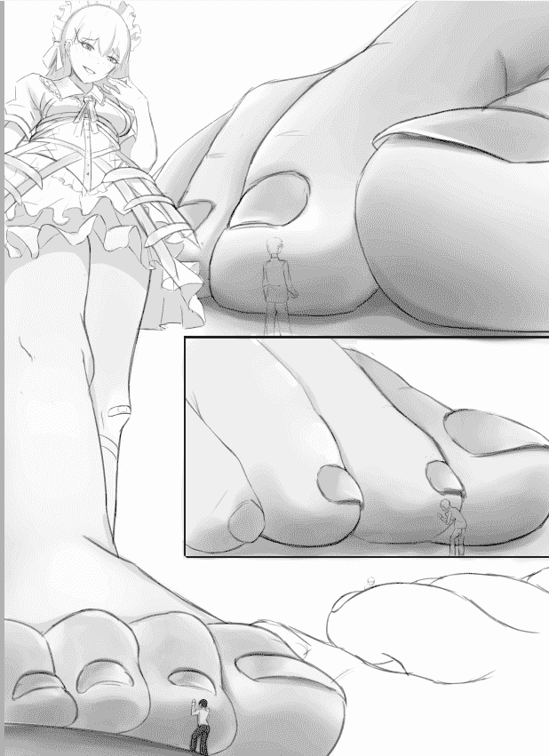](javascript:;)</ignore_js_op>  

# 82

> [yite.LI 發表於 2018-2-20 04:44](https://giantessnight.com/gnforum2012/forum.php?mod=redirect&goto=findpost&pid=360329&ptid=22938)

> g36么     突然好想知道dalao你会给g41什么样的性格

> 顺便问个问题 我记得有一篇代理人的番外我砸找不到了 ...

感谢支持，不过预告并不是G36而是PPK啦，那是哥特服不是女仆装（敲）

G41的话，不会让她改变很多的放心吧，主要是小孩子们我不是很想写战时的话题……

 

# 83

hmmmm……

雪风再次出现了，然而带来的依然不是自己还没完成的作品，而是MadlifeSUP酝酿了很久的文章。喜欢这个人形GTS世界的人越来越壮大了，真的是让我……不知道怎么说才好，只能激动的对所有一直以来支持着我，还有所有创作者的读者说声谢谢

鉴于这次Mad他自己写了前言，我在这里就不多说了，请大家接着向下看吧~

放出这次主角的人设图：

“指挥官……我们是为了和平才战斗的，对吧？”

***********************************************************

大家好，这里是MadlifeSUP，很高兴这次能为这一座少前楼做一些实打实的贡献（之前的番外就是纯属歪楼了。。。）嗯，这也是我第一次接触到这么长的短篇gts小说的写作，将近5W字，当然也是烧掉了我不少的脑细胞。。不过因为第一次写，所以还是有很多的细枝末节的部分没有考虑到。就比如说对于角色，对于一篇5W字左右的小说，两个人物撑起来的剧情还是太过单薄而没有厚重感，对于其他的主角外的人物，考虑的不很周到，也直接导致了我所设想的剧情不能完美的呈现，重复感极多，而且会显得又臭又长。法国著名作家莫泊桑的短篇小说《羊脂球》在比我少一半字数的情况下就可以刻画出鸟先生夫妇，拉马东夫妇，勃雷维尔夫妇，于贝尔伯爵，两位修女，德国军官和羊脂球这些极为丰满的角色，在很大程度上丰富了剧情，所以我个人将会以类似的短篇小说家学习，争取在以后可以写出剧情紧凑丰满，人物形象鲜明的剧情文。另外，在这里感谢建州大佬和雪风大佬对这篇文章的剧情，主题，人物等方面提出的建议，没有他们的帮助，这篇文章完成起来肯定是事倍功半，甚至有可能完全偏离了我预期的主题。那么话不多说了，在此还请各位多多包涵我这个菜鸡的拙劣文笔，也感谢大家能够抽出时间拜读我的拙作。下面进入正题：

“快……快离开这里！！啊！！”

一名反抗军的士兵对着藏匿在暗处的战友喊道，随即，他就被一只巨大的手一把抓了起来。

“哼，不知天高地厚的虫子，敢跑到我们的基地里来，说吧，你想怎么死？”

可爱，却冷酷的女声从那个躲在角落的幸存者头顶传来，他默默地闭上了眼睛，知道那名战友注定会命绝于此。

“放开我，你这个该死的贱人，格里芬的走狗！”

“哟，口气很大嘛。”

那个幸存者听到了头顶传来肢体被撕裂的声音，之后则是战友撕心裂肺的惨叫声，他不由得浑身颤抖起来。他知道那个人形是谁，是杀人不眨眼，甚至以此为乐的女魔头——M4 SOPMOD II。

“你应该叫得更惨一点，虫子。不过没关系了，你很快就没法再叫下去了。”

SOP手指一捏，那名只剩下上半身的反抗军特种小队成员，就在她的手指下成为了一滩血与肉的混合体。

“真恶心。”

高跟鞋的声音渐渐远去，他依然不敢出声，也不敢挪动半步。他的身子紧紧贴住身后的墙面，在墙与盆栽的缝隙间瑟瑟发抖，生怕那红瞳会突然向回扫来，让他也最终成为她指尖下的亡魂。

声音渐渐消失在走廊中，这个惊魂未定的幸存者飞奔向最近的一间开着房门的房间，他不知道这是哪个人形的房间，或是什么公共场所，是否危险。这些他都不想考虑了。他唯一想做的，就是离开那个女魔头可能回来的地方，越远越好。

在一阵对他而言算得上长距离的疾跑后，他感到自己的脚踩到了软一些的地面上了，眼前的场景从那冰冷的灰白色，变成了温暖漂亮的粉红，淡棕，象牙白和米色交织成的世界，他知道自己逃出了那条死亡长廊，于是跪在地上，粗粗地喘着气，就好像刚刚跑赢了死神的追逐。

“咦？地上的是••••••”

没有脚步声的预演，而突然从他背后传来的声音吓了他一跳，他没命地向前跑去。他心中早已经知道，自己根本不可能跑赢这些百余米高的人形，但他依然在跑着，对死亡的恐惧驱使他的双腿不停地向前迈去。

“是••••••小人先生吗？诶，不要跑啊••••••”

他突然感到光线暗了下来，回头一看，巨大的黑色鞋底完全笼罩在了他的头顶，他一下失去了重心，摔倒在地上，看着迫近自己的鞋底，闭上了眼睛。

••••••

？？

那足有23米多长的黑色鞋底没有重重地一下将他碾成肉酱，而只是轻轻地踩住了他，他虽然感到了巨大的压力压在了自己身上，无法挪动半步。但自己除了被压住以外，似乎也并没有什么其他的感觉，没有肢体被压碎所带来的剧痛。

“都说了••••••不要跑了••••••”

鞋底从他的身上移开了，接着，一只白嫩的手把他从地面上捡了起来。

“小人先生，是军人啊••••••怎么会跑到这里来了••••••”

他面前突然出现了一张漂亮而带着些许疑惑的脸，淡粉色的眼睛中透露出的不是杀气，而是温柔，并且带着关切的目光。

“你要杀掉我，就现在动手吧，也好让我和黄泉下的战友团聚。”

“你在说什么啊！我怎么会杀掉你呢。”

这个少女一样的漂亮人形将这个幸存者轻轻地放在了她的手掌上，随后缓缓地把他放到了一张有着可爱粉色的台桌上。

“不过，要是被别的姐妹发现了，小人先生不是会被杀掉，就是会被送去代理人的战俘营吧。”

一听到“杀掉”和“代理人的战俘营”这两个词，他的浑身就禁不住地哆嗦起来。显然，他一定知道落入代理人手中，会有什么样的下场。

“放心，我不会像她们那样的，小人先生在我这里，非常安全哦。”

幸存者面前的少女温柔地笑了，接着从自己的腰包中捏出了一小瓶水，刚好是符合一个正常人类的大小的一瓶水，上面还工整地印着“500mL”。

“我放在你旁边了，想喝的话就自己拿吧。”

少女那抬着一瓶水的手指在幸存者身边落下，把那瓶水抖在了他身边。他看着前边那个足有他半个人高的手指落在他身边，好像白嫩的墙壁一样。

“你••••••为什么要帮我？是不是想从我口中知道些什么？我是不可能把什么机密情报告诉你们格里芬的！”

“情报什么的，我不懂啦，只是，你们整天担惊受怕，怕会被我们踩死，被我们捉去当成玩具，每次去那些城市做任务的时候，都会有人跪下来求我们不要杀死他，被其他姐妹们捉回来的人，也会对这姐妹们求饶。她们是觉得你们很有意思啦，但我不这么觉得，我只是觉得你们很可怜，只是因为比较弱小，就会对我们产生这么深的恐惧，我真的，很想安慰你们。”

少女的眼中透露着真诚而善良的目光，让原本恐惧着的他，感到了一丝慰藉。

“啊，对了，我叫WZ29，不知道小人先生叫什么呢？”

“我为什么要告诉你我的名字？”

“算了，小人先生不想说也可以啦，不过，我想你一定不会想一直被叫做小人先生吧。”

WZ29笑着用手指甲戳了幸存者的脸，，然后用双手搭住桌边，有些期待地看着似乎想要说话的他。

“里••••••里弗斯••••••”

“很好听的名字嘛，你们都有这么好听的名字，我们••••••就只有编号了。”

WZ29低下眼睛，看了看自己的手，然后又抬起头来，用一种带着关切的眼神盯着眼前这个叫做里弗斯的反抗军军人。

“刚刚我看到SOP姊姊走过去，她••••••没有伤害你吧••••••”

“SOP”这个词就像是一把开关，一旦触下去，就会让他浑身像是通了电一样地剧烈颤抖起来。

“那个恶魔！！是她杀了我的队长！！也是她！！用那样残忍的办法屠杀了我们一个旅的战友！你们这些格里芬的狗杂种！我小队里的人，还有那些战友，全部都是你们害死的！”

他突然抱头痛哭起来，想起来他所在的那个十人小组，如今只有他一人活了下来。其余的，不是被抓住，送去了战俘营或是被当场杀死，就是被无意识地踩死在人形脚下。曾经在一起奋战，朝夕相处，一同训练生活的战友，都被那些人形当成垃圾一样处理。他一想到这个，就抑制不住那无尽的愤恨，悲伤与恐惧之情。

“你没事吧……不要伤心……我没想到SOP姊姊会……”

“你给我滚！少在这里给我装了！你们格里芬没有一个好东西，都是些杀人不眨眼的恶魔！渣滓！不要用你沾满我同胞鲜血的手碰我！还有，这瓶水你也给我拿回去！我不需要你们这群恶魔的施舍！”

里弗斯抓起桌子上的水，狠狠地砸向桌上伸来的，WZ29的手指。虽然对于她来说这个举动并没有给她带来什么触感，却还是被里弗斯的举动吓得缩回了手。

“你…怎么可以这样说我…”

WZ29将头转了过去，眼圈红了起来，她的上齿抵着下唇，滴滴的眼泪从她的眼眶中流了出来。

然而里弗斯并没有注意到这些，他现在心烦意乱，被突然泛起的苦痛占满了心灵。痛苦折磨着他的精神，让他感受不到了除了那近乎是神经质的愤怒以外的的一切。

“呜呜呜呜…”

里弗斯听到了这低低的抽泣声，才不由得转过头去，WZ29的面颊晕上了红色，好似瀑布一般的泪珠在她少女般可爱的面庞上流淌着，他的内心泛起了一丝对她的同情与歉疚。

“是不是，对她太过分了一点，她其实挺温柔的。”他的脑海里闪过这样的念头。

但他转念之间便打消了这个念头，眼前的她，在他眼中依然还是那个和SOP之流混迹在一起的杀人机器。

“你有什么好哭的？死的都是我的战友！和你有什么关系？你这个恶魔想要用眼泪忏悔？不！你做不到！你双手沾满的鲜血是洗不干净的！”他带着些许冷笑喊道。

“但…我一次战斗都没有参加过…”

WZ29轻轻用手背拂去了脸上的泪，脸色中带着一种天真的委屈。

“我不想看到有人死掉，不管是你们，还是我的姐妹们。我讨厌战争，为什么要打打杀杀呢，这有什么意义…”

“是你们干的好事，是你们自恃有力量，发动战争侵入我们的国家，杀戮我们的公民。你居然可以大言不惭地在这里装的高尚？我们呢？活在你们阴影之下的我们呢？我们只敢在你们不曾踏足的地方定居，祈祷不会被你们发现，吃着粗劣的食物。碰上你们，除了战死或者被抓别无他选。战争！谁会想要战争！但，当你们侵入我们的城市，摧毁我们熟悉的生活时，我们除了拿起武器，还能有什么办法？”

“可我并不是最高统帅啊…我什么也改变不了，只能做些我力所能及的事…”

WZ29用指甲拎起那瓶被他扔回来的矿泉水，又递到了他面前。

“拿着吧，你一定渴了，不要和自己的身体作对了…”

里弗斯的情绪稍稍稳定了下来，或许是他隐隐感到面前的这个人形和其他人形不一样吧。他伸出了手，虽然迟疑了一下，但还是接过了那瓶水，大口大口地喝了下去。

“我就知道你肯定渴了，刚刚那样拼命跑一定很累吧？”

WZ29露出了温柔的微笑，双手撑住下巴，好像一个可爱的小女孩一般，对一切都充满着善意的好奇。

“虽然见你们见的够多啦，但这样近距离地看到你们的一举一动，还是第一次呢。”

“谢…谢谢你，我也为我刚刚的行为表示道歉。”

“哈…没事的，你没事就好了。”

“是啊，我没事…但我的战友…”

里弗斯的头向后仰去，眼睛闭了起来，泪水从他的眼中簌然流出，虽然他还没有走出这件事的阴霾，但他确实已经不再像先前那般激动。

“别伤心了，一切都会过去的。”

她对他投以了关切的笑容，同时将手指伸了过来，轻轻抚着他的脑袋。里弗斯一口饮尽了瓶中最后一些矿泉水，之后站了起来。

“那么，让我回去吧。感谢你的好意，但我不能能留在这里。”

“好…”

突然，门外传来了敲门声，WZ29冲他做出了一个“安静”的手势，之后悄悄对里弗斯说道：

“你回去的计划可能要耽搁一阵子了，我有后勤任务，暂时帮不了你…”

“WZ酱，时间到啦，要走咯。”门外传来了一阵催促声。

“啊，知道了，我马上就好。”

WZ29应完以后，把头瞥回了里弗斯这边。

“里弗斯，你在这里会很危险的。她们要是看到穿着这身军装的你，一定不会手下留情的…先和我走吧，一定不要因为着急回去就乱跑，要是被姐妹们发现就完了。”

“WZ酱还没好吗？我进来了喔？”

“哎呀，糟糕！”

门把手被喀啦一下按下了，WZ一把抓起了里弗斯，直接将他塞在了自己的双峰之间。而就在此时，一个人形应声而入。

“诶？WZ酱把手放在那里干什么？难道…是在干不好的事吗？”

那个人形狡黠地一笑，好像自己发现了什么大秘密。

“讨…讨厌啦，衣服还没整理好，P7酱你就过来了，当然会放在那里呀！”WZ有些脸红地说道。

“嘿嘿…谁知道呢…”

被称作P7的人形笑了几下，随后一边向外走去一边说道

“快点吧，WZ酱，PK姐可在等着呢。要是去晚了，以她那性格…”

P7做了个狰狞的表情，之后坏笑着出门去了。

“呀，好险呀…里弗斯你一定不要随便出来啊。”

被夹在WZ29的一对玉女峰之间的里弗斯动弹不得。两边的山峰虽然触感柔软，但力量却十分足。不过，好在那“山脉”间的缝隙虽然不大，但也算不上小。即使他被紧紧夹在其中，也有足够的空气供他呼吸。

“好香啊。”里弗斯感叹道，这可是他第一次与女性的那个部位接触得如此之近吧，但却是以这样一种尴尬的境况进行着的。WZ29的体香钻入他的鼻腔内，那是一种沁人心脾的芬芳，与她那善良和美貌一样，令人深深着迷着。

“话说回来，也从来没有在战场上看见过她，她也不像别的人形一样冷血凶残…”

想到这儿，里弗斯哽咽了一下，

“比如那个SOP…”他不禁浑身一颤，战友在她手指间化为肉酱的场景依然历历在目。

这时，里弗斯听到了子弹碰撞与摩擦的声音，接着则是枪械背带刮过衣服的声响。沙沙的，不禁让里弗斯一惊。

“难道她也要…”

愤怒的情绪又冲上了他的脑袋，想象着自己的家园被巨大的人形和子弹摧毁，他便难以自禁，开始用双手不住地捶打着周围白皙如玉的“墙壁”。

“该死！你是不是要去残害我的同胞！”

但WZ虽然没有听见他的吼声，鞋跟敲击地面的声响还在继续。上下颤动的乳房将里弗斯摩擦着，令他小小的反抗动作瞬间戛然而止。

突然，摩擦停止了。他的耳边传来了WZ可爱而甜美的声音。

“PK姐，我来了…”

透过WZ粉色衣物的织线缝隙，里弗斯看到有四个人形正站在大厅之中。其中一个身着白色连衣短裙，脚踩黑色过膝战术靴的银发人形，头上的小熊发卡让里弗斯认出了她。那是PK，在作战报告中提到过的人形，是一个很难对付的对手。不过她对杀人似乎不感兴趣，每次目的达成之后便会停止战斗，也不会杀死投降的人。但对人类也比较冷漠，可能正是因为冷漠，才懒得去杀人吧。对她而言，可能杀死人类就像碾死蚂蚁一样，毫无意义。

“看样子，她就是这次的领队了…要是是她…”

“你的速度可真快，WZ。”PK突然开口了，语气中透着一股冷若冰霜的感觉，中断了里弗斯的思考。

“WZ酱，不用带枪的啦，这不过是后勤任务罢了。”

一个穿着黑色紧身衣与黑色长筒丝袜的高挑人形走了过来，微笑着摸了摸WZ的头。

里弗斯的视线被她那对黑色紧身衣包裹着的胸部完全挡住了。不可否认，那是对十分丰满挺拔的胸部，甚至让里弗斯都不禁咽了咽口水。

“不…不行！她们可是格里芬的人，我的敌人…”

里弗斯甩了甩头，试图让自己清醒过来。

“是啊，指挥官开始让我也去做后勤任务了。”

PK冷笑了一声，转过身去说道：

“PTRD，就让她把枪带着好了，我可不想再等上一个来回。”

“但，WZ，这样你不会觉得累吗？”

WZ29微笑着摇了摇头，PTRD也笑了，轻轻地摸了一下WZ的头。

“真是个可爱的孩子。”

“好了，出发吧。”PK说道，“这次的后勤任务需要动用整整五个人，想必不是什么轻松的过程吧。”她微微回过头，招呼大家集合，准备出发。

格里芬总部的大门“咯啦啦”地打开了，五个人形相继而出，四周是一片荒野。但记忆过作战地图的里弗斯知道，四周都有着格里芬设立的难民营。而目前她们所前往的地方，就是一处难民营的所在之地。

“难道她们…不对，她们刚刚说那是后勤任务。”

里弗斯才思考没多久，他眼前隐约就出现了难民营的影子。

“真是…动作神速…”

相对里弗斯这样的普通人类而言一段相对很长的道路对这些百米高的人形来说，只不过是数分钟的步行罢了。这只是这种力量带来的众多优势之一，却足以令人类难以企及了。人类节节败退，难以招架人形们的任何攻势，自然也在情理之中吧。

“好了，过了这片难民营，再将你们的身高放到千倍。注意，经过营地的时候小心脚下。这些难民已经够可怜的了，不要再让他们对我们产生更多恐惧。”PK一本正经地提醒着。

“了解。”其他人形回答着队长下达的命令。

那一刻，里弗斯悬着的心稍稍放了下来。同时让他不敢相信的是，那样冷酷，作战方式如此高效而无情的PK，竟然也会关心难民们，他原先以为她们会毫无表情地踏过难民营，就像她们在城市中做的一样。他有些头晕，这出现在他眼前的一切与他的固有认知产生了巨大的矛盾，以至于他因为这两种意识的互不相容而思维混乱。

没过多久，人形们就到达了难民营的边缘。PK一步跨过难民营四周的围栏，走到了一条柏油马路上，其他人形也相继跨了过去。透过衣物的棉质纤维，被夹在WZ胸间的里弗斯可以隐约看到有人向WZ这里招着手，他们都面带着笑容。

“看来，她在这里还挺受欢迎啊。”

人形们小心翼翼地穿过满是帐篷或者简易活动板房的营地，每一步都必须格外小心地踩下去，以确保不会有人就简单丧生在她们脚下。

“一定要小心，这附近可能还有小孩子，不要踩到可能还在玩耍追逐的他们。”PK一边走着同时回头说道，后面的四个人点了点头。

然而P7刚点下头，就被脚下的一个小男孩手上拿着的鲜艳气球吸引到了注意力，一个不当心一步踏了个空。随后，失去重心的P7脸朝地直直地摔了下去，随着一声轰然巨响砸向了地面。

“啊…好痛啊！！”

P7因为摔到鼻子的疼痛而喊着，痛觉让她并没有在第一时间意识到，她压毁了数栋简易板房。

“该死！P7，快起来，你身子底下还有人！”

PK的斥责一下子惊醒了P7，她赶忙支起身子，跪坐在地上，百米高的人形下落所带来的冲击力是无比巨大的，活动板房的铁片材质完全无法抵挡得住。两座处于P7身体正下方的板房直接被巨大的压力压的爆裂开来，深深地嵌入了地面。幸好正值午餐时分，房子里一个人都没有，否则肯定不可能留下任何一个活口。

另外还有一些砸的半毁的板房，而其中就有两座里面当时还有人在。

“说过多少次了！P7，你到底在干什么？！”

“先别管这些了，赶紧救人吧。那座有人围着的板房里肯定有人被困住了。Vector和WZ去左边那一座，我去右边。PK姐去联系这边营地的长官吧。还有你，P7，你今天惹的麻烦已经够多了，所以就不要再插手了。”

“可……可是……”P7一脸无辜地转过头来，但一看到PTRD带着责备的目光与PK那几乎是怒气冲天的眼神，赶忙把话收了回去。

“好了，快些行动，PK去联络长官，通知医疗队。”

PTRD临危不乱，让她在此时显得十分成熟而富有领导力。而在WZ胸间的，目睹了这一切的里弗斯，不禁悄然地改变了对她们的看法。

“看来她们，也不是那样无情……”

不过他的思考很快就被WZ的走动打断了，WZ富有弹性的丰满乳房上下颠簸着，把处在其中的他夹在中间摩擦。他只能任由那肉色的温暖墙壁搓着他的身体，而身体的任何部位，不是被WZ沁出的汗黏住，就是被夹在乳沟间无法动弹。

“唔……嗯……”

晃动不一会儿就停下了，透过织物的缝隙，里弗斯可以看到那个被压烂了一半，剩下的一半也早已变形，翘起在半空之中的板房。在那房子周围的人们因为WZ和旁边一位似乎从未说过话的银色短发人形的到来而向四周散去。

“救救……救救我的丈夫和孩子啊……”一个女人哭着，不顾死活地跑到WZ的脚下。WZ蹲下身子，用手轻轻包起她，然后将她放在手心中，温柔地说道：

“放心，他们会没事的。”

随后，WZ将女人放在人群中，做了一个“加油”的手势，之后便走向了那座板房的废墟。

那个叫做Vector的人形试图将废墟捏起，然后用手指甲撕开天花板，但被正好赶来的WZ阻止了。

“不要这样，还不清楚他们在哪里，伤势如何。” 她随后蹲下，试图探查着里面的情况，一边问道：

“里面困着的人，能移动吗？是在板房的哪一侧？”

“我爸爸……他骨折了……不能动！”

房子里传出了小孩子的声音，人群中的母亲听到后不由得心头一紧。

“儿子！我求求你们……快把他救出来吧！”

“Vector姐，帮忙固定住板房，不要让震动使他们受到二次伤害。”

银发人形点了点头，随后用手指轻轻捏住活动板房两侧，WZ从腰包中掏出自己的一把小剪刀，然后轻轻敲击了一下板房的屋顶，接着问道：

“从这里拆开行吗？小朋友，你和你爸爸会不会有危险？”

“没问题，大姐姐！”

“那我要开始咯？”

WZ随后向Vector示意，扶稳板房。接着用小剪刀剪开了板房的一段，在Vector的控制下，板房并没有产生十分剧烈的晃动。

正在此时，PK联络的医疗队也赶到了板房前。

“啊，来的正好。里面有一个小孩子，伤势不明。他的父亲也在里面，应该是骨折了，你们来我手指上，我把你们送进去，把伤员的伤势简单处理一下再把他们带出来。你们在里面喊一下，我就用手指来接你们，好吗？”

医疗队的人点了点头，随后便登上了WZ的手指。WZ则小心翼翼地将他们送向了那个刚刚被她剪开的缺口。

“可要扶稳了，Vector姐。”

银发人形点了点头，之后便聚精会神地关注着眼前的工作。

医疗队进入了板房内，在场的每个人都屏住了呼吸，等待着他们的回应，里弗斯也包括在内。

“好了，WZ姐。”

WZ小心地将手指靠近板房，尽力不产生一丝颤抖的动作。而捏住板房使其保持稳定的那个银发人形，此刻更加专注了。不论是地面上的人们，还是里弗斯，都期许着伤员平安而出的那一刻，豆大的汗珠在人们的头上冒出。

终于，随着手指平安落地，医疗队的人将伤员用担架抬下手指时，人群中爆发出了一阵欢呼声，WZ也露出了欣慰的笑容。她转头看了看PTRD的情况，那儿的人们也在欢呼着，想必是没有什么意外发生了。

虽然这是一次严重的事故，但破坏力惊人的人形们在施救时也有着人类无法企及的力量。使得这几个本来会被困数小时，甚至十余小时的人们，在十几分钟内就成功得到了救助。

PK也从营地指挥所的方向回来了。她轻蔑地瞥了一眼正跪坐在一旁画圈圈的P7，双手插在胸前，冷冷地说道：

“真是个麻烦鬼，还不快去给别人道歉！”

“我知道了……”P7有些懊恼地起身，然后走到赶来救护车前，跪坐下来：

“不好意思…各位…给大家添了这么多麻烦，大家…大家看我被PK姐骂的这么惨的份上，就原谅我这次犯的错误吧…求求各位了……”

P7随后趴下身子，把额头贴在地上，接着微微抬起头，像是在偷看什么一样。把本来埋在掌心中的眼睛露了出来。人们看到这样可爱的P7，也就不再人心去责骂她了。

“道完歉了吗？那就快走吧，还有任务在身。”PTRD拍了拍身上的尘土，从正在对她欢呼的人群中走了出来。

PK刚准备让小队成员集合出发，忽地扫到了正在被人们围着的WZ29，她蹲在救护车边，似乎正在和刚刚被救起的人们交谈着。

“走了，WZ酱。”PTRD招呼WZ道。

"哦，马上来，PTRD姐姐。”

WZ从腰包中掏出来一些符合人类大小的玩具，以及一些小零食，放在了那个被她救起的孩子的病床边，然后甜甜地笑了笑：

“小朋友今天可是很勇敢呢，这些是姐姐送给你的礼物哦？长大以后，一定会成为个小男子汉呢~”

WZ接着将头转向了小男孩的母亲，说道：

“阿姨，您不用担心，PK姐已经安排了最好的医疗队在指挥部给他们治疗啦，用不了多久他们就会健康地回来的。想看他们就到基地门口和士兵们说一下，我已经跟他们沟通好啦，要是还有什么难处，可以来找……”

“敬礼！”

不知人群中，是谁先喊出了这样一句话。随后，人们便都对着WZ29敬上了礼，好像她是统领他们的最高长官。

“啊……这是……”

"WZ小姐，之前的补给物资，也是您连夜送来的吧！您为我们做的，我们都看在眼里，是您帮我们请来了医护人员，也是您为我们送来新鲜的食物，在冬天给我们暖和的衣服，也是您在那些士兵欺辱我们的时候为我们主持公道。您为我们做的太多了，我们不知道该怎么感谢您，只能以这种方式来表达我们对您的敬意和爱戴。WZ小姐，您是最值得我们尊敬的人！”

“人……”

WZ犹豫了一会儿，这个字带给她的，是一种复杂的情感，她的眼眶泛红了，一种温热的液体在她的眼中打着转。

“…谢…谢谢你们…”

“礼毕！WZ小姐，您还有任务在身吧，赶紧出发吧，不必担心我们，我们会处理好这里的事宜的。”

“嗯…好，我走了…”

PTRD和PK，还有里弗斯，把这一切都看在了眼里。

“她是个好孩子，是吧，PK。”

“没错，战争改变了许多人，但从来没有改变过她。”PK含着一种苦涩的笑容说道。

“走吧，时候不早了，我们耽误的时间太多了。”

PK语毕，便悄然转身，微微抬头，凝视着远方的地平线。

“我回来了！”不远处的WZ一边跑着一边喊道。

“哈，我可爱的小WZ来了。”

PTRD一把抱住跑来的WZ，将她扛在肩上转着，WZ银铃般的笑声在浩渺的沙漠中回响着。

“好了好了，玩够了就该出发了。”PK催促道。

PTRD放下了WZ29，摸了摸她的头，说道：

“还有一段路要走，你可要坚持下来哦。”

“嗯，PTRD姐。”

PTRD笑了笑，随后转身跟随着PK的步伐走去，她不时地回头，看看WZ，就好像一个姐姐疼爱妹妹一样，无时无刻不在照顾着她。

沙沙的步枪背带摩擦衣物的声音又响起了，里弗斯惊奇地发现，在这段时间里，他居然已经忘记了那杆步枪的存在。他的内心，现在被一种神秘的东西萦绕着，那种东西带给他些许痛苦，但正是这奇妙的一丝痛苦，却能勾出他内心强烈的幸福感。在WZ29芬芳的体香中，他的头有些昏沉，有些晕眩，但他不感觉难受，却反而感受到了温柔的宽慰和涌向内心的阵阵暖流。他感到有什么东西正在治愈他身体和心灵的疲乏，而一丝困倦又引他的眼睛悄悄闭上，于是，他便在WZ的玉女峰间，甜甜地，安适地睡去了。

“放大到千倍，我们需要赶路了。”

PK一声令下，人形们的身高便膨胀似的增长着，在她们脚边的黄沙因为她们脚掌的增长而被推挤出约十米高的沙丘。

熟睡地里弗斯的四肢从WZ的丰满胸部中解放了，但他没有掉下去，WZ的乳沟间分泌的汗液粘住了他，将他固定在这山谷之中。里弗斯因为过度疲劳，加之精神上的疲乏，睡得很沉，完全没有注意到周遭的变化。

“出发了，距离还有四千公里左右，大约还有一个多小时的路程，要想在天黑前结束工作，那就得快点了。”PK回头道，接着径自向前走去。

“好了，走吧。”PTRD招呼道。

风声在她们耳边呼啸着，除此以外，便是她们的双脚接触到黄沙传来的沙沙声响。两百余米长的巨大脚印在沙漠中延展着，每个足迹的间隙都有近一公里的跨度，连地表刮起的狂风都无法撼动巨大人形们踩实后留在地面上的脚印。而这些脚印的主人，只是无意识间便足以改变沙漠中的地形，要是如此巨大的脚落在城市的头顶，那么后果，可能完全不堪设想吧。

会有多少人在她们的脚下挣扎，哭喊呢？钢筋与混凝土筑成的宏伟建筑，在她们的身下又能撑上多久呢？没人敢去想象，404小队毁掉城市的场景虽然没有亲历，也没有任何画面被留下，但那巨大而又深入地底的可怕脚印，无不在彰显着人形们无可撼动的恐怖力量，幸好，这脚印现在只是被留在了荒无人烟的沙漠中，但如果下一次，降临在了另一个国家的首都，那种恐怖的景象，只会再次重演吧。

沙漠的边界地带已经到了，面前出现了些许绿地，那是由树林和草地组成的，一些小山开始覆盖上绿色，河流从其中悄然穿过。在高于云层许多的人形们眼中，一幅黄，绿，蓝交织成的，由自然绘制的绝美图画绵延向远方，与蔚蓝色的天幕相接，透露着战争以后日趋少见的的生命的气息。

“哇喔～这里可真是漂亮啊！”P7惊叹道，接着，她用手指轻轻抚摸了一下飘在她腰际的散云，蹦跳着向前走去。太阳恣情地洒落着属于它的光芒，耀白的光映照在零星的白云上，留下些许不很显眼，但美丽无比的七彩光带。

“啊！是彩虹呢！”P7兴奋地喊道，她将那双明亮的大眼望向这难得一见的美丽景象。自从战争以后，哪怕是最淡最淡的彩虹都难得一见了，仿佛是只存在于影像和照片中的回忆，随着过往的历史一起沉寂了。

“那家伙…刚刚才犯的错，现在就像是什么事情都没有了一样…”PK有些不屑地说道。

“好啦，PK，你我也是老朋友了，这里的景色确实是很漂亮，也就不要管的那么多了，让她们稍微放轻松一点吧。”PTRD微微笑道。

“切，随她去吧，别再妨碍我就行了。”

“你还是这个老样子啊，PK。”

“行了，少说些话吧，赶紧赶路，天黑前要是搞不定这项任务，天知道要什么时候才能回基地呢。”

“你是想你的伏特加了吧，嗯？”

“……”

宜人的景色，加之美好的阳光和舒适的和风，人形们的心情也明显放松了许多，原本不过是一片沙漠边缘的景色，也逐渐随着她们前进的步伐，像是铺上了翠绿的地毯一样，变得葱翠欲滴。她们享受着战争与任务间短暂的美好，来自美妙的自然的美好，这能让她们暂时忘却弱小的人们恐惧的眼神，以及满目疮痍的城市废墟。

不过，这只是片刻的休憩罢了，随着目的地越来越近，人形们也不得不将精力重新放在了任务上。

“目的地快要到了，准备好缩小到百倍大小，WZ，你准备好负责通知那些还在那里的人类离开。”

地平线上，城市那灰色的背景隐隐地在阳光中跃动着。

仅仅几分钟后，人形们便来到了城市的边缘，这是一座饱经战火摧残的都市，弹坑和残骸密布，四处都是或是剥落，或是因为轰炸而留下的混凝土残骸，许多建筑的钢筋外露着，完好的建筑大多也褪了色，那些华丽的红，活泼的绿，庄重的蓝和紫，早就随着战火烟消云散了，取而代之的，是锈蚀带来的褐与老化的墙壁带来的淡淡土黄。

“到了，这次的任务是清空这块区域，把那些毁坏的建筑物清除掉，留出空地用来建造新的城市。但在这之前我们要先疏散城市里可能还存在着的人类拾荒者，或是流浪者，因此，待会儿我们要缩小到百倍，确保每一座建筑里都没有人了，再进行拆除的作业，这项任务不是很难，但需要细心和耐心，注意，可不要让那些人死在你手下，懂吗？”

PK交代着任务，一些处在PK鞋跟下的低矮公寓楼中的人们已经开始撤出了，毕竟PK现在还是千倍的大小，那些公寓楼对现在的她而言不过是两公分的高度，而要是被这千米级别的人形踩中，那可不是闹着玩的，公寓楼显然会立刻爆裂开来，毫无招架之力，虽然PK目前还没有出现这样的失误，但是谁，也不敢保证下一秒会发生什么事情。

人形们点了点头，表示对PK命令的回应。

“那么，WZ29，你可以开始通告城市里的人们了，WZ的通告结束后，就缩小到百倍大小，注意不要踩到疏散的人们。”

“好。”

WZ29站在原地，双手放在嘴巴两侧，以此来集中声波，好让她的声音更加清晰，传播的更远。

“大家好，我是格里芬的WZ29，我们要对这片城市进行重建工作，希望大家配合我们，暂时离开这里，防止我们对大家造成伤害，谢谢大家！”

没有回应，街道上依然空无一人。

WZ又重复了一遍，依然无人出现在街道上，也没有人离开自己所处的城市废墟。

“啊…真是…”

不耐烦的PK一把拉下WZ29肩膀上背着的那支步枪，之后快速地上膛，对着天上扣下了扳机，爆炸一样的巨响瞬间爆出，震碎了几乎所有城市内还完好的玻璃。

“不错，我就是来侵略的，我要把你们一个个踩扁在你们那些垃圾一样的东西里面！”PK冷笑着喊道，随后在控制力道的情况下跺了下脚，整座城市都感受到了恐怖的震动。

“啊！！！快跑啊！恶魔来了！”

人们惊慌失措地逃出建筑，有人的身上带有着刚刚玻璃破裂而造成的划伤，但他们依旧没命地跑着，恐惧感控制着他们的双腿不自觉地向她相反的方向跑去。

“跑吧！虫子！”

PK随后一脚踩下，道路边的几座小高层像是纸片屋子一样，一下就崩塌在了她的鞋底，人们见到这一幕，更加惊恐地向远处，远离这座城市的地方跑去。

“PK姐！你在干什么！”WZ惊叫道。

“这也是没办法的办法啊，他们太怕我们了，只有这样，才能让他们主动离开吧。你放心，刚刚我踩塌的房子里没有人，我在你刚刚通告的时候就检查过了。”PK苦笑着说道，之后默默地命令道：

“人形们，缩小。”

里弗斯被那声突然响起的爆炸似的声响惊醒，他不清楚发生了什么，只能隐隐约约听到人群的尖叫声。他发现WZ的衣物织线间的缝隙更大了，来自四肢的压迫感没有了，他有些意识到，可能是人形们变化到了千倍。他向四周看去，果然，那对属于WZ的傲人双峰更加庞大了，此时真的很像一座真正意义上的山丘了。WZ散发着体香的汗水包住了他的身子，将他粘在了双峰间，他有些庆幸，还好是这样，不然自己一定会掉下去，摔个粉身碎骨吧。

“人形们，缩小。”

PK的命令声传入了他的耳朵。

“诶！别！别！”

显然WZ29没有听到里弗斯的抗议，身旁的两座山峰急剧内缩，又一次将他压的牢牢实实，他的身体又感受到了那令人极不舒服的压迫感。

“也好歹让我休息休息啊…”里弗斯有些无奈的说道。

“咦？”WZ有些奇怪地看了看自己的胸，但PK的话打断了她的思考。

“WZ，开始行动了。”

“嗯…哦…我来了。”

WZ29跑向了PK，脚踩在地面上，发出阵阵“咚咚”的声响。

“在把那些房子拆掉之前，要仔细用扫描仪搜索里面有没有人，如果有的话，就把他们弄出来，不管什么方法，只要别让他们受伤就行了，动作快速点，别耽误时间，天黑之前要拆掉这里的全部建筑。”

“嗯…”众人边应着，边忙于手头的工作。

“拆建筑干嘛呢…”里弗斯想着，“但这一定也是有原因的吧，她们既然要在保护平民的情况下拆，自然也不会没有意义的。”

轰隆！

建筑物倒塌的声音传了出来，随着WZ身体的转动，里弗斯也看清楚了那声音传来的方向。

“是那个叫P7的人形拆掉了第一座啊…”

里弗斯看到她的鞋尖上沾上了尘土，一摊瓦砾出现在了她的脚下，有些瓦砾飞出去了很远，看样子，她是直接踢爆这座楼房的。

“P7你真是的…玩心总是这么重，要是巷子里有人的话，瓦砾砸中他们怎么办？”PTRD无奈地说道。

“嘿嘿，考虑不了那么多啦。”P7坏笑着，接着用扫描仪扫着下一座楼房。

“啊…我也得快点了…”

里弗斯听到了WZ的自言自语，不一会儿，扫描仪传来轻轻的“滴”声，那是屋子里没有人的讯号，WZ于是将手伸入大楼内部，轻轻拉断承重柱，同时用手控制楼房倒塌的方向，一座大楼便简单地倒塌了。

“真是…真是可怕的力量啊…”

虽然里弗斯也曾经在作战时见识过人形的力量，但如此近距离的感受，还是不免感到了一丝恐惧的心情。他想起了死在SOPMOD II手里的战友，那双手也不过是轻轻一捏，就终结了一位久经沙场的老兵的性命，在她们面前，所有人都毫无反抗的可能性，力量的差距太过悬殊了，以至于所有的抵抗只是一种心理安慰，让自己感受到：至少我们有过努力。

仅仅只是这样罢了。

一丝悲哀悄悄划过里弗斯的心头，他呼吸着含着香气的空气，有些惘然地透过缝隙看着人形们一座接着一座地拆掉，或者说是破坏掉那些废弃的，空无一人的大楼。

不时会有人从楼里面被拿出来，送到地面上，之后，他们之前所藏身的楼房就会在她们手指或者鞋子的撞击或搅动中化作废墟，那些被人形们拿出来的人，几乎是瘫坐在地上，看着上一秒还完好无损，稳固依旧的楼房，下一秒就荡然无存了，一种力量差距带来的落差感让他们无法移动，呆滞地看着眼前这极不真实的一幕。

“快走吧，马上我要拆掉这里的，不要受伤了。”

WZ29善意地提醒着刚刚被她拿出的人，看他们稍稍跑远后，才按下手掌，房屋的横梁在压力下断裂，楼层像是失去支撑的蛋糕一样，哗啦啦地垮塌了。

PK和PTRD的效率明显更高一些，WZ刚刚拆完一条街的时候，她们已经把第二条街都拆去了一半了，扫描仪快速扫过楼房后，她们便灵活地抓出躲藏于其中的人们，用手掌包住他们，顺带一起弄塌房子，当人们从她们的手掌中出来时，楼房已经消失了，而她们又向着下一座楼走去。

Vector负责的区域，滞留的人员并不多，因此她的进度甚至比PK和PTRD还要快一些，她常用扫描仪扫过半条街，都没有任何警报声响起，于是，她便会一脸漠然地提起脚，一下踩下去，数座公寓楼便因完全无法承受她的体重，顷刻间被压成碎块，她的巨大的靴子显然比人类制造的那些笨重的机器有力而有灵活许多。

P7的进度是小队中最慢的，但并不是她拆楼的效率不高，而是因为她喜爱作弄藏在楼中的人们，以及用玩的方式拆掉那些楼房。有一对情侣因为人形到来，而又来不及离开，便躲在大楼里不敢出来，生怕会被人形们杀掉。巨大的枪声，PK那恐怖的话语以及面前一座座楼房的倒塌让他们胆战心惊，因此当P7巨大的眼睛出现在窗口外面的时候，他们克制不住地尖叫而出，也是理所当然的。

“啊哈，是一对恩爱的小情侣呢。”P7笑道，手伸入了大楼内，撞开外墙就像撕开纸片一样轻松，男生紧紧地抱住怀中因为恐惧而无力走动的女生，接着便被P7从大楼中抓了出来。

“看来感情还真的很不错呢。”P7有些坏坏地笑着，之后抓起男生，将他悬在自己的嘴巴上方，接着松开手指，目送着男生掉到她的口中，然后咽部微微一动，像是把男生吞入了腹中。

留在P7手掌上的女生瘫软地跪坐在了她的掌心，崩溃地哭了，但P7只是微微一笑，随后把压在她舌头下的，沾满她口水的男生拎了出来。

“只是吞吞口水哦，嘻嘻♪，下次可要早些走哦，不要被我抓住了呢。”

P7放下这对倒霉的情侣后，这才把脚伸入大楼中段，稍稍向前一顶，让大楼上半部分摔在她的腿上，化为一堆垃圾，之后再踩下去，慢慢地，一层层地压扁剩下的部分。

“嘻嘻，真好玩呐。”P7笑着去了下一座楼房。

很快的，人形们就拆去了半个城区，要是是人类的话，可能要动用大量资金和重型器械，包括炸药，再花上数年，甚至数十年才能做到吧，但巨大化后的人形们只是用手和脚，短短几小时里就完成了这项壮举，而且与此同时还成功地迁出还在楼内的人员，这完全是无法想象的高效了，但在这些百倍高的人形眼中，却是这样轻而易举。

里弗斯似乎是习以为常了，他并没有觉得十分难以置信，毕竟他从WZ的角度目睹了全过程，拥有那种动动脚趾就能破坏楼房的力量，想要干成这样的事，就像是玩一样轻松吧。

太阳的光芒在一点一点地消逝着，它的身影也开始向着地平线下的世界垂去，人形们加快了动作，废弃城市被拆除的速度越来越快，街区成片成片地倒塌着，到处可见建筑物的残屑留在道路和空地上，皮靴或是高跟鞋落下的“咚”的声响与楼房随之倒塌或是被踩扁发出的吱呀声混杂在一起，产生出一种奇怪而又不间断的和声，像是种劳动号子，催促着人形们继续加快速度。

“加油，姐妹们，我们的目标就快要完成了。”

是的，在这晚霞已经露出它妩媚身姿的时候，人形们也只剩下几片不很大的街区需要处理了，看来任务进展的很顺利，没有平民死亡，也能按照计划在天黑前完成工作，人形们紧张的心终于可以稍稍放松一下了。

“看，天都变成橘色了。”

人形们循着P7手指的方向看去，地平线上，艳红的夕阳散射着华丽的橘色光芒，将天空作为作为它的画布，用柔和而又厚重的笔触将蓝天白云渲染成一幅暖色的画面，紫，橙，黄，红交相辉映着，美得令人心醉，让人几乎忘却了工作带来的身体的疲乏与无聊的情绪。

里弗斯透过那缝隙，可以清楚地看到好似是水中倒影一般微微颤动的夕阳，他沉浸在其中了，这是何等的美景啊，大地与天空此时仿佛融成了一体，满眼望去，尽是暖色交织成的世界，地面好像变成了一块细腻的法兰绒地毯，不断向远处延伸着，似乎在迎送太阳的离去，自然这个艺术家，将它的创造力，淋漓尽致地展现着，挥洒着，敲击着所有人内心，最美妙的那一部分。

“天哪，我从来没有见过这么美的晚霞。”PTRD低声道。

WZ与Vector在一起，默默地看着，看着眼前，那光明将逝前的最后一瞬，它是美的，让人在迎接黑暗前感到阵阵暖流流过心田。她轻轻地许了个愿，双手合在胸前，谁也不知道，她在夕阳前期盼的，会是什么？没人知道。她的脸，在这霞光的照耀下，显得平静而美好。

PK走了过来，将身子轻轻靠向这城市里最高的建筑，轻柔地用臂弯架住WZ29与Vector，将她们搂向自己。

“我知道你在许什么愿。”PK转过头来对着WZ笑道，她的脸上满是霞光，随后，她便把脸转向了那已经逐渐消失在地平线下的红色倩影，微微地闭上了眼睛。

里弗斯的视线暂时被WZ许愿的手挡住了，他也听到了PK对WZ的低语，他虽没有看到WZ的表情，但PK的话让他也有些感兴趣了，她究竟在许什么愿呢？

“是啊，她会想什么呢，看来在她这温柔的外表下，还藏着一些神秘的小秘密呢。”他微笑着想着，揣测着这两个女孩心中的所想，需要夕阳寄托的，一定是一种在黑暗中也能指引方向的东西吧。

“走吧，吃些东西，我们也该向回走了，PTRD，麻烦准备一下食物吧。”PK拍了拍两人的肩膀，说道，接着顺便清理了剩下的几座房子，她光滑白皙的手臂伸入那座最高的大楼内，手指捏碎承重的部分后，大楼轰然塌下在她的手臂上断裂成数节，接着，她抬起长靴，让这座在以前可谓辉煌的废弃摩天大楼，随着这座城市的曾经一起，由现实成为了历史。

银色发丝随着微风和PK的步伐飘转着。

“V姐，你也有许下愿望吧。”WZ低声的问道。

没有回应，就像是夜的前奏一般寂静。

“WZ！能帮忙生下火吗？就我一个人，忙不过来！”

“哦…好！我来了”

WZ向PTRD的方向跑去，咚咚的，像是顽皮的小孩子刚学会走路似的，带着些轻快和沉重。Vector则站在原地，将双臂缓缓地交叉在胸前，闭上双眼，感受将要入夜时分的清凉晚风，风微微吹动她的银色短发，让她那被黑色的服装裹着的背影如同她本人一样神秘莫测。

火很快就生起来了，夜幕也随之降临，木质房屋留下的残骸被WZ收集了起来，当作了备用的燃料，PTRD在火周围铺上餐布，又在火上煮着从基地带来的饭食。说起来，今天一天她们都没有吃过一口东西吧，大家肯定都饿坏了，正焦急地等待着这顿饭吧。PTRD想着，愉快地笑了。

饭因为提前预加工过，所以煮的很快，不一会儿，米饭和菜肴的香味就飘在了城市的废墟上空，袅袅炊烟升起，勾住了P7的馋虫，她便来到了WZ和PTRD身旁。

“啊～”P7在PTRD坐了下来，“PTRD姐，还要多久才能吃到饭啊，我都快饿死了。”

“马上就好了，不要着急，不过这种速热的便当，我可不敢保证味道会多好哦。”

“哈，不管了，饿的时候，吃什么饭菜都香，嘿嘿。”

“帮我去叫PK和小V她们回来，饭马上煮好了。”

“不要嘛，WZ酱，你去好不好，我都累死了…”

“真是的，人家WZ刚刚还帮了许多忙呢，你呢，就这么点小事都不愿意做嘛？”

“好嘛好嘛，我去就是了，早知道就带好通信设备了。”P7有些不情愿地起身，去叫处在分城市两头的PK和Vector。

P7向着城市的边界走去了，那是Vector所在的地方。

等到P7走的稍远后，PTRD凝视着坐在火堆旁正出着神的WZ29，内心腾起一丝疑惑。

“这孩子怎么啦？”她想着。

“WZ，怎么了吗？发生了什么事呢？怎么这么闷闷不乐的？”

“哈…没什么，就是想的多了些吧。”

PTRD意味深长地看了WZ一眼，随后轻轻地把WZ揽入怀中，将她的头轻柔地贴在自己挺拔的胸前。

“没事的，WZ，有什么事都可以和我说，没必要在我面前拘束。”PTRD轻轻抚摸着WZ透着香气的长发，温柔地说道。

“只是…只是这战争究竟何时才能结束呢？要牺牲多少无辜的生命以后，一切才能重归平静呢？像以前一样，可以尽情地在城市里散步，会有来往的人对着自己问好…我…我有些怀念这样的生活。”

“嗯…我很理解你…你许的愿，也是希望世界和平吧。”PTRD温柔中透着些许怜爱地说道，“但是，这样的和平，可是种奢侈品呢。WZ，你要知道，你追求的可不是很容易得到的东西，这世界上只要有不公和欲望存在，战争就是避免不了的啊，尤其是现在，人类与我们的力量差距如此之大，即使我们什么也不做，他们也会想方设法除掉我们的吧，这样的纷争，永远不会停啊。”

“但他们不会对我们造成什么伤害，但我们……”

“这也是没有办法。”PTRD叹息道，接着继续轻轻地抚摸着WZ的头发，“我们自己不也是不想变得这么大吗？但没有办法可以改变这个事实，是不是？而且战争停不停的下来，也并不取决于我们，我们唯一能做的，也就是尽我们所能去让他们免受伤害，不让我们干扰到他们吧。”

WZ沉默了，四周响着的，只有篝火燃烧时，枝条爆裂发出的噼啪声。

“V姐回来了，我去叫PK咯。”P7的声音打破了沉寂。

“嗯，好吧，你快去吧，快去快回，不然饭都要凉掉了。”PTRD说道。

P7的鞋跟敲击地面的阵阵咚咚声又一次响起了，这次是朝着城市的另一头奔去。

“啊，V姐。”躺在PTRD怀中的WZ有些不好意思地看着Vector，好像她发现了自己与PTRD有什么特殊的的关系似的，脸微微地红了起来。

“我知道你和PTRD的关系不错。”Vector依然是一脸无所谓的表情说道。

“嗯…仔细想想，这好像是我第一次听到这个人形说话啊，她不说话，都快忘记她了，真是个内向的人形…”刚刚从WZ乳房的重压下解脱，又被突然抬起身子的动作晃得不轻的里弗斯想道。

“啊…不是那种关系啦，V姐。”WZ慌乱地解释道，手有些尴尬地晃着，倒反而让她想表达的意思朝着相反的趋势进行了。

“嗯，我知道。”Vector还是一脸漠然。

“好了好了，WZ啊，你可真像个小孩子一样，一紧张就会慌乱啊。”PTRD笑道。

这时，P7哒哒哒地跑回来了，PK则在其后缓缓地走来。

“人都到了，那么就开饭吧。诶！P7你慢点啊，跑那么快…”

“嘻嘻，我饿了嘛，一天都没吃饭了。”

“真是…谁让你把人家MP5的早饭放了泻药，最后只能把自己的早饭拿去补偿人家。”

“啊？你们怎么都知道啊。”

“废话，G36老早就告诉我们了，还说要好好收拾你这种麻烦精。”

“啊哟…又是G36那个家伙…每次都那么管我，真是麻烦。”

“人家还不是为了你好啊，行了，坐下吃饭吧，别那么多牢骚了。”

PTRD把饭盒递给了P7，接着是Vector，然后是WZ和PK，最后的才是她自己的。饭盒发完以后，人形们就坐在篝火边，各自吃着自己的饭食，大家都饿了，所以吃饭的时候，并没有许多交谈的声音，很久以前可能是繁华的大都市的城市废墟，现在却静悄悄的，风声成为了夜之旋律的主宰。

“啊，好香的饭菜啊…”里弗斯感叹道，他想起了自己今天除了WZ在房间里给他的一瓶水以外，也还没有吃过东西，透过缝隙，他可以看到WZ正在吃些什么：一块汉堡肉饼，蔬菜沙拉，以及一份淋上番茄酱的蛋包饭，他对这些食物甚至有些叫不上名字了，三战后资源紧张，符合人类身体大小的，如此的“豪华”便当都实属罕见，更不用提是人形食用的，这样巨大的食物了。他不知道这些东西是从哪里来的，如果只是用饲养动物或者种植作物来获得的话，那怎么说，也不可能支撑如此之久吧，地球上的所有的食物，也不可能支持她们这么长时间吧。

“我们只有烤面包片，咸肉和黄油什么的，还都是定额配给的。绿色蔬菜，很久很久都没见过了…一直在吃军队给的维生素片勉强度日啊…”里弗斯有些木然地看着眼前对他而言显然是珍馐的食物，默然地想道。看来他们和格里芬的差距，远不止力量这一点吧。

“啊～饿了吃东西果然很香呢！”P7笑道，显然因为吃饱肚子而十分开心。

里弗斯不禁笑了出来，对他而言，挨饿简直是家常便饭，一天没有吃饭，哪能叫做饿呢？如果抱怨，只会被说成矫情的吧。

“对了，PK姐，给你看个好东西，嘿嘿…”

P7蹑手蹑脚地走到根本不想搭理她的PK身前，随后轻轻地用手指点了点PK的肩膀。

“干什么！”PK有些不耐烦地说道。

P7接着坏笑着给PK一个小小的播放器，然后远远地跑开了。

“真是的，这家伙搞什么鬼…”

PK缓缓地打开播放器，开始播放里面存着的唯一一部视频。

“啊…这是…好熟悉…”PK想着，画面中出现了一个正在洗澡的女生的背影，她银色的长发被水沾湿了，紧紧地贴在她的后背上。

“等一下！该死！P7你给我站住！我今天一定要好好教育教育你！”PK怒气冲天地冲向远处的P7，P7则掉头就跑，很快，两个人就消失在了夜幕之中。

“啊？那个视频是什么啊。”WZ有些疑惑地问道。

“我也不知道……啊哈！是PK洗澡的视频啊，这个P7。”

“哈哈哈…”

笑声回荡在篝火前，连在WZ胸间的里弗斯都跟着笑了起来。

“要是能一直这样，大家开开心心的就好了。”WZ看着已经挂在天上的明月，微笑着想道。

没过一会儿，PK便揪着P7的耳朵回来了，P7的脸上明显留下了几道划痕。

“啊…PK姐下手真狠…不愧是毛子（悄悄）…咳咳…不愧是PK姐，看来回去又要修理了。”

“后勤任务受伤，你可能是第一个哦P7，哈哈。”PTRD笑着说。

PK把P7带到了篝火边的一块空地，把P7撂下，接着自己缓缓走到PTRD身边，坐下来，脱去了束缚自己双腿快要一天的过膝长靴。

“脚出了很多汗啊，看来回去还得洗澡…要是这家伙还敢…”

PK恶狠狠地盯了P7一眼，后者则有些尴尬地陪着笑。

“WZ，你还在想着心事啊，嗯？”PTRD含着笑问道。

“嗯…”

“还是关于和平的事情吧…看来，你始终放不下这块石头啊。”

“是啊，要是大家都能开开心心的在一起生活，不用担心谁会侵略谁，谁会攻击谁，那么我们的生活会多么愉快啊，再也不会有对失去生命的恐惧和对失去亲人的痛苦了，不是吗？”

PK拿起一个钢制小酒瓶，旋开瓶纽，轻轻地呷了一口，然后看了WZ一眼，接着又灌下一口。

“曾几何时，我也像你一样这样想过。”PK的红瞳凝视着WZ，端着酒瓶的手架在了她那被黑丝包裹着的膝盖上，“ 但是呢，呵呵。”

PK猛地饮下一口酒。一声叹气后，她带着一丝哀婉和无奈看了看天上挂着的那轮月亮。

“多美啊，是吧，”PK哀笑着，“但现实总是那样残酷，当指挥官下令让我去做那些我根本不愿意做的事情的时候，我有什么办法呢？我们生，就是为了服从命令，生，就是为了战争，就好像那些人类手里拿着的枪一样，生而为了杀戮，呵呵，真是可悲。”

月色映照着PK的脸和她银色的长发，那张哀恸中的脸，更显的苍白了。

“我想守护那些弱小，我也曾对自己说过‘如果有弱者深陷水火，我必将伸出援手’，可是呢？当我不得不把那本应该用来碾碎那些该死的铁血的长靴移向那些无辜的人们头顶时，你知道我的心情有多么绝望吗。WZ，我不能违抗命令，如果不能解决掉那些无辜的军人，那么我就是个抗令者，但一想起我的靴底会沾上无辜者的血肉，我…我…我几乎喘不过气，那些就是弱者，是需要我保护的人，但我做了什么？我只是抬起脚，踩下去，毫无意义地终结他们宝贵的生命！呵呵，我就是个恶魔吧，一个只会乱杀的恶魔。”

PK一口干尽了瓶中所有的酒，泪水不受控制地从她紧闭着的眼眶中留下，月光照着这滚滚热泪，散射出凄哀的白光，篝火边的每个人都沉默了，那个坚强的，时常有些高冷，严肃的PK，此刻在她们面前放下了自尊，用泪来阐述她内心深处那几乎是无时无刻不在颤抖着的罪恶感和深深的自责。

“但我要谢谢你，WZ，还有你在，我抬起脚踩下去过的次数，不计其数了，我害怕，我害怕自己会麻木，会对一下杀死许多人再也不会犹豫，但你的存在，是我如今每次都会将脚从他们头顶移开的动力，因为你让我知道，这个世界还有希望。是啊，希望远在天边，而且看上去转瞬即逝，就像这月亮，就像刚刚落下去的太阳，但它多美啊，美到我们会倾其所有去换取它裙摆的一片，不是吗？如果没有你，WZ，那我可能再也不会再注意到，这月光是多么动人心弦。”

PK转过头来，带着热泪和笑容看着WZ，之后用手臂抹了抹脸上的泪痕，接着呆呆地看着夜空，没有繁星的夜空。

“我们，不过只是商品而已吧，谁会管我们做些什么呢？违抗命令不去侵害那些人，又有什么关系，就把我们自己当作坏掉的商品吧，一个能服从命令，但是做不完美的坏掉的商品。我们不是什么军人，不过就是些被利用的棋子罢了吧，不停地被摆布，棋局结束，人们在意的只会是这盘棋的输赢，我们每一个不也会被遗忘掉吗？除了那几步好棋，最后大部分的棋子，又有谁会知道。别在意那些指挥官什么的人的眼光了，他们最后，哪里会记得你的功绩和失败呢，把你的脚从人类头顶移开吧，永远不会有人因为这样而厌恶你。”

很少说话的Vector突兀地打破了一片寂静，接着又是篝火噼啪的燃烧声。

“都说的好深奥啊，我都听不懂…”P7抱怨道，接着，打了个长长的哈欠。

“任务可真是无聊，要不我们早些回去吧，我想吃G36姐姐做的冰淇淋了。”

“唉…你啊，真是个粗神经啊…”PTRD叹道。

“懂的少些，或许也是挺幸福的吧。”PK转过头，笑着轻轻对PTRD说道，那笑里，包含着许多东西。

“小心你再吃冰淇淋，又像那天一样拉肚子。那天敲了你房门几次，你都在厕所里。”

“嘿嘿…吃还是要吃的嘛…”

“时候不早了，把火灭灭，垫子收好，我们也该往回走了，准备放大到千倍吧。”PK恢复到了那种领导者的姿态，穿上长靴，对着队员们说道。

“是。”

WZ也起身了，她有些彷徨，她不懂什么是利益，什么是无可奈何，但她知道，有一堵黑影筑成的高墙在阻碍着她内心向往的宁静与和平，但她不会畏惧。她厌恶战争，厌恶杀戮，厌恶血腥的场面和征服者狂傲的笑声。虽然她不知道前路在何方，会有谁会支持她，又会有谁把她当成笑话，她不管，也从不考虑，她只知道，她是WZ29，而WZ29，从来不会欺凌弱小，放弃和平的希望。

月光洒落在她身上，显得皎净而纯洁。

里弗斯能感受到在WZ29周围发生的一切，他仿佛体会到了，一股暖流正在冲击着WZ身体的每一处，那种暖流不知来源于何方，但却是强大的，坚毅的。他从对她的恐惧，到放下恐惧，到对她赞赏有加，再到现在，他已经不得不对她刮目相看了，她内心对和平执着的追求，不会像她的外表看上去那样柔弱娇嫩，而是好似钢铁般坚硬。里弗斯的心中，也像WZ一样，腾起了阵阵希望。

“我当初进入军队，不也是希望有一天，世界会恢复到它应有的样子吗？”里弗斯微笑抬起头，透过织线的缝隙，望着那皎洁的月，轻轻地自言自语道。

“WZ，加油，这个梦想一定会实现的。”

“好了，上路，放大到千倍。”

PK一声令下，人形们向着格里芬总部走去。

漆黑的夜的幕布，出现了点点微弱的芒星。

………

………

不知道走了多久，人形们终于看到了那此时灯火通明的格里芬总部，在附近也有一些任务结束归来的人形，正在整理好装备，准备回到总部的碉堡里。

“好了，大家辛苦了，都回到各自的房间里好好休息吧，明天是休息日，趁这段时间好好调整一下，那么解散吧。”

“好，PK姐。”

人形们缓缓走进总部内，大门开启，她们进入大厅后，便各自朝着自己的房间，或是某些公共区域走去了。WZ也缓步走向自己的房间，说起来，这一天都没好好休息休息，身上也流了不少汗，也该好好放松一下自己吧。

“泡个热水澡好了。”WZ这样想着，之后哼着轻快的调子进入了自己的房间，接着把鞋子脱下放好，换上拖鞋，然后拿上浴巾和睡衣，缓缓地向自己的浴室走了过去。

“那么先放水好了。”WZ想着，接着扭了扭浴缸的龙头，冒着热气的热水便从浴缸底部升起，速度很快，不一会儿水就放好了，浴缸上萦绕着丝丝令人感到舒爽的雾气。

WZ缓缓脱下自己的外套，接着是衬衫和短裙，裙子从她那白皙光滑的腿上滑下，将她苗条的身体一览无余地展现了出来。她接着将手伸向背后，解下束缚自己那对玉兔的胸罩，将它仔细地放在木质与带着金黄色泽的金属的浴室置衣架上。然后便是那洁白的胖次，手指轻巧地扭动着，将那胖次拉下的同时，也将属于女性的私密领域若隐若现地展现了出来。接着，她一手托着自己的胸部，另一只手扶着浴缸壁，以一个优雅地姿态跨入了浴缸之中。

“嗯…还是泡热水澡最舒服呢…”WZ的嘴上浮起了因为舒适和放松而带来的笑容，接着，她按下几个按钮，按摩水柱和其他一些按摩设备便被启动了，为WZ服务起来，满足她庞大的身躯在外工作了一天后渴望放松的需求。

“咦…水面上怎么会浮着一个小黑点呀…”WZ有些疑惑地用手指把那个黑点捏了起来，细细一看，才突然惊叫起来：

“啊！是小人…不，里弗斯先生啊！”

里弗斯本来在WZ她们回来的路上睡着了，但一种突然的坠落感惊醒了他，他睁开眼睛，却发现自己正在向一个很大的热水池坠下去。在那热水池中，少女的肌肤的颜色与雾气混在一起，若隐若现，他几乎立刻就明白了，这是WZ的浴缸，而她此刻正在泡澡。

“噗通”一声后，里弗斯掉入了这热水的海洋之中，那可是起码四五十米深的热水之海，要是沉入那底部，再想出来或是被WZ发现，那可能就要比登天还难了，所以，尽管他入水时感到有水灌入了他的鼻子里，但他依然立刻拼命向上游动着，直到他的头探出水面，他才猛地喘着气，解放那因为进水而酸痛不已的鼻子。

还好，他很快就被WZ发现了，不然要是真的沉入这热水里，那不是会淹死，就是会被WZ巨大的双腿按在浴缸的陶瓷表面，让他成为那白色瓷砖上的小小的红色污点吧。

“里弗斯！你没事吧！不好意思…我…我都忘记你一整天都在我的…那里了…”WZ脸红着对着手掌上的里弗斯道歉道。

“没…没关系…你太忙了嘛，太多的东西塞在脑袋里的时候，总会有些东西会被排挤出去的嘛。”因为呛水而咳嗽的里弗斯有些勉强地笑着说道，。

“谢谢你安慰我…那么…我明天就帮你离开这里吧，今天就劳烦你住在这里了…”

“啊…其实…我有些不想回去了…”

“诶？为什么啊？”

里弗斯轻轻地坐在了WZ的手掌上，用手指轻柔地抚摸着她掌心的纹路，然后说道：

“因为你能让我感到平静，我很久没有再体会到这样的感受了。WZ，你是个不一般的人形。今天上午发生的一切我都知道，都看在了眼里，你可能是我遇到过的最善良纯洁的人了。我认识的战友现在早已经不剩下几个了，回去也没有什么意义了吧。而且，要是我现在回去，也会被上级当做逃兵处理吧。那么我想，我还是留下吧，至少这里有你，可以平复所有我曾经的伤疤，也会让我体会到在这战争中几乎快看不见的那种…”

里弗斯声音渐渐弱了下来，他没有说完那句话，而是跪了下来，接着俯下身子，亲吻着WZ的手掌。那巨大的手掌，皮肤却依然如同少女般细嫩，就好像是一件浑然天成的艺术品。

WZ看着里弗斯的一举一动，有些难为情地稍稍收紧了身子，她刚要开口，就被里弗斯一下子打断了。

“等一下，WZ，我…我还有一句话要对你说…”

“嗯？是…是什么话呢。”

“我…我…我喜欢你…我不想回去，除了因为我自己，更…更是因为你…我的内心里有一种愈渐清晰的景象：我的生活中，只要有过你，只要你曾经陪伴在我身旁过，那我，在任何时候突然死去，那一定也是含着笑地前往天国的…WZ，你…你愿意吗？你愿意接受我吗？哪怕只是…只是…”里弗斯真诚地看着WZ，一字一句，却又含着些许恐惧和紧张地说道。

WZ被这突如其来的一番话弄的脸红了，她先是突然小声地惊叹了一下，接着匆忙地用手臂遮挡住了自己此时裸露的三点，她有些不敢直视里弗斯的眼睛，一种神奇的感觉触及了她的内心，这是她从未体会过的，被人求爱的感觉。

但这突如其来的告白，可能对她而言太过突然了些。她犹豫着，眼神有些呆滞和慌张，眉头紧锁，她知道，这突然而来的选择题，会是一个足以彻底改变他和她那曾经的生活的重要转折点。她十分紧张，生怕他会伤心，但却又不敢妄作决定。

“那…那个…我们明天再说…吧…”

她有些退缩了。面前的，跪在她手掌上的小人，竟给他出了个这样的难题呢，一个让她怎么也下不定决心的难题。

“不…求你了WZ…求求你给我答复吧，就在现在…”里弗斯那种又喜又恐惧的心情在他的表情中展现的一览无遗，他此刻就像她最忠实的奴仆，跪在她的手掌上，只等她的一声令下。

“如果她同意，那就全身心爱她，如果她拒绝，那…不…不会的…肯定不会的…”他想着，那种等待结果的煎熬，甚至比说出那句“我喜欢你”还要痛苦的多。

“明天…明天吧…现在，你先洗好澡吧，先不要再想了…”WZ颤抖着说着，显然，她的情绪也十分的激动。

“那…那好…我尊重你的选择…明天…就明天吧…”里弗斯微微地说道，WZ几乎听不清他说了什么。

WZ默默地伸出另一只手，抓起了里弗斯，将里弗斯放在自己的身后那浴缸与墙壁贴合的地方，然后不知道从哪里找来一艘玩具小船，又转过身来，将里弗斯放在了木船上。

“嘛…可不许乱看人家的身体哦…”WZ有些娇羞地说道。

“嗯…”

“我也不看你的…嗯…你现在快把衣服脱到这里面吧…别忘了留条内裤…”

里弗斯看着脸又红起来的WZ，不禁笑了出来，已然放下了刚刚表白时的那份紧张。

“那是肯定会的。”他答道。

“我那里有一些收集来的，适合你们尺寸的衣服，待会儿洗完澡，你在这里等我一下，我给你带过来，嘛…现在，我可要闭眼了…你可要快一点哦…”

“行。”

WZ用手遮住了自己的眼睛，手肘又尽力地遮掩着她的胸前风光，看上去可爱极了。尽管只是后侧影，但里弗斯依然不禁看得出了神。是啊，他从来没有如此贴近一个人形，而且也从来没有对人形产生过如此的好感。她就好像是上帝派来的使者，在他最为需要温暖的时候，上帝就给他送来了WZ这个浑身散发着善良的暖的天使。此时的她，天真，可爱，美丽，还有一颗天使般善良的心，里弗斯看着她，露出了幸福的微笑。

“能认识你，真是一场缘分。”里弗斯想。

“好了吗？我可还要继续洗呢。”

WZ的声音传来，里弗斯也被这叫声拉出了自己的世界。

“啊，马上就好。”

里弗斯一边看着面前可能有数十米高的WZ的头和她的玉肩，一边脱下自己的衣物，当然，他也按照WZ说的，留下了自己的内裤。

“嗯，好了。”

手指缝张开了，WZ的身子也跟着转了过来。

“按照你说的做了，我的小公主。”里弗斯笑道。

“真是…我可还没接受你的表白呢。而且，今天早上还对我发脾气，现在就又说这样的话，可是会让我很困惑呢。”

WZ用手指轻轻地戳了戳飘在自己面前的那艘小木船，另一只手臂依然不忘严严实实地护在自己的胸前。木船随之产生了不小的晃动，里弗斯也因此摔倒在了船上。

“这就当作你失礼的惩罚吧～”WZ像个小孩子一样，笑着看着以一种滑稽的姿势摔倒的里弗斯，说着。

“那么，里弗斯，现在你下来吧，我把你弄到浴缸里来。水温应该不会很烫吧，我比较喜欢洗热一些…”WZ说着，将手掌放在了小船前，里弗斯便站了上去

“哈，WZ小姐，刚刚我可是体会过这水温的呀，难道你忘记了吗？”

“啊…对哦，我忘记了…真是奇怪…”

里弗斯心里有些暗暗窃喜，他心里很清楚，为什么她会忘记刚刚才发生过的事情。

“啊，对了，里弗斯。”

WZ的手指又伸了下来，捏住了里弗斯，将他整个人都转了半圈。里弗斯原本看见的是WZ那漂亮的脸和挺拔的胸部，现在变成了远处的浴缸尽头，WZ那微微翘出水面的可爱脚趾，他自己与那双脚，中间间隔了很远，似乎比自己曾去过的小游泳馆里，泳池的长度还要再远一些。

“真是巨大啊…”他在内心感叹道。

“我要好好洗咯，里弗斯先生可不要动歪脑筋想要偷看哦，请把眼睛始终朝向这个方向呢，谢谢配合！”

里弗斯又一次笑了出来，WZ那可爱的声线，再配上这天真的台词，就像是个尚且不谙世事的小孩说出的话，有一种童言无忌之感，让人不自觉地露出笑容。

“好好好，我不看，保证！”

“那么，入水咯。”

WZ轻轻地将里弗斯放入水中，里弗斯则很配合地不回头去看WZ的少女春光，虽然他很想看，但这是他与WZ的约定。不违背明明可以遵守的约定，这是他做人的一条准则。

热水渐渐地浸没了里弗斯的身子，随后，那托举着他的力量离开了，他开始动用腿部的力量，从而好让自己浮起来。浴缸的按摩水柱不断地推动着水，卷起层层细小的波浪，让他的身子在水中漂动着，就好像是落在汪洋大海的一片树叶似的。

“不过，最后一次泡澡，是在很久以前了吧…被热水环抱着的的感觉…好像很久都没有再体会到了…”

里弗斯心里想着，随后向四周看去，稍远处那有些让人分不清是虚拟还是现实的WZ的腿靠在高耸着的瓷砖浴缸壁上，水面上腾出阵阵雾气，让一切都好像是在梦境中似的，只有皮肤传来的温暖的感觉告诉他这不是梦。他在水中感觉有些飘然，不禁有些想在这温暖的洗澡水中游泳，好像这样就能让自己好像是在仙境中畅游一样。雾气不断地腾起，一切都朦胧不可思议，他沉醉于其中，有些不想再出去了。

“啊，真是舒服。”

里弗斯边想着，边一把向下潜去，但他又立刻有些脸红地浮了出来，原来他现在所处位置的下方，正好是WZ那女性的秘处。

“里弗斯，给你一个海啸预警呢～我要搓一下腿哦，抬起腿和落下的时候可要小心点，不要太靠近我的腿下方，也要小心波浪哦。”

“啊…哦！”WZ的话将里弗斯从看到她的秘处的，罪恶感与陶醉感混合而成的茫然中拽了出来。

随后，里弗斯右边的那条肉色高墙便像巨龙出水一样，从水中缓缓抬起了，掀起不小的波浪。腿上的水珠滴落，就像炮弹似的倾泻下来，在里弗斯周围落下，将他震向了WZ另一条腿的方向。

“咳咳…该死的水！”呛了一口水的里弗斯骂道。面前那条肉色的巨龙已经举向了高空，WZ的手掌在上面搓动着，每搓动一下，就留下一条白色的泡沫痕迹。在腿的尽头，那只在灯光下显得愈加细嫩的纤足调皮地扭动着，好似在享受着从水中而出的欢愉。

“我的天哪…”里弗斯看得入了神，以至于WZ的腿重新回入水中，他也好像是没有看到一样。

“要搓另一条腿咯。”

“该死！我还在她的腿旁边！”

里弗斯拼命地向前游去，然而WZ的腿猛地升起，腿周围的水因为这样而向内卷去，将里弗斯也拉了回来，卷入了水中。里弗斯被卷入了很深，喝了几口水，但他不想就此放弃，于是便屏住呼吸，拼命地向上方游去，他的眼前渐渐地有些发黑，脑袋发疼，全身的肌肉开始微微痉挛，那是缺氧的征兆，但他奋力一冲，终于将自己冲回了水面。

“……喝……”里弗斯猛地吸了一口气，为自己逃出生天感到庆幸。

然而他高兴了没多久，WZ因为搓完了腿，于是将腿降下，黑影霎那间在里弗斯头顶出现，里弗斯来不及休息，用尽自己的力气，将自己推出那恐怖的阴影之下，随后，巨腿落下，冲击力将他和水一起冲出去，直到撞到了她的另一条腿以后才停下。

“真…真是恐怖的力量…”里弗斯惊魂未定地想，幸好他的体格要比正常人强健许多，不然可能早就沉入那水中，或是被WZ的腿牢牢压住，送入地狱吧。

“WZ！WZ！让我上去！”里弗斯狂喊道。

WZ显然听到了，她有些疑惑地开始在浴缸中寻找里弗斯的身影，终于在她的腿边找到了他。

“啊…你怎么会…不是让你不要靠近的么。”捂住胸口的WZ对着水中的里弗斯说道。

“我也不想啊…但你的力量太…我没办法抵抗…”

“真…真不好意思…我以为我的动作够轻了…没有受伤吧。”

“没事，”里弗斯违心地说，其实他刚刚差点因为她的举动而死掉，“把我弄上去吧，我也差不多洗好了。”

“那好吧…”

WZ伸出手，将里弗斯捏了起来，接着放到了浴缸壁上，里弗斯在这里可以看到雾气腾起，以及WZ向上缩起的腿，就是那双腿，刚刚差点夺去他的生命。

“现在想想…可真是后怕…”里弗斯事后才有些恐惧地想道，“我被冲到她的腿旁的时候…那腿就好像是一堵巨墙一样…要是这东西压在我身上，那…”

他摇摇头，不敢往下想了。面前那个可爱美丽的少女，可以把他从鬼门关拉回来，当然也完全可以轻易地结束他脆弱的生命，因为她们是人形，是拥有可怖的力量的人形。

没过多久，WZ洗完了澡，她有些娇羞地微微示意里弗斯转身，后者也很配合地转了。里弗斯可以听到浴巾刮擦皮肤传来的细细地声响，还有她的脚搅动那热水海洋所带来的刷刷水声。

“里弗斯…可以转过来了…”

里弗斯随之转身，WZ此时已经用浴巾包裹住了自己的身子，但他还是能隐约从这个角度看见WZ的神秘领域。

“啊…该死…怎么可以控制不住自己呢。”里弗斯摇摇头，让自己清醒了过来。

“我也等了很久了，哈哈…”他有些尴尬地回应道，不过WZ好像并没有特别注意这个细节。

“那我们去卧室里吧，来，到我的手上来。”

WZ那可能比半个篮球场还要大的手掌伸到了里弗斯面前，光是手指的厚度就能从他的脚一直碰到他的小腹。他有些费力地爬上了WZ的手指，然后手指抬起，将他带出了浴室，随后，WZ拉开一扇门，少女般的粉色，佐之以白和红的卧室，就这样出现在了他眼前。

“好啦，卧室到了，我要把你放下去咯。”

手指又一次降下了，落在了床头柜上。里弗斯有些讶异地张望着四周，这房间的装饰十分华丽，却又不失可爱的风格。流苏和蕾丝作为立柱床的装饰，配色以粉，红和黄色调为主，再加上雕刻精细的木质床板，颇有些洛可可风格的韵味，配上花纹瑰丽的地毯，一些刻意精雕细琢过的木质与大理石或花岗岩组合而成的家具，以及几幅看上去像是古典油画的挂画，让这卧室看上去更像是宫廷一样的地方，华丽到有些令人难以相信。

“嗯…我记得变大以前的家具我还有留下过…不知道找不找的到了…你等我一下哈。”

WZ开始翻箱倒柜起来，而里弗斯则趁机继续欣赏着这极富艺术感的华丽卧室。

“啊哈！找到了，是我以前睡过的小床哦，现在看上去真的好小啊，没想到它还真的能派上用场诶。”

WZ开心地把那张床捏在手里，然后蹦跳着来到里弗斯跟前，她跳过来带着的风，里弗斯甚至都可以很明显地感受得到。

“今天你就睡这里吧，床头柜这里。有什么需要的话，来我床上叫醒我，或者是打开床头柜上的桌灯，都可以哦，我睡的挺浅的。”

WZ说完，就将床放在了桌子上，接着张开另一只手，把一些床上用品放在了桌子上。

“一个人铺床有困难吗？里弗斯。”

“小意思，我可也是特种部队的成员啊…只不过，是曾经了吧…”

里弗斯说完，喉头稍稍哽咽了一下，但他看到WZ的笑容，还是跟着笑了起来。

“那我就不帮忙咯，今天工作了一天，我也要好好休息了，啊，对了，还请你不要那么着急先铺床啦，先转身好吗？我要换件睡衣，总不能裹着浴巾睡觉吧。”

“哈，我们平时可是衣服都不脱就能睡着呢。”

“真是…真是有些对不住你们…让你们这样受苦…”WZ的目光略略地黯淡了些。

“没事的，这不是你的错。”里弗斯说道，“我也有些困了，快去换衣服吧，我也想早些休息了。”

“嗯。”

WZ走向衣橱，里弗斯则又一次转过了身子，默默地等着WZ叫自己转过来，他知道，WZ一定会叫他的。

“好了，里弗斯。”

里弗斯心里暗暗喜笑颜开，他猜的果然没错，于是他利索地转过了身子。穿着丝质睡衣，微微盘起头发的WZ的倩影，倏然出现在他的眼前。

“我的天哪WZ，你…可真漂亮。”里弗斯由衷地赞美道，虽然WZ的头发是有些违和的粉色，但在她完美的脸庞的映衬下，也显得是那样的迷人而富有气质。

“谢谢夸奖啦，那么赶紧休息吧，明天可是休息日，我可要早早地起来，好好地去玩一玩呢。”WZ笑着爬到了自己的床上，而里弗斯此时也开始整理起自己地被褥和枕头。这张床对WZ来说可能是太袖珍了些，但对里弗斯而言却异常宽大，他想起军营中床架生锈，床垫泛黄的床铺，又想起那些睡在茅草与水泥地上的夜晚，再看看这周遭的境况，仿佛是两个世界。这里好像是世外桃源一般，远离战火，远离夜晚的寒冷和令人难以忍受的恶劣生活环境，有的只有鼻中萦绕的芳香，眼前华美而又令人赏心悦目的绝佳装潢，舒适整洁的环境与柔软的床垫，一切都是他许久不再看见过的东西。面前那个躺在床上，比她巨大一百倍，此时又在对着他傻笑的女孩子，因为如此多的巧合，和他相遇，又把他带到了这有着家一般感觉的地方，让他感到有股温柔而绵长的感觉抚摸过他的心灵，好似刚刚那浴缸里的热水，只不过那种不可名状的物体，流淌在他的血液中罢了。

“不要傻站着啦，快上床吧，我要关灯咯。”WZ脸上挂着可爱的，有些傻傻的微笑对着里弗斯说着，随后手指在墙面上微微一转，整个房间的灯光就渐渐地黯淡了下来，一切便浸入了一种静谧的黑暗中。

“晚安，里弗斯。”

“嗯，晚安。”

被褥摩挲身体与床单的声音悄悄响起，标志着夜的奏鸣曲，进入了绵长温婉的展开部，寂静与不时响起的些许响动构成了独属夜的和弦，轻柔地伴着时间缓缓流泻而出。

……

……

“诶？我在哪里？”

WZ突然发现她正处在一片城区中，身旁的楼房大多都没有她的腿高大，显然，她现在以千倍的姿态处在了这片城区。

“啊！我没有伤害到人们吧！”

但这显然是不可能的，已经有不少建筑倒塌在了她的身下，人们惊慌失措地逃跑着，好像视她为恶魔一般。

“大家…求大家等一下…我…我不是故意…”

就在WZ说话的时候，她的身体又一次变大了，从千倍到达了万倍，许多原本正在拼命逃离她的人卷入她的身下，成为一个个不起眼的红点，楼房被她的光洁白腿拦腰撞碎，高楼的立柱完全承受不住这样的打击，一下子断裂掉，将许多躲藏在楼房中的人们扔了出去，让他们的生命在转瞬间回归了天国。

“怎…怎么会！”

人们看到这一幕，更加惊慌地四处逃跑着，恐惧的尖叫声此起彼伏，在城市上空回荡着。然而WZ的身子似乎并没有理会人们的恐惧，依然继续膨胀着，万倍进而到了十万倍，整个城市现在都被压在了她的身下，160公里高的身躯蹂躏着大地，将身下的活物统统碾做尘土。

“不！快…快停下！”WZ带着哭腔说道，她明白自己刚刚杀了数十万人，她近乎要崩溃了，恐惧袭上了她，她浑身禁不住地颤抖着，泪珠在她的眼睛中打着转。

几团火球在她的身上亮了起来，她知道这是人们在攻击她，她多么希望那些军人们扔下的炸弹可以终结她罪恶的生命啊！但那些炸弹没有任何作用，甚至打破她衣服的能力都没有。

那种即将巨大化的感觉又出现了，WZ已经不敢睁开眼睛，她感到有些地方有着十分轻柔的温感，那是载着核弹的飞机撞在她的身上爆炸而产生的。就算是这样，居然也无力伤害她一丝一毫。现在的WZ，已经是百万倍的级别了，大陆被她压在身下了，山脉已经不如她的手指高，一切的一切都那样的渺小，WZ知道，自己已经杀死了不计其数的人们，她的内心浮现出无尽的罪恶感，以至于她不敢睁开眼睛，她能听到板块承受不住她的体重而碎裂的声响， 也能知道自己的脚此时正在踏碎一整个国家的领土，但她却无力改变，一切都完了，她所憧憬的一切，现在正在被她自己亲手毁灭的一干二净。

当她再次睁开眼睛的时候，她是在以千万倍的姿态俯视着地球，此时地球的直径已经比不上她的身高了，她现在眼中的世界，就像是一张世界地图，黄绿蓝白是仍是主体，但她却能看见一块大陆上，有着大面积的，毫无生气的棕褐色。

那是她造成的后果，无法控制的巨大化造成的毁灭性后果。

但她的身体还没有打算停，亿倍，十亿倍，百亿倍…一切在她眼中都开始变得像沙子，甚至更小，从地球，到太阳，到太阳系，再到银河系…直到宇宙都已经渺小的微不足道了，一切参照物都消失了，而她自己，也不知道是否还在巨大化了。她一动也不敢动，泪珠哗啦啦地在她的脸上流淌着，就是这样，每秒钟，她都在毁灭生命，毁灭一切，无数宇宙简单地因为撞击到她的玉体而湮灭，空间和时间都成了笑话，在如此绝对的力量面前，什么都不过只是注定会毁灭掉的东西。

“不！我不要这样！不！”

“啊！”

WZ猛地从梦境中挣脱了出来，她惊魂未定地喘着粗气，看看四周，似乎什么也没有变，还是自己的房间，里弗斯依然在床头柜上的小小床上打着鼾。她长舒了一口气，微微地笑了笑，之后合上被子，默默地在黑暗中看着里弗斯因为打鼾而上下起伏的身子。

“里弗斯，其实，你还挺可爱的。”

WZ缓缓闭上了眼睛，她觉得自己不会再做噩梦了，因为有个人会在她身旁鼓舞她，支持她，让她战胜自己曾认为凭一己之力无法打败的东西。

“晚安…里弗斯…”她又一次在心中默念着，随后沉入了梦乡。

……

……

阳光从窗外照了进来，将房间照的分外明亮。本就是暖色的房间，接受着阳光的洗礼，显得更加让人舒适了。似乎是在呵护着这难能可贵的温暖与平静一样，静静地，悄悄地用它璀璨的臂膀，抚醒睡梦中的人们，宣示着新的一天的到来。

WZ当然也是这其中的一员，昨晚她太过疲倦了，以至于睡觉的时候都忘记了拉上窗帘。阳光是无孔不入的，自然便透过窗户进入了房间，照在了WZ的床上，用同样轻柔地抚摸将她唤醒。她眯着眼睛，长长地打了个呵欠，挠了挠头，便将目光投向了床头柜，也就是里弗斯所在的地方。

“里弗斯，你已经醒了啊。”

里弗斯此时正在床头柜上做着日常的锻炼，这是像他这样的特战队员的日常。对于他们这些正规军的特战队员来说，如果有一天早晨没有被汗水沾满全身，那便也不叫早晨了。军队中培养的作息，早已经在不知不觉中成为了他基因的一部分。

“是啊，我倒是有些惊讶你起的这么晚呢。”里弗斯打趣地说道。

“讨厌啦，也不想想我昨天多累。”WZ嘟起嘴说道。

“哈哈，开个玩笑嘛，那么…”里弗斯停止了锻炼，又一次用眼睛直视着面前高大的WZ，虽然也含着昨晚的诚惶诚恐，但早已多了一份坚定。

WZ本来想要拒绝他的请求，因为这一切来得太过突然了。但她想起了昨晚的梦，又想起了他对自己说过，与他患难与共的战友都已经魂归天国了，她有些不忍拒绝了。她的心情有些悸动，颤抖着的呼吸表明这是一个艰难的选择。里弗斯紧紧地注视着她，饱含着期待与惶恐。他几乎完全屏住呼吸，等待那句话的出口。

“额…嗯…”

WZ的上齿轻轻咬住了下唇，用几乎看不到的幅度点了点头，里弗斯看到了，他明白这代表什么。他几乎一跃而起，恨不得径直冲向WZ，亲吻她的手指，她的玉腿，她的身体的每一寸。

“哈，你激动的样子可真是有意思啊。”WZ笑着用手指轻轻压住了他，搓了搓他的头，里弗斯则轻柔地吻了吻那根轻轻压住自己的手指。

“WZ，你的手真漂亮！”里弗斯几乎是狂吼着喊了出来。他感到自己的眼眶盈满了泪水，这泪水包含的太多了，前一天，他还在碌碌无为的活着，生活在战友接连死去的极度伤痛中。但生活，命运给了他希望，让他找到了那在这战争中早就不知道被深埋在哪里的东西，让一切都重新冒出了绚烂的火光，一种美到令人窒息的火光。

“真是…净说些瞎话…”

WZ表面上是在嗔怪里弗斯，但她脸上的红晕和颤抖的声音出卖了她，那份种在里弗斯心中的种子，也开始在她的心中发出了嫩芽。

“你也饿了吧，里弗斯，昨天你可是一天都没有吃东西呢…说起来，也怪我，太健忘了…”

WZ缓缓地将手指提了起来，关切地看着里弗斯说道。

“我…确实饿了，但我这样子也不太好和你一起去食堂吧。”里弗斯说道。

“其实不用去食堂的啦，这里有可以直接把食物送到的装置哦，我们的食堂什么的，只有在聚会的时候才会去很多姐妹们的吧。”WZ跪坐在床上笑道，顺便整理着头发。

“这样啊…你们的自动化水平已经这么高了吗？”

“哈，别管那么多啦，你也饿了吧，说要吃什么，我来帮你点。”

WZ说着，边把里弗斯从床头柜上拿了起来，带出了房间，来到了自己房间那餐厨一体的一角。

“哇，你们的房间真是宽敞啊…”

“嗯。不要管那么多了，快说吧，你想吃什么呢？想些好的东西哦，这里可是什么都能提供呢。”

这可难倒了里弗斯，自从三战以后，他已经很久没有吃上所谓的美食了，物资短缺，能吃上干肉和咸菜就已经是万幸了，而干酪和牛奶这样的奢侈品只有在节假日才难得会有，更不用说在现在的战争时期了，不要说什么山珍海味，有时就连吃一顿饱饭这样简单的要求都很难得到满足。

所以，他根本想不出什么食物出来，能吃到一顿完整的正餐这种事情都已经是遥远的童年回忆了，远到他已经再也记不起那自己少年时究竟吃过些什么。

“鲜蔬汤…压缩饼干…再要一罐奶油吧…”里弗斯有些迟疑地说道。

“哎呀里弗斯，你怎么点这种东西啊。”WZ笑着说道。

“那还是你帮我点吧，我对这些一窍不通。”里弗斯说道。

“那好，我点咯，不知道我的口味你吃不吃得惯呢。”

WZ轻轻地在一块从餐桌上缓缓出现的屏幕上划了两下，然后，屏幕就慢慢收了回去，WZ便坐到了座位上，悠闲地晃着腿，手撑着下巴，带着些调皮的目光看着里弗斯。

“里弗斯。”WZ笑着对着里弗斯说道。

“嗯？”

“你知道吗，我昨天偷偷看你睡着的样子了哦，嘻嘻。你打鼾的时候，肩膀一上一下的，真的好可爱啊。”WZ微微侧过头，眯着眼睛笑着，好像一个情窦初开的少女，正在听着爱人在她耳边轻轻的低语。

“哈哈，没想到你昨晚就偷看我了呀，早些告诉我，我今早也就不会那样紧张了呀。”

“哎？我可好像还没有完全答应你的表白哦，我只是…只是稍微点了点头呢。”

WZ用手指比划出一点点的样子，凑到了自己的眼睛前，看上去无所谓的表情，明显藏着高兴的微笑。

“真没想到你还这么调皮啊，不过，这样的你很可爱哦。”

两个人都笑了，神秘的气氛逐渐在房间中蔓延起来，随后，便是一阵甜蜜的相对无言的时刻，两人彼此注视着对方，空气似乎都混入了蜜糖般的香气。

不过这时，食物做好，送到的声音打破了这样的宁静，WZ起身去拿那份热气腾腾的早餐。一份超级巨大的，肉香扑鼻的香肠，配上一份煎蛋和两条煎得恰到好处的培根的，显然就是WZ的早餐了，另一份“袖珍早餐”的餐盘则放在了WZ的餐盘上，是一份薄煎饼与枫糖浆松饼的早餐，薄煎饼很大份，而松饼上面用奶油精致地做了装饰，餐盘周围还摆着一些水果和培根卷做成的小装饰，一杯热腾腾的牛奶则作为饮品，用玻璃杯盛在了旁边。

“里弗斯，呐，这是你的。”

WZ小心翼翼地用手指甲挑起小小的陶瓷餐盘，放在了里弗斯面前，然后捏起那个装着牛奶的小小玻璃杯，递到了里弗斯面前。

“好好享用吧，希望你吃得惯哦，这是刀叉。”

WZ又把刀叉递给了里弗斯，但里弗斯显然有些尴尬地看着刀叉，他许久都没有用过如此正式的餐具了，都几乎忘记这样的餐具该如何使用了。勺子和双手对他来说，是更能熟练使用的餐具吧。

“这样，叉子拿在左手，刀拿在右手，然后用叉子固定住，再把刀像这样拿着切就好了。”

WZ比划着，教着里弗斯如何使用刀叉。里弗斯照着WZ所教的学了一会儿后，虽然动作可能不十分优雅，但起码能将面前的佳肴以像样的方式送入嘴中了。

“唔…好好吃…”

“哈，那是，这个薄煎饼和松饼可是春田姐的秘方做的哦，连指挥官都爱不释口呢，更不用说你啦。”WZ笑着说道。

“好吃…好吃…”

看着里弗斯一刻不停地疯狂着吃着，嘴里塞的鼓鼓的，WZ笑了，她缓缓地切下一小段香肠，优雅地送入嘴中，接着又笑着看着里弗斯，边看他狼吞虎咽，一边嚼着那烤的很多汁的香肠。

“里弗斯，你这样子有点失态哦。”WZ笑着用叉子点了点他的头。

“不好意思…吃了那么久时间的烤面包片和干肉…这些东西…可能十几年都没有再见到了…”

WZ沉默了，她的眼神从调皮变做了深深的同情。

“要听一些音乐吗？里弗斯”WZ问道，“音乐和餐点总是很配呢。”

“音…音乐吗？”

“是啊，你想听吗，里弗斯？”WZ边将一小块香肠送入嘴中，一边对着桌子上的里弗斯问道。

“好啊好啊，在军中我们都没听过除了军歌和民歌以外的音乐了。”

“那我去放啦。”

WZ又吃了一口香肠，接着起身走到餐厅的留声机旁，在一叠黑胶唱片中纠结了一下，随后抽出了一张，缓缓地放在了留声机上，接着架好唱针，唱片缓缓转动起来，欢快的钢琴声便从留声机的喇叭口中飘然而出。典型的四三拍圆舞曲，跳跃的音符欢快地跳着舞蹈，就好像是人们彼此拉着手，放下了一切仇恨，带着笑容无忧无虑地起舞一样。

里弗斯听地停下了手中了刀叉，这是他第一次在战争中听到钢琴的声音，这种美妙的音色已经在他的心中沉寂很久了，但不知道为什么，这次唤醒的时候，他的反应会这般强烈，击槌敲击琴弦带来的响声，每一下，就都好想有人用着这样的击槌在敲击他的灵魂一样，他怔怔地看着走回来的WZ，张开嘴，却不知道该说些什么。

“你怎么了，里弗斯？”WZ关切地问道。

“没…没什么…对了，这首曲子叫什么？”

“华丽大圆舞曲哦，肖邦的作品呢。”

WZ甜甜地笑着，这和她平时笑的感觉不同，这个名字好像对她，有什么特殊的含义似的。里弗斯发现了，但他没有多问下去，便继续有些笨拙地用刀叉切下碟子中的薄煎饼送入嘴中，伴着音乐的节奏，不自觉地点起头来。

“怎么样，这音乐好听吧。”WZ问道，此时，恰好另一个乐部展开了，些许绵长的感觉洋溢而出，好像原本正在跃动着的人们，突然和谐统一的转起圈来，人人的动作都十分优雅，在富丽堂皇的舞厅中交织出一幅宁和的场景。

“好听…”里弗斯吃下一个培根卷后，看着WZ的眼睛，十分认真地说道。

“好听就好了。”WZ微笑着转过身子，继续吃着自己的早餐。

早餐很快就吃完了，两个人的碟子里都没有东西剩下，对于WZ，她总是会点自己吃得下的量的食物，而对于里弗斯，他绝不会浪费食物，这是在持久的物资匮乏下养成的，深入肌骨的习惯。

“吃完了吧？我去拿洗漱用品咯，你在这里等我一下吧里弗斯，我还得找找这里有没有适合你的尺寸的洗漱用品呢，嘿嘿。”

WZ笑着起身，走向了自己的房间，里弗斯则目送着她的背影，消失在了门后。

音乐还在播放着，里弗斯看着自己面前空空如也的玻璃杯，以及周围那些放大了百倍的巨大家具，听着那留声机里播放出的什么华丽大圆舞曲，不禁有些感慨。是不是战争以前，人们的生活就是这样的呢？如果是这样的话，那么这场战争又有什么必要继续下去呢？如果战争——这场死神的游戏，它的存在不仅在消费年轻无辜的生命，还在肆意狂笑着摧毁着他们曾经得以拥有的一切，顺带蹂躏着每一个人的神经。那么为何还要继续进行下去呢？这岂不是，太过悲哀了吗？

里弗斯想起了昨晚，在那废墟中的时候，PK近乎撕心裂肺的诉说，想起了昨天白天，外凉里热的Vector救助困在板房中的难民时因为聚精会神而留下的汗珠，他曾以为她们是杀人不眨眼的恶魔，但那都只是因为这场该死的战争。如果没有这场战争，她们或许只是走在路上的哪一个可爱的小女孩，也像WZ一样渴求爱情，天真无邪。或许，她们会帮助路过的孩童，帮助没法独自过马路的老人，一切都会显得和谐而美好，现在呢，这些统统不见了，人性几乎被抹杀殆尽了，人们剩下的只有仇恨，猜疑，自私，愤怒，死亡的场景，生命消逝的场景，都不足以唤醒他们麻木的心灵。无数无辜的生命被送上战场，成为子弹的牺牲品，本来纯真无暇的她们只是因为可以变这该死的大，就被当作毁灭的机器送上了战区，在她们巨大的身体碾碎一切的时候，也在碾碎她们自己的灵魂。里弗斯不仅不寒而栗，军队里给他灌输的荣誉的思想在动摇，在无数的生灵惨遭涂炭，无数的灵魂深陷人间地狱的煎熬时，为了荣誉和国家的呐喊，此时显得那样无力。

明知无法阻挡对方，为什么还要拼尽全力呢？为什么那些嘴上说着责任，荣誉，国家的人，却吃着豪华的食物，住着舒适的房屋，从不亲临前线呢？这场战争的意义究竟是什么呢？或许只是政客掩人耳目的借口吧，只是为了让他们的名字在历史书上更好看一些吧，为了这些，又会流干多少年轻人的鲜血？谁会知道？到最后，史书上只会这样记载：“在XXX英勇地指挥下，终因实力差距落败。”

谁又能知道多少本直接求和就能挽救的生命，就这样飘散在了尘埃之中！

里弗斯浑身颤抖着，这样的思想冲击着他，让他百感交集，他不知道该怎么做，他也不知道如何阻止这场政客们的游戏。他无力去改变什么。但他现在已经不再怀疑了，战争中，没有正义者，只有获利者，他们从来不是为了荣誉和民族而战，不过是在为利益，为了他人的利益卖命罢了，而且是以国家的名义的利益，多么冠冕堂皇啊。

“呵呵，去他妈的战争。”里弗斯轻蔑地笑着说道。

这时，WZ悄悄推门而出，笑着看着里弗斯。

“洗漱用品我都拿来啦，里弗斯，好好刷刷牙吧，吃了东西就要仔细地刷牙呢。”WZ边走到桌边，边说道。

“嗯，我会的。”里弗斯的笑容重新挂在了脸上，不知道为什么，他看到WZ总会露出微笑。可能是她太美好了吧，不论是外表还是灵魂，她都是那样迷人。善良天真得好像孩子，却又有着迷人的少女面庞，换做谁，都会对她抱有好感吧。

“喏，拿着，这是你的杯子和牙刷什么的，呐，现在到我的手上来吧，我带你去浴室。”

里弗斯爬到了WZ的手上，拿着自己的盥洗用品，坐在了WZ的手上，带着笑容看着面前这个迷人的少女。

“感谢上帝让我遇到你，WZ29。”他默默想着，随后，将目光看向了前方。

……

……

过了一些时日，WZ与里弗斯的关系日趋亲密了，似乎已经真正地成为了恋人，众人形似乎也看出了什么端倪。说来也是，WZ现在越来越经常往自己的房间跑，自然便会引起大家的注意。毕竟她之前可是会花很多时间和大家在一起的。

“WZ啊，是不是找了个人类老公啊，最近都不经常出来了，天天呆在房间里。”PTRD打趣地说道。

“我看啊，八成是这样吧。”坐在PTRD旁边喝着咖啡的春田附和道，咖啡厅的圆桌上爆发了一阵善意的笑声。

WZ羞得满脸通红，坐在座位上左挪右摆着，这些人形不知道，她们此时正在打趣的那个人类老公，此时正在WZ的胸间听着她们的对话呢。

“哈哈，这帮有趣的家伙。”里弗斯笑道，“这下，WZ她可要尴尬死了。”

“讨厌啦，PTRD姐……你老是拿我开玩笑……”

“好啦好啦，这不是看你可爱嘛，那我以后就少开开你玩笑好啦。”

WZ对着PTRD笑了笑，PTRD则也笑着摸了摸WZ的头。

“不过，只是少开开玩笑哦，可不是不开呢。”PTRD说道。

“哈哈哈哈哈哈……”

笑声又一次回荡在了咖啡厅中。

“真是的……我…我要走啦。”WZ有些忿忿地说道。

“啊，对了，明天早上要去模拟器里训练哦，别忘记了WZ，可不要迟到了。”

“嗯，我知道。”

WZ说完，便离开了春田的咖啡厅，匆匆地冲到了一个小角落，把夹在自己胸间的里弗斯拿了出来。

“呼，你没事吧里弗斯，有没有感觉哪里被压的很不舒服？”

“没有，我倒是觉得你的朋友们挺有趣的呀，为什么不多待一会儿呢？”

“今天我要去看看那些新来的士兵们，给他们送去些东西，毕竟他们的物资什么的要是都由后勤处理，那可要花不少时间。这也是我和格林娜小姐商量好的哦。”

“格林娜小姐？她是谁啊？”

“这个你不需要管啦，我马上要过去，你能再呆在那里一会儿吗？就一会儿。”

“我还求之不得呢，嘿嘿。”

“真是…你还真是个小色狼啊，那么喜欢我的胸吗？”

“当然啊，哪会有男人不喜欢漂亮丰满的胸部呢。”

“讨…讨厌…”WZ的脸又一次羞红了，“你真是说话都不会拐弯抹角啊…那你就继续呆着吧，估计差不多半个小时就能弄完了吧。”WZ对里弗斯说道。

“好的。”

随后，WZ又将里弗斯塞回了自己的一对乳房间，她的脸还依然红红的，虽然嘴上说着里弗斯是色狼，其实内心，倒确是十分开心的。恋爱中的人形，和人一样，对于听到爱人对自己的赞美毫无抵抗力，心里简直就像吃了蜜一样甜。

“那么，我要走了哦，里弗斯。”

WZ随后动身，前往格里芬的士兵宿舍楼。

这些格里芬的士兵宿舍楼是为了日益扩大的格里芬军队的规模而建造的，它们环绕在格里芬基地的四周，中间穿插了十分宽大的道路，那是人形们行走的地方。不少投诚的部队现在就居住在这里，新兵们也有许多被分配到这里的宿舍。这里的生活条件比军方的要好许多，毕竟格里芬坐拥着尖端的科技和多到不知道从哪里冒出来的资源，房屋与房屋间有些许绿化作为装饰，篮球场之类的娱乐设施正在兴建中，食堂提供的饭食也要比那些难以下咽的食物好许多，这点是里弗斯体验了很久的了，他对格里芬的饭菜赞不绝口，不只是种类丰富，包罗万象，而且十分可口美味，有时候甚至没到饭点，他也会求着WZ给他点一些小吃什么的，毕竟他可是有许久都没有像这样生活了，多少年以来，干面包和罐头都一直是他的主食和配菜。

“啊，WZ小姐来了，不好意思要麻烦您帮我们运输给新兵配发的东西了，我们的人手实在不够…连格林娜小姐都在帮着运输前线的物资…”

处理后勤事务的长官说道，连原本坐在办公室的他，此时也帮着自己手下的后勤兵运输着送往前线的补给，手上抱着两个很大的纸箱子。

“哈，说什么话呢，帮些小忙而已，这是应该的。”WZ笑着说道。

“实在谢谢你了，WZ小姐，让您在百忙之中还要抽空来帮我们。”

“哪里的话，那么物资都在哪里呢？”

“在仓库里面，WZ小姐请跟着那辆卡车，它会带你去放着新兵后勤物资的地方。”

WZ便跟着一辆白色的大型运输卡车缓缓地走着，说是大型，其实高度也不过刚刚超过WZ的脚踝罢了，长度也还没有她的脚长，但对于地面上的那些人而言，这绝对算是超级大型的运输车辆了。

运输车开往一处居民区，那里是格里芬早已经重建完毕的地区，不少居民楼和商业楼都已经重新挺立，许多人朝着WZ挥手，WZ也高兴地朝着他们挥手，在这里，人们的生活似乎已经恢复了正常。

“啊，真是祥和的场景呢。”里弗斯在心中感叹道。

运输车将WZ领到了一处格里芬军用的后勤战，空地上摆放着许多后勤的物资，因为不用担心空袭的问题，所以很直接地摆在了地面上，等着WZ把它们拿到宿舍楼去。

“那么我就送到这里了，WZ小姐，剩下的事情，还烦请您帮一下忙了，我也要回队了，还有许多物资等着我运过去。”运输车司机说道

“好，辛苦你了。”WZ笑道，接着轻轻地捏起了运输车，帮它掉了个头。

“谢谢你了，WZ小姐。”司机探出头来对着身后的WZ说道。

“没事，举手之劳而已，你快点回去吧。”

运输车的引擎声渐渐远去，WZ则开始了自己的工作，将那些物资放在了自己的手中以及腰包里，她的动作很快，但又不至于损坏物资箱，很快地，她的左手已经被物资箱占满了。于是，她轻轻收缩手掌，让物资箱集中在了自己的掌心处。

“可不能弄坏了啊…”她这样告诫着自己。

“嗯，满了，剩下的再跑个几次好了。”

WZ于是便向着宿舍往回走去，这不是个轻松的活，不仅要注意身下不时穿过的车辆和人们，还要保证一手的物资箱不会掉落或者破损，不过这对于细心的WZ来说，并不是什么大问题。

“也不知道里弗斯受不受的了啊…被那个挤着一定不好受…”WZ在心里想着。

其实里弗斯并没有感觉很难受，他甚至还有些享受着WZ软软的玉女峰挤压着他的感觉，因为这次WZ很有心地调整了他的姿态，他这次可以以一种很舒服的姿势被WZ的乳房夹住，所以他并不觉得压迫感很强烈，自然也就不会有难受的感觉了。

WZ的腿时不时会刮到一些楼房，不过只是轻微的刮擦，并没有产生什么破坏，只有一些会跑到楼房天台，为了一饱WZ裙底风光的绅士才会被如此的一次刮擦吓得不轻。

“这也算是给这帮家伙的教训了。”把这一切都看到眼里的里弗斯想到。

不短的距离，但对WZ来说不过是五分钟的步程，第一批物资就运送到了宿舍区，已经有许多新兵列队着等待领取自己的制服，日用品等等的物资了。

WZ小心翼翼地把那些物资箱放了下来，许多后勤兵便开始动手打开物资箱发放物资了，士官们则通过这个间隙，向手下的新兵们介绍有关与人形相处的一些事宜与规定。

“那么，我再去了，还有好多孩子的东西没拿过来呢。”

“好，一路平安，WZ小姐。”负责分发新兵物资的长官笑着对WZ说道。

WZ于是又一次踏上了之前的道路，新建的城市道路被强化过，即使是人形们踩下去，也不会留下多少损伤。

几次三番后，物资都被运到了，新兵们都领到了属于自己的东西，长官下令解散的命令下达，他们便各自回到了自己的宿舍楼，只有一些暂时不想回去的还留在外面。

“你们好啊。”WZ蹲下来对着还在外面的新兵们问着好。

“你…你好…”

新兵们整个人都被WZ投下的阴影笼罩住了，不禁有些心慌，这是他们第一次与人形如此近地接触。

“我叫WZ29，很高兴认识你们哦，不知道你们有没有适应这里的生活呢？”

“还…还好…”

有几个新兵放下了一开始的恐惧，他们现在甚至开始偷偷瞄起了WZ的裙底，白白的胖次把这些很久没见过这样漂亮的女孩子的新兵看的愣住了，以至于WZ在看着他们也没有发现。

“哈，在偷看我的裙底哦，这样可不是个好士兵该有的样子呢。”WZ微笑着说道。

几个新兵有些慌乱了，和人形的相处手册里有提到过不能做出失礼的行为，否则，连书上都只写着四个字——后果自负。

“真是…到哪里都有这种货色…”里弗斯愤愤地说道。

“没事，我不会对你们怎么样的，不过下次你们可要克制住自己的眼睛哦，我的其他姐妹们可不一定会原谅这种行为呢，有不少人就是因为这个被她们抓回宿舍里好好教育了一顿。”WZ用手指轻轻抵着下巴说着。

“那么，你们也会有别的事情吧，不好意思打扰你们了，再见啦。”

WZ招了招手，接着起身朝着前方走去了。几个新兵又回头看了看WZ的背影，随后兴奋地吼叫着跑向了宿舍楼里。

“真是…”里弗斯像是吃了醋一样的说道。

“不过这些新兵…再过些时日就会被送上战场吧…他们的经验又怎么和老兵们相提并论呢…大概也是炮灰一样的存在吧…”里弗斯想道。

“这些稚嫩的面孔，大概也就是刚刚成年不久吧，我们那里的甚至年纪更轻…就这样做了战争的牺牲品啊…他们还没来得及体会生命的美好呢…”里弗斯接着想着。

“哎…战争啊…永远在消耗着这些朝气蓬勃的年轻人…何时人们才能醒悟过来呢？直到所有的年轻人的鲜血都流尽吗？不，还不会停。他们还会榨取其他的生命吧，直到这台绞肉机已经放不进任何原料，它才肯停手！”

里弗斯的手紧紧地攥着拳，但又无力的松开了。他什么也改变不了，不是吗？他冷笑着，随后又一次感受起WZ温暖的体温和柔和的心跳，这总能在他苦恼，愤恨的时候软化他的心灵。

“战争总有一天会停的，WZ，我们会一起看到的！”

里弗斯抚摸着WZ柔软的乳房，接着亲了一口，随后便带着微笑，默默地看着前方的格里芬总部渐渐临近……

………

………

在这之后的第二天，里弗斯也一如既往地等待着WZ日常的训练结束，WZ不知道从哪里给他搞来了一个笔电和许多书回来，说是一个叫帕斯卡的人？他也不知道，不过也算是可以消磨不少时间了，虽然他一开始不太会玩笔电，电子设备什么的不是能够经常接触的东西，更何况大部分都因为格里芬的电子战完全瘫痪了，不过时间长了，他也自然也就熟悉了。而WZ也很准时，几乎每天都会在一个固定的时间点回来。今天倒是有些反常，WZ比平时晚了三十分钟才回来，但是里弗斯今天正在玩一款刚刚下载下来的游戏，并没有注意到这个细节。

“你回来了啊，WZ。”里弗斯依然在聚精会神地看着电脑屏幕。

“诶？里弗斯你都没发现我今天晚回来了半个小时吗？”WZ说道。

“啊……没发现，混蛋！打他啊！”

WZ一把用手指合上了他的笔电，然后用一种有些恐怖的眼神看着里弗斯。

“哈啊…当…当然知道…”里弗斯慌张地说道，眼前的巨大的手指有些因为用力而发黄了，显然WZ是真的生气了。

“好啦，不追究你的过失了，下次请你注意点。”WZ说道，里弗斯摸着自己的心口，长长地舒了一口气。

“该吃晚饭了，说吧，你想吃什么呢？”WZ看着里弗斯说道。

“还和昨天一样吧，你说的那个…牛…”

“牛排。”WZ又笑了起来。

“对对，看来我还是记不清楚啊……”

里弗斯尴尬地笑了起来，WZ也跟着笑着，美妙的氛围又在空气中四散着。

“菜已经帮你点好了，那么…”

“该放音乐了吧，今天会是什么呢？”

“哈，看来你已经摸清楚我的套路了呀里弗斯。”WZ笑着看着里弗斯，用手指轻轻戳了戳他的肚子，把他推倒了。

“真是，都情不自禁的喜欢上你了，嘿嘿…”WZ说道，随后起身走向了留声机，从一堆唱片中抽出一片，架在了留声机上。唱针一放好，便有流畅而幽美的琴声流泻出来。

“这是肖邦的夜曲哦，降b小调。这首曲子，MP40姐姐曾经弹给我听过呢，她可真是厉害，像我，也就会弹弹几首简单的…”

WZ朝里弗斯伸了伸舌头，调皮地笑着说。

“啊，对了WZ，你好像特别喜欢这个叫做肖邦的作曲家啊。”

“是啊，他来自我的祖国啊，准确来说是我手上的枪的制造国吧，但实际上就和我的祖国没有什么区别了。”

“你的祖国是…哪里？”

“波兰，”WZ的眼中闪动着什么，“一个很美的名字啊，但我从来都没有亲眼见过它。”

里弗斯怔住了，他缓缓地掏出口袋里藏着的一块臂章，伸出手，对着WZ说道：

“是这里吗？”

WZ有些惊讶地用手指接过臂章，仔细看了看，随后凑到他面前，问道：

“你怎么会有波兰的东西？它…不是早就在三战的时候就已经覆灭了吗？”

“这是我的祖父留给我的，他…好像以前在波兰的军队服役过…可能我……我自己就是波兰人吧…”

“你是波兰人！太好了！你知道吗！我从来都没有再遇见过一个波兰的人了！我的姐妹们…还有你们…都再也没有过，没想到，你居然…居然就是…”

WZ的眼眶被泪水润湿了，她有些激动，因为她没有想到里弗斯竟然同他来自于同一个地方。这或许冥冥中是上帝的安排吧，她想着，否则又如何会有这样的巧合呢？她原本以为这份对于祖国的执念就只能埋藏于她自己的心底，但这时却有一个人告诉她，不只只有她的心中，有着对这一个名字非同一般的体悟。

这时候，餐点上来了，但WZ完全没有注意到。她兴奋地看着里弗斯，眼神中透露出闪闪发光的神采。

“你…你知道我今天为什么晚回来半小时吗，里弗斯？”WZ直直地看着里弗斯，含着喜悦的笑容问道。

“不…不知道…”里弗斯说道。

WZ稍稍地将脸向前移了些，接着说：

“我今天是为了问帕斯卡要这个，才会晚回来。”

她随后从腰包中拿出一块小平板电脑，然后拿出了一些不知道是做什么的设备，一个大的，一个小的，很明显是为里弗斯和她自己准备的。

“这是模拟作战装置，但是也可以模拟别的东西…我带这个回来…就是为了…为了…”

WZ有些兴奋地说不出话，她的声音都在颤抖着，手不断地在平板电脑上设置着参数，里弗斯有些困惑地看着她，不知道她究竟想要干什么。

“WZ，晚饭已经好了…我们先…”

“啊，不好意思，是我失态了…我们先吃晚饭吧…”

WZ慌乱地把盘子接了过来，还差点把里弗斯的餐点打翻了，然而WZ还是没有注意到这一点，她像是有什么急事似的快速地吃光了晚饭，然后又开始打开平板电脑，在屏幕上滑动着，似乎这件事，完全成了目前的当务之急。

“WZ？你今天怎么了，有什么急事吗？”里弗斯有些关切地问道。

“不…我只是…有些激动…啊！设置好了！里弗斯，快，快拿着这个！”

WZ把一个黑色的箱子用手指递给了里弗斯，里弗斯有些茫然地接了过去。

“这个…要怎么用…”

“你只需要按下开关就好了，接下来一切都会是自动进行的，机器会把一个外置芯片贴在你的身体上，然后芯片会自动伸出一根传导针连接你的神经系统，接管你的感知功能。但…”

“怎么了吗？有什么问题么？”

“传导针刺入你们的神经系统的过程…可能会非常痛苦……但不会有生命危险，只是…你不一定挺得过去…”WZ有些严肃地看着里弗斯说道，“里弗斯，我并不强求你…”

“你不会有事吗？你要知道，我最关心的不是我自己…”

“我不会，”WZ温柔地笑着说道，“我可是人形，芯片从一开始就根植在我的身体里了，但你…就不一样了…”

“没事，我受得了，让它来吧！”

里弗斯果断地按下了开关，一只弯曲的机械臂随即从箱子中伸了出来，将芯片牢固地固定在了他的后脖子处。里弗斯这时看到WZ也打开了自己的箱子，将手放在了上面，随后陷入了一种沉睡的状态，他便又一次将注意力重新移回了自己这里，一种针刺神经一样的剧痛随即袭来，他忍不住痛苦地喊叫着，随后眼前瞬间一片漆黑，他什么也感受不到了。

“里弗斯，里弗斯！能听到我说话吗？”

他又一次听到了WZ的声音，原本以为自己已经死掉了的里弗斯几乎是激动地回复了她。

“是的！我听到了！WZ，我还以为自己永远见不到你了！”

“那只是进入系统的一段停滞时期罢了，我设置一下，马上你就能感受到这个装置的奇妙了！”

“好，我等你。”

接着，又是漫长的黑暗与寂静。

“好了，接入成功！”

霎那间，城市的场景忽地出现在了里弗斯的眼前，阳光明媚，蓝天透着宝石的颜色，分外剔透。他听到身边传来了汽车鸣笛的声响，行人嘀嘀咕咕的低语，以及…WZ？她怎么变成了正常人的大小？等一下，我怎么会躺在大马路上？

里弗斯有些摸不着头脑了。

“欢迎来到2018年的华沙！”WZ笑着对他说，之后伸出了一只手，里弗斯握住了她的手，接着，他便被一把拉了起来。

里弗斯环顾着周围的场景；因为他刚刚昏迷着躺在地上而有些担忧的行人，看到他没事便继续疾驰而去的汽车，闻讯赶来的穿着黑衣服的警察……都说着他听不懂的语言，还有，还有那个正常人身高的WZ…他有些恍惚，一时不知道自己究竟存在于何处，是虚拟，还是现实。

“这…是怎么回事…我在梦里吗？”里弗斯有些茫然地问道。

“这是格里芬研制的最新的科技哦，可以通过神经系统营造出几乎百分百还原的虚拟世界，你可以真实地听到声音，看到场景，感受每样东西的触感，怎么样，是不是很神奇呢？”WZ笑着搀着他的手说道，不时有行人回头，显然是想再多看一眼WZ的美貌。

里弗斯有些木然，他摸了摸自己身上的军装，丝棉混纺的正装，表面摸上去十分光滑，在左胸口上挂着各式各样的勋章，头顶上则是一顶标准的四边平顶帽，标准的波兰军帽，或者说是前波兰的军帽。WZ则像个少女一样依偎在他的手臂上，带着恬淡的笑容，好像和他就是一对普普通通的恋人一样走在街上，享受着众人羡嫉的目光。

“里弗斯，没想到你还真帅呢。”WZ撒娇似的轻轻拍了下里弗斯的手臂，甜甜地看着他，边走边说道。

里弗斯先是沉默了一会儿，随后一把拉住WZ，把她拉向了自己跟前，接着用手指的背部轻轻地刮过她那光滑的面颊，之后，轻轻地握住了她娇柔的手，感受着她光滑的肌肤，嗅着她身上太阳般的芬芳，他的手不禁颤抖起来，不错，他所爱的人，现在就在他面前，没有身高的隔阂，没有人形和人之间那不可逾越的差距，现在，他们正像一对普通的爱人一样漫步在华沙的街头，波兰的街头，WZ和他自己的祖国的街头。他有些激动，几乎要跪倒在她面前。但他没有，他只是轻轻地将WZ拥入怀中，用手抚摸着她那粉色的美丽长发，用他此时砰砰直跳的胸膛去感受她丰满胸脯的柔软…他什么也不想做，此刻他只想感受WZ，感受她完美的肉体，那曾经距离他无比遥远的肉体。

“我和你，第一次距离这么近……”里弗斯的声音颤抖着，他低下头拥抱着WZ，默默地在她的肩头流下了泪水。

“好了……里弗斯…还有许多等着我们去体会呢…”WZ带着和蔼的笑容轻抚着现在比她要高上一个头的里弗斯的脑袋，温柔地说道。

里弗斯轻轻拭干了眼泪，他重新拉起了WZ的手，目光移向了前方。

“天哪，这里多美啊，看这美丽的建筑，看这车水马龙，这就是华沙吗……它多美啊……”里弗斯轻轻地说着。

“是啊……多漂亮的地方……”WZ也跟着说道。

哪里都有郁郁葱葱的树木，餐厅旁有欢笑着的人们，也有听着随身听，随着音乐起舞的年轻人。街头有个乐队正在演奏着，架子鼓的鼓点与每一个重音都完美地契合，与车辆的声音混在一起，却并不显得杂乱，反倒是平添了一份安详的美好。

“啊，对了，WZ，你可以等我一下吗……我…我想一个人去办一件事情……看看我的祖父母……可以吗…”

“当然可以，去吧，我知道你很想念他们。”

“但…但我怕我会找不到你，这是个很大的城市，不是吗？”里弗斯有些不自然地笑了。

“没事，”WZ边摸索着自己的口袋边说，“这是我的定位器，你拿着吧，到时候根据这个定位器就能找到我在哪里了，正好我也想去看看我想去的地方呢。”

WZ温柔地笑了，有不少路人站在马路对面，用手机拍着照片，他们大概是第一次见到这么美丽的少女吧。

“好…我…我一定早些回来…”

“好啊，待会儿见，里弗斯。”

WZ笑着朝向马路对面跑去的里弗斯招着手，然后轻快地转过身子，徐徐地走在了人行道上。

“这里应该就是肖邦公园了……”WZ默默念道，“不知道是不是啊…”

为了确认，WZ抓住了一个路过的人的手臂，用熟练的波兰语问着路，那人满脸通红地看了WZ一眼，告诉她这里就是肖邦公园，然后回头看了一眼WZ，走远了。

“看来这就是了…”

她缓步走了进去，池塘中的水静静地荡着涟漪，微风吹动着树梢，19世纪流行的欧洲样式的房屋矗立在人工湖岸，庭前整齐地栽种着灌木和鲜花。向远处延伸出去的淡米色小径直抵一座青铜雕像——那便是肖邦的雕像吧。雕像前有一汪小池，池旁立着几条长凳，一对情侣正对着肖邦的雕像坐在一起，彼此耳语着，鸟鸣声做了小夜曲的伴奏，好似肖邦的灵魂派来的使者，为填补自己不得爱情的伤感，而让这鸟儿为世间送去爱情的美妙乐章。WZ缓缓地在小径上踱着步，微风吹起她的长发，而她则用手指感受着葱茏的灌木和娇嫩的花朵，看着眼前的情侣们牵着手，欢快地交谈着，她自己也不禁露出了笑容。

“好真实啊，真实到连如此浪漫的场景都栩栩如生呢。”WZ用手指卷着头发，一边走向那雕像，一边说道。小皮裙随着她的步伐微微颠着，白袜与黑色皮鞋裹着的玉足优雅地踏下每一步，脚下都似乎能生出美妙的微风。她就是这样一个少女，一个向往这样的宁静生活的少女，内心充满了善良和青春的美好，哪怕能有一刻远离战争，那都足以展现出她那盎然的活力的吧。

不知不觉间，她已来到了那雕塑下。她细嫩的手指轻轻摸过雕塑的底座，粗糙的砂石的感觉传了过来，她不禁缩回了手。那是残骸的触感，她很清楚。这种感觉，她有些不想回忆。她便抬头看着那张望向远方的，青铜浇铸而成的面孔，那便是肖邦了。要是每一个夜，都能像那夜曲中描绘的一样，沉浸在完美的静谧中，那该多好啊。但这不过是模拟器罢了，这样的愿景什么时候能实现呢？难道就只能留存在乐谱中，只有通过听觉，才能感受到这本属于视觉的美吗？她默然了，远处的情侣依然在微笑着，现在这样的场景，已经不多见了吧，人们想去爱，但却发现在爱情的背后，总有个黑影在笼罩着它，折磨它，一颗炸弹落下，一切就都会成为泡影吧。

WZ有些哀伤地想着，原来三战前的世界是多么美好，但现在呢，她闭上了眼，不想继续再想下去了。

她继续向前缓缓地走着，走出了肖邦公园，葱茏的树木又一次出现在了她的眼前。她挑了一块长凳，轻轻地坐下，平静而又带着笑容地看着来来往往的行人，不时向着向自己投来目光的人问着好，然后再目送着那人有些尴尬地走远，这样的悠闲对她而言也是一种享受，她一直在这里待到了黄昏，才站起身子，看着欣赏夕阳的对对情侣，继续向前走去。

“前面，是贝尔韦德宫吧。”WZ自言自语道。

是的，夕阳下的贝尔韦德宫显得格外闪耀，白色与赭色的砖石都染上了夕阳的橙红色，对称的房屋结构四四方方的，颇有几分严肃之感。在更早的时候，它是一位元帅的宅邸，再后来，它是波兰的总统府所在地，而在现在，2018年的华沙，它则变成了一座高档餐厅，西装革履的人们进出着这里，几块刻着文字的石碑向来到这里的人诉说着它以前的辉煌历史。

“啊！国旗！”

一面波兰国旗夹在其他两面旗中，在空中飘扬着，那红白两色的双色旗立刻被她注意到了，她立刻站直，右手高高地举起，对着那面波兰国旗行了一个标准的军礼，许多路人把目光投向了这里，但WZ没有注意到。实实在在的波兰旗帜，从她被制造出来起，可能也就只在这模拟设施中见过一次罢了，早已覆灭在战火中的祖国，自然不可能留下国旗了，她的内心此刻感慨万千，一些曾经过往的回忆，都随着这面国旗的飘动而轻轻洋溢出来，催动着她的心房不住地颤动着。

“WZ…”

“啊！”

熟悉的声音出现在了背后，令WZ有些吃惊，这才过了一会儿啊，里弗斯居然就回来了吗？但她看到周围的路人都把目光集中在了这里，她有些脸红了，也有些困惑，里弗斯在干什么呢？为什么会有这么多人在看着这里呢？她缓缓地转过身子，接着，立刻被一束娇艳欲滴的玫瑰彻底震击了心房。

“里…里弗斯…你…”

里弗斯的金发似乎被抹过了发胶之类的东西，他此刻单膝跪地着，捧着一大束几乎比他的上半身还要大的红玫瑰，含情脉脉地看着WZ，那双蓝色的眼睛，几乎让WZ窒息。

“WZ…请你原谅…我欺骗了你，我并不是去见我的祖父母，其实我是在准备这些……WZ，你知道吗？我是如此期待着这一刻，之前…因为种种原因…我做不到…但这里给了我这个机会，WZ…你的脸庞总能让我在深夜里见到光明，在苦涩时尝到甜蜜，在万念俱灰的时候重新拾起信心和希望…WZ，我是个诚实的人，我从来不会欺骗任何一个人，除了这一次，更当然包括你……所以我想真心的告诉你…你改变了我的生命，你是我见过的最美丽，最可爱的女孩子……所以……所以……你可以嫁给我吗？我想看到…你穿着白色婚纱…和我牵手的样子…”

“好！有勇气的小伙子！嫁给他！”有人用波兰语大声地说道，随即，这一声掀起了震天的声浪，无数“嫁给他”的话语汇聚在一起，使得围观的人越来越多了，喊声也愈来愈强烈，里弗斯抱住鲜花的手臂颤抖着，真挚的眼神击穿了WZ的心，她的泪水从眼眶中涌出了，宛如她的心都融化在了热泪中一般。她颤抖着接过里弗斯的鲜花，说不出一句话。里弗斯则从口袋中拿出了一个小盒子，毕恭毕敬地打开，黄金与钻石制成的戒指在夕阳的余晖下闪耀着，熠熠生辉，WZ再也控制不住自己了，鲜花从她怀中落下，她掩面哭泣着，幸福的泪水缓缓滑下她的脸，在她她高挑的下巴上汇聚成泪的溪流，蓦地倾泻而下。

“戴上！戴上它！”人群呐喊着。

WZ伸出右手，里弗斯像是对待珍宝一样抬起她的手，将那华美的戒指套在了她的无名指上，随后将另一枚戒指交给WZ，伸出了自己的右手。

“谢谢你，WZ。”里弗斯的泪水也从眼眶中夺然而出了，“谢谢你让我知道了，什么是值得去爱的人。”

WZ哭着点点头，接着俯下身子，为里弗斯套上戒指，随后，两人激动地拥抱在一起，夕阳的金光洒落而下，就像那天，WZ和PK看到的一样，美得动人心弦。

“好！”人群欢呼着，人们齐声为他们送上祝福，愿他们天长地久的歌声回绕在贝尔韦德宫的庭院中，经久不息。

“我们会永远在一起，对吗？”WZ哭着说道。

“是的，那是当然。”里弗斯用手抚摸着WZ的长发，试图安慰她的情绪。人群的欢呼声已经渐渐淡去了，眼前的景色悄悄消失，回到了一片黑暗中，里弗斯忽然感到脖子传来了什么东西被拿去的感觉。原来是模拟器停止了运转，那块芯片也被从他的身上取了下来。他睁开了眼睛，一切又回到了WZ房间的餐厅的样子，面前的WZ，又变成了那个百倍大小的WZ。

“里弗斯？里弗斯！”WZ喊道，她似乎忘记了一切都回到了现实，寻找着那个能把她抱在怀中的里弗斯，然而这又怎么可能实现呢？里弗斯是人类，她是人形，体型的差距是无法填补的，对她而言，里弗斯在现实中都永远只有1.85cm，她又怎么能渴求到里弗斯温暖的怀抱呢？

“不！”WZ崩溃地大哭着，她接受不了这样的落差，上一秒，她还靠在里弗斯的胸膛，听着他的心跳，听着周围人们热切的祝福，现在呢？什么都没有了，如果她此时把里弗斯带出去，重演这一幕，人们只会带着恐惧看着她，又有谁会去祝福他们？不会有的，她是人形，仅仅因为这个，她与里弗斯之间就仿佛存在了一条无法逾越的鸿沟，不断地提醒着她：我们之间，不可能有正常的爱情。

“里弗斯……”WZ把里弗斯轻轻地握在手中，抽泣道，“你爱我吗？里弗斯…你爱我这个比你大这么多的人吗？”

“我永远爱你，WZ……你是我的全部……”里弗斯吻着她的手掌，单膝跪下说道。

WZ一把将里弗斯贴到了自己的胸口，泪止不住地向外涌出。为什么要有这该死的陨石，该死的战争呢？为什么命运让她们相遇，却又不能给他们正常的爱情呢？WZ不明白，但她现在更痛恨战争了，因为这战争，让她和自己所爱的人之间，永远地隔出了一条鸿沟，甚至可能，让世人再也不认同他们的爱情。

“里弗斯……我好空虚……你……你能满足我吗？”

WZ静静地趴在桌子上，哽咽着说道。

“我…我什么都满足你……WZ，相信我……我一定会给你最好的一切！”

“谢……谢谢你……里弗斯……”

WZ缓缓地把里弗斯从胸口上移开，接着小心地护住他，慢慢地踱向了自己的卧室。她将里弗斯放在了自己的床上，接着轻轻的，一层层的脱去了自己的衣物，外套，衬衫和短裙连在一起的衣物，白色短袜，黑色皮鞋…直到她的身上只剩下她的胸罩以及内裤。她微微的有些迟疑，但她还是将手伸向了背后，解下了胸罩的金属搭扣。里弗斯注视着这一切，但他的脑中却是一片空白，WZ完美的胴体在这黄色的灯光下，竟然显得那样凄婉，她那被泪水沾湿的面庞显得那样无助，那样寂寞，即使他就在她身旁。他不知道如何能改变WZ这样的状态，此刻，他的脑中只有一个念想，就是满足WZ，满足WZ那似乎永远不能完全消除的空虚与寂寞，但，他的身躯这么脆弱与渺小…和她那庞大的，有如高楼的身体相比，简直好似沙尘，他又如何能做到满足她呢？一种自责与对自己无能的痛恨涌上了他的心头，他紧紧地攥紧了自己的拳头，带着一种视死如归的眼神看着眼前，已经一丝不挂的WZ。

“放心，WZ，我哪怕是献出我的生命，也一定会满足你的，上帝，如果你在的话，请保佑我，我不求生，但只求她能够继续这样无忧无虑地生活下去……哪怕……哪怕是您要以我的生命作为代价……”

他亲吻了一下WZ脱下的衣物，接着双手合十，对着上天祈求着。

“那么……里弗斯……拜托你了。”

WZ的声音，此刻依然带着丝丝哽咽。她随后轻轻地用手抚摸起了自己的乳头，然后，便是她那少女般的阴户，手指轻轻地刮擦着，抚慰着那微微张开，透着红色的粉嫩阴唇。几乎没有过多久，阴唇便已经微微润湿了。WZ的面颊潮红，开始轻轻地吐息着，手指猛地往里一送，随着一声轻响，丝丝鲜血一样的东西从她的下体伴着爱液流了出来。

“我…我还是处女…”WZ忍着疼痛说道，她的面孔除了那殷红的血色，便只剩下了惨白。

“进…进去吧……里弗斯……没有你，我没有办法继续下去……”

WZ苦笑了一下，里弗斯则缓缓地走向了那比他人还要高许多的粉色洞口，每一步，都是那样的坚定。

“如果我死去了，WZ，请代我好好活下去。”他轻轻地说道，随后，他亲吻了一口WZ那被撑开的阴唇，WZ咸腥的爱液的味道充满了他的嘴中。接着，他便钻进了那漆黑的洞口中，恐怖的温度和几乎令人窒息的湿热空气瞬间包围了他，但他依然无畏地向前走去。

见到里弗斯进入自己的阴道后，WZ闭上眼睛，开始搓揉着自己的阴蒂，那小小的小草莓此刻涨的无比通红，WZ的白嫩手指每抚摸它一下，它便又会涨大一些，带来的扩张感就会让WZ的阴道整个地不由自主得猛地收缩起来，阴道压过里弗斯小小的身体带来的刺激感，让WZ浑身克制不住地颤抖起来。

“啊！！”WZ带着丝丝哭腔地尖叫着。

里弗斯直接被阴道带来的巨大压力直接挤压过了全身，瘫倒在了阴道壁上，在阴道壁压过他的身体时，他感到了剧烈的疼痛。但他不甘心自己因此而倒下，他用尽全力锤击着WZ的阴道壁，想要给她哪怕是一丝的触感，然而这又谈何容易！不断蠕动着的阴道让他根本找不到落脚的施力点，而黏滑的阴道内壁又能大幅削减他拳头带来的冲击，不过里弗斯并不管这些，他依然奋力地锤击着WZ的阴道壁，似乎在与一个怪物做着斗争一样。他的努力奏效了，WZ感受到了阴道内的小小的感觉，她凄婉地笑了，手又一次移到了因为充血而跳动着的阴蒂上。

“谢谢你……里弗斯……”她有气无力地说着，接着又一次开始对着自己的下体爱抚着，阴道随之更剧烈地收缩起来，几乎将里弗斯的骨头都要挤压的断裂。

“里弗斯？你没事吗？不！你一定要没事！我马上把你弄出来！”

“不要紧！”一声怒吼隐隐约约地传了出来，随后便又是他的拳头狠狠砸向那阴道壁的感觉，“WZ！我不是那么无能的男人！”

WZ有些不忍心继续下去了，但里弗斯催促着她，她便有些克制地继续了下去，然而，这毕竟是她的第一次，即使是轻柔的动作，也会让她的阴道像是痉挛一样地猛地收缩，随后便能听到里弗斯在阴道中传来的撕心裂肺的惨叫。

“求你了！里弗斯！你出来吧……”WZ带着哭腔说道。

“WZ……我也不知道我现在在哪里了……我刚刚不自觉地越走越深，现在可能光靠自己已经出不去了……现在只有我们一起努力，让你高潮，我才能……才能……真的出来……”

“里弗斯！都怪我！我不该这样要求你………”WZ哭着说道。

“不，这不怪你，这怪我，是我脑子一热，就走的那么深。那么，接下来，相信我好吗，我们一起努力，WZ，加油呢，你可以的！”里弗斯激励着WZ，他并没有告诉她，他其实是被她的阴道一点点地挤入了深处。

“嗯……”WZ含着泪水应道，接着又一次将手指移向了下体，搓揉了起来，她的动作加快了，他她希望里弗斯早点出来，内心的自责让她克制不住地一点一点加快动作，阴道内的触感也频繁了起来，阴道收缩的频率越来越高，每次收缩，WZ都会大声地喊着里弗斯的名字，里弗斯总会很快地应答，她便继续着自己手上的动作，祈祷着里弗斯可以平安地脱离她的阴道。

实际上，里弗斯已经开始缺氧了，粘稠的液体也几乎让他动不了手了，但他凭借着惊人的毅力坚持着，依然在爆发着他体内所能积聚的最大的力量，期待着WZ高潮的那一刻，他的神志已经不清了，但那份在他心头熊熊燃烧的爱的火焰支持着他继续，好像成为了他身体机器永不枯竭的动力，促使着他一次又一次抬起酸痛不已的手臂。

“啊！！里弗斯！我要来了！！”WZ喊叫着，叫声中不知为何，透露着阵阵哭泣似的悲鸣。

洪水一样的爱液海啸席卷了整个阴道，里弗斯一下就被卷入其中，巨量的爱液卷入他的口鼻，他直接昏迷了过去，任凭强劲的爱液卷着他四处漂流。

“里弗斯！里弗斯！”

这次没有回应。

“不！里弗斯！不可能！你那么健壮！不可能挺不过去！里弗斯！你在哪里！快回答我！”WZ几乎是疯了似的喊叫着。

忽然，WZ看到了浮在床单爱液上的一个小黑点，她几乎是立刻意识到那时里弗斯，她慌忙地用手包住了他。里弗斯此刻已经失去了意识，身上残留着点点淤青。WZ立刻找来自己随身携带的仪器扫描着他的生命体征，当那个小小的绿点闪亮起来的时候，WZ不禁掩面而泣，泪水直接从她的指缝中流了出来。

“谢天谢地……你还活着……”WZ痛哭道。

她赶忙找来了自己房间里的医疗机器人，机器人排出了他气管内的爱液，给他注射了一些不知名的药物，接着就通过数据传输告诉WZ，里弗斯已无大碍了。于是WZ便收起医疗机器人，小心地照料起昏迷的里弗斯，为他轻轻地盖上了被子，抽泣着轻吻了一下他的脸颊。

“对不起……你为我做的太多了……里弗斯………”

这一夜，WZ一直守在里弗斯的床前，一秒钟也没有离开过。

………

………

朝阳从地平线上冉冉升起，日光闪耀着，照亮了原本几乎是一片漆黑的房间。WZ依然关切地盯着里弗斯的床铺，生怕他突然醒来，而自己却没有注意到。

“唔…额…”

阳光直接照在了里弗斯的床上，里弗斯也随之缓缓地张开了眼睛，WZ充满了关切的脸庞便直接出现在了他的眼前。

“啊，WZ……我……还活着啊……”

“你醒了！里弗斯！”WZ兴奋地说道，“昨晚……不好意思……是我的错……我不该…”

“行了，这不是你的错，都怪我，我太莽撞了，明明没什么能力，还要去做自己力所不能及的事情……”里弗斯微微地笑了笑，说道。

“我不准你这么说自己！里弗斯！”WZ认真地说道，“你既然选择了我，就一定要坚强！”

“我会的，WZ，那么，现在应该是早饭时间了吧……呵呵…昨晚没好好吃晚饭，现在我的肚子可饿得很呢。”

“好的，我去给你弄…”

“啊，不用，你把我带到那里去好了，我的身体……没有什么大碍的……”

“这怎么行！你看你浑身都是伤，你就别逞能了，还是让我去帮你端来吧。”

“WZ，要是我连这些都忍受不了的话，我还有什么资格再陪在你身边呢？刚刚也是你让我要坚强吧。我现在也就要坚强起来，我不能什么都依靠你，WZ。过了今天，我会去加入格里芬，这样，和你在一起的时候，也不会太多的再麻烦你了，我们的恋情也可以光明正大地开诚布公了。WZ，我感谢你为我做的，但我一定要学会自立不是吗？不然，只是像一具傀儡一样活着，那也不是你所希望看到的我吧。”

WZ沉默了，是啊，里弗斯也是个人类，是一个完整的生命，怎么能像这样一直被她像宠物一样养着呢？

“那好吧……里弗斯，我把你带过去…如果有什么情况，一定要和我说，知道吗？”

“遵命，我的WZ小姐。”

里弗斯笑着说道。

“还是那么喜欢说这种玩笑话。”WZ笑着看着里弗斯说道。

“行了，快把我带过去吧，我肚子可快要饿扁啦。”

“好的，那么我要把你捏起来咯。”

巨大的手指伸入了里弗斯的床铺，手指碰到他淤青的皮肤时，阵阵疼痛的感觉袭上了里弗斯的神经，但他强忍了下来，笑容依然没有改变。为了WZ，他要坚强下去，这是他对自己挚爱的承诺。

“她是多么美啊…”里弗斯在心中想着，不管什么时候，WZ的脸庞，都能让他感慨万千，这张美丽的脸蛋从来没有因为战火褪过色，依然是那样的迷人，透着善良和天真的气息。

“你是我生活下去的动力，WZ…”里弗斯在心里默念着，嘴角挂起了期许的笑容。

“啊，对了，里弗斯，我待会儿要出去一下，菜我先点好，不过你先吃好了，我去去就回。”

“你要去哪里啊？这么急。”

“我要去把昨天问帕斯卡小姐借的模拟装置还给她啦，这个我可是借口要回顾训练场景才借到的哦，所以今天得快些去还给她呢，回来以后，吃完饭，我就带你去见格林娜好啦，你要入职格里芬的话，她那里可是必须要过的一关呢。”

“好的，我知道啦，你先去吧，早餐我到时候自己走到那里去取就好了。”

“你一个人没事吗？身上还都是伤……”

“没事，我没有那么脆弱。”里弗斯吐了吐舌头，笑着说道。

“哈哈，你啊，不要死要面子活受罪咯，要是实在不行，还是等我回来吧，反正也去不了多久。”

“好啦，再不去，你回来的时候早饭都估计要凉了，快些去吧。”

“那么我走咯，你一个人要小心一点。”

“嗯。”

WZ朝着里弗斯挥了挥手，随后转开了大门的门把手，带着模拟设备离开了房间。里弗斯静静地坐在餐桌上，回味着刚刚与WZ的谈话。他们好像真的已经成了眷属一样，WZ的一颦一笑，都能牵动他内心深处敏锐的心弦，这种美妙的感觉，从嫩芽缓缓成长为了茁壮的大树，根治在了他心中，成为他生活中再也抹不去的一部分。

“该去拿早餐了。”他笑着对自己说道，随后站起身子，向餐桌上的升降台走去。

此时的WZ，已经缓步走到了帕斯卡的实验室门前。WZ是少数可以随意进出帕斯卡实验室的人形之一，可能是帕斯卡也很喜欢她善良可爱的个性吧，总之，WZ与帕斯卡几乎可以算是很好的朋友了，每次WZ有些小忙请帕斯卡帮忙解决，帕斯卡都会慷慨地伸出援手，从来没有拒绝过。

“WZ，你来啦。”此时喝着咖啡，正在看着白板上道道物理公式的帕斯卡说道。

“嗯，帕斯卡姐姐，我是来还模拟设备的，谢谢你昨天肯借我这么贵重的东西。”

“没什么，小意思罢了，那么，还有什么事情吗？要不要坐下来陪我聊聊天？”

“啊，不了，我还要回去吃早饭呢，今天是休息日，我也有不少计划呢，日程表排得满满的。”

WZ甜甜地笑了，帕斯卡也不禁跟着笑了出来。

“真是可爱啊，好吧，你要走我当然也不会强留你的，那你就好好放松放松自己吧，我自己也还有工作要做。如果你还有时间的话，再来找我好了，只要别把我忘记就行了。”

“好的，那我先走啦。”

“嗯，再见。”

WZ转过身去，走出了帕斯卡的实验室。

“那么，现在要回去找里弗斯了，吃完早饭还要带他去见格林娜呢。”WZ想着，缓缓地迈开步子，朝着自己的房间走去。

“诶？指挥室的门……为什么会是开着的呢……”

确实，平时一向关着的指挥室的大门，今天却反常地开着，这不禁激起了WZ的好奇心，她轻轻地推开门，走了进去，许多战术地图和已经制定好的作战计划陈列在桌子上，有些杂乱，看样子这里前不久还有人在。

“嗯？这份计划和G36姊姊有关呢…”

WZ随手拿起了桌子上的一张文件，稍稍读了读，但突然，她几乎是触电似的大惊失色，手中的文件也不自觉地滑落了下来，飘散在了地上。

“不……不行……不能让这种事情发生……必须要想办法告诉…”

WZ慌慌张张地准备离开指挥室，然而这时，一个人却推门而入，直接将WZ顶了回去。

“你是谁！为什么会出现在指挥室这种机密的地方！”

“赫……赫里安小姐…”

然而WZ话音未落，她便感觉浑身无力，眼前蓦地一片漆黑。原来是赫里安通过控制芯片，关闭了WZ的系统。

“看来她发现了机密的作战文件。”赫里安捡起了地上散落的文件，冷冷地说道。

“哼，也好，这样的人形留着，总会是一种隐患。”

……

刚刚离开了指挥室的指挥官此时回到了自己的房间，一边等待着春田给自己做的爱心早餐，一边上着网。WA2000不知道为什么不在，这让指挥官有些扫兴，本来还想着开完作战会议以后回来可以好好调戏调戏WA酱的，然而WA并不在自己的房间，那么也就只能作罢了。

“指挥官，您的早餐。”

春田温柔的嗓音从指挥官的身后飘了出来，之后，一块巨大的松饼好似从天而降，连带盘子一起“啪”得一下落在了指挥官面前。

“我的天……这我怎么吃得完啊，春田姐。”

“嘻嘻，骗你的，这个是给WA酱留的，你的那份我还没开始做呢。”

“这样啊，是我太笨了，哈哈。”

指挥室里传来了欢快的笑声。

这时，敲门的声音传来，来者似乎是有很要紧的事情要通报，以至于敲门的声音都显得十分急促。

“是谁啊。”春田跑去开门，刚刚按下开关，一个银色短发，套着条纹外套和紧身衣，脚上踩着一双黑色漆皮长筒高跟鞋的人形走了进来，根本没有理会春田，径直走向了指挥官的桌子，俯下身子，对着指挥官耳语着。

“什么！她敢这么做！MG5，你身上带了武器没有？”

“一把手枪。”

指挥官也随即从自己的桌子抽屉中摸出了自己的配枪，带着一丝愤怒地上好弹匣，用力地拉着滑套，语速很快地说着：

“MG5，你现在就带我到拆解室去，快，不能让这家伙干出这种事情！”

“遵命。”

指挥官一下就跳上了MG5戴着战术手套的手指，然后，MG5将指挥官慢慢地放上了自己的肩膀。指挥官随即抓住了MG5的衬衣领

“抓稳了指挥官。”

语毕，MG5冲出了指挥室，向着拆解室的方向跑去。

春田看着MG5远去的背影，意识到，肯定有什么事情要在今天发生了。

她悄悄地按下了开关，关上了房间的门。

……

拆解室内，赫里安把已经被关机的WZ放到了拆解台上，原本里面的技术人员都已经被她以需要处理人形的机密数据为由赶走了，没有人敢提出质疑，纷纷离开了拆解室。

“哼，这个碍事的家伙，只会是格里芬的隐患。”

赫里安冷笑了一声，随后开启了拆解台的电源。在屏幕上的计算机上输入着一串代码。

“指挥官这个榆木脑袋，估计什么都不会知道吧。”

她冷冷地笑着，接着继续输入着代码。

这时，拆解室的大门被一种强大的蛮力直接踹开了，MG5带着指挥官直接闯入了拆解室，就在这时，赫里安按下了最后一个字符。

“不好意思，你们来晚了，哼哼……”

拆解台上的设备启动了起来，执行着准备程序，机器轰隆隆的轰鸣已经响起，齿轮与齿轮摩擦的金属声吱呀着，让人又些不寒而栗。

“赫里安！你在干什么！你这不是在拆解她，你他妈是要杀了她！”

“我有什么错？这是为了格里芬！这家伙那该死的性格，只会给我们带来越来越多的麻烦！这样的人形，有什么利用价值！”

赫里安怒吼着，指挥官气的浑身发抖。

“你他妈给我听好！赫里安，你知不知道陨石能改变的只有这一批人形？后面制造的人形根本不能和它产生任何反应！你这样等于是在扔掉她的性命！MG5，给我停下那个该死的机器！”

MG5刚上前一步，赫里安立刻举起了手中的手枪，对准了MG5。

“你如果敢再上前一步，就别怪我手下不留情。”

“你他妈疯了！赫里安！这是他妈的我的地盘，这里的人形都是我的人形！你有什么资格敢动她们一根毫毛！给我把枪放下！我命令你！”

“切，真是多嘴。”

赫里安冷笑了一声，随后带着几乎是狰狞的笑容看着指挥官，接着把枪口对准了肩膀上的指挥官。

“留下你这样不为格里芬考虑的指挥官也没有用吧，你可是把这个可能的泄密者的命，看得比格里芬还要重要……”

这时，MG5快速地拔出了别在腰间的手枪，瞄准了赫里安的脑袋。

“不好意思，赫里安小姐，放下武器，否则我会越权枪决你。”

“MG5，你是个优秀的作战人形，难道你的脑子也跟你肩膀上的那个蠢货一样不清楚吗？他不可能给格里芬带来荣誉，就他那妇人之心，只会让我们身败名裂，到最后，只会把我们引向火坑！”

“难道我们的生命在格里芬的荣誉和什么机密面前都是可以忽略的吗？如果我不小心得知了什么机密，我是不是也会被你这样对待？赫里安小姐，你今天把WZ送进了拆解机里，明天是不是就会是我？如果这荣誉要以牺牲我的好姐妹，那我宁愿不要这荣誉，因为这样的荣誉对我来说，失去了任何存在的意义。”

MG5的语气平静的可怕，白色的灯光打在她脸上，照亮了隐藏在作战服下的坚毅的面庞。

“呵呵呵呵呵呵……又是一个蠢货。”

赫里安忽然扣下扳机，MG5提前注意到了这个动作，猛地一闪，几乎将肩膀上的指挥官甩了出去。

“他妈的还真开枪！MG5，她的数据已经紊乱了，赶紧把她关机！”

“我知道了。”

MG5立刻寻找了一个掩体，躲避着接下来的几发子弹，幸好这不过是手枪子弹，穿透力不强，否则，子弹可能就会穿过她所在的掩体了吧。

“出来啊，MG5，你不是精锐的作战人形之一嘛。难道连我都打败不了吗？”

“MG5，你有把握一枪打掉她手上的枪吗？”

“不一定。”

“我现在就过来找你，MG5，哼哼哼哼……”赫里安冷笑着说道

“等她过来的时候把她手上的枪打掉！MG5，是死是活就看这一枪了，我相信你的作战能力，你一定可以的！”

“嗯，我知道了。”

MG5半蹲在掩体后，等待着赫里安接近的那一瞬，高跟鞋的声音愈来愈近了，MG5的脸上流淌出了点点的汗珠。

“就是现在！”

MG5立刻灵活地翻过掩体，与此同时跳起在空中，将照门和准星对齐，随后果断地扣下了扳机。枪声响起，赫里安手中的手枪应声落地，巨大的冲击力也直接将赫里安掀倒在了地上。

“可……可恶……”

MG5一把踩住了赫里安，防止其挣脱。

“赫里安小姐，现在我要让你的系统停摆。”

“你没有权力这么做！”

“这可不由你说了算。”

MG5用手枪的握把狠狠地敲击了一下赫里安的头，赫里安便像昏厥一样倒了下去。

“好了，指挥官。”

“赶紧阻止那个程序！快！WZ29马上就要被送进去了！”

“是，我马上去办。”

MG5几乎立刻冲到了操作台，手指像是发了疯似的在键盘上敲打着，代码一行一行地从全息投影出的屏幕上闪现着，金属齿轮的声音，成了这寂静中的唯一的伴奏。

“MG5，快一点，传送带启动了！”

MG5咬了咬牙，汗水从她的额头上流了出来，她顾不上擦，加快了输入的速度。

“喀啦…喀啦…”声音一点一点地变大着。WZ的脚已经迫近了拆解台的入口，指挥官几乎闭上了眼睛，他不忍心看到一个人形，就这样消失在他的眼前。

突然，机器停止了运转，传送带也不再滚动，原来是MG5完成了终止程序，她喘着气，显然因为刚刚的神经紧绷而十分疲倦。WZ29的脚，几乎是贴着拆解台的入口才停下的，哪怕再晚一秒，结果都可能只能听天由命了。

“呼……好险，干得漂亮，MG5。”指挥官瘫倒在了MG5的肩膀上说道。

“那么指挥官，WZ知道机密的作战计划这件事该怎么办，以这个孩子的性格，她肯定把一切都说出去的。”

“………给她消除记忆吧，不要全部消除，找出未知的数据，进行针对性的删除……不要破坏她本来的记忆。”

“那么我现在就开始动手去做了。”

MG5把拆解台上的WZ抱到了操作台上，给她接上了格里芬的最高等级权限的控制系统。接着开始着自己的操作，删除那些并不在其他人形或系统记录中存在过的记忆数据。

“这里还有很多未知的数据，但并不是今天的。”

“它的出现是规律的吗？”

“是的，很规律，几乎每天都有。”

“能破译出数据吗？”

“恐怕不行，数据量非常庞大。”

指挥官有些疑惑，难道是自己的指挥系统被她渗透进去了吗？他不得而知，但他又生怕WZ的系统中储存的这些未知的数据和这些事件毫无关联。他犹豫不决地来回走动着，在删除还是不删除之间犹豫着。

一会儿后，指挥官站定了，他的脸上依然挂着犹豫的神情，但他显然做出了决定。

“删除吧…我们不能冒险……任何作战计划，都一定不能被泄露出去……”

“但这不一定是……”

“MG5，这次的行动我计划了很久，一旦泄露出去，我们的努力就都前功尽弃了，相信我吧……我也不想这么做……但这可能是为了顾全大局，所能做出的最小的牺牲了……请你原谅我……”

指挥官向MG5深深地鞠了一躬，之后转过身子去。MG5意味深长地看着他，手指在确认键上犹豫了许久，但最终还是按了下去。

字符又一次在屏幕上跳动着，但此刻已经完全没有声音了，留下的，只有漫长的，折磨人的寂静。

终于，在好似被地狱之火灼烧着一样痛苦的沉寂后，记忆清除的程序终止了，MG5断开了WZ与控制系统的连接。

“指挥官，我们已经做了太多的牺牲了，对吗？”MG5看着键盘，有些颤抖着悄悄说道。

指挥官没有回答。

………

WZ很久都没有回来，这让里弗斯心急如焚，连早饭都没有顾着吃，焦急地坐在餐桌上等待着，WZ已经成为了他生活中不可分割的一部分，他不敢去想，如果没有WZ，他该如何生存下去。

“她什么时候才回来啊……不是说一会儿就回来的吗？为什么会到现在……”里弗斯站起来踱着步，眉头皱得十分紧，什么事情都没有心情做下去。

“WZ，你可千万不能出什么事啊。”他向上天祈祷着。

这时，门把手转动的声音传了出来。里弗斯几乎直接从桌子上跳了起来，熟悉的粉色长发从门口探了出来，让里弗斯顿时喜笑颜开。

“WZ！你终于回来了！”

然而WZ根本没有注意到里弗斯，甚至没有往餐桌上瞥上一眼，她只是脱掉了自己的鞋子，缓缓地走到了客厅。

里弗斯的心中腾起了一丝不详的预感。

“啊～不知道为什么……怎么会这么累啊…”WZ坐在沙发上抱怨着，用手轻轻地卷着自己的粉色长发。

里弗斯在餐桌上蹦跳着，挥舞着手臂，尽自己最大的努力试图让自己得到WZ的注意。他知道自己的背后是一扇窗子，在亮光作为背景的情况下，只要WZ的目光能够瞥向这里，那么自己就会很容易地被注意到，为此，他不断地跳跃着，只是希望可以换来WZ不经意的一眼。

“啊……那是……”

他成功了，WZ的目光看向了这里，而且也很明显地注意到了他，他停了下来，粗粗地喘着气，嘴角却挂起了一丝喜悦的微笑。

WZ走了过来，她将自己的脸凑近了餐桌，那个黑影的形状趋于清晰了。与此同时，WZ轻轻地捂住了嘴，有些惊讶地看着筋疲力尽的里弗斯。

“是……小人先生。”

然而，听到了这句话的里弗斯，心在一瞬间就沉到了谷底，但他没有放弃，他曾经答应过WZ，要坚强，要敢于面对。他尽管浑身颤抖，也因为刚才的剧烈运动而累的喘不过气，但他依然用着自己所能发出的最大的声音，声嘶力竭地吼着：

“WZ！我是里弗斯！我是里弗斯啊！”

“里弗斯？很好听的名字啊。”

WZ的脸上挂着带着一些关切的笑容，接着伸手抓起了里弗斯，把他轻轻地放在了自己的手掌上。

“不过我很好奇呢，你是怎么到那里去的呢？这里可不是一般人可以上来的呀。”

“是你啊！是你带我过来的啊！你都忘记了吗？”

“哈哈，里弗斯先生，不要再掩饰咯。潜入基地是重罪不错，但是也不用编这样的一个借口来逃避吧，我自己做过的事情，我自己怎么可能不记得嘛。不过你不用害怕啦，我不会伤害你的，过一会儿我就把你送回去吧，说吧，你的家在哪里呢？”

里弗斯愣住了，他看着WZ温柔的微笑，却感到浑身袭来了彻骨的寒冷，好似血液都在那一瞬间凝固住了一般。

“WZ，你真的不记得了吗？你是怎么救出那个板房里的平民，你是怎么帮助那些新兵运送物资，你是怎么安抚那些难民……这些我都记得！我都记得啊！你怎么会忘记我呢？WZ，醒醒！我是里弗斯啊！那个和你生活了这么久的那个，最爱你的人啊！”

“里弗斯先生……你怎么会全都知道……”

“不……我不仅知道这些……还记得昨晚吗？我跪下来向你求婚！在华沙，在那个该死的2018年的华沙！多少人祝福我们啊！”

“可是现在是……”

“不！你听我说！昨晚，你……你还让我进入了你的圣所！你向我哭诉！还照顾了我一整晚！WZ！你全忘记了吗？！”

WZ的面颊泛起了一丝红晕，这让里弗斯几乎觉得看到了希望，他跪在了WZ的手上，像是个疯子一样亲吻着WZ的手。

“里弗斯先生……你真的是……太失礼了。”WZ冷冷地说道，脸上冒出了一丝愠怒的神色，她将里弗斯放到了咖啡桌上，接着缓缓地走到了客厅的置衣架前。

“等我换完衣服以后，我就会送你回去。”WZ转过头，用一种极其平静的口吻说道。

里弗斯绝望地瘫倒在了咖啡桌上，他知道一切都无法挽回了，这场该死的战争，这天杀的命运，又一次摧毁了他。它们把他高高托起，只是为了狠狠地摔得他粉身碎骨，它们让他享受爱情，只是为了在他重拾信心的时候在他面前将一切撕成碎片。他疯狂地笑着，笑着这该死的一切，这让他失去了所有的一切。

“他妈的战争，他妈的上帝，哈哈哈哈哈……”

随后，他跪了下来，掩面而泣，他不明白，为什么WZ会在他最离不开她的时候离她而去，为什么这场战争总会无缘无故地摧毁他所企盼的一切，为什么这作弄人的命运总是像发了疯一样一次次地将自己丢入深渊。他不知道，他什么也不知道，他只知道一切都晚了，刚才发誓要坚强的他，如今已经彻底被击垮了，因为那支撑着他的精神支柱，仅仅是在一瞬间，便轰然垮塌，毫无预兆，顺带将他的灵魂搅得灰飞烟灭。

“为什么……为什么……”他低低地呻吟着，双手无力地瘫在了咖啡桌上。但，就在一刹那，他又突然像是决定了什么一样，猛地抬起头，双臂用尽了气力，将自己的身子重新撑了起来。他目不转睛地看着就在他眼前脱下身上的衣服的WZ，随后毅然从咖啡桌上一跃而下。

“啊！！”

他的内心发出了凄惨的悲鸣，但他忍住了因为从极高的高度落下而摔断双腿和一条臂膀的剧烈疼痛，没有喊叫出来。他用着那条仅剩的完好的臂膀，在粗糙的地毯表面拖行着。他感觉得到尖锐的骨头刺穿他的肌肉的感觉，但他已经丝毫不在乎了，他面带着平静的笑容，一点一点的向着WZ爬去。

里弗斯挣扎地爬到了前方不远处的地方，这耗尽了他的全部力气，他已经无力再继续爬行了，这十余米是他的极限了。他躺在地毯上，每一次喘气都伴随着剧烈的痛感，但他坚持呼吸着，脸上依然挂着苍白而平静的笑容。

“WZ……求你……原谅我最后一次……”里弗斯颤抖地说着，血沫已经从他的口中渗出了，而他却几乎感觉不到血的腥味了，他的意识正在渐渐脱离他的身体，但某种信念却在强撑着他坚持着，以至于死神，都无法在此时将他拉入地狱。

WZ换好了衣服，轻轻地转了身。里弗斯的双眼几乎放出了光芒，他积蓄着最后的力气，猛地向前弹了出去，WZ那穿着白色短袜的脚掌出现在了他的头顶，但他只是笑的更平静了。他的面前出现了WZ的脸庞，以及她微笑着伸向自己的手掌，他知道，天国正在向他招手。

“正好……呵呵……”

处在WZ脚趾下的他默默地想着，他微微地闭上了双眼，不顾疼痛地深吸了一口气。

“WZ……你是我在这世上遇到过的……最美的景色……请允许我死在你的身下……代我活下去……看到一切苦难都结束的一天……”

里弗斯语无伦次地在心中默念完毕，随后，巨大到恐怖的压力从他的全身四处传了过来，骨头碎裂的声音仅仅是在一瞬间传出就再也听不见了。他连身体被压碎的剧痛都没有感受到，躯体便刹那间便化作了碎渣，意识也随之立刻消逝。

“啊！”WZ惊叫着，她默默地抬起了脚，袜子上黏着的殷红的血肉，让她在一瞬间就意识到，刚刚究竟发生了什么。

“为什么……”

WZ跪坐在了地上，泪水从她的眼眶中泛了出来，她为一个生命因为自己的疏忽而湮灭，感到无比的自责与痛苦。

“为什么会这样……”

抽泣的呜咽声从WZ的喉咙中传了出来，凄婉而哀伤，如寒蝉凄切。好似在为里弗斯生命的乐章，画上最后的句号。

然而，这乐章，又有谁会记忆起呢？WZ不过是在为一个名叫“里弗斯”的平民流着泪水，真正的那个她所深爱着的，也深爱着她的里弗斯，或许已经随着这一阵阵的抽噎声，飘散的无影无踪了吧。里弗斯的乐章，尽管有过幸福的展开部，但在那复现部行将终止时，残忍的休止符，将之前所有的美好的和声，统统扔到了九霄云外，不留一丝痕迹。

战争，似乎永远在像这样，用命运作为武器，让一个又一个里弗斯，飘散在浩渺的时间银河中，再也无处寻觅……

………

………

没过很久，赫里安紊乱的数据就已经被修复好了。在和WZ一样被清除了部分的记忆后，赫里安也重新回到了自己的岗位上。

“赫里安小姐，指挥官请您过去。”

WA2000来到了赫里安的办公室，只说了这一句话，便悄悄地退了出去。

“奇怪。”赫里安低声说道，随后跟着WA走了出去，去往了指挥官的办公室。

WA在赫里安走出了办公室后便独自离开了，而赫里安则很快走进了处于自己办公室隔壁的指挥官的办公室，进去便干练地问道：

“什么事？”

“啊，没什么，就是找你谈两句话。你就坐在WA的桌子上好了。”

“您最好快些，指挥官，我还有很多事情需要处理和安排。”赫里安也并不客气，直接坐到了指挥官的身前，转过头说道，投下的阴影完全遮住了指挥官的办公桌。

“真是个强势的女人……”指挥官在心里默念着。

“赫里安，说实话吧，你是不是对我的某些做法，一直存在着不满意的地方。”

“没错，指挥官，恕我直言，您在某些事宜的处理上，一点也不果断，而且，你似乎……并没有把格里芬的荣誉放在第一位上。”

“赫里安……”指挥官喝了口咖啡，接着目不转睛地看着赫里安的眼睛说，“我一直都在维护着格里芬的荣誉，为了这场战争，我牺牲了那么多优秀的士兵的生命，为了什么？不就是为了格里芬！但在我心中，永远都有一条原则：谁也不准伤害我的人形。触碰到这条底线的任何事，我都不能容忍和姑息。你知道吗？这些人形在这场战争前就追随着我出生入死，她们就好像是我的家人一样亲密，我岂能看着她们在我眼前受到伤害？赫里安……你现在也是一个人形了……我没有别的要求，我只希望在以后，任何时候，她们都能够平安无事，我……爱她们……”

赫里安又一次转过了头，指挥官的眼神中透露着一丝意味深长的味道。

“也包括你，赫里安……”

赫里安悄悄地转过头去，嘴角上浮起了一丝难以察觉的微笑。

“那么，就这多了吗指挥官？我也该回去了。”

“好。”

赫里安缓缓地走到了门口，手搭在了打开门的开关上。

“看来我对你的看法，从今以后要改变了，指挥官。”

赫里安轻轻一笑，按下了开关，随后推门而去。

“咚咚咚…”

赫里安刚走，敲门声便响了起来，指挥官按下了身旁的开关。一个女仆装的人形随着门的打开走了进来。

“G36，找我有什么事？”指挥官喝了一口咖啡，问道。

“指挥官……我能不能不……”

“他们做出了那种事，就必须付出代价。”

“但是……”

“我别无选择，G36……请原谅我……”

指挥官同情地看着G36，接着默默地站了起来。

“去吧。”

他只是挥了挥手，随后便转过身去，留下了冗长的沉默……

（The End）

 

# 84

是的，我雪风来短暂的冒个泡，在我昨晚写AK12写到迷迷糊糊睡着的时候，清早我醒了过来又重新翻阅了一下前两天发的MSUP的wz29，当我看到结尾的bad end以及大部分人（包括我）都心堵得慌之时，我的脑海里突然涌现了一股想法，以之前的故事路线为蓝本创造一个happy end的if路线。

注意：本路线由于作者处于刚睡醒以及睡前正在码另外一篇的过程中，所以只是脑子一热的灵感涌现，如果感觉太中二或者太幼稚的话还请见谅_(:з」∠)_

那么，让我们来改变这一对苦命鸳鸯的结局吧！

*******************************************************

“这里还有很多未知的数据，但并不是今天的。”

“它的出现是规律的吗？”

“是的，很规律，几乎每天都有。”

“能破译出数据吗？”

“恐怕不行，数据量非常庞大。”

指挥官有些疑惑，难道是自己的指挥系统被她渗透进去了吗？他不得而知，但他又生怕WZ的系统中储存的这些未知的数据和这些事件毫无关联。他犹豫不决地来回走动着，在删除还是不删除之间犹豫着。

一会儿后，指挥官站定了，他的脸上依然挂着犹豫的神情，但他显然做出了决定。

“不行…我不能因为wz看到了机密文件而就一刀切的删除只是’有可能’是机密文件的记忆。既然你们已经把全部的信任交给我，那么我也应该理所当然地给予你们相应的信任。MG5！”

“嗯？”MG5回应着，不过她右眼的眉毛已经有些向上扬了起来。

“把这些未知数据打包复制上传到服务器内，在没有破解以前我们不能就这么草率地删除它。另外，请春田对wz的房间做一次仔细搜查之后也到这儿来，或许能发现破译这些信息得线索…”

“是！”MG5的头重新低了下去，手指又开始在键盘上跃动起来，只不过这次的打字声似乎变得响了一些…

（半小时之后）

“指挥官，所有数据已经全部上传至服务器内了…”

正在MG5向着指挥官报告着数据情况的时候，远处大门开启的显示灯亮了起来，已经换好正装的春田一脸严肃地走进了拆解室。由于在和春田布置任务的时候已经把整件事的来龙去脉一并讲了一遍，所以春田对于依然还躺在解剖台上的wz并没有太过于惊讶，而是背着手，直接走向了指挥官所站着的控制台处，弯下了腰开口道：

“指挥官，我要感谢您对我们如此的信任。”

“嗯？”指挥官被春田的开场白弄的有点搞糊涂了，疑惑地说道：

“怎么了春田，你发现什么东西了吗？”

“我想，我找到那股未知数据的来源了…”

春田缓缓地把右手从背后抽出，缓缓地摆到了自己的身前，而在她宽大的手掌之中，正站着一个满脸焦急的人类，正是等着wz归来的里弗斯。

“春田，这位是…？”

指挥官一脸疑惑地看着这个自己从来没有在基地中见过面的陌生男人，抬着头对着春田问道。

“前一段时间wz的生活习惯就开始变得和平常不太一样了，不仅经常呆在宿舍里不出来，并且在每次的餐点方面都会选择一份多余的人类尺寸的食物。当时我们都以为wz是正在和一个人类处于交往过程中…”

“原来如此，看来这位应该就是wz的…男朋友了吧？”

指挥官脸上紧绷着的肌肉也放松了下来。

“先别急着放松指挥官，我同时在wz的抽屉里还发现了这个，”

春田将另一只手也从背后抽出来之后摊开，上面放着一套很明显是军方特种部队的作战服。虽然这套作战服在春田的手上显得和一粒沙子一般大小。

“之前，我曾经接到过报告，曾经有一支军方的特种小队潜入了我们的基地试图偷取作战情报，但不知为什么他们潜入的地方是人形的居住区，还碰到了M4 SOPMOD II。所以这支小队就被她消灭了，这是我所看到的报告全部内容。而且，wz的变化也是在这件事发生的日期之后才产生的。指挥官，你明白我的意思吧？”

当然，能称为人形们的指挥者的家伙怎么可能会不懂如此简单的暗示，回应道：

“也就是说，这位…wz的’男朋友’，其实是军方的特种部队队员，被wz救下之后和他…谈起了恋爱吗？虽然感觉很扯，但是春田，你能让这位先生也站上来吗？我想面对面地和他聊一聊。”

“当然可以，不过指挥官，您的安全工作还是请注意一些…”

春田一遍这么说着，一边把手掌上从刚才开始就一直沉默着的里弗斯同样轻轻地送上了控制台。不过当他的脚一站到坚硬的台面上之时，瞬间便开始奔跑起来。长期锻炼的肌肉此刻开始给他输送起充足的爆发力，而他冲刺的目标，则是离他不远处，同样站在那儿的另一个人类 — 指挥官。

然而，就算里弗斯的营养已经在这段时间和wz相处的时候补充了起来，他的努力在一秒之后便戛然而止 —反应迅速的MG5伸出了自己修长的食指，把那个渺小的男人瞬间就按倒在台面上动弹不得。

“你想干什么，人类？！”

“放开我！你们对wz都做了什么！不要…伤害…她…”

就算被巨大的食指给按压着，巨大压力造成的痛苦简直如同要把自己的肺给挤出体外一般的难受情况之下，里弗斯依然勉强地捶打着自己上方的那根手指课，同时用着自己最大的声音狂叫着，最后几个字眼，甚至是在MG5加重了力道时从牙缝中硬挤出来的。

“MG5，别冲动！！我想这也许是一场误会。”

指挥官冲着MG5高声地喊着，她听到了。稍许松了松自己按压的力度，不过依然没有抬手。

“春田，我说…其实你早就知道了吧？”看着剑拔弩张的一人一人形，指挥官无奈地苦笑着抬起头，对着如同置身事外的，站在一旁的春田说道。

“嗯哼，当然，除了刚刚的那一幕，可是在我预料之外的。”

春田又露出了她招牌式的神秘微笑，紧接着又说道，

“那么，看来我得去和格林娜小姐知会一声了，毕竟，新人加入的手续流程之类的还是要走完呢～”

这么说着的春田，对着MG5投去了一道’你懂的’的眼神之后，又缓缓地迈着步子，优雅地离开了拆解室。

“那么，里…弗斯先生是吧？”指挥官无奈地单膝跪了下来，看着依然趴在地上被MG5手指压得动弹不得的男人，微笑说道，“放心吧，wz她没事。既然她愿意接纳你进入她的生活。我想，我也可以接纳你进入我们格里芬。这样的保证，能不能在我让MG5放开你之后，不要再想着攻击我了呢？”

……

*******************************************************

（一年多后…）

“这是一个新的开始，更是一个光明的未来…”

此时，在格里芬的宿舍，一间门牌上写着wz29的人形房间之内，传来了一大一小两个人说话的声音：

“真的…结束了？战争…真的结束了吗？里弗斯…”

“是的，wz，我想…我们的愿望，至少实现了一半吧？”

“嗯？为什么说是只有一半呢？”

“小笨蛋，战争结束了，可我们的愿望不是把世界恢复成原来的样子吗？还有着一大堆战后重建的工作等着我们去做呢！所以呢，wz啊，我已经打报告上去了，这个周末我还是会在工地上度过呢。”

“诶？里弗斯…其实我，我…”

“啊？你要说什么？”

“讨厌！里弗斯你这个大笨蛋！！！”

依然还是在两人初遇时候的那张桌上，依然还是那样的小女生格调的装饰。但与那时不同的是，此时的桌子上多了一个精致的，有着两颗爱心靠在一起的小相框。相框之中是一男一女的合照，虽然女生的脸和男生的身体对比起来占据了绝大部分的空间，但是两个人依旧有着灿烂的笑容，正如同窗外洒进来的阳光一样，温暖而又富有生机，滋润着这终于又重获和平的世界…

May there are no more hunger and war in every corner of the world.

May love and peace shines us all.

Amen.

愿世上任何角落不再有饥荒与战争。

愿爱与和平遍洒人间。

阿门。

 

# 85

P.S.另外给大家吃一颗定心丸，过两天会放出的我的下一篇文章也会是温馨系的_(:з」∠)_，不会再让大家遭遇到致郁打击了 

# 86

之前一段时间由于工作的关系基本属于完全断更状态，在这里只能说声抱歉，毕竟三次元的事情不是像文中那样可以胡来的_(:з」∠)_一个月没有几天正常下班我也很无奈啊

不过现在新换了一个团队之后，至少上下班时间开始变得规律起来，于是我也在尽量摸索着开始重新回复状态，当然离发文还是稍微有些距离，至少有个念想比什么都没有好吧（被打）

先放一段重写之后AK12篇的片段吧，就当动画的PV来看了，上图发文一气呵成，于是我匿了：

“呼……呼……”我跪在她的小腹上，双手撑在她的肌肤表面，大口地喘着粗气。

她紧闭的双目弯成一条线，在嘴唇弧线的勾勒下显得俏皮无比。而此刻她正在用一种观察玩物的态度就这么看着我在她身体上的“表演”。

“你……我快被你吓死了！拜托不要突然出声啊！”

“那是你自找的哦？明明说起来被害者应该是我才对吧？”AK12双手围拢过来，用两手的虎口在我的四周围成了一个圈，就这么俯视着我说道

“说起来，之前明明围着我飞了这么久，也看了我的身体这么久，还是在对一个刚刚从工厂中赤条条走出来的人形，除了性骚扰之外没有其他第二种可能吧？”

“我……我那只是控制不住自己身体了而已！”

苍白无力地辩解着，但是脸颊上的红晕已经彻底将内心中的小心思出卖

“不过，居然忍了这么久还没有直接动手起来。莫非大名鼎鼎的格里芬最高领导者其实……”

她的右手收回，手指就这么随意搭在自己的嘴唇上，嘴角的弧线又翘起几分。

“……是个处男？”

“哈？！”

我被她的说法给呛到了。

“处男——”

简直如同某个白发男人指着天空中对着敌手说着“看啊这是你的死兆星”一般的震撼力

“我……我才不是啊！”

“不是么？那么我问你，我可爱吗？”

“可爱。”

脸颊的红晕保持着久久不退，我气极反笑地有一句没一句就这么和她抬扛着

“你喜欢我，对吗？”

把我轻轻地捻起，少女将我放置在实验台一边的金属板上，紧接着优雅地用右腿叠在左腿之上坐起，盯着我

“我……呃……对？”

“不要在这里用疑问句~”

“对……不对！呃……对！”

“所以想对我图谋不轨，是这样么？”

“呃……”

一连串如同连珠炮一般的问话问的我哑口无言，想要辩解些什么却又无从说起，机敏如她在言语之中就已经把我的退路尽数封死。我只好摆出一副“我是你上司，怎么了”一般的无可奈何的表情就这么仰着头看着她。

“哎……没办法了——”

她的细眉扬了起来，如同一弯新月

“虽然这对我来说也是全新的体验，但可不要太早让我失望哦？”

***************************************************

“咕咚——”

紧张地咽了下口水，此时的我已经身处巨大的实验台下，而在我面前和我对峙着的，则是AK12那细腻光滑的右足。我身处的位置现在仰头除了能看到她延伸直至我视线尽头的膝盖之外，便完全被实验台的突出部分给挡住了。

“呃……我还以为你想……”

“嗯？你在想什么呢，难道和女孩子的第一次见面你就想“来一发”么？”

“虽然确实没有快就会有龌龊的想法，但是……”

我的身体已然被她的右脚大拇指精确地完全覆盖，把后半句话给生生地堵了回去。

“为什么会是这么奇怪的play啊！”

就这么自己的身体和她的足底相互触碰着，感受得到她施加于我身上的重量，鼻腔之间除了实验室的空气在灌入以外，意外的还有女性身上的香气在刺激着我的胸腔，让我慢慢地也放松了下来。

“至少你是不会有生命危险的，不过这种事情，应该已经在你的预料之中了吧？”

推，拉，挤，碾，点，AK12不断变换着花样在用她的右足和我的身体做着一次又一次的接触。不得不说对于第一次涉足于此的人形已属于超水平发挥，恰到好处的压力挤压着我的肌肉和包裹在其中的骨骼，如同挤牙膏一般，将长久积累于这躯体中因为工作和生活上的压力所积累的疲劳一点一滴地尽数榨取出来，又随着她的动作而散发了出去。

简直就是最棒的一次按摩。

虽然，意外的是在人形的脚底完成的呢。

她轻笑着，将脚趾从我的脸上移开，又稍稍扩了一下大脚趾和食指之间的缝隙，踩在我的周围。

“我还以为你会把我当做按摩垫一样对待呢……”

撑着地板坐了起来，我活动着上半身，“喀啦啦”的几下关节活动声从我的身体四处发出。

看到她的脚趾缝在我的面前画了一个U型的弧线，便不客气地挪动屁股，在身体靠上她的肌肤之后转身，就这么倚在她的脚缝之间。

“如果你想被这么对待的话，也不是不可以。”

“还是免了，我可不是抖M。”

于是，大家认为是新的文风好呢，还是之前的那种风格呢？目前还在尝试中的雪风留

 

# 87

> [s117 發表於 2018-4-7 14:54](https://giantessnight.com/gnforum2012/forum.php?mod=redirect&goto=findpost&pid=367444&ptid=22938)

> 清明时节给lz烧烧纸╯▂╰

抱歉让忠实读者久等了，正在艰难回复写作状态中，保证不坑_(:з」∠)_

 

# 88

*本帖最後由 吳港雪風 於 2018-5-2 18:15 編輯*

恩，雪风又来更新啦~在写AK12的闲暇之余（其实是灵感中断的时候），看着以前的一些坑，灵感涌上的时候就想着要去填掉他，这篇文是应邀写作的，从接受开始到现在大概已经有了半年的时间，图都出来很长时间了却一直没有写完。

于是在这个夜深人静的时候，我跑来填坑了

这次的主角是可爱的小萝莉M99~作为认真强气的她在遇到不听话的宠物时会怎么办呢？上人设图，随后，我们看图文吧~

以下是正文部分：

<ignore_js_op>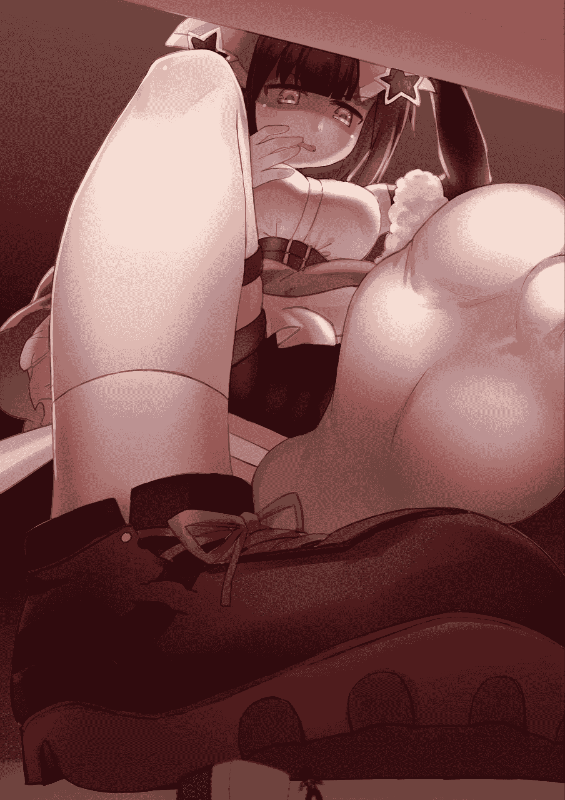

**QQ图片20180430234450.jpg** *(147.64 KB, 下載次數: 30)*

[下載附件](forum.php?mod=attachment&aid=NzIyMzZ8ZmJhOTdjZDd8MTYwMDg4MDMzMXwxODIzMHwyMjkzOA%3D%3D&nothumb=yes)

2018-5-1 04:16 上傳

“哈……哈……哈……呼……哈……”

心跳在剧烈的跳动着，将身体所急需的氧气通过血液输送到全身，但依然无法平复掉我此时此刻脸上难看到几乎扭曲的表情。

我的身旁，是一块普通到不能再普通的，学生用的橡皮。

但是问题在于，这块橡皮虽然平放在地上，却比我人还要高出一大截来，足以将我整个人都完全地遮掩起来。

而在我的上方，一个小女孩正从书桌的上方探出头来有些惊讶又有些生气地瞪视着我。女孩穿着的棕色红底运动鞋此刻已经被脱下一只，雪白的短袜包裹着的紧致小脚在我看来却是有着遮天蔽日般的大小，些微的阳光气息从那只翘起来的袜足中散发出来，钻进我的鼻腔之中。我不由得打了个冷颤，女孩的一只脚，就足以把数百个我压在足下，彻底成为那白袜上的一抹小红点——

“呐，为什么要逃跑呢？明明，已经同意了当人家和小伙伴们的宠物了吧？”少女巨大的脚和鞋子逐渐靠近着我。

眼前女孩的问话让我说不出话来，而我的思绪，已经飘飞到了两天之前……

那是无尽的钢铁走廊，自己艰难地在如同永远看不到尽头的走廊之中穿行。本来是和同伴打赌说试胆而偷偷潜入的格里芬的基地，可在进来以后却发现自己走到了人形所使用的大楼之中。光是这对自己来说长得无边无际的走廊就如同根本无法突破的梦魇迷宫一般，而且时不时还有着附近人形走动时在地面上所发出的震颤声。每一次震动，都让自己无比害怕，生怕有哪个人形不小心经过让自己成为了她们靴子下的一块小红点。而且，作为平民却擅自闯入了军事基地，所带来的严重后果更是使得自己的心跳达到了最高峰。在这样的惊恐之中，我彻彻底底地吓晕了过去，就这么昏倒在了人形宿舍门外的走廊之上。

当我醒来之后，所看到的则是被安放在巨大写字台上自己的身体，以及面前同样巨大的脸庞……

原来我是被哪个好心的人形给救了吗……当时的我这么天真的想着。或许她们在那一刻是天使吧，但是很快，天使洁白的羽翼则变成了叛逆的黑色。作为帮我隐瞒下潜入基地的罪名以及供给生活所需东西的要求，我则成为了她们所饲养的“宠物”。由于形势所迫，在人形巨大的手指抚摸之下我迷迷糊糊地答应了，可是……

我已经不能回到过去的生活，而是作为她们所使用的玩具，一辈子生活在她们的脚底下么？

我不甘心，我想要逃跑……

0900         晴         格里芬基地人形宿舍105室

“宠物哥哥，您要去哪里呀！”巨大的M99跟在我的背后，尽管她的脚步频率远没有我的快，但是巨大的体型差使得我和M99之间的本来就不算很远的距离被很快缩小。

“轰”的一声，M99巨大的穿着棉袜的脚已经踩在了我的面前，巨大的质量直接把我震得离开地面，没掌握好平衡的我直接摔倒在了地上，大口喘息，看着不断从上方出现的M99的脸，我绝望的杵着地板大口呼吸着。

“M99，那个，能放过我吗？我很抱歉闯入了这里……”不过延迟了很久才说出去的认错显然没有了任何意义。

“不行哦，如果把宠物哥哥放出去，恐怕人家和其他小伙伴几个都会因为包庇违法者被处罚的，擅闯军事基地可是死罪呢。”M99不由分说的把我用两根手指捏了起来。

“不……不要啊……”我整个人在M99的手指尖上挣扎着，M99的手虽然有些糙，大概是长期握枪的缘故吧，但是却意外的很柔软；尽管如此，面对可以轻易把我捏死的巨大的手指，自身的抵抗如同螳臂当车一般可笑。M99甚至不需要用力，我就会变成她手上的血点。

“不要乱动哦宠物哥哥，M99呢，找了您快二十分钟了，所以呢，您也得陪人家玩二十分钟的游戏补回来才行呢！”M99甜美地对着我笑着，然而我整个人的身体却如坠冰窟。鬼知道她们说的游戏究竟是什么，但无论是什么，或许对于她们来说算是游戏吧，但是恐怕对于我来说是一趟地狱之旅的单程票吧。

“那个，宠物哥哥比较喜欢M99的什么部位呢？是手吗？还是肚子？或者……是胸部呢？不过呢，M99可没有姐姐们那样大的胸部呢，也不能做大人们之间的游戏……”

老实说M99身上每一个部位都是相当可爱迷人的，如果我和M99相同体型的话，面对这样说的M99,我可能就要因为袭警或是猥亵幼童罪而入狱吧。但是面对可以轻而易举的，将无数和我一样大小的人类毫不费力悉数灭杀干净的巨大的M99，我内心只剩下恐惧了吧。

“嗯~~嗯~~!决定啦!M99呢，想让宠物哥哥按摩人家的脚，最近的训练好多，感觉脚好酸呢，这里也没有什么按摩设备呢，作为宠物要好好的解决主人的烦恼哟”M99晃着裹着棉袜的脚说道。也是啊，虽然她们把我当作宠物说想一直玩我，但是一天当中我能见到她们的时间也就那么两三个小时而已，其余时候都在训练呢……不过现在并不是谈论这个的时候，M99她已经将右脚的棉袜褪去，随意的甩在床上，与年长的人形不同，M99那“小巧”的脚丫散发着更多是幼女可爱，俏皮。五个圆润又白里透红的脚趾像五颗羊脂白玉一样嵌在那可爱而又肤白似雪的嫩足上，缓缓地压了下来。

“宠物哥哥，请吧”虽然是请求，但是却感觉是不可违抗的命令。M99轻轻的将我抖在了她的脚背上，她的脚上散发着小女孩独有的一种奶香味,或许是因为经常接受训练吧，她精致的脚背上并没有普通的小萝莉那样的肥嫩的感觉，更多的是平整顺滑的肌肉充斥其间，不过得益于她柔嫩的皮肤衬托，这只玉足反倒是凸显的格外可爱。

“我……”

“恩？请吧！”M99似乎是对我下了最后通牒，如果我不做，恐怕还有更可怕的事情等着我吧，虽然名义上把我看做宠物，实际上恐怕我的地位比一般的宠物还要低吧，因为她们随时可以以处置死刑犯为由用各种方式将我抹杀掉。

“可是……应该怎么做……”我害怕地伏在M99的脚背上，她的脚背足以容纳上千个我，就算我用尽全力去踩或是击打这比广场还宽大的脚背，恐怕也起不到任何按摩的作用吧，更何况她的脚背比起一般的人形来说更为柔软，我连站稳都是问题。

“说的也是，那就请宠物哥哥清理一下，可以吗？”M99抱着立起来的左腿对我说道。“不过呢，好像没有那么小的清理工具呢。”M99歪着脑袋思考着。“恩……果然还是请宠物哥哥用自身’清理’下好了！”

难道她的意思是让我去舔这巨大的脚背吗？我缓缓抬起头，见她稍微有些开心的样子，舔了一下嘴唇，点了点头。看样子确实是示意我舔舐她的脚背。

“唔……”我依然伏在她的脚背上，迟迟下不去口。

“怎么了吗宠物哥哥？如果不愿意的话，’清理’人家的脚底怎么样呢？”M99伸出手，似乎只要我接下来几秒内没有动作的话，她就会把我放到她的脚底板上吧。

“明，明白了，我这就做！这就做……”我最终还是将舌头触摸到了M99的脚背上，M99的脚背也许是因为刚刚运动过的原因，竟然比我的舌头还要温软一些，而她柔滑细腻的皮肤上并没有什么异味也没有什么灰尘之类的，或许是因为她每天细细保养的缘故吧。光溜溜的细嫩肌肤上，只有对她如同一个小黑点的我在努力地“工作”着。

“诶嘿嘿，怎么样，宠物哥哥，这份工作挺不错吧”M99小声的说着，继续用她谜样的眼神盯着我，我只能选择继续舔舐她巨大的脚背。

或许过了一个小时左右吧，整个脚背已经被我“清理”的差不多了，而口中也榨不出一丝的口水来了，我无力的瘫倒在她的脚踝处。

“辛苦了，宠物哥哥……谢谢您”M99对着我柔和地笑了起来。

“那个……能将我放回去了吗？”我试着对M99做出请求。

“嗯~~………不行哦！宠物哥哥，因为！您还有脚底没有清理干净啦！”M99轻轻的把我抓起来，然后把右腿盘了起来，露出了她皓雪凝脂一般的脚底，M99的脚底远比她的脚背要诱人的多，尽管经常接受训练，但是她的脚底却没有一丝的死皮和老茧，完完全全就像刚出生的婴儿一样滑嫩的皮肤。“每天人家都有好好保养脚哟！”似乎读出我心中所想，M99笑嘻嘻的解释道。

但就算她的右腿盘在了我的面前，侧过来的脚底依然足以使得数千个我站在上面丝毫不用考虑拥挤的问题。放置在我面前的脚底板在我看起来和一堵高墙一般没什么两样。这只不过是小女孩的一只脚底而已。真可笑，在它面前，我就好像一粒灰尘一样不值一提，小女孩只要动动脚就能将我杀死，我似乎只能乖乖地听从她的指示。但是我的舌头已经干渴的没有一丝水分了。

“那个…………能允许我先休息一下吗，已经，干渴的受不了了”我看着同样巨大的脚背开始发愁，现在舌头已然完全麻木，完全忘记了’舔’这个动作要怎么做。

“唔！那好吧宠物哥哥，记得过一会儿就要过来哦，不然M99呢，就会惩罚您哟！”M99歪着脑袋想了想，同意了我的请求，细心的把我捏起来，放到了她们为我准备的’房子’前。说是房子，其实不过是小女生玩耍用的玩具屋而已。虽然对我来说这和真正的房屋没什么两样就是了，里面装满了各式各样的玩具家具。不过更重要的是这玩具屋的位置，它被放在了M99的书桌底下…

“谢谢，谢谢理解……”我精疲力竭地走进房子里……里面有饲养我用的水源。

可能过了十分钟吧，娃娃屋里也没有钟表，M99可能还有功课未完成，她走到书桌前开始处理功课，我知道，我的机会来了……

我悄悄的走出房子，尽量不想惹到M99的注意，嘭的一声，一块橡皮擦从天而降，随即看到M99巨大的右脚飞驰而来。

“呐，宠物哥哥，还没有休息好了吗，M99想要宠物哥哥的按摩嘛！”看到玩具屋，M99便改变想法，用她巨大的脚敲打房子，也许力量再大一点，这房子就会被她踹倒吧。

“嗯？”M99似乎没有察觉到我想要逃跑的事实，她缓缓的给左脚穿上鞋子，然后对着书桌下面说道：“宠物哥哥，再不出来的话，M99呢，就要把宠物哥哥的家毁掉哦！”轻柔的声音带给我的并不是慰藉，而是恐吓。“宠物哥哥的家被毁了的话就没有住的地方咯。”

“3…………2…………1……………来喽！”M99并没有用力，仅仅是挥动左脚像荡秋千一样把左脚荡过去，房子就被比它还要大很多倍的M99的黑红色运动鞋给撞得发出响亮的咔嚓声，剧烈地摇晃起来。

我抓紧M99把注意力都放在了我的小小临时住所的机会，拼尽全力跑向了橡皮擦所在的地方。

“嗯？宠物哥哥跑哪去了呢？”M99将头往下疑惑地四处搜索着，正好发现了躲在橡皮擦背后的我。

“呐，为什么要逃跑呢？明明，已经同意了当人家和小伙伴们的宠物了吧？”M99催动着她巨大的运动鞋向着橡皮擦靠近着，比我要大数倍的橡皮擦尚且经受不住M99的重重一脚，更何况是比橡皮擦还要小很多倍的我呢？在巨大的红色鞋底即将擦到我的时候，我奋力向前跃出，似乎逃过了一劫。

“不可以逃哦，宠物哥哥，那样的话宠物哥哥会被处决吧。”M99脱下左脚的皮鞋，扔向我所跑的方向，她似乎故意拦住我去路一般，毕竟，如此巨大的运动鞋底，如同发亮巨大的红色水泥墙壁一样，足以将我逃离的道路封锁起来——“轰”的一声，当然仅仅是对我来说，鞋子在距离我二十厘米的地方落地了，我被吓得瘫坐在地上，但是我并不敢就这样继续瘫坐着，而是咬紧牙关站起来继续往前跑着。

我向着前方死命地奔跑着，过了一会儿，脚步声的轰鸣开始出现在我的耳畔。我看到了光亮和阴影的分界线，那是属于床底的位置。没想到活到现在，居然要去钻小女生的床底什么的，但此时的我为了求生已经顾不上这么许多了，一步就跨入了那片黑暗之中。紧接着，透过床底缝隙外投射过来的一丝光线，我摸到了床架的旁边，扶着那木质的壁板大口大口地喘息着。

“真是的！宠物哥哥真是的！”M99愤怒的声音从后上方传来。

与此同时，一只巨大的手，已经伸入了这片黑暗之中。同时，我看到了M99侧过来趴在地上的脸。我惊恐地几乎要叫出声来，但还好及时地反应了过来。静悄悄的床底下，我就这么屏住呼吸，看着那只手在离我略远的地方不住地抓弄着，每一次摆动的幅度都足以让我感受到一阵阵的风压。

幸好，她并没有发现我，毕竟她在明处看我这里阴暗的角落是很难察觉到我的存在的。可是，正当我凝神屏息，等待着她最终放弃的时候。那个声音又响了起来，让我的一颗心沉到了谷底。

果然，还是太小看人类与人形之间的差距了吗……我不无自嘲地想到。

“好重啊，唔……在找到他之后，可一定要好好处罚宠物哥哥才行呢。”显然M99开始搬动床了，床脚“吱呀”、“吱呀”摩擦的声音从四面八方传来。

而随着那童稚的话音落下，光亮与黑暗的分界线以飞快的速度，伴随着整张床被推开的声音，朝着我蔓延了过来。

“可恶……再这样会被她很快就发现的，我得赶紧换个地方才行……”很快我从慌张中冷静下来。

这样想着，我飞快地向着床铺的另外一边跑着，赶在床铺彻底被推到墙边之前，从缝隙之中溜了出来。可重新回到地板上的我，在光线的映照之下又成为了一个显眼的目标。没跑出几步，M99就重新锁定了我的位置，再一次对着我展开了追逐。不过这一次，幼女的脚步比起之前来说可是快了起码一倍。跑肯定是没办法跑了，怎么办……我的脑海中不断飞速运转着逃脱的方法。

看着巨大的房间之中各式各样的家具，身后不断追近的脚步声，我的呼吸比起之前更加急促。要快！得赶紧找个地方躲起来，我顾不得这么多，看到自己右手边有着另外一道的光暗分界线，顾不得观察这是什么地方，便一头冲了进去。

“哇，宠物哥哥，那是人家的衣柜啦，不可以进去！”脚步声显得急躁和迅速起来。

“这是……”

出现在我面前的则是如同山丘般那么高大的折叠的整整齐齐的衣物，很显然这就是M99存放换洗衣服的地方了。成片的白色把我晃得有些眼花缭乱，整个衣柜里还散发着洗涤剂洗完之后所带来的淡淡的清香味。可这些都不重要了现在重要的是我需要一个能让我躲藏的地方……

“吱——”

糟糕！门要被拉开来了，来不及了！

情急之下，我朝着面前衣物山之中的衣服一扑，顿时柔软的面料将我全身都覆盖了起来。也不知道是藏在了什么衣裤之中了。

“呜哇哇，宠物哥哥快出来啊，人家昨天才整理好的内衣啊！”M99仿佛要哭出来的样子对着自己的衣柜说道。“不能躲在那里啊，快出来！会弄脏衣服的！”

M99打开衣柜门疯狂的把衣服一件一件的往床上扔着。

几分钟后，翻衣服的声音突然消失了。

“呐，宠物哥哥，如果你现在出来的话，M99，可以不追究你跑进人家衣柜里的事情……”原本一直活泼的M99声音突然变得冷漠，仿佛即将上战场的军人一样。

“人家数三声，宠物哥哥，如果你不主动出来的话…杀了你哟！…1………………”M99数数字的声音仿佛晚钟敲响一般，而被衣服堆捆住的我完全无法动弹和说话。

“哇啊啊啊啊！”

在十几秒钟之后，刚才做出的这个无比愚蠢的决定让我十分后悔，因为被柔软面料包裹着的我已经失去了行动能力，而以M99的行动力，很快就能把我从衣服堆之中揪出来，而且听刚才她说话的样子，我似乎是钻到她的内衣柜来了。而到那个时候……真的会被杀掉的吧！被愤怒的M99给抹杀掉什么的……

彻骨的寒意已经覆盖了我的全身

“2…………”

不行！不能呆在这儿了！她真的生气了，要是我不早点出去的话……

我疯狂地扭动挣扎着，加上此时M99把绝大部分的衣物都扔到床上去了，所以此时的我只有包裹着我的那个面料，解除了头上重压的我更加疯狂地扭动起来，只为着不让M99生气，以及在真正发出“3”的声音之前跑到她的面前，祈求她的原谅。

或许很可笑，是么？但这确实是我此时脑海中的唯一想法。

“3……”

“呜哇啊啊啊啊啊啊啊！”

伴随着有生以来做出的最大努力，我带着身上的布料一同从M99的衣柜中滚了出来，翻倒在了她的面前。而依然被面料包裹着的我已经失去了所有力气，无神地望着天空。此时我的脑海里已经空空如也，只是有些默然地看着上方，等待着面料被掀起的一刻，M99愤怒的脸，以及她对我的最终审判。

“M99，以为宠物哥哥只是为了求生而已，没想到，居然是个变态……”M99的眼神和语气已经完全丧失了作为一个小女孩该有的活力，完全变得像战场上严肃的女武神一般。

“非常抱歉！对不起！请不要杀我！我什么都会为M99做的……对不起！对不起！”完全不抱希望的我还是跪下去请求M99能够放过我。

“哼，是吗，变态的宠物哥哥，哼，继续把刚才的’清洁’做完怎么样呢”M99说完一屁股坐了下来，巨大的震动再次把我从地面上弹起。M99把她巨大的右脚脚底悬在了我的头顶，看样子我就要成为M99脚底板上的一个红点了吧。

我闭上眼睛等待着死亡的到来，却只感受到了来自头顶温暖而且柔软的热源，抬头看时，M99凝脂如雪的脚底正刚好悬在我的头顶，轻微的摇晃着，仿佛我只要令她不满意的话，这只巨脚就会把我变成一个红点，从此消失在世界上。

“请吧，变态宠物哥哥，刚才你跑得那么快，所以，M99只给你20分钟来清理！”

“什…什么？”

光是‘清理’脚背已经用了将近一个小时，听到这样命令的我只能绝望的抬头舔舐起M99的脚底。

“居然连痒痒的感觉也感受不到，真是虫子，不对，细菌都不如的存在。宠物哥哥，对吧，而且还是个变态”似乎M99放松了一些对她巨大脚底的束缚，她巨大的脚底距离地面更加低矮，我也从站立变为了半蹲着才能勉强不被压到。

之前的20分钟仿佛一年一样难过，但是现在的20分钟却仿佛一秒一样，随着M99的倒计时归零，我的内心失去了一切温度、光彩，静待着自己的结局到来。

“躺下吧，变态宠物！”甚至连敬语都懒得说，M99直接命令我躺下来。

“………………”我不知道能说什么，脑袋里一片空白，就像僵尸一样的躺了下去，眼睛能看到的，只是因为接触不到光线而昏暗一片，M99那白净、凝脂如雪的脚底板，大概那就是我生命的最终归宿了吧，这样想着，果然那只巨大的玉足终于开始向我靠近了。

不不……不对，我还不能死……我还不能死……渴望生的勇气把我从死亡的恐惧和绝望中拉了出来，然而M99早已把我踩在了她滑嫩的足弓当中，再加，不，连力也不用加，只需要放松，那么她的足弓便会弯曲下来把我压成一个红点，M99温暖、柔软的足弓压迫着我的四肢，内心甚至是头部，四肢被压住无法动弹，而内心早已放弃了还能生存的希望。

“唔，能不能杀死变态宠物并不是M99一个人说了算……嘛，果然还是算了，如果杀掉宠物的话，其他人会抱怨的，而且打扫起来似乎稍微会有些麻烦呢。消灭证据什么的。”M99想了想之后，却又抬开了她的巨大的右脚。

“要是缺了变态宠物的话，大家……伙伴们都会少很多乐趣吧”听到这句话的我如释重负。

“M99，原谅我了吗？”我有些难过，却也有些惴惴不安地问道。

“没有，因为姐姐说过，变态就要好好地惩罚，不然不会长记性的~”M99巨大的手指已经把我抓了起来。

“那么请变态宠物暂时和M99的另一只脚度过几个小时吧”M99一边抓着我，一边脱掉了自己的左脚上的棉袜，然后将我丢了进去。

“不，不要！”无视了我的小小呼声，M99不由分说的把她的左脚重新伸进了袜子里。

“那么请小心，变态宠物。小心不要被M99的脚趾夹死，也不要被M99压死哦“随着M99最后一个字音落下，我也失去了一切光明，瞬间M99脚上的味道便冲入鼻腔中，侵蚀着我残存不多的意识，逐渐的我被挤到了脚趾部分，M99的脚趾仿佛磨光的玉石一样精致，粉红的脚趾甲无处不在体现着小女孩独有的可爱和魅力。被夹在比我还要大数倍的脚趾中时，我能闻到的仅有M99脚上的味道，能吸到的也仅有M99脚趾间分泌的汗液。

湿热而有独特气味的空气最终夺走了我仅存的意识，我晕倒在了M99的左脚和上面套着的棉袜之间。

“哇！这条内裤……就是变态宠物之前钻进去的……呜！竟然是人家最喜欢的那件！”

在我再次醒来的时候，则是已经身处于半空之中被M99捏在了食指和大拇指之间，在我面前的，是一堵白色的墙壁。不过我很清楚，那是M99身上的衣物。再仔细辨认起来，那是……那居然是……我曾经藏身于其中的那条……胖次。

M99她……想干什么？恐惧支配着我。

“决定了~为了不让变态宠物再次乱跑，就让你呆在你喜欢的这条胖次里吧！既然那么喜欢，就只能给变态宠物当家用了，不过呢胖次什么的是用来穿着吧。也就是说！变态宠物今后就一直待在这条最喜欢的胖次里被M99穿着吧，放心吧，变态宠物，M99会说服其他人的。”M99有些自豪地对着我说着，紧接着，用另外一只手轻轻地在那条巨大无比的白色内裤上拉开了一条缝，从里面散发出来略微的女性荷尔蒙气味让我不由得有些失神，而紧接着，我就被移到那道缝隙的上方，然后便是剧烈的坠落。

“呃……”

没有喊叫，虽然我知道那是徒劳，但那不是原因，我已经放弃了从这所巨大的房间中逃出去的打算，不甚至是，已经放弃违抗M99的打算了，因为那曾经冰冷的声音深深地印刻在脑海里了，让人恐惧。我没有能力去改变所身处的生活，也没有能力去反抗M99，或许我能做的只有适应它，做M99的一个听话的小宠物。或许，这样我的才能够继续生存下去，也许会成为被M99以及她的卧室里的那些女孩们一起玩耍，也许会成为M99自己私人的小宠物，但是这些都无关紧要了，因为这一切都不是我能够反抗的，在黑暗之中我这样想着，呼吸着M99身体散发浓郁气息，任由M99那柔软的肌肤挤压着我。

 

# 89

感谢dalao的帮助，文章已优化 

# 90

是的，万众瞩目的AK12篇终于写完啦~（其实不应该说是写完了，因为目前这个进度是我预想当中的一半，之后本来还想写AK12XAN94，以及和正宫WA2000之间发生的各种事的，以及城市play也没有在这里面写，所以应该算是上半部分写完了吧）

好累，而且拖了这么久，因为试着换了带一些文艺性的文风，毕竟改变文风是件不容易的事情。遣词造句对我来说的确挺花时间的，所以，也希望这篇经历千辛万苦写出来的AK12篇能得到各位读者们的认可。

P.S. 请特别关注第六节哦~

那么上人设图，进入正文吧：

1

带着便携飞行装置的我浮于实验室门前的半空中。一想到实验室特有的清冷气息以及混合着淡淡药水味道的空气，我按下密码时不由得颤抖了一下。紧接着，

厚重的防爆门缓缓划开……

*****************************************************

“说吧，帕斯卡，你怎么会亲自跑过来和我汇报而不是选择视频通讯”

“你还记得，我之前给你提交过一份关于如何使军方人形也能接受陨石辐射成长的提案吗？”

“啊……你说的是四个月前的那份报告吗？记得你当时在提交的时候面色可不太好，本来以为你会放弃走这条路的，”我放下手中的咖啡杯，抬着头看着那个同样早已是人形一份子的研究狂人。她的嘴角现出一抹若有若无的笑意，“不过，看你现在这样子……”

“没错，”她俯下身子，巨大的脸直接覆盖在我办公桌的正上方，嘴唇轻轻开启，“我……成功了”

“真的？”

霍然起身，此刻已经顾不得去追究她故意吓唬我这件事，满脑子都是对这项意义非凡的技术成功的兴奋感以及对未来无限延伸出去的遐想。

“我知道你会这样了。另外，你这几天可以抽空去人形制造的地方看看，第一个接受改造手术的人形已经完成了。”

帕斯卡把她的脸收了回去，重新换上了那副公事公办的口吻对着我说着。

“了解了，是让我最后确认没问题了就办理入职手续是吧。”

“嗯”

她轻轻点了点头，随后又开口道，

"另外还有一点……关于那个人形，”

“嗯？是什么？”

“这是我给你的，善意的提醒。”

“为了你的安全着想，建议你在还没和她打好关系之前，不要招惹她。”

***************************************************

“嘶……”

我不由得倒抽了一口冷气。

倒不是因为发生了什么谋杀或是装置爆炸这种紧急事件。事实上，整个实验室里面什么声音都没有，安静到几乎有种绝望感。而就在我正方的手术台上，一具有着百倍身高的人形就在那里静静地躺着，和帕斯卡说的并无差错。

只是，那具经过精心设计而显得娇小又具有力量感的女性躯体身上……

什么都没有。

更准确的表达的话，“赤裸”，她的身上，什么都没有穿。

***************************************************

一道流血已经凝固，却依然清晰可见的刀疤赫然映在白皙的手背上面。

帕斯卡就把她的手背横着竖在了我的办公桌前，而在那修长手指所延伸出的白皙手背之上……

“这……她？”

我不由得跌坐到转椅上，愕然问道

“是的，这就是她第一次醒过来之后给我留下的纪念。”

“帕斯卡……那个人形，她叫什么名字？”

“AK-12,前克格勃成员。”

2

吸气，吐气。

钻入鼻孔之间的空气之中，还混杂着一丝女性特有的体香。

鬼使神差般的，我并没有因为面对着裸体而满面通红，甚至连退出实验室的想法也分毫没有过。而是像着了魔一般，继续操控着身上的飞行器接近着那具玉体。

随着逐渐下落，她的身体在我的眼中也不断延伸着，直至最终踩到了柔软但不失弹性的肌肤大地之时，已经很难左右转头看清她的全貌了。

她均匀地呼吸着，同时小腹也随着每一次空气的吸入吐出而轻轻地起伏着。在我行走在这片肉色平原之时传递到我的脚底。

小腹平坦，水嫩却又不失弹性。并不是很多人喜欢的骨感型的美女身材，而是女性的黄金曲线和肌肉爆发力的完美结合。很难想象这样巨大的躯体是如何能在保持女性优雅的曲线美同时将能够移山填海的能量完全灌注进其中的。

顺着视线尽头的方向不断延伸，两条有着匀称腿部线条的玉腿并不是完全平躺在试验台上，而是相互略微弯曲着，划出两条圆润弧线不断延展着，直到最后那双如同水晶般晶莹剔透，而又洁白无瑕的娇嫩双足。

在双腿交错掩映之中，她的三角带就这么半遮半掩着，其中的玉兰圣所中隐约散发出的致命诱惑使得我不由得微微失神，甚至有种直接向那里走去的冲动。只有在近距离，才能感受得到这些战术人形们，是如何把力量，美型，性感，诱惑等等无数的赞美词所集于一身的。她们，是人类技术所凝结而成的结晶，也是我心中所最为珍贵的宝物。

只是……从刚才还在半空当中的时候就有着一个疑问，明明AK12的眼睛是闭着的，而且也还没有到达预定的苏醒时间，自己亦没有通过激活芯片的方式来强制唤醒她。可是，依然感觉到有一股眼神跟随着自己，简直就像是……把自己当成了猎物一般，如同在西伯利亚荒原上奔跑的……追逐猎物的白狼？

只不过，自己并不是捕猎者，而是它口中的猎物。这种感觉……有些讨厌呢。

等等……

从她远处的脸上传来的嘴角弧度是不是比刚刚更加弯曲了？

而且……我可以很明显地感觉到，就在刚刚的一瞬间，她的眼睫毛也颤动了一下。

难道……

不……这不可能……

“噗……噗哈哈哈哈哈哈哈哈！”

如同那冻原上横贯的大风一般，她爽朗地笑了起来。小腹跟着上下起伏着，倒是把处于之上的我给下了一大跳，差点眼前一黑摔进她的肚脐之中。

3

“呼……呼……”我跪在她的小腹上，双手撑在她的肌肤表面，大口地喘着粗气。

她紧闭的双目弯成一条线，在嘴唇弧线的勾勒下显得俏皮无比。而此刻她正在用一种观察玩物的态度就这么看着我在她身体上的“表演”。

“你……我快被你吓死了！拜托不要突然出声啊！”

“那是你自找的哦？明明说起来被害者应该是我才对吧？”AK12双手围拢过来，用两手的虎口在我的四周围成了一个圈，就这么俯视着我说道

“说起来，之前明明围着我飞了这么久，也看了我的身体这么久，还是在对一个刚刚从工厂中赤条条走出来的人形，除了性骚扰之外没有其他第二种可能吧？”

“我……我那只是控制不住自己身体了而已！”

苍白无力地辩解着，但是脸颊上的红晕已经彻底将内心中的小心思出卖

“不过，居然忍了这么久还没有直接动手起来。莫非大名鼎鼎的格里芬最高领导者其实……”

她的右手收回，手指就这么随意搭在自己的嘴唇上，嘴角的弧线又翘起几分。

“……是个处男？”

“哈？！”

我被她的说法给呛到了。

“处男——”

简直如同某个白发男人指着天空中对着敌手说着“看啊这是你的死兆星”一般的震撼力

“我……我才不是啊！”

“不是么？那么我问你，我可爱吗？”

“可爱。”

脸颊的红晕保持着久久不退，我气极反笑地有一句没一句就这么和她抬扛着

“你喜欢我，对吗？”

把我轻轻地捻起，少女将我放置在实验台一边的金属板上，紧接着优雅地用右腿叠在左腿之上坐起，盯着我

“我……呃……对？”

“不要在这里用疑问句~”

“对……不对！呃……对！”

“所以想对我图谋不轨，是这样么？”

“呃……”

一连串如同连珠炮一般的问话问的我哑口无言，想要辩解些什么却又无从说起，机敏如她在言语之中就已经把我的退路尽数封死。我只好摆出一副“我是你上司，怎么了”一般的无可奈何的表情就这么仰着头看着她。

“哎……没办法了——”

她的细眉扬了起来，如同一弯新月。

“虽然这对我来说也是全新的体验，但可不要太早让我失望哦？”

***************************************************

“咕咚——”

紧张地咽了下口水，此时的我已经身处巨大的实验台下，而在我面前和我对峙着的，则是AK12那细腻光滑的右足。我身处的位置现在仰头除了能看到她延伸直至我视线尽头的膝盖之外，便完全被实验台的突出部分给挡住了。

“呃……我还以为你想……”

“嗯？你在想什么呢，难道和女孩子的第一次见面你就想“来一发”么？”

“虽然确实没有快就会有龌龊的想法，但是……”

我的身体已然被她的右脚大拇指精确地完全覆盖，把后半句话给生生地堵了回去。

“为什么会是这么奇怪的play啊！”

就这么自己的身体和她的足底相互触碰着，感受得到她施加于我身上的重量，鼻腔之间除了实验室的空气在灌入以外，意外的还有女性身上的香气在刺激着我的胸腔，让我慢慢地也放松了下来。

“至少你是不会有生命危险的，不过这种事情，应该已经在你的预料之中了吧？”

推，拉，挤，碾，点，AK12不断变换着花样在用她的右足和我的身体做着一次又一次的接触。不得不说对于第一次涉足于此的人形已属于超水平发挥，恰到好处的压力挤压着我的肌肉和包裹在其中的骨骼，如同挤牙膏一般，将长久积累于这躯体中因为工作和生活上的压力所积累的疲劳一点一滴地尽数榨取出来，又随着她的动作而散发了出去。

简直就是最棒的一次按摩。

虽然，意外的是在人形的脚底完成的呢。

她轻笑着，将脚趾从我的脸上移开，又稍稍扩了一下大脚趾和食指之间的缝隙，踩在我的周围。

“我还以为你会把我当做按摩垫一样对待呢……”

撑着地板坐了起来，我活动着上半身，“喀啦啦”的几下关节活动声从我的身体四处发出。

看到她的脚趾缝在我的面前画了一个U型的弧线，便不客气地挪动屁股，在身体靠上她的肌肤之后转身，就这么倚在她的脚缝之间。

“如果你想被这么对待的话，也不是不可以。”AK12继续挂着那抹似有似无的微笑说道。

“还是免了，我可不是抖M。”

“是不是抖M，你自己的话可不能当成标准哦？” AK12突然开始将两侧的脚趾向内合拢起来，我不由得扶着她趾缝的肌肤站起，但依然摸不透这个古灵精怪的人形到底想要干什么。

“这……别开玩笑了，我怎么可能是抖M！”我生气地锤了旁边的大脚趾一拳，但很显然这样的力度对于百倍大小的她来说连挠痒痒都算不上。

“是嘛，果然还是做个测试比较好吧……要是我未来的上司是个变态的话，我可是会很头疼的。” AK12的上半身从空中俯身探下来，裸露着身躯毫无顾忌地对着我说道。

“喂！你这样赤身裸体对着一个男人说话，到底谁才更变态一点啊！”我不甘心地回击着。

“那么，就让我来稍许测试一下吧。”白发的魔女很显然无视了我的话，自顾自地开始了动作。很显然，就算我现在在名义上是她的上司，但实际上，我却想不到一个合适的方式去命令她，或许也是因为现在的我很享受这样的感觉吧。不知道是不是由于和人形们相处时间久了，我已经很习惯于这样的日常了，就算被调戏或是偶尔的欺负一次也不会因此去生气。

不过……我轻轻地用右手敲着脑袋，有着这么一个难缠的家伙要加入到队伍里来，以后可有的好头疼了啊。

“开始喽……”无视着我的命令和反抗，AK12紧紧的用脚趾夹住了我。

“不，放开我，不要……”不知道为何，我的命令AK12并没有接收到的样子，脚趾的力度还是没有什么变化。而当我被柔软的脚趾夹住无法挣扎跑开时，AK12她的那抹微笑似乎也变得邪恶了起来，她很快抓起了一旁被她脱下的战斗靴。

“…………”AK12依然用那抹微笑看着我，但是却看得我心里发慌起来，我大概猜到了AK12下一步的动作。

她逐渐把脚靠近着那只靴子，无视着脚趾间的挣扎，径直把脚放了进去，战斗靴实际上远不如看上去那么大，她的灵巧的脚很快伸了进去，我并没有被靴壁碰到。

“根据原来的靴子放大一百倍制作而成，不知道如果指挥官你被丢进去的话，看到的又是什么景象呢？”她轻轻地将脚趾放开，把我安放在了略微向下陷的鞋垫之上。我明白这是鞋底下的气垫所带来的效果，然而这时候我的心思并不在这上面。AK12的脚已经向回收了上去，脚趾如同灵巧的壁虎一般搭住了靴子口，而在远处，如同坐井观天的那只青蛙一般，她的脸庞也浮现在上面，俯视着靴子里小小的我。

“快放我出去……”我奋力朝着靴子口喊着，然而AK12装作看不见一般，还是闭着眼睛带着一抹邪恶的微笑看着闹腾的我。

也许因为人形构造不同吧，她的靴子里没有难闻的气味，反而还有一种皮革、金属、血液和她身上似有似无香气的混合味道，里面除了她脚形状的鞋垫以外，似乎并没有其他多余的东西，鞋垫有些软软的，还依稀散发着她脚上的香味，似乎是为了作战特别准备的鞋子，踩上去格外舒服。

“AK12，这是命令！快放我出去！”尽管靴子里面的味道不算是难闻的味道，但是闻久了还是会觉得有些闷热的难受，而AK12听到后，脸上的微笑加深了一些，视线离开了靴子——但是等待着我的并不是她把我捞了出来，而是那只再熟悉不过的巨大的右脚再次伸了进来。

“没问题~只要指挥官你能爬的出来的话~”微笑的表情说着毫无可能发生的事，或许我整个人的力气都挪动不了她的一根脚趾。在这种情况之下，要想通过她的右足根本是毫无可能。而就算是躲过了，看着这如同悬崖峭壁一般垂直的足有十几米高的靴子内壁，手上毫无攀登工具的我想依靠双手爬出去也只是痴人说梦而已。

“……怎么有可能啊！这样的事情！”我愤怒的朝着她伸进来的右脚喊道，然而她并不可能听得见，因为那只右脚的脚底板确实还在接近着鞋垫，随着气垫发出一声“啪叽”的声音，那只巨大的裸足改变了运动的方向，一个一个对我来说和小山一般的脚趾就像训练有素的士兵一般不断朝我进军。

“请加油从我的靴子里出来吧，不然的话，你可能要在这里待到晚上才能等其他人来救你咯~”AK12魔鬼一般的话语透过靴子传了进来，随着她脚底碰到了靴子内壁之后，我被她的足尖顶到了靴尖，她玉足上的味道，靴子的味道，和越来越湿热闷热的空气逐渐把整个空间占据。

“该死……”我奋力抵抗着眼前柔软的脚趾，但是根本无法推动它们一丝一毫，尽管它们就像一个一个柔软的枕头一般，而AK12仿佛感受到我的挣扎和抵抗一样，已经停止运动的足尖再次向前运动起来，对她来说恐怕连力也不用，就已经令我已经呼吸困难起来。

“果然小小的指挥官连抵抗少女的脚趾什么的都做不到么？还是说指挥官，真的是个抖M？这种程度的抵抗对我来说可是一丝一毫的乐趣都没有呢。”仿佛是感应到了所属大脑的指令一般，我先被紧紧顶着我的足尖放开，当我要起身时，五根巨大脚趾在运动的过程之中又略微地向下压了压，紧紧地包裹住了我的身体。不过，虽然是这样，但我却丝毫没有骨头或是肌肉被挤压的感觉。只能说她对于力度的拿捏已经达到了极致。

“真无趣，还是把指挥官放出来吧，不对，对于抖m来说应该很爽才对……不过我可是很宽宏大量的。如果你肯舔我的脚的话，我就把你放出来怎么样？”尽管被脚趾包裹着，但是AK12的声音还是传到了我的耳中。

这简直是在把我放在火上烤。如果不舔的话，确实如同AK12所说，要等其他人形意识到我失踪之后寻找到了我才有可能获救，而那至少是明天的事情，也就意味着我至少要在她的靴子里呆上一整晚……而如果舔的话，就如同承认了我是抖M一样……这种两难的决定让我根本无从下手，一时之间只有沉默来回应着她的提议。

“指挥官？十秒，十秒之内再不决定的话，之后就算你舔的再卖力我也不会放你出来哦。”AK12催促的声音传来，同时我也被她的脚趾放开了。

“啊啦，难道指挥官不想出去了吗？4……”人形对于时间的掌握总是那么精确，没有任何多余的时间可以给我考虑……我最终还是轻轻的舔到了AK12的拇趾，脚趾间的皱纹刺激着我的舌头，我的舌头也在AK12的脚趾上留下了唾液的痕迹。

“哼哼……指挥官，果然是个抖M不是吗？请继续吧，如果我开心的话，很快指挥官就可以从我的靴子中出来了~”AK12笑了笑，声音再次传来。

“啊啊”在AK12的顺水推舟下，我只能选择继续舔舐她巨大的脚趾，她的脚上并没异味，也许是刚刚才踏出培养舱没多久的缘故吧，少女的香气依然在她的脚上荡漾着。

舔得“正欢”的我却突然被抬起来的足尖再次压在了AK12的足底下，刚好是无法动弹的程度，属于AK12独有的体香更加浓郁的涌向我的鼻腔中，而她还在不断地挪动着脚底板，把我往她的足弓方向挪去，然后紧紧的把我扣在了她柔软却又不失弹性，光滑细腻的脚掌底下。

“唔……这样应该是正面朝上吧……请继续吧指挥官，这样才能‘清理’全面不是吗？”感受着微微降下的压力，我知道，这是AK12示意我继续舔下去，而直接凑在眼前的脚底却让我连张嘴都很困难，只能从牙齿缝里挤出了舌尖轻轻地摩挲刺激着AK12的玉足底。

“噗……好啦好啦，我就承认指挥官是抖M吧”被舔的有些许痒痒的AK12突然抬起了压着我的脚底，然后灵活地用大脚趾和食趾轻轻抓住了我，尽管很紧，但是也刚好是不会被夹扁而且无法动弹的程度，再次被她柔软的脚趾夹在中间的感觉确实有些不太好受。但是很快，我就被AK12轻轻地，就像食物一样的被夹了出来，而她的两根脚趾就像粗大的白玉筷子一样。

“欢迎回来，抖M指挥官……”AK12特意对着在她脚趾缝当中的我敬了一个军礼说道。“在我的鞋子里呆的开心吗？”AK12把另一只脚也伸了过来，然后把脚底翻了上来。

“是不是来点更刺激的，指挥官会更加开心呢？”AK12依旧是闭着眼睛一脸的微笑，但是她的脚可没有闲着，当她放开右脚脚趾把我放到了她的左脚底板上之后，又很快把右脚盖了上来，我很快被两只柔软，嫩滑似玉的玉足夹在了中间，她对力道掌握非常精妙，既让我感觉到无法动弹，但是轻微的揉搓又让我的身体感到无比的舒爽，在这样的摩挲下我仿佛全身上下的肌肉逐渐脱落一般充满着酥软的感觉。

“那么指挥官，您承认自己是抖M了吗？”AK12坏笑着把酥软得几乎全身像散架一样舒服的我放在了她的右手边。如同白玉一般精致的手指轻柔地搭在我的身边，而她刚才的气质和现在比起来已经判若两人，更加强势，更加地丧失了对我的敬畏之心。

“呃...好吧...”好汉不吃眼前亏，看在她之前还想着用双足给我按摩的份上，少许顺着她的意思来好了。

“那么，我要整理自己的衣服了，胡闹的时间也应该有个限度，需要我送你一程吗？抖M指挥官。”AK12将覆盖住我的手掌移开，整个身子从实验台边站起后赤足踩到地上，随后朝着远处挂着整套作战服的衣架走去。这时我才有机会第一次看着站起来的AK12的整个躯体。她的背比起普通的女性来说略宽一些，大概是人形为了适应战斗特意设计成这样子的。但即使如此，人形在那优美的身体曲线下，依然蕴藏着可怕的爆发力，而又不失黄金比例，用香脊、玉背来形容那雪白的背部并无任何不妥之处。

曼妙的身体曲线由头部一路滑下，在胸脯侧面画出两道大小适中，形状完美的曲线，一路直到浑圆翘弹而又大小适中的臀部，用凹凸有致来形容也再合适不过了，恐怕人类之中没有几个人能拥有AK12那样完美的肉体吧。两条纤细且欣长的雪白秀腿就这样毫无遮掩的裸露着，没有一丝赘肉，也没有更多多余的脂肪，完全是为了作战目的而设计的人形却显得如此美轮美奂。

而在她摆动自己双腿走动之时，身处实验台上的我则可以清晰地看到双腿之间掩映的那一抹幽所，我的脸不由得又红了起来。即使她根本不介意在我面前袒露自己的肉体，但这并不代表我不会因为看到女性的私密之处而脸红。抑或是对她来说，我是连让她感到难为情也不可能的存在吧。

她很快便走到了衣架旁，娇小（当然，是以她的比例来说）而又充满着活力感的身躯在我面前晃动着。不过我最后并没有接受与她同行的邀请，而是选择自己搭乘飞行器回到了办公室。在我还没有彻底摸透AK12的性格之前，正如帕斯卡所说，她是个危险的人物，极度危险，并不适宜我去太接近她。

不过，在我和她分开之前，我意味深长地对她说了一句奠定了我们日后关系的话：“AK12，过两天有空去厨房转一圈吧，我在那里给你准备了一份礼物。”

4

“呕……”

人形宿舍的卫生间内，AK12正无力地用双臂撑在洗手台边，才能保证自己有些发软的身躯不会软软地彻底躺倒。此时的她原本冷静秀美的脸上已经失去了往日的从容，取而代之的则是由于虚脱而造成的浑身冒汗。原本平坦光滑的小腹此时已经有些微凸起，这是胃中装有大量食物来不及消化的象征。毕竟，就算是次时代的精锐人形，AK12也没有办法在短时间内快速消化掉这一顿“大餐”。

那是由整整50块人形尺寸的奶油蛋糕所垒成的小山。

“呕……”向着水池里无力地干呕着，AK12试图把食物通过呕吐的方式稍许排除一些来减轻胃中的负担，但此时强大的身体素质反而成为了负担。在用纤细手指向着自己的喉咙内轻轻拨动几下都毫无反应之后，她颓然地坐到了洗手间的地板上，将自己的双腿放平，这样才稍微好受了一些。想起在踏进厨房之间人形食堂那个前台在自己说明来意之后看向自己的眼神。原本还以为是惊讶，但现在细细想来，其实只是看着一个即将踏入圈套的倒霉蛋怜悯的眼神而已：

“AK12小姐对吧……指挥官已经吩咐过了，让您在单独的房间内用餐……”

可恶，当时要是直接一拳上去把他砸扁在自己拳下就好了。AK12这么想着。

不过，这样的想法毕竟也只是想想而已，自己已经成为了这个基地的一员，也领着比起之前多到异乎寻常的薪水。在现在这种时候和自己的上司置气？不存在的，自己又不是格里芬宿舍里的一些小毛孩子一样。

说起来，他应该是在报复自己吧。为了那第一次见面所发生的那些事情。

“呃……”感受着腹内的胀痛感，AK12本来两道细细的秀眉也微微颦蹙起来。

“果然，之后还是要去找他一次好了。”作为继承了斯拉夫民族性格的女人，吃了亏以后不报复回来并不是她的行事作风。

“说起来……这段时间在这里生活下来，果然他最在意的还是那个作为他副官的人形吧……WA2000……”AK12想到自己好几次在走廊中经过时，看到那个每次都从指挥室抱着各式各样文件，或是干脆就用手掌托着那个男人出来的紫发红瞳人形，大脑飞速运转，一个想法已经在她的脑中形成。

“如果当他回到办公室之后，在副官位置上看见的不是那个女人，而是我的话，不知道他又会是什么样的表情呢。”

AK12的嘴角坏笑又重新翘了起来，仿佛已经看到自己胜券在握和指挥官惊讶的眼神一般。

可是这时候的她似乎忘了……她的腹内还有一大堆蛋糕正在等待着消化呢。

“呕……！”

可恶，这样的指挥官还是弄死好了。在重新把脸伏到水池上方的时候，AK12心里不无恶意的想着。

5

“？？？”

我疑惑地朝着四周转动着脑袋，看着房间内的每一样陈设。

这的确是我的指挥室没错。

只不过坐在办公椅上头，还会把双脚交叉翘在我办公桌上，显得十分没品的人，不是AK12还有谁？

在我刚踏出从会议室连接到指挥室里人形尺寸的办公桌边上的私人电梯时，映入我眼帘的并不是熟悉的放置在副官办公桌上的我的写字台，而是某个人性所穿的作战靴的巨大靴底，甚至连上面的花纹和尺码我都能看的一清二楚。

毫无疑问，这双鞋是属于AK12的，毕竟在第一次接触当中我就被关在这里面好长一段时间了。

“我觉得我以后要在指挥室加一个识别锁了，防止像你这样的人偷跑进来。”

我一边向着自己的写字台走去，一边对着坐在本属于WA2000办公椅上的AK12说道。

“话可不能这么说……本来WA她今天的任务安排就不在基地内吧？”

AK12将手指放到唇边，依然躺在那把老板椅上笑着对我说道，声音中透露着无限的慵懒，却又有一种别样的优雅。

“是啊，她今天早上就出去……不对！我没记得我和你说过这件事，你是怎么知道我的行程安排的？！”

被她的话语吓了一大跳的我从椅子上弹起，站在办公桌上仰着头看着她翘着脚的巨大身体。在远处椅子的地方，她曼妙的身材曲线由椅子上一路延伸过来，直到办公桌上翘着的双足。不过这些目前都不在我的考虑范围之内，毕竟对于现在的我来说，一天的日程安排除非是相关人员，否则基本都属于机密情报范围。AK12才刚刚入职没多久，而且也没有和她相关的工作安排，她又是怎么知道我会在什么时候开会，什么时候结束，又早早地在我的办公室等着呢？

“姑且属于一个巧合吧？”

她的脸上仍然挂着那种似笑非笑的表情。

“我信你我就是个棒槌！老实交代，是哪个人把我今天开会的时间告诉你的？”我没好气地重新坐了下来。

“那，不如指挥官你自己猜一下？”

依然还是那种皮笑肉不笑的可恶表情，这眯眯眼心里又在打什么鬼主意？

“喂！你又干什么！我还在工作呢！”突然出现在我身旁的柱子般的手指再次把我吓了一跳，我转头看着远处，AK12已经将架在办公桌上的双腿给收了起来，而伸出的手臂指向的正是我所在的方向，刚站起来，就被她用双指捏了起来，连带着差点把桌子都给撞翻。

“干什么？刚开完会的你并没有工作才对吧~？而且……” AK12舔了舔嘴唇，在这一刻，在我眼前出现的似乎并不是一个少女人形，而是一头，不，是一群来自西伯利亚冰原上行走的恶狼。更可怕的是……似乎这头恶狼，选定的下一个猎物目标，是我。

“我们之间还有一笔账要算呢……”

似乎是我的错觉，在这一刻，她的眼睛微微睁开了，泛着紫色光芒的眼瞳里面并不是常见的人类眼眶，而是可以隐约看到有一些数据在里面流动。而眼瞳的形状也似乎和人类不大相同，很轻易的就能让人感觉到生冷的气息，如同……狼群在雪原上行走呼吸所冒出的袅袅白气一般。

或许真的是我的错觉吧，只是一瞬间的错觉，再次定睛看的时候，她还是那副眯眯眼的可恶表情，似乎刚才的一切都只是我的脑内幻觉一般。

“关于那份“礼物”的事情，我觉得我们要好好的谈一谈~”

“……”

不是很敢说话，我已经知道AK12当天在厕所里面呆了好久都没有出来，想必那份“礼物”给她的肠胃造成了很大的负担吧。或许真的是整蛊的太过了，我有些不好意思地看着她的脸。

“那么在您准备好时，我们是不是应该开始好好谈一谈了呢。”

“呃……抱歉？或许我早应该说这些话的？”

被AK12给安放到她的小腹之上，或许已经是第二次了吧。但是这一次她可是穿着整套衣服的。有着作战服隔开的小腹并没有上次肌肤那么光滑弹嫩的触感，但却多了些其他的感觉。不过，气息还是一如既往。随着他的呼吸，小腹之上也有着微微的起伏，如同小时候玩过的跷跷板一样，升起、落下，意外的有种舒适的感觉。

“你在紧张什么呢，指挥官？”

她脸上的笑意更浓了，但我丝毫感觉不出友善的气氛，既然她专门在这里等着我，肯定是有原因的。而且，我感觉之后会有着更加严厉的“处罚”在等待着我。

“AK12，你还在生我的气吗？上次的事情，是不是有些太过了点……”

我站起，诚恳地低着头对她说着，现在这种情况最好还是说清楚比较好吧，我也不希望她真的会讨厌我什么的。毕竟，玩笑这种东西也是要有着底线的，如果AK12认为这件事是我的错的话，那我甘愿受罚，毕竟是因我而起。

“其实，我想过了。被整蛊不也是一种乐趣吗？意外的感觉还不坏呢~那么，我就权当做这是指挥官向我下的挑战书好了。”AK12将我所处的位置用手指向上不断的推送着，直到最终到达了她的双峰之间。

“AK12……你这是……”我看着两边包围着我的两座乳山有些不知所措，她又想到什么报复的手段了么？

“哎呀……真是没办法呢，本来并没有想过这么快就会出现这种情况什么的，但是既然已经被你骗着吃下了50块蛋糕，系统里已经自动默认你为最高友好度单位了。所以~”她的细眉笑得更圆了，“想要和现在的指挥官更加亲近一些，这不是理所当然的事情吗？”

在我还没反应过来的时候，我已经被AK12再次捏起，放在了她的右乳上。

“这……”

虽然已经登上过人形的身体有无数次，就算是AK12她自己在第一次见面的时候也已经甚至观看过她的裸体。但是这还是我第一次被人形主动给撩了，感觉……有些怪怪的。

“你已经习惯了吧，和人形的身体接触什么的？”

她的手指已经降下，连带着身处于上的我一起轻轻按住，开始揉搓起来。她的山峰虽然比起95或是汤姆逊来说没有那种壮阔宏伟的大小，但却意外的非常的具有柔韧而坚挺的性质。由于隔着战斗服，外层略微粗糙的布料摩擦在了我的身体上，她的手指如同一台灵巧的机器一般，将我就像创可贴一般紧紧地压迫在了服装之上，而她自己也在受到手指的刺激。

“我知道的，指挥官，你觉得很对不起我对吧~”

AK12的语调似乎放松了下来，而我也稍许放松了警惕。而就在这时候……

“疼疼疼……！”

她手指的力度突然加深，将我死死地贴在了她的胸部上，而手指的压迫感也陡然加大，整个身体如同被彻底挤压过一般，我的脸已经彻底地同衣物面料来了个“亲密接触”，整张脸被扁平地按在其上，鼻梁骨都几乎要被彻底压平一般，这可不是45的处罚啊！

“那么就好好地补偿我吧……指挥官。”AK12的呼吸开始急促起来，刚才的摩擦使得她也有点感觉到气血上涌。虽然并没有经历过这些，但在进入格里芬之前的她，在军方这里已经看到过很多类似的场景了。在稍许回忆了一下心智记忆中的自慰方法之后，AK12将双手搭在了自己作战服的下摆，开始迅速地向上提升了起来。

6

“要做吗？”

她笑吟吟地看着我。我不知道怎么回答她，因为无论我说什么，她也会坚持下去吧。

“在…这里吗？”

“也不是不行，不过……你也不想在途中被任何人闯进来给打扰到吧？”AK12用玉柱般的手指戳了戳我，紧接着把脸转向了指挥室内所附带的小型休息室。

“嗯……”

我无声地回应着，看她这熟门熟路的样子，真让人怀疑是不是她趁我不在的时候已经偷偷溜进来过好几次了，这小妮子也太……，看来以后还真得好好管教她一下才行呢。

不过，现在这些东西都不在我的考虑范围之内，在第一次被人形主动地发出邀请之后，抱着“这可是你自找的”那般的念头，我咬着牙点了点头。

************************************************

休息室，柔软的床铺之上，AK12的双峰之间。

我像是征询使用许可一般朝她的脸伸出自己的右手，而她则是以手指同样向我伸出触碰我以及那如花般的笑颜来回应。

如同等待着心爱之物的小动物一般，我抚摸着她身处我身体两侧的双峰，一边等待着她将那阻隔了我和她身体肌肤接触的衣着脱下。

她则看着我这副表情，用右手食指轻点自己的软唇，眯着眼睛笑道：“啊呀呀，虽然对我来说是全新的体验，不过……可不要太早就让我失望哦？”

下一秒，她已经把我提了起来，轻柔地置放在自己的两片温唇之上，我趴在那里，感受着从她琼鼻之中吹拂过来的略带炽热的气息，整个人就这么向着她的嘴唇吻了上去。同时，我的舌头也已经从自己的口腔之中伸出，与她的嘴唇这么接触着。

在两人享受着这似乎永远也不会结束的温存时，她的手指也在抚摸着我的身体，从后脑开始，一路从背部滑下，紧接着是我的双腿。少女光滑细腻的指心肌肤与我的身体近距离地接触着，一阵酥麻感和接踵而至的欲火开始燃烧起来，使我的身体竟有些微微颤抖。

想要，我的内心有着这么一个声音对着我的脑中呼唤着，我想要征服AK12。

如同探险家想要攀登上最高的山峰一般。

我要征服这座人形山峰，征服AK12。

身体在神经传导的驱使之下扭动的比之前更加剧烈起来，我的喉中如同野兽一般，似乎有着低低的咆哮传出，甚至用着自己虽然短促但却坚硬的胡茬用力摩擦在她的嘴唇上，试图给她更多的触感。而她的回应则是笑着伸出自己的舌尖，仅仅舌尖便覆盖了我大部分身体，在温热的唾液擦拭着我的身体正面时，两人之间的情感也逐渐拔升着。

既然开始上了轨道，那便会遵照有序的发展，如同开始加速的列车一般，驶向预订的目的地。

少女已经将那碍事的防水外套脱下，露出被黑色文胸所覆盖住的酥胸，我小小的身体也已经被归还到上面。她的笑意盈盈，下巴略微抬高，似乎在炫耀自己的身躯一般。或许也只有凑近了细看，甚至在现在这种状况下的零距离接触，才能知道战术人形那经过精心设计，修改所造就的身躯是如何同时兼具了美感和爆发力的。远处双腿的线条在低腰的紧身裤衬托之下显得纤细，修长，却又无比诱人，略微向内收的角度使得小腹下端的黄金三角带更加凹凸有致。

我的脑内已经呆滞，如同欣赏着绝世尤物一般，眼中火焰燃烧地更盛。

“要开始了哦？”轻声说出的话语在我的耳边回荡，她究竟是天使，抑或是恶魔？这些在此时都已经不重要了。若她是天使，则我愿与她同升伊甸之所，若她是恶魔，我亦无悔与她同堕地狱深处。

酥胸半露，背后的搭扣不知何时已经被她悄悄解开，解除束缚的胸罩似乎仍不愿看到两人之间的温存，依旧徘徊在AK12的美乳上不肯离去。只是这最后的阻碍已经被两根纤纤玉指给捏起，紧接着褪下后，看到的是在牛奶峰之上的那一抹粉红。迫不及待地向上攀登着，很快便来到那散发着乳香的粉红色大地之上。全身搂抱上去，用力呼吸着属于她的美好的气息。此刻的我已经同样化身为凶残的恶狼，尽管明知自己的力气并不能撼动那粉红樱桃一丝一毫，依然使劲用力用着自己的身体摩擦着，甚至野性十足地张开自己的“血盆大口”对着肉壁撕咬着，兽性的本能在这一刻暴露无遗。

“啊嗯～”

受到刺激的乳首微微弹动起来，刺激到下面雪白的大地开始摇晃起来，她的笑声回荡在耳边，而她身体真实的反应告诉我，她与我两个人都逐渐地变得渴望起来。之前的事情已经如过眼云烟一般消散，留下的只有单纯的冲动，与最原始的对于肉体的渴求。

“哈……”

她再次呻吟起来，我所抱着的顶端逐渐变得坚挺起来，粉红色的乳肉也变得愈发挺翘，她的气息略微粗重了起来，看着我的笑意却是愈发浓郁起来。

“来继续上次没做完的事情吧……？”

我还没反应过来，她的双腿已经行动起来，本来合身的紧身战术裤此时也顺应着她的意愿从她的身体上脱下，连同足底的踩脚袜一起，从躯体之上剥离出来，退出了这不需要它们的世界。

再次回过神之时，我已被她放置于雪白的床铺之上，她的下半身如同围猎一般将我的四周彻底封死，而在我正面的则是她同样黑色打底的内裤，掩映着其中少女的私密之所。我咽了咽口水，向上望着她笑吟吟俯视着我的脸庞，而身体则已经行动起来，将自己身上的衣物以最快的速度脱下，丢在一旁，与她就这么坦诚相见。

“真是小呢～那么，你能满足我吗？”

她的双足已经放在了我的两旁，高耸着的足底如同两堵肉墙一般将我包裹其中，而随着她逐渐合拢起来，我的视线之中失去了光线，所剩下的只有那宁静的黑暗以及她足底的软玉温香，还有……因为下体被搓动摩擦所带来的酥麻感和微微的刺痛感。

可恶……真的是太……爽了。

被白净的肌肤嫩肉包裹起来的我的躯体，被AK12如同全身按摩一般地用双足轻轻摩擦着，挺立的分身被她就这么重点照顾着，轻轻左右带动着一伸一缩地抽动着，如同具有着高超的技巧的按摩师，嫩肉挤压着我的下体，每一寸都被照顾到。这样的刺激……

根本挡不住。

汹涌的洪流喷薄而出，涂抹在肉色的大地之上，形成一幅可笑的图画。

“啊呀呀……这么简单就已经出来了吗……？”

AK12轻笑着将自己的左足足底对着自己，看着上面依然残留着我爆发之时所涂出的白色痕迹，轻笑着用手指抹过之后，伸出香舌轻轻舔舐进了自己的口中。

在爆发过之后，我有些无力地看着她，她赤裸的身躯产生了巨大的阴影覆盖在我的周围。就算是想要征服，可决定权完全处于她的手中，我只是跟随着她的欲望进行着对应的配合而已。

”不过……看来之前的判断没错，指挥官果然是喜欢这样子的吧……”

她的左足足底重新翻回，重新覆盖到了我的头顶。紧接着便缓缓降下，将我包裹在内。

周围再次陷入了黑暗，这一次的压迫比起第一次见面有过之而无不及。不过在我身下的已经不是实验室那冷冰冰的地板，而是沾染着少女气息的温热床铺。巨足将我向下压迫着，我本能地想要伸手，可整个人却被前后带动着再次如同刚才那般搓动了起来。熟悉的酥麻感再次占据了我身体里的每一根神经，将我彻底麻痹在那里动弹不得。而刚刚爆发完的分身依然挺立着被她的足底嫩肉又一次的包裹起来，在躯体的运动之中，燃烧着的火焰再一次迸发出闪亮的火苗。

“呜……”

口中发出无意识的呻吟想要抗议AK12对自己的“虐待”行为，不过细微的呼救声早已经连同自己的身体被她一起完完全全地踩下。即使是自己的反抗对于她的身躯来说也实在是太过微不足道。这一刻，或许是痛并快乐着的吧。既然挑衅了巨狼，那便要遭受到她报复的代价。而随着酥麻感的再次涌上，我的身躯也在她野性的挑逗之下摩擦着，回应着她的足底，再次爆发。

“那么，这份对于您的”回礼”还满意吗，希望你不要介意哦？我想你也不会吧～”

将脚掌移开的AK12，看着因为连续发射而显得有些虚弱的我，细眉扬起。

“要是没有力气了的话，那就结束吧……？不过似乎在进入正题之前逃跑并不是你的风格才对吧？”

略微嘲讽的话语成功地将我内心将近燃烧殆尽的火苗给再次激起，我将自己的身子支撑起来，主动走到她伸过来的手指上抱住，等待着她将我送到她那至幽之所之中。

黑色布料已经被半脱而下，AK12的手腕有力地带动着手指，将我紧贴在她下体的肌肤之上。轻轻点着，用双指分开。略带腥味而满载荷尔蒙的气息从缝隙之中冒出，扑打在了我的脸上。我的身体也不由自主地抚摸了上去，在她的引导之下向着期间的玉兰圣所挺进着。

当肉体与肉体之间负距离地彻底结合之时，在犹如浪潮般的快感一阵又一阵地袭来之时，她没有逃避，反而用手指配合着我的摇摆，胯股之间伸展出诱人的弧度。修长美腿似乎是在回应着我一般而紧绷着，口中发出销魂的娇吟之声。不过……

依然给我一种意犹未尽的感觉。

……这是我的错觉吗？或许不是，毕竟对于她来说，我是小到几乎可以忽略不计的存在，而她所作的一切，是不是只是为了配合我的逢场作戏呢？

管他呢，我甩了甩头，将这在喘息之中冒出的可怕念头挥之而去，管他逢场作戏也好，真情实意也罢。此时此刻，我正在享用着这具性感躯体，那便足够。

一股股滚烫的热流从我的身体之中喷涌而出，涂抹在她的肉壁之间，仿佛正在演奏着一曲曼妙的二重奏。

不尽心的话，就再来一次吧……

我一遍遍地对自己这么说道。

不知道多少遍之后，我已彻底精疲力尽，AK12用手指将我轻轻送出，带着她的体液涂抹在小腹之上。在两人的抵死缠绵之后，只是痴痴地望着对方。腹肌之上随意地涂抹着粘稠温暖的液体，早已分辨不清属于何人，带着强烈的荷尔蒙气息就这么顺着她的腰肢流淌而下。

在两人沉默良久以后，她睁开了眼睛，紫曈之中带着嫣然笑意，美得不可方物。她用手指在我身体周围画着圈圈，浅笑嫣然：

”还不错……在我失去兴趣之前，稍许承认一下也不是不行呢～”

7

“所以……您还是第一次碰到像12这么特立独行的人形是么？听上去不错呢。这个故事作为这杯咖啡的价值已经足够了，不收费哦～”

褐色浑浊的液体冲撞在白色的瓷杯之上，在我所坐着的吧台略远处，名为春田的人形穿着一套招待制服，带着褐色围裙，用着熟练的手法操作着制作咖啡的机器。很快，一杯香浓的美式咖啡便被冲泡出来，随着传送带被端到了我的桌上。

“我个人推荐不加牛奶的喝法哦～”

“谢了，春田。”

我趴在吧台的桌子上，脑海中回忆着的依然是那一晚的各种场景。对于传送带送到桌边的那一杯散发着浓香的热咖啡并没有去伸手端过来。

“嗯？您在烦恼什么呢？”

阴影笼罩住了小小的吧台，愕然抬头之间，春田的身躯已经从巨大的操作台边探出，上半身就这么在我的上空。她用着有些疑惑地眼神看着我，似乎不是很明白本来咖啡馆的常客怎么突然之间像变了个性子一样。

“呃……春田姐……这个……”

“嘘……”

春田笑了起来，将右手食指竖起搭在唇上，示意我不要说话。

“让我猜猜，您大概是为了WA酱的事情在烦恼着吧？”

“……”

虽然已经被猜中了心事，但是我依然死撑着心里的最后一道线，就这么沉默地看着她。

“果然，怎么说呢……这种事情，还是要您亲自去和她自己说比较好哦？虽然我是很明白的，像您这样的人肯定是不可能只和一个人发生那种关系。不过既然您给她戴上了那枚戒指，就要好好负责到底才是呢。当然……”

春田将身体俯了下来，鼻息吹拂在我的身上，让我有些许睁不开眼睛。而她的声调也变得如同完全不像平时一般，冷了下来：

“要是您想要玩那种始乱终弃的花样的话……我真的会杀掉您哦？”

“是……是！春田姐，我保证不会变成渣男的！”

被突如其来的杀气吓到的我，站了起来，仰视着她占据了我几乎所有视线的脸庞，大声地保证着。

“好啦好啦～那么还请您坐下，慢慢享用春田精心为您准备的咖啡吧。”

瞬间，杀气便从她身边消失了，仿佛不存在一般。而她也将身子收了回去，如同往常一样擦拭起杯子来。

吱呀……

门口的电动马达声响了起来，钢铁大门轻轻划开了，随着脚步声，我回过头来……

”您好，欢迎光临咖啡馆，请问……啊呀，是AK12小姐呢。”

春田一如既往地说着欢迎光临的台词，随后在说到一半发现走进来的正是AK12之后，笑着低头看了看我。

“您好，春田小姐……啊，不用，抱歉这次我并不是来喝咖啡的。”

AK12向着我所处的，被放置在人形吧台某一个座位旁的人类尺寸吧台走来，优雅地坐到那个座位上，紧接着对着我说道：

“刚刚有着紧急情报，似乎有恐怖分子在S市劫持了一栋办公楼的工作人员作为人质固守在大楼内，因为携带有大量武器，所以警察把这事情汇报给我们了……怎么，难道你不需要我的帮忙吗？”

我听着AK12的汇报，霍然站起，本想着让春田带领我去指挥室发布命令的。在听到AK12的后半句之后我抬起头，正好对上的是她半睁开来，微笑之中却又透出一丝自信而坚韧的眼神。

“如果你想帮忙的话，我没有意见。”

我也笑了起来，心中仅存的一点阴霾被一扫而空。

“斯拉夫人是不会让任何弱小的生命受到伤害的，我向你保证。”

攀登上AK12带着战术手套的手掌，她轻轻托着我，在背后春田微笑的注视之中，向着咖啡馆的大门走去。而在旁边玻璃窗的天空之中，阳光正温暖地洒落进来，构成了一幅无比和谐而美丽的图画。

（上半部完）

 

# 91

后记：

指挥官：我想想你还是不能参加这次的任务

AK12：为什么？难道你觉得我这样的精英还不够格吗？

指挥官：不是……我只是怕你先把人质给干掉了

我AK12今天就要教你们救人质（咚咚咚警告） 

# 92

“所以，要进去吗？”

一脸慌乱之色，依然身处Vector手掌心之中的唯不断翻阅着手中的平板查阅着资料，实际上她根本对此次北极之行一无所知。整个行程的安保被列为绝密级别，这意味着只有在任务正式开始时她才能得知目标内容，并且完全没有退出的可能。

“先……先等一下，V酱，我……我感觉我还没准备好……”

少女的额头上隐约可以看到有细密的汗珠冒出，明明身处中央空调自动调节环境温度的室内，可依然阻挡不住她额头之上开始汇集的水珠，被汗沾到的发梢黏在额头上，使得整张脸看起来有些狼狈。身处Vector手掌之上的她很显然还不适应格里芬之内的这种特殊运送方式，柔软的手掌和坚硬的地面踩上去的感觉也完全不同，更何况她还在紧张地翻阅着自己的平板查阅着各种资料，使得整个人看上去几乎就是“一团糟‘的状态。

“那我等你，唯指挥官。另外，请您称呼我的全称Vector，而不是“V酱”这种让人不太理解的名称。”银色短发少女冷漠地回应着，不过将自己的手掌摊得更平了些。

“咔咔咔……”

有些令人牙酸的机械齿轮转动声响了起来，回荡在这个宽敞无比甚至让Vector都感觉有些大过头了的空旷广场内。两个人面前无比巨大、甚至要让Vector抬头仰视才能勉强看到屋顶的钢铁闸门正低沉地摩擦着开始缓缓上升。尽管缓慢，一大一小两个人已经可以在短短几秒内升起的空间内走过去。

“这...”

时间仿佛在这一刻凝固了下来，两个人的神经里都几乎彻底停止了思考，连vector本来的那张万年的冰山脸也不由得眉毛挑起，嘴角抽搐了一下。而在她手掌中的那个人类指挥官，则用着略带迷茫的眼神盯着门后面的那个神秘物体发出自己的感慨：

“这是……粉红色的山……？还是……Vector小姐，你知道吗……？”

她迷迷糊糊地说着，摆在两个人眼前的是一个对于Vector来说都显得极其高大的物体，光是高度就有她的好几倍高，呈现出健康的粉红色，而宽度也比她要大得多。外表显得非常光滑细嫩，就像是美女打磨得洁白无瑕的脚趾一般。

等等……脚趾……

“Vector小姐……这到底是什么啊，难道boss说的要保密的东西就是这个吗？”

身处Vector手掌之上的唯有些好奇地左右轻轻摇晃着自己的小脑袋，头上的军帽也跟着一摆一摆的，显得如此的可爱。她试图伸出自己的右手，想去触碰一下那个物体，那看着在眼前的未知生物，却仍有着不近的距离。而Vector的表情已经变得凝重了起来，作为一个常年在战场上厮杀，作战经历贯穿整个统一战争的人形，她已经敏锐地嗅到了在这个物体之上所蕴藏的破坏能力。要是自己没猜错的话……

“啊咧咧？Vector小姐，难道这真是一座山吗……？boss想让我们看的就是这一座被隐藏在这个临时收容所离的山脉吗……？”

“……是人形……”

相比于依然在她手掌上显得天真而不知所措的唯，Vector已经感觉到一股冰冷的气息扑面而来，犹如远古凶兽一般，不知道是由于铁闸门开启时所带起的里面冷气向外涌出，还是因为感受到的杀气太过强烈。她如同本能反应一般，冷着脸将自己的手指合并，挡住了掌中小小指挥官的所有视线，将手指竖起充作她的临时屏障，同时右手伸向了自己的侧后方就要拔出与自己同名的那把怪异冲锋枪——Vector。

而就在两个人上演着如同两个完全不同的世界一般，随着铁闸门的逐渐打开那个怪异的巨大物体也显出了它的全貌……略带弧度的超巨大物体之上，在顶端似乎有着什么在反射着四处灯光的景色。而在更远处的钢铁地板之上，像这样的怪物有足足五个这么连在一起，就像是……人的五根脚趾一般。只不过如果这真是脚趾的话，这个尺寸就算是相比于人形来说也是显得过大了。以至于站在不远处的Vector和那几根脚趾相比起来简直就像是人类与人形之间的尺寸比较。那是蚂蚁与大象的区别。

“唔……Vector小姐不要突然把手指合拢什么的啦，我什么都看不到了，诶？人形？？？？”

因为Vector突然将手指并拢而有些抱怨着的唯，此时还在有些生气地用自己的拳头小力地捶打着面前手指的内侧撒气。而她一时间还没反应过来的脑袋只是机械地随着vector的话语而随声应和着，直到过了好几秒之后才反应过来，大脑开始重新运作起来思考着那个词之中的含义。

“诶？人形？可这个要是人形的话...”

轰隆隆隆隆！

就在唯的话说到一半的时候，那五根脚趾动了起来，开始从地上一点点地抬起。对于脚趾的主人来说应该是非常缓慢的动作在两人看来却是完全不同的景象。犹如山岳一般的脚趾就这么被从地上抬起，犹如奇观一般的景象就这么在自己的眼前发生着。和一座小型城市没有什么两样，或许占地面积还要更大一点的阴影就覆盖到了她们的头上。在这一刻，vector的脸也开始有些不知所措起来。要是让她和敌人面对面的厮杀这并没有什么问题，可自从变大以来，还是第一次让她自己有了如同人类面对自己的靴底一般的无力感时的那种感觉，这种落差所带来的冲击力几乎要让她的心智因为激荡过头而系统崩溃。她有些呆滞地抬起头，看着那完美地弯曲成一道弧线的脚趾外形举到了自己的头上，或许下一刻，便是猛然踩下。

在Vector的心智模拟内，已经开始疯狂地溢出大量数据，正在计算着那山一般大的脚趾踩下来自己所能应对的各种情况。不过，无论是向着何种方向闪避，以对方的移动速度，都可以完全轻松的在自己做出动作之后毫不费力地跟上自己。脑内快速运算着模拟画面，那白皙的光滑脚趾底面压下，竟是完全没有办法抵抗，也没有办法逃走，只能如同一只可悲的蚂蚁一般被碾死，就如同那些敌对的人类所看待她们一样。

“咕嘟...”

这一刻，两人都不约而同的咽了口口水，大脑都几乎处于脱机的状态，心底里的疑问也是一模一样：这究竟到底是怎么回事？怎么会有这么大的人型？！！

“啊呀呀，没想到居然还会有人来呢...让我看看...”

铁闸门依然在向上升起着，随着脚趾的晃动，那股压迫感强到让下方两人几乎快支持不住的时候移开了，在重新受到了光线刺激之后，随着空气振动而传来的则是一个性感慵懒的声音，虽然有着人形身体里所带有的芯片调节，使得两个人不会因为受到过强音量冲击而受伤，但依然有一股耳膜的震动感。

在遥远的地方，由距离最近的脚趾所逐渐延伸上去的是如同真正的通天巨柱一般的，有着明显女性特征的白净双腿，而再远处，则可以看到穿着相当暴露晚礼服的一名人形。她梳着齐刘海的长发，在一双红瞳以及身上衣物的衬托之下，显得无比的性感而具有压迫力。胸口的两团骄傲随着她身体的轻轻移动而颤动不止，那胸部如果按正常尺寸来算的话，至少也应该是有着f级别以上的山峦。不过此时两人的关注点都不在这名人形具体的容貌上，因为—

她实在是太大了！大到有着普通人类百倍大小的vector在她的面前都犹如蚂蚁一般。更不用说是依然还在她手中的唯了。那和一个人站在珠峰之前，不，这名女性可能珠峰都比不上她的大小呢。

“啊呀呀，这次来的是哪个小东西呢？”

对Vector来说，这句话犹如一把大锤一般，直直敲在了她的胸口，让她有着一种强烈不真实的眩晕感。

******************************************************

"哗——”

深红色的清澈液体冲刷在白色的瓷器表面，散发出袅袅热气，在巨大办公桌上放置的小型办公台上，两个人类正坐在桌子的两端面对面。在他们的身前摆放着两套英式下午茶所有的茶具，以及一个有着数层的甜点托盘，而在两人脚下的办公桌桌面远处，同样坐着一位紫色长发的人形，正用着宠溺的眼神注视着两个人之间的这场小小茶会。

“噗哈哈哈……”

好不容易喝下一口热茶的我，按耐不住内心的笑意。在好不容易将滚烫茶水咽下之后，迫不及待地笑出了声。

“所以小唯啊小唯，你和DSR的第一次见面，就是你把她的脚趾当成了一座山吗……？”

对面的女生脸红了起来，不过似乎并没有因为我的话而生气的样子。

“呜……明明那时候第一次见到DSR姐姐被吓到了而已，现在她不是都恢复正常状态了。说起来boss你居然事先不和我说就把我丢到那里去……”

少女的头有些低了下来，双手的食指相互交替地碰着，一副受了天大委屈的样子。

“我要是告诉你了你敢去吗？之前可是派了几十个所谓的专家去和她沟通，结果无一例外的都被吓得逃回来了。不过还好你这个我特批入职的指挥官没有让我失望啊~”

我放下手中的茶杯，意味深长地看着少许抬起头，又将注意力集中到眼前美味甜点上的女孩，笑着摇了摇头，将目光向旁边上升着移到了自己的副官人形，远处注视着这里的WA2000身上：

“没事，我们可是有相当充足的时间去听你讲整个的故事呢，难得我今天把所有的事物都推了，不是么，WA?”

“虽说是这样，但之后您可是要补上的哦？为了听故事而拉下的工作。”

WA带着战术手套的手指伸了过来，一如往常地贴着我整个身子磨蹭着。过了好几分钟才松开，已经习惯了这种相处方式的我，已经不会为了这点小事而感到恐惧害怕了。

“那么，要是觉得我准备的茶点还对你胃口的话，继续讲述你的故事吧，就当做是对我的答谢了。”

 

# 93

嗯～在一段时间的空置期后我又重新回到了少前的帖子上，但……

抱歉DSR篇还没写完

为了平息观众姥爷们对我的怒气，我把前两天晚上看世界杯时突然想到的灵感给写成了一篇番外短文，以免各位观众在等待的时候太过于无聊

那么，以下是人设图+正文：

恩 ，没错，这次的主角就是G36C

“铛...铛...铛...”

在月光洒落下来，给身处荒野之中的巨型格里芬基地披上了一层银纱之时，基地内的人形宿舍走廊内，指示午夜十二点的钟声悄然响起。虽然在每个人形的房间内都配备有完全精确的电子钟来确认时间，但是不知为何，或许是驻扎在这里的最高指挥官的口味，传统的钟声依然还是被保留了下来，将这静谧的黑夜少许增添了一丝生气。

而在走廊的深处，闪现出了一个黑影，很明显那黑影是刚从某一个房间开门而出。而在月光的映照下，她的身影也逐渐清晰了起来。

也许是由于刚从祭典上回来的缘故，少女身上的蓝色花纹和服还没来得及换下，红色的丸带依然紧紧地束缚着少女纤细的腰杆，尽管是不显身材的和服，但是仍然衬出了少女丰满的胸部。足上夹着一双略高的木屐，纤白的玉足就这样伴着红色的绳子裸露在外。

银色的长发垂然而下，在月光下闪烁着，犹如一根根纤细的银丝一般；前刘海整齐的梳成一团侧向右边刚好遮住了右眼，但是可以仍然可以看出少女红色的瞳孔和精致的面庞。头上仍然还带着红色的贝雷帽。

不过在这副姣好的面容下，少女的脸庞却显得有些痛苦，嘴唇些微向内抿着，似乎是有着什么难言之隐一般。事实上，这名名为G36C的少女刚从祭典上回来没多少时间，然而长时间的娱乐也带来了大量的饮品和甜品，此时正感觉腹内胀痛的她却又偏偏碰上了自己房内的厕所正在检修，这才不得已寻找起任何能上到小号的办法。

而在走廊内向前摸索了几十秒之后，在G36C的手指碰触之下，一个她从未进去过的房间门悄然划开，而顾不得多想的少女脚步有些踉跄地走了进去。

在铁门又关闭了之后，随着月光的重新洒落，那道门上的字也在银色的光芒下显示出了几个小字：

“培养室”

***************************************************************************

随着月光闯入一座城市里，一些见不得光的人就这样被明朗的月光打醒了，只不过……他们仍然被刺眼的月光照的看不清东西，一些人稀稀落落的走到窗台前看着月亮，稍稍有些好奇，随后又跑回去睡觉了，毕竟现在已经午夜了。

对于这个城市的住民来说，他们仍然像是如同过着中世纪生活一般，如果让他们见识一下自动门的话，可能他们会震惊死的，而且自从这个城市诞生开始，就有被住民们称作“保护体”的东西一直包裹着他们，他们能看到外界的“龙”、“怪物”和白色或是黑色的东西，但是他们没法分辨那到底是什么，在“保护体”对光线的扭曲作用下，他们能看清的东西实在少之又少。

随着月光撒入城市，实际上很多人都没见到过月光，所以在躺下后，那些更好奇的人们再次爬了起来看着皎洁的月色发呆…………突然间，整个城市开始震动起来，尽管只是非常轻微的震动，但是还是震醒了不少人，而伴随着震动的，是木头敲打在铁皮上的声音，而被声音吵醒的人则更多了起来——而似乎有一瞬间，月光被一个硕大的物体给遮挡了一下，这更加引起了居民们的好奇。

“那到底是什么啊拉罗夫……”

在所谓的守城楼上，仍在值班但是打瞌睡的两个卫兵正在讨论着月光。

“也许……是什么神迹吧……！！诶！突然消失了。”

“！！是啊，突然闪了一下呢……”

而在其他的居民区里，也有着不少人正在欣赏着皎洁的月色。

“柯瑞尔，这景色真不赖！”

“哈哈，没骗你吧，跟我一起好好欣赏欣赏。”

他们可能注意到了但是却不想承认……那种木头敲打在铁皮上的声音是如此清脆，而且那声音还越来越近、越来越响了。

***************************************************************************

在G36C走进了这个不大的房间以后，她环顾着房间四周，想要找寻任何有着能让她解决腹内之急的厕所。不过很可惜的是，在这个房间，除了一排排的架子上放着一个个整齐划一的瓶子以外，就没有其他多余的东西了。

（“呜！怎…怎么办……已经……快憋不住了！”）

G36C双腿向内收缩，轻微地交错着，白皙的双腿肌肤互相摩挲着发出轻轻的声音。此时的她已经不敢再迈出步伐，而在憋到已经要到极限的她的眼中，则是一个个的玻璃瓶，而在下方的架子边缘似乎还有着一排排字。

（呜……抱歉……不管瓶子是谁的或者之后要让我用自己的薪水去赔偿什么的都好。总之，现在先让我解决一下我的问题吧……）

于是，她向着离她最近的一个玻璃瓶，伸出了自己的手。

***************************************************************************

“约瑟夫，那是什么啊！！”

一道透过“保护体”，挡住了月光的庞然巨物正在靠近着“保护体”，而几乎所有人都惊慌了起来——尽管‘龙’有靠近过保护体，那些“怪物”也靠近过“保护体”，但是无一例外都没有大到超过它们的一座城楼，而如今靠近着保护体的那乳白色的庞然巨物，赫然要比整个城市都要夸张地大的多得多！

“我不清楚…………五根…………那是一只手！！！怪物的手！！”

随着更多的人看清楚了“庞然巨物”的形状，他们不由得惊慌起来……但是他们什么地方也去不了，自从他们诞生的那天起，这道保护体就把他们彻底和外界隔开了。

“啪、咚”

庞然巨物撞击在了保护体上，发出了空气被挤压的声音，也发出了碰撞的巨响，直接把整座城市的人都从睡梦中拖了起来，而所幸……看样子庞然巨物一时半会儿还无法攻破保护体，人们在看着那庞然巨物停止并包绕住保护体时，还嘲讽了几句。

“哈，还想攻破保护体！”

“我就知道的拉罗夫，那玩意也拿保护体没辙。”

在人们的意识中，保护体对于什么东西的攻击都足以完全挡下……只是……他们想错了，那庞然巨物的目的本来就不是攻破保护体，而是……而是要把包括保护体在内的一切都“悬空”起来。

“查理！！抓紧我！！”

很多人从他们的房子里掉了出去，因为整座城市在庞然巨物施展的“魔法”面前已经伴随着保护体一起倾斜了过来，要不是建筑物比较扎实和坚固的话，恐怕他们的房子早已在保护体上挤成一团了吧。不过所幸没有人在这场浩劫中丧生。

***************************************************************************

G36C小心翼翼地将瓶子从架子上拿了下来，借着月光看了看瓶子的大小。在确认了瓶子的大小已经足够时，她显示出了与平常那温文尔雅甚至有些胆小的性格所不相符合的急切。她用右手将瓶子握住，而左手则伸到了和服的系带处，两三下就把那件碍事的服装解开，而在露出的空隙处中，则显露出来少女的娇躯以及那令人带来无限遐想的黑色蕾丝内衣裤。

（呜……快点，我要出来了……）

于是G36C不再迟疑，她用一种略带粗暴的方式解开了瓶口的封盖，随后用手将整个瓶子带到了自己的内裤之前。随后，少许有脸红地将左手捏着内裤的上侧向下轻微拉下，那少女的粉嫩私处便暴露在了空气之中。

（拜托了……千万……不要有人进来啊……）

在确认了位置之后，G36C便将瓶口对准了自己的尿道口，轻轻地按了上去。

***************************************************************************

“拉罗夫……没事吧…………兄弟”

“我没事，亚特曼……！那是什么！我看不太清。”

在把一旁摔倒在城墙边的拉罗夫拉起来之后，拉罗夫看向了保护体的最终端——也就是平常都被一片白色覆盖的那片区域……如今却被粉红色以及更加红润的东西给遮挡住了……而那巨大的东西似乎在颤抖着，似乎像是在呼吸一般，尽管包绕住瓶子的庞然巨物没有消失，但现在却多出了这样一个诡异的物体。

“柯瑞尔！……你有没有通过保护体的最终端看到了什么……”

“我看到了，霍尔……好像是一个女孩子的身体…………”

从院子里醒来的两人也抬头看向了最上端的东西，除了他们以外，几乎整个城市里的人都不知道那到底是什么，他们不知道那美丽、粉嫩的东西到底是什么，为什么突然出现在那里！

随着时间的推移，一股奇妙的气息开始出现在整个城市以及被保护体所包裹起来的整个空间当中……闻上去有些香香的，让人感觉到美好，以及……感觉到突然性欲大发。而且，随着上空那粉嫩的东西颤抖得越来越厉害……开始有更多的人慌了起来。

当那东西颤抖到不能再抖的瞬间……似乎是一滴水珠从那粉嫩的玩意中间流了出来……而这滴水珠落下时，直接砸毁了整个城市的中心地带，并且淹没到了一半的位置……而这只不过是一滴水珠而已……紧接着，一条无比巨大的水流从空中那里喷激了出来，瞬间就将对应的地面上的位置建筑冲垮了，仿佛如同贯穿天地的水柱一般……只是这柱子带有些许黄色，而且飞溅出来的水滴都大的如同一块块陨石！

还在市中心发呆的人们被当场砸死或是淹死，而幸存下来的人在闻过这带有些许腥气的液体之后反应了过来——这是尿！而且聪明的人也瞬间猜出了那保护体终端的是女孩子的私处，那些液体流淌出来的来源是那个足以覆盖住整个城市的尿道口！尽管文明仍然在中世纪边缘徘徊着，但是人们已经猜出来了——他们正在一个透明的容器里，他们本来引以为傲的保护体，此刻却成为了那些少女尿液的无处可去逐渐积攒起来的另外一种意义上的保护罩！

***************************************************************************

（呜……好……舒服……）

此时的G36C正在深陷于“放水”所带来的快感之中，小腹内骤然减轻的压力感让她的整个人都有些飘飘然了起来。甚至让本来应该稳如磐石的人形的手都有些稍稍颤抖了起来，不过这并不影响她继续的排泄。而随着液体不断地注入瓶内，握着瓶身的右手，也感觉温热了起来。

***************************************************************************

此刻，月光仍然照在城市——在尿液底层的遗址里，无数的人或被尿液砸死，或是被建筑物压死……而大多数则是被淹死和熏死，只有少数人，水性极佳而且平衡感极好的人，仍然在保持在尿液的水平面上，而且……尿液似乎没有停下来的尽头一般，尽管已经灌满了容器的一半有余……但是那淡黄色的尿液仍然在不断注入并带来更多咸湿而且带有腥味的气体，继续折磨着幸存下来的人们的精神意志。

而当所有人都绝望时……尿液的频率和大小都减弱了不少，这无疑是让人开心和幸福的事情……但是此时，整个容器只剩下了容器口和下部分的一段距离没有尿液了，而……所剩的新鲜空气不多的事实，早已杀死了更多呼吸已经神经崩溃的人，他们临死前也没有想到自己会死在女孩子的尿液下……而即使是减弱的水柱，仍然砸死了不少幸存下来的人。

随着最后几滴尿液滴落……整个容器内部都几乎被灌满了，而最后一个仍然幸存的人，他没能撑住，他的胃里早已全都是这淡黄色的尿液，他的呼吸系统里只有浓郁的氨味。最后，在最后一滴尿液正好不偏不倚地砸向他时，他痛苦地闭上了眼睛…………

如果说海底城市亚特兰蒂斯是人们一直向往的隐藏在于海底的圣地……那么此刻，被浸泡在少女淡黄色圣水当中的这座城市，或许可以称作是某种意义上的圣地了吧。这座原本生机勃勃，而如今死气沉沉，正如亚特兰蒂斯这座根本不存在的城市一般，也根本不会有人知道这座城市的存在的，他的历史无法被比它强大那么多倍的少女的圣水所饶恕。

***************************************************************************

“呼……”

在彻底清空自己体内积存的“存货”之后，G36C发出了一声低低的轻嘘，随后如同做贼一般蹑手蹑脚地，盖上了瓶盖。而重新恢复理性思考之后的她，很快在房间角落里找到了垃圾桶，随着垃圾桶的开关，旁边亮起了表示“正在处理”的红灯之后，她便快速地悄悄走了出去，而整个房间又重新回复了宁静。

黑暗之中，只有着一丝月光依然透过门缝洒落在房间内，而就是这微弱的月光，却照射在了那被G36C拿走的玻璃瓶下方的标牌上：

“中世纪 1/10,000,000 繁荣”“人口：500,000”“用途：古文明上级人才培育试验”

如果一个人从小出生到老死都被关在瓶子里，他会渴望外界的世界吗？那当然是只有在知道了外面有多大才会产生这样的感情。如果不知道，那便如同井底之蛙一般，只知道瓶内的世界罢了。这一次，只是少女的尿液冲毁了一个瓶中的世界而已，而当剩下的“世界”被少女们真正揭开了真相之后，那些瓶中的人们，脸上的表情想必会很精彩吧。

 

# 94

应建州要求，把之前的活动区代理人文章给搬运过来了，与此同时新篇更新已经在写了.jpg

（小声BB：就是不知道这周能不能凑够一次更新的量……）

因为考虑到很多人并没有看到过活动区里的文章，所以姑且也可以把这篇文章算作一次更新……？

（啊新章好烧脑啊不想写了想lay）

（被打死）

好吧以上是在经历过工作考试轮番轰炸后终于打开word却发现脑袋空空的雪风留

还是扔图看文章吧：（感谢姥爷的图）

<ignore_js_op>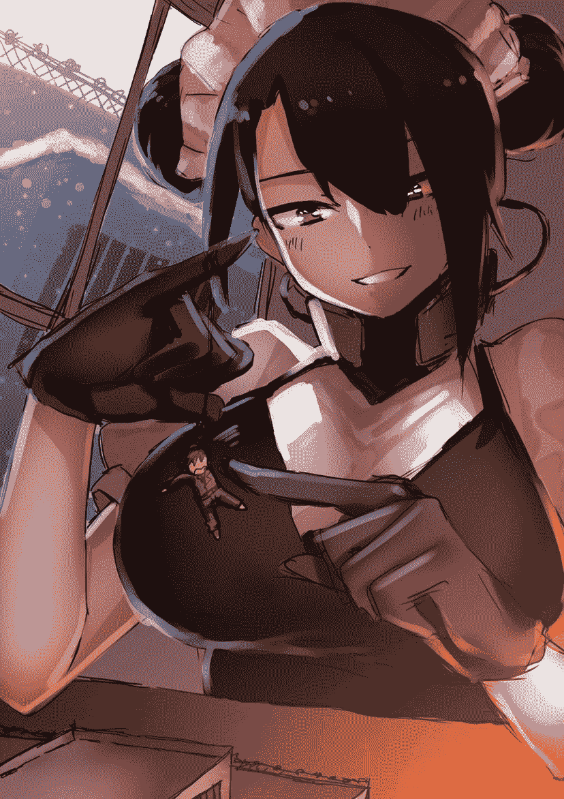

**QQ图片20180915225213.jpg** *(109.98 KB, 下載次數: 8)*

[下載附件](forum.php?mod=attachment&aid=NzQ4MDR8ZjEwNmE3MmN8MTYwMDg4MDM0MHwxODIzMHwyMjkzOA%3D%3D&nothumb=yes)

2018-9-15 22:54 上傳

在巨大的靴子中,有个人正蜷缩在里头,看起来不像是被关进去又或是被丢进去的,反而很适应的在里头睡着,既使靴子的主人已经轻轻晃了晃鞋子,在这寒冷的冬天中他依然熟睡着,她看起来早就起床整理好,换上她那相较于平时还要居家些的服饰,看起来轻松不少。

"小虫子,该醒了,是你该起来的时间了"

温柔的说着,这温柔的语气可是没什么人听过的,毕竟她对主脑和少部分人外,基本都是那一概冰冷机械般的语气吧,但她似有似无的露出了点比较不同的神情,这也是他跟着之后才有的变化,做了无数次检查明明都没有任何问题的,那为什么还会有这样的改变呢。

而在靴子里的他在听到那"主人"的呼唤就彷佛听到原先那当兵时期起床号的声响一样,快速且流畅的爬了起来,看起来相当有精神,不过他这样的动作在代理人看来,就像是小小的机械士兵一样,看起来有些可爱,还故意又晃了下靴子让他跌坐在地上,才把他倒往地面,坐在床边俯视着他,这就与平时起床时一样,先用脚轻轻地踩踩他和在地上轻轻地按着让他滚动一番,踩在地上玩弄着轻笑着。

主人,主人正在踩着我,她正拿我用脚玩着,好开心....主人一早就想要玩我了,被紧紧地踩着,全身上下的骨头都被她踩着发出声响,被她玩弄着,翻滚着,被她用巨大的脚给踩着,主人的脚好温暖....主人的脚好柔软....主人......

代理人抬起脚后看着他那好像有些享受的表情露出了点笑容,这家伙是个很棒的东西呢,看着他正以一种像是小动物看向主人一样的眼神望着自己,代理人不禁有些面红,心理怎么可能会对那种虫子产生悸动,今天没甚么事情呢,平安夜的今天,指挥官下令让这些恶心的虫子们停工两天,让他们休息,也就是说这两天都可以待在屋里休息呢。

代理人一把拎起了那个兴奋的小东西然后捧在掌上弄到自己大概胸口的位置俯视着,看着他那好像光能待在自己掌中就快溶化一样的小虫子,他待在掌上的样子就真的好像不是自己这样叫他那"小虫子"这样而已,反而就像是小宠物一样。

"主人...."

他这样轻飘飘地说着,不禁伸出手指压制住他,戳在自己的掌上,看着他被自己戳得喘不过气挣扎的模样真的有些可爱,而且他事后还把这个当作奖励一样的对自己的手指撒娇,抱着手指头蹭着,庆幸着自己当初没有一脚踩死他,这样才能有今天这在自己掌上这副可爱模样的时刻呢。

可是现在也不能这样一直玩下去呢,必须在圣诞前把工作做完,这样就可以休息了,还有像是人类一样地做着那些"庆祝",例如弄一棵树在房间里然后装饰着,人类真是奇怪,为甚么要频白无故就把树弄进室内呢,不过今年的圣诞多了这只虫子,不知道会怎么样呢。

代理人将他放到了脚边在小脚趾上套上了像是指环的东西,只不过上面多了条铁链和颈圈,他一点都没有抗拒的自己很自动的走向了那颈圈旁,给自己套了上去,代理人巨大的手指伸向了颈上那挂着的颈圈替他合紧,除了自己外,他是不可能有能力挣脱的,就只能乖乖地待在自己的脚边。

"小虫子,我要走啰,去吃早餐了"

她才话音刚落,便抬起脚来,连同那个挂在她小脚指边的那个小人一起带了上去,但她轻巧的让自己的脚背向上一勾,将那掉在那边的小人甩了上去,让他自己抱住脚指头,然后才踏了下去,就这样带着那仅紧抱住脚指的小人走出了几步。

她走到了料理台附近,熟练地替自己套上了挂在一旁挂勾上的围裙,然后在洗手台边打开了水龙头,正清洗着那巨大白皙的双手,而在她的小脚趾上忽然传来了点温热湿润的触感,她低头看着,那个小脚指上的小人正抱在上面舔着。

但她并没有说甚么,变开始准备着手料理了,打开了炉子,电热的炉子并不需要天然气或瓦斯,相当的安全,她放上了平底锅,倒入些许的油,等待温度适合之时,她拿出几颗巨大的鸡蛋,轻车熟路的用单手敲开了蛋壳,拨了开来,倒入锅中,伴随着那滋滋作响的声音她正料理着早餐的那一部份,荷包蛋。

而此时料理台上也放着符合她体型适合的培根和面包,在蛋正在煎的同时,她将两片巨大的吐司片放入了烤面包机中,然后迅速的拿起了锅铲,将蛋翻面,煎到恰到好处的时候起锅,迅速地又将培根放了下去,因为本身上面的油脂,所以就没有再倒入更多的油。

当培根也煎得酥脆,她就把这早餐弄上了自己巨大的白色瓷盘中,然后将烤土司涂上了奶油放在了上头,一旁在放上一些莴苣和青菜作为色拉,早餐就这样完成了,而这脚指上的小家伙好像都不太喜欢吃特别为他准备的,反而会比较喜欢吃剩下的残渣,真是个奇怪的家伙阿....难道思想也退化成虫子了吗

她拿了叉子和刀子,便晃了晃脚提醒他,端着盘子走向了餐桌边,看着他每一次抬起脚时仿佛都紧紧抱着脚趾头,深怕自己掉下去的样子,看起来怪可爱的,拉开了椅子坐了下来。

紧紧抱着主人的脚趾头,不知道为什么,心里总是悸动着,能够在这里,能够这样被栓着,不能离开她,还得这样抱着她的脚指头....感觉自己好幸福,不禁自己只想紧紧抱在上面,不想离开主人半分,轻轻舔着她的脚指,只希望主人能够感觉到那一丝丝的感受,主人...如果要我一辈子都这样的话,我也愿意!

当自己侧脸去蹭着主人的脚指时,不禁仰望着那巨大的无人能敌的她,从下往上甚至让人有些晕眩,就像是仰望着摩天高楼一样的,不过主人显得更加的有威严与压迫感,自己不敢望向主人的裙襬底下,毕竟这样可是失礼的,但是由下而上这样仰望着那认真料理着早餐的主人,让人有种温暖和悸动的感觉。

在餐桌下回头望向主人那巨大白皙又性感的脚背,既使是她的脚背甚至是脚趾,都是那么的美丽无暇,虽然有些冰冷,但是依然戴着她那独特风格的迷人之处,自己不禁入迷,甚至偷懒了起来,坐在她的脚指上,仰望着她那修长的小腿,一样的白皙且动人,不管是被夹在双腿之间还是被巨大的腿给压着,都让人感到兴奋,主人就算是小腿都是那么让人感到...兴奋。

主人不知是注意到了自己正在偷懒还是无意地动了动脚指,始得自己再次紧紧抱着舔着,主人...正在花心思监督着我呢.....主人....注意着我呢.....主人....我好喜欢妳..........主人....不禁迷失了自己一般,仿佛是尝到了毒品一样的舔舐着她的小脚指,虽然说是小脚指,但对于像是虫子一样的自己而言是那么的巨大...又美丽,就是这样...主人才....那么深的吸引我啊。

上头传来主人用膳的声音,优雅的甚至除了碰到盘子那细微的碰撞声,以及刀叉磨擦和碰撞的些微声响外,根本没什么声音了,主人就算是吃早餐也能那么的优雅和迷人,如果今天我那怕变成了主人餐盘上那无助的餐点.....我也愿意,只要能让主人满足...怎么样都好,主人..我....好幸福啊..主人....!

忽然代理人的脚一晃,那好像已经发情的小宠物被甩下了脚指,然后迅速的就是那巨大的脚踩了过来,脚趾头用人类最大极限的力道踩着和压着,然后在他快喘不过气时松开,再他爬起来后,马上再次用脚趾头踢倒,压制着,蹂躏着,感受着那渺小的生命在足下挣扎的快感。

这时候她的脚背忽然翘起,带着腿翘起了二郎腿,让这个小人彷佛要被吊死一样的双手紧紧抓着项圈试图要松开一样的挣扎着,晃动着,让他带着那铁链在这空中甩着,脚自然地晃着,也带着他在那里甩动着,代理人露出了浅浅的一抹笑,然后将脚踩回了地上,让他被自己踩在脚下,而头露出在脚指缝间,喘息着。

主人....在赏赐给我呼吸的权利,主人...刚才正在玩我.....主人....!!

"小虫子,该要吃你的饲料啰"

主人要喂食我了吗....主人...还会想喂我....她...有想到我....被她踩着紧紧贴着地面的同时,也注意到了地面正传出了阵阵暖意,主人打开了地热吗.....主人是在担心我受冻吗....还是想要自己取暖呢,不管怎么样...主人....

这时候代理人用叉子叉住了那培根,用刀子轻轻地切了非常细小的一块,虽然对于人类而言都有脸一般大的培根了,她用叉子叉起,用手指头捏着,辗了辗丢向了地面,然后松开脚,那培根正好掉落在铁链能触及的到的范围内,他用爬的爬了过去正用充满感恩的心态正啃食着,只不过是一小块的渣,就能让他如此幸福。

"小虫子,这样还够吗?"

代理人并没有看向他,但是这样问着,用这温柔的语气问着。

"主人.....这样就够了,谢谢主人....."

主人正在关心我.....主人...会担心我吃得够不够......主人.....大口啃食着这主人吃过的早餐,啃食着她喂食给自己的"饲料",大口大口像是啃着桑叶的蚕一样地吃着这巨大的培根,还是温热的,相当美味,不知过了多久自己已经将一大块培根给吃完,而自己也几乎撑得躺在地上不动了。

这时候代理人没有再去踩他或是弄他,毕竟如果吐出来了,小人的呕吐物可是非常恶心和难清理的,如果他胆敢吐在自己的脚上的话,那么或许他就别想再吃正常的东西了,更也别想再次见到明天的太阳了吧。

这时候代理人将脚指还暂时脱下,起身拿起了餐盘要走向洗手台放着,准备连着锅具和餐具清洗,而这时候躺在地面上享受着这温饱和地热的小人也感受着巨大的"主人"走路时对地面造成的那一阵阵震动,感受着她光是走路就能带来这如此巨大力量的被统治感。

当代理人刷洗完餐盘与平底锅,将巨大的白色陶瓷餐盘放入了烘碗机,然后将平底锅擦净后挂上墙边,也过一些时间了,她走向了餐桌旁,蹲了下来,巨大的她正俯视着那慵懒瘫在地上的小虫子,她的阴影甚至都遮蔽住了他,但那家伙却丝毫没有注意,难道是睡着了吗...

伸出了那如同巨木般的手指,戳了戳他,睡得很熟呢,是有那么舒服吗? 捏起了他,带到了办公桌这里,把他扣上了项圈,弄在了脚背上后变拿起了放在桌上的文件正检阅着,巨大的圆珠笔正修正和批阅着那一份份的文件,今天也是忙碌的一天。

当自己清醒过来时,已经不是那温热的舒适的地面,而是...在这主人的脚背上,主人她...把我带过来了吗,她不会生气吧...自己睡着的事情,害怕的蹭了蹭主人的脚背,整个人趴在上面舔着,好像要认错一样得不敢太激的舔着。

"小虫子,你醒了?"

"是的.....主人...."

"你怎么了吗?"

她晃了晃脚背,而脚背上的小人正死死依着。

"主人....对不起....我刚才睡着了.....请您....."

再说完之前,代理人便先开口把他要说的说出来,并且以一种带着玩味的口气说着,毕竟是这家伙主动讨惩罚的。

"原谅你吗? 那么就给我舔脚吧,要诚心诚意的"

"是的....主人!"

抱着感谢和那好像在为了甚么反省一样的心情,正舔着,而且以一种异常的情绪去舔着,好像要刺激巨大的她那脚指上每一寸敏感的神经,就好像是要刺激着那脚趾间敏感部位的感知一样,就以这种特殊的方式服务着他的"主人"。

不知道过了多久,都从未休息的,舌头也好像不会累一样,整个人都乖乖的蹭着和服侍着那巨大主人的脚指头,当来自那桌子上方书写的声音或打字声停止时,悄悄的抬头望着,代理人正在盯着那脚指上的小人,不知道多久了,他和代理人对上眼时,愣了愣,忽然想着自己偷懒的下场,又很快趴了上去舔着,这个蠢萌蠢萌的举动也让代理人看着地不禁笑了笑,这对于她这冰冷的性格而言可是少见的。

"小虫子,我们来玩个游戏吧,该让你运动些了"

她打开了最下层好像是放杂物的抽屉,拿出了一颗红色的球状物,这是圣诞装饰用那种鲜艳灯串上的其中一颗灯的样子,好像是从上面脱落下来的,但她捏着那巨大的灯,仿佛是灯塔上头旋转的探照灯泡一样的大小,甚至更大,不知道她要做甚么的将那颗灯丢在了地上。

"待会你就去把灯捡回来,懂吗?"

"知道了,主人"

她解开了栓在那小人脖子上的项圈,然后脚踩着那颗灯,忽然挪动着脚让那颗灯在底下滚动着,此时站在一旁的他看着那颗灯忽然想着,如果是被主人这样踩着的话.....不行,这不是可以胡思乱想的时候,现在是要无条件的去完成主人的要求...!

当代理人松开脚时,那颗灯便往远处滚去,而他在后面追着,直到灯滚动的动能减弱时,才追上,但是为了停止,整个人要扑上去时,甚至都跟着灯往前滚了些看起来相当滑稽,但他很快地站了起来,扛起了那颗对他而言不小的那颗灯正跑向他的主人交付着。

"很好,那么多跑几趟吧,虫子,你必须多活动活动"

像是给小狗捡球或是叼飞盘一样,代理人踩住了他放下的那颗"灯",再次让它滚动了出去,这一次显得熟练,没有傻地扑上前,反而跑得快些阻挡在前面,用身体挡下了那颗滚动的庞然大物,然后再兴奋地跑了回去,虽然看似是办公桌到前方地面的一小段距离,但对于他而言已经是百余公尺的来回跑,而且都必须保持高速的,还得扛着一颗"灯"

他一样的抱着带回去给了他的主人,在来回几趟后,他已经气喘吁吁的一只手撑在了代理人的脚趾边,她动了动脚脚趾,换把他踩在了脚下,就算受伤了,也不是没有那种急救药品,以前代理人也对他用过不少次就是,好像是想到了这点一样,她踩得狠了。

"刚刚你也没好好舔呢....要玩个游戏都玩不好的虫子的话,踩死也无所谓吧? 还是说...你想要去当那颗负责滚的呢?"

她踩着让他亲密地和脚底与地面夹着,然后滚动着,巨大的重量使他的骨头发出阵阵哀嚎,他也大声叫着哀号着,毕竟他比起不叫,他的主人好像个热衷于这只虫子发出的哀嚎声与哭喊求饶,她甚至翘起了脚,用脚尖正用力踩着扭着,然后抬起脚,看着那被脚的阴影垄罩的渺小身影便踏了下去。

用足弓的位置踩踏着,这家伙不知道是为了迎合代理人还是自己真正的在哀号都已经分不清了,不过代理人到很享受他在脚底挣扎着的感觉,更享受着他那副样子,重复踏了几次后,紧紧的踩着,他甚至还伸出了舌头继续舔着,这不是很兴奋吗? 还装着一副害怕的样子

代理人用脚辗了辗后,抬起脚用脚的侧边拨动着,岛在地上的他也只能任凭代理人(主人)的摆布,被她玩弄着,左右脚对传着,这样短小的距离被巨大的双脚玩弄着,代理人甚至露出了点笑意,这一只虫子与其说是宠物根本就是玩具吧,他这样完全无法反抗的力量,更使的她感到一丝丝的快感。

在玩了几次之后,她更直接把他向前踢,像是在玩球一样的玩弄着他,但当她发现一丝不对劲时才发现他的手脚已经被弄成不自然的角度,但是表情好像在痛苦与兴奋之间,然后踩了他最后一脚才昏了过去,跟虫子一样的弱小阿,这只虫子也太弱了吧,太不耐玩了。

"真弱阿....."

她随手从抽屉拿出了一瓶巨大的玻璃瓶,扭开瓶盖,里头如同汽水一样发泡的绿色液体正是充满了营养剂与医疗药物的特殊液体,更是格里芬研发出来为了任何外伤与内伤治疗使用的,这项技术也使的任何的伤势只要不致命有了这个都能轻易快速的康复,只不过不知道是研发人员的恶趣味还是药剂会造成血管舒张与心悸,对于男性而言往往会伴随着,起生理反应的症状。

代理人蹲了下来,将他的手勉强掰回正常的位置后,然后丢入了瓶中,盖上了盖子,毕竟这液体里面富含着氧气,他绝对可以在液体里面呼吸的,晃了晃瓶子,虽然说着他很弱,但是心里不知为何起了一种从未有的想法,这不单只是珍惜而已,而是想关心这个自己的私有物了,不会冷酷地将他直接弄死,反而会想办法治好他,这一切改变....都是这家伙来之后产生的。

这些并非系统异常,更没有任何损坏,代理人甚至怀疑自己是出了什么BUG才产生了这种情绪,情感模块原本就不是属于战争机器的东西,她也一直搞不懂为甚么指挥官还是给她加上了,现在她才明白这模块的用意和功能。

而此时在那绿色医疗液体中的他思绪...逐渐回到了那时候,回到那战火纷飞,压抑的让人发狂,让人感到悲伤与无奈的战场上,那里没人想杀人,没人想把原本只想标靶的武器真正指向活生生的人群,而他们必须这么做,只为了抵挡住格里芬那如同潮流般的攻势,那比国家弹药库数量还应更多的格里芬士兵...

"冲锋前进! 上刺刀!"

一名士官吼着,抓起了哨子用力地吹哨,那声音已经盖满了整个壕沟

"冲锋前进!"

士兵们复诵着,挂上了刺刀,自己从未想过要用如此古老且传统的方式做最后的一搏,输了或许就是死了吧,既使存活被发现,也会被马上击毙或送往战俘营吧,在这原本市中心的公园现在被挖成了布满壕沟的战场,而四处得巷弄无处不是不在交火的。

烟雾弹被抛射出去,迫击炮开始炮击,士兵们喊着"杀",正在向前冲刺着,装备伴随着抗弹背心晃动着,护目镜贴在眼前,面罩遮盖住了他们的面庞,既使被格里芬的炮火和机枪攻击着他们也只会继续前进,因为这里已经是最后的防线了,如果退缩,岂不是放弃了一切愿意甘愿得进去劳改营等着被冻死饿死或操死吗?

当他们与格里芬的士兵厮杀着,刺刀刺入他们的胸膛时,或许心理终于得到发泄,自己的妻儿不是被格里芬强奸致死就是死在他们的轰炸与无差别的屠杀底下,或许这时候那些悲愤才真正的被发泄出来,比起格里芬的掠夺兵,毫无国家概念的佣兵与被收编的部队而言,这批听从国家命令行事的人也没甚么不同吧,除了纪律。

当士兵们或许欢呼着,高举起旗杆欢呼着,终于攻陷格里芬的壕沟群,接下来只要扫荡各街区,就完成首都保卫时,地面正传出令人绝望的震动,是格里芬的人形,通信兵开始呼叫起炮击与空袭,开始要求着飞行员马上进入九线执行自由攻击,或是要求炮兵开始把最密集的弹幕打在那巨兽身上时,一切都来迟了....

当战斗机投放炸弹,爆炸的火光反而照应着她那巨大发着红光的双眼,虽然是黑瞳,但莫名的有电光闪现在她身旁,眼睛正照着正正红光.地面顿时在重火力的攻击下被撕碎,城市的高楼与房屋被她踩踏,炮击与烈火燎原,这一次....自己像是懦夫一样带着整批部队开始逃跑着。

以后当个逃兵群或是残兵团也好,只要能囤积兵力继续作战都好,这样想着,但投降的想法不断掠过她的脑袋,爱国心与忠诚,活下去与性命,不断交替着,甚至有些人在途中自杀了,有些人留下来吸引着那巨大少女的注意力而被她一脚踏下踩死,最后....带着一批幸存者,投降了.....

到底是为了甚么,刚条狗似的,为了钱,为了国家,为了活下去,为了家庭,为了什么....自己非要为了那虚伪的职位与旗帜而战,这面旗帜...早在无数贪官与吃的白胖的议员底下给腐败,他们喊着让士兵去前线作战,而自己却蜷缩在抗核爆的防空洞中吸大拇指。

不如...有意义些吧....

再次睁开眼睛时,自己正泡在奇怪的液体之中,这不是....那个奇怪的药水吗,而且全身上下的衣服已经被脱去,正漂浮在里头,就好像标本或是义体似的,视线逐渐从模糊转为清晰,眼前那巨大的黑发少女,正是自己的"主人",或许忠诚于她奉献给她还更有意义吧。

她趴睡在这巨大的办公桌上,而这上头就只有简单的计算机银幕纸本文件和一些文具,看起来很单调,没什么个人特色,更没甚么太多的装饰物,说装饰物就只有贴着铁血的标志和一张几个和她一样是人形的少女们的合照。

她或许有等待着他醒来的时候,才能好好嘲讽和玩弄一番,但是工作和等待的无聊产生了睡意,她第一次这样除了睡眠时间外好好的休息,这也是这瓶中的小人来到她身旁之后的改变,这也是不曾有过的举动,休息。

而这个冰冷,冷血的巨大少女睡着时却意外的可爱,平常如同高高在上的高冷存在,更是无情的踩踏任何胆敢违抗她的人,当然踩着这家伙的时候是例外,但她闭上双眼睡着时,少了那份严肃与机器般或是说如同女王一般的气场,反而展现出了她这样子该要有的气质。

在液体中的他并没有说甚么,就这样默默地闭上了眼,等待着主人将他唤醒,再次陷入了那睡眠之中,等待着主人,醒过来将自己倒出来或是弄醒,只属于主人,专属于主人的私有物,就这样等待着主人的需要以及玩兴。

忽然一阵阵的晃动,瓶中的小人惊醒了过来,巨大的瓶盖被转开,她对准了巨大的玻璃杯将液体连同他一起倒出,看着他被倒入玻璃杯中,代理人像是捏虫子一样地把他捏起来,然后用一种厌恶的表情看着,又好像是鄙视着一样。

"你其实在喝药以前就一直都是硬的对吧? 变态虫子"

"主...主..主人"

"那么变态呢.....所以说要不就切掉吧,你这种变态还留著作什么呢,你们人类不是很喜欢帮宠物作结扎吗? 我可以亲自帮你喔"

"不要....主人,不要!"

他护住了自己的下体,代理人把他随时甩上自己的手掌上,压制着,在巨大的指头下,他那弱小的抵抗又算的了甚么呢,代理人轻松地拨开了他那毫无作用的抵抗,露出了冷笑,将指甲底在了他的小伙伴上然后再次说着

"所以要不要帮你结扎呢...看,现在不是正硬着吗? 都说要结扎了还那么兴奋,是那么想要被我用指甲切掉吗?"

"主人...主人不要! 主人...我什么都会听话的,拜托了....主人..."

代理人晃了下手,其他巨大的手指头压住了他的上半身,压制住了他的双手,他开始挣扎了起来,她巨大的食指开始玩弄着他那对于自己而言细小的"武器",她压了下去再让它弹起来,或是反复搓动,伴随着他那微微的挣扎和没用的喘息,也让她有了些成就感,伴随着他一阵没用的叫声,他就已经缴械。

代理人看着手指头上那一小块白色的液体,这就是他的发射量了,可以说是对她而言根本有跟没有一样的感觉,沾在了一旁的纸巾上便好像盘问一样,紧紧抓着他,让他仰望着自己回答着问题。

"就那么舒服吗? 你是那么喜欢对着我射吗? 你现在还硬着喔,变态虫子,回答我的问题! 不然我可以马上让你跟它说再见"

"主人....我.."

"那切掉好了,跟之前一样呢,变态垃圾虫子"

"很舒服! 主人玩弄我和欺负我很舒服! 我最喜欢了! 我...最喜欢被主人玩了! 拜托....主人不要..."

"是嘛....竟然那么喜欢被玩,那玩坏你了也无所谓吧?"

"主人您想....."

"你没有任何选择的权利呢,虫子"

代理人刚说完便把他扔到了桌上,用手指压制着,拿出了胶带,让他成十字型的方式黏在了桌上,她同时也想到了如果绑在十字项链上或是绑在棍子作的十字架上,然后配合其他"刑具"或许会很有趣呢,她这样想着便露出了那冰冷从上而下自然的被阴影覆盖住眼睛的样子,这使的压迫感倍增。

"主....主人"

代理人并没说话,但这沉默更造就了那无形了压迫感以及可怕,但这时候的代理人反而是充满玩味的,毕竟他就这样被胶带固定着任频自己怎么玩都可以,那怕是要趴上去用胸部压着又或是舔他一口都是可以的,不知道为甚么自己想着想着也有些兴奋,对于欺负这小虫子这件事情。

她巨大的食指从下往上划过他的身体,她来回爱抚着,一个男性就在这里任频她的摆布,当她的手指开始缩小移动的范围,直到集中在他那仿佛停止不了勃起状态的性器上,她开始玩弄着,弄着他已经都将头撇向一边,没用的喘息着和发出那一阵阵的声音,就这样被主人肆意玩弄着,心理充满了兴奋和愉悦,同时祈求着自己那巨大的主人能够感到开心。

她开始捏着搓动着,代理人她在获得到这与铁血不同的躯体之后,在获得这让她感到优越的巨大躯体之后还有许多没有尝试过的,或许都想利用这现在正被她那巨大手指捏着性器的小虫子来尝试一次,毕竟这些都是难得可贵的经验,更是未来如果想每天都可以做到的。

"主人..我要...主人....我快要去了.....阿...!!"

她加紧了捏着的力道,不至于弄坏,但也让他感受到压迫和仿佛要榨干他的感觉,一点把控和底线都没有的玩弄着他,开始搓动着和撸动着,就好像在帮他手淫一样,但这是更具有力道和压迫感的一场游戏,她就像是找到了玩具的女孩一样,全神贯注着正在玩弄着,好像不想放过这个被她黏在桌上的玩物。

伴随着他一阵挣扎,他温热的白色液体已经喷发,虽然对于代理人而言那一点根本没有什么吧,她把沾上了白色液体的手指带到眼前,然后搓动和沾黏着,看着那具有些许黏性和蛋白质的精液,以一种秒是的眼神俯视着那个小人。

"你看来不就是很喜欢射在我的身上吗? 真是恶心呢,虫子,刚才还很恶心的说了那些话,我可记下来了喔,而且还硬着呢,真是变态呢....垃圾虫子"

她意识到自己每次藐视和谩骂的时候,他都会兴奋地下体抖了下,她再次露出了那种恶心的表情俯视着,而且这一次略带着冰冷与仿佛就是在真正藐视着虫子一样的眼神,她注意到这家伙更加的兴奋了,而且他的小伙伴还抖了下。

"你是抖m吗? 真恶心呢....被我骂都能那么开心吗? 作为我的所有物,你这样子也太恶心了吧? 身为玩具就要有玩具的样子,你就只是我的玩具虫子,你还这样的恶心吗? 要不要我现在把你弄死算了? 恶心的杂种虫"

她的语气也别于方才那样带着些温柔的,而是真正冰冷和无情的,而且还带有那种恶心和藐视的语气,而这家伙又更兴奋了,她继续连番挑逗了一番后,他竟然就这样射了,没有直接接触,就只是看着和骂着,只是让他无地自容的被代理人用巨大的手机录像着他这副样子,就羞耻的射了吗? 又还是被骂着骂着就去了,又或是两者皆有呢。

"真恶心哪....小虫子,你这个抖m,就那么想被我玩弄吗? 就那么喜欢被我踩在脚底下欺负吗....还是说更喜欢被我用其他方式玩弄呢? 那么我成全你好了"

他想到了主人要来使用他和玩弄他了,或许还有些兴奋地颤抖了几下,她不在意是否会感到疼痛的撕去了胶带,然后高高拎着,在眼前平视着,露出了那种充满玩味的表情,对着那只小虫子,但当他被那都比人还大的深邃双眼给盯着时,他或许更加严重的被代理人给迷住了吧。

"那么先从自由落体开始吧,从这里摔下去的话.....你会怎么样呢?"

她开始倒吊着这个小人开始晃动着,原本捏住整条腿变成只捏住小腿,甚至摇摇欲坠,听着他有些惊慌的声音和在那里挣扎的样子不禁使代理人感受到更多的快感,以及这样摆布着这小生命的优越感,特别是玩弄与自己已经"亲密"相处许久的玩具。

"还是....你想要....被我吃掉呢?"

她张开了嘴,仰起头,让他对准那潮湿的口腔,唾液甚至在口腔内牵着丝,而那些唾液与那巨大的舌头仿佛随时迎接他的到来,或许会一番玩弄后再吞噬下去,也有可能是直接咬碎向是吃肉块一样地把他给吃掉,但不管怎么样都成功的让他露出了最真实的绝望神情,这反而深深的满足了代理人的施虐欲。

他挥舞着双手挣扎着,但是他好像不知道真的挣脱了反而是主动掉进自己的主人那已经准备吃掉他的口腔里吧,代理人闭上了嘴巴,把他再次带到眼前对视着。

"不过你那么脏吃了也不好呢,我可不是那种有吃虫子这样癖好的人,那么还是扔你下去好了"

他忽然好像想抱着她的手指一样,但又好像是在撒娇一样,也很像是在求饶,他这副样子再次引起了些悸动,每次玩弄他时和欺负他时,这恼人的感情模块都会让代理人的心跳加速,更会让她感觉的一阵阵胸口闷又体温升高的感觉,并不是特别讨厌而是自己怎么可能对一只虫子产生情感....

"主人...不要...我...还想继续..待在妳身边"

他这样说着,代理人才将那已经快要松开的手指给捏紧了些,不过她已经打消了玩兴了,毕竟再玩下去,可能这家伙真的很有可能被玩坏了,不过今天好像是人类所谓的圣诞节吧,一个宗教的节日,更是商人们为了赚钱更而推广至全世界的节日。

人类好像会把灯串弄在墙上和树上,也会把一棵树挂成很奇怪的样子,布满了装饰品在底下放下几个鲜艳绑着缎带的盒子,无法理解他们的用意,但是指挥官还是在一次的补给中送来了圣诞节的相关布制品,但是之前都从未使用过,要不今年来试试看吧。

不过要布置的话这家伙在反而碍事吧,就只能把他放在这办公桌上,拿出绳子把他栓在那插入钢笔台仿佛是人类精致工艺的钢笔上,不过如此巨大也是重工业的工艺了吧,但这钢笔也已经几乎是3D打印而成。

他根本不能乱跑,就像是被拴住的小狗儿一样,只能静静地坐在哪里等着自己的主人解开,这时候代理人就开始在一旁开始工作了起来,她挂起了那些灯串接上了电,然后布置起那些圣诞的装饰品和那些打从送过来就没开过箱子,里面装满了圣诞节的相关应景装饰,她正布置着,没想到这竟然让她有些乐趣虽然麻烦又有些累。

想到如果把这小虫子绑起来挂在那树上或灯串上,又或是拿着巨大的缎带把他捆绑起来当作是礼物一样的放置在树下,其实也可以把他绑起来后装进盒子里那好像又更棒了,不过感觉上人类设计的这些东西也没那么无聊嘛,如果让这只虫子也加入进去的话。

但是他们所谓的过节气氛好像就是要善待彼此和和谐的相处呢,如果要符合这样子的话,那只能减少对他欺负了,在这期间,不过如果说是他主动给自己玩弄的话,那么或许就不一样了吧,礼物的话就给他点奖励好了,身为虫子的他也不能要求什么吧。

在代理人终于布置完后,她发现整栋房子充满了一种温暖与气氛,那些灯亮着,八音盒拨放着音乐,而圣诞树也正亮着,配合着这时候窗外西伯利亚的一片冻土与雪景更是应景,外头那些害虫还正在挖矿和开垦着,看到他们就觉得恶心,还是这家伙让人感觉好些。

这时候外头依然不时传来了阵阵枪决的枪声,又或是坦克发动的声音,正在用上头的火炮与机枪对付着试图逃跑的人们,有时候甚至是直接辗过,看来今天外头的集中营也运行的非常良好,他们依然在地狱之中,这就是那些害虫该要有的下场。

代理人站在落地窗边看着,然后转过头,走向了那已经等待许久,依然乖乖站在那里的小人身旁,看来他已经不敢休息和坐下了呢,解开了栓绳把他抓起,虽然像是握着一样,实际上也只是用拇指和食指钳住而已吧,伸出手指抚摸着他的头,看着外头那一阵阵对着反抗战俘镇压的枪火,以及警示着那些俘虏认真工作的暴力行为,正展示在眼前一览无遗。

破旧用木头钉起,用铁皮和简陋的木材作为屋顶,里头有着比海军舰艇还要更高的铺位,或许有七八层了,生活环境是极度恶劣,对比起这温暖的又有圣诞气氛的巨大房屋而言有极大的对比,代理人像是要唤醒他一样轻轻地弄了弄。

"你看到了吗? 那些害虫的样子,你以前也和他们一样呢,不过现在也已经是我掌中的小虫子了呢"

她的手指戳了戳他的脸颊,然后继续说着

"他们或许该向你学习,虫子就要有虫子的样子,但是你依然是最卓越的"

代理人很反常的在最后一段话中,以那种温暖和温柔的语气说着,不知道这才是她真正的样子,诱惑是被这佳节气氛给感染了,但这家伙既使药效已经退去,现在只要被代理人抓着或是被她带在身边时就会开始起生理反应,这或许也是代理人玩弄之下造成的后遗症吧。

"谢谢...主人的夸奖...."

他在代理人的指间撒娇的样子也让代理人的表情露出了点缓和的样子,为甚么的他不只是自己口头上念的"小虫子"这样简单的存在了呢,总觉得能得到他也已经是一份大礼了吧,而且不管怎样都只会给自己一个人玩弄而已,在外头也会很乖巧地帮自己管理集中营,上哪找才能找到这样的宠物阿....

不过意识到外投已经准备夜幕将至,那些牢房中露出了一些炉火,这些不断被丢来这的,并非高纬度国家更非是天主教与基督教国家的虫子们就好像没有过圣诞的气氛了,虽然在士兵宿舍可以听到细微的那圣诞歌曲的声音,但也没什么氛围。

不过说到这些虫子们,刻意把他们安排在西伯利亚,反之将其他一批高纬度国家的安置在赤道也是指挥官独特的思维吧,让他们真正的受到地狱般的惩戒,就像是现在如果他丢到雪里面埋起来或是这样光溜溜的丢出去,一定很快就冻坏了。

代理人这样想着,望着那外头的战俘营,那指间的小虫子(小人)先开口了。

"主人...我能够跟您在一起....作为妳的东西....我已经很幸福了..."

他突然其然的这句话,就好像一发APFSDS(尾翼稳定脱壳穿甲弹)一样的打穿了那如同有700mm厚般心墙的威力,这或许触动了她那感情模块深处的少女心,又或是打穿了这如同西伯利亚冻土般冰冷的心灵,她此时仿佛不在是那冷血无情的兵器,反而更像是个女孩子。

不过代理人无意识的捏紧,还让这手中的他以为说错了甚么,不敢挣扎,更不敢发出甚么声音,乖乖地接受着主人的惩罚,毕竟说错话和惹主人不开心可是很严重的,虽然事实并非如此,他还是这样忍受着,当代理人意识到他毫不吭声的被自己弄得快要不能呼吸昏过去时,才松开,这或许又是新的玩法吧,但代理人的食指又很快地在他的头顶上摸着安抚着他。

"小虫子.....你竟然那么幸福的话,以后就乖一点和主动点吧,另外该是晚餐时间了呢...小虫子"

这时候不自觉的被跳过了的午餐,或许是因为早餐本来就在接近午餐的时候吃吧,那么就是早午餐了,但现在入夜了,也该是吃晚餐的时候了,代理人望向了那手中的小人,与他大眼对小眼的互看着,他打了冷颤,该不会...主人要吃我吧,这样的想法已经占领了他的大脑。

"我说过了,我可不是那种会吃虫子的人,看来...你这颗已经退化成跟蚂蚁一样的脑袋是不是需要再教育下呢?"

他甚至有些兴奋地颤抖着,代理人露出了一种让他感到不寒而栗的表情,他才停止,毕竟这样子敏感的容易兴奋,虽然是很可爱,但是这样子怕不是真的勾起代理人自己的玩性和欲望,那么这家伙或许一个晚上就会死了吧。

"对..对不起,主人"

"嗯? 怎么道歉呢,这可不会让你这退化的虫子能逃过教育喔"

"呜..."

"不过在这之前,我们要先吃晚餐了,你一定饿坏了吧? 小虫子"

之后代理人把他随便的丢到玻璃杯中,看着他无助的根本爬不出去,也无法逃脱的样子,便在厨房中忙碌着,对他执行放置PLAY,准备着今晚的盛宴,她那如同外头西伯利亚冻原一般冰冷的语气,却有着如此清澈明亮且充满着魅力的双眼,以及如同外头白雪一样的肌肤。

她有着庞大的身躯却不破坏她的身型与美感,更不破坏她那举止显得优雅与端正,不过她或许这冷静平淡如外头那极度低温一般无情的内心正在缓缓地溶解,而她的内心世界或许也早已留下了什么,而外投现在正飘着大雪,以及白色的如同雪花般的灰烬,那正是燃烧着反抗者与必须被消灭的那些人们。

那正是燃烧的灰烬,跟着这大雪,分不清是雪还是雪花的飘落着,跟着那外头矿槁敲击着的声音,以及他们哼唱着那被奴役时所唱出的悲歌,或许除了安装了几乎全世界所有语言模块的代理人,和与那些人同乡的这小家伙外,许多格里芬士兵是听不懂的吧,当然除了投诚的之外。

而在屋内,一个小人被他的主人丢到玻璃杯中困住,他也只能安分地待在里头望着他那巨大的主人正在料理着,她这时候的魅力或许已经遽增,毕竟料理时那认真的表情以及精确快速的刀法与刀工,还有那每一次的调味与调理都恰到好处的极致。

仿佛没有人能赢过她一样的打点着这房间的一切,现在正在料理的她也证明着她那无所不能的能力,任何男人都会向往着她吧,撇除是虐待狂和巨大的体型,真的是非常适合作为贤妻良母的特质,不过这玻璃杯中的小家伙也不敢想那么多,毕竟那可是他的"主人"。

而圣诞的串灯亮着,那七彩炫丽的灯光反射在那落地窗与玻璃杯上,代理人在那料理台旁则是认真的准备着晚餐,切菜时砧板的咖咖,以及锅具加热的滋滋作响,以及汤正在沸腾滚着的声音,她准备炖肉时将巨大的食材投锅中时那"空投"下去的食材碰撞水面的声音。

她正在料理着,而除了那只渲染气氛不太影响或打扰思绪的圣诞音乐外,这个房间宁静的只有这些,以及代理人的脚步声以及那步伐造成的那不太能感受到的震动,与其他人形走路时不一样,她的一切举止都显得端庄与典雅。

只要能吃到主人的料理,那怕是她吃剩的或是她丢下来的一小块碎屑,我都愿意吃干净,除了是主人吃过的之外,更是主人给我的赏赐,给我的饲料,主人...是有在关心我会不会饿肚子的,是会照顾我的,主人...只要愿意注意到我,我就非常幸福了。

"主人....."

那个小人几乎依靠在玻璃杯的杯壁上,望着那不远处对他而言巨大的可怕的女巨人,对于她而言自己或许都是可有可无的虫子而已,但这只虫子今天却不只是在调教下产生了忠诚与服从,更非臣服与畏惧,而是爱慕和那几乎可以把他像是热锅上的黄油一样融化的那份情感。

她的一切要求都会听从,不管是在她的力量下去听令,还是真心的愿意听从她完成一切,乖乖的被她凌辱和羞辱,更是愿意被她当成玩具一样随意的玩弄和拿来发泄,也愿意像是宠物一样乖乖地在她的脚趾边或是手上撒娇,让她觉得开心。

今天是平安夜,入夜了,不知为何这些士兵们依然没有停止这高压的管制,反而更盛,但今夜没有人掀起暴动,他们正在这寒夜中冻的几百人围着一颗木材所燃烧出来的火炉旁,有人甚至丢入了格里芬的洗脑文宣和书籍,既使冒着被卫兵拖出去枪毙的风险,也要燃烧着那印有格里芬思想和语录的书籍,只为了给大家取暖。

或许可笑,以前又有多少人也这样干过? 只是烧着不同人的思想,冒着死的风险,或许西伯利亚冻原下,也有一批曾经妄图攻打这里的人也干过这档事,但是今天这批战俘并非入侵者,而是被入侵者,他们被沦为奴隶,被作为亡国奴使用着,建设这里的一切,建造着建筑然后看着被格里芬当成练习靶给轰掉。

挖着矿制造着无数经济奇迹,挖着矿让格里芬用矿物德到巨大的利益以及无数重工业材料,那早不是PMC(私人军事服务公司-Private Military Company)该要有的,根本就是一个超级强国的实力,虽然不少是"员工"的佣兵,但也有不少被收编的他国正规军或投诚的步兵们。

这西伯利亚冻原上今夜除了这栋小屋之外,其他地方或许...既使气温低韩,几乎可以让你被冻得一剥耳朵就掉的低温,在这低温之中,还是有那一点点人性的光辉与温暖,那无数原本在宪兵体制与军法体制下显得极度军纪的士兵们,在此既使没了他们还是留着阶级与这份概念。

他们没有为了那炉火而暴动群殴,反而开始贡献起能够燃烧的物品,试图增添火源,在这落地窗外头,这战俘营,或许不再那么寒冷。

当代理人已经将晚餐准备完毕,放置在餐桌上时,甚至都摆好盘准备好这圣诞大餐,走向了这被她随意丢在办公桌上那玻璃杯中的小人,抓起了杯子,左右晃动着,看着他撞击再杯子的壁上,痛的摸着头的样子,从杯口俯视着他,制造着那让人感受到压迫的冲击感。

"小虫子,该吃饭了,出来吧"

代理人将他倒在了掌心上,并没有握紧或是捏着他,反常地将他带上了桌子,并没有用链子栓在脚趾上,把他放置在桌上,在那巨大的桌上竟然有个迷你的餐桌椅,就好像被放置在餐桌上的玩具一样,就像是玩家家那娃娃屋里面的家具一样。

而那桌上也放着热腾的餐点,虽然...感觉上就是从那巨大的餐点中弄出一小块塞进那像是玩具一样的餐具里的,根本不是符合他体型的样式,既使这样依然丰盛,但他站在餐桌旁一脸诧异的仰望着代理人,也就是他的主人。

"主人....这是...?"

"小虫子,难道你的脑袋彻底退化到连蚂蚁都不如了吗? 看来要"教育"的必须要更多呢,你看不出来这是餐桌和椅子吗?"

"主人....我不用被您绑着在地上吃就好了吗....."

"如果要奖励你也不要的话,我是不介意呢,不过你最好乖乖地坐上椅子然后准备吃饭会比较好喔,小虫子"

或许他已经明确地感受到了那主人已经有些不悦的气氛,安分地坐在了椅子上,双手放在腿上乖乖地坐着,而她坐在桌子的另一端,正好两人是对视着的,而她在巨大的椅子上入座时,很自然地看着那一个个盘子上的餐点时,视线也会看到那在餐盘不远处的小人。

如果她真的想做甚么的话,叉子也可以马上刺穿他然后带入口中变成她的养料,但她并不会这么作,顶多拿着叉子威胁吓唬他而已,不过她俯视着餐点时,那个小人意识到自己同时也被囊括入视线中,被主人盯着的感觉也几乎使他感到面红。

"好了吗? 那么我们开饭啰,全部都要吃完,不然我就把你吃了"

代理人拿起色拉叉指着,吓得他有些发抖,可能是因为不懂餐桌礼仪,既使桌上已经被整齐放满了无数种餐具,他还是随意挑了具刀叉开始大快朵颐着那桌上"巨大"的美食,面包也感觉像是面包屑一样,而肉和餐点也是,不过或许就只有汤最正常了吧,玉米浓汤。

但意外的是,他心里却已经没有奇怪的拨动以及那好像无时无刻都保持发情状态一样混乱的思想以及对主人那无止尽的满足,或许是这突如其来被带到桌上对于陌生的警戒又或是他在这代理人对他的态度忽然的改变下不知该如何应变吧˙。

奇怪的是,他在大口吃着的时候才发现,照理来说她那么巨大吃东西总有声音或是餐具的碰撞声吧,好奇的抬了头望着,她确实有在吃,而且就像是受过礼仪训练相当优雅地吃着,刀叉使用的正确和熟练,而且几乎没有声音的吃着。

反观这家伙已经把桌上变成了跟战场似的,当代理人意识到这小小的宠物已经望向自己,她心里又有哪种如同故障般奇妙的感觉,他脸上还沾着些汤,又像是可爱动物一样地抬头仰望着,不过也只能把这情绪压抑着,让外在的自己尽可能保持在最冷静的状态,让行为举止都保持优雅。

当这个小人已经拿起刚刚喝过汤的汤匙吃起甜点,吃完整桌饭菜时,代理人让他毫无预警地问了一句话,打破了这许久的沉默。

"小虫子,你觉得餐点如何呢?"

他有些傻住了,愣了几秒才回应着

"只要是主人给我吃的,我都很喜欢"

代理人的表情露出了不悦,是因为他脑袋真的转不过来,还是他正在敷衍自己。

"你在敷衍我吗?"

她或许就真的要用甜点叉让他变成甜点沾上那甜品的糖浆一起吃掉。

"主人..今天您能让我到,桌上吃晚餐...我很开心,我不知道该怎么样...回应主人,不过只要是您愿意给我吃什么...那怕是不要吃的,我也很喜欢,只要是您亲手料理的,我都觉得很好吃....很喜欢"

看来他是真的适应不过来,代理人才将那叉子放下,然后无视着他收拾着自己的餐盘,然后捏起那玩具般的餐桌一并收起,带往了水槽正在清洗着,她在清洗着碗盘时,代理人也正在试图冷静自己,毕竟既使外表和语气是冰冷的,但是内心或许已经产生的不只是涟漪,而是荡漾吧。

据说在怎么样的女性,只要有人能够打穿心房,都能让她变得温柔,或许代理人已经有这症状,又或许是她开始对宠物有呵护和珍惜,毕竟真的弄死了要找到下一个这样的或许不太可能了,不管如何代理人的内心都有了变化。

她或许心里看他时不自觉的玩弄和欺负,让他被迫和自己无时无刻"亲密"的接触都是正展现着她心里那施虐癖与情感的最佳表现,不过这小家伙也相反的展现着自己的受虐癖与崇拜,心理和肉体基本也完全是她一人的所有物了,虽然偶尔会反抗下,但这不正是增添了些趣味吗。

当代理人洗完餐盘后,在一旁的巾布上擦了擦手,便走向了那依然在椅子上乖乖待着的"小虫子",她注意到了这家伙的头正望向窗外,看着那外头的星空与美丽闪逤着翠绿与褐红的极光,其中也有蓝色粉红色更有黄色正在闪耀着,这带着弧状的极地景象是他从未见过的。

要说见过或许也只是在照片上看过,这一次可是亲眼隔着窗户看着,代理人注意到了他正这样望着自己已经习以为常,在分配过来管理战俘营与西伯利亚后时常看见的景象,但对于这一个来自亚洲地区的小家伙而言,是一道奇景,也对,他来到现在确实这是第一次发生极光。

代理人悄悄的换了套衣服,然后穿上了靴子,戴上了手套,然后伸出手指敲了敲他附近的桌面才将他唤醒。

"主人,怎么了吗..?"

"小虫子,你要看的话,我们直接出去看吧,准备穿上衣服了"

"知道了,主人"

代理人这样说着,从抽屉中找到了一套衣服,捏着丢在了桌上给他换上,毕竟他可是从昨晚到现在都是赤裸裸的,不知道为甚么感觉他不穿衣服,会比较像是宠物一样,或是说感觉更加的可爱和方便玩弄吧。

当他套上衣服后,代理人将他拎起,撑开了吊带袜,将他夹在腿与袜子之间,这时候都使他不敢向一旁抬头望去,毕竟会看到她那巨大黑色雷丝边的内裤,他被紧紧地夹着,大腿相当舒适,而她的体温也意外的高,让人感受到非常的温暖。

当代理人抬起腿走出每一步时,他都这样紧紧贴在代理人的腿上,而代理人正行走时,这家伙露出了彷佛置身于天堂的样子,或许是平常都是被踩在脚底下走的吧,但是这对他而言也是幸福的,毕竟只要能被主人带着和用各种恶趣味和鬼畜的方式给玩弄着他都会这样。

当代理人打开大门,寒风刺骨,每一次的吹佛都如同无数刀片正割着自己的脸颊,这冰冷几乎使人麻痹,他甚至主动紧紧的靠着代理人的大腿,在那裙摆的边缘那吊带袜与腿部之间的小人,正在发抖着,呼出的白烟,也凸显了这里的酷寒。

代理人走道了屋子的另一边,正好背对着˙战俘营的另一边,将他抽了出来,双手捧握着,好像带着小玩偶一样,虽然这大小已经是那种百分之一大小的扭蛋模型就是,她正试图让这家伙有些温暖,甚至把他带到面前,让自己的吐息能够吹佛着他。

"小虫子,温暖点了吗?"

"主人.....谢谢....."

好冷....主人..正在关心我,主人正在担心我,主人...正在用她那温暖的呼气让我感到温暖,主人...正在紧紧握着我,她就像是至高无上的女神一样,正在关怀着我,主人已经不是我能用任何话语与思想去表达的美与深爱,我已经为了她正早已步入疯狂....。

他仰着头望着,虽然刚才只是隔了窗,但这时候不再受到窗户与建筑局限,整个视线的天空,都是漫天的星空银河与极光,真的就像是那些摄影照片一样,星空真的就像是银河,星星洒满了天,如同一座城市的灯火一样,那如同缎带舞一样不断活跃着的极光正如同在这银河之中舞动的舞者,正翩翩起舞着。

看人入迷也不知过了多久,但很快地寒风再次袭来,西伯利亚的暴雪可不会因为平安夜而暂缓,这股强劲的寒风甚至让人有种要被吹走的错觉,或许不是错觉,被代理人带到百余空中的他,那股风劲可是强劲,代理人将他紧紧地握在拳中,不再让他露出。

"小虫子,我们该进屋了"

代理人这样单方面的说着,毕竟现在的他除了挣扎和被握着之外,也不能做甚么,在代理人施加力道握着时,他或许已经产生反应开始再里头兴奋的动着,但这举动与挣扎是很难分清楚的,代理人又握得更紧甚至让他几乎不能呼吸,他甚至感到更加的兴奋,被代理人隔着手套这样握着,他或许已经射了,就光是代理人这样紧紧握着他让他感受到来自"主人"紧紧地"关爱"。

代理人将他带入屋内后,才松开手,让他探出头来,看着他探出头第一件事情就是大口呼吸着,看来代理人刚才可能是握得太紧了,虽然不至于造成疼痛,但是却让他不能呼吸,毕竟为了让他不受到酷寒的袭击,就这样紧紧地握在拳中,一点也不让他暴露在外。

但当代理人看到他面红甚至是不自然的状况时,露出了厌恶的表情看着他。

"你又射了吧? 明明射了那么多还射得出来啊? 变态,只是用手握着你而已,就那么喜欢吗?

"主人..."

"果然是抖M呢,就那么喜欢这种感觉吗? 虫子"

代理人拎起了他,扯下了他的裤子,注意到了他已经直接就这样射在了内裤上,也一把扯下,伸出了手指挑逗着,直到再次硬起,他发出了那没用的喘息和叫声,代理人丝毫不在意他的继续用她巨大的食指刺激和挑逗着。

不久他射了出来,但这一次精力已经几乎耗尽,没有甚么挣扎,他的精华从这高空不起眼的掉落成为仿佛地上那不容易注意到的一小点液体,代理人看着他已经快被玩坏一样的状态,并没有在进行更多的挑逗,看着他喘息着,这样子就好像是被强奸一样。

"真恶心呢....."

代理人把他放到了掌上,把他滩在掌上像是炫耀战利品一样的拿出了手机喀擦,拍下了一张照片,让他进行了羞耻Play,而他也露出了些许受到屈辱的表情,代理人刚刚的确是某些意义上的强暴了他,现在的他也的确ˇ是属于自己的东西,无法做出任何反抗和发表任何的怨言,但他看起来也挺喜欢这种处境的。

"你要知道,你已经是我的东西了,应该感到荣幸吧? 能被主人亲手玩弄"

确实是亲手无误,一点反驳的空间都没有,但代理人将他丢回了地上,再次用铁链拴着他,将他栓在自己的小脚趾上,代理人便带着他走向了巨大的暖炉边,坐上了沙发,代理人晃了晃脚,示意他开始舔起,而自己则拿出了一本书惬意地阅读着,先让他休息下,等会还有洗澡呢。

而他虽然看起来已经没什么动力,甚至说是无力的状态,但依然卖力着,用尽全力的试图让他的主人感受到他那渺小的舔拭与按摩,完全是为了满足代理人那统治欲和征服感,而代理人也发出了满足地哼声,她按下了沙发旁那小桌上的按钮,切换了舒适的音乐,正享受着。

而他也想是温顺的小动物一样,正在满足着他主人给予的命令与欲望,但代理人忽然不知无心还是有心的举动吓着了他,她忽然翘起脚,让脚指远离自己,但如果她在往上一点甚至直接把脚翘起来,那么他很可能会直接被这项圈吊挂在着,或许是上帝在跟他开玩笑,代理人真的将脚翘起来了。

他双手抓着项圈,正挣扎着,叫不出声来,伴随着代理人脚的晃动他正在空中一晃一晃的被嘞着,不过他想到"主人"刚刚说的话,他便停止挣扎,乖乖地接受被主人这样玩弄的命运,虽然很可能就要死掉,但能被主人玩死,也是身为玩物莫大的荣幸吧,意识也开始模糊。

"真弱呢...小虫子,就不会爬到我的脚趾上吗?"

代理人嘲讽到,看来她是有心这么做的,真的是抖S,而当意识远去,再次醒来时,不是在天堂,而是在代理人的膝盖上,蒸气遮住了她的胸脯,而她正俯视着这在膝盖上的小人,当他醒来时,向后爬了些就顺着腿部直落到了热水中。

她正在泡澡,很明显被带进来了,还不知所措的在水中整理着思绪和浮游着时候,来自上空的声音打醒了他。

"你已经醒了? 而且还蠢的自己掉进浴缸里? 你的脑袋真的完全和虫子呢,你的脑容量和智商难道就那么差吗?"

"还有,就只是吊着了难道不会呼救吗? 还是你连怎么说话都忘记了? 脑袋还正在退化呢....虫子"

这时候代理人开始往身上浇水时,对水面造成的流动和晃动,都成为了对于他而言的巨浪与海啸,就好像是在暴风雨中的大海一样,只是这大海是充满了热水的这样区别,她注意到这小虫子正在"海面"上漂泊时,甚至故意在他附近舀水,手在他附近划过,正在玩弄着他。

当他顺着水流冲向了她的胸口,甚至整个人撞了上去,为了不在被冲走而整个人紧紧的依在她的胸口上时,代理人把他拎了起来,露出了那种像是看着害虫一样的表情看着他。


"就那么喜欢我吗? 小虫子"

她斜着躺了些,把他放在了左乳头边,惬意着仰着头听着那拨放着柔和的音乐享受着,代理人需要说甚么,毕竟当她需要说的时候,这家伙一定会被死死按在乳头上柔个几下,甚至被带着转个几圈才会松开,如果心情差点就拎着他扯进水里,直到快要窒息的时后再把他带出水面。

代理人不需要催促,在乳晕上的小人便跨了上去,对着乳头舔着,轻咬着,然后用力的捶着和蹭着,代理人脸也已经有些面红,心跳也开始加快着,让这小人来服务自己,不管怎么样都比起自慰更来的舒服,而当自己玩弄他时,也比平常踩死人和残忍的虐杀死其他小人的时后来的快乐,也不知道为甚么,好像他很特别似的。

而当那左乳头都已经比他的人还大时,他爬了起来,因为她是斜躺着的,胸口与水片是有斜度的,他便利用着胸口上以及自身身上沾满着的水正一点点爬向她的右乳,带里人注意到了他这为了满足自己不惜冒着掉入水面被自己惩罚的风险也要去满足那右乳头,这时候故意的晃了些,躺的更斜了点,但同时她的乳头也几乎浸泡在热水中。

他竟然奋身一跃跳入了水中,游向了右乳头,爬了上去,跨坐着,让上半身依靠在乳头上,舔着,脚去轻轻踢着,小小的他竟然已经让代理人感到有些性奋,当他好不容易也让右乳硬起时,当两边的乳头都硬起来了,代理人捏起了他。

"明明就是只虫子,还那么变态呢,没要你这么做,还做这种事情,看来....需要给你些惩罚呢"

她捏着他,丢入了口中,当他还以为要被吃掉时,巨大的舌头开始动了起来,正把他当成糖球一样玩弄着,巨大的牙齿就在一边,几次被带上了臼齿上,也有几次差点被咬到,但都有惊无险,过了不久,他全身裹满着唾液被吐出,他正在代理人的床上,而代理人依然一丝不挂,而且正坏笑着看着他。

她依靠在床头边,头发放了下来,那略长的头发,比起平常打着两颗包包头的她,看起来更加吸引人,而她手在背后,好像藏着甚么,不过最让人注意的还是她那巨大的女阴,巨大的让人体会到自己在她面前也只不过是蚂蚁,但那巨大诱人的峡谷与洞口,弥漫着女性贺尔蒙正使渺小的他理智瓦解。

代理人秀出了背后那她藏着的东西,是一根粉色的自慰棒,虽然不带有震动功能,但也是这家伙来以前她满足自己的方式,在他来后,她就很喜欢使用他来达到高潮,但这些还不够,因为这只是因为满足自己的精神而促成的,那么要精神和肉体都要满足的话...就得需要工具了。

她的女阴已经湿透,已经不需要任何前戏,这看似冷静冰冷的巨大少女,现在也只是个发情的巨兽,她无视着小人可能会受伤的可能,把他抓了起来,捆绑在了自慰棒上,她挪动了身体,她第一个目标竟然不是自己的阴部,而是那正在随着呼吸一缩一缩的"小,菊,花"

"准备...要好好满足我喔...小虫子,不然就把你关在里面"

她将自慰棒对上了自己的后庭,正顺着转着和摩擦着,那个小人正呼吸着在那空气弥漫着的女性贺尔蒙之外,还有那似乎还带着春药成分的芳香剂,没错,带里人正在床头柜旁点上了含有春药成分的熏香,或许光被抓着和被绑上自慰棒,就已经让这小虫子也陷入了完全疯狂的发情。

但说到关在里面,就算真的被关进去,身为代理人私有物的他不可能有怨言,不是不敢,而是真正抱持着幸福的被主人任意摆布和拿去满足性欲与施虐欲的。

代理人开始将自慰棒的上半部插入,轻轻抽插着,然后喘息着,发出了娇声之外,更享受着,不过当这小人发觉到自己被跟着带进去的机率不大时,或许是趁着防备松懈,代理人忽然硬声插入,将他也送入了自己的后庭,正享受着,体会着精神与肉体的双重施虐之外,更享受着自己精神与肉体的满足。

一个鲜活的生命正沦为自己自慰的附属品和助兴品,一个深爱着自己的小人正在被自己绑在自慰棒上使用着,同时那自慰棒也正刺激着代理人的敏感带,而她开始加速抽插着,在这离心力与作用力下,这个小人仿佛就置身于地狱,但就是这"地狱"使他露出了那异常发情的表情。

当代理人抽出丢在床上时,看着他已经射了,而且眼角和嘴角都有些抽动着,看起来也很满足的样子笑着,然后便将他解开,然后转而将他固定在跳蛋上,这个小人竟然成了情趣用品上的助兴品,不知道他有何感想呢。

"还没有完喔....小虫子"

代理人固定好他后,拿出了遥控器按了下确认着,看着他跟着震动,声音都发不清,而且晃得好像很痛苦一样的样子,轻笑着,将他送入了阴部,在那充满着高温,潮湿与极度强烈的女性贺尔蒙的神圣区域,她阴部的肉壁正紧紧夹着跳蛋与那小虫子,她按下了开关,正摊在床上享受着,那强烈的震动与那小人绝望的挣扎与痛苦。

每次张嘴呼吸都是爱液灌入了口鼻,全身都是那巨大"主人"的味道,肉壁紧缩着,毫不在乎很有可能将他碾碎的可能,而在外头,代理人正揉着自己的胸,正享受着,那只小人正挣扎着,正在作为助兴运品满足着自己,就使她感受到兴奋。

直到爱液喷发,她迟了几秒才关闭了跳蛋,取出,看着那正被绑在上头,全身沾满了爱液,拨开了他口鼻上的爱液,用手指轻压着他的胸口,让他咳出呛着的爱液,全身上下都是来自她自己阴部的分泌物,但她好像还没满足一样地看着他。

"不知道直接把你当成跳蛋去用.....是甚么感觉呢,小虫子"

"主人.....让我....满足您吧.......那怕...我只能一辈子....都变成妳这样的玩具...."

他清醒后第一句话是这个,但也让代理人感受到一丝丝满足感,他臣服着自己的那种满足感,迫使着她直接将他按在阴部上,甚至按在阴蒂上刺激着,然后还在那峡谷上正上下的滑动着,正被按着,然后代理人才用食指和中指将他送入阴部的深处,每一次收缩都感受到他的挣扎。

紧紧夹着感受着他那无助的挣扎,而在里头想必对他而言已经是泛滥成灾的可怕,每一次爱液的洪流都很可能将他带出,但他依然服务着那巨大少女的阴部,轻咬着肉壁,全身去撞击,捶打着,去拍打着,去踢击着,去试图满足这个巨大少女。

"恩....阿.....哈....对....就是那里....小虫子....你做的很棒呢.....要不....就永远待在里面怎么样"

他或许有回答,但是代理人是听不见的,不管是拒绝还是同意,代理人都已经想好该怎么玩下去,不过光靠小人的这点,是无法让代理人直接达到高潮的,她的手指也伸入了女阴之中,抽插着,正在自慰着,快速的抽插与那小人的努力下,她很快地达到了高潮,神智也有些不清,笑着,然后抓着他,她伸出了舌头舔了舔,连着那些爱液,让他身上同时沾满了爱液与唾液。

"小虫子....明天...也要一起玩喔"

她亲吻了这个小人,这个举动也让他融化,主人的亲吻,对他而言就如同女神的一吻一样,是多么的珍贵与美好,而结束了这个全身吻后,她拿了纸巾擦了擦自己的下体与已经湿成一片的位置,看来得洗床单了,她这样想着,但那也是明天的事情了,她穿上了内衣与内裤,然后坏笑着看着那个小虫子。

"那么....准备去你的新家吧....小虫子,竟然那么喜欢我,又那么变态,就来满足我吧,如果没有感觉,你就死定了"

代理人这样说着,拉开了胖次,把他带到了那上面,然后松手,让他掉入了自己的胖次之中,紧贴着阴部,就躺在了床上,过了不久便睡着了,带着这个已经幸福的不得了的小人,在这美妙的平安夜中准备迎来明早的圣诞早晨。

感受着他在胖次中的挣扎,翻身时,阴部紧紧着他,他也依然努力"服务"着,代理人那在睡梦中的无意识,也被触及,巨大的手指也压上了阴部正在刺激着,让那小家伙感受着那巨大少女这无意识的自慰是多么可怕....

据说人类会在早上拆开礼物,不过也不需要什么礼物了吧,毕竟现在那个"礼物",就已经正在胖次里面挣扎着服务着自己了。

一早,代理人将那在内裤中的小人拎起,然后笑着,晃了晃他,唤醒了他。

"我的小圣诞礼物,今天.....我也不会放过你喔,要好好的....作为我的玩物也好,宠物也好,或是奴隶也好的存活下去,知道了吗? 因为你是我的私有物喔~ 所以永远待在我身边吧...作为我的..东西"

他还没来的急反应,代理人就亲了上去,或许这就是她真正流露在心里对于这小人的感情,她终于才知道,这不是单纯自己有施虐癖的原因了,更不是机械故障或感情模块的BUG,而是自己真心的喜欢上了这弱小的虫子,或许不敢置信,但这小虫子确实已经是不可缺少的存在了。

这个小宠物,或许早已经完全是代理人的所有物,同时现在代理人也将永远是他的主人,做为此,两人正会如此这般的生活下去.....以那微妙的方式维持着感情与彼此的关系,就算这小虫子有甚么想法,也很快地会被代理人强制的玩弄和调教着,但这样才是最让这小虫子幸福的点吧。

至此,一大一小,一女一虫的两位依然在这西伯利亚的战俘营中生活着.....这对于双方而言都是幸福的吧,不管是做为主人或私有物,对于双方或许都像是新婚夫妻一样的感觉,虽然这虐恋的感觉...是异于常人的。

--------------------------------------- 随文附赠内容x2 ---------------------------------------

【注-本内容为没能在圣诞当天推出而在今日推出而给予的歉意与一些补偿,为此文的小小日后谈,也就是传说中日后谈的日后谈!? 还有一篇不相关于本文而可能GTS含量较少的小小短篇。】

附录01

代理人正翘着二郎腿正批阅着文件,但哪里都找不到那个小人的身影,不管是桌上,脚边,抽屉里,床上,又还是罐子哩,都没能找到,甚至是胖次和内衣里也没有,他到底去哪里了? 一声小小的悲鸣声传出,代理人的腿夹得更紧了。

"小虫子,你那么喜欢盯着我的腿看,一定很很喜欢吧,那么竟然那么喜欢,我还特别让你亲密的接触了呢,怎么样?"

她甚至搓动些,那个小人正被她夹在两腿之间,紧压着,不时发出悲鸣,但那悲鸣并没有让代理人觉得心烦,反而有些愉悦,也促使着她不禁想要更用力地去夹着,但在用力下去,他就很可能会坏掉了,作为一个姑且是珍惜私有物的主人,可不会随便玩坏的呢。

"刚才你也有射在上面呢....所以今天我不会轻易放过你的,随便射在我的腿上,你可是要接受惩罚的,不过....这好像成了赏赐了呢...."

她又搓了搓,那黑色的吊带袜隔离的大腿,但也同时让她的腿显得诱人,不过被夹着的感觉又是如何? 被那材质给摩擦着,同时感受着她大腿的柔软温热与压迫,她过了许久才松开,看着在椅子上喘息着的他,不禁想嘲笑着但他的面前正是那如同巨墙一样的黑色雷丝边胖次。

当他仿佛被受控制一样的走向了主人的胖次准备贴上去蹭时,她忽然离开椅面,让他跌坐在地上,翻转了过来,仰望着,转了个身,要向后爬离这被阴影垄罩的地方时,代理人的屁股瞬间压回了椅子上,让他只露出了些许上半身与头部在外,剩下的部位都在她的臀部底下。

"呜哇啊!!!!!!!"

他哀号着,代理人露出了不悦的表情俯视着那底下的小人

"你是在抱怨什么? 我很轻的吧? 只是你太弱了,虫子,还是说你想要全身都被压在底下呢?"

他摇着头,露出了害怕的表情恳求着他的主人不要这么做

"好吧,那我姑且原谅你,但是你得待在底下直到我满意为止"

代理人这么说着便将思绪放回了文件上,她那让人绝望的重量与体型差距就压制住了这底下的小人,感觉着他的那挣扎与直接呼吸着那胖次过滤过后的空气,也成功的让他安分下来,在她那巨大的贺尔蒙气味中,又有谁不能臣服呢?

代理人的臀部只是挪动了下,就让他因为这份刺激射在了她的胖次上,代理人发现过后,这家伙连续一个礼拜都被关在了胖次里面,后续的几个月除了在外头监督的时候外,也都被代理人这样坐着,直到夏季。

代理人非常不悦他这种自己只是无意的举动或是只是轻轻的玩弄他就随便发情和射精的情况,因为真的要玩的时候他早就没甚么精力了,代理人也在这方面不断调教着他,甚至命令他没她的准许还不准随便的自慰和发射。

但有一天,代理人去洗澡的时候,他被遗弃在了桌上,没有跟着被带进去,因为代理人正在给他禁欲的惩罚,一旁还有代理人留下的手帕,他躺了上去,嗅着主人的味道之外,正幻想着自己哪天被带在上面,去给主人擦嘴或擦汗的情况,想象着自己被主人玩弄着的情景被当成用品使用着的样子,他翻滚在那手帕上,正在这天堂之中享受着。

上面还有方才代理人使用过后留下的些许痕迹,他甚至在上头享受着,疯狂地闻着主人的味道与一切,仿佛她身上的一切那怕是尿液汗液爱液一切都是无上的美味,一切都是来自女神的恩赐,她做为主人就像是女神一样,让人臣服与迷恋,当他已经发情的将手伸向那早已准备发射的下体,正搓动时。

代理人已经裹着浴巾走了出来,看着他这样子虽然有些想笑又觉得开心,但很快的又是一股不悦,不是说不准了吗,除了被自己玩弄之外,他可不能这么做,毕竟是属于自己的私有物,竟然都是物品了怎么又还能有自己的所有权呢? 代理人走向他,注意到了他正在使用自己的手帕自慰时。

盛怒涌了上来,她捶了下桌子,惊醒了那沉迷于被玩虐幻想中的他,他害怕的望向了那巨大的政俯视着他的,且盛怒着的"主人",他在这时候射了,还射在了代理人的手帕上。

"看来....不使用暴力,你是不会听话的呢,小虫子"

代理人这样说着,一手抓向了他,紧握着,抓在面前不满地看着他。

"而且....还在我的手帕上做这种事情....真是变态呢,而且我不是说....你是我的了吗? 那么你怎么还敢..."

"主人..主人对不起......请...请您...原谅我"

"原谅你!? 我都原谅你几次了? 那么竟然那么喜欢好了.....我就让你....再也不敢........"

代理人这样说着,紧紧握着露出了列嘴的笑容,仿佛是告诉着他,这是让他进入到连抖m都会害怕的地狱一样,而他这时候露出的不再是兴奋与幸福,而是真正的恐惧....

"呜....主人...."

"现在求饶也没用了喔,准备....下地狱吧....每天都在胡乱发情的恶心变态虫子"

代理人又握紧了些,当他无意识的在射出来的时候,代理人仿佛看到了他这无可救药抖M不知悔改的样子,巨大的拇指仿佛在审问着一样按压他,手也越握越紧,在他的骨骼极限上让他的骨头不断发出悲鸣,而他本人同时也正叫喊着。

她松手,换放到掌上,另一只手压了下来,正挤压着他,甚至搓揉着。

"那么喜欢我吗? 就那么喜欢嘛!? 垃圾虫子!"

在一阵酥麻与剧痛中,他昏了过去,代理人也不在意他早已昏迷的继续施虐着,甚至把他抓起来往床上丢了下,他的反弹让他弹了几下后惊醒,最后看到的是她的巨足踩了上来,之后又是再次的昏迷。

但当他以为这就是所谓地狱时....他才知道,这其实是天堂,代理人接下来的举动,可是将他从天堂弄到地狱,体会着他那无尽的绝望与恐惧,之后的好一阵子,代理人这么对待着他,现在他看到代理人都会不自觉露出恐惧的表情害怕地看着她,仿佛看到恶魔一样,毕竟真正的被当成物品在看待,那又是多么的可怕呢。

但同时抖m的体质还在,代理人只要玩虐他和要求他臣服他都会乖乖地听话,只希望着主人不要再次动怒,更希望着主人不要...让他体会着那无数次在死亡上的体验,那一切都是阿鼻地狱般的感觉,不断的体验着那被她以残忍的方式对待着的生活。

--------------------------------------- 附录01 全文完 -----------------------------------------

接下来是附录2

---------------------------------------- 以下是 附录02 ----------------------------------------

在一片森林之前,一名通讯兵拿着话筒对着飞行员对话着

"这里是猎犬1-1与1-2进入敌我辩证区域,请问斥侯3号是否抄收?"


"这里是斥侯三号抄收,密码,Alpha,Whiskey3002"

"这里是猎犬辨别Echo,请斥侯辨别Bravo"

"这里是斥侯辨别Kilo,请猎犬辨别Xray"

"这里是猎犬辨别Alpha,Bravo1006请确认"

"这里是斥侯确认,欢迎猎犬进场,请由目标区东南方向进入执行凝固汽油弹对Hotel区域由东向西进行炸射"

"这里是猎犬收到,准备执行炸射,确认机上挂载12枚凝固汽油弹,两机共有24枚,全数进行大范围投放,请斥侯03注意Danger Close"

此时通讯兵压着头盔低着身子,一部分缩回了壕沟中,那边有条道路,不少人在上面行进着,而他的工作就是禁止任何人逃出那座正在交火的城市,对于他们而言飞行员非常珍贵,而且除了防空火力外也几乎毫无飞行员与空权的他们更需要注意任何一丁点的任务

战斗机的轰鸣声响起,机炮从高空中扫射,路上的车辆与人们落荒的跑着与四散,但没有离开道路,因为除了道路以外那篇森林早就布满了地雷,可是指挥官绝佳的战术,伴随着凝固汽油弹的脱落,仿佛能够闻到烧烤味道一样,更能看着森林大火与人们燃烧着打滚,车辆燃烧着与人们惨叫的样子,24枚凝固汽油弹,虽然可能炸在一个位置上,但也大大的延长了这比这队伍还长的火线。

"这里是斥侯确认,目标直击,这里请求猎犬对道路进行机炮扫荡,执行两轮后RTB"

"这里是猎犬收到,那里不会有任何幸存者的"

"这里是斥侯收到,通话完毕"

那两架战斗机开始来回飞行着,爬回高空飞向远处,转向,在俯冲而来,重复了整整两轮的扫荡,才爬向高空离去,飞行那远远的空军基地。

过了许久,这名士兵起身了,他的手臂上有个袖章,是格里芬的标志,他背着通信包带着那一晃一晃的天线,手抓着步枪走向了那燃烧殆尽的区域,什么都不剩了,他走了进去,焦黑的尸体,下跪的已经炭化的尸体无处不是,还有不少伤者的,更有碎裂成炭块的,这里投还有不少孩子,他一脚踹向那挡路孩子的"炭"

碎裂在地上,他满意地笑着。

这里没有任何幸存者,难民队伍全灭,接下来只要呼叫人形前来支持,把那座城市踏平就好,他开始来回看着车辆,明知道这些人都死了还是对着那些早已炭化的人们开枪,还有个是母亲护着孩子的更让他想笑,这样护着也是会死阿,干嘛这么做。

他感觉到了地面正在震动,看来有其他通讯兵早自己一步呼叫人形了,不过不管这些,这些恶心的家伙们全部死光了,任务完成,不知道能加多少薪呢,这一次一点都不剩的全杀了。

他蹲了下来,看着一个很像是被遗弃在地上跪着孩子的遗体,他笑着,起了身撒了泡尿,对着那孩子,然后用步枪开了自动,把剩下的子弹全部打了上去,下令封锁这里后,就不能让任何人逃出,机枪与装甲车也建立在其他地方,这里不准有任何幸存者,为了巩固秩序与政体。

说政体也没有政体,因为格里芬不是国家,是企业,这说来好笑,全世界被一个正要统治世界的"企业"给打败,精良抱持军纪纪律与忠诚的士兵们会被败给那些投诚或是被制造出来的复制人们,虽然通常都是被人形一脚踩死就是。

不管那么多,反正胜利就要来了,这些政府军也会被灌上独裁者,匪徒,法西斯,强盗,恶魔,屠杀者的名义遗臭万年,而自己会名正言顺地变成拯救世界的大英雄,那么就得趁成为大英雄之前多杀点人了,毕竟...战争不就是要把人类最丑恶的一面展现出来吗? 要不就展现到极限吧。

他点了根烟,笑着,而远处一名政府军的狙击手看到了那烟的亮光,或许他早已注意到那里的枪响,他对准了腿,绝不能让这种格里芬的败类那么容易就死,他开了一枪,格里芬的士兵被打倒在地上,或许脸都泡在尿里了,带着那孩子的碎块,他惨叫着。

他又开了一枪对着他的背,又是一声惨叫,带在身上的急救药品流了出来,他伤口正在愈合,这平常只配发给人形的药品,也少部分发配于军官与特殊兵种身上,而他伤口愈合后,又是一枪.重复了好几次,都刻意不打在要害上。

这名狙击手,在被送上战场前,曾经是一名外科医生,他怎么能不知道人类最痛且最不是要害的地方在哪里呢,他持续了几枪,那名格里芬的士兵才休克昏迷,他才在他的跨下补下了一枪后,才对着头开枪,全身都是弹孔,这仿佛代表了这些被入侵者们对格里芬的怨念....

而这名狙击手裂嘴笑着,看着那正走向这里的人形,一切....都结束了..........在钟塔上的他,看着那人形踩踏着城市,无情的踩死了伤员与平民,更看着她踩入学校避难的体育馆中开始屠杀着,也看着她也不放过地下铁的拿出了酷似杀虫剂的喷灌喷入毒气与几乎可以腐蚀人们肺脏的气体。

她甚至把那当成杀虫剂喷向人们,这里顿时成了地狱,她更踹着高楼,踩踏着医院与学校,辗死了无数无辜的人们,她也毫不在乎他们是否痛苦与求饶的虐杀着,她正笑着享受着这一切,她屠杀着,身上也沾满了鲜血,她甚至把人的下半身踩掉看着他们爬行着的样子,疯狂的笑着。

她也享受着把列车拎起然后一节一节握爆的感觉,里面无辜的人们惨叫着然后被自己的手给握死,最后把这纾压小物随手一抛,看着他砸向远处,然后找到了公交车,就像是开罐头一样打开,然后把里面要逃跑的乘客给倒入口中。

她正享受着这场大屠杀,她同时正不断踏着,连充满了无辜孩子们的幼儿园也不放过,她踩踏着,她恰好看到了一辆卡车上载满了伤员,是军方的卡车呢,她抓了起来瞧着,最后把车斗对向了自己的嘴巴像是倒糖果一样晃着,直到每个人都在她的口中为止,她含着然后咬死了几个,让里头的幸存者裹满了鲜血后在吞下,想象着他们的绝望与恐惧,她不禁都要湿了。

她扯开了驾驶座,把里头的小人给抓了出来,不管疼痛的扒开了腿,让他的双腿已不自然的角度开着,然后一根手指压烂了他下体的宝贝,再来是拔掉了他的双手,之后倒上了医疗药剂,让伤口愈合,但断去的肢体却没有长出,毕竟真的要长回来可是要泡在里头好几个小时呢,就这样淋上去就只有让伤口愈合的功效而以。

她笑着把这个小人丢入了内裤中按压着,让他夹在胖次与阴部之间,在用手指刺激按压着,把他按死在女阴上,这也使她兴奋,她笑着,正踏凭着这个城市,这个粉色头发的巨大少女,正残杀着这里无数的平民....与士兵们。

她最后不禁意的向后倒下,,就压碎了这个曾是那狙击手作为据点的钟塔,她...正享受着这一切,而她的下体带着方才那小人的断枝与鲜血,正泛滥着....这里幸存者零,绝无任何生存者的被她给全灭了。

而一架无人机从空中掠过,侦查着照片被拍下,格里芬的电子战能力无疑已经同时可以得到军方所有进攻路线的规划与侦查的照片,在格里芬,这想必是磅礡大胜的捷报照片,而在军方却是格里芬展开屠杀的真相与一切悲情仇恨的字句吧....

------------------------------------------------------------------------------------------

 

# 95

这里是雪风～抱歉本来想在国庆给大家一个惊喜的，结果整个假期都用来忙现实中的家事了。直到回过神来，躺在床上打开笔记本看着word文档发呆的时候，才发现整个国庆假期已经过去。不知道该说什么……

7日穿着西装去参加了表哥的婚礼，说起来很奇怪，明明记忆中依然是小时候在奶奶家里一起玩捉迷藏一起下棋，然而现在我们两个却穿着西服打着领带，作为新郎和伴郎在婚礼上忙碌。时间真的是“如梭”，一转眼小孩子就到了迈入结婚殿堂的年龄，从什么都不用考虑的儿童成为了担起家庭顶梁柱责任的男人，这种感觉……真的，很奇妙，但也是一份更沉重的责任感。

我不知道该怎么去形容，总之……再过几年，或许更久，会让我也找到生命中的另一半去和她度过余生，养育下一代，支撑起整个家庭的重担。我想，这是一个男人所应该也必须要去做到的事情吧……

好了扯远了，还是回到文章本身来吧。

这次先发出建州的文章（一半，因为实在太长，为了避免让各位出现阅读疲劳我先发出上半部分），也是建州少前中的本命HK416的相关文章。当然虽然在一些世界观构筑上有了一些冲突，不过对于小说本身来说，不是什么足以引起世界崩坏的error。

正如我一直以来曾经构想过的一段对话：

“赫莉安，你知道为什么我一直在推迟那个改造计划吗？我自身的改造计划。”

“为什么，我不是很明白，明明你才是应该最先被保护的……”

“因为你还没明白……作为管理者，一个近乎永生的上位者会对人类造成怎样深远的影响，我们的最终目标从来不是为了把他们当成财产一般的存在，而是作为需要大人呵护的孩子来养育……而孩子，终究是会长大的……”

“那么，对于这篇文章，你怎么看，指挥官？”

“作为反乌托邦的讽刺小说来说，已经达到目的了，把它载入数据库内吧。”

“当然，真实的世界，哪会有那么多一直在重复着历史错误的白痴呢？”

 

# 96

档案纪录号(太阳日计算)-6105-8-11.Type V(Viper)                         Hotel Kilo     8/2，8*2  阅读权限-经由甲级许可授权即可参阅                                            授权者:Gladiator6-5                  .... / -.- /....- / .---- / -....                                机密文件                  授权码aybreak 155/1010大家好～ 我是建州，我又来啦～ 这一次我带来的是我的老婆，同时也是目前西方世界最优秀的突击步枪HK416～ 她的性格和她的能力已经在我第一次见到她时就深深的被吸引住，虽然不是我第一把五星枪，但我依然爱她，而当我把技能练到十级那榴弹如核弹般的威力，这更让我著迷，不过HK416理论上是用M320榴弹发射器，这40榴弹威力也应该这么大才对ww。另外这篇属于比较复杂且长度较长的，主线虽然是HK416，但还有其他故事线围绕著事件以及更多的故事内容，这是第一次尝试这样的写法，希望不会有太大的问题，也希望你们能够回复，什么都好，希望能给我意见，告诉我你们想看什么，喜欢什么，我会很乐意讨论并且写下的。如果希望能够一起合作写文，我也很乐意，有什么想法，需要一个打字机器或帮你写下故事的人，如果我有时间而且能和你在讨论中得到共识，我也会很乐意去写下更多故事，这是我的兴趣，我并不是什么写文大佬，我也希望以此来增加我的写作能力....回归正题这篇文里头的主角未来也会出现在发情雪风(误)那栋楼之中，会有和416的互动彩蛋，但会是哪一篇哪一段出现我就不多提了。不过既然是自己最喜欢的人形，同时也是第一个誓约的人形，我当然会好好写的，不过基于我自己是抖M(误)，内容一定有不少调教XDD不过每次我创作的文里面，出现的音乐与歌名都不是假的，都是真实存在的，为了贴合理头的画面与场景，建议阅读后可以翻到那些段子，看到了那些曲子然后上网寻找那首音乐播放，边听边在阅读一次那一个段落，或许会有些感觉的，文章里头玩了一些影视作品，电玩，小说，音乐等等的梗，里头有提到的基本都是真实存在，不管是音乐还是台词有些甚至都有藏些内容，当然都和剧情有所相关，希望如果可以能上网找出出处。另外这篇并不是那种如同色情电影或小说整篇都是无脑日楼，无脑啪啪啪的，是剧情向有故事的，如果你是为了撸管，为了看妹子发情看爽，那么请左转离开，如果愿意来听我讲述这段故事，那么欢迎。不过主角和416会很"恩爱"，我保证会有值得一看的内容，那么以上我就不在卖关子了，另外最后感谢雪风提供了一段福利的协助，那一段数量可观而且品质优秀，为了这篇文得到了极大的帮助，感谢他。这篇可能比起其他作品略为长些，希望能你们能够接受，另外剧情和福利的比重，大概是75%和25%吧，另外提醒下，其实这边就有些秘密给你们找了，这篇文是我花费最多时间和心血的一次，而大家要记得我啊! 虽然我没啥存在感，另外希望你们会喜欢以下的内容，虽然剧情向，而这篇文让我耗费了许多心血与假期，更让我使用了这之前至少七个构型后才定案....希望你们能仔细阅读，甚至能看第二第三遍。那么这份故事档案交给你了，请在阅读后24小时内销毁任何纪录与资讯，并将纪录磁片交由专业单位处理，若侦测到情资流出将在48小时内处决所有与该流出情资有关之人士，并以洩漏机密以及反格里芬罪与反动等重大罪名送往西伯利亚集中营或编入惩戒营。

 

# 97

“Whoever saves one life saves the world entire」

“拯救一个人的性命，就是拯救整个世界」  ---出处不详  (以下空白)

------------------------------------------------------------------------------

在澳大利亚的战俘营中，这并非格里芬的集中营或劳改营，而是这块土地上所属政权的军方所建设的，而在里头的某个牢房中一张木椅上有个手脚被固定住，上衣被脱去，身上有无数伤痕和瘀青的男人，在境外被击落，空军救护队也无法触及的险恶环境，连特殊救援组都放弃救助了吧.....毕竟在这恶劣的环境...以及他所属的单位...

在这气候极端与沙漠化所形成的荒漠之中又有谁能猜到这废弃的城市中有个战俘营呢?  这里的环境可不亚于越战时期那臭名的战俘营，而这家伙他幸运的在低空中由ACES II弹射座椅弹射出去，他与其他人一样同样有着宁死不屈绝不投降的精神意志。

飞行员与其他兵种不同，更需要的是绝对的服从与忠诚精神，就好比说现在你在大街上，收到命令卧倒，你就马上卧倒不容质疑，收到命令脱光衣服，你也要以最快最好的方式脱光衣服，绝对的服从，忠诚上要几乎是对国家极端的狂热，但并非那种宗教狂热分子的狂热，而是会经过大脑思考的。

如何决策是对自己祖国的利益最好，如何决策才能达到最大的贡献，如何决策才能达到任务的完成，任务完成永远是第一优先，而所谓忠诚就是在这任务出现意外时，你绝不吐出任何情报，更愿意随时自杀保守秘密，但他很不幸的击毙数名敌人后，当想要自尽时，就被敲晕了.现在咬舌也不成，全身被绑紧，嘴巴也被弄上了布条。

经过无数拷问与严刑，都绝不吐出情报，毕竟既使说出来了敌人也绝不会兑现放人的交换条件吧，或许迎来的只是枪决，每张逼迫他认罪的自白他也拒绝签名，既使因此会换来无数惩罚，而注射了硫喷妥钠换来的也是无数毫无用处的资讯和假情报，想当然尔也会再次换来无数的酷刑。

闭上双眼处于昏厥之中，潮湿恶臭的环境，闷热空气不流通的噁心，水管漏水的滴水声，还有流着血伤口的搔痒以及滴答声，发疼的皮肉以及久坐造成的筋骨痠痛，此时外头传来了震动，地震? 混凝土碎块以及天花板上的油漆碎屑掉了下来，外头传来了一阵阵惨叫声，炮击！? 轰炸！?

"What took you so long.....?"

(为什么你们现在才来...)

他睁开眼睛四处张望着，心里想着的是或许是救护队那群人吧，直到天花板仿佛蛋壳被轻松击碎，看到了一只白皙的巨大手掌伸了进来，正抓向自己，带来显着的压迫感外，他知道这是人形的手，只是稍微施加力道就把那木椅给弄散，轻轻地稍微松开握着的力道，就把那些木条与铁钉与那个人类分离，快速的收入外套的口袋之中，最后把这最后一栋房舍给踩垮，她根本不在乎里头其他受到囚禁的人，那些人不是她要的。

一个戴着标着有KSK标志红色底边黑色贝雷帽的巨大银发少女，面无表情冷酷的踩踏着那些逃跑的人们，绝不能让任何人知道这件事情，她还为此在几天前就攻下了一个军方导弹基地，发射了反卫星的导弹破坏了不管是格里芬还是军方会在这上空的所有卫星，毕竟这件事情不能让任何人知道。

她无视着那些跪下求饶的人们，踩扁MBT-3000坦克就像是踩扁铁铝罐一样，踩碎那些士兵与BTR-80装甲车就像是踩扁昆虫一样简单，她或许根本没有用力踩下，就只是单纯的踏出一步而已，而他们就这样正好被踩到，被巨大的重量给压成肉泥，变成地上那毫不起眼的红点，并在那鞋子之下留了些许遗骸。

她不发一语，毕竟她没有这样的兴趣，更没必要说话，她也不是有对虫子说话这种兴趣的女孩，她就只是单纯的在解决目击证人而已，躲到碉堡之中的她只是抬脚踢出，就把碉堡给踢个粉碎，这力道也把里头的人们给混着混凝土块变成残肢断臂的飞出，这些能扛住坦克炮弹的混凝土块对于她而言就像是豆腐渣一样脆弱，根本称不上有防御能力。

而她踩到一群时还会露出些许厌恶的表情在地上抹了抹，让那团人们与她的鞋印变成地上鲜明的红色印记，散发着鲜血让人感觉作呕的腥味，她踩踏着，那些装甲车快速后退着，边后退还无力的用那链炮开火，自以为能伤害到这巨大少女的攻击着，最终只能被踩扁，组员也在这铁棺材中变成包在铁饼中的人肉馅料。

在把最后一批装甲车和坦克都变成扁平如薄纸后，她想到了更有效率的办法，她虽然这一次没有戴着自己的主要武器HK416来，但她还戴着一把手枪HK USP，这巨大的手枪口不是人类大小时简单的九毫米那么简单，在百倍巨大化后，变成了列车炮等级的口径，同时打出的巨大子弹就是有着那可怕威力的大型炮弹.....

她快速的解开手枪套的固定扣然后拔出佩枪，持枪姿势标淮，符合战术与人体工学，比起某些手枪人形看起来就像是街头混混一样的姿势或是双持手枪，达成美观却牺牲了效率与精确度而言，这可有着极大的差距，毕竟她可是为了特种作战而生的，她可是完美的人形，这可是精确且有效的，她快速的对着几个街区以及区域射击，巨大手枪的枪声既使有消音器但还是震碎了周遭的玻璃，枪口的震波也震碎了不少东西，巨大的子弹，不！ 炮弹飞行并着弹时顿时将那一块块的区域夷为平地，形成焦土。

巨大的弹壳从天上砸下，压毁了一旁的建筑还有连戴着压死了在里头发抖着的住民和守军，滚动时还有很滑稽的画面，一群士兵们被弹壳追着跑，巨大的弹壳掉落在地上谈了几下在滚动时他们就这样被追赶着，在弹壳弹跳时也砸死了好几个人和车子，而在滚动时就像是压路机一样压扁了那些可笑的小小士兵们，而她持续的射击，这巨大的手枪可不是人类大小时那样可笑的威力，现在可是巨型火炮的等级。

在离这城市许远的距离，或许都能找到刚才被炸上天的那些人所残留下来的尸块，若还有电线杆还在，或许上头还挂着些许人的尸骸，但有更多仿佛灰飞烟灭一样尸骨无存，她巨大化后就鲜少使用这些枪械，毕竟她更享受这些人类在她足下化为肉泥的感觉，这是她冰冷程序化的内心中除了口袋中那个爱人之外，少能有的带来温暖的来源，不过比起爱人而言，这些踩踏所带来的感受可是微不足道。

很快的这座城市已经不复存在，这里头曾经的无数守军也在她进攻时被消灭大半，而在她营救出小小的"他"之后，那些倖存下来的人们并没有得到饶恕，反而全数被更狠的踩溃还在之后用着那巨大的手枪炸上天际，她收起了她的佩枪，插回了腿挂的手枪套中，而这一切或许是戴着愤怒与怨恨吧，毕竟他们出手伤害她在意的人，更差点使他死去，这在416的眼中可是绝不能原谅的情况。

在这荒漠之中，身为人形的她开启了那优秀的电子战系统，封锁并破坏了这整个国家的通讯与雷达系统，同时强大到连更远方的卫星与无人侦察机都烧坏了，她正撤离回那南极大陆的基地，她很快的巨大化到了千倍，她正在巨大化时，双脚也将这城市的遗骸给踏平，化作尘土一般仿佛从没存在过。

------------------------------------------------------------------------------

“这是个比起二十世纪两场大战与无数内战和那三战还要更可怕的战争和悲剧，杀戮，饥荒，屠杀，灭绝，革命，思罪，独裁，扭曲事实，民主不复存在，专制已成定局，以绝对的武力去压制人民的思想与自由，让那巨大人形的枪口与足底对着无数百姓，只为了巩固政权，杀尽知识分子与民主的拥护者，然后指责他们是恐怖份子，以反动的名义把多少无辜的人送去西伯利亚，这就是新秩序吗...就是那自称能比原先政府和军方更好的替代者吗...果然反乌托邦的沉重未来是真的...民主共和已经要步入历史..这将是末日还是悲剧，我或许将成为恐怖份子，但我想...自由的意志与思想将不会被消灭，反抗组织永远存在！」

---某已确认死亡的的恐怖份子

该罪犯最终于家中上吊自杀，周遭并无打斗痕迹，罪犯的脖子以粗棉绳綑绑，双脚也已经绑起，而在罪犯的家中找到了写有以上中文字句的字条与正在以唱片机播放由加古隆创作并由不知名人士弹奏的"Is Paris Burning"(パリは燃えているか)钢琴独奏。

这真的是一起为了赎自己是反抗分子的罪而自杀的人又还是祕密警察们所为的一起谋杀呢?

"恶人得胜的唯一条件就是好人的袖手旁观"

-柏克

------------------------------------------------------------------------------

再次恢复意识时自己正躺着，至少感觉是如此，眼睛好像被矇住了，而手脚也被固定着，正常病房除了应对重伤患者外，不可能会有这种措施吧，但这里是哪里！? 并没有战地医院的繁忙与仪器声响，恐惧使他不自觉的开始维维挣扎着，期盼着自己能够挣脱。

"你终于醒了....亲爱的"

虽然如此冰冷但声音中却带着一丝关心，而这声响与那吐息吹拂在脸颊上的感觉，直觉告诉自己她是人形，但在想着到底是谁，用着这样亲暱的称呼，可印象中有接触过的人形并没有这样的特徵，但在困惑与苦恼的当下，她轻笑着。

"我可费了好一番功夫才把你救出来呢....不过你刚才那样乱动，一定很好奇为什么我把你绑起来吧? 毕竟我可不能让你乱动呢，你只能乖乖地待在这里"

她的语气中让人感到害怕，而且虽然冰冷但带着一丝疯狂，虽然看不到，但直觉告诉自己她的脸一定垄罩在自己的上空，正在注视着自己，而忽然眼罩被揭下，她拿着巨大的镊子去除了眼罩，强光使自己无法适应的眯起了眼，当缓缓适应后，迷糊的视线中看着那背着光，俯视着自己且庞大的如同女神一样的她，绿色如同翡翠又好似绿宝石般的双眼正紧紧地盯着自己，但眼神上却好像盯着猎物一般。

而她银白色的长发让自己回忆起了曾经飞越崑崙山时那白霭的雪地，但更像是月光所照射的银白瀑布一样，在她的左眼下还有一颗红色的泪痣仿佛在衬托着这美丽的脸庞，她见着这个小人正如此的盯着自己也感到兴奋与欣喜。

"亲爱的....我都忘记跟你自我介绍了呢....不过我可是知道你所有的一切喔? 你喜欢吃什么....讨厌什么....来自哪里....喜欢哪种类型的女生....还有什么兴趣，我可是深爱着你的呢...我的名字是HK416，请记住这个与众不同的名字吧....."

"我从以前就一直很喜欢你了，从见到你的第一眼开始.....，我有你的照片...你穿过的装备.....现在...我终于得到你了....我不可能会放手的....我爱你....."

她的脸上开始映着如同红苹果成熟后般的红晕，而这个小人露出了些许恐惧的表情，416无视着他的惊恐拿出滴管吸取了杯中的些许水分，把滴管伸到了他的嘴边，他错愕的看着，而他也想起了总有个错觉.好像有人正盯着自己，制服和装备也时常遗失，原来....都是她..。

"你一定渴了吧? 从今以后就让我喂食着你吧.....这样你什么都不用担心了，只要乖乖的在这里...听话的跟我在一起，我们就一定会幸福的....对吧? 不过....你害怕的样子....真的...好可爱啊...."

她的双眼仿佛被阴影垄罩着，露出着这病态的笑容，甚至直接将滴管插入他的嘴巴，捏动着后面的空间使水直接灌入他的嘴中，看着他发出悲鸣和挣扎，她更加的兴奋甚至轻笑着，这时在他还没能反应时，拿出了装有营养液的针筒，轻轻推动了按钮让营养液沾在针头，伸到他的嘴边。

"乖乖的舔吧...不然就直接插进去了喔? 嘻嘻.....我晚点就会在你身上留下属于我的痕迹的..那会让你永生难忘，或许会很痛呢...你只要有我就够了..."

求生的本能以及饥饿，他真的伸出了那小小的舌头开始舔着那营养液，416也很有耐心地拿着针筒，但一只手拖着脸颊让手轴放在桌上，仿佛正在观赏着自己所深爱的小人，她的脸正红着，心跳正加速的跳动着，体温也正在上升着，见着他所需要的生存条件都将由自己条供，416也正欢愉着。

想过他可能有过激的反抗，但没想到他却如此的听话和顺从，原本对任何小人都起不了兴趣，这个世界也仿佛无色的，没有任何事物能够使她感到美丽与喜爱，而自己既使有感情模块也仿佛无用，直到遇上了他便一见锺情，陷入这深深的爱当中。

看着他舔完便挪开针头，把针筒放到一旁，双手撑在脸颊上，头发也自然的下垂向着两旁，而她低头紧盯着被自己绑在小小病床上的小人，而这张病床正在一张桌子上，416看着他，他感受着那温热带着少女气息的吐息，而自己也只能望向那具有压迫感的面容，那性感丰满的双唇，那高挺的鼻子，以及那美丽的双瞳都也正吸引着他。

"亲爱的....我好想要吃掉你啊...把你整个吞下去.....你就可以永不分离了呢....不过那样做就太无趣了呢....我还想要紧紧地抓着你，让你永远都靠在我身上.....我爱你.......呐....你也对我说吧，说一次....我....爱...你...."

416的语气越发的疯狂，她那已经超乎正常的情感，已经不能用爱来说的疯狂情感，如同已经煞不住的列车般继续前进继续更深，她甚至略带威胁地对着这被她拯救并绑架回来监禁的小人说话，不过她也知道自己的分寸更知道着这自己的爱人到底喜欢些什么。

她拿出了一把巨大的塑胶刀，那是平时拿来切蛋糕一类所使用的，她轻轻的让刀尖抵在了他身上，巨大的刀不用想也因为倍数的差距比他巨大许多，她另一只手正扶在脸颊上，居高临下死死地盯着他。

"快说....我...爱....你，不然我可不会知道，我接下来会做些什么事情喔? 亲爱的...嘻嘻嘻嘻，我其实...也挺想看看你的里面是怎么样的呢...."

她笑着，看着那眼神带着绝望和恐惧的小人，此时那对于人类而言相当厚重的房门后又有可能听的到那整夜都正发出慎人悲鸣与惨叫的小人吗? 恐怕除了416之外就没有任何人能听到吧，他或许在名单上也被当成KIA(Killed in Action 指阵亡)了吧。

这确实是很麻烦的，让他变成名义上的阵亡，这样就不用担心有任何人打搅她的恋情，而她也能完全的独佔和享用这个可怜的小人了吧，毕竟她可是深爱着他的。

--------------------------------------------------------------------------------------

在前线你认为有什么? 沉闷? 枪火爆炸声? 战斗机和直升机呼啸而过? 火炮开火的烘巄声响? 还是坦克碾过敌人的防线和压进敌人的城市? 又还是蜷缩在壕沟中的新兵正在发抖，老兵正在睡觉，长官正在策画? 或许是平民正缩在防空洞中，正穿越在战火中绝望的咒骂着发起战争的家伙，这根本是不需要发起的战争，原本有着繁荣的和平，却因为某个家伙的私欲，他妄想统治世界的欲望，而发起了一场自称解放的战争。

不过以上皆是，但还多了一个，一个巨大的少女正站在一边，她有着与自己活泼相符的穿着，同时有着一头绿色的头发以及鲜红色的眼睛，她是G28，HK416的妹妹，性格相当活泼且有活力，比起她冰冷的姐姐而言相当不同，身材上两人也有些差距，而她也对自己的姐姐有相当大的兴趣。

不过她这一次可不是为了找她姐姐而跑上前线，而是为了执行任务，她好像在暖身一样活动着筋骨，一边听着来自上头冷静沉着的简报，虽然对她而言并没有那么重要，甚么样的武器都伤害不了她，她可以轻易的碾压一切，她要在乎的或许只是哪边人多密集，哪边能杀死的小人最多吧。

此时最后一批格里芬的部队从城市中撤出，经过了半年他们还没能打下，上头决定执行毁灭性打击，并派出了她，而那群残兵有些人扛着伙伴，有些跟着残枝断臂和尸体被卡车载出，有些经过友军的搀扶一跳一跳的出来，整整一个集团军被敌人一个旅给打残到连一半都不剩。

很大原因出自格里芬毫无纪律，更有一部份出在训练和素质上，很大部分出在他们的领导阶级根本没受过军事训练更不了解如何打仗和管理军队，不理解人性化和实际面，过于理想的执行数据和用管理公司的方法去管理军队，导致了无数伤亡，更多的是敌人不可能照教科书的方法打，更多的是战争的艺术，而格里芬通常照教科书的方法打仗，更多时候靠人海战术，往往造成这种情况。

一但没了人形，多少的士兵都会败在敌人手上，最着名的一次莫过于这些巨大少女撤离后，四万人被一个旅全灭，他们试图对敌人在高地的阵地发起攻击，但毫无协同的冲锋，被炮弹和优秀的机枪阵地和空袭给全灭。

而最后那座山连同阵地被SOP给攻陷，并被404小队永久的从世界上消失了，仿佛那座山和阵地不存在一样，而这一次或许是事态还没那么紧急吧，仅派出了G28一个人，她微笑着，然后大步的走向城市，对着城市微笑着。

"大家? 你们能听到我说话吗? 那么，就让我们开始吧～"

她没遭遇任何反抗，那些士兵们没有轻举妄动或失去理智的开火，她踏入城市时，四处张望着，并没有看到任何人在大街上搭起阵地对自己攻击，显得有些失望，但她索性对面前的大楼用力的使出踢击，让整栋大楼的上半部分甚至飞向了城市的一边，而大楼倒塌时，她才看到有零星几个士兵从底部的楼层逃出，她并没有踩死他们，快速的抓起他们放在掌中，带上了高空端详着。

"抓到你们了～ 来吧～ 告诉我你们的朋友在哪里，要像个好孩子呢"

她看着惊慌的他们，或许是久经沙场，没有对着她做无谓的抵抗，但也很可能是单纯的吓傻了吧。

"绝不！ 我不可能出卖他们的！"

一个看起来相当狼狈但能明显知道他比其他人还要年长，而且受到更多历练的样子，他大声的嘶吼着，自己被入侵，眼见就要沦为亡国奴时，他怎么可能会轻易出卖友军，更愿意去死而非被利用吧。

"是嘛......."

G28捏住他的手臂把他带到了空中，甩了甩，他发出了恐惧的声音，挣扎着，但同时又害怕自己掉下去，G28加紧了力度把他的手臂中的骨头给捏碎了，听着他发出的哀嚎，甚至有些兴奋，她玩味的看着他痛苦的表情和惨叫。

"你真的不说吗? 记得大声点喔，不然你们这些虫子说话我可是很难听见的呢～"

"自由....不会亡！"

他已经痛得无法说出什么，他只发出哀号，G28仿佛失去兴致一样，松开手指让他掉下地面摔死，然后在一脚踩下，碾了碾，踩碎了他的尸体，就像是踩死虫子一样，而地面上流下了一长条血与肉构成的残渣，她转而盯着那些在掌上那些已经吓的不敢妄动的少年们，都是在格里芬完全忽略战争法和基础道德针对住宅区长期的轰炸下，失去父母和亲人被迫上战场的孤儿们，他们所做的就是为父母复仇。

"你们也不说吗?"

他们没有回应，或许没人敢开口，深怕也被她捏起来又或是害怕着自己无法组织完整的句子，但他们也不想出卖自己的朋友，他们只是一脸惊恐地看着那变成地上那一长条血迹的年长少年，他们灰头土脸的，头上还戴着有着标志的小帽或是戴着船形帽或头盔，他们装备混杂就像是临时整编出来的一样，而G28可是完美的武器，而她的任务是歼灭掉这边所有的敌人，既使是小孩她也不会放过。

她握紧了拳头，让那些在掌上的小人们被她混成了一团肉块，或许有些没死透的就这样绝望的混着自己同伴的血肉慢慢的被挤压然后和他们一样从她手指的间隙溢出变成一团团肉泥，他们就这样被她紧握的手给捏死了，带着满满的绝望与痛苦，她甩了甩手，那些肉泥像是炮弹一样砸在四周的建筑物和马路上，她还随手对着一旁大楼的玻璃擦了擦，让手上的血肉沾在上面，染红了整栋楼。

她想了想，看来他们都躲了起来，那么就不用管那么多了吧? 就算把整座城市夷为平地都是任务必要，也没人可以责骂自己吧? 那么，这就表示能好好的玩一场了呢。她这样想着，开始膨胀起身体，变成了一千倍的大小，开始对着地面开始一场破坏，那些大楼都变成能被她一脚轻松踩碎的劣势，而他也注意到那些"黑点"开始逃窜，她开始单方面的屠杀他们。

既使她知道底下有很大部分是平民，但格里芬的战斗规则内本身就没纳入战争法和人道法规，对付这种实力差距严重的军方，那么这些又算什么? 直接踩死他们吧～ 也省的后方人口膨胀的吃紧，土地已经不够了呢，而且这些小人之后反抗，还要处理，不如都通通踩死吧～ 她这样想着。

她看到一些小人们跑了段距离停了下来开时攻击着，坏笑着抬起脚对着他们，让阴影垄罩住他们，晃了晃，慢慢的下降着，让他们体验着压迫感与无助感，怎么样都跑不出这死亡的范围，最后已经让一些大楼被压溃后在用力的一脚踩下。

碾了碾，左右碾动着，在抬起，让那些建筑的碎屑像是炮击一样砸向地面，这时后她开始哼起奇怪的小调，开始破坏着这座曾经繁荣和平的城市，她才不在意什么是正义什么是无辜者，她只想完成这任务，只想要好好的玩一场完全的破坏掉这里，证明自己是优秀的次世代武器。

这时候两架A129从低空掠过，G28也停下了脚边的动作，让那些格里芬的武装直升机对着一整条堆满难民的街区进行多管火箭的轰炸，他们拉着行李，抱着孩子，拖着所有家当，甚至还有婴儿被留在地面上哭号着，而那架直升机无情地进行轰炸并且倾泻着那机炮的炮弹将他们全部打成肉渣。

那条街区与附近的房屋仿佛不曾存在过，在直升机冲场后，G28抬起脚踩下那块区域，让那整个城区只剩下她的脚印，演灭掉了那场屠杀的证据，在大半个城区都被歼灭掉后格里芬的地面部队开始向前进，G28也踏出了城市，缩小回到了百倍的大小，她的工作结束了，她好像什么事都没发生过一样的离开了这里，撤回指挥部，她仿佛已经习以为常般的结束掉这场灭绝任务。

--------------------------------------------------------------------------------------

一个满脸皱纹的大叔，穿着绿色的连身飞行装，戴上了头盔与那些年轻的飞行员别无两样，但手臂上的臂章，胸口前的老式兵籍编号，以及那肩膀上的阶级，阶级甚至也是不同颜色标记的，处处都标明了他是个三战时期的老兵，而且是个曾经待在那传奇中队的王牌之一。

他爬上了教练机，上头装载满了弹药挂上了老式的导弹，而机炮的弹药中甚至有不少还是训练弹，他只留下一简单的字句在字条上，字条上头放着一把迷迭香和一小段鼠尾草，好似代表着这各自的花语又或只是巧合，这个问题也只有他本人能够回答吧。

"我的学生都战死了，现在该我这个老师上去了"

确实离开这个机堡你就能注意到，周遭其他的机堡都是空的，没有其他教练机与战斗机，而这双座的教练机除了这个老教官外也没有他值得信任的学生，他很忧郁，自己训练了一批又一批热爱飞行与天空的年轻人们，甚至有不少有极大的天赋，却要在那独裁者发动的入侵中去牺牲自己的性命。

他们本可以成为未来科研和航空界的新星，但却要在那不符合道理以量取胜的敌方优势下给压制又或是被人形们当成苍蝇一样的拍扁，她们也没曾想过这些机上载着些什么人吧，他们温柔单纯善良老实，真诚的心让他们上天，感觉好像离上帝比较近，但他们的命运只有死亡。

没人能听到他们的悲鸣，资料更会被全数销毁，仿佛没在这个世界上诞生过，而所有知道他们存在的人也被抹去，没人能够知道他们的悲痛，更不知道那愤恨，只是想要保护所爱之物，想做正确的事，保家卫国，却得成为恐怖份子，被称为反动派给消灭，就像是个飞虫般，毫无价值。

他们面对敌人时的沉着，他们愤怒的对抗着那些侵略家园强姦妇女烧杀掳掠与强盗别无两样的格里芬入侵者，但他们倖存下来的只能被称为反动分子或是恐怖分子送去西伯利亚活生生冻死。

最后这老教官启动了教练机，离开了滑行道，从跑道上逆风飞起，爬升的快，快速的上天，他或许早就熟练紧急起飞了吧，他想起了自己曾是毛头小子的时候，参加三战的往日风光，她开始拦截了那些轰炸机，格里芬的TU-16轰炸机并不配载导弹而是配载着传统炸弹。

他们总喜欢进行地毯式轰炸，而今天长机上甚至载满了记者和设备对格里芬的控制区开始进行实况转播，每户人家的电视被强制切换到该频道，反正格里芬的控制区就没有言论自由，电视也是官方的，甚至有收看时间，而新闻媒体无一不是吹捧格里芬的。

一架教练机窜过那长机的前方，如同汪洋中的大白鲨一样开始绕着，记者们发出惊呼，飞行员却只是高傲自大的回应着。

"那群军方死硬分子就像是那块土地的寄生虫一样，他们根本不成战力！"

当他说完，那架教练机上的教官也在观察出注意到，他盯上的确实是他们的长机，他与轰炸机对头，面对面，他的机炮既使是训练弹还是代表着他的怒火朝着驾驶舱发射，当快撞上时，他迅速的爬上翻转，俯冲，对着机身和机翼再来一波攻击。

这时那架长机烧了起来，而驾驶舱中的飞行员们也都已经在刚才的攻击下阵亡，留下在爆炸与火焰中惊慌发出悲鸣的记者们，随后直拨被中断，教练机也开始对着其他不知所措等着被狩猎的轰炸机们缠斗，最后弹药耗尽时，他呢喃着那口号。

"我们的身体飞机和炸弹，当与敌人兵舰阵地同归于尽......"

他的眼神十分坚定，仿佛他就快能与那些小伙子们团聚一样，在他的心目中，他们全都如同他的儿子一般，一群活泼的大男孩，他或许在面罩下也流下了男儿泪，他的学生们仿佛都在与他招手，他将节流阀推到底，撞向了那架被他选上的敌机，俩架撞成一团，变成一团火球从天上坠下....

而那长机最后所拍下的画面，那飞行员不像是格里芬宣传中的懦弱，不像是格里芬宣传中的邪恶，更不像是格里芬宣传中的无能，明明是如此落后的教练机，甚至是载着训练弹，却能轻松的击落一个机队，他是多么的厉害啊?

而格里芬总是宣传着军方只懂逃跑与撤退，更不会守护平民与战斗，但这画面告诉了百姓们事实正好相反，而这些情绪也正在群众之间逐渐发酵.....我们受着苦难，他们喊着为百姓而战，却是制造及大的贫富差距，人们大多数住在恶劣的贫民窟，可想军方在时人们可是过着多么好的生活?

谁才是恶魔?

--------------------------------------------------------------------------------------

被五花大绑丢在床上的小人，已经显得憔悴，全身都是伤痕，身上甚至沾满了她的体液，她只是坐在床边扣起了衬衫的扣子，很显然她整晚都正在"享用"着这小人，她轻轻的捏着他，身上绳结的线头，对于她而言如同衣服脱线的棉绳一般，但对于小人而言却是粗绳。

他挣扎着，但这綑绑方式就像是把他用很情色的方式吊挂起来一样，416露出了玩味的表情，戳了戳被她綑绑着的小人，看着他旋转着，这样时常在某些圈子出现的綑绑方法，这样綑绑着自己所喜欢的小人，也让HK416感到兴奋，毕竟她非常喜欢限制住他的自由，束缚住他的活动，让他受着自己的控制。

"亲爱的...你真的好可爱啊.....今天就先当我的挂饰怎么样? 这样你就会在我身边了呢.....不过在出门之前我还想要好好的享受一下我们的两人世界，毕竟....我真的太爱你了.....而且你只要有HK416我一个就足够了不是吗? 我爱你..."

她的手捏着绳结，靠近了自己的脸，HK416巨大且美丽的面容具有强烈压迫感，他甚至无法看清全貌，只能感受着眼前这巨大双唇中那口腔传出的温热吐息，她的声音并不是像是那些女孩一样充满娇气，反而更具俐落和强势，她确实在这方面是极度主动的，而且她也只要他一个便足够。

"以后我会让你的眼睛只盯着我一个，以后只会让你跟我说话，只会让你和我在一起.....如果你逃跑的话...我会再把你抓回来，不过会发生什么事情，我可不知道喔? 我会让你彻底的爱上我的..."

HK416说着便轻轻的亲吻了他，并不像是昨晚那样亲热，只是轻吻罢了，但依然饱含她的爱意，她或许在早先已经幻想过自己怎么样亲吻着这个小人，现在他到手了，如果她想这也能持续下去，她的一吻就是女神的亲吻，全身都被丰厚柔软的唇肉给包裹，感受着她的气味与温度，然后离开。

她不在意这被她吊着的小人双眼已经无神，更不在意他已经因为疲惫与痛苦而无法思考和活动，毕竟她会让他活下去的，毕竟要永远的在一起，怎么可能让这刚到手的私有物就这样的死去呢? 他就只是她的东西，属于她的爱人.....

HK416轻轻的拉开了她白色上面还有蝴蝶结装饰的胖次，将他丢了进去，松手他便紧紧的贴在她的性器上，那巨大的性器如同峡谷般，仿佛正展示着俩人的体型差，尺寸根本不合，在里头也能像是某种监狱一样囚禁着他并能折磨着。

在这女性的内裤当中充满着她的气味以及女性荷尔蒙，但这体型差在416眼中又是另一种俩人是真爱的表现，是天生一对的表现，身高和体型并不是问题，甚至差距也不是问题，女性做为强势也并非问题，而他的悲鸣有可能让她的鼓膜震动吗? 让她感受到那微弱的叫喊是不可能的吧。

她的一只手正轻轻的爱抚着自己的下体，隔着内裤按压着那在里头被綑绑住的小人，让他在那巨大的阴部上蹭着，他就如同在大地上的胡椒籽般又怎么可能灌溉满整片阴谷呢? 当她停下时，这也表明了她现在并没有想要继续的意思。

HK416穿上了她的短裙，套上了外套戴上了帽子，如同往常般离开了房间，她走出的每一步对于他而言都是有一定程度的动静的，紧紧的贴在比自己巨大数倍的阴部上，里头可是有着深度可以轻松吃下自己的阴道，贴在这仿佛被强迫吸着她的气味，仿佛就是因为她而活着般。

被她喂养着还不够，连自己生存所需的一切都要来自于她，无意间自己也感觉就照她的意思就这样或许也是种好选择吧，反正都要受不了了，不想在前线继续战斗了，不想要再去执行那种黑色任务了，不想再去受苦受难了，这些都是多么沉重? 除了心理变态的人外，又有谁能承受住被迫为独裁者杀死手无寸铁的平民百姓还要嫁祸给军方这回事?

军方总是空投着救援物资，而格里芬总是轰炸着平民密度极高的贫民窟和住宅区，军方总是把自己的军粮分给百姓自己挨饿，而格里芬总是抢夺粮食，强拆房屋拿去建造防线，格里芬自称为为了穷人而战，却是正在屠杀着他们.....而罪责全部丢给救苦济贫的正规军头上，并把他们送去西伯利亚。

就这样依靠着她吧....自己总要去给别人掩护，却从没有人关心和爱过自己，而她却会深爱着自己，而且绝不放手，更不会在意自己的身分和职业，真正的深爱着自己，这不是正好吗......不可能被兵变的恋爱不正是我们所渴求的吗?

(注-兵变的含意为男性从军时，女性移情别恋给男方戴绿帽子与其他男人跑了)

他因为疲倦而感到眼皮沉重，此时他感受到了这些年来都没有的安全感，依靠在深爱自己的女人的性器官上就这样睡着，被她綑绑着关在贴身衣物中，这或许是第一人吧? 他缓缓入睡，内心逐渐动摇着，而他这种人416也不必担心吧，并不是那种到处找炮友或是会拈花惹草的男人，更非口口声声说爱，却只是为了肉欲的那种渣男，毕竟女性根本不可能对他起兴趣吧，或许正如她所说这是真爱，至死不渝的。

但他心中开始有种自卑感，在这巨大的体格差下，自己真的能配的上她吗? 特别是如此优秀高贵的她;416此时露出了意味深长的笑容，浅浅的不容易注意到的，她感受到自己的爱人的防线，正在自己的攻势下逐渐崩溃，如果让他继续待在里头或许在之后能够更强力的发酵吧。

--------------------------------------------------------------------------------------

一个戴着方框眼镜的男人坐在一辆M1025的残骸旁，坐在他的折迭椅上，弹着吉他，弹奏着那遥远年代的曲目，"Hurt"，他并没有歌唱，单纯的弹奏着，眼前的篝火燃烧着，映照着他沧桑充满鬍渣的脸，眼镜也正反射着，一旁的背包也并非军用的背包，单纯只是登山用品店也能买到的背包。

手头上也没有任何的武器，穿着也像是拾荒者一样，他在废弃的城市中弹着，这里曾经遭受人形和格里芬军队的袭击，已经没有任何生还者，一切也被洗劫而空，只留下军方士兵的尸体和无数被处决的平民百姓，甚至有女性还孩子被扒光衣服倒在路边，而妇女的丈夫就在不远处的电线杆上被五花大绑。

看的出来他曾见证自己的妻女被强姦，最后才被枪决，死也不能死在一块，而这些罪恶也将会被丢到军方头上，他们钢铁的纪律，他们从不伤害平民，但格里芬的罪为何要落到他们头上? 他也不在乎这些，他只弹奏着这曲子。

叼着一根烟等待着，他是格里芬的侦察员，用电影和戏剧常用的说法，就是线人，而他为何在这废弃的城市? 因为他正等待着与他交换情报的人形，而这一次过后，自己就再也不用出卖同胞了，他们许诺会给自己官位和土地，更给自己一辈子衣食无缺，周遭年轻少女都归他的美好生活。

这正是每个格里芬指挥官们的特权，而他将能得到，虽然比不上那最高领导，但至少也能在一块省分得到权力，不必要在那官场与他们搞内斗和斗争，自己就可以得到一切，这可不是很棒吗? 而且人也不是他亲手杀的，自己如同那无数指挥官们一样，毫无军事经验更无专业，更不懂的指挥和战争，连枪或许都拿不稳，更不会使用武器打仗，只要让人们去送死，如同火枪兵一样面对面射击，就是指挥官了。

自己可没杀人，所以这座城市将近百万的人口会死也不是自己的错，那可是人形们杀的，可是那些下层的士兵们杀的，自己只是提供情报和决策而已。

他想着自己未来的美好日子，甚至都忍不住笑了出来，把烟取下，让烟头烫在了那军方士兵尸体的额头上，什么国家大义? 什么民族精神? 什么爱国情操? 都是屁！ 只有女性的肉体和性爱，只有金钱与权力，只有这些才是真理！ 你们那些军方的理念不还是输了吗? 历史和人民选择了我们！ 听格里芬指挥，听指挥官命令，才能打胜仗，才是真理，屠杀平民都是必要之恶！ 只有强者和优等的我们才能生存。

地面正在震动着，他收起了行囊，绕过了那辆悍马车的残骸，走进了这街道旁的一栋楼，顺着楼梯向上爬，当到顶楼时他喘息着，撑在顶楼的栏杆上，他望见了远方那翠绿头发的少女，她便是今天来交换情资的人形，人形就该好好听人类的命令服从于我们，继使巨大也依然要如此，他冷笑着，利用这种力量去摧毁这些城市和国家佔领并统治，实行极权，最高指挥还真是聪明....

他也搞不懂那些国家曾经在这场大战前推行的人形也是生命，人形也该与人类平等的想法，她们女人还是人形什么都不管，不就该乖乖听我们的吗?

当G28注意到他靠近了大楼，下意识的蹲下身子靠近低头，阴影垄罩着他，男子拿出了藏在口袋中的手机将情报整合的简报传送给了她，她检查了简报无误后便对系统回报并确认了他的职位提拔，她微笑着，并没有太多的话语便起身离去，淮备去摧毁下一座城市，而他露出了欣喜的微笑，未来又会是怎样的?

当G28远去，对着下一个城市再次重复那对她而言就像是游戏一样的屠杀时，他获得了升迁成为了高官，他底下的区域会怎么样我们不能知道，但我们只知道他在未来几年后搭上的专机于蒙古温都尔汗坠毁，坠毁原因不明，据说是由格里芬当局的对空导弹击落，无人生还，众说纷纭，这或许又是一件格里芬过河拆桥的内斗吧，他曾也是格里芬能如此强大的功臣，他的资料大半被毁，唯一知道的是他姓林。

----------------------------------------------------------------------------------------

一张海报，一群士兵站在山丘上，一名士兵将国旗插在顶上，高举起右手，而其他士兵们戒备着，这是战时军方的海报，一旁写着，"为国家生存而战！"，由上而下书写，许多国家与区域被格里芬控制后，宗教，文化，传统，人文，文字，艺术，全部都被禁止与消灭，文字和语言被破坏，传统和宗教被摧毁，而只剩下倖存的军方士兵和少部分人还坚持着，这个世界正要沦陷.......

当世界分崩离析，当战争把人们最邪恶的一面展露，当烽火燃尽大地，当炮火飞往城市，这个世界的光或许只剩下那可以照亮数百公里的大火，但依然得坚信着希望扔在，国破山河在，若敌夺我山河，我家国于何处? 一寸山河一寸血，十万青年十万军，受着号召踏上战场守护爱人和家园的军方士兵，明知道将会被抹黑，这一切都会被称为反动和恐怖份子的行为，但依然义无反顾，将要被当成害虫的踩死，但依然奋斗，只要坚信着希望，那么这希望的光火依然能照亮人心。

只要坚信善良与正义必胜，只要深信自由与光明将会再次照亮大地，只要相信希望，那么既使这些都是不可能的任务，他们依然会前仆后继地去执行。

一个联合国维和部队的士兵跪在了山路上，白色的装备已经沾满了泥泞和鲜血，载满救援物资的卡车也已经翻覆，而远方那座城市正在被两个巨大少女给蹂躏着，名为UMP45和UMP9的两个少女正在残杀着里头无数的难民，这就是所谓的正义吗?

联合国部队也与无数军方合作达成共识，击退格里芬，达成和平与世界和谐，五常中的国家也几乎分崩离析，虽然三战时已经被说毫无用处的联合国在战后致力于重建和在重组政权后的五常中达成新的共识，开始维护起区域性的和平和针对感染区的研究和军事行动。

但格里芬超乎常理的掘起和"那场行动"瘫痪了各国开启了比三战更加惨烈的战争，甚至比起一战和二战更加残酷，集中营，屠杀，毒气，非人道研究，强姦妇女，屠城，无数悲剧都在他们的主导下发生着，正常军队中会被枪决的犯罪行为，都在他们之中得到许可。

正常的军队被称为恐怖份子又或是反动派被剷除，倖存者都送往集中营和西伯利亚迎接死亡，艺术家，哲学家，科学家，音乐家，知识份子，鼓吹自由民主者也都被送去了那些地方，这就是所谓的正义吗?

那名联合国的士兵脱下了头盔，拉扯快脱绳将厚重的装备扯下，无助地看着自己应当守护的一切在这不可抗力下逐渐被摧毁，两架AH-64E从上空掠过进行着那无力的打击，对于有一千六百余公尺高的巨大少女而言那又是多么的可笑?

海蛇火箭(Hydra 70)和AGM-169的打击是多么的无力? 每一发的威力都无法伤及她们分毫，冲场发射着机炮与导弹，对于她们而言就像是搔痒又很快的被一掌给拍落，这车队在这雷暴中本就难以前进，因为刚才那两位少女中其中一个越过这座山要去蹂躏城市时，鞋子无意间摩擦到了山顶，造成了严重的土石流，她这无意识的举动让车队大半重创。

剩余的装甲车辆正在用三零机炮和拖式导弹进行打击，同样的毫无效果，装甲兵们也陷入了绝望，这些对付格里芬人类单位绰绰有余的武器，在对付巨大的人形时却如此的无力，他们祈祷着，用着各自的宗教信仰祈祷着，这一发能够有效，他们每次开火时都这样祈祷着。

穿着军绿色雨衣拿着望远镜正咬牙切齿的军官愤怒的槌了下M113装甲车的装甲，他们是军方的司令官，军方的军官没有像是格里芬那种在后头享受女人服务和性爱的更无那样毫无军事磨练的外行，他们真正从军校的炼钢厂中走出，他们是钢铁硬汉，他们比任何士兵还要善于战斗因此才能指挥，他们总站在前线督战和指挥旗下的士兵，甚至亲自参与战斗与那些躲在基地中只会用人形这样如此不符合骑士精神的战斗手段去作战，这还胆敢称呼自己是指挥官?

"去你他奶奶的.....空勤组的，你们晓不晓得这场行动的重要性? 把能用的飞行器都弄上！"

他对着无线电吼着，对着那前进管制人员喊着。

"报告长官，我们已经没有任何空勤单位了"

无线电那头一样是带着绝望的语气，天上的闪电划破天际，怒视着那让大地焚烧着两位巨大少女，握紧了拳头，自己的家人也在那边，他着急他愤怒，如果可以他恨不得用坍塌液进行全面的打击，但他不能这么做。

"这里是88中队抱歉我们来晚了，这是我们当地军最后的所有战力，请联合国部队进行撤离，我们将进行掩护！"

司令官听到抬头向天上望去，无数枚导弹从高空中突破厚重的云层，如同世界末日的陨石一样落下，但却灵巧的转向没有砸向人群，飞往那两位巨大少女进行一连串打击，过不久几架战斗机便开始绕着她们两个进行攻击，投放着燃烧弹，投放着炸弹，发射着机炮，发射着导弹。

那几架F-15SG的战斗力不凡，毕竟他们是由某个专产王牌飞行员的亚洲盟友协助训练的，联合国维和部队的司令官愣着，看着他们不断穿越她们的肢体之间，迴避起那些攻击，并且不断轻泻着复仇的火舌，而高空中也不断的有其他导弹在落下，那些是来自他们盟友发弹发射基地的导弹，这时才让两位巨大少女的衣服显得有些破损甚至开始有些伤痕。

人类第一次对人形造成伤害，那些导弹到底是怎么样的武器啊......不！ 那也包含了战斗机上的高磅数炸弹打击，他笑着，扛起了他附近的一个伤兵，对着身后士气受到鼓舞的袍泽们喊着。

"快点啊！ 他们都做到这种地步了！ 我们快点转移！"

当还沉浸在喜悦中时，那单马尾少女UMP45眼神已经让人感到充满杀意的愤怒，她开口了，而且很显然她正呈现盛怒的状态，她很不喜欢有人打扰自己破坏城市和屠杀那群人类时的愉悦，特别是由那些蚊子们去破坏自己的喜悦，而且她这件外套才刚洗过，就被弄成这副破烂的样子，更是让她生气。

"你们这群虫子.....看来还真是死脑筋呢....."

她的电子战系统成功的入侵了高度数位化的系统中甚至开始利用EMP使战斗机的航电系统全数失效，高空中的已经有失控坠毁的，对于现代战斗机而言电子战可是相当可怕，许多抛弃了类比和传统设备的也被造成了极大的伤害，而在她身旁的更不用说已经迎面撞上她巨大的躯体，而装甲车中的火控系统也已经停摆，这本看起来是胜利的局面瞬间遭到扭转.....

而UMP9也已经靠近了这个山头露出了不怀好意的笑容，抬起她的脚踏下，这座山便不复存在，连带着原本在上头就像是寄生虫般的维和部队，而她也开始继续破坏着这座城市，过了不久这里仿佛消失了一样，连残骸都没有，卫星也找不到这座城市的去处，已经夷为平地.....对于两姐妹而言，这些屠杀仿佛就是游戏一样，人命一点都不算什么，既使是小孩老人与妇女这些无辜者。

----------------------------------------------------------------------------------------

一面沾染鲜血个格里芬旗帜正在飘扬和在地面上破损且几乎成为灰烬的国旗，形成强烈对比，以及那无数惨死在格里芬暴政下的平民们的哀号，无数断肢的孩童和老百姓伸出手指着自己，不.....不是我做的......那都是那家伙下的命令！ 那都是那家伙发起的战争！ 我也是受害者啊！ 我也想和其他人一样去西伯利亚死痛快点！ 我也不想在这里痛苦的活着，我也不想替他们执行任务啊！  这不是我的错！

而这时一群面罩已经破损，制服上沾满油渍和鲜血的友军正冰冷的盯着自己，他们就像是电影中常见的活死人般，他们带着残破不堪尸骸以及那有着无数弹孔和破片喷入的躯体，正冷眼看着他。

"为甚么你活下去了? 我的女儿呢? 我不是说活下来的要照顾对方的孩子吗?"

"我有去找....我有.....但他们把她带走了啊！"

确实格里芬有强抓幼童和女性去做慰安妇，更有无数强姦事件，而她....自己也要阻止她被带走，但却被当地的指挥官给拦下，他抱起女孩，先是喂食着巧克力，之后就扑倒.....猥亵和强姦过后一枪了结了她，格里芬根本配不上称作是军人！！ 只是一群该死为了赃钱而战的佣兵！ 为什么胜利女神会站在他们那边！?

为什么！? 那种人渣得不到任何惩罚....甚至还能够继续胡作非为！? 格里芬甚至还勾结黑道去抓年轻的女性去贩卖毒品去制造混乱去控制群众，民众受到侵害报警，警察和军人甚至会打击民众，丝毫没有执法者的样子，犯罪者的猖狂是非的颠倒，民众暴动争取自由，民众举牌抗议争取人权法治，最后迎来的却是人形踩下的大脚与坦克的履带又或是在屋顶上机枪与步枪的扫射。

那群恶魔......他们根本不配称上是军人......自以为是解放者，自视清高，傲慢自大，那群家伙......格里芬混帐....

"我的女儿呢? 我的女儿呢?！ 她到底怎么了！！！"

他持续问着，无法回应，其他人也正盯着自己，被包围着，而上空不断飞过那些有格里芬标志的运输机和轰炸机，蹂躏着城市，军靴的声音正破坏着他的神智，燃烧的国旗使他崩溃，平民的哭嚎也让他心痛，绝望的嘶吼着，我为什么要在这里！? 为什么！ 为什么那家伙要把我从送往西伯利亚的列车中抓回去！ 还要我为她的上司工作....为什么...我要活下去！? 我是死了嘛！? 这里他妈是地狱嘛！?

脑袋中浮现了那戴着单眼镜片凶悍且不尽人意的女性高层，为什么......我必须承受这些? 他们难道不会有罪恶感吗? 用自己的主义和思想去压制别人，去破坏这已经残破不堪的世界，有那么有趣嘛！? 把这一切当作儿戏，他们到底知不知道自己这个举动毁了多少家庭！? 多少人........

那巨大的女性高层的身影出现了，她同样冰冷的俯视着自己，为什么要用那种眼神看我！? 那是你做的！ 你决策的！ 为什么要组织我们！? 为什么要让我们去做这种事情！? 继使不是我们的同胞，那些人也是人啊！ 为什么！? 不要用那种眼神看我......不是我做的....不是我......

现在只剩下痛苦....只剩下疼痛...能证明我还是活着的了.....我到底是不是活的? 这里到底是不是地狱? 为什么....这样的惩罚要给我....为什么战争的伤痛要留给我.....为什么我要活下来接受这一切，那群混帐根本不知道战争的残酷吧.....只是自私自利只顾利益而且自我中心的混帐....一群傲慢幼稚的格里芬混蛋....有种也上战场啊.....

心跳加速着，难以呼吸，再次睁开眼时又是那黑暗充满女性荷尔蒙和她气味和温度的空间，自己正被她贴身衣物的布料给紧紧贴在她的阴部上，而全身都绑着绳子，那是恶梦吗? 但眼前的这显然更加危险....回想起昨晚的情况，那些超乎想像和人类极限的痛苦.......

而这时HK416也在方才感受到了那继使被束缚着依然还有着不小骚动的感觉从内裤中传来，她还想着是他彻底爱上自己了吗? 沉迷于自己了吗? 臣服了吗? 所以正在讨好自己，她这样想着，便轻轻按压着在里头还正粗喘着，尚未冷静下来的小人。

在还没淮备好前就被那巨大的手指头再次紧紧的按入那软肉中，贴在那巨大的阴蒂上再被向下，顺着那巨大的女性性器动着，她就好像在用这个小人自慰一样，但对于416而言他是什么是由自己定义的，他可是自己所心爱着的私人物品。

但没多久416就停下了，她可不是那种在外头会发情的类型，更不是那种那么容易失态的类型，她开始构思起今天又该怎么好好的"调教"他，或许该给他一点"奖励"了，毕竟刚才他可是相当"乖巧"的，416的心跳也正扑通扑通的跳着，自己的爱人正贴在阴部上，明明如此的渺小却依然努力地想让自己感受到，她感觉着这小小又可爱的小人，她更想要好好的蹂躏他了。

而这时刚刚和赫莉安彙报完走在长廊上的416，正往着自己房间的方向走去，她是不可能注意到那不到两公分的小人所发出的那细小悲叹，但他感到难过与痛苦时，在她身上又好像找到了依靠，她深爱着自己，这是能确定的，而且已经到了病态的程度，这样不可能被抛下吧，她会能帮助自己吧?

在那痛苦之中确认着自己依然活着，在那痛苦之中告诉自己还是活着的，从那脑内啡中绕开了人类的生存本能，得到快感，在那绝望之中仿佛回到最熟悉的地方感到安心，在那被追猎的过程中仿佛能感受到快乐，自己就是为了侍奉她而生，为了取悦她而活。

这将能带给自己前所未有的愉悦，而这开关已经被开启了且无法关上，毕竟HK416可是完全知道他的一切，他喜欢什么，他想要什么，他渴望什么，他需要什么，她确实精确地抓住了，不管是他还是自己优异的战果全都到手了，这开关完全的开启，这或许也在416的预料中吧。

现在她再也不用抓着那小小的制服装备在面前嗅着他的气味去自慰了，现在她正感受着小小的他在自己的女阴前那微微的挣扎，而且昨晚也确实好好的享受一番了或许未来的折磨和玩弄能有更多花样和内容呢，为了他也必须好好地成为抖S才行。

HK416舔了舔自己的嘴唇，打开了房门，她已经等不及了.......但在调教之前得先好好的"喂食"他呢，让他一整天憋在里面，一定又饿又渴吧，416将他从内裤中取了出来，让他面朝下在手掌心上，拿出剪刀轻松的让这些绳结松开，像是个饥饿的母狼般看着这小小的猎物。

久违的恢复自由，他翻过身来，靠在她的左手无名指上，416右手的食指戳了上来，但是点在手掌上，正好在小人的前方，她的手指缓缓滑向小人并且抵住他。

"亲爱的，你抱上去亲吧，既然你都在我左手的无名指上了....."

那代表与心脏相连的指头，那要套上婚戒的指头，左手无名指代表着那永不分离与深度的爱意，无数浪漫的含意，而那个小人靠在上头或许只是无意的举动，但在416看来却是浪漫和讨她喜欢的，他并没有多语，但他自己也心知肚明，未来很可能唯一的对话对象就是这巨大的少女，唯一能见面互动和接触上的也只有她一个，如果没˙有意外的话将会是如此。

他转身抱住了那比自己还要巨大的指头，亲吻着，416让手靠近了自己的面前，右手扶在脸颊上，她正看着自己心爱的男人做着这样可爱的举动，而且就好像在对她表示臣服与忠诚一样，虽然不是亲吻手背那种正式的亲吻仪式，但对于她而言意义已经相同。

"可以停下了，虽然继续让你这样下去也很棒呢"

她一直以来都是单方面的说话，她或许也不期望这个小人能给自己什么回应，毕竟她只想要的就是拥有他，她把小人先放在桌上后用自己常用的玻璃杯给罩住，防止他有任何逃跑的念头，不过这杯子就能这样轻松的困住他，继使把他丢进去对他而言也是那么的深。

她去亲自料理晚餐了，且淮备亲手喂食他，总不能让他一直摄取营养液下去，而且充满爱意的料理一定更能抓住他的胃吧? 不过在416心理她也可曾想过把他混着其他食物一起一口吃下，让他成为自己的养料，这样就永远不能分离，但她还没到那种疯狂的地步，她并没有实行这个念头。

她轻哼着不知是何处的小调，正在淮备着饭菜，颇有贤妻的感觉，既使是妻管严那种类型，虽然有着极度的占有欲和爱恋，但能确信的是她爱着自己，她也愿意为自己打理好一切，更会不择手段去那么做，而自己也只要服服贴贴的当个她的所有物就好，不须顾虑了吧......

----------------------------------------------------------------------------------------

G28正坐在莱茵河的河畔，这附近原本充满着生气以及繁荣的区域，现在只剩下无数残骸和难民，他们很快会被筛选，会被秘密警察抓出那些叛乱份子然后送往西伯利亚，既使喊着自己是冤枉的那又怎么能相信呢?  他们就是应该要被剷除的存在啊！

她想着自己的任务和道德，她也在那极高的命令下服从了任务，但她现在坐在这边并不是执行任何任务或是监视，单纯是他的休息时间，这边没有其他人形陪伴她很是孤独，，人类也不敢接近她，她感到了前所未有的空虚。

这时从军方的佔领区传出了一首歌曲"Lili Marleen"，这曾在以前打破两方阵营让双方士兵深爱着的歌曲，既使语言不通但依然爱着，能够听的懂更会爱上，好像有个自己的爱人正在街灯下等着自己，等着从军报国的自己，没有爱国情操和政治歌词，所以更能打入士兵们的心中，因为他们都有着爱人，自己的妻子，自己的恋人又或是自己暗恋着的女孩又还是那在家乡等待着自己的少女呢?

不久的年后在亚洲区域也有着一个女性歌手几乎席卷整个亚洲，唱着的歌曲不只能唱入群众的心坎，更有不少是唱给自己家国远赴前线的军人们，对于军人们她正是女神，有趣的是效果更胜连敌方的士兵都爱着她，甚至还不惜放下武器前往那边界的另一边投诚另一方。

这女歌手曾经也说着在战争结束胜利以前，她不会到专制的区域举办演唱会，因此在亚洲大部分军方控制区都对着格里芬的佔领区放着她的曲子，虽然她已经过世许久，她在那数位修复后的MV中，以着现代的科技清晰的仿佛还在电视机转播下歌唱着。

穿着代表她民族的旗袍，背后是一片山河的景象，你隐约可以看到远方的长城以及竖立在城楼上的旗帜，她歌唱着，虽然除了华人外其他人都听不懂，虽然带着民族主义的意味，但她的歌曲总是能打破格里芬和当地军方士兵的心，只要广播器拨放起她的歌曲，大家都会安静下来听起她的歌声。

与他们的祖先一样，听着她的歌声，既使有命令也不开火交战非要发射武器也往没有人的地方打，这让格里芬的入侵攻势也在这首歌下达成了趋缓，她唱着"梅花"，这就成功的让格里芬佔领区的士兵们逐渐动摇，甚至他们都期盼着那全息投影的她能到自己的土地上歌唱，毕竟她早已不在，但她的歌声至今还是轻易地打入了士兵们的心，军中女神，这外号果然不是假的。

既使政治下格里芬严格禁止这首歌曲，并且试图轰炸掉广播站，但没有任何一个士兵服从这个命令，他们愿意去冲锋，愿意去执行自杀般的传统战术，但他们绝不会想破坏掉这自己的精神支柱，到了东南亚东北亚又或是充满华人的区域，只要拨放起她的"君在前哨"一样能阻止那一场场的战斗发生。

比任何武器都还要有效，就好像是某部动画中那女主角"林明美"，唱起歌时就能阻止战斗一样，打破多方的心，虽然带有着阵营立场，但那确实让士兵们都被深深的吸引住，虽然是来自那遥远年代的情歌，却依然能打开仿佛基因或是内心中的人性。

这虽然是劝降的歌曲，希望为格里芬战斗的士兵能放下武器为了自由战斗，但往往效果不佳，毕竟他们能到军方的阵地前，就会被人形给处决，渐渐的全世界各地虽然用不同语言不同文化，用着对于他们而言有极大影响力的歌曲去影响着士兵们，但以无人敢为了自己的爱人和自由而战了，只能向有着人形这种力量的独裁者屈服。

G28若有所思地看着那条莱茵河聆听着那迴盪在这废墟间的"Lili Marleen"，不知道是重复拨放了几次，但却感觉不会不舒服，比起佔领区中那种宣传歌曲还要好听许多，或许利用歌曲去打赢一场战争也不是不可能的? G28心里正斗争着，虽然有晶片强行让她服从和忠诚于格里芬，让她去执行那些背德的任务，但她心里还是很挣扎的，他们都是善良的人，都是一群为了抵抗自己拿起武器的农民，为什么自己要去伤害他们? 而且甚至平民百姓都不能放过....

她开始怀疑起自己，但她也想到了自己那冰冷无情的姐姐，从以前就对人类相当冷酷，现在她也是在格里芬中着名残忍的，她是真正的藐视和鄙视着他们，而且是连碰都不会想去碰，对于人类只有那毁灭的想法，她是真正的杀戮机器，她有时候也想像她一样没那么阳光，狠毒一点，冷酷一点。

这样子自责和悲伤或许就能少一点了吧.....

----------------------------------------------------------------------------------------

欧洲即将陷落，亚洲扔然在燃烧着战火，胶着的远东战场，深入荒土的东南亚战线，澳洲已经与其他亚洲的岛国形成最后的反抗基地，日本列岛也只剩下本州岛继续着抵抗，而这场行动是格里芬的行动重心已经移往亚洲，整块俄罗斯土地都已经化为格里芬最大的军火工厂，啊拉伯地区也沦为他们的燃油产地。

数架UH-1Y从G28的面前掠过，没有武装，从军方遗留物资中被再利用，涂上人道救援组织的涂装后便匆匆赶往各区协助难民，G28面色低沉的看着他们，她知道那些救援组织会在降落后被以协助敌人作战的叛徒这样的理由给全数枪决，会有个军官去宣告这些并抢夺所有医疗物资和饮水粮食。

而这时在莱茵河道上格里芬的快艇正在驶入，G28在收到返回指挥部的命令后她沉默的起身离去，自己不再堂堂正正的战斗，更不能正常的战斗，今天武器是指向平民与无辜者，而非"恐怖份子"，既使被称为恐怖份子也不过是正义化自己的侵略行为罢了，成为侵略者从来不是一件好事。

她到无人区后便巨大化为千倍朝着那远处的指挥部前行，多希望能听不到那些枪火声，每一发子弹又是在怎么样的猎杀逃跑的孩童和妇女? 每一发炮弹又是怎么样摧毁人道救援组织的车队? 每一颗导弹又是怎么样击毁逃难的群众和空投救援物资的军方.....

直到黄昏她无意间走上了平时不会走的方向或许是不想那么快回去吧，看着自己憧景着的姐姐又有一种莫名的自卑感，她走到了一座军工厂附近，里头的办公室中，一个叫做斯泰恩的以色列人正在用键盘敲打着一个个姓名，一个叫做辛德勒的德国人正在口述着或许在古时也有两个很相似的人在同样的地方做这样的事情吧，毕竟在一片黑暗之中，必定也有光明，既使那光明是如此的渺小

他正在念着知识份子的名字，念着所知周遭集中营战俘的名字，念着平民们的名字，他花下了自己的所有家产，正在与贪腐的格里芬军官们购买着那些俘虏到自己的工厂中工作，让他们活下去，G28俯视着那座工厂，她才意识到自己到了那时常行贿军官的厂主所经营的那座工厂。

而这里所生产的物资和武器装备，没有任何是可以使用的，但却迟迟没有被拆除，她本想抬起脚一脚将这整座厂区给踏在脚下，但她没有这么做，她知道底下那一点一点的人们，都是想活下去的，她蹲坐了下来，双膝并着，削沉的看着逐渐落下的夕阳。

工厂内的人们是如此的专注，都没注意到一个如同山一样的一千余公尺高的巨大少女就在一旁，而守卫们也没特别去关注，但有个年轻人，点起了香烟，缓缓朝她沾有泥泞的橙色鞋底走去，当人们把他当成又是一个被战争逼疯的人而冷眼看着，他们认为他或许是在等待她不经意的移动而以此自杀吧。

但可不是，他一样在盯着那日落余辉，他熄灭了烟，让AK74M挂在胸口前垂直朝地。

"人形小姐? 你能听到吗?"

他说着，G28一样凝视着前方但那细小的声音她确实是有听到，但他没有这个心情如同往常一样热情的回应，她痛恨自己为什么有那些强制服从的机制，为什么设计者要这么做，让她不符合自己意愿的去执行那一场场道德沦丧的任务。

"没听到吗? 也是呢....不过你知道吗? 说到奥斯维辛这里，大家只想到集中营和劳改，其实这边的市区也是很棒的呢，有不少美食，也有不少和善的当地住民，因为当初没什么反抗就直接被接收了，所以没有被怎么破坏，如果感觉累了或是心情不好的话，你也可以去市区那边看看......"

这时G28将手掌摊开，放在一边，那红宝石般的眼眸在夕阳的照射下正注视着这唯一前来关心她的守卫，她的眼神是如此的温和，但仔细看着那灵魂之窗又能发掘，她是如此的悲伤，他脱去了军靴，用鞋带将其绑在一起，让军靴挂在脖子上，深怕弄葬她的手掌，爬了上去。

她抬高了手掌，高度迅速的升高，到她的面前，她把这掌上的小人放在了膝盖上，注视着他。

"你叫做什么名字?"

她的吐息吹佛着，他感受到了人形那巨大的力量是多么的强大。

"罗曼诺夫....，我来自圣彼得堡"

G28听到了这斯拉夫裔的名字以及他所来自的地方，这仿佛就是当代人的缩影，无数人抛弃了自己的祖国加入了格里芬对抗和攻击着自己的国民，但他们也是为了摆脱贫民窟和饥荒才这么做的，加入部队有吃有喝，而且还能脱离底层，更不用去集体农场，这不是一个很好的选择吗? 就像是其他身体素质不够选择考取文职的人们一样。

"罗曼诺夫....我是G28，请多多指教......"

G28的样子缓和了些，但看起来还是不怎么好，毕竟她还正在情绪的低谷，人形的模拟情感几乎和人类没有区别，她确实在消沉着，她大可以重启自己的系统甚至让自己忘掉自己杀过那些人，但她不想，这样子自己不就是在逃避了吗?

"你没事吧?"

"我没事.....不过你怎么会敢靠近我呢? 你没注意到鞋子上还有血吗.....我可是能直接踩死你或捏死你喔? 我是专门去破坏城市还有踩踏小人的人形"

她这样说着，确实不少格里芬的高层很喜欢看她们破坏城市和杀害人类，甚至以此做为性癖，相当的变态，还甚至要求她们穿上性感的服装去这么做，要求她们摆出充满性暗示的姿势去撩自己，那群高层滥用权限甚至丝毫不在乎这些女孩的感受。

"我都看过坦克的履带上都是平民的血肉了，那又如何? 我还得亲自冲水清洗那条履带，那些是战俘还是平民我不在乎，毕竟下令动手的是高层领导，错的又不是我们，不过我道感觉是他们自己反动，怪我咯? 不过说碾死的话，我们到更常碾死平民，谁叫他们挡路和暴动"

虽然有些不负责任，但确实如果这么想的话情绪上能够缓和不少，这也是一种逃避方式，欺骗自己不是这场战争的帮凶，让自己减轻罪恶感，既使是心理素质怎么强的正规军士兵，也会为了自己杀人而自责，为了战争而愧疚，最终郁郁寡欢借酒浇愁....

"我觉得我是在这里做什么呢.....为什么我要是个人形....我明明也有情感和思考能力，为什么他们不把我们也当成生命...还要我们去消灭其他生命…"

"你这样说起来有语病呢...不过这就是上头的想法，我也没办法，但是我有些怪，我感觉人形和人类没有区别吧? 以前是这样，现在区别就是在体型上，你们也是确实活着的啊"

她笑了笑，真是奇怪的小人，她想着如果自己的姐姐也在这里，她一定会毫不犹豫地踩烂这整个厂区吧，也不会去接触那些小人，用着冰冷的眼神像是真正的机器一样猎杀着逃跑的人群，让这里不复存在，相较起她更加感性的坐在这里还能遇上这样的小人，或许并不是件坏事。

"有语病吗...不过我感觉他们根本没把我们当成女孩子看吧.....只想靠着我们去征服和战斗，根本不问我们的意愿，而且甚至把我们当成情色杂志的宣传，总不顾虑我们，单纯的在物化我们...."

她有些低沉的说着，有些人形会被命令穿上泳装去沙滩上拍摄色情照片，被上级命令去拍情色片，更可能被纳入成妾，虽然是极少部分，但是这种情况确实是很糟糕的，而她面色消沉，她确实是被命令过穿上性感的服装去替某些和格里芬关系很好的厂商打广告，她继使不想但在晶片的强制执行下她却得去做，做着这些极度不愿意的事情。

"这就是大男子主义吧? 东方世界的说法，或是说是沙文主义，不过我也不在乎，反正这些东西我们也没时间管，说不淮能不能活过隔天，而且今天打赢了又如何? 人形走了，苦战就来了，我们能不打赢又是一回事，军方的素质真的超乎我们太多....太多了......"

"我现在可在这里喔，他们不会敢靠近的，大部分军方的人也被俘虏送去西伯利亚了，现在欧洲....都在格里芬的旗帜下了....在指挥官的理念下...."

"是铁幕下吧....哈...你该不会处决掉我吧?"

他调侃着这巨大的少女，毕竟他刚才说的是反动的话语，他如果被长官听到是很可能就地处决，因为自由言论是不能存在的。

"怎么会呢? 我不想再做这种事情了...."

----------------------------------------------------------------------------------------

当HK416淮备好饭菜后，他便被绑在了椅子上，她用着特制的汤匙，就好像饮料的搅拌匙一样，她舀起奶油浓汤喂食着那个小人，尽管他表示能够自己进食，她还是坚持要这么做，看着他在椅子上挣扎和那还冒着烟依然热着的汤直接倒入口中，这样喂食着他，416注意到他这副惨状，才用手指头沾着些许的汤伸到他的嘴边让他舔食着。

后撕了小块的麵包喂食着他，416相当享受这个过程，感受着那小小的舌头正在舔着食指的指腹，感受着那小小的嘴巴正在撕咬着自己所捏着的麵包屑，这麵包和这些菜餚都是她亲手做的，甚至有些还特别加入了她独家的"秘密配方"和"爱"。

"亲爱的...看你吃的样子，那么喜欢吗? 以后你一生都只能吃到我做的饭菜喔.....所以不用这样一副以后就吃不到的样子嘛...我会害羞的"

看着他吃完了麵包屑，对于416而言的那一小点，对于人类而言就有整块吐司般的大小，而那整块麵包对余他而言就能吃上好一阵了吧，但对416来说那只是个小麵包而已，她看着指间的麵包被啃食完后，她拿起了那装有巨大德式布丁的盘子，再次拿起了那个搅拌匙挖了适当的大小后开始喂食着他。

"我为你特别淮备的呢....我记得你喜欢的对吧? 关于你的一切，一切我都知道喔.......另外这些里面用的....奶...也是我为了你.....没想到...你会那么喜欢呢...."

HK416的眼神再次让人不寒而慄，露出那疯狂爱恋的眼神，兴奋与充满那溢出的爱，她会不淮许他再接触除了她以外的任何人，只能看着她，听着她，以及被她玩弄和欺负，毕竟是自己的爱人又怎么能让给外头那些会伤害他的人呢? HK416认为这样的行为是在保护他。

他并没有露出噁心或讶异的表情，他好似已经快速适应了般，他虽然没有任何经验，但他却知道面对这样的女性该怎么做，而他正好也不讨厌又或是说是喜欢呢? 不过确实如果这样的日子能永远持续下去，对于俩人都是很幸福的吧。

"忘记你的朋友和其他任何人吧，你只要有我就足够了...."

HK416这样说着，而这句话让他陷入了呆滞，双眼无神空洞，他陷入了深深的闪回之中，在战机上，敌人的机炮打穿了驾驶舱和大半机身，正中了后座的好友，当承受不住弹射出去时，随着降落伞飘落的只是一具尸体，他最后连遗言都还没能说就这样血肉模糊的离去。

忘记.....

燃烧的家乡，巨大的人形正在自己土地上最高的建筑旁形成对比，正在肆虐着，屠杀着人民百姓，任何武器都是无用的，甚至是实验中和研发中直接赶鸭子上架试图击退人形的任何武器也没有效果，不管怎么样都不能伤及她分毫....

忘记..........

当他回过神来，自己已经被松绑，HK416正将自己置于手掌心，双手一同压在她巨大柔软且温热的胸口，她的心跳盖过了自己的存在，使的自己感觉就好像她的附属品般，她也并非完全无情，更非完全疯狂，她还是有温情的，她正安慰着这已经无家可回的小人。

"已经都没事了.....你有我就够了.........不管怎么样，你都会在我身边"

她压得更紧，使这个小人埋入她的胸中，几乎窒息，既使是巨大的乳房这可是能夹死人，更能够压溃建筑的，体格差下造成的痛苦，这是她明知故弄又还是无意识的呢? 她持续加压着，眼神更加的暗沉，双颊通红，她感受着自己的小小爱人正在胸口挣扎着，正试图喘息着，正在手掌心上挣扎。

就算把他放在手掌心上，他也是无处可逃，逃不出她的手掌心，不管怎么样都想这样紧紧的抓住他，不想放开他，让他几乎没有距离的接触着，当HK416知道他就快要昏过去时才松手，看着那在手心上喘息着，刚刚从死亡边界走一遭的他。

"亲爱的....我会陪着你的....你就乖乖地听我的命令和服从就好...懂了吗?"

"不过你那段时间过得不好的话，不开心的话，我可是会不择手段的让你笑出来喔?"

HK416伸出手指戳了戳他的头，随后捏住，仿佛正在威胁着一样，这突如其来的举动使他受到惊吓正踢着脚挣扎着，这就是属于她性格的温柔吧，虽然时而这份爱恋对于这渺小的存在而言是粗暴的，但她并没有真正想弄死他的意思，对于她而言这只是玩罢了....毕竟这体格差下，怎么样的动作都是具有侵略性的吧? 但她并不讨厌这点，她反而相当的喜欢并且将这份力量作用在这小小的爱人身上。

"我可是能轻易把你给弄死的呢....你的生命可是由我来掌管的，不淮有任何不乖的念头喔....你必须永远和我在一起，我也会很“温柔”的和相处的，不然我可不知道....我会做出什么样“糟糕”的事情呢，亲爱的....."

"我可是完美的呢，所以你只要有我就够了....."

HK416不断重复着这类型的话语，毕竟要灌输他就得用这样的方法，不过他现在都还没有什么反抗的行为，这可是对于她而言出乎意料的成功，毕竟她都料想好如果他逃跑，那就得玩起捉迷藏了，不过他没这么做，这一点让HK416很大程度的降低了戒心。

她松开手指，看着那倒在掌心上发抖的小人，露出了不怀好意的笑容。她拿起了自己刚才脱下的袜子——这深色的过膝袜，将他丢了进去。这可是特别为他淮备的，故意不去清洗穿了几天，充满着她的味道，看着小人在脚趾尖的位置站不稳的动着。

她拎着袜子故意晃动看着他在里头人仰马翻的窘境嘲笑着，她卷起袜子，让脚对淮口，故意放慢速度让他的绝望充分的发酵，听着他那细小的叫喊，让脚深入袜子中，当已经延伸到大腿时还故意拉紧，让他更紧的在脚底下挣扎着。

"先在这里乖乖的待着吧，在我的脚下乖乖的臣服吧......你是我的....."

她扭动着脚趾，感受着那在脚趾缝被夹着的小人的哀号和挣扎，他如果主动去舔的话或许更能够讨好HK416吧，而且她仿彿就在期待着，果不其然，他开始舔起那脚趾间的区块，更开始舔起她巨大的脚指头，她的味道和她的力量确实使他臣服了。

她也正体会着那小小的舌头和那迷你的存在正在侍奉着自己的优越感和支配感，她的这份力量让这有着异常体质和喜好的小人也顺从了内心，去满足自己，她笑着，享受着这小人的服务，虽然不是说舒服，更没有什么感觉，但这份服务可是精神上的，给予她有种强大的感觉。

"我爱你......."

她这样说着，将脚伸入了鞋子中套上，他会很喜欢的吧? 那种黑暗封闭绝望的环境，被这无比的重量给压制着被巨大的脚趾头给箝着，每一次呼吸都是如此的艰难，她只要少许扭动脚趾头，就能将自己化为血肉。

----------------------------------------------------------------------------------------

/插入资料 ES4@3691FA/插入位置错误                                本资料机密等级 公开新闻稿

"世界上有很多好军人，但他们通常都选错了边，真正懂得赚取利益的人该放弃爱国情操，选择有赢面的那边不是更好吗? 名利双收，能成为好军人和大英雄，而不用留下悲壮的血泪，不过正就是因为他们如此，才会被称为好军人吧"

有人这么说过，这句话是谁说的也没人知道，就如同越南战场上曾经流传过"恐惧只不过是种心态"这句话一样，很可能说这句话的人早已死去，但这句话依然有影响力，唯一能得知的就是，这是某格里芬高层所言。

世界上真的有正义和邪恶? 很可能没有。如果有势必只有绝对的恶，而正义与善者通常都活不久，能够成功也会很快的失败，能够战胜敌人也很快的会被内鬼给杀害，因为他们太善良单纯了，因此战场上能存活的只剩下恶人....而战争的本质就是把人类最邪恶的一面勾引出来，那么这就是聚集了一切的恶。

你不能说格里芬是坏人，他们至少推动了科技和许多区域的发展，甚至致力于利用科技复制出那些灭绝的动物，他们还利用着独裁专制解决了种族纷争和所有具有争议的问题，只要解决提出问题的人就好，如此简单粗暴，只要用暴力让人们团结就好，同样简单粗暴，适用于人类符合人性，他们达成了让人们共同为格里芬忠诚和战斗，虽然这不符合道德。

至少他们让分崩离析的人类团结了。

你同样不能说军方是坏人，致力于解放劳改营，致力于让人民存活以及保家卫国，甚至是发起无数颠覆行动试图将人们从极大的贫富差距中拯救出来，还有夺回自己的家园这些也不是邪恶的，不过他们在格里芬占领后的平静再次点起复仇的烈火，燃烧着，烧在平民身上。

所有战争最苦的还是平民，他们没有放弃抵抗，导致无数平民一同被送往西伯利亚又或是惨死于人形脚下，但他们也不邪恶......但他们为了回家，他们愿意扮演那格里芬宣传中的恐怖份子，极端主义者，反动派，就为了回到家与爱人团聚，并且是在自由的情况下。

但在这种矛盾下，很多时候有些军方的男人们并不痛恨人形更不恨格里芬，他们只恨这场战争以及发起它的人，但并不恨双方的人们，因为放下武器很多时候是语言相通的或许还能成为朋友，只是因为领导的决定而必须作战，不过举起例子而言。

曾经有军方忠诚的军士官阶层在西伯利亚劳改时，爱上了管理该区域的人形，那可是以残暴着名的，但他却爱上那比起自己巨大许多的人形，两人很快的在书面上成婚，这成了格里芬最好的宣传工具，没有这场战争两人就不会相遇又或是格里芬的思想让两人走在一起。

同时也有着格里芬的人形爱上了惩戒部队的飞行员并且追求他的案例，那些由战俘组成，被迫为格里芬战斗的惩戒部队，他们将以自己的生命为代价去换取格里芬暂缓入侵自己家园，如果他们能够成功替格里芬做些赃活，将自己伪装成某些国家的军方去进行轰炸和破坏，去制造舆论，如果成功，格里芬便不会入侵他们的国家，但通常只是暂缓...因此他们得不断的执行。

在这期间就有个格里芬内部的机密小组，其中的菁英人形爱上了里头的某位成员，短短不到一个月爱的火花便已经燎原，这同样的也成为了格里芬的宣传工具，当然的他们为何这么做? 为了让军方放下武器，以非暴力的方法结束这场战争，这样又怎么能说是邪恶呢?

这类型的故事还层出不穷，这表示了有某种力量比仇恨更加强大.....但依然改变不了一点，战争的本质就是恶，就是杀与被杀。

War，War Never Changes

在1935年我的曾曾曾曾曾曾祖父，加入军队，他做为做菁英的士兵为目标正接受着最先进的训练和装备，在军校他想着在家乡的儿子和老婆，他希望能够出人头地，在教导总队中服务，保家卫国，养家活口。

在1945年战争结束了，而新型态的战争又开始了，当美国在长崎与广岛投下原子弹，人们和政客看到了新的武器供他们斗争，全世界都在等待着他们的末日。

但是后来到了现代，奇蹟发生了，遗迹科技和当时军备竞赛的军事科技转为民用后，人们有了不曾幻想过的美好生活，AI人工智慧，人形机器人，这些人们以为在科幻故事中才会出现的一切，都正在我们眼前，然而到了2060年，长年的矛盾和局势变化，全球自此陷入恐慌与冲突，分崩离析，和平变成了遥远的回忆，一切都回不去了。       

现在是2065年全面战争再次燃起，比起我父辈参加的三战还要更加血腥暴力，我很害怕，为我自己，为了我的妻子，为我那在强褓中的儿子害怕，这真的是如同最高指挥所说的是结束所有战争的战争吗? 而我在这佣兵生涯中我只学到一件事情。

War，War Never Changes

----------------------------------------------------------------------------------------

当日落黑夜将至，工厂民口那哨站的街灯亮起，G28将他放回了地面，让他站在街灯下继续着他的工作，他是这一阵子以来少数敢和自己交流接触的人，很多人都害怕着人形，更畏惧着那巨大的体型，看着那脚下的血肉，她多希望这不是自己所做。

"我们还会见面吧?"

G28低头问着那小小的卫兵，他仰着身子抬起头，露出了微笑，能露出那样笑容的人就证明，他或许是看多了格里芬的宣传和教育随后参军的吧，并无看到任何战场上的险恶以及腥风血雨，但就是没有经过那些地狱的体验，他才会如此的单纯。

"会吧，我会一直在这看守那些反动份子"

G28也回应了微笑，虽然没确切聊过什么，但她总感觉和他相处起来还是很轻松的，而且看着那夕阳心里也平静了不少，她招了招手，跨过了场区离开了这里，此时这间工厂的老板正在从保险箱中拿出一颗又一颗的宝石，一迭又一迭的钞票淮备再一次的行贿，他要的不是成为哪里的省长，更不是为了在某大会中有一席之地，他只为了人命....

他很苦恼自己明明是信奉格里芬思想和道路的人，为什么他在这条轨道上已经几乎叛敌了呢? 实行着敌人的败北主义思想，工厂里有着不同的人们，甚至有不少孩子，他们没有一件产品是合格的，为了让检察的军官不上报，这更是花费大笔资金....

而那一长条的名单，不单单是纸张与姓名，更是至善与生命，从那嗜血残暴，视人命如草芥，以杀人与战争曲乐的格里芬中拯救出来的人民，曾几何时辛德勒也祈祷着自己的阵营会战败呢? 他更情愿让军方去接手安置这群民众与知识份子，毕竟没有任何政权会希望人民无知，除了独裁政权。

空中掠过了数架S-70和Z-20与CH53的编队，载运着又一批的士兵去前线送死，在那之前他们可不像是军方的士兵一样明白战场是残酷的，更不知道自己是去赴死的，真的相信官方媒体中敌人不堪一击，武器落后，思想陈旧，懦弱胆怯，当他们真的能与正规军眼对眼时，不是被俘虏了就是早已死亡...

而嘴巴上会被塞上一张黑桃王牌，这将会是最可怕的病毒，名为恐惧的病毒，每一个被精确打穿心脏与脑袋的格里芬士兵，每一个被打成蜂窝的，嘴巴都会被放上这张牌，而这表示着什么? 制造起死亡的恐惧，最后只需要从飞机上抛洒下这些卡牌他们的士兵就会溃逃。

说来可笑，但这确实已经奏效。

----------------------------------------------------------------------------------------

一阵电流穿过全身的刺痛感，从后脑杓传出的剧烈疼痛使自己几乎失去力量，在她的脚趾头间发出这样剧烈的挣扎，会不会就被当成小石子或虫子给碾死呢? 又还是招来又一次的惩罚? 眼前只剩下一片黑暗无力与冰冷，这就是死亡吗? 我死了吗? 那么或许很可能就是被她的脚指头给杀死的吧.....

一阵刺眼的光芒，当重新从晕眩和刺眼的光线中适应，这里是哪? 张望了四周，而当自己注意到一切如此熟悉，那繁体中文字的招牌，那手写贴上的特价价目表，当自己望向街道的边缘抬起头，看着那高耸的建筑，高度有509米的大楼，台北101.......这里虽然并非自己生长出生的城市，但确实是代表自己来自何处的一个好选择。

不过这一切并那百万人口城市的繁华，反而是沧桑与凄凉，废弃的大楼中冲出了树木，公寓与店家中也被植物给占领，这里成了名副其实的"都市丛林"，道路上也有无数被抛弃的汽车，这里就是个被抛下的城市或许在给大自然些岁月这些疮痍将会消失殆尽吧。

看着那既熟悉又怀念着的豆浆店招牌，鲜明的色彩，红底白字，写着永和豆浆又或是美而美早餐店，可惜里面不在传来阵阵香气，更没有热腾腾的豆浆米浆和馒头烧饼油条又或是那早餐蛋饼与奶茶的熟悉味道，顺着道路持续前行，路途上可以看到不少有着战斗痕迹的军车和装甲车残骸，直到一条路上，绿色的绿牌已经斑驳早已看不清上头的字样。

这条路上除了街灯野草外，就是空无一物，仿佛是被刻意淨空的一样，这里是死后的世界? 回到自己的家园，然后孤独的一个人? 而且是在这种充满末日废土感的情况下，也不坏吧，如果能找上些动物就能打猎，如果还有物资就能在这里过上日子。

这样想着，同时正计画着自己的下一步，当坐在道路间的安全岛边缘的水泥块上时，地面正在传出震动，有规律的，人形！? 这里.....难道有人形吗? 看着道路的末端，那让自己光是注视着就双腿发软的身影，银白色的头发，碧绿的双眼，她正一步步靠近自己。

害怕什么? 害怕着自己惹怒她，恐惧着什么? 恐惧着自己让她不愉快，为什么不逃? 因为那只可能让她生气罢了，她是HK416....她并没有往常那样巨大，大概十六米多左右的身高与中正纪念堂大门有着一般的大小，但她的眼神和体格差造成的压迫感依然使人害怕。

HK416早在将他带回的时候就悄悄的安上了连接入模拟系统的桥接装置，而这里就是她所设计的场景，正是资料上他来自的地方，这里也是HK416幻想多次的场景，在这世界末日，只有她和这个心爱的小人，就像是末世后的夏娃和亚当，他哪里都跑不掉，不靠自己就生存不下去，而且是在他的家园，他一定会很喜欢吧? 而且这里同时也能是他的地狱。

会被一次次的杀死，不断折磨着，而他都不会真正意义的死亡，只会体验着被故意调整数据而加大的痛苦与绝望，在这里的十年也不过是现实的一小时罢了，如果HK416想也能让这一小时变成一百年，那么从这晚餐后到明早这都将会是他的梦魇。

HK416踢倒了他，看着他翻倒在路上，手抚着胸口，看来肋骨断了，416故意将脚压在他腹部上，只是轻轻的压着，对于他而言就是窒息与无法反抗的痛苦，虽然没有百倍时那样的重量，但对于人类而言依然是惊人的是可以致命的。

"怎么样? 被我踩在脚下的感觉? 不求饶吗? 哭着求我的话，我可是会好好考虑下饶过你的喔?"

她开始扭了扭脚尖，而脚下那个小人都能听到自己的骨头的断裂与哀号，而他只能发出悲鸣与惨叫，痛苦不断刺激着他，HK416松开了力度，轻轻的用脚踢将他翻面，面朝下，抬起脚用力的踏下，踩碎了他大腿以下的全部部分，噗叽的声响同时，传出的是他的哀号。

"哇啊！！！！！！！！！！"

她抬起了脚，但迟迟没有落下，让阴影垄罩在他的上空，而她的眼神是如此的冷漠和冰冷，这样的惨叫声又怎么够呢? 不要再忍了，乖乖的叫出好听的声音吧，她心里这样想着，看着他被本能驱使的爬行着，拖着已经不存在的小腿，用着双臂正前进着。

这样的毅力，想必是希望有更多的痛苦对吧?

"快点爬，虫子就要有虫子应该要有的样子吧? 还是你希望我把你整个下半身都踩烂呢?"

看着那在地面上拖出的一条血迹以及那不时停下喘气和颤抖的小人，她的眼神和她的想法是多么让人捉摸不定，她的脚踏在了他刚刚爬过的区域上，相当用力，马路都有了脚印和裂纹，巨大的冲击使他向前翻滚了几圈，已经重伤的动弹不得。

她抬起了脚仿佛宣告着游戏结束，没有任何拖泥带水的一脚踩下，噗叽，只留下一滩血迹和肉泥在脚下，被她抹了抹，在这两人世界中，这样的杀戮并不可能停止，应该说没有人能够阻止她，她露出了狩猎者的微笑，浅浅的但又是如此的让人害怕，她的食指压在唇上，开始了她的狩猎。

再次睁开眼睛，又是这片废墟，刚才那一切是怎么回事? 那不成这里是地狱吗? 她走了过来，那震动正是自己物理层面的预警雷达，往这大道的尽头跑着，在这陌生又熟悉的都市中跑着，但巨大的冲击再次使自己摔倒在路上，连滚带爬的继续前行着。

卡在民宅顶上的直升机，撞在城区中的运输机，有着敌人的与我方的残骸混着的末日都市，污染? 战争? 还是单纯被抛弃的城市，这里并非自己熟悉的家园，毕竟那边现在可是亚洲少数倖存的繁华都市，这里不是台北，连模糊不清的道路名称上辨认出都并非自己习以为常的那种形式。

这是按照数据和模拟出来的城市，而出错也是正常的吧，这里可是由HK416她利用卫星影像和照片以及不完善的资料去建构而成，街边装甲车的型号也是ZBL-08和Type 96 APC，混合了两种不同区域所研制生产的车辆，完全没有对上应当属于这里的装甲单位。

但不看这些细节，这里确实与他的家乡十分类似，至少是八成的相像，而在道路一边的416就只是看着他滑稽又狼狈的逃跑着，没过几步变追上他，用力踏一脚让他摔倒在地，伸出手将他紧紧抓着，体格差下他看起来就像是个人偶一样，被她抓在手中把玩着。

她捏着他的手臂既使经过训练，对于她而言还是一样不堪一击，既使是最强壮的人，在这样体格差下也只会沦为玩具吧，更何况是这个体格标淮的小人，她左手抓着小人，右手伸向他的手臂，像是要掰断螃蟹的螯一样，抓着扭动到了极限后再更用力的弄断骨头。

"呜哇啊！！！！！！！！！！！"

她将那只手臂丢落在了地上，一脚踩碎，看着他面目扭曲表情痛苦的样子，她故意更用力的抓紧了他，肺脏中的空气被出，胸腔被挤压，仿彿内脏都要被如同挤牙膏一样挤出，更加的用力使的他的肋骨断裂甚至刺入内脏，看着他痛苦的样子，416张开了嘴，将他仅剩的正在随着悲鸣而晃动着的左手臂。

看着那巨大的口腔他更加用力的挣扎，416轻笑着，像是断头台一样的门牙与巨大的犬齿和臼齿，这些都能轻易的将他给咬碎，但她轻轻让那手臂伸了进去后，巨大的门牙喀擦咬下，轻轻地吸吮着，仿佛正在品尝着味道，当他扭动着发出痛苦的叫喊，这正是最好的调味料。

虽然这是模拟出来的，但HK416似乎很满足于”品尝」他，而且照理来说他早该休克和昏迷更可能已经死亡，但故意让他保持清醒让他体会这些痛苦与折磨，也是416的乐趣所在，她轻轻咬碎了那条手臂混着那充满鲜血的唾沫吞食入腹。

不过她可不是有吞食小人那种兴趣的人形，更非对小人有这种的偏好，她单纯的就是想要拥有他，而这也是她第一次食用小人，虽然并不是直接吃下，但她似乎并不讨厌这种味道又或是那是因为是”他」的缘故? 但结合她的情况后者是最为可信的。

"味道不错呢.....但还不够...."

她再次抓紧了这个已经无法做出什么剧烈挣扎的小人，再次接近了那让他恐惧着的嘴前，她伸出了舌头舔着他的上半身和脸，随后是他那原本连接着手臂血肉模糊的肩膀，她的这番举动让他感受到了剧痛.虽然是柔软的舌头，但直接作用在这样的伤口上，而且不时身体还会被她带入部分口腔中与牙齿摩擦甚至与她的双唇摩擦这一切都是多么的可怕。

"很痛吗? 如果乖乖听话的话，我会让你好受一点的，不过我也很难保证，我会不会忍不住想要继续玩你呢...毕竟你实在是太可爱了呢....."

她将小人带离嘴前，伸出食指戳动和玩弄他的脸和身体，她微笑着，随后她开始施加力道，伴随着惨叫，那个手中的小人很快成为了一团血肉，被她抹在大楼上，但她调整下模拟系统，很快的手变如同什么都没发生过一样回复洁白无瑕，就好像她刚才没有握溃那个小人一样。

而他也淮备好下一场"游戏"了，她转身看着一旁公寓楼顶上还未清醒的他，伸手戳了下他，让他跌坐在地上，同时他也再次恢复意识，看着那虐杀了自己两次的巨大少女，而绝对不会只有这几次，或许将会是无尽的，看着还未能来得及反应的他。

HK416转过了身子背对着他，双手撑住公寓，当他意识到事情的不妙后，这一次也已经来迟，她撑起了身子，一屁股坐了下去，冲击使的公寓掉落了些许混凝土碎屑，她的体重不只作用在这栋楼上，更让这个小人体验着夹心饼乾般的痛苦。

想叫但叫不出声，唯一能清楚感受到的只有痛苦，而现在想要动动指头或是全身上下任何一个部位都是不可能的，完全被她压制在身子之下，她扭了扭身子，摩擦的力道和重量使他苦不堪言，或许肋骨又断了几根，而这时HK416翘起了腿，正体验着自己将他压制在身下的那种支配感，品味着他的恐惧与绝望。

过了几分钟她抬起了屁股，对着在底下几乎要失去意识的他，威胁道。

"听得到吗? 如果不想在被压在底下的话，就给我爬出来，还是说你还想要继续?"

HK416这样说着，看着他无力得爬着，向前爬了一些距离后，她再次坐下，而那个小人正处于双腿之间的区域，正好被裙子的下襬给盖住，当他爬出下襬，望着那巨大如同布幕的贴身衣物，他意识到了自己又处于另一个绝望的处境。

她很可能将自己隔着内裤按在性器上，更可能将自己用手指头弹飞往另一个方向从高楼上摔下，而她并没有这么做，她的腿动了动，仿佛提示着双腿只要夹紧他也会经历另一番的折磨，但HK416似乎有更好的玩法，她抓起了小人放在左大腿上，随后右腿压了上去，翘起了腿，让他被压在底下，磨蹭和挤压，被一个少女的大腿给压着是什么样的感觉呢? 是很绝望呢? 很屈辱呢? 很痛苦呢? 还是已经从这之中发掘到幸福了呢? 原本只是幻想得一切，真正的发生在身上又是什么样的感觉? 害怕? 还是兴奋....

被柔软且巨大的大腿给压着，搞不好他也正兴奋着吧? HK416可是相当了解他的，不管是怎么样的事情，她都知道，他让别人知道的和他不想让别人知道的，全部她都知道，毕竟爱上一个人，当然是要先全方面的了解他不是吗? HK416这样想着。

这实际时间的几小时，这里的近百年，他将生不如死，如入炼狱，不过这一切还只是开始罢了，毕竟那些就只是前戏.....

----------------------------------------------------------------------------------------

"正义只属于更邪恶的一方"，出处已不可考，或许这能代表目前战场上有优势的”她们」吧，此时军方的士兵们正在出征前的劳军活动中坐在电影院里，看着那经典老片，"现代启示录"，看着空骑部队已打破传统的方式进行强袭，士兵们没有看到电影中的黑暗与反讽，他们已经被仇恨给冲昏了头，家园被侵略，农田被燃烧，城市被夷为平地，妻女被强姦，大多数亲人都被处决或送往西伯利亚，这份仇恨使他们拿起了武器。

他们欢呼着，看着士兵们正在空中淮备进行这场突袭，看着那旧时因为制造技术不佳而容易故障的弹匣，还不能装满更需要敲几下才能确保稳定，虽然现代已无这种问题，但使用前轻敲弹匣也已经成为了一种习惯，有人正在底下的观众袭拿着巧克力棒模仿着动作还有隶属陆军航空队的正在对其他部队的袍泽解释着情节。

"女武神的骑行"(德-Walkürenritt 英-Ride of the Valkyries)

那没看过这部电影也能认得这首曲子，毕竟知名度颇高，你或许能想到一群UH-1H和一架穿梭于其中的OH-6正要淮备突袭的场面，也可能想到某个戴着贝雷帽的独眼美国飞行员，带领着大批直升机出场的画面，更可能想到三战时那一场场空骑部队突袭行动。

底下恐惧的敌人，甚至训练粗糙的连反制都不知道，成为了比训练场的靶子更加容易被消灭的目标， 而士兵们看着那些直升机和经典的配乐，不少还跟着协奏哼唱出那经典的曲目，看着火箭弹砸向敌人时正欢呼着，他们眼中仿佛映出他们将用更加富有仇恨和愤怒的钢铁箭雨打向格里芬军事阵地时的场面。

"打烂那些混帐东西！"

"呜哇！！！ 打爆那群查理！"

(注-Charlie 查理为越战时美军对越共的称呼，原自于北约呼号中的C，Charlie)

当那些建筑物被海蛇火箭打爆时他们有些还起身欢呼着，叫喊着，在机上的机枪正在对地扫射时，当在侧面的步兵也拿起武器对着地面逃窜的敌人射击时，他们的欢呼声甚至到了最高潮还有人拿起了空气步枪模仿的姿势，发出声响，他们士气高昂。

而这时放映院的灯被打开，放映机被关闭，士兵们发出了骂声，甚至觉得扫兴，高级军官广播着。

"到此为止，现在你们就要真的去杀点格里芬废物了！ 你各位请立即到所属的连队集合报到，给我站起来！ 我们来让那些格里芬垃圾看看什么战斗！"

士兵们再次发出了欢呼声，走出了影院，不久无数架载满士兵们的UH-60M，载满了复仇钢矢的AH-1Z和AH-64E，以及那些从封存中拿出的如同电影中型号的UH-1H，也载满了海蛇火箭和士兵们正飞往格里芬的工业与军事大区，在他们防空部队和设施并不发达和完善的时候执行这场浩大的空袭行动比起派出定翼机来的简单，毕竟有更高的机动性和快速反应能力。

而且空骑部队能更轻松的解决掉那群窝藏在平民之中的格里芬部队。

当直升机掠过了奥斯维辛，在上空盘旋，格里芬的部队们抛弃了集中营的平民不管四处逃散，而防空火力也迟迟未到，火箭弹就这样砸在了那些逃跑的士兵身上，机枪也迅速的扫过了试图跑向住宅区和贫民窟的部队，攻击直升机也不断送出海蛇火箭和机炮，而这时被压抑许久的平民们也走出屋中，爬上房顶，高举起双手欢呼着，他们的军人并没有抛弃他们。

撤离的直升机降落在集中营，CH-47F和CH-53K的超大容量一架次一架次的将被恐怖实验和奴役劳改的平民给载出，虽然这里的规模不比西伯利亚大，甚至连三成的大小都不到，但也有可观数目的囚犯，也幸好没有任何人形看守，直升机成功的撤离出了大部分囚犯和平民。

而格里芬的装甲部队试图前来打击时，却被一发发的地狱火导弹给从顶部打入，瞬间引燃弹药，炮台也跟着被炸飞的老远，直升机放下的部队也开始迅速发酵，扫荡着那些至少要两个伍才能与己方一名士兵抗衡的格里芬步兵们，他们甚至感觉这比对抗演习还要更加简单，毕竟专业的正规军又怎么能和那些乌合之众领钱杀人办事的格里芬比呢? 而且他们甚至还勾结黑道，让他们肆意杀人强姦，不管治安，民众报案甚至跟着黑帮一起欺压民众，这样子又怎么能得民心呢?

而这时一名格里芬的医护兵正压着一名伤兵的伤口，他们没有配发个人急救设备，装备更不能称上先进，军方让动员兵用着50年前的科技去打击这至少80到100年前科技装备的格里芬部队，配合上精实的训练和新时代的战术，并不用以数量取胜只要以攻其不备和精兵就能痛击。

格里芬的士兵正哀号着倒在地上，有的被火箭弹炸的只剩下半身喊着妈妈，有些人已经被残酷的战场给吓傻，宣传中的军方可不是这样子的啊，在这样的枪林弹雨中，那打得火热激烈的战场上那名医护兵拿着碎布正压着那名痛苦的士兵，当他好不容易止住那流成血泊的伤口时，他兴奋的说着。

"我止住血了！ 我止住血了！"

休-----吭！ 一发不知从何处打来的子弹打穿了那名士兵的头盔，那好不容易止住血的伤患也马上在此死去，医护兵气得把止血用的碎布摔在地上咒骂着，拿起武器对着军方的部队还击，而现在他已经发起了攻击并持有武器，那么就不受战争法保护着，下一枚子弹又精确的打在他的额头上，毕竟医官不配戴武器才能够符合战争法保护，若今天他自己违反了战争法，不受到保护时，他被杀害又有谁能说什么呢?

毕竟军方可是完全遵照着法规行事，正规军都该如此，任何犯罪行为都会被枪毙，而作战时无时无刻都得死记并遵从此规范，但这正好是格里芬从不遵守和实行的，即使有大批部队和疆土，也难得民心吧....

当工业区被夷为平地，当军营也被多管火箭和机炮给摧残，他们又迅速地搭上直升机离开了这片废墟，他们并不打算在这里等着人形来将他们全部踩死，他们达到目的了，击溃当地守军，成功消耗了大半格里芬的战力更打击了士气。

当G28接到通知来到那已经人去楼空，已无囚犯的集中营，看那已经化为废墟，那自己与罗曼诺夫相遇的工厂，她心中仿佛也有股仇恨，看着那原本说要去散散心的城市也已经空无一人形同死城，她走入城市中，愤怒的踩踏破坏着教堂与建筑，她推倒了钟楼，她踩碎了房屋，她踩扁了汽车，她压毁了商店。

她正如同大怪兽一样的破坏着城市中的一切，只要能看到的她都将破坏殆尽，她甚自连带踩碎了不少横倒在路边的尸体，那些都是刚刚正逃窜着的格里芬士兵们又或是在宵禁下积怨已久的平民们所做的好事，也有可能是被撤离直升机上的士兵们所杀害，但这已无所谓，他的尸体正粘在G28的鞋底下。

当她破坏掉整座城时坐在残骸堆上，一切都已经被她破坏，她感到了无尽的空虚感，她坐在那里啜泣着，为什么上天要给自己希望又这样恶狠狠的夺去呢? 她盛怒着，她这样想着，但又可曾想过她夺去了多少名士兵们的希望，破坏了多少个家庭，使多少孩童永远失去了父亲?

这一切是这样的绝望，虽然有人坚信着希望又是害怕失去希望而囚禁着给予自己希望的对方，她陷入了盛怒之中，而现在如果有个小人出现在她面前，她都会毫不犹豫的一拳垂死吧，如果是军方的士兵或许将会被她虐杀致死吧。

而这仇恨的种子也深深的埋入土中，若是发芽成荫，花朵将如同战场上流下的鲜血般鲜红，如同阵亡者般繁密，那么这仇恨的果实将会能毁灭一切，这就是仇恨，永远无法停止的循环。

----------------------------------------------------------------------------------------

Error 纪录系统损坏/警告！ 自我诊断系统被关断                                       模拟器内时间 ???年

躲藏在废弃的办公大楼中，靠在梁柱上深怕着透过窗户窥视着的她发现自己，当一阵剧烈的骚动过后，或许她已经去其他位置了，当探头离开那办公室的柱子时，那双巨大的绿眼正直盯着自己，即使吸引人但在这段期间来却是多么让人感到恐惧。

她的手伸向了大楼，外牆被击碎，窗户玻璃的破片喷入办公室内，她伸手搅动着紧紧抓住了那个不到两公分的他，HK416在不知道多少年前就已经化为这她最能适应的大小，她张开手时，看着那在掌心中能够任她鱼肉的小人，无法脱逃出她的手掌心，她伸出了另一只手的食指，用舌头沾了点唾沫。

她将食指压在了那在掌心上的小人身上，紧紧地压着，唾液覆盖着他，同时是这巨大的压力和磨蹭，他痛苦着，他兴奋着，他悲鸣着，她在这个小人将要于口水中淹死时给沾起，带到眼前注视着，那巨大的如同湖泊清澈，那使内星悸动着的巨大瞳孔，正注视着。

她闭起了一边的眼睛，为了更清楚的盯着他，甚至将沾有他的食指更加贴近，颇有压迫感，仿佛她每一次眨眼都能掀起一阵微风，她正仔细的观察着这个小人，随后将他向下带往双唇前，伸出了舌头将他沾了上去，缓缓的收入口腔，他发出了绝望的叫喊，看着那黑暗来临，在这漆黑潮湿的暗红洞穴中，这里便是他的口腔。

她搅动着舌头品尝着这个小小的糖粒，含着这个小人的同时，她不忘不时张开嘴给他喘息的机会又或是将他的半身给带出口腔外，用双唇夹紧他，让他呼吸和求饶，随后在轻轻地一吸将他带回口腔中，虽然对他而言这个举动一点都不轻柔。

但她舌头忽然翻动使小人掉到了她的臼齿上，这时他才意识到接下来会发生什么，她牙齿咬了下来，但没有完全的将他磨碎，她反覆了数次，让他显得并不完全，这是字面意义是的不完全，随后她重复的咀嚼着在吞下，当他重新被构成时又是这充满血腥味的口腔。

她正重复着，让他口腔中发出绝望的叫喊和痛苦的挣扎，品尝着这份恐惧，重复了数十次，甚至已经都没能记清的次数后，她将这个小人从口中吐出，看着沾满唾液，在手中挣扎着，脱离不了唾沫，正在无助的挣扎着，甚至如果将他按在掌上的唾沫中或许他就会淹死了吧。

她不知从何处变出了纸巾将他擦拭乾淨，捏着他前往了那曾喧嚣城市中的绿洲，现在这里也是植被最茂密之处，大安森林公园中央不知为何有一座Steinway & Sons的平台式钢琴，而这钢琴是符合HK416这巨大身材的，从远处看在这废弃的城市中，一个巨大的少女与一座钢琴在这森林公园中央又是怎么样美丽的画面呢? 她轻轻地坐了下来，相当熟练，她端正的坐着，将小人放到了琴键上，她俯视着那迷茫状态的他。

"待会可不要被我压到了喔? 如果超过三次的话，你就别想离开这个系统了吧"

她这样威胁着，虽然实际时间大约才一个晚上，但对于他而言却是已经过了????年(警告 纪录系统严重损毁)，他站在琴键上，在不经意间，那巨大的指头压在他的身上，一开始重复的音调，相当快速的重复着，他便失去了一次机会，当他跑向左侧，却再次与指头们角逐着。

"Walkürenritt"女武神的骑行由她以钢琴弹奏而出与HK416这把步枪所产出的国籍相同，来自德意志的歌曲，原是于歌剧中后在流行文化下与电影的渲染下与"婚礼进行曲"一样盛名，而这两曲都出自同一人之手，HK416正弹奏着，这首曲子就像是他们民族与祖先当时骁勇善战的精神般，具有特色。

巨大的人形比起陆军航空队的直升机更像是女武神，形象上和具体表现上都是，她弹奏着，她似乎没注意到那在琴键上深怕着被压死而逃窜着的小人，到了中后段终于缓和下来时，他也正气喘吁吁地靠在黑键上喘息着，但她的手指又很快的压在了身旁，那熟悉经典的旋律再次被弹奏着。

不知过了多久，脑袋也是一片空白，仿佛回到了当时正在跑着震撼教育训练时的自己般，枪弹打过周遭，甚至脚边，爆破的炸药身旁爆炸，如同炮击，扛着枪和装备在那样的模拟情境下跑着，虽然教官说那是最安逸的，真正的战场可更加险恶，这时没想到属于自己在地面上的战场却是在钢琴的琴键上。

他站在这高级的琴键上头靠着喘息着，HK416正俯视着他，而高级的洁白琴键也满是血肉与那鲜豔的红色颜料，那并非水彩更非染料，百分之百纯天然，她略为靠近钢琴让上半身盖在他的上空，她露出了邪媚的笑容，这一切可不会那么简单结束。

她捏起了小人将他四肢扭曲但没有扯下，看着他承受着巨大的痛苦，听着他正发出的哀嚎，四肢无力的下垂着，将他至于掌心看着他在上头爬行着，真的就好像虫子一样，她抓紧了在掌心中的他，脱去了左脚的鞋子，将他丢进去了鞋子中，看着他在理头翻滚和爬行的样子，看着他痛苦不堪的样子。

HK416扭了扭脚趾将那巨大套着袜子的足伸入了鞋子当中，这一次他被踩在脚底下，被巨大的脚给踩着，力度也并没有刻意控制，重量和痛苦是直接袭来，巨大的脚底是柔软的，但些许少女的气味以及重量，被踩踏而挤压着的肺部，也无法正常呼吸，每次吸气灌入鼻腔当中与充满肺泡的都是她的味道。

当她穿好了鞋子，甚至踩了几脚确认，而这个举动使他感受到要被踩死，但却还好好活着，充足的体验着被踩踏的疼痛那样的感受，这种痛苦与压迫是难以用文字形容的，更无法表达，毕竟这是多么的难以想像? 正常如果是这样的力道他本应该会变成一摊红斑，但他却好好的活下来了。

她开始走动着，晃动的离心力和高G力是如此的痛苦，对于这样渺小的他而言，而他既使绝望又痛苦，但在自己这样的处境下，却有那么一丝丝的开心与期盼，这些痛苦都充分的让他兴奋着，被她藐视与玩弄都大大的增加了这样的兴奋感，他甚至几次起了反应和在她的玩弄下被击溃。

自尊完全被碾压，被当成玩物一样的对待，被当成宠物一样饲养，被当成奴隶一样的欺负，而那里都逃不了，自己则完全属于她，要逃跑每一次自己都是为了什么呢? 或许自己很沉迷于身为猎物的感觉? 又还是希望能藉此被她惩罚呢? 不知道....但依然会继续执行着这种事情。

这就是在极端环境下，本能的异常吧，完全违反本能的行为，反而从痛苦中发掘到了乐趣，而拥抱起痛苦与绝望，甚至愿意投身入此，在这????年(警告 纪录系统严重损毁)来体验了多少情境与场景，各种虐杀与折磨，她的花样与想像力仿佛不会枯竭，虽然偶尔是重复和单调的，但许多时候则是搭配着不同方法来制造起最大的痛苦。

而这些痛苦既然是无尽的，那么何时才会结束? 今夜仿佛永恒，漫漫长夜，何时能迎来破晓?

----------------------------------------------------------------------------------------

在那次事件后G28被召回了指挥部，停止了所有战斗部属，她的位置将由其他人形替代，她走在人形专用的道路上，她怀念起以前的时光，那时候只是做些后勤和打打铁血，根本不需要执行这样的任务，而那时候人类单位也少之又少，现在经过宿舍区和机场周围，到处都是淮备丢上前线的人类士兵们。

经过短短的训练就被丢上前线和职业的正规军和军方经过长时间兵役和训练的后备单位作战，无疑是去送死，毕竟他们本质和老百姓根本没有区别，而格里芬收编的也都是少年兵和老人，根本没有战力又或是地痞和素质较差的单位组成，甚至格里芬暗地里还和黑帮合作让他们继续肆虐某些区域并协助一起起能抹黑军方的自杀炸弹和爆炸又或是满满的毒品交易与军火交易。

黑帮成员拿起武器替格里芬战斗，那些连警察都能制服的单位又怎么能和装备精良的军方部队作战呢? 这种毫无意义的战争，为什么要发生? 她这样的想法确实危险，但她就是这样想着，她在走廊上走着，直到帕斯卡的实验室前，或许她会有办法吧。

推开了大门，那挂着白袍一头混乱粉色头发的女性正在检视着最近从军方那边劫掠到的实验资料，看起来缺乏睡眠而导致的黑眼圈相当的深，而在她的桌上有着冒着白烟的咖啡杯，G28明明平常能很热情的与任何人打上招呼，但不知为何她却如此阴沉。

G28想着如果能删除那段战斗的记忆，如果能关闭自己的感情，那么该有多好? 这样就不会继续萧沉下去了，而且也不会那么痛苦了，更不会被道德束缚了。

"G28? 发生什么事情了吗? 你看起来无精打采的"

帕斯卡或许看出了问题，她也知道模拟的情绪有时候虽然与人类有所差距，但有时候却比人类更加敏感，她也与许多精神承受能力没那么好的人形们一样，从活力满满变成无精打采的样子，就好像是得到战后创伤一样。

帕斯卡拿出了另一个马克杯，倒满了咖啡递给了G28，她喝了一口，一样是那仿佛是直接喝糖精般的甜度，甚至让人感受到喉咙在灼烧，她放下了马克杯，而帕斯卡靠近了她。

"如果是想要关掉你的情感或是删除记忆的话，我可不会这么做，后者会对云图和烙印系统造成伤害，前者会让你在战斗上更危险，我不想看到你成为一个机器，我不会让那种悲剧再发生了"

这句话直击了G28心理的最后一丝期盼，她低着头仿佛就要落泪，杀人从不是一件简单的事情，既使你动手了那阴云只会永远随着，而今天杀人的方法更简单了，而要承受的只会更多，她低落着斗大的泪水，帕斯卡起身抱住了她，让她依在自己的胸口。

帕斯卡在Wz.29的事件后就很顾忌这样肆意窜改和窥看人形记忆的行为，这明确的并不把人形当成生命和有灵魂的看待，更不尊重，这让她感到非常的心痛，但她又无力挽回，她现在能做的就是尽可能阻止再次发生那样的悲剧，但又无法抵抗强权，她不想再看到那一对对的爱人被拆散并且是得到悲伤的结局，那些女孩们甚至现在都正在惨遭高层人员的毒手，她又怎么能接受呢? 军方统治时的法治已经荡然无存，道德与人权也如同尘埃般消散，人们甚至视自由意志为粪土。

"拜託了....我...我不想再......."

她哭泣着，帕斯卡也没有任何应对方法，如果要用对人类士兵那样简单粗暴的方法，那么就太残忍了，人类的士兵们若有了PTSD或是创伤，只要让他们再次拿起武器，他们便会更加的英勇，仿佛有着求死的想法一样在前线越战越勇，但他们也离不开军旅更离不开战场了，更可能精神崩溃。

现在唯一能做的，就是让她好好休息吧....

"这段时间你先待在我这吧，帮忙我处理一些资料怎么样? 我会去和赫莉安说的"

帕斯卡抚摸着G28的后脑，像是在安抚一个孩子一样，确实人形在她眼中都如同自己孩子般，这不限于AR小队而已，对任何人形都是，而自己的女儿们有这样的问题，她又怎么可能坐视不管? 她抚摸着G28，同时用通讯系统向赫莉安彙报。

此时赫莉安收到了讯息，而她并没有在乎太多，而是盯着银幕上那生命徵象讯息，一切生命徵象正常，但在资料上却是死亡，她直属管理独立于格里芬指挥体系之外的惩戒部队，人数不明，但大多来自战俘营的军方士兵，他们愿意去对抗其他曾与他们祖国为仇敌的敌人，保持着军方士兵的身分替格里芬战斗，往最危险的地方执行任务，用鲜血洗清他们对抗格里芬的代价。

同时回报正是格里芬将与他们的国家保持微妙的关系，进行武力威迫但不入侵，不过这批人是格里芬重要的正规作战力量，没有他们格里芬或许根本无法支撑住这场战争，只有利用这群来自各国的正规军，他们才能有筹码与其他正规军一战，不然或许只能堆上十倍以上的人数才有可能获胜。

每一位成员都极其的珍贵，她定位到了那位失踪人员的位置，在一个人形的房间当中，或许有必要再次进行记忆删除或是更极端的手段了，赫莉安正在思考着的同时，正淮备着这一场行动...这个直属于她管理的武装力量，如果她想或许也能以此来威胁上层来得到无数权力，更能够动用无数毁灭性武器来执行一场策反，但她没有，她忠于格里芬，她也为此不让这群武装人员给上层管理更只有她才知晓他们的存在，毕竟如果就这样给那群人指挥，想必又是丢去送死吧，根本不理解军队统领的重要性。

而也为此赫莉安也仅是形式上和大战略下的管理，基本上这批人员也是进行自我管理并在体内安装晶片确认生命徵象，同时若有叛逃的意图也将引爆晶片用这种方式处决该人员。

她并不信任任大多数人形与特勤单位，她决定直接招见”她」，这将是她职业生涯中最危险的谈判，毕竟是那样菁英且极具战斗力的人形，如果又是发生与上次一样有产生感情上的脱序问题或涉及机密，那么最极端的手段也必须淮备好。

----------------------------------------------------------------------------------------

/插入资料 TP-MFJ4-1970-IMF/插入位置错误                                本资料机密等级 极密

在漆黑的会议室中，数名格里芬的高官们齐聚一堂，而格里芬在得到了亚洲区域较为先进的军备工厂后也不流于力的试图重启制造当时军方的战斗机与大量设备，甚至进行改良，而这时投影幕上拨放着军方新型战斗机的影片，原本是绝密的影片在间谍技术下被窃取出来，无法得到技术但至少能知道他们的实力，投影机拨放着那架战斗机整备到起飞。

三分钟内战斗机已经起飞升空，格里芬的高官们嘲笑着。

"快有什么用? 早洩吗? 而且通常是我们进攻，我们的数量更多，他们怎么可能比的上? 而且我们有人形怕什么"

其他人也发出了讥笑的声音，他们认为数量就能取胜，而且自认为他们生产的更加强大，而在后方一位因为政治不正确，多次提出战斗机致命问题导致在公众下颜面尽失，而被剃除计画的研究员正发抖着，军方的人员素质和战斗机能在最慢五分钟内起飞升空待命，已经大幅超越格里芬十五分钟的水淮了，要是他们主动出击，先用电子战系统破坏掉S-300和S-400构成的防空网的话，后果不堪设想。

"另外这是他们的战斗性能，你们可以看到军方的设计守旧留有机炮并且设计的构形也是适用于缠斗，这在现代空战是不可取的"

那名研究员握紧了拳头，要是军方配置好这架战机，格里芬的飞行队反应时间可能不到十分钟，这怎么可能对付的了他们，而且碰上了也剩下缠斗，超视距打击在美洲战区遇上的AIM-120和欧洲的流星导弹就已经对我们造成严重打击了，雷达和导弹都赢不了他们.....为什么他们还能那么骄傲啊....

影片上可以看到战斗机灵活的绕着靶机并且做出了数个机动轻松的迴避反杀，更直观的画面从地面拍摄飞机迴转的半径，这比起任何已知的战斗机还要更小，迴转半径根本不应该是现代战斗机该有的水淮，这甚至不可能是有人机了，他们到底在开发什么怪物....

"转什么? 怕我们打他们要逃跑嘛！? 哈哈哈哈...."

他们的军官依然嘲笑着，完全不知道末日即将到来....而接下来的画面更让人害怕，这架战斗机能够挂载核子武器，坍塌液武器以及一定数量的高磅数炸弹，都藏在匿踪夹舱中，完全不需要担心破坏匿踪性能，而实用升限九万八四百二十五英迟(98，425)大约三万公尺，能在同温层中执行任务。

对于格里芬的大部分防空力量以及拦截机而言这是难以触击的高度，而这架并非侦察机更非轰炸机，而是多用途战斗机，这威胁已经是能够让格里芬的飞行部队和空降军绝望的，为什么他们还有心情调侃这样的战斗机? 如果军方想，上面载满坍塌液直击集结地，那么末日真的就要降临了.....

看着战斗机在极高的高空中飞行平稳，影片也戛然而止，同时揭开了格里芬新型战斗机的量产，不配机炮，匿踪也不做全套，搭载大量超视距导弹以及高容量的油箱和新的燃油配方，能使战斗机飞得更远打得更远并且未来将会发展舰载机型号，价格也相当便宜与之前接收政府军的战斗机维护费和制造费用而言只需要一半，数量将能全面取得优势，这也迎来了军官们的掌声。

"未来我们再也不用靠人形就能拦截他们了！ 看他们有多厉害！ 我们格里芬一定强！ 听最高指挥，能打胜仗！"

只有那名研究员正在发抖着，悲愤的发抖着，拿飞行员的命去开玩笑....数量多起来超出空域的饱和度，那么就只会变成打火鸡而已.....成本和数据与实际情形可差远了....此时他正推行着RX-78计画，而据说在隔年工厂被炸毁，研究成果全数烧毁，而他也草草的被定案自杀，而自杀方式是剥去自己全身的皮肤，格里芬也将此事件归纳为最高机密禁止一切调查。

同年格里芬的量产型战斗机与重启的运输机生产线开始大量生产并招募飞行俱乐部和民航飞行员担任驾驶，两架皆由三战前亚洲某国设计，由格里芬改进降低成本与更换更为廉价与易取得之料件后投入生产，低廉的价格，他们不在乎武器可不可靠，耐不耐用，符不符合现代战场需求，他们要求便宜易量产，却忘了各工厂的标淮不一形成后勤问题，更忘记了他们专注于武器要有"特色"下去研发导致几乎落后于军方一个世纪的水平，这就是.....格里芬的愚昧吗?

----------------------------------------------------------------------------------------

在赫莉安和HK416的商议下，赫莉安提出了选择，要HK416永远忘记他并且调离区域两人永远不可能再次相见又或是归还他，让他回到部队中执行任务，而任务结束和结束当日的行动后就可以回家，而战争结束他也将能解除战俘身分能与HK416正式成婚。

毕竟他本身就是直属于赫莉安管辖的人员，格里芬也必须依靠这股武装力量才能作战，不然不依靠他们进行抹黑军方的黑色行动或是过于专业且高难度的任务，这些都是必须依靠他们的，HK416最后迫于无奈下同意了这项决策，毕竟她不想失去自己的爱人，而她也无能为力，在帕斯卡开发的新型装置下，她根本无法去伤害到赫莉安，只能冷静的与她面对面交谈。

赫莉安最大的退让也就如此......但若影响到格里芬逐步佔领世界的利益下，破坏到金钱与权力的利益之时，赫莉安也将会採取最极端的手段....

几天后...

在今日的任务结束后，在总部的机场往内部走去，路上经过了那由步枪人形"春田"所经营的咖啡厅，虽然是专属于人形的但某些时候也是能接待人类的，抱着试一试的心态走了进去，巨大的人形们坐在属于她们大小的餐桌与吧台前。

完全没有登上的手段，而这时一股阴影遮住了自己，在”那段时间」的训练下，翻滚闪避一气呵成，巨大的脚踏在了那块区域，或许反应时间不过三秒，但生存的本能让自己学会了这个，那巨大的人形差点就踩死自己了，毕竟这边平时是不可能有人类来访的吧。

但普通的食堂与餐厅是不提供酒精饮料的，唯独这里....而她差点踩过自己后，也低下头来好像是注意到了底下有个人一样，绑着长马尾辫，其中带着些许橘黄色挑染，右眼戴着眼罩，看起来相当稳重，她蹲下了身子。

"嘿！ 这里不是你应该来的地方吧?"

听起来和看起来一样成熟，而她这番话确实也表示着这里并没有任何接待人类的设施，更没有任何提供给人类的服务，看着在餐桌边的全都是人形，设计上也未以人类的安全为目的，完全就是符合她们尺寸的咖啡厅。

"抱歉，不过我听说这里是格里芬里面唯一有提供酒的地方，我并不能离开指挥部，所以我才来这里，如果没办法的话，我先走了......"

当要转身时，她的手掌挡在了前方，形成一睹牆，她露出了豪迈的微笑，手掌微微倾斜着摊着，示意自己爬上去，先前服务的单位也是与人形时常接触，或许也因此习惯了些，爬了上去，高度飞快的变化，将他带往了吧台，放在桌上。

"你要点什么? 竟然要喝酒的话，那么就是自己人了呢"

感觉相当亲切，但更多的好像是在期待什么，她正笑着。

"啤酒就好"

她露出了得意的笑容。

"不过这边没有给人类的尺寸，所以我们一起喝怎么样? 弄一些分给你，其他的归我，怎么样?"

"我无所谓，不过谢谢"

"不会，竟然是一样喜欢在任务结束后喝酒的人，那么就一定是好人啊！"

她看起来相当兴奋而且有趣和她这短短不到五分钟的相处，就感觉像是与弟兄相处一样轻松，比起和其她人形们相处轻松多了，她相当豪爽直接。

"春田，这样子你就没办法了吧? 就算M4说不能给我，不过你也不能浪费吧? 而且你也不可能有客人也不给他们要的东西吧?"

春田额头上好像有些苦恼，但她还是开了一瓶啤酒，放到了桌上，还不知道从哪里变出了人类大小的啤酒杯，小心翼翼的递给了吧台上的那个小人，他接过并且礼貌的点头示意感谢。

"就一瓶而已喔，对他来说已经喝不完了"

她让人感觉相当温柔，不过并不是自己的那种类型，换做他人或许会觉得她是个很棒的贤妻良母吧。

"对了，我是M16A1，以后要喝酒的话，就来找我吧！ 看你的制服....我大概知道之后去哪里找你了，你们的支援一直以来都很不错呢，每一次那群军方的混蛋想包围我们的时候，都是你们负责支援的"

她夸奖着，她知道那么多实情看来她也是菁英人形吧，毕竟其他人形们总把我们和其他部队搞混，更时常把我们当成单纯的运输单位，并不知道我们的来历与工作。

"谢谢...不过真正厉害的是你们才对"

她精确地将那对于人类而言有些大小的啤酒杯给装满，相当小心，并没有漏出，而那瓶啤酒相当的巨大，光玻璃瓶就能压死人了吧，把人丢进去也能够游泳潜水，甚至溺死，而她一口就将啤酒往嘴边送，她大口畅饮，她一口的量或许就能淹死人了吧。

她豪迈地喝着，然后发出哈声，啤酒瓶重重的落在身边，炫风吹拂在脸颊上，她这时才想起来吧台上还有个小人，而她就差点将啤酒瓶压在他身上，但她见他也没发生什么事，也露出了一副无所谓的态度微笑着，举起酒杯示意也一口饮下。

冰凉的啤酒，并没有什么酒精浓度，更不容易醉，在工作后饮下，为了庆功为了悲伤为了工作而饮下，这些都是原因，不酗酒但会喝，毕竟对于这种职业的人而言，啤酒既是奖励，更是赌注，有时候有是朋友间娱乐的首选，不像是其他酒类饮料要顾虑酒醉的问题，这就像是饮料一样。

"你也满不错的嘛....要比酒量吗?"

她靠近了身子，询问着，如果同意就势必要拖延许久，而且啤酒可就不止这一瓶了吧，如果晚回去的话她可能不会放过我的....

"不了吧...而且怎么想我们两个都是互相不公平的吧? 而且晚回去的话....我老婆她会....生气的"

"管她什么呢...她怎么样生气又能拿我怎么办? 没关系啦，我会送你回去的，来嘛"

她好像一副，要不要放你走可是由她决定的样子，她笑着看着春田，但春田并不同意这么做，她才失落的低下头，继续安静地喝起啤酒，当畅饮完这一杯后，她既使只有单眼也清楚的注意到了。

"还要吗? 反正才一小滴而已，我无所谓"

她用手指头将杯子接过，弄在一旁，再次使出那精确的拿手绝活，她或许不是第一次和人类这样喝酒了吧，她再次将杯子递过来又是那量恰到好处刚刚好的，而且也没起太多的泡沫，相当专业，但她刚刚可是对口喝过这啤酒....也就是说.....但明知如此她还是一副不在意的样子。

"谢谢...."

"不用那么客气嘛...之后我可能还要靠着你才能喝到酒了呢....不过M4她竟然要春田不要再给我喝酒了还把我之前买的都藏起来了，好久没那么爽快了啊......呜哈....但是有下酒菜就好了呢"

听起来她就是个酒鬼啊....不然正常的喝不可能会被禁止吧，不过她的言行举止让人很难感觉到她是个和其他人形一样的少女，更像是着一个披着少女皮的大叔，不应该说她就是那种男人婆吧，说出来会很失礼，但这确实是内心中的想法，不过这也见怪不怪，以前的单位中也不乏这样的女性，但这样的女性通常很能干非常坚强，是非常值得依靠的，也有部分男人很喜欢这种类型，但她怎么在看着我啊....

"你不会想吃了我吧?"

"怎么可能，不过你愿意的话，我就不客气啦"

她还故意舔了舔双唇作势要捏起他。

"别...这只是开个玩笑而已，也是呢这里是咖啡厅不可能有下酒菜的...."

"是啊....但是还是有些其他菜色但没那么适合配上啤酒..."

"了解..."

喝下那冰凉的啤酒，回去的时候只要跟她说一声应该不会有问题吧，当自己喝完这杯时，她也差不多喝完了她手中玻璃瓶的啤酒，对着感应器刷了卡，自己每月能够领取的福利品就花费在这上头，毕竟不需要担心日用品和食物配给，就用这个花费在娱乐上头或许也不错吧。

"我原本要付帐的，才刚认识你就帮我付钱这样不好吧?"

"我并没有任何损失喔...我之前都没花里面的点数去领东西，所以领点劳军福利品也行"

"那好...走吧，我送你回去，你在第几宿舍区? 还有下次再一起出来吧"

她摊开了手掌，爬了上去后，她问着第几宿舍区，也不知道该怎么回答，毕竟那是人类单位的宿舍编号，而自己是跟HK416住在一起，那边可是E区，菁英人形进驻在格里芬指挥部的宿舍区域。

"E区"

"E区? 你刚刚可没跟我说你老婆是也人形啊....E区的话...嗯....我知道了"

M16A1带着他放在了肩膀上，往E区前进，她原本以为是住在正常人类的宿舍区，那么说他被带出去喝酒有老婆的话也很好处理，毕竟他老婆也不能拿自己怎么样，但同样是人形，而且是菁英人形，那么这就不好说了，这或许会相当的棘手，而且一股不妙的预感窜过她的心头。

走过漫长的走廊，原本至少要两小时以上的通勤距离，在M16的步伐下没过多久就已经抵达，到了那房门前，到底是谁呢....M16A1忐忑的按了电铃，当前来应门的正是那她最不想遇到的人时，M16A1就已经淮备好接下来的激烈斗争。

"M16....你这家伙.....怎么会来这里！?"

她巨大的绿色眼珠盯上了那在她肩膀上的小人，她的怒火被点燃，她心里想过了无数可能，他是不可能敢出轨的毕竟上一次的调教可让他深深地记住了，那么这样说就是M16她去勾引咯！?

"你这家伙....竟然敢......."

"别误会啊...我们只是去喝酒而已....."

"喝酒?"

她的眼神更加的可怕了，但同时也作用在那肩膀上的小人身上。

"是啊，喝酒。而你又想怎样? 他下班要去喝酒是他的自由吧? 而且他现在可是在我的肩膀上喔，你可别想动手，不然有个万一...."

"把他交出来....."

"嗯？"


"把...他....交....出.....来！！！"

HK416一把抢下了那站在肩膀上的小人，力道相当的强劲，那一瞬间M16还以为那小人会被她直接捏碎，但仿佛HK416相当熟练的动作仿佛说着类似粗暴的动作已经不是第一次了，她完美的掌握好了力道，并没有出错，她抓紧了小人，一把甩上了门，留下了在门外愣着的M16A1，但不用多久她也转身离去，这可是难得没有大打出手的一次，不过她也似乎已经习惯。

"你竟敢和其他女人出去喝酒? 而且还是她? 我不是说了吗....你有我一个就足够了......看来...还需要好好的调教一下呢......"

她冰冷的说着，死死的盯着那在手中挣扎的小人，今夜或许会比以往的更加漫长吧，要不是隔音设备极其完善，不然或许大家都能听到一个男人正在发出凄厉的惨叫，而一个少女仿佛正在享受着般发出嘲笑，他露出了恐惧的表情，颤抖着，但他在HK416的手中也只能乖乖就范.....

"那么...让我来好好教育一下你吧....看来上次的力度还不够呢......"

她这番话语，配合着更加紧的力度，如同巨蟒一样死死的勒紧，呼吸困难，而且感受到疼痛，这一次是实体上感受到的，骨头真的断了，虽然没有模拟系统中那样的痛感，但这是确实会要人命的，她露出了轻笑声，让人感到更加的恐惧。

"嘻嘻嘻...."

她捏起了一边的大腿让这个小人被倒吊着，她甩动和晃着，让这个小人陷入晕眩外，脑充血更使他视线不清与头昏脑胀，她走到了桌子前，她将这个小人拎在桌面上，她捏爆了他的大腿，鲜血与肉沾在她的指间，伴随着噗叽声以及他的惨叫，她将沾满血肉的手指伸向嘴边细细的品味着。

这场血腥盛宴正要开始...

.--- .- -.-. -.- / -.. .- -. .. . .-.. .----. ...

----------------------------------------------------------------------------------------

G28也不知道为什么自己留再了帕斯卡的实验室中，看着桌上那些经过扫描重新列印成合适大小后的文件，人们日新月异的科技并非造福群众，而是尽可能的想杀死更多的人，想更残酷的伤害彼此，钢铁可以制造成许多东西，可以制造装甲车，可以制造军舰，但也可以制造载着大家出游的巴士更能制造成载满观光客的邮轮。

火药可以调整配方变成子弹中的装药，更可以调整配方原料制造成美丽的烟花，人工纤维布料可以制造成强韧的军服，但更可以制造成耐穿舒适的流行服饰，精密加工的技术可以运用在更多的科技上，而先进的生产技术更可以生产更多商品提供的群众，普及化那些人们不曾想过的奢侈品。

但那一切都运用在这场血腥残酷不应该发生的战争中，她看着桌上那些像是模型玩具却是曾经在战场上奔驰的装甲车和军车，被缴获过后有些送往帕斯卡这里，不知道是为了研究又还是为了收藏，炮管上头一条一条的白色线条，装甲车侧面那画着一个个小小的格里芬标志。

那些车上曾载着一群战积不凡的人，但有强壮的体魄又怎么能赢的了人形呢? 再怎么强壮，连一根手指头也不可能赢的了，这就是本身存在上的差距了吧，但看着这些对于自己一点威胁都没有，甚至跟踩扁铁铝罐一样简单的车辆时，心理传来愧疚，自己又曾踩扁多少辆车呢?

她静静的看着一份份文件协助整理归纳，有些还写着对付人形的新型武器的开发计画，而这也是帕斯卡致力于研究的目标，每种陆海空的新型武器研制计画和资料都有提到，但怎么样都无法看到那"复仇之箭"的身影，这或许只是欺敌，但这更可能是个威胁。

毕竟军方为了打赢战争，赶鸭子上架直接在前线修正武器数据的做法也不是没有，但通常原型车就有很强大的革命性和战场威胁，不管是什么年代，科技都已杀害彼此为开发目标，乍看之下只是发展科技让人们过的更好，但往黑暗面看，更先进的一切都是为了杀人而诞生。

帕斯卡注意到了她闷闷不乐的样子，心理也是难受，但现在怎么开导她都是无用功，只能让她自己走出那阴云当中，有人曾说过，对于存活下来的士兵们而言，战争才刚刚开始，直到他们死亡前一刻都不会结束的战争，将会比他们所待过的所有战场更加让人窒息....

"G28，你只是在做自己的工作罢了，那些人也是，过分自责的话，那些阵亡的敌人和友军就没价值了喔"

她淡淡地说着，手里抓着咖啡杯，一样专注在阅读着军方对于人工智能与人形的研究资料，这会大大提升格里芬人形的通讯整合能力和运算能力，要不是那像是奇幻小说般才可能发生的陨石，格里芬是无法战胜他们的，技术已经超前许多，苦于预算而无法量产，但也已经相当惊人。

"我知道....但....我...."

"你出去走走吧，这几天辛苦你了，我会用实验的名义和上头说的，你出去呼吸点新鲜空气"

帕斯卡这样说着，放下咖啡杯和资料将G28带出了实验室，将她送到门外后关起大门，G28无奈的走向室外，走到室外的广场，围绕在周围的宿舍以及在附近的机场，一切依然繁忙，从各地准备着上战场杀人，青春而血气方刚的年轻人们跳下了军用卡车打闹着，他们刚刚通过格里芬的训练，正淮备踏上前线。

而这时一架架载满伤患的医疗直升机降落，定期从前线的战地医院运送回的伤兵们，他们是伤势较为缓和即将康复的伤员，回到指挥部修整并会被整编与新的部队一同踏上战场，这样就是说，通常能活下来到战地医院的，他们的部队也几乎全灭。

毕竟格里芬并没有那么多军事人才，更无这方面的专家，最早本身只是间不以战场经验和军人背景为招募对象的PMC罢了，这样一个师一个师的当成草戒般丢去前线又被军方一两个连队打得落花流水，毕竟拿起武器的乌合之众又怎么和为了战斗而训练的职业军人相比? 他们是正规军，有丰富经验。

而担架抬出一个个伤员，G28看着那从后舱门被抬下的伤员们，这一批正是从她曾负责区域中运送回来的，在军方那场空骑部队的突袭中，那快防线破了大缺口，现在是热战区，伤亡惨重的同时，若不快速撤回即将形成战力的伤员的话，那么损失将会巨大，至少那群高层还知道这点常识。

而一个身影拄着拐杖，蹒跚的下机，有些眼熟，好似在何处见过，G28想了想，罗曼诺夫? 对！ 是罗曼诺夫！ 他没有死！ 那可是在战区中自己唯一的朋友，对于G28这种类型的人形而言，可是相当重要的，毕竟她喜欢交朋友，更是自来熟，热情活泼充满活力，这才是原本应该要有的样子。

虽然心里还是无法完全平静，但见到自己的朋友依然健在，自己的人类朋友还好好的活着，她的心情便开始有了好转，毕竟人类没有云图，死了就是死了，而且人类是有家庭的，人类是有成长背景的，或许因为这样人形如果不靠这样体型优势，是怎么样都赢不了他们的吧。

毕竟每一场战斗都是赌上性命，每一场战斗都是要谨慎思考，每一场行动都是为了自己所爱之物，G28靠近了那架直升机，她对着刚走下机的罗曼诺夫招了招手，他有些尴尬的点头示意，他最不想被看到的就是自己这样狼狈的模样吧，不但没杀死任何一个正规军士兵，自己反而还是丢下武器跑向远处，自己在阶梯摔跤滚了好几层，才逃过一劫。

当看到军方的直升机和从上头绳降下来的精壮特战兵们才知道，实力是如此的悬殊，假使他们没有武器，依然能轻松应付这整座工厂的驻军吧。

"你没事吧?"

G28询问着，罗曼诺夫一瘸一瘸的朝她走近抬起头来苦笑着，怎么看都是有事的样子，毕竟骨折和大部分的皮肤都有擦伤，这至少要好一阵才会康复了。

"骨头断了几根，破皮和擦伤，经历过被军方追杀，整体下来我很好"

"噗...你在说什么啊? 不过看到你没事就真的是太好了呢....."

"嗯...不过我康复后就要回去了，这一次我一定要杀到一些正规军反动份子！ 我不管他们是正义还是邪恶，他们会杀我们，所以我得杀了他们！"

"你还是乖乖的去医院休息吧，这些事情先别想太多"

"不过你过的怎么样?"

"嘛...."

俩人正在聊着的时候，最后的担架也送上了医疗卡车上，在上头的军医正招手着示意罗曼诺夫上车。

"快上来！ 泡钮等你消灭那群帝国主义者之后再泡！"

军医正这样吼着，不少地方的格里芬单位称军方为帝国主义者，原因不明，单纯就是这样喊着，就像是军方流行叫格理分"查里"一样的道理，或许一开始是谁先说的，最后一传十，十传百，便成为了现在这样的流行，他微笑着，招手与G28道别，走向卡车。

当他被拉上车安置，车辆开往医院时，G28心中的大石也已经放下，这样的大后方他不可能会出事了吧，虽然没有高官或特殊申请才能使用的实验性医疗修复液体，但至少也有不差的设施，而此时在指挥室中，那群高官们再次规划着那些愚蠢至极的行动。

他们没有读过军校，更无拿过枪在前线冲锋陷阵与那些指挥外更会参与战斗的军官不同，他们就在这里要求死守，冲锋，死守，冲锋，从没有战术性的撤退和迂回，更没有突袭和包围，更不知道什么叫做联合做战打击，怪不得永远只能靠人形强行取得胜利，同时让自己的人类单位造成极大的伤亡....

古代线列步兵的战斗方式，拿到现代只是愚蠢至极....但能在这种送死的环境下存活，那也是上苍保佑，G28祈祷着他的部队仅仅是被加强指挥部防守又或是后勤运补，也不希望他再次被派往那种前线，被那群连战斗都不会又喜欢调侃人形和士兵的指挥们拿去送死。

----------------------------------------------------------------------------------------

HK416看着那被自己摧残无数次又无数次丢入那修复液中的小人，看着他早就像是颗糖一样被扒开了属于他的包装，而他经历着那无数次的摧残，身体也起了修复液的副作用，他起了反应，但在使用前他被HK416从M16A1肩上夺下的那一刻，他早就如此。

他被以大字形黏贴在桌上，而HK416手上拿着早已点燃的细蜡烛，倾斜着，对着他开始进行折磨，这是最经典的滴蜡，但一百倍大小的蜡烛还有与自己头颅一样大颗的蜡滴，那又是多么可怕呢? 往着四肢滴着，当蜡乾了就如同封蜡般将会让他被死死的固定着。

而她开始往身体滴着，一点一点，灼热的蜡油，滚烫的蜡油，滴落在血肉之躯之上，发出的哀嚎和自己正更加兴奋的小分身正形成鲜明对比，她伸出拇指和食指捏住，相当的紧且用力的拉扯着，听着他的哀嚎与哭喊，稍微放松了点没多久，他的防线就这样崩溃了，他发射出了自己的白浊液体。

"在叫大声点啊.....再更好听一点的叫啊....那么小一只....竟然还那么不听话....我不是说了很多次了吗? 你只要有我一个就足够了啊....."

她的语气是多么的冰冷让人害怕，带着的是那强烈的佔有欲和忌妒，她松开了手，随即将他从胶带和已经凝固的蜡块中解放出来，粗暴的紧紧捏着他，将他丢在了地上，她抬起了脚，踩在了他的身上毫不留情，踩在地上磨擦着，扭着，紧紧的踩在脚下。

"那么喜欢被我踩在脚下吗? 之前把你绑起来的时候你好像也很兴奋呢...你不是只爱我一个的吗? 那么怎么还出去找其他女人呢? 不乖的虫子就是要好好教育一下呢...."

那在脚底下的小人和这冰冷且冷淡的声音形成对比，他粗喘着，而她却带着无情的眼神俯视着，仿佛是正在审判着犯下了重罪之人的女神一样。

他甚至有种自己被踩死的错觉，但他却没有死去，她的脚跟翘起再次压下脚掌来回碾压着他，最后抬起脚用脚尖用着那巨大的脚趾压着他扭动着，碾压着，在他喘不过气时抬起脚，精淮的将他用脚趾头夹住，夹到半空中，扭了扭脚趾，夹紧了脚趾让他感受到了痛苦。

HK416坐在桌上，看着那在自己脚趾缝间挣扎的小人，搔痒感和酥麻感刺激着她脚趾缝间的敏感带，她稍微放松了脚趾头的力度，她让另一只脚凑过来一起夹紧着他，让他被困在两只脚的脚趾间挣扎，巨大的压力和扭动的力度让他发出哀号，但自己的身体却诚实的不断表现出内心渴望的绝望，一次次的射出了他的精液，但在她身上又是多么微不足道。

真是一个抖M变态呢。

HK416稍微放松了力度，挪动着让他到了脚掌的位置，用两只脚的脚掌去搓揉着他，虽然看起来是搓揉，但对于不到两公分大小的他而言却是如此的痛苦，骨头已接要散架，当他挣扎的力度减弱，甚至越发虚弱时，HK416停止了搓揉和碾压，张开了双脚，脚掌间也有些许属于这个小人的体液，对于HK416而言几乎是可以无视的量。

"就只有这点程度而已吗? 不过你有好好在反省了吗?"

她死死的盯着那瘫倒在脚掌上的小人，他正喘息着，看起来相当虚弱，但他依然费尽全力点着头，想要说话却无力发声，含糊不清。

"有....."

"你在说什么? 我听不见呢...看你这副样子，看来惩罚还不够呢...."

HK416捏起了小人，折断了他的双脚，拿着对于他而言跟利剑一样的针刺入了他的大腿，她听着这个小人的哀号，她拔出了针再次刺入，看着他摇着头扭动着挣扎，这并非什么重伤，只要丢进修复液很快就能治好，拿着滴管吸取了些许修复液滴在了他充满伤痕的身上。

伤口被修复但肌肉骨骼的受损并没有得到完全的修复，只能说是止血了，HK416一只手的食指拇指捏住了她的双腿，另一只手则捏住了双手，将他扯成直线，两边使力拉扯着，他感受到了身体正在被撕裂，仿佛自己就要被分裂般，发出了凄厉的惨叫。

"呜啊啊啊啊啊啊啊啊啊啊啊啊！！！！！"

"再大声点啊！ 你这只虫子.....就不能听话点吗? 我说了就只要有我一个就足够了啊！"

她依然处于愤怒当中，看起来并没有想放过他的意思，她开始像是拧毛巾一样的扭着，但并没有使出太大的力，不然他可能就会被拧断，让他体会着全身上下的折磨和酷刑，甚至让他如同弓一般地将他的双手双脚向下搬，让他的身体向前。

在他已经无力行动，被HK416丢在桌面上的他看起来是如此的无力，面对一个巨大的人形他只能乖乖就范，他连她的一根手指头都无法抵抗，HK416在他没能反应时将他用手指头弹飞，对于他而言飞了数公尺，对于巨大的她而言只是几公分的距离。

她再次将他弹飞，控制好的力道和人形强大的运算能力下，让他并没有受到任何致命伤，但每一次着陆和被巨大的指头弹到的瞬间所造成的伤害也是相当可观的伤害，他痛苦的倒在地上滚动着，HK416巨大的手掌就像是要拍死在桌面上的虫子一样重重的拍下。

将他在桌上碾压着，当他的四肢都被压碎，他已经失去意识时，她才将小人丢进了充满修复液的罐子中，盖紧盖子还故意上下摇着，虐待和折磨着他，仿佛已经成为了HK416的兴趣或一种互动形式般，这就好像每对情侣都有不同的互动模式和性癖好一样吧。

HK416她的强欲和主动就是如此，她并不会杀死他，让他充分的受苦后还是会将他丢进修复液中进行修复，这或许是她某些形式上的温柔，她正符合着那不择手段的让他笑出来的方式，他渴望被踩在脚下支配，他渴望像是个虫子一样屈服于强大于自己数倍的女性之下，而HK416正能做到这点，而她也是完美的，而她将不会在淮许这个小人注视除了她以外的人与她以外的人说话，更不会让他离开自己。

当他再次醒来时，他正被囚禁在HK416的长袜中，带有她的余温和气味，这正是她时常穿着踩踏的袜子，这是她时常紧紧的踩着自己和折磨自己那脚所穿着的袜子，靠在那脚趾间的位子嗅着她的味道，扭动着身子让身上沾满她的味道。

不自觉的起了反应，自己直挺的小分身已经证明HK416是怎么让他的脑袋完全沉迷于她，他的翻滚他的沉溺，这骚动让这挂着的袜子从床头边掉了下来，重重的摔在地上，但奇蹟般的他并没有受伤，爬出了袜子，第一次那么清楚那么直接的从地面上看着这巨大的房间。

现在自己并非被她囚禁在贴身衣物或是体内，更非被她紧紧的抓在手边或藏在口袋中，这样看着这房间的一切都是如此的壮观，让人叹为观止，不自觉的前进着，距离的失真感使自己失去了判断远近的能力，毕竟一切都是那么巨大仿佛触手可及。

但却如此遥远，前进走向那巨大的桌子，那在地上的拖鞋，这些都是那么的巨大，而她好像并不在这，出门了吧，那么这就是场探险了，走在她巨大的房间中，巨大的自己好像逃不出去，对于她而言却是几步便能走遍，从远处仰望着那看不清的梳妆台，依稀可以看到些许化妆水和女性用品，以及那面巨大的镜子。

而转身看着套房中的餐厅与厨房，也是那么的巨大，她从来都不使用订餐服务，毕竟比起订制的餐点她更信任自己料理的餐点，毕竟她可是完美的，这点小事都能一手包办吧。

地面正在震动着，当那熟悉的身影打开大门放下单肩包，她看着那掉落在地上的袜子，以及看见了在地上的我，她俯视着，眼神一样是冰冷的更让人不禁颤抖，她握紧了拳头，不知道正在想什么，但自己的预感告诉自己必须快逃。

正往着她的相反方向跑着，往桌子的底下逃跑。

"为甚么你会想逃跑呢? 是不是.....我对你太温柔了呢? 看来还是要把你带在身边吗?"

并没有要逃跑的意思，刚刚袜子是意外掉下去的！ 而且我是想看看房间而已啊！ 等等....我这样逃跑会不就增加了误会的可能性了！? 逃到了桌子底下，她趴了下来伸手要抓。

那巨大的手抓向了那躲在桌子底下的小人，将他粗暴的带出了桌外，随后用食指将他弹飞让他倒在地上，她具有侵略性的俯视着他，趴着但整个身体都垄罩在他的上空，毫无退路。

"就那么想离开我吗?"

害怕的摇头，但身体已经靠在了她阻挡在身后的手臂上，她的眼神再次充满了不悦，她仿佛就随时要将这个小人撕裂，她内心相当混乱，她不容许他逃离自己，毕竟这个小人可是她的私人物品，她的爱人，属于她的东西，而她也苦恼着为什么他就不会疯狂的爱上自己，她也愤怒着这个小人为什么会妄想逃离自己，而HK416却没想听他解释，更不知道这只是场意外....

她起身，巨大的脚再次踩在身上，这一次没有抬起，死死的闷着直到失去意识，昏厥过去，这一次她将会有比以往更加可怕的惩罚与教育，这一次的调教和她所淮备的”东西」也将会让他再也无法离开HK416的身边。

----------------------------------------------------------------------------------------

/插入资料 IF7@5641DD/插入位置错误                                本资料机密等级 事件报告C级

在这一场场的战争与屠杀的阴云下，格里芬的佔领区内充斥着军方统战宣传下的反战文学和影视作品，既使他们全力禁止艺术作品和不符合思想的创作物，增强了境内的审核和秘密警察，但这都阻止不了强大的反战力量，既使强徵和从贫民窟中忽悠新兵参军，相信军方都是懦夫，但很快的真相由除役的伤兵传开后，这种募兵手段也正在失去作用，而格里芬现在只能从教育下手....

洗脑教育之外他们最不希望民众有太多知识，毕竟这样才好控制...，一首来自大约一百前的歌曲，"Stop Children What's That Sound"和无数来自军方的和平演讲和自由演讲与歌曲都正在侵袭着格里芬内部，组织反抗和联合起来抵制格里芬的强拆。

格里芬强拆贫民窟让年轻人被迫参军，让他们的家园变成当地官员的休閒场所和豪宅，这就是他们常做的，徵收土地，枪毙地主，抢夺土地与强盗无异的行为，原本安详一片的住宅区，也在战火与格里芬的摧残下变成了贫民窟，最后甚至动用人形以不民主的方式甚至不在乎里面是否还有人直接拆迁建筑区。

最后还淮备了食物假意帮助贫民，最后那群贫民的下场就是被送往西伯利亚与波兰的劳改营....

"很抱歉，我并不想成为一个皇帝，那并非我的志业，我不想要统治或征服任何人，如果有可能，我想要去帮助每一个人，犹太人，非犹太人，黑人，白人，黄种人，啊拉伯人与其他少数民族甚至是人形，我们都想要帮助彼此，人类本来就是如此，我们想要因他人之幸福而生活，而非他人之苦难"

在影片中被错当成独裁者的理发师正在演讲着，这是翻拍自那更早年前的一部电影，那原版是如同化石般存在的黑白电影，却大大的讽刺着当时的独裁者与现在的格里芬...而这部是军方佔领区翻拍而成，几乎没有改动，除了换成彩色技术与现代背景外...而这部电影叫做"大独裁者"

"我们并不想要去仇恨或鄙视其他人，这个世界容的下，而这美丽的地球是如此的富饶，可以供给所有人，而我们的生命可以是自由且美好的，但我们却迷失了方向，贪婪已经毒害了人们的灵魂，它用恨意屏蔽了这个世界，让我们踢着正步，走入血泪之中，我们发展了更快的速度，却将自己困住"

演讲者接下来一连串的激动演说同时演说也从铺成进入了高潮。

"人类之间的仇恨会过去，独裁者会死亡，而他们从人民身上夺走的力量，将会返还给人民，既使个人的生命会消逝，自由将永不陨落"

"军人们！  不要为那些残暴的野兽卖命！ 那些鄙视你！ 奴役你！ 控管你的生活，告诉你该做什么，该想什么，该感觉什么的人，那些操练你，饿昏你，把你当成家畜，把你当作炮灰在使用的人！ 不要为了那些违背自然的人卖命！ 这些机器人！ 拥有是机器的头脑和心智，你不是机器！ 你不是畜牲，你是人！ 在你的心中有着人性的爱，你不仇恨，只有那些没有爱的人才恨，那些没有爱和不自然的人"

"军人们！ 不要为了奴役而战！ 要为了自由而战！ "

他对着台下的军人们喊着，他依然激动地讲述着人们的平等自由博爱，大声批评着格里芬的不公，而这部电影并非由"大独裁者"原作的美国拍摄，来自格里芬欧洲佔领区，那边是反抗最剧烈的，他们并不接受于格里芬的血腥暴政。

而他演讲又进入了下一个高潮。

"一个正直的世界！ 每个人都有机会去工作！ 给年轻人未来！ 给老年人安全！ 然而藉着这些承诺，野兽却得到了权力，但是他们说谎！ 他们并没有实现这些诺言，他们永远不会，独裁者自己享受着自由，却奴役着人民，现在让我们为了实现这些承诺而战！ 为了使世界自由而战！ "

"军人们！ 以民主之名，让我们团结大同！"

伴随着台下的欢呼声以及掌声那酷似格里芬标志但略有不同的臂章也被独裁者撕碎，这影片在欧洲传开后欧洲便进入了严重的动盪期，欧洲各地的平民们武装暴动和学生抗议，以及无数的反抗组织接二连三的发起起义对着格里芬的内部造成了严重影响。

而格里芬切断网络通讯和新闻媒体的方式妄图去矇骗亚洲和美洲的平民时已经太迟，亚洲同样也有类似的影片正在拨出，而军方也获得了更大量的兵力以及无数从边界逃亡或劫机的平民百姓，他们劫机让飞机降落往军方佔领区，他们从边界逃离，试图到达军方佔领区，甚至无数格里芬的士兵驾驶各式飞行器或载具逃往军方的区域投诚.....此事件将一发不可收拾。

"世界应当是自由的！ 自由的是民众！ 天赋的权力，可2065年来我们看到的是什么? 是只有当权者的自由！ 权力大的有权力大的自由，权力小的有权力小的自由，民众? 没有权力，没有自由，只能被奴役，世界应该是博爱的，人人为我，我为人人，可2065年来我们又看到的是什么? 是只有民众对当权者恐惧的爱，而当权者对民众，却只有口头上虚伪的爱，那种真诚，真致的博爱，我们看不到啊！"

一个穿着传统服饰的亚洲老人这样批判着，同样是翻拍的产物，也同样是军方以历史人物形象用政治目的刻意修改的形象，或许会与历史有所出入，甚至专门针对格里芬，但这都是为了掀起暴动和反抗，甚至他们会乐见极端份子对格里芬发起恐怖攻击....

亚洲，欧洲，美洲，非洲，甚至澳大利亚，全球几乎都有着类似的热潮，反抗着格里芬，那些贪腐的官员和严重的通货膨胀以及贫富差距，他们的领导阶层过着舒服的日子，吃着高级的美食，享有美女时，全球的人民正在陷入苦难，而联合国结合残余的军队们正淮备发起一场人类史上最浩大的军事行动....

被联合国联军以此心战宣传”自由柴薪」为燃料与淮备，下一场即将发起的”大君主作战」和”大火炬行动」也即将展开....这并非所谓结束所有战争的战争，这是一场归还人民温饱和自由权力的起义。

一个骑着红马手持利剑的骑士掠过了空中，格里芬发动了那充满野心和侵略性的战争，在各国毫无防备之时以着人形突袭着各国的重要城市，对着全世界宣战，比起三战与人类所知所有战争更加血腥范围更大的战争爆发了。

----------------------------------------------------------------------------------------

两架F4E从土耳其起飞将要经以色列飞往埃及投奔联合国军，此时内格夫抓着她的爱枪，正在以色列境内等待着他们，那两架F-4E可是格里芬重要机队的战机，没想到格里芬的投奔事件越发的严重，当内格夫看到了那高空中朦胧的光点。

在空中会发光的白点又还有什么呢? 特别是在白天，她高兴地举起枪，她作好了射击的淮备，巨大化后的枪械发射出的子弹可不是原先那样子单纯发射出去的弹头，而是如同炮弹一样，甚至能有透地引信和近炸引信，威力可是相当惊人。

"别开枪！ 别开枪！"

在地下的士兵喊着，内格夫用着胆敢打扰她杀戮那样厌烦的眼神看着他们，她最喜爱的事情便是杀戮，而有人敢打扰她，她可是会迫不及待地也让他们成为自己的消耗品，不分敌我，毕竟人类对于她而言就像是虫子一样一文不值。

"那不是飞机！ 那是金星！"

内格夫用疑惑的眼神看着他，她仔细看向了那个白点，在这样烈日当中的日间，能在天空上看到这样的光点，确实不太可能是飞机，毕竟航行灯也没有那么夸张的亮度，她身为人形有着比人类强大数倍的视力，她仔细看着，才发觉那并非飞机，而是一颗位于轨道内侧的星球。

这时她才放下武器。

"你怎么知道那是金星的?"

"以前我在这附近的防空单位受过训，我从那边学到的，以前也有人以为是飞机而发起警报避难，不过战斗机都升空拦截了，才发现那可是距离我们相当遥远的星球"

"真是的...我还以为我能有机会杀点什么了，都来到以色列了，为什么我不能直接杀去埃及啊！ 我还要在这里防卫什么的....身为专家还要被丢在这里..."

而这时防空连里面的部队产生了一阵骚乱，格理分驻守于此的HQ-9(红旗九)防空导弹连，正响起了警报，刚刚到她脚边警告她的士兵也仓皇冲向指挥车，此时雷达车发生爆炸，爆炸的冲击也严重破坏了在一旁的指挥车，内格夫的视线中她看到了导弹击中了雷达车两架F-4E从低空快速掠过，当冲过时的尾流也吹乱了内格夫的头发，当掠过去时冲场的震撼与战斗机发动机的咆哮也跟着对地面造成了恐慌。

靠着超低空飞行来躲避雷达，同时使用数据链和反辐射导弹直接穿过防空连冲往埃及，这正是这两架要投诚于军方为了自己国家脱离魁儡的疯狂，而此时内格夫愤怒的端起机枪对着那两架已经远去的战绩开火，巨大的炮弹爆炸产生破片，但也已经无力影响那摧毁了区域防空设施后能够自由爬上高空安全飞行的战斗机....她用力的踏着地板，仿彿正在宣洩着自己的怒火。

看着那已经充满尸块和几乎全毁的防空连，看来又要有检讨会议要开了，她在乎的不是那些小人，而是自己伸为专家的名誉，而这时她却不知为何有些沮丧和失落，她防卫任务的失败，而这场失败或许会造成日后整块区域的防空威胁，在格里芬接管以色列后，军方破坏了全数的防空设施。

以色列再也没有防空密度和强度极强的美誉，反而只有一个连队的防空连驻守，当地前防空单位的人加入也不足以填补人才的空缺.....

此时重新上阵的G28正站在沙漠中，她没有携带她的武器，毕竟她本身就是武器，她现在不想去制造为了杀戮而去杀的罪孽，她只想要结束战争，洗清罪孽，让这个世界再次充满热情与和平。

她看着地面上那千疮百孔对于她而言就只是模型大小的梅卡瓦四型以及在那辆战车旁无数的同样型号的坦克，这些并非由军方驾驶，那些都是格里芬缴获后所操纵，训练不如正规军的水淮，这样优秀的坦克上了前线也是送死，不考虑联合作战打击更不撤退，留在沙漠中提供军方当成标靶攻击。

AH-64E从低空躲在山后方发射了地狱火导弹，就能越过山头攻击这些坦克，让这些坦克如同爆开的罐头一样妻惨又或是被疣猪 (A-10C) 俯冲发射的30mm贫铀穿甲弹给击毁，这里完全成了联合作战打击下的练习靶场，军方常常说着格里芬海陆空三军的所有单位，都比靶场的好打，士兵也比训练场中的新兵脆弱，战场环境更是比联训基地还要安定。

这样戏称着格里芬那古代火枪兵面对面排列整齐瞄淮射击和冲锋的作战方式。

不过G28会出现在这里以及这遍地的残骸，就表示了她这场行动是为了什么，指挥官和其他高层意识到人类作战单位无力与军方对抗又无法改变战略方针和没有任何战术措施下，就只好使用如同核弹般的人形了，她就是再次的替那些无法战胜军方的士兵们讨回胜利的。

她在沙漠中前行着，偶尔能看到零星的联合国军部队的残骸，但都不比格里芬的多，那些T-72B3和BTR-80又或是T-15 IFV，零星的M2A3也一同被遗弃在这片沙漠中，她前行着，偶尔她会踩到那如同铁罐般的装甲车，怎么强大的主动防卫系统或是干扰系统又或是装甲对于这样巨大的重量又怎么可能提供防护呢? 就只能变成铁饼般的存在。

她踏在这死亡高速公路上，她发觉这些装甲车后，正是无数撤离的平民车辆和公车，这些装甲部队正是为了阻止格里芬的部队伤害平民而悉数牺牲，而这些车辆也被格里芬投下的凝固汽油弹和集束炸弹给全灭，既使在高空中也能知道是难民，想必又是一场蓄意的屠杀吧，最后再指责此事由他们所为，责怪军方以此制造舆论....

她踏过了这些层载满一户户人家和学生们的撤离车辆，里面只有焦黑的尸体、苍蝇与蛆，除此之外别无其他生物，她踏过了这些看到了远方军方的基地，两架涂有格里芬涂装F-4E在幻象两千(Mirage 2000)战机的伴飞下一同降落，想必那就是投诚的飞行员吧。

她并没往机场的方向走去，那边一定有不少难民吧，但每次行动都不能留下活口的，这样说又是再次执行着那种上级变态的屠杀命令了不是吗? 或许现在指挥车或指挥室中有些特殊癖好的上级正等着自己去破坏以此来满足自己怪异的性癖又或是希望自己穿着暴露脱去鞋子去进行屠杀和摆出性感的姿势又或是躺在跑道上自慰，而那些动作多半是他们用晶片远端控制的，根本不是自己的思想。

这样控制摆布他人很好玩吗? 身为女人不可能有喜欢这么做的吧? 帕斯卡替G28移除晶片后她能清晰知道那些命令但她已经有极高的权限可以不去执行，自己也有思想也是生命，为什么必须要作那种事情? 不听话就删除记忆，就拆解，就永久停机，这样子很有趣吗? 她不断收到那重复的命令。

上级想必是以为系统出错或讯号传输出问题了，她握紧了拳头，她甚至想跟那群飞行员一样投奔支持自由的阵线，毕竟他们不会因为战争而痛恨人形，他们痛恨的是独裁，他们也希望招募到人形，他们也希望能解放被奴役的人类与人形们，为什么那群善良的人必须被抹黑成恐怖份子和反动派....

她并没有执行命令与她的姐姐一样切断了与格里芬指挥网络的联系，这原本只属于少数人形的权限，也是由帕斯卡替她加上，她不会被停机，更不能被拆解，记忆也不能被完全抹去，既使强制删除也只是藏到云图底层，现在她不会再被上级任意摆布，虽然很可能会当成叛变，但她也觉得值得，她不是任何人的所有物，她更不想要被那种系统下强制更改的喜好和爱恋给折磨。

正常的人形所有的感情和思想，都是能被更改的，对于那些上级的服服贴贴也真的是出自内心吗? 被迫在城市中执行着性爱表演就为了上级与黑道的勾结所要拍摄的色情电影，那也是人形想要的吗? 很显然不是，她转身开始向着远方跋涉，会是哪里? 或许只有一个地方能去了吧......完全独立且完全切断指挥网络的单位，也只有她们了。

G28一路长途跋涉，绕开了军方的部属和格里芬的战略位置，甚至巨大化到了战略等级穿过了那前阵子被她姐姐HK416所淨空卫星的区域，她最终抵达了南极基地，404小队全灭南极的驻军和人类们后所建立的区域并对外宣称有严重的坍塌液污染，持续的宣传下也无人敢靠近。

在这巨大的基地中，所有设施都已经无人化而且周全，她们两个正在餐厅中对谈着，毕竟她刚才可是在大门口站了好一阵子才被发现，

"啊～ 有个稀客呢～"

UMP45她露出的虚伪微笑，不过并不是有什么阴谋，她总是如此，但或许为了掩盖她那阴沉的性格吧，G28与她一样是千倍的大小，而两人却有着某方面的明显极端差距。

"45姐...好久不见..."

G28看起来有些疲惫的样子，毕竟这样消耗下对于她而言可是相当危险的，毕竟大量的能量消耗下，她可是非常脆弱的。

"我都知道了喔～ 可别小看我们呢，不过416她现在不在这里呢，可能一阵子就回来了，先安定下来吧，你就先待在416她的房间吧，你应该无所谓吧? 不过我们都是一家人啊～ 我们一定会帮你的"

"谢谢...不过我..."

"我会帮你伪造资料的，说你已经失踪在哪个海沟或是被拆解了什么的，之后在找颗核心修改资料丢给上头就好"

她好像非常熟练的样子，但这或许是之前她们担任”不存在的小队」所有的吧，既使巨大化后她们也并非完全受指挥官管理，甚至在某些方面有着自主权限，这就是以防指挥官对格里芬不利的保险措施，若他试图做出什么举动也有这批力量能够与之抗衡。

"谢谢，那么45姐…我先去休息了"

G28打着哈欠，露出了不好意思的轻笑，用拳头很可爱的敲了下自己的脑袋，走向了走廊的尽头，而这时UMP45她外套帽袋中爬出了一个非常不起眼的小人，手臂上还留着那红十字的标章，标明着他是医官的身分。

"小家伙，你怎么藏在那种危险的地方?"

"因为我有些好奇所以跟过来了..."

"哼....好啦，我们回去吧，偷听大人说话的小人可是不乖的喔? 9也还在房间里等着我们吧? 好啦好啦，我要走咯，要好好的抓紧喔"

UMP45对着那个不到两毫米高的小人说着，随后起身踏出步伐动身离去。

 

# 98

一图流简单预告：

<ignore_js_op>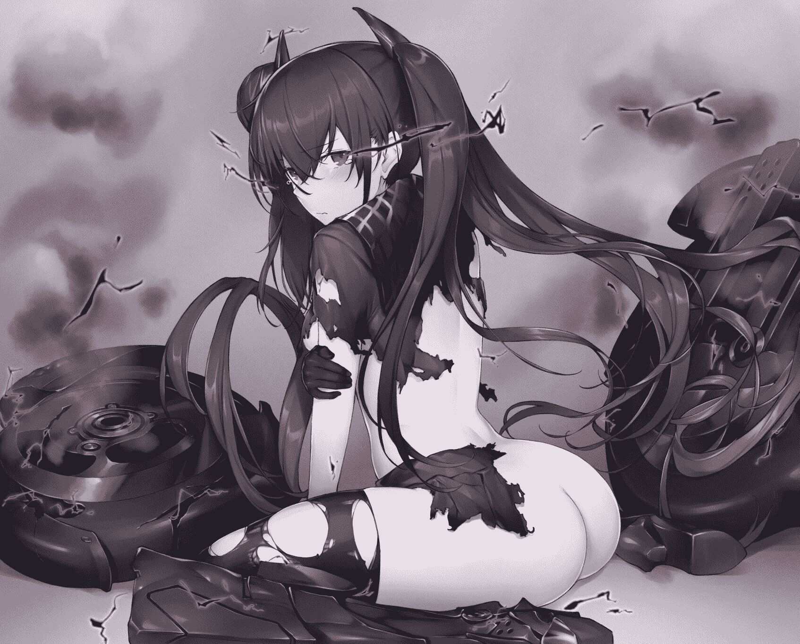

**QQ图片20181009172115.jpg** *(270.5 KB, 下載次數: 2)*

[下載附件](forum.php?mod=attachment&aid=NzUwODZ8ZjYxOTMzYWF8MTYwMDg4MDM0MHwxODIzMHwyMjkzOA%3D%3D&nothumb=yes)

2018-10-9 17:21 上傳

 

# 99

终于还是重新拿起笔来回到少前的世界里来了。从进入到这个子弹与火药的世界已经三年了，其中有过无数次以为自己已经没有那么多对少前的爱的时候，又无数次的发现自己的血液果然还是深埋在了这个游戏里了。哪怕是每天只是平淡地做做日常，也已经像是生活的一部分一样完全不可分割。甚至自己一个人看着主界面都能傻乐半天。

咳咳咳……话题扯的有点远了，所以这次长达一年多之后的更新，其实也只不过是将之前自己写的坑进行填补修缮，之后再放出来的，并不能叫做“新作”的东西吧。不过至少，这也算是更新了不是？（被打）

啊啊，接下来我还想写的东西有一大堆呢：

我想写AK12的下篇，想写她与AN94之间的爱恨情仇，以及插在中间指挥官的白学故事（WA：喵喵喵？）

我想写更多格里芬和铁血人形们的故事，或许还有一些涅托和OGAS之类的番外篇

我想写明日方舟的故事，我可是100满级的罗德岛高级资深博士（你敢信这个人到现在没挑战过危机合约和高难关卡）

我想写之前自己在影之诗打牌的经历，仿照论坛里的那篇《白骑士》那样将卡牌具现成GTS进行战斗（xmxmszn, ddykz）

我还想

……

好了那个谁帮我把那筐桃子拿过来，再顺便开个草莓味的煤气（划掉）

回到正题，这次是关于很早以前说的想开的衔尾蛇的坑，文章的大部分在当时其实已经写完，但就欠缺结尾所以一直没有放出来。现在……总算是补上了，虽然比较草制，但已经是我尽力在回想当时迸发的灵感了。总之，还请配上当时的约稿观看！（虽然约稿内容完全没有关系就是了，单纯只是想炫图而已）

<ignore_js_op>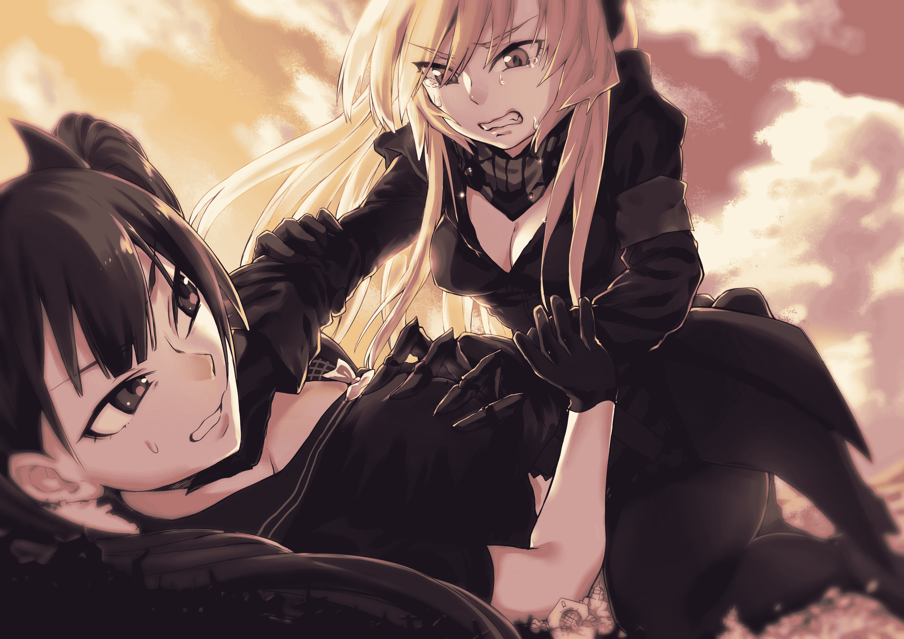

**SOP+衔尾蛇_看图王.jpg** *(806.53 KB, 下載次數: 1)*

[下載附件](forum.php?mod=attachment&aid=ODAzNjR8ZjM2ODI3Zjl8MTYwMDg4MDM0MHwxODIzMHwyMjkzOA%3D%3D&nothumb=yes)

2019-11-26 02:03 上傳

（设计台词）

SOP：为什么你这个家伙还活着！又想要来夺走同伴们了吗！！！

衔尾蛇：哼哼，谁知道呢（你这条疯狗就没注意到指挥官在我的胸部上吗！）

那么废话已经说的够多了，请移步下一贴欣赏。

 

# 100

**保持沉默**位于K市的废墟上，这片区域最大的黑帮团伙雷鸟组织刚刚结束了一场扫荡， 年轻的小伙子端着手里的机枪对跪倒一排的幸存敌对势力倾泻子弹，嘈杂刺耳的枪响声让大半座城市都可以听到。城市中在军方的炮火与人形的大脚下残存的难民们紧绷的神经再次接临崩断的节点。

“听好了，这座城市从今天起也被雷鸟接管，如果明天你们不能提交足够的物资那么就三个人里抽出一个杀掉！”

负责荡平这座城市的雷鸟小头目扬了扬手中的芝加哥打字机，随后从人类尸体组成的"演讲台”上跳了下来， 揉着下巴走向了被他们抓来的女性，他的目光仿佛是饥饿了数天的野狼， 肆无忌惮的用眼神强奸着聚集在一起衣衫不整的少女，直到目光定格在两个特别出众的个体身上。

“哦？这种地方还有这么棒的尤物？ 哼哼……喂， 听好了，这两个是我的，其他的带回基地以后随便你们玩！”那个小头目走到衔尾蛇的面前一把想要将对方拖出来。

“恶!”

衔尾蛇本能性地刚想用自己充满着澎湃力量的身体直接给那个恶心的男人一拳将他打飞，但是身体后背被站在她身后的57戳了戳，暗暗摇了摇头。叹了口气，衔尾蛇想起了在出发之前指挥官的嘱托，一个统一的黑道比起不断自相残杀同时祸害百姓的人要好的多了，想到这儿，她收起了那副不该出现的模样，把自已伪装成了一个柔弱少女。

“你……你们要干什么!”

略带惊恐的口吻从她的嘴里发出，装出一副坚贞不屈但本身却是普通女子的模样。

“做什么?做什么啊一"

小头目摘下了护目镜， 由于战争而造成的伤痕致使狰狞的面孔露了出来，一道由弹片划伤而从左眼横贯到右腮的伤痕增添了几分恐怖， “你知道了之后会更害怕，不过女孩的尖叫我也很喜欢...”

就在他拽住衔尾蛇的头发想要拽到阴暗角落时，一梭子弹在他面前不到半米的地方留下了一排痕迹，一个和他打扮相似也是小头目的女性阻止了他: “这种事留到回去再做，我可不想再核心地区外再遇到什么麻烦。”

"嘁……"

小头目重重的哼了一声松开了自己的手， “把'货‘都装上车，快点回去!”

黑道的其他成员背上枪，麻利的跑了过来，将被他们驱赶到一起的少女们推到了货车上。

"回去...我都已经快要等不及了。”

坐上了自己的武装卡车，小头目还不忘回头望了望后面车子上的少女们，揉了揉自己的鼻子，“快点开车!” 在他的命令下，整只车队开往了他们的基地所在的位置。

“这些恶心的虫子.....”在车厢的一角的衔尾蛇抬起了之前还是梨花带雨的面庞，原本伪装出的娇柔已经是彻底不见，取而代之的则是一片阴冷而可怕的气息。其他的少女似乎都感受到了这股气息而认为气温有些下降。

“好啦~ 衔尾蛇酱，不要这么不开心，他们的命运已经注定了不是么?” 在她旁边坐着的57与穿着水手服的衔尾蛇不同，居然是性感的三点式，她的脸上则是一副阴谋得逞的坏笑，“你可别忘了我们的正事啊，还有这些少女怎么办?”

“我对任务目标以外的人没有兴趣。” 衔尾蛇冷冷地回应道， “但我不会像那些渣滓一般滥杀无辜。”

想到这儿，衔尾蛇像是想起了什么似的，脸上居然泛起了一丝红晕，很难想象像她这种性格的人居然也能有一瞬间的笑。但很快整张脸再一次被阴冷狠厉所覆盖，“任何胆敢违逆雪风大人的家伙都不该在世界上多存活一秒。”

车队的路线并没有驶向什么城市的遗址，相反，在行进了没多久后车队就开向了一片茂密的森林。比起外面都是巨大鞋印的地面森林中的道路出奇的平整，或许从一开始雷鸟就已经做好了面对那些格里芬人形的准备。在通过了几处丛林隐秘的哨卡后，车子停在了一处瀑布边。头目从车子里跳了出来，大步走向了看似普通磐石的石壁，抬手重重的敲了几下：“喂，我们回来了，快点开门，还急着向老大报告情况！”

沉寂许久瀑布下的水潭轰鸣着扶起了一道可以通往瀑布内部的金属桥梁，一辆辆车穿过了瀑布进入了雷鸟的真正基地，装载着少女们的车辆通过时瀑布的水流直接浇灌在她们的身上，引起了一阵尖叫，车里的黑道们毫不掩饰的大笑了起来，每次带俘虏进来听着俘虏们被强烈水流冲刷而发出惊叫也是他们取乐的一环。

“好了，现在是享乐的时间了。”

头目大步走到了装载着少女们的车辆，似乎已经迫不及待的想要品尝自己抓来的猎物。

女头目又一次打断了他，将步枪顶在了他的腰部：“这些都是boss的，就算你有想法也要等和boss汇报完，得到同意。”

“臭娘们！”

头目狠狠地大声叫嚷了几声，但还是对着部下一摆手让部下们将少女们押解到关押囚犯的更深层地下室，自己粗鲁的推开女头目的步枪迈步走向了boss的房间，直到走远少女们还能听到头目不时发出的粗鄙声音。

人形的听觉让她们得到了更多的情报，每次有女性俘虏被抓boss也都会亲自前往牢房查看。

少女的囚徒队伍被几名黑道成员押送到了最底层的牢房，一进牢房的铁门仿佛穿越到了中世纪的欧洲。昏暗，脏污的牢房呈现在他们的面前，每个牢房里都关押了不少人地上铺着一层薄薄的稻草，那就是他们唯一的家具。

“把她们和那些敌对势力的人分开关。”

黑道成员在给一个狱卒短暂的交代了几句就匆匆离开，看来这种环境对于他们来说也难以忍受。

幸运的很，少女们被分到的牢房是每两个人一间，而衔尾蛇和57似乎是因为被那个小头目看上了的缘故，被安排在了同一间牢房。

“看来他们已经决定要早点死了”

这是衔尾蛇在狱卒粗暴地把她们塞进牢房后走远之后说的第一句话。“好啦，衔尾蛇酱稍安勿躁，等我先确认下我们的人在哪儿……”

随着57抱了抱衔尾蛇，用丰满的胸部对着她来了一次“洗面奶”，在遭到对方不断的挣扎之后才放开。紧接着在衔尾蛇的怒视中坏笑着启动了脑内的芯片。

而在稍远处的地方，有两个满脸血污，但还算留着一条命的男子的左手臂开始有规律地颤抖了起来，两个人在确认了并不是自己肌肉的颤抖之后，惊讶地对视着坐了起来，紧接着开始不断地扫视着周围的其他房间。

“BINGO！”

57低声笑着说道。

奄奄一息的两个人想起了之前组织命令每个人都要做的检查，而那次有说过如果有人形想要找到自己手臂里的芯片就会有反应，其中一个还有几分力气的少年努力挪动脖颈让自己可以重新抬起头，后脑倚靠在凹凸不平的地牢墙壁，目光扫试过今天被带来的俘虏，这一系列动作几乎消耗光了他全部的力量，最后目光定格在了那单独牢房中的两个少女身上。他吃力的张了张嘴似乎想要说点什么，但干涸的喉咙却只能传出一阵嘶哑的咳声，那副模样看上去一定是已经遭到了非人的拷问。

就在他拼命地咽了几口唾液想要说点什么的时候，牢房的大门再度被打开了，狱卒原本的一副半睡半醒的神态一看到走进来的人登时烟消云散，一个起身笔直的站立在了门边。从门外走进了三个人，除了为首的人人形不认识外她背后的两个人正是之前押送她们的两个头目。走在前面的女人穿着着一身纯黑色调的晚礼服，低胸的胸托几乎要将双乳弹出来，一头金色的长卷发带着一股雍容华贵的气质，俏脸含笑隐约透露出一股人类大人物所特有的压迫感。她慢慢走到了关押着两个人形的牢笼前微眯双眼凝视着二人：“嗯~真的很不错，你们俩，叫什么。”

“呜……”57伪装成了清纯少女不断害怕地蜷缩在角落不敢回答，而衔尾蛇则是根据之前的伪装恶狠狠地说着：“呸！你们这些人要对我们干什么！”

boss抬抬手，身后的头目一把夺过了狱卒手中的钥匙打开了牢门，boss迈步慢慢的走进了牢房里，而背后的两个头目也都警惕的跟着。

boss先是走到了衔尾蛇的面前，脸上戴上了迷人的笑意，戴着黑纱手套的手指轻轻挑起了衔尾蛇的下巴，从她身上散发出的龙舌水味道飘散着盖过了牢房的气味：“我没有想干什么哦，只是觉得这样的牢房很不适合你们这样可爱的少女。”

说着她便从红唇间吐出了一抹带着清香的烟雾，那是惯用的迷烟，可以让人类陷入朦胧仿佛置身梦境，但是她却并不知道的是这种低级的迷雾对于人形却并没有一点用处。

“呜……”57依然“害怕”地蜷缩在牢房角落低声抽泣着，而衔尾蛇眼中也有些“湿润”，“你……你……”紧接着似乎是中了朦胧，陷入梦境，眼睛开始半眯缝起来，就像是已经开始意识模糊一般。

boss没有在意肮脏的地牢直接在这里打算进行下一步，柔软的酥胸贴在了衔尾蛇的身上带着柔软与一股压力慢慢的将她压到在了稻草上，纤细的手臂穿过她的发梢从后面搂住她，紧接着面庞也贴了下去，红唇紧紧印在了她的唇上，人类温热的舌尖仿佛一个入侵者带着刚刚的那股幽香撬开了衔尾蛇的嘴唇，上下舔动着她的牙床：要做个乖孩子~

“呜呜……”衔尾蛇似乎像是在无意识地回应一般，双手似乎是像受到吸引一般搂上了那个女性的boss。而57此时似乎是害怕到极点地站了起来，如同一个胆怯的少女一般，向着在后面两个头目走了过去，两个人和守卫并没有什么反应，毕竟少女已经是他们的囊中之物。

此时的boss兴致正高，丝毫不想被自己的部下打扰，一边强吻着衔尾蛇一边慢慢的拉开对方的衣服，用自己柔软的身躯紧紧地贴上去。舌尖缠绕住对方的舌头吮吸着她的味道，身上的晚礼服也被不太优雅的动作弄得凌乱，裙下的蕾丝情趣内裤已经出现水渍，如果是往常她一定已经开始和少女进行到了最热烈的一步，但今天不知为何衔尾蛇的味道让她品尝的忘记了下一步，只是隔着裙子摩擦着对方的腿间。

那头目眼神里本就透露着满满的怨怒，自己的猎物被别人抢走已然够让他窝火。此刻看到走向自己的弱气少女再也安耐不住，疯狂的想要冲上去，甚至一边的女头目都没有拉住他，就仿佛饿狼扑到了绵羊一般。

然而在这一刻，“猎手”和“猎物”的身份已然逆转了开来，就在那个boss纵情享受着自己的欢愉时，她没发现衔尾蛇缠绕在她后颈上的手臂已经越收越紧，压迫着她的神经。在完全不伤害到她的身体也不被她发觉的情况之下让她轻微地昏迷了过去，整个人趴在衔尾蛇身上软软地睡着了。

而在另外一边，57面对着扑向自己的男头目轻蔑地重重一膝屈伸顶在了他的小腹上，强烈的痛楚刺激着他的神经，让他的身体瞬间分泌出大量的肾上腺素而疼昏了过去。紧接着又是双手两下手刀敲在了另外一个女头目和守卫的后颈上，人形的真正全速动作是人类根本无法反应过来的。

“有点慢哦，衔尾蛇酱~”

57拍了拍自己的双手，轻松地回过身来对着自己的同伴说。

“蠢货”

衔尾蛇低声骂了一句，也不知道是在说57还是在说自己身上的那个女人，她将她的身体轻松地推开在一旁，同时也站了起来。之前守卫打开的牢门依旧还敞开着，虽然这样的铁门对于人形来说根本不是什么大问题。

“那么，我们可爱的小朋友们，看来需要我们的一些帮助呢~”

在迈出了牢门之后，57扫视着周围不少惊恐地看着自己的少女们，以及远处那个有着自己人的牢房笑着说道。

面对突如其来的变故，地牢里的其他少女们瞪大了眼睛，不明白到底发生了什么，那两个看上去身经百战的头目瞬间被一个看上去比自己还娇小的少女解决让他们一时无法接受。

而在关押着另一方黑道的牢房中目睹了这一切的两人也说不出话来，他们也知道人形的强大，但原本以为仅仅是她们体型的巨大，但没想到变成人类大小依旧如此犀利，地牢的气氛陷入了冰点，没有谁胆敢打破这份寂静。

“！！！”

两个依然还是二十几岁的青年看着站在自己面前的57惊讶地瞪大了眼睛，不为别的，因为他们所看到的事物实在是太惊人了。有着小孩手臂粗的钢管被她沉身一发力居然给扭成了麻花，这样可怕的力气不由得让两人不惊讶，眼珠子几乎都瞪出了眼眶。

“那么，小伙子们，准备好回家了吗？”

57露出笑容打开了牢门，对着两个青年说道，而在另一边，惊呼声不断的响起，那是取走了狱卒钥匙的衔尾蛇一间间打开了关押少女们的牢门。

少女们一个个跑了出来，虽然不明白他们俩的真实身份但一个个都将她们当做救命稻草，围绕在衔尾蛇身边没有离开，有几个胆子比较大的忍不住唧唧喳喳的问起她们问题，诸如她们为何能够打到那些坏人之类的。

而看着牢笼被打开的两个青年互相搀扶着面前站了起来，其中一个伤势比较轻的对着少女鞠了一躬：“谢...谢谢你来救我们.....明明我们只是黑道的成员，你们还伸出援手，真是太感谢了。”

“……”

衔尾蛇似乎被少女缠的没有办法，只是自顾自的走着并没有回答围绕着她的女生的问题。她将女生留在了57的身边，随后一个人独自走回到那个牢房之中，把三个人扛在了双肩之上，就这么有些吓人地走了出去。

少女们有些失落，似乎是对于衔尾蛇冰冷性格的不理解，但是57的笑容让她们又回过了神来。

“既然你们是我们的人，那自然对你们应该有保护措施，而且你们干的不错~”

紧接着，她对少女们说道：“能麻烦你们都钻到一个牢房里去吗？这样我等下也会方便一点”

虽然少女们不理解57所说的话的含义，但是对于解放了她们的英雄的话还是言听计从，而那两个青年的脸上则浮现出了思索的神色，她难道要……？！

“没错~”

随着57的话音落下，她的身体也开始发出惊人的变化……

被黑道俘获的少女们都钻进了青年所在的牢房里，原本用来审讯这两个头号罪犯的宽敞牢房一下子变的拥挤起来，几个自告奋勇照顾重伤青年的少女帮着他们移动到了牢房的角落里。

这时地面的震动引起了所有人的注意，刚刚还在小声交谈的少女们都将目光投向了57，娇小可爱的泳装少女似乎比之前变大了不少，刚刚还略显瘦小的她头顶已经顶在了地牢的天花板上，再接着天花板破碎开来，大量的碎石砸落在地面上，少女们眼前的那个泳装少女呈几何倍数地正在不断变大着。漏趾高跟鞋的鞋跟推向地牢另一边的墙壁，轰鸣着碾碎过去，然而她变大的动作仍旧没有停止。

少女们恐惧了，也许没有谁面对这样的场景可以做到面不改色，几个聪明的少女顷刻面无血色，教科书里的内容让她们想到了最糟糕的情形——这个女孩说不定就是那些把城市变成鞋印的人形。顿时，尖叫的声音成为了这个地牢的主旋律。而她们面前的少女在停止变大后，呈现在她们面前的是比她们人还要高的高跟鞋超薄鞋底，这个地牢的大小只能容纳露趾鞋的三分之一，洁白无邪的圆滚滚脚趾肚踩在她们的头顶顽皮的扭动摩擦，上面的趾纹从她们的角度看去都清晰异常。一种剧烈的恐惧弥漫开来。或许这个可爱的巨大人形，下一秒就会脱掉鞋子，用裸足将少女们变成脚趾底下的装饰。

“抱歉啦，不过这样是保护和运送你们最便捷的办法~”

57的娇笑声从上空传来，牢房中的每一个人都能听得清清楚楚。紧接着巨大，有着造船圆木那般粗细的手指已经如同灵活的章鱼一般攀附在了地牢周围的砖墙上。手指用力的地方甚至可以听到清晰的碰撞声，一些细碎的粉末酒落下来打在少年少女们的身上，让他们无比的害怕。紧接着，如同乘坐电梯一般的感觉，他们看着自已所处的位置被整只手轻松地带上了上方，不断钻坡砖墙之后所到达的外面的世界，阳光有些刺眼地洒落下来，均匀地铺在牢房内的每个人身上。

“啊哈哈，还真是轻松呢，那么各位，没什么问题的话，我们可要出发了哦?”  

小小的牢房如同盒子一般平躺在57的手心之中；而在天空之中的高处，是那张放大了无数倍却依然无比美貌而调皮可爱的笑脸。

百米以上身高的巨人屹立在丛林的大地上，丛林之中每一处岗哨都能看到她。谁都不知道那个巨人从哪里来的，更不可能知道她是如何找到雷鸟的大本营。聪明的雷鸟成员选择了拿上手里的武器以最快速度远离那双已经将基地踩烂的大脚，而愚蠢的死忠份子则使用一切可以使用的武器攻击起57从基地里露出来的脚腕，一点点闪亮的火光在她如玉璧般的"纤细”脚腕闪耀着。

被拿到57手上的少女们觉察到了人形与人类之间的差距，过去在书中看到的和现实所能体会到的压迫感完全不同.开始她们还能尖叫，但当两根手指如同戳破零食的包装盒戳破地牢的天顶时她们也再也叫不出来，眼前的一切仿佛是高速上升的观光电梯，四周骤降的温度也让她们颤栗的身躯颤抖得更加厉害。人们看着远处那个少女甜美的笑颜心里仿佛生出了一只受惊的小鹿几乎要将心脏跳出来。两个黑道的青年也是第一次被巨大的人形放在手上，原本应该说点什么的他们只能看着少女张大嘴巴却说不出话。

“还真是有趣呢...”

57扫视着周围乱成一团的场景，她笑着开始了自己的行动，随着她向前迈步着，那栋基地建筑在她的移动之中轰然崩塌，里面还有几个来不及逃出的倒霉鬼就这么被压在了无数的砖瓦废墟底下。而也有些不长眼的人试图攻击她，然而不管是子弹，手雷，甚至是反坦克用的火箭筒轰击到她的洁白脚腕上都丝毫没有任何效果。在烟雾散去之后甚至连一丁点的痕迹都没有在那细腻的肌肤上留下。

“啊呀呀，看来是被吓着了呢~”

57笑着用手指摸了摸躺在手心之中的牢房，里面的青年男女们默不作声，听着外头不断的枪炮声让他们不好的回忆又开始浮现起来。

“那么，给大家一些57爱的温暖吧~要是想闭上眼睛休息一会儿也是可以的哦？”

57用另外一只手轻轻地勾住自己胸罩中间的布料，少许将自己的双峰解放了一些，紧接着将那座小小的房间向着自己的乳沟按了下去，在不妨碍到正前方视线的同时又让整座监牢处于柔软的乳肉包围之中，甚至可以闻到一股淡淡的少女芬芳气味和若有若无的奶香气息。

地面上的雷鸟成员没有停下攻击，可惜地面上嘈杂的枪声甚至无法传达到57的耳朵里，一阵阵淡淡的温热触觉仿佛腿部按摩，带着几缕麻酥酥的舒适体验，对于人类来说致命的武器放到人形身上显得那样渺小。雷鸟的成员士气降低到了谷底，原本还意志坚定的成员出现了溃逃的迹象，再加上boss和两个头目迟迟没有出现，还不等57做出反击便已经开始了逃散，曾经巨大的黑道组织在这一刻已经不复存在。

被57轻柔按压进乳沟间的牢房中小人的紧张情绪慢慢的得到缓解，温热的环境与微弱的摇晃使她们产生了困顿，连原本想要和人形交涉的黑道成员也变得昏昏沉沉，没有人做出回应，也没有了之前恐惧的情绪。

57就这么优雅地向前走着，沿途也有人和车辆试图反击，但是在巨大的高跟靴底下显得是那么的不堪一击。基地里原本还有的几辆装甲车除了一辆被试图逃窜的成员开走以外，剩下的两辆在开到57面前对她进行攻击之后便被鞋底的巨大阴影所覆盖，整个装甲车连着里面的成员一瞬间由3D变成了贴在地面上的2D图案，时不时还有丝丝鲜血从中流出，这更让附近的黑帮分子感到恐怖异常，整个局面更加混乱起来。

地面上的雷鸟成员惨叫着仓皇逃窜，恐惧掠夺走了他们的理智，甚至忘记从57的前进路线离开，径直的向着一个方向跑，在57的眼中就像是这群小人挑衅的要和她赛跑一般。黑色的鞋底已经染红成了黑紫色，每每抬起就又增加了几处血污。终于轮到了跑的最快的一拨人，就在他们拼劲全力往前冲刺的时候一抹阴霾覆盖了他们，天空换成黑色的沙滩鞋鞋底，尖叫怒吼还有不甘在57的鞋底回荡，但是又有谁会在意鞋底下蚂蚁发出的抗议呢，伴随着轰鸣落地，最后一群逃跑在57离开路线的小人死在了她的鞋底，这群小人的价值显得那么卑微。比起赤脚踩碎带来的快感，他们甚至不能让这位巨大的人形有一点感觉。

不过这一切身处57胸部乳沟内安稳休息的男女们是不会知道的，她们现在身处温暖乳肉的包围中，甚至有些不雅地发出了鼾声此起彼伏，所有人在这一刻都在释放着自己高度紧张的神经。

而在另外一侧，衔尾蛇在57开始走远之后，看着面前的三个人开始慢慢醒过来，坐在一块大石头上，阴冷的眼神看着几个人。

“过了这么久才醒过来，果然人类还真是脆弱。”

幽幽苏醒的boss一醒来马上警惕的戒备四周，但看到只有衔尾蛇时，自信魅人的笑容又重新挂在了脸上，似乎雷鸟组织的兴亡对她来说还不如与美人的春宵一度：“啊啦，看来这次，我不开眼的手下带回了大人物呢。”

苏醒的boss还想要继续对衔尾蛇出手，爬起来之后慢慢走向了衔尾蛇，如同之前一样，一只手缓缓地揽住了她的腰肢，一条腿曲起盯在她的腿间仿佛在试探，面庞顺势压在她的耳边：“你，不会想杀掉我吧~”

而在他的背后两个头目顺势从地上捡起了枪，对准衔尾蛇的头，一刻也不能松懈的盯着她，现在的事态已经让他们完全不知道该如何是好，唯一的希望就是还没有出事的boss。他们很想开口发问，但是boss的兴致还在，他们就不敢打断。

“你的技术比雪风大人可差远了，而且……”衔尾蛇冷冷地将那个女人甩到一边，“你们对于我来说不过就是虫子而已……”

“还有，收起你们的枪，那种玩具对我没有什么用。”

boss被甩开到了一边，看向衔尾蛇的目光更加有了征服欲。而两个头目则不再留情，手里的枪几乎在同时开火，不过瞄准的则是衔尾蛇的腿，精准的子弹每一枪都打在她的膝盖上。

“烦人的虫子……”

衔尾蛇无视了那打在自己身上的子弹，转头对依然躺在地上的那个女人说道，“看来你已经知道我是谁了，那么，还有什么遗言要说的吗？”同时一脚踢出，精准的将两把枪械甩飞到了远处，而两个小头目也被这迅捷的一脚给扫倒在地。

雷鸟的boss慢慢爬起了身上，挠了挠头，看着自己最得力的两个部下被瞬间制服似乎也有所放弃：“啊，说真的，上帝都造不出来的怪物，人类到底是怎么造出来的....我肯定不是你们的对手，基地被发现恐怕现在已经全毁了，现在我唯一可以选择的只剩下投降了不是吗？”

而两个头目也慢慢的从地上爬起，在boss表态后也明白了现在自己的命运完全掌握在了对方的手里。

“多么可笑的词语，你们之前已经好几次与我们作对，还期望着我现在会放你们一马么……”

衔尾蛇的嗓音已经恢复成了原本的低沉而又略带些中性感的特殊嗓音，她的眼神中满是不屑。“我接到的任务就是毁灭这里的一切，你们是要我违背雪风大人的命令么？”

“哼……”衔尾蛇冷哼了一声，目光游移着，看到了boss在礼服内侧所佩戴着的防身手枪，“去，把那个男的杀了，我看他很不爽，特别是之前还要威胁我。”

boss没有犹豫利落的动作就像是在玩着一场射击游戏，拔出射击，简单的动作一枪结果了头目的生命。还没有从衔尾蛇的话语中反应过来的头目连求饶或是反抗的机会都没有就轰然倒在了地上，变为了一具尸体，但比起黏在57沙滩鞋下的尸块，也许他是幸运的。

另一个女头目慢慢的闭上眼睛，虽然自己对于这个同伴也充满了不满，但是boss仅仅因为女人的一句话就将他处决这股兔死狐悲的感情快速上浮，甚至从内心深处浮现的绝望让她有种想要自裁的冲动。

“这样，可以代表我的诚意吗？”

“不，这只不过是我个人对他很不爽而已。而且……”

衔尾蛇厌恶地用自己的高筒靴踩在了那个男人尸体的脸上，磨了磨自己的靴底：“不过是一只虫子，要想结果他实在是太简单了。”

“那么……”

衔尾蛇深吸了一口气，将那具尸体踢了一脚，使其开始翻滚着摔进泥水里之后，随后自身的身体也如同之前57那般开始膨胀起来。

“说出我不该杀你的理由，还有，那个女的，是谁？”

衔尾蛇在变大的过程中，向boss示意那个女性头目。

面前的人形急速的巨大化，原本瀑布顶端的混合材质地面一下子就承受不住她的重量坍塌了下去，而两位女性也跟着坠落进了瀑布下面的水潭。boss咳了一声拼命地趴在了面前的物体上，在等到回过神才反应过来，自己竟然趴在了衔尾蛇军靴的金属鞋头上。这个本可以轻松碾碎她们所有人的凶器现在居然变成了她的救生艇。而另一边的女头目则漂浮在水中，目睹了踩在水潭里的军靴一步步变大，最后连整个水潭对衔尾蛇来说都变成了小小的泥潭为止，原本可以逃跑的女头目看了看高耸的鞋头上自己boss的身影打消了念头，一只手扶着靴子沉沉浮浮。

boss身上的晚礼服被潭水浸透，她索性脱去了礼服，仅留下内里束缚着身体的中世纪内衬，盘起腿仰头望着天空：“不杀我的理由吗，我还有很多用处哦？”

“比如什么？”

衔尾蛇的声音从天空中发了出来，灌进了她们的耳朵中。

boss叹了口气，捋了捋头发，原本就有股风韵大姐头意思的模样此刻面对巨人的轻松神色更加让她看上去与众不同，或许这样的女性能成为巨型黑帮首领并不是没有理由：“嗯，让我想想，我的人脉很广，可以帮你们联络很多对你们有用的人。我在军方也有探子，或许对你们的组织也有很大帮助.....再不行的话，我想虽然你认为我不如你的那位爱人，但是我也可以在你一个人的夜晚作为一只虫子帮你缓解孤独”。

“那么她呢？”衔尾蛇的黑色眼瞳中居然发出了红光，而红光所形成的电流甚至延伸出了眼瞳外，让她整个人看起来如同怪物一样分外可怖。“这个女人，又是谁呢？”

boss注视着衔尾蛇，对方眼睛里放出红光的行为已经完全证实了自己的猜想，看来自己这一次差点就对这只怪物出手了，她笑了笑依旧没有一点紧张就算是在这里已经可以依稀看到远处57留下的脚印和里面的不能成为人类的残骸：“她嘛，是我的部下，一个孤儿但是很可靠，但是如果她也让你不爽的话，我可以命令她自裁。”

“我对她没兴趣……”

衔尾蛇的声音似乎柔和了下来，或许这是幻觉，但很快又恢复了正常，“看在你之前阻止了那只恶心的虫子的份上，你可以走了。”

“至于你……”

衔尾蛇的红光扫视着趴在自己靴子上的那个“小”女人，对方意外大胆的行为确实让她带来了一些新鲜感，“要想活命就得放弃一切，从此之后你不会在拥有任何东西。”

泡在水里的女头目努力扬起头，再次看了一眼靴子上的boss，眼里带着复杂的感情游向了岸边身影逐渐消失在浓密的丛林中，一个人类在面对如同邪神般存在的铁血时太过于无力了。

boss听着衔尾蛇所说的话嗯嗯的点了点头，目光无意中扫过了离开的女头目一眼后马上又收回，双手放在腿上大声回复衔尾蛇：“嗯，我现在剩下的也只有我的命了不是吗，之前我的所有东西都已经被粉碎在你的脚下了。”

“既然你那么喜欢的话，就让你多接触下好了。”

衔尾蛇的话语似乎根本听不出人类说话时所附带的任何感情，所有的只是冰冷，机械，无情。而随着军靴的抖动，包裹着黑色袜子的脚被从靴子的套口中伸出，精确地踩在了靴子上那个女人的面前。

“知道该怎么做么？想活命的话，把我当成你的主人吧。”

似乎代理人在管理战俘营的时候是这么对那些人说的……衔尾蛇的心里想着。

boss看着踩在面前的巨大脚掌心里一沉，这样的事情从来只是她命令其他女孩去做的，而今天却要让自己亲自动手。对于这个巨大的铁血来说自己只有虫子大小，如果做了那么也许自己作为一个人类的尊严真的就要彻底丧失。她努力控制情绪深吸了一口气，从黑袜里飘散出的淡淡气息吸入了她的鼻腔，尽管那与人类的味道比起来更像是清香但是还是不足以让她放下人类的尊严。

boss扬起头看向衔尾蛇的面孔：“唔，让我做这种事以后侍奉您的时候会否让您觉得不干净啊？我可以做其他的事来代替……”

“我的决定只会说一次。”

衔尾蛇的红光粗暴地投射在她的身上，同时从空中飘下的话语打断了她的谄媚。

铁血所散发下来的威慑感让boss的心灵也颤抖了起来，过去在人类利用人形对抗铁血的时候她就已经有了自己的武装，在见识了几场铁血量产机器人的屠杀后她就已经深刻的明白不要和铁血为敌。此刻她面对的不是那些量产的机械而是一个独一无二的高级铁血人形，就算是她也终归臣服于对死亡的恐惧。

boss低下了高昂的头颅，在人类社会中可以算是上人之姿的姣好面孔贴在了衔尾蛇比她还要高出许多的脚趾上，嘴唇压在上面吸吮出黑袜纤维间的温热液体后再艰难的咽下去，努力不让自己露出排斥的表情，但笑容已经僵硬。

“我知道你在想什么，但我对你的想法不感兴趣。你要做的只是绝对的服从。”

衔尾蛇淡淡的说着， “当然，以后也会有用得上你的地方。如果你给我的感觉还不坏，也不是不可以使用你……不过现在，你就先在我的靴子里呆一阵子吧。”

随着衔尾蛇的话音落下，刚才boss还依然在舔舐的脚趾已经朝着她靠拢了过来，将她轻轻夹起之后移动着从靴子口带了进去，她在鞋内不断地翻滚着，身后则是慢慢追着她移动的巨大脚趾，最后，直到接触到了鞋尖的位置，她才勉强在脚趾下方找到了一个可以容纳自己的小空间。boss没有出声，她努力的希望自己可以适应，让这个铁血对自己改变印象。但是从没有服侍过人的她根本不知道该如何下手，现在的自己甚至连脱下对方的黑袜都做不到。只能惺惺的闭.上眼睛，走进了对方分开的脚趾缝里，被带进了衔尾蛇密封的靴子里面。

四周还在抵抗的雷鸟已经不复存在，只有零星几个跑得慢的雷鸟成员在衔尾蛇的目光下在丛林中若隐若现。

“委屈吗?我其实对你还有着不算太坏的感觉。”

衔尾蛇开始向着相反与57的方向开始进发，那是废弃城市的方向，“ 不过你养的人还真是些蠢蛋，不想着寻找躲藏的地方，反而跑去废弃都市去报信，不过也没什么必要了，本来我的目标就是去那里。”

待在衔尾蛇靴子狭小空间的boss逐渐适应了四周昏暗的环境， 自己的身边是这位冰山美人的两根修长脚趾，她甚至现在都怀疑自己只是做了一 场噩梦， 黑袜的缝隙对于自己这样的人类来说显得异常的大，而四周逐渐闷热的环境与越来越浓郁的味道也让她的内心也开始胡思乱想，人形也会和人类一样出汗吗，自己究竟要里面呆上多久，又会怎么样。

而上述的感受仅仅不到半分钟，当衔尾蛇迈开步伐的时候一切又发生了改变， 她先是有了一种急速升空的感觉，紧接着又是一种从高空落下的失重感，而这仅仅是衔尾蛇迈出的一步。

boss闭上眼睛紧紧地咬住嘴唇，寻找着可以让自己不被甩来甩去来回撞击在柔软趾壁上的方法:“唔，好，好晕，呜呜!  ”

“之前就告诉过你了，想要活命需要的是绝对的服从...”衔尾蛇的声音幽幽的从靴子口飘荡进来，在boss听起来那个声音已经完全不似人类。自已所相处的似乎只是一个有着人类外形，内里却完全是其他东西的一头恐怖怪物。

而在外头，衔尾蛇一边行走着，一边查看着那些可能潜藏希剩余雷鸟分子的地方，在脑内的电子战术地图上标注着。没过多少时间，在森林里已经彻底被脚印所覆盖之后，她来到了废弃城市的边沿，用着巨大的姿态冷笑着俯视着脚下低矮的房屋，随后目光又投向了那些似乎与她齐平甚至还高出一头的高楼大厦来。

待在鞋子里的boss逐渐习惯了这样的颠簸，她拔出了藏在高跟鞋里的锋利匕首插进了黑袜的缝隙里，慢慢的割破了一个口子爬了进去。小小的身体躺在了脚趾缝间的嫩肉里，轻微的刺激使得衔尾蛇的脚趾将自己夹紧固定住。有些得寸进尺的躺在了舒服的软床里，淡淡的香气，温热的环境，  舒适的软床，让这个小小的女强人有点享受起来，只是不知道衔尾蛇看到被虫子"蛀" 破的丝袜会怎么想。

而外头与boss一点点适应不同，雷鸟的成员无论如何都想不到这个巨大的刽子手是怎么发现他们的。不论是躲藏在小溪里或是密林下，那只铁质军靴总是会精准的降落在他们的头顶。不一会所有逃散在森林里的雷鸟成员都被铁靴埋进了土里，只有最开始逃开的一伙人躲进了城市废墟他们殖民的大厦中，可惜那恶鬼似乎也完全不想放过这里。

“这些虫子...”

衔尾蛇冷笑着看着因为自已出现而明显变的开始惊慌失措的人们。“ 真以为我们找不到你们吗...只是之前雪风大人不愿意直接不给你们机会就清扫罢了。不过现在倒是正好，这么多的人，已经够上演一出很好的舞台剧了……” 衔尾蛇一边这么说着,从她的双腿的两端，突然发出了机械的摩擦声，随后开始有着巨大的轮子不断从中钻出，镶嵌在她的小腿周围，形成了两具圆形的形状怪异发射器。

“那么，首先要不能让舞台上的虫子爬下去呢...”

随着无比巨大的导弹被从喷射口发出，数道拖着烟尘的导弹在空中飞行了数圈之后精准无比地撞击在了城市周围的高层建筑上。废墟遭到撞击再一次的崩塌坠落，形成了无数的瓦砾将出城的道路彻底封死。那些导弹并没有爆炸，因为里面根本就没有装药，掉落下来用于撞击的导弹滚落了下来，如同巨大的路障一般更加将逃跑线路封锁得密不透风。

一栋栋大楼里的小人们趴在了窗边，他们有的是逃到这里的黑道,有的是被黑道挟持的居民，此刻全都变成了巨大铁血的俘虏，一个人都逃不掉。想要抵抗的人类终究只是少数，几个胆子大的黑道率先走到了天台，  在天台上跪了下来，拼命地磕头，甚至磕的血都流了出来，乞求饶恕的声音此起彼伏，显然之前在森林里的遭遇已经让他们吓跑了胆。

而在地面上，  黑道人员驱赶着普通居民让他们在枪口的逼迫下跑向四散奔逃，  而他们也混进了人群中，以为今天的人形还是像往常一样不会伤害无辜的人，使得自己可以浑水摸鱼。

“嘁...又来这一招么...”

看着四散奔逃的人群，衔尾蛇的兴致一点也提不起来。她找了一栋顶层平坦，大致到她臀部处可以充当椅子的建筑。稍许整理了一下自己的衣着后就坐在了上面，两条腿在人们看起来竟然比建筑物还要高出几分。

“城市里的虫子们，如果你们还想有一丝活命的机会的话,十分钟之内到我的面前来，当然我更希望你们不来，亲自过来连同你们的藏身之所一起碾碎也是件不错的消遣。那么，你们自已决定。”

如同西伯利亚冰原上的寒风一般，极度的杀机已经彻底笼罩了这座废弃的都市。

地面上逃窜的小人仿佛正在搬家的蚂蚁慌乱的四散逃命，却又被这位俯视城市的铁血一览无余。看到巨大人形消极的动作，趁乱逃出的黑道心里一阵窃喜，更加快了脚步，直到到达城市边看到那高耸的弹壳。

而原本在楼顶上磕头求饶的小人听到她的话马上来到了她的面前，跪倒在了她的鞋子前，不一会就聚集了几千人。但其中大多数都是黑道人员，他们明确的知道人形的威力，相反不明所以的居民们还在随着人流慌乱的东奔西跑没有听命。

“还有五分钟...”

衔尾蛇漫不经心地说出了让人胆寒的话语，而随着她的话音两边悬浮着的导弹发射器炮口也在上下摆动着，似乎随时要射出那大的吓人的导弹将不听话的人化成灰烬一般。

终于这恐怖的一幕让居民们冷静了下来，伴随着一阵尖叫声他们都明白了自己的处境，浑水摸鱼在人群中的黑道也感觉到了自己想法的天真，很快所有人都跪倒在了她的鞋子前，足以几万人的数量，就算是踩踏恐怕也要踩上一阵。

黑压压的人群也让衔尾蛇少许感到有些不快。“恶心的虫子...”她在心里这么默念着，不过随后她便想到了一个很好的方法。她的另一只脚，没有装着那个女性boss的那只脚从靴子中伸了出来，巨大的足趾踩在了所有人的面前。紧接着衔尾蛇少许收了收腿开始用自已的脚向下挖出了一个对人类来说宽大无比的洞穴，而洞穴的一侧还被特意踩成了一个斜坡。

“这是给你们的东西。”

衔尾蛇冰冷的话语落了下来，她从水手服的口袋中捏出了一个对她来说极其微小的箱子，丢在了洞穴前的空地上，随着箱子碎裂，里面的东西滚落出来展现在所有人的面前。那是如同古代武士所使用的一把把冷兵器。

人群看着那只黑袜所包裹的大脚冒着热腾腾的蒸汽，  在刚刚森林里的“足部运动"似乎已经让她出了不少汗，但也有可能那仅仅是热身运动。两人高的脚趾在他们的面前竖了起来比铲车还有效率的挖出了一个大坑，那大坑看上去可以活埋十几个人。在箱子炸裂开一把把泛着寒光的冷兵器插进了坑里，望着这一出惊人的表演人类们不知道她有什么意图，但是求饶的声音叽叽喳喳越来越大，越来越使人烦躁。

“很简单，胜者生，败者死”衔尾蛇眼中的红光此时发挥出的作用如同舞台上的聚光灯一般，很快随机锁定了人群中的两个人，“你们是第一组了。另外不要想着糊弄我，不然你们不会想知道下场是什么……”

两个被照到的人身体仿佛被雷击一般瞬间僵住，一个是黑道成员而另一个是普通的居民，居民看到自己被照到更加拼命地磕头，而黑道成员迟疑了一下跳进了坑里拔出了一把日本武士刀，不过看向衔尾蛇还是不够肯定。

“不用犹豫，你们这些虫子……”

衔尾蛇冰冷的语句洒落在所有人的头上，如同散发着无限寒气的冰窟一般，“在我诞生的时候，便是在一千场最激烈的棋局，最激烈的策略选择之中拼杀出来的。而你们这些头脑简单身体更是脆弱的虫子，就该用鲜血好好的取悦我……”衔尾蛇的脚趾略微在地上扭了扭，轻微的震动传导到人群之中，让本来就已经惴惴不安的人们更加的开始绝望。

被衔尾蛇目光扫过的人或被身边的同伴为了自保推到坑里，或是自己咬牙跳进了土坑，很快在里面就聚集了八组被迫参与决斗的人类，从衔尾蛇的视角看下去这些小虫几乎一模一样，也许只有这样残酷的生死对决可以让他们中稍稍优异的个体体现出来。落进坑里的人是黑道还是普通居民一眼就可以分辨出来，黑道快速的拿起了插在地上的武士刀或者其他便于近战使用能一击致命的武器，而普通居民们则一副惊骇莫名还没从衔尾蛇的话语里回醒过来的样子。很快八组决斗就结束了七组，可剩下的一组两个人似乎都没有打的意思，呆呆的站在原地一动不动。

“我说了吧，胜者生，败者死。”

衔尾蛇像是发现了如同在机器里被视为错误的bug程序一般，冰冷的眼神扫视在两个人的身上，红色如同鲜血一般的灯光照着他们，让不管是坑内的决斗者还是坑外的人群都有些心中发寒。“那么，你们既然没有决斗的意愿的话，你们就没用了。”如同天空崩塌一般，巨大的脚趾从坑外伸了下来，如同工厂中的重型打桩机一般，而目标就是那两个不愿参与决斗的普通人。随着脚趾慢慢降下，他们也开始想着逃跑，但是发抖的腿已经彻底让他们瘫软在地，呆呆地看着袜子的布料向着他们逐渐靠近，甚至可以闻到一丝若有若无的汗味和血腥味。

就算是身经百战的士兵面对巨大到可以轻易碾碎坦克的脚趾都会被恐惧摆布更不用说这两个小小的普通人，一对好不容易在黑道手下死里逃生的姐妹如今又要面对来剿灭黑道的人形，无力的普通人在这种战乱时代完全没选择的权利。意识到此刻的自己完全没有跑出去的希望时姐姐一把拽住了被吓得已经完全失去意识的妹妹，作为姐姐的责任让她保持着最后一点理智，就像是即将回光返照的垂死者，双手不知从哪里爆发的力气一把将妹妹推出了脚趾的阴影，或许这就是名为亲情的奇迹，在看着妹妹的身上重新洒上阳光时姐姐的脸上浮起欣慰的笑容，头顶黑丝包裹的巨大脚趾无情的轰然压下，少女的如同绽放的玫瑰，微小的血迹盛开在足趾的底部。

然而那仅仅是所谓“弱者的可笑希望”吧，刚刚推出去的距离根本无法和脚趾的移动速度相比，只是稍微简单的平移了一下。那对于衔尾蛇来说，甚至都不是主动做出来的动作，只是下意识地向旁边压了一下伸下去的大脚趾，就让那本来脱离第一次覆盖阴影的妹妹依然被无情地压在了脚趾底下，成为了另一摊脚趾上的小小血迹。脚趾重新抬起，带着被压扁的尸体残骸退出了陷坑。阳光重新洒落在里面的人身上，然而此时所有的人都只觉得一阵阵的发冷。

“这是个很好的范例。”

衔尾蛇冰冷的话语回荡在所有人身边。

地面上的人类看到眼前所发生的一幕，除了恐惧之外还有这对年轻女孩的悲哀，尽管这样的事情黑道们也常常在做甚至更加残酷，更加冷血，但是当这一幕由一个巨人的脚趾来执行时人们心中除了恐惧又多了一种隔阂愤怒。

但这小小的愤怒根本不能催使人们为了他人牺牲自己，他们更多的是祈祷下一个不要点到自己，不要让自己变成这下一场悲剧的主角。不过就在这时人群中突然响起了一个声音：“喂，只要杀人就可以从这里离开吗？”

衔尾蛇眼中的红光朝着发出声音的人开始聚集，而她的眉毛也因为问出的这句话开始扬了起来，目光聚焦在发出声音的人身上。四周的人群疯狂的退开，谁都不想被这样的一个疯子牵连，在红光照耀下的身影是一个穿着脏兮兮的绿色军大衣的人，扣在头上的一顶大帽子让人看不清她的脸，她压了压帽子语气里带着不耐烦：“我在问你话，是不是杀人就可以离开这里？”

“你很勇敢……”

衔尾蛇站了起来，另一只脚也从鞋子中伸了出来，在伸出来的过程中把依然在休息的boss给抖落在了鞋里而没有感觉。在站起来之后，她的脚步向着人群迈过去，每一步都造就着大地的震颤。周围的人群吓得疯狂向后退，但却没有人敢离开，只是稍许退远了一部分距离。衔尾蛇站在了问话的那人面前，就连脚趾都比那个人要高出许多。“很久已经没有哪个虫子会用这种语气和我说话了……”

女人的手上还攥着一瓶连标签都没有的烈酒，浑浊的成色可以分辨出那是城市里的居民自己酿造的。她不急着回答衔尾蛇的问题而是抬起酒瓶咕嘟咕嘟的喝了一大口，接着毫不在意的扶在了已经在军靴里闷的微湿的黑袜墙壁上：“咳咳咳...我是不知道你想做什么，吓唬绵羊很好玩吗？快点告诉我，需要杀几个人我才能离开，或者把所有人都杀了....咳，但我肯定没有你这个婊子踩人有效率。”

周围的人已经快要被这个疯女人的举动吓疯了，单单是衔尾蛇将脚从靴子里挪出来，踩在他们面前就让他们要被吓的快疯掉，生怕女人的举动惹火这个冷血的巨大兵器将他们全部踩碎。有的经受过军方教育的人甚至主动地跪爬到脚边舔着衔尾蛇的丝袜，活像一群恶心的蚂蚁爬到女孩涂抹了蜂蜜的脚趾上令人生厌。

“你就不怕我连你也一起杀了么”

衔尾蛇饶有兴致地问道，同时接受者着不少人的“服侍”。

女人扶着脚趾拍了拍随后扬起了头，在帽子的遮掩下一张姣好的面庞刻意涂抹上了黑灰，看上去脏兮兮不堪入目的表面当逃不过人形的眼睛，在那些假象之下是一张带着几分中性美的英气面孔：“如果把我也踩死，那么你想看的乐子到哪看？”

“嘁……你对自己的身手还那么有自信吗……”

衔尾蛇用脚趾轻轻地将她夹起，感受着她在自己的趾缝之间些许挣扎着，在经过几秒钟的不适应之后便放松了下来。

“既然对自己那么有自信的话，那你去坑里试试看吧，把那些虫子全搞定。”

她的脚趾重新塞入了那个洞内，将那女人如同货物一般丢了下去。没人敢在这个时候上去攻击她，因为要是这个动作而把外面的人形给惹怒了，那么整个坑或许都会被她的脚趾所填满。

衔尾蛇重新坐会了大楼上，本来坚硬无比成为人类骄傲的建筑就这么被人形当做椅子给蹂躏着。衔尾蛇示意原本那些被吓到不断舔舐自己脚趾的人过来给自己“服务”，随后开始观察陷坑之中的情况。

女人被丢进了坑里，而在坑里刚刚就听到全部对话的人都打量起了被丢下来的家伙，有的黑道认出了她——她是几天前流浪到这里的，开始黑道便想也不想将她也抓住关进了圈养着城市居民的大楼里，让她留在里面作为食物或者为黑道们制作食物。在认出仅仅是这样一个普通居民后便有按耐不住的黑道将武士刀从尸体身上拔了出来砍向女人，可就在他的刀刃流畅的将要滑过女人脖颈时，女人的粉拳准备动作全无的出现在了他的脸前，当拳风与黑道的鼻子接触时清脆的粉碎声从鼻梁骨传了出来，在接下来女人只是轻轻地一推破碎的鼻梁便插入了黑道的大脑，失去生命的身体抽搐着倒在了地上。

这样的事实引起了四周其余六个胜利者的惊骇，但转瞬后六个人的武器齐齐的挥向了女人，要在她还没有武器前将她除掉。

六具尸体缓缓地倒了下来，而站在中间的女人只是把沾了鲜血与脑浆的手拼命地压在军大衣上摩擦，让本就脏烂的衣服更加不堪：“你看清楚了吧？”

“还不错……”

衔尾蛇满意的点了点头，“你的动作让我甚至想起了我在接受模拟训练时候的场景。”

“不过这样的挑战，离让你完整无缺的离开这里还不够……”

脚趾又毫无预兆的伸了进来，就这么轰然落在这个女性的面前。

“如果你能让我产生痛感，你就合格了。否则，这个坑就是你和这个世界告别的地方了。”

在衔尾蛇另一只脚边的人们听到衔尾蛇的话连忙加快了动作，开始他们抱着赌一赌的心态去做书里面说巨人们喜欢的事，在对方不排斥后仿佛抓到了救命稻草更加卖力的舔动，像是袜子里衔尾蛇的汗液是玉露琼浆的样子，也有越来越多为了活下去可以放下人类尊严的人类加入了他们。衔尾蛇压在地面上的脚边人类们拥挤的趴在一起，就算是隔着袜子依旧拼命地舔动，希望自己可以让衔尾蛇感觉到，证明自己的用处。

而坑里的女人看着面前的大脚挠了挠头，敏锐的目光发现了脚趾间破开足以容下自己的小洞：“哦，只要你不嫌我脏就好。”

女人钻到了丝袜里面，看着两根脚趾间白皙的嫩肉伸手摸了摸，手掌压在上面感受着皮肤下面血流的流动寻找到那肌肤下神经最为集中敏锐的地方，肘击在了上面。

“嘶……”衔尾蛇的脚趾明显微微感触到了略微的刺痛感，巨大的脚趾不由得开始轻微地抖了一下，将那个女性瞬间带翻在地。

“很好，你成功的引起了我的兴趣，抱着我的脚趾上来吧。”

女人躺倒在了地上扶正了自己的帽子：“嗯？和说好的不太一样啊，不是说放我走吗？”

“可以，只要你能从能让人类的施工队工作几个月的瓦砾之中自己挖开一条道路出去的话。”

女人笑了笑从地上爬了起来，身上的泥泞与尘土一点拍打的意思都没有，比起这些刚刚在丝袜里沾染的一抹味道仿佛香水一般清香：“如果你踩死这里一半的人，废墟里剩下的食物也许就够我活一辈子...离不离开无所谓，反正我也没去的地方，在这里混吃等死就好。”

“那么，抱着我的脚趾吧，我想你拥有让我承认你作为存在的资格，至少不会像那些虫子一般。”

衔尾蛇厌恶地看了看旁边依然跪在她脚边舔舐自己袜子的人群，那样无谓的乞求动作只让她感到一阵阵的恶心。

女人抬起头看着这个残忍却又感性的巨人，眼神里浮出一股自嘲，如果是其他有这样能力的人类也许宁愿选择死亡也不愿意放下尊严爬到人形的脚底，但是她早就没有了作为人类的自觉。她慢慢的走了几步，一把搂在脚趾下，厚厚的军衣让她的身材被完全掩盖：“如果你是想要痛的话，我倒是可以给你。”

而在衔尾蛇另一只脚下的人们更加拼命“工作”，连那种脏兮兮的疯女人都可以容纳，那么自己这些顺服的顺民一定也可以活下去。

“那就看你有没有那个本事了……”

衔尾蛇将那个女人从陷坑中带出来之后，用手指将她捏起，在不断的升高过程中，她被放到了大楼顶上，所处的位置则恰巧是在衔尾蛇的双腿之间。

而在安置完那个女人之后，衔尾蛇似乎也对剩下的那些如同蚂蚁一般的人失去了兴趣。她厌恶地用脚掌将他们带开，不少人都被掀起在地上不断的翻滚着。她的袜足踩在地上，震颤感包围了所有人。

“虫子们，你们去找地方躲好吧，一个小时之后我会来找你们，看看有多少虫子在我离开之前会被我找到吧……”

女子大咧咧的坐在了大楼的边缘，双腿垂在空中摇摆着，在将近百米的高空，她的神色依旧随性，再又喝了一大口酒后甩手抛出了手里的空瓶，仰身躺倒在了大厦天台，她的耳边还可以听到地面上人们传来的惨叫，以及这座支撑着衔尾蛇几乎半数重量的大楼内部钢筋发出的悲鸣。她扬起头，天空中衔尾蛇的黑色裙摆仿佛运动场四周的天顶，恰到好处地遮住了下面的阳光，微弱的光线透过裙子的布料洒下来早已不再明亮。在她的两边是两座苍白的圆润高墙，就算是以人类的眼光看也是极为富有魅力的丰盈大腿，顺着大腿眼神目光，看到的是隐藏在深处的白色胖次，上面带着微微的水迹不知是汗液还是兴奋而溢出的蜜汁。

而在地面上刚刚还在舔动着衔尾蛇大脚的小人们被陡然发生的事情惊愕到，本以为已经逃过一劫的他们瞪大眼睛看着天空中衔尾蛇的面孔，不知道她的话是什么意思。

“果然虫子永远只是虫子而已……”

衔尾蛇不满地咕哝着，她想起了之前依靠美色以及智慧游走于人形之间的那个黑帮boss，又看了看自己双腿之间那个似乎对什么都无所谓的神秘女人。她们和这群渣滓比起来不知道要好出多少倍。

“怎么，你们还打算呆在这儿吗？或许是已经懒得藏了？”衔尾蛇的脚已经再次抬起，投射下来的阴影覆盖住了一大片的人，惊慌的叫声此起彼伏地发出，“滚吧，虫子们，我只说一遍。”

惨叫的声音在地面上响了起来，各种各样的画面在衔尾蛇的脚下上演，密集的人群根本无法做到及时的疏散，当大脚的阴影笼罩下来时，有的人绝望的举起双手不知是觉得自己可以支撑起大脚还是会有奇迹发生，有的人慌乱的趴在了地面上像是觉得会有比自己高的人替自己去死，而带着孩子的家庭则哭喊着想要将孩子推出这死亡的阴影，一切都显得那样无助。而不在阴影里的人也已经反应过来仓皇的逃向了附近的建筑或者尽可能离衔尾蛇远一点的街道，慌不择路的人甚至落进了坑里，直接被竖在地上的兵刃戳穿了身体。

衔尾蛇的脚无情地落下，瞬间随着一大片的爆裂之声响起，黑色的丝袜下瞬间开始泛出一大片殷红的血迹，浓郁的血腥味在废弃街道之间蔓延开来，甚至让不少人都开始呛咳了起来。

“恶心的虫子...”

大脚再次抬起，沾染着无数受害者的血肉就这样黏在黑色的足底上，更显得如同修罗地狱一般。

鲜血的味道刺激了奔逃着的人们，人流开始更加拼命的想要从她的脚下离开。而被死亡吓到失去理智的人则从地上捡起黑道遗落的枪支疯狂的向着人群扫射最后在大脚即将降临在自己头上时给自己来了一枪，似乎这样的死法更能让他接受。疯狂、惨叫、绝望，整片城市陷入了地狱。然而这些却都无法阻止巨大的人形平淡的杀戮，就仿佛除虫一样的踩踏。

坐在大楼上的女人不知何时坐起了身子低头俯视着楼下所发生的炼狱，.上一次经历这种事情她也是身在那群人当中，但是自己却连逃跑这样的选项都没有。空着的手抓了抓却什么都没有拿到，一声悠悠的长叹从她的喉头飘了出来。

“在害怕吗?  ”

衔尾蛇的头已经低了下来，而脚掌也没有再次动作，任凭那些被刺激到极限的人奔逃着。在她心中，这座城市的所有人对她的兴趣都比不上现在正在她裙下的那个女人，或许还有自已靴中的那个。“你说，我的武器和我，到底哪个更可怕一些呢...还是两者皆有呢？”

“要听实话吗? "

女人这一次没有看向那个巨大的人形，相反低下了自己的头，双手抓住自己的胳膊像是陷入了痛苦的回忆，逐渐的眼神又投向了地面满是血红的脚印，像是只有从那里才能得到些许慰藉，“在我看来你们一点都不恐怖，从原本在部队里和铁血交战的时候我就明白了，真正恐怖的是那些看上去正气凛然和普通人无异的军方，是他们造就了今天的局面不是吗？就算是铁血工造的事件也是因为人类的愚蠢酿造的。给了你们人类的情感，人类的智慧，却没有给你们对人生选择的自由...今天的事情一点都不意外，或者说该是我们人类活该吧。”

“是……这样吗……”

衔尾蛇罕见地没有再开口，而是有些默然地望向了远方的天空，神情之中似乎有着一种落寞。

不过惊慌的人群同时已经开始了逃散，恐惧的气氛往往是最容易在人群中蔓延的，没有人敢再度抬头去看向那个即将为他们行刑的刽子手。拥挤的人群迎来了第一波死亡，可笑的是带来死亡的并不是铁血而是人类自己。急迫于逃命而推倒前面挡路了的人，一旦有人倒下那么他就绝对不会有再站起来的机会，不断地有人踩在他们的身上，施加以漫长残忍的酷刑，比起被铁血瞬间踩死的解脱，这样的漫长死刑更为痛苦。但是人们的命运从一开始就被确定了，面对有着热感应视觉的铁血无论躲藏在哪里，他们的位置都将是一目了然。在这片已经被封闭的城市里，他们只能用余下不多的生命为那位铁血取乐。

“果然虫子就只能有着虫子的命运...”

衔尾蛇叹了口气，人类在慌张时所表现出来的丑恶面已经完全在她的预料之内。然而再如何丑恶，她也已经知道这里所有的人类命运都已经被自已亲手敲响了丧钟。在静静坐在大楼上等待的同时，她一边如同小孩玩玩具一般，用自已修长的略带苍白的手指拨弄着裙下的女性，一边静静等待着舞台剧的开幕。毕竟，哪有大幕拉开之前，主角就已经登台的道理呢?

人类的从众心理使得大多数人还是聚集在一起，衔尾蛇面前的空地只留下了狼藉一片，不少人类被同伴踩得扭曲的尸体倒在那里，也有还剩着一口气的幸存者微微抽搐。从衔尾蛇的角度可以轻易地看到人们逃走的方向，愚蠢的人流拥挤在了城市的大街小巷逃进了仅剩的几座看上去可以保护他们的大楼，聪明的人则逃向城市边缘，但当看到被阻挡的严严实实的废墟时也陷入了绝望。在衔尾蛇裙下的女人坐在地上，任由巨大的手指拨弄在自己身边但一点兴趣都没有，惺忪的目光望着远处，涣散的目光没有目标。

“还有十分钟...”

衔尾蛇脑内安装的电子芯片投射出的计时器分秒不差地倒数着，犹如无形的蟒蛇一般勒在了每个人的脖颈之上，空气之中的沉重气氛越来越浓郁，每过一秒，蟒蛇勒紧的程度便更进一分。衔尾蛇不断地双脚前后摇晃着，如同一个普通的少女在等待着遇见和自已约好的人一般。然而她的这个动作却把地上本来已经横七竖八躺着的尸骸给踩了个通透，而那些只剩下一口气的重伤者也彻底咽气，连同其他的尸体被衔尾蛇踩成了血泥。

精神的压迫往往对于人类来说是更致命的，或许大多数人并不怕死亡，但是在得知死亡并等待死亡来临的那段时间才是最痛苦的。妄想着可以凭借大楼躲过一劫的人类躲藏在大楼的地下室或者卫生间里，没有谁敢去靠近窗户，低低的祈祷声在安静的空旷空间回荡，人们多希望这是一场噩梦，而自己可以快点从梦中醒来。又或是希望可以如童话里那般有位英雄突然出现，杀死那个冷血的恶魔。但这一切终归只是人们不切实际的妄想，现实将会是最残酷的。

随着倒计时逐渐减少并最终跳至零这个数字时，衔尾蛇轻吁了一口气，站了起来。而对那个女人来说，黑色的覆盖着阳光的遮蔽突然消失让刺眼的光线直接进入了她的瞳孔。她有些不适应地揉了揉酸涩的眼睛坐了起来，看到的则是衔尾蛇向着残破市区所走去的背影。掩映着黑色胖次的臀肉形成了一个性感无比的线条，然而这样的尤物却要赐给所有人平等的死亡。她叹了一口气，又躺了下来，似乎对接下来要发生的惨剧毫不关心。“那么，让我们来开始捉迷藏吧，希望你们能躲好一点，不要让我太快就结束了...”

衔尾蛇的黑袜足就这么踩在街道上，造就出一个又一个的陷坑，而人类则只能躲在自已临时的庇护所内瑟瑟发抖，希望那沾满了同胞血肉的袜子底部不要举到自己的头顶上。

离衔尾蛇最近的一处大楼中，人们可以清晰的感觉到她每一步所带来的震动，桌椅之类的家具从开始的摇晃到跳动，最终翻倒在地，还不等铁血做什么楼里面砸下的天花板以及倒下的沉重家具又结束了几个人的生命。有人的尖叫声下意识的从自己的喉咙里传出，但他身边的人很快就死死地堵住了嘴，希望衔尾蛇没有听到这小小的骚动。

坐在大厦顶端的女人看着这个巨人的游戏，  眼中所带的神采就仿佛是在看电视上无聊的肥皂剧，那发生在自己同类身上的一切就仿佛与自己毫无关联。这时她的目光聚焦在了一处废墟上，原本在衔尾蛇已经路过的地方几个人从里面爬了出来，朝着背对着衔尾蛇的视觉死角拼命地跑向衔尾蛇刚刚所坐着的大厦处，好像是觉得躲在那里衔尾蛇一定不会注意到。

“愚蠢...”

那几个自以为聪明的家伙才刚刚从隐蔽处跑出去没多远，衔尾蛇身边悬浮着的浮游炮便开始调转炮口起来,黑洞洞的炮口是能360度全向移动的，在锁定了那几个逃跑的人类之后便猛烈一震，从中喷出了一团橘色的火球，以人类根本无法反应过来的速度击中了几个人所身处的空地，在猛烈的火焰中将几个人彻底化为灰烬。

“还有人要试着把我当傻子耍么?”

衔尾蛇没带好气的声音已经蔓延到了大楼之内，显得无比清晰。而她的双眼则已经在大楼外面出现，红色的光线不断向着里面扫视着，似乎在搜寻着躲藏的人类一般。不断响起的沉重足音让人们的神经都几乎憋到了极限。

除了被害人没有人知道发生了什么躲藏在大楼里的人无一例外都远离了窗户，不单单是因为他们害怕被看到，他们更害怕的是看到会让自己恐惧到发疯的画面。可惜就算他们老老实实的躲在大楼之内，在衔尾蛇的目光扫射下依旧是一目了然，所有躲藏着人类的大楼在衔尾蛇的视觉里都被一一标识，甚至连每一栋楼里的人数都是看的一清二楚。

“如果躲好的话，就让我来找找看你们这些虫子在哪儿吧。”

虽然在衔尾蛇的视觉内每个人躲藏的地点都清清楚楚，但她可并不想这么快结束这次杀戮。巨大的手指沿着早已彻底破碎的窗户伸了进来，甚至将不少的砖瓦彻底撞破,和这只巨大无比的手相比所有依然残留的旧家具都显得无比渺小,甚至有一张沙发就在衔尾蛇的指尖被彻底压扁。那只手开始摧毁着这层楼内的一切，所有的东西都在碰撞之中彻底粉碎。

孩子哭泣的声音从楼里面响了起来，哭声在绝静的大楼里异常刺耳，  而在他身边的人似乎也被眼前的场景惊骇的忘记去堵住孩子的嘴。 原来在衔尾蛇的手指推进到楼层一半的时候，一伙来不及躲藏而靠近窗户的人直接暴露在了威胁之下，就在他们想要逃跑的时候被手指挤压的再也无法承载重量的天花板轰然塌下，几个人直直的坠落了下去。而跑的慢的一对父女则刚好卡在了空洞洞的落穴边缘，父亲趴在地上死死地抓住女儿的手，而女儿的身体悬挂在空洞边。衔尾蛇的手指不会因为小虫的戏码停止，继续深入的手指碾过男人的双腿，碾过男人的腰背，直到最终碾碎男人的头，一直强忍着不发出一 点声音的男人得到了解脱，但是他的女儿也攥着他到死都没有放开的断臂摔了下去，直直的摔到底层，破碎在另一群孩子的面前。吵人的哭声响了起来，大楼里的人们彻底暴露。

“恼人的虫子....”

衔尾蛇可不会因为孩子们的哭声就干扰到自己的心神，比起挖掘机来说要更强力的手指有力地撕开了大楼里人们所谓的“隐蔽”，红色眼瞳中散发出的慑人红光不断地扫视在他们身上，加上孩子们的哭闹声，整个场面更加混乱。

大量的人类像是蚁穴被挖开的蚂蚁暴露在了衔尾蛇的眼前，抑制不住恐惧的他们紧紧抱在一起，看着那个面对着他们的巨人拼命地求饶，像是还能唤醒对方的怜悯心一样。

“还不少呢...”

衔尾蛇少许露出了一些笑容，然而在人们的眼中那笑容和魔鬼在看到猎物时候的笑容没什么两样，都是一样的残忍，一样的嗜血。人群中一半的人已经被衔尾蛇用伸进来的手掌抓了起来，紧接着如同小零食一般，被倾倒在了她另外一只手掌之上。

人们掉落在黑色的皮质地面上，离衔尾蛇面庞的距离仿佛一下被拉近，求生的欲望已经战胜了一切，他们跪倒在手套上，拼命地大声求饶并作出各种各样的许诺，希望自己可以活下去。而地面上剩余的小人们则开始想要逃走，更有的直接从窗户跳了出去，摔死在外面。

“哼..恼人的虫子，连死法都要不让我获取一丁点的乐趣吗...”

衔尾蛇有些恼怒地用自已空余的那只手捏着大楼的外墙，将那个窗户缺口彻底堵死，紧接着大手从墙外穿破钢筋混凝土直接伸了进来，将剩余的所有人一把捏起，这样两只手掌上，都有着不少小黑点，而衔尾蛇冰冷而又无情的目光扫视在他们身上，让他们愈发绝望。

人们被冷漠的视线注视的身体冰凉，那种眼神明显并没有将他们看作有可以相处的存在，求饶的声音还不断地从他们的喉咙里哀嚎着发出。不过比起让人类冷静下来在好好交谈，似乎让他们先陷入恐惧再交谈更为容易。只是还是有些慌不择路的小人爬上手掌边缘跳落下去，他们的身体在接触地面的瞬间破碎，配着四周的废墟则显得更为死寂。

“我该怎么处置你们呢……”衔尾蛇蜷曲着手指，似乎像是要将两只手握拳将所有的人都捏死在自己的手心里一般，但是她并没有那么快行动，只是将指尖对准了掌心上的小人们，而人们的心在看到如同墙壁一般包笼过来的巨型手指墙壁也已经几乎彻底凉透，只是有些呆滞地在等待着死亡。

不幸被抓到手心上的人们显然没有一个人敢站出来与这位巨大的杀人魔对峙，仿佛一群落入狮群埋伏的食草动物相互拥挤着祈求厄运不会降落在自己头上，跪在手掌上求饶的人，努力压低身子想要隐藏在其他人之间的人比比皆是，将人类的劣根性表现的淋漓尽致。

只不过很显然有任务在身的衔尾蛇并没有那么好的耐性，在看到手掌心上的“蝼蚁”如此拙劣的表现之后，彻底对它们没有了任何期待的她缓缓地将左手的手掌开始闭合起来，那是彻彻底底地不留空隙的握拳方式，同时略带弧度的倾斜方式让小人们只能深陷于掌心根本连爬都无法爬到边缘。不过，就算他们能挣扎到手掌边缘又有什么用呢？百米高空自由落体吗？

手心里的人们传出了一阵骚动，原本还算平坦的柔软地面突然从四面合拢了起来，站在边缘的人类相继滑倒向着中心跌去，而有的反应快的小心则趴下紧紧地抓住衔尾蛇的指纹，希望借此不会落得和其他人类同样的下场，但结果是当手掌攥成拳头时他们还是落在了人群中，四周的空气越来越稀薄而他们的身子也在柔软的“墙壁”挤压下越来越紧密，惨叫求饶的声音越来越大，不管是帮会成员还是普通居民此刻没有分别只不过是害虫。

当手指彻底合拢并且还在轻微挤压掌心之中的所有黑点时，只是一瞬间，所有的黑点就齐刷刷地转换成了红色的小点，那是由血肉所构成的一小摊一小摊的污渍，在衔尾蛇的手掌之上如同蚂蚁一般卑微，而又彻彻底底地化为了尘埃，只留下来毫无思想的血污。

哀嚎求饶的声音戛然而止，就算还有其他幸存者看到这一幕恐怕也早已连尖叫的勇气的都没有，死亡的恐惧笼罩了在场的几乎所有人类。只有坐在楼顶的女人目光呆滞的看着这发生的一切，没有恐惧，没有兔死狐悲；有的仅仅是极端空虚的凝视，像是回忆起了什么一样。

“这就是你们同类的血肉，你们只会坐在那儿，看着他们被我杀掉，却不会做出任何反应。甚至反而会来讨好我，真的是一无是处的生物，我早就应该把你们和她们彻底划分界限的。”衔尾蛇脸上的嫌恶表情越来越盛了，她在右手上的所有人上方将自己的左手摊开向下，霎时间，被碾碎的血肉如同雨点一般砸了下来，将那些人彻底浸润了下来。不断有着被吓坏的惨叫响起，却并未给衔尾蛇带去一丝一毫的同情心。

极端的恐惧使得人们甚至自己走向死亡，另一只手上的人有几个从手掌边缘跳了下去，而其余的人则开始用更大的声音求饶。终于还是有几个胆子大的人从手掌跑向了手腕，似乎是想离开那个随时可能捏碎自己的人间地狱。

然而如同虫豸般的反抗，或者干脆点称为逃跑，并没有任何的效果，似乎刚才的血肉雨带来的预警还不够。这几个人的逃跑计划从开始就被一根黑色的柱子所阻止，衔尾蛇简简单单的伸出一根食指下压，就把那几个人给彻底的带离了这个世界。或许，这样也不错？

手心里剩余的人们目光逐渐失去光泽，衣着混合着同类的肉块鲜血，逃生的道路都通往地狱，他们根本不可能存活。像是明白了这点一部分人停下了自己的求饶或是其他求生举动，慢慢坐在了手上如同已经死去。其他大楼里的人们屏住了呼吸，他们无路可逃，如果不让这个铁血杀戮自己的同伴心满意足，这样的命运一定会降临在自己身上，他们虔诚的祈祷，祈祷自己的同类可以用生命来换取他们苟活。

女人深邃的目光凝视着衔尾蛇所在的方向，逐渐的在那里站着的不再是衔尾蛇而是变成了另一个有着相似风格的巨大铁血，自己仿佛回到了过去那般，身披高级军官军服，胸前佩戴数个十字勋章的将军。只是那时的处境似乎还不如现在，眼睁睁的看着自己的部队大片大片的死在了那个巨大女人的高跟鞋下，而上级却仍旧命令着自己坚守，似乎连她都不知道自己是怎么做到坚守三个小时的，又或者铁血停步的这三个小时，仅仅是因为看到了自己这支部队，这群不怕猫的老鼠组成的玩具部队。

随着记忆中的那个铁血捏紧拳头将自己那仅存的亲卫队捏做血沫，她才从记忆中回归。

“无趣……”随着掌心上最后的“蝼蚁”也已经彻底丧失了任何思考和抵抗的欲望，衔尾蛇已经连用手指挨个去碾碎他们的欲望都彻底消散，随手如同丢垃圾一般的一抛，剩余的躯体就如同超高难度的蹦极一般从百米多的高空被重重摔下，撞击在坚硬的地面上彻底四分五裂。而衔尾蛇则开始感觉到自己的脚下有点不快，那是原来的丝袜已经被浸润上了不少的鲜血，开始变得愈发的沉重起来。

此刻的城市里已经没有任何人还有胆子在街道上出没，所有人都躲进了大楼里，而几个聪明的帮会上级成员则找到了隐藏在几个大楼中的地下防空洞躲了起来，这种无人知晓的藏身之处给了他们极大地信心，似乎凭借这里可以让他们躲过一劫。

“啧……上面全是蝼蚁们的血肉呢……”衔尾蛇慢慢抬起了自己的右脚，将穿在右足上的已经沾满了无数血肉的黑色棉袜慢慢卷起之后向下褪去，略带苍白的皮肤所构成的巨足重新重重地踩在了地面上，甚至让附近的 水泥路面都发生了不小的龟裂。而造成衔尾蛇不快的右足黑袜则被她随手向侧面丢去，刚好覆盖上了一整座居民大楼。

在离衔尾蛇最近的大楼里，人类们的目光聚焦在这个恶魔的身上，那饱尝同类血肉的袜子一点点被卷下褪去，中途可以看到许多暗红色的肉块与泥土的混合物伴随着袜子的动作落到地面，引起了不少人的干呕。当衔尾蛇的白皙的美腿一点点从袜子脱出时有不少色胆包天的男性不顾恐惧而看的入迷，那精致的美腿如果不是因为过于巨大或许真的可以迷倒人儿无数，当袜子完全褪去某些有特殊癖好的小人甚至想要走出大楼还好被身边注意到他们奇怪举动的人死死按住。

他们以为他们隐藏的很好，他们以为钢筋水泥与尘土的伪装能让他们逃过少女的足底，但在衔尾蛇所拥有的搜索能力面前，他们每一个人的位置以及动作都完全被她看了个通透。在这样的高压环境下，却依然毫无保留展现出人类恶一面的本质，让衔尾蛇不由得更是将这些人的等级在心里又下降了一级。

圆润的五根脚趾在空气中尽情地伸展着。随后，衔尾蛇翘起了那只裸足，旁边一栋甚至连她足长都不到的大楼很不幸地成为了第一个目标。衔尾蛇的脚趾弯曲着压在了大楼的楼顶上，而躲藏在里面的人只能惊恐地看着略显苍白却又无比光滑的足底彻底占据着那面墙所在的所有空间。

在大楼中的人类们眼睁睁的看着窗户外那苍白的巨兽轰然压下，仿佛是一片奶色的天空塌陷而来，人们的眼中可以清晰地看到衔尾蛇脚底上细微的指纹，那即将会把他们通通磨碎的杀人利器。大楼被踩踏受到压力吱吱作响，就仿佛是人类踩扁易拉罐的前奏，撕心裂肺却又让人心胆俱裂。死亡的靠近让他们做出了最坏的决定，不少人奔逃着跑出了大楼，从衔尾蛇脚跟的阴影下逃出了大楼。而一部分刚刚被压住的人得到了自由，似乎由于疯狂而忘记了死亡，打开窗户肮脏的身躯摩擦在了仿佛天鹅绒般的足底，甚至舔动，或是做出更可耻的事。

然而这些并没有让衔尾蛇收住自己的赤足。相反，人类的丑恶表现让她更加不想在这些劣迹班班的生物上再多停留一秒钟的时间。随着巨足缓缓地向下压去，整座楼房如同雪崩一般地坍塌了下来，无数的钢筋水泥变成了犹如衔尾蛇脚下的玩具一般，被彻底踩扁在白嫩的足底下，形成了一大块废墟，以及填充在里面的原本属于躲藏在其中的那些人类的尸体。

大楼里的人先是感觉到了失重，似乎一切都开始向后倾倒，家具，人类一切对衔尾蛇来说仿若尘埃的小东西在大楼里四散飞舞，伴随着巨响大多数人类都随着大楼的倾倒而殒命，剩余少数幸运儿趴在大楼角落的缝隙中还没有来得及庆幸自己的苟活紧随而来的大脚便狠狠地踩在了大楼废墟上，伴随着重量加大他们的身体连再接触到衔尾蛇肌肤的机会都没有就被大楼碎屑磨成碎末。

“又少了一些……”冷到完全犹如机器一般精准高效的杀戮让衔尾蛇愈发的亢奋了起来。很难想象冷静和狂热这两种情绪可以同时出现却又完全毫无对立地出现在她的身上。她此时已经将另外一只鞋子也脱了下来，在褪去袜子时发现了那个小小的破洞。衔尾蛇有些惊讶地“噢”了一声之后，把依然身处脚趾缝间休憩的前黑帮老大提了出来，有些粗暴地塞进了双峰间，她可不愿意让完全臣服的“宠物”打扰了她粗此时的兴致。

黑帮老大还没弄清怎么回事就被塞进了一片雪白的峡谷之中，但是在被倒出的一瞬她切实的嗅到了血腥的气息，只是那一闪而过也没有让她太过在意，新到的地方味道似乎好了不少也让她难得的惬意。

地面上从大楼中逃出还幸存的人们几乎被大楼倒塌的巨浪吹飞，近距离观看着雪白的嫩足踏碎在他们看来坚不可摧的楼房又让他们惊恐的忘记逃跑。

忘记逃跑的下场是可悲的，当衔尾蛇的赤足再次举起的时候，再想要跑的人已经彻底丧失了机会。遮天蔽日的足底覆盖住了阳光，有着巨大身体的铁血在这一刻完全主宰者脚下虫豸的生死。那些人只能惨叫着看着自己的身体被彻底覆盖，随后四分五裂的同时失去了意识。在脚底沾染了殷红之后，衔尾蛇不知是出自恶意还是无意识的动作，横着在地上拖动了一段距离，留下了一道对于小人们来说无比清晰而又无比血腥的痕迹。

长达数十米的大脚轻易地将所有幸存者笼罩，一个个对她而言还没有米粒大小的小人仿佛一颗颗小葡萄，当足底覆盖在他们的头顶时连他们可悲的求饶尖叫也像是被覆盖住了完全无法传达到上空。“噗嗤噗嗤”随着一个个人类在她的脚底大量破碎，意外的痒痒的舒服感觉在她的细腻的脚底快速流淌。陷入恐惧的人类尖叫了起来，几乎每一个大楼里都传出了惨叫，所有普通居民的位置暴露无遗。

“呼…………”衔尾蛇的脚步并没有因为惨叫而停止，相反这是作为她破坏行为的助兴剂。这一次她瞄上的是这座城市为数不多的幸存建筑中最高的一栋楼。作为之前的办公楼那栋大楼已经几乎达到了衔尾蛇的颈部位置。不过这样的大楼也更方便她去捕捉自己的猎物。随着沉重的足音，赤足摩擦着地面来到大楼跟前，猎物已经彻底被捕食者所锁定。

而就在这时几个人类似乎打算用近乎赌博的方式博取这个巨人的慈悲，几个挺着大肚子的女人走出了大楼，看上去楚楚可怜像是还想着利用这些即将出生的婴儿来祈求饶恕。还有一部分人则开始绞尽脑汁的思考该如何让对方看到自己的价值。

“……”衔尾蛇的目光注视着脚下的女人，她们的行为让她并没有产生任何的同情心，反而有了一种被愚弄的作秀感。脚趾在女人们的身前不断地轻轻翘起又落在地面上，她无言地注视着那几个小人，第一次停滞了至今的杀戮行为。

女人们像是感觉到了生的希望，一个个跪倒下来，像是感谢着这个巨人一样，脚趾肚上还带着的血迹与指纹间填满的肉块对于人类来说触目惊心，但她们还是忍住了昏过去或是尖叫的冲动，跪倒着努力忍耐，直到对方允许她们逃走。

“进去”衔尾蛇用脚趾指了指远处的一处地方，那里是一辆七人座的大型suv，似乎是在战争爆发时被遗弃下来的，车主人早已不见，但车门却神奇的敞开着。

小小的女人们惊喜的睁大眼睛，看到生的希望对于她们而言是那样的欣喜，完全忘记了自己的其他同类争先恐后的跑进了suv里，很快不大的车辆内已经坐满了，而大楼里她们的丈夫，亲人只能看着，似乎她们的存活已经足够了。

“切”衔尾蛇看到这些女人自私的行为当场有一种想直接过去一脚将车辆踩扁的冲动，但是想到那些婴儿在经过适当的教育就会变成格里芬的死忠者之后，深深吸了一口气之后呼出，强行将自己的心情平复了下来。随后，身处大楼旁的她，开始以一种环抱的方式，将整栋楼置于自己的怀中。

整栋大楼被衔尾蛇抱在怀里，位于低楼层的人类们似乎又看到了机会匆匆忙忙的想要趁着她看不到地面从大门离开，甚至是可以混进那些孕妇的suv里。而另一方面位于楼顶一开始就在努力思考着如何打动这个巨人的城市高层们匆匆的跑到了楼顶，代言人大声的喊了出来：“人形小姐！请等一等，听我们说！”

“嗯？”衔尾蛇看着那个朝她跑来的小黑点，虽然并不是很在乎这些即将被彻底歼灭的人类的意见，但是姑且还是听一下他们怎么说吧。衔尾蛇一边俯视着楼顶的空间，一边用着自己的左右腿摩擦着下半部分的大楼，不断地有钢筋水泥建材掉落下来，将蝼蚁可笑的逃生希望彻底封死。

代言人听到了墙壁被这个巨人的腿轻轻一摩擦便大块掉落的声音脸色也有些苍白，努力鼓起勇气继续大声答复着对方：‘您是格里芬的人形吧，我们仅仅是被黑帮威胁不得不归于他们控制的普通城市居民，您没有杀我们的必要，我们也很乐意为您的格里芬工作，我们还可以交出所有的帮会成员，拜托您高抬贵手。”

“我不需要所谓的屈服，这里发生的一切都不应该被任何人知道，这是命令的一部分。”衔尾蛇冰冷地回复着，“你们应该知道什么人才能最好的保守秘密。”

这样的答复让这群自诩为管理者的城市高层也难掩恐惧，但所幸也样的答复也在他们的预料之中，代言人攥了攥拳头继续大声的说：“是这样吗！你根本没有办法把这里所有的人都杀光！”

“不，你搞错了一点，你们现在依然还能活着的唯一理由是我还没来的及让你们闭嘴，而不是我没法把你们都杀光。”衔尾蛇眼中再次射出了红光将这个不知好歹的小人彻底锁定，“要我从你开始做个示范吗？还是说，你还在妄想什么呢？”

如果换做是普通人类必定被吓得已经手足无措，但是这个被上层推选出来的代言人早就将生死丢开只想要从这个巨人的手底下讨出最大的利益，纵使自己的身体已经被激光完全笼罩自己的双眼都被照射的炫目不适：“在这座城市里，那群帮会成员有很多方式隐藏，有智商的蚂蚁和蟑螂对于您来说也是很难处理的吧。”

“你是想说，你们可以处理的更加好？比如把那些人抓到我的面前吗？”衔尾蛇的呼吸开始略微有些粗重了起来。

代言人沉重的点了点头，毕竟比起以这个巨大人形为敌来说或许那些帮会的人解决起来简单得多：“是的，毕竟这座城市的建造者也在我们之中，他们在哪里我们都了如指掌，这是个很划算的交易不是吗，我们也都知道什么该说什么不该说。”

“仅限于你们这些人……不过如果你能把他们都揪出来的话，我可以给剩下的人一个快速的死亡过程。”衔尾蛇点了点头，只不过作为无数电子模拟战的优胜者，她的心中已经计划好了下一步的工作……

代言人轻轻的点了点头毕竟这样的谈判成果已经是预期最好的了：“是，这点我们也会接受...”尽管他们心中还在为对方会不会遵守承诺而担心但是事已至此也只能走一步看一步了

“不要让我等太久。”在留下了这句话之后，衔尾蛇放开了那座本来会被自己的身体彻底磨碎的大楼，转而走到了那辆甲壳虫大小的汽车前，一条腿跪了下来，巨大的质量震的里面的所有人视线不住地摇晃，而紧接着就听到了衔尾蛇冰冷的声音:“关好车窗。”

人类的动作很快，在被上层欺骗说自己也可以得到赦免时藏身在各处的人们都迅速的行动起来，开始在上层的指挥下将隐藏在防空洞，夹层乃至垃圾桶里的黑帮成员抓了出来，绳捆索绑的送到了广场上，一些根本想不到的地方一个个被高层道破。而suv中的女人们听到后也都慌忙的关上了车窗，不论外面发生什么她们也不想再去冒险，在之前的这段时间内受到的惊吓已经快让她们濒临崩溃了。

衔尾蛇在用红外线和热成像扫视了整个城市之后，确认了并没有更多的黑帮分子存在。看来那些人为了自己的生存也已经拼尽全力，虽然，是在出卖同伴这一方面。不过衔尾蛇并不想思考这么多，她吩咐那些高层人员把抓起来的黑帮分子聚集起来，随后便用手指稳当地捏起了suv，甚至在两边车门上造成了不小的凹陷，随后在里面女人的惊呼声中凑到了自己的嘴边。却并不是要把她们吃下去，而是放入了牙床旁边的空隙中。

被夹在牙床间的小小车子里女人们直到尖叫累了才停下，胆子比较大的透过窗户看向了外面，借着衔尾蛇微微张开的唇缝，光亮让她们看清了衔尾蛇嘴里的景象，白森森的牙齿仿佛一座座森白的钟乳石，尖端锐利的不像是人类牙齿，在她们车边的则是嫩红色的口腔内肉，在车子周边还有欠钱透明液体流淌裹挟着几末泡泡，似乎是感觉到了不速之客，也感觉到了车子里鲜嫩的可口肉体，水平面逐步升高乃至几乎要没过车窗。

在安顿好了那辆带着女人和婴儿的suv之后，衔尾蛇将目光转向了挤成一堆的被捆绑起来的黑帮分子，以及旁边那些仰头看着她，似乎在等待邀功的人。

就算是将所有黑帮成员交出，城市里的人类面对这个杀人如麻的女人仍旧恐惧万分，没有几个人能说出话来，甚至大多数人想要快点逃回楼里，但还是在高层的督促下全都集中在了黑帮分子不远的道路上。

“干的不错。”衔尾蛇的赤足重新踩在了道路上，两边的人们看到那两只大脚几乎将整条道路占满时走过都如同筛糠一般颤抖恐惧着。那是轻易能夺走他们生命的可怖怪物，而那些高层虽然同样也在恐惧着，但更多则是因为有了生还希望而兴奋着。

代言人静静地站在刚刚和衔尾蛇交谈的楼顶，而其他高层似乎已经在不知何时不知所踪，他看着道路间面对着那猩红大脚的黑帮分子与居民无话可说，又看了看远处坐在另一栋高楼上从一开始就得到特赦的女人眼神里又多了点什么。

随着黑帮分子的惨叫，那些人在衔尾蛇洁白的足底下彻底化为了血肉尘埃，而旁边看着的人们居然还有叫好出声的，或许是人类的劣根性，在认为那些人已经是阻碍自己生存的东西之后，便彻底将他们视为了仇寇。而衔尾蛇在完成了自己的任务之后，便朝着来时的方向走去，向着那个女人走了过去。

女人坐在屋顶上，双腿悬空在百米楼边看上去仿佛随时都可能会掉落下去，眼神里还是那副玩世不恭，就算想起了什么让自己伤痛的事，可是被刀插过几十次的心脏已经不会再感受到痛疼了。随手将从屋子里找到的啤酒空瓶丢到了楼下，仰头看向了已经走到楼边的衔尾蛇：“...都做好了？”

“我的任务部分做完了，接下来，就是为同伴做的事情了。”衔尾蛇用右腿跪了下来，使得自己的胸口正好能和大楼的顶部平齐，在女性有些惊讶的眼神之中伸出了自己的右手，将沾染上斑斑血迹的手套一把脱下，甩到一旁随后伸了过来。

“这是我的邀请，考虑一下吧。”

女人的双手在平台上一推，单薄的肉体仿佛是空中飘散的雪花，落到了衔尾蛇的手上，以一种极不雅观的姿势跌落在后摇摇晃晃的站了起来：“我早就没有去的地方了，如果你愿意，那就随你吧。”

“没错，跟我来吧，你不是应该跟这些虫子混在一起的人。”衔尾蛇的手慢慢地开始往上抬起，直到肩膀处才停下来。“坐在这里，应该比坐在那些石头上舒服很多。”

可能连衔尾蛇自己也没有注意，她对这个女人的兴趣已经超出了她自身心智云图的想象。

女人也没有多想，只是若无其事般的从她手上走下，好好地坐在了衔尾蛇的肩膀上。随着衔尾蛇缓缓地站了起来，视野也逐渐变得越来越开阔。“原来这就是我的军队被屠戮时你们铁血看到的景象吗？我总算能理解我们为什么能抵抗上三小时了。”回忆再次袭来，只不过这次的视点发生了变化，从被屠杀者换到了屠杀者身上。“真的很像一群虫子呢，大概你们很享受观察我们一个个被屠杀时那脸上绝望的表情吧。”

“或许吧。”衔尾蛇笑道“你们人类不也一样喜欢观察蚂蚁吗？”对于衔尾蛇来说，人类也的确跟蚂蚁没什么区别，都是随手就能让其消失的存在而已。不过偶尔还是会有一两只有趣的虫子，能引起她的兴趣。

“在回去基地的路上，介意跟我说说你的过去吗？我还挺想知道的。”衔尾蛇迈出了步伐，准备离开这座残破不堪的城市。“哦对了，那个藏在我胸部里的家伙，你最好想想回去之后怎么取悦我。”说着衔尾蛇的视线便移向了胸间的boss。“你悄悄把我丝袜弄破的事情，我还没跟你算呢。”尽管丝袜已经丢掉，但衔尾蛇可不会放过任何一个为她带来趣味的机会。

破败的城市慢慢陷入了沉寂，道路上全是巨大的脚印。尸体，扭曲破碎的人类身体与血迹遍布满地，为这座城市增添了几分地狱的气息。然而随着巨大的铁血的脚步声的渐渐远离，人们内心的石头也放了下来。恶魔终于远离，但今天发生的一切，却在心中久久地停驻，没有任何人能够忘记。当然，这里的事也将永远地成为秘密，不会有任何一个人敢将今天的事情说出去。因为他们知道，哪怕事情走漏了一点风声，那个恶魔也会回到这里来，将他们一个一个杀光。

K市回归安宁，夜幕逐渐降临，少了黑帮的这座城市，也许能在人们的努力下不断地继续苟活下去吧。</ignore_js_op></ignore_js_op></ignore_js_op></ignore_js_op></ignore_js_op></ignore_js_op></ignore_js_op></ignore_js_op></ignore_js_op>